Linux in Israel - Tested Hardware & Statistics
----------------------------------------------

A project to collect tested hardware configurations for Linux in Israel.

Anyone can contribute to this report by the [hw-probe](https://github.com/linuxhw/hw-probe) tool:

    sudo -E hw-probe -all -upload

Please contribute! Especially if your hardware is rare.

This is a report for all computer types. See also reports for [desktops](/Location/Israel/Desktop/README.md) and [notebooks](/Location/Israel/Notebook/README.md).

Contents
--------

* [ Test Cases ](#test-cases)

* [ System ](#system)
  - [ OS                       ](#os)
  - [ OS Family                ](#os-family)
  - [ Kernel                   ](#kernel)
  - [ Kernel Family            ](#kernel-family)
  - [ Kernel Major Ver.        ](#kernel-major-ver)
  - [ Arch                     ](#arch)
  - [ DE                       ](#de)
  - [ Display Server           ](#display-server)
  - [ Display Manager          ](#display-manager)
  - [ OS Lang                  ](#os-lang)
  - [ Boot Mode                ](#boot-mode)
  - [ Filesystem               ](#filesystem)
  - [ Part. scheme             ](#part-scheme)
  - [ Dual Boot with Linux/BSD ](#dual-boot-with-linuxbsd)
  - [ Dual Boot (Win)          ](#dual-boot-win)

* [ Board ](#board)
  - [ Vendor                   ](#vendor)
  - [ Model                    ](#model)
  - [ Model Family             ](#model-family)
  - [ MFG Year                 ](#mfg-year)
  - [ Form Factor              ](#form-factor)
  - [ Secure Boot              ](#secure-boot)
  - [ Coreboot                 ](#coreboot)
  - [ RAM Size                 ](#ram-size)
  - [ RAM Used                 ](#ram-used)
  - [ Total Drives             ](#total-drives)
  - [ Has CD-ROM               ](#has-cd-rom)
  - [ Has Ethernet             ](#has-ethernet)
  - [ Has WiFi                 ](#has-wifi)
  - [ Has Bluetooth            ](#has-bluetooth)

* [ Location ](#location)
  - [ Country                  ](#country)
  - [ City                     ](#city)

* [ Drives ](#drives)
  - [ Drive Vendor             ](#drive-vendor)
  - [ Drive Model              ](#drive-model)
  - [ HDD Vendor               ](#hdd-vendor)
  - [ SSD Vendor               ](#ssd-vendor)
  - [ Drive Kind               ](#drive-kind)
  - [ Drive Connector          ](#drive-connector)
  - [ Drive Size               ](#drive-size)
  - [ Space Total              ](#space-total)
  - [ Space Used               ](#space-used)
  - [ Malfunc. Drives          ](#malfunc-drives)
  - [ Malfunc. Drive Vendor    ](#malfunc-drive-vendor)
  - [ Malfunc. HDD Vendor      ](#malfunc-hdd-vendor)
  - [ Malfunc. Drive Kind      ](#malfunc-drive-kind)
  - [ Failed Drives            ](#failed-drives)
  - [ Failed Drive Vendor      ](#failed-drive-vendor)
  - [ Drive Status             ](#drive-status)

* [ Storage controller ](#storage-controller)
  - [ Storage Vendor           ](#storage-vendor)
  - [ Storage Model            ](#storage-model)
  - [ Storage Kind             ](#storage-kind)

* [ Processor ](#processor)
  - [ CPU Vendor               ](#cpu-vendor)
  - [ CPU Model                ](#cpu-model)
  - [ CPU Model Family         ](#cpu-model-family)
  - [ CPU Cores                ](#cpu-cores)
  - [ CPU Sockets              ](#cpu-sockets)
  - [ CPU Threads              ](#cpu-threads)
  - [ CPU Op-Modes             ](#cpu-op-modes)
  - [ CPU Microcode            ](#cpu-microcode)
  - [ CPU Microarch            ](#cpu-microarch)

* [ Graphics ](#graphics)
  - [ GPU Vendor               ](#gpu-vendor)
  - [ GPU Model                ](#gpu-model)
  - [ GPU Combo                ](#gpu-combo)
  - [ GPU Driver               ](#gpu-driver)
  - [ GPU Memory               ](#gpu-memory)

* [ Monitor ](#monitor)
  - [ Monitor Vendor           ](#monitor-vendor)
  - [ Monitor Model            ](#monitor-model)
  - [ Monitor Resolution       ](#monitor-resolution)
  - [ Monitor Diagonal         ](#monitor-diagonal)
  - [ Monitor Width            ](#monitor-width)
  - [ Aspect Ratio             ](#aspect-ratio)
  - [ Monitor Area             ](#monitor-area)
  - [ Pixel Density            ](#pixel-density)
  - [ Multiple Monitors        ](#multiple-monitors)

* [ Network ](#network)
  - [ Net Controller Vendor    ](#net-controller-vendor)
  - [ Net Controller Model     ](#net-controller-model)
  - [ Wireless Vendor          ](#wireless-vendor)
  - [ Wireless Model           ](#wireless-model)
  - [ Ethernet Vendor          ](#ethernet-vendor)
  - [ Ethernet Model           ](#ethernet-model)
  - [ Net Controller Kind      ](#net-controller-kind)
  - [ Used Controller          ](#used-controller)
  - [ NICs                     ](#nics)
  - [ IPv6                     ](#ipv6)

* [ Bluetooth ](#bluetooth)
  - [ Bluetooth Vendor         ](#bluetooth-vendor)
  - [ Bluetooth Model          ](#bluetooth-model)

* [ Sound ](#sound)
  - [ Sound Vendor             ](#sound-vendor)
  - [ Sound Model              ](#sound-model)

* [ Memory ](#memory)
  - [ Memory Vendor            ](#memory-vendor)
  - [ Memory Model             ](#memory-model)
  - [ Memory Kind              ](#memory-kind)
  - [ Memory Form Factor       ](#memory-form-factor)
  - [ Memory Size              ](#memory-size)
  - [ Memory Speed             ](#memory-speed)

* [ Printers & scanners ](#printers--scanners)
  - [ Printer Vendor           ](#printer-vendor)
  - [ Printer Model            ](#printer-model)
  - [ Scanner Vendor           ](#scanner-vendor)
  - [ Scanner Model            ](#scanner-model)

* [ Camera ](#camera)
  - [ Camera Vendor            ](#camera-vendor)
  - [ Camera Model             ](#camera-model)

* [ Security ](#security)
  - [ Fingerprint Vendor       ](#fingerprint-vendor)
  - [ Fingerprint Model        ](#fingerprint-model)
  - [ Chipcard Vendor          ](#chipcard-vendor)
  - [ Chipcard Model           ](#chipcard-model)

* [ Unsupported ](#unsupported)
  - [ Unsupported Devices      ](#unsupported-devices)
  - [ Unsupported Device Types ](#unsupported-device-types)

Test Cases
----------

Total: 767

| Vendor        | Model                       | Form-Factor | Probe                                                      | Date         |
|---------------|-----------------------------|-------------|------------------------------------------------------------|--------------|
| Apple         | MacBookPro8,1               | Notebook    | [f65d685d05](https://linux-hardware.org/?probe=f65d685d05) | Aug 30, 2022 |
| ASUSTek       | G75VX                       | Notebook    | [e249508d61](https://linux-hardware.org/?probe=e249508d61) | Aug 30, 2022 |
| Dell          | XPS 15 7590                 | Notebook    | [9158baf2c0](https://linux-hardware.org/?probe=9158baf2c0) | Aug 28, 2022 |
| Samsung       | Galaxy Book 12 LTE          | Tablet      | [e7f6559a38](https://linux-hardware.org/?probe=e7f6559a38) | Aug 21, 2022 |
| ASUSTek       | ROG Zephyrus G15 GA503RW... | Notebook    | [4f711bf806](https://linux-hardware.org/?probe=4f711bf806) | Aug 20, 2022 |
| Lenovo        | ThinkPad E15 Gen 2 20TD0... | Notebook    | [eb37729065](https://linux-hardware.org/?probe=eb37729065) | Aug 16, 2022 |
| HP            | 18E7                        | Desktop     | [f1c1f9c891](https://linux-hardware.org/?probe=f1c1f9c891) | Aug 12, 2022 |
| ASUSTek       | ROG Flow X13 GV301RA_GV3... | Convertible | [b9f6292104](https://linux-hardware.org/?probe=b9f6292104) | Aug 07, 2022 |
| Lenovo        | G50-80 80L0                 | Notebook    | [eb58813044](https://linux-hardware.org/?probe=eb58813044) | Aug 06, 2022 |
| Lenovo        | ThinkPad X250 20CLS3UW00    | Notebook    | [ddefadf8f1](https://linux-hardware.org/?probe=ddefadf8f1) | Aug 06, 2022 |
| Gigabyte      | Z690 AORUS ULTRA            | Desktop     | [06d2014c22](https://linux-hardware.org/?probe=06d2014c22) | Aug 05, 2022 |
| Gigabyte      | GA-990FXA-UD3               | Desktop     | [7893ade7cb](https://linux-hardware.org/?probe=7893ade7cb) | Aug 04, 2022 |
| Lenovo        | MIIX 310-10ICR 80SG         | Tablet      | [d1ca5eafe5](https://linux-hardware.org/?probe=d1ca5eafe5) | Aug 03, 2022 |
| Lenovo        | 3000 G530 4151/200          | Notebook    | [8e9bf5b1f9](https://linux-hardware.org/?probe=8e9bf5b1f9) | Aug 03, 2022 |
| ASUSTek       | PN51-S1                     | Mini pc     | [6362df4235](https://linux-hardware.org/?probe=6362df4235) | Jul 27, 2022 |
| Lenovo        | MIIX 310-10ICR 80SG         | Tablet      | [1512e3bf4d](https://linux-hardware.org/?probe=1512e3bf4d) | Jul 22, 2022 |
| Dell          | G7 7500                     | Notebook    | [f5e6475121](https://linux-hardware.org/?probe=f5e6475121) | Jul 22, 2022 |
| Lenovo        | ThinkPad P53 20QN0011IV     | Notebook    | [56e3efd7bc](https://linux-hardware.org/?probe=56e3efd7bc) | Jul 19, 2022 |
| ASUSTek       | ROG Flow X13 GV301RA_GV3... | Convertible | [e52633f694](https://linux-hardware.org/?probe=e52633f694) | Jul 17, 2022 |
| HP            | ZBook Firefly 15 G7 Mobi... | Notebook    | [8f556b89fc](https://linux-hardware.org/?probe=8f556b89fc) | Jul 16, 2022 |
| Samsung       | Galaxy Book 12 LTE          | Tablet      | [27ab632ec8](https://linux-hardware.org/?probe=27ab632ec8) | Jul 13, 2022 |
| ASUSTek       | G53JW                       | Notebook    | [2090800f5c](https://linux-hardware.org/?probe=2090800f5c) | Jul 06, 2022 |
| HP            | ProBook 430 G6              | Notebook    | [4281fab7fd](https://linux-hardware.org/?probe=4281fab7fd) | Jul 05, 2022 |
| ASUSTek       | ROG Flow X13 GV301RA_GV3... | Convertible | [c186124284](https://linux-hardware.org/?probe=c186124284) | Jul 03, 2022 |
| ASUSTek       | ROG Flow X13 GV301RA_GV3... | Convertible | [fce4d4547c](https://linux-hardware.org/?probe=fce4d4547c) | Jul 03, 2022 |
| HP            | Mini 210-1100               | Notebook    | [72289b7641](https://linux-hardware.org/?probe=72289b7641) | Jul 03, 2022 |
| HP            | Mini 210-1100               | Notebook    | [aaa9b86216](https://linux-hardware.org/?probe=aaa9b86216) | Jul 02, 2022 |
| Lenovo        | 3102 SDK0K13476 WIN 3306... | Desktop     | [ac6fde7f04](https://linux-hardware.org/?probe=ac6fde7f04) | Jul 02, 2022 |
| Lenovo        | ThinkPad P15 Gen 1 20SUS... | Notebook    | [4b04ded505](https://linux-hardware.org/?probe=4b04ded505) | Jun 30, 2022 |
| TYAN Compu... | S7010                       | Server      | [af4d333445](https://linux-hardware.org/?probe=af4d333445) | Jun 28, 2022 |
| Gigabyte      | Z690 AORUS MASTER           | Desktop     | [a8073316f6](https://linux-hardware.org/?probe=a8073316f6) | Jun 26, 2022 |
| Dell          | Latitude 7300               | Notebook    | [a7939aeb9e](https://linux-hardware.org/?probe=a7939aeb9e) | Jun 26, 2022 |
| ASUSTek       | P7H55-M PRO                 | Desktop     | [5708a69dc1](https://linux-hardware.org/?probe=5708a69dc1) | Jun 26, 2022 |
| Gigabyte      | X570 AORUS MASTER           | Desktop     | [150ea72986](https://linux-hardware.org/?probe=150ea72986) | Jun 23, 2022 |
| MSI           | Z170A KRAIT GAMING          | Desktop     | [7f2adf56e4](https://linux-hardware.org/?probe=7f2adf56e4) | Jun 21, 2022 |
| Lenovo        | ThinkPad T14 Gen 2i 20W0... | Notebook    | [755c2fc534](https://linux-hardware.org/?probe=755c2fc534) | Jun 20, 2022 |
| Lenovo        | ThinkPad P53 20QN0011IV     | Notebook    | [9cf3c1f84c](https://linux-hardware.org/?probe=9cf3c1f84c) | Jun 19, 2022 |
| Lenovo        | ThinkPad P50 20EQS31G00     | Notebook    | [2e98922741](https://linux-hardware.org/?probe=2e98922741) | Jun 17, 2022 |
| Lenovo        | ThinkPad P50 20EQS31G00     | Notebook    | [51042aca4a](https://linux-hardware.org/?probe=51042aca4a) | Jun 15, 2022 |
| Purism        | Librem 14                   | Notebook    | [89d920a7d2](https://linux-hardware.org/?probe=89d920a7d2) | Jun 11, 2022 |
| Dell          | XPS 15 9570                 | Notebook    | [f37ad0aba6](https://linux-hardware.org/?probe=f37ad0aba6) | Jun 10, 2022 |
| Lenovo        | Unknown                     | Notebook    | [2921bcaa1c](https://linux-hardware.org/?probe=2921bcaa1c) | Jun 09, 2022 |
| Lenovo        | ThinkPad X1 Carbon Gen 9... | Notebook    | [1c8e5b49d3](https://linux-hardware.org/?probe=1c8e5b49d3) | Jun 07, 2022 |
| Lenovo        | ThinkPad T14 Gen 1 20S00... | Notebook    | [00d3a71a00](https://linux-hardware.org/?probe=00d3a71a00) | Jun 06, 2022 |
| Foxconn       | H81MXV FAB A                | Desktop     | [1f880ea008](https://linux-hardware.org/?probe=1f880ea008) | Jun 05, 2022 |
| Lenovo        | IdeaPad 3 15ITL6 82H8       | Notebook    | [606c1d3f8e](https://linux-hardware.org/?probe=606c1d3f8e) | May 31, 2022 |
| ASUSTek       | N550JV                      | Notebook    | [37af34e2e7](https://linux-hardware.org/?probe=37af34e2e7) | May 31, 2022 |
| HP            | Spectre x360 Convertible... | Convertible | [e308c653b2](https://linux-hardware.org/?probe=e308c653b2) | May 30, 2022 |
| Lenovo        | ThinkCentre M81 5049W15     | Desktop     | [df4917e32f](https://linux-hardware.org/?probe=df4917e32f) | May 28, 2022 |
| ASUSTek       | ProArt Z690-CREATOR WIFI    | Desktop     | [c01e0f9ac4](https://linux-hardware.org/?probe=c01e0f9ac4) | May 25, 2022 |
| Lenovo        | ThinkPad P53 20QN0011IV     | Notebook    | [24c2ad0798](https://linux-hardware.org/?probe=24c2ad0798) | May 24, 2022 |
| ASUSTek       | N550JV                      | Notebook    | [7b3acdb5ac](https://linux-hardware.org/?probe=7b3acdb5ac) | May 23, 2022 |
| Gigabyte      | Z690 AORUS ELITE AX DDR4    | Desktop     | [7ba08ba4b5](https://linux-hardware.org/?probe=7ba08ba4b5) | May 21, 2022 |
| Gigabyte      | Z690 AORUS ELITE AX DDR4    | Desktop     | [81aa40219e](https://linux-hardware.org/?probe=81aa40219e) | May 21, 2022 |
| ASUSTek       | N550JV                      | Notebook    | [8a1f2ffc65](https://linux-hardware.org/?probe=8a1f2ffc65) | May 20, 2022 |
| ASUSTek       | N550JV                      | Notebook    | [286611f4de](https://linux-hardware.org/?probe=286611f4de) | May 20, 2022 |
| HP            | 8298                        | Desktop     | [3f45b43adb](https://linux-hardware.org/?probe=3f45b43adb) | May 19, 2022 |
| Intel         | DH77EB AAG39073-304         | Desktop     | [dc2f9f56a5](https://linux-hardware.org/?probe=dc2f9f56a5) | May 18, 2022 |
| Gigabyte      | Z170X-Gaming 7              | Desktop     | [813349f89b](https://linux-hardware.org/?probe=813349f89b) | May 17, 2022 |
| Dell          | Inspiron 5577               | Notebook    | [d14ee897f2](https://linux-hardware.org/?probe=d14ee897f2) | May 17, 2022 |
| Dell          | 0R4CNN A01                  | Server      | [b12db2e5d7](https://linux-hardware.org/?probe=b12db2e5d7) | May 16, 2022 |
| Intel         | DH77EB AAG39073-304         | Desktop     | [22f5a0269f](https://linux-hardware.org/?probe=22f5a0269f) | May 15, 2022 |
| Intel         | DH77EB AAG39073-304         | Desktop     | [8b8bd9dead](https://linux-hardware.org/?probe=8b8bd9dead) | May 15, 2022 |
| Lenovo        | V14-IIL 82C4                | Notebook    | [b95acee640](https://linux-hardware.org/?probe=b95acee640) | May 15, 2022 |
| Dell          | Latitude 5421               | Notebook    | [3b2e352ea9](https://linux-hardware.org/?probe=3b2e352ea9) | May 11, 2022 |
| Dell          | Latitude 5421               | Notebook    | [105382c79b](https://linux-hardware.org/?probe=105382c79b) | May 11, 2022 |
| ASUSTek       | VivoBook_ASUSLaptop X740... | Notebook    | [f48ef1adaf](https://linux-hardware.org/?probe=f48ef1adaf) | May 09, 2022 |
| ASUSTek       | TUF Gaming B550M-PLUS       | Desktop     | [48fa5d3b93](https://linux-hardware.org/?probe=48fa5d3b93) | May 04, 2022 |
| Dell          | Vostro 5402                 | Notebook    | [ff11e148fd](https://linux-hardware.org/?probe=ff11e148fd) | May 04, 2022 |
| Lenovo        | 3102 NOK                    | Desktop     | [8ef837bdb4](https://linux-hardware.org/?probe=8ef837bdb4) | May 04, 2022 |
| Lenovo        | ThinkPad 10 2nd 20E30035... | Tablet      | [f51fab0e09](https://linux-hardware.org/?probe=f51fab0e09) | Apr 30, 2022 |
| HP            | ProBook 440 G8 Notebook ... | Notebook    | [a7fe3cb0f6](https://linux-hardware.org/?probe=a7fe3cb0f6) | Apr 30, 2022 |
| ASUSTek       | PRIME H510M-E               | Desktop     | [5c9e5fc14c](https://linux-hardware.org/?probe=5c9e5fc14c) | Apr 29, 2022 |
| Dell          | Latitude 7400               | Notebook    | [7f20623ac0](https://linux-hardware.org/?probe=7f20623ac0) | Apr 28, 2022 |
| ASUSTek       | UX32VD                      | Notebook    | [6f956cd55c](https://linux-hardware.org/?probe=6f956cd55c) | Apr 23, 2022 |
| Gigabyte      | B450M DS3H-CF               | Desktop     | [3a052b2111](https://linux-hardware.org/?probe=3a052b2111) | Apr 21, 2022 |
| Acer          | Aspire V7-482PG             | Notebook    | [40eb526de9](https://linux-hardware.org/?probe=40eb526de9) | Apr 18, 2022 |
| ASUSTek       | D540MA-C                    | Desktop     | [f8639b84f5](https://linux-hardware.org/?probe=f8639b84f5) | Apr 16, 2022 |
| Acer          | Aspire 5755G                | Notebook    | [e13fc569ce](https://linux-hardware.org/?probe=e13fc569ce) | Apr 13, 2022 |
| Lenovo        | Legion Y730-15ICH 81HD      | Notebook    | [9ad8e2f080](https://linux-hardware.org/?probe=9ad8e2f080) | Apr 13, 2022 |
| HP            | 250 G4 Notebook PC          | Notebook    | [7f35e9e656](https://linux-hardware.org/?probe=7f35e9e656) | Apr 09, 2022 |
| Lenovo        | IdeaPadFlex 5 14IIL05 81... | Convertible | [f242f094a9](https://linux-hardware.org/?probe=f242f094a9) | Apr 09, 2022 |
| Lenovo        | ThinkPad 10 2nd 20E30035... | Tablet      | [76ddd6a6bc](https://linux-hardware.org/?probe=76ddd6a6bc) | Apr 07, 2022 |
| Dell          | XPS 15 9570                 | Notebook    | [05569f49ca](https://linux-hardware.org/?probe=05569f49ca) | Apr 04, 2022 |
| Gigabyte      | AB350M-Gaming 3-CF          | Desktop     | [a94e9d5553](https://linux-hardware.org/?probe=a94e9d5553) | Apr 01, 2022 |
| Lenovo        | NO DPK                      | Desktop     | [7cff95afcb](https://linux-hardware.org/?probe=7cff95afcb) | Mar 27, 2022 |
| ASUSTek       | ROG STRIX X570-F GAMING     | Desktop     | [22e95f050f](https://linux-hardware.org/?probe=22e95f050f) | Mar 26, 2022 |
| ASUSTek       | ROG Zephyrus G15 GA503QM... | Notebook    | [4599ef9d23](https://linux-hardware.org/?probe=4599ef9d23) | Mar 26, 2022 |
| ASUSTek       | ROG STRIX Z390-E GAMING     | Desktop     | [b0cf6455ae](https://linux-hardware.org/?probe=b0cf6455ae) | Mar 24, 2022 |
| Lenovo        | MIIX 310-10ICR 80SG         | Tablet      | [552d30ae49](https://linux-hardware.org/?probe=552d30ae49) | Mar 22, 2022 |
| ASUSTek       | ROG Zephyrus G15 GA503QM... | Notebook    | [16b2681039](https://linux-hardware.org/?probe=16b2681039) | Mar 19, 2022 |
| HP            | Spectre x360 Convertible... | Convertible | [9e98e995e7](https://linux-hardware.org/?probe=9e98e995e7) | Mar 18, 2022 |
| MSI           | H61M-E22                    | Desktop     | [1ce895a81c](https://linux-hardware.org/?probe=1ce895a81c) | Mar 17, 2022 |
| Acer          | Aspire 5820                 | Notebook    | [5288ae7fc8](https://linux-hardware.org/?probe=5288ae7fc8) | Mar 17, 2022 |
| ASUSTek       | PRIME Z690M-PLUS D4         | Desktop     | [a6560af3a5](https://linux-hardware.org/?probe=a6560af3a5) | Mar 11, 2022 |
| ASUSTek       | N550JV                      | Notebook    | [0d64cbab8e](https://linux-hardware.org/?probe=0d64cbab8e) | Mar 08, 2022 |
| ASUSTek       | Z97-DELUXE                  | Desktop     | [8b2771b584](https://linux-hardware.org/?probe=8b2771b584) | Mar 07, 2022 |
| ASUSTek       | ROG Zephyrus M16 GU603ZW... | Notebook    | [9fd12bdd29](https://linux-hardware.org/?probe=9fd12bdd29) | Mar 06, 2022 |
| Lenovo        | ThinkPad P53 20QN0011IV     | Notebook    | [48c1285eec](https://linux-hardware.org/?probe=48c1285eec) | Mar 02, 2022 |
| ASUSTek       | ROG Zephyrus M16 GU603ZW... | Notebook    | [206f3a7c01](https://linux-hardware.org/?probe=206f3a7c01) | Mar 02, 2022 |
| Dell          | Latitude 5411               | Notebook    | [c6e4b5cf11](https://linux-hardware.org/?probe=c6e4b5cf11) | Mar 02, 2022 |
| Lenovo        | ThinkPad P53 20QN0011IV     | Notebook    | [f1d191a15c](https://linux-hardware.org/?probe=f1d191a15c) | Mar 02, 2022 |
| Lenovo        | ThinkPad P53 20QN0011IV     | Notebook    | [46656cb5cc](https://linux-hardware.org/?probe=46656cb5cc) | Mar 02, 2022 |
| Samsung       | Galaxy Book 12 LTE          | Tablet      | [63caa45089](https://linux-hardware.org/?probe=63caa45089) | Mar 01, 2022 |
| HP            | ENVY Laptop 13-ad1xx        | Notebook    | [376b49560d](https://linux-hardware.org/?probe=376b49560d) | Feb 28, 2022 |
| ASUSTek       | H97M-E                      | Desktop     | [e55893075e](https://linux-hardware.org/?probe=e55893075e) | Feb 28, 2022 |
| Gigabyte      | GA-880GM-UD2H               | Desktop     | [1398ef93be](https://linux-hardware.org/?probe=1398ef93be) | Feb 22, 2022 |
| Dell          | 0WN7Y6 A01                  | Desktop     | [ef36ccb6ab](https://linux-hardware.org/?probe=ef36ccb6ab) | Feb 22, 2022 |
| ASRock        | B450 Pro4                   | Desktop     | [cf906c0ca1](https://linux-hardware.org/?probe=cf906c0ca1) | Feb 20, 2022 |
| ASRock        | B450 Pro4                   | Desktop     | [807790386b](https://linux-hardware.org/?probe=807790386b) | Feb 20, 2022 |
| Dell          | Studio 1555                 | Notebook    | [19d02a6eb8](https://linux-hardware.org/?probe=19d02a6eb8) | Feb 20, 2022 |
| ASUSTek       | S400CA                      | Notebook    | [56c75c35b6](https://linux-hardware.org/?probe=56c75c35b6) | Feb 19, 2022 |
| Dell          | Latitude E6330              | Notebook    | [4d2f890592](https://linux-hardware.org/?probe=4d2f890592) | Feb 17, 2022 |
| ASUSTek       | M5A78L-M LX3 PLUS           | Desktop     | [9295ca6d10](https://linux-hardware.org/?probe=9295ca6d10) | Feb 13, 2022 |
| Gigabyte      | H55M-D2H                    | Desktop     | [f85ece5bf7](https://linux-hardware.org/?probe=f85ece5bf7) | Feb 12, 2022 |
| ASUSTek       | VivoBook_ASUSLaptop X515... | Notebook    | [331b62c0e9](https://linux-hardware.org/?probe=331b62c0e9) | Feb 11, 2022 |
| Gigabyte      | B460M DS3H                  | Desktop     | [136ea58ce8](https://linux-hardware.org/?probe=136ea58ce8) | Feb 11, 2022 |
| Shuttle       | FH87                        | Desktop     | [1588ed0352](https://linux-hardware.org/?probe=1588ed0352) | Feb 09, 2022 |
| Lenovo        | ThinkCentre M91p 4518NR8    | Desktop     | [cc2ea0bba2](https://linux-hardware.org/?probe=cc2ea0bba2) | Feb 08, 2022 |
| HP            | 2B34                        | Desktop     | [a44a14f358](https://linux-hardware.org/?probe=a44a14f358) | Feb 08, 2022 |
| Intel         | NUC8BEB J72693-307          | Mini pc     | [52699a1847](https://linux-hardware.org/?probe=52699a1847) | Feb 07, 2022 |
| Lenovo        | ThinkPad T14s Gen 1 20T1... | Notebook    | [081fe975ce](https://linux-hardware.org/?probe=081fe975ce) | Feb 07, 2022 |
| ASUSTek       | ASUS EXPERTBOOK B1500CEA... | Notebook    | [310e0596c7](https://linux-hardware.org/?probe=310e0596c7) | Feb 05, 2022 |
| ASUSTek       | WS-C621E-SAGE Series        | Server      | [3035fdad91](https://linux-hardware.org/?probe=3035fdad91) | Feb 03, 2022 |
| ASUSTek       | WS-C621E-SAGE Series        | Server      | [46a851b841](https://linux-hardware.org/?probe=46a851b841) | Feb 02, 2022 |
| Alienware     | 07W25T A00                  | Desktop     | [0bd0a24a20](https://linux-hardware.org/?probe=0bd0a24a20) | Feb 02, 2022 |
| Alienware     | 07W25T A00                  | Desktop     | [852eb2b367](https://linux-hardware.org/?probe=852eb2b367) | Feb 02, 2022 |
| Lenovo        | ThinkCentre M91p 4524B96    | Desktop     | [5a90acd016](https://linux-hardware.org/?probe=5a90acd016) | Jan 31, 2022 |
| Dell          | Inspiron 3542               | Notebook    | [1dfd5b5461](https://linux-hardware.org/?probe=1dfd5b5461) | Jan 23, 2022 |
| Lenovo        | Yoga 710-15IKB 80V5         | Convertible | [3d5fe9fc42](https://linux-hardware.org/?probe=3d5fe9fc42) | Jan 22, 2022 |
| Gigabyte      | Z97X-Gaming 5               | Desktop     | [80213a278f](https://linux-hardware.org/?probe=80213a278f) | Jan 20, 2022 |
| Dell          | Latitude 3350               | Notebook    | [682af42b93](https://linux-hardware.org/?probe=682af42b93) | Jan 18, 2022 |
| Lenovo        | IdeaPad 5 14ITL05 82FE      | Notebook    | [8ab84f13d3](https://linux-hardware.org/?probe=8ab84f13d3) | Jan 14, 2022 |
| ASUSTek       | ZenBook UX425EA_UX425EA     | Notebook    | [50669a06d2](https://linux-hardware.org/?probe=50669a06d2) | Jan 14, 2022 |
| Gigabyte      | B460 HD3                    | Desktop     | [48e8e52d84](https://linux-hardware.org/?probe=48e8e52d84) | Jan 13, 2022 |
| Lenovo        | V14-IIL 82C4                | Notebook    | [8fd207e668](https://linux-hardware.org/?probe=8fd207e668) | Jan 10, 2022 |
| ASUSTek       | PRIME B560M-K               | Desktop     | [b44e84f8a6](https://linux-hardware.org/?probe=b44e84f8a6) | Jan 06, 2022 |
| Supermicro    | X9DAi                       | Desktop     | [0f78e87ab1](https://linux-hardware.org/?probe=0f78e87ab1) | Jan 03, 2022 |
| Supermicro    | X9DAi                       | Desktop     | [a86bdc7f4d](https://linux-hardware.org/?probe=a86bdc7f4d) | Jan 03, 2022 |
| Lenovo        | V14-IIL 82C4                | Notebook    | [7dcf51eb69](https://linux-hardware.org/?probe=7dcf51eb69) | Jan 01, 2022 |
| Dell          | Vostro 3560                 | Notebook    | [ffc754462f](https://linux-hardware.org/?probe=ffc754462f) | Dec 30, 2021 |
| Dell          | Vostro 3560                 | Notebook    | [cd630222d7](https://linux-hardware.org/?probe=cd630222d7) | Dec 30, 2021 |
| Lenovo        | IdeaPadFlex 5 15ITL05 82... | Convertible | [195c9a8567](https://linux-hardware.org/?probe=195c9a8567) | Dec 29, 2021 |
| Acer          | Aspire 5755G                | Notebook    | [14f60e1eef](https://linux-hardware.org/?probe=14f60e1eef) | Dec 28, 2021 |
| Lenovo        | V14-IIL 82C4                | Notebook    | [b525e5f8c0](https://linux-hardware.org/?probe=b525e5f8c0) | Dec 27, 2021 |
| Lenovo        | ThinkPad X1 Carbon 6th 2... | Notebook    | [23db048750](https://linux-hardware.org/?probe=23db048750) | Dec 27, 2021 |
| Gigabyte      | B75M-D3V                    | Desktop     | [0f43701ca4](https://linux-hardware.org/?probe=0f43701ca4) | Dec 20, 2021 |
| Gigabyte      | P55-UD3L                    | Desktop     | [6d2be9add8](https://linux-hardware.org/?probe=6d2be9add8) | Dec 17, 2021 |
| ASUSTek       | ASUS TUF Dash F15 FX516P... | Notebook    | [39491139d5](https://linux-hardware.org/?probe=39491139d5) | Dec 15, 2021 |
| ASUSTek       | ASUS TUF Dash F15 FX516P... | Notebook    | [615d071a26](https://linux-hardware.org/?probe=615d071a26) | Dec 15, 2021 |
| AZW           | U59                         | Desktop     | [021639604a](https://linux-hardware.org/?probe=021639604a) | Dec 15, 2021 |
| HP            | 240 G6 Notebook PC          | Notebook    | [0eee85762e](https://linux-hardware.org/?probe=0eee85762e) | Dec 14, 2021 |
| Dell          | Inspiron 3793               | Notebook    | [f986757d36](https://linux-hardware.org/?probe=f986757d36) | Dec 14, 2021 |
| Dell          | Inspiron 3793               | Notebook    | [8462457866](https://linux-hardware.org/?probe=8462457866) | Dec 14, 2021 |
| Gigabyte      | Z270XP-SLI-CF               | Desktop     | [2f4124145a](https://linux-hardware.org/?probe=2f4124145a) | Dec 01, 2021 |
| Intel         | NUC8BEB J72692-303          | Mini pc     | [d4f31ef495](https://linux-hardware.org/?probe=d4f31ef495) | Dec 01, 2021 |
| Gigabyte      | Z97-D3H-CF                  | Desktop     | [a5e249d28f](https://linux-hardware.org/?probe=a5e249d28f) | Nov 30, 2021 |
| Lenovo        | IdeaPad 5 14ITL05 82FE      | Notebook    | [df4d55c39b](https://linux-hardware.org/?probe=df4d55c39b) | Nov 26, 2021 |
| ASUSTek       | UX331UA                     | Notebook    | [7aee71ceed](https://linux-hardware.org/?probe=7aee71ceed) | Nov 24, 2021 |
| ASUSTek       | ASUSPRO P1440FAC_P1440FA    | Notebook    | [540612a510](https://linux-hardware.org/?probe=540612a510) | Nov 23, 2021 |
| Gigabyte      | X570 AORUS ULTRA            | Desktop     | [840d920fb2](https://linux-hardware.org/?probe=840d920fb2) | Nov 22, 2021 |
| Intel         | NUC8BEB J72693-304          | Mini pc     | [8d8d873287](https://linux-hardware.org/?probe=8d8d873287) | Nov 20, 2021 |
| ASUSTek       | PRIME B560M-K               | Desktop     | [571e7e5de4](https://linux-hardware.org/?probe=571e7e5de4) | Nov 19, 2021 |
| Gigabyte      | H87-D3H-CF                  | Desktop     | [72fdde33b3](https://linux-hardware.org/?probe=72fdde33b3) | Nov 19, 2021 |
| Gigabyte      | B460 HD3                    | Desktop     | [19bfb20536](https://linux-hardware.org/?probe=19bfb20536) | Nov 19, 2021 |
| ASUSTek       | ASUSPRO P1440FAC_P1440FA    | Notebook    | [ba96dd251c](https://linux-hardware.org/?probe=ba96dd251c) | Nov 17, 2021 |
| ASRock        | H370M Pro4                  | Desktop     | [63042f539f](https://linux-hardware.org/?probe=63042f539f) | Nov 17, 2021 |
| Dell          | Inspiron 3581               | Notebook    | [7025bc6055](https://linux-hardware.org/?probe=7025bc6055) | Nov 16, 2021 |
| ASUSTek       | BU403UAV                    | Notebook    | [cb7fcf5c15](https://linux-hardware.org/?probe=cb7fcf5c15) | Nov 15, 2021 |
| Gigabyte      | B560M H                     | Desktop     | [358ab5a9fe](https://linux-hardware.org/?probe=358ab5a9fe) | Nov 15, 2021 |
| ASUSTek       | TUF Gaming X570-PLUS        | Desktop     | [eb3074bfdc](https://linux-hardware.org/?probe=eb3074bfdc) | Nov 14, 2021 |
| ASUSTek       | GL502VMK                    | Notebook    | [78bc4b00c0](https://linux-hardware.org/?probe=78bc4b00c0) | Nov 12, 2021 |
| Intel         | NUC8BEB J72693-304          | Mini pc     | [55b02178a3](https://linux-hardware.org/?probe=55b02178a3) | Nov 11, 2021 |
| Dell          | XPS 15 9510                 | Notebook    | [b95625ab23](https://linux-hardware.org/?probe=b95625ab23) | Nov 10, 2021 |
| Gigabyte      | B560M DS3H                  | Desktop     | [05314e56c8](https://linux-hardware.org/?probe=05314e56c8) | Nov 07, 2021 |
| Lenovo        | MIIX 320-10ICR 80XF         | Tablet      | [b6127e027b](https://linux-hardware.org/?probe=b6127e027b) | Nov 06, 2021 |
| ASUSTek       | TUF Gaming X570-PLUS        | Desktop     | [cab956de97](https://linux-hardware.org/?probe=cab956de97) | Nov 06, 2021 |
| ASUSTek       | PRIME H410M-A               | Desktop     | [4be9b40ea1](https://linux-hardware.org/?probe=4be9b40ea1) | Nov 05, 2021 |
| ASUSTek       | PRIME H410M-A               | Desktop     | [173116149c](https://linux-hardware.org/?probe=173116149c) | Nov 05, 2021 |
| Dell          | Latitude 5410               | Notebook    | [35fd3a8949](https://linux-hardware.org/?probe=35fd3a8949) | Nov 04, 2021 |
| ASUSTek       | TUF Gaming B550-PLUS        | Desktop     | [28366fcde0](https://linux-hardware.org/?probe=28366fcde0) | Nov 04, 2021 |
| Fujitsu       | LIFEBOOK AH532              | Notebook    | [c5e111be13](https://linux-hardware.org/?probe=c5e111be13) | Nov 04, 2021 |
| Fujitsu       | LIFEBOOK AH532              | Notebook    | [6cc81555db](https://linux-hardware.org/?probe=6cc81555db) | Nov 04, 2021 |
| Dell          | 0XHGV1 A00                  | Desktop     | [e221c43af2](https://linux-hardware.org/?probe=e221c43af2) | Oct 27, 2021 |
| HP            | ENVY x360 Convertible 15... | Convertible | [ed20604458](https://linux-hardware.org/?probe=ed20604458) | Oct 26, 2021 |
| Dell          | System Inspiron N7110       | Notebook    | [3f5d6aaab8](https://linux-hardware.org/?probe=3f5d6aaab8) | Oct 26, 2021 |
| Dell          | 0V8F20 A01                  | Desktop     | [8e371fe4cb](https://linux-hardware.org/?probe=8e371fe4cb) | Oct 24, 2021 |
| MSI           | G41TM-P33                   | Desktop     | [8216f8bfae](https://linux-hardware.org/?probe=8216f8bfae) | Oct 24, 2021 |
| Raspberry ... | Raspberry Pi 4 Model B R... | Soc         | [b792457755](https://linux-hardware.org/?probe=b792457755) | Oct 21, 2021 |
| Foxconn       | H81MXV FAB A                | Desktop     | [b030daf542](https://linux-hardware.org/?probe=b030daf542) | Oct 20, 2021 |
| Lenovo        | G40-70 20369                | Notebook    | [c8606a3a2a](https://linux-hardware.org/?probe=c8606a3a2a) | Oct 20, 2021 |
| ASUSTek       | Z170-K                      | Desktop     | [b39ed56cc9](https://linux-hardware.org/?probe=b39ed56cc9) | Oct 19, 2021 |
| Gigabyte      | G31M-ES2L                   | Desktop     | [aa3b1b645e](https://linux-hardware.org/?probe=aa3b1b645e) | Oct 16, 2021 |
| Lenovo        | IdeaPad 330-17IKB 81DM      | Notebook    | [b8d00b123f](https://linux-hardware.org/?probe=b8d00b123f) | Oct 16, 2021 |
| ASUSTek       | Rampage II Extreme          | Desktop     | [e3149252a0](https://linux-hardware.org/?probe=e3149252a0) | Oct 16, 2021 |
| ASUSTek       | Rampage II Extreme          | Desktop     | [b78fec94ab](https://linux-hardware.org/?probe=b78fec94ab) | Oct 16, 2021 |
| Dell          | 0XHGV1 A00                  | Desktop     | [853a82796c](https://linux-hardware.org/?probe=853a82796c) | Oct 15, 2021 |
| Dell          | Inspiron 3593               | Notebook    | [28136dcca0](https://linux-hardware.org/?probe=28136dcca0) | Oct 13, 2021 |
| ASUSTek       | PRIME Z390-A                | Desktop     | [f86adc0f8d](https://linux-hardware.org/?probe=f86adc0f8d) | Oct 12, 2021 |
| ASUSTek       | ROG Strix G512LI_G512LI     | Notebook    | [267712392b](https://linux-hardware.org/?probe=267712392b) | Oct 11, 2021 |
| Gigabyte      | X570 AORUS ULTRA            | Desktop     | [f850c51db9](https://linux-hardware.org/?probe=f850c51db9) | Oct 10, 2021 |
| ASUSTek       | TUF Gaming X570-PLUS        | Desktop     | [c9ef1c033f](https://linux-hardware.org/?probe=c9ef1c033f) | Oct 09, 2021 |
| ASUSTek       | P8H61-M LX R2.0             | Desktop     | [688258aedb](https://linux-hardware.org/?probe=688258aedb) | Oct 01, 2021 |
| Notebook      | N2x0WU                      | Notebook    | [410a2dab96](https://linux-hardware.org/?probe=410a2dab96) | Sep 28, 2021 |
| Dell          | Inspiron 3521               | Notebook    | [3e85c5d96f](https://linux-hardware.org/?probe=3e85c5d96f) | Sep 27, 2021 |
| HP            | 1497                        | Desktop     | [fcfd0c8e49](https://linux-hardware.org/?probe=fcfd0c8e49) | Sep 27, 2021 |
| Dell          | Latitude 5420               | Notebook    | [a31b3507c4](https://linux-hardware.org/?probe=a31b3507c4) | Sep 26, 2021 |
| Dell          | Latitude 5420               | Notebook    | [a077664ed2](https://linux-hardware.org/?probe=a077664ed2) | Sep 26, 2021 |
| Lenovo        | IdeaPad 330-17IKB 81DM      | Notebook    | [ab36263477](https://linux-hardware.org/?probe=ab36263477) | Sep 25, 2021 |
| ASUSTek       | H81M-E R2.0                 | Desktop     | [18852b576b](https://linux-hardware.org/?probe=18852b576b) | Sep 24, 2021 |
| Lenovo        | G40-70 20369                | Notebook    | [e79a9eb09d](https://linux-hardware.org/?probe=e79a9eb09d) | Sep 22, 2021 |
| HP            | EliteBook x360 1040 G6      | Convertible | [7e2118517f](https://linux-hardware.org/?probe=7e2118517f) | Sep 17, 2021 |
| Lenovo        | G50-80 80L0                 | Notebook    | [b818d8d0f6](https://linux-hardware.org/?probe=b818d8d0f6) | Sep 17, 2021 |
| Lenovo        | IdeaPad 700-15ISK 80RU      | Notebook    | [229830926d](https://linux-hardware.org/?probe=229830926d) | Sep 13, 2021 |
| Intel         | NUC10i7FNB K61360-303       | Mini pc     | [28ce3a6f8d](https://linux-hardware.org/?probe=28ce3a6f8d) | Sep 13, 2021 |
| ASUSTek       | TUF Gaming X570-PLUS        | Desktop     | [41894dc479](https://linux-hardware.org/?probe=41894dc479) | Sep 10, 2021 |
| Dell          | Vostro 7590                 | Notebook    | [8f4e694845](https://linux-hardware.org/?probe=8f4e694845) | Sep 10, 2021 |
| Lenovo        | G50-80 80L0                 | Notebook    | [46e1004405](https://linux-hardware.org/?probe=46e1004405) | Sep 10, 2021 |
| ITI LIMITE... | SMAASH XU3i                 | Desktop     | [10c0154577](https://linux-hardware.org/?probe=10c0154577) | Sep 10, 2021 |
| Dell          | Vostro 3580                 | Notebook    | [38098784dd](https://linux-hardware.org/?probe=38098784dd) | Sep 09, 2021 |
| Lenovo        | ThinkPad T410 2522WZN       | Notebook    | [b6c19325a4](https://linux-hardware.org/?probe=b6c19325a4) | Sep 09, 2021 |
| Dell          | Vostro 3580                 | Notebook    | [e480169372](https://linux-hardware.org/?probe=e480169372) | Sep 09, 2021 |
| HP            | ProBook 4520s               | Notebook    | [4f947f1b22](https://linux-hardware.org/?probe=4f947f1b22) | Sep 06, 2021 |
| HP            | ProBook 4520s               | Notebook    | [fac0dbdf09](https://linux-hardware.org/?probe=fac0dbdf09) | Sep 06, 2021 |
| ASUSTek       | Z170-K                      | Desktop     | [e5e1953ed8](https://linux-hardware.org/?probe=e5e1953ed8) | Sep 05, 2021 |
| HP            | 158A                        | Desktop     | [6c22e51bfc](https://linux-hardware.org/?probe=6c22e51bfc) | Sep 04, 2021 |
| HP            | Spectre Notebook            | Notebook    | [6a3406a77f](https://linux-hardware.org/?probe=6a3406a77f) | Sep 02, 2021 |
| HP            | Spectre Notebook            | Notebook    | [9966ff0b8f](https://linux-hardware.org/?probe=9966ff0b8f) | Sep 02, 2021 |
| Apple         | MacBookPro12,1              | Notebook    | [79010f7e30](https://linux-hardware.org/?probe=79010f7e30) | Aug 31, 2021 |
| Dell          | 06X1TJ A00                  | Desktop     | [f2e7416585](https://linux-hardware.org/?probe=f2e7416585) | Aug 25, 2021 |
| HP            | Compaq Presario CQ61        | Notebook    | [c7c1d06954](https://linux-hardware.org/?probe=c7c1d06954) | Aug 21, 2021 |
| Lenovo        | ThinkPad P1 Gen 3 20TJS2... | Notebook    | [17afc04962](https://linux-hardware.org/?probe=17afc04962) | Aug 16, 2021 |
| ASUSTek       | PRIME Z370-P II             | Desktop     | [68213450a7](https://linux-hardware.org/?probe=68213450a7) | Aug 14, 2021 |
| Lenovo        | 3102 SDK0K13476 WIN 3306... | Desktop     | [594b4ac16a](https://linux-hardware.org/?probe=594b4ac16a) | Aug 14, 2021 |
| Fujitsu       | LIFEBOOK AH530              | Notebook    | [0ca5c5faa2](https://linux-hardware.org/?probe=0ca5c5faa2) | Aug 11, 2021 |
| IP3 Tech      | AP1                         | Notebook    | [b27a94c64c](https://linux-hardware.org/?probe=b27a94c64c) | Aug 08, 2021 |
| Dell          | Latitude 5410               | Notebook    | [4f2e0ccb9f](https://linux-hardware.org/?probe=4f2e0ccb9f) | Aug 04, 2021 |
| Lenovo        | ThinkPad E14 Gen 2 20TA0... | Notebook    | [eaa9723b34](https://linux-hardware.org/?probe=eaa9723b34) | Aug 03, 2021 |
| Lenovo        | IdeaPad Y700-15ISK 80NV     | Notebook    | [37cbdcae11](https://linux-hardware.org/?probe=37cbdcae11) | Aug 03, 2021 |
| Apple         | Mac-F2268CC8                | All in one  | [cab34266f1](https://linux-hardware.org/?probe=cab34266f1) | Aug 02, 2021 |
| Lenovo        | ThinkPad E14 Gen 2 20TA0... | Notebook    | [6c6c327314](https://linux-hardware.org/?probe=6c6c327314) | Aug 02, 2021 |
| Dell          | Latitude 5410               | Notebook    | [73c46f7a65](https://linux-hardware.org/?probe=73c46f7a65) | Aug 01, 2021 |
| Dell          | Latitude 5410               | Notebook    | [8357a0ce64](https://linux-hardware.org/?probe=8357a0ce64) | Aug 01, 2021 |
| Gigabyte      | X58-USB3                    | Desktop     | [8a48f8d2bc](https://linux-hardware.org/?probe=8a48f8d2bc) | Jul 31, 2021 |
| Gigabyte      | Z270XP-SLI-CF               | Desktop     | [10ca0bf6bd](https://linux-hardware.org/?probe=10ca0bf6bd) | Jul 30, 2021 |
| ASUSTek       | P8P67 DELUXE                | Desktop     | [fef6712b2e](https://linux-hardware.org/?probe=fef6712b2e) | Jul 27, 2021 |
| HP            | Unknown                     | Notebook    | [f048334d4b](https://linux-hardware.org/?probe=f048334d4b) | Jul 21, 2021 |
| Dell          | Latitude E4300              | Notebook    | [3310bfe342](https://linux-hardware.org/?probe=3310bfe342) | Jul 20, 2021 |
| ASUSTek       | P7H55-M PRO                 | Desktop     | [1c9f5ba40f](https://linux-hardware.org/?probe=1c9f5ba40f) | Jul 20, 2021 |
| ASUSTek       | TUF Gaming X570-PLUS        | Desktop     | [c74efec985](https://linux-hardware.org/?probe=c74efec985) | Jul 19, 2021 |
| Dell          | 06X1TJ A00                  | Desktop     | [942e69cf0e](https://linux-hardware.org/?probe=942e69cf0e) | Jul 11, 2021 |
| Dell          | 06X1TJ A00                  | Desktop     | [bdd432febf](https://linux-hardware.org/?probe=bdd432febf) | Jul 04, 2021 |
| Dell          | 06X1TJ A00                  | Desktop     | [49b9a37043](https://linux-hardware.org/?probe=49b9a37043) | Jul 03, 2021 |
| Dell          | 0GMM0G A00                  | Desktop     | [2c9050ccd9](https://linux-hardware.org/?probe=2c9050ccd9) | Jul 03, 2021 |
| Gigabyte      | Z270XP-SLI-CF               | Desktop     | [1ef68fcd87](https://linux-hardware.org/?probe=1ef68fcd87) | Jul 02, 2021 |
| Apple         | MacBookAir4,2               | Notebook    | [d479a6fd61](https://linux-hardware.org/?probe=d479a6fd61) | Jun 29, 2021 |
| Lenovo        | ThinkPad P14s Gen 2i 20V... | Notebook    | [d96ffce12a](https://linux-hardware.org/?probe=d96ffce12a) | Jun 27, 2021 |
| Lenovo        | ThinkPad E15 Gen 2 20TD0... | Notebook    | [13ed380099](https://linux-hardware.org/?probe=13ed380099) | Jun 24, 2021 |
| HP            | Notebook                    | Notebook    | [c3f23110da](https://linux-hardware.org/?probe=c3f23110da) | Jun 24, 2021 |
| Lenovo        | IdeaPad 330-17IKB 81DM      | Notebook    | [79f64eaadf](https://linux-hardware.org/?probe=79f64eaadf) | Jun 19, 2021 |
| HP            | Notebook                    | Notebook    | [daae35477b](https://linux-hardware.org/?probe=daae35477b) | Jun 19, 2021 |
| Pegatron      | 2A94h                       | Desktop     | [5475faba11](https://linux-hardware.org/?probe=5475faba11) | Jun 19, 2021 |
| ASUSTek       | TUF Gaming X570-PLUS        | Desktop     | [988cd2f5ee](https://linux-hardware.org/?probe=988cd2f5ee) | Jun 15, 2021 |
| ASUSTek       | TUF Gaming X570-PLUS        | Desktop     | [232ecea688](https://linux-hardware.org/?probe=232ecea688) | Jun 15, 2021 |
| Gigabyte      | B360M HD3                   | Desktop     | [666afe018d](https://linux-hardware.org/?probe=666afe018d) | Jun 14, 2021 |
| Gigabyte      | B360M HD3                   | Desktop     | [bed714271e](https://linux-hardware.org/?probe=bed714271e) | Jun 14, 2021 |
| ASUSTek       | PRIME Z490-P                | Desktop     | [59cf3396c0](https://linux-hardware.org/?probe=59cf3396c0) | Jun 13, 2021 |
| Lenovo        | ThinkBook 14s Yoga ITL 2... | Convertible | [ecec039fdb](https://linux-hardware.org/?probe=ecec039fdb) | Jun 13, 2021 |
| Lenovo        | ThinkBook 14s Yoga ITL 2... | Convertible | [276793666d](https://linux-hardware.org/?probe=276793666d) | Jun 13, 2021 |
| ASRock        | H370M Pro4                  | Desktop     | [5d36394bec](https://linux-hardware.org/?probe=5d36394bec) | Jun 08, 2021 |
| Dell          | Vostro 5590                 | Notebook    | [debb5f4ac5](https://linux-hardware.org/?probe=debb5f4ac5) | Jun 07, 2021 |
| ASUSTek       | PRIME X470-PRO              | Desktop     | [aea7394e24](https://linux-hardware.org/?probe=aea7394e24) | Jun 01, 2021 |
| Intel         | NUC7i5BNB J31144-311        | Mini pc     | [38d5c55bd7](https://linux-hardware.org/?probe=38d5c55bd7) | May 31, 2021 |
| Apple         | Mac-031AEE4D24BFF0B1 Mac... | Mini pc     | [e334fad2cc](https://linux-hardware.org/?probe=e334fad2cc) | May 30, 2021 |
| ASUSTek       | H110M-A/M.2                 | Desktop     | [f17aef391a](https://linux-hardware.org/?probe=f17aef391a) | May 28, 2021 |
| ASUSTek       | ROG CROSSHAIR VIII HERO     | Desktop     | [ee70288bc8](https://linux-hardware.org/?probe=ee70288bc8) | May 27, 2021 |
| Intel         | DP55WB AAE64798-205         | Desktop     | [a760607f4e](https://linux-hardware.org/?probe=a760607f4e) | May 27, 2021 |
| Gigabyte      | B450 AORUS M                | Desktop     | [a7a67287a3](https://linux-hardware.org/?probe=a7a67287a3) | May 26, 2021 |
| Acer          | Aspire 4333                 | Notebook    | [9f3738469d](https://linux-hardware.org/?probe=9f3738469d) | May 24, 2021 |
| Intel         | DP55WB AAE64798-205         | Desktop     | [7070bcfa9a](https://linux-hardware.org/?probe=7070bcfa9a) | May 24, 2021 |
| Gigabyte      | H61M-S1                     | Desktop     | [2f7da43eb2](https://linux-hardware.org/?probe=2f7da43eb2) | May 23, 2021 |
| ASUSTek       | PRIME Z590M-PLUS            | Desktop     | [a1b3c9d405](https://linux-hardware.org/?probe=a1b3c9d405) | May 19, 2021 |
| Lenovo        | ThinkPad E14 Gen 2 20TA0... | Notebook    | [c2267f8dd1](https://linux-hardware.org/?probe=c2267f8dd1) | May 19, 2021 |
| ASUSTek       | TUF Gaming X570-PLUS        | Desktop     | [d139816804](https://linux-hardware.org/?probe=d139816804) | May 16, 2021 |
| Lenovo        | IdeaPad Flex-14API 81SS     | Notebook    | [6fe368312c](https://linux-hardware.org/?probe=6fe368312c) | May 15, 2021 |
| Lenovo        | G510 20238                  | Notebook    | [9497cc9d85](https://linux-hardware.org/?probe=9497cc9d85) | May 15, 2021 |
| Dell          | Latitude E4300              | Notebook    | [7ed9015fd5](https://linux-hardware.org/?probe=7ed9015fd5) | May 10, 2021 |
| Lenovo        | ThinkPad T14 Gen 1 20S00... | Notebook    | [ab559fd00d](https://linux-hardware.org/?probe=ab559fd00d) | May 09, 2021 |
| Lenovo        | IdeaPad 330-17IKB 81DM      | Notebook    | [8bf60ca353](https://linux-hardware.org/?probe=8bf60ca353) | May 08, 2021 |
| Samsung       | 300V3A/300V4A/300V5A/200... | Notebook    | [c72aec456a](https://linux-hardware.org/?probe=c72aec456a) | May 06, 2021 |
| Gigabyte      | H81M-S2PV                   | Desktop     | [c8a2e1e897](https://linux-hardware.org/?probe=c8a2e1e897) | May 06, 2021 |
| LG Electro... | 15Z980-A.AAS8U1             | Notebook    | [2a68dcd848](https://linux-hardware.org/?probe=2a68dcd848) | May 03, 2021 |
| Lenovo        | 3102 SDK0J40697 WIN 3305... | Desktop     | [e0e3552e96](https://linux-hardware.org/?probe=e0e3552e96) | Apr 28, 2021 |
| Apple         | Mac-F22C86C8                | Mini pc     | [f8b00a2f85](https://linux-hardware.org/?probe=f8b00a2f85) | Apr 27, 2021 |
| ASRock        | H370M Pro4                  | Desktop     | [be75ff3da4](https://linux-hardware.org/?probe=be75ff3da4) | Apr 25, 2021 |
| HP            | 3397                        | Desktop     | [08ea9bb12b](https://linux-hardware.org/?probe=08ea9bb12b) | Apr 22, 2021 |
| Gigabyte      | G41MT-S2                    | Desktop     | [0752e29519](https://linux-hardware.org/?probe=0752e29519) | Apr 21, 2021 |
| Gigabyte      | G41MT-S2                    | Desktop     | [6dd3daccc6](https://linux-hardware.org/?probe=6dd3daccc6) | Apr 21, 2021 |
| Dell          | 0J37VM A01                  | Desktop     | [1e2ec488ee](https://linux-hardware.org/?probe=1e2ec488ee) | Apr 21, 2021 |
| Dell          | 0J37VM A01                  | Desktop     | [171825e444](https://linux-hardware.org/?probe=171825e444) | Apr 21, 2021 |
| ASUSTek       | PRIME B365M-A               | Desktop     | [c5109bab9c](https://linux-hardware.org/?probe=c5109bab9c) | Apr 17, 2021 |
| ASUSTek       | PRIME B250M-A               | Desktop     | [95f2d11b2e](https://linux-hardware.org/?probe=95f2d11b2e) | Apr 16, 2021 |
| ASUSTek       | D540MA-C                    | Desktop     | [945b05bee8](https://linux-hardware.org/?probe=945b05bee8) | Apr 16, 2021 |
| ASRock        | H370M Pro4                  | Desktop     | [e6b5c6b72b](https://linux-hardware.org/?probe=e6b5c6b72b) | Apr 11, 2021 |
| Intel         | NUC8BEB J72692-303          | Mini pc     | [23fd0be92f](https://linux-hardware.org/?probe=23fd0be92f) | Apr 10, 2021 |
| ASUSTek       | H97M-E                      | Desktop     | [9881ce611d](https://linux-hardware.org/?probe=9881ce611d) | Apr 09, 2021 |
| Lenovo        | ThinkPad P14s Gen 1 20Y1... | Notebook    | [ca15c642d7](https://linux-hardware.org/?probe=ca15c642d7) | Apr 08, 2021 |
| ASUSTek       | M5A97 R2.0                  | Desktop     | [a5823c243c](https://linux-hardware.org/?probe=a5823c243c) | Apr 02, 2021 |
| Unknown       | Unknown                     | All in one  | [a8185511a2](https://linux-hardware.org/?probe=a8185511a2) | Apr 01, 2021 |
| Unknown       | Unknown                     | All in one  | [f07c298443](https://linux-hardware.org/?probe=f07c298443) | Apr 01, 2021 |
| Dell          | Inspiron 5755               | Notebook    | [fefe0c7d71](https://linux-hardware.org/?probe=fefe0c7d71) | Apr 01, 2021 |
| MSI           | H87-G43 GAMING              | Desktop     | [5bd49fbcea](https://linux-hardware.org/?probe=5bd49fbcea) | Mar 28, 2021 |
| Gigabyte      | G31M-S2C                    | Desktop     | [8d84b967f2](https://linux-hardware.org/?probe=8d84b967f2) | Mar 25, 2021 |
| Gigabyte      | G31M-S2C                    | Desktop     | [91a8d56cfd](https://linux-hardware.org/?probe=91a8d56cfd) | Mar 25, 2021 |
| Dell          | Inspiron 3593               | Notebook    | [4cc755d1c2](https://linux-hardware.org/?probe=4cc755d1c2) | Mar 25, 2021 |
| HP            | Compaq Presario CQ61        | Notebook    | [58db0eef1f](https://linux-hardware.org/?probe=58db0eef1f) | Mar 25, 2021 |
| Dell          | XPS 13 9370                 | Notebook    | [f71120521c](https://linux-hardware.org/?probe=f71120521c) | Mar 23, 2021 |
| ASUSTek       | ZenBook UX434DA_UM433DA     | Notebook    | [edf6ab636e](https://linux-hardware.org/?probe=edf6ab636e) | Mar 19, 2021 |
| Gigabyte      | G41M-Combo                  | Desktop     | [feb8706c98](https://linux-hardware.org/?probe=feb8706c98) | Mar 18, 2021 |
| ASRock        | H71M-DGS                    | Desktop     | [30424c4317](https://linux-hardware.org/?probe=30424c4317) | Mar 18, 2021 |
| MSI           | H170A GAMING PRO            | Desktop     | [dd38d014bd](https://linux-hardware.org/?probe=dd38d014bd) | Mar 17, 2021 |
| HP            | ZBook 15 G3                 | Notebook    | [fa7b8613f2](https://linux-hardware.org/?probe=fa7b8613f2) | Mar 16, 2021 |
| Gigabyte      | Z490M                       | Desktop     | [6eecc1d3cc](https://linux-hardware.org/?probe=6eecc1d3cc) | Mar 15, 2021 |
| Lenovo        | IdeaPad 5 15IIL05 81YK      | Notebook    | [ff15d5b8ad](https://linux-hardware.org/?probe=ff15d5b8ad) | Mar 12, 2021 |
| Lenovo        | ThinkCentre M81 5049PA4     | Desktop     | [0fbdab8514](https://linux-hardware.org/?probe=0fbdab8514) | Mar 11, 2021 |
| Gigabyte      | G31M-S2C                    | Desktop     | [7140c5ee85](https://linux-hardware.org/?probe=7140c5ee85) | Mar 11, 2021 |
| Gigabyte      | G31M-S2C                    | Desktop     | [93a598b2c2](https://linux-hardware.org/?probe=93a598b2c2) | Mar 11, 2021 |
| Intel         | DG43RK AAE78175-403         | Desktop     | [942660dca5](https://linux-hardware.org/?probe=942660dca5) | Mar 11, 2021 |
| Gigabyte      | G41M-Combo                  | Desktop     | [2d19cc5e17](https://linux-hardware.org/?probe=2d19cc5e17) | Mar 11, 2021 |
| Lenovo        | ThinkCentre M81 5049PA4     | Desktop     | [99082a91ac](https://linux-hardware.org/?probe=99082a91ac) | Mar 11, 2021 |
| ASUSTek       | ROG Zephyrus G14 GA401IV... | Notebook    | [a50f9abd26](https://linux-hardware.org/?probe=a50f9abd26) | Mar 11, 2021 |
| ASUSTek       | TUF X470-PLUS GAMING        | Desktop     | [1e4054e9fe](https://linux-hardware.org/?probe=1e4054e9fe) | Mar 09, 2021 |
| Lenovo        | IdeaPad 5 15IIL05 81YK      | Notebook    | [77a787d158](https://linux-hardware.org/?probe=77a787d158) | Mar 08, 2021 |
| Supermicro    | X8DAL                       | Server      | [ef1b6d7f7e](https://linux-hardware.org/?probe=ef1b6d7f7e) | Mar 08, 2021 |
| ASUSTek       | ZenBook UX425EA_UX425EA     | Notebook    | [a55964d5d9](https://linux-hardware.org/?probe=a55964d5d9) | Mar 06, 2021 |
| Lenovo        | G50-80 80E5                 | Notebook    | [4336742334](https://linux-hardware.org/?probe=4336742334) | Mar 04, 2021 |
| HUAWEI        | HN-WX9X                     | Notebook    | [fb3d2fc3e9](https://linux-hardware.org/?probe=fb3d2fc3e9) | Mar 03, 2021 |
| HP            | ZBook 15 G6                 | Notebook    | [061392ad81](https://linux-hardware.org/?probe=061392ad81) | Mar 01, 2021 |
| ASUSTek       | GL503VD                     | Notebook    | [d03b00803b](https://linux-hardware.org/?probe=d03b00803b) | Feb 27, 2021 |
| Apple         | MacBookPro9,2               | Notebook    | [618d47c042](https://linux-hardware.org/?probe=618d47c042) | Feb 27, 2021 |
| Lenovo        | IdeaPad Flex-14API 81SS     | Notebook    | [2fff8b3674](https://linux-hardware.org/?probe=2fff8b3674) | Feb 24, 2021 |
| Gigabyte      | H81-D3                      | Desktop     | [d05b1b3efc](https://linux-hardware.org/?probe=d05b1b3efc) | Feb 22, 2021 |
| ASRock        | H77M                        | Desktop     | [eb7af012c2](https://linux-hardware.org/?probe=eb7af012c2) | Feb 19, 2021 |
| Gigabyte      | G31M-S2C                    | Desktop     | [c2bd3800b7](https://linux-hardware.org/?probe=c2bd3800b7) | Feb 18, 2021 |
| ASUSTek       | PRIME Z370-P II             | Desktop     | [95fc52db78](https://linux-hardware.org/?probe=95fc52db78) | Feb 17, 2021 |
| HUAWEI        | HN-WX9X                     | Notebook    | [2b4a74a520](https://linux-hardware.org/?probe=2b4a74a520) | Feb 16, 2021 |
| HUAWEI        | HN-WX9X                     | Notebook    | [f4c77fc7dc](https://linux-hardware.org/?probe=f4c77fc7dc) | Feb 16, 2021 |
| Dell          | 0M9KCM A02                  | Desktop     | [802f6994df](https://linux-hardware.org/?probe=802f6994df) | Feb 16, 2021 |
| HP            | Compaq Presario CQ61        | Notebook    | [e72ebb6663](https://linux-hardware.org/?probe=e72ebb6663) | Feb 14, 2021 |
| ASUSTek       | P7H55-M PRO                 | Desktop     | [aead87bf38](https://linux-hardware.org/?probe=aead87bf38) | Feb 14, 2021 |
| Lenovo        | 3176 NOK                    | Desktop     | [c5216ce396](https://linux-hardware.org/?probe=c5216ce396) | Feb 14, 2021 |
| ASUSTek       | ZenBook UX433FA_UX433FA     | Notebook    | [a2ab510560](https://linux-hardware.org/?probe=a2ab510560) | Feb 14, 2021 |
| MSI           | B150M BAZOOKA               | Desktop     | [66af036f49](https://linux-hardware.org/?probe=66af036f49) | Feb 13, 2021 |
| MSI           | B150M BAZOOKA               | Desktop     | [749beaf127](https://linux-hardware.org/?probe=749beaf127) | Feb 13, 2021 |
| Gigabyte      | B460M D3H                   | Desktop     | [8cdafac5a3](https://linux-hardware.org/?probe=8cdafac5a3) | Feb 13, 2021 |
| Lenovo        | IdeaPad Flex-14API 81SS     | Notebook    | [8711f89b6b](https://linux-hardware.org/?probe=8711f89b6b) | Feb 13, 2021 |
| ASUSTek       | H110M-A/M.2                 | Desktop     | [351477b72b](https://linux-hardware.org/?probe=351477b72b) | Feb 13, 2021 |
| HP            | Compaq Presario CQ61        | Notebook    | [bcf179fa51](https://linux-hardware.org/?probe=bcf179fa51) | Feb 12, 2021 |
| Gigabyte      | Z390 GAMING X-CF            | Desktop     | [3e8ad6be09](https://linux-hardware.org/?probe=3e8ad6be09) | Feb 10, 2021 |
| ASUSTek       | ZenBook S UX391UA           | Notebook    | [655d6c5817](https://linux-hardware.org/?probe=655d6c5817) | Feb 06, 2021 |
| Supermicro    | X10DRD-iNT                  | Server      | [21124e85cc](https://linux-hardware.org/?probe=21124e85cc) | Feb 05, 2021 |
| Lenovo        | ThinkPad T580 20L9001YIV    | Notebook    | [799c676c40](https://linux-hardware.org/?probe=799c676c40) | Feb 04, 2021 |
| ASRock        | Z490M-ITX/ac                | Desktop     | [586d4a5a82](https://linux-hardware.org/?probe=586d4a5a82) | Feb 04, 2021 |
| Gigabyte      | B150M-D3H-CF                | Desktop     | [017e9abf15](https://linux-hardware.org/?probe=017e9abf15) | Feb 04, 2021 |
| Lenovo        | ThinkPad E550 20DF004RIV    | Notebook    | [23140cf3f9](https://linux-hardware.org/?probe=23140cf3f9) | Jan 29, 2021 |
| Lenovo        | G40-70 20369                | Notebook    | [1763668816](https://linux-hardware.org/?probe=1763668816) | Jan 29, 2021 |
| ASUSTek       | H81M-K                      | Desktop     | [e6be0abafb](https://linux-hardware.org/?probe=e6be0abafb) | Jan 28, 2021 |
| Dell          | Latitude E6420              | Notebook    | [9aa53da922](https://linux-hardware.org/?probe=9aa53da922) | Jan 19, 2021 |
| Dell          | Latitude E6420              | Notebook    | [20a4b3769d](https://linux-hardware.org/?probe=20a4b3769d) | Jan 19, 2021 |
| Dell          | XPS 13 9370                 | Notebook    | [4df2203870](https://linux-hardware.org/?probe=4df2203870) | Jan 19, 2021 |
| Lenovo        | ThinkPad X61 Tablet 7767... | Notebook    | [65724a4aa6](https://linux-hardware.org/?probe=65724a4aa6) | Jan 18, 2021 |
| Gigabyte      | H97M-D3H                    | Desktop     | [cc4593764d](https://linux-hardware.org/?probe=cc4593764d) | Jan 18, 2021 |
| Lenovo        | IdeaPad 5 15IIL05 81YK      | Notebook    | [1883634f7b](https://linux-hardware.org/?probe=1883634f7b) | Jan 18, 2021 |
| ASUSTek       | ROG Strix G512LW_G512LW     | Notebook    | [23a9e9c5f6](https://linux-hardware.org/?probe=23a9e9c5f6) | Jan 17, 2021 |
| HP            | Pavilion Notebook           | Notebook    | [750413cc61](https://linux-hardware.org/?probe=750413cc61) | Jan 16, 2021 |
| HP            | EliteBook 840 G5            | Notebook    | [71b67a3764](https://linux-hardware.org/?probe=71b67a3764) | Jan 14, 2021 |
| Gigabyte      | X570 AORUS ULTRA            | Desktop     | [725729e04e](https://linux-hardware.org/?probe=725729e04e) | Jan 13, 2021 |
| Gigabyte      | Z390 GAMING X-CF            | Desktop     | [9c40fd9781](https://linux-hardware.org/?probe=9c40fd9781) | Jan 13, 2021 |
| Dell          | Inspiron 13-5378            | Notebook    | [94b70d7578](https://linux-hardware.org/?probe=94b70d7578) | Jan 12, 2021 |
| Gigabyte      | Z370 AORUS Gaming K3-CF     | Desktop     | [4723903be4](https://linux-hardware.org/?probe=4723903be4) | Jan 11, 2021 |
| Gigabyte      | P55-UD3L                    | Desktop     | [8c6a5c5e60](https://linux-hardware.org/?probe=8c6a5c5e60) | Jan 10, 2021 |
| ASRock        | H97M Anniversary            | Desktop     | [b630702ecc](https://linux-hardware.org/?probe=b630702ecc) | Jan 10, 2021 |
| HP            | Pavilion Notebook           | Notebook    | [c1eeffc9d8](https://linux-hardware.org/?probe=c1eeffc9d8) | Jan 08, 2021 |
| Gigabyte      | G41M-ES2L                   | Desktop     | [2583ebac59](https://linux-hardware.org/?probe=2583ebac59) | Jan 08, 2021 |
| Gigabyte      | H81M-D2V                    | Desktop     | [b7c82c53b6](https://linux-hardware.org/?probe=b7c82c53b6) | Jan 07, 2021 |
| Dell          | Inspiron 5567               | Notebook    | [0d62d918c5](https://linux-hardware.org/?probe=0d62d918c5) | Jan 07, 2021 |
| HP            | EliteBook 8560p             | Notebook    | [5a3a67e5c3](https://linux-hardware.org/?probe=5a3a67e5c3) | Jan 07, 2021 |
| HP            | EliteBook 8560p             | Notebook    | [f37800ed52](https://linux-hardware.org/?probe=f37800ed52) | Jan 07, 2021 |
| Lenovo        | IdeaPad 720S-14IKB 81BD     | Notebook    | [b8bab31c57](https://linux-hardware.org/?probe=b8bab31c57) | Jan 06, 2021 |
| Dell          | Inspiron 13-5378            | Notebook    | [d55bf78096](https://linux-hardware.org/?probe=d55bf78096) | Jan 06, 2021 |
| Unknown       | G41 Series                  | Desktop     | [578bc526ef](https://linux-hardware.org/?probe=578bc526ef) | Jan 06, 2021 |
| Apple         | Mac-77F17D7DA9285301 iMa... | All in one  | [0efe5f5a7e](https://linux-hardware.org/?probe=0efe5f5a7e) | Jan 04, 2021 |
| Unknown       | G41 Series                  | Desktop     | [5a6543b6f1](https://linux-hardware.org/?probe=5a6543b6f1) | Jan 03, 2021 |
| Unknown       | Unknown                     | Notebook    | [b364724e53](https://linux-hardware.org/?probe=b364724e53) | Jan 02, 2021 |
| Lenovo        | IdeaPad 330-17IKB 81DM      | Notebook    | [8d338ea73c](https://linux-hardware.org/?probe=8d338ea73c) | Dec 31, 2020 |
| Lenovo        | IdeaPad 330-17IKB 81DM      | Notebook    | [ef84edb346](https://linux-hardware.org/?probe=ef84edb346) | Dec 31, 2020 |
| HP            | EliteBook 2570p             | Notebook    | [2ed921327b](https://linux-hardware.org/?probe=2ed921327b) | Dec 30, 2020 |
| ASUSTek       | ROG Strix G531GW_G531GW     | Notebook    | [9448ec4439](https://linux-hardware.org/?probe=9448ec4439) | Dec 30, 2020 |
| ASUSTek       | ROG Strix G531GW_G531GW     | Notebook    | [7cd92f4564](https://linux-hardware.org/?probe=7cd92f4564) | Dec 30, 2020 |
| Unknown       | Unknown                     | Notebook    | [749c45e229](https://linux-hardware.org/?probe=749c45e229) | Dec 29, 2020 |
| HP            | ENVY Laptop 13-aq0xxx       | Notebook    | [01024cf86e](https://linux-hardware.org/?probe=01024cf86e) | Dec 27, 2020 |
| HP            | ENVY Laptop 13-aq0xxx       | Notebook    | [66fd37cef4](https://linux-hardware.org/?probe=66fd37cef4) | Dec 27, 2020 |
| Dell          | Inspiron 3542               | Notebook    | [c79668f190](https://linux-hardware.org/?probe=c79668f190) | Dec 24, 2020 |
| Lenovo        | IdeaPad Y700 Touch-15ISK... | Notebook    | [56b69fe95e](https://linux-hardware.org/?probe=56b69fe95e) | Dec 23, 2020 |
| Lenovo        | IdeaPad Y700 Touch-15ISK... | Notebook    | [ddc1a4457d](https://linux-hardware.org/?probe=ddc1a4457d) | Dec 22, 2020 |
| Gigabyte      | Z390 UD                     | Desktop     | [b4ebedb0e2](https://linux-hardware.org/?probe=b4ebedb0e2) | Dec 18, 2020 |
| HP            | Pavilion g6                 | Notebook    | [8d41f37972](https://linux-hardware.org/?probe=8d41f37972) | Dec 18, 2020 |
| Nvidia        | Tegra                       | Soc         | [eb55f6a449](https://linux-hardware.org/?probe=eb55f6a449) | Dec 16, 2020 |
| Unknown       | Unknown                     | Notebook    | [e42b0f86e0](https://linux-hardware.org/?probe=e42b0f86e0) | Dec 14, 2020 |
| HUAWEI        | HN-WX9X                     | Notebook    | [5c1982b26c](https://linux-hardware.org/?probe=5c1982b26c) | Dec 08, 2020 |
| HUAWEI        | HN-WX9X                     | Notebook    | [5b58c4ff46](https://linux-hardware.org/?probe=5b58c4ff46) | Dec 08, 2020 |
| HP            | Laptop 15-da1xxx            | Notebook    | [df5f3d5a4d](https://linux-hardware.org/?probe=df5f3d5a4d) | Dec 07, 2020 |
| ASUSTek       | H97M-E                      | Desktop     | [4f0b22ee7f](https://linux-hardware.org/?probe=4f0b22ee7f) | Nov 30, 2020 |
| Dell          | XPS 13 9370                 | Notebook    | [4cbbe5b21a](https://linux-hardware.org/?probe=4cbbe5b21a) | Nov 26, 2020 |
| Lenovo        | Unknown                     | Notebook    | [40c892a262](https://linux-hardware.org/?probe=40c892a262) | Nov 26, 2020 |
| MSI           | X470 GAMING PLUS            | Desktop     | [b5d6fe9f9c](https://linux-hardware.org/?probe=b5d6fe9f9c) | Nov 24, 2020 |
| Gigabyte      | Z270X-UD5-CF                | Desktop     | [f65b9a326b](https://linux-hardware.org/?probe=f65b9a326b) | Nov 21, 2020 |
| Gigabyte      | Z270X-UD5-CF                | Desktop     | [8f674b7608](https://linux-hardware.org/?probe=8f674b7608) | Nov 21, 2020 |
| Lenovo        | Legion 5P 15IMH05H 82AW     | Notebook    | [46d30ce200](https://linux-hardware.org/?probe=46d30ce200) | Nov 20, 2020 |
| ASUSTek       | ROG STRIX Z390-E GAMING     | Desktop     | [c42752eed3](https://linux-hardware.org/?probe=c42752eed3) | Nov 19, 2020 |
| Toshiba       | Satellite L755              | Notebook    | [a6e2af6e5b](https://linux-hardware.org/?probe=a6e2af6e5b) | Nov 18, 2020 |
| ASUSTek       | P9X79 LE                    | Desktop     | [1674d3318e](https://linux-hardware.org/?probe=1674d3318e) | Nov 18, 2020 |
| ASUSTek       | P9X79 LE                    | Desktop     | [0ae9d90f3f](https://linux-hardware.org/?probe=0ae9d90f3f) | Nov 18, 2020 |
| Neousys Te... | NVS-8208 Rev. A1            | Server      | [375ec8881d](https://linux-hardware.org/?probe=375ec8881d) | Nov 17, 2020 |
| Lenovo        | Legion Y530-15ICH 81FV      | Notebook    | [2f9457bf32](https://linux-hardware.org/?probe=2f9457bf32) | Nov 17, 2020 |
| Lenovo        | Legion Y530-15ICH 81FV      | Notebook    | [f2e24821f4](https://linux-hardware.org/?probe=f2e24821f4) | Nov 17, 2020 |
| Gigabyte      | H61M-S2PV                   | Desktop     | [accc9c10e5](https://linux-hardware.org/?probe=accc9c10e5) | Nov 16, 2020 |
| HP            | Pavilion Gaming Laptop 1... | Notebook    | [e13999e22a](https://linux-hardware.org/?probe=e13999e22a) | Nov 11, 2020 |
| Toshiba       | PORTEGE R700                | Notebook    | [e04b97eabe](https://linux-hardware.org/?probe=e04b97eabe) | Nov 11, 2020 |
| Acer          | Aspire A715-72G             | Notebook    | [90ef23a01c](https://linux-hardware.org/?probe=90ef23a01c) | Nov 11, 2020 |
| Toshiba       | PORTEGE R700                | Notebook    | [4572167747](https://linux-hardware.org/?probe=4572167747) | Nov 10, 2020 |
| Lenovo        | Legion 5P 15IMH05H 82AW     | Notebook    | [21105809e4](https://linux-hardware.org/?probe=21105809e4) | Nov 08, 2020 |
| Neousys Te... | NVS-8208 Rev. A1            | Server      | [22a316e31b](https://linux-hardware.org/?probe=22a316e31b) | Nov 08, 2020 |
| Neousys Te... | NVS-8208 Rev. A1            | Server      | [a1662fff6f](https://linux-hardware.org/?probe=a1662fff6f) | Nov 08, 2020 |
| Gigabyte      | H61M-S2PV                   | Desktop     | [1c3bd52baa](https://linux-hardware.org/?probe=1c3bd52baa) | Nov 05, 2020 |
| Gigabyte      | H61M-S2PV                   | Desktop     | [1b6972fae9](https://linux-hardware.org/?probe=1b6972fae9) | Nov 05, 2020 |
| Dell          | 0CU409                      | Desktop     | [6adb83b2e0](https://linux-hardware.org/?probe=6adb83b2e0) | Nov 04, 2020 |
| Lenovo        | Yoga 3 11 80J8              | Notebook    | [b4f083536f](https://linux-hardware.org/?probe=b4f083536f) | Nov 04, 2020 |
| Lenovo        | ThinkCentre A58 751581G     | Desktop     | [987ed81d7d](https://linux-hardware.org/?probe=987ed81d7d) | Nov 03, 2020 |
| Neousys Te... | NVS-8208 Rev. A1            | Server      | [b0a2e83351](https://linux-hardware.org/?probe=b0a2e83351) | Nov 03, 2020 |
| Fujitsu       | LIFEBOOK AH530              | Notebook    | [b94cef8d24](https://linux-hardware.org/?probe=b94cef8d24) | Nov 03, 2020 |
| Fujitsu       | LIFEBOOK AH530              | Notebook    | [c872f1d76f](https://linux-hardware.org/?probe=c872f1d76f) | Nov 03, 2020 |
| Dell          | 0KWVT8 A02                  | Desktop     | [2403e6e21e](https://linux-hardware.org/?probe=2403e6e21e) | Nov 03, 2020 |
| Dell          | Latitude E6330              | Notebook    | [f7e530a8c2](https://linux-hardware.org/?probe=f7e530a8c2) | Nov 02, 2020 |
| Lenovo        | ThinkPad P1 Gen 2 20QT00... | Notebook    | [e8426a064f](https://linux-hardware.org/?probe=e8426a064f) | Nov 01, 2020 |
| Dell          | 0DR845                      | Desktop     | [c59e7b1e56](https://linux-hardware.org/?probe=c59e7b1e56) | Nov 01, 2020 |
| ASUSTek       | H110M-A                     | Desktop     | [f8fa4c9c31](https://linux-hardware.org/?probe=f8fa4c9c31) | Nov 01, 2020 |
| Dell          | 0KP561                      | Desktop     | [da357993dd](https://linux-hardware.org/?probe=da357993dd) | Oct 31, 2020 |
| Dell          | 0KP561                      | Desktop     | [b14be76868](https://linux-hardware.org/?probe=b14be76868) | Oct 31, 2020 |
| Lenovo        | ThinkPad E480 20KN0062IV    | Notebook    | [fba2fb0e45](https://linux-hardware.org/?probe=fba2fb0e45) | Oct 30, 2020 |
| Lenovo        | IdeaPad L340-15IWL 81LG     | Notebook    | [1a691f72dc](https://linux-hardware.org/?probe=1a691f72dc) | Oct 29, 2020 |
| Lenovo        | IdeaPad L340-15IWL 81LG     | Notebook    | [990f9bb22f](https://linux-hardware.org/?probe=990f9bb22f) | Oct 29, 2020 |
| Dell          | Latitude 7490               | Notebook    | [2d61d426d5](https://linux-hardware.org/?probe=2d61d426d5) | Oct 28, 2020 |
| HP            | 158A                        | Desktop     | [f83412f912](https://linux-hardware.org/?probe=f83412f912) | Oct 27, 2020 |
| Dell          | Latitude 7300               | Notebook    | [ebf99bafc8](https://linux-hardware.org/?probe=ebf99bafc8) | Oct 27, 2020 |
| ASUSTek       | PRIME X470-PRO              | Desktop     | [5bd58e33be](https://linux-hardware.org/?probe=5bd58e33be) | Oct 27, 2020 |
| Neousys Te... | NVS-8208 Rev. A1            | Server      | [156543a1d2](https://linux-hardware.org/?probe=156543a1d2) | Oct 26, 2020 |
| HP            | 82B4                        | Desktop     | [d98d676e9c](https://linux-hardware.org/?probe=d98d676e9c) | Oct 26, 2020 |
| ASUSTek       | PRIME B350M-A               | Desktop     | [7c9e9b741c](https://linux-hardware.org/?probe=7c9e9b741c) | Oct 25, 2020 |
| ASUSTek       | PRIME X570-PRO              | Desktop     | [d3f4deffa5](https://linux-hardware.org/?probe=d3f4deffa5) | Oct 25, 2020 |
| Lenovo        | Legion Y540-15IRH 81SX      | Notebook    | [36d289ce92](https://linux-hardware.org/?probe=36d289ce92) | Oct 20, 2020 |
| Lenovo        | IdeaPad 330-17IKB 81DM      | Notebook    | [e360fd1fa2](https://linux-hardware.org/?probe=e360fd1fa2) | Oct 18, 2020 |
| ASUSTek       | ROG STRIX Z390-E GAMING     | Desktop     | [6ba76947d7](https://linux-hardware.org/?probe=6ba76947d7) | Oct 18, 2020 |
| Dell          | Vostro 14 5401              | Notebook    | [89826d13da](https://linux-hardware.org/?probe=89826d13da) | Oct 13, 2020 |
| ASUSTek       | PRIME Z490-P                | Desktop     | [44d70b326c](https://linux-hardware.org/?probe=44d70b326c) | Oct 13, 2020 |
| ASUSTek       | UX430UNR                    | Notebook    | [03dd6f184c](https://linux-hardware.org/?probe=03dd6f184c) | Oct 12, 2020 |
| Dell          | Vostro 14 5401              | Notebook    | [d3f66acd1b](https://linux-hardware.org/?probe=d3f66acd1b) | Oct 12, 2020 |
| HP            | Laptop 15-bs1xx             | Notebook    | [cab83dd9ff](https://linux-hardware.org/?probe=cab83dd9ff) | Oct 12, 2020 |
| Dell          | Vostro 5490                 | Notebook    | [b998e489c5](https://linux-hardware.org/?probe=b998e489c5) | Oct 07, 2020 |
| Intel         | NUC7JYB J67969-403          | Mini pc     | [ba633c064d](https://linux-hardware.org/?probe=ba633c064d) | Oct 05, 2020 |
| Lenovo        | IdeaPad 330-17IKB 81DM      | Notebook    | [a9d940dd83](https://linux-hardware.org/?probe=a9d940dd83) | Oct 04, 2020 |
| Lenovo        | Legion Y530-15ICH-1060 8... | Notebook    | [c7e2a6001a](https://linux-hardware.org/?probe=c7e2a6001a) | Oct 04, 2020 |
| Dell          | Latitude 7400               | Notebook    | [6eac6cfa15](https://linux-hardware.org/?probe=6eac6cfa15) | Oct 04, 2020 |
| Gigabyte      | B360M HD3                   | Desktop     | [e0aadcb07c](https://linux-hardware.org/?probe=e0aadcb07c) | Oct 04, 2020 |
| Lenovo        | ThinkCentre M81 5049W15     | Desktop     | [986a5e604f](https://linux-hardware.org/?probe=986a5e604f) | Oct 03, 2020 |
| Lenovo        | ThinkPad X230 23247S0       | Notebook    | [f313b0bf1b](https://linux-hardware.org/?probe=f313b0bf1b) | Oct 01, 2020 |
| ASRock        | X399 Taichi                 | Desktop     | [268a9d5625](https://linux-hardware.org/?probe=268a9d5625) | Oct 01, 2020 |
| ASUSTek       | P5G41C-M LX                 | Desktop     | [353229fd96](https://linux-hardware.org/?probe=353229fd96) | Sep 29, 2020 |
| Unknown       | Unknown                     | Desktop     | [4ebc73788d](https://linux-hardware.org/?probe=4ebc73788d) | Sep 29, 2020 |
| ASRock        | H97M Anniversary            | Desktop     | [cc0e0f5c04](https://linux-hardware.org/?probe=cc0e0f5c04) | Sep 29, 2020 |
| MSI           | G41M-E43                    | Desktop     | [5a567b1f97](https://linux-hardware.org/?probe=5a567b1f97) | Sep 28, 2020 |
| ASUSTek       | VivoBook_ASUS Laptop X50... | Notebook    | [c4d11b04b5](https://linux-hardware.org/?probe=c4d11b04b5) | Sep 28, 2020 |
| Lenovo        | IdeaPad Y700-15ISK 80NV     | Notebook    | [b8c1686e69](https://linux-hardware.org/?probe=b8c1686e69) | Sep 28, 2020 |
| Lenovo        | IdeaPad Y700-15ISK 80NV     | Notebook    | [33801ffba1](https://linux-hardware.org/?probe=33801ffba1) | Sep 28, 2020 |
| Lenovo        | ThinkCentre M81 5049W15     | Desktop     | [5d73c67b98](https://linux-hardware.org/?probe=5d73c67b98) | Sep 28, 2020 |
| Lenovo        | ThinkPad E14 20RA0036IV     | Notebook    | [d53e57ac10](https://linux-hardware.org/?probe=d53e57ac10) | Sep 25, 2020 |
| Lenovo        | IdeaPad L340-15IWL 81LG     | Notebook    | [9b2604c2e1](https://linux-hardware.org/?probe=9b2604c2e1) | Sep 21, 2020 |
| Lenovo        | ThinkCentre M81 5049W15     | Desktop     | [9c9f5b4cfa](https://linux-hardware.org/?probe=9c9f5b4cfa) | Sep 10, 2020 |
| Gigabyte      | B360M HD3                   | Desktop     | [7521b3b6e2](https://linux-hardware.org/?probe=7521b3b6e2) | Sep 07, 2020 |
| HP            | 339A                        | Desktop     | [109949681c](https://linux-hardware.org/?probe=109949681c) | Sep 06, 2020 |
| Intel         | NUC7JYB J67969-403          | Mini pc     | [24b00b8ca8](https://linux-hardware.org/?probe=24b00b8ca8) | Sep 04, 2020 |
| ASUSTek       | ROG Maximus XI HERO         | Desktop     | [42deb7cee5](https://linux-hardware.org/?probe=42deb7cee5) | Sep 03, 2020 |
| ASUSTek       | PRIME Z370-P                | Desktop     | [5bfd2a1403](https://linux-hardware.org/?probe=5bfd2a1403) | Sep 03, 2020 |
| Lenovo        | ThinkPad X1 Carbon 7th 2... | Notebook    | [f8631e5f4a](https://linux-hardware.org/?probe=f8631e5f4a) | Sep 03, 2020 |
| Dell          | Latitude E5270              | Notebook    | [745e05ba12](https://linux-hardware.org/?probe=745e05ba12) | Aug 31, 2020 |
| MSI           | 2A9Ch                       | Desktop     | [aa629696b3](https://linux-hardware.org/?probe=aa629696b3) | Aug 28, 2020 |
| Lenovo        | IdeaPad 330-17IKB 81DM      | Notebook    | [eee9972fdf](https://linux-hardware.org/?probe=eee9972fdf) | Aug 28, 2020 |
| Lenovo        | IdeaPad 330-17IKB 81DM      | Notebook    | [cb7fda5c3f](https://linux-hardware.org/?probe=cb7fda5c3f) | Aug 27, 2020 |
| MSI           | 2A9Ch                       | Desktop     | [0ece5d52d2](https://linux-hardware.org/?probe=0ece5d52d2) | Aug 27, 2020 |
| ASUSTek       | P8H61-M LX R2.0             | Desktop     | [56afe1e282](https://linux-hardware.org/?probe=56afe1e282) | Aug 27, 2020 |
| ASUSTek       | VivoBook_ASUSLaptop X509... | Notebook    | [99c5924655](https://linux-hardware.org/?probe=99c5924655) | Aug 23, 2020 |
| ASRock        | H97M Anniversary            | Desktop     | [613aba4134](https://linux-hardware.org/?probe=613aba4134) | Aug 23, 2020 |
| Lenovo        | ThinkPad L390 20NR001LIV    | Notebook    | [9fef5634b2](https://linux-hardware.org/?probe=9fef5634b2) | Aug 22, 2020 |
| ASUSTek       | VivoBook_ASUSLaptop X509... | Notebook    | [ee5213ce49](https://linux-hardware.org/?probe=ee5213ce49) | Aug 19, 2020 |
| Lenovo        | Legion 7 15IMHg05 81YU      | Notebook    | [5f1ce912be](https://linux-hardware.org/?probe=5f1ce912be) | Aug 19, 2020 |
| ASUSTek       | VivoBook_ASUSLaptop X509... | Notebook    | [635a148f20](https://linux-hardware.org/?probe=635a148f20) | Aug 19, 2020 |
| Toshiba       | Satellite P50t-B-10T        | Notebook    | [0f41a5b6ec](https://linux-hardware.org/?probe=0f41a5b6ec) | Aug 13, 2020 |
| ASUSTek       | TUF Gaming B550-PLUS        | Desktop     | [a114ae9c9c](https://linux-hardware.org/?probe=a114ae9c9c) | Aug 12, 2020 |
| Lenovo        | SHARKBAY SDK0E50519 WIN     | Desktop     | [1828dedb7f](https://linux-hardware.org/?probe=1828dedb7f) | Aug 10, 2020 |
| Lenovo        | ThinkPad T490 20N20073IV    | Notebook    | [3878e27014](https://linux-hardware.org/?probe=3878e27014) | Aug 10, 2020 |
| ASUSTek       | TUF Gaming B460-PLUS        | Desktop     | [0d864b4feb](https://linux-hardware.org/?probe=0d864b4feb) | Aug 08, 2020 |
| ASUSTek       | TUF Gaming B460-PLUS        | Desktop     | [69e782093d](https://linux-hardware.org/?probe=69e782093d) | Aug 08, 2020 |
| Gigabyte      | Z270-HD3P-CF                | Desktop     | [3fe0ec39fc](https://linux-hardware.org/?probe=3fe0ec39fc) | Aug 07, 2020 |
| ASRock        | H55M                        | Desktop     | [f2d0fa78ac](https://linux-hardware.org/?probe=f2d0fa78ac) | Aug 06, 2020 |
| Apple         | Mac-F22C86C8                | Mini pc     | [6d92297671](https://linux-hardware.org/?probe=6d92297671) | Aug 05, 2020 |
| Nvidia        | Tegra                       | Soc         | [273bc677cd](https://linux-hardware.org/?probe=273bc677cd) | Aug 05, 2020 |
| Supermicro    | X8DAL                       | Server      | [03a282558d](https://linux-hardware.org/?probe=03a282558d) | Aug 05, 2020 |
| ASUSTek       | ROG STRIX X570-E GAMING     | Desktop     | [5c3dc530c3](https://linux-hardware.org/?probe=5c3dc530c3) | Aug 04, 2020 |
| Supermicro    | X8DAL                       | Server      | [08cd245e63](https://linux-hardware.org/?probe=08cd245e63) | Aug 03, 2020 |
| Dell          | Latitude 7390 2-in-1        | Notebook    | [fb785080a3](https://linux-hardware.org/?probe=fb785080a3) | Aug 02, 2020 |
| Lenovo        | IdeaPad 5 15IIL05 81YK      | Notebook    | [38442a922b](https://linux-hardware.org/?probe=38442a922b) | Aug 01, 2020 |
| HP            | ProBook 450 G4              | Notebook    | [e934fab850](https://linux-hardware.org/?probe=e934fab850) | Aug 01, 2020 |
| HP            | ProBook 450 G4              | Notebook    | [38feef34d4](https://linux-hardware.org/?probe=38feef34d4) | Aug 01, 2020 |
| Lenovo        | Yoga 720-15IKB 80X7         | Convertible | [6156b4dec2](https://linux-hardware.org/?probe=6156b4dec2) | Aug 01, 2020 |
| Gigabyte      | Z97-HD3                     | Desktop     | [2e41ce3f03](https://linux-hardware.org/?probe=2e41ce3f03) | Jul 31, 2020 |
| Gigabyte      | Z97-HD3                     | Desktop     | [50888e0851](https://linux-hardware.org/?probe=50888e0851) | Jul 31, 2020 |
| ASRock        | H55M                        | Desktop     | [dcbc0735f5](https://linux-hardware.org/?probe=dcbc0735f5) | Jul 30, 2020 |
| ASUSTek       | P8H67-M PRO                 | Desktop     | [a7e0318966](https://linux-hardware.org/?probe=a7e0318966) | Jul 30, 2020 |
| ASUSTek       | AT3N7A-I                    | Desktop     | [57c3ce82b7](https://linux-hardware.org/?probe=57c3ce82b7) | Jul 29, 2020 |
| Lenovo        | IdeaPad 5 15IIL05 81YK      | Notebook    | [ef4f365d92](https://linux-hardware.org/?probe=ef4f365d92) | Jul 24, 2020 |
| Lenovo        | IdeaPad 5 15IIL05 81YK      | Notebook    | [6126a00ffc](https://linux-hardware.org/?probe=6126a00ffc) | Jul 24, 2020 |
| Dell          | Latitude E6530              | Notebook    | [6e1b2fb388](https://linux-hardware.org/?probe=6e1b2fb388) | Jul 24, 2020 |
| Hardkernel    | ODROID-H2                   | Desktop     | [c86e7dc968](https://linux-hardware.org/?probe=c86e7dc968) | Jul 23, 2020 |
| Lenovo        | V510-15IKB 80WQ             | Notebook    | [3944aa1028](https://linux-hardware.org/?probe=3944aa1028) | Jul 20, 2020 |
| HP            | ProBook 640 G2              | Notebook    | [53ba25afcd](https://linux-hardware.org/?probe=53ba25afcd) | Jul 14, 2020 |
| Lenovo        | IdeaPad 330-17IKB 81DM      | Notebook    | [6e6f80378d](https://linux-hardware.org/?probe=6e6f80378d) | Jul 11, 2020 |
| Lenovo        | ThinkPad X260 20F60041IV    | Notebook    | [d0aacf7693](https://linux-hardware.org/?probe=d0aacf7693) | Jul 09, 2020 |
| Lenovo        | ThinkPad X260 20F60041IV    | Notebook    | [868953dc99](https://linux-hardware.org/?probe=868953dc99) | Jul 09, 2020 |
| Dell          | Latitude 5400               | Notebook    | [ae1c2d9825](https://linux-hardware.org/?probe=ae1c2d9825) | Jul 08, 2020 |
| Gigabyte      | H61M-S1                     | Desktop     | [2a63a11959](https://linux-hardware.org/?probe=2a63a11959) | Jul 08, 2020 |
| ASUSTek       | UX461UA                     | Convertible | [a294adac80](https://linux-hardware.org/?probe=a294adac80) | Jul 02, 2020 |
| Lenovo        | IdeaPad 320-15ISK 80XH      | Notebook    | [52fad4367c](https://linux-hardware.org/?probe=52fad4367c) | Jul 01, 2020 |
| HP            | Pavilion dv6                | Notebook    | [39df31f4c6](https://linux-hardware.org/?probe=39df31f4c6) | Jun 27, 2020 |
| Lenovo        | ThinkPad E14 20RA0016IV     | Notebook    | [2878e88064](https://linux-hardware.org/?probe=2878e88064) | Jun 24, 2020 |
| HP            | Pavilion Notebook           | Notebook    | [866c72927a](https://linux-hardware.org/?probe=866c72927a) | Jun 22, 2020 |
| Dell          | Inspiron 5379               | Notebook    | [f7fe8744d9](https://linux-hardware.org/?probe=f7fe8744d9) | Jun 21, 2020 |
| ASUSTek       | P8Z68-V PRO GEN3            | Desktop     | [311c0852f2](https://linux-hardware.org/?probe=311c0852f2) | Jun 18, 2020 |
| Gigabyte      | G31M-S2C                    | Desktop     | [da847897f9](https://linux-hardware.org/?probe=da847897f9) | Jun 15, 2020 |
| ASUSTek       | UX331UA                     | Notebook    | [064e95c086](https://linux-hardware.org/?probe=064e95c086) | Jun 10, 2020 |
| MSI           | G41M-E43                    | Desktop     | [4c72170ef6](https://linux-hardware.org/?probe=4c72170ef6) | Jun 06, 2020 |
| HP            | EliteBook 840 G5            | Notebook    | [2605330e8c](https://linux-hardware.org/?probe=2605330e8c) | Jun 04, 2020 |
| ASUSTek       | UX331UA                     | Notebook    | [8ca766622f](https://linux-hardware.org/?probe=8ca766622f) | Jun 02, 2020 |
| Lenovo        | ThinkBook 14-IIL 20SL       | Notebook    | [1ce6e06069](https://linux-hardware.org/?probe=1ce6e06069) | May 30, 2020 |
| ASUSTek       | PRIME H310M-E R2.0          | Desktop     | [48f5173ede](https://linux-hardware.org/?probe=48f5173ede) | May 27, 2020 |
| ASUSTek       | PRIME H310M-E R2.0          | Desktop     | [72b226183e](https://linux-hardware.org/?probe=72b226183e) | May 27, 2020 |
| ASUSTek       | F2A85-M PRO                 | Desktop     | [680a98718a](https://linux-hardware.org/?probe=680a98718a) | May 19, 2020 |
| Dell          | Latitude 5490               | Notebook    | [2afe6adf1b](https://linux-hardware.org/?probe=2afe6adf1b) | May 18, 2020 |
| Dell          | Latitude 5490               | Notebook    | [c2b1c12105](https://linux-hardware.org/?probe=c2b1c12105) | May 17, 2020 |
| ASUSTek       | UX331UA                     | Notebook    | [0a0319493d](https://linux-hardware.org/?probe=0a0319493d) | May 15, 2020 |
| Gigabyte      | F2A88XM-DS2                 | Desktop     | [bd5ec5436e](https://linux-hardware.org/?probe=bd5ec5436e) | May 15, 2020 |
| Gigabyte      | F2A88XM-DS2                 | Desktop     | [355e03bb68](https://linux-hardware.org/?probe=355e03bb68) | May 15, 2020 |
| HP            | EliteBook 840 G5            | Notebook    | [912c44b0ac](https://linux-hardware.org/?probe=912c44b0ac) | May 15, 2020 |
| HP            | 339A                        | Desktop     | [ab1afaacc9](https://linux-hardware.org/?probe=ab1afaacc9) | May 14, 2020 |
| HP            | G42                         | Notebook    | [6d45062a76](https://linux-hardware.org/?probe=6d45062a76) | May 14, 2020 |
| ASUSTek       | P8H61-M LX R2.0             | Desktop     | [c815568345](https://linux-hardware.org/?probe=c815568345) | May 14, 2020 |
| ASUSTek       | F2A85-M PRO                 | Desktop     | [3edebf56b2](https://linux-hardware.org/?probe=3edebf56b2) | May 13, 2020 |
| Lenovo        | ThinkPad X200 74587DU       | Notebook    | [ba354beaa9](https://linux-hardware.org/?probe=ba354beaa9) | May 10, 2020 |
| ASUSTek       | K54C                        | Notebook    | [c2656ceae6](https://linux-hardware.org/?probe=c2656ceae6) | May 07, 2020 |
| HP            | Pavilion Laptop 14-bf1xx    | Notebook    | [6f86c55589](https://linux-hardware.org/?probe=6f86c55589) | May 04, 2020 |
| Gigabyte      | F2A88XM-D3H                 | Desktop     | [fc58b96f3e](https://linux-hardware.org/?probe=fc58b96f3e) | May 01, 2020 |
| Gigabyte      | B450M S2H                   | Desktop     | [0fe3c99d58](https://linux-hardware.org/?probe=0fe3c99d58) | Apr 30, 2020 |
| MSI           | G41TM-P33                   | Desktop     | [d1078cd496](https://linux-hardware.org/?probe=d1078cd496) | Apr 29, 2020 |
| Gigabyte      | B450M S2H                   | Desktop     | [d575d16183](https://linux-hardware.org/?probe=d575d16183) | Apr 29, 2020 |
| Gigabyte      | B450M S2H                   | Desktop     | [b5e521462a](https://linux-hardware.org/?probe=b5e521462a) | Apr 29, 2020 |
| Gigabyte      | B450M S2H                   | Desktop     | [fcf5dd997f](https://linux-hardware.org/?probe=fcf5dd997f) | Apr 28, 2020 |
| MSI           | G41TM-P33                   | Desktop     | [3512230c03](https://linux-hardware.org/?probe=3512230c03) | Apr 28, 2020 |
| MSI           | G41TM-P33                   | Desktop     | [a648a57d33](https://linux-hardware.org/?probe=a648a57d33) | Apr 28, 2020 |
| Gigabyte      | Z270XP-SLI-CF               | Desktop     | [20f18f18b8](https://linux-hardware.org/?probe=20f18f18b8) | Apr 27, 2020 |
| Acer          | Swift SF314-54G             | Notebook    | [e93143c6fd](https://linux-hardware.org/?probe=e93143c6fd) | Apr 27, 2020 |
| Dell          | 097YXY A00                  | Desktop     | [baa8d3b29f](https://linux-hardware.org/?probe=baa8d3b29f) | Apr 27, 2020 |
| Acer          | Swift SF314-54G             | Notebook    | [4cc7a86795](https://linux-hardware.org/?probe=4cc7a86795) | Apr 26, 2020 |
| Toshiba       | Satellite A200              | Notebook    | [d9a55aeca2](https://linux-hardware.org/?probe=d9a55aeca2) | Apr 25, 2020 |
| Toshiba       | Satellite A200              | Notebook    | [1e6ea00cd0](https://linux-hardware.org/?probe=1e6ea00cd0) | Apr 25, 2020 |
| ASUSTek       | UX331UA                     | Notebook    | [634f000249](https://linux-hardware.org/?probe=634f000249) | Apr 24, 2020 |
| ASUSTek       | UX331UA                     | Notebook    | [94be2c2ea7](https://linux-hardware.org/?probe=94be2c2ea7) | Apr 24, 2020 |
| Lenovo        | IdeaPad 330-17IKB 81DM      | Notebook    | [2516b70573](https://linux-hardware.org/?probe=2516b70573) | Apr 23, 2020 |
| Lenovo        | IdeaPad 330-17IKB 81DM      | Notebook    | [cdcce3c09c](https://linux-hardware.org/?probe=cdcce3c09c) | Apr 23, 2020 |
| MSI           | G41TM-P33                   | Desktop     | [d99b7f2578](https://linux-hardware.org/?probe=d99b7f2578) | Apr 22, 2020 |
| Lenovo        | IdeaPad S145-15IIL 81W8     | Notebook    | [434a4a46f9](https://linux-hardware.org/?probe=434a4a46f9) | Apr 19, 2020 |
| Dell          | XPS 13 9350                 | Notebook    | [d718b985ec](https://linux-hardware.org/?probe=d718b985ec) | Apr 18, 2020 |
| HP            | Pavilion Notebook           | Notebook    | [cd641ec5c7](https://linux-hardware.org/?probe=cd641ec5c7) | Apr 17, 2020 |
| Lenovo        | IdeaPad 330-17IKB 81DM      | Notebook    | [28e6c33fec](https://linux-hardware.org/?probe=28e6c33fec) | Apr 17, 2020 |
| HP            | Pavilion Notebook           | Notebook    | [7e17ce97e9](https://linux-hardware.org/?probe=7e17ce97e9) | Apr 17, 2020 |
| Intel         | NUC8BEB J72688-305          | Mini pc     | [189e02e90e](https://linux-hardware.org/?probe=189e02e90e) | Apr 12, 2020 |
| ASUSTek       | X550CA                      | Notebook    | [d23cc368bb](https://linux-hardware.org/?probe=d23cc368bb) | Apr 10, 2020 |
| Dell          | Latitude 5490               | Notebook    | [6759b030d2](https://linux-hardware.org/?probe=6759b030d2) | Apr 10, 2020 |
| Dell          | Latitude 7300               | Notebook    | [4c263fc2d0](https://linux-hardware.org/?probe=4c263fc2d0) | Apr 01, 2020 |
| HP            | ZBook 15 G3                 | Notebook    | [254c1f48da](https://linux-hardware.org/?probe=254c1f48da) | Mar 31, 2020 |
| Dell          | Latitude 5490               | Notebook    | [03873fa787](https://linux-hardware.org/?probe=03873fa787) | Mar 30, 2020 |
| Dell          | Latitude 5490               | Notebook    | [d71d69d129](https://linux-hardware.org/?probe=d71d69d129) | Mar 30, 2020 |
| HP            | EliteBook 840 G5            | Notebook    | [2aab729aee](https://linux-hardware.org/?probe=2aab729aee) | Mar 30, 2020 |
| Gigabyte      | H61M-S1                     | Desktop     | [ade023408c](https://linux-hardware.org/?probe=ade023408c) | Mar 26, 2020 |
| MSI           | B450-A PRO                  | Desktop     | [f9c1a4dd5d](https://linux-hardware.org/?probe=f9c1a4dd5d) | Mar 25, 2020 |
| Lenovo        | IdeaPad 100-15IBD 80QQ      | Notebook    | [9c1238b041](https://linux-hardware.org/?probe=9c1238b041) | Mar 22, 2020 |
| Gigabyte      | F2A88XM-D3H                 | Desktop     | [e02dd36f39](https://linux-hardware.org/?probe=e02dd36f39) | Mar 22, 2020 |
| Gigabyte      | B150M-D3H-CF                | Desktop     | [5c3ecb2c5b](https://linux-hardware.org/?probe=5c3ecb2c5b) | Mar 22, 2020 |
| Gigabyte      | B150M-D3H-CF                | Desktop     | [1004ffcce5](https://linux-hardware.org/?probe=1004ffcce5) | Mar 22, 2020 |
| Gigabyte      | B150M-D3H-CF                | Desktop     | [e0f2c8f133](https://linux-hardware.org/?probe=e0f2c8f133) | Mar 22, 2020 |
| ASUSTek       | VivoBook 15_ASUS Laptop ... | Notebook    | [b5765e1a9f](https://linux-hardware.org/?probe=b5765e1a9f) | Mar 22, 2020 |
| ASUSTek       | VivoBook 15_ASUS Laptop ... | Notebook    | [3c36d4bdc9](https://linux-hardware.org/?probe=3c36d4bdc9) | Mar 21, 2020 |
| Gigabyte      | B150M-D3H-CF                | Desktop     | [03d86fb8e8](https://linux-hardware.org/?probe=03d86fb8e8) | Mar 21, 2020 |
| ASUSTek       | PRIME B450M-A               | Desktop     | [a53152418d](https://linux-hardware.org/?probe=a53152418d) | Mar 14, 2020 |
| ASUSTek       | PRIME B450M-A               | Desktop     | [32428dda92](https://linux-hardware.org/?probe=32428dda92) | Mar 14, 2020 |
| ASUSTek       | PRIME B450M-A               | Desktop     | [5d56415e4c](https://linux-hardware.org/?probe=5d56415e4c) | Mar 14, 2020 |
| Gigabyte      | Q87M-D2H                    | Desktop     | [48afe5fac3](https://linux-hardware.org/?probe=48afe5fac3) | Mar 08, 2020 |
| Lenovo        | ThinkPad T480 20L5A063CD    | Notebook    | [ccd24104da](https://linux-hardware.org/?probe=ccd24104da) | Mar 08, 2020 |
| Dell          | Inspiron N5110              | Notebook    | [d13a02aacb](https://linux-hardware.org/?probe=d13a02aacb) | Mar 08, 2020 |
| ASUSTek       | H81M-K                      | Desktop     | [08d45d3162](https://linux-hardware.org/?probe=08d45d3162) | Mar 07, 2020 |
| Microsoft     | Surface 3                   | Tablet      | [76a25407de](https://linux-hardware.org/?probe=76a25407de) | Feb 26, 2020 |
| HP            | 1495                        | Desktop     | [ff4447983a](https://linux-hardware.org/?probe=ff4447983a) | Feb 22, 2020 |
| Dell          | Inspiron 7548               | Notebook    | [ebce14c87e](https://linux-hardware.org/?probe=ebce14c87e) | Feb 22, 2020 |
| Dell          | Inspiron 7548               | Notebook    | [d4b3df5729](https://linux-hardware.org/?probe=d4b3df5729) | Feb 22, 2020 |
| ASUSTek       | PRIME H310M-E R2.0          | Desktop     | [72475e5edb](https://linux-hardware.org/?probe=72475e5edb) | Feb 22, 2020 |
| HP            | 1495                        | Desktop     | [e1d927d5ce](https://linux-hardware.org/?probe=e1d927d5ce) | Feb 16, 2020 |
| HP            | 1495                        | Desktop     | [c9e7f762e4](https://linux-hardware.org/?probe=c9e7f762e4) | Feb 16, 2020 |
| ASUSTek       | X201EP                      | Notebook    | [75d7523e83](https://linux-hardware.org/?probe=75d7523e83) | Feb 13, 2020 |
| Gigabyte      | H110M-DS2 DDR3-CF           | Desktop     | [e2a558c35b](https://linux-hardware.org/?probe=e2a558c35b) | Feb 11, 2020 |
| Lenovo        | ThinkPad L490 20Q5CTO1WW    | Notebook    | [239b2eba6d](https://linux-hardware.org/?probe=239b2eba6d) | Feb 08, 2020 |
| Lenovo        | ThinkPad L490 20Q5CTO1WW    | Notebook    | [a3e9ca6d37](https://linux-hardware.org/?probe=a3e9ca6d37) | Feb 08, 2020 |
| Lenovo        | ThinkPad L490 20Q5CTO1WW    | Notebook    | [60ba0e3d0f](https://linux-hardware.org/?probe=60ba0e3d0f) | Feb 08, 2020 |
| Dell          | Inspiron 13-5378            | Notebook    | [30e38a1812](https://linux-hardware.org/?probe=30e38a1812) | Feb 03, 2020 |
| MSI           | G41TM-P33                   | Desktop     | [524089d286](https://linux-hardware.org/?probe=524089d286) | Jan 29, 2020 |
| HP            | Laptop 15-da1xxx            | Notebook    | [b4ef2a52c5](https://linux-hardware.org/?probe=b4ef2a52c5) | Jan 21, 2020 |
| HP            | Laptop 15-da1xxx            | Notebook    | [33d23400b4](https://linux-hardware.org/?probe=33d23400b4) | Jan 20, 2020 |
| Pegatron      | NARRA5                      | Desktop     | [f0bd8ead24](https://linux-hardware.org/?probe=f0bd8ead24) | Jan 17, 2020 |
| LG Electro... | 15Z990-A.AAS7U1             | Notebook    | [afd7d4caf9](https://linux-hardware.org/?probe=afd7d4caf9) | Jan 15, 2020 |
| Lenovo        | G570 4334                   | Notebook    | [7bf153f618](https://linux-hardware.org/?probe=7bf153f618) | Jan 13, 2020 |
| Lenovo        | ThinkPad E595 20NF0018US    | Notebook    | [00d8e5ba33](https://linux-hardware.org/?probe=00d8e5ba33) | Jan 13, 2020 |
| Lenovo        | G570 4334                   | Notebook    | [a423e910c6](https://linux-hardware.org/?probe=a423e910c6) | Jan 13, 2020 |
| ASRock        | H97M Anniversary            | Desktop     | [221a2cfac8](https://linux-hardware.org/?probe=221a2cfac8) | Jan 13, 2020 |
| Lenovo        | G570 4334                   | Notebook    | [84fcfb4be2](https://linux-hardware.org/?probe=84fcfb4be2) | Jan 07, 2020 |
| Lenovo        | G570 4334                   | Notebook    | [903ab151c8](https://linux-hardware.org/?probe=903ab151c8) | Jan 07, 2020 |
| Lenovo        | G570 4334                   | Notebook    | [495c89d842](https://linux-hardware.org/?probe=495c89d842) | Jan 07, 2020 |
| Dell          | Latitude E7270              | Notebook    | [83f77407ab](https://linux-hardware.org/?probe=83f77407ab) | Jan 06, 2020 |
| Dell          | Latitude E7270              | Notebook    | [dc87d2cdee](https://linux-hardware.org/?probe=dc87d2cdee) | Jan 06, 2020 |
| Dell          | 0GM819                      | Desktop     | [d99391a30c](https://linux-hardware.org/?probe=d99391a30c) | Jan 06, 2020 |
| Dell          | Inspiron MM061              | Notebook    | [3da92e4cab](https://linux-hardware.org/?probe=3da92e4cab) | Jan 02, 2020 |
| HP            | Pavilion Gaming Laptop 1... | Notebook    | [992e2074ff](https://linux-hardware.org/?probe=992e2074ff) | Dec 25, 2019 |
| ASUSTek       | M2N-MX SE Plus              | Desktop     | [f3b22a675a](https://linux-hardware.org/?probe=f3b22a675a) | Dec 20, 2019 |
| ASUSTek       | UL30A                       | Notebook    | [b7f84b8da0](https://linux-hardware.org/?probe=b7f84b8da0) | Dec 20, 2019 |
| ASUSTek       | X501A                       | Notebook    | [ce99670ceb](https://linux-hardware.org/?probe=ce99670ceb) | Dec 20, 2019 |
| ASUSTek       | X501A                       | Notebook    | [f7a367e32c](https://linux-hardware.org/?probe=f7a367e32c) | Dec 20, 2019 |
| ASUSTek       | A88XM-A/USB                 | Desktop     | [8f93bf715a](https://linux-hardware.org/?probe=8f93bf715a) | Dec 11, 2019 |
| Intel         | NUC7i5BNB J31144-311        | Mini pc     | [145dff2b67](https://linux-hardware.org/?probe=145dff2b67) | Dec 11, 2019 |
| ASRock        | H97M Anniversary            | Desktop     | [831ff4b7fc](https://linux-hardware.org/?probe=831ff4b7fc) | Dec 10, 2019 |
| Gigabyte      | F2A88XM-D3H                 | Desktop     | [8fbc16ebfa](https://linux-hardware.org/?probe=8fbc16ebfa) | Dec 03, 2019 |
| Gigabyte      | H170-HD3-CF                 | Desktop     | [338994bd66](https://linux-hardware.org/?probe=338994bd66) | Dec 02, 2019 |
| LG Electro... | A310                        | Notebook    | [d2599d1470](https://linux-hardware.org/?probe=d2599d1470) | Nov 26, 2019 |
| ASUSTek       | VivoBook 15_ASUS Laptop ... | Notebook    | [52db21c094](https://linux-hardware.org/?probe=52db21c094) | Nov 24, 2019 |
| Lenovo        | IdeaPad 530S-14IKB 81EU     | Notebook    | [831c001466](https://linux-hardware.org/?probe=831c001466) | Nov 23, 2019 |
| HP            | G7000                       | Notebook    | [cb550f69f7](https://linux-hardware.org/?probe=cb550f69f7) | Nov 12, 2019 |
| HP            | G7000                       | Notebook    | [97ada3d9cf](https://linux-hardware.org/?probe=97ada3d9cf) | Nov 12, 2019 |
| HP            | G7000                       | Notebook    | [ca985e708a](https://linux-hardware.org/?probe=ca985e708a) | Nov 12, 2019 |
| ASRock        | G41C-GS                     | Desktop     | [920a88f615](https://linux-hardware.org/?probe=920a88f615) | Nov 08, 2019 |
| HP            | 2B38                        | Desktop     | [8a919fff76](https://linux-hardware.org/?probe=8a919fff76) | Oct 26, 2019 |
| Gigabyte      | AB350N-Gaming WIFI-CF       | Desktop     | [6d5ea39af4](https://linux-hardware.org/?probe=6d5ea39af4) | Oct 26, 2019 |
| Dell          | 0GM819                      | Desktop     | [4468e2e57e](https://linux-hardware.org/?probe=4468e2e57e) | Oct 21, 2019 |
| Lenovo        | ThinkPad T440s 20AQ005TU... | Notebook    | [39c33a8d85](https://linux-hardware.org/?probe=39c33a8d85) | Oct 21, 2019 |
| Samsung       | 3570R/370R/470R/450R/510... | Notebook    | [a5e61f3a1a](https://linux-hardware.org/?probe=a5e61f3a1a) | Oct 18, 2019 |
| Dell          | Latitude E6320              | Notebook    | [276041713d](https://linux-hardware.org/?probe=276041713d) | Oct 18, 2019 |
| Dell          | Latitude E6320              | Notebook    | [a2002798ac](https://linux-hardware.org/?probe=a2002798ac) | Oct 18, 2019 |
| Lenovo        | E31-80 80MX                 | Notebook    | [4f5d1ae105](https://linux-hardware.org/?probe=4f5d1ae105) | Oct 17, 2019 |
| Gigabyte      | Z87MX-D3H-CF                | Desktop     | [8a9e5f7293](https://linux-hardware.org/?probe=8a9e5f7293) | Oct 14, 2019 |
| Gigabyte      | AB350N-Gaming WIFI-CF       | Desktop     | [cafdeb1b3a](https://linux-hardware.org/?probe=cafdeb1b3a) | Oct 06, 2019 |
| Samsung       | 350V5C/351V5C/3540VC/344... | Notebook    | [6bc1a600ee](https://linux-hardware.org/?probe=6bc1a600ee) | Oct 06, 2019 |
| Samsung       | 350V5C/351V5C/3540VC/344... | Notebook    | [32944602dd](https://linux-hardware.org/?probe=32944602dd) | Oct 06, 2019 |
| Lenovo        | ThinkPad T440s 20AQ005TU... | Notebook    | [60e8599708](https://linux-hardware.org/?probe=60e8599708) | Sep 30, 2019 |
| HP            | 2B38                        | Desktop     | [f690313ecf](https://linux-hardware.org/?probe=f690313ecf) | Sep 30, 2019 |
| ASUSTek       | PRIME X370-PRO              | Desktop     | [2ad6f6b23d](https://linux-hardware.org/?probe=2ad6f6b23d) | Sep 25, 2019 |
| Lenovo        | G560 0679                   | Notebook    | [403cb2c831](https://linux-hardware.org/?probe=403cb2c831) | Sep 19, 2019 |
| Lenovo        | G560 0679                   | Notebook    | [0552d32d91](https://linux-hardware.org/?probe=0552d32d91) | Sep 18, 2019 |
| ASUSTek       | VivoBook 15_ASUS Laptop ... | Notebook    | [77a3bc0e11](https://linux-hardware.org/?probe=77a3bc0e11) | Sep 17, 2019 |
| ASUSTek       | VivoBook 15_ASUS Laptop ... | Notebook    | [eeaadaa0a3](https://linux-hardware.org/?probe=eeaadaa0a3) | Sep 17, 2019 |
| AMI           | Cherry Trail CR             | Desktop     | [0398059e29](https://linux-hardware.org/?probe=0398059e29) | Sep 16, 2019 |
| Gigabyte      | AB350N-Gaming WIFI-CF       | Desktop     | [3bfc472643](https://linux-hardware.org/?probe=3bfc472643) | Sep 15, 2019 |
| Gigabyte      | AB350N-Gaming WIFI-CF       | Desktop     | [d90225cad7](https://linux-hardware.org/?probe=d90225cad7) | Sep 15, 2019 |
| HP            | EliteBook 840 G6            | Notebook    | [4ada1a54ef](https://linux-hardware.org/?probe=4ada1a54ef) | Sep 13, 2019 |
| Lenovo        | Yoga 500-14ISK 80R5         | Notebook    | [b4f1b9249a](https://linux-hardware.org/?probe=b4f1b9249a) | Sep 10, 2019 |
| Dell          | Latitude E7450              | Notebook    | [cb374fcaff](https://linux-hardware.org/?probe=cb374fcaff) | Sep 05, 2019 |
| ASUSTek       | ROG Maximus X HERO          | Desktop     | [c090add0c0](https://linux-hardware.org/?probe=c090add0c0) | Sep 04, 2019 |
| Dell          | XPS 13 9343                 | Notebook    | [ecb0cffd7b](https://linux-hardware.org/?probe=ecb0cffd7b) | Sep 04, 2019 |
| Dell          | 0GM819                      | Desktop     | [863ec2a484](https://linux-hardware.org/?probe=863ec2a484) | Sep 02, 2019 |
| Dell          | 0GM819                      | Desktop     | [7bf21b409d](https://linux-hardware.org/?probe=7bf21b409d) | Sep 02, 2019 |
| ASUSTek       | ROG Maximus X HERO          | Desktop     | [f6c7aa7735](https://linux-hardware.org/?probe=f6c7aa7735) | Sep 02, 2019 |
| Gigabyte      | X299 UD4 Pro-CF             | Desktop     | [b1fb625f3d](https://linux-hardware.org/?probe=b1fb625f3d) | Aug 26, 2019 |
| ASUSTek       | X302UJ                      | Notebook    | [d467007887](https://linux-hardware.org/?probe=d467007887) | Aug 24, 2019 |
| Dell          | 0CKCXH A04                  | Desktop     | [2679a50fe1](https://linux-hardware.org/?probe=2679a50fe1) | Aug 24, 2019 |
| Gigabyte      | H55M-S2H                    | Desktop     | [2479a0b0c9](https://linux-hardware.org/?probe=2479a0b0c9) | Aug 24, 2019 |
| Acer          | Aspire 5730                 | Notebook    | [6e8c846d9b](https://linux-hardware.org/?probe=6e8c846d9b) | Aug 24, 2019 |
| Gigabyte      | J1800N-D2H                  | Desktop     | [616bb81d97](https://linux-hardware.org/?probe=616bb81d97) | Aug 17, 2019 |
| Dell          | Latitude E5470              | Notebook    | [d01c149d9c](https://linux-hardware.org/?probe=d01c149d9c) | Aug 17, 2019 |
| Dell          | Latitude E5470              | Notebook    | [b0b32067b9](https://linux-hardware.org/?probe=b0b32067b9) | Aug 17, 2019 |
| Dell          | Inspiron 13-5378            | Notebook    | [afa245a5c3](https://linux-hardware.org/?probe=afa245a5c3) | Aug 13, 2019 |
| HP            | 255 G5 Notebook PC          | Notebook    | [2043a9b3c9](https://linux-hardware.org/?probe=2043a9b3c9) | Jul 18, 2019 |
| Foxconn       | 2A8C                        | Desktop     | [54cbeed66e](https://linux-hardware.org/?probe=54cbeed66e) | Jul 10, 2019 |
| ASUSTek       | TUF X470-PLUS GAMING        | Desktop     | [10a2ff392a](https://linux-hardware.org/?probe=10a2ff392a) | Jul 09, 2019 |
| ASUSTek       | K54C                        | Notebook    | [4a89c5d895](https://linux-hardware.org/?probe=4a89c5d895) | Jul 06, 2019 |
| Gigabyte      | H57M-USB3                   | Desktop     | [10ba468b45](https://linux-hardware.org/?probe=10ba468b45) | Jul 01, 2019 |
| Dell          | 03NVJ6 A02                  | Desktop     | [0b6b3550b5](https://linux-hardware.org/?probe=0b6b3550b5) | Jul 01, 2019 |
| Dell          | 03NVJ6 A02                  | Desktop     | [a920b40c9f](https://linux-hardware.org/?probe=a920b40c9f) | Jul 01, 2019 |
| Dell          | 0GDG8Y A00                  | Desktop     | [4f0fb75146](https://linux-hardware.org/?probe=4f0fb75146) | Jun 20, 2019 |
| ASRock        | H110M-ITX/ac                | Desktop     | [6f2ecbf51c](https://linux-hardware.org/?probe=6f2ecbf51c) | Jun 04, 2019 |
| Fujitsu Si... | ESPRIMO Mobile V6535        | Notebook    | [93c1102eae](https://linux-hardware.org/?probe=93c1102eae) | May 30, 2019 |
| Gigabyte      | H97-HD3                     | Desktop     | [64e47e9922](https://linux-hardware.org/?probe=64e47e9922) | May 28, 2019 |
| Intel         | NUC8i7HVB J68196-504        | Mini pc     | [0e16d3f886](https://linux-hardware.org/?probe=0e16d3f886) | May 23, 2019 |
| Gigabyte      | X58A-UD3R                   | Desktop     | [112dc8e71a](https://linux-hardware.org/?probe=112dc8e71a) | May 23, 2019 |
| Fujitsu Si... | ESPRIMO Mobile V6535        | Notebook    | [89e100d874](https://linux-hardware.org/?probe=89e100d874) | May 17, 2019 |
| HP            | Pavilion dv6500             | Notebook    | [b185023357](https://linux-hardware.org/?probe=b185023357) | May 13, 2019 |
| ASUSTek       | K54C                        | Notebook    | [653d157e1a](https://linux-hardware.org/?probe=653d157e1a) | May 04, 2019 |
| Lenovo        | 36F4 SDK0R32862 WIN 3258... | All in one  | [6543f3c4af](https://linux-hardware.org/?probe=6543f3c4af) | May 03, 2019 |
| ASUSTek       | H110M-K                     | Desktop     | [c736db6599](https://linux-hardware.org/?probe=c736db6599) | May 01, 2019 |
| ASUSTek       | H110M-K                     | Desktop     | [109947ebc6](https://linux-hardware.org/?probe=109947ebc6) | May 01, 2019 |
| ASUSTek       | H110M-A/M.2                 | Desktop     | [05fcc6199e](https://linux-hardware.org/?probe=05fcc6199e) | Apr 21, 2019 |
| Lenovo        | ThinkPad X380 Yoga 20LJ0... | Convertible | [0818236221](https://linux-hardware.org/?probe=0818236221) | Apr 16, 2019 |
| Lenovo        | ThinkPad T440p 20AN00E3I... | Notebook    | [a803a8593b](https://linux-hardware.org/?probe=a803a8593b) | Apr 11, 2019 |
| Lenovo        | ThinkPad T440p 20AN00E3I... | Notebook    | [6be3c466e0](https://linux-hardware.org/?probe=6be3c466e0) | Apr 10, 2019 |
| HP            | 82A5                        | Mini pc     | [2350ea995c](https://linux-hardware.org/?probe=2350ea995c) | Apr 07, 2019 |
| ASUSTek       | P7H55-M PRO                 | Desktop     | [f8a69693bc](https://linux-hardware.org/?probe=f8a69693bc) | Mar 30, 2019 |
| Samsung       | 355V4C/355V4X/355V5C/355... | Notebook    | [f49f4bf7e3](https://linux-hardware.org/?probe=f49f4bf7e3) | Mar 30, 2019 |
| Biostar       | H61MLV2                     | Desktop     | [19146b787b](https://linux-hardware.org/?probe=19146b787b) | Mar 28, 2019 |
| Fujitsu Si... | AMILO Li 2727               | Notebook    | [606743f06e](https://linux-hardware.org/?probe=606743f06e) | Mar 22, 2019 |
| Gigabyte      | H97M-HD3                    | Desktop     | [a6818d6761](https://linux-hardware.org/?probe=a6818d6761) | Mar 20, 2019 |
| System76      | Gazelle                     | Notebook    | [03387dc427](https://linux-hardware.org/?probe=03387dc427) | Mar 12, 2019 |
| Gigabyte      | F2A88XM-HD3                 | Desktop     | [b1e21a522f](https://linux-hardware.org/?probe=b1e21a522f) | Feb 26, 2019 |
| HP            | G70                         | Notebook    | [d4f5ef99c5](https://linux-hardware.org/?probe=d4f5ef99c5) | Feb 14, 2019 |
| ASUSTek       | S551LN                      | Notebook    | [572227fb77](https://linux-hardware.org/?probe=572227fb77) | Jan 19, 2019 |
| ASUSTek       | S551LN                      | Notebook    | [f624b3c2eb](https://linux-hardware.org/?probe=f624b3c2eb) | Jan 18, 2019 |
| ASUSTek       | S551LN                      | Notebook    | [084947886f](https://linux-hardware.org/?probe=084947886f) | Jan 03, 2019 |
| Timi          | TM1701                      | Notebook    | [19f0b77769](https://linux-hardware.org/?probe=19f0b77769) | Dec 21, 2018 |
| Timi          | TM1701                      | Notebook    | [e0c4ee1fcb](https://linux-hardware.org/?probe=e0c4ee1fcb) | Dec 21, 2018 |
| ASUSTek       | S551LN                      | Notebook    | [4fef5b511a](https://linux-hardware.org/?probe=4fef5b511a) | Dec 15, 2018 |
| ASUSTek       | S551LN                      | Notebook    | [735db3cd91](https://linux-hardware.org/?probe=735db3cd91) | Dec 14, 2018 |
| ASUSTek       | H81M-K                      | Desktop     | [569fd85150](https://linux-hardware.org/?probe=569fd85150) | Dec 05, 2018 |
| Intel         | NUC8BEB J72688-303          | Mini pc     | [01310a1064](https://linux-hardware.org/?probe=01310a1064) | Dec 01, 2018 |
| Gigabyte      | H370 HD3-CF                 | Desktop     | [ac7a7dc15b](https://linux-hardware.org/?probe=ac7a7dc15b) | Nov 13, 2018 |
| ASUSTek       | VivoBook 15_ASUS Laptop ... | Notebook    | [120d843ed3](https://linux-hardware.org/?probe=120d843ed3) | Nov 07, 2018 |
| ASUSTek       | VivoBook 15_ASUS Laptop ... | Notebook    | [d21daddd24](https://linux-hardware.org/?probe=d21daddd24) | Nov 07, 2018 |
| ASUSTek       | Z87-K                       | Desktop     | [1d8a707c72](https://linux-hardware.org/?probe=1d8a707c72) | Sep 11, 2018 |
| ASUSTek       | 1001PXD                     | Notebook    | [00e7c9c5fc](https://linux-hardware.org/?probe=00e7c9c5fc) | Aug 18, 2018 |
| ASUSTek       | 1001PXD                     | Notebook    | [80227a12a8](https://linux-hardware.org/?probe=80227a12a8) | Aug 18, 2018 |
| Gigabyte      | Z170MX-Gaming 5             | Desktop     | [935991dc2b](https://linux-hardware.org/?probe=935991dc2b) | May 04, 2018 |
| Lenovo        | ThinkPad T60 2613CTO        | Notebook    | [35edbff8b9](https://linux-hardware.org/?probe=35edbff8b9) | Feb 25, 2018 |
| ASUSTek       | P7H55-M PRO                 | Desktop     | [d147cce967](https://linux-hardware.org/?probe=d147cce967) | Dec 06, 2017 |
| Samsung       | N248P                       | Notebook    | [2b7782d6cb](https://linux-hardware.org/?probe=2b7782d6cb) | Aug 10, 2017 |
| HP            | Unknown                     | Notebook    | [551457fd6d](https://linux-hardware.org/?probe=551457fd6d) | Jul 10, 2017 |
| ASUSTek       | M5A87                       | Desktop     | [242554d0b3](https://linux-hardware.org/?probe=242554d0b3) | Apr 27, 2017 |
| ASRock        | G41C-GS                     | Desktop     | [ff9333f313](https://linux-hardware.org/?probe=ff9333f313) | Apr 13, 2017 |
| ASUSTek       | M5A87                       | Desktop     | [bbe4de9927](https://linux-hardware.org/?probe=bbe4de9927) | Apr 07, 2017 |
| Gigabyte      | Z170MX-Gaming 5             | Desktop     | [10108844b5](https://linux-hardware.org/?probe=10108844b5) | Mar 17, 2017 |
| ASUSTek       | M5A87                       | Desktop     | [653cce33bd](https://linux-hardware.org/?probe=653cce33bd) | Mar 17, 2017 |
| Gigabyte      | H110M-S2H-CF                | Desktop     | [c869336270](https://linux-hardware.org/?probe=c869336270) | Jan 17, 2017 |
| Gigabyte      | H110M-S2H-CF                | Desktop     | [c7554e6e05](https://linux-hardware.org/?probe=c7554e6e05) | Jan 14, 2017 |
| MSI           | G41TM-P33                   | Desktop     | [dd04fa411c](https://linux-hardware.org/?probe=dd04fa411c) | Dec 12, 2016 |
| Acer          | Aspire 7520                 | Notebook    | [9132eeefdd](https://linux-hardware.org/?probe=9132eeefdd) | Nov 21, 2016 |
| ASUSTek       | 1001PXD                     | Notebook    | [6de0cbb74c](https://linux-hardware.org/?probe=6de0cbb74c) | Oct 29, 2016 |
| ASUSTek       | 1001PXD                     | Notebook    | [439684c718](https://linux-hardware.org/?probe=439684c718) | Oct 29, 2016 |
| ASUSTek       | P7H55-M PRO                 | Desktop     | [0a729a3728](https://linux-hardware.org/?probe=0a729a3728) | Oct 07, 2016 |

System
------

OS
--

Installed operating systems

| Name                         | Computers | Percent |
|------------------------------|-----------|---------|
| Ubuntu 20.04                 | 123       | 21.85%  |
| Ubuntu 18.04                 | 62        | 11.01%  |
| OpenMandriva 4.2             | 16        | 2.84%   |
| ROSA R11                     | 14        | 2.49%   |
| OpenMandriva 4.3             | 14        | 2.49%   |
| Ubuntu 21.04                 | 11        | 1.95%   |
| Ubuntu 19.04                 | 11        | 1.95%   |
| Manjaro                      | 10        | 1.78%   |
| Linux Mint 20.1              | 10        | 1.78%   |
| Fedora 35                    | 10        | 1.78%   |
| Fedora 36                    | 9         | 1.6%    |
| Ubuntu 22.04                 | 8         | 1.42%   |
| Ubuntu 20.10                 | 8         | 1.42%   |
| Ubuntu 19.10                 | 8         | 1.42%   |
| ROSA R11.1                   | 8         | 1.42%   |
| Pop!_OS 21.04                | 8         | 1.42%   |
| Linux Mint 20.3              | 8         | 1.42%   |
| Arch                         | 8         | 1.42%   |
| ROSA R10                     | 7         | 1.24%   |
| Linux Mint 19.3              | 7         | 1.24%   |
| Kubuntu 20.04                | 7         | 1.24%   |
| Fedora 34                    | 7         | 1.24%   |
| Fedora 33                    | 7         | 1.24%   |
| Zorin 16                     | 6         | 1.07%   |
| Zorin 15                     | 6         | 1.07%   |
| Pop!_OS 21.10                | 6         | 1.07%   |
| Pop!_OS 20.04                | 6         | 1.07%   |
| Linux Mint 20                | 6         | 1.07%   |
| Arch Rolling                 | 6         | 1.07%   |
| Ubuntu 21.10                 | 5         | 0.89%   |
| Ubuntu 16.04                 | 5         | 0.89%   |
| ROSA R8                      | 5         | 0.89%   |
| openSUSE Tumbleweed-XXXXXXXX | 5         | 0.89%   |
| Linux Mint 20.2              | 5         | 0.89%   |
| KDE neon 20.04               | 5         | 0.89%   |
| ArcoLinux Rolling            | 5         | 0.89%   |
| Debian 11                    | 4         | 0.71%   |
| Xubuntu 20.04                | 3         | 0.53%   |
| Xubuntu 18.04                | 3         | 0.53%   |
| ROSA R9                      | 3         | 0.53%   |
| ROSA R8.1                    | 3         | 0.53%   |
| Pop!_OS 20.10                | 3         | 0.53%   |
| Manjaro 20.2                 | 3         | 0.53%   |
| Linux Mint 19.2              | 3         | 0.53%   |
| Fedora 32                    | 3         | 0.53%   |
| Xubuntu 20.10                | 2         | 0.36%   |
| Ubuntu MATE 18.04            | 2         | 0.36%   |
| ROSA 12.2                    | 2         | 0.36%   |
| Rocky Linux 8.5              | 2         | 0.36%   |
| Pop!_OS 22.04                | 2         | 0.36%   |
| Manjaro 20.1                 | 2         | 0.36%   |
| Linux Mint 19.1              | 2         | 0.36%   |
| Fedora 31                    | 2         | 0.36%   |
| Endless 3.7.8                | 2         | 0.36%   |
| Elementary 6.1               | 2         | 0.36%   |
| Debian Testing               | 2         | 0.36%   |
| Debian 10                    | 2         | 0.36%   |
| CentOS 8                     | 2         | 0.36%   |
| CentOS 7                     | 2         | 0.36%   |
| BlackPanther 18.1            | 2         | 0.36%   |

OS Family
---------

OS without a version

| Name          | Computers | Percent |
|---------------|-----------|---------|
| Ubuntu        | 235       | 44.76%  |
| Linux Mint    | 38        | 7.24%   |
| Fedora        | 35        | 6.67%   |
| ROSA          | 34        | 6.48%   |
| OpenMandriva  | 30        | 5.71%   |
| Pop!_OS       | 25        | 4.76%   |
| Manjaro       | 20        | 3.81%   |
| Arch          | 14        | 2.67%   |
| Zorin         | 13        | 2.48%   |
| Xubuntu       | 10        | 1.9%    |
| Kubuntu       | 10        | 1.9%    |
| Debian        | 9         | 1.71%   |
| Endless       | 8         | 1.52%   |
| openSUSE      | 5         | 0.95%   |
| KDE neon      | 5         | 0.95%   |
| ArcoLinux     | 5         | 0.95%   |
| CentOS        | 4         | 0.76%   |
| Ubuntu MATE   | 3         | 0.57%   |
| Rocky Linux   | 3         | 0.57%   |
| Elementary    | 3         | 0.57%   |
| Clear Linux   | 3         | 0.57%   |
| Devuan        | 2         | 0.38%   |
| BlackPanther  | 2         | 0.38%   |
| Xero          | 1         | 0.19%   |
| UbuntuDDE     | 1         | 0.19%   |
| Ubuntu Budgie | 1         | 0.19%   |
| RHEL          | 1         | 0.19%   |
| PureOS        | 1         | 0.19%   |
| Lubuntu       | 1         | 0.19%   |
| Kali          | 1         | 0.19%   |
| Gentoo        | 1         | 0.19%   |
| EndeavourOS   | 1         | 0.19%   |

Kernel
------

Version of the Linux kernel

| Version                             | Computers | Percent |
|-------------------------------------|-----------|---------|
| 5.4.0-42-generic                    | 26        | 4.28%   |
| 5.10.14-desktop-1omv4002            | 15        | 2.47%   |
| 5.16.7-desktop-1omv4003             | 14        | 2.31%   |
| 5.4.0-48-generic                    | 13        | 2.14%   |
| 5.4.0-52-generic                    | 10        | 1.65%   |
| 4.15.0-desktop-45.1rosa-x86_64      | 7         | 1.15%   |
| 5.4.0-72-generic                    | 6         | 0.99%   |
| 5.4.0-65-generic                    | 6         | 0.99%   |
| 5.4.0-26-generic                    | 6         | 0.99%   |
| 5.4.0-58-generic                    | 5         | 0.82%   |
| 5.3.0-46-generic                    | 5         | 0.82%   |
| 5.13.0-30-generic                   | 5         | 0.82%   |
| 5.11.0-40-generic                   | 5         | 0.82%   |
| 5.11.0-37-generic                   | 5         | 0.82%   |
| 5.11.0-27-generic                   | 5         | 0.82%   |
| 5.0.0-23-generic                    | 5         | 0.82%   |
| 4.9.60-nrj-desktop-1rosa-x86_64     | 5         | 0.82%   |
| 5.4.0-70-generic                    | 4         | 0.66%   |
| 5.4.0-40-generic                    | 4         | 0.66%   |
| 5.4.0-37-generic                    | 4         | 0.66%   |
| 5.3.0-42-generic                    | 4         | 0.66%   |
| 5.3.0-28-generic                    | 4         | 0.66%   |
| 5.15.0-41-generic                   | 4         | 0.66%   |
| 5.13.0-7620-generic                 | 4         | 0.66%   |
| 5.11.0-38-generic                   | 4         | 0.66%   |
| 5.11.0-34-generic                   | 4         | 0.66%   |
| 4.15.0-desktop-94.1rosa-x86_64      | 4         | 0.66%   |
| 4.15.0-desktop-122.124.1rosa-x86_64 | 4         | 0.66%   |
| 4.15.0-58-generic                   | 4         | 0.66%   |
| 4.15.0-50-generic                   | 4         | 0.66%   |
| 5.8.0-7642-generic                  | 3         | 0.49%   |
| 5.8.0-59-generic                    | 3         | 0.49%   |
| 5.8.0-55-generic                    | 3         | 0.49%   |
| 5.8.0-53-generic                    | 3         | 0.49%   |
| 5.8.0-48-generic                    | 3         | 0.49%   |
| 5.8.0-44-generic                    | 3         | 0.49%   |
| 5.8.0-43-generic                    | 3         | 0.49%   |
| 5.8.0-41-generic                    | 3         | 0.49%   |
| 5.4.0-91-generic                    | 3         | 0.49%   |
| 5.4.0-62-generic                    | 3         | 0.49%   |
| 5.4.0-29-generic                    | 3         | 0.49%   |
| 5.4.0-122-generic                   | 3         | 0.49%   |
| 5.3.0-53-generic                    | 3         | 0.49%   |
| 5.3.0-51-generic                    | 3         | 0.49%   |
| 5.3.0-40-generic                    | 3         | 0.49%   |
| 5.3.0-26-generic                    | 3         | 0.49%   |
| 5.3.0-19-generic                    | 3         | 0.49%   |
| 5.10.74-generic-2rosa2021.1-x86_64  | 3         | 0.49%   |
| 5.0.0-29-generic                    | 3         | 0.49%   |
| 5.0.0-25-generic                    | 3         | 0.49%   |
| 5.9.16-200.fc33.x86_64              | 2         | 0.33%   |
| 5.8.5-arch1-1                       | 2         | 0.33%   |
| 5.8.16-300.fc33.x86_64              | 2         | 0.33%   |
| 5.8.0-7630-generic                  | 2         | 0.33%   |
| 5.8.0-63-generic                    | 2         | 0.33%   |
| 5.8.0-50-generic                    | 2         | 0.33%   |
| 5.8.0-36-generic                    | 2         | 0.33%   |
| 5.8.0-34-generic                    | 2         | 0.33%   |
| 5.8.0-25-generic                    | 2         | 0.33%   |
| 5.4.2-1-MANJARO                     | 2         | 0.33%   |

Kernel Family
-------------

Linux kernel without a distro release

| Version | Computers | Percent |
|---------|-----------|---------|
| 5.4.0   | 129       | 22.51%  |
| 4.15.0  | 49        | 8.55%   |
| 5.8.0   | 43        | 7.5%    |
| 5.11.0  | 37        | 6.46%   |
| 5.3.0   | 31        | 5.41%   |
| 5.13.0  | 29        | 5.06%   |
| 5.0.0   | 25        | 4.36%   |
| 5.10.14 | 15        | 2.62%   |
| 5.16.7  | 14        | 2.44%   |
| 4.18.0  | 13        | 2.27%   |
| 5.15.0  | 11        | 1.92%   |
| 5.10.0  | 7         | 1.22%   |
| 4.9.60  | 6         | 1.05%   |
| 5.9.16  | 4         | 0.7%    |
| 4.19.0  | 4         | 0.7%    |
| 4.1.34  | 4         | 0.7%    |
| 5.8.5   | 3         | 0.52%   |
| 5.14.10 | 3         | 0.52%   |
| 5.10.74 | 3         | 0.52%   |
| 4.9.20  | 3         | 0.52%   |
| 5.9.9   | 2         | 0.35%   |
| 5.8.16  | 2         | 0.35%   |
| 5.7.10  | 2         | 0.35%   |
| 5.6.0   | 2         | 0.35%   |
| 5.4.2   | 2         | 0.35%   |
| 5.19.1  | 2         | 0.35%   |
| 5.18.11 | 2         | 0.35%   |
| 5.17.6  | 2         | 0.35%   |
| 5.16.2  | 2         | 0.35%   |
| 5.16.19 | 2         | 0.35%   |
| 5.16.18 | 2         | 0.35%   |
| 5.16.15 | 2         | 0.35%   |
| 5.16.11 | 2         | 0.35%   |
| 5.15.2  | 2         | 0.35%   |
| 5.15.11 | 2         | 0.35%   |
| 5.14.16 | 2         | 0.35%   |
| 5.14.14 | 2         | 0.35%   |
| 5.13.12 | 2         | 0.35%   |
| 5.12.9  | 2         | 0.35%   |
| 5.12.0  | 2         | 0.35%   |
| 5.11.11 | 2         | 0.35%   |
| 5.10.43 | 2         | 0.35%   |
| 4.9.140 | 2         | 0.35%   |
| 4.4.0   | 2         | 0.35%   |
| 4.18.16 | 2         | 0.35%   |
| 4.1.38  | 2         | 0.35%   |
| 5.9.8   | 1         | 0.17%   |
| 5.9.3   | 1         | 0.17%   |
| 5.9.14  | 1         | 0.17%   |
| 5.9.13  | 1         | 0.17%   |
| 5.9.11  | 1         | 0.17%   |
| 5.9.1   | 1         | 0.17%   |
| 5.8.18  | 1         | 0.17%   |
| 5.8.13  | 1         | 0.17%   |
| 5.8.11  | 1         | 0.17%   |
| 5.8.1   | 1         | 0.17%   |
| 5.7.7   | 1         | 0.17%   |
| 5.7.16  | 1         | 0.17%   |
| 5.7.11  | 1         | 0.17%   |
| 5.7.0   | 1         | 0.17%   |

Kernel Major Ver.
-----------------

Linux kernel major version

| Version | Computers | Percent |
|---------|-----------|---------|
| 5.4     | 134       | 23.97%  |
| 5.8     | 50        | 8.94%   |
| 4.15    | 49        | 8.77%   |
| 5.11    | 44        | 7.87%   |
| 5.10    | 37        | 6.62%   |
| 5.3     | 33        | 5.9%    |
| 5.13    | 33        | 5.9%    |
| 5.16    | 27        | 4.83%   |
| 5.0     | 26        | 4.65%   |
| 5.15    | 23        | 4.11%   |
| 4.18    | 15        | 2.68%   |
| 4.9     | 14        | 2.5%    |
| 5.9     | 11        | 1.97%   |
| 5.14    | 9         | 1.61%   |
| 5.18    | 8         | 1.43%   |
| 5.17    | 8         | 1.43%   |
| 4.19    | 8         | 1.43%   |
| 5.12    | 6         | 1.07%   |
| 4.1     | 6         | 1.07%   |
| 5.7     | 5         | 0.89%   |
| 5.6     | 4         | 0.72%   |
| 5.19    | 3         | 0.54%   |
| 5.5     | 2         | 0.36%   |
| 4.4     | 2         | 0.36%   |
| 4.7     | 1         | 0.18%   |
| 3.10    | 1         | 0.18%   |

Arch
----

OS architecture (x86_64, i586, etc.)

| Name    | Computers | Percent |
|---------|-----------|---------|
| x86_64  | 501       | 97.28%  |
| i686    | 11        | 2.14%   |
| aarch64 | 3         | 0.58%   |

DE
--

Desktop Environment

| Name       | Computers | Percent |
|------------|-----------|---------|
| GNOME      | 256       | 48.03%  |
| KDE5       | 81        | 15.2%   |
| Unknown    | 75        | 14.07%  |
| X-Cinnamon | 29        | 5.44%   |
| KDE4       | 28        | 5.25%   |
| XFCE       | 23        | 4.32%   |
| KDE        | 12        | 2.25%   |
| MATE       | 7         | 1.31%   |
| Cinnamon   | 6         | 1.13%   |
| Unity      | 4         | 0.75%   |
| Pantheon   | 3         | 0.56%   |
| i3         | 3         | 0.56%   |
| LXQt       | 2         | 0.38%   |
| Trinity    | 1         | 0.19%   |
| LXDE       | 1         | 0.19%   |
| Deepin     | 1         | 0.19%   |
| Budgie     | 1         | 0.19%   |

Display Server
--------------

X11 or Wayland

| Name    | Computers | Percent |
|---------|-----------|---------|
| X11     | 417       | 79.58%  |
| Wayland | 54        | 10.31%  |
| Unknown | 44        | 8.4%    |
| Tty     | 9         | 1.72%   |

Display Manager
---------------

SDDM, LightDM, etc.

| Name    | Computers | Percent |
|---------|-----------|---------|
| Unknown | 284       | 53.69%  |
| GDM     | 84        | 15.88%  |
| SDDM    | 65        | 12.29%  |
| GDM3    | 31        | 5.86%   |
| KDM     | 28        | 5.29%   |
| TDM     | 18        | 3.4%    |
| LightDM | 18        | 3.4%    |
| XDM     | 1         | 0.19%   |

OS Lang
-------

Language

| Lang       | Computers | Percent |
|------------|-----------|---------|
| en_IL      | 198       | 37.71%  |
| en_US      | 158       | 30.1%   |
| Unknown    | 88        | 16.76%  |
| ru_RU      | 29        | 5.52%   |
| he_IL      | 29        | 5.52%   |
| C          | 6         | 1.14%   |
| fr_FR      | 4         | 0.76%   |
| en_GB      | 3         | 0.57%   |
| POSIX      | 2         | 0.38%   |
| ru_UA      | 1         | 0.19%   |
| it_IT      | 1         | 0.19%   |
| es_ES      | 1         | 0.19%   |
| en_US.UTF8 | 1         | 0.19%   |
| en_NZ      | 1         | 0.19%   |
| en_CA      | 1         | 0.19%   |
| en_AU      | 1         | 0.19%   |
| C.UTF8     | 1         | 0.19%   |

Boot Mode
---------

EFI or BIOS

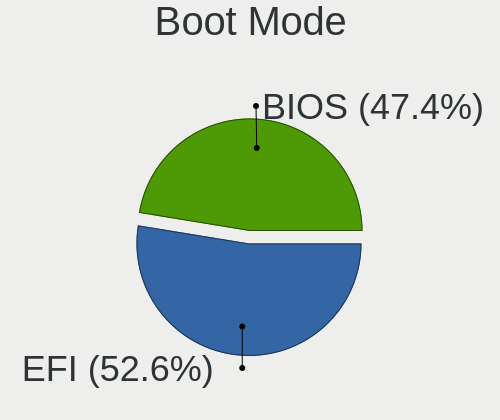

| Mode | Computers | Percent |
|------|-----------|---------|
| EFI  | 266       | 50.57%  |
| BIOS | 260       | 49.43%  |

Filesystem
----------

Type of filesystem

| Type    | Computers | Percent |
|---------|-----------|---------|
| Ext4    | 408       | 78.16%  |
| Overlay | 38        | 7.28%   |
| Btrfs   | 38        | 7.28%   |
| Unknown | 24        | 4.6%    |
| Xfs     | 9         | 1.72%   |
| Zfs     | 1         | 0.19%   |
| Tmpfs   | 1         | 0.19%   |
| F2fs    | 1         | 0.19%   |
| Ext3    | 1         | 0.19%   |
| Ext2    | 1         | 0.19%   |

Part. scheme
------------

Scheme of partitioning

| Type    | Computers | Percent |
|---------|-----------|---------|
| Unknown | 299       | 57.17%  |
| GPT     | 165       | 31.55%  |
| MBR     | 59        | 11.28%  |

Dual Boot with Linux/BSD
------------------------

Hosting more than one Linux/BSD

| Dual boot | Computers | Percent |
|-----------|-----------|---------|
| No        | 454       | 87.14%  |
| Yes       | 67        | 12.86%  |

Dual Boot (Win)
---------------

Hosting Linux and Windows

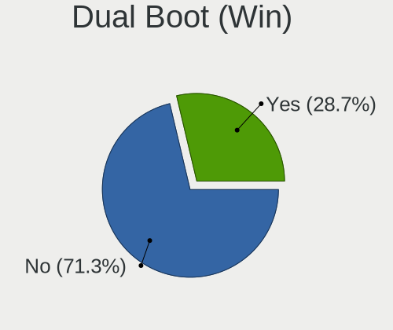

| Dual boot | Computers | Percent |
|-----------|-----------|---------|
| No        | 369       | 70.69%  |
| Yes       | 153       | 29.31%  |

Board
-----

Vendor
------

Motherboard manufacturer

| Name                    | Computers | Percent |
|-------------------------|-----------|---------|
| ASUSTek Computer        | 117       | 22.76%  |
| Lenovo                  | 98        | 19.07%  |
| Dell                    | 74        | 14.4%   |
| Gigabyte Technology     | 72        | 14.01%  |
| Hewlett-Packard         | 55        | 10.7%   |
| Intel                   | 13        | 2.53%   |
| MSI                     | 11        | 2.14%   |
| ASRock                  | 10        | 1.95%   |
| Apple                   | 8         | 1.56%   |
| Acer                    | 8         | 1.56%   |
| Samsung Electronics     | 6         | 1.17%   |
| Toshiba                 | 4         | 0.78%   |
| Unknown                 | 4         | 0.78%   |
| Supermicro              | 3         | 0.58%   |
| LG Electronics          | 3         | 0.58%   |
| Fujitsu                 | 3         | 0.58%   |
| Pegatron                | 2         | 0.39%   |
| Nvidia                  | 2         | 0.39%   |
| Fujitsu Siemens         | 2         | 0.39%   |
| Foxconn                 | 2         | 0.39%   |
| TYAN Computer           | 1         | 0.19%   |
| Timi                    | 1         | 0.19%   |
| System76                | 1         | 0.19%   |
| Shuttle                 | 1         | 0.19%   |
| Raspberry Pi Foundation | 1         | 0.19%   |
| Purism                  | 1         | 0.19%   |
| Notebook                | 1         | 0.19%   |
| Neousys Technology      | 1         | 0.19%   |
| Microsoft               | 1         | 0.19%   |
| ITI LIMITED             | 1         | 0.19%   |
| IP3 Tech                | 1         | 0.19%   |
| HUAWEI                  | 1         | 0.19%   |
| Hardkernel              | 1         | 0.19%   |
| Biostar                 | 1         | 0.19%   |
| AZW                     | 1         | 0.19%   |
| AMI                     | 1         | 0.19%   |
| Alienware               | 1         | 0.19%   |

Model
-----

Motherboard model

| Name                                     | Computers | Percent |
|------------------------------------------|-----------|---------|
| ASUS All Series                          | 9         | 1.75%   |
| Unknown                                  | 8         | 1.56%   |
| MSI MS-7592                              | 3         | 0.58%   |
| HP Compaq Presario CQ61                  | 3         | 0.58%   |
| Gigabyte H61M-S1                         | 3         | 0.58%   |
| ASUS UX331UA                             | 3         | 0.58%   |
| ASUS P8H61-M LX R2.0                     | 3         | 0.58%   |
| ASUS H110M-A/M.2                         | 3         | 0.58%   |
| Nvidia Tegra                             | 2         | 0.39%   |
| Lenovo V14-IIL 82C4                      | 2         | 0.39%   |
| Lenovo IdeaPad Y700-15ISK 80NV           | 2         | 0.39%   |
| Lenovo IdeaPad L340-15IWL 81LG           | 2         | 0.39%   |
| Lenovo IdeaPad 5 14ITL05 82FE            | 2         | 0.39%   |
| Lenovo G50-80 80L0                       | 2         | 0.39%   |
| Intel NUC8i7BEH                          | 2         | 0.39%   |
| Intel NUC8i3BEH                          | 2         | 0.39%   |
| Intel DH77EB AAG39073-304                | 2         | 0.39%   |
| HP ZBook 15 G3                           | 2         | 0.39%   |
| HP Spectre x360 Convertible 13-aw0xxx    | 2         | 0.39%   |
| HP Pavilion Notebook                     | 2         | 0.39%   |
| HP EliteBook 840 G5                      | 2         | 0.39%   |
| Gigabyte Z390 GAMING X                   | 2         | 0.39%   |
| Gigabyte X570 AORUS ULTRA                | 2         | 0.39%   |
| Gigabyte P55-UD3L                        | 2         | 0.39%   |
| Gigabyte H61M-S2PV                       | 2         | 0.39%   |
| Gigabyte H55M-D2H                        | 2         | 0.39%   |
| Gigabyte B460HD3                         | 2         | 0.39%   |
| Fujitsu LIFEBOOK AH530                   | 2         | 0.39%   |
| Dell XPS 15 9570                         | 2         | 0.39%   |
| Dell OptiPlex 755                        | 2         | 0.39%   |
| Dell OptiPlex 7050                       | 2         | 0.39%   |
| Dell Latitude E6330                      | 2         | 0.39%   |
| Dell Latitude 7400                       | 2         | 0.39%   |
| Dell Latitude 5410                       | 2         | 0.39%   |
| Dell Inspiron 3593                       | 2         | 0.39%   |
| Dell Inspiron 3542                       | 2         | 0.39%   |
| Dell Inspiron 13-5378                    | 2         | 0.39%   |
| ASUS ZenBook UX425EA_UX425EA             | 2         | 0.39%   |
| ASUS VivoBook 15_ASUS Laptop X540UAR     | 2         | 0.39%   |
| ASUS TUF Gaming B550-PLUS                | 2         | 0.39%   |
| ASUS ROG STRIX Z390-E GAMING             | 2         | 0.39%   |
| ASUS PRIME Z490-P                        | 2         | 0.39%   |
| ASUS PRIME X470-PRO                      | 2         | 0.39%   |
| ASUS PRIME H310M-E R2.0                  | 2         | 0.39%   |
| ASUS PRIME B560M-K                       | 2         | 0.39%   |
| ASUS N550JV                              | 2         | 0.39%   |
| TYAN S7010                               | 1         | 0.19%   |
| Toshiba Satellite P50t-B-10T             | 1         | 0.19%   |
| Toshiba Satellite L755                   | 1         | 0.19%   |
| Toshiba Satellite A200                   | 1         | 0.19%   |
| Toshiba PORTEGE R700                     | 1         | 0.19%   |
| Timi TM1701                              | 1         | 0.19%   |
| System76 Gazelle                         | 1         | 0.19%   |
| Supermicro X9DAi                         | 1         | 0.19%   |
| Supermicro X8DAL                         | 1         | 0.19%   |
| Supermicro Super Server                  | 1         | 0.19%   |
| Shuttle SH87R                            | 1         | 0.19%   |
| Samsung N248P                            | 1         | 0.19%   |
| Samsung Galaxy Book 12 LTE               | 1         | 0.19%   |
| Samsung 3570R/370R/470R/450R/510R/4450RV | 1         | 0.19%   |

Model Family
------------

Motherboard model prefix

| Name               | Computers | Percent |
|--------------------|-----------|---------|
| Lenovo ThinkPad    | 39        | 7.59%   |
| Dell Latitude      | 23        | 4.47%   |
| ASUS PRIME         | 21        | 4.09%   |
| Lenovo IdeaPad     | 17        | 3.31%   |
| Dell Inspiron      | 16        | 3.11%   |
| ASUS ROG           | 15        | 2.92%   |
| Dell Vostro        | 11        | 2.14%   |
| Dell OptiPlex      | 10        | 1.95%   |
| ASUS VivoBook      | 9         | 1.75%   |
| ASUS All           | 9         | 1.75%   |
| HP Pavilion        | 8         | 1.56%   |
| Dell XPS           | 8         | 1.56%   |
| Unknown            | 8         | 1.56%   |
| Lenovo ThinkCentre | 7         | 1.36%   |
| HP Compaq          | 7         | 1.36%   |
| Acer Aspire        | 7         | 1.36%   |
| Lenovo Legion      | 6         | 1.17%   |
| HP EliteBook       | 6         | 1.17%   |
| ASUS TUF           | 6         | 1.17%   |
| HP ProBook         | 5         | 0.97%   |
| ASUS ZenBook       | 5         | 0.97%   |
| Lenovo Yoga        | 4         | 0.78%   |
| HP ZBook           | 4         | 0.78%   |
| ASUS H110M-A       | 4         | 0.78%   |
| Toshiba Satellite  | 3         | 0.58%   |
| MSI MS-7592        | 3         | 0.58%   |
| Lenovo V520-15IKL  | 3         | 0.58%   |
| Lenovo G50-80      | 3         | 0.58%   |
| HP Spectre         | 3         | 0.58%   |
| HP ProDesk         | 3         | 0.58%   |
| HP ENVY            | 3         | 0.58%   |
| Gigabyte Z690      | 3         | 0.58%   |
| Gigabyte Z390      | 3         | 0.58%   |
| Gigabyte X570      | 3         | 0.58%   |
| Gigabyte H61M-S1   | 3         | 0.58%   |
| Fujitsu LIFEBOOK   | 3         | 0.58%   |
| ASUS UX331UA       | 3         | 0.58%   |
| ASUS P8H61-M       | 3         | 0.58%   |
| Nvidia Tegra       | 2         | 0.39%   |
| Lenovo V14-IIL     | 2         | 0.39%   |
| Lenovo ThinkBook   | 2         | 0.39%   |
| Lenovo MIIX        | 2         | 0.39%   |
| Lenovo IdeaPadFlex | 2         | 0.39%   |
| Intel NUC8i7BEH    | 2         | 0.39%   |
| Intel NUC8i3BEH    | 2         | 0.39%   |
| Intel DH77EB       | 2         | 0.39%   |
| HP Laptop          | 2         | 0.39%   |
| Gigabyte P55-UD3L  | 2         | 0.39%   |
| Gigabyte H61M-S2PV | 2         | 0.39%   |
| Gigabyte H55M-D2H  | 2         | 0.39%   |
| Gigabyte B560M     | 2         | 0.39%   |
| Gigabyte B460HD3   | 2         | 0.39%   |
| Gigabyte B450M     | 2         | 0.39%   |
| Dell Precision     | 2         | 0.39%   |
| ASUS N550JV        | 2         | 0.39%   |
| ASUS ASUSPRO       | 2         | 0.39%   |
| ASUS ASUS          | 2         | 0.39%   |
| TYAN S7010         | 1         | 0.19%   |
| Toshiba PORTEGE    | 1         | 0.19%   |
| Timi TM1701        | 1         | 0.19%   |

MFG Year
--------

Motherboard manufacture year

| Year    | Computers | Percent |
|---------|-----------|---------|
| 2019    | 65        | 12.65%  |
| 2018    | 61        | 11.87%  |
| 2020    | 54        | 10.51%  |
| 2017    | 39        | 7.59%   |
| 2012    | 38        | 7.39%   |
| 2016    | 32        | 6.23%   |
| 2015    | 32        | 6.23%   |
| 2021    | 29        | 5.64%   |
| 2013    | 29        | 5.64%   |
| 2014    | 28        | 5.45%   |
| 2010    | 28        | 5.45%   |
| 2011    | 27        | 5.25%   |
| 2009    | 20        | 3.89%   |
| 2008    | 13        | 2.53%   |
| 2007    | 10        | 1.95%   |
| 2022    | 3         | 0.58%   |
| 2006    | 3         | 0.58%   |
| Unknown | 3         | 0.58%   |

Form Factor
-----------

Physical design of the computer

| Name           | Computers | Percent |
|----------------|-----------|---------|
| Notebook       | 254       | 49.42%  |
| Desktop        | 217       | 42.22%  |
| Mini pc        | 13        | 2.53%   |
| Convertible    | 12        | 2.33%   |
| Server         | 6         | 1.17%   |
| Tablet         | 5         | 0.97%   |
| All in one     | 4         | 0.78%   |
| System on chip | 3         | 0.58%   |

Secure Boot
-----------

Enabled or disabled

| State    | Computers | Percent |
|----------|-----------|---------|
| Disabled | 477       | 92.08%  |
| Enabled  | 41        | 7.92%   |

Coreboot
--------

Have coreboot on board

| Used | Computers | Percent |
|------|-----------|---------|
| No   | 513       | 99.81%  |
| Yes  | 1         | 0.19%   |

RAM Size
--------

Total RAM memory

| Size in GB  | Computers | Percent |
|-------------|-----------|---------|
| 16.01-24.0  | 127       | 24.47%  |
| 4.01-8.0    | 101       | 19.46%  |
| 8.01-16.0   | 84        | 16.18%  |
| 32.01-64.0  | 80        | 15.41%  |
| 3.01-4.0    | 71        | 13.68%  |
| 1.01-2.0    | 23        | 4.43%   |
| 64.01-256.0 | 20        | 3.85%   |
| 2.01-3.0    | 6         | 1.16%   |
| 24.01-32.0  | 5         | 0.96%   |
| 0.51-1.0    | 2         | 0.39%   |

RAM Used
--------

Used RAM memory

| Used GB    | Computers | Percent |
|------------|-----------|---------|
| 1.01-2.0   | 178       | 31.79%  |
| 2.01-3.0   | 125       | 22.32%  |
| 4.01-8.0   | 90        | 16.07%  |
| 3.01-4.0   | 72        | 12.86%  |
| 8.01-16.0  | 46        | 8.21%   |
| 0.51-1.0   | 35        | 6.25%   |
| 0.01-0.5   | 7         | 1.25%   |
| 16.01-24.0 | 6         | 1.07%   |
| 24.01-32.0 | 1         | 0.18%   |

Total Drives
------------

Number of drives on board

| Drives | Computers | Percent |
|--------|-----------|---------|
| 1      | 333       | 63.31%  |
| 2      | 112       | 21.29%  |
| 3      | 46        | 8.75%   |
| 4      | 15        | 2.85%   |
| 5      | 9         | 1.71%   |
| 6      | 4         | 0.76%   |
| 0      | 3         | 0.57%   |
| 7      | 2         | 0.38%   |
| 10     | 1         | 0.19%   |
| 8      | 1         | 0.19%   |

Has CD-ROM
----------

Has CD-ROM on board

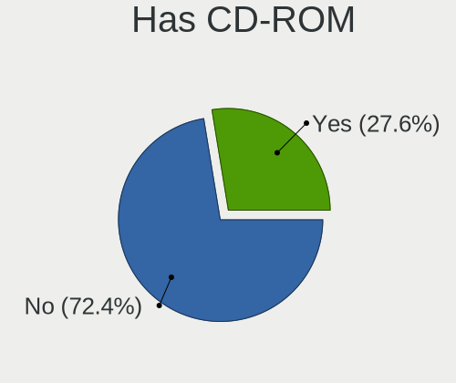

| Presented | Computers | Percent |
|-----------|-----------|---------|
| No        | 354       | 68.34%  |
| Yes       | 164       | 31.66%  |

Has Ethernet
------------

Has Ethernet on board

| Presented | Computers | Percent |
|-----------|-----------|---------|
| Yes       | 448       | 86.99%  |
| No        | 67        | 13.01%  |

Has WiFi
--------

Has WiFi module

| Presented | Computers | Percent |
|-----------|-----------|---------|
| Yes       | 367       | 71.12%  |
| No        | 149       | 28.88%  |

Has Bluetooth
-------------

Has Bluetooth module

| Presented | Computers | Percent |
|-----------|-----------|---------|
| Yes       | 292       | 56.15%  |
| No        | 228       | 43.85%  |

Location
--------

Country
-------

Geographic location (country)

| Country | Computers | Percent |
|---------|-----------|---------|
| Israel  | 514       | 100%    |

City
----

Geographic location (city)

| City                  | Computers | Percent |
|-----------------------|-----------|---------|
| Tel Aviv              | 226       | 41.7%   |
| Ramat Gan             | 46        | 8.49%   |
| Haifa                 | 30        | 5.54%   |
| Peta Tiqwa         | 23        | 4.24%   |
| Jerusalem             | 21        | 3.87%   |
| Herzliya              | 16        | 2.95%   |
| Rishon LeZiyyon       | 15        | 2.77%   |
| Givatayim             | 11        | 2.03%   |
| Rehovot               | 9         | 1.66%   |
| Netanya               | 9         | 1.66%   |
| Holon                 | 8         | 1.48%   |
| Ramat HaSharon        | 7         | 1.29%   |
| Nahariya              | 7         | 1.29%   |
| Qiryat Ata            | 6         | 1.11%   |
| Kfar Saba             | 6         | 1.11%   |
| Raanana               | 5         | 0.92%   |
| Kiryat Ono            | 5         | 0.92%   |
| Ashquelon             | 5         | 0.92%   |
| Beersheba             | 4         | 0.74%   |
| Ashdod                | 4         | 0.74%   |
| Pardes Hanna Karkur   | 3         | 0.55%   |
| Ness Ziona            | 3         | 0.55%   |
| Hod HaSharon          | 3         | 0.55%   |
| Givat Shmuel          | 3         | 0.55%   |
| Ganei Tikva           | 3         | 0.55%   |
| Bet Shemesh           | 3         | 0.55%   |
| Yavne                 | 2         | 0.37%   |
| Tiberias              | 2         | 0.37%   |
| Sderot                | 2         | 0.37%   |
| Rosh HaAyin           | 2         | 0.37%   |
| Rishon LeTsiyyon      | 2         | 0.37%   |
| Qiryat Moqin       | 2         | 0.37%   |
| Lod                   | 2         | 0.37%   |
| Karmiel            | 2         | 0.37%   |
| Hadera                | 2         | 0.37%   |
| Dimona                | 2         | 0.37%   |
| Be'er Ya'aqov         | 2         | 0.37%   |
| Bat Yam               | 2         | 0.37%   |
| Afula                 | 2         | 0.37%   |
| Yoqne'am 'Illit       | 1         | 0.18%   |
| Yehud                 | 1         | 0.18%   |
| Tel Mond              | 1         | 0.18%   |
| Shelomi               | 1         | 0.18%   |
| Sha`ar Ha`Amaqim      | 1         | 0.18%   |
| Sde Nehemya           | 1         | 0.18%   |
| Ramla                 | 1         | 0.18%   |
| Qiryat Bialik         | 1         | 0.18%   |
| Qazir                 | 1         | 0.18%   |
| Peta Tiqwa     | 1         | 0.18%   |
| Peta Tiqwa     | 1         | 0.18%   |
| Pardesiyya            | 1         | 0.18%   |
| Or Yehuda             | 1         | 0.18%   |
| Ofakim                | 1         | 0.18%   |
| Nazerat 'Illit        | 1         | 0.18%   |
| Modiin Makkabbim Reut | 1         | 0.18%   |
| Meitar                | 1         | 0.18%   |
| Mazkeret Batya        | 1         | 0.18%   |
| Lapid                 | 1         | 0.18%   |
| Kiryat Tiv'on         | 1         | 0.18%   |
| Kiryat Gat            | 1         | 0.18%   |

Drives
------

Drive Vendor
------------

Hard drive vendors

| Vendor                    | Computers | Drives | Percent |
|---------------------------|-----------|--------|---------|
| WDC                       | 132       | 209    | 17.6%   |
| Samsung Electronics       | 107       | 148    | 14.27%  |
| Seagate                   | 84        | 125    | 11.2%   |
| SanDisk                   | 58        | 69     | 7.73%   |
| Toshiba                   | 48        | 56     | 6.4%    |
| Kingston                  | 46        | 51     | 6.13%   |
| Hitachi                   | 42        | 65     | 5.6%    |
| SK hynix                  | 29        | 40     | 3.87%   |
| Intel                     | 29        | 37     | 3.87%   |
| Crucial                   | 23        | 43     | 3.07%   |
| HGST                      | 21        | 24     | 2.8%    |
| Micron Technology         | 18        | 23     | 2.4%    |
| Transcend                 | 16        | 20     | 2.13%   |
| Unknown                   | 13        | 16     | 1.73%   |
| Corsair                   | 11        | 16     | 1.47%   |
| A-DATA Technology         | 9         | 11     | 1.2%    |
| XPG                       | 6         | 12     | 0.8%    |
| StoreJet                  | 5         | 5      | 0.67%   |
| Apple                     | 5         | 5      | 0.67%   |
| Phison                    | 4         | 5      | 0.53%   |
| LITEON                    | 4         | 4      | 0.53%   |
| KIOXIA                    | 4         | 4      | 0.53%   |
| Fujitsu                   | 4         | 5      | 0.53%   |
| Silicon Motion            | 3         | 3      | 0.4%    |
| China                     | 3         | 4      | 0.4%    |
| SPCC                      | 2         | 2      | 0.27%   |
| OCZ                       | 2         | 2      | 0.27%   |
| Netac                     | 2         | 2      | 0.27%   |
| Micron/Crucial Technology | 2         | 2      | 0.27%   |
| JMicron Technology        | 2         | 2      | 0.27%   |
| Apacer                    | 2         | 2      | 0.27%   |
| USB3.0                    | 1         | 1      | 0.13%   |
| TPH01204000GB             | 1         | 1      | 0.13%   |
| Plextor                   | 1         | 1      | 0.13%   |
| Patriot                   | 1         | 1      | 0.13%   |
| OCZ-VERTEX3               | 1         | 1      | 0.13%   |
| NGFF                      | 1         | 1      | 0.13%   |
| MARVELL                   | 1         | 2      | 0.13%   |
| LS600                     | 1         | 1      | 0.13%   |
| Lexar                     | 1         | 1      | 0.13%   |
| KIOXIA-EXCERIA            | 1         | 1      | 0.13%   |
| KingSpec                  | 1         | 1      | 0.13%   |
| IBM/Hitachi               | 1         | 1      | 0.13%   |
| External                  | 1         | 1      | 0.13%   |
| ADATA Technology          | 1         | 1      | 0.13%   |

Drive Model
-----------

Hard drive models

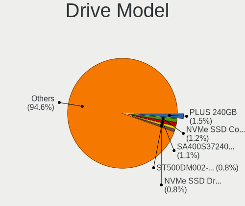

| Model                                   | Computers | Percent |
|-----------------------------------------|-----------|---------|
| SanDisk SSD PLUS 240GB                  | 12        | 1.45%   |
| Kingston SA400S37240G 240GB SSD         | 11        | 1.33%   |
| Samsung NVMe SSD Drive 512GB            | 10        | 1.21%   |
| Hitachi HDS721050CLA362 500GB           | 9         | 1.09%   |
| Samsung SSD 860 EVO 500GB               | 8         | 0.97%   |
| Seagate ST500DM002-1BD142 500GB         | 7         | 0.85%   |
| Intel NVMe SSD Drive 512GB              | 7         | 0.85%   |
| Toshiba DT01ACA100 1TB                  | 6         | 0.73%   |
| SK hynix NVMe SSD Drive 256GB           | 6         | 0.73%   |
| Seagate ST500LT012-1DG142 500GB         | 6         | 0.73%   |
| Samsung SSD 850 EVO 250GB               | 6         | 0.73%   |
| Samsung NVMe SSD Drive 500GB            | 6         | 0.73%   |
| HGST HTS545050A7E680 500GB              | 6         | 0.73%   |
| WDC WD20PURX-64P6ZY0 2TB                | 5         | 0.61%   |
| WDC WD10EZEX-08WN4A0 1TB                | 5         | 0.61%   |
| SK hynix NVMe SSD Drive 512GB           | 5         | 0.61%   |
| Seagate ST2000DM008-2FR102 2TB          | 5         | 0.61%   |
| Seagate ST1000LM024 HN-M101MBB 1TB      | 5         | 0.61%   |
| Kingston SV300S37A120G 120GB SSD        | 5         | 0.61%   |
| Crucial CT500MX500SSD1 500GB            | 5         | 0.61%   |
| Unknown MMC Card  64GB                  | 4         | 0.48%   |
| Toshiba NVMe SSD Drive 512GB            | 4         | 0.48%   |
| Toshiba MQ01ABF050 500GB                | 4         | 0.48%   |
| Seagate ST2000DM001-1ER164 2TB          | 4         | 0.48%   |
| SanDisk SSD PLUS 480GB                  | 4         | 0.48%   |
| SanDisk NVMe SSD Drive 512GB            | 4         | 0.48%   |
| SanDisk Extreme SSD 500GB               | 4         | 0.48%   |
| Samsung SSD 970 EVO Plus 500GB          | 4         | 0.48%   |
| Samsung SSD 860 EVO 250GB               | 4         | 0.48%   |
| Samsung SSD 850 EVO 500GB               | 4         | 0.48%   |
| Samsung NVMe SSD Drive 256GB            | 4         | 0.48%   |
| Samsung NVMe SSD Drive 250GB            | 4         | 0.48%   |
| Samsung NVMe SSD Drive 1TB              | 4         | 0.48%   |
| Kingston SA400S37120G 120GB SSD         | 4         | 0.48%   |
| Intel SSDPEKNW512G8 512GB               | 4         | 0.48%   |
| HGST HTS721010A9E630 1TB                | 4         | 0.48%   |
| WDC WDS100T3X0C-00SJG0 1TB              | 3         | 0.36%   |
| WDC WD5000AAKX-08U6AA0 500GB            | 3         | 0.36%   |
| WDC WD10EZEX-00BN5A0 1TB                | 3         | 0.36%   |
| WDC WD10EARS-00Y5B1 1TB                 | 3         | 0.36%   |
| WDC WD10EADS-00L5B1 1TB                 | 3         | 0.36%   |
| WDC WD1003FZEX-00MK2A0 1TB              | 3         | 0.36%   |
| Unknown MMC Card  32GB                  | 3         | 0.36%   |
| Toshiba DT01ACA050 500GB                | 3         | 0.36%   |
| SK hynix PC401 NVMe 512GB               | 3         | 0.36%   |
| Seagate ST1000LM035-1RK172 1TB          | 3         | 0.36%   |
| Seagate ST1000DM003-1CH162 1TB          | 3         | 0.36%   |
| Seagate Expansion Desk 4TB              | 3         | 0.36%   |
| SanDisk NVMe SSD Drive 256GB            | 3         | 0.36%   |
| Samsung SSD 860 QVO 1TB                 | 3         | 0.36%   |
| Samsung SM963 2.5" NVMe PCIe SSD 1024GB | 3         | 0.36%   |
| Micron 1100_MTFDDAV256TBN 256GB SSD     | 3         | 0.36%   |
| Kingston SUV400S37120G 120GB SSD        | 3         | 0.36%   |
| Kingston SA400S37480G 480GB SSD         | 3         | 0.36%   |
| Intel NVMe SSD Drive 256GB              | 3         | 0.36%   |
| Hitachi HDS721050CLA360 500GB           | 3         | 0.36%   |
| HGST HTS545050A7E380 500GB              | 3         | 0.36%   |
| HGST HTS541010A9E680 1TB                | 3         | 0.36%   |
| XPG NVMe SSD Drive 2TB                  | 2         | 0.24%   |
| XPG NVMe SSD Drive 1024GB               | 2         | 0.24%   |

HDD Vendor
----------

Hard disk drive vendors

| Vendor              | Computers | Drives | Percent |
|---------------------|-----------|--------|---------|
| WDC                 | 107       | 176    | 34.63%  |
| Seagate             | 84        | 124    | 27.18%  |
| Hitachi             | 42        | 65     | 13.59%  |
| Toshiba             | 36        | 42     | 11.65%  |
| HGST                | 21        | 24     | 6.8%    |
| Samsung Electronics | 7         | 13     | 2.27%   |
| Fujitsu             | 4         | 5      | 1.29%   |
| Apple               | 3         | 3      | 0.97%   |
| USB3.0              | 1         | 1      | 0.32%   |
| Unknown             | 1         | 1      | 0.32%   |
| TPH01204000GB       | 1         | 1      | 0.32%   |
| StoreJet            | 1         | 1      | 0.32%   |
| IBM/Hitachi         | 1         | 1      | 0.32%   |

SSD Vendor
----------

Solid state drive vendors

| Vendor              | Computers | Drives | Percent |
|---------------------|-----------|--------|---------|
| Samsung Electronics | 47        | 60     | 19.58%  |
| SanDisk             | 39        | 48     | 16.25%  |
| Kingston            | 37        | 41     | 15.42%  |
| Crucial             | 17        | 35     | 7.08%   |
| Transcend           | 15        | 19     | 6.25%   |
| Micron Technology   | 11        | 12     | 4.58%   |
| Intel               | 10        | 12     | 4.17%   |
| Corsair             | 10        | 14     | 4.17%   |
| WDC                 | 8         | 8      | 3.33%   |
| SK hynix            | 8         | 18     | 3.33%   |
| A-DATA Technology   | 8         | 10     | 3.33%   |
| LITEON              | 4         | 4      | 1.67%   |
| China               | 3         | 4      | 1.25%   |
| Toshiba             | 2         | 2      | 0.83%   |
| StoreJet            | 2         | 2      | 0.83%   |
| OCZ                 | 2         | 2      | 0.83%   |
| Netac               | 2         | 2      | 0.83%   |
| JMicron Technology  | 2         | 2      | 0.83%   |
| Apple               | 2         | 2      | 0.83%   |
| Apacer              | 2         | 2      | 0.83%   |
| SPCC                | 1         | 1      | 0.42%   |
| Seagate             | 1         | 1      | 0.42%   |
| Plextor             | 1         | 1      | 0.42%   |
| Patriot             | 1         | 1      | 0.42%   |
| OCZ-VERTEX3         | 1         | 1      | 0.42%   |
| NGFF                | 1         | 1      | 0.42%   |
| LS600               | 1         | 1      | 0.42%   |
| KIOXIA-EXCERIA      | 1         | 1      | 0.42%   |
| KingSpec            | 1         | 1      | 0.42%   |

Drive Kind
----------

HDD or SSD

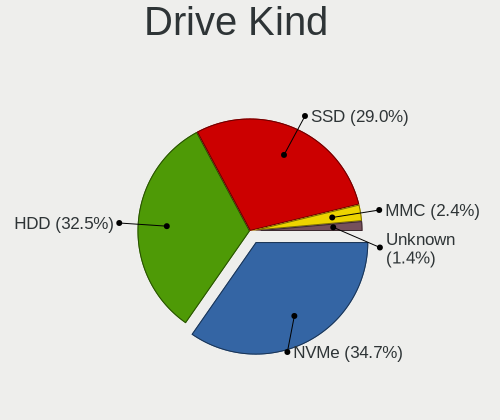

| Kind    | Computers | Drives | Percent |
|---------|-----------|--------|---------|
| HDD     | 253       | 457    | 38.05%  |
| SSD     | 209       | 308    | 31.43%  |
| NVMe    | 188       | 241    | 28.27%  |
| MMC     | 12        | 17     | 1.8%    |
| Unknown | 3         | 4      | 0.45%   |

Drive Connector
---------------

SATA, SAS, NVMe, etc.

| Type | Computers | Drives | Percent |
|------|-----------|--------|---------|
| SATA | 362       | 740    | 61.67%  |
| NVMe | 188       | 240    | 32.03%  |
| SAS  | 25        | 30     | 4.26%   |
| MMC  | 12        | 17     | 2.04%   |

Drive Size
----------

Size of hard drive

| Size in TB | Computers | Drives | Percent |
|------------|-----------|--------|---------|
| 0.01-0.5   | 281       | 468    | 59.03%  |
| 0.51-1.0   | 120       | 172    | 25.21%  |
| 1.01-2.0   | 48        | 68     | 10.08%  |
| 3.01-4.0   | 12        | 32     | 2.52%   |
| 2.01-3.0   | 11        | 15     | 2.31%   |
| 4.01-10.0  | 3         | 5      | 0.63%   |
| 10.01-20.0 | 1         | 5      | 0.21%   |

Space Total
-----------

Amount of disk space available on the file system

| Size in GB     | Computers | Percent |
|----------------|-----------|---------|
| 101-250        | 143       | 26.88%  |
| 251-500        | 131       | 24.62%  |
| 501-1000       | 81        | 15.23%  |
| 1-20           | 35        | 6.58%   |
| 1001-2000      | 34        | 6.39%   |
| 51-100         | 27        | 5.08%   |
| 2001-3000      | 25        | 4.7%    |
| More than 3000 | 23        | 4.32%   |
| 21-50          | 20        | 3.76%   |
| Unknown        | 13        | 2.44%   |

Space Used
----------

Amount of used disk space

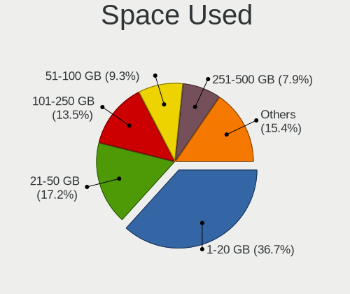

| Used GB        | Computers | Percent |
|----------------|-----------|---------|
| 1-20           | 219       | 39.53%  |
| 21-50          | 104       | 18.77%  |
| 101-250        | 72        | 13%     |
| 51-100         | 51        | 9.21%   |
| 251-500        | 35        | 6.32%   |
| 1001-2000      | 24        | 4.33%   |
| 501-1000       | 18        | 3.25%   |
| Unknown        | 13        | 2.35%   |
| 2001-3000      | 10        | 1.81%   |
| More than 3000 | 8         | 1.44%   |

Malfunc. Drives
---------------

Drive models with a malfunction

| Model                                 | Computers | Drives | Percent |
|---------------------------------------|-----------|--------|---------|
| HGST HTS545050A7E680 500GB            | 5         | 7      | 8.2%    |
| WDC WD10EARS-00Y5B1 1TB               | 2         | 2      | 3.28%   |
| WDC WD10EADS-00L5B1 1TB               | 2         | 2      | 3.28%   |
| Hitachi HDS721050CLA362 500GB         | 2         | 3      | 3.28%   |
| HGST HTS545050A7E380 500GB            | 2         | 2      | 3.28%   |
| WDC WD6400BPVT-75HXZT1 640GB          | 1         | 1      | 1.64%   |
| WDC WD5001AALS-00LWTA0 500GB          | 1         | 1      | 1.64%   |
| WDC WD5000AAKX-60U6AA0 500GB          | 1         | 1      | 1.64%   |
| WDC WD3200AAKS-00L9A0 320GB           | 1         | 1      | 1.64%   |
| WDC WD30PURX-64P6ZY0 3TB              | 1         | 1      | 1.64%   |
| WDC WD2500BEVT-24A23T0 250GB          | 1         | 1      | 1.64%   |
| WDC WD2500AAJS-00VTA0 250GB           | 1         | 1      | 1.64%   |
| WDC WD20EARS-00MVWB0 2TB              | 1         | 2      | 1.64%   |
| WDC WD1600BJKT-75F4T0 160GB           | 1         | 1      | 1.64%   |
| WDC WD10EZEX-00ZF5A0 1TB              | 1         | 1      | 1.64%   |
| WDC WD10EZEX-00RKKA0 1TB              | 1         | 1      | 1.64%   |
| WDC WD1001FALS-00J7B1 1TB             | 1         | 1      | 1.64%   |
| Toshiba MQ04ABF100 1TB                | 1         | 1      | 1.64%   |
| Toshiba MK6475GSX 640GB               | 1         | 1      | 1.64%   |
| Toshiba MK5075GSX 500GB               | 1         | 1      | 1.64%   |
| Toshiba MK3252GSX 320GB               | 1         | 1      | 1.64%   |
| Toshiba MK1646GSX 160GB               | 1         | 1      | 1.64%   |
| SK hynix HFS256G3BTND-N210A 256GB SSD | 1         | 5      | 1.64%   |
| SK hynix HFS256G39TND-N210A 256GB SSD | 1         | 1      | 1.64%   |
| Seagate ST9120817AS 120GB             | 1         | 1      | 1.64%   |
| Seagate ST500LT012-9WS142 500GB       | 1         | 1      | 1.64%   |
| Seagate ST500LM021-1KJ152 500GB       | 1         | 1      | 1.64%   |
| Seagate ST500LM012 HN-M500MBB 500GB   | 1         | 1      | 1.64%   |
| Seagate ST3750528AS 752GB             | 1         | 1      | 1.64%   |
| Seagate ST3500418AS 500GB             | 1         | 1      | 1.64%   |
| Seagate ST31000528AS 1TB              | 1         | 1      | 1.64%   |
| Seagate ST3000DM001-9YN166 3TB        | 1         | 1      | 1.64%   |
| Seagate ST2000DM001-1ER164 2TB        | 1         | 1      | 1.64%   |
| Seagate ST1000LM024 HN-M101MBB 1TB    | 1         | 2      | 1.64%   |
| Seagate ST1000LM014-SSHD-8GB          | 1         | 1      | 1.64%   |
| Seagate ST1000DM003-1CH162 1TB        | 1         | 1      | 1.64%   |
| SanDisk SSD U100 24GB                 | 1         | 1      | 1.64%   |
| SanDisk SSD PLUS 240GB                | 1         | 1      | 1.64%   |
| Samsung Electronics HD502HJ 500GB     | 1         | 2      | 1.64%   |
| Intel SSDSCKKF256H6 SATA 256GB        | 1         | 1      | 1.64%   |
| Hitachi HUA723020ALA640 2TB           | 1         | 1      | 1.64%   |
| Hitachi HTS545050B9A300 500GB         | 1         | 1      | 1.64%   |
| Hitachi HTS545025B9A300 250GB         | 1         | 1      | 1.64%   |
| Hitachi HTS542516K9SA00 160GB         | 1         | 1      | 1.64%   |
| Hitachi HDS721050CLA360 500GB         | 1         | 1      | 1.64%   |
| Hitachi HDS721032CLA362 320GB         | 1         | 1      | 1.64%   |
| Hitachi HDP725050GLAT80 500GB         | 1         | 1      | 1.64%   |
| Hitachi HDP725050GLA360 500GB         | 1         | 1      | 1.64%   |
| HGST HTS721010A9E630 1TB              | 1         | 1      | 1.64%   |
| HGST HCC545050A7E380 500GB            | 1         | 1      | 1.64%   |
| Fujitsu MHY2160BH 160GB               | 1         | 1      | 1.64%   |
| Corsair Neutron XT SSD 240GB          | 1         | 1      | 1.64%   |
| Corsair Neutron SSD 64GB              | 1         | 1      | 1.64%   |

Malfunc. Drive Vendor
---------------------

Vendors of faulty drives

| Vendor              | Computers | Drives | Percent |
|---------------------|-----------|--------|---------|
| WDC                 | 15        | 17     | 25.42%  |
| Seagate             | 11        | 13     | 18.64%  |
| Hitachi             | 10        | 11     | 16.95%  |
| HGST                | 9         | 11     | 15.25%  |
| Toshiba             | 5         | 5      | 8.47%   |
| SK hynix            | 2         | 6      | 3.39%   |
| SanDisk             | 2         | 2      | 3.39%   |
| Corsair             | 2         | 2      | 3.39%   |
| Samsung Electronics | 1         | 2      | 1.69%   |
| Intel               | 1         | 1      | 1.69%   |
| Fujitsu             | 1         | 1      | 1.69%   |

Malfunc. HDD Vendor
-------------------

Vendors of faulty HDD drives

| Vendor              | Computers | Drives | Percent |
|---------------------|-----------|--------|---------|
| WDC                 | 15        | 17     | 28.85%  |
| Seagate             | 11        | 13     | 21.15%  |
| Hitachi             | 10        | 11     | 19.23%  |
| HGST                | 9         | 11     | 17.31%  |
| Toshiba             | 5         | 5      | 9.62%   |
| Samsung Electronics | 1         | 2      | 1.92%   |
| Fujitsu             | 1         | 1      | 1.92%   |

Malfunc. Drive Kind
-------------------

Kinds of faulty drives

| Kind | Computers | Drives | Percent |
|------|-----------|--------|---------|
| HDD  | 42        | 60     | 85.71%  |
| SSD  | 7         | 11     | 14.29%  |

Failed Drives
-------------

Failed drive models

| Model                           | Computers | Drives | Percent |
|---------------------------------|-----------|--------|---------|
| Toshiba MK3256GSY 320GB         | 1         | 1      | 33.33%  |
| Samsung Electronics HD103SJ 1TB | 1         | 1      | 33.33%  |
| Hitachi HTS547550A9E384 500GB   | 1         | 2      | 33.33%  |

Failed Drive Vendor
-------------------

Failed drive vendors

| Vendor              | Computers | Drives | Percent |
|---------------------|-----------|--------|---------|
| Toshiba             | 1         | 1      | 33.33%  |
| Samsung Electronics | 1         | 1      | 33.33%  |
| Hitachi             | 1         | 2      | 33.33%  |

Drive Status
------------

Number of failed and malfunc. drives

| Status   | Computers | Drives | Percent |
|----------|-----------|--------|---------|
| Detected | 310       | 643    | 55.96%  |
| Works    | 194       | 309    | 35.02%  |
| Malfunc  | 48        | 71     | 8.66%   |
| Failed   | 2         | 4      | 0.36%   |

Storage controller
------------------

Storage Vendor
--------------

Storage controller vendors

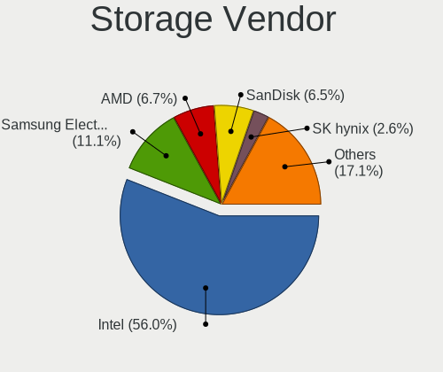

| Vendor                       | Computers | Percent |
|------------------------------|-----------|---------|
| Intel                        | 402       | 61.28%  |
| Samsung Electronics          | 61        | 9.3%    |
| AMD                          | 46        | 7.01%   |
| SanDisk                      | 36        | 5.49%   |
| SK hynix                     | 21        | 3.2%    |
| Toshiba America Info Systems | 11        | 1.68%   |
| Kingston Technology Company  | 10        | 1.52%   |
| JMicron Technology           | 9         | 1.37%   |
| Micron/Crucial Technology    | 8         | 1.22%   |
| ADATA Technology             | 8         | 1.22%   |
| Micron Technology            | 7         | 1.07%   |
| Phison Electronics           | 6         | 0.91%   |
| Nvidia                       | 6         | 0.91%   |
| Marvell Technology Group     | 6         | 0.91%   |
| ASMedia Technology           | 6         | 0.91%   |
| Silicon Motion               | 4         | 0.61%   |
| KIOXIA                       | 4         | 0.61%   |
| VIA Technologies             | 2         | 0.3%    |
| Union Memory (Shenzhen)      | 1         | 0.15%   |
| Shenzhen Longsys Electronics | 1         | 0.15%   |
| LSI Logic / Symbios Logic    | 1         | 0.15%   |

Storage Model
-------------

Storage controller models

| Model                                                                                   | Computers | Percent |
|-----------------------------------------------------------------------------------------|-----------|---------|
| Intel Sunrise Point-LP SATA Controller [AHCI mode]                                      | 41        | 5.53%   |
| Samsung NVMe SSD Controller SM981/PM981/PM983                                           | 37        | 4.99%   |
| AMD FCH SATA Controller [AHCI mode]                                                     | 37        | 4.99%   |
| Intel 8 Series/C220 Series Chipset Family 6-port SATA Controller 1 [AHCI mode]          | 24        | 3.24%   |
| Intel Q170/Q150/B150/H170/H110/Z170/CM236 Chipset SATA Controller [AHCI Mode]           | 20        | 2.7%    |
| Intel 200 Series PCH SATA controller [AHCI mode]                                        | 20        | 2.7%    |
| Intel 82801 Mobile SATA Controller [RAID mode]                                          | 19        | 2.56%   |
| Intel 7 Series Chipset Family 6-port SATA Controller [AHCI mode]                        | 15        | 2.02%   |
| Intel NM10/ICH7 Family SATA Controller [IDE mode]                                       | 14        | 1.89%   |
| Intel 6 Series/C200 Series Chipset Family 6 port Desktop SATA AHCI Controller           | 14        | 1.89%   |
| Intel Comet Lake SATA AHCI Controller                                                   | 13        | 1.75%   |
| Intel Cannon Point-LP SATA Controller [AHCI Mode]                                       | 13        | 1.75%   |
| Intel 82801IBM/IEM (ICH9M/ICH9M-E) 4 port SATA Controller [AHCI mode]                   | 13        | 1.75%   |
| Intel 82801G (ICH7 Family) IDE Controller                                               | 13        | 1.75%   |
| SanDisk WD Black SN750 / PC SN730 NVMe SSD                                              | 12        | 1.62%   |
| Intel Volume Management Device NVMe RAID Controller                                     | 12        | 1.62%   |
| Samsung NVMe SSD Controller SM961/PM961/SM963                                           | 11        | 1.48%   |
| Intel Wildcat Point-LP SATA Controller [AHCI Mode]                                      | 11        | 1.48%   |
| Intel Cannon Lake PCH SATA AHCI Controller                                              | 11        | 1.48%   |
| Intel Cannon Lake Mobile PCH SATA AHCI Controller                                       | 11        | 1.48%   |
| Intel SATA Controller [RAID mode]                                                       | 10        | 1.35%   |
| Intel 9 Series Chipset Family SATA Controller [AHCI Mode]                               | 10        | 1.35%   |
| AMD 400 Series Chipset SATA Controller                                                  | 10        | 1.35%   |
| Intel SSD 660P Series                                                                   | 9         | 1.21%   |
| Intel 8 Series SATA Controller 1 [AHCI mode]                                            | 9         | 1.21%   |
| Intel 6 Series/C200 Series Chipset Family 6 port Mobile SATA AHCI Controller            | 9         | 1.21%   |
| Intel 400 Series Chipset Family SATA AHCI Controller                                    | 9         | 1.21%   |
| Samsung NVMe SSD Controller 980                                                         | 8         | 1.08%   |
| Intel Ice Lake-LP SATA Controller [AHCI mode]                                           | 8         | 1.08%   |
| Intel 6 Series/C200 Series Chipset Family Desktop SATA Controller (IDE mode, ports 4-5) | 8         | 1.08%   |
| Intel 6 Series/C200 Series Chipset Family Desktop SATA Controller (IDE mode, ports 0-3) | 8         | 1.08%   |
| Intel 5 Series/3400 Series Chipset 4 port SATA AHCI Controller                          | 8         | 1.08%   |
| Micron Non-Volatile memory controller                                                   | 7         | 0.94%   |
| Intel HM170/QM170 Chipset SATA Controller [AHCI Mode]                                   | 7         | 0.94%   |
| Intel 5 Series/3400 Series Chipset 4 port SATA IDE Controller                           | 7         | 0.94%   |
| Intel 5 Series/3400 Series Chipset 2 port SATA IDE Controller                           | 7         | 0.94%   |
| Toshiba America Info Systems XG6 NVMe SSD Controller                                    | 6         | 0.81%   |
| SanDisk WD Blue SN550 NVMe SSD                                                          | 6         | 0.81%   |
| SanDisk WD Black 2018/SN750 / PC SN720 NVMe SSD                                         | 6         | 0.81%   |
| Intel 82801JI (ICH10 Family) SATA AHCI Controller                                       | 6         | 0.81%   |
| Intel 500 Series Chipset Family SATA AHCI Controller                                    | 6         | 0.81%   |
| ADATA XPG SX8200 Pro PCIe Gen3x4 M.2 2280 Solid State Drive                             | 6         | 0.81%   |
| SK hynix PC401 NVMe Solid State Drive 256GB                                             | 5         | 0.67%   |
| SK hynix Non-Volatile memory controller                                                 | 5         | 0.67%   |
| JMicron JMB363 SATA/IDE Controller                                                      | 5         | 0.67%   |
| Intel Alder Lake-S PCH SATA Controller [AHCI Mode]                                      | 5         | 0.67%   |
| Intel 82801HM/HEM (ICH8M/ICH8M-E) SATA Controller [AHCI mode]                           | 5         | 0.67%   |
| Intel 82801HM/HEM (ICH8M/ICH8M-E) IDE Controller                                        | 5         | 0.67%   |
| ASMedia ASM1062 Serial ATA Controller                                                   | 5         | 0.67%   |
| SK hynix Gold P31 SSD                                                                   | 4         | 0.54%   |
| SK hynix BC501 NVMe Solid State Drive                                                   | 4         | 0.54%   |
| Silicon Motion SM2262/SM2262EN SSD Controller                                           | 4         | 0.54%   |
| SanDisk Non-Volatile memory controller                                                  | 4         | 0.54%   |
| Micron/Crucial Non-Volatile memory controller                                           | 4         | 0.54%   |
| KIOXIA NVMe SSD Controller BG4                                                          | 4         | 0.54%   |
| Kingston Company A2000 NVMe SSD                                                         | 4         | 0.54%   |
| Intel SSD 600P Series                                                                   | 4         | 0.54%   |
| Intel NM10/ICH7 Family SATA Controller [AHCI mode]                                      | 4         | 0.54%   |
| Intel 7 Series/C210 Series Chipset Family 6-port SATA Controller [AHCI mode]            | 4         | 0.54%   |
| Intel 5 Series/3400 Series Chipset 6 port SATA AHCI Controller                          | 4         | 0.54%   |

Storage Kind
------------

Kind of storage controller (IDE, SATA, NVMe, SAS, ...)

| Kind | Computers | Percent |
|------|-----------|---------|
| SATA | 367       | 55.35%  |
| NVMe | 189       | 28.51%  |
| IDE  | 61        | 9.2%    |
| RAID | 44        | 6.64%   |
| SAS  | 2         | 0.3%    |

Processor
---------

CPU Vendor
----------

Processor vendors

| Vendor       | Computers | Percent |
|--------------|-----------|---------|
| Intel        | 454       | 88.33%  |
| AMD          | 56        | 10.89%  |
| ARM          | 2         | 0.39%   |
| CentaurHauls | 1         | 0.19%   |
| Unknown      | 1         | 0.19%   |

CPU Model
---------

Processor models

| Model                                       | Computers | Percent |
|---------------------------------------------|-----------|---------|
| Intel Core i7-8550U CPU @ 1.80GHz           | 17        | 3.29%   |
| Intel 11th Gen Core i7-1165G7 @ 2.80GHz     | 10        | 1.93%   |
| Intel Core i7-8565U CPU @ 1.80GHz           | 8         | 1.55%   |
| Intel Core i7-4790 CPU @ 3.60GHz            | 8         | 1.55%   |
| Intel Core i7-1065G7 CPU @ 1.30GHz          | 8         | 1.55%   |
| Intel Core i7-8750H CPU @ 2.20GHz           | 7         | 1.35%   |
| Intel Core i7-8700 CPU @ 3.20GHz            | 7         | 1.35%   |
| Intel Core i7-6700HQ CPU @ 2.60GHz          | 7         | 1.35%   |
| Intel Core i5-8250U CPU @ 1.60GHz           | 7         | 1.35%   |
| Intel Core i5-5200U CPU @ 2.20GHz           | 6         | 1.16%   |
| Intel Core i7-8650U CPU @ 1.90GHz           | 5         | 0.97%   |
| Intel Core i7-3770 CPU @ 3.40GHz            | 5         | 0.97%   |
| Intel Core i7-10510U CPU @ 1.80GHz          | 5         | 0.97%   |
| Intel Core i5-8265U CPU @ 1.60GHz           | 5         | 0.97%   |
| Intel Core i5-7200U CPU @ 2.50GHz           | 5         | 0.97%   |
| Intel Core i5-6200U CPU @ 2.30GHz           | 5         | 0.97%   |
| Intel Core i5-3210M CPU @ 2.50GHz           | 5         | 0.97%   |
| Intel Core i5-10210U CPU @ 1.60GHz          | 5         | 0.97%   |
| Intel 11th Gen Core i5-1135G7 @ 2.40GHz     | 5         | 0.97%   |
| Intel Pentium Dual-Core CPU T4400 @ 2.20GHz | 4         | 0.77%   |
| Intel Pentium Dual-Core CPU E5500 @ 2.80GHz | 4         | 0.77%   |
| Intel Pentium CPU G2030 @ 3.00GHz           | 4         | 0.77%   |
| Intel Core i7-8665U CPU @ 1.90GHz           | 4         | 0.77%   |
| Intel Core i7-7700K CPU @ 4.20GHz           | 4         | 0.77%   |
| Intel Core i7-7700HQ CPU @ 2.80GHz          | 4         | 0.77%   |
| Intel Core i7-4770 CPU @ 3.40GHz            | 4         | 0.77%   |
| Intel Core i7-10750H CPU @ 2.60GHz          | 4         | 0.77%   |
| Intel Core i7-10700 CPU @ 2.90GHz           | 4         | 0.77%   |
| Intel Core i5-7400 CPU @ 3.00GHz            | 4         | 0.77%   |
| Intel Core i5-6500 CPU @ 3.20GHz            | 4         | 0.77%   |
| Intel Core i5-4460 CPU @ 3.20GHz            | 4         | 0.77%   |
| Intel Core i5-2400 CPU @ 3.10GHz            | 4         | 0.77%   |
| Intel Core i3-7020U CPU @ 2.30GHz           | 4         | 0.77%   |
| Intel Core 2 Duo CPU E7500 @ 2.93GHz        | 4         | 0.77%   |
| AMD Ryzen 9 3900X 12-Core Processor         | 4         | 0.77%   |
| Intel Pentium Dual-Core CPU E5300 @ 2.60GHz | 3         | 0.58%   |
| Intel Core i7-9750H CPU @ 2.60GHz           | 3         | 0.58%   |
| Intel Core i7-9700 CPU @ 3.00GHz            | 3         | 0.58%   |
| Intel Core i7-8700K CPU @ 3.70GHz           | 3         | 0.58%   |
| Intel Core i7-7500U CPU @ 2.70GHz           | 3         | 0.58%   |
| Intel Core i5-6300U CPU @ 2.40GHz           | 3         | 0.58%   |
| Intel Core i5-4690 CPU @ 3.50GHz            | 3         | 0.58%   |
| Intel Core i5-4570 CPU @ 3.20GHz            | 3         | 0.58%   |
| Intel Core i5-1035G1 CPU @ 1.00GHz          | 3         | 0.58%   |
| Intel Core i5 CPU 760 @ 2.80GHz             | 3         | 0.58%   |
| Intel Core i3-7100 CPU @ 3.90GHz            | 3         | 0.58%   |
| Intel Core i3-3220 CPU @ 3.30GHz            | 3         | 0.58%   |
| Intel Core i3-2120 CPU @ 3.30GHz            | 3         | 0.58%   |
| Intel Atom x5-Z8350 CPU @ 1.44GHz           | 3         | 0.58%   |
| Intel Atom CPU N455 @ 1.66GHz               | 3         | 0.58%   |
| Intel 11th Gen Core i3-1115G4 @ 3.00GHz     | 3         | 0.58%   |
| AMD Ryzen 5 3400G with Radeon Vega Graphics | 3         | 0.58%   |
| Intel Xeon CPU E5-2630 v2 @ 2.60GHz         | 2         | 0.39%   |
| Intel Pentium Dual-Core CPU E6600 @ 3.06GHz | 2         | 0.39%   |
| Intel Pentium Dual CPU E2160 @ 1.80GHz      | 2         | 0.39%   |
| Intel Pentium CPU G645 @ 2.90GHz            | 2         | 0.39%   |
| Intel Pentium CPU B960 @ 2.20GHz            | 2         | 0.39%   |
| Intel Core i9-9880H CPU @ 2.30GHz           | 2         | 0.39%   |
| Intel Core i7-9850H CPU @ 2.60GHz           | 2         | 0.39%   |
| Intel Core i7-9700K CPU @ 3.60GHz           | 2         | 0.39%   |

CPU Model Family
----------------

Processor model prefix

| Model                   | Computers | Percent |
|-------------------------|-----------|---------|
| Intel Core i7           | 162       | 31.46%  |
| Intel Core i5           | 119       | 23.11%  |
| Intel Core i3           | 47        | 9.13%   |
| Other                   | 37        | 7.18%   |
| Intel Core 2 Duo        | 16        | 3.11%   |
| Intel Pentium Dual-Core | 15        | 2.91%   |
| AMD Ryzen 5             | 14        | 2.72%   |
| Intel Pentium           | 12        | 2.33%   |
| Intel Xeon              | 11        | 2.14%   |
| AMD Ryzen 7             | 10        | 1.94%   |
| Intel Atom              | 9         | 1.75%   |
| AMD Ryzen 9             | 9         | 1.75%   |
| Intel Celeron           | 8         | 1.55%   |
| Intel Pentium Dual      | 5         | 0.97%   |
| Intel Core i9           | 5         | 0.97%   |
| Intel Genuine           | 4         | 0.78%   |
| AMD A8                  | 4         | 0.78%   |
| AMD FX                  | 3         | 0.58%   |
| AMD A6                  | 3         | 0.58%   |
| AMD Ryzen 3             | 2         | 0.39%   |
| AMD A10                 | 2         | 0.39%   |
| Intel Xeon Gold         | 1         | 0.19%   |
| Intel Pentium Silver    | 1         | 0.19%   |
| Intel Pentium Gold      | 1         | 0.19%   |
| Intel Pentium 4         | 1         | 0.19%   |
| Intel Core M            | 1         | 0.19%   |
| Intel Core 2 Quad       | 1         | 0.19%   |
| Intel Core 2            | 1         | 0.19%   |
| Intel Celeron Dual-Core | 1         | 0.19%   |
| CentaurHauls VIA C7     | 1         | 0.19%   |
| AMD Turion 64 X2 Mobile | 1         | 0.19%   |
| AMD Ryzen Threadripper  | 1         | 0.19%   |
| AMD Ryzen 7 PRO         | 1         | 0.19%   |
| AMD Ryzen 3 PRO         | 1         | 0.19%   |
| AMD Phenom II X4        | 1         | 0.19%   |
| AMD Phenom              | 1         | 0.19%   |
| AMD EPYC                | 1         | 0.19%   |
| AMD Athlon II X3        | 1         | 0.19%   |
| AMD Athlon 64 X2        | 1         | 0.19%   |

CPU Cores
---------

Number of processor cores

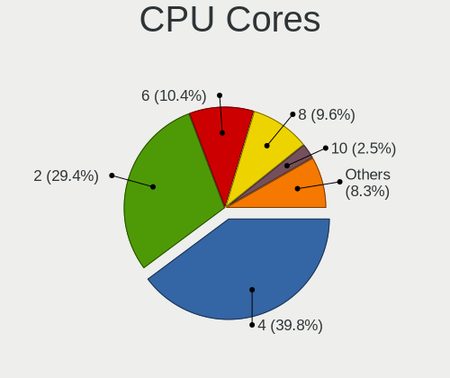

| Number  | Computers | Percent |
|---------|-----------|---------|
| 4       | 224       | 43.5%   |
| 2       | 173       | 33.59%  |
| 6       | 49        | 9.51%   |
| 8       | 38        | 7.38%   |
| 12      | 9         | 1.75%   |
| 16      | 8         | 1.55%   |
| 1       | 8         | 1.55%   |
| 3       | 2         | 0.39%   |
| 32      | 1         | 0.19%   |
| 14      | 1         | 0.19%   |
| 10      | 1         | 0.19%   |
| Unknown | 1         | 0.19%   |

CPU Sockets
-----------

Number of sockets

| Number  | Computers | Percent |
|---------|-----------|---------|
| 1       | 507       | 98.64%  |
| 2       | 5         | 0.97%   |
| 4       | 1         | 0.19%   |
| Unknown | 1         | 0.19%   |

CPU Threads
-----------

Threads per core (Hyper-Threading)

| Number  | Computers | Percent |
|---------|-----------|---------|
| 2       | 376       | 72.87%  |
| 1       | 139       | 26.94%  |
| Unknown | 1         | 0.19%   |

CPU Op-Modes
------------

CPU Operation Modes (32-bit, 64-bit)

| Op mode        | Computers | Percent |
|----------------|-----------|---------|
| 32-bit, 64-bit | 502       | 97.67%  |
| Unknown        | 11        | 2.14%   |
| 32-bit         | 1         | 0.19%   |

CPU Microcode
-------------

Microcode number

| Number     | Computers | Percent |
|------------|-----------|---------|
| Unknown    | 109       | 20.41%  |
| 0x306c3    | 28        | 5.24%   |
| 0x806ea    | 27        | 5.06%   |
| 0x306a9    | 26        | 4.87%   |
| 0x206a7    | 25        | 4.68%   |
| 0x1067a    | 24        | 4.49%   |
| 0x906ea    | 19        | 3.56%   |
| 0x906e9    | 19        | 3.56%   |
| 0x506e3    | 19        | 3.56%   |
| 0x806ec    | 18        | 3.37%   |
| 0x806c1    | 18        | 3.37%   |
| 0x806e9    | 12        | 2.25%   |
| 0x406e3    | 12        | 2.25%   |
| 0x706e5    | 11        | 2.06%   |
| 0x306d4    | 11        | 2.06%   |
| 0x906ed    | 9         | 1.69%   |
| 0x20655    | 8         | 1.5%    |
| 0xa0652    | 7         | 1.31%   |
| 0x6fd      | 7         | 1.31%   |
| 0x08108109 | 7         | 1.31%   |
| 0x806eb    | 6         | 1.12%   |
| 0x40651    | 6         | 1.12%   |
| 0x106e5    | 6         | 1.12%   |
| 0xa0655    | 5         | 0.94%   |
| 0xa0653    | 5         | 0.94%   |
| 0xa0671    | 4         | 0.75%   |
| 0x90672    | 4         | 0.75%   |
| 0x306e4    | 4         | 0.75%   |
| 0x08701021 | 4         | 0.75%   |
| 0x706a1    | 3         | 0.56%   |
| 0x406c4    | 3         | 0.56%   |
| 0x106ca    | 3         | 0.56%   |
| 0x106a5    | 3         | 0.56%   |
| 0x10676    | 3         | 0.56%   |
| 0x08701013 | 3         | 0.56%   |
| 0x0800820d | 3         | 0.56%   |
| 0x06001119 | 3         | 0.56%   |
| 0xa0660    | 2         | 0.37%   |
| 0x806d1    | 2         | 0.37%   |
| 0x6fa      | 2         | 0.37%   |
| 0x20652    | 2         | 0.37%   |
| 0x0a50000c | 2         | 0.37%   |
| 0x0a404101 | 2         | 0.37%   |
| 0x0a201009 | 2         | 0.37%   |
| 0x08600104 | 2         | 0.37%   |
| 0x08108102 | 2         | 0.37%   |
| 0x06003106 | 2         | 0.37%   |
| 0x010000c8 | 2         | 0.37%   |
| 0x906ec    | 1         | 0.19%   |
| 0x906eb    | 1         | 0.19%   |
| 0x906c0    | 1         | 0.19%   |
| 0x906a3    | 1         | 0.19%   |
| 0x6f6      | 1         | 0.19%   |
| 0x6f4      | 1         | 0.19%   |
| 0x506e0    | 1         | 0.19%   |
| 0x506c9    | 1         | 0.19%   |
| 0x406c3    | 1         | 0.19%   |
| 0x40671    | 1         | 0.19%   |
| 0x30673    | 1         | 0.19%   |
| 0x206c2    | 1         | 0.19%   |

CPU Microarch
-------------

Microarchitecture

| Name             | Computers | Percent |
|------------------|-----------|---------|
| KabyLake         | 139       | 26.99%  |
| Haswell          | 46        | 8.93%   |
| Skylake          | 38        | 7.38%   |
| IvyBridge        | 35        | 6.8%    |
| Penryn           | 32        | 6.21%   |
| SandyBridge      | 29        | 5.63%   |
| CometLake        | 23        | 4.47%   |
| TigerLake        | 21        | 4.08%   |
| IceLake          | 18        | 3.5%    |
| Broadwell        | 14        | 2.72%   |
| Unknown          | 14        | 2.72%   |
| Zen 2            | 13        | 2.52%   |
| Westmere         | 13        | 2.52%   |
| Zen+             | 12        | 2.33%   |
| Nehalem          | 11        | 2.14%   |
| Core             | 11        | 2.14%   |
| Silvermont       | 7         | 1.36%   |
| Piledriver       | 6         | 1.17%   |
| Zen 3            | 5         | 0.97%   |
| Zen              | 5         | 0.97%   |
| Steamroller      | 3         | 0.58%   |
| K10              | 3         | 0.58%   |
| Goldmont plus    | 3         | 0.58%   |
| Bonnell          | 3         | 0.58%   |
| Alderlake Hybrid | 3         | 0.58%   |
| Puma             | 2         | 0.39%   |
| K8 Hammer        | 2         | 0.39%   |
| Tremont          | 1         | 0.19%   |
| NetBurst         | 1         | 0.19%   |
| Goldmont         | 1         | 0.19%   |
| Bulldozer        | 1         | 0.19%   |

Graphics
--------

GPU Vendor
----------

Vendors of graphics cards

| Vendor                     | Computers | Percent |
|----------------------------|-----------|---------|
| Intel                      | 354       | 57.19%  |
| Nvidia                     | 195       | 31.5%   |
| AMD                        | 67        | 10.82%  |
| VIA Technologies           | 1         | 0.16%   |
| Matrox Electronics Systems | 1         | 0.16%   |
| ASPEED Technology          | 1         | 0.16%   |

GPU Model
---------

Graphics card models

| Model                                                                                    | Computers | Percent |
|------------------------------------------------------------------------------------------|-----------|---------|
| Intel UHD Graphics 620                                                                   | 30        | 4.78%   |
| Intel Xeon E3-1200 v3/4th Gen Core Processor Integrated Graphics Controller              | 22        | 3.51%   |
| Intel WhiskeyLake-U GT2 [UHD Graphics 620]                                               | 20        | 3.19%   |
| Intel 2nd Generation Core Processor Family Integrated Graphics Controller                | 19        | 3.03%   |
| Intel TigerLake-LP GT2 [Iris Xe Graphics]                                                | 18        | 2.87%   |
| Intel 3rd Gen Core processor Graphics Controller                                         | 15        | 2.39%   |
| Intel HD Graphics 630                                                                    | 14        | 2.23%   |
| Intel HD Graphics 530                                                                    | 14        | 2.23%   |
| Intel CoffeeLake-H GT2 [UHD Graphics 630]                                                | 14        | 2.23%   |
| Intel Skylake GT2 [HD Graphics 520]                                                      | 12        | 1.91%   |
| Intel Mobile 4 Series Chipset Integrated Graphics Controller                             | 12        | 1.91%   |
| Intel HD Graphics 5500                                                                   | 11        | 1.75%   |
| Intel Core Processor Integrated Graphics Controller                                      | 11        | 1.75%   |
| Intel CometLake-U GT2 [UHD Graphics]                                                     | 11        | 1.75%   |
| Intel CoffeeLake-S GT2 [UHD Graphics 630]                                                | 11        | 1.75%   |
| Nvidia GK208B [GeForce GT 710]                                                           | 10        | 1.59%   |
| Intel 4 Series Chipset Integrated Graphics Controller                                    | 10        | 1.59%   |
| Intel Haswell-ULT Integrated Graphics Controller                                         | 9         | 1.44%   |
| Intel Xeon E3-1200 v2/3rd Gen Core processor Graphics Controller                         | 8         | 1.28%   |
| Intel Iris Plus Graphics G7                                                              | 8         | 1.28%   |
| Intel HD Graphics 620                                                                    | 8         | 1.28%   |
| AMD Picasso/Raven 2 [Radeon Vega Series / Radeon Vega Mobile Series]                     | 8         | 1.28%   |
| Nvidia GT218 [GeForce 210]                                                               | 7         | 1.12%   |
| Intel CometLake-H GT2 [UHD Graphics]                                                     | 7         | 1.12%   |
| Nvidia GP108M [GeForce MX150]                                                            | 6         | 0.96%   |
| Intel Atom/Celeron/Pentium Processor x5-E8000/J3xxx/N3xxx Integrated Graphics Controller | 6         | 0.96%   |
| Intel 4th Gen Core Processor Integrated Graphics Controller                              | 6         | 0.96%   |
| Nvidia GP107M [GeForce GTX 1050 Mobile]                                                  | 5         | 0.8%    |
| Nvidia GP107GL [Quadro P400]                                                             | 5         | 0.8%    |
| Nvidia GF108 [GeForce GT 630]                                                            | 5         | 0.8%    |
| Intel Mobile GM965/GL960 Integrated Graphics Controller (secondary)                      | 5         | 0.8%    |
| Intel Mobile GM965/GL960 Integrated Graphics Controller (primary)                        | 5         | 0.8%    |
| Intel CometLake-S GT2 [UHD Graphics 630]                                                 | 5         | 0.8%    |
| Intel CoffeeLake-U GT3e [Iris Plus Graphics 655]                                         | 5         | 0.8%    |
| AMD Ellesmere [Radeon RX 470/480/570/570X/580/580X/590]                                  | 5         | 0.8%    |
| Nvidia GP108M [GeForce MX230]                                                            | 4         | 0.64%   |
| Nvidia GP107M [GeForce GTX 1050 Ti Mobile]                                               | 4         | 0.64%   |
| Nvidia GP106 [GeForce GTX 1060 3GB]                                                      | 4         | 0.64%   |
| Nvidia GP104 [GeForce GTX 1080]                                                          | 4         | 0.64%   |
| Nvidia GM206 [GeForce GTX 960]                                                           | 4         | 0.64%   |
| Nvidia GM107M [GeForce GTX 960M]                                                         | 4         | 0.64%   |
| Nvidia GK208B [GeForce GT 730]                                                           | 4         | 0.64%   |
| Intel Kaby Lake-U GT2f HD 620 Graphics Controller                                        | 4         | 0.64%   |
| Intel Iris Plus Graphics G1 (Ice Lake)                                                   | 4         | 0.64%   |
| Nvidia TU117GLM [Quadro T1000 Mobile]                                                    | 3         | 0.48%   |
| Nvidia GP107 [GeForce GTX 1050 Ti]                                                       | 3         | 0.48%   |
| Nvidia GP104 [GeForce GTX 1070]                                                          | 3         | 0.48%   |
| Nvidia GM204 [GeForce GTX 970]                                                           | 3         | 0.48%   |
| Nvidia GM107 [GeForce GTX 750 Ti]                                                        | 3         | 0.48%   |
| Nvidia GK107M [GeForce GT 750M]                                                          | 3         | 0.48%   |
| Intel Tiger Lake UHD Graphics                                                            | 3         | 0.48%   |
| Intel Atom Processor D4xx/D5xx/N4xx/N5xx Integrated Graphics Controller                  | 3         | 0.48%   |
| Intel 82G33/G31 Express Integrated Graphics Controller                                   | 3         | 0.48%   |
| AMD Renoir                                                                               | 3         | 0.48%   |
| AMD Navi 10 [Radeon RX 5600 OEM/5600 XT / 5700/5700 XT]                                  | 3         | 0.48%   |
| AMD Lexa PRO [Radeon 540/540X/550/550X / RX 540X/550/550X]                               | 3         | 0.48%   |
| AMD Hawaii PRO [Radeon R9 290/390]                                                       | 3         | 0.48%   |
| AMD Baffin [Radeon RX 460/560D / Pro 450/455/460/555/555X/560/560X]                      | 3         | 0.48%   |
| Nvidia TU117M [GeForce GTX 1650 Mobile / Max-Q]                                          | 2         | 0.32%   |
| Nvidia TU116 [GeForce GTX 1660 Ti]                                                       | 2         | 0.32%   |

GPU Combo
---------

Combinations of graphics cards

| Name           | Computers | Percent |
|----------------|-----------|---------|
| 1 x Intel      | 257       | 49.81%  |
| 1 x Nvidia     | 107       | 20.74%  |
| Intel + Nvidia | 79        | 15.31%  |
| 1 x AMD        | 48        | 9.3%    |
| Intel + AMD    | 10        | 1.94%   |
| AMD + Nvidia   | 7         | 1.36%   |
| Other          | 3         | 0.58%   |
| 2 x AMD        | 2         | 0.39%   |
| 1 x VIA        | 1         | 0.19%   |
| 1 x Matrox     | 1         | 0.19%   |
| 1 x ASPEED     | 1         | 0.19%   |

GPU Driver
----------

Free vs proprietary

| Driver      | Computers | Percent |
|-------------|-----------|---------|
| Free        | 388       | 74.05%  |
| Proprietary | 113       | 21.56%  |
| Unknown     | 23        | 4.39%   |

GPU Memory
----------

Total video memory

| Size in GB | Computers | Percent |
|------------|-----------|---------|
| Unknown    | 311       | 59.13%  |
| 1.01-2.0   | 68        | 12.93%  |
| 3.01-4.0   | 48        | 9.13%   |
| 0.51-1.0   | 29        | 5.51%   |
| 0.01-0.5   | 27        | 5.13%   |
| 7.01-8.0   | 21        | 3.99%   |
| 5.01-6.0   | 11        | 2.09%   |
| 2.01-3.0   | 5         | 0.95%   |
| 8.01-16.0  | 4         | 0.76%   |
| 24.01-32.0 | 1         | 0.19%   |
| 16.01-24.0 | 1         | 0.19%   |

Monitor
-------

Monitor Vendor
--------------

Monitor vendors

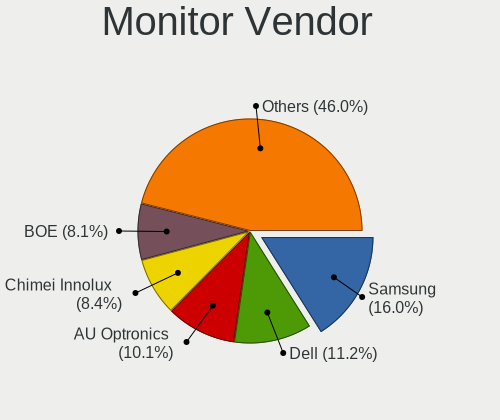

| Vendor                  | Computers | Percent |
|-------------------------|-----------|---------|
| Samsung Electronics     | 93        | 16.26%  |
| Dell                    | 66        | 11.54%  |
| AU Optronics            | 66        | 11.54%  |
| LG Display              | 44        | 7.69%   |
| Chimei Innolux          | 43        | 7.52%   |
| BOE                     | 37        | 6.47%   |
| Philips                 | 25        | 4.37%   |
| Goldstar                | 24        | 4.2%    |
| Lenovo                  | 19        | 3.32%   |
| AOC                     | 14        | 2.45%   |
| Sharp                   | 13        | 2.27%   |
| Hewlett-Packard         | 12        | 2.1%    |
| Ancor Communications    | 10        | 1.75%   |
| ViewSonic               | 7         | 1.22%   |
| InfoVision              | 7         | 1.22%   |
| ASUSTek Computer        | 7         | 1.22%   |
| Unknown                 | 6         | 1.05%   |
| Chi Mei Optoelectronics | 6         | 1.05%   |
| LG Philips              | 5         | 0.87%   |
| Apple                   | 5         | 0.87%   |
| Acer                    | 5         | 0.87%   |
| BenQ                    | 4         | 0.7%    |
| SANYO                   | 3         | 0.52%   |
| Panasonic               | 3         | 0.52%   |
| LG Electronics          | 3         | 0.52%   |
| Lenovo Group Limited    | 3         | 0.52%   |
| Unknown                 | 3         | 0.52%   |
| Toshiba                 | 2         | 0.35%   |
| Sony                    | 2         | 0.35%   |
| NEX                     | 2         | 0.35%   |
| HKC                     | 2         | 0.35%   |
| Eizo                    | 2         | 0.35%   |
| CSO                     | 2         | 0.35%   |
| AUS                     | 2         | 0.35%   |
| ___                     | 1         | 0.17%   |
| VOR                     | 1         | 0.17%   |
| VIE                     | 1         | 0.17%   |
| Unknown (AAA)           | 1         | 0.17%   |
| STD                     | 1         | 0.17%   |
| SSD                     | 1         | 0.17%   |
| Seiko/Epson             | 1         | 0.17%   |
| Sceptre Tech            | 1         | 0.17%   |
| RIS                     | 1         | 0.17%   |
| Plain Tree Systems      | 1         | 0.17%   |
| Pioneer                 | 1         | 0.17%   |
| PANDA                   | 1         | 0.17%   |
| NXG                     | 1         | 0.17%   |
| MStar                   | 1         | 0.17%   |
| LGD                     | 1         | 0.17%   |
| JRY                     | 1         | 0.17%   |
| Iiyama                  | 1         | 0.17%   |
| Hitachi                 | 1         | 0.17%   |
| HannStar Display        | 1         | 0.17%   |
| Gigabyte Technology     | 1         | 0.17%   |
| Fujitsu Siemens         | 1         | 0.17%   |
| CVT                     | 1         | 0.17%   |
| CPT                     | 1         | 0.17%   |
| BOE Technology Group    | 1         | 0.17%   |
| AGO                     | 1         | 0.17%   |

Monitor Model
-------------

Monitor models

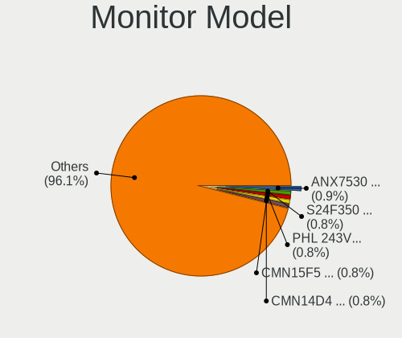

| Model                                                                    | Computers | Percent |
|--------------------------------------------------------------------------|-----------|---------|
| Dell P2419H DELD0D9 1920x1080 530x300mm 24.0-inch                        | 7         | 1.18%   |
| Chimei Innolux LCD Monitor CMN15F5 1920x1080 344x193mm 15.5-inch         | 7         | 1.18%   |
| AU Optronics LCD Monitor AUO403D 1920x1080 309x173mm 13.9-inch           | 6         | 1.01%   |
| Philips PHL 273V5 PHLC0D2 1920x1080 598x336mm 27.0-inch                  | 4         | 0.67%   |
| Philips PHL 243V5 PHLC0D1 1920x1080 521x293mm 23.5-inch                  | 4         | 0.67%   |
| Philips PHL 223V5 PHLC0CF 1920x1080 477x268mm 21.5-inch                  | 4         | 0.67%   |
| Philips 222EL PHLC052 1920x1080 476x268mm 21.5-inch                      | 4         | 0.67%   |
| Lenovo LCD Monitor LEN40BA 1920x1080 344x194mm 15.5-inch                 | 4         | 0.67%   |
| Dell P2419H DELD0DA 1920x1080 527x296mm 23.8-inch                        | 4         | 0.67%   |
| Dell P2219H DELA115 1920x1080 476x267mm 21.5-inch                        | 4         | 0.67%   |
| Chimei Innolux LCD Monitor CMN14D4 1920x1080 309x173mm 13.9-inch         | 4         | 0.67%   |
| Samsung Electronics SyncMaster SAM044B 1680x1050 474x296mm 22.0-inch     | 3         | 0.51%   |
| Samsung Electronics S24F350 SAM0D20 1920x1080 521x293mm 23.5-inch        | 3         | 0.51%   |
| Samsung Electronics LF27T450F SAM7099 1920x1080 597x336mm 27.0-inch      | 3         | 0.51%   |
| LG Display LCD Monitor LGD04A7 1920x1080 344x194mm 15.5-inch             | 3         | 0.51%   |
| Dell U2415 DELA0B9 1920x1200 518x324mm 24.1-inch                         | 3         | 0.51%   |
| BOE LCD Monitor BOE0802 1920x1080 344x193mm 15.5-inch                    | 3         | 0.51%   |
| AU Optronics LCD Monitor AUO492D 1920x1080 293x165mm 13.2-inch           | 3         | 0.51%   |
| AU Optronics LCD Monitor AUO22EC 1366x768 344x193mm 15.5-inch            | 3         | 0.51%   |
| AU Optronics LCD Monitor AUO102D 1920x1080 293x165mm 13.2-inch           | 3         | 0.51%   |
| Unknown                                                                  | 3         | 0.51%   |
| Unknown LCD Monitor RIS RD24L 1920x1080                                  | 2         | 0.34%   |
| Sharp LCD Monitor SHP148D 3840x2160 344x194mm 15.5-inch                  | 2         | 0.34%   |
| SANYO LCD MONITOR SAN07BE 1280x1024 350x270mm 17.4-inch                  | 2         | 0.34%   |
| Samsung Electronics SyncMaster SAM041D 1920x1200 459x296mm 21.5-inch     | 2         | 0.34%   |
| Samsung Electronics SyncMaster SAM034D 1280x1024 376x301mm 19.0-inch     | 2         | 0.34%   |
| Samsung Electronics SA300/SA350 SAM078E 1920x1080 477x268mm 21.5-inch    | 2         | 0.34%   |
| Samsung Electronics S22D390 SAM0B63 1920x1080 477x268mm 21.5-inch        | 2         | 0.34%   |
| Samsung Electronics LCD Monitor SMBX2450 1920x1080                       | 2         | 0.34%   |
| Samsung Electronics LCD Monitor SDC4142 3840x2160 294x165mm 13.3-inch    | 2         | 0.34%   |
| Samsung Electronics LC34G55T SAM7119 3440x1440 798x334mm 34.1-inch       | 2         | 0.34%   |
| Samsung Electronics C24F390 SAM0D2D 1920x1080 520x290mm 23.4-inch        | 2         | 0.34%   |
| Philips PHL 243V7 PHLC155 1920x1080 527x296mm 23.8-inch                  | 2         | 0.34%   |
| Panasonic TV MEIA296 3840x2160 698x392mm 31.5-inch                       | 2         | 0.34%   |
| LG Philips LCD Monitor LPL1E01 1280x800 331x207mm 15.4-inch              | 2         | 0.34%   |
| LG Display LCD Monitor LGD05AC 1920x1080 344x194mm 15.5-inch             | 2         | 0.34%   |
| LG Display LCD Monitor LGD0468 1366x768 344x194mm 15.5-inch              | 2         | 0.34%   |
| LG Display LCD Monitor LGD0323 1920x1080 345x194mm 15.6-inch             | 2         | 0.34%   |
| LG Display LCD Monitor LGD02DC 1366x768 344x194mm 15.5-inch              | 2         | 0.34%   |
| Lenovo Group Limited LCD Monitor L24q-10                                 | 2         | 0.34%   |
| InfoVision LCD Monitor IVO057D 1920x1080 309x174mm 14.0-inch             | 2         | 0.34%   |
| InfoVision LCD Monitor IVO0533 1366x768 293x164mm 13.2-inch              | 2         | 0.34%   |
| Hewlett-Packard E243 HPN3468 1920x1080 527x296mm 23.8-inch               | 2         | 0.34%   |
| Goldstar W2243 GSM56FF 1920x1080 480x270mm 21.7-inch                     | 2         | 0.34%   |
| Dell U2717D DEL40EB 2560x1440 597x336mm 27.0-inch                        | 2         | 0.34%   |
| Dell U2414H DELA0A4 1920x1080 527x296mm 23.8-inch                        | 2         | 0.34%   |
| Dell U2412M DELA07A 1920x1200 518x324mm 24.1-inch                        | 2         | 0.34%   |
| Dell U2412M DELA079 1920x1200 518x324mm 24.1-inch                        | 2         | 0.34%   |
| Dell P2719H DEL4184 1920x1080 598x336mm 27.0-inch                        | 2         | 0.34%   |
| Dell P2417H DELA0DB 1920x1080 530x300mm 24.0-inch                        | 2         | 0.34%   |
| Chimei Innolux LCD Monitor CMN15E8 1920x1080 344x193mm 15.5-inch         | 2         | 0.34%   |
| Chimei Innolux LCD Monitor CMN15D5 1920x1080 344x193mm 15.5-inch         | 2         | 0.34%   |
| Chimei Innolux LCD Monitor CMN15C3 1920x1080 344x193mm 15.5-inch         | 2         | 0.34%   |
| Chimei Innolux LCD Monitor CMN14D5 1920x1080 309x173mm 13.9-inch         | 2         | 0.34%   |
| Chi Mei Optoelectronics LCD Monitor CMO15A7 1366x768 344x193mm 15.5-inch | 2         | 0.34%   |
| BOE LCD Monitor BOE07BC 1920x1080 309x173mm 13.9-inch                    | 2         | 0.34%   |
| BOE LCD Monitor BOE06FB 1920x1080 344x194mm 15.5-inch                    | 2         | 0.34%   |
| BOE LCD Monitor BOE069C 1920x1080 344x193mm 15.5-inch                    | 2         | 0.34%   |
| AU Optronics LCD Monitor AUO8174 1280x800 331x207mm 15.4-inch            | 2         | 0.34%   |
| AU Optronics LCD Monitor AUO633D 1920x1080 309x174mm 14.0-inch           | 2         | 0.34%   |

Monitor Resolution
------------------

Monitor screen resolution

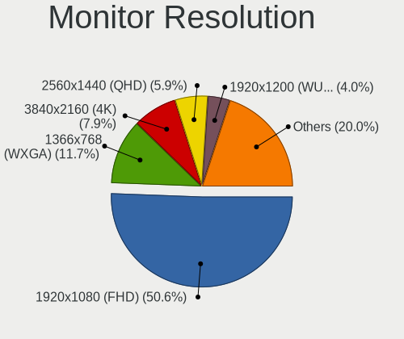

| Resolution         | Computers | Percent |
|--------------------|-----------|---------|
| 1920x1080 (FHD)    | 285       | 52.97%  |
| 1366x768 (WXGA)    | 64        | 11.9%   |
| 3840x2160 (4K)     | 44        | 8.18%   |
| 2560x1440 (QHD)    | 27        | 5.02%   |
| 1680x1050 (WSXGA+) | 17        | 3.16%   |
| 1920x1200 (WUXGA)  | 16        | 2.97%   |
| 1280x1024 (SXGA)   | 13        | 2.42%   |
| 1280x800 (WXGA)    | 11        | 2.04%   |
| Unknown            | 11        | 2.04%   |
| 1600x900 (HD+)     | 8         | 1.49%   |
| 1440x900 (WXGA+)   | 8         | 1.49%   |
| 3440x1440          | 5         | 0.93%   |
| 2560x1080          | 4         | 0.74%   |
| 3840x1080          | 3         | 0.56%   |
| 1024x768 (XGA)     | 3         | 0.56%   |
| 3200x1800 (QHD+)   | 2         | 0.37%   |
| 2560x1600          | 2         | 0.37%   |
| 1920x540           | 2         | 0.37%   |
| 1280x768           | 2         | 0.37%   |
| 5360x1440          | 1         | 0.19%   |
| 5120x1440          | 1         | 0.19%   |
| 4480x1440          | 1         | 0.19%   |
| 3520x1080          | 1         | 0.19%   |
| 3456x2160          | 1         | 0.19%   |
| 3200x1200          | 1         | 0.19%   |
| 2880x1800          | 1         | 0.19%   |
| 2304x1024          | 1         | 0.19%   |
| 2160x1440          | 1         | 0.19%   |
| 1360x768           | 1         | 0.19%   |
| 1024x600           | 1         | 0.19%   |

Monitor Diagonal
----------------

Diagonal size in inches

| Inches  | Computers | Percent |
|---------|-----------|---------|
| 15      | 126       | 22.34%  |
| 13      | 66        | 11.7%   |
| 24      | 60        | 10.64%  |
| 21      | 52        | 9.22%   |
| 27      | 45        | 7.98%   |
| 14      | 42        | 7.45%   |
| 23      | 39        | 6.91%   |
| Unknown | 33        | 5.85%   |
| 22      | 16        | 2.84%   |
| 17      | 16        | 2.84%   |
| 19      | 8         | 1.42%   |
| 31      | 7         | 1.24%   |
| 12      | 7         | 1.24%   |
| 34      | 6         | 1.06%   |
| 84      | 5         | 0.89%   |
| 20      | 5         | 0.89%   |
| 72      | 4         | 0.71%   |
| 33      | 3         | 0.53%   |
| 18      | 3         | 0.53%   |
| 54      | 2         | 0.35%   |
| 40      | 2         | 0.35%   |
| 32      | 2         | 0.35%   |
| 25      | 2         | 0.35%   |
| 11      | 2         | 0.35%   |
| 65      | 1         | 0.18%   |
| 60      | 1         | 0.18%   |
| 52      | 1         | 0.18%   |
| 49      | 1         | 0.18%   |
| 48      | 1         | 0.18%   |
| 43      | 1         | 0.18%   |
| 42      | 1         | 0.18%   |
| 29      | 1         | 0.18%   |
| 16      | 1         | 0.18%   |
| 10      | 1         | 0.18%   |
| 8       | 1         | 0.18%   |

Monitor Width
-------------

Physical width

| Width in mm | Computers | Percent |
|-------------|-----------|---------|
| 301-350     | 203       | 36.58%  |
| 501-600     | 136       | 24.5%   |
| 401-500     | 76        | 13.69%  |
| 201-300     | 46        | 8.29%   |
| Unknown     | 33        | 5.95%   |
| 351-400     | 17        | 3.06%   |
| 601-700     | 12        | 2.16%   |
| 701-800     | 11        | 1.98%   |
| 1501-2000   | 9         | 1.62%   |
| 1001-1500   | 7         | 1.26%   |
| 801-900     | 2         | 0.36%   |
| 901-1000    | 2         | 0.36%   |
| 101-200     | 1         | 0.18%   |

Aspect Ratio
------------

Proportional relationship between the width and the height

| Ratio   | Computers | Percent |
|---------|-----------|---------|
| 16/9    | 384       | 76.49%  |
| 16/10   | 62        | 12.35%  |
| Unknown | 32        | 6.37%   |
| 5/4     | 9         | 1.79%   |
| 4/3     | 6         | 1.2%    |
| 21/9    | 6         | 1.2%    |
| 3/2     | 2         | 0.4%    |
| 1.96    | 1         | 0.2%    |

Monitor Area
------------

Area in inch

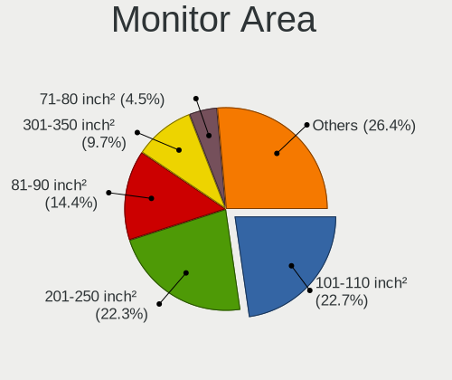

| Area in inch | Computers | Percent |
|----------------|-----------|---------|
| 201-250        | 131       | 23.48%  |
| 101-110        | 126       | 22.58%  |
| 81-90          | 75        | 13.44%  |
| 301-350        | 45        | 8.06%   |
| Unknown        | 33        | 5.91%   |
| 71-80          | 32        | 5.73%   |
| 151-200        | 27        | 4.84%   |
| 251-300        | 21        | 3.76%   |
| 351-500        | 19        | 3.41%   |
| More than 1000 | 15        | 2.69%   |
| 61-70          | 7         | 1.25%   |
| 141-150        | 7         | 1.25%   |
| 121-130        | 7         | 1.25%   |
| 501-1000       | 5         | 0.9%    |
| 131-140        | 3         | 0.54%   |
| 51-60          | 2         | 0.36%   |
| 41-50          | 1         | 0.18%   |
| 1-40           | 1         | 0.18%   |
| 91-100         | 1         | 0.18%   |

Pixel Density
-------------

Pixels per inch

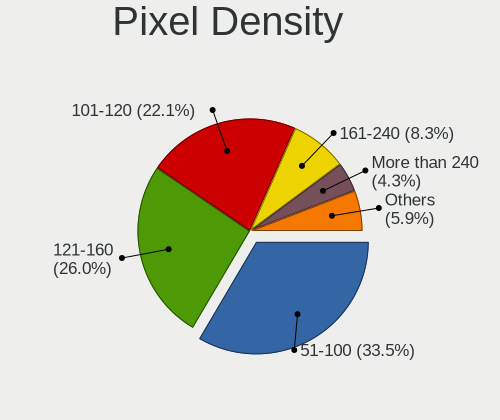

| Density       | Computers | Percent |
|---------------|-----------|---------|
| 51-100        | 181       | 33.15%  |
| 121-160       | 134       | 24.54%  |
| 101-120       | 133       | 24.36%  |
| Unknown       | 33        | 6.04%   |
| 161-240       | 28        | 5.13%   |
| More than 240 | 25        | 4.58%   |
| 1-50          | 12        | 2.2%    |

Multiple Monitors
-----------------

Total monitors connected

| Total | Computers | Percent |
|-------|-----------|---------|
| 1     | 401       | 76.24%  |
| 2     | 86        | 16.35%  |
| 0     | 27        | 5.13%   |
| 3     | 10        | 1.9%    |
| 4     | 2         | 0.38%   |

Network
-------

Net Controller Vendor
---------------------

Controller vendors

| Vendor                          | Computers | Percent |
|---------------------------------|-----------|---------|
| Realtek Semiconductor           | 276       | 35.94%  |
| Intel                           | 271       | 35.29%  |
| Qualcomm Atheros                | 80        | 10.42%  |
| Broadcom                        | 25        | 3.26%   |
| Ralink Technology               | 13        | 1.69%   |
| Broadcom Limited                | 10        | 1.3%    |
| Lenovo                          | 9         | 1.17%   |
| TP-Link                         | 8         | 1.04%   |
| Edimax Technology               | 8         | 1.04%   |
| MediaTek                        | 6         | 0.78%   |
| Nvidia                          | 5         | 0.65%   |
| Marvell Technology Group        | 5         | 0.65%   |
| ASIX Electronics                | 5         | 0.65%   |
| Xiaomi                          | 4         | 0.52%   |
| Qualcomm Atheros Communications | 4         | 0.52%   |
| Samsung Electronics             | 3         | 0.39%   |
| Ralink                          | 3         | 0.39%   |
| DisplayLink                     | 3         | 0.39%   |
| Texas Instruments               | 2         | 0.26%   |
| Huawei Technologies             | 2         | 0.26%   |
| D-Link                          | 2         | 0.26%   |
| Aquantia                        | 2         | 0.26%   |
| U.S. Robotics                   | 1         | 0.13%   |
| Toshiba                         | 1         | 0.13%   |
| STMicroelectronics              | 1         | 0.13%   |
| ROCCAT                          | 1         | 0.13%   |
| Realtek                         | 1         | 0.13%   |
| PEAK-System Technik             | 1         | 0.13%   |
| Nokia Mobile Phones             | 1         | 0.13%   |
| Microsoft                       | 1         | 0.13%   |
| Mellanox Technologies           | 1         | 0.13%   |
| Linksys                         | 1         | 0.13%   |
| LG Electronics                  | 1         | 0.13%   |
| HMD Global                      | 1         | 0.13%   |
| Hewlett-Packard                 | 1         | 0.13%   |
| Google                          | 1         | 0.13%   |
| GDMicroelectronics              | 1         | 0.13%   |
| Dell                            | 1         | 0.13%   |
| Davicom Semiconductor           | 1         | 0.13%   |
| Comneon                         | 1         | 0.13%   |
| BUFFALO                         | 1         | 0.13%   |
| Attansic Technology             | 1         | 0.13%   |
| ASUSTek Computer                | 1         | 0.13%   |
| Accton Technology               | 1         | 0.13%   |

Net Controller Model
--------------------

Controller models

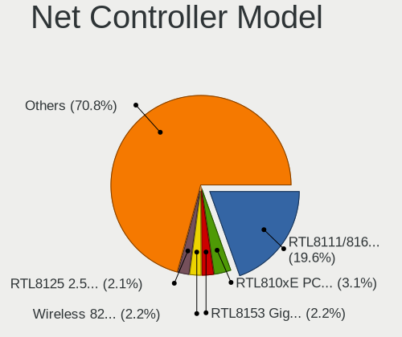

| Model                                                                   | Computers | Percent |
|-------------------------------------------------------------------------|-----------|---------|
| Realtek RTL8111/8168/8411 PCI Express Gigabit Ethernet Controller       | 193       | 21.44%  |
| Realtek RTL810xE PCI Express Fast Ethernet controller                   | 31        | 3.44%   |
| Intel Wireless 8265 / 8275                                              | 23        | 2.56%   |
| Intel Wi-Fi 6 AX200                                                     | 19        | 2.11%   |
| Intel 82579LM Gigabit Network Connection (Lewisville)                   | 19        | 2.11%   |
| Intel Wi-Fi 6 AX201                                                     | 18        | 2%      |
| Intel Cannon Point-LP CNVi [Wireless-AC]                                | 17        | 1.89%   |
| Intel Ethernet Connection (2) I219-V                                    | 15        | 1.67%   |
| Realtek RTL8125 2.5GbE Controller                                       | 14        | 1.56%   |
| Realtek RTL8153 Gigabit Ethernet Adapter                                | 13        | 1.44%   |
| Intel I211 Gigabit Network Connection                                   | 13        | 1.44%   |
| Qualcomm Atheros QCA9377 802.11ac Wireless Network Adapter              | 12        | 1.33%   |
| Intel Comet Lake PCH-LP CNVi WiFi                                       | 12        | 1.33%   |
| Qualcomm Atheros AR9285 Wireless Network Adapter (PCI-Express)          | 11        | 1.22%   |
| Intel Dual Band Wireless-AC 3165 Plus Bluetooth                         | 11        | 1.22%   |
| Qualcomm Atheros AR9485 Wireless Network Adapter                        | 10        | 1.11%   |
| Intel Wireless 8260                                                     | 10        | 1.11%   |
| Intel Wireless 3165                                                     | 10        | 1.11%   |
| Qualcomm Atheros QCA9565 / AR9565 Wireless Network Adapter              | 9         | 1%      |
| Intel Ethernet Connection (6) I219-V                                    | 9         | 1%      |
| Qualcomm Atheros QCA6174 802.11ac Wireless Network Adapter              | 8         | 0.89%   |
| Intel Ethernet Connection (7) I219-V                                    | 8         | 0.89%   |
| Intel Comet Lake PCH CNVi WiFi                                          | 8         | 0.89%   |
| Realtek RTL8822BE 802.11a/b/g/n/ac WiFi adapter                         | 7         | 0.78%   |
| Realtek RTL8192CU 802.11n WLAN Adapter                                  | 7         | 0.78%   |
| Intel Wireless 3160                                                     | 7         | 0.78%   |
| Intel Ethernet Connection I217-LM                                       | 7         | 0.78%   |
| Intel Wireless 7265                                                     | 6         | 0.67%   |
| Intel Ice Lake-LP PCH CNVi WiFi                                         | 6         | 0.67%   |
| Intel Ethernet Connection (4) I219-LM                                   | 6         | 0.67%   |
| Intel Centrino Advanced-N 6205 [Taylor Peak]                            | 6         | 0.67%   |
| Intel Cannon Lake PCH CNVi WiFi                                         | 6         | 0.67%   |
| Qualcomm Atheros AR9287 Wireless Network Adapter (PCI-Express)          | 5         | 0.56%   |
| Qualcomm Atheros AR242x / AR542x Wireless Network Adapter (PCI-Express) | 5         | 0.56%   |
| Intel Wireless-AC 9260                                                  | 5         | 0.56%   |
| Intel Ethernet Connection I219-LM                                       | 5         | 0.56%   |
| Intel Ethernet Connection (7) I219-LM                                   | 5         | 0.56%   |
| Intel Ethernet Connection (10) I219-V                                   | 5         | 0.56%   |
| Broadcom BCM4313 802.11bgn Wireless Network Adapter                     | 5         | 0.56%   |
| ASIX AX88179 Gigabit Ethernet                                           | 5         | 0.56%   |
| Xiaomi Mi/Redmi series (RNDIS)                                          | 4         | 0.44%   |
| Realtek RTL88x2bu [AC1200 Techkey]                                      | 4         | 0.44%   |
| Realtek RTL8822CE 802.11ac PCIe Wireless Network Adapter                | 4         | 0.44%   |
| Realtek RTL8821CE 802.11ac PCIe Wireless Network Adapter                | 4         | 0.44%   |
| Realtek RTL8723BE PCIe Wireless Network Adapter                         | 4         | 0.44%   |
| Realtek RTL8188EUS 802.11n Wireless Network Adapter                     | 4         | 0.44%   |
| Realtek 802.11ac NIC                                                    | 4         | 0.44%   |
| Ralink RT2870/RT3070 Wireless Adapter                                   | 4         | 0.44%   |
| Qualcomm Atheros AR9271 802.11n                                         | 4         | 0.44%   |
| Qualcomm Atheros AR8131 Gigabit Ethernet                                | 4         | 0.44%   |
| Lenovo USB-C Dock Ethernet                                              | 4         | 0.44%   |
| Intel Ethernet Connection (5) I219-LM                                   | 4         | 0.44%   |
| Intel Ethernet Connection (4) I219-V                                    | 4         | 0.44%   |
| Intel Ethernet Connection (2) I219-LM                                   | 4         | 0.44%   |
| Intel Ethernet Connection (14) I219-V                                   | 4         | 0.44%   |
| Intel Ethernet Connection (13) I219-V                                   | 4         | 0.44%   |
| Intel Dual Band Wireless-AC 3168NGW [Stone Peak]                        | 4         | 0.44%   |
| TP-Link TL-WN821N v5/v6 [RTL8192EU]                                     | 3         | 0.33%   |
| Realtek RTL8152 Fast Ethernet Adapter                                   | 3         | 0.33%   |
| Ralink MT7601U Wireless Adapter                                         | 3         | 0.33%   |

Wireless Vendor
---------------

Wireless vendors

| Vendor                          | Computers | Percent |
|---------------------------------|-----------|---------|
| Intel                           | 190       | 49.35%  |
| Qualcomm Atheros                | 64        | 16.62%  |
| Realtek Semiconductor           | 52        | 13.51%  |
| Broadcom                        | 24        | 6.23%   |
| Ralink Technology               | 13        | 3.38%   |
| Edimax Technology               | 8         | 2.08%   |
| TP-Link                         | 7         | 1.82%   |
| MediaTek                        | 6         | 1.56%   |
| Broadcom Limited                | 6         | 1.56%   |
| Qualcomm Atheros Communications | 4         | 1.04%   |
| Ralink                          | 3         | 0.78%   |
| D-Link                          | 2         | 0.52%   |
| Realtek                         | 1         | 0.26%   |
| Microsoft                       | 1         | 0.26%   |
| Marvell Technology Group        | 1         | 0.26%   |
| Dell                            | 1         | 0.26%   |
| BUFFALO                         | 1         | 0.26%   |
| ASUSTek Computer                | 1         | 0.26%   |

Wireless Model
--------------

Wireless models

| Model                                                                   | Computers | Percent |
|-------------------------------------------------------------------------|-----------|---------|
| Intel Wireless 8265 / 8275                                              | 23        | 5.94%   |
| Intel Wi-Fi 6 AX200                                                     | 19        | 4.91%   |
| Intel Wi-Fi 6 AX201                                                     | 18        | 4.65%   |
| Intel Cannon Point-LP CNVi [Wireless-AC]                                | 17        | 4.39%   |
| Qualcomm Atheros QCA9377 802.11ac Wireless Network Adapter              | 12        | 3.1%    |
| Intel Comet Lake PCH-LP CNVi WiFi                                       | 12        | 3.1%    |
| Qualcomm Atheros AR9285 Wireless Network Adapter (PCI-Express)          | 11        | 2.84%   |
| Intel Dual Band Wireless-AC 3165 Plus Bluetooth                         | 11        | 2.84%   |
| Qualcomm Atheros AR9485 Wireless Network Adapter                        | 10        | 2.58%   |
| Intel Wireless 8260                                                     | 10        | 2.58%   |
| Intel Wireless 3165                                                     | 10        | 2.58%   |
| Qualcomm Atheros QCA9565 / AR9565 Wireless Network Adapter              | 9         | 2.33%   |
| Qualcomm Atheros QCA6174 802.11ac Wireless Network Adapter              | 8         | 2.07%   |
| Intel Comet Lake PCH CNVi WiFi                                          | 8         | 2.07%   |
| Realtek RTL8822BE 802.11a/b/g/n/ac WiFi adapter                         | 7         | 1.81%   |
| Realtek RTL8192CU 802.11n WLAN Adapter                                  | 7         | 1.81%   |
| Intel Wireless 3160                                                     | 7         | 1.81%   |
| Intel Wireless 7265                                                     | 6         | 1.55%   |
| Intel Ice Lake-LP PCH CNVi WiFi                                         | 6         | 1.55%   |
| Intel Centrino Advanced-N 6205 [Taylor Peak]                            | 6         | 1.55%   |
| Intel Cannon Lake PCH CNVi WiFi                                         | 6         | 1.55%   |
| Qualcomm Atheros AR9287 Wireless Network Adapter (PCI-Express)          | 5         | 1.29%   |
| Qualcomm Atheros AR242x / AR542x Wireless Network Adapter (PCI-Express) | 5         | 1.29%   |
| Intel Wireless-AC 9260                                                  | 5         | 1.29%   |
| Broadcom BCM4313 802.11bgn Wireless Network Adapter                     | 5         | 1.29%   |
| Realtek RTL88x2bu [AC1200 Techkey]                                      | 4         | 1.03%   |
| Realtek RTL8822CE 802.11ac PCIe Wireless Network Adapter                | 4         | 1.03%   |
| Realtek RTL8821CE 802.11ac PCIe Wireless Network Adapter                | 4         | 1.03%   |
| Realtek RTL8723BE PCIe Wireless Network Adapter                         | 4         | 1.03%   |
| Realtek RTL8188EUS 802.11n Wireless Network Adapter                     | 4         | 1.03%   |
| Realtek 802.11ac NIC                                                    | 4         | 1.03%   |
| Ralink RT2870/RT3070 Wireless Adapter                                   | 4         | 1.03%   |
| Qualcomm Atheros AR9271 802.11n                                         | 4         | 1.03%   |
| Intel Dual Band Wireless-AC 3168NGW [Stone Peak]                        | 4         | 1.03%   |
| TP-Link TL-WN821N v5/v6 [RTL8192EU]                                     | 3         | 0.78%   |
| Ralink MT7601U Wireless Adapter                                         | 3         | 0.78%   |
| Intel PRO/Wireless 3945ABG [Golan] Network Connection                   | 3         | 0.78%   |
| Edimax RTL8192S WLAN Adapter                                            | 3         | 0.78%   |
| Edimax 802.11ac WLAN Adapter                                            | 3         | 0.78%   |
| Broadcom BCM4331 802.11a/b/g/n                                          | 3         | 0.78%   |
| Broadcom BCM43142 802.11b/g/n                                           | 3         | 0.78%   |
| TP-Link TL-WN722N v2                                                    | 2         | 0.52%   |
| TP-Link Archer T4U ver.3                                                | 2         | 0.52%   |
| Realtek RTL8723DE Wireless Network Adapter                              | 2         | 0.52%   |
| Realtek RTL8191SU 802.11n WLAN Adapter                                  | 2         | 0.52%   |
| Realtek RTL8188EE Wireless Network Adapter                              | 2         | 0.52%   |
| Realtek RTL8188CE 802.11b/g/n WiFi Adapter                              | 2         | 0.52%   |
| Ralink RT5370 Wireless Adapter                                          | 2         | 0.52%   |
| Ralink MT7610U ("Archer T2U" 2.4G+5G WLAN Adapter                       | 2         | 0.52%   |
| Qualcomm Atheros AR9462 Wireless Network Adapter                        | 2         | 0.52%   |
| MediaTek WLAN controller                                                | 2         | 0.52%   |
| MediaTek MT7630e 802.11bgn Wireless Network Adapter                     | 2         | 0.52%   |
| Intel Wireless 7260                                                     | 2         | 0.52%   |
| Intel Wi-Fi 6 AX210/AX211/AX411 160MHz                                  | 2         | 0.52%   |
| Intel Ultimate N WiFi Link 5300                                         | 2         | 0.52%   |
| Intel Tiger Lake PCH CNVi WiFi                                          | 2         | 0.52%   |
| Intel Centrino Wireless-N 1030 [Rainbow Peak]                           | 2         | 0.52%   |
| Intel Alder Lake-S PCH CNVi WiFi                                        | 2         | 0.52%   |
| Edimax EW-7711UTn nLite Wireless Adapter [Ralink RT3070]                | 2         | 0.52%   |
| Broadcom Limited BCM4352 802.11ac Wireless Network Adapter              | 2         | 0.52%   |

Ethernet Vendor
---------------

Ethernet vendors

| Vendor                   | Computers | Percent |
|--------------------------|-----------|---------|
| Realtek Semiconductor    | 257       | 52.45%  |
| Intel                    | 154       | 31.43%  |
| Qualcomm Atheros         | 22        | 4.49%   |
| Lenovo                   | 9         | 1.84%   |
| Broadcom                 | 8         | 1.63%   |
| Nvidia                   | 5         | 1.02%   |
| Broadcom Limited         | 5         | 1.02%   |
| ASIX Electronics         | 5         | 1.02%   |
| Xiaomi                   | 4         | 0.82%   |
| Marvell Technology Group | 4         | 0.82%   |
| Samsung Electronics      | 3         | 0.61%   |
| DisplayLink              | 3         | 0.61%   |
| Aquantia                 | 2         | 0.41%   |
| TP-Link                  | 1         | 0.2%    |
| Mellanox Technologies    | 1         | 0.2%    |
| Linksys                  | 1         | 0.2%    |
| Huawei Technologies      | 1         | 0.2%    |
| HMD Global               | 1         | 0.2%    |
| Google                   | 1         | 0.2%    |
| Davicom Semiconductor    | 1         | 0.2%    |
| Attansic Technology      | 1         | 0.2%    |
| Accton Technology        | 1         | 0.2%    |

Ethernet Model
--------------

Ethernet models

| Model                                                             | Computers | Percent |
|-------------------------------------------------------------------|-----------|---------|
| Realtek RTL8111/8168/8411 PCI Express Gigabit Ethernet Controller | 193       | 38.6%   |
| Realtek RTL810xE PCI Express Fast Ethernet controller             | 31        | 6.2%    |
| Intel 82579LM Gigabit Network Connection (Lewisville)             | 19        | 3.8%    |
| Intel Ethernet Connection (2) I219-V                              | 15        | 3%      |
| Realtek RTL8125 2.5GbE Controller                                 | 14        | 2.8%    |
| Realtek RTL8153 Gigabit Ethernet Adapter                          | 13        | 2.6%    |
| Intel I211 Gigabit Network Connection                             | 13        | 2.6%    |
| Intel Ethernet Connection (6) I219-V                              | 9         | 1.8%    |
| Intel Ethernet Connection (7) I219-V                              | 8         | 1.6%    |
| Intel Ethernet Connection I217-LM                                 | 7         | 1.4%    |
| Intel Ethernet Connection (4) I219-LM                             | 6         | 1.2%    |
| Intel Ethernet Connection I219-LM                                 | 5         | 1%      |
| Intel Ethernet Connection (7) I219-LM                             | 5         | 1%      |
| Intel Ethernet Connection (10) I219-V                             | 5         | 1%      |
| ASIX AX88179 Gigabit Ethernet                                     | 5         | 1%      |
| Xiaomi Mi/Redmi series (RNDIS)                                    | 4         | 0.8%    |
| Qualcomm Atheros AR8131 Gigabit Ethernet                          | 4         | 0.8%    |
| Lenovo USB-C Dock Ethernet                                        | 4         | 0.8%    |
| Intel Ethernet Connection (5) I219-LM                             | 4         | 0.8%    |
| Intel Ethernet Connection (4) I219-V                              | 4         | 0.8%    |
| Intel Ethernet Connection (2) I219-LM                             | 4         | 0.8%    |
| Intel Ethernet Connection (14) I219-V                             | 4         | 0.8%    |
| Intel Ethernet Connection (13) I219-V                             | 4         | 0.8%    |
| Realtek RTL8152 Fast Ethernet Adapter                             | 3         | 0.6%    |
| Qualcomm Atheros Killer E220x Gigabit Ethernet Controller         | 3         | 0.6%    |
| Qualcomm Atheros AR8152 v2.0 Fast Ethernet                        | 3         | 0.6%    |
| Qualcomm Atheros AR8151 v2.0 Gigabit Ethernet                     | 3         | 0.6%    |
| Qualcomm Atheros AR8151 v1.0 Gigabit Ethernet                     | 3         | 0.6%    |
| Lenovo ThinkPad TBT 3 Dock                                        | 3         | 0.6%    |
| Intel I210 Gigabit Network Connection                             | 3         | 0.6%    |
| Intel Ethernet Connection I217-V                                  | 3         | 0.6%    |
| Intel Ethernet Connection (11) I219-V                             | 3         | 0.6%    |
| Intel 82579V Gigabit Network Connection                           | 3         | 0.6%    |
| Intel 82574L Gigabit Network Connection                           | 3         | 0.6%    |
| Samsung Galaxy series, misc. (tethering mode)                     | 2         | 0.4%    |
| Realtek RTL-8100/8101L/8139 PCI Fast Ethernet Adapter             | 2         | 0.4%    |
| Qualcomm Atheros AR8161 Gigabit Ethernet                          | 2         | 0.4%    |
| Nvidia MCP79 Ethernet                                             | 2         | 0.4%    |
| Nvidia MCP61 Ethernet                                             | 2         | 0.4%    |
| Intel Ethernet Controller I225-V                                  | 2         | 0.4%    |
| Intel Ethernet Connection (6) I219-LM                             | 2         | 0.4%    |
| Intel Ethernet Connection (3) I218-LM                             | 2         | 0.4%    |
| Intel Ethernet Connection (12) I219-V                             | 2         | 0.4%    |
| Intel Ethernet Connection (11) I219-LM                            | 2         | 0.4%    |
| Intel 82567LM Gigabit Network Connection                          | 2         | 0.4%    |
| Intel 82566DM-2 Gigabit Network Connection                        | 2         | 0.4%    |
| DisplayLink Dell Universal Dock D6000                             | 2         | 0.4%    |
| Broadcom NetXtreme BCM57766 Gigabit Ethernet PCIe                 | 2         | 0.4%    |
| Broadcom NetXtreme BCM57765 Gigabit Ethernet PCIe                 | 2         | 0.4%    |
| TP-Link UE300 10/100/1000 LAN (ethernet mode) [Realtek RTL8153]   | 1         | 0.2%    |
| Samsung GT-I9070 (network tethering, USB debugging enabled)       | 1         | 0.2%    |
| Realtek RTL8169 PCI Gigabit Ethernet Controller                   | 1         | 0.2%    |
| Realtek Realtek Ethernet controller                               | 1         | 0.2%    |
| Realtek Killer E3000 2.5GbE Controller                            | 1         | 0.2%    |
| Realtek Killer E2500 Gigabit Ethernet Controller                  | 1         | 0.2%    |
| Qualcomm Atheros QCA8172 Fast Ethernet                            | 1         | 0.2%    |
| Qualcomm Atheros Killer E2400 Gigabit Ethernet Controller         | 1         | 0.2%    |
| Qualcomm Atheros AR8162 Fast Ethernet                             | 1         | 0.2%    |
| Qualcomm Atheros AR8132 Fast Ethernet                             | 1         | 0.2%    |
| Nvidia MCP67 Ethernet                                             | 1         | 0.2%    |

Net Controller Kind
-------------------

Ethernet, WiFi or modem

| Kind     | Computers | Percent |
|----------|-----------|---------|
| Ethernet | 447       | 54.05%  |
| WiFi     | 367       | 44.38%  |
| Modem    | 11        | 1.33%   |
| Unknown  | 2         | 0.24%   |

Used Controller
---------------

Currently used network controller

| Kind     | Computers | Percent |
|----------|-----------|---------|
| WiFi     | 274       | 50.83%  |
| Ethernet | 264       | 48.98%  |
| Modem    | 1         | 0.19%   |

NICs
----

Total network controllers on board

| Total | Computers | Percent |
|-------|-----------|---------|
| 2     | 254       | 49.32%  |
| 1     | 244       | 47.38%  |
| 3     | 12        | 2.33%   |
| 0     | 5         | 0.97%   |

IPv6
----

IPv6 vs IPv4

| Used | Computers | Percent |
|------|-----------|---------|
| No   | 451       | 86.07%  |
| Yes  | 73        | 13.93%  |

Bluetooth
---------

Bluetooth Vendor
----------------

Controller vendors

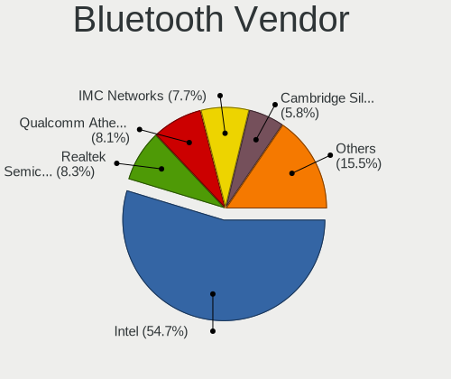

| Vendor                          | Computers | Percent |
|---------------------------------|-----------|---------|
| Intel                           | 167       | 56.61%  |
| Qualcomm Atheros Communications | 25        | 8.47%   |
| Cambridge Silicon Radio         | 21        | 7.12%   |
| Realtek Semiconductor           | 20        | 6.78%   |
| IMC Networks                    | 16        | 5.42%   |
| Broadcom                        | 11        | 3.73%   |
| Apple                           | 8         | 2.71%   |
| Foxconn / Hon Hai               | 6         | 2.03%   |
| Lite-On Technology              | 5         | 1.69%   |
| ASUSTek Computer                | 4         | 1.36%   |
| Dell                            | 3         | 1.02%   |
| Hewlett-Packard                 | 2         | 0.68%   |
| Askey Computer                  | 2         | 0.68%   |
| TP-Link                         | 1         | 0.34%   |
| Toshiba                         | 1         | 0.34%   |
| Realtek                         | 1         | 0.34%   |
| MediaTek                        | 1         | 0.34%   |
| Marvell Semiconductor           | 1         | 0.34%   |

Bluetooth Model
---------------

Controller models

| Model                                               | Computers | Percent |
|-----------------------------------------------------|-----------|---------|
| Intel Bluetooth wireless interface                  | 63        | 21.36%  |
| Intel AX201 Bluetooth                               | 41        | 13.9%   |
| Intel Bluetooth 9460/9560 Jefferson Peak (JfP)      | 28        | 9.49%   |
| Cambridge Silicon Radio Bluetooth Dongle (HCI mode) | 21        | 7.12%   |
| Intel AX200 Bluetooth                               | 17        | 5.76%   |
| Qualcomm Atheros  Bluetooth Device                  | 12        | 4.07%   |
| Realtek Bluetooth Radio                             | 10        | 3.39%   |
| Realtek  Bluetooth 4.2 Adapter                      | 5         | 1.69%   |
| Intel Wireless-AC 9260 Bluetooth Adapter            | 5         | 1.69%   |
| IMC Networks Bluetooth Device                       | 5         | 1.69%   |
| Realtek RTL8822BE Bluetooth 4.2 Adapter             | 4         | 1.36%   |
| Qualcomm Atheros QCA61x4 Bluetooth 4.0              | 4         | 1.36%   |
| Lite-On Bluetooth Device                            | 4         | 1.36%   |
| Intel Wireless-AC 3168 Bluetooth                    | 4         | 1.36%   |
| IMC Networks Wireless_Device                        | 4         | 1.36%   |
| Apple Bluetooth USB Host Controller                 | 4         | 1.36%   |
| Qualcomm Atheros AR9462 Bluetooth                   | 3         | 1.02%   |
| Qualcomm Atheros AR3012 Bluetooth 4.0               | 3         | 1.02%   |
| Intel Centrino Advanced-N 6230 Bluetooth adapter    | 3         | 1.02%   |
| IMC Networks Bluetooth Radio                        | 3         | 1.02%   |
| Qualcomm Atheros AR3011 Bluetooth                   | 2         | 0.68%   |
| Intel Centrino Bluetooth Wireless Transceiver       | 2         | 0.68%   |
| Intel Bluetooth Device                              | 2         | 0.68%   |
| Intel AX210 Bluetooth                               | 2         | 0.68%   |
| IMC Networks Bluetooth USB Host Controller          | 2         | 0.68%   |
| IMC Networks Atheros AR3012 Bluetooth 4.0 Adapter   | 2         | 0.68%   |
| Foxconn / Hon Hai BT                                | 2         | 0.68%   |
| Foxconn / Hon Hai Bluetooth Device                  | 2         | 0.68%   |
| Dell BCM20702A0 Bluetooth Module                    | 2         | 0.68%   |
| Broadcom BCM2070 Bluetooth 2.1 + EDR                | 2         | 0.68%   |
| Broadcom BCM2045B (BDC-2) [Bluetooth Controller]    | 2         | 0.68%   |
| ASUS Bluetooth Adapter                              | 2         | 0.68%   |
| Askey Bluetooth Device                              | 2         | 0.68%   |
| Apple Built-in Bluetooth 2.0+EDR HCI                | 2         | 0.68%   |
| Apple Bluetooth Host Controller                     | 2         | 0.68%   |
| TP-Link UB500 Adapter                               | 1         | 0.34%   |
| Toshiba Askey Bluetooth Module                      | 1         | 0.34%   |
| Realtek RTL8723B Bluetooth                          | 1         | 0.34%   |
| Realtek Bluetooth Radio                             | 1         | 0.34%   |
| Qualcomm Atheros Bluetooth USB Host Controller      | 1         | 0.34%   |
| MediaTek BT                                         | 1         | 0.34%   |
| Marvell Bluetooth and Wireless LAN Composite        | 1         | 0.34%   |
| Lite-On Atheros Bluetooth                           | 1         | 0.34%   |
| HP Broadcom 2070 Bluetooth Combo                    | 1         | 0.34%   |
| HP Bluetooth 2.0 Interface [Broadcom BCM2045]       | 1         | 0.34%   |
| Foxconn / Hon Hai BCM20702A0                        | 1         | 0.34%   |
| Foxconn / Hon Hai Acer Module                       | 1         | 0.34%   |
| Dell DW375 Bluetooth Module                         | 1         | 0.34%   |
| Broadcom HP Portable SoftSailing                    | 1         | 0.34%   |
| Broadcom BCM43142A0 Bluetooth 4.0                   | 1         | 0.34%   |
| Broadcom BCM20702A0 Bluetooth 4.0                   | 1         | 0.34%   |
| Broadcom BCM20702A0                                 | 1         | 0.34%   |
| Broadcom BCM2045B (BDC-2.1) [Bluetooth Controller]  | 1         | 0.34%   |
| Broadcom BCM2045B (BDC-2.1)                         | 1         | 0.34%   |
| Broadcom BCM2045A0                                  | 1         | 0.34%   |
| ASUS BT-253 Bluetooth Adapter                       | 1         | 0.34%   |
| ASUS BCM20702A0                                     | 1         | 0.34%   |

Sound
-----

Sound Vendor
------------

Sound card vendors

| Vendor                     | Computers | Percent |
|----------------------------|-----------|---------|
| Intel                      | 439       | 61.06%  |
| Nvidia                     | 143       | 19.89%  |
| AMD                        | 71        | 9.87%   |
| Lenovo                     | 9         | 1.25%   |
| C-Media Electronics        | 9         | 1.25%   |
| Creative Labs              | 6         | 0.83%   |
| XMOS                       | 5         | 0.7%    |
| Realtek Semiconductor      | 4         | 0.56%   |
| Creative Technology        | 4         | 0.56%   |
| Microsoft                  | 3         | 0.42%   |
| GN Netcom                  | 3         | 0.42%   |
| Focusrite-Novation         | 3         | 0.42%   |
| VIA Technologies           | 2         | 0.28%   |
| Texas Instruments          | 2         | 0.28%   |
| Logitech                   | 2         | 0.28%   |
| SteelSeries ApS            | 1         | 0.14%   |
| Sennheiser Communications  | 1         | 0.14%   |
| Samson Technologies        | 1         | 0.14%   |
| Razer USA                  | 1         | 0.14%   |
| PreSonus Audio Electronics | 1         | 0.14%   |
| Plantronics                | 1         | 0.14%   |
| Meridian                   | 1         | 0.14%   |
| Kingston Technology        | 1         | 0.14%   |
| JMTek                      | 1         | 0.14%   |
| iCreate Technologies       | 1         | 0.14%   |
| Giga-Byte Technology       | 1         | 0.14%   |
| FIFINE Microphones         | 1         | 0.14%   |
| EGO SYStems                | 1         | 0.14%   |
| Unknown                    | 1         | 0.14%   |

Sound Model
-----------

Sound card models

| Model                                                                      | Computers | Percent |
|----------------------------------------------------------------------------|-----------|---------|
| Intel Sunrise Point-LP HD Audio                                            | 57        | 7.07%   |
| Intel 6 Series/C200 Series Chipset Family High Definition Audio Controller | 35        | 4.34%   |
| Intel Cannon Lake PCH cAVS                                                 | 28        | 3.47%   |
| Intel 8 Series/C220 Series Chipset High Definition Audio Controller        | 26        | 3.23%   |
| Intel Xeon E3-1200 v3/4th Gen Core Processor HD Audio Controller           | 25        | 3.1%    |
| Intel Cannon Point-LP High Definition Audio Controller                     | 25        | 3.1%    |
| Intel 7 Series/C216 Chipset Family High Definition Audio Controller        | 25        | 3.1%    |
| Intel 100 Series/C230 Series Chipset Family HD Audio Controller            | 23        | 2.85%   |
| Intel Tiger Lake-LP Smart Sound Technology Audio Controller                | 21        | 2.61%   |
| Intel 200 Series PCH HD Audio                                              | 21        | 2.61%   |
| Intel NM10/ICH7 Family High Definition Audio Controller                    | 20        | 2.48%   |
| AMD Family 17h/19h HD Audio Controller                                     | 20        | 2.48%   |
| Intel 5 Series/3400 Series Chipset High Definition Audio                   | 18        | 2.23%   |
| Nvidia GK208 HDMI/DP Audio Controller                                      | 16        | 1.99%   |
| Intel 82801I (ICH9 Family) HD Audio Controller                             | 16        | 1.99%   |
| Nvidia GP107GL High Definition Audio Controller                            | 15        | 1.86%   |
| Intel Broadwell-U Audio Controller                                         | 14        | 1.74%   |
| Intel Wildcat Point-LP High Definition Audio Controller                    | 13        | 1.61%   |
| Intel Ice Lake-LP Smart Sound Technology Audio Controller                  | 13        | 1.61%   |
| Intel Comet Lake PCH-LP cAVS                                               | 13        | 1.61%   |
| Intel Comet Lake PCH cAVS                                                  | 13        | 1.61%   |
| AMD Starship/Matisse HD Audio Controller                                   | 12        | 1.49%   |
| Intel 9 Series Chipset Family HD Audio Controller                          | 11        | 1.36%   |
| AMD Raven/Raven2/Fenghuang HDMI/DP Audio Controller                        | 10        | 1.24%   |
| Nvidia GP106 High Definition Audio Controller                              | 9         | 1.12%   |
| Intel Haswell-ULT HD Audio Controller                                      | 9         | 1.12%   |
| Intel 8 Series HD Audio Controller                                         | 9         | 1.12%   |
| AMD FCH Azalia Controller                                                  | 9         | 1.12%   |
| Nvidia TU106 High Definition Audio Controller                              | 8         | 0.99%   |
| Nvidia High Definition Audio Controller                                    | 8         | 0.99%   |
| Nvidia GP104 High Definition Audio Controller                              | 8         | 0.99%   |
| Intel 82801JI (ICH10 Family) HD Audio Controller                           | 8         | 0.99%   |
| Nvidia GF108 High Definition Audio Controller                              | 7         | 0.87%   |
| Nvidia TU116 High Definition Audio Controller                              | 6         | 0.74%   |
| Nvidia TU107 GeForce GTX 1650 High Definition Audio Controller             | 6         | 0.74%   |
| Nvidia TU104 HD Audio Controller                                           | 6         | 0.74%   |
| Nvidia GM107 High Definition Audio Controller [GeForce 940MX]              | 6         | 0.74%   |
| Intel Tiger Lake-H HD Audio Controller                                     | 6         | 0.74%   |
| Intel Comet Lake PCH-V cAVS                                                | 6         | 0.74%   |
| AMD Renoir Radeon High Definition Audio Controller                         | 6         | 0.74%   |
| AMD Family 17h (Models 00h-0fh) HD Audio Controller                        | 6         | 0.74%   |
| Nvidia GM206 High Definition Audio Controller                              | 5         | 0.62%   |
| Nvidia GF119 HDMI Audio Controller                                         | 5         | 0.62%   |
| Intel CM238 HD Audio Controller                                            | 5         | 0.62%   |
| Intel Alder Lake-S HD Audio Controller                                     | 5         | 0.62%   |
| Intel 82801H (ICH8 Family) HD Audio Controller                             | 5         | 0.62%   |
| AMD SBx00 Azalia (Intel HDA)                                               | 5         | 0.62%   |
| AMD Ellesmere HDMI Audio [Radeon RX 470/480 / 570/580/590]                 | 5         | 0.62%   |
| Realtek Semiconductor USB Audio                                            | 4         | 0.5%    |
| Nvidia GM204 High Definition Audio Controller                              | 4         | 0.5%    |
| Nvidia GK107 HDMI Audio Controller                                         | 4         | 0.5%    |
| Nvidia GK104 HDMI Audio Controller                                         | 4         | 0.5%    |
| Nvidia GA104 High Definition Audio Controller                              | 4         | 0.5%    |
| Lenovo ThinkPad USB-C Dock Gen2 USB Audio                                  | 4         | 0.5%    |
| Intel C600/X79 series chipset High Definition Audio Controller             | 4         | 0.5%    |
| AMD Trinity HDMI Audio Controller                                          | 4         | 0.5%    |
| AMD RV710/730 HDMI Audio [Radeon HD 4000 series]                           | 4         | 0.5%    |
| AMD Navi 10 HDMI Audio                                                     | 4         | 0.5%    |
| AMD Hawaii HDMI Audio [Radeon R9 290/290X / 390/390X]                      | 4         | 0.5%    |
| AMD Baffin HDMI/DP Audio [Radeon RX 550 640SP / RX 560/560X]               | 4         | 0.5%    |

Memory
------

Memory Vendor
-------------

Memory module vendors

| Vendor              | Computers | Percent |
|---------------------|-----------|---------|
| Samsung Electronics | 62        | 19.44%  |
| SK hynix            | 51        | 15.99%  |
| Kingston            | 44        | 13.79%  |
| Micron Technology   | 39        | 12.23%  |
| Unknown             | 34        | 10.66%  |
| Crucial             | 24        | 7.52%   |
| G.Skill             | 17        | 5.33%   |
| Corsair             | 16        | 5.02%   |
| Ramaxel Technology  | 7         | 2.19%   |
| Transcend           | 5         | 1.57%   |
| Team                | 3         | 0.94%   |
| Nanya Technology    | 3         | 0.94%   |
| Elpida              | 3         | 0.94%   |
| GeIL                | 2         | 0.63%   |
| A-DATA Technology   | 2         | 0.63%   |
| V-Color             | 1         | 0.31%   |
| Unknown (09D5)      | 1         | 0.31%   |
| Patriot             | 1         | 0.31%   |
| KETECH              | 1         | 0.31%   |
| Avant               | 1         | 0.31%   |
| ASint Technology    | 1         | 0.31%   |
| 48spaces            | 1         | 0.31%   |

Memory Model
------------

Memory module models

| Model                                                        | Computers | Percent |
|--------------------------------------------------------------|-----------|---------|
| SK hynix RAM HMT351S6CFR8C-PB 4GB SODIMM DDR3 1600MT/s       | 4         | 1.19%   |
| SK hynix RAM HMT451U6AFR8C-PB 4GB DIMM DDR3                  | 3         | 0.89%   |
| SK hynix RAM HMA41GS6AFR8N-TF 8GB SODIMM DDR4 2667MT/s       | 3         | 0.89%   |
| Samsung RAM M471B5273DH0-CH9 4096MB SODIMM DDR3 1334MT/s     | 3         | 0.89%   |
| Samsung RAM M471A5244CB0-CTD 4096MB SODIMM DDR4 3266MT/s     | 3         | 0.89%   |
| Samsung RAM M471A2K43DB1-CWE 16GB SODIMM DDR4 3200MT/s       | 3         | 0.89%   |
| Samsung RAM M471A2K43DB1-CTD 16GB SODIMM DDR4 2667MT/s       | 3         | 0.89%   |
| Samsung RAM M471A1K43CB1-CTD 8GB SODIMM DDR4 2667MT/s        | 3         | 0.89%   |
| Samsung RAM K4E6E304EB-EGCG 4GB Row Of Chips LPDDR3 2133MT/s | 3         | 0.89%   |
| Micron RAM 4ATF51264HZ-2G6E1 4GB SODIMM DDR4 2667MT/s        | 3         | 0.89%   |
| Kingston RAM 9905622-058.A00G 8GB DIMM DDR4 2133MT/s         | 3         | 0.89%   |
| Unknown RAM Module 2GB DIMM 800MT/s                          | 2         | 0.6%    |
| Unknown RAM Module 2048MB SODIMM DDR2                        | 2         | 0.6%    |
| Unknown RAM Module 2048MB DIMM SDRAM                         | 2         | 0.6%    |
| Unknown RAM Module 2048MB DIMM DDR2 800MT/s                  | 2         | 0.6%    |
| Unknown RAM Module 1024MB SODIMM DDR2 667MT/s                | 2         | 0.6%    |
| Unknown RAM Module 1024MB SODIMM DDR2                        | 2         | 0.6%    |
| Unknown RAM MEM-DOWN 8192MB SODIMM DDR4 2400MT/s             | 2         | 0.6%    |
| SK hynix RAM HMT451S6BFR8A-PB 4GB SODIMM DDR3 1600MT/s       | 2         | 0.6%    |
| SK hynix RAM HMT451S6AFR8A-PB 4096MB SODIMM DDR3 1600MT/s    | 2         | 0.6%    |
| SK hynix RAM HMAA4GS6AJR8N-XN 32GB SODIMM DDR4 3200MT/s      | 2         | 0.6%    |
| SK hynix RAM HMAA2GS6CJR8N-XN 16GB SODIMM DDR4 3200MT/s      | 2         | 0.6%    |
| SK hynix RAM HMAA1GS6CMR6N-VK 8GB SODIMM DDR4 2667MT/s       | 2         | 0.6%    |
| SK hynix RAM HMA851S6JJR6N-VK 4GB SODIMM DDR4 2667MT/s       | 2         | 0.6%    |
| SK hynix RAM HMA82GS6JJR8N-VK 16GB SODIMM DDR4 2667MT/s      | 2         | 0.6%    |
| SK hynix RAM HMA81GS6DJR8N-XN 8GB SODIMM DDR4 3200MT/s       | 2         | 0.6%    |
| SK hynix RAM HMA81GS6AFR8N-UH 8GB SODIMM DDR4 2667MT/s       | 2         | 0.6%    |
| Samsung RAM M471B5173EB0-YK0 4GB SODIMM DDR3 1600MT/s        | 2         | 0.6%    |
| Samsung RAM M471A4G43MB1-CTD 32GB SODIMM DDR4 2667MT/s       | 2         | 0.6%    |
| Samsung RAM M471A1K43DB1-CTD 8GB SODIMM DDR4 2667MT/s        | 2         | 0.6%    |
| Samsung RAM M471A1G44AB0-CWE 8GB Row Of Chips DDR4 3200MT/s  | 2         | 0.6%    |
| Samsung RAM M425R2GA3BB0-CQKOD 16GB SODIMM DDR5 4800MT/s     | 2         | 0.6%    |
| Samsung RAM M378B5273CH0-CK0 4096MB DIMM DDR3 2000MT/s       | 2         | 0.6%    |
| Ramaxel RAM RMSA3260ME78HAF-2666 8GB SODIMM DDR4 2667MT/s    | 2         | 0.6%    |
| Micron RAM MTC8C1084S1SC48BA1 16GB SODIMM 4800MT/s           | 2         | 0.6%    |
| Micron RAM 8JTF51264AZ-1G6E1 4096MB DIMM DDR3 1600MT/s       | 2         | 0.6%    |
| Micron RAM 8ATF1G64HZ-3G2J1 8GB SODIMM DDR4 3200MT/s         | 2         | 0.6%    |
| Micron RAM 4ATS2G64HZ-3G2B1 16384MB SODIMM DDR4 3200MT/s     | 2         | 0.6%    |
| Micron RAM 4ATF51264HZ-3G2J1 4GB Row Of Chips DDR4 3200MT/s  | 2         | 0.6%    |
| Micron RAM 16ATF2G64HZ-3G2J1 16GB SODIMM DDR4 3200MT/s       | 2         | 0.6%    |
| Kingston RAM KHX2400C15D4/4G 4GB DIMM DDR4 3151MT/s          | 2         | 0.6%    |
| Kingston RAM KHX2133C14/8G 8GB DIMM DDR4 2400MT/s            | 2         | 0.6%    |
| Kingston RAM 99U5584-010.A00LF 4096MB DIMM 1866MT/s          | 2         | 0.6%    |
| Kingston RAM 99U5584-003.A00LF 4GB DIMM DDR3 1600MT/s        | 2         | 0.6%    |
| Kingston RAM 9905711-035.A00G 8GB SODIMM DDR4 3200MT/s       | 2         | 0.6%    |
| G.Skill RAM F3-1600C11-8GNT 8GB DIMM DDR3 1600MT/s           | 2         | 0.6%    |
| Crucial RAM CT8G4SFD824A.M16FF 8GB SODIMM DDR4 2400MT/s      | 2         | 0.6%    |
| Crucial RAM CT16G4DFD832A.C16FP 16384MB DIMM DDR4 3200MT/s   | 2         | 0.6%    |
| V-Color RAM TF416G26D819 16384MB SODIMM DDR4 2667MT/s        | 1         | 0.3%    |
| Unknown RAM Module 8GB Row Of Chips LPDDR3 2133MT/s          | 1         | 0.3%    |
| Unknown RAM Module 8GB DIMM                                  | 1         | 0.3%    |
| Unknown RAM Module 8192MB SODIMM DDR4 2667MT/s               | 1         | 0.3%    |
| Unknown RAM Module 8192MB DIMM 800MT/s                       | 1         | 0.3%    |
| Unknown RAM Module 4GB SODIMM DDR3 1600MT/s                  | 1         | 0.3%    |
| Unknown RAM Module 4GB DIMM DDR 1333MT/s                     | 1         | 0.3%    |
| Unknown RAM Module 4GB DIMM 667MT/s                          | 1         | 0.3%    |
| Unknown RAM Module 4GB DIMM 1600MT/s                         | 1         | 0.3%    |
| Unknown RAM Module 4GB DIMM 1333MT/s                         | 1         | 0.3%    |
| Unknown RAM Module 4096MB DIMM SDRAM                         | 1         | 0.3%    |
| Unknown RAM Module 4096MB DIMM 1600MT/s                      | 1         | 0.3%    |

Memory Kind
-----------

Memory module kinds

| Kind    | Computers | Percent |
|---------|-----------|---------|
| DDR4    | 157       | 57.51%  |
| DDR3    | 63        | 23.08%  |
| Unknown | 16        | 5.86%   |
| DDR2    | 15        | 5.49%   |
| LPDDR3  | 9         | 3.3%    |
| SDRAM   | 4         | 1.47%   |
| LPDDR4  | 4         | 1.47%   |
| DDR     | 3         | 1.1%    |
| DDR5    | 2         | 0.73%   |

Memory Form Factor
------------------

Physical design of the memory module

| Name         | Computers | Percent |
|--------------|-----------|---------|
| SODIMM       | 141       | 51.46%  |
| DIMM         | 115       | 41.97%  |
| Row Of Chips | 17        | 6.2%    |
| Chip         | 1         | 0.36%   |

Memory Size
-----------

Memory module size

| Size  | Computers | Percent |
|-------|-----------|---------|
| 8192  | 95        | 32.2%   |
| 4096  | 74        | 25.08%  |
| 16384 | 66        | 22.37%  |
| 2048  | 37        | 12.54%  |
| 1024  | 12        | 4.07%   |
| 32768 | 11        | 3.73%   |

Memory Speed
------------

Memory module speed

| Speed   | Computers | Percent |
|---------|-----------|---------|
| 2667    | 53        | 17.85%  |
| 3200    | 46        | 15.49%  |
| 1600    | 45        | 15.15%  |
| 2133    | 27        | 9.09%   |
| 2400    | 26        | 8.75%   |
| 800     | 13        | 4.38%   |
| 1333    | 12        | 4.04%   |
| 667     | 9         | 3.03%   |
| 3600    | 7         | 2.36%   |
| Unknown | 7         | 2.36%   |
| 1867    | 5         | 1.68%   |
| 1334    | 5         | 1.68%   |
| 4267    | 4         | 1.35%   |
| 1067    | 4         | 1.35%   |
| 4800    | 3         | 1.01%   |
| 3466    | 3         | 1.01%   |
| 3266    | 3         | 1.01%   |
| 3151    | 2         | 0.67%   |
| 2933    | 2         | 0.67%   |
| 2000    | 2         | 0.67%   |
| 1866    | 2         | 0.67%   |
| 1400    | 2         | 0.67%   |
| 49926   | 1         | 0.34%   |
| 8400    | 1         | 0.34%   |
| 5600    | 1         | 0.34%   |
| 4400    | 1         | 0.34%   |
| 3800    | 1         | 0.34%   |
| 3733    | 1         | 0.34%   |
| 3400    | 1         | 0.34%   |
| 3066    | 1         | 0.34%   |
| 3000    | 1         | 0.34%   |
| 2800    | 1         | 0.34%   |
| 2134    | 1         | 0.34%   |
| 1800    | 1         | 0.34%   |
| 1066    | 1         | 0.34%   |
| 533     | 1         | 0.34%   |
| 400     | 1         | 0.34%   |

Printers & scanners
-------------------

Printer Vendor
--------------

Printer device vendors

| Vendor                | Computers | Percent |
|-----------------------|-----------|---------|
| Hewlett-Packard       | 7         | 43.75%  |
| Samsung Electronics   | 3         | 18.75%  |
| Canon                 | 2         | 12.5%   |
| Brother Industries    | 2         | 12.5%   |
| Lexmark International | 1         | 6.25%   |
| GODEX INTERNATIONAL   | 1         | 6.25%   |

Printer Model
-------------

Printer device models

| Model                         | Computers | Percent |
|-------------------------------|-----------|---------|
| Samsung M2070 Series          | 2         | 12.5%   |
| HP Officejet 4500 G510g-m     | 2         | 12.5%   |
| HP DeskJet 4670 series        | 2         | 12.5%   |
| Samsung M288x Series          | 1         | 6.25%   |
| Lexmark International CS417dn | 1         | 6.25%   |
| HP Printing Support           | 1         | 6.25%   |
| HP LaserJet M14-M17           | 1         | 6.25%   |
| HP Deskjet 4640 series        | 1         | 6.25%   |
| GODEX INTERNATIONAL DT2       | 1         | 6.25%   |
| Canon TR7500 series           | 1         | 6.25%   |
| Canon PIXMA MX490 Series      | 1         | 6.25%   |
| Brother Printer               | 1         | 6.25%   |
| Brother MFC-J497DW            | 1         | 6.25%   |

Scanner Vendor
--------------

Scanner device vendors

| Vendor | Computers | Percent |
|--------|-----------|---------|
| Canon  | 3         | 100%    |

Scanner Model
-------------

Scanner device models

| Model                   | Computers | Percent |
|-------------------------|-----------|---------|
| Canon CanoScan LiDE 100 | 2         | 66.67%  |
| Canon CanoScan LiDE 220 | 1         | 33.33%  |

Camera
------

Camera Vendor
-------------

Camera device vendors

| Vendor                                 | Computers | Percent |
|----------------------------------------|-----------|---------|
| IMC Networks                           | 48        | 15.34%  |
| Chicony Electronics                    | 46        | 14.7%   |
| Realtek Semiconductor                  | 41        | 13.1%   |
| Logitech                               | 24        | 7.67%   |
| Acer                                   | 24        | 7.67%   |
| Sunplus Innovation Technology          | 19        | 6.07%   |
| Microsoft                              | 19        | 6.07%   |
| Microdia                               | 17        | 5.43%   |
| Apple                                  | 12        | 3.83%   |
| Lite-On Technology                     | 7         | 2.24%   |
| Suyin                                  | 6         | 1.92%   |
| Quanta                                 | 6         | 1.92%   |
| Cheng Uei Precision Industry (Foxlink) | 6         | 1.92%   |
| Syntek                                 | 5         | 1.6%    |
| Samsung Electronics                    | 5         | 1.6%    |
| Generalplus Technology                 | 5         | 1.6%    |
| Silicon Motion                         | 4         | 1.28%   |
| Luxvisions Innotech Limited            | 3         | 0.96%   |
| Lenovo                                 | 2         | 0.64%   |
| Jieli Technology                       | 2         | 0.64%   |
| ALi                                    | 2         | 0.64%   |
| Alcor Micro                            | 2         | 0.64%   |
| Z-Star Microelectronics                | 1         | 0.32%   |
| Yealink Network Technology             | 1         | 0.32%   |
| Xiaomi                                 | 1         | 0.32%   |
| Primax Electronics                     | 1         | 0.32%   |
| Hewlett-Packard                        | 1         | 0.32%   |
| eMPIA Technology                       | 1         | 0.32%   |
| Cubeternet                             | 1         | 0.32%   |
| Aveo Technology                        | 1         | 0.32%   |

Camera Model
------------

Camera device models

| Model                                         | Computers | Percent |
|-----------------------------------------------|-----------|---------|
| Realtek Integrated_Webcam_HD                  | 20        | 6.37%   |
| Chicony Integrated Camera                     | 14        | 4.46%   |
| Microsoft LifeCam HD-3000                     | 13        | 4.14%   |
| IMC Networks Integrated Camera                | 13        | 4.14%   |
| IMC Networks USB2.0 VGA UVC WebCam            | 12        | 3.82%   |
| IMC Networks USB2.0 HD UVC WebCam             | 12        | 3.82%   |
| Acer Integrated Camera                        | 8         | 2.55%   |
| Microdia Integrated_Webcam_HD                 | 7         | 2.23%   |
| Apple iPhone 5/5C/5S/6/SE                     | 6         | 1.91%   |
| Samsung Galaxy series, misc. (MTP mode)       | 5         | 1.59%   |
| Logitech Webcam C270                          | 5         | 1.59%   |
| Generalplus GENERAL WEBCAM                    | 5         | 1.59%   |
| Syntek Integrated Camera                      | 4         | 1.27%   |
| Chicony HP HD Camera                          | 4         | 1.27%   |
| Acer SunplusIT Integrated Camera              | 4         | 1.27%   |
| Acer Lenovo EasyCamera                        | 4         | 1.27%   |
| Sunplus Integrated_Webcam_HD                  | 3         | 0.96%   |
| Sunplus Depstech webcam MIC                   | 3         | 0.96%   |
| Realtek Lenovo EasyCamera                     | 3         | 0.96%   |
| Realtek Integrated Webcam HD                  | 3         | 0.96%   |
| Logitech Webcam C310                          | 3         | 0.96%   |
| Lite-On HP HD Camera                          | 3         | 0.96%   |
| IMC Networks USB2.0 UVC HD Webcam             | 3         | 0.96%   |
| Chicony Lenovo EasyCamera                     | 3         | 0.96%   |
| Chicony Integrated Camera (1280x720@30)       | 3         | 0.96%   |
| Chicony EasyCamera                            | 3         | 0.96%   |
| Realtek USB2.0 HD UVC WebCam                  | 2         | 0.64%   |
| Realtek USB Camera                            | 2         | 0.64%   |
| Realtek HP Wide Vision HD Camera              | 2         | 0.64%   |
| Quanta USB Webcam                             | 2         | 0.64%   |
| Microsoft LifeCam NX-6000                     | 2         | 0.64%   |
| Microdia Integrated Webcam                    | 2         | 0.64%   |
| Microdia Dell Integrated HD Webcam            | 2         | 0.64%   |
| Luxvisions Innotech Limited Integrated Camera | 2         | 0.64%   |
| Logitech Webcam C925e                         | 2         | 0.64%   |
| Logitech C922 Pro Stream Webcam               | 2         | 0.64%   |
| Logitech BRIO Ultra HD Webcam                 | 2         | 0.64%   |
| Lite-On Integrated Camera                     | 2         | 0.64%   |
| Jieli USB PHY 2.0                             | 2         | 0.64%   |
| IMC Networks USB2.0 HD IR UVC WebCam          | 2         | 0.64%   |
| IMC Networks Lenovo EasyCamera                | 2         | 0.64%   |
| Chicony HP Webcam                             | 2         | 0.64%   |
| Apple FaceTime HD Camera                      | 2         | 0.64%   |
| ALi Gateway Webcam                            | 2         | 0.64%   |
| Acer BisonCam, NB Pro                         | 2         | 0.64%   |
| Z-Star WebCam SC-03FFL11739P                  | 1         | 0.32%   |
| Yealink Network UVC30                         | 1         | 0.32%   |
| Xiaomi Mi/Redmi series (PTP + ADB)            | 1         | 0.32%   |
| Syntek Lenovo EasyCamera                      | 1         | 0.32%   |
| Suyin Integrated_Webcam_HD                    | 1         | 0.32%   |
| Suyin HP webcam [dv6-1190en]                  | 1         | 0.32%   |
| Suyin HP Truevision HD                        | 1         | 0.32%   |
| Suyin Asus Integrated Webcam [CN031B]         | 1         | 0.32%   |
| Suyin Acer/HP Integrated Webcam [CN0314]      | 1         | 0.32%   |
| Suyin Acer CrystalEye Webcam                  | 1         | 0.32%   |
| Sunplus Lenovo EasyCamera                     | 1         | 0.32%   |
| Sunplus Laptop_Integrated_Webcam_HD           | 1         | 0.32%   |
| Sunplus Laptop_Integrated_Webcam_FHD          | 1         | 0.32%   |
| Sunplus Laptop Integrated Webcam HD           | 1         | 0.32%   |
| Sunplus Integrated_Webcam_FHD                 | 1         | 0.32%   |

Security
--------

Fingerprint Vendor
------------------

Fingerprint sensor vendors

| Vendor                     | Computers | Percent |
|----------------------------|-----------|---------|
| Synaptics                  | 26        | 44.07%  |
| Validity Sensors           | 18        | 30.51%  |
| Shenzhen Goodix Technology | 7         | 11.86%  |
| STMicroelectronics         | 2         | 3.39%   |
| Elan Microelectronics      | 2         | 3.39%   |
| AuthenTec                  | 2         | 3.39%   |
| Upek                       | 1         | 1.69%   |
| LighTuning Technology      | 1         | 1.69%   |

Fingerprint Model
-----------------

Fingerprint sensor models

| Model                                                                      | Computers | Percent |
|----------------------------------------------------------------------------|-----------|---------|
| Synaptics Prometheus MIS Touch Fingerprint Reader                          | 11        | 18.64%  |
| Unknown                                                                    | 5         | 8.47%   |
| Validity Sensors VFS5011 Fingerprint Reader                                | 4         | 6.78%   |
| Shenzhen Goodix Fingerprint Reader                                         | 4         | 6.78%   |
| Validity Sensors VFS495 Fingerprint Reader                                 | 3         | 5.08%   |
| Validity Sensors Synaptics VFS7552 Touch Fingerprint Sensor with PurePrint | 3         | 5.08%   |
| Synaptics  VFS7552 Touch Fingerprint Sensor with PurePrint                 | 3         | 5.08%   |
| Synaptics Metallica MIS Touch Fingerprint Reader                           | 3         | 5.08%   |
| Shenzhen Goodix  FingerPrint Device                                        | 3         | 5.08%   |
| Validity Sensors VFS 5011 fingerprint sensor                               | 2         | 3.39%   |
| Validity Sensors Synaptics WBDI                                            | 2         | 3.39%   |
| Synaptics  WBDI                                                            | 2         | 3.39%   |
| STMicroelectronics Fingerprint Reader                                      | 2         | 3.39%   |
| Elan ELAN:Fingerprint                                                      | 2         | 3.39%   |
| Validity Sensors VFS7500 Touch Fingerprint Sensor                          | 1         | 1.69%   |
| Validity Sensors VFS491                                                    | 1         | 1.69%   |
| Validity Sensors VFS471 Fingerprint Reader                                 | 1         | 1.69%   |
| Validity Sensors VFS Fingerprint sensor                                    | 1         | 1.69%   |
| Upek Biometric Touchchip/Touchstrip Fingerprint Sensor                     | 1         | 1.69%   |
| Synaptics  FS7604 Touch Fingerprint Sensor with PurePrint                  | 1         | 1.69%   |
| Synaptics Metallica MOH Touch Fingerprint Reader                           | 1         | 1.69%   |
| LighTuning EgisTec Touch Fingerprint Sensor                                | 1         | 1.69%   |
| AuthenTec Fingerprint Sensor                                               | 1         | 1.69%   |
| AuthenTec AES2501 Fingerprint Sensor                                       | 1         | 1.69%   |

Chipcard Vendor
---------------

Chipcard module vendors

| Vendor      | Computers | Percent |
|-------------|-----------|---------|
| Broadcom    | 21        | 65.63%  |
| Alcor Micro | 11        | 34.38%  |

Chipcard Model
--------------

Chipcard module models

| Model                                                                        | Computers | Percent |
|------------------------------------------------------------------------------|-----------|---------|
| Alcor Micro AU9540 Smartcard Reader                                          | 11        | 34.38%  |
| Broadcom 58200                                                               | 8         | 25%     |
| Broadcom BCM5880 Secure Applications Processor with fingerprint swipe sensor | 6         | 18.75%  |
| Broadcom 5880                                                                | 6         | 18.75%  |
| Broadcom BCM5880 Secure Applications Processor                               | 1         | 3.13%   |

Unsupported
-----------

Unsupported Devices
-------------------

Total unsupported devices on board

| Total | Computers | Percent |
|-------|-----------|---------|
| 0     | 367       | 69.38%  |
| 1     | 126       | 23.82%  |
| 2     | 29        | 5.48%   |
| 3     | 5         | 0.95%   |
| 7     | 1         | 0.19%   |
| 4     | 1         | 0.19%   |

Unsupported Device Types
------------------------

Types of unsupported devices

| Type                     | Computers | Percent |
|--------------------------|-----------|---------|
| Fingerprint reader       | 58        | 28.43%  |
| Graphics card            | 51        | 25%     |
| Net/wireless             | 30        | 14.71%  |
| Chipcard                 | 29        | 14.22%  |
| Multimedia controller    | 8         | 3.92%   |
| Communication controller | 8         | 3.92%   |
| Camera                   | 7         | 3.43%   |
| Unassigned class         | 3         | 1.47%   |
| Card reader              | 3         | 1.47%   |
| Sound                    | 2         | 0.98%   |
| Bluetooth                | 2         | 0.98%   |
| Storage                  | 1         | 0.49%   |
| Network                  | 1         | 0.49%   |
| Net/ethernet             | 1         | 0.49%   |

