Linux in Israel - Tested Hardware & Statistics (Desktops)
---------------------------------------------------------

A project to collect tested hardware configurations for Linux in Israel.

Anyone can contribute to this report by the [hw-probe](https://github.com/linuxhw/hw-probe) tool:

    sudo -E hw-probe -all -upload

Please contribute! Especially if your hardware is rare.

Contents
--------

* [ Test Cases ](#test-cases)

* [ System ](#system)
  - [ OS                       ](#os)
  - [ OS Family                ](#os-family)
  - [ Kernel                   ](#kernel)
  - [ Kernel Family            ](#kernel-family)
  - [ Kernel Major Ver.        ](#kernel-major-ver)
  - [ Arch                     ](#arch)
  - [ DE                       ](#de)
  - [ Display Server           ](#display-server)
  - [ Display Manager          ](#display-manager)
  - [ OS Lang                  ](#os-lang)
  - [ Boot Mode                ](#boot-mode)
  - [ Filesystem               ](#filesystem)
  - [ Part. scheme             ](#part-scheme)
  - [ Dual Boot with Linux/BSD ](#dual-boot-with-linuxbsd)
  - [ Dual Boot (Win)          ](#dual-boot-win)

* [ Board ](#board)
  - [ Vendor                   ](#vendor)
  - [ Model                    ](#model)
  - [ Model Family             ](#model-family)
  - [ MFG Year                 ](#mfg-year)
  - [ Form Factor              ](#form-factor)
  - [ Secure Boot              ](#secure-boot)
  - [ Coreboot                 ](#coreboot)
  - [ RAM Size                 ](#ram-size)
  - [ RAM Used                 ](#ram-used)
  - [ Total Drives             ](#total-drives)
  - [ Has CD-ROM               ](#has-cd-rom)
  - [ Has Ethernet             ](#has-ethernet)
  - [ Has WiFi                 ](#has-wifi)
  - [ Has Bluetooth            ](#has-bluetooth)

* [ Location ](#location)
  - [ Country                  ](#country)
  - [ City                     ](#city)

* [ Drives ](#drives)
  - [ Drive Vendor             ](#drive-vendor)
  - [ Drive Model              ](#drive-model)
  - [ HDD Vendor               ](#hdd-vendor)
  - [ SSD Vendor               ](#ssd-vendor)
  - [ Drive Kind               ](#drive-kind)
  - [ Drive Connector          ](#drive-connector)
  - [ Drive Size               ](#drive-size)
  - [ Space Total              ](#space-total)
  - [ Space Used               ](#space-used)
  - [ Malfunc. Drives          ](#malfunc-drives)
  - [ Malfunc. Drive Vendor    ](#malfunc-drive-vendor)
  - [ Malfunc. HDD Vendor      ](#malfunc-hdd-vendor)
  - [ Malfunc. Drive Kind      ](#malfunc-drive-kind)
  - [ Failed Drives            ](#failed-drives)
  - [ Failed Drive Vendor      ](#failed-drive-vendor)
  - [ Drive Status             ](#drive-status)

* [ Storage controller ](#storage-controller)
  - [ Storage Vendor           ](#storage-vendor)
  - [ Storage Model            ](#storage-model)
  - [ Storage Kind             ](#storage-kind)

* [ Processor ](#processor)
  - [ CPU Vendor               ](#cpu-vendor)
  - [ CPU Model                ](#cpu-model)
  - [ CPU Model Family         ](#cpu-model-family)
  - [ CPU Cores                ](#cpu-cores)
  - [ CPU Sockets              ](#cpu-sockets)
  - [ CPU Threads              ](#cpu-threads)
  - [ CPU Op-Modes             ](#cpu-op-modes)
  - [ CPU Microcode            ](#cpu-microcode)
  - [ CPU Microarch            ](#cpu-microarch)

* [ Graphics ](#graphics)
  - [ GPU Vendor               ](#gpu-vendor)
  - [ GPU Model                ](#gpu-model)
  - [ GPU Combo                ](#gpu-combo)
  - [ GPU Driver               ](#gpu-driver)
  - [ GPU Memory               ](#gpu-memory)

* [ Monitor ](#monitor)
  - [ Monitor Vendor           ](#monitor-vendor)
  - [ Monitor Model            ](#monitor-model)
  - [ Monitor Resolution       ](#monitor-resolution)
  - [ Monitor Diagonal         ](#monitor-diagonal)
  - [ Monitor Width            ](#monitor-width)
  - [ Aspect Ratio             ](#aspect-ratio)
  - [ Monitor Area             ](#monitor-area)
  - [ Pixel Density            ](#pixel-density)
  - [ Multiple Monitors        ](#multiple-monitors)

* [ Network ](#network)
  - [ Net Controller Vendor    ](#net-controller-vendor)
  - [ Net Controller Model     ](#net-controller-model)
  - [ Wireless Vendor          ](#wireless-vendor)
  - [ Wireless Model           ](#wireless-model)
  - [ Ethernet Vendor          ](#ethernet-vendor)
  - [ Ethernet Model           ](#ethernet-model)
  - [ Net Controller Kind      ](#net-controller-kind)
  - [ Used Controller          ](#used-controller)
  - [ NICs                     ](#nics)
  - [ IPv6                     ](#ipv6)

* [ Bluetooth ](#bluetooth)
  - [ Bluetooth Vendor         ](#bluetooth-vendor)
  - [ Bluetooth Model          ](#bluetooth-model)

* [ Sound ](#sound)
  - [ Sound Vendor             ](#sound-vendor)
  - [ Sound Model              ](#sound-model)

* [ Memory ](#memory)
  - [ Memory Vendor            ](#memory-vendor)
  - [ Memory Model             ](#memory-model)
  - [ Memory Kind              ](#memory-kind)
  - [ Memory Form Factor       ](#memory-form-factor)
  - [ Memory Size              ](#memory-size)
  - [ Memory Speed             ](#memory-speed)

* [ Printers & scanners ](#printers--scanners)
  - [ Printer Vendor           ](#printer-vendor)
  - [ Printer Model            ](#printer-model)
  - [ Scanner Vendor           ](#scanner-vendor)
  - [ Scanner Model            ](#scanner-model)

* [ Camera ](#camera)
  - [ Camera Vendor            ](#camera-vendor)
  - [ Camera Model             ](#camera-model)

* [ Security ](#security)
  - [ Fingerprint Vendor       ](#fingerprint-vendor)
  - [ Fingerprint Model        ](#fingerprint-model)
  - [ Chipcard Vendor          ](#chipcard-vendor)
  - [ Chipcard Model           ](#chipcard-model)

* [ Unsupported ](#unsupported)
  - [ Unsupported Devices      ](#unsupported-devices)
  - [ Unsupported Device Types ](#unsupported-device-types)

Test Cases
----------

Total: 317

| Vendor        | Model                       | Probe                                                      | Date         |
|---------------|-----------------------------|------------------------------------------------------------|--------------|
| Lenovo        | 3102 SDK0K13476 WIN 3306... | [ac6fde7f04](https://linux-hardware.org/?probe=ac6fde7f04) | Jul 02, 2022 |
| Gigabyte      | Z690 AORUS MASTER           | [a8073316f6](https://linux-hardware.org/?probe=a8073316f6) | Jun 26, 2022 |
| ASUSTek       | P7H55-M PRO                 | [5708a69dc1](https://linux-hardware.org/?probe=5708a69dc1) | Jun 26, 2022 |
| Gigabyte      | X570 AORUS MASTER           | [150ea72986](https://linux-hardware.org/?probe=150ea72986) | Jun 23, 2022 |
| MSI           | Z170A KRAIT GAMING          | [7f2adf56e4](https://linux-hardware.org/?probe=7f2adf56e4) | Jun 21, 2022 |
| Foxconn       | H81MXV FAB A                | [1f880ea008](https://linux-hardware.org/?probe=1f880ea008) | Jun 05, 2022 |
| Lenovo        | ThinkCentre M81 5049W15     | [df4917e32f](https://linux-hardware.org/?probe=df4917e32f) | May 28, 2022 |
| ASUSTek       | ProArt Z690-CREATOR WIFI    | [c01e0f9ac4](https://linux-hardware.org/?probe=c01e0f9ac4) | May 25, 2022 |
| Gigabyte      | Z690 AORUS ELITE AX DDR4    | [7ba08ba4b5](https://linux-hardware.org/?probe=7ba08ba4b5) | May 21, 2022 |
| Gigabyte      | Z690 AORUS ELITE AX DDR4    | [81aa40219e](https://linux-hardware.org/?probe=81aa40219e) | May 21, 2022 |
| HP            | 8298                        | [3f45b43adb](https://linux-hardware.org/?probe=3f45b43adb) | May 19, 2022 |
| Intel         | DH77EB AAG39073-304         | [dc2f9f56a5](https://linux-hardware.org/?probe=dc2f9f56a5) | May 18, 2022 |
| Gigabyte      | Z170X-Gaming 7              | [813349f89b](https://linux-hardware.org/?probe=813349f89b) | May 17, 2022 |
| Intel         | DH77EB AAG39073-304         | [22f5a0269f](https://linux-hardware.org/?probe=22f5a0269f) | May 15, 2022 |
| Intel         | DH77EB AAG39073-304         | [8b8bd9dead](https://linux-hardware.org/?probe=8b8bd9dead) | May 15, 2022 |
| ASUSTek       | TUF Gaming B550M-PLUS       | [48fa5d3b93](https://linux-hardware.org/?probe=48fa5d3b93) | May 04, 2022 |
| Lenovo        | 3102 NOK                    | [8ef837bdb4](https://linux-hardware.org/?probe=8ef837bdb4) | May 04, 2022 |
| ASUSTek       | PRIME H510M-E               | [5c9e5fc14c](https://linux-hardware.org/?probe=5c9e5fc14c) | Apr 29, 2022 |
| Gigabyte      | B450M DS3H-CF               | [3a052b2111](https://linux-hardware.org/?probe=3a052b2111) | Apr 21, 2022 |
| ASUSTek       | D540MA-C                    | [f8639b84f5](https://linux-hardware.org/?probe=f8639b84f5) | Apr 16, 2022 |
| Gigabyte      | AB350M-Gaming 3-CF          | [a94e9d5553](https://linux-hardware.org/?probe=a94e9d5553) | Apr 01, 2022 |
| Lenovo        | NO DPK                      | [7cff95afcb](https://linux-hardware.org/?probe=7cff95afcb) | Mar 27, 2022 |
| ASUSTek       | ROG STRIX X570-F GAMING     | [22e95f050f](https://linux-hardware.org/?probe=22e95f050f) | Mar 26, 2022 |
| ASUSTek       | ROG STRIX Z390-E GAMING     | [b0cf6455ae](https://linux-hardware.org/?probe=b0cf6455ae) | Mar 24, 2022 |
| MSI           | H61M-E22                    | [1ce895a81c](https://linux-hardware.org/?probe=1ce895a81c) | Mar 17, 2022 |
| ASUSTek       | PRIME Z690M-PLUS D4         | [a6560af3a5](https://linux-hardware.org/?probe=a6560af3a5) | Mar 11, 2022 |
| ASUSTek       | Z97-DELUXE                  | [8b2771b584](https://linux-hardware.org/?probe=8b2771b584) | Mar 07, 2022 |
| ASUSTek       | H97M-E                      | [e55893075e](https://linux-hardware.org/?probe=e55893075e) | Feb 28, 2022 |
| Gigabyte      | GA-880GM-UD2H               | [1398ef93be](https://linux-hardware.org/?probe=1398ef93be) | Feb 22, 2022 |
| Dell          | 0WN7Y6 A01                  | [ef36ccb6ab](https://linux-hardware.org/?probe=ef36ccb6ab) | Feb 22, 2022 |
| ASRock        | B450 Pro4                   | [cf906c0ca1](https://linux-hardware.org/?probe=cf906c0ca1) | Feb 20, 2022 |
| ASRock        | B450 Pro4                   | [807790386b](https://linux-hardware.org/?probe=807790386b) | Feb 20, 2022 |
| ASUSTek       | M5A78L-M LX3 PLUS           | [9295ca6d10](https://linux-hardware.org/?probe=9295ca6d10) | Feb 13, 2022 |
| Gigabyte      | H55M-D2H                    | [f85ece5bf7](https://linux-hardware.org/?probe=f85ece5bf7) | Feb 12, 2022 |
| Gigabyte      | B460M DS3H                  | [136ea58ce8](https://linux-hardware.org/?probe=136ea58ce8) | Feb 11, 2022 |
| Shuttle       | FH87                        | [1588ed0352](https://linux-hardware.org/?probe=1588ed0352) | Feb 09, 2022 |
| Lenovo        | ThinkCentre M91p 4518NR8    | [cc2ea0bba2](https://linux-hardware.org/?probe=cc2ea0bba2) | Feb 08, 2022 |
| HP            | 2B34                        | [a44a14f358](https://linux-hardware.org/?probe=a44a14f358) | Feb 08, 2022 |
| Alienware     | 07W25T A00                  | [0bd0a24a20](https://linux-hardware.org/?probe=0bd0a24a20) | Feb 02, 2022 |
| Alienware     | 07W25T A00                  | [852eb2b367](https://linux-hardware.org/?probe=852eb2b367) | Feb 02, 2022 |
| Lenovo        | ThinkCentre M91p 4524B96    | [5a90acd016](https://linux-hardware.org/?probe=5a90acd016) | Jan 31, 2022 |
| Gigabyte      | Z97X-Gaming 5               | [80213a278f](https://linux-hardware.org/?probe=80213a278f) | Jan 20, 2022 |
| Gigabyte      | B460 HD3                    | [48e8e52d84](https://linux-hardware.org/?probe=48e8e52d84) | Jan 13, 2022 |
| ASUSTek       | PRIME B560M-K               | [b44e84f8a6](https://linux-hardware.org/?probe=b44e84f8a6) | Jan 06, 2022 |
| Supermicro    | X9DAi                       | [0f78e87ab1](https://linux-hardware.org/?probe=0f78e87ab1) | Jan 03, 2022 |
| Supermicro    | X9DAi                       | [a86bdc7f4d](https://linux-hardware.org/?probe=a86bdc7f4d) | Jan 03, 2022 |
| Gigabyte      | B75M-D3V                    | [0f43701ca4](https://linux-hardware.org/?probe=0f43701ca4) | Dec 20, 2021 |
| Gigabyte      | P55-UD3L                    | [6d2be9add8](https://linux-hardware.org/?probe=6d2be9add8) | Dec 17, 2021 |
| AZW           | U59                         | [021639604a](https://linux-hardware.org/?probe=021639604a) | Dec 15, 2021 |
| Gigabyte      | Z270XP-SLI-CF               | [2f4124145a](https://linux-hardware.org/?probe=2f4124145a) | Dec 01, 2021 |
| Gigabyte      | Z97-D3H-CF                  | [a5e249d28f](https://linux-hardware.org/?probe=a5e249d28f) | Nov 30, 2021 |
| Gigabyte      | X570 AORUS ULTRA            | [840d920fb2](https://linux-hardware.org/?probe=840d920fb2) | Nov 22, 2021 |
| ASUSTek       | PRIME B560M-K               | [571e7e5de4](https://linux-hardware.org/?probe=571e7e5de4) | Nov 19, 2021 |
| Gigabyte      | H87-D3H-CF                  | [72fdde33b3](https://linux-hardware.org/?probe=72fdde33b3) | Nov 19, 2021 |
| Gigabyte      | B460 HD3                    | [19bfb20536](https://linux-hardware.org/?probe=19bfb20536) | Nov 19, 2021 |
| ASRock        | H370M Pro4                  | [63042f539f](https://linux-hardware.org/?probe=63042f539f) | Nov 17, 2021 |
| Gigabyte      | B560M H                     | [358ab5a9fe](https://linux-hardware.org/?probe=358ab5a9fe) | Nov 15, 2021 |
| ASUSTek       | TUF Gaming X570-PLUS        | [eb3074bfdc](https://linux-hardware.org/?probe=eb3074bfdc) | Nov 14, 2021 |
| Gigabyte      | B560M DS3H                  | [05314e56c8](https://linux-hardware.org/?probe=05314e56c8) | Nov 07, 2021 |
| ASUSTek       | TUF Gaming X570-PLUS        | [cab956de97](https://linux-hardware.org/?probe=cab956de97) | Nov 06, 2021 |
| ASUSTek       | PRIME H410M-A               | [4be9b40ea1](https://linux-hardware.org/?probe=4be9b40ea1) | Nov 05, 2021 |
| ASUSTek       | PRIME H410M-A               | [173116149c](https://linux-hardware.org/?probe=173116149c) | Nov 05, 2021 |
| ASUSTek       | TUF Gaming B550-PLUS        | [28366fcde0](https://linux-hardware.org/?probe=28366fcde0) | Nov 04, 2021 |
| Dell          | 0XHGV1 A00                  | [e221c43af2](https://linux-hardware.org/?probe=e221c43af2) | Oct 27, 2021 |
| Dell          | 0V8F20 A01                  | [8e371fe4cb](https://linux-hardware.org/?probe=8e371fe4cb) | Oct 24, 2021 |
| MSI           | G41TM-P33                   | [8216f8bfae](https://linux-hardware.org/?probe=8216f8bfae) | Oct 24, 2021 |
| Foxconn       | H81MXV FAB A                | [b030daf542](https://linux-hardware.org/?probe=b030daf542) | Oct 20, 2021 |
| ASUSTek       | Z170-K                      | [b39ed56cc9](https://linux-hardware.org/?probe=b39ed56cc9) | Oct 19, 2021 |
| Gigabyte      | G31M-ES2L                   | [aa3b1b645e](https://linux-hardware.org/?probe=aa3b1b645e) | Oct 16, 2021 |
| ASUSTek       | Rampage II Extreme          | [e3149252a0](https://linux-hardware.org/?probe=e3149252a0) | Oct 16, 2021 |
| ASUSTek       | Rampage II Extreme          | [b78fec94ab](https://linux-hardware.org/?probe=b78fec94ab) | Oct 16, 2021 |
| Dell          | 0XHGV1 A00                  | [853a82796c](https://linux-hardware.org/?probe=853a82796c) | Oct 15, 2021 |
| ASUSTek       | PRIME Z390-A                | [f86adc0f8d](https://linux-hardware.org/?probe=f86adc0f8d) | Oct 12, 2021 |
| Gigabyte      | X570 AORUS ULTRA            | [f850c51db9](https://linux-hardware.org/?probe=f850c51db9) | Oct 10, 2021 |
| ASUSTek       | TUF Gaming X570-PLUS        | [c9ef1c033f](https://linux-hardware.org/?probe=c9ef1c033f) | Oct 09, 2021 |
| ASUSTek       | P8H61-M LX R2.0             | [688258aedb](https://linux-hardware.org/?probe=688258aedb) | Oct 01, 2021 |
| HP            | 1497                        | [fcfd0c8e49](https://linux-hardware.org/?probe=fcfd0c8e49) | Sep 27, 2021 |
| ASUSTek       | H81M-E R2.0                 | [18852b576b](https://linux-hardware.org/?probe=18852b576b) | Sep 24, 2021 |
| ASUSTek       | TUF Gaming X570-PLUS        | [41894dc479](https://linux-hardware.org/?probe=41894dc479) | Sep 10, 2021 |
| ITI LIMITE... | SMAASH XU3i                 | [10c0154577](https://linux-hardware.org/?probe=10c0154577) | Sep 10, 2021 |
| ASUSTek       | Z170-K                      | [e5e1953ed8](https://linux-hardware.org/?probe=e5e1953ed8) | Sep 05, 2021 |
| HP            | 158A                        | [6c22e51bfc](https://linux-hardware.org/?probe=6c22e51bfc) | Sep 04, 2021 |
| Dell          | 06X1TJ A00                  | [f2e7416585](https://linux-hardware.org/?probe=f2e7416585) | Aug 25, 2021 |
| ASUSTek       | PRIME Z370-P II             | [68213450a7](https://linux-hardware.org/?probe=68213450a7) | Aug 14, 2021 |
| Lenovo        | 3102 SDK0K13476 WIN 3306... | [594b4ac16a](https://linux-hardware.org/?probe=594b4ac16a) | Aug 14, 2021 |
| Gigabyte      | X58-USB3                    | [8a48f8d2bc](https://linux-hardware.org/?probe=8a48f8d2bc) | Jul 31, 2021 |
| Gigabyte      | Z270XP-SLI-CF               | [10ca0bf6bd](https://linux-hardware.org/?probe=10ca0bf6bd) | Jul 30, 2021 |
| ASUSTek       | P8P67 DELUXE                | [fef6712b2e](https://linux-hardware.org/?probe=fef6712b2e) | Jul 27, 2021 |
| ASUSTek       | P7H55-M PRO                 | [1c9f5ba40f](https://linux-hardware.org/?probe=1c9f5ba40f) | Jul 20, 2021 |
| ASUSTek       | TUF Gaming X570-PLUS        | [c74efec985](https://linux-hardware.org/?probe=c74efec985) | Jul 19, 2021 |
| Dell          | 06X1TJ A00                  | [942e69cf0e](https://linux-hardware.org/?probe=942e69cf0e) | Jul 11, 2021 |
| Dell          | 06X1TJ A00                  | [bdd432febf](https://linux-hardware.org/?probe=bdd432febf) | Jul 04, 2021 |
| Dell          | 06X1TJ A00                  | [49b9a37043](https://linux-hardware.org/?probe=49b9a37043) | Jul 03, 2021 |
| Dell          | 0GMM0G A00                  | [2c9050ccd9](https://linux-hardware.org/?probe=2c9050ccd9) | Jul 03, 2021 |
| Gigabyte      | Z270XP-SLI-CF               | [1ef68fcd87](https://linux-hardware.org/?probe=1ef68fcd87) | Jul 02, 2021 |
| Pegatron      | 2A94h                       | [5475faba11](https://linux-hardware.org/?probe=5475faba11) | Jun 19, 2021 |
| ASUSTek       | TUF Gaming X570-PLUS        | [988cd2f5ee](https://linux-hardware.org/?probe=988cd2f5ee) | Jun 15, 2021 |
| ASUSTek       | TUF Gaming X570-PLUS        | [232ecea688](https://linux-hardware.org/?probe=232ecea688) | Jun 15, 2021 |
| Gigabyte      | B360M HD3                   | [666afe018d](https://linux-hardware.org/?probe=666afe018d) | Jun 14, 2021 |
| Gigabyte      | B360M HD3                   | [bed714271e](https://linux-hardware.org/?probe=bed714271e) | Jun 14, 2021 |
| ASUSTek       | PRIME Z490-P                | [59cf3396c0](https://linux-hardware.org/?probe=59cf3396c0) | Jun 13, 2021 |
| ASRock        | H370M Pro4                  | [5d36394bec](https://linux-hardware.org/?probe=5d36394bec) | Jun 08, 2021 |
| ASUSTek       | PRIME X470-PRO              | [aea7394e24](https://linux-hardware.org/?probe=aea7394e24) | Jun 01, 2021 |
| ASUSTek       | H110M-A/M.2                 | [f17aef391a](https://linux-hardware.org/?probe=f17aef391a) | May 28, 2021 |
| ASUSTek       | ROG CROSSHAIR VIII HERO     | [ee70288bc8](https://linux-hardware.org/?probe=ee70288bc8) | May 27, 2021 |
| Intel         | DP55WB AAE64798-205         | [a760607f4e](https://linux-hardware.org/?probe=a760607f4e) | May 27, 2021 |
| Gigabyte      | B450 AORUS M                | [a7a67287a3](https://linux-hardware.org/?probe=a7a67287a3) | May 26, 2021 |
| Intel         | DP55WB AAE64798-205         | [7070bcfa9a](https://linux-hardware.org/?probe=7070bcfa9a) | May 24, 2021 |
| Gigabyte      | H61M-S1                     | [2f7da43eb2](https://linux-hardware.org/?probe=2f7da43eb2) | May 23, 2021 |
| ASUSTek       | PRIME Z590M-PLUS            | [a1b3c9d405](https://linux-hardware.org/?probe=a1b3c9d405) | May 19, 2021 |
| ASUSTek       | TUF Gaming X570-PLUS        | [d139816804](https://linux-hardware.org/?probe=d139816804) | May 16, 2021 |
| Gigabyte      | H81M-S2PV                   | [c8a2e1e897](https://linux-hardware.org/?probe=c8a2e1e897) | May 06, 2021 |
| Lenovo        | 3102 SDK0J40697 WIN 3305... | [e0e3552e96](https://linux-hardware.org/?probe=e0e3552e96) | Apr 28, 2021 |
| ASRock        | H370M Pro4                  | [be75ff3da4](https://linux-hardware.org/?probe=be75ff3da4) | Apr 25, 2021 |
| HP            | 3397                        | [08ea9bb12b](https://linux-hardware.org/?probe=08ea9bb12b) | Apr 22, 2021 |
| Gigabyte      | G41MT-S2                    | [0752e29519](https://linux-hardware.org/?probe=0752e29519) | Apr 21, 2021 |
| Gigabyte      | G41MT-S2                    | [6dd3daccc6](https://linux-hardware.org/?probe=6dd3daccc6) | Apr 21, 2021 |
| Dell          | 0J37VM A01                  | [1e2ec488ee](https://linux-hardware.org/?probe=1e2ec488ee) | Apr 21, 2021 |
| Dell          | 0J37VM A01                  | [171825e444](https://linux-hardware.org/?probe=171825e444) | Apr 21, 2021 |
| ASUSTek       | PRIME B365M-A               | [c5109bab9c](https://linux-hardware.org/?probe=c5109bab9c) | Apr 17, 2021 |
| ASUSTek       | PRIME B250M-A               | [95f2d11b2e](https://linux-hardware.org/?probe=95f2d11b2e) | Apr 16, 2021 |
| ASUSTek       | D540MA-C                    | [945b05bee8](https://linux-hardware.org/?probe=945b05bee8) | Apr 16, 2021 |
| ASRock        | H370M Pro4                  | [e6b5c6b72b](https://linux-hardware.org/?probe=e6b5c6b72b) | Apr 11, 2021 |
| ASUSTek       | H97M-E                      | [9881ce611d](https://linux-hardware.org/?probe=9881ce611d) | Apr 09, 2021 |
| ASUSTek       | M5A97 R2.0                  | [a5823c243c](https://linux-hardware.org/?probe=a5823c243c) | Apr 02, 2021 |
| MSI           | H87-G43 GAMING              | [5bd49fbcea](https://linux-hardware.org/?probe=5bd49fbcea) | Mar 28, 2021 |
| Gigabyte      | G31M-S2C                    | [8d84b967f2](https://linux-hardware.org/?probe=8d84b967f2) | Mar 25, 2021 |
| Gigabyte      | G31M-S2C                    | [91a8d56cfd](https://linux-hardware.org/?probe=91a8d56cfd) | Mar 25, 2021 |
| Gigabyte      | G41M-Combo                  | [feb8706c98](https://linux-hardware.org/?probe=feb8706c98) | Mar 18, 2021 |
| ASRock        | H71M-DGS                    | [30424c4317](https://linux-hardware.org/?probe=30424c4317) | Mar 18, 2021 |
| MSI           | H170A GAMING PRO            | [dd38d014bd](https://linux-hardware.org/?probe=dd38d014bd) | Mar 17, 2021 |
| Gigabyte      | Z490M                       | [6eecc1d3cc](https://linux-hardware.org/?probe=6eecc1d3cc) | Mar 15, 2021 |
| Lenovo        | ThinkCentre M81 5049PA4     | [0fbdab8514](https://linux-hardware.org/?probe=0fbdab8514) | Mar 11, 2021 |
| Gigabyte      | G31M-S2C                    | [7140c5ee85](https://linux-hardware.org/?probe=7140c5ee85) | Mar 11, 2021 |
| Gigabyte      | G31M-S2C                    | [93a598b2c2](https://linux-hardware.org/?probe=93a598b2c2) | Mar 11, 2021 |
| Intel         | DG43RK AAE78175-403         | [942660dca5](https://linux-hardware.org/?probe=942660dca5) | Mar 11, 2021 |
| Gigabyte      | G41M-Combo                  | [2d19cc5e17](https://linux-hardware.org/?probe=2d19cc5e17) | Mar 11, 2021 |
| Lenovo        | ThinkCentre M81 5049PA4     | [99082a91ac](https://linux-hardware.org/?probe=99082a91ac) | Mar 11, 2021 |
| ASUSTek       | TUF X470-PLUS GAMING        | [1e4054e9fe](https://linux-hardware.org/?probe=1e4054e9fe) | Mar 09, 2021 |
| Gigabyte      | H81-D3                      | [d05b1b3efc](https://linux-hardware.org/?probe=d05b1b3efc) | Feb 22, 2021 |
| ASRock        | H77M                        | [eb7af012c2](https://linux-hardware.org/?probe=eb7af012c2) | Feb 19, 2021 |
| Gigabyte      | G31M-S2C                    | [c2bd3800b7](https://linux-hardware.org/?probe=c2bd3800b7) | Feb 18, 2021 |
| ASUSTek       | PRIME Z370-P II             | [95fc52db78](https://linux-hardware.org/?probe=95fc52db78) | Feb 17, 2021 |
| Dell          | 0M9KCM A02                  | [802f6994df](https://linux-hardware.org/?probe=802f6994df) | Feb 16, 2021 |
| ASUSTek       | P7H55-M PRO                 | [aead87bf38](https://linux-hardware.org/?probe=aead87bf38) | Feb 14, 2021 |
| Lenovo        | 3176 NOK                    | [c5216ce396](https://linux-hardware.org/?probe=c5216ce396) | Feb 14, 2021 |
| MSI           | B150M BAZOOKA               | [66af036f49](https://linux-hardware.org/?probe=66af036f49) | Feb 13, 2021 |
| MSI           | B150M BAZOOKA               | [749beaf127](https://linux-hardware.org/?probe=749beaf127) | Feb 13, 2021 |
| Gigabyte      | B460M D3H                   | [8cdafac5a3](https://linux-hardware.org/?probe=8cdafac5a3) | Feb 13, 2021 |
| ASUSTek       | H110M-A/M.2                 | [351477b72b](https://linux-hardware.org/?probe=351477b72b) | Feb 13, 2021 |
| Gigabyte      | Z390 GAMING X-CF            | [3e8ad6be09](https://linux-hardware.org/?probe=3e8ad6be09) | Feb 10, 2021 |
| ASRock        | Z490M-ITX/ac                | [586d4a5a82](https://linux-hardware.org/?probe=586d4a5a82) | Feb 04, 2021 |
| Gigabyte      | B150M-D3H-CF                | [017e9abf15](https://linux-hardware.org/?probe=017e9abf15) | Feb 04, 2021 |
| ASUSTek       | H81M-K                      | [e6be0abafb](https://linux-hardware.org/?probe=e6be0abafb) | Jan 28, 2021 |
| Gigabyte      | H97M-D3H                    | [cc4593764d](https://linux-hardware.org/?probe=cc4593764d) | Jan 18, 2021 |
| Gigabyte      | X570 AORUS ULTRA            | [725729e04e](https://linux-hardware.org/?probe=725729e04e) | Jan 13, 2021 |
| Gigabyte      | Z390 GAMING X-CF            | [9c40fd9781](https://linux-hardware.org/?probe=9c40fd9781) | Jan 13, 2021 |
| Gigabyte      | Z370 AORUS Gaming K3-CF     | [4723903be4](https://linux-hardware.org/?probe=4723903be4) | Jan 11, 2021 |
| Gigabyte      | P55-UD3L                    | [8c6a5c5e60](https://linux-hardware.org/?probe=8c6a5c5e60) | Jan 10, 2021 |
| ASRock        | H97M Anniversary            | [b630702ecc](https://linux-hardware.org/?probe=b630702ecc) | Jan 10, 2021 |
| Gigabyte      | G41M-ES2L                   | [2583ebac59](https://linux-hardware.org/?probe=2583ebac59) | Jan 08, 2021 |
| Gigabyte      | H81M-D2V                    | [b7c82c53b6](https://linux-hardware.org/?probe=b7c82c53b6) | Jan 07, 2021 |
| Unknown       | G41 Series                  | [578bc526ef](https://linux-hardware.org/?probe=578bc526ef) | Jan 06, 2021 |
| Unknown       | G41 Series                  | [5a6543b6f1](https://linux-hardware.org/?probe=5a6543b6f1) | Jan 03, 2021 |
| Gigabyte      | Z390 UD                     | [b4ebedb0e2](https://linux-hardware.org/?probe=b4ebedb0e2) | Dec 18, 2020 |
| ASUSTek       | H97M-E                      | [4f0b22ee7f](https://linux-hardware.org/?probe=4f0b22ee7f) | Nov 30, 2020 |
| MSI           | X470 GAMING PLUS            | [b5d6fe9f9c](https://linux-hardware.org/?probe=b5d6fe9f9c) | Nov 24, 2020 |
| Gigabyte      | Z270X-UD5-CF                | [f65b9a326b](https://linux-hardware.org/?probe=f65b9a326b) | Nov 21, 2020 |
| Gigabyte      | Z270X-UD5-CF                | [8f674b7608](https://linux-hardware.org/?probe=8f674b7608) | Nov 21, 2020 |
| ASUSTek       | ROG STRIX Z390-E GAMING     | [c42752eed3](https://linux-hardware.org/?probe=c42752eed3) | Nov 19, 2020 |
| ASUSTek       | P9X79 LE                    | [1674d3318e](https://linux-hardware.org/?probe=1674d3318e) | Nov 18, 2020 |
| ASUSTek       | P9X79 LE                    | [0ae9d90f3f](https://linux-hardware.org/?probe=0ae9d90f3f) | Nov 18, 2020 |
| Gigabyte      | H61M-S2PV                   | [accc9c10e5](https://linux-hardware.org/?probe=accc9c10e5) | Nov 16, 2020 |
| Gigabyte      | H61M-S2PV                   | [1c3bd52baa](https://linux-hardware.org/?probe=1c3bd52baa) | Nov 05, 2020 |
| Gigabyte      | H61M-S2PV                   | [1b6972fae9](https://linux-hardware.org/?probe=1b6972fae9) | Nov 05, 2020 |
| Dell          | 0CU409                      | [6adb83b2e0](https://linux-hardware.org/?probe=6adb83b2e0) | Nov 04, 2020 |
| Lenovo        | ThinkCentre A58 751581G     | [987ed81d7d](https://linux-hardware.org/?probe=987ed81d7d) | Nov 03, 2020 |
| Dell          | 0KWVT8 A02                  | [2403e6e21e](https://linux-hardware.org/?probe=2403e6e21e) | Nov 03, 2020 |
| Dell          | 0DR845                      | [c59e7b1e56](https://linux-hardware.org/?probe=c59e7b1e56) | Nov 01, 2020 |
| ASUSTek       | H110M-A                     | [f8fa4c9c31](https://linux-hardware.org/?probe=f8fa4c9c31) | Nov 01, 2020 |
| Dell          | 0KP561                      | [da357993dd](https://linux-hardware.org/?probe=da357993dd) | Oct 31, 2020 |
| Dell          | 0KP561                      | [b14be76868](https://linux-hardware.org/?probe=b14be76868) | Oct 31, 2020 |
| HP            | 158A                        | [f83412f912](https://linux-hardware.org/?probe=f83412f912) | Oct 27, 2020 |
| ASUSTek       | PRIME X470-PRO              | [5bd58e33be](https://linux-hardware.org/?probe=5bd58e33be) | Oct 27, 2020 |
| HP            | 82B4                        | [d98d676e9c](https://linux-hardware.org/?probe=d98d676e9c) | Oct 26, 2020 |
| ASUSTek       | PRIME B350M-A               | [7c9e9b741c](https://linux-hardware.org/?probe=7c9e9b741c) | Oct 25, 2020 |
| ASUSTek       | PRIME X570-PRO              | [d3f4deffa5](https://linux-hardware.org/?probe=d3f4deffa5) | Oct 25, 2020 |
| ASUSTek       | ROG STRIX Z390-E GAMING     | [6ba76947d7](https://linux-hardware.org/?probe=6ba76947d7) | Oct 18, 2020 |
| ASUSTek       | PRIME Z490-P                | [44d70b326c](https://linux-hardware.org/?probe=44d70b326c) | Oct 13, 2020 |
| Gigabyte      | B360M HD3                   | [e0aadcb07c](https://linux-hardware.org/?probe=e0aadcb07c) | Oct 04, 2020 |
| Lenovo        | ThinkCentre M81 5049W15     | [986a5e604f](https://linux-hardware.org/?probe=986a5e604f) | Oct 03, 2020 |
| ASRock        | X399 Taichi                 | [268a9d5625](https://linux-hardware.org/?probe=268a9d5625) | Oct 01, 2020 |
| ASUSTek       | P5G41C-M LX                 | [353229fd96](https://linux-hardware.org/?probe=353229fd96) | Sep 29, 2020 |
| Unknown       | Unknown                     | [4ebc73788d](https://linux-hardware.org/?probe=4ebc73788d) | Sep 29, 2020 |
| ASRock        | H97M Anniversary            | [cc0e0f5c04](https://linux-hardware.org/?probe=cc0e0f5c04) | Sep 29, 2020 |
| MSI           | G41M-E43                    | [5a567b1f97](https://linux-hardware.org/?probe=5a567b1f97) | Sep 28, 2020 |
| Lenovo        | ThinkCentre M81 5049W15     | [5d73c67b98](https://linux-hardware.org/?probe=5d73c67b98) | Sep 28, 2020 |
| Lenovo        | ThinkCentre M81 5049W15     | [9c9f5b4cfa](https://linux-hardware.org/?probe=9c9f5b4cfa) | Sep 10, 2020 |
| Gigabyte      | B360M HD3                   | [7521b3b6e2](https://linux-hardware.org/?probe=7521b3b6e2) | Sep 07, 2020 |
| HP            | 339A                        | [109949681c](https://linux-hardware.org/?probe=109949681c) | Sep 06, 2020 |
| ASUSTek       | ROG Maximus XI HERO         | [42deb7cee5](https://linux-hardware.org/?probe=42deb7cee5) | Sep 03, 2020 |
| ASUSTek       | PRIME Z370-P                | [5bfd2a1403](https://linux-hardware.org/?probe=5bfd2a1403) | Sep 03, 2020 |
| MSI           | 2A9Ch                       | [aa629696b3](https://linux-hardware.org/?probe=aa629696b3) | Aug 28, 2020 |
| MSI           | 2A9Ch                       | [0ece5d52d2](https://linux-hardware.org/?probe=0ece5d52d2) | Aug 27, 2020 |
| ASUSTek       | P8H61-M LX R2.0             | [56afe1e282](https://linux-hardware.org/?probe=56afe1e282) | Aug 27, 2020 |
| ASRock        | H97M Anniversary            | [613aba4134](https://linux-hardware.org/?probe=613aba4134) | Aug 23, 2020 |
| ASUSTek       | TUF Gaming B550-PLUS        | [a114ae9c9c](https://linux-hardware.org/?probe=a114ae9c9c) | Aug 12, 2020 |
| Lenovo        | SHARKBAY SDK0E50519 WIN     | [1828dedb7f](https://linux-hardware.org/?probe=1828dedb7f) | Aug 10, 2020 |
| ASUSTek       | TUF Gaming B460-PLUS        | [0d864b4feb](https://linux-hardware.org/?probe=0d864b4feb) | Aug 08, 2020 |
| ASUSTek       | TUF Gaming B460-PLUS        | [69e782093d](https://linux-hardware.org/?probe=69e782093d) | Aug 08, 2020 |
| Gigabyte      | Z270-HD3P-CF                | [3fe0ec39fc](https://linux-hardware.org/?probe=3fe0ec39fc) | Aug 07, 2020 |
| ASRock        | H55M                        | [f2d0fa78ac](https://linux-hardware.org/?probe=f2d0fa78ac) | Aug 06, 2020 |
| ASUSTek       | ROG STRIX X570-E GAMING     | [5c3dc530c3](https://linux-hardware.org/?probe=5c3dc530c3) | Aug 04, 2020 |
| Gigabyte      | Z97-HD3                     | [2e41ce3f03](https://linux-hardware.org/?probe=2e41ce3f03) | Jul 31, 2020 |
| Gigabyte      | Z97-HD3                     | [50888e0851](https://linux-hardware.org/?probe=50888e0851) | Jul 31, 2020 |
| ASRock        | H55M                        | [dcbc0735f5](https://linux-hardware.org/?probe=dcbc0735f5) | Jul 30, 2020 |
| ASUSTek       | P8H67-M PRO                 | [a7e0318966](https://linux-hardware.org/?probe=a7e0318966) | Jul 30, 2020 |
| ASUSTek       | AT3N7A-I                    | [57c3ce82b7](https://linux-hardware.org/?probe=57c3ce82b7) | Jul 29, 2020 |
| Hardkernel    | ODROID-H2                   | [c86e7dc968](https://linux-hardware.org/?probe=c86e7dc968) | Jul 23, 2020 |
| Gigabyte      | H61M-S1                     | [2a63a11959](https://linux-hardware.org/?probe=2a63a11959) | Jul 08, 2020 |
| ASUSTek       | P8Z68-V PRO GEN3            | [311c0852f2](https://linux-hardware.org/?probe=311c0852f2) | Jun 18, 2020 |
| Gigabyte      | G31M-S2C                    | [da847897f9](https://linux-hardware.org/?probe=da847897f9) | Jun 15, 2020 |
| MSI           | G41M-E43                    | [4c72170ef6](https://linux-hardware.org/?probe=4c72170ef6) | Jun 06, 2020 |
| ASUSTek       | PRIME H310M-E R2.0          | [48f5173ede](https://linux-hardware.org/?probe=48f5173ede) | May 27, 2020 |
| ASUSTek       | PRIME H310M-E R2.0          | [72b226183e](https://linux-hardware.org/?probe=72b226183e) | May 27, 2020 |
| ASUSTek       | F2A85-M PRO                 | [680a98718a](https://linux-hardware.org/?probe=680a98718a) | May 19, 2020 |
| Gigabyte      | F2A88XM-DS2                 | [bd5ec5436e](https://linux-hardware.org/?probe=bd5ec5436e) | May 15, 2020 |
| Gigabyte      | F2A88XM-DS2                 | [355e03bb68](https://linux-hardware.org/?probe=355e03bb68) | May 15, 2020 |
| HP            | 339A                        | [ab1afaacc9](https://linux-hardware.org/?probe=ab1afaacc9) | May 14, 2020 |
| ASUSTek       | P8H61-M LX R2.0             | [c815568345](https://linux-hardware.org/?probe=c815568345) | May 14, 2020 |
| ASUSTek       | F2A85-M PRO                 | [3edebf56b2](https://linux-hardware.org/?probe=3edebf56b2) | May 13, 2020 |
| Gigabyte      | F2A88XM-D3H                 | [fc58b96f3e](https://linux-hardware.org/?probe=fc58b96f3e) | May 01, 2020 |
| Gigabyte      | B450M S2H                   | [0fe3c99d58](https://linux-hardware.org/?probe=0fe3c99d58) | Apr 30, 2020 |
| MSI           | G41TM-P33                   | [d1078cd496](https://linux-hardware.org/?probe=d1078cd496) | Apr 29, 2020 |
| Gigabyte      | B450M S2H                   | [d575d16183](https://linux-hardware.org/?probe=d575d16183) | Apr 29, 2020 |
| Gigabyte      | B450M S2H                   | [b5e521462a](https://linux-hardware.org/?probe=b5e521462a) | Apr 29, 2020 |
| Gigabyte      | B450M S2H                   | [fcf5dd997f](https://linux-hardware.org/?probe=fcf5dd997f) | Apr 28, 2020 |
| MSI           | G41TM-P33                   | [3512230c03](https://linux-hardware.org/?probe=3512230c03) | Apr 28, 2020 |
| MSI           | G41TM-P33                   | [a648a57d33](https://linux-hardware.org/?probe=a648a57d33) | Apr 28, 2020 |
| Gigabyte      | Z270XP-SLI-CF               | [20f18f18b8](https://linux-hardware.org/?probe=20f18f18b8) | Apr 27, 2020 |
| Dell          | 097YXY A00                  | [baa8d3b29f](https://linux-hardware.org/?probe=baa8d3b29f) | Apr 27, 2020 |
| MSI           | G41TM-P33                   | [d99b7f2578](https://linux-hardware.org/?probe=d99b7f2578) | Apr 22, 2020 |
| Gigabyte      | H61M-S1                     | [ade023408c](https://linux-hardware.org/?probe=ade023408c) | Mar 26, 2020 |
| MSI           | B450-A PRO                  | [f9c1a4dd5d](https://linux-hardware.org/?probe=f9c1a4dd5d) | Mar 25, 2020 |
| Gigabyte      | F2A88XM-D3H                 | [e02dd36f39](https://linux-hardware.org/?probe=e02dd36f39) | Mar 22, 2020 |
| Gigabyte      | B150M-D3H-CF                | [5c3ecb2c5b](https://linux-hardware.org/?probe=5c3ecb2c5b) | Mar 22, 2020 |
| Gigabyte      | B150M-D3H-CF                | [1004ffcce5](https://linux-hardware.org/?probe=1004ffcce5) | Mar 22, 2020 |
| Gigabyte      | B150M-D3H-CF                | [e0f2c8f133](https://linux-hardware.org/?probe=e0f2c8f133) | Mar 22, 2020 |
| Gigabyte      | B150M-D3H-CF                | [03d86fb8e8](https://linux-hardware.org/?probe=03d86fb8e8) | Mar 21, 2020 |
| ASUSTek       | PRIME B450M-A               | [a53152418d](https://linux-hardware.org/?probe=a53152418d) | Mar 14, 2020 |
| ASUSTek       | PRIME B450M-A               | [32428dda92](https://linux-hardware.org/?probe=32428dda92) | Mar 14, 2020 |
| ASUSTek       | PRIME B450M-A               | [5d56415e4c](https://linux-hardware.org/?probe=5d56415e4c) | Mar 14, 2020 |
| Gigabyte      | Q87M-D2H                    | [48afe5fac3](https://linux-hardware.org/?probe=48afe5fac3) | Mar 08, 2020 |
| ASUSTek       | H81M-K                      | [08d45d3162](https://linux-hardware.org/?probe=08d45d3162) | Mar 07, 2020 |
| HP            | 1495                        | [ff4447983a](https://linux-hardware.org/?probe=ff4447983a) | Feb 22, 2020 |
| ASUSTek       | PRIME H310M-E R2.0          | [72475e5edb](https://linux-hardware.org/?probe=72475e5edb) | Feb 22, 2020 |
| HP            | 1495                        | [e1d927d5ce](https://linux-hardware.org/?probe=e1d927d5ce) | Feb 16, 2020 |
| HP            | 1495                        | [c9e7f762e4](https://linux-hardware.org/?probe=c9e7f762e4) | Feb 16, 2020 |
| Gigabyte      | H110M-DS2 DDR3-CF           | [e2a558c35b](https://linux-hardware.org/?probe=e2a558c35b) | Feb 11, 2020 |
| MSI           | G41TM-P33                   | [524089d286](https://linux-hardware.org/?probe=524089d286) | Jan 29, 2020 |
| Pegatron      | NARRA5                      | [f0bd8ead24](https://linux-hardware.org/?probe=f0bd8ead24) | Jan 17, 2020 |
| ASRock        | H97M Anniversary            | [221a2cfac8](https://linux-hardware.org/?probe=221a2cfac8) | Jan 13, 2020 |
| Dell          | 0GM819                      | [d99391a30c](https://linux-hardware.org/?probe=d99391a30c) | Jan 06, 2020 |
| ASUSTek       | M2N-MX SE Plus              | [f3b22a675a](https://linux-hardware.org/?probe=f3b22a675a) | Dec 20, 2019 |
| ASUSTek       | A88XM-A/USB                 | [8f93bf715a](https://linux-hardware.org/?probe=8f93bf715a) | Dec 11, 2019 |
| ASRock        | H97M Anniversary            | [831ff4b7fc](https://linux-hardware.org/?probe=831ff4b7fc) | Dec 10, 2019 |
| Gigabyte      | F2A88XM-D3H                 | [8fbc16ebfa](https://linux-hardware.org/?probe=8fbc16ebfa) | Dec 03, 2019 |
| Gigabyte      | H170-HD3-CF                 | [338994bd66](https://linux-hardware.org/?probe=338994bd66) | Dec 02, 2019 |
| ASRock        | G41C-GS                     | [920a88f615](https://linux-hardware.org/?probe=920a88f615) | Nov 08, 2019 |
| HP            | 2B38                        | [8a919fff76](https://linux-hardware.org/?probe=8a919fff76) | Oct 26, 2019 |
| Gigabyte      | AB350N-Gaming WIFI-CF       | [6d5ea39af4](https://linux-hardware.org/?probe=6d5ea39af4) | Oct 26, 2019 |
| Dell          | 0GM819                      | [4468e2e57e](https://linux-hardware.org/?probe=4468e2e57e) | Oct 21, 2019 |
| Gigabyte      | Z87MX-D3H-CF                | [8a9e5f7293](https://linux-hardware.org/?probe=8a9e5f7293) | Oct 14, 2019 |
| Gigabyte      | AB350N-Gaming WIFI-CF       | [cafdeb1b3a](https://linux-hardware.org/?probe=cafdeb1b3a) | Oct 06, 2019 |
| HP            | 2B38                        | [f690313ecf](https://linux-hardware.org/?probe=f690313ecf) | Sep 30, 2019 |
| ASUSTek       | PRIME X370-PRO              | [2ad6f6b23d](https://linux-hardware.org/?probe=2ad6f6b23d) | Sep 25, 2019 |
| AMI           | Cherry Trail CR             | [0398059e29](https://linux-hardware.org/?probe=0398059e29) | Sep 16, 2019 |
| Gigabyte      | AB350N-Gaming WIFI-CF       | [3bfc472643](https://linux-hardware.org/?probe=3bfc472643) | Sep 15, 2019 |
| Gigabyte      | AB350N-Gaming WIFI-CF       | [d90225cad7](https://linux-hardware.org/?probe=d90225cad7) | Sep 15, 2019 |
| ASUSTek       | ROG Maximus X HERO          | [c090add0c0](https://linux-hardware.org/?probe=c090add0c0) | Sep 04, 2019 |
| Dell          | 0GM819                      | [863ec2a484](https://linux-hardware.org/?probe=863ec2a484) | Sep 02, 2019 |
| Dell          | 0GM819                      | [7bf21b409d](https://linux-hardware.org/?probe=7bf21b409d) | Sep 02, 2019 |
| ASUSTek       | ROG Maximus X HERO          | [f6c7aa7735](https://linux-hardware.org/?probe=f6c7aa7735) | Sep 02, 2019 |
| Gigabyte      | X299 UD4 Pro-CF             | [b1fb625f3d](https://linux-hardware.org/?probe=b1fb625f3d) | Aug 26, 2019 |
| Dell          | 0CKCXH A04                  | [2679a50fe1](https://linux-hardware.org/?probe=2679a50fe1) | Aug 24, 2019 |
| Gigabyte      | H55M-S2H                    | [2479a0b0c9](https://linux-hardware.org/?probe=2479a0b0c9) | Aug 24, 2019 |
| Gigabyte      | J1800N-D2H                  | [616bb81d97](https://linux-hardware.org/?probe=616bb81d97) | Aug 17, 2019 |
| Foxconn       | 2A8C                        | [54cbeed66e](https://linux-hardware.org/?probe=54cbeed66e) | Jul 10, 2019 |
| ASUSTek       | TUF X470-PLUS GAMING        | [10a2ff392a](https://linux-hardware.org/?probe=10a2ff392a) | Jul 09, 2019 |
| Gigabyte      | H57M-USB3                   | [10ba468b45](https://linux-hardware.org/?probe=10ba468b45) | Jul 01, 2019 |
| Dell          | 03NVJ6 A02                  | [0b6b3550b5](https://linux-hardware.org/?probe=0b6b3550b5) | Jul 01, 2019 |
| Dell          | 03NVJ6 A02                  | [a920b40c9f](https://linux-hardware.org/?probe=a920b40c9f) | Jul 01, 2019 |
| Dell          | 0GDG8Y A00                  | [4f0fb75146](https://linux-hardware.org/?probe=4f0fb75146) | Jun 20, 2019 |
| ASRock        | H110M-ITX/ac                | [6f2ecbf51c](https://linux-hardware.org/?probe=6f2ecbf51c) | Jun 04, 2019 |
| Gigabyte      | H97-HD3                     | [64e47e9922](https://linux-hardware.org/?probe=64e47e9922) | May 28, 2019 |
| Gigabyte      | X58A-UD3R                   | [112dc8e71a](https://linux-hardware.org/?probe=112dc8e71a) | May 23, 2019 |
| ASUSTek       | H110M-K                     | [c736db6599](https://linux-hardware.org/?probe=c736db6599) | May 01, 2019 |
| ASUSTek       | H110M-K                     | [109947ebc6](https://linux-hardware.org/?probe=109947ebc6) | May 01, 2019 |
| ASUSTek       | H110M-A/M.2                 | [05fcc6199e](https://linux-hardware.org/?probe=05fcc6199e) | Apr 21, 2019 |
| ASUSTek       | P7H55-M PRO                 | [f8a69693bc](https://linux-hardware.org/?probe=f8a69693bc) | Mar 30, 2019 |
| Biostar       | H61MLV2                     | [19146b787b](https://linux-hardware.org/?probe=19146b787b) | Mar 28, 2019 |
| Gigabyte      | H97M-HD3                    | [a6818d6761](https://linux-hardware.org/?probe=a6818d6761) | Mar 20, 2019 |
| Gigabyte      | F2A88XM-HD3                 | [b1e21a522f](https://linux-hardware.org/?probe=b1e21a522f) | Feb 26, 2019 |
| ASUSTek       | H81M-K                      | [569fd85150](https://linux-hardware.org/?probe=569fd85150) | Dec 05, 2018 |
| Gigabyte      | H370 HD3-CF                 | [ac7a7dc15b](https://linux-hardware.org/?probe=ac7a7dc15b) | Nov 13, 2018 |
| ASUSTek       | Z87-K                       | [1d8a707c72](https://linux-hardware.org/?probe=1d8a707c72) | Sep 11, 2018 |
| Gigabyte      | Z170MX-Gaming 5             | [935991dc2b](https://linux-hardware.org/?probe=935991dc2b) | May 04, 2018 |
| ASUSTek       | P7H55-M PRO                 | [d147cce967](https://linux-hardware.org/?probe=d147cce967) | Dec 06, 2017 |
| ASUSTek       | M5A87                       | [242554d0b3](https://linux-hardware.org/?probe=242554d0b3) | Apr 27, 2017 |
| ASRock        | G41C-GS                     | [ff9333f313](https://linux-hardware.org/?probe=ff9333f313) | Apr 13, 2017 |
| ASUSTek       | M5A87                       | [bbe4de9927](https://linux-hardware.org/?probe=bbe4de9927) | Apr 07, 2017 |
| Gigabyte      | Z170MX-Gaming 5             | [10108844b5](https://linux-hardware.org/?probe=10108844b5) | Mar 17, 2017 |
| ASUSTek       | M5A87                       | [653cce33bd](https://linux-hardware.org/?probe=653cce33bd) | Mar 17, 2017 |
| Gigabyte      | H110M-S2H-CF                | [c869336270](https://linux-hardware.org/?probe=c869336270) | Jan 17, 2017 |
| Gigabyte      | H110M-S2H-CF                | [c7554e6e05](https://linux-hardware.org/?probe=c7554e6e05) | Jan 14, 2017 |
| MSI           | G41TM-P33                   | [dd04fa411c](https://linux-hardware.org/?probe=dd04fa411c) | Dec 12, 2016 |
| ASUSTek       | P7H55-M PRO                 | [0a729a3728](https://linux-hardware.org/?probe=0a729a3728) | Oct 07, 2016 |

System
------

OS
--

Installed operating systems

| Name                         | Desktops | Percent |
|------------------------------|----------|---------|
| Ubuntu 20.04                 | 49       | 20.68%  |
| Ubuntu 18.04                 | 24       | 10.13%  |
| OpenMandriva 4.2             | 14       | 5.91%   |
| ROSA R11                     | 9        | 3.8%    |
| OpenMandriva 4.3             | 9        | 3.8%    |
| Ubuntu 19.04                 | 8        | 3.38%   |
| ROSA R11.1                   | 6        | 2.53%   |
| Ubuntu 20.10                 | 5        | 2.11%   |
| Manjaro                      | 5        | 2.11%   |
| Ubuntu 16.04                 | 4        | 1.69%   |
| Pop!_OS 20.04                | 4        | 1.69%   |
| Linux Mint 19.3              | 4        | 1.69%   |
| Kubuntu 20.04                | 4        | 1.69%   |
| Fedora 36                    | 4        | 1.69%   |
| Debian 11                    | 4        | 1.69%   |
| Ubuntu 19.10                 | 3        | 1.27%   |
| ROSA R8.1                    | 3        | 1.27%   |
| ROSA R8                      | 3        | 1.27%   |
| ROSA R10                     | 3        | 1.27%   |
| Pop!_OS 21.10                | 3        | 1.27%   |
| openSUSE Tumbleweed-XXXXXXXX | 3        | 1.27%   |
| Linux Mint 20.2              | 3        | 1.27%   |
| Linux Mint 20.1              | 3        | 1.27%   |
| KDE neon 20.04               | 3        | 1.27%   |
| ArcoLinux Rolling            | 3        | 1.27%   |
| Xubuntu 20.04                | 2        | 0.84%   |
| Xubuntu 18.04                | 2        | 0.84%   |
| Ubuntu 21.10                 | 2        | 0.84%   |
| Ubuntu 21.04                 | 2        | 0.84%   |
| Rocky Linux 8.5              | 2        | 0.84%   |
| Pop!_OS 21.04                | 2        | 0.84%   |
| Linux Mint 20.3              | 2        | 0.84%   |
| Linux Mint 20                | 2        | 0.84%   |
| Fedora 35                    | 2        | 0.84%   |
| Fedora 33                    | 2        | 0.84%   |
| Arch Rolling                 | 2        | 0.84%   |
| Arch                         | 2        | 0.84%   |
| Zorin 16                     | 1        | 0.42%   |
| Zorin 15                     | 1        | 0.42%   |
| Xubuntu 20.10                | 1        | 0.42%   |
| Xubuntu 19.04                | 1        | 0.42%   |
| Ubuntu MATE 18.04            | 1        | 0.42%   |
| Ubuntu Budgie 20.04          | 1        | 0.42%   |
| ROSA R9                      | 1        | 0.42%   |
| ROSA 12.2                    | 1        | 0.42%   |
| ROSA 12.1                    | 1        | 0.42%   |
| Rocky Linux 8.4              | 1        | 0.42%   |
| Pop!_OS 22.04                | 1        | 0.42%   |
| Manjaro 21.1.4               | 1        | 0.42%   |
| Manjaro 21.0.5               | 1        | 0.42%   |
| Manjaro 20.1                 | 1        | 0.42%   |
| Manjaro 18.0.4               | 1        | 0.42%   |
| Linux Mint 19.2              | 1        | 0.42%   |
| Kubuntu 21.10                | 1        | 0.42%   |
| Kubuntu 20.10                | 1        | 0.42%   |
| Gentoo 2.6                   | 1        | 0.42%   |
| Fedora 34                    | 1        | 0.42%   |
| Fedora 31                    | 1        | 0.42%   |
| Endless 3.7.8                | 1        | 0.42%   |
| Elementary 6.1               | 1        | 0.42%   |

OS Family
---------

OS without a version

| Name          | Desktops | Percent |
|---------------|----------|---------|
| Ubuntu        | 94       | 42.34%  |
| OpenMandriva  | 23       | 10.36%  |
| ROSA          | 20       | 9.01%   |
| Linux Mint    | 12       | 5.41%   |
| Pop!_OS       | 10       | 4.5%    |
| Manjaro       | 9        | 4.05%   |
| Fedora        | 9        | 4.05%   |
| Debian        | 7        | 3.15%   |
| Xubuntu       | 6        | 2.7%    |
| Kubuntu       | 6        | 2.7%    |
| Arch          | 4        | 1.8%    |
| Rocky Linux   | 3        | 1.35%   |
| openSUSE      | 3        | 1.35%   |
| KDE neon      | 3        | 1.35%   |
| ArcoLinux     | 3        | 1.35%   |
| Zorin         | 2        | 0.9%    |
| Ubuntu MATE   | 1        | 0.45%   |
| Ubuntu Budgie | 1        | 0.45%   |
| Gentoo        | 1        | 0.45%   |
| Endless       | 1        | 0.45%   |
| Elementary    | 1        | 0.45%   |
| Devuan        | 1        | 0.45%   |
| CentOS        | 1        | 0.45%   |
| BlackPanther  | 1        | 0.45%   |

Kernel
------

Version of the Linux kernel

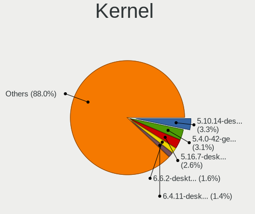

| Version                             | Desktops | Percent |
|-------------------------------------|----------|---------|
| 5.10.14-desktop-1omv4002            | 14       | 5.38%   |
| 5.4.0-42-generic                    | 13       | 5%      |
| 5.16.7-desktop-1omv4003             | 9        | 3.46%   |
| 4.15.0-desktop-45.1rosa-x86_64      | 6        | 2.31%   |
| 5.4.0-48-generic                    | 5        | 1.92%   |
| 5.4.0-52-generic                    | 4        | 1.54%   |
| 5.11.0-37-generic                   | 4        | 1.54%   |
| 5.8.0-55-generic                    | 3        | 1.15%   |
| 5.8.0-48-generic                    | 3        | 1.15%   |
| 5.4.0-72-generic                    | 3        | 1.15%   |
| 5.4.0-65-generic                    | 3        | 1.15%   |
| 4.9.60-nrj-desktop-1rosa-x86_64     | 3        | 1.15%   |
| 4.15.0-desktop-94.1rosa-x86_64      | 3        | 1.15%   |
| 4.15.0-desktop-122.124.1rosa-x86_64 | 3        | 1.15%   |
| 4.15.0-58-generic                   | 3        | 1.15%   |
| 4.15.0-50-generic                   | 3        | 1.15%   |
| 5.8.0-43-generic                    | 2        | 0.77%   |
| 5.8.0-34-generic                    | 2        | 0.77%   |
| 5.8.0-25-generic                    | 2        | 0.77%   |
| 5.4.0-45-generic                    | 2        | 0.77%   |
| 5.4.0-37-generic                    | 2        | 0.77%   |
| 5.4.0-26-generic                    | 2        | 0.77%   |
| 5.3.0-40-generic                    | 2        | 0.77%   |
| 5.3.0-28-generic                    | 2        | 0.77%   |
| 5.16.19-76051619-generic            | 2        | 0.77%   |
| 5.14.10-300.fc35.x86_64             | 2        | 0.77%   |
| 5.13.0-7620-generic                 | 2        | 0.77%   |
| 5.13.0-51-generic                   | 2        | 0.77%   |
| 5.13.0-27-generic                   | 2        | 0.77%   |
| 5.11.0-40-generic                   | 2        | 0.77%   |
| 5.11.0-38-generic                   | 2        | 0.77%   |
| 5.11.0-27-generic                   | 2        | 0.77%   |
| 5.10.74-generic-2rosa2021.1-x86_64  | 2        | 0.77%   |
| 5.0.0-38-generic                    | 2        | 0.77%   |
| 5.0.0-29-generic                    | 2        | 0.77%   |
| 5.0.0-25-generic                    | 2        | 0.77%   |
| 5.0.0-20-generic                    | 2        | 0.77%   |
| 4.1.38-nrj-desktop-2rosa-x86_64     | 2        | 0.77%   |
| 5.9.9-arch1-1                       | 1        | 0.38%   |
| 5.9.8-200.fc33.x86_64               | 1        | 0.38%   |
| 5.9.16-1-MANJARO                    | 1        | 0.38%   |
| 5.9.16-050916-generic               | 1        | 0.38%   |
| 5.9.14-arch1-1                      | 1        | 0.38%   |
| 5.9.1-050901-generic                | 1        | 0.38%   |
| 5.8.5-1-MANJARO                     | 1        | 0.38%   |
| 5.8.18-300.fc33.x86_64              | 1        | 0.38%   |
| 5.8.0-7642-generic                  | 1        | 0.38%   |
| 5.8.0-7630-generic                  | 1        | 0.38%   |
| 5.8.0-53-generic                    | 1        | 0.38%   |
| 5.8.0-50-generic                    | 1        | 0.38%   |
| 5.8.0-49-generic                    | 1        | 0.38%   |
| 5.8.0-41-generic                    | 1        | 0.38%   |
| 5.8.0-36-generic                    | 1        | 0.38%   |
| 5.8.0-29-generic                    | 1        | 0.38%   |
| 5.8.0-1-amd64                       | 1        | 0.38%   |
| 5.7.16-xanmod2                      | 1        | 0.38%   |
| 5.6.4-1-default                     | 1        | 0.38%   |
| 5.5.0-2-amd64                       | 1        | 0.38%   |
| 5.4.32-generic-2rosa-x86_64         | 1        | 0.38%   |
| 5.4.19-200.fc31.x86_64              | 1        | 0.38%   |

Kernel Family
-------------

Linux kernel without a distro release

| Version | Desktops | Percent |
|---------|----------|---------|
| 5.4.0   | 50       | 20.92%  |
| 4.15.0  | 25       | 10.46%  |
| 5.8.0   | 20       | 8.37%   |
| 5.10.14 | 14       | 5.86%   |
| 5.11.0  | 13       | 5.44%   |
| 5.0.0   | 13       | 5.44%   |
| 5.13.0  | 11       | 4.6%    |
| 5.3.0   | 10       | 4.18%   |
| 5.16.7  | 9        | 3.77%   |
| 4.18.0  | 5        | 2.09%   |
| 5.10.0  | 4        | 1.67%   |
| 4.9.60  | 3        | 1.26%   |
| 5.9.16  | 2        | 0.84%   |
| 5.16.19 | 2        | 0.84%   |
| 5.14.10 | 2        | 0.84%   |
| 5.12.0  | 2        | 0.84%   |
| 5.10.74 | 2        | 0.84%   |
| 4.19.0  | 2        | 0.84%   |
| 4.1.38  | 2        | 0.84%   |
| 4.1.34  | 2        | 0.84%   |
| 5.9.9   | 1        | 0.42%   |
| 5.9.8   | 1        | 0.42%   |
| 5.9.14  | 1        | 0.42%   |
| 5.9.1   | 1        | 0.42%   |
| 5.8.5   | 1        | 0.42%   |
| 5.8.18  | 1        | 0.42%   |
| 5.7.16  | 1        | 0.42%   |
| 5.6.4   | 1        | 0.42%   |
| 5.5.0   | 1        | 0.42%   |
| 5.4.32  | 1        | 0.42%   |
| 5.4.19  | 1        | 0.42%   |
| 5.17.9  | 1        | 0.42%   |
| 5.17.7  | 1        | 0.42%   |
| 5.17.6  | 1        | 0.42%   |
| 5.17.11 | 1        | 0.42%   |
| 5.17.1  | 1        | 0.42%   |
| 5.16.11 | 1        | 0.42%   |
| 5.15.5  | 1        | 0.42%   |
| 5.15.32 | 1        | 0.42%   |
| 5.15.28 | 1        | 0.42%   |
| 5.15.11 | 1        | 0.42%   |
| 5.14.16 | 1        | 0.42%   |
| 5.14.14 | 1        | 0.42%   |
| 5.13.16 | 1        | 0.42%   |
| 5.12.9  | 1        | 0.42%   |
| 5.12.8  | 1        | 0.42%   |
| 5.11.11 | 1        | 0.42%   |
| 5.10.68 | 1        | 0.42%   |
| 5.10.5  | 1        | 0.42%   |
| 5.10.43 | 1        | 0.42%   |
| 5.10.42 | 1        | 0.42%   |
| 5.10.36 | 1        | 0.42%   |
| 5.10.34 | 1        | 0.42%   |
| 4.9.9   | 1        | 0.42%   |
| 4.9.20  | 1        | 0.42%   |
| 4.9.155 | 1        | 0.42%   |
| 4.7.6   | 1        | 0.42%   |
| 4.4.0   | 1        | 0.42%   |
| 4.19.93 | 1        | 0.42%   |
| 4.19.88 | 1        | 0.42%   |

Kernel Major Ver.
-----------------

Linux kernel major version

| Version | Desktops | Percent |
|---------|----------|---------|
| 5.4     | 52       | 22.13%  |
| 5.10    | 25       | 10.64%  |
| 4.15    | 25       | 10.64%  |
| 5.8     | 22       | 9.36%   |
| 5.11    | 14       | 5.96%   |
| 5.0     | 13       | 5.53%   |
| 5.16    | 12       | 5.11%   |
| 5.13    | 12       | 5.11%   |
| 5.3     | 10       | 4.26%   |
| 5.9     | 6        | 2.55%   |
| 4.9     | 6        | 2.55%   |
| 4.18    | 6        | 2.55%   |
| 5.17    | 5        | 2.13%   |
| 4.19    | 5        | 2.13%   |
| 5.15    | 4        | 1.7%    |
| 5.14    | 4        | 1.7%    |
| 5.12    | 4        | 1.7%    |
| 4.1     | 4        | 1.7%    |
| 5.7     | 1        | 0.43%   |
| 5.6     | 1        | 0.43%   |
| 5.5     | 1        | 0.43%   |
| 4.7     | 1        | 0.43%   |
| 4.4     | 1        | 0.43%   |
| 3.10    | 1        | 0.43%   |

Arch
----

OS architecture (x86_64, i586, etc.)

| Name   | Desktops | Percent |
|--------|----------|---------|
| x86_64 | 213      | 99.07%  |
| i686   | 2        | 0.93%   |

DE
--

Desktop Environment

| Name       | Desktops | Percent |
|------------|----------|---------|
| GNOME      | 87       | 38.33%  |
| KDE5       | 48       | 21.15%  |
| Unknown    | 35       | 15.42%  |
| KDE4       | 17       | 7.49%   |
| X-Cinnamon | 10       | 4.41%   |
| XFCE       | 9        | 3.96%   |
| KDE        | 7        | 3.08%   |
| Unity      | 4        | 1.76%   |
| MATE       | 4        | 1.76%   |
| i3         | 2        | 0.88%   |
| Cinnamon   | 2        | 0.88%   |
| Pantheon   | 1        | 0.44%   |
| Budgie     | 1        | 0.44%   |

Display Server
--------------

X11 or Wayland

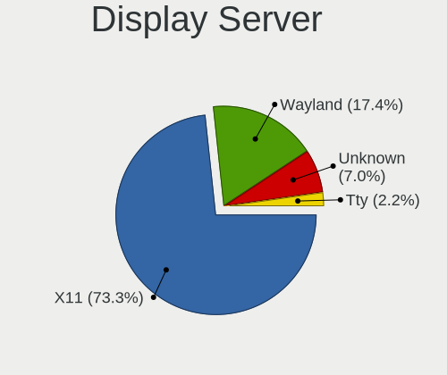

| Name    | Desktops | Percent |
|---------|----------|---------|
| X11     | 181      | 83.03%  |
| Unknown | 20       | 9.17%   |
| Wayland | 11       | 5.05%   |
| Tty     | 6        | 2.75%   |

Display Manager
---------------

SDDM, LightDM, etc.

| Name    | Desktops | Percent |
|---------|----------|---------|
| Unknown | 113      | 51.13%  |
| SDDM    | 40       | 18.1%   |
| GDM     | 26       | 11.76%  |
| KDM     | 17       | 7.69%   |
| GDM3    | 11       | 4.98%   |
| TDM     | 8        | 3.62%   |
| LightDM | 5        | 2.26%   |
| XDM     | 1        | 0.45%   |

OS Lang
-------

Language

| Lang       | Desktops | Percent |
|------------|----------|---------|
| en_IL      | 73       | 33.49%  |
| en_US      | 68       | 31.19%  |
| Unknown    | 41       | 18.81%  |
| he_IL      | 14       | 6.42%   |
| ru_RU      | 13       | 5.96%   |
| C          | 4        | 1.83%   |
| fr_FR      | 2        | 0.92%   |
| POSIX      | 1        | 0.46%   |
| en_US.UTF8 | 1        | 0.46%   |
| C.UTF8     | 1        | 0.46%   |

Boot Mode
---------

EFI or BIOS

| Mode | Desktops | Percent |
|------|----------|---------|
| BIOS | 129      | 59.17%  |
| EFI  | 89       | 40.83%  |

Filesystem
----------

Type of filesystem

| Type    | Desktops | Percent |
|---------|----------|---------|
| Ext4    | 165      | 74.66%  |
| Overlay | 25       | 11.31%  |
| Btrfs   | 15       | 6.79%   |
| Unknown | 9        | 4.07%   |
| Xfs     | 4        | 1.81%   |
| Zfs     | 1        | 0.45%   |
| Tmpfs   | 1        | 0.45%   |
| F2fs    | 1        | 0.45%   |

Part. scheme
------------

Scheme of partitioning

| Type    | Desktops | Percent |
|---------|----------|---------|
| Unknown | 119      | 54.84%  |
| GPT     | 61       | 28.11%  |
| MBR     | 37       | 17.05%  |

Dual Boot with Linux/BSD
------------------------

Hosting more than one Linux/BSD

| Dual boot | Desktops | Percent |
|-----------|----------|---------|
| No        | 177      | 81.19%  |
| Yes       | 41       | 18.81%  |

Dual Boot (Win)
---------------

Hosting Linux and Windows

| Dual boot | Desktops | Percent |
|-----------|----------|---------|
| No        | 145      | 65.61%  |
| Yes       | 76       | 34.39%  |

Board
-----

Vendor
------

Motherboard manufacturer

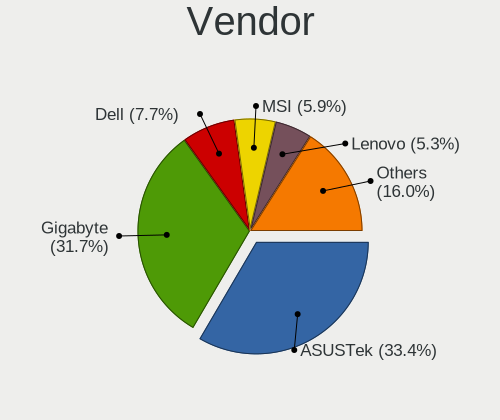

| Name                | Desktops | Percent |
|---------------------|----------|---------|
| Gigabyte Technology | 70       | 32.71%  |
| ASUSTek Computer    | 68       | 31.78%  |
| Dell                | 17       | 7.94%   |
| MSI                 | 11       | 5.14%   |
| Lenovo              | 11       | 5.14%   |
| ASRock              | 10       | 4.67%   |
| Hewlett-Packard     | 9        | 4.21%   |
| Intel               | 4        | 1.87%   |
| Pegatron            | 2        | 0.93%   |
| Foxconn             | 2        | 0.93%   |
| Unknown             | 2        | 0.93%   |
| Supermicro          | 1        | 0.47%   |
| Shuttle             | 1        | 0.47%   |
| ITI LIMITED         | 1        | 0.47%   |
| Hardkernel          | 1        | 0.47%   |
| Biostar             | 1        | 0.47%   |
| AZW                 | 1        | 0.47%   |
| AMI                 | 1        | 0.47%   |
| Alienware           | 1        | 0.47%   |

Model
-----

Motherboard model

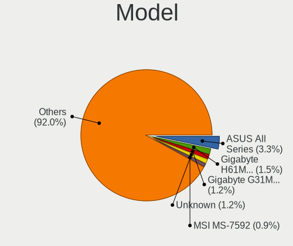

| Name                                   | Desktops | Percent |
|----------------------------------------|----------|---------|
| ASUS All Series                        | 9        | 4.21%   |
| MSI MS-7592                            | 3        | 1.4%    |
| Gigabyte H61M-S1                       | 3        | 1.4%    |
| ASUS P8H61-M LX R2.0                   | 3        | 1.4%    |
| ASUS H110M-A/M.2                       | 3        | 1.4%    |
| Intel DH77EB AAG39073-304              | 2        | 0.93%   |
| Gigabyte Z390 GAMING X                 | 2        | 0.93%   |
| Gigabyte X570 AORUS ULTRA              | 2        | 0.93%   |
| Gigabyte P55-UD3L                      | 2        | 0.93%   |
| Gigabyte H61M-S2PV                     | 2        | 0.93%   |
| Gigabyte H55M-D2H                      | 2        | 0.93%   |
| Gigabyte B460HD3                       | 2        | 0.93%   |
| Dell OptiPlex 755                      | 2        | 0.93%   |
| Dell OptiPlex 7050                     | 2        | 0.93%   |
| ASUS TUF Gaming B550-PLUS              | 2        | 0.93%   |
| ASUS ROG STRIX Z390-E GAMING           | 2        | 0.93%   |
| ASUS PRIME Z490-P                      | 2        | 0.93%   |
| ASUS PRIME X470-PRO                    | 2        | 0.93%   |
| ASUS PRIME H310M-E R2.0                | 2        | 0.93%   |
| ASUS PRIME B560M-K                     | 2        | 0.93%   |
| Unknown                                | 2        | 0.93%   |
| Supermicro X9DAi                       | 1        | 0.47%   |
| Shuttle SH87R                          | 1        | 0.47%   |
| Pegatron Pro 3010 Small Form Factor PC | 1        | 0.47%   |
| Pegatron NC890AA-ABA a6803w            | 1        | 0.47%   |
| MSI MS-7B86                            | 1        | 0.47%   |
| MSI MS-7B79                            | 1        | 0.47%   |
| MSI MS-7984                            | 1        | 0.47%   |
| MSI MS-7982                            | 1        | 0.47%   |
| MSI MS-7978                            | 1        | 0.47%   |
| MSI MS-7816                            | 1        | 0.47%   |
| MSI MS-7788                            | 1        | 0.47%   |
| MSI Elite 7100 Microtower PC           | 1        | 0.47%   |
| Lenovo V530-15ICR 11BH0032IV           | 1        | 0.47%   |
| Lenovo V520-15IKL 10NKS05400           | 1        | 0.47%   |
| Lenovo V520-15IKL 10NK003KIV           | 1        | 0.47%   |
| Lenovo V520-15IKL 10NK001XIV           | 1        | 0.47%   |
| Lenovo ThinkCentre M93p 10A7S02D00     | 1        | 0.47%   |
| Lenovo ThinkCentre M91p 4524B96        | 1        | 0.47%   |
| Lenovo ThinkCentre M91p 4518NR8        | 1        | 0.47%   |
| Lenovo ThinkCentre M81 5049W15         | 1        | 0.47%   |
| Lenovo ThinkCentre M81 5049PA4         | 1        | 0.47%   |
| Lenovo ThinkCentre Edge72 3484BTG      | 1        | 0.47%   |
| Lenovo ThinkCentre A58 751581G         | 1        | 0.47%   |
| ITI LIMITED SMAASH XU3i                | 1        | 0.47%   |
| Intel DP55WB AAE64798-205              | 1        | 0.47%   |
| Intel DG43RK AAE78175-403              | 1        | 0.47%   |
| HP Z620 Workstation                    | 1        | 0.47%   |
| HP ProDesk 600 G3 SFF                  | 1        | 0.47%   |
| HP EliteDesk 800 G3 TWR                | 1        | 0.47%   |
| HP Compaq Pro 6300 MT                  | 1        | 0.47%   |
| HP Compaq Elite 8300 MT                | 1        | 0.47%   |
| HP Compaq 8200 Elite SFF PC            | 1        | 0.47%   |
| HP Compaq 6200 Pro MT PC               | 1        | 0.47%   |
| HP 300-1xx                             | 1        | 0.47%   |
| HP 280 G1 MT                           | 1        | 0.47%   |
| Hardkernel ODROID-H2                   | 1        | 0.47%   |
| Gigabyte Z97X-Gaming 5                 | 1        | 0.47%   |
| Gigabyte Z97-HD3                       | 1        | 0.47%   |
| Gigabyte Z97-D3H                       | 1        | 0.47%   |

Model Family
------------

Motherboard model prefix

| Name                   | Desktops | Percent |
|------------------------|----------|---------|
| ASUS PRIME             | 21       | 9.81%   |
| Dell OptiPlex          | 10       | 4.67%   |
| ASUS All               | 9        | 4.21%   |
| Lenovo ThinkCentre     | 7        | 3.27%   |
| ASUS ROG               | 7        | 3.27%   |
| ASUS TUF               | 6        | 2.8%    |
| HP Compaq              | 4        | 1.87%   |
| Dell Vostro            | 4        | 1.87%   |
| ASUS H110M-A           | 4        | 1.87%   |
| MSI MS-7592            | 3        | 1.4%    |
| Lenovo V520-15IKL      | 3        | 1.4%    |
| Gigabyte Z390          | 3        | 1.4%    |
| Gigabyte X570          | 3        | 1.4%    |
| Gigabyte H61M-S1       | 3        | 1.4%    |
| ASUS P8H61-M           | 3        | 1.4%    |
| Intel DH77EB           | 2        | 0.93%   |
| Gigabyte Z690          | 2        | 0.93%   |
| Gigabyte P55-UD3L      | 2        | 0.93%   |
| Gigabyte H61M-S2PV     | 2        | 0.93%   |
| Gigabyte H55M-D2H      | 2        | 0.93%   |
| Gigabyte B560M         | 2        | 0.93%   |
| Gigabyte B460HD3       | 2        | 0.93%   |
| Gigabyte B450M         | 2        | 0.93%   |
| Dell Precision         | 2        | 0.93%   |
| Unknown                | 2        | 0.93%   |
| Supermicro X9DAi       | 1        | 0.47%   |
| Shuttle SH87R          | 1        | 0.47%   |
| Pegatron Pro           | 1        | 0.47%   |
| Pegatron NC890AA-ABA   | 1        | 0.47%   |
| MSI MS-7B86            | 1        | 0.47%   |
| MSI MS-7B79            | 1        | 0.47%   |
| MSI MS-7984            | 1        | 0.47%   |
| MSI MS-7982            | 1        | 0.47%   |
| MSI MS-7978            | 1        | 0.47%   |
| MSI MS-7816            | 1        | 0.47%   |
| MSI MS-7788            | 1        | 0.47%   |
| MSI Elite              | 1        | 0.47%   |
| Lenovo V530-15ICR      | 1        | 0.47%   |
| ITI LIMITED SMAASH     | 1        | 0.47%   |
| Intel DP55WB           | 1        | 0.47%   |
| Intel DG43RK           | 1        | 0.47%   |
| HP Z620                | 1        | 0.47%   |
| HP ProDesk             | 1        | 0.47%   |
| HP EliteDesk           | 1        | 0.47%   |
| HP 300-1xx             | 1        | 0.47%   |
| HP 280                 | 1        | 0.47%   |
| Hardkernel ODROID-H2   | 1        | 0.47%   |
| Gigabyte Z97X-Gaming   | 1        | 0.47%   |
| Gigabyte Z97-HD3       | 1        | 0.47%   |
| Gigabyte Z97-D3H       | 1        | 0.47%   |
| Gigabyte Z87MX-D3H     | 1        | 0.47%   |
| Gigabyte Z490M         | 1        | 0.47%   |
| Gigabyte Z370          | 1        | 0.47%   |
| Gigabyte Z270X-UD5     | 1        | 0.47%   |
| Gigabyte Z270-HD3P     | 1        | 0.47%   |
| Gigabyte Z170XP-SLI    | 1        | 0.47%   |
| Gigabyte Z170X-Gaming  | 1        | 0.47%   |
| Gigabyte Z170MX-Gaming | 1        | 0.47%   |
| Gigabyte X58A-UD3R     | 1        | 0.47%   |
| Gigabyte X58-USB3      | 1        | 0.47%   |

MFG Year
--------

Motherboard manufacture year

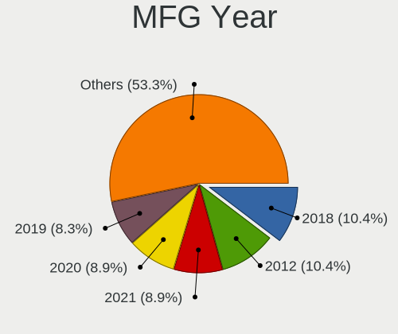

| Year | Desktops | Percent |
|------|----------|---------|
| 2018 | 26       | 12.15%  |
| 2012 | 21       | 9.81%   |
| 2013 | 19       | 8.88%   |
| 2014 | 18       | 8.41%   |
| 2010 | 17       | 7.94%   |
| 2020 | 16       | 7.48%   |
| 2019 | 15       | 7.01%   |
| 2021 | 14       | 6.54%   |
| 2017 | 14       | 6.54%   |
| 2015 | 12       | 5.61%   |
| 2009 | 12       | 5.61%   |
| 2016 | 11       | 5.14%   |
| 2011 | 11       | 5.14%   |
| 2007 | 4        | 1.87%   |
| 2008 | 3        | 1.4%    |
| 2006 | 1        | 0.47%   |

Form Factor
-----------

Physical design of the computer

| Name    | Desktops | Percent |
|---------|----------|---------|
| Desktop | 214      | 100%    |

Secure Boot
-----------

Enabled or disabled

| State    | Desktops | Percent |
|----------|----------|---------|
| Disabled | 213      | 99.53%  |
| Enabled  | 1        | 0.47%   |

Coreboot
--------

Have coreboot on board

| Used | Desktops | Percent |
|------|----------|---------|
| No   | 214      | 100%    |

RAM Size
--------

Total RAM memory

| Size in GB  | Desktops | Percent |
|-------------|----------|---------|
| 16.01-24.0  | 55       | 25.11%  |
| 8.01-16.0   | 41       | 18.72%  |
| 32.01-64.0  | 39       | 17.81%  |
| 3.01-4.0    | 33       | 15.07%  |
| 4.01-8.0    | 28       | 12.79%  |
| 64.01-256.0 | 12       | 5.48%   |
| 1.01-2.0    | 7        | 3.2%    |
| 24.01-32.0  | 3        | 1.37%   |
| 2.01-3.0    | 1        | 0.46%   |

RAM Used
--------

Used RAM memory

| Used GB    | Desktops | Percent |
|------------|----------|---------|
| 1.01-2.0   | 86       | 36.13%  |
| 2.01-3.0   | 46       | 19.33%  |
| 4.01-8.0   | 34       | 14.29%  |
| 3.01-4.0   | 24       | 10.08%  |
| 0.51-1.0   | 21       | 8.82%   |
| 8.01-16.0  | 20       | 8.4%    |
| 0.01-0.5   | 4        | 1.68%   |
| 16.01-24.0 | 2        | 0.84%   |
| 24.01-32.0 | 1        | 0.42%   |

Total Drives
------------

Number of drives on board

| Drives | Desktops | Percent |
|--------|----------|---------|
| 1      | 88       | 39.64%  |
| 2      | 63       | 28.38%  |
| 3      | 40       | 18.02%  |
| 4      | 15       | 6.76%   |
| 5      | 8        | 3.6%    |
| 6      | 3        | 1.35%   |
| 7      | 2        | 0.9%    |
| 10     | 1        | 0.45%   |
| 8      | 1        | 0.45%   |
| 0      | 1        | 0.45%   |

Has CD-ROM
----------

Has CD-ROM on board

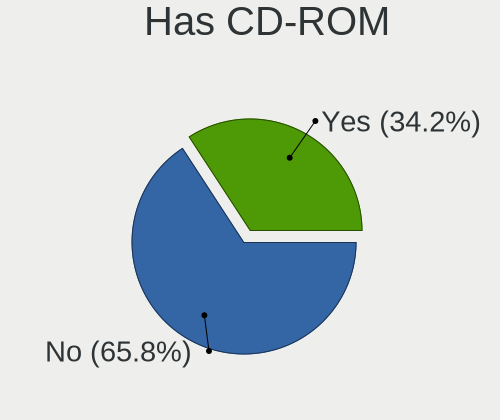

| Presented | Desktops | Percent |
|-----------|----------|---------|
| No        | 136      | 62.67%  |
| Yes       | 81       | 37.33%  |

Has Ethernet
------------

Has Ethernet on board

| Presented | Desktops | Percent |
|-----------|----------|---------|
| Yes       | 212      | 99.07%  |
| No        | 2        | 0.93%   |

Has WiFi
--------

Has WiFi module

| Presented | Desktops | Percent |
|-----------|----------|---------|
| No        | 130      | 60.19%  |
| Yes       | 86       | 39.81%  |

Has Bluetooth
-------------

Has Bluetooth module

| Presented | Desktops | Percent |
|-----------|----------|---------|
| No        | 164      | 75.23%  |
| Yes       | 54       | 24.77%  |

Location
--------

Country
-------

Geographic location (country)

| Country | Desktops | Percent |
|---------|----------|---------|
| Israel  | 214      | 100%    |

City
----

Geographic location (city)

| City                | Desktops | Percent |
|---------------------|----------|---------|
| Tel Aviv            | 84       | 37.84%  |
| Haifa               | 20       | 9.01%   |
| Ramat Gan           | 15       | 6.76%   |
| Peta Tiqwa       | 11       | 4.95%   |
| Rishon LeZiyyon     | 8        | 3.6%    |
| Jerusalem           | 7        | 3.15%   |
| Qiryat Ata          | 6        | 2.7%    |
| Rehovot             | 4        | 1.8%    |
| Holon               | 4        | 1.8%    |
| Herzliya            | 4        | 1.8%    |
| Ashdod              | 4        | 1.8%    |
| Netanya             | 3        | 1.35%   |
| Nahariya            | 3        | 1.35%   |
| Kfar Saba           | 3        | 1.35%   |
| Givatayim           | 3        | 1.35%   |
| Ramat HaSharon      | 2        | 0.9%    |
| Raanana             | 2        | 0.9%    |
| Pardes Hanna Karkur | 2        | 0.9%    |
| Ness Ziona          | 2        | 0.9%    |
| Hod HaSharon        | 2        | 0.9%    |
| Beersheba           | 2        | 0.9%    |
| Bat Yam             | 2        | 0.9%    |
| Afula               | 2        | 0.9%    |
| Yehud               | 1        | 0.45%   |
| Tiberias            | 1        | 0.45%   |
| Tel Mond            | 1        | 0.45%   |
| Rosh HaAyin         | 1        | 0.45%   |
| Peta Tiqwa   | 1        | 0.45%   |
| Peta Tiqwa   | 1        | 0.45%   |
| Pardesiyya          | 1        | 0.45%   |
| Or Yehuda           | 1        | 0.45%   |
| Nazerat 'Illit      | 1        | 0.45%   |
| Meitar              | 1        | 0.45%   |
| Lod                 | 1        | 0.45%   |
| Lapid               | 1        | 0.45%   |
| Kiryat Tiv'on       | 1        | 0.45%   |
| Kiryat Ono          | 1        | 0.45%   |
| Kiryat Gat          | 1        | 0.45%   |
| Karmiel          | 1        | 0.45%   |
| I'billin            | 1        | 0.45%   |
| Hanita              | 1        | 0.45%   |
| Giv'at Hayyim Ihud  | 1        | 0.45%   |
| Bnei Brak           | 1        | 0.45%   |
| Binyamina           | 1        | 0.45%   |
| Bet Shemesh         | 1        | 0.45%   |
| Be'er Ya'aqov       | 1        | 0.45%   |
| Azor                | 1        | 0.45%   |
| Ashquelon           | 1        | 0.45%   |
| Almagor             | 1        | 0.45%   |
| Unknown             | 1        | 0.45%   |

Drives
------

Drive Vendor
------------

Hard drive vendors

| Vendor                    | Desktops | Drives | Percent |
|---------------------------|----------|--------|---------|
| WDC                       | 92       | 158    | 23.17%  |
| Seagate                   | 49       | 83     | 12.34%  |
| Samsung Electronics       | 48       | 73     | 12.09%  |
| Hitachi                   | 34       | 57     | 8.56%   |
| Kingston                  | 28       | 32     | 7.05%   |
| SanDisk                   | 25       | 30     | 6.3%    |
| Toshiba                   | 21       | 26     | 5.29%   |
| Crucial                   | 17       | 29     | 4.28%   |
| Transcend                 | 11       | 14     | 2.77%   |
| Corsair                   | 10       | 14     | 2.52%   |
| Intel                     | 9        | 12     | 2.27%   |
| HGST                      | 8        | 10     | 2.02%   |
| XPG                       | 5        | 11     | 1.26%   |
| Micron Technology         | 4        | 5      | 1.01%   |
| A-DATA Technology         | 4        | 5      | 1.01%   |
| SK hynix                  | 3        | 3      | 0.76%   |
| Silicon Motion            | 3        | 3      | 0.76%   |
| Phison                    | 3        | 4      | 0.76%   |
| SPCC                      | 2        | 2      | 0.5%    |
| OCZ                       | 2        | 2      | 0.5%    |
| Netac                     | 2        | 2      | 0.5%    |
| Micron/Crucial Technology | 2        | 2      | 0.5%    |
| USB3.0                    | 1        | 1      | 0.25%   |
| Unknown                   | 1        | 2      | 0.25%   |
| TPH01204000GB             | 1        | 1      | 0.25%   |
| StoreJet                  | 1        | 1      | 0.25%   |
| Plextor                   | 1        | 1      | 0.25%   |
| Patriot                   | 1        | 1      | 0.25%   |
| OCZ-VERTEX3               | 1        | 1      | 0.25%   |
| NGFF                      | 1        | 1      | 0.25%   |
| LS600                     | 1        | 1      | 0.25%   |
| KIOXIA-EXCERIA            | 1        | 1      | 0.25%   |
| KingSpec                  | 1        | 1      | 0.25%   |
| IBM/Hitachi               | 1        | 1      | 0.25%   |
| China                     | 1        | 1      | 0.25%   |
| Apple                     | 1        | 1      | 0.25%   |
| Apacer                    | 1        | 1      | 0.25%   |

Drive Model
-----------

Hard drive models

| Model                             | Desktops | Percent |
|-----------------------------------|----------|---------|
| SanDisk SSD PLUS 240GB            | 9        | 1.97%   |
| Hitachi HDS721050CLA362 500GB     | 9        | 1.97%   |
| Kingston SA400S37240G 240GB SSD   | 7        | 1.54%   |
| Toshiba DT01ACA100 1TB            | 6        | 1.32%   |
| Samsung SSD 860 EVO 500GB         | 6        | 1.32%   |
| Samsung SSD 850 EVO 250GB         | 6        | 1.32%   |
| WDC WD20PURX-64P6ZY0 2TB          | 5        | 1.1%    |
| WDC WD10EZEX-08WN4A0 1TB          | 5        | 1.1%    |
| Seagate ST500DM002-1BD142 500GB   | 5        | 1.1%    |
| Seagate ST2000DM008-2FR102 2TB    | 5        | 1.1%    |
| Samsung NVMe SSD Drive 500GB      | 5        | 1.1%    |
| HGST HTS545050A7E680 500GB        | 5        | 1.1%    |
| Samsung NVMe SSD Drive 1TB        | 4        | 0.88%   |
| WDC WD10EZEX-00BN5A0 1TB          | 3        | 0.66%   |
| WDC WD10EARS-00Y5B1 1TB           | 3        | 0.66%   |
| WDC WD10EADS-00L5B1 1TB           | 3        | 0.66%   |
| WDC WD1003FZEX-00MK2A0 1TB        | 3        | 0.66%   |
| Toshiba DT01ACA050 500GB          | 3        | 0.66%   |
| Seagate ST2000DM001-1ER164 2TB    | 3        | 0.66%   |
| Seagate ST1000DM003-1CH162 1TB    | 3        | 0.66%   |
| Samsung SSD 970 EVO Plus 500GB    | 3        | 0.66%   |
| Samsung SSD 860 QVO 1TB           | 3        | 0.66%   |
| Kingston SV300S37A120G 120GB SSD  | 3        | 0.66%   |
| Hitachi HDS721050CLA360 500GB     | 3        | 0.66%   |
| XPG NVMe SSD Drive 1024GB         | 2        | 0.44%   |
| WDC WDS250G1B0A-00H9H0 250GB SSD  | 2        | 0.44%   |
| WDC WDS100T3X0C-00SJG0 1TB        | 2        | 0.44%   |
| WDC WD5000AZRX-00A8LB0 500GB      | 2        | 0.44%   |
| WDC WD5000AAKX-60U6AA0 500GB      | 2        | 0.44%   |
| WDC WD5000AAKX-00ERMA0 500GB      | 2        | 0.44%   |
| WDC WD5000AAKX-001CA0 500GB       | 2        | 0.44%   |
| WDC WD3200AAKS-00L9A0 320GB       | 2        | 0.44%   |
| WDC WD20EZRZ-00Z5HB0 2TB          | 2        | 0.44%   |
| WDC WD20EZAZ-00GGJB0 2TB          | 2        | 0.44%   |
| WDC WD20EFRX-68EUZN0 2TB          | 2        | 0.44%   |
| WDC WD2003FZEX-00Z4SA0 2TB        | 2        | 0.44%   |
| WDC WD10EZRX-00A8LB0 1TB          | 2        | 0.44%   |
| WDC WD10EZEX-08M2NA0 1TB          | 2        | 0.44%   |
| Transcend TS128GSSD370 128GB      | 2        | 0.44%   |
| Transcend TS128GSSD230S 128GB     | 2        | 0.44%   |
| Toshiba DT01ACA200 2TB            | 2        | 0.44%   |
| Seagate ST500DM002-1SB10A 500GB   | 2        | 0.44%   |
| Seagate ST4000DM004-2CV104 4TB    | 2        | 0.44%   |
| Seagate ST3500418AS 500GB         | 2        | 0.44%   |
| Seagate ST2000DM006-2DM164 2TB    | 2        | 0.44%   |
| Seagate ST1000DM003-1SB102 1TB    | 2        | 0.44%   |
| Seagate Expansion Desk 4TB        | 2        | 0.44%   |
| SanDisk SSD PLUS 480GB            | 2        | 0.44%   |
| SanDisk Extreme SSD 500GB         | 2        | 0.44%   |
| Samsung SSD 860 EVO 250GB         | 2        | 0.44%   |
| Samsung SSD 860 EVO 1TB           | 2        | 0.44%   |
| Samsung SSD 850 EVO 500GB         | 2        | 0.44%   |
| Samsung NVMe SSD Drive 250GB      | 2        | 0.44%   |
| Samsung HD103SJ 1TB               | 2        | 0.44%   |
| Netac SSD 240GB                   | 2        | 0.44%   |
| Micron/Crucial NVMe SSD Drive 1TB | 2        | 0.44%   |
| Kingston SUV400S37240G 240GB SSD  | 2        | 0.44%   |
| Kingston SUV400S37120G 120GB SSD  | 2        | 0.44%   |
| Kingston SA400S37480G 480GB SSD   | 2        | 0.44%   |
| Kingston SA400S37120G 120GB SSD   | 2        | 0.44%   |

HDD Vendor
----------

Hard disk drive vendors

| Vendor              | Desktops | Drives | Percent |
|---------------------|----------|--------|---------|
| WDC                 | 86       | 145    | 41.75%  |
| Seagate             | 49       | 82     | 23.79%  |
| Hitachi             | 34       | 57     | 16.5%   |
| Toshiba             | 19       | 24     | 9.22%   |
| HGST                | 8        | 10     | 3.88%   |
| Samsung Electronics | 6        | 12     | 2.91%   |
| USB3.0              | 1        | 1      | 0.49%   |
| TPH01204000GB       | 1        | 1      | 0.49%   |
| IBM/Hitachi         | 1        | 1      | 0.49%   |
| Apple               | 1        | 1      | 0.49%   |

SSD Vendor
----------

Solid state drive vendors

| Vendor              | Desktops | Drives | Percent |
|---------------------|----------|--------|---------|
| Samsung Electronics | 28       | 39     | 20.14%  |
| Kingston            | 24       | 27     | 17.27%  |
| SanDisk             | 21       | 26     | 15.11%  |
| Transcend           | 11       | 14     | 7.91%   |
| Crucial             | 11       | 21     | 7.91%   |
| Corsair             | 9        | 12     | 6.47%   |
| Intel               | 7        | 8      | 5.04%   |
| WDC                 | 5        | 5      | 3.6%    |
| Micron Technology   | 4        | 5      | 2.88%   |
| A-DATA Technology   | 4        | 5      | 2.88%   |
| OCZ                 | 2        | 2      | 1.44%   |
| Netac               | 2        | 2      | 1.44%   |
| SPCC                | 1        | 1      | 0.72%   |
| Seagate             | 1        | 1      | 0.72%   |
| Plextor             | 1        | 1      | 0.72%   |
| Patriot             | 1        | 1      | 0.72%   |
| OCZ-VERTEX3         | 1        | 1      | 0.72%   |
| NGFF                | 1        | 1      | 0.72%   |
| LS600               | 1        | 1      | 0.72%   |
| KIOXIA-EXCERIA      | 1        | 1      | 0.72%   |
| KingSpec            | 1        | 1      | 0.72%   |
| China               | 1        | 1      | 0.72%   |
| Apacer              | 1        | 1      | 0.72%   |

Drive Kind
----------

HDD or SSD

| Kind    | Desktops | Drives | Percent |
|---------|----------|--------|---------|
| HDD     | 156      | 334    | 47.42%  |
| SSD     | 115      | 177    | 34.95%  |
| NVMe    | 55       | 78     | 16.72%  |
| Unknown | 2        | 3      | 0.61%   |
| MMC     | 1        | 1      | 0.3%    |

Drive Connector
---------------

SATA, SAS, NVMe, etc.

| Type | Desktops | Drives | Percent |
|------|----------|--------|---------|
| SATA | 189      | 500    | 74.12%  |
| NVMe | 55       | 78     | 21.57%  |
| SAS  | 10       | 14     | 3.92%   |
| MMC  | 1        | 1      | 0.39%   |

Drive Size
----------

Size of hard drive

| Size in TB | Desktops | Drives | Percent |
|------------|----------|--------|---------|
| 0.01-0.5   | 150      | 293    | 53.19%  |
| 0.51-1.0   | 69       | 107    | 24.47%  |
| 1.01-2.0   | 40       | 59     | 14.18%  |
| 3.01-4.0   | 10       | 30     | 3.55%   |
| 2.01-3.0   | 9        | 12     | 3.19%   |
| 4.01-10.0  | 3        | 5      | 1.06%   |
| 10.01-20.0 | 1        | 5      | 0.35%   |

Space Total
-----------

Amount of disk space available on the file system

| Size in GB     | Desktops | Percent |
|----------------|----------|---------|
| 251-500        | 45       | 20%     |
| 101-250        | 42       | 18.67%  |
| 501-1000       | 35       | 15.56%  |
| 1001-2000      | 25       | 11.11%  |
| More than 3000 | 19       | 8.44%   |
| 2001-3000      | 19       | 8.44%   |
| 1-20           | 17       | 7.56%   |
| 21-50          | 11       | 4.89%   |
| 51-100         | 7        | 3.11%   |
| Unknown        | 5        | 2.22%   |

Space Used
----------

Amount of used disk space

| Used GB        | Desktops | Percent |
|----------------|----------|---------|
| 1-20           | 98       | 42.24%  |
| 21-50          | 32       | 13.79%  |
| 101-250        | 22       | 9.48%   |
| 1001-2000      | 20       | 8.62%   |
| 251-500        | 17       | 7.33%   |
| 501-1000       | 12       | 5.17%   |
| 51-100         | 11       | 4.74%   |
| 2001-3000      | 8        | 3.45%   |
| More than 3000 | 7        | 3.02%   |
| Unknown        | 5        | 2.16%   |

Malfunc. Drives
---------------

Drive models with a malfunction

| Model                               | Desktops | Drives | Percent |
|-------------------------------------|----------|--------|---------|
| HGST HTS545050A7E680 500GB          | 5        | 7      | 13.89%  |
| WDC WD10EARS-00Y5B1 1TB             | 2        | 2      | 5.56%   |
| WDC WD10EADS-00L5B1 1TB             | 2        | 2      | 5.56%   |
| Hitachi HDS721050CLA362 500GB       | 2        | 3      | 5.56%   |
| WDC WD5001AALS-00LWTA0 500GB        | 1        | 1      | 2.78%   |
| WDC WD5000AAKX-60U6AA0 500GB        | 1        | 1      | 2.78%   |
| WDC WD3200AAKS-00L9A0 320GB         | 1        | 1      | 2.78%   |
| WDC WD2500AAJS-00VTA0 250GB         | 1        | 1      | 2.78%   |
| WDC WD20EARS-00MVWB0 2TB            | 1        | 2      | 2.78%   |
| WDC WD10EZEX-00ZF5A0 1TB            | 1        | 1      | 2.78%   |
| WDC WD10EZEX-00RKKA0 1TB            | 1        | 1      | 2.78%   |
| WDC WD1001FALS-00J7B1 1TB           | 1        | 1      | 2.78%   |
| Seagate ST500LM012 HN-M500MBB 500GB | 1        | 1      | 2.78%   |
| Seagate ST3750528AS 752GB           | 1        | 1      | 2.78%   |
| Seagate ST3500418AS 500GB           | 1        | 1      | 2.78%   |
| Seagate ST31000528AS 1TB            | 1        | 1      | 2.78%   |
| Seagate ST2000DM001-1ER164 2TB      | 1        | 1      | 2.78%   |
| Seagate ST1000LM014-SSHD-8GB        | 1        | 1      | 2.78%   |
| Seagate ST1000DM003-1CH162 1TB      | 1        | 1      | 2.78%   |
| Samsung Electronics HD502HJ 500GB   | 1        | 2      | 2.78%   |
| Hitachi HUA723020ALA640 2TB         | 1        | 1      | 2.78%   |
| Hitachi HTS545050B9A300 500GB       | 1        | 1      | 2.78%   |
| Hitachi HDS721050CLA360 500GB       | 1        | 1      | 2.78%   |
| Hitachi HDS721032CLA362 320GB       | 1        | 1      | 2.78%   |
| Hitachi HDP725050GLAT80 500GB       | 1        | 1      | 2.78%   |
| Hitachi HDP725050GLA360 500GB       | 1        | 1      | 2.78%   |
| HGST HTS721010A9E630 1TB            | 1        | 1      | 2.78%   |
| Corsair Neutron XT SSD 240GB        | 1        | 1      | 2.78%   |
| Corsair Neutron SSD 64GB            | 1        | 1      | 2.78%   |

Malfunc. Drive Vendor
---------------------

Vendors of faulty drives

| Vendor              | Desktops | Drives | Percent |
|---------------------|----------|--------|---------|
| WDC                 | 11       | 13     | 31.43%  |
| Hitachi             | 8        | 9      | 22.86%  |
| Seagate             | 7        | 7      | 20%     |
| HGST                | 6        | 8      | 17.14%  |
| Corsair             | 2        | 2      | 5.71%   |
| Samsung Electronics | 1        | 2      | 2.86%   |

Malfunc. HDD Vendor
-------------------

Vendors of faulty HDD drives

| Vendor              | Desktops | Drives | Percent |
|---------------------|----------|--------|---------|
| WDC                 | 11       | 13     | 33.33%  |
| Hitachi             | 8        | 9      | 24.24%  |
| Seagate             | 7        | 7      | 21.21%  |
| HGST                | 6        | 8      | 18.18%  |
| Samsung Electronics | 1        | 2      | 3.03%   |

Malfunc. Drive Kind
-------------------

Kinds of faulty drives

| Kind | Desktops | Drives | Percent |
|------|----------|--------|---------|
| HDD  | 27       | 39     | 93.1%   |
| SSD  | 2        | 2      | 6.9%    |

Failed Drives
-------------

Failed drive models

| Model                           | Desktops | Drives | Percent |
|---------------------------------|----------|--------|---------|
| Toshiba MK3256GSY 320GB         | 1        | 1      | 33.33%  |
| Samsung Electronics HD103SJ 1TB | 1        | 1      | 33.33%  |
| Hitachi HTS547550A9E384 500GB   | 1        | 2      | 33.33%  |

Failed Drive Vendor
-------------------

Failed drive vendors

| Vendor              | Desktops | Drives | Percent |
|---------------------|----------|--------|---------|
| Toshiba             | 1        | 1      | 33.33%  |
| Samsung Electronics | 1        | 1      | 33.33%  |
| Hitachi             | 1        | 2      | 33.33%  |

Drive Status
------------

Number of failed and malfunc. drives

| Status   | Desktops | Drives | Percent |
|----------|----------|--------|---------|
| Detected | 124      | 380    | 52.77%  |
| Works    | 81       | 168    | 34.47%  |
| Malfunc  | 28       | 41     | 11.91%  |
| Failed   | 2        | 4      | 0.85%   |

Storage controller
------------------

Storage Vendor
--------------

Storage controller vendors

| Vendor                       | Desktops | Percent |
|------------------------------|----------|---------|
| Intel                        | 177      | 60.41%  |
| AMD                          | 35       | 11.95%  |
| Samsung Electronics          | 20       | 6.83%   |
| SanDisk                      | 9        | 3.07%   |
| JMicron Technology           | 9        | 3.07%   |
| Micron/Crucial Technology    | 8        | 2.73%   |
| Phison Electronics           | 5        | 1.71%   |
| Kingston Technology Company  | 5        | 1.71%   |
| ASMedia Technology           | 5        | 1.71%   |
| ADATA Technology             | 5        | 1.71%   |
| SK hynix                     | 3        | 1.02%   |
| Silicon Motion               | 3        | 1.02%   |
| Nvidia                       | 3        | 1.02%   |
| Marvell Technology Group     | 3        | 1.02%   |
| Toshiba America Info Systems | 2        | 0.68%   |
| VIA Technologies             | 1        | 0.34%   |

Storage Model
-------------

Storage controller models

| Model                                                                                   | Desktops | Percent |
|-----------------------------------------------------------------------------------------|----------|---------|
| AMD FCH SATA Controller [AHCI mode]                                                     | 27       | 7.67%   |
| Intel 200 Series PCH SATA controller [AHCI mode]                                        | 19       | 5.4%    |
| Intel 8 Series/C220 Series Chipset Family 6-port SATA Controller 1 [AHCI mode]          | 17       | 4.83%   |
| Intel Q170/Q150/B150/H170/H110/Z170/CM236 Chipset SATA Controller [AHCI Mode]           | 16       | 4.55%   |
| Intel NM10/ICH7 Family SATA Controller [IDE mode]                                       | 14       | 3.98%   |
| Intel 6 Series/C200 Series Chipset Family 6 port Desktop SATA AHCI Controller           | 14       | 3.98%   |
| Samsung NVMe SSD Controller SM981/PM981/PM983                                           | 13       | 3.69%   |
| Intel 82801G (ICH7 Family) IDE Controller                                               | 12       | 3.41%   |
| Intel SATA Controller [RAID mode]                                                       | 10       | 2.84%   |
| Intel 9 Series Chipset Family SATA Controller [AHCI Mode]                               | 10       | 2.84%   |
| AMD 400 Series Chipset SATA Controller                                                  | 10       | 2.84%   |
| Intel Cannon Lake PCH SATA AHCI Controller                                              | 9        | 2.56%   |
| Intel 6 Series/C200 Series Chipset Family Desktop SATA Controller (IDE mode, ports 4-5) | 8        | 2.27%   |
| Intel 6 Series/C200 Series Chipset Family Desktop SATA Controller (IDE mode, ports 0-3) | 8        | 2.27%   |
| Intel Comet Lake SATA AHCI Controller                                                   | 6        | 1.7%    |
| Intel 500 Series Chipset Family SATA AHCI Controller                                    | 6        | 1.7%    |
| Intel 5 Series/3400 Series Chipset 4 port SATA IDE Controller                           | 6        | 1.7%    |
| Intel 5 Series/3400 Series Chipset 2 port SATA IDE Controller                           | 6        | 1.7%    |
| Intel 400 Series Chipset Family SATA AHCI Controller                                    | 6        | 1.7%    |
| JMicron JMB363 SATA/IDE Controller                                                      | 5        | 1.42%   |
| ASMedia ASM1062 Serial ATA Controller                                                   | 5        | 1.42%   |
| Samsung NVMe SSD Controller SM961/PM961/SM963                                           | 4        | 1.14%   |
| Micron/Crucial Non-Volatile memory controller                                           | 4        | 1.14%   |
| Intel Alder Lake-S PCH SATA Controller [AHCI Mode]                                      | 4        | 1.14%   |
| Intel 82801JI (ICH10 Family) SATA AHCI Controller                                       | 4        | 1.14%   |
| Intel 7 Series/C210 Series Chipset Family 6-port SATA Controller [AHCI mode]            | 4        | 1.14%   |
| AMD SB7x0/SB8x0/SB9x0 SATA Controller [AHCI mode]                                       | 4        | 1.14%   |
| ADATA XPG SX8200 Pro PCIe Gen3x4 M.2 2280 Solid State Drive                             | 4        | 1.14%   |
| Silicon Motion SM2262/SM2262EN SSD Controller                                           | 3        | 0.85%   |
| SanDisk WD Black SN750 / PC SN730 NVMe SSD                                              | 3        | 0.85%   |
| Kingston Company A2000 NVMe SSD                                                         | 3        | 0.85%   |
| Intel 7 Series/C210 Series Chipset Family 4-port SATA Controller [IDE mode]             | 3        | 0.85%   |
| Intel 7 Series/C210 Series Chipset Family 2-port SATA Controller [IDE mode]             | 3        | 0.85%   |
| Intel 5 Series/3400 Series Chipset 6 port SATA AHCI Controller                          | 3        | 0.85%   |
| AMD 500 Series Chipset SATA Controller                                                  | 3        | 0.85%   |
| AMD 300 Series Chipset SATA Controller                                                  | 3        | 0.85%   |
| SanDisk WD PC SN810 / Black SN850 NVMe SSD                                              | 2        | 0.57%   |
| Samsung NVMe SSD Controller 980                                                         | 2        | 0.57%   |
| Phison E16 PCIe4 NVMe Controller                                                        | 2        | 0.57%   |
| Nvidia MCP61 SATA Controller                                                            | 2        | 0.57%   |
| Micron/Crucial P2 NVMe PCIe SSD                                                         | 2        | 0.57%   |
| Micron/Crucial P1 NVMe PCIe SSD                                                         | 2        | 0.57%   |
| JMicron JMB368 IDE controller                                                           | 2        | 0.57%   |
| JMicron JMB362 SATA Controller                                                          | 2        | 0.57%   |
| Intel Volume Management Device NVMe RAID Controller                                     | 2        | 0.57%   |
| Intel SSD 660P Series                                                                   | 2        | 0.57%   |
| Intel C602 chipset 4-Port SATA Storage Control Unit                                     | 2        | 0.57%   |
| Intel C600/X79 series chipset SATA RAID Controller                                      | 2        | 0.57%   |
| Intel C600/X79 series chipset 6-Port SATA AHCI Controller                               | 2        | 0.57%   |
| Intel 82Q35 Express PT IDER Controller                                                  | 2        | 0.57%   |
| Intel 82801JI (ICH10 Family) 4 port SATA IDE Controller #1                              | 2        | 0.57%   |
| Intel 82801JI (ICH10 Family) 2 port SATA IDE Controller #2                              | 2        | 0.57%   |
| Intel 82801IR/IO/IH (ICH9R/DO/DH) 4 port SATA Controller [IDE mode]                     | 2        | 0.57%   |
| Intel 82801I (ICH9 Family) 2 port SATA Controller [IDE mode]                            | 2        | 0.57%   |
| AMD SB7x0/SB8x0/SB9x0 IDE Controller                                                    | 2        | 0.57%   |
| VIA VT6415 PATA IDE Host Controller                                                     | 1        | 0.28%   |
| Toshiba America Info Systems XG6 NVMe SSD Controller                                    | 1        | 0.28%   |
| Toshiba America Info Systems XG4 NVMe SSD Controller                                    | 1        | 0.28%   |
| SK hynix Non-Volatile memory controller                                                 | 1        | 0.28%   |
| SK hynix Gold P31 SSD                                                                   | 1        | 0.28%   |

Storage Kind
------------

Kind of storage controller (IDE, SATA, NVMe, SAS, ...)

| Kind | Desktops | Percent |
|------|----------|---------|
| SATA | 164      | 57.95%  |
| NVMe | 56       | 19.79%  |
| IDE  | 47       | 16.61%  |
| RAID | 14       | 4.95%   |
| SAS  | 2        | 0.71%   |

Processor
---------

CPU Vendor
----------

Processor vendors

| Vendor | Desktops | Percent |
|--------|----------|---------|
| Intel  | 177      | 82.71%  |
| AMD    | 37       | 17.29%  |

CPU Model
---------

Processor models

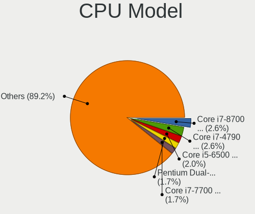

| Model                                       | Desktops | Percent |
|---------------------------------------------|----------|---------|
| Intel Core i7-4790 CPU @ 3.60GHz            | 8        | 3.69%   |
| Intel Core i7-8700 CPU @ 3.20GHz            | 7        | 3.23%   |
| Intel Core i7-3770 CPU @ 3.40GHz            | 5        | 2.3%    |
| Intel Pentium Dual-Core CPU E5500 @ 2.80GHz | 4        | 1.84%   |
| Intel Pentium CPU G2030 @ 3.00GHz           | 4        | 1.84%   |
| Intel Core i7-7700K CPU @ 4.20GHz           | 4        | 1.84%   |
| Intel Core i7-4770 CPU @ 3.40GHz            | 4        | 1.84%   |
| Intel Core i7-10700 CPU @ 2.90GHz           | 4        | 1.84%   |
| Intel Core i5-6500 CPU @ 3.20GHz            | 4        | 1.84%   |
| Intel Core i5-4460 CPU @ 3.20GHz            | 4        | 1.84%   |
| Intel Core i5-2400 CPU @ 3.10GHz            | 4        | 1.84%   |
| Intel Core 2 Duo CPU E7500 @ 2.93GHz        | 4        | 1.84%   |
| AMD Ryzen 9 3900X 12-Core Processor         | 4        | 1.84%   |
| Intel Pentium Dual-Core CPU E5300 @ 2.60GHz | 3        | 1.38%   |
| Intel Core i7-9700 CPU @ 3.00GHz            | 3        | 1.38%   |
| Intel Core i7-8700K CPU @ 3.70GHz           | 3        | 1.38%   |
| Intel Core i5-7400 CPU @ 3.00GHz            | 3        | 1.38%   |
| Intel Core i5-4690 CPU @ 3.50GHz            | 3        | 1.38%   |
| Intel Core i5 CPU 760 @ 2.80GHz             | 3        | 1.38%   |
| Intel Core i3-7100 CPU @ 3.90GHz            | 3        | 1.38%   |
| Intel Core i3-3220 CPU @ 3.30GHz            | 3        | 1.38%   |
| Intel Core i3-2120 CPU @ 3.30GHz            | 3        | 1.38%   |
| AMD Ryzen 5 3400G with Radeon Vega Graphics | 3        | 1.38%   |
| Intel Xeon CPU E5-2630 v2 @ 2.60GHz         | 2        | 0.92%   |
| Intel Pentium Dual-Core CPU E6600 @ 3.06GHz | 2        | 0.92%   |
| Intel Pentium Dual CPU E2160 @ 1.80GHz      | 2        | 0.92%   |
| Intel Pentium CPU G645 @ 2.90GHz            | 2        | 0.92%   |
| Intel Core i7-9700K CPU @ 3.60GHz           | 2        | 0.92%   |
| Intel Core i7-7700 CPU @ 3.60GHz            | 2        | 0.92%   |
| Intel Core i7-6700K CPU @ 4.00GHz           | 2        | 0.92%   |
| Intel Core i7-4770K CPU @ 3.50GHz           | 2        | 0.92%   |
| Intel Core i5-7500 CPU @ 3.40GHz            | 2        | 0.92%   |
| Intel Core i5-6600K CPU @ 3.50GHz           | 2        | 0.92%   |
| Intel Core i5-6400 CPU @ 2.70GHz            | 2        | 0.92%   |
| Intel Core i5-4590S CPU @ 3.00GHz           | 2        | 0.92%   |
| Intel Core i5-4570 CPU @ 3.20GHz            | 2        | 0.92%   |
| Intel Core i5-10400 CPU @ 2.90GHz           | 2        | 0.92%   |
| Intel Core i5 CPU 750 @ 2.67GHz             | 2        | 0.92%   |
| Intel Core i3-6100 CPU @ 3.70GHz            | 2        | 0.92%   |
| Intel Core i3-4170 CPU @ 3.70GHz            | 2        | 0.92%   |
| Intel Core i3-3240 CPU @ 3.40GHz            | 2        | 0.92%   |
| Intel Core i3-2100 CPU @ 3.10GHz            | 2        | 0.92%   |
| Intel Core i3 CPU 530 @ 2.93GHz             | 2        | 0.92%   |
| Intel Core 2 Duo CPU E8400 @ 3.00GHz        | 2        | 0.92%   |
| Intel 12th Gen Core i9-12900K               | 2        | 0.92%   |
| Intel 11th Gen Core i7-11700 @ 2.50GHz      | 2        | 0.92%   |
| AMD Ryzen 9 5900X 12-Core Processor         | 2        | 0.92%   |
| AMD Ryzen 7 3700X 8-Core Processor          | 2        | 0.92%   |
| AMD Ryzen 7 2700X Eight-Core Processor      | 2        | 0.92%   |
| AMD Ryzen 5 3600 6-Core Processor           | 2        | 0.92%   |
| AMD Ryzen 5 2400G with Radeon Vega Graphics | 2        | 0.92%   |
| Intel Xeon CPU X5660 @ 2.80GHz              | 1        | 0.46%   |
| Intel Xeon CPU X3470 @ 2.93GHz              | 1        | 0.46%   |
| Intel Xeon CPU E5450 @ 3.00GHz              | 1        | 0.46%   |
| Intel Xeon CPU E5-2667 v2 @ 3.30GHz         | 1        | 0.46%   |
| Intel Xeon CPU E5-2620 v2 @ 2.10GHz         | 1        | 0.46%   |
| Intel Xeon CPU E3-1265L v4 @ 2.30GHz        | 1        | 0.46%   |
| Intel Pentium Gold G6405 CPU @ 4.10GHz      | 1        | 0.46%   |
| Intel Pentium Dual-Core CPU E6500 @ 2.93GHz | 1        | 0.46%   |
| Intel Pentium Dual-Core CPU E5700 @ 3.00GHz | 1        | 0.46%   |

CPU Model Family
----------------

Processor model prefix

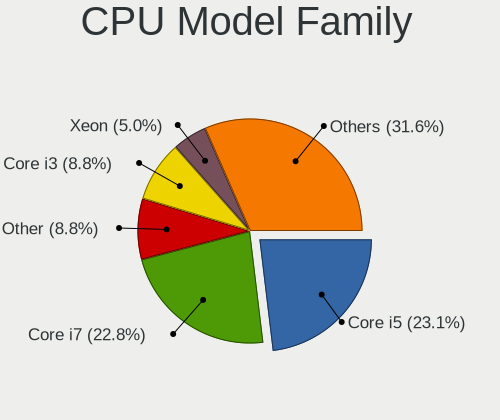

| Model                   | Desktops | Percent |
|-------------------------|----------|---------|
| Intel Core i7           | 55       | 25.58%  |
| Intel Core i5           | 46       | 21.4%   |
| Intel Core i3           | 23       | 10.7%   |
| Intel Pentium Dual-Core | 11       | 5.12%   |
| AMD Ryzen 5             | 11       | 5.12%   |
| Other                   | 9        | 4.19%   |
| Intel Pentium           | 8        | 3.72%   |
| Intel Xeon              | 7        | 3.26%   |
| Intel Core 2 Duo        | 6        | 2.79%   |
| AMD Ryzen 9             | 6        | 2.79%   |
| AMD Ryzen 7             | 6        | 2.79%   |
| Intel Celeron           | 3        | 1.4%    |
| AMD A8                  | 3        | 1.4%    |
| Intel Pentium Dual      | 2        | 0.93%   |
| Intel Genuine           | 2        | 0.93%   |
| Intel Atom              | 2        | 0.93%   |
| AMD FX                  | 2        | 0.93%   |
| Intel Pentium Gold      | 1        | 0.47%   |
| Intel Pentium 4         | 1        | 0.47%   |
| Intel Core i9           | 1        | 0.47%   |
| Intel Core 2 Quad       | 1        | 0.47%   |
| AMD Ryzen Threadripper  | 1        | 0.47%   |
| AMD Ryzen 3 PRO         | 1        | 0.47%   |
| AMD Ryzen 3             | 1        | 0.47%   |
| AMD Phenom II X4        | 1        | 0.47%   |
| AMD Phenom              | 1        | 0.47%   |
| AMD Athlon II X3        | 1        | 0.47%   |
| AMD Athlon 64 X2        | 1        | 0.47%   |
| AMD A6                  | 1        | 0.47%   |
| AMD A10                 | 1        | 0.47%   |

CPU Cores
---------

Number of processor cores

| Number | Desktops | Percent |
|--------|----------|---------|
| 4      | 92       | 42.79%  |
| 2      | 56       | 26.05%  |
| 6      | 27       | 12.56%  |
| 8      | 21       | 9.77%   |
| 12     | 9        | 4.19%   |
| 16     | 5        | 2.33%   |
| 3      | 2        | 0.93%   |
| 1      | 2        | 0.93%   |
| 10     | 1        | 0.47%   |

CPU Sockets
-----------

Number of sockets

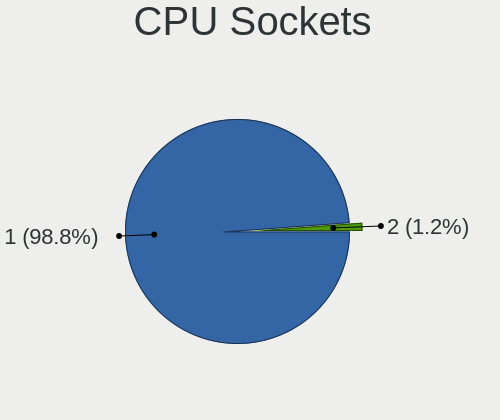

| Number | Desktops | Percent |
|--------|----------|---------|
| 1      | 212      | 99.07%  |
| 2      | 2        | 0.93%   |

CPU Threads
-----------

Threads per core (Hyper-Threading)

| Number | Desktops | Percent |
|--------|----------|---------|
| 2      | 125      | 58.14%  |
| 1      | 90       | 41.86%  |

CPU Op-Modes
------------

CPU Operation Modes (32-bit, 64-bit)

| Op mode        | Desktops | Percent |
|----------------|----------|---------|
| 32-bit, 64-bit | 213      | 99.53%  |
| Unknown        | 1        | 0.47%   |

CPU Microcode
-------------

Microcode number

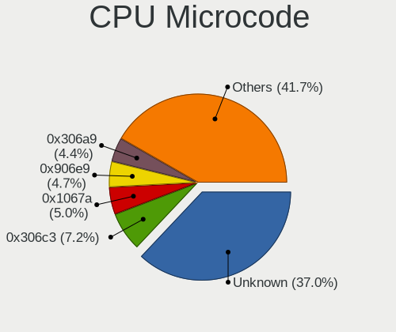

| Number     | Desktops | Percent |
|------------|----------|---------|
| Unknown    | 39       | 17.49%  |
| 0x306c3    | 22       | 9.87%   |
| 0x1067a    | 17       | 7.62%   |
| 0x906e9    | 14       | 6.28%   |
| 0x306a9    | 14       | 6.28%   |
| 0x206a7    | 13       | 5.83%   |
| 0x506e3    | 11       | 4.93%   |
| 0x906ea    | 10       | 4.48%   |
| 0xa0655    | 5        | 2.24%   |
| 0xa0653    | 5        | 2.24%   |
| 0x106e5    | 5        | 2.24%   |
| 0x08108109 | 5        | 2.24%   |
| 0xa0671    | 4        | 1.79%   |
| 0x906ed    | 4        | 1.79%   |
| 0x306e4    | 4        | 1.79%   |
| 0x08701021 | 4        | 1.79%   |
| 0x90672    | 3        | 1.35%   |
| 0x08701013 | 3        | 1.35%   |
| 0x0800820d | 3        | 1.35%   |
| 0x6fd      | 2        | 0.9%    |
| 0x20652    | 2        | 0.9%    |
| 0x10676    | 2        | 0.9%    |
| 0x0a201009 | 2        | 0.9%    |
| 0x06003106 | 2        | 0.9%    |
| 0x06001119 | 2        | 0.9%    |
| 0x010000c8 | 2        | 0.9%    |
| 0x906ec    | 1        | 0.45%   |
| 0x906eb    | 1        | 0.45%   |
| 0x906c0    | 1        | 0.45%   |
| 0x806ec    | 1        | 0.45%   |
| 0x806ea    | 1        | 0.45%   |
| 0x706a1    | 1        | 0.45%   |
| 0x506e0    | 1        | 0.45%   |
| 0x406c4    | 1        | 0.45%   |
| 0x40671    | 1        | 0.45%   |
| 0x306d4    | 1        | 0.45%   |
| 0x30673    | 1        | 0.45%   |
| 0x206c2    | 1        | 0.45%   |
| 0x106c2    | 1        | 0.45%   |
| 0x106a5    | 1        | 0.45%   |
| 0x0a50000c | 1        | 0.45%   |
| 0x0a201016 | 1        | 0.45%   |
| 0x0810100b | 1        | 0.45%   |
| 0x08008206 | 1        | 0.45%   |
| 0x08001129 | 1        | 0.45%   |
| 0x08001105 | 1        | 0.45%   |
| 0x06003104 | 1        | 0.45%   |
| 0x06000852 | 1        | 0.45%   |
| 0x06000629 | 1        | 0.45%   |
| 0x01000083 | 1        | 0.45%   |

CPU Microarch
-------------

Microarchitecture

| Name             | Desktops | Percent |
|------------------|----------|---------|
| KabyLake         | 39       | 18.14%  |
| Haswell          | 29       | 13.49%  |
| Penryn           | 19       | 8.84%   |
| IvyBridge        | 19       | 8.84%   |
| Skylake          | 14       | 6.51%   |
| SandyBridge      | 14       | 6.51%   |
| CometLake        | 13       | 6.05%   |
| Zen 2            | 9        | 4.19%   |
| Zen+             | 8        | 3.72%   |
| Nehalem          | 8        | 3.72%   |
| Zen              | 5        | 2.33%   |
| Zen 3            | 4        | 1.86%   |
| Westmere         | 4        | 1.86%   |
| Unknown          | 4        | 1.86%   |
| Steamroller      | 3        | 1.4%    |
| Piledriver       | 3        | 1.4%    |
| K10              | 3        | 1.4%    |
| Icelake          | 3        | 1.4%    |
| Silvermont       | 2        | 0.93%   |
| Core             | 2        | 0.93%   |
| Broadwell        | 2        | 0.93%   |
| Alderlake Hybrid | 2        | 0.93%   |
| Tremont          | 1        | 0.47%   |
| NetBurst         | 1        | 0.47%   |
| K8 Hammer        | 1        | 0.47%   |
| Goldmont plus    | 1        | 0.47%   |
| Bulldozer        | 1        | 0.47%   |
| Bonnell          | 1        | 0.47%   |

Graphics
--------

GPU Vendor
----------

Vendors of graphics cards

| Vendor | Desktops | Percent |
|--------|----------|---------|
| Nvidia | 109      | 45.04%  |
| Intel  | 95       | 39.26%  |
| AMD    | 38       | 15.7%   |

GPU Model
---------

Graphics card models

| Model                                                                       | Desktops | Percent |
|-----------------------------------------------------------------------------|----------|---------|
| Intel Xeon E3-1200 v3/4th Gen Core Processor Integrated Graphics Controller | 21       | 8.64%   |
| Nvidia GK208B [GeForce GT 710]                                              | 10       | 4.12%   |
| Intel HD Graphics 630                                                       | 10       | 4.12%   |
| Intel CoffeeLake-S GT2 [UHD Graphics 630]                                   | 10       | 4.12%   |
| Intel 4 Series Chipset Integrated Graphics Controller                       | 10       | 4.12%   |
| Intel Xeon E3-1200 v2/3rd Gen Core processor Graphics Controller            | 8        | 3.29%   |
| Nvidia GT218 [GeForce 210]                                                  | 7        | 2.88%   |
| Intel HD Graphics 530                                                       | 6        | 2.47%   |
| Intel 2nd Generation Core Processor Family Integrated Graphics Controller   | 6        | 2.47%   |
| Nvidia GP107GL [Quadro P400]                                                | 5        | 2.06%   |
| Nvidia GF108 [GeForce GT 630]                                               | 5        | 2.06%   |
| Intel CometLake-S GT2 [UHD Graphics 630]                                    | 5        | 2.06%   |
| AMD Ellesmere [Radeon RX 470/480/570/570X/580/580X/590]                     | 5        | 2.06%   |
| Nvidia GP104 [GeForce GTX 1080]                                             | 4        | 1.65%   |
| Nvidia GM206 [GeForce GTX 960]                                              | 4        | 1.65%   |
| Nvidia GK208B [GeForce GT 730]                                              | 4        | 1.65%   |
| AMD Picasso/Raven 2 [Radeon Vega Series / Radeon Vega Mobile Series]        | 4        | 1.65%   |
| Nvidia GP107 [GeForce GTX 1050 Ti]                                          | 3        | 1.23%   |
| Nvidia GP106 [GeForce GTX 1060 3GB]                                         | 3        | 1.23%   |
| Nvidia GP104 [GeForce GTX 1070]                                             | 3        | 1.23%   |
| Nvidia GM204 [GeForce GTX 970]                                              | 3        | 1.23%   |
| Nvidia GM107 [GeForce GTX 750 Ti]                                           | 3        | 1.23%   |
| Intel 82G33/G31 Express Integrated Graphics Controller                      | 3        | 1.23%   |
| AMD Navi 10 [Radeon RX 5600 OEM/5600 XT / 5700/5700 XT]                     | 3        | 1.23%   |
| AMD Hawaii PRO [Radeon R9 290/390]                                          | 3        | 1.23%   |
| Nvidia TU116 [GeForce GTX 1660 Ti]                                          | 2        | 0.82%   |
| Nvidia TU106 [GeForce RTX 2060 SUPER]                                       | 2        | 0.82%   |
| Nvidia TU104 [GeForce RTX 2070 SUPER]                                       | 2        | 0.82%   |
| Nvidia TU102 [GeForce RTX 2080 Ti Rev. A]                                   | 2        | 0.82%   |
| Nvidia GT216 [GeForce GT 220]                                               | 2        | 0.82%   |
| Nvidia GP107 [GeForce GTX 1050]                                             | 2        | 0.82%   |
| Nvidia GP106 [GeForce GTX 1060 6GB]                                         | 2        | 0.82%   |
| Nvidia GK107 [GeForce GTX 650]                                              | 2        | 0.82%   |
| Nvidia GF119 [GeForce GT 610]                                               | 2        | 0.82%   |
| Nvidia GF119 [GeForce GT 520]                                               | 2        | 0.82%   |
| Nvidia G96C [GeForce 9500 GT]                                               | 2        | 0.82%   |
| Intel IvyBridge GT2 [HD Graphics 4000]                                      | 2        | 0.82%   |
| Intel Core Processor Integrated Graphics Controller                         | 2        | 0.82%   |
| Intel AlderLake-S GT1                                                       | 2        | 0.82%   |
| AMD RV710 [Radeon HD 4350/4550]                                             | 2        | 0.82%   |
| AMD Raven Ridge [Radeon Vega Series / Radeon Vega Mobile Series]            | 2        | 0.82%   |
| AMD Kaveri [Radeon R7 Graphics]                                             | 2        | 0.82%   |
| AMD Baffin [Radeon RX 460/560D / Pro 450/455/460/555/555X/560/560X]         | 2        | 0.82%   |
| Nvidia TU117 [GeForce GTX 1650]                                             | 1        | 0.41%   |
| Nvidia TU116 [GeForce GTX 1660 SUPER]                                       | 1        | 0.41%   |
| Nvidia TU116 [GeForce GTX 1650]                                             | 1        | 0.41%   |
| Nvidia TU116 [GeForce GTX 1650 SUPER]                                       | 1        | 0.41%   |
| Nvidia TU106 [GeForce RTX 2070]                                             | 1        | 0.41%   |
| Nvidia TU106 [GeForce RTX 2070 Rev. A]                                      | 1        | 0.41%   |
| Nvidia TU104 [GeForce RTX 2080 SUPER]                                       | 1        | 0.41%   |
| Nvidia GT218 [GeForce 8400 GS Rev. 3]                                       | 1        | 0.41%   |
| Nvidia GP108M [GeForce MX230]                                               | 1        | 0.41%   |
| Nvidia GP108 [GeForce GT 1030]                                              | 1        | 0.41%   |
| Nvidia GP107GL [Quadro P620]                                                | 1        | 0.41%   |
| Nvidia GP106 [GeForce GTX 1060 6GB Rev. 2]                                  | 1        | 0.41%   |
| Nvidia GP104 [GeForce GTX 1070 Ti]                                          | 1        | 0.41%   |
| Nvidia GP102 [GeForce GTX 1080 Ti]                                          | 1        | 0.41%   |
| Nvidia GM206 [GeForce GTX 950]                                              | 1        | 0.41%   |
| Nvidia GM204 [GeForce GTX 980]                                              | 1        | 0.41%   |
| Nvidia GK210GL [Tesla K80]                                                  | 1        | 0.41%   |

GPU Combo
---------

Combinations of graphics cards

| Name           | Desktops | Percent |
|----------------|----------|---------|
| 1 x Nvidia     | 92       | 42.59%  |
| 1 x Intel      | 73       | 33.8%   |
| 1 x AMD        | 32       | 14.81%  |
| Intel + Nvidia | 13       | 6.02%   |
| AMD + Nvidia   | 3        | 1.39%   |
| Intel + AMD    | 2        | 0.93%   |
| 2 x AMD        | 1        | 0.46%   |

GPU Driver
----------

Free vs proprietary

| Driver      | Desktops | Percent |
|-------------|----------|---------|
| Free        | 140      | 63.35%  |
| Proprietary | 69       | 31.22%  |
| Unknown     | 12       | 5.43%   |

GPU Memory
----------

Total video memory

| Size in GB | Desktops | Percent |
|------------|----------|---------|
| Unknown    | 96       | 43.24%  |
| 1.01-2.0   | 42       | 18.92%  |
| 0.51-1.0   | 23       | 10.36%  |
| 3.01-4.0   | 20       | 9.01%   |
| 7.01-8.0   | 16       | 7.21%   |
| 0.01-0.5   | 12       | 5.41%   |
| 5.01-6.0   | 5        | 2.25%   |
| 2.01-3.0   | 4        | 1.8%    |
| 8.01-16.0  | 3        | 1.35%   |
| 16.01-24.0 | 1        | 0.45%   |

Monitor
-------

Monitor Vendor
--------------

Monitor vendors

| Vendor                  | Desktops | Percent |
|-------------------------|----------|---------|
| Samsung Electronics     | 55       | 24.66%  |
| Dell                    | 38       | 17.04%  |
| Philips                 | 20       | 8.97%   |
| Goldstar                | 15       | 6.73%   |
| AOC                     | 11       | 4.93%   |
| Ancor Communications    | 8        | 3.59%   |
| ViewSonic               | 7        | 3.14%   |
| Hewlett-Packard         | 7        | 3.14%   |
| ASUSTek Computer        | 6        | 2.69%   |
| Lenovo                  | 5        | 2.24%   |
| BenQ                    | 4        | 1.79%   |
| Unknown                 | 3        | 1.35%   |
| SANYO                   | 3        | 1.35%   |
| Lenovo Group Limited    | 3        | 1.35%   |
| Acer                    | 3        | 1.35%   |
| Unknown                 | 3        | 1.35%   |
| Panasonic               | 2        | 0.9%    |
| NEX                     | 2        | 0.9%    |
| LG Electronics          | 2        | 0.9%    |
| HKC                     | 2        | 0.9%    |
| Eizo                    | 2        | 0.9%    |
| ___                     | 1        | 0.45%   |
| VIE                     | 1        | 0.45%   |
| Unknown (AAA)           | 1        | 0.45%   |
| Toshiba                 | 1        | 0.45%   |
| SSD                     | 1        | 0.45%   |
| Sharp                   | 1        | 0.45%   |
| Sceptre Tech            | 1        | 0.45%   |
| Plain Tree Systems      | 1        | 0.45%   |
| Pioneer                 | 1        | 0.45%   |
| NXG                     | 1        | 0.45%   |
| MStar                   | 1        | 0.45%   |
| JRY                     | 1        | 0.45%   |
| Iiyama                  | 1        | 0.45%   |
| Hitachi                 | 1        | 0.45%   |
| HannStar Display        | 1        | 0.45%   |
| Gigabyte Technology     | 1        | 0.45%   |
| Fujitsu Siemens         | 1        | 0.45%   |
| CVT                     | 1        | 0.45%   |
| Chimei Innolux          | 1        | 0.45%   |
| Chi Mei Optoelectronics | 1        | 0.45%   |
| AUS                     | 1        | 0.45%   |
| AGO                     | 1        | 0.45%   |

Monitor Model
-------------

Monitor models

| Model                                                                 | Desktops | Percent |
|-----------------------------------------------------------------------|----------|---------|
| Philips PHL 243V5 PHLC0D1 1920x1080 521x293mm 23.5-inch               | 4        | 1.71%   |
| Philips PHL 223V5 PHLC0CF 1920x1080 477x268mm 21.5-inch               | 4        | 1.71%   |
| Philips LCD Monitor PHLC052 1920x1080 480x270mm 21.7-inch             | 4        | 1.71%   |
| Dell P2419H DELD0D9 1920x1080 530x300mm 24.0-inch                     | 4        | 1.71%   |
| Dell P2219H DELA115 1920x1080 480x270mm 21.7-inch                     | 4        | 1.71%   |
| Samsung Electronics SyncMaster SAM044B 1680x1050 474x296mm 22.0-inch  | 3        | 1.28%   |
| Samsung Electronics LF27T450F SAM7099 1920x1080 597x336mm 27.0-inch   | 3        | 1.28%   |
| Philips PHL 273V5 PHLC0D2 1920x1080 598x336mm 27.0-inch               | 3        | 1.28%   |
| Dell U2415 DELA0B9 1920x1200 518x324mm 24.1-inch                      | 3        | 1.28%   |
| Unknown                                                               | 3        | 1.28%   |
| SANYO LCD MONITOR SAN07BE 1280x1024 350x270mm 17.4-inch               | 2        | 0.85%   |
| Samsung Electronics SyncMaster SAM041D 1920x1200 459x296mm 21.5-inch  | 2        | 0.85%   |
| Samsung Electronics SyncMaster SAM034D 1280x1024 376x301mm 19.0-inch  | 2        | 0.85%   |
| Samsung Electronics S24F350 SAM0D20 1920x1080 521x293mm 23.5-inch     | 2        | 0.85%   |
| Samsung Electronics S22D390 SAM0B63 1920x1080 477x268mm 21.5-inch     | 2        | 0.85%   |
| Samsung Electronics LCD Monitor SMBX2450 1920x1080                    | 2        | 0.85%   |
| Samsung Electronics C24F390 SAM0D2D 1920x1080 521x293mm 23.5-inch     | 2        | 0.85%   |
| Panasonic TV MEIA296 1280x1024 698x392mm 31.5-inch                    | 2        | 0.85%   |
| Lenovo Group Limited LCD Monitor L24q-10                              | 2        | 0.85%   |
| Hewlett-Packard E243 HPN3468 1920x1080 527x296mm 23.8-inch            | 2        | 0.85%   |
| Dell U2414H DELA0A4 1920x1080 530x300mm 24.0-inch                     | 2        | 0.85%   |
| Dell U2412M DELA07A 1920x1200 518x324mm 24.1-inch                     | 2        | 0.85%   |
| Dell P2417H DELA0DB 1920x1080 530x300mm 24.0-inch                     | 2        | 0.85%   |
| ASUSTek Computer VG248 AUS24AB 1920x1080 531x299mm 24.0-inch          | 2        | 0.85%   |
| AOC 2250W AOC2250 1920x1080 477x268mm 21.5-inch                       | 2        | 0.85%   |
| ___ LCD TV ___0101 1360x768                                           | 1        | 0.43%   |
| ViewSonic VX2770 SERIES VSC3A2C 1920x1080 597x336mm 27.0-inch         | 1        | 0.43%   |
| ViewSonic VX2237 SERIES VSC2C24 1680x1050 474x296mm 22.0-inch         | 1        | 0.43%   |
| ViewSonic VX1935wm-3 VSCB81E 1440x900 410x256mm 19.0-inch             | 1        | 0.43%   |
| ViewSonic VP2365WB VSC7123 1920x1080 509x286mm 23.0-inch              | 1        | 0.43%   |
| ViewSonic VA721 VSC6E19 1280x1024 340x270mm 17.1-inch                 | 1        | 0.43%   |
| ViewSonic PJ VSC2D36 3840x2160                                        | 1        | 0.43%   |
| ViewSonic LCD Monitor VSCC132 1920x1080 600x340mm 27.2-inch           | 1        | 0.43%   |
| ViewSonic LCD Monitor VA2719 Series                                   | 1        | 0.43%   |
| VIE M2487HVB VIE1919 1920x1080 520x310mm 23.8-inch                    | 1        | 0.43%   |
| Unknown LCD TV 0101 1920x1080 1600x900mm 72.3-inch                    | 1        | 0.43%   |
| Unknown LCD Monitor SAMSUNG 3520x1080                                 | 1        | 0.43%   |
| Unknown LCD Monitor SAMSUNG                                           | 1        | 0.43%   |
| Unknown (AAA) smart tv AAA0001 1920x1080 1600x900mm 72.3-inch         | 1        | 0.43%   |
| Toshiba LCD Monitor TV                                                | 1        | 0.43%   |
| SSD HDTV SSD0001 1360x768 708x398mm 32.0-inch                         | 1        | 0.43%   |
| Sharp HDMI SHP4176 1920x1080 1210x680mm 54.6-inch                     | 1        | 0.43%   |
| Sceptre Tech E22 SPT08D5 1920x1080 409x230mm 18.5-inch                | 1        | 0.43%   |
| SANYO LED MONITOR SAN309A 1920x1080 443x249mm 20.0-inch               | 1        | 0.43%   |
| Samsung Electronics SyncMaster SAM0571 1920x1080 510x287mm 23.0-inch  | 1        | 0.43%   |
| Samsung Electronics SyncMaster SAM044C 1680x1050 474x296mm 22.0-inch  | 1        | 0.43%   |
| Samsung Electronics SyncMaster SAM043F 1920x1200 520x320mm 24.0-inch  | 1        | 0.43%   |
| Samsung Electronics SyncMaster SAM0379 1680x1050 433x271mm 20.1-inch  | 1        | 0.43%   |
| Samsung Electronics SyncMaster SAM0373 1680x1050 459x296mm 21.5-inch  | 1        | 0.43%   |
| Samsung Electronics SyncMaster SAM01B9 1280x1024 338x270mm 17.0-inch  | 1        | 0.43%   |
| Samsung Electronics SMS19A200 SAM0830 1440x900 408x255mm 18.9-inch    | 1        | 0.43%   |
| Samsung Electronics SMEX2220 SAM0686 1920x1080 480x270mm 21.7-inch    | 1        | 0.43%   |
| Samsung Electronics SMB2240W SAM0699 1680x1050 459x296mm 21.5-inch    | 1        | 0.43%   |
| Samsung Electronics SMB2230 SAM063E 1920x1080 477x268mm 21.5-inch     | 1        | 0.43%   |
| Samsung Electronics SM2333T SAM0737 1920x1080 510x290mm 23.1-inch     | 1        | 0.43%   |
| Samsung Electronics SA300/SA350 SAM0795 1920x1080 521x293mm 23.5-inch | 1        | 0.43%   |
| Samsung Electronics S27R35x SAM1053 1920x1080 598x336mm 27.0-inch     | 1        | 0.43%   |
| Samsung Electronics S27E391 SAM0C16 1920x1080 598x336mm 27.0-inch     | 1        | 0.43%   |
| Samsung Electronics S27E332 SAM0F60 1920x1080 600x340mm 27.2-inch     | 1        | 0.43%   |
| Samsung Electronics S24R65x SAM1023 1920x1080 527x296mm 23.8-inch     | 1        | 0.43%   |

Monitor Resolution
------------------

Monitor screen resolution

| Resolution         | Desktops | Percent |
|--------------------|----------|---------|
| 1920x1080 (FHD)    | 127      | 58.26%  |
| 1680x1050 (WSXGA+) | 15       | 6.88%   |
| 3840x2160 (4K)     | 11       | 5.05%   |
| 2560x1440 (QHD)    | 11       | 5.05%   |
| 1280x1024 (SXGA)   | 11       | 5.05%   |
| 1920x1200 (WUXGA)  | 10       | 4.59%   |
| Unknown            | 7        | 3.21%   |
| 1440x900 (WXGA+)   | 5        | 2.29%   |
| 1600x900 (HD+)     | 3        | 1.38%   |
| 3840x1080          | 2        | 0.92%   |
| 3440x1440          | 2        | 0.92%   |
| 2560x1080          | 2        | 0.92%   |
| 1920x540           | 2        | 0.92%   |
| 1366x768 (WXGA)    | 2        | 0.92%   |
| 5360x1440          | 1        | 0.46%   |
| 5120x1440          | 1        | 0.46%   |
| 4480x1440          | 1        | 0.46%   |
| 3520x1080          | 1        | 0.46%   |
| 2560x1600          | 1        | 0.46%   |
| 1360x768           | 1        | 0.46%   |
| 1280x768           | 1        | 0.46%   |
| 1024x768 (XGA)     | 1        | 0.46%   |

Monitor Diagonal
----------------

Diagonal size in inches

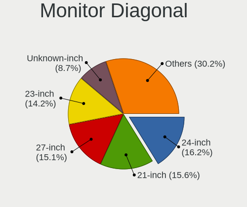

| Inches  | Desktops | Percent |
|---------|----------|---------|
| 21      | 43       | 19.72%  |
| 24      | 39       | 17.89%  |
| 23      | 27       | 12.39%  |
| Unknown | 25       | 11.47%  |
| 27      | 24       | 11.01%  |
| 22      | 14       | 6.42%   |
| 17      | 7        | 3.21%   |
| 19      | 6        | 2.75%   |
| 20      | 5        | 2.29%   |
| 84      | 3        | 1.38%   |
| 72      | 3        | 1.38%   |
| 31      | 3        | 1.38%   |
| 18      | 3        | 1.38%   |
| 54      | 2        | 0.92%   |
| 34      | 2        | 0.92%   |
| 33      | 2        | 0.92%   |
| 32      | 2        | 0.92%   |
| 60      | 1        | 0.46%   |
| 52      | 1        | 0.46%   |
| 49      | 1        | 0.46%   |
| 48      | 1        | 0.46%   |
| 42      | 1        | 0.46%   |
| 29      | 1        | 0.46%   |
| 16      | 1        | 0.46%   |
| 15      | 1        | 0.46%   |

Monitor Width
-------------

Physical width

| Width in mm | Desktops | Percent |
|-------------|----------|---------|
| 501-600     | 86       | 40.38%  |
| 401-500     | 65       | 30.52%  |
| Unknown     | 25       | 11.74%  |
| 301-350     | 8        | 3.76%   |
| 701-800     | 6        | 2.82%   |
| 601-700     | 6        | 2.82%   |
| 1501-2000   | 6        | 2.82%   |
| 1001-1500   | 6        | 2.82%   |
| 351-400     | 4        | 1.88%   |
| 901-1000    | 1        | 0.47%   |

Aspect Ratio
------------

Proportional relationship between the width and the height

| Ratio   | Desktops | Percent |
|---------|----------|---------|
| 16/9    | 133      | 64.25%  |
| 16/10   | 36       | 17.39%  |
| Unknown | 24       | 11.59%  |
| 5/4     | 7        | 3.38%   |
| 4/3     | 4        | 1.93%   |
| 21/9    | 2        | 0.97%   |
| 1.96    | 1        | 0.48%   |

Monitor Area
------------

Area in inch

| Area in inch | Desktops | Percent |
|----------------|----------|---------|
| 201-250        | 96       | 44.86%  |
| Unknown        | 25       | 11.68%  |
| 301-350        | 24       | 11.21%  |
| 151-200        | 23       | 10.75%  |
| 251-300        | 14       | 6.54%   |
| More than 1000 | 11       | 5.14%   |
| 351-500        | 10       | 4.67%   |
| 141-150        | 7        | 3.27%   |
| 501-1000       | 2        | 0.93%   |
| 131-140        | 1        | 0.47%   |
| 101-110        | 1        | 0.47%   |

Pixel Density
-------------

Pixels per inch

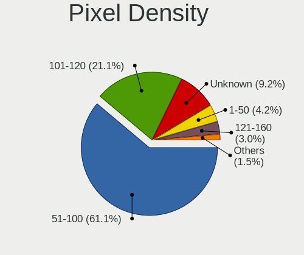

| Density | Desktops | Percent |
|---------|----------|---------|
| 51-100  | 116      | 55.77%  |
| 101-120 | 50       | 24.04%  |
| Unknown | 25       | 12.02%  |
| 1-50    | 11       | 5.29%   |
| 121-160 | 5        | 2.4%    |
| 161-240 | 1        | 0.48%   |

Multiple Monitors
-----------------

Total monitors connected

| Total | Desktops | Percent |
|-------|----------|---------|
| 1     | 169      | 77.52%  |
| 2     | 34       | 15.6%   |
| 0     | 14       | 6.42%   |
| 4     | 1        | 0.46%   |

Network
-------

Net Controller Vendor
---------------------

Controller vendors

| Vendor                          | Desktops | Percent |
|---------------------------------|----------|---------|
| Realtek Semiconductor           | 135      | 43.83%  |
| Intel                           | 92       | 29.87%  |
| Qualcomm Atheros                | 22       | 7.14%   |
| Ralink Technology               | 11       | 3.57%   |
| TP-Link                         | 7        | 2.27%   |
| Edimax Technology               | 6        | 1.95%   |
| Ralink                          | 3        | 0.97%   |
| ASIX Electronics                | 3        | 0.97%   |
| Xiaomi                          | 2        | 0.65%   |
| Qualcomm Atheros Communications | 2        | 0.65%   |
| Nvidia                          | 2        | 0.65%   |
| Marvell Technology Group        | 2        | 0.65%   |
| D-Link                          | 2        | 0.65%   |
| Broadcom Limited                | 2        | 0.65%   |
| Broadcom                        | 2        | 0.65%   |
| Aquantia                        | 2        | 0.65%   |
| U.S. Robotics                   | 1        | 0.32%   |
| Texas Instruments               | 1        | 0.32%   |
| STMicroelectronics              | 1        | 0.32%   |
| Samsung Electronics             | 1        | 0.32%   |
| ROCCAT                          | 1        | 0.32%   |
| Microsoft                       | 1        | 0.32%   |
| Mellanox Technologies           | 1        | 0.32%   |
| MediaTek                        | 1        | 0.32%   |
| Huawei Technologies             | 1        | 0.32%   |
| GDMicroelectronics              | 1        | 0.32%   |
| Davicom Semiconductor           | 1        | 0.32%   |
| BUFFALO                         | 1        | 0.32%   |
| Accton Technology               | 1        | 0.32%   |

Net Controller Model
--------------------

Controller models

| Model                                                                                         | Desktops | Percent |
|-----------------------------------------------------------------------------------------------|----------|---------|
| Realtek RTL8111/8168/8411 PCI Express Gigabit Ethernet Controller                             | 106      | 31.09%  |
| Intel Ethernet Connection (2) I219-V                                                          | 15       | 4.4%    |
| Intel I211 Gigabit Network Connection                                                         | 13       | 3.81%   |
| Realtek RTL8125 2.5GbE Controller                                                             | 11       | 3.23%   |
| Intel 82579LM Gigabit Network Connection (Lewisville)                                         | 11       | 3.23%   |
| Intel Wi-Fi 6 AX200                                                                           | 8        | 2.35%   |
| Intel Ethernet Connection (7) I219-V                                                          | 8        | 2.35%   |
| Realtek RTL8192CU 802.11n WLAN Adapter                                                        | 7        | 2.05%   |
| Realtek RTL810xE PCI Express Fast Ethernet controller                                         | 4        | 1.17%   |
| Realtek 802.11ac NIC                                                                          | 4        | 1.17%   |
| Intel Ethernet Connection I217-LM                                                             | 4        | 1.17%   |
| Intel Ethernet Connection (5) I219-LM                                                         | 4        | 1.17%   |
| Intel Ethernet Connection (14) I219-V                                                         | 4        | 1.17%   |
| TP-Link TL-WN821N v5/v6 [RTL8192EU]                                                           | 3        | 0.88%   |
| TP-Link 802.11ac NIC                                                                          | 3        | 0.88%   |
| Realtek RTL88x2bu [AC1200 Techkey]                                                            | 3        | 0.88%   |
| Ralink RT2870/RT3070 Wireless Adapter                                                         | 3        | 0.88%   |
| Ralink MT7601U Wireless Adapter                                                               | 3        | 0.88%   |
| Qualcomm Atheros Killer E220x Gigabit Ethernet Controller                                     | 3        | 0.88%   |
| Qualcomm Atheros AR9287 Wireless Network Adapter (PCI-Express)                                | 3        | 0.88%   |
| Qualcomm Atheros AR8131 Gigabit Ethernet                                                      | 3        | 0.88%   |
| Intel Wireless-AC 9260                                                                        | 3        | 0.88%   |
| Intel Ethernet Connection I217-V                                                              | 3        | 0.88%   |
| Intel Cannon Lake PCH CNVi WiFi                                                               | 3        | 0.88%   |
| Intel 82579V Gigabit Network Connection                                                       | 3        | 0.88%   |
| ASIX AX88179 Gigabit Ethernet                                                                 | 3        | 0.88%   |
| Xiaomi Mi/Redmi series (RNDIS)                                                                | 2        | 0.59%   |
| Realtek RTL8191SU 802.11n WLAN Adapter                                                        | 2        | 0.59%   |
| Realtek RTL8188EUS 802.11n Wireless Network Adapter                                           | 2        | 0.59%   |
| Realtek RTL8153 Gigabit Ethernet Adapter                                                      | 2        | 0.59%   |
| Ralink RT5370 Wireless Adapter                                                                | 2        | 0.59%   |
| Qualcomm Atheros QCA9377 802.11ac Wireless Network Adapter                                    | 2        | 0.59%   |
| Qualcomm Atheros AR9271 802.11n                                                               | 2        | 0.59%   |
| Qualcomm Atheros AR9485 Wireless Network Adapter                                              | 2        | 0.59%   |
| Qualcomm Atheros AR8151 v1.0 Gigabit Ethernet                                                 | 2        | 0.59%   |
| Nvidia MCP61 Ethernet                                                                         | 2        | 0.59%   |
| Intel Wireless 3165                                                                           | 2        | 0.59%   |
| Intel Ethernet Connection (12) I219-V                                                         | 2        | 0.59%   |
| Intel Ethernet Connection (11) I219-V                                                         | 2        | 0.59%   |
| Intel Dual Band Wireless-AC 3168NGW [Stone Peak]                                              | 2        | 0.59%   |
| Intel Dual Band Wireless-AC 3165 Plus Bluetooth                                               | 2        | 0.59%   |
| Intel Alder Lake-S PCH CNVi WiFi                                                              | 2        | 0.59%   |
| Intel 82566DM-2 Gigabit Network Connection                                                    | 2        | 0.59%   |
| Edimax RTL8192S WLAN Adapter                                                                  | 2        | 0.59%   |
| Edimax EW-7711UTn nLite Wireless Adapter [Ralink RT3070]                                      | 2        | 0.59%   |
| Edimax 802.11ac WLAN Adapter                                                                  | 2        | 0.59%   |
| U.S. Robotics USR5637 56K Faxmodem                                                            | 1        | 0.29%   |
| TP-Link TL-WN823N v2/v3 [Realtek RTL8192EU]                                                   | 1        | 0.29%   |
| TP-Link TL-WN722N v2/v3 [Realtek RTL8188EUS]                                                  | 1        | 0.29%   |
| Texas Instruments CC2531 ZigBee                                                               | 1        | 0.29%   |
| STMicroelectronics Virtual COM Port                                                           | 1        | 0.29%   |
| Samsung Galaxy series, misc. (tethering mode)                                                 | 1        | 0.29%   |
| ROCCAT OSA Express Network card                                                               | 1        | 0.29%   |
| Realtek RTL8814AU 802.11a/b/g/n/ac Wireless Adapter                                           | 1        | 0.29%   |
| Realtek RTL8811AU 802.11a/b/g/n/ac WLAN Adapter                                               | 1        | 0.29%   |
| Realtek RTL8192CE PCIe Wireless Network Adapter                                               | 1        | 0.29%   |
| Realtek RTL8169 PCI Gigabit Ethernet Controller                                               | 1        | 0.29%   |
| Realtek RTL8152 Fast Ethernet Adapter                                                         | 1        | 0.29%   |
| Realtek RTL-8100/8101L/8139 PCI Fast Ethernet Adapter                                         | 1        | 0.29%   |
| Realtek Realtek 8812AU/8821AU 802.11ac WLAN Adapter [USB Wireless Dual-Band Adapter 2.4/5Ghz] | 1        | 0.29%   |

Wireless Vendor
---------------

Wireless vendors

| Vendor                          | Desktops | Percent |
|---------------------------------|----------|---------|
| Intel                           | 26       | 27.66%  |
| Realtek Semiconductor           | 22       | 23.4%   |
| Ralink Technology               | 11       | 11.7%   |
| Qualcomm Atheros                | 10       | 10.64%  |
| TP-Link                         | 7        | 7.45%   |
| Edimax Technology               | 6        | 6.38%   |
| Ralink                          | 3        | 3.19%   |
| Qualcomm Atheros Communications | 2        | 2.13%   |
| D-Link                          | 2        | 2.13%   |
| Broadcom                        | 2        | 2.13%   |
| Microsoft                       | 1        | 1.06%   |
| MediaTek                        | 1        | 1.06%   |
| BUFFALO                         | 1        | 1.06%   |

Wireless Model
--------------

Wireless models

| Model                                                                                         | Desktops | Percent |
|-----------------------------------------------------------------------------------------------|----------|---------|
| Intel Wi-Fi 6 AX200                                                                           | 8        | 8.42%   |
| Realtek RTL8192CU 802.11n WLAN Adapter                                                        | 7        | 7.37%   |
| Realtek 802.11ac NIC                                                                          | 4        | 4.21%   |
| TP-Link TL-WN821N v5/v6 [RTL8192EU]                                                           | 3        | 3.16%   |
| TP-Link 802.11ac NIC                                                                          | 3        | 3.16%   |
| Realtek RTL88x2bu [AC1200 Techkey]                                                            | 3        | 3.16%   |
| Ralink RT2870/RT3070 Wireless Adapter                                                         | 3        | 3.16%   |
| Ralink MT7601U Wireless Adapter                                                               | 3        | 3.16%   |
| Qualcomm Atheros AR9287 Wireless Network Adapter (PCI-Express)                                | 3        | 3.16%   |
| Intel Wireless-AC 9260                                                                        | 3        | 3.16%   |
| Intel Cannon Lake PCH CNVi WiFi                                                               | 3        | 3.16%   |
| Realtek RTL8191SU 802.11n WLAN Adapter                                                        | 2        | 2.11%   |
| Realtek RTL8188EUS 802.11n Wireless Network Adapter                                           | 2        | 2.11%   |
| Ralink RT5370 Wireless Adapter                                                                | 2        | 2.11%   |
| Qualcomm Atheros QCA9377 802.11ac Wireless Network Adapter                                    | 2        | 2.11%   |
| Qualcomm Atheros AR9271 802.11n                                                               | 2        | 2.11%   |
| Qualcomm Atheros AR9485 Wireless Network Adapter                                              | 2        | 2.11%   |
| Intel Wireless 3165                                                                           | 2        | 2.11%   |
| Intel Dual Band Wireless-AC 3168NGW [Stone Peak]                                              | 2        | 2.11%   |
| Intel Dual Band Wireless-AC 3165 Plus Bluetooth                                               | 2        | 2.11%   |
| Intel Alder Lake-S PCH CNVi WiFi                                                              | 2        | 2.11%   |
| Edimax RTL8192S WLAN Adapter                                                                  | 2        | 2.11%   |
| Edimax EW-7711UTn nLite Wireless Adapter [Ralink RT3070]                                      | 2        | 2.11%   |
| Edimax 802.11ac WLAN Adapter                                                                  | 2        | 2.11%   |
| TP-Link TL-WN823N v2/v3 [Realtek RTL8192EU]                                                   | 1        | 1.05%   |
| TP-Link TL-WN722N v2/v3 [Realtek RTL8188EUS]                                                  | 1        | 1.05%   |
| Realtek RTL8814AU 802.11a/b/g/n/ac Wireless Adapter                                           | 1        | 1.05%   |
| Realtek RTL8811AU 802.11a/b/g/n/ac WLAN Adapter                                               | 1        | 1.05%   |
| Realtek RTL8192CE PCIe Wireless Network Adapter                                               | 1        | 1.05%   |
| Realtek Realtek 8812AU/8821AU 802.11ac WLAN Adapter [USB Wireless Dual-Band Adapter 2.4/5Ghz] | 1        | 1.05%   |
| Ralink RT5372 Wireless Adapter                                                                | 1        | 1.05%   |
| Ralink RT2501/RT2573 Wireless Adapter                                                         | 1        | 1.05%   |
| Ralink MT7610U ("Archer T2U" 2.4G+5G WLAN Adapter                                             | 1        | 1.05%   |
| Ralink RT5392 PCIe Wireless Network Adapter                                                   | 1        | 1.05%   |
| Ralink RT3090 Wireless 802.11n 1T/1R PCIe                                                     | 1        | 1.05%   |
| Ralink RT2600 802.11 MIMO                                                                     | 1        | 1.05%   |
| Qualcomm Atheros QCA9565 / AR9565 Wireless Network Adapter                                    | 1        | 1.05%   |
| Qualcomm Atheros AR9462 Wireless Network Adapter                                              | 1        | 1.05%   |
| Qualcomm Atheros AR93xx Wireless Network Adapter                                              | 1        | 1.05%   |
| Microsoft Xbox 360 Wireless Adapter                                                           | 1        | 1.05%   |
| MediaTek WiFi                                                                                 | 1        | 1.05%   |
| Intel Wireless 3160                                                                           | 1        | 1.05%   |
| Intel Wi-Fi 6 AX210/AX211/AX411 160MHz                                                        | 1        | 1.05%   |
| Intel Ultimate N WiFi Link 5300                                                               | 1        | 1.05%   |
| Intel Cannon Point-LP CNVi [Wireless-AC]                                                      | 1        | 1.05%   |
| D-Link DWA-160 Xtreme N Dual Band USB Adapter(rev.C1)                                         | 1        | 1.05%   |
| D-Link 802.11n WLAN Adapter                                                                   | 1        | 1.05%   |
| BUFFALO Sony UWA-BR100 802.11abgn Wireless Adapter [Atheros AR7010+AR9280]                    | 1        | 1.05%   |
| Broadcom BCM4352 802.11ac Wireless Network Adapter                                            | 1        | 1.05%   |
| Broadcom BCM43142 802.11b/g/n                                                                 | 1        | 1.05%   |

Ethernet Vendor
---------------

Ethernet vendors

| Vendor                   | Desktops | Percent |
|--------------------------|----------|---------|
| Realtek Semiconductor    | 125      | 53.42%  |
| Intel                    | 79       | 33.76%  |
| Qualcomm Atheros         | 12       | 5.13%   |
| ASIX Electronics         | 3        | 1.28%   |
| Xiaomi                   | 2        | 0.85%   |
| Nvidia                   | 2        | 0.85%   |
| Marvell Technology Group | 2        | 0.85%   |
| Broadcom Limited         | 2        | 0.85%   |
| Aquantia                 | 2        | 0.85%   |
| Samsung Electronics      | 1        | 0.43%   |
| Mellanox Technologies    | 1        | 0.43%   |
| Huawei Technologies      | 1        | 0.43%   |
| Davicom Semiconductor    | 1        | 0.43%   |
| Accton Technology        | 1        | 0.43%   |

Ethernet Model
--------------

Ethernet models

| Model                                                               | Desktops | Percent |
|---------------------------------------------------------------------|----------|---------|
| Realtek RTL8111/8168/8411 PCI Express Gigabit Ethernet Controller   | 106      | 43.98%  |
| Intel Ethernet Connection (2) I219-V                                | 15       | 6.22%   |
| Intel I211 Gigabit Network Connection                               | 13       | 5.39%   |
| Realtek RTL8125 2.5GbE Controller                                   | 11       | 4.56%   |
| Intel 82579LM Gigabit Network Connection (Lewisville)               | 11       | 4.56%   |
| Intel Ethernet Connection (7) I219-V                                | 8        | 3.32%   |
| Realtek RTL810xE PCI Express Fast Ethernet controller               | 4        | 1.66%   |
| Intel Ethernet Connection I217-LM                                   | 4        | 1.66%   |
| Intel Ethernet Connection (5) I219-LM                               | 4        | 1.66%   |
| Intel Ethernet Connection (14) I219-V                               | 4        | 1.66%   |
| Qualcomm Atheros Killer E220x Gigabit Ethernet Controller           | 3        | 1.24%   |
| Qualcomm Atheros AR8131 Gigabit Ethernet                            | 3        | 1.24%   |
| Intel Ethernet Connection I217-V                                    | 3        | 1.24%   |
| Intel 82579V Gigabit Network Connection                             | 3        | 1.24%   |
| ASIX AX88179 Gigabit Ethernet                                       | 3        | 1.24%   |
| Xiaomi Mi/Redmi series (RNDIS)                                      | 2        | 0.83%   |
| Realtek RTL8153 Gigabit Ethernet Adapter                            | 2        | 0.83%   |
| Qualcomm Atheros AR8151 v1.0 Gigabit Ethernet                       | 2        | 0.83%   |
| Nvidia MCP61 Ethernet                                               | 2        | 0.83%   |
| Intel Ethernet Connection (12) I219-V                               | 2        | 0.83%   |
| Intel Ethernet Connection (11) I219-V                               | 2        | 0.83%   |
| Intel 82566DM-2 Gigabit Network Connection                          | 2        | 0.83%   |
| Samsung Galaxy series, misc. (tethering mode)                       | 1        | 0.41%   |
| Realtek RTL8169 PCI Gigabit Ethernet Controller                     | 1        | 0.41%   |
| Realtek RTL8152 Fast Ethernet Adapter                               | 1        | 0.41%   |
| Realtek RTL-8100/8101L/8139 PCI Fast Ethernet Adapter               | 1        | 0.41%   |
| Realtek Killer E3000 2.5GbE Controller                              | 1        | 0.41%   |
| Qualcomm Atheros Killer E2400 Gigabit Ethernet Controller           | 1        | 0.41%   |
| Qualcomm Atheros AR8161 Gigabit Ethernet                            | 1        | 0.41%   |
| Qualcomm Atheros AR8152 v2.0 Fast Ethernet                          | 1        | 0.41%   |
| Qualcomm Atheros AR8151 v2.0 Gigabit Ethernet                       | 1        | 0.41%   |
| Mellanox MT26448 [ConnectX EN 10GigE, PCIe 2.0 5GT/s]               | 1        | 0.41%   |
| Marvell Group 88E8057 PCI-E Gigabit Ethernet Controller             | 1        | 0.41%   |
| Marvell Group 88E8055 PCI-E Gigabit Ethernet Controller             | 1        | 0.41%   |
| Intel I350 Gigabit Network Connection                               | 1        | 0.41%   |
| Intel I210 Gigabit Fiber Network Connection                         | 1        | 0.41%   |
| Intel Ethernet Controller I225-V                                    | 1        | 0.41%   |
| Intel Ethernet Connection (7) I219-LM                               | 1        | 0.41%   |
| Intel Ethernet Connection (2) I218-V                                | 1        | 0.41%   |
| Intel Ethernet Connection (17) I219-V                               | 1        | 0.41%   |
| Intel Ethernet Connection (11) I219-LM                              | 1        | 0.41%   |
| Intel 82578DC Gigabit Network Connection                            | 1        | 0.41%   |
| Intel 82576 Gigabit Network Connection                              | 1        | 0.41%   |
| Intel 82574L Gigabit Network Connection                             | 1        | 0.41%   |
| Intel 82567LM-3 Gigabit Network Connection                          | 1        | 0.41%   |
| Intel 82562V-2 10/100 Network Connection                            | 1        | 0.41%   |
| Intel 82541PI Gigabit Ethernet Controller                           | 1        | 0.41%   |
| Huawei E353/E3131                                                   | 1        | 0.41%   |
| Davicom ST268                                                       | 1        | 0.41%   |
| Broadcom Limited NetLink BCM5787 Gigabit Ethernet PCI Express       | 1        | 0.41%   |
| Broadcom Limited NetLink BCM57788 Gigabit Ethernet PCIe             | 1        | 0.41%   |
| Aquantia Ethernet controller                                        | 1        | 0.41%   |
| Aquantia AQC113CS NBase-T/IEEE 802.3bz Ethernet Controller [AQtion] | 1        | 0.41%   |
| Accton EN-1216 Ethernet Adapter                                     | 1        | 0.41%   |

Net Controller Kind
-------------------

Ethernet, WiFi or modem

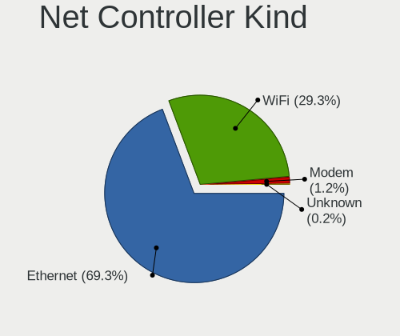

| Kind     | Desktops | Percent |
|----------|----------|---------|
| Ethernet | 212      | 69.97%  |
| WiFi     | 86       | 28.38%  |
| Modem    | 4        | 1.32%   |
| Unknown  | 1        | 0.33%   |

Used Controller
---------------

Currently used network controller

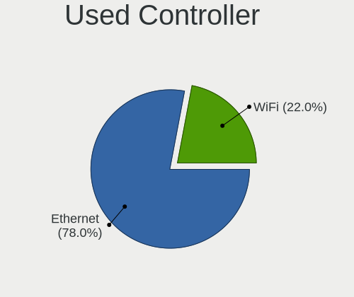

| Kind     | Desktops | Percent |
|----------|----------|---------|
| Ethernet | 175      | 77.43%  |
| WiFi     | 51       | 22.57%  |

NICs
----

Total network controllers on board

| Total | Desktops | Percent |
|-------|----------|---------|
| 1     | 157      | 73.02%  |
| 2     | 46       | 21.4%   |
| 3     | 10       | 4.65%   |
| 0     | 2        | 0.93%   |

IPv6
----

IPv6 vs IPv4

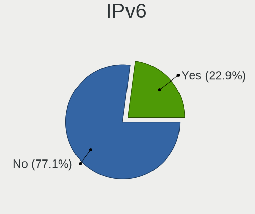

| Used | Desktops | Percent |
|------|----------|---------|
| No   | 187      | 84.62%  |
| Yes  | 34       | 15.38%  |

Bluetooth
---------

Bluetooth Vendor
----------------

Controller vendors

| Vendor                          | Desktops | Percent |
|---------------------------------|----------|---------|
| Intel                           | 23       | 41.82%  |
| Cambridge Silicon Radio         | 20       | 36.36%  |
| Qualcomm Atheros Communications | 4        | 7.27%   |
| Realtek Semiconductor           | 3        | 5.45%   |
| ASUSTek Computer                | 3        | 5.45%   |
| IMC Networks                    | 1        | 1.82%   |
| Broadcom                        | 1        | 1.82%   |

Bluetooth Model
---------------

Controller models

| Model                                               | Desktops | Percent |
|-----------------------------------------------------|----------|---------|
| Cambridge Silicon Radio Bluetooth Dongle (HCI mode) | 20       | 36.36%  |
| Intel AX200 Bluetooth                               | 7        | 12.73%  |
| Intel Bluetooth wireless interface                  | 5        | 9.09%   |
| Intel Bluetooth Device                              | 4        | 7.27%   |
| Intel Bluetooth 9460/9560 Jefferson Peak (JfP)      | 4        | 7.27%   |
| Realtek Bluetooth Radio                             | 3        | 5.45%   |
| Qualcomm Atheros  Bluetooth Device                  | 2        | 3.64%   |
| Intel Wireless-AC 3168 Bluetooth                    | 2        | 3.64%   |
| ASUS Bluetooth Adapter                              | 2        | 3.64%   |
| Qualcomm Atheros Bluetooth USB Host Controller      | 1        | 1.82%   |
| Qualcomm Atheros AR3011 Bluetooth                   | 1        | 1.82%   |
| Intel AX210 Bluetooth                               | 1        | 1.82%   |
| IMC Networks Bluetooth Device                       | 1        | 1.82%   |
| Broadcom BCM43142A0 Bluetooth 4.0                   | 1        | 1.82%   |
| ASUS BCM20702A0                                     | 1        | 1.82%   |

Sound
-----

Sound Vendor
------------

Sound card vendors

| Vendor               | Desktops | Percent |
|----------------------|----------|---------|
| Intel                | 169      | 46.94%  |
| Nvidia               | 104      | 28.89%  |
| AMD                  | 51       | 14.17%  |
| C-Media Electronics  | 8        | 2.22%   |
| Creative Labs        | 6        | 1.67%   |
| XMOS                 | 3        | 0.83%   |
| Focusrite-Novation   | 3        | 0.83%   |
| Creative Technology  | 3        | 0.83%   |
| Texas Instruments    | 2        | 0.56%   |
| VIA Technologies     | 1        | 0.28%   |
| Razer USA            | 1        | 0.28%   |
| Microsoft            | 1        | 0.28%   |
| Meridian             | 1        | 0.28%   |
| Logitech             | 1        | 0.28%   |
| Kingston Technology  | 1        | 0.28%   |
| JMTek                | 1        | 0.28%   |
| iCreate Technologies | 1        | 0.28%   |
| GN Netcom            | 1        | 0.28%   |
| EGO SYStems          | 1        | 0.28%   |
| Unknown              | 1        | 0.28%   |

Sound Model
-----------

Sound card models

| Model                                                                      | Desktops | Percent |
|----------------------------------------------------------------------------|----------|---------|
| Intel 6 Series/C200 Series Chipset Family High Definition Audio Controller | 22       | 5.46%   |
| Intel 200 Series PCH HD Audio                                              | 20       | 4.96%   |
| Intel 8 Series/C220 Series Chipset High Definition Audio Controller        | 19       | 4.71%   |
| Intel Xeon E3-1200 v3/4th Gen Core Processor HD Audio Controller           | 18       | 4.47%   |
| Nvidia GK208 HDMI/DP Audio Controller                                      | 15       | 3.72%   |
| Intel NM10/ICH7 Family High Definition Audio Controller                    | 15       | 3.72%   |
| Intel 100 Series/C230 Series Chipset Family HD Audio Controller            | 14       | 3.47%   |
| AMD Starship/Matisse HD Audio Controller                                   | 12       | 2.98%   |
| Nvidia GP107GL High Definition Audio Controller                            | 11       | 2.73%   |
| Intel Cannon Lake PCH cAVS                                                 | 11       | 2.73%   |
| Intel 9 Series Chipset Family HD Audio Controller                          | 11       | 2.73%   |
| Nvidia High Definition Audio Controller                                    | 8        | 1.99%   |
| Nvidia GP104 High Definition Audio Controller                              | 8        | 1.99%   |
| Intel 5 Series/3400 Series Chipset High Definition Audio                   | 8        | 1.99%   |
| AMD Family 17h/19h HD Audio Controller                                     | 8        | 1.99%   |
| Intel 7 Series/C216 Chipset Family High Definition Audio Controller        | 7        | 1.74%   |
| Nvidia GP106 High Definition Audio Controller                              | 6        | 1.49%   |
| Intel Comet Lake PCH-V cAVS                                                | 6        | 1.49%   |
| Intel 82801JI (ICH10 Family) HD Audio Controller                           | 6        | 1.49%   |
| AMD Raven/Raven2/Fenghuang HDMI/DP Audio Controller                        | 6        | 1.49%   |
| AMD Family 17h (Models 00h-0fh) HD Audio Controller                        | 6        | 1.49%   |
| Nvidia TU116 High Definition Audio Controller                              | 5        | 1.24%   |
| Nvidia GM206 High Definition Audio Controller                              | 5        | 1.24%   |
| Nvidia GF108 High Definition Audio Controller                              | 5        | 1.24%   |
| Intel Comet Lake PCH cAVS                                                  | 5        | 1.24%   |
| AMD FCH Azalia Controller                                                  | 5        | 1.24%   |
| AMD Ellesmere HDMI Audio [Radeon RX 470/480 / 570/580/590]                 | 5        | 1.24%   |
| Nvidia TU106 High Definition Audio Controller                              | 4        | 0.99%   |
| Nvidia GM204 High Definition Audio Controller                              | 4        | 0.99%   |
| Nvidia GK107 HDMI Audio Controller                                         | 4        | 0.99%   |
| Nvidia GF119 HDMI Audio Controller                                         | 4        | 0.99%   |
| Intel Tiger Lake-H HD Audio Controller                                     | 4        | 0.99%   |
| Intel C600/X79 series chipset High Definition Audio Controller             | 4        | 0.99%   |
| Intel Alder Lake-S HD Audio Controller                                     | 4        | 0.99%   |
| AMD SBx00 Azalia (Intel HDA)                                               | 4        | 0.99%   |
| AMD RV710/730 HDMI Audio [Radeon HD 4000 series]                           | 4        | 0.99%   |
| AMD Navi 10 HDMI Audio                                                     | 4        | 0.99%   |
| Nvidia TU104 HD Audio Controller                                           | 3        | 0.74%   |
| Nvidia GM107 High Definition Audio Controller [GeForce 940MX]              | 3        | 0.74%   |
| Nvidia GK104 HDMI Audio Controller                                         | 3        | 0.74%   |
| Intel Audio device                                                         | 3        | 0.74%   |
| Intel 82801I (ICH9 Family) HD Audio Controller                             | 3        | 0.74%   |
| Creative Labs Sound Core3D [Sound Blaster Recon3D / Z-Series]              | 3        | 0.74%   |
| AMD Oland/Hainan/Cape Verde/Pitcairn HDMI Audio [Radeon HD 7000 Series]    | 3        | 0.74%   |
| AMD Hawaii HDMI Audio [Radeon R9 290/290X / 390/390X]                      | 3        | 0.74%   |
| AMD Baffin HDMI/DP Audio [Radeon RX 550 640SP / RX 560/560X]               | 3        | 0.74%   |
| XMOS AIRPULSE A100                                                         | 2        | 0.5%    |
| Texas Instruments PCM2902 Audio Codec                                      | 2        | 0.5%    |
| Nvidia TU102 High Definition Audio Controller                              | 2        | 0.5%    |
| Nvidia MCP61 High Definition Audio                                         | 2        | 0.5%    |
| Nvidia GT216 HDMI Audio Controller                                         | 2        | 0.5%    |
| Intel Broadwell-U Audio Controller                                         | 2        | 0.5%    |
| C-Media Electronics USB Audio Device                                       | 2        | 0.5%    |
| C-Media Electronics CMI8788 [Oxygen HD Audio]                              | 2        | 0.5%    |
| C-Media Electronics CM108 Audio Controller                                 | 2        | 0.5%    |
| AMD Trinity HDMI Audio Controller                                          | 2        | 0.5%    |
| XMOS iFi (by AMR) HD USB Audio                                             | 1        | 0.25%   |
| VIA Technologies ICE1712 [Envy24] PCI Multi-Channel I/O Controller         | 1        | 0.25%   |
| Razer USA RC30-026902, Gaming Headset [Nari Essential, Wireless, Receiver] | 1        | 0.25%   |
| Nvidia TU107 GeForce GTX 1650 High Definition Audio Controller             | 1        | 0.25%   |

Memory
------

Memory Vendor
-------------

Memory module vendors

| Vendor              | Desktops | Percent |
|---------------------|----------|---------|
| Kingston            | 28       | 22.22%  |
| Unknown             | 20       | 15.87%  |
| Crucial             | 16       | 12.7%   |
| Corsair             | 13       | 10.32%  |
| G.Skill             | 11       | 8.73%   |
| Samsung Electronics | 9        | 7.14%   |
| SK hynix            | 8        | 6.35%   |
| Micron Technology   | 6        | 4.76%   |
| Ramaxel Technology  | 4        | 3.17%   |
| Team                | 3        | 2.38%   |
| Transcend           | 2        | 1.59%   |
| GeIL                | 2        | 1.59%   |
| Unknown (09D5)      | 1        | 0.79%   |
| Patriot             | 1        | 0.79%   |
| KETECH              | 1        | 0.79%   |
| A-DATA Technology   | 1        | 0.79%   |

Memory Model
------------

Memory module models

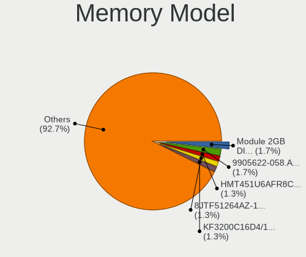

| Model                                                      | Desktops | Percent |
|------------------------------------------------------------|----------|---------|
| SK hynix RAM HMT451U6AFR8C-PB 4GB DIMM DDR3 1600MT/s       | 3        | 2.19%   |
| Kingston RAM 9905622-058.A00G 8GB DIMM DDR4 2133MT/s       | 3        | 2.19%   |
| Unknown RAM Module 2GB DIMM 800MT/s                        | 2        | 1.46%   |
| Unknown RAM Module 2048MB DIMM SDRAM                       | 2        | 1.46%   |
| Unknown RAM Module 2048MB DIMM DDR2 800MT/s                | 2        | 1.46%   |
| Samsung RAM M378B5273CH0-CK0 4GB DIMM DDR3 2000MT/s        | 2        | 1.46%   |
| Micron RAM 8JTF51264AZ-1G6E1 4096MB DIMM DDR3 1600MT/s     | 2        | 1.46%   |
| Kingston RAM KHX2400C15D4/4G 4GB DIMM DDR4 3151MT/s        | 2        | 1.46%   |
| Kingston RAM KHX2133C14/8G 8GB DIMM DDR4 2400MT/s          | 2        | 1.46%   |
| Kingston RAM 99U5584-010.A00LF 4GB DIMM DDR3 1866MT/s      | 2        | 1.46%   |
| Kingston RAM 99U5584-003.A00LF 4GB DIMM DDR3 1600MT/s      | 2        | 1.46%   |
| G.Skill RAM F3-1600C11-8GNT 8GB DIMM DDR3 1600MT/s         | 2        | 1.46%   |
| Crucial RAM CT16G4DFD832A.C16FP 16384MB DIMM DDR4 3200MT/s | 2        | 1.46%   |
| Unknown RAM Module 8192MB SODIMM DDR4 2667MT/s             | 1        | 0.73%   |
| Unknown RAM Module 8192MB DIMM 800MT/s                     | 1        | 0.73%   |
| Unknown RAM Module 4GB DIMM DDR 1333MT/s                   | 1        | 0.73%   |
| Unknown RAM Module 4GB DIMM 667MT/s                        | 1        | 0.73%   |
| Unknown RAM Module 4GB DIMM 1600MT/s                       | 1        | 0.73%   |
| Unknown RAM Module 4GB DIMM 1333MT/s                       | 1        | 0.73%   |
| Unknown RAM Module 4096MB DIMM SDRAM                       | 1        | 0.73%   |
| Unknown RAM Module 4096MB DIMM 1600MT/s                    | 1        | 0.73%   |
| Unknown RAM Module 4096MB DIMM 1333MT/s                    | 1        | 0.73%   |
| Unknown RAM Module 2GB DIMM DDR 1333MT/s                   | 1        | 0.73%   |
| Unknown RAM Module 2GB DIMM 1333MT/s                       | 1        | 0.73%   |
| Unknown RAM Module 2048MB DIMM SDRAM 800MT/s               | 1        | 0.73%   |
| Unknown RAM Module 2048MB DIMM DDR 1333MT/s                | 1        | 0.73%   |
| Unknown RAM Module 2048MB DIMM 800MT/s                     | 1        | 0.73%   |
| Unknown RAM Module 2048MB DIMM 667MT/s                     | 1        | 0.73%   |
| Unknown RAM Module 2048MB DIMM 400MT/s                     | 1        | 0.73%   |
| Unknown RAM Module 1GB DIMM 800MT/s                        | 1        | 0.73%   |
| Unknown RAM Module 1024MB DIMM 800MT/s                     | 1        | 0.73%   |
| Unknown (09D5) RAM Module 8GB DIMM DDR4 2400MT/s           | 1        | 0.73%   |
| Transcend RAM TS1GLH64V1H 8GB DIMM DDR4 2133MT/s           | 1        | 0.73%   |
| Transcend RAM JM2666HLE-16G 16GB DIMM DDR4 2667MT/s        | 1        | 0.73%   |
| Team RAM TEAMGROUP-UD4-3200 16GB DIMM DDR4 3200MT/s        | 1        | 0.73%   |
| Team RAM Elite-1600 8GB DIMM DDR3 1600MT/s                 | 1        | 0.73%   |
| Team RAM Elite-1333 4GB DIMM DDR3 1333MT/s                 | 1        | 0.73%   |
| SK hynix RAM HYMP125U64CP8-S6 2GB DIMM DDR2 49926MT/s      | 1        | 0.73%   |
| SK hynix RAM HMT451U6BFR8A-PB 4GB DIMM DDR3 1600MT/s       | 1        | 0.73%   |
| SK hynix RAM HMT351U6CFR8C-PB 4096MB DIMM DDR3 1800MT/s    | 1        | 0.73%   |
| SK hynix RAM HMT351U6BFR8C-H9 4GB DIMM DDR3 1333MT/s       | 1        | 0.73%   |
| SK hynix RAM HMA851U6AFR6N-UH 4GB DIMM DDR4 2400MT/s       | 1        | 0.73%   |
| SK hynix RAM HMA82GU6JJR8N-VK 16GB DIMM DDR4 2667MT/s      | 1        | 0.73%   |
| SK hynix RAM HMA451U6AFR8N-TF 4096MB DIMM DDR4 2133MT/s    | 1        | 0.73%   |
| Samsung RAM M471A5244CB0-CTD 4096MB SODIMM DDR4 3266MT/s   | 1        | 0.73%   |
| Samsung RAM M378B5173DB0-CK0 4GB DIMM DDR3 1600MT/s        | 1        | 0.73%   |
| Samsung RAM M378A5244CB0-CRC 4096MB DIMM DDR4 3066MT/s     | 1        | 0.73%   |
| Samsung RAM M378A2K43CB1-CTD 16384MB DIMM DDR4 2667MT/s    | 1        | 0.73%   |
| Samsung RAM M378A1K43CB2-CTD 8GB DIMM DDR4 3200MT/s        | 1        | 0.73%   |
| Samsung RAM M3 78T2863EHS-CF7 1024MB DIMM DDR2 800MT/s     | 1        | 0.73%   |
| Samsung RAM ARM Ltd:R00MM0M006 2048MB DIMM DDR2 800MT/s    | 1        | 0.73%   |
| Ramaxel RAM RMUA5120ME86H9F-2666 4GB DIMM DDR4 2667MT/s    | 1        | 0.73%   |
| Ramaxel RAM RMUA5110KE68H9F-2400 4GB DIMM DDR4 2400MT/s    | 1        | 0.73%   |
| Ramaxel RAM RMSA3270ME86H9F-2666 4GB SODIMM DDR4 2667MT/s  | 1        | 0.73%   |
| Ramaxel RAM RMR5030KD68F9F1600 4GB DIMM DDR3 1600MT/s      | 1        | 0.73%   |
| Patriot RAM 1600EL Series 4GB DIMM DDR3 1600MT/s           | 1        | 0.73%   |
| Micron RAM Module 8192MB DIMM DDR4 2133MT/s                | 1        | 0.73%   |
| Micron RAM 8ATF1G64AZ-3G2J1 8GB DIMM DDR4 3200MT/s         | 1        | 0.73%   |
| Micron RAM 16HTF25664AY-800J1 2GB DIMM DDR2 800MT/s        | 1        | 0.73%   |
| Micron RAM 16HTF25664AY-1GAE1 2048MB DIMM DDR2 667MT/s     | 1        | 0.73%   |

Memory Kind
-----------

Memory module kinds

| Kind    | Desktops | Percent |
|---------|----------|---------|
| DDR4    | 63       | 55.75%  |
| DDR3    | 26       | 23.01%  |
| Unknown | 13       | 11.5%   |
| DDR2    | 6        | 5.31%   |
| SDRAM   | 4        | 3.54%   |
| DDR     | 1        | 0.88%   |

Memory Form Factor
------------------

Physical design of the memory module

| Name   | Desktops | Percent |
|--------|----------|---------|
| DIMM   | 110      | 97.35%  |
| SODIMM | 3        | 2.65%   |

Memory Size
-----------

Memory module size

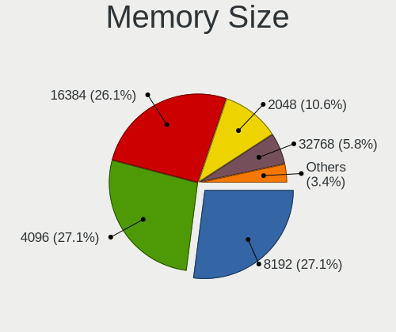

| Size  | Desktops | Percent |
|-------|----------|---------|
| 8192  | 35       | 28.69%  |
| 4096  | 35       | 28.69%  |
| 16384 | 26       | 21.31%  |
| 2048  | 18       | 14.75%  |
| 32768 | 4        | 3.28%   |
| 1024  | 4        | 3.28%   |

Memory Speed
------------

Memory module speed

| Speed   | Desktops | Percent |
|---------|----------|---------|
| 1600    | 18       | 14.29%  |
| 3200    | 16       | 12.7%   |
| 2133    | 12       | 9.52%   |
| 800     | 11       | 8.73%   |
| 2400    | 10       | 7.94%   |
| 1333    | 10       | 7.94%   |
| 3600    | 7        | 5.56%   |
| 2667    | 7        | 5.56%   |
| 3466    | 3        | 2.38%   |
| 1867    | 3        | 2.38%   |
| 667     | 3        | 2.38%   |
| Unknown | 3        | 2.38%   |
| 3151    | 2        | 1.59%   |
| 2933    | 2        | 1.59%   |
| 2000    | 2        | 1.59%   |
| 1866    | 2        | 1.59%   |
| 1400    | 2        | 1.59%   |
| 49926   | 1        | 0.79%   |
| 4800    | 1        | 0.79%   |
| 4400    | 1        | 0.79%   |
| 3800    | 1        | 0.79%   |
| 3733    | 1        | 0.79%   |
| 3400    | 1        | 0.79%   |
| 3266    | 1        | 0.79%   |
| 3066    | 1        | 0.79%   |
| 3000    | 1        | 0.79%   |
| 2800    | 1        | 0.79%   |
| 2134    | 1        | 0.79%   |
| 1800    | 1        | 0.79%   |
| 400     | 1        | 0.79%   |

Printers & scanners
-------------------

Printer Vendor
--------------

Printer device vendors

| Vendor                | Desktops | Percent |
|-----------------------|----------|---------|
| Hewlett-Packard       | 7        | 50%     |
| Samsung Electronics   | 2        | 14.29%  |
| Canon                 | 2        | 14.29%  |
| Lexmark International | 1        | 7.14%   |
| GODEX INTERNATIONAL   | 1        | 7.14%   |
| Brother Industries    | 1        | 7.14%   |

Printer Model
-------------

Printer device models

| Model                         | Desktops | Percent |
|-------------------------------|----------|---------|
| Samsung M2070 Series          | 2        | 14.29%  |
| HP Officejet 4500 G510g-m     | 2        | 14.29%  |
| HP DeskJet 4670 series        | 2        | 14.29%  |
| Lexmark International CS417dn | 1        | 7.14%   |
| HP Printing Support           | 1        | 7.14%   |
| HP LaserJet M14-M17           | 1        | 7.14%   |
| HP Deskjet 4640 series        | 1        | 7.14%   |
| GODEX INTERNATIONAL DT2       | 1        | 7.14%   |
| Canon TR7500 series           | 1        | 7.14%   |
| Canon PIXMA MX490 Series      | 1        | 7.14%   |
| Brother MFC-J497DW            | 1        | 7.14%   |

Scanner Vendor
--------------

Scanner device vendors

| Vendor | Desktops | Percent |
|--------|----------|---------|
| Canon  | 2        | 100%    |

Scanner Model
-------------

Scanner device models

| Model                   | Desktops | Percent |
|-------------------------|----------|---------|
| Canon CanoScan LiDE 100 | 2        | 100%    |

Camera
------

Camera Vendor
-------------

Camera device vendors

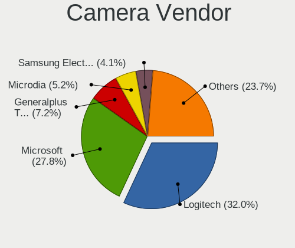

| Vendor                 | Desktops | Percent |
|------------------------|----------|---------|
| Logitech               | 17       | 32.08%  |
| Microsoft              | 15       | 28.3%   |
| Samsung Electronics    | 4        | 7.55%   |
| Generalplus Technology | 4        | 7.55%   |
| IMC Networks           | 2        | 3.77%   |
| Apple                  | 2        | 3.77%   |
| Xiaomi                 | 1        | 1.89%   |
| Realtek Semiconductor  | 1        | 1.89%   |
| Quanta                 | 1        | 1.89%   |
| Microdia               | 1        | 1.89%   |
| Jieli Technology       | 1        | 1.89%   |
| Hewlett-Packard        | 1        | 1.89%   |
| Chicony Electronics    | 1        | 1.89%   |
| Aveo Technology        | 1        | 1.89%   |
| Alcor Micro            | 1        | 1.89%   |

Camera Model
------------

Camera device models

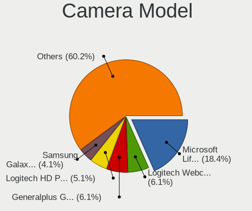

| Model                                               | Desktops | Percent |
|-----------------------------------------------------|----------|---------|
| Microsoft LifeCam HD-3000                           | 12       | 22.64%  |
| Samsung Galaxy A5 (MTP)                             | 4        | 7.55%   |
| Generalplus WEB CAM                                 | 4        | 7.55%   |
| Logitech Webcam C310                                | 3        | 5.66%   |
| Logitech Webcam C270                                | 3        | 5.66%   |
| Logitech C922 Pro Stream Webcam                     | 2        | 3.77%   |
| IMC Networks Integrated Camera                      | 2        | 3.77%   |
| Xiaomi Mi/Redmi series (PTP + ADB)                  | 1        | 1.89%   |
| Realtek Web Camera                                  | 1        | 1.89%   |
| Quanta Astro HD Camera                              | 1        | 1.89%   |
| Microsoft Microsoft LifeCam Studio                | 1        | 1.89%   |
| Microsoft Microsoft LifeCam HD-6000 for Notebooks | 1        | 1.89%   |
| Microsoft Microsoft LifeCam Cinema                | 1        | 1.89%   |
| Microdia HDP Webcam USB                             | 1        | 1.89%   |
| Logitech Webcam C930e                               | 1        | 1.89%   |
| Logitech Webcam C925e                               | 1        | 1.89%   |
| Logitech Webcam C920-C                              | 1        | 1.89%   |
| Logitech Webcam C170                                | 1        | 1.89%   |
| Logitech QuickCam E 3500                            | 1        | 1.89%   |
| Logitech Mic (Fusion)                               | 1        | 1.89%   |
| Logitech HD Webcam C615                             | 1        | 1.89%   |
| Logitech C930c                                      | 1        | 1.89%   |
| Logitech BRIO Ultra HD Webcam                       | 1        | 1.89%   |
| Jieli USB PHY 2.0                                   | 1        | 1.89%   |
| HP Webcam HD 2300                                   | 1        | 1.89%   |
| Chicony Gateway Webcam                              | 1        | 1.89%   |
| Aveo UVC camera (Bresser microscope)                | 1        | 1.89%   |
| Apple iPhone 5/5C/5S/6/SE                           | 1        | 1.89%   |
| Apple iPad 2 (3G; 64GB)                             | 1        | 1.89%   |
| Alcor Micro USB 2.0 PC Camera                       | 1        | 1.89%   |

Security
--------

Fingerprint Vendor
------------------

Fingerprint sensor vendors

Zero info for selected period =(

Fingerprint Model
-----------------

Fingerprint sensor models

Zero info for selected period =(

Chipcard Vendor
---------------

Chipcard module vendors

Zero info for selected period =(

Chipcard Model
--------------

Chipcard module models

Zero info for selected period =(

Unsupported
-----------

Unsupported Devices
-------------------

Total unsupported devices on board

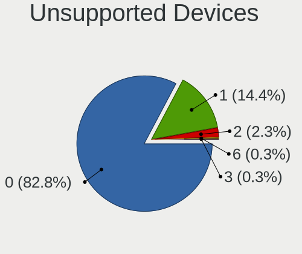

| Total | Desktops | Percent |
|-------|----------|---------|
| 0     | 185      | 84.47%  |
| 1     | 29       | 13.24%  |
| 2     | 5        | 2.28%   |

Unsupported Device Types
------------------------

Types of unsupported devices

| Type                     | Desktops | Percent |
|--------------------------|----------|---------|
| Graphics card            | 19       | 48.72%  |
| Net/wireless             | 13       | 33.33%  |
| Communication controller | 4        | 10.26%  |
| Camera                   | 3        | 7.69%   |

