Linux in Israel - Tested Hardware & Statistics (Desktops)
---------------------------------------------------------

A project to collect tested hardware configurations for Linux in Israel.

Anyone can contribute to this report by the [hw-probe](https://github.com/linuxhw/hw-probe) tool:

    sudo -E hw-probe -all -upload

Please contribute! Especially if your hardware is rare.

Contents
--------

* [ Test Cases ](#test-cases)

* [ System ](#system)
  - [ OS                       ](#os)
  - [ OS Family                ](#os-family)
  - [ Kernel                   ](#kernel)
  - [ Kernel Family            ](#kernel-family)
  - [ Kernel Major Ver.        ](#kernel-major-ver)
  - [ Arch                     ](#arch)
  - [ DE                       ](#de)
  - [ Display Server           ](#display-server)
  - [ Display Manager          ](#display-manager)
  - [ OS Lang                  ](#os-lang)
  - [ Boot Mode                ](#boot-mode)
  - [ Filesystem               ](#filesystem)
  - [ Part. scheme             ](#part-scheme)
  - [ Dual Boot with Linux/BSD ](#dual-boot-with-linuxbsd)
  - [ Dual Boot (Win)          ](#dual-boot-win)

* [ Board ](#board)
  - [ Vendor                   ](#vendor)
  - [ Model                    ](#model)
  - [ Model Family             ](#model-family)
  - [ MFG Year                 ](#mfg-year)
  - [ Form Factor              ](#form-factor)
  - [ Secure Boot              ](#secure-boot)
  - [ Coreboot                 ](#coreboot)
  - [ RAM Size                 ](#ram-size)
  - [ RAM Used                 ](#ram-used)
  - [ Total Drives             ](#total-drives)
  - [ Has CD-ROM               ](#has-cd-rom)
  - [ Has Ethernet             ](#has-ethernet)
  - [ Has WiFi                 ](#has-wifi)
  - [ Has Bluetooth            ](#has-bluetooth)

* [ Location ](#location)
  - [ Country                  ](#country)
  - [ City                     ](#city)

* [ Drives ](#drives)
  - [ Drive Vendor             ](#drive-vendor)
  - [ Drive Model              ](#drive-model)
  - [ HDD Vendor               ](#hdd-vendor)
  - [ SSD Vendor               ](#ssd-vendor)
  - [ Drive Kind               ](#drive-kind)
  - [ Drive Connector          ](#drive-connector)
  - [ Drive Size               ](#drive-size)
  - [ Space Total              ](#space-total)
  - [ Space Used               ](#space-used)
  - [ Malfunc. Drives          ](#malfunc-drives)
  - [ Malfunc. Drive Vendor    ](#malfunc-drive-vendor)
  - [ Malfunc. HDD Vendor      ](#malfunc-hdd-vendor)
  - [ Malfunc. Drive Kind      ](#malfunc-drive-kind)
  - [ Failed Drives            ](#failed-drives)
  - [ Failed Drive Vendor      ](#failed-drive-vendor)
  - [ Drive Status             ](#drive-status)

* [ Storage controller ](#storage-controller)
  - [ Storage Vendor           ](#storage-vendor)
  - [ Storage Model            ](#storage-model)
  - [ Storage Kind             ](#storage-kind)

* [ Processor ](#processor)
  - [ CPU Vendor               ](#cpu-vendor)
  - [ CPU Model                ](#cpu-model)
  - [ CPU Model Family         ](#cpu-model-family)
  - [ CPU Cores                ](#cpu-cores)
  - [ CPU Sockets              ](#cpu-sockets)
  - [ CPU Threads              ](#cpu-threads)
  - [ CPU Op-Modes             ](#cpu-op-modes)
  - [ CPU Microcode            ](#cpu-microcode)
  - [ CPU Microarch            ](#cpu-microarch)

* [ Graphics ](#graphics)
  - [ GPU Vendor               ](#gpu-vendor)
  - [ GPU Model                ](#gpu-model)
  - [ GPU Combo                ](#gpu-combo)
  - [ GPU Driver               ](#gpu-driver)
  - [ GPU Memory               ](#gpu-memory)

* [ Monitor ](#monitor)
  - [ Monitor Vendor           ](#monitor-vendor)
  - [ Monitor Model            ](#monitor-model)
  - [ Monitor Resolution       ](#monitor-resolution)
  - [ Monitor Diagonal         ](#monitor-diagonal)
  - [ Monitor Width            ](#monitor-width)
  - [ Aspect Ratio             ](#aspect-ratio)
  - [ Monitor Area             ](#monitor-area)
  - [ Pixel Density            ](#pixel-density)
  - [ Multiple Monitors        ](#multiple-monitors)

* [ Network ](#network)
  - [ Net Controller Vendor    ](#net-controller-vendor)
  - [ Net Controller Model     ](#net-controller-model)
  - [ Wireless Vendor          ](#wireless-vendor)
  - [ Wireless Model           ](#wireless-model)
  - [ Ethernet Vendor          ](#ethernet-vendor)
  - [ Ethernet Model           ](#ethernet-model)
  - [ Net Controller Kind      ](#net-controller-kind)
  - [ Used Controller          ](#used-controller)
  - [ NICs                     ](#nics)
  - [ IPv6                     ](#ipv6)

* [ Bluetooth ](#bluetooth)
  - [ Bluetooth Vendor         ](#bluetooth-vendor)
  - [ Bluetooth Model          ](#bluetooth-model)

* [ Sound ](#sound)
  - [ Sound Vendor             ](#sound-vendor)
  - [ Sound Model              ](#sound-model)

* [ Memory ](#memory)
  - [ Memory Vendor            ](#memory-vendor)
  - [ Memory Model             ](#memory-model)
  - [ Memory Kind              ](#memory-kind)
  - [ Memory Form Factor       ](#memory-form-factor)
  - [ Memory Size              ](#memory-size)
  - [ Memory Speed             ](#memory-speed)

* [ Printers & scanners ](#printers--scanners)
  - [ Printer Vendor           ](#printer-vendor)
  - [ Printer Model            ](#printer-model)
  - [ Scanner Vendor           ](#scanner-vendor)
  - [ Scanner Model            ](#scanner-model)

* [ Camera ](#camera)
  - [ Camera Vendor            ](#camera-vendor)
  - [ Camera Model             ](#camera-model)

* [ Security ](#security)
  - [ Fingerprint Vendor       ](#fingerprint-vendor)
  - [ Fingerprint Model        ](#fingerprint-model)
  - [ Chipcard Vendor          ](#chipcard-vendor)
  - [ Chipcard Model           ](#chipcard-model)

* [ Unsupported ](#unsupported)
  - [ Unsupported Devices      ](#unsupported-devices)
  - [ Unsupported Device Types ](#unsupported-device-types)

Test Cases
----------

Total: 440

| Vendor        | Model                       | Probe                                                      | Date         |
|---------------|-----------------------------|------------------------------------------------------------|--------------|
| Gigabyte      | B460M GAMING HD             | [6669971369](https://linux-hardware.org/?probe=6669971369) | Dec 23, 2023 |
| Gigabyte      | X570 AORUS ELITE            | [9425eb3c77](https://linux-hardware.org/?probe=9425eb3c77) | Dec 23, 2023 |
| ASUSTek       | TUF Gaming B650M-E WIFI     | [2464a532b8](https://linux-hardware.org/?probe=2464a532b8) | Dec 20, 2023 |
| Intel         | H61                         | [01b739e240](https://linux-hardware.org/?probe=01b739e240) | Dec 20, 2023 |
| Lenovo        | 310C SDK0J40705 WIN 3425... | [c1ee1cd84d](https://linux-hardware.org/?probe=c1ee1cd84d) | Dec 19, 2023 |
| Gigabyte      | H61M-S1                     | [44c8944047](https://linux-hardware.org/?probe=44c8944047) | Dec 18, 2023 |
| HP            | 886C                        | [4b404f8509](https://linux-hardware.org/?probe=4b404f8509) | Dec 15, 2023 |
| HP            | 18E4                        | [1dd0e805dc](https://linux-hardware.org/?probe=1dd0e805dc) | Dec 13, 2023 |
| Acer          | Predator G3610              | [0a8a3e6bc5](https://linux-hardware.org/?probe=0a8a3e6bc5) | Dec 10, 2023 |
| ASUSTek       | Q87M-E                      | [9bb3c76c9f](https://linux-hardware.org/?probe=9bb3c76c9f) | Dec 10, 2023 |
| ASUSTek       | D540MA-C                    | [a5beb93a51](https://linux-hardware.org/?probe=a5beb93a51) | Dec 09, 2023 |
| ASUSTek       | ROG STRIX B660-A GAMING ... | [d28a7f3ad6](https://linux-hardware.org/?probe=d28a7f3ad6) | Dec 04, 2023 |
| ASUSTek       | Z170-P                      | [55eb62ad2f](https://linux-hardware.org/?probe=55eb62ad2f) | Dec 02, 2023 |
| ASUSTek       | B85M-G                      | [dac97296b0](https://linux-hardware.org/?probe=dac97296b0) | Nov 26, 2023 |
| ASUSTek       | B85M-G                      | [be36e8725c](https://linux-hardware.org/?probe=be36e8725c) | Nov 26, 2023 |
| MSI           | H77MA-G43                   | [f191f17f2a](https://linux-hardware.org/?probe=f191f17f2a) | Nov 14, 2023 |
| MSI           | H77MA-G43                   | [a814c93afe](https://linux-hardware.org/?probe=a814c93afe) | Nov 09, 2023 |
| MSI           | MS-1T31                     | [2ca507b92f](https://linux-hardware.org/?probe=2ca507b92f) | Oct 17, 2023 |
| Gigabyte      | H81M-S1                     | [3dc549dba2](https://linux-hardware.org/?probe=3dc549dba2) | Oct 09, 2023 |
| Dell          | 0GTK4K A02                  | [05d87a2b59](https://linux-hardware.org/?probe=05d87a2b59) | Oct 08, 2023 |
| Dell          | 0GTK4K A02                  | [7480d29d9f](https://linux-hardware.org/?probe=7480d29d9f) | Oct 07, 2023 |
| ASUSTek       | TUF Gaming X570-PLUS        | [d5b22876c6](https://linux-hardware.org/?probe=d5b22876c6) | Oct 04, 2023 |
| ASUSTek       | TUF Gaming B550M-PLUS       | [18c399ea1e](https://linux-hardware.org/?probe=18c399ea1e) | Oct 04, 2023 |
| Gigabyte      | H77-D3H                     | [3d7d389342](https://linux-hardware.org/?probe=3d7d389342) | Sep 24, 2023 |
| Gigabyte      | 945GCMX-S2                  | [264e42215e](https://linux-hardware.org/?probe=264e42215e) | Sep 19, 2023 |
| Gigabyte      | B250M-DS3H-CF               | [951faca7d0](https://linux-hardware.org/?probe=951faca7d0) | Sep 11, 2023 |
| ASUSTek       | PRIME Z490-P                | [433e6a45a9](https://linux-hardware.org/?probe=433e6a45a9) | Sep 11, 2023 |
| Gigabyte      | H61M-S2PV                   | [29d9f2566a](https://linux-hardware.org/?probe=29d9f2566a) | Sep 06, 2023 |
| ASRock        | Z490M-ITX/ac                | [681020d244](https://linux-hardware.org/?probe=681020d244) | Sep 01, 2023 |
| Gigabyte      | B150M-D3H-CF                | [b37d00fb4d](https://linux-hardware.org/?probe=b37d00fb4d) | Sep 01, 2023 |
| Gigabyte      | H61M-D2-B3                  | [6ffb2379fa](https://linux-hardware.org/?probe=6ffb2379fa) | Aug 30, 2023 |
| ASUSTek       | D540MA-C                    | [67eb1455a6](https://linux-hardware.org/?probe=67eb1455a6) | Aug 30, 2023 |
| Dell          | 0X75JG A01                  | [bdf9baca2f](https://linux-hardware.org/?probe=bdf9baca2f) | Aug 29, 2023 |
| ASUSTek       | H110M-A/M.2                 | [e45572b49a](https://linux-hardware.org/?probe=e45572b49a) | Aug 23, 2023 |
| Dell          | 0215PR A02                  | [dd5966ce9b](https://linux-hardware.org/?probe=dd5966ce9b) | Aug 23, 2023 |
| ASUSTek       | Z10PG-D24 Series            | [127be55832](https://linux-hardware.org/?probe=127be55832) | Aug 23, 2023 |
| ASRock        | Z490M-ITX/ac                | [a554b5fcd4](https://linux-hardware.org/?probe=a554b5fcd4) | Aug 22, 2023 |
| Gigabyte      | B150M-D3H-CF                | [a662b29087](https://linux-hardware.org/?probe=a662b29087) | Aug 21, 2023 |
| ASUSTek       | PRIME B660M-K D4            | [28a27adc22](https://linux-hardware.org/?probe=28a27adc22) | Aug 20, 2023 |
| HP            | 805D                        | [672e431e69](https://linux-hardware.org/?probe=672e431e69) | Aug 06, 2023 |
| Gigabyte      | Z690 AORUS ELITE AX         | [0e28c2aae2](https://linux-hardware.org/?probe=0e28c2aae2) | Aug 02, 2023 |
| Gigabyte      | H61M-S2PV                   | [0be5bf84c6](https://linux-hardware.org/?probe=0be5bf84c6) | Jul 27, 2023 |
| Huanan        | X99-F8 GAMING V2.0          | [de6db92e0a](https://linux-hardware.org/?probe=de6db92e0a) | Jul 14, 2023 |
| ASUSTek       | PRIME B660M-K D4            | [48b0ff43fa](https://linux-hardware.org/?probe=48b0ff43fa) | Jun 27, 2023 |
| Gigabyte      | H61M-DS2                    | [1a8f2401f1](https://linux-hardware.org/?probe=1a8f2401f1) | Jun 24, 2023 |
| Gigabyte      | H61M-DS2                    | [a9079161b0](https://linux-hardware.org/?probe=a9079161b0) | Jun 23, 2023 |
| ASUSTek       | PRIME B365M-K               | [dad1ea59a4](https://linux-hardware.org/?probe=dad1ea59a4) | Jun 12, 2023 |
| Gigabyte      | H61M-DS2                    | [829912d683](https://linux-hardware.org/?probe=829912d683) | Jun 08, 2023 |
| Gigabyte      | H61M-DS2                    | [f995c68d61](https://linux-hardware.org/?probe=f995c68d61) | Jun 08, 2023 |
| ASUSTek       | PRIME B550M-A               | [e7c8a1c727](https://linux-hardware.org/?probe=e7c8a1c727) | Jun 06, 2023 |
| Huanan        | X79 V7.11                   | [79bbc880ba](https://linux-hardware.org/?probe=79bbc880ba) | Jun 03, 2023 |
| ASUSTek       | PRIME H610M-A D4            | [312b05f0a4](https://linux-hardware.org/?probe=312b05f0a4) | May 29, 2023 |
| Gigabyte      | H61M-S2PV                   | [ce5179659e](https://linux-hardware.org/?probe=ce5179659e) | May 26, 2023 |
| ASUSTek       | TUF Gaming B550-PLUS        | [16d7a61394](https://linux-hardware.org/?probe=16d7a61394) | May 26, 2023 |
| Gigabyte      | H61M-S2PV                   | [a5fdda0f63](https://linux-hardware.org/?probe=a5fdda0f63) | May 19, 2023 |
| Gigabyte      | H61M-DS2                    | [3c3f22e8c7](https://linux-hardware.org/?probe=3c3f22e8c7) | May 17, 2023 |
| Gigabyte      | H61M-DS2                    | [423359d677](https://linux-hardware.org/?probe=423359d677) | May 14, 2023 |
| MSI           | H61M-E23                    | [22cdfbec52](https://linux-hardware.org/?probe=22cdfbec52) | May 08, 2023 |
| ASUSTek       | ROG STRIX Z370-F GAMING     | [0aa17c06c5](https://linux-hardware.org/?probe=0aa17c06c5) | Apr 30, 2023 |
| MSI           | B450M MORTAR MAX            | [3586d79ce4](https://linux-hardware.org/?probe=3586d79ce4) | Apr 29, 2023 |
| Gigabyte      | B660M GAMING DDR4           | [2afc5398b8](https://linux-hardware.org/?probe=2afc5398b8) | Apr 22, 2023 |
| Gigabyte      | Z97X-UD5H                   | [1cb8a5dfb4](https://linux-hardware.org/?probe=1cb8a5dfb4) | Apr 20, 2023 |
| ASUSTek       | ROG STRIX X570-F GAMING     | [0853728b34](https://linux-hardware.org/?probe=0853728b34) | Apr 16, 2023 |
| Gigabyte      | B550 AORUS ELITE            | [6d206f88cb](https://linux-hardware.org/?probe=6d206f88cb) | Apr 16, 2023 |
| Gigabyte      | B560M H                     | [c59729f9d2](https://linux-hardware.org/?probe=c59729f9d2) | Apr 14, 2023 |
| Gigabyte      | B550 AORUS ELITE            | [c47d5d79fd](https://linux-hardware.org/?probe=c47d5d79fd) | Apr 13, 2023 |
| Intel         | D945GCCR AAD78647-301       | [fac1992089](https://linux-hardware.org/?probe=fac1992089) | Apr 13, 2023 |
| Gigabyte      | B560M H                     | [7e3ef5fa45](https://linux-hardware.org/?probe=7e3ef5fa45) | Apr 06, 2023 |
| HP            | 8455                        | [a52e3d086a](https://linux-hardware.org/?probe=a52e3d086a) | Apr 04, 2023 |
| Dell          | 0GDG8Y A02                  | [83110b2400](https://linux-hardware.org/?probe=83110b2400) | Apr 02, 2023 |
| Intel         | DH77EB AAG39073-304         | [f0d73d9284](https://linux-hardware.org/?probe=f0d73d9284) | Apr 01, 2023 |
| Gigabyte      | B450 AORUS M                | [c1a0385d07](https://linux-hardware.org/?probe=c1a0385d07) | Apr 01, 2023 |
| Gigabyte      | B550 AORUS ELITE            | [4cfac9a162](https://linux-hardware.org/?probe=4cfac9a162) | Mar 30, 2023 |
| ASUSTek       | PRIME Z690-P                | [923aa59ad5](https://linux-hardware.org/?probe=923aa59ad5) | Mar 19, 2023 |
| ASUSTek       | PRIME Z690-P                | [76054930ac](https://linux-hardware.org/?probe=76054930ac) | Mar 12, 2023 |
| ASUSTek       | PRIME Z690-P                | [a925c8a320](https://linux-hardware.org/?probe=a925c8a320) | Mar 12, 2023 |
| ASUSTek       | PRIME H510M-D               | [c0e9304de5](https://linux-hardware.org/?probe=c0e9304de5) | Mar 01, 2023 |
| ASUSTek       | TUF Gaming Z690-PLUS WIF... | [4630f9a67c](https://linux-hardware.org/?probe=4630f9a67c) | Feb 27, 2023 |
| Gigabyte      | Z270XP-SLI-CF               | [677e93841e](https://linux-hardware.org/?probe=677e93841e) | Feb 27, 2023 |
| Gigabyte      | B360M HD3                   | [d3821bdbab](https://linux-hardware.org/?probe=d3821bdbab) | Feb 26, 2023 |
| Gigabyte      | G31M-ES2L                   | [7415192b86](https://linux-hardware.org/?probe=7415192b86) | Feb 20, 2023 |
| Gigabyte      | Z270-HD3-CF                 | [e958da375f](https://linux-hardware.org/?probe=e958da375f) | Feb 19, 2023 |
| Gigabyte      | Z270-HD3-CF                 | [e47bb0ee84](https://linux-hardware.org/?probe=e47bb0ee84) | Feb 19, 2023 |
| Gigabyte      | B550M AORUS ELITE           | [513dd8e40b](https://linux-hardware.org/?probe=513dd8e40b) | Feb 03, 2023 |
| Gigabyte      | G1.Sniper 3                 | [f7f587188e](https://linux-hardware.org/?probe=f7f587188e) | Feb 03, 2023 |
| Gigabyte      | G31M-ES2L                   | [79a45b9ea0](https://linux-hardware.org/?probe=79a45b9ea0) | Jan 19, 2023 |
| Gigabyte      | Z270XP-SLI-CF               | [b6a8598370](https://linux-hardware.org/?probe=b6a8598370) | Jan 19, 2023 |
| Unknown       | Unknown                     | [78a20b41ee](https://linux-hardware.org/?probe=78a20b41ee) | Jan 11, 2023 |
| ASUSTek       | ROG STRIX B450-F GAMING     | [9767004b24](https://linux-hardware.org/?probe=9767004b24) | Jan 07, 2023 |
| ASUSTek       | ROG STRIX B660-A GAMING ... | [87c4201895](https://linux-hardware.org/?probe=87c4201895) | Jan 07, 2023 |
| ASUSTek       | PRIME Z390-P                | [1a9f9ac05f](https://linux-hardware.org/?probe=1a9f9ac05f) | Dec 22, 2022 |
| Lenovo        | 32E9 SDK0T76465 WIN 3422... | [ec30826806](https://linux-hardware.org/?probe=ec30826806) | Nov 21, 2022 |
| Gigabyte      | B150M-D3H-CF                | [504222de34](https://linux-hardware.org/?probe=504222de34) | Nov 20, 2022 |
| Gigabyte      | B150M-D3H-CF                | [f685fd9050](https://linux-hardware.org/?probe=f685fd9050) | Nov 20, 2022 |
| ASUSTek       | PRIME Z690-P D4             | [c22dce3d23](https://linux-hardware.org/?probe=c22dce3d23) | Nov 16, 2022 |
| HP            | 88BE                        | [1c03e5957d](https://linux-hardware.org/?probe=1c03e5957d) | Nov 13, 2022 |
| Gigabyte      | H110M-S2H-CF                | [da03d56b4e](https://linux-hardware.org/?probe=da03d56b4e) | Nov 07, 2022 |
| Gigabyte      | X570 AORUS MASTER           | [4099d3c69b](https://linux-hardware.org/?probe=4099d3c69b) | Nov 05, 2022 |
| Gigabyte      | X570 AORUS MASTER           | [c35a514fe5](https://linux-hardware.org/?probe=c35a514fe5) | Nov 05, 2022 |
| Gigabyte      | Z170X-Gaming 7              | [be2ceae6ca](https://linux-hardware.org/?probe=be2ceae6ca) | Nov 05, 2022 |
| Gigabyte      | H97-HD3                     | [22214c7851](https://linux-hardware.org/?probe=22214c7851) | Nov 02, 2022 |
| Gigabyte      | H77-DS3H                    | [4457c6182e](https://linux-hardware.org/?probe=4457c6182e) | Oct 29, 2022 |
| ASUSTek       | H110M-K                     | [a43f7f6601](https://linux-hardware.org/?probe=a43f7f6601) | Oct 19, 2022 |
| Gigabyte      | X79-UP4                     | [f1e08df02d](https://linux-hardware.org/?probe=f1e08df02d) | Oct 16, 2022 |
| Gigabyte      | X79-UP4                     | [6ccc41cf96](https://linux-hardware.org/?probe=6ccc41cf96) | Oct 15, 2022 |
| ASUSTek       | Z170 PRO GAMING/AURA        | [d1a5c91196](https://linux-hardware.org/?probe=d1a5c91196) | Oct 14, 2022 |
| ASUSTek       | Z170 PRO GAMING/AURA        | [b69b373cc1](https://linux-hardware.org/?probe=b69b373cc1) | Oct 14, 2022 |
| Gigabyte      | GA-990FXA-UD3               | [dc262edc58](https://linux-hardware.org/?probe=dc262edc58) | Oct 09, 2022 |
| ASUSTek       | PRIME H270-PRO              | [b98f2dc115](https://linux-hardware.org/?probe=b98f2dc115) | Oct 08, 2022 |
| Dell          | 014GRG A01                  | [05a023826f](https://linux-hardware.org/?probe=05a023826f) | Oct 06, 2022 |
| ASUSTek       | PRIME B365-PLUS             | [7e41cd4a30](https://linux-hardware.org/?probe=7e41cd4a30) | Oct 03, 2022 |
| ASUSTek       | PRIME B365-PLUS             | [9d811f43d3](https://linux-hardware.org/?probe=9d811f43d3) | Oct 03, 2022 |
| Gigabyte      | Z690 GAMING X DDR4          | [b372f8126f](https://linux-hardware.org/?probe=b372f8126f) | Sep 29, 2022 |
| Dell          | 06D7TR A02                  | [a0d832ff6a](https://linux-hardware.org/?probe=a0d832ff6a) | Sep 28, 2022 |
| ASUSTek       | Rampage II Extreme          | [c996a3c4dd](https://linux-hardware.org/?probe=c996a3c4dd) | Sep 19, 2022 |
| Gigabyte      | Z97-D3H-CF                  | [4d7948b375](https://linux-hardware.org/?probe=4d7948b375) | Sep 16, 2022 |
| Gigabyte      | Z97-D3H-CF                  | [1e4d0a6189](https://linux-hardware.org/?probe=1e4d0a6189) | Sep 15, 2022 |
| Gigabyte      | B450M DS3H-CF               | [557860ffbd](https://linux-hardware.org/?probe=557860ffbd) | Sep 07, 2022 |
| Dell          | 0CRH6C A01                  | [d4a37f016b](https://linux-hardware.org/?probe=d4a37f016b) | Sep 03, 2022 |
| ASUSTek       | PRIME B450M-A II            | [63e2adf3a9](https://linux-hardware.org/?probe=63e2adf3a9) | Sep 02, 2022 |
| HP            | 18E7                        | [f1c1f9c891](https://linux-hardware.org/?probe=f1c1f9c891) | Aug 12, 2022 |
| Gigabyte      | Z690 AORUS ULTRA            | [06d2014c22](https://linux-hardware.org/?probe=06d2014c22) | Aug 05, 2022 |
| Gigabyte      | GA-990FXA-UD3               | [7893ade7cb](https://linux-hardware.org/?probe=7893ade7cb) | Aug 04, 2022 |
| Lenovo        | 3102 SDK0K13476 WIN 3306... | [ac6fde7f04](https://linux-hardware.org/?probe=ac6fde7f04) | Jul 02, 2022 |
| Gigabyte      | Z690 AORUS MASTER           | [a8073316f6](https://linux-hardware.org/?probe=a8073316f6) | Jun 26, 2022 |
| ASUSTek       | P7H55-M PRO                 | [5708a69dc1](https://linux-hardware.org/?probe=5708a69dc1) | Jun 26, 2022 |
| Gigabyte      | X570 AORUS MASTER           | [150ea72986](https://linux-hardware.org/?probe=150ea72986) | Jun 23, 2022 |
| MSI           | Z170A KRAIT GAMING          | [7f2adf56e4](https://linux-hardware.org/?probe=7f2adf56e4) | Jun 21, 2022 |
| Foxconn       | H81MXV FAB A                | [1f880ea008](https://linux-hardware.org/?probe=1f880ea008) | Jun 05, 2022 |
| Lenovo        | ThinkCentre M81 5049W15     | [df4917e32f](https://linux-hardware.org/?probe=df4917e32f) | May 28, 2022 |
| ASUSTek       | ProArt Z690-CREATOR WIFI    | [c01e0f9ac4](https://linux-hardware.org/?probe=c01e0f9ac4) | May 25, 2022 |
| Gigabyte      | Z690 AORUS ELITE AX DDR4    | [7ba08ba4b5](https://linux-hardware.org/?probe=7ba08ba4b5) | May 21, 2022 |
| Gigabyte      | Z690 AORUS ELITE AX DDR4    | [81aa40219e](https://linux-hardware.org/?probe=81aa40219e) | May 21, 2022 |
| HP            | 8298                        | [3f45b43adb](https://linux-hardware.org/?probe=3f45b43adb) | May 19, 2022 |
| Intel         | DH77EB AAG39073-304         | [dc2f9f56a5](https://linux-hardware.org/?probe=dc2f9f56a5) | May 18, 2022 |
| Gigabyte      | Z170X-Gaming 7              | [813349f89b](https://linux-hardware.org/?probe=813349f89b) | May 17, 2022 |
| Intel         | DH77EB AAG39073-304         | [22f5a0269f](https://linux-hardware.org/?probe=22f5a0269f) | May 15, 2022 |
| Intel         | DH77EB AAG39073-304         | [8b8bd9dead](https://linux-hardware.org/?probe=8b8bd9dead) | May 15, 2022 |
| ASUSTek       | TUF Gaming B550M-PLUS       | [48fa5d3b93](https://linux-hardware.org/?probe=48fa5d3b93) | May 04, 2022 |
| Lenovo        | 3102 NOK                    | [8ef837bdb4](https://linux-hardware.org/?probe=8ef837bdb4) | May 04, 2022 |
| ASUSTek       | PRIME H510M-E               | [5c9e5fc14c](https://linux-hardware.org/?probe=5c9e5fc14c) | Apr 29, 2022 |
| Gigabyte      | B450M DS3H-CF               | [3a052b2111](https://linux-hardware.org/?probe=3a052b2111) | Apr 21, 2022 |
| ASUSTek       | D540MA-C                    | [f8639b84f5](https://linux-hardware.org/?probe=f8639b84f5) | Apr 16, 2022 |
| Gigabyte      | AB350M-Gaming 3-CF          | [a94e9d5553](https://linux-hardware.org/?probe=a94e9d5553) | Apr 01, 2022 |
| Lenovo        | NO DPK                      | [7cff95afcb](https://linux-hardware.org/?probe=7cff95afcb) | Mar 27, 2022 |
| ASUSTek       | ROG STRIX X570-F GAMING     | [22e95f050f](https://linux-hardware.org/?probe=22e95f050f) | Mar 26, 2022 |
| ASUSTek       | ROG STRIX Z390-E GAMING     | [b0cf6455ae](https://linux-hardware.org/?probe=b0cf6455ae) | Mar 24, 2022 |
| MSI           | H61M-E22                    | [1ce895a81c](https://linux-hardware.org/?probe=1ce895a81c) | Mar 17, 2022 |
| ASUSTek       | PRIME Z690M-PLUS D4         | [a6560af3a5](https://linux-hardware.org/?probe=a6560af3a5) | Mar 11, 2022 |
| ASUSTek       | Z97-DELUXE                  | [8b2771b584](https://linux-hardware.org/?probe=8b2771b584) | Mar 07, 2022 |
| ASUSTek       | H97M-E                      | [e55893075e](https://linux-hardware.org/?probe=e55893075e) | Feb 28, 2022 |
| Gigabyte      | GA-880GM-UD2H               | [1398ef93be](https://linux-hardware.org/?probe=1398ef93be) | Feb 22, 2022 |
| Dell          | 0WN7Y6 A01                  | [ef36ccb6ab](https://linux-hardware.org/?probe=ef36ccb6ab) | Feb 22, 2022 |
| ASRock        | B450 Pro4                   | [cf906c0ca1](https://linux-hardware.org/?probe=cf906c0ca1) | Feb 20, 2022 |
| ASRock        | B450 Pro4                   | [807790386b](https://linux-hardware.org/?probe=807790386b) | Feb 20, 2022 |
| ASUSTek       | M5A78L-M LX3 PLUS           | [9295ca6d10](https://linux-hardware.org/?probe=9295ca6d10) | Feb 13, 2022 |
| Gigabyte      | H55M-D2H                    | [f85ece5bf7](https://linux-hardware.org/?probe=f85ece5bf7) | Feb 12, 2022 |
| Gigabyte      | B460M DS3H                  | [136ea58ce8](https://linux-hardware.org/?probe=136ea58ce8) | Feb 11, 2022 |
| Shuttle       | FH87                        | [1588ed0352](https://linux-hardware.org/?probe=1588ed0352) | Feb 09, 2022 |
| Lenovo        | ThinkCentre M91p 4518NR8    | [cc2ea0bba2](https://linux-hardware.org/?probe=cc2ea0bba2) | Feb 08, 2022 |
| HP            | 2B34                        | [a44a14f358](https://linux-hardware.org/?probe=a44a14f358) | Feb 08, 2022 |
| Alienware     | 07W25T A00                  | [0bd0a24a20](https://linux-hardware.org/?probe=0bd0a24a20) | Feb 02, 2022 |
| Alienware     | 07W25T A00                  | [852eb2b367](https://linux-hardware.org/?probe=852eb2b367) | Feb 02, 2022 |
| Lenovo        | ThinkCentre M91p 4524B96    | [5a90acd016](https://linux-hardware.org/?probe=5a90acd016) | Jan 31, 2022 |
| Gigabyte      | Z97X-Gaming 5               | [80213a278f](https://linux-hardware.org/?probe=80213a278f) | Jan 20, 2022 |
| Gigabyte      | B460 HD3                    | [48e8e52d84](https://linux-hardware.org/?probe=48e8e52d84) | Jan 13, 2022 |
| ASUSTek       | PRIME B560M-K               | [b44e84f8a6](https://linux-hardware.org/?probe=b44e84f8a6) | Jan 06, 2022 |
| Supermicro    | X9DAi                       | [0f78e87ab1](https://linux-hardware.org/?probe=0f78e87ab1) | Jan 03, 2022 |
| Supermicro    | X9DAi                       | [a86bdc7f4d](https://linux-hardware.org/?probe=a86bdc7f4d) | Jan 03, 2022 |
| Gigabyte      | B75M-D3V                    | [0f43701ca4](https://linux-hardware.org/?probe=0f43701ca4) | Dec 20, 2021 |
| Gigabyte      | P55-UD3L                    | [6d2be9add8](https://linux-hardware.org/?probe=6d2be9add8) | Dec 17, 2021 |
| AZW           | U59                         | [021639604a](https://linux-hardware.org/?probe=021639604a) | Dec 15, 2021 |
| Gigabyte      | Z270XP-SLI-CF               | [2f4124145a](https://linux-hardware.org/?probe=2f4124145a) | Dec 01, 2021 |
| Gigabyte      | Z97-D3H-CF                  | [a5e249d28f](https://linux-hardware.org/?probe=a5e249d28f) | Nov 30, 2021 |
| Gigabyte      | X570 AORUS ULTRA            | [840d920fb2](https://linux-hardware.org/?probe=840d920fb2) | Nov 22, 2021 |
| ASUSTek       | PRIME B560M-K               | [571e7e5de4](https://linux-hardware.org/?probe=571e7e5de4) | Nov 19, 2021 |
| Gigabyte      | H87-D3H-CF                  | [72fdde33b3](https://linux-hardware.org/?probe=72fdde33b3) | Nov 19, 2021 |
| Gigabyte      | B460 HD3                    | [19bfb20536](https://linux-hardware.org/?probe=19bfb20536) | Nov 19, 2021 |
| ASRock        | H370M Pro4                  | [63042f539f](https://linux-hardware.org/?probe=63042f539f) | Nov 17, 2021 |
| Gigabyte      | B560M H                     | [358ab5a9fe](https://linux-hardware.org/?probe=358ab5a9fe) | Nov 15, 2021 |
| ASUSTek       | TUF Gaming X570-PLUS        | [eb3074bfdc](https://linux-hardware.org/?probe=eb3074bfdc) | Nov 14, 2021 |
| Gigabyte      | B560M DS3H                  | [05314e56c8](https://linux-hardware.org/?probe=05314e56c8) | Nov 07, 2021 |
| ASUSTek       | TUF Gaming X570-PLUS        | [cab956de97](https://linux-hardware.org/?probe=cab956de97) | Nov 06, 2021 |
| ASUSTek       | PRIME H410M-A               | [4be9b40ea1](https://linux-hardware.org/?probe=4be9b40ea1) | Nov 05, 2021 |
| ASUSTek       | PRIME H410M-A               | [173116149c](https://linux-hardware.org/?probe=173116149c) | Nov 05, 2021 |
| ASUSTek       | TUF Gaming B550-PLUS        | [28366fcde0](https://linux-hardware.org/?probe=28366fcde0) | Nov 04, 2021 |
| Dell          | 0XHGV1 A00                  | [e221c43af2](https://linux-hardware.org/?probe=e221c43af2) | Oct 27, 2021 |
| Dell          | 0V8F20 A01                  | [8e371fe4cb](https://linux-hardware.org/?probe=8e371fe4cb) | Oct 24, 2021 |
| MSI           | G41TM-P33                   | [8216f8bfae](https://linux-hardware.org/?probe=8216f8bfae) | Oct 24, 2021 |
| Foxconn       | H81MXV FAB A                | [b030daf542](https://linux-hardware.org/?probe=b030daf542) | Oct 20, 2021 |
| ASUSTek       | Z170-K                      | [b39ed56cc9](https://linux-hardware.org/?probe=b39ed56cc9) | Oct 19, 2021 |
| Gigabyte      | G31M-ES2L                   | [aa3b1b645e](https://linux-hardware.org/?probe=aa3b1b645e) | Oct 16, 2021 |
| ASUSTek       | Rampage II Extreme          | [e3149252a0](https://linux-hardware.org/?probe=e3149252a0) | Oct 16, 2021 |
| ASUSTek       | Rampage II Extreme          | [b78fec94ab](https://linux-hardware.org/?probe=b78fec94ab) | Oct 16, 2021 |
| Dell          | 0XHGV1 A00                  | [853a82796c](https://linux-hardware.org/?probe=853a82796c) | Oct 15, 2021 |
| ASUSTek       | PRIME Z390-A                | [f86adc0f8d](https://linux-hardware.org/?probe=f86adc0f8d) | Oct 12, 2021 |
| Gigabyte      | X570 AORUS ULTRA            | [f850c51db9](https://linux-hardware.org/?probe=f850c51db9) | Oct 10, 2021 |
| ASUSTek       | TUF Gaming X570-PLUS        | [c9ef1c033f](https://linux-hardware.org/?probe=c9ef1c033f) | Oct 09, 2021 |
| ASUSTek       | P8H61-M LX R2.0             | [688258aedb](https://linux-hardware.org/?probe=688258aedb) | Oct 01, 2021 |
| HP            | 1497                        | [fcfd0c8e49](https://linux-hardware.org/?probe=fcfd0c8e49) | Sep 27, 2021 |
| ASUSTek       | H81M-E R2.0                 | [18852b576b](https://linux-hardware.org/?probe=18852b576b) | Sep 24, 2021 |
| ASUSTek       | TUF Gaming X570-PLUS        | [41894dc479](https://linux-hardware.org/?probe=41894dc479) | Sep 10, 2021 |
| ITI LIMITE... | SMAASH XU3i                 | [10c0154577](https://linux-hardware.org/?probe=10c0154577) | Sep 10, 2021 |
| ASUSTek       | Z170-K                      | [e5e1953ed8](https://linux-hardware.org/?probe=e5e1953ed8) | Sep 05, 2021 |
| HP            | 158A                        | [6c22e51bfc](https://linux-hardware.org/?probe=6c22e51bfc) | Sep 04, 2021 |
| Dell          | 06X1TJ A00                  | [f2e7416585](https://linux-hardware.org/?probe=f2e7416585) | Aug 25, 2021 |
| ASUSTek       | PRIME Z370-P II             | [68213450a7](https://linux-hardware.org/?probe=68213450a7) | Aug 14, 2021 |
| Lenovo        | 3102 SDK0K13476 WIN 3306... | [594b4ac16a](https://linux-hardware.org/?probe=594b4ac16a) | Aug 14, 2021 |
| Gigabyte      | X58-USB3                    | [8a48f8d2bc](https://linux-hardware.org/?probe=8a48f8d2bc) | Jul 31, 2021 |
| Gigabyte      | Z270XP-SLI-CF               | [10ca0bf6bd](https://linux-hardware.org/?probe=10ca0bf6bd) | Jul 30, 2021 |
| ASUSTek       | P8P67 DELUXE                | [fef6712b2e](https://linux-hardware.org/?probe=fef6712b2e) | Jul 27, 2021 |
| ASUSTek       | P7H55-M PRO                 | [1c9f5ba40f](https://linux-hardware.org/?probe=1c9f5ba40f) | Jul 20, 2021 |
| ASUSTek       | TUF Gaming X570-PLUS        | [c74efec985](https://linux-hardware.org/?probe=c74efec985) | Jul 19, 2021 |
| Dell          | 06X1TJ A00                  | [942e69cf0e](https://linux-hardware.org/?probe=942e69cf0e) | Jul 11, 2021 |
| Dell          | 06X1TJ A00                  | [bdd432febf](https://linux-hardware.org/?probe=bdd432febf) | Jul 04, 2021 |
| Dell          | 06X1TJ A00                  | [49b9a37043](https://linux-hardware.org/?probe=49b9a37043) | Jul 03, 2021 |
| Dell          | 0GMM0G A00                  | [2c9050ccd9](https://linux-hardware.org/?probe=2c9050ccd9) | Jul 03, 2021 |
| Gigabyte      | Z270XP-SLI-CF               | [1ef68fcd87](https://linux-hardware.org/?probe=1ef68fcd87) | Jul 02, 2021 |
| Pegatron      | 2A94h                       | [5475faba11](https://linux-hardware.org/?probe=5475faba11) | Jun 19, 2021 |
| ASUSTek       | TUF Gaming X570-PLUS        | [988cd2f5ee](https://linux-hardware.org/?probe=988cd2f5ee) | Jun 15, 2021 |
| ASUSTek       | TUF Gaming X570-PLUS        | [232ecea688](https://linux-hardware.org/?probe=232ecea688) | Jun 15, 2021 |
| Gigabyte      | B360M HD3                   | [666afe018d](https://linux-hardware.org/?probe=666afe018d) | Jun 14, 2021 |
| Gigabyte      | B360M HD3                   | [bed714271e](https://linux-hardware.org/?probe=bed714271e) | Jun 14, 2021 |
| ASUSTek       | PRIME Z490-P                | [59cf3396c0](https://linux-hardware.org/?probe=59cf3396c0) | Jun 13, 2021 |
| ASRock        | H370M Pro4                  | [5d36394bec](https://linux-hardware.org/?probe=5d36394bec) | Jun 08, 2021 |
| ASUSTek       | PRIME X470-PRO              | [aea7394e24](https://linux-hardware.org/?probe=aea7394e24) | Jun 01, 2021 |
| ASUSTek       | H110M-A/M.2                 | [f17aef391a](https://linux-hardware.org/?probe=f17aef391a) | May 28, 2021 |
| ASUSTek       | ROG CROSSHAIR VIII HERO     | [ee70288bc8](https://linux-hardware.org/?probe=ee70288bc8) | May 27, 2021 |
| Intel         | DP55WB AAE64798-205         | [a760607f4e](https://linux-hardware.org/?probe=a760607f4e) | May 27, 2021 |
| Gigabyte      | B450 AORUS M                | [a7a67287a3](https://linux-hardware.org/?probe=a7a67287a3) | May 26, 2021 |
| Intel         | DP55WB AAE64798-205         | [7070bcfa9a](https://linux-hardware.org/?probe=7070bcfa9a) | May 24, 2021 |
| Gigabyte      | H61M-S1                     | [2f7da43eb2](https://linux-hardware.org/?probe=2f7da43eb2) | May 23, 2021 |
| ASUSTek       | PRIME Z590M-PLUS            | [a1b3c9d405](https://linux-hardware.org/?probe=a1b3c9d405) | May 19, 2021 |
| ASUSTek       | TUF Gaming X570-PLUS        | [d139816804](https://linux-hardware.org/?probe=d139816804) | May 16, 2021 |
| Gigabyte      | H81M-S2PV                   | [c8a2e1e897](https://linux-hardware.org/?probe=c8a2e1e897) | May 06, 2021 |
| Lenovo        | 3102 SDK0J40697 WIN 3305... | [e0e3552e96](https://linux-hardware.org/?probe=e0e3552e96) | Apr 28, 2021 |
| ASRock        | H370M Pro4                  | [be75ff3da4](https://linux-hardware.org/?probe=be75ff3da4) | Apr 25, 2021 |
| HP            | 3397                        | [08ea9bb12b](https://linux-hardware.org/?probe=08ea9bb12b) | Apr 22, 2021 |
| Gigabyte      | G41MT-S2                    | [0752e29519](https://linux-hardware.org/?probe=0752e29519) | Apr 21, 2021 |
| Gigabyte      | G41MT-S2                    | [6dd3daccc6](https://linux-hardware.org/?probe=6dd3daccc6) | Apr 21, 2021 |
| Dell          | 0J37VM A01                  | [1e2ec488ee](https://linux-hardware.org/?probe=1e2ec488ee) | Apr 21, 2021 |
| Dell          | 0J37VM A01                  | [171825e444](https://linux-hardware.org/?probe=171825e444) | Apr 21, 2021 |
| ASUSTek       | PRIME B365M-A               | [c5109bab9c](https://linux-hardware.org/?probe=c5109bab9c) | Apr 17, 2021 |
| ASUSTek       | PRIME B250M-A               | [95f2d11b2e](https://linux-hardware.org/?probe=95f2d11b2e) | Apr 16, 2021 |
| ASUSTek       | D540MA-C                    | [945b05bee8](https://linux-hardware.org/?probe=945b05bee8) | Apr 16, 2021 |
| ASRock        | H370M Pro4                  | [e6b5c6b72b](https://linux-hardware.org/?probe=e6b5c6b72b) | Apr 11, 2021 |
| ASUSTek       | H97M-E                      | [9881ce611d](https://linux-hardware.org/?probe=9881ce611d) | Apr 09, 2021 |
| ASUSTek       | M5A97 R2.0                  | [a5823c243c](https://linux-hardware.org/?probe=a5823c243c) | Apr 02, 2021 |
| MSI           | H87-G43 GAMING              | [5bd49fbcea](https://linux-hardware.org/?probe=5bd49fbcea) | Mar 28, 2021 |
| Gigabyte      | G31M-S2C                    | [8d84b967f2](https://linux-hardware.org/?probe=8d84b967f2) | Mar 25, 2021 |
| Gigabyte      | G31M-S2C                    | [91a8d56cfd](https://linux-hardware.org/?probe=91a8d56cfd) | Mar 25, 2021 |
| Gigabyte      | G41M-Combo                  | [feb8706c98](https://linux-hardware.org/?probe=feb8706c98) | Mar 18, 2021 |
| ASRock        | H71M-DGS                    | [30424c4317](https://linux-hardware.org/?probe=30424c4317) | Mar 18, 2021 |
| MSI           | H170A GAMING PRO            | [dd38d014bd](https://linux-hardware.org/?probe=dd38d014bd) | Mar 17, 2021 |
| Gigabyte      | Z490M                       | [6eecc1d3cc](https://linux-hardware.org/?probe=6eecc1d3cc) | Mar 15, 2021 |
| Lenovo        | ThinkCentre M81 5049PA4     | [0fbdab8514](https://linux-hardware.org/?probe=0fbdab8514) | Mar 11, 2021 |
| Gigabyte      | G31M-S2C                    | [7140c5ee85](https://linux-hardware.org/?probe=7140c5ee85) | Mar 11, 2021 |
| Gigabyte      | G31M-S2C                    | [93a598b2c2](https://linux-hardware.org/?probe=93a598b2c2) | Mar 11, 2021 |
| Intel         | DG43RK AAE78175-403         | [942660dca5](https://linux-hardware.org/?probe=942660dca5) | Mar 11, 2021 |
| Gigabyte      | G41M-Combo                  | [2d19cc5e17](https://linux-hardware.org/?probe=2d19cc5e17) | Mar 11, 2021 |
| Lenovo        | ThinkCentre M81 5049PA4     | [99082a91ac](https://linux-hardware.org/?probe=99082a91ac) | Mar 11, 2021 |
| ASUSTek       | TUF X470-PLUS GAMING        | [1e4054e9fe](https://linux-hardware.org/?probe=1e4054e9fe) | Mar 09, 2021 |
| Gigabyte      | H81-D3                      | [d05b1b3efc](https://linux-hardware.org/?probe=d05b1b3efc) | Feb 22, 2021 |
| ASRock        | H77M                        | [eb7af012c2](https://linux-hardware.org/?probe=eb7af012c2) | Feb 19, 2021 |
| Gigabyte      | G31M-S2C                    | [c2bd3800b7](https://linux-hardware.org/?probe=c2bd3800b7) | Feb 18, 2021 |
| ASUSTek       | PRIME Z370-P II             | [95fc52db78](https://linux-hardware.org/?probe=95fc52db78) | Feb 17, 2021 |
| Dell          | 0M9KCM A02                  | [802f6994df](https://linux-hardware.org/?probe=802f6994df) | Feb 16, 2021 |
| ASUSTek       | P7H55-M PRO                 | [aead87bf38](https://linux-hardware.org/?probe=aead87bf38) | Feb 14, 2021 |
| Lenovo        | 3176 NOK                    | [c5216ce396](https://linux-hardware.org/?probe=c5216ce396) | Feb 14, 2021 |
| MSI           | B150M BAZOOKA               | [66af036f49](https://linux-hardware.org/?probe=66af036f49) | Feb 13, 2021 |
| MSI           | B150M BAZOOKA               | [749beaf127](https://linux-hardware.org/?probe=749beaf127) | Feb 13, 2021 |
| Gigabyte      | B460M D3H                   | [8cdafac5a3](https://linux-hardware.org/?probe=8cdafac5a3) | Feb 13, 2021 |
| ASUSTek       | H110M-A/M.2                 | [351477b72b](https://linux-hardware.org/?probe=351477b72b) | Feb 13, 2021 |
| Gigabyte      | Z390 GAMING X-CF            | [3e8ad6be09](https://linux-hardware.org/?probe=3e8ad6be09) | Feb 10, 2021 |
| ASRock        | Z490M-ITX/ac                | [586d4a5a82](https://linux-hardware.org/?probe=586d4a5a82) | Feb 04, 2021 |
| Gigabyte      | B150M-D3H-CF                | [017e9abf15](https://linux-hardware.org/?probe=017e9abf15) | Feb 04, 2021 |
| ASUSTek       | H81M-K                      | [e6be0abafb](https://linux-hardware.org/?probe=e6be0abafb) | Jan 28, 2021 |
| Gigabyte      | H97M-D3H                    | [cc4593764d](https://linux-hardware.org/?probe=cc4593764d) | Jan 18, 2021 |
| Gigabyte      | X570 AORUS ULTRA            | [725729e04e](https://linux-hardware.org/?probe=725729e04e) | Jan 13, 2021 |
| Gigabyte      | Z390 GAMING X-CF            | [9c40fd9781](https://linux-hardware.org/?probe=9c40fd9781) | Jan 13, 2021 |
| Gigabyte      | Z370 AORUS Gaming K3-CF     | [4723903be4](https://linux-hardware.org/?probe=4723903be4) | Jan 11, 2021 |
| Gigabyte      | P55-UD3L                    | [8c6a5c5e60](https://linux-hardware.org/?probe=8c6a5c5e60) | Jan 10, 2021 |
| ASRock        | H97M Anniversary            | [b630702ecc](https://linux-hardware.org/?probe=b630702ecc) | Jan 10, 2021 |
| Gigabyte      | G41M-ES2L                   | [2583ebac59](https://linux-hardware.org/?probe=2583ebac59) | Jan 08, 2021 |
| Gigabyte      | H81M-D2V                    | [b7c82c53b6](https://linux-hardware.org/?probe=b7c82c53b6) | Jan 07, 2021 |
| Unknown       | G41 Series                  | [578bc526ef](https://linux-hardware.org/?probe=578bc526ef) | Jan 06, 2021 |
| Unknown       | G41 Series                  | [5a6543b6f1](https://linux-hardware.org/?probe=5a6543b6f1) | Jan 03, 2021 |
| Gigabyte      | Z390 UD                     | [b4ebedb0e2](https://linux-hardware.org/?probe=b4ebedb0e2) | Dec 18, 2020 |
| ASUSTek       | H97M-E                      | [4f0b22ee7f](https://linux-hardware.org/?probe=4f0b22ee7f) | Nov 30, 2020 |
| MSI           | X470 GAMING PLUS            | [b5d6fe9f9c](https://linux-hardware.org/?probe=b5d6fe9f9c) | Nov 24, 2020 |
| Gigabyte      | Z270X-UD5-CF                | [f65b9a326b](https://linux-hardware.org/?probe=f65b9a326b) | Nov 21, 2020 |
| Gigabyte      | Z270X-UD5-CF                | [8f674b7608](https://linux-hardware.org/?probe=8f674b7608) | Nov 21, 2020 |
| ASUSTek       | ROG STRIX Z390-E GAMING     | [c42752eed3](https://linux-hardware.org/?probe=c42752eed3) | Nov 19, 2020 |
| ASUSTek       | P9X79 LE                    | [1674d3318e](https://linux-hardware.org/?probe=1674d3318e) | Nov 18, 2020 |
| ASUSTek       | P9X79 LE                    | [0ae9d90f3f](https://linux-hardware.org/?probe=0ae9d90f3f) | Nov 18, 2020 |
| Gigabyte      | H61M-S2PV                   | [accc9c10e5](https://linux-hardware.org/?probe=accc9c10e5) | Nov 16, 2020 |
| Gigabyte      | H61M-S2PV                   | [1c3bd52baa](https://linux-hardware.org/?probe=1c3bd52baa) | Nov 05, 2020 |
| Gigabyte      | H61M-S2PV                   | [1b6972fae9](https://linux-hardware.org/?probe=1b6972fae9) | Nov 05, 2020 |
| Dell          | 0CU409                      | [6adb83b2e0](https://linux-hardware.org/?probe=6adb83b2e0) | Nov 04, 2020 |
| Lenovo        | ThinkCentre A58 751581G     | [987ed81d7d](https://linux-hardware.org/?probe=987ed81d7d) | Nov 03, 2020 |
| Dell          | 0KWVT8 A02                  | [2403e6e21e](https://linux-hardware.org/?probe=2403e6e21e) | Nov 03, 2020 |
| Dell          | 0DR845                      | [c59e7b1e56](https://linux-hardware.org/?probe=c59e7b1e56) | Nov 01, 2020 |
| ASUSTek       | H110M-A                     | [f8fa4c9c31](https://linux-hardware.org/?probe=f8fa4c9c31) | Nov 01, 2020 |
| Dell          | 0KP561                      | [da357993dd](https://linux-hardware.org/?probe=da357993dd) | Oct 31, 2020 |
| Dell          | 0KP561                      | [b14be76868](https://linux-hardware.org/?probe=b14be76868) | Oct 31, 2020 |
| HP            | 158A                        | [f83412f912](https://linux-hardware.org/?probe=f83412f912) | Oct 27, 2020 |
| ASUSTek       | PRIME X470-PRO              | [5bd58e33be](https://linux-hardware.org/?probe=5bd58e33be) | Oct 27, 2020 |
| HP            | 82B4                        | [d98d676e9c](https://linux-hardware.org/?probe=d98d676e9c) | Oct 26, 2020 |
| ASUSTek       | PRIME B350M-A               | [7c9e9b741c](https://linux-hardware.org/?probe=7c9e9b741c) | Oct 25, 2020 |
| ASUSTek       | PRIME X570-PRO              | [d3f4deffa5](https://linux-hardware.org/?probe=d3f4deffa5) | Oct 25, 2020 |
| ASUSTek       | ROG STRIX Z390-E GAMING     | [6ba76947d7](https://linux-hardware.org/?probe=6ba76947d7) | Oct 18, 2020 |
| ASUSTek       | PRIME Z490-P                | [44d70b326c](https://linux-hardware.org/?probe=44d70b326c) | Oct 13, 2020 |
| Gigabyte      | B360M HD3                   | [e0aadcb07c](https://linux-hardware.org/?probe=e0aadcb07c) | Oct 04, 2020 |
| Lenovo        | ThinkCentre M81 5049W15     | [986a5e604f](https://linux-hardware.org/?probe=986a5e604f) | Oct 03, 2020 |
| ASRock        | X399 Taichi                 | [268a9d5625](https://linux-hardware.org/?probe=268a9d5625) | Oct 01, 2020 |
| ASUSTek       | P5G41C-M LX                 | [353229fd96](https://linux-hardware.org/?probe=353229fd96) | Sep 29, 2020 |
| Unknown       | Unknown                     | [4ebc73788d](https://linux-hardware.org/?probe=4ebc73788d) | Sep 29, 2020 |
| ASRock        | H97M Anniversary            | [cc0e0f5c04](https://linux-hardware.org/?probe=cc0e0f5c04) | Sep 29, 2020 |
| MSI           | G41M-E43                    | [5a567b1f97](https://linux-hardware.org/?probe=5a567b1f97) | Sep 28, 2020 |
| Lenovo        | ThinkCentre M81 5049W15     | [5d73c67b98](https://linux-hardware.org/?probe=5d73c67b98) | Sep 28, 2020 |
| Lenovo        | ThinkCentre M81 5049W15     | [9c9f5b4cfa](https://linux-hardware.org/?probe=9c9f5b4cfa) | Sep 10, 2020 |
| Gigabyte      | B360M HD3                   | [7521b3b6e2](https://linux-hardware.org/?probe=7521b3b6e2) | Sep 07, 2020 |
| HP            | 339A                        | [109949681c](https://linux-hardware.org/?probe=109949681c) | Sep 06, 2020 |
| ASUSTek       | ROG Maximus XI HERO         | [42deb7cee5](https://linux-hardware.org/?probe=42deb7cee5) | Sep 03, 2020 |
| ASUSTek       | PRIME Z370-P                | [5bfd2a1403](https://linux-hardware.org/?probe=5bfd2a1403) | Sep 03, 2020 |
| MSI           | 2A9Ch                       | [aa629696b3](https://linux-hardware.org/?probe=aa629696b3) | Aug 28, 2020 |
| MSI           | 2A9Ch                       | [0ece5d52d2](https://linux-hardware.org/?probe=0ece5d52d2) | Aug 27, 2020 |
| ASUSTek       | P8H61-M LX R2.0             | [56afe1e282](https://linux-hardware.org/?probe=56afe1e282) | Aug 27, 2020 |
| ASRock        | H97M Anniversary            | [613aba4134](https://linux-hardware.org/?probe=613aba4134) | Aug 23, 2020 |
| ASUSTek       | TUF Gaming B550-PLUS        | [a114ae9c9c](https://linux-hardware.org/?probe=a114ae9c9c) | Aug 12, 2020 |
| Lenovo        | SHARKBAY SDK0E50519 WIN     | [1828dedb7f](https://linux-hardware.org/?probe=1828dedb7f) | Aug 10, 2020 |
| ASUSTek       | TUF Gaming B460-PLUS        | [0d864b4feb](https://linux-hardware.org/?probe=0d864b4feb) | Aug 08, 2020 |
| ASUSTek       | TUF Gaming B460-PLUS        | [69e782093d](https://linux-hardware.org/?probe=69e782093d) | Aug 08, 2020 |
| Gigabyte      | Z270-HD3P-CF                | [3fe0ec39fc](https://linux-hardware.org/?probe=3fe0ec39fc) | Aug 07, 2020 |
| ASRock        | H55M                        | [f2d0fa78ac](https://linux-hardware.org/?probe=f2d0fa78ac) | Aug 06, 2020 |
| ASUSTek       | ROG STRIX X570-E GAMING     | [5c3dc530c3](https://linux-hardware.org/?probe=5c3dc530c3) | Aug 04, 2020 |
| Gigabyte      | Z97-HD3                     | [2e41ce3f03](https://linux-hardware.org/?probe=2e41ce3f03) | Jul 31, 2020 |
| Gigabyte      | Z97-HD3                     | [50888e0851](https://linux-hardware.org/?probe=50888e0851) | Jul 31, 2020 |
| ASRock        | H55M                        | [dcbc0735f5](https://linux-hardware.org/?probe=dcbc0735f5) | Jul 30, 2020 |
| ASUSTek       | P8H67-M PRO                 | [a7e0318966](https://linux-hardware.org/?probe=a7e0318966) | Jul 30, 2020 |
| ASUSTek       | AT3N7A-I                    | [57c3ce82b7](https://linux-hardware.org/?probe=57c3ce82b7) | Jul 29, 2020 |
| Hardkernel    | ODROID-H2                   | [c86e7dc968](https://linux-hardware.org/?probe=c86e7dc968) | Jul 23, 2020 |
| Gigabyte      | H61M-S1                     | [2a63a11959](https://linux-hardware.org/?probe=2a63a11959) | Jul 08, 2020 |
| ASUSTek       | P8Z68-V PRO GEN3            | [311c0852f2](https://linux-hardware.org/?probe=311c0852f2) | Jun 18, 2020 |
| Gigabyte      | G31M-S2C                    | [da847897f9](https://linux-hardware.org/?probe=da847897f9) | Jun 15, 2020 |
| MSI           | G41M-E43                    | [4c72170ef6](https://linux-hardware.org/?probe=4c72170ef6) | Jun 06, 2020 |
| ASUSTek       | PRIME H310M-E R2.0          | [48f5173ede](https://linux-hardware.org/?probe=48f5173ede) | May 27, 2020 |
| ASUSTek       | PRIME H310M-E R2.0          | [72b226183e](https://linux-hardware.org/?probe=72b226183e) | May 27, 2020 |
| ASUSTek       | F2A85-M PRO                 | [680a98718a](https://linux-hardware.org/?probe=680a98718a) | May 19, 2020 |
| Gigabyte      | F2A88XM-DS2                 | [bd5ec5436e](https://linux-hardware.org/?probe=bd5ec5436e) | May 15, 2020 |
| Gigabyte      | F2A88XM-DS2                 | [355e03bb68](https://linux-hardware.org/?probe=355e03bb68) | May 15, 2020 |
| HP            | 339A                        | [ab1afaacc9](https://linux-hardware.org/?probe=ab1afaacc9) | May 14, 2020 |
| ASUSTek       | P8H61-M LX R2.0             | [c815568345](https://linux-hardware.org/?probe=c815568345) | May 14, 2020 |
| ASUSTek       | F2A85-M PRO                 | [3edebf56b2](https://linux-hardware.org/?probe=3edebf56b2) | May 13, 2020 |
| Gigabyte      | F2A88XM-D3H                 | [fc58b96f3e](https://linux-hardware.org/?probe=fc58b96f3e) | May 01, 2020 |
| Gigabyte      | B450M S2H                   | [0fe3c99d58](https://linux-hardware.org/?probe=0fe3c99d58) | Apr 30, 2020 |
| MSI           | G41TM-P33                   | [d1078cd496](https://linux-hardware.org/?probe=d1078cd496) | Apr 29, 2020 |
| Gigabyte      | B450M S2H                   | [d575d16183](https://linux-hardware.org/?probe=d575d16183) | Apr 29, 2020 |
| Gigabyte      | B450M S2H                   | [b5e521462a](https://linux-hardware.org/?probe=b5e521462a) | Apr 29, 2020 |
| Gigabyte      | B450M S2H                   | [fcf5dd997f](https://linux-hardware.org/?probe=fcf5dd997f) | Apr 28, 2020 |
| MSI           | G41TM-P33                   | [3512230c03](https://linux-hardware.org/?probe=3512230c03) | Apr 28, 2020 |
| MSI           | G41TM-P33                   | [a648a57d33](https://linux-hardware.org/?probe=a648a57d33) | Apr 28, 2020 |
| Gigabyte      | Z270XP-SLI-CF               | [20f18f18b8](https://linux-hardware.org/?probe=20f18f18b8) | Apr 27, 2020 |
| Dell          | 097YXY A00                  | [baa8d3b29f](https://linux-hardware.org/?probe=baa8d3b29f) | Apr 27, 2020 |
| MSI           | G41TM-P33                   | [d99b7f2578](https://linux-hardware.org/?probe=d99b7f2578) | Apr 22, 2020 |
| Gigabyte      | H61M-S1                     | [ade023408c](https://linux-hardware.org/?probe=ade023408c) | Mar 26, 2020 |
| MSI           | B450-A PRO                  | [f9c1a4dd5d](https://linux-hardware.org/?probe=f9c1a4dd5d) | Mar 25, 2020 |
| Gigabyte      | F2A88XM-D3H                 | [e02dd36f39](https://linux-hardware.org/?probe=e02dd36f39) | Mar 22, 2020 |
| Gigabyte      | B150M-D3H-CF                | [5c3ecb2c5b](https://linux-hardware.org/?probe=5c3ecb2c5b) | Mar 22, 2020 |
| Gigabyte      | B150M-D3H-CF                | [1004ffcce5](https://linux-hardware.org/?probe=1004ffcce5) | Mar 22, 2020 |
| Gigabyte      | B150M-D3H-CF                | [e0f2c8f133](https://linux-hardware.org/?probe=e0f2c8f133) | Mar 22, 2020 |
| Gigabyte      | B150M-D3H-CF                | [03d86fb8e8](https://linux-hardware.org/?probe=03d86fb8e8) | Mar 21, 2020 |
| ASUSTek       | PRIME B450M-A               | [a53152418d](https://linux-hardware.org/?probe=a53152418d) | Mar 14, 2020 |
| ASUSTek       | PRIME B450M-A               | [32428dda92](https://linux-hardware.org/?probe=32428dda92) | Mar 14, 2020 |
| ASUSTek       | PRIME B450M-A               | [5d56415e4c](https://linux-hardware.org/?probe=5d56415e4c) | Mar 14, 2020 |
| Gigabyte      | Q87M-D2H                    | [48afe5fac3](https://linux-hardware.org/?probe=48afe5fac3) | Mar 08, 2020 |
| ASUSTek       | H81M-K                      | [08d45d3162](https://linux-hardware.org/?probe=08d45d3162) | Mar 07, 2020 |
| HP            | 1495                        | [ff4447983a](https://linux-hardware.org/?probe=ff4447983a) | Feb 22, 2020 |
| ASUSTek       | PRIME H310M-E R2.0          | [72475e5edb](https://linux-hardware.org/?probe=72475e5edb) | Feb 22, 2020 |
| HP            | 1495                        | [e1d927d5ce](https://linux-hardware.org/?probe=e1d927d5ce) | Feb 16, 2020 |
| HP            | 1495                        | [c9e7f762e4](https://linux-hardware.org/?probe=c9e7f762e4) | Feb 16, 2020 |
| Gigabyte      | H110M-DS2 DDR3-CF           | [e2a558c35b](https://linux-hardware.org/?probe=e2a558c35b) | Feb 11, 2020 |
| MSI           | G41TM-P33                   | [524089d286](https://linux-hardware.org/?probe=524089d286) | Jan 29, 2020 |
| Pegatron      | NARRA5                      | [f0bd8ead24](https://linux-hardware.org/?probe=f0bd8ead24) | Jan 17, 2020 |
| ASRock        | H97M Anniversary            | [221a2cfac8](https://linux-hardware.org/?probe=221a2cfac8) | Jan 13, 2020 |
| Dell          | 0GM819                      | [d99391a30c](https://linux-hardware.org/?probe=d99391a30c) | Jan 06, 2020 |
| ASUSTek       | M2N-MX SE Plus              | [f3b22a675a](https://linux-hardware.org/?probe=f3b22a675a) | Dec 20, 2019 |
| ASUSTek       | A88XM-A/USB                 | [8f93bf715a](https://linux-hardware.org/?probe=8f93bf715a) | Dec 11, 2019 |
| ASRock        | H97M Anniversary            | [831ff4b7fc](https://linux-hardware.org/?probe=831ff4b7fc) | Dec 10, 2019 |
| Gigabyte      | F2A88XM-D3H                 | [8fbc16ebfa](https://linux-hardware.org/?probe=8fbc16ebfa) | Dec 03, 2019 |
| Gigabyte      | H170-HD3-CF                 | [338994bd66](https://linux-hardware.org/?probe=338994bd66) | Dec 02, 2019 |
| ASRock        | G41C-GS                     | [920a88f615](https://linux-hardware.org/?probe=920a88f615) | Nov 08, 2019 |
| HP            | 2B38                        | [8a919fff76](https://linux-hardware.org/?probe=8a919fff76) | Oct 26, 2019 |
| Gigabyte      | AB350N-Gaming WIFI-CF       | [6d5ea39af4](https://linux-hardware.org/?probe=6d5ea39af4) | Oct 26, 2019 |
| Dell          | 0GM819                      | [4468e2e57e](https://linux-hardware.org/?probe=4468e2e57e) | Oct 21, 2019 |
| Gigabyte      | Z87MX-D3H-CF                | [8a9e5f7293](https://linux-hardware.org/?probe=8a9e5f7293) | Oct 14, 2019 |
| Gigabyte      | AB350N-Gaming WIFI-CF       | [cafdeb1b3a](https://linux-hardware.org/?probe=cafdeb1b3a) | Oct 06, 2019 |
| HP            | 2B38                        | [f690313ecf](https://linux-hardware.org/?probe=f690313ecf) | Sep 30, 2019 |
| ASUSTek       | PRIME X370-PRO              | [2ad6f6b23d](https://linux-hardware.org/?probe=2ad6f6b23d) | Sep 25, 2019 |
| AMI           | Cherry Trail CR             | [0398059e29](https://linux-hardware.org/?probe=0398059e29) | Sep 16, 2019 |
| Gigabyte      | AB350N-Gaming WIFI-CF       | [3bfc472643](https://linux-hardware.org/?probe=3bfc472643) | Sep 15, 2019 |
| Gigabyte      | AB350N-Gaming WIFI-CF       | [d90225cad7](https://linux-hardware.org/?probe=d90225cad7) | Sep 15, 2019 |
| ASUSTek       | ROG Maximus X HERO          | [c090add0c0](https://linux-hardware.org/?probe=c090add0c0) | Sep 04, 2019 |
| Dell          | 0GM819                      | [863ec2a484](https://linux-hardware.org/?probe=863ec2a484) | Sep 02, 2019 |
| Dell          | 0GM819                      | [7bf21b409d](https://linux-hardware.org/?probe=7bf21b409d) | Sep 02, 2019 |
| ASUSTek       | ROG Maximus X HERO          | [f6c7aa7735](https://linux-hardware.org/?probe=f6c7aa7735) | Sep 02, 2019 |
| Gigabyte      | X299 UD4 Pro-CF             | [b1fb625f3d](https://linux-hardware.org/?probe=b1fb625f3d) | Aug 26, 2019 |
| Dell          | 0CKCXH A04                  | [2679a50fe1](https://linux-hardware.org/?probe=2679a50fe1) | Aug 24, 2019 |
| Gigabyte      | H55M-S2H                    | [2479a0b0c9](https://linux-hardware.org/?probe=2479a0b0c9) | Aug 24, 2019 |
| Gigabyte      | J1800N-D2H                  | [616bb81d97](https://linux-hardware.org/?probe=616bb81d97) | Aug 17, 2019 |
| Foxconn       | 2A8C                        | [54cbeed66e](https://linux-hardware.org/?probe=54cbeed66e) | Jul 10, 2019 |
| ASUSTek       | TUF X470-PLUS GAMING        | [10a2ff392a](https://linux-hardware.org/?probe=10a2ff392a) | Jul 09, 2019 |
| Gigabyte      | H57M-USB3                   | [10ba468b45](https://linux-hardware.org/?probe=10ba468b45) | Jul 01, 2019 |
| Dell          | 03NVJ6 A02                  | [0b6b3550b5](https://linux-hardware.org/?probe=0b6b3550b5) | Jul 01, 2019 |
| Dell          | 03NVJ6 A02                  | [a920b40c9f](https://linux-hardware.org/?probe=a920b40c9f) | Jul 01, 2019 |
| Dell          | 0GDG8Y A00                  | [4f0fb75146](https://linux-hardware.org/?probe=4f0fb75146) | Jun 20, 2019 |
| ASRock        | H110M-ITX/ac                | [6f2ecbf51c](https://linux-hardware.org/?probe=6f2ecbf51c) | Jun 04, 2019 |
| Gigabyte      | H97-HD3                     | [64e47e9922](https://linux-hardware.org/?probe=64e47e9922) | May 28, 2019 |
| Gigabyte      | X58A-UD3R                   | [112dc8e71a](https://linux-hardware.org/?probe=112dc8e71a) | May 23, 2019 |
| ASUSTek       | H110M-K                     | [c736db6599](https://linux-hardware.org/?probe=c736db6599) | May 01, 2019 |
| ASUSTek       | H110M-K                     | [109947ebc6](https://linux-hardware.org/?probe=109947ebc6) | May 01, 2019 |
| ASUSTek       | H110M-A/M.2                 | [05fcc6199e](https://linux-hardware.org/?probe=05fcc6199e) | Apr 21, 2019 |
| ASUSTek       | P7H55-M PRO                 | [f8a69693bc](https://linux-hardware.org/?probe=f8a69693bc) | Mar 30, 2019 |
| Biostar       | H61MLV2                     | [19146b787b](https://linux-hardware.org/?probe=19146b787b) | Mar 28, 2019 |
| Gigabyte      | H97M-HD3                    | [a6818d6761](https://linux-hardware.org/?probe=a6818d6761) | Mar 20, 2019 |
| Gigabyte      | F2A88XM-HD3                 | [b1e21a522f](https://linux-hardware.org/?probe=b1e21a522f) | Feb 26, 2019 |
| ASUSTek       | H81M-K                      | [569fd85150](https://linux-hardware.org/?probe=569fd85150) | Dec 05, 2018 |
| Gigabyte      | H370 HD3-CF                 | [ac7a7dc15b](https://linux-hardware.org/?probe=ac7a7dc15b) | Nov 13, 2018 |
| ASUSTek       | Z87-K                       | [1d8a707c72](https://linux-hardware.org/?probe=1d8a707c72) | Sep 11, 2018 |
| Gigabyte      | Z170MX-Gaming 5             | [935991dc2b](https://linux-hardware.org/?probe=935991dc2b) | May 04, 2018 |
| ASUSTek       | P7H55-M PRO                 | [d147cce967](https://linux-hardware.org/?probe=d147cce967) | Dec 06, 2017 |
| ASUSTek       | M5A87                       | [242554d0b3](https://linux-hardware.org/?probe=242554d0b3) | Apr 27, 2017 |
| ASRock        | G41C-GS                     | [ff9333f313](https://linux-hardware.org/?probe=ff9333f313) | Apr 13, 2017 |
| ASUSTek       | M5A87                       | [bbe4de9927](https://linux-hardware.org/?probe=bbe4de9927) | Apr 07, 2017 |
| Gigabyte      | Z170MX-Gaming 5             | [10108844b5](https://linux-hardware.org/?probe=10108844b5) | Mar 17, 2017 |
| ASUSTek       | M5A87                       | [653cce33bd](https://linux-hardware.org/?probe=653cce33bd) | Mar 17, 2017 |
| Gigabyte      | H110M-S2H-CF                | [c869336270](https://linux-hardware.org/?probe=c869336270) | Jan 17, 2017 |
| Gigabyte      | H110M-S2H-CF                | [c7554e6e05](https://linux-hardware.org/?probe=c7554e6e05) | Jan 14, 2017 |
| MSI           | G41TM-P33                   | [dd04fa411c](https://linux-hardware.org/?probe=dd04fa411c) | Dec 12, 2016 |
| ASUSTek       | P7H55-M PRO                 | [0a729a3728](https://linux-hardware.org/?probe=0a729a3728) | Oct 07, 2016 |

System
------

OS
--

Installed operating systems

| Name                         | Desktops | Percent |
|------------------------------|----------|---------|
| Ubuntu 20.04                 | 54       | 16.41%  |
| Ubuntu 18.04                 | 26       | 7.9%    |
| OpenMandriva 4.2             | 14       | 4.26%   |
| OpenMandriva 4.3             | 11       | 3.34%   |
| Ubuntu 22.04                 | 9        | 2.74%   |
| ROSA R11                     | 9        | 2.74%   |
| Arch Rolling                 | 9        | 2.74%   |
| Ubuntu 19.04                 | 8        | 2.43%   |
| Manjaro                      | 7        | 2.13%   |
| ROSA R11.1                   | 6        | 1.82%   |
| Ubuntu 20.10                 | 5        | 1.52%   |
| Debian 11                    | 5        | 1.52%   |
| Pop!_OS 20.04                | 4        | 1.22%   |
| openSUSE Tumbleweed-XXXXXXXX | 4        | 1.22%   |
| OpenMandriva 23.01           | 4        | 1.22%   |
| Linux Mint 20.3              | 4        | 1.22%   |
| Linux Mint 19.3              | 4        | 1.22%   |
| Kubuntu 20.04                | 4        | 1.22%   |
| Fedora 37                    | 4        | 1.22%   |
| Fedora 36                    | 4        | 1.22%   |
| ArcoLinux Rolling            | 4        | 1.22%   |
| Ubuntu 23.04                 | 3        | 0.91%   |
| Ubuntu 19.10                 | 3        | 0.91%   |
| Ubuntu 16.04                 | 3        | 0.91%   |
| ROSA R8.1                    | 3        | 0.91%   |
| ROSA R8                      | 3        | 0.91%   |
| ROSA R10                     | 3        | 0.91%   |
| Pop!_OS 21.10                | 3        | 0.91%   |
| OpenMandriva 5.0             | 3        | 0.91%   |
| Linux Mint 21.1              | 3        | 0.91%   |
| Linux Mint 20.2              | 3        | 0.91%   |
| Linux Mint 20.1              | 3        | 0.91%   |
| KDE neon 20.04               | 3        | 0.91%   |
| Debian 12                    | 3        | 0.91%   |
| Zorin 16                     | 2        | 0.61%   |
| Xubuntu 20.04                | 2        | 0.61%   |
| Xubuntu 18.04                | 2        | 0.61%   |
| Ubuntu Unity 20.04           | 2        | 0.61%   |
| Ubuntu 23.10                 | 2        | 0.61%   |
| Ubuntu 21.10                 | 2        | 0.61%   |

OS Family
---------

OS without a version

| Name          | Desktops | Percent |
|---------------|----------|---------|
| Ubuntu        | 113      | 37.17%  |
| OpenMandriva  | 36       | 11.84%  |
| ROSA          | 21       | 6.91%   |
| Linux Mint    | 19       | 6.25%   |
| Fedora        | 14       | 4.61%   |
| Manjaro       | 13       | 4.28%   |
| Debian        | 12       | 3.95%   |
| Pop!_OS       | 11       | 3.62%   |
| Arch          | 11       | 3.62%   |
| Kubuntu       | 7        | 2.3%    |
| Xubuntu       | 6        | 1.97%   |
| openSUSE      | 4        | 1.32%   |
| ArcoLinux     | 4        | 1.32%   |
| Zorin         | 3        | 0.99%   |
| Ubuntu Unity  | 3        | 0.99%   |
| Rocky Linux   | 3        | 0.99%   |
| KDE neon      | 3        | 0.99%   |
| Elementary    | 3        | 0.99%   |
| Ubuntu MATE   | 2        | 0.66%   |
| Gentoo        | 2        | 0.66%   |
| CentOS        | 2        | 0.66%   |
| Ubuntu Studio | 1        | 0.33%   |
| Ubuntu Budgie | 1        | 0.33%   |
| SteamOS       | 1        | 0.33%   |
| Pikaos        | 1        | 0.33%   |
| Nobara        | 1        | 0.33%   |
| Kali          | 1        | 0.33%   |
| Garuda Linux  | 1        | 0.33%   |
| Endless       | 1        | 0.33%   |
| EndeavourOS   | 1        | 0.33%   |
| Devuan        | 1        | 0.33%   |
| BlackPanther  | 1        | 0.33%   |
| Alpine        | 1        | 0.33%   |

Kernel
------

Version of the Linux kernel

| Version                             | Desktops | Percent |
|-------------------------------------|----------|---------|
| 5.10.14-desktop-1omv4002            | 14       | 3.86%   |
| 5.4.0-42-generic                    | 13       | 3.58%   |
| 5.16.7-desktop-1omv4003             | 11       | 3.03%   |
| 5.4.0-48-generic                    | 6        | 1.65%   |
| 4.15.0-desktop-45.1rosa-x86_64      | 6        | 1.65%   |
| 5.11.0-37-generic                   | 5        | 1.38%   |
| 6.6.2-desktop-1omv2390              | 4        | 1.1%    |
| 6.1.1-desktop-1omv2290              | 4        | 1.1%    |
| 5.4.0-52-generic                    | 4        | 1.1%    |
| 6.6.7-arch1-1                       | 3        | 0.83%   |
| 6.2.0-20-generic                    | 3        | 0.83%   |
| 5.8.0-55-generic                    | 3        | 0.83%   |
| 5.8.0-48-generic                    | 3        | 0.83%   |
| 5.4.0-72-generic                    | 3        | 0.83%   |
| 5.4.0-65-generic                    | 3        | 0.83%   |
| 5.15.0-47-generic                   | 3        | 0.83%   |
| 4.9.60-nrj-desktop-1rosa-x86_64     | 3        | 0.83%   |
| 4.15.0-desktop-94.1rosa-x86_64      | 3        | 0.83%   |
| 4.15.0-desktop-122.124.1rosa-x86_64 | 3        | 0.83%   |
| 4.15.0-58-generic                   | 3        | 0.83%   |
| 4.15.0-50-generic                   | 3        | 0.83%   |
| 6.2.6-desktop-1omv2390              | 2        | 0.55%   |
| 6.2.0-33-generic                    | 2        | 0.55%   |
| 6.2.0-32-generic                    | 2        | 0.55%   |
| 5.8.0-43-generic                    | 2        | 0.55%   |
| 5.8.0-34-generic                    | 2        | 0.55%   |
| 5.8.0-25-generic                    | 2        | 0.55%   |
| 5.4.0-45-generic                    | 2        | 0.55%   |
| 5.4.0-37-generic                    | 2        | 0.55%   |
| 5.4.0-26-generic                    | 2        | 0.55%   |
| 5.4.0-131-generic                   | 2        | 0.55%   |
| 5.3.0-40-generic                    | 2        | 0.55%   |
| 5.3.0-28-generic                    | 2        | 0.55%   |
| 5.19.5-desktop-1omv4090             | 2        | 0.55%   |
| 5.19.0-50-generic                   | 2        | 0.55%   |
| 5.16.19-76051619-generic            | 2        | 0.55%   |
| 5.15.0-82-generic                   | 2        | 0.55%   |
| 5.15.0-78-generic                   | 2        | 0.55%   |
| 5.15.0-60-generic                   | 2        | 0.55%   |
| 5.14.10-300.fc35.x86_64             | 2        | 0.55%   |

Kernel Family
-------------

Linux kernel without a distro release

| Version | Desktops | Percent |
|---------|----------|---------|
| 5.4.0   | 54       | 16.12%  |
| 4.15.0  | 26       | 7.76%   |
| 5.8.0   | 20       | 5.97%   |
| 5.15.0  | 18       | 5.37%   |
| 5.11.0  | 14       | 4.18%   |
| 5.10.14 | 14       | 4.18%   |
| 5.0.0   | 13       | 3.88%   |
| 5.13.0  | 12       | 3.58%   |
| 5.16.7  | 11       | 3.28%   |
| 6.2.0   | 10       | 2.99%   |
| 5.3.0   | 10       | 2.99%   |
| 5.19.0  | 5        | 1.49%   |
| 5.10.0  | 5        | 1.49%   |
| 4.18.0  | 5        | 1.49%   |
| 6.6.2   | 4        | 1.19%   |
| 6.1.1   | 4        | 1.19%   |
| 6.6.7   | 3        | 0.9%    |
| 6.5.0   | 3        | 0.9%    |
| 6.2.6   | 3        | 0.9%    |
| 4.9.60  | 3        | 0.9%    |
| 6.1.12  | 2        | 0.6%    |
| 6.1.0   | 2        | 0.6%    |
| 5.9.16  | 2        | 0.6%    |
| 5.19.5  | 2        | 0.6%    |
| 5.16.19 | 2        | 0.6%    |
| 5.15.72 | 2        | 0.6%    |
| 5.14.10 | 2        | 0.6%    |
| 5.12.0  | 2        | 0.6%    |
| 5.10.74 | 2        | 0.6%    |
| 4.19.0  | 2        | 0.6%    |
| 4.1.38  | 2        | 0.6%    |
| 4.1.34  | 2        | 0.6%    |
| 3.10.0  | 2        | 0.6%    |
| 6.6.3   | 1        | 0.3%    |
| 6.5.6   | 1        | 0.3%    |
| 6.5.5   | 1        | 0.3%    |
| 6.5.1   | 1        | 0.3%    |
| 6.4.3   | 1        | 0.3%    |
| 6.4.11  | 1        | 0.3%    |
| 6.3.5   | 1        | 0.3%    |

Kernel Major Ver.
-----------------

Linux kernel major version

| Version | Desktops | Percent |
|---------|----------|---------|
| 5.4     | 56       | 16.97%  |
| 5.15    | 27       | 8.18%   |
| 5.10    | 26       | 7.88%   |
| 4.15    | 26       | 7.88%   |
| 5.8     | 22       | 6.67%   |
| 6.2     | 17       | 5.15%   |
| 5.11    | 15       | 4.55%   |
| 5.16    | 14       | 4.24%   |
| 6.1     | 13       | 3.94%   |
| 5.13    | 13       | 3.94%   |
| 5.0     | 13       | 3.94%   |
| 5.3     | 10       | 3.03%   |
| 6.6     | 8        | 2.42%   |
| 5.19    | 8        | 2.42%   |
| 6.5     | 6        | 1.82%   |
| 5.9     | 6        | 1.82%   |
| 4.9     | 6        | 1.82%   |
| 4.18    | 6        | 1.82%   |
| 6.0     | 5        | 1.52%   |
| 5.17    | 5        | 1.52%   |
| 4.19    | 5        | 1.52%   |
| 5.14    | 4        | 1.21%   |
| 5.12    | 4        | 1.21%   |
| 4.1     | 4        | 1.21%   |
| 6.4     | 2        | 0.61%   |
| 6.3     | 2        | 0.61%   |
| 3.10    | 2        | 0.61%   |
| 5.7     | 1        | 0.3%    |
| 5.6     | 1        | 0.3%    |
| 5.5     | 1        | 0.3%    |
| 4.7     | 1        | 0.3%    |
| 4.4     | 1        | 0.3%    |

Arch
----

OS architecture (x86_64, i586, etc.)

| Name   | Desktops | Percent |
|--------|----------|---------|
| x86_64 | 289      | 98.97%  |
| i686   | 3        | 1.03%   |

DE
--

Desktop Environment

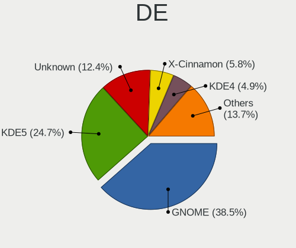

| Name           | Desktops | Percent |
|----------------|----------|---------|
| GNOME          | 115      | 36.86%  |
| KDE5           | 77       | 24.68%  |
| Unknown        | 41       | 13.14%  |
| X-Cinnamon     | 18       | 5.77%   |
| KDE4           | 17       | 5.45%   |
| xfce           | 14       | 4.49%   |
| KDE            | 7        | 2.24%   |
| MATE           | 6        | 1.92%   |
| Unity          | 4        | 1.28%   |
| Pantheon       | 3        | 0.96%   |
| i3             | 3        | 0.96%   |
| Cinnamon       | 2        | 0.64%   |
| LXQt           | 1        | 0.32%   |
| i3-with-shmlog | 1        | 0.32%   |
| GNOME Classic  | 1        | 0.32%   |
| dwm            | 1        | 0.32%   |
| Budgie         | 1        | 0.32%   |

Display Server
--------------

X11 or Wayland

| Name    | Desktops | Percent |
|---------|----------|---------|
| X11     | 237      | 77.96%  |
| Wayland | 37       | 12.17%  |
| Unknown | 23       | 7.57%   |
| Tty     | 7        | 2.3%    |

Display Manager
---------------

SDDM, LightDM, etc.

| Name    | Desktops | Percent |
|---------|----------|---------|
| Unknown | 136      | 44.59%  |
| SDDM    | 63       | 20.66%  |
| GDM3    | 31       | 10.16%  |
| GDM     | 29       | 9.51%   |
| LightDM | 21       | 6.89%   |
| KDM     | 17       | 5.57%   |
| TDM     | 7        | 2.3%    |
| XDM     | 1        | 0.33%   |

OS Lang
-------

Language

| Lang       | Desktops | Percent |
|------------|----------|---------|
| en_IL      | 101      | 33.67%  |
| en_US      | 98       | 32.67%  |
| Unknown    | 44       | 14.67%  |
| ru_RU      | 20       | 6.67%   |
| he_IL      | 17       | 5.67%   |
| C          | 5        | 1.67%   |
| uk_UA      | 2        | 0.67%   |
| fr_FR      | 2        | 0.67%   |
| pt_BR      | 1        | 0.33%   |
| POSIX      | 1        | 0.33%   |
| is         | 1        | 0.33%   |
| es_ES      | 1        | 0.33%   |
| en_US.UTF8 | 1        | 0.33%   |
| en_GB      | 1        | 0.33%   |
| en_DK      | 1        | 0.33%   |
| en_AG      | 1        | 0.33%   |
| de_DE      | 1        | 0.33%   |
| C.UTF8     | 1        | 0.33%   |
| aa_DJ      | 1        | 0.33%   |

Boot Mode
---------

EFI or BIOS

| Mode | Desktops | Percent |
|------|----------|---------|
| BIOS | 169      | 56.15%  |
| EFI  | 132      | 43.85%  |

Filesystem
----------

Type of filesystem

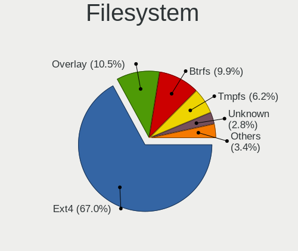

| Type    | Desktops | Percent |
|---------|----------|---------|
| Ext4    | 213      | 70.53%  |
| Overlay | 32       | 10.6%   |
| Btrfs   | 27       | 8.94%   |
| Tmpfs   | 10       | 3.31%   |
| Unknown | 9        | 2.98%   |
| Xfs     | 7        | 2.32%   |
| Zfs     | 3        | 0.99%   |
| F2fs    | 1        | 0.33%   |

Part. scheme
------------

Scheme of partitioning

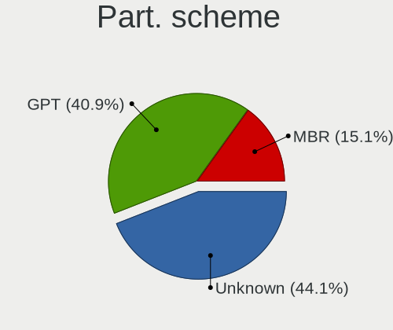

| Type    | Desktops | Percent |
|---------|----------|---------|
| Unknown | 140      | 46.98%  |
| GPT     | 113      | 37.92%  |
| MBR     | 45       | 15.1%   |

Dual Boot with Linux/BSD
------------------------

Hosting more than one Linux/BSD

| Dual boot | Desktops | Percent |
|-----------|----------|---------|
| No        | 239      | 79.93%  |
| Yes       | 60       | 20.07%  |

Dual Boot (Win)
---------------

Hosting Linux and Windows

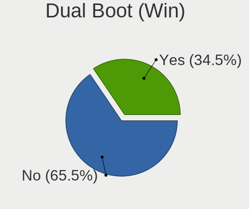

| Dual boot | Desktops | Percent |
|-----------|----------|---------|
| No        | 196      | 64.9%   |
| Yes       | 106      | 35.1%   |

Board
-----

Vendor
------

Motherboard manufacturer

| Name                | Desktops | Percent |
|---------------------|----------|---------|
| Gigabyte Technology | 97       | 33.33%  |
| ASUSTek Computer    | 93       | 31.96%  |
| Dell                | 24       | 8.25%   |
| MSI                 | 15       | 5.15%   |
| Hewlett-Packard     | 15       | 5.15%   |
| Lenovo              | 13       | 4.47%   |
| ASRock              | 10       | 3.44%   |
| Intel               | 6        | 2.06%   |
| Unknown             | 3        | 1.03%   |
| Pegatron            | 2        | 0.69%   |
| Huanan              | 2        | 0.69%   |
| Foxconn             | 2        | 0.69%   |
| Supermicro          | 1        | 0.34%   |
| Shuttle             | 1        | 0.34%   |
| ITI LIMITED         | 1        | 0.34%   |
| Hardkernel          | 1        | 0.34%   |
| Biostar             | 1        | 0.34%   |
| AZW                 | 1        | 0.34%   |
| AMI                 | 1        | 0.34%   |
| Alienware           | 1        | 0.34%   |
| Acer                | 1        | 0.34%   |

Model
-----

Motherboard model

| Name                                   | Desktops | Percent |
|----------------------------------------|----------|---------|
| ASUS All Series                        | 11       | 3.78%   |
| Gigabyte H61M-S2PV                     | 4        | 1.37%   |
| MSI MS-7592                            | 3        | 1.03%   |
| Gigabyte H61M-S1                       | 3        | 1.03%   |
| Gigabyte G31M-ES2L                     | 3        | 1.03%   |
| ASUS PRIME Z490-P                      | 3        | 1.03%   |
| ASUS P8H61-M LX R2.0                   | 3        | 1.03%   |
| ASUS H110M-A/M.2                       | 3        | 1.03%   |
| Unknown                                | 3        | 1.03%   |
| Intel DH77EB AAG39073-304              | 2        | 0.69%   |
| Gigabyte Z390 GAMING X                 | 2        | 0.69%   |
| Gigabyte X570 AORUS ULTRA              | 2        | 0.69%   |
| Gigabyte P55-UD3L                      | 2        | 0.69%   |
| Gigabyte H97-HD3                       | 2        | 0.69%   |
| Gigabyte H55M-D2H                      | 2        | 0.69%   |
| Gigabyte B460HD3                       | 2        | 0.69%   |
| Gigabyte B450M DS3H                    | 2        | 0.69%   |
| Dell OptiPlex 9020                     | 2        | 0.69%   |
| Dell OptiPlex 755                      | 2        | 0.69%   |
| Dell OptiPlex 7050                     | 2        | 0.69%   |
| ASUS TUF Gaming B550M-PLUS             | 2        | 0.69%   |
| ASUS TUF Gaming B550-PLUS              | 2        | 0.69%   |
| ASUS ROG STRIX Z390-E GAMING           | 2        | 0.69%   |
| ASUS ROG STRIX X570-F GAMING           | 2        | 0.69%   |
| ASUS PRIME X470-PRO                    | 2        | 0.69%   |
| ASUS PRIME H310M-E R2.0                | 2        | 0.69%   |
| ASUS PRIME B560M-K                     | 2        | 0.69%   |
| ASUS H110M-K                           | 2        | 0.69%   |
| Supermicro X9DAi                       | 1        | 0.34%   |
| Shuttle SH87R                          | 1        | 0.34%   |
| Pegatron Pro 3010 Small Form Factor PC | 1        | 0.34%   |
| Pegatron NC890AA-ABA a6803w            | 1        | 0.34%   |
| MSI Vortex G25 8RE                     | 1        | 0.34%   |
| MSI MS-7B89                            | 1        | 0.34%   |
| MSI MS-7B86                            | 1        | 0.34%   |
| MSI MS-7B79                            | 1        | 0.34%   |
| MSI MS-7984                            | 1        | 0.34%   |
| MSI MS-7982                            | 1        | 0.34%   |
| MSI MS-7978                            | 1        | 0.34%   |
| MSI MS-7816                            | 1        | 0.34%   |

Model Family
------------

Motherboard model prefix

| Name                 | Desktops | Percent |
|----------------------|----------|---------|
| ASUS PRIME           | 33       | 11.34%  |
| Dell OptiPlex        | 12       | 4.12%   |
| ASUS ROG             | 11       | 3.78%   |
| ASUS All             | 11       | 3.78%   |
| ASUS TUF             | 9        | 3.09%   |
| Lenovo ThinkCentre   | 7        | 2.41%   |
| Gigabyte Z690        | 5        | 1.72%   |
| Dell Precision       | 5        | 1.72%   |
| HP Compaq            | 4        | 1.37%   |
| Gigabyte X570        | 4        | 1.37%   |
| Gigabyte H61M-S2PV   | 4        | 1.37%   |
| Dell Vostro          | 4        | 1.37%   |
| ASUS H110M-A         | 4        | 1.37%   |
| MSI MS-7592          | 3        | 1.03%   |
| Lenovo V520-15IKL    | 3        | 1.03%   |
| HP ProDesk           | 3        | 1.03%   |
| Gigabyte Z390        | 3        | 1.03%   |
| Gigabyte H61M-S1     | 3        | 1.03%   |
| Gigabyte G31M-ES2L   | 3        | 1.03%   |
| Gigabyte B450M       | 3        | 1.03%   |
| ASUS P8H61-M         | 3        | 1.03%   |
| Unknown              | 3        | 1.03%   |
| Intel DH77EB         | 2        | 0.69%   |
| HP Z2                | 2        | 0.69%   |
| HP EliteDesk         | 2        | 0.69%   |
| Gigabyte P55-UD3L    | 2        | 0.69%   |
| Gigabyte H97-HD3     | 2        | 0.69%   |
| Gigabyte H55M-D2H    | 2        | 0.69%   |
| Gigabyte B560M       | 2        | 0.69%   |
| Gigabyte B460HD3     | 2        | 0.69%   |
| ASUS H110M-K         | 2        | 0.69%   |
| Supermicro X9DAi     | 1        | 0.34%   |
| Shuttle SH87R        | 1        | 0.34%   |
| Pegatron Pro         | 1        | 0.34%   |
| Pegatron NC890AA-ABA | 1        | 0.34%   |
| MSI Vortex           | 1        | 0.34%   |
| MSI MS-7B89          | 1        | 0.34%   |
| MSI MS-7B86          | 1        | 0.34%   |
| MSI MS-7B79          | 1        | 0.34%   |
| MSI MS-7984          | 1        | 0.34%   |

MFG Year
--------

Motherboard manufacture year

| Year | Desktops | Percent |
|------|----------|---------|
| 2012 | 34       | 11.68%  |
| 2018 | 32       | 11%     |
| 2021 | 26       | 8.93%   |
| 2020 | 23       | 7.9%    |
| 2019 | 22       | 7.56%   |
| 2014 | 22       | 7.56%   |
| 2013 | 21       | 7.22%   |
| 2015 | 18       | 6.19%   |
| 2011 | 18       | 6.19%   |
| 2010 | 17       | 5.84%   |
| 2017 | 15       | 5.15%   |
| 2016 | 15       | 5.15%   |
| 2009 | 12       | 4.12%   |
| 2007 | 6        | 2.06%   |
| 2008 | 5        | 1.72%   |
| 2022 | 3        | 1.03%   |
| 2023 | 1        | 0.34%   |
| 2006 | 1        | 0.34%   |

Form Factor
-----------

Physical design of the computer

| Name    | Desktops | Percent |
|---------|----------|---------|
| Desktop | 291      | 100%    |

Secure Boot
-----------

Enabled or disabled

| State    | Desktops | Percent |
|----------|----------|---------|
| Disabled | 287      | 98.63%  |
| Enabled  | 4        | 1.37%   |

Coreboot
--------

Have coreboot on board

| Used | Desktops | Percent |
|------|----------|---------|
| No   | 291      | 100%    |

RAM Size
--------

Total RAM memory

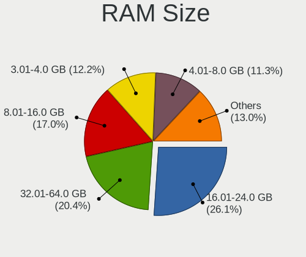

| Size in GB  | Desktops | Percent |
|-------------|----------|---------|
| 16.01-24.0  | 81       | 26.91%  |
| 32.01-64.0  | 60       | 19.93%  |
| 8.01-16.0   | 55       | 18.27%  |
| 3.01-4.0    | 36       | 11.96%  |
| 4.01-8.0    | 35       | 11.63%  |
| 64.01-256.0 | 20       | 6.64%   |
| 1.01-2.0    | 9        | 2.99%   |
| 24.01-32.0  | 3        | 1%      |
| 2.01-3.0    | 2        | 0.66%   |

RAM Used
--------

Used RAM memory

| Used GB    | Desktops | Percent |
|------------|----------|---------|
| 1.01-2.0   | 109      | 33.64%  |
| 2.01-3.0   | 62       | 19.14%  |
| 4.01-8.0   | 53       | 16.36%  |
| 3.01-4.0   | 38       | 11.73%  |
| 8.01-16.0  | 31       | 9.57%   |
| 0.51-1.0   | 22       | 6.79%   |
| 0.01-0.5   | 5        | 1.54%   |
| 24.01-32.0 | 2        | 0.62%   |
| 16.01-24.0 | 2        | 0.62%   |

Total Drives
------------

Number of drives on board

| Drives | Desktops | Percent |
|--------|----------|---------|
| 1      | 114      | 37.13%  |
| 2      | 92       | 29.97%  |
| 3      | 59       | 19.22%  |
| 4      | 21       | 6.84%   |
| 5      | 11       | 3.58%   |
| 7      | 3        | 0.98%   |
| 6      | 3        | 0.98%   |
| 8      | 2        | 0.65%   |
| 10     | 1        | 0.33%   |
| 0      | 1        | 0.33%   |

Has CD-ROM
----------

Has CD-ROM on board

| Presented | Desktops | Percent |
|-----------|----------|---------|
| No        | 192      | 64.43%  |
| Yes       | 106      | 35.57%  |

Has Ethernet
------------

Has Ethernet on board

| Presented | Desktops | Percent |
|-----------|----------|---------|
| Yes       | 289      | 99.31%  |
| No        | 2        | 0.69%   |

Has WiFi
--------

Has WiFi module

| Presented | Desktops | Percent |
|-----------|----------|---------|
| No        | 171      | 58.16%  |
| Yes       | 123      | 41.84%  |

Has Bluetooth
-------------

Has Bluetooth module

| Presented | Desktops | Percent |
|-----------|----------|---------|
| No        | 214      | 72.3%   |
| Yes       | 82       | 27.7%   |

Location
--------

Country
-------

Geographic location (country)

| Country | Desktops | Percent |
|---------|----------|---------|
| Israel  | 291      | 100%    |

City
----

Geographic location (city)

| City                | Desktops | Percent |
|---------------------|----------|---------|
| Tel Aviv            | 109      | 34.38%  |
| Haifa               | 28       | 8.83%   |
| Ramat Gan           | 23       | 7.26%   |
| Peta Tiqwa       | 13       | 4.1%    |
| Jerusalem           | 10       | 3.15%   |
| Rishon LeZiyyon     | 9        | 2.84%   |
| Qiryat Ata          | 7        | 2.21%   |
| Petah Tikva         | 7        | 2.21%   |
| Holon               | 7        | 2.21%   |
| Netanya             | 6        | 1.89%   |
| Herzliya            | 6        | 1.89%   |
| Ashdod              | 6        | 1.89%   |
| Rehovot             | 5        | 1.58%   |
| Rosh HaAyin         | 4        | 1.26%   |
| Ramat HaSharon      | 4        | 1.26%   |
| Kfar Saba           | 4        | 1.26%   |
| Beersheba           | 4        | 1.26%   |
| Ashquelon           | 4        | 1.26%   |
| Ness Ziona          | 3        | 0.95%   |
| Nahariya            | 3        | 0.95%   |
| Givatayim           | 3        | 0.95%   |
| Bat Yam             | 3        | 0.95%   |
| Yehud               | 2        | 0.63%   |
| Yaqum               | 2        | 0.63%   |
| Raanana             | 2        | 0.63%   |
| Pardes Hanna Karkur | 2        | 0.63%   |
| Hod HaSharon        | 2        | 0.63%   |
| Be'er Ya'aqov       | 2        | 0.63%   |
| Afula               | 2        | 0.63%   |
| Ziqim               | 1        | 0.32%   |
| Tiberias            | 1        | 0.32%   |
| Tel Mond            | 1        | 0.32%   |
| Sderot              | 1        | 0.32%   |
| Ramla               | 1        | 0.32%   |
| Qiryat Motsqin      | 1        | 0.32%   |
| Qiryat Bialik       | 1        | 0.32%   |
| Peta Tiqwa   | 1        | 0.32%   |
| Peta Tiqwa   | 1        | 0.32%   |
| Pardesiyya          | 1        | 0.32%   |
| Or Yehuda           | 1        | 0.32%   |

Drives
------

Drive Vendor
------------

Hard drive vendors

| Vendor                    | Desktops | Drives | Percent |
|---------------------------|----------|--------|---------|
| WDC                       | 126      | 224    | 22.74%  |
| Seagate                   | 78       | 127    | 14.08%  |
| Samsung Electronics       | 66       | 104    | 11.91%  |
| SanDisk                   | 40       | 48     | 7.22%   |
| Hitachi                   | 40       | 68     | 7.22%   |
| Kingston                  | 35       | 47     | 6.32%   |
| Toshiba                   | 25       | 30     | 4.51%   |
| Crucial                   | 19       | 32     | 3.43%   |
| Transcend                 | 16       | 21     | 2.89%   |
| Intel                     | 12       | 16     | 2.17%   |
| Corsair                   | 11       | 18     | 1.99%   |
| HGST                      | 8        | 10     | 1.44%   |
| Silicon Motion            | 6        | 6      | 1.08%   |
| A-DATA Technology         | 6        | 7      | 1.08%   |
| XPG                       | 5        | 11     | 0.9%    |
| Phison                    | 5        | 6      | 0.9%    |
| Micron Technology         | 5        | 9      | 0.9%    |
| SK hynix                  | 4        | 4      | 0.72%   |
| China                     | 4        | 5      | 0.72%   |
| Unknown                   | 3        | 4      | 0.54%   |
| SPCC                      | 3        | 3      | 0.54%   |
| Micron/Crucial Technology | 3        | 3      | 0.54%   |
| XrayDisk                  | 2        | 3      | 0.36%   |
| StoreJet                  | 2        | 2      | 0.36%   |
| PNY                       | 2        | 2      | 0.36%   |
| Phison Electronics        | 2        | 3      | 0.36%   |
| OCZ                       | 2        | 2      | 0.36%   |
| Netac                     | 2        | 2      | 0.36%   |
| KIOXIA-EXCERIA            | 2        | 3      | 0.36%   |
| Gigabyte Technology       | 2        | 2      | 0.36%   |
| ADATA Technology          | 2        | 2      | 0.36%   |
| Verbatim                  | 1        | 1      | 0.18%   |
| USB3.0                    | 1        | 1      | 0.18%   |
| UMIS                      | 1        | 1      | 0.18%   |
| TPH01204000GB             | 1        | 1      | 0.18%   |
| Plextor                   | 1        | 1      | 0.18%   |
| Patriot                   | 1        | 1      | 0.18%   |
| OCZ-VERTEX3               | 1        | 1      | 0.18%   |
| NGFF                      | 1        | 1      | 0.18%   |
| LS600                     | 1        | 1      | 0.18%   |

Drive Model
-----------

Hard drive models

| Model                                               | Desktops | Percent |
|-----------------------------------------------------|----------|---------|
| SanDisk SSD PLUS 240GB                              | 14       | 2.2%    |
| Hitachi HDS721050CLA362 500GB                       | 10       | 1.57%   |
| WDC WD10EZEX-08WN4A0 1TB                            | 8        | 1.26%   |
| Seagate ST500DM002-1BD142 500GB                     | 8        | 1.26%   |
| Kingston SA400S37240G 240GB SSD                     | 8        | 1.26%   |
| Samsung SSD 860 EVO 500GB                           | 7        | 1.1%    |
| WDC WD20PURX-64P6ZY0 2TB                            | 6        | 0.94%   |
| Toshiba DT01ACA100 1TB                              | 6        | 0.94%   |
| Seagate ST2000DM008-2FR102 2TB                      | 6        | 0.94%   |
| Samsung SSD 850 EVO 250GB                           | 6        | 0.94%   |
| Samsung NVMe SSD Drive 500GB                        | 5        | 0.79%   |
| Kingston SV300S37A120G 120GB SSD                    | 5        | 0.79%   |
| HGST HTS545050A7E680 500GB                          | 5        | 0.79%   |
| WDC WD10EZEX-60WN4A0 1TB                            | 4        | 0.63%   |
| WDC WD10EZEX-00BN5A0 1TB                            | 4        | 0.63%   |
| WDC WD1003FZEX-00MK2A0 1TB                          | 4        | 0.63%   |
| Toshiba DT01ACA050 500GB                            | 4        | 0.63%   |
| Seagate ST4000DM004-2CV104 4TB                      | 4        | 0.63%   |
| Seagate ST2000DM001-1ER164 2TB                      | 4        | 0.63%   |
| Seagate ST1000DM003-1SB102 1TB                      | 4        | 0.63%   |
| Seagate ST1000DM003-1CH162 1TB                      | 4        | 0.63%   |
| Samsung SSD 970 EVO Plus 500GB                      | 4        | 0.63%   |
| Samsung NVMe SSD Drive 1TB                          | 4        | 0.63%   |
| Crucial CT250MX500SSD1 250GB                        | 4        | 0.63%   |
| WDC WD5000AAKX-60U6AA0 500GB                        | 3        | 0.47%   |
| WDC WD3200AAKS-00L9A0 320GB                         | 3        | 0.47%   |
| WDC WD20EZRZ-00Z5HB0 2TB                            | 3        | 0.47%   |
| WDC WD20EZAZ-00GGJB0 2TB                            | 3        | 0.47%   |
| WDC WD2003FZEX-00Z4SA0 2TB                          | 3        | 0.47%   |
| WDC WD10EZEX-08M2NA0 1TB                            | 3        | 0.47%   |
| WDC WD10EARS-00Y5B1 1TB                             | 3        | 0.47%   |
| WDC WD10EADS-00L5B1 1TB                             | 3        | 0.47%   |
| Transcend TS128GSSD230S 128GB                       | 3        | 0.47%   |
| Transcend TS120GSSD220S 120GB                       | 3        | 0.47%   |
| Seagate ST500DM002-1SB10A 500GB                     | 3        | 0.47%   |
| Seagate ST3500418AS 500GB                           | 3        | 0.47%   |
| Seagate ST1000DM010-2EP102 1TB                      | 3        | 0.47%   |
| SanDisk SSD PLUS 480GB                              | 3        | 0.47%   |
| Samsung SSD 860 QVO 1TB                             | 3        | 0.47%   |
| Samsung NVMe SSD Controller SM981/PM981/PM983 250GB | 3        | 0.47%   |

HDD Vendor
----------

Hard disk drive vendors

| Vendor              | Desktops | Drives | Percent |
|---------------------|----------|--------|---------|
| WDC                 | 118      | 209    | 42.29%  |
| Seagate             | 78       | 126    | 27.96%  |
| Hitachi             | 40       | 68     | 14.34%  |
| Toshiba             | 21       | 26     | 7.53%   |
| Samsung Electronics | 9        | 15     | 3.23%   |
| HGST                | 8        | 10     | 2.87%   |
| USB3.0              | 1        | 1      | 0.36%   |
| TPH01204000GB       | 1        | 1      | 0.36%   |
| StoreJet            | 1        | 1      | 0.36%   |
| IBM/Hitachi         | 1        | 1      | 0.36%   |
| Apple               | 1        | 1      | 0.36%   |

SSD Vendor
----------

Solid state drive vendors

| Vendor              | Desktops | Drives | Percent |
|---------------------|----------|--------|---------|
| Samsung Electronics | 32       | 51     | 17.88%  |
| SanDisk             | 29       | 37     | 16.2%   |
| Kingston            | 29       | 37     | 16.2%   |
| Transcend           | 15       | 20     | 8.38%   |
| Crucial             | 13       | 24     | 7.26%   |
| Intel               | 9        | 11     | 5.03%   |
| Corsair             | 9        | 14     | 5.03%   |
| WDC                 | 6        | 6      | 3.35%   |
| A-DATA Technology   | 6        | 7      | 3.35%   |
| Micron Technology   | 5        | 9      | 2.79%   |
| China               | 4        | 5      | 2.23%   |
| SPCC                | 2        | 2      | 1.12%   |
| PNY                 | 2        | 2      | 1.12%   |
| OCZ                 | 2        | 2      | 1.12%   |
| Netac               | 2        | 2      | 1.12%   |
| KIOXIA-EXCERIA      | 2        | 2      | 1.12%   |
| XrayDisk            | 1        | 2      | 0.56%   |
| Verbatim            | 1        | 1      | 0.56%   |
| Toshiba             | 1        | 1      | 0.56%   |
| Seagate             | 1        | 1      | 0.56%   |
| Plextor             | 1        | 1      | 0.56%   |
| Patriot             | 1        | 1      | 0.56%   |
| OCZ-VERTEX3         | 1        | 1      | 0.56%   |
| NGFF                | 1        | 1      | 0.56%   |
| LS600               | 1        | 1      | 0.56%   |
| KingSpec            | 1        | 1      | 0.56%   |
| KingDian            | 1        | 2      | 0.56%   |
| Apacer              | 1        | 1      | 0.56%   |

Drive Kind
----------

HDD or SSD

| Kind    | Desktops | Drives | Percent |
|---------|----------|--------|---------|
| HDD     | 209      | 459    | 46.24%  |
| SSD     | 149      | 245    | 32.96%  |
| NVMe    | 89       | 131    | 19.69%  |
| Unknown | 4        | 5      | 0.88%   |
| MMC     | 1        | 1      | 0.22%   |

Drive Connector
---------------

SATA, SAS, NVMe, etc.

| Type | Desktops | Drives | Percent |
|------|----------|--------|---------|
| SATA | 252      | 686    | 70.19%  |
| NVMe | 89       | 130    | 24.79%  |
| SAS  | 17       | 24     | 4.74%   |
| MMC  | 1        | 1      | 0.28%   |

Drive Size
----------

Size of hard drive

| Size in TB | Desktops | Drives | Percent |
|------------|----------|--------|---------|
| 0.01-0.5   | 194      | 395    | 51.73%  |
| 0.51-1.0   | 96       | 153    | 25.6%   |
| 1.01-2.0   | 50       | 86     | 13.33%  |
| 3.01-4.0   | 14       | 37     | 3.73%   |
| 2.01-3.0   | 12       | 18     | 3.2%    |
| 4.01-10.0  | 7        | 9      | 1.87%   |
| 10.01-20.0 | 2        | 6      | 0.53%   |

Space Total
-----------

Amount of disk space available on the file system

| Size in GB     | Desktops | Percent |
|----------------|----------|---------|
| 101-250        | 65       | 20.97%  |
| 251-500        | 56       | 18.06%  |
| 501-1000       | 42       | 13.55%  |
| 1001-2000      | 33       | 10.65%  |
| More than 3000 | 30       | 9.68%   |
| 2001-3000      | 28       | 9.03%   |
| 1-20           | 25       | 8.06%   |
| 21-50          | 13       | 4.19%   |
| 51-100         | 10       | 3.23%   |
| Unknown        | 8        | 2.58%   |

Space Used
----------

Amount of used disk space

| Used GB        | Desktops | Percent |
|----------------|----------|---------|
| 1-20           | 129      | 40.19%  |
| 21-50          | 42       | 13.08%  |
| 101-250        | 30       | 9.35%   |
| 1001-2000      | 26       | 8.1%    |
| 251-500        | 25       | 7.79%   |
| 501-1000       | 19       | 5.92%   |
| 51-100         | 17       | 5.3%    |
| 2001-3000      | 13       | 4.05%   |
| More than 3000 | 12       | 3.74%   |
| Unknown        | 8        | 2.49%   |

Malfunc. Drives
---------------

Drive models with a malfunction

| Model                               | Desktops | Drives | Percent |
|-------------------------------------|----------|--------|---------|
| HGST HTS545050A7E680 500GB          | 5        | 7      | 9.43%   |
| WDC WD10EARS-00Y5B1 1TB             | 2        | 4      | 3.77%   |
| WDC WD10EADS-00L5B1 1TB             | 2        | 2      | 3.77%   |
| Hitachi HDS721050DLE630 500GB       | 2        | 2      | 3.77%   |
| Hitachi HDS721050CLA362 500GB       | 2        | 3      | 3.77%   |
| WDC WDS240G1G0B-00RC30 240GB SSD    | 1        | 1      | 1.89%   |
| WDC WD5001AALS-00LWTA0 500GB        | 1        | 1      | 1.89%   |
| WDC WD5000AAKX-60U6AA0 500GB        | 1        | 1      | 1.89%   |
| WDC WD5000AAKX-221CA1 500GB         | 1        | 1      | 1.89%   |
| WDC WD5000AADS-00S9B0 500GB         | 1        | 1      | 1.89%   |
| WDC WD3200AAKS-00L9A0 320GB         | 1        | 1      | 1.89%   |
| WDC WD30PURX-64P6ZY0 3TB            | 1        | 1      | 1.89%   |
| WDC WD2500BEVT-22A23T0 250GB        | 1        | 2      | 1.89%   |
| WDC WD2500AAJS-00VTA0 250GB         | 1        | 1      | 1.89%   |
| WDC WD20EARS-00MVWB0 2TB            | 1        | 2      | 1.89%   |
| WDC WD1600BEVT-22ZCT0 160GB         | 1        | 1      | 1.89%   |
| WDC WD10EZEX-00ZF5A0 1TB            | 1        | 1      | 1.89%   |
| WDC WD10EZEX-00RKKA0 1TB            | 1        | 1      | 1.89%   |
| WDC WD10EZEX-00BN5A0 1TB            | 1        | 1      | 1.89%   |
| WDC WD10EAVS-32D7B1 1TB             | 1        | 1      | 1.89%   |
| WDC WD10EADS-00M2B0 1TB             | 1        | 1      | 1.89%   |
| WDC WD1001FALS-00J7B1 1TB           | 1        | 1      | 1.89%   |
| Seagate ST500LM012 HN-M500MBB 500GB | 1        | 1      | 1.89%   |
| Seagate ST3750528AS 752GB           | 1        | 1      | 1.89%   |
| Seagate ST3500418AS 500GB           | 1        | 1      | 1.89%   |
| Seagate ST3250318AS 250GB           | 1        | 1      | 1.89%   |
| Seagate ST31000528AS 1TB            | 1        | 1      | 1.89%   |
| Seagate ST3000DM001-9YN166 3TB      | 1        | 1      | 1.89%   |
| Seagate ST2000DM001-1ER164 2TB      | 1        | 3      | 1.89%   |
| Seagate ST1000LM014-SSHD-8GB        | 1        | 1      | 1.89%   |
| Seagate ST1000DM003-1SB102 1TB      | 1        | 1      | 1.89%   |
| Seagate ST1000DM003-1CH162 1TB      | 1        | 1      | 1.89%   |
| Samsung Electronics HD502HJ 500GB   | 1        | 2      | 1.89%   |
| Samsung Electronics HD103UJ 1TB     | 1        | 1      | 1.89%   |
| Hitachi HUA723020ALA640 2TB         | 1        | 3      | 1.89%   |
| Hitachi HTS545050B9A300 500GB       | 1        | 1      | 1.89%   |
| Hitachi HDS721050CLA360 500GB       | 1        | 1      | 1.89%   |
| Hitachi HDS721032CLA362 320GB       | 1        | 2      | 1.89%   |
| Hitachi HDS721010CLA332 1TB         | 1        | 1      | 1.89%   |
| Hitachi HDP725050GLAT80 500GB       | 1        | 1      | 1.89%   |

Malfunc. Drive Vendor
---------------------

Vendors of faulty drives

| Vendor              | Desktops | Drives | Percent |
|---------------------|----------|--------|---------|
| WDC                 | 19       | 25     | 37.25%  |
| Hitachi             | 11       | 15     | 21.57%  |
| Seagate             | 10       | 12     | 19.61%  |
| HGST                | 6        | 8      | 11.76%  |
| Samsung Electronics | 2        | 3      | 3.92%   |
| Corsair             | 2        | 3      | 3.92%   |
| Gigabyte Technology | 1        | 1      | 1.96%   |

Malfunc. HDD Vendor
-------------------

Vendors of faulty HDD drives

| Vendor              | Desktops | Drives | Percent |
|---------------------|----------|--------|---------|
| WDC                 | 18       | 24     | 38.3%   |
| Hitachi             | 11       | 15     | 23.4%   |
| Seagate             | 10       | 12     | 21.28%  |
| HGST                | 6        | 8      | 12.77%  |
| Samsung Electronics | 2        | 3      | 4.26%   |

Malfunc. Drive Kind
-------------------

Kinds of faulty drives

| Kind | Desktops | Drives | Percent |
|------|----------|--------|---------|
| HDD  | 38       | 62     | 90.48%  |
| SSD  | 3        | 4      | 7.14%   |
| NVMe | 1        | 1      | 2.38%   |

Failed Drives
-------------

Failed drive models

| Model                           | Desktops | Drives | Percent |
|---------------------------------|----------|--------|---------|
| Toshiba MK3256GSY 320GB         | 1        | 1      | 33.33%  |
| Samsung Electronics HD103SJ 1TB | 1        | 1      | 33.33%  |
| Hitachi HTS547550A9E384 500GB   | 1        | 2      | 33.33%  |

Failed Drive Vendor
-------------------

Failed drive vendors

| Vendor              | Desktops | Drives | Percent |
|---------------------|----------|--------|---------|
| Toshiba             | 1        | 1      | 33.33%  |
| Samsung Electronics | 1        | 1      | 33.33%  |
| Hitachi             | 1        | 2      | 33.33%  |

Drive Status
------------

Number of failed and malfunc. drives

| Status   | Desktops | Drives | Percent |
|----------|----------|--------|---------|
| Detected | 163      | 499    | 50.15%  |
| Works    | 120      | 271    | 36.92%  |
| Malfunc  | 40       | 67     | 12.31%  |
| Failed   | 2        | 4      | 0.62%   |

Storage controller
------------------

Storage Vendor
--------------

Storage controller vendors

| Vendor                       | Desktops | Percent |
|------------------------------|----------|---------|
| Intel                        | 242      | 58.03%  |
| AMD                          | 47       | 11.27%  |
| Samsung Electronics          | 33       | 7.91%   |
| SanDisk                      | 16       | 3.84%   |
| Micron/Crucial Technology    | 9        | 2.16%   |
| JMicron Technology           | 9        | 2.16%   |
| Phison Electronics           | 8        | 1.92%   |
| Kingston Technology Company  | 8        | 1.92%   |
| Silicon Motion               | 7        | 1.68%   |
| Marvell Technology Group     | 7        | 1.68%   |
| ASMedia Technology           | 6        | 1.44%   |
| ADATA Technology             | 6        | 1.44%   |
| SK hynix                     | 4        | 0.96%   |
| Toshiba America Info Systems | 3        | 0.72%   |
| Nvidia                       | 3        | 0.72%   |
| Transcend                    | 2        | 0.48%   |
| Realtek Semiconductor        | 2        | 0.48%   |
| VIA Technologies             | 1        | 0.24%   |
| Union Memory (Shenzhen)      | 1        | 0.24%   |
| KIOXIA                       | 1        | 0.24%   |
| Broadcom / LSI               | 1        | 0.24%   |
| Adaptec                      | 1        | 0.24%   |

Storage Model
-------------

Storage controller models

| Model                                                                                   | Desktops | Percent |
|-----------------------------------------------------------------------------------------|----------|---------|
| AMD FCH SATA Controller [AHCI mode]                                                     | 33       | 6.67%   |
| Intel 200 Series PCH SATA controller [AHCI mode]                                        | 28       | 5.66%   |
| Intel 8 Series/C220 Series Chipset Family 6-port SATA Controller 1 [AHCI mode]          | 22       | 4.44%   |
| Intel Q170/Q150/B150/H170/H110/Z170/CM236 Chipset SATA Controller [AHCI Mode]           | 21       | 4.24%   |
| Samsung NVMe SSD Controller SM981/PM981/PM983                                           | 20       | 4.04%   |
| Intel NM10/ICH7 Family SATA Controller [IDE mode]                                       | 18       | 3.64%   |
| Intel 6 Series/C200 Series Chipset Family 6 port Desktop SATA AHCI Controller           | 17       | 3.43%   |
| Intel Alder Lake-S PCH SATA Controller [AHCI Mode]                                      | 15       | 3.03%   |
| Intel 82801G (ICH7 Family) IDE Controller                                               | 14       | 2.83%   |
| AMD 400 Series Chipset SATA Controller                                                  | 14       | 2.83%   |
| Intel SATA Controller [RAID mode]                                                       | 13       | 2.63%   |
| Intel 9 Series Chipset Family SATA Controller [AHCI Mode]                               | 12       | 2.42%   |
| Intel 6 Series/C200 Series Chipset Family Desktop SATA Controller (IDE mode, ports 4-5) | 12       | 2.42%   |
| Intel 6 Series/C200 Series Chipset Family Desktop SATA Controller (IDE mode, ports 0-3) | 12       | 2.42%   |
| Intel Cannon Lake PCH SATA AHCI Controller                                              | 11       | 2.22%   |
| Intel Comet Lake SATA AHCI Controller                                                   | 9        | 1.82%   |
| Intel Volume Management Device NVMe RAID Controller                                     | 8        | 1.62%   |
| Intel 500 Series Chipset Family SATA AHCI Controller                                    | 8        | 1.62%   |
| Intel 7 Series/C210 Series Chipset Family 6-port SATA Controller [AHCI mode]            | 7        | 1.41%   |
| Intel 400 Series Chipset Family SATA AHCI Controller                                    | 7        | 1.41%   |
| AMD 500 Series Chipset SATA Controller                                                  | 7        | 1.41%   |
| Intel 5 Series/3400 Series Chipset 4 port SATA IDE Controller                           | 6        | 1.21%   |
| Intel 5 Series/3400 Series Chipset 2 port SATA IDE Controller                           | 6        | 1.21%   |
| Silicon Motion SM2262/SM2262EN SSD Controller                                           | 5        | 1.01%   |
| Samsung NVMe SSD Controller PM9A1/PM9A3/980PRO                                          | 5        | 1.01%   |
| JMicron JMB363 SATA/IDE Controller                                                      | 5        | 1.01%   |
| Intel 82801JI (ICH10 Family) SATA AHCI Controller                                       | 5        | 1.01%   |
| ASMedia ASM1062 Serial ATA Controller                                                   | 5        | 1.01%   |
| ADATA XPG SX8200 Pro PCIe Gen3x4 M.2 2280 Solid State Drive                             | 5        | 1.01%   |
| SanDisk Extreme Pro / WD Black SN750 / PC SN730 / Red SN700 NVMe SSD                    | 4        | 0.81%   |
| Samsung NVMe SSD Controller SM961/PM961/SM963                                           | 4        | 0.81%   |
| Samsung NVMe SSD Controller 980 (DRAM-less)                                             | 4        | 0.81%   |
| Intel C600/X79 series chipset 6-Port SATA AHCI Controller                               | 4        | 0.81%   |
| Intel 7 Series/C210 Series Chipset Family 4-port SATA Controller [IDE mode]             | 4        | 0.81%   |
| Intel 7 Series/C210 Series Chipset Family 2-port SATA Controller [IDE mode]             | 4        | 0.81%   |
| AMD SB7x0/SB8x0/SB9x0 SATA Controller [AHCI mode]                                       | 4        | 0.81%   |
| SanDisk WD PC SN810 / Black SN850 NVMe SSD                                              | 3        | 0.61%   |
| Phison E16 PCIe4 NVMe Controller                                                        | 3        | 0.61%   |
| Micron/Crucial P2 [Nick P2] / P3 / P3 Plus NVMe PCIe SSD (DRAM-less)                    | 3        | 0.61%   |
| Marvell Group 88SE9172 SATA 6Gb/s Controller                                            | 3        | 0.61%   |

Storage Kind
------------

Kind of storage controller (IDE, SATA, NVMe, SAS, ...)

| Kind | Desktops | Percent |
|------|----------|---------|
| SATA | 227      | 56.47%  |
| NVMe | 90       | 22.39%  |
| IDE  | 57       | 14.18%  |
| RAID | 25       | 6.22%   |
| SAS  | 3        | 0.75%   |

Processor
---------

CPU Vendor
----------

Processor vendors

| Vendor | Desktops | Percent |
|--------|----------|---------|
| Intel  | 242      | 83.16%  |
| AMD    | 49       | 16.84%  |

CPU Model
---------

Processor models

| Model                                       | Desktops | Percent |
|---------------------------------------------|----------|---------|
| Intel Core i7-8700 CPU @ 3.20GHz            | 9        | 3.04%   |
| Intel Core i7-4790 CPU @ 3.60GHz            | 9        | 3.04%   |
| Intel Core i7-7700 CPU @ 3.60GHz            | 6        | 2.03%   |
| Intel Pentium Dual-Core CPU E5300 @ 2.60GHz | 5        | 1.69%   |
| Intel Core i7-3770 CPU @ 3.40GHz            | 5        | 1.69%   |
| Intel Core i5-6500 CPU @ 3.20GHz            | 5        | 1.69%   |
| Intel Pentium Dual-Core CPU E5500 @ 2.80GHz | 4        | 1.35%   |
| Intel Pentium CPU G2030 @ 3.00GHz           | 4        | 1.35%   |
| Intel Core i7-7700K CPU @ 4.20GHz           | 4        | 1.35%   |
| Intel Core i7-6700K CPU @ 4.00GHz           | 4        | 1.35%   |
| Intel Core i7-4770 CPU @ 3.40GHz            | 4        | 1.35%   |
| Intel Core i7-10700 CPU @ 2.90GHz           | 4        | 1.35%   |
| Intel Core i5-7400 CPU @ 3.00GHz            | 4        | 1.35%   |
| Intel Core i5-4570 CPU @ 3.20GHz            | 4        | 1.35%   |
| Intel Core i5-4460 CPU @ 3.20GHz            | 4        | 1.35%   |
| Intel Core i5-2400 CPU @ 3.10GHz            | 4        | 1.35%   |
| Intel Core i3-2120 CPU @ 3.30GHz            | 4        | 1.35%   |
| Intel Core 2 Duo CPU E7500 @ 2.93GHz        | 4        | 1.35%   |
| AMD Ryzen 9 3900X 12-Core Processor         | 4        | 1.35%   |
| AMD Ryzen 7 3700X 8-Core Processor          | 4        | 1.35%   |
| Intel Xeon CPU E5-2630 v2 @ 2.60GHz         | 3        | 1.01%   |
| Intel Pentium CPU G645 @ 2.90GHz            | 3        | 1.01%   |
| Intel Core i7-9700K CPU @ 3.60GHz           | 3        | 1.01%   |
| Intel Core i7-9700 CPU @ 3.00GHz            | 3        | 1.01%   |
| Intel Core i7-8700K CPU @ 3.70GHz           | 3        | 1.01%   |
| Intel Core i5-4690 CPU @ 3.50GHz            | 3        | 1.01%   |
| Intel Core i5-2500 CPU @ 3.30GHz            | 3        | 1.01%   |
| Intel Core i5 CPU 760 @ 2.80GHz             | 3        | 1.01%   |
| Intel Core i3-7100 CPU @ 3.90GHz            | 3        | 1.01%   |
| Intel Core i3-3220 CPU @ 3.30GHz            | 3        | 1.01%   |
| Intel 12th Gen Core i7-12700K               | 3        | 1.01%   |
| Intel 12th Gen Core i5-12600K               | 3        | 1.01%   |
| Intel 11th Gen Core i7-11700 @ 2.50GHz      | 3        | 1.01%   |
| AMD Ryzen 9 5900X 12-Core Processor         | 3        | 1.01%   |
| AMD Ryzen 5 3600 6-Core Processor           | 3        | 1.01%   |
| AMD Ryzen 5 3400G with Radeon Vega Graphics | 3        | 1.01%   |
| Intel Pentium Dual-Core CPU E6600 @ 3.06GHz | 2        | 0.68%   |
| Intel Pentium Dual CPU E2180 @ 2.00GHz      | 2        | 0.68%   |
| Intel Pentium Dual CPU E2160 @ 1.80GHz      | 2        | 0.68%   |
| Intel Core i7-6700 CPU @ 3.40GHz            | 2        | 0.68%   |

CPU Model Family
----------------

Processor model prefix

| Model                   | Desktops | Percent |
|-------------------------|----------|---------|
| Intel Core i7           | 73       | 24.83%  |
| Intel Core i5           | 66       | 22.45%  |
| Intel Core i3           | 24       | 8.16%   |
| Other                   | 21       | 7.14%   |
| AMD Ryzen 5             | 16       | 5.44%   |
| Intel Xeon              | 14       | 4.76%   |
| Intel Pentium Dual-Core | 13       | 4.42%   |
| Intel Pentium           | 11       | 3.74%   |
| AMD Ryzen 7             | 11       | 3.74%   |
| AMD Ryzen 9             | 7        | 2.38%   |
| Intel Core 2 Duo        | 6        | 2.04%   |
| Intel Pentium Dual      | 4        | 1.36%   |
| Intel Celeron           | 3        | 1.02%   |
| AMD FX                  | 3        | 1.02%   |
| AMD A8                  | 3        | 1.02%   |
| Intel Pentium Gold      | 2        | 0.68%   |
| Intel Genuine           | 2        | 0.68%   |
| Intel Core i9           | 2        | 0.68%   |
| Intel Atom              | 2        | 0.68%   |
| Intel Pentium 4         | 1        | 0.34%   |
| Intel Core 2 Quad       | 1        | 0.34%   |
| AMD Ryzen Threadripper  | 1        | 0.34%   |
| AMD Ryzen 3 PRO         | 1        | 0.34%   |
| AMD Ryzen 3             | 1        | 0.34%   |
| AMD Phenom II X4        | 1        | 0.34%   |
| AMD Phenom              | 1        | 0.34%   |
| AMD Athlon II X3        | 1        | 0.34%   |
| AMD Athlon 64 X2        | 1        | 0.34%   |
| AMD A6                  | 1        | 0.34%   |
| AMD A10                 | 1        | 0.34%   |

CPU Cores
---------

Number of processor cores

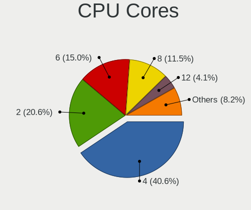

| Number | Desktops | Percent |
|--------|----------|---------|
| 4      | 123      | 41.98%  |
| 2      | 65       | 22.18%  |
| 6      | 42       | 14.33%  |
| 8      | 30       | 10.24%  |
| 12     | 14       | 4.78%   |
| 16     | 6        | 2.05%   |
| 10     | 5        | 1.71%   |
| 14     | 2        | 0.68%   |
| 3      | 2        | 0.68%   |
| 1      | 2        | 0.68%   |
| 44     | 1        | 0.34%   |
| 24     | 1        | 0.34%   |

CPU Sockets
-----------

Number of sockets

| Number | Desktops | Percent |
|--------|----------|---------|
| 1      | 287      | 98.63%  |
| 2      | 4        | 1.37%   |

CPU Threads
-----------

Threads per core (Hyper-Threading)

| Number | Desktops | Percent |
|--------|----------|---------|
| 2      | 172      | 58.5%   |
| 1      | 122      | 41.5%   |

CPU Op-Modes
------------

CPU Operation Modes (32-bit, 64-bit)

| Op mode        | Desktops | Percent |
|----------------|----------|---------|
| 32-bit, 64-bit | 290      | 99.66%  |
| Unknown        | 1        | 0.34%   |

CPU Microcode
-------------

Microcode number

| Number     | Desktops | Percent |
|------------|----------|---------|
| Unknown    | 85       | 27.42%  |
| 0x306c3    | 26       | 8.39%   |
| 0x1067a    | 18       | 5.81%   |
| 0x906e9    | 17       | 5.48%   |
| 0x306a9    | 15       | 4.84%   |
| 0x206a7    | 15       | 4.84%   |
| 0x506e3    | 14       | 4.52%   |
| 0x906ea    | 10       | 3.23%   |
| 0x90672    | 8        | 2.58%   |
| 0xa0671    | 6        | 1.94%   |
| 0x906ed    | 6        | 1.94%   |
| 0xa0655    | 5        | 1.61%   |
| 0xa0653    | 5        | 1.61%   |
| 0x306e4    | 5        | 1.61%   |
| 0x106e5    | 5        | 1.61%   |
| 0x08701021 | 5        | 1.61%   |
| 0x08108109 | 5        | 1.61%   |
| 0x6fd      | 4        | 1.29%   |
| 0x0a201009 | 3        | 0.97%   |
| 0x08701013 | 3        | 0.97%   |
| 0x0800820d | 3        | 0.97%   |
| 0x906ec    | 2        | 0.65%   |
| 0x806ec    | 2        | 0.65%   |
| 0x206c2    | 2        | 0.65%   |
| 0x20652    | 2        | 0.65%   |
| 0x10676    | 2        | 0.65%   |
| 0x0a201016 | 2        | 0.65%   |
| 0x06003106 | 2        | 0.65%   |
| 0x06001119 | 2        | 0.65%   |
| 0x010000c8 | 2        | 0.65%   |
| 0x906eb    | 1        | 0.32%   |
| 0x906c0    | 1        | 0.32%   |
| 0x90675    | 1        | 0.32%   |
| 0x806ea    | 1        | 0.32%   |
| 0x706a1    | 1        | 0.32%   |
| 0x506e0    | 1        | 0.32%   |
| 0x50657    | 1        | 0.32%   |
| 0x406f1    | 1        | 0.32%   |
| 0x406c4    | 1        | 0.32%   |
| 0x40671    | 1        | 0.32%   |

CPU Microarch
-------------

Microarchitecture

| Name             | Desktops | Percent |
|------------------|----------|---------|
| KabyLake         | 52       | 17.69%  |
| Haswell          | 38       | 12.93%  |
| IvyBridge        | 27       | 9.18%   |
| Skylake          | 21       | 7.14%   |
| SandyBridge      | 21       | 7.14%   |
| Penryn           | 21       | 7.14%   |
| CometLake        | 15       | 5.1%    |
| Zen 2            | 12       | 4.08%   |
| Unknown          | 10       | 3.4%    |
| Zen+             | 9        | 3.06%   |
| Zen 3            | 9        | 3.06%   |
| Nehalem          | 8        | 2.72%   |
| Alderlake Hybrid | 8        | 2.72%   |
| Zen              | 6        | 2.04%   |
| Icelake          | 6        | 2.04%   |
| Westmere         | 5        | 1.7%    |
| Piledriver       | 4        | 1.36%   |
| Core             | 4        | 1.36%   |
| Broadwell        | 4        | 1.36%   |
| Steamroller      | 3        | 1.02%   |
| K10              | 3        | 1.02%   |
| Silvermont       | 2        | 0.68%   |
| Tremont          | 1        | 0.34%   |
| NetBurst         | 1        | 0.34%   |
| K8 Hammer        | 1        | 0.34%   |
| Goldmont plus    | 1        | 0.34%   |
| Bulldozer        | 1        | 0.34%   |
| Bonnell          | 1        | 0.34%   |

Graphics
--------

GPU Vendor
----------

Vendors of graphics cards

| Vendor            | Desktops | Percent |
|-------------------|----------|---------|
| Nvidia            | 145      | 43.81%  |
| Intel             | 128      | 38.67%  |
| AMD               | 57       | 17.22%  |
| ASPEED Technology | 1        | 0.3%    |

GPU Model
---------

Graphics card models

| Model                                                                       | Desktops | Percent |
|-----------------------------------------------------------------------------|----------|---------|
| Intel Xeon E3-1200 v3/4th Gen Core Processor Integrated Graphics Controller | 28       | 8.31%   |
| Intel HD Graphics 630                                                       | 11       | 3.26%   |
| Intel CoffeeLake-S GT2 [UHD Graphics 630]                                   | 11       | 3.26%   |
| Nvidia GK208B [GeForce GT 710]                                              | 10       | 2.97%   |
| Intel Xeon E3-1200 v2/3rd Gen Core processor Graphics Controller            | 10       | 2.97%   |
| Intel 4 Series Chipset Integrated Graphics Controller                       | 10       | 2.97%   |
| Intel 2nd Generation Core Processor Family Integrated Graphics Controller   | 10       | 2.97%   |
| Intel HD Graphics 530                                                       | 8        | 2.37%   |
| Nvidia GT218 [GeForce 210]                                                  | 7        | 2.08%   |
| AMD Ellesmere [Radeon RX 470/480/570/570X/580/580X/590]                     | 7        | 2.08%   |
| Intel CometLake-S GT2 [UHD Graphics 630]                                    | 6        | 1.78%   |
| Intel AlderLake-S GT1                                                       | 6        | 1.78%   |
| Nvidia GP107GL [Quadro P400]                                                | 5        | 1.48%   |
| Nvidia GP107 [GeForce GTX 1050 Ti]                                          | 5        | 1.48%   |
| Nvidia GP106 [GeForce GTX 1060 3GB]                                         | 5        | 1.48%   |
| Nvidia GP104 [GeForce GTX 1070]                                             | 5        | 1.48%   |
| Nvidia GM107 [GeForce GTX 750 Ti]                                           | 5        | 1.48%   |
| Nvidia GK208B [GeForce GT 730]                                              | 5        | 1.48%   |
| Nvidia GF108 [GeForce GT 630]                                               | 5        | 1.48%   |
| Intel 82G33/G31 Express Integrated Graphics Controller                      | 5        | 1.48%   |
| Nvidia GP104 [GeForce GTX 1080]                                             | 4        | 1.19%   |
| Nvidia GM206 [GeForce GTX 960]                                              | 4        | 1.19%   |
| AMD Picasso/Raven 2 [Radeon Vega Series / Radeon Vega Mobile Series]        | 4        | 1.19%   |
| AMD Navi 10 [Radeon RX 5600 OEM/5600 XT / 5700/5700 XT]                     | 4        | 1.19%   |
| AMD Cedar [Radeon HD 5000/6000/7350/8350 Series]                            | 4        | 1.19%   |
| Nvidia TU104 [GeForce RTX 2070 SUPER]                                       | 3        | 0.89%   |
| Nvidia GP108 [GeForce GT 1030]                                              | 3        | 0.89%   |
| Nvidia GP104 [GeForce GTX 1070 Ti]                                          | 3        | 0.89%   |
| Nvidia GM204 [GeForce GTX 970]                                              | 3        | 0.89%   |
| Nvidia GF119 [GeForce GT 610]                                               | 3        | 0.89%   |
| Nvidia GF119 [GeForce GT 520]                                               | 3        | 0.89%   |
| Intel RocketLake-S GT1 [UHD Graphics 750]                                   | 3        | 0.89%   |
| AMD Navi 23 [Radeon RX 6600/6600 XT/6600M]                                  | 3        | 0.89%   |
| AMD Hawaii PRO [Radeon R9 290/390]                                          | 3        | 0.89%   |
| Nvidia TU116 [GeForce GTX 1660 Ti]                                          | 2        | 0.59%   |
| Nvidia TU116 [GeForce GTX 1660 SUPER]                                       | 2        | 0.59%   |
| Nvidia TU116 [GeForce GTX 1650]                                             | 2        | 0.59%   |
| Nvidia TU116 [GeForce GTX 1650 SUPER]                                       | 2        | 0.59%   |
| Nvidia TU106 [GeForce RTX 2060 SUPER]                                       | 2        | 0.59%   |
| Nvidia TU102 [GeForce RTX 2080 Ti Rev. A]                                   | 2        | 0.59%   |

GPU Combo
---------

Combinations of graphics cards

| Name            | Desktops | Percent |
|-----------------|----------|---------|
| 1 x Nvidia      | 124      | 41.33%  |
| 1 x Intel       | 100      | 33.33%  |
| 1 x AMD         | 46       | 15.33%  |
| Intel + Nvidia  | 18       | 6%      |
| AMD + Nvidia    | 5        | 1.67%   |
| Intel + AMD     | 4        | 1.33%   |
| 2 x AMD         | 2        | 0.67%   |
| Nvidia + ASPEED | 1        | 0.33%   |

GPU Driver
----------

Free vs proprietary

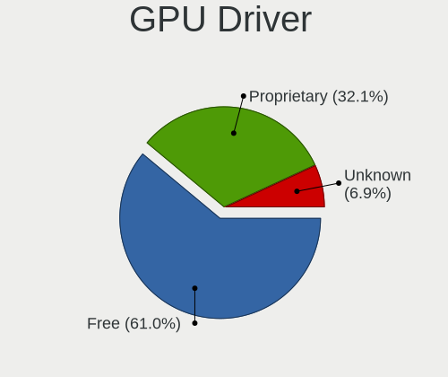

| Driver      | Desktops | Percent |
|-------------|----------|---------|
| Free        | 186      | 61.79%  |
| Proprietary | 99       | 32.89%  |
| Unknown     | 16       | 5.32%   |

GPU Memory
----------

Total video memory

| Size in GB | Desktops | Percent |
|------------|----------|---------|
| Unknown    | 141      | 45.93%  |
| 1.01-2.0   | 49       | 15.96%  |
| 7.01-8.0   | 29       | 9.45%   |
| 0.51-1.0   | 27       | 8.79%   |
| 3.01-4.0   | 24       | 7.82%   |
| 0.01-0.5   | 13       | 4.23%   |
| 8.01-16.0  | 10       | 3.26%   |
| 5.01-6.0   | 7        | 2.28%   |
| 2.01-3.0   | 5        | 1.63%   |
| 16.01-24.0 | 2        | 0.65%   |

Monitor
-------

Monitor Vendor
--------------

Monitor vendors

| Vendor               | Desktops | Percent |
|----------------------|----------|---------|
| Samsung Electronics  | 79       | 25.9%   |
| Dell                 | 49       | 16.07%  |
| Philips              | 25       | 8.2%    |
| Goldstar             | 22       | 7.21%   |
| AOC                  | 15       | 4.92%   |
| Hewlett-Packard      | 12       | 3.93%   |
| Ancor Communications | 10       | 3.28%   |
| ViewSonic            | 7        | 2.3%    |
| Lenovo               | 7        | 2.3%    |
| ASUSTek Computer     | 7        | 2.3%    |
| BenQ                 | 6        | 1.97%   |
| Acer                 | 5        | 1.64%   |
| Unknown              | 4        | 1.31%   |
| Lenovo Group Limited | 4        | 1.31%   |
| SANYO                | 3        | 0.98%   |
| LG Electronics       | 3        | 0.98%   |
| Unknown              | 3        | 0.98%   |
| VIE                  | 2        | 0.66%   |
| Sharp                | 2        | 0.66%   |
| Panasonic            | 2        | 0.66%   |
| NEX                  | 2        | 0.66%   |
| Iiyama               | 2        | 0.66%   |
| Hyundai ImageQuest   | 2        | 0.66%   |
| HKC                  | 2        | 0.66%   |
| Hitachi              | 2        | 0.66%   |
| Gigabyte Technology  | 2        | 0.66%   |
| Fujitsu Siemens      | 2        | 0.66%   |
| Eizo                 | 2        | 0.66%   |
| Chimei Innolux       | 2        | 0.66%   |
| ___                  | 1        | 0.33%   |
| Xiaomi               | 1        | 0.33%   |
| Unknown (AAA)        | 1        | 0.33%   |
| Toshiba              | 1        | 0.33%   |
| SSD                  | 1        | 0.33%   |
| Sony                 | 1        | 0.33%   |
| Sceptre Tech         | 1        | 0.33%   |
| Plain Tree Systems   | 1        | 0.33%   |
| Pioneer              | 1        | 0.33%   |
| Optoma               | 1        | 0.33%   |
| NXG                  | 1        | 0.33%   |

Monitor Model
-------------

Monitor models

| Model                                                                | Desktops | Percent |
|----------------------------------------------------------------------|----------|---------|
| Samsung Electronics S24F350 SAM0D20 1920x1080 521x293mm 23.5-inch    | 5        | 1.54%   |
| Philips PHL 223V5 PHLC0CF 1920x1080 477x268mm 21.5-inch              | 5        | 1.54%   |
| Philips PHL 243V5 PHLC0D1 1920x1080 521x293mm 23.5-inch              | 4        | 1.23%   |
| Philips 222EL PHLC052 1920x1080 476x268mm 21.5-inch                  | 4        | 1.23%   |
| Dell P2419H DELD0D9 1920x1080 530x300mm 24.0-inch                    | 4        | 1.23%   |
| Dell P2219H DELA115 1920x1080 476x267mm 21.5-inch                    | 4        | 1.23%   |
| Samsung Electronics SyncMaster SAM044B 1680x1050 474x296mm 22.0-inch | 3        | 0.92%   |
| Samsung Electronics SyncMaster SAM034D 1280x1024 376x301mm 19.0-inch | 3        | 0.92%   |
| Samsung Electronics LF27T450F SAM7099 1920x1080 597x336mm 27.0-inch  | 3        | 0.92%   |
| Philips PHL 273V5 PHLC0D2 1920x1080 598x336mm 27.0-inch              | 3        | 0.92%   |
| Dell U2415 DELA0B9 1920x1200 518x324mm 24.1-inch                     | 3        | 0.92%   |
| BenQ GL2460 BNQ78CE 1920x1080 531x299mm 24.0-inch                    | 3        | 0.92%   |
| AOC 2250W AOC2250 1920x1080 477x268mm 21.5-inch                      | 3        | 0.92%   |
| Unknown                                                              | 3        | 0.92%   |
| SANYO LCD MONITOR SAN07BE 1280x1024 350x270mm 17.4-inch              | 2        | 0.62%   |
| Samsung Electronics SyncMaster SAM041D 1920x1200 459x296mm 21.5-inch | 2        | 0.62%   |
| Samsung Electronics SM2333T SAM0737 1920x1080 510x290mm 23.1-inch    | 2        | 0.62%   |
| Samsung Electronics S24R65x SAM1023 1920x1080 530x300mm 24.0-inch    | 2        | 0.62%   |
| Samsung Electronics S24E650 SAM0CC2 1920x1200 518x324mm 24.1-inch    | 2        | 0.62%   |
| Samsung Electronics S22D390 SAM0B63 1920x1080 477x268mm 21.5-inch    | 2        | 0.62%   |
| Samsung Electronics LS27A80 SAM7184 3840x2160 597x336mm 27.0-inch    | 2        | 0.62%   |
| Samsung Electronics LCD Monitor SMBX2450 1920x1080                   | 2        | 0.62%   |
| Samsung Electronics C24F390 SAM0D2D 1920x1080 521x293mm 23.5-inch    | 2        | 0.62%   |
| Samsung Electronics C24F390 SAM0D2C 1920x1080 521x293mm 23.5-inch    | 2        | 0.62%   |
| Philips PHL 243V7 PHLC155 1920x1080 527x296mm 23.8-inch              | 2        | 0.62%   |
| Philips 226V4 PHLC0B1 1920x1080 477x268mm 21.5-inch                  | 2        | 0.62%   |
| Panasonic TV MEIA296 1920x1080 698x392mm 31.5-inch                   | 2        | 0.62%   |
| Lenovo Group Limited LCD Monitor L24q-10                             | 2        | 0.62%   |
| Hyundai ImageQuest L90D+ D-SUB HIQ91DA 1280x1024 376x301mm 19.0-inch | 2        | 0.62%   |
| Hewlett-Packard E243 HPN3468 1920x1080 527x296mm 23.8-inch           | 2        | 0.62%   |
| Hewlett-Packard 27cw HWP3195 1920x1080 598x336mm 27.0-inch           | 2        | 0.62%   |
| Goldstar W2243 GSM56FF 1920x1080 477x269mm 21.6-inch                 | 2        | 0.62%   |
| Dell U2414H DELA0A4 1920x1080 527x296mm 23.8-inch                    | 2        | 0.62%   |
| Dell U2412M DELA07A 1920x1200 518x324mm 24.1-inch                    | 2        | 0.62%   |
| Dell S2721HGF DEL41E7 1920x1080 597x336mm 27.0-inch                  | 2        | 0.62%   |
| Dell P2714H DELD05E 1920x1080 598x336mm 27.0-inch                    | 2        | 0.62%   |
| Dell P2417H DELA0DB 1920x1080 527x296mm 23.8-inch                    | 2        | 0.62%   |
| ASUSTek Computer VG248 AUS24AB 1920x1080 531x299mm 24.0-inch         | 2        | 0.62%   |
| AOC Q3279WG5B AOC3279 2560x1440 725x428mm 33.1-inch                  | 2        | 0.62%   |
| ___ LCD TV ___0101 1920x1080                                         | 1        | 0.31%   |

Monitor Resolution
------------------

Monitor screen resolution

| Resolution         | Desktops | Percent |
|--------------------|----------|---------|
| 1920x1080 (FHD)    | 167      | 56.04%  |
| 1680x1050 (WSXGA+) | 22       | 7.38%   |
| 3840x2160 (4K)     | 19       | 6.38%   |
| 1280x1024 (SXGA)   | 19       | 6.38%   |
| 2560x1440 (QHD)    | 17       | 5.7%    |
| 1920x1200 (WUXGA)  | 12       | 4.03%   |
| Unknown            | 8        | 2.68%   |
| 1440x900 (WXGA+)   | 6        | 2.01%   |
| 2560x1080          | 5        | 1.68%   |
| 3440x1440          | 4        | 1.34%   |
| 1600x900 (HD+)     | 3        | 1.01%   |
| 3840x1080          | 2        | 0.67%   |
| 1920x540           | 2        | 0.67%   |
| 1366x768 (WXGA)    | 2        | 0.67%   |
| 1360x768           | 2        | 0.67%   |
| 5360x1440          | 1        | 0.34%   |
| 5120x1440          | 1        | 0.34%   |
| 4480x1440          | 1        | 0.34%   |
| 3840x1200          | 1        | 0.34%   |
| 3520x1080          | 1        | 0.34%   |
| 2560x1600          | 1        | 0.34%   |
| 1280x768           | 1        | 0.34%   |
| 1024x768 (XGA)     | 1        | 0.34%   |

Monitor Diagonal
----------------

Diagonal size in inches

| Inches  | Desktops | Percent |
|---------|----------|---------|
| 21      | 50       | 16.56%  |
| 24      | 49       | 16.23%  |
| 27      | 43       | 14.24%  |
| 23      | 41       | 13.58%  |
| Unknown | 29       | 9.6%    |
| 22      | 18       | 5.96%   |
| 19      | 13       | 4.3%    |
| 17      | 9        | 2.98%   |
| 34      | 7        | 2.32%   |
| 20      | 7        | 2.32%   |
| 72      | 4        | 1.32%   |
| 33      | 4        | 1.32%   |
| 31      | 4        | 1.32%   |
| 84      | 3        | 0.99%   |
| 18      | 3        | 0.99%   |
| 60      | 2        | 0.66%   |
| 40      | 2        | 0.66%   |
| 32      | 2        | 0.66%   |
| 15      | 2        | 0.66%   |
| 65      | 1        | 0.33%   |
| 54      | 1        | 0.33%   |
| 52      | 1        | 0.33%   |
| 49      | 1        | 0.33%   |
| 48      | 1        | 0.33%   |
| 42      | 1        | 0.33%   |
| 37      | 1        | 0.33%   |
| 29      | 1        | 0.33%   |
| 26      | 1        | 0.33%   |
| 16      | 1        | 0.33%   |

Monitor Width
-------------

Physical width

| Width in mm | Desktops | Percent |
|-------------|----------|---------|
| 501-600     | 123      | 42.12%  |
| 401-500     | 79       | 27.05%  |
| Unknown     | 29       | 9.93%   |
| 701-800     | 13       | 4.45%   |
| 301-350     | 11       | 3.77%   |
| 351-400     | 10       | 3.42%   |
| 601-700     | 9        | 3.08%   |
| 1501-2000   | 7        | 2.4%    |
| 1001-1500   | 7        | 2.4%    |
| 801-900     | 3        | 1.03%   |
| 901-1000    | 1        | 0.34%   |

Aspect Ratio
------------

Proportional relationship between the width and the height

| Ratio   | Desktops | Percent |
|---------|----------|---------|
| 16/9    | 182      | 64.31%  |
| 16/10   | 45       | 15.9%   |
| Unknown | 28       | 9.89%   |
| 5/4     | 15       | 5.3%    |
| 21/9    | 7        | 2.47%   |
| 4/3     | 4        | 1.41%   |
| 3/2     | 1        | 0.35%   |
| 1.96    | 1        | 0.35%   |

Monitor Area
------------

Area in inch

| Area in inch | Desktops | Percent |
|----------------|----------|---------|
| 201-250        | 127      | 43.05%  |
| 301-350        | 44       | 14.92%  |
| 151-200        | 30       | 10.17%  |
| Unknown        | 29       | 9.83%   |
| 351-500        | 18       | 6.1%    |
| 251-300        | 17       | 5.76%   |
| More than 1000 | 13       | 4.41%   |
| 141-150        | 9        | 3.05%   |
| 501-1000       | 5        | 1.69%   |
| 101-110        | 2        | 0.68%   |
| 131-140        | 1        | 0.34%   |

Pixel Density
-------------

Pixels per inch

| Density | Desktops | Percent |
|---------|----------|---------|
| 51-100  | 169      | 59.3%   |
| 101-120 | 62       | 21.75%  |
| Unknown | 29       | 10.18%  |
| 1-50    | 12       | 4.21%   |
| 121-160 | 9        | 3.16%   |
| 161-240 | 4        | 1.4%    |

Multiple Monitors
-----------------

Total monitors connected

| Total | Desktops | Percent |
|-------|----------|---------|
| 1     | 228      | 76.25%  |
| 2     | 48       | 16.05%  |
| 0     | 18       | 6.02%   |
| 3     | 4        | 1.34%   |
| 4     | 1        | 0.33%   |

Network
-------

Net Controller Vendor
---------------------

Controller vendors

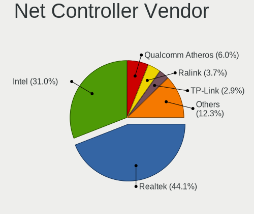

| Vendor                          | Desktops | Percent |
|---------------------------------|----------|---------|
| Realtek Semiconductor           | 180      | 42.96%  |
| Intel                           | 129      | 30.79%  |
| Qualcomm Atheros                | 29       | 6.92%   |
| Ralink Technology               | 15       | 3.58%   |
| TP-Link                         | 13       | 3.1%    |
| Edimax Technology               | 7        | 1.67%   |
| Broadcom                        | 5        | 1.19%   |
| Ralink                          | 3        | 0.72%   |
| ASIX Electronics                | 3        | 0.72%   |
| Xiaomi                          | 2        | 0.48%   |
| Samsung Electronics             | 2        | 0.48%   |
| Qualcomm Atheros Communications | 2        | 0.48%   |
| Nvidia                          | 2        | 0.48%   |
| Microsoft                       | 2        | 0.48%   |
| MediaTek                        | 2        | 0.48%   |
| Marvell Technology Group        | 2        | 0.48%   |
| Google                          | 2        | 0.48%   |
| D-Link                          | 2        | 0.48%   |
| Broadcom Limited                | 2        | 0.48%   |
| Aquantia                        | 2        | 0.48%   |
| VIA Technologies                | 1        | 0.24%   |
| U.S. Robotics                   | 1        | 0.24%   |
| U-Blox                          | 1        | 0.24%   |
| Texas Instruments               | 1        | 0.24%   |
| STMicroelectronics              | 1        | 0.24%   |
| ROCCAT                          | 1        | 0.24%   |
| Mellanox Technologies           | 1        | 0.24%   |
| Huawei Technologies             | 1        | 0.24%   |
| GDMicroelectronics              | 1        | 0.24%   |
| DisplayLink                     | 1        | 0.24%   |
| Davicom Semiconductor           | 1        | 0.24%   |
| BUFFALO                         | 1        | 0.24%   |
| Accton Technology               | 1        | 0.24%   |

Net Controller Model
--------------------

Controller models

| Model                                                             | Desktops | Percent |
|-------------------------------------------------------------------|----------|---------|
| Realtek RTL8111/8168/8411 PCI Express Gigabit Ethernet Controller | 138      | 28.99%  |
| Realtek RTL8125 2.5GbE Controller                                 | 19       | 3.99%   |
| Intel Ethernet Connection (2) I219-V                              | 19       | 3.99%   |
| Intel I211 Gigabit Network Connection                             | 16       | 3.36%   |
| Intel 82579LM Gigabit Network Connection (Lewisville)             | 13       | 2.73%   |
| Intel Wi-Fi 6 AX200                                               | 11       | 2.31%   |
| Intel Ethernet Connection I217-LM                                 | 9        | 1.89%   |
| Intel Ethernet Connection (7) I219-V                              | 8        | 1.68%   |
| Realtek RTL8192CU 802.11n WLAN Adapter                            | 7        | 1.47%   |
| Realtek 802.11ac NIC                                              | 7        | 1.47%   |
| Intel Alder Lake-S PCH CNVi WiFi                                  | 6        | 1.26%   |
| Realtek RTL810xE PCI Express Fast Ethernet controller             | 5        | 1.05%   |
| Qualcomm Atheros Killer E220x Gigabit Ethernet Controller         | 5        | 1.05%   |
| Intel Ethernet Connection (5) I219-LM                             | 5        | 1.05%   |
| Intel Ethernet Connection (14) I219-V                             | 5        | 1.05%   |
| Realtek RTL88x2bu [AC1200 Techkey]                                | 4        | 0.84%   |
| Ralink RT2870/RT3070 Wireless Adapter                             | 4        | 0.84%   |
| Ralink MT7601U Wireless Adapter                                   | 4        | 0.84%   |
| Qualcomm Atheros AR9287 Wireless Network Adapter (PCI-Express)    | 4        | 0.84%   |
| Qualcomm Atheros AR8131 Gigabit Ethernet                          | 4        | 0.84%   |
| Intel Wi-Fi 6 AX210/AX211/AX411 160MHz                            | 4        | 0.84%   |
| Intel Ethernet Controller I225-V                                  | 4        | 0.84%   |
| Intel Ethernet Connection I217-V                                  | 4        | 0.84%   |
| Intel 82579V Gigabit Network Connection                           | 4        | 0.84%   |
| TP-Link TL-WN823N v2/v3 [Realtek RTL8192EU]                       | 3        | 0.63%   |
| TP-Link TL-WN821N v5/v6 [RTL8192EU]                               | 3        | 0.63%   |
| TP-Link Archer T4U ver.3                                          | 3        | 0.63%   |
| Realtek RTL8814AU 802.11a/b/g/n/ac Wireless Adapter               | 3        | 0.63%   |
| Realtek RTL8188EUS 802.11n Wireless Network Adapter               | 3        | 0.63%   |
| Realtek RTL8153 Gigabit Ethernet Adapter                          | 3        | 0.63%   |
| Qualcomm Atheros AR8161 Gigabit Ethernet                          | 3        | 0.63%   |
| Intel Wireless-AC 9260                                            | 3        | 0.63%   |
| Intel I210 Gigabit Network Connection                             | 3        | 0.63%   |
| Intel Ethernet Connection (7) I219-LM                             | 3        | 0.63%   |
| Intel Cannon Lake PCH CNVi WiFi                                   | 3        | 0.63%   |
| Edimax RTL8192S WLAN Adapter                                      | 3        | 0.63%   |
| ASIX AX88179 Gigabit Ethernet                                     | 3        | 0.63%   |
| Xiaomi Mi/Redmi series (RNDIS)                                    | 2        | 0.42%   |
| TP-Link TL-WN722N v2/v3 [Realtek RTL8188EUS]                      | 2        | 0.42%   |
| TP-Link AC600 wireless Realtek RTL8811AU [Archer T2U Nano]        | 2        | 0.42%   |

Wireless Vendor
---------------

Wireless vendors

| Vendor                          | Desktops | Percent |
|---------------------------------|----------|---------|
| Intel                           | 39       | 28.68%  |
| Realtek Semiconductor           | 33       | 24.26%  |
| Ralink Technology               | 15       | 11.03%  |
| TP-Link                         | 13       | 9.56%   |
| Qualcomm Atheros                | 13       | 9.56%   |
| Edimax Technology               | 7        | 5.15%   |
| Broadcom                        | 4        | 2.94%   |
| Ralink                          | 3        | 2.21%   |
| Qualcomm Atheros Communications | 2        | 1.47%   |
| Microsoft                       | 2        | 1.47%   |
| MediaTek                        | 2        | 1.47%   |
| D-Link                          | 2        | 1.47%   |
| BUFFALO                         | 1        | 0.74%   |

Wireless Model
--------------

Wireless models

| Model                                                          | Desktops | Percent |
|----------------------------------------------------------------|----------|---------|
| Intel Wi-Fi 6 AX200                                            | 11       | 7.86%   |
| Realtek RTL8192CU 802.11n WLAN Adapter                         | 7        | 5%      |
| Realtek 802.11ac NIC                                           | 7        | 5%      |
| Intel Alder Lake-S PCH CNVi WiFi                               | 6        | 4.29%   |
| Realtek RTL88x2bu [AC1200 Techkey]                             | 4        | 2.86%   |
| Ralink RT2870/RT3070 Wireless Adapter                          | 4        | 2.86%   |
| Ralink MT7601U Wireless Adapter                                | 4        | 2.86%   |
| Qualcomm Atheros AR9287 Wireless Network Adapter (PCI-Express) | 4        | 2.86%   |
| Intel Wi-Fi 6 AX210/AX211/AX411 160MHz                         | 4        | 2.86%   |
| TP-Link TL-WN823N v2/v3 [Realtek RTL8192EU]                    | 3        | 2.14%   |
| TP-Link TL-WN821N v5/v6 [RTL8192EU]                            | 3        | 2.14%   |
| TP-Link Archer T4U ver.3                                       | 3        | 2.14%   |
| Realtek RTL8814AU 802.11a/b/g/n/ac Wireless Adapter            | 3        | 2.14%   |
| Realtek RTL8188EUS 802.11n Wireless Network Adapter            | 3        | 2.14%   |
| Intel Wireless-AC 9260                                         | 3        | 2.14%   |
| Intel Cannon Lake PCH CNVi WiFi                                | 3        | 2.14%   |
| Edimax RTL8192S WLAN Adapter                                   | 3        | 2.14%   |
| TP-Link TL-WN722N v2/v3 [Realtek RTL8188EUS]                   | 2        | 1.43%   |
| TP-Link AC600 wireless Realtek RTL8811AU [Archer T2U Nano]     | 2        | 1.43%   |
| Realtek RTL8192CE PCIe Wireless Network Adapter                | 2        | 1.43%   |
| Realtek RTL8191SU 802.11n WLAN Adapter                         | 2        | 1.43%   |
| Ralink RT5370 Wireless Adapter                                 | 2        | 1.43%   |
| Ralink MT7610U ("Archer T2U" 2.4G+5G WLAN Adapter              | 2        | 1.43%   |
| Qualcomm Atheros QCA9377 802.11ac Wireless Network Adapter     | 2        | 1.43%   |
| Qualcomm Atheros AR9271 802.11n                                | 2        | 1.43%   |
| Qualcomm Atheros AR9485 Wireless Network Adapter               | 2        | 1.43%   |
| Qualcomm Atheros AR9462 Wireless Network Adapter               | 2        | 1.43%   |
| Microsoft Xbox 360 Wireless Adapter                            | 2        | 1.43%   |
| Intel Wireless 8265 / 8275                                     | 2        | 1.43%   |
| Intel Wireless 3165                                            | 2        | 1.43%   |
| Intel Dual Band Wireless-AC 3168NGW [Stone Peak]               | 2        | 1.43%   |
| Intel Dual Band Wireless-AC 3165 Plus Bluetooth                | 2        | 1.43%   |
| Edimax EW-7711UTn nLite Wireless Adapter [Ralink RT3070]       | 2        | 1.43%   |
| Edimax AC600 USB                                               | 2        | 1.43%   |
| Broadcom BCM4360 802.11ac Dual Band Wireless Network Adapter   | 2        | 1.43%   |
| TP-Link TL-WN822N Version 4 RTL8192EU                          | 1        | 0.71%   |
| TP-Link 802.11ac WLAN Adapter                                  | 1        | 0.71%   |
| TP-Link 802.11ac NIC                                           | 1        | 0.71%   |
| Realtek RTL8812AE 802.11ac PCIe Wireless Network Adapter       | 1        | 0.71%   |
| Realtek RTL8811AU 802.11a/b/g/n/ac WLAN Adapter                | 1        | 0.71%   |

Ethernet Vendor
---------------

Ethernet vendors

| Vendor                   | Desktops | Percent |
|--------------------------|----------|---------|
| Realtek Semiconductor    | 166      | 52.2%   |
| Intel                    | 110      | 34.59%  |
| Qualcomm Atheros         | 18       | 5.66%   |
| ASIX Electronics         | 3        | 0.94%   |
| Xiaomi                   | 2        | 0.63%   |
| Samsung Electronics      | 2        | 0.63%   |
| Nvidia                   | 2        | 0.63%   |
| Marvell Technology Group | 2        | 0.63%   |
| Google                   | 2        | 0.63%   |
| Broadcom Limited         | 2        | 0.63%   |
| Aquantia                 | 2        | 0.63%   |
| VIA Technologies         | 1        | 0.31%   |
| Mellanox Technologies    | 1        | 0.31%   |
| Huawei Technologies      | 1        | 0.31%   |
| DisplayLink              | 1        | 0.31%   |
| Davicom Semiconductor    | 1        | 0.31%   |
| Broadcom                 | 1        | 0.31%   |
| Accton Technology        | 1        | 0.31%   |

Ethernet Model
--------------

Ethernet models

| Model                                                             | Desktops | Percent |
|-------------------------------------------------------------------|----------|---------|
| Realtek RTL8111/8168/8411 PCI Express Gigabit Ethernet Controller | 138      | 41.82%  |
| Realtek RTL8125 2.5GbE Controller                                 | 19       | 5.76%   |
| Intel Ethernet Connection (2) I219-V                              | 19       | 5.76%   |
| Intel I211 Gigabit Network Connection                             | 16       | 4.85%   |
| Intel 82579LM Gigabit Network Connection (Lewisville)             | 13       | 3.94%   |
| Intel Ethernet Connection I217-LM                                 | 9        | 2.73%   |
| Intel Ethernet Connection (7) I219-V                              | 8        | 2.42%   |
| Realtek RTL810xE PCI Express Fast Ethernet controller             | 5        | 1.52%   |
| Qualcomm Atheros Killer E220x Gigabit Ethernet Controller         | 5        | 1.52%   |
| Intel Ethernet Connection (5) I219-LM                             | 5        | 1.52%   |
| Intel Ethernet Connection (14) I219-V                             | 5        | 1.52%   |
| Qualcomm Atheros AR8131 Gigabit Ethernet                          | 4        | 1.21%   |
| Intel Ethernet Controller I225-V                                  | 4        | 1.21%   |
| Intel Ethernet Connection I217-V                                  | 4        | 1.21%   |
| Intel 82579V Gigabit Network Connection                           | 4        | 1.21%   |
| Realtek RTL8153 Gigabit Ethernet Adapter                          | 3        | 0.91%   |
| Qualcomm Atheros AR8161 Gigabit Ethernet                          | 3        | 0.91%   |
| Intel I210 Gigabit Network Connection                             | 3        | 0.91%   |
| Intel Ethernet Connection (7) I219-LM                             | 3        | 0.91%   |
| ASIX AX88179 Gigabit Ethernet                                     | 3        | 0.91%   |
| Xiaomi Mi/Redmi series (RNDIS)                                    | 2        | 0.61%   |
| Samsung Galaxy series, misc. (tethering mode)                     | 2        | 0.61%   |
| Qualcomm Atheros AR8151 v1.0 Gigabit Ethernet                     | 2        | 0.61%   |
| Nvidia MCP61 Ethernet                                             | 2        | 0.61%   |
| Intel Ethernet Connection (2) I219-LM                             | 2        | 0.61%   |
| Intel Ethernet Connection (17) I219-V                             | 2        | 0.61%   |
| Intel Ethernet Connection (12) I219-V                             | 2        | 0.61%   |
| Intel Ethernet Connection (11) I219-V                             | 2        | 0.61%   |
| Intel 82574L Gigabit Network Connection                           | 2        | 0.61%   |
| Intel 82566DM-2 Gigabit Network Connection                        | 2        | 0.61%   |
| VIA VT6105/VT6106S [Rhine-III]                                    | 1        | 0.3%    |
| Realtek RTL8169 PCI Gigabit Ethernet Controller                   | 1        | 0.3%    |
| Realtek RTL8152 Fast Ethernet Adapter                             | 1        | 0.3%    |
| Realtek RTL-8110SC/8169SC Gigabit Ethernet                        | 1        | 0.3%    |
| Realtek RTL-8100/8101L/8139 PCI Fast Ethernet Adapter             | 1        | 0.3%    |
| Realtek Killer E3000 2.5GbE Controller                            | 1        | 0.3%    |
| Qualcomm Atheros Killer E2500 Gigabit Ethernet Controller         | 1        | 0.3%    |
| Qualcomm Atheros Killer E2400 Gigabit Ethernet Controller         | 1        | 0.3%    |
| Qualcomm Atheros AR8152 v2.0 Fast Ethernet                        | 1        | 0.3%    |
| Qualcomm Atheros AR8151 v2.0 Gigabit Ethernet                     | 1        | 0.3%    |

Net Controller Kind
-------------------

Ethernet, WiFi or modem

| Kind     | Desktops | Percent |
|----------|----------|---------|
| Ethernet | 289      | 69.14%  |
| WiFi     | 123      | 29.43%  |
| Modem    | 5        | 1.2%    |
| Unknown  | 1        | 0.24%   |

Used Controller
---------------

Currently used network controller

| Kind     | Desktops | Percent |
|----------|----------|---------|
| Ethernet | 232      | 76.32%  |
| WiFi     | 72       | 23.68%  |

NICs
----

Total network controllers on board

| Total | Desktops | Percent |
|-------|----------|---------|
| 1     | 207      | 70.65%  |
| 2     | 71       | 24.23%  |
| 3     | 13       | 4.44%   |
| 0     | 2        | 0.68%   |

IPv6
----

IPv6 vs IPv4

| Used | Desktops | Percent |
|------|----------|---------|
| No   | 243      | 79.93%  |
| Yes  | 61       | 20.07%  |

Bluetooth
---------

Bluetooth Vendor
----------------

Controller vendors

| Vendor                          | Desktops | Percent |
|---------------------------------|----------|---------|
| Intel                           | 32       | 38.1%   |
| Cambridge Silicon Radio         | 27       | 32.14%  |
| Realtek Semiconductor           | 8        | 9.52%   |
| Qualcomm Atheros Communications | 5        | 5.95%   |
| ASUSTek Computer                | 3        | 3.57%   |
| TP-Link                         | 2        | 2.38%   |
| IMC Networks                    | 2        | 2.38%   |
| Broadcom                        | 2        | 2.38%   |
| Realtek                         | 1        | 1.19%   |
| Lite-On Technology              | 1        | 1.19%   |
| Apple                           | 1        | 1.19%   |

Bluetooth Model
---------------

Controller models

| Model                                               | Desktops | Percent |
|-----------------------------------------------------|----------|---------|
| Cambridge Silicon Radio Bluetooth Dongle (HCI mode) | 27       | 32.14%  |
| Intel AX200 Bluetooth                               | 9        | 10.71%  |
| Realtek Bluetooth Radio                             | 8        | 9.52%   |
| Intel Bluetooth wireless interface                  | 7        | 8.33%   |
| Intel AX201 Bluetooth                               | 5        | 5.95%   |
| Intel Bluetooth 9460/9560 Jefferson Peak (JfP)      | 4        | 4.76%   |
| Intel Wireless-AC 9260 Bluetooth Adapter            | 3        | 3.57%   |
| TP-Link TP-Cdj+ UB5A Adapter                        | 2        | 2.38%   |
| Qualcomm Atheros  Bluetooth Device                  | 2        | 2.38%   |
| Intel Wireless-AC 3168 Bluetooth                    | 2        | 2.38%   |
| ASUS Bluetooth Adapter                              | 2        | 2.38%   |
| Realtek Bluetooth Radio                             | 1        | 1.19%   |
| Qualcomm Atheros QCA61x4 Bluetooth 4.0              | 1        | 1.19%   |
| Qualcomm Atheros Bluetooth USB Host Controller      | 1        | 1.19%   |
| Qualcomm Atheros AR3011 Bluetooth                   | 1        | 1.19%   |
| Lite-On Bluetooth Device                            | 1        | 1.19%   |
| Intel Bluetooth Device                              | 1        | 1.19%   |
| Intel AX210 Bluetooth                               | 1        | 1.19%   |
| IMC Networks Wireless_Device                        | 1        | 1.19%   |
| IMC Networks Bluetooth Device                       | 1        | 1.19%   |
| Broadcom BCM43142A0 Bluetooth 4.0                   | 1        | 1.19%   |
| Broadcom BCM20702A0 Bluetooth 4.0                   | 1        | 1.19%   |
| ASUS BCM20702A0                                     | 1        | 1.19%   |
| Apple Bluetooth Host Controller                     | 1        | 1.19%   |

Sound
-----

Sound Vendor
------------

Sound card vendors

| Vendor                                       | Desktops | Percent |
|----------------------------------------------|----------|---------|
| Intel                                        | 231      | 45.38%  |
| Nvidia                                       | 139      | 27.31%  |
| AMD                                          | 74       | 14.54%  |
| C-Media Electronics                          | 10       | 1.96%   |
| Creative Labs                                | 7        | 1.38%   |
| XMOS                                         | 4        | 0.79%   |
| Logitech                                     | 4        | 0.79%   |
| Focusrite-Novation                           | 4        | 0.79%   |
| Creative Technology                          | 4        | 0.79%   |
| Texas Instruments                            | 3        | 0.59%   |
| Kingston Technology                          | 3        | 0.59%   |
| JMTek                                        | 3        | 0.59%   |
| Unknown                                      | 3        | 0.59%   |
| SteelSeries ApS                              | 2        | 0.39%   |
| GN Netcom                                    | 2        | 0.39%   |
| Generalplus Technology                       | 2        | 0.39%   |
| Cambridge Silicon Radio                      | 2        | 0.39%   |
| Zoran Co. Personal Media Division (Nogatech) | 1        | 0.2%    |
| VIA Technologies                             | 1        | 0.2%    |
| Samson Technologies                          | 1        | 0.2%    |
| Razer USA                                    | 1        | 0.2%    |
| Microsoft                                    | 1        | 0.2%    |
| Meridian                                     | 1        | 0.2%    |
| M-Audio                                      | 1        | 0.2%    |
| iCreate Technologies                         | 1        | 0.2%    |
| Giga-Byte Technology                         | 1        | 0.2%    |
| FIFINE Microphones                           | 1        | 0.2%    |
| EGO SYStems                                  | 1        | 0.2%    |
| Areson Technology                            | 1        | 0.2%    |

Sound Model
-----------

Sound card models

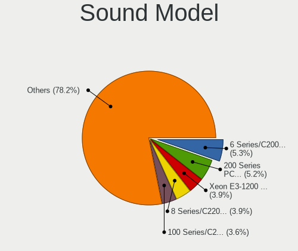

| Model                                                                      | Desktops | Percent |
|----------------------------------------------------------------------------|----------|---------|
| Intel 6 Series/C200 Series Chipset Family High Definition Audio Controller | 31       | 5.44%   |
| Intel 200 Series PCH HD Audio                                              | 28       | 4.91%   |
| Intel Xeon E3-1200 v3/4th Gen Core Processor HD Audio Controller           | 25       | 4.39%   |
| Intel 8 Series/C220 Series Chipset High Definition Audio Controller        | 25       | 4.39%   |
| Intel NM10/ICH7 Family High Definition Audio Controller                    | 19       | 3.33%   |
| Intel 100 Series/C230 Series Chipset Family HD Audio Controller            | 19       | 3.33%   |
| AMD Starship/Matisse HD Audio Controller                                   | 19       | 3.33%   |
| Nvidia GK208 HDMI/DP Audio Controller                                      | 16       | 2.81%   |
| Nvidia GP107GL High Definition Audio Controller                            | 14       | 2.46%   |
| Intel Cannon Lake PCH cAVS                                                 | 14       | 2.46%   |
| Intel Alder Lake-S HD Audio Controller                                     | 14       | 2.46%   |
| Nvidia GP104 High Definition Audio Controller                              | 13       | 2.28%   |
| Intel 9 Series Chipset Family HD Audio Controller                          | 13       | 2.28%   |
| Intel 7 Series/C216 Chipset Family High Definition Audio Controller        | 11       | 1.93%   |
| AMD Family 17h/19h HD Audio Controller                                     | 10       | 1.75%   |
| Nvidia TU116 High Definition Audio Controller                              | 9        | 1.58%   |
| Nvidia High Definition Audio Controller                                    | 8        | 1.4%    |
| Nvidia GP106 High Definition Audio Controller                              | 8        | 1.4%    |
| Intel 5 Series/3400 Series Chipset High Definition Audio                   | 8        | 1.4%    |
| AMD Family 17h (Models 00h-0fh) HD Audio Controller                        | 8        | 1.4%    |
| AMD Ellesmere HDMI Audio [Radeon RX 470/480 / 570/580/590]                 | 8        | 1.4%    |
| Nvidia GF108 High Definition Audio Controller                              | 7        | 1.23%   |
| Intel Comet Lake PCH-V cAVS                                                | 7        | 1.23%   |
| Intel 82801JI (ICH10 Family) HD Audio Controller                           | 7        | 1.23%   |
| Nvidia GM107 High Definition Audio Controller [GeForce 940MX]              | 6        | 1.05%   |
| Nvidia GF119 HDMI Audio Controller                                         | 6        | 1.05%   |
| Nvidia GA102 High Definition Audio Controller                              | 6        | 1.05%   |
| Intel Tiger Lake-H HD Audio Controller                                     | 6        | 1.05%   |
| Intel Comet Lake PCH cAVS                                                  | 6        | 1.05%   |
| Intel C600/X79 series chipset High Definition Audio Controller             | 6        | 1.05%   |
| AMD Raven/Raven2/Fenghuang HDMI/DP Audio Controller                        | 6        | 1.05%   |
| AMD Navi 21/23 HDMI/DP Audio Controller                                    | 6        | 1.05%   |
| Nvidia TU106 High Definition Audio Controller                              | 5        | 0.88%   |
| Nvidia GM206 High Definition Audio Controller                              | 5        | 0.88%   |
| Nvidia GK107 HDMI Audio Controller                                         | 5        | 0.88%   |
| AMD SBx00 Azalia (Intel HDA)                                               | 5        | 0.88%   |
| AMD Navi 10 HDMI Audio                                                     | 5        | 0.88%   |
| AMD FCH Azalia Controller                                                  | 5        | 0.88%   |
| Nvidia TU104 HD Audio Controller                                           | 4        | 0.7%    |
| Nvidia GM204 High Definition Audio Controller                              | 4        | 0.7%    |

Memory
------

Memory Vendor
-------------

Memory module vendors

| Vendor              | Desktops | Percent |
|---------------------|----------|---------|
| Kingston            | 43       | 23.76%  |
| Unknown             | 26       | 14.36%  |
| Corsair             | 22       | 12.15%  |
| Crucial             | 19       | 10.5%   |
| G.Skill             | 16       | 8.84%   |
| SK hynix            | 15       | 8.29%   |
| Samsung Electronics | 11       | 6.08%   |
| Micron Technology   | 8        | 4.42%   |
| Ramaxel Technology  | 6        | 3.31%   |
| Transcend           | 3        | 1.66%   |
| Team                | 3        | 1.66%   |
| A-DATA Technology   | 3        | 1.66%   |
| GeIL                | 2        | 1.1%    |
| Unknown (09D5)      | 1        | 0.55%   |
| Patriot             | 1        | 0.55%   |
| KETECH              | 1        | 0.55%   |
| Ankowall            | 1        | 0.55%   |

Memory Model
------------

Memory module models

| Model                                                      | Desktops | Percent |
|------------------------------------------------------------|----------|---------|
| Kingston RAM 9905622-058.A00G 8GB DIMM DDR4 2133MT/s       | 4        | 2.02%   |
| Unknown RAM Module 2GB DIMM 800MT/s                        | 3        | 1.52%   |
| SK hynix RAM HMT451U6AFR8C-PB 4GB DIMM DDR3 1600MT/s       | 3        | 1.52%   |
| Micron RAM 8JTF51264AZ-1G6E1 4GB DIMM DDR3 1600MT/s        | 3        | 1.52%   |
| Kingston RAM KF3200C16D4/16GX 16GB DIMM DDR4 3200MT/s      | 3        | 1.52%   |
| Corsair RAM CMK16GX4M2B3000C15 8GB DIMM DDR4 3533MT/s      | 3        | 1.52%   |
| Unknown RAM Module 4GB DIMM 1333MT/s                       | 2        | 1.01%   |
| Unknown RAM Module 4096MB DIMM 1333MT/s                    | 2        | 1.01%   |
| Unknown RAM Module 2048MB DIMM SDRAM                       | 2        | 1.01%   |
| Unknown RAM Module 2048MB DIMM DDR2 800MT/s                | 2        | 1.01%   |
| Unknown RAM Module 1GB DIMM 800MT/s                        | 2        | 1.01%   |
| SK hynix RAM HMT351U6CFR8C-PB 4GB DIMM DDR3 1800MT/s       | 2        | 1.01%   |
| SK hynix RAM HMT351U6BFR8C-H9 4GB DIMM DDR3 1333MT/s       | 2        | 1.01%   |
| Samsung RAM M378B5273CH0-CK0 4GB DIMM DDR3 2000MT/s        | 2        | 1.01%   |
| Kingston RAM KHX2400C15D4/4G 4GB DIMM DDR4 3151MT/s        | 2        | 1.01%   |
| Kingston RAM KHX2133C14/8G 8GB DIMM DDR4 2666MT/s          | 2        | 1.01%   |
| Kingston RAM KHX1600C9D3/8GX 8192MB DIMM DDR3 2133MT/s     | 2        | 1.01%   |
| Kingston RAM KF3200C16D4/32GX 32GB DIMM DDR4 3933MT/s      | 2        | 1.01%   |
| Kingston RAM 99U5584-010.A00LF 4096MB DIMM DDR3 1866MT/s   | 2        | 1.01%   |
| Kingston RAM 99U5584-003.A00LF 4GB DIMM DDR3 1600MT/s      | 2        | 1.01%   |
| Kingston RAM 99U5474-026.A00LF 4GB DIMM DDR3 1333MT/s      | 2        | 1.01%   |
| G.Skill RAM F3-1600C11-8GNT 8GB DIMM DDR3 1600MT/s         | 2        | 1.01%   |
| G.Skill RAM F3-10666CL9-4GBNT 4GB DIMM DDR3 1600MT/s       | 2        | 1.01%   |
| Crucial RAM CT16G4DFD832A.C16FP 16384MB DIMM DDR4 3200MT/s | 2        | 1.01%   |
| Crucial RAM BL8G32C16U4B.M8FE1 8GB DIMM DDR4 3600MT/s      | 2        | 1.01%   |
| Corsair RAM CMK32GX4M2E3200C16 16GB DIMM DDR4 3534MT/s     | 2        | 1.01%   |
| A-DATA RAM DDR4 3600 16GB DIMM DDR4 3800MT/s               | 2        | 1.01%   |
| Unknown RAM Module 8GB DIMM 1333MT/s                       | 1        | 0.51%   |
| Unknown RAM Module 8GB DIMM                                | 1        | 0.51%   |
| Unknown RAM Module 8192MB SODIMM DDR4 2667MT/s             | 1        | 0.51%   |
| Unknown RAM Module 8192MB DIMM 800MT/s                     | 1        | 0.51%   |
| Unknown RAM Module 4GB DIMM DDR 1333MT/s                   | 1        | 0.51%   |
| Unknown RAM Module 4GB DIMM 667MT/s                        | 1        | 0.51%   |
| Unknown RAM Module 4GB DIMM 1600MT/s                       | 1        | 0.51%   |
| Unknown RAM Module 4096MB DIMM SDRAM                       | 1        | 0.51%   |
| Unknown RAM Module 4096MB DIMM 1600MT/s                    | 1        | 0.51%   |
| Unknown RAM Module 2GB DIMM DDR 1333MT/s                   | 1        | 0.51%   |
| Unknown RAM Module 2GB DIMM 667MT/s                        | 1        | 0.51%   |
| Unknown RAM Module 2GB DIMM 1333MT/s                       | 1        | 0.51%   |
| Unknown RAM Module 2048MB DIMM SDRAM 800MT/s               | 1        | 0.51%   |

Memory Kind
-----------

Memory module kinds

| Kind    | Desktops | Percent |
|---------|----------|---------|
| DDR4    | 91       | 55.83%  |
| DDR3    | 36       | 22.09%  |
| Unknown | 20       | 12.27%  |
| DDR2    | 7        | 4.29%   |
| SDRAM   | 5        | 3.07%   |
| DDR5    | 2        | 1.23%   |
| DRAM    | 1        | 0.61%   |
| DDR     | 1        | 0.61%   |

Memory Form Factor
------------------

Physical design of the memory module

| Name   | Desktops | Percent |
|--------|----------|---------|
| DIMM   | 158      | 97.53%  |
| SODIMM | 4        | 2.47%   |

Memory Size
-----------

Memory module size

| Size  | Desktops | Percent |
|-------|----------|---------|
| 8192  | 52       | 29.21%  |
| 16384 | 45       | 25.28%  |
| 4096  | 45       | 25.28%  |
| 2048  | 20       | 11.24%  |
| 32768 | 9        | 5.06%   |
| 1024  | 7        | 3.93%   |

Memory Speed
------------

Memory module speed

| Speed   | Desktops | Percent |
|---------|----------|---------|
| 1600    | 23       | 12.64%  |
| 3200    | 22       | 12.09%  |
| 1333    | 16       | 8.79%   |
| 2133    | 15       | 8.24%   |
| 800     | 13       | 7.14%   |
| 2400    | 10       | 5.49%   |
| 2667    | 9        | 4.95%   |
| 3600    | 8        | 4.4%    |
| 3800    | 5        | 2.75%   |
| 667     | 5        | 2.75%   |
| Unknown | 5        | 2.75%   |
| 1867    | 4        | 2.2%    |
| 3533    | 3        | 1.65%   |
| 3466    | 3        | 1.65%   |
| 2933    | 3        | 1.65%   |
| 2666    | 3        | 1.65%   |
| 1866    | 3        | 1.65%   |
| 1800    | 3        | 1.65%   |
| 4800    | 2        | 1.1%    |
| 3933    | 2        | 1.1%    |
| 3666    | 2        | 1.1%    |
| 3534    | 2        | 1.1%    |
| 3266    | 2        | 1.1%    |
| 3151    | 2        | 1.1%    |
| 2000    | 2        | 1.1%    |
| 49926   | 1        | 0.55%   |
| 5900    | 1        | 0.55%   |
| 5600    | 1        | 0.55%   |
| 4400    | 1        | 0.55%   |
| 3733    | 1        | 0.55%   |
| 3400    | 1        | 0.55%   |
| 3334    | 1        | 0.55%   |
| 3066    | 1        | 0.55%   |
| 3000    | 1        | 0.55%   |
| 2800    | 1        | 0.55%   |
| 2134    | 1        | 0.55%   |
| 1648    | 1        | 0.55%   |
| 1400    | 1        | 0.55%   |
| 533     | 1        | 0.55%   |
| 400     | 1        | 0.55%   |

Printers & scanners
-------------------

Printer Vendor
--------------

Printer device vendors

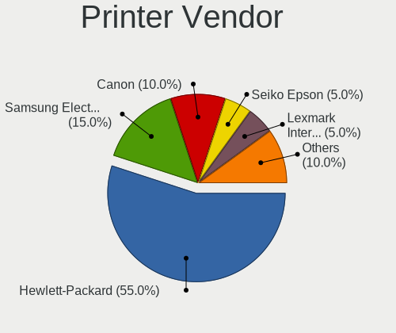

| Vendor                | Desktops | Percent |
|-----------------------|----------|---------|
| Hewlett-Packard       | 11       | 55%     |
| Samsung Electronics   | 3        | 15%     |
| Canon                 | 2        | 10%     |
| Seiko Epson           | 1        | 5%      |
| Lexmark International | 1        | 5%      |
| GODEX INTERNATIONAL   | 1        | 5%      |
| Brother Industries    | 1        | 5%      |

Printer Model
-------------

Printer device models

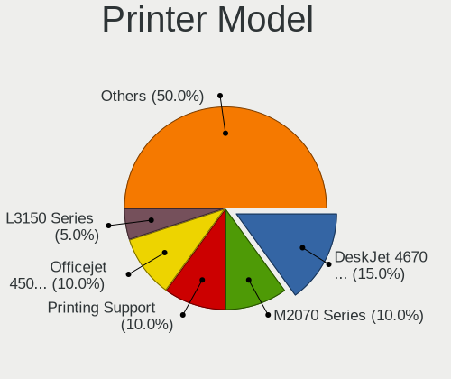

| Model                         | Desktops | Percent |
|-------------------------------|----------|---------|
| HP DeskJet 4670 series        | 3        | 15%     |
| Samsung M2070 Series          | 2        | 10%     |
| HP Printing Support           | 2        | 10%     |
| HP Officejet 4500 G510g-m     | 2        | 10%     |
| Seiko Epson L3150 Series      | 1        | 5%      |
| Samsung SCX-4623 Series       | 1        | 5%      |
| Lexmark International CS417dn | 1        | 5%      |
| HP Smart Tank 510 series      | 1        | 5%      |
| HP OfficeJet 5600 (USBHUB)    | 1        | 5%      |
| HP LaserJet M14-M17           | 1        | 5%      |
| HP Deskjet 4640 series        | 1        | 5%      |
| GODEX INTERNATIONAL DT2       | 1        | 5%      |
| Canon TR7500 series           | 1        | 5%      |
| Canon PIXMA MX490 Series      | 1        | 5%      |
| Brother MFC-J497DW            | 1        | 5%      |

Scanner Vendor
--------------

Scanner device vendors

| Vendor | Desktops | Percent |
|--------|----------|---------|
| Canon  | 2        | 100%    |

Scanner Model
-------------

Scanner device models

| Model                   | Desktops | Percent |
|-------------------------|----------|---------|
| Canon CanoScan LiDE 100 | 2        | 100%    |

Camera
------

Camera Vendor
-------------

Camera device vendors

| Vendor                        | Desktops | Percent |
|-------------------------------|----------|---------|
| Logitech                      | 24       | 31.17%  |
| Microsoft                     | 20       | 25.97%  |
| Generalplus Technology        | 6        | 7.79%   |
| Samsung Electronics           | 4        | 5.19%   |
| Microdia                      | 3        | 3.9%    |
| Apple                         | 3        | 3.9%    |
| IMC Networks                  | 2        | 2.6%    |
| Xiaomi                        | 1        | 1.3%    |
| WaveRider Communications      | 1        | 1.3%    |
| Sunplus Innovation Technology | 1        | 1.3%    |
| Realtek Semiconductor         | 1        | 1.3%    |
| Quanta                        | 1        | 1.3%    |
| Lenovo                        | 1        | 1.3%    |
| KYE Systems (Mouse Systems)   | 1        | 1.3%    |
| Jieli Technology              | 1        | 1.3%    |
| Hewlett-Packard               | 1        | 1.3%    |
| GEMBIRD                       | 1        | 1.3%    |
| Chicony Electronics           | 1        | 1.3%    |
| Bison Electronics             | 1        | 1.3%    |
| Aveo Technology               | 1        | 1.3%    |
| Allwinner Technology          | 1        | 1.3%    |
| Alcor Micro                   | 1        | 1.3%    |

Camera Model
------------

Camera device models

| Model                                               | Desktops | Percent |
|-----------------------------------------------------|----------|---------|
| Microsoft LifeCam HD-3000                           | 13       | 16.88%  |
| Logitech Webcam C270                                | 5        | 6.49%   |
| Samsung Galaxy series, misc. (MTP mode)             | 4        | 5.19%   |
| Logitech Webcam C310                                | 4        | 5.19%   |
| Generalplus GENERAL WEBCAM                          | 4        | 5.19%   |
| Microsoft Microsoft LifeCam Studio                | 2        | 2.6%    |
| Microsoft LifeCam VX-800                            | 2        | 2.6%    |
| Logitech Webcam C930e                               | 2        | 2.6%    |
| Logitech C922 Pro Stream Webcam                     | 2        | 2.6%    |
| Generalplus WEB CAM                                 | 2        | 2.6%    |
| Apple iPhone 5/5C/5S/6/SE/7/8/X/XR                  | 2        | 2.6%    |
| Xiaomi Mi/Redmi series (PTP + ADB)                  | 1        | 1.3%    |
| WaveRider USB Live camera                           | 1        | 1.3%    |
| Sunplus USB Camera                                  | 1        | 1.3%    |
| Realtek Web Camera                                  | 1        | 1.3%    |
| Quanta Astro HD Camera                              | 1        | 1.3%    |
| Microsoft Microsoft LifeCam HD-6000 for Notebooks | 1        | 1.3%    |
| Microsoft Microsoft LifeCam Cinema                | 1        | 1.3%    |
| Microsoft LifeCam HD-5000                           | 1        | 1.3%    |
| Microdia USB Camera                                 | 1        | 1.3%    |
| Microdia Integrated Camera                          | 1        | 1.3%    |
| Microdia AUKEY-W1                                   | 1        | 1.3%    |
| Logitech Webcam C920-C                              | 1        | 1.3%    |
| Logitech Webcam C170                                | 1        | 1.3%    |
| Logitech QuickCam E 3500                            | 1        | 1.3%    |
| Logitech Mic (Fusion)                               | 1        | 1.3%    |
| Logitech Logitech Webcam C925e                      | 1        | 1.3%    |
| Logitech HD Webcam C615                             | 1        | 1.3%    |
| Logitech HD Webcam C525                             | 1        | 1.3%    |
| Logitech HD Pro Webcam C920                         | 1        | 1.3%    |
| Logitech C930c                                      | 1        | 1.3%    |
| Logitech C920 PRO HD Webcam                         | 1        | 1.3%    |
| Logitech BRIO Ultra HD Webcam                       | 1        | 1.3%    |
| Lenovo Lenovo 500 RGB Camera                        | 1        | 1.3%    |
| KYE Systems (Mouse Systems) Genius Webcam           | 1        | 1.3%    |
| Jieli USB PHY 2.0                                   | 1        | 1.3%    |
| IMC Networks XHC Camera                             | 1        | 1.3%    |
| IMC Networks Integrated Camera                      | 1        | 1.3%    |
| HP Webcam HD 2300                                   | 1        | 1.3%    |
| GEMBIRD USB2.0 PC CAMERA                            | 1        | 1.3%    |

Security
--------

Fingerprint Vendor
------------------

Fingerprint sensor vendors

| Vendor                     | Desktops | Percent |
|----------------------------|----------|---------|
| Shenzhen Goodix Technology | 1        | 100%    |

Fingerprint Model
-----------------

Fingerprint sensor models

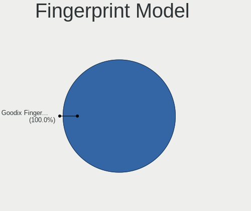

| Model                               | Desktops | Percent |
|-------------------------------------|----------|---------|
| Shenzhen Goodix  FingerPrint Device | 1        | 100%    |

Chipcard Vendor
---------------

Chipcard module vendors

Zero info for selected period =(

Chipcard Model
--------------

Chipcard module models

Zero info for selected period =(

Unsupported
-----------

Unsupported Devices
-------------------

Total unsupported devices on board

| Total | Desktops | Percent |
|-------|----------|---------|
| 0     | 246      | 82.55%  |
| 1     | 45       | 15.1%   |
| 2     | 6        | 2.01%   |
| 6     | 1        | 0.34%   |

Unsupported Device Types
------------------------

Types of unsupported devices

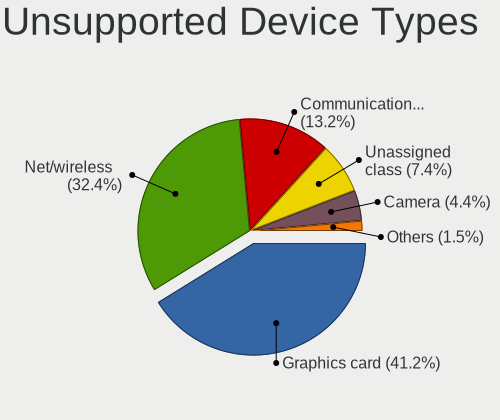

| Type                     | Desktops | Percent |
|--------------------------|----------|---------|
| Graphics card            | 23       | 39.66%  |
| Net/wireless             | 20       | 34.48%  |
| Communication controller | 7        | 12.07%  |
| Unassigned class         | 3        | 5.17%   |
| Camera                   | 3        | 5.17%   |
| Fingerprint reader       | 1        | 1.72%   |
| Bluetooth                | 1        | 1.72%   |

