Linux in Israel - Tested Hardware & Statistics (Notebooks)
----------------------------------------------------------

A project to collect tested hardware configurations for Linux in Israel.

Anyone can contribute to this report by the [hw-probe](https://github.com/linuxhw/hw-probe) tool:

    sudo -E hw-probe -all -upload

Please contribute! Especially if your hardware is rare.

Contents
--------

* [ Test Cases ](#test-cases)

* [ System ](#system)
  - [ OS                       ](#os)
  - [ OS Family                ](#os-family)
  - [ Kernel                   ](#kernel)
  - [ Kernel Family            ](#kernel-family)
  - [ Kernel Major Ver.        ](#kernel-major-ver)
  - [ Arch                     ](#arch)
  - [ DE                       ](#de)
  - [ Display Server           ](#display-server)
  - [ Display Manager          ](#display-manager)
  - [ OS Lang                  ](#os-lang)
  - [ Boot Mode                ](#boot-mode)
  - [ Filesystem               ](#filesystem)
  - [ Part. scheme             ](#part-scheme)
  - [ Dual Boot with Linux/BSD ](#dual-boot-with-linuxbsd)
  - [ Dual Boot (Win)          ](#dual-boot-win)

* [ Board ](#board)
  - [ Vendor                   ](#vendor)
  - [ Model                    ](#model)
  - [ Model Family             ](#model-family)
  - [ MFG Year                 ](#mfg-year)
  - [ Form Factor              ](#form-factor)
  - [ Secure Boot              ](#secure-boot)
  - [ Coreboot                 ](#coreboot)
  - [ RAM Size                 ](#ram-size)
  - [ RAM Used                 ](#ram-used)
  - [ Total Drives             ](#total-drives)
  - [ Has CD-ROM               ](#has-cd-rom)
  - [ Has Ethernet             ](#has-ethernet)
  - [ Has WiFi                 ](#has-wifi)
  - [ Has Bluetooth            ](#has-bluetooth)

* [ Location ](#location)
  - [ Country                  ](#country)
  - [ City                     ](#city)

* [ Drives ](#drives)
  - [ Drive Vendor             ](#drive-vendor)
  - [ Drive Model              ](#drive-model)
  - [ HDD Vendor               ](#hdd-vendor)
  - [ SSD Vendor               ](#ssd-vendor)
  - [ Drive Kind               ](#drive-kind)
  - [ Drive Connector          ](#drive-connector)
  - [ Drive Size               ](#drive-size)
  - [ Space Total              ](#space-total)
  - [ Space Used               ](#space-used)
  - [ Malfunc. Drives          ](#malfunc-drives)
  - [ Malfunc. Drive Vendor    ](#malfunc-drive-vendor)
  - [ Malfunc. HDD Vendor      ](#malfunc-hdd-vendor)
  - [ Malfunc. Drive Kind      ](#malfunc-drive-kind)
  - [ Failed Drives            ](#failed-drives)
  - [ Failed Drive Vendor      ](#failed-drive-vendor)
  - [ Drive Status             ](#drive-status)

* [ Storage controller ](#storage-controller)
  - [ Storage Vendor           ](#storage-vendor)
  - [ Storage Model            ](#storage-model)
  - [ Storage Kind             ](#storage-kind)

* [ Processor ](#processor)
  - [ CPU Vendor               ](#cpu-vendor)
  - [ CPU Model                ](#cpu-model)
  - [ CPU Model Family         ](#cpu-model-family)
  - [ CPU Cores                ](#cpu-cores)
  - [ CPU Sockets              ](#cpu-sockets)
  - [ CPU Threads              ](#cpu-threads)
  - [ CPU Op-Modes             ](#cpu-op-modes)
  - [ CPU Microcode            ](#cpu-microcode)
  - [ CPU Microarch            ](#cpu-microarch)

* [ Graphics ](#graphics)
  - [ GPU Vendor               ](#gpu-vendor)
  - [ GPU Model                ](#gpu-model)
  - [ GPU Combo                ](#gpu-combo)
  - [ GPU Driver               ](#gpu-driver)
  - [ GPU Memory               ](#gpu-memory)

* [ Monitor ](#monitor)
  - [ Monitor Vendor           ](#monitor-vendor)
  - [ Monitor Model            ](#monitor-model)
  - [ Monitor Resolution       ](#monitor-resolution)
  - [ Monitor Diagonal         ](#monitor-diagonal)
  - [ Monitor Width            ](#monitor-width)
  - [ Aspect Ratio             ](#aspect-ratio)
  - [ Monitor Area             ](#monitor-area)
  - [ Pixel Density            ](#pixel-density)
  - [ Multiple Monitors        ](#multiple-monitors)

* [ Network ](#network)
  - [ Net Controller Vendor    ](#net-controller-vendor)
  - [ Net Controller Model     ](#net-controller-model)
  - [ Wireless Vendor          ](#wireless-vendor)
  - [ Wireless Model           ](#wireless-model)
  - [ Ethernet Vendor          ](#ethernet-vendor)
  - [ Ethernet Model           ](#ethernet-model)
  - [ Net Controller Kind      ](#net-controller-kind)
  - [ Used Controller          ](#used-controller)
  - [ NICs                     ](#nics)
  - [ IPv6                     ](#ipv6)

* [ Bluetooth ](#bluetooth)
  - [ Bluetooth Vendor         ](#bluetooth-vendor)
  - [ Bluetooth Model          ](#bluetooth-model)

* [ Sound ](#sound)
  - [ Sound Vendor             ](#sound-vendor)
  - [ Sound Model              ](#sound-model)

* [ Memory ](#memory)
  - [ Memory Vendor            ](#memory-vendor)
  - [ Memory Model             ](#memory-model)
  - [ Memory Kind              ](#memory-kind)
  - [ Memory Form Factor       ](#memory-form-factor)
  - [ Memory Size              ](#memory-size)
  - [ Memory Speed             ](#memory-speed)

* [ Printers & scanners ](#printers--scanners)
  - [ Printer Vendor           ](#printer-vendor)
  - [ Printer Model            ](#printer-model)
  - [ Scanner Vendor           ](#scanner-vendor)
  - [ Scanner Model            ](#scanner-model)

* [ Camera ](#camera)
  - [ Camera Vendor            ](#camera-vendor)
  - [ Camera Model             ](#camera-model)

* [ Security ](#security)
  - [ Fingerprint Vendor       ](#fingerprint-vendor)
  - [ Fingerprint Model        ](#fingerprint-model)
  - [ Chipcard Vendor          ](#chipcard-vendor)
  - [ Chipcard Model           ](#chipcard-model)

* [ Unsupported ](#unsupported)
  - [ Unsupported Devices      ](#unsupported-devices)
  - [ Unsupported Device Types ](#unsupported-device-types)

Test Cases
----------

Total: 827

| Vendor        | Model                       | Probe                                                      | Date         |
|---------------|-----------------------------|------------------------------------------------------------|--------------|
| Intel         | Unknown                     | [c889b92d2d](https://linux-hardware.org/?probe=c889b92d2d) | Jan 03, 2026 |
| Lenovo        | IdeaPad Slim 3 16IAH8 83... | [edccdf2860](https://linux-hardware.org/?probe=edccdf2860) | Jan 03, 2026 |
| Lenovo        | IdeaPad Slim 3 16IAH8 83... | [7d780cf9c6](https://linux-hardware.org/?probe=7d780cf9c6) | Jan 03, 2026 |
| Dell          | Vostro 3580                 | [44dbaa20c4](https://linux-hardware.org/?probe=44dbaa20c4) | Dec 28, 2025 |
| Lenovo        | ThinkPad P1 Gen 7 21KV00... | [5d314c2908](https://linux-hardware.org/?probe=5d314c2908) | Dec 22, 2025 |
| Dell          | Vostro 16 5630              | [12e06fe276](https://linux-hardware.org/?probe=12e06fe276) | Dec 21, 2025 |
| Lenovo        | ThinkPad E490 20N8000RIV    | [edc1162616](https://linux-hardware.org/?probe=edc1162616) | Dec 19, 2025 |
| Dell          | Precision 7540              | [b97fc320de](https://linux-hardware.org/?probe=b97fc320de) | Dec 18, 2025 |
| Acer          | Aspire ES1-521              | [c0f3f1fa14](https://linux-hardware.org/?probe=c0f3f1fa14) | Dec 17, 2025 |
| ASUSTek       | ASUS Vivobook S 14 S5406... | [bcc0492109](https://linux-hardware.org/?probe=bcc0492109) | Dec 17, 2025 |
| ASUSTek       | ASUS Vivobook S 14 S5406... | [3bd0bf5773](https://linux-hardware.org/?probe=3bd0bf5773) | Dec 17, 2025 |
| Lenovo        | ThinkPad P16 Gen 3 21RQ0... | [350c2026b5](https://linux-hardware.org/?probe=350c2026b5) | Dec 15, 2025 |
| Lenovo        | ThinkPad T460 20FMS0GF01    | [5eb6ad8d88](https://linux-hardware.org/?probe=5eb6ad8d88) | Dec 13, 2025 |
| Lenovo        | IdeaPad Flex-14API 81SS     | [52ba83ab78](https://linux-hardware.org/?probe=52ba83ab78) | Dec 10, 2025 |
| Lenovo        | ThinkPad P16 Gen 3 21RQ0... | [5ba8b97694](https://linux-hardware.org/?probe=5ba8b97694) | Dec 09, 2025 |
| Samsung       | 355V4C/356V4C/3445VC/354... | [41fc59c967](https://linux-hardware.org/?probe=41fc59c967) | Dec 05, 2025 |
| Dell          | Vostro 3580                 | [d319f195e5](https://linux-hardware.org/?probe=d319f195e5) | Dec 04, 2025 |
| Lenovo        | ThinkPad E14 20RAS0PS00     | [e5265d8206](https://linux-hardware.org/?probe=e5265d8206) | Dec 03, 2025 |
| Dell          | XPS 15 9530                 | [9258d29bc1](https://linux-hardware.org/?probe=9258d29bc1) | Dec 02, 2025 |
| ASUSTek       | GL502VMK                    | [35ab18bc87](https://linux-hardware.org/?probe=35ab18bc87) | Nov 27, 2025 |
| Dell          | XPS 15 9530                 | [cfc1ad77fe](https://linux-hardware.org/?probe=cfc1ad77fe) | Nov 25, 2025 |
| Dell          | Vostro 5490                 | [f9ebd41a74](https://linux-hardware.org/?probe=f9ebd41a74) | Nov 24, 2025 |
| Dell          | Vostro 3580                 | [7c6ea3f854](https://linux-hardware.org/?probe=7c6ea3f854) | Nov 16, 2025 |
| ASUSTek       | ASUS Zenbook 14 UX3405CA... | [11002bc86c](https://linux-hardware.org/?probe=11002bc86c) | Nov 16, 2025 |
| Valve         | Galileo                     | [262eb1a867](https://linux-hardware.org/?probe=262eb1a867) | Nov 15, 2025 |
| Lenovo        | V14-IIL 82C4                | [14172561f0](https://linux-hardware.org/?probe=14172561f0) | Nov 02, 2025 |
| ASUSTek       | X501A                       | [417cacba3b](https://linux-hardware.org/?probe=417cacba3b) | Nov 01, 2025 |
| Lenovo        | ThinkPad P1 Gen 7 21KV00... | [4ef43272e2](https://linux-hardware.org/?probe=4ef43272e2) | Oct 29, 2025 |
| Lenovo        | IdeaPad Slim 3 15IRU9 83... | [e8de1b3ccd](https://linux-hardware.org/?probe=e8de1b3ccd) | Oct 20, 2025 |
| Lenovo        | IdeaPad 3 17IRU7 82X9       | [3c73310969](https://linux-hardware.org/?probe=3c73310969) | Oct 19, 2025 |
| Lenovo        | ThinkPad P14s Gen 5 AMD ... | [9bab3c0d27](https://linux-hardware.org/?probe=9bab3c0d27) | Oct 18, 2025 |
| HP            | Pavilion dv9000             | [d124de116b](https://linux-hardware.org/?probe=d124de116b) | Oct 15, 2025 |
| ASUSTek       | VivoBook_ASUSLaptop K540... | [2d9f02661a](https://linux-hardware.org/?probe=2d9f02661a) | Oct 12, 2025 |
| Lenovo        | ThinkPad P15 Gen 1 20ST0... | [c740c9ee42](https://linux-hardware.org/?probe=c740c9ee42) | Oct 08, 2025 |
| Lenovo        | IdeaPad Slim 3 15IRU9 83... | [9d4154db61](https://linux-hardware.org/?probe=9d4154db61) | Oct 02, 2025 |
| HP            | Pavilion Laptop 15-cs0xx... | [c51bd704fd](https://linux-hardware.org/?probe=c51bd704fd) | Oct 01, 2025 |
| Lenovo        | Yoga710-14ISK 80TY          | [00c079e6b7](https://linux-hardware.org/?probe=00c079e6b7) | Sep 27, 2025 |
| Lenovo        | Yoga710-14ISK 80TY          | [545fe971c1](https://linux-hardware.org/?probe=545fe971c1) | Sep 26, 2025 |
| HP            | 255 G8 Notebook PC          | [491871ffff](https://linux-hardware.org/?probe=491871ffff) | Sep 21, 2025 |
| ASUSTek       | VivoBook_ASUSLaptop E510... | [386ab76f00](https://linux-hardware.org/?probe=386ab76f00) | Sep 17, 2025 |
| Lenovo        | ThinkPad T490 20N20075MX    | [f10871a57c](https://linux-hardware.org/?probe=f10871a57c) | Sep 14, 2025 |
| Toshiba       | PORTEGE R30-A               | [c8da642ab9](https://linux-hardware.org/?probe=c8da642ab9) | Sep 13, 2025 |
| Lenovo        | ThinkPad P1 Gen 7 21KV00... | [ffe97ae211](https://linux-hardware.org/?probe=ffe97ae211) | Sep 04, 2025 |
| ASUSTek       | VivoBook_ASUSLaptop X150... | [fef19eb161](https://linux-hardware.org/?probe=fef19eb161) | Sep 01, 2025 |
| Samsung       | 270E5G/270E5U               | [8f79294284](https://linux-hardware.org/?probe=8f79294284) | Aug 25, 2025 |
| Lenovo        | IdeaPad L3 15ITL6 82HL      | [5521e376af](https://linux-hardware.org/?probe=5521e376af) | Aug 22, 2025 |
| ASUSTek       | VivoBook_ASUSLaptop X140... | [107a9184d2](https://linux-hardware.org/?probe=107a9184d2) | Aug 06, 2025 |
| ASUSTek       | VivoBook_ASUSLaptop X515... | [7dc34bf605](https://linux-hardware.org/?probe=7dc34bf605) | Aug 05, 2025 |
| Lenovo        | ThinkPad X260 20F6006AUS    | [1868e83ee0](https://linux-hardware.org/?probe=1868e83ee0) | Aug 03, 2025 |
| Lenovo        | ThinkPad P14s Gen 4 21K5... | [b23849255a](https://linux-hardware.org/?probe=b23849255a) | Aug 02, 2025 |
| HP            | ProBook 445 14 inch G11 ... | [aa9159ea10](https://linux-hardware.org/?probe=aa9159ea10) | Jul 31, 2025 |
| Dell          | Pro 14 Plus PB14250         | [026fa9ae3c](https://linux-hardware.org/?probe=026fa9ae3c) | Jul 30, 2025 |
| HP            | Laptop 15-ef2xxx            | [7890e6e270](https://linux-hardware.org/?probe=7890e6e270) | Jul 30, 2025 |
| HP            | Victus by Gaming Laptop ... | [f65ba6b836](https://linux-hardware.org/?probe=f65ba6b836) | Jul 29, 2025 |
| ASUSTek       | VivoBook_ASUSLaptop X150... | [d6788d26e7](https://linux-hardware.org/?probe=d6788d26e7) | Jul 17, 2025 |
| Dell          | Latitude E5540              | [d6157f3592](https://linux-hardware.org/?probe=d6157f3592) | Jul 07, 2025 |
| Dell          | Latitude 5421               | [7da034b78d](https://linux-hardware.org/?probe=7da034b78d) | Jul 04, 2025 |
| Dell          | Latitude 5420               | [d8234e66cb](https://linux-hardware.org/?probe=d8234e66cb) | Jul 02, 2025 |
| HP            | Pavilion Aero Laptop 13-... | [d0516bd525](https://linux-hardware.org/?probe=d0516bd525) | Jun 28, 2025 |
| Dell          | Vostro 15-3568              | [bfdbbdc965](https://linux-hardware.org/?probe=bfdbbdc965) | Jun 27, 2025 |
| Lenovo        | Y50-70 20378                | [3eaed721d6](https://linux-hardware.org/?probe=3eaed721d6) | Jun 23, 2025 |
| Lenovo        | Y50-70 20378                | [fee3673629](https://linux-hardware.org/?probe=fee3673629) | Jun 23, 2025 |
| Lenovo        | ThinkPad P1 Gen 7 21KV00... | [9f5efd32fd](https://linux-hardware.org/?probe=9f5efd32fd) | Jun 22, 2025 |
| Dell          | Vostro 3580                 | [d15df0928b](https://linux-hardware.org/?probe=d15df0928b) | Jun 19, 2025 |
| HP            | Laptop 14t-ep100            | [d7bc7ffeab](https://linux-hardware.org/?probe=d7bc7ffeab) | Jun 16, 2025 |
| Lenovo        | ThinkPad P14s Gen 5 AMD ... | [14bf557fb9](https://linux-hardware.org/?probe=14bf557fb9) | Jun 13, 2025 |
| Lenovo        | ThinkPad P14s Gen 5 AMD ... | [8c03c5fb14](https://linux-hardware.org/?probe=8c03c5fb14) | Jun 08, 2025 |
| TUXEDO        | Sirius 16 Gen2              | [4e484ecb32](https://linux-hardware.org/?probe=4e484ecb32) | Jun 08, 2025 |
| Valve         | Galileo                     | [99396ddf3c](https://linux-hardware.org/?probe=99396ddf3c) | Jun 07, 2025 |
| Alienware     | 17 R3                       | [6a88a5f778](https://linux-hardware.org/?probe=6a88a5f778) | Jun 02, 2025 |
| Dell          | Vostro 3550                 | [e5539aeb46](https://linux-hardware.org/?probe=e5539aeb46) | May 29, 2025 |
| Lenovo        | ThinkPad E470 20H1004VIV    | [c3beaadda9](https://linux-hardware.org/?probe=c3beaadda9) | May 28, 2025 |
| Lenovo        | ThinkPad P14s Gen 5 AMD ... | [f3fb213141](https://linux-hardware.org/?probe=f3fb213141) | May 27, 2025 |
| Lenovo        | ThinkPad X1 Carbon 6th 2... | [2218923e55](https://linux-hardware.org/?probe=2218923e55) | May 20, 2025 |
| ASUSTek       | ROG Strix G16 G614JVR_G6... | [fe7269558f](https://linux-hardware.org/?probe=fe7269558f) | May 20, 2025 |
| Lenovo        | ThinkPad X1 Carbon 6th 2... | [7e4955273c](https://linux-hardware.org/?probe=7e4955273c) | May 19, 2025 |
| Dell          | XPS 16 9640                 | [9c581659c7](https://linux-hardware.org/?probe=9c581659c7) | May 19, 2025 |
| Dell          | Vostro 14 5401              | [2d9f4cd960](https://linux-hardware.org/?probe=2d9f4cd960) | May 19, 2025 |
| Lenovo        | Yoga Pro 7 14ASP9 83HN      | [563618d5ad](https://linux-hardware.org/?probe=563618d5ad) | May 09, 2025 |
| Lenovo        | 3176 SDK0L22692 WIN 3306... | [86af928c32](https://linux-hardware.org/?probe=86af928c32) | May 09, 2025 |
| Lenovo        | Yoga Pro 7 14ASP9 83HN      | [f22419a54c](https://linux-hardware.org/?probe=f22419a54c) | May 06, 2025 |
| Razer         | Blade 15 (2022) - RZ09-0... | [da69229ee6](https://linux-hardware.org/?probe=da69229ee6) | May 06, 2025 |
| Lenovo        | IdeaPad L3 15ITL6 82HL      | [68469e687a](https://linux-hardware.org/?probe=68469e687a) | May 06, 2025 |
| ASUSTek       | K53E                        | [2c5cde70c2](https://linux-hardware.org/?probe=2c5cde70c2) | May 05, 2025 |
| Dell          | Vostro 14 5401              | [5f66076293](https://linux-hardware.org/?probe=5f66076293) | May 05, 2025 |
| Lenovo        | IdeaPad 530S-14IKB 81EU     | [7ebf32fed3](https://linux-hardware.org/?probe=7ebf32fed3) | May 02, 2025 |
| Toshiba       | PORTEGE Z30-C               | [3f5c176ce9](https://linux-hardware.org/?probe=3f5c176ce9) | Apr 29, 2025 |
| Lenovo        | ThinkPad P14s Gen 4 21HF... | [2549548ff7](https://linux-hardware.org/?probe=2549548ff7) | Apr 20, 2025 |
| Sony          | VJPG11                      | [f13f61e34f](https://linux-hardware.org/?probe=f13f61e34f) | Apr 18, 2025 |
| ASUSTek       | VivoBook_ASUSLaptop X150... | [0077d613a4](https://linux-hardware.org/?probe=0077d613a4) | Apr 18, 2025 |
| Dell          | Latitude 5450               | [08974c7b0d](https://linux-hardware.org/?probe=08974c7b0d) | Apr 15, 2025 |
| Lenovo        | ThinkPad P14s Gen 5 AMD ... | [aa963970fe](https://linux-hardware.org/?probe=aa963970fe) | Apr 07, 2025 |
| Dell          | Latitude 7490               | [de85cc9d7f](https://linux-hardware.org/?probe=de85cc9d7f) | Mar 29, 2025 |
| ASUSTek       | VivoBook_ASUSLaptop K540... | [2c32ce8133](https://linux-hardware.org/?probe=2c32ce8133) | Mar 29, 2025 |
| Lenovo        | IdeaPad L3 15ITL6 82HL      | [4959e6a11c](https://linux-hardware.org/?probe=4959e6a11c) | Mar 28, 2025 |
| Dell          | Vostro 3550                 | [ee230fc148](https://linux-hardware.org/?probe=ee230fc148) | Mar 22, 2025 |
| ASUSTek       | ZenBook UX434FAC_UX434FA    | [b8980bd7a4](https://linux-hardware.org/?probe=b8980bd7a4) | Mar 20, 2025 |
| Lenovo        | IdeaPad Slim 3 15IRU9 83... | [d5780fcd88](https://linux-hardware.org/?probe=d5780fcd88) | Mar 15, 2025 |
| ASUSTek       | VivoBook_ASUSLaptop X415... | [d139fa0e2b](https://linux-hardware.org/?probe=d139fa0e2b) | Mar 15, 2025 |
| Dell          | Vostro 3550                 | [3f89835d0a](https://linux-hardware.org/?probe=3f89835d0a) | Mar 15, 2025 |
| Lenovo        | ThinkPad P1 20MD0014RT      | [9cf3072357](https://linux-hardware.org/?probe=9cf3072357) | Mar 15, 2025 |
| Lenovo        | IdeaPad Slim 3 15IRU9 83... | [4cacca188d](https://linux-hardware.org/?probe=4cacca188d) | Mar 11, 2025 |
| Lenovo        | IdeaPad Slim 3 15IRU9 83... | [f5178b0815](https://linux-hardware.org/?probe=f5178b0815) | Mar 09, 2025 |
| ASUSTek       | X501A                       | [aec782432b](https://linux-hardware.org/?probe=aec782432b) | Mar 08, 2025 |
| Lenovo        | IdeaPad L3 15ITL6 82HL      | [83af6fd310](https://linux-hardware.org/?probe=83af6fd310) | Mar 07, 2025 |
| HP            | Laptop 14-cf0xxx            | [bcd975c749](https://linux-hardware.org/?probe=bcd975c749) | Mar 02, 2025 |
| HP            | Laptop 15-dw2xxx            | [c372ec159d](https://linux-hardware.org/?probe=c372ec159d) | Mar 01, 2025 |
| Lenovo        | ThinkPad X270 20HN0016IV    | [00c147768c](https://linux-hardware.org/?probe=00c147768c) | Feb 26, 2025 |
| HP            | Laptop 15-dw3xxx            | [7e6ea2fc59](https://linux-hardware.org/?probe=7e6ea2fc59) | Feb 22, 2025 |
| Lenovo        | IdeaPad 3 15IAU7 82RK       | [a85355dc50](https://linux-hardware.org/?probe=a85355dc50) | Feb 14, 2025 |
| ASUSTek       | ROG Strix G814JV_G814JV     | [e253fc7e30](https://linux-hardware.org/?probe=e253fc7e30) | Feb 12, 2025 |
| Lenovo        | ThinkPad P53 20QN0011IV     | [d450f1e0e4](https://linux-hardware.org/?probe=d450f1e0e4) | Feb 12, 2025 |
| Dell          | Latitude E5540              | [dafcec39ca](https://linux-hardware.org/?probe=dafcec39ca) | Feb 06, 2025 |
| Dell          | Vostro 3550                 | [f80b8c9ae3](https://linux-hardware.org/?probe=f80b8c9ae3) | Feb 04, 2025 |
| ASUSTek       | VivoBook_ASUSLaptop X150... | [9d8aa07266](https://linux-hardware.org/?probe=9d8aa07266) | Feb 01, 2025 |
| Lenovo        | IdeaPad L3 15ITL6 82HL      | [5d1e386461](https://linux-hardware.org/?probe=5d1e386461) | Jan 26, 2025 |
| ASUSTek       | VivoBook_ASUSLaptop K540... | [dae37279c1](https://linux-hardware.org/?probe=dae37279c1) | Jan 25, 2025 |
| Lenovo        | ThinkPad P50 20EN001SUS     | [f108ca039d](https://linux-hardware.org/?probe=f108ca039d) | Jan 25, 2025 |
| HP            | Pavilion g6                 | [ad489a8bfd](https://linux-hardware.org/?probe=ad489a8bfd) | Jan 25, 2025 |
| Lenovo        | IdeaPad L3 15ITL6 82HL      | [3d9b3509e4](https://linux-hardware.org/?probe=3d9b3509e4) | Jan 24, 2025 |
| ASUSTek       | Vivobook Go E1404FA_E140... | [76f216f314](https://linux-hardware.org/?probe=76f216f314) | Jan 24, 2025 |
| ASUSTek       | VivoBook_ASUSLaptop X140... | [83f8c4edaa](https://linux-hardware.org/?probe=83f8c4edaa) | Jan 16, 2025 |
| Dell          | Latitude E5540              | [6b6a8b5bf5](https://linux-hardware.org/?probe=6b6a8b5bf5) | Jan 13, 2025 |
| ASUSTek       | VivoBook_ASUSLaptop K540... | [c67c29c777](https://linux-hardware.org/?probe=c67c29c777) | Jan 09, 2025 |
| Lenovo        | ThinkPad X201 3680X08       | [29505fa5be](https://linux-hardware.org/?probe=29505fa5be) | Dec 30, 2024 |
| Lenovo        | ThinkPad T440p 20AN0069U... | [0574e44035](https://linux-hardware.org/?probe=0574e44035) | Dec 27, 2024 |
| MSI           | Creator 15 A11UE            | [c6e4f39a97](https://linux-hardware.org/?probe=c6e4f39a97) | Dec 24, 2024 |
| MSI           | Creator 15 A11UE            | [9beee8397d](https://linux-hardware.org/?probe=9beee8397d) | Dec 23, 2024 |
| ASUSTek       | ASUS EXPERTBOOK P1512CEA... | [50c7d7cd7d](https://linux-hardware.org/?probe=50c7d7cd7d) | Dec 22, 2024 |
| Lenovo        | ThinkPad P14s Gen 4 21HF... | [0c9e61a477](https://linux-hardware.org/?probe=0c9e61a477) | Dec 20, 2024 |
| ASUSTek       | VivoBook_ASUSLaptop X513... | [7ce6a920fc](https://linux-hardware.org/?probe=7ce6a920fc) | Dec 17, 2024 |
| Lenovo        | ThinkPad X1 Carbon 5th 2... | [c62449864b](https://linux-hardware.org/?probe=c62449864b) | Dec 16, 2024 |
| ASUSTek       | ASUS Vivobook 15 X1504VA... | [f1a3ece9ad](https://linux-hardware.org/?probe=f1a3ece9ad) | Dec 14, 2024 |
| Dell          | Vostro 14 5401              | [f4068911f7](https://linux-hardware.org/?probe=f4068911f7) | Dec 11, 2024 |
| Dell          | Vostro 14 5401              | [8b0aec2d81](https://linux-hardware.org/?probe=8b0aec2d81) | Dec 11, 2024 |
| Dell          | Vostro 14 5401              | [7c77f0a04f](https://linux-hardware.org/?probe=7c77f0a04f) | Dec 09, 2024 |
| Dell          | Latitude 5420               | [1d2ec04557](https://linux-hardware.org/?probe=1d2ec04557) | Dec 05, 2024 |
| Dell          | XPS 9320                    | [811e6628a8](https://linux-hardware.org/?probe=811e6628a8) | Dec 05, 2024 |
| XIAOMI        | Redmi Book Pro 15 2023      | [7342faf26d](https://linux-hardware.org/?probe=7342faf26d) | Nov 29, 2024 |
| HP            | 250 G7 Notebook PC          | [3419013123](https://linux-hardware.org/?probe=3419013123) | Nov 29, 2024 |
| HP            | Pavilion Gaming Laptop 1... | [db45208c40](https://linux-hardware.org/?probe=db45208c40) | Nov 18, 2024 |
| Lenovo        | S40-70 80GQ                 | [b0d5d5f873](https://linux-hardware.org/?probe=b0d5d5f873) | Nov 14, 2024 |
| Valve         | Jupiter                     | [77c6929edc](https://linux-hardware.org/?probe=77c6929edc) | Nov 13, 2024 |
| TUXEDO        | Sirius 16 Gen2              | [2a7fa5eed7](https://linux-hardware.org/?probe=2a7fa5eed7) | Nov 11, 2024 |
| Lenovo        | G560 0679                   | [c1388a004e](https://linux-hardware.org/?probe=c1388a004e) | Nov 11, 2024 |
| Lenovo        | V330-14IKB 81B0             | [d244f80fd9](https://linux-hardware.org/?probe=d244f80fd9) | Nov 10, 2024 |
| Lenovo        | ThinkPad T15g Gen 2i 20Y... | [f711f4d637](https://linux-hardware.org/?probe=f711f4d637) | Nov 06, 2024 |
| Dell          | Latitude 3540               | [a479cc9719](https://linux-hardware.org/?probe=a479cc9719) | Nov 04, 2024 |
| Lenovo        | ThinkPad P53 20QN0011IV     | [1b69401ca3](https://linux-hardware.org/?probe=1b69401ca3) | Nov 03, 2024 |
| GPD           | G1619-04                    | [8d4edea2b8](https://linux-hardware.org/?probe=8d4edea2b8) | Oct 28, 2024 |
| Lenovo        | ThinkPad X220 429136G       | [83c95a2454](https://linux-hardware.org/?probe=83c95a2454) | Oct 26, 2024 |
| Dell          | Latitude E5540              | [da1eff5497](https://linux-hardware.org/?probe=da1eff5497) | Oct 24, 2024 |
| ASUSTek       | VivoBook_ASUSLaptop X409... | [e9e3c256d2](https://linux-hardware.org/?probe=e9e3c256d2) | Oct 19, 2024 |
| ASUSTek       | ASUS EXPERTBOOK B1500CEA... | [03eebd41be](https://linux-hardware.org/?probe=03eebd41be) | Oct 18, 2024 |
| HP            | ProBook 445 G7              | [d98cc0dea5](https://linux-hardware.org/?probe=d98cc0dea5) | Oct 17, 2024 |
| HP            | OMEN Laptop 15-en0xxx       | [8366c88c2a](https://linux-hardware.org/?probe=8366c88c2a) | Oct 17, 2024 |
| Dell          | Vostro 3520                 | [f872a97890](https://linux-hardware.org/?probe=f872a97890) | Oct 16, 2024 |
| Toshiba       | Satellite C660              | [6a20c0ad19](https://linux-hardware.org/?probe=6a20c0ad19) | Oct 11, 2024 |
| System76      | Lemur Pro                   | [0e513dcca4](https://linux-hardware.org/?probe=0e513dcca4) | Oct 09, 2024 |
| Lenovo        | Yoga 500-15ISK 80R6         | [8fadc9f74b](https://linux-hardware.org/?probe=8fadc9f74b) | Oct 07, 2024 |
| HP            | 340S G7                     | [289c918fd8](https://linux-hardware.org/?probe=289c918fd8) | Sep 25, 2024 |
| HP            | 340S G7                     | [df45d811d6](https://linux-hardware.org/?probe=df45d811d6) | Sep 25, 2024 |
| Framework     | Laptop                      | [ac09197e5d](https://linux-hardware.org/?probe=ac09197e5d) | Sep 16, 2024 |
| ASUSTek       | VivoBook_ASUSLaptop X513... | [160a67618d](https://linux-hardware.org/?probe=160a67618d) | Sep 09, 2024 |
| Lenovo        | ThinkPad P14s Gen 5 AMD ... | [cc11d84cd6](https://linux-hardware.org/?probe=cc11d84cd6) | Sep 09, 2024 |
| Lenovo        | ThinkPad E14 Gen 6 21M70... | [32b933b3d1](https://linux-hardware.org/?probe=32b933b3d1) | Sep 05, 2024 |
| Lenovo        | ThinkPad E14 Gen 6 21M70... | [815ddf6853](https://linux-hardware.org/?probe=815ddf6853) | Sep 05, 2024 |
| Lenovo        | ThinkPad P15v Gen 3 21D8... | [64d3ba9633](https://linux-hardware.org/?probe=64d3ba9633) | Sep 02, 2024 |
| ASUSTek       | VivoBook_ASUSLaptop K350... | [07a2f372ea](https://linux-hardware.org/?probe=07a2f372ea) | Aug 30, 2024 |
| HP            | 15 TS                       | [b23e3c74fc](https://linux-hardware.org/?probe=b23e3c74fc) | Aug 23, 2024 |
| HP            | 15 TS                       | [1498cfa38b](https://linux-hardware.org/?probe=1498cfa38b) | Aug 23, 2024 |
| Alienware     | 17 R4                       | [c88b350309](https://linux-hardware.org/?probe=c88b350309) | Aug 14, 2024 |
| ASUSTek       | ASUS EXPERTBOOK B1400CEA... | [c670222db7](https://linux-hardware.org/?probe=c670222db7) | Aug 12, 2024 |
| HP            | EliteBook 840 G3            | [92bd64ed1f](https://linux-hardware.org/?probe=92bd64ed1f) | Aug 10, 2024 |
| AMI           | PC1068                      | [c4eb235653](https://linux-hardware.org/?probe=c4eb235653) | Aug 09, 2024 |
| ASUSTek       | X401U                       | [ea3228e385](https://linux-hardware.org/?probe=ea3228e385) | Aug 07, 2024 |
| HP            | 15 TS                       | [75411019b4](https://linux-hardware.org/?probe=75411019b4) | Jul 28, 2024 |
| HP            | 15 TS                       | [1407e7426f](https://linux-hardware.org/?probe=1407e7426f) | Jul 28, 2024 |
| Apple         | MacBookPro13,1              | [f5b3a5f6d2](https://linux-hardware.org/?probe=f5b3a5f6d2) | Jul 26, 2024 |
| HP            | EPROM DATA AREA             | [e227613970](https://linux-hardware.org/?probe=e227613970) | Jul 17, 2024 |
| Dell          | Latitude 7440               | [11f78bffe8](https://linux-hardware.org/?probe=11f78bffe8) | Jul 16, 2024 |
| Dell          | Inspiron 7720               | [faa5f6deff](https://linux-hardware.org/?probe=faa5f6deff) | Jul 15, 2024 |
| Dell          | Latitude 7490               | [d97e407301](https://linux-hardware.org/?probe=d97e407301) | Jul 05, 2024 |
| Dell          | Vostro 15-3568              | [63adc91261](https://linux-hardware.org/?probe=63adc91261) | Jul 01, 2024 |
| Lenovo        | IdeaPad Slim 3 15IAH8 83... | [e09d0fb605](https://linux-hardware.org/?probe=e09d0fb605) | Jul 01, 2024 |
| Lenovo        | IdeaPad Slim 3 15IAH8 83... | [f91526c63f](https://linux-hardware.org/?probe=f91526c63f) | Jul 01, 2024 |
| Razer         | Blade 18 - RZ09-0509        | [d0e4380367](https://linux-hardware.org/?probe=d0e4380367) | Jun 23, 2024 |
| MSI           | GS65 Stealth 9SE            | [ce50118d2f](https://linux-hardware.org/?probe=ce50118d2f) | Jun 20, 2024 |
| ASUSTek       | VivoBook_ASUSLaptop X571... | [4d3e8553c1](https://linux-hardware.org/?probe=4d3e8553c1) | Jun 11, 2024 |
| Dell          | Latitude E5430 non-vPro     | [e2b3f11050](https://linux-hardware.org/?probe=e2b3f11050) | Jun 08, 2024 |
| Lenovo        | IdeaPad Pro 5 16AHP9 83D... | [bc1e30a54a](https://linux-hardware.org/?probe=bc1e30a54a) | Jun 07, 2024 |
| Dell          | Vostro 14 5401              | [2662a521a5](https://linux-hardware.org/?probe=2662a521a5) | Jun 05, 2024 |
| Lenovo        | ThinkPad P1 Gen 3 20TJS2... | [1cecc324c7](https://linux-hardware.org/?probe=1cecc324c7) | Jun 04, 2024 |
| Acer          | Aspire 5732Z                | [3240239bf4](https://linux-hardware.org/?probe=3240239bf4) | Jun 03, 2024 |
| Lenovo        | IdeaPad Slim 3 15IAH8 83... | [af64297908](https://linux-hardware.org/?probe=af64297908) | Jun 01, 2024 |
| ASUSTek       | VivoBook_ASUSLaptop X415... | [4495279510](https://linux-hardware.org/?probe=4495279510) | May 28, 2024 |
| Timi          | RedmiBook Pro 15S           | [a2dba1270b](https://linux-hardware.org/?probe=a2dba1270b) | May 27, 2024 |
| Timi          | RedmiBook Pro 15S           | [361b16629e](https://linux-hardware.org/?probe=361b16629e) | May 27, 2024 |
| Lenovo        | ThinkPad Edge E531 6885D... | [5e056a0de3](https://linux-hardware.org/?probe=5e056a0de3) | May 25, 2024 |
| HP            | EPROM DATA AREA             | [0e28fcd875](https://linux-hardware.org/?probe=0e28fcd875) | May 24, 2024 |
| HP            | ProBook 430 G6              | [a0f5af084f](https://linux-hardware.org/?probe=a0f5af084f) | May 23, 2024 |
| Dell          | Inspiron 7577               | [db403a9f18](https://linux-hardware.org/?probe=db403a9f18) | May 21, 2024 |
| Lenovo        | ThinkPad P53 20QN0011IV     | [142f9d9e7f](https://linux-hardware.org/?probe=142f9d9e7f) | May 20, 2024 |
| Lenovo        | ThinkPad E14 Gen 5 21JK0... | [0040469fe5](https://linux-hardware.org/?probe=0040469fe5) | May 19, 2024 |
| Apple         | MacBookPro13,1              | [2d6a6783dc](https://linux-hardware.org/?probe=2d6a6783dc) | May 18, 2024 |
| Samsung       | 355V4C/356V4C/3445VC/354... | [3e0b220a58](https://linux-hardware.org/?probe=3e0b220a58) | May 17, 2024 |
| Lenovo        | G70-80 80FF                 | [7daed94e02](https://linux-hardware.org/?probe=7daed94e02) | May 15, 2024 |
| ASUSTek       | VivoBook_ASUSLaptop X150... | [5c44adf6ab](https://linux-hardware.org/?probe=5c44adf6ab) | May 10, 2024 |
| N-one         | Nbook Ultra                 | [ae1609d065](https://linux-hardware.org/?probe=ae1609d065) | May 03, 2024 |
| Lenovo        | ThinkPad P53 20QN0011IV     | [ab7c916d4c](https://linux-hardware.org/?probe=ab7c916d4c) | Apr 30, 2024 |
| Acer          | Aspire A115-32              | [32a4949c7c](https://linux-hardware.org/?probe=32a4949c7c) | Apr 30, 2024 |
| Lenovo        | ThinkPad P1 Gen 4i 20Y4S... | [44057fd7b0](https://linux-hardware.org/?probe=44057fd7b0) | Apr 30, 2024 |
| ASUSTek       | VivoBook_ASUSLaptop X150... | [dfcd535d56](https://linux-hardware.org/?probe=dfcd535d56) | Apr 27, 2024 |
| Lenovo        | Legion 5 Pro 16IAH7H 82R... | [82c3a3a90b](https://linux-hardware.org/?probe=82c3a3a90b) | Apr 25, 2024 |
| HP            | Pavilion Gaming Laptop 1... | [55dc7f440b](https://linux-hardware.org/?probe=55dc7f440b) | Apr 24, 2024 |
| Lenovo        | IdeaPad Pro 5 14IRH8 83A... | [8031865fea](https://linux-hardware.org/?probe=8031865fea) | Apr 23, 2024 |
| Lenovo        | IdeaPad Pro 5 14IRH8 83A... | [d53dd10be1](https://linux-hardware.org/?probe=d53dd10be1) | Apr 23, 2024 |
| Lenovo        | B50-10 80QR                 | [3ac8b8986f](https://linux-hardware.org/?probe=3ac8b8986f) | Apr 23, 2024 |
| ASUSTek       | VivoBook_ASUSLaptop X150... | [a7180ee8da](https://linux-hardware.org/?probe=a7180ee8da) | Apr 23, 2024 |
| ASUSTek       | ROG Zephyrus G14 GA401IV    | [4f61acab6e](https://linux-hardware.org/?probe=4f61acab6e) | Apr 19, 2024 |
| Lenovo        | IdeaPad 3 15IAU7 82RK       | [267091524b](https://linux-hardware.org/?probe=267091524b) | Apr 18, 2024 |
| ASUSTek       | ZenBook UX325EA_UX325EA     | [8c33938518](https://linux-hardware.org/?probe=8c33938518) | Apr 13, 2024 |
| ASUSTek       | ROG Zephyrus G14 GA401IV    | [21882b12a8](https://linux-hardware.org/?probe=21882b12a8) | Apr 12, 2024 |
| Valve         | Jupiter                     | [a75cf3dc0f](https://linux-hardware.org/?probe=a75cf3dc0f) | Apr 10, 2024 |
| Lenovo        | ThinkPad Edge 021722G       | [c737a0d5d1](https://linux-hardware.org/?probe=c737a0d5d1) | Apr 06, 2024 |
| Lenovo        | Yoga 500-15ISK 80R6         | [a3712304cd](https://linux-hardware.org/?probe=a3712304cd) | Apr 05, 2024 |
| Dell          | Vostro 5490                 | [8f0042ce48](https://linux-hardware.org/?probe=8f0042ce48) | Mar 25, 2024 |
| HP            | ZBook 15 G5                 | [d51e75a4b6](https://linux-hardware.org/?probe=d51e75a4b6) | Mar 24, 2024 |
| ASUSTek       | VivoBook_ASUSLaptop X150... | [0cee79fd45](https://linux-hardware.org/?probe=0cee79fd45) | Mar 24, 2024 |
| HP            | Laptop 15-dy2xxx            | [a72ba0acf1](https://linux-hardware.org/?probe=a72ba0acf1) | Mar 20, 2024 |
| HP            | Laptop 15-dy2xxx            | [57bcbad84b](https://linux-hardware.org/?probe=57bcbad84b) | Mar 14, 2024 |
| Lenovo        | ThinkPad T420 4178B9G       | [6c729a3045](https://linux-hardware.org/?probe=6c729a3045) | Mar 13, 2024 |
| HP            | ProBook 6450b               | [6fe298067d](https://linux-hardware.org/?probe=6fe298067d) | Mar 13, 2024 |
| AMI           | PC1068                      | [9b34e1b326](https://linux-hardware.org/?probe=9b34e1b326) | Mar 07, 2024 |
| Dell          | Inspiron 1520               | [6cffe59389](https://linux-hardware.org/?probe=6cffe59389) | Mar 02, 2024 |
| Dell          | Vostro 14 5401              | [b827b5e796](https://linux-hardware.org/?probe=b827b5e796) | Feb 29, 2024 |
| Dell          | Vostro 14 5401              | [20be6de7bc](https://linux-hardware.org/?probe=20be6de7bc) | Feb 29, 2024 |
| ASUSTek       | VivoBook_ASUSLaptop X160... | [f03ada23b3](https://linux-hardware.org/?probe=f03ada23b3) | Feb 27, 2024 |
| Lenovo        | ThinkPad T420 4178B9G       | [c3206e3d16](https://linux-hardware.org/?probe=c3206e3d16) | Feb 26, 2024 |
| Dell          | Vostro 14 5401              | [e24927a5e5](https://linux-hardware.org/?probe=e24927a5e5) | Feb 19, 2024 |
| Dell          | Vostro 15-3568              | [6e61ee4b06](https://linux-hardware.org/?probe=6e61ee4b06) | Feb 18, 2024 |
| HP            | 250 15.6 inch G9 Noteboo... | [2814bf63c1](https://linux-hardware.org/?probe=2814bf63c1) | Feb 18, 2024 |
| Lenovo        | ThinkPad T420 4178B9G       | [cce168db8a](https://linux-hardware.org/?probe=cce168db8a) | Feb 17, 2024 |
| Lenovo        | Legion S7 16ARHA7 82UG      | [f940559e53](https://linux-hardware.org/?probe=f940559e53) | Feb 16, 2024 |
| Dell          | Inspiron 1520               | [953b2c870f](https://linux-hardware.org/?probe=953b2c870f) | Feb 11, 2024 |
| HP            | Pavilion Gaming Laptop 1... | [621267c761](https://linux-hardware.org/?probe=621267c761) | Feb 09, 2024 |
| ASUSTek       | ROG Zephyrus G14 GA401IV    | [bb080b509b](https://linux-hardware.org/?probe=bb080b509b) | Feb 07, 2024 |
| Lenovo        | V14 G4 IRU 83A0             | [4f65dbee97](https://linux-hardware.org/?probe=4f65dbee97) | Feb 03, 2024 |
| Lenovo        | IdeaPad 320S-15IKB 81BQ     | [001809149c](https://linux-hardware.org/?probe=001809149c) | Jan 31, 2024 |
| HP            | Pavilion 15                 | [3aed9dffe5](https://linux-hardware.org/?probe=3aed9dffe5) | Jan 26, 2024 |
| HP            | Pavilion 15                 | [5d449f9a23](https://linux-hardware.org/?probe=5d449f9a23) | Jan 26, 2024 |
| Lenovo        | ThinkPad P53 20QN0011IV     | [a80c29ee33](https://linux-hardware.org/?probe=a80c29ee33) | Jan 23, 2024 |
| Lenovo        | IdeaPad Slim 3 16IRU8 82... | [7c0ccbc993](https://linux-hardware.org/?probe=7c0ccbc993) | Jan 17, 2024 |
| Lenovo        | LOQ 16IRH8 82XW             | [4bebc58063](https://linux-hardware.org/?probe=4bebc58063) | Jan 15, 2024 |
| Lenovo        | LOQ 16IRH8 82XW             | [2eef3e875d](https://linux-hardware.org/?probe=2eef3e875d) | Jan 15, 2024 |
| ASUSTek       | ROG Strix G532LW_G532LW     | [c2778b6624](https://linux-hardware.org/?probe=c2778b6624) | Jan 13, 2024 |
| Dell          | G5 5587                     | [a1342378d3](https://linux-hardware.org/?probe=a1342378d3) | Jan 10, 2024 |
| Lenovo        | ThinkPad P53 20QN0011IV     | [26b15c1102](https://linux-hardware.org/?probe=26b15c1102) | Jan 08, 2024 |
| Valve         | Jupiter                     | [94cf6bda69](https://linux-hardware.org/?probe=94cf6bda69) | Dec 25, 2023 |
| ASUSTek       | VivoBook_ASUSLaptop X150... | [69ec584b3a](https://linux-hardware.org/?probe=69ec584b3a) | Dec 25, 2023 |
| Lenovo        | Unknown                     | [9faf2278bb](https://linux-hardware.org/?probe=9faf2278bb) | Dec 24, 2023 |
| Lenovo        | ThinkPad Edge E530c 3366... | [5267b86c06](https://linux-hardware.org/?probe=5267b86c06) | Dec 24, 2023 |
| Lenovo        | M30-70 80H8                 | [8ec7db7a8a](https://linux-hardware.org/?probe=8ec7db7a8a) | Dec 22, 2023 |
| Dell          | Latitude 3520               | [7a4d520ba9](https://linux-hardware.org/?probe=7a4d520ba9) | Dec 20, 2023 |
| Dell          | Precision 3581              | [c20f7cf0e0](https://linux-hardware.org/?probe=c20f7cf0e0) | Dec 19, 2023 |
| HP            | EliteBook 840 G6            | [20edb747d9](https://linux-hardware.org/?probe=20edb747d9) | Dec 19, 2023 |
| Lenovo        | V14-IIL 82C4                | [582c2df7b1](https://linux-hardware.org/?probe=582c2df7b1) | Dec 19, 2023 |
| ASUSTek       | VivoBook_ASUSLaptop X150... | [1c015093b2](https://linux-hardware.org/?probe=1c015093b2) | Dec 18, 2023 |
| Dell          | Inspiron 14 5420            | [22d7c1e77c](https://linux-hardware.org/?probe=22d7c1e77c) | Dec 16, 2023 |
| Lenovo        | ThinkPad X1 Carbon 5th 2... | [ddfffa5172](https://linux-hardware.org/?probe=ddfffa5172) | Dec 08, 2023 |
| ASUSTek       | VivoBook_ASUSLaptop X150... | [eea00eb64c](https://linux-hardware.org/?probe=eea00eb64c) | Dec 07, 2023 |
| ASUSTek       | VivoBook_ASUSLaptop X150... | [5940ba1d2c](https://linux-hardware.org/?probe=5940ba1d2c) | Dec 06, 2023 |
| Dell          | Latitude E5430 non-vPro     | [ee3494fa57](https://linux-hardware.org/?probe=ee3494fa57) | Dec 06, 2023 |
| HP            | ProBook 430 G6              | [a7dd623bb6](https://linux-hardware.org/?probe=a7dd623bb6) | Dec 04, 2023 |
| Lenovo        | ThinkPad P53 20QN0011IV     | [20e77986a2](https://linux-hardware.org/?probe=20e77986a2) | Dec 03, 2023 |
| Valve         | Jupiter                     | [ff8952a98c](https://linux-hardware.org/?probe=ff8952a98c) | Dec 01, 2023 |
| Unknown       | Unknown                     | [a719bb0ba3](https://linux-hardware.org/?probe=a719bb0ba3) | Nov 25, 2023 |
| Dell          | System XPS L502X            | [a59b920838](https://linux-hardware.org/?probe=a59b920838) | Nov 24, 2023 |
| HP            | Pavilion 15                 | [d188fc3095](https://linux-hardware.org/?probe=d188fc3095) | Nov 15, 2023 |
| ASUSTek       | ASUS EXPERTBOOK B1500CEA... | [ab7968d6da](https://linux-hardware.org/?probe=ab7968d6da) | Nov 15, 2023 |
| ASUSTek       | ASUS EXPERTBOOK B1500CEA... | [95f01d6e47](https://linux-hardware.org/?probe=95f01d6e47) | Nov 15, 2023 |
| Lenovo        | ThinkPad P14s Gen 1 20Y1... | [42a94f2f97](https://linux-hardware.org/?probe=42a94f2f97) | Oct 28, 2023 |
| Samsung       | 300E4Z/300E5Z/300E7Z        | [37e69bd8a8](https://linux-hardware.org/?probe=37e69bd8a8) | Oct 28, 2023 |
| ASUSTek       | VivoBook_ASUSLaptop K650... | [48b90d30be](https://linux-hardware.org/?probe=48b90d30be) | Oct 18, 2023 |
| ASUSTek       | VivoBook_ASUSLaptop X150... | [8c4e60d5ca](https://linux-hardware.org/?probe=8c4e60d5ca) | Oct 15, 2023 |
| Valve         | Jupiter                     | [9ed8384df0](https://linux-hardware.org/?probe=9ed8384df0) | Oct 15, 2023 |
| ASUSTek       | ASUS EXPERTBOOK B1500CEA... | [5b710d03c5](https://linux-hardware.org/?probe=5b710d03c5) | Oct 09, 2023 |
| Dell          | Latitude 5411               | [48ecb46d24](https://linux-hardware.org/?probe=48ecb46d24) | Oct 09, 2023 |
| Dell          | Latitude 7400               | [1c4da154d8](https://linux-hardware.org/?probe=1c4da154d8) | Oct 07, 2023 |
| Dell          | Precision 5750              | [839fea4442](https://linux-hardware.org/?probe=839fea4442) | Oct 04, 2023 |
| ASUSTek       | S550CB                      | [9dc3e0f9f9](https://linux-hardware.org/?probe=9dc3e0f9f9) | Oct 04, 2023 |
| Valve         | Jupiter                     | [243f46cfa8](https://linux-hardware.org/?probe=243f46cfa8) | Sep 17, 2023 |
| Lenovo        | Flex 2-14 20404             | [139a93ab8b](https://linux-hardware.org/?probe=139a93ab8b) | Sep 09, 2023 |
| MSI           | P65 Creator 8RD             | [3eab920cfc](https://linux-hardware.org/?probe=3eab920cfc) | Sep 07, 2023 |
| Dell          | Vostro 3580                 | [5c165fd73b](https://linux-hardware.org/?probe=5c165fd73b) | Sep 06, 2023 |
| Lenovo        | ThinkPad T580 20L9001YIV    | [dc7b90d27f](https://linux-hardware.org/?probe=dc7b90d27f) | Sep 01, 2023 |
| Chuwi         | CoreBook X                  | [c1a4e5d47f](https://linux-hardware.org/?probe=c1a4e5d47f) | Aug 30, 2023 |
| HP            | 255 G2                      | [23bf2dd515](https://linux-hardware.org/?probe=23bf2dd515) | Aug 29, 2023 |
| ASUSTek       | VivoBook_ASUSLaptop X150... | [da73419cb5](https://linux-hardware.org/?probe=da73419cb5) | Aug 27, 2023 |
| Dell          | Inspiron 3593               | [1562efcaf2](https://linux-hardware.org/?probe=1562efcaf2) | Aug 27, 2023 |
| Lenovo        | ThinkPad P15 Gen 2i 20YQ... | [5d220003c1](https://linux-hardware.org/?probe=5d220003c1) | Aug 27, 2023 |
| ASUSTek       | Strix 17 GL703GE            | [b2ad72336f](https://linux-hardware.org/?probe=b2ad72336f) | Aug 26, 2023 |
| Lenovo        | G560 0679                   | [71520ab551](https://linux-hardware.org/?probe=71520ab551) | Aug 22, 2023 |
| Lenovo        | ThinkPad T580 20L9001YIV    | [3b1c4bacb9](https://linux-hardware.org/?probe=3b1c4bacb9) | Aug 21, 2023 |
| ASUSTek       | VivoBook_ASUS Laptop X50... | [97ed27473e](https://linux-hardware.org/?probe=97ed27473e) | Aug 20, 2023 |
| Lenovo        | ThinkPad T440p 20AN007BI... | [498c86055c](https://linux-hardware.org/?probe=498c86055c) | Aug 19, 2023 |
| Lenovo        | ThinkPad T440p 20AN007BI... | [7a389ac976](https://linux-hardware.org/?probe=7a389ac976) | Aug 19, 2023 |
| Dell          | XPS 13 9343                 | [41bbf2a956](https://linux-hardware.org/?probe=41bbf2a956) | Aug 14, 2023 |
| Lenovo        | ThinkPad P15 Gen 2i 20YQ... | [8ef1bbdcec](https://linux-hardware.org/?probe=8ef1bbdcec) | Aug 13, 2023 |
| Lenovo        | ThinkPad P53 20QN0011IV     | [d25ab08211](https://linux-hardware.org/?probe=d25ab08211) | Aug 12, 2023 |
| ASUSTek       | UL30A                       | [11f3b9cfad](https://linux-hardware.org/?probe=11f3b9cfad) | Aug 08, 2023 |
| HP            | Pavilion TS Sleekbook 15    | [8360dc045f](https://linux-hardware.org/?probe=8360dc045f) | Aug 06, 2023 |
| HP            | Pavilion TS Sleekbook 15    | [cad443cf78](https://linux-hardware.org/?probe=cad443cf78) | Aug 06, 2023 |
| Dell          | Latitude 5480               | [b682f988e8](https://linux-hardware.org/?probe=b682f988e8) | Aug 04, 2023 |
| Lenovo        | ThinkPad X280 20KES3D900    | [865dbfa247](https://linux-hardware.org/?probe=865dbfa247) | Aug 03, 2023 |
| ASUSTek       | ROG Zephyrus G15 GA503RW... | [9920824f1f](https://linux-hardware.org/?probe=9920824f1f) | Jul 27, 2023 |
| Lenovo        | ThinkPad P53 20QN0011IV     | [da046587dc](https://linux-hardware.org/?probe=da046587dc) | Jul 25, 2023 |
| Valve         | Jupiter                     | [4172f7fd39](https://linux-hardware.org/?probe=4172f7fd39) | Jul 21, 2023 |
| HP            | EliteBook 745 G5            | [7b7cf50cba](https://linux-hardware.org/?probe=7b7cf50cba) | Jul 18, 2023 |
| Lenovo        | ThinkPad X240 20AMA04FIV    | [e16d9ae667](https://linux-hardware.org/?probe=e16d9ae667) | Jul 16, 2023 |
| HP            | ZBook Fury 15.6 inch G8 ... | [5ac5b565cd](https://linux-hardware.org/?probe=5ac5b565cd) | Jul 09, 2023 |
| Lenovo        | ThinkPad P53 20QN0011IV     | [f79821f2eb](https://linux-hardware.org/?probe=f79821f2eb) | Jul 09, 2023 |
| Dell          | Inspiron N5110              | [632958a27e](https://linux-hardware.org/?probe=632958a27e) | Jul 07, 2023 |
| ASUSTek       | VivoBook_ASUSLaptop X150... | [f003f0aa32](https://linux-hardware.org/?probe=f003f0aa32) | Jul 06, 2023 |
| Lenovo        | Legion Y530-15ICH 81FV      | [f3828ea18b](https://linux-hardware.org/?probe=f3828ea18b) | Jul 04, 2023 |
| Valve         | Jupiter                     | [a39f1dd1ad](https://linux-hardware.org/?probe=a39f1dd1ad) | Jul 04, 2023 |
| Lenovo        | ThinkPad P53 20QN0011IV     | [7aed7e46ad](https://linux-hardware.org/?probe=7aed7e46ad) | Jul 03, 2023 |
| Valve         | Jupiter                     | [a4a8cc1e65](https://linux-hardware.org/?probe=a4a8cc1e65) | Jul 03, 2023 |
| ASUSTek       | VivoBook_ASUSLaptop X170... | [4e40b350ca](https://linux-hardware.org/?probe=4e40b350ca) | Jun 28, 2023 |
| Dell          | Latitude 7420               | [d5cb3d4bfa](https://linux-hardware.org/?probe=d5cb3d4bfa) | Jun 25, 2023 |
| Toshiba       | Satellite Pro L50-A         | [f1907449fa](https://linux-hardware.org/?probe=f1907449fa) | Jun 24, 2023 |
| ASUSTek       | ROG Zephyrus M15 GU502LU... | [a2e5b66940](https://linux-hardware.org/?probe=a2e5b66940) | Jun 22, 2023 |
| ASUSTek       | VivoBook_ASUSLaptop X350... | [6c260b1543](https://linux-hardware.org/?probe=6c260b1543) | Jun 22, 2023 |
| ASUSTek       | ASUS EXPERTBOOK B9400CBA... | [c5f46a6955](https://linux-hardware.org/?probe=c5f46a6955) | Jun 21, 2023 |
| Lenovo        | ThinkPad E14 Gen 2 20TA0... | [7c906bbd1c](https://linux-hardware.org/?probe=7c906bbd1c) | Jun 20, 2023 |
| Lenovo        | IdeaPad 330-17IKB 81DM      | [8e74890c4f](https://linux-hardware.org/?probe=8e74890c4f) | Jun 19, 2023 |
| Lenovo        | IdeaPad 330-17IKB 81DM      | [98f052ad58](https://linux-hardware.org/?probe=98f052ad58) | Jun 19, 2023 |
| Lenovo        | ThinkPad P53 20QN0011IV     | [65385cc189](https://linux-hardware.org/?probe=65385cc189) | Jun 19, 2023 |
| Framework     | Laptop                      | [7d010a367e](https://linux-hardware.org/?probe=7d010a367e) | Jun 19, 2023 |
| Razer         | Blade Stealth               | [f218e04a1c](https://linux-hardware.org/?probe=f218e04a1c) | Jun 14, 2023 |
| Google        | Atlas                       | [ecd53b626a](https://linux-hardware.org/?probe=ecd53b626a) | Jun 13, 2023 |
| Lenovo        | ThinkPad P15 Gen 2i 20YQ... | [d183d47822](https://linux-hardware.org/?probe=d183d47822) | Jun 12, 2023 |
| Dell          | Latitude 7440               | [f63ada6c61](https://linux-hardware.org/?probe=f63ada6c61) | Jun 10, 2023 |
| Lenovo        | ThinkPad P53 20QN0011IV     | [9e3dfb25be](https://linux-hardware.org/?probe=9e3dfb25be) | Jun 09, 2023 |
| Lenovo        | ThinkPad P51 20HH0011US     | [4766608bc1](https://linux-hardware.org/?probe=4766608bc1) | Jun 06, 2023 |
| Lenovo        | ThinkPad P53 20QN0011IV     | [bb29d15c61](https://linux-hardware.org/?probe=bb29d15c61) | Jun 05, 2023 |
| Acer          | Aspire A115-31              | [338f025bce](https://linux-hardware.org/?probe=338f025bce) | Jun 03, 2023 |
| HP            | 250 15.6 inch G9 Noteboo... | [9b93292db9](https://linux-hardware.org/?probe=9b93292db9) | May 26, 2023 |
| ASUSTek       | VivoBook_ASUSLaptop X140... | [9cba800830](https://linux-hardware.org/?probe=9cba800830) | May 26, 2023 |
| Dell          | Vostro 5402                 | [00e3bf6a3e](https://linux-hardware.org/?probe=00e3bf6a3e) | May 17, 2023 |
| Dell          | Latitude 5401               | [4304efbed6](https://linux-hardware.org/?probe=4304efbed6) | May 15, 2023 |
| Valve         | Jupiter                     | [0b26ce1a71](https://linux-hardware.org/?probe=0b26ce1a71) | May 12, 2023 |
| Dell          | Latitude E5530 non-vPro     | [c821704a04](https://linux-hardware.org/?probe=c821704a04) | May 10, 2023 |
| Apple         | MacBookPro11,3              | [9bd04974e8](https://linux-hardware.org/?probe=9bd04974e8) | May 09, 2023 |
| Razer         | Blade                       | [d90bda8f52](https://linux-hardware.org/?probe=d90bda8f52) | May 07, 2023 |
| Lenovo        | Yoga 3 Pro-1370 80HE        | [b577b4aa25](https://linux-hardware.org/?probe=b577b4aa25) | May 06, 2023 |
| Apple         | MacBook10,1                 | [b951048d8f](https://linux-hardware.org/?probe=b951048d8f) | May 05, 2023 |
| Apple         | MacBook10,1                 | [6796aa4cf0](https://linux-hardware.org/?probe=6796aa4cf0) | May 05, 2023 |
| Acer          | Aspire one                  | [90d59ac61a](https://linux-hardware.org/?probe=90d59ac61a) | May 04, 2023 |
| Acer          | Aspire one                  | [aeabc8c63c](https://linux-hardware.org/?probe=aeabc8c63c) | May 03, 2023 |
| ASUSTek       | VivoBook_ASUSLaptop X403... | [18de5959b7](https://linux-hardware.org/?probe=18de5959b7) | May 01, 2023 |
| Lenovo        | ThinkPad P53 20QN0011IV     | [d8af950fd8](https://linux-hardware.org/?probe=d8af950fd8) | Apr 28, 2023 |
| Lenovo        | ThinkPad P53 20QN0011IV     | [854cf327d8](https://linux-hardware.org/?probe=854cf327d8) | Apr 27, 2023 |
| Lenovo        | ThinkPad P53 20QN0011IV     | [d805c85a12](https://linux-hardware.org/?probe=d805c85a12) | Apr 24, 2023 |
| Lenovo        | ThinkPad T410 2522WZN       | [0baff3522f](https://linux-hardware.org/?probe=0baff3522f) | Apr 15, 2023 |
| Valve         | Jupiter                     | [56768ba5a6](https://linux-hardware.org/?probe=56768ba5a6) | Apr 15, 2023 |
| ASUSTek       | VivoBook_ASUSLaptop X432... | [5a17f65715](https://linux-hardware.org/?probe=5a17f65715) | Apr 14, 2023 |
| Dell          | Latitude 5491               | [ef97e6890a](https://linux-hardware.org/?probe=ef97e6890a) | Apr 13, 2023 |
| Acer          | Aspire 5755G                | [917791ff47](https://linux-hardware.org/?probe=917791ff47) | Apr 12, 2023 |
| HP            | ZBook Firefly 14 inch G9... | [e9790ea3b6](https://linux-hardware.org/?probe=e9790ea3b6) | Apr 11, 2023 |
| Lenovo        | ThinkPad E15 Gen 2 20TD0... | [fc28f6d3f0](https://linux-hardware.org/?probe=fc28f6d3f0) | Apr 08, 2023 |
| HP            | ZBook 15 G5                 | [1927fa08d1](https://linux-hardware.org/?probe=1927fa08d1) | Apr 07, 2023 |
| Acer          | Aspire 5820                 | [3e0e45bc17](https://linux-hardware.org/?probe=3e0e45bc17) | Mar 26, 2023 |
| Lenovo        | ThinkPad P15 Gen 1 20SUS... | [5667e8416e](https://linux-hardware.org/?probe=5667e8416e) | Mar 16, 2023 |
| Lenovo        | ThinkPad P16 Gen 1 21D60... | [2c2920d462](https://linux-hardware.org/?probe=2c2920d462) | Mar 14, 2023 |
| Lenovo        | ThinkPad P14s Gen 2i 20V... | [fd6d58db15](https://linux-hardware.org/?probe=fd6d58db15) | Mar 12, 2023 |
| Lenovo        | ThinkPad P15 Gen 2i 20YQ... | [28769bd85b](https://linux-hardware.org/?probe=28769bd85b) | Mar 12, 2023 |
| Gigabyte      | AORUS 17G XC                | [fb998b9957](https://linux-hardware.org/?probe=fb998b9957) | Mar 12, 2023 |
| Acer          | Aspire A715-72G             | [32b2d1b194](https://linux-hardware.org/?probe=32b2d1b194) | Mar 11, 2023 |
| Lenovo        | ThinkPad P15 Gen 2i 20YQ... | [ac772ea51f](https://linux-hardware.org/?probe=ac772ea51f) | Mar 08, 2023 |
| Lenovo        | ThinkPad P53 20QN0011IV     | [4e05d0a0e9](https://linux-hardware.org/?probe=4e05d0a0e9) | Mar 06, 2023 |
| Lenovo        | ThinkPad P15 Gen 1 20ST0... | [aa0e36b22e](https://linux-hardware.org/?probe=aa0e36b22e) | Mar 02, 2023 |
| Lenovo        | ThinkPad P53 20QN0011IV     | [3db8300147](https://linux-hardware.org/?probe=3db8300147) | Mar 01, 2023 |
| Timi          | RedmiBook 16                | [2d713931d2](https://linux-hardware.org/?probe=2d713931d2) | Feb 28, 2023 |
| Lenovo        | ThinkPad P15 Gen 1 20SUS... | [dd5ce2c6db](https://linux-hardware.org/?probe=dd5ce2c6db) | Feb 27, 2023 |
| HP            | Pavilion TS 14              | [37296c42c3](https://linux-hardware.org/?probe=37296c42c3) | Feb 27, 2023 |
| Lenovo        | ThinkPad P15 Gen 1 20SUS... | [d3b6621252](https://linux-hardware.org/?probe=d3b6621252) | Feb 26, 2023 |
| ASUSTek       | ASUS TUF Dash F15 FX517Z... | [323b6463a9](https://linux-hardware.org/?probe=323b6463a9) | Feb 24, 2023 |
| Lenovo        | ThinkPad P15 Gen 1 20SUS... | [4b0436b55d](https://linux-hardware.org/?probe=4b0436b55d) | Feb 23, 2023 |
| Lenovo        | ThinkPad P15 Gen 1 20SUS... | [a4c4313238](https://linux-hardware.org/?probe=a4c4313238) | Feb 23, 2023 |
| Lenovo        | ThinkPad P15 Gen 2i 20YQ... | [a459216464](https://linux-hardware.org/?probe=a459216464) | Feb 21, 2023 |
| Alienware     | 15 R2                       | [96aa09ae59](https://linux-hardware.org/?probe=96aa09ae59) | Feb 21, 2023 |
| Lenovo        | ThinkPad P53 20QN0011IV     | [d1f67d5e08](https://linux-hardware.org/?probe=d1f67d5e08) | Feb 21, 2023 |
| Lenovo        | IdeaPad S12 20021,2959      | [4a9dcac308](https://linux-hardware.org/?probe=4a9dcac308) | Feb 19, 2023 |
| Lenovo        | IdeaPad S12 20021,2959      | [d808827823](https://linux-hardware.org/?probe=d808827823) | Feb 19, 2023 |
| HP            | Laptop 15-ef2xxx            | [6f8fadfe19](https://linux-hardware.org/?probe=6f8fadfe19) | Feb 15, 2023 |
| Lenovo        | ThinkPad P53 20QN0011IV     | [390686f5f6](https://linux-hardware.org/?probe=390686f5f6) | Feb 14, 2023 |
| HP            | ZBook Firefly 14 inch G9... | [26ea96167c](https://linux-hardware.org/?probe=26ea96167c) | Feb 12, 2023 |
| Dell          | Vostro 3558                 | [bb53ff2532](https://linux-hardware.org/?probe=bb53ff2532) | Feb 12, 2023 |
| Lenovo        | ThinkPad P16s Gen 1 21CK... | [a1133b56be](https://linux-hardware.org/?probe=a1133b56be) | Feb 11, 2023 |
| HP            | ZBook Firefly 14 inch G9... | [ab928273ba](https://linux-hardware.org/?probe=ab928273ba) | Feb 11, 2023 |
| HP            | ZBook Firefly 14 inch G9... | [5995e0b36b](https://linux-hardware.org/?probe=5995e0b36b) | Feb 11, 2023 |
| Heptagon S... | HQ-BOX2 Server              | [476197a287](https://linux-hardware.org/?probe=476197a287) | Feb 09, 2023 |
| Lenovo        | V14-IIL 82C4                | [d33be0bc3f](https://linux-hardware.org/?probe=d33be0bc3f) | Feb 05, 2023 |
| ASUSTek       | X556UV                      | [ae90dba4ca](https://linux-hardware.org/?probe=ae90dba4ca) | Feb 04, 2023 |
| HUAWEI        | HN-WX9X                     | [4b8ddf5d09](https://linux-hardware.org/?probe=4b8ddf5d09) | Jan 31, 2023 |
| Fujitsu       | LIFEBOOK U554               | [22bf4111de](https://linux-hardware.org/?probe=22bf4111de) | Jan 23, 2023 |
| Acer          | TravelMate P257-M           | [1345fa56c4](https://linux-hardware.org/?probe=1345fa56c4) | Jan 22, 2023 |
| Lenovo        | ThinkPad P53 20QN0011IV     | [61c432b134](https://linux-hardware.org/?probe=61c432b134) | Jan 13, 2023 |
| Dell          | Vostro 14 5401              | [b56e81d82d](https://linux-hardware.org/?probe=b56e81d82d) | Jan 11, 2023 |
| HP            | ZBook Fury 15.6 inch G8 ... | [3965f2f9f4](https://linux-hardware.org/?probe=3965f2f9f4) | Jan 11, 2023 |
| Dell          | XPS 15 9550                 | [abe344877a](https://linux-hardware.org/?probe=abe344877a) | Jan 09, 2023 |
| Dell          | XPS 15 9550                 | [6a5da8e502](https://linux-hardware.org/?probe=6a5da8e502) | Jan 08, 2023 |
| Apple         | MacBookPro10,1              | [874b25fc88](https://linux-hardware.org/?probe=874b25fc88) | Jan 06, 2023 |
| Lenovo        | IdeaPad 130-15IKB 81H7      | [9776545fc4](https://linux-hardware.org/?probe=9776545fc4) | Jan 06, 2023 |
| Apple         | MacBookPro8,1               | [4641833cab](https://linux-hardware.org/?probe=4641833cab) | Jan 06, 2023 |
| Lenovo        | IdeaPad 330S-14IKB 81F4     | [43f6676d9d](https://linux-hardware.org/?probe=43f6676d9d) | Jan 06, 2023 |
| Lenovo        | V14-IIL 82C4                | [9b828358df](https://linux-hardware.org/?probe=9b828358df) | Jan 05, 2023 |
| Lenovo        | V14-IIL 82C4                | [7cf92f3f43](https://linux-hardware.org/?probe=7cf92f3f43) | Jan 05, 2023 |
| GPD           | G1621-02                    | [10a7e912f8](https://linux-hardware.org/?probe=10a7e912f8) | Dec 25, 2022 |
| Dell          | Vostro 15 5510              | [10f4ac5e13](https://linux-hardware.org/?probe=10f4ac5e13) | Dec 24, 2022 |
| Dell          | XPS 15 9520                 | [b9b1f8140b](https://linux-hardware.org/?probe=b9b1f8140b) | Dec 18, 2022 |
| MSI           | Summit E16FlipEvo A12MT     | [426289da4e](https://linux-hardware.org/?probe=426289da4e) | Dec 11, 2022 |
| Dell          | Latitude E6420              | [011df4cb7f](https://linux-hardware.org/?probe=011df4cb7f) | Dec 02, 2022 |
| Lenovo        | ThinkPad T580 20L9001YIV    | [dc13dde66a](https://linux-hardware.org/?probe=dc13dde66a) | Nov 29, 2022 |
| Lenovo        | ThinkPad P15 Gen 2i 20YQ... | [ade5f58f0e](https://linux-hardware.org/?probe=ade5f58f0e) | Nov 20, 2022 |
| Lenovo        | ThinkPad P53 20QN0011IV     | [58c63522a4](https://linux-hardware.org/?probe=58c63522a4) | Nov 20, 2022 |
| Dell          | Inspiron 1545               | [dc9ddea189](https://linux-hardware.org/?probe=dc9ddea189) | Nov 17, 2022 |
| Dell          | Inspiron 1545               | [8b63918780](https://linux-hardware.org/?probe=8b63918780) | Nov 16, 2022 |
| Dell          | Vostro 3300                 | [ae100dd7e2](https://linux-hardware.org/?probe=ae100dd7e2) | Nov 16, 2022 |
| Lenovo        | IdeaPad 5 14ITL05 82FE      | [75c1d24fcd](https://linux-hardware.org/?probe=75c1d24fcd) | Nov 13, 2022 |
| Lenovo        | IdeaPad 5 14ITL05 82FE      | [189dd51cc3](https://linux-hardware.org/?probe=189dd51cc3) | Nov 13, 2022 |
| ASUSTek       | UX430UNR                    | [f04bf95806](https://linux-hardware.org/?probe=f04bf95806) | Nov 08, 2022 |
| Lenovo        | ThinkPad T15 Gen 2i 20W4... | [578d48ac0c](https://linux-hardware.org/?probe=578d48ac0c) | Nov 04, 2022 |
| ASUSTek       | VivoBook_ASUSLaptop M350... | [99152f7783](https://linux-hardware.org/?probe=99152f7783) | Oct 27, 2022 |
| HP            | Laptop 15-dw2xxx            | [66b04ff6f8](https://linux-hardware.org/?probe=66b04ff6f8) | Oct 20, 2022 |
| HP            | Pavilion Notebook           | [e09755f495](https://linux-hardware.org/?probe=e09755f495) | Oct 18, 2022 |
| ASUSTek       | VivoBook 12_ASUS Laptop ... | [989fe39fa7](https://linux-hardware.org/?probe=989fe39fa7) | Oct 10, 2022 |
| Dell          | Inspiron 5559               | [47a7282318](https://linux-hardware.org/?probe=47a7282318) | Oct 02, 2022 |
| HP            | ProBook 430 G6              | [5c133ac35b](https://linux-hardware.org/?probe=5c133ac35b) | Sep 29, 2022 |
| Lenovo        | ThinkPad T580 20L9001YIV    | [bc43cff31b](https://linux-hardware.org/?probe=bc43cff31b) | Sep 23, 2022 |
| Dell          | Inspiron 1545               | [cc3af3e194](https://linux-hardware.org/?probe=cc3af3e194) | Sep 16, 2022 |
| Dell          | Inspiron 1545               | [598341495c](https://linux-hardware.org/?probe=598341495c) | Sep 16, 2022 |
| Dell          | Inspiron 3576               | [02023473b8](https://linux-hardware.org/?probe=02023473b8) | Sep 15, 2022 |
| Acer          | Aspire 5820                 | [1820ffa037](https://linux-hardware.org/?probe=1820ffa037) | Sep 09, 2022 |
| Acer          | Aspire 5820                 | [3f0d8d8ff5](https://linux-hardware.org/?probe=3f0d8d8ff5) | Sep 09, 2022 |
| Dell          | Latitude E4300              | [4589ef4489](https://linux-hardware.org/?probe=4589ef4489) | Sep 06, 2022 |
| Apple         | MacBookPro8,1               | [f65d685d05](https://linux-hardware.org/?probe=f65d685d05) | Aug 30, 2022 |
| ASUSTek       | G75VX                       | [e249508d61](https://linux-hardware.org/?probe=e249508d61) | Aug 30, 2022 |
| Dell          | XPS 15 7590                 | [9158baf2c0](https://linux-hardware.org/?probe=9158baf2c0) | Aug 28, 2022 |
| ASUSTek       | ROG Zephyrus G15 GA503RW... | [4f711bf806](https://linux-hardware.org/?probe=4f711bf806) | Aug 20, 2022 |
| Lenovo        | ThinkPad E15 Gen 2 20TD0... | [eb37729065](https://linux-hardware.org/?probe=eb37729065) | Aug 16, 2022 |
| Lenovo        | G50-80 80L0                 | [eb58813044](https://linux-hardware.org/?probe=eb58813044) | Aug 06, 2022 |
| Lenovo        | ThinkPad X250 20CLS3UW00    | [ddefadf8f1](https://linux-hardware.org/?probe=ddefadf8f1) | Aug 06, 2022 |
| Lenovo        | 3000 G530 4151/200          | [8e9bf5b1f9](https://linux-hardware.org/?probe=8e9bf5b1f9) | Aug 03, 2022 |
| Dell          | G7 7500                     | [f5e6475121](https://linux-hardware.org/?probe=f5e6475121) | Jul 22, 2022 |
| Lenovo        | ThinkPad P53 20QN0011IV     | [56e3efd7bc](https://linux-hardware.org/?probe=56e3efd7bc) | Jul 19, 2022 |
| HP            | ZBook Firefly 15 G7 Mobi... | [8f556b89fc](https://linux-hardware.org/?probe=8f556b89fc) | Jul 16, 2022 |
| ASUSTek       | G53JW                       | [2090800f5c](https://linux-hardware.org/?probe=2090800f5c) | Jul 06, 2022 |
| HP            | ProBook 430 G6              | [4281fab7fd](https://linux-hardware.org/?probe=4281fab7fd) | Jul 05, 2022 |
| HP            | Mini 210-1100               | [72289b7641](https://linux-hardware.org/?probe=72289b7641) | Jul 03, 2022 |
| HP            | Mini 210-1100               | [aaa9b86216](https://linux-hardware.org/?probe=aaa9b86216) | Jul 02, 2022 |
| Lenovo        | ThinkPad P15 Gen 1 20SUS... | [4b04ded505](https://linux-hardware.org/?probe=4b04ded505) | Jun 30, 2022 |
| Dell          | Latitude 7300               | [a7939aeb9e](https://linux-hardware.org/?probe=a7939aeb9e) | Jun 26, 2022 |
| Lenovo        | ThinkPad T14 Gen 2i 20W0... | [755c2fc534](https://linux-hardware.org/?probe=755c2fc534) | Jun 20, 2022 |
| Lenovo        | ThinkPad P50 20EQS31G00     | [2e98922741](https://linux-hardware.org/?probe=2e98922741) | Jun 17, 2022 |
| Lenovo        | ThinkPad P50 20EQS31G00     | [51042aca4a](https://linux-hardware.org/?probe=51042aca4a) | Jun 15, 2022 |
| Purism        | Librem 14                   | [89d920a7d2](https://linux-hardware.org/?probe=89d920a7d2) | Jun 11, 2022 |
| Dell          | XPS 15 9570                 | [f37ad0aba6](https://linux-hardware.org/?probe=f37ad0aba6) | Jun 10, 2022 |
| Lenovo        | Unknown                     | [2921bcaa1c](https://linux-hardware.org/?probe=2921bcaa1c) | Jun 09, 2022 |
| Lenovo        | ThinkPad X1 Carbon Gen 9... | [1c8e5b49d3](https://linux-hardware.org/?probe=1c8e5b49d3) | Jun 07, 2022 |
| Lenovo        | ThinkPad T14 Gen 1 20S00... | [00d3a71a00](https://linux-hardware.org/?probe=00d3a71a00) | Jun 06, 2022 |
| Lenovo        | IdeaPad 3 15ITL6 82H8       | [606c1d3f8e](https://linux-hardware.org/?probe=606c1d3f8e) | May 31, 2022 |
| ASUSTek       | N550JV                      | [37af34e2e7](https://linux-hardware.org/?probe=37af34e2e7) | May 31, 2022 |
| Lenovo        | ThinkPad P53 20QN0011IV     | [24c2ad0798](https://linux-hardware.org/?probe=24c2ad0798) | May 24, 2022 |
| ASUSTek       | N550JV                      | [7b3acdb5ac](https://linux-hardware.org/?probe=7b3acdb5ac) | May 23, 2022 |
| ASUSTek       | N550JV                      | [286611f4de](https://linux-hardware.org/?probe=286611f4de) | May 20, 2022 |
| Dell          | Inspiron 5577               | [d14ee897f2](https://linux-hardware.org/?probe=d14ee897f2) | May 17, 2022 |
| Lenovo        | V14-IIL 82C4                | [b95acee640](https://linux-hardware.org/?probe=b95acee640) | May 15, 2022 |
| Dell          | Latitude 5421               | [3b2e352ea9](https://linux-hardware.org/?probe=3b2e352ea9) | May 11, 2022 |
| Dell          | Latitude 5421               | [105382c79b](https://linux-hardware.org/?probe=105382c79b) | May 11, 2022 |
| ASUSTek       | VivoBook_ASUSLaptop X740... | [f48ef1adaf](https://linux-hardware.org/?probe=f48ef1adaf) | May 09, 2022 |
| Dell          | Vostro 5402                 | [ff11e148fd](https://linux-hardware.org/?probe=ff11e148fd) | May 04, 2022 |
| HP            | ProBook 440 G8 Notebook ... | [a7fe3cb0f6](https://linux-hardware.org/?probe=a7fe3cb0f6) | Apr 30, 2022 |
| Dell          | Latitude 7400               | [7f20623ac0](https://linux-hardware.org/?probe=7f20623ac0) | Apr 28, 2022 |
| ASUSTek       | UX32VD                      | [6f956cd55c](https://linux-hardware.org/?probe=6f956cd55c) | Apr 23, 2022 |
| Acer          | Aspire V7-482PG             | [40eb526de9](https://linux-hardware.org/?probe=40eb526de9) | Apr 18, 2022 |
| Acer          | Aspire 5755G                | [e13fc569ce](https://linux-hardware.org/?probe=e13fc569ce) | Apr 13, 2022 |
| Lenovo        | Legion Y730-15ICH 81HD      | [9ad8e2f080](https://linux-hardware.org/?probe=9ad8e2f080) | Apr 13, 2022 |
| HP            | 250 G4 Notebook PC          | [7f35e9e656](https://linux-hardware.org/?probe=7f35e9e656) | Apr 09, 2022 |
| Dell          | XPS 15 9570                 | [05569f49ca](https://linux-hardware.org/?probe=05569f49ca) | Apr 04, 2022 |
| ASUSTek       | ROG Zephyrus G15 GA503QM... | [4599ef9d23](https://linux-hardware.org/?probe=4599ef9d23) | Mar 26, 2022 |
| ASUSTek       | ROG Zephyrus G15 GA503QM... | [16b2681039](https://linux-hardware.org/?probe=16b2681039) | Mar 19, 2022 |
| Acer          | Aspire 5820                 | [5288ae7fc8](https://linux-hardware.org/?probe=5288ae7fc8) | Mar 17, 2022 |
| ASUSTek       | N550JV                      | [0d64cbab8e](https://linux-hardware.org/?probe=0d64cbab8e) | Mar 08, 2022 |
| ASUSTek       | ROG Zephyrus M16 GU603ZW... | [9fd12bdd29](https://linux-hardware.org/?probe=9fd12bdd29) | Mar 06, 2022 |
| Lenovo        | ThinkPad P53 20QN0011IV     | [48c1285eec](https://linux-hardware.org/?probe=48c1285eec) | Mar 02, 2022 |
| ASUSTek       | ROG Zephyrus M16 GU603ZW... | [206f3a7c01](https://linux-hardware.org/?probe=206f3a7c01) | Mar 02, 2022 |
| Dell          | Latitude 5411               | [c6e4b5cf11](https://linux-hardware.org/?probe=c6e4b5cf11) | Mar 02, 2022 |
| Lenovo        | ThinkPad P53 20QN0011IV     | [f1d191a15c](https://linux-hardware.org/?probe=f1d191a15c) | Mar 02, 2022 |
| Lenovo        | ThinkPad P53 20QN0011IV     | [46656cb5cc](https://linux-hardware.org/?probe=46656cb5cc) | Mar 02, 2022 |
| HP            | ENVY Laptop 13-ad1xx        | [376b49560d](https://linux-hardware.org/?probe=376b49560d) | Feb 28, 2022 |
| Dell          | Studio 1555                 | [19d02a6eb8](https://linux-hardware.org/?probe=19d02a6eb8) | Feb 20, 2022 |
| ASUSTek       | S400CA                      | [56c75c35b6](https://linux-hardware.org/?probe=56c75c35b6) | Feb 19, 2022 |
| Dell          | Latitude E6330              | [4d2f890592](https://linux-hardware.org/?probe=4d2f890592) | Feb 17, 2022 |
| ASUSTek       | VivoBook_ASUSLaptop X515... | [331b62c0e9](https://linux-hardware.org/?probe=331b62c0e9) | Feb 11, 2022 |
| Lenovo        | ThinkPad T14s Gen 1 20T1... | [081fe975ce](https://linux-hardware.org/?probe=081fe975ce) | Feb 07, 2022 |
| ASUSTek       | ASUS EXPERTBOOK B1500CEA... | [310e0596c7](https://linux-hardware.org/?probe=310e0596c7) | Feb 05, 2022 |
| Dell          | Inspiron 3542               | [1dfd5b5461](https://linux-hardware.org/?probe=1dfd5b5461) | Jan 23, 2022 |
| Dell          | Latitude 3350               | [682af42b93](https://linux-hardware.org/?probe=682af42b93) | Jan 18, 2022 |
| Lenovo        | IdeaPad 5 14ITL05 82FE      | [8ab84f13d3](https://linux-hardware.org/?probe=8ab84f13d3) | Jan 14, 2022 |
| ASUSTek       | ZenBook UX425EA_UX425EA     | [50669a06d2](https://linux-hardware.org/?probe=50669a06d2) | Jan 14, 2022 |
| Lenovo        | V14-IIL 82C4                | [8fd207e668](https://linux-hardware.org/?probe=8fd207e668) | Jan 10, 2022 |
| Lenovo        | V14-IIL 82C4                | [7dcf51eb69](https://linux-hardware.org/?probe=7dcf51eb69) | Jan 01, 2022 |
| Dell          | Vostro 3560                 | [ffc754462f](https://linux-hardware.org/?probe=ffc754462f) | Dec 30, 2021 |
| Dell          | Vostro 3560                 | [cd630222d7](https://linux-hardware.org/?probe=cd630222d7) | Dec 30, 2021 |
| Acer          | Aspire 5755G                | [14f60e1eef](https://linux-hardware.org/?probe=14f60e1eef) | Dec 28, 2021 |
| Lenovo        | V14-IIL 82C4                | [b525e5f8c0](https://linux-hardware.org/?probe=b525e5f8c0) | Dec 27, 2021 |
| Lenovo        | ThinkPad X1 Carbon 6th 2... | [23db048750](https://linux-hardware.org/?probe=23db048750) | Dec 27, 2021 |
| ASUSTek       | ASUS TUF Dash F15 FX516P... | [39491139d5](https://linux-hardware.org/?probe=39491139d5) | Dec 15, 2021 |
| ASUSTek       | ASUS TUF Dash F15 FX516P... | [615d071a26](https://linux-hardware.org/?probe=615d071a26) | Dec 15, 2021 |
| HP            | 240 G6 Notebook PC          | [0eee85762e](https://linux-hardware.org/?probe=0eee85762e) | Dec 14, 2021 |
| Dell          | Inspiron 3793               | [f986757d36](https://linux-hardware.org/?probe=f986757d36) | Dec 14, 2021 |
| Dell          | Inspiron 3793               | [8462457866](https://linux-hardware.org/?probe=8462457866) | Dec 14, 2021 |
| Lenovo        | IdeaPad 5 14ITL05 82FE      | [df4d55c39b](https://linux-hardware.org/?probe=df4d55c39b) | Nov 26, 2021 |
| ASUSTek       | UX331UA                     | [7aee71ceed](https://linux-hardware.org/?probe=7aee71ceed) | Nov 24, 2021 |
| ASUSTek       | ASUSPRO P1440FAC_P1440FA    | [540612a510](https://linux-hardware.org/?probe=540612a510) | Nov 23, 2021 |
| ASUSTek       | ASUSPRO P1440FAC_P1440FA    | [ba96dd251c](https://linux-hardware.org/?probe=ba96dd251c) | Nov 17, 2021 |
| Dell          | Inspiron 3581               | [7025bc6055](https://linux-hardware.org/?probe=7025bc6055) | Nov 16, 2021 |
| ASUSTek       | BU403UAV                    | [cb7fcf5c15](https://linux-hardware.org/?probe=cb7fcf5c15) | Nov 15, 2021 |
| ASUSTek       | GL502VMK                    | [78bc4b00c0](https://linux-hardware.org/?probe=78bc4b00c0) | Nov 12, 2021 |
| Dell          | XPS 15 9510                 | [b95625ab23](https://linux-hardware.org/?probe=b95625ab23) | Nov 10, 2021 |
| Dell          | Latitude 5410               | [35fd3a8949](https://linux-hardware.org/?probe=35fd3a8949) | Nov 04, 2021 |
| Fujitsu       | LIFEBOOK AH532              | [c5e111be13](https://linux-hardware.org/?probe=c5e111be13) | Nov 04, 2021 |
| Fujitsu       | LIFEBOOK AH532              | [6cc81555db](https://linux-hardware.org/?probe=6cc81555db) | Nov 04, 2021 |
| Dell          | System Inspiron N7110       | [3f5d6aaab8](https://linux-hardware.org/?probe=3f5d6aaab8) | Oct 26, 2021 |
| Lenovo        | G40-70 20369                | [c8606a3a2a](https://linux-hardware.org/?probe=c8606a3a2a) | Oct 20, 2021 |
| Lenovo        | IdeaPad 330-17IKB 81DM      | [b8d00b123f](https://linux-hardware.org/?probe=b8d00b123f) | Oct 16, 2021 |
| Dell          | Inspiron 3593               | [28136dcca0](https://linux-hardware.org/?probe=28136dcca0) | Oct 13, 2021 |
| ASUSTek       | ROG Strix G512LI_G512LI     | [267712392b](https://linux-hardware.org/?probe=267712392b) | Oct 11, 2021 |
| Notebook      | N2x0WU                      | [410a2dab96](https://linux-hardware.org/?probe=410a2dab96) | Sep 28, 2021 |
| Dell          | Inspiron 3521               | [3e85c5d96f](https://linux-hardware.org/?probe=3e85c5d96f) | Sep 27, 2021 |
| Dell          | Latitude 5420               | [a31b3507c4](https://linux-hardware.org/?probe=a31b3507c4) | Sep 26, 2021 |
| Dell          | Latitude 5420               | [a077664ed2](https://linux-hardware.org/?probe=a077664ed2) | Sep 26, 2021 |
| Lenovo        | IdeaPad 330-17IKB 81DM      | [ab36263477](https://linux-hardware.org/?probe=ab36263477) | Sep 25, 2021 |
| Lenovo        | G40-70 20369                | [e79a9eb09d](https://linux-hardware.org/?probe=e79a9eb09d) | Sep 22, 2021 |
| Lenovo        | G50-80 80L0                 | [b818d8d0f6](https://linux-hardware.org/?probe=b818d8d0f6) | Sep 17, 2021 |
| Lenovo        | IdeaPad 700-15ISK 80RU      | [229830926d](https://linux-hardware.org/?probe=229830926d) | Sep 13, 2021 |
| Dell          | Vostro 7590                 | [8f4e694845](https://linux-hardware.org/?probe=8f4e694845) | Sep 10, 2021 |
| Lenovo        | G50-80 80L0                 | [46e1004405](https://linux-hardware.org/?probe=46e1004405) | Sep 10, 2021 |
| Dell          | Vostro 3580                 | [38098784dd](https://linux-hardware.org/?probe=38098784dd) | Sep 09, 2021 |
| Lenovo        | ThinkPad T410 2522WZN       | [b6c19325a4](https://linux-hardware.org/?probe=b6c19325a4) | Sep 09, 2021 |
| Dell          | Vostro 3580                 | [e480169372](https://linux-hardware.org/?probe=e480169372) | Sep 09, 2021 |
| HP            | ProBook 4520s               | [4f947f1b22](https://linux-hardware.org/?probe=4f947f1b22) | Sep 06, 2021 |
| HP            | ProBook 4520s               | [fac0dbdf09](https://linux-hardware.org/?probe=fac0dbdf09) | Sep 06, 2021 |
| HP            | Spectre Notebook            | [6a3406a77f](https://linux-hardware.org/?probe=6a3406a77f) | Sep 02, 2021 |
| HP            | Spectre Notebook            | [9966ff0b8f](https://linux-hardware.org/?probe=9966ff0b8f) | Sep 02, 2021 |
| Apple         | MacBookPro12,1              | [79010f7e30](https://linux-hardware.org/?probe=79010f7e30) | Aug 31, 2021 |
| HP            | Compaq Presario CQ61        | [c7c1d06954](https://linux-hardware.org/?probe=c7c1d06954) | Aug 21, 2021 |
| Lenovo        | ThinkPad P1 Gen 3 20TJS2... | [17afc04962](https://linux-hardware.org/?probe=17afc04962) | Aug 16, 2021 |
| Fujitsu       | LIFEBOOK AH530              | [0ca5c5faa2](https://linux-hardware.org/?probe=0ca5c5faa2) | Aug 11, 2021 |
| IP3 Tech      | AP1                         | [b27a94c64c](https://linux-hardware.org/?probe=b27a94c64c) | Aug 08, 2021 |
| Dell          | Latitude 5410               | [4f2e0ccb9f](https://linux-hardware.org/?probe=4f2e0ccb9f) | Aug 04, 2021 |
| Lenovo        | ThinkPad E14 Gen 2 20TA0... | [eaa9723b34](https://linux-hardware.org/?probe=eaa9723b34) | Aug 03, 2021 |
| Lenovo        | IdeaPad Y700-15ISK 80NV     | [37cbdcae11](https://linux-hardware.org/?probe=37cbdcae11) | Aug 03, 2021 |
| Lenovo        | ThinkPad E14 Gen 2 20TA0... | [6c6c327314](https://linux-hardware.org/?probe=6c6c327314) | Aug 02, 2021 |
| Dell          | Latitude 5410               | [73c46f7a65](https://linux-hardware.org/?probe=73c46f7a65) | Aug 01, 2021 |
| Dell          | Latitude 5410               | [8357a0ce64](https://linux-hardware.org/?probe=8357a0ce64) | Aug 01, 2021 |
| HP            | Unknown                     | [f048334d4b](https://linux-hardware.org/?probe=f048334d4b) | Jul 21, 2021 |
| Dell          | Latitude E4300              | [3310bfe342](https://linux-hardware.org/?probe=3310bfe342) | Jul 20, 2021 |
| Apple         | MacBookAir4,2               | [d479a6fd61](https://linux-hardware.org/?probe=d479a6fd61) | Jun 29, 2021 |
| Lenovo        | ThinkPad P14s Gen 2i 20V... | [d96ffce12a](https://linux-hardware.org/?probe=d96ffce12a) | Jun 27, 2021 |
| Lenovo        | ThinkPad E15 Gen 2 20TD0... | [13ed380099](https://linux-hardware.org/?probe=13ed380099) | Jun 24, 2021 |
| HP            | Notebook                    | [c3f23110da](https://linux-hardware.org/?probe=c3f23110da) | Jun 24, 2021 |
| Lenovo        | IdeaPad 330-17IKB 81DM      | [79f64eaadf](https://linux-hardware.org/?probe=79f64eaadf) | Jun 19, 2021 |
| HP            | Notebook                    | [daae35477b](https://linux-hardware.org/?probe=daae35477b) | Jun 19, 2021 |
| Dell          | Vostro 5590                 | [debb5f4ac5](https://linux-hardware.org/?probe=debb5f4ac5) | Jun 07, 2021 |
| Acer          | Aspire 4333                 | [9f3738469d](https://linux-hardware.org/?probe=9f3738469d) | May 24, 2021 |
| Lenovo        | ThinkPad E14 Gen 2 20TA0... | [c2267f8dd1](https://linux-hardware.org/?probe=c2267f8dd1) | May 19, 2021 |
| Lenovo        | IdeaPad Flex-14API 81SS     | [6fe368312c](https://linux-hardware.org/?probe=6fe368312c) | May 15, 2021 |
| Lenovo        | G510 20238                  | [9497cc9d85](https://linux-hardware.org/?probe=9497cc9d85) | May 15, 2021 |
| Dell          | Latitude E4300              | [7ed9015fd5](https://linux-hardware.org/?probe=7ed9015fd5) | May 10, 2021 |
| Lenovo        | ThinkPad T14 Gen 1 20S00... | [ab559fd00d](https://linux-hardware.org/?probe=ab559fd00d) | May 09, 2021 |
| Lenovo        | IdeaPad 330-17IKB 81DM      | [8bf60ca353](https://linux-hardware.org/?probe=8bf60ca353) | May 08, 2021 |
| Samsung       | 300V3A/300V4A/300V5A/200... | [c72aec456a](https://linux-hardware.org/?probe=c72aec456a) | May 06, 2021 |
| LG Electro... | 15Z980-A.AAS8U1             | [2a68dcd848](https://linux-hardware.org/?probe=2a68dcd848) | May 03, 2021 |
| Lenovo        | ThinkPad P14s Gen 1 20Y1... | [ca15c642d7](https://linux-hardware.org/?probe=ca15c642d7) | Apr 08, 2021 |
| Dell          | Inspiron 5755               | [fefe0c7d71](https://linux-hardware.org/?probe=fefe0c7d71) | Apr 01, 2021 |
| Dell          | Inspiron 3593               | [4cc755d1c2](https://linux-hardware.org/?probe=4cc755d1c2) | Mar 25, 2021 |
| HP            | Compaq Presario CQ61        | [58db0eef1f](https://linux-hardware.org/?probe=58db0eef1f) | Mar 25, 2021 |
| Dell          | XPS 13 9370                 | [f71120521c](https://linux-hardware.org/?probe=f71120521c) | Mar 23, 2021 |
| ASUSTek       | ZenBook UX434DA_UM433DA     | [edf6ab636e](https://linux-hardware.org/?probe=edf6ab636e) | Mar 19, 2021 |
| HP            | ZBook 15 G3                 | [fa7b8613f2](https://linux-hardware.org/?probe=fa7b8613f2) | Mar 16, 2021 |
| Lenovo        | IdeaPad 5 15IIL05 81YK      | [ff15d5b8ad](https://linux-hardware.org/?probe=ff15d5b8ad) | Mar 12, 2021 |
| ASUSTek       | ROG Zephyrus G14 GA401IV... | [a50f9abd26](https://linux-hardware.org/?probe=a50f9abd26) | Mar 11, 2021 |
| Lenovo        | IdeaPad 5 15IIL05 81YK      | [77a787d158](https://linux-hardware.org/?probe=77a787d158) | Mar 08, 2021 |
| ASUSTek       | ZenBook UX425EA_UX425EA     | [a55964d5d9](https://linux-hardware.org/?probe=a55964d5d9) | Mar 06, 2021 |
| Lenovo        | G50-80 80E5                 | [4336742334](https://linux-hardware.org/?probe=4336742334) | Mar 04, 2021 |
| HUAWEI        | HN-WX9X                     | [fb3d2fc3e9](https://linux-hardware.org/?probe=fb3d2fc3e9) | Mar 03, 2021 |
| HP            | ZBook 15 G6                 | [061392ad81](https://linux-hardware.org/?probe=061392ad81) | Mar 01, 2021 |
| ASUSTek       | GL503VD                     | [d03b00803b](https://linux-hardware.org/?probe=d03b00803b) | Feb 27, 2021 |
| Apple         | MacBookPro9,2               | [618d47c042](https://linux-hardware.org/?probe=618d47c042) | Feb 27, 2021 |
| Lenovo        | IdeaPad Flex-14API 81SS     | [2fff8b3674](https://linux-hardware.org/?probe=2fff8b3674) | Feb 24, 2021 |
| HUAWEI        | HN-WX9X                     | [2b4a74a520](https://linux-hardware.org/?probe=2b4a74a520) | Feb 16, 2021 |
| HUAWEI        | HN-WX9X                     | [f4c77fc7dc](https://linux-hardware.org/?probe=f4c77fc7dc) | Feb 16, 2021 |
| HP            | Compaq Presario CQ61        | [e72ebb6663](https://linux-hardware.org/?probe=e72ebb6663) | Feb 14, 2021 |
| ASUSTek       | ZenBook UX433FA_UX433FA     | [a2ab510560](https://linux-hardware.org/?probe=a2ab510560) | Feb 14, 2021 |
| Lenovo        | IdeaPad Flex-14API 81SS     | [8711f89b6b](https://linux-hardware.org/?probe=8711f89b6b) | Feb 13, 2021 |
| HP            | Compaq Presario CQ61        | [bcf179fa51](https://linux-hardware.org/?probe=bcf179fa51) | Feb 12, 2021 |
| ASUSTek       | ZenBook S UX391UA           | [655d6c5817](https://linux-hardware.org/?probe=655d6c5817) | Feb 06, 2021 |
| Lenovo        | ThinkPad T580 20L9001YIV    | [799c676c40](https://linux-hardware.org/?probe=799c676c40) | Feb 04, 2021 |
| Lenovo        | ThinkPad E550 20DF004RIV    | [23140cf3f9](https://linux-hardware.org/?probe=23140cf3f9) | Jan 29, 2021 |
| Lenovo        | G40-70 20369                | [1763668816](https://linux-hardware.org/?probe=1763668816) | Jan 29, 2021 |
| Dell          | Latitude E6420              | [9aa53da922](https://linux-hardware.org/?probe=9aa53da922) | Jan 19, 2021 |
| Dell          | Latitude E6420              | [20a4b3769d](https://linux-hardware.org/?probe=20a4b3769d) | Jan 19, 2021 |
| Dell          | XPS 13 9370                 | [4df2203870](https://linux-hardware.org/?probe=4df2203870) | Jan 19, 2021 |
| Lenovo        | ThinkPad X61 Tablet 7767... | [65724a4aa6](https://linux-hardware.org/?probe=65724a4aa6) | Jan 18, 2021 |
| Lenovo        | IdeaPad 5 15IIL05 81YK      | [1883634f7b](https://linux-hardware.org/?probe=1883634f7b) | Jan 18, 2021 |
| ASUSTek       | ROG Strix G512LW_G512LW     | [23a9e9c5f6](https://linux-hardware.org/?probe=23a9e9c5f6) | Jan 17, 2021 |
| HP            | Pavilion Notebook           | [750413cc61](https://linux-hardware.org/?probe=750413cc61) | Jan 16, 2021 |
| HP            | EliteBook 840 G5            | [71b67a3764](https://linux-hardware.org/?probe=71b67a3764) | Jan 14, 2021 |
| Dell          | Inspiron 13-5378            | [94b70d7578](https://linux-hardware.org/?probe=94b70d7578) | Jan 12, 2021 |
| HP            | Pavilion Notebook           | [c1eeffc9d8](https://linux-hardware.org/?probe=c1eeffc9d8) | Jan 08, 2021 |
| Dell          | Inspiron 5567               | [0d62d918c5](https://linux-hardware.org/?probe=0d62d918c5) | Jan 07, 2021 |
| HP            | EliteBook 8560p             | [5a3a67e5c3](https://linux-hardware.org/?probe=5a3a67e5c3) | Jan 07, 2021 |
| HP            | EliteBook 8560p             | [f37800ed52](https://linux-hardware.org/?probe=f37800ed52) | Jan 07, 2021 |
| Lenovo        | IdeaPad 720S-14IKB 81BD     | [b8bab31c57](https://linux-hardware.org/?probe=b8bab31c57) | Jan 06, 2021 |
| Dell          | Inspiron 13-5378            | [d55bf78096](https://linux-hardware.org/?probe=d55bf78096) | Jan 06, 2021 |
| Unknown       | Unknown                     | [b364724e53](https://linux-hardware.org/?probe=b364724e53) | Jan 02, 2021 |
| Lenovo        | IdeaPad 330-17IKB 81DM      | [8d338ea73c](https://linux-hardware.org/?probe=8d338ea73c) | Dec 31, 2020 |
| Lenovo        | IdeaPad 330-17IKB 81DM      | [ef84edb346](https://linux-hardware.org/?probe=ef84edb346) | Dec 31, 2020 |
| HP            | EliteBook 2570p             | [2ed921327b](https://linux-hardware.org/?probe=2ed921327b) | Dec 30, 2020 |
| ASUSTek       | ROG Strix G531GW_G531GW     | [9448ec4439](https://linux-hardware.org/?probe=9448ec4439) | Dec 30, 2020 |
| ASUSTek       | ROG Strix G531GW_G531GW     | [7cd92f4564](https://linux-hardware.org/?probe=7cd92f4564) | Dec 30, 2020 |
| Unknown       | Unknown                     | [749c45e229](https://linux-hardware.org/?probe=749c45e229) | Dec 29, 2020 |
| HP            | ENVY Laptop 13-aq0xxx       | [01024cf86e](https://linux-hardware.org/?probe=01024cf86e) | Dec 27, 2020 |
| HP            | ENVY Laptop 13-aq0xxx       | [66fd37cef4](https://linux-hardware.org/?probe=66fd37cef4) | Dec 27, 2020 |
| Dell          | Inspiron 3542               | [c79668f190](https://linux-hardware.org/?probe=c79668f190) | Dec 24, 2020 |
| Lenovo        | IdeaPad Y700 Touch-15ISK... | [56b69fe95e](https://linux-hardware.org/?probe=56b69fe95e) | Dec 23, 2020 |
| Lenovo        | IdeaPad Y700 Touch-15ISK... | [ddc1a4457d](https://linux-hardware.org/?probe=ddc1a4457d) | Dec 22, 2020 |
| HP            | Pavilion g6                 | [8d41f37972](https://linux-hardware.org/?probe=8d41f37972) | Dec 18, 2020 |
| Unknown       | Unknown                     | [e42b0f86e0](https://linux-hardware.org/?probe=e42b0f86e0) | Dec 14, 2020 |
| HUAWEI        | HN-WX9X                     | [5c1982b26c](https://linux-hardware.org/?probe=5c1982b26c) | Dec 08, 2020 |
| HUAWEI        | HN-WX9X                     | [5b58c4ff46](https://linux-hardware.org/?probe=5b58c4ff46) | Dec 08, 2020 |
| HP            | Laptop 15-da1xxx            | [df5f3d5a4d](https://linux-hardware.org/?probe=df5f3d5a4d) | Dec 07, 2020 |
| Dell          | XPS 13 9370                 | [4cbbe5b21a](https://linux-hardware.org/?probe=4cbbe5b21a) | Nov 26, 2020 |
| Lenovo        | Unknown                     | [40c892a262](https://linux-hardware.org/?probe=40c892a262) | Nov 26, 2020 |
| Lenovo        | Legion 5P 15IMH05H 82AW     | [46d30ce200](https://linux-hardware.org/?probe=46d30ce200) | Nov 20, 2020 |
| Toshiba       | Satellite L755              | [a6e2af6e5b](https://linux-hardware.org/?probe=a6e2af6e5b) | Nov 18, 2020 |
| Lenovo        | Legion Y530-15ICH 81FV      | [2f9457bf32](https://linux-hardware.org/?probe=2f9457bf32) | Nov 17, 2020 |
| Lenovo        | Legion Y530-15ICH 81FV      | [f2e24821f4](https://linux-hardware.org/?probe=f2e24821f4) | Nov 17, 2020 |
| HP            | Pavilion Gaming Laptop 1... | [e13999e22a](https://linux-hardware.org/?probe=e13999e22a) | Nov 11, 2020 |
| Toshiba       | PORTEGE R700                | [e04b97eabe](https://linux-hardware.org/?probe=e04b97eabe) | Nov 11, 2020 |
| Acer          | Aspire A715-72G             | [90ef23a01c](https://linux-hardware.org/?probe=90ef23a01c) | Nov 11, 2020 |
| Toshiba       | PORTEGE R700                | [4572167747](https://linux-hardware.org/?probe=4572167747) | Nov 10, 2020 |
| Lenovo        | Legion 5P 15IMH05H 82AW     | [21105809e4](https://linux-hardware.org/?probe=21105809e4) | Nov 08, 2020 |
| Lenovo        | Yoga 3 11 80J8              | [b4f083536f](https://linux-hardware.org/?probe=b4f083536f) | Nov 04, 2020 |
| Fujitsu       | LIFEBOOK AH530              | [b94cef8d24](https://linux-hardware.org/?probe=b94cef8d24) | Nov 03, 2020 |
| Fujitsu       | LIFEBOOK AH530              | [c872f1d76f](https://linux-hardware.org/?probe=c872f1d76f) | Nov 03, 2020 |
| Dell          | Latitude E6330              | [f7e530a8c2](https://linux-hardware.org/?probe=f7e530a8c2) | Nov 02, 2020 |
| Lenovo        | ThinkPad P1 Gen 2 20QT00... | [e8426a064f](https://linux-hardware.org/?probe=e8426a064f) | Nov 01, 2020 |
| Lenovo        | ThinkPad E480 20KN0062IV    | [fba2fb0e45](https://linux-hardware.org/?probe=fba2fb0e45) | Oct 30, 2020 |
| Lenovo        | IdeaPad L340-15IWL 81LG     | [1a691f72dc](https://linux-hardware.org/?probe=1a691f72dc) | Oct 29, 2020 |
| Lenovo        | IdeaPad L340-15IWL 81LG     | [990f9bb22f](https://linux-hardware.org/?probe=990f9bb22f) | Oct 29, 2020 |
| Dell          | Latitude 7490               | [2d61d426d5](https://linux-hardware.org/?probe=2d61d426d5) | Oct 28, 2020 |
| Dell          | Latitude 7300               | [ebf99bafc8](https://linux-hardware.org/?probe=ebf99bafc8) | Oct 27, 2020 |
| Lenovo        | Legion Y540-15IRH 81SX      | [36d289ce92](https://linux-hardware.org/?probe=36d289ce92) | Oct 20, 2020 |
| Lenovo        | IdeaPad 330-17IKB 81DM      | [e360fd1fa2](https://linux-hardware.org/?probe=e360fd1fa2) | Oct 18, 2020 |
| Dell          | Vostro 14 5401              | [89826d13da](https://linux-hardware.org/?probe=89826d13da) | Oct 13, 2020 |
| ASUSTek       | UX430UNR                    | [03dd6f184c](https://linux-hardware.org/?probe=03dd6f184c) | Oct 12, 2020 |
| Dell          | Vostro 14 5401              | [d3f66acd1b](https://linux-hardware.org/?probe=d3f66acd1b) | Oct 12, 2020 |
| HP            | Laptop 15-bs1xx             | [cab83dd9ff](https://linux-hardware.org/?probe=cab83dd9ff) | Oct 12, 2020 |
| Dell          | Vostro 5490                 | [b998e489c5](https://linux-hardware.org/?probe=b998e489c5) | Oct 07, 2020 |
| Lenovo        | IdeaPad 330-17IKB 81DM      | [a9d940dd83](https://linux-hardware.org/?probe=a9d940dd83) | Oct 04, 2020 |
| Lenovo        | Legion Y530-15ICH-1060 8... | [c7e2a6001a](https://linux-hardware.org/?probe=c7e2a6001a) | Oct 04, 2020 |
| Dell          | Latitude 7400               | [6eac6cfa15](https://linux-hardware.org/?probe=6eac6cfa15) | Oct 04, 2020 |
| Lenovo        | ThinkPad X230 23247S0       | [f313b0bf1b](https://linux-hardware.org/?probe=f313b0bf1b) | Oct 01, 2020 |
| ASUSTek       | VivoBook_ASUS Laptop X50... | [c4d11b04b5](https://linux-hardware.org/?probe=c4d11b04b5) | Sep 28, 2020 |
| Lenovo        | IdeaPad Y700-15ISK 80NV     | [b8c1686e69](https://linux-hardware.org/?probe=b8c1686e69) | Sep 28, 2020 |
| Lenovo        | IdeaPad Y700-15ISK 80NV     | [33801ffba1](https://linux-hardware.org/?probe=33801ffba1) | Sep 28, 2020 |
| Lenovo        | ThinkPad E14 20RA0036IV     | [d53e57ac10](https://linux-hardware.org/?probe=d53e57ac10) | Sep 25, 2020 |
| Lenovo        | IdeaPad L340-15IWL 81LG     | [9b2604c2e1](https://linux-hardware.org/?probe=9b2604c2e1) | Sep 21, 2020 |
| Lenovo        | ThinkPad X1 Carbon 7th 2... | [f8631e5f4a](https://linux-hardware.org/?probe=f8631e5f4a) | Sep 03, 2020 |
| Dell          | Latitude E5270              | [745e05ba12](https://linux-hardware.org/?probe=745e05ba12) | Aug 31, 2020 |
| Lenovo        | IdeaPad 330-17IKB 81DM      | [eee9972fdf](https://linux-hardware.org/?probe=eee9972fdf) | Aug 28, 2020 |
| Lenovo        | IdeaPad 330-17IKB 81DM      | [cb7fda5c3f](https://linux-hardware.org/?probe=cb7fda5c3f) | Aug 27, 2020 |
| ASUSTek       | VivoBook_ASUSLaptop X509... | [99c5924655](https://linux-hardware.org/?probe=99c5924655) | Aug 23, 2020 |
| Lenovo        | ThinkPad L390 20NR001LIV    | [9fef5634b2](https://linux-hardware.org/?probe=9fef5634b2) | Aug 22, 2020 |
| ASUSTek       | VivoBook_ASUSLaptop X509... | [ee5213ce49](https://linux-hardware.org/?probe=ee5213ce49) | Aug 19, 2020 |
| Lenovo        | Legion 7 15IMHg05 81YU      | [5f1ce912be](https://linux-hardware.org/?probe=5f1ce912be) | Aug 19, 2020 |
| ASUSTek       | VivoBook_ASUSLaptop X509... | [635a148f20](https://linux-hardware.org/?probe=635a148f20) | Aug 19, 2020 |
| Toshiba       | Satellite P50t-B-10T        | [0f41a5b6ec](https://linux-hardware.org/?probe=0f41a5b6ec) | Aug 13, 2020 |
| Lenovo        | ThinkPad T490 20N20073IV    | [3878e27014](https://linux-hardware.org/?probe=3878e27014) | Aug 10, 2020 |
| Dell          | Latitude 7390 2-in-1        | [fb785080a3](https://linux-hardware.org/?probe=fb785080a3) | Aug 02, 2020 |
| Lenovo        | IdeaPad 5 15IIL05 81YK      | [38442a922b](https://linux-hardware.org/?probe=38442a922b) | Aug 01, 2020 |
| HP            | ProBook 450 G4              | [e934fab850](https://linux-hardware.org/?probe=e934fab850) | Aug 01, 2020 |
| HP            | ProBook 450 G4              | [38feef34d4](https://linux-hardware.org/?probe=38feef34d4) | Aug 01, 2020 |
| Lenovo        | IdeaPad 5 15IIL05 81YK      | [ef4f365d92](https://linux-hardware.org/?probe=ef4f365d92) | Jul 24, 2020 |
| Lenovo        | IdeaPad 5 15IIL05 81YK      | [6126a00ffc](https://linux-hardware.org/?probe=6126a00ffc) | Jul 24, 2020 |
| Dell          | Latitude E6530              | [6e1b2fb388](https://linux-hardware.org/?probe=6e1b2fb388) | Jul 24, 2020 |
| Lenovo        | V510-15IKB 80WQ             | [3944aa1028](https://linux-hardware.org/?probe=3944aa1028) | Jul 20, 2020 |
| HP            | ProBook 640 G2              | [53ba25afcd](https://linux-hardware.org/?probe=53ba25afcd) | Jul 14, 2020 |
| Lenovo        | IdeaPad 330-17IKB 81DM      | [6e6f80378d](https://linux-hardware.org/?probe=6e6f80378d) | Jul 11, 2020 |
| Lenovo        | ThinkPad X260 20F60041IV    | [d0aacf7693](https://linux-hardware.org/?probe=d0aacf7693) | Jul 09, 2020 |
| Lenovo        | ThinkPad X260 20F60041IV    | [868953dc99](https://linux-hardware.org/?probe=868953dc99) | Jul 09, 2020 |
| Dell          | Latitude 5400               | [ae1c2d9825](https://linux-hardware.org/?probe=ae1c2d9825) | Jul 08, 2020 |
| Lenovo        | IdeaPad 320-15ISK 80XH      | [52fad4367c](https://linux-hardware.org/?probe=52fad4367c) | Jul 01, 2020 |
| HP            | Pavilion dv6                | [39df31f4c6](https://linux-hardware.org/?probe=39df31f4c6) | Jun 27, 2020 |
| Lenovo        | ThinkPad E14 20RA0016IV     | [2878e88064](https://linux-hardware.org/?probe=2878e88064) | Jun 24, 2020 |
| HP            | Pavilion Notebook           | [866c72927a](https://linux-hardware.org/?probe=866c72927a) | Jun 22, 2020 |
| Dell          | Inspiron 5379               | [f7fe8744d9](https://linux-hardware.org/?probe=f7fe8744d9) | Jun 21, 2020 |
| ASUSTek       | UX331UA                     | [064e95c086](https://linux-hardware.org/?probe=064e95c086) | Jun 10, 2020 |
| HP            | EliteBook 840 G5            | [2605330e8c](https://linux-hardware.org/?probe=2605330e8c) | Jun 04, 2020 |
| ASUSTek       | UX331UA                     | [8ca766622f](https://linux-hardware.org/?probe=8ca766622f) | Jun 02, 2020 |
| Lenovo        | ThinkBook 14-IIL 20SL       | [1ce6e06069](https://linux-hardware.org/?probe=1ce6e06069) | May 30, 2020 |
| Dell          | Latitude 5490               | [2afe6adf1b](https://linux-hardware.org/?probe=2afe6adf1b) | May 18, 2020 |
| Dell          | Latitude 5490               | [c2b1c12105](https://linux-hardware.org/?probe=c2b1c12105) | May 17, 2020 |
| ASUSTek       | UX331UA                     | [0a0319493d](https://linux-hardware.org/?probe=0a0319493d) | May 15, 2020 |
| HP            | EliteBook 840 G5            | [912c44b0ac](https://linux-hardware.org/?probe=912c44b0ac) | May 15, 2020 |
| HP            | G42                         | [6d45062a76](https://linux-hardware.org/?probe=6d45062a76) | May 14, 2020 |
| Lenovo        | ThinkPad X200 74587DU       | [ba354beaa9](https://linux-hardware.org/?probe=ba354beaa9) | May 10, 2020 |
| ASUSTek       | K54C                        | [c2656ceae6](https://linux-hardware.org/?probe=c2656ceae6) | May 07, 2020 |
| HP            | Pavilion Laptop 14-bf1xx    | [6f86c55589](https://linux-hardware.org/?probe=6f86c55589) | May 04, 2020 |
| Acer          | Swift SF314-54G             | [e93143c6fd](https://linux-hardware.org/?probe=e93143c6fd) | Apr 27, 2020 |
| Acer          | Swift SF314-54G             | [4cc7a86795](https://linux-hardware.org/?probe=4cc7a86795) | Apr 26, 2020 |
| Toshiba       | Satellite A200              | [d9a55aeca2](https://linux-hardware.org/?probe=d9a55aeca2) | Apr 25, 2020 |
| Toshiba       | Satellite A200              | [1e6ea00cd0](https://linux-hardware.org/?probe=1e6ea00cd0) | Apr 25, 2020 |
| ASUSTek       | UX331UA                     | [634f000249](https://linux-hardware.org/?probe=634f000249) | Apr 24, 2020 |
| ASUSTek       | UX331UA                     | [94be2c2ea7](https://linux-hardware.org/?probe=94be2c2ea7) | Apr 24, 2020 |
| Lenovo        | IdeaPad 330-17IKB 81DM      | [2516b70573](https://linux-hardware.org/?probe=2516b70573) | Apr 23, 2020 |
| Lenovo        | IdeaPad 330-17IKB 81DM      | [cdcce3c09c](https://linux-hardware.org/?probe=cdcce3c09c) | Apr 23, 2020 |
| Lenovo        | IdeaPad S145-15IIL 81W8     | [434a4a46f9](https://linux-hardware.org/?probe=434a4a46f9) | Apr 19, 2020 |
| Dell          | XPS 13 9350                 | [d718b985ec](https://linux-hardware.org/?probe=d718b985ec) | Apr 18, 2020 |
| HP            | Pavilion Notebook           | [cd641ec5c7](https://linux-hardware.org/?probe=cd641ec5c7) | Apr 17, 2020 |
| Lenovo        | IdeaPad 330-17IKB 81DM      | [28e6c33fec](https://linux-hardware.org/?probe=28e6c33fec) | Apr 17, 2020 |
| HP            | Pavilion Notebook           | [7e17ce97e9](https://linux-hardware.org/?probe=7e17ce97e9) | Apr 17, 2020 |
| ASUSTek       | X550CA                      | [d23cc368bb](https://linux-hardware.org/?probe=d23cc368bb) | Apr 10, 2020 |
| Dell          | Latitude 5490               | [6759b030d2](https://linux-hardware.org/?probe=6759b030d2) | Apr 10, 2020 |
| Dell          | Latitude 7300               | [4c263fc2d0](https://linux-hardware.org/?probe=4c263fc2d0) | Apr 01, 2020 |
| HP            | ZBook 15 G3                 | [254c1f48da](https://linux-hardware.org/?probe=254c1f48da) | Mar 31, 2020 |
| Dell          | Latitude 5490               | [03873fa787](https://linux-hardware.org/?probe=03873fa787) | Mar 30, 2020 |
| Dell          | Latitude 5490               | [d71d69d129](https://linux-hardware.org/?probe=d71d69d129) | Mar 30, 2020 |
| HP            | EliteBook 840 G5            | [2aab729aee](https://linux-hardware.org/?probe=2aab729aee) | Mar 30, 2020 |
| Lenovo        | IdeaPad 100-15IBD 80QQ      | [9c1238b041](https://linux-hardware.org/?probe=9c1238b041) | Mar 22, 2020 |
| ASUSTek       | VivoBook 15_ASUS Laptop ... | [b5765e1a9f](https://linux-hardware.org/?probe=b5765e1a9f) | Mar 22, 2020 |
| ASUSTek       | VivoBook 15_ASUS Laptop ... | [3c36d4bdc9](https://linux-hardware.org/?probe=3c36d4bdc9) | Mar 21, 2020 |
| Lenovo        | ThinkPad T480 20L5A063CD    | [ccd24104da](https://linux-hardware.org/?probe=ccd24104da) | Mar 08, 2020 |
| Dell          | Inspiron N5110              | [d13a02aacb](https://linux-hardware.org/?probe=d13a02aacb) | Mar 08, 2020 |
| Dell          | Inspiron 7548               | [ebce14c87e](https://linux-hardware.org/?probe=ebce14c87e) | Feb 22, 2020 |
| Dell          | Inspiron 7548               | [d4b3df5729](https://linux-hardware.org/?probe=d4b3df5729) | Feb 22, 2020 |
| ASUSTek       | X201EP                      | [75d7523e83](https://linux-hardware.org/?probe=75d7523e83) | Feb 13, 2020 |
| Lenovo        | ThinkPad L490 20Q5CTO1WW    | [239b2eba6d](https://linux-hardware.org/?probe=239b2eba6d) | Feb 08, 2020 |
| Lenovo        | ThinkPad L490 20Q5CTO1WW    | [a3e9ca6d37](https://linux-hardware.org/?probe=a3e9ca6d37) | Feb 08, 2020 |
| Lenovo        | ThinkPad L490 20Q5CTO1WW    | [60ba0e3d0f](https://linux-hardware.org/?probe=60ba0e3d0f) | Feb 08, 2020 |
| Dell          | Inspiron 13-5378            | [30e38a1812](https://linux-hardware.org/?probe=30e38a1812) | Feb 03, 2020 |
| HP            | Laptop 15-da1xxx            | [b4ef2a52c5](https://linux-hardware.org/?probe=b4ef2a52c5) | Jan 21, 2020 |
| HP            | Laptop 15-da1xxx            | [33d23400b4](https://linux-hardware.org/?probe=33d23400b4) | Jan 20, 2020 |
| LG Electro... | 15Z990-A.AAS7U1             | [afd7d4caf9](https://linux-hardware.org/?probe=afd7d4caf9) | Jan 15, 2020 |
| Lenovo        | G570 4334                   | [7bf153f618](https://linux-hardware.org/?probe=7bf153f618) | Jan 13, 2020 |
| Lenovo        | ThinkPad E595 20NF0018US    | [00d8e5ba33](https://linux-hardware.org/?probe=00d8e5ba33) | Jan 13, 2020 |
| Lenovo        | G570 4334                   | [a423e910c6](https://linux-hardware.org/?probe=a423e910c6) | Jan 13, 2020 |
| Lenovo        | G570 4334                   | [84fcfb4be2](https://linux-hardware.org/?probe=84fcfb4be2) | Jan 07, 2020 |
| Lenovo        | G570 4334                   | [903ab151c8](https://linux-hardware.org/?probe=903ab151c8) | Jan 07, 2020 |
| Lenovo        | G570 4334                   | [495c89d842](https://linux-hardware.org/?probe=495c89d842) | Jan 07, 2020 |
| Dell          | Latitude E7270              | [83f77407ab](https://linux-hardware.org/?probe=83f77407ab) | Jan 06, 2020 |
| Dell          | Latitude E7270              | [dc87d2cdee](https://linux-hardware.org/?probe=dc87d2cdee) | Jan 06, 2020 |
| Dell          | Inspiron MM061              | [3da92e4cab](https://linux-hardware.org/?probe=3da92e4cab) | Jan 02, 2020 |
| HP            | Pavilion Gaming Laptop 1... | [992e2074ff](https://linux-hardware.org/?probe=992e2074ff) | Dec 25, 2019 |
| ASUSTek       | UL30A                       | [b7f84b8da0](https://linux-hardware.org/?probe=b7f84b8da0) | Dec 20, 2019 |
| ASUSTek       | X501A                       | [ce99670ceb](https://linux-hardware.org/?probe=ce99670ceb) | Dec 20, 2019 |
| ASUSTek       | X501A                       | [f7a367e32c](https://linux-hardware.org/?probe=f7a367e32c) | Dec 20, 2019 |
| LG Electro... | A310                        | [d2599d1470](https://linux-hardware.org/?probe=d2599d1470) | Nov 26, 2019 |
| ASUSTek       | VivoBook 15_ASUS Laptop ... | [52db21c094](https://linux-hardware.org/?probe=52db21c094) | Nov 24, 2019 |
| Lenovo        | IdeaPad 530S-14IKB 81EU     | [831c001466](https://linux-hardware.org/?probe=831c001466) | Nov 23, 2019 |
| HP            | G7000                       | [cb550f69f7](https://linux-hardware.org/?probe=cb550f69f7) | Nov 12, 2019 |
| HP            | G7000                       | [97ada3d9cf](https://linux-hardware.org/?probe=97ada3d9cf) | Nov 12, 2019 |
| HP            | G7000                       | [ca985e708a](https://linux-hardware.org/?probe=ca985e708a) | Nov 12, 2019 |
| Lenovo        | ThinkPad T440s 20AQ005TU... | [39c33a8d85](https://linux-hardware.org/?probe=39c33a8d85) | Oct 21, 2019 |
| Samsung       | 3570R/370R/470R/450R/510... | [a5e61f3a1a](https://linux-hardware.org/?probe=a5e61f3a1a) | Oct 18, 2019 |
| Dell          | Latitude E6320              | [276041713d](https://linux-hardware.org/?probe=276041713d) | Oct 18, 2019 |
| Dell          | Latitude E6320              | [a2002798ac](https://linux-hardware.org/?probe=a2002798ac) | Oct 18, 2019 |
| Lenovo        | E31-80 80MX                 | [4f5d1ae105](https://linux-hardware.org/?probe=4f5d1ae105) | Oct 17, 2019 |
| Samsung       | 350V5C/351V5C/3540VC/344... | [6bc1a600ee](https://linux-hardware.org/?probe=6bc1a600ee) | Oct 06, 2019 |
| Samsung       | 350V5C/351V5C/3540VC/344... | [32944602dd](https://linux-hardware.org/?probe=32944602dd) | Oct 06, 2019 |
| Lenovo        | ThinkPad T440s 20AQ005TU... | [60e8599708](https://linux-hardware.org/?probe=60e8599708) | Sep 30, 2019 |
| Lenovo        | G560 0679                   | [403cb2c831](https://linux-hardware.org/?probe=403cb2c831) | Sep 19, 2019 |
| Lenovo        | G560 0679                   | [0552d32d91](https://linux-hardware.org/?probe=0552d32d91) | Sep 18, 2019 |
| ASUSTek       | VivoBook 15_ASUS Laptop ... | [77a3bc0e11](https://linux-hardware.org/?probe=77a3bc0e11) | Sep 17, 2019 |
| ASUSTek       | VivoBook 15_ASUS Laptop ... | [eeaadaa0a3](https://linux-hardware.org/?probe=eeaadaa0a3) | Sep 17, 2019 |
| HP            | EliteBook 840 G6            | [4ada1a54ef](https://linux-hardware.org/?probe=4ada1a54ef) | Sep 13, 2019 |
| Lenovo        | Yoga 500-14ISK 80R5         | [b4f1b9249a](https://linux-hardware.org/?probe=b4f1b9249a) | Sep 10, 2019 |
| Dell          | Latitude E7450              | [cb374fcaff](https://linux-hardware.org/?probe=cb374fcaff) | Sep 05, 2019 |
| Dell          | XPS 13 9343                 | [ecb0cffd7b](https://linux-hardware.org/?probe=ecb0cffd7b) | Sep 04, 2019 |
| ASUSTek       | X302UJ                      | [d467007887](https://linux-hardware.org/?probe=d467007887) | Aug 24, 2019 |
| Acer          | Aspire 5730                 | [6e8c846d9b](https://linux-hardware.org/?probe=6e8c846d9b) | Aug 24, 2019 |
| Dell          | Latitude E5470              | [d01c149d9c](https://linux-hardware.org/?probe=d01c149d9c) | Aug 17, 2019 |
| Dell          | Latitude E5470              | [b0b32067b9](https://linux-hardware.org/?probe=b0b32067b9) | Aug 17, 2019 |
| Dell          | Inspiron 13-5378            | [afa245a5c3](https://linux-hardware.org/?probe=afa245a5c3) | Aug 13, 2019 |
| HP            | 255 G5 Notebook PC          | [2043a9b3c9](https://linux-hardware.org/?probe=2043a9b3c9) | Jul 18, 2019 |
| ASUSTek       | K54C                        | [4a89c5d895](https://linux-hardware.org/?probe=4a89c5d895) | Jul 06, 2019 |
| Fujitsu Si... | ESPRIMO Mobile V6535        | [93c1102eae](https://linux-hardware.org/?probe=93c1102eae) | May 30, 2019 |
| Fujitsu Si... | ESPRIMO Mobile V6535        | [89e100d874](https://linux-hardware.org/?probe=89e100d874) | May 17, 2019 |
| HP            | Pavilion dv6500             | [b185023357](https://linux-hardware.org/?probe=b185023357) | May 13, 2019 |
| ASUSTek       | K54C                        | [653d157e1a](https://linux-hardware.org/?probe=653d157e1a) | May 04, 2019 |
| Lenovo        | ThinkPad T440p 20AN00E3I... | [a803a8593b](https://linux-hardware.org/?probe=a803a8593b) | Apr 11, 2019 |
| Lenovo        | ThinkPad T440p 20AN00E3I... | [6be3c466e0](https://linux-hardware.org/?probe=6be3c466e0) | Apr 10, 2019 |
| Samsung       | 355V4C/355V4X/355V5C/355... | [f49f4bf7e3](https://linux-hardware.org/?probe=f49f4bf7e3) | Mar 30, 2019 |
| Fujitsu Si... | AMILO Li 2727               | [606743f06e](https://linux-hardware.org/?probe=606743f06e) | Mar 22, 2019 |
| System76      | Gazelle                     | [03387dc427](https://linux-hardware.org/?probe=03387dc427) | Mar 12, 2019 |
| HP            | G70                         | [d4f5ef99c5](https://linux-hardware.org/?probe=d4f5ef99c5) | Feb 14, 2019 |
| ASUSTek       | S551LN                      | [572227fb77](https://linux-hardware.org/?probe=572227fb77) | Jan 19, 2019 |
| ASUSTek       | S551LN                      | [f624b3c2eb](https://linux-hardware.org/?probe=f624b3c2eb) | Jan 18, 2019 |
| ASUSTek       | S551LN                      | [084947886f](https://linux-hardware.org/?probe=084947886f) | Jan 03, 2019 |
| Timi          | TM1701                      | [19f0b77769](https://linux-hardware.org/?probe=19f0b77769) | Dec 21, 2018 |
| Timi          | TM1701                      | [e0c4ee1fcb](https://linux-hardware.org/?probe=e0c4ee1fcb) | Dec 21, 2018 |
| ASUSTek       | S551LN                      | [4fef5b511a](https://linux-hardware.org/?probe=4fef5b511a) | Dec 15, 2018 |
| ASUSTek       | S551LN                      | [735db3cd91](https://linux-hardware.org/?probe=735db3cd91) | Dec 14, 2018 |
| ASUSTek       | VivoBook 15_ASUS Laptop ... | [120d843ed3](https://linux-hardware.org/?probe=120d843ed3) | Nov 07, 2018 |
| ASUSTek       | VivoBook 15_ASUS Laptop ... | [d21daddd24](https://linux-hardware.org/?probe=d21daddd24) | Nov 07, 2018 |
| ASUSTek       | 1001PXD                     | [00e7c9c5fc](https://linux-hardware.org/?probe=00e7c9c5fc) | Aug 18, 2018 |
| ASUSTek       | 1001PXD                     | [80227a12a8](https://linux-hardware.org/?probe=80227a12a8) | Aug 18, 2018 |
| Lenovo        | ThinkPad T60 2613CTO        | [35edbff8b9](https://linux-hardware.org/?probe=35edbff8b9) | Feb 25, 2018 |
| Samsung       | N248P                       | [2b7782d6cb](https://linux-hardware.org/?probe=2b7782d6cb) | Aug 10, 2017 |
| HP            | Unknown                     | [551457fd6d](https://linux-hardware.org/?probe=551457fd6d) | Jul 10, 2017 |
| Acer          | Aspire 7520                 | [9132eeefdd](https://linux-hardware.org/?probe=9132eeefdd) | Nov 21, 2016 |
| ASUSTek       | 1001PXD                     | [6de0cbb74c](https://linux-hardware.org/?probe=6de0cbb74c) | Oct 29, 2016 |
| ASUSTek       | 1001PXD                     | [439684c718](https://linux-hardware.org/?probe=439684c718) | Oct 29, 2016 |

...

See full list of test cases in the file [Test_Cases.md](</Location/Israel/Notebook/Test_Cases.md>).

System
------

OS
--

Installed operating systems

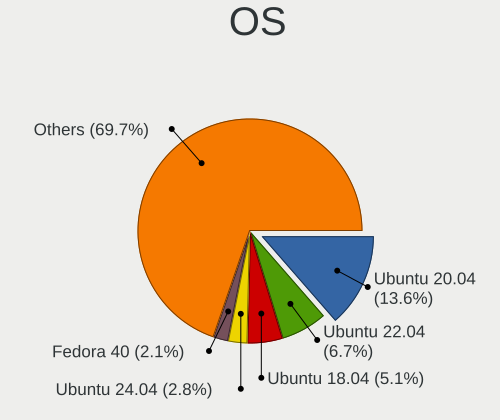

| Name               | Notebooks | Percent |
|--------------------|-----------|---------|
| Ubuntu 20.04       | 83        | 13.58%  |
| Ubuntu 22.04       | 41        | 6.71%   |
| Ubuntu 18.04       | 31        | 5.07%   |
| Ubuntu 24.04       | 17        | 2.78%   |
| Fedora 40          | 13        | 2.13%   |
| Arch Rolling       | 12        | 1.96%   |
| Pop!_OS 22.04      | 11        | 1.8%    |
| Fedora 42          | 11        | 1.8%    |
| Fedora 38          | 11        | 1.8%    |
| Manjaro            | 9         | 1.47%   |
| Fedora 37          | 9         | 1.47%   |
| Debian 12          | 9         | 1.47%   |
| Fedora 41          | 8         | 1.31%   |
| Fedora 35          | 8         | 1.31%   |
| Ubuntu 21.04       | 7         | 1.15%   |
| Fedora 43          | 7         | 1.15%   |
| OpenMandriva 23.08 | 6         | 0.98%   |
| Fedora 36          | 6         | 0.98%   |
| Arch               | 6         | 0.98%   |
| Zorin 15           | 5         | 0.82%   |
| Ubuntu 23.10       | 5         | 0.82%   |
| Ubuntu 23.04       | 5         | 0.82%   |
| ROSA R11           | 5         | 0.82%   |
| Pop!_OS 21.04      | 5         | 0.82%   |
| Linux Mint 21.1    | 5         | 0.82%   |
| Linux Mint 21      | 5         | 0.82%   |
| Linux Mint 20.1    | 5         | 0.82%   |
| Fedora 39          | 5         | 0.82%   |
| ArcoLinux Rolling  | 5         | 0.82%   |
| Ubuntu 22.10       | 4         | 0.65%   |
| Ubuntu 19.10       | 4         | 0.65%   |
| ROSA R10           | 4         | 0.65%   |
| OpenMandriva 4.3   | 4         | 0.65%   |
| OpenMandriva 25.06 | 4         | 0.65%   |
| OpenMandriva 24.12 | 4         | 0.65%   |
| Linux Mint 22.1    | 4         | 0.65%   |
| Linux Mint 21.2    | 4         | 0.65%   |
| Linux Mint 20.3    | 4         | 0.65%   |
| Fedora 34          | 4         | 0.65%   |
| Fedora 33          | 4         | 0.65%   |

OS Family
---------

OS without a version

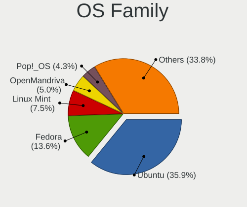

| Name          | Notebooks | Percent |
|---------------|-----------|---------|
| Ubuntu        | 201       | 35.89%  |
| Fedora        | 76        | 13.57%  |
| Linux Mint    | 42        | 7.5%    |
| OpenMandriva  | 28        | 5%      |
| Pop!_OS       | 24        | 4.29%   |
| Manjaro       | 21        | 3.75%   |
| ROSA          | 18        | 3.21%   |
| Arch          | 18        | 3.21%   |
| Debian        | 17        | 3.04%   |
| Zorin         | 13        | 2.32%   |
| SteamOS       | 12        | 2.14%   |
| Xubuntu       | 10        | 1.79%   |
| Kubuntu       | 9         | 1.61%   |
| Endless       | 8         | 1.43%   |
| ArcoLinux     | 6         | 1.07%   |
| Kali          | 5         | 0.89%   |
| Ubuntu MATE   | 4         | 0.71%   |
| Elementary    | 4         | 0.71%   |
| openSUSE      | 3         | 0.54%   |
| Nobara        | 3         | 0.54%   |
| NixOS         | 3         | 0.54%   |
| MX            | 3         | 0.54%   |
| Ubuntu Budgie | 2         | 0.36%   |
| Neptune OS    | 2         | 0.36%   |
| Lubuntu       | 2         | 0.36%   |
| KDE neon      | 2         | 0.36%   |
| CentOS        | 2         | 0.36%   |
| BlackPanther  | 2         | 0.36%   |
| Bazzite       | 2         | 0.36%   |
| Artix         | 2         | 0.36%   |
| Ubuntu Unity  | 1         | 0.18%   |
| Siduction     | 1         | 0.18%   |
| Salix         | 1         | 0.18%   |
| Rocky Linux   | 1         | 0.18%   |
| RHEL          | 1         | 0.18%   |
| PureOS        | 1         | 0.18%   |
| Pikaos        | 1         | 0.18%   |
| LMDE          | 1         | 0.18%   |
| Garuda Linux  | 1         | 0.18%   |
| EndeavourOS   | 1         | 0.18%   |

Kernel
------

Version of the Linux kernel

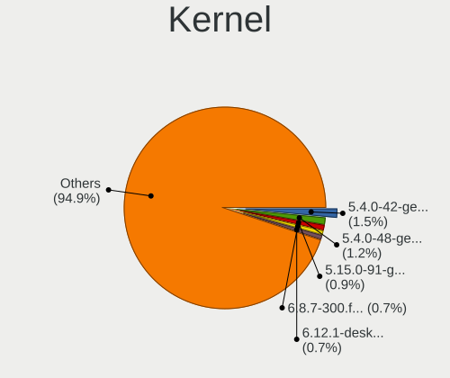

| Version                  | Notebooks | Percent |
|--------------------------|-----------|---------|
| 5.4.0-42-generic         | 10        | 1.5%    |
| 5.4.0-48-generic         | 8         | 1.2%    |
| 5.15.0-91-generic        | 6         | 0.9%    |
| 6.8.7-300.fc40.x86_64    | 5         | 0.75%   |
| 6.12.1-desktop-1omv2490  | 5         | 0.75%   |
| 5.4.0-52-generic         | 5         | 0.75%   |
| 5.15.0-56-generic        | 5         | 0.75%   |
| 5.0.0-23-generic         | 5         | 0.75%   |
| 6.4.11-desktop-1omv2390  | 4         | 0.6%    |
| 6.14.2-desktop-3omv2590  | 4         | 0.6%    |
| 5.4.0-26-generic         | 4         | 0.6%    |
| 5.16.7-desktop-1omv4003  | 4         | 0.6%    |
| 5.13.0-valve36-1-neptune | 4         | 0.6%    |
| 6.9.3-76060903-generic   | 3         | 0.45%   |
| 6.8.9-300.fc40.x86_64    | 3         | 0.45%   |
| 6.8.0-51-generic         | 3         | 0.45%   |
| 6.8.0-41-generic         | 3         | 0.45%   |
| 6.8.0-31-generic         | 3         | 0.45%   |
| 6.5.0-17-generic         | 3         | 0.45%   |
| 6.2.9-300.fc38.x86_64    | 3         | 0.45%   |
| 6.2.0-26-generic         | 3         | 0.45%   |
| 6.2.0-20-generic         | 3         | 0.45%   |
| 6.12.9-desktop-1omv2490  | 3         | 0.45%   |
| 5.8.0-63-generic         | 3         | 0.45%   |
| 5.8.0-44-generic         | 3         | 0.45%   |
| 5.4.0-72-generic         | 3         | 0.45%   |
| 5.4.0-65-generic         | 3         | 0.45%   |
| 5.4.0-58-generic         | 3         | 0.45%   |
| 5.3.0-46-generic         | 3         | 0.45%   |
| 5.3.0-42-generic         | 3         | 0.45%   |
| 5.3.0-26-generic         | 3         | 0.45%   |
| 5.19.0-46-generic        | 3         | 0.45%   |
| 5.15.0-71-generic        | 3         | 0.45%   |
| 5.15.0-57-generic        | 3         | 0.45%   |
| 5.15.0-50-generic        | 3         | 0.45%   |
| 5.15.0-41-generic        | 3         | 0.45%   |
| 5.11.0-34-generic        | 3         | 0.45%   |
| 6.8.5-301.fc40.x86_64    | 2         | 0.3%    |
| 6.8.11-300.fc40.x86_64   | 2         | 0.3%    |
| 6.5.0-45-generic         | 2         | 0.3%    |

Kernel Family
-------------

Linux kernel without a distro release

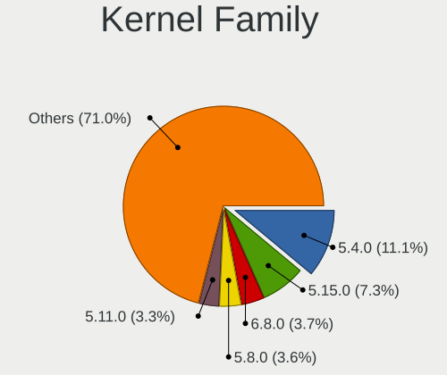

| Version | Notebooks | Percent |
|---------|-----------|---------|
| 5.4.0   | 71        | 11.06%  |
| 5.15.0  | 47        | 7.32%   |
| 6.8.0   | 24        | 3.74%   |
| 5.8.0   | 23        | 3.58%   |
| 5.11.0  | 21        | 3.27%   |
| 4.15.0  | 21        | 3.27%   |
| 6.5.0   | 20        | 3.12%   |
| 5.3.0   | 18        | 2.8%    |
| 6.1.0   | 17        | 2.65%   |
| 5.13.0  | 17        | 2.65%   |
| 5.19.0  | 16        | 2.49%   |
| 6.2.0   | 14        | 2.18%   |
| 6.14.0  | 12        | 1.87%   |
| 5.0.0   | 12        | 1.87%   |
| 6.11.0  | 10        | 1.56%   |
| 6.12.1  | 6         | 0.93%   |
| 4.18.0  | 6         | 0.93%   |
| 6.8.7   | 5         | 0.78%   |
| 6.12.9  | 5         | 0.78%   |
| 6.4.11  | 4         | 0.62%   |
| 6.3.5   | 4         | 0.62%   |
| 6.2.9   | 4         | 0.62%   |
| 6.14.2  | 4         | 0.62%   |
| 6.1.52  | 4         | 0.62%   |
| 5.16.7  | 4         | 0.62%   |
| 5.10.0  | 4         | 0.62%   |
| 6.9.3   | 3         | 0.47%   |
| 6.8.9   | 3         | 0.47%   |
| 6.6.2   | 3         | 0.47%   |
| 6.17.8  | 3         | 0.47%   |
| 6.15.7  | 3         | 0.47%   |
| 6.14.4  | 3         | 0.47%   |
| 6.12.10 | 3         | 0.47%   |
| 6.11.4  | 3         | 0.47%   |
| 6.11.11 | 3         | 0.47%   |
| 4.9.60  | 3         | 0.47%   |
| 6.8.5   | 2         | 0.31%   |
| 6.8.11  | 2         | 0.31%   |
| 6.7.12  | 2         | 0.31%   |
| 6.6.10  | 2         | 0.31%   |

Kernel Major Ver.
-----------------

Linux kernel major version

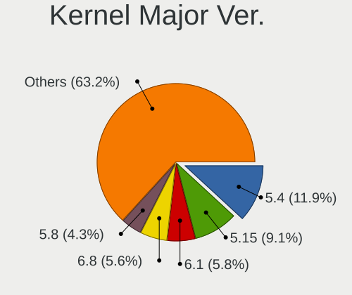

| Version | Notebooks | Percent |
|---------|-----------|---------|
| 5.4     | 74        | 11.88%  |
| 5.15    | 57        | 9.15%   |
| 6.1     | 36        | 5.78%   |
| 6.8     | 35        | 5.62%   |
| 5.8     | 27        | 4.33%   |
| 5.11    | 26        | 4.17%   |
| 6.14    | 24        | 3.85%   |
| 6.5     | 23        | 3.69%   |
| 6.2     | 23        | 3.69%   |
| 6.11    | 22        | 3.53%   |
| 6.12    | 21        | 3.37%   |
| 4.15    | 21        | 3.37%   |
| 5.3     | 20        | 3.21%   |
| 5.13    | 20        | 3.21%   |
| 5.19    | 19        | 3.05%   |
| 5.16    | 13        | 2.09%   |
| 6.4     | 12        | 1.93%   |
| 5.0     | 12        | 1.93%   |
| 6.6     | 11        | 1.77%   |
| 5.10    | 11        | 1.77%   |
| 6.9     | 9         | 1.44%   |
| 6.17    | 9         | 1.44%   |
| 6.15    | 9         | 1.44%   |
| 6.0     | 9         | 1.44%   |
| 6.10    | 8         | 1.28%   |
| 5.18    | 8         | 1.28%   |
| 4.18    | 8         | 1.28%   |
| 6.3     | 6         | 0.96%   |
| 5.14    | 6         | 0.96%   |
| 4.9     | 6         | 0.96%   |
| 6.7     | 5         | 0.8%    |
| 5.9     | 5         | 0.8%    |
| 6.16    | 4         | 0.64%   |
| 6.13    | 4         | 0.64%   |
| 5.7     | 4         | 0.64%   |
| 5.6     | 3         | 0.48%   |
| 5.17    | 3         | 0.48%   |
| 4.19    | 3         | 0.48%   |
| 6.18    | 2         | 0.32%   |
| 4.1     | 2         | 0.32%   |

Arch
----

OS architecture (x86_64, i586, etc.)

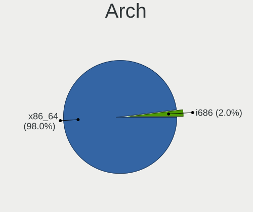

| Name   | Notebooks | Percent |
|--------|-----------|---------|
| x86_64 | 536       | 97.99%  |
| i686   | 11        | 2.01%   |

DE
--

Desktop Environment

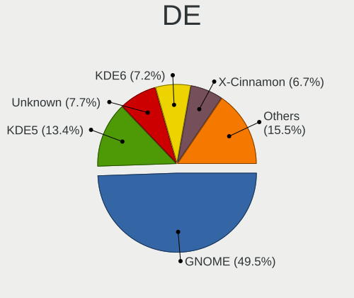

| Name            | Notebooks | Percent |
|-----------------|-----------|---------|
| GNOME           | 281       | 49.47%  |
| KDE5            | 76        | 13.38%  |
| Unknown         | 44        | 7.75%   |
| KDE6            | 41        | 7.22%   |
| X-Cinnamon      | 38        | 6.69%   |
| XFCE            | 34        | 5.99%   |
| KDE4            | 12        | 2.11%   |
| MATE            | 8         | 1.41%   |
| KDE             | 7         | 1.23%   |
| Cinnamon        | 7         | 1.23%   |
| Pantheon        | 4         | 0.7%    |
| LXQt            | 3         | 0.53%   |
| Hyprland        | 3         | 0.53%   |
| LXDE            | 2         | 0.35%   |
| i3              | 2         | 0.35%   |
| Unity           | 1         | 0.18%   |
| Trinity         | 1         | 0.18%   |
| GNOME Flashback | 1         | 0.18%   |
| GNOME Classic   | 1         | 0.18%   |
| Endless:GNOME   | 1         | 0.18%   |
| Budgie          | 1         | 0.18%   |

Display Server
--------------

X11 or Wayland

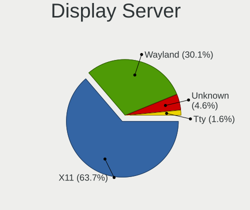

| Name    | Notebooks | Percent |
|---------|-----------|---------|
| X11     | 362       | 63.73%  |
| Wayland | 171       | 30.11%  |
| Unknown | 26        | 4.58%   |
| Tty     | 9         | 1.58%   |

Display Manager
---------------

SDDM, LightDM, etc.

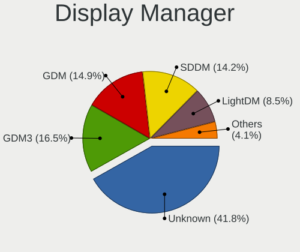

| Name    | Notebooks | Percent |
|---------|-----------|---------|
| Unknown | 236       | 41.84%  |
| GDM3    | 93        | 16.49%  |
| GDM     | 84        | 14.89%  |
| SDDM    | 80        | 14.18%  |
| LightDM | 48        | 8.51%   |
| KDM     | 11        | 1.95%   |
| TDM     | 10        | 1.77%   |
| XDM     | 1         | 0.18%   |
| GREETD  | 1         | 0.18%   |

OS Lang
-------

Language

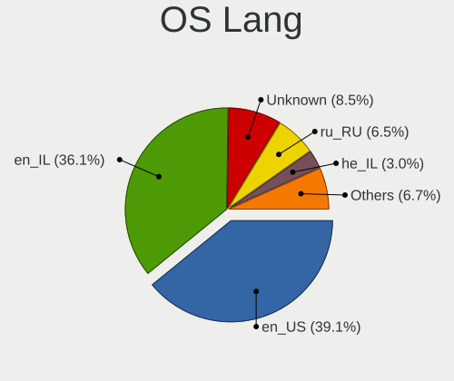

| Lang        | Notebooks | Percent |
|-------------|-----------|---------|
| en_US       | 221       | 39.12%  |
| en_IL       | 204       | 36.11%  |
| Unknown     | 48        | 8.5%    |
| ru_RU       | 37        | 6.55%   |
| he_IL       | 17        | 3.01%   |
| C           | 16        | 2.83%   |
| en_GB       | 6         | 1.06%   |
| fr_FR       | 3         | 0.53%   |
| es_ES       | 2         | 0.35%   |
| en_AG       | 2         | 0.35%   |
| uk_UA       | 1         | 0.18%   |
| ru_UA       | 1         | 0.18%   |
| en_US.utf-8 | 1         | 0.18%   |
| en_NZ       | 1         | 0.18%   |
| en_IE       | 1         | 0.18%   |
| en_CA       | 1         | 0.18%   |
| en_AU       | 1         | 0.18%   |
| enUS        | 1         | 0.18%   |
| de_DE       | 1         | 0.18%   |

Boot Mode
---------

EFI or BIOS

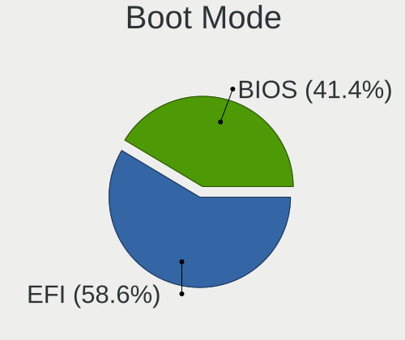

| Mode | Notebooks | Percent |
|------|-----------|---------|
| EFI  | 331       | 58.58%  |
| BIOS | 234       | 41.42%  |

Filesystem
----------

Type of filesystem

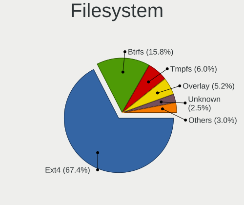

| Type    | Notebooks | Percent |
|---------|-----------|---------|
| Ext4    | 379       | 67.44%  |
| Btrfs   | 89        | 15.84%  |
| Tmpfs   | 34        | 6.05%   |
| Overlay | 29        | 5.16%   |
| Unknown | 14        | 2.49%   |
| Xfs     | 13        | 2.31%   |
| Ext3    | 2         | 0.36%   |
| Zfs     | 1         | 0.18%   |
| Ext2    | 1         | 0.18%   |

Part. scheme
------------

Scheme of partitioning

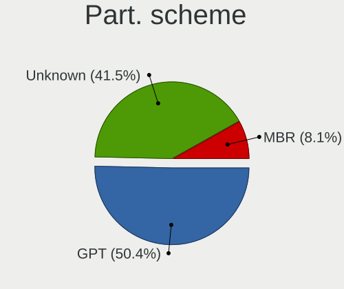

| Type    | Notebooks | Percent |
|---------|-----------|---------|
| GPT     | 285       | 50.35%  |
| Unknown | 235       | 41.52%  |
| MBR     | 46        | 8.13%   |

Dual Boot with Linux/BSD
------------------------

Hosting more than one Linux/BSD

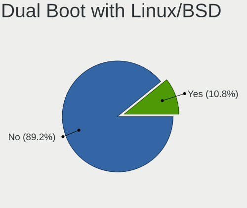

| Dual boot | Notebooks | Percent |
|-----------|-----------|---------|
| No        | 495       | 89.19%  |
| Yes       | 60        | 10.81%  |

Dual Boot (Win)
---------------

Hosting Linux and Windows

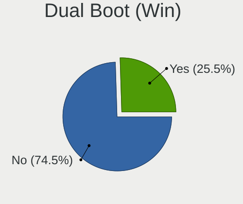

| Dual boot | Notebooks | Percent |
|-----------|-----------|---------|
| No        | 412       | 74.5%   |
| Yes       | 141       | 25.5%   |

Board
-----

Vendor
------

Motherboard manufacturer

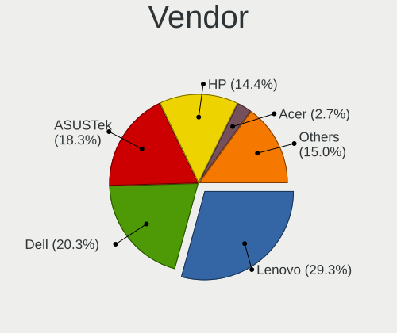

| Name                | Notebooks | Percent |
|---------------------|-----------|---------|
| Lenovo              | 160       | 29.25%  |
| Dell                | 111       | 20.29%  |
| ASUSTek Computer    | 100       | 18.28%  |
| Hewlett-Packard     | 79        | 14.44%  |
| Acer                | 15        | 2.74%   |
| Valve               | 12        | 2.19%   |
| Apple               | 9         | 1.65%   |
| Toshiba             | 8         | 1.46%   |
| Samsung Electronics | 8         | 1.46%   |
| Razer               | 4         | 0.73%   |
| MSI                 | 4         | 0.73%   |
| Fujitsu             | 4         | 0.73%   |
| Timi                | 3         | 0.55%   |
| LG Electronics      | 3         | 0.55%   |
| Alienware           | 3         | 0.55%   |
| System76            | 2         | 0.37%   |
| GPD                 | 2         | 0.37%   |
| Fujitsu Siemens     | 2         | 0.37%   |
| AMI                 | 2         | 0.37%   |
| Unknown             | 2         | 0.37%   |
| XIAOMI              | 1         | 0.18%   |
| TUXEDO              | 1         | 0.18%   |
| Sony                | 1         | 0.18%   |
| Purism              | 1         | 0.18%   |
| Notebook            | 1         | 0.18%   |
| N-one               | 1         | 0.18%   |
| IP3 Tech            | 1         | 0.18%   |
| Intel               | 1         | 0.18%   |
| HUAWEI              | 1         | 0.18%   |
| Heptagon Systems    | 1         | 0.18%   |
| Google              | 1         | 0.18%   |
| Gigabyte Technology | 1         | 0.18%   |
| Framework           | 1         | 0.18%   |
| Chuwi               | 1         | 0.18%   |

Model
-----

Motherboard model

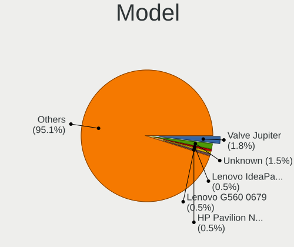

| Name                                     | Notebooks | Percent |
|------------------------------------------|-----------|---------|
| Valve Jupiter                            | 10        | 1.83%   |
| Unknown                                  | 8         | 1.46%   |
| Lenovo IdeaPad 5 14ITL05 82FE            | 3         | 0.55%   |
| Lenovo G560 0679                         | 3         | 0.55%   |
| HP Pavilion Notebook                     | 3         | 0.55%   |
| HP Compaq Presario CQ61                  | 3         | 0.55%   |
| Dell Vostro 5490                         | 3         | 0.55%   |
| Dell Vostro 15-3568                      | 3         | 0.55%   |
| Dell Latitude 7400                       | 3         | 0.55%   |
| Dell Latitude 5420                       | 3         | 0.55%   |
| Dell Inspiron 3593                       | 3         | 0.55%   |
| ASUS VivoBook_ASUSLaptop K5404VA_K5404VA | 3         | 0.55%   |
| ASUS UX331UA                             | 3         | 0.55%   |
| Valve Galileo                            | 2         | 0.37%   |
| Lenovo Yoga 500-15ISK 80R6               | 2         | 0.37%   |
| Lenovo V14-IIL 82C4                      | 2         | 0.37%   |
| Lenovo ThinkPad P14s Gen 4 21HF000KIV    | 2         | 0.37%   |
| Lenovo ThinkPad P1 Gen 7 21KV0029IV      | 2         | 0.37%   |
| Lenovo Legion Y530-15ICH 81FV            | 2         | 0.37%   |
| Lenovo IdeaPad Y700-15ISK 80NV           | 2         | 0.37%   |
| Lenovo IdeaPad Slim 3 15IAH8 83ER        | 2         | 0.37%   |
| Lenovo IdeaPad L340-15IWL 81LG           | 2         | 0.37%   |
| Lenovo IdeaPad Flex-14API 81SS           | 2         | 0.37%   |
| Lenovo IdeaPad 530S-14IKB 81EU           | 2         | 0.37%   |
| Lenovo IdeaPad 3 15IAU7 82RK             | 2         | 0.37%   |
| Lenovo G50-80 80L0                       | 2         | 0.37%   |
| HP ZBook 15 G5                           | 2         | 0.37%   |
| HP ZBook 15 G3                           | 2         | 0.37%   |
| HP ProBook 430 G6                        | 2         | 0.37%   |
| HP Pavilion Gaming Laptop 15-ec1xxx      | 2         | 0.37%   |
| HP Pavilion g6                           | 2         | 0.37%   |
| HP Laptop 15-ef2xxx                      | 2         | 0.37%   |
| HP EPROM DATA AREA                       | 2         | 0.37%   |
| HP EliteBook 840 G6                      | 2         | 0.37%   |
| HP EliteBook 840 G5                      | 2         | 0.37%   |
| Fujitsu LIFEBOOK AH530                   | 2         | 0.37%   |
| Dell XPS 15 9570                         | 2         | 0.37%   |
| Dell XPS 13 9343                         | 2         | 0.37%   |
| Dell Vostro 5402                         | 2         | 0.37%   |
| Dell Vostro 3580                         | 2         | 0.37%   |

Model Family
------------

Motherboard model prefix

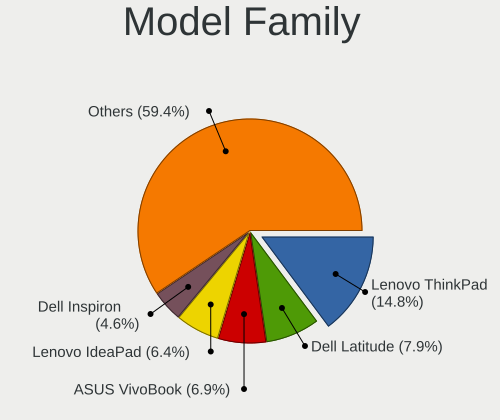

| Name              | Notebooks | Percent |
|-------------------|-----------|---------|
| Lenovo ThinkPad   | 81        | 14.81%  |
| Dell Latitude     | 43        | 7.86%   |
| ASUS VivoBook     | 38        | 6.95%   |
| Lenovo IdeaPad    | 35        | 6.4%    |
| Dell Inspiron     | 25        | 4.57%   |
| Dell Vostro       | 21        | 3.84%   |
| HP Pavilion       | 19        | 3.47%   |
| ASUS ROG          | 14        | 2.56%   |
| Dell XPS          | 13        | 2.38%   |
| Acer Aspire       | 13        | 2.38%   |
| Valve Jupiter     | 10        | 1.83%   |
| ASUS ASUS         | 10        | 1.83%   |
| Lenovo Legion     | 9         | 1.65%   |
| HP ProBook        | 9         | 1.65%   |
| HP Laptop         | 9         | 1.65%   |
| HP ZBook          | 8         | 1.46%   |
| HP EliteBook      | 8         | 1.46%   |
| Unknown           | 8         | 1.46%   |
| ASUS ZenBook      | 7         | 1.28%   |
| Lenovo Yoga       | 6         | 1.1%    |
| Toshiba Satellite | 5         | 0.91%   |
| Razer Blade       | 4         | 0.73%   |
| Fujitsu LIFEBOOK  | 4         | 0.73%   |
| Toshiba PORTEGE   | 3         | 0.55%   |
| Lenovo G560       | 3         | 0.55%   |
| Lenovo G50-80     | 3         | 0.55%   |
| HP Compaq         | 3         | 0.55%   |
| HP 255            | 3         | 0.55%   |
| HP 250            | 3         | 0.55%   |
| Dell Precision    | 3         | 0.55%   |
| ASUS UX331UA      | 3         | 0.55%   |
| Valve Galileo     | 2         | 0.37%   |
| Timi RedmiBook    | 2         | 0.37%   |
| Samsung 355V4C    | 2         | 0.37%   |
| Lenovo V14-IIL    | 2         | 0.37%   |
| HP EPROM          | 2         | 0.37%   |
| HP ENVY           | 2         | 0.37%   |
| Dell System       | 2         | 0.37%   |
| ASUS X501A        | 2         | 0.37%   |
| ASUS UX430UNR     | 2         | 0.37%   |

MFG Year
--------

Motherboard manufacture year

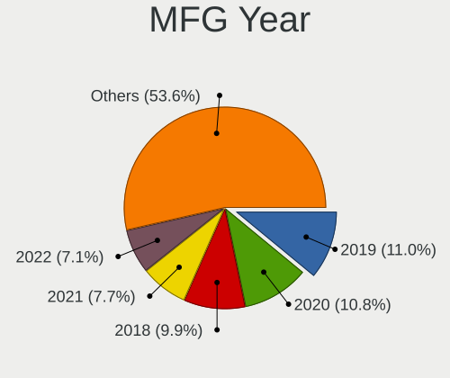

| Year | Notebooks | Percent |
|------|-----------|---------|
| 2019 | 60        | 10.97%  |
| 2020 | 59        | 10.79%  |
| 2018 | 54        | 9.87%   |
| 2021 | 42        | 7.68%   |
| 2022 | 39        | 7.13%   |
| 2016 | 34        | 6.22%   |
| 2023 | 33        | 6.03%   |
| 2017 | 32        | 5.85%   |
| 2011 | 29        | 5.3%    |
| 2015 | 26        | 4.75%   |
| 2013 | 25        | 4.57%   |
| 2012 | 24        | 4.39%   |
| 2014 | 19        | 3.47%   |
| 2024 | 18        | 3.29%   |
| 2010 | 18        | 3.29%   |
| 2008 | 12        | 2.19%   |
| 2009 | 11        | 2.01%   |
| 2007 | 7         | 1.28%   |
| 2025 | 3         | 0.55%   |
| 2006 | 2         | 0.37%   |

Form Factor
-----------

Physical design of the computer

| Name     | Notebooks | Percent |
|----------|-----------|---------|
| Notebook | 547       | 100%    |

Secure Boot
-----------

Enabled or disabled

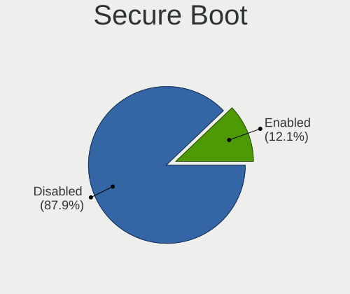

| State    | Notebooks | Percent |
|----------|-----------|---------|
| Disabled | 486       | 87.88%  |
| Enabled  | 67        | 12.12%  |

Coreboot
--------

Have coreboot on board

| Used | Notebooks | Percent |
|------|-----------|---------|
| No   | 544       | 99.45%  |
| Yes  | 3         | 0.55%   |

RAM Size
--------

Total RAM memory

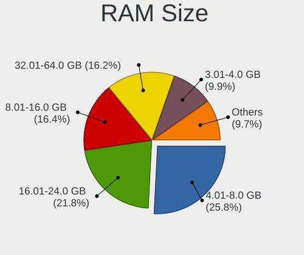

| Size in GB  | Notebooks | Percent |
|-------------|-----------|---------|
| 4.01-8.0    | 143       | 25.81%  |
| 16.01-24.0  | 121       | 21.84%  |
| 8.01-16.0   | 91        | 16.43%  |
| 32.01-64.0  | 90        | 16.25%  |
| 3.01-4.0    | 55        | 9.93%   |
| 64.01-256.0 | 19        | 3.43%   |
| 1.01-2.0    | 17        | 3.07%   |
| 24.01-32.0  | 11        | 1.99%   |
| 2.01-3.0    | 4         | 0.72%   |
| 0.51-1.0    | 3         | 0.54%   |

RAM Used
--------

Used RAM memory

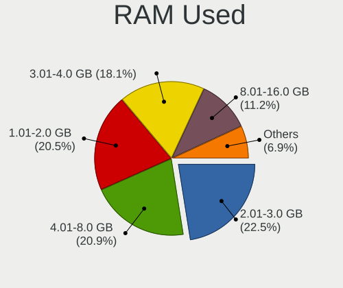

| Used GB    | Notebooks | Percent |
|------------|-----------|---------|
| 2.01-3.0   | 137       | 22.5%   |
| 4.01-8.0   | 127       | 20.85%  |
| 1.01-2.0   | 125       | 20.53%  |
| 3.01-4.0   | 110       | 18.06%  |
| 8.01-16.0  | 68        | 11.17%  |
| 0.51-1.0   | 22        | 3.61%   |
| 16.01-24.0 | 12        | 1.97%   |
| 32.01-64.0 | 4         | 0.66%   |
| 0.01-0.5   | 3         | 0.49%   |
| 24.01-32.0 | 1         | 0.16%   |

Total Drives
------------

Number of drives on board

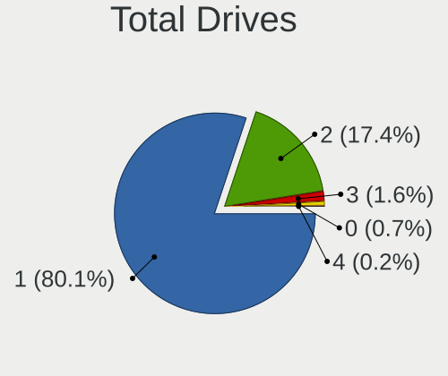

| Drives | Notebooks | Percent |
|--------|-----------|---------|
| 1      | 443       | 80.11%  |
| 2      | 96        | 17.36%  |
| 3      | 9         | 1.63%   |
| 0      | 4         | 0.72%   |
| 4      | 1         | 0.18%   |

Has CD-ROM
----------

Has CD-ROM on board

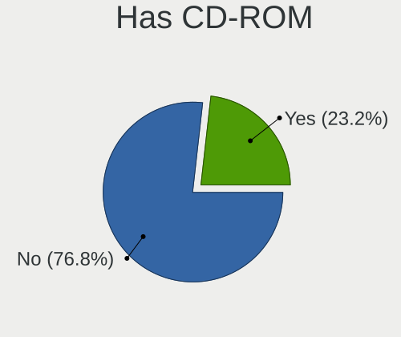

| Presented | Notebooks | Percent |
|-----------|-----------|---------|
| No        | 420       | 76.78%  |
| Yes       | 127       | 23.22%  |

Has Ethernet
------------

Has Ethernet on board

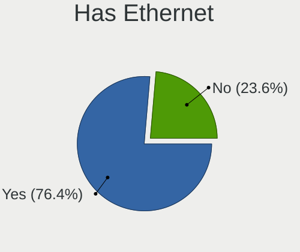

| Presented | Notebooks | Percent |
|-----------|-----------|---------|
| Yes       | 420       | 76.36%  |
| No        | 130       | 23.64%  |

Has WiFi
--------

Has WiFi module

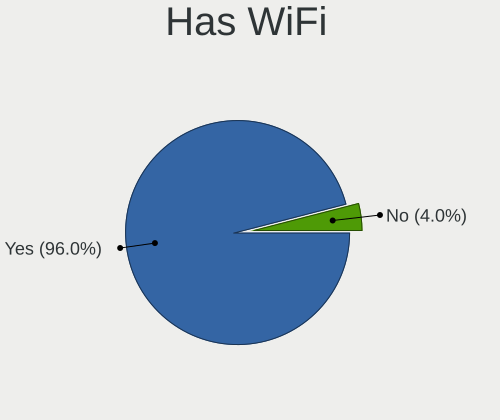

| Presented | Notebooks | Percent |
|-----------|-----------|---------|
| Yes       | 525       | 95.98%  |
| No        | 22        | 4.02%   |

Has Bluetooth
-------------

Has Bluetooth module

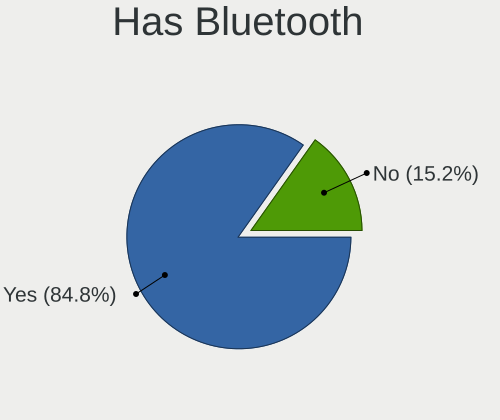

| Presented | Notebooks | Percent |
|-----------|-----------|---------|
| Yes       | 469       | 84.81%  |
| No        | 84        | 15.19%  |

Location
--------

Country
-------

Geographic location (country)

| Country | Notebooks | Percent |
|---------|-----------|---------|
| Israel  | 547       | 100%    |

City
----

Geographic location (city)

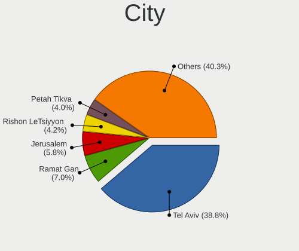

| City                  | Notebooks | Percent |
|-----------------------|-----------|---------|
| Tel Aviv              | 233       | 38.77%  |
| Ramat Gan             | 42        | 6.99%   |
| Jerusalem             | 35        | 5.82%   |
| Rishon LeTsiyyon      | 25        | 4.16%   |
| Petah Tikva           | 24        | 3.99%   |
| Haifa                 | 19        | 3.16%   |
| Herzliya              | 16        | 2.66%   |
| Holon                 | 13        | 2.16%   |
| Givatayim             | 12        | 2%      |
| Petaẖ Tiqwa         | 11        | 1.83%   |
| Rehovot               | 10        | 1.66%   |
| Netanya               | 10        | 1.66%   |
| Rishon LeZiyyon       | 9         | 1.5%    |
| Raanana               | 8         | 1.33%   |
| Kiryat Ono            | 7         | 1.16%   |
| Rosh HaAyin           | 6         | 1%      |
| Nahariya              | 6         | 1%      |
| Ashquelon             | 6         | 1%      |
| Ramat HaSharon        | 5         | 0.83%   |
| Lod                   | 5         | 0.83%   |
| Bet Shemesh           | 5         | 0.83%   |
| Ramla                 | 4         | 0.67%   |
| Modiin Makkabbim Reut | 4         | 0.67%   |
| Kfar Saba             | 4         | 0.67%   |
| Ashdod                | 4         | 0.67%   |
| Shefa-'Amr            | 3         | 0.5%    |
| Qiryat Yam            | 3         | 0.5%    |
| Hod HaSharon          | 3         | 0.5%    |
| Hadera                | 3         | 0.5%    |
| Givat Shmuel          | 3         | 0.5%    |
| Beersheba             | 3         | 0.5%    |
| Yavne                 | 2         | 0.33%   |
| Tiberias              | 2         | 0.33%   |
| Tel Mond              | 2         | 0.33%   |
| QvutsatYavne          | 2         | 0.33%   |
| Qiryat Bialik         | 2         | 0.33%   |
| Qiryat Ata            | 2         | 0.33%   |
| Pardes Hanna Karkur   | 2         | 0.33%   |
| Ness Ziona            | 2         | 0.33%   |
| Nazerat 'Illit        | 2         | 0.33%   |

Drives
------

Drive Vendor
------------

Hard drive vendors

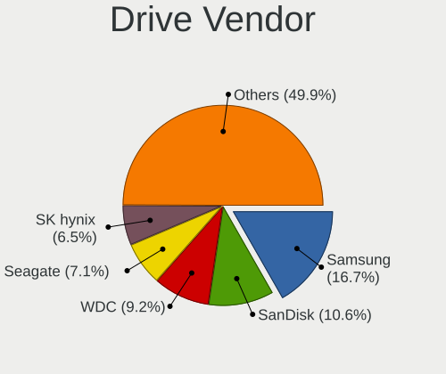

| Vendor                      | Notebooks | Drives | Percent |
|-----------------------------|-----------|--------|---------|
| Samsung Electronics         | 106       | 155    | 16.75%  |
| SanDisk                     | 67        | 82     | 10.58%  |
| WDC                         | 58        | 63     | 9.16%   |
| Seagate                     | 45        | 59     | 7.11%   |
| SK hynix                    | 41        | 62     | 6.48%   |
| Toshiba                     | 36        | 39     | 5.69%   |
| Intel                       | 36        | 58     | 5.69%   |
| Micron Technology           | 34        | 41     | 5.37%   |
| Kingston                    | 26        | 29     | 4.11%   |
| KIOXIA                      | 24        | 34     | 3.79%   |
| HGST                        | 21        | 24     | 3.32%   |
| Unknown                     | 19        | 22     | 3%      |
| Hitachi                     | 14        | 14     | 2.21%   |
| Crucial                     | 13        | 23     | 2.05%   |
| Transcend                   | 9         | 14     | 1.42%   |
| Apple                       | 7         | 12     | 1.11%   |
| StoreJet                    | 5         | 6      | 0.79%   |
| Unknown                     | 5         | 6      | 0.79%   |
| Phison Electronics          | 4         | 4      | 0.63%   |
| JMicron Technology          | 4         | 4      | 0.63%   |
| A-DATA Technology           | 4         | 5      | 0.63%   |
| MAXIO Technology (Hangzhou) | 3         | 3      | 0.47%   |
| LITEONIT                    | 3         | 3      | 0.47%   |
| LITEON                      | 3         | 3      | 0.47%   |
| Kingston Technology Company | 3         | 3      | 0.47%   |
| Fujitsu                     | 3         | 3      | 0.47%   |
| China                       | 3         | 4      | 0.47%   |
| SSSTC                       | 2         | 2      | 0.32%   |
| SPCC                        | 2         | 2      | 0.32%   |
| SOLIDIGM                    | 2         | 3      | 0.32%   |
| PNY                         | 2         | 3      | 0.32%   |
| O2 Micro                    | 2         | 2      | 0.32%   |
| Micron/Crucial Technology   | 2         | 2      | 0.32%   |
| faspeed                     | 2         | 3      | 0.32%   |
| Biwin Storage Technology    | 2         | 2      | 0.32%   |
| Apacer                      | 2         | 2      | 0.32%   |
| ADATA Technology            | 2         | 2      | 0.32%   |
| Verbatim                    | 1         | 1      | 0.16%   |
| USB3.0                      | 1         | 1      | 0.16%   |
| Union Memory (Shenzhen)     | 1         | 1      | 0.16%   |

Drive Model
-----------

Hard drive models

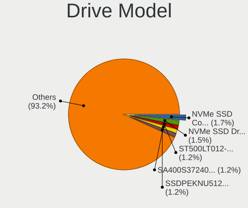

| Model                                                 | Notebooks | Percent |
|-------------------------------------------------------|-----------|---------|
| Samsung NVMe SSD Controller SM981/PM981/PM983 1TB     | 11        | 1.65%   |
| Samsung NVMe SSD Drive 512GB                          | 10        | 1.5%    |
| Seagate ST500LT012-1DG142 500GB                       | 8         | 1.2%    |
| Kingston SA400S37240G 240GB SSD                       | 8         | 1.2%    |
| Intel SSDPEKNU512GZ 512GB                             | 8         | 1.2%    |
| Seagate ST1000LM024 HN-M101MBB 1TB                    | 6         | 0.9%    |
| Sandisk WD Black SN750 / PC SN730 NVMe SSD 500GB      | 6         | 0.9%    |
| Samsung NVMe SSD Controller PM9A1/PM9A3/980PRO 1TB    | 6         | 0.9%    |
| HGST HTS721010A9E630 1TB                              | 6         | 0.9%    |
| SK hynix NVMe SSD Drive 256GB                         | 5         | 0.75%   |
| Seagate ST1000LM035-1RK172 1TB                        | 5         | 0.75%   |
| Sandisk WD Blue SN500 / PC SN520 NVMe SSD 128GB       | 5         | 0.75%   |
| SanDisk NVMe SSD Drive 512GB                          | 5         | 0.75%   |
| HGST HTS541010A9E680 1TB                              | 5         | 0.75%   |
| Unknown                                               | 5         | 0.75%   |
| Unknown MMC Card  64GB                                | 4         | 0.6%    |
| SanDisk SSD PLUS 240GB                                | 4         | 0.6%    |
| SanDisk NVMe SSD Drive 1TB                            | 4         | 0.6%    |
| Intel SSD 660P Series 512GB                           | 4         | 0.6%    |
| Intel NVMe SSD Drive 512GB                            | 4         | 0.6%    |
| Crucial CT500MX500SSD1 500GB                          | 4         | 0.6%    |
| WDC WD5000BPKT-75PK4T0 500GB                          | 3         | 0.45%   |
| WDC PC SN530 NVMe 256GB                               | 3         | 0.45%   |
| Unknown NVMe SSD Drive 512GB                          | 3         | 0.45%   |
| Toshiba NVMe SSD Drive 512GB                          | 3         | 0.45%   |
| Toshiba MQ01ABF050 500GB                              | 3         | 0.45%   |
| StoreJet Transcend 1TB                                | 3         | 0.45%   |
| SK hynix SC311 SATA 256GB                             | 3         | 0.45%   |
| SK hynix PC401 NVMe 512GB                             | 3         | 0.45%   |
| SK hynix NVMe SSD Drive 512GB                         | 3         | 0.45%   |
| Sandisk WD Black 2018/SN750 / PC SN720 NVMe SSD 512GB | 3         | 0.45%   |
| SanDisk NVMe SSD Drive 256GB                          | 3         | 0.45%   |
| Samsung SSD 860 EVO 250GB                             | 3         | 0.45%   |
| Samsung SSD 850 EVO 500GB                             | 3         | 0.45%   |
| Samsung NVMe SSD Drive 256GB                          | 3         | 0.45%   |
| Phison PS5013 E13 NVMe Controller 500GB               | 3         | 0.45%   |
| Micron MTFDDAV256TBN-1AR15ABHA 256GB SSD              | 3         | 0.45%   |
| Micron 2400_MTFDKBA1T0QFM 1TB                         | 3         | 0.45%   |
| Micron 1100_MTFDDAV256TBN 256GB SSD                   | 3         | 0.45%   |
| KIOXIA KXG8AZNV2T04 LA 2TB                            | 3         | 0.45%   |

HDD Vendor
----------

Hard disk drive vendors

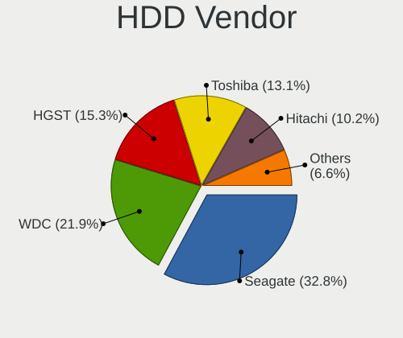

| Vendor              | Notebooks | Drives | Percent |
|---------------------|-----------|--------|---------|
| Seagate             | 45        | 59     | 32.85%  |
| WDC                 | 30        | 31     | 21.9%   |
| HGST                | 21        | 24     | 15.33%  |
| Toshiba             | 18        | 18     | 13.14%  |
| Hitachi             | 14        | 14     | 10.22%  |
| Fujitsu             | 3         | 3      | 2.19%   |
| Unknown             | 2         | 2      | 1.46%   |
| JMicron Technology  | 2         | 2      | 1.46%   |
| USB3.0              | 1         | 1      | 0.73%   |
| Samsung Electronics | 1         | 1      | 0.73%   |

SSD Vendor
----------

Solid state drive vendors

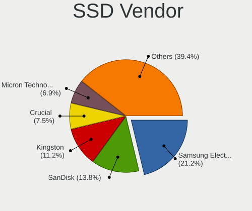

| Vendor              | Notebooks | Drives | Percent |
|---------------------|-----------|--------|---------|
| Samsung Electronics | 34        | 36     | 21.25%  |
| SanDisk             | 22        | 27     | 13.75%  |
| Kingston            | 18        | 21     | 11.25%  |
| Crucial             | 12        | 22     | 7.5%    |
| Micron Technology   | 11        | 11     | 6.88%   |
| SK hynix            | 10        | 21     | 6.25%   |
| WDC                 | 7         | 8      | 4.38%   |
| Toshiba             | 7         | 8      | 4.38%   |
| Transcend           | 6         | 11     | 3.75%   |
| Intel               | 4         | 4      | 2.5%    |
| Apple               | 4         | 4      | 2.5%    |
| StoreJet            | 3         | 3      | 1.88%   |
| LITEONIT            | 3         | 3      | 1.88%   |
| LITEON              | 3         | 3      | 1.88%   |
| China               | 3         | 4      | 1.88%   |
| A-DATA Technology   | 3         | 4      | 1.88%   |
| PNY                 | 2         | 3      | 1.25%   |
| Apacer              | 2         | 2      | 1.25%   |
| Team                | 1         | 1      | 0.63%   |
| SPCC                | 1         | 1      | 0.63%   |
| ORICO               | 1         | 2      | 0.63%   |
| OCZ                 | 1         | 1      | 0.63%   |
| Lenovo              | 1         | 1      | 0.63%   |
| faspeed             | 1         | 1      | 0.63%   |

Drive Kind
----------

HDD or SSD

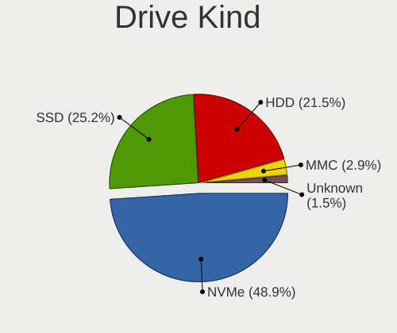

| Kind    | Notebooks | Drives | Percent |
|---------|-----------|--------|---------|
| NVMe    | 301       | 427    | 48.94%  |
| SSD     | 155       | 202    | 25.2%   |
| HDD     | 132       | 155    | 21.46%  |
| MMC     | 18        | 22     | 2.93%   |
| Unknown | 9         | 10     | 1.46%   |

Drive Connector
---------------

SATA, SAS, NVMe, etc.

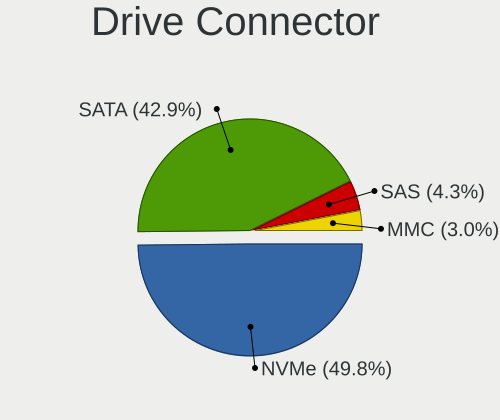

| Type | Notebooks | Drives | Percent |
|------|-----------|--------|---------|
| NVMe | 300       | 426    | 49.83%  |
| SATA | 258       | 341    | 42.86%  |
| SAS  | 26        | 27     | 4.32%   |
| MMC  | 18        | 22     | 2.99%   |

Drive Size
----------

Size of hard drive

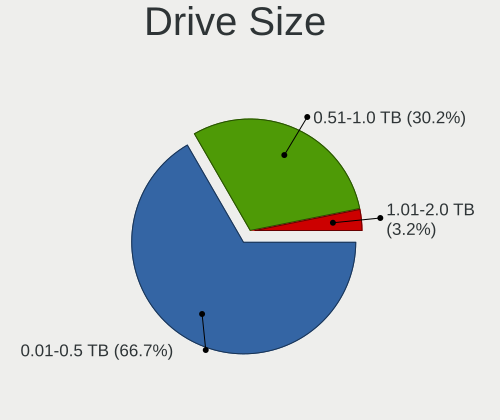

| Size in TB | Notebooks | Drives | Percent |
|------------|-----------|--------|---------|
| 0.01-0.5   | 190       | 241    | 66.67%  |
| 0.51-1.0   | 86        | 103    | 30.18%  |
| 1.01-2.0   | 9         | 13     | 3.16%   |

Space Total
-----------

Amount of disk space available on the file system

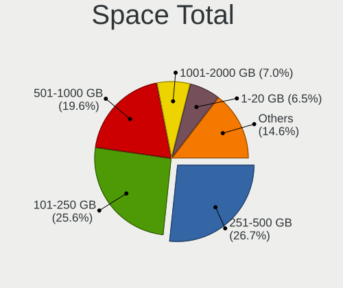

| Size in GB     | Notebooks | Percent |
|----------------|-----------|---------|
| 251-500        | 152       | 26.67%  |
| 101-250        | 146       | 25.61%  |
| 501-1000       | 112       | 19.65%  |
| 1001-2000      | 40        | 7.02%   |
| 1-20           | 37        | 6.49%   |
| 51-100         | 31        | 5.44%   |
| Unknown        | 21        | 3.68%   |
| 21-50          | 15        | 2.63%   |
| 2001-3000      | 11        | 1.93%   |
| More than 3000 | 5         | 0.88%   |

Space Used
----------

Amount of used disk space

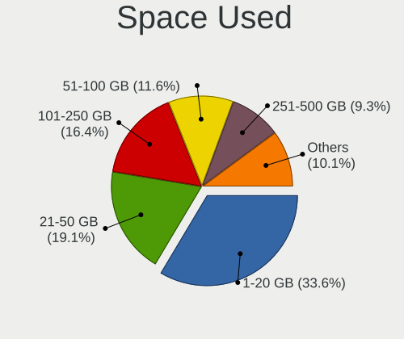

| Used GB   | Notebooks | Percent |
|-----------|-----------|---------|
| 1-20      | 199       | 33.56%  |
| 21-50     | 113       | 19.06%  |
| 101-250   | 97        | 16.36%  |
| 51-100    | 69        | 11.64%  |
| 251-500   | 55        | 9.27%   |
| 501-1000  | 28        | 4.72%   |
| Unknown   | 21        | 3.54%   |
| 1001-2000 | 8         | 1.35%   |
| 2001-3000 | 2         | 0.34%   |
| 0         | 1         | 0.17%   |

Malfunc. Drives
---------------

Drive models with a malfunction

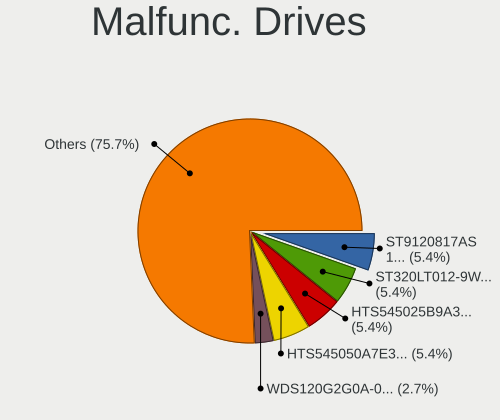

| Model                                 | Notebooks | Drives | Percent |
|---------------------------------------|-----------|--------|---------|
| Seagate ST9120817AS 120GB             | 2         | 2      | 5.41%   |
| Seagate ST320LT012-9WS14C 320GB       | 2         | 2      | 5.41%   |
| Hitachi HTS545025B9A300 250GB         | 2         | 2      | 5.41%   |
| HGST HTS545050A7E380 500GB            | 2         | 2      | 5.41%   |
| WDC WDS120G2G0A-00JH30 120GB SSD      | 1         | 2      | 2.7%    |
| WDC WD6400BPVT-80HXZT1 640GB          | 1         | 1      | 2.7%    |
| WDC WD6400BPVT-75HXZT1 640GB          | 1         | 1      | 2.7%    |
| WDC WD5000BPVT-75HXZT1 500GB          | 1         | 1      | 2.7%    |
| WDC WD2500BEVT-24A23T0 250GB          | 1         | 1      | 2.7%    |
| WDC WD1600BJKT-75F4T0 160GB           | 1         | 1      | 2.7%    |
| Transcend TS120GSSD220S 120GB         | 1         | 1      | 2.7%    |
| Toshiba MQ04ABF100 1TB                | 1         | 1      | 2.7%    |
| Toshiba MK6475GSX 640GB               | 1         | 1      | 2.7%    |
| Toshiba MK5075GSX 500GB               | 1         | 1      | 2.7%    |
| Toshiba MK3252GSX 320GB               | 1         | 1      | 2.7%    |
| Toshiba MK1646GSX 160GB               | 1         | 1      | 2.7%    |
| SK hynix HFS256G3BTND-N210A 256GB SSD | 1         | 5      | 2.7%    |
| SK hynix HFS256G39TND-N210A 256GB SSD | 1         | 1      | 2.7%    |
| Seagate ST9500423AS 500GB             | 1         | 1      | 2.7%    |
| Seagate ST9500420AS 500GB             | 1         | 1      | 2.7%    |
| Seagate ST500LT012-9WS142 500GB       | 1         | 1      | 2.7%    |
| Seagate ST500LM021-1KJ152 500GB       | 1         | 1      | 2.7%    |
| Seagate ST1000LM024 HN-M101MBB 1TB    | 1         | 2      | 2.7%    |
| SanDisk SSD U100 24GB                 | 1         | 1      | 2.7%    |
| Intel SSDSCKKF256H6 SATA 256GB        | 1         | 1      | 2.7%    |
| Intel SSDMCEAC120B3A 120GB            | 1         | 1      | 2.7%    |
| Hitachi HTS545050B9A300 500GB         | 1         | 1      | 2.7%    |
| Hitachi HTS545016B9A300 160GB         | 1         | 1      | 2.7%    |
| Hitachi HTS542516K9SA00 160GB         | 1         | 1      | 2.7%    |
| HGST HTS541010A9E680 1TB              | 1         | 1      | 2.7%    |
| HGST HCC545050A7E380 500GB            | 1         | 1      | 2.7%    |
| Fujitsu MHY2160BH 160GB               | 1         | 1      | 2.7%    |
| Crucial CT525MX300SSD1 528GB          | 1         | 1      | 2.7%    |

Malfunc. Drive Vendor
---------------------

Vendors of faulty drives

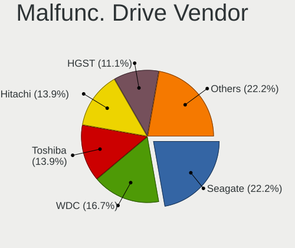

| Vendor    | Notebooks | Drives | Percent |
|-----------|-----------|--------|---------|
| Seagate   | 8         | 10     | 22.22%  |
| WDC       | 6         | 7      | 16.67%  |
| Toshiba   | 5         | 5      | 13.89%  |
| Hitachi   | 5         | 5      | 13.89%  |
| HGST      | 4         | 4      | 11.11%  |
| SK hynix  | 2         | 6      | 5.56%   |
| Intel     | 2         | 2      | 5.56%   |
| Transcend | 1         | 1      | 2.78%   |
| SanDisk   | 1         | 1      | 2.78%   |
| Fujitsu   | 1         | 1      | 2.78%   |
| Crucial   | 1         | 1      | 2.78%   |

Malfunc. HDD Vendor
-------------------

Vendors of faulty HDD drives

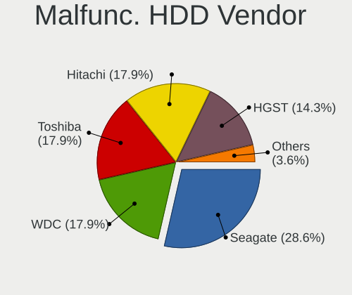

| Vendor  | Notebooks | Drives | Percent |
|---------|-----------|--------|---------|
| Seagate | 8         | 10     | 28.57%  |
| WDC     | 5         | 5      | 17.86%  |
| Toshiba | 5         | 5      | 17.86%  |
| Hitachi | 5         | 5      | 17.86%  |
| HGST    | 4         | 4      | 14.29%  |
| Fujitsu | 1         | 1      | 3.57%   |

Malfunc. Drive Kind
-------------------

Kinds of faulty drives

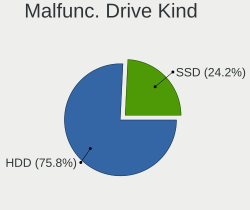

| Kind | Notebooks | Drives | Percent |
|------|-----------|--------|---------|
| HDD  | 25        | 30     | 75.76%  |
| SSD  | 8         | 13     | 24.24%  |

Failed Drives
-------------

Failed drive models

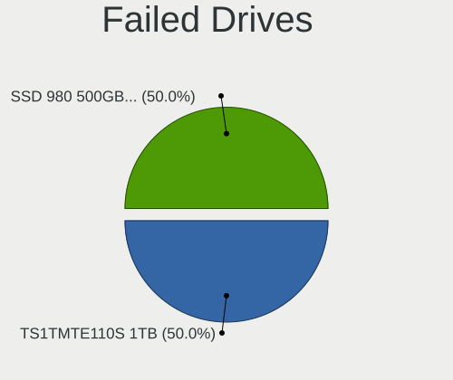

| Model                                             | Notebooks | Drives | Percent |
|---------------------------------------------------|-----------|--------|---------|
| Transcend TS1TMTE110S 1TB                         | 1         | 1      | 50%     |
| Samsung Electronics SSD 980 500GB S64DNF0R648337E | 1         | 1      | 50%     |

Failed Drive Vendor
-------------------

Failed drive vendors

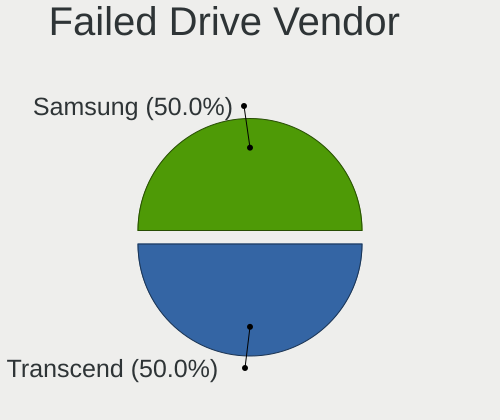

| Vendor              | Notebooks | Drives | Percent |
|---------------------|-----------|--------|---------|
| Transcend           | 1         | 1      | 50%     |
| Samsung Electronics | 1         | 1      | 50%     |

Drive Status
------------

Number of failed and malfunc. drives

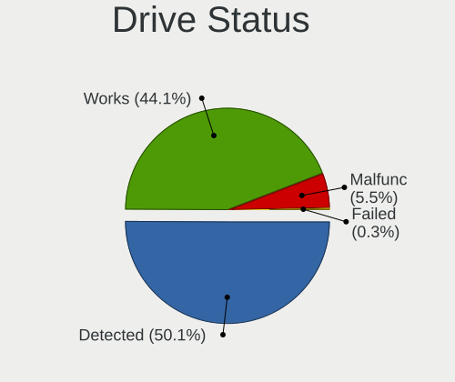

| Status   | Notebooks | Drives | Percent |
|----------|-----------|--------|---------|
| Detected | 291       | 407    | 50.09%  |
| Works    | 256       | 364    | 44.06%  |
| Malfunc  | 32        | 43     | 5.51%   |
| Failed   | 2         | 2      | 0.34%   |

Storage controller
------------------

Storage Vendor
--------------

Storage controller vendors

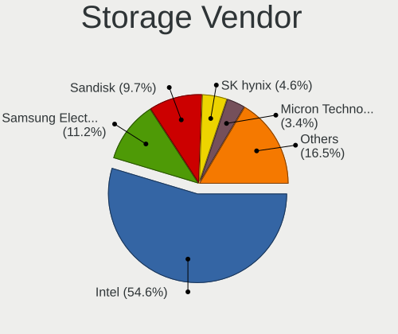

| Vendor                                  | Notebooks | Percent |
|-----------------------------------------|-----------|---------|
| Intel                                   | 371       | 54.64%  |
| Samsung Electronics                     | 76        | 11.19%  |
| Sandisk                                 | 66        | 9.72%   |
| SK hynix                                | 31        | 4.57%   |
| Micron Technology                       | 23        | 3.39%   |
| KIOXIA                                  | 23        | 3.39%   |
| AMD                                     | 22        | 3.24%   |
| Toshiba America Info Systems            | 13        | 1.91%   |
| Kingston Technology Company             | 11        | 1.62%   |
| Phison Electronics                      | 5         | 0.74%   |
| Solidigm                                | 4         | 0.59%   |
| Transcend                               | 3         | 0.44%   |
| Solid State Storage Technology          | 3         | 0.44%   |
| Nvidia                                  | 3         | 0.44%   |
| Micron/Crucial Technology               | 3         | 0.44%   |
| MAXIO Technology (Hangzhou)             | 3         | 0.44%   |
| Apple                                   | 3         | 0.44%   |
| ADATA Technology                        | 3         | 0.44%   |
| Silicon Motion                          | 2         | 0.29%   |
| Realtek Semiconductor                   | 2         | 0.29%   |
| O2 Micro                                | 2         | 0.29%   |
| Biwin Storage Technology                | 2         | 0.29%   |
| VIA Technologies                        | 1         | 0.15%   |
| Union Memory (Shenzhen)                 | 1         | 0.15%   |
| Shenzhen Unionmemory Information System | 1         | 0.15%   |
| Shenzhen Longsys Electronics            | 1         | 0.15%   |
| Hosin Global Electronics                | 1         | 0.15%   |

Storage Model
-------------

Storage controller models

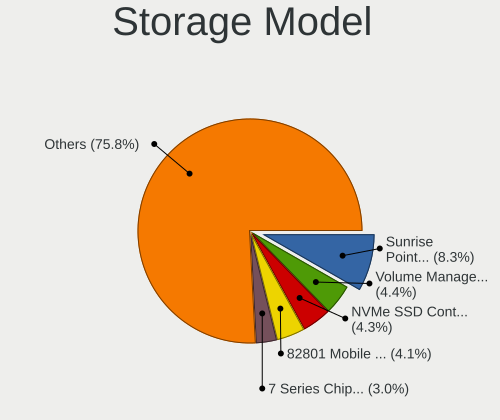

| Model                                                                          | Notebooks | Percent |
|--------------------------------------------------------------------------------|-----------|---------|
| Intel Sunrise Point-LP SATA Controller [AHCI mode]                             | 60        | 8.29%   |
| Intel Volume Management Device NVMe RAID Controller                            | 32        | 4.42%   |
| Samsung NVMe SSD Controller SM981/PM981/PM983                                  | 31        | 4.28%   |
| Intel 82801 Mobile SATA Controller [RAID mode]                                 | 30        | 4.14%   |
| Intel 7 Series Chipset Family 6-port SATA Controller [AHCI mode]               | 22        | 3.04%   |
| AMD FCH SATA Controller [AHCI mode]                                            | 22        | 3.04%   |
| Intel Cannon Lake Mobile PCH SATA AHCI Controller                              | 21        | 2.9%    |
| Intel 6 Series/C200 Series Chipset Family 6 port Mobile SATA AHCI Controller   | 20        | 2.76%   |
| Intel 82801IBM/IEM (ICH9M/ICH9M-E) 4 port SATA Controller [AHCI mode]          | 16        | 2.21%   |
| Intel Wildcat Point-LP SATA Controller [AHCI Mode]                             | 15        | 2.07%   |
| Intel 8 Series SATA Controller 1 [AHCI mode]                                   | 15        | 2.07%   |
| Samsung NVMe SSD Controller PM9A1/PM9A3/980PRO                                 | 14        | 1.93%   |
| Intel SSD 670p Series [Keystone Harbor]                                        | 14        | 1.93%   |
| SanDisk Extreme Pro / WD Black SN750 / PC SN730 / Red SN700 NVMe SSD           | 13        | 1.8%    |
| Intel 8 Series/C220 Series Chipset Family 6-port SATA Controller 1 [AHCI mode] | 13        | 1.8%    |
| Samsung NVMe SSD Controller 980 (DRAM-less)                                    | 12        | 1.66%   |
| Intel Comet Lake SATA AHCI Controller                                          | 12        | 1.66%   |
| Intel SSD 660P Series                                                          | 11        | 1.52%   |
| Intel Ice Lake-LP SATA Controller [AHCI mode]                                  | 11        | 1.52%   |
| Intel HM170/QM170 Chipset SATA Controller [AHCI Mode]                          | 11        | 1.52%   |
| Intel 5 Series/3400 Series Chipset 4 port SATA AHCI Controller                 | 11        | 1.52%   |
| Intel Tiger Lake-LP SATA Controller                                            | 10        | 1.38%   |
| Intel Cannon Point-LP SATA Controller [AHCI Mode]                              | 10        | 1.38%   |
| SanDisk WD Blue SN500 / PC SN520 x2 M.2 2280 NVMe SSD                          | 9         | 1.24%   |
| Samsung NVMe SSD Controller SM961/PM961/SM963                                  | 9         | 1.24%   |
| Intel RST Volume Management Device Controller                                  | 9         | 1.24%   |
| SanDisk Extreme Pro / WD Black 2018/SN750/PC SN720 NVMe SSD                    | 8         | 1.1%    |
| KIOXIA NVMe SSD Controller BG4 (DRAM-less)                                     | 8         | 1.1%    |
| Toshiba America Info Systems XG6 NVMe SSD Controller                           | 7         | 0.97%   |
| Micron 2400 NVMe SSD (DRAM-less)                                               | 7         | 0.97%   |
| KIOXIA NVMe SSD Controller BG5 (DRAM-less)                                     | 7         | 0.97%   |
| SK hynix PC611 NVMe Solid State Drive                                          | 6         | 0.83%   |
| SK hynix Gold P31/BC711/PC711 NVMe Solid State Drive                           | 6         | 0.83%   |
| SK hynix BC501 NVMe Solid State Drive                                          | 6         | 0.83%   |
| SanDisk Ultra 3D / WD PC SN530, IX SN530, Blue SN550 NVMe SSD (DRAM-less)      | 6         | 0.83%   |
| Intel Q170/Q150/B150/H170/H110/Z170/CM236 Chipset SATA Controller [AHCI Mode]  | 6         | 0.83%   |
| Intel Alder Lake-P SATA AHCI Controller                                        | 6         | 0.83%   |
| Intel 82801HM/HEM (ICH8M/ICH8M-E) IDE Controller                               | 6         | 0.83%   |
| SK hynix PC401 NVMe Solid State Drive 256GB                                    | 5         | 0.69%   |
| Intel 82801HM/HEM (ICH8M/ICH8M-E) SATA Controller [AHCI mode]                  | 5         | 0.69%   |

Storage Kind
------------

Kind of storage controller (IDE, SATA, NVMe, SAS, ...)

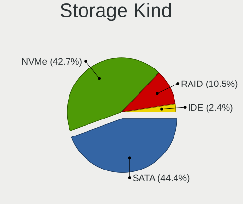

| Kind | Notebooks | Percent |
|------|-----------|---------|
| SATA | 312       | 44.38%  |
| NVMe | 300       | 42.67%  |
| RAID | 74        | 10.53%  |
| IDE  | 17        | 2.42%   |

Processor
---------

CPU Vendor
----------

Processor vendors

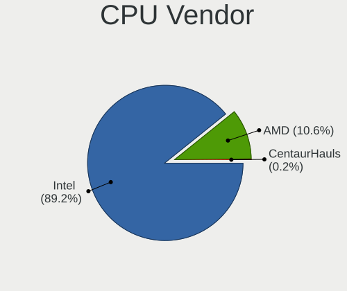

| Vendor       | Notebooks | Percent |
|--------------|-----------|---------|
| Intel        | 488       | 89.21%  |
| AMD          | 58        | 10.6%   |
| CentaurHauls | 1         | 0.18%   |

CPU Model
---------

Processor models

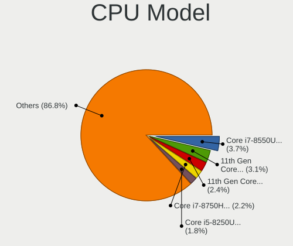

| Model                                       | Notebooks | Percent |
|---------------------------------------------|-----------|---------|
| Intel Core i7-8550U CPU @ 1.80GHz           | 20        | 3.66%   |
| Intel 11th Gen Core i7-1165G7 @ 2.80GHz     | 17        | 3.11%   |
| Intel 11th Gen Core i5-1135G7 @ 2.40GHz     | 13        | 2.38%   |
| Intel Core i7-8750H CPU @ 2.20GHz           | 12        | 2.19%   |
| Intel Core i5-8250U CPU @ 1.60GHz           | 10        | 1.83%   |
| Intel Core i5-10210U CPU @ 1.60GHz          | 10        | 1.83%   |
| AMD Custom APU 0405                         | 10        | 1.83%   |
| Intel Core i7-8565U CPU @ 1.80GHz           | 9         | 1.65%   |
| Intel Core i7-6700HQ CPU @ 2.60GHz          | 9         | 1.65%   |
| Intel Core i5-8265U CPU @ 1.60GHz           | 9         | 1.65%   |
| Intel Core i7-1065G7 CPU @ 1.30GHz          | 8         | 1.46%   |
| Intel Core i5-6200U CPU @ 2.30GHz           | 8         | 1.46%   |
| Intel Core i5-5200U CPU @ 2.20GHz           | 8         | 1.46%   |
| Intel Core i5-1035G1 CPU @ 1.00GHz          | 7         | 1.28%   |
| Intel Core i7-8650U CPU @ 1.90GHz           | 6         | 1.1%    |
| Intel Core i7-7700HQ CPU @ 2.80GHz          | 6         | 1.1%    |
| Intel Core i7-6500U CPU @ 2.50GHz           | 6         | 1.1%    |
| Intel Core i7-10510U CPU @ 1.80GHz          | 6         | 1.1%    |
| Intel Core i5-7200U CPU @ 2.50GHz           | 6         | 1.1%    |
| Intel Core i3-7020U CPU @ 2.30GHz           | 6         | 1.1%    |
| Intel Core i7-7500U CPU @ 2.70GHz           | 5         | 0.91%   |
| Intel Core i7-10750H CPU @ 2.60GHz          | 5         | 0.91%   |
| Intel Core i5-6300U CPU @ 2.40GHz           | 5         | 0.91%   |
| Intel Core i5-3210M CPU @ 2.50GHz           | 5         | 0.91%   |
| Intel 13th Gen Core i7-1355U                | 5         | 0.91%   |
| Intel 12th Gen Core i7-12700H               | 5         | 0.91%   |
| Intel 12th Gen Core i7-1255U                | 5         | 0.91%   |
| Intel 12th Gen Core i5-1235U                | 5         | 0.91%   |
| Intel Pentium Dual-Core CPU T4400 @ 2.20GHz | 4         | 0.73%   |
| Intel Core i7-9750H CPU @ 2.60GHz           | 4         | 0.73%   |
| Intel Core i7-8665U CPU @ 1.90GHz           | 4         | 0.73%   |
| Intel Core i5-4210U CPU @ 1.70GHz           | 4         | 0.73%   |
| Intel Core i5-3320M CPU @ 2.60GHz           | 4         | 0.73%   |
| Intel Core i5-2410M CPU @ 2.30GHz           | 4         | 0.73%   |
| Intel 11th Gen Core i7-11800H @ 2.30GHz     | 4         | 0.73%   |
| Intel Core Ultra 9 185H                     | 3         | 0.55%   |
| Intel Core i9-10885H CPU @ 2.40GHz          | 3         | 0.55%   |
| Intel Core i7-9850H CPU @ 2.60GHz           | 3         | 0.55%   |
| Intel Core i7-10875H CPU @ 2.30GHz          | 3         | 0.55%   |
| Intel Core i7-10850H CPU @ 2.70GHz          | 3         | 0.55%   |

CPU Model Family
----------------

Processor model prefix

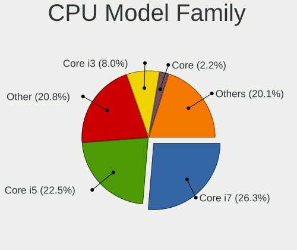

| Model                   | Notebooks | Percent |
|-------------------------|-----------|---------|
| Intel Core i7           | 144       | 26.33%  |
| Intel Core i5           | 123       | 22.49%  |
| Other                   | 114       | 20.84%  |
| Intel Core i3           | 44        | 8.04%   |
| Intel Core              | 12        | 2.19%   |
| AMD Ryzen 7             | 12        | 2.19%   |
| Intel Core 2 Duo        | 10        | 1.83%   |
| Intel Celeron           | 10        | 1.83%   |
| AMD Ryzen 5             | 10        | 1.83%   |
| Intel Core i9           | 9         | 1.65%   |
| Intel Pentium           | 7         | 1.28%   |
| Intel Atom              | 7         | 1.28%   |
| AMD Ryzen 9             | 7         | 1.28%   |
| Intel Pentium Dual-Core | 6         | 1.1%    |
| AMD Ryzen 7 PRO         | 4         | 0.73%   |
| Intel Xeon              | 3         | 0.55%   |
| Intel Pentium Dual      | 3         | 0.55%   |
| Intel Genuine           | 3         | 0.55%   |
| AMD A6                  | 3         | 0.55%   |
| Intel Core m3           | 2         | 0.37%   |
| AMD Turion 64 X2 Mobile | 2         | 0.37%   |
| AMD E1                  | 2         | 0.37%   |
| AMD A10                 | 2         | 0.37%   |
| Intel Pentium Gold      | 1         | 0.18%   |
| Intel Core M            | 1         | 0.18%   |
| Intel Core 2            | 1         | 0.18%   |
| Intel Celeron Dual-Core | 1         | 0.18%   |
| CentaurHauls VIA C7     | 1         | 0.18%   |
| AMD Ryzen 5 PRO         | 1         | 0.18%   |
| AMD E                   | 1         | 0.18%   |
| AMD A8                  | 1         | 0.18%   |

CPU Cores
---------

Number of processor cores

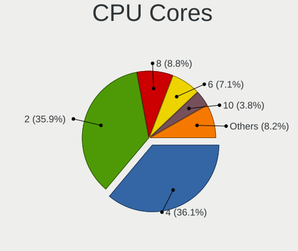

| Number  | Notebooks | Percent |
|---------|-----------|---------|
| 4       | 198       | 36.13%  |
| 2       | 197       | 35.95%  |
| 8       | 48        | 8.76%   |
| 6       | 39        | 7.12%   |
| 10      | 21        | 3.83%   |
| 14      | 17        | 3.1%    |
| 12      | 9         | 1.64%   |
| 1       | 8         | 1.46%   |
| 16      | 7         | 1.28%   |
| 24      | 2         | 0.36%   |
| 20      | 1         | 0.18%   |
| Unknown | 1         | 0.18%   |

CPU Sockets
-----------

Number of sockets

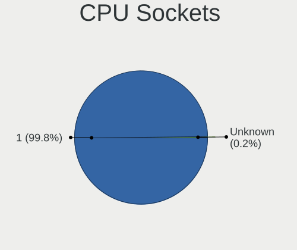

| Number  | Notebooks | Percent |
|---------|-----------|---------|
| 1       | 546       | 99.82%  |
| Unknown | 1         | 0.18%   |

CPU Threads
-----------

Threads per core (Hyper-Threading)

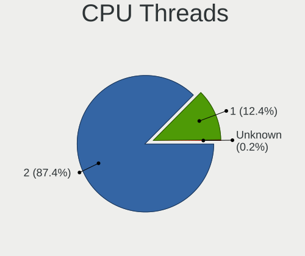

| Number  | Notebooks | Percent |
|---------|-----------|---------|
| 2       | 480       | 87.43%  |
| 1       | 68        | 12.39%  |
| Unknown | 1         | 0.18%   |

CPU Op-Modes
------------

CPU Operation Modes (32-bit, 64-bit)

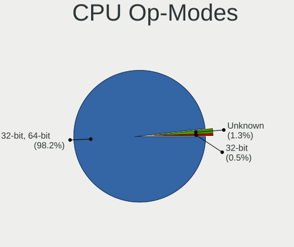

| Op mode        | Notebooks | Percent |
|----------------|-----------|---------|
| 32-bit, 64-bit | 537       | 98.17%  |
| Unknown        | 7         | 1.28%   |
| 32-bit         | 3         | 0.55%   |

CPU Microcode
-------------

Microcode number

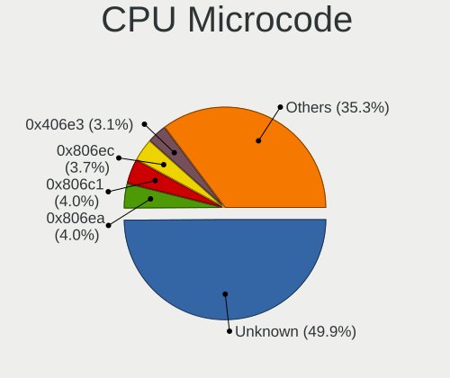

| Number     | Notebooks | Percent |
|------------|-----------|---------|
| Unknown    | 286       | 49.91%  |
| 0x806ea    | 23        | 4.01%   |
| 0x806c1    | 23        | 4.01%   |
| 0x806ec    | 21        | 3.66%   |
| 0x406e3    | 18        | 3.14%   |
| 0x206a7    | 18        | 3.14%   |
| 0x306a9    | 13        | 2.27%   |
| 0x806e9    | 12        | 2.09%   |
| 0x706e5    | 12        | 2.09%   |
| 0x306d4    | 11        | 1.92%   |
| 0x20655    | 11        | 1.92%   |
| 0xa0652    | 9         | 1.57%   |
| 0x506e3    | 9         | 1.57%   |
| 0x40651    | 8         | 1.4%    |
| 0x306c3    | 8         | 1.4%    |
| 0x1067a    | 8         | 1.4%    |
| 0x906ea    | 7         | 1.22%   |
| 0x906ed    | 6         | 1.05%   |
| 0x806eb    | 6         | 1.05%   |
| 0x906a3    | 5         | 0.87%   |
| 0x6fd      | 5         | 0.87%   |
| 0x906a4    | 4         | 0.7%    |
| 0xb06a3    | 3         | 0.52%   |
| 0x806d1    | 3         | 0.52%   |
| 0x106ca    | 3         | 0.52%   |
| 0x08600104 | 3         | 0.52%   |
| 0xb06a2    | 2         | 0.35%   |
| 0x906e9    | 2         | 0.35%   |
| 0x706a1    | 2         | 0.35%   |
| 0x6fa      | 2         | 0.35%   |
| 0x106c2    | 2         | 0.35%   |
| 0x10676    | 2         | 0.35%   |
| 0x0a50000c | 2         | 0.35%   |
| 0x0a404101 | 2         | 0.35%   |
| 0x08108109 | 2         | 0.35%   |
| 0x08108102 | 2         | 0.35%   |
| 0xb0671    | 1         | 0.17%   |
| 0xa0660    | 1         | 0.17%   |
| 0x90672    | 1         | 0.17%   |
| 0x806c2    | 1         | 0.17%   |

CPU Microarch
-------------

Microarchitecture

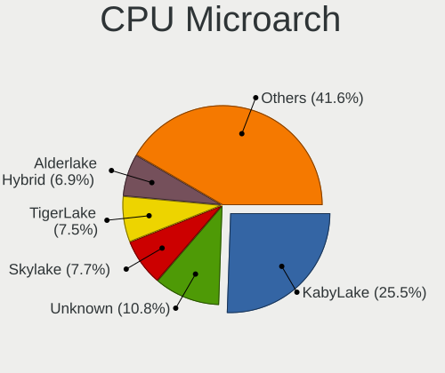

| Name               | Notebooks | Percent |
|--------------------|-----------|---------|
| KabyLake           | 140       | 25.55%  |
| Unknown            | 59        | 10.77%  |
| Skylake            | 42        | 7.66%   |
| TigerLake          | 41        | 7.48%   |
| Alderlake Hybrid   | 38        | 6.93%   |
| Haswell            | 31        | 5.66%   |
| SandyBridge        | 28        | 5.11%   |
| IvyBridge          | 24        | 4.38%   |
| IceLake            | 22        | 4.01%   |
| CometLake          | 17        | 3.1%    |
| Broadwell          | 17        | 3.1%    |
| Penryn             | 16        | 2.92%   |
| Westmere           | 15        | 2.74%   |
| Core               | 9         | 1.64%   |
| Zen 2              | 8         | 1.46%   |
| Zen+               | 5         | 0.91%   |
| Zen 3              | 5         | 0.91%   |
| Silvermont         | 4         | 0.73%   |
| Meteorlake Hybrid  | 4         | 0.73%   |
| Goldmont plus      | 4         | 0.73%   |
| Bonnell            | 4         | 0.73%   |
| Puma               | 3         | 0.55%   |
| Piledriver         | 3         | 0.55%   |
| K8 Hammer          | 2         | 0.36%   |
| Zen                | 1         | 0.18%   |
| Tremont            | 1         | 0.18%   |
| Nehalem            | 1         | 0.18%   |
| Jaguar             | 1         | 0.18%   |
| Goldmont           | 1         | 0.18%   |
| Bobcat             | 1         | 0.18%   |
| ArrowLake-H Hybrid | 1         | 0.18%   |

Graphics
--------

GPU Vendor
----------

Vendors of graphics cards

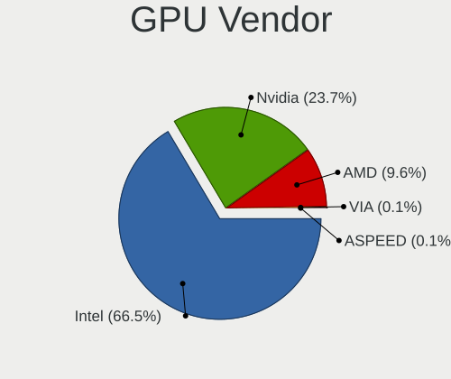

| Vendor            | Notebooks | Percent |
|-------------------|-----------|---------|
| Intel             | 472       | 66.48%  |
| Nvidia            | 168       | 23.66%  |
| AMD               | 68        | 9.58%   |
| VIA Technologies  | 1         | 0.14%   |
| ASPEED Technology | 1         | 0.14%   |

GPU Model
---------

Graphics card models

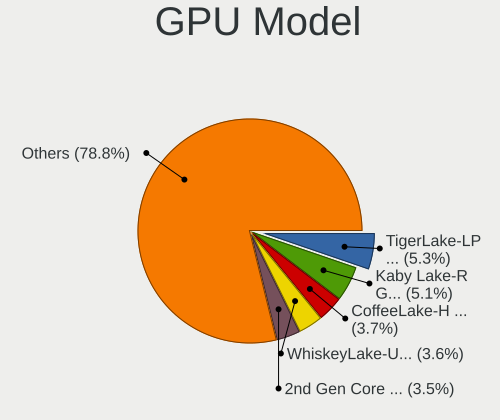

| Model                                                                     | Notebooks | Percent |
|---------------------------------------------------------------------------|-----------|---------|
| Intel TigerLake-LP GT2 [Iris Xe Graphics]                                 | 38        | 5.26%   |
| Intel Kaby Lake-R GT2 [UHD Graphics 620]                                  | 37        | 5.12%   |
| Intel CoffeeLake-H GT2 [UHD Graphics 630]                                 | 27        | 3.73%   |
| Intel WhiskeyLake-U GT2 [UHD Graphics 620]                                | 26        | 3.6%    |
| Intel 2nd Generation Core Processor Family Integrated Graphics Controller | 25        | 3.46%   |
| Intel Skylake-U GT2 [HD Graphics 520]                                     | 24        | 3.32%   |
| Intel 3rd Gen Core processor Graphics Controller                          | 23        | 3.18%   |
| Intel CometLake-U GT2 [UHD Graphics]                                      | 19        | 2.63%   |
| Intel Raptor Lake-P [Iris Xe Graphics]                                    | 18        | 2.49%   |
| Intel Haswell-ULT Integrated Graphics Controller                          | 17        | 2.35%   |
| Intel Mobile 4 Series Chipset Integrated Graphics Controller              | 16        | 2.21%   |
| Intel Core Processor Integrated Graphics Controller                       | 15        | 2.07%   |
| Intel CometLake-H GT2 [UHD Graphics]                                      | 15        | 2.07%   |
| Intel Broadwell-U GT2 [HD Graphics 5500]                                  | 14        | 1.94%   |
| Intel 4th Gen Core Processor Integrated Graphics Controller               | 13        | 1.8%    |
| Intel Kaby Lake-U GT2 [HD Graphics 620]                                   | 12        | 1.66%   |
| Intel Alder Lake-P GT2 [Iris Xe Graphics]                                 | 11        | 1.52%   |
| Nvidia GP108M [GeForce MX150]                                             | 10        | 1.38%   |
| Intel Skylake-H GT2 [HD Graphics 530]                                     | 10        | 1.38%   |
| Intel Alder Lake-UP3 GT2 [Iris Xe Graphics]                               | 10        | 1.38%   |
| AMD VanGogh [AMD Custom GPU 0405]                                         | 10        | 1.38%   |
| Intel TigerLake-H GT1 [UHD Graphics]                                      | 8         | 1.11%   |
| Intel Iris Plus Graphics G7                                               | 8         | 1.11%   |
| Intel Iris Plus Graphics G1 (Ice Lake)                                    | 8         | 1.11%   |
| AMD Renoir [Radeon Vega Series / Radeon Vega Mobile Series]               | 8         | 1.11%   |
| Nvidia GP107M [GeForce GTX 1050 Ti Mobile]                                | 7         | 0.97%   |
| Nvidia GP107M [GeForce GTX 1050 Mobile]                                   | 7         | 0.97%   |
| Intel Mobile GM965/GL960 Integrated Graphics Controller (secondary)       | 6         | 0.83%   |
| Intel Mobile GM965/GL960 Integrated Graphics Controller (primary)         | 6         | 0.83%   |
| Intel HD Graphics 620                                                     | 6         | 0.83%   |
| AMD Rembrandt [Radeon 680M]                                               | 6         | 0.83%   |
| Nvidia TU117M [GeForce GTX 1650 Mobile / Max-Q]                           | 5         | 0.69%   |
| Nvidia GM107M [GeForce GTX 960M]                                          | 5         | 0.69%   |
| Nvidia GA104M [GeForce RTX 3070 Mobile / Max-Q]                           | 5         | 0.69%   |
| Intel Kaby Lake-H GT2 [HD Graphics 630]                                   | 5         | 0.69%   |
| AMD Picasso/Raven 2 [Radeon Vega Series / Radeon Vega Mobile Series]      | 5         | 0.69%   |
| AMD Cezanne [Radeon Vega Series / Radeon Vega Mobile Series]              | 5         | 0.69%   |
| Nvidia TU117M [GeForce MX450]                                             | 4         | 0.55%   |
| Nvidia GP108M [GeForce MX250]                                             | 4         | 0.55%   |
| Nvidia GK107M [GeForce GT 750M]                                           | 4         | 0.55%   |

GPU Combo
---------

Combinations of graphics cards

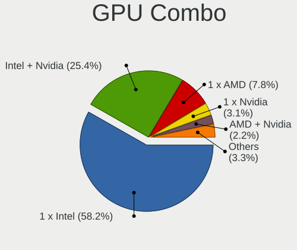

| Name           | Notebooks | Percent |
|----------------|-----------|---------|
| 1 x Intel      | 319       | 58.21%  |
| Intel + Nvidia | 139       | 25.36%  |
| 1 x AMD        | 43        | 7.85%   |
| 1 x Nvidia     | 17        | 3.1%    |
| AMD + Nvidia   | 12        | 2.19%   |
| Intel + AMD    | 9         | 1.64%   |
| 2 x AMD        | 4         | 0.73%   |
| 2 x Intel      | 3         | 0.55%   |
| 1 x VIA        | 1         | 0.18%   |
| 1 x ASPEED     | 1         | 0.18%   |

GPU Driver
----------

Free vs proprietary

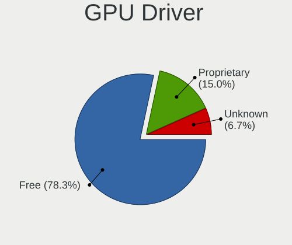

| Driver      | Notebooks | Percent |
|-------------|-----------|---------|
| Free        | 434       | 78.34%  |
| Proprietary | 83        | 14.98%  |
| Unknown     | 37        | 6.68%   |

GPU Memory
----------

Total video memory

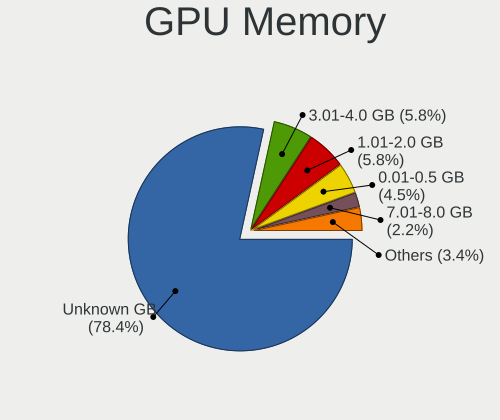

| Size in GB | Notebooks | Percent |
|------------|-----------|---------|
| Unknown    | 436       | 78.42%  |
| 3.01-4.0   | 32        | 5.76%   |
| 1.01-2.0   | 32        | 5.76%   |
| 0.01-0.5   | 25        | 4.5%    |
| 7.01-8.0   | 12        | 2.16%   |
| 0.51-1.0   | 10        | 1.8%    |
| 5.01-6.0   | 8         | 1.44%   |
| 2.01-3.0   | 1         | 0.18%   |

Monitor
-------

Monitor Vendor
--------------

Monitor vendors

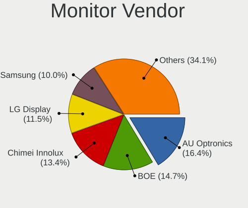

| Vendor                  | Notebooks | Percent |
|-------------------------|-----------|---------|
| AU Optronics            | 110       | 16.37%  |
| BOE                     | 99        | 14.73%  |
| Chimei Innolux          | 90        | 13.39%  |
| LG Display              | 77        | 11.46%  |
| Samsung Electronics     | 67        | 9.97%   |
| Dell                    | 52        | 7.74%   |
| Lenovo                  | 27        | 4.02%   |
| Sharp                   | 20        | 2.98%   |
| Goldstar                | 14        | 2.08%   |
| Valve                   | 11        | 1.64%   |
| Chi Mei Optoelectronics | 11        | 1.64%   |
| Philips                 | 10        | 1.49%   |
| InfoVision              | 9         | 1.34%   |
| Apple                   | 8         | 1.19%   |
| PANDA                   | 7         | 1.04%   |
| Hewlett-Packard         | 7         | 1.04%   |
| CSO                     | 7         | 1.04%   |
| LG Philips              | 5         | 0.74%   |
| Toshiba                 | 4         | 0.6%    |
| ASUSTek Computer        | 4         | 0.6%    |
| AOC                     | 4         | 0.6%    |
| TMX                     | 3         | 0.45%   |
| VIE                     | 2         | 0.3%    |
| Unknown (ABC)           | 2         | 0.3%    |
| JDI                     | 2         | 0.3%    |
| CSOT                    | 2         | 0.3%    |
| CPT                     | 2         | 0.3%    |
| BenQ                    | 2         | 0.3%    |
| Xiaomi                  | 1         | 0.15%   |
| VOR                     | 1         | 0.15%   |
| STD                     | 1         | 0.15%   |
| Seiko/Epson             | 1         | 0.15%   |
| RIS                     | 1         | 0.15%   |
| Panasonic               | 1         | 0.15%   |
| MSI                     | 1         | 0.15%   |
| Mi                      | 1         | 0.15%   |
| LGD                     | 1         | 0.15%   |
| Hitachi                 | 1         | 0.15%   |
| Gigabyte Technology     | 1         | 0.15%   |
| BOE Technology Group    | 1         | 0.15%   |

Monitor Model
-------------

Monitor models

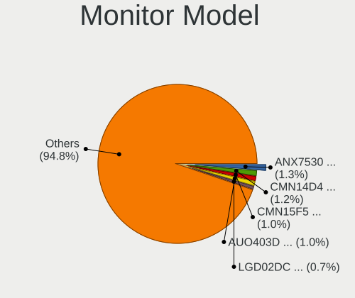

| Model                                                                 | Notebooks | Percent |
|-----------------------------------------------------------------------|-----------|---------|
| Valve ANX7530 U VLV3001 800x1280 100x150mm 7.1-inch                   | 9         | 1.3%    |
| Chimei Innolux LCD Monitor CMN14D4 1920x1080 309x173mm 13.9-inch      | 8         | 1.16%   |
| Chimei Innolux LCD Monitor CMN15F5 1920x1080 344x193mm 15.5-inch      | 7         | 1.01%   |
| AU Optronics LCD Monitor AUO403D 1920x1080 309x174mm 14.0-inch        | 7         | 1.01%   |
| LG Display LCD Monitor LGD02DC 1366x768 344x194mm 15.5-inch           | 5         | 0.72%   |
| Samsung Electronics S24F350 SAM0D20 1920x1080 521x293mm 23.5-inch     | 4         | 0.58%   |
| Lenovo LCD Monitor LEN40BA 1920x1080 344x194mm 15.5-inch              | 4         | 0.58%   |
| Lenovo E27q-20 LEN62D0 2560x1440 597x336mm 27.0-inch                  | 4         | 0.58%   |
| Dell P2419H DELD0DA 1920x1080 527x296mm 23.8-inch                     | 4         | 0.58%   |
| BOE LCD Monitor BOE0802 1920x1080 344x193mm 15.5-inch                 | 4         | 0.58%   |
| AU Optronics LCD Monitor AUOE48D 1920x1080 344x194mm 15.5-inch        | 4         | 0.58%   |
| Samsung Electronics LCD Monitor SDC416E 2880x1620 344x194mm 15.5-inch | 3         | 0.43%   |
| Samsung Electronics LCD Monitor SDC416D 2880x1800 312x195mm 14.5-inch | 3         | 0.43%   |
| Philips PHL 242V8 PHLC219 1920x1080 527x296mm 23.8-inch               | 3         | 0.43%   |
| LG Display LP156WH2-TLAA LGD0230 1366x768 344x194mm 15.5-inch         | 3         | 0.43%   |
| LG Display LCD Monitor LGD04A7 1920x1080 344x194mm 15.5-inch          | 3         | 0.43%   |
| Dell U2720Q DEL41B5 3840x2160 597x336mm 27.0-inch                     | 3         | 0.43%   |
| Dell U2412M DELA07A 1920x1200 518x324mm 24.1-inch                     | 3         | 0.43%   |
| Dell P2419H DELD0D9 1920x1080 527x296mm 23.8-inch                     | 3         | 0.43%   |
| Chimei Innolux LCD Monitor CMN15E8 1920x1080 344x193mm 15.5-inch      | 3         | 0.43%   |
| Chimei Innolux LCD Monitor CMN1521 1920x1080 344x193mm 15.5-inch      | 3         | 0.43%   |
| Chimei Innolux LCD Monitor CMN14E7 1920x1080 309x173mm 13.9-inch      | 3         | 0.43%   |
| Chimei Innolux LCD Monitor CMN14E5 1920x1080 309x173mm 13.9-inch      | 3         | 0.43%   |
| BOE LCD Monitor BOE09CC 1920x1080 344x194mm 15.5-inch                 | 3         | 0.43%   |
| BOE LCD Monitor BOE06F2 1920x1080 309x173mm 13.9-inch                 | 3         | 0.43%   |
| AU Optronics LCD Monitor AUOE68C 2560x1440 309x174mm 14.0-inch        | 3         | 0.43%   |
| AU Optronics LCD Monitor AUO633D 1920x1080 310x170mm 13.9-inch        | 3         | 0.43%   |
| AU Optronics LCD Monitor AUO492D 1920x1080 293x165mm 13.2-inch        | 3         | 0.43%   |
| AU Optronics LCD Monitor AUO22EC 1366x768 344x193mm 15.5-inch         | 3         | 0.43%   |
| AU Optronics LCD Monitor AUO21EC 1366x768 344x193mm 15.5-inch         | 3         | 0.43%   |
| AU Optronics LCD Monitor AUO106C 1366x768 276x155mm 12.5-inch         | 3         | 0.43%   |
| AU Optronics LCD Monitor AUO102D 1920x1080 293x165mm 13.2-inch        | 3         | 0.43%   |
| VIE LED MONITOR VIE2302 1920x1080 473x296mm 22.0-inch                 | 2         | 0.29%   |
| Valve ANX7530 U VLV3003 800x1280 100x160mm 7.4-inch                   | 2         | 0.29%   |
| Unknown (ABC) LED MONITOR ABC952D 1920x1080 443x249mm 20.0-inch       | 2         | 0.29%   |
| Toshiba ScreenXpert TSB8888 1080x2160                                 | 2         | 0.29%   |
| Toshiba LCD Monitor LCD2207 1280x800 287x180mm 13.3-inch              | 2         | 0.29%   |
| TMX TL156MDMP11-0 TMX1560 3200x2000 336x210mm 15.6-inch               | 2         | 0.29%   |
| Sharp LQ156M1JW09 SHP14D3 1920x1080 344x194mm 15.5-inch               | 2         | 0.29%   |
| Sharp LCD Monitor SHP148D 3840x2160 344x194mm 15.5-inch               | 2         | 0.29%   |

Monitor Resolution
------------------

Monitor screen resolution

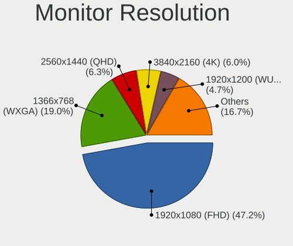

| Resolution         | Notebooks | Percent |
|--------------------|-----------|---------|
| 1920x1080 (FHD)    | 290       | 47.15%  |
| 1366x768 (WXGA)    | 117       | 19.02%  |
| 2560x1440 (QHD)    | 39        | 6.34%   |
| 3840x2160 (4K)     | 37        | 6.02%   |
| 1920x1200 (WUXGA)  | 29        | 4.72%   |
| 2560x1600          | 16        | 2.6%    |
| 1280x800 (WXGA)    | 14        | 2.28%   |
| 2880x1800          | 12        | 1.95%   |
| 800x1280           | 11        | 1.79%   |
| 1600x900 (HD+)     | 7         | 1.14%   |
| 3200x1800 (QHD+)   | 5         | 0.81%   |
| 2880x1620          | 5         | 0.81%   |
| 3440x1440          | 4         | 0.65%   |
| 1680x1050 (WSXGA+) | 4         | 0.65%   |
| 1440x900 (WXGA+)   | 4         | 0.65%   |
| 3200x2000          | 3         | 0.49%   |
| 3456x2160          | 2         | 0.33%   |
| 2560x1080          | 2         | 0.33%   |
| 2160x1440          | 2         | 0.33%   |
| 1024x768 (XGA)     | 2         | 0.33%   |
| 1024x600           | 2         | 0.33%   |
| 3840x2400          | 1         | 0.16%   |
| 3840x1080          | 1         | 0.16%   |
| 3000x2000          | 1         | 0.16%   |
| 2304x1440          | 1         | 0.16%   |
| 2256x1504          | 1         | 0.16%   |
| 1280x768           | 1         | 0.16%   |
| 1280x1024 (SXGA)   | 1         | 0.16%   |
| Unknown            | 1         | 0.16%   |

Monitor Diagonal
----------------

Diagonal size in inches

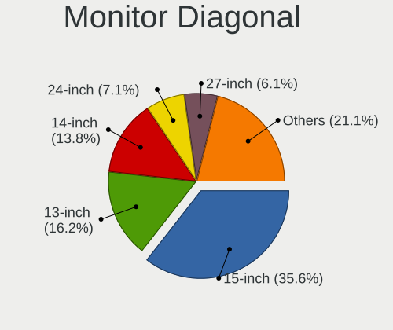

| Inches  | Notebooks | Percent |
|---------|-----------|---------|
| 15      | 239       | 35.57%  |
| 13      | 109       | 16.22%  |
| 14      | 93        | 13.84%  |
| 24      | 48        | 7.14%   |
| 27      | 41        | 6.1%    |
| 16      | 20        | 2.98%   |
| 17      | 18        | 2.68%   |
| 23      | 16        | 2.38%   |
| 21      | 14        | 2.08%   |
| 12      | 14        | 2.08%   |
| 7       | 11        | 1.64%   |
| 31      | 6         | 0.89%   |
| 22      | 6         | 0.89%   |
| 34      | 5         | 0.74%   |
| 40      | 4         | 0.6%    |
| 26      | 3         | 0.45%   |
| 18      | 3         | 0.45%   |
| 11      | 3         | 0.45%   |
| Unknown | 3         | 0.45%   |
| 86      | 2         | 0.3%    |
| 84      | 2         | 0.3%    |
| 20      | 2         | 0.3%    |
| 19      | 2         | 0.3%    |
| 10      | 2         | 0.3%    |
| 65      | 1         | 0.15%   |
| 54      | 1         | 0.15%   |
| 43      | 1         | 0.15%   |
| 32      | 1         | 0.15%   |
| 25      | 1         | 0.15%   |
| 8       | 1         | 0.15%   |

Monitor Width
-------------

Physical width

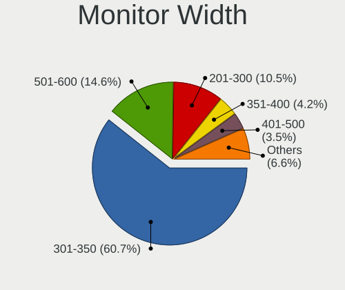

| Width in mm | Notebooks | Percent |
|-------------|-----------|---------|
| 301-350     | 404       | 60.66%  |
| 501-600     | 97        | 14.56%  |
| 201-300     | 70        | 10.51%  |
| 351-400     | 28        | 4.2%    |
| 401-500     | 23        | 3.45%   |
| 601-700     | 12        | 1.8%    |
| 1-100       | 11        | 1.65%   |
| 701-800     | 6         | 0.9%    |
| 801-900     | 4         | 0.6%    |
| 1001-1500   | 4         | 0.6%    |
| Unknown     | 3         | 0.45%   |
| 1501-2000   | 2         | 0.3%    |
| 101-200     | 1         | 0.15%   |
| 901-1000    | 1         | 0.15%   |

Aspect Ratio
------------

Proportional relationship between the width and the height

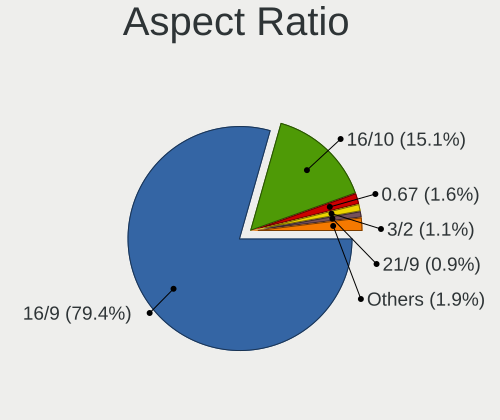

| Ratio   | Notebooks | Percent |
|---------|-----------|---------|
| 16/9    | 451       | 79.4%   |
| 16/10   | 86        | 15.14%  |
| 0.67    | 9         | 1.58%   |
| 3/2     | 6         | 1.06%   |
| 21/9    | 5         | 0.88%   |
| Unknown | 3         | 0.53%   |
| 5/4     | 2         | 0.35%   |
| 4/3     | 2         | 0.35%   |
| 0.62    | 2         | 0.35%   |
| 0.56    | 2         | 0.35%   |

Monitor Area
------------

Area in inch²

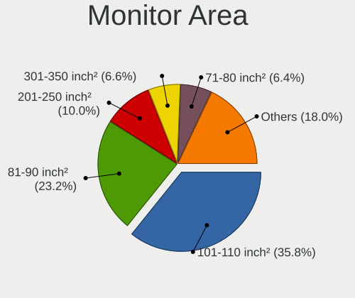

| Area in inch² | Notebooks | Percent |
|----------------|-----------|---------|
| 101-110        | 239       | 35.78%  |
| 81-90          | 155       | 23.2%   |
| 201-250        | 67        | 10.03%  |
| 301-350        | 44        | 6.59%   |
| 71-80          | 43        | 6.44%   |
| 111-120        | 20        | 2.99%   |
| 61-70          | 14        | 2.1%    |
| 121-130        | 14        | 2.1%    |
| 351-500        | 12        | 1.8%    |
| 1-40           | 12        | 1.8%    |
| 251-300        | 12        | 1.8%    |
| More than 1000 | 6         | 0.9%    |
| 151-200        | 6         | 0.9%    |
| 501-1000       | 5         | 0.75%   |
| 131-140        | 4         | 0.6%    |
| 91-100         | 4         | 0.6%    |
| 51-60          | 3         | 0.45%   |
| 141-150        | 3         | 0.45%   |
| Unknown        | 3         | 0.45%   |
| 41-50          | 2         | 0.3%    |

Pixel Density
-------------

Pixels per inch

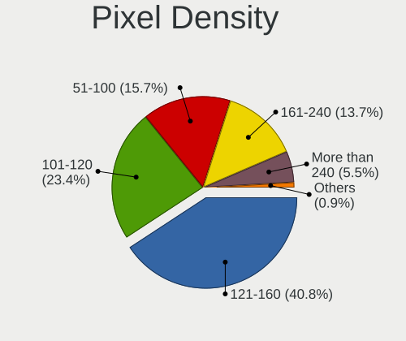

| Density       | Notebooks | Percent |
|---------------|-----------|---------|
| 121-160       | 265       | 40.77%  |
| 101-120       | 152       | 23.38%  |
| 51-100        | 102       | 15.69%  |
| 161-240       | 89        | 13.69%  |
| More than 240 | 36        | 5.54%   |
| 1-50          | 3         | 0.46%   |
| Unknown       | 3         | 0.46%   |

Multiple Monitors
-----------------

Total monitors connected

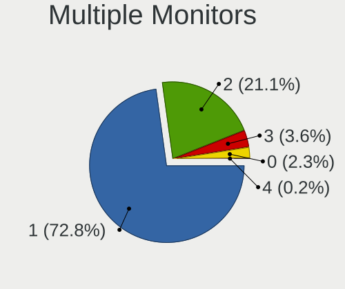

| Total | Notebooks | Percent |
|-------|-----------|---------|
| 1     | 410       | 72.82%  |
| 2     | 119       | 21.14%  |
| 3     | 20        | 3.55%   |
| 0     | 13        | 2.31%   |
| 4     | 1         | 0.18%   |

Network
-------

Net Controller Vendor
---------------------

Controller vendors

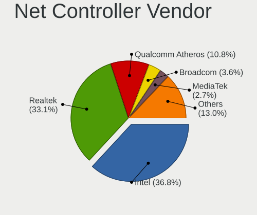

| Vendor                            | Notebooks | Percent |
|-----------------------------------|-----------|---------|
| Intel                             | 318       | 36.85%  |
| Realtek Semiconductor             | 286       | 33.14%  |
| Qualcomm Atheros                  | 93        | 10.78%  |
| Broadcom                          | 31        | 3.59%   |
| MediaTek                          | 23        | 2.67%   |
| Broadcom Limited                  | 16        | 1.85%   |
| Lenovo                            | 13        | 1.51%   |
| ASIX Electronics                  | 8         | 0.93%   |
| Samsung Electronics               | 7         | 0.81%   |
| DisplayLink                       | 7         | 0.81%   |
| Xiaomi                            | 5         | 0.58%   |
| Shenzhen Goodix Technology        | 5         | 0.58%   |
| Qualcomm                          | 5         | 0.58%   |
| Edimax Technology                 | 4         | 0.46%   |
| TP-Link                           | 3         | 0.35%   |
| Qualcomm Atheros Communications   | 3         | 0.35%   |
| OPPO Electronics                  | 3         | 0.35%   |
| Marvell Technology Group          | 3         | 0.35%   |
| Google                            | 3         | 0.35%   |
| Ralink Technology                 | 2         | 0.23%   |
| QinHeng Electronics               | 2         | 0.23%   |
| Nvidia                            | 2         | 0.23%   |
| ICS Advent                        | 2         | 0.23%   |
| Huawei Technologies               | 2         | 0.23%   |
| U-Blox                            | 1         | 0.12%   |
| Toshiba                           | 1         | 0.12%   |
| Sierra Wireless                   | 1         | 0.12%   |
| Ralink                            | 1         | 0.12%   |
| PEAK-System Technik               | 1         | 0.12%   |
| Nokia Mobile Phones               | 1         | 0.12%   |
| Linksys                           | 1         | 0.12%   |
| LG Electronics                    | 1         | 0.12%   |
| HMD Global                        | 1         | 0.12%   |
| Hewlett-Packard                   | 1         | 0.12%   |
| Ericsson Business Mobile Networks | 1         | 0.12%   |
| Dell                              | 1         | 0.12%   |
| Comneon                           | 1         | 0.12%   |
| Bose                              | 1         | 0.12%   |
| Attansic Technology               | 1         | 0.12%   |
| ASUSTek Computer                  | 1         | 0.12%   |

Net Controller Model
--------------------

Controller models

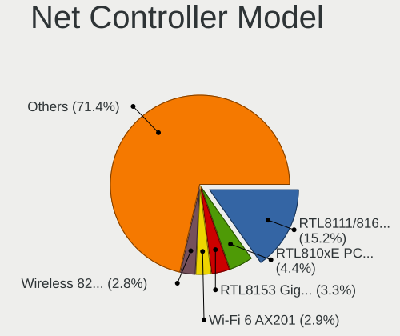

| Model                                                                  | Notebooks | Percent |
|------------------------------------------------------------------------|-----------|---------|
| Realtek RTL8111/8168/8211/8411 PCI Express Gigabit Ethernet Controller | 160       | 15.24%  |
| Realtek RTL810xE PCI Express Fast Ethernet controller                  | 46        | 4.38%   |
| Realtek RTL8153 Gigabit Ethernet Adapter                               | 35        | 3.33%   |
| Intel Wi-Fi 6 AX201                                                    | 30        | 2.86%   |
| Intel Wireless 8265 / 8275                                             | 29        | 2.76%   |
| Realtek RTL8822CE 802.11ac PCIe Wireless Network Adapter               | 20        | 1.9%    |
| Intel Wireless 8260                                                    | 18        | 1.71%   |
| Intel Alder Lake-P PCH CNVi WiFi                                       | 18        | 1.71%   |
| Qualcomm Atheros QCA9377 802.11ac Wireless Network Adapter             | 17        | 1.62%   |
| Qualcomm Atheros AR9285 Wireless Network Adapter (PCI-Express)         | 16        | 1.52%   |
| Intel Wi-Fi 6 AX200                                                    | 16        | 1.52%   |
| Intel Comet Lake PCH-LP CNVi WiFi                                      | 16        | 1.52%   |
| Intel Cannon Point-LP CNVi [Wireless-AC]                               | 16        | 1.52%   |
| Qualcomm Atheros QCA6174 802.11ac Wireless Network Adapter             | 15        | 1.43%   |
| Intel Comet Lake PCH CNVi WiFi                                         | 15        | 1.43%   |
| Qualcomm Atheros QCA9565 / AR9565 Wireless Network Adapter             | 14        | 1.33%   |
| Intel Raptor Lake PCH CNVi WiFi                                        | 14        | 1.33%   |
| Intel Dual Band Wireless-AC 3165 Plus Bluetooth                        | 13        | 1.24%   |
| Realtek RTL8821CE 802.11ac PCIe Wireless Network Adapter               | 12        | 1.14%   |
| Qualcomm Atheros AR9485 Wireless Network Adapter                       | 12        | 1.14%   |
| Intel Cannon Lake PCH CNVi WiFi                                        | 12        | 1.14%   |
| Realtek RTL8822BE 802.11a/b/g/n/ac WiFi adapter                        | 11        | 1.05%   |
| Intel Wireless 3160                                                    | 11        | 1.05%   |
| Intel Wi-Fi 6E(802.11ax) AX210/AX1675* 2x2 [Typhoon Peak]              | 11        | 1.05%   |
| Intel 82579LM Gigabit Network Connection (Lewisville)                  | 11        | 1.05%   |
| Intel Wireless 7260                                                    | 10        | 0.95%   |
| MediaTek MT7902 802.11ax PCIe Wireless Network Adapter [Filogic 310]   | 9         | 0.86%   |
| Intel Wireless 7265                                                    | 9         | 0.86%   |
| Intel Wireless 3165                                                    | 9         | 0.86%   |
| Intel Ethernet Connection (13) I219-V                                  | 9         | 0.86%   |
| Intel Centrino Advanced-N 6205 [Taylor Peak]                           | 9         | 0.86%   |
| Intel Ethernet Connection I219-LM                                      | 8         | 0.76%   |
| Intel Ethernet Connection (7) I219-LM                                  | 8         | 0.76%   |
| Intel Ethernet Connection (4) I219-LM                                  | 8         | 0.76%   |
| Broadcom BCM4313 802.11bgn Wireless Network Adapter                    | 8         | 0.76%   |
| Realtek RTL8852BE PCIe 802.11ax Wireless Network Controller            | 7         | 0.67%   |
| Lenovo ThinkPad TBT 3 Dock                                             | 7         | 0.67%   |
| Samsung Galaxy series, misc. (tethering mode)                          | 6         | 0.57%   |
| Realtek RTL8723BE PCIe Wireless Network Adapter                        | 6         | 0.57%   |
| Realtek RTL8125 2.5GbE Controller                                      | 6         | 0.57%   |

Wireless Vendor
---------------

Wireless vendors

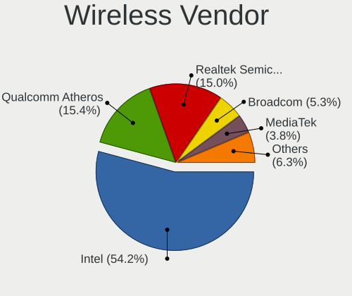

| Vendor                          | Notebooks | Percent |
|---------------------------------|-----------|---------|
| Intel                           | 299       | 54.17%  |
| Qualcomm Atheros                | 85        | 15.4%   |
| Realtek Semiconductor           | 83        | 15.04%  |
| Broadcom                        | 29        | 5.25%   |
| MediaTek                        | 21        | 3.8%    |
| Broadcom Limited                | 13        | 2.36%   |
| Qualcomm                        | 5         | 0.91%   |
| Edimax Technology               | 4         | 0.72%   |
| TP-Link                         | 3         | 0.54%   |
| Qualcomm Atheros Communications | 3         | 0.54%   |
| Ralink Technology               | 2         | 0.36%   |
| Sierra Wireless                 | 1         | 0.18%   |
| Ralink                          | 1         | 0.18%   |
| Dell                            | 1         | 0.18%   |
| ASUSTek Computer                | 1         | 0.18%   |
| Unknown                         | 1         | 0.18%   |

Wireless Model
--------------

Wireless models

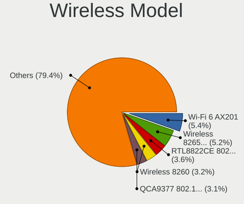

| Model                                                                   | Notebooks | Percent |
|-------------------------------------------------------------------------|-----------|---------|
| Intel Wi-Fi 6 AX201                                                     | 30        | 5.42%   |
| Intel Wireless 8265 / 8275                                              | 29        | 5.23%   |
| Realtek RTL8822CE 802.11ac PCIe Wireless Network Adapter                | 20        | 3.61%   |
| Intel Wireless 8260                                                     | 18        | 3.25%   |
| Qualcomm Atheros QCA9377 802.11ac Wireless Network Adapter              | 17        | 3.07%   |
| Qualcomm Atheros AR9285 Wireless Network Adapter (PCI-Express)          | 16        | 2.89%   |
| Intel Wi-Fi 6 AX200                                                     | 16        | 2.89%   |
| Intel Comet Lake PCH-LP CNVi WiFi                                       | 16        | 2.89%   |
| Intel Cannon Point-LP CNVi [Wireless-AC]                                | 16        | 2.89%   |
| Qualcomm Atheros QCA6174 802.11ac Wireless Network Adapter              | 15        | 2.71%   |
| Intel Comet Lake PCH CNVi WiFi                                          | 15        | 2.71%   |
| Qualcomm Atheros QCA9565 / AR9565 Wireless Network Adapter              | 14        | 2.53%   |
| Intel Raptor Lake PCH CNVi WiFi                                         | 14        | 2.53%   |
| Intel Dual Band Wireless-AC 3165 Plus Bluetooth                         | 13        | 2.35%   |
| Realtek RTL8821CE 802.11ac PCIe Wireless Network Adapter                | 12        | 2.17%   |
| Qualcomm Atheros AR9485 Wireless Network Adapter                        | 12        | 2.17%   |
| Intel Cannon Lake PCH CNVi WiFi                                         | 12        | 2.17%   |
| Intel Alder Lake-P PCH CNVi WiFi                                        | 12        | 2.17%   |
| Realtek RTL8822BE 802.11a/b/g/n/ac WiFi adapter                         | 11        | 1.99%   |
| Intel Wireless 3160                                                     | 11        | 1.99%   |
| Intel Wi-Fi 6E(802.11ax) AX210/AX1675* 2x2 [Typhoon Peak]               | 11        | 1.99%   |
| Intel Wireless 7260                                                     | 10        | 1.81%   |
| MediaTek MT7902 802.11ax PCIe Wireless Network Adapter [Filogic 310]    | 9         | 1.62%   |
| Intel Wireless 7265                                                     | 9         | 1.62%   |
| Intel Wireless 3165                                                     | 9         | 1.62%   |
| Intel Centrino Advanced-N 6205 [Taylor Peak]                            | 9         | 1.62%   |
| Broadcom BCM4313 802.11bgn Wireless Network Adapter                     | 8         | 1.44%   |
| Realtek RTL8852BE PCIe 802.11ax Wireless Network Controller             | 6         | 1.08%   |
| Realtek RTL8723BE PCIe Wireless Network Adapter                         | 6         | 1.08%   |
| MediaTek MT7921 802.11ax PCIe Wireless Network Adapter [Filogic 330]    | 6         | 1.08%   |
| Intel Ice Lake-LP PCH CNVi WiFi                                         | 6         | 1.08%   |
| Qualcomm QCNFA765 Wireless Network Adapter                              | 5         | 0.9%    |
| Qualcomm Atheros AR242x / AR542x Wireless Network Adapter (PCI-Express) | 5         | 0.9%    |
| Intel Wi-Fi 7(802.11be) AX1775*/AX1790*/BE20*/BE401/BE1750* 2x2         | 5         | 0.9%    |
| Intel Wi-Fi 5(802.11ac) Wireless-AC 9x6x [Thunder Peak]                 | 5         | 0.9%    |
| Broadcom Limited BCM4312 802.11b/g LP-PHY                               | 5         | 0.9%    |
| Realtek RTL8852AE 802.11ax PCIe Wireless Network Adapter                | 4         | 0.72%   |
| Realtek 802.11ac NIC                                                    | 4         | 0.72%   |
| MediaTek MT7922 802.11ax PCI Express Wireless Network Adapter           | 4         | 0.72%   |
| Intel Tiger Lake PCH CNVi WiFi                                          | 4         | 0.72%   |

Ethernet Vendor
---------------

Ethernet vendors

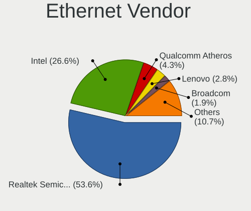

| Vendor                   | Notebooks | Percent |
|--------------------------|-----------|---------|
| Realtek Semiconductor    | 250       | 53.65%  |
| Intel                    | 124       | 26.61%  |
| Qualcomm Atheros         | 20        | 4.29%   |
| Lenovo                   | 13        | 2.79%   |
| Broadcom                 | 9         | 1.93%   |
| ASIX Electronics         | 8         | 1.72%   |
| Samsung Electronics      | 7         | 1.5%    |
| DisplayLink              | 7         | 1.5%    |
| Xiaomi                   | 5         | 1.07%   |
| Broadcom Limited         | 4         | 0.86%   |
| OPPO Electronics         | 3         | 0.64%   |
| Marvell Technology Group | 3         | 0.64%   |
| Google                   | 3         | 0.64%   |
| Nvidia                   | 2         | 0.43%   |
| MediaTek                 | 2         | 0.43%   |
| ICS Advent               | 2         | 0.43%   |
| Linksys                  | 1         | 0.21%   |
| Huawei Technologies      | 1         | 0.21%   |
| HMD Global               | 1         | 0.21%   |
| Attansic Technology      | 1         | 0.21%   |

Ethernet Model
--------------

Ethernet models

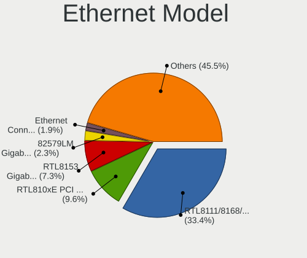

| Model                                                                  | Notebooks | Percent |
|------------------------------------------------------------------------|-----------|---------|
| Realtek RTL8111/8168/8211/8411 PCI Express Gigabit Ethernet Controller | 160       | 33.4%   |
| Realtek RTL810xE PCI Express Fast Ethernet controller                  | 46        | 9.6%    |
| Realtek RTL8153 Gigabit Ethernet Adapter                               | 35        | 7.31%   |
| Intel 82579LM Gigabit Network Connection (Lewisville)                  | 11        | 2.3%    |
| Intel Ethernet Connection (13) I219-V                                  | 9         | 1.88%   |
| Intel Ethernet Connection I219-LM                                      | 8         | 1.67%   |
| Intel Ethernet Connection (7) I219-LM                                  | 8         | 1.67%   |
| Intel Ethernet Connection (4) I219-LM                                  | 8         | 1.67%   |
| Lenovo ThinkPad TBT 3 Dock                                             | 7         | 1.46%   |
| Samsung Galaxy series, misc. (tethering mode)                          | 6         | 1.25%   |
| Realtek RTL8125 2.5GbE Controller                                      | 6         | 1.25%   |
| Intel Ethernet Connection (6) I219-V                                   | 6         | 1.25%   |
| Intel Ethernet Connection (4) I219-V                                   | 6         | 1.25%   |
| Intel Alder Lake-P PCH CNVi WiFi                                       | 6         | 1.25%   |
| ASIX AX88179 Gigabit Ethernet                                          | 6         | 1.25%   |
| Intel Ethernet Connection I217-LM                                      | 5         | 1.04%   |
| Realtek RTL8152 Fast Ethernet Adapter                                  | 4         | 0.84%   |
| Qualcomm Atheros AR8132 Fast Ethernet                                  | 4         | 0.84%   |
| Lenovo USB-C Dock Ethernet                                             | 4         | 0.84%   |
| Intel Ethernet Connection (2) I219-LM                                  | 4         | 0.84%   |
| Intel Ethernet Connection (11) I219-LM                                 | 4         | 0.84%   |
| Intel Ethernet Connection (10) I219-V                                  | 4         | 0.84%   |
| Xiaomi Mi/Redmi series (RNDIS)                                         | 3         | 0.63%   |
| Qualcomm Atheros Killer E2400 Gigabit Ethernet Controller              | 3         | 0.63%   |
| Qualcomm Atheros AR8151 v2.0 Gigabit Ethernet                          | 3         | 0.63%   |
| OPPO Ace 3V                                                            | 3         | 0.63%   |
| Intel I210 Gigabit Network Connection                                  | 3         | 0.63%   |
| Intel Ethernet Connection I218-LM                                      | 3         | 0.63%   |
| Intel Ethernet Connection (23) I219-LM                                 | 3         | 0.63%   |
| Intel Ethernet Connection (14) I219-LM                                 | 3         | 0.63%   |
| Intel 82567LM Gigabit Network Connection                               | 3         | 0.63%   |
| DisplayLink StarTech USB3DOCKHDPC                                      | 3         | 0.63%   |
| DisplayLink Dell Universal Dock D6000                                  | 3         | 0.63%   |
| Xiaomi Mi/Redmi series (RNDIS + ADB)                                   | 2         | 0.42%   |
| Qualcomm Atheros Killer E2500 Gigabit Ethernet Controller              | 2         | 0.42%   |
| Qualcomm Atheros AR8152 v2.0 Fast Ethernet                             | 2         | 0.42%   |
| MediaTek MT7922 802.11ax PCI Express Wireless Network Adapter          | 2         | 0.42%   |
| Marvell Group 88E8040 PCI-E Fast Ethernet Controller                   | 2         | 0.42%   |
| Intel Ethernet Controller I225-V                                       | 2         | 0.42%   |
| Intel Ethernet Controller (2) I225-LMvP                                | 2         | 0.42%   |

Net Controller Kind
-------------------

Ethernet, WiFi or modem

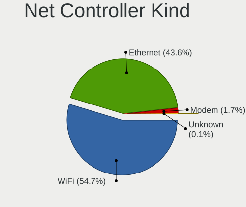

| Kind     | Notebooks | Percent |
|----------|-----------|---------|
| WiFi     | 526       | 54.68%  |
| Ethernet | 419       | 43.56%  |
| Modem    | 16        | 1.66%   |
| Unknown  | 1         | 0.1%    |

Used Controller
---------------

Currently used network controller

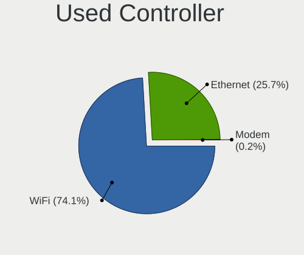

| Kind     | Notebooks | Percent |
|----------|-----------|---------|
| WiFi     | 426       | 74.09%  |
| Ethernet | 148       | 25.74%  |
| Modem    | 1         | 0.17%   |

NICs
----

Total network controllers on board

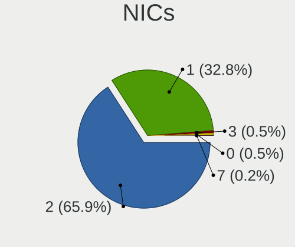

| Total | Notebooks | Percent |
|-------|-----------|---------|
| 2     | 361       | 65.88%  |
| 1     | 180       | 32.85%  |
| 3     | 3         | 0.55%   |
| 0     | 3         | 0.55%   |
| 7     | 1         | 0.18%   |

IPv6
----

IPv6 vs IPv4

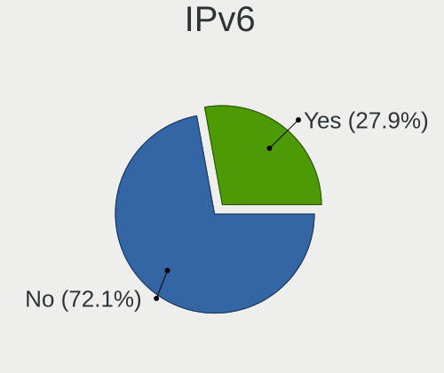

| Used | Notebooks | Percent |
|------|-----------|---------|
| No   | 404       | 72.14%  |
| Yes  | 156       | 27.86%  |

Bluetooth
---------

Bluetooth Vendor
----------------

Controller vendors

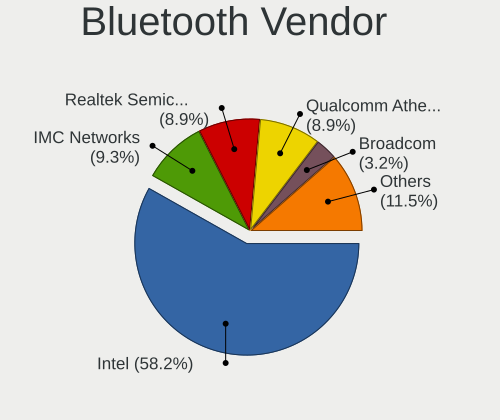

| Vendor                          | Notebooks | Percent |
|---------------------------------|-----------|---------|
| Intel                           | 274       | 58.17%  |
| IMC Networks                    | 44        | 9.34%   |
| Realtek Semiconductor           | 42        | 8.92%   |
| Qualcomm Atheros Communications | 42        | 8.92%   |
| Broadcom                        | 15        | 3.18%   |
| Foxconn / Hon Hai               | 13        | 2.76%   |
| Lite-On Technology              | 8         | 1.7%    |
| Dell                            | 6         | 1.27%   |
| Apple                           | 6         | 1.27%   |
| Hewlett-Packard                 | 4         | 0.85%   |
| USI                             | 2         | 0.42%   |
| Toshiba                         | 2         | 0.42%   |
| Realtek                         | 2         | 0.42%   |
| MediaTek                        | 2         | 0.42%   |
| Cambridge Silicon Radio         | 2         | 0.42%   |
| ASUSTek Computer                | 2         | 0.42%   |
| Askey Computer                  | 2         | 0.42%   |
| Opticis                         | 1         | 0.21%   |
| Chicony Electronics             | 1         | 0.21%   |
| Actions                         | 1         | 0.21%   |

Bluetooth Model
---------------

Controller models

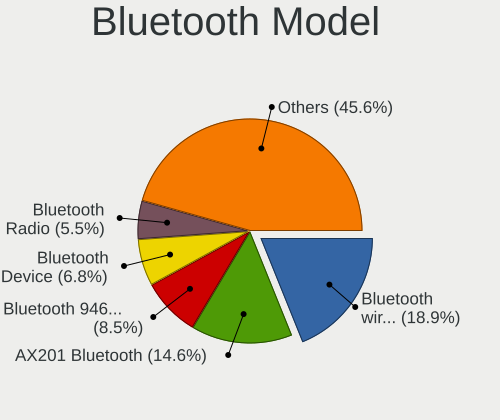

| Model                                               | Notebooks | Percent |
|-----------------------------------------------------|-----------|---------|
| Intel Bluetooth wireless interface                  | 89        | 18.9%   |
| Intel AX201 Bluetooth                               | 69        | 14.65%  |
| Intel Bluetooth 9460/9560 Jefferson Peak (JfP)      | 40        | 8.49%   |
| Intel Bluetooth Device                              | 32        | 6.79%   |
| Realtek Bluetooth Radio                             | 26        | 5.52%   |
| Qualcomm Atheros  Bluetooth Device                  | 21        | 4.46%   |
| IMC Networks Wireless_Device                        | 17        | 3.61%   |
| IMC Networks Bluetooth Radio                        | 16        | 3.4%    |
| Intel AX200 Bluetooth                               | 15        | 3.18%   |
| Intel AX210 Bluetooth                               | 11        | 2.34%   |
| Realtek  Bluetooth 4.2 Adapter                      | 10        | 2.12%   |
| Qualcomm Atheros AR3012 Bluetooth 4.0               | 8         | 1.7%    |
| Realtek RTL8822BE Bluetooth 4.2 Adapter             | 6         | 1.27%   |
| Intel Centrino Advanced-N 6230 Bluetooth adapter    | 6         | 1.27%   |
| Qualcomm Atheros QCA61x4 Bluetooth 4.0              | 5         | 1.06%   |
| Qualcomm Atheros AR3011 Bluetooth                   | 5         | 1.06%   |
| Lite-On Bluetooth Device                            | 5         | 1.06%   |
| Intel Wireless-AC 9260 Bluetooth Adapter            | 5         | 1.06%   |
| IMC Networks Bluetooth Device                       | 5         | 1.06%   |
| Intel Centrino Bluetooth Wireless Transceiver       | 4         | 0.85%   |
| IMC Networks Atheros AR3012 Bluetooth 4.0 Adapter   | 4         | 0.85%   |
| Foxconn / Hon Hai Wireless_Device                   | 4         | 0.85%   |
| Dell BCM20702A0 Bluetooth Module                    | 4         | 0.85%   |
| Broadcom BCM2045B (BDC-2.1)                         | 4         | 0.85%   |
| Apple Bluetooth Host Controller                     | 4         | 0.85%   |
| Qualcomm Atheros AR9462 Bluetooth                   | 3         | 0.64%   |
| Foxconn / Hon Hai Bluetooth Device                  | 3         | 0.64%   |
| USI Bluetooth Device                                | 2         | 0.42%   |
| Realtek Bluetooth Radio                             | 2         | 0.42%   |
| Intel Wireless-AC 3168 Bluetooth                    | 2         | 0.42%   |
| IMC Networks Bluetooth USB Host Controller          | 2         | 0.42%   |
| HP Broadcom 2070 Bluetooth Combo                    | 2         | 0.42%   |
| HP Bluetooth 2.0 Interface [Broadcom BCM2045]       | 2         | 0.42%   |
| Foxconn / Hon Hai BT                                | 2         | 0.42%   |
| Foxconn / Hon Hai Broadcom BCM20702A1 Bluetooth     | 2         | 0.42%   |
| Dell DW375 Bluetooth Module                         | 2         | 0.42%   |
| Cambridge Silicon Radio Bluetooth Dongle (HCI mode) | 2         | 0.42%   |
| Broadcom BCM20702A0                                 | 2         | 0.42%   |
| Broadcom BCM2070 Bluetooth 2.1 + EDR                | 2         | 0.42%   |
| Broadcom BCM2045B (BDC-2) [Bluetooth Controller]    | 2         | 0.42%   |

Sound
-----

Sound Vendor
------------

Sound card vendors

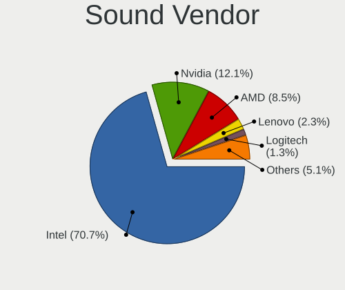

| Vendor                                       | Notebooks | Percent |
|----------------------------------------------|-----------|---------|
| Intel                                        | 484       | 70.66%  |
| Nvidia                                       | 83        | 12.12%  |
| AMD                                          | 58        | 8.47%   |
| Lenovo                                       | 16        | 2.34%   |
| Logitech                                     | 9         | 1.31%   |
| Realtek Semiconductor                        | 5         | 0.73%   |
| Hewlett-Packard                              | 4         | 0.58%   |
| Microsoft                                    | 3         | 0.44%   |
| GN Netcom                                    | 3         | 0.44%   |
| Plantronics                                  | 2         | 0.29%   |
| Dell                                         | 2         | 0.29%   |
| Zoran Co. Personal Media Division (Nogatech) | 1         | 0.15%   |
| XMOS                                         | 1         | 0.15%   |
| VIA Technologies                             | 1         | 0.15%   |
| Texas Instruments                            | 1         | 0.15%   |
| Sony                                         | 1         | 0.15%   |
| Sennheiser Communications                    | 1         | 0.15%   |
| Razer USA                                    | 1         | 0.15%   |
| PreSonus Audio Electronics                   | 1         | 0.15%   |
| HiBy                                         | 1         | 0.15%   |
| FIFINE Microphones                           | 1         | 0.15%   |
| DigiTech                                     | 1         | 0.15%   |
| Creative Technology                          | 1         | 0.15%   |
| C-Media Electronics                          | 1         | 0.15%   |
| Blue Microphones                             | 1         | 0.15%   |
| ASUSTek Computer                             | 1         | 0.15%   |
| Alesis                                       | 1         | 0.15%   |

Sound Model
-----------

Sound card models

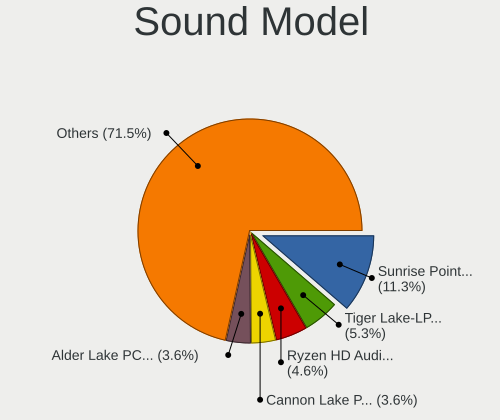

| Model                                                                      | Notebooks | Percent |
|----------------------------------------------------------------------------|-----------|---------|
| Intel Sunrise Point-LP HD Audio                                            | 88        | 11.34%  |
| Intel Tiger Lake-LP Smart Sound Technology Audio Controller                | 41        | 5.28%   |
| AMD Ryzen HD Audio Controller                                              | 36        | 4.64%   |
| Intel Cannon Lake PCH cAVS                                                 | 28        | 3.61%   |
| Intel Alder Lake PCH-P High Definition Audio Controller                    | 28        | 3.61%   |
| Intel Cannon Point-LP High Definition Audio Controller                     | 27        | 3.48%   |
| Intel 7 Series/C216 Chipset Family High Definition Audio Controller        | 27        | 3.48%   |
| AMD Radeon High Definition Audio Controller                                | 26        | 3.35%   |
| Intel 6 Series/C200 Series Chipset Family High Definition Audio Controller | 25        | 3.22%   |
| Intel Raptor Lake-P/U/H cAVS                                               | 23        | 2.96%   |
| Intel Comet Lake PCH-LP cAVS                                               | 20        | 2.58%   |
| Intel Wildcat Point-LP High Definition Audio Controller                    | 17        | 2.19%   |
| Intel Ice Lake-LP Smart Sound Technology Audio Controller                  | 17        | 2.19%   |
| Intel Haswell-ULT HD Audio Controller                                      | 17        | 2.19%   |
| Intel Broadwell-U Audio Controller                                         | 17        | 2.19%   |
| Intel 82801I (ICH9 Family) HD Audio Controller                             | 17        | 2.19%   |
| Intel 8 Series HD Audio Controller                                         | 17        | 2.19%   |
| Intel Comet Lake PCH cAVS                                                  | 16        | 2.06%   |
| Intel 5 Series/3400 Series Chipset High Definition Audio                   | 16        | 2.06%   |
| Intel 8 Series/C220 Series Chipset High Definition Audio Controller        | 14        | 1.8%    |
| Intel Xeon E3-1200 v3/4th Gen Core Processor HD Audio Controller           | 13        | 1.68%   |
| Intel 100 Series/C230 Series Chipset Family HD Audio Controller            | 12        | 1.55%   |
| AMD Renoir/Cezanne HDMI/DP Audio Controller                                | 12        | 1.55%   |
| Nvidia GP107GL High Definition Audio Controller                            | 11        | 1.42%   |
| Nvidia TU106 High Definition Audio Controller                              | 9         | 1.16%   |
| Nvidia GA104 High Definition Audio Controller                              | 9         | 1.16%   |
| Nvidia TU107 GeForce GTX 1650 High Definition Audio Controller             | 8         | 1.03%   |
| Intel Tiger Lake-H HD Audio Controller                                     | 8         | 1.03%   |
| AMD FCH Azalia Controller                                                  | 8         | 1.03%   |
| Lenovo ThinkPad Thunderbolt 3 Dock USB Audio                               | 7         | 0.9%    |
| Intel CM238 HD Audio Controller                                            | 7         | 0.9%    |
| Intel NM10/ICH7 Family High Definition Audio Controller                    | 6         | 0.77%   |
| Intel Meteor Lake-P HD Audio Controller                                    | 6         | 0.77%   |
| Intel 82801H (ICH8 Family) HD Audio Controller                             | 6         | 0.77%   |
| AMD Raven/Raven2/Fenghuang HDMI/DP Audio Controller                        | 6         | 0.77%   |
| Realtek Semiconductor USB Audio                                            | 5         | 0.64%   |
| Nvidia GM107 High Definition Audio Controller [GeForce 940MX]              | 5         | 0.64%   |
| Nvidia GP106 High Definition Audio Controller                              | 4         | 0.52%   |
| Nvidia GF108 High Definition Audio Controller                              | 4         | 0.52%   |
| Nvidia GA107 High Definition Audio Controller                              | 4         | 0.52%   |

Memory
------

Memory Vendor
-------------

Memory module vendors

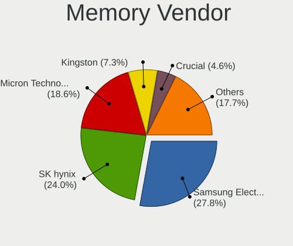

| Vendor              | Notebooks | Percent |
|---------------------|-----------|---------|
| Samsung Electronics | 115       | 27.85%  |
| SK hynix            | 99        | 23.97%  |
| Micron Technology   | 77        | 18.64%  |
| Kingston            | 30        | 7.26%   |
| Crucial             | 19        | 4.6%    |
| Unknown             | 17        | 4.12%   |
| Ramaxel Technology  | 11        | 2.66%   |
| Nanya Technology    | 9         | 2.18%   |
| A-DATA Technology   | 7         | 1.69%   |
| G.Skill             | 5         | 1.21%   |
| Elpida              | 5         | 1.21%   |
| Transcend           | 4         | 0.97%   |
| Unknown             | 4         | 0.97%   |
| Lexar Co Limited    | 3         | 0.73%   |
| V-Color             | 1         | 0.24%   |
| Team                | 1         | 0.24%   |
| Lexar               | 1         | 0.24%   |
| KingSpec            | 1         | 0.24%   |
| Corsair             | 1         | 0.24%   |
| Avant               | 1         | 0.24%   |
| ASint Technology    | 1         | 0.24%   |
| 48spaces            | 1         | 0.24%   |

Memory Model
------------

Memory module models

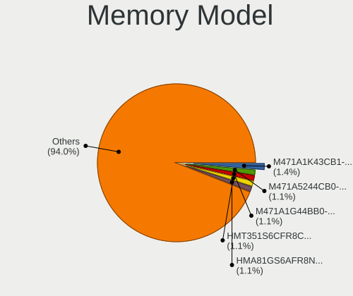

| Model                                                            | Notebooks | Percent |
|------------------------------------------------------------------|-----------|---------|
| Samsung RAM M471A1K43CB1-CTD 8GB SODIMM DDR4 3200MT/s            | 6         | 1.38%   |
| SK hynix RAM HMT351S6CFR8C-PB 4GB SODIMM DDR3 1600MT/s           | 5         | 1.15%   |
| SK hynix RAM HMA81GS6AFR8N-UH 8GB SODIMM DDR4 2667MT/s           | 5         | 1.15%   |
| Samsung RAM M471A5244CB0-CTD 4GB SODIMM DDR4 3266MT/s            | 5         | 1.15%   |
| Samsung RAM M471A1G44BB0-CWE 8GB SODIMM DDR4 3200MT/s            | 5         | 1.15%   |
| Micron RAM 4ATF51264HZ-2G6E1 4GB SODIMM DDR4 2667MT/s            | 5         | 1.15%   |
| Micron RAM 4ATF1G64HZ-3G2F1 8GB SODIMM DDR4 3200MT/s             | 5         | 1.15%   |
| Micron RAM 16ATF2G64HZ-3G2J1 16GB SODIMM DDR4 3200MT/s           | 5         | 1.15%   |
| SK hynix RAM HMA41GS6AFR8N-TF 8GB SODIMM DDR4 2667MT/s           | 4         | 0.92%   |
| SK hynix RAM H9JCNNNCP3MLYR-N6E 2GB Row Of Chips LPDDR5 6400MT/s | 4         | 0.92%   |
| Samsung RAM M471B5273DH0-CH9 4GB SODIMM DDR3 1600MT/s            | 4         | 0.92%   |
| Samsung RAM M471B5173DB0-YK0 4GB SODIMM DDR3 1600MT/s            | 4         | 0.92%   |
| Samsung RAM M471A5244CB0-CWE 4GB SODIMM DDR4 3200MT/s            | 4         | 0.92%   |
| Samsung RAM M471A2K43DB1-CWE 16GB SODIMM DDR4 3200MT/s           | 4         | 0.92%   |
| Samsung RAM M471A1K43DB1-CTD 8GB SODIMM DDR4 2667MT/s            | 4         | 0.92%   |
| Micron RAM MTC8C1084S1SC48BA1 16GB SODIMM DDR5 4800MT/s          | 4         | 0.92%   |
| Unknown                                                          | 4         | 0.92%   |
| SK hynix RAM HMT451S6BFR8A-PB 4GB SODIMM DDR3 1600MT/s           | 3         | 0.69%   |
| SK hynix RAM HMAG68EXNSA051N 8GB SODIMM DDR4 3200MT/s            | 3         | 0.69%   |
| SK hynix RAM HMAB2GS6AMR6N-XN 16GB SODIMM DDR4 3200MT/s          | 3         | 0.69%   |
| SK hynix RAM HMAA2GS6CJR8N-XN 16GB SODIMM DDR4 3200MT/s          | 3         | 0.69%   |
| SK hynix RAM HMA81GS6DJR8N-VK 8GB SODIMM DDR4 2667MT/s           | 3         | 0.69%   |
| Samsung RAM M471B5773DH0-CH9 2GB SODIMM DDR3 1600MT/s            | 3         | 0.69%   |
| Samsung RAM M471B5173EB0-YK0 4GB SODIMM DDR3 1600MT/s            | 3         | 0.69%   |
| Samsung RAM M471B1G73QH0-YK0 8GB SODIMM DDR3 1600MT/s            | 3         | 0.69%   |
| Samsung RAM M471A2K43DB1-CTD 16GB SODIMM DDR4 2667MT/s           | 3         | 0.69%   |
| Samsung RAM M425R2GA3BB0-CQKOD 16GB SODIMM DDR5 4800MT/s         | 3         | 0.69%   |
| Samsung RAM K4E6E304EB-EGCG 4GB Row Of Chips LPDDR3 2133MT/s     | 3         | 0.69%   |
| Micron RAM 8ATF2G64HZ-3G2B1 16GB SODIMM DDR4 3200MT/s            | 3         | 0.69%   |
| Micron RAM 4ATF1G64HZ-3G2E1 8GB SODIMM DDR4 3200MT/s             | 3         | 0.69%   |
| Lexar Co Limited RAM LD4AS032G-3200ST 32GB SODIMM DDR4 3200MT/s  | 3         | 0.69%   |
| Kingston RAM KF2666C16S4/32G 32GB SODIMM DDR4 2667MT/s           | 3         | 0.69%   |
| Unknown RAM Module 2048MB SODIMM DDR2                            | 2         | 0.46%   |
| Unknown RAM Module 1024MB SODIMM DDR2 667MT/s                    | 2         | 0.46%   |
| Unknown RAM Module 1024MB SODIMM DDR2                            | 2         | 0.46%   |
| Unknown RAM MEM-DOWN 8192MB SODIMM DDR4 2400MT/s                 | 2         | 0.46%   |
| SK hynix RAM HMT451S6AFR8A-PB 4GB SODIMM DDR3 1600MT/s           | 2         | 0.46%   |
| SK hynix RAM HMT41GS6AFR8A-PB 8GiB SODIMM DDR3 2667MT/s          | 2         | 0.46%   |
| SK hynix RAM HMT351S6EFR8A-PB 4GB SODIMM DDR3 1600MT/s           | 2         | 0.46%   |
| SK hynix RAM HMT351S6BFR8C-H9 4GB SODIMM 1334MT/s                | 2         | 0.46%   |

Memory Kind
-----------

Memory module kinds

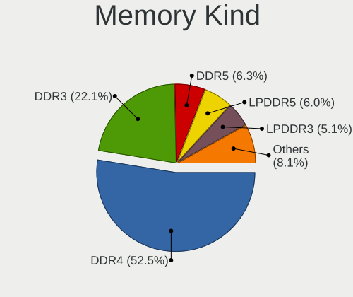

| Kind    | Notebooks | Percent |
|---------|-----------|---------|
| DDR4    | 176       | 52.54%  |
| DDR3    | 74        | 22.09%  |
| DDR5    | 21        | 6.27%   |
| LPDDR5  | 20        | 5.97%   |
| LPDDR3  | 17        | 5.07%   |
| DDR2    | 12        | 3.58%   |
| LPDDR4  | 5         | 1.49%   |
| DDR     | 4         | 1.19%   |
| Unknown | 4         | 1.19%   |
| SDRAM   | 2         | 0.6%    |

Memory Form Factor
------------------

Physical design of the memory module

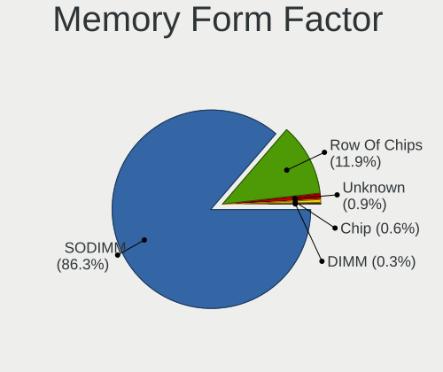

| Name         | Notebooks | Percent |
|--------------|-----------|---------|
| SODIMM       | 290       | 86.31%  |
| Row Of Chips | 40        | 11.9%   |
| Unknown      | 3         | 0.89%   |
| Chip         | 2         | 0.6%    |
| DIMM         | 1         | 0.3%    |

Memory Size
-----------

Memory module size

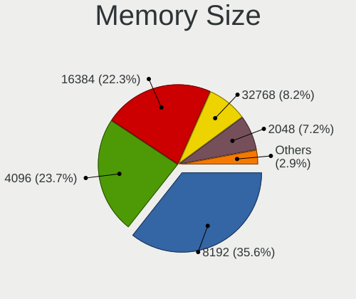

| Size  | Notebooks | Percent |
|-------|-----------|---------|
| 8192  | 134       | 35.64%  |
| 4096  | 89        | 23.67%  |
| 16384 | 84        | 22.34%  |
| 32768 | 31        | 8.24%   |
| 2048  | 27        | 7.18%   |
| 1024  | 11        | 2.93%   |

Memory Speed
------------

Memory module speed

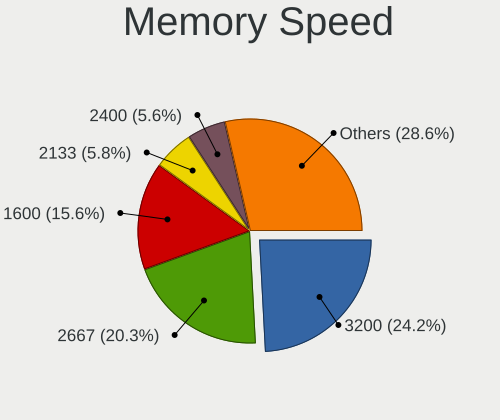

| Speed   | Notebooks | Percent |
|---------|-----------|---------|
| 3200    | 87        | 24.17%  |
| 2667    | 73        | 20.28%  |
| 1600    | 56        | 15.56%  |
| 2133    | 21        | 5.83%   |
| 2400    | 20        | 5.56%   |
| 6400    | 13        | 3.61%   |
| 4800    | 13        | 3.61%   |
| 1334    | 10        | 2.78%   |
| 667     | 9         | 2.5%    |
| 5600    | 8         | 2.22%   |
| 1067    | 7         | 1.94%   |
| 1867    | 6         | 1.67%   |
| 1333    | 6         | 1.67%   |
| 3266    | 5         | 1.39%   |
| 7500    | 4         | 1.11%   |
| 4267    | 4         | 1.11%   |
| 800     | 4         | 1.11%   |
| 8400    | 3         | 0.83%   |
| Unknown | 3         | 0.83%   |
| 7467    | 2         | 0.56%   |
| 4199    | 2         | 0.56%   |
| 533     | 2         | 0.56%   |
| 8533    | 1         | 0.28%   |
| 4266    | 1         | 0.28%   |

Printers & scanners
-------------------

Printer Vendor
--------------

Printer device vendors

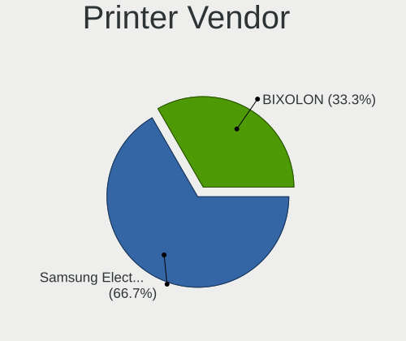

| Vendor              | Notebooks | Percent |
|---------------------|-----------|---------|
| Samsung Electronics | 2         | 66.67%  |
| BIXOLON             | 1         | 33.33%  |

Printer Model
-------------

Printer device models

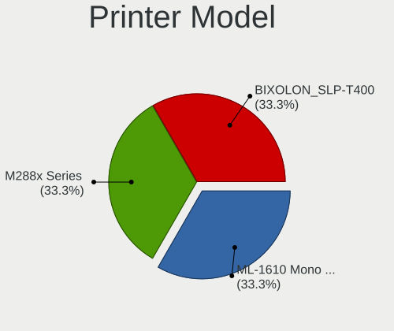

| Model                              | Notebooks | Percent |
|------------------------------------|-----------|---------|
| Samsung ML-1610 Mono Laser Printer | 1         | 33.33%  |
| Samsung M288x Series               | 1         | 33.33%  |
| BIXOLON BIXOLON_SLP-T400           | 1         | 33.33%  |

Scanner Vendor
--------------

Scanner device vendors

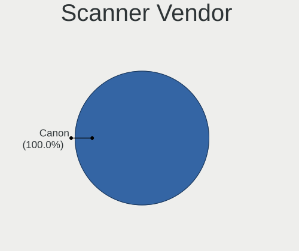

| Vendor | Notebooks | Percent |
|--------|-----------|---------|
| Canon  | 1         | 100%    |

Scanner Model
-------------

Scanner device models

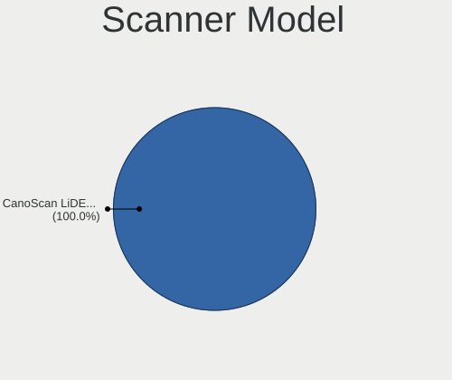

| Model                   | Notebooks | Percent |
|-------------------------|-----------|---------|
| Canon CanoScan LiDE 220 | 1         | 100%    |

Camera
------

Camera Vendor
-------------

Camera device vendors

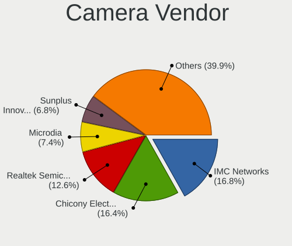

| Vendor                                 | Notebooks | Percent |
|----------------------------------------|-----------|---------|
| IMC Networks                           | 84        | 16.83%  |
| Chicony Electronics                    | 82        | 16.43%  |
| Realtek Semiconductor                  | 63        | 12.63%  |
| Microdia                               | 37        | 7.41%   |
| Sunplus Innovation Technology          | 34        | 6.81%   |
| Bison Electronics                      | 32        | 6.41%   |
| Luxvisions Innotech Limited            | 25        | 5.01%   |
| Cheng Uei Precision Industry (Foxlink) | 16        | 3.21%   |
| Lite-On Technology                     | 13        | 2.61%   |
| Quanta                                 | 12        | 2.4%    |
| Logitech                               | 12        | 2.4%    |
| Syntek                                 | 11        | 2.2%    |
| Suyin                                  | 9         | 1.8%    |
| Apple                                  | 9         | 1.8%    |
| Sonix Technology                       | 8         | 1.6%    |
| Silicon Motion                         | 7         | 1.4%    |
| ShineTech                              | 5         | 1%      |
| Microsoft                              | 5         | 1%      |
| Acer                                   | 4         | 0.8%    |
| Samsung Electronics                    | 3         | 0.6%    |
| Lenovo                                 | 3         | 0.6%    |
| Alcor Micro                            | 3         | 0.6%    |
| Ricoh                                  | 2         | 0.4%    |
| icSpring                               | 2         | 0.4%    |
| Cubeternet                             | 2         | 0.4%    |
| ALi                                    | 2         | 0.4%    |
| Z-Star Microelectronics                | 1         | 0.2%    |
| YGTek                                  | 1         | 0.2%    |
| Tripath Technology                     | 1         | 0.2%    |
| Tobii Technology AB                    | 1         | 0.2%    |
| SunplusIT                              | 1         | 0.2%    |
| Shine-optics                           | 1         | 0.2%    |
| Primax Electronics                     | 1         | 0.2%    |
| OmniVision Technologies                | 1         | 0.2%    |
| Jieli Technology                       | 1         | 0.2%    |
| Generalplus Technology                 | 1         | 0.2%    |
| GEMBIRD                                | 1         | 0.2%    |
| eMPIA Technology                       | 1         | 0.2%    |
| BillionPixels                          | 1         | 0.2%    |
| Unknown                                | 1         | 0.2%    |

Camera Model
------------

Camera device models

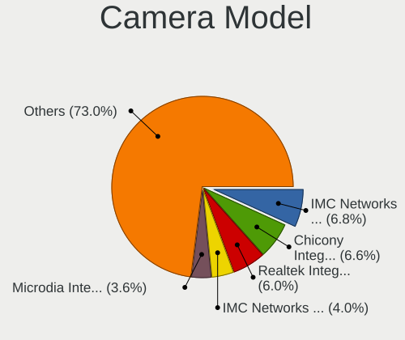

| Model                                                | Notebooks | Percent |
|------------------------------------------------------|-----------|---------|
| IMC Networks USB2.0 HD UVC WebCam                    | 34        | 6.8%    |
| Chicony Integrated Camera                            | 33        | 6.6%    |
| Realtek Integrated_Webcam_HD                         | 30        | 6%      |
| IMC Networks Integrated Camera                       | 20        | 4%      |
| Microdia Integrated_Webcam_HD                        | 18        | 3.6%    |
| IMC Networks USB2.0 VGA UVC WebCam                   | 13        | 2.6%    |
| Luxvisions Innotech Limited Integrated Camera        | 12        | 2.4%    |
| Bison Integrated Camera                              | 10        | 2%      |
| Syntek Integrated Camera                             | 8         | 1.6%    |
| Sunplus Integrated Camera                            | 7         | 1.4%    |
| Chicony Lenovo EasyCamera                            | 7         | 1.4%    |
| Bison Lenovo EasyCamera                              | 7         | 1.4%    |
| Sunplus Integrated_Webcam_HD                         | 6         | 1.2%    |
| Chicony HP HD Camera                                 | 6         | 1.2%    |
| Lite-On HP HD Camera                                 | 5         | 1%      |
| Chicony HP TrueVision HD Camera                      | 5         | 1%      |
| Apple iPhone 5/5C/5S/6/SE/7/8/X                      | 5         | 1%      |
| Sonix USB2.0 HD UVC WebCam                           | 4         | 0.8%    |
| Sonix USB2.0 FHD UVC WebCam                          | 4         | 0.8%    |
| Realtek Lenovo EasyCamera                            | 4         | 0.8%    |
| Realtek Integrated_Webcam_FHD                        | 4         | 0.8%    |
| Realtek Integrated Webcam HD                         | 4         | 0.8%    |
| Luxvisions Innotech Limited HP TrueVision HD Camera  | 4         | 0.8%    |
| Lite-On Integrated Camera                            | 4         | 0.8%    |
| IMC Networks USB2.0 HD IR UVC WebCam                 | 4         | 0.8%    |
| Chicony Integrated Camera (1280x720@30)              | 4         | 0.8%    |
| Bison SunplusIT Integrated Camera                    | 4         | 0.8%    |
| Sunplus Integrated_Webcam_FHD                        | 3         | 0.6%    |
| ShineTech USB2.0 HD UVC WebCam                       | 3         | 0.6%    |
| Samsung Galaxy series, misc. (MTP mode)              | 3         | 0.6%    |
| Realtek USB Camera                                   | 3         | 0.6%    |
| Microdia Integrated Webcam                           | 3         | 0.6%    |
| Luxvisions Innotech Limited Integrated RGB Camera    | 3         | 0.6%    |
| Logitech HD Pro Webcam C920                          | 3         | 0.6%    |
| IMC Networks USB2.0 UVC HD Webcam                    | 3         | 0.6%    |
| Chicony EasyCamera                                   | 3         | 0.6%    |
| Cheng Uei Precision Industry (Foxlink) HP Webcam-101 | 3         | 0.6%    |
| Syntek Lenovo EasyCamera                             | 2         | 0.4%    |
| Suyin Integrated_Webcam_HD                           | 2         | 0.4%    |
| Suyin Asus Integrated Webcam [CN031B]                | 2         | 0.4%    |

Security
--------

Fingerprint Vendor
------------------

Fingerprint sensor vendors

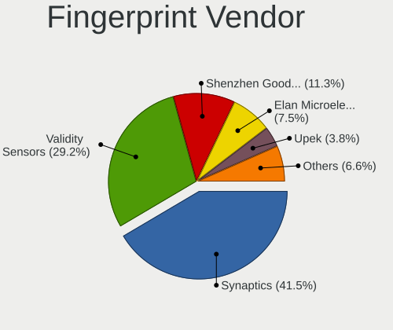

| Vendor                             | Notebooks | Percent |
|------------------------------------|-----------|---------|
| Synaptics                          | 44        | 41.51%  |
| Validity Sensors                   | 31        | 29.25%  |
| Shenzhen Goodix Technology         | 12        | 11.32%  |
| Elan Microelectronics              | 8         | 7.55%   |
| Upek                               | 4         | 3.77%   |
| AuthenTec                          | 3         | 2.83%   |
| STMicroelectronics                 | 2         | 1.89%   |
| Realtek USB2.0 Finger Print Bridge | 1         | 0.94%   |
| LighTuning Technology              | 1         | 0.94%   |

Fingerprint Model
-----------------

Fingerprint sensor models

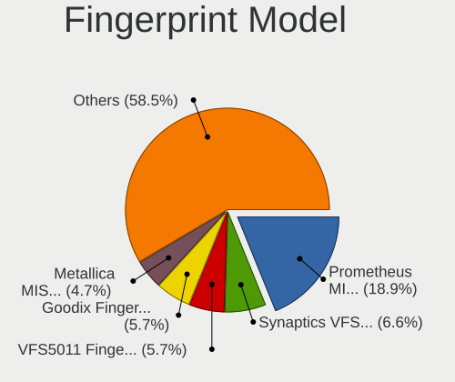

| Model                                                                      | Notebooks | Percent |
|----------------------------------------------------------------------------|-----------|---------|
| Synaptics Prometheus MIS Touch Fingerprint Reader                          | 20        | 18.87%  |
| Validity Sensors Synaptics VFS7552 Touch Fingerprint Sensor with PurePrint | 7         | 6.6%    |
| Validity Sensors VFS5011 Fingerprint Reader                                | 6         | 5.66%   |
| Shenzhen Goodix  FingerPrint Device                                        | 6         | 5.66%   |
| Synaptics Metallica MIS Touch Fingerprint Reader                           | 5         | 4.72%   |
| Shenzhen Goodix Fingerprint Reader                                         | 5         | 4.72%   |
| Elan ELAN:Fingerprint                                                      | 5         | 4.72%   |
| Validity Sensors VFS495 Fingerprint Reader                                 | 4         | 3.77%   |
| Validity Sensors VFS 5011 fingerprint sensor                               | 4         | 3.77%   |
| Upek Biometric Touchchip/Touchstrip Fingerprint Sensor                     | 4         | 3.77%   |
| Validity Sensors VFS Fingerprint sensor                                    | 3         | 2.83%   |
| Validity Sensors Synaptics WBDI                                            | 3         | 2.83%   |
| Synaptics UWP WBDI Device                                                  | 3         | 2.83%   |
| Synaptics  WBDI                                                            | 3         | 2.83%   |
| Synaptics FS7604 Touch Fingerprint Sensor with PurePrint                   | 3         | 2.83%   |
| Synaptics Fingerprint reader [HP G6]                                       | 3         | 2.83%   |
| Elan ELAN:ARM-M4                                                           | 3         | 2.83%   |
| Validity Sensors VFS7500 Touch Fingerprint Sensor                          | 2         | 1.89%   |
| Synaptics Metallica MOH Touch Fingerprint Reader                           | 2         | 1.89%   |
| STMicroelectronics Fingerprint Reader                                      | 2         | 1.89%   |
| Validity Sensors VFS491                                                    | 1         | 0.94%   |
| Validity Sensors VFS471 Fingerprint Reader                                 | 1         | 0.94%   |
| Synaptics WBDI                                                             | 1         | 0.94%   |
| Synaptics UWP WBDI                                                         | 1         | 0.94%   |
| Synaptics  WBDI Fingerprint Reader - USB 052                               | 1         | 0.94%   |
| Synaptics  FS7604 Touch Fingerprint Sensor with PurePrint                  | 1         | 0.94%   |
| Synaptics Prometheus Fingerprint Reader                                    | 1         | 0.94%   |
| Shenzhen Goodix FingerPrint                                                | 1         | 0.94%   |
| Realtek USB2.0 Finger Print Bridge FocalTech Fingerprint Device            | 1         | 0.94%   |
| LighTuning EgisTec Touch Fingerprint Sensor                                | 1         | 0.94%   |
| AuthenTec Fingerprint Sensor                                               | 1         | 0.94%   |
| AuthenTec AES2810                                                          | 1         | 0.94%   |
| AuthenTec AES2501 Fingerprint Sensor                                       | 1         | 0.94%   |

Chipcard Vendor
---------------

Chipcard module vendors

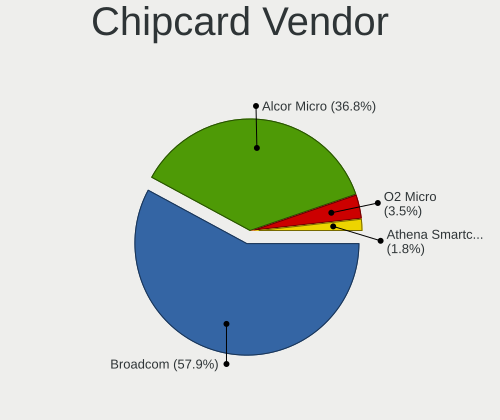

| Vendor                     | Notebooks | Percent |
|----------------------------|-----------|---------|
| Broadcom                   | 33        | 57.89%  |
| Alcor Micro                | 21        | 36.84%  |
| O2 Micro                   | 2         | 3.51%   |
| Athena Smartcard Solutions | 1         | 1.75%   |

Chipcard Model
--------------

Chipcard module models

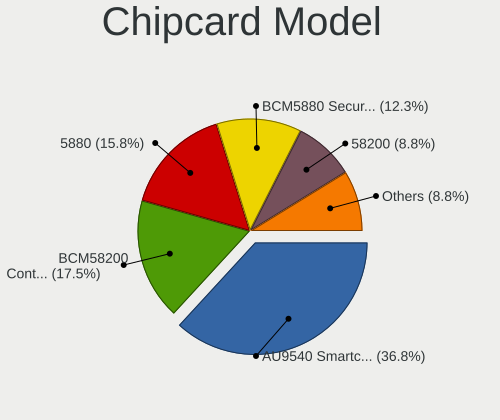

| Model                                                                        | Notebooks | Percent |
|------------------------------------------------------------------------------|-----------|---------|
| Alcor Micro AU9540 Smartcard Reader                                          | 21        | 36.84%  |
| Broadcom BCM58200 ControlVault 3 (FingerPrint sensor + Contacted SmartCard)  | 10        | 17.54%  |
| Broadcom 5880                                                                | 9         | 15.79%  |
| Broadcom BCM5880 Secure Applications Processor with fingerprint swipe sensor | 7         | 12.28%  |
| Broadcom 58200                                                               | 5         | 8.77%   |
| O2 Micro OZ776 CCID Smartcard Reader                                         | 2         | 3.51%   |
| Broadcom BCM5880 Secure Applications Processor                               | 2         | 3.51%   |
| Athena Smartcard Solutions ASEDrive V3C                                      | 1         | 1.75%   |

Unsupported
-----------

Unsupported Devices
-------------------

Total unsupported devices on board

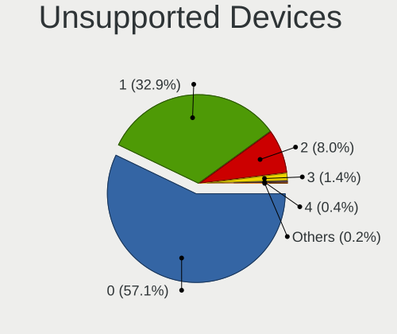

| Total | Notebooks | Percent |
|-------|-----------|---------|
| 0     | 321       | 57.12%  |
| 1     | 185       | 32.92%  |
| 2     | 45        | 8.01%   |
| 3     | 8         | 1.42%   |
| 4     | 2         | 0.36%   |
| 7     | 1         | 0.18%   |

Unsupported Device Types
------------------------

Types of unsupported devices

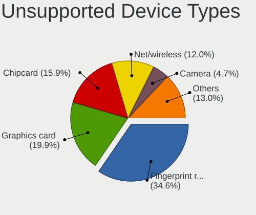

| Type                     | Notebooks | Percent |
|--------------------------|-----------|---------|
| Fingerprint reader       | 104       | 34.55%  |
| Graphics card            | 60        | 19.93%  |
| Chipcard                 | 48        | 15.95%  |
| Net/wireless             | 36        | 11.96%  |
| Camera                   | 14        | 4.65%   |
| Multimedia controller    | 12        | 3.99%   |
| Communication controller | 5         | 1.66%   |
| Card reader              | 5         | 1.66%   |
| Bluetooth                | 5         | 1.66%   |
| Net/ethernet             | 4         | 1.33%   |
| Unassigned class         | 2         | 0.66%   |
| Storage                  | 2         | 0.66%   |
| Sound                    | 2         | 0.66%   |
| Network                  | 2         | 0.66%   |

