Linux in Israel - Tested Hardware & Statistics (Notebooks)
----------------------------------------------------------

A project to collect tested hardware configurations for Linux in Israel.

Anyone can contribute to this report by the [hw-probe](https://github.com/linuxhw/hw-probe) tool:

    sudo -E hw-probe -all -upload

Please contribute! Especially if your hardware is rare.

Contents
--------

* [ Test Cases ](#test-cases)

* [ System ](#system)
  - [ OS                       ](#os)
  - [ OS Family                ](#os-family)
  - [ Kernel                   ](#kernel)
  - [ Kernel Family            ](#kernel-family)
  - [ Kernel Major Ver.        ](#kernel-major-ver)
  - [ Arch                     ](#arch)
  - [ DE                       ](#de)
  - [ Display Server           ](#display-server)
  - [ Display Manager          ](#display-manager)
  - [ OS Lang                  ](#os-lang)
  - [ Boot Mode                ](#boot-mode)
  - [ Filesystem               ](#filesystem)
  - [ Part. scheme             ](#part-scheme)
  - [ Dual Boot with Linux/BSD ](#dual-boot-with-linuxbsd)
  - [ Dual Boot (Win)          ](#dual-boot-win)

* [ Board ](#board)
  - [ Vendor                   ](#vendor)
  - [ Model                    ](#model)
  - [ Model Family             ](#model-family)
  - [ MFG Year                 ](#mfg-year)
  - [ Form Factor              ](#form-factor)
  - [ Secure Boot              ](#secure-boot)
  - [ Coreboot                 ](#coreboot)
  - [ RAM Size                 ](#ram-size)
  - [ RAM Used                 ](#ram-used)
  - [ Total Drives             ](#total-drives)
  - [ Has CD-ROM               ](#has-cd-rom)
  - [ Has Ethernet             ](#has-ethernet)
  - [ Has WiFi                 ](#has-wifi)
  - [ Has Bluetooth            ](#has-bluetooth)

* [ Location ](#location)
  - [ Country                  ](#country)
  - [ City                     ](#city)

* [ Drives ](#drives)
  - [ Drive Vendor             ](#drive-vendor)
  - [ Drive Model              ](#drive-model)
  - [ HDD Vendor               ](#hdd-vendor)
  - [ SSD Vendor               ](#ssd-vendor)
  - [ Drive Kind               ](#drive-kind)
  - [ Drive Connector          ](#drive-connector)
  - [ Drive Size               ](#drive-size)
  - [ Space Total              ](#space-total)
  - [ Space Used               ](#space-used)
  - [ Malfunc. Drives          ](#malfunc-drives)
  - [ Malfunc. Drive Vendor    ](#malfunc-drive-vendor)
  - [ Malfunc. HDD Vendor      ](#malfunc-hdd-vendor)
  - [ Malfunc. Drive Kind      ](#malfunc-drive-kind)
  - [ Failed Drives            ](#failed-drives)
  - [ Failed Drive Vendor      ](#failed-drive-vendor)
  - [ Drive Status             ](#drive-status)

* [ Storage controller ](#storage-controller)
  - [ Storage Vendor           ](#storage-vendor)
  - [ Storage Model            ](#storage-model)
  - [ Storage Kind             ](#storage-kind)

* [ Processor ](#processor)
  - [ CPU Vendor               ](#cpu-vendor)
  - [ CPU Model                ](#cpu-model)
  - [ CPU Model Family         ](#cpu-model-family)
  - [ CPU Cores                ](#cpu-cores)
  - [ CPU Sockets              ](#cpu-sockets)
  - [ CPU Threads              ](#cpu-threads)
  - [ CPU Op-Modes             ](#cpu-op-modes)
  - [ CPU Microcode            ](#cpu-microcode)
  - [ CPU Microarch            ](#cpu-microarch)

* [ Graphics ](#graphics)
  - [ GPU Vendor               ](#gpu-vendor)
  - [ GPU Model                ](#gpu-model)
  - [ GPU Combo                ](#gpu-combo)
  - [ GPU Driver               ](#gpu-driver)
  - [ GPU Memory               ](#gpu-memory)

* [ Monitor ](#monitor)
  - [ Monitor Vendor           ](#monitor-vendor)
  - [ Monitor Model            ](#monitor-model)
  - [ Monitor Resolution       ](#monitor-resolution)
  - [ Monitor Diagonal         ](#monitor-diagonal)
  - [ Monitor Width            ](#monitor-width)
  - [ Aspect Ratio             ](#aspect-ratio)
  - [ Monitor Area             ](#monitor-area)
  - [ Pixel Density            ](#pixel-density)
  - [ Multiple Monitors        ](#multiple-monitors)

* [ Network ](#network)
  - [ Net Controller Vendor    ](#net-controller-vendor)
  - [ Net Controller Model     ](#net-controller-model)
  - [ Wireless Vendor          ](#wireless-vendor)
  - [ Wireless Model           ](#wireless-model)
  - [ Ethernet Vendor          ](#ethernet-vendor)
  - [ Ethernet Model           ](#ethernet-model)
  - [ Net Controller Kind      ](#net-controller-kind)
  - [ Used Controller          ](#used-controller)
  - [ NICs                     ](#nics)
  - [ IPv6                     ](#ipv6)

* [ Bluetooth ](#bluetooth)
  - [ Bluetooth Vendor         ](#bluetooth-vendor)
  - [ Bluetooth Model          ](#bluetooth-model)

* [ Sound ](#sound)
  - [ Sound Vendor             ](#sound-vendor)
  - [ Sound Model              ](#sound-model)

* [ Memory ](#memory)
  - [ Memory Vendor            ](#memory-vendor)
  - [ Memory Model             ](#memory-model)
  - [ Memory Kind              ](#memory-kind)
  - [ Memory Form Factor       ](#memory-form-factor)
  - [ Memory Size              ](#memory-size)
  - [ Memory Speed             ](#memory-speed)

* [ Printers & scanners ](#printers--scanners)
  - [ Printer Vendor           ](#printer-vendor)
  - [ Printer Model            ](#printer-model)
  - [ Scanner Vendor           ](#scanner-vendor)
  - [ Scanner Model            ](#scanner-model)

* [ Camera ](#camera)
  - [ Camera Vendor            ](#camera-vendor)
  - [ Camera Model             ](#camera-model)

* [ Security ](#security)
  - [ Fingerprint Vendor       ](#fingerprint-vendor)
  - [ Fingerprint Model        ](#fingerprint-model)
  - [ Chipcard Vendor          ](#chipcard-vendor)
  - [ Chipcard Model           ](#chipcard-model)

* [ Unsupported ](#unsupported)
  - [ Unsupported Devices      ](#unsupported-devices)
  - [ Unsupported Device Types ](#unsupported-device-types)

Test Cases
----------

Total: 485

| Vendor        | Model                       | Probe                                                      | Date         |
|---------------|-----------------------------|------------------------------------------------------------|--------------|
| Dell          | Latitude 7440               | [f63ada6c61](https://linux-hardware.org/?probe=f63ada6c61) | Jun 10, 2023 |
| Lenovo        | ThinkPad P53 20QN0011IV     | [9e3dfb25be](https://linux-hardware.org/?probe=9e3dfb25be) | Jun 09, 2023 |
| Lenovo        | ThinkPad P51 20HH0011US     | [4766608bc1](https://linux-hardware.org/?probe=4766608bc1) | Jun 06, 2023 |
| Lenovo        | ThinkPad P53 20QN0011IV     | [bb29d15c61](https://linux-hardware.org/?probe=bb29d15c61) | Jun 05, 2023 |
| Acer          | Aspire A115-31              | [338f025bce](https://linux-hardware.org/?probe=338f025bce) | Jun 03, 2023 |
| HP            | 250 15.6 inch G9 Noteboo... | [9b93292db9](https://linux-hardware.org/?probe=9b93292db9) | May 26, 2023 |
| ASUSTek       | VivoBook_ASUSLaptop X140... | [9cba800830](https://linux-hardware.org/?probe=9cba800830) | May 26, 2023 |
| Dell          | Vostro 5402                 | [00e3bf6a3e](https://linux-hardware.org/?probe=00e3bf6a3e) | May 17, 2023 |
| Dell          | Latitude 5401               | [4304efbed6](https://linux-hardware.org/?probe=4304efbed6) | May 15, 2023 |
| Valve         | Jupiter                     | [0b26ce1a71](https://linux-hardware.org/?probe=0b26ce1a71) | May 12, 2023 |
| Dell          | Latitude E5530 non-vPro     | [c821704a04](https://linux-hardware.org/?probe=c821704a04) | May 10, 2023 |
| Apple         | MacBookPro11,3              | [9bd04974e8](https://linux-hardware.org/?probe=9bd04974e8) | May 09, 2023 |
| Razer         | Blade                       | [d90bda8f52](https://linux-hardware.org/?probe=d90bda8f52) | May 07, 2023 |
| Lenovo        | Yoga 3 Pro-1370 80HE        | [b577b4aa25](https://linux-hardware.org/?probe=b577b4aa25) | May 06, 2023 |
| Apple         | MacBook10,1                 | [b951048d8f](https://linux-hardware.org/?probe=b951048d8f) | May 05, 2023 |
| Apple         | MacBook10,1                 | [6796aa4cf0](https://linux-hardware.org/?probe=6796aa4cf0) | May 05, 2023 |
| Acer          | Aspire one                  | [90d59ac61a](https://linux-hardware.org/?probe=90d59ac61a) | May 04, 2023 |
| Acer          | Aspire one                  | [aeabc8c63c](https://linux-hardware.org/?probe=aeabc8c63c) | May 03, 2023 |
| ASUSTek       | VivoBook_ASUSLaptop X403... | [18de5959b7](https://linux-hardware.org/?probe=18de5959b7) | May 01, 2023 |
| Lenovo        | ThinkPad P53 20QN0011IV     | [d8af950fd8](https://linux-hardware.org/?probe=d8af950fd8) | Apr 28, 2023 |
| Lenovo        | ThinkPad P53 20QN0011IV     | [854cf327d8](https://linux-hardware.org/?probe=854cf327d8) | Apr 27, 2023 |
| Lenovo        | ThinkPad P53 20QN0011IV     | [d805c85a12](https://linux-hardware.org/?probe=d805c85a12) | Apr 24, 2023 |
| Lenovo        | ThinkPad T410 2522WZN       | [0baff3522f](https://linux-hardware.org/?probe=0baff3522f) | Apr 15, 2023 |
| Valve         | Jupiter                     | [56768ba5a6](https://linux-hardware.org/?probe=56768ba5a6) | Apr 15, 2023 |
| ASUSTek       | VivoBook_ASUSLaptop X432... | [5a17f65715](https://linux-hardware.org/?probe=5a17f65715) | Apr 14, 2023 |
| Dell          | Latitude 5491               | [ef97e6890a](https://linux-hardware.org/?probe=ef97e6890a) | Apr 13, 2023 |
| Acer          | Aspire 5755G                | [917791ff47](https://linux-hardware.org/?probe=917791ff47) | Apr 12, 2023 |
| HP            | ZBook Firefly 14 inch G9... | [e9790ea3b6](https://linux-hardware.org/?probe=e9790ea3b6) | Apr 11, 2023 |
| Lenovo        | ThinkPad E15 Gen 2 20TD0... | [fc28f6d3f0](https://linux-hardware.org/?probe=fc28f6d3f0) | Apr 08, 2023 |
| HP            | ZBook 15 G5                 | [1927fa08d1](https://linux-hardware.org/?probe=1927fa08d1) | Apr 07, 2023 |
| Acer          | Aspire 5820                 | [3e0e45bc17](https://linux-hardware.org/?probe=3e0e45bc17) | Mar 26, 2023 |
| Lenovo        | ThinkPad P15 Gen 1 20SUS... | [5667e8416e](https://linux-hardware.org/?probe=5667e8416e) | Mar 16, 2023 |
| Lenovo        | ThinkPad P16 Gen 1 21D60... | [2c2920d462](https://linux-hardware.org/?probe=2c2920d462) | Mar 14, 2023 |
| Lenovo        | ThinkPad P14s Gen 2i 20V... | [fd6d58db15](https://linux-hardware.org/?probe=fd6d58db15) | Mar 12, 2023 |
| Lenovo        | ThinkPad P15 Gen 2i 20YQ... | [28769bd85b](https://linux-hardware.org/?probe=28769bd85b) | Mar 12, 2023 |
| Gigabyte      | AORUS 17G XC                | [fb998b9957](https://linux-hardware.org/?probe=fb998b9957) | Mar 12, 2023 |
| Acer          | Aspire A715-72G             | [32b2d1b194](https://linux-hardware.org/?probe=32b2d1b194) | Mar 11, 2023 |
| Lenovo        | ThinkPad P15 Gen 2i 20YQ... | [ac772ea51f](https://linux-hardware.org/?probe=ac772ea51f) | Mar 08, 2023 |
| Lenovo        | ThinkPad P53 20QN0011IV     | [4e05d0a0e9](https://linux-hardware.org/?probe=4e05d0a0e9) | Mar 06, 2023 |
| Lenovo        | ThinkPad P15 Gen 1 20ST0... | [aa0e36b22e](https://linux-hardware.org/?probe=aa0e36b22e) | Mar 02, 2023 |
| Lenovo        | ThinkPad P53 20QN0011IV     | [3db8300147](https://linux-hardware.org/?probe=3db8300147) | Mar 01, 2023 |
| Timi          | RedmiBook 16                | [2d713931d2](https://linux-hardware.org/?probe=2d713931d2) | Feb 28, 2023 |
| Lenovo        | ThinkPad P15 Gen 1 20SUS... | [dd5ce2c6db](https://linux-hardware.org/?probe=dd5ce2c6db) | Feb 27, 2023 |
| HP            | Pavilion TS 14              | [37296c42c3](https://linux-hardware.org/?probe=37296c42c3) | Feb 27, 2023 |
| Lenovo        | ThinkPad P15 Gen 1 20SUS... | [d3b6621252](https://linux-hardware.org/?probe=d3b6621252) | Feb 26, 2023 |
| ASUSTek       | ASUS TUF Dash F15 FX517Z... | [323b6463a9](https://linux-hardware.org/?probe=323b6463a9) | Feb 24, 2023 |
| Lenovo        | ThinkPad P15 Gen 1 20SUS... | [4b0436b55d](https://linux-hardware.org/?probe=4b0436b55d) | Feb 23, 2023 |
| Lenovo        | ThinkPad P15 Gen 1 20SUS... | [a4c4313238](https://linux-hardware.org/?probe=a4c4313238) | Feb 23, 2023 |
| Lenovo        | ThinkPad P15 Gen 2i 20YQ... | [a459216464](https://linux-hardware.org/?probe=a459216464) | Feb 21, 2023 |
| Alienware     | 15 R2                       | [96aa09ae59](https://linux-hardware.org/?probe=96aa09ae59) | Feb 21, 2023 |
| Lenovo        | ThinkPad P53 20QN0011IV     | [d1f67d5e08](https://linux-hardware.org/?probe=d1f67d5e08) | Feb 21, 2023 |
| Lenovo        | IdeaPad S12 20021,2959      | [4a9dcac308](https://linux-hardware.org/?probe=4a9dcac308) | Feb 19, 2023 |
| Lenovo        | IdeaPad S12 20021,2959      | [d808827823](https://linux-hardware.org/?probe=d808827823) | Feb 19, 2023 |
| HP            | Laptop 15-ef2xxx            | [6f8fadfe19](https://linux-hardware.org/?probe=6f8fadfe19) | Feb 15, 2023 |
| Lenovo        | ThinkPad P53 20QN0011IV     | [390686f5f6](https://linux-hardware.org/?probe=390686f5f6) | Feb 14, 2023 |
| HP            | ZBook Firefly 14 inch G9... | [26ea96167c](https://linux-hardware.org/?probe=26ea96167c) | Feb 12, 2023 |
| Dell          | Vostro 3558                 | [bb53ff2532](https://linux-hardware.org/?probe=bb53ff2532) | Feb 12, 2023 |
| Lenovo        | ThinkPad P16s Gen 1 21CK... | [a1133b56be](https://linux-hardware.org/?probe=a1133b56be) | Feb 11, 2023 |
| HP            | ZBook Firefly 14 inch G9... | [ab928273ba](https://linux-hardware.org/?probe=ab928273ba) | Feb 11, 2023 |
| HP            | ZBook Firefly 14 inch G9... | [5995e0b36b](https://linux-hardware.org/?probe=5995e0b36b) | Feb 11, 2023 |
| Heptagon S... | HQ-BOX2 Server              | [476197a287](https://linux-hardware.org/?probe=476197a287) | Feb 09, 2023 |
| Lenovo        | V14-IIL 82C4                | [d33be0bc3f](https://linux-hardware.org/?probe=d33be0bc3f) | Feb 05, 2023 |
| ASUSTek       | X556UV                      | [ae90dba4ca](https://linux-hardware.org/?probe=ae90dba4ca) | Feb 04, 2023 |
| HUAWEI        | HN-WX9X                     | [4b8ddf5d09](https://linux-hardware.org/?probe=4b8ddf5d09) | Jan 31, 2023 |
| Fujitsu       | LIFEBOOK U554               | [22bf4111de](https://linux-hardware.org/?probe=22bf4111de) | Jan 23, 2023 |
| Acer          | TravelMate P257-M           | [1345fa56c4](https://linux-hardware.org/?probe=1345fa56c4) | Jan 22, 2023 |
| Lenovo        | ThinkPad P53 20QN0011IV     | [61c432b134](https://linux-hardware.org/?probe=61c432b134) | Jan 13, 2023 |
| Dell          | Vostro 14 5401              | [b56e81d82d](https://linux-hardware.org/?probe=b56e81d82d) | Jan 11, 2023 |
| HP            | ZBook Fury 15.6 inch G8 ... | [3965f2f9f4](https://linux-hardware.org/?probe=3965f2f9f4) | Jan 11, 2023 |
| Dell          | XPS 15 9550                 | [abe344877a](https://linux-hardware.org/?probe=abe344877a) | Jan 09, 2023 |
| Dell          | XPS 15 9550                 | [6a5da8e502](https://linux-hardware.org/?probe=6a5da8e502) | Jan 08, 2023 |
| Apple         | MacBookPro10,1              | [874b25fc88](https://linux-hardware.org/?probe=874b25fc88) | Jan 06, 2023 |
| Lenovo        | IdeaPad 130-15IKB 81H7      | [9776545fc4](https://linux-hardware.org/?probe=9776545fc4) | Jan 06, 2023 |
| Apple         | MacBookPro8,1               | [4641833cab](https://linux-hardware.org/?probe=4641833cab) | Jan 06, 2023 |
| Lenovo        | IdeaPad 330S-14IKB 81F4     | [43f6676d9d](https://linux-hardware.org/?probe=43f6676d9d) | Jan 06, 2023 |
| Lenovo        | V14-IIL 82C4                | [9b828358df](https://linux-hardware.org/?probe=9b828358df) | Jan 05, 2023 |
| Lenovo        | V14-IIL 82C4                | [7cf92f3f43](https://linux-hardware.org/?probe=7cf92f3f43) | Jan 05, 2023 |
| GPD           | G1621-02                    | [10a7e912f8](https://linux-hardware.org/?probe=10a7e912f8) | Dec 25, 2022 |
| Dell          | Vostro 15 5510              | [10f4ac5e13](https://linux-hardware.org/?probe=10f4ac5e13) | Dec 24, 2022 |
| Dell          | XPS 15 9520                 | [b9b1f8140b](https://linux-hardware.org/?probe=b9b1f8140b) | Dec 18, 2022 |
| MSI           | Summit E16FlipEvo A12MT     | [426289da4e](https://linux-hardware.org/?probe=426289da4e) | Dec 11, 2022 |
| Dell          | Latitude E6420              | [011df4cb7f](https://linux-hardware.org/?probe=011df4cb7f) | Dec 02, 2022 |
| Lenovo        | ThinkPad T580 20L9001YIV    | [dc13dde66a](https://linux-hardware.org/?probe=dc13dde66a) | Nov 29, 2022 |
| Lenovo        | ThinkPad P15 Gen 2i 20YQ... | [ade5f58f0e](https://linux-hardware.org/?probe=ade5f58f0e) | Nov 20, 2022 |
| Lenovo        | ThinkPad P53 20QN0011IV     | [58c63522a4](https://linux-hardware.org/?probe=58c63522a4) | Nov 20, 2022 |
| Dell          | Inspiron 1545               | [dc9ddea189](https://linux-hardware.org/?probe=dc9ddea189) | Nov 17, 2022 |
| Dell          | Inspiron 1545               | [8b63918780](https://linux-hardware.org/?probe=8b63918780) | Nov 16, 2022 |
| Dell          | Vostro 3300                 | [ae100dd7e2](https://linux-hardware.org/?probe=ae100dd7e2) | Nov 16, 2022 |
| Lenovo        | IdeaPad 5 14ITL05 82FE      | [75c1d24fcd](https://linux-hardware.org/?probe=75c1d24fcd) | Nov 13, 2022 |
| Lenovo        | IdeaPad 5 14ITL05 82FE      | [189dd51cc3](https://linux-hardware.org/?probe=189dd51cc3) | Nov 13, 2022 |
| ASUSTek       | UX430UNR                    | [f04bf95806](https://linux-hardware.org/?probe=f04bf95806) | Nov 08, 2022 |
| Lenovo        | ThinkPad T15 Gen 2i 20W4... | [578d48ac0c](https://linux-hardware.org/?probe=578d48ac0c) | Nov 04, 2022 |
| ASUSTek       | VivoBook_ASUSLaptop M350... | [99152f7783](https://linux-hardware.org/?probe=99152f7783) | Oct 27, 2022 |
| HP            | Laptop 15-dw2xxx            | [66b04ff6f8](https://linux-hardware.org/?probe=66b04ff6f8) | Oct 20, 2022 |
| HP            | Pavilion Notebook           | [e09755f495](https://linux-hardware.org/?probe=e09755f495) | Oct 18, 2022 |
| ASUSTek       | VivoBook 12_ASUS Laptop ... | [989fe39fa7](https://linux-hardware.org/?probe=989fe39fa7) | Oct 10, 2022 |
| Dell          | Inspiron 5559               | [47a7282318](https://linux-hardware.org/?probe=47a7282318) | Oct 02, 2022 |
| HP            | ProBook 430 G6              | [5c133ac35b](https://linux-hardware.org/?probe=5c133ac35b) | Sep 29, 2022 |
| Lenovo        | ThinkPad T580 20L9001YIV    | [bc43cff31b](https://linux-hardware.org/?probe=bc43cff31b) | Sep 23, 2022 |
| Dell          | Inspiron 1545               | [cc3af3e194](https://linux-hardware.org/?probe=cc3af3e194) | Sep 16, 2022 |
| Dell          | Inspiron 1545               | [598341495c](https://linux-hardware.org/?probe=598341495c) | Sep 16, 2022 |
| Dell          | Inspiron 3576               | [02023473b8](https://linux-hardware.org/?probe=02023473b8) | Sep 15, 2022 |
| Acer          | Aspire 5820                 | [1820ffa037](https://linux-hardware.org/?probe=1820ffa037) | Sep 09, 2022 |
| Acer          | Aspire 5820                 | [3f0d8d8ff5](https://linux-hardware.org/?probe=3f0d8d8ff5) | Sep 09, 2022 |
| Dell          | Latitude E4300              | [4589ef4489](https://linux-hardware.org/?probe=4589ef4489) | Sep 06, 2022 |
| Apple         | MacBookPro8,1               | [f65d685d05](https://linux-hardware.org/?probe=f65d685d05) | Aug 30, 2022 |
| ASUSTek       | G75VX                       | [e249508d61](https://linux-hardware.org/?probe=e249508d61) | Aug 30, 2022 |
| Dell          | XPS 15 7590                 | [9158baf2c0](https://linux-hardware.org/?probe=9158baf2c0) | Aug 28, 2022 |
| ASUSTek       | ROG Zephyrus G15 GA503RW... | [4f711bf806](https://linux-hardware.org/?probe=4f711bf806) | Aug 20, 2022 |
| Lenovo        | ThinkPad E15 Gen 2 20TD0... | [eb37729065](https://linux-hardware.org/?probe=eb37729065) | Aug 16, 2022 |
| Lenovo        | G50-80 80L0                 | [eb58813044](https://linux-hardware.org/?probe=eb58813044) | Aug 06, 2022 |
| Lenovo        | ThinkPad X250 20CLS3UW00    | [ddefadf8f1](https://linux-hardware.org/?probe=ddefadf8f1) | Aug 06, 2022 |
| Lenovo        | 3000 G530 4151/200          | [8e9bf5b1f9](https://linux-hardware.org/?probe=8e9bf5b1f9) | Aug 03, 2022 |
| Dell          | G7 7500                     | [f5e6475121](https://linux-hardware.org/?probe=f5e6475121) | Jul 22, 2022 |
| Lenovo        | ThinkPad P53 20QN0011IV     | [56e3efd7bc](https://linux-hardware.org/?probe=56e3efd7bc) | Jul 19, 2022 |
| HP            | ZBook Firefly 15 G7 Mobi... | [8f556b89fc](https://linux-hardware.org/?probe=8f556b89fc) | Jul 16, 2022 |
| ASUSTek       | G53JW                       | [2090800f5c](https://linux-hardware.org/?probe=2090800f5c) | Jul 06, 2022 |
| HP            | ProBook 430 G6              | [4281fab7fd](https://linux-hardware.org/?probe=4281fab7fd) | Jul 05, 2022 |
| HP            | Mini 210-1100               | [72289b7641](https://linux-hardware.org/?probe=72289b7641) | Jul 03, 2022 |
| HP            | Mini 210-1100               | [aaa9b86216](https://linux-hardware.org/?probe=aaa9b86216) | Jul 02, 2022 |
| Lenovo        | ThinkPad P15 Gen 1 20SUS... | [4b04ded505](https://linux-hardware.org/?probe=4b04ded505) | Jun 30, 2022 |
| Dell          | Latitude 7300               | [a7939aeb9e](https://linux-hardware.org/?probe=a7939aeb9e) | Jun 26, 2022 |
| Lenovo        | ThinkPad T14 Gen 2i 20W0... | [755c2fc534](https://linux-hardware.org/?probe=755c2fc534) | Jun 20, 2022 |
| Lenovo        | ThinkPad P50 20EQS31G00     | [2e98922741](https://linux-hardware.org/?probe=2e98922741) | Jun 17, 2022 |
| Lenovo        | ThinkPad P50 20EQS31G00     | [51042aca4a](https://linux-hardware.org/?probe=51042aca4a) | Jun 15, 2022 |
| Purism        | Librem 14                   | [89d920a7d2](https://linux-hardware.org/?probe=89d920a7d2) | Jun 11, 2022 |
| Dell          | XPS 15 9570                 | [f37ad0aba6](https://linux-hardware.org/?probe=f37ad0aba6) | Jun 10, 2022 |
| Lenovo        | Unknown                     | [2921bcaa1c](https://linux-hardware.org/?probe=2921bcaa1c) | Jun 09, 2022 |
| Lenovo        | ThinkPad X1 Carbon Gen 9... | [1c8e5b49d3](https://linux-hardware.org/?probe=1c8e5b49d3) | Jun 07, 2022 |
| Lenovo        | ThinkPad T14 Gen 1 20S00... | [00d3a71a00](https://linux-hardware.org/?probe=00d3a71a00) | Jun 06, 2022 |
| Lenovo        | IdeaPad 3 15ITL6 82H8       | [606c1d3f8e](https://linux-hardware.org/?probe=606c1d3f8e) | May 31, 2022 |
| ASUSTek       | N550JV                      | [37af34e2e7](https://linux-hardware.org/?probe=37af34e2e7) | May 31, 2022 |
| Lenovo        | ThinkPad P53 20QN0011IV     | [24c2ad0798](https://linux-hardware.org/?probe=24c2ad0798) | May 24, 2022 |
| ASUSTek       | N550JV                      | [7b3acdb5ac](https://linux-hardware.org/?probe=7b3acdb5ac) | May 23, 2022 |
| ASUSTek       | N550JV                      | [286611f4de](https://linux-hardware.org/?probe=286611f4de) | May 20, 2022 |
| Dell          | Inspiron 5577               | [d14ee897f2](https://linux-hardware.org/?probe=d14ee897f2) | May 17, 2022 |
| Lenovo        | V14-IIL 82C4                | [b95acee640](https://linux-hardware.org/?probe=b95acee640) | May 15, 2022 |
| Dell          | Latitude 5421               | [3b2e352ea9](https://linux-hardware.org/?probe=3b2e352ea9) | May 11, 2022 |
| Dell          | Latitude 5421               | [105382c79b](https://linux-hardware.org/?probe=105382c79b) | May 11, 2022 |
| ASUSTek       | VivoBook_ASUSLaptop X740... | [f48ef1adaf](https://linux-hardware.org/?probe=f48ef1adaf) | May 09, 2022 |
| Dell          | Vostro 5402                 | [ff11e148fd](https://linux-hardware.org/?probe=ff11e148fd) | May 04, 2022 |
| HP            | ProBook 440 G8 Notebook ... | [a7fe3cb0f6](https://linux-hardware.org/?probe=a7fe3cb0f6) | Apr 30, 2022 |
| Dell          | Latitude 7400               | [7f20623ac0](https://linux-hardware.org/?probe=7f20623ac0) | Apr 28, 2022 |
| ASUSTek       | UX32VD                      | [6f956cd55c](https://linux-hardware.org/?probe=6f956cd55c) | Apr 23, 2022 |
| Acer          | Aspire V7-482PG             | [40eb526de9](https://linux-hardware.org/?probe=40eb526de9) | Apr 18, 2022 |
| Acer          | Aspire 5755G                | [e13fc569ce](https://linux-hardware.org/?probe=e13fc569ce) | Apr 13, 2022 |
| Lenovo        | Legion Y730-15ICH 81HD      | [9ad8e2f080](https://linux-hardware.org/?probe=9ad8e2f080) | Apr 13, 2022 |
| HP            | 250 G4 Notebook PC          | [7f35e9e656](https://linux-hardware.org/?probe=7f35e9e656) | Apr 09, 2022 |
| Dell          | XPS 15 9570                 | [05569f49ca](https://linux-hardware.org/?probe=05569f49ca) | Apr 04, 2022 |
| ASUSTek       | ROG Zephyrus G15 GA503QM... | [4599ef9d23](https://linux-hardware.org/?probe=4599ef9d23) | Mar 26, 2022 |
| ASUSTek       | ROG Zephyrus G15 GA503QM... | [16b2681039](https://linux-hardware.org/?probe=16b2681039) | Mar 19, 2022 |
| Acer          | Aspire 5820                 | [5288ae7fc8](https://linux-hardware.org/?probe=5288ae7fc8) | Mar 17, 2022 |
| ASUSTek       | N550JV                      | [0d64cbab8e](https://linux-hardware.org/?probe=0d64cbab8e) | Mar 08, 2022 |
| ASUSTek       | ROG Zephyrus M16 GU603ZW... | [9fd12bdd29](https://linux-hardware.org/?probe=9fd12bdd29) | Mar 06, 2022 |
| Lenovo        | ThinkPad P53 20QN0011IV     | [48c1285eec](https://linux-hardware.org/?probe=48c1285eec) | Mar 02, 2022 |
| ASUSTek       | ROG Zephyrus M16 GU603ZW... | [206f3a7c01](https://linux-hardware.org/?probe=206f3a7c01) | Mar 02, 2022 |
| Dell          | Latitude 5411               | [c6e4b5cf11](https://linux-hardware.org/?probe=c6e4b5cf11) | Mar 02, 2022 |
| Lenovo        | ThinkPad P53 20QN0011IV     | [f1d191a15c](https://linux-hardware.org/?probe=f1d191a15c) | Mar 02, 2022 |
| Lenovo        | ThinkPad P53 20QN0011IV     | [46656cb5cc](https://linux-hardware.org/?probe=46656cb5cc) | Mar 02, 2022 |
| HP            | ENVY Laptop 13-ad1xx        | [376b49560d](https://linux-hardware.org/?probe=376b49560d) | Feb 28, 2022 |
| Dell          | Studio 1555                 | [19d02a6eb8](https://linux-hardware.org/?probe=19d02a6eb8) | Feb 20, 2022 |
| ASUSTek       | S400CA                      | [56c75c35b6](https://linux-hardware.org/?probe=56c75c35b6) | Feb 19, 2022 |
| Dell          | Latitude E6330              | [4d2f890592](https://linux-hardware.org/?probe=4d2f890592) | Feb 17, 2022 |
| ASUSTek       | VivoBook_ASUSLaptop X515... | [331b62c0e9](https://linux-hardware.org/?probe=331b62c0e9) | Feb 11, 2022 |
| Lenovo        | ThinkPad T14s Gen 1 20T1... | [081fe975ce](https://linux-hardware.org/?probe=081fe975ce) | Feb 07, 2022 |
| ASUSTek       | ASUS EXPERTBOOK B1500CEA... | [310e0596c7](https://linux-hardware.org/?probe=310e0596c7) | Feb 05, 2022 |
| Dell          | Inspiron 3542               | [1dfd5b5461](https://linux-hardware.org/?probe=1dfd5b5461) | Jan 23, 2022 |
| Dell          | Latitude 3350               | [682af42b93](https://linux-hardware.org/?probe=682af42b93) | Jan 18, 2022 |
| Lenovo        | IdeaPad 5 14ITL05 82FE      | [8ab84f13d3](https://linux-hardware.org/?probe=8ab84f13d3) | Jan 14, 2022 |
| ASUSTek       | ZenBook UX425EA_UX425EA     | [50669a06d2](https://linux-hardware.org/?probe=50669a06d2) | Jan 14, 2022 |
| Lenovo        | V14-IIL 82C4                | [8fd207e668](https://linux-hardware.org/?probe=8fd207e668) | Jan 10, 2022 |
| Lenovo        | V14-IIL 82C4                | [7dcf51eb69](https://linux-hardware.org/?probe=7dcf51eb69) | Jan 01, 2022 |
| Dell          | Vostro 3560                 | [ffc754462f](https://linux-hardware.org/?probe=ffc754462f) | Dec 30, 2021 |
| Dell          | Vostro 3560                 | [cd630222d7](https://linux-hardware.org/?probe=cd630222d7) | Dec 30, 2021 |
| Acer          | Aspire 5755G                | [14f60e1eef](https://linux-hardware.org/?probe=14f60e1eef) | Dec 28, 2021 |
| Lenovo        | V14-IIL 82C4                | [b525e5f8c0](https://linux-hardware.org/?probe=b525e5f8c0) | Dec 27, 2021 |
| Lenovo        | ThinkPad X1 Carbon 6th 2... | [23db048750](https://linux-hardware.org/?probe=23db048750) | Dec 27, 2021 |
| ASUSTek       | ASUS TUF Dash F15 FX516P... | [39491139d5](https://linux-hardware.org/?probe=39491139d5) | Dec 15, 2021 |
| ASUSTek       | ASUS TUF Dash F15 FX516P... | [615d071a26](https://linux-hardware.org/?probe=615d071a26) | Dec 15, 2021 |
| HP            | 240 G6 Notebook PC          | [0eee85762e](https://linux-hardware.org/?probe=0eee85762e) | Dec 14, 2021 |
| Dell          | Inspiron 3793               | [f986757d36](https://linux-hardware.org/?probe=f986757d36) | Dec 14, 2021 |
| Dell          | Inspiron 3793               | [8462457866](https://linux-hardware.org/?probe=8462457866) | Dec 14, 2021 |
| Lenovo        | IdeaPad 5 14ITL05 82FE      | [df4d55c39b](https://linux-hardware.org/?probe=df4d55c39b) | Nov 26, 2021 |
| ASUSTek       | UX331UA                     | [7aee71ceed](https://linux-hardware.org/?probe=7aee71ceed) | Nov 24, 2021 |
| ASUSTek       | ASUSPRO P1440FAC_P1440FA    | [540612a510](https://linux-hardware.org/?probe=540612a510) | Nov 23, 2021 |
| ASUSTek       | ASUSPRO P1440FAC_P1440FA    | [ba96dd251c](https://linux-hardware.org/?probe=ba96dd251c) | Nov 17, 2021 |
| Dell          | Inspiron 3581               | [7025bc6055](https://linux-hardware.org/?probe=7025bc6055) | Nov 16, 2021 |
| ASUSTek       | BU403UAV                    | [cb7fcf5c15](https://linux-hardware.org/?probe=cb7fcf5c15) | Nov 15, 2021 |
| ASUSTek       | GL502VMK                    | [78bc4b00c0](https://linux-hardware.org/?probe=78bc4b00c0) | Nov 12, 2021 |
| Dell          | XPS 15 9510                 | [b95625ab23](https://linux-hardware.org/?probe=b95625ab23) | Nov 10, 2021 |
| Dell          | Latitude 5410               | [35fd3a8949](https://linux-hardware.org/?probe=35fd3a8949) | Nov 04, 2021 |
| Fujitsu       | LIFEBOOK AH532              | [c5e111be13](https://linux-hardware.org/?probe=c5e111be13) | Nov 04, 2021 |
| Fujitsu       | LIFEBOOK AH532              | [6cc81555db](https://linux-hardware.org/?probe=6cc81555db) | Nov 04, 2021 |
| Dell          | System Inspiron N7110       | [3f5d6aaab8](https://linux-hardware.org/?probe=3f5d6aaab8) | Oct 26, 2021 |
| Lenovo        | G40-70 20369                | [c8606a3a2a](https://linux-hardware.org/?probe=c8606a3a2a) | Oct 20, 2021 |
| Lenovo        | IdeaPad 330-17IKB 81DM      | [b8d00b123f](https://linux-hardware.org/?probe=b8d00b123f) | Oct 16, 2021 |
| Dell          | Inspiron 3593               | [28136dcca0](https://linux-hardware.org/?probe=28136dcca0) | Oct 13, 2021 |
| ASUSTek       | ROG Strix G512LI_G512LI     | [267712392b](https://linux-hardware.org/?probe=267712392b) | Oct 11, 2021 |
| Notebook      | N2x0WU                      | [410a2dab96](https://linux-hardware.org/?probe=410a2dab96) | Sep 28, 2021 |
| Dell          | Inspiron 3521               | [3e85c5d96f](https://linux-hardware.org/?probe=3e85c5d96f) | Sep 27, 2021 |
| Dell          | Latitude 5420               | [a31b3507c4](https://linux-hardware.org/?probe=a31b3507c4) | Sep 26, 2021 |
| Dell          | Latitude 5420               | [a077664ed2](https://linux-hardware.org/?probe=a077664ed2) | Sep 26, 2021 |
| Lenovo        | IdeaPad 330-17IKB 81DM      | [ab36263477](https://linux-hardware.org/?probe=ab36263477) | Sep 25, 2021 |
| Lenovo        | G40-70 20369                | [e79a9eb09d](https://linux-hardware.org/?probe=e79a9eb09d) | Sep 22, 2021 |
| Lenovo        | G50-80 80L0                 | [b818d8d0f6](https://linux-hardware.org/?probe=b818d8d0f6) | Sep 17, 2021 |
| Lenovo        | IdeaPad 700-15ISK 80RU      | [229830926d](https://linux-hardware.org/?probe=229830926d) | Sep 13, 2021 |
| Dell          | Vostro 7590                 | [8f4e694845](https://linux-hardware.org/?probe=8f4e694845) | Sep 10, 2021 |
| Lenovo        | G50-80 80L0                 | [46e1004405](https://linux-hardware.org/?probe=46e1004405) | Sep 10, 2021 |
| Dell          | Vostro 3580                 | [38098784dd](https://linux-hardware.org/?probe=38098784dd) | Sep 09, 2021 |
| Lenovo        | ThinkPad T410 2522WZN       | [b6c19325a4](https://linux-hardware.org/?probe=b6c19325a4) | Sep 09, 2021 |
| Dell          | Vostro 3580                 | [e480169372](https://linux-hardware.org/?probe=e480169372) | Sep 09, 2021 |
| HP            | ProBook 4520s               | [4f947f1b22](https://linux-hardware.org/?probe=4f947f1b22) | Sep 06, 2021 |
| HP            | ProBook 4520s               | [fac0dbdf09](https://linux-hardware.org/?probe=fac0dbdf09) | Sep 06, 2021 |
| HP            | Spectre Notebook            | [6a3406a77f](https://linux-hardware.org/?probe=6a3406a77f) | Sep 02, 2021 |
| HP            | Spectre Notebook            | [9966ff0b8f](https://linux-hardware.org/?probe=9966ff0b8f) | Sep 02, 2021 |
| Apple         | MacBookPro12,1              | [79010f7e30](https://linux-hardware.org/?probe=79010f7e30) | Aug 31, 2021 |
| HP            | Compaq Presario CQ61        | [c7c1d06954](https://linux-hardware.org/?probe=c7c1d06954) | Aug 21, 2021 |
| Lenovo        | ThinkPad P1 Gen 3 20TJS2... | [17afc04962](https://linux-hardware.org/?probe=17afc04962) | Aug 16, 2021 |
| Fujitsu       | LIFEBOOK AH530              | [0ca5c5faa2](https://linux-hardware.org/?probe=0ca5c5faa2) | Aug 11, 2021 |
| IP3 Tech      | AP1                         | [b27a94c64c](https://linux-hardware.org/?probe=b27a94c64c) | Aug 08, 2021 |
| Dell          | Latitude 5410               | [4f2e0ccb9f](https://linux-hardware.org/?probe=4f2e0ccb9f) | Aug 04, 2021 |
| Lenovo        | ThinkPad E14 Gen 2 20TA0... | [eaa9723b34](https://linux-hardware.org/?probe=eaa9723b34) | Aug 03, 2021 |
| Lenovo        | IdeaPad Y700-15ISK 80NV     | [37cbdcae11](https://linux-hardware.org/?probe=37cbdcae11) | Aug 03, 2021 |
| Lenovo        | ThinkPad E14 Gen 2 20TA0... | [6c6c327314](https://linux-hardware.org/?probe=6c6c327314) | Aug 02, 2021 |
| Dell          | Latitude 5410               | [73c46f7a65](https://linux-hardware.org/?probe=73c46f7a65) | Aug 01, 2021 |
| Dell          | Latitude 5410               | [8357a0ce64](https://linux-hardware.org/?probe=8357a0ce64) | Aug 01, 2021 |
| HP            | Unknown                     | [f048334d4b](https://linux-hardware.org/?probe=f048334d4b) | Jul 21, 2021 |
| Dell          | Latitude E4300              | [3310bfe342](https://linux-hardware.org/?probe=3310bfe342) | Jul 20, 2021 |
| Apple         | MacBookAir4,2               | [d479a6fd61](https://linux-hardware.org/?probe=d479a6fd61) | Jun 29, 2021 |
| Lenovo        | ThinkPad P14s Gen 2i 20V... | [d96ffce12a](https://linux-hardware.org/?probe=d96ffce12a) | Jun 27, 2021 |
| Lenovo        | ThinkPad E15 Gen 2 20TD0... | [13ed380099](https://linux-hardware.org/?probe=13ed380099) | Jun 24, 2021 |
| HP            | Notebook                    | [c3f23110da](https://linux-hardware.org/?probe=c3f23110da) | Jun 24, 2021 |
| Lenovo        | IdeaPad 330-17IKB 81DM      | [79f64eaadf](https://linux-hardware.org/?probe=79f64eaadf) | Jun 19, 2021 |
| HP            | Notebook                    | [daae35477b](https://linux-hardware.org/?probe=daae35477b) | Jun 19, 2021 |
| Dell          | Vostro 5590                 | [debb5f4ac5](https://linux-hardware.org/?probe=debb5f4ac5) | Jun 07, 2021 |
| Acer          | Aspire 4333                 | [9f3738469d](https://linux-hardware.org/?probe=9f3738469d) | May 24, 2021 |
| Lenovo        | ThinkPad E14 Gen 2 20TA0... | [c2267f8dd1](https://linux-hardware.org/?probe=c2267f8dd1) | May 19, 2021 |
| Lenovo        | IdeaPad Flex-14API 81SS     | [6fe368312c](https://linux-hardware.org/?probe=6fe368312c) | May 15, 2021 |
| Lenovo        | G510 20238                  | [9497cc9d85](https://linux-hardware.org/?probe=9497cc9d85) | May 15, 2021 |
| Dell          | Latitude E4300              | [7ed9015fd5](https://linux-hardware.org/?probe=7ed9015fd5) | May 10, 2021 |
| Lenovo        | ThinkPad T14 Gen 1 20S00... | [ab559fd00d](https://linux-hardware.org/?probe=ab559fd00d) | May 09, 2021 |
| Lenovo        | IdeaPad 330-17IKB 81DM      | [8bf60ca353](https://linux-hardware.org/?probe=8bf60ca353) | May 08, 2021 |
| Samsung       | 300V3A/300V4A/300V5A/200... | [c72aec456a](https://linux-hardware.org/?probe=c72aec456a) | May 06, 2021 |
| LG Electro... | 15Z980-A.AAS8U1             | [2a68dcd848](https://linux-hardware.org/?probe=2a68dcd848) | May 03, 2021 |
| Lenovo        | ThinkPad P14s Gen 1 20Y1... | [ca15c642d7](https://linux-hardware.org/?probe=ca15c642d7) | Apr 08, 2021 |
| Dell          | Inspiron 5755               | [fefe0c7d71](https://linux-hardware.org/?probe=fefe0c7d71) | Apr 01, 2021 |
| Dell          | Inspiron 3593               | [4cc755d1c2](https://linux-hardware.org/?probe=4cc755d1c2) | Mar 25, 2021 |
| HP            | Compaq Presario CQ61        | [58db0eef1f](https://linux-hardware.org/?probe=58db0eef1f) | Mar 25, 2021 |
| Dell          | XPS 13 9370                 | [f71120521c](https://linux-hardware.org/?probe=f71120521c) | Mar 23, 2021 |
| ASUSTek       | ZenBook UX434DA_UM433DA     | [edf6ab636e](https://linux-hardware.org/?probe=edf6ab636e) | Mar 19, 2021 |
| HP            | ZBook 15 G3                 | [fa7b8613f2](https://linux-hardware.org/?probe=fa7b8613f2) | Mar 16, 2021 |
| Lenovo        | IdeaPad 5 15IIL05 81YK      | [ff15d5b8ad](https://linux-hardware.org/?probe=ff15d5b8ad) | Mar 12, 2021 |
| ASUSTek       | ROG Zephyrus G14 GA401IV... | [a50f9abd26](https://linux-hardware.org/?probe=a50f9abd26) | Mar 11, 2021 |
| Lenovo        | IdeaPad 5 15IIL05 81YK      | [77a787d158](https://linux-hardware.org/?probe=77a787d158) | Mar 08, 2021 |
| ASUSTek       | ZenBook UX425EA_UX425EA     | [a55964d5d9](https://linux-hardware.org/?probe=a55964d5d9) | Mar 06, 2021 |
| Lenovo        | G50-80 80E5                 | [4336742334](https://linux-hardware.org/?probe=4336742334) | Mar 04, 2021 |
| HUAWEI        | HN-WX9X                     | [fb3d2fc3e9](https://linux-hardware.org/?probe=fb3d2fc3e9) | Mar 03, 2021 |
| HP            | ZBook 15 G6                 | [061392ad81](https://linux-hardware.org/?probe=061392ad81) | Mar 01, 2021 |
| ASUSTek       | GL503VD                     | [d03b00803b](https://linux-hardware.org/?probe=d03b00803b) | Feb 27, 2021 |
| Apple         | MacBookPro9,2               | [618d47c042](https://linux-hardware.org/?probe=618d47c042) | Feb 27, 2021 |
| Lenovo        | IdeaPad Flex-14API 81SS     | [2fff8b3674](https://linux-hardware.org/?probe=2fff8b3674) | Feb 24, 2021 |
| HUAWEI        | HN-WX9X                     | [2b4a74a520](https://linux-hardware.org/?probe=2b4a74a520) | Feb 16, 2021 |
| HUAWEI        | HN-WX9X                     | [f4c77fc7dc](https://linux-hardware.org/?probe=f4c77fc7dc) | Feb 16, 2021 |
| HP            | Compaq Presario CQ61        | [e72ebb6663](https://linux-hardware.org/?probe=e72ebb6663) | Feb 14, 2021 |
| ASUSTek       | ZenBook UX433FA_UX433FA     | [a2ab510560](https://linux-hardware.org/?probe=a2ab510560) | Feb 14, 2021 |
| Lenovo        | IdeaPad Flex-14API 81SS     | [8711f89b6b](https://linux-hardware.org/?probe=8711f89b6b) | Feb 13, 2021 |
| HP            | Compaq Presario CQ61        | [bcf179fa51](https://linux-hardware.org/?probe=bcf179fa51) | Feb 12, 2021 |
| ASUSTek       | ZenBook S UX391UA           | [655d6c5817](https://linux-hardware.org/?probe=655d6c5817) | Feb 06, 2021 |
| Lenovo        | ThinkPad T580 20L9001YIV    | [799c676c40](https://linux-hardware.org/?probe=799c676c40) | Feb 04, 2021 |
| Lenovo        | ThinkPad E550 20DF004RIV    | [23140cf3f9](https://linux-hardware.org/?probe=23140cf3f9) | Jan 29, 2021 |
| Lenovo        | G40-70 20369                | [1763668816](https://linux-hardware.org/?probe=1763668816) | Jan 29, 2021 |
| Dell          | Latitude E6420              | [9aa53da922](https://linux-hardware.org/?probe=9aa53da922) | Jan 19, 2021 |
| Dell          | Latitude E6420              | [20a4b3769d](https://linux-hardware.org/?probe=20a4b3769d) | Jan 19, 2021 |
| Dell          | XPS 13 9370                 | [4df2203870](https://linux-hardware.org/?probe=4df2203870) | Jan 19, 2021 |
| Lenovo        | ThinkPad X61 Tablet 7767... | [65724a4aa6](https://linux-hardware.org/?probe=65724a4aa6) | Jan 18, 2021 |
| Lenovo        | IdeaPad 5 15IIL05 81YK      | [1883634f7b](https://linux-hardware.org/?probe=1883634f7b) | Jan 18, 2021 |
| ASUSTek       | ROG Strix G512LW_G512LW     | [23a9e9c5f6](https://linux-hardware.org/?probe=23a9e9c5f6) | Jan 17, 2021 |
| HP            | Pavilion Notebook           | [750413cc61](https://linux-hardware.org/?probe=750413cc61) | Jan 16, 2021 |
| HP            | EliteBook 840 G5            | [71b67a3764](https://linux-hardware.org/?probe=71b67a3764) | Jan 14, 2021 |
| Dell          | Inspiron 13-5378            | [94b70d7578](https://linux-hardware.org/?probe=94b70d7578) | Jan 12, 2021 |
| HP            | Pavilion Notebook           | [c1eeffc9d8](https://linux-hardware.org/?probe=c1eeffc9d8) | Jan 08, 2021 |
| Dell          | Inspiron 5567               | [0d62d918c5](https://linux-hardware.org/?probe=0d62d918c5) | Jan 07, 2021 |
| HP            | EliteBook 8560p             | [5a3a67e5c3](https://linux-hardware.org/?probe=5a3a67e5c3) | Jan 07, 2021 |
| HP            | EliteBook 8560p             | [f37800ed52](https://linux-hardware.org/?probe=f37800ed52) | Jan 07, 2021 |
| Lenovo        | IdeaPad 720S-14IKB 81BD     | [b8bab31c57](https://linux-hardware.org/?probe=b8bab31c57) | Jan 06, 2021 |
| Dell          | Inspiron 13-5378            | [d55bf78096](https://linux-hardware.org/?probe=d55bf78096) | Jan 06, 2021 |
| Unknown       | Unknown                     | [b364724e53](https://linux-hardware.org/?probe=b364724e53) | Jan 02, 2021 |
| Lenovo        | IdeaPad 330-17IKB 81DM      | [8d338ea73c](https://linux-hardware.org/?probe=8d338ea73c) | Dec 31, 2020 |
| Lenovo        | IdeaPad 330-17IKB 81DM      | [ef84edb346](https://linux-hardware.org/?probe=ef84edb346) | Dec 31, 2020 |
| HP            | EliteBook 2570p             | [2ed921327b](https://linux-hardware.org/?probe=2ed921327b) | Dec 30, 2020 |
| ASUSTek       | ROG Strix G531GW_G531GW     | [9448ec4439](https://linux-hardware.org/?probe=9448ec4439) | Dec 30, 2020 |
| ASUSTek       | ROG Strix G531GW_G531GW     | [7cd92f4564](https://linux-hardware.org/?probe=7cd92f4564) | Dec 30, 2020 |
| Unknown       | Unknown                     | [749c45e229](https://linux-hardware.org/?probe=749c45e229) | Dec 29, 2020 |
| HP            | ENVY Laptop 13-aq0xxx       | [01024cf86e](https://linux-hardware.org/?probe=01024cf86e) | Dec 27, 2020 |
| HP            | ENVY Laptop 13-aq0xxx       | [66fd37cef4](https://linux-hardware.org/?probe=66fd37cef4) | Dec 27, 2020 |
| Dell          | Inspiron 3542               | [c79668f190](https://linux-hardware.org/?probe=c79668f190) | Dec 24, 2020 |
| Lenovo        | IdeaPad Y700 Touch-15ISK... | [56b69fe95e](https://linux-hardware.org/?probe=56b69fe95e) | Dec 23, 2020 |
| Lenovo        | IdeaPad Y700 Touch-15ISK... | [ddc1a4457d](https://linux-hardware.org/?probe=ddc1a4457d) | Dec 22, 2020 |
| HP            | Pavilion g6                 | [8d41f37972](https://linux-hardware.org/?probe=8d41f37972) | Dec 18, 2020 |
| Unknown       | Unknown                     | [e42b0f86e0](https://linux-hardware.org/?probe=e42b0f86e0) | Dec 14, 2020 |
| HUAWEI        | HN-WX9X                     | [5c1982b26c](https://linux-hardware.org/?probe=5c1982b26c) | Dec 08, 2020 |
| HUAWEI        | HN-WX9X                     | [5b58c4ff46](https://linux-hardware.org/?probe=5b58c4ff46) | Dec 08, 2020 |
| HP            | Laptop 15-da1xxx            | [df5f3d5a4d](https://linux-hardware.org/?probe=df5f3d5a4d) | Dec 07, 2020 |
| Dell          | XPS 13 9370                 | [4cbbe5b21a](https://linux-hardware.org/?probe=4cbbe5b21a) | Nov 26, 2020 |
| Lenovo        | Unknown                     | [40c892a262](https://linux-hardware.org/?probe=40c892a262) | Nov 26, 2020 |
| Lenovo        | Legion 5P 15IMH05H 82AW     | [46d30ce200](https://linux-hardware.org/?probe=46d30ce200) | Nov 20, 2020 |
| Toshiba       | Satellite L755              | [a6e2af6e5b](https://linux-hardware.org/?probe=a6e2af6e5b) | Nov 18, 2020 |
| Lenovo        | Legion Y530-15ICH 81FV      | [2f9457bf32](https://linux-hardware.org/?probe=2f9457bf32) | Nov 17, 2020 |
| Lenovo        | Legion Y530-15ICH 81FV      | [f2e24821f4](https://linux-hardware.org/?probe=f2e24821f4) | Nov 17, 2020 |
| HP            | Pavilion Gaming Laptop 1... | [e13999e22a](https://linux-hardware.org/?probe=e13999e22a) | Nov 11, 2020 |
| Toshiba       | PORTEGE R700                | [e04b97eabe](https://linux-hardware.org/?probe=e04b97eabe) | Nov 11, 2020 |
| Acer          | Aspire A715-72G             | [90ef23a01c](https://linux-hardware.org/?probe=90ef23a01c) | Nov 11, 2020 |
| Toshiba       | PORTEGE R700                | [4572167747](https://linux-hardware.org/?probe=4572167747) | Nov 10, 2020 |
| Lenovo        | Legion 5P 15IMH05H 82AW     | [21105809e4](https://linux-hardware.org/?probe=21105809e4) | Nov 08, 2020 |
| Lenovo        | Yoga 3 11 80J8              | [b4f083536f](https://linux-hardware.org/?probe=b4f083536f) | Nov 04, 2020 |
| Fujitsu       | LIFEBOOK AH530              | [b94cef8d24](https://linux-hardware.org/?probe=b94cef8d24) | Nov 03, 2020 |
| Fujitsu       | LIFEBOOK AH530              | [c872f1d76f](https://linux-hardware.org/?probe=c872f1d76f) | Nov 03, 2020 |
| Dell          | Latitude E6330              | [f7e530a8c2](https://linux-hardware.org/?probe=f7e530a8c2) | Nov 02, 2020 |
| Lenovo        | ThinkPad P1 Gen 2 20QT00... | [e8426a064f](https://linux-hardware.org/?probe=e8426a064f) | Nov 01, 2020 |
| Lenovo        | ThinkPad E480 20KN0062IV    | [fba2fb0e45](https://linux-hardware.org/?probe=fba2fb0e45) | Oct 30, 2020 |
| Lenovo        | IdeaPad L340-15IWL 81LG     | [1a691f72dc](https://linux-hardware.org/?probe=1a691f72dc) | Oct 29, 2020 |
| Lenovo        | IdeaPad L340-15IWL 81LG     | [990f9bb22f](https://linux-hardware.org/?probe=990f9bb22f) | Oct 29, 2020 |
| Dell          | Latitude 7490               | [2d61d426d5](https://linux-hardware.org/?probe=2d61d426d5) | Oct 28, 2020 |
| Dell          | Latitude 7300               | [ebf99bafc8](https://linux-hardware.org/?probe=ebf99bafc8) | Oct 27, 2020 |
| Lenovo        | Legion Y540-15IRH 81SX      | [36d289ce92](https://linux-hardware.org/?probe=36d289ce92) | Oct 20, 2020 |
| Lenovo        | IdeaPad 330-17IKB 81DM      | [e360fd1fa2](https://linux-hardware.org/?probe=e360fd1fa2) | Oct 18, 2020 |
| Dell          | Vostro 14 5401              | [89826d13da](https://linux-hardware.org/?probe=89826d13da) | Oct 13, 2020 |
| ASUSTek       | UX430UNR                    | [03dd6f184c](https://linux-hardware.org/?probe=03dd6f184c) | Oct 12, 2020 |
| Dell          | Vostro 14 5401              | [d3f66acd1b](https://linux-hardware.org/?probe=d3f66acd1b) | Oct 12, 2020 |
| HP            | Laptop 15-bs1xx             | [cab83dd9ff](https://linux-hardware.org/?probe=cab83dd9ff) | Oct 12, 2020 |
| Dell          | Vostro 5490                 | [b998e489c5](https://linux-hardware.org/?probe=b998e489c5) | Oct 07, 2020 |
| Lenovo        | IdeaPad 330-17IKB 81DM      | [a9d940dd83](https://linux-hardware.org/?probe=a9d940dd83) | Oct 04, 2020 |
| Lenovo        | Legion Y530-15ICH-1060 8... | [c7e2a6001a](https://linux-hardware.org/?probe=c7e2a6001a) | Oct 04, 2020 |
| Dell          | Latitude 7400               | [6eac6cfa15](https://linux-hardware.org/?probe=6eac6cfa15) | Oct 04, 2020 |
| Lenovo        | ThinkPad X230 23247S0       | [f313b0bf1b](https://linux-hardware.org/?probe=f313b0bf1b) | Oct 01, 2020 |
| ASUSTek       | VivoBook_ASUS Laptop X50... | [c4d11b04b5](https://linux-hardware.org/?probe=c4d11b04b5) | Sep 28, 2020 |
| Lenovo        | IdeaPad Y700-15ISK 80NV     | [b8c1686e69](https://linux-hardware.org/?probe=b8c1686e69) | Sep 28, 2020 |
| Lenovo        | IdeaPad Y700-15ISK 80NV     | [33801ffba1](https://linux-hardware.org/?probe=33801ffba1) | Sep 28, 2020 |
| Lenovo        | ThinkPad E14 20RA0036IV     | [d53e57ac10](https://linux-hardware.org/?probe=d53e57ac10) | Sep 25, 2020 |
| Lenovo        | IdeaPad L340-15IWL 81LG     | [9b2604c2e1](https://linux-hardware.org/?probe=9b2604c2e1) | Sep 21, 2020 |
| Lenovo        | ThinkPad X1 Carbon 7th 2... | [f8631e5f4a](https://linux-hardware.org/?probe=f8631e5f4a) | Sep 03, 2020 |
| Dell          | Latitude E5270              | [745e05ba12](https://linux-hardware.org/?probe=745e05ba12) | Aug 31, 2020 |
| Lenovo        | IdeaPad 330-17IKB 81DM      | [eee9972fdf](https://linux-hardware.org/?probe=eee9972fdf) | Aug 28, 2020 |
| Lenovo        | IdeaPad 330-17IKB 81DM      | [cb7fda5c3f](https://linux-hardware.org/?probe=cb7fda5c3f) | Aug 27, 2020 |
| ASUSTek       | VivoBook_ASUSLaptop X509... | [99c5924655](https://linux-hardware.org/?probe=99c5924655) | Aug 23, 2020 |
| Lenovo        | ThinkPad L390 20NR001LIV    | [9fef5634b2](https://linux-hardware.org/?probe=9fef5634b2) | Aug 22, 2020 |
| ASUSTek       | VivoBook_ASUSLaptop X509... | [ee5213ce49](https://linux-hardware.org/?probe=ee5213ce49) | Aug 19, 2020 |
| Lenovo        | Legion 7 15IMHg05 81YU      | [5f1ce912be](https://linux-hardware.org/?probe=5f1ce912be) | Aug 19, 2020 |
| ASUSTek       | VivoBook_ASUSLaptop X509... | [635a148f20](https://linux-hardware.org/?probe=635a148f20) | Aug 19, 2020 |
| Toshiba       | Satellite P50t-B-10T        | [0f41a5b6ec](https://linux-hardware.org/?probe=0f41a5b6ec) | Aug 13, 2020 |
| Lenovo        | ThinkPad T490 20N20073IV    | [3878e27014](https://linux-hardware.org/?probe=3878e27014) | Aug 10, 2020 |
| Dell          | Latitude 7390 2-in-1        | [fb785080a3](https://linux-hardware.org/?probe=fb785080a3) | Aug 02, 2020 |
| Lenovo        | IdeaPad 5 15IIL05 81YK      | [38442a922b](https://linux-hardware.org/?probe=38442a922b) | Aug 01, 2020 |
| HP            | ProBook 450 G4              | [e934fab850](https://linux-hardware.org/?probe=e934fab850) | Aug 01, 2020 |
| HP            | ProBook 450 G4              | [38feef34d4](https://linux-hardware.org/?probe=38feef34d4) | Aug 01, 2020 |
| Lenovo        | IdeaPad 5 15IIL05 81YK      | [ef4f365d92](https://linux-hardware.org/?probe=ef4f365d92) | Jul 24, 2020 |
| Lenovo        | IdeaPad 5 15IIL05 81YK      | [6126a00ffc](https://linux-hardware.org/?probe=6126a00ffc) | Jul 24, 2020 |
| Dell          | Latitude E6530              | [6e1b2fb388](https://linux-hardware.org/?probe=6e1b2fb388) | Jul 24, 2020 |
| Lenovo        | V510-15IKB 80WQ             | [3944aa1028](https://linux-hardware.org/?probe=3944aa1028) | Jul 20, 2020 |
| HP            | ProBook 640 G2              | [53ba25afcd](https://linux-hardware.org/?probe=53ba25afcd) | Jul 14, 2020 |
| Lenovo        | IdeaPad 330-17IKB 81DM      | [6e6f80378d](https://linux-hardware.org/?probe=6e6f80378d) | Jul 11, 2020 |
| Lenovo        | ThinkPad X260 20F60041IV    | [d0aacf7693](https://linux-hardware.org/?probe=d0aacf7693) | Jul 09, 2020 |
| Lenovo        | ThinkPad X260 20F60041IV    | [868953dc99](https://linux-hardware.org/?probe=868953dc99) | Jul 09, 2020 |
| Dell          | Latitude 5400               | [ae1c2d9825](https://linux-hardware.org/?probe=ae1c2d9825) | Jul 08, 2020 |
| Lenovo        | IdeaPad 320-15ISK 80XH      | [52fad4367c](https://linux-hardware.org/?probe=52fad4367c) | Jul 01, 2020 |
| HP            | Pavilion dv6                | [39df31f4c6](https://linux-hardware.org/?probe=39df31f4c6) | Jun 27, 2020 |
| Lenovo        | ThinkPad E14 20RA0016IV     | [2878e88064](https://linux-hardware.org/?probe=2878e88064) | Jun 24, 2020 |
| HP            | Pavilion Notebook           | [866c72927a](https://linux-hardware.org/?probe=866c72927a) | Jun 22, 2020 |
| Dell          | Inspiron 5379               | [f7fe8744d9](https://linux-hardware.org/?probe=f7fe8744d9) | Jun 21, 2020 |
| ASUSTek       | UX331UA                     | [064e95c086](https://linux-hardware.org/?probe=064e95c086) | Jun 10, 2020 |
| HP            | EliteBook 840 G5            | [2605330e8c](https://linux-hardware.org/?probe=2605330e8c) | Jun 04, 2020 |
| ASUSTek       | UX331UA                     | [8ca766622f](https://linux-hardware.org/?probe=8ca766622f) | Jun 02, 2020 |
| Lenovo        | ThinkBook 14-IIL 20SL       | [1ce6e06069](https://linux-hardware.org/?probe=1ce6e06069) | May 30, 2020 |
| Dell          | Latitude 5490               | [2afe6adf1b](https://linux-hardware.org/?probe=2afe6adf1b) | May 18, 2020 |
| Dell          | Latitude 5490               | [c2b1c12105](https://linux-hardware.org/?probe=c2b1c12105) | May 17, 2020 |
| ASUSTek       | UX331UA                     | [0a0319493d](https://linux-hardware.org/?probe=0a0319493d) | May 15, 2020 |
| HP            | EliteBook 840 G5            | [912c44b0ac](https://linux-hardware.org/?probe=912c44b0ac) | May 15, 2020 |
| HP            | G42                         | [6d45062a76](https://linux-hardware.org/?probe=6d45062a76) | May 14, 2020 |
| Lenovo        | ThinkPad X200 74587DU       | [ba354beaa9](https://linux-hardware.org/?probe=ba354beaa9) | May 10, 2020 |
| ASUSTek       | K54C                        | [c2656ceae6](https://linux-hardware.org/?probe=c2656ceae6) | May 07, 2020 |
| HP            | Pavilion Laptop 14-bf1xx    | [6f86c55589](https://linux-hardware.org/?probe=6f86c55589) | May 04, 2020 |
| Acer          | Swift SF314-54G             | [e93143c6fd](https://linux-hardware.org/?probe=e93143c6fd) | Apr 27, 2020 |
| Acer          | Swift SF314-54G             | [4cc7a86795](https://linux-hardware.org/?probe=4cc7a86795) | Apr 26, 2020 |
| Toshiba       | Satellite A200              | [d9a55aeca2](https://linux-hardware.org/?probe=d9a55aeca2) | Apr 25, 2020 |
| Toshiba       | Satellite A200              | [1e6ea00cd0](https://linux-hardware.org/?probe=1e6ea00cd0) | Apr 25, 2020 |
| ASUSTek       | UX331UA                     | [634f000249](https://linux-hardware.org/?probe=634f000249) | Apr 24, 2020 |
| ASUSTek       | UX331UA                     | [94be2c2ea7](https://linux-hardware.org/?probe=94be2c2ea7) | Apr 24, 2020 |
| Lenovo        | IdeaPad 330-17IKB 81DM      | [2516b70573](https://linux-hardware.org/?probe=2516b70573) | Apr 23, 2020 |
| Lenovo        | IdeaPad 330-17IKB 81DM      | [cdcce3c09c](https://linux-hardware.org/?probe=cdcce3c09c) | Apr 23, 2020 |
| Lenovo        | IdeaPad S145-15IIL 81W8     | [434a4a46f9](https://linux-hardware.org/?probe=434a4a46f9) | Apr 19, 2020 |
| Dell          | XPS 13 9350                 | [d718b985ec](https://linux-hardware.org/?probe=d718b985ec) | Apr 18, 2020 |
| HP            | Pavilion Notebook           | [cd641ec5c7](https://linux-hardware.org/?probe=cd641ec5c7) | Apr 17, 2020 |
| Lenovo        | IdeaPad 330-17IKB 81DM      | [28e6c33fec](https://linux-hardware.org/?probe=28e6c33fec) | Apr 17, 2020 |
| HP            | Pavilion Notebook           | [7e17ce97e9](https://linux-hardware.org/?probe=7e17ce97e9) | Apr 17, 2020 |
| ASUSTek       | X550CA                      | [d23cc368bb](https://linux-hardware.org/?probe=d23cc368bb) | Apr 10, 2020 |
| Dell          | Latitude 5490               | [6759b030d2](https://linux-hardware.org/?probe=6759b030d2) | Apr 10, 2020 |
| Dell          | Latitude 7300               | [4c263fc2d0](https://linux-hardware.org/?probe=4c263fc2d0) | Apr 01, 2020 |
| HP            | ZBook 15 G3                 | [254c1f48da](https://linux-hardware.org/?probe=254c1f48da) | Mar 31, 2020 |
| Dell          | Latitude 5490               | [03873fa787](https://linux-hardware.org/?probe=03873fa787) | Mar 30, 2020 |
| Dell          | Latitude 5490               | [d71d69d129](https://linux-hardware.org/?probe=d71d69d129) | Mar 30, 2020 |
| HP            | EliteBook 840 G5            | [2aab729aee](https://linux-hardware.org/?probe=2aab729aee) | Mar 30, 2020 |
| Lenovo        | IdeaPad 100-15IBD 80QQ      | [9c1238b041](https://linux-hardware.org/?probe=9c1238b041) | Mar 22, 2020 |
| ASUSTek       | VivoBook 15_ASUS Laptop ... | [b5765e1a9f](https://linux-hardware.org/?probe=b5765e1a9f) | Mar 22, 2020 |
| ASUSTek       | VivoBook 15_ASUS Laptop ... | [3c36d4bdc9](https://linux-hardware.org/?probe=3c36d4bdc9) | Mar 21, 2020 |
| Lenovo        | ThinkPad T480 20L5A063CD    | [ccd24104da](https://linux-hardware.org/?probe=ccd24104da) | Mar 08, 2020 |
| Dell          | Inspiron N5110              | [d13a02aacb](https://linux-hardware.org/?probe=d13a02aacb) | Mar 08, 2020 |
| Dell          | Inspiron 7548               | [ebce14c87e](https://linux-hardware.org/?probe=ebce14c87e) | Feb 22, 2020 |
| Dell          | Inspiron 7548               | [d4b3df5729](https://linux-hardware.org/?probe=d4b3df5729) | Feb 22, 2020 |
| ASUSTek       | X201EP                      | [75d7523e83](https://linux-hardware.org/?probe=75d7523e83) | Feb 13, 2020 |
| Lenovo        | ThinkPad L490 20Q5CTO1WW    | [239b2eba6d](https://linux-hardware.org/?probe=239b2eba6d) | Feb 08, 2020 |
| Lenovo        | ThinkPad L490 20Q5CTO1WW    | [a3e9ca6d37](https://linux-hardware.org/?probe=a3e9ca6d37) | Feb 08, 2020 |
| Lenovo        | ThinkPad L490 20Q5CTO1WW    | [60ba0e3d0f](https://linux-hardware.org/?probe=60ba0e3d0f) | Feb 08, 2020 |
| Dell          | Inspiron 13-5378            | [30e38a1812](https://linux-hardware.org/?probe=30e38a1812) | Feb 03, 2020 |
| HP            | Laptop 15-da1xxx            | [b4ef2a52c5](https://linux-hardware.org/?probe=b4ef2a52c5) | Jan 21, 2020 |
| HP            | Laptop 15-da1xxx            | [33d23400b4](https://linux-hardware.org/?probe=33d23400b4) | Jan 20, 2020 |
| LG Electro... | 15Z990-A.AAS7U1             | [afd7d4caf9](https://linux-hardware.org/?probe=afd7d4caf9) | Jan 15, 2020 |
| Lenovo        | G570 4334                   | [7bf153f618](https://linux-hardware.org/?probe=7bf153f618) | Jan 13, 2020 |
| Lenovo        | ThinkPad E595 20NF0018US    | [00d8e5ba33](https://linux-hardware.org/?probe=00d8e5ba33) | Jan 13, 2020 |
| Lenovo        | G570 4334                   | [a423e910c6](https://linux-hardware.org/?probe=a423e910c6) | Jan 13, 2020 |
| Lenovo        | G570 4334                   | [84fcfb4be2](https://linux-hardware.org/?probe=84fcfb4be2) | Jan 07, 2020 |
| Lenovo        | G570 4334                   | [903ab151c8](https://linux-hardware.org/?probe=903ab151c8) | Jan 07, 2020 |
| Lenovo        | G570 4334                   | [495c89d842](https://linux-hardware.org/?probe=495c89d842) | Jan 07, 2020 |
| Dell          | Latitude E7270              | [83f77407ab](https://linux-hardware.org/?probe=83f77407ab) | Jan 06, 2020 |
| Dell          | Latitude E7270              | [dc87d2cdee](https://linux-hardware.org/?probe=dc87d2cdee) | Jan 06, 2020 |
| Dell          | Inspiron MM061              | [3da92e4cab](https://linux-hardware.org/?probe=3da92e4cab) | Jan 02, 2020 |
| HP            | Pavilion Gaming Laptop 1... | [992e2074ff](https://linux-hardware.org/?probe=992e2074ff) | Dec 25, 2019 |
| ASUSTek       | UL30A                       | [b7f84b8da0](https://linux-hardware.org/?probe=b7f84b8da0) | Dec 20, 2019 |
| ASUSTek       | X501A                       | [ce99670ceb](https://linux-hardware.org/?probe=ce99670ceb) | Dec 20, 2019 |
| ASUSTek       | X501A                       | [f7a367e32c](https://linux-hardware.org/?probe=f7a367e32c) | Dec 20, 2019 |
| LG Electro... | A310                        | [d2599d1470](https://linux-hardware.org/?probe=d2599d1470) | Nov 26, 2019 |
| ASUSTek       | VivoBook 15_ASUS Laptop ... | [52db21c094](https://linux-hardware.org/?probe=52db21c094) | Nov 24, 2019 |
| Lenovo        | IdeaPad 530S-14IKB 81EU     | [831c001466](https://linux-hardware.org/?probe=831c001466) | Nov 23, 2019 |
| HP            | G7000                       | [cb550f69f7](https://linux-hardware.org/?probe=cb550f69f7) | Nov 12, 2019 |
| HP            | G7000                       | [97ada3d9cf](https://linux-hardware.org/?probe=97ada3d9cf) | Nov 12, 2019 |
| HP            | G7000                       | [ca985e708a](https://linux-hardware.org/?probe=ca985e708a) | Nov 12, 2019 |
| Lenovo        | ThinkPad T440s 20AQ005TU... | [39c33a8d85](https://linux-hardware.org/?probe=39c33a8d85) | Oct 21, 2019 |
| Samsung       | 3570R/370R/470R/450R/510... | [a5e61f3a1a](https://linux-hardware.org/?probe=a5e61f3a1a) | Oct 18, 2019 |
| Dell          | Latitude E6320              | [276041713d](https://linux-hardware.org/?probe=276041713d) | Oct 18, 2019 |
| Dell          | Latitude E6320              | [a2002798ac](https://linux-hardware.org/?probe=a2002798ac) | Oct 18, 2019 |
| Lenovo        | E31-80 80MX                 | [4f5d1ae105](https://linux-hardware.org/?probe=4f5d1ae105) | Oct 17, 2019 |
| Samsung       | 350V5C/351V5C/3540VC/344... | [6bc1a600ee](https://linux-hardware.org/?probe=6bc1a600ee) | Oct 06, 2019 |
| Samsung       | 350V5C/351V5C/3540VC/344... | [32944602dd](https://linux-hardware.org/?probe=32944602dd) | Oct 06, 2019 |
| Lenovo        | ThinkPad T440s 20AQ005TU... | [60e8599708](https://linux-hardware.org/?probe=60e8599708) | Sep 30, 2019 |
| Lenovo        | G560 0679                   | [403cb2c831](https://linux-hardware.org/?probe=403cb2c831) | Sep 19, 2019 |
| Lenovo        | G560 0679                   | [0552d32d91](https://linux-hardware.org/?probe=0552d32d91) | Sep 18, 2019 |
| ASUSTek       | VivoBook 15_ASUS Laptop ... | [77a3bc0e11](https://linux-hardware.org/?probe=77a3bc0e11) | Sep 17, 2019 |
| ASUSTek       | VivoBook 15_ASUS Laptop ... | [eeaadaa0a3](https://linux-hardware.org/?probe=eeaadaa0a3) | Sep 17, 2019 |
| HP            | EliteBook 840 G6            | [4ada1a54ef](https://linux-hardware.org/?probe=4ada1a54ef) | Sep 13, 2019 |
| Lenovo        | Yoga 500-14ISK 80R5         | [b4f1b9249a](https://linux-hardware.org/?probe=b4f1b9249a) | Sep 10, 2019 |
| Dell          | Latitude E7450              | [cb374fcaff](https://linux-hardware.org/?probe=cb374fcaff) | Sep 05, 2019 |
| Dell          | XPS 13 9343                 | [ecb0cffd7b](https://linux-hardware.org/?probe=ecb0cffd7b) | Sep 04, 2019 |
| ASUSTek       | X302UJ                      | [d467007887](https://linux-hardware.org/?probe=d467007887) | Aug 24, 2019 |
| Acer          | Aspire 5730                 | [6e8c846d9b](https://linux-hardware.org/?probe=6e8c846d9b) | Aug 24, 2019 |
| Dell          | Latitude E5470              | [d01c149d9c](https://linux-hardware.org/?probe=d01c149d9c) | Aug 17, 2019 |
| Dell          | Latitude E5470              | [b0b32067b9](https://linux-hardware.org/?probe=b0b32067b9) | Aug 17, 2019 |
| Dell          | Inspiron 13-5378            | [afa245a5c3](https://linux-hardware.org/?probe=afa245a5c3) | Aug 13, 2019 |
| HP            | 255 G5 Notebook PC          | [2043a9b3c9](https://linux-hardware.org/?probe=2043a9b3c9) | Jul 18, 2019 |
| ASUSTek       | K54C                        | [4a89c5d895](https://linux-hardware.org/?probe=4a89c5d895) | Jul 06, 2019 |
| Fujitsu Si... | ESPRIMO Mobile V6535        | [93c1102eae](https://linux-hardware.org/?probe=93c1102eae) | May 30, 2019 |
| Fujitsu Si... | ESPRIMO Mobile V6535        | [89e100d874](https://linux-hardware.org/?probe=89e100d874) | May 17, 2019 |
| HP            | Pavilion dv6500             | [b185023357](https://linux-hardware.org/?probe=b185023357) | May 13, 2019 |
| ASUSTek       | K54C                        | [653d157e1a](https://linux-hardware.org/?probe=653d157e1a) | May 04, 2019 |
| Lenovo        | ThinkPad T440p 20AN00E3I... | [a803a8593b](https://linux-hardware.org/?probe=a803a8593b) | Apr 11, 2019 |
| Lenovo        | ThinkPad T440p 20AN00E3I... | [6be3c466e0](https://linux-hardware.org/?probe=6be3c466e0) | Apr 10, 2019 |
| Samsung       | 355V4C/355V4X/355V5C/355... | [f49f4bf7e3](https://linux-hardware.org/?probe=f49f4bf7e3) | Mar 30, 2019 |
| Fujitsu Si... | AMILO Li 2727               | [606743f06e](https://linux-hardware.org/?probe=606743f06e) | Mar 22, 2019 |
| System76      | Gazelle                     | [03387dc427](https://linux-hardware.org/?probe=03387dc427) | Mar 12, 2019 |
| HP            | G70                         | [d4f5ef99c5](https://linux-hardware.org/?probe=d4f5ef99c5) | Feb 14, 2019 |
| ASUSTek       | S551LN                      | [572227fb77](https://linux-hardware.org/?probe=572227fb77) | Jan 19, 2019 |
| ASUSTek       | S551LN                      | [f624b3c2eb](https://linux-hardware.org/?probe=f624b3c2eb) | Jan 18, 2019 |
| ASUSTek       | S551LN                      | [084947886f](https://linux-hardware.org/?probe=084947886f) | Jan 03, 2019 |
| Timi          | TM1701                      | [19f0b77769](https://linux-hardware.org/?probe=19f0b77769) | Dec 21, 2018 |
| Timi          | TM1701                      | [e0c4ee1fcb](https://linux-hardware.org/?probe=e0c4ee1fcb) | Dec 21, 2018 |
| ASUSTek       | S551LN                      | [4fef5b511a](https://linux-hardware.org/?probe=4fef5b511a) | Dec 15, 2018 |
| ASUSTek       | S551LN                      | [735db3cd91](https://linux-hardware.org/?probe=735db3cd91) | Dec 14, 2018 |
| ASUSTek       | VivoBook 15_ASUS Laptop ... | [120d843ed3](https://linux-hardware.org/?probe=120d843ed3) | Nov 07, 2018 |
| ASUSTek       | VivoBook 15_ASUS Laptop ... | [d21daddd24](https://linux-hardware.org/?probe=d21daddd24) | Nov 07, 2018 |
| ASUSTek       | 1001PXD                     | [00e7c9c5fc](https://linux-hardware.org/?probe=00e7c9c5fc) | Aug 18, 2018 |
| ASUSTek       | 1001PXD                     | [80227a12a8](https://linux-hardware.org/?probe=80227a12a8) | Aug 18, 2018 |
| Lenovo        | ThinkPad T60 2613CTO        | [35edbff8b9](https://linux-hardware.org/?probe=35edbff8b9) | Feb 25, 2018 |
| Samsung       | N248P                       | [2b7782d6cb](https://linux-hardware.org/?probe=2b7782d6cb) | Aug 10, 2017 |
| HP            | Unknown                     | [551457fd6d](https://linux-hardware.org/?probe=551457fd6d) | Jul 10, 2017 |
| Acer          | Aspire 7520                 | [9132eeefdd](https://linux-hardware.org/?probe=9132eeefdd) | Nov 21, 2016 |
| ASUSTek       | 1001PXD                     | [6de0cbb74c](https://linux-hardware.org/?probe=6de0cbb74c) | Oct 29, 2016 |
| ASUSTek       | 1001PXD                     | [439684c718](https://linux-hardware.org/?probe=439684c718) | Oct 29, 2016 |

System
------

OS
--

Installed operating systems

| Name              | Notebooks | Percent |
|-------------------|-----------|---------|
| Ubuntu 20.04      | 75        | 21.49%  |
| Ubuntu 18.04      | 30        | 8.6%    |
| Ubuntu 22.04      | 16        | 4.58%   |
| Fedora 37         | 9         | 2.58%   |
| Fedora 35         | 8         | 2.29%   |
| Ubuntu 21.04      | 7         | 2.01%   |
| Fedora 36         | 6         | 1.72%   |
| Arch              | 6         | 1.72%   |
| Zorin 15          | 5         | 1.43%   |
| ROSA R11          | 5         | 1.43%   |
| Pop!_OS 21.04     | 5         | 1.43%   |
| Manjaro           | 5         | 1.43%   |
| Linux Mint 20.1   | 5         | 1.43%   |
| Ubuntu 19.10      | 4         | 1.15%   |
| ROSA R10          | 4         | 1.15%   |
| Pop!_OS 22.04     | 4         | 1.15%   |
| OpenMandriva 4.3  | 4         | 1.15%   |
| Linux Mint 21.1   | 4         | 1.15%   |
| Linux Mint 21     | 4         | 1.15%   |
| Linux Mint 20.3   | 4         | 1.15%   |
| Fedora 38         | 4         | 1.15%   |
| Fedora 34         | 4         | 1.15%   |
| Fedora 33         | 4         | 1.15%   |
| Arch Rolling      | 4         | 1.15%   |
| Zorin 16          | 3         | 0.86%   |
| Ubuntu 22.10      | 3         | 0.86%   |
| Ubuntu 20.10      | 3         | 0.86%   |
| Ubuntu 19.04      | 3         | 0.86%   |
| Pop!_OS 21.10     | 3         | 0.86%   |
| Pop!_OS 20.10     | 3         | 0.86%   |
| Manjaro 20.2      | 3         | 0.86%   |
| Linux Mint 20     | 3         | 0.86%   |
| Fedora 32         | 3         | 0.86%   |
| Debian 12         | 3         | 0.86%   |
| Debian 11         | 3         | 0.86%   |
| Xubuntu 22.04     | 2         | 0.57%   |
| Xubuntu 18.04     | 2         | 0.57%   |
| Ubuntu MATE 18.04 | 2         | 0.57%   |
| SteamOS 3.4.6     | 2         | 0.57%   |
| ROSA R9           | 2         | 0.57%   |

OS Family
---------

OS without a version

| Name         | Notebooks | Percent |
|--------------|-----------|---------|
| Ubuntu       | 139       | 43.17%  |
| Fedora       | 34        | 10.56%  |
| Linux Mint   | 27        | 8.39%   |
| Pop!_OS      | 17        | 5.28%   |
| ROSA         | 14        | 4.35%   |
| Manjaro      | 12        | 3.73%   |
| Arch         | 10        | 3.11%   |
| Zorin        | 9         | 2.8%    |
| Debian       | 8         | 2.48%   |
| Xubuntu      | 7         | 2.17%   |
| OpenMandriva | 7         | 2.17%   |
| Endless      | 7         | 2.17%   |
| Kali         | 4         | 1.24%   |
| Kubuntu      | 3         | 0.93%   |
| Ubuntu MATE  | 2         | 0.62%   |
| SteamOS      | 2         | 0.62%   |
| KDE neon     | 2         | 0.62%   |
| Elementary   | 2         | 0.62%   |
| CentOS       | 2         | 0.62%   |
| BlackPanther | 2         | 0.62%   |
| ArcoLinux    | 2         | 0.62%   |
| Siduction    | 1         | 0.31%   |
| RHEL         | 1         | 0.31%   |
| PureOS       | 1         | 0.31%   |
| openSUSE     | 1         | 0.31%   |
| Neptune OS   | 1         | 0.31%   |
| Lubuntu      | 1         | 0.31%   |
| EndeavourOS  | 1         | 0.31%   |
| Devuan       | 1         | 0.31%   |
| Clear Linux  | 1         | 0.31%   |
| Artix        | 1         | 0.31%   |

Kernel
------

Version of the Linux kernel

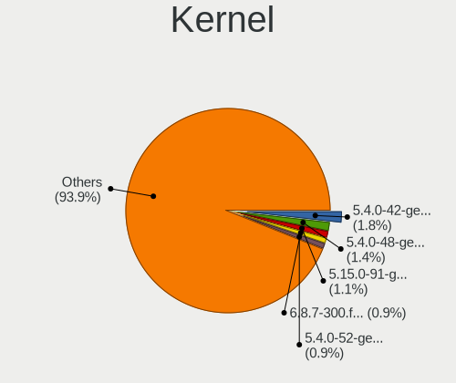

| Version                 | Notebooks | Percent |
|-------------------------|-----------|---------|
| 5.4.0-42-generic        | 10        | 2.67%   |
| 5.4.0-48-generic        | 8         | 2.13%   |
| 5.4.0-52-generic        | 5         | 1.33%   |
| 5.15.0-56-generic       | 5         | 1.33%   |
| 5.0.0-23-generic        | 5         | 1.33%   |
| 5.4.0-26-generic        | 4         | 1.07%   |
| 5.16.7-desktop-1omv4003 | 4         | 1.07%   |
| 5.8.0-59-generic        | 3         | 0.8%    |
| 5.8.0-44-generic        | 3         | 0.8%    |
| 5.4.0-72-generic        | 3         | 0.8%    |
| 5.4.0-65-generic        | 3         | 0.8%    |
| 5.4.0-58-generic        | 3         | 0.8%    |
| 5.3.0-46-generic        | 3         | 0.8%    |
| 5.3.0-42-generic        | 3         | 0.8%    |
| 5.3.0-26-generic        | 3         | 0.8%    |
| 5.15.0-71-generic       | 3         | 0.8%    |
| 5.15.0-57-generic       | 3         | 0.8%    |
| 5.15.0-50-generic       | 3         | 0.8%    |
| 5.15.0-41-generic       | 3         | 0.8%    |
| 5.11.0-34-generic       | 3         | 0.8%    |
| 6.2.9-300.fc38.x86_64   | 2         | 0.53%   |
| 6.1.18-200.fc37.x86_64  | 2         | 0.53%   |
| 6.1.14-200.fc37.x86_64  | 2         | 0.53%   |
| 6.1.10-200.fc37.x86_64  | 2         | 0.53%   |
| 6.1.0-9-amd64           | 2         | 0.53%   |
| 6.0.8-300.fc37.x86_64   | 2         | 0.53%   |
| 6.0.0-kali3-amd64       | 2         | 0.53%   |
| 5.9.16-200.fc33.x86_64  | 2         | 0.53%   |
| 5.8.16-300.fc33.x86_64  | 2         | 0.53%   |
| 5.8.0-7642-generic      | 2         | 0.53%   |
| 5.8.0-63-generic        | 2         | 0.53%   |
| 5.8.0-53-generic        | 2         | 0.53%   |
| 5.8.0-41-generic        | 2         | 0.53%   |
| 5.4.2-1-MANJARO         | 2         | 0.53%   |
| 5.4.0-91-generic        | 2         | 0.53%   |
| 5.4.0-70-generic        | 2         | 0.53%   |
| 5.4.0-62-generic        | 2         | 0.53%   |
| 5.4.0-53-generic        | 2         | 0.53%   |
| 5.4.0-47-generic        | 2         | 0.53%   |
| 5.4.0-40-generic        | 2         | 0.53%   |

Kernel Family
-------------

Linux kernel without a distro release

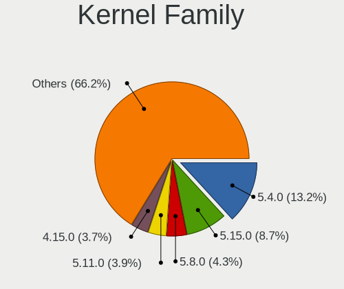

| Version | Notebooks | Percent |
|---------|-----------|---------|
| 5.4.0   | 70        | 19.39%  |
| 5.15.0  | 28        | 7.76%   |
| 5.8.0   | 23        | 6.37%   |
| 5.11.0  | 21        | 5.82%   |
| 4.15.0  | 20        | 5.54%   |
| 5.3.0   | 18        | 4.99%   |
| 5.13.0  | 14        | 3.88%   |
| 5.0.0   | 12        | 3.32%   |
| 5.19.0  | 8         | 2.22%   |
| 6.1.0   | 7         | 1.94%   |
| 4.18.0  | 6         | 1.66%   |
| 5.16.7  | 4         | 1.11%   |
| 5.10.0  | 4         | 1.11%   |
| 6.2.9   | 3         | 0.83%   |
| 6.1.14  | 3         | 0.83%   |
| 4.9.60  | 3         | 0.83%   |
| 6.3.5   | 2         | 0.55%   |
| 6.2.11  | 2         | 0.55%   |
| 6.1.7   | 2         | 0.55%   |
| 6.1.18  | 2         | 0.55%   |
| 6.1.12  | 2         | 0.55%   |
| 6.1.10  | 2         | 0.55%   |
| 6.0.8   | 2         | 0.55%   |
| 6.0.7   | 2         | 0.55%   |
| 6.0.2   | 2         | 0.55%   |
| 6.0.0   | 2         | 0.55%   |
| 5.9.16  | 2         | 0.55%   |
| 5.8.16  | 2         | 0.55%   |
| 5.7.10  | 2         | 0.55%   |
| 5.6.0   | 2         | 0.55%   |
| 5.4.2   | 2         | 0.55%   |
| 5.19.1  | 2         | 0.55%   |
| 5.16.18 | 2         | 0.55%   |
| 5.16.15 | 2         | 0.55%   |
| 5.15.2  | 2         | 0.55%   |
| 5.13.12 | 2         | 0.55%   |
| 4.9.20  | 2         | 0.55%   |
| 4.19.0  | 2         | 0.55%   |
| 4.18.16 | 2         | 0.55%   |
| 4.1.34  | 2         | 0.55%   |

Kernel Major Ver.
-----------------

Linux kernel major version

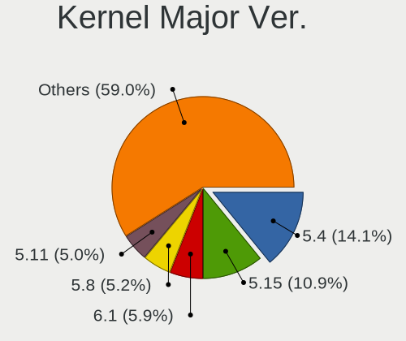

| Version | Notebooks | Percent |
|---------|-----------|---------|
| 5.4     | 73        | 20.86%  |
| 5.15    | 36        | 10.29%  |
| 5.8     | 27        | 7.71%   |
| 5.11    | 26        | 7.43%   |
| 5.3     | 20        | 5.71%   |
| 4.15    | 20        | 5.71%   |
| 5.13    | 17        | 4.86%   |
| 6.1     | 16        | 4.57%   |
| 5.16    | 13        | 3.71%   |
| 5.0     | 12        | 3.43%   |
| 5.19    | 11        | 3.14%   |
| 5.10    | 11        | 3.14%   |
| 6.0     | 9         | 2.57%   |
| 6.2     | 8         | 2.29%   |
| 5.18    | 8         | 2.29%   |
| 4.18    | 8         | 2.29%   |
| 4.9     | 6         | 1.71%   |
| 5.9     | 5         | 1.43%   |
| 5.7     | 4         | 1.14%   |
| 5.14    | 4         | 1.14%   |
| 5.6     | 3         | 0.86%   |
| 5.17    | 3         | 0.86%   |
| 4.19    | 3         | 0.86%   |
| 6.3     | 2         | 0.57%   |
| 4.1     | 2         | 0.57%   |
| 5.5     | 1         | 0.29%   |
| 5.12    | 1         | 0.29%   |
| 4.4     | 1         | 0.29%   |

Arch
----

OS architecture (x86_64, i586, etc.)

| Name   | Notebooks | Percent |
|--------|-----------|---------|
| x86_64 | 306       | 96.53%  |
| i686   | 11        | 3.47%   |

DE
--

Desktop Environment

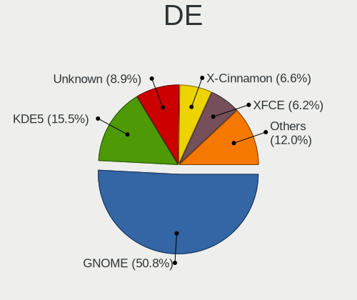

| Name       | Notebooks | Percent |
|------------|-----------|---------|
| GNOME      | 175       | 53.85%  |
| KDE5       | 41        | 12.62%  |
| Unknown    | 35        | 10.77%  |
| X-Cinnamon | 24        | 7.38%   |
| XFCE       | 19        | 5.85%   |
| KDE4       | 11        | 3.38%   |
| KDE        | 4         | 1.23%   |
| Cinnamon   | 4         | 1.23%   |
| MATE       | 3         | 0.92%   |
| Pantheon   | 2         | 0.62%   |
| LXQt       | 2         | 0.62%   |
| LXDE       | 2         | 0.62%   |
| i3         | 2         | 0.62%   |
| Trinity    | 1         | 0.31%   |

Display Server
--------------

X11 or Wayland

| Name    | Notebooks | Percent |
|---------|-----------|---------|
| X11     | 254       | 78.15%  |
| Wayland | 47        | 14.46%  |
| Unknown | 22        | 6.77%   |
| Tty     | 2         | 0.62%   |

Display Manager
---------------

SDDM, LightDM, etc.

| Name    | Notebooks | Percent |
|---------|-----------|---------|
| Unknown | 159       | 48.92%  |
| GDM     | 60        | 18.46%  |
| GDM3    | 33        | 10.15%  |
| SDDM    | 30        | 9.23%   |
| LightDM | 22        | 6.77%   |
| KDM     | 11        | 3.38%   |
| TDM     | 10        | 3.08%   |

OS Lang
-------

Language

| Lang    | Notebooks | Percent |
|---------|-----------|---------|
| en_IL   | 126       | 38.41%  |
| en_US   | 108       | 32.93%  |
| Unknown | 44        | 13.41%  |
| ru_RU   | 22        | 6.71%   |
| he_IL   | 12        | 3.66%   |
| C       | 4         | 1.22%   |
| en_GB   | 3         | 0.91%   |
| fr_FR   | 2         | 0.61%   |
| en_AG   | 2         | 0.61%   |
| es_ES   | 1         | 0.3%    |
| en_NZ   | 1         | 0.3%    |
| en_CA   | 1         | 0.3%    |
| en_AU   | 1         | 0.3%    |
| de_DE   | 1         | 0.3%    |

Boot Mode
---------

EFI or BIOS

| Mode | Notebooks | Percent |
|------|-----------|---------|
| EFI  | 196       | 59.94%  |
| BIOS | 131       | 40.06%  |

Filesystem
----------

Type of filesystem

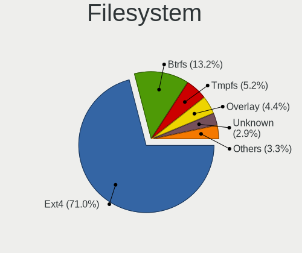

| Type    | Notebooks | Percent |
|---------|-----------|---------|
| Ext4    | 255       | 79.94%  |
| Btrfs   | 26        | 8.15%   |
| Unknown | 14        | 4.39%   |
| Overlay | 13        | 4.08%   |
| Xfs     | 7         | 2.19%   |
| Ext3    | 2         | 0.63%   |
| Tmpfs   | 1         | 0.31%   |
| Ext2    | 1         | 0.31%   |

Part. scheme
------------

Scheme of partitioning

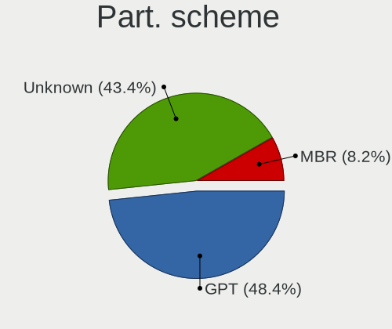

| Type    | Notebooks | Percent |
|---------|-----------|---------|
| Unknown | 166       | 50.76%  |
| GPT     | 137       | 41.9%   |
| MBR     | 24        | 7.34%   |

Dual Boot with Linux/BSD
------------------------

Hosting more than one Linux/BSD

| Dual boot | Notebooks | Percent |
|-----------|-----------|---------|
| No        | 293       | 92.14%  |
| Yes       | 25        | 7.86%   |

Dual Boot (Win)
---------------

Hosting Linux and Windows

| Dual boot | Notebooks | Percent |
|-----------|-----------|---------|
| No        | 240       | 75.24%  |
| Yes       | 79        | 24.76%  |

Board
-----

Vendor
------

Motherboard manufacturer

| Name                | Notebooks | Percent |
|---------------------|-----------|---------|
| Lenovo              | 91        | 28.71%  |
| Dell                | 71        | 22.4%   |
| ASUSTek Computer    | 53        | 16.72%  |
| Hewlett-Packard     | 49        | 15.46%  |
| Acer                | 12        | 3.79%   |
| Apple               | 7         | 2.21%   |
| Samsung Electronics | 5         | 1.58%   |
| Toshiba             | 4         | 1.26%   |
| Fujitsu             | 4         | 1.26%   |
| LG Electronics      | 3         | 0.95%   |
| Valve               | 2         | 0.63%   |
| Timi                | 2         | 0.63%   |
| Fujitsu Siemens     | 2         | 0.63%   |
| System76            | 1         | 0.32%   |
| Razer               | 1         | 0.32%   |
| Purism              | 1         | 0.32%   |
| Notebook            | 1         | 0.32%   |
| MSI                 | 1         | 0.32%   |
| IP3 Tech            | 1         | 0.32%   |
| HUAWEI              | 1         | 0.32%   |
| Heptagon Systems    | 1         | 0.32%   |
| GPD                 | 1         | 0.32%   |
| Gigabyte Technology | 1         | 0.32%   |
| Alienware           | 1         | 0.32%   |
| Unknown             | 1         | 0.32%   |

Model
-----

Motherboard model

| Name                                                                                     | Notebooks | Percent |
|------------------------------------------------------------------------------------------|-----------|---------|
| Unknown                                                                                  | 5         | 1.58%   |
| Lenovo IdeaPad 5 14ITL05 82FE                                                            | 3         | 0.95%   |
| HP Pavilion Notebook                                                                     | 3         | 0.95%   |
| HP Compaq Presario CQ61                                                                  | 3         | 0.95%   |
| ASUS UX331UA                                                                             | 3         | 0.95%   |
| Valve Jupiter                                                                            | 2         | 0.63%   |
| Lenovo V14-IIL 82C4                                                                      | 2         | 0.63%   |
| Lenovo IdeaPad Y700-15ISK 80NV                                                           | 2         | 0.63%   |
| Lenovo IdeaPad L340-15IWL 81LG                                                           | 2         | 0.63%   |
| Lenovo G50-80 80L0                                                                       | 2         | 0.63%   |
| HP ZBook 15 G3                                                                           | 2         | 0.63%   |
| HP ProBook 430 G6                                                                        | 2         | 0.63%   |
| HP EliteBook 840 G5                                                                      | 2         | 0.63%   |
| Fujitsu LIFEBOOK AH530                                                                   | 2         | 0.63%   |
| Dell XPS 15 9570                                                                         | 2         | 0.63%   |
| Dell Vostro 5402                                                                         | 2         | 0.63%   |
| Dell Latitude E6420                                                                      | 2         | 0.63%   |
| Dell Latitude E6330                                                                      | 2         | 0.63%   |
| Dell Latitude E4300                                                                      | 2         | 0.63%   |
| Dell Latitude 7400                                                                       | 2         | 0.63%   |
| Dell Latitude 5410                                                                       | 2         | 0.63%   |
| Dell Inspiron 3593                                                                       | 2         | 0.63%   |
| Dell Inspiron 3542                                                                       | 2         | 0.63%   |
| Dell Inspiron 13-5378                                                                    | 2         | 0.63%   |
| ASUS ZenBook UX425EA_UX425EA                                                             | 2         | 0.63%   |
| ASUS VivoBook 15_ASUS Laptop X540UAR                                                     | 2         | 0.63%   |
| ASUS UX430UNR                                                                            | 2         | 0.63%   |
| ASUS N550JV                                                                              | 2         | 0.63%   |
| Acer Aspire A715-72G                                                                     | 2         | 0.63%   |
| Toshiba Satellite P50t-B-10T                                                             | 1         | 0.32%   |
| Toshiba Satellite L755                                                                   | 1         | 0.32%   |
| Toshiba Satellite A200                                                                   | 1         | 0.32%   |
| Toshiba PORTEGE R700                                                                     | 1         | 0.32%   |
| Timi TM1701                                                                              | 1         | 0.32%   |
| Timi RedmiBook 16                                                                        | 1         | 0.32%   |
| System76 Gazelle                                                                         | 1         | 0.32%   |
| Samsung N248P                                                                            | 1         | 0.32%   |
| Samsung 3570R/370R/470R/450R/510R/4450RV                                                 | 1         | 0.32%   |
| Samsung 355V4C/355V4X/355V5C/355V5X/356V4C/356V4X/356V5C/356V5X/3445VC/3445VX/3545VC/354 | 1         | 0.32%   |
| Samsung 350V5C/351V5C/3540VC/3440VC                                                      | 1         | 0.32%   |

Model Family
------------

Motherboard model prefix

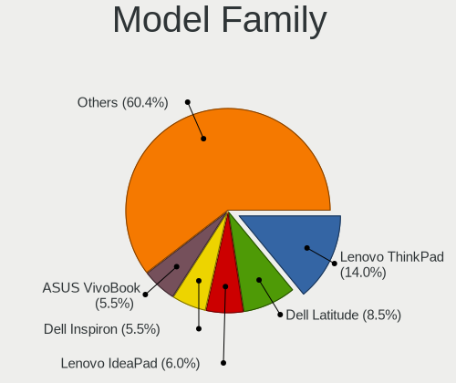

| Name              | Notebooks | Percent |
|-------------------|-----------|---------|
| Lenovo ThinkPad   | 46        | 14.51%  |
| Dell Latitude     | 29        | 9.15%   |
| Lenovo IdeaPad    | 21        | 6.62%   |
| Dell Inspiron     | 19        | 5.99%   |
| ASUS VivoBook     | 14        | 4.42%   |
| Dell Vostro       | 11        | 3.47%   |
| HP Pavilion       | 10        | 3.15%   |
| Acer Aspire       | 10        | 3.15%   |
| Dell XPS          | 9         | 2.84%   |
| HP ZBook          | 7         | 2.21%   |
| ASUS ROG          | 7         | 2.21%   |
| Lenovo Legion     | 6         | 1.89%   |
| HP ProBook        | 6         | 1.89%   |
| HP EliteBook      | 5         | 1.58%   |
| ASUS ZenBook      | 5         | 1.58%   |
| Unknown           | 5         | 1.58%   |
| HP Laptop         | 4         | 1.26%   |
| Fujitsu LIFEBOOK  | 4         | 1.26%   |
| Toshiba Satellite | 3         | 0.95%   |
| Lenovo Yoga       | 3         | 0.95%   |
| Lenovo G50-80     | 3         | 0.95%   |
| HP Compaq         | 3         | 0.95%   |
| ASUS UX331UA      | 3         | 0.95%   |
| ASUS ASUS         | 3         | 0.95%   |
| Valve Jupiter     | 2         | 0.63%   |
| Lenovo V14-IIL    | 2         | 0.63%   |
| HP ENVY           | 2         | 0.63%   |
| HP 250            | 2         | 0.63%   |
| ASUS UX430UNR     | 2         | 0.63%   |
| ASUS N550JV       | 2         | 0.63%   |
| Toshiba PORTEGE   | 1         | 0.32%   |
| Timi TM1701       | 1         | 0.32%   |
| Timi RedmiBook    | 1         | 0.32%   |
| System76 Gazelle  | 1         | 0.32%   |
| Samsung N248P     | 1         | 0.32%   |
| Samsung 3570R     | 1         | 0.32%   |
| Samsung 355V4C    | 1         | 0.32%   |
| Samsung 350V5C    | 1         | 0.32%   |
| Samsung 300V3A    | 1         | 0.32%   |
| Razer Blade       | 1         | 0.32%   |

MFG Year
--------

Motherboard manufacture year

| Year | Notebooks | Percent |
|------|-----------|---------|
| 2019 | 47        | 14.83%  |
| 2020 | 39        | 12.3%   |
| 2018 | 35        | 11.04%  |
| 2017 | 22        | 6.94%   |
| 2016 | 22        | 6.94%   |
| 2015 | 22        | 6.94%   |
| 2021 | 21        | 6.62%   |
| 2012 | 18        | 5.68%   |
| 2011 | 16        | 5.05%   |
| 2014 | 12        | 3.79%   |
| 2010 | 12        | 3.79%   |
| 2013 | 11        | 3.47%   |
| 2008 | 11        | 3.47%   |
| 2022 | 10        | 3.15%   |
| 2009 | 8         | 2.52%   |
| 2007 | 6         | 1.89%   |
| 2023 | 3         | 0.95%   |
| 2006 | 2         | 0.63%   |

Form Factor
-----------

Physical design of the computer

| Name     | Notebooks | Percent |
|----------|-----------|---------|
| Notebook | 317       | 100%    |

Secure Boot
-----------

Enabled or disabled

| State    | Notebooks | Percent |
|----------|-----------|---------|
| Disabled | 282       | 88.13%  |
| Enabled  | 38        | 11.88%  |

Coreboot
--------

Have coreboot on board

| Used | Notebooks | Percent |
|------|-----------|---------|
| No   | 316       | 99.68%  |
| Yes  | 1         | 0.32%   |

RAM Size
--------

Total RAM memory

| Size in GB  | Notebooks | Percent |
|-------------|-----------|---------|
| 4.01-8.0    | 81        | 25.47%  |
| 16.01-24.0  | 72        | 22.64%  |
| 32.01-64.0  | 50        | 15.72%  |
| 8.01-16.0   | 44        | 13.84%  |
| 3.01-4.0    | 38        | 11.95%  |
| 1.01-2.0    | 15        | 4.72%   |
| 64.01-256.0 | 7         | 2.2%    |
| 24.01-32.0  | 4         | 1.26%   |
| 2.01-3.0    | 4         | 1.26%   |
| 0.51-1.0    | 3         | 0.94%   |

RAM Used
--------

Used RAM memory

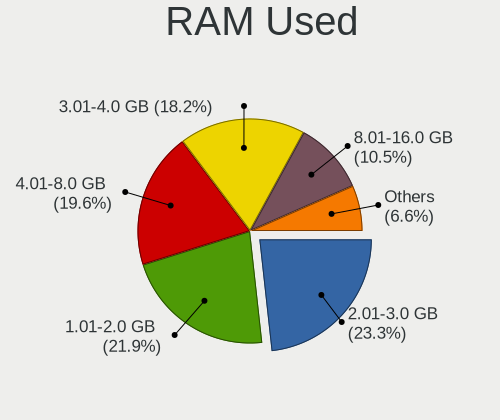

| Used GB    | Notebooks | Percent |
|------------|-----------|---------|
| 2.01-3.0   | 86        | 24.78%  |
| 1.01-2.0   | 85        | 24.5%   |
| 3.01-4.0   | 61        | 17.58%  |
| 4.01-8.0   | 57        | 16.43%  |
| 8.01-16.0  | 35        | 10.09%  |
| 0.51-1.0   | 16        | 4.61%   |
| 16.01-24.0 | 4         | 1.15%   |
| 0.01-0.5   | 3         | 0.86%   |

Total Drives
------------

Number of drives on board

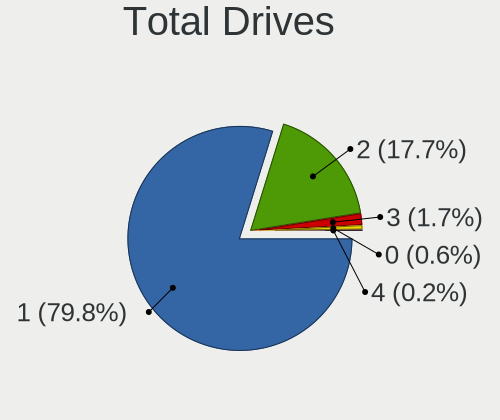

| Drives | Notebooks | Percent |
|--------|-----------|---------|
| 1      | 261       | 81.82%  |
| 2      | 52        | 16.3%   |
| 3      | 3         | 0.94%   |
| 0      | 2         | 0.63%   |
| 4      | 1         | 0.31%   |

Has CD-ROM
----------

Has CD-ROM on board

| Presented | Notebooks | Percent |
|-----------|-----------|---------|
| No        | 225       | 70.98%  |
| Yes       | 92        | 29.02%  |

Has Ethernet
------------

Has Ethernet on board

| Presented | Notebooks | Percent |
|-----------|-----------|---------|
| Yes       | 252       | 79%     |
| No        | 67        | 21%     |

Has WiFi
--------

Has WiFi module

| Presented | Notebooks | Percent |
|-----------|-----------|---------|
| Yes       | 311       | 98.11%  |
| No        | 6         | 1.89%   |

Has Bluetooth
-------------

Has Bluetooth module

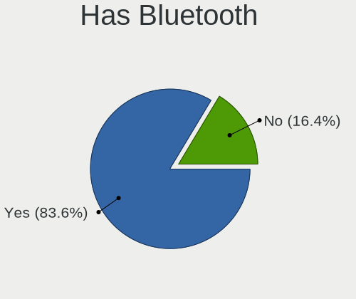

| Presented | Notebooks | Percent |
|-----------|-----------|---------|
| Yes       | 260       | 81%     |
| No        | 61        | 19%     |

Location
--------

Country
-------

Geographic location (country)

| Country | Notebooks | Percent |
|---------|-----------|---------|
| Israel  | 317       | 100%    |

City
----

Geographic location (city)

| City                | Notebooks | Percent |
|---------------------|-----------|---------|
| Tel Aviv            | 146       | 41.83%  |
| Ramat Gan           | 32        | 9.17%   |
| Jerusalem           | 15        | 4.3%    |
| Peta Tiqwa       | 11        | 3.15%   |
| Haifa               | 10        | 2.87%   |
| Givatayim           | 10        | 2.87%   |
| Rishon LeZiyyon     | 9         | 2.58%   |
| Herzliya            | 9         | 2.58%   |
| Netanya             | 8         | 2.29%   |
| Rishon LeTsiyyon    | 6         | 1.72%   |
| Rehovot             | 6         | 1.72%   |
| Holon               | 6         | 1.72%   |
| Ramat HaSharon      | 5         | 1.43%   |
| Nahariya            | 5         | 1.43%   |
| Raanana             | 4         | 1.15%   |
| Petah Tikva         | 4         | 1.15%   |
| Kiryat Ono          | 4         | 1.15%   |
| Ashquelon           | 4         | 1.15%   |
| Kfar Saba           | 3         | 0.86%   |
| Givat Shmuel        | 3         | 0.86%   |
| Bet Shemesh         | 3         | 0.86%   |
| Yavne               | 2         | 0.57%   |
| Tel Mond            | 2         | 0.57%   |
| Ramla               | 2         | 0.57%   |
| Qiryat Yam          | 2         | 0.57%   |
| Qiryat Bialik       | 2         | 0.57%   |
| Lod                 | 2         | 0.57%   |
| Hadera              | 2         | 0.57%   |
| Beersheba           | 2         | 0.57%   |
| Ashdod              | 2         | 0.57%   |
| Yehud               | 1         | 0.29%   |
| Yaqum               | 1         | 0.29%   |
| Tiberias            | 1         | 0.29%   |
| Shelomi             | 1         | 0.29%   |
| Shefa-'Amr          | 1         | 0.29%   |
| Sha`ar Ha`Amaqim    | 1         | 0.29%   |
| Sde Nehemya         | 1         | 0.29%   |
| Qiryat Moqin     | 1         | 0.29%   |
| Pardes Hanna Karkur | 1         | 0.29%   |
| Ofakim              | 1         | 0.29%   |

Drives
------

Drive Vendor
------------

Hard drive vendors

| Vendor              | Notebooks | Drives | Percent |
|---------------------|-----------|--------|---------|
| Samsung Electronics | 63        | 90     | 17.36%  |
| WDC                 | 39        | 41     | 10.74%  |
| Seagate             | 34        | 41     | 9.37%   |
| Toshiba             | 30        | 32     | 8.26%   |
| SK hynix            | 30        | 42     | 8.26%   |
| SanDisk             | 30        | 36     | 8.26%   |
| Intel               | 20        | 29     | 5.51%   |
| Kingston            | 17        | 20     | 4.68%   |
| Micron Technology   | 15        | 18     | 4.13%   |
| HGST                | 14        | 15     | 3.86%   |
| Hitachi             | 9         | 9      | 2.48%   |
| Crucial             | 9         | 17     | 2.48%   |
| Unknown             | 8         | 8      | 2.2%    |
| KIOXIA              | 7         | 7      | 1.93%   |
| Apple               | 5         | 8      | 1.38%   |
| StoreJet            | 4         | 4      | 1.1%    |
| JMicron Technology  | 4         | 4      | 1.1%    |
| Transcend           | 3         | 5      | 0.83%   |
| Fujitsu             | 3         | 3      | 0.83%   |
| A-DATA Technology   | 3         | 4      | 0.83%   |
| LITEONIT            | 2         | 2      | 0.55%   |
| LITEON              | 2         | 2      | 0.55%   |
| faspeed             | 2         | 3      | 0.55%   |
| China               | 2         | 3      | 0.55%   |
| Apacer              | 2         | 2      | 0.55%   |
| SSSTC               | 1         | 1      | 0.28%   |
| SPCC                | 1         | 1      | 0.28%   |
| OCZ                 | 1         | 1      | 0.28%   |
| O2 Micro            | 1         | 1      | 0.28%   |
| Lexar               | 1         | 1      | 0.28%   |
| ADATA Technology    | 1         | 1      | 0.28%   |

Drive Model
-----------

Hard drive models

| Model                                               | Notebooks | Percent |
|-----------------------------------------------------|-----------|---------|
| Samsung NVMe SSD Drive 512GB                        | 9         | 2.37%   |
| Seagate ST500LT012-1DG142 500GB                     | 7         | 1.84%   |
| Samsung NVMe SSD Controller SM981/PM981/PM983 256GB | 7         | 1.84%   |
| SK hynix NVMe SSD Drive 256GB                       | 5         | 1.32%   |
| Seagate ST1000LM024 HN-M101MBB 1TB                  | 5         | 1.32%   |
| SanDisk NVMe SSD Drive 512GB                        | 5         | 1.32%   |
| Kingston SA400S37240G 240GB SSD                     | 4         | 1.05%   |
| Intel NVMe SSD Drive 512GB                          | 4         | 1.05%   |
| HGST HTS721010A9E630 1TB                            | 4         | 1.05%   |
| Crucial CT500MX500SSD1 500GB                        | 4         | 1.05%   |
| Toshiba NVMe SSD Drive 512GB                        | 3         | 0.79%   |
| Toshiba MQ01ABF050 500GB                            | 3         | 0.79%   |
| SK hynix PC401 NVMe 512GB                           | 3         | 0.79%   |
| SK hynix NVMe SSD Drive 512GB                       | 3         | 0.79%   |
| Seagate ST1000LM035-1RK172 1TB                      | 3         | 0.79%   |
| SanDisk NVMe SSD Drive 256GB                        | 3         | 0.79%   |
| Samsung SSD 860 EVO 250GB                           | 3         | 0.79%   |
| Samsung NVMe SSD Drive 256GB                        | 3         | 0.79%   |
| Intel SSDPEKNU512GZ 512GB                           | 3         | 0.79%   |
| Intel NVMe SSD Drive 256GB                          | 3         | 0.79%   |
| HGST HTS541010A9E680 1TB                            | 3         | 0.79%   |
| WDC WDS500G2B0B-00YS70 500GB SSD                    | 2         | 0.53%   |
| WDC WD5000BPKT-75PK4T0 500GB                        | 2         | 0.53%   |
| WDC WD10SPZX-24Z10T0 1TB                            | 2         | 0.53%   |
| WDC PC SN730 NVMe 512GB                             | 2         | 0.53%   |
| WDC PC SN530 SDBPNPZ-1T00-1002 1TB                  | 2         | 0.53%   |
| WDC PC SN530 NVMe 256GB                             | 2         | 0.53%   |
| Toshiba MQ01ABD100 1TB                              | 2         | 0.53%   |
| Toshiba KXG6AZNV1T02 1TB                            | 2         | 0.53%   |
| StoreJet Transcend 500GB SSD                        | 2         | 0.53%   |
| SK hynix SKHynix_HFS001TD9TNI-L2B0B 1TB             | 2         | 0.53%   |
| SK hynix SC311 SATA 256GB SSD                       | 2         | 0.53%   |
| Seagate ST9500423AS 500GB                           | 2         | 0.53%   |
| Seagate Expansion 1TB                               | 2         | 0.53%   |
| Sandisk WD Blue SN500 / PC SN520 NVMe SSD 512GB     | 2         | 0.53%   |
| SanDisk SSD PLUS 240GB                              | 2         | 0.53%   |
| SanDisk SD8SN8U512G1002 512GB SSD                   | 2         | 0.53%   |
| Samsung SSD 860 EVO 500GB                           | 2         | 0.53%   |
| Samsung SSD 850 EVO 500GB                           | 2         | 0.53%   |
| Samsung NVMe SSD Drive 1024GB                       | 2         | 0.53%   |

HDD Vendor
----------

Hard disk drive vendors

| Vendor              | Notebooks | Drives | Percent |
|---------------------|-----------|--------|---------|
| Seagate             | 34        | 41     | 34.69%  |
| WDC                 | 19        | 19     | 19.39%  |
| Toshiba             | 17        | 17     | 17.35%  |
| HGST                | 14        | 15     | 14.29%  |
| Hitachi             | 9         | 9      | 9.18%   |
| Fujitsu             | 3         | 3      | 3.06%   |
| Unknown             | 1         | 1      | 1.02%   |
| Samsung Electronics | 1         | 1      | 1.02%   |

SSD Vendor
----------

Solid state drive vendors

| Vendor              | Notebooks | Drives | Percent |
|---------------------|-----------|--------|---------|
| Samsung Electronics | 20        | 20     | 18.69%  |
| SanDisk             | 16        | 20     | 14.95%  |
| Kingston            | 12        | 15     | 11.21%  |
| SK hynix            | 9         | 19     | 8.41%   |
| Crucial             | 9         | 17     | 8.41%   |
| Micron Technology   | 7         | 7      | 6.54%   |
| WDC                 | 4         | 4      | 3.74%   |
| Toshiba             | 4         | 4      | 3.74%   |
| Apple               | 4         | 4      | 3.74%   |
| Transcend           | 3         | 5      | 2.8%    |
| A-DATA Technology   | 3         | 4      | 2.8%    |
| StoreJet            | 2         | 2      | 1.87%   |
| LITEONIT            | 2         | 2      | 1.87%   |
| LITEON              | 2         | 2      | 1.87%   |
| JMicron Technology  | 2         | 2      | 1.87%   |
| Intel               | 2         | 2      | 1.87%   |
| China               | 2         | 3      | 1.87%   |
| Apacer              | 2         | 2      | 1.87%   |
| OCZ                 | 1         | 1      | 0.93%   |
| faspeed             | 1         | 1      | 0.93%   |

Drive Kind
----------

HDD or SSD

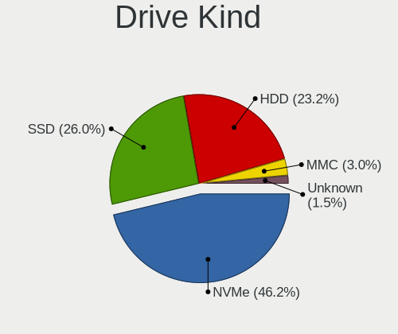

| Kind    | Notebooks | Drives | Percent |
|---------|-----------|--------|---------|
| NVMe    | 145       | 197    | 41.19%  |
| SSD     | 103       | 136    | 29.26%  |
| HDD     | 93        | 106    | 26.42%  |
| MMC     | 6         | 6      | 1.7%    |
| Unknown | 5         | 6      | 1.42%   |

Drive Connector
---------------

SATA, SAS, NVMe, etc.

| Type | Notebooks | Drives | Percent |
|------|-----------|--------|---------|
| SATA | 179       | 232    | 51.73%  |
| NVMe | 145       | 197    | 41.91%  |
| SAS  | 16        | 16     | 4.62%   |
| MMC  | 6         | 6      | 1.73%   |

Drive Size
----------

Size of hard drive

| Size in TB | Notebooks | Drives | Percent |
|------------|-----------|--------|---------|
| 0.01-0.5   | 132       | 166    | 68.39%  |
| 0.51-1.0   | 58        | 73     | 30.05%  |
| 1.01-2.0   | 3         | 3      | 1.55%   |

Space Total
-----------

Amount of disk space available on the file system

| Size in GB     | Notebooks | Percent |
|----------------|-----------|---------|
| 101-250        | 100       | 30.58%  |
| 251-500        | 99        | 30.28%  |
| 501-1000       | 50        | 15.29%  |
| 51-100         | 20        | 6.12%   |
| 1-20           | 16        | 4.89%   |
| 1001-2000      | 15        | 4.59%   |
| Unknown        | 11        | 3.36%   |
| 21-50          | 9         | 2.75%   |
| 2001-3000      | 5         | 1.53%   |
| More than 3000 | 2         | 0.61%   |

Space Used
----------

Amount of used disk space

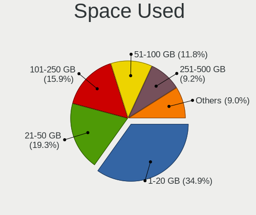

| Used GB   | Notebooks | Percent |
|-----------|-----------|---------|
| 1-20      | 119       | 35.21%  |
| 21-50     | 69        | 20.41%  |
| 101-250   | 60        | 17.75%  |
| 51-100    | 46        | 13.61%  |
| 251-500   | 24        | 7.1%    |
| Unknown   | 11        | 3.25%   |
| 501-1000  | 6         | 1.78%   |
| 1001-2000 | 3         | 0.89%   |

Malfunc. Drives
---------------

Drive models with a malfunction

| Model                                 | Notebooks | Drives | Percent |
|---------------------------------------|-----------|--------|---------|
| HGST HTS545050A7E380 500GB            | 2         | 2      | 8%      |
| WDC WD6400BPVT-75HXZT1 640GB          | 1         | 1      | 4%      |
| WDC WD2500BEVT-24A23T0 250GB          | 1         | 1      | 4%      |
| WDC WD1600BJKT-75F4T0 160GB           | 1         | 1      | 4%      |
| Toshiba MQ04ABF100 1TB                | 1         | 1      | 4%      |
| Toshiba MK6475GSX 640GB               | 1         | 1      | 4%      |
| Toshiba MK5075GSX 500GB               | 1         | 1      | 4%      |
| Toshiba MK3252GSX 320GB               | 1         | 1      | 4%      |
| Toshiba MK1646GSX 160GB               | 1         | 1      | 4%      |
| SK hynix HFS256G3BTND-N210A 256GB SSD | 1         | 5      | 4%      |
| SK hynix HFS256G39TND-N210A 256GB SSD | 1         | 1      | 4%      |
| Seagate ST9500423AS 500GB             | 1         | 1      | 4%      |
| Seagate ST9500420AS 500GB             | 1         | 1      | 4%      |
| Seagate ST9120817AS 120GB             | 1         | 1      | 4%      |
| Seagate ST500LT012-9WS142 500GB       | 1         | 1      | 4%      |
| Seagate ST500LM021-1KJ152 500GB       | 1         | 1      | 4%      |
| Seagate ST1000LM024 HN-M101MBB 1TB    | 1         | 2      | 4%      |
| SanDisk SSD U100 24GB                 | 1         | 1      | 4%      |
| Intel SSDSCKKF256H6 SATA 256GB        | 1         | 1      | 4%      |
| Hitachi HTS545025B9A300 250GB         | 1         | 1      | 4%      |
| Hitachi HTS542516K9SA00 160GB         | 1         | 1      | 4%      |
| HGST HCC545050A7E380 500GB            | 1         | 1      | 4%      |
| Fujitsu MHY2160BH 160GB               | 1         | 1      | 4%      |
| Crucial CT525MX300SSD1 528GB          | 1         | 1      | 4%      |

Malfunc. Drive Vendor
---------------------

Vendors of faulty drives

| Vendor   | Notebooks | Drives | Percent |
|----------|-----------|--------|---------|
| Toshiba  | 5         | 5      | 20.83%  |
| Seagate  | 5         | 7      | 20.83%  |
| WDC      | 3         | 3      | 12.5%   |
| HGST     | 3         | 3      | 12.5%   |
| SK hynix | 2         | 6      | 8.33%   |
| Hitachi  | 2         | 2      | 8.33%   |
| SanDisk  | 1         | 1      | 4.17%   |
| Intel    | 1         | 1      | 4.17%   |
| Fujitsu  | 1         | 1      | 4.17%   |
| Crucial  | 1         | 1      | 4.17%   |

Malfunc. HDD Vendor
-------------------

Vendors of faulty HDD drives

| Vendor  | Notebooks | Drives | Percent |
|---------|-----------|--------|---------|
| Toshiba | 5         | 5      | 26.32%  |
| Seagate | 5         | 7      | 26.32%  |
| WDC     | 3         | 3      | 15.79%  |
| HGST    | 3         | 3      | 15.79%  |
| Hitachi | 2         | 2      | 10.53%  |
| Fujitsu | 1         | 1      | 5.26%   |

Malfunc. Drive Kind
-------------------

Kinds of faulty drives

| Kind | Notebooks | Drives | Percent |
|------|-----------|--------|---------|
| HDD  | 16        | 21     | 76.19%  |
| SSD  | 5         | 9      | 23.81%  |

Failed Drives
-------------

Failed drive models

Zero info for selected period =(

Failed Drive Vendor
-------------------

Failed drive vendors

Zero info for selected period =(

Drive Status
------------

Number of failed and malfunc. drives

| Status   | Notebooks | Drives | Percent |
|----------|-----------|--------|---------|
| Detected | 177       | 237    | 52.84%  |
| Works    | 137       | 184    | 40.9%   |
| Malfunc  | 21        | 30     | 6.27%   |

Storage controller
------------------

Storage Vendor
--------------

Storage controller vendors

| Vendor                         | Notebooks | Percent |
|--------------------------------|-----------|---------|
| Intel                          | 238       | 62.3%   |
| Samsung Electronics            | 46        | 12.04%  |
| SanDisk                        | 29        | 7.59%   |
| SK hynix                       | 21        | 5.5%    |
| Toshiba America Info Systems   | 10        | 2.62%   |
| AMD                            | 9         | 2.36%   |
| Micron Technology              | 8         | 2.09%   |
| KIOXIA                         | 6         | 1.57%   |
| Kingston Technology Company    | 5         | 1.31%   |
| Nvidia                         | 2         | 0.52%   |
| VIA Technologies               | 1         | 0.26%   |
| Union Memory (Shenzhen)        | 1         | 0.26%   |
| Solid State Storage Technology | 1         | 0.26%   |
| Shenzhen Longsys Electronics   | 1         | 0.26%   |
| Realtek Semiconductor          | 1         | 0.26%   |
| O2 Micro                       | 1         | 0.26%   |
| Apple                          | 1         | 0.26%   |
| ADATA Technology               | 1         | 0.26%   |

Storage Model
-------------

Storage controller models

| Model                                                                          | Notebooks | Percent |
|--------------------------------------------------------------------------------|-----------|---------|
| Intel Sunrise Point-LP SATA Controller [AHCI mode]                             | 42        | 10.29%  |
| Samsung NVMe SSD Controller SM981/PM981/PM983                                  | 22        | 5.39%   |
| Intel 82801 Mobile SATA Controller [RAID mode]                                 | 22        | 5.39%   |
| Intel 7 Series Chipset Family 6-port SATA Controller [AHCI mode]               | 16        | 3.92%   |
| Intel Cannon Lake Mobile PCH SATA AHCI Controller                              | 15        | 3.68%   |
| Intel 82801IBM/IEM (ICH9M/ICH9M-E) 4 port SATA Controller [AHCI mode]          | 15        | 3.68%   |
| Intel Wildcat Point-LP SATA Controller [AHCI Mode]                             | 13        | 3.19%   |
| Intel Volume Management Device NVMe RAID Controller                            | 12        | 2.94%   |
| SanDisk WD Black SN750 / PC SN730 NVMe SSD                                     | 9         | 2.21%   |
| Intel Ice Lake-LP SATA Controller [AHCI mode]                                  | 9         | 2.21%   |
| Intel HM170/QM170 Chipset SATA Controller [AHCI Mode]                          | 9         | 2.21%   |
| Intel 8 Series SATA Controller 1 [AHCI mode]                                   | 9         | 2.21%   |
| Intel 6 Series/C200 Series Chipset Family 6 port Mobile SATA AHCI Controller   | 9         | 2.21%   |
| AMD FCH SATA Controller [AHCI mode]                                            | 9         | 2.21%   |
| Micron NVMe Storage Controller                                                 | 8         | 1.96%   |
| Intel Cannon Point-LP SATA Controller [AHCI Mode]                              | 8         | 1.96%   |
| Intel 5 Series/3400 Series Chipset 4 port SATA AHCI Controller                 | 8         | 1.96%   |
| Samsung NVMe SSD Controller SM961/PM961/SM963                                  | 7         | 1.72%   |
| Samsung NVMe SSD Controller 980                                                | 7         | 1.72%   |
| Intel 8 Series/C220 Series Chipset Family 6-port SATA Controller 1 [AHCI mode] | 7         | 1.72%   |
| Toshiba America Info Systems XG6 NVMe SSD Controller                           | 6         | 1.47%   |
| SK hynix Non-Volatile memory controller                                        | 6         | 1.47%   |
| Samsung NVMe SSD Controller PM9A1/PM9A3/980PRO                                 | 6         | 1.47%   |
| Intel SSD 660P Series                                                          | 6         | 1.47%   |
| Intel Comet Lake SATA AHCI Controller                                          | 6         | 1.47%   |
| SK hynix PC401 NVMe Solid State Drive 256GB                                    | 5         | 1.23%   |
| SK hynix BC501 NVMe Solid State Drive                                          | 5         | 1.23%   |
| SanDisk WD Blue SN550 NVMe SSD                                                 | 5         | 1.23%   |
| KIOXIA NVMe SSD Controller BG4                                                 | 5         | 1.23%   |
| Intel Non-Volatile memory controller                                           | 5         | 1.23%   |
| Intel 82801HM/HEM (ICH8M/ICH8M-E) SATA Controller [AHCI mode]                  | 5         | 1.23%   |
| Intel 82801HM/HEM (ICH8M/ICH8M-E) IDE Controller                               | 5         | 1.23%   |
| SanDisk WD Black 2018/SN750 / PC SN720 NVMe SSD                                | 4         | 0.98%   |
| Intel Q170/Q150/B150/H170/H110/Z170/CM236 Chipset SATA Controller [AHCI Mode]  | 4         | 0.98%   |
| Toshiba America Info Systems XG5 NVMe SSD Controller                           | 3         | 0.74%   |
| SK hynix Gold P31/PC711 NVMe Solid State Drive                                 | 3         | 0.74%   |
| SanDisk WD Blue SN500 / PC SN520 NVMe SSD                                      | 3         | 0.74%   |
| SanDisk Non-Volatile memory controller                                         | 3         | 0.74%   |
| Samsung NVMe SSD Controller SM951/PM951                                        | 3         | 0.74%   |
| Intel Tiger Lake-LP SATA Controller                                            | 3         | 0.74%   |

Storage Kind
------------

Kind of storage controller (IDE, SATA, NVMe, SAS, ...)

| Kind | Notebooks | Percent |
|------|-----------|---------|
| SATA | 207       | 51.88%  |
| NVMe | 145       | 36.34%  |
| RAID | 34        | 8.52%   |
| IDE  | 13        | 3.26%   |

Processor
---------

CPU Vendor
----------

Processor vendors

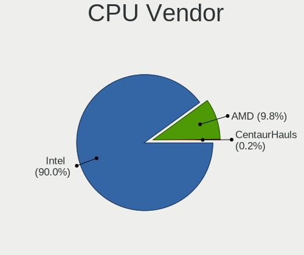

| Vendor       | Notebooks | Percent |
|--------------|-----------|---------|
| Intel        | 297       | 93.69%  |
| AMD          | 19        | 5.99%   |
| CentaurHauls | 1         | 0.32%   |

CPU Model
---------

Processor models

| Model                                       | Notebooks | Percent |
|---------------------------------------------|-----------|---------|
| Intel Core i7-8550U CPU @ 1.80GHz           | 17        | 5.36%   |
| Intel 11th Gen Core i7-1165G7 @ 2.80GHz     | 10        | 3.15%   |
| Intel Core i7-8750H CPU @ 2.20GHz           | 8         | 2.52%   |
| Intel Core i7-8565U CPU @ 1.80GHz           | 8         | 2.52%   |
| Intel Core i7-6700HQ CPU @ 2.60GHz          | 8         | 2.52%   |
| Intel Core i5-8250U CPU @ 1.60GHz           | 8         | 2.52%   |
| Intel 11th Gen Core i5-1135G7 @ 2.40GHz     | 8         | 2.52%   |
| Intel Core i7-1065G7 CPU @ 1.30GHz          | 7         | 2.21%   |
| Intel Core i5-6200U CPU @ 2.30GHz           | 6         | 1.89%   |
| Intel Core i5-5200U CPU @ 2.20GHz           | 6         | 1.89%   |
| Intel Core i5-10210U CPU @ 1.60GHz          | 6         | 1.89%   |
| Intel Core i7-10510U CPU @ 1.80GHz          | 5         | 1.58%   |
| Intel Core i5-8265U CPU @ 1.60GHz           | 5         | 1.58%   |
| Intel Pentium Dual-Core CPU T4400 @ 2.20GHz | 4         | 1.26%   |
| Intel Core i7-8665U CPU @ 1.90GHz           | 4         | 1.26%   |
| Intel Core i7-8650U CPU @ 1.90GHz           | 4         | 1.26%   |
| Intel Core i7-7700HQ CPU @ 2.80GHz          | 4         | 1.26%   |
| Intel Core i7-10750H CPU @ 2.60GHz          | 4         | 1.26%   |
| Intel Core i5-7200U CPU @ 2.50GHz           | 4         | 1.26%   |
| Intel Core i5-3210M CPU @ 2.50GHz           | 4         | 1.26%   |
| Intel Core i3-7020U CPU @ 2.30GHz           | 4         | 1.26%   |
| Intel Core i9-10885H CPU @ 2.40GHz          | 3         | 0.95%   |
| Intel Core i7-9850H CPU @ 2.60GHz           | 3         | 0.95%   |
| Intel Core i7-9750H CPU @ 2.60GHz           | 3         | 0.95%   |
| Intel Core i7-6500U CPU @ 2.50GHz           | 3         | 0.95%   |
| Intel Core i5-6300U CPU @ 2.40GHz           | 3         | 0.95%   |
| Intel Core i5-3320M CPU @ 2.60GHz           | 3         | 0.95%   |
| Intel Core i5-1035G1 CPU @ 1.00GHz          | 3         | 0.95%   |
| Intel Atom CPU N455 @ 1.66GHz               | 3         | 0.95%   |
| Intel 11th Gen Core i3-1115G4 @ 3.00GHz     | 3         | 0.95%   |
| Intel Pentium CPU B960 @ 2.20GHz            | 2         | 0.63%   |
| Intel Core i9-9880H CPU @ 2.30GHz           | 2         | 0.63%   |
| Intel Core i7-7500U CPU @ 2.70GHz           | 2         | 0.63%   |
| Intel Core i7-5500U CPU @ 2.40GHz           | 2         | 0.63%   |
| Intel Core i7-4700HQ CPU @ 2.40GHz          | 2         | 0.63%   |
| Intel Core i7-4510U CPU @ 2.00GHz           | 2         | 0.63%   |
| Intel Core i7-10870H CPU @ 2.20GHz          | 2         | 0.63%   |
| Intel Core i5-4210U CPU @ 1.70GHz           | 2         | 0.63%   |
| Intel Core i5-3317U CPU @ 1.70GHz           | 2         | 0.63%   |
| Intel Core i5-2450M CPU @ 2.50GHz           | 2         | 0.63%   |

CPU Model Family
----------------

Processor model prefix

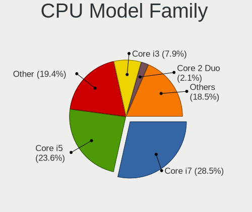

| Model                   | Notebooks | Percent |
|-------------------------|-----------|---------|
| Intel Core i7           | 108       | 34.07%  |
| Intel Core i5           | 77        | 24.29%  |
| Other                   | 42        | 13.25%  |
| Intel Core i3           | 26        | 8.2%    |
| Intel Core 2 Duo        | 9         | 2.84%   |
| Intel Celeron           | 7         | 2.21%   |
| Intel Core i9           | 6         | 1.89%   |
| Intel Pentium Dual-Core | 5         | 1.58%   |
| Intel Atom              | 5         | 1.58%   |
| AMD Ryzen 5             | 4         | 1.26%   |
| Intel Pentium Dual      | 3         | 0.95%   |
| Intel Pentium           | 3         | 0.95%   |
| AMD Ryzen 9             | 3         | 0.95%   |
| AMD Ryzen 7             | 3         | 0.95%   |
| Intel Xeon              | 2         | 0.63%   |
| Intel Genuine           | 2         | 0.63%   |
| AMD Ryzen 7 PRO         | 2         | 0.63%   |
| AMD A6                  | 2         | 0.63%   |
| Intel Core m3           | 1         | 0.32%   |
| Intel Core M            | 1         | 0.32%   |
| Intel Core 2            | 1         | 0.32%   |
| Intel Celeron Dual-Core | 1         | 0.32%   |
| CentaurHauls VIA C7     | 1         | 0.32%   |
| AMD Turion 64 X2 Mobile | 1         | 0.32%   |
| AMD A8                  | 1         | 0.32%   |
| AMD A10                 | 1         | 0.32%   |

CPU Cores
---------

Number of processor cores

| Number  | Notebooks | Percent |
|---------|-----------|---------|
| 4       | 132       | 41.64%  |
| 2       | 125       | 39.43%  |
| 6       | 23        | 7.26%   |
| 8       | 19        | 5.99%   |
| 1       | 8         | 2.52%   |
| 10      | 4         | 1.26%   |
| 14      | 3         | 0.95%   |
| 16      | 1         | 0.32%   |
| 12      | 1         | 0.32%   |
| Unknown | 1         | 0.32%   |

CPU Sockets
-----------

Number of sockets

| Number  | Notebooks | Percent |
|---------|-----------|---------|
| 1       | 316       | 99.68%  |
| Unknown | 1         | 0.32%   |

CPU Threads
-----------

Threads per core (Hyper-Threading)

| Number  | Notebooks | Percent |
|---------|-----------|---------|
| 2       | 277       | 87.11%  |
| 1       | 40        | 12.58%  |
| Unknown | 1         | 0.31%   |

CPU Op-Modes
------------

CPU Operation Modes (32-bit, 64-bit)

| Op mode        | Notebooks | Percent |
|----------------|-----------|---------|
| 32-bit, 64-bit | 308       | 97.16%  |
| Unknown        | 6         | 1.89%   |
| 32-bit         | 3         | 0.95%   |

CPU Microcode
-------------

Microcode number

| Number     | Notebooks | Percent |
|------------|-----------|---------|
| Unknown    | 85        | 25.6%   |
| 0x806ea    | 22        | 6.63%   |
| 0x806c1    | 20        | 6.02%   |
| 0x806ec    | 19        | 5.72%   |
| 0x406e3    | 16        | 4.82%   |
| 0x206a7    | 14        | 4.22%   |
| 0x306a9    | 12        | 3.61%   |
| 0x306d4    | 11        | 3.31%   |
| 0x706e5    | 10        | 3.01%   |
| 0xa0652    | 9         | 2.71%   |
| 0x806e9    | 9         | 2.71%   |
| 0x506e3    | 9         | 2.71%   |
| 0x20655    | 8         | 2.41%   |
| 0x906ea    | 7         | 2.11%   |
| 0x40651    | 7         | 2.11%   |
| 0x1067a    | 7         | 2.11%   |
| 0x906ed    | 6         | 1.81%   |
| 0x806eb    | 6         | 1.81%   |
| 0x6fd      | 5         | 1.51%   |
| 0x306c3    | 5         | 1.51%   |
| 0x906a3    | 4         | 1.2%    |
| 0x806d1    | 3         | 0.9%    |
| 0x106ca    | 3         | 0.9%    |
| 0x906e9    | 2         | 0.6%    |
| 0x906a4    | 2         | 0.6%    |
| 0x706a1    | 2         | 0.6%    |
| 0x6fa      | 2         | 0.6%    |
| 0x106c2    | 2         | 0.6%    |
| 0x10676    | 2         | 0.6%    |
| 0x0a50000c | 2         | 0.6%    |
| 0x08600104 | 2         | 0.6%    |
| 0x08108109 | 2         | 0.6%    |
| 0x08108102 | 2         | 0.6%    |
| 0xb06a3    | 1         | 0.3%    |
| 0xa0660    | 1         | 0.3%    |
| 0x90672    | 1         | 0.3%    |
| 0x806c2    | 1         | 0.3%    |
| 0x706a8    | 1         | 0.3%    |
| 0x6f6      | 1         | 0.3%    |
| 0x6f4      | 1         | 0.3%    |

CPU Microarch
-------------

Microarchitecture

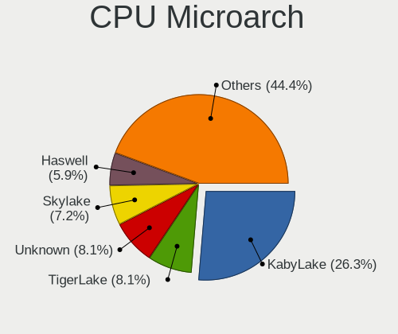

| Name             | Notebooks | Percent |
|------------------|-----------|---------|
| KabyLake         | 96        | 30.28%  |
| Skylake          | 28        | 8.83%   |
| TigerLake        | 26        | 8.2%    |
| Haswell          | 18        | 5.68%   |
| IvyBridge        | 17        | 5.36%   |
| SandyBridge      | 16        | 5.05%   |
| IceLake          | 15        | 4.73%   |
| Broadwell        | 15        | 4.73%   |
| Penryn           | 13        | 4.1%    |
| CometLake        | 12        | 3.79%   |
| Westmere         | 10        | 3.15%   |
| Unknown          | 10        | 3.15%   |
| Core             | 9         | 2.84%   |
| Alderlake Hybrid | 8         | 2.52%   |
| Zen+             | 4         | 1.26%   |
| Bonnell          | 4         | 1.26%   |
| Zen 2            | 3         | 0.95%   |
| Goldmont plus    | 3         | 0.95%   |
| Zen 3            | 2         | 0.63%   |
| Puma             | 2         | 0.63%   |
| Piledriver       | 2         | 0.63%   |
| Silvermont       | 1         | 0.32%   |
| Nehalem          | 1         | 0.32%   |
| K8 Hammer        | 1         | 0.32%   |
| Goldmont         | 1         | 0.32%   |

Graphics
--------

GPU Vendor
----------

Vendors of graphics cards

| Vendor            | Notebooks | Percent |
|-------------------|-----------|---------|
| Intel             | 285       | 68.02%  |
| Nvidia            | 104       | 24.82%  |
| AMD               | 28        | 6.68%   |
| VIA Technologies  | 1         | 0.24%   |
| ASPEED Technology | 1         | 0.24%   |

GPU Model
---------

Graphics card models

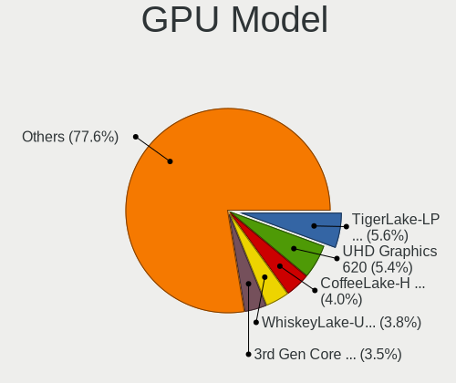

| Model                                                                     | Notebooks | Percent |
|---------------------------------------------------------------------------|-----------|---------|
| Intel UHD Graphics 620                                                    | 30        | 7.03%   |
| Intel TigerLake-LP GT2 [Iris Xe Graphics]                                 | 23        | 5.39%   |
| Intel WhiskeyLake-U GT2 [UHD Graphics 620]                                | 20        | 4.68%   |
| Intel CoffeeLake-H GT2 [UHD Graphics 630]                                 | 18        | 4.22%   |
| Intel 3rd Gen Core processor Graphics Controller                          | 16        | 3.75%   |
| Intel Skylake GT2 [HD Graphics 520]                                       | 14        | 3.28%   |
| Intel Mobile 4 Series Chipset Integrated Graphics Controller              | 14        | 3.28%   |
| Intel 2nd Generation Core Processor Family Integrated Graphics Controller | 14        | 3.28%   |
| Intel HD Graphics 5500                                                    | 12        | 2.81%   |
| Intel CometLake-U GT2 [UHD Graphics]                                      | 12        | 2.81%   |
| Intel HD Graphics 620                                                     | 10        | 2.34%   |
| Intel Haswell-ULT Integrated Graphics Controller                          | 10        | 2.34%   |
| Intel Core Processor Integrated Graphics Controller                       | 10        | 2.34%   |
| Intel CometLake-H GT2 [UHD Graphics]                                      | 10        | 2.34%   |
| Intel HD Graphics 530                                                     | 9         | 2.11%   |
| Nvidia GP108M [GeForce MX150]                                             | 8         | 1.87%   |
| Intel Iris Plus Graphics G7                                               | 7         | 1.64%   |
| Intel 4th Gen Core Processor Integrated Graphics Controller               | 7         | 1.64%   |
| Nvidia GP107M [GeForce GTX 1050 Mobile]                                   | 5         | 1.17%   |
| Nvidia GM107M [GeForce GTX 960M]                                          | 5         | 1.17%   |
| Intel Mobile GM965/GL960 Integrated Graphics Controller (secondary)       | 5         | 1.17%   |
| Intel Mobile GM965/GL960 Integrated Graphics Controller (primary)         | 5         | 1.17%   |
| Nvidia GP107M [GeForce GTX 1050 Ti Mobile]                                | 4         | 0.94%   |
| Intel TigerLake-H GT1 [UHD Graphics]                                      | 4         | 0.94%   |
| Intel Iris Plus Graphics G1 (Ice Lake)                                    | 4         | 0.94%   |
| Intel Alder Lake-P Integrated Graphics Controller                         | 4         | 0.94%   |
| AMD Picasso/Raven 2 [Radeon Vega Series / Radeon Vega Mobile Series]      | 4         | 0.94%   |
| Nvidia TU117GLM [Quadro T1000 Mobile]                                     | 3         | 0.7%    |
| Nvidia GP108M [GeForce MX250]                                             | 3         | 0.7%    |
| Nvidia GP108M [GeForce MX230]                                             | 3         | 0.7%    |
| Nvidia GK107M [GeForce GT 750M]                                           | 3         | 0.7%    |
| Nvidia GA104M [GeForce RTX 3070 Mobile / Max-Q]                           | 3         | 0.7%    |
| Intel Tiger Lake-LP GT2 [UHD Graphics G4]                                 | 3         | 0.7%    |
| Intel HD Graphics 630                                                     | 3         | 0.7%    |
| Intel GeminiLake [UHD Graphics 600]                                       | 3         | 0.7%    |
| Intel Atom Processor D4xx/D5xx/N4xx/N5xx Integrated Graphics Controller   | 3         | 0.7%    |
| AMD Renoir                                                                | 3         | 0.7%    |
| Nvidia TU117M [GeForce MX450]                                             | 2         | 0.47%   |
| Nvidia TU117M [GeForce GTX 1650 Mobile / Max-Q]                           | 2         | 0.47%   |
| Nvidia TU117GLM [Quadro T500 Mobile]                                      | 2         | 0.47%   |

GPU Combo
---------

Combinations of graphics cards

| Name           | Notebooks | Percent |
|----------------|-----------|---------|
| 1 x Intel      | 188       | 59.31%  |
| Intel + Nvidia | 88        | 27.76%  |
| 1 x AMD        | 14        | 4.42%   |
| 1 x Nvidia     | 10        | 3.15%   |
| Intel + AMD    | 8         | 2.52%   |
| AMD + Nvidia   | 5         | 1.58%   |
| 2 x Intel      | 1         | 0.32%   |
| 2 x AMD        | 1         | 0.32%   |
| 1 x VIA        | 1         | 0.32%   |
| 1 x ASPEED     | 1         | 0.32%   |

GPU Driver
----------

Free vs proprietary

| Driver      | Notebooks | Percent |
|-------------|-----------|---------|
| Free        | 259       | 80.94%  |
| Proprietary | 54        | 16.88%  |
| Unknown     | 7         | 2.19%   |

GPU Memory
----------

Total video memory

| Size in GB | Notebooks | Percent |
|------------|-----------|---------|
| Unknown    | 234       | 72.9%   |
| 3.01-4.0   | 27        | 8.41%   |
| 1.01-2.0   | 27        | 8.41%   |
| 0.01-0.5   | 15        | 4.67%   |
| 5.01-6.0   | 6         | 1.87%   |
| 0.51-1.0   | 6         | 1.87%   |
| 7.01-8.0   | 5         | 1.56%   |
| 2.01-3.0   | 1         | 0.31%   |

Monitor
-------

Monitor Vendor
--------------

Monitor vendors

| Vendor                  | Notebooks | Percent |
|-------------------------|-----------|---------|
| AU Optronics            | 71        | 18.25%  |
| Chimei Innolux          | 54        | 13.88%  |
| LG Display              | 52        | 13.37%  |
| BOE                     | 48        | 12.34%  |
| Dell                    | 34        | 8.74%   |
| Samsung Electronics     | 33        | 8.48%   |
| Lenovo                  | 18        | 4.63%   |
| Sharp                   | 12        | 3.08%   |
| Goldstar                | 9         | 2.31%   |
| InfoVision              | 7         | 1.8%    |
| Chi Mei Optoelectronics | 7         | 1.8%    |
| Hewlett-Packard         | 6         | 1.54%   |
| Apple                   | 6         | 1.54%   |
| LG Philips              | 5         | 1.29%   |
| Philips                 | 4         | 1.03%   |
| Toshiba                 | 3         | 0.77%   |
| CSO                     | 3         | 0.77%   |
| ASUSTek Computer        | 3         | 0.77%   |
| PANDA                   | 2         | 0.51%   |
| VOR                     | 1         | 0.26%   |
| Valve                   | 1         | 0.26%   |
| STD                     | 1         | 0.26%   |
| Seiko/Epson             | 1         | 0.26%   |
| RIS                     | 1         | 0.26%   |
| Panasonic               | 1         | 0.26%   |
| LGD                     | 1         | 0.26%   |
| CPT                     | 1         | 0.26%   |
| BOE Technology Group    | 1         | 0.26%   |
| AOC                     | 1         | 0.26%   |
| Ancor Communications    | 1         | 0.26%   |
| Acer                    | 1         | 0.26%   |

Monitor Model
-------------

Monitor models

| Model                                                                    | Notebooks | Percent |
|--------------------------------------------------------------------------|-----------|---------|
| Chimei Innolux LCD Monitor CMN15F5 1920x1080 344x193mm 15.5-inch         | 6         | 1.51%   |
| AU Optronics LCD Monitor AUO403D 1920x1080 309x173mm 13.9-inch           | 6         | 1.51%   |
| Chimei Innolux LCD Monitor CMN14D4 1920x1080 309x173mm 13.9-inch         | 5         | 1.26%   |
| Lenovo LCD Monitor LEN40BA 1920x1080 344x194mm 15.5-inch                 | 4         | 1.01%   |
| Dell P2419H DELD0DA 1920x1080 527x296mm 23.8-inch                        | 4         | 1.01%   |
| LG Display LCD Monitor LGD04A7 1920x1080 344x194mm 15.5-inch             | 3         | 0.76%   |
| Lenovo E27q-20 LEN62D0 2560x1440 597x336mm 27.0-inch                     | 3         | 0.76%   |
| Dell P2419H DELD0D9 1920x1080 530x300mm 24.0-inch                        | 3         | 0.76%   |
| BOE LCD Monitor BOE0802 1920x1080 344x193mm 15.5-inch                    | 3         | 0.76%   |
| AU Optronics LCD Monitor AUO492D 1920x1080 293x165mm 13.2-inch           | 3         | 0.76%   |
| AU Optronics LCD Monitor AUO22EC 1366x768 344x193mm 15.5-inch            | 3         | 0.76%   |
| AU Optronics LCD Monitor AUO102D 1920x1080 293x165mm 13.2-inch           | 3         | 0.76%   |
| Toshiba LCD Monitor LCD2207 1280x800 287x180mm 13.3-inch                 | 2         | 0.5%    |
| Sharp LCD Monitor SHP148D 3840x2160 344x194mm 15.5-inch                  | 2         | 0.5%    |
| Samsung Electronics S24F350 SAM0D20 1920x1080 521x293mm 23.5-inch        | 2         | 0.5%    |
| Samsung Electronics LC34G55T SAM7119 3440x1440 798x334mm 34.1-inch       | 2         | 0.5%    |
| Philips PHL 243V7 PHLC155 1920x1080 527x296mm 23.8-inch                  | 2         | 0.5%    |
| LG Philips LCD Monitor LPL1E01 1280x800 331x207mm 15.4-inch              | 2         | 0.5%    |
| LG Display LCD Monitor LGD05AC 1920x1080 344x194mm 15.5-inch             | 2         | 0.5%    |
| LG Display LCD Monitor LGD0468 1366x768 344x194mm 15.5-inch              | 2         | 0.5%    |
| LG Display LCD Monitor LGD0323 1920x1080 345x194mm 15.6-inch             | 2         | 0.5%    |
| LG Display LCD Monitor LGD02DC 1366x768 344x194mm 15.5-inch              | 2         | 0.5%    |
| InfoVision LCD Monitor IVO057D 1920x1080 309x174mm 14.0-inch             | 2         | 0.5%    |
| InfoVision LCD Monitor IVO0533 1366x768 293x165mm 13.2-inch              | 2         | 0.5%    |
| Goldstar W2243 GSM56FF 1920x1080 477x269mm 21.6-inch                     | 2         | 0.5%    |
| Dell U2717D DEL40EB 2560x1440 597x336mm 27.0-inch                        | 2         | 0.5%    |
| Dell U2312HM DEL4073 1920x1080 510x287mm 23.0-inch                       | 2         | 0.5%    |
| Dell P2719H DEL4184 1920x1080 598x336mm 27.0-inch                        | 2         | 0.5%    |
| Dell P2314H DEL4098 1920x1080 509x286mm 23.0-inch                        | 2         | 0.5%    |
| Chimei Innolux LCD Monitor CMN15E8 1920x1080 344x193mm 15.5-inch         | 2         | 0.5%    |
| Chimei Innolux LCD Monitor CMN15D5 1920x1080 344x193mm 15.5-inch         | 2         | 0.5%    |
| Chimei Innolux LCD Monitor CMN15C3 1920x1080 344x193mm 15.5-inch         | 2         | 0.5%    |
| Chimei Innolux LCD Monitor CMN150C 1920x1080 344x193mm 15.5-inch         | 2         | 0.5%    |
| Chimei Innolux LCD Monitor CMN14E7 1920x1080 309x173mm 13.9-inch         | 2         | 0.5%    |
| Chimei Innolux LCD Monitor CMN14D5 1920x1080 309x173mm 13.9-inch         | 2         | 0.5%    |
| Chimei Innolux LCD Monitor CMN14D2 1920x1080 309x173mm 13.9-inch         | 2         | 0.5%    |
| Chi Mei Optoelectronics LCD Monitor CMO15A7 1366x768 344x193mm 15.5-inch | 2         | 0.5%    |
| BOE LCD Monitor BOE08D7 1920x1080 309x174mm 14.0-inch                    | 2         | 0.5%    |
| BOE LCD Monitor BOE0846 1920x1080 294x165mm 13.3-inch                    | 2         | 0.5%    |
| BOE LCD Monitor BOE07BC 1920x1080 309x173mm 13.9-inch                    | 2         | 0.5%    |

Monitor Resolution
------------------

Monitor screen resolution

| Resolution         | Notebooks | Percent |
|--------------------|-----------|---------|
| 1920x1080 (FHD)    | 178       | 51.15%  |
| 1366x768 (WXGA)    | 72        | 20.69%  |
| 3840x2160 (4K)     | 22        | 6.32%   |
| 2560x1440 (QHD)    | 17        | 4.89%   |
| 1280x800 (WXGA)    | 13        | 3.74%   |
| 1920x1200 (WUXGA)  | 8         | 2.3%    |
| 1600x900 (HD+)     | 6         | 1.72%   |
| 3440x1440          | 3         | 0.86%   |
| 3200x1800 (QHD+)   | 3         | 0.86%   |
| 2880x1800          | 3         | 0.86%   |
| 2560x1600          | 3         | 0.86%   |
| 1440x900 (WXGA+)   | 3         | 0.86%   |
| 2560x1080          | 2         | 0.57%   |
| 1680x1050 (WSXGA+) | 2         | 0.57%   |
| 1280x1024 (SXGA)   | 2         | 0.57%   |
| 1024x768 (XGA)     | 2         | 0.57%   |
| 1024x600           | 2         | 0.57%   |
| 800x1280           | 1         | 0.29%   |
| 3840x1080          | 1         | 0.29%   |
| 3456x2160          | 1         | 0.29%   |
| 2304x1440          | 1         | 0.29%   |
| 2160x1440          | 1         | 0.29%   |
| 1280x768           | 1         | 0.29%   |
| Unknown            | 1         | 0.29%   |

Monitor Diagonal
----------------

Diagonal size in inches

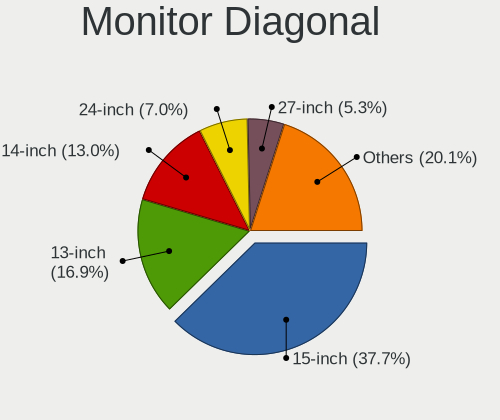

| Inches  | Notebooks | Percent |
|---------|-----------|---------|
| 15      | 147       | 37.89%  |
| 13      | 71        | 18.3%   |
| 14      | 50        | 12.89%  |
| 24      | 27        | 6.96%   |
| 27      | 22        | 5.67%   |
| 23      | 13        | 3.35%   |
| 17      | 10        | 2.58%   |
| 12      | 9         | 2.32%   |
| 21      | 8         | 2.06%   |
| 34      | 4         | 1.03%   |
| 16      | 4         | 1.03%   |
| 40      | 3         | 0.77%   |
| 11      | 3         | 0.77%   |
| Unknown | 3         | 0.77%   |
| 31      | 2         | 0.52%   |
| 22      | 2         | 0.52%   |
| 19      | 2         | 0.52%   |
| 10      | 2         | 0.52%   |
| 84      | 1         | 0.26%   |
| 26      | 1         | 0.26%   |
| 25      | 1         | 0.26%   |
| 18      | 1         | 0.26%   |
| 8       | 1         | 0.26%   |
| 7       | 1         | 0.26%   |

Monitor Width
-------------

Physical width

| Width in mm | Notebooks | Percent |
|-------------|-----------|---------|
| 301-350     | 232       | 60.42%  |
| 501-600     | 58        | 15.1%   |
| 201-300     | 51        | 13.28%  |
| 351-400     | 15        | 3.91%   |
| 401-500     | 11        | 2.86%   |
| 701-800     | 4         | 1.04%   |
| 601-700     | 4         | 1.04%   |
| 801-900     | 3         | 0.78%   |
| Unknown     | 3         | 0.78%   |
| 1501-2000   | 1         | 0.26%   |
| 101-200     | 1         | 0.26%   |
| 1-100       | 1         | 0.26%   |

Aspect Ratio
------------

Proportional relationship between the width and the height

| Ratio   | Notebooks | Percent |
|---------|-----------|---------|
| 16/9    | 273       | 84.52%  |
| 16/10   | 34        | 10.53%  |
| 21/9    | 4         | 1.24%   |
| 4/3     | 3         | 0.93%   |
| 3/2     | 3         | 0.93%   |
| Unknown | 3         | 0.93%   |
| 5/4     | 2         | 0.62%   |
| 0.67    | 1         | 0.31%   |

Monitor Area
------------

Area in inch

| Area in inch | Notebooks | Percent |
|----------------|-----------|---------|
| 101-110        | 147       | 38.08%  |
| 81-90          | 87        | 22.54%  |
| 201-250        | 44        | 11.4%   |
| 71-80          | 33        | 8.55%   |
| 301-350        | 23        | 5.96%   |
| 61-70          | 9         | 2.33%   |
| 121-130        | 8         | 2.07%   |
| 351-500        | 6         | 1.55%   |
| 251-300        | 4         | 1.04%   |
| 111-120        | 4         | 1.04%   |
| 51-60          | 3         | 0.78%   |
| 151-200        | 3         | 0.78%   |
| 501-1000       | 3         | 0.78%   |
| Unknown        | 3         | 0.78%   |
| 41-50          | 2         | 0.52%   |
| 1-40           | 2         | 0.52%   |
| 131-140        | 2         | 0.52%   |
| More than 1000 | 1         | 0.26%   |
| 141-150        | 1         | 0.26%   |
| 91-100         | 1         | 0.26%   |

Pixel Density
-------------

Pixels per inch

| Density       | Notebooks | Percent |
|---------------|-----------|---------|
| 121-160       | 159       | 41.84%  |
| 101-120       | 94        | 24.74%  |
| 51-100        | 70        | 18.42%  |
| 161-240       | 31        | 8.16%   |
| More than 240 | 23        | 6.05%   |
| Unknown       | 3         | 0.79%   |

Multiple Monitors
-----------------

Total monitors connected

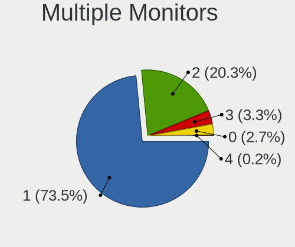

| Total | Notebooks | Percent |
|-------|-----------|---------|
| 1     | 235       | 72.98%  |
| 2     | 68        | 21.12%  |
| 3     | 12        | 3.73%   |
| 0     | 6         | 1.86%   |
| 4     | 1         | 0.31%   |

Network
-------

Net Controller Vendor
---------------------

Controller vendors

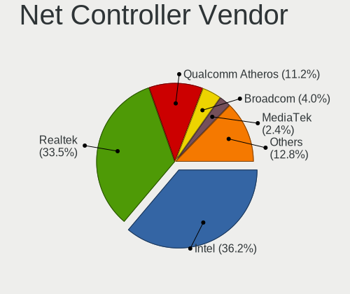

| Vendor                          | Notebooks | Percent |
|---------------------------------|-----------|---------|
| Intel                           | 190       | 37.4%   |
| Realtek Semiconductor           | 159       | 31.3%   |
| Qualcomm Atheros                | 61        | 12.01%  |
| Broadcom                        | 25        | 4.92%   |
| Broadcom Limited                | 13        | 2.56%   |
| Lenovo                          | 12        | 2.36%   |
| MediaTek                        | 6         | 1.18%   |
| DisplayLink                     | 5         | 0.98%   |
| Xiaomi                          | 3         | 0.59%   |
| Qualcomm Atheros Communications | 3         | 0.59%   |
| Marvell Technology Group        | 3         | 0.59%   |
| ASIX Electronics                | 3         | 0.59%   |
| Samsung Electronics             | 2         | 0.39%   |
| Ralink Technology               | 2         | 0.39%   |
| Huawei Technologies             | 2         | 0.39%   |
| Edimax Technology               | 2         | 0.39%   |
| U-Blox                          | 1         | 0.2%    |
| Toshiba                         | 1         | 0.2%    |
| Qualcomm                        | 1         | 0.2%    |
| PEAK-System Technik             | 1         | 0.2%    |
| Nvidia                          | 1         | 0.2%    |
| Nokia Mobile Phones             | 1         | 0.2%    |
| Linksys                         | 1         | 0.2%    |
| LG Electronics                  | 1         | 0.2%    |
| ICS Advent                      | 1         | 0.2%    |
| HMD Global                      | 1         | 0.2%    |
| Hewlett-Packard                 | 1         | 0.2%    |
| Google                          | 1         | 0.2%    |
| Dell                            | 1         | 0.2%    |
| Comneon                         | 1         | 0.2%    |
| Bose                            | 1         | 0.2%    |
| Attansic Technology             | 1         | 0.2%    |
| ASUSTek Computer                | 1         | 0.2%    |

Net Controller Model
--------------------

Controller models

| Model                                                                   | Notebooks | Percent |
|-------------------------------------------------------------------------|-----------|---------|
| Realtek RTL8111/8168/8411 PCI Express Gigabit Ethernet Controller       | 94        | 15.24%  |
| Realtek RTL810xE PCI Express Fast Ethernet controller                   | 32        | 5.19%   |
| Intel Wireless 8265 / 8275                                              | 21        | 3.4%    |
| Intel Wi-Fi 6 AX201                                                     | 20        | 3.24%   |
| Realtek RTL8153 Gigabit Ethernet Adapter                                | 13        | 2.11%   |
| Intel Comet Lake PCH-LP CNVi WiFi                                       | 12        | 1.94%   |
| Intel Cannon Point-LP CNVi [Wireless-AC]                                | 12        | 1.94%   |
| Qualcomm Atheros QCA9377 802.11ac Wireless Network Adapter              | 11        | 1.78%   |
| Qualcomm Atheros AR9285 Wireless Network Adapter (PCI-Express)          | 11        | 1.78%   |
| Intel Wi-Fi 6 AX200                                                     | 11        | 1.78%   |
| Intel Wireless 8260                                                     | 10        | 1.62%   |
| Intel Comet Lake PCH CNVi WiFi                                          | 10        | 1.62%   |
| Qualcomm Atheros QCA6174 802.11ac Wireless Network Adapter              | 9         | 1.46%   |
| Intel Dual Band Wireless-AC 3165 Plus Bluetooth                         | 9         | 1.46%   |
| Intel 82579LM Gigabit Network Connection (Lewisville)                   | 9         | 1.46%   |
| Realtek RTL8822BE 802.11a/b/g/n/ac WiFi adapter                         | 8         | 1.3%    |
| Qualcomm Atheros QCA9565 / AR9565 Wireless Network Adapter              | 8         | 1.3%    |
| Qualcomm Atheros AR9485 Wireless Network Adapter                        | 8         | 1.3%    |
| Intel Wireless 3165                                                     | 8         | 1.3%    |
| Intel Wireless 3160                                                     | 8         | 1.3%    |
| Intel Wireless 7265                                                     | 7         | 1.13%   |
| Intel Centrino Advanced-N 6205 [Taylor Peak]                            | 7         | 1.13%   |
| Broadcom BCM4313 802.11bgn Wireless Network Adapter                     | 7         | 1.13%   |
| Realtek RTL8822CE 802.11ac PCIe Wireless Network Adapter                | 6         | 0.97%   |
| Realtek RTL8821CE 802.11ac PCIe Wireless Network Adapter                | 6         | 0.97%   |
| Lenovo ThinkPad TBT 3 Dock                                              | 6         | 0.97%   |
| Intel Ethernet Connection (7) I219-LM                                   | 6         | 0.97%   |
| Intel Ethernet Connection (13) I219-V                                   | 6         | 0.97%   |
| Intel Cannon Lake PCH CNVi WiFi                                         | 6         | 0.97%   |
| Realtek RTL8723BE PCIe Wireless Network Adapter                         | 5         | 0.81%   |
| Qualcomm Atheros AR242x / AR542x Wireless Network Adapter (PCI-Express) | 5         | 0.81%   |
| Intel Ethernet Connection I219-LM                                       | 5         | 0.81%   |
| Intel Ethernet Connection (4) I219-LM                                   | 5         | 0.81%   |
| Intel Alder Lake-P PCH CNVi WiFi                                        | 5         | 0.81%   |
| Broadcom Limited BCM4312 802.11b/g LP-PHY                               | 5         | 0.81%   |
| Realtek RTL8125 2.5GbE Controller                                       | 4         | 0.65%   |
| Lenovo USB-C Dock Ethernet                                              | 4         | 0.65%   |
| Intel Wireless 7260                                                     | 4         | 0.65%   |
| Intel Wi-Fi 6 AX210/AX211/AX411 160MHz                                  | 4         | 0.65%   |
| Intel Ice Lake-LP PCH CNVi WiFi                                         | 4         | 0.65%   |

Wireless Vendor
---------------

Wireless vendors

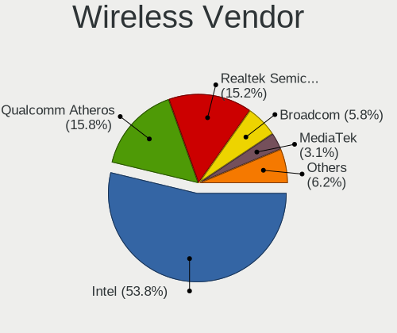

| Vendor                          | Notebooks | Percent |
|---------------------------------|-----------|---------|
| Intel                           | 180       | 55.73%  |
| Qualcomm Atheros                | 56        | 17.34%  |
| Realtek Semiconductor           | 37        | 11.46%  |
| Broadcom                        | 24        | 7.43%   |
| Broadcom Limited                | 10        | 3.1%    |
| MediaTek                        | 6         | 1.86%   |
| Qualcomm Atheros Communications | 3         | 0.93%   |
| Ralink Technology               | 2         | 0.62%   |
| Edimax Technology               | 2         | 0.62%   |
| Qualcomm                        | 1         | 0.31%   |
| Dell                            | 1         | 0.31%   |
| ASUSTek Computer                | 1         | 0.31%   |

Wireless Model
--------------

Wireless models

| Model                                                                   | Notebooks | Percent |
|-------------------------------------------------------------------------|-----------|---------|
| Intel Wireless 8265 / 8275                                              | 21        | 6.46%   |
| Intel Wi-Fi 6 AX201                                                     | 20        | 6.15%   |
| Intel Comet Lake PCH-LP CNVi WiFi                                       | 12        | 3.69%   |
| Intel Cannon Point-LP CNVi [Wireless-AC]                                | 12        | 3.69%   |
| Qualcomm Atheros QCA9377 802.11ac Wireless Network Adapter              | 11        | 3.38%   |
| Qualcomm Atheros AR9285 Wireless Network Adapter (PCI-Express)          | 11        | 3.38%   |
| Intel Wi-Fi 6 AX200                                                     | 11        | 3.38%   |
| Intel Wireless 8260                                                     | 10        | 3.08%   |
| Intel Comet Lake PCH CNVi WiFi                                          | 10        | 3.08%   |
| Qualcomm Atheros QCA6174 802.11ac Wireless Network Adapter              | 9         | 2.77%   |
| Intel Dual Band Wireless-AC 3165 Plus Bluetooth                         | 9         | 2.77%   |
| Realtek RTL8822BE 802.11a/b/g/n/ac WiFi adapter                         | 8         | 2.46%   |
| Qualcomm Atheros QCA9565 / AR9565 Wireless Network Adapter              | 8         | 2.46%   |
| Qualcomm Atheros AR9485 Wireless Network Adapter                        | 8         | 2.46%   |
| Intel Wireless 3165                                                     | 8         | 2.46%   |
| Intel Wireless 3160                                                     | 8         | 2.46%   |
| Intel Wireless 7265                                                     | 7         | 2.15%   |
| Intel Centrino Advanced-N 6205 [Taylor Peak]                            | 7         | 2.15%   |
| Broadcom BCM4313 802.11bgn Wireless Network Adapter                     | 7         | 2.15%   |
| Realtek RTL8822CE 802.11ac PCIe Wireless Network Adapter                | 6         | 1.85%   |
| Realtek RTL8821CE 802.11ac PCIe Wireless Network Adapter                | 6         | 1.85%   |
| Intel Cannon Lake PCH CNVi WiFi                                         | 6         | 1.85%   |
| Realtek RTL8723BE PCIe Wireless Network Adapter                         | 5         | 1.54%   |
| Qualcomm Atheros AR242x / AR542x Wireless Network Adapter (PCI-Express) | 5         | 1.54%   |
| Intel Alder Lake-P PCH CNVi WiFi                                        | 5         | 1.54%   |
| Broadcom Limited BCM4312 802.11b/g LP-PHY                               | 5         | 1.54%   |
| Intel Wireless 7260                                                     | 4         | 1.23%   |
| Intel Wi-Fi 6 AX210/AX211/AX411 160MHz                                  | 4         | 1.23%   |
| Intel Ice Lake-LP PCH CNVi WiFi                                         | 4         | 1.23%   |
| Realtek RTL88x2bu [AC1200 Techkey]                                      | 3         | 0.92%   |
| Qualcomm Atheros AR9271 802.11n                                         | 3         | 0.92%   |
| MediaTek MT7921 802.11ax PCI Express Wireless Network Adapter           | 3         | 0.92%   |
| Intel Tiger Lake PCH CNVi WiFi                                          | 3         | 0.92%   |
| Intel PRO/Wireless 3945ABG [Golan] Network Connection                   | 3         | 0.92%   |
| Broadcom Limited BCM4352 802.11ac Wireless Network Adapter              | 3         | 0.92%   |
| Realtek RTL8723DE Wireless Network Adapter                              | 2         | 0.62%   |
| Realtek RTL8188EE Wireless Network Adapter                              | 2         | 0.62%   |
| Realtek RTL8188CE 802.11b/g/n WiFi Adapter                              | 2         | 0.62%   |
| Ralink RT2870/RT3070 Wireless Adapter                                   | 2         | 0.62%   |
| Qualcomm Atheros AR9462 Wireless Network Adapter                        | 2         | 0.62%   |

Ethernet Vendor
---------------

Ethernet vendors

| Vendor                   | Notebooks | Percent |
|--------------------------|-----------|---------|
| Realtek Semiconductor    | 146       | 52.52%  |
| Intel                    | 75        | 26.98%  |
| Qualcomm Atheros         | 12        | 4.32%   |
| Lenovo                   | 12        | 4.32%   |
| Broadcom                 | 7         | 2.52%   |
| DisplayLink              | 5         | 1.8%    |
| Broadcom Limited         | 4         | 1.44%   |
| Xiaomi                   | 3         | 1.08%   |
| Marvell Technology Group | 3         | 1.08%   |
| ASIX Electronics         | 3         | 1.08%   |
| Samsung Electronics      | 1         | 0.36%   |
| Nvidia                   | 1         | 0.36%   |
| Linksys                  | 1         | 0.36%   |
| ICS Advent               | 1         | 0.36%   |
| Huawei Technologies      | 1         | 0.36%   |
| HMD Global               | 1         | 0.36%   |
| Google                   | 1         | 0.36%   |
| Attansic Technology      | 1         | 0.36%   |

Ethernet Model
--------------

Ethernet models

| Model                                                             | Notebooks | Percent |
|-------------------------------------------------------------------|-----------|---------|
| Realtek RTL8111/8168/8411 PCI Express Gigabit Ethernet Controller | 94        | 33.33%  |
| Realtek RTL810xE PCI Express Fast Ethernet controller             | 32        | 11.35%  |
| Realtek RTL8153 Gigabit Ethernet Adapter                          | 13        | 4.61%   |
| Intel 82579LM Gigabit Network Connection (Lewisville)             | 9         | 3.19%   |
| Lenovo ThinkPad TBT 3 Dock                                        | 6         | 2.13%   |
| Intel Ethernet Connection (7) I219-LM                             | 6         | 2.13%   |
| Intel Ethernet Connection (13) I219-V                             | 6         | 2.13%   |
| Intel Ethernet Connection I219-LM                                 | 5         | 1.77%   |
| Intel Ethernet Connection (4) I219-LM                             | 5         | 1.77%   |
| Realtek RTL8125 2.5GbE Controller                                 | 4         | 1.42%   |
| Lenovo USB-C Dock Ethernet                                        | 4         | 1.42%   |
| Intel Ethernet Connection (6) I219-V                              | 4         | 1.42%   |
| Intel Ethernet Connection (10) I219-V                             | 4         | 1.42%   |
| Intel I210 Gigabit Network Connection                             | 3         | 1.06%   |
| Intel Ethernet Connection (4) I219-V                              | 3         | 1.06%   |
| Intel Ethernet Connection (2) I219-LM                             | 3         | 1.06%   |
| Intel Ethernet Connection (11) I219-LM                            | 3         | 1.06%   |
| Intel 82567LM Gigabit Network Connection                          | 3         | 1.06%   |
| DisplayLink StarTech USB3DOCKHDPC                                 | 3         | 1.06%   |
| ASIX AX88179 Gigabit Ethernet                                     | 3         | 1.06%   |
| Xiaomi Mi/Redmi series (RNDIS)                                    | 2         | 0.71%   |
| Qualcomm Atheros AR8152 v2.0 Fast Ethernet                        | 2         | 0.71%   |
| Qualcomm Atheros AR8151 v2.0 Gigabit Ethernet                     | 2         | 0.71%   |
| Qualcomm Atheros AR8132 Fast Ethernet                             | 2         | 0.71%   |
| Marvell Group 88E8040 PCI-E Fast Ethernet Controller              | 2         | 0.71%   |
| Intel Ethernet Connection I217-LM                                 | 2         | 0.71%   |
| Intel Ethernet Connection (6) I219-LM                             | 2         | 0.71%   |
| Intel Ethernet Connection (3) I218-LM                             | 2         | 0.71%   |
| Intel Ethernet Connection (14) I219-LM                            | 2         | 0.71%   |
| DisplayLink Dell Universal Dock D6000                             | 2         | 0.71%   |
| Broadcom NetXtreme BCM57765 Gigabit Ethernet PCIe                 | 2         | 0.71%   |
| Xiaomi Mi/Redmi series (RNDIS + ADB)                              | 1         | 0.35%   |
| Samsung Galaxy series, misc. (tethering mode)                     | 1         | 0.35%   |
| Realtek RTL8152 Fast Ethernet Adapter                             | 1         | 0.35%   |
| Realtek RTL-8100/8101L/8139 PCI Fast Ethernet Adapter             | 1         | 0.35%   |
| Realtek PCIe GbE Family Controller                                | 1         | 0.35%   |
| Realtek Killer E2500 Gigabit Ethernet Controller                  | 1         | 0.35%   |
| Qualcomm Atheros QCA8172 Fast Ethernet                            | 1         | 0.35%   |
| Qualcomm Atheros Killer E2400 Gigabit Ethernet Controller         | 1         | 0.35%   |
| Qualcomm Atheros AR8162 Fast Ethernet                             | 1         | 0.35%   |

Net Controller Kind
-------------------

Ethernet, WiFi or modem

| Kind     | Notebooks | Percent |
|----------|-----------|---------|
| WiFi     | 311       | 54.28%  |
| Ethernet | 252       | 43.98%  |
| Modem    | 9         | 1.57%   |
| Unknown  | 1         | 0.17%   |

Used Controller
---------------

Currently used network controller

| Kind     | Notebooks | Percent |
|----------|-----------|---------|
| WiFi     | 249       | 73.67%  |
| Ethernet | 88        | 26.04%  |
| Modem    | 1         | 0.3%    |

NICs
----

Total network controllers on board

| Total | Notebooks | Percent |
|-------|-----------|---------|
| 2     | 225       | 70.75%  |
| 1     | 89        | 27.99%  |
| 3     | 3         | 0.94%   |
| 7     | 1         | 0.31%   |

IPv6
----

IPv6 vs IPv4

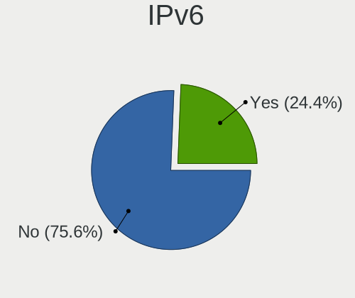

| Used | Notebooks | Percent |
|------|-----------|---------|
| No   | 272       | 84.74%  |
| Yes  | 49        | 15.26%  |

Bluetooth
---------

Bluetooth Vendor
----------------

Controller vendors

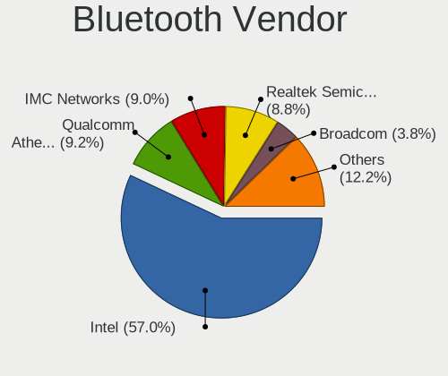

| Vendor                          | Notebooks | Percent |
|---------------------------------|-----------|---------|
| Intel                           | 156       | 59.54%  |
| Qualcomm Atheros Communications | 23        | 8.78%   |
| Realtek Semiconductor           | 21        | 8.02%   |
| IMC Networks                    | 17        | 6.49%   |
| Broadcom                        | 10        | 3.82%   |
| Foxconn / Hon Hai               | 7         | 2.67%   |
| Lite-On Technology              | 6         | 2.29%   |
| Apple                           | 6         | 2.29%   |
| Dell                            | 5         | 1.91%   |
| Hewlett-Packard                 | 2         | 0.76%   |
| Cambridge Silicon Radio         | 2         | 0.76%   |
| Askey Computer                  | 2         | 0.76%   |
| Toshiba                         | 1         | 0.38%   |
| Realtek                         | 1         | 0.38%   |
| MediaTek                        | 1         | 0.38%   |
| ASUSTek Computer                | 1         | 0.38%   |
| Actions                         | 1         | 0.38%   |

Bluetooth Model
---------------

Controller models

| Model                                               | Notebooks | Percent |
|-----------------------------------------------------|-----------|---------|
| Intel Bluetooth wireless interface                  | 59        | 22.52%  |
| Intel AX201 Bluetooth                               | 44        | 16.79%  |
| Intel Bluetooth 9460/9560 Jefferson Peak (JfP)      | 25        | 9.54%   |
| Qualcomm Atheros  Bluetooth Device                  | 12        | 4.58%   |
| Realtek Bluetooth Radio                             | 10        | 3.82%   |
| Intel AX200 Bluetooth                               | 10        | 3.82%   |
| Intel Bluetooth Device                              | 8         | 3.05%   |
| Realtek  Bluetooth 4.2 Adapter                      | 7         | 2.67%   |
| Lite-On Bluetooth Device                            | 5         | 1.91%   |
| IMC Networks Bluetooth Radio                        | 5         | 1.91%   |
| Realtek RTL8822BE Bluetooth 4.2 Adapter             | 4         | 1.53%   |
| Qualcomm Atheros AR3012 Bluetooth 4.0               | 4         | 1.53%   |
| Intel AX210 Bluetooth                               | 4         | 1.53%   |
| IMC Networks Wireless_Device                        | 4         | 1.53%   |
| IMC Networks Bluetooth Device                       | 4         | 1.53%   |
| Apple Bluetooth Host Controller                     | 4         | 1.53%   |
| Qualcomm Atheros QCA61x4 Bluetooth 4.0              | 3         | 1.15%   |
| Qualcomm Atheros AR9462 Bluetooth                   | 3         | 1.15%   |
| Dell BCM20702A0 Bluetooth Module                    | 3         | 1.15%   |
| Intel Wireless-AC 9260 Bluetooth Adapter            | 2         | 0.76%   |
| Intel Wireless-AC 3168 Bluetooth                    | 2         | 0.76%   |
| Intel Centrino Bluetooth Wireless Transceiver       | 2         | 0.76%   |
| IMC Networks Bluetooth USB Host Controller          | 2         | 0.76%   |
| IMC Networks Atheros AR3012 Bluetooth 4.0 Adapter   | 2         | 0.76%   |
| Foxconn / Hon Hai BT                                | 2         | 0.76%   |
| Foxconn / Hon Hai Broadcom BCM20702A1 Bluetooth     | 2         | 0.76%   |
| Foxconn / Hon Hai Bluetooth Device                  | 2         | 0.76%   |
| Dell DW375 Bluetooth Module                         | 2         | 0.76%   |
| Cambridge Silicon Radio Bluetooth Dongle (HCI mode) | 2         | 0.76%   |
| Broadcom BCM2070 Bluetooth 2.1 + EDR                | 2         | 0.76%   |
| Broadcom BCM2045B (BDC-2) [Bluetooth Controller]    | 2         | 0.76%   |
| Askey Bluetooth Device                              | 2         | 0.76%   |
| Toshiba Askey Bluetooth Module                      | 1         | 0.38%   |
| Realtek Bluetooth Radio                             | 1         | 0.38%   |
| Qualcomm Atheros AR3011 Bluetooth                   | 1         | 0.38%   |
| MediaTek BT                                         | 1         | 0.38%   |
| Lite-On Atheros Bluetooth                           | 1         | 0.38%   |
| HP Broadcom 2070 Bluetooth Combo                    | 1         | 0.38%   |
| HP Bluetooth 2.0 Interface [Broadcom BCM2045]       | 1         | 0.38%   |
| Foxconn / Hon Hai Acer Module                       | 1         | 0.38%   |

Sound
-----

Sound Vendor
------------

Sound card vendors

| Vendor                     | Notebooks | Percent |
|----------------------------|-----------|---------|
| Intel                      | 295       | 74.31%  |
| Nvidia                     | 47        | 11.84%  |
| AMD                        | 19        | 4.79%   |
| Lenovo                     | 13        | 3.27%   |
| Realtek Semiconductor      | 5         | 1.26%   |
| Microsoft                  | 2         | 0.5%    |
| Logitech                   | 2         | 0.5%    |
| GN Netcom                  | 2         | 0.5%    |
| XMOS                       | 1         | 0.25%   |
| VIA Technologies           | 1         | 0.25%   |
| Texas Instruments          | 1         | 0.25%   |
| Sennheiser Communications  | 1         | 0.25%   |
| Razer USA                  | 1         | 0.25%   |
| PreSonus Audio Electronics | 1         | 0.25%   |
| Plantronics                | 1         | 0.25%   |
| FIFINE Microphones         | 1         | 0.25%   |
| Dell                       | 1         | 0.25%   |
| Creative Technology        | 1         | 0.25%   |
| C-Media Electronics        | 1         | 0.25%   |
| ASUSTek Computer           | 1         | 0.25%   |

Sound Model
-----------

Sound card models

| Model                                                                      | Notebooks | Percent |
|----------------------------------------------------------------------------|-----------|---------|
| Intel Sunrise Point-LP HD Audio                                            | 59        | 13.29%  |
| Intel Tiger Lake-LP Smart Sound Technology Audio Controller                | 26        | 5.86%   |
| Intel Cannon Point-LP High Definition Audio Controller                     | 20        | 4.5%    |
| Intel Cannon Lake PCH cAVS                                                 | 19        | 4.28%   |
| Intel 7 Series/C216 Chipset Family High Definition Audio Controller        | 19        | 4.28%   |
| Intel Wildcat Point-LP High Definition Audio Controller                    | 15        | 3.38%   |
| Intel Broadwell-U Audio Controller                                         | 15        | 3.38%   |
| Intel 82801I (ICH9 Family) HD Audio Controller                             | 15        | 3.38%   |
| Intel 6 Series/C200 Series Chipset Family High Definition Audio Controller | 14        | 3.15%   |
| Intel Comet Lake PCH-LP cAVS                                               | 13        | 2.93%   |
| Intel Ice Lake-LP Smart Sound Technology Audio Controller                  | 12        | 2.7%    |
| AMD Family 17h/19h HD Audio Controller                                     | 12        | 2.7%    |
| Intel Comet Lake PCH cAVS                                                  | 11        | 2.48%   |
| Intel 5 Series/3400 Series Chipset High Definition Audio                   | 11        | 2.48%   |
| Intel Haswell-ULT HD Audio Controller                                      | 10        | 2.25%   |
| Intel 8 Series HD Audio Controller                                         | 10        | 2.25%   |
| Intel 100 Series/C230 Series Chipset Family HD Audio Controller            | 10        | 2.25%   |
| Intel 8 Series/C220 Series Chipset High Definition Audio Controller        | 8         | 1.8%    |
| Intel Xeon E3-1200 v3/4th Gen Core Processor HD Audio Controller           | 7         | 1.58%   |
| Intel Alder Lake PCH-P High Definition Audio Controller                    | 7         | 1.58%   |
| Nvidia TU107 GeForce GTX 1650 High Definition Audio Controller             | 6         | 1.35%   |
| Nvidia GP107GL High Definition Audio Controller                            | 6         | 1.35%   |
| Nvidia GA104 High Definition Audio Controller                              | 6         | 1.35%   |
| Lenovo ThinkPad Thunderbolt 3 Dock USB Audio                               | 6         | 1.35%   |
| Intel NM10/ICH7 Family High Definition Audio Controller                    | 6         | 1.35%   |
| Realtek Semiconductor USB Audio                                            | 5         | 1.13%   |
| Intel 82801H (ICH8 Family) HD Audio Controller                             | 5         | 1.13%   |
| AMD Renoir Radeon High Definition Audio Controller                         | 5         | 1.13%   |
| Nvidia TU106 High Definition Audio Controller                              | 4         | 0.9%    |
| Nvidia GM107 High Definition Audio Controller [GeForce 940MX]              | 4         | 0.9%    |
| Lenovo ThinkPad USB-C Dock Gen2 USB Audio                                  | 4         | 0.9%    |
| Intel Tiger Lake-H HD Audio Controller                                     | 4         | 0.9%    |
| Intel CM238 HD Audio Controller                                            | 4         | 0.9%    |
| AMD Rembrandt Radeon High Definition Audio Controller                      | 4         | 0.9%    |
| AMD Raven/Raven2/Fenghuang HDMI/DP Audio Controller                        | 4         | 0.9%    |
| AMD FCH Azalia Controller                                                  | 4         | 0.9%    |
| Nvidia TU104 HD Audio Controller                                           | 3         | 0.68%   |
| Intel Celeron/Pentium Silver Processor High Definition Audio               | 3         | 0.68%   |
| Nvidia GP106 High Definition Audio Controller                              | 2         | 0.45%   |
| Nvidia GK107 HDMI Audio Controller                                         | 2         | 0.45%   |

Memory
------

Memory Vendor
-------------

Memory module vendors

| Vendor              | Notebooks | Percent |
|---------------------|-----------|---------|
| Samsung Electronics | 65        | 28.63%  |
| SK hynix            | 54        | 23.79%  |
| Micron Technology   | 41        | 18.06%  |
| Kingston            | 17        | 7.49%   |
| Unknown             | 13        | 5.73%   |
| Crucial             | 11        | 4.85%   |
| Ramaxel Technology  | 7         | 3.08%   |
| G.Skill             | 4         | 1.76%   |
| Nanya Technology    | 3         | 1.32%   |
| Elpida              | 3         | 1.32%   |
| Transcend           | 2         | 0.88%   |
| V-Color             | 1         | 0.44%   |
| Corsair             | 1         | 0.44%   |
| Avant               | 1         | 0.44%   |
| ASint Technology    | 1         | 0.44%   |
| A-DATA Technology   | 1         | 0.44%   |
| 48spaces            | 1         | 0.44%   |
| Unknown             | 1         | 0.44%   |

Memory Model
------------

Memory module models

| Model                                                         | Notebooks | Percent |
|---------------------------------------------------------------|-----------|---------|
| SK hynix RAM HMT351S6CFR8C-PB 4GB SODIMM DDR3 1600MT/s        | 4         | 1.7%    |
| Samsung RAM M471A5244CB0-CTD 4GB SODIMM DDR4 3266MT/s         | 4         | 1.7%    |
| Samsung RAM M471A2K43DB1-CWE 16GB SODIMM DDR4 3200MT/s        | 4         | 1.7%    |
| Samsung RAM M471A1K43CB1-CTD 8GB SODIMM DDR4 2667MT/s         | 4         | 1.7%    |
| SK hynix RAM HMT451S6BFR8A-PB 4GB SODIMM DDR3 1600MT/s        | 3         | 1.28%   |
| SK hynix RAM HMA81GS6AFR8N-UH 8GB SODIMM DDR4 2667MT/s        | 3         | 1.28%   |
| SK hynix RAM HMA41GS6AFR8N-TF 8GB SODIMM DDR4 2667MT/s        | 3         | 1.28%   |
| Samsung RAM M471B5273DH0-CH9 4GB SODIMM DDR3 1334MT/s         | 3         | 1.28%   |
| Samsung RAM M471A2K43DB1-CTD 16GB SODIMM DDR4 2667MT/s        | 3         | 1.28%   |
| Samsung RAM K4E6E304EB-EGCG 4GB Row Of Chips LPDDR3 2133MT/s  | 3         | 1.28%   |
| Micron RAM MTC8C1084S1SC48BA1 16GB SODIMM DDR5 4800MT/s       | 3         | 1.28%   |
| Micron RAM 4ATF51264HZ-2G6E1 4GB SODIMM DDR4 2667MT/s         | 3         | 1.28%   |
| Unknown RAM Module 2048MB SODIMM DDR2                         | 2         | 0.85%   |
| Unknown RAM Module 1024MB SODIMM DDR2 667MT/s                 | 2         | 0.85%   |
| Unknown RAM Module 1024MB SODIMM DDR2                         | 2         | 0.85%   |
| Unknown RAM MEM-DOWN 8192MB SODIMM DDR4 2400MT/s              | 2         | 0.85%   |
| SK hynix RAM HMT451S6AFR8A-PB 4GB SODIMM DDR3 1600MT/s        | 2         | 0.85%   |
| SK hynix RAM HMAA4GS6AJR8N-XN 32GB SODIMM DDR4 3200MT/s       | 2         | 0.85%   |
| SK hynix RAM HMAA2GS6CJR8N-XN 16GB SODIMM DDR4 3200MT/s       | 2         | 0.85%   |
| SK hynix RAM HMAA1GS6CMR6N-VK 8GB SODIMM DDR4 2667MT/s        | 2         | 0.85%   |
| SK hynix RAM HMAA1GS6CJR6N-XN 8192MB SODIMM DDR4 3200MT/s     | 2         | 0.85%   |
| SK hynix RAM HMA851S6JJR6N-VK 4GB SODIMM DDR4 2667MT/s        | 2         | 0.85%   |
| SK hynix RAM HMA82GS6JJR8N-VK 16GB SODIMM DDR4 2667MT/s       | 2         | 0.85%   |
| Samsung RAM Module 8GB SODIMM DDR4 2667MT/s                   | 2         | 0.85%   |
| Samsung RAM M471B5673DZ1-CF8 2048MB SODIMM 1067MT/s           | 2         | 0.85%   |
| Samsung RAM M471B5173EB0-YK0 4GB SODIMM DDR3 1600MT/s         | 2         | 0.85%   |
| Samsung RAM M471A4G43MB1-CTD 32GB SODIMM DDR4 2667MT/s        | 2         | 0.85%   |
| Samsung RAM M471A1K43DB1-CTD 8GB SODIMM DDR4 2667MT/s         | 2         | 0.85%   |
| Samsung RAM M471A1G43DB0-CPB 8GB SODIMM DDR4 2667MT/s         | 2         | 0.85%   |
| Samsung RAM M425R2GA3BB0-CQKOD 16GB SODIMM DDR5 4800MT/s      | 2         | 0.85%   |
| Samsung RAM K4EBE304EB-EGCG 8GB Row Of Chips LPDDR3 2133MT/s  | 2         | 0.85%   |
| Ramaxel RAM RMSA3320ME88HBF-3200 16GB SODIMM DDR4 3200MT/s    | 2         | 0.85%   |
| Ramaxel RAM RMSA3260ME78HAF-2666 8GB SODIMM DDR4 2667MT/s     | 2         | 0.85%   |
| Micron RAM MT52L1G32D4PG-093 8GB Row Of Chips LPDDR3 2133MT/s | 2         | 0.85%   |
| Micron RAM 8ATF2G64HZ-3G2E1 16GB SODIMM DDR4 3200MT/s         | 2         | 0.85%   |
| Micron RAM 8ATF1G64HZ-3G2J1 8GB SODIMM DDR4 3200MT/s          | 2         | 0.85%   |
| Micron RAM 8ATF1G64HZ-2G3E1 8GB SODIMM DDR4 2400MT/s          | 2         | 0.85%   |
| Micron RAM 4ATS2G64HZ-3G2B1 16GB SODIMM DDR4 3200MT/s         | 2         | 0.85%   |
| Micron RAM 4ATF51264HZ-3G2J1 4GB Row Of Chips DDR4 3200MT/s   | 2         | 0.85%   |
| Micron RAM 4ATF1G64HZ-3G2E1 8GB SODIMM DDR4 3200MT/s          | 2         | 0.85%   |

Memory Kind
-----------

Memory module kinds

| Kind    | Notebooks | Percent |
|---------|-----------|---------|
| DDR4    | 106       | 56.38%  |
| DDR3    | 43        | 22.87%  |
| LPDDR3  | 13        | 6.91%   |
| DDR2    | 10        | 5.32%   |
| DDR5    | 6         | 3.19%   |
| DDR     | 3         | 1.6%    |
| Unknown | 3         | 1.6%    |
| LPDDR5  | 2         | 1.06%   |
| LPDDR4  | 2         | 1.06%   |

Memory Form Factor
------------------

Physical design of the memory module

| Name         | Notebooks | Percent |
|--------------|-----------|---------|
| SODIMM       | 166       | 88.77%  |
| Row Of Chips | 19        | 10.16%  |
| DIMM         | 1         | 0.53%   |
| Chip         | 1         | 0.53%   |

Memory Size
-----------

Memory module size

| Size  | Notebooks | Percent |
|-------|-----------|---------|
| 8192  | 69        | 33.99%  |
| 4096  | 49        | 24.14%  |
| 16384 | 48        | 23.65%  |
| 2048  | 18        | 8.87%   |
| 32768 | 10        | 4.93%   |
| 1024  | 9         | 4.43%   |

Memory Speed
------------

Memory module speed

| Speed   | Notebooks | Percent |
|---------|-----------|---------|
| 2667    | 50        | 24.75%  |
| 3200    | 40        | 19.8%   |
| 1600    | 32        | 15.84%  |
| 2133    | 19        | 9.41%   |
| 2400    | 14        | 6.93%   |
| 667     | 7         | 3.47%   |
| 4800    | 6         | 2.97%   |
| 1334    | 5         | 2.48%   |
| 1067    | 5         | 2.48%   |
| 3266    | 4         | 1.98%   |
| 6400    | 3         | 1.49%   |
| 1867    | 3         | 1.49%   |
| 1333    | 3         | 1.49%   |
| Unknown | 3         | 1.49%   |
| 4267    | 2         | 0.99%   |
| 800     | 2         | 0.99%   |
| 533     | 2         | 0.99%   |
| 8400    | 1         | 0.5%    |
| 1066    | 1         | 0.5%    |

Printers & scanners
-------------------

Printer Vendor
--------------

Printer device vendors

| Vendor              | Notebooks | Percent |
|---------------------|-----------|---------|
| Samsung Electronics | 2         | 66.67%  |
| BIXOLON             | 1         | 33.33%  |

Printer Model
-------------

Printer device models

| Model                              | Notebooks | Percent |
|------------------------------------|-----------|---------|
| Samsung ML-1610 Mono Laser Printer | 1         | 33.33%  |
| Samsung M288x Series               | 1         | 33.33%  |
| BIXOLON BIXOLON_SLP-T400           | 1         | 33.33%  |

Scanner Vendor
--------------

Scanner device vendors

| Vendor | Notebooks | Percent |
|--------|-----------|---------|
| Canon  | 1         | 100%    |

Scanner Model
-------------

Scanner device models

| Model                   | Notebooks | Percent |
|-------------------------|-----------|---------|
| Canon CanoScan LiDE 220 | 1         | 100%    |

Camera
------

Camera Vendor
-------------

Camera device vendors

| Vendor                                 | Notebooks | Percent |
|----------------------------------------|-----------|---------|
| IMC Networks                           | 53        | 18.09%  |
| Chicony Electronics                    | 52        | 17.75%  |
| Realtek Semiconductor                  | 43        | 14.68%  |
| Sunplus Innovation Technology          | 23        | 7.85%   |
| Microdia                               | 23        | 7.85%   |
| Bison Electronics                      | 12        | 4.1%    |
| Acer                                   | 10        | 3.41%   |
| Cheng Uei Precision Industry (Foxlink) | 9         | 3.07%   |
| Lite-On Technology                     | 8         | 2.73%   |
| Apple                                  | 8         | 2.73%   |
| Suyin                                  | 7         | 2.39%   |
| Quanta                                 | 7         | 2.39%   |
| Logitech                               | 7         | 2.39%   |
| Luxvisions Innotech Limited            | 5         | 1.71%   |
| Syntek                                 | 4         | 1.37%   |
| Silicon Motion                         | 4         | 1.37%   |
| Microsoft                              | 4         | 1.37%   |
| Lenovo                                 | 2         | 0.68%   |
| Cubeternet                             | 2         | 0.68%   |
| ALi                                    | 2         | 0.68%   |
| Alcor Micro                            | 2         | 0.68%   |
| Z-Star Microelectronics                | 1         | 0.34%   |
| Samsung Electronics                    | 1         | 0.34%   |
| Primax Electronics                     | 1         | 0.34%   |
| Jieli Technology                       | 1         | 0.34%   |
| Generalplus Technology                 | 1         | 0.34%   |
| eMPIA Technology                       | 1         | 0.34%   |

Camera Model
------------

Camera device models

| Model                                         | Notebooks | Percent |
|-----------------------------------------------|-----------|---------|
| Realtek Integrated_Webcam_HD                  | 21        | 7.14%   |
| Chicony Integrated Camera                     | 21        | 7.14%   |
| IMC Networks USB2.0 HD UVC WebCam             | 16        | 5.44%   |
| IMC Networks USB2.0 VGA UVC WebCam            | 13        | 4.42%   |
| IMC Networks Integrated Camera                | 13        | 4.42%   |
| Microdia Integrated_Webcam_HD                 | 11        | 3.74%   |
| Sunplus Integrated_Webcam_HD                  | 4         | 1.36%   |
| Lite-On HP HD Camera                          | 4         | 1.36%   |
| Chicony HP HD Camera                          | 4         | 1.36%   |
| Bison SunplusIT Integrated Camera             | 4         | 1.36%   |
| Apple iPhone 5/5C/5S/6/SE/7/8/X               | 4         | 1.36%   |
| Syntek Integrated Camera                      | 3         | 1.02%   |
| Sunplus FHD Camera Microphone                 | 3         | 1.02%   |
| Realtek USB Camera                            | 3         | 1.02%   |
| Realtek Lenovo EasyCamera                     | 3         | 1.02%   |
| Realtek Integrated Webcam HD                  | 3         | 1.02%   |
| IMC Networks USB2.0 UVC HD Webcam             | 3         | 1.02%   |
| IMC Networks USB2.0 HD IR UVC WebCam          | 3         | 1.02%   |
| Chicony Lenovo EasyCamera                     | 3         | 1.02%   |
| Chicony Integrated Camera (1280x720@30)       | 3         | 1.02%   |
| Bison Integrated Camera                       | 3         | 1.02%   |
| Acer Lenovo EasyCamera                        | 3         | 1.02%   |
| Acer Integrated Camera                        | 3         | 1.02%   |
| Acer BisonCam, NB Pro                         | 3         | 1.02%   |
| Suyin Integrated_Webcam_HD                    | 2         | 0.68%   |
| Sunplus Lenovo EasyCamera                     | 2         | 0.68%   |
| Sunplus Laptop_Integrated_Webcam_FHD          | 2         | 0.68%   |
| Sunplus HD WebCam                             | 2         | 0.68%   |
| Sunplus ASUS Webcam                           | 2         | 0.68%   |
| Realtek USB2.0 HD UVC WebCam                  | 2         | 0.68%   |
| Realtek HP Wide Vision HD Camera              | 2         | 0.68%   |
| Quanta USB Webcam                             | 2         | 0.68%   |
| Quanta HP TrueVision HD Camera                | 2         | 0.68%   |
| Microsoft LifeCam NX-6000                     | 2         | 0.68%   |
| Microdia Integrated Webcam                    | 2         | 0.68%   |
| Microdia Dell Integrated HD Webcam            | 2         | 0.68%   |
| Luxvisions Innotech Limited Integrated Camera | 2         | 0.68%   |
| Luxvisions Innotech Limited HP HD Camera      | 2         | 0.68%   |
| Logitech HD Pro Webcam C920                   | 2         | 0.68%   |
| Lite-On Integrated Camera                     | 2         | 0.68%   |

Security
--------

Fingerprint Vendor
------------------

Fingerprint sensor vendors

| Vendor                     | Notebooks | Percent |
|----------------------------|-----------|---------|
| Synaptics                  | 29        | 43.28%  |
| Validity Sensors           | 19        | 28.36%  |
| Shenzhen Goodix Technology | 8         | 11.94%  |
| Elan Microelectronics      | 5         | 7.46%   |
| STMicroelectronics         | 2         | 2.99%   |
| AuthenTec                  | 2         | 2.99%   |
| Upek                       | 1         | 1.49%   |
| LighTuning Technology      | 1         | 1.49%   |

Fingerprint Model
-----------------

Fingerprint sensor models

| Model                                                                      | Notebooks | Percent |
|----------------------------------------------------------------------------|-----------|---------|
| Synaptics Prometheus MIS Touch Fingerprint Reader                          | 16        | 23.88%  |
| Validity Sensors Synaptics VFS7552 Touch Fingerprint Sensor with PurePrint | 5         | 7.46%   |
| Validity Sensors VFS5011 Fingerprint Reader                                | 4         | 5.97%   |
| Shenzhen Goodix  FingerPrint Device                                        | 4         | 5.97%   |
| Shenzhen Goodix Fingerprint Reader                                         | 4         | 5.97%   |
| Elan ELAN:Fingerprint                                                      | 4         | 5.97%   |
| Validity Sensors VFS495 Fingerprint Reader                                 | 3         | 4.48%   |
| Synaptics Metallica MIS Touch Fingerprint Reader                           | 3         | 4.48%   |
| Validity Sensors VFS 5011 fingerprint sensor                               | 2         | 2.99%   |
| Synaptics  VFS7552 Touch Fingerprint Sensor with PurePrint                 | 2         | 2.99%   |
| Synaptics FS7604 Touch Fingerprint Sensor with PurePrint                   | 2         | 2.99%   |
| STMicroelectronics Fingerprint Reader                                      | 2         | 2.99%   |
| Validity Sensors VFS7500 Touch Fingerprint Sensor                          | 1         | 1.49%   |
| Validity Sensors VFS491                                                    | 1         | 1.49%   |
| Validity Sensors VFS471 Fingerprint Reader                                 | 1         | 1.49%   |
| Validity Sensors VFS Fingerprint sensor                                    | 1         | 1.49%   |
| Validity Sensors Synaptics WBDI                                            | 1         | 1.49%   |
| Upek Biometric Touchchip/Touchstrip Fingerprint Sensor                     | 1         | 1.49%   |
| Synaptics WBDI                                                             | 1         | 1.49%   |
| Synaptics UWP WBDI                                                         | 1         | 1.49%   |
| Synaptics  WBDI Fingerprint Reader - USB 052                               | 1         | 1.49%   |
| Synaptics  WBDI                                                            | 1         | 1.49%   |
| Synaptics  FS7604 Touch Fingerprint Sensor with PurePrint                  | 1         | 1.49%   |
| Synaptics Metallica MOH Touch Fingerprint Reader                           | 1         | 1.49%   |
| LighTuning EgisTec Touch Fingerprint Sensor                                | 1         | 1.49%   |
| Elan ELAN:ARM-M4                                                           | 1         | 1.49%   |
| AuthenTec Fingerprint Sensor                                               | 1         | 1.49%   |
| AuthenTec AES2501 Fingerprint Sensor                                       | 1         | 1.49%   |

Chipcard Vendor
---------------

Chipcard module vendors

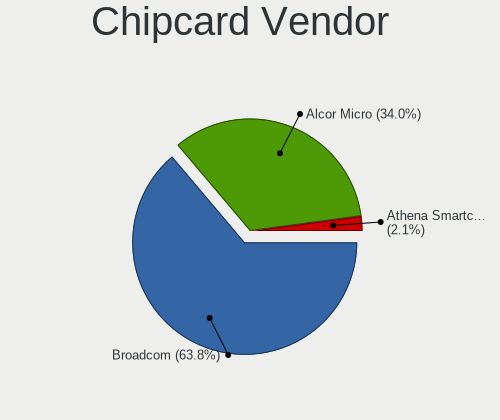

| Vendor      | Notebooks | Percent |
|-------------|-----------|---------|
| Broadcom    | 24        | 63.16%  |
| Alcor Micro | 14        | 36.84%  |

Chipcard Model
--------------

Chipcard module models

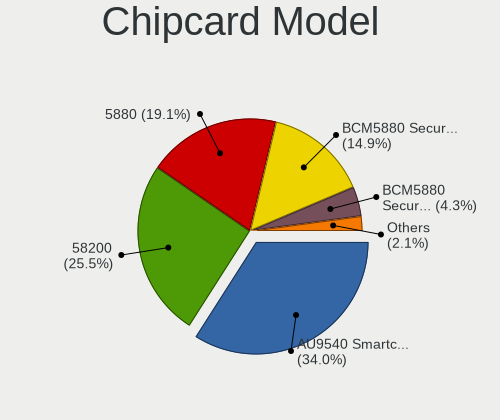

| Model                                                                        | Notebooks | Percent |
|------------------------------------------------------------------------------|-----------|---------|
| Alcor Micro AU9540 Smartcard Reader                                          | 14        | 36.84%  |
| Broadcom 58200                                                               | 8         | 21.05%  |
| Broadcom BCM5880 Secure Applications Processor with fingerprint swipe sensor | 7         | 18.42%  |
| Broadcom 5880                                                                | 7         | 18.42%  |
| Broadcom BCM5880 Secure Applications Processor                               | 2         | 5.26%   |

Unsupported
-----------

Unsupported Devices
-------------------

Total unsupported devices on board

| Total | Notebooks | Percent |
|-------|-----------|---------|
| 0     | 181       | 55.18%  |
| 1     | 109       | 33.23%  |
| 2     | 30        | 9.15%   |
| 3     | 6         | 1.83%   |
| 7     | 1         | 0.3%    |
| 4     | 1         | 0.3%    |

Unsupported Device Types
------------------------

Types of unsupported devices

| Type                     | Notebooks | Percent |
|--------------------------|-----------|---------|
| Fingerprint reader       | 66        | 34.74%  |
| Graphics card            | 38        | 20%     |
| Chipcard                 | 34        | 17.89%  |
| Net/wireless             | 20        | 10.53%  |
| Multimedia controller    | 8         | 4.21%   |
| Camera                   | 8         | 4.21%   |
| Card reader              | 3         | 1.58%   |
| Unassigned class         | 2         | 1.05%   |
| Storage                  | 2         | 1.05%   |
| Sound                    | 2         | 1.05%   |
| Net/ethernet             | 2         | 1.05%   |
| Communication controller | 2         | 1.05%   |
| Bluetooth                | 2         | 1.05%   |
| Network                  | 1         | 0.53%   |

