Linux in Italy - Tested Hardware & Statistics
---------------------------------------------

A project to collect tested hardware configurations for Linux in Italy.

Anyone can contribute to this report by the [hw-probe](https://github.com/linuxhw/hw-probe) tool:

    sudo -E hw-probe -all -upload

Please contribute! Especially if your hardware is rare.

This is a report for all computer types. See also reports for [desktops](/Location/Italy/Desktop/README.md) and [notebooks](/Location/Italy/Notebook/README.md).

Contents
--------

* [ Test Cases ](#test-cases)

* [ System ](#system)
  - [ OS                       ](#os)
  - [ OS Family                ](#os-family)
  - [ Kernel                   ](#kernel)
  - [ Kernel Family            ](#kernel-family)
  - [ Kernel Major Ver.        ](#kernel-major-ver)
  - [ Arch                     ](#arch)
  - [ DE                       ](#de)
  - [ Display Server           ](#display-server)
  - [ Display Manager          ](#display-manager)
  - [ OS Lang                  ](#os-lang)
  - [ Boot Mode                ](#boot-mode)
  - [ Filesystem               ](#filesystem)
  - [ Part. scheme             ](#part-scheme)
  - [ Dual Boot with Linux/BSD ](#dual-boot-with-linuxbsd)
  - [ Dual Boot (Win)          ](#dual-boot-win)

* [ Board ](#board)
  - [ Vendor                   ](#vendor)
  - [ Model                    ](#model)
  - [ Model Family             ](#model-family)
  - [ MFG Year                 ](#mfg-year)
  - [ Form Factor              ](#form-factor)
  - [ Secure Boot              ](#secure-boot)
  - [ Coreboot                 ](#coreboot)
  - [ RAM Size                 ](#ram-size)
  - [ RAM Used                 ](#ram-used)
  - [ Total Drives             ](#total-drives)
  - [ Has CD-ROM               ](#has-cd-rom)
  - [ Has Ethernet             ](#has-ethernet)
  - [ Has WiFi                 ](#has-wifi)
  - [ Has Bluetooth            ](#has-bluetooth)

* [ Location ](#location)
  - [ Country                  ](#country)
  - [ City                     ](#city)

* [ Drives ](#drives)
  - [ Drive Vendor             ](#drive-vendor)
  - [ Drive Model              ](#drive-model)
  - [ HDD Vendor               ](#hdd-vendor)
  - [ SSD Vendor               ](#ssd-vendor)
  - [ Drive Kind               ](#drive-kind)
  - [ Drive Connector          ](#drive-connector)
  - [ Drive Size               ](#drive-size)
  - [ Space Total              ](#space-total)
  - [ Space Used               ](#space-used)
  - [ Malfunc. Drives          ](#malfunc-drives)
  - [ Malfunc. Drive Vendor    ](#malfunc-drive-vendor)
  - [ Malfunc. HDD Vendor      ](#malfunc-hdd-vendor)
  - [ Malfunc. Drive Kind      ](#malfunc-drive-kind)
  - [ Failed Drives            ](#failed-drives)
  - [ Failed Drive Vendor      ](#failed-drive-vendor)
  - [ Drive Status             ](#drive-status)

* [ Storage controller ](#storage-controller)
  - [ Storage Vendor           ](#storage-vendor)
  - [ Storage Model            ](#storage-model)
  - [ Storage Kind             ](#storage-kind)

* [ Processor ](#processor)
  - [ CPU Vendor               ](#cpu-vendor)
  - [ CPU Model                ](#cpu-model)
  - [ CPU Model Family         ](#cpu-model-family)
  - [ CPU Cores                ](#cpu-cores)
  - [ CPU Sockets              ](#cpu-sockets)
  - [ CPU Threads              ](#cpu-threads)
  - [ CPU Op-Modes             ](#cpu-op-modes)
  - [ CPU Microcode            ](#cpu-microcode)
  - [ CPU Microarch            ](#cpu-microarch)

* [ Graphics ](#graphics)
  - [ GPU Vendor               ](#gpu-vendor)
  - [ GPU Model                ](#gpu-model)
  - [ GPU Combo                ](#gpu-combo)
  - [ GPU Driver               ](#gpu-driver)
  - [ GPU Memory               ](#gpu-memory)

* [ Monitor ](#monitor)
  - [ Monitor Vendor           ](#monitor-vendor)
  - [ Monitor Model            ](#monitor-model)
  - [ Monitor Resolution       ](#monitor-resolution)
  - [ Monitor Diagonal         ](#monitor-diagonal)
  - [ Monitor Width            ](#monitor-width)
  - [ Aspect Ratio             ](#aspect-ratio)
  - [ Monitor Area             ](#monitor-area)
  - [ Pixel Density            ](#pixel-density)
  - [ Multiple Monitors        ](#multiple-monitors)

* [ Network ](#network)
  - [ Net Controller Vendor    ](#net-controller-vendor)
  - [ Net Controller Model     ](#net-controller-model)
  - [ Wireless Vendor          ](#wireless-vendor)
  - [ Wireless Model           ](#wireless-model)
  - [ Ethernet Vendor          ](#ethernet-vendor)
  - [ Ethernet Model           ](#ethernet-model)
  - [ Net Controller Kind      ](#net-controller-kind)
  - [ Used Controller          ](#used-controller)
  - [ NICs                     ](#nics)
  - [ IPv6                     ](#ipv6)

* [ Bluetooth ](#bluetooth)
  - [ Bluetooth Vendor         ](#bluetooth-vendor)
  - [ Bluetooth Model          ](#bluetooth-model)

* [ Sound ](#sound)
  - [ Sound Vendor             ](#sound-vendor)
  - [ Sound Model              ](#sound-model)

* [ Memory ](#memory)
  - [ Memory Vendor            ](#memory-vendor)
  - [ Memory Model             ](#memory-model)
  - [ Memory Kind              ](#memory-kind)
  - [ Memory Form Factor       ](#memory-form-factor)
  - [ Memory Size              ](#memory-size)
  - [ Memory Speed             ](#memory-speed)

* [ Printers & scanners ](#printers--scanners)
  - [ Printer Vendor           ](#printer-vendor)
  - [ Printer Model            ](#printer-model)
  - [ Scanner Vendor           ](#scanner-vendor)
  - [ Scanner Model            ](#scanner-model)

* [ Camera ](#camera)
  - [ Camera Vendor            ](#camera-vendor)
  - [ Camera Model             ](#camera-model)

* [ Security ](#security)
  - [ Fingerprint Vendor       ](#fingerprint-vendor)
  - [ Fingerprint Model        ](#fingerprint-model)
  - [ Chipcard Vendor          ](#chipcard-vendor)
  - [ Chipcard Model           ](#chipcard-model)

* [ Unsupported ](#unsupported)
  - [ Unsupported Devices      ](#unsupported-devices)
  - [ Unsupported Device Types ](#unsupported-device-types)

Test Cases
----------

Total: 20671

| Vendor        | Model                       | Form-Factor | Probe                                                      | Date         |
|---------------|-----------------------------|-------------|------------------------------------------------------------|--------------|
| Gigabyte      | B550M DS3H AC               | Desktop     | [767ad8fe5b](https://linux-hardware.org/?probe=767ad8fe5b) | Jan 03, 2026 |
| ASUSTek       | ROG Zephyrus G14 GA402RJ... | Notebook    | [85618a8644](https://linux-hardware.org/?probe=85618a8644) | Jan 03, 2026 |
| ASRock        | X670E Taichi Carrara        | Desktop     | [c5b30f8440](https://linux-hardware.org/?probe=c5b30f8440) | Jan 03, 2026 |
| Dell          | XPS 15 7590                 | Notebook    | [45baf5cfda](https://linux-hardware.org/?probe=45baf5cfda) | Jan 03, 2026 |
| HP            | Pavilion Laptop 15-cs0xx... | Notebook    | [525e798c63](https://linux-hardware.org/?probe=525e798c63) | Jan 03, 2026 |
| HUAWEI        | BOHK-WAX9X                  | Notebook    | [ebdf349ead](https://linux-hardware.org/?probe=ebdf349ead) | Jan 03, 2026 |
| HUAWEI        | BOHK-WAX9X                  | Notebook    | [30854b7414](https://linux-hardware.org/?probe=30854b7414) | Jan 03, 2026 |
| ASUSTek       | 970 PRO GAMING/AURA         | Desktop     | [7f5c5c99a4](https://linux-hardware.org/?probe=7f5c5c99a4) | Jan 03, 2026 |
| MSI           | MPG B650I EDGE WIFI         | Notebook    | [e9c3182fd2](https://linux-hardware.org/?probe=e9c3182fd2) | Jan 03, 2026 |
| ASUSTek       | X540SA                      | Notebook    | [cf33eb74e3](https://linux-hardware.org/?probe=cf33eb74e3) | Jan 03, 2026 |
| Acer          | Aspire A315-58G             | Notebook    | [60a98fdab8](https://linux-hardware.org/?probe=60a98fdab8) | Jan 02, 2026 |
| Gigabyte      | B250M-D2V-CF                | Desktop     | [92759c307d](https://linux-hardware.org/?probe=92759c307d) | Jan 02, 2026 |
| Gigabyte      | B250M-D2V-CF                | Desktop     | [85269401f7](https://linux-hardware.org/?probe=85269401f7) | Jan 02, 2026 |
| Lenovo        | 1036 SDK0Q40104 WIN 3305... | Desktop     | [efad00deb8](https://linux-hardware.org/?probe=efad00deb8) | Jan 02, 2026 |
| Gigabyte      | B550M DS3H AC               | Desktop     | [82300c5831](https://linux-hardware.org/?probe=82300c5831) | Jan 02, 2026 |
| Medion        | E15433                      | Notebook    | [3e51a24706](https://linux-hardware.org/?probe=3e51a24706) | Jan 02, 2026 |
| ASRock        | B450M Pro4                  | Desktop     | [e7e95e897c](https://linux-hardware.org/?probe=e7e95e897c) | Jan 02, 2026 |
| Lenovo        | ThinkPad T14s Gen 1 20UJ... | Notebook    | [8ad3b3b827](https://linux-hardware.org/?probe=8ad3b3b827) | Jan 01, 2026 |
| Packard Be... | IMEDIA S2185                | Desktop     | [8cd832ce44](https://linux-hardware.org/?probe=8cd832ce44) | Jan 01, 2026 |
| Samsung       | R540/SA41/E452              | Notebook    | [46b3f83b4e](https://linux-hardware.org/?probe=46b3f83b4e) | Dec 31, 2025 |
| ASUSTek       | TUF Gaming B650M-PLUS WI... | Desktop     | [601bf37381](https://linux-hardware.org/?probe=601bf37381) | Dec 31, 2025 |
| ASUSTek       | N550JV                      | Notebook    | [938353e80e](https://linux-hardware.org/?probe=938353e80e) | Dec 31, 2025 |
| Lenovo        | ThinkPad P53 20QQS6BR01     | Notebook    | [106eff98cb](https://linux-hardware.org/?probe=106eff98cb) | Dec 31, 2025 |
| Gigabyte      | GA-MA78LMT-S2               | Desktop     | [cff486190f](https://linux-hardware.org/?probe=cff486190f) | Dec 31, 2025 |
| ASUSTek       | PRIME B365M-A               | Desktop     | [c827dc109a](https://linux-hardware.org/?probe=c827dc109a) | Dec 31, 2025 |
| MSI           | MAG B760M MORTAR WIFI       | Desktop     | [88cafa55e3](https://linux-hardware.org/?probe=88cafa55e3) | Dec 30, 2025 |
| Lenovo        | ThinkPad X230 2333AZ2       | Notebook    | [d0563f5f99](https://linux-hardware.org/?probe=d0563f5f99) | Dec 30, 2025 |
| Medion        | E11201                      | Notebook    | [7fdafac742](https://linux-hardware.org/?probe=7fdafac742) | Dec 30, 2025 |
| Acer          | Aspire AG15-42P             | Notebook    | [286eb07b15](https://linux-hardware.org/?probe=286eb07b15) | Dec 30, 2025 |
| Apple         | Mac-F42386C8 PVT            | All in one  | [1afc9cf41c](https://linux-hardware.org/?probe=1afc9cf41c) | Dec 30, 2025 |
| Gigabyte      | B760M DS3H AX DDR4          | Desktop     | [5aac66aa4f](https://linux-hardware.org/?probe=5aac66aa4f) | Dec 30, 2025 |
| Fujitsu       | LIFEBOOK A514               | Notebook    | [e2a3c805a5](https://linux-hardware.org/?probe=e2a3c805a5) | Dec 30, 2025 |
| ASUSTek       | N552VW                      | Notebook    | [2c4a622175](https://linux-hardware.org/?probe=2c4a622175) | Dec 30, 2025 |
| Acer          | Extensa 5635Z               | Notebook    | [6072e75059](https://linux-hardware.org/?probe=6072e75059) | Dec 30, 2025 |
| RealBom       | RB-P101G                    | Desktop     | [19739d8f88](https://linux-hardware.org/?probe=19739d8f88) | Dec 30, 2025 |
| Lenovo        | ThinkPad Yoga 370 20JJS0... | Convertible | [75af427f97](https://linux-hardware.org/?probe=75af427f97) | Dec 30, 2025 |
| HP            | EliteBook 2560p             | Notebook    | [a747a895ec](https://linux-hardware.org/?probe=a747a895ec) | Dec 30, 2025 |
| ASUSTek       | TUF Gaming B550M-PLUS       | Desktop     | [356f323819](https://linux-hardware.org/?probe=356f323819) | Dec 30, 2025 |
| Apple         | Mac-F42386C8 PVT            | All in one  | [de62f2e11a](https://linux-hardware.org/?probe=de62f2e11a) | Dec 29, 2025 |
| HP            | G62                         | Notebook    | [2d1e058098](https://linux-hardware.org/?probe=2d1e058098) | Dec 29, 2025 |
| MSI           | H81M-P33                    | Desktop     | [9753790362](https://linux-hardware.org/?probe=9753790362) | Dec 29, 2025 |
| HP            | Notebook                    | Notebook    | [43c59b63fd](https://linux-hardware.org/?probe=43c59b63fd) | Dec 29, 2025 |
| Apple         | MacBookAir5,2               | Notebook    | [f1e12362de](https://linux-hardware.org/?probe=f1e12362de) | Dec 29, 2025 |
| ASUSTek       | K52JT                       | Notebook    | [707aef0cc5](https://linux-hardware.org/?probe=707aef0cc5) | Dec 29, 2025 |
| Acer          | Aspire ES1-411              | Notebook    | [6d55dc4b0b](https://linux-hardware.org/?probe=6d55dc4b0b) | Dec 29, 2025 |
| ASUSTek       | VivoBook_ASUSLaptop X515... | Notebook    | [2aa89c0038](https://linux-hardware.org/?probe=2aa89c0038) | Dec 29, 2025 |
| ASUSTek       | VivoBook_ASUSLaptop X515... | Notebook    | [81b18e2732](https://linux-hardware.org/?probe=81b18e2732) | Dec 29, 2025 |
| Dell          | Latitude 5400               | Notebook    | [02cbf3ff21](https://linux-hardware.org/?probe=02cbf3ff21) | Dec 28, 2025 |
| Acer          | Aspire A315-59              | Notebook    | [7ca2a433d0](https://linux-hardware.org/?probe=7ca2a433d0) | Dec 28, 2025 |
| Sony          | VAIO                        | All in one  | [074a4d7aae](https://linux-hardware.org/?probe=074a4d7aae) | Dec 28, 2025 |
| Dell          | Latitude 5400               | Notebook    | [71b8b07f05](https://linux-hardware.org/?probe=71b8b07f05) | Dec 28, 2025 |
| HP            | ProBook 4 G1iR 16 inch N... | Notebook    | [39dd8c7be1](https://linux-hardware.org/?probe=39dd8c7be1) | Dec 28, 2025 |
| Shenzhen M... | F7BSI                       | Mini pc     | [c899f1ea0c](https://linux-hardware.org/?probe=c899f1ea0c) | Dec 28, 2025 |
| Lenovo        | ThinkPad T14 Gen 4 21K3C... | Notebook    | [3578d7ba51](https://linux-hardware.org/?probe=3578d7ba51) | Dec 28, 2025 |
| HP            | Compaq 6710b                | Notebook    | [f79af1b495](https://linux-hardware.org/?probe=f79af1b495) | Dec 28, 2025 |
| HP            | Pavilion dv7                | Notebook    | [b8195766ab](https://linux-hardware.org/?probe=b8195766ab) | Dec 28, 2025 |
| ASUSTek       | ROG CROSSHAIR X870E HERO    | Desktop     | [0f78f6bc68](https://linux-hardware.org/?probe=0f78f6bc68) | Dec 28, 2025 |
| ASUSTek       | ROG CROSSHAIR X870E HERO    | Desktop     | [10952a16c3](https://linux-hardware.org/?probe=10952a16c3) | Dec 28, 2025 |
| HP            | Pavilion x360 Convertibl... | Convertible | [9190e89fce](https://linux-hardware.org/?probe=9190e89fce) | Dec 28, 2025 |
| ASUSTek       | G750JH                      | Notebook    | [fcc2a3ed70](https://linux-hardware.org/?probe=fcc2a3ed70) | Dec 27, 2025 |
| ASUSTek       | X555LA                      | Notebook    | [1d40254aa7](https://linux-hardware.org/?probe=1d40254aa7) | Dec 27, 2025 |
| ASUSTek       | X555LA                      | Notebook    | [5e4fc8a531](https://linux-hardware.org/?probe=5e4fc8a531) | Dec 27, 2025 |
| HP            | Victus by Gaming Laptop ... | Notebook    | [592d88204d](https://linux-hardware.org/?probe=592d88204d) | Dec 27, 2025 |
| Lenovo        | ThinkPad X230 2333AZ2       | Notebook    | [efe2902e42](https://linux-hardware.org/?probe=efe2902e42) | Dec 27, 2025 |
| ASUSTek       | SABERTOOTH Z170 MARK 1      | Desktop     | [57678dd0ca](https://linux-hardware.org/?probe=57678dd0ca) | Dec 27, 2025 |
| Lenovo        | ThinkPad X230 23252FG       | Notebook    | [e148e0dea7](https://linux-hardware.org/?probe=e148e0dea7) | Dec 27, 2025 |
| Lenovo        | IdeaPad 300-15ISK 80Q7      | Notebook    | [e39dcf06eb](https://linux-hardware.org/?probe=e39dcf06eb) | Dec 27, 2025 |
| Fujitsu       | D3049-B1 S26361-D3049-B1... | Server      | [b134ec4d9d](https://linux-hardware.org/?probe=b134ec4d9d) | Dec 27, 2025 |
| ASUSTek       | ROG Strix G16 G614PP_G61... | Notebook    | [0e5f4dff50](https://linux-hardware.org/?probe=0e5f4dff50) | Dec 27, 2025 |
| ASUSTek       | A55BM-E                     | Desktop     | [3ca2e23c35](https://linux-hardware.org/?probe=3ca2e23c35) | Dec 26, 2025 |
| Fujitsu       | D3049-B1 S26361-D3049-B1... | Server      | [5837ba90e5](https://linux-hardware.org/?probe=5837ba90e5) | Dec 26, 2025 |
| Apple         | MacBookAir6,2               | Notebook    | [c7e30d2ca9](https://linux-hardware.org/?probe=c7e30d2ca9) | Dec 26, 2025 |
| Packard Be... | EasyNote ML65               | Notebook    | [dd117fc69d](https://linux-hardware.org/?probe=dd117fc69d) | Dec 26, 2025 |
| ASUSTek       | X550LD                      | Notebook    | [caa4f88110](https://linux-hardware.org/?probe=caa4f88110) | Dec 26, 2025 |
| Packard Be... | EasyNote ML65               | Notebook    | [a318f46686](https://linux-hardware.org/?probe=a318f46686) | Dec 26, 2025 |
| ASUSTek       | A4320A6420                  | Desktop     | [0b492872a5](https://linux-hardware.org/?probe=0b492872a5) | Dec 26, 2025 |
| ASUSTek       | NUC14MNB2 60AS00H0-MB7A0... | Mini pc     | [8bcb8e5ad0](https://linux-hardware.org/?probe=8bcb8e5ad0) | Dec 26, 2025 |
| Dell          | Latitude 7290               | Notebook    | [2ab1b03b53](https://linux-hardware.org/?probe=2ab1b03b53) | Dec 26, 2025 |
| Intel         | NUC7i5BNB J31144-310        | Mini pc     | [b766cfa3ec](https://linux-hardware.org/?probe=b766cfa3ec) | Dec 26, 2025 |
| ASUSTek       | B150-PLUS                   | Desktop     | [bb93d580a6](https://linux-hardware.org/?probe=bb93d580a6) | Dec 26, 2025 |
| HP            | Pavilion Laptop 15-eg2xx... | Notebook    | [2b330ff2a3](https://linux-hardware.org/?probe=2b330ff2a3) | Dec 26, 2025 |
| Lenovo        | ThinkPad E595 20NFCTO1WW    | Notebook    | [5446798fde](https://linux-hardware.org/?probe=5446798fde) | Dec 26, 2025 |
| Acer          | H810M41 V10                 | Desktop     | [3b000d2777](https://linux-hardware.org/?probe=3b000d2777) | Dec 26, 2025 |
| Lenovo        | Yoga Slim 7 14ILL10 83JX    | Notebook    | [77d066aeb7](https://linux-hardware.org/?probe=77d066aeb7) | Dec 26, 2025 |
| ASUSTek       | PRIME B660-PLUS D4          | Desktop     | [4783000454](https://linux-hardware.org/?probe=4783000454) | Dec 25, 2025 |
| Apple         | Mac-031B6874CF7F642A iMa... | All in one  | [0bb9f9f25c](https://linux-hardware.org/?probe=0bb9f9f25c) | Dec 25, 2025 |
| ASUSTek       | PRIME B660-PLUS D4          | Desktop     | [f2b43c2e79](https://linux-hardware.org/?probe=f2b43c2e79) | Dec 25, 2025 |
| Apple         | MacBook5,2                  | Notebook    | [af68a4c625](https://linux-hardware.org/?probe=af68a4c625) | Dec 25, 2025 |
| Apple         | MacBookPro11,3              | Notebook    | [f2b2f765f0](https://linux-hardware.org/?probe=f2b2f765f0) | Dec 25, 2025 |
| Lenovo        | Yoga Slim 6 14IAP8 82WU     | Notebook    | [c6bf04735c](https://linux-hardware.org/?probe=c6bf04735c) | Dec 25, 2025 |
| ASUSTek       | X510UNR                     | Notebook    | [25e9969a2a](https://linux-hardware.org/?probe=25e9969a2a) | Dec 25, 2025 |
| Lenovo        | ThinkPad P16s Gen 4 AMD ... | Notebook    | [9e6fb0b9e0](https://linux-hardware.org/?probe=9e6fb0b9e0) | Dec 25, 2025 |
| Lenovo        | Yoga Slim 6 14IAP8 82WU     | Notebook    | [9ca214ebcc](https://linux-hardware.org/?probe=9ca214ebcc) | Dec 25, 2025 |
| Unknown       | Unknown                     | Desktop     | [c7dcabbf37](https://linux-hardware.org/?probe=c7dcabbf37) | Dec 25, 2025 |
| Packard Be... | WMCP78M                     | Desktop     | [6003686ab6](https://linux-hardware.org/?probe=6003686ab6) | Dec 25, 2025 |
| Gigabyte      | X870 EAGLE WIFI7            | Desktop     | [a9b8058335](https://linux-hardware.org/?probe=a9b8058335) | Dec 25, 2025 |
| Lenovo        | ThinkPad T490s 20NYS1Q90... | Notebook    | [395dee2f27](https://linux-hardware.org/?probe=395dee2f27) | Dec 25, 2025 |
| ASUSTek       | ROG CROSSHAIR X870E HERO    | Desktop     | [eb71f0c03e](https://linux-hardware.org/?probe=eb71f0c03e) | Dec 25, 2025 |
| AZW           | SER                         | Mini pc     | [4572b43224](https://linux-hardware.org/?probe=4572b43224) | Dec 25, 2025 |
| ASUSTek       | G750JH                      | Notebook    | [a3f02354eb](https://linux-hardware.org/?probe=a3f02354eb) | Dec 25, 2025 |
| ASUSTek       | SABERTOOTH 990FX R2.0       | Desktop     | [f086149978](https://linux-hardware.org/?probe=f086149978) | Dec 25, 2025 |
| Lenovo        | G500 20236                  | Notebook    | [404ebf223e](https://linux-hardware.org/?probe=404ebf223e) | Dec 25, 2025 |
| SZQFTX        | MI2-SC                      | Desktop     | [5856d4eebd](https://linux-hardware.org/?probe=5856d4eebd) | Dec 25, 2025 |
| HP            | 3031h                       | Desktop     | [3962981a17](https://linux-hardware.org/?probe=3962981a17) | Dec 24, 2025 |
| MSI           | MPG B460I GAMING EDGE WI... | Desktop     | [06a120fca2](https://linux-hardware.org/?probe=06a120fca2) | Dec 24, 2025 |
| SZQFTX        | MI2-SC                      | Desktop     | [ae70515a6e](https://linux-hardware.org/?probe=ae70515a6e) | Dec 24, 2025 |
| HP            | Pavilion Gaming Laptop 1... | Notebook    | [299c80951a](https://linux-hardware.org/?probe=299c80951a) | Dec 24, 2025 |
| ASUSTek       | ROG CROSSHAIR VIII DARK ... | Desktop     | [10316f3d09](https://linux-hardware.org/?probe=10316f3d09) | Dec 24, 2025 |
| MSI           | GF65 Thin 10UE              | Notebook    | [21a7e20026](https://linux-hardware.org/?probe=21a7e20026) | Dec 24, 2025 |
| ATHESI        | E10E                        | Tablet      | [49084694ac](https://linux-hardware.org/?probe=49084694ac) | Dec 24, 2025 |
| Apple         | Mac-F2238AC8                | All in one  | [3e4cd77418](https://linux-hardware.org/?probe=3e4cd77418) | Dec 24, 2025 |
| ASUSTek       | X550LD                      | Notebook    | [791465405c](https://linux-hardware.org/?probe=791465405c) | Dec 24, 2025 |
| HP            | 1998                        | Desktop     | [d5d612603e](https://linux-hardware.org/?probe=d5d612603e) | Dec 24, 2025 |
| Shenzhen M... | AHBNB OEM                   | Desktop     | [0449abb2c2](https://linux-hardware.org/?probe=0449abb2c2) | Dec 24, 2025 |
| Shenzhen M... | AHBNB OEM                   | Desktop     | [44378863cb](https://linux-hardware.org/?probe=44378863cb) | Dec 24, 2025 |
| HP            | Pavilion 15                 | Notebook    | [7a0754f69a](https://linux-hardware.org/?probe=7a0754f69a) | Dec 23, 2025 |
| Gigabyte      | B550M AORUS ELITE           | Desktop     | [92f1e09a9f](https://linux-hardware.org/?probe=92f1e09a9f) | Dec 23, 2025 |
| HP            | Pavilion x2 Detachable      | Tablet      | [b7923b2940](https://linux-hardware.org/?probe=b7923b2940) | Dec 23, 2025 |
| Lenovo        | IdeaPad S340-15API 81NC     | Notebook    | [070d54439e](https://linux-hardware.org/?probe=070d54439e) | Dec 23, 2025 |
| Fanless Mi... | PCG02 GLE                   | Stick pc    | [11c66c6746](https://linux-hardware.org/?probe=11c66c6746) | Dec 23, 2025 |
| Intel         | DQ45CB AAE30148-301         | Desktop     | [aa42ef11c4](https://linux-hardware.org/?probe=aa42ef11c4) | Dec 23, 2025 |
| Lenovo        | ThinkPad X1 Extreme Gen ... | Notebook    | [d3b2469843](https://linux-hardware.org/?probe=d3b2469843) | Dec 23, 2025 |
| HP            | Pavilion x2 Detachable      | Tablet      | [6ed91baba7](https://linux-hardware.org/?probe=6ed91baba7) | Dec 23, 2025 |
| Lenovo        | LOQ 15IAX9E 83LK            | Notebook    | [00e187d641](https://linux-hardware.org/?probe=00e187d641) | Dec 23, 2025 |
| HP            | ProLiant ML350p Gen8        | Desktop     | [73a79eefd7](https://linux-hardware.org/?probe=73a79eefd7) | Dec 22, 2025 |
| ASRock        | H81M-DGS R2.0               | Desktop     | [e593af4fd7](https://linux-hardware.org/?probe=e593af4fd7) | Dec 22, 2025 |
| Unknown       | RX16                        | Notebook    | [fc0af65f24](https://linux-hardware.org/?probe=fc0af65f24) | Dec 22, 2025 |
| HP            | 83F0                        | Desktop     | [80761c9897](https://linux-hardware.org/?probe=80761c9897) | Dec 22, 2025 |
| Lenovo        | Legion S7 15IMH5 82BC       | Notebook    | [7ff5062f27](https://linux-hardware.org/?probe=7ff5062f27) | Dec 22, 2025 |
| Lenovo        | Yoga 7 15ITL5 82BJ          | Convertible | [d3d4dc052f](https://linux-hardware.org/?probe=d3d4dc052f) | Dec 22, 2025 |
| HP            | ZBook 15 G6                 | Notebook    | [d632610ba4](https://linux-hardware.org/?probe=d632610ba4) | Dec 22, 2025 |
| Apple         | Mac-F42386C8 PVT            | All in one  | [a2c937c63b](https://linux-hardware.org/?probe=a2c937c63b) | Dec 21, 2025 |
| Quanta        | XV1                         | All in one  | [985b931bd0](https://linux-hardware.org/?probe=985b931bd0) | Dec 21, 2025 |
| HP            | ProLiant ML350p Gen8        | Desktop     | [c795691759](https://linux-hardware.org/?probe=c795691759) | Dec 21, 2025 |
| MSI           | B550M PRO-VDH WIFI          | Desktop     | [12e71927ab](https://linux-hardware.org/?probe=12e71927ab) | Dec 21, 2025 |
| HP            | ZBook Power 16 inch G11 ... | Notebook    | [e9dc3a9223](https://linux-hardware.org/?probe=e9dc3a9223) | Dec 21, 2025 |
| HP            | Pavilion dv7                | Notebook    | [2c19c5d034](https://linux-hardware.org/?probe=2c19c5d034) | Dec 21, 2025 |
| Dell          | Latitude 3500               | Notebook    | [5b3060fa2e](https://linux-hardware.org/?probe=5b3060fa2e) | Dec 21, 2025 |
| ASRock        | Z77 Extreme4                | Desktop     | [9d81dbc864](https://linux-hardware.org/?probe=9d81dbc864) | Dec 21, 2025 |
| ASUSTek       | P8Z77-V LX                  | Desktop     | [43529e98e0](https://linux-hardware.org/?probe=43529e98e0) | Dec 21, 2025 |
| ASRock        | H81M-DGS R2.0               | Desktop     | [057bab39d0](https://linux-hardware.org/?probe=057bab39d0) | Dec 21, 2025 |
| Dell          | XPS 13 9360                 | Notebook    | [d6cab5950f](https://linux-hardware.org/?probe=d6cab5950f) | Dec 21, 2025 |
| MSI           | GF65 Thin 10SDR             | Notebook    | [f61e89f7ec](https://linux-hardware.org/?probe=f61e89f7ec) | Dec 21, 2025 |
| MSI           | GF65 Thin 10SDR             | Notebook    | [3487dcb674](https://linux-hardware.org/?probe=3487dcb674) | Dec 21, 2025 |
| HP            | Pavilion dv6                | Notebook    | [f45f0dcdda](https://linux-hardware.org/?probe=f45f0dcdda) | Dec 20, 2025 |
| PC Special... | X6AR558Y                    | Notebook    | [61d457afc8](https://linux-hardware.org/?probe=61d457afc8) | Dec 20, 2025 |
| Dell          | Latitude 5300               | Notebook    | [4c9115523b](https://linux-hardware.org/?probe=4c9115523b) | Dec 20, 2025 |
| ASUSTek       | PN53-G                      | Mini pc     | [50a7ada0ea](https://linux-hardware.org/?probe=50a7ada0ea) | Dec 20, 2025 |
| Timi          | TM1701                      | Notebook    | [e791021e4c](https://linux-hardware.org/?probe=e791021e4c) | Dec 20, 2025 |
| HP            | Pavilion dv7                | Notebook    | [18eda031c2](https://linux-hardware.org/?probe=18eda031c2) | Dec 20, 2025 |
| Fujitsu       | LIFEBOOK E754               | Notebook    | [6cad29e696](https://linux-hardware.org/?probe=6cad29e696) | Dec 20, 2025 |
| ASUSTek       | PN62                        | Mini pc     | [7a6f127af8](https://linux-hardware.org/?probe=7a6f127af8) | Dec 20, 2025 |
| Lenovo        | ThinkPad T520 42404CG       | Notebook    | [b074073ee3](https://linux-hardware.org/?probe=b074073ee3) | Dec 20, 2025 |
| Acer          | Nitro AN515-58              | Notebook    | [bd5a1f93c3](https://linux-hardware.org/?probe=bd5a1f93c3) | Dec 20, 2025 |
| ASUSTek       | X555LD                      | Notebook    | [1741636281](https://linux-hardware.org/?probe=1741636281) | Dec 20, 2025 |
| Lenovo        | Yoga 7 15ITL5 82BJ          | Convertible | [798a8312bb](https://linux-hardware.org/?probe=798a8312bb) | Dec 19, 2025 |
| Acer          | Aspire E5-553               | Notebook    | [7d30225b40](https://linux-hardware.org/?probe=7d30225b40) | Dec 19, 2025 |
| Intel         | S5520HC E26045-453          | Server      | [b6efc30078](https://linux-hardware.org/?probe=b6efc30078) | Dec 19, 2025 |
| Lenovo        | ThinkPad L390 20NSS0JC00    | Notebook    | [713775037a](https://linux-hardware.org/?probe=713775037a) | Dec 19, 2025 |
| Samsung       | 750XDA                      | Notebook    | [aecc7ae2fb](https://linux-hardware.org/?probe=aecc7ae2fb) | Dec 19, 2025 |
| Dell          | XPS 15 9560                 | Notebook    | [948a8a4c3a](https://linux-hardware.org/?probe=948a8a4c3a) | Dec 19, 2025 |
| Apple         | MacBook5,1                  | Notebook    | [e6139ae662](https://linux-hardware.org/?probe=e6139ae662) | Dec 19, 2025 |
| Toshiba       | Satellite C660              | Notebook    | [c4fdfd68c0](https://linux-hardware.org/?probe=c4fdfd68c0) | Dec 19, 2025 |
| Toshiba       | Satellite C660              | Notebook    | [3a225edf00](https://linux-hardware.org/?probe=3a225edf00) | Dec 19, 2025 |
| HP            | Notebook                    | Notebook    | [d5fa61bdd5](https://linux-hardware.org/?probe=d5fa61bdd5) | Dec 19, 2025 |
| ASUSTek       | Maximus II Formula          | Desktop     | [658e5ce24d](https://linux-hardware.org/?probe=658e5ce24d) | Dec 18, 2025 |
| HP            | Victus by Gaming Laptop ... | Notebook    | [70f2ab3a99](https://linux-hardware.org/?probe=70f2ab3a99) | Dec 18, 2025 |
| Apple         | MacBook5,1                  | Notebook    | [5ac3eb62ce](https://linux-hardware.org/?probe=5ac3eb62ce) | Dec 18, 2025 |
| Apple         | MacBookPro8,1               | Notebook    | [68c7d0358e](https://linux-hardware.org/?probe=68c7d0358e) | Dec 17, 2025 |
| ASUSTek       | ET2011E                     | All in one  | [12b052fe4d](https://linux-hardware.org/?probe=12b052fe4d) | Dec 17, 2025 |
| HP            | OMEN by Laptop 15-dc1xxx    | Notebook    | [c673b77a51](https://linux-hardware.org/?probe=c673b77a51) | Dec 17, 2025 |
| Lenovo        | V15 G4 AMN 82YU             | Notebook    | [0f48018cad](https://linux-hardware.org/?probe=0f48018cad) | Dec 17, 2025 |
| MSI           | MAG B850 TOMAHAWK MAX WI... | Desktop     | [36a61e916f](https://linux-hardware.org/?probe=36a61e916f) | Dec 17, 2025 |
| Dell          | 0FF3FN A00                  | Desktop     | [b34954685a](https://linux-hardware.org/?probe=b34954685a) | Dec 17, 2025 |
| ASRock        | X870 Steel Legend WiFi      | Desktop     | [f0388f5e0b](https://linux-hardware.org/?probe=f0388f5e0b) | Dec 17, 2025 |
| Advantech     | TPC-B200-J13AE              | Desktop     | [25a13cb7df](https://linux-hardware.org/?probe=25a13cb7df) | Dec 17, 2025 |
| HP            | Laptop 15-bs1xx             | Notebook    | [80552dfaf1](https://linux-hardware.org/?probe=80552dfaf1) | Dec 17, 2025 |
| ASUSTek       | VivoBook 15_ASUS Laptop ... | Notebook    | [7deb4cf4e8](https://linux-hardware.org/?probe=7deb4cf4e8) | Dec 17, 2025 |
| ASUSTek       | VivoBook 15_ASUS Laptop ... | Notebook    | [2cb256ba7e](https://linux-hardware.org/?probe=2cb256ba7e) | Dec 17, 2025 |
| Lenovo        | ThinkPad X270 W10DG 20K5... | Notebook    | [9b5512422d](https://linux-hardware.org/?probe=9b5512422d) | Dec 16, 2025 |
| Lenovo        | ThinkPad T580 20LAS24800    | Notebook    | [ff9c1d1d5c](https://linux-hardware.org/?probe=ff9c1d1d5c) | Dec 16, 2025 |
| HP            | Laptop 15-bs1xx             | Notebook    | [0ee4317c48](https://linux-hardware.org/?probe=0ee4317c48) | Dec 16, 2025 |
| HP            | Notebook                    | Notebook    | [1ac0ad352f](https://linux-hardware.org/?probe=1ac0ad352f) | Dec 16, 2025 |
| HUAWEI        | NBLK-WAX9X                  | Notebook    | [ecdb08d637](https://linux-hardware.org/?probe=ecdb08d637) | Dec 16, 2025 |
| Panasonic     | CF-C2AHCLHMG                | Notebook    | [c0270008e1](https://linux-hardware.org/?probe=c0270008e1) | Dec 16, 2025 |
| HP            | EliteBook 8770w             | Notebook    | [a22f4deef0](https://linux-hardware.org/?probe=a22f4deef0) | Dec 15, 2025 |
| Dell          | Vostro1710                  | Notebook    | [c89e03644c](https://linux-hardware.org/?probe=c89e03644c) | Dec 15, 2025 |
| Apple         | MacBookPro5,1               | Notebook    | [40f41d8ef6](https://linux-hardware.org/?probe=40f41d8ef6) | Dec 15, 2025 |
| ASUSTek       | ET2011E                     | All in one  | [a7aaeccd24](https://linux-hardware.org/?probe=a7aaeccd24) | Dec 15, 2025 |
| HUAWEI        | BOHK-WAX9X                  | Notebook    | [6cf0709e6f](https://linux-hardware.org/?probe=6cf0709e6f) | Dec 15, 2025 |
| ASUSTek       | 970 PRO GAMING/AURA         | Desktop     | [7ab2e6d219](https://linux-hardware.org/?probe=7ab2e6d219) | Dec 15, 2025 |
| Dell          | 0FF3FN A00                  | Desktop     | [daa446a97b](https://linux-hardware.org/?probe=daa446a97b) | Dec 15, 2025 |
| HP            | 84F5                        | Mini pc     | [1ba8a9764d](https://linux-hardware.org/?probe=1ba8a9764d) | Dec 15, 2025 |
| HP            | 84F5                        | Mini pc     | [caca006cf2](https://linux-hardware.org/?probe=caca006cf2) | Dec 15, 2025 |
| LinuxConta... | Incus pc-q35-7.2            | Desktop     | [7a887b8b7f](https://linux-hardware.org/?probe=7a887b8b7f) | Dec 14, 2025 |
| MSI           | MAG Z790 TOMAHAWK WIFI      | Desktop     | [b5fedca6e4](https://linux-hardware.org/?probe=b5fedca6e4) | Dec 14, 2025 |
| HP            | Pavilion Laptop 15-eg3xx... | Notebook    | [464ba510fe](https://linux-hardware.org/?probe=464ba510fe) | Dec 14, 2025 |
| Unknown       | Unknown                     | Mini pc     | [7aee388992](https://linux-hardware.org/?probe=7aee388992) | Dec 14, 2025 |
| ASRock        | X670E Pro RS                | Desktop     | [844c83ad9e](https://linux-hardware.org/?probe=844c83ad9e) | Dec 14, 2025 |
| Dell          | Inspiron N5110              | Notebook    | [9952488891](https://linux-hardware.org/?probe=9952488891) | Dec 14, 2025 |
| Dell          | Inspiron N5110              | Notebook    | [a2df512f6a](https://linux-hardware.org/?probe=a2df512f6a) | Dec 14, 2025 |
| ASUSTek       | X555LD                      | Notebook    | [f5d2ca5de1](https://linux-hardware.org/?probe=f5d2ca5de1) | Dec 14, 2025 |
| MSI           | MPG B460I GAMING EDGE WI... | Desktop     | [cf4edb04d2](https://linux-hardware.org/?probe=cf4edb04d2) | Dec 14, 2025 |
| Panasonic     | CF-C2AHCLHMG                | Notebook    | [f99086daff](https://linux-hardware.org/?probe=f99086daff) | Dec 13, 2025 |
| Lenovo        | IdeaPad Slim 3 14AHP10 8... | Notebook    | [8c54f2f414](https://linux-hardware.org/?probe=8c54f2f414) | Dec 13, 2025 |
| AZW           | U59                         | Desktop     | [e64f6e6e59](https://linux-hardware.org/?probe=e64f6e6e59) | Dec 13, 2025 |
| Dell          | Latitude E6440              | Notebook    | [e165db147f](https://linux-hardware.org/?probe=e165db147f) | Dec 13, 2025 |
| Shuttle       | FH61 v1.0                   | Desktop     | [f10a63afaa](https://linux-hardware.org/?probe=f10a63afaa) | Dec 13, 2025 |
| ANGXUN        | X99 V1.0                    | Desktop     | [e1b55a494a](https://linux-hardware.org/?probe=e1b55a494a) | Dec 13, 2025 |
| Acer          | Aspire AG15-71P             | Notebook    | [494878dec0](https://linux-hardware.org/?probe=494878dec0) | Dec 13, 2025 |
| Dell          | Inspiron 15 3520            | Notebook    | [598acdb1ed](https://linux-hardware.org/?probe=598acdb1ed) | Dec 13, 2025 |
| Lenovo        | ThinkPad T495 20NKS2BD00    | Notebook    | [00c3164fb9](https://linux-hardware.org/?probe=00c3164fb9) | Dec 13, 2025 |
| Acer          | Aspire 5738                 | Notebook    | [2e366bef83](https://linux-hardware.org/?probe=2e366bef83) | Dec 13, 2025 |
| Unknown       | V00                         | Mini pc     | [4960d6dac6](https://linux-hardware.org/?probe=4960d6dac6) | Dec 13, 2025 |
| HP            | 250 G3                      | Notebook    | [6fa7cf56e2](https://linux-hardware.org/?probe=6fa7cf56e2) | Dec 13, 2025 |
| MSI           | B550-A PRO                  | Desktop     | [9d28ea9b93](https://linux-hardware.org/?probe=9d28ea9b93) | Dec 12, 2025 |
| Lenovo        | IdeaPad 100-15IBD 80QQ      | Notebook    | [76c49f6157](https://linux-hardware.org/?probe=76c49f6157) | Dec 12, 2025 |
| Gigabyte      | Z97X-Gaming 5               | Desktop     | [9467fd33f0](https://linux-hardware.org/?probe=9467fd33f0) | Dec 12, 2025 |
| ASUSTek       | X555UJ                      | Notebook    | [da57824006](https://linux-hardware.org/?probe=da57824006) | Dec 12, 2025 |
| Gigabyte      | Z97X-Gaming 5               | Desktop     | [2c3154dc73](https://linux-hardware.org/?probe=2c3154dc73) | Dec 12, 2025 |
| Shuttle       | FH61 v1.0                   | Desktop     | [92ad2a4e40](https://linux-hardware.org/?probe=92ad2a4e40) | Dec 12, 2025 |
| Intel         | DB75EN AAG39650-302         | Desktop     | [a5fc16054d](https://linux-hardware.org/?probe=a5fc16054d) | Dec 12, 2025 |
| Acer          | Predator PT314-51s          | Notebook    | [01a4c6ad4b](https://linux-hardware.org/?probe=01a4c6ad4b) | Dec 12, 2025 |
| ASUSTek       | TUF Gaming FX505DU_FX505... | Notebook    | [cd8074fe62](https://linux-hardware.org/?probe=cd8074fe62) | Dec 12, 2025 |
| ASUSTek       | Z170 PRO GAMING             | Desktop     | [027726fa86](https://linux-hardware.org/?probe=027726fa86) | Dec 12, 2025 |
| Lenovo        | 3106 SDK0J40697 WIN 3305... | Desktop     | [7a969591ae](https://linux-hardware.org/?probe=7a969591ae) | Dec 12, 2025 |
| Dell          | XPS 9315                    | Notebook    | [4465e96249](https://linux-hardware.org/?probe=4465e96249) | Dec 12, 2025 |
| HP            | Notebook                    | Notebook    | [f503a2d628](https://linux-hardware.org/?probe=f503a2d628) | Dec 12, 2025 |
| Acer          | Extensa 215-55              | Notebook    | [99a81f12a8](https://linux-hardware.org/?probe=99a81f12a8) | Dec 12, 2025 |
| TUXEDO        | Stellaris 17 Intel Gen6     | Notebook    | [c309300b2b](https://linux-hardware.org/?probe=c309300b2b) | Dec 12, 2025 |
| Lenovo        | Yoga Slim 7 14ILL10 83JX    | Notebook    | [ada5743b7b](https://linux-hardware.org/?probe=ada5743b7b) | Dec 11, 2025 |
| Samsung       | RV420/RV520/RV720/E3530/... | Notebook    | [07fe9c458e](https://linux-hardware.org/?probe=07fe9c458e) | Dec 11, 2025 |
| Fujitsu       | LIFEBOOK E754               | Notebook    | [53219c5a81](https://linux-hardware.org/?probe=53219c5a81) | Dec 11, 2025 |
| Dell          | Latitude 7390               | Notebook    | [617b3eec33](https://linux-hardware.org/?probe=617b3eec33) | Dec 11, 2025 |
| Intel         | S3210SH FRU Ver             | Server      | [74cb52f416](https://linux-hardware.org/?probe=74cb52f416) | Dec 11, 2025 |
| ASUSTek       | N501JW                      | Notebook    | [ad066e9ff5](https://linux-hardware.org/?probe=ad066e9ff5) | Dec 11, 2025 |
| HP            | Laptop 15-bs0xx             | Notebook    | [975beba4f7](https://linux-hardware.org/?probe=975beba4f7) | Dec 11, 2025 |
| Samsung       | 700T1C                      | Notebook    | [3edd57c4c2](https://linux-hardware.org/?probe=3edd57c4c2) | Dec 11, 2025 |
| Fujitsu       | LIFEBOOK E754               | Notebook    | [10a2682006](https://linux-hardware.org/?probe=10a2682006) | Dec 11, 2025 |
| ASUSTek       | ASUS Adolbook 14 X1404VA... | Notebook    | [0fab2fb307](https://linux-hardware.org/?probe=0fab2fb307) | Dec 11, 2025 |
| MSI           | B760 GAMING PLUS WIFI       | Desktop     | [ac07cb76b4](https://linux-hardware.org/?probe=ac07cb76b4) | Dec 11, 2025 |
| MSI           | MAG X870E TOMAHAWK WIFI     | Desktop     | [f3626a2412](https://linux-hardware.org/?probe=f3626a2412) | Dec 10, 2025 |
| HP            | OMEN by Laptop 15-dc1xxx    | Notebook    | [2590ab7421](https://linux-hardware.org/?probe=2590ab7421) | Dec 10, 2025 |
| ASUSTek       | X200MA                      | Notebook    | [aa5a97dba8](https://linux-hardware.org/?probe=aa5a97dba8) | Dec 10, 2025 |
| HP            | ZBook Power 15.6 inch G1... | Notebook    | [1957b55163](https://linux-hardware.org/?probe=1957b55163) | Dec 10, 2025 |
| Framework     | Laptop 12 (13th Gen Inte... | Convertible | [c0d7a47e8e](https://linux-hardware.org/?probe=c0d7a47e8e) | Dec 10, 2025 |
| HP            | Laptop 14-bs0xx             | Notebook    | [f7acedfd75](https://linux-hardware.org/?probe=f7acedfd75) | Dec 10, 2025 |
| HP            | Laptop 14-bs0xx             | Notebook    | [efe95229e2](https://linux-hardware.org/?probe=efe95229e2) | Dec 10, 2025 |
| Fujitsu       | D3413-A1 S26361-D3413-A1    | Desktop     | [4bd6f55cac](https://linux-hardware.org/?probe=4bd6f55cac) | Dec 10, 2025 |
| MSI           | MPG X570 GAMING PLUS        | Desktop     | [cf884e02d7](https://linux-hardware.org/?probe=cf884e02d7) | Dec 10, 2025 |
| HP            | 340S G7 Notebook PC         | Notebook    | [dc5f33a501](https://linux-hardware.org/?probe=dc5f33a501) | Dec 10, 2025 |
| Lenovo        | ThinkPad T470 20HD000EUK    | Notebook    | [9f1ad17755](https://linux-hardware.org/?probe=9f1ad17755) | Dec 09, 2025 |
| HP            | Laptop 15-fd0xxx            | Notebook    | [d2f36bfddb](https://linux-hardware.org/?probe=d2f36bfddb) | Dec 09, 2025 |
| HP            | 829A                        | Mini pc     | [f6766b7c25](https://linux-hardware.org/?probe=f6766b7c25) | Dec 09, 2025 |
| Dell          | 077RRV A00                  | Desktop     | [a5886a16fe](https://linux-hardware.org/?probe=a5886a16fe) | Dec 09, 2025 |
| ASUSTek       | SABERTOOTH Z87              | Desktop     | [ae59755b31](https://linux-hardware.org/?probe=ae59755b31) | Dec 09, 2025 |
| ASUSTek       | ASUS Adolbook 14 X1404VA... | Notebook    | [7ef0f50690](https://linux-hardware.org/?probe=7ef0f50690) | Dec 09, 2025 |
| ASUSTek       | VivoBook S15 X510UF         | Notebook    | [6c490fcc68](https://linux-hardware.org/?probe=6c490fcc68) | Dec 09, 2025 |
| Lenovo        | IdeaPad Slim 3 15IRH10R ... | Notebook    | [c877580b4b](https://linux-hardware.org/?probe=c877580b4b) | Dec 09, 2025 |
| Lenovo        | Y520-15IKBN 80WK            | Notebook    | [0c5a47a1f3](https://linux-hardware.org/?probe=0c5a47a1f3) | Dec 09, 2025 |
| Samsung       | 960QHA                      | Convertible | [a1a93bb5e9](https://linux-hardware.org/?probe=a1a93bb5e9) | Dec 09, 2025 |
| ASUSTek       | ROG Zephyrus G16 GU603VI... | Notebook    | [39ddbe5930](https://linux-hardware.org/?probe=39ddbe5930) | Dec 09, 2025 |
| Gigabyte      | AB350N-Gaming WIFI-CF       | Desktop     | [e17e35fe62](https://linux-hardware.org/?probe=e17e35fe62) | Dec 08, 2025 |
| Dell          | Inspiron 13-5368            | Notebook    | [b352ce78a1](https://linux-hardware.org/?probe=b352ce78a1) | Dec 08, 2025 |
| Hampoo        | Unknown                     | Notebook    | [e7c040e435](https://linux-hardware.org/?probe=e7c040e435) | Dec 08, 2025 |
| Lenovo        | Y520-15IKBN 80WK            | Notebook    | [893e9db0a4](https://linux-hardware.org/?probe=893e9db0a4) | Dec 08, 2025 |
| ASUSTek       | P5E Deluxe                  | Desktop     | [d135185820](https://linux-hardware.org/?probe=d135185820) | Dec 08, 2025 |
| Lenovo        | 312A SDK0J40697 WIN 3305... | Desktop     | [c8b2958c62](https://linux-hardware.org/?probe=c8b2958c62) | Dec 08, 2025 |
| Unknown       | T3 MRD                      | Desktop     | [f4657c10d4](https://linux-hardware.org/?probe=f4657c10d4) | Dec 08, 2025 |
| Dell          | 077RRV A00                  | Desktop     | [03707400ac](https://linux-hardware.org/?probe=03707400ac) | Dec 08, 2025 |
| ASUSTek       | K52N                        | Notebook    | [4638cead7c](https://linux-hardware.org/?probe=4638cead7c) | Dec 08, 2025 |
| ASUSTek       | K52N                        | Notebook    | [f5bf255419](https://linux-hardware.org/?probe=f5bf255419) | Dec 08, 2025 |
| ASUSTek       | K52N                        | Notebook    | [5851285ae9](https://linux-hardware.org/?probe=5851285ae9) | Dec 08, 2025 |
| Dell          | Latitude E5470              | Notebook    | [b30723f24c](https://linux-hardware.org/?probe=b30723f24c) | Dec 08, 2025 |
| MSI           | Prestige 16 AI Evo B1MG     | Notebook    | [62f89b5a13](https://linux-hardware.org/?probe=62f89b5a13) | Dec 08, 2025 |
| MSI           | MAG B850 TOMAHAWK MAX WI... | Desktop     | [90a0b5de8c](https://linux-hardware.org/?probe=90a0b5de8c) | Dec 07, 2025 |
| HP            | 550                         | Notebook    | [ec3c9ae52d](https://linux-hardware.org/?probe=ec3c9ae52d) | Dec 07, 2025 |
| GPD           | G1628-04-L                  | Notebook    | [f2d2d29876](https://linux-hardware.org/?probe=f2d2d29876) | Dec 07, 2025 |
| GPD           | G1628-04-L                  | Notebook    | [f164db84d8](https://linux-hardware.org/?probe=f164db84d8) | Dec 07, 2025 |
| MSI           | PRO B650-A WIFI             | Desktop     | [f65f1d367d](https://linux-hardware.org/?probe=f65f1d367d) | Dec 07, 2025 |
| Gigabyte      | B460 HD3                    | Desktop     | [88e9427b13](https://linux-hardware.org/?probe=88e9427b13) | Dec 07, 2025 |
| MSI           | Z170A GAMING M7             | Desktop     | [242f829035](https://linux-hardware.org/?probe=242f829035) | Dec 07, 2025 |
| HP            | 843B                        | Desktop     | [a63784057e](https://linux-hardware.org/?probe=a63784057e) | Dec 07, 2025 |
| ZOTAC         | ZBOX-CI323NANO              | Mini pc     | [b50ed4ebc7](https://linux-hardware.org/?probe=b50ed4ebc7) | Dec 06, 2025 |
| ZOTAC         | ZBOX-CI337NANO              | Mini pc     | [79fdb7b53c](https://linux-hardware.org/?probe=79fdb7b53c) | Dec 06, 2025 |
| HP            | Pavilion 15                 | Notebook    | [bff83f3732](https://linux-hardware.org/?probe=bff83f3732) | Dec 06, 2025 |
| ASUSTek       | TUF Gaming B850-PLUS WIF... | Desktop     | [eeb4c35807](https://linux-hardware.org/?probe=eeb4c35807) | Dec 06, 2025 |
| GEEKOM        | A5                          | Desktop     | [2ed10a9773](https://linux-hardware.org/?probe=2ed10a9773) | Dec 06, 2025 |
| Lenovo        | ThinkPad X1 Carbon 3rd 2... | Notebook    | [7d87455dc0](https://linux-hardware.org/?probe=7d87455dc0) | Dec 06, 2025 |
| Dell          | Latitude 5500               | Notebook    | [b5f9c9ebe4](https://linux-hardware.org/?probe=b5f9c9ebe4) | Dec 06, 2025 |
| Lenovo        | ThinkPad X280 20KES18800    | Notebook    | [694d1556e5](https://linux-hardware.org/?probe=694d1556e5) | Dec 06, 2025 |
| Apple         | Mac-F4238CC8 PVT            | All in one  | [f36e44c9fd](https://linux-hardware.org/?probe=f36e44c9fd) | Dec 06, 2025 |
| Lenovo        | ThinkPad T14 Gen 1 20UD0... | Notebook    | [c638aabe2d](https://linux-hardware.org/?probe=c638aabe2d) | Dec 06, 2025 |
| Lenovo        | IdeaPad Slim 3 15IRH10R ... | Notebook    | [c6c9c0b870](https://linux-hardware.org/?probe=c6c9c0b870) | Dec 06, 2025 |
| Intel         | NUC10i7FNB M38062-307       | Mini pc     | [cc31726ee8](https://linux-hardware.org/?probe=cc31726ee8) | Dec 05, 2025 |
| ASUSTek       | VivoBook_ASUSLaptop X515... | Notebook    | [3842d4e0ef](https://linux-hardware.org/?probe=3842d4e0ef) | Dec 05, 2025 |
| Lenovo        | 318E NOK                    | Desktop     | [e56613b588](https://linux-hardware.org/?probe=e56613b588) | Dec 05, 2025 |
| Fujitsu       | D3500-A1 S26361-D3500-A1    | Desktop     | [074d53e7bb](https://linux-hardware.org/?probe=074d53e7bb) | Dec 05, 2025 |
| Acer          | Aspire A315-23              | Notebook    | [6628408ea3](https://linux-hardware.org/?probe=6628408ea3) | Dec 05, 2025 |
| ASRock        | A75M-HVS                    | Desktop     | [bd6ac01de8](https://linux-hardware.org/?probe=bd6ac01de8) | Dec 05, 2025 |
| Gigabyte      | GA-78LMT-S2                 | Desktop     | [acc306e4e6](https://linux-hardware.org/?probe=acc306e4e6) | Dec 04, 2025 |
| ASRock        | A75M-HVS                    | Desktop     | [4d17984ee3](https://linux-hardware.org/?probe=4d17984ee3) | Dec 04, 2025 |
| HP            | ProBook 445 14 inch G10 ... | Notebook    | [f24ed84a5f](https://linux-hardware.org/?probe=f24ed84a5f) | Dec 04, 2025 |
| Lenovo        | ThinkPad T470 20HES20M0A    | Notebook    | [c5321db2f1](https://linux-hardware.org/?probe=c5321db2f1) | Dec 04, 2025 |
| ASUSTek       | B150-PLUS                   | Desktop     | [68a24df616](https://linux-hardware.org/?probe=68a24df616) | Dec 04, 2025 |
| Lenovo        | ThinkPad L15 Gen 2 20X30... | Notebook    | [790db002e9](https://linux-hardware.org/?probe=790db002e9) | Dec 04, 2025 |
| Samsung       | 750XDA                      | Notebook    | [d7e9e71d1b](https://linux-hardware.org/?probe=d7e9e71d1b) | Dec 04, 2025 |
| Gigabyte      | X470 AORUS ULTRA GAMING-... | Desktop     | [f4839e1335](https://linux-hardware.org/?probe=f4839e1335) | Dec 04, 2025 |
| Lenovo        | ThinkPad L380 Yoga 20M70... | Convertible | [31367e7135](https://linux-hardware.org/?probe=31367e7135) | Dec 04, 2025 |
| GMKtec        | NucBox M7 Pro               | Desktop     | [7268fa0134](https://linux-hardware.org/?probe=7268fa0134) | Dec 04, 2025 |
| GMKtec        | NucBox M7 Pro               | Desktop     | [40fbc8a936](https://linux-hardware.org/?probe=40fbc8a936) | Dec 04, 2025 |
| ASUSTek       | 1011PX                      | Notebook    | [708d2993b7](https://linux-hardware.org/?probe=708d2993b7) | Dec 03, 2025 |
| Gigabyte      | X870 AORUS ELITE WIFI7 I... | Desktop     | [c0b57846a8](https://linux-hardware.org/?probe=c0b57846a8) | Dec 03, 2025 |
| Lenovo        | ThinkPad T14 Gen 6 21QJC... | Notebook    | [1729e819b8](https://linux-hardware.org/?probe=1729e819b8) | Dec 03, 2025 |
| ASUSTek       | N56VB                       | Notebook    | [814a08c9d5](https://linux-hardware.org/?probe=814a08c9d5) | Dec 03, 2025 |
| Acer          | Aspire A515-57              | Notebook    | [136c398f20](https://linux-hardware.org/?probe=136c398f20) | Dec 03, 2025 |
| ASUSTek       | TUF Z370-PRO GAMING         | Desktop     | [eef0c88ecd](https://linux-hardware.org/?probe=eef0c88ecd) | Dec 03, 2025 |
| AB8139        | LX15PRO                     | Notebook    | [f2b9dd04c9](https://linux-hardware.org/?probe=f2b9dd04c9) | Dec 03, 2025 |
| HP            | 15                          | Notebook    | [0322173c14](https://linux-hardware.org/?probe=0322173c14) | Dec 02, 2025 |
| Dell          | Latitude 7420               | Convertible | [b123a54001](https://linux-hardware.org/?probe=b123a54001) | Dec 02, 2025 |
| Acer          | Aspire A515-57              | Notebook    | [1cc7a007ae](https://linux-hardware.org/?probe=1cc7a007ae) | Dec 02, 2025 |
| AB8139        | LX15PRO                     | Notebook    | [30c7eb218b](https://linux-hardware.org/?probe=30c7eb218b) | Dec 02, 2025 |
| Unknown       | RX16                        | Notebook    | [057105d6c7](https://linux-hardware.org/?probe=057105d6c7) | Dec 02, 2025 |
| HP            | 15                          | Notebook    | [da5232ce02](https://linux-hardware.org/?probe=da5232ce02) | Dec 02, 2025 |
| Dell          | 0R849J A01                  | Desktop     | [a3e43b8fdb](https://linux-hardware.org/?probe=a3e43b8fdb) | Dec 02, 2025 |
| HP            | 339A                        | Desktop     | [5eb079b928](https://linux-hardware.org/?probe=5eb079b928) | Dec 02, 2025 |
| Dell          | Vostro1710                  | Notebook    | [03fd0bc5e8](https://linux-hardware.org/?probe=03fd0bc5e8) | Dec 02, 2025 |
| HP            | ProBook 650 G1              | Notebook    | [058c9e0fe0](https://linux-hardware.org/?probe=058c9e0fe0) | Dec 02, 2025 |
| ASUSTek       | X550LD                      | Notebook    | [340bb09b21](https://linux-hardware.org/?probe=340bb09b21) | Dec 02, 2025 |
| Fujitsu       | D3233-A1 S26361-D3233-A1    | Desktop     | [0a9e7a6ccd](https://linux-hardware.org/?probe=0a9e7a6ccd) | Dec 02, 2025 |
| HP            | 8455                        | Desktop     | [463f9770a1](https://linux-hardware.org/?probe=463f9770a1) | Dec 02, 2025 |
| Unknown       | Unknown                     | Desktop     | [9abca8c361](https://linux-hardware.org/?probe=9abca8c361) | Dec 02, 2025 |
| ASUSTek       | ROG STRIX B360-G GAMING     | Desktop     | [22618d3b6c](https://linux-hardware.org/?probe=22618d3b6c) | Dec 02, 2025 |
| Lenovo        | MAHOBAY Win8 Pro DPK TPG    | Desktop     | [2f045e6950](https://linux-hardware.org/?probe=2f045e6950) | Dec 02, 2025 |
| Lenovo        | 318E NOK                    | Desktop     | [ba0a495a6c](https://linux-hardware.org/?probe=ba0a495a6c) | Dec 02, 2025 |
| Acer          | Aspire Z5610                | All in one  | [cd5d5f1ee4](https://linux-hardware.org/?probe=cd5d5f1ee4) | Dec 02, 2025 |
| Gigabyte      | X670 AORUS ELITE AX         | Desktop     | [b5adc310fb](https://linux-hardware.org/?probe=b5adc310fb) | Dec 01, 2025 |
| HC Technol... | HCAR5000-MI                 | Desktop     | [7882a04849](https://linux-hardware.org/?probe=7882a04849) | Dec 01, 2025 |
| ASUSTek       | ROG CROSSHAIR VIII DARK ... | Desktop     | [e549225698](https://linux-hardware.org/?probe=e549225698) | Dec 01, 2025 |
| HP            | Pavilion g6                 | Notebook    | [3988736eef](https://linux-hardware.org/?probe=3988736eef) | Dec 01, 2025 |
| HP            | 8455                        | Desktop     | [77c23b390e](https://linux-hardware.org/?probe=77c23b390e) | Dec 01, 2025 |
| Sony          | VAIO                        | All in one  | [ec06eaa850](https://linux-hardware.org/?probe=ec06eaa850) | Dec 01, 2025 |
| Sony          | VAIO                        | All in one  | [7cf454c3f7](https://linux-hardware.org/?probe=7cf454c3f7) | Dec 01, 2025 |
| HP            | 339A                        | Desktop     | [2ceb8108d6](https://linux-hardware.org/?probe=2ceb8108d6) | Dec 01, 2025 |
| IBM           | ThinkPad X40 2372CTO        | Notebook    | [a832f7a219](https://linux-hardware.org/?probe=a832f7a219) | Dec 01, 2025 |
| Gigabyte      | B450M K-CF                  | Desktop     | [dfdbd031e2](https://linux-hardware.org/?probe=dfdbd031e2) | Dec 01, 2025 |
| Medion        | E11201                      | Notebook    | [6dc5739c8d](https://linux-hardware.org/?probe=6dc5739c8d) | Dec 01, 2025 |
| Gigabyte      | H97-HD3                     | Desktop     | [a891779aa1](https://linux-hardware.org/?probe=a891779aa1) | Dec 01, 2025 |
| MSI           | MAG B550M MORTAR MAX WIF... | Desktop     | [c6cbcaded5](https://linux-hardware.org/?probe=c6cbcaded5) | Nov 30, 2025 |
| Acer          | Veriton X2631G V:1.0        | Desktop     | [8a39bd8d30](https://linux-hardware.org/?probe=8a39bd8d30) | Nov 30, 2025 |
| Fujitsu Si... | G31T-M2 V3.02               | Desktop     | [867df93621](https://linux-hardware.org/?probe=867df93621) | Nov 30, 2025 |
| ASUSTek       | ProArt B650-CREATOR         | Desktop     | [9cb53349b2](https://linux-hardware.org/?probe=9cb53349b2) | Nov 30, 2025 |
| ASUSTek       | X550LD                      | Notebook    | [f37de81dd7](https://linux-hardware.org/?probe=f37de81dd7) | Nov 30, 2025 |
| Quanta        | XV1                         | All in one  | [4568578bf8](https://linux-hardware.org/?probe=4568578bf8) | Nov 30, 2025 |
| HP            | 3398                        | Desktop     | [39ceccf650](https://linux-hardware.org/?probe=39ceccf650) | Nov 30, 2025 |
| Dell          | XPS 15 9500                 | Notebook    | [a2bf61d881](https://linux-hardware.org/?probe=a2bf61d881) | Nov 30, 2025 |
| Acer          | Aspire V3-571G              | Notebook    | [5bf19ee308](https://linux-hardware.org/?probe=5bf19ee308) | Nov 29, 2025 |
| Acer          | Aspire V3-571G              | Notebook    | [e5464d1add](https://linux-hardware.org/?probe=e5464d1add) | Nov 29, 2025 |
| Apple         | MacBookPro5,5               | Notebook    | [05f99f1496](https://linux-hardware.org/?probe=05f99f1496) | Nov 29, 2025 |
| Apple         | MacBookPro5,5               | Notebook    | [4019c62f63](https://linux-hardware.org/?probe=4019c62f63) | Nov 29, 2025 |
| Lenovo        | ThinkPad T470 W10DG 20JN... | Notebook    | [49089debd6](https://linux-hardware.org/?probe=49089debd6) | Nov 29, 2025 |
| Lenovo        | ThinkPad T470 W10DG 20JN... | Notebook    | [ed577c33e2](https://linux-hardware.org/?probe=ed577c33e2) | Nov 29, 2025 |
| ASUSTek       | T101HA                      | Tablet      | [d4da27c78d](https://linux-hardware.org/?probe=d4da27c78d) | Nov 29, 2025 |
| HP            | 8267 A01                    | Mini pc     | [818a379a19](https://linux-hardware.org/?probe=818a379a19) | Nov 29, 2025 |
| Lenovo        | 3098 SDK0E50510 WIN         | Desktop     | [c753230e36](https://linux-hardware.org/?probe=c753230e36) | Nov 29, 2025 |
| MSI           | GF63 Thin 11UC              | Notebook    | [834103e3b4](https://linux-hardware.org/?probe=834103e3b4) | Nov 29, 2025 |
| Lenovo        | IdeaPad Z500 5931           | Notebook    | [3ff16fcc22](https://linux-hardware.org/?probe=3ff16fcc22) | Nov 29, 2025 |
| ASRock        | FM2A68M-HD+                 | Desktop     | [c88a0441c2](https://linux-hardware.org/?probe=c88a0441c2) | Nov 29, 2025 |
| Lenovo        | ThinkPad T480s 20L8SF6G0... | Notebook    | [180beb8151](https://linux-hardware.org/?probe=180beb8151) | Nov 29, 2025 |
| HP            | Laptop 15-fd0xxx            | Notebook    | [d6eea9a6bd](https://linux-hardware.org/?probe=d6eea9a6bd) | Nov 29, 2025 |
| Samsung       | 750XGK                      | Notebook    | [b01be60d2f](https://linux-hardware.org/?probe=b01be60d2f) | Nov 29, 2025 |
| HP            | Pavilion dv6                | Notebook    | [f31346cd3d](https://linux-hardware.org/?probe=f31346cd3d) | Nov 29, 2025 |
| Acer          | Aspire ES1-520              | Notebook    | [594363d37f](https://linux-hardware.org/?probe=594363d37f) | Nov 29, 2025 |
| ASUSTek       | P5GC-MX/1333                | Desktop     | [119394b3e6](https://linux-hardware.org/?probe=119394b3e6) | Nov 29, 2025 |
| HP            | Victus by Gaming Laptop ... | Notebook    | [8f6d179756](https://linux-hardware.org/?probe=8f6d179756) | Nov 28, 2025 |
| Lenovo        | 3181 SDK0J40700 WIN 3258... | Mini pc     | [eeaad6c4c8](https://linux-hardware.org/?probe=eeaad6c4c8) | Nov 28, 2025 |
| Lenovo        | ThinkPad E550 20DF0054IX    | Notebook    | [063a57bb7f](https://linux-hardware.org/?probe=063a57bb7f) | Nov 28, 2025 |
| HP            | Pavilion Gaming Laptop 1... | Notebook    | [ad35ccf049](https://linux-hardware.org/?probe=ad35ccf049) | Nov 28, 2025 |
| Raspberry ... | Raspberry Pi Zero W Rev ... | Soc         | [e0814418ad](https://linux-hardware.org/?probe=e0814418ad) | Nov 28, 2025 |
| Dell          | Inspiron 3501               | Notebook    | [18702c493d](https://linux-hardware.org/?probe=18702c493d) | Nov 28, 2025 |
| Acer          | Aspire TC-115               | Desktop     | [ee71deaff1](https://linux-hardware.org/?probe=ee71deaff1) | Nov 28, 2025 |
| Lenovo        | ThinkPad T14 Gen 4 21K4S... | Notebook    | [65368986d0](https://linux-hardware.org/?probe=65368986d0) | Nov 28, 2025 |
| MSI           | GF63 Thin 11UC              | Notebook    | [fea61c184e](https://linux-hardware.org/?probe=fea61c184e) | Nov 28, 2025 |
| Samsung       | 750XDA                      | Notebook    | [7555eabe0a](https://linux-hardware.org/?probe=7555eabe0a) | Nov 28, 2025 |
| Lenovo        | V15-ADA 82C7                | Notebook    | [66d7c6ec11](https://linux-hardware.org/?probe=66d7c6ec11) | Nov 28, 2025 |
| GMKtec        | NucBox_EVO-X2               | Mini pc     | [66186b0fb3](https://linux-hardware.org/?probe=66186b0fb3) | Nov 27, 2025 |
| ASUSTek       | ZenBook UX535LH_UX535LH     | Notebook    | [c6d9b618c8](https://linux-hardware.org/?probe=c6d9b618c8) | Nov 27, 2025 |
| Acer          | Aspire A315-55G             | Notebook    | [d21c3846f3](https://linux-hardware.org/?probe=d21c3846f3) | Nov 27, 2025 |
| Intel         | DN2820FYK H24582-204        | Desktop     | [72fd3eb992](https://linux-hardware.org/?probe=72fd3eb992) | Nov 27, 2025 |
| Fujitsu       | D3230-A1 S26361-D3230-A1    | Desktop     | [c481f171a9](https://linux-hardware.org/?probe=c481f171a9) | Nov 27, 2025 |
| Lenovo        | IdeaPad 3 15ITL6 82H8       | Notebook    | [4e48d303f7](https://linux-hardware.org/?probe=4e48d303f7) | Nov 27, 2025 |
| AMI           | Cherry Trail CR             | Desktop     | [398c5de462](https://linux-hardware.org/?probe=398c5de462) | Nov 27, 2025 |
| Gigabyte      | X670 AORUS ELITE AX         | Desktop     | [84acd95766](https://linux-hardware.org/?probe=84acd95766) | Nov 27, 2025 |
| HP            | 250 G1                      | Notebook    | [92bbfd7b98](https://linux-hardware.org/?probe=92bbfd7b98) | Nov 27, 2025 |
| HP            | 1589                        | Desktop     | [60e873266b](https://linux-hardware.org/?probe=60e873266b) | Nov 27, 2025 |
| Chuwi         | GemiBook XPro               | Notebook    | [7f54cebad5](https://linux-hardware.org/?probe=7f54cebad5) | Nov 27, 2025 |
| MSI           | MAG B560 TOMAHAWK WIFI      | Desktop     | [c08f14850e](https://linux-hardware.org/?probe=c08f14850e) | Nov 27, 2025 |
| Unknown       | Unknown                     | Desktop     | [5d2868ca1e](https://linux-hardware.org/?probe=5d2868ca1e) | Nov 27, 2025 |
| ASUSTek       | TUF Z390-PLUS GAMING        | Desktop     | [95d532d243](https://linux-hardware.org/?probe=95d532d243) | Nov 26, 2025 |
| Acer          | Nitro AN515-58              | Notebook    | [dea7895bdb](https://linux-hardware.org/?probe=dea7895bdb) | Nov 26, 2025 |
| GMKtec        | NucBox_EVO-X2               | Mini pc     | [69c1845c8e](https://linux-hardware.org/?probe=69c1845c8e) | Nov 26, 2025 |
| HP            | 8184 X4                     | Desktop     | [be2b881fd9](https://linux-hardware.org/?probe=be2b881fd9) | Nov 26, 2025 |
| Samsung       | 305V4A/305V5A/3415VA        | Notebook    | [c68a4421c1](https://linux-hardware.org/?probe=c68a4421c1) | Nov 26, 2025 |
| MSI           | Stealth 16 AI Studio A1V... | Notebook    | [e3fe359fe5](https://linux-hardware.org/?probe=e3fe359fe5) | Nov 26, 2025 |
| ASUSTek       | SABERTOOTH 990FX R2.0       | Desktop     | [148549ee78](https://linux-hardware.org/?probe=148549ee78) | Nov 26, 2025 |
| Dell          | XPS 15 9570                 | Notebook    | [e70d5180c8](https://linux-hardware.org/?probe=e70d5180c8) | Nov 26, 2025 |
| HP            | Pavilion Laptop 14-ce2xx... | Notebook    | [5eeb1ce520](https://linux-hardware.org/?probe=5eeb1ce520) | Nov 26, 2025 |
| ASUSTek       | TUF Gaming Z690-PLUS D4     | Desktop     | [a120894617](https://linux-hardware.org/?probe=a120894617) | Nov 26, 2025 |
| Unknown       | Unknown                     | Desktop     | [1e30b308be](https://linux-hardware.org/?probe=1e30b308be) | Nov 26, 2025 |
| Lenovo        | Yoga Slim 7 14ILL10 83JX    | Notebook    | [47a3c26a56](https://linux-hardware.org/?probe=47a3c26a56) | Nov 26, 2025 |
| Lenovo        | Yoga Slim 7 14ILL10 83JX    | Notebook    | [0a494f294a](https://linux-hardware.org/?probe=0a494f294a) | Nov 26, 2025 |
| Unknown       | Unknown                     | Desktop     | [b7f2b39b4b](https://linux-hardware.org/?probe=b7f2b39b4b) | Nov 26, 2025 |
| ASUSTek       | Maximus VII HERO            | Desktop     | [27284d69d2](https://linux-hardware.org/?probe=27284d69d2) | Nov 26, 2025 |
| Lenovo        | Yoga 7 14ARP8 82YM          | Convertible | [c27b1f4ad5](https://linux-hardware.org/?probe=c27b1f4ad5) | Nov 26, 2025 |
| ASUSTek       | Maximus VII HERO            | Desktop     | [825ba7ab8a](https://linux-hardware.org/?probe=825ba7ab8a) | Nov 26, 2025 |
| Gigabyte      | X570 AORUS ELITE            | Desktop     | [7527d6c3df](https://linux-hardware.org/?probe=7527d6c3df) | Nov 26, 2025 |
| HP            | Notebook                    | Notebook    | [ea0d179421](https://linux-hardware.org/?probe=ea0d179421) | Nov 26, 2025 |
| ASUSTek       | Rampage IV EXTREME          | Desktop     | [1da6908dbc](https://linux-hardware.org/?probe=1da6908dbc) | Nov 25, 2025 |
| ASUSTek       | Rampage IV EXTREME          | Desktop     | [e7274448a7](https://linux-hardware.org/?probe=e7274448a7) | Nov 25, 2025 |
| Pegatron      | 2A99                        | Desktop     | [7ad851a702](https://linux-hardware.org/?probe=7ad851a702) | Nov 25, 2025 |
| Microsoft     | Surface Pro 6               | Tablet      | [5928bbbbe4](https://linux-hardware.org/?probe=5928bbbbe4) | Nov 25, 2025 |
| ASUSTek       | TUF Gaming A520M-PLUS II    | Desktop     | [5fe2248c28](https://linux-hardware.org/?probe=5fe2248c28) | Nov 25, 2025 |
| HP            | EliteBook 820 G2            | Notebook    | [eff013f720](https://linux-hardware.org/?probe=eff013f720) | Nov 25, 2025 |
| Gigabyte      | H110M-S2H-CF                | Desktop     | [4afe8d0be4](https://linux-hardware.org/?probe=4afe8d0be4) | Nov 25, 2025 |
| ASUSTek       | P52F                        | Notebook    | [58172882e1](https://linux-hardware.org/?probe=58172882e1) | Nov 25, 2025 |
| HP            | 340S G7 Notebook PC         | Notebook    | [b7bf249b33](https://linux-hardware.org/?probe=b7bf249b33) | Nov 25, 2025 |
| ASUSTek       | ROG CROSSHAIR X670E EXTR... | Desktop     | [841e113682](https://linux-hardware.org/?probe=841e113682) | Nov 25, 2025 |
| Acer          | Aspire AG15-71P             | Notebook    | [9a7f396d3e](https://linux-hardware.org/?probe=9a7f396d3e) | Nov 25, 2025 |
| Apple         | MacBook8,1                  | Notebook    | [f854d8f093](https://linux-hardware.org/?probe=f854d8f093) | Nov 25, 2025 |
| ASUSTek       | VivoBook_ASUSLaptop X515... | Notebook    | [40d7751762](https://linux-hardware.org/?probe=40d7751762) | Nov 25, 2025 |
| TongFang      | GX5MRXL                     | Notebook    | [ea88de111d](https://linux-hardware.org/?probe=ea88de111d) | Nov 24, 2025 |
| Unknown       | Unknown                     | Desktop     | [49057c278a](https://linux-hardware.org/?probe=49057c278a) | Nov 24, 2025 |
| Lenovo        | SHARKBAY NOK                | Desktop     | [d3c5703b1d](https://linux-hardware.org/?probe=d3c5703b1d) | Nov 24, 2025 |
| Gigabyte      | H510M S2H V2                | Desktop     | [1f47256a68](https://linux-hardware.org/?probe=1f47256a68) | Nov 24, 2025 |
| LG Electro... | 17Z90Q-G.AP78D              | Notebook    | [4aa77f5e94](https://linux-hardware.org/?probe=4aa77f5e94) | Nov 24, 2025 |
| Samsung       | 940XFG                      | Notebook    | [fab55452af](https://linux-hardware.org/?probe=fab55452af) | Nov 24, 2025 |
| Acer          | Aspire E1-522               | Notebook    | [2c6e1c7536](https://linux-hardware.org/?probe=2c6e1c7536) | Nov 24, 2025 |
| MSI           | Indio                       | Desktop     | [abe4992dfe](https://linux-hardware.org/?probe=abe4992dfe) | Nov 24, 2025 |
| ASUSTek       | ROG STRIX Z690-F GAMING ... | Desktop     | [9247c83ccd](https://linux-hardware.org/?probe=9247c83ccd) | Nov 24, 2025 |
| Samsung       | RC530/RC730                 | Notebook    | [cb7902a3a1](https://linux-hardware.org/?probe=cb7902a3a1) | Nov 24, 2025 |
| Apple         | MacBook8,1                  | Notebook    | [325384dc32](https://linux-hardware.org/?probe=325384dc32) | Nov 24, 2025 |
| HP            | 1495                        | Desktop     | [be2a87592d](https://linux-hardware.org/?probe=be2a87592d) | Nov 23, 2025 |
| Acer          | One S1003                   | Tablet      | [7c6faa1f6d](https://linux-hardware.org/?probe=7c6faa1f6d) | Nov 23, 2025 |
| Toshiba       | Satellite Pro C660          | Notebook    | [54b404d510](https://linux-hardware.org/?probe=54b404d510) | Nov 23, 2025 |
| Dell          | Latitude E7240              | Notebook    | [5c951ffd46](https://linux-hardware.org/?probe=5c951ffd46) | Nov 23, 2025 |
| Acer          | Aspire E1-522               | Notebook    | [7b58df2191](https://linux-hardware.org/?probe=7b58df2191) | Nov 23, 2025 |
| MSI           | A320M PRO-M2 V2             | Desktop     | [fedf7958ba](https://linux-hardware.org/?probe=fedf7958ba) | Nov 23, 2025 |
| Quanta        | XV1                         | All in one  | [3371a74e1c](https://linux-hardware.org/?probe=3371a74e1c) | Nov 23, 2025 |
| HP            | EliteBook 8770w             | Notebook    | [b1743ae37b](https://linux-hardware.org/?probe=b1743ae37b) | Nov 23, 2025 |
| HP            | Pavilion Laptop 15-eg3xx... | Notebook    | [fa579803cd](https://linux-hardware.org/?probe=fa579803cd) | Nov 23, 2025 |
| HP            | Laptop 15-bs0xx             | Notebook    | [b441b41b34](https://linux-hardware.org/?probe=b441b41b34) | Nov 22, 2025 |
| HP            | Pavilion Laptop 15-eg3xx... | Notebook    | [56c89f56d6](https://linux-hardware.org/?probe=56c89f56d6) | Nov 22, 2025 |
| Dell          | Latitude 5500               | Notebook    | [da824eeb52](https://linux-hardware.org/?probe=da824eeb52) | Nov 22, 2025 |
| MACHINIST     | X99-MR9S V6.2               | Desktop     | [45389a4883](https://linux-hardware.org/?probe=45389a4883) | Nov 22, 2025 |
| Timi          | TM1701                      | Notebook    | [9298267905](https://linux-hardware.org/?probe=9298267905) | Nov 22, 2025 |
| ASUSTek       | S551LN                      | Notebook    | [54ca866cc1](https://linux-hardware.org/?probe=54ca866cc1) | Nov 22, 2025 |
| ASUSTek       | S551LN                      | Notebook    | [f5e8adcb34](https://linux-hardware.org/?probe=f5e8adcb34) | Nov 22, 2025 |
| Lenovo        | Legion Y530-15ICH 81FV      | Notebook    | [43cb991203](https://linux-hardware.org/?probe=43cb991203) | Nov 22, 2025 |
| Microtech     | CoreBook                    | Notebook    | [a1477e9883](https://linux-hardware.org/?probe=a1477e9883) | Nov 22, 2025 |
| Gigabyte      | B550 GAMING X V2            | Desktop     | [f6e9e220e4](https://linux-hardware.org/?probe=f6e9e220e4) | Nov 21, 2025 |
| Lenovo        | SHARKBAY NOK                | Desktop     | [9dd2814b3d](https://linux-hardware.org/?probe=9dd2814b3d) | Nov 21, 2025 |
| ASUSTek       | K50C                        | Notebook    | [536e53db1d](https://linux-hardware.org/?probe=536e53db1d) | Nov 21, 2025 |
| HP            | EliteBook 8770w             | Notebook    | [70c518d414](https://linux-hardware.org/?probe=70c518d414) | Nov 21, 2025 |
| ASUSTek       | ROG STRIX X370-F GAMING     | Desktop     | [01d1d01d95](https://linux-hardware.org/?probe=01d1d01d95) | Nov 21, 2025 |
| Acer          | Extensa M2610 V:1.0         | Desktop     | [e21881eac4](https://linux-hardware.org/?probe=e21881eac4) | Nov 21, 2025 |
| Samsung       | 750XGK                      | Notebook    | [c8bf76ad20](https://linux-hardware.org/?probe=c8bf76ad20) | Nov 20, 2025 |
| Samsung       | 750XGK                      | Notebook    | [c2f61a4a8f](https://linux-hardware.org/?probe=c2f61a4a8f) | Nov 20, 2025 |
| ASUSTek       | PRIME B550M-A WIFI II       | Desktop     | [7f4b05c7c1](https://linux-hardware.org/?probe=7f4b05c7c1) | Nov 20, 2025 |
| MSI           | H97I AC                     | Desktop     | [29f1f0a8c4](https://linux-hardware.org/?probe=29f1f0a8c4) | Nov 20, 2025 |
| Dell          | Latitude 5310               | Notebook    | [e9888c4faf](https://linux-hardware.org/?probe=e9888c4faf) | Nov 20, 2025 |
| Lenovo        | Z50-75 80EC                 | Notebook    | [6ba3d4a548](https://linux-hardware.org/?probe=6ba3d4a548) | Nov 20, 2025 |
| Lenovo        | ThinkPad T16 Gen 2 21HH0... | Notebook    | [157ec20d9e](https://linux-hardware.org/?probe=157ec20d9e) | Nov 20, 2025 |
| ASUSTek       | K52JU                       | Notebook    | [ba13d9ecf1](https://linux-hardware.org/?probe=ba13d9ecf1) | Nov 20, 2025 |
| ASUSTek       | PRIME X870-P WIFI           | Desktop     | [57c1e8e6c9](https://linux-hardware.org/?probe=57c1e8e6c9) | Nov 20, 2025 |
| ASUSTek       | PRIME X870-P WIFI           | Desktop     | [aa02ce8c17](https://linux-hardware.org/?probe=aa02ce8c17) | Nov 20, 2025 |
| SU            | ARB19D                      | Mini pc     | [38ea97b1a6](https://linux-hardware.org/?probe=38ea97b1a6) | Nov 20, 2025 |
| HP            | Laptop 15-dw3xxx            | Notebook    | [8e381a37d4](https://linux-hardware.org/?probe=8e381a37d4) | Nov 19, 2025 |
| ASRock        | H77 Pro4-M                  | Desktop     | [d695099702](https://linux-hardware.org/?probe=d695099702) | Nov 19, 2025 |
| Lenovo        | ThinkPad X260 20F5S5E200    | Notebook    | [1bee0e8895](https://linux-hardware.org/?probe=1bee0e8895) | Nov 19, 2025 |
| Unknown       | Unknown                     | Notebook    | [182d7cd173](https://linux-hardware.org/?probe=182d7cd173) | Nov 19, 2025 |
| Gigabyte      | B450 AORUS M                | Desktop     | [d30e24d69b](https://linux-hardware.org/?probe=d30e24d69b) | Nov 19, 2025 |
| ASUSTek       | PRIME B760M-A WIFI D4       | Desktop     | [83dc05bd57](https://linux-hardware.org/?probe=83dc05bd57) | Nov 19, 2025 |
| ASRock        | H110M-ITX                   | Desktop     | [75c4c73971](https://linux-hardware.org/?probe=75c4c73971) | Nov 19, 2025 |
| HP            | Laptop 15-bw0xx             | Notebook    | [0e6859ff82](https://linux-hardware.org/?probe=0e6859ff82) | Nov 19, 2025 |
| Acer          | Aspire 5750                 | Notebook    | [2fa3022341](https://linux-hardware.org/?probe=2fa3022341) | Nov 19, 2025 |
| Samsung       | 530U3C/530U4C/532U3C        | Notebook    | [55815c4eb2](https://linux-hardware.org/?probe=55815c4eb2) | Nov 19, 2025 |
| ASUSTek       | ROG STRIX X670E-E GAMING... | Desktop     | [f95b5f4e6b](https://linux-hardware.org/?probe=f95b5f4e6b) | Nov 18, 2025 |
| Lenovo        | IdeaPad 3 15ITL6 82H8       | Notebook    | [2ef5832ca3](https://linux-hardware.org/?probe=2ef5832ca3) | Nov 18, 2025 |
| Dell          | 055H3G A01                  | Desktop     | [38c484edbb](https://linux-hardware.org/?probe=38c484edbb) | Nov 18, 2025 |
| Dell          | 055H3G A01                  | Desktop     | [10d4b6f5e0](https://linux-hardware.org/?probe=10d4b6f5e0) | Nov 18, 2025 |
| ASUSTek       | K55VD                       | Notebook    | [c66b36eb38](https://linux-hardware.org/?probe=c66b36eb38) | Nov 18, 2025 |
| Lenovo        | ThinkPad T490 20N2000LIX    | Notebook    | [b648b2973e](https://linux-hardware.org/?probe=b648b2973e) | Nov 18, 2025 |
| ASUSTek       | ROG STRIX Z390-F GAMING     | Desktop     | [b599df4a46](https://linux-hardware.org/?probe=b599df4a46) | Nov 18, 2025 |
| Lenovo        | ThinkPad X201 3323A3G       | Notebook    | [1e2045a193](https://linux-hardware.org/?probe=1e2045a193) | Nov 18, 2025 |
| Shenzhen M... | F8BSC                       | Mini pc     | [5e261538c5](https://linux-hardware.org/?probe=5e261538c5) | Nov 18, 2025 |
| Acer          | Extensa 5230                | Notebook    | [51fa5a4373](https://linux-hardware.org/?probe=51fa5a4373) | Nov 17, 2025 |
| HP            | 15                          | Notebook    | [b2d326116d](https://linux-hardware.org/?probe=b2d326116d) | Nov 17, 2025 |
| ASRock        | B550M-ITX/ac                | Desktop     | [71efebc36f](https://linux-hardware.org/?probe=71efebc36f) | Nov 17, 2025 |
| Lenovo        | ThinkPad E14 Gen 4 21E3C... | Notebook    | [7229df3f9d](https://linux-hardware.org/?probe=7229df3f9d) | Nov 17, 2025 |
| HP            | Notebook                    | Notebook    | [a4d8f8a4c4](https://linux-hardware.org/?probe=a4d8f8a4c4) | Nov 17, 2025 |
| Acer          | AOD257                      | Notebook    | [3a7d82ee7f](https://linux-hardware.org/?probe=3a7d82ee7f) | Nov 17, 2025 |
| Acer          | AOD257                      | Notebook    | [ec6c2f7666](https://linux-hardware.org/?probe=ec6c2f7666) | Nov 17, 2025 |
| HP            | Laptop 17-cp3xxx            | Notebook    | [fe20cbdcb8](https://linux-hardware.org/?probe=fe20cbdcb8) | Nov 17, 2025 |
| Dell          | Precision 3551              | Notebook    | [e049748353](https://linux-hardware.org/?probe=e049748353) | Nov 17, 2025 |
| MSI           | B450 TOMAHAWK MAX           | Desktop     | [73a843e2e0](https://linux-hardware.org/?probe=73a843e2e0) | Nov 17, 2025 |
| TYAN Compu... | D2568 S26361-D2568-A10      | Desktop     | [6b64d39ec5](https://linux-hardware.org/?probe=6b64d39ec5) | Nov 17, 2025 |
| ASUSTek       | X55C                        | Notebook    | [f0ea150cbd](https://linux-hardware.org/?probe=f0ea150cbd) | Nov 17, 2025 |
| Dell          | Inspiron 13-5378            | Notebook    | [7e1d16cad4](https://linux-hardware.org/?probe=7e1d16cad4) | Nov 17, 2025 |
| Chuwi         | CoreBook X                  | Notebook    | [dd2189fec8](https://linux-hardware.org/?probe=dd2189fec8) | Nov 17, 2025 |
| HP            | Pavilion Power Laptop 15... | Notebook    | [7fc36996ad](https://linux-hardware.org/?probe=7fc36996ad) | Nov 17, 2025 |
| Acer          | Nitro ANV15-51              | Notebook    | [eef709e5ab](https://linux-hardware.org/?probe=eef709e5ab) | Nov 17, 2025 |
| Sony          | VPCF12C4E                   | Notebook    | [46e3c3fc6e](https://linux-hardware.org/?probe=46e3c3fc6e) | Nov 16, 2025 |
| HP            | Pavilion dv7                | Notebook    | [d3aa1e0fed](https://linux-hardware.org/?probe=d3aa1e0fed) | Nov 16, 2025 |
| ASUSTek       | K56CM                       | Notebook    | [308e7b21a6](https://linux-hardware.org/?probe=308e7b21a6) | Nov 16, 2025 |
| HP            | ZBook Power 15.6 inch G1... | Notebook    | [3c7f3f1532](https://linux-hardware.org/?probe=3c7f3f1532) | Nov 16, 2025 |
| Biostar       | G41-M7                      | Desktop     | [6aa61170b8](https://linux-hardware.org/?probe=6aa61170b8) | Nov 16, 2025 |
| HP            | Victus by Gaming Laptop ... | Notebook    | [fe233591a7](https://linux-hardware.org/?probe=fe233591a7) | Nov 16, 2025 |
| HP            | EliteBook 8470p             | Notebook    | [d72bc59315](https://linux-hardware.org/?probe=d72bc59315) | Nov 16, 2025 |
| TUXEDO        | InfinityBook Pro AMD Gen... | Notebook    | [4953217eed](https://linux-hardware.org/?probe=4953217eed) | Nov 16, 2025 |
| HP            | EliteBook 845 G8 Noteboo... | Notebook    | [581ad99ef9](https://linux-hardware.org/?probe=581ad99ef9) | Nov 16, 2025 |
| Sony          | VPCF12C4E                   | Notebook    | [e92d280c83](https://linux-hardware.org/?probe=e92d280c83) | Nov 16, 2025 |
| Gigabyte      | AB350N-Gaming WIFI-CF       | Desktop     | [e17b791b17](https://linux-hardware.org/?probe=e17b791b17) | Nov 16, 2025 |
| HP            | 250 G2                      | Notebook    | [bcdae6c7a8](https://linux-hardware.org/?probe=bcdae6c7a8) | Nov 16, 2025 |
| ASRock        | H310CM-ITX/ac               | Desktop     | [63986bc139](https://linux-hardware.org/?probe=63986bc139) | Nov 16, 2025 |
| Gigabyte      | B850 GAMING X WIFI6E        | Desktop     | [ac77faedcb](https://linux-hardware.org/?probe=ac77faedcb) | Nov 15, 2025 |
| ASUSTek       | ROG CROSSHAIR X870E APEX    | Desktop     | [26915cd7bc](https://linux-hardware.org/?probe=26915cd7bc) | Nov 15, 2025 |
| Timi          | TM1701                      | Notebook    | [bc38ca3830](https://linux-hardware.org/?probe=bc38ca3830) | Nov 15, 2025 |
| Gigabyte      | AB350N-Gaming WIFI-CF       | Desktop     | [02ce439ae1](https://linux-hardware.org/?probe=02ce439ae1) | Nov 15, 2025 |
| Apple         | Mac-031B6874CF7F642A iMa... | All in one  | [39199e720f](https://linux-hardware.org/?probe=39199e720f) | Nov 14, 2025 |
| Dell          | Latitude E6220              | Notebook    | [277b7af02d](https://linux-hardware.org/?probe=277b7af02d) | Nov 14, 2025 |
| HP            | 8054                        | Desktop     | [776b2275e2](https://linux-hardware.org/?probe=776b2275e2) | Nov 14, 2025 |
| HP            | 1850                        | Desktop     | [97a46ff6f9](https://linux-hardware.org/?probe=97a46ff6f9) | Nov 14, 2025 |
| Mediacom      | WinPad 11,6 FullHD- WPU1... | Notebook    | [9a9fd2a326](https://linux-hardware.org/?probe=9a9fd2a326) | Nov 14, 2025 |
| Fujitsu       | D3500-A1 S26361-D3500-A1    | Desktop     | [6a2f53b69e](https://linux-hardware.org/?probe=6a2f53b69e) | Nov 14, 2025 |
| Acer          | Aspire 5755G                | Notebook    | [8d8cc34d14](https://linux-hardware.org/?probe=8d8cc34d14) | Nov 14, 2025 |
| Acer          | Aspire 5755G                | Notebook    | [8be97d9327](https://linux-hardware.org/?probe=8be97d9327) | Nov 14, 2025 |
| Gigabyte      | X570S AERO G                | Desktop     | [400aaba999](https://linux-hardware.org/?probe=400aaba999) | Nov 14, 2025 |
| Apple         | MacBookPro5,1               | Notebook    | [7443e73d63](https://linux-hardware.org/?probe=7443e73d63) | Nov 14, 2025 |
| Gigabyte      | X399 AORUS XTREME-CF        | Desktop     | [2c13341d04](https://linux-hardware.org/?probe=2c13341d04) | Nov 14, 2025 |
| Shenzhen M... | F8BSC                       | Mini pc     | [7f40ad106f](https://linux-hardware.org/?probe=7f40ad106f) | Nov 13, 2025 |
| ASUSTek       | X555LD                      | Notebook    | [cccf6426ee](https://linux-hardware.org/?probe=cccf6426ee) | Nov 13, 2025 |
| MSI           | MPG B550 GAMING PLUS        | Desktop     | [a32f528d07](https://linux-hardware.org/?probe=a32f528d07) | Nov 13, 2025 |
| MSI           | MPG B550 GAMING PLUS        | Desktop     | [b35653ed0e](https://linux-hardware.org/?probe=b35653ed0e) | Nov 13, 2025 |
| ASUSTek       | P5KPL-AM SE                 | Desktop     | [856ff1d89b](https://linux-hardware.org/?probe=856ff1d89b) | Nov 13, 2025 |
| ASUSTek       | X555LD                      | Notebook    | [1a2d538a11](https://linux-hardware.org/?probe=1a2d538a11) | Nov 13, 2025 |
| Unknown       | Unknown                     | Desktop     | [4ec47cae1f](https://linux-hardware.org/?probe=4ec47cae1f) | Nov 13, 2025 |
| HP            | 18E7                        | Desktop     | [eb49ba63eb](https://linux-hardware.org/?probe=eb49ba63eb) | Nov 13, 2025 |
| HUAWEI        | BOD-WXX9                    | Notebook    | [555e00beb9](https://linux-hardware.org/?probe=555e00beb9) | Nov 12, 2025 |
| Lenovo        | IdeaPad 1 14IGL05 81VU      | Notebook    | [744e038fa8](https://linux-hardware.org/?probe=744e038fa8) | Nov 12, 2025 |
| Lenovo        | IdeaPad 1 14IGL05 81VU      | Notebook    | [9b29e3d85a](https://linux-hardware.org/?probe=9b29e3d85a) | Nov 12, 2025 |
| HP            | Pavilion Aero Laptop 13-... | Notebook    | [876bdbcb5b](https://linux-hardware.org/?probe=876bdbcb5b) | Nov 12, 2025 |
| Lenovo        | ThinkPad T470 W10DG 20JN... | Notebook    | [cfe2e17587](https://linux-hardware.org/?probe=cfe2e17587) | Nov 12, 2025 |
| Lenovo        | SHARKBAY 31900058 STD       | Desktop     | [d43a97d75d](https://linux-hardware.org/?probe=d43a97d75d) | Nov 12, 2025 |
| ASUSTek       | ASUS TUF Gaming A16 FA60... | Notebook    | [eb20e28600](https://linux-hardware.org/?probe=eb20e28600) | Nov 12, 2025 |
| HUAWEI        | BOHK-WAX9X                  | Notebook    | [3041b3e78f](https://linux-hardware.org/?probe=3041b3e78f) | Nov 12, 2025 |
| Gigabyte      | H61N-USB3                   | Desktop     | [d30d702891](https://linux-hardware.org/?probe=d30d702891) | Nov 12, 2025 |
| HP            | EliteBook 845 G7 Noteboo... | Notebook    | [16eb8c1420](https://linux-hardware.org/?probe=16eb8c1420) | Nov 12, 2025 |
| Lenovo        | 3098 SDK0E50510 WIN         | Desktop     | [f405f1ef17](https://linux-hardware.org/?probe=f405f1ef17) | Nov 12, 2025 |
| HP            | Pavilion dv5                | Notebook    | [abe745d63e](https://linux-hardware.org/?probe=abe745d63e) | Nov 11, 2025 |
| BESSTAR Te... | GN41                        | All in one  | [d4e9cb5d3f](https://linux-hardware.org/?probe=d4e9cb5d3f) | Nov 11, 2025 |
| Acer          | TravelMate P253             | Notebook    | [ba8d4435de](https://linux-hardware.org/?probe=ba8d4435de) | Nov 11, 2025 |
| Lenovo        | ThinkServer TS140           | Desktop     | [b5115714ae](https://linux-hardware.org/?probe=b5115714ae) | Nov 11, 2025 |
| ASUSTek       | K55VD                       | Notebook    | [634cbe3817](https://linux-hardware.org/?probe=634cbe3817) | Nov 11, 2025 |
| HP            | ProBook 450 G7              | Notebook    | [9ef4db1c66](https://linux-hardware.org/?probe=9ef4db1c66) | Nov 11, 2025 |
| Intel         | DQ965GF AAD41676-402        | Desktop     | [2360a547a4](https://linux-hardware.org/?probe=2360a547a4) | Nov 11, 2025 |
| Intel         | DQ965GF AAD41676-402        | Desktop     | [bdf5979a37](https://linux-hardware.org/?probe=bdf5979a37) | Nov 11, 2025 |
| Lenovo        | ThinkPad T14 Gen 5 21MCC... | Notebook    | [58d8bb48ac](https://linux-hardware.org/?probe=58d8bb48ac) | Nov 11, 2025 |
| ASRock        | H77 Pro4-M                  | Desktop     | [5c8a102f5a](https://linux-hardware.org/?probe=5c8a102f5a) | Nov 11, 2025 |
| ASUSTek       | F5N                         | Notebook    | [d430f23dcc](https://linux-hardware.org/?probe=d430f23dcc) | Nov 11, 2025 |
| Lenovo        | ThinkPad P16s Gen 4 AMD ... | Notebook    | [3d377c9d16](https://linux-hardware.org/?probe=3d377c9d16) | Nov 11, 2025 |
| ASUSTek       | VivoBook_ASUSLaptop M350... | Notebook    | [c26d48c1d2](https://linux-hardware.org/?probe=c26d48c1d2) | Nov 11, 2025 |
| BESSTAR Te... | GN41                        | All in one  | [53a919ccab](https://linux-hardware.org/?probe=53a919ccab) | Nov 10, 2025 |
| Apple         | MacBookAir9,1               | Notebook    | [ad20c9de30](https://linux-hardware.org/?probe=ad20c9de30) | Nov 10, 2025 |
| Lenovo        | ThinkPad T495 20NKS0Q703    | Notebook    | [c2d9759423](https://linux-hardware.org/?probe=c2d9759423) | Nov 10, 2025 |
| HUAWEI        | BOHK-WAX9X                  | Notebook    | [a3e40e4e1a](https://linux-hardware.org/?probe=a3e40e4e1a) | Nov 10, 2025 |
| PC Special... | Lafite Pro 16 AMD           | Notebook    | [6caccf9e62](https://linux-hardware.org/?probe=6caccf9e62) | Nov 10, 2025 |
| PC Special... | Lafite Pro 16 AMD           | Notebook    | [92d24de72a](https://linux-hardware.org/?probe=92d24de72a) | Nov 10, 2025 |
| GPD           | G1628-04-L                  | Notebook    | [bed88b3e35](https://linux-hardware.org/?probe=bed88b3e35) | Nov 10, 2025 |
| HP            | Pavilion dv6                | Notebook    | [abc3154458](https://linux-hardware.org/?probe=abc3154458) | Nov 10, 2025 |
| Lenovo        | ThinkPad T495 20NKS0Q703    | Notebook    | [2c1e7544e0](https://linux-hardware.org/?probe=2c1e7544e0) | Nov 10, 2025 |
| Lenovo        | ThinkBook 15 G2 ITL 20VE    | Notebook    | [f405de2d69](https://linux-hardware.org/?probe=f405de2d69) | Nov 10, 2025 |
| HP            | 829A                        | Mini pc     | [607f7a53ed](https://linux-hardware.org/?probe=607f7a53ed) | Nov 10, 2025 |
| MSI           | X470 GAMING PRO CARBON      | Desktop     | [bd75121ed5](https://linux-hardware.org/?probe=bd75121ed5) | Nov 10, 2025 |
| HP            | Compaq nc6320 (EY479ES#A... | Notebook    | [c10a17adc2](https://linux-hardware.org/?probe=c10a17adc2) | Nov 09, 2025 |
| HP            | Compaq nc6320 (EY479ES#A... | Notebook    | [3febc6bc56](https://linux-hardware.org/?probe=3febc6bc56) | Nov 09, 2025 |
| Dell          | Latitude E7470              | Notebook    | [7df4db32c9](https://linux-hardware.org/?probe=7df4db32c9) | Nov 09, 2025 |
| MSI           | Prestige 16 AI Evo B1MG     | Notebook    | [e04ac03c76](https://linux-hardware.org/?probe=e04ac03c76) | Nov 09, 2025 |
| ASUSTek       | Zenbook UX3402ZA_UX3402Z... | Notebook    | [b7753cac7a](https://linux-hardware.org/?probe=b7753cac7a) | Nov 09, 2025 |
| MSI           | PRO A620M-E                 | Desktop     | [00cce61051](https://linux-hardware.org/?probe=00cce61051) | Nov 09, 2025 |
| Acer          | Veriton EN76G V:1.2         | Desktop     | [c4ee684178](https://linux-hardware.org/?probe=c4ee684178) | Nov 09, 2025 |
| Packard Be... | EasyNote_MX37-T-070IT       | Notebook    | [6f599e93fd](https://linux-hardware.org/?probe=6f599e93fd) | Nov 09, 2025 |
| HP            | Pavilion dv9500             | Notebook    | [7af78c78a2](https://linux-hardware.org/?probe=7af78c78a2) | Nov 09, 2025 |
| Lenovo        | ThinkPad P16s Gen 2 21K9... | Notebook    | [ca3a3b242e](https://linux-hardware.org/?probe=ca3a3b242e) | Nov 09, 2025 |
| ASUSTek       | ET2020I                     | Desktop     | [0d821697a3](https://linux-hardware.org/?probe=0d821697a3) | Nov 09, 2025 |
| ASUSTek       | ROG Strix G513RS_G513RS     | Notebook    | [e41b160d80](https://linux-hardware.org/?probe=e41b160d80) | Nov 09, 2025 |
| Lenovo        | Yoga Slim 7 14ILL10 83JX    | Notebook    | [e628740be0](https://linux-hardware.org/?probe=e628740be0) | Nov 09, 2025 |
| HP            | 829A                        | Mini pc     | [26d883ad62](https://linux-hardware.org/?probe=26d883ad62) | Nov 09, 2025 |
| Olivetti      | Olipad Graphos W811         | Notebook    | [eca2c5936d](https://linux-hardware.org/?probe=eca2c5936d) | Nov 09, 2025 |
| Olivetti      | Olipad Graphos W811         | Notebook    | [1a41134591](https://linux-hardware.org/?probe=1a41134591) | Nov 09, 2025 |
| Framework     | Laptop 16 (AMD Ryzen 704... | Notebook    | [78eb45a7c3](https://linux-hardware.org/?probe=78eb45a7c3) | Nov 09, 2025 |
| Framework     | Laptop 16 (AMD Ryzen 704... | Notebook    | [e489e5a27d](https://linux-hardware.org/?probe=e489e5a27d) | Nov 09, 2025 |
| Lenovo        | ThinkBook 15 G2 ITL 20VE    | Notebook    | [2c74b5bc1d](https://linux-hardware.org/?probe=2c74b5bc1d) | Nov 09, 2025 |
| Chuwi         | GemiBook XPro               | Notebook    | [91a5035671](https://linux-hardware.org/?probe=91a5035671) | Nov 09, 2025 |
| MSI           | PRO Z790-P WIFI             | Desktop     | [a842f71aae](https://linux-hardware.org/?probe=a842f71aae) | Nov 09, 2025 |
| MSI           | PRO Z790-P WIFI             | Desktop     | [f9bf7be700](https://linux-hardware.org/?probe=f9bf7be700) | Nov 09, 2025 |
| ASUSTek       | 1215B                       | Notebook    | [d9e6ee0eb7](https://linux-hardware.org/?probe=d9e6ee0eb7) | Nov 09, 2025 |
| ASUSTek       | X202EP                      | Notebook    | [2770896fa7](https://linux-hardware.org/?probe=2770896fa7) | Nov 08, 2025 |
| HP            | ProBook 450 G1              | Notebook    | [e87cc318d5](https://linux-hardware.org/?probe=e87cc318d5) | Nov 08, 2025 |
| HP            | EliteBook 820 G1            | Notebook    | [528dfd8393](https://linux-hardware.org/?probe=528dfd8393) | Nov 08, 2025 |
| HP            | 198E                        | Desktop     | [6822062212](https://linux-hardware.org/?probe=6822062212) | Nov 08, 2025 |
| Acer          | Aspire F5-572G              | Notebook    | [31a83aafad](https://linux-hardware.org/?probe=31a83aafad) | Nov 08, 2025 |
| ASUSTek       | ROG STRIX X570-E GAMING ... | Desktop     | [ae7f3600cb](https://linux-hardware.org/?probe=ae7f3600cb) | Nov 08, 2025 |
| Dell          | Inspiron 15 5510            | Notebook    | [dd98b7dca5](https://linux-hardware.org/?probe=dd98b7dca5) | Nov 08, 2025 |
| ASUSTek       | K55VD                       | Notebook    | [0c450d360c](https://linux-hardware.org/?probe=0c450d360c) | Nov 08, 2025 |
| ASUSTek       | 1215B                       | Notebook    | [aa9f82bdf5](https://linux-hardware.org/?probe=aa9f82bdf5) | Nov 07, 2025 |
| HP            | EliteBook 845 G7 Noteboo... | Notebook    | [74feac6e9d](https://linux-hardware.org/?probe=74feac6e9d) | Nov 07, 2025 |
| Lenovo        | IdeaPad 100-15IBD 80QQ      | Notebook    | [bd168979d3](https://linux-hardware.org/?probe=bd168979d3) | Nov 07, 2025 |
| ASUSTek       | H87I-PLUS                   | Desktop     | [863f87c5a3](https://linux-hardware.org/?probe=863f87c5a3) | Nov 07, 2025 |
| Lenovo        | IdeaPad 100-15IBD 80QQ      | Notebook    | [1debdf91d4](https://linux-hardware.org/?probe=1debdf91d4) | Nov 07, 2025 |
| Gigabyte      | P75-D3                      | Desktop     | [03a91d7366](https://linux-hardware.org/?probe=03a91d7366) | Nov 06, 2025 |
| Lenovo        | MIIX 3-1030 80HV            | Tablet      | [e7956c7a25](https://linux-hardware.org/?probe=e7956c7a25) | Nov 06, 2025 |
| ASUSTek       | P8H67                       | Desktop     | [bd27d0aba9](https://linux-hardware.org/?probe=bd27d0aba9) | Nov 06, 2025 |
| HP            | OMEN by Laptop              | Notebook    | [aa0e64785f](https://linux-hardware.org/?probe=aa0e64785f) | Nov 06, 2025 |
| Samsung       | 750XDA                      | Notebook    | [cbbc657590](https://linux-hardware.org/?probe=cbbc657590) | Nov 06, 2025 |
| Samsung       | Q210/P210                   | Notebook    | [f7635041fe](https://linux-hardware.org/?probe=f7635041fe) | Nov 06, 2025 |
| Samsung       | Q210/P210                   | Notebook    | [b6090f0b48](https://linux-hardware.org/?probe=b6090f0b48) | Nov 06, 2025 |
| Apple         | MacBook7,1                  | Notebook    | [3cb9acffcf](https://linux-hardware.org/?probe=3cb9acffcf) | Nov 06, 2025 |
| ASRock        | X670E Taichi Carrara        | Desktop     | [380c8e88a7](https://linux-hardware.org/?probe=380c8e88a7) | Nov 06, 2025 |
| MSI           | B550-A PRO                  | Desktop     | [b8bb5d069d](https://linux-hardware.org/?probe=b8bb5d069d) | Nov 06, 2025 |
| HP            | Laptop 15s-eq3xxx           | Notebook    | [9df87180a4](https://linux-hardware.org/?probe=9df87180a4) | Nov 06, 2025 |
| Lenovo        | MIIX 3-1030 80HV            | Tablet      | [f84e589f99](https://linux-hardware.org/?probe=f84e589f99) | Nov 06, 2025 |
| ASUSTek       | X550CC                      | Notebook    | [820c96e7c0](https://linux-hardware.org/?probe=820c96e7c0) | Nov 06, 2025 |
| ASUSTek       | X550CC                      | Notebook    | [d4375bbcd0](https://linux-hardware.org/?probe=d4375bbcd0) | Nov 06, 2025 |
| Quanta        | XV1                         | All in one  | [9a7aed617e](https://linux-hardware.org/?probe=9a7aed617e) | Nov 05, 2025 |
| Lenovo        | Y50-70 20378                | Notebook    | [a99d3c5ecf](https://linux-hardware.org/?probe=a99d3c5ecf) | Nov 05, 2025 |
| XIAOMI        | Redmi Book 14 2024          | Notebook    | [d5846b7698](https://linux-hardware.org/?probe=d5846b7698) | Nov 05, 2025 |
| Acer          | TravelMate 6593             | Notebook    | [2528b6a326](https://linux-hardware.org/?probe=2528b6a326) | Nov 05, 2025 |
| Apple         | Mac-F2238AC8                | All in one  | [154429574d](https://linux-hardware.org/?probe=154429574d) | Nov 05, 2025 |
| ASUSTek       | ET2020I                     | Desktop     | [5de839b24d](https://linux-hardware.org/?probe=5de839b24d) | Nov 05, 2025 |
| Apple         | MacBookPro4,1               | Notebook    | [14bb68a74d](https://linux-hardware.org/?probe=14bb68a74d) | Nov 05, 2025 |
| HP            | Pavilion dv6                | Notebook    | [d770439cca](https://linux-hardware.org/?probe=d770439cca) | Nov 05, 2025 |
| ASUSTek       | P5GC-MX/1333                | Desktop     | [25993ec78c](https://linux-hardware.org/?probe=25993ec78c) | Nov 05, 2025 |
| Apple         | MacBookPro9,2               | Notebook    | [711674bf50](https://linux-hardware.org/?probe=711674bf50) | Nov 05, 2025 |
| ASUSTek       | X550WE                      | Notebook    | [6f53b56eda](https://linux-hardware.org/?probe=6f53b56eda) | Nov 04, 2025 |
| Dell          | 0KJCC5 A00                  | Desktop     | [7e6b623004](https://linux-hardware.org/?probe=7e6b623004) | Nov 04, 2025 |
| Gigabyte      | X870 GAMING WIFI6           | Desktop     | [9023d65256](https://linux-hardware.org/?probe=9023d65256) | Nov 04, 2025 |
| Apple         | MacBookAir9,1               | Notebook    | [442ff49a6e](https://linux-hardware.org/?probe=442ff49a6e) | Nov 04, 2025 |
| Acer          | Veriton X2631G V:1.0        | Desktop     | [04732c7f93](https://linux-hardware.org/?probe=04732c7f93) | Nov 04, 2025 |
| Apple         | MacBook5,1                  | Notebook    | [c1dcf47bab](https://linux-hardware.org/?probe=c1dcf47bab) | Nov 04, 2025 |
| Lenovo        | ThinkPad X1C 5th W10DG 2... | Notebook    | [3b31019228](https://linux-hardware.org/?probe=3b31019228) | Nov 04, 2025 |
| AMI           | Cherry Trail CR             | Mini pc     | [a3486f9c70](https://linux-hardware.org/?probe=a3486f9c70) | Nov 04, 2025 |
| Acer          | Swift SF314-43              | Notebook    | [dc5aaf3952](https://linux-hardware.org/?probe=dc5aaf3952) | Nov 04, 2025 |
| MSI           | MAG X870E TOMAHAWK WIFI     | Desktop     | [4927920bae](https://linux-hardware.org/?probe=4927920bae) | Nov 04, 2025 |
| Lenovo        | IdeaPad 310-15IKB 80TV      | Notebook    | [bca8c16d4a](https://linux-hardware.org/?probe=bca8c16d4a) | Nov 04, 2025 |
| Apple         | MacBookPro9,2               | Notebook    | [f454fbffa6](https://linux-hardware.org/?probe=f454fbffa6) | Nov 04, 2025 |
| Dell          | 0YXT71 A02                  | Desktop     | [d1f5f0d7ef](https://linux-hardware.org/?probe=d1f5f0d7ef) | Nov 03, 2025 |
| Apple         | Mac-031AEE4D24BFF0B1 Mac... | Mini pc     | [84681d292f](https://linux-hardware.org/?probe=84681d292f) | Nov 03, 2025 |
| Samsung       | 730QFG                      | Convertible | [a4e9bb6df2](https://linux-hardware.org/?probe=a4e9bb6df2) | Nov 03, 2025 |
| Acer          | Aspire A515-51G             | Notebook    | [c01982f449](https://linux-hardware.org/?probe=c01982f449) | Nov 03, 2025 |
| Acer          | Aspire A515-51G             | Notebook    | [3db202745f](https://linux-hardware.org/?probe=3db202745f) | Nov 03, 2025 |
| Lenovo        | ThinkPad T14s Gen 1 20T1... | Notebook    | [768c3eaffe](https://linux-hardware.org/?probe=768c3eaffe) | Nov 03, 2025 |
| Dell          | Latitude 9430               | Notebook    | [4103afd533](https://linux-hardware.org/?probe=4103afd533) | Nov 03, 2025 |
| MSI           | Prestige 13 AI Evo A1MG     | Notebook    | [0debdc6d37](https://linux-hardware.org/?probe=0debdc6d37) | Nov 03, 2025 |
| Lenovo        | ThinkPad P16s Gen 4 AMD ... | Notebook    | [fcc443a4a3](https://linux-hardware.org/?probe=fcc443a4a3) | Nov 03, 2025 |
| HP            | ProBook 465 16 inch G11 ... | Notebook    | [19ae78c27e](https://linux-hardware.org/?probe=19ae78c27e) | Nov 03, 2025 |
| Fujitsu       | D3400-A1 S26361-D3400-A1    | Desktop     | [db51326222](https://linux-hardware.org/?probe=db51326222) | Nov 03, 2025 |
| ASUSTek       | P8H77-M                     | Desktop     | [a9c5632748](https://linux-hardware.org/?probe=a9c5632748) | Nov 03, 2025 |
| ASUSTek       | P8H77-M                     | Desktop     | [f781785cf1](https://linux-hardware.org/?probe=f781785cf1) | Nov 03, 2025 |
| Fujitsu       | D3233-A1 S26361-D3233-A1    | Desktop     | [3028b7d4d2](https://linux-hardware.org/?probe=3028b7d4d2) | Nov 03, 2025 |
| ASUSTek       | ROG CROSSHAIR VI HERO       | Desktop     | [2dde4df105](https://linux-hardware.org/?probe=2dde4df105) | Nov 03, 2025 |
| MSI           | B550M PRO-VDH WIFI          | Desktop     | [f55bd3e706](https://linux-hardware.org/?probe=f55bd3e706) | Nov 03, 2025 |
| Dell          | XPS 13 9310                 | Notebook    | [7ce93634f2](https://linux-hardware.org/?probe=7ce93634f2) | Nov 02, 2025 |
| Lenovo        | ThinkCentre M58e 7298WQF    | Desktop     | [1e575765c2](https://linux-hardware.org/?probe=1e575765c2) | Nov 02, 2025 |
| Packard Be... | EasyNote TS44HR             | Notebook    | [e53e5077f8](https://linux-hardware.org/?probe=e53e5077f8) | Nov 02, 2025 |
| ASUSTek       | A4320A6420                  | Desktop     | [0a9ab5918e](https://linux-hardware.org/?probe=0a9ab5918e) | Nov 02, 2025 |
| ASUSTek       | ROG Strix G713PI_G713PI     | Notebook    | [273072a9ea](https://linux-hardware.org/?probe=273072a9ea) | Nov 02, 2025 |
| Dell          | Inspiron N4050              | Notebook    | [4396e954d0](https://linux-hardware.org/?probe=4396e954d0) | Nov 02, 2025 |
| MSI           | B560M PRO                   | Desktop     | [b6380fa73c](https://linux-hardware.org/?probe=b6380fa73c) | Nov 02, 2025 |
| Lenovo        | SDK0J40700 WIN              | Desktop     | [e0f461ab8a](https://linux-hardware.org/?probe=e0f461ab8a) | Nov 02, 2025 |
| Lenovo        | V15 G4 AMN 82YU             | Notebook    | [6463c7b07f](https://linux-hardware.org/?probe=6463c7b07f) | Nov 02, 2025 |
| Lenovo        | IdeaPad 3 14ITL6 82H7       | Notebook    | [de79854f9e](https://linux-hardware.org/?probe=de79854f9e) | Nov 02, 2025 |
| Acer          | Aspire XC-1760              | Desktop     | [75312525eb](https://linux-hardware.org/?probe=75312525eb) | Nov 01, 2025 |
| Dell          | 0NW6H5 A00                  | Desktop     | [331f3cc420](https://linux-hardware.org/?probe=331f3cc420) | Nov 01, 2025 |
| Notebook      | V5xxKU                      | Notebook    | [17b6fdf34e](https://linux-hardware.org/?probe=17b6fdf34e) | Nov 01, 2025 |
| ASUSTek       | Vivobook Go E1504FA_E150... | Notebook    | [3f75482584](https://linux-hardware.org/?probe=3f75482584) | Nov 01, 2025 |
| ASUSTek       | H81M-K                      | Desktop     | [365297b719](https://linux-hardware.org/?probe=365297b719) | Nov 01, 2025 |
| Gigabyte      | B450 I AORUS PRO WIFI-CF    | Desktop     | [5af760ac74](https://linux-hardware.org/?probe=5af760ac74) | Nov 01, 2025 |
| QIYIDA        | X79 (INTEL Xeon E5/Corei... | Desktop     | [9e561f50cf](https://linux-hardware.org/?probe=9e561f50cf) | Nov 01, 2025 |
| Gigabyte      | Z790 AORUS ELITE AX         | Desktop     | [05c2f8012d](https://linux-hardware.org/?probe=05c2f8012d) | Nov 01, 2025 |
| ASUSTek       | X553MA                      | Notebook    | [ba31af9194](https://linux-hardware.org/?probe=ba31af9194) | Nov 01, 2025 |
| Dynabook      | Satellite Pro C50-H         | Notebook    | [dffb62da75](https://linux-hardware.org/?probe=dffb62da75) | Nov 01, 2025 |
| ASUSTek       | ROG STRIX B850-I GAMING ... | Desktop     | [53f3dc66e1](https://linux-hardware.org/?probe=53f3dc66e1) | Nov 01, 2025 |
| Unknown       | V00                         | Mini pc     | [a7207675ea](https://linux-hardware.org/?probe=a7207675ea) | Nov 01, 2025 |
| ABIT          | IP35 PRO                    | Desktop     | [aa4792543e](https://linux-hardware.org/?probe=aa4792543e) | Nov 01, 2025 |
| ASUSTek       | H110M-R                     | Desktop     | [f535a0f8eb](https://linux-hardware.org/?probe=f535a0f8eb) | Nov 01, 2025 |
| HP            | 21D0                        | Desktop     | [b540a06906](https://linux-hardware.org/?probe=b540a06906) | Nov 01, 2025 |
| ASUSTek       | ROG Strix G513RS_G513RS     | Notebook    | [88cc9a13be](https://linux-hardware.org/?probe=88cc9a13be) | Oct 31, 2025 |
| Acer          | FG43D                       | Desktop     | [7edd158250](https://linux-hardware.org/?probe=7edd158250) | Oct 31, 2025 |
| Intel         | DQ35JO AAD82085-801         | Desktop     | [904e922f45](https://linux-hardware.org/?probe=904e922f45) | Oct 31, 2025 |
| Lenovo        | G50-45 80E3                 | Notebook    | [bf68c93d4c](https://linux-hardware.org/?probe=bf68c93d4c) | Oct 31, 2025 |
| GMKtec        | NucBox_EVO-X2               | Mini pc     | [6664282df9](https://linux-hardware.org/?probe=6664282df9) | Oct 31, 2025 |
| Acer          | Aspire 7741                 | Notebook    | [93bd3098fb](https://linux-hardware.org/?probe=93bd3098fb) | Oct 31, 2025 |
| MSI           | Prestige 15 A12SC           | Notebook    | [c608a0c791](https://linux-hardware.org/?probe=c608a0c791) | Oct 31, 2025 |
| Gigabyte      | F2A78M-HD2                  | Desktop     | [ba146dac29](https://linux-hardware.org/?probe=ba146dac29) | Oct 31, 2025 |
| Lenovo        | 3141 SDK0J40700 WIN 3258... | Desktop     | [feb7999d4c](https://linux-hardware.org/?probe=feb7999d4c) | Oct 31, 2025 |
| Gigabyte      | B75M-D2V                    | Desktop     | [72bcb48e6e](https://linux-hardware.org/?probe=72bcb48e6e) | Oct 31, 2025 |
| Lenovo        | IdeaPad Y700-15ISK 80NV     | Notebook    | [aa164b5db8](https://linux-hardware.org/?probe=aa164b5db8) | Oct 30, 2025 |
| Fujitsu Si... | ESPRIMO Mobile V6545        | Notebook    | [4e2fe028e1](https://linux-hardware.org/?probe=4e2fe028e1) | Oct 30, 2025 |
| Gigabyte      | B450 AORUS M                | Desktop     | [3dfd279933](https://linux-hardware.org/?probe=3dfd279933) | Oct 30, 2025 |
| HP            | Pavilion x360 Convertibl... | Convertible | [a911f62bf8](https://linux-hardware.org/?probe=a911f62bf8) | Oct 30, 2025 |
| HP            | ProBook 450 G3              | Notebook    | [3915f37064](https://linux-hardware.org/?probe=3915f37064) | Oct 30, 2025 |
| Lenovo        | ThinkPad T14 Gen 5 21MCC... | Notebook    | [ddb8ce3b21](https://linux-hardware.org/?probe=ddb8ce3b21) | Oct 30, 2025 |
| Apple         | Mac-F2238AC8                | All in one  | [a50de6b517](https://linux-hardware.org/?probe=a50de6b517) | Oct 30, 2025 |
| MSI           | X470 GAMING PLUS            | Desktop     | [af604a7a44](https://linux-hardware.org/?probe=af604a7a44) | Oct 30, 2025 |
| Dell          | 0NKW6Y A02                  | Desktop     | [e38cf02648](https://linux-hardware.org/?probe=e38cf02648) | Oct 30, 2025 |
| Dell          | 0NKW6Y A02                  | Desktop     | [0a2602c6b5](https://linux-hardware.org/?probe=0a2602c6b5) | Oct 30, 2025 |
| Lenovo        | G70-70 80HW000LIX           | Notebook    | [7f4b5be1c6](https://linux-hardware.org/?probe=7f4b5be1c6) | Oct 30, 2025 |
| Shenzhen M... | F7BSC                       | Mini pc     | [3c94619c10](https://linux-hardware.org/?probe=3c94619c10) | Oct 30, 2025 |
| HP            | Pavilion Notebook           | Notebook    | [a6df034401](https://linux-hardware.org/?probe=a6df034401) | Oct 30, 2025 |
| HP            | 250 G5 Notebook PC          | Notebook    | [e70b773182](https://linux-hardware.org/?probe=e70b773182) | Oct 30, 2025 |
| Gigabyte      | H61N-USB3                   | Desktop     | [b859a1acce](https://linux-hardware.org/?probe=b859a1acce) | Oct 30, 2025 |
| HP            | Notebook                    | Notebook    | [e0fd23f357](https://linux-hardware.org/?probe=e0fd23f357) | Oct 30, 2025 |
| HP            | Victus by Laptop 16-e1xx... | Notebook    | [b3ae3c01ee](https://linux-hardware.org/?probe=b3ae3c01ee) | Oct 30, 2025 |
| MSI           | Prestige 16 AI Evo B1MG     | Notebook    | [ef8843ca98](https://linux-hardware.org/?probe=ef8843ca98) | Oct 30, 2025 |
| Apple         | Mac-F2238AC8                | All in one  | [090d97f66c](https://linux-hardware.org/?probe=090d97f66c) | Oct 29, 2025 |
| Fujitsu       | D3500-A1 S26361-D3500-A1    | Desktop     | [a27a8726dc](https://linux-hardware.org/?probe=a27a8726dc) | Oct 29, 2025 |
| ASUSTek       | M51BC                       | Desktop     | [c429b0d2b0](https://linux-hardware.org/?probe=c429b0d2b0) | Oct 29, 2025 |
| Standard      | A9 Max                      | Desktop     | [311d22f16e](https://linux-hardware.org/?probe=311d22f16e) | Oct 29, 2025 |
| MSI           | B760 GAMING PLUS WIFI       | Desktop     | [7d7a5f43fb](https://linux-hardware.org/?probe=7d7a5f43fb) | Oct 29, 2025 |
| ASUSTek       | TUF Gaming B550-PLUS        | Desktop     | [5f50e54209](https://linux-hardware.org/?probe=5f50e54209) | Oct 29, 2025 |
| HP            | x2 Detachable 10-p0XX       | Tablet      | [857da21816](https://linux-hardware.org/?probe=857da21816) | Oct 29, 2025 |
| Foxconn       | 2ABF                        | Desktop     | [0af3820cfa](https://linux-hardware.org/?probe=0af3820cfa) | Oct 29, 2025 |
| ASUSTek       | ProArt PX13 HN7306WU_HN7... | Convertible | [869d3d4164](https://linux-hardware.org/?probe=869d3d4164) | Oct 28, 2025 |
| ASUSTek       | P5Q SE                      | Desktop     | [48681cacab](https://linux-hardware.org/?probe=48681cacab) | Oct 28, 2025 |
| Apple         | MacBookPro11,2              | Notebook    | [1964c5abd8](https://linux-hardware.org/?probe=1964c5abd8) | Oct 28, 2025 |
| Lenovo        | ThinkPad X220 429137G       | Notebook    | [57bd3cc321](https://linux-hardware.org/?probe=57bd3cc321) | Oct 28, 2025 |
| ASUSTek       | X555DG                      | Notebook    | [28632336e5](https://linux-hardware.org/?probe=28632336e5) | Oct 28, 2025 |
| HP            | 83F3                        | Desktop     | [c9a221ef66](https://linux-hardware.org/?probe=c9a221ef66) | Oct 28, 2025 |
| Acer          | Aspire A715-51G             | Notebook    | [734bdb9d72](https://linux-hardware.org/?probe=734bdb9d72) | Oct 28, 2025 |
| Acer          | Aspire A715-51G             | Notebook    | [20eac7116e](https://linux-hardware.org/?probe=20eac7116e) | Oct 28, 2025 |
| HC Technol... | HCAR5000-MI                 | Desktop     | [dede807c29](https://linux-hardware.org/?probe=dede807c29) | Oct 28, 2025 |
| HC Technol... | HCAR5000-MI                 | Desktop     | [eb174cc8e8](https://linux-hardware.org/?probe=eb174cc8e8) | Oct 28, 2025 |
| Lenovo        | 1030 NO DPK                 | Desktop     | [9408f059f1](https://linux-hardware.org/?probe=9408f059f1) | Oct 28, 2025 |
| Sony          | VPCEH3L1E                   | Notebook    | [be2e1a3bb9](https://linux-hardware.org/?probe=be2e1a3bb9) | Oct 28, 2025 |
| Sony          | VPCEH3L1E                   | Notebook    | [4761077faa](https://linux-hardware.org/?probe=4761077faa) | Oct 27, 2025 |
| Mediacom      | SmartBook 14 FullHD - SB... | Notebook    | [cd07b3cc99](https://linux-hardware.org/?probe=cd07b3cc99) | Oct 27, 2025 |
| Shenzhen M... | F7BSC                       | Mini pc     | [26d83bbd0b](https://linux-hardware.org/?probe=26d83bbd0b) | Oct 27, 2025 |
| Dell          | Latitude 5580               | Notebook    | [21d41af438](https://linux-hardware.org/?probe=21d41af438) | Oct 27, 2025 |
| Gigabyte      | Z790 AORUS ELITE AX         | Desktop     | [d2d30274b4](https://linux-hardware.org/?probe=d2d30274b4) | Oct 27, 2025 |
| HUAWEI        | BOHK-WAX9X                  | Notebook    | [825fb929ab](https://linux-hardware.org/?probe=825fb929ab) | Oct 27, 2025 |
| ASUSTek       | TUF Gaming X570-PLUS        | Desktop     | [f3e2ad185d](https://linux-hardware.org/?probe=f3e2ad185d) | Oct 27, 2025 |
| ASUSTek       | UX561UAR                    | Convertible | [9435ba3320](https://linux-hardware.org/?probe=9435ba3320) | Oct 27, 2025 |
| ASRock        | M3A785GM-LE/128M            | Desktop     | [3bd4c7a673](https://linux-hardware.org/?probe=3bd4c7a673) | Oct 27, 2025 |
| HP            | 83F3                        | Desktop     | [f11d142308](https://linux-hardware.org/?probe=f11d142308) | Oct 27, 2025 |
| ASUSTek       | ASUS Zenbook 14 UM3406HA... | Notebook    | [0b400e7ba0](https://linux-hardware.org/?probe=0b400e7ba0) | Oct 27, 2025 |
| HP            | Compaq Presario CQ60        | Notebook    | [220379430d](https://linux-hardware.org/?probe=220379430d) | Oct 27, 2025 |
| HP            | Compaq Presario CQ60        | Notebook    | [7ae0985d2e](https://linux-hardware.org/?probe=7ae0985d2e) | Oct 27, 2025 |
| HP            | EliteBook 755 G5            | Notebook    | [3673f2f471](https://linux-hardware.org/?probe=3673f2f471) | Oct 27, 2025 |
| Lenovo        | Yoga Slim 7 Pro 16IAH7 8... | Notebook    | [cb5f77e634](https://linux-hardware.org/?probe=cb5f77e634) | Oct 27, 2025 |
| MSI           | MPG B650I EDGE WIFI         | Notebook    | [5a56b1be8c](https://linux-hardware.org/?probe=5a56b1be8c) | Oct 27, 2025 |
| HP            | EliteBook 8570p             | Notebook    | [e19bcf73e3](https://linux-hardware.org/?probe=e19bcf73e3) | Oct 26, 2025 |
| ASUSTek       | PRIME B450-PLUS             | Desktop     | [03c1033fe6](https://linux-hardware.org/?probe=03c1033fe6) | Oct 26, 2025 |
| Acer          | Aspire E1-531               | Notebook    | [aac522a1f5](https://linux-hardware.org/?probe=aac522a1f5) | Oct 26, 2025 |
| ASUSTek       | ROG CROSSHAIR X870E HERO    | Desktop     | [0a5c177cc4](https://linux-hardware.org/?probe=0a5c177cc4) | Oct 26, 2025 |
| Fujitsu       | D3313-S3 S26361-D3313-S3    | Desktop     | [86295b2194](https://linux-hardware.org/?probe=86295b2194) | Oct 26, 2025 |
| Acer          | Aspire E1-522               | Notebook    | [cb15a01c29](https://linux-hardware.org/?probe=cb15a01c29) | Oct 26, 2025 |
| Dell          | Inspiron 7559               | Notebook    | [eccf8c914f](https://linux-hardware.org/?probe=eccf8c914f) | Oct 26, 2025 |
| Lenovo        | ThinkPad T480 20L6SAS400    | Notebook    | [bb9ebb9f34](https://linux-hardware.org/?probe=bb9ebb9f34) | Oct 26, 2025 |
| Lenovo        | ThinkPad T480 20L6SAS400    | Notebook    | [c696a964fa](https://linux-hardware.org/?probe=c696a964fa) | Oct 26, 2025 |
| Lenovo        | IdeaPad 3 15ADA05 81W1      | Notebook    | [7043ac28ef](https://linux-hardware.org/?probe=7043ac28ef) | Oct 26, 2025 |
| Dell          | Inspiron 5391               | Notebook    | [850af6caf7](https://linux-hardware.org/?probe=850af6caf7) | Oct 26, 2025 |
| HP            | Pavilion Aero Laptop 13-... | Notebook    | [11ece2842c](https://linux-hardware.org/?probe=11ece2842c) | Oct 26, 2025 |
| Gigabyte      | GA-78LMT-USB3 R2 sex        | Desktop     | [1dc32dc802](https://linux-hardware.org/?probe=1dc32dc802) | Oct 26, 2025 |
| PC Special... | Lafite Pro V 14M            | Notebook    | [8003b52537](https://linux-hardware.org/?probe=8003b52537) | Oct 25, 2025 |
| ASUSTek       | 1215B                       | Notebook    | [a8c2c00083](https://linux-hardware.org/?probe=a8c2c00083) | Oct 25, 2025 |
| Lenovo        | ThinkPad T495 20NKS0Q703    | Notebook    | [27510448c2](https://linux-hardware.org/?probe=27510448c2) | Oct 25, 2025 |
| ASUSTek       | K52F                        | Notebook    | [88556bdbfa](https://linux-hardware.org/?probe=88556bdbfa) | Oct 25, 2025 |
| Acer          | Swift SF314-43              | Notebook    | [b7cbdb0be7](https://linux-hardware.org/?probe=b7cbdb0be7) | Oct 25, 2025 |
| ASUSTek       | PRIME X470-PRO              | Desktop     | [16460be1e6](https://linux-hardware.org/?probe=16460be1e6) | Oct 25, 2025 |
| HP            | Pavilion dv6                | Notebook    | [3fea530335](https://linux-hardware.org/?probe=3fea530335) | Oct 25, 2025 |
| Acer          | Aspire V5-551               | Notebook    | [9d8814090e](https://linux-hardware.org/?probe=9d8814090e) | Oct 25, 2025 |
| ASRock        | M3A785GM-LE/128M            | Desktop     | [57beea7478](https://linux-hardware.org/?probe=57beea7478) | Oct 25, 2025 |
| Lenovo        | ThinkCentre M58 6258WJE     | Desktop     | [1b8b6ee944](https://linux-hardware.org/?probe=1b8b6ee944) | Oct 25, 2025 |
| Samsung       | 300E4C/300E5C/300E7C        | Notebook    | [db64c778fd](https://linux-hardware.org/?probe=db64c778fd) | Oct 25, 2025 |
| ASUSTek       | ROG STRIX X299-E GAMING     | Desktop     | [b0599db8d9](https://linux-hardware.org/?probe=b0599db8d9) | Oct 25, 2025 |
| ASUSTek       | PRIME B660M-K D4            | Desktop     | [a3bee3b08a](https://linux-hardware.org/?probe=a3bee3b08a) | Oct 25, 2025 |
| Google        | Omnigul                     | Notebook    | [8fdc5d7435](https://linux-hardware.org/?probe=8fdc5d7435) | Oct 25, 2025 |
| ASUSTek       | PRIME B660M-K D4            | Desktop     | [4a238bc045](https://linux-hardware.org/?probe=4a238bc045) | Oct 25, 2025 |
| Apple         | Mac-031B6874CF7F642A iMa... | All in one  | [4ab93b5a44](https://linux-hardware.org/?probe=4ab93b5a44) | Oct 25, 2025 |
| ASUSTek       | UX430UNR                    | Notebook    | [ab8d9f345b](https://linux-hardware.org/?probe=ab8d9f345b) | Oct 25, 2025 |
| ASUSTek       | ROG STRIX H370-I GAMING     | Desktop     | [f7c1b553a0](https://linux-hardware.org/?probe=f7c1b553a0) | Oct 25, 2025 |
| Acer          | TravelMate P658-M           | Notebook    | [fe02150074](https://linux-hardware.org/?probe=fe02150074) | Oct 25, 2025 |
| Lenovo        | ThinkPad X250 20CM002WUS    | Notebook    | [0c2e7ef657](https://linux-hardware.org/?probe=0c2e7ef657) | Oct 25, 2025 |
| ASRock        | H170 Pro4                   | Desktop     | [98912a6a13](https://linux-hardware.org/?probe=98912a6a13) | Oct 25, 2025 |
| ASRock        | X570M Pro4                  | Desktop     | [4f463269a8](https://linux-hardware.org/?probe=4f463269a8) | Oct 25, 2025 |
| HP            | ProBook 440 G6              | Notebook    | [a1f7b0d2f3](https://linux-hardware.org/?probe=a1f7b0d2f3) | Oct 25, 2025 |
| Unknown       | Unknown                     | Desktop     | [e67cf20e99](https://linux-hardware.org/?probe=e67cf20e99) | Oct 25, 2025 |
| Lenovo        | G50-80 80E5                 | Notebook    | [43b34ee3cb](https://linux-hardware.org/?probe=43b34ee3cb) | Oct 25, 2025 |
| ASUSTek       | UX430UNR                    | Notebook    | [65ae1316ae](https://linux-hardware.org/?probe=65ae1316ae) | Oct 24, 2025 |
| Intel         | X99H                        | Notebook    | [e114888649](https://linux-hardware.org/?probe=e114888649) | Oct 24, 2025 |
| HP            | 0B4Ch D                     | Desktop     | [2bb6916656](https://linux-hardware.org/?probe=2bb6916656) | Oct 24, 2025 |
| ASUSTek       | N550JX                      | Notebook    | [3ad356d6f4](https://linux-hardware.org/?probe=3ad356d6f4) | Oct 24, 2025 |
| Gigabyte      | B450 AORUS ELITE V2         | Desktop     | [2b763d8c1f](https://linux-hardware.org/?probe=2b763d8c1f) | Oct 24, 2025 |
| Apple         | MacBookPro5,1               | Notebook    | [209008bb64](https://linux-hardware.org/?probe=209008bb64) | Oct 24, 2025 |
| Apple         | MacBookPro5,1               | Notebook    | [4bc19563eb](https://linux-hardware.org/?probe=4bc19563eb) | Oct 24, 2025 |
| Lenovo        | IdeaPad 5 15ARE05 81YQ      | Notebook    | [394cad0e86](https://linux-hardware.org/?probe=394cad0e86) | Oct 24, 2025 |
| Apple         | MacBookPro9,2               | Notebook    | [2a7b855039](https://linux-hardware.org/?probe=2a7b855039) | Oct 24, 2025 |
| ASUSTek       | X553MA                      | Notebook    | [1dbb850718](https://linux-hardware.org/?probe=1dbb850718) | Oct 23, 2025 |
| HP            | 3031h                       | Desktop     | [0a0715c416](https://linux-hardware.org/?probe=0a0715c416) | Oct 23, 2025 |
| HP            | 3031h                       | Desktop     | [cfae61d70d](https://linux-hardware.org/?probe=cfae61d70d) | Oct 23, 2025 |
| MSI           | PRO H610M-G DDR4            | Desktop     | [8dc81af224](https://linux-hardware.org/?probe=8dc81af224) | Oct 23, 2025 |
| HP            | Pavilion Gaming Laptop 1... | Notebook    | [81680b5e27](https://linux-hardware.org/?probe=81680b5e27) | Oct 23, 2025 |
| HP            | 0B4Ch D                     | Desktop     | [700d0a69be](https://linux-hardware.org/?probe=700d0a69be) | Oct 23, 2025 |
| Lenovo        | V15-ADA 82C7                | Notebook    | [b420074fcf](https://linux-hardware.org/?probe=b420074fcf) | Oct 23, 2025 |
| Shenzhen M... | F7BFD                       | Desktop     | [255a6086b8](https://linux-hardware.org/?probe=255a6086b8) | Oct 22, 2025 |
| Lenovo        | ThinkPad T16 Gen 4 21QE0... | Notebook    | [bcd54fef68](https://linux-hardware.org/?probe=bcd54fef68) | Oct 22, 2025 |
| ASRock        | X670E Taichi Carrara        | Desktop     | [4e8fca3eae](https://linux-hardware.org/?probe=4e8fca3eae) | Oct 22, 2025 |
| HP            | EliteBook 650 15.6 inch ... | Notebook    | [5416470867](https://linux-hardware.org/?probe=5416470867) | Oct 22, 2025 |
| ASRock        | X570M Pro4                  | Desktop     | [68b1818685](https://linux-hardware.org/?probe=68b1818685) | Oct 22, 2025 |
| ASUSTek       | VivoBook_ASUSLaptop K360... | Notebook    | [76487299f0](https://linux-hardware.org/?probe=76487299f0) | Oct 22, 2025 |
| Samsung       | 960QHA                      | Convertible | [d897a7e717](https://linux-hardware.org/?probe=d897a7e717) | Oct 22, 2025 |
| Samsung       | 960QHA                      | Convertible | [fb256ed1f0](https://linux-hardware.org/?probe=fb256ed1f0) | Oct 22, 2025 |
| Unknown       | Unknown                     | Notebook    | [e74deba63b](https://linux-hardware.org/?probe=e74deba63b) | Oct 22, 2025 |
| ASRock        | N68C-S UCC                  | Desktop     | [a33d72f651](https://linux-hardware.org/?probe=a33d72f651) | Oct 22, 2025 |
| HP            | ProBook 4530s               | Notebook    | [9fa03b0f35](https://linux-hardware.org/?probe=9fa03b0f35) | Oct 22, 2025 |
| ASUSTek       | 970 PRO GAMING/AURA         | Desktop     | [aeff53f77e](https://linux-hardware.org/?probe=aeff53f77e) | Oct 22, 2025 |
| ASUSTek       | ASUS TUF Gaming A15 FA50... | Notebook    | [43ca5cbe66](https://linux-hardware.org/?probe=43ca5cbe66) | Oct 22, 2025 |
| Apple         | MacBookAir6,2               | Notebook    | [fa8ff83d30](https://linux-hardware.org/?probe=fa8ff83d30) | Oct 22, 2025 |
| ASRock        | Z97 Pro3                    | Desktop     | [eb25e4067f](https://linux-hardware.org/?probe=eb25e4067f) | Oct 22, 2025 |
| Acer          | TravelMate P414-51          | Notebook    | [1762c03d72](https://linux-hardware.org/?probe=1762c03d72) | Oct 22, 2025 |
| HP            | ENVY x360 Convertible 15... | Convertible | [3eb7fb7f5e](https://linux-hardware.org/?probe=3eb7fb7f5e) | Oct 21, 2025 |
| Lenovo        | Yoga Slim 7 14ILL10 83JX    | Notebook    | [a3c04b45f1](https://linux-hardware.org/?probe=a3c04b45f1) | Oct 21, 2025 |
| ASUSTek       | K53SV                       | Notebook    | [3111d7b739](https://linux-hardware.org/?probe=3111d7b739) | Oct 21, 2025 |
| ASUSTek       | ROG STRIX Z690-A GAMING ... | Desktop     | [4252f48947](https://linux-hardware.org/?probe=4252f48947) | Oct 21, 2025 |
| ASUSTek       | ASUS TUF Gaming F16 FX60... | Notebook    | [17f7c91e50](https://linux-hardware.org/?probe=17f7c91e50) | Oct 21, 2025 |
| ASUSTek       | K53SV                       | Notebook    | [2789809712](https://linux-hardware.org/?probe=2789809712) | Oct 21, 2025 |
| HP            | Presario CQ57               | Notebook    | [8f2433616b](https://linux-hardware.org/?probe=8f2433616b) | Oct 21, 2025 |
| Dell          | 0VNGWR A00                  | All in one  | [d122afe4c0](https://linux-hardware.org/?probe=d122afe4c0) | Oct 21, 2025 |
| Dell          | 0VNGWR A00                  | All in one  | [a392f6f17f](https://linux-hardware.org/?probe=a392f6f17f) | Oct 21, 2025 |
| HP            | Presario CQ57               | Notebook    | [457e16f57d](https://linux-hardware.org/?probe=457e16f57d) | Oct 21, 2025 |
| Lenovo        | IdeaPad 320S-15IKB 81BQ     | Notebook    | [a51685ccd1](https://linux-hardware.org/?probe=a51685ccd1) | Oct 21, 2025 |
| ASUSTek       | TUF Z370-PRO GAMING         | Desktop     | [8ced56e9c4](https://linux-hardware.org/?probe=8ced56e9c4) | Oct 21, 2025 |
| ASRock        | 970 Pro3 R2.0               | Desktop     | [6c727919ea](https://linux-hardware.org/?probe=6c727919ea) | Oct 21, 2025 |
| ASRock        | H81M-DGS R2.0               | Desktop     | [ea6b7258df](https://linux-hardware.org/?probe=ea6b7258df) | Oct 20, 2025 |
| HP            | Notebook                    | Notebook    | [b1b14f097a](https://linux-hardware.org/?probe=b1b14f097a) | Oct 20, 2025 |
| Acer          | Aspire ES1-520              | Notebook    | [ec550c4995](https://linux-hardware.org/?probe=ec550c4995) | Oct 20, 2025 |
| ASUSTek       | M4A88T-I DELUXE             | Desktop     | [ba8f1a6f6d](https://linux-hardware.org/?probe=ba8f1a6f6d) | Oct 20, 2025 |
| Dell          | 0VRWRC A00                  | Desktop     | [eaabbeadf7](https://linux-hardware.org/?probe=eaabbeadf7) | Oct 20, 2025 |
| Dell          | XPS 15 7590                 | Notebook    | [fb7c8934ff](https://linux-hardware.org/?probe=fb7c8934ff) | Oct 20, 2025 |
| Acer          | Aspire ES1-520              | Notebook    | [cf4de4bd8d](https://linux-hardware.org/?probe=cf4de4bd8d) | Oct 20, 2025 |
| HUAWEI        | KPL-W0X                     | Notebook    | [4b40421bfa](https://linux-hardware.org/?probe=4b40421bfa) | Oct 20, 2025 |
| Dell          | XPS 13 9305                 | Notebook    | [fdc9e7c704](https://linux-hardware.org/?probe=fdc9e7c704) | Oct 20, 2025 |
| ASUSTek       | ASUS Vivobook S 16 S5606... | Notebook    | [1a71fa8c04](https://linux-hardware.org/?probe=1a71fa8c04) | Oct 20, 2025 |
| HP            | Laptop 15s-fq2xxx           | Notebook    | [e57ca82b0d](https://linux-hardware.org/?probe=e57ca82b0d) | Oct 20, 2025 |
| Foxconn       | 2A8C                        | Desktop     | [0b0ed92a40](https://linux-hardware.org/?probe=0b0ed92a40) | Oct 20, 2025 |
| ASUSTek       | ROG STRIX Z690-A GAMING ... | Desktop     | [5b826cc3df](https://linux-hardware.org/?probe=5b826cc3df) | Oct 20, 2025 |
| Foxconn       | 2A8C                        | Desktop     | [637bfd9d67](https://linux-hardware.org/?probe=637bfd9d67) | Oct 20, 2025 |
| Dell          | XPS 13 9300                 | Notebook    | [110aa421f7](https://linux-hardware.org/?probe=110aa421f7) | Oct 20, 2025 |
| Dell          | 04YP6J A01                  | Desktop     | [2d27bff698](https://linux-hardware.org/?probe=2d27bff698) | Oct 20, 2025 |
| GPD           | G1628-04-L                  | Notebook    | [78663dec67](https://linux-hardware.org/?probe=78663dec67) | Oct 20, 2025 |
| MSI           | Cyborg 15 AI A1VFK          | Notebook    | [5e9c51abf7](https://linux-hardware.org/?probe=5e9c51abf7) | Oct 19, 2025 |
| ASUSTek       | ROG Flow X13 GV301QC_GV3... | Notebook    | [ae124dbdce](https://linux-hardware.org/?probe=ae124dbdce) | Oct 19, 2025 |
| Dell          | XPS 13 9333                 | Notebook    | [d1651220e7](https://linux-hardware.org/?probe=d1651220e7) | Oct 19, 2025 |
| HP            | EliteBook 840 G2            | Notebook    | [13f086ce6b](https://linux-hardware.org/?probe=13f086ce6b) | Oct 19, 2025 |
| ASUSTek       | H81M-E                      | Desktop     | [171542d96a](https://linux-hardware.org/?probe=171542d96a) | Oct 18, 2025 |
| HP            | 250 15.6 inch G10 Notebo... | Notebook    | [34f33172a9](https://linux-hardware.org/?probe=34f33172a9) | Oct 18, 2025 |
| ASUSTek       | P5E-VM HDMI                 | Desktop     | [495660ee37](https://linux-hardware.org/?probe=495660ee37) | Oct 18, 2025 |
| Lenovo        | IdeaPad 320S-15IKB 81BQ     | Notebook    | [ce437c012e](https://linux-hardware.org/?probe=ce437c012e) | Oct 18, 2025 |
| ASUSTek       | P5E-VM HDMI                 | Desktop     | [6eb2a5b53a](https://linux-hardware.org/?probe=6eb2a5b53a) | Oct 18, 2025 |
| HP            | Pavilion Aero Laptop 13-... | Notebook    | [25d7c11215](https://linux-hardware.org/?probe=25d7c11215) | Oct 18, 2025 |
| Samsung       | 960XHA                      | Notebook    | [d0bee5dbe0](https://linux-hardware.org/?probe=d0bee5dbe0) | Oct 18, 2025 |
| HP            | Victus by Laptop 16-e0xx... | Notebook    | [4c256e220f](https://linux-hardware.org/?probe=4c256e220f) | Oct 18, 2025 |
| Samsung       | RV411/RV511/E3511/S3511/... | Notebook    | [434db75d02](https://linux-hardware.org/?probe=434db75d02) | Oct 18, 2025 |
| Acer          | Aspire 6930G                | Notebook    | [c978aeeb3f](https://linux-hardware.org/?probe=c978aeeb3f) | Oct 18, 2025 |
| ASUSTek       | X551CA                      | Notebook    | [32d3f175db](https://linux-hardware.org/?probe=32d3f175db) | Oct 18, 2025 |
| Toshiba       | Satellite C650              | Notebook    | [abcbd4cff4](https://linux-hardware.org/?probe=abcbd4cff4) | Oct 17, 2025 |
| ASUSTek       | X553MA                      | Notebook    | [7885ed62f4](https://linux-hardware.org/?probe=7885ed62f4) | Oct 17, 2025 |
| Azeyou        | Unknown                     | Notebook    | [ca9faea67b](https://linux-hardware.org/?probe=ca9faea67b) | Oct 17, 2025 |
| ASUSTek       | Z87-A                       | Desktop     | [4933389155](https://linux-hardware.org/?probe=4933389155) | Oct 17, 2025 |
| ASRock        | X470 Taichi Ultimate        | Desktop     | [78f4d63c2b](https://linux-hardware.org/?probe=78f4d63c2b) | Oct 17, 2025 |
| ASRock        | X470 Taichi Ultimate        | Desktop     | [9c7a4cf8dc](https://linux-hardware.org/?probe=9c7a4cf8dc) | Oct 17, 2025 |
| Sony          | VGN-FZ21M                   | Notebook    | [a43edc8123](https://linux-hardware.org/?probe=a43edc8123) | Oct 17, 2025 |
| Foxconn       | 2ABF                        | Desktop     | [f0807f0e34](https://linux-hardware.org/?probe=f0807f0e34) | Oct 17, 2025 |
| Sony          | VGN-FZ21M                   | Notebook    | [c08287d821](https://linux-hardware.org/?probe=c08287d821) | Oct 17, 2025 |
| HP            | ENVY Laptop 17-bw0xxx       | Notebook    | [b6f2e17efb](https://linux-hardware.org/?probe=b6f2e17efb) | Oct 17, 2025 |
| HP            | Laptop 15s-eq0xxx           | Notebook    | [1c446e4707](https://linux-hardware.org/?probe=1c446e4707) | Oct 17, 2025 |
| HP            | Laptop 15s-eq0xxx           | Notebook    | [47c4d2adf0](https://linux-hardware.org/?probe=47c4d2adf0) | Oct 17, 2025 |
| HP            | Laptop 15-bw0xx             | Notebook    | [e9baaf07f0](https://linux-hardware.org/?probe=e9baaf07f0) | Oct 17, 2025 |
| HP            | EliteBook x360 1030 G2      | Convertible | [42ecec7e3e](https://linux-hardware.org/?probe=42ecec7e3e) | Oct 17, 2025 |
| HP            | Pavilion g6                 | Notebook    | [2c0b45ae2b](https://linux-hardware.org/?probe=2c0b45ae2b) | Oct 16, 2025 |
| ASUSTek       | PRIME X470-PRO              | Desktop     | [79d70bbda8](https://linux-hardware.org/?probe=79d70bbda8) | Oct 16, 2025 |
| ASRock        | H110M-HDV                   | Desktop     | [29b9fea3a3](https://linux-hardware.org/?probe=29b9fea3a3) | Oct 16, 2025 |
| ASRock        | B650 PG Lightning           | Desktop     | [95b0f94c83](https://linux-hardware.org/?probe=95b0f94c83) | Oct 16, 2025 |
| MSI           | H170A GAMING PRO            | Desktop     | [54178d60d8](https://linux-hardware.org/?probe=54178d60d8) | Oct 16, 2025 |
| ASUSTek       | K30AD_M31AD_M51AD_M32AD     | Desktop     | [16df201a11](https://linux-hardware.org/?probe=16df201a11) | Oct 16, 2025 |
| Acer          | Aspire E5-574G              | Notebook    | [2a099d8223](https://linux-hardware.org/?probe=2a099d8223) | Oct 16, 2025 |
| Lenovo        | Legion Pro 5 16ADR10 83L... | Notebook    | [d8fd0c5623](https://linux-hardware.org/?probe=d8fd0c5623) | Oct 16, 2025 |
| HP            | 8455                        | Desktop     | [d1afecec96](https://linux-hardware.org/?probe=d1afecec96) | Oct 16, 2025 |
| Samsung       | 750XGK                      | Notebook    | [4ed2ca21af](https://linux-hardware.org/?probe=4ed2ca21af) | Oct 16, 2025 |
| Valve         | Galileo                     | Notebook    | [5df8c159f3](https://linux-hardware.org/?probe=5df8c159f3) | Oct 15, 2025 |
| Huanan        | X99-8M-F V1.1               | Desktop     | [99cdf43524](https://linux-hardware.org/?probe=99cdf43524) | Oct 15, 2025 |
| Teclast       | F16Air (F2M2)               | Notebook    | [a4ba622e99](https://linux-hardware.org/?probe=a4ba622e99) | Oct 15, 2025 |
| AZW           | EQ                          | Desktop     | [8ac0c3df50](https://linux-hardware.org/?probe=8ac0c3df50) | Oct 15, 2025 |
| Notebook      | P65_P67RGRERA               | Notebook    | [702e63d9b4](https://linux-hardware.org/?probe=702e63d9b4) | Oct 15, 2025 |
| ASUSTek       | VivoBook_ASUSLaptop X160... | Notebook    | [1998e573c9](https://linux-hardware.org/?probe=1998e573c9) | Oct 15, 2025 |
| Gigabyte      | GA-990FX-GAMING             | Desktop     | [ed047b414f](https://linux-hardware.org/?probe=ed047b414f) | Oct 15, 2025 |
| Gigabyte      | B850 GAMING WIFI6           | Desktop     | [1c6373d2df](https://linux-hardware.org/?probe=1c6373d2df) | Oct 15, 2025 |
| Apple         | MacBookAir7,2               | Notebook    | [5b1c3dd71b](https://linux-hardware.org/?probe=5b1c3dd71b) | Oct 15, 2025 |
| ASRock        | FM2A68M-HD+                 | Desktop     | [ebb6066e43](https://linux-hardware.org/?probe=ebb6066e43) | Oct 15, 2025 |
| Dell          | 08NPPY A00                  | Desktop     | [ae7851a668](https://linux-hardware.org/?probe=ae7851a668) | Oct 15, 2025 |
| HP            | Notebook                    | Notebook    | [e4f156976b](https://linux-hardware.org/?probe=e4f156976b) | Oct 15, 2025 |
| Lenovo        | IdeaPad 3 15ITL6 82H8       | Notebook    | [7581d5681d](https://linux-hardware.org/?probe=7581d5681d) | Oct 15, 2025 |
| ASUSTek       | X556UV                      | Notebook    | [a9c6175b07](https://linux-hardware.org/?probe=a9c6175b07) | Oct 15, 2025 |
| ASUSTek       | P9X79 DELUXE                | Desktop     | [a3532e35ee](https://linux-hardware.org/?probe=a3532e35ee) | Oct 14, 2025 |
| Lenovo        | ThinkPad P14s Gen 6 21QT... | Notebook    | [970b473cac](https://linux-hardware.org/?probe=970b473cac) | Oct 14, 2025 |
| Samsung       | 750XGK                      | Notebook    | [305d57370b](https://linux-hardware.org/?probe=305d57370b) | Oct 14, 2025 |
| Apple         | MacBookAir7,2               | Notebook    | [f3acdfe084](https://linux-hardware.org/?probe=f3acdfe084) | Oct 14, 2025 |
| MSI           | PRO H610M-G DDR4            | Desktop     | [8e6f99ba73](https://linux-hardware.org/?probe=8e6f99ba73) | Oct 14, 2025 |
| ASRock        | H110M-HDV                   | Desktop     | [4cacda3851](https://linux-hardware.org/?probe=4cacda3851) | Oct 14, 2025 |
| ASUSTek       | VM40B                       | Desktop     | [f03e504745](https://linux-hardware.org/?probe=f03e504745) | Oct 14, 2025 |
| Gigabyte      | B550M DS3H                  | Desktop     | [5def16f0e5](https://linux-hardware.org/?probe=5def16f0e5) | Oct 14, 2025 |
| Dell          | 0X75JG A00                  | Desktop     | [d839bbe48f](https://linux-hardware.org/?probe=d839bbe48f) | Oct 14, 2025 |
| ASRock        | B365M Pro4-F                | Desktop     | [b5c329be72](https://linux-hardware.org/?probe=b5c329be72) | Oct 14, 2025 |
| ASRock        | B365M Pro4-F                | Desktop     | [f0bbaf03cb](https://linux-hardware.org/?probe=f0bbaf03cb) | Oct 14, 2025 |
| WOZIFAN       | W6                          | Notebook    | [4c84546d04](https://linux-hardware.org/?probe=4c84546d04) | Oct 14, 2025 |
| ASUSTek       | PRIME B450M-A II            | Desktop     | [cbf5b495d6](https://linux-hardware.org/?probe=cbf5b495d6) | Oct 13, 2025 |
| HP            | EliteBook 840 14 inch G9... | Notebook    | [0aedeaf01c](https://linux-hardware.org/?probe=0aedeaf01c) | Oct 13, 2025 |
| HP            | Laptop 15s-fq2xxx           | Notebook    | [6ea88a5ee5](https://linux-hardware.org/?probe=6ea88a5ee5) | Oct 13, 2025 |
| Acer          | Extensa 5635G               | Notebook    | [e0bba8271a](https://linux-hardware.org/?probe=e0bba8271a) | Oct 13, 2025 |
| ASRock        | FM2A68M-HD+                 | Desktop     | [61a79f951c](https://linux-hardware.org/?probe=61a79f951c) | Oct 13, 2025 |
| MSI           | H170A GAMING PRO            | Desktop     | [714ce241a1](https://linux-hardware.org/?probe=714ce241a1) | Oct 13, 2025 |
| Notebook      | P65_P67RGRERA               | Notebook    | [0df56eea3c](https://linux-hardware.org/?probe=0df56eea3c) | Oct 13, 2025 |
| ASUSTek       | GX501VIK                    | Notebook    | [c9782e3080](https://linux-hardware.org/?probe=c9782e3080) | Oct 13, 2025 |
| Acer          | Aspire A515-57              | Notebook    | [4c13ea32d5](https://linux-hardware.org/?probe=4c13ea32d5) | Oct 13, 2025 |
| Lenovo        | ThinkPad X1 Carbon 7th 2... | Notebook    | [6e1f195f33](https://linux-hardware.org/?probe=6e1f195f33) | Oct 12, 2025 |
| Lenovo        | ThinkPad T14 Gen 5 21MCC... | Notebook    | [f87bd3b676](https://linux-hardware.org/?probe=f87bd3b676) | Oct 12, 2025 |
| ASUSTek       | ROG Strix G513RS_G513RS     | Notebook    | [4bfcd70fd4](https://linux-hardware.org/?probe=4bfcd70fd4) | Oct 12, 2025 |
| HP            | Notebook                    | Notebook    | [131259ee12](https://linux-hardware.org/?probe=131259ee12) | Oct 12, 2025 |
| ASUSTek       | P8Z68-V PRO                 | Desktop     | [982b207336](https://linux-hardware.org/?probe=982b207336) | Oct 12, 2025 |
| HP            | 843B                        | Desktop     | [4f9629a3b9](https://linux-hardware.org/?probe=4f9629a3b9) | Oct 12, 2025 |
| Lenovo        | ThinkPad E14 Gen 2 20TA0... | Notebook    | [b464657756](https://linux-hardware.org/?probe=b464657756) | Oct 12, 2025 |
| Toshiba       | Satellite C850-1G3          | Notebook    | [29059e38a2](https://linux-hardware.org/?probe=29059e38a2) | Oct 12, 2025 |
| Lenovo        | ThinkPad T14 Gen 2i 20W0... | Notebook    | [ab13cf4f42](https://linux-hardware.org/?probe=ab13cf4f42) | Oct 12, 2025 |
| Unknown       | RX16                        | Notebook    | [511825ea1f](https://linux-hardware.org/?probe=511825ea1f) | Oct 12, 2025 |
| Gigabyte      | Z390 UD                     | Desktop     | [74edd7338d](https://linux-hardware.org/?probe=74edd7338d) | Oct 12, 2025 |
| HP            | ZBook 15 G3                 | Notebook    | [24e0a1defa](https://linux-hardware.org/?probe=24e0a1defa) | Oct 12, 2025 |
| TUXEDO        | InfinityBook Pro Gen8 (M... | Notebook    | [0e90ef1d4e](https://linux-hardware.org/?probe=0e90ef1d4e) | Oct 12, 2025 |
| Gigabyte      | B450 AORUS PRO-CF           | Desktop     | [4ee89ef4b1](https://linux-hardware.org/?probe=4ee89ef4b1) | Oct 12, 2025 |
| Gigabyte      | Z790 GAMING PLUS AX         | Desktop     | [0fea373d11](https://linux-hardware.org/?probe=0fea373d11) | Oct 12, 2025 |
| ASUSTek       | P8H61-M LX                  | Desktop     | [fbe28f6cee](https://linux-hardware.org/?probe=fbe28f6cee) | Oct 12, 2025 |
| BESSTAR Te... | JB9                         | Desktop     | [6035148574](https://linux-hardware.org/?probe=6035148574) | Oct 12, 2025 |
| Dell          | Vostro 15-3568              | Notebook    | [67ade6fe56](https://linux-hardware.org/?probe=67ade6fe56) | Oct 12, 2025 |
| HP            | Notebook                    | Notebook    | [f62c526bc9](https://linux-hardware.org/?probe=f62c526bc9) | Oct 12, 2025 |
| ASUSTek       | P8H77-M                     | Desktop     | [c38bc26e68](https://linux-hardware.org/?probe=c38bc26e68) | Oct 11, 2025 |
| MSI           | B550-A PRO                  | Desktop     | [357d89b188](https://linux-hardware.org/?probe=357d89b188) | Oct 11, 2025 |
| MSI           | Thin GF63 12UDX             | Notebook    | [4bb5f92349](https://linux-hardware.org/?probe=4bb5f92349) | Oct 11, 2025 |
| Acer          | TravelMate 5760             | Notebook    | [08484240d1](https://linux-hardware.org/?probe=08484240d1) | Oct 11, 2025 |
| Acer          | TravelMate 5760             | Notebook    | [655aabcff6](https://linux-hardware.org/?probe=655aabcff6) | Oct 11, 2025 |
| Dell          | Inspiron 5521               | Notebook    | [c6ce972316](https://linux-hardware.org/?probe=c6ce972316) | Oct 11, 2025 |
| Dell          | Inspiron 5521               | Notebook    | [a28abf3ef8](https://linux-hardware.org/?probe=a28abf3ef8) | Oct 11, 2025 |
| Lenovo        | ThinkPad T580 20LAS24800    | Notebook    | [cbd473507c](https://linux-hardware.org/?probe=cbd473507c) | Oct 11, 2025 |
| Dell          | 0F96C8 A00                  | All in one  | [42bc09d7a2](https://linux-hardware.org/?probe=42bc09d7a2) | Oct 11, 2025 |
| Microsoft     | Surface Pro                 | Tablet      | [c89995806f](https://linux-hardware.org/?probe=c89995806f) | Oct 11, 2025 |
| Microsoft     | Surface Pro                 | Tablet      | [efedf01948](https://linux-hardware.org/?probe=efedf01948) | Oct 11, 2025 |
| Samsung       | RC530/RC730                 | Notebook    | [d25b7ad716](https://linux-hardware.org/?probe=d25b7ad716) | Oct 10, 2025 |
| Google        | Jelboz360                   | Notebook    | [002229834f](https://linux-hardware.org/?probe=002229834f) | Oct 10, 2025 |
| Lenovo        | ThinkPad E590 20NB0029IX    | Notebook    | [f44464c35a](https://linux-hardware.org/?probe=f44464c35a) | Oct 10, 2025 |
| Apple         | MacBookPro11,1              | Notebook    | [3ce15722a7](https://linux-hardware.org/?probe=3ce15722a7) | Oct 10, 2025 |
| ASUSTek       | P8B75-V                     | Desktop     | [2d8a97f096](https://linux-hardware.org/?probe=2d8a97f096) | Oct 10, 2025 |
| ASRock        | 970 Pro3 R2.0               | Desktop     | [53996415e2](https://linux-hardware.org/?probe=53996415e2) | Oct 10, 2025 |
| Lenovo        | ThinkPad T440p 20AWS2010... | Notebook    | [dd727653e3](https://linux-hardware.org/?probe=dd727653e3) | Oct 09, 2025 |
| Lenovo        | ThinkPad P16s Gen 4 AMD ... | Notebook    | [6ec01af932](https://linux-hardware.org/?probe=6ec01af932) | Oct 09, 2025 |
| Apple         | MacBookPro12,1              | Notebook    | [f834fb2d8f](https://linux-hardware.org/?probe=f834fb2d8f) | Oct 09, 2025 |
| ASUSTek       | T100TAS                     | Notebook    | [79bd6963c1](https://linux-hardware.org/?probe=79bd6963c1) | Oct 09, 2025 |
| Apple         | MacBookPro12,1              | Notebook    | [6ee581322f](https://linux-hardware.org/?probe=6ee581322f) | Oct 09, 2025 |
| Dell          | 0WR7PY A02                  | Desktop     | [b4e412a57a](https://linux-hardware.org/?probe=b4e412a57a) | Oct 09, 2025 |
| ASUSTek       | P9X79 DELUXE                | Desktop     | [d3e291b5b6](https://linux-hardware.org/?probe=d3e291b5b6) | Oct 09, 2025 |
| Lenovo        | IdeaPadFlex 5 14ARE05 81... | Convertible | [c8330d829d](https://linux-hardware.org/?probe=c8330d829d) | Oct 09, 2025 |
| GPD           | G1628-04-L                  | Notebook    | [e177cdd24a](https://linux-hardware.org/?probe=e177cdd24a) | Oct 09, 2025 |
| Gigabyte      | X570 GAMING X               | Desktop     | [46ef3700b4](https://linux-hardware.org/?probe=46ef3700b4) | Oct 09, 2025 |
| Acer          | TravelMate P414-51          | Notebook    | [b0b6d090e2](https://linux-hardware.org/?probe=b0b6d090e2) | Oct 09, 2025 |
| Acer          | Nitro AN515-54              | Notebook    | [c2fb492f97](https://linux-hardware.org/?probe=c2fb492f97) | Oct 09, 2025 |
| Gigabyte      | 990FXA-UD3                  | Desktop     | [a0b6bb434d](https://linux-hardware.org/?probe=a0b6bb434d) | Oct 09, 2025 |
| Lenovo        | ThinkPad T14 Gen 1 20S00... | Notebook    | [0a56c0b2ee](https://linux-hardware.org/?probe=0a56c0b2ee) | Oct 08, 2025 |
| ASUSTek       | ROG STRIX Z390-F GAMING     | Desktop     | [a337b16baf](https://linux-hardware.org/?probe=a337b16baf) | Oct 08, 2025 |
| Raspberry ... | Raspberry Pi 5 Model B R... | Soc         | [bafdb2d1a8](https://linux-hardware.org/?probe=bafdb2d1a8) | Oct 08, 2025 |
| MSI           | B450-A PRO MAX              | Desktop     | [98621bcb5c](https://linux-hardware.org/?probe=98621bcb5c) | Oct 08, 2025 |
| ASRock        | B75M-ITX                    | Desktop     | [e0172a10a1](https://linux-hardware.org/?probe=e0172a10a1) | Oct 08, 2025 |
| ASUSTek       | ASUS TUF Gaming A15 FA50... | Notebook    | [4396887a71](https://linux-hardware.org/?probe=4396887a71) | Oct 08, 2025 |
| ASUSTek       | ASUS TUF Gaming A15 FA50... | Notebook    | [5bf3f219eb](https://linux-hardware.org/?probe=5bf3f219eb) | Oct 08, 2025 |
| Gigabyte      | X670 AORUS ELITE AX         | Desktop     | [7387986677](https://linux-hardware.org/?probe=7387986677) | Oct 08, 2025 |
| ASUSTek       | PRIME H270-PRO              | Desktop     | [97cc34adac](https://linux-hardware.org/?probe=97cc34adac) | Oct 08, 2025 |
| HP            | EliteBook 8570p             | Notebook    | [0293a537fe](https://linux-hardware.org/?probe=0293a537fe) | Oct 08, 2025 |
| Acer          | Aspire A315-58              | Notebook    | [cd1d4f4327](https://linux-hardware.org/?probe=cd1d4f4327) | Oct 08, 2025 |
| ASUSTek       | PRIME Z390-A                | Desktop     | [7447df6bed](https://linux-hardware.org/?probe=7447df6bed) | Oct 08, 2025 |
| ASUSTek       | TUF Gaming X570-PLUS        | Desktop     | [4099055418](https://linux-hardware.org/?probe=4099055418) | Oct 08, 2025 |
| ASUSTek       | ASUS EXPERTBOOK B9400CEA... | Notebook    | [10f0604fff](https://linux-hardware.org/?probe=10f0604fff) | Oct 08, 2025 |
| Dell          | Pro 14 Plus PB14250         | Notebook    | [d548c4ec11](https://linux-hardware.org/?probe=d548c4ec11) | Oct 07, 2025 |
| Dell          | Pro 14 Plus PB14250         | Notebook    | [d036bf9e49](https://linux-hardware.org/?probe=d036bf9e49) | Oct 07, 2025 |
| ASRock        | B650I Lightning WiFi        | Desktop     | [cd97810249](https://linux-hardware.org/?probe=cd97810249) | Oct 07, 2025 |
| ASUSTek       | 1215N                       | Notebook    | [566dbe08e0](https://linux-hardware.org/?probe=566dbe08e0) | Oct 07, 2025 |

...

See full list of test cases in the file [Test_Cases.md](</Location/Italy/All/Test_Cases.md>).

System
------

OS
--

Installed operating systems

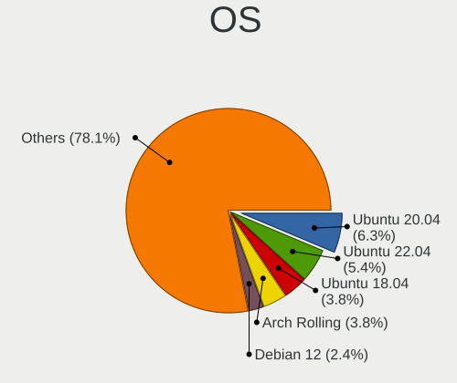

| Name                         | Computers | Percent |
|------------------------------|-----------|---------|
| Ubuntu 20.04                 | 946       | 6.34%   |
| Ubuntu 22.04                 | 803       | 5.38%   |
| Ubuntu 18.04                 | 574       | 3.85%   |
| Arch Rolling                 | 573       | 3.84%   |
| Debian 12                    | 364       | 2.44%   |
| Linux Mint 22.1              | 347       | 2.33%   |
| Ubuntu 24.04                 | 344       | 2.31%   |
| Linux Mint 21.3              | 257       | 1.72%   |
| Pop!_OS 22.04                | 251       | 1.68%   |
| Debian 11                    | 242       | 1.62%   |
| OpenMandriva 4.2             | 227       | 1.52%   |
| EndeavourOS Rolling          | 220       | 1.48%   |
| Zorin 17                     | 218       | 1.46%   |
| Linux Mint 22                | 216       | 1.45%   |
| Fedora 42                    | 212       | 1.42%   |
| OpenMandriva 4.3             | 202       | 1.35%   |
| Linux Mint 22.2              | 173       | 1.16%   |
| Fedora 41                    | 168       | 1.13%   |
| Linux Mint 21.1              | 167       | 1.12%   |
| Linux Mint 21.2              | 166       | 1.11%   |
| Fedora 40                    | 155       | 1.04%   |
| Fedora 36                    | 152       | 1.02%   |
| Zorin 16                     | 149       | 1%      |
| Fedora 39                    | 148       | 0.99%   |
| Fedora 38                    | 139       | 0.93%   |
| Ubuntu 22.10                 | 136       | 0.91%   |
| Manjaro                      | 135       | 0.91%   |
| Ubuntu 20.10                 | 132       | 0.89%   |
| LMDE 6                       | 129       | 0.86%   |
| Linux Mint 20.3              | 128       | 0.86%   |
| OpenMandriva 24.12           | 124       | 0.83%   |
| Arch                         | 123       | 0.82%   |
| openSUSE Tumbleweed-XXXXXXXX | 121       | 0.81%   |
| Ubuntu 19.10                 | 120       | 0.8%    |
| Xubuntu 18.04                | 113       | 0.76%   |
| Xubuntu 20.04                | 109       | 0.73%   |
| Linux Mint 21                | 109       | 0.73%   |
| Ubuntu 19.04                 | 108       | 0.72%   |
| OpenMandriva 23.03           | 106       | 0.71%   |
| OpenMandriva 25.90           | 104       | 0.7%    |

OS Family
---------

OS without a version

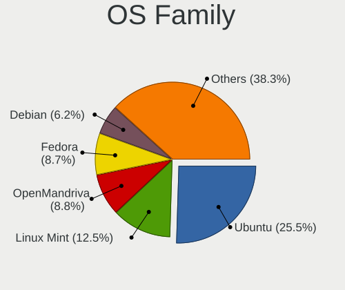

| Name          | Computers | Percent |
|---------------|-----------|---------|
| Ubuntu        | 3531      | 25.48%  |
| Linux Mint    | 1738      | 12.54%  |
| OpenMandriva  | 1217      | 8.78%   |
| Fedora        | 1209      | 8.72%   |
| Debian        | 857       | 6.18%   |
| Arch          | 685       | 4.94%   |
| Zorin         | 509       | 3.67%   |
| Pop!_OS       | 422       | 3.05%   |
| Kubuntu       | 382       | 2.76%   |
| Xubuntu       | 379       | 2.73%   |
| Manjaro       | 357       | 2.58%   |
| EndeavourOS   | 226       | 1.63%   |
| ROSA          | 219       | 1.58%   |
| KDE neon      | 194       | 1.4%    |
| LMDE          | 181       | 1.31%   |
| openSUSE      | 163       | 1.18%   |
| Lubuntu       | 149       | 1.08%   |
| Elementary    | 111       | 0.8%    |
| Ubuntu MATE   | 106       | 0.76%   |
| MX            | 81        | 0.58%   |
| ArcoLinux     | 77        | 0.56%   |
| Kali          | 63        | 0.45%   |
| Bazzite       | 62        | 0.45%   |
| Gentoo        | 58        | 0.42%   |
| Garuda Linux  | 55        | 0.4%    |
| Endless       | 54        | 0.39%   |
| Nobara        | 52        | 0.38%   |
| Ubuntu Unity  | 50        | 0.36%   |
| CachyOS       | 47        | 0.34%   |
| Clear Linux   | 45        | 0.32%   |
| BlackPanther  | 39        | 0.28%   |
| SteamOS       | 36        | 0.26%   |
| Ubuntu Budgie | 34        | 0.25%   |
| NixOS         | 32        | 0.23%   |
| Parrot        | 26        | 0.19%   |
| Peppermint    | 25        | 0.18%   |
| TUXEDO OS     | 20        | 0.14%   |
| Q4OS          | 18        | 0.13%   |
| Ubuntu Studio | 17        | 0.12%   |
| Rocky Linux   | 17        | 0.12%   |

Kernel
------

Version of the Linux kernel

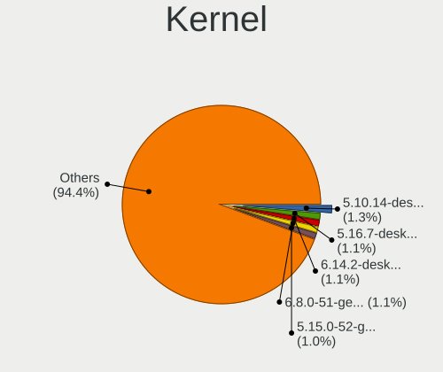

| Version                  | Computers | Percent |
|--------------------------|-----------|---------|
| 5.10.14-desktop-1omv4002 | 220       | 1.32%   |
| 5.16.7-desktop-1omv4003  | 190       | 1.14%   |
| 6.14.2-desktop-3omv2590  | 180       | 1.08%   |
| 6.8.0-51-generic         | 177       | 1.06%   |
| 5.15.0-52-generic        | 170       | 1.02%   |
| 5.4.0-42-generic         | 126       | 0.76%   |
| 5.15.0-56-generic        | 123       | 0.74%   |
| 6.2.6-desktop-1omv2390   | 105       | 0.63%   |
| 6.12.1-desktop-1omv2490  | 105       | 0.63%   |
| 6.8.0-45-generic         | 85        | 0.51%   |
| 6.6.2-desktop-1omv2390   | 85        | 0.51%   |
| 6.4.11-desktop-1omv2390  | 85        | 0.51%   |
| 5.4.0-52-generic         | 81        | 0.49%   |
| 6.1.1-desktop-1omv2290   | 80        | 0.48%   |
| 6.8.0-52-generic         | 79        | 0.48%   |
| 6.14.0-33-generic        | 77        | 0.46%   |
| 5.15.0-91-generic        | 77        | 0.46%   |
| 5.15.0-58-generic        | 75        | 0.45%   |
| 5.15.0-47-generic        | 71        | 0.43%   |
| 5.4.0-26-generic         | 69        | 0.41%   |
| 6.14.0-29-generic        | 67        | 0.4%    |
| 5.3.0-46-generic         | 66        | 0.4%    |
| 5.15.0-46-generic        | 65        | 0.39%   |
| 6.8.0-49-generic         | 61        | 0.37%   |
| 5.4.0-58-generic         | 61        | 0.37%   |
| 6.2.0-39-generic         | 60        | 0.36%   |
| 6.8.0-60-generic         | 59        | 0.35%   |
| 5.4.0-29-generic         | 59        | 0.35%   |
| 5.3.0-40-generic         | 58        | 0.35%   |
| 6.8.0-40-generic         | 56        | 0.34%   |
| 5.4.0-48-generic         | 56        | 0.34%   |
| 5.15.0-43-generic        | 56        | 0.34%   |
| 6.9.3-76060903-generic   | 54        | 0.32%   |
| 6.5.0-28-generic         | 53        | 0.32%   |
| 6.2.0-26-generic         | 53        | 0.32%   |
| 5.3.0-42-generic         | 48        | 0.29%   |
| 6.8.0-41-generic         | 47        | 0.28%   |
| 6.5.0-35-generic         | 47        | 0.28%   |
| 6.2.0-36-generic         | 47        | 0.28%   |
| 6.1.0-13-amd64           | 47        | 0.28%   |

Kernel Family
-------------

Linux kernel without a distro release

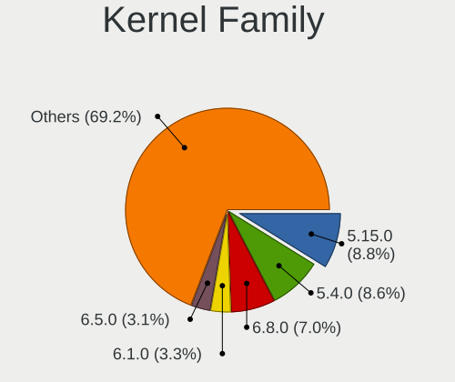

| Version | Computers | Percent |
|---------|-----------|---------|
| 5.15.0  | 1375      | 8.84%   |
| 5.4.0   | 1331      | 8.56%   |
| 6.8.0   | 1096      | 7.05%   |
| 6.1.0   | 507       | 3.26%   |
| 6.5.0   | 481       | 3.09%   |
| 4.15.0  | 481       | 3.09%   |
| 6.14.0  | 425       | 2.73%   |
| 5.8.0   | 395       | 2.54%   |
| 5.19.0  | 395       | 2.54%   |
| 5.3.0   | 386       | 2.48%   |
| 6.2.0   | 355       | 2.28%   |
| 5.11.0  | 311       | 2%      |
| 5.13.0  | 304       | 1.96%   |
| 5.10.0  | 288       | 1.85%   |
| 6.14.2  | 241       | 1.55%   |
| 5.0.0   | 224       | 1.44%   |
| 6.11.0  | 221       | 1.42%   |
| 5.10.14 | 221       | 1.42%   |
| 5.16.7  | 192       | 1.23%   |
| 4.18.0  | 165       | 1.06%   |
| 6.2.6   | 133       | 0.86%   |
| 6.12.1  | 120       | 0.77%   |
| 6.4.11  | 102       | 0.66%   |
| 6.6.2   | 101       | 0.65%   |
| 6.1.1   | 93        | 0.6%    |
| 6.0.2   | 83        | 0.53%   |
| 4.19.0  | 81        | 0.52%   |
| 6.9.3   | 67        | 0.43%   |
| 6.5.9   | 62        | 0.4%    |
| 6.12.10 | 57        | 0.37%   |
| 6.10.0  | 50        | 0.32%   |
| 6.5.6   | 49        | 0.32%   |
| 5.19.16 | 47        | 0.3%    |
| 6.5.5   | 42        | 0.27%   |
| 6.10.6  | 42        | 0.27%   |
| 6.14.6  | 41        | 0.26%   |
| 6.12.6  | 40        | 0.26%   |
| 6.17.9  | 39        | 0.25%   |
| 6.17.0  | 38        | 0.24%   |
| 6.0.0   | 38        | 0.24%   |

Kernel Major Ver.
-----------------

Linux kernel major version

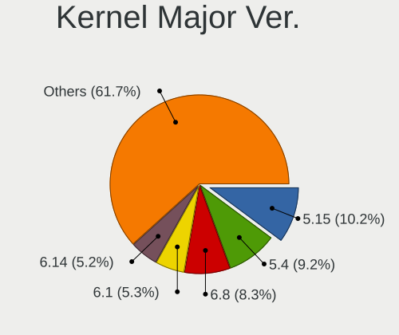

| Version | Computers | Percent |
|---------|-----------|---------|
| 5.15    | 1555      | 10.17%  |
| 5.4     | 1414      | 9.25%   |
| 6.8     | 1274      | 8.33%   |
| 6.1     | 816       | 5.34%   |
| 6.14    | 797       | 5.21%   |
| 6.5     | 729       | 4.77%   |
| 6.2     | 618       | 4.04%   |
| 5.10    | 614       | 4.01%   |
| 5.19    | 584       | 3.82%   |
| 6.12    | 526       | 3.44%   |
| 4.15    | 483       | 3.16%   |
| 5.8     | 464       | 3.03%   |
| 5.3     | 416       | 2.72%   |
| 6.11    | 378       | 2.47%   |
| 5.11    | 373       | 2.44%   |
| 6.6     | 355       | 2.32%   |
| 5.13    | 338       | 2.21%   |
| 6.0     | 330       | 2.16%   |
| 5.16    | 291       | 1.9%    |
| 6.4     | 242       | 1.58%   |
| 5.0     | 232       | 1.52%   |
| 6.10    | 224       | 1.46%   |
| 4.18    | 210       | 1.37%   |
| 6.17    | 203       | 1.33%   |
| 6.9     | 181       | 1.18%   |
| 6.13    | 159       | 1.04%   |
| 6.15    | 132       | 0.86%   |
| 6.16    | 129       | 0.84%   |
| 4.9     | 125       | 0.82%   |
| 6.7     | 124       | 0.81%   |
| 5.17    | 109       | 0.71%   |
| 4.19    | 107       | 0.7%    |
| 5.14    | 106       | 0.69%   |
| 6.3     | 104       | 0.68%   |
| 5.18    | 100       | 0.65%   |
| 5.9     | 82        | 0.54%   |
| 5.6     | 67        | 0.44%   |
| 5.12    | 62        | 0.41%   |
| 5.7     | 50        | 0.33%   |
| 5.5     | 47        | 0.31%   |

Arch
----

OS architecture (x86_64, i586, etc.)

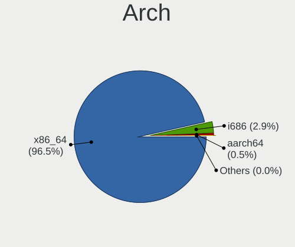

| Name    | Computers | Percent |
|---------|-----------|---------|
| x86_64  | 12584     | 96.46%  |
| i686    | 377       | 2.89%   |
| aarch64 | 65        | 0.5%    |
| armv7l  | 18        | 0.14%   |
| ppc64le | 1         | 0.01%   |
| armv6l  | 1         | 0.01%   |

DE
--

Desktop Environment

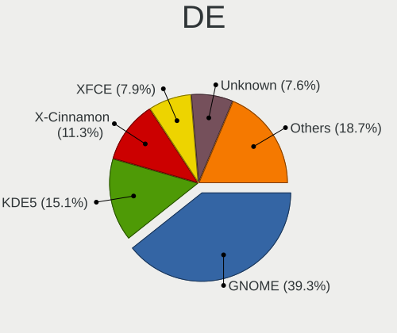

| Name             | Computers | Percent |
|------------------|-----------|---------|
| GNOME            | 5473      | 39.31%  |
| KDE5             | 2108      | 15.14%  |
| X-Cinnamon       | 1579      | 11.34%  |
| XFCE             | 1097      | 7.88%   |
| Unknown          | 1064      | 7.64%   |
| KDE6             | 886       | 6.36%   |
| MATE             | 376       | 2.7%    |
| LXQt             | 270       | 1.94%   |
| KDE              | 215       | 1.54%   |
| KDE4             | 130       | 0.93%   |
| Pantheon         | 110       | 0.79%   |
| Cinnamon         | 72        | 0.52%   |
| LXDE             | 68        | 0.49%   |
| hyprland         | 62        | 0.45%   |
| Budgie           | 57        | 0.41%   |
| Unity            | 51        | 0.37%   |
| i3               | 47        | 0.34%   |
| COSMIC           | 39        | 0.28%   |
| GNOME Flashback  | 38        | 0.27%   |
| sway             | 32        | 0.23%   |
| GNOME Classic    | 32        | 0.23%   |
| Trinity          | 15        | 0.11%   |
| Deepin           | 14        | 0.1%    |
| Openbox          | 13        | 0.09%   |
| enlightenment    | 10        | 0.07%   |
| lightdm-xsession | 7         | 0.05%   |
| icewm            | 6         | 0.04%   |
| bspwm            | 6         | 0.04%   |
| Endless:GNOME    | 4         | 0.03%   |
| DWM              | 4         | 0.03%   |
| sway:wlroots     | 3         | 0.02%   |
| qtile            | 3         | 0.02%   |
| none+i3          | 3         | 0.02%   |
| xubuntu          | 2         | 0.01%   |
| Unicorn:XFCE     | 2         | 0.01%   |
| niri             | 2         | 0.01%   |
| labwc:wlroots    | 2         | 0.01%   |
| herbstluftwm     | 2         | 0.01%   |
| BunsenLabs:XFCE  | 2         | 0.01%   |
| awesome          | 2         | 0.01%   |

Display Server
--------------

X11 or Wayland

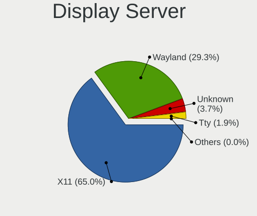

| Name        | Computers | Percent |
|-------------|-----------|---------|
| X11         | 8907      | 64.97%  |
| Wayland     | 4022      | 29.34%  |
| Unknown     | 511       | 3.73%   |
| Tty         | 267       | 1.95%   |
| Web         | 1         | 0.01%   |
| Unspecified | 1         | 0.01%   |

Display Manager
---------------

SDDM, LightDM, etc.

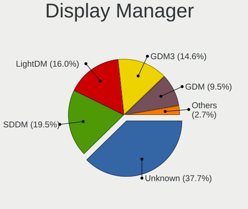

| Name               | Computers | Percent |
|--------------------|-----------|---------|
| Unknown            | 5227      | 37.7%   |
| SDDM               | 2710      | 19.55%  |
| LightDM            | 2222      | 16.03%  |
| GDM3               | 2020      | 14.57%  |
| GDM                | 1312      | 9.46%   |
| TDM                | 177       | 1.28%   |
| KDM                | 116       | 0.84%   |
| XDM                | 18        | 0.13%   |
| GREETD             | 18        | 0.13%   |
| SLiM               | 13        | 0.09%   |
| COSMIC-GREETER     | 7         | 0.05%   |
| LXDM               | 6         | 0.04%   |
| SLIMSKI            | 5         | 0.04%   |
| LY-DM              | 5         | 0.04%   |
| Ly                 | 3         | 0.02%   |
| WDM                | 1         | 0.01%   |
| TINYDM-RUN-SESSION | 1         | 0.01%   |
| NODM               | 1         | 0.01%   |
| MDM                | 1         | 0.01%   |
| EMPTTY             | 1         | 0.01%   |

OS Lang
-------

Language

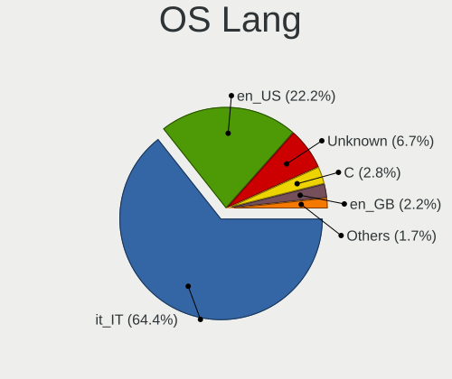

| Lang                 | Computers | Percent |
|----------------------|-----------|---------|
| it_IT                | 8666      | 64.37%  |
| en_US                | 2986      | 22.18%  |
| Unknown              | 904       | 6.71%   |
| C                    | 378       | 2.81%   |
| en_GB                | 301       | 2.24%   |
| de_DE                | 43        | 0.32%   |
| fr_FR                | 24        | 0.18%   |
| es_ES                | 21        | 0.16%   |
| de_IT                | 16        | 0.12%   |
| POSIX                | 13        | 0.1%    |
| it_CH                | 12        | 0.09%   |
| en_IE                | 12        | 0.09%   |
| ru_RU                | 10        | 0.07%   |
| en_AU                | 7         | 0.05%   |
| it_IT@euro           | 6         | 0.04%   |
| en_AG                | 5         | 0.04%   |
| de_AT                | 5         | 0.04%   |
| fur_IT               | 4         | 0.03%   |
| en_US.UTF8           | 4         | 0.03%   |
| pl_PL                | 3         | 0.02%   |
| IT                   | 3         | 0.02%   |
| C.UTF8               | 3         | 0.02%   |
| pt_BR                | 2         | 0.01%   |
| hu_HU                | 2         | 0.01%   |
| es_PY                | 2         | 0.01%   |
| en_NZ                | 2         | 0.01%   |
| en_IN                | 2         | 0.01%   |
| en_DK                | 2         | 0.01%   |
| en_BW                | 2         | 0.01%   |
| sc_IT                | 1         | 0.01%   |
| ro_RO                | 1         | 0.01%   |
| lij_IT               | 1         | 0.01%   |
| it_ITutf8            | 1         | 0.01%   |
| it_IT.UTF8           | 1         | 0.01%   |
| it_IT.UTF -8         | 1         | 0.01%   |
| it_IT.iso885915@euro | 1         | 0.01%   |
| it_IT.iso88591       | 1         | 0.01%   |
| fr_CH                | 1         | 0.01%   |
| fr_BE                | 1         | 0.01%   |
| es_US                | 1         | 0.01%   |

Boot Mode
---------

EFI or BIOS

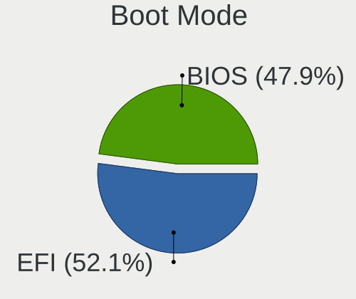

| Mode | Computers | Percent |
|------|-----------|---------|
| EFI  | 6994      | 52.05%  |
| BIOS | 6442      | 47.95%  |

Filesystem
----------

Type of filesystem

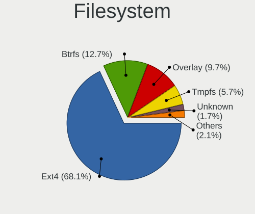

| Type     | Computers | Percent |
|----------|-----------|---------|
| Ext4     | 9311      | 68.07%  |
| Btrfs    | 1735      | 12.68%  |
| Overlay  | 1330      | 9.72%   |
| Tmpfs    | 785       | 5.74%   |
| Unknown  | 236       | 1.73%   |
| Xfs      | 149       | 1.09%   |
| Zfs      | 54        | 0.39%   |
| Ext3     | 23        | 0.17%   |
| Ext2     | 22        | 0.16%   |
| F2fs     | 18        | 0.13%   |
| Aufs     | 5         | 0.04%   |
| Bcachefs | 3         | 0.02%   |
| XXX4     | 2         | 0.01%   |
| Reiserfs | 2         | 0.01%   |
| Jfs      | 2         | 0.01%   |
| XXXX     | 1         | 0.01%   |
| Rootfs   | 1         | 0.01%   |

Part. scheme
------------

Scheme of partitioning

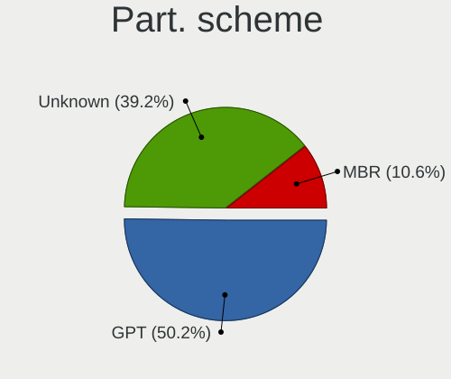

| Type    | Computers | Percent |
|---------|-----------|---------|
| GPT     | 6814      | 50.21%  |
| Unknown | 5322      | 39.21%  |
| MBR     | 1436      | 10.58%  |

Dual Boot with Linux/BSD
------------------------

Hosting more than one Linux/BSD

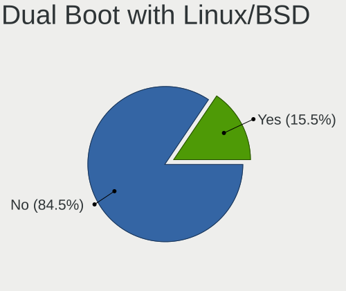

| Dual boot | Computers | Percent |
|-----------|-----------|---------|
| No        | 11348     | 84.46%  |
| Yes       | 2088      | 15.54%  |

Dual Boot (Win)
---------------

Hosting Linux and Windows

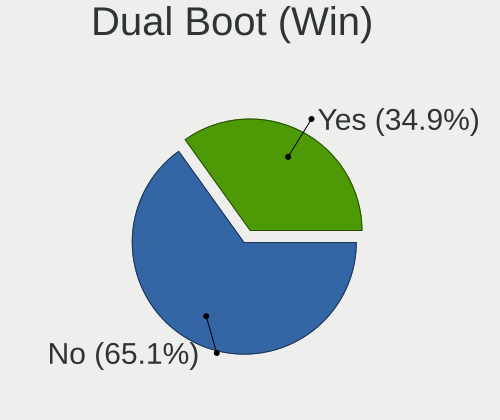

| Dual boot | Computers | Percent |
|-----------|-----------|---------|
| No        | 8747      | 65.11%  |
| Yes       | 4687      | 34.89%  |

Board
-----

Vendor
------

Motherboard manufacturer

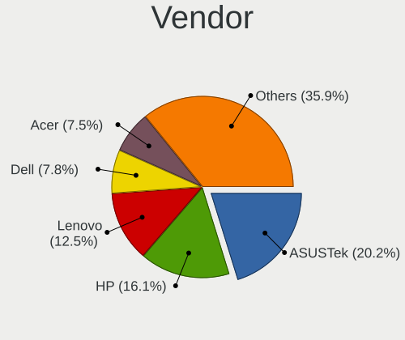

| Name                                 | Computers | Percent |
|--------------------------------------|-----------|---------|
| ASUSTek Computer                     | 2635      | 20.22%  |
| Hewlett-Packard                      | 2100      | 16.11%  |
| Lenovo                               | 1633      | 12.53%  |
| Dell                                 | 1018      | 7.81%   |
| Acer                                 | 973       | 7.47%   |
| MSI                                  | 758       | 5.82%   |
| ASRock                               | 524       | 4.02%   |
| Gigabyte Technology                  | 471       | 3.61%   |
| Apple                                | 376       | 2.88%   |
| Unknown                              | 201       | 1.54%   |
| HUAWEI                               | 187       | 1.43%   |
| Intel                                | 168       | 1.29%   |
| Fujitsu                              | 158       | 1.21%   |
| Samsung Electronics                  | 157       | 1.2%    |
| Toshiba                              | 138       | 1.06%   |
| Sony                                 | 138       | 1.06%   |
| Packard Bell                         | 87        | 0.67%   |
| Pegatron                             | 61        | 0.47%   |
| Mediacom                             | 59        | 0.45%   |
| Raspberry Pi Foundation              | 56        | 0.43%   |
| Chuwi                                | 56        | 0.43%   |
| AMI                                  | 55        | 0.42%   |
| Microsoft                            | 53        | 0.41%   |
| AZW                                  | 48        | 0.37%   |
| Fujitsu Siemens                      | 44        | 0.34%   |
| Notebook                             | 41        | 0.31%   |
| Foxconn                              | 40        | 0.31%   |
| Shenzhen Meigao Electronic Equipment | 36        | 0.28%   |
| Teclast                              | 35        | 0.27%   |
| BESSTAR Tech                         | 35        | 0.27%   |
| TUXEDO                               | 30        | 0.23%   |
| PC Specialist                        | 29        | 0.22%   |
| Microtech                            | 27        | 0.21%   |
| Google                               | 24        | 0.18%   |
| GEEKOM                               | 24        | 0.18%   |
| Timi                                 | 23        | 0.18%   |
| Valve                                | 22        | 0.17%   |
| Supermicro                           | 17        | 0.13%   |
| LG Electronics                       | 17        | 0.13%   |
| Medion                               | 15        | 0.12%   |

Model
-----

Motherboard model

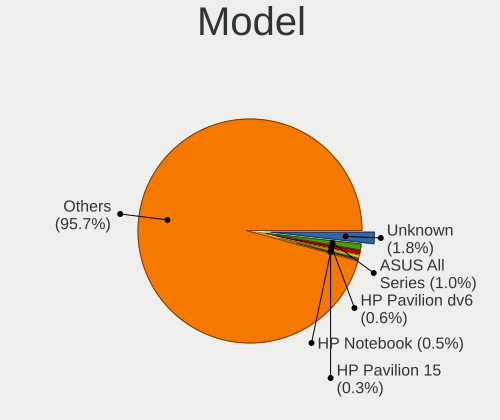

| Name                                              | Computers | Percent |
|---------------------------------------------------|-----------|---------|
| Unknown                                           | 233       | 1.79%   |
| ASUS All Series                                   | 129       | 0.99%   |
| HP Pavilion dv6                                   | 81        | 0.62%   |
| HP Notebook                                       | 69        | 0.53%   |
| HP Pavilion 15                                    | 43        | 0.33%   |
| HP Pavilion g6                                    | 41        | 0.31%   |
| HP 255 G8 Notebook PC                             | 30        | 0.23%   |
| AMI Intel                                         | 30        | 0.23%   |
| MSI MS-7C56                                       | 26        | 0.2%    |
| Mediacom SmartBook 14 FullHD - SB14UC             | 26        | 0.2%    |
| HP 15                                             | 26        | 0.2%    |
| MSI MS-7C37                                       | 25        | 0.19%   |
| HUAWEI NBLK-WAX9X                                 | 25        | 0.19%   |
| Dell OptiPlex 7010                                | 25        | 0.19%   |
| Apple MacBookAir7,2                               | 25        | 0.19%   |
| MSI MS-7B86                                       | 24        | 0.18%   |
| Lenovo IdeaPad 3 15ADA05 81W1                     | 21        | 0.16%   |
| HUAWEI KLVL-WXX9                                  | 20        | 0.15%   |
| HP ENVY 15                                        | 20        | 0.15%   |
| ASUS TUF Gaming X570-PLUS                         | 20        | 0.15%   |
| HP Laptop 15s-eq2xxx                              | 19        | 0.15%   |
| HP 250 G3                                         | 19        | 0.15%   |
| Dell XPS 15 9570                                  | 19        | 0.15%   |
| ASUS PRIME A320M-K                                | 19        | 0.15%   |
| Valve Jupiter                                     | 18        | 0.14%   |
| HUAWEI BOD-WXX9                                   | 18        | 0.14%   |
| HP Compaq Elite 8300 SFF                          | 18        | 0.14%   |
| Dell XPS 15 7590                                  | 18        | 0.14%   |
| HP Pavilion x2 Detachable                         | 17        | 0.13%   |
| HP Pavilion dv7                                   | 17        | 0.13%   |
| HP 255 G7 Notebook PC                             | 17        | 0.13%   |
| ASUS T101HA                                       | 17        | 0.13%   |
| Acer Aspire 5750G                                 | 17        | 0.13%   |
| Gigabyte B450M DS3H                               | 16        | 0.12%   |
| HP G62                                            | 15        | 0.12%   |
| HP 250 G6 Notebook PC                             | 15        | 0.12%   |
| Shenzhen Meigao Electronic Equipment Venus series | 14        | 0.11%   |
| Lenovo IdeaPad Gaming 3 15ARH05 82EY              | 14        | 0.11%   |
| HP Pavilion Notebook                              | 14        | 0.11%   |
| HP Compaq 6730s                                   | 14        | 0.11%   |

Model Family
------------

Motherboard model prefix

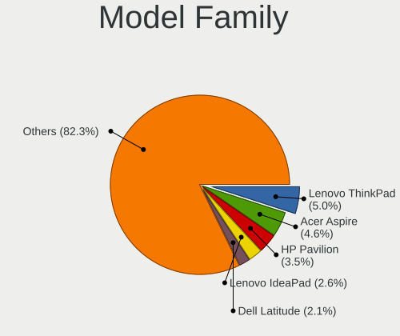

| Name               | Computers | Percent |
|--------------------|-----------|---------|
| Lenovo ThinkPad    | 648       | 4.97%   |
| Acer Aspire        | 600       | 4.6%    |
| HP Pavilion        | 458       | 3.51%   |
| Lenovo IdeaPad     | 337       | 2.59%   |
| Dell Latitude      | 270       | 2.07%   |
| ASUS PRIME         | 248       | 1.9%    |
| HP Compaq          | 234       | 1.8%    |
| Unknown            | 233       | 1.79%   |
| ASUS VivoBook      | 203       | 1.56%   |
| HP EliteBook       | 195       | 1.5%    |
| ASUS ROG           | 187       | 1.43%   |
| Dell XPS           | 185       | 1.42%   |
| HP Laptop          | 170       | 1.3%    |
| Dell Inspiron      | 162       | 1.24%   |
| HP ProBook         | 155       | 1.19%   |
| Dell OptiPlex      | 147       | 1.13%   |
| ASUS TUF           | 134       | 1.03%   |
| ASUS All           | 129       | 0.99%   |
| Toshiba Satellite  | 116       | 0.89%   |
| Lenovo ThinkCentre | 115       | 0.88%   |
| Dell Precision     | 102       | 0.78%   |
| HP 250             | 100       | 0.77%   |
| HP 255             | 87        | 0.67%   |
| Lenovo Yoga        | 83        | 0.64%   |
| Fujitsu ESPRIMO    | 76        | 0.58%   |
| Dell Vostro        | 75        | 0.58%   |
| HP Notebook        | 69        | 0.53%   |
| Acer Swift         | 68        | 0.52%   |
| HP ENVY            | 66        | 0.51%   |
| ASUS ASUS          | 66        | 0.51%   |
| Acer TravelMate    | 66        | 0.51%   |
| Fujitsu LIFEBOOK   | 65        | 0.5%    |
| Lenovo ThinkBook   | 59        | 0.45%   |
| RPi Raspberry      | 56        | 0.43%   |
| Acer Veriton       | 55        | 0.42%   |
| Acer Extensa       | 55        | 0.42%   |
| Microsoft Surface  | 53        | 0.41%   |
| HP ProDesk         | 53        | 0.41%   |
| HP EliteDesk       | 50        | 0.38%   |
| ASUS Zenbook       | 48        | 0.37%   |

MFG Year
--------

Motherboard manufacture year

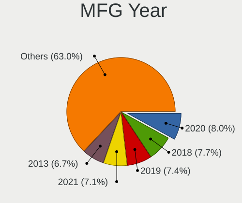

| Year    | Computers | Percent |
|---------|-----------|---------|
| 2020    | 1048      | 8.04%   |
| 2018    | 1002      | 7.69%   |
| 2019    | 966       | 7.41%   |
| 2021    | 931       | 7.14%   |
| 2013    | 872       | 6.69%   |
| 2012    | 804       | 6.17%   |
| 2017    | 772       | 5.92%   |
| 2015    | 704       | 5.4%    |
| 2014    | 690       | 5.29%   |
| 2011    | 683       | 5.24%   |
| 2016    | 647       | 4.96%   |
| 2008    | 622       | 4.77%   |
| 2010    | 595       | 4.57%   |
| 2022    | 583       | 4.47%   |
| 2009    | 575       | 4.41%   |
| 2023    | 426       | 3.27%   |
| 2007    | 345       | 2.65%   |
| 2024    | 306       | 2.35%   |
| 2006    | 189       | 1.45%   |
| 2025    | 94        | 0.72%   |
| Unknown | 79        | 0.61%   |
| 2005    | 73        | 0.56%   |
| 2004    | 17        | 0.13%   |
| 2003    | 6         | 0.05%   |
| 2001    | 2         | 0.02%   |
| 2002    | 1         | 0.01%   |
| 2000    | 1         | 0.01%   |

Form Factor
-----------

Physical design of the computer

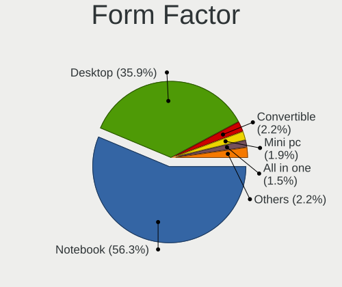

| Name           | Computers | Percent |
|----------------|-----------|---------|
| Notebook       | 7339      | 56.31%  |
| Desktop        | 4677      | 35.89%  |
| Convertible    | 283       | 2.17%   |
| Mini pc        | 247       | 1.9%    |
| All in one     | 198       | 1.52%   |
| Tablet         | 155       | 1.19%   |
| System on chip | 77        | 0.59%   |
| Server         | 50        | 0.38%   |
| Other          | 4         | 0.03%   |
| Phone          | 1         | 0.01%   |
| Stick pc       | 1         | 0.01%   |
| Firewall       | 1         | 0.01%   |

Secure Boot
-----------

Enabled or disabled

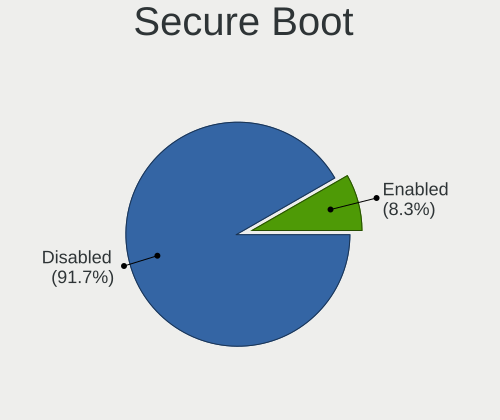

| State    | Computers | Percent |
|----------|-----------|---------|
| Disabled | 12104     | 91.7%   |
| Enabled  | 1096      | 8.3%    |

Coreboot
--------

Have coreboot on board

| Used | Computers | Percent |
|------|-----------|---------|
| No   | 12998     | 99.73%  |
| Yes  | 35        | 0.27%   |

RAM Size
--------

Total RAM memory

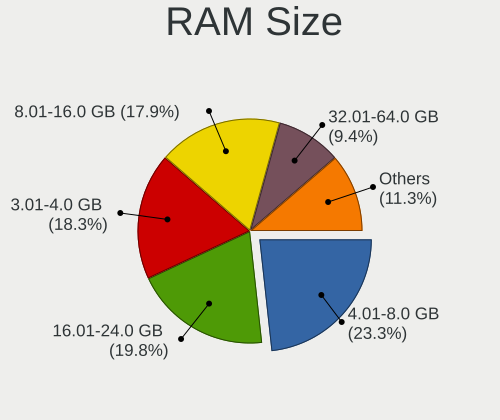

| Size in GB      | Computers | Percent |
|-----------------|-----------|---------|
| 4.01-8.0        | 3097      | 23.27%  |
| 16.01-24.0      | 2633      | 19.79%  |
| 3.01-4.0        | 2437      | 18.31%  |
| 8.01-16.0       | 2384      | 17.92%  |
| 32.01-64.0      | 1251      | 9.4%    |
| 1.01-2.0        | 576       | 4.33%   |
| 24.01-32.0      | 328       | 2.46%   |
| 64.01-256.0     | 279       | 2.1%    |
| 2.01-3.0        | 205       | 1.54%   |
| 0.51-1.0        | 96        | 0.72%   |
| More than 256.0 | 12        | 0.09%   |
| 0.01-0.5        | 9         | 0.07%   |

RAM Used
--------

Used RAM memory

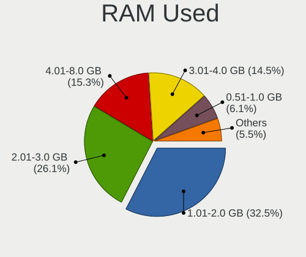

| Used GB     | Computers | Percent |
|-------------|-----------|---------|
| 1.01-2.0    | 4828      | 32.54%  |
| 2.01-3.0    | 3868      | 26.07%  |
| 4.01-8.0    | 2276      | 15.34%  |
| 3.01-4.0    | 2153      | 14.51%  |
| 0.51-1.0    | 899       | 6.06%   |
| 8.01-16.0   | 568       | 3.83%   |
| 0.01-0.5    | 150       | 1.01%   |
| 16.01-24.0  | 62        | 0.42%   |
| 24.01-32.0  | 20        | 0.13%   |
| 32.01-64.0  | 7         | 0.05%   |
| Unknown     | 3         | 0.02%   |
| 64.01-256.0 | 1         | 0.01%   |
| 0           | 1         | 0.01%   |

Total Drives
------------

Number of drives on board

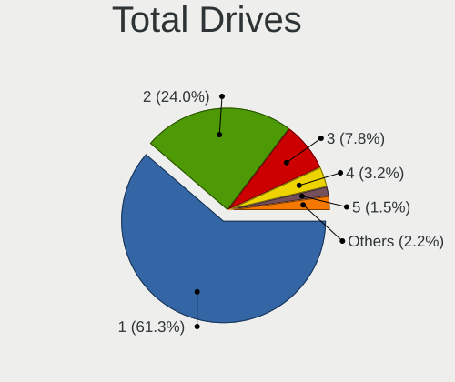

| Drives  | Computers | Percent |
|---------|-----------|---------|
| 1       | 8279      | 61.31%  |
| 2       | 3241      | 24%     |
| 3       | 1053      | 7.8%    |
| 4       | 434       | 3.21%   |
| 5       | 199       | 1.47%   |
| 0       | 113       | 0.84%   |
| 6       | 100       | 0.74%   |
| 7       | 37        | 0.27%   |
| 8       | 17        | 0.13%   |
| 9       | 14        | 0.1%    |
| 10      | 5         | 0.04%   |
| 12      | 3         | 0.02%   |
| 13      | 2         | 0.01%   |
| Unknown | 2         | 0.01%   |
| 19      | 1         | 0.01%   |
| 17      | 1         | 0.01%   |
| 14      | 1         | 0.01%   |
| 11      | 1         | 0.01%   |

Has CD-ROM
----------

Has CD-ROM on board

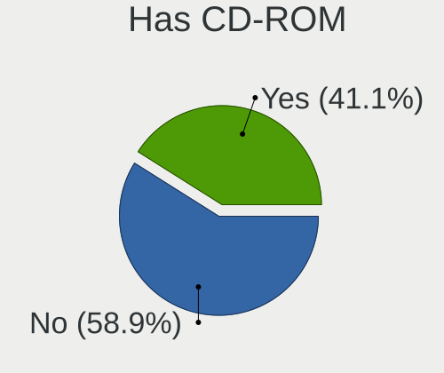

| Presented | Computers | Percent |
|-----------|-----------|---------|
| No        | 7756      | 58.95%  |
| Yes       | 5401      | 41.05%  |

Has Ethernet
------------

Has Ethernet on board

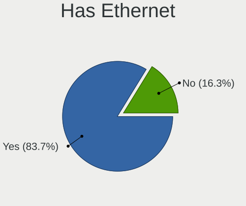

| Presented | Computers | Percent |
|-----------|-----------|---------|
| Yes       | 10970     | 83.75%  |
| No        | 2129      | 16.25%  |

Has WiFi
--------

Has WiFi module

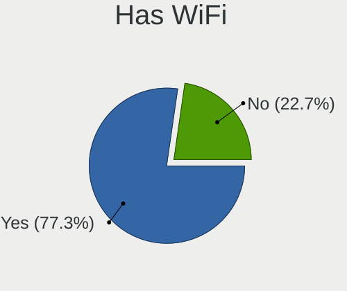

| Presented | Computers | Percent |
|-----------|-----------|---------|
| Yes       | 10148     | 77.28%  |
| No        | 2984      | 22.72%  |

Has Bluetooth
-------------

Has Bluetooth module

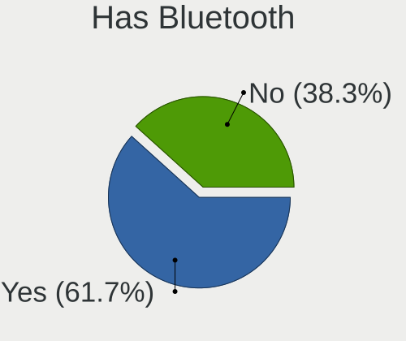

| Presented | Computers | Percent |
|-----------|-----------|---------|
| Yes       | 8159      | 61.7%   |
| No        | 5065      | 38.3%   |

Location
--------

Country
-------

Geographic location (country)

| Country | Computers | Percent |
|---------|-----------|---------|
| Italy   | 13033     | 100%    |

City
----

Geographic location (city)

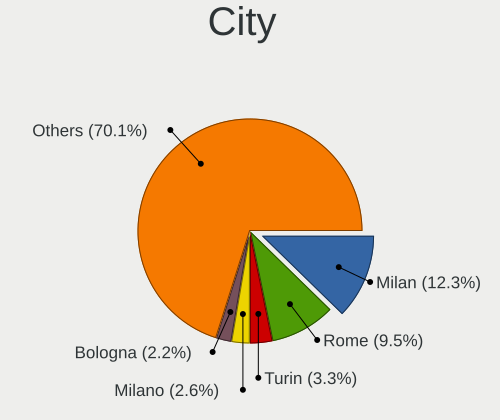

| City                | Computers | Percent |
|---------------------|-----------|---------|
| Milan               | 1875      | 12.3%   |
| Rome                | 1445      | 9.48%   |
| Turin               | 496       | 3.25%   |
| Milano              | 403       | 2.64%   |
| Bologna             | 337       | 2.21%   |
| Florence            | 318       | 2.09%   |
| Naples              | 284       | 1.86%   |
| Genoa               | 218       | 1.43%   |
| Padova              | 189       | 1.24%   |
| Rho                 | 188       | 1.23%   |
| Palermo             | 172       | 1.13%   |
| Verona              | 145       | 0.95%   |
| Bari                | 131       | 0.86%   |
| Catania             | 118       | 0.77%   |
| Brescia             | 114       | 0.75%   |
| Venice              | 108       | 0.71%   |
| Trieste             | 105       | 0.69%   |
| Parma               | 101       | 0.66%   |
| Bergamo             | 78        | 0.51%   |
| Monza               | 74        | 0.49%   |
| Modena              | 72        | 0.47%   |
| Trento              | 71        | 0.47%   |
| Pisa                | 70        | 0.46%   |
| Reggio Emilia       | 69        | 0.45%   |
| Perugia             | 67        | 0.44%   |
| Cagliari            | 65        | 0.43%   |
| Pescara             | 62        | 0.41%   |
| Casalecchio di Reno | 61        | 0.4%    |
| Taranto             | 55        | 0.36%   |
| Salerno             | 55        | 0.36%   |
| Legnano             | 55        | 0.36%   |
| Livorno             | 52        | 0.34%   |
| Vicenza             | 49        | 0.32%   |
| Udine               | 49        | 0.32%   |
| Bolzano             | 46        | 0.3%    |
| Sesto San Giovanni  | 41        | 0.27%   |
| Novara              | 41        | 0.27%   |
| Reggio Calabria     | 37        | 0.24%   |
| Mestre              | 37        | 0.24%   |
| Rimini              | 35        | 0.23%   |

Drives
------

Drive Vendor
------------

Hard drive vendors

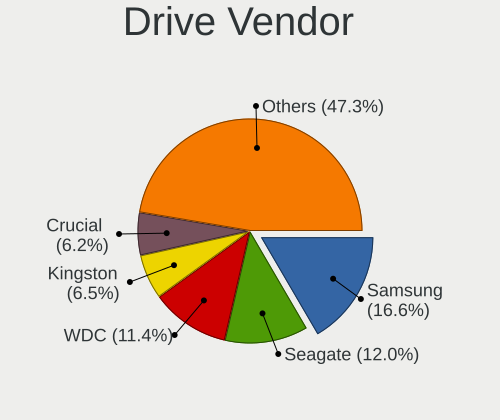

| Vendor                       | Computers | Drives | Percent |
|------------------------------|-----------|--------|---------|
| Samsung Electronics          | 3178      | 4957   | 16.59%  |
| Seagate                      | 2305      | 3624   | 12.03%  |
| WDC                          | 2187      | 3459   | 11.42%  |
| Kingston                     | 1240      | 1733   | 6.47%   |
| Crucial                      | 1181      | 1633   | 6.16%   |
| SanDisk                      | 1049      | 1442   | 5.48%   |
| Toshiba                      | 958       | 1341   | 5%      |
| Unknown                      | 825       | 1160   | 4.31%   |
| Hitachi                      | 552       | 718    | 2.88%   |
| SK hynix                     | 501       | 661    | 2.62%   |
| Micron Technology            | 448       | 596    | 2.34%   |
| HGST                         | 328       | 443    | 1.71%   |
| Intel                        | 324       | 456    | 1.69%   |
| Maxtor                       | 227       | 316    | 1.18%   |
| China                        | 199       | 241    | 1.04%   |
| Micron/Crucial Technology    | 195       | 262    | 1.02%   |
| KIOXIA                       | 177       | 254    | 0.92%   |
| Phison Electronics           | 174       | 232    | 0.91%   |
| SPCC                         | 164       | 203    | 0.86%   |
| Apple                        | 164       | 235    | 0.86%   |
| Phison                       | 141       | 229    | 0.74%   |
| Intenso                      | 128       | 162    | 0.67%   |
| MAXIO Technology (Hangzhou)  | 123       | 159    | 0.64%   |
| Kingston Technology Company  | 119       | 162    | 0.62%   |
| JMicron Technology           | 87        | 100    | 0.45%   |
| Lexar                        | 85        | 95     | 0.44%   |
| Unknown                      | 85        | 106    | 0.44%   |
| Transcend                    | 83        | 114    | 0.43%   |
| Fujitsu                      | 83        | 106    | 0.43%   |
| Fanxiang                     | 77        | 98     | 0.4%    |
| PNY                          | 75        | 91     | 0.39%   |
| Silicon Motion               | 65        | 85     | 0.34%   |
| A-DATA Technology            | 65        | 87     | 0.34%   |
| Shenzhen Longsys Electronics | 60        | 88     | 0.31%   |
| Patriot                      | 57        | 71     | 0.3%    |
| Netac                        | 57        | 74     | 0.3%    |
| Corsair                      | 55        | 81     | 0.29%   |
| KingDian                     | 51        | 60     | 0.27%   |
| SABRENT                      | 46        | 55     | 0.24%   |
| LITEON                       | 44        | 57     | 0.23%   |

Drive Model
-----------

Hard drive models

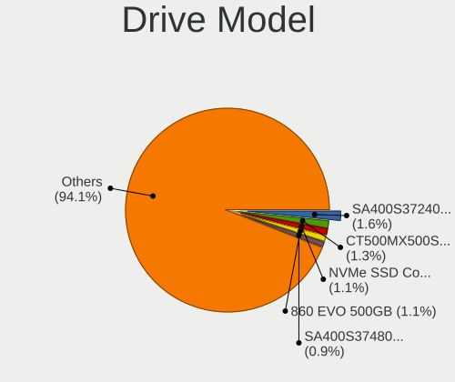

| Model                                              | Computers | Percent |
|----------------------------------------------------|-----------|---------|
| Kingston SA400S37240G 240GB SSD                    | 339       | 1.61%   |
| Crucial CT500MX500SSD1 500GB                       | 268       | 1.27%   |
| Samsung NVMe SSD Controller SM981/PM981/PM983 1TB  | 228       | 1.08%   |
| Samsung SSD 860 EVO 500GB                          | 221       | 1.05%   |
| Kingston SA400S37480G 480GB SSD                    | 193       | 0.92%   |
| Samsung SSD 850 EVO 250GB                          | 190       | 0.9%    |
| Seagate ST500DM002-1BD142 500GB                    | 171       | 0.81%   |
| Samsung NVMe SSD Controller PM9A1/PM9A3/980PRO 1TB | 161       | 0.77%   |
| Samsung SSD 850 EVO 500GB                          | 157       | 0.75%   |
| Crucial CT240BX500SSD1 240GB                       | 140       | 0.67%   |
| Seagate ST1000DM010-2EP102 1TB                     | 139       | 0.66%   |
| Unknown MMC Card  32GB                             | 131       | 0.62%   |
| Crucial CT1000MX500SSD1 1TB                        | 123       | 0.58%   |
| Unknown MMC Card  64GB                             | 118       | 0.56%   |
| Samsung SSD 860 EVO 250GB                          | 112       | 0.53%   |
| Crucial CT480BX500SSD1 480GB                       | 109       | 0.52%   |
| Micron/Crucial P2 NVMe PCIe SSD 2TB                | 105       | 0.5%    |
| Toshiba DT01ACA100 1TB                             | 101       | 0.48%   |
| Kingston SA400S37120G 120GB SSD                    | 98        | 0.47%   |
| Toshiba MQ01ABF050 500GB                           | 96        | 0.46%   |
| HGST HTS545050A7E680 500GB                         | 95        | 0.45%   |
| Seagate ST1000LM024 HN-M101MBB 1TB                 | 94        | 0.45%   |
| Seagate ST2000DM008-2FR102 2TB                     | 93        | 0.44%   |
| Seagate ST1000LM035-1RK172 1TB                     | 88        | 0.42%   |
| Seagate ST500LT012-1DG142 500GB                    | 87        | 0.41%   |
| Unknown                                            | 85        | 0.4%    |
| Samsung SSD 870 EVO 500GB                          | 84        | 0.4%    |
| Unknown SD/MMC/MS PRO 2GB                          | 82        | 0.39%   |
| Unknown MMC Card  128GB                            | 81        | 0.39%   |
| Kingston SV300S37A120G 120GB SSD                   | 80        | 0.38%   |
| WDC WD10EZEX-08WN4A0 1TB                           | 76        | 0.36%   |
| Seagate ST3500418AS 500GB                          | 75        | 0.36%   |
| Phison E12 NVMe Controller 1TB                     | 75        | 0.36%   |
| Crucial CT1000BX500SSD1 1TB                        | 75        | 0.36%   |
| Sandisk WD Blue SN550 NVMe SSD 1024GB              | 74        | 0.35%   |
| Samsung SSD 860 EVO 1TB                            | 74        | 0.35%   |
| HGST HTS721010A9E630 1TB                           | 74        | 0.35%   |
| Samsung SSD 870 QVO 1TB                            | 72        | 0.34%   |
| SanDisk SSD PLUS 240GB                             | 71        | 0.34%   |
| Crucial CT250MX500SSD1 250GB                       | 69        | 0.33%   |

HDD Vendor
----------

Hard disk drive vendors

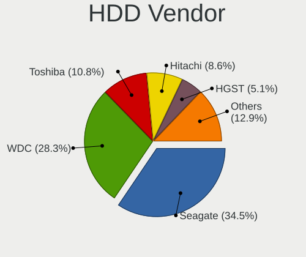

| Vendor              | Computers | Drives | Percent |
|---------------------|-----------|--------|---------|
| Seagate             | 2222      | 3479   | 34.46%  |
| WDC                 | 1822      | 2908   | 28.26%  |
| Toshiba             | 695       | 955    | 10.78%  |
| Hitachi             | 552       | 718    | 8.56%   |
| HGST                | 328       | 443    | 5.09%   |
| Maxtor              | 225       | 314    | 3.49%   |
| Samsung Electronics | 197       | 253    | 3.06%   |
| Unknown             | 99        | 127    | 1.54%   |
| Fujitsu             | 83        | 106    | 1.29%   |
| Apple               | 48        | 70     | 0.74%   |
| JMicron Technology  | 42        | 46     | 0.65%   |
| External            | 15        | 18     | 0.23%   |
| ASMT                | 13        | 15     | 0.2%    |
| TO Exter            | 12        | 12     | 0.19%   |
| Hewlett-Packard     | 11        | 24     | 0.17%   |
| USB3.0              | 10        | 15     | 0.16%   |
| Inateck             | 6         | 7      | 0.09%   |
| IBM/Hitachi         | 6         | 7      | 0.09%   |
| HGST HTS            | 6         | 6      | 0.09%   |
| SSK                 | 4         | 4      | 0.06%   |
| LaCie               | 4         | 5      | 0.06%   |
| Intenso             | 4         | 8      | 0.06%   |
| ASMedia             | 4         | 4      | 0.06%   |
| SABRENT             | 3         | 6      | 0.05%   |
| Initio              | 3         | 3      | 0.05%   |
| WD MediaMax         | 2         | 2      | 0.03%   |
| USB                 | 2         | 2      | 0.03%   |
| MARVELL             | 2         | 4      | 0.03%   |
| HPE                 | 2         | 5      | 0.03%   |
| FC-1307             | 2         | 3      | 0.03%   |
| ASMT109x            | 2         | 2      | 0.03%   |
| Unknown             | 2         | 2      | 0.03%   |
| USB 3.0             | 1         | 2      | 0.02%   |
| TDAS                | 1         | 1      | 0.02%   |
| StoreJet            | 1         | 1      | 0.02%   |
| SD                  | 1         | 1      | 0.02%   |
| SAGE                | 1         | 1      | 0.02%   |
| QUANTUM             | 1         | 1      | 0.02%   |
| Promise             | 1         | 1      | 0.02%   |
| PI-041              | 1         | 1      | 0.02%   |

SSD Vendor
----------

Solid state drive vendors

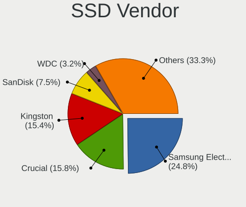

| Vendor              | Computers | Drives | Percent |
|---------------------|-----------|--------|---------|
| Samsung Electronics | 1652      | 2445   | 24.81%  |
| Crucial             | 1051      | 1458   | 15.78%  |
| Kingston            | 1026      | 1440   | 15.41%  |
| SanDisk             | 501       | 695    | 7.52%   |
| WDC                 | 211       | 290    | 3.17%   |
| China               | 195       | 237    | 2.93%   |
| SPCC                | 141       | 174    | 2.12%   |
| Micron Technology   | 125       | 164    | 1.88%   |
| Intenso             | 118       | 143    | 1.77%   |
| Toshiba             | 94        | 133    | 1.41%   |
| Apple               | 93        | 109    | 1.4%    |
| SK hynix            | 85        | 108    | 1.28%   |
| Transcend           | 78        | 108    | 1.17%   |
| PNY                 | 70        | 84     | 1.05%   |
| Intel               | 59        | 91     | 0.89%   |
| Lexar               | 52        | 58     | 0.78%   |
| Fanxiang            | 51        | 58     | 0.77%   |
| A-DATA Technology   | 51        | 68     | 0.77%   |
| KingDian            | 50        | 59     | 0.75%   |
| Patriot             | 49        | 63     | 0.74%   |
| Netac               | 49        | 63     | 0.74%   |
| SABRENT             | 43        | 49     | 0.65%   |
| Corsair             | 43        | 65     | 0.65%   |
| LITEON              | 40        | 48     | 0.6%    |
| OCZ                 | 38        | 46     | 0.57%   |
| KingSpec            | 37        | 46     | 0.56%   |
| Teclast             | 35        | 42     | 0.53%   |
| Unknown             | 35        | 48     | 0.53%   |
| Drevo               | 30        | 34     | 0.45%   |
| Dogfish             | 26        | 33     | 0.39%   |
| Team                | 25        | 45     | 0.38%   |
| GOODRAM             | 24        | 34     | 0.36%   |
| BAITITON            | 23        | 36     | 0.35%   |
| LITEONIT            | 22        | 34     | 0.33%   |
| Verbatim            | 21        | 32     | 0.32%   |
| Emtec               | 18        | 23     | 0.27%   |
| ASMT                | 18        | 21     | 0.27%   |
| S3+                 | 15        | 18     | 0.23%   |
| TCSUNBOW            | 14        | 15     | 0.21%   |
| FORESEE             | 13        | 18     | 0.2%    |

Drive Kind
----------

HDD or SSD

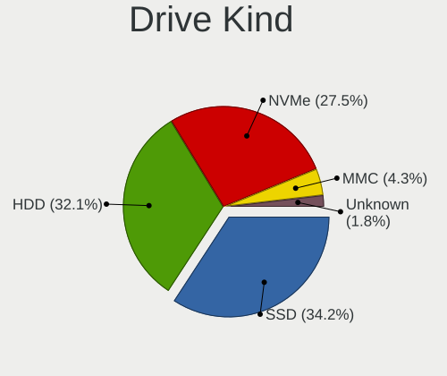

| Kind    | Computers | Drives | Percent |
|---------|-----------|--------|---------|
| SSD     | 5812      | 9163   | 34.23%  |
| HDD     | 5444      | 9604   | 32.06%  |
| NVMe    | 4678      | 7351   | 27.55%  |
| MMC     | 733       | 1030   | 4.32%   |
| Unknown | 314       | 431    | 1.85%   |

Drive Connector
---------------

SATA, SAS, NVMe, etc.

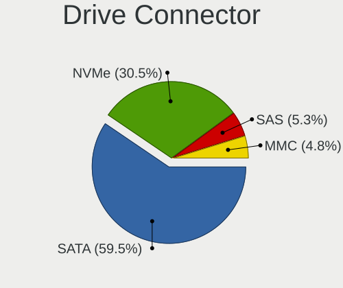

| Type | Computers | Drives | Percent |
|------|-----------|--------|---------|
| SATA | 9125      | 18076  | 59.5%   |
| NVMe | 4670      | 7281   | 30.45%  |
| SAS  | 808       | 1192   | 5.27%   |
| MMC  | 733       | 1030   | 4.78%   |

Drive Size
----------

Size of hard drive

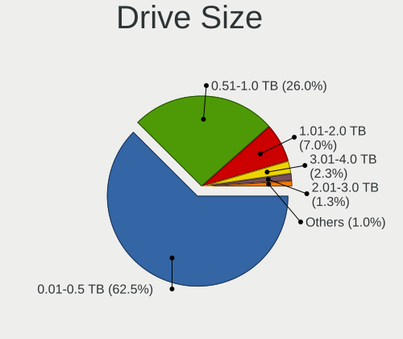

| Size in TB | Computers | Drives | Percent |
|------------|-----------|--------|---------|
| 0.01-0.5   | 7216      | 11860  | 62.45%  |
| 0.51-1.0   | 3006      | 4628   | 26.02%  |
| 1.01-2.0   | 807       | 1333   | 6.98%   |
| 3.01-4.0   | 260       | 424    | 2.25%   |
| 2.01-3.0   | 147       | 259    | 1.27%   |
| 4.01-10.0  | 106       | 230    | 0.92%   |
| 10.01-20.0 | 12        | 33     | 0.1%    |

Space Total
-----------

Amount of disk space available on the file system

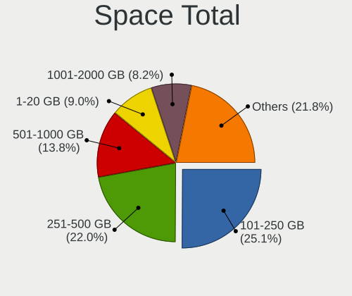

| Size in GB     | Computers | Percent |
|----------------|-----------|---------|
| 101-250        | 3566      | 25.09%  |
| 251-500        | 3127      | 22%     |
| 501-1000       | 1964      | 13.82%  |
| 1-20           | 1281      | 9.01%   |
| 1001-2000      | 1171      | 8.24%   |
| 51-100         | 938       | 6.6%    |
| More than 3000 | 695       | 4.89%   |
| 21-50          | 577       | 4.06%   |
| 2001-3000      | 458       | 3.22%   |
| Unknown        | 434       | 3.05%   |
| 0              | 1         | 0.01%   |

Space Used
----------

Amount of used disk space

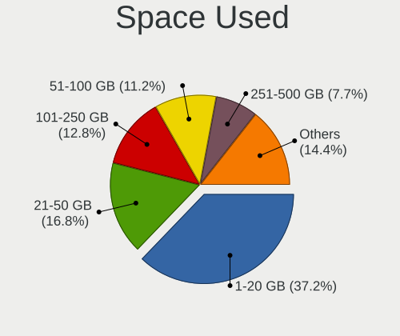

| Used GB        | Computers | Percent |
|----------------|-----------|---------|
| 1-20           | 5489      | 37.19%  |
| 21-50          | 2475      | 16.77%  |
| 101-250        | 1890      | 12.8%   |
| 51-100         | 1649      | 11.17%  |
| 251-500        | 1131      | 7.66%   |
| 501-1000       | 825       | 5.59%   |
| 1001-2000      | 463       | 3.14%   |
| Unknown        | 434       | 2.94%   |
| More than 3000 | 225       | 1.52%   |
| 2001-3000      | 163       | 1.1%    |
| 0              | 17        | 0.12%   |

Malfunc. Drives
---------------

Drive models with a malfunction

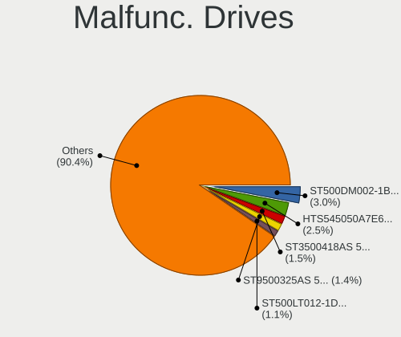

| Model                               | Computers | Drives | Percent |
|-------------------------------------|-----------|--------|---------|
| Seagate ST500DM002-1BD142 500GB     | 40        | 51     | 3.03%   |
| HGST HTS545050A7E680 500GB          | 33        | 40     | 2.5%    |
| Seagate ST3500418AS 500GB           | 20        | 25     | 1.52%   |
| Seagate ST9500325AS 500GB           | 18        | 21     | 1.37%   |
| Seagate ST500LT012-1DG142 500GB     | 15        | 15     | 1.14%   |
| Seagate ST1000LM035-1RK172 1TB      | 14        | 16     | 1.06%   |
| Seagate ST1000LM024 HN-M101MBB 1TB  | 12        | 16     | 0.91%   |
| Toshiba MQ01ABF050 500GB            | 10        | 11     | 0.76%   |
| SanDisk SSD PLUS 480GB              | 10        | 15     | 0.76%   |
| Maxtor STM3250310AS 250GB           | 9         | 12     | 0.68%   |
| Hitachi HTS725050A9A364 500GB       | 9         | 10     | 0.68%   |
| Hitachi HTS545050A7E380 500GB       | 9         | 9      | 0.68%   |
| HGST HTS725050A7E630 500GB          | 9         | 11     | 0.68%   |
| HGST HTS721010A9E630 1TB            | 9         | 9      | 0.68%   |
| Seagate ST9320325AS 320GB           | 8         | 8      | 0.61%   |
| Seagate ST500LM021-1KJ152 500GB     | 8         | 8      | 0.61%   |
| Kingston SA400S37240G 240GB SSD     | 8         | 10     | 0.61%   |
| HGST HTS541010A9E680 1TB            | 8         | 10     | 0.61%   |
| WDC WD20EFRX-68EUZN0 2TB            | 7         | 13     | 0.53%   |
| Toshiba DT01ACA100 1TB              | 7         | 7      | 0.53%   |
| Seagate ST1000LM014-1EJ164 1TB      | 7         | 8      | 0.53%   |
| Samsung Electronics SSD 870 EVO 1TB | 7         | 9      | 0.53%   |
| Maxtor STM3320820AS 320GB           | 7         | 7      | 0.53%   |
| Crucial CT525MX300SSD1 528GB        | 7         | 7      | 0.53%   |
| WDC WD5000LPCX-24C6HT0 500GB        | 6         | 7      | 0.46%   |
| WDC WD40EFRX-68N32N0 4TB            | 6         | 7      | 0.46%   |
| WDC WD30EFRX-68EUZN0 3TB            | 6         | 7      | 0.46%   |
| Seagate ST9500420AS 500GB           | 6         | 6      | 0.46%   |
| Seagate ST9250315AS 250GB           | 6         | 6      | 0.46%   |
| Seagate ST500LM012 HN-M500MBB 500GB | 6         | 9      | 0.46%   |
| Seagate ST3500320AS 500GB           | 6         | 6      | 0.46%   |
| Seagate ST31000528AS 1TB            | 6         | 9      | 0.46%   |
| Seagate ST1000DM010-2EP102 1TB      | 6         | 6      | 0.46%   |
| Seagate ST1000DM003-9YN162 1TB      | 6         | 6      | 0.46%   |
| SanDisk SSD PLUS 240GB              | 6         | 7      | 0.46%   |
| Kingston SA400S37480G 480GB SSD     | 6         | 6      | 0.46%   |
| Kingston SA400S37120G 120GB SSD     | 6         | 8      | 0.46%   |
| WDC WDS240G2G0A-00JH30 240GB SSD    | 5         | 5      | 0.38%   |
| WDC WD3200BEVT-60A23T0 320GB        | 5         | 5      | 0.38%   |
| WDC WD10EZEX-60WN4A0 1TB            | 5         | 6      | 0.38%   |

Malfunc. Drive Vendor
---------------------

Vendors of faulty drives

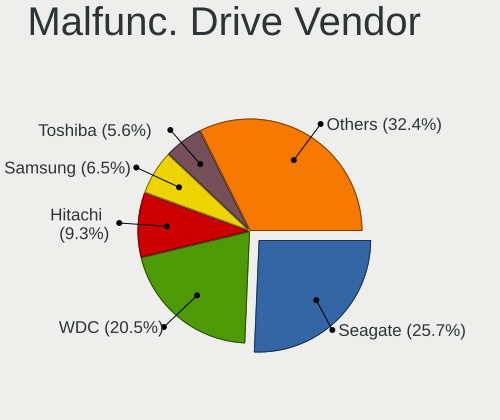

| Vendor                      | Computers | Drives | Percent |
|-----------------------------|-----------|--------|---------|
| Seagate                     | 330       | 421    | 25.68%  |
| WDC                         | 264       | 325    | 20.54%  |
| Hitachi                     | 120       | 133    | 9.34%   |
| Samsung Electronics         | 83        | 95     | 6.46%   |
| Toshiba                     | 72        | 80     | 5.6%    |
| HGST                        | 72        | 87     | 5.6%    |
| Maxtor                      | 55        | 69     | 4.28%   |
| Crucial                     | 41        | 49     | 3.19%   |
| Kingston                    | 38        | 45     | 2.96%   |
| SK hynix                    | 27        | 34     | 2.1%    |
| SanDisk                     | 26        | 32     | 2.02%   |
| Micron Technology           | 19        | 21     | 1.48%   |
| Fujitsu                     | 15        | 18     | 1.17%   |
| Intel                       | 11        | 27     | 0.86%   |
| Apple                       | 8         | 10     | 0.62%   |
| OCZ                         | 6         | 8      | 0.47%   |
| Intenso                     | 6         | 7      | 0.47%   |
| China                       | 6         | 6      | 0.47%   |
| Unknown                     | 5         | 10     | 0.39%   |
| SSSTC                       | 4         | 5      | 0.31%   |
| Netac                       | 4         | 4      | 0.31%   |
| KingDian                    | 4         | 4      | 0.31%   |
| Drevo                       | 4         | 4      | 0.31%   |
| Corsair                     | 4         | 5      | 0.31%   |
| ASMT                        | 4         | 4      | 0.31%   |
| S3+                         | 3         | 3      | 0.23%   |
| Micron/Crucial Technology   | 3         | 4      | 0.23%   |
| A-DATA Technology           | 3         | 3      | 0.23%   |
| Verbatim                    | 2         | 2      | 0.16%   |
| Transcend                   | 2         | 3      | 0.16%   |
| Teclast                     | 2         | 2      | 0.16%   |
| TCSUNBOW                    | 2         | 2      | 0.16%   |
| SPCC                        | 2         | 3      | 0.16%   |
| KingSpec                    | 2         | 2      | 0.16%   |
| Emtec                       | 2         | 4      | 0.16%   |
| Dogfish                     | 2         | 2      | 0.16%   |
| BAITITON                    | 2         | 4      | 0.16%   |
| Yangtze Memory Technologies | 1         | 1      | 0.08%   |
| WINTEC                      | 1         | 1      | 0.08%   |
| WDC WDS2                    | 1         | 1      | 0.08%   |

Malfunc. HDD Vendor
-------------------

Vendors of faulty HDD drives

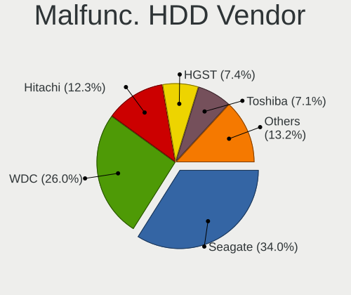

| Vendor              | Computers | Drives | Percent |
|---------------------|-----------|--------|---------|
| Seagate             | 330       | 421    | 33.95%  |
| WDC                 | 253       | 309    | 26.03%  |
| Hitachi             | 120       | 133    | 12.35%  |
| HGST                | 72        | 87     | 7.41%   |
| Toshiba             | 69        | 77     | 7.1%    |
| Maxtor              | 55        | 69     | 5.66%   |
| Samsung Electronics | 38        | 42     | 3.91%   |
| Fujitsu             | 15        | 18     | 1.54%   |
| Apple               | 7         | 9      | 0.72%   |
| Unknown             | 5         | 10     | 0.51%   |
| ASMT                | 2         | 2      | 0.21%   |
| WD MediaMax         | 1         | 1      | 0.1%    |
| USB3.0              | 1         | 1      | 0.1%    |
| QUANTUM             | 1         | 1      | 0.1%    |
| Inateck             | 1         | 1      | 0.1%    |
| IBM/Hitachi         | 1         | 1      | 0.1%    |
| ASMedia             | 1         | 1      | 0.1%    |

Malfunc. Drive Kind
-------------------

Kinds of faulty drives

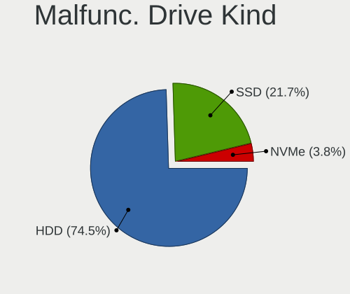

| Kind | Computers | Drives | Percent |
|------|-----------|--------|---------|
| HDD  | 909       | 1183   | 74.51%  |
| SSD  | 265       | 328    | 21.72%  |
| NVMe | 46        | 58     | 3.77%   |

Failed Drives
-------------

Failed drive models

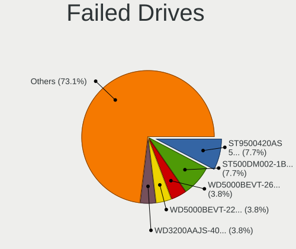

| Model                                            | Computers | Drives | Percent |
|--------------------------------------------------|-----------|--------|---------|
| Seagate ST9500420AS 500GB                        | 2         | 4      | 7.69%   |
| Seagate ST500DM002-1BD142 500GB                  | 2         | 3      | 7.69%   |
| WDC WD5000BEVT-26A0RT0 500GB                     | 1         | 1      | 3.85%   |
| WDC WD5000BEVT-22A0RT0 500GB                     | 1         | 1      | 3.85%   |
| WDC WD3200AAJS-40VWA0 320GB                      | 1         | 1      | 3.85%   |
| WDC WD10JPVX-60JC3T0 1TB                         | 1         | 1      | 3.85%   |
| WDC PC SN520 SDAPNUW-256G-1102 256GB             | 1         | 1      | 3.85%   |
| Toshiba MK3265GSX 320GB                          | 1         | 1      | 3.85%   |
| SK hynix BC501 NVMe Solid State Drive 512GB      | 1         | 1      | 3.85%   |
| SK hynix BC501 HFM256GDJTNG-8310A 256GB          | 1         | 2      | 3.85%   |
| Seagate STM3250318AS 250GB                       | 1         | 1      | 3.85%   |
| Seagate ST3500418AS 500GB                        | 1         | 1      | 3.85%   |
| Seagate ST31500341AS 1TB                         | 1         | 1      | 3.85%   |
| Seagate ST2000LX001-1RG174 2TB                   | 1         | 1      | 3.85%   |
| Samsung Electronics MZNTY128HDHP-00000 128GB SSD | 1         | 1      | 3.85%   |
| Micron/Crucial Technology P2 NVMe PCIe SSD 2TB   | 1         | 1      | 3.85%   |
| LITEON IT LCS-128L9S-11 2.5 7mm 128GB SSD        | 1         | 1      | 3.85%   |
| JMicron Technology Tech 250GB                    | 1         | 1      | 3.85%   |
| JMicron Technology Generic 320GB                 | 1         | 1      | 3.85%   |
| Hitachi HTS725050A7E630 500GB                    | 1         | 1      | 3.85%   |
| Hitachi HTS723232A7A364 320GB                    | 1         | 1      | 3.85%   |
| Hitachi HTS545050A7E380 500GB                    | 1         | 1      | 3.85%   |
| Hitachi HTS543216L9A300 160GB                    | 1         | 1      | 3.85%   |
| HGST HTS541010A9E680 1TB                         | 1         | 1      | 3.85%   |

Failed Drive Vendor
-------------------

Failed drive vendors

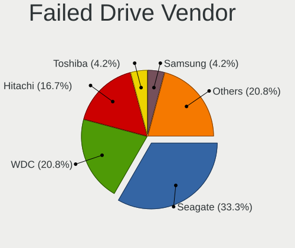

| Vendor                    | Computers | Drives | Percent |
|---------------------------|-----------|--------|---------|
| Seagate                   | 8         | 11     | 33.33%  |
| WDC                       | 5         | 5      | 20.83%  |
| Hitachi                   | 4         | 4      | 16.67%  |
| Toshiba                   | 1         | 1      | 4.17%   |
| SK hynix                  | 1         | 3      | 4.17%   |
| Samsung Electronics       | 1         | 1      | 4.17%   |
| Micron/Crucial Technology | 1         | 1      | 4.17%   |
| LITEON                    | 1         | 1      | 4.17%   |
| JMicron Technology        | 1         | 2      | 4.17%   |
| HGST                      | 1         | 1      | 4.17%   |

Drive Status
------------

Number of failed and malfunc. drives

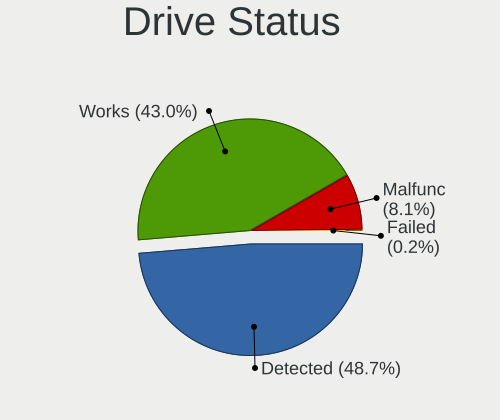

| Status   | Computers | Drives | Percent |
|----------|-----------|--------|---------|
| Detected | 7031      | 14429  | 48.67%  |
| Works    | 6215      | 11551  | 43.02%  |
| Malfunc  | 1176      | 1569   | 8.14%   |
| Failed   | 24        | 30     | 0.17%   |

Storage controller
------------------

Storage Vendor
--------------

Storage controller vendors

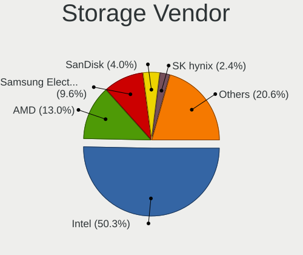

| Vendor                                  | Computers | Percent |
|-----------------------------------------|-----------|---------|
| Intel                                   | 8383      | 50.32%  |
| AMD                                     | 2171      | 13.03%  |
| Samsung Electronics                     | 1600      | 9.6%    |
| SanDisk                                 | 670       | 4.02%   |
| SK hynix                                | 398       | 2.39%   |
| Micron Technology                       | 346       | 2.08%   |
| Phison Electronics                      | 339       | 2.03%   |
| Kingston Technology Company             | 335       | 2.01%   |
| Micron/Crucial Technology               | 303       | 1.82%   |
| ASMedia Technology                      | 260       | 1.56%   |
| Nvidia                                  | 258       | 1.55%   |
| Marvell Technology Group                | 194       | 1.16%   |
| KIOXIA                                  | 190       | 1.14%   |
| JMicron Technology                      | 187       | 1.12%   |
| Toshiba America Info Systems            | 174       | 1.04%   |
| MAXIO Technology (Hangzhou)             | 160       | 0.96%   |
| Silicon Motion                          | 91        | 0.55%   |
| Shenzhen Longsys Electronics            | 76        | 0.46%   |
| VIA Technologies                        | 74        | 0.44%   |
| Realtek Semiconductor                   | 47        | 0.28%   |
| Silicon Integrated Systems [SiS]        | 41        | 0.25%   |
| Solid State Storage Technology          | 35        | 0.21%   |
| ADATA Technology                        | 33        | 0.2%    |
| Solidigm                                | 30        | 0.18%   |
| Apple                                   | 25        | 0.15%   |
| Union Memory (Shenzhen)                 | 24        | 0.14%   |
| Adaptec                                 | 23        | 0.14%   |
| Broadcom / LSI                          | 21        | 0.13%   |
| Silicon Image                           | 20        | 0.12%   |
| Seagate Technology                      | 19        | 0.11%   |
| LSI Logic / Symbios Logic               | 18        | 0.11%   |
| INNOGRIT                                | 17        | 0.1%    |
| Lite-On Technology                      | 10        | 0.06%   |
| Lenovo                                  | 9         | 0.05%   |
| Biwin Storage Technology                | 9         | 0.05%   |
| Unknown                                 | 8         | 0.05%   |
| TenaFe                                  | 7         | 0.04%   |
| Yangtze Memory Technologies             | 6         | 0.04%   |
| Hewlett-Packard                         | 6         | 0.04%   |
| Shenzhen Unionmemory Information System | 4         | 0.02%   |

Storage Model
-------------

Storage controller models

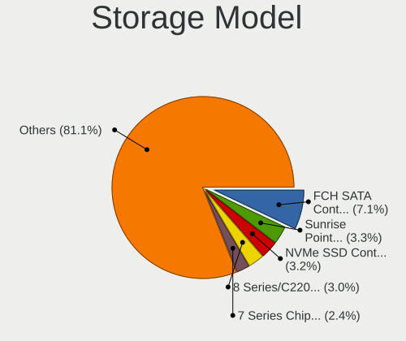

| Model                                                                          | Computers | Percent |
|--------------------------------------------------------------------------------|-----------|---------|
| AMD FCH SATA Controller [AHCI mode]                                            | 1350      | 7.1%    |
| Intel Sunrise Point-LP SATA Controller [AHCI mode]                             | 630       | 3.31%   |
| Samsung NVMe SSD Controller SM981/PM981/PM983                                  | 602       | 3.16%   |
| Intel 8 Series/C220 Series Chipset Family 6-port SATA Controller 1 [AHCI mode] | 564       | 2.96%   |
| Intel 7 Series Chipset Family 6-port SATA Controller [AHCI mode]               | 458       | 2.41%   |
| Intel 82801 Mobile SATA Controller [RAID mode]                                 | 387       | 2.03%   |
| Samsung NVMe SSD Controller 980 (DRAM-less)                                    | 371       | 1.95%   |
| Intel Volume Management Device NVMe RAID Controller                            | 366       | 1.92%   |
| Intel 6 Series/C200 Series Chipset Family 6 port Mobile SATA AHCI Controller   | 338       | 1.78%   |
| Intel 82801IBM/IEM (ICH9M/ICH9M-E) 4 port SATA Controller [AHCI mode]          | 309       | 1.62%   |
| Intel Q170/Q150/B150/H170/H110/Z170/CM236 Chipset SATA Controller [AHCI Mode]  | 281       | 1.48%   |
| AMD 400 Series Chipset SATA Controller                                         | 280       | 1.47%   |
| Samsung NVMe SSD Controller PM9A1/PM9A3/980PRO                                 | 271       | 1.42%   |
| Intel 8 Series SATA Controller 1 [AHCI mode]                                   | 269       | 1.41%   |
| ASMedia ASM1061/ASM1062 Serial ATA Controller                                  | 245       | 1.29%   |
| Intel Celeron/Pentium Silver Processor SATA Controller                         | 238       | 1.25%   |
| Intel 82801G (ICH7 Family) IDE Controller                                      | 238       | 1.25%   |
| Intel 6 Series/C200 Series Chipset Family 6 port Desktop SATA AHCI Controller  | 237       | 1.25%   |
| Intel NM10/ICH7 Family SATA Controller [IDE mode]                              | 212       | 1.11%   |
| Intel 200 Series PCH SATA controller [AHCI mode]                               | 207       | 1.09%   |
| Intel SATA Controller [RAID mode]                                              | 204       | 1.07%   |
| Intel 7 Series/C210 Series Chipset Family 6-port SATA Controller [AHCI mode]   | 204       | 1.07%   |
| AMD SB7x0/SB8x0/SB9x0 SATA Controller [AHCI mode]                              | 203       | 1.07%   |
| Intel Wildcat Point-LP SATA Controller [AHCI Mode]                             | 198       | 1.04%   |
| Intel 82801HM/HEM (ICH8M/ICH8M-E) IDE Controller                               | 196       | 1.03%   |
| AMD 500 Series Chipset SATA Controller                                         | 196       | 1.03%   |
| Intel Comet Lake SATA AHCI Controller                                          | 184       | 0.97%   |
| Micron/Crucial P2 [Nick P2] / P3 / P3 Plus NVMe PCIe SSD (DRAM-less)           | 183       | 0.96%   |
| Intel 5 Series/3400 Series Chipset 4 port SATA AHCI Controller                 | 177       | 0.93%   |
| AMD SB7x0/SB8x0/SB9x0 IDE Controller                                           | 177       | 0.93%   |
| Phison E12 NVMe Controller                                                     | 173       | 0.91%   |
| Intel 82801HM/HEM (ICH8M/ICH8M-E) SATA Controller [AHCI mode]                  | 168       | 0.88%   |
| Intel Cannon Lake PCH SATA AHCI Controller                                     | 160       | 0.84%   |
| Intel 5 Series/3400 Series Chipset 6 port SATA AHCI Controller                 | 160       | 0.84%   |
| AMD 600 Series Chipset SATA Controller                                         | 135       | 0.71%   |
| SanDisk Ultra 3D / WD PC SN530, IX SN530, Blue SN550 NVMe SSD (DRAM-less)      | 131       | 0.69%   |
| Intel HM170/QM170 Chipset SATA Controller [AHCI Mode]                          | 130       | 0.68%   |
| Intel Cannon Lake Mobile PCH SATA AHCI Controller                              | 130       | 0.68%   |
| KIOXIA NVMe SSD Controller BG4 (DRAM-less)                                     | 119       | 0.63%   |
| Samsung NVMe SSD Controller SM961/PM961/SM963                                  | 114       | 0.6%    |

Storage Kind
------------

Kind of storage controller (IDE, SATA, NVMe, SAS, ...)

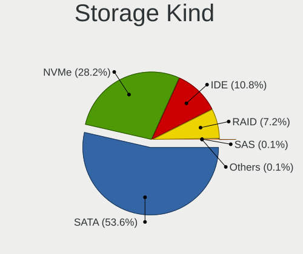

| Kind | Computers | Percent |
|------|-----------|---------|
| SATA | 8908      | 53.58%  |
| NVMe | 4684      | 28.17%  |
| IDE  | 1799      | 10.82%  |
| RAID | 1193      | 7.18%   |
| SAS  | 24        | 0.14%   |
| SCSI | 19        | 0.11%   |

Processor
---------

CPU Vendor
----------

Processor vendors

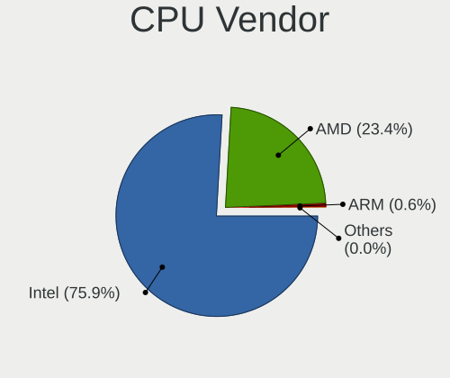

| Vendor                   | Computers | Percent |
|--------------------------|-----------|---------|
| Intel                    | 9893      | 75.9%   |
| AMD                      | 3050      | 23.4%   |
| ARM                      | 77        | 0.59%   |
| CentaurHauls             | 5         | 0.04%   |
| Unknown                  | 5         | 0.04%   |
| Qualcomm                 | 3         | 0.02%   |
| PowerNV C1P9S01 REV 1.01 | 1         | 0.01%   |

CPU Model
---------

Processor models

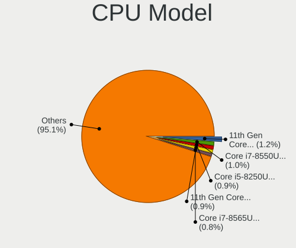

| Model                                         | Computers | Percent |
|-----------------------------------------------|-----------|---------|
| Intel 11th Gen Core i7-1165G7 @ 2.80GHz       | 163       | 1.25%   |
| Intel Core i7-8550U CPU @ 1.80GHz             | 134       | 1.02%   |
| Intel Core i5-8250U CPU @ 1.60GHz             | 124       | 0.95%   |
| Intel 11th Gen Core i5-1135G7 @ 2.40GHz       | 121       | 0.93%   |
| Intel Core i7-8565U CPU @ 1.80GHz             | 101       | 0.77%   |
| Intel Atom x5-Z8350 CPU @ 1.44GHz             | 99        | 0.76%   |
| Intel Core i5-7200U CPU @ 2.50GHz             | 91        | 0.7%    |
| Intel Core i5-6200U CPU @ 2.30GHz             | 90        | 0.69%   |
| Intel Core i5-10210U CPU @ 1.60GHz            | 88        | 0.67%   |
| AMD Ryzen 5 3500U with Radeon Vega Mobile Gfx | 88        | 0.67%   |
| Intel Core i7-10510U CPU @ 1.80GHz            | 87        | 0.67%   |
| Intel Core i7-7500U CPU @ 2.70GHz             | 82        | 0.63%   |
| AMD Ryzen 5 3600 6-Core Processor             | 81        | 0.62%   |
| Intel Core i7-7700HQ CPU @ 2.80GHz            | 80        | 0.61%   |
| AMD Ryzen 7 5700U with Radeon Graphics        | 78        | 0.6%    |
| Intel Core i7-8750H CPU @ 2.20GHz             | 74        | 0.57%   |
| Intel Core i7-6500U CPU @ 2.50GHz             | 69        | 0.53%   |
| AMD Ryzen 5 5500U with Radeon Graphics        | 69        | 0.53%   |
| Intel Atom x5-Z8300 CPU @ 1.44GHz             | 68        | 0.52%   |
| Intel Core i5-3470 CPU @ 3.20GHz              | 67        | 0.51%   |
| Intel Core i7-3770 CPU @ 3.40GHz              | 63        | 0.48%   |
| AMD Ryzen 7 3700X 8-Core Processor            | 62        | 0.47%   |
| Intel Core i5-8265U CPU @ 1.60GHz             | 61        | 0.47%   |
| Intel Core i7-6700HQ CPU @ 2.60GHz            | 60        | 0.46%   |
| Intel Core i7-9750H CPU @ 2.60GHz             | 57        | 0.44%   |
| Intel Celeron N4020 CPU @ 1.10GHz             | 57        | 0.44%   |
| Intel Core i5-6300U CPU @ 2.40GHz             | 56        | 0.43%   |
| ARM Processor                                 | 56        | 0.43%   |
| Intel Core i5-1035G1 CPU @ 1.00GHz            | 54        | 0.41%   |
| Intel Core i7-2670QM CPU @ 2.20GHz            | 53        | 0.41%   |
| Intel 12th Gen Core i7-12700H                 | 52        | 0.4%    |
| Intel Core i7-1065G7 CPU @ 1.30GHz            | 51        | 0.39%   |
| Intel Core 2 Duo CPU P8600 @ 2.40GHz          | 49        | 0.37%   |
| Intel Core i7-4510U CPU @ 2.00GHz             | 48        | 0.37%   |
| AMD Ryzen 7 5800H with Radeon Graphics        | 47        | 0.36%   |
| Intel Core i7-2600 CPU @ 3.40GHz              | 46        | 0.35%   |
| Intel Core i7-10750H CPU @ 2.60GHz            | 46        | 0.35%   |
| Intel Core i5-5200U CPU @ 2.20GHz             | 46        | 0.35%   |
| Intel Core i5-2410M CPU @ 2.30GHz             | 46        | 0.35%   |
| Intel Core i5-2400 CPU @ 3.10GHz              | 46        | 0.35%   |

CPU Model Family
----------------

Processor model prefix

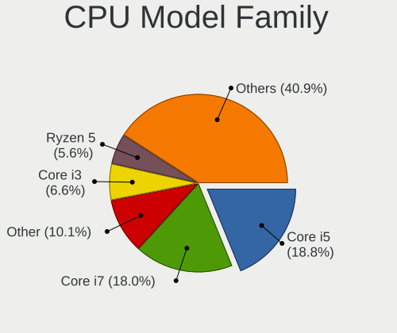

| Model                   | Computers | Percent |
|-------------------------|-----------|---------|
| Intel Core i5           | 2460      | 18.83%  |
| Intel Core i7           | 2347      | 17.97%  |
| Other                   | 1323      | 10.13%  |
| Intel Core i3           | 863       | 6.61%   |
| AMD Ryzen 5             | 730       | 5.59%   |
| AMD Ryzen 7             | 719       | 5.5%    |
| Intel Celeron           | 651       | 4.98%   |
| Intel Core 2 Duo        | 633       | 4.85%   |
| Intel Atom              | 369       | 2.82%   |
| AMD Ryzen 9             | 229       | 1.75%   |
| Intel Pentium           | 226       | 1.73%   |
| Intel Xeon              | 196       | 1.5%    |
| Intel Pentium Dual-Core | 176       | 1.35%   |
| Intel Core 2 Quad       | 149       | 1.14%   |
| AMD Ryzen 3             | 126       | 0.96%   |
| AMD FX                  | 118       | 0.9%    |
| Intel Core              | 103       | 0.79%   |
| Intel Core 2            | 96        | 0.73%   |
| Intel Core i9           | 94        | 0.72%   |
| AMD A8                  | 90        | 0.69%   |
| AMD A10                 | 86        | 0.66%   |
| Intel Pentium Dual      | 85        | 0.65%   |
| AMD E1                  | 76        | 0.58%   |
| AMD A4                  | 76        | 0.58%   |
| Intel Pentium 4         | 71        | 0.54%   |
| AMD A6                  | 62        | 0.47%   |
| AMD Athlon 64 X2        | 58        | 0.44%   |
| AMD Ryzen 7 PRO         | 55        | 0.42%   |
| Intel Genuine           | 53        | 0.41%   |
| AMD Ryzen 5 PRO         | 49        | 0.38%   |
| AMD Phenom II X4        | 45        | 0.34%   |
| AMD Athlon              | 37        | 0.28%   |
| Intel Pentium Silver    | 36        | 0.28%   |
| AMD Sempron             | 36        | 0.28%   |
| AMD E2                  | 35        | 0.27%   |
| AMD Phenom II X6        | 28        | 0.21%   |
| AMD Athlon II X2        | 28        | 0.21%   |
| Intel Pentium D         | 27        | 0.21%   |
| AMD E                   | 25        | 0.19%   |
| Intel Pentium M         | 20        | 0.15%   |

CPU Cores
---------

Number of processor cores

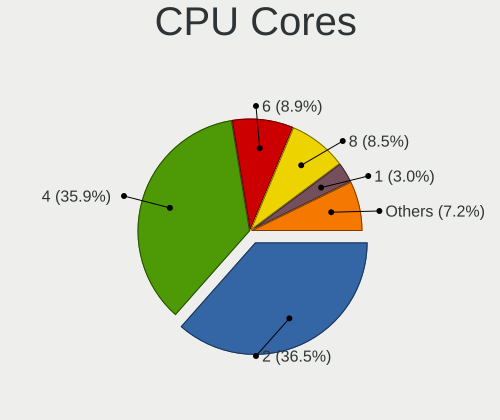

| Number  | Computers | Percent |
|---------|-----------|---------|
| 2       | 4774      | 36.53%  |
| 4       | 4691      | 35.89%  |
| 6       | 1159      | 8.87%   |
| 8       | 1112      | 8.51%   |
| 1       | 388       | 2.97%   |
| 12      | 247       | 1.89%   |
| 10      | 229       | 1.75%   |
| 14      | 172       | 1.32%   |
| 16      | 143       | 1.09%   |
| 24      | 51        | 0.39%   |
| 3       | 49        | 0.37%   |
| Unknown | 26        | 0.2%    |
| 20      | 14        | 0.11%   |
| 5       | 4         | 0.03%   |
| 40      | 3         | 0.02%   |
| 28      | 3         | 0.02%   |
| 64      | 2         | 0.02%   |
| 32      | 2         | 0.02%   |
| 36      | 1         | 0.01%   |

CPU Sockets
-----------

Number of sockets

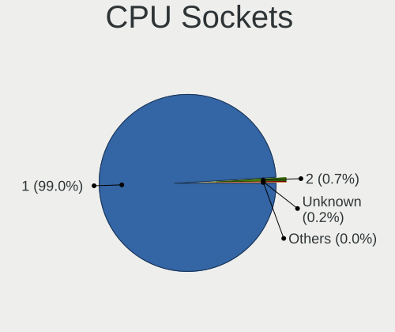

| Number  | Computers | Percent |
|---------|-----------|---------|
| 1       | 12913     | 99.05%  |
| 2       | 87        | 0.67%   |
| Unknown | 24        | 0.18%   |
| 4       | 4         | 0.03%   |
| 8       | 3         | 0.02%   |
| 24      | 2         | 0.02%   |
| 20      | 1         | 0.01%   |
| 16      | 1         | 0.01%   |
| 14      | 1         | 0.01%   |
| 3       | 1         | 0.01%   |

CPU Threads
-----------

Threads per core (Hyper-Threading)

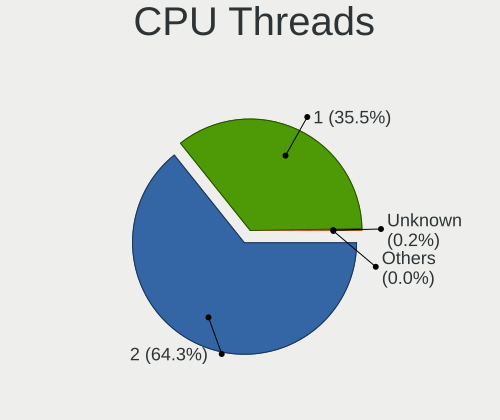

| Number  | Computers | Percent |
|---------|-----------|---------|
| 2       | 8401      | 64.27%  |
| 1       | 4637      | 35.47%  |
| Unknown | 26        | 0.2%    |
| 4       | 5         | 0.04%   |
| 8       | 2         | 0.02%   |
| 12      | 1         | 0.01%   |

CPU Op-Modes
------------

CPU Operation Modes (32-bit, 64-bit)

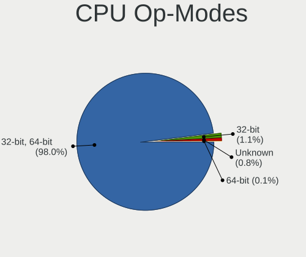

| Op mode        | Computers | Percent |
|----------------|-----------|---------|
| 32-bit, 64-bit | 12789     | 98.02%  |
| 32-bit         | 150       | 1.15%   |
| Unknown        | 98        | 0.75%   |
| 64-bit         | 10        | 0.08%   |

CPU Microcode
-------------

Microcode number

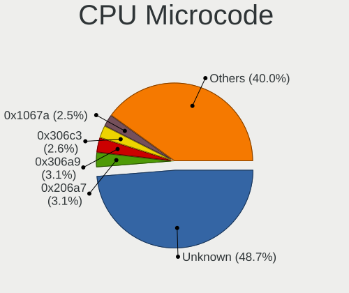

| Number     | Computers | Percent |
|------------|-----------|---------|
| Unknown    | 6707      | 48.74%  |
| 0x206a7    | 423       | 3.07%   |
| 0x306a9    | 420       | 3.05%   |
| 0x306c3    | 356       | 2.59%   |
| 0x1067a    | 345       | 2.51%   |
| 0x806ea    | 198       | 1.44%   |
| 0x806c1    | 180       | 1.31%   |
| 0x40651    | 179       | 1.3%    |
| 0x806ec    | 176       | 1.28%   |
| 0x506e3    | 174       | 1.26%   |
| 0x906ea    | 173       | 1.26%   |
| 0x806e9    | 166       | 1.21%   |
| 0x6fd      | 156       | 1.13%   |
| 0x406e3    | 152       | 1.1%    |
| 0x906e9    | 141       | 1.02%   |
| 0x08108109 | 136       | 0.99%   |
| 0x20655    | 127       | 0.92%   |
| 0x10676    | 118       | 0.86%   |
| 0x306d4    | 112       | 0.81%   |
| 0x08701021 | 109       | 0.79%   |
| 0x406c4    | 92        | 0.67%   |
| 0x0a50000c | 91        | 0.66%   |
| 0x406c3    | 85        | 0.62%   |
| 0x30678    | 84        | 0.61%   |
| 0x6fb      | 80        | 0.58%   |
| 0x08608103 | 77        | 0.56%   |
| 0x706a1    | 75        | 0.55%   |
| 0x20652    | 75        | 0.55%   |
| 0x706e5    | 68        | 0.49%   |
| 0x706a8    | 68        | 0.49%   |
| 0x6f6      | 61        | 0.44%   |
| 0x010000c8 | 60        | 0.44%   |
| 0x0a50000d | 59        | 0.43%   |
| 0x506c9    | 58        | 0.42%   |
| 0x08600106 | 58        | 0.42%   |
| 0x0800820d | 56        | 0.41%   |
| 0x806eb    | 55        | 0.4%    |
| 0x06006705 | 55        | 0.4%    |
| 0x106ca    | 53        | 0.39%   |
| 0x906ed    | 52        | 0.38%   |

CPU Microarch
-------------

Microarchitecture

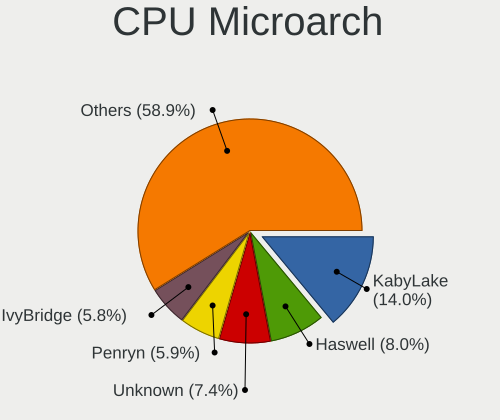

| Name              | Computers | Percent |
|-------------------|-----------|---------|
| KabyLake          | 1831      | 13.98%  |
| Haswell           | 1053      | 8.04%   |
| Unknown           | 975       | 7.44%   |
| Penryn            | 772       | 5.89%   |
| IvyBridge         | 759       | 5.79%   |
| SandyBridge       | 754       | 5.76%   |
| Skylake           | 657       | 5.02%   |
| Zen 3             | 485       | 3.7%    |
| Core              | 481       | 3.67%   |
| Silvermont        | 446       | 3.4%    |
| TigerLake         | 427       | 3.26%   |
| Zen 2             | 423       | 3.23%   |
| Alderlake Hybrid  | 415       | 3.17%   |
| Zen+              | 362       | 2.76%   |
| Westmere          | 356       | 2.72%   |
| Broadwell         | 258       | 1.97%   |
| Goldmont plus     | 250       | 1.91%   |
| CometLake         | 248       | 1.89%   |
| K10               | 215       | 1.64%   |
| IceLake           | 213       | 1.63%   |
| Excavator         | 181       | 1.38%   |
| Zen               | 177       | 1.35%   |
| Piledriver        | 154       | 1.18%   |
| Nehalem           | 139       | 1.06%   |
| K8 Hammer         | 134       | 1.02%   |
| Bonnell           | 129       | 0.98%   |
| Goldmont          | 112       | 0.85%   |
| NetBurst          | 108       | 0.82%   |
| Jaguar            | 91        | 0.69%   |
| Puma              | 85        | 0.65%   |
| P6                | 77        | 0.59%   |
| Bobcat            | 60        | 0.46%   |
| Steamroller       | 48        | 0.37%   |
| K10 Llano         | 45        | 0.34%   |
| Gracemont         | 41        | 0.31%   |
| Meteorlake Hybrid | 38        | 0.29%   |
| Tremont           | 30        | 0.23%   |
| K8 & K10 hybrid   | 24        | 0.18%   |
| Lunarlake Hybrid  | 21        | 0.16%   |
| Bulldozer         | 18        | 0.14%   |

Graphics
--------

GPU Vendor
----------

Vendors of graphics cards

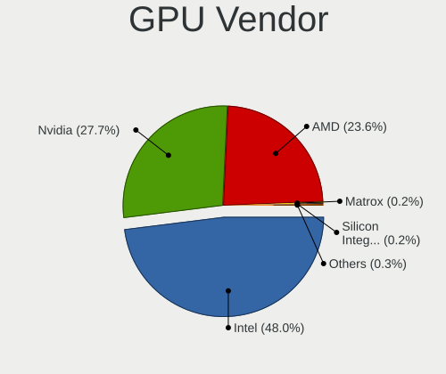

| Vendor                                       | Computers | Percent |
|----------------------------------------------|-----------|---------|
| Intel                                        | 7372      | 48.02%  |
| Nvidia                                       | 4258      | 27.74%  |
| AMD                                          | 3623      | 23.6%   |
| Matrox Electronics Systems                   | 29        | 0.19%   |
| Silicon Integrated Systems [SiS]             | 26        | 0.17%   |
| VIA Technologies                             | 19        | 0.12%   |
| ASPEED Technology                            | 12        | 0.08%   |
| Red Hat                                      | 4         | 0.03%   |
| XGI Technology (eXtreme Graphics Innovation) | 3         | 0.02%   |
| S3 Graphics                                  | 2         | 0.01%   |
| ATI Technologies                             | 2         | 0.01%   |
| 3DLabs                                       | 1         | 0.01%   |

GPU Model
---------

Graphics card models

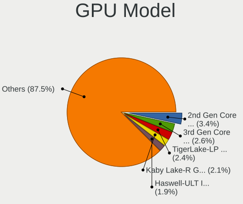

| Model                                                                                    | Computers | Percent |
|------------------------------------------------------------------------------------------|-----------|---------|
| Intel 2nd Generation Core Processor Family Integrated Graphics Controller                | 538       | 3.38%   |
| Intel 3rd Gen Core processor Graphics Controller                                         | 416       | 2.61%   |
| Intel TigerLake-LP GT2 [Iris Xe Graphics]                                                | 385       | 2.42%   |
| Intel Kaby Lake-R GT2 [UHD Graphics 620]                                                 | 340       | 2.13%   |
| Intel Haswell-ULT Integrated Graphics Controller                                         | 307       | 1.93%   |
| Intel Atom/Celeron/Pentium Processor x5-E8000/J3xxx/N3xxx Integrated Graphics Controller | 288       | 1.81%   |
| Intel Skylake-U GT2 [HD Graphics 520]                                                    | 270       | 1.69%   |
| AMD Picasso/Raven 2 [Radeon Vega Series / Radeon Vega Mobile Series]                     | 262       | 1.64%   |
| Intel Kaby Lake-U GT2 [HD Graphics 620]                                                  | 246       | 1.54%   |
| Intel GeminiLake [UHD Graphics 600]                                                      | 219       | 1.37%   |
| Intel CometLake-U GT2 [UHD Graphics]                                                     | 216       | 1.36%   |
| Intel Mobile 4 Series Chipset Integrated Graphics Controller                             | 210       | 1.32%   |
| Intel WhiskeyLake-U GT2 [UHD Graphics 620]                                               | 209       | 1.31%   |
| Intel Xeon E3-1200 v3/4th Gen Core Processor Integrated Graphics Controller              | 201       | 1.26%   |
| AMD Cezanne [Radeon Vega Series / Radeon Vega Mobile Series]                             | 201       | 1.26%   |
| AMD Renoir [Radeon Vega Series / Radeon Vega Mobile Series]                              | 189       | 1.19%   |
| Intel Broadwell-U GT2 [HD Graphics 5500]                                                 | 183       | 1.15%   |
| Intel CoffeeLake-H GT2 [UHD Graphics 630]                                                | 178       | 1.12%   |
| Intel Core Processor Integrated Graphics Controller                                      | 172       | 1.08%   |
| Intel 4th Gen Core Processor Integrated Graphics Controller                              | 169       | 1.06%   |
| AMD Lucienne                                                                             | 163       | 1.02%   |
| Intel Atom Processor Z36xxx/Z37xxx Series Graphics & Display                             | 156       | 0.98%   |
| AMD Ellesmere [Radeon RX 470/480/570/570X/580/580X/590]                                  | 153       | 0.96%   |
| Nvidia GK208B [GeForce GT 710]                                                           | 127       | 0.8%    |
| Intel Alder Lake-P GT2 [Iris Xe Graphics]                                                | 116       | 0.73%   |
| Intel Mobile GM965/GL960 Integrated Graphics Controller (secondary)                      | 107       | 0.67%   |
| Intel Mobile GM965/GL960 Integrated Graphics Controller (primary)                        | 107       | 0.67%   |
| Intel Skylake-S GT2 [HD Graphics 530]                                                    | 105       | 0.66%   |
| Intel Xeon E3-1200 v2/3rd Gen Core processor Graphics Controller                         | 104       | 0.65%   |
| AMD Stoney [Radeon R2/R3/R4/R5 Graphics]                                                 | 104       | 0.65%   |
| Nvidia TU117M [GeForce GTX 1650 Mobile / Max-Q]                                          | 102       | 0.64%   |
| Nvidia GP107 [GeForce GTX 1050 Ti]                                                       | 99        | 0.62%   |
| Nvidia GF117M [GeForce 610M/710M/810M/820M / GT 620M/625M/630M/720M]                     | 99        | 0.62%   |
| Intel Mobile 945GM/GMS/GME, 943/940GML Express Integrated Graphics Controller            | 94        | 0.59%   |
| Intel Apollo Lake GT1 [HD Graphics 500]                                                  | 94        | 0.59%   |
| Intel Raptor Lake-P [Iris Xe Graphics]                                                   | 93        | 0.58%   |
| Intel 4 Series Chipset Integrated Graphics Controller                                    | 92        | 0.58%   |
| AMD Topaz XT [Radeon R7 M260/M265 / M340/M360 / M440/M445 / 530/535 / 620/625 Mobile]    | 89        | 0.56%   |
| Intel CoffeeLake-S GT2 [UHD Graphics 630]                                                | 88        | 0.55%   |
| Intel CometLake-H GT2 [UHD Graphics]                                                     | 87        | 0.55%   |

GPU Combo
---------

Combinations of graphics cards

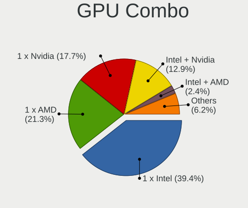

| Name                    | Computers | Percent |
|-------------------------|-----------|---------|
| 1 x Intel               | 5175      | 39.4%   |
| 1 x AMD                 | 2803      | 21.34%  |
| 1 x Nvidia              | 2325      | 17.7%   |
| Intel + Nvidia          | 1692      | 12.88%  |
| Intel + AMD             | 321       | 2.44%   |
| 2 x AMD                 | 292       | 2.22%   |
| AMD + Nvidia            | 213       | 1.62%   |
| Other                   | 95        | 0.72%   |
| 2 x Intel               | 95        | 0.72%   |
| 1 x SiS                 | 26        | 0.2%    |
| 2 x Nvidia              | 19        | 0.14%   |
| 1 x VIA                 | 19        | 0.14%   |
| 1 x Matrox              | 18        | 0.14%   |
| 1 x ASPEED              | 7         | 0.05%   |
| Nvidia + Matrox         | 6         | 0.05%   |
| 1 x Red Hat             | 4         | 0.03%   |
| Nvidia + ASPEED         | 4         | 0.03%   |
| AMD + Matrox            | 4         | 0.03%   |
| 1 x XGI                 | 3         | 0.02%   |
| 1 x S3 Graphics         | 2         | 0.02%   |
| Intel + 2 x Nvidia      | 2         | 0.02%   |
| 3 x AMD                 | 1         | 0.01%   |
| 2 x Nvidia + 1 x Matrox | 1         | 0.01%   |
| 2 x Intel + 1 x Nvidia  | 1         | 0.01%   |
| 2 x AMD + 1 x Nvidia    | 1         | 0.01%   |
| 2 x AMD + 1 x 3DLabs    | 1         | 0.01%   |
| Intel + 2 x AMD         | 1         | 0.01%   |
| AMD + 2 x Nvidia        | 1         | 0.01%   |
| AMD + ASPEED            | 1         | 0.01%   |

GPU Driver
----------

Free vs proprietary

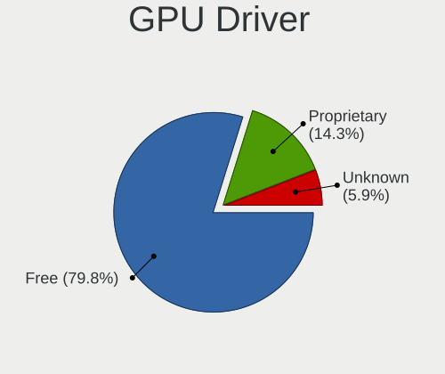

| Driver      | Computers | Percent |
|-------------|-----------|---------|
| Free        | 10638     | 79.81%  |
| Proprietary | 1906      | 14.3%   |
| Unknown     | 785       | 5.89%   |

GPU Memory
----------

Total video memory

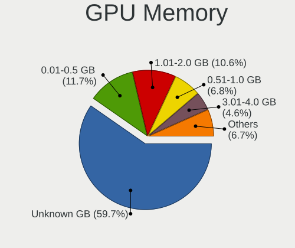

| Size in GB | Computers | Percent |
|------------|-----------|---------|
| Unknown    | 8078      | 59.68%  |
| 0.01-0.5   | 1579      | 11.67%  |
| 1.01-2.0   | 1438      | 10.62%  |
| 0.51-1.0   | 921       | 6.8%    |
| 3.01-4.0   | 618       | 4.57%   |
| 7.01-8.0   | 399       | 2.95%   |
| 5.01-6.0   | 230       | 1.7%    |
| 8.01-16.0  | 179       | 1.32%   |
| 2.01-3.0   | 76        | 0.56%   |
| 16.01-24.0 | 13        | 0.1%    |
| 4.01-5.0   | 3         | 0.02%   |
| 24.01-32.0 | 2         | 0.01%   |

Monitor
-------

Monitor Vendor
--------------

Monitor vendors

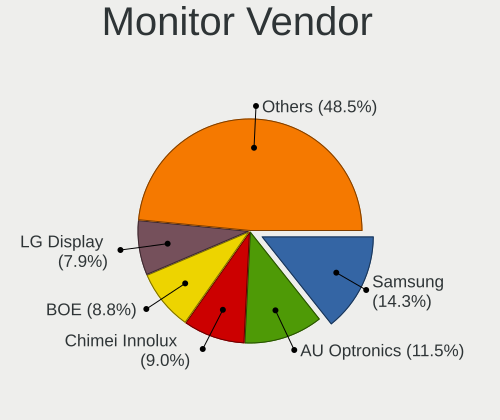

| Vendor                  | Computers | Percent |
|-------------------------|-----------|---------|
| Samsung Electronics     | 1992      | 14.32%  |
| AU Optronics            | 1596      | 11.47%  |
| Chimei Innolux          | 1247      | 8.97%   |
| BOE                     | 1229      | 8.84%   |
| LG Display              | 1105      | 7.94%   |
| Goldstar                | 709       | 5.1%    |
| Hewlett-Packard         | 670       | 4.82%   |
| Philips                 | 589       | 4.23%   |
| Ancor Communications    | 448       | 3.22%   |
| Acer                    | 404       | 2.9%    |
| Dell                    | 331       | 2.38%   |
| Apple                   | 331       | 2.38%   |
| BenQ                    | 298       | 2.14%   |
| AOC                     | 246       | 1.77%   |
| Lenovo                  | 239       | 1.72%   |
| Sharp                   | 227       | 1.63%   |
| Chi Mei Optoelectronics | 207       | 1.49%   |
| ASUSTek Computer        | 130       | 0.93%   |
| Sony                    | 117       | 0.84%   |
| HannStar                | 108       | 0.78%   |
| MSI                     | 107       | 0.77%   |
| PANDA                   | 106       | 0.76%   |
| LG Philips              | 93        | 0.67%   |
| Unknown                 | 89        | 0.64%   |
| InfoVision              | 79        | 0.57%   |
| LG Electronics          | 46        | 0.33%   |
| CSO                     | 42        | 0.3%    |
| Fujitsu Siemens         | 39        | 0.28%   |
| Eizo                    | 39        | 0.28%   |
| HKC                     | 38        | 0.27%   |
| CPT                     | 33        | 0.24%   |
| Mi                      | 32        | 0.23%   |
| RTK                     | 31        | 0.22%   |
| Panasonic               | 30        | 0.22%   |
| Toshiba                 | 27        | 0.19%   |
| CSOT                    | 26        | 0.19%   |
| Iiyama                  | 25        | 0.18%   |
| Vestel Elektronik       | 23        | 0.17%   |
| NEC Computers           | 23        | 0.17%   |
| Valve                   | 20        | 0.14%   |

Monitor Model
-------------

Monitor models

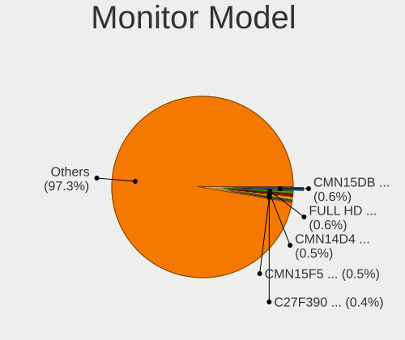

| Model                                                                    | Computers | Percent |
|--------------------------------------------------------------------------|-----------|---------|
| Chimei Innolux LCD Monitor CMN15DB 1366x768 344x193mm 15.5-inch          | 90        | 0.63%   |
| Goldstar FULL HD GSM5B55 1920x1080 480x270mm 21.7-inch                   | 85        | 0.6%    |
| Chimei Innolux LCD Monitor CMN14D4 1920x1080 309x173mm 13.9-inch         | 74        | 0.52%   |
| Chimei Innolux LCD Monitor CMN15F5 1920x1080 344x193mm 15.5-inch         | 72        | 0.5%    |
| Samsung Electronics C27F390 SAM0D32 1920x1080 598x336mm 27.0-inch        | 61        | 0.43%   |
| AU Optronics LCD Monitor AUO21ED 1920x1080 344x193mm 15.5-inch           | 59        | 0.41%   |
| AU Optronics LCD Monitor AUO38ED 1920x1080 344x193mm 15.5-inch           | 58        | 0.41%   |
| AU Optronics LCD Monitor AUO71EC 1366x768 344x193mm 15.5-inch            | 53        | 0.37%   |
| Chimei Innolux LCD Monitor CMN15E7 1920x1080 344x193mm 15.5-inch         | 52        | 0.36%   |
| LG Display LCD Monitor LGD02DC 1366x768 344x194mm 15.5-inch              | 50        | 0.35%   |
| BOE LCD Monitor BOE0872 1920x1080 344x194mm 15.5-inch                    | 49        | 0.34%   |
| AU Optronics LCD Monitor AUO22EC 1366x768 344x193mm 15.5-inch            | 47        | 0.33%   |
| Chimei Innolux LCD Monitor CMN15C9 1366x768 344x193mm 15.5-inch          | 46        | 0.32%   |
| BOE LCD Monitor BOE06A5 1366x768 344x194mm 15.5-inch                     | 45        | 0.32%   |
| AU Optronics LCD Monitor AUO26EC 1366x768 344x193mm 15.5-inch            | 45        | 0.32%   |
| Unknown LCD Monitor FFFF 2288x1287 2550x2550mm 142.0-inch                | 44        | 0.31%   |
| Samsung Electronics S24D330 SAM0D92 1920x1080 531x299mm 24.0-inch        | 42        | 0.29%   |
| Chi Mei Optoelectronics LCD Monitor CMO15A7 1366x768 344x193mm 15.5-inch | 40        | 0.28%   |
| Samsung Electronics S24F350 SAM0D20 1920x1080 521x293mm 23.5-inch        | 38        | 0.27%   |
| AU Optronics LCD Monitor AUO45EC 1366x768 344x193mm 15.5-inch            | 38        | 0.27%   |
| AU Optronics LCD Monitor AUO403D 1920x1080 309x174mm 14.0-inch           | 38        | 0.27%   |
| BOE LCD Monitor BOE06A4 1366x768 344x194mm 15.5-inch                     | 35        | 0.25%   |
| Chimei Innolux LCD Monitor CMN15E6 1366x768 344x193mm 15.5-inch          | 34        | 0.24%   |
| Goldstar HDR 4K GSM7706 3840x2160 600x340mm 27.2-inch                    | 33        | 0.23%   |
| Ancor Communications ASUS VS228 ACI22FD 1920x1080 476x268mm 21.5-inch    | 33        | 0.23%   |
| Samsung Electronics LCD Monitor SEC5441 1280x800 331x207mm 15.4-inch     | 32        | 0.22%   |
| LG Display LCD Monitor LGD039F 1366x768 345x194mm 15.6-inch              | 32        | 0.22%   |
| Hewlett-Packard 24f HPN3545 1920x1080 527x296mm 23.8-inch                | 32        | 0.22%   |
| AU Optronics LCD Monitor AUO23EC 1366x768 344x193mm 15.5-inch            | 32        | 0.22%   |
| Chimei Innolux LCD Monitor CMN1521 1920x1080 344x193mm 15.5-inch         | 31        | 0.22%   |
| Philips PHL 243V5 PHLC0D1 1920x1080 521x293mm 23.5-inch                  | 30        | 0.21%   |
| LG Display LCD Monitor LGD046F 1920x1080 344x194mm 15.5-inch             | 30        | 0.21%   |
| Chimei Innolux LCD Monitor CMN15CA 1366x768 344x193mm 15.5-inch          | 30        | 0.21%   |
| AU Optronics LCD Monitor AUO61ED 1920x1080 344x194mm 15.5-inch           | 30        | 0.21%   |
| Philips PHL 223V5 PHLC0CF 1920x1080 477x268mm 21.5-inch                  | 29        | 0.2%    |
| AU Optronics LCD Monitor AUO499F 1920x1080 344x194mm 15.5-inch           | 29        | 0.2%    |
| BOE LCD Monitor BOE0877 1920x1080 309x173mm 13.9-inch                    | 28        | 0.2%    |
| BOE LCD Monitor BOE0893 2160x1440 296x197mm 14.0-inch                    | 27        | 0.19%   |
| AU Optronics LCD Monitor AUO46EC 1366x768 344x193mm 15.5-inch            | 27        | 0.19%   |
| Hewlett-Packard 27fh HPN354A 1920x1080 598x336mm 27.0-inch               | 26        | 0.18%   |

Monitor Resolution
------------------

Monitor screen resolution

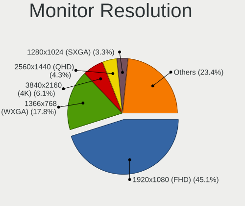

| Resolution         | Computers | Percent |
|--------------------|-----------|---------|
| 1920x1080 (FHD)    | 6013      | 45.12%  |
| 1366x768 (WXGA)    | 2375      | 17.82%  |
| 3840x2160 (4K)     | 816       | 6.12%   |
| 2560x1440 (QHD)    | 571       | 4.28%   |
| 1280x1024 (SXGA)   | 438       | 3.29%   |
| 1280x800 (WXGA)    | 427       | 3.2%    |
| 1920x1200 (WUXGA)  | 371       | 2.78%   |
| 1440x900 (WXGA+)   | 361       | 2.71%   |
| 1680x1050 (WSXGA+) | 312       | 2.34%   |
| 1600x900 (HD+)     | 298       | 2.24%   |
| 2560x1600          | 139       | 1.04%   |
| 3440x1440          | 114       | 0.86%   |
| 2880x1800          | 114       | 0.86%   |
| 1360x768           | 102       | 0.77%   |
| Unknown            | 87        | 0.65%   |
| 2560x1080          | 85        | 0.64%   |
| 1024x600           | 81        | 0.61%   |
| 2160x1440          | 70        | 0.53%   |
| 1024x768 (XGA)     | 56        | 0.42%   |
| 2288x1287          | 46        | 0.35%   |
| 3840x1080          | 43        | 0.32%   |
| 3840x2400          | 31        | 0.23%   |
| 1920x540           | 31        | 0.23%   |
| 2880x1920          | 29        | 0.22%   |
| 1920x1280          | 22        | 0.17%   |
| 800x1280           | 21        | 0.16%   |
| 1280x720 (HD)      | 21        | 0.16%   |
| 3200x1800 (QHD+)   | 16        | 0.12%   |
| 1600x1200          | 16        | 0.12%   |
| 2520x1680          | 14        | 0.11%   |
| 2240x1400          | 14        | 0.11%   |
| 2880x1620          | 13        | 0.1%    |
| 3000x2000          | 12        | 0.09%   |
| 2256x1504          | 12        | 0.09%   |
| 3200x2000          | 11        | 0.08%   |
| 3072x1920          | 11        | 0.08%   |
| 3840x1600          | 10        | 0.08%   |
| 1280x768           | 10        | 0.08%   |
| 2736x1824          | 8         | 0.06%   |
| 3456x2160          | 7         | 0.05%   |

Monitor Diagonal
----------------

Diagonal size in inches

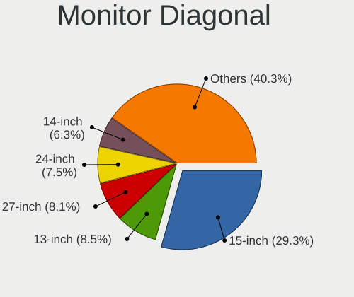

| Inches  | Computers | Percent |
|---------|-----------|---------|
| 15      | 4083      | 29.34%  |
| 13      | 1177      | 8.46%   |
| 27      | 1130      | 8.12%   |
| 24      | 1043      | 7.5%    |
| 14      | 875       | 6.29%   |
| 21      | 771       | 5.54%   |
| 23      | 733       | 5.27%   |
| 17      | 526       | 3.78%   |
| Unknown | 501       | 3.6%    |
| 19      | 417       | 3%      |
| 31      | 340       | 2.44%   |
| 16      | 247       | 1.78%   |
| 18      | 237       | 1.7%    |
| 12      | 225       | 1.62%   |
| 22      | 174       | 1.25%   |
| 20      | 174       | 1.25%   |
| 34      | 173       | 1.24%   |
| 10      | 114       | 0.82%   |
| 11      | 109       | 0.78%   |
| 40      | 101       | 0.73%   |
| 84      | 89        | 0.64%   |
| 54      | 84        | 0.6%    |
| 72      | 67        | 0.48%   |
| 32      | 55        | 0.4%    |
| 25      | 45        | 0.32%   |
| 142     | 44        | 0.32%   |
| 28      | 35        | 0.25%   |
| 26      | 34        | 0.24%   |
| 63      | 29        | 0.21%   |
| 52      | 28        | 0.2%    |
| 65      | 24        | 0.17%   |
| 48      | 24        | 0.17%   |
| 7       | 20        | 0.14%   |
| 46      | 19        | 0.14%   |
| 37      | 16        | 0.11%   |
| 43      | 14        | 0.1%    |
| 29      | 14        | 0.1%    |
| 42      | 13        | 0.09%   |
| 49      | 11        | 0.08%   |
| 39      | 9         | 0.06%   |

Monitor Width
-------------

Physical width

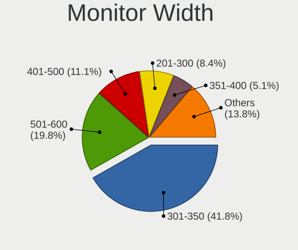

| Width in mm    | Computers | Percent |
|----------------|-----------|---------|
| 301-350        | 5736      | 41.79%  |
| 501-600        | 2718      | 19.8%   |
| 401-500        | 1524      | 11.1%   |
| 201-300        | 1150      | 8.38%   |
| 351-400        | 703       | 5.12%   |
| Unknown        | 501       | 3.65%   |
| 601-700        | 489       | 3.56%   |
| 1001-1500      | 250       | 1.82%   |
| 701-800        | 242       | 1.76%   |
| 1501-2000      | 174       | 1.27%   |
| 801-900        | 135       | 0.98%   |
| More than 2000 | 44        | 0.32%   |
| 901-1000       | 29        | 0.21%   |
| 1-100          | 20        | 0.15%   |
| 101-200        | 11        | 0.08%   |

Aspect Ratio
------------

Proportional relationship between the width and the height

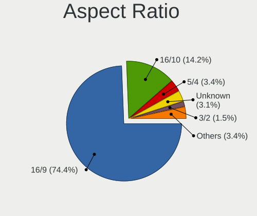

| Ratio   | Computers | Percent |
|---------|-----------|---------|
| 16/9    | 9477      | 74.39%  |
| 16/10   | 1806      | 14.18%  |
| 5/4     | 429       | 3.37%   |
| Unknown | 398       | 3.12%   |
| 3/2     | 195       | 1.53%   |
| 21/9    | 191       | 1.5%    |
| 4/3     | 116       | 0.91%   |
| 1.00    | 45        | 0.35%   |
| 32/9    | 29        | 0.23%   |
| 6/5     | 20        | 0.16%   |
| 0.67    | 16        | 0.13%   |
| 0.62    | 6         | 0.05%   |
| 0.56    | 4         | 0.03%   |
| 0.63    | 3         | 0.02%   |
| 3.40    | 2         | 0.02%   |
| 2.65    | 1         | 0.01%   |
| 2.21    | 1         | 0.01%   |
| 2.07    | 1         | 0.01%   |

Monitor Area
------------

Area in inch²

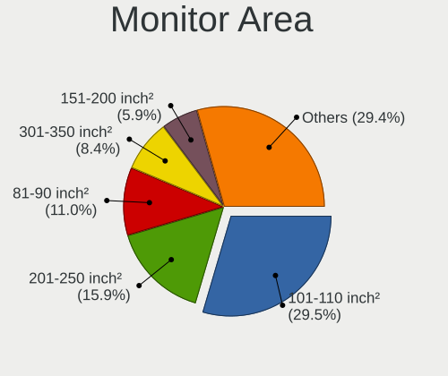

| Area in inch² | Computers | Percent |
|----------------|-----------|---------|
| 101-110        | 4081      | 29.54%  |
| 201-250        | 2192      | 15.87%  |
| 81-90          | 1513      | 10.95%  |
| 301-350        | 1157      | 8.37%   |
| 151-200        | 817       | 5.91%   |
| 351-500        | 611       | 4.42%   |
| 71-80          | 523       | 3.79%   |
| Unknown        | 501       | 3.63%   |
| More than 1000 | 413       | 2.99%   |
| 251-300        | 372       | 2.69%   |
| 141-150        | 352       | 2.55%   |
| 121-130        | 285       | 2.06%   |
| 111-120        | 218       | 1.58%   |
| 501-1000       | 216       | 1.56%   |
| 61-70          | 208       | 1.51%   |
| 51-60          | 116       | 0.84%   |
| 41-50          | 110       | 0.8%    |
| 131-140        | 54        | 0.39%   |
| 91-100         | 46        | 0.33%   |
| 1-40           | 30        | 0.22%   |

Pixel Density
-------------

Pixels per inch

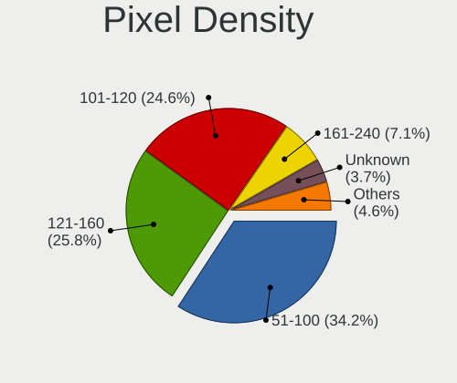

| Density       | Computers | Percent |
|---------------|-----------|---------|
| 51-100        | 4614      | 34.21%  |
| 121-160       | 3478      | 25.79%  |
| 101-120       | 3317      | 24.59%  |
| 161-240       | 960       | 7.12%   |
| Unknown       | 501       | 3.71%   |
| 1-50          | 341       | 2.53%   |
| More than 240 | 277       | 2.05%   |

Multiple Monitors
-----------------

Total monitors connected

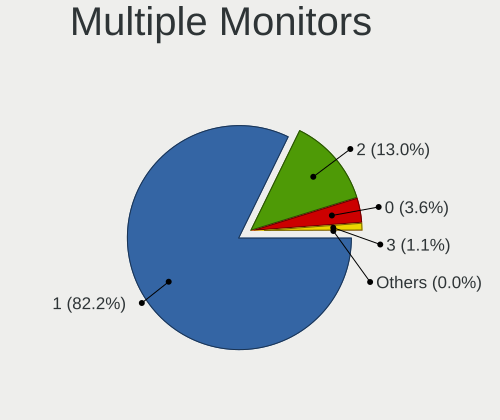

| Total | Computers | Percent |
|-------|-----------|---------|
| 1     | 10995     | 82.24%  |
| 2     | 1734      | 12.97%  |
| 0     | 483       | 3.61%   |
| 3     | 147       | 1.1%    |
| 4     | 9         | 0.07%   |
| 5     | 1         | 0.01%   |

Network
-------

Net Controller Vendor
---------------------

Controller vendors

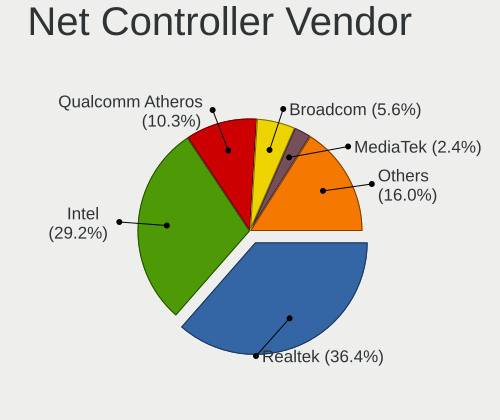

| Vendor                            | Computers | Percent |
|-----------------------------------|-----------|---------|
| Realtek Semiconductor             | 7269      | 36.45%  |
| Intel                             | 5820      | 29.18%  |
| Qualcomm Atheros                  | 2063      | 10.34%  |
| Broadcom                          | 1112      | 5.58%   |
| MediaTek                          | 488       | 2.45%   |
| TP-Link                           | 324       | 1.62%   |
| Marvell Technology Group          | 310       | 1.55%   |
| Broadcom Limited                  | 278       | 1.39%   |
| Ralink Technology                 | 203       | 1.02%   |
| Nvidia                            | 201       | 1.01%   |
| Ralink                            | 180       | 0.9%    |
| ASIX Electronics                  | 115       | 0.58%   |
| Samsung Electronics               | 101       | 0.51%   |
| Xiaomi                            | 93        | 0.47%   |
| D-Link                            | 82        | 0.41%   |
| Qualcomm Atheros Communications   | 81        | 0.41%   |
| Huawei Technologies               | 74        | 0.37%   |
| D-Link System                     | 68        | 0.34%   |
| Shenzhen Goodix Technology        | 58        | 0.29%   |
| Qualcomm                          | 57        | 0.29%   |
| Microsoft                         | 54        | 0.27%   |
| Sierra Wireless                   | 53        | 0.27%   |
| Dell                              | 51        | 0.26%   |
| Sitecom Europe                    | 47        | 0.24%   |
| OPPO Electronics                  | 44        | 0.22%   |
| NetGear                           | 39        | 0.2%    |
| VIA Technologies                  | 38        | 0.19%   |
| ASUSTek Computer                  | 35        | 0.18%   |
| JMicron Technology                | 34        | 0.17%   |
| Ericsson Business Mobile Networks | 33        | 0.17%   |
| Silicon Integrated Systems [SiS]  | 30        | 0.15%   |
| DisplayLink                       | 28        | 0.14%   |
| Hewlett-Packard                   | 26        | 0.13%   |
| Attansic Technology               | 23        | 0.12%   |
| Lenovo                            | 22        | 0.11%   |
| Fibocom                           | 22        | 0.11%   |
| Microchip Technology              | 21        | 0.11%   |
| Belkin Components                 | 21        | 0.11%   |
| Aquantia                          | 19        | 0.1%    |
| Motorola PCS                      | 15        | 0.08%   |

Net Controller Model
--------------------

Controller models

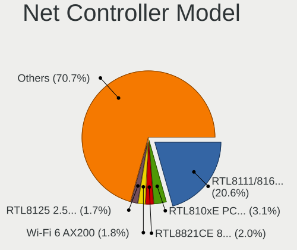

| Model                                                                  | Computers | Percent |
|------------------------------------------------------------------------|-----------|---------|
| Realtek RTL8111/8168/8211/8411 PCI Express Gigabit Ethernet Controller | 4785      | 20.61%  |
| Realtek RTL810xE PCI Express Fast Ethernet controller                  | 729       | 3.14%   |
| Realtek RTL8821CE 802.11ac PCIe Wireless Network Adapter               | 462       | 1.99%   |
| Intel Wi-Fi 6 AX200                                                    | 425       | 1.83%   |
| Realtek RTL8125 2.5GbE Controller                                      | 403       | 1.74%   |
| Intel Wireless 8265 / 8275                                             | 369       | 1.59%   |
| Realtek RTL8153 Gigabit Ethernet Adapter                               | 366       | 1.58%   |
| Intel 82579LM Gigabit Network Connection (Lewisville)                  | 337       | 1.45%   |
| Realtek RTL8822CE 802.11ac PCIe Wireless Network Adapter               | 305       | 1.31%   |
| Intel Wi-Fi 6 AX201                                                    | 305       | 1.31%   |
| Qualcomm Atheros QCA9377 802.11ac Wireless Network Adapter             | 304       | 1.31%   |
| Intel Wireless 7265                                                    | 298       | 1.28%   |
| Qualcomm Atheros QCA9565 / AR9565 Wireless Network Adapter             | 286       | 1.23%   |
| Qualcomm Atheros AR9285 Wireless Network Adapter (PCI-Express)         | 279       | 1.2%    |
| Qualcomm Atheros AR9485 Wireless Network Adapter                       | 252       | 1.09%   |
| Intel Wireless 3165                                                    | 222       | 0.96%   |
| Intel I211 Gigabit Network Connection                                  | 192       | 0.83%   |
| Intel Ethernet Connection (2) I219-V                                   | 186       | 0.8%    |
| Intel Alder Lake-P PCH CNVi WiFi                                       | 179       | 0.77%   |
| Intel Wi-Fi 6E(802.11ax) AX210/AX1675* 2x2 [Typhoon Peak]              | 178       | 0.77%   |
| Intel Comet Lake PCH-LP CNVi WiFi                                      | 178       | 0.77%   |
| MediaTek MT7921 802.11ax PCIe Wireless Network Adapter [Filogic 330]   | 175       | 0.75%   |
| Intel Wireless 7260                                                    | 174       | 0.75%   |
| Realtek RTL8723BE PCIe Wireless Network Adapter                        | 150       | 0.65%   |
| Qualcomm Atheros QCA6174 802.11ac Wireless Network Adapter             | 150       | 0.65%   |
| Intel Wireless 8260                                                    | 150       | 0.65%   |
| Intel Ethernet Controller I225-V                                       | 149       | 0.64%   |
| Intel Ethernet Connection I217-LM                                      | 147       | 0.63%   |
| MediaTek MT7922 802.11ax PCI Express Wireless Network Adapter          | 142       | 0.61%   |
| Intel Cannon Point-LP CNVi [Wireless-AC]                               | 139       | 0.6%    |
| Intel Cannon Lake PCH CNVi WiFi                                        | 127       | 0.55%   |
| Intel Dual Band Wireless-AC 3168NGW [Stone Peak]                       | 126       | 0.54%   |
| Broadcom BCM4313 802.11bgn Wireless Network Adapter                    | 124       | 0.53%   |
| Realtek 802.11ac NIC                                                   | 123       | 0.53%   |
| Realtek RTL8852BE PCIe 802.11ax Wireless Network Controller            | 120       | 0.52%   |
| Intel PRO/Wireless 3945ABG [Golan] Network Connection                  | 118       | 0.51%   |
| Realtek RTL88x2bu [AC1200 Techkey]                                     | 111       | 0.48%   |
| Intel 82579V Gigabit Network Connection                                | 111       | 0.48%   |
| Broadcom BCM43142 802.11b/g/n                                          | 110       | 0.47%   |
| Qualcomm Atheros AR928X Wireless Network Adapter (PCI-Express)         | 109       | 0.47%   |

Wireless Vendor
---------------

Wireless vendors

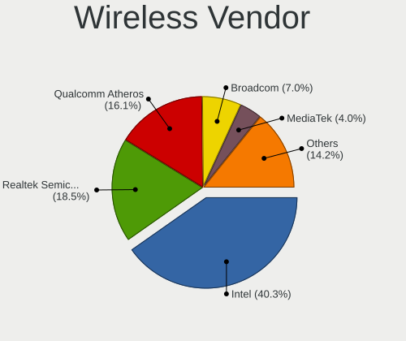

| Vendor                                | Computers | Percent |
|---------------------------------------|-----------|---------|
| Intel                                 | 4341      | 40.26%  |
| Realtek Semiconductor                 | 1997      | 18.52%  |
| Qualcomm Atheros                      | 1732      | 16.06%  |
| Broadcom                              | 756       | 7.01%   |
| MediaTek                              | 426       | 3.95%   |
| TP-Link                               | 298       | 2.76%   |
| Ralink Technology                     | 203       | 1.88%   |
| Broadcom Limited                      | 186       | 1.72%   |
| Ralink                                | 180       | 1.67%   |
| Qualcomm Atheros Communications       | 81        | 0.75%   |
| D-Link                                | 79        | 0.73%   |
| Sierra Wireless                       | 53        | 0.49%   |
| D-Link System                         | 53        | 0.49%   |
| Sitecom Europe                        | 46        | 0.43%   |
| Microsoft                             | 45        | 0.42%   |
| NetGear                               | 38        | 0.35%   |
| Qualcomm                              | 36        | 0.33%   |
| Dell                                  | 34        | 0.32%   |
| ASUSTek Computer                      | 34        | 0.32%   |
| Marvell Technology Group              | 25        | 0.23%   |
| Fibocom                               | 22        | 0.2%    |
| Belkin Components                     | 20        | 0.19%   |
| AVM                                   | 12        | 0.11%   |
| Gemtek                                | 10        | 0.09%   |
| ZyDAS                                 | 9         | 0.08%   |
| Mercucys                              | 9         | 0.08%   |
| Realtek                               | 8         | 0.07%   |
| Edimax Technology                     | 7         | 0.06%   |
| Linksys                               | 6         | 0.06%   |
| ZyXEL Communications                  | 5         | 0.05%   |
| Hewlett-Packard                       | 4         | 0.04%   |
| 802.11g Adapter [Linksys WUSB54GC v3] | 4         | 0.04%   |
| Qualcomm Technologies                 | 3         | 0.03%   |
| AboCom Systems                        | 3         | 0.03%   |
| ZTE WCDMA Technologies MSM            | 2         | 0.02%   |
| U.S. Robotics                         | 2         | 0.02%   |
| Qcom                                  | 2         | 0.02%   |
| Micro Star International              | 2         | 0.02%   |
| Wilocity                              | 1         | 0.01%   |
| Wacom                                 | 1         | 0.01%   |

Wireless Model
--------------

Wireless models

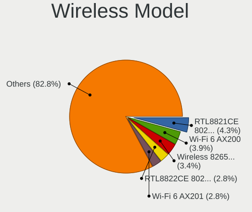

| Model                                                                   | Computers | Percent |
|-------------------------------------------------------------------------|-----------|---------|
| Realtek RTL8821CE 802.11ac PCIe Wireless Network Adapter                | 462       | 4.26%   |
| Intel Wi-Fi 6 AX200                                                     | 425       | 3.91%   |
| Intel Wireless 8265 / 8275                                              | 369       | 3.4%    |
| Realtek RTL8822CE 802.11ac PCIe Wireless Network Adapter                | 305       | 2.81%   |
| Intel Wi-Fi 6 AX201                                                     | 305       | 2.81%   |
| Qualcomm Atheros QCA9377 802.11ac Wireless Network Adapter              | 304       | 2.8%    |
| Intel Wireless 7265                                                     | 298       | 2.75%   |
| Qualcomm Atheros QCA9565 / AR9565 Wireless Network Adapter              | 286       | 2.63%   |
| Qualcomm Atheros AR9285 Wireless Network Adapter (PCI-Express)          | 279       | 2.57%   |
| Qualcomm Atheros AR9485 Wireless Network Adapter                        | 252       | 2.32%   |
| Intel Wireless 3165                                                     | 222       | 2.04%   |
| Intel Wi-Fi 6E(802.11ax) AX210/AX1675* 2x2 [Typhoon Peak]               | 178       | 1.64%   |
| Intel Comet Lake PCH-LP CNVi WiFi                                       | 178       | 1.64%   |
| MediaTek MT7921 802.11ax PCIe Wireless Network Adapter [Filogic 330]    | 175       | 1.61%   |
| Intel Wireless 7260                                                     | 174       | 1.6%    |
| Realtek RTL8723BE PCIe Wireless Network Adapter                         | 150       | 1.38%   |
| Qualcomm Atheros QCA6174 802.11ac Wireless Network Adapter              | 150       | 1.38%   |
| Intel Wireless 8260                                                     | 150       | 1.38%   |
| Intel Cannon Point-LP CNVi [Wireless-AC]                                | 139       | 1.28%   |
| Intel Cannon Lake PCH CNVi WiFi                                         | 127       | 1.17%   |
| Intel Dual Band Wireless-AC 3168NGW [Stone Peak]                        | 126       | 1.16%   |
| Broadcom BCM4313 802.11bgn Wireless Network Adapter                     | 124       | 1.14%   |
| Realtek 802.11ac NIC                                                    | 123       | 1.13%   |
| Intel Alder Lake-P PCH CNVi WiFi                                        | 122       | 1.12%   |
| Intel PRO/Wireless 3945ABG [Golan] Network Connection                   | 118       | 1.09%   |
| Realtek RTL88x2bu [AC1200 Techkey]                                      | 111       | 1.02%   |
| Broadcom BCM43142 802.11b/g/n                                           | 110       | 1.01%   |
| Qualcomm Atheros AR928X Wireless Network Adapter (PCI-Express)          | 109       | 1%      |
| Intel Centrino Advanced-N 6205 [Taylor Peak]                            | 108       | 0.99%   |
| MediaTek MT7922 802.11ax PCI Express Wireless Network Adapter           | 107       | 0.99%   |
| Intel WiFi Link 5100                                                    | 106       | 0.98%   |
| TP-Link TL-WN823N v2/v3 [Realtek RTL8192EU]                             | 103       | 0.95%   |
| Intel Comet Lake PCH CNVi WiFi                                          | 95        | 0.88%   |
| Qualcomm Atheros AR242x / AR542x Wireless Network Adapter (PCI-Express) | 93        | 0.86%   |
| Intel Wi-Fi 5(802.11ac) Wireless-AC 9x6x [Thunder Peak]                 | 92        | 0.85%   |
| Realtek RTL8188EUS 802.11n Wireless Network Adapter                     | 91        | 0.84%   |
| Intel Raptor Lake PCH CNVi WiFi                                         | 91        | 0.84%   |
| Intel Ice Lake-LP PCH CNVi WiFi                                         | 85        | 0.78%   |
| Qualcomm Atheros AR9462 Wireless Network Adapter                        | 76        | 0.7%    |
| Qualcomm Atheros AR9271 802.11n                                         | 74        | 0.68%   |

Ethernet Vendor
---------------

Ethernet vendors

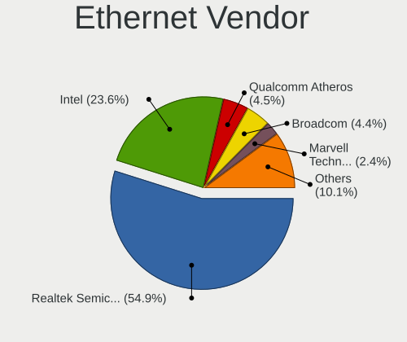

| Vendor                                 | Computers | Percent |
|----------------------------------------|-----------|---------|
| Realtek Semiconductor                  | 6454      | 54.88%  |
| Intel                                  | 2780      | 23.64%  |
| Qualcomm Atheros                       | 533       | 4.53%   |
| Broadcom                               | 517       | 4.4%    |
| Marvell Technology Group               | 285       | 2.42%   |
| Nvidia                                 | 200       | 1.7%    |
| ASIX Electronics                       | 115       | 0.98%   |
| Samsung Electronics                    | 99        | 0.84%   |
| Xiaomi                                 | 93        | 0.79%   |
| Broadcom Limited                       | 93        | 0.79%   |
| MediaTek                               | 58        | 0.49%   |
| Huawei Technologies                    | 56        | 0.48%   |
| OPPO Electronics                       | 44        | 0.37%   |
| VIA Technologies                       | 36        | 0.31%   |
| JMicron Technology                     | 34        | 0.29%   |
| Silicon Integrated Systems [SiS]       | 28        | 0.24%   |
| DisplayLink                            | 28        | 0.24%   |
| TP-Link                                | 26        | 0.22%   |
| Attansic Technology                    | 23        | 0.2%    |
| Lenovo                                 | 22        | 0.19%   |
| Qualcomm                               | 20        | 0.17%   |
| Aquantia                               | 19        | 0.16%   |
| Microchip Technology                   | 16        | 0.14%   |
| Motorola PCS                           | 15        | 0.13%   |
| Google                                 | 15        | 0.13%   |
| D-Link System                          | 15        | 0.13%   |
| Apple                                  | 12        | 0.1%    |
| Suzhou Motorcomm Electronic Technology | 11        | 0.09%   |
| OnePlus Technology (Shenzhen)          | 10        | 0.09%   |
| Hewlett-Packard                        | 10        | 0.09%   |
| 3Com                                   | 10        | 0.09%   |
| ICS Advent                             | 8         | 0.07%   |
| Raspberry Pi                           | 7         | 0.06%   |
| HMD Global                             | 7         | 0.06%   |
| T & A Mobile Phones                    | 6         | 0.05%   |
| Qualcomm Technologies                  | 5         | 0.04%   |
| ZTE WCDMA Technologies MSM             | 4         | 0.03%   |
| Spreadtrum Communications              | 4         | 0.03%   |
| Tehuti Networks                        | 3         | 0.03%   |
| Microsoft                              | 3         | 0.03%   |

Ethernet Model
--------------

Ethernet models

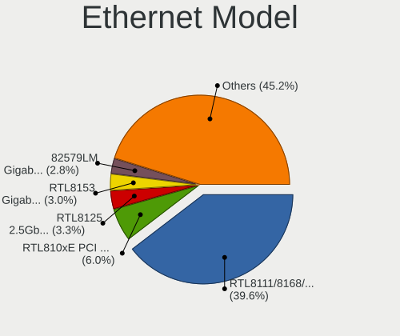

| Model                                                                  | Computers | Percent |
|------------------------------------------------------------------------|-----------|---------|
| Realtek RTL8111/8168/8211/8411 PCI Express Gigabit Ethernet Controller | 4785      | 39.59%  |
| Realtek RTL810xE PCI Express Fast Ethernet controller                  | 729       | 6.03%   |
| Realtek RTL8125 2.5GbE Controller                                      | 403       | 3.33%   |
| Realtek RTL8153 Gigabit Ethernet Adapter                               | 366       | 3.03%   |
| Intel 82579LM Gigabit Network Connection (Lewisville)                  | 337       | 2.79%   |
| Intel I211 Gigabit Network Connection                                  | 192       | 1.59%   |
| Intel Ethernet Connection (2) I219-V                                   | 186       | 1.54%   |
| Intel Ethernet Controller I225-V                                       | 149       | 1.23%   |
| Intel Ethernet Connection I217-LM                                      | 147       | 1.22%   |
| Intel 82579V Gigabit Network Connection                                | 111       | 0.92%   |
| Intel Ethernet Connection (4) I219-LM                                  | 109       | 0.9%    |
| Realtek RTL-8100/8101L/8139 PCI Fast Ethernet Adapter                  | 101       | 0.84%   |
| ASIX AX88179 Gigabit Ethernet                                          | 91        | 0.75%   |
| Qualcomm Atheros AR8121/AR8113/AR8114 Gigabit or Fast Ethernet         | 86        | 0.71%   |
| Intel Ethernet Connection (7) I219-V                                   | 83        | 0.69%   |
| Samsung Galaxy series, misc. (tethering mode)                          | 77        | 0.64%   |
| Xiaomi Mi/Redmi series (RNDIS)                                         | 74        | 0.61%   |
| Intel Ethernet Connection I217-V                                       | 72        | 0.6%    |
| Qualcomm Atheros AR8151 v2.0 Gigabit Ethernet                          | 69        | 0.57%   |
| Intel Ethernet Connection I219-LM                                      | 67        | 0.55%   |
| Broadcom NetLink BCM57785 Gigabit Ethernet PCIe                        | 64        | 0.53%   |
| Intel Ethernet Connection (2) I219-LM                                  | 61        | 0.5%    |
| Broadcom NetXtreme BCM57766 Gigabit Ethernet PCIe                      | 61        | 0.5%    |
| Nvidia MCP79 Ethernet                                                  | 60        | 0.5%    |
| Intel Ethernet Connection (4) I219-V                                   | 60        | 0.5%    |
| Broadcom NetXtreme BCM5764M Gigabit Ethernet PCIe                      | 58        | 0.48%   |
| Intel Alder Lake-P PCH CNVi WiFi                                       | 57        | 0.47%   |
| Qualcomm Atheros AR8131 Gigabit Ethernet                               | 56        | 0.46%   |
| Intel Ethernet Controller I226-V                                       | 55        | 0.46%   |
| Broadcom NetXtreme BCM57765 Gigabit Ethernet PCIe                      | 55        | 0.46%   |
| Intel Ethernet Connection I218-LM                                      | 54        | 0.45%   |
| Marvell Group 88E8056 PCI-E Gigabit Ethernet Controller                | 53        | 0.44%   |
| Realtek RTL8852BE PCIe 802.11ax Wireless Network Controller            | 50        | 0.41%   |
| Nvidia MCP61 Ethernet                                                  | 50        | 0.41%   |
| Intel Ethernet Connection (3) I218-LM                                  | 49        | 0.41%   |
| Intel 82577LM Gigabit Network Connection                               | 49        | 0.41%   |
| Intel 82567LM-3 Gigabit Network Connection                             | 48        | 0.4%    |
| Qualcomm Atheros QCA8171 Gigabit Ethernet                              | 45        | 0.37%   |
| Intel Ethernet Connection (6) I219-V                                   | 44        | 0.36%   |
| Intel 82567LM Gigabit Network Connection                               | 44        | 0.36%   |

Net Controller Kind
-------------------

Ethernet, WiFi or modem

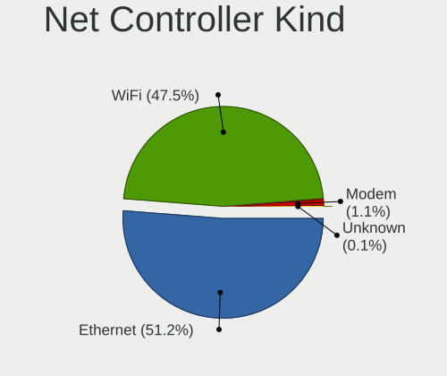

| Kind     | Computers | Percent |
|----------|-----------|---------|
| Ethernet | 10935     | 51.22%  |
| WiFi     | 10143     | 47.51%  |
| Modem    | 242       | 1.13%   |
| Unknown  | 28        | 0.13%   |

Used Controller
---------------

Currently used network controller

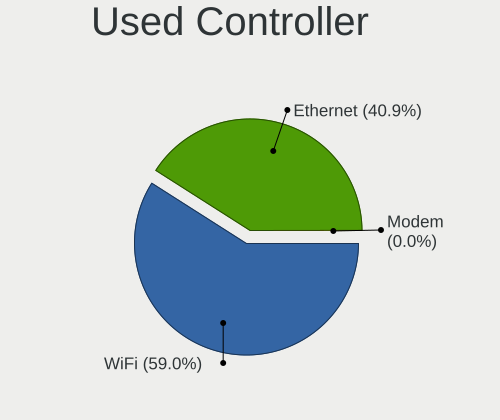

| Kind     | Computers | Percent |
|----------|-----------|---------|
| WiFi     | 7875      | 59.03%  |
| Ethernet | 5463      | 40.95%  |
| Unknown  | 2         | 0.01%   |
| Modem    | 1         | 0.01%   |

NICs
----

Total network controllers on board

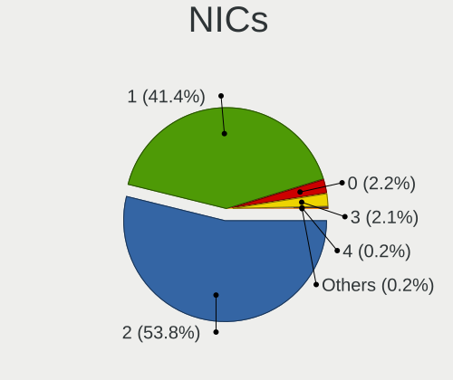

| Total | Computers | Percent |
|-------|-----------|---------|
| 2     | 7044      | 53.84%  |
| 1     | 5418      | 41.42%  |
| 0     | 294       | 2.25%   |
| 3     | 278       | 2.13%   |
| 4     | 28        | 0.21%   |
| 5     | 10        | 0.08%   |
| 6     | 5         | 0.04%   |
| 12    | 2         | 0.02%   |
| 7     | 2         | 0.02%   |
| 8     | 1         | 0.01%   |

IPv6
----

IPv6 vs IPv4

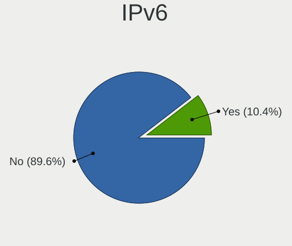

| Used | Computers | Percent |
|------|-----------|---------|
| No   | 11871     | 89.58%  |
| Yes  | 1381      | 10.42%  |

Bluetooth
---------

Bluetooth Vendor
----------------

Controller vendors

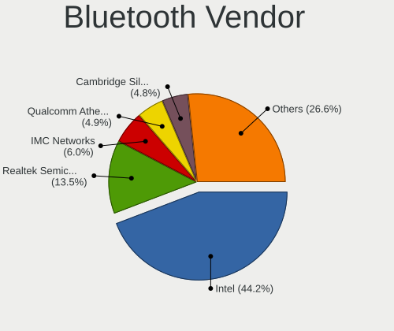

| Vendor                          | Computers | Percent |
|---------------------------------|-----------|---------|
| Intel                           | 3664      | 44.2%   |
| Realtek Semiconductor           | 1115      | 13.45%  |
| IMC Networks                    | 496       | 5.98%   |
| Qualcomm Atheros Communications | 409       | 4.93%   |
| Cambridge Silicon Radio         | 396       | 4.78%   |
| Apple                           | 356       | 4.29%   |
| Foxconn / Hon Hai               | 343       | 4.14%   |
| Broadcom                        | 339       | 4.09%   |
| Lite-On Technology              | 318       | 3.84%   |
| MediaTek                        | 127       | 1.53%   |
| ASUSTek Computer                | 111       | 1.34%   |
| Realtek                         | 104       | 1.25%   |
| Hewlett-Packard                 | 97        | 1.17%   |
| Dell                            | 62        | 0.75%   |
| Ralink                          | 56        | 0.68%   |
| TP-Link                         | 49        | 0.59%   |
| Toshiba                         | 48        | 0.58%   |
| Marvell Semiconductor           | 26        | 0.31%   |
| Alps Electric                   | 26        | 0.31%   |
| USI                             | 19        | 0.23%   |
| Integrated System Solution      | 15        | 0.18%   |
| Ralink Technology               | 11        | 0.13%   |
| Belkin Components               | 10        | 0.12%   |
| Mercucys                        | 9         | 0.11%   |
| Foxconn International           | 9         | 0.11%   |
| Sitecom Europe                  | 7         | 0.08%   |
| Unknown                         | 7         | 0.08%   |
| Fujitsu                         | 6         | 0.07%   |
| Askey Computer                  | 6         | 0.07%   |
| Chicony Electronics             | 5         | 0.06%   |
| Taiyo Yuden                     | 4         | 0.05%   |
| Actions                         | 4         | 0.05%   |
| SINO WEALTH                     | 3         | 0.04%   |
| Logitech                        | 3         | 0.04%   |
| Conwise Technology              | 3         | 0.04%   |
| SiW                             | 2         | 0.02%   |
| Quectel Wireless Solutions      | 2         | 0.02%   |
| Qcom                            | 2         | 0.02%   |
| HTC (High Tech Computer)        | 2         | 0.02%   |
| Edimax Technology               | 2         | 0.02%   |

Bluetooth Model
---------------

Controller models

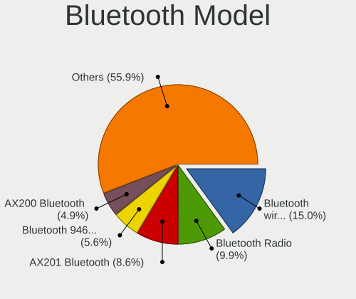

| Model                                                                               | Computers | Percent |
|-------------------------------------------------------------------------------------|-----------|---------|
| Intel Bluetooth wireless interface                                                  | 1245      | 15.01%  |
| Realtek Bluetooth Radio                                                             | 825       | 9.95%   |
| Intel AX201 Bluetooth                                                               | 713       | 8.6%    |
| Intel Bluetooth 9460/9560 Jefferson Peak (JfP)                                      | 468       | 5.64%   |
| Intel AX200 Bluetooth                                                               | 408       | 4.92%   |
| Cambridge Silicon Radio Bluetooth Dongle (HCI mode)                                 | 396       | 4.77%   |
| Intel Bluetooth Device                                                              | 330       | 3.98%   |
| Realtek  Bluetooth 4.2 Adapter                                                      | 210       | 2.53%   |
| Intel AX210 Bluetooth                                                               | 167       | 2.01%   |
| Apple Bluetooth Host Controller                                                     | 167       | 2.01%   |
| Qualcomm Atheros  Bluetooth Device                                                  | 156       | 1.88%   |
| IMC Networks Bluetooth Device                                                       | 154       | 1.86%   |
| IMC Networks Wireless_Device                                                        | 140       | 1.69%   |
| IMC Networks Bluetooth Radio                                                        | 132       | 1.59%   |
| Intel Wireless-AC 3168 Bluetooth                                                    | 124       | 1.49%   |
| MediaTek Wireless_Device                                                            | 122       | 1.47%   |
| Realtek Bluetooth Radio                                                             | 104       | 1.25%   |
| Lite-On Qualcomm Atheros QCA9377 Bluetooth                                          | 99        | 1.19%   |
| Apple Bluetooth USB Host Controller                                                 | 89        | 1.07%   |
| Intel Centrino Bluetooth Wireless Transceiver                                       | 87        | 1.05%   |
| Qualcomm Atheros AR3011 Bluetooth                                                   | 85        | 1.02%   |
| Intel Wireless-AC 9260 Bluetooth Adapter                                            | 85        | 1.02%   |
| Foxconn / Hon Hai Bluetooth Device                                                  | 80        | 0.96%   |
| Foxconn / Hon Hai Wireless_Device                                                   | 79        | 0.95%   |
| Qualcomm Atheros QCA61x4 Bluetooth 4.0                                              | 78        | 0.94%   |
| Lite-On Bluetooth Device                                                            | 77        | 0.93%   |
| Qualcomm Atheros AR3012 Bluetooth 4.0                                               | 75        | 0.9%    |
| Foxconn / Hon Hai MediaTek Bluetooth Adapter                                        | 64        | 0.77%   |
| Lite-On Atheros AR3012 Bluetooth                                                    | 61        | 0.74%   |
| Ralink RT3290 Bluetooth                                                             | 56        | 0.68%   |
| Broadcom BCM2045 Bluetooth                                                          | 54        | 0.65%   |
| TP-Link TP-T@- UB500 Adapter                                                        | 49        | 0.59%   |
| Apple Built-in Bluetooth 2.0+EDR HCI                                                | 49        | 0.59%   |
| HP Bluetooth 2.0 Interface [Broadcom BCM2045]                                       | 48        | 0.58%   |
| Apple Bluetooth HCI                                                                 | 45        | 0.54%   |
| HP Broadcom 2070 Bluetooth Combo                                                    | 44        | 0.53%   |
| Broadcom BCM20702A0 Bluetooth 4.0                                                   | 43        | 0.52%   |
| Lite-On Wireless_Device                                                             | 36        | 0.43%   |
| Foxconn / Hon Hai Foxconn T77H114 BCM2070 [Single-Chip Bluetooth 2.1 + EDR Adapter] | 35        | 0.42%   |
| Intel Centrino Advanced-N 6230 Bluetooth adapter                                    | 34        | 0.41%   |

Sound
-----

Sound Vendor
------------

Sound card vendors

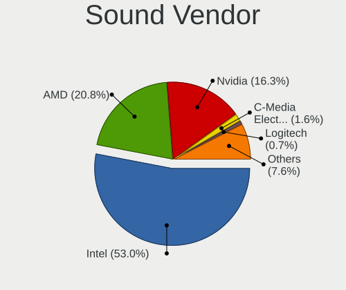

| Vendor                                       | Computers | Percent |
|----------------------------------------------|-----------|---------|
| Intel                                        | 9375      | 53.01%  |
| AMD                                          | 3670      | 20.75%  |
| Nvidia                                       | 2882      | 16.3%   |
| C-Media Electronics                          | 288       | 1.63%   |
| Logitech                                     | 131       | 0.74%   |
| Creative Labs                                | 87        | 0.49%   |
| GN Netcom                                    | 55        | 0.31%   |
| ASUSTek Computer                             | 54        | 0.31%   |
| JMTek                                        | 52        | 0.29%   |
| VIA Technologies                             | 51        | 0.29%   |
| Texas Instruments                            | 50        | 0.28%   |
| Creative Technology                          | 49        | 0.28%   |
| Focusrite-Novation                           | 46        | 0.26%   |
| Zoran Co. Personal Media Division (Nogatech) | 43        | 0.24%   |
| Razer USA                                    | 43        | 0.24%   |
| Generalplus Technology                       | 42        | 0.24%   |
| Silicon Integrated Systems [SiS]             | 41        | 0.23%   |
| Realtek Semiconductor                        | 38        | 0.21%   |
| Micro Star International                     | 37        | 0.21%   |
| Hewlett-Packard                              | 31        | 0.18%   |
| Trust                                        | 23        | 0.13%   |
| Sony                                         | 22        | 0.12%   |
| M-Audio                                      | 22        | 0.12%   |
| Kingston Technology                          | 22        | 0.12%   |
| Jieli Technology                             | 22        | 0.12%   |
| BEHRINGER International                      | 21        | 0.12%   |
| Samson Technologies                          | 20        | 0.11%   |
| Apple                                        | 19        | 0.11%   |
| Thesycon Systemsoftware & Consulting         | 18        | 0.1%    |
| Lenovo                                       | 16        | 0.09%   |
| Corsair                                      | 16        | 0.09%   |
| Plantronics                                  | 15        | 0.08%   |
| Tenx Technology                              | 13        | 0.07%   |
| SteelSeries ApS                              | 12        | 0.07%   |
| Dell                                         | 12        | 0.07%   |
| KTMicro                                      | 11        | 0.06%   |
| DSEA A/S                                     | 11        | 0.06%   |
| Yamaha                                       | 10        | 0.06%   |
| Microsoft                                    | 10        | 0.06%   |
| CMX Systems                                  | 10        | 0.06%   |

Sound Model
-----------

Sound card models

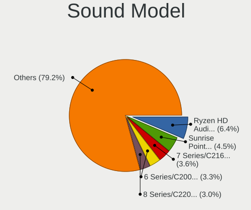

| Model                                                                      | Computers | Percent |
|----------------------------------------------------------------------------|-----------|---------|
| AMD Ryzen HD Audio Controller                                              | 1353      | 6.43%   |
| Intel Sunrise Point-LP HD Audio                                            | 949       | 4.51%   |
| Intel 7 Series/C216 Chipset Family High Definition Audio Controller        | 754       | 3.58%   |
| Intel 6 Series/C200 Series Chipset Family High Definition Audio Controller | 693       | 3.29%   |
| Intel 8 Series/C220 Series Chipset High Definition Audio Controller        | 628       | 2.98%   |
| AMD Renoir/Cezanne HDMI/DP Audio Controller                                | 614       | 2.92%   |
| Intel 82801I (ICH9 Family) HD Audio Controller                             | 465       | 2.21%   |
| Intel Tiger Lake-LP Smart Sound Technology Audio Controller                | 428       | 2.03%   |
| Intel 5 Series/3400 Series Chipset High Definition Audio                   | 420       | 2%      |
| Intel NM10/ICH7 Family High Definition Audio Controller                    | 419       | 1.99%   |
| AMD Starship/Matisse HD Audio Controller                                   | 389       | 1.85%   |
| Intel Xeon E3-1200 v3/4th Gen Core Processor HD Audio Controller           | 388       | 1.84%   |
| Intel Cannon Lake PCH cAVS                                                 | 371       | 1.76%   |
| Intel 100 Series/C230 Series Chipset Family HD Audio Controller            | 354       | 1.68%   |
| AMD FCH Azalia Controller                                                  | 349       | 1.66%   |
| AMD Radeon High Definition Audio Controller                                | 346       | 1.64%   |
| AMD Raven/Raven2/Fenghuang HDMI/DP Audio Controller                        | 336       | 1.6%    |
| AMD SBx00 Azalia (Intel HDA)                                               | 331       | 1.57%   |
| Intel Haswell-ULT HD Audio Controller                                      | 309       | 1.47%   |
| Intel 8 Series HD Audio Controller                                         | 308       | 1.46%   |
| Intel Alder Lake PCH-P High Definition Audio Controller                    | 264       | 1.25%   |
| Nvidia GK208 HDMI/DP Audio Controller                                      | 253       | 1.2%    |
| Intel Celeron/Pentium Silver Processor High Definition Audio               | 249       | 1.18%   |
| Intel Broadwell-U Audio Controller                                         | 242       | 1.15%   |
| Intel Wildcat Point-LP High Definition Audio Controller                    | 237       | 1.13%   |
| Intel 200 Series PCH HD Audio                                              | 235       | 1.12%   |
| Intel Comet Lake PCH-LP cAVS                                               | 233       | 1.11%   |
| AMD Kabini HDMI/DP Audio                                                   | 233       | 1.11%   |
| Intel Cannon Point-LP High Definition Audio Controller                     | 230       | 1.09%   |
| Intel 82801H (ICH8 Family) HD Audio Controller                             | 230       | 1.09%   |
| Nvidia GF108 High Definition Audio Controller                              | 203       | 0.96%   |
| Nvidia GP107GL High Definition Audio Controller                            | 187       | 0.89%   |
| AMD Family 15h (Models 60h-6fh) Audio Controller                           | 175       | 0.83%   |
| AMD Family 17h (Models 00h-0fh) HD Audio Controller                        | 168       | 0.8%    |
| AMD Ellesmere HDMI Audio [Radeon RX 470/480 / 570/580/590]                 | 168       | 0.8%    |
| Nvidia High Definition Audio Controller                                    | 163       | 0.77%   |
| AMD Navi 21/23 HDMI/DP Audio Controller                                    | 162       | 0.77%   |
| Intel Comet Lake PCH cAVS                                                  | 160       | 0.76%   |
| Intel 82801JI (ICH10 Family) HD Audio Controller                           | 156       | 0.74%   |
| Intel Raptor Lake-P/U/H cAVS                                               | 146       | 0.69%   |

Memory
------

Memory Vendor
-------------

Memory module vendors

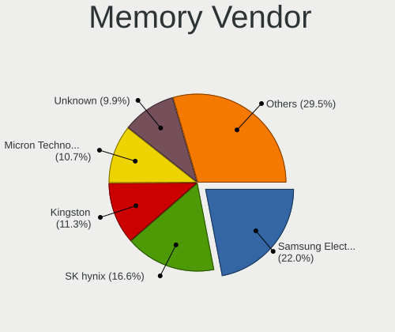

| Vendor                                  | Computers | Percent |
|-----------------------------------------|-----------|---------|
| Samsung Electronics                     | 2025      | 21.97%  |
| SK hynix                                | 1534      | 16.64%  |
| Kingston                                | 1043      | 11.32%  |
| Micron Technology                       | 987       | 10.71%  |
| Unknown                                 | 908       | 9.85%   |
| Crucial                                 | 614       | 6.66%   |
| Corsair                                 | 580       | 6.29%   |
| G.Skill                                 | 182       | 1.97%   |
| Elpida                                  | 163       | 1.77%   |
| Unknown (ABCD)                          | 159       | 1.73%   |
| Ramaxel Technology                      | 153       | 1.66%   |
| A-DATA Technology                       | 128       | 1.39%   |
| Unknown                                 | 126       | 1.37%   |
| Nanya Technology                        | 85        | 0.92%   |
| Team                                    | 77        | 0.84%   |
| Patriot                                 | 54        | 0.59%   |
| Transcend                               | 39        | 0.42%   |
| Lexar                                   | 29        | 0.31%   |
| Timetec                                 | 27        | 0.29%   |
| ASint Technology                        | 24        | 0.26%   |
| Silicon Power                           | 20        | 0.22%   |
| Unifosa                                 | 13        | 0.14%   |
| Qimonda                                 | 13        | 0.14%   |
| Unknown (0x0E9D)                        | 11        | 0.12%   |
| Lexar Co Limited                        | 11        | 0.12%   |
| 48spaces                                | 11        | 0.12%   |
| Toshiba                                 | 9         | 0.1%    |
| GOODRAM                                 | 9         | 0.1%    |
| Apacer                                  | 9         | 0.1%    |
| Wodposit                                | 7         | 0.08%   |
| Unknown (AB)                            | 7         | 0.08%   |
| Patriot Memory (PDP Systems)            | 7         | 0.08%   |
| GeIL                                    | 7         | 0.08%   |
| Patriot Memory                          | 5         | 0.05%   |
| Hewlett-Packard                         | 5         | 0.05%   |
| Unknown (0x0B45)                        | 4         | 0.04%   |
| Silicon Power Computer & Communications | 4         | 0.04%   |
| PNY                                     | 4         | 0.04%   |
| Kimtigo Semiconductor (HK) Limited      | 4         | 0.04%   |
| Infineon                                | 4         | 0.04%   |

Memory Model
------------

Memory module models

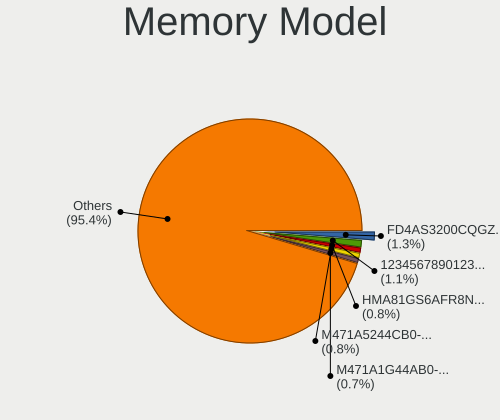

| Model                                                            | Computers | Percent |
|------------------------------------------------------------------|-----------|---------|
| Unknown                                                          | 126       | 1.28%   |
| Unknown (ABCD) RAM 123456789012345678 2GB SODIMM LPDDR4 2400MT/s | 107       | 1.09%   |
| SK hynix RAM HMA81GS6AFR8N-UH 8GB SODIMM DDR4 2667MT/s           | 76        | 0.77%   |
| Samsung RAM M471A5244CB0-CTD 4GB SODIMM DDR4 3266MT/s            | 75        | 0.76%   |
| Samsung RAM M471A1G44AB0-CWE 8GiB SODIMM DDR4 3200MT/s           | 71        | 0.72%   |
| Corsair RAM CMK16GX4M2B3200C16 8GB DIMM DDR4 3600MT/s            | 65        | 0.66%   |
| Samsung RAM M471B5173QH0-YK0 4GB SODIMM DDR3 1600MT/s            | 58        | 0.59%   |
| SK hynix RAM HMT451S6BFR8A-PB 4GB SODIMM DDR3 1600MT/s           | 57        | 0.58%   |
| Samsung RAM M471B5173EB0-YK0 4GB SODIMM DDR3 1600MT/s            | 56        | 0.57%   |
| Samsung RAM M471A1K43CB1-CRC 8GB SODIMM DDR4 8400MT/s            | 56        | 0.57%   |
| Samsung RAM M471A1K43EB1-CWE 8GB SODIMM DDR4 3200MT/s            | 55        | 0.56%   |
| Unknown (ABCD) RAM 123456789012345678 2GB DIMM LPDDR4 2133MT/s   | 52        | 0.53%   |
| Micron RAM 4ATF51264HZ-2G6E1 4GB SODIMM DDR4 2667MT/s            | 50        | 0.51%   |
| Samsung RAM M471A5244CB0-CWE 4GB SODIMM DDR4 3200MT/s            | 48        | 0.49%   |
| Samsung RAM M471B5173DB0-YK0 4GB SODIMM DDR3 1600MT/s            | 47        | 0.48%   |
| SK hynix RAM HMA81GS6DJR8N-XN 8GB SODIMM DDR4 3200MT/s           | 46        | 0.47%   |
| Unknown RAM Module 2GB SODIMM DDR2 667MT/s                       | 45        | 0.46%   |
| Samsung RAM M471B1G73DB0-YK0 8GB SODIMM DDR3 1600MT/s            | 44        | 0.45%   |
| SK hynix RAM HMAA1GS6CJR6N-XN 8GB SODIMM DDR4 3200MT/s           | 43        | 0.44%   |
| Samsung RAM M471A1K43CB1-CTD 8GB SODIMM DDR4 3200MT/s            | 43        | 0.44%   |
| Samsung RAM M471B5273DH0-CH9 4GB SODIMM DDR3 1600MT/s            | 40        | 0.41%   |
| Samsung RAM M471A5244CB0-CRC 4GB SODIMM DDR4 2667MT/s            | 40        | 0.41%   |
| Unknown RAM Module 2GB DIMM DDR2 800MT/s                         | 39        | 0.4%    |
| Corsair RAM CMK16GX4M2B3000C15 8GB DIMM DDR4 3600MT/s            | 39        | 0.4%    |
| Samsung RAM M471A1K43DB1-CWE 8GB SODIMM DDR4 3200MT/s            | 38        | 0.39%   |
| Samsung RAM M471A1K43BB1-CRC 8GB SODIMM DDR4 2667MT/s            | 38        | 0.39%   |
| Samsung RAM M471A1G44AB0-CWE 8GB Row Of Chips DDR4 3200MT/s      | 37        | 0.38%   |
| Micron RAM 8ATF1G64HZ-3G2R1 8GB SODIMM DDR4 3200MT/s             | 33        | 0.33%   |
| SK hynix RAM HMA851S6AFR6N-UH 4GB SODIMM DDR4 2667MT/s           | 32        | 0.32%   |
| Samsung RAM M471A5244CB0-CWE 4GB Row Of Chips DDR4 3200MT/s      | 32        | 0.32%   |
| Samsung RAM M471B1G73QH0-YK0 8GB SODIMM DDR3 1600MT/s            | 31        | 0.31%   |
| Samsung RAM M471A1K43DB1-CTD 8GB SODIMM DDR4 2667MT/s            | 31        | 0.31%   |
| Samsung RAM M471A2K43CB1-CRC 16GB SODIMM DDR4 2667MT/s           | 30        | 0.3%    |
| Unknown RAM Module 2GB SODIMM DDR3 1066MT/s                      | 29        | 0.29%   |
| SK hynix RAM HMA851S6CJR6N-VK 4GB SODIMM DDR4 2667MT/s           | 29        | 0.29%   |
| Samsung RAM M471A2K43DB1-CWE 16GB SODIMM DDR4 3200MT/s           | 29        | 0.29%   |
| Samsung RAM M471A5244CB0-CTD 4GB Row Of Chips DDR4 2667MT/s      | 28        | 0.28%   |
| Unknown RAM Module 4GB SODIMM DDR3                               | 27        | 0.27%   |
| SK hynix RAM HMT351S6BFR8C-H9 4GB SODIMM DDR3 1333MT/s           | 27        | 0.27%   |
| Samsung RAM M471B5273CH0-CH9 4GB SODIMM DDR3 1334MT/s            | 27        | 0.27%   |

Memory Kind
-----------

Memory module kinds

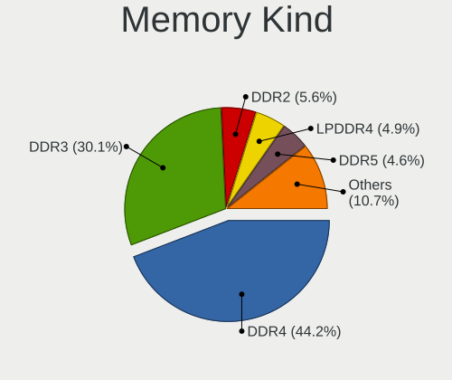

| Kind         | Computers | Percent |
|--------------|-----------|---------|
| DDR4         | 3550      | 44.17%  |
| DDR3         | 2417      | 30.07%  |
| DDR2         | 447       | 5.56%   |
| LPDDR4       | 396       | 4.93%   |
| DDR5         | 368       | 4.58%   |
| SDRAM        | 276       | 3.43%   |
| LPDDR5       | 181       | 2.25%   |
| LPDDR3       | 172       | 2.14%   |
| Unknown      | 146       | 1.82%   |
| DDR          | 55        | 0.68%   |
| DRAM         | 23        | 0.29%   |
| RAM          | 4         | 0.05%   |
| DDR2 FB-DIMM | 2         | 0.02%   |

Memory Form Factor
------------------

Physical design of the memory module

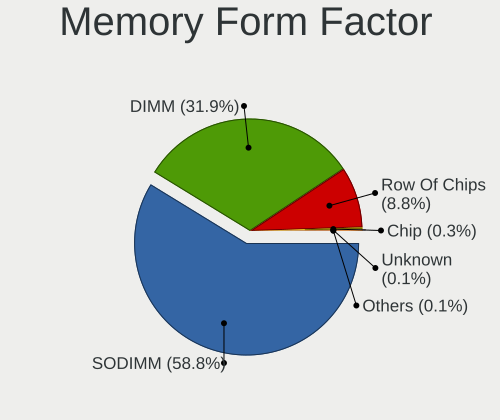

| Name         | Computers | Percent |
|--------------|-----------|---------|
| SODIMM       | 4688      | 58.75%  |
| DIMM         | 2548      | 31.93%  |
| Row Of Chips | 702       | 8.8%    |
| Chip         | 23        | 0.29%   |
| Unknown      | 11        | 0.14%   |
| FB-DIMM      | 6         | 0.08%   |
| RIMM         | 1         | 0.01%   |

Memory Size
-----------

Memory module size

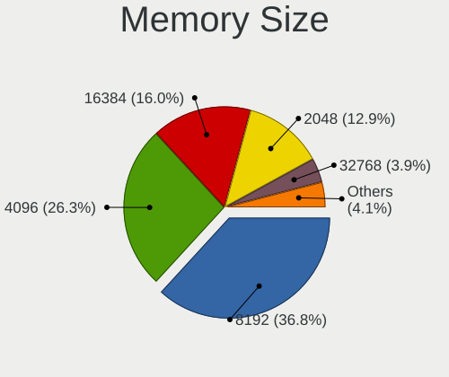

| Size  | Computers | Percent |
|-------|-----------|---------|
| 8192  | 3221      | 36.81%  |
| 4096  | 2304      | 26.33%  |
| 16384 | 1404      | 16.04%  |
| 2048  | 1125      | 12.86%  |
| 32768 | 342       | 3.91%   |
| 1024  | 273       | 3.12%   |
| 512   | 44        | 0.5%    |
| 49152 | 9         | 0.1%    |
| 256   | 9         | 0.1%    |
| 3072  | 6         | 0.07%   |
| 65536 | 4         | 0.05%   |
| 12288 | 4         | 0.05%   |
| 6144  | 4         | 0.05%   |
| 24576 | 1         | 0.01%   |
| 32    | 1         | 0.01%   |

Memory Speed
------------

Memory module speed

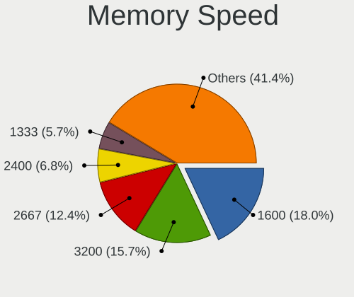

| Speed   | Computers | Percent |
|---------|-----------|---------|
| 1600    | 1572      | 18.02%  |
| 3200    | 1374      | 15.75%  |
| 2667    | 1080      | 12.38%  |
| 2400    | 597       | 6.84%   |
| 1333    | 494       | 5.66%   |
| 2133    | 359       | 4.11%   |
| 3600    | 274       | 3.14%   |
| 667     | 223       | 2.56%   |
| Unknown | 200       | 2.29%   |
| 800     | 193       | 2.21%   |
| 1334    | 175       | 2.01%   |
| 5600    | 162       | 1.86%   |
| 4267    | 150       | 1.72%   |
| 1867    | 150       | 1.72%   |
| 4800    | 114       | 1.31%   |
| 6400    | 113       | 1.29%   |
| 1066    | 107       | 1.23%   |
| 1067    | 96        | 1.1%    |
| 3733    | 93        | 1.07%   |
| 8400    | 83        | 0.95%   |
| 3266    | 81        | 0.93%   |
| 3000    | 73        | 0.84%   |
| 6000    | 65        | 0.74%   |
| 3800    | 60        | 0.69%   |
| 1866    | 59        | 0.68%   |
| 1800    | 54        | 0.62%   |
| 2666    | 49        | 0.56%   |
| 4000    | 44        | 0.5%    |
| 4199    | 42        | 0.48%   |
| 3400    | 41        | 0.47%   |
| 2048    | 38        | 0.44%   |
| 533     | 37        | 0.42%   |
| 7500    | 34        | 0.39%   |
| 2933    | 34        | 0.39%   |
| 8533    | 27        | 0.31%   |
| 400     | 25        | 0.29%   |
| 4266    | 22        | 0.25%   |
| 3466    | 19        | 0.22%   |
| 3866    | 17        | 0.19%   |
| 2800    | 17        | 0.19%   |

Printers & scanners
-------------------

Printer Vendor
--------------

Printer device vendors

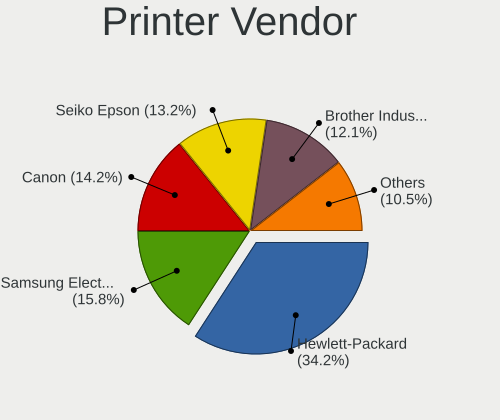

| Vendor                             | Computers | Percent |
|------------------------------------|-----------|---------|
| Hewlett-Packard                    | 166       | 34.16%  |
| Samsung Electronics                | 77        | 15.84%  |
| Canon                              | 69        | 14.2%   |
| Seiko Epson                        | 64        | 13.17%  |
| Brother Industries                 | 59        | 12.14%  |
| Dymo-CoStar                        | 8         | 1.65%   |
| Pantum                             | 7         | 1.44%   |
| Lexmark International              | 6         | 1.23%   |
| Xerox                              | 4         | 0.82%   |
| Ricoh                              | 3         | 0.62%   |
| QinHeng Electronics                | 3         | 0.62%   |
| Prolific Technology                | 3         | 0.62%   |
| Oki Data                           | 3         | 0.62%   |
| Kyocera                            | 3         | 0.62%   |
| STMicroelectronics                 | 2         | 0.41%   |
| Apple                              | 2         | 0.41%   |
| Toshiba TEC                        | 1         | 0.21%   |
| Sharp                              | 1         | 0.21%   |
| Sato                               | 1         | 0.21%   |
| Sagem                              | 1         | 0.21%   |
| Panasonic (Matsushita)             | 1         | 0.21%   |
| Omnidirectional Control Technology | 1         | 0.21%   |
| ICS Advent                         | 1         | 0.21%   |

Printer Model
-------------

Printer device models

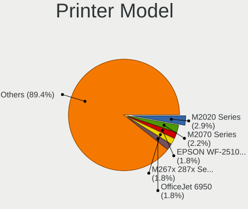

| Model                                                                 | Computers | Percent |
|-----------------------------------------------------------------------|-----------|---------|
| Samsung M2020 Series                                                  | 14        | 2.86%   |
| Samsung M2070 Series                                                  | 11        | 2.25%   |
| Seiko Epson EPSON WF-2510 Series                                      | 9         | 1.84%   |
| Samsung M267x 287x Series                                             | 9         | 1.84%   |
| HP OfficeJet 6950                                                     | 9         | 1.84%   |
| Seiko Epson Printer                                                   | 8         | 1.64%   |
| Samsung ML-216x Series Laser Printer                                  | 7         | 1.43%   |
| HP ENVY 5000 series                                                   | 7         | 1.43%   |
| HP Deskjet 2050 J510                                                  | 7         | 1.43%   |
| HP OfficeJet 3830 series                                              | 6         | 1.23%   |
| HP LaserJet 1018                                                      | 6         | 1.23%   |
| HP ENVY 4520 series                                                   | 6         | 1.23%   |
| Canon PIXMA MX920 Series                                              | 6         | 1.23%   |
| Canon LiDE 400                                                        | 6         | 1.23%   |
| HP Officejet 2620 series                                              | 5         | 1.02%   |
| HP LaserJet P1102                                                     | 5         | 1.02%   |
| HP LaserJet P1005                                                     | 5         | 1.02%   |
| Brother DCP-1610W                                                     | 5         | 1.02%   |
| Seiko Epson XP-4100 Series                                            | 4         | 0.82%   |
| Seiko Epson ME OFFICE 620F Series/Stylus Office BX305F/BX305FW/TX320F | 4         | 0.82%   |
| Seiko Epson ET-2820 Series                                            | 4         | 0.82%   |
| Seiko Epson ET-2810 Series                                            | 4         | 0.82%   |
| Samsung Composite Device                                              | 4         | 0.82%   |
| HP ENVY 4500 series                                                   | 4         | 0.82%   |
| HP Deskjet F4500 series                                               | 4         | 0.82%   |
| HP DeskJet 3700 series                                                | 4         | 0.82%   |
| HP Deskjet 1510                                                       | 4         | 0.82%   |
| Canon PIXMA MG3600 Series                                             | 4         | 0.82%   |
| Canon PIXMA MG2500 Series                                             | 4         | 0.82%   |
| Canon LiDE 300                                                        | 4         | 0.82%   |
| Brother MFC-L2710DW series                                            | 4         | 0.82%   |
| Brother MFC-L2700DW                                                   | 4         | 0.82%   |
| Samsung SCX-4623 Series                                               | 3         | 0.61%   |
| Samsung SCX-4300 Series                                               | 3         | 0.61%   |
| Samsung ML-1660 Series                                                | 3         | 0.61%   |
| Samsung ML-1640 Series Laser Printer                                  | 3         | 0.61%   |
| QinHeng CH340S                                                        | 3         | 0.61%   |
| Prolific PL2305 Parallel Port                                         | 3         | 0.61%   |
| Lexmark International InkJet Color Printer                            | 3         | 0.61%   |
| HP Officejet Pro 6230                                                 | 3         | 0.61%   |

Scanner Vendor
--------------

Scanner device vendors

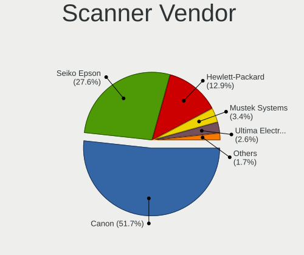

| Vendor             | Computers | Percent |
|--------------------|-----------|---------|
| Canon              | 60        | 51.72%  |
| Seiko Epson        | 32        | 27.59%  |
| Hewlett-Packard    | 15        | 12.93%  |
| Mustek Systems     | 4         | 3.45%   |
| Ultima Electronics | 3         | 2.59%   |
| Plustek            | 1         | 0.86%   |
| AGFA-Gevaert NV    | 1         | 0.86%   |

Scanner Model
-------------

Scanner device models

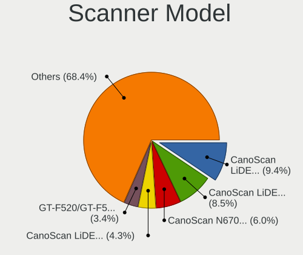

| Model                                                                                 | Computers | Percent |
|---------------------------------------------------------------------------------------|-----------|---------|
| Canon CanoScan LiDE 110                                                               | 11        | 9.4%    |
| Canon CanoScan LiDE 210                                                               | 10        | 8.55%   |
| Canon CanoScan N670U/N676U/LiDE 20                                                    | 7         | 5.98%   |
| Canon CanoScan LiDE 120                                                               | 5         | 4.27%   |
| Seiko Epson GT-F520/GT-F570 [Perfection 3590 PHOTO]                                   | 4         | 3.42%   |
| Seiko Epson GT-F500/GT-F550 [Perfection 2480/2580 PHOTO]                              | 4         | 3.42%   |
| Canon CanoScan LIDE 25                                                                | 4         | 3.42%   |
| Canon CanoScan LiDE 220                                                               | 4         | 3.42%   |
| Canon CanoScan LiDE 100                                                               | 4         | 3.42%   |
| Seiko Epson GT-7300U [Perfection 1260/1260 PHOTO]                                     | 3         | 2.56%   |
| Canon CanoScan N1240U/LiDE 30                                                         | 3         | 2.56%   |
| Canon CanoScan LiDE 700F                                                              | 3         | 2.56%   |
| Canon CanoScan LiDE 60                                                                | 3         | 2.56%   |
| Ultima Artec Ultima 2000 (GT6801 based)/Lifetec LT9385/ScanMagic 1200 UB Plus Scanner | 2         | 1.71%   |
| Seiko Epson Perfection V37/V370                                                       | 2         | 1.71%   |
| Seiko Epson GT-F650 [GT-S600/Perfection V10/V100]                                     | 2         | 1.71%   |
| Seiko Epson GT-7700U [Perfection 1240U]                                               | 2         | 1.71%   |
| Mustek Systems BearPaw 1200 CU Plus                                                   | 2         | 1.71%   |
| HP ScanJet 3400cse                                                                    | 2         | 1.71%   |
| HP Scanjet 200                                                                        | 2         | 1.71%   |
| Ultima Artec E+ 48U                                                                   | 1         | 0.85%   |
| Seiko Epson GT-X900 [Perfection V700/V750 Photo]                                      | 1         | 0.85%   |
| Seiko Epson GT-X800 [Perfection 4990 PHOTO]                                           | 1         | 0.85%   |
| Seiko Epson GT-X750 [Perfection 4490 Photo]                                           | 1         | 0.85%   |
| Seiko Epson GT-X700 [Perfection 4870]                                                 | 1         | 0.85%   |
| Seiko Epson GT-F730 [GT-S630/Perfection V33/V330 Photo]                               | 1         | 0.85%   |
| Seiko Epson GT-F720 [GT-S620/Perfection V30/V300 Photo]                               | 1         | 0.85%   |
| Seiko Epson GT-F700 [Perfection V350]                                                 | 1         | 0.85%   |
| Seiko Epson GT-9700F [Perfection 2450 PHOTO]                                          | 1         | 0.85%   |
| Seiko Epson GT-9400UF [Perfection 3170]                                               | 1         | 0.85%   |
| Seiko Epson GT-9300UF [Perfection 2400 PHOTO]                                         | 1         | 0.85%   |
| Seiko Epson GT-8400UF [Perfection 1670/1670 PHOTO]                                    | 1         | 0.85%   |
| Seiko Epson GT-7600UF [Perfection 1200U/1200U Photo]                                  | 1         | 0.85%   |
| Seiko Epson GT-6600U [Perfection 610]                                                 | 1         | 0.85%   |
| Seiko Epson ES-D400 [GT-S80]                                                          | 1         | 0.85%   |
| Seiko Epson CC-570L [Stylus CX3100/CX3200]                                            | 1         | 0.85%   |
| Plustek 600DPI USB Scanner                                                            | 1         | 0.85%   |
| Mustek Systems SNAPSCAN e22                                                           | 1         | 0.85%   |
| Mustek Systems ScanExpress A3 USB 1200 PRO                                            | 1         | 0.85%   |
| HP ScanJet G3010                                                                      | 1         | 0.85%   |

Camera
------

Camera Vendor
-------------

Camera device vendors

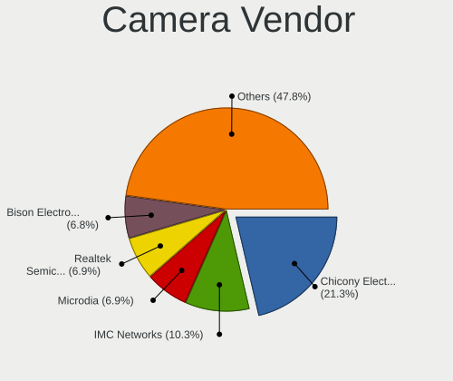

| Vendor                                 | Computers | Percent |
|----------------------------------------|-----------|---------|
| Chicony Electronics                    | 1747      | 21.34%  |
| IMC Networks                           | 843       | 10.3%   |
| Microdia                               | 566       | 6.92%   |
| Realtek Semiconductor                  | 563       | 6.88%   |
| Bison Electronics                      | 553       | 6.76%   |
| Quanta                                 | 423       | 5.17%   |
| Logitech                               | 399       | 4.87%   |
| Sunplus Innovation Technology          | 348       | 4.25%   |
| Cheng Uei Precision Industry (Foxlink) | 312       | 3.81%   |
| Suyin                                  | 293       | 3.58%   |
| Apple                                  | 285       | 3.48%   |
| Syntek                                 | 215       | 2.63%   |
| Luxvisions Innotech Limited            | 210       | 2.57%   |
| Alcor Micro                            | 165       | 2.02%   |
| Lite-On Technology                     | 159       | 1.94%   |
| Microsoft                              | 104       | 1.27%   |
| Silicon Motion                         | 85        | 1.04%   |
| Ricoh                                  | 78        | 0.95%   |
| Sonix Technology                       | 45        | 0.55%   |
| ARC International                      | 44        | 0.54%   |
| Samsung Electronics                    | 42        | 0.51%   |
| Z-Star Microelectronics                | 41        | 0.5%    |
| Trust                                  | 36        | 0.44%   |
| SunplusIT                              | 34        | 0.42%   |
| ShineTech                              | 34        | 0.42%   |
| Generalplus Technology                 | 33        | 0.4%    |
| icSpring                               | 30        | 0.37%   |
| Acer                                   | 28        | 0.34%   |
| KYE Systems (Mouse Systems)            | 25        | 0.31%   |
| Primax Electronics                     | 23        | 0.28%   |
| kingcome                               | 22        | 0.27%   |
| ALi                                    | 22        | 0.27%   |
| GEMBIRD                                | 18        | 0.22%   |
| Importek                               | 17        | 0.21%   |
| Sunplus Technology                     | 15        | 0.18%   |
| Sunplus IT                             | 15        | 0.18%   |
| webcam                                 | 14        | 0.17%   |
| MacroSilicon                           | 14        | 0.17%   |
| Lenovo                                 | 13        | 0.16%   |
| Genesys Logic                          | 13        | 0.16%   |

Camera Model
------------

Camera device models

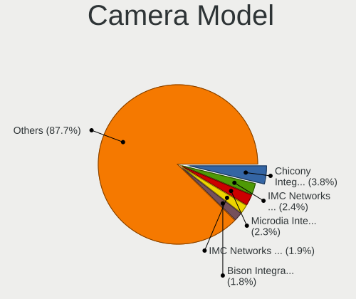

| Model                                                   | Computers | Percent |
|---------------------------------------------------------|-----------|---------|
| Chicony Integrated Camera                               | 313       | 3.79%   |
| IMC Networks USB2.0 HD UVC WebCam                       | 200       | 2.42%   |
| Microdia Integrated_Webcam_HD                           | 191       | 2.32%   |
| IMC Networks Integrated Camera                          | 160       | 1.94%   |
| Bison Integrated Camera                                 | 150       | 1.82%   |
| Chicony HD WebCam                                       | 147       | 1.78%   |
| Syntek Integrated Camera                                | 133       | 1.61%   |
| Realtek Integrated_Webcam_HD                            | 129       | 1.56%   |
| Logitech Webcam C270                                    | 120       | 1.45%   |
| IMC Networks USB2.0 VGA UVC WebCam                      | 103       | 1.25%   |
| Apple Built-in iSight                                   | 99        | 1.2%    |
| Realtek USB Camera                                      | 85        | 1.03%   |
| Alcor Micro USB 2.0 Camera                              | 79        | 0.96%   |
| Chicony USB2.0 VGA UVC WebCam                           | 78        | 0.95%   |
| Luxvisions Innotech Limited HP TrueVision HD Camera     | 75        | 0.91%   |
| Chicony USB2.0 HD UVC WebCam                            | 74        | 0.9%    |
| Apple iPhone 5/5C/5S/6/SE/7/8/X                         | 74        | 0.9%    |
| Chicony HP Truevision HD                                | 71        | 0.86%   |
| IMC Networks HD Camera                                  | 64        | 0.78%   |
| Chicony HP TrueVision HD Camera                         | 64        | 0.78%   |
| Apple FaceTime HD Camera (Built-in)                     | 64        | 0.78%   |
| Sunplus Integrated_Webcam_HD                            | 63        | 0.76%   |
| Quanta HD User Facing                                   | 62        | 0.75%   |
| Bison HD Webcam                                         | 62        | 0.75%   |
| Quanta HP TrueVision HD Camera                          | 59        | 0.72%   |
| Microdia Webcam Vitade AF                               | 57        | 0.69%   |
| Chicony HP Wide Vision HD Camera                        | 53        | 0.64%   |
| Cheng Uei Precision Industry (Foxlink) HP TrueVision HD | 52        | 0.63%   |
| Bison Lenovo EasyCamera                                 | 51        | 0.62%   |
| Chicony HP HD Camera                                    | 49        | 0.59%   |
| Chicony FJ Camera                                       | 49        | 0.59%   |
| Microsoft LifeCam HD-3000                               | 47        | 0.57%   |
| Logitech HD Pro Webcam C920                             | 47        | 0.57%   |
| Lite-On Integrated Camera                               | 47        | 0.57%   |
| Chicony HP Webcam                                       | 47        | 0.57%   |
| Sunplus HD WebCam                                       | 46        | 0.56%   |
| Realtek USB2.0 VGA UVC WebCam                           | 44        | 0.53%   |
| ARC International Camera                                | 44        | 0.53%   |
| Suyin Acer/HP Integrated Webcam [CN0314]                | 42        | 0.51%   |
| Samsung Galaxy series, misc. (MTP mode)                 | 42        | 0.51%   |

Security
--------

Fingerprint Vendor
------------------

Fingerprint sensor vendors

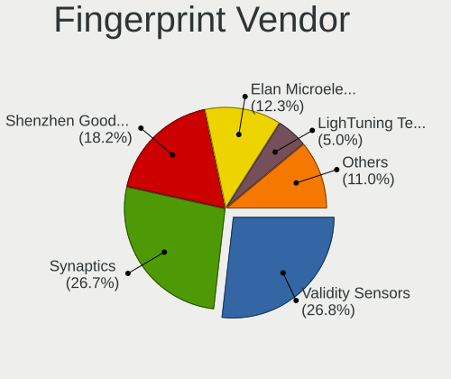

| Vendor                             | Computers | Percent |
|------------------------------------|-----------|---------|
| Validity Sensors                   | 375       | 26.8%   |
| Synaptics                          | 373       | 26.66%  |
| Shenzhen Goodix Technology         | 255       | 18.23%  |
| Elan Microelectronics              | 172       | 12.29%  |
| LighTuning Technology              | 70        | 5%      |
| AuthenTec                          | 65        | 4.65%   |
| Upek                               | 55        | 3.93%   |
| STMicroelectronics                 | 11        | 0.79%   |
| HOLTEK                             | 8         | 0.57%   |
| Focal-systems.Corp                 | 7         | 0.5%    |
| Realtek USB2.0 Finger Print Bridge | 4         | 0.29%   |
| Samsung Electronics                | 1         | 0.07%   |
| Microsoft                          | 1         | 0.07%   |
| Dell                               | 1         | 0.07%   |
| Unknown                            | 1         | 0.07%   |

Fingerprint Model
-----------------

Fingerprint sensor models

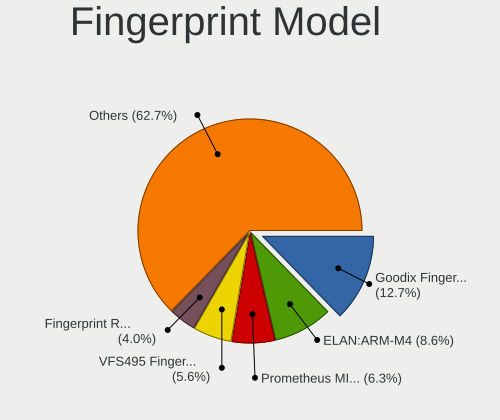

| Model                                                                      | Computers | Percent |
|----------------------------------------------------------------------------|-----------|---------|
| Shenzhen Goodix  Fingerprint Device                                        | 178       | 12.72%  |
| Elan ELAN:ARM-M4                                                           | 121       | 8.65%   |
| Synaptics Prometheus MIS Touch Fingerprint Reader                          | 88        | 6.29%   |
| Validity Sensors VFS495 Fingerprint Reader                                 | 79        | 5.65%   |
| Shenzhen Goodix Fingerprint Reader                                         | 56        | 4%      |
| Elan ELAN:Fingerprint                                                      | 51        | 3.65%   |
| Upek Biometric Touchchip/Touchstrip Fingerprint Sensor                     | 47        | 3.36%   |
| Synaptics Metallica MIS Touch Fingerprint Reader                           | 46        | 3.29%   |
| LighTuning EgisTec Touch Fingerprint Sensor                                | 43        | 3.07%   |
| Validity Sensors VFS 5011 fingerprint sensor                               | 35        | 2.5%    |
| Synaptics WBDI Fingerprint Reader USB 086                                  | 35        | 2.5%    |
| Validity Sensors Swipe Fingerprint Sensor                                  | 34        | 2.43%   |
| Validity Sensors Synaptics WBDI                                            | 30        | 2.14%   |
| Synaptics UWP WBDI Device                                                  | 30        | 2.14%   |
| Validity Sensors VFS5011 Fingerprint Reader                                | 29        | 2.07%   |
| Validity Sensors Fingerprint scanner                                       | 24        | 1.72%   |
| Synaptics  WBDI                                                            | 24        | 1.72%   |
| Validity Sensors VFS451 Fingerprint Reader                                 | 23        | 1.64%   |
| Validity Sensors Synaptics VFS7552 Touch Fingerprint Sensor with PurePrint | 23        | 1.64%   |
| AuthenTec AES2501 Fingerprint Sensor                                       | 23        | 1.64%   |
| Synaptics  FS7604 Touch Fingerprint Sensor with PurePrint                  | 22        | 1.57%   |
| Synaptics FS7604 Touch Fingerprint Sensor with PurePrint                   | 21        | 1.5%    |
| Shenzhen Goodix FingerPrint                                                | 21        | 1.5%    |
| Validity Sensors VFS471 Fingerprint Reader                                 | 20        | 1.43%   |
| Synaptics WBDI                                                             | 20        | 1.43%   |
| Synaptics Prometheus Fingerprint Reader                                    | 17        | 1.22%   |
| Validity Sensors VFS491                                                    | 16        | 1.14%   |
| Validity Sensors VFS Fingerprint sensor                                    | 15        | 1.07%   |
| Synaptics UWP WBDI                                                         | 15        | 1.07%   |
| Synaptics Metallica MOH Touch Fingerprint Reader                           | 14        | 1%      |
| Synaptics Fingerprint reader [HP G6]                                       | 14        | 1%      |
| AuthenTec AES1600                                                          | 14        | 1%      |
| LighTuning ES603 Swipe Fingerprint Sensor                                  | 13        | 0.93%   |
| Unknown                                                                    | 13        | 0.93%   |
| Validity Sensors VFS7500 Touch Fingerprint Sensor                          | 12        | 0.86%   |
| Validity Sensors VFS101 Fingerprint Reader                                 | 11        | 0.79%   |
| STMicroelectronics Fingerprint Reader                                      | 11        | 0.79%   |
| AuthenTec AES2810                                                          | 11        | 0.79%   |
| Validity Sensors Synaptics VFS7552 Touch Fingerprint Sensor                | 10        | 0.71%   |
| LighTuning Fingerprint Reader                                              | 10        | 0.71%   |

Chipcard Vendor
---------------

Chipcard module vendors

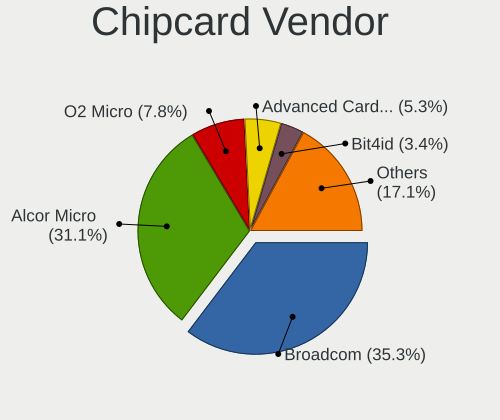

| Vendor                    | Computers | Percent |
|---------------------------|-----------|---------|
| Broadcom                  | 200       | 35.34%  |
| Alcor Micro               | 176       | 31.1%   |
| O2 Micro                  | 44        | 7.77%   |
| Advanced Card Systems     | 30        | 5.3%    |
| Bit4id                    | 19        | 3.36%   |
| Upek                      | 18        | 3.18%   |
| Lenovo                    | 17        | 3%      |
| Realtek Semiconductor     | 12        | 2.12%   |
| SCM Microsystems          | 10        | 1.77%   |
| Gemalto (was Gemplus)     | 10        | 1.77%   |
| Reiner SCT Kartensysteme  | 5         | 0.88%   |
| OmniKey                   | 5         | 0.88%   |
| Clay Logic                | 5         | 0.88%   |
| Microchip Technology      | 3         | 0.53%   |
| Yubico.com                | 2         | 0.35%   |
| NXP Semiconductors        | 2         | 0.35%   |
| Thetis                    | 1         | 0.18%   |
| In Focus Systems          | 1         | 0.18%   |
| GHI                       | 1         | 0.18%   |
| Fujitsu Siemens Computers | 1         | 0.18%   |
| Feitian Technologies      | 1         | 0.18%   |
| Chicony Electronics       | 1         | 0.18%   |
| Cherry                    | 1         | 0.18%   |
| Alcorlink                 | 1         | 0.18%   |

Chipcard Model
--------------

Chipcard module models

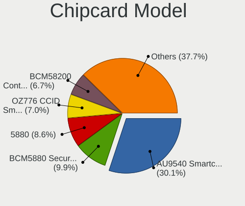

| Model                                                                        | Computers | Percent |
|------------------------------------------------------------------------------|-----------|---------|
| Alcor Micro AU9540 Smartcard Reader                                          | 171       | 30.11%  |
| Broadcom BCM5880 Secure Applications Processor                               | 56        | 9.86%   |
| Broadcom 5880                                                                | 49        | 8.63%   |
| O2 Micro OZ776 CCID Smartcard Reader                                         | 40        | 7.04%   |
| Broadcom BCM58200 ControlVault 3 (FingerPrint sensor + Contacted SmartCard)  | 38        | 6.69%   |
| Broadcom 58200                                                               | 30        | 5.28%   |
| Broadcom BCM5880 Secure Applications Processor with fingerprint swipe sensor | 25        | 4.4%    |
| Advanced Card Systems ACR38 SmartCard Reader                                 | 21        | 3.7%    |
| Upek TouchChip Fingerprint Coprocessor (WBF advanced mode)                   | 18        | 3.17%   |
| Lenovo Integrated Smart Card Reader                                          | 17        | 2.99%   |
| Bit4id miniLector EVO                                                        | 15        | 2.64%   |
| Realtek Semiconductor Smart Card Reader Interface                            | 12        | 2.11%   |
| Advanced Card Systems ACR122U                                                | 9         | 1.58%   |
| Gemalto (was Gemplus) GemPC Twin SmartCard Reader                            | 7         | 1.23%   |
| Reiner SCT Kartensysteme cyberJack RFID basis contactless smartcard reader   | 5         | 0.88%   |
| Clay Logic Nitrokey Pro                                                      | 5         | 0.88%   |
| Alcor Micro Watchdata W 1981                                                 | 5         | 0.88%   |
| SCM Microsystems uTrust 3700 F CL Reader                                     | 4         | 0.7%    |
| O2 Micro Oz776 SmartCard Reader                                              | 4         | 0.7%    |
| SCM Microsystems Identiv SmartOS Reader                                      | 3         | 0.53%   |
| Microchip Technology SMSC USX101x Reader                                     | 3         | 0.53%   |
| Gemalto (was Gemplus) Compact Smart Card Reader Writer                       | 3         | 0.53%   |
| Broadcom BCM5880 Secure Applications Processor with fingerprint touch sensor | 3         | 0.53%   |
| Yubico.com Yubikey 4/5 U2F+CCID                                              | 2         | 0.35%   |
| OmniKey CardMan 3021 / 3121                                                  | 2         | 0.35%   |
| NXP Semiconductors HUSCR-NFC                                                 | 2         | 0.35%   |
| Bit4id miniLector-s                                                          | 2         | 0.35%   |
| BIT4ID miniLector AIR NFC v3                                                 | 2         | 0.35%   |
| Thetis Security Key(FE25)                                                    | 1         | 0.18%   |
| SCM Microsystems SCR35xx Smart Card Reader                                   | 1         | 0.18%   |
| SCM Microsystems SCR335 SmartCard Reader                                     | 1         | 0.18%   |
| SCM Microsystems SCR331-LC1 / SCR3310 SmartCard Reader                       | 1         | 0.18%   |
| OmniKey CardMan Smart@Link                                                   | 1         | 0.18%   |
| OmniKey CardMan 5022                                                         | 1         | 0.18%   |
| OmniKey 3x21 Smart Card Reader                                               | 1         | 0.18%   |
| In Focus Systems EMV Smartcard Reader                                        | 1         | 0.18%   |
| GHI NC001                                                                    | 1         | 0.18%   |
| Fujitsu Siemens Computers SmartCard Reader 2A                                | 1         | 0.18%   |
| Feitian Technologies R502                                                    | 1         | 0.18%   |
| Chicony Electronics HP Skylab USB Smartcard Keyboard                         | 1         | 0.18%   |

Unsupported
-----------

Unsupported Devices
-------------------

Total unsupported devices on board

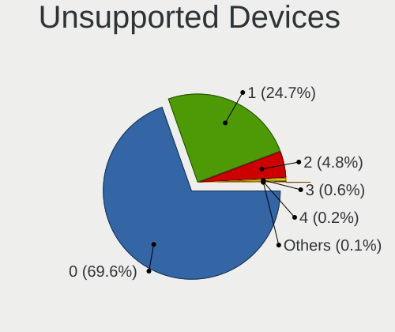

| Total | Computers | Percent |
|-------|-----------|---------|
| 0     | 9376      | 69.62%  |
| 1     | 3320      | 24.65%  |
| 2     | 653       | 4.85%   |
| 3     | 82        | 0.61%   |
| 4     | 22        | 0.16%   |
| 5     | 10        | 0.07%   |
| 6     | 2         | 0.01%   |
| 10    | 1         | 0.01%   |
| 8     | 1         | 0.01%   |
| 7     | 1         | 0.01%   |

Unsupported Device Types
------------------------

Types of unsupported devices

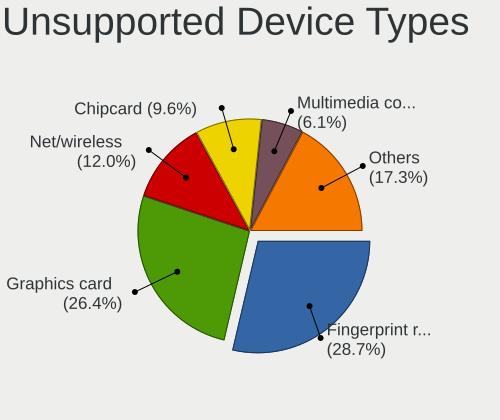

| Type                     | Computers | Percent |
|--------------------------|-----------|---------|
| Fingerprint reader       | 1380      | 28.66%  |
| Graphics card            | 1273      | 26.44%  |
| Net/wireless             | 576       | 11.96%  |
| Chipcard                 | 463       | 9.62%   |
| Multimedia controller    | 292       | 6.06%   |
| Communication controller | 155       | 3.22%   |
| Camera                   | 145       | 3.01%   |
| Bluetooth                | 117       | 2.43%   |
| Unassigned class         | 67        | 1.39%   |
| Sound                    | 66        | 1.37%   |
| Net/ethernet             | 50        | 1.04%   |
| Storage                  | 49        | 1.02%   |
| Card reader              | 45        | 0.93%   |
| Network                  | 35        | 0.73%   |
| Modem                    | 31        | 0.64%   |
| Flash memory             | 24        | 0.5%    |
| Storage/raid             | 12        | 0.25%   |
| Dvb card                 | 12        | 0.25%   |
| Storage/ide              | 7         | 0.15%   |
| Firewire controller      | 6         | 0.12%   |
| Wireless                 | 3         | 0.06%   |
| Video                    | 3         | 0.06%   |
| Tv card                  | 3         | 0.06%   |
| Storage/nvme             | 1         | 0.02%   |

