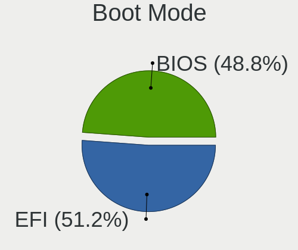
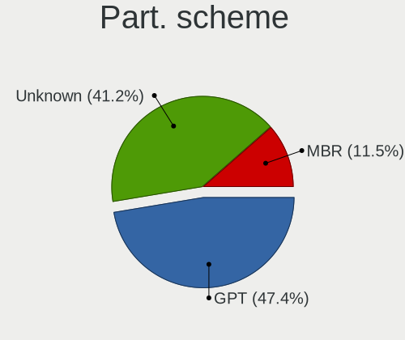
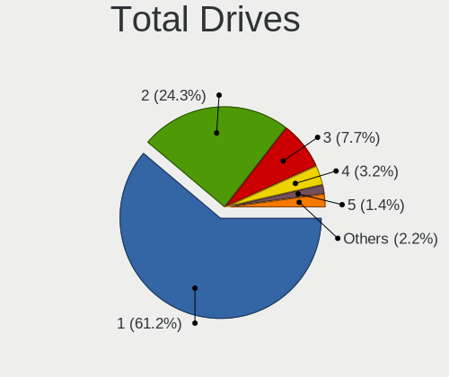
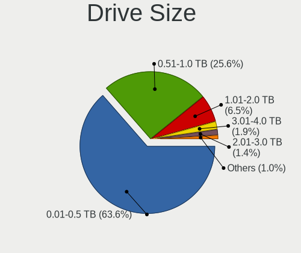
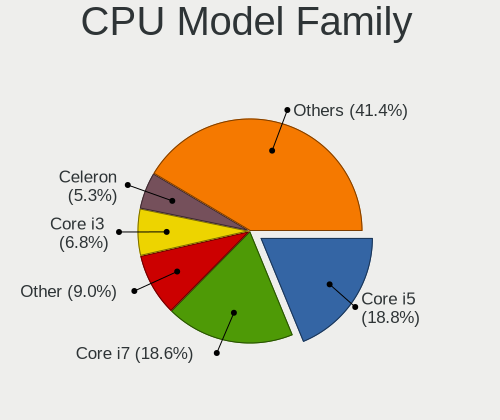

Linux in Italy - Tested Hardware & Statistics
---------------------------------------------

A project to collect tested hardware configurations for Linux in Italy.

Anyone can contribute to this report by the [hw-probe](https://github.com/linuxhw/hw-probe) tool:

    sudo -E hw-probe -all -upload

Please contribute! Especially if your hardware is rare.

This is a report for all computer types. See also reports for [desktops](/Location/Italy/Desktop/README.md) and [notebooks](/Location/Italy/Notebook/README.md).

Contents
--------

* [ Test Cases ](#test-cases)

* [ System ](#system)
  - [ OS                       ](#os)
  - [ OS Family                ](#os-family)
  - [ Kernel                   ](#kernel)
  - [ Kernel Family            ](#kernel-family)
  - [ Kernel Major Ver.        ](#kernel-major-ver)
  - [ Arch                     ](#arch)
  - [ DE                       ](#de)
  - [ Display Server           ](#display-server)
  - [ Display Manager          ](#display-manager)
  - [ OS Lang                  ](#os-lang)
  - [ Boot Mode                ](#boot-mode)
  - [ Filesystem               ](#filesystem)
  - [ Part. scheme             ](#part-scheme)
  - [ Dual Boot with Linux/BSD ](#dual-boot-with-linuxbsd)
  - [ Dual Boot (Win)          ](#dual-boot-win)

* [ Board ](#board)
  - [ Vendor                   ](#vendor)
  - [ Model                    ](#model)
  - [ Model Family             ](#model-family)
  - [ MFG Year                 ](#mfg-year)
  - [ Form Factor              ](#form-factor)
  - [ Secure Boot              ](#secure-boot)
  - [ Coreboot                 ](#coreboot)
  - [ RAM Size                 ](#ram-size)
  - [ RAM Used                 ](#ram-used)
  - [ Total Drives             ](#total-drives)
  - [ Has CD-ROM               ](#has-cd-rom)
  - [ Has Ethernet             ](#has-ethernet)
  - [ Has WiFi                 ](#has-wifi)
  - [ Has Bluetooth            ](#has-bluetooth)

* [ Location ](#location)
  - [ Country                  ](#country)
  - [ City                     ](#city)

* [ Drives ](#drives)
  - [ Drive Vendor             ](#drive-vendor)
  - [ Drive Model              ](#drive-model)
  - [ HDD Vendor               ](#hdd-vendor)
  - [ SSD Vendor               ](#ssd-vendor)
  - [ Drive Kind               ](#drive-kind)
  - [ Drive Connector          ](#drive-connector)
  - [ Drive Size               ](#drive-size)
  - [ Space Total              ](#space-total)
  - [ Space Used               ](#space-used)
  - [ Malfunc. Drives          ](#malfunc-drives)
  - [ Malfunc. Drive Vendor    ](#malfunc-drive-vendor)
  - [ Malfunc. HDD Vendor      ](#malfunc-hdd-vendor)
  - [ Malfunc. Drive Kind      ](#malfunc-drive-kind)
  - [ Failed Drives            ](#failed-drives)
  - [ Failed Drive Vendor      ](#failed-drive-vendor)
  - [ Drive Status             ](#drive-status)

* [ Storage controller ](#storage-controller)
  - [ Storage Vendor           ](#storage-vendor)
  - [ Storage Model            ](#storage-model)
  - [ Storage Kind             ](#storage-kind)

* [ Processor ](#processor)
  - [ CPU Vendor               ](#cpu-vendor)
  - [ CPU Model                ](#cpu-model)
  - [ CPU Model Family         ](#cpu-model-family)
  - [ CPU Cores                ](#cpu-cores)
  - [ CPU Sockets              ](#cpu-sockets)
  - [ CPU Threads              ](#cpu-threads)
  - [ CPU Op-Modes             ](#cpu-op-modes)
  - [ CPU Microcode            ](#cpu-microcode)
  - [ CPU Microarch            ](#cpu-microarch)

* [ Graphics ](#graphics)
  - [ GPU Vendor               ](#gpu-vendor)
  - [ GPU Model                ](#gpu-model)
  - [ GPU Combo                ](#gpu-combo)
  - [ GPU Driver               ](#gpu-driver)
  - [ GPU Memory               ](#gpu-memory)

* [ Monitor ](#monitor)
  - [ Monitor Vendor           ](#monitor-vendor)
  - [ Monitor Model            ](#monitor-model)
  - [ Monitor Resolution       ](#monitor-resolution)
  - [ Monitor Diagonal         ](#monitor-diagonal)
  - [ Monitor Width            ](#monitor-width)
  - [ Aspect Ratio             ](#aspect-ratio)
  - [ Monitor Area             ](#monitor-area)
  - [ Pixel Density            ](#pixel-density)
  - [ Multiple Monitors        ](#multiple-monitors)

* [ Network ](#network)
  - [ Net Controller Vendor    ](#net-controller-vendor)
  - [ Net Controller Model     ](#net-controller-model)
  - [ Wireless Vendor          ](#wireless-vendor)
  - [ Wireless Model           ](#wireless-model)
  - [ Ethernet Vendor          ](#ethernet-vendor)
  - [ Ethernet Model           ](#ethernet-model)
  - [ Net Controller Kind      ](#net-controller-kind)
  - [ Used Controller          ](#used-controller)
  - [ NICs                     ](#nics)
  - [ IPv6                     ](#ipv6)

* [ Bluetooth ](#bluetooth)
  - [ Bluetooth Vendor         ](#bluetooth-vendor)
  - [ Bluetooth Model          ](#bluetooth-model)

* [ Sound ](#sound)
  - [ Sound Vendor             ](#sound-vendor)
  - [ Sound Model              ](#sound-model)

* [ Memory ](#memory)
  - [ Memory Vendor            ](#memory-vendor)
  - [ Memory Model             ](#memory-model)
  - [ Memory Kind              ](#memory-kind)
  - [ Memory Form Factor       ](#memory-form-factor)
  - [ Memory Size              ](#memory-size)
  - [ Memory Speed             ](#memory-speed)

* [ Printers & scanners ](#printers--scanners)
  - [ Printer Vendor           ](#printer-vendor)
  - [ Printer Model            ](#printer-model)
  - [ Scanner Vendor           ](#scanner-vendor)
  - [ Scanner Model            ](#scanner-model)

* [ Camera ](#camera)
  - [ Camera Vendor            ](#camera-vendor)
  - [ Camera Model             ](#camera-model)

* [ Security ](#security)
  - [ Fingerprint Vendor       ](#fingerprint-vendor)
  - [ Fingerprint Model        ](#fingerprint-model)
  - [ Chipcard Vendor          ](#chipcard-vendor)
  - [ Chipcard Model           ](#chipcard-model)

* [ Unsupported ](#unsupported)
  - [ Unsupported Devices      ](#unsupported-devices)
  - [ Unsupported Device Types ](#unsupported-device-types)

Test Cases
----------

Total: 16672

| Vendor        | Model                       | Form-Factor | Probe                                                      | Date         |
|---------------|-----------------------------|-------------|------------------------------------------------------------|--------------|
| ASRock        | 970M Pro3                   | Desktop     | [8eda0b8fbf](https://linux-hardware.org/?probe=8eda0b8fbf) | Jan 06, 2025 |
| ASUSTek       | F5N                         | Notebook    | [b04fac9072](https://linux-hardware.org/?probe=b04fac9072) | Jan 06, 2025 |
| Dell          | XPS 13 9305                 | Notebook    | [77f98c4014](https://linux-hardware.org/?probe=77f98c4014) | Jan 06, 2025 |
| Lenovo        | V15-ADA 82C7                | Notebook    | [c5c9a457aa](https://linux-hardware.org/?probe=c5c9a457aa) | Jan 06, 2025 |
| ASRock        | H110M-ITX                   | Desktop     | [d9985ebe4e](https://linux-hardware.org/?probe=d9985ebe4e) | Jan 06, 2025 |
| OEM           | B75 Ver:1.41                | Desktop     | [72dd3048a2](https://linux-hardware.org/?probe=72dd3048a2) | Jan 05, 2025 |
| ASUSTek       | K56CM                       | Notebook    | [4bfdbc10e7](https://linux-hardware.org/?probe=4bfdbc10e7) | Jan 05, 2025 |
| Samsung       | 300E4A/300E5A/300E7A/343... | Notebook    | [6bf558bdd0](https://linux-hardware.org/?probe=6bf558bdd0) | Jan 05, 2025 |
| Unknown       | Unknown                     | Notebook    | [b681fbb66c](https://linux-hardware.org/?probe=b681fbb66c) | Jan 04, 2025 |
| Dell          | 0JP3NX A01                  | Desktop     | [954d7d9768](https://linux-hardware.org/?probe=954d7d9768) | Jan 04, 2025 |
| Dell          | XPS 16 9640                 | Notebook    | [58d3a3677b](https://linux-hardware.org/?probe=58d3a3677b) | Jan 04, 2025 |
| Dell          | XPS 16 9640                 | Notebook    | [8f38090e9d](https://linux-hardware.org/?probe=8f38090e9d) | Jan 04, 2025 |
| ASUSTek       | PRIME H310M-E R2.0          | Desktop     | [79752b904b](https://linux-hardware.org/?probe=79752b904b) | Jan 04, 2025 |
| ASUSTek       | P5VD2-MX SE                 | Desktop     | [79f2dc1f44](https://linux-hardware.org/?probe=79f2dc1f44) | Jan 04, 2025 |
| ASRock        | H61M-S                      | Desktop     | [313d81da9f](https://linux-hardware.org/?probe=313d81da9f) | Jan 04, 2025 |
| OEM           | B75 Ver:1.41                | Desktop     | [b5e4cb38f7](https://linux-hardware.org/?probe=b5e4cb38f7) | Jan 04, 2025 |
| ASRock        | H61M-DGS                    | Desktop     | [0e1053e06a](https://linux-hardware.org/?probe=0e1053e06a) | Jan 04, 2025 |
| TongFang      | GM5HG0A                     | Notebook    | [7613e29f5b](https://linux-hardware.org/?probe=7613e29f5b) | Jan 04, 2025 |
| Acer          | Aspire 5680                 | Notebook    | [404c14f822](https://linux-hardware.org/?probe=404c14f822) | Jan 04, 2025 |
| TongFang      | GM5HG0A                     | Notebook    | [dd74d3e454](https://linux-hardware.org/?probe=dd74d3e454) | Jan 04, 2025 |
| ASRock        | A300M-STX                   | Desktop     | [7d00280570](https://linux-hardware.org/?probe=7d00280570) | Jan 04, 2025 |
| Lenovo        | IdeaPad Slim 3 15AMN8 82... | Notebook    | [70d641dc76](https://linux-hardware.org/?probe=70d641dc76) | Jan 04, 2025 |
| Lenovo        | IdeaPad Slim 3 15AMN8 82... | Notebook    | [5c063c3aee](https://linux-hardware.org/?probe=5c063c3aee) | Jan 04, 2025 |
| ASUSTek       | PRIME A320M-K               | Desktop     | [76cfde7dc3](https://linux-hardware.org/?probe=76cfde7dc3) | Jan 04, 2025 |
| Medion        | E11201                      | Notebook    | [141200df83](https://linux-hardware.org/?probe=141200df83) | Jan 03, 2025 |
| Lenovo        | 3168 SDK0J40697 WIN 3305... | Desktop     | [c6915cb84a](https://linux-hardware.org/?probe=c6915cb84a) | Jan 03, 2025 |
| Acer          | Aspire A115-32              | Notebook    | [c3f625776f](https://linux-hardware.org/?probe=c3f625776f) | Jan 03, 2025 |
| ASUSTek       | PRIME A320M-K               | Desktop     | [65588fd6c1](https://linux-hardware.org/?probe=65588fd6c1) | Jan 03, 2025 |
| HP            | 339A                        | Desktop     | [37e08931cc](https://linux-hardware.org/?probe=37e08931cc) | Jan 03, 2025 |
| Dell          | 0F6X5P A00                  | Desktop     | [7cad62d105](https://linux-hardware.org/?probe=7cad62d105) | Jan 03, 2025 |
| Dell          | 0F6X5P A00                  | Desktop     | [2014bb07e8](https://linux-hardware.org/?probe=2014bb07e8) | Jan 03, 2025 |
| Dell          | 0F6X5P A00                  | Desktop     | [1fc923f99b](https://linux-hardware.org/?probe=1fc923f99b) | Jan 03, 2025 |
| Samsung       | RC530/RC730                 | Notebook    | [e7b266b86e](https://linux-hardware.org/?probe=e7b266b86e) | Jan 03, 2025 |
| Acer          | Aspire 5741G                | Notebook    | [3785e1f57b](https://linux-hardware.org/?probe=3785e1f57b) | Jan 03, 2025 |
| ASUSTek       | PRIME B350M-A               | Desktop     | [014692b809](https://linux-hardware.org/?probe=014692b809) | Jan 03, 2025 |
| HP            | 0B4Ch D                     | Desktop     | [689bb32b5c](https://linux-hardware.org/?probe=689bb32b5c) | Jan 03, 2025 |
| Sony          | VGN-CR21S_W                 | Notebook    | [29a2c1f90e](https://linux-hardware.org/?probe=29a2c1f90e) | Jan 03, 2025 |
| Dell          | 0FF3FN A00                  | Desktop     | [7015b068fb](https://linux-hardware.org/?probe=7015b068fb) | Jan 03, 2025 |
| Dell          | 0FF3FN A00                  | Desktop     | [24dd59cb38](https://linux-hardware.org/?probe=24dd59cb38) | Jan 03, 2025 |
| ASUSTek       | K55DR                       | Notebook    | [2a17dca919](https://linux-hardware.org/?probe=2a17dca919) | Jan 03, 2025 |
| MSI           | Prestige 15 A12SC           | Notebook    | [5749bc91e9](https://linux-hardware.org/?probe=5749bc91e9) | Jan 03, 2025 |
| Acer          | Aspire A515-52              | Notebook    | [4b5bf879c2](https://linux-hardware.org/?probe=4b5bf879c2) | Jan 03, 2025 |
| Unknown       | Unknown                     | Desktop     | [e4a99f7f2d](https://linux-hardware.org/?probe=e4a99f7f2d) | Jan 02, 2025 |
| Acer          | Aspire E5-571G              | Notebook    | [a4cd37383e](https://linux-hardware.org/?probe=a4cd37383e) | Jan 02, 2025 |
| ASUSTek       | ZenBook UX363EA_UX371EA     | Convertible | [34bd4fc419](https://linux-hardware.org/?probe=34bd4fc419) | Jan 02, 2025 |
| Lenovo        | IdeaPad 3 15IML05 81WB      | Notebook    | [f5cc6f8958](https://linux-hardware.org/?probe=f5cc6f8958) | Jan 02, 2025 |
| ASRock        | AB350 Pro4                  | Desktop     | [669da3420f](https://linux-hardware.org/?probe=669da3420f) | Jan 02, 2025 |
| Sony          | SVF1521G6EW                 | Notebook    | [a9d8497c8d](https://linux-hardware.org/?probe=a9d8497c8d) | Jan 02, 2025 |
| HP            | 15                          | Notebook    | [683e4b72b8](https://linux-hardware.org/?probe=683e4b72b8) | Jan 01, 2025 |
| MSI           | Prestige 15 A12SC           | Notebook    | [d177ea6bf3](https://linux-hardware.org/?probe=d177ea6bf3) | Jan 01, 2025 |
| MSI           | Katana GF76 12UC            | Notebook    | [f0ab62b277](https://linux-hardware.org/?probe=f0ab62b277) | Jan 01, 2025 |
| HP            | Unknown                     | Notebook    | [d415ba61b5](https://linux-hardware.org/?probe=d415ba61b5) | Jan 01, 2025 |
| HP            | Unknown                     | Notebook    | [ce24e826ba](https://linux-hardware.org/?probe=ce24e826ba) | Jan 01, 2025 |
| SLIMBOOK      | Executive                   | Notebook    | [026c2a5e39](https://linux-hardware.org/?probe=026c2a5e39) | Jan 01, 2025 |
| SLIMBOOK      | Executive                   | Notebook    | [8fa336f525](https://linux-hardware.org/?probe=8fa336f525) | Jan 01, 2025 |
| Lenovo        | SHARKBAY 0B98401 WIN        | Desktop     | [612e46a0e7](https://linux-hardware.org/?probe=612e46a0e7) | Jan 01, 2025 |
| AZW           | EQ                          | Mini pc     | [770d05536d](https://linux-hardware.org/?probe=770d05536d) | Jan 01, 2025 |
| MSI           | A68HM GAMING                | Desktop     | [d12ab6c4d3](https://linux-hardware.org/?probe=d12ab6c4d3) | Jan 01, 2025 |
| Gigabyte      | X570 AORUS PRO              | Desktop     | [9ad161a45a](https://linux-hardware.org/?probe=9ad161a45a) | Jan 01, 2025 |
| ASUSTek       | VivoBook Flip 14 TP401CA... | Convertible | [361e80801b](https://linux-hardware.org/?probe=361e80801b) | Jan 01, 2025 |
| ASUSTek       | PRIME B450M-K               | Desktop     | [4cb02f7ced](https://linux-hardware.org/?probe=4cb02f7ced) | Dec 31, 2024 |
| ASRock        | B450M-HDV R4.0              | Desktop     | [c996300bbf](https://linux-hardware.org/?probe=c996300bbf) | Dec 31, 2024 |
| ASUSTek       | TUF B450M-PLUS GAMING       | Desktop     | [bfc48412dd](https://linux-hardware.org/?probe=bfc48412dd) | Dec 31, 2024 |
| Acer          | Aspire E5-573G              | Notebook    | [42555dde71](https://linux-hardware.org/?probe=42555dde71) | Dec 31, 2024 |
| Acer          | Aspire A515-57              | Notebook    | [a91c16b9c4](https://linux-hardware.org/?probe=a91c16b9c4) | Dec 31, 2024 |
| MSI           | MPG Z390 GAMING PLUS        | Desktop     | [7ecce10a98](https://linux-hardware.org/?probe=7ecce10a98) | Dec 31, 2024 |
| ASUSTek       | X540SA                      | Notebook    | [fffc36417c](https://linux-hardware.org/?probe=fffc36417c) | Dec 31, 2024 |
| Acer          | Aspire A515-45              | Notebook    | [1a20ef9a3c](https://linux-hardware.org/?probe=1a20ef9a3c) | Dec 30, 2024 |
| ASUSTek       | Pro H610M-C                 | Desktop     | [9f47d5bad6](https://linux-hardware.org/?probe=9f47d5bad6) | Dec 30, 2024 |
| HP            | 2AF7                        | Desktop     | [391d4cf404](https://linux-hardware.org/?probe=391d4cf404) | Dec 30, 2024 |
| Lenovo        | ThinkBook 15 G2 ARE 20VG    | Notebook    | [79ccf16681](https://linux-hardware.org/?probe=79ccf16681) | Dec 30, 2024 |
| ASUSTek       | P8H61-M LX3 PLUS R2.0       | Desktop     | [529afc68af](https://linux-hardware.org/?probe=529afc68af) | Dec 30, 2024 |
| ASUSTek       | VivoBook_ASUSLaptop X580... | Notebook    | [994b1d92c5](https://linux-hardware.org/?probe=994b1d92c5) | Dec 30, 2024 |
| Unknown       | N20 Pro                     | Notebook    | [4ac833b77e](https://linux-hardware.org/?probe=4ac833b77e) | Dec 30, 2024 |
| HP            | Laptop 17-cp0xxx            | Notebook    | [008153aaec](https://linux-hardware.org/?probe=008153aaec) | Dec 30, 2024 |
| ASUSTek       | TUF Gaming B550-PLUS WIF... | Desktop     | [5c9bfe608f](https://linux-hardware.org/?probe=5c9bfe608f) | Dec 30, 2024 |
| MSI           | Prestige 15 A12SC           | Notebook    | [2a23c371cd](https://linux-hardware.org/?probe=2a23c371cd) | Dec 30, 2024 |
| HUAWEI        | KLVL-WXX9                   | Notebook    | [50d20229d8](https://linux-hardware.org/?probe=50d20229d8) | Dec 30, 2024 |
| Lenovo        | ThinkPad L15 Gen 4 21H7C... | Notebook    | [810f9eeaaa](https://linux-hardware.org/?probe=810f9eeaaa) | Dec 30, 2024 |
| Acer          | Aspire A515-45              | Notebook    | [9a29af74ff](https://linux-hardware.org/?probe=9a29af74ff) | Dec 30, 2024 |
| HP            | Pavilion x360 Convertibl... | Convertible | [f9daa89a03](https://linux-hardware.org/?probe=f9daa89a03) | Dec 30, 2024 |
| HP            | 255 G7 Notebook PC          | Notebook    | [14817c7822](https://linux-hardware.org/?probe=14817c7822) | Dec 30, 2024 |
| TUXEDO        | InfinityBook Pro AMD Gen... | Notebook    | [5d3fe59ed7](https://linux-hardware.org/?probe=5d3fe59ed7) | Dec 29, 2024 |
| ASUSTek       | Vivobook Go E1504FA_E150... | Notebook    | [928c92d817](https://linux-hardware.org/?probe=928c92d817) | Dec 29, 2024 |
| Medion        | Defender P40                | Notebook    | [04ff586114](https://linux-hardware.org/?probe=04ff586114) | Dec 29, 2024 |
| ASUSTek       | N56JK                       | Notebook    | [d1c6ca3f72](https://linux-hardware.org/?probe=d1c6ca3f72) | Dec 29, 2024 |
| HP            | 18E7                        | Desktop     | [47d21f72aa](https://linux-hardware.org/?probe=47d21f72aa) | Dec 29, 2024 |
| ASUSTek       | S551LN                      | Notebook    | [ef774595d3](https://linux-hardware.org/?probe=ef774595d3) | Dec 29, 2024 |
| Acer          | Aspire A515-57              | Notebook    | [4bccbc5b01](https://linux-hardware.org/?probe=4bccbc5b01) | Dec 29, 2024 |
| ASUSTek       | N56JK                       | Notebook    | [0114b99957](https://linux-hardware.org/?probe=0114b99957) | Dec 29, 2024 |
| Toshiba       | Satellite L755              | Notebook    | [f4e18a27e3](https://linux-hardware.org/?probe=f4e18a27e3) | Dec 29, 2024 |
| HP            | Laptop 15-bs1xx             | Notebook    | [39fde8f5ca](https://linux-hardware.org/?probe=39fde8f5ca) | Dec 29, 2024 |
| HP            | Notebook                    | Notebook    | [fb6c3eebe1](https://linux-hardware.org/?probe=fb6c3eebe1) | Dec 29, 2024 |
| ASUSTek       | VivoBook_ASUSLaptop X515... | Notebook    | [53cd73700d](https://linux-hardware.org/?probe=53cd73700d) | Dec 29, 2024 |
| MSI           | Katana GF76 12UC            | Notebook    | [81deda659f](https://linux-hardware.org/?probe=81deda659f) | Dec 29, 2024 |
| Acer          | Aspire A715-42G             | Notebook    | [584e951bfb](https://linux-hardware.org/?probe=584e951bfb) | Dec 29, 2024 |
| Chuwi         | GemiBook                    | Notebook    | [28c417a4f8](https://linux-hardware.org/?probe=28c417a4f8) | Dec 29, 2024 |
| Huanan        | X99-F8 GAMING V5.0          | Desktop     | [e1be4649fa](https://linux-hardware.org/?probe=e1be4649fa) | Dec 29, 2024 |
| MSI           | X470 GAMING PLUS MAX        | Desktop     | [b5263fe645](https://linux-hardware.org/?probe=b5263fe645) | Dec 29, 2024 |
| Dell          | Inspiron 16 5645            | Notebook    | [254ce49ccb](https://linux-hardware.org/?probe=254ce49ccb) | Dec 28, 2024 |
| Lenovo        | Legion 5 Pro 16IAH7H 82R... | Notebook    | [dd408ca578](https://linux-hardware.org/?probe=dd408ca578) | Dec 28, 2024 |
| ASUSTek       | PRIME Z270-P                | Desktop     | [83bbeb0374](https://linux-hardware.org/?probe=83bbeb0374) | Dec 28, 2024 |
| Lenovo        | ThinkPad T480 20L6SJUS2J    | Notebook    | [55f0836ea7](https://linux-hardware.org/?probe=55f0836ea7) | Dec 28, 2024 |
| MSI           | GS60 6QE                    | Notebook    | [d2355f1bc6](https://linux-hardware.org/?probe=d2355f1bc6) | Dec 28, 2024 |
| Dell          | Latitude 7450               | Notebook    | [41b698bba3](https://linux-hardware.org/?probe=41b698bba3) | Dec 28, 2024 |
| MSI           | GS60 6QE                    | Notebook    | [335d033bc6](https://linux-hardware.org/?probe=335d033bc6) | Dec 28, 2024 |
| Lenovo        | 3106 SDK0J40697 WIN 3305... | Desktop     | [d5047e58d1](https://linux-hardware.org/?probe=d5047e58d1) | Dec 28, 2024 |
| HP            | Compaq Mini 311-1100        | Notebook    | [bb10d0f283](https://linux-hardware.org/?probe=bb10d0f283) | Dec 28, 2024 |
| HP            | ProBook 470 G2              | Notebook    | [ee181df849](https://linux-hardware.org/?probe=ee181df849) | Dec 28, 2024 |
| HP            | EliteBook 845 14 inch G1... | Notebook    | [60ab24f653](https://linux-hardware.org/?probe=60ab24f653) | Dec 28, 2024 |
| HP            | 81B3                        | Desktop     | [67462f75bb](https://linux-hardware.org/?probe=67462f75bb) | Dec 27, 2024 |
| Apple         | Mac-031AEE4D24BFF0B1 Mac... | Mini pc     | [1b43c72fa8](https://linux-hardware.org/?probe=1b43c72fa8) | Dec 27, 2024 |
| ASUSTek       | S300CA                      | Notebook    | [7225fa5b22](https://linux-hardware.org/?probe=7225fa5b22) | Dec 27, 2024 |
| ASUSTek       | TUF Gaming B450M-PLUS II    | Desktop     | [477041c5bc](https://linux-hardware.org/?probe=477041c5bc) | Dec 27, 2024 |
| ASRock        | H110M-HDV                   | Desktop     | [4501aaefe1](https://linux-hardware.org/?probe=4501aaefe1) | Dec 27, 2024 |
| HP            | ZBook 15 G6                 | Notebook    | [40bd2c3025](https://linux-hardware.org/?probe=40bd2c3025) | Dec 27, 2024 |
| Lenovo        | IdeaPad L340-15IRH Gamin... | Notebook    | [234883eac2](https://linux-hardware.org/?probe=234883eac2) | Dec 27, 2024 |
| Lenovo        | ThinkBook 15 G2 ARE 20VG    | Notebook    | [9ca24271a4](https://linux-hardware.org/?probe=9ca24271a4) | Dec 26, 2024 |
| HP            | ProBook 650 G1              | Notebook    | [2e0d9756fe](https://linux-hardware.org/?probe=2e0d9756fe) | Dec 26, 2024 |
| Lenovo        | ThinkPad T14 Gen 2i 20W0... | Notebook    | [369cdd52d8](https://linux-hardware.org/?probe=369cdd52d8) | Dec 26, 2024 |
| ASRock        | H110M-HDV                   | Desktop     | [eb488f568b](https://linux-hardware.org/?probe=eb488f568b) | Dec 26, 2024 |
| ASUSTek       | K53E                        | Notebook    | [33ce8daf57](https://linux-hardware.org/?probe=33ce8daf57) | Dec 26, 2024 |
| ASRock        | Z77 Pro3                    | Desktop     | [6e2115d1fc](https://linux-hardware.org/?probe=6e2115d1fc) | Dec 26, 2024 |
| Dell          | Precision M6800             | Notebook    | [b805a2c527](https://linux-hardware.org/?probe=b805a2c527) | Dec 26, 2024 |
| ASRock        | Z77 Pro3                    | Desktop     | [b995c7c799](https://linux-hardware.org/?probe=b995c7c799) | Dec 26, 2024 |
| ASUSTek       | X510UQR                     | Notebook    | [84503b8cca](https://linux-hardware.org/?probe=84503b8cca) | Dec 26, 2024 |
| Lenovo        | ThinkPad T14 Gen 2i 20W0... | Notebook    | [41e3dac21e](https://linux-hardware.org/?probe=41e3dac21e) | Dec 26, 2024 |
| ASRock        | N68-GE                      | Desktop     | [7f7f614f22](https://linux-hardware.org/?probe=7f7f614f22) | Dec 26, 2024 |
| Microsoft     | Surface 3                   | Tablet      | [3c5d9b1b2b](https://linux-hardware.org/?probe=3c5d9b1b2b) | Dec 26, 2024 |
| MSI           | X470 GAMING PLUS MAX        | Desktop     | [25790885cb](https://linux-hardware.org/?probe=25790885cb) | Dec 25, 2024 |
| Unknown       | MX16                        | Notebook    | [45e7d14b5b](https://linux-hardware.org/?probe=45e7d14b5b) | Dec 25, 2024 |
| ASUSTek       | PRIME B660M-A D4            | Desktop     | [d314c49ee9](https://linux-hardware.org/?probe=d314c49ee9) | Dec 25, 2024 |
| ASUSTek       | PRIME B660M-A D4            | Desktop     | [f39ab795bb](https://linux-hardware.org/?probe=f39ab795bb) | Dec 25, 2024 |
| Samsung       | 750XGK                      | Notebook    | [178e559f24](https://linux-hardware.org/?probe=178e559f24) | Dec 25, 2024 |
| Lenovo        | 317C SDK0J40700 WIN 3258... | Desktop     | [0ab0a286ad](https://linux-hardware.org/?probe=0ab0a286ad) | Dec 25, 2024 |
| MSI           | Prestige 15 A12SC           | Notebook    | [482d068493](https://linux-hardware.org/?probe=482d068493) | Dec 25, 2024 |
| ASUSTek       | P5QPL-AM                    | Desktop     | [c3df99294f](https://linux-hardware.org/?probe=c3df99294f) | Dec 25, 2024 |
| GEEKOM        | XT12 Pro                    | Desktop     | [b728f081fd](https://linux-hardware.org/?probe=b728f081fd) | Dec 24, 2024 |
| Dell          | Inspiron 1545               | Notebook    | [c4301467a3](https://linux-hardware.org/?probe=c4301467a3) | Dec 24, 2024 |
| Unknown       | Unknown                     | Desktop     | [7119a317d5](https://linux-hardware.org/?probe=7119a317d5) | Dec 24, 2024 |
| Lenovo        | ThinkPad X1 Carbon Gen 9... | Notebook    | [4b6d9e080e](https://linux-hardware.org/?probe=4b6d9e080e) | Dec 24, 2024 |
| Lenovo        | IdeaPad Slim 3 15ABR8 82... | Notebook    | [3a374eb06f](https://linux-hardware.org/?probe=3a374eb06f) | Dec 24, 2024 |
| HP            | ProBook 450 G5              | Notebook    | [825918c34e](https://linux-hardware.org/?probe=825918c34e) | Dec 24, 2024 |
| MSI           | B550-A PRO                  | Desktop     | [2ceed545b9](https://linux-hardware.org/?probe=2ceed545b9) | Dec 24, 2024 |
| Acer          | Swift SF314-59              | Notebook    | [fb10309ad2](https://linux-hardware.org/?probe=fb10309ad2) | Dec 24, 2024 |
| Acer          | Swift SF314-59              | Notebook    | [dc8395bb56](https://linux-hardware.org/?probe=dc8395bb56) | Dec 24, 2024 |
| Lenovo        | ThinkPad E14 Gen 6 21M3C... | Notebook    | [27c22b69a1](https://linux-hardware.org/?probe=27c22b69a1) | Dec 24, 2024 |
| ASUSTek       | PRIME B360M-K               | Desktop     | [cfa9fb9aba](https://linux-hardware.org/?probe=cfa9fb9aba) | Dec 24, 2024 |
| ASUSTek       | N56JN                       | Notebook    | [952d22573d](https://linux-hardware.org/?probe=952d22573d) | Dec 24, 2024 |
| ASUSTek       | P5QPL-AM                    | Desktop     | [9ae485f387](https://linux-hardware.org/?probe=9ae485f387) | Dec 24, 2024 |
| Unknown       | Unknown                     | Notebook    | [5dfb56f742](https://linux-hardware.org/?probe=5dfb56f742) | Dec 23, 2024 |
| Unknown       | Unknown                     | Notebook    | [2a60e915d0](https://linux-hardware.org/?probe=2a60e915d0) | Dec 23, 2024 |
| Intel         | NUC8BEB J72693-307          | Mini pc     | [6ca113b8e1](https://linux-hardware.org/?probe=6ca113b8e1) | Dec 23, 2024 |
| Lenovo        | 36EB SDK0R32862 WIN 3258... | Desktop     | [572d308e92](https://linux-hardware.org/?probe=572d308e92) | Dec 23, 2024 |
| ASUSTek       | ROG STRIX X670E-E GAMING... | Desktop     | [65b8d941dc](https://linux-hardware.org/?probe=65b8d941dc) | Dec 23, 2024 |
| ASUSTek       | PRIME B450M-A               | Desktop     | [4dbc846a39](https://linux-hardware.org/?probe=4dbc846a39) | Dec 23, 2024 |
| ASUSTek       | PRIME Z490-A                | Desktop     | [c7a92e755d](https://linux-hardware.org/?probe=c7a92e755d) | Dec 23, 2024 |
| MSI           | Katana GF66 11UC            | Notebook    | [c287ca2189](https://linux-hardware.org/?probe=c287ca2189) | Dec 23, 2024 |
| Dell          | 0200DY A01                  | Desktop     | [fa349ac11f](https://linux-hardware.org/?probe=fa349ac11f) | Dec 23, 2024 |
| ASUSTek       | PRIME Z490-A                | Desktop     | [7d25b9b02f](https://linux-hardware.org/?probe=7d25b9b02f) | Dec 23, 2024 |
| Dell          | Latitude 7450               | Notebook    | [43d05fa82d](https://linux-hardware.org/?probe=43d05fa82d) | Dec 23, 2024 |
| Fujitsu       | D3233-A1 S26361-D3233-A1    | Desktop     | [80598d6a43](https://linux-hardware.org/?probe=80598d6a43) | Dec 23, 2024 |
| ASUSTek       | P6T SE                      | Desktop     | [3269bf4415](https://linux-hardware.org/?probe=3269bf4415) | Dec 23, 2024 |
| ASRock        | H510M-HDV/M.2               | Desktop     | [66b8b7eae0](https://linux-hardware.org/?probe=66b8b7eae0) | Dec 23, 2024 |
| Lenovo        | SHARKBAY 0B98417 PRO        | Desktop     | [c7502297f0](https://linux-hardware.org/?probe=c7502297f0) | Dec 23, 2024 |
| ASUSTek       | X510UQR                     | Notebook    | [f0c040e507](https://linux-hardware.org/?probe=f0c040e507) | Dec 22, 2024 |
| Dell          | 0F6X5P A00                  | Desktop     | [e95791f119](https://linux-hardware.org/?probe=e95791f119) | Dec 22, 2024 |
| Colorful T... | CVN B650M GAMING FROZEN ... | Desktop     | [1155e83e75](https://linux-hardware.org/?probe=1155e83e75) | Dec 22, 2024 |
| HP            | EliteBook 650 15.6 inch ... | Notebook    | [2c77e00968](https://linux-hardware.org/?probe=2c77e00968) | Dec 22, 2024 |
| ASUSTek       | H170M-PLUS                  | Desktop     | [1a3bfda1b2](https://linux-hardware.org/?probe=1a3bfda1b2) | Dec 22, 2024 |
| ASUSTek       | X510UQR                     | Notebook    | [a86cafa832](https://linux-hardware.org/?probe=a86cafa832) | Dec 22, 2024 |
| Packard Be... | WMCP78M                     | Desktop     | [b9f3620021](https://linux-hardware.org/?probe=b9f3620021) | Dec 22, 2024 |
| Packard Be... | WMCP78M                     | Desktop     | [9d24c10673](https://linux-hardware.org/?probe=9d24c10673) | Dec 22, 2024 |
| ASUSTek       | ROG STRIX B660-A GAMING ... | Desktop     | [8bf0b50eb2](https://linux-hardware.org/?probe=8bf0b50eb2) | Dec 22, 2024 |
| HP            | Pavilion x360 Convertibl... | Convertible | [4f874e00d3](https://linux-hardware.org/?probe=4f874e00d3) | Dec 22, 2024 |
| AZW           | GTi                         | Notebook    | [01e6c282da](https://linux-hardware.org/?probe=01e6c282da) | Dec 21, 2024 |
| Unknown       | MX16                        | Notebook    | [0c0601e23c](https://linux-hardware.org/?probe=0c0601e23c) | Dec 21, 2024 |
| Gigabyte      | B550 AORUS ELITE AX V2      | Desktop     | [671a76bf13](https://linux-hardware.org/?probe=671a76bf13) | Dec 21, 2024 |
| Dell          | Inspiron 1545               | Notebook    | [9cc6330a09](https://linux-hardware.org/?probe=9cc6330a09) | Dec 21, 2024 |
| HP            | 339A                        | Desktop     | [f12d4ef0f3](https://linux-hardware.org/?probe=f12d4ef0f3) | Dec 21, 2024 |
| Fujitsu       | LIFEBOOK S904               | Notebook    | [8817e414d9](https://linux-hardware.org/?probe=8817e414d9) | Dec 21, 2024 |
| HP            | 650                         | Notebook    | [9e305ba57b](https://linux-hardware.org/?probe=9e305ba57b) | Dec 20, 2024 |
| HP            | Stream Laptop 14-cb0XX      | Notebook    | [be162cfbe0](https://linux-hardware.org/?probe=be162cfbe0) | Dec 20, 2024 |
| Lenovo        | ThinkPad T400 6475WKP       | Notebook    | [6d42ae475b](https://linux-hardware.org/?probe=6d42ae475b) | Dec 20, 2024 |
| Lenovo        | ThinkPad T400 6475WKP       | Notebook    | [8d02891009](https://linux-hardware.org/?probe=8d02891009) | Dec 20, 2024 |
| HP            | Pavilion Laptop 14-dv0xx... | Notebook    | [210729b8a3](https://linux-hardware.org/?probe=210729b8a3) | Dec 20, 2024 |
| HUAWEI        | MateBook D                  | Notebook    | [46903b393f](https://linux-hardware.org/?probe=46903b393f) | Dec 20, 2024 |
| AZW           | SEi12 MAX                   | Mini pc     | [7fdbdbc1a6](https://linux-hardware.org/?probe=7fdbdbc1a6) | Dec 20, 2024 |
| Dell          | 0P4T42 A01                  | All in one  | [aad8987195](https://linux-hardware.org/?probe=aad8987195) | Dec 19, 2024 |
| Dell          | Latitude 7450               | Notebook    | [5198f3d928](https://linux-hardware.org/?probe=5198f3d928) | Dec 19, 2024 |
| ASRock        | B365 Pro4                   | Desktop     | [d18fd00942](https://linux-hardware.org/?probe=d18fd00942) | Dec 19, 2024 |
| Acer          | Aspire 4820TG               | Notebook    | [d8ed5c82aa](https://linux-hardware.org/?probe=d8ed5c82aa) | Dec 19, 2024 |
| Samsung       | 550P5C/550P7C               | Notebook    | [0f7b61cd39](https://linux-hardware.org/?probe=0f7b61cd39) | Dec 19, 2024 |
| Lenovo        | IdeaPad 330S-15IKB 81F5     | Notebook    | [41b2a0d866](https://linux-hardware.org/?probe=41b2a0d866) | Dec 19, 2024 |
| MSI           | B75MA-P45                   | Desktop     | [da146c44f0](https://linux-hardware.org/?probe=da146c44f0) | Dec 19, 2024 |
| Toshiba       | Satellite C650              | Notebook    | [ecf24b9aeb](https://linux-hardware.org/?probe=ecf24b9aeb) | Dec 18, 2024 |
| Shenzhen M... | F7BFC                       | Desktop     | [20a921dcdd](https://linux-hardware.org/?probe=20a921dcdd) | Dec 18, 2024 |
| Lenovo        | SHARKBAY NOK                | Desktop     | [9db3e7ed5a](https://linux-hardware.org/?probe=9db3e7ed5a) | Dec 18, 2024 |
| ASUSTek       | P8Z77-V LX                  | Desktop     | [a65cf104b4](https://linux-hardware.org/?probe=a65cf104b4) | Dec 18, 2024 |
| ASRock        | B75M                        | Desktop     | [b5d292db3a](https://linux-hardware.org/?probe=b5d292db3a) | Dec 18, 2024 |
| Lenovo        | FLEX5-14 81X2               | Convertible | [56da00ada2](https://linux-hardware.org/?probe=56da00ada2) | Dec 18, 2024 |
| ASUSTek       | UX30                        | Notebook    | [d75f3afdf6](https://linux-hardware.org/?probe=d75f3afdf6) | Dec 18, 2024 |
| Lenovo        | IdeaPad 3 15ADA05 81W1      | Notebook    | [c3479fc1e6](https://linux-hardware.org/?probe=c3479fc1e6) | Dec 18, 2024 |
| Acer          | Veriton X2631G              | Desktop     | [c603e73396](https://linux-hardware.org/?probe=c603e73396) | Dec 18, 2024 |
| Dell          | 0RMRF7 A06                  | Server      | [a3aebb207b](https://linux-hardware.org/?probe=a3aebb207b) | Dec 18, 2024 |
| ASUSTek       | X556UJ                      | Notebook    | [39a4e3dc48](https://linux-hardware.org/?probe=39a4e3dc48) | Dec 18, 2024 |
| HP            | Presario CQ56               | Notebook    | [aceb2056cb](https://linux-hardware.org/?probe=aceb2056cb) | Dec 18, 2024 |
| Gigabyte      | B450M DS3H-CF               | Desktop     | [38d246c0d7](https://linux-hardware.org/?probe=38d246c0d7) | Dec 18, 2024 |
| HP            | 2B2C                        | Desktop     | [0b3869847d](https://linux-hardware.org/?probe=0b3869847d) | Dec 17, 2024 |
| Unknown       | Unknown                     | Notebook    | [8013360f66](https://linux-hardware.org/?probe=8013360f66) | Dec 17, 2024 |
| Gigabyte      | B450M DS3H-CF               | Desktop     | [244afc8414](https://linux-hardware.org/?probe=244afc8414) | Dec 17, 2024 |
| ASUSTek       | X550JF                      | Notebook    | [b2ddf9ed9e](https://linux-hardware.org/?probe=b2ddf9ed9e) | Dec 17, 2024 |
| Intel         | NUC10i3FNB K61362-303       | Mini pc     | [955e66136d](https://linux-hardware.org/?probe=955e66136d) | Dec 17, 2024 |
| HP            | Pavilion Gaming Laptop 1... | Notebook    | [e82cfdaf8f](https://linux-hardware.org/?probe=e82cfdaf8f) | Dec 17, 2024 |
| ASUSTek       | X510UAR                     | Notebook    | [758c2eb717](https://linux-hardware.org/?probe=758c2eb717) | Dec 17, 2024 |
| Acer          | Aspire A515-57G             | Notebook    | [58f51347f5](https://linux-hardware.org/?probe=58f51347f5) | Dec 17, 2024 |
| Dell          | 0GXM1W A00                  | Desktop     | [a2efe505a5](https://linux-hardware.org/?probe=a2efe505a5) | Dec 17, 2024 |
| Acer          | Aspire 5738                 | Notebook    | [edb35a4953](https://linux-hardware.org/?probe=edb35a4953) | Dec 17, 2024 |
| Lenovo        | IdeaPad S405 9802           | Notebook    | [10b9693723](https://linux-hardware.org/?probe=10b9693723) | Dec 17, 2024 |
| Lenovo        | IdeaPad S405 9802           | Notebook    | [3a61babe21](https://linux-hardware.org/?probe=3a61babe21) | Dec 17, 2024 |
| Apple         | Mac-942B5BF58194151B        | All in one  | [d213fbd6e1](https://linux-hardware.org/?probe=d213fbd6e1) | Dec 16, 2024 |
| Gigabyte      | Z270N-WIFI-CF               | Desktop     | [21910e2c4a](https://linux-hardware.org/?probe=21910e2c4a) | Dec 16, 2024 |
| Lenovo        | IdeaPadFlex 5 14ALC7 82R... | Convertible | [799a4c621d](https://linux-hardware.org/?probe=799a4c621d) | Dec 16, 2024 |
| Foxconn       | 2ABF                        | Desktop     | [34c40afb92](https://linux-hardware.org/?probe=34c40afb92) | Dec 16, 2024 |
| ASRock        | Z370 Pro4                   | Desktop     | [bd29cc04f6](https://linux-hardware.org/?probe=bd29cc04f6) | Dec 16, 2024 |
| Lenovo        | SHARKBAY 0B98401 WIN        | Desktop     | [c3fec53206](https://linux-hardware.org/?probe=c3fec53206) | Dec 16, 2024 |
| ASUSTek       | 1015CX                      | Notebook    | [4ee48f3c78](https://linux-hardware.org/?probe=4ee48f3c78) | Dec 16, 2024 |
| Lenovo        | IdeaPad3 81WE               | Notebook    | [413261ffa3](https://linux-hardware.org/?probe=413261ffa3) | Dec 16, 2024 |
| Dell          | Latitude 9420               | Convertible | [663dfb6918](https://linux-hardware.org/?probe=663dfb6918) | Dec 16, 2024 |
| Lenovo        | SHARKBAY NOK                | Desktop     | [7bcee07c07](https://linux-hardware.org/?probe=7bcee07c07) | Dec 15, 2024 |
| HUAWEI        | KPL-W0X                     | Notebook    | [d28acee099](https://linux-hardware.org/?probe=d28acee099) | Dec 15, 2024 |
| Intel         | NUC12WSBi5 M46425-303       | Mini pc     | [2684305e77](https://linux-hardware.org/?probe=2684305e77) | Dec 15, 2024 |
| Framework     | Laptop 16 (AMD Ryzen 704... | Notebook    | [1be6e20939](https://linux-hardware.org/?probe=1be6e20939) | Dec 15, 2024 |
| Lenovo        | G50-45 80E3                 | Notebook    | [6a4cd1b9b7](https://linux-hardware.org/?probe=6a4cd1b9b7) | Dec 15, 2024 |
| ASUSTek       | P5KPL-AM EPU                | Desktop     | [bfb2d315bb](https://linux-hardware.org/?probe=bfb2d315bb) | Dec 15, 2024 |
| Chuwi         | MiniBook X                  | Notebook    | [fd078ebd72](https://linux-hardware.org/?probe=fd078ebd72) | Dec 15, 2024 |
| Acer          | Aspire E1-571G              | Notebook    | [c3c73e6022](https://linux-hardware.org/?probe=c3c73e6022) | Dec 15, 2024 |
| Framework     | Laptop 16 (AMD Ryzen 704... | Notebook    | [d83059ffbd](https://linux-hardware.org/?probe=d83059ffbd) | Dec 14, 2024 |
| Lenovo        | SHARKBAY NOK                | Desktop     | [e5fd8952ae](https://linux-hardware.org/?probe=e5fd8952ae) | Dec 14, 2024 |
| HP            | 81C5 MVB                    | Desktop     | [d1d4415deb](https://linux-hardware.org/?probe=d1d4415deb) | Dec 14, 2024 |
| ASUSTek       | M4A87TD/USB3                | Desktop     | [a14debaa36](https://linux-hardware.org/?probe=a14debaa36) | Dec 14, 2024 |
| ASUSTek       | H110M-R                     | Desktop     | [87c39f6163](https://linux-hardware.org/?probe=87c39f6163) | Dec 14, 2024 |
| HP            | 8184 X4                     | Desktop     | [bbb778251a](https://linux-hardware.org/?probe=bbb778251a) | Dec 14, 2024 |
| Dell          | 0TDG4V A00                  | Desktop     | [e8c33005d3](https://linux-hardware.org/?probe=e8c33005d3) | Dec 14, 2024 |
| ASUSTek       | PRIME Z270-A                | Desktop     | [5af9a6f758](https://linux-hardware.org/?probe=5af9a6f758) | Dec 14, 2024 |
| Lenovo        | SHARKBAY SDK0E50510 WIN     | Desktop     | [36c0ecd50a](https://linux-hardware.org/?probe=36c0ecd50a) | Dec 14, 2024 |
| Lenovo        | SHARKBAY SDK0E50510 WIN     | Desktop     | [cf56d42225](https://linux-hardware.org/?probe=cf56d42225) | Dec 14, 2024 |
| HP            | Pavilion g6                 | Notebook    | [ef81588017](https://linux-hardware.org/?probe=ef81588017) | Dec 14, 2024 |
| Lenovo        | ThinkPad P53 20QQS6BR01     | Notebook    | [1fdb59d03d](https://linux-hardware.org/?probe=1fdb59d03d) | Dec 14, 2024 |
| Fujitsu       | LIFEBOOK E756               | Notebook    | [dc1040b8a0](https://linux-hardware.org/?probe=dc1040b8a0) | Dec 14, 2024 |
| Pegatron      | VIOLET                      | Desktop     | [94fe59184c](https://linux-hardware.org/?probe=94fe59184c) | Dec 14, 2024 |
| Unknown       | Unknown                     | Desktop     | [62942fa339](https://linux-hardware.org/?probe=62942fa339) | Dec 14, 2024 |
| Fujitsu       | LIFEBOOK UH552              | Notebook    | [990586c3cf](https://linux-hardware.org/?probe=990586c3cf) | Dec 14, 2024 |
| Lenovo        | IdeaPad Slim 3 15ABR8 82... | Notebook    | [2ff0334ff1](https://linux-hardware.org/?probe=2ff0334ff1) | Dec 14, 2024 |
| Notebook      | NS5x_NS7xPU                 | Notebook    | [3366223c5a](https://linux-hardware.org/?probe=3366223c5a) | Dec 14, 2024 |
| AMI           | Intel                       | Notebook    | [0ea5666f92](https://linux-hardware.org/?probe=0ea5666f92) | Dec 14, 2024 |
| Gigabyte      | B550M AORUS ELITE           | Desktop     | [39f30baf2e](https://linux-hardware.org/?probe=39f30baf2e) | Dec 14, 2024 |
| HP            | ProBook 440 14 inch G11 ... | Notebook    | [48e186d227](https://linux-hardware.org/?probe=48e186d227) | Dec 14, 2024 |
| Toshiba       | Satellite Pro A300          | Notebook    | [a83c734bd8](https://linux-hardware.org/?probe=a83c734bd8) | Dec 14, 2024 |
| Acer          | Aspire A515-48M             | Notebook    | [1bd13cf77f](https://linux-hardware.org/?probe=1bd13cf77f) | Dec 14, 2024 |
| ASUSTek       | ROG STRIX B450-F GAMING     | Desktop     | [41c0acdaab](https://linux-hardware.org/?probe=41c0acdaab) | Dec 13, 2024 |
| Lenovo        | ThinkBook 15p Gen 2 21B1    | Notebook    | [495b663c63](https://linux-hardware.org/?probe=495b663c63) | Dec 13, 2024 |
| Lenovo        | 317C SDK0J40700 WIN 3258... | Desktop     | [845bbbb028](https://linux-hardware.org/?probe=845bbbb028) | Dec 13, 2024 |
| Dell          | Latitude E6540              | Notebook    | [1af7d6ebbe](https://linux-hardware.org/?probe=1af7d6ebbe) | Dec 13, 2024 |
| ASUSTek       | ZenBook Pro Duo UX582HS_... | Notebook    | [bb2f76bd02](https://linux-hardware.org/?probe=bb2f76bd02) | Dec 13, 2024 |
| ASUSTek       | N551JK                      | Notebook    | [10b918146d](https://linux-hardware.org/?probe=10b918146d) | Dec 13, 2024 |
| Toshiba       | Satellite C50-A             | Notebook    | [63d5d9e81c](https://linux-hardware.org/?probe=63d5d9e81c) | Dec 13, 2024 |
| Lenovo        | V145-15AST 81MT             | Notebook    | [72b64e8815](https://linux-hardware.org/?probe=72b64e8815) | Dec 13, 2024 |
| Lenovo        | SHARKBAY 31900058 STD       | Desktop     | [e17f61a1f8](https://linux-hardware.org/?probe=e17f61a1f8) | Dec 13, 2024 |
| ASUSTek       | K52Jr                       | Notebook    | [a19ad8fbd8](https://linux-hardware.org/?probe=a19ad8fbd8) | Dec 13, 2024 |
| Chuwi         | MiniBook X                  | Notebook    | [f873ac8b18](https://linux-hardware.org/?probe=f873ac8b18) | Dec 13, 2024 |
| Fujitsu       | LIFEBOOK E756               | Notebook    | [a30104ce39](https://linux-hardware.org/?probe=a30104ce39) | Dec 13, 2024 |
| Dell          | Inspiron 3482               | Notebook    | [68b2169ef5](https://linux-hardware.org/?probe=68b2169ef5) | Dec 13, 2024 |
| Acer          | Veriton X2631G              | Desktop     | [2413d11f75](https://linux-hardware.org/?probe=2413d11f75) | Dec 13, 2024 |
| HP            | 1587h                       | Desktop     | [0c955e88ce](https://linux-hardware.org/?probe=0c955e88ce) | Dec 13, 2024 |
| ASRock        | H61M-VG4                    | Desktop     | [76d007efbe](https://linux-hardware.org/?probe=76d007efbe) | Dec 13, 2024 |
| HP            | 1587h                       | Desktop     | [85205e402a](https://linux-hardware.org/?probe=85205e402a) | Dec 12, 2024 |
| HP            | Pavilion g6                 | Notebook    | [f6edf49c41](https://linux-hardware.org/?probe=f6edf49c41) | Dec 12, 2024 |
| Acer          | Swift SF514-54G             | Notebook    | [d8035002bc](https://linux-hardware.org/?probe=d8035002bc) | Dec 12, 2024 |
| Acer          | Aspire 5755G                | Notebook    | [b0c3abdc3c](https://linux-hardware.org/?probe=b0c3abdc3c) | Dec 12, 2024 |
| Acer          | Aspire 5732Z                | Notebook    | [3328b3d10e](https://linux-hardware.org/?probe=3328b3d10e) | Dec 12, 2024 |
| Acer          | Aspire XC-217               | Desktop     | [c83b898f91](https://linux-hardware.org/?probe=c83b898f91) | Dec 12, 2024 |
| AMI           | Intel                       | Desktop     | [e4d540364c](https://linux-hardware.org/?probe=e4d540364c) | Dec 12, 2024 |
| Dell          | 0C27VV A02                  | Desktop     | [98eb45ffe1](https://linux-hardware.org/?probe=98eb45ffe1) | Dec 11, 2024 |
| ASUSTek       | ROG STRIX B450-F GAMING     | Desktop     | [9f1726cead](https://linux-hardware.org/?probe=9f1726cead) | Dec 11, 2024 |
| AMI           | Intel                       | Desktop     | [9387b0b63c](https://linux-hardware.org/?probe=9387b0b63c) | Dec 11, 2024 |
| Chuwi         | RZBOX                       | Desktop     | [ceebadbef7](https://linux-hardware.org/?probe=ceebadbef7) | Dec 11, 2024 |
| Unknown       | V00                         | Mini pc     | [5563f43111](https://linux-hardware.org/?probe=5563f43111) | Dec 11, 2024 |
| Fujitsu       | LIFEBOOK E744               | Notebook    | [87de375a5f](https://linux-hardware.org/?probe=87de375a5f) | Dec 11, 2024 |
| Lenovo        | IdeaPad 3 15ITL6 82H8       | Notebook    | [a46ff9c846](https://linux-hardware.org/?probe=a46ff9c846) | Dec 11, 2024 |
| Dell          | XPS 13 9350                 | Notebook    | [8eaebb2950](https://linux-hardware.org/?probe=8eaebb2950) | Dec 11, 2024 |
| Shenzhen M... | RPBNB                       | Desktop     | [eafb54c8d7](https://linux-hardware.org/?probe=eafb54c8d7) | Dec 11, 2024 |
| ASUSTek       | X556URK                     | Notebook    | [7f87e4f208](https://linux-hardware.org/?probe=7f87e4f208) | Dec 11, 2024 |
| HP            | ProBook 440 14 inch G11 ... | Notebook    | [15602ddcf4](https://linux-hardware.org/?probe=15602ddcf4) | Dec 11, 2024 |
| Microtech     | ebookPro                    | Notebook    | [4e6f89ca56](https://linux-hardware.org/?probe=4e6f89ca56) | Dec 10, 2024 |
| ASUSTek       | X551CA                      | Notebook    | [16fcf7261f](https://linux-hardware.org/?probe=16fcf7261f) | Dec 10, 2024 |
| Acer          | Aspire 7745G                | Notebook    | [ec6388b8ee](https://linux-hardware.org/?probe=ec6388b8ee) | Dec 10, 2024 |
| HP            | ENVY x360 Convertible 15... | Convertible | [8eef7e1da7](https://linux-hardware.org/?probe=8eef7e1da7) | Dec 10, 2024 |
| Acer          | Extensa 5220                | Notebook    | [864e664760](https://linux-hardware.org/?probe=864e664760) | Dec 10, 2024 |
| Fujitsu       | LIFEBOOK E5412              | Notebook    | [5d7f3ba890](https://linux-hardware.org/?probe=5d7f3ba890) | Dec 10, 2024 |
| ASUSTek       | Zenbook UX3402VA_UX3402V... | Notebook    | [73bacd909a](https://linux-hardware.org/?probe=73bacd909a) | Dec 10, 2024 |
| QTQD          | Unknown                     | Desktop     | [fe9c71e541](https://linux-hardware.org/?probe=fe9c71e541) | Dec 10, 2024 |
| Lenovo        | Yoga Pro 7 14ASP9 83HN      | Notebook    | [a46be93602](https://linux-hardware.org/?probe=a46be93602) | Dec 10, 2024 |
| Lenovo        | Legion Pro 5 16ARX8 82WM    | Notebook    | [4eb63f761a](https://linux-hardware.org/?probe=4eb63f761a) | Dec 10, 2024 |
| ASUSTek       | PRIME A320M-K               | Desktop     | [1ef5763e52](https://linux-hardware.org/?probe=1ef5763e52) | Dec 10, 2024 |
| MSI           | B450M PRO-M2 MAX            | Desktop     | [8436935283](https://linux-hardware.org/?probe=8436935283) | Dec 10, 2024 |
| ASUSTek       | P553UA                      | Notebook    | [136fda34cf](https://linux-hardware.org/?probe=136fda34cf) | Dec 10, 2024 |
| Lenovo        | Legion 5 Pro 16IAH7H 82R... | Notebook    | [62082eb1f9](https://linux-hardware.org/?probe=62082eb1f9) | Dec 09, 2024 |
| ASUSTek       | F3Sr                        | Notebook    | [5ae3280aa4](https://linux-hardware.org/?probe=5ae3280aa4) | Dec 09, 2024 |
| ASUSTek       | TUF Z390-PLUS GAMING        | Desktop     | [6462e457e9](https://linux-hardware.org/?probe=6462e457e9) | Dec 09, 2024 |
| MSI           | 970A GAMING PRO CARBON      | Desktop     | [1337503422](https://linux-hardware.org/?probe=1337503422) | Dec 09, 2024 |
| ASUSTek       | PRIME A320M-K               | Desktop     | [2b32ed6115](https://linux-hardware.org/?probe=2b32ed6115) | Dec 09, 2024 |
| Apple         | MacBookPro11,1              | Notebook    | [61fbdd12f7](https://linux-hardware.org/?probe=61fbdd12f7) | Dec 08, 2024 |
| Supermicro    | X9DRD-iF                    | Desktop     | [f90d8dfc09](https://linux-hardware.org/?probe=f90d8dfc09) | Dec 08, 2024 |
| Gigabyte      | H81M-HD3                    | Desktop     | [d20c93d629](https://linux-hardware.org/?probe=d20c93d629) | Dec 08, 2024 |
| Lenovo        | ThinkPad T480 20L6SDF920    | Notebook    | [362e2af4bf](https://linux-hardware.org/?probe=362e2af4bf) | Dec 08, 2024 |
| ASRock        | B85M Pro4                   | Desktop     | [6590a75db3](https://linux-hardware.org/?probe=6590a75db3) | Dec 08, 2024 |
| Lenovo        | ThinkPad T440s 20ARS1EQ0... | Notebook    | [c4f09615ae](https://linux-hardware.org/?probe=c4f09615ae) | Dec 08, 2024 |
| ASUSTek       | ROG STRIX B550-F GAMING     | Desktop     | [eba104f14a](https://linux-hardware.org/?probe=eba104f14a) | Dec 07, 2024 |
| ASUSTek       | ZenBook Pro Duo UX582HS_... | Notebook    | [1771070dd0](https://linux-hardware.org/?probe=1771070dd0) | Dec 07, 2024 |
| Lenovo        | IdeaPad 3 15ADA6 82KR       | Notebook    | [3fe07f468b](https://linux-hardware.org/?probe=3fe07f468b) | Dec 07, 2024 |
| MSI           | MS-7253                     | Desktop     | [06a8a5402f](https://linux-hardware.org/?probe=06a8a5402f) | Dec 07, 2024 |
| Supermicro    | X9DRD-iF                    | Desktop     | [24c2ea7bbd](https://linux-hardware.org/?probe=24c2ea7bbd) | Dec 07, 2024 |
| HUAWEI        | BOM-WXX9                    | Notebook    | [931b9d73cc](https://linux-hardware.org/?probe=931b9d73cc) | Dec 07, 2024 |
| ASUSTek       | P8B75-M LE                  | Desktop     | [e7f0693f7c](https://linux-hardware.org/?probe=e7f0693f7c) | Dec 07, 2024 |
| ASUSTek       | Q87M-E                      | Desktop     | [797bbc90f3](https://linux-hardware.org/?probe=797bbc90f3) | Dec 07, 2024 |
| ASUSTek       | Q87M-E                      | Desktop     | [7acd570f10](https://linux-hardware.org/?probe=7acd570f10) | Dec 07, 2024 |
| Apple         | MacBookPro5,1               | Notebook    | [3ba5637302](https://linux-hardware.org/?probe=3ba5637302) | Dec 07, 2024 |
| ASUSTek       | ROG Maximus XII FORMULA     | Desktop     | [000952dc62](https://linux-hardware.org/?probe=000952dc62) | Dec 07, 2024 |
| Apple         | MacBookPro9,2               | Notebook    | [bd90895fef](https://linux-hardware.org/?probe=bd90895fef) | Dec 07, 2024 |
| Acer          | Aspire 5738                 | Notebook    | [041abf44b0](https://linux-hardware.org/?probe=041abf44b0) | Dec 07, 2024 |
| eMachines     | eME732Z                     | Notebook    | [1c64772130](https://linux-hardware.org/?probe=1c64772130) | Dec 06, 2024 |
| HP            | 3646h                       | Desktop     | [a878c4299b](https://linux-hardware.org/?probe=a878c4299b) | Dec 06, 2024 |
| HP            | ProBook 440 G7              | Notebook    | [c3cbf63026](https://linux-hardware.org/?probe=c3cbf63026) | Dec 06, 2024 |
| ASUSTek       | P5KPL-AM SE                 | Desktop     | [3da9d693d2](https://linux-hardware.org/?probe=3da9d693d2) | Dec 06, 2024 |
| eMachines     | E525                        | Notebook    | [b178c43fa2](https://linux-hardware.org/?probe=b178c43fa2) | Dec 06, 2024 |
| AZW           | GTi14 V1.0                  | Mini pc     | [d81094d629](https://linux-hardware.org/?probe=d81094d629) | Dec 06, 2024 |
| Apple         | Mac-81E3E92DD6088272 iMa... | All in one  | [9f2b2370d2](https://linux-hardware.org/?probe=9f2b2370d2) | Dec 05, 2024 |
| Dell          | XPS 13 9340                 | Notebook    | [14b4ca4b2c](https://linux-hardware.org/?probe=14b4ca4b2c) | Dec 05, 2024 |
| Lenovo        | ThinkPad W541 20EF0011IX    | Notebook    | [b0508a61eb](https://linux-hardware.org/?probe=b0508a61eb) | Dec 05, 2024 |
| Lenovo        | ThinkPad T430 2349IF8       | Notebook    | [cb9e678fc7](https://linux-hardware.org/?probe=cb9e678fc7) | Dec 05, 2024 |
| Packard Be... | IMEDIA S1300                | Desktop     | [b02a054b44](https://linux-hardware.org/?probe=b02a054b44) | Dec 05, 2024 |
| HP            | Laptop 15-db0xxx            | Notebook    | [3ceb5935c2](https://linux-hardware.org/?probe=3ceb5935c2) | Dec 04, 2024 |
| HUAWEI        | KLVL-WXX9                   | Notebook    | [e3f8a0e16b](https://linux-hardware.org/?probe=e3f8a0e16b) | Dec 04, 2024 |
| HP            | Laptop 15-db0xxx            | Notebook    | [7ded60c94b](https://linux-hardware.org/?probe=7ded60c94b) | Dec 04, 2024 |
| MSI           | MAG B550M MORTAR            | Desktop     | [52ef9b3448](https://linux-hardware.org/?probe=52ef9b3448) | Dec 04, 2024 |
| ASUSTek       | N56JN                       | Notebook    | [d5bb347a9c](https://linux-hardware.org/?probe=d5bb347a9c) | Dec 04, 2024 |
| HP            | Laptop 15-db0xxx            | Notebook    | [cc89356041](https://linux-hardware.org/?probe=cc89356041) | Dec 04, 2024 |
| MSI           | Prestige 14Evo A12M         | Notebook    | [1e27b379e6](https://linux-hardware.org/?probe=1e27b379e6) | Dec 04, 2024 |
| Lenovo        | HASWELLREFRESHDT 3190005... | All in one  | [0b2d7f5616](https://linux-hardware.org/?probe=0b2d7f5616) | Dec 03, 2024 |
| Unknown       | Unknown                     | Notebook    | [a3f6f532b8](https://linux-hardware.org/?probe=a3f6f532b8) | Dec 03, 2024 |
| MSI           | Modern 15 A11MU             | Notebook    | [e338458691](https://linux-hardware.org/?probe=e338458691) | Dec 03, 2024 |
| Acer          | Aspire E1-532               | Notebook    | [eda3548de6](https://linux-hardware.org/?probe=eda3548de6) | Dec 03, 2024 |
| ASUSTek       | P552SA                      | Notebook    | [ef552aa919](https://linux-hardware.org/?probe=ef552aa919) | Dec 03, 2024 |
| AMI           | Intel                       | Desktop     | [cecf6051ca](https://linux-hardware.org/?probe=cecf6051ca) | Dec 03, 2024 |
| Acer          | Aspire A515-51G             | Notebook    | [04c3702ac7](https://linux-hardware.org/?probe=04c3702ac7) | Dec 02, 2024 |
| ASUSTek       | X302LA                      | Notebook    | [772896b9d3](https://linux-hardware.org/?probe=772896b9d3) | Dec 02, 2024 |
| Acer          | Aspire A515-51G             | Notebook    | [9946eff4a3](https://linux-hardware.org/?probe=9946eff4a3) | Dec 02, 2024 |
| AZW           | SER V01                     | Mini pc     | [af90c92fbc](https://linux-hardware.org/?probe=af90c92fbc) | Dec 02, 2024 |
| Dell          | Latitude 7490               | Notebook    | [004d24d28c](https://linux-hardware.org/?probe=004d24d28c) | Dec 02, 2024 |
| HP            | Spectre Pro x360 G1         | Notebook    | [b6686c286b](https://linux-hardware.org/?probe=b6686c286b) | Dec 02, 2024 |
| BESSTAR Te... | CB9                         | Mini pc     | [0bee319571](https://linux-hardware.org/?probe=0bee319571) | Dec 02, 2024 |
| ASUSTek       | ASUS TUF Dash F15 FX516P... | Notebook    | [8240d92fbc](https://linux-hardware.org/?probe=8240d92fbc) | Dec 02, 2024 |
| HP            | Pavilion x360 Convertibl... | Convertible | [e754157d76](https://linux-hardware.org/?probe=e754157d76) | Dec 02, 2024 |
| HP            | 843F                        | Desktop     | [57d6dec6d5](https://linux-hardware.org/?probe=57d6dec6d5) | Dec 02, 2024 |
| MSI           | MAG B760M MORTAR WIFI       | Desktop     | [70ca834172](https://linux-hardware.org/?probe=70ca834172) | Dec 02, 2024 |
| Dell          | Inspiron 7501               | Notebook    | [8403bcdf72](https://linux-hardware.org/?probe=8403bcdf72) | Dec 02, 2024 |
| Dell          | Inspiron 7501               | Notebook    | [5c2e3ea839](https://linux-hardware.org/?probe=5c2e3ea839) | Dec 01, 2024 |
| HP            | 250 G8 Notebook PC          | Notebook    | [20b2aa3eef](https://linux-hardware.org/?probe=20b2aa3eef) | Dec 01, 2024 |
| ASUSTek       | K53SC                       | Notebook    | [60a52cbc6f](https://linux-hardware.org/?probe=60a52cbc6f) | Dec 01, 2024 |
| Unknown       | Unknown                     | Notebook    | [678e33b8ed](https://linux-hardware.org/?probe=678e33b8ed) | Dec 01, 2024 |
| HP            | 843F                        | Desktop     | [38c42e1258](https://linux-hardware.org/?probe=38c42e1258) | Dec 01, 2024 |
| Toshiba       | Satellite L850              | Notebook    | [d7efdeae96](https://linux-hardware.org/?probe=d7efdeae96) | Dec 01, 2024 |
| Toshiba       | Satellite L850              | Notebook    | [510d7773fa](https://linux-hardware.org/?probe=510d7773fa) | Dec 01, 2024 |
| MSI           | Z170A GAMING M5             | Desktop     | [2aeccdf82a](https://linux-hardware.org/?probe=2aeccdf82a) | Dec 01, 2024 |
| HP            | 250 G6 Notebook PC          | Notebook    | [77fc07b269](https://linux-hardware.org/?probe=77fc07b269) | Nov 30, 2024 |
| Shenzhen M... | RPBNB                       | Desktop     | [471e0eae44](https://linux-hardware.org/?probe=471e0eae44) | Nov 30, 2024 |
| Shenzhen M... | MTBAC                       | Desktop     | [7ae2f62c7d](https://linux-hardware.org/?probe=7ae2f62c7d) | Nov 30, 2024 |
| ASUSTek       | X555LAB                     | Notebook    | [78dd2bd80f](https://linux-hardware.org/?probe=78dd2bd80f) | Nov 30, 2024 |
| Chuwi         | RZBOX                       | Desktop     | [b70c931ab6](https://linux-hardware.org/?probe=b70c931ab6) | Nov 30, 2024 |
| Chuwi         | RZBOX                       | Desktop     | [841cc4d9c6](https://linux-hardware.org/?probe=841cc4d9c6) | Nov 30, 2024 |
| HP            | 304Ah                       | Desktop     | [9c4499ff99](https://linux-hardware.org/?probe=9c4499ff99) | Nov 30, 2024 |
| ASRock        | H77 Pro4-M                  | Desktop     | [ee78ad6501](https://linux-hardware.org/?probe=ee78ad6501) | Nov 30, 2024 |
| HP            | Pavilion dv6                | Notebook    | [639f2d6bf0](https://linux-hardware.org/?probe=639f2d6bf0) | Nov 29, 2024 |
| HUAWEI        | KPL-W0X                     | Notebook    | [09208f9363](https://linux-hardware.org/?probe=09208f9363) | Nov 29, 2024 |
| Lenovo        | 3106 SDK0J40697 WIN 3305... | Desktop     | [5f1a0866e9](https://linux-hardware.org/?probe=5f1a0866e9) | Nov 29, 2024 |
| Lenovo        | 3106 SDK0J40697 WIN 3305... | Desktop     | [8c009c7dc1](https://linux-hardware.org/?probe=8c009c7dc1) | Nov 29, 2024 |
| Notebook      | W65_67SZ                    | Notebook    | [245be0630e](https://linux-hardware.org/?probe=245be0630e) | Nov 29, 2024 |
| Gigabyte      | X570 AORUS MASTER           | Desktop     | [880eb76c45](https://linux-hardware.org/?probe=880eb76c45) | Nov 29, 2024 |
| ASUSTek       | Rampage IV FORMULA          | Desktop     | [19d479aa20](https://linux-hardware.org/?probe=19d479aa20) | Nov 29, 2024 |
| ASRock        | B450 Pro4                   | Desktop     | [ca8808db77](https://linux-hardware.org/?probe=ca8808db77) | Nov 29, 2024 |
| ASRock        | B75M                        | Desktop     | [54a8c00779](https://linux-hardware.org/?probe=54a8c00779) | Nov 28, 2024 |
| HUAWEI        | BOHK-WAX9X                  | Notebook    | [af19194ca0](https://linux-hardware.org/?probe=af19194ca0) | Nov 28, 2024 |
| Lenovo        | IdeaPad Gaming 3 15ARH05... | Notebook    | [f8c81ccbdb](https://linux-hardware.org/?probe=f8c81ccbdb) | Nov 28, 2024 |
| Lenovo        | IdeaPad Slim 3 15ABR8 82... | Notebook    | [fa44240612](https://linux-hardware.org/?probe=fa44240612) | Nov 28, 2024 |
| MSI           | Prestige 15 A12SC           | Notebook    | [5479ee3a49](https://linux-hardware.org/?probe=5479ee3a49) | Nov 28, 2024 |
| ASUSTek       | K55VD                       | Notebook    | [39ddd87283](https://linux-hardware.org/?probe=39ddd87283) | Nov 28, 2024 |
| ASRock        | B450 Pro4                   | Desktop     | [fb2858b084](https://linux-hardware.org/?probe=fb2858b084) | Nov 28, 2024 |
| ASRock        | Z590 Phantom Gaming 4       | Desktop     | [0fa184b969](https://linux-hardware.org/?probe=0fa184b969) | Nov 28, 2024 |
| Lenovo        | LOQ 16APH8 82XU             | Notebook    | [de092853e8](https://linux-hardware.org/?probe=de092853e8) | Nov 27, 2024 |
| Dell          | Vostro 3400                 | Notebook    | [1a8b5606a7](https://linux-hardware.org/?probe=1a8b5606a7) | Nov 27, 2024 |
| ASUSTek       | ROG CROSSHAIR X670E HERO    | Desktop     | [49d629a4df](https://linux-hardware.org/?probe=49d629a4df) | Nov 27, 2024 |
| MSI           | MS-N014                     | Notebook    | [8f4f502803](https://linux-hardware.org/?probe=8f4f502803) | Nov 27, 2024 |
| Acer          | Aspire A515-56G             | Notebook    | [0dd2034460](https://linux-hardware.org/?probe=0dd2034460) | Nov 27, 2024 |
| Acer          | Aspire A515-56G             | Notebook    | [f73128061e](https://linux-hardware.org/?probe=f73128061e) | Nov 27, 2024 |
| ASUSTek       | P5QL/EPU                    | Desktop     | [2a7b69e02e](https://linux-hardware.org/?probe=2a7b69e02e) | Nov 27, 2024 |
| Lenovo        | ThinkPad T14s Gen 4 21F8... | Notebook    | [41bb4341c5](https://linux-hardware.org/?probe=41bb4341c5) | Nov 27, 2024 |
| Lenovo        | IdeaPad Gaming 3 15IAH7 ... | Notebook    | [ea458812c2](https://linux-hardware.org/?probe=ea458812c2) | Nov 27, 2024 |
| AMI           | Cherry Trail CR             | Desktop     | [605d0c79f5](https://linux-hardware.org/?probe=605d0c79f5) | Nov 26, 2024 |
| HP            | Pavilion dv7                | Notebook    | [da8b60f935](https://linux-hardware.org/?probe=da8b60f935) | Nov 26, 2024 |
| Gigabyte      | B650 EAGLE AX               | Desktop     | [d8aa0621cb](https://linux-hardware.org/?probe=d8aa0621cb) | Nov 26, 2024 |
| GEEKOM        | Mini IT12                   | Desktop     | [f5b92bba05](https://linux-hardware.org/?probe=f5b92bba05) | Nov 26, 2024 |
| GEEKOM        | Mini IT12                   | Desktop     | [a896649890](https://linux-hardware.org/?probe=a896649890) | Nov 26, 2024 |
| Lenovo        | ThinkPad P14s Gen 2a 21A... | Notebook    | [33235dec27](https://linux-hardware.org/?probe=33235dec27) | Nov 26, 2024 |
| GEEKOM        | Mini IT12                   | Desktop     | [49be531cbb](https://linux-hardware.org/?probe=49be531cbb) | Nov 26, 2024 |
| Acer          | Nitro AN515-57              | Notebook    | [efbde89468](https://linux-hardware.org/?probe=efbde89468) | Nov 26, 2024 |
| Acer          | Nitro AN515-57              | Notebook    | [d0251f8c42](https://linux-hardware.org/?probe=d0251f8c42) | Nov 26, 2024 |
| MSI           | MS-N014                     | Notebook    | [789c4f8e10](https://linux-hardware.org/?probe=789c4f8e10) | Nov 26, 2024 |
| Lenovo        | 3106 SDK0J40697 WIN 3305... | Desktop     | [2e121a8a35](https://linux-hardware.org/?probe=2e121a8a35) | Nov 26, 2024 |
| Intel         | NUC12WSBi5 M46425-303       | Mini pc     | [612c9b02a8](https://linux-hardware.org/?probe=612c9b02a8) | Nov 26, 2024 |
| HP            | Pavilion dv7                | Notebook    | [bc3b82dc2d](https://linux-hardware.org/?probe=bc3b82dc2d) | Nov 25, 2024 |
| Gigabyte      | X58A-UD3R                   | Desktop     | [8a9846c516](https://linux-hardware.org/?probe=8a9846c516) | Nov 25, 2024 |
| ASUSTek       | ROG STRIX B365-G GAMING     | Desktop     | [3104f705c2](https://linux-hardware.org/?probe=3104f705c2) | Nov 25, 2024 |
| Apple         | MacBookPro5,1               | Notebook    | [1b2768b378](https://linux-hardware.org/?probe=1b2768b378) | Nov 25, 2024 |
| Acer          | Nitro AN515-58              | Notebook    | [3b7b2ec509](https://linux-hardware.org/?probe=3b7b2ec509) | Nov 25, 2024 |
| Acer          | Nitro AN515-58              | Notebook    | [8f728a5e97](https://linux-hardware.org/?probe=8f728a5e97) | Nov 25, 2024 |
| Gigabyte      | B550M DS3H                  | Desktop     | [00f4a22013](https://linux-hardware.org/?probe=00f4a22013) | Nov 25, 2024 |
| Notebook      | W65_67SZ                    | Notebook    | [7cf2df4c2d](https://linux-hardware.org/?probe=7cf2df4c2d) | Nov 25, 2024 |
| MSI           | H310M PRO-VDH PLUS          | Desktop     | [0766cb5641](https://linux-hardware.org/?probe=0766cb5641) | Nov 25, 2024 |
| HP            | Victus by Gaming Laptop ... | Notebook    | [b7f5c28695](https://linux-hardware.org/?probe=b7f5c28695) | Nov 24, 2024 |
| ASUSTek       | N751JK                      | Notebook    | [76172e8cf6](https://linux-hardware.org/?probe=76172e8cf6) | Nov 24, 2024 |
| HP            | Laptop 15s-eq2xxx           | Notebook    | [d8be9ca50f](https://linux-hardware.org/?probe=d8be9ca50f) | Nov 24, 2024 |
| Dell          | Latitude 3500               | Notebook    | [a5237bb18a](https://linux-hardware.org/?probe=a5237bb18a) | Nov 24, 2024 |
| Lenovo        | ThinkBook 15 G2 ITL 20VE    | Notebook    | [066e955a01](https://linux-hardware.org/?probe=066e955a01) | Nov 24, 2024 |
| ASUSTek       | X551CA                      | Notebook    | [582d2b81ab](https://linux-hardware.org/?probe=582d2b81ab) | Nov 24, 2024 |
| HP            | Pavilion Gaming Laptop 1... | Notebook    | [29f3adc75f](https://linux-hardware.org/?probe=29f3adc75f) | Nov 23, 2024 |
| MSI           | MPG X570 GAMING PLUS        | Desktop     | [8bc7c644b4](https://linux-hardware.org/?probe=8bc7c644b4) | Nov 23, 2024 |
| Lenovo        | IdeaPad 3 15ADA05 81W1      | Notebook    | [e591ff3d77](https://linux-hardware.org/?probe=e591ff3d77) | Nov 23, 2024 |
| Acer          | Nitro AN515-58              | Notebook    | [1bf36f7ef2](https://linux-hardware.org/?probe=1bf36f7ef2) | Nov 23, 2024 |
| Sony          | SVF1521E6EW                 | Notebook    | [3f90ff5914](https://linux-hardware.org/?probe=3f90ff5914) | Nov 23, 2024 |
| Sony          | SVF1521E6EW                 | Notebook    | [1b39708b5e](https://linux-hardware.org/?probe=1b39708b5e) | Nov 23, 2024 |
| ASUSTek       | P8H77-M LE                  | Desktop     | [949fefc3e0](https://linux-hardware.org/?probe=949fefc3e0) | Nov 23, 2024 |
| Packard Be... | EasyNote TS11HR             | Notebook    | [416650beef](https://linux-hardware.org/?probe=416650beef) | Nov 23, 2024 |
| Dell          | XPS 15 9570                 | Notebook    | [3da1cde3bf](https://linux-hardware.org/?probe=3da1cde3bf) | Nov 23, 2024 |
| Toshiba       | Satellite A200              | Notebook    | [11904bdfcd](https://linux-hardware.org/?probe=11904bdfcd) | Nov 22, 2024 |
| Apple         | MacBookPro11,3              | Notebook    | [43150c24ec](https://linux-hardware.org/?probe=43150c24ec) | Nov 22, 2024 |
| HUAWEI        | MACH-WX9                    | Notebook    | [ff5d8bcb47](https://linux-hardware.org/?probe=ff5d8bcb47) | Nov 22, 2024 |
| Lenovo        | ThinkPad X280 20KES5860J    | Notebook    | [e08eed8590](https://linux-hardware.org/?probe=e08eed8590) | Nov 22, 2024 |
| Lenovo        | V15-IGL 82C3                | Notebook    | [152346f838](https://linux-hardware.org/?probe=152346f838) | Nov 22, 2024 |
| ASUSTek       | K53SC                       | Notebook    | [40d3302bb4](https://linux-hardware.org/?probe=40d3302bb4) | Nov 22, 2024 |
| ASUSTek       | K53SC                       | Notebook    | [15401fc9c4](https://linux-hardware.org/?probe=15401fc9c4) | Nov 22, 2024 |
| Lenovo        | IdeaPad Slim 5 14AHP9 83... | Notebook    | [8671b7ff77](https://linux-hardware.org/?probe=8671b7ff77) | Nov 21, 2024 |
| ASUSTek       | TUF Gaming B460-PLUS        | Desktop     | [09833d7cc6](https://linux-hardware.org/?probe=09833d7cc6) | Nov 21, 2024 |
| HUAWEI        | HLYL-WXX9                   | Notebook    | [8f540c9b38](https://linux-hardware.org/?probe=8f540c9b38) | Nov 21, 2024 |
| Toshiba       | PORTEGE Z30-C               | Notebook    | [400c49b69f](https://linux-hardware.org/?probe=400c49b69f) | Nov 21, 2024 |
| Lenovo        | V15-ADA 82C7                | Notebook    | [16ef607aec](https://linux-hardware.org/?probe=16ef607aec) | Nov 21, 2024 |
| ASUSTek       | P5K-E                       | Desktop     | [f27932b7fc](https://linux-hardware.org/?probe=f27932b7fc) | Nov 21, 2024 |
| Gigabyte      | H81M-HD3                    | Desktop     | [44a2c7c5a7](https://linux-hardware.org/?probe=44a2c7c5a7) | Nov 21, 2024 |
| Intel         | Alder Lake-H PCH E1.0G      | Desktop     | [7dc3c81a67](https://linux-hardware.org/?probe=7dc3c81a67) | Nov 21, 2024 |
| Dell          | Latitude 7490               | Notebook    | [0c7bf1cfcf](https://linux-hardware.org/?probe=0c7bf1cfcf) | Nov 21, 2024 |
| Apple         | MacBookPro11,3              | Notebook    | [696a65a496](https://linux-hardware.org/?probe=696a65a496) | Nov 20, 2024 |
| HP            | ProBook 450 G7              | Notebook    | [2f8b10b3d0](https://linux-hardware.org/?probe=2f8b10b3d0) | Nov 20, 2024 |
| Notebook      | W65_67SZ                    | Notebook    | [c7eb463249](https://linux-hardware.org/?probe=c7eb463249) | Nov 20, 2024 |
| HP            | Notebook                    | Notebook    | [1f58ba8bd6](https://linux-hardware.org/?probe=1f58ba8bd6) | Nov 20, 2024 |
| Lenovo        | IdeaPad 510S-13ISK 80SJ     | Notebook    | [f82bc92c01](https://linux-hardware.org/?probe=f82bc92c01) | Nov 20, 2024 |
| ASUSTek       | X551CA                      | Notebook    | [9a943d9e04](https://linux-hardware.org/?probe=9a943d9e04) | Nov 20, 2024 |
| ASUSTek       | ASUS EXPERTBOOK B9400CEA... | Notebook    | [b9edf1bd37](https://linux-hardware.org/?probe=b9edf1bd37) | Nov 20, 2024 |
| ASUSTek       | TUF Gaming Z790-PRO WIFI    | Desktop     | [827f0d7cef](https://linux-hardware.org/?probe=827f0d7cef) | Nov 20, 2024 |
| Lenovo        | IdeaPad Slim 5 14AHP9 83... | Notebook    | [8ef5a175e9](https://linux-hardware.org/?probe=8ef5a175e9) | Nov 20, 2024 |
| HUAWEI        | HLYL-WXX9                   | Notebook    | [5c935e8904](https://linux-hardware.org/?probe=5c935e8904) | Nov 20, 2024 |
| MSI           | Prestige 15 A12SC           | Notebook    | [c6315e741b](https://linux-hardware.org/?probe=c6315e741b) | Nov 20, 2024 |
| Gigabyte      | B550 AORUS ELITE AX V2      | Desktop     | [d9fa077e13](https://linux-hardware.org/?probe=d9fa077e13) | Nov 19, 2024 |
| Olivetti      | OLIBOOK PX5-XXXAES          | Notebook    | [2b7a1152c0](https://linux-hardware.org/?probe=2b7a1152c0) | Nov 19, 2024 |
| Lenovo        | IdeaPad 510S-13ISK 80SJ     | Notebook    | [3b32c6de06](https://linux-hardware.org/?probe=3b32c6de06) | Nov 19, 2024 |
| ASUSTek       | ROG CROSSHAIR X670E HERO    | Desktop     | [8bab1d90d6](https://linux-hardware.org/?probe=8bab1d90d6) | Nov 18, 2024 |
| Samsung       | 960QFG                      | Convertible | [26e99414a4](https://linux-hardware.org/?probe=26e99414a4) | Nov 18, 2024 |
| ASUSTek       | ROG Flow X13 GV301QC_GV3... | Notebook    | [42bf3485f0](https://linux-hardware.org/?probe=42bf3485f0) | Nov 18, 2024 |
| Gigabyte      | P35-DS3L                    | Desktop     | [beaa8307e1](https://linux-hardware.org/?probe=beaa8307e1) | Nov 18, 2024 |
| ASUSTek       | X55VD                       | Notebook    | [fb12478a49](https://linux-hardware.org/?probe=fb12478a49) | Nov 18, 2024 |
| HP            | Pavilion x360 Convertibl... | Convertible | [df5c76ba28](https://linux-hardware.org/?probe=df5c76ba28) | Nov 18, 2024 |
| ASUSTek       | PRIME Z590-V                | Desktop     | [ef30ee12e2](https://linux-hardware.org/?probe=ef30ee12e2) | Nov 18, 2024 |
| ASUSTek       | ROG CROSSHAIR VIII DARK ... | Desktop     | [f12649ad72](https://linux-hardware.org/?probe=f12649ad72) | Nov 18, 2024 |
| HP            | ZBook Fury 15.6 inch G8 ... | Notebook    | [9ba889ebcc](https://linux-hardware.org/?probe=9ba889ebcc) | Nov 18, 2024 |
| Fujitsu       | LIFEBOOK S782               | Notebook    | [c1c26c2a49](https://linux-hardware.org/?probe=c1c26c2a49) | Nov 18, 2024 |
| ASUSTek       | ROG Flow X13 GV301QC_GV3... | Notebook    | [accb142325](https://linux-hardware.org/?probe=accb142325) | Nov 17, 2024 |
| HP            | ENVY 15                     | Notebook    | [5472e124bb](https://linux-hardware.org/?probe=5472e124bb) | Nov 17, 2024 |
| ASUSTek       | P5K                         | Desktop     | [dfdb2cf6ee](https://linux-hardware.org/?probe=dfdb2cf6ee) | Nov 17, 2024 |
| Trigkey       | S5 V2.0                     | Mini pc     | [5841e42780](https://linux-hardware.org/?probe=5841e42780) | Nov 17, 2024 |
| Lenovo        | Yoga Pro 7 14IMH9 83E2      | Notebook    | [8057e2f08c](https://linux-hardware.org/?probe=8057e2f08c) | Nov 17, 2024 |
| ASUSTek       | TUF Gaming B450M-PLUS II    | Desktop     | [22fd04f7ee](https://linux-hardware.org/?probe=22fd04f7ee) | Nov 17, 2024 |
| Fujitsu Si... | AMILO Li 2735               | Notebook    | [afbab1e78c](https://linux-hardware.org/?probe=afbab1e78c) | Nov 17, 2024 |
| AMI           | Aptio CRB                   | Mini pc     | [61b4034745](https://linux-hardware.org/?probe=61b4034745) | Nov 17, 2024 |
| Lenovo        | IdeaPad 5 14ARE05 81YM      | Notebook    | [9692c7a996](https://linux-hardware.org/?probe=9692c7a996) | Nov 17, 2024 |
| HP            | ENVY 15                     | Notebook    | [56f54e0128](https://linux-hardware.org/?probe=56f54e0128) | Nov 17, 2024 |
| TUXEDO        | InfinityBook Pro 14 Gen6    | Notebook    | [00d2e6e80c](https://linux-hardware.org/?probe=00d2e6e80c) | Nov 17, 2024 |
| HP            | Laptop 15-db0xxx            | Notebook    | [2991c67e5b](https://linux-hardware.org/?probe=2991c67e5b) | Nov 16, 2024 |
| Apple         | MacBookAir7,2               | Notebook    | [32f96f8055](https://linux-hardware.org/?probe=32f96f8055) | Nov 16, 2024 |
| Gigabyte      | B550 AORUS ELITE V2         | Desktop     | [4892f1748d](https://linux-hardware.org/?probe=4892f1748d) | Nov 16, 2024 |
| Gigabyte      | X870 GAMING WIFI6           | Desktop     | [561c6e7c57](https://linux-hardware.org/?probe=561c6e7c57) | Nov 16, 2024 |
| HP            | 1998                        | Desktop     | [021e8262ce](https://linux-hardware.org/?probe=021e8262ce) | Nov 16, 2024 |
| HP            | ENVY 15                     | Notebook    | [79d6a5fd27](https://linux-hardware.org/?probe=79d6a5fd27) | Nov 16, 2024 |
| Lenovo        | ThinkPad T14 Gen 1 20S1S... | Notebook    | [c55bb1e04a](https://linux-hardware.org/?probe=c55bb1e04a) | Nov 16, 2024 |
| Gigabyte      | B550 AORUS ELITE V2         | Desktop     | [fd769cfe8f](https://linux-hardware.org/?probe=fd769cfe8f) | Nov 16, 2024 |
| HUAWEI        | CREF-XX                     | Notebook    | [7dd6e9e396](https://linux-hardware.org/?probe=7dd6e9e396) | Nov 16, 2024 |
| ASUSTek       | K55VD                       | Notebook    | [3dccf0becb](https://linux-hardware.org/?probe=3dccf0becb) | Nov 15, 2024 |
| Lenovo        | ThinkPad T480s 20L7001VI... | Notebook    | [f078abc42d](https://linux-hardware.org/?probe=f078abc42d) | Nov 15, 2024 |
| Foxconn       | 2ADA                        | Desktop     | [f3b302e1d7](https://linux-hardware.org/?probe=f3b302e1d7) | Nov 15, 2024 |
| Lenovo        | ThinkPad E15 Gen 2 20T80... | Notebook    | [56c26ce540](https://linux-hardware.org/?probe=56c26ce540) | Nov 15, 2024 |
| Apple         | Mac-F2238AC8                | All in one  | [aecf87db9b](https://linux-hardware.org/?probe=aecf87db9b) | Nov 15, 2024 |
| Dell          | Latitude 5530               | Notebook    | [260bfa0ebf](https://linux-hardware.org/?probe=260bfa0ebf) | Nov 15, 2024 |
| Acer          | Aspire A515-57              | Notebook    | [33615560f0](https://linux-hardware.org/?probe=33615560f0) | Nov 14, 2024 |
| MSI           | Prestige 15 A12SC           | Notebook    | [d1f1746cc1](https://linux-hardware.org/?probe=d1f1746cc1) | Nov 14, 2024 |
| MSI           | Vector GP68HX 13VH          | Notebook    | [8800a447f1](https://linux-hardware.org/?probe=8800a447f1) | Nov 14, 2024 |
| HP            | ProBook 650 G1              | Notebook    | [556af0bd7a](https://linux-hardware.org/?probe=556af0bd7a) | Nov 14, 2024 |
| ASUSTek       | P8Z77-V LX2                 | Desktop     | [482dd6b939](https://linux-hardware.org/?probe=482dd6b939) | Nov 14, 2024 |
| Dell          | Precision 5540              | Notebook    | [6db2b1cbad](https://linux-hardware.org/?probe=6db2b1cbad) | Nov 14, 2024 |
| Dell          | Inspiron 5521               | Notebook    | [784acebff9](https://linux-hardware.org/?probe=784acebff9) | Nov 14, 2024 |
| MSI           | B450M-A PRO MAX             | Desktop     | [4bbab9f1b9](https://linux-hardware.org/?probe=4bbab9f1b9) | Nov 14, 2024 |
| ASUSTek       | VivoBook_ASUS Laptop E40... | Notebook    | [ea8909d798](https://linux-hardware.org/?probe=ea8909d798) | Nov 14, 2024 |
| MSI           | PRO B760-P WIFI DDR4        | Desktop     | [1b53092624](https://linux-hardware.org/?probe=1b53092624) | Nov 13, 2024 |
| Acer          | Swift SF314-43              | Notebook    | [6b60f8c4bf](https://linux-hardware.org/?probe=6b60f8c4bf) | Nov 13, 2024 |
| HP            | Laptop 15s-eq2xxx           | Notebook    | [447183451b](https://linux-hardware.org/?probe=447183451b) | Nov 13, 2024 |
| Lenovo        | Yoga 14cACN 2021 82N7       | Convertible | [29c4f1e3f5](https://linux-hardware.org/?probe=29c4f1e3f5) | Nov 13, 2024 |
| HP            | Laptop 15-db0xxx            | Notebook    | [2a24099cf1](https://linux-hardware.org/?probe=2a24099cf1) | Nov 13, 2024 |
| Acer          | Aspire 5742G                | Notebook    | [46d5cbc974](https://linux-hardware.org/?probe=46d5cbc974) | Nov 13, 2024 |
| MSI           | Vector 16 HX A13VHG         | Notebook    | [afef5ca6c4](https://linux-hardware.org/?probe=afef5ca6c4) | Nov 13, 2024 |
| Unknown       | AX16                        | Notebook    | [57bb5777fc](https://linux-hardware.org/?probe=57bb5777fc) | Nov 13, 2024 |
| Lenovo        | ThinkPad P16s Gen 3 21KS... | Notebook    | [21e9dab6ea](https://linux-hardware.org/?probe=21e9dab6ea) | Nov 13, 2024 |
| Lenovo        | ThinkPad P16s Gen 3 21KS... | Notebook    | [03f6531c9e](https://linux-hardware.org/?probe=03f6531c9e) | Nov 13, 2024 |
| Unknown       | AX16                        | Notebook    | [91a36764ea](https://linux-hardware.org/?probe=91a36764ea) | Nov 13, 2024 |
| ASUSTek       | D500MD                      | Desktop     | [e95286140f](https://linux-hardware.org/?probe=e95286140f) | Nov 13, 2024 |
| HP            | Laptop 15s-fq2xxx           | Notebook    | [e3de54db8d](https://linux-hardware.org/?probe=e3de54db8d) | Nov 12, 2024 |
| Valve         | Jupiter                     | Notebook    | [7e2bf5246b](https://linux-hardware.org/?probe=7e2bf5246b) | Nov 12, 2024 |
| Lenovo        | B590 62743PG                | Notebook    | [d736cd38cb](https://linux-hardware.org/?probe=d736cd38cb) | Nov 12, 2024 |
| HP            | Compaq Presario CQ60        | Notebook    | [9a7a4cf8eb](https://linux-hardware.org/?probe=9a7a4cf8eb) | Nov 12, 2024 |
| ASUSTek       | ASUS EXPERTBOOK B5602FBA... | Convertible | [29fde3002c](https://linux-hardware.org/?probe=29fde3002c) | Nov 12, 2024 |
| Lenovo        | Yoga Pro 7 14ASP9 83HN      | Notebook    | [c3249b5c41](https://linux-hardware.org/?probe=c3249b5c41) | Nov 12, 2024 |
| Unknown       | Unknown                     | Desktop     | [f4378d7617](https://linux-hardware.org/?probe=f4378d7617) | Nov 12, 2024 |
| ASUSTek       | P5K                         | Desktop     | [909b21807d](https://linux-hardware.org/?probe=909b21807d) | Nov 11, 2024 |
| HP            | ENVY 15                     | Notebook    | [6d630249f1](https://linux-hardware.org/?probe=6d630249f1) | Nov 11, 2024 |
| Toshiba       | TECRA M9                    | Notebook    | [c9bf77d72b](https://linux-hardware.org/?probe=c9bf77d72b) | Nov 11, 2024 |
| Lenovo        | IdeaPad Slim 3 15AMN8 82... | Notebook    | [24efeeab44](https://linux-hardware.org/?probe=24efeeab44) | Nov 11, 2024 |
| ASRock        | X570 Phantom Gaming 4       | Desktop     | [2656542e7b](https://linux-hardware.org/?probe=2656542e7b) | Nov 11, 2024 |
| Lenovo        | ThinkBook 15p Gen 2 21B1    | Notebook    | [67f6d7f5f9](https://linux-hardware.org/?probe=67f6d7f5f9) | Nov 11, 2024 |
| Unknown       | Unknown                     | Desktop     | [66788e06ff](https://linux-hardware.org/?probe=66788e06ff) | Nov 11, 2024 |
| Dell          | Inspiron 14 Plus 7420       | Notebook    | [d40e36b915](https://linux-hardware.org/?probe=d40e36b915) | Nov 11, 2024 |
| HP            | ENVY 15                     | Notebook    | [909857c64c](https://linux-hardware.org/?probe=909857c64c) | Nov 11, 2024 |
| HP            | Laptop 14s-fq0xxx           | Notebook    | [3bd3e36ae6](https://linux-hardware.org/?probe=3bd3e36ae6) | Nov 11, 2024 |
| Lenovo        | IdeaPad 5 2-in-1 14AHP9 ... | Convertible | [db46ad6126](https://linux-hardware.org/?probe=db46ad6126) | Nov 10, 2024 |
| ASUSTek       | Zenbook UX3402ZA_UX3402Z... | Notebook    | [97617e7ac0](https://linux-hardware.org/?probe=97617e7ac0) | Nov 10, 2024 |
| Unknown       | Unknown                     | Notebook    | [029b61efe8](https://linux-hardware.org/?probe=029b61efe8) | Nov 10, 2024 |
| ASUSTek       | ROG STRIX B650E-I GAMING... | Desktop     | [98037d8d44](https://linux-hardware.org/?probe=98037d8d44) | Nov 10, 2024 |
| Apple         | MacBookAir7,2               | Notebook    | [29be37dd2c](https://linux-hardware.org/?probe=29be37dd2c) | Nov 10, 2024 |
| Unknown       | Unknown                     | Notebook    | [f906247244](https://linux-hardware.org/?probe=f906247244) | Nov 10, 2024 |
| MSI           | Z390-A PRO                  | Desktop     | [68c27eb24c](https://linux-hardware.org/?probe=68c27eb24c) | Nov 10, 2024 |
| MSI           | Z390-A PRO                  | Desktop     | [a6930afc53](https://linux-hardware.org/?probe=a6930afc53) | Nov 10, 2024 |
| ASUSTek       | X541UVK                     | Notebook    | [a8ff031ad5](https://linux-hardware.org/?probe=a8ff031ad5) | Nov 10, 2024 |
| Apple         | Mac-F4238CC8 PVT            | All in one  | [25c29471ce](https://linux-hardware.org/?probe=25c29471ce) | Nov 09, 2024 |
| Winnovo       | Vocbook                     | Convertible | [be7ba030af](https://linux-hardware.org/?probe=be7ba030af) | Nov 09, 2024 |
| Apple         | MacBookPro6,1               | Notebook    | [24c0858a39](https://linux-hardware.org/?probe=24c0858a39) | Nov 09, 2024 |
| Lenovo        | IdeaPad 3 15IIL05 81WE      | Notebook    | [0a20cf1768](https://linux-hardware.org/?probe=0a20cf1768) | Nov 09, 2024 |
| HP            | Pavilion Notebook           | Notebook    | [d093f2d9a3](https://linux-hardware.org/?probe=d093f2d9a3) | Nov 09, 2024 |
| Lenovo        | ThinkPad P53 20QQS6BR01     | Notebook    | [73680bda72](https://linux-hardware.org/?probe=73680bda72) | Nov 09, 2024 |
| MSI           | B760 GAMING PLUS WIFI       | Desktop     | [8c904e033f](https://linux-hardware.org/?probe=8c904e033f) | Nov 09, 2024 |
| ASUSTek       | TUF Z390-PLUS GAMING        | Desktop     | [09bd105ca4](https://linux-hardware.org/?probe=09bd105ca4) | Nov 09, 2024 |
| HP            | Pavilion Notebook           | Notebook    | [dfd1998ecb](https://linux-hardware.org/?probe=dfd1998ecb) | Nov 09, 2024 |
| Samsung       | N150/N210/N220              | Notebook    | [3ff57a2986](https://linux-hardware.org/?probe=3ff57a2986) | Nov 09, 2024 |
| Acer          | Aspire ES1-523              | Notebook    | [afe3844e09](https://linux-hardware.org/?probe=afe3844e09) | Nov 08, 2024 |
| ASUSTek       | E402SA                      | Notebook    | [5e4e4b42cb](https://linux-hardware.org/?probe=5e4e4b42cb) | Nov 08, 2024 |
| ASRock        | A520M Pro4                  | Desktop     | [c2076fe2ce](https://linux-hardware.org/?probe=c2076fe2ce) | Nov 08, 2024 |
| ASUSTek       | N53SN                       | Notebook    | [bc6d6d125f](https://linux-hardware.org/?probe=bc6d6d125f) | Nov 08, 2024 |
| HP            | EliteBook 840 G8 Noteboo... | Notebook    | [00a4085813](https://linux-hardware.org/?probe=00a4085813) | Nov 08, 2024 |
| Lenovo        | B590 62743PG                | Notebook    | [496fdbb58b](https://linux-hardware.org/?probe=496fdbb58b) | Nov 08, 2024 |
| ASUSTek       | X550ZE                      | Notebook    | [f4bb873e76](https://linux-hardware.org/?probe=f4bb873e76) | Nov 08, 2024 |
| HP            | Laptop 15s-eq2xxx           | Notebook    | [79fe2bcc6c](https://linux-hardware.org/?probe=79fe2bcc6c) | Nov 07, 2024 |
| Acer          | Extensa 5620                | Notebook    | [8b93a69b2b](https://linux-hardware.org/?probe=8b93a69b2b) | Nov 07, 2024 |
| ASRock        | B550 Phantom Gaming 4       | Desktop     | [c8b9b27c31](https://linux-hardware.org/?probe=c8b9b27c31) | Nov 07, 2024 |
| MSI           | Modern 15 A11ML             | Notebook    | [b78b406278](https://linux-hardware.org/?probe=b78b406278) | Nov 07, 2024 |
| Intel         | DH77KC AAG39641-400         | Desktop     | [38d1c4d2b3](https://linux-hardware.org/?probe=38d1c4d2b3) | Nov 07, 2024 |
| Intel         | DH77KC AAG39641-400         | Desktop     | [7e99679aa4](https://linux-hardware.org/?probe=7e99679aa4) | Nov 07, 2024 |
| MSI           | Modern 15 A11ML             | Notebook    | [7420944998](https://linux-hardware.org/?probe=7420944998) | Nov 07, 2024 |
| Dell          | Precision 7680              | Notebook    | [ea25426ef8](https://linux-hardware.org/?probe=ea25426ef8) | Nov 07, 2024 |
| MSI           | Modern 14 B11MOL            | Notebook    | [cd8894b314](https://linux-hardware.org/?probe=cd8894b314) | Nov 07, 2024 |
| ASUSTek       | VivoBook_ASUSLaptop X150... | Notebook    | [9e05fd3aee](https://linux-hardware.org/?probe=9e05fd3aee) | Nov 07, 2024 |
| ASUSTek       | ROG STRIX X870E-E GAMING... | Desktop     | [7b867cc335](https://linux-hardware.org/?probe=7b867cc335) | Nov 06, 2024 |
| ASUSTek       | ROG STRIX X870E-E GAMING... | Desktop     | [53d2a83ce9](https://linux-hardware.org/?probe=53d2a83ce9) | Nov 06, 2024 |
| HP            | Laptop 15s-fq2xxx           | Notebook    | [40be935ed5](https://linux-hardware.org/?probe=40be935ed5) | Nov 06, 2024 |
| HUAWEI        | HKD-WXX                     | Notebook    | [1fdcf3853d](https://linux-hardware.org/?probe=1fdcf3853d) | Nov 06, 2024 |
| Apple         | Mac-F2238AC8                | All in one  | [704d266925](https://linux-hardware.org/?probe=704d266925) | Nov 06, 2024 |
| Apple         | MacBookPro8,3               | Notebook    | [86b3f8139b](https://linux-hardware.org/?probe=86b3f8139b) | Nov 06, 2024 |
| HP            | OMEN by Gaming Laptop 16... | Notebook    | [08ee6f62a4](https://linux-hardware.org/?probe=08ee6f62a4) | Nov 06, 2024 |
| HP            | 83F3                        | Desktop     | [e3c4ab7715](https://linux-hardware.org/?probe=e3c4ab7715) | Nov 06, 2024 |
| HP            | Pavilion Laptop 15-eg0xx... | Notebook    | [4a06e31cc5](https://linux-hardware.org/?probe=4a06e31cc5) | Nov 06, 2024 |
| Acer          | Veriton X2610G              | Desktop     | [943c9b333b](https://linux-hardware.org/?probe=943c9b333b) | Nov 06, 2024 |
| Acer          | Veriton X2610G              | Desktop     | [ac729c4f71](https://linux-hardware.org/?probe=ac729c4f71) | Nov 06, 2024 |
| SiComputer    | Nauta 01C                   | Notebook    | [8b68db0b84](https://linux-hardware.org/?probe=8b68db0b84) | Nov 05, 2024 |
| Dell          | Latitude E7470              | Notebook    | [725aab5aec](https://linux-hardware.org/?probe=725aab5aec) | Nov 05, 2024 |
| Gigabyte      | H410M H V3                  | Desktop     | [f0e8705b26](https://linux-hardware.org/?probe=f0e8705b26) | Nov 05, 2024 |
| Lenovo        | ThinkPad E14 Gen 6 21M3C... | Notebook    | [1d4fa6a2ca](https://linux-hardware.org/?probe=1d4fa6a2ca) | Nov 05, 2024 |
| Apple         | Mac-63001698E7A34814 iMa... | All in one  | [a4f5537bcd](https://linux-hardware.org/?probe=a4f5537bcd) | Nov 05, 2024 |
| Lenovo        | IdeaPad S145-15IWL 81MV     | Notebook    | [67b92639b5](https://linux-hardware.org/?probe=67b92639b5) | Nov 05, 2024 |
| Dynabook      | Satellite Pro C50-G-10G     | Notebook    | [9b87023426](https://linux-hardware.org/?probe=9b87023426) | Nov 05, 2024 |
| Dynabook      | Satellite Pro C50-G-10G     | Notebook    | [700ad30964](https://linux-hardware.org/?probe=700ad30964) | Nov 05, 2024 |
| ASUSTek       | X555LAB                     | Notebook    | [dfd0aff2e1](https://linux-hardware.org/?probe=dfd0aff2e1) | Nov 05, 2024 |
| Acer          | TravelMate Spin B311R-31    | Convertible | [97206d8305](https://linux-hardware.org/?probe=97206d8305) | Nov 05, 2024 |
| Lenovo        | IdeaPadFlex 5 14ABR8 82X... | Convertible | [72ad256003](https://linux-hardware.org/?probe=72ad256003) | Nov 05, 2024 |
| Lenovo        | ThinkPad E14 Gen 6 21M3C... | Notebook    | [90e5dc9cd2](https://linux-hardware.org/?probe=90e5dc9cd2) | Nov 04, 2024 |
| Unknown       | Unknown                     | Desktop     | [865473bcdf](https://linux-hardware.org/?probe=865473bcdf) | Nov 04, 2024 |
| Unknown       | Unknown                     | Other       | [2eee12b28c](https://linux-hardware.org/?probe=2eee12b28c) | Nov 04, 2024 |
| MSI           | H97 PC Mate                 | Desktop     | [b887d2c9f3](https://linux-hardware.org/?probe=b887d2c9f3) | Nov 04, 2024 |
| ASUSTek       | P5B-MX                      | Desktop     | [4362c0f099](https://linux-hardware.org/?probe=4362c0f099) | Nov 04, 2024 |
| Unknown       | Unknown                     | Other       | [0760f13ba9](https://linux-hardware.org/?probe=0760f13ba9) | Nov 04, 2024 |
| Apple         | Mac-35C5E08120C7EEAF Mac... | Mini pc     | [b77fe1b29a](https://linux-hardware.org/?probe=b77fe1b29a) | Nov 04, 2024 |
| Lenovo        | ThinkPad T490 20N3S8C701    | Notebook    | [b1a80e99a2](https://linux-hardware.org/?probe=b1a80e99a2) | Nov 04, 2024 |
| PC Special... | 14 Fusion IV                | Notebook    | [1ef6e14285](https://linux-hardware.org/?probe=1ef6e14285) | Nov 04, 2024 |
| ASUSTek       | ROG Zephyrus G16 GA605WI... | Notebook    | [30ff08ed99](https://linux-hardware.org/?probe=30ff08ed99) | Nov 04, 2024 |
| Dell          | Latitude E7470              | Notebook    | [1dffd6f0aa](https://linux-hardware.org/?probe=1dffd6f0aa) | Nov 04, 2024 |
| ASUSTek       | AM1M-A                      | Desktop     | [9d653fa159](https://linux-hardware.org/?probe=9d653fa159) | Nov 04, 2024 |
| ASRock        | H170 Pro4                   | Desktop     | [b7b97b0699](https://linux-hardware.org/?probe=b7b97b0699) | Nov 03, 2024 |
| Apple         | MacBookAir7,2               | Notebook    | [7bae0fc172](https://linux-hardware.org/?probe=7bae0fc172) | Nov 03, 2024 |
| ASUSTek       | ROG CROSSHAIR X670E HERO    | Desktop     | [7e30f1299d](https://linux-hardware.org/?probe=7e30f1299d) | Nov 03, 2024 |
| T-bao         | MINI PC                     | Desktop     | [0196d10026](https://linux-hardware.org/?probe=0196d10026) | Nov 03, 2024 |
| Sony          | VPCS13V9E                   | Notebook    | [5f8c9da2ec](https://linux-hardware.org/?probe=5f8c9da2ec) | Nov 03, 2024 |
| Sony          | VPCS13V9E                   | Notebook    | [5f8592eebb](https://linux-hardware.org/?probe=5f8592eebb) | Nov 03, 2024 |
| HP            | 2820h                       | Desktop     | [c5a1cd276f](https://linux-hardware.org/?probe=c5a1cd276f) | Nov 03, 2024 |
| Mediacom      | WinPad 11,6 FullHD- WPU1... | Notebook    | [d6c08eda47](https://linux-hardware.org/?probe=d6c08eda47) | Nov 03, 2024 |
| Lenovo        | ThinkPad T14 Gen 5 21MCC... | Notebook    | [3fc3c68095](https://linux-hardware.org/?probe=3fc3c68095) | Nov 03, 2024 |
| Notebook      | NS50_70MU                   | Notebook    | [f2c76bba4c](https://linux-hardware.org/?probe=f2c76bba4c) | Nov 03, 2024 |
| Intel         | NUC5PGYB H78167-102         | Mini pc     | [7a4e426512](https://linux-hardware.org/?probe=7a4e426512) | Nov 03, 2024 |
| MSI           | Prestige 15 A12SC           | Notebook    | [403f475ebb](https://linux-hardware.org/?probe=403f475ebb) | Nov 03, 2024 |
| Fujitsu       | LIFEBOOK E743               | Notebook    | [be7c6d7a43](https://linux-hardware.org/?probe=be7c6d7a43) | Nov 03, 2024 |
| PRIXTON       | Flex_Pro_F100               | Convertible | [506961531e](https://linux-hardware.org/?probe=506961531e) | Nov 03, 2024 |
| Acer          | Extensa 5635ZG              | Notebook    | [46d4a76e28](https://linux-hardware.org/?probe=46d4a76e28) | Nov 02, 2024 |
| HP            | 15                          | Notebook    | [74ff0ab99f](https://linux-hardware.org/?probe=74ff0ab99f) | Nov 02, 2024 |
| ASUSTek       | M32CD4-K                    | Desktop     | [108fddf731](https://linux-hardware.org/?probe=108fddf731) | Nov 02, 2024 |
| ASUSTek       | M32CD4-K                    | Desktop     | [63bb988d3a](https://linux-hardware.org/?probe=63bb988d3a) | Nov 02, 2024 |
| Intel         | H110D4-P1                   | Desktop     | [65e304fcef](https://linux-hardware.org/?probe=65e304fcef) | Nov 02, 2024 |
| Lenovo        | LOQ 15IRX9 83DV             | Notebook    | [9693bd12e2](https://linux-hardware.org/?probe=9693bd12e2) | Nov 02, 2024 |
| Dell          | 0KYWH7 A03                  | Desktop     | [b4d4f8a6dc](https://linux-hardware.org/?probe=b4d4f8a6dc) | Nov 02, 2024 |
| Acer          | Aspire S7-391               | Notebook    | [43522af466](https://linux-hardware.org/?probe=43522af466) | Nov 02, 2024 |
| Apple         | Mac-F227BEC8 PVT            | All in one  | [81321e08be](https://linux-hardware.org/?probe=81321e08be) | Nov 01, 2024 |
| Apple         | Mac-F4228EC8 DVT            | All in one  | [385c17b3d5](https://linux-hardware.org/?probe=385c17b3d5) | Nov 01, 2024 |
| MSI           | B450M PRO-VDH MAX           | Desktop     | [7d2f504c77](https://linux-hardware.org/?probe=7d2f504c77) | Nov 01, 2024 |
| ASUSTek       | X541UVK                     | Notebook    | [b0ca93148e](https://linux-hardware.org/?probe=b0ca93148e) | Nov 01, 2024 |
| ASUSTek       | P5Q-PRO                     | Desktop     | [bb5cbb409e](https://linux-hardware.org/?probe=bb5cbb409e) | Nov 01, 2024 |
| HP            | Pavilion dv6000 (RY645EA... | Notebook    | [a9cb45608f](https://linux-hardware.org/?probe=a9cb45608f) | Nov 01, 2024 |
| Lenovo        | V145-15AST 81MT             | Notebook    | [6153084187](https://linux-hardware.org/?probe=6153084187) | Nov 01, 2024 |
| Notebook      | NJx0PU                      | Notebook    | [1020557bda](https://linux-hardware.org/?probe=1020557bda) | Nov 01, 2024 |
| PRIXTON       | Flex_Pro_F100               | Convertible | [bd2d54c81a](https://linux-hardware.org/?probe=bd2d54c81a) | Nov 01, 2024 |
| HP            | Pavilion Laptop 15-eh3xx... | Notebook    | [f26159e727](https://linux-hardware.org/?probe=f26159e727) | Nov 01, 2024 |
| ASUSTek       | X99-A                       | Desktop     | [20b3429f27](https://linux-hardware.org/?probe=20b3429f27) | Oct 31, 2024 |
| MSI           | Prestige 15 A10SC           | Notebook    | [d1046e89e8](https://linux-hardware.org/?probe=d1046e89e8) | Oct 31, 2024 |
| Lenovo        | 36FE SDK0J40700 WIN 3258... | All in one  | [e3bb8b6d1f](https://linux-hardware.org/?probe=e3bb8b6d1f) | Oct 31, 2024 |
| Gigabyte      | H410M H V2                  | Desktop     | [d8fc45704f](https://linux-hardware.org/?probe=d8fc45704f) | Oct 31, 2024 |
| ASRock        | X570 Phantom Gaming 4       | Desktop     | [2fd4351d4d](https://linux-hardware.org/?probe=2fd4351d4d) | Oct 31, 2024 |
| SGIN          | laptop                      | Notebook    | [27b4f663bc](https://linux-hardware.org/?probe=27b4f663bc) | Oct 31, 2024 |
| ASUSTek       | PRIME B350-PLUS             | Desktop     | [034bc782c9](https://linux-hardware.org/?probe=034bc782c9) | Oct 31, 2024 |
| Acer          | Predator PO3-630            | Desktop     | [b2da1b5363](https://linux-hardware.org/?probe=b2da1b5363) | Oct 31, 2024 |
| HUAWEI        | BOM-WXX9                    | Notebook    | [fc1beb3a10](https://linux-hardware.org/?probe=fc1beb3a10) | Oct 30, 2024 |
| Acer          | Aspire A515-45              | Notebook    | [14cc9b1bd2](https://linux-hardware.org/?probe=14cc9b1bd2) | Oct 30, 2024 |
| HP            | 829E                        | Mini pc     | [c2c76e31ba](https://linux-hardware.org/?probe=c2c76e31ba) | Oct 30, 2024 |
| ASUSTek       | BM6835_BM6635_BP6335        | Desktop     | [f177323396](https://linux-hardware.org/?probe=f177323396) | Oct 30, 2024 |
| ASRock        | Z370 Pro4                   | Desktop     | [dfed34972f](https://linux-hardware.org/?probe=dfed34972f) | Oct 30, 2024 |
| ASUSTek       | TUF Gaming X670E-PLUS WI... | Desktop     | [df33da1aff](https://linux-hardware.org/?probe=df33da1aff) | Oct 30, 2024 |
| ASRock        | Z390 Pro4                   | Desktop     | [bd98d1bb5c](https://linux-hardware.org/?probe=bd98d1bb5c) | Oct 30, 2024 |
| Apple         | MacBookPro8,3               | Notebook    | [a6b7ebf718](https://linux-hardware.org/?probe=a6b7ebf718) | Oct 30, 2024 |
| Lenovo        | ThinkPad L13 Yoga Gen 2 ... | Convertible | [1ff85be360](https://linux-hardware.org/?probe=1ff85be360) | Oct 30, 2024 |
| Lenovo        | ThinkPad L13 Yoga Gen 2 ... | Convertible | [1c9f70e101](https://linux-hardware.org/?probe=1c9f70e101) | Oct 30, 2024 |
| MSI           | Modern 14 B11MOU            | Notebook    | [1347b3862f](https://linux-hardware.org/?probe=1347b3862f) | Oct 29, 2024 |
| Mediacom      | SmartBook 146               | Notebook    | [65219b2865](https://linux-hardware.org/?probe=65219b2865) | Oct 29, 2024 |
| Olivetti      | OLIBOOK PX5-XXXAES          | Notebook    | [a7dee1803e](https://linux-hardware.org/?probe=a7dee1803e) | Oct 29, 2024 |
| Lenovo        | ThinkPad P16s Gen 2 21K9... | Notebook    | [fad0d1d4fb](https://linux-hardware.org/?probe=fad0d1d4fb) | Oct 29, 2024 |
| Acer          | Aspire A515-57              | Notebook    | [fb730abfef](https://linux-hardware.org/?probe=fb730abfef) | Oct 29, 2024 |
| Lenovo        | ThinkPad T14 Gen 3 21AH0... | Notebook    | [63f850cb07](https://linux-hardware.org/?probe=63f850cb07) | Oct 29, 2024 |
| ASUSTek       | UX530UX                     | Notebook    | [b11e1b2e90](https://linux-hardware.org/?probe=b11e1b2e90) | Oct 29, 2024 |
| ASRock        | H61M-DGS                    | Desktop     | [1cfd9e3c68](https://linux-hardware.org/?probe=1cfd9e3c68) | Oct 29, 2024 |
| ASUSTek       | ASUS TUF Gaming A15 FA50... | Notebook    | [f293fc9c85](https://linux-hardware.org/?probe=f293fc9c85) | Oct 29, 2024 |
| Shenzhen M... | F7BSD                       | Mini pc     | [f36fbc13a7](https://linux-hardware.org/?probe=f36fbc13a7) | Oct 29, 2024 |
| HP            | EliteBook Folio 9470m       | Notebook    | [75652d2b07](https://linux-hardware.org/?probe=75652d2b07) | Oct 29, 2024 |
| ASUSTek       | VivoBook_ASUSLaptop X150... | Notebook    | [513b4090c3](https://linux-hardware.org/?probe=513b4090c3) | Oct 29, 2024 |
| ASUSTek       | ROG STRIX X570-F GAMING     | Desktop     | [b76e374826](https://linux-hardware.org/?probe=b76e374826) | Oct 29, 2024 |
| ASRock        | Z590 Phantom Gaming 4       | Desktop     | [989969bf16](https://linux-hardware.org/?probe=989969bf16) | Oct 29, 2024 |
| ASUSTek       | P5KPL-AM SE                 | Desktop     | [cb398b6580](https://linux-hardware.org/?probe=cb398b6580) | Oct 28, 2024 |
| Lenovo        | ThinkPad X1 Carbon Gen 1... | Notebook    | [891b128eea](https://linux-hardware.org/?probe=891b128eea) | Oct 28, 2024 |
| ASUSTek       | X99-A                       | Desktop     | [01ef68fdbe](https://linux-hardware.org/?probe=01ef68fdbe) | Oct 28, 2024 |
| HP            | Laptop 15s-eq2xxx           | Notebook    | [a8355c9abf](https://linux-hardware.org/?probe=a8355c9abf) | Oct 28, 2024 |
| ASRock        | Z590 Phantom Gaming 4       | Desktop     | [87f3ae0898](https://linux-hardware.org/?probe=87f3ae0898) | Oct 28, 2024 |
| Gigabyte      | B550M DS3H AC               | Desktop     | [20f47e21f7](https://linux-hardware.org/?probe=20f47e21f7) | Oct 28, 2024 |
| Apple         | Mac-81E3E92DD6088272 iMa... | All in one  | [543917b5f8](https://linux-hardware.org/?probe=543917b5f8) | Oct 28, 2024 |
| Intel         | NUC8BEB J72693-307          | Mini pc     | [18996afc9c](https://linux-hardware.org/?probe=18996afc9c) | Oct 27, 2024 |
| Apple         | Mac-942B59F58194171B iMa... | All in one  | [305240bb5d](https://linux-hardware.org/?probe=305240bb5d) | Oct 27, 2024 |
| Fujitsu       | D3161-A1 S26361-D3161-A1    | Desktop     | [695e4b4285](https://linux-hardware.org/?probe=695e4b4285) | Oct 27, 2024 |
| Fujitsu       | D3161-A1 S26361-D3161-A1    | Desktop     | [908e681a81](https://linux-hardware.org/?probe=908e681a81) | Oct 27, 2024 |
| Dell          | 0D28YY A00                  | Desktop     | [ffb4541701](https://linux-hardware.org/?probe=ffb4541701) | Oct 27, 2024 |
| HUAWEI        | KPL-W0X                     | Notebook    | [c157b5e147](https://linux-hardware.org/?probe=c157b5e147) | Oct 27, 2024 |
| HP            | 339A                        | Desktop     | [a80a6dbe21](https://linux-hardware.org/?probe=a80a6dbe21) | Oct 27, 2024 |
| HP            | 339A                        | Desktop     | [e6518d9592](https://linux-hardware.org/?probe=e6518d9592) | Oct 27, 2024 |
| HP            | 339A                        | Desktop     | [3e6ef4a5d2](https://linux-hardware.org/?probe=3e6ef4a5d2) | Oct 27, 2024 |
| Dell          | XPS 15 9510                 | Notebook    | [c9c27cec3b](https://linux-hardware.org/?probe=c9c27cec3b) | Oct 26, 2024 |
| HP            | EliteBook 840 G5            | Notebook    | [9c9358857e](https://linux-hardware.org/?probe=9c9358857e) | Oct 26, 2024 |
| Apple         | MacBookAir7,2               | Notebook    | [6b3fb2ce2d](https://linux-hardware.org/?probe=6b3fb2ce2d) | Oct 26, 2024 |
| Fujitsu       | D3227-A1 S26361-D3227-A1    | Desktop     | [4edc7c0869](https://linux-hardware.org/?probe=4edc7c0869) | Oct 26, 2024 |
| ASUSTek       | VivoBook_ASUSLaptop X150... | Notebook    | [58a4e760b8](https://linux-hardware.org/?probe=58a4e760b8) | Oct 26, 2024 |
| MSI           | B450M PRO-VDH MAX           | Desktop     | [f8f6986b16](https://linux-hardware.org/?probe=f8f6986b16) | Oct 26, 2024 |
| Samsung       | Galaxy Book 12              | Tablet      | [90cea6ce73](https://linux-hardware.org/?probe=90cea6ce73) | Oct 26, 2024 |
| HP            | Laptop 14-ep0xxx            | Notebook    | [e0c4e36b31](https://linux-hardware.org/?probe=e0c4e36b31) | Oct 26, 2024 |
| Gigabyte      | Z790 UD                     | Desktop     | [68afa8fd74](https://linux-hardware.org/?probe=68afa8fd74) | Oct 26, 2024 |
| ASUSTek       | K55VD                       | Notebook    | [e4f91fbd0e](https://linux-hardware.org/?probe=e4f91fbd0e) | Oct 26, 2024 |
| ASRock        | 980DE3/U3S3                 | Desktop     | [e5d89c7efa](https://linux-hardware.org/?probe=e5d89c7efa) | Oct 26, 2024 |
| Acer          | Aspire ES1-531              | Notebook    | [048ad889ce](https://linux-hardware.org/?probe=048ad889ce) | Oct 26, 2024 |
| ASUSTek       | H81M-K                      | Desktop     | [4fd4d2e0bd](https://linux-hardware.org/?probe=4fd4d2e0bd) | Oct 25, 2024 |
| Dell          | 0J4NFV A01                  | Desktop     | [6ba567e2bc](https://linux-hardware.org/?probe=6ba567e2bc) | Oct 25, 2024 |
| ASUSTek       | P8Z77-V PRO                 | Desktop     | [7d7555087d](https://linux-hardware.org/?probe=7d7555087d) | Oct 25, 2024 |
| ASRock        | Q1900M                      | Desktop     | [9724395584](https://linux-hardware.org/?probe=9724395584) | Oct 25, 2024 |
| Fujitsu Si... | ESPRIMO Mobile V6555        | Notebook    | [a31222f7be](https://linux-hardware.org/?probe=a31222f7be) | Oct 25, 2024 |
| MSI           | Modern 14 B11MOU            | Notebook    | [e854e6170d](https://linux-hardware.org/?probe=e854e6170d) | Oct 25, 2024 |
| Fujitsu Si... | D2584-A1 S26361-D2584-A1    | Desktop     | [46280512d5](https://linux-hardware.org/?probe=46280512d5) | Oct 25, 2024 |
| HP            | EliteBook 840 G8 Noteboo... | Notebook    | [877c130f43](https://linux-hardware.org/?probe=877c130f43) | Oct 25, 2024 |
| MSI           | Z87-GD65 GAMING             | Desktop     | [6873f3e825](https://linux-hardware.org/?probe=6873f3e825) | Oct 25, 2024 |
| HP            | Pavilion g6                 | Notebook    | [b9c9cc3f65](https://linux-hardware.org/?probe=b9c9cc3f65) | Oct 25, 2024 |
| HP            | Pavilion g6                 | Notebook    | [76ff4ae74d](https://linux-hardware.org/?probe=76ff4ae74d) | Oct 25, 2024 |
| Lenovo        | ThinkPad E14 Gen 4 21E3C... | Notebook    | [085e6bccdb](https://linux-hardware.org/?probe=085e6bccdb) | Oct 25, 2024 |
| Acer          | Aspire ES1-531              | Notebook    | [a368de2b33](https://linux-hardware.org/?probe=a368de2b33) | Oct 25, 2024 |
| Dell          | Latitude 5530               | Notebook    | [05ab1c8f51](https://linux-hardware.org/?probe=05ab1c8f51) | Oct 25, 2024 |
| Quanta        | XV1                         | All in one  | [6ce5faf821](https://linux-hardware.org/?probe=6ce5faf821) | Oct 25, 2024 |
| HUAWEI        | BOD-WXX9                    | Notebook    | [c4829d7d0c](https://linux-hardware.org/?probe=c4829d7d0c) | Oct 25, 2024 |
| ASUSTek       | X55U                        | Notebook    | [4abd97fcde](https://linux-hardware.org/?probe=4abd97fcde) | Oct 25, 2024 |
| ASUSTek       | K50C                        | Notebook    | [4da330858c](https://linux-hardware.org/?probe=4da330858c) | Oct 24, 2024 |
| Acer          | Veriton ES2730G V:1.0       | Desktop     | [3702712c0d](https://linux-hardware.org/?probe=3702712c0d) | Oct 24, 2024 |
| MSI           | B150M PRO-VDH               | Desktop     | [360821d9d9](https://linux-hardware.org/?probe=360821d9d9) | Oct 24, 2024 |
| ASUSTek       | ROG Flow X13 GV301QH_GV3... | Notebook    | [f20e803485](https://linux-hardware.org/?probe=f20e803485) | Oct 24, 2024 |
| Apple         | Mac-F65AE981FFA204ED Mac... | Mini pc     | [8bb718041b](https://linux-hardware.org/?probe=8bb718041b) | Oct 24, 2024 |
| ASUSTek       | X553MA                      | Notebook    | [4e16b736a4](https://linux-hardware.org/?probe=4e16b736a4) | Oct 24, 2024 |
| MSI           | X99A SLI PLUS               | Desktop     | [b6cff0886e](https://linux-hardware.org/?probe=b6cff0886e) | Oct 24, 2024 |
| Lenovo        | Yoga Pro 7 14IRH8 82Y7      | Notebook    | [4345645852](https://linux-hardware.org/?probe=4345645852) | Oct 24, 2024 |
| ASUSTek       | N56JN                       | Notebook    | [4b1a478a52](https://linux-hardware.org/?probe=4b1a478a52) | Oct 23, 2024 |
| ASUSTek       | ROG STRIX B650E-E GAMING... | Desktop     | [61223757a1](https://linux-hardware.org/?probe=61223757a1) | Oct 23, 2024 |
| ASUSTek       | P50IJ                       | Notebook    | [2f110840da](https://linux-hardware.org/?probe=2f110840da) | Oct 23, 2024 |
| ASUSTek       | P50IJ                       | Notebook    | [caaa44b0c0](https://linux-hardware.org/?probe=caaa44b0c0) | Oct 23, 2024 |
| HP            | Laptop 15s-eq3xxx           | Notebook    | [7d14ffe3bb](https://linux-hardware.org/?probe=7d14ffe3bb) | Oct 23, 2024 |
| Dell          | XPS 16 9640                 | Notebook    | [2928b6ceb0](https://linux-hardware.org/?probe=2928b6ceb0) | Oct 23, 2024 |
| Acer          | TravelMate 5744Z            | Notebook    | [ef9fc07cd1](https://linux-hardware.org/?probe=ef9fc07cd1) | Oct 23, 2024 |
| Dell          | XPS 16 9640                 | Notebook    | [12d95de734](https://linux-hardware.org/?probe=12d95de734) | Oct 23, 2024 |
| Gigabyte      | H410M H V2                  | Desktop     | [c054528eeb](https://linux-hardware.org/?probe=c054528eeb) | Oct 23, 2024 |
| Lenovo        | V15 G2 ITL 82KB             | Notebook    | [7491968d97](https://linux-hardware.org/?probe=7491968d97) | Oct 23, 2024 |
| Jumper        | EZbook                      | Notebook    | [5532770efb](https://linux-hardware.org/?probe=5532770efb) | Oct 23, 2024 |
| ASUSTek       | VivoBook_ASUSLaptop X160... | Notebook    | [071f9330d7](https://linux-hardware.org/?probe=071f9330d7) | Oct 23, 2024 |
| Apple         | Mac-F2268DAE                | All in one  | [fc0fbb8185](https://linux-hardware.org/?probe=fc0fbb8185) | Oct 23, 2024 |
| Pegatron      | Spring Peak                 | Notebook    | [be6896811b](https://linux-hardware.org/?probe=be6896811b) | Oct 22, 2024 |
| Lenovo        | IdeaPad Slim 3 15ABR8 82... | Notebook    | [575d7775b2](https://linux-hardware.org/?probe=575d7775b2) | Oct 22, 2024 |
| Lenovo        | IdeaPad S145-15IIL 81W8     | Notebook    | [79407ce2bb](https://linux-hardware.org/?probe=79407ce2bb) | Oct 22, 2024 |
| HP            | Laptop 15s-eq2xxx           | Notebook    | [61f2fb57cf](https://linux-hardware.org/?probe=61f2fb57cf) | Oct 22, 2024 |
| ASUSTek       | PRIME B550M-A WIFI II       | Desktop     | [d5d628d107](https://linux-hardware.org/?probe=d5d628d107) | Oct 22, 2024 |
| Lenovo        | 3148 SDK0J40697 WIN 3305... | Desktop     | [90245dec30](https://linux-hardware.org/?probe=90245dec30) | Oct 22, 2024 |
| ASRock        | H61M-DGS                    | Desktop     | [19f104c65a](https://linux-hardware.org/?probe=19f104c65a) | Oct 22, 2024 |
| ASRock        | Z77 Performance             | Desktop     | [01cb85dde8](https://linux-hardware.org/?probe=01cb85dde8) | Oct 22, 2024 |
| Dell          | XPS 15 9510                 | Notebook    | [c7a7356d98](https://linux-hardware.org/?probe=c7a7356d98) | Oct 22, 2024 |
| HP            | 240 G8 Notebook PC          | Notebook    | [b1cd26787e](https://linux-hardware.org/?probe=b1cd26787e) | Oct 22, 2024 |
| Lenovo        | ThinkPad P16s Gen 2 21K9... | Notebook    | [a4417e3060](https://linux-hardware.org/?probe=a4417e3060) | Oct 22, 2024 |
| ASRock        | H81M-DG4                    | Desktop     | [bcb664b558](https://linux-hardware.org/?probe=bcb664b558) | Oct 22, 2024 |
| ASRock        | H81M-DG4                    | Desktop     | [0e2fa86fa6](https://linux-hardware.org/?probe=0e2fa86fa6) | Oct 22, 2024 |
| ASUSTek       | ROG STRIX X570-F GAMING     | Desktop     | [0c6b58355e](https://linux-hardware.org/?probe=0c6b58355e) | Oct 22, 2024 |
| Dell          | Precision 7680              | Notebook    | [6deec1fc82](https://linux-hardware.org/?probe=6deec1fc82) | Oct 21, 2024 |
| MSI           | Katana 15 B12UDXK           | Notebook    | [f677dd1e5c](https://linux-hardware.org/?probe=f677dd1e5c) | Oct 21, 2024 |
| HUAWEI        | BOD-WXX9                    | Notebook    | [2f520bc00e](https://linux-hardware.org/?probe=2f520bc00e) | Oct 21, 2024 |
| ASUSTek       | P552SA                      | Notebook    | [242e7447ec](https://linux-hardware.org/?probe=242e7447ec) | Oct 21, 2024 |
| ASUSTek       | P552SA                      | Notebook    | [d65871e3a5](https://linux-hardware.org/?probe=d65871e3a5) | Oct 21, 2024 |
| Lenovo        | Legion 5 Pro 16ACH6H 82J... | Notebook    | [0915e50195](https://linux-hardware.org/?probe=0915e50195) | Oct 21, 2024 |
| ASUSTek       | PRIME B350-PLUS             | Desktop     | [41ac64cb55](https://linux-hardware.org/?probe=41ac64cb55) | Oct 21, 2024 |
| ASUSTek       | PU301LA                     | Notebook    | [60b48fa00a](https://linux-hardware.org/?probe=60b48fa00a) | Oct 21, 2024 |
| PRAIM         | C32                         | Desktop     | [cb6010a727](https://linux-hardware.org/?probe=cb6010a727) | Oct 20, 2024 |
| Apple         | Mac-F4218FC8 DVT            | All in one  | [598f3cfe61](https://linux-hardware.org/?probe=598f3cfe61) | Oct 20, 2024 |
| PRAIM         | C32                         | Desktop     | [fdb2efa6f5](https://linux-hardware.org/?probe=fdb2efa6f5) | Oct 20, 2024 |
| Acer          | Swift SF514-52TP            | Notebook    | [1114c4713d](https://linux-hardware.org/?probe=1114c4713d) | Oct 20, 2024 |
| Acer          | Swift SF514-52TP            | Notebook    | [90891d2f2a](https://linux-hardware.org/?probe=90891d2f2a) | Oct 20, 2024 |
| Lenovo        | ThinkPad T480 20L5000AIX    | Notebook    | [0013e23e0e](https://linux-hardware.org/?probe=0013e23e0e) | Oct 20, 2024 |
| HP            | ProBook 450 G3              | Notebook    | [2c354565cb](https://linux-hardware.org/?probe=2c354565cb) | Oct 20, 2024 |
| MSI           | MS-B1831                    | Desktop     | [cbe12a0f3c](https://linux-hardware.org/?probe=cbe12a0f3c) | Oct 20, 2024 |
| ASUSTek       | X556UV                      | Notebook    | [f4babc89f1](https://linux-hardware.org/?probe=f4babc89f1) | Oct 20, 2024 |
| Unknown       | Unknown                     | Desktop     | [1380476f1e](https://linux-hardware.org/?probe=1380476f1e) | Oct 20, 2024 |
| Notebook      | NLx0AU                      | Notebook    | [ebe93631f0](https://linux-hardware.org/?probe=ebe93631f0) | Oct 19, 2024 |
| Packard Be... | IMEDIA S1300                | Desktop     | [14232351b4](https://linux-hardware.org/?probe=14232351b4) | Oct 19, 2024 |
| HP            | Pavilion HDX9200            | Notebook    | [1098a89014](https://linux-hardware.org/?probe=1098a89014) | Oct 19, 2024 |
| Fujitsu       | D3384-A1 S26361-D3384-A1... | Server      | [2f6ee7ada1](https://linux-hardware.org/?probe=2f6ee7ada1) | Oct 19, 2024 |
| ASUSTek       | ZenBook Pro Duo UX582ZM_... | Notebook    | [b5647e2bbb](https://linux-hardware.org/?probe=b5647e2bbb) | Oct 19, 2024 |
| MSI           | Z97 MPOWER MAX AC           | Desktop     | [02bbeb1a17](https://linux-hardware.org/?probe=02bbeb1a17) | Oct 19, 2024 |
| BESSTAR Te... | ATB15                       | Server      | [f30d39393c](https://linux-hardware.org/?probe=f30d39393c) | Oct 19, 2024 |
| ASRock        | B250M Pro4                  | Desktop     | [d920080f25](https://linux-hardware.org/?probe=d920080f25) | Oct 19, 2024 |
| ASRock        | B250M Pro4                  | Desktop     | [29b043cb95](https://linux-hardware.org/?probe=29b043cb95) | Oct 19, 2024 |
| HP            | ZBook 15 G5                 | Notebook    | [60584277b0](https://linux-hardware.org/?probe=60584277b0) | Oct 19, 2024 |
| Fujitsu       | D3041-A1 S26361-D3041-A1    | Desktop     | [f7756415e3](https://linux-hardware.org/?probe=f7756415e3) | Oct 19, 2024 |
| Acer          | Aspire 5738                 | Notebook    | [ca83f1cc2d](https://linux-hardware.org/?probe=ca83f1cc2d) | Oct 19, 2024 |
| Acer          | Aspire 5738                 | Notebook    | [d550044553](https://linux-hardware.org/?probe=d550044553) | Oct 19, 2024 |
| HP            | Laptop 17-cp0xxx            | Notebook    | [56aad4a855](https://linux-hardware.org/?probe=56aad4a855) | Oct 19, 2024 |
| Gigabyte      | H170-D3HP-CF                | Desktop     | [4d27146d89](https://linux-hardware.org/?probe=4d27146d89) | Oct 18, 2024 |
| Gigabyte      | H170-D3HP-CF                | Desktop     | [0f32c90816](https://linux-hardware.org/?probe=0f32c90816) | Oct 18, 2024 |
| TUXEDO        | InfinityBook Pro Gen8 (M... | Notebook    | [789750733d](https://linux-hardware.org/?probe=789750733d) | Oct 18, 2024 |
| MSI           | Creator 17 A10SE            | Notebook    | [e5802f03e9](https://linux-hardware.org/?probe=e5802f03e9) | Oct 18, 2024 |
| Intel         | NUC8BEB J72693-307          | Mini pc     | [a99014e7cf](https://linux-hardware.org/?probe=a99014e7cf) | Oct 18, 2024 |
| HP            | Laptop 17-cp0xxx            | Notebook    | [9274724731](https://linux-hardware.org/?probe=9274724731) | Oct 18, 2024 |
| Apple         | MacBookPro11,3              | Notebook    | [f812a9c7a8](https://linux-hardware.org/?probe=f812a9c7a8) | Oct 18, 2024 |
| Gigabyte      | B760M DS3H AX DDR4          | Desktop     | [90f6d1aeaa](https://linux-hardware.org/?probe=90f6d1aeaa) | Oct 18, 2024 |
| ASUSTek       | GL503VS                     | Notebook    | [c2b42dfce0](https://linux-hardware.org/?probe=c2b42dfce0) | Oct 18, 2024 |
| Lenovo        | IdeaPad Gaming 3 15ARH05... | Notebook    | [c1fd80e0f2](https://linux-hardware.org/?probe=c1fd80e0f2) | Oct 18, 2024 |
| Dell          | Inspiron 5567               | Notebook    | [85bcf1f8be](https://linux-hardware.org/?probe=85bcf1f8be) | Oct 18, 2024 |
| Dell          | Inspiron 5567               | Notebook    | [fa53612ac7](https://linux-hardware.org/?probe=fa53612ac7) | Oct 18, 2024 |
| ASUSTek       | M4N68T-M-LE-V2              | Desktop     | [041eb0280b](https://linux-hardware.org/?probe=041eb0280b) | Oct 18, 2024 |
| ASUSTek       | M4N68T-M-LE-V2              | Desktop     | [6ab3638a8e](https://linux-hardware.org/?probe=6ab3638a8e) | Oct 18, 2024 |
| Lenovo        | ThinkPad X1 Carbon 7th 2... | Notebook    | [4b2dfe2b19](https://linux-hardware.org/?probe=4b2dfe2b19) | Oct 18, 2024 |
| ASUSTek       | K55VD                       | Notebook    | [567ffca615](https://linux-hardware.org/?probe=567ffca615) | Oct 18, 2024 |
| Apple         | Mac-F2268DAE                | All in one  | [2493577535](https://linux-hardware.org/?probe=2493577535) | Oct 18, 2024 |
| ASUSTek       | GL503VS                     | Notebook    | [59987a96a2](https://linux-hardware.org/?probe=59987a96a2) | Oct 17, 2024 |
| ASUSTek       | PRIME B350-PLUS             | Desktop     | [88e5f63026](https://linux-hardware.org/?probe=88e5f63026) | Oct 17, 2024 |
| ASUSTek       | Rampage II GENE             | Desktop     | [4fde5bcf74](https://linux-hardware.org/?probe=4fde5bcf74) | Oct 17, 2024 |
| Lenovo        | ThinkPad X230 2325BE8       | Notebook    | [90e3c58432](https://linux-hardware.org/?probe=90e3c58432) | Oct 17, 2024 |
| ASRock        | H81M-VG4                    | Desktop     | [7888cc5e82](https://linux-hardware.org/?probe=7888cc5e82) | Oct 17, 2024 |
| Dell          | Latitude 5490               | Notebook    | [02c3a8a709](https://linux-hardware.org/?probe=02c3a8a709) | Oct 17, 2024 |
| ASUSTek       | P8H61-M PRO                 | Desktop     | [86ded07dbf](https://linux-hardware.org/?probe=86ded07dbf) | Oct 17, 2024 |
| ASUSTek       | P8H61-M PRO                 | Desktop     | [0129c2195c](https://linux-hardware.org/?probe=0129c2195c) | Oct 17, 2024 |
| Lenovo        | IdeaPad 3 15IML05 81WB      | Notebook    | [fe6cbc762f](https://linux-hardware.org/?probe=fe6cbc762f) | Oct 17, 2024 |
| ASRock        | Z370 Pro4                   | Desktop     | [768bfdaf9a](https://linux-hardware.org/?probe=768bfdaf9a) | Oct 17, 2024 |
| LG Electro... | 17Z90N-V.AA55D              | Notebook    | [b07dba136e](https://linux-hardware.org/?probe=b07dba136e) | Oct 17, 2024 |
| Acer          | Nitro AN515-58              | Notebook    | [69cf304d2f](https://linux-hardware.org/?probe=69cf304d2f) | Oct 17, 2024 |
| Shenzhen M... | F7BSD                       | Mini pc     | [b9524922b0](https://linux-hardware.org/?probe=b9524922b0) | Oct 17, 2024 |
| HP            | EliteBook 8440p             | Notebook    | [f977e8a7ce](https://linux-hardware.org/?probe=f977e8a7ce) | Oct 16, 2024 |
| ASUSTek       | VivoBook_ASUSLaptop X509... | Notebook    | [2dffd335d3](https://linux-hardware.org/?probe=2dffd335d3) | Oct 16, 2024 |
| Gigabyte      | AB350M-DS3H V2-CF           | Desktop     | [d858b80241](https://linux-hardware.org/?probe=d858b80241) | Oct 16, 2024 |
| ASRock        | H81M-DGS R2.0               | Desktop     | [c498134667](https://linux-hardware.org/?probe=c498134667) | Oct 16, 2024 |
| HP            | EliteBook 840 G5            | Notebook    | [759279a0a5](https://linux-hardware.org/?probe=759279a0a5) | Oct 16, 2024 |
| Framework     | Laptop 16 (AMD Ryzen 704... | Notebook    | [696cf2e579](https://linux-hardware.org/?probe=696cf2e579) | Oct 16, 2024 |
| HP            | InsydeH2O EFI BIOS          | Notebook    | [3d33564930](https://linux-hardware.org/?probe=3d33564930) | Oct 16, 2024 |
| ASRock        | H81M-DGS R2.0               | Desktop     | [bc56e44248](https://linux-hardware.org/?probe=bc56e44248) | Oct 16, 2024 |
| Notebook      | W65_W67RB                   | Notebook    | [69df44fe32](https://linux-hardware.org/?probe=69df44fe32) | Oct 16, 2024 |
| Notebook      | W65_W67RB                   | Notebook    | [a787a5ebbb](https://linux-hardware.org/?probe=a787a5ebbb) | Oct 16, 2024 |
| Gigabyte      | H55M-UD2H                   | Desktop     | [714988ab55](https://linux-hardware.org/?probe=714988ab55) | Oct 16, 2024 |
| Lenovo        | ThinkBook 15p Gen 2 21B1    | Notebook    | [fbedf8c14c](https://linux-hardware.org/?probe=fbedf8c14c) | Oct 16, 2024 |
| MSI           | Summit E13FlipEvo A12MT     | Notebook    | [9b12651c67](https://linux-hardware.org/?probe=9b12651c67) | Oct 16, 2024 |
| Gigabyte      | B360 AORUS GAMING 3 WIFI... | Desktop     | [0a10d42a20](https://linux-hardware.org/?probe=0a10d42a20) | Oct 16, 2024 |
| ASUSTek       | X556URK                     | Notebook    | [e958271560](https://linux-hardware.org/?probe=e958271560) | Oct 16, 2024 |
| HP            | ENVY x360 2-in-1 Laptop ... | Convertible | [ff8b8b7e35](https://linux-hardware.org/?probe=ff8b8b7e35) | Oct 16, 2024 |
| Lenovo        | 3102 SDK0J40697 WIN 3305... | Desktop     | [d8a7c8652a](https://linux-hardware.org/?probe=d8a7c8652a) | Oct 15, 2024 |
| HUAWEI        | NBLK-WAX9X                  | Notebook    | [28b01df8ba](https://linux-hardware.org/?probe=28b01df8ba) | Oct 15, 2024 |
| Gigabyte      | Z390 AORUS XTREME WATERF... | Desktop     | [6ce451292f](https://linux-hardware.org/?probe=6ce451292f) | Oct 15, 2024 |
| HP            | Laptop 15s-fq2xxx           | Notebook    | [aabcb268e2](https://linux-hardware.org/?probe=aabcb268e2) | Oct 15, 2024 |
| MSI           | G41M-P28                    | Desktop     | [0133465618](https://linux-hardware.org/?probe=0133465618) | Oct 15, 2024 |
| HP            | Pavilion Laptop 15-eh1xx... | Notebook    | [9fe98b508a](https://linux-hardware.org/?probe=9fe98b508a) | Oct 15, 2024 |
| TUXEDO        | InfinityBook Pro Gen8 (M... | Notebook    | [db3b494def](https://linux-hardware.org/?probe=db3b494def) | Oct 15, 2024 |
| Apple         | Mac-F65AE981FFA204ED Mac... | Mini pc     | [ff77f5f0e7](https://linux-hardware.org/?probe=ff77f5f0e7) | Oct 15, 2024 |
| HUAWEI        | KLVL-WXX9                   | Notebook    | [09034dd10d](https://linux-hardware.org/?probe=09034dd10d) | Oct 15, 2024 |
| Sony          | VPCF11B4E                   | Notebook    | [47ff0cd908](https://linux-hardware.org/?probe=47ff0cd908) | Oct 15, 2024 |
| Quanta        | XV1                         | All in one  | [78ac1f0275](https://linux-hardware.org/?probe=78ac1f0275) | Oct 15, 2024 |
| Lenovo        | LOQ 15IRX9 83DV             | Notebook    | [70855c067f](https://linux-hardware.org/?probe=70855c067f) | Oct 15, 2024 |
| HP            | Laptop 15s-eq2xxx           | Notebook    | [b5933d6cee](https://linux-hardware.org/?probe=b5933d6cee) | Oct 15, 2024 |
| Gigabyte      | Z170-Gaming K3-CF           | Desktop     | [ce9c318079](https://linux-hardware.org/?probe=ce9c318079) | Oct 15, 2024 |
| ASUSTek       | X555LPB                     | Notebook    | [2f3f2073da](https://linux-hardware.org/?probe=2f3f2073da) | Oct 14, 2024 |
| AZW           | SER V10                     | Mini pc     | [9c1ce3e9ee](https://linux-hardware.org/?probe=9c1ce3e9ee) | Oct 14, 2024 |
| Lenovo        | ThinkPad X1 Carbon 3rd 2... | Notebook    | [fb4909a186](https://linux-hardware.org/?probe=fb4909a186) | Oct 14, 2024 |
| MSI           | Cyborg 15 AI A1VFK          | Notebook    | [ddd66051bb](https://linux-hardware.org/?probe=ddd66051bb) | Oct 14, 2024 |
| PC Special... | GK5NR0O                     | Notebook    | [9d1671ed2b](https://linux-hardware.org/?probe=9d1671ed2b) | Oct 14, 2024 |
| Unknown       | Unknown                     | Soc         | [12f350a2be](https://linux-hardware.org/?probe=12f350a2be) | Oct 14, 2024 |
| Lenovo        | ThinkPad L390 20NRCTO1WW    | Notebook    | [4ba4d1d00c](https://linux-hardware.org/?probe=4ba4d1d00c) | Oct 14, 2024 |
| ASUSTek       | VivoBook_ASUSLaptop X571... | Notebook    | [7e6947f44f](https://linux-hardware.org/?probe=7e6947f44f) | Oct 14, 2024 |
| Lenovo        | ThinkPad P51 20HJS1770L     | Notebook    | [5f37caa8e8](https://linux-hardware.org/?probe=5f37caa8e8) | Oct 14, 2024 |
| Lenovo        | ThinkPad P51 20HJS1770L     | Notebook    | [7cb17654ad](https://linux-hardware.org/?probe=7cb17654ad) | Oct 14, 2024 |
| ASUSTek       | N551JK                      | Notebook    | [d3c87825cb](https://linux-hardware.org/?probe=d3c87825cb) | Oct 14, 2024 |
| Acer          | Aspire ES1-521              | Notebook    | [152353aceb](https://linux-hardware.org/?probe=152353aceb) | Oct 14, 2024 |
| Dell          | XPS 9320                    | Notebook    | [191e3c8a53](https://linux-hardware.org/?probe=191e3c8a53) | Oct 14, 2024 |
| HP            | Laptop 17-cp3xxx            | Notebook    | [163ce83800](https://linux-hardware.org/?probe=163ce83800) | Oct 14, 2024 |
| Acer          | Aspire V5-551               | Notebook    | [dbe6d36299](https://linux-hardware.org/?probe=dbe6d36299) | Oct 13, 2024 |
| Insyde        | BayTrail                    | Notebook    | [ce5ccd96a1](https://linux-hardware.org/?probe=ce5ccd96a1) | Oct 13, 2024 |
| Gigabyte      | B450 GAMING X               | Desktop     | [53f7bb5239](https://linux-hardware.org/?probe=53f7bb5239) | Oct 13, 2024 |
| ASUSTek       | VivoBook_ASUSLaptop X512... | Notebook    | [7aa64c6ce6](https://linux-hardware.org/?probe=7aa64c6ce6) | Oct 13, 2024 |
| Lenovo        | ThinkPad X280 20KES1X314    | Notebook    | [88ac94082a](https://linux-hardware.org/?probe=88ac94082a) | Oct 13, 2024 |
| Acer          | Aspire 5738                 | Notebook    | [eb50a1a3c6](https://linux-hardware.org/?probe=eb50a1a3c6) | Oct 12, 2024 |
| Acer          | Aspire E1-570               | Notebook    | [294929aafa](https://linux-hardware.org/?probe=294929aafa) | Oct 12, 2024 |
| ASRock        | Z68 Pro3                    | Desktop     | [e69090fa3f](https://linux-hardware.org/?probe=e69090fa3f) | Oct 12, 2024 |
| Dell          | XPS 13 9305                 | Notebook    | [db9a96d552](https://linux-hardware.org/?probe=db9a96d552) | Oct 12, 2024 |
| Google        | Reks                        | Notebook    | [7654a0cc4c](https://linux-hardware.org/?probe=7654a0cc4c) | Oct 12, 2024 |
| ASUSTek       | K50C                        | Notebook    | [8618444a5d](https://linux-hardware.org/?probe=8618444a5d) | Oct 12, 2024 |
| Lenovo        | ThinkPad T480 20L6S57T00    | Notebook    | [99e89e3bfb](https://linux-hardware.org/?probe=99e89e3bfb) | Oct 12, 2024 |
| Dell          | Vostro 1510                 | Notebook    | [11a9cb433a](https://linux-hardware.org/?probe=11a9cb433a) | Oct 12, 2024 |
| Dell          | Inspiron 16 5645            | Notebook    | [382d39e4e9](https://linux-hardware.org/?probe=382d39e4e9) | Oct 12, 2024 |
| ICP / iEi     | SEC4 V2.0                   | Desktop     | [a765eeefd5](https://linux-hardware.org/?probe=a765eeefd5) | Oct 12, 2024 |
| MSI           | Modern 14 B11MOL            | Notebook    | [620a72c350](https://linux-hardware.org/?probe=620a72c350) | Oct 12, 2024 |
| Lenovo        | ThinkPad X270 W10DG 20K5... | Notebook    | [08d25ef16b](https://linux-hardware.org/?probe=08d25ef16b) | Oct 12, 2024 |
| Lenovo        | ThinkPad X270 W10DG 20K5... | Notebook    | [6c5d0a8a4b](https://linux-hardware.org/?probe=6c5d0a8a4b) | Oct 12, 2024 |
| HP            | Pavilion Laptop 15-eh2xx... | Notebook    | [3f7c7c8742](https://linux-hardware.org/?probe=3f7c7c8742) | Oct 12, 2024 |
| Acer          | Aspire 5738                 | Notebook    | [b7da389696](https://linux-hardware.org/?probe=b7da389696) | Oct 12, 2024 |
| Lenovo        | ThinkPad X270 20HN0012MX    | Notebook    | [19933f2d66](https://linux-hardware.org/?probe=19933f2d66) | Oct 12, 2024 |
| ASUSTek       | VivoBook_ASUSLaptop X513... | Notebook    | [e4750ebdbd](https://linux-hardware.org/?probe=e4750ebdbd) | Oct 11, 2024 |
| ASUSTek       | VivoBook_ASUSLaptop X513... | Notebook    | [514b67b5e4](https://linux-hardware.org/?probe=514b67b5e4) | Oct 11, 2024 |
| Gigabyte      | Z68X-UD3H-B3                | Desktop     | [5f6121d1c4](https://linux-hardware.org/?probe=5f6121d1c4) | Oct 11, 2024 |
| Mediacom      | FlexBook 13 FullHD Edu- ... | Notebook    | [efc35c9550](https://linux-hardware.org/?probe=efc35c9550) | Oct 11, 2024 |
| Dell          | 01W26N A00                  | Desktop     | [dbbdea4522](https://linux-hardware.org/?probe=dbbdea4522) | Oct 11, 2024 |
| Lenovo        | ThinkPad T440p              | Notebook    | [7c87b8f0f7](https://linux-hardware.org/?probe=7c87b8f0f7) | Oct 11, 2024 |
| Lenovo        | ThinkPad T480 20L6SCYF0P    | Notebook    | [8a616b4498](https://linux-hardware.org/?probe=8a616b4498) | Oct 11, 2024 |
| ASUSTek       | TUF Gaming B460-PLUS        | Desktop     | [cce2af49f0](https://linux-hardware.org/?probe=cce2af49f0) | Oct 10, 2024 |
| HP            | Pavilion Sleekbook 15       | Notebook    | [126a65a59e](https://linux-hardware.org/?probe=126a65a59e) | Oct 10, 2024 |
| HP            | Pavilion dv7                | Notebook    | [88d14b96c2](https://linux-hardware.org/?probe=88d14b96c2) | Oct 10, 2024 |
| HP            | Laptop 17-cp0xxx            | Notebook    | [5355839ea9](https://linux-hardware.org/?probe=5355839ea9) | Oct 10, 2024 |
| Lenovo        | IdeaPad S145-15IIL 81W8     | Notebook    | [b94d479256](https://linux-hardware.org/?probe=b94d479256) | Oct 10, 2024 |
| HUAWEI        | BOD-WXX9                    | Notebook    | [6049e27844](https://linux-hardware.org/?probe=6049e27844) | Oct 10, 2024 |
| HP            | ProBook 470 G5              | Notebook    | [632d44430f](https://linux-hardware.org/?probe=632d44430f) | Oct 10, 2024 |
| Acer          | Aspire A515-57              | Notebook    | [6e9fda477a](https://linux-hardware.org/?probe=6e9fda477a) | Oct 10, 2024 |
| Lenovo        | B51-80 80LM                 | Notebook    | [aa39bd173c](https://linux-hardware.org/?probe=aa39bd173c) | Oct 09, 2024 |
| HP            | ProBook 4520s               | Notebook    | [209e3b9aa0](https://linux-hardware.org/?probe=209e3b9aa0) | Oct 09, 2024 |
| MSI           | Prestige 15 A12SC           | Notebook    | [273add1839](https://linux-hardware.org/?probe=273add1839) | Oct 09, 2024 |
| ASRock        | N68C-S UCC                  | Desktop     | [30c2b184d6](https://linux-hardware.org/?probe=30c2b184d6) | Oct 09, 2024 |
| Gigabyte      | B660M DS3H DDR4             | Desktop     | [d385217188](https://linux-hardware.org/?probe=d385217188) | Oct 09, 2024 |
| ASUSTek       | P8B WS                      | Desktop     | [7281fef91c](https://linux-hardware.org/?probe=7281fef91c) | Oct 09, 2024 |
| HP            | 339A                        | Desktop     | [c933fa55e0](https://linux-hardware.org/?probe=c933fa55e0) | Oct 09, 2024 |
| Insyde        | BayTrail                    | Notebook    | [af802807b9](https://linux-hardware.org/?probe=af802807b9) | Oct 09, 2024 |
| MSI           | Modern 14 A10M              | Notebook    | [e17fa96504](https://linux-hardware.org/?probe=e17fa96504) | Oct 08, 2024 |
| ASUSTek       | ROG Zephyrus G16 GU603ZI... | Notebook    | [4a70fc8e54](https://linux-hardware.org/?probe=4a70fc8e54) | Oct 08, 2024 |
| Gigabyte      | B550 AORUS ELITE AX V2      | Desktop     | [bd93ac4886](https://linux-hardware.org/?probe=bd93ac4886) | Oct 08, 2024 |
| Gigabyte      | B360N WIFI-CF               | Desktop     | [78592b0936](https://linux-hardware.org/?probe=78592b0936) | Oct 08, 2024 |
| HP            | Notebook                    | Notebook    | [9fe720c73a](https://linux-hardware.org/?probe=9fe720c73a) | Oct 08, 2024 |
| ASUSTek       | P5QL-CM                     | Desktop     | [a87fd34663](https://linux-hardware.org/?probe=a87fd34663) | Oct 08, 2024 |
| Lenovo        | ThinkPad X1 Carbon 7th 2... | Notebook    | [4d336c2fd3](https://linux-hardware.org/?probe=4d336c2fd3) | Oct 08, 2024 |
| Apple         | MacBook7,1                  | Notebook    | [5c04542f5e](https://linux-hardware.org/?probe=5c04542f5e) | Oct 08, 2024 |
| Acer          | Aspire 5755G                | Notebook    | [adb773c9a0](https://linux-hardware.org/?probe=adb773c9a0) | Oct 08, 2024 |
| ASRock        | H310M-HDV                   | Desktop     | [b20cb44166](https://linux-hardware.org/?probe=b20cb44166) | Oct 08, 2024 |
| MSI           | 970A-G46                    | Desktop     | [7f5bf49bca](https://linux-hardware.org/?probe=7f5bf49bca) | Oct 08, 2024 |
| Olivetti      | OLIBOOK PX5-XXXAES          | Notebook    | [58e11958a2](https://linux-hardware.org/?probe=58e11958a2) | Oct 07, 2024 |
| ASUSTek       | VivoBook_ASUSLaptop X160... | Notebook    | [b2173cbe0c](https://linux-hardware.org/?probe=b2173cbe0c) | Oct 07, 2024 |
| Supermicro    | C7X99-OCE                   | Server      | [ac12b719fa](https://linux-hardware.org/?probe=ac12b719fa) | Oct 07, 2024 |
| Jumper        | EZbook                      | Notebook    | [7b2e82cd1f](https://linux-hardware.org/?probe=7b2e82cd1f) | Oct 07, 2024 |
| Jumper        | EZbook                      | Notebook    | [58f1d46c13](https://linux-hardware.org/?probe=58f1d46c13) | Oct 07, 2024 |
| Lenovo        | ThinkPad P14s Gen 4 21K6... | Notebook    | [98df7ce1e0](https://linux-hardware.org/?probe=98df7ce1e0) | Oct 07, 2024 |
| Lenovo        | IdeaPad Slim 3 15IRH8 83... | Notebook    | [94d2e36c7b](https://linux-hardware.org/?probe=94d2e36c7b) | Oct 06, 2024 |
| Gigabyte      | B650M AORUS ELITE AX        | Desktop     | [bc06f61edf](https://linux-hardware.org/?probe=bc06f61edf) | Oct 06, 2024 |
| Acer          | Aspire 5735                 | Notebook    | [4c1559410d](https://linux-hardware.org/?probe=4c1559410d) | Oct 06, 2024 |
| Lenovo        | 3716 SDK0T76463 WIN 3422... | Desktop     | [059f908f06](https://linux-hardware.org/?probe=059f908f06) | Oct 06, 2024 |
| Acer          | Aspire 5735                 | Notebook    | [50e1561f7d](https://linux-hardware.org/?probe=50e1561f7d) | Oct 06, 2024 |
| Acer          | Aspire A515-57              | Notebook    | [eb92b3b8a2](https://linux-hardware.org/?probe=eb92b3b8a2) | Oct 06, 2024 |
| HP            | 21F5 0A                     | Desktop     | [3aa5448519](https://linux-hardware.org/?probe=3aa5448519) | Oct 06, 2024 |
| AZW           | GT-R                        | Notebook    | [3b0a09336b](https://linux-hardware.org/?probe=3b0a09336b) | Oct 06, 2024 |
| Gigabyte      | B650M AORUS ELITE AX        | Desktop     | [4ecb717139](https://linux-hardware.org/?probe=4ecb717139) | Oct 06, 2024 |
| MSI           | Z97 MPOWER MAX AC           | Desktop     | [b8fbfecc12](https://linux-hardware.org/?probe=b8fbfecc12) | Oct 06, 2024 |
| Gigabyte      | B760M DS3H DDR4             | Desktop     | [de3987395e](https://linux-hardware.org/?probe=de3987395e) | Oct 05, 2024 |
| ASRock        | H61M-DGS                    | Desktop     | [6bdbe5bc33](https://linux-hardware.org/?probe=6bdbe5bc33) | Oct 05, 2024 |
| Lenovo        | ThinkPad T14 Gen 2i 20W0... | Notebook    | [49227f1fdf](https://linux-hardware.org/?probe=49227f1fdf) | Oct 05, 2024 |
| Google        | Rabbid                      | Notebook    | [022398a237](https://linux-hardware.org/?probe=022398a237) | Oct 05, 2024 |
| HP            | Stream Laptop 14-cb1XX      | Notebook    | [e89d3514d4](https://linux-hardware.org/?probe=e89d3514d4) | Oct 05, 2024 |
| ASUSTek       | TUF Gaming X570-PLUS        | Desktop     | [b4e2660cc8](https://linux-hardware.org/?probe=b4e2660cc8) | Oct 05, 2024 |
| Lenovo        | IdeaPad 3 15ADA05 81W1      | Notebook    | [0c7fc35b3a](https://linux-hardware.org/?probe=0c7fc35b3a) | Oct 05, 2024 |
| Acer          | Aspire ES1-521              | Notebook    | [79bffd9a13](https://linux-hardware.org/?probe=79bffd9a13) | Oct 05, 2024 |
| Acer          | Aspire 5755G                | Notebook    | [b8949c6eea](https://linux-hardware.org/?probe=b8949c6eea) | Oct 05, 2024 |
| Timi          | TM1701                      | Notebook    | [414c890b2d](https://linux-hardware.org/?probe=414c890b2d) | Oct 04, 2024 |
| Dell          | Inspiron 15 3520            | Notebook    | [885b0a7e88](https://linux-hardware.org/?probe=885b0a7e88) | Oct 04, 2024 |
| ASUSTek       | ROG Strix G513RC_G513RC     | Notebook    | [c0aad93c0d](https://linux-hardware.org/?probe=c0aad93c0d) | Oct 04, 2024 |
| Dell          | Precision 3480              | Notebook    | [eb91e596d6](https://linux-hardware.org/?probe=eb91e596d6) | Oct 04, 2024 |
| Dell          | Precision 3480              | Notebook    | [725a1d0129](https://linux-hardware.org/?probe=725a1d0129) | Oct 04, 2024 |
| MSI           | MAG B460M MORTAR            | Desktop     | [3fc82f90a0](https://linux-hardware.org/?probe=3fc82f90a0) | Oct 04, 2024 |
| ASUSTek       | VivoBook_ASUSLaptop X160... | Notebook    | [5ff8021cf9](https://linux-hardware.org/?probe=5ff8021cf9) | Oct 04, 2024 |
| Lenovo        | ThinkPad T14 Gen 5 21MLC... | Notebook    | [49bb431bbf](https://linux-hardware.org/?probe=49bb431bbf) | Oct 04, 2024 |
| HP            | EliteBook Folio 9470m       | Notebook    | [34092d7b69](https://linux-hardware.org/?probe=34092d7b69) | Oct 04, 2024 |
| HP            | EliteBook Folio 9470m       | Notebook    | [ce05e67256](https://linux-hardware.org/?probe=ce05e67256) | Oct 04, 2024 |
| MSI           | MS-B0621 100                | All in one  | [3d6c67056e](https://linux-hardware.org/?probe=3d6c67056e) | Oct 04, 2024 |
| HP            | Victus by Gaming Laptop ... | Notebook    | [f2b5bbd4de](https://linux-hardware.org/?probe=f2b5bbd4de) | Oct 04, 2024 |
| Lenovo        | ThinkPad E14 Gen 6 21M3C... | Notebook    | [94b7a0d05d](https://linux-hardware.org/?probe=94b7a0d05d) | Oct 03, 2024 |
| MSI           | MAG B460M MORTAR            | Desktop     | [62fb810090](https://linux-hardware.org/?probe=62fb810090) | Oct 03, 2024 |
| ASUSTek       | Zenbook UX3402ZA_UX3402Z... | Notebook    | [158af06788](https://linux-hardware.org/?probe=158af06788) | Oct 03, 2024 |
| Apple         | MacBookAir7,2               | Notebook    | [e5084d28dd](https://linux-hardware.org/?probe=e5084d28dd) | Oct 03, 2024 |
| ASRock        | B365 Pro4                   | Desktop     | [59bc68680f](https://linux-hardware.org/?probe=59bc68680f) | Oct 03, 2024 |
| MSI           | GP72M 7REX                  | Notebook    | [ed03e0a42a](https://linux-hardware.org/?probe=ed03e0a42a) | Oct 03, 2024 |
| ASUSTek       | PRIME B450-PLUS             | Desktop     | [2997e9eb80](https://linux-hardware.org/?probe=2997e9eb80) | Oct 03, 2024 |
| Dell          | XPS 9315                    | Notebook    | [f8c7f5c832](https://linux-hardware.org/?probe=f8c7f5c832) | Oct 03, 2024 |
| ASUSTek       | N552VX                      | Notebook    | [2ef6bdc43a](https://linux-hardware.org/?probe=2ef6bdc43a) | Oct 03, 2024 |
| Dell          | Inspiron 15 3520            | Notebook    | [22c69ef5c9](https://linux-hardware.org/?probe=22c69ef5c9) | Oct 02, 2024 |
| Lenovo        | IdeaPad S145-15IIL 81W8     | Notebook    | [a1110f667e](https://linux-hardware.org/?probe=a1110f667e) | Oct 02, 2024 |
| ASUSTek       | BM2AD_D510MT_D310MT         | Desktop     | [7da4858e7f](https://linux-hardware.org/?probe=7da4858e7f) | Oct 02, 2024 |
| Intel         | X99-P4 V5.1                 | Desktop     | [b885a85a75](https://linux-hardware.org/?probe=b885a85a75) | Oct 02, 2024 |
| MSI           | Boston                      | Desktop     | [8e086f2e70](https://linux-hardware.org/?probe=8e086f2e70) | Oct 02, 2024 |
| Acer          | EQ45M                       | Desktop     | [0d9b3aab5f](https://linux-hardware.org/?probe=0d9b3aab5f) | Oct 02, 2024 |
| Lenovo        | ThinkPad E14 Gen 6 21M3C... | Notebook    | [13b54d2a45](https://linux-hardware.org/?probe=13b54d2a45) | Oct 02, 2024 |
| Lenovo        | 0B98401 PRO                 | Desktop     | [8d48741234](https://linux-hardware.org/?probe=8d48741234) | Oct 02, 2024 |
| Lenovo        | 0B98401 PRO                 | Desktop     | [46c569b7bf](https://linux-hardware.org/?probe=46c569b7bf) | Oct 02, 2024 |
| ASUSTek       | VivoBook 15_ASUS Laptop ... | Notebook    | [1e94397b11](https://linux-hardware.org/?probe=1e94397b11) | Oct 02, 2024 |
| Lenovo        | V130-15IKB 81HN             | Notebook    | [ada6d21b48](https://linux-hardware.org/?probe=ada6d21b48) | Oct 02, 2024 |
| Gigabyte      | B450 AORUS ELITE            | Desktop     | [ab7932706d](https://linux-hardware.org/?probe=ab7932706d) | Oct 02, 2024 |
| MSI           | B760 GAMING PLUS WIFI       | Desktop     | [3d0b957a92](https://linux-hardware.org/?probe=3d0b957a92) | Oct 01, 2024 |
| HP            | ProBook 650 G1              | Notebook    | [ca529d5234](https://linux-hardware.org/?probe=ca529d5234) | Oct 01, 2024 |
| Lenovo        | V130-15IKB 81HN             | Notebook    | [bfae8f46d4](https://linux-hardware.org/?probe=bfae8f46d4) | Oct 01, 2024 |
| Unknown       | 1.0                         | Desktop     | [f7a80613c5](https://linux-hardware.org/?probe=f7a80613c5) | Oct 01, 2024 |
| Apple         | Mac-F226BEC8 PVT            | All in one  | [df3520af77](https://linux-hardware.org/?probe=df3520af77) | Oct 01, 2024 |
| HP            | Laptop 15s-eq3xxx           | Notebook    | [499694b235](https://linux-hardware.org/?probe=499694b235) | Oct 01, 2024 |
| ASUSTek       | B85M-G                      | Desktop     | [3c667ee4c6](https://linux-hardware.org/?probe=3c667ee4c6) | Oct 01, 2024 |
| Lenovo        | 3106 SDK0J40697 WIN 3305... | Desktop     | [7cbe0719e7](https://linux-hardware.org/?probe=7cbe0719e7) | Oct 01, 2024 |
| ASUSTek       | P8H61-M LX2                 | Desktop     | [eeadaf7682](https://linux-hardware.org/?probe=eeadaf7682) | Oct 01, 2024 |
| HP            | Laptop 17-cp0xxx            | Notebook    | [f9e6010d6d](https://linux-hardware.org/?probe=f9e6010d6d) | Oct 01, 2024 |
| ASUSTek       | S551LB                      | Notebook    | [98606e2cec](https://linux-hardware.org/?probe=98606e2cec) | Oct 01, 2024 |
| Dell          | Latitude E7440              | Notebook    | [e214523782](https://linux-hardware.org/?probe=e214523782) | Oct 01, 2024 |
| ASUSTek       | X550LD                      | Notebook    | [d6db07e064](https://linux-hardware.org/?probe=d6db07e064) | Oct 01, 2024 |
| ASRock        | A620M-HDV/M.2               | Desktop     | [1f6a1a1295](https://linux-hardware.org/?probe=1f6a1a1295) | Oct 01, 2024 |
| Dell          | XPS 13 9360                 | Notebook    | [98867f14a8](https://linux-hardware.org/?probe=98867f14a8) | Oct 01, 2024 |
| ASUSTek       | X550LD                      | Notebook    | [665e5b86d1](https://linux-hardware.org/?probe=665e5b86d1) | Sep 30, 2024 |
| ASUSTek       | N552VX                      | Notebook    | [c79feebc34](https://linux-hardware.org/?probe=c79feebc34) | Sep 30, 2024 |
| Lenovo        | ThinkPad E14 Gen 6 21M3C... | Notebook    | [798fd14550](https://linux-hardware.org/?probe=798fd14550) | Sep 30, 2024 |
| HUAWEI        | BOM-WXX9                    | Notebook    | [2d94aeca06](https://linux-hardware.org/?probe=2d94aeca06) | Sep 30, 2024 |
| ASUSTek       | Zenbook UX3402VA_UX3402V... | Notebook    | [66013c1ff1](https://linux-hardware.org/?probe=66013c1ff1) | Sep 30, 2024 |

...

See full list of test cases in the file [Test_Cases.md](</Location/Italy/All/Test_Cases.md>).

System
------

OS
--

Installed operating systems

| Name                         | Computers | Percent |
|------------------------------|-----------|---------|
| Ubuntu 20.04                 | 940       | 7.86%   |
| Ubuntu 22.04                 | 764       | 6.39%   |
| Ubuntu 18.04                 | 573       | 4.79%   |
| Arch Rolling                 | 439       | 3.67%   |
| Debian 12                    | 250       | 2.09%   |
| Debian 11                    | 232       | 1.94%   |
| OpenMandriva 4.2             | 223       | 1.87%   |
| Linux Mint 21.3              | 222       | 1.86%   |
| OpenMandriva 4.3             | 201       | 1.68%   |
| Pop!_OS 22.04                | 200       | 1.67%   |
| EndeavourOS Rolling          | 178       | 1.49%   |
| Linux Mint 22                | 171       | 1.43%   |
| Linux Mint 21.1              | 162       | 1.36%   |
| Ubuntu 24.04                 | 160       | 1.34%   |
| Linux Mint 21.2              | 157       | 1.31%   |
| Fedora 36                    | 152       | 1.27%   |
| Fedora 40                    | 150       | 1.26%   |
| Zorin 16                     | 148       | 1.24%   |
| Fedora 39                    | 147       | 1.23%   |
| Ubuntu 22.10                 | 136       | 1.14%   |
| Fedora 38                    | 136       | 1.14%   |
| Ubuntu 20.10                 | 131       | 1.1%    |
| Zorin 17                     | 129       | 1.08%   |
| Linux Mint 20.3              | 125       | 1.05%   |
| Arch                         | 123       | 1.03%   |
| Ubuntu 19.10                 | 120       | 1%      |
| Manjaro                      | 112       | 0.94%   |
| Xubuntu 18.04                | 111       | 0.93%   |
| Ubuntu 19.04                 | 108       | 0.9%    |
| Xubuntu 20.04                | 107       | 0.9%    |
| OpenMandriva 23.03           | 105       | 0.88%   |
| Linux Mint 21                | 103       | 0.86%   |
| Fedora 37                    | 103       | 0.86%   |
| OpenMandriva 23.08           | 102       | 0.85%   |
| KDE neon 20.04               | 102       | 0.85%   |
| openSUSE Tumbleweed-XXXXXXXX | 100       | 0.84%   |
| Kubuntu 22.04                | 100       | 0.84%   |
| Ubuntu 21.10                 | 96        | 0.8%    |
| OpenMandriva 23.01           | 95        | 0.79%   |
| Ubuntu 23.10                 | 90        | 0.75%   |

OS Family
---------

OS without a version

| Name          | Computers | Percent |
|---------------|-----------|---------|
| Ubuntu        | 3197      | 28.71%  |
| Linux Mint    | 1157      | 10.39%  |
| OpenMandriva  | 933       | 8.38%   |
| Fedora        | 877       | 7.88%   |
| Debian        | 647       | 5.81%   |
| Arch          | 552       | 4.96%   |
| Zorin         | 354       | 3.18%   |
| Xubuntu       | 353       | 3.17%   |
| Pop!_OS       | 350       | 3.14%   |
| Kubuntu       | 317       | 2.85%   |
| Manjaro       | 315       | 2.83%   |
| ROSA          | 206       | 1.85%   |
| EndeavourOS   | 184       | 1.65%   |
| KDE neon      | 177       | 1.59%   |
| openSUSE      | 138       | 1.24%   |
| Lubuntu       | 134       | 1.2%    |
| LMDE          | 128       | 1.15%   |
| Ubuntu MATE   | 100       | 0.9%    |
| Elementary    | 95        | 0.85%   |
| ArcoLinux     | 74        | 0.66%   |
| MX            | 60        | 0.54%   |
| Kali          | 54        | 0.48%   |
| Endless       | 53        | 0.48%   |
| Gentoo        | 50        | 0.45%   |
| Ubuntu Unity  | 48        | 0.43%   |
| Garuda Linux  | 45        | 0.4%    |
| Clear Linux   | 41        | 0.37%   |
| BlackPanther  | 37        | 0.33%   |
| Nobara        | 35        | 0.31%   |
| Ubuntu Budgie | 28        | 0.25%   |
| SteamOS       | 26        | 0.23%   |
| Peppermint    | 24        | 0.22%   |
| Parrot        | 22        | 0.2%    |
| NixOS         | 22        | 0.2%    |
| Xero          | 16        | 0.14%   |
| Ubuntu Studio | 14        | 0.13%   |
| Rocky Linux   | 14        | 0.13%   |
| Raspbian      | 13        | 0.12%   |
| Slackware     | 12        | 0.11%   |
| LinuxFX       | 12        | 0.11%   |

Kernel
------

Version of the Linux kernel

| Version                  | Computers | Percent |
|--------------------------|-----------|---------|
| 5.10.14-desktop-1omv4002 | 216       | 1.62%   |
| 5.16.7-desktop-1omv4003  | 189       | 1.42%   |
| 5.15.0-52-generic        | 169       | 1.27%   |
| 5.4.0-42-generic         | 126       | 0.94%   |
| 5.15.0-56-generic        | 123       | 0.92%   |
| 6.2.6-desktop-1omv2390   | 104       | 0.78%   |
| 6.8.0-45-generic         | 85        | 0.64%   |
| 6.4.11-desktop-1omv2390  | 84        | 0.63%   |
| 5.4.0-52-generic         | 81        | 0.61%   |
| 6.1.1-desktop-1omv2290   | 80        | 0.6%    |
| 5.15.0-91-generic        | 77        | 0.58%   |
| 6.6.2-desktop-1omv2390   | 75        | 0.56%   |
| 5.15.0-58-generic        | 75        | 0.56%   |
| 5.15.0-47-generic        | 71        | 0.53%   |
| 5.4.0-26-generic         | 69        | 0.52%   |
| 5.3.0-46-generic         | 66        | 0.49%   |
| 5.15.0-46-generic        | 65        | 0.49%   |
| 5.4.0-58-generic         | 61        | 0.46%   |
| 5.4.0-29-generic         | 59        | 0.44%   |
| 6.8.0-49-generic         | 58        | 0.43%   |
| 6.2.0-39-generic         | 58        | 0.43%   |
| 5.3.0-40-generic         | 58        | 0.43%   |
| 5.4.0-48-generic         | 56        | 0.42%   |
| 5.15.0-43-generic        | 55        | 0.41%   |
| 6.5.0-28-generic         | 53        | 0.4%    |
| 6.2.0-26-generic         | 51        | 0.38%   |
| 6.8.0-40-generic         | 49        | 0.37%   |
| 5.3.0-42-generic         | 48        | 0.36%   |
| 6.2.0-36-generic         | 47        | 0.35%   |
| 6.5.0-35-generic         | 46        | 0.34%   |
| 6.1.0-13-amd64           | 46        | 0.34%   |
| 5.4.0-54-generic         | 46        | 0.34%   |
| 5.15.0-76-generic        | 46        | 0.34%   |
| 6.8.0-51-generic         | 45        | 0.34%   |
| 6.8.0-47-generic         | 45        | 0.34%   |
| 6.9.3-76060903-generic   | 44        | 0.33%   |
| 6.12.1-desktop-1omv2490  | 44        | 0.33%   |
| 5.19.0-32-generic        | 44        | 0.33%   |
| 6.5.0-26-generic         | 43        | 0.32%   |
| 6.5.0-14-generic         | 43        | 0.32%   |

Kernel Family
-------------

Linux kernel without a distro release

| Version | Computers | Percent |
|---------|-----------|---------|
| 5.4.0   | 1318      | 10.57%  |
| 5.15.0  | 1317      | 10.56%  |
| 4.15.0  | 481       | 3.86%   |
| 6.8.0   | 480       | 3.85%   |
| 6.5.0   | 474       | 3.8%    |
| 5.8.0   | 395       | 3.17%   |
| 5.19.0  | 395       | 3.17%   |
| 5.3.0   | 386       | 3.1%    |
| 6.2.0   | 351       | 2.81%   |
| 6.1.0   | 349       | 2.8%    |
| 5.11.0  | 311       | 2.49%   |
| 5.13.0  | 302       | 2.42%   |
| 5.10.0  | 277       | 2.22%   |
| 5.0.0   | 224       | 1.8%    |
| 5.10.14 | 217       | 1.74%   |
| 5.16.7  | 191       | 1.53%   |
| 4.18.0  | 164       | 1.32%   |
| 6.2.6   | 132       | 1.06%   |
| 6.4.11  | 101       | 0.81%   |
| 6.1.1   | 93        | 0.75%   |
| 6.6.2   | 91        | 0.73%   |
| 6.0.2   | 82        | 0.66%   |
| 4.19.0  | 81        | 0.65%   |
| 6.5.9   | 62        | 0.5%    |
| 6.12.1  | 58        | 0.47%   |
| 6.9.3   | 57        | 0.46%   |
| 6.5.6   | 49        | 0.39%   |
| 6.11.0  | 47        | 0.38%   |
| 6.10.0  | 47        | 0.38%   |
| 5.19.16 | 47        | 0.38%   |
| 6.5.5   | 42        | 0.34%   |
| 6.10.6  | 42        | 0.34%   |
| 6.0.0   | 38        | 0.3%    |
| 6.0.6   | 36        | 0.29%   |
| 4.9.60  | 36        | 0.29%   |
| 4.18.16 | 36        | 0.29%   |
| 6.9.7   | 35        | 0.28%   |
| 4.9.20  | 35        | 0.28%   |
| 6.0.12  | 34        | 0.27%   |
| 5.17.5  | 32        | 0.26%   |

Kernel Major Ver.
-----------------

Linux kernel major version

| Version | Computers | Percent |
|---------|-----------|---------|
| 5.15    | 1496      | 12.19%  |
| 5.4     | 1400      | 11.41%  |
| 6.5     | 722       | 5.88%   |
| 6.1     | 655       | 5.34%   |
| 6.8     | 652       | 5.31%   |
| 6.2     | 611       | 4.98%   |
| 5.10    | 599       | 4.88%   |
| 5.19    | 583       | 4.75%   |
| 4.15    | 483       | 3.94%   |
| 5.8     | 464       | 3.78%   |
| 5.3     | 416       | 3.39%   |
| 5.11    | 373       | 3.04%   |
| 5.13    | 336       | 2.74%   |
| 6.0     | 329       | 2.68%   |
| 6.6     | 324       | 2.64%   |
| 5.16    | 290       | 2.36%   |
| 6.4     | 234       | 1.91%   |
| 5.0     | 232       | 1.89%   |
| 6.10    | 215       | 1.75%   |
| 4.18    | 207       | 1.69%   |
| 6.11    | 173       | 1.41%   |
| 6.9     | 171       | 1.39%   |
| 4.9     | 125       | 1.02%   |
| 6.7     | 122       | 0.99%   |
| 6.12    | 113       | 0.92%   |
| 5.17    | 109       | 0.89%   |
| 4.19    | 107       | 0.87%   |
| 6.3     | 103       | 0.84%   |
| 5.14    | 103       | 0.84%   |
| 5.18    | 100       | 0.81%   |
| 5.9     | 82        | 0.67%   |
| 5.6     | 67        | 0.55%   |
| 5.12    | 62        | 0.51%   |
| 5.7     | 50        | 0.41%   |
| 5.5     | 47        | 0.38%   |
| 4.4     | 32        | 0.26%   |
| 4.1     | 16        | 0.13%   |
| 5.2     | 13        | 0.11%   |
| 4.13    | 12        | 0.1%    |
| 5.1     | 7         | 0.06%   |

Arch
----

OS architecture (x86_64, i586, etc.)

| Name    | Computers | Percent |
|---------|-----------|---------|
| x86_64  | 10102     | 95.85%  |
| i686    | 364       | 3.45%   |
| aarch64 | 54        | 0.51%   |
| armv7l  | 18        | 0.17%   |
| ppc64le | 1         | 0.01%   |

DE
--

Desktop Environment

| Name              | Computers | Percent |
|-------------------|-----------|---------|
| GNOME             | 4590      | 41.03%  |
| KDE5              | 2007      | 17.94%  |
| X-Cinnamon        | 1041      | 9.3%    |
| Unknown           | 1032      | 9.22%   |
| XFCE              | 911       | 8.14%   |
| MATE              | 317       | 2.83%   |
| LXQt              | 227       | 2.03%   |
| KDE6              | 215       | 1.92%   |
| KDE               | 166       | 1.48%   |
| KDE4              | 116       | 1.04%   |
| Pantheon          | 94        | 0.84%   |
| Cinnamon          | 68        | 0.61%   |
| LXDE              | 61        | 0.55%   |
| Unity             | 49        | 0.44%   |
| Budgie            | 45        | 0.4%    |
| i3                | 42        | 0.38%   |
| GNOME Flashback   | 34        | 0.3%    |
| Hyprland          | 33        | 0.29%   |
| GNOME Classic     | 25        | 0.22%   |
| sway              | 24        | 0.21%   |
| Deepin            | 13        | 0.12%   |
| openbox           | 10        | 0.09%   |
| Trinity           | 6         | 0.05%   |
| lightdm-xsession  | 6         | 0.05%   |
| icewm             | 6         | 0.05%   |
| Enlightenment     | 6         | 0.05%   |
| COSMIC            | 6         | 0.05%   |
| bspwm             | 6         | 0.05%   |
| DWM               | 4         | 0.04%   |
| none+i3           | 3         | 0.03%   |
| Endless:GNOME     | 3         | 0.03%   |
| xubuntu           | 2         | 0.02%   |
| Unicorn:XFCE      | 2         | 0.02%   |
| qtile             | 2         | 0.02%   |
| herbstluftwm      | 2         | 0.02%   |
| awesome           | 2         | 0.02%   |
| ubuntu:pika:GNOME | 1         | 0.01%   |
| ubuntu            | 1         | 0.01%   |
| pika:GNOME        | 1         | 0.01%   |
| onyx:GNOME        | 1         | 0.01%   |

Display Server
--------------

X11 or Wayland

| Name        | Computers | Percent |
|-------------|-----------|---------|
| X11         | 7580      | 68.62%  |
| Wayland     | 2790      | 25.26%  |
| Unknown     | 468       | 4.24%   |
| Tty         | 207       | 1.87%   |
| Web         | 1         | 0.01%   |
| Unspecified | 1         | 0.01%   |

Display Manager
---------------

SDDM, LightDM, etc.

| Name    | Computers | Percent |
|---------|-----------|---------|
| Unknown | 4350      | 38.94%  |
| SDDM    | 2125      | 19.02%  |
| LightDM | 1619      | 14.49%  |
| GDM3    | 1616      | 14.47%  |
| GDM     | 1118      | 10.01%  |
| TDM     | 169       | 1.51%   |
| KDM     | 116       | 1.04%   |
| XDM     | 17        | 0.15%   |
| SLiM    | 11        | 0.1%    |
| GREETD  | 9         | 0.08%   |
| LXDM    | 6         | 0.05%   |
| SLIMSKI | 5         | 0.04%   |
| LY-DM   | 3         | 0.03%   |
| Ly      | 3         | 0.03%   |
| WDM     | 1         | 0.01%   |
| NODM    | 1         | 0.01%   |
| MDM     | 1         | 0.01%   |
| EMPTTY  | 1         | 0.01%   |

OS Lang
-------

Language

| Lang                 | Computers | Percent |
|----------------------|-----------|---------|
| it_IT                | 6941      | 63.79%  |
| en_US                | 2343      | 21.53%  |
| Unknown              | 890       | 8.18%   |
| C                    | 292       | 2.68%   |
| en_GB                | 236       | 2.17%   |
| de_DE                | 34        | 0.31%   |
| fr_FR                | 19        | 0.17%   |
| es_ES                | 14        | 0.13%   |
| de_IT                | 14        | 0.13%   |
| POSIX                | 12        | 0.11%   |
| it_CH                | 11        | 0.1%    |
| en_IE                | 10        | 0.09%   |
| ru_RU                | 9         | 0.08%   |
| it_IT@euro           | 6         | 0.06%   |
| en_AU                | 5         | 0.05%   |
| en_AG                | 5         | 0.05%   |
| fur_IT               | 4         | 0.04%   |
| de_AT                | 4         | 0.04%   |
| en_US.UTF8           | 3         | 0.03%   |
| it                   | 2         | 0.02%   |
| en_IN                | 2         | 0.02%   |
| en_BW                | 2         | 0.02%   |
| sc_IT                | 1         | 0.01%   |
| ro_RO                | 1         | 0.01%   |
| pt_BR                | 1         | 0.01%   |
| pl_PL                | 1         | 0.01%   |
| it_ITutf8            | 1         | 0.01%   |
| it_IT.UTF -8         | 1         | 0.01%   |
| it_IT.iso885915@euro | 1         | 0.01%   |
| it_IT.iso88591       | 1         | 0.01%   |
| hu_HU                | 1         | 0.01%   |
| fr_CH                | 1         | 0.01%   |
| fr_BE                | 1         | 0.01%   |
| es_US                | 1         | 0.01%   |
| es_MX                | 1         | 0.01%   |
| en_US@euro           | 1         | 0.01%   |
| en_US.utf-8          | 1         | 0.01%   |
| en_US.ISO-8859-15    | 1         | 0.01%   |
| en_US.ASCII          | 1         | 0.01%   |
| en_DK                | 1         | 0.01%   |

Boot Mode
---------

EFI or BIOS

| Mode | Computers | Percent |
|------|-----------|---------|
| EFI  | 5548      | 51.16%  |
| BIOS | 5296      | 48.84%  |

Filesystem
----------

Type of filesystem

| Type     | Computers | Percent |
|----------|-----------|---------|
| Ext4     | 7724      | 70.11%  |
| Btrfs    | 1200      | 10.89%  |
| Overlay  | 1070      | 9.71%   |
| Tmpfs    | 555       | 5.04%   |
| Unknown  | 232       | 2.11%   |
| Xfs      | 120       | 1.09%   |
| Zfs      | 47        | 0.43%   |
| Ext3     | 19        | 0.17%   |
| Ext2     | 19        | 0.17%   |
| F2fs     | 16        | 0.15%   |
| Aufs     | 5         | 0.05%   |
| Bcachefs | 3         | 0.03%   |
| XXX4     | 2         | 0.02%   |
| Reiserfs | 2         | 0.02%   |
| XXXX     | 1         | 0.01%   |
| Rootfs   | 1         | 0.01%   |
| Jfs      | 1         | 0.01%   |

Part. scheme
------------

Scheme of partitioning

| Type    | Computers | Percent |
|---------|-----------|---------|
| GPT     | 5184      | 47.37%  |
| Unknown | 4504      | 41.16%  |
| MBR     | 1255      | 11.47%  |

Dual Boot with Linux/BSD
------------------------

Hosting more than one Linux/BSD

| Dual boot | Computers | Percent |
|-----------|-----------|---------|
| No        | 9134      | 84.23%  |
| Yes       | 1710      | 15.77%  |

Dual Boot (Win)
---------------

Hosting Linux and Windows

| Dual boot | Computers | Percent |
|-----------|-----------|---------|
| No        | 6944      | 64.12%  |
| Yes       | 3886      | 35.88%  |

Board
-----

Vendor
------

Motherboard manufacturer

| Name                                 | Computers | Percent |
|--------------------------------------|-----------|---------|
| ASUSTek Computer                     | 2140      | 20.33%  |
| Hewlett-Packard                      | 1744      | 16.57%  |
| Lenovo                               | 1279      | 12.15%  |
| Dell                                 | 837       | 7.95%   |
| Acer                                 | 814       | 7.73%   |
| MSI                                  | 611       | 5.8%    |
| ASRock                               | 427       | 4.06%   |
| Gigabyte Technology                  | 369       | 3.51%   |
| Apple                                | 277       | 2.63%   |
| HUAWEI                               | 164       | 1.56%   |
| Unknown                              | 143       | 1.36%   |
| Intel                                | 137       | 1.3%    |
| Toshiba                              | 125       | 1.19%   |
| Fujitsu                              | 125       | 1.19%   |
| Sony                                 | 119       | 1.13%   |
| Samsung Electronics                  | 107       | 1.02%   |
| Packard Bell                         | 73        | 0.69%   |
| Pegatron                             | 57        | 0.54%   |
| Mediacom                             | 55        | 0.52%   |
| Raspberry Pi Foundation              | 48        | 0.46%   |
| Chuwi                                | 47        | 0.45%   |
| AMI                                  | 42        | 0.4%    |
| Fujitsu Siemens                      | 39        | 0.37%   |
| Microsoft                            | 38        | 0.36%   |
| Notebook                             | 36        | 0.34%   |
| AZW                                  | 36        | 0.34%   |
| Foxconn                              | 34        | 0.32%   |
| Teclast                              | 31        | 0.29%   |
| BESSTAR Tech                         | 27        | 0.26%   |
| Microtech                            | 25        | 0.24%   |
| TUXEDO                               | 23        | 0.22%   |
| Timi                                 | 21        | 0.2%    |
| PC Specialist                        | 21        | 0.2%    |
| Valve                                | 19        | 0.18%   |
| Supermicro                           | 17        | 0.16%   |
| Shenzhen Meigao Electronic Equipment | 17        | 0.16%   |
| Google                               | 15        | 0.14%   |
| LG Electronics                       | 13        | 0.12%   |
| GEEKOM                               | 13        | 0.12%   |
| eMachines                            | 13        | 0.12%   |

Model
-----

Motherboard model

| Name                                  | Computers | Percent |
|---------------------------------------|-----------|---------|
| Unknown                               | 168       | 1.6%    |
| ASUS All Series                       | 102       | 0.97%   |
| HP Pavilion dv6                       | 67        | 0.64%   |
| HP Notebook                           | 57        | 0.54%   |
| HP Pavilion 15                        | 39        | 0.37%   |
| HP Pavilion g6                        | 34        | 0.32%   |
| HP 255 G8 Notebook PC                 | 28        | 0.27%   |
| Mediacom SmartBook 14 FullHD - SB14UC | 24        | 0.23%   |
| AMI Intel                             | 24        | 0.23%   |
| Dell OptiPlex 7010                    | 23        | 0.22%   |
| HUAWEI NBLK-WAX9X                     | 22        | 0.21%   |
| MSI MS-7C37                           | 21        | 0.2%    |
| HP 15                                 | 21        | 0.2%    |
| ASUS PRIME A320M-K                    | 19        | 0.18%   |
| MSI MS-7C56                           | 18        | 0.17%   |
| MSI MS-7B86                           | 18        | 0.17%   |
| Valve Jupiter                         | 17        | 0.16%   |
| Lenovo IdeaPad 3 15ADA05 81W1         | 17        | 0.16%   |
| HUAWEI KLVL-WXX9                      | 17        | 0.16%   |
| Apple MacBookAir7,2                   | 17        | 0.16%   |
| HUAWEI BOD-WXX9                       | 16        | 0.15%   |
| HP ENVY 15                            | 16        | 0.15%   |
| Dell XPS 15 9570                      | 16        | 0.15%   |
| Dell XPS 15 7590                      | 16        | 0.15%   |
| HP Pavilion x2 Detachable             | 15        | 0.14%   |
| HP Pavilion dv7                       | 15        | 0.14%   |
| HP Laptop 15s-eq2xxx                  | 15        | 0.14%   |
| HP Compaq Elite 8300 SFF              | 15        | 0.14%   |
| HP 255 G7 Notebook PC                 | 15        | 0.14%   |
| HP 250 G6 Notebook PC                 | 15        | 0.14%   |
| HP 250 G3                             | 15        | 0.14%   |
| ASUS TUF Gaming X570-PLUS             | 15        | 0.14%   |
| Acer Aspire 5750G                     | 15        | 0.14%   |
| HP G62                                | 14        | 0.13%   |
| ASUS T101HA                           | 14        | 0.13%   |
| Lenovo V145-15AST 81MT                | 13        | 0.12%   |
| Lenovo IdeaPad Gaming 3 15ARH05 82EY  | 13        | 0.12%   |
| HP Compaq 6730s                       | 13        | 0.12%   |
| HP 255 G6 Notebook PC                 | 13        | 0.12%   |
| Gigabyte B450M DS3H                   | 13        | 0.12%   |

Model Family
------------

Motherboard model prefix

| Name                  | Computers | Percent |
|-----------------------|-----------|---------|
| Acer Aspire           | 505       | 4.8%    |
| Lenovo ThinkPad       | 503       | 4.78%   |
| HP Pavilion           | 388       | 3.69%   |
| Lenovo IdeaPad        | 273       | 2.59%   |
| Dell Latitude         | 227       | 2.16%   |
| HP Compaq             | 202       | 1.92%   |
| ASUS PRIME            | 201       | 1.91%   |
| Unknown               | 168       | 1.6%    |
| ASUS VivoBook         | 163       | 1.55%   |
| HP EliteBook          | 158       | 1.5%    |
| Dell XPS              | 155       | 1.47%   |
| ASUS ROG              | 139       | 1.32%   |
| HP Laptop             | 131       | 1.24%   |
| HP ProBook            | 130       | 1.23%   |
| Dell Inspiron         | 130       | 1.23%   |
| Dell OptiPlex         | 120       | 1.14%   |
| Toshiba Satellite     | 104       | 0.99%   |
| ASUS All              | 102       | 0.97%   |
| ASUS TUF              | 98        | 0.93%   |
| HP 250                | 83        | 0.79%   |
| Lenovo ThinkCentre    | 80        | 0.76%   |
| Dell Precision        | 79        | 0.75%   |
| HP 255                | 78        | 0.74%   |
| Dell Vostro           | 62        | 0.59%   |
| Lenovo Yoga           | 59        | 0.56%   |
| HP Notebook           | 57        | 0.54%   |
| Fujitsu LIFEBOOK      | 57        | 0.54%   |
| Fujitsu ESPRIMO       | 57        | 0.54%   |
| Acer Swift            | 57        | 0.54%   |
| HP ENVY               | 54        | 0.51%   |
| Acer TravelMate       | 53        | 0.5%    |
| Lenovo ThinkBook      | 51        | 0.48%   |
| RPi Raspberry         | 48        | 0.46%   |
| Acer Veriton          | 47        | 0.45%   |
| Acer Extensa          | 47        | 0.45%   |
| HP ProDesk            | 46        | 0.44%   |
| ASUS ASUS             | 40        | 0.38%   |
| Microsoft Surface     | 38        | 0.36%   |
| Packard Bell EasyNote | 35        | 0.33%   |
| Acer Nitro            | 34        | 0.32%   |

MFG Year
--------

Motherboard manufacture year

| Year    | Computers | Percent |
|---------|-----------|---------|
| 2020    | 863       | 8.2%    |
| 2018    | 845       | 8.03%   |
| 2019    | 799       | 7.59%   |
| 2021    | 784       | 7.45%   |
| 2013    | 702       | 6.67%   |
| 2012    | 677       | 6.43%   |
| 2017    | 644       | 6.12%   |
| 2011    | 570       | 5.41%   |
| 2014    | 568       | 5.4%    |
| 2008    | 556       | 5.28%   |
| 2016    | 546       | 5.19%   |
| 2015    | 535       | 5.08%   |
| 2010    | 522       | 4.96%   |
| 2009    | 494       | 4.69%   |
| 2022    | 419       | 3.98%   |
| 2007    | 324       | 3.08%   |
| 2023    | 272       | 2.58%   |
| 2006    | 153       | 1.45%   |
| 2024    | 92        | 0.87%   |
| 2005    | 69        | 0.66%   |
| Unknown | 68        | 0.65%   |
| 2004    | 15        | 0.14%   |
| 2003    | 6         | 0.06%   |
| 2001    | 2         | 0.02%   |
| 2002    | 1         | 0.01%   |
| 2000    | 1         | 0.01%   |

Form Factor
-----------

Physical design of the computer

| Name           | Computers | Percent |
|----------------|-----------|---------|
| Notebook       | 6000      | 57%     |
| Desktop        | 3747      | 35.59%  |
| Convertible    | 224       | 2.13%   |
| Mini pc        | 170       | 1.61%   |
| All in one     | 153       | 1.45%   |
| Tablet         | 121       | 1.15%   |
| System on chip | 67        | 0.64%   |
| Server         | 42        | 0.4%    |
| Other          | 2         | 0.02%   |
| Phone          | 1         | 0.01%   |

Secure Boot
-----------

Enabled or disabled

| State    | Computers | Percent |
|----------|-----------|---------|
| Disabled | 9815      | 92.14%  |
| Enabled  | 837       | 7.86%   |

Coreboot
--------

Have coreboot on board

| Used | Computers | Percent |
|------|-----------|---------|
| No   | 10502     | 99.76%  |
| Yes  | 25        | 0.24%   |

RAM Size
--------

Total RAM memory

| Size in GB      | Computers | Percent |
|-----------------|-----------|---------|
| 4.01-8.0        | 2551      | 23.79%  |
| 3.01-4.0        | 2119      | 19.76%  |
| 16.01-24.0      | 2074      | 19.34%  |
| 8.01-16.0       | 1920      | 17.9%   |
| 32.01-64.0      | 874       | 8.15%   |
| 1.01-2.0        | 522       | 4.87%   |
| 64.01-256.0     | 188       | 1.75%   |
| 24.01-32.0      | 186       | 1.73%   |
| 2.01-3.0        | 179       | 1.67%   |
| 0.51-1.0        | 92        | 0.86%   |
| More than 256.0 | 11        | 0.1%    |
| 0.01-0.5        | 8         | 0.07%   |

RAM Used
--------

Used RAM memory

| Used GB     | Computers | Percent |
|-------------|-----------|---------|
| 1.01-2.0    | 4144      | 34.7%   |
| 2.01-3.0    | 3041      | 25.46%  |
| 4.01-8.0    | 1676      | 14.03%  |
| 3.01-4.0    | 1640      | 13.73%  |
| 0.51-1.0    | 820       | 6.87%   |
| 8.01-16.0   | 423       | 3.54%   |
| 0.01-0.5    | 135       | 1.13%   |
| 16.01-24.0  | 43        | 0.36%   |
| 24.01-32.0  | 11        | 0.09%   |
| 32.01-64.0  | 5         | 0.04%   |
| Unknown     | 3         | 0.03%   |
| 64.01-256.0 | 1         | 0.01%   |
| 0           | 1         | 0.01%   |

Total Drives
------------

Number of drives on board

| Drives  | Computers | Percent |
|---------|-----------|---------|
| 1       | 6666      | 61.15%  |
| 2       | 2654      | 24.35%  |
| 3       | 843       | 7.73%   |
| 4       | 345       | 3.16%   |
| 5       | 158       | 1.45%   |
| 0       | 91        | 0.83%   |
| 6       | 78        | 0.72%   |
| 7       | 29        | 0.27%   |
| 8       | 14        | 0.13%   |
| 9       | 10        | 0.09%   |
| 10      | 4         | 0.04%   |
| 12      | 3         | 0.03%   |
| 13      | 2         | 0.02%   |
| Unknown | 2         | 0.02%   |
| 14      | 1         | 0.01%   |
| 11      | 1         | 0.01%   |

Has CD-ROM
----------

Has CD-ROM on board

| Presented | Computers | Percent |
|-----------|-----------|---------|
| No        | 6020      | 56.7%   |
| Yes       | 4597      | 43.3%   |

Has Ethernet
------------

Has Ethernet on board

| Presented | Computers | Percent |
|-----------|-----------|---------|
| Yes       | 8853      | 83.72%  |
| No        | 1721      | 16.28%  |

Has WiFi
--------

Has WiFi module

| Presented | Computers | Percent |
|-----------|-----------|---------|
| Yes       | 8247      | 77.8%   |
| No        | 2353      | 22.2%   |

Has Bluetooth
-------------

Has Bluetooth module

| Presented | Computers | Percent |
|-----------|-----------|---------|
| Yes       | 6383      | 59.71%  |
| No        | 4307      | 40.29%  |

Location
--------

Country
-------

Geographic location (country)

| Country | Computers | Percent |
|---------|-----------|---------|
| Italy   | 10527     | 100%    |

City
----

Geographic location (city)

| City                | Computers | Percent |
|---------------------|-----------|---------|
| Milan               | 1490      | 12.14%  |
| Rome                | 1194      | 9.72%   |
| Turin               | 387       | 3.15%   |
| Milano              | 271       | 2.21%   |
| Bologna             | 267       | 2.17%   |
| Florence            | 248       | 2.02%   |
| Naples              | 220       | 1.79%   |
| Genoa               | 176       | 1.43%   |
| Rho                 | 175       | 1.43%   |
| Padova              | 152       | 1.24%   |
| Palermo             | 140       | 1.14%   |
| Verona              | 119       | 0.97%   |
| Bari                | 103       | 0.84%   |
| Catania             | 92        | 0.75%   |
| Brescia             | 92        | 0.75%   |
| Trieste             | 89        | 0.72%   |
| Parma               | 79        | 0.64%   |
| Venice              | 78        | 0.64%   |
| Bergamo             | 64        | 0.52%   |
| Monza               | 60        | 0.49%   |
| Pisa                | 59        | 0.48%   |
| Casalecchio di Reno | 59        | 0.48%   |
| Modena              | 56        | 0.46%   |
| Perugia             | 55        | 0.45%   |
| Trento              | 54        | 0.44%   |
| Reggio Emilia       | 53        | 0.43%   |
| Pescara             | 51        | 0.42%   |
| Cagliari            | 50        | 0.41%   |
| Taranto             | 48        | 0.39%   |
| Vicenza             | 42        | 0.34%   |
| Salerno             | 41        | 0.33%   |
| Bolzano             | 41        | 0.33%   |
| Udine               | 40        | 0.33%   |
| Sesto San Giovanni  | 38        | 0.31%   |
| Legnano             | 38        | 0.31%   |
| Rimini              | 32        | 0.26%   |
| Reggio Calabria     | 32        | 0.26%   |
| Como                | 32        | 0.26%   |
| Mestre              | 30        | 0.24%   |
| Treviso             | 29        | 0.24%   |

Drives
------

Drive Vendor
------------

Hard drive vendors

| Vendor                      | Computers | Drives | Percent |
|-----------------------------|-----------|--------|---------|
| Samsung Electronics         | 2541      | 3922   | 16.52%  |
| Seagate                     | 1971      | 3088   | 12.81%  |
| WDC                         | 1875      | 2968   | 12.19%  |
| Kingston                    | 1019      | 1416   | 6.63%   |
| Crucial                     | 932       | 1246   | 6.06%   |
| Sandisk                     | 811       | 1113   | 5.27%   |
| Toshiba                     | 810       | 1150   | 5.27%   |
| Unknown                     | 700       | 981    | 4.55%   |
| Hitachi                     | 494       | 639    | 3.21%   |
| SK hynix                    | 394       | 514    | 2.56%   |
| Micron Technology           | 316       | 411    | 2.05%   |
| HGST                        | 288       | 395    | 1.87%   |
| Intel                       | 261       | 365    | 1.7%    |
| Maxtor                      | 213       | 292    | 1.38%   |
| China                       | 153       | 182    | 0.99%   |
| Phison                      | 132       | 202    | 0.86%   |
| KIOXIA                      | 128       | 178    | 0.83%   |
| Micron/Crucial Technology   | 124       | 165    | 0.81%   |
| SPCC                        | 123       | 150    | 0.8%    |
| Phison Electronics          | 110       | 142    | 0.72%   |
| Apple                       | 108       | 147    | 0.7%    |
| Intenso                     | 95        | 119    | 0.62%   |
| Kingston Technology Company | 76        | 102    | 0.49%   |
| Fujitsu                     | 73        | 95     | 0.47%   |
| Transcend                   | 69        | 92     | 0.45%   |
| JMicron Technology          | 62        | 73     | 0.4%    |
| Unknown                     | 62        | 77     | 0.4%    |
| MAXIO Technology (Hangzhou) | 57        | 65     | 0.37%   |
| Lexar                       | 56        | 62     | 0.36%   |
| A-DATA Technology           | 54        | 73     | 0.35%   |
| PNY                         | 52        | 64     | 0.34%   |
| Silicon Motion              | 51        | 67     | 0.33%   |
| Corsair                     | 46        | 67     | 0.3%    |
| Fanxiang                    | 45        | 59     | 0.29%   |
| KingDian                    | 42        | 50     | 0.27%   |
| Netac                       | 40        | 51     | 0.26%   |
| LITEON                      | 38        | 49     | 0.25%   |
| Patriot                     | 37        | 49     | 0.24%   |
| SABRENT                     | 36        | 41     | 0.23%   |
| OCZ                         | 32        | 37     | 0.21%   |

Drive Model
-----------

Hard drive models

| Model                                                | Computers | Percent |
|------------------------------------------------------|-----------|---------|
| Kingston SA400S37240G 240GB SSD                      | 281       | 1.67%   |
| Crucial CT500MX500SSD1 500GB                         | 222       | 1.32%   |
| Samsung SSD 860 EVO 500GB                            | 189       | 1.12%   |
| Samsung NVMe SSD Controller SM981/PM981/PM983 512GB  | 162       | 0.96%   |
| Samsung SSD 850 EVO 250GB                            | 160       | 0.95%   |
| Kingston SA400S37480G 480GB SSD                      | 148       | 0.88%   |
| Seagate ST500DM002-1BD142 500GB                      | 147       | 0.87%   |
| Samsung SSD 850 EVO 500GB                            | 126       | 0.75%   |
| Unknown MMC Card  32GB                               | 114       | 0.68%   |
| Samsung NVMe SSD Controller PM9A1/PM9A3/980PRO 512GB | 113       | 0.67%   |
| Seagate ST1000DM010-2EP102 1TB                       | 109       | 0.65%   |
| Crucial CT240BX500SSD1 240GB                         | 107       | 0.63%   |
| Unknown MMC Card  64GB                               | 100       | 0.59%   |
| Crucial CT1000MX500SSD1 1TB                          | 99        | 0.59%   |
| Crucial CT480BX500SSD1 480GB                         | 93        | 0.55%   |
| Samsung SSD 860 EVO 250GB                            | 92        | 0.55%   |
| Toshiba DT01ACA100 1TB                               | 88        | 0.52%   |
| Kingston SA400S37120G 120GB SSD                      | 87        | 0.52%   |
| Toshiba MQ01ABF050 500GB                             | 85        | 0.5%    |
| Seagate ST1000LM024 HN-M101MBB 1TB                   | 79        | 0.47%   |
| Seagate ST2000DM008-2FR102 2TB                       | 78        | 0.46%   |
| Seagate ST1000LM035-1RK172 1TB                       | 77        | 0.46%   |
| HGST HTS545050A7E680 500GB                           | 75        | 0.44%   |
| Micron/Crucial P2 NVMe PCIe SSD 500GB                | 72        | 0.43%   |
| Seagate ST500LT012-1DG142 500GB                      | 71        | 0.42%   |
| Kingston SV300S37A120G 120GB SSD                     | 71        | 0.42%   |
| Unknown SD/MMC/MS PRO 128GB                          | 69        | 0.41%   |
| HGST HTS721010A9E630 1TB                             | 67        | 0.4%    |
| Unknown MMC Card  128GB                              | 65        | 0.39%   |
| SanDisk SSD PLUS 240GB                               | 64        | 0.38%   |
| Seagate ST3500418AS 500GB                            | 63        | 0.37%   |
| WDC WD10EZEX-08WN4A0 1TB                             | 62        | 0.37%   |
| Unknown                                              | 62        | 0.37%   |
| Samsung SSD 860 EVO 1TB                              | 58        | 0.34%   |
| Samsung SSD 870 QVO 1TB                              | 56        | 0.33%   |
| Seagate M3 Portable 4TB                              | 55        | 0.33%   |
| Samsung SSD 870 EVO 500GB                            | 55        | 0.33%   |
| Sandisk WD Blue SN550 NVMe SSD 256GB                 | 54        | 0.32%   |
| Seagate Expansion 1TB                                | 53        | 0.31%   |
| Seagate ST9500325AS 500GB                            | 52        | 0.31%   |

HDD Vendor
----------

Hard disk drive vendors

| Vendor              | Computers | Drives | Percent |
|---------------------|-----------|--------|---------|
| Seagate             | 1906      | 2972   | 34.16%  |
| WDC                 | 1558      | 2488   | 27.92%  |
| Toshiba             | 589       | 825    | 10.56%  |
| Hitachi             | 494       | 639    | 8.85%   |
| HGST                | 287       | 394    | 5.14%   |
| Maxtor              | 211       | 290    | 3.78%   |
| Samsung Electronics | 175       | 223    | 3.14%   |
| Unknown             | 81        | 101    | 1.45%   |
| Fujitsu             | 73        | 95     | 1.31%   |
| SABRENT             | 36        | 40     | 0.65%   |
| Apple               | 32        | 42     | 0.57%   |
| JMicron Technology  | 28        | 30     | 0.5%    |
| ASMT                | 20        | 23     | 0.36%   |
| External            | 14        | 16     | 0.25%   |
| TO Exter            | 11        | 11     | 0.2%    |
| Hewlett-Packard     | 10        | 23     | 0.18%   |
| IBM/Hitachi         | 6         | 7      | 0.11%   |
| Inateck             | 5         | 6      | 0.09%   |
| HGST HTS            | 5         | 5      | 0.09%   |
| ASMedia             | 4         | 4      | 0.07%   |
| LaCie               | 3         | 4      | 0.05%   |
| Intenso             | 3         | 5      | 0.05%   |
| Initio              | 3         | 3      | 0.05%   |
| WD MediaMax         | 2         | 2      | 0.04%   |
| USB                 | 2         | 2      | 0.04%   |
| MARVELL             | 2         | 4      | 0.04%   |
| FC-1307             | 2         | 3      | 0.04%   |
| ASMT109x            | 2         | 2      | 0.04%   |
| Unknown             | 2         | 2      | 0.04%   |
| USB3.0              | 1         | 1      | 0.02%   |
| USB 3.0             | 1         | 2      | 0.02%   |
| TDAS                | 1         | 1      | 0.02%   |
| StoreJet            | 1         | 1      | 0.02%   |
| QUANTUM             | 1         | 1      | 0.02%   |
| Promise             | 1         | 1      | 0.02%   |
| PI-041              | 1         | 1      | 0.02%   |
| IBM-ESXS            | 1         | 2      | 0.02%   |
| IBM-207x            | 1         | 4      | 0.02%   |
| HPE                 | 1         | 1      | 0.02%   |
| Generic-            | 1         | 1      | 0.02%   |

SSD Vendor
----------

Solid state drive vendors

| Vendor              | Computers | Drives | Percent |
|---------------------|-----------|--------|---------|
| Samsung Electronics | 1346      | 2007   | 25.55%  |
| Kingston            | 847       | 1180   | 16.08%  |
| Crucial             | 836       | 1121   | 15.87%  |
| SanDisk             | 424       | 592    | 8.05%   |
| WDC                 | 170       | 238    | 3.23%   |
| China               | 152       | 180    | 2.89%   |
| SPCC                | 106       | 129    | 2.01%   |
| Micron Technology   | 101       | 129    | 1.92%   |
| Intenso             | 87        | 105    | 1.65%   |
| Toshiba             | 74        | 104    | 1.4%    |
| SK hynix            | 72        | 90     | 1.37%   |
| Transcend           | 64        | 87     | 1.21%   |
| Apple               | 60        | 68     | 1.14%   |
| Intel               | 50        | 77     | 0.95%   |
| PNY                 | 49        | 60     | 0.93%   |
| A-DATA Technology   | 42        | 58     | 0.8%    |
| KingDian            | 41        | 49     | 0.78%   |
| Corsair             | 38        | 55     | 0.72%   |
| Patriot             | 34        | 46     | 0.65%   |
| Netac               | 34        | 44     | 0.65%   |
| LITEON              | 34        | 40     | 0.65%   |
| Lexar               | 34        | 37     | 0.65%   |
| Teclast             | 31        | 38     | 0.59%   |
| OCZ                 | 31        | 36     | 0.59%   |
| Fanxiang            | 31        | 37     | 0.59%   |
| Drevo               | 27        | 29     | 0.51%   |
| Dogfish             | 24        | 30     | 0.46%   |
| Unknown             | 24        | 33     | 0.46%   |
| Team                | 22        | 41     | 0.42%   |
| GOODRAM             | 22        | 32     | 0.42%   |
| LITEONIT            | 19        | 31     | 0.36%   |
| Verbatim            | 17        | 24     | 0.32%   |
| KingSpec            | 16        | 19     | 0.3%    |
| BAITITON            | 15        | 24     | 0.28%   |
| TCSUNBOW            | 14        | 15     | 0.27%   |
| Emtec               | 14        | 17     | 0.27%   |
| FORESEE             | 13        | 18     | 0.25%   |
| Unknown             | 11        | 12     | 0.21%   |
| sobetter            | 10        | 11     | 0.19%   |
| Microtech           | 8         | 18     | 0.15%   |

Drive Kind
----------

HDD or SSD

| Kind    | Computers | Drives | Percent |
|---------|-----------|--------|---------|
| HDD     | 4695      | 8283   | 34.25%  |
| SSD     | 4661      | 7241   | 34%     |
| NVMe    | 3484      | 5299   | 25.41%  |
| MMC     | 622       | 881    | 4.54%   |
| Unknown | 248       | 346    | 1.81%   |

Drive Connector
---------------

SATA, SAS, NVMe, etc.

| Type | Computers | Drives | Percent |
|------|-----------|--------|---------|
| SATA | 7575      | 14981  | 61.46%  |
| NVMe | 3474      | 5249   | 28.19%  |
| SAS  | 654       | 939    | 5.31%   |
| MMC  | 622       | 881    | 5.05%   |

Drive Size
----------

Size of hard drive

| Size in TB | Computers | Drives | Percent |
|------------|-----------|--------|---------|
| 0.01-0.5   | 6079      | 9933   | 63.56%  |
| 0.51-1.0   | 2452      | 3795   | 25.64%  |
| 1.01-2.0   | 625       | 1030   | 6.53%   |
| 3.01-4.0   | 185       | 320    | 1.93%   |
| 2.01-3.0   | 131       | 239    | 1.37%   |
| 4.01-10.0  | 74        | 174    | 0.77%   |
| 10.01-20.0 | 18        | 33     | 0.19%   |

Space Total
-----------

Amount of disk space available on the file system

| Size in GB     | Computers | Percent |
|----------------|-----------|---------|
| 101-250        | 2949      | 25.79%  |
| 251-500        | 2545      | 22.25%  |
| 501-1000       | 1516      | 13.26%  |
| 1-20           | 1090      | 9.53%   |
| 1001-2000      | 881       | 7.7%    |
| 51-100         | 820       | 7.17%   |
| More than 3000 | 498       | 4.35%   |
| 21-50          | 486       | 4.25%   |
| 2001-3000      | 346       | 3.03%   |
| Unknown        | 304       | 2.66%   |
| 0              | 1         | 0.01%   |

Space Used
----------

Amount of used disk space

| Used GB        | Computers | Percent |
|----------------|-----------|---------|
| 1-20           | 4573      | 38.56%  |
| 21-50          | 1963      | 16.55%  |
| 101-250        | 1522      | 12.84%  |
| 51-100         | 1321      | 11.14%  |
| 251-500        | 892       | 7.52%   |
| 501-1000       | 647       | 5.46%   |
| 1001-2000      | 335       | 2.83%   |
| Unknown        | 304       | 2.56%   |
| More than 3000 | 170       | 1.43%   |
| 2001-3000      | 125       | 1.05%   |
| 0              | 6         | 0.05%   |

Malfunc. Drives
---------------

Drive models with a malfunction

| Model                                 | Computers | Drives | Percent |
|---------------------------------------|-----------|--------|---------|
| Seagate ST500DM002-1BD142 500GB       | 32        | 37     | 3.02%   |
| HGST HTS545050A7E680 500GB            | 26        | 32     | 2.46%   |
| Seagate ST3500418AS 500GB             | 16        | 21     | 1.51%   |
| Seagate ST9500325AS 500GB             | 14        | 15     | 1.32%   |
| Seagate ST1000LM035-1RK172 1TB        | 13        | 15     | 1.23%   |
| Seagate ST500LT012-1DG142 500GB       | 10        | 10     | 0.95%   |
| SanDisk SSD PLUS 480GB                | 10        | 15     | 0.95%   |
| Toshiba MQ01ABF050 500GB              | 9         | 10     | 0.85%   |
| Seagate ST1000LM024 HN-M101MBB 1TB    | 8         | 10     | 0.76%   |
| Maxtor STM3250310AS 250GB             | 8         | 11     | 0.76%   |
| Hitachi HTS725050A9A364 500GB         | 8         | 9      | 0.76%   |
| Hitachi HTS545050A7E380 500GB         | 8         | 8      | 0.76%   |
| HGST HTS725050A7E630 500GB            | 8         | 10     | 0.76%   |
| HGST HTS721010A9E630 1TB              | 7         | 7      | 0.66%   |
| HGST HTS541010A9E680 1TB              | 7         | 9      | 0.66%   |
| WDC WD5000LPCX-24C6HT0 500GB          | 6         | 7      | 0.57%   |
| WDC WD40EFRX-68N32N0 4TB              | 6         | 7      | 0.57%   |
| WDC WD30EFRX-68EUZN0 3TB              | 6         | 7      | 0.57%   |
| WDC WD20EFRX-68EUZN0 2TB              | 6         | 12     | 0.57%   |
| Seagate ST9320325AS 320GB             | 6         | 6      | 0.57%   |
| Seagate ST1000LM014-1EJ164 1TB        | 6         | 7      | 0.57%   |
| Samsung Electronics SSD 870 EVO 1TB   | 6         | 8      | 0.57%   |
| Maxtor STM3320820AS 320GB             | 6         | 6      | 0.57%   |
| Kingston SA400S37240G 240GB SSD       | 6         | 8      | 0.57%   |
| Kingston SA400S37120G 120GB SSD       | 6         | 8      | 0.57%   |
| WDC WD3200BEVT-60A23T0 320GB          | 5         | 5      | 0.47%   |
| Toshiba MK5065GSX 500GB               | 5         | 6      | 0.47%   |
| Toshiba DT01ACA100 1TB                | 5         | 5      | 0.47%   |
| Seagate ST500LM021-1KJ152 500GB       | 5         | 5      | 0.47%   |
| Seagate ST500LM012 HN-M500MBB 500GB   | 5         | 8      | 0.47%   |
| Seagate ST3500320AS 500GB             | 5         | 5      | 0.47%   |
| Seagate ST31000528AS 1TB              | 5         | 8      | 0.47%   |
| Seagate ST1000DM003-9YN162 1TB        | 5         | 5      | 0.47%   |
| SanDisk SSD PLUS 240GB                | 5         | 5      | 0.47%   |
| Samsung Electronics SSD 860 EVO 500GB | 5         | 7      | 0.47%   |
| Maxtor 6Y080L0 82GB                   | 5         | 5      | 0.47%   |
| Kingston SA400S37480G 480GB SSD       | 5         | 5      | 0.47%   |
| Hitachi HTS543232A7A384 320GB         | 5         | 6      | 0.47%   |
| Crucial CT525MX300SSD1 528GB          | 5         | 5      | 0.47%   |
| WDC WD10EZEX-60WN4A0 1TB              | 4         | 5      | 0.38%   |

Malfunc. Drive Vendor
---------------------

Vendors of faulty drives

| Vendor                      | Computers | Drives | Percent |
|-----------------------------|-----------|--------|---------|
| Seagate                     | 269       | 346    | 26.04%  |
| WDC                         | 209       | 259    | 20.23%  |
| Hitachi                     | 100       | 112    | 9.68%   |
| Samsung Electronics         | 69        | 79     | 6.68%   |
| Toshiba                     | 61        | 67     | 5.91%   |
| HGST                        | 59        | 73     | 5.71%   |
| Maxtor                      | 48        | 60     | 4.65%   |
| Kingston                    | 31        | 37     | 3%      |
| Crucial                     | 31        | 35     | 3%      |
| SK hynix                    | 23        | 28     | 2.23%   |
| SanDisk                     | 21        | 26     | 2.03%   |
| Micron Technology           | 13        | 15     | 1.26%   |
| Fujitsu                     | 12        | 15     | 1.16%   |
| Intel                       | 8         | 23     | 0.77%   |
| China                       | 6         | 6      | 0.58%   |
| Unknown                     | 5         | 10     | 0.48%   |
| Intenso                     | 5         | 6      | 0.48%   |
| Apple                       | 5         | 6      | 0.48%   |
| OCZ                         | 4         | 4      | 0.39%   |
| Drevo                       | 4         | 4      | 0.39%   |
| SSSTC                       | 3         | 4      | 0.29%   |
| Corsair                     | 3         | 4      | 0.29%   |
| ASMT                        | 3         | 3      | 0.29%   |
| A-DATA Technology           | 3         | 3      | 0.29%   |
| Transcend                   | 2         | 3      | 0.19%   |
| TCSUNBOW                    | 2         | 2      | 0.19%   |
| Emtec                       | 2         | 2      | 0.19%   |
| BAITITON                    | 2         | 4      | 0.19%   |
| Yangtze Memory Technologies | 1         | 1      | 0.1%    |
| WINTEC                      | 1         | 1      | 0.1%    |
| WDC WDS2                    | 1         | 1      | 0.1%    |
| WD MediaMax                 | 1         | 1      | 0.1%    |
| USB3.0                      | 1         | 1      | 0.1%    |
| Teclast                     | 1         | 1      | 0.1%    |
| Team                        | 1         | 1      | 0.1%    |
| SPCC                        | 1         | 2      | 0.1%    |
| Silicon Motion              | 1         | 1      | 0.1%    |
| Realtek Semiconductor       | 1         | 1      | 0.1%    |
| QUANTUM                     | 1         | 1      | 0.1%    |
| NGFF                        | 1         | 1      | 0.1%    |

Malfunc. HDD Vendor
-------------------

Vendors of faulty HDD drives

| Vendor              | Computers | Drives | Percent |
|---------------------|-----------|--------|---------|
| Seagate             | 269       | 346    | 33.75%  |
| WDC                 | 201       | 247    | 25.22%  |
| Hitachi             | 100       | 112    | 12.55%  |
| Toshiba             | 59        | 65     | 7.4%    |
| HGST                | 59        | 73     | 7.4%    |
| Maxtor              | 48        | 60     | 6.02%   |
| Samsung Electronics | 32        | 35     | 4.02%   |
| Fujitsu             | 12        | 15     | 1.51%   |
| Apple               | 5         | 6      | 0.63%   |
| Unknown             | 4         | 9      | 0.5%    |
| ASMT                | 3         | 3      | 0.38%   |
| WD MediaMax         | 1         | 1      | 0.13%   |
| QUANTUM             | 1         | 1      | 0.13%   |
| Inateck             | 1         | 1      | 0.13%   |
| IBM/Hitachi         | 1         | 1      | 0.13%   |
| ASMedia             | 1         | 1      | 0.13%   |

Malfunc. Drive Kind
-------------------

Kinds of faulty drives

| Kind | Computers | Drives | Percent |
|------|-----------|--------|---------|
| HDD  | 747       | 976    | 75.91%  |
| SSD  | 202       | 248    | 20.53%  |
| NVMe | 35        | 44     | 3.56%   |

Failed Drives
-------------

Failed drive models

| Model                                            | Computers | Drives | Percent |
|--------------------------------------------------|-----------|--------|---------|
| Seagate ST9500420AS 500GB                        | 2         | 4      | 9.52%   |
| Seagate ST500DM002-1BD142 500GB                  | 2         | 3      | 9.52%   |
| WDC WD5000BEVT-26A0RT0 500GB                     | 1         | 1      | 4.76%   |
| WDC WD5000BEVT-22A0RT0 500GB                     | 1         | 1      | 4.76%   |
| WDC WD10JPVX-60JC3T0 1TB                         | 1         | 1      | 4.76%   |
| WDC PC SN520 SDAPNUW-256G-1102 256GB             | 1         | 1      | 4.76%   |
| Toshiba MK3265GSX 320GB                          | 1         | 1      | 4.76%   |
| SK hynix BC501 NVMe Solid State Drive 512GB      | 1         | 1      | 4.76%   |
| SK hynix BC501 HFM256GDJTNG-8310A 256GB          | 1         | 2      | 4.76%   |
| Seagate STM3250318AS 250GB                       | 1         | 1      | 4.76%   |
| Seagate ST3500418AS 500GB                        | 1         | 1      | 4.76%   |
| Seagate ST2000LX001-1RG174 2TB                   | 1         | 1      | 4.76%   |
| Samsung Electronics MZNTY128HDHP-00000 128GB SSD | 1         | 1      | 4.76%   |
| JMicron Technology Tech 250GB                    | 1         | 1      | 4.76%   |
| JMicron Technology Generic 500GB                 | 1         | 1      | 4.76%   |
| Hitachi HTS725050A7E630 500GB                    | 1         | 1      | 4.76%   |
| Hitachi HTS723232A7A364 320GB                    | 1         | 1      | 4.76%   |
| Hitachi HTS545050A7E380 500GB                    | 1         | 1      | 4.76%   |
| Hitachi HTS543216L9A300 160GB                    | 1         | 1      | 4.76%   |

Failed Drive Vendor
-------------------

Failed drive vendors

| Vendor              | Computers | Drives | Percent |
|---------------------|-----------|--------|---------|
| Seagate             | 7         | 10     | 36.84%  |
| WDC                 | 4         | 4      | 21.05%  |
| Hitachi             | 4         | 4      | 21.05%  |
| Toshiba             | 1         | 1      | 5.26%   |
| SK hynix            | 1         | 3      | 5.26%   |
| Samsung Electronics | 1         | 1      | 5.26%   |
| JMicron Technology  | 1         | 2      | 5.26%   |

Drive Status
------------

Number of failed and malfunc. drives

| Status   | Computers | Drives | Percent |
|----------|-----------|--------|---------|
| Detected | 5834      | 11846  | 50.11%  |
| Works    | 4842      | 8911   | 41.59%  |
| Malfunc  | 947       | 1268   | 8.13%   |
| Failed   | 19        | 25     | 0.16%   |

Storage controller
------------------

Storage Vendor
--------------

Storage controller vendors

| Vendor                           | Computers | Percent |
|----------------------------------|-----------|---------|
| Intel                            | 6935      | 52.29%  |
| AMD                              | 1721      | 12.98%  |
| Samsung Electronics              | 1222      | 9.21%   |
| SanDisk                          | 502       | 3.78%   |
| SK hynix                         | 306       | 2.31%   |
| Phison Electronics               | 257       | 1.94%   |
| Kingston Technology Company      | 252       | 1.9%    |
| Micron Technology                | 234       | 1.76%   |
| Nvidia                           | 227       | 1.71%   |
| Micron/Crucial Technology        | 208       | 1.57%   |
| ASMedia Technology               | 200       | 1.51%   |
| JMicron Technology               | 168       | 1.27%   |
| Marvell Technology Group         | 163       | 1.23%   |
| Toshiba America Info Systems     | 150       | 1.13%   |
| KIOXIA                           | 141       | 1.06%   |
| MAXIO Technology (Hangzhou)      | 83        | 0.63%   |
| Silicon Motion                   | 70        | 0.53%   |
| VIA Technologies                 | 68        | 0.51%   |
| Silicon Integrated Systems [SiS] | 37        | 0.28%   |
| Shenzhen Longsys Electronics     | 34        | 0.26%   |
| Realtek Semiconductor            | 27        | 0.2%    |
| ADATA Technology                 | 26        | 0.2%    |
| Solid State Storage Technology   | 22        | 0.17%   |
| Union Memory (Shenzhen)          | 21        | 0.16%   |
| Adaptec                          | 20        | 0.15%   |
| Solidigm                         | 19        | 0.14%   |
| Broadcom / LSI                   | 18        | 0.14%   |
| Apple                            | 18        | 0.14%   |
| Silicon Image                    | 17        | 0.13%   |
| LSI Logic / Symbios Logic        | 15        | 0.11%   |
| Seagate Technology               | 11        | 0.08%   |
| Lite-On Technology               | 9         | 0.07%   |
| Lenovo                           | 8         | 0.06%   |
| INNOGRIT                         | 8         | 0.06%   |
| Yangtze Memory Technologies      | 5         | 0.04%   |
| Hewlett-Packard                  | 5         | 0.04%   |
| Unknown                          | 5         | 0.04%   |
| Promise Technology               | 3         | 0.02%   |
| O2 Micro                         | 3         | 0.02%   |
| Integrated Technology Express    | 3         | 0.02%   |

Storage Model
-------------

Storage controller models

| Model                                                                          | Computers | Percent |
|--------------------------------------------------------------------------------|-----------|---------|
| AMD FCH SATA Controller [AHCI mode]                                            | 1125      | 7.36%   |
| Intel Sunrise Point-LP SATA Controller [AHCI mode]                             | 521       | 3.41%   |
| Samsung NVMe SSD Controller SM981/PM981/PM983                                  | 499       | 3.27%   |
| Intel 8 Series/C220 Series Chipset Family 6-port SATA Controller 1 [AHCI mode] | 446       | 2.92%   |
| Intel 7 Series Chipset Family 6-port SATA Controller [AHCI mode]               | 376       | 2.46%   |
| Intel 82801 Mobile SATA Controller [RAID mode]                                 | 330       | 2.16%   |
| Samsung NVMe SSD Controller 980 (DRAM-less)                                    | 312       | 2.04%   |
| Intel Volume Management Device NVMe RAID Controller                            | 286       | 1.87%   |
| Intel 6 Series/C200 Series Chipset Family 6 port Mobile SATA AHCI Controller   | 283       | 1.85%   |
| Intel 82801IBM/IEM (ICH9M/ICH9M-E) 4 port SATA Controller [AHCI mode]          | 270       | 1.77%   |
| Intel 8 Series SATA Controller 1 [AHCI mode]                                   | 228       | 1.49%   |
| Intel Q170/Q150/B150/H170/H110/Z170/CM236 Chipset SATA Controller [AHCI Mode]  | 226       | 1.48%   |
| AMD 400 Series Chipset SATA Controller                                         | 223       | 1.46%   |
| Intel 82801G (ICH7 Family) IDE Controller                                      | 215       | 1.41%   |
| Intel Celeron/Pentium Silver Processor SATA Controller                         | 208       | 1.36%   |
| Samsung NVMe SSD Controller PM9A1/PM9A3/980PRO                                 | 206       | 1.35%   |
| Intel 6 Series/C200 Series Chipset Family 6 port Desktop SATA AHCI Controller  | 194       | 1.27%   |
| Intel NM10/ICH7 Family SATA Controller [IDE mode]                              | 189       | 1.24%   |
| ASMedia ASM1061/ASM1062 Serial ATA Controller                                  | 188       | 1.23%   |
| AMD SB7x0/SB8x0/SB9x0 SATA Controller [AHCI mode]                              | 175       | 1.15%   |
| Intel 82801HM/HEM (ICH8M/ICH8M-E) IDE Controller                               | 172       | 1.13%   |
| Intel 7 Series/C210 Series Chipset Family 6-port SATA Controller [AHCI mode]   | 172       | 1.13%   |
| Intel SATA Controller [RAID mode]                                              | 171       | 1.12%   |
| Intel Wildcat Point-LP SATA Controller [AHCI Mode]                             | 162       | 1.06%   |
| Intel 200 Series PCH SATA controller [AHCI mode]                               | 162       | 1.06%   |
| AMD SB7x0/SB8x0/SB9x0 IDE Controller                                           | 160       | 1.05%   |
| Intel Comet Lake SATA AHCI Controller                                          | 155       | 1.01%   |
| Intel 5 Series/3400 Series Chipset 4 port SATA AHCI Controller                 | 151       | 0.99%   |
| Intel 82801HM/HEM (ICH8M/ICH8M-E) SATA Controller [AHCI mode]                  | 147       | 0.96%   |
| Phison E12 NVMe Controller                                                     | 141       | 0.92%   |
| Intel Cannon Lake PCH SATA AHCI Controller                                     | 132       | 0.86%   |
| Micron/Crucial P2 [Nick P2] / P3 / P3 Plus NVMe PCIe SSD (DRAM-less)           | 130       | 0.85%   |
| AMD 500 Series Chipset SATA Controller                                         | 128       | 0.84%   |
| Intel 5 Series/3400 Series Chipset 6 port SATA AHCI Controller                 | 126       | 0.82%   |
| Intel Cannon Lake Mobile PCH SATA AHCI Controller                              | 121       | 0.79%   |
| SanDisk Ultra 3D / WD PC SN530, IX SN530, Blue SN550 NVMe SSD (DRAM-less)      | 112       | 0.73%   |
| Intel HM170/QM170 Chipset SATA Controller [AHCI Mode]                          | 106       | 0.69%   |
| KIOXIA NVMe SSD Controller BG4 (DRAM-less)                                     | 99        | 0.65%   |
| Intel SSD 660P Series                                                          | 98        | 0.64%   |
| Intel Celeron N3350/Pentium N4200/Atom E3900 Series SATA AHCI Controller       | 98        | 0.64%   |

Storage Kind
------------

Kind of storage controller (IDE, SATA, NVMe, SAS, ...)

| Kind | Computers | Percent |
|------|-----------|---------|
| SATA | 7236      | 54.24%  |
| NVMe | 3488      | 26.15%  |
| IDE  | 1618      | 12.13%  |
| RAID | 965       | 7.23%   |
| SAS  | 18        | 0.13%   |
| SCSI | 15        | 0.11%   |

Processor
---------

CPU Vendor
----------

Processor vendors

| Vendor                   | Computers | Percent |
|--------------------------|-----------|---------|
| Intel                    | 8080      | 76.76%  |
| AMD                      | 2369      | 22.5%   |
| ARM                      | 68        | 0.65%   |
| CentaurHauls             | 4         | 0.04%   |
| Unknown                  | 3         | 0.03%   |
| Qualcomm                 | 2         | 0.02%   |
| PowerNV C1P9S01 REV 1.01 | 1         | 0.01%   |

CPU Model
---------

Processor models

| Model                                         | Computers | Percent |
|-----------------------------------------------|-----------|---------|
| Intel 11th Gen Core i7-1165G7 @ 2.80GHz       | 131       | 1.24%   |
| Intel Core i7-8550U CPU @ 1.80GHz             | 115       | 1.09%   |
| Intel Core i5-8250U CPU @ 1.60GHz             | 105       | 0.99%   |
| Intel 11th Gen Core i5-1135G7 @ 2.40GHz       | 102       | 0.97%   |
| Intel Core i7-8565U CPU @ 1.80GHz             | 89        | 0.84%   |
| Intel Atom x5-Z8350 CPU @ 1.44GHz             | 85        | 0.8%    |
| Intel Core i5-10210U CPU @ 1.60GHz            | 78        | 0.74%   |
| Intel Core i5-6200U CPU @ 2.30GHz             | 77        | 0.73%   |
| AMD Ryzen 5 3500U with Radeon Vega Mobile Gfx | 75        | 0.71%   |
| Intel Core i7-10510U CPU @ 1.80GHz            | 74        | 0.7%    |
| Intel Core i5-7200U CPU @ 2.50GHz             | 74        | 0.7%    |
| Intel Core i7-7500U CPU @ 2.70GHz             | 70        | 0.66%   |
| Intel Core i7-7700HQ CPU @ 2.80GHz            | 68        | 0.64%   |
| AMD Ryzen 7 5700U with Radeon Graphics        | 67        | 0.63%   |
| Intel Core i7-8750H CPU @ 2.20GHz             | 66        | 0.63%   |
| AMD Ryzen 5 3600 6-Core Processor             | 65        | 0.62%   |
| Intel Atom x5-Z8300 CPU @ 1.44GHz             | 61        | 0.58%   |
| AMD Ryzen 5 5500U with Radeon Graphics        | 61        | 0.58%   |
| Intel Core i5-3470 CPU @ 3.20GHz              | 60        | 0.57%   |
| Intel Core i7-6500U CPU @ 2.50GHz             | 58        | 0.55%   |
| Intel Core i7-3770 CPU @ 3.40GHz              | 54        | 0.51%   |
| Intel Celeron N4020 CPU @ 1.10GHz             | 52        | 0.49%   |
| AMD Ryzen 7 3700X 8-Core Processor            | 52        | 0.49%   |
| Intel Core i7-6700HQ CPU @ 2.60GHz            | 51        | 0.48%   |
| Intel Core i5-8265U CPU @ 1.60GHz             | 50        | 0.47%   |
| ARM Processor                                 | 48        | 0.45%   |
| Intel Core i5-1035G1 CPU @ 1.00GHz            | 47        | 0.45%   |
| Intel Core i7-9750H CPU @ 2.60GHz             | 46        | 0.44%   |
| Intel Core i7-2670QM CPU @ 2.20GHz            | 45        | 0.43%   |
| Intel Core i7-4510U CPU @ 2.00GHz             | 42        | 0.4%    |
| Intel Core i7-1065G7 CPU @ 1.30GHz            | 42        | 0.4%    |
| Intel Core i5-5200U CPU @ 2.20GHz             | 42        | 0.4%    |
| Intel Core 2 Duo CPU P8600 @ 2.40GHz          | 42        | 0.4%    |
| Intel 12th Gen Core i7-12700H                 | 42        | 0.4%    |
| AMD Ryzen 7 4800H with Radeon Graphics        | 42        | 0.4%    |
| Intel Core i5-4210U CPU @ 1.70GHz             | 39        | 0.37%   |
| Intel Core i5-2400 CPU @ 3.10GHz              | 39        | 0.37%   |
| Intel Core 2 Quad CPU Q6600 @ 2.40GHz         | 39        | 0.37%   |
| Intel Celeron N4000 CPU @ 1.10GHz             | 39        | 0.37%   |
| Intel Celeron CPU N3350 @ 1.10GHz             | 39        | 0.37%   |

CPU Model Family
----------------

Processor model prefix

| Model                   | Computers | Percent |
|-------------------------|-----------|---------|
| Intel Core i5           | 1982      | 18.79%  |
| Intel Core i7           | 1963      | 18.61%  |
| Other                   | 954       | 9.04%   |
| Intel Core i3           | 715       | 6.78%   |
| Intel Celeron           | 563       | 5.34%   |
| AMD Ryzen 5             | 560       | 5.31%   |
| Intel Core 2 Duo        | 551       | 5.22%   |
| AMD Ryzen 7             | 518       | 4.91%   |
| Intel Atom              | 324       | 3.07%   |
| Intel Pentium           | 184       | 1.74%   |
| Intel Xeon              | 153       | 1.45%   |
| Intel Pentium Dual-Core | 148       | 1.4%    |
| AMD Ryzen 9             | 142       | 1.35%   |
| Intel Core 2 Quad       | 133       | 1.26%   |
| AMD Ryzen 3             | 114       | 1.08%   |
| AMD FX                  | 94        | 0.89%   |
| Intel Core 2            | 87        | 0.82%   |
| Intel Pentium Dual      | 80        | 0.76%   |
| AMD A8                  | 77        | 0.73%   |
| AMD A10                 | 73        | 0.69%   |
| Intel Pentium 4         | 71        | 0.67%   |
| Intel Core i9           | 67        | 0.64%   |
| AMD E1                  | 64        | 0.61%   |
| AMD A4                  | 63        | 0.6%    |
| AMD Athlon 64 X2        | 54        | 0.51%   |
| AMD A6                  | 54        | 0.51%   |
| Intel Genuine           | 49        | 0.46%   |
| AMD Phenom II X4        | 40        | 0.38%   |
| AMD Ryzen 7 PRO         | 38        | 0.36%   |
| AMD Sempron             | 36        | 0.34%   |
| AMD E2                  | 32        | 0.3%    |
| AMD Ryzen 5 PRO         | 30        | 0.28%   |
| Intel Pentium Silver    | 29        | 0.27%   |
| AMD Athlon              | 29        | 0.27%   |
| Intel Core              | 27        | 0.26%   |
| AMD Phenom II X6        | 27        | 0.26%   |
| Intel Pentium D         | 26        | 0.25%   |
| AMD E                   | 24        | 0.23%   |
| AMD Athlon II X2        | 24        | 0.23%   |
| Intel Pentium M         | 18        | 0.17%   |

CPU Cores
---------

Number of processor cores

| Number  | Computers | Percent |
|---------|-----------|---------|
| 2       | 4051      | 38.39%  |
| 4       | 3846      | 36.45%  |
| 6       | 904       | 8.57%   |
| 8       | 795       | 7.53%   |
| 1       | 360       | 3.41%   |
| 12      | 166       | 1.57%   |
| 10      | 131       | 1.24%   |
| 14      | 113       | 1.07%   |
| 16      | 76        | 0.72%   |
| 3       | 44        | 0.42%   |
| 24      | 30        | 0.28%   |
| Unknown | 17        | 0.16%   |
| 20      | 7         | 0.07%   |
| 40      | 3         | 0.03%   |
| 28      | 3         | 0.03%   |
| 5       | 3         | 0.03%   |
| 64      | 2         | 0.02%   |
| 32      | 1         | 0.01%   |

CPU Sockets
-----------

Number of sockets

| Number  | Computers | Percent |
|---------|-----------|---------|
| 1       | 10438     | 99.14%  |
| 2       | 72        | 0.68%   |
| Unknown | 15        | 0.14%   |
| 4       | 3         | 0.03%   |
| 3       | 1         | 0.01%   |

CPU Threads
-----------

Threads per core (Hyper-Threading)

| Number  | Computers | Percent |
|---------|-----------|---------|
| 2       | 6657      | 63.06%  |
| 1       | 3875      | 36.71%  |
| Unknown | 17        | 0.16%   |
| 4       | 5         | 0.05%   |
| 8       | 2         | 0.02%   |
| 12      | 1         | 0.01%   |

CPU Op-Modes
------------

CPU Operation Modes (32-bit, 64-bit)

| Op mode        | Computers | Percent |
|----------------|-----------|---------|
| 32-bit, 64-bit | 10293     | 97.67%  |
| 32-bit         | 143       | 1.36%   |
| Unknown        | 96        | 0.91%   |
| 64-bit         | 7         | 0.07%   |

CPU Microcode
-------------

Microcode number

| Number     | Computers | Percent |
|------------|-----------|---------|
| Unknown    | 4307      | 38.59%  |
| 0x206a7    | 417       | 3.74%   |
| 0x306a9    | 412       | 3.69%   |
| 0x306c3    | 342       | 3.06%   |
| 0x1067a    | 333       | 2.98%   |
| 0x806ea    | 194       | 1.74%   |
| 0x40651    | 175       | 1.57%   |
| 0x806c1    | 172       | 1.54%   |
| 0x906ea    | 170       | 1.52%   |
| 0x506e3    | 168       | 1.51%   |
| 0x806ec    | 166       | 1.49%   |
| 0x806e9    | 163       | 1.46%   |
| 0x6fd      | 152       | 1.36%   |
| 0x406e3    | 151       | 1.35%   |
| 0x906e9    | 138       | 1.24%   |
| 0x08108109 | 133       | 1.19%   |
| 0x20655    | 127       | 1.14%   |
| 0x10676    | 115       | 1.03%   |
| 0x306d4    | 108       | 0.97%   |
| 0x08701021 | 108       | 0.97%   |
| 0x406c4    | 90        | 0.81%   |
| 0x0a50000c | 90        | 0.81%   |
| 0x406c3    | 82        | 0.73%   |
| 0x30678    | 80        | 0.72%   |
| 0x6fb      | 77        | 0.69%   |
| 0x08608103 | 77        | 0.69%   |
| 0x20652    | 74        | 0.66%   |
| 0x706a1    | 73        | 0.65%   |
| 0x706e5    | 68        | 0.61%   |
| 0x706a8    | 65        | 0.58%   |
| 0x6f6      | 60        | 0.54%   |
| 0x0a50000d | 58        | 0.52%   |
| 0x010000c8 | 57        | 0.51%   |
| 0x08600106 | 56        | 0.5%    |
| 0x806eb    | 55        | 0.49%   |
| 0x506c9    | 55        | 0.49%   |
| 0x0800820d | 55        | 0.49%   |
| 0x06006705 | 54        | 0.48%   |
| 0x906ed    | 52        | 0.47%   |
| 0xa0652    | 50        | 0.45%   |

CPU Microarch
-------------

Microarchitecture

| Name              | Computers | Percent |
|-------------------|-----------|---------|
| KabyLake          | 1521      | 14.39%  |
| Haswell           | 846       | 8%      |
| Penryn            | 664       | 6.28%   |
| IvyBridge         | 634       | 6%      |
| SandyBridge       | 629       | 5.95%   |
| Unknown           | 606       | 5.73%   |
| Skylake           | 524       | 4.96%   |
| Core              | 435       | 4.11%   |
| Silvermont        | 378       | 3.58%   |
| Zen 2             | 353       | 3.34%   |
| TigerLake         | 353       | 3.34%   |
| Zen 3             | 332       | 3.14%   |
| Westmere          | 310       | 2.93%   |
| Zen+              | 290       | 2.74%   |
| Alderlake Hybrid  | 260       | 2.46%   |
| Goldmont plus     | 217       | 2.05%   |
| CometLake         | 203       | 1.92%   |
| Broadwell         | 201       | 1.9%    |
| K10               | 196       | 1.85%   |
| Icelake           | 181       | 1.71%   |
| Zen               | 155       | 1.47%   |
| Excavator         | 152       | 1.44%   |
| Piledriver        | 128       | 1.21%   |
| K8 Hammer         | 124       | 1.17%   |
| Bonnell           | 120       | 1.13%   |
| Nehalem           | 109       | 1.03%   |
| NetBurst          | 106       | 1%      |
| Goldmont          | 101       | 0.96%   |
| Puma              | 73        | 0.69%   |
| P6                | 72        | 0.68%   |
| Jaguar            | 69        | 0.65%   |
| Bobcat            | 57        | 0.54%   |
| Steamroller       | 41        | 0.39%   |
| K10 Llano         | 39        | 0.37%   |
| K8 & K10 hybrid   | 22        | 0.21%   |
| Tremont           | 21        | 0.2%    |
| Gracemont         | 18        | 0.17%   |
| Meteorlake Hybrid | 16        | 0.15%   |
| Bulldozer         | 14        | 0.13%   |
| K6                | 2         | 0.02%   |

Graphics
--------

GPU Vendor
----------

Vendors of graphics cards

| Vendor                                       | Computers | Percent |
|----------------------------------------------|-----------|---------|
| Intel                                        | 6000      | 48.36%  |
| Nvidia                                       | 3445      | 27.77%  |
| AMD                                          | 2874      | 23.17%  |
| Matrox Electronics Systems                   | 26        | 0.21%   |
| Silicon Integrated Systems [SiS]             | 23        | 0.19%   |
| VIA Technologies                             | 18        | 0.15%   |
| ASPEED Technology                            | 12        | 0.1%    |
| XGI Technology (eXtreme Graphics Innovation) | 3         | 0.02%   |
| S3 Graphics                                  | 2         | 0.02%   |
| ATI Technologies                             | 2         | 0.02%   |
| 3DLabs                                       | 1         | 0.01%   |

GPU Model
---------

Graphics card models

| Model                                                                                    | Computers | Percent |
|------------------------------------------------------------------------------------------|-----------|---------|
| Intel 2nd Generation Core Processor Family Integrated Graphics Controller                | 443       | 3.44%   |
| Intel 3rd Gen Core processor Graphics Controller                                         | 348       | 2.7%    |
| Intel TigerLake-LP GT2 [Iris Xe Graphics]                                                | 318       | 2.47%   |
| Intel UHD Graphics 620                                                                   | 279       | 2.16%   |
| Intel Haswell-ULT Integrated Graphics Controller                                         | 254       | 1.97%   |
| Intel Atom/Celeron/Pentium Processor x5-E8000/J3xxx/N3xxx Integrated Graphics Controller | 251       | 1.95%   |
| Intel HD Graphics 620                                                                    | 217       | 1.68%   |
| Intel Skylake GT2 [HD Graphics 520]                                                      | 214       | 1.66%   |
| AMD Picasso/Raven 2 [Radeon Vega Series / Radeon Vega Mobile Series]                     | 208       | 1.61%   |
| Intel Mobile 4 Series Chipset Integrated Graphics Controller                             | 193       | 1.5%    |
| Intel GeminiLake [UHD Graphics 600]                                                      | 190       | 1.47%   |
| Intel CometLake-U GT2 [UHD Graphics]                                                     | 182       | 1.41%   |
| Intel WhiskeyLake-U GT2 [UHD Graphics 620]                                               | 171       | 1.33%   |
| AMD Renoir [Radeon Vega Series / Radeon Vega Mobile Series]                              | 160       | 1.24%   |
| Intel Xeon E3-1200 v3/4th Gen Core Processor Integrated Graphics Controller              | 158       | 1.23%   |
| Intel CoffeeLake-H GT2 [UHD Graphics 630]                                                | 158       | 1.23%   |
| AMD Cezanne [Radeon Vega Series / Radeon Vega Mobile Series]                             | 157       | 1.22%   |
| Intel Core Processor Integrated Graphics Controller                                      | 151       | 1.17%   |
| Intel HD Graphics 5500                                                                   | 149       | 1.16%   |
| Intel 4th Gen Core Processor Integrated Graphics Controller                              | 146       | 1.13%   |
| AMD Lucienne                                                                             | 141       | 1.09%   |
| Intel HD Graphics 530                                                                    | 135       | 1.05%   |
| AMD Ellesmere [Radeon RX 470/480/570/570X/580/580X/590]                                  | 134       | 1.04%   |
| Intel Atom Processor Z36xxx/Z37xxx Series Graphics & Display                             | 125       | 0.97%   |
| Nvidia GK208B [GeForce GT 710]                                                           | 109       | 0.85%   |
| Intel HD Graphics 630                                                                    | 109       | 0.85%   |
| Intel Mobile GM965/GL960 Integrated Graphics Controller (secondary)                      | 99        | 0.77%   |
| Intel Mobile GM965/GL960 Integrated Graphics Controller (primary)                        | 99        | 0.77%   |
| Nvidia GP107 [GeForce GTX 1050 Ti]                                                       | 89        | 0.69%   |
| Intel Alder Lake-P GT2 [Iris Xe Graphics]                                                | 89        | 0.69%   |
| AMD Stoney [Radeon R2/R3/R4/R5 Graphics]                                                 | 89        | 0.69%   |
| Nvidia TU117M [GeForce GTX 1650 Mobile / Max-Q]                                          | 88        | 0.68%   |
| Intel Mobile 945GM/GMS/GME, 943/940GML Express Integrated Graphics Controller            | 88        | 0.68%   |
| Intel Xeon E3-1200 v2/3rd Gen Core processor Graphics Controller                         | 87        | 0.67%   |
| Intel HD Graphics 500                                                                    | 87        | 0.67%   |
| Nvidia GF117M [GeForce 610M/710M/810M/820M / GT 620M/625M/630M/720M]                     | 81        | 0.63%   |
| Intel 4 Series Chipset Integrated Graphics Controller                                    | 81        | 0.63%   |
| AMD Topaz XT [Radeon R7 M260/M265 / M340/M360 / M440/M445 / 530/535 / 620/625 Mobile]    | 79        | 0.61%   |
| Intel CoffeeLake-S GT2 [UHD Graphics 630]                                                | 74        | 0.57%   |
| AMD Raven Ridge [Radeon Vega Series / Radeon Vega Mobile Series]                         | 74        | 0.57%   |

GPU Combo
---------

Combinations of graphics cards

| Name                    | Computers | Percent |
|-------------------------|-----------|---------|
| 1 x Intel               | 4203      | 39.67%  |
| 1 x AMD                 | 2221      | 20.96%  |
| 1 x Nvidia              | 1891      | 17.85%  |
| Intel + Nvidia          | 1375      | 12.98%  |
| Intel + AMD             | 279       | 2.63%   |
| 2 x AMD                 | 225       | 2.12%   |
| AMD + Nvidia            | 151       | 1.43%   |
| Other                   | 82        | 0.77%   |
| 2 x Intel               | 63        | 0.59%   |
| 1 x SiS                 | 23        | 0.22%   |
| 1 x VIA                 | 18        | 0.17%   |
| 1 x Matrox              | 16        | 0.15%   |
| 2 x Nvidia              | 14        | 0.13%   |
| 1 x ASPEED              | 7         | 0.07%   |
| Nvidia + Matrox         | 6         | 0.06%   |
| Nvidia + ASPEED         | 4         | 0.04%   |
| 1 x XGI                 | 3         | 0.03%   |
| AMD + Matrox            | 3         | 0.03%   |
| 1 x S3 Graphics         | 2         | 0.02%   |
| 3 x AMD                 | 1         | 0.01%   |
| 2 x Nvidia + 1 x Matrox | 1         | 0.01%   |
| 2 x AMD + 1 x Nvidia    | 1         | 0.01%   |
| 2 x AMD + 1 x 3DLabs    | 1         | 0.01%   |
| Intel + 2 x Nvidia      | 1         | 0.01%   |
| Intel + 2 x AMD         | 1         | 0.01%   |
| AMD + 2 x Nvidia        | 1         | 0.01%   |
| AMD + ASPEED            | 1         | 0.01%   |

GPU Driver
----------

Free vs proprietary

| Driver      | Computers | Percent |
|-------------|-----------|---------|
| Free        | 8564      | 79.54%  |
| Proprietary | 1712      | 15.9%   |
| Unknown     | 491       | 4.56%   |

GPU Memory
----------

Total video memory

| Size in GB | Computers | Percent |
|------------|-----------|---------|
| Unknown    | 6217      | 56.93%  |
| 0.01-0.5   | 1356      | 12.42%  |
| 1.01-2.0   | 1281      | 11.73%  |
| 0.51-1.0   | 832       | 7.62%   |
| 3.01-4.0   | 539       | 4.94%   |
| 7.01-8.0   | 305       | 2.79%   |
| 5.01-6.0   | 198       | 1.81%   |
| 8.01-16.0  | 113       | 1.03%   |
| 2.01-3.0   | 67        | 0.61%   |
| 16.01-24.0 | 10        | 0.09%   |
| 4.01-5.0   | 3         | 0.03%   |

Monitor
-------

Monitor Vendor
--------------

Monitor vendors

| Vendor                  | Computers | Percent |
|-------------------------|-----------|---------|
| Samsung Electronics     | 1610      | 14.39%  |
| AU Optronics            | 1295      | 11.57%  |
| Chimei Innolux          | 1039      | 9.29%   |
| BOE                     | 995       | 8.89%   |
| LG Display              | 911       | 8.14%   |
| Goldstar                | 548       | 4.9%    |
| Hewlett-Packard         | 542       | 4.84%   |
| Philips                 | 498       | 4.45%   |
| Ancor Communications    | 383       | 3.42%   |
| Acer                    | 332       | 2.97%   |
| Dell                    | 261       | 2.33%   |
| Apple                   | 240       | 2.14%   |
| BenQ                    | 233       | 2.08%   |
| Sharp                   | 191       | 1.71%   |
| Chi Mei Optoelectronics | 183       | 1.64%   |
| AOC                     | 182       | 1.63%   |
| Lenovo                  | 170       | 1.52%   |
| Sony                    | 100       | 0.89%   |
| HannStar                | 94        | 0.84%   |
| PANDA                   | 91        | 0.81%   |
| ASUSTek Computer        | 89        | 0.8%    |
| LG Philips              | 84        | 0.75%   |
| MSI                     | 66        | 0.59%   |
| InfoVision              | 63        | 0.56%   |
| Unknown                 | 60        | 0.54%   |
| LG Electronics          | 44        | 0.39%   |
| CSO                     | 42        | 0.38%   |
| Eizo                    | 33        | 0.29%   |
| Fujitsu Siemens         | 32        | 0.29%   |
| CPT                     | 29        | 0.26%   |
| Toshiba                 | 25        | 0.22%   |
| Panasonic               | 25        | 0.22%   |
| Mi                      | 24        | 0.21%   |
| RTK                     | 22        | 0.2%    |
| Vestel Elektronik       | 20        | 0.18%   |
| NEC Computers           | 20        | 0.18%   |
| Iiyama                  | 20        | 0.18%   |
| HKC                     | 19        | 0.17%   |
| Valve                   | 17        | 0.15%   |
| Quanta Display          | 16        | 0.14%   |

Monitor Model
-------------

Monitor models

| Model                                                                    | Computers | Percent |
|--------------------------------------------------------------------------|-----------|---------|
| Chimei Innolux LCD Monitor CMN15DB 1366x768 344x193mm 15.5-inch          | 82        | 0.71%   |
| Goldstar FULL HD GSM5B55 1920x1080 480x270mm 21.7-inch                   | 69        | 0.6%    |
| Chimei Innolux LCD Monitor CMN14D4 1920x1080 309x173mm 13.9-inch         | 60        | 0.52%   |
| Chimei Innolux LCD Monitor CMN15F5 1920x1080 344x193mm 15.5-inch         | 53        | 0.46%   |
| AU Optronics LCD Monitor AUO38ED 1920x1080 344x193mm 15.5-inch           | 50        | 0.43%   |
| Samsung Electronics C27F390 SAM0D32 1920x1080 600x340mm 27.2-inch        | 49        | 0.43%   |
| AU Optronics LCD Monitor AUO21ED 1920x1080 344x193mm 15.5-inch           | 46        | 0.4%    |
| AU Optronics LCD Monitor AUO71EC 1366x768 344x193mm 15.5-inch            | 45        | 0.39%   |
| Chimei Innolux LCD Monitor CMN15E7 1920x1080 344x193mm 15.5-inch         | 44        | 0.38%   |
| BOE LCD Monitor BOE0872 1920x1080 344x194mm 15.5-inch                    | 44        | 0.38%   |
| LG Display LCD Monitor LGD02DC 1366x768 344x194mm 15.5-inch              | 43        | 0.37%   |
| BOE LCD Monitor BOE06A5 1366x768 344x194mm 15.5-inch                     | 43        | 0.37%   |
| Chimei Innolux LCD Monitor CMN15C9 1366x768 344x193mm 15.5-inch          | 41        | 0.36%   |
| Chi Mei Optoelectronics LCD Monitor CMO15A7 1366x768 344x193mm 15.5-inch | 37        | 0.32%   |
| AU Optronics LCD Monitor AUO22EC 1366x768 344x193mm 15.5-inch            | 37        | 0.32%   |
| AU Optronics LCD Monitor AUO26EC 1366x768 344x193mm 15.5-inch            | 36        | 0.31%   |
| Samsung Electronics S24F350 SAM0D20 1920x1080 521x293mm 23.5-inch        | 33        | 0.29%   |
| Samsung Electronics S24D330 SAM0D92 1920x1080 531x299mm 24.0-inch        | 33        | 0.29%   |
| Chimei Innolux LCD Monitor CMN15E6 1366x768 344x193mm 15.5-inch          | 32        | 0.28%   |
| Ancor Communications ASUS VS228 ACI22FD 1920x1080 476x268mm 21.5-inch    | 32        | 0.28%   |
| AU Optronics LCD Monitor AUO403D 1920x1080 309x174mm 14.0-inch           | 31        | 0.27%   |
| AU Optronics LCD Monitor AUO45EC 1366x768 344x193mm 15.5-inch            | 30        | 0.26%   |
| Philips PHL 243V5 PHLC0D1 1920x1080 521x293mm 23.5-inch                  | 29        | 0.25%   |
| Samsung Electronics LCD Monitor SEC5441 1280x800 286x179mm 13.3-inch     | 27        | 0.23%   |
| Hewlett-Packard 24f HPN3545 1920x1080 527x296mm 23.8-inch                | 27        | 0.23%   |
| Chimei Innolux LCD Monitor CMN15CA 1366x768 344x193mm 15.5-inch          | 27        | 0.23%   |
| AU Optronics LCD Monitor AUO23EC 1366x768 344x193mm 15.5-inch            | 27        | 0.23%   |
| LG Display LCD Monitor LGD039F 1366x768 345x194mm 15.6-inch              | 26        | 0.23%   |
| BOE LCD Monitor BOE06A4 1366x768 344x194mm 15.5-inch                     | 25        | 0.22%   |
| LG Display LCD Monitor LGD046F 1920x1080 344x194mm 15.5-inch             | 24        | 0.21%   |
| BOE LCD Monitor BOE0893 2160x1440 296x197mm 14.0-inch                    | 24        | 0.21%   |
| AU Optronics LCD Monitor AUO46EC 1366x768 344x193mm 15.5-inch            | 23        | 0.2%    |
| BOE LCD Monitor BOE0877 1920x1080 309x173mm 13.9-inch                    | 22        | 0.19%   |
| BOE LCD Monitor BOE0812 1920x1080 344x194mm 15.5-inch                    | 22        | 0.19%   |
| Samsung Electronics C24F390 SAM0D2C 1920x1080 521x293mm 23.5-inch        | 21        | 0.18%   |
| Hewlett-Packard 27f HPN354A 1920x1080 598x336mm 27.0-inch                | 21        | 0.18%   |
| Goldstar HDR 4K GSM7706 3840x2160 600x340mm 27.2-inch                    | 21        | 0.18%   |
| Chimei Innolux LCD Monitor CMN15E8 1920x1080 344x193mm 15.5-inch         | 21        | 0.18%   |
| Vestel Elektronik 49FHD_LCD_TV VES3700 1920x1080 1280x720mm 57.8-inch    | 20        | 0.17%   |
| Unknown LCD Monitor FFFF 2288x1287 2550x2550mm 142.0-inch                | 20        | 0.17%   |

Monitor Resolution
------------------

Monitor screen resolution

| Resolution         | Computers | Percent |
|--------------------|-----------|---------|
| 1920x1080 (FHD)    | 4833      | 44.97%  |
| 1366x768 (WXGA)    | 2005      | 18.65%  |
| 3840x2160 (4K)     | 603       | 5.61%   |
| 1280x1024 (SXGA)   | 403       | 3.75%   |
| 2560x1440 (QHD)    | 392       | 3.65%   |
| 1280x800 (WXGA)    | 387       | 3.6%    |
| 1440x900 (WXGA+)   | 303       | 2.82%   |
| 1680x1050 (WSXGA+) | 276       | 2.57%   |
| 1600x900 (HD+)     | 251       | 2.34%   |
| 1920x1200 (WUXGA)  | 250       | 2.33%   |
| 2560x1600          | 87        | 0.81%   |
| 1360x768           | 87        | 0.81%   |
| 3440x1440          | 81        | 0.75%   |
| Unknown            | 77        | 0.72%   |
| 1024x600           | 74        | 0.69%   |
| 2560x1080          | 72        | 0.67%   |
| 2880x1800          | 64        | 0.6%    |
| 2160x1440          | 58        | 0.54%   |
| 1024x768 (XGA)     | 51        | 0.47%   |
| 3840x1080          | 40        | 0.37%   |
| 1920x540           | 26        | 0.24%   |
| 3840x2400          | 25        | 0.23%   |
| 2288x1287          | 21        | 0.2%    |
| 2880x1920          | 20        | 0.19%   |
| 800x1280           | 18        | 0.17%   |
| 1920x1280          | 18        | 0.17%   |
| 1280x720 (HD)      | 17        | 0.16%   |
| 1600x1200          | 16        | 0.15%   |
| 3200x1800 (QHD+)   | 15        | 0.14%   |
| 3000x2000          | 12        | 0.11%   |
| 2240x1400          | 12        | 0.11%   |
| 2520x1680          | 11        | 0.1%    |
| 2256x1504          | 11        | 0.1%    |
| 1280x768           | 10        | 0.09%   |
| 3840x1600          | 8         | 0.07%   |
| 3200x2000          | 8         | 0.07%   |
| 3072x1920          | 8         | 0.07%   |
| 3456x2160          | 7         | 0.07%   |
| 2736x1824          | 6         | 0.06%   |
| 4480x1440          | 5         | 0.05%   |

Monitor Diagonal
----------------

Diagonal size in inches

| Inches  | Computers | Percent |
|---------|-----------|---------|
| 15      | 3382      | 30.16%  |
| 13      | 954       | 8.51%   |
| 27      | 824       | 7.35%   |
| 24      | 812       | 7.24%   |
| 14      | 685       | 6.11%   |
| 21      | 634       | 5.65%   |
| 23      | 567       | 5.06%   |
| 17      | 471       | 4.2%    |
| Unknown | 467       | 4.16%   |
| 19      | 372       | 3.32%   |
| 31      | 252       | 2.25%   |
| 18      | 203       | 1.81%   |
| 12      | 179       | 1.6%    |
| 16      | 156       | 1.39%   |
| 20      | 153       | 1.36%   |
| 34      | 148       | 1.32%   |
| 22      | 139       | 1.24%   |
| 10      | 100       | 0.89%   |
| 11      | 91        | 0.81%   |
| 40      | 83        | 0.74%   |
| 54      | 70        | 0.62%   |
| 84      | 64        | 0.57%   |
| 72      | 52        | 0.46%   |
| 32      | 37        | 0.33%   |
| 25      | 33        | 0.29%   |
| 28      | 26        | 0.23%   |
| 26      | 26        | 0.23%   |
| 142     | 20        | 0.18%   |
| 48      | 17        | 0.15%   |
| 46      | 17        | 0.15%   |
| 7       | 17        | 0.15%   |
| 52      | 16        | 0.14%   |
| 65      | 13        | 0.12%   |
| 37      | 12        | 0.11%   |
| 42      | 11        | 0.1%    |
| 43      | 10        | 0.09%   |
| 29      | 9         | 0.08%   |
| 36      | 8         | 0.07%   |
| 33      | 8         | 0.07%   |
| 49      | 7         | 0.06%   |

Monitor Width
-------------

Physical width

| Width in mm    | Computers | Percent |
|----------------|-----------|---------|
| 301-350        | 4681      | 42.28%  |
| 501-600        | 2067      | 18.67%  |
| 401-500        | 1274      | 11.51%  |
| 201-300        | 933       | 8.43%   |
| 351-400        | 614       | 5.55%   |
| Unknown        | 467       | 4.22%   |
| 601-700        | 362       | 3.27%   |
| 701-800        | 198       | 1.79%   |
| 1001-1500      | 169       | 1.53%   |
| 1501-2000      | 130       | 1.17%   |
| 801-900        | 111       | 1%      |
| 901-1000       | 21        | 0.19%   |
| More than 2000 | 20        | 0.18%   |
| 1-100          | 17        | 0.15%   |
| 101-200        | 8         | 0.07%   |

Aspect Ratio
------------

Proportional relationship between the width and the height

| Ratio   | Computers | Percent |
|---------|-----------|---------|
| 16/9    | 7584      | 73.75%  |
| 16/10   | 1417      | 13.78%  |
| 5/4     | 395       | 3.84%   |
| Unknown | 380       | 3.7%    |
| 21/9    | 161       | 1.57%   |
| 3/2     | 157       | 1.53%   |
| 4/3     | 106       | 1.03%   |
| 1.00    | 20        | 0.19%   |
| 6/5     | 19        | 0.18%   |
| 32/9    | 19        | 0.18%   |
| 0.67    | 15        | 0.15%   |
| 0.62    | 4         | 0.04%   |
| 0.56    | 3         | 0.03%   |
| 3.40    | 2         | 0.02%   |
| 2.65    | 1         | 0.01%   |
| 2.21    | 1         | 0.01%   |

Monitor Area
------------

Area in inch

| Area in inch | Computers | Percent |
|----------------|-----------|---------|
| 101-110        | 3391      | 30.46%  |
| 201-250        | 1727      | 15.52%  |
| 81-90          | 1205      | 10.83%  |
| 301-350        | 844       | 7.58%   |
| 151-200        | 731       | 6.57%   |
| Unknown        | 467       | 4.2%    |
| 351-500        | 464       | 4.17%   |
| 71-80          | 425       | 3.82%   |
| 141-150        | 317       | 2.85%   |
| More than 1000 | 280       | 2.52%   |
| 251-300        | 273       | 2.45%   |
| 121-130        | 246       | 2.21%   |
| 501-1000       | 175       | 1.57%   |
| 61-70          | 165       | 1.48%   |
| 111-120        | 120       | 1.08%   |
| 41-50          | 98        | 0.88%   |
| 51-60          | 96        | 0.86%   |
| 131-140        | 49        | 0.44%   |
| 91-100         | 34        | 0.31%   |
| 1-40           | 24        | 0.22%   |

Pixel Density
-------------

Pixels per inch

| Density       | Computers | Percent |
|---------------|-----------|---------|
| 51-100        | 3757      | 34.59%  |
| 121-160       | 2788      | 25.67%  |
| 101-120       | 2714      | 24.98%  |
| 161-240       | 695       | 6.4%    |
| Unknown       | 467       | 4.3%    |
| 1-50          | 236       | 2.17%   |
| More than 240 | 206       | 1.9%    |

Multiple Monitors
-----------------

Total monitors connected

| Total | Computers | Percent |
|-------|-----------|---------|
| 1     | 8870      | 82.28%  |
| 2     | 1394      | 12.93%  |
| 0     | 391       | 3.63%   |
| 3     | 118       | 1.09%   |
| 4     | 7         | 0.06%   |

Network
-------

Net Controller Vendor
---------------------

Controller vendors

| Vendor                            | Computers | Percent |
|-----------------------------------|-----------|---------|
| Realtek Semiconductor             | 5824      | 36.4%   |
| Intel                             | 4673      | 29.21%  |
| Qualcomm Atheros                  | 1770      | 11.06%  |
| Broadcom                          | 917       | 5.73%   |
| MediaTek                          | 296       | 1.85%   |
| Marvell Technology Group          | 262       | 1.64%   |
| TP-Link                           | 251       | 1.57%   |
| Broadcom Limited                  | 228       | 1.43%   |
| Nvidia                            | 176       | 1.1%    |
| Ralink Technology                 | 168       | 1.05%   |
| Ralink                            | 158       | 0.99%   |
| ASIX Electronics                  | 81        | 0.51%   |
| Samsung Electronics               | 71        | 0.44%   |
| Qualcomm Atheros Communications   | 69        | 0.43%   |
| Xiaomi                            | 68        | 0.43%   |
| Huawei Technologies               | 67        | 0.42%   |
| D-Link                            | 59        | 0.37%   |
| D-Link System                     | 58        | 0.36%   |
| Microsoft                         | 44        | 0.28%   |
| Sitecom Europe                    | 41        | 0.26%   |
| Dell                              | 40        | 0.25%   |
| Qualcomm                          | 39        | 0.24%   |
| VIA Technologies                  | 37        | 0.23%   |
| Sierra Wireless                   | 37        | 0.23%   |
| NetGear                           | 36        | 0.23%   |
| OPPO Electronics                  | 31        | 0.19%   |
| JMicron Technology                | 29        | 0.18%   |
| ASUSTek Computer                  | 29        | 0.18%   |
| Silicon Integrated Systems [SiS]  | 27        | 0.17%   |
| Ericsson Business Mobile Networks | 26        | 0.16%   |
| DisplayLink                       | 23        | 0.14%   |
| Microchip Technology              | 19        | 0.12%   |
| Attansic Technology               | 19        | 0.12%   |
| Lenovo                            | 18        | 0.11%   |
| Belkin Components                 | 18        | 0.11%   |
| Hewlett-Packard                   | 17        | 0.11%   |
| ZTE WCDMA Technologies MSM        | 14        | 0.09%   |
| Google                            | 14        | 0.09%   |
| Fibocom                           | 14        | 0.09%   |
| T & A Mobile Phones               | 11        | 0.07%   |

Net Controller Model
--------------------

Controller models

| Model                                                                  | Computers | Percent |
|------------------------------------------------------------------------|-----------|---------|
| Realtek RTL8111/8168/8211/8411 PCI Express Gigabit Ethernet Controller | 3883      | 20.87%  |
| Realtek RTL810xE PCI Express Fast Ethernet controller                  | 623       | 3.35%   |
| Realtek RTL8821CE 802.11ac PCIe Wireless Network Adapter               | 373       | 2%      |
| Intel Wi-Fi 6 AX200                                                    | 363       | 1.95%   |
| Intel Wireless 8265 / 8275                                             | 301       | 1.62%   |
| Realtek RTL8153 Gigabit Ethernet Adapter                               | 294       | 1.58%   |
| Intel 82579LM Gigabit Network Connection (Lewisville)                  | 285       | 1.53%   |
| Qualcomm Atheros QCA9377 802.11ac Wireless Network Adapter             | 262       | 1.41%   |
| Realtek RTL8822CE 802.11ac PCIe Wireless Network Adapter               | 261       | 1.4%    |
| Intel Wi-Fi 6 AX201                                                    | 253       | 1.36%   |
| Intel Wireless 7265                                                    | 252       | 1.35%   |
| Qualcomm Atheros QCA9565 / AR9565 Wireless Network Adapter             | 242       | 1.3%    |
| Qualcomm Atheros AR9285 Wireless Network Adapter (PCI-Express)         | 239       | 1.28%   |
| Realtek RTL8125 2.5GbE Controller                                      | 223       | 1.2%    |
| Qualcomm Atheros AR9485 Wireless Network Adapter                       | 215       | 1.16%   |
| Intel Wireless 3165                                                    | 193       | 1.04%   |
| Intel I211 Gigabit Network Connection                                  | 155       | 0.83%   |
| Intel Ethernet Connection (2) I219-V                                   | 154       | 0.83%   |
| Intel Comet Lake PCH-LP CNVi WiFi                                      | 152       | 0.82%   |
| Intel Wireless 7260                                                    | 144       | 0.77%   |
| MediaTek MT7921 802.11ax PCI Express Wireless Network Adapter          | 135       | 0.73%   |
| Intel Alder Lake-P PCH CNVi WiFi                                       | 135       | 0.73%   |
| Qualcomm Atheros QCA6174 802.11ac Wireless Network Adapter             | 128       | 0.69%   |
| Realtek RTL8723BE PCIe Wireless Network Adapter                        | 126       | 0.68%   |
| Intel Ethernet Controller I225-V                                       | 122       | 0.66%   |
| Intel Ethernet Connection I217-LM                                      | 120       | 0.64%   |
| Intel Wireless 8260                                                    | 114       | 0.61%   |
| Intel Cannon Point-LP CNVi [Wireless-AC]                               | 111       | 0.6%    |
| Intel Wi-Fi 6E(802.11ax) AX210/AX1675* 2x2 [Typhoon Peak]              | 110       | 0.59%   |
| Intel Cannon Lake PCH CNVi WiFi                                        | 109       | 0.59%   |
| Intel PRO/Wireless 3945ABG [Golan] Network Connection                  | 105       | 0.56%   |
| Intel Dual Band Wireless-AC 3168NGW [Stone Peak]                       | 102       | 0.55%   |
| Broadcom BCM4313 802.11bgn Wireless Network Adapter                    | 102       | 0.55%   |
| Intel 82579V Gigabit Network Connection                                | 100       | 0.54%   |
| Realtek RTL-8100/8101L/8139 PCI Fast Ethernet Adapter                  | 97        | 0.52%   |
| Realtek 802.11ac NIC                                                   | 95        | 0.51%   |
| Intel Centrino Advanced-N 6205 [Taylor Peak]                           | 95        | 0.51%   |
| Intel WiFi Link 5100                                                   | 94        | 0.51%   |
| Broadcom BCM43142 802.11b/g/n                                          | 94        | 0.51%   |
| Qualcomm Atheros AR928X Wireless Network Adapter (PCI-Express)         | 92        | 0.49%   |

Wireless Vendor
---------------

Wireless vendors

| Vendor                                | Computers | Percent |
|---------------------------------------|-----------|---------|
| Intel                                 | 3546      | 40.55%  |
| Realtek Semiconductor                 | 1615      | 18.47%  |
| Qualcomm Atheros                      | 1484      | 16.97%  |
| Broadcom                              | 612       | 7%      |
| MediaTek                              | 257       | 2.94%   |
| TP-Link                               | 235       | 2.69%   |
| Ralink Technology                     | 168       | 1.92%   |
| Ralink                                | 158       | 1.81%   |
| Broadcom Limited                      | 150       | 1.72%   |
| Qualcomm Atheros Communications       | 69        | 0.79%   |
| D-Link                                | 58        | 0.66%   |
| D-Link System                         | 47        | 0.54%   |
| Sitecom Europe                        | 40        | 0.46%   |
| Microsoft                             | 38        | 0.43%   |
| Sierra Wireless                       | 37        | 0.42%   |
| NetGear                               | 35        | 0.4%    |
| ASUSTek Computer                      | 28        | 0.32%   |
| Dell                                  | 27        | 0.31%   |
| Qualcomm                              | 23        | 0.26%   |
| Marvell Technology Group              | 19        | 0.22%   |
| Belkin Components                     | 18        | 0.21%   |
| Fibocom                               | 14        | 0.16%   |
| Gemtek                                | 10        | 0.11%   |
| AVM                                   | 7         | 0.08%   |
| ZyDAS                                 | 6         | 0.07%   |
| Linksys                               | 6         | 0.07%   |
| Edimax Technology                     | 6         | 0.07%   |
| Hewlett-Packard                       | 4         | 0.05%   |
| 802.11g Adapter [Linksys WUSB54GC v3] | 4         | 0.05%   |
| ZyXEL Communications                  | 3         | 0.03%   |
| Realtek                               | 3         | 0.03%   |
| ZTE WCDMA Technologies MSM            | 2         | 0.02%   |
| U.S. Robotics                         | 2         | 0.02%   |
| Qcom                                  | 2         | 0.02%   |
| Micro Star International              | 2         | 0.02%   |
| Mercucys                              | 2         | 0.02%   |
| Wilocity                              | 1         | 0.01%   |
| Wacom                                 | 1         | 0.01%   |
| Samsung Electronics                   | 1         | 0.01%   |
| Qualcomm Technologies                 | 1         | 0.01%   |

Wireless Model
--------------

Wireless models

| Model                                                                   | Computers | Percent |
|-------------------------------------------------------------------------|-----------|---------|
| Realtek RTL8821CE 802.11ac PCIe Wireless Network Adapter                | 373       | 4.24%   |
| Intel Wi-Fi 6 AX200                                                     | 363       | 4.12%   |
| Intel Wireless 8265 / 8275                                              | 301       | 3.42%   |
| Qualcomm Atheros QCA9377 802.11ac Wireless Network Adapter              | 262       | 2.97%   |
| Realtek RTL8822CE 802.11ac PCIe Wireless Network Adapter                | 261       | 2.96%   |
| Intel Wi-Fi 6 AX201                                                     | 253       | 2.87%   |
| Intel Wireless 7265                                                     | 252       | 2.86%   |
| Qualcomm Atheros QCA9565 / AR9565 Wireless Network Adapter              | 242       | 2.75%   |
| Qualcomm Atheros AR9285 Wireless Network Adapter (PCI-Express)          | 239       | 2.71%   |
| Qualcomm Atheros AR9485 Wireless Network Adapter                        | 215       | 2.44%   |
| Intel Wireless 3165                                                     | 193       | 2.19%   |
| Intel Comet Lake PCH-LP CNVi WiFi                                       | 152       | 1.73%   |
| Intel Wireless 7260                                                     | 144       | 1.64%   |
| MediaTek MT7921 802.11ax PCI Express Wireless Network Adapter           | 135       | 1.53%   |
| Intel Alder Lake-P PCH CNVi WiFi                                        | 134       | 1.52%   |
| Qualcomm Atheros QCA6174 802.11ac Wireless Network Adapter              | 128       | 1.45%   |
| Realtek RTL8723BE PCIe Wireless Network Adapter                         | 126       | 1.43%   |
| Intel Wireless 8260                                                     | 114       | 1.29%   |
| Intel Cannon Point-LP CNVi [Wireless-AC]                                | 111       | 1.26%   |
| Intel Wi-Fi 6E(802.11ax) AX210/AX1675* 2x2 [Typhoon Peak]               | 110       | 1.25%   |
| Intel Cannon Lake PCH CNVi WiFi                                         | 109       | 1.24%   |
| Intel PRO/Wireless 3945ABG [Golan] Network Connection                   | 105       | 1.19%   |
| Intel Dual Band Wireless-AC 3168NGW [Stone Peak]                        | 102       | 1.16%   |
| Broadcom BCM4313 802.11bgn Wireless Network Adapter                     | 102       | 1.16%   |
| Realtek 802.11ac NIC                                                    | 95        | 1.08%   |
| Intel Centrino Advanced-N 6205 [Taylor Peak]                            | 95        | 1.08%   |
| Intel WiFi Link 5100                                                    | 94        | 1.07%   |
| Broadcom BCM43142 802.11b/g/n                                           | 94        | 1.07%   |
| Qualcomm Atheros AR928X Wireless Network Adapter (PCI-Express)          | 92        | 1.04%   |
| Realtek RTL88x2bu [AC1200 Techkey]                                      | 89        | 1.01%   |
| Qualcomm Atheros AR242x / AR542x Wireless Network Adapter (PCI-Express) | 86        | 0.98%   |
| TP-Link TL-WN823N v2/v3 [Realtek RTL8192EU]                             | 83        | 0.94%   |
| Intel Comet Lake PCH CNVi WiFi                                          | 79        | 0.9%    |
| Realtek RTL8188EUS 802.11n Wireless Network Adapter                     | 76        | 0.86%   |
| Intel Wi-Fi 5(802.11ac) Wireless-AC 9x6x [Thunder Peak]                 | 74        | 0.84%   |
| Intel Ice Lake-LP PCH CNVi WiFi                                         | 72        | 0.82%   |
| Qualcomm Atheros AR9271 802.11n                                         | 63        | 0.72%   |
| Qualcomm Atheros AR9462 Wireless Network Adapter                        | 61        | 0.69%   |
| Qualcomm Atheros AR9287 Wireless Network Adapter (PCI-Express)          | 57        | 0.65%   |
| Realtek RTL8852BE PCIe 802.11ax Wireless Network Controller             | 55        | 0.62%   |

Ethernet Vendor
---------------

Ethernet vendors

| Vendor                                 | Computers | Percent |
|----------------------------------------|-----------|---------|
| Realtek Semiconductor                  | 5166      | 54.97%  |
| Intel                                  | 2175      | 23.14%  |
| Qualcomm Atheros                       | 465       | 4.95%   |
| Broadcom                               | 430       | 4.58%   |
| Marvell Technology Group               | 243       | 2.59%   |
| Nvidia                                 | 175       | 1.86%   |
| ASIX Electronics                       | 81        | 0.86%   |
| Broadcom Limited                       | 79        | 0.84%   |
| Xiaomi                                 | 68        | 0.72%   |
| Samsung Electronics                    | 54        | 0.57%   |
| Huawei Technologies                    | 52        | 0.55%   |
| MediaTek                               | 37        | 0.39%   |
| VIA Technologies                       | 35        | 0.37%   |
| OPPO Electronics                       | 31        | 0.33%   |
| JMicron Technology                     | 29        | 0.31%   |
| Silicon Integrated Systems [SiS]       | 25        | 0.27%   |
| DisplayLink                            | 23        | 0.24%   |
| Attansic Technology                    | 19        | 0.2%    |
| Lenovo                                 | 18        | 0.19%   |
| TP-Link                                | 16        | 0.17%   |
| Qualcomm                               | 16        | 0.17%   |
| Microchip Technology                   | 14        | 0.15%   |
| Google                                 | 13        | 0.14%   |
| D-Link System                          | 11        | 0.12%   |
| OnePlus Technology (Shenzhen)          | 10        | 0.11%   |
| Motorola PCS                           | 10        | 0.11%   |
| Aquantia                               | 10        | 0.11%   |
| 3Com                                   | 10        | 0.11%   |
| Apple                                  | 8         | 0.09%   |
| ICS Advent                             | 7         | 0.07%   |
| HMD Global                             | 7         | 0.07%   |
| Hewlett-Packard                        | 7         | 0.07%   |
| T & A Mobile Phones                    | 6         | 0.06%   |
| ZTE WCDMA Technologies MSM             | 4         | 0.04%   |
| TP-Link Corporation Limited.           | 4         | 0.04%   |
| Spreadtrum Communications              | 4         | 0.04%   |
| Mellanox Technologies                  | 3         | 0.03%   |
| LG Electronics                         | 3         | 0.03%   |
| Sony Ericsson Mobile Communications AB | 2         | 0.02%   |
| Raspberry Pi                           | 2         | 0.02%   |

Ethernet Model
--------------

Ethernet models

| Model                                                                  | Computers | Percent |
|------------------------------------------------------------------------|-----------|---------|
| Realtek RTL8111/8168/8211/8411 PCI Express Gigabit Ethernet Controller | 3883      | 40.41%  |
| Realtek RTL810xE PCI Express Fast Ethernet controller                  | 623       | 6.48%   |
| Realtek RTL8153 Gigabit Ethernet Adapter                               | 294       | 3.06%   |
| Intel 82579LM Gigabit Network Connection (Lewisville)                  | 285       | 2.97%   |
| Realtek RTL8125 2.5GbE Controller                                      | 223       | 2.32%   |
| Intel I211 Gigabit Network Connection                                  | 155       | 1.61%   |
| Intel Ethernet Connection (2) I219-V                                   | 154       | 1.6%    |
| Intel Ethernet Controller I225-V                                       | 122       | 1.27%   |
| Intel Ethernet Connection I217-LM                                      | 120       | 1.25%   |
| Intel 82579V Gigabit Network Connection                                | 100       | 1.04%   |
| Realtek RTL-8100/8101L/8139 PCI Fast Ethernet Adapter                  | 97        | 1.01%   |
| Intel Ethernet Connection (4) I219-LM                                  | 85        | 0.88%   |
| Qualcomm Atheros AR8121/AR8113/AR8114 Gigabit or Fast Ethernet         | 78        | 0.81%   |
| Intel Ethernet Connection (7) I219-V                                   | 66        | 0.69%   |
| ASIX AX88179 Gigabit Ethernet                                          | 63        | 0.66%   |
| Qualcomm Atheros AR8151 v2.0 Gigabit Ethernet                          | 61        | 0.63%   |
| Intel Ethernet Connection I217-V                                       | 61        | 0.63%   |
| Xiaomi Mi/Redmi series (RNDIS)                                         | 58        | 0.6%    |
| Samsung Galaxy series, misc. (tethering mode)                          | 54        | 0.56%   |
| Qualcomm Atheros AR8131 Gigabit Ethernet                               | 50        | 0.52%   |
| Broadcom NetLink BCM57785 Gigabit Ethernet PCIe                        | 50        | 0.52%   |
| Nvidia MCP79 Ethernet                                                  | 49        | 0.51%   |
| Marvell Group 88E8056 PCI-E Gigabit Ethernet Controller                | 47        | 0.49%   |
| Broadcom NetXtreme BCM5764M Gigabit Ethernet PCIe                      | 46        | 0.48%   |
| Intel Ethernet Connection I218-LM                                      | 45        | 0.47%   |
| Intel 82577LM Gigabit Network Connection                               | 45        | 0.47%   |
| Nvidia MCP61 Ethernet                                                  | 44        | 0.46%   |
| Intel Ethernet Connection (4) I219-V                                   | 44        | 0.46%   |
| Intel Ethernet Connection (2) I219-LM                                  | 43        | 0.45%   |
| Intel 82567LM Gigabit Network Connection                               | 43        | 0.45%   |
| Broadcom NetXtreme BCM57766 Gigabit Ethernet PCIe                      | 43        | 0.45%   |
| Broadcom NetXtreme BCM57765 Gigabit Ethernet PCIe                      | 43        | 0.45%   |
| Intel Ethernet Connection I219-LM                                      | 42        | 0.44%   |
| Broadcom NetLink BCM5787M Gigabit Ethernet PCI Express                 | 42        | 0.44%   |
| Intel 82567LM-3 Gigabit Network Connection                             | 41        | 0.43%   |
| Intel Ethernet Connection (7) I219-LM                                  | 39        | 0.41%   |
| Intel Ethernet Connection (6) I219-V                                   | 39        | 0.41%   |
| Intel Ethernet Connection (3) I218-LM                                  | 39        | 0.41%   |
| Realtek RTL8169 PCI Gigabit Ethernet Controller                        | 37        | 0.39%   |
| Qualcomm Atheros QCA8171 Gigabit Ethernet                              | 36        | 0.37%   |

Net Controller Kind
-------------------

Ethernet, WiFi or modem

| Kind     | Computers | Percent |
|----------|-----------|---------|
| Ethernet | 8823      | 51.14%  |
| WiFi     | 8244      | 47.78%  |
| Modem    | 169       | 0.98%   |
| Unknown  | 18        | 0.1%    |

Used Controller
---------------

Currently used network controller

| Kind     | Computers | Percent |
|----------|-----------|---------|
| WiFi     | 6431      | 59.54%  |
| Ethernet | 4367      | 40.43%  |
| Unknown  | 2         | 0.02%   |
| Modem    | 1         | 0.01%   |

NICs
----

Total network controllers on board

| Total | Computers | Percent |
|-------|-----------|---------|
| 2     | 5677      | 53.74%  |
| 1     | 4398      | 41.63%  |
| 0     | 248       | 2.35%   |
| 3     | 202       | 1.91%   |
| 4     | 23        | 0.22%   |
| 5     | 7         | 0.07%   |
| 6     | 4         | 0.04%   |
| 12    | 2         | 0.02%   |
| 7     | 2         | 0.02%   |
| 8     | 1         | 0.01%   |

IPv6
----

IPv6 vs IPv4

| Used | Computers | Percent |
|------|-----------|---------|
| No   | 9740      | 91.07%  |
| Yes  | 955       | 8.93%   |

Bluetooth
---------

Bluetooth Vendor
----------------

Controller vendors

| Vendor                          | Computers | Percent |
|---------------------------------|-----------|---------|
| Intel                           | 2865      | 44.23%  |
| Realtek Semiconductor           | 855       | 13.2%   |
| IMC Networks                    | 372       | 5.74%   |
| Qualcomm Atheros Communications | 343       | 5.29%   |
| Cambridge Silicon Radio         | 339       | 5.23%   |
| Broadcom                        | 287       | 4.43%   |
| Apple                           | 265       | 4.09%   |
| Lite-On Technology              | 260       | 4.01%   |
| Foxconn / Hon Hai               | 244       | 3.77%   |
| Realtek                         | 89        | 1.37%   |
| ASUSTek Computer                | 89        | 1.37%   |
| Hewlett-Packard                 | 86        | 1.33%   |
| MediaTek                        | 63        | 0.97%   |
| Dell                            | 54        | 0.83%   |
| Ralink                          | 46        | 0.71%   |
| Toshiba                         | 44        | 0.68%   |
| TP-Link                         | 30        | 0.46%   |
| Alps Electric                   | 21        | 0.32%   |
| Marvell Semiconductor           | 19        | 0.29%   |
| Integrated System Solution      | 12        | 0.19%   |
| USI                             | 11        | 0.17%   |
| Ralink Technology               | 10        | 0.15%   |
| Foxconn International           | 9         | 0.14%   |
| Belkin Components               | 7         | 0.11%   |
| Askey Computer                  | 6         | 0.09%   |
| Sitecom Europe                  | 5         | 0.08%   |
| Unknown                         | 5         | 0.08%   |
| Fujitsu                         | 4         | 0.06%   |
| Chicony Electronics             | 4         | 0.06%   |
| Taiyo Yuden                     | 3         | 0.05%   |
| SINO WEALTH                     | 3         | 0.05%   |
| Logitech                        | 3         | 0.05%   |
| Conwise Technology              | 3         | 0.05%   |
| SiW                             | 2         | 0.03%   |
| Qcom                            | 2         | 0.03%   |
| HTC (High Tech Computer)        | 2         | 0.03%   |
| Edimax Technology               | 2         | 0.03%   |
| D-Link System                   | 2         | 0.03%   |
| D-Link                          | 2         | 0.03%   |
| Actions                         | 2         | 0.03%   |

Bluetooth Model
---------------

Controller models

| Model                                                                               | Computers | Percent |
|-------------------------------------------------------------------------------------|-----------|---------|
| Intel Bluetooth wireless interface                                                  | 1023      | 15.78%  |
| Realtek Bluetooth Radio                                                             | 568       | 8.76%   |
| Intel AX201 Bluetooth                                                               | 556       | 8.58%   |
| Intel Bluetooth 9460/9560 Jefferson Peak (JfP)                                      | 388       | 5.99%   |
| Intel AX200 Bluetooth                                                               | 345       | 5.32%   |
| Cambridge Silicon Radio Bluetooth Dongle (HCI mode)                                 | 339       | 5.23%   |
| Realtek  Bluetooth 4.2 Adapter                                                      | 174       | 2.68%   |
| Intel AX211 Bluetooth                                                               | 167       | 2.58%   |
| IMC Networks Bluetooth Device                                                       | 132       | 2.04%   |
| Qualcomm Atheros  Bluetooth Device                                                  | 131       | 2.02%   |
| Apple Bluetooth Host Controller                                                     | 128       | 1.97%   |
| Intel AX210 Bluetooth                                                               | 102       | 1.57%   |
| Intel Wireless-AC 3168 Bluetooth                                                    | 101       | 1.56%   |
| IMC Networks Bluetooth Radio                                                        | 100       | 1.54%   |
| Realtek Bluetooth Radio                                                             | 89        | 1.37%   |
| Lite-On Qualcomm Atheros QCA9377 Bluetooth                                          | 85        | 1.31%   |
| IMC Networks Wireless_Device                                                        | 83        | 1.28%   |
| Intel Centrino Bluetooth Wireless Transceiver                                       | 75        | 1.16%   |
| Qualcomm Atheros AR3011 Bluetooth                                                   | 70        | 1.08%   |
| Intel Wireless-AC 9260 Bluetooth Adapter                                            | 70        | 1.08%   |
| Qualcomm Atheros QCA61x4 Bluetooth 4.0                                              | 66        | 1.02%   |
| Lite-On Bluetooth Device                                                            | 63        | 0.97%   |
| Qualcomm Atheros AR3012 Bluetooth 4.0                                               | 62        | 0.96%   |
| Realtek 802.11ac WLAN Adapter                                                       | 61        | 0.94%   |
| Foxconn / Hon Hai Bluetooth Device                                                  | 60        | 0.93%   |
| Apple Bluetooth USB Host Controller                                                 | 60        | 0.93%   |
| MediaTek Wireless_Device                                                            | 58        | 0.89%   |
| Foxconn / Hon Hai MediaTek Bluetooth Adapter                                        | 52        | 0.8%    |
| Lite-On Atheros AR3012 Bluetooth                                                    | 48        | 0.74%   |
| Broadcom BCM2045 Bluetooth                                                          | 48        | 0.74%   |
| Ralink RT3290 Bluetooth                                                             | 46        | 0.71%   |
| HP Bluetooth 2.0 Interface [Broadcom BCM2045]                                       | 42        | 0.65%   |
| HP Broadcom 2070 Bluetooth Combo                                                    | 40        | 0.62%   |
| Apple Bluetooth HCI                                                                 | 39        | 0.6%    |
| Foxconn / Hon Hai Wireless_Device                                                   | 36        | 0.56%   |
| Broadcom BCM20702A0 Bluetooth 4.0                                                   | 34        | 0.52%   |
| Apple Built-in Bluetooth 2.0+EDR HCI                                                | 34        | 0.52%   |
| TP-Link TP-Link Bluetooth USB Adapter                                               | 30        | 0.46%   |
| Foxconn / Hon Hai Foxconn T77H114 BCM2070 [Single-Chip Bluetooth 2.1 + EDR Adapter] | 30        | 0.46%   |
| Lite-On Wireless_Device                                                             | 29        | 0.45%   |

Sound
-----

Sound Vendor
------------

Sound card vendors

| Vendor                                       | Computers | Percent |
|----------------------------------------------|-----------|---------|
| Intel                                        | 7628      | 54.08%  |
| AMD                                          | 2873      | 20.37%  |
| Nvidia                                       | 2278      | 16.15%  |
| C-Media Electronics                          | 234       | 1.66%   |
| Logitech                                     | 95        | 0.67%   |
| Creative Labs                                | 71        | 0.5%    |
| VIA Technologies                             | 49        | 0.35%   |
| JMTek                                        | 43        | 0.3%    |
| GN Netcom                                    | 41        | 0.29%   |
| Texas Instruments                            | 38        | 0.27%   |
| Silicon Integrated Systems [SiS]             | 37        | 0.26%   |
| Generalplus Technology                       | 37        | 0.26%   |
| Focusrite-Novation                           | 34        | 0.24%   |
| Creative Technology                          | 34        | 0.24%   |
| ASUSTek Computer                             | 34        | 0.24%   |
| Razer USA                                    | 33        | 0.23%   |
| Realtek Semiconductor                        | 32        | 0.23%   |
| Zoran Co. Personal Media Division (Nogatech) | 24        | 0.17%   |
| Micro Star International                     | 21        | 0.15%   |
| M-Audio                                      | 20        | 0.14%   |
| Hewlett-Packard                              | 17        | 0.12%   |
| Samson Technologies                          | 16        | 0.11%   |
| Kingston Technology                          | 16        | 0.11%   |
| BEHRINGER International                      | 16        | 0.11%   |
| Sony                                         | 15        | 0.11%   |
| Plantronics                                  | 14        | 0.1%    |
| Corsair                                      | 14        | 0.1%    |
| Apple                                        | 14        | 0.1%    |
| Trust                                        | 12        | 0.09%   |
| Lenovo                                       | 12        | 0.09%   |
| Thesycon Systemsoftware & Consulting         | 11        | 0.08%   |
| Tenx Technology                              | 11        | 0.08%   |
| Jieli Technology                             | 11        | 0.08%   |
| Dell                                         | 11        | 0.08%   |
| DSEA A/S                                     | 10        | 0.07%   |
| CMX Systems                                  | 10        | 0.07%   |
| SteelSeries ApS                              | 8         | 0.06%   |
| KTMicro                                      | 8         | 0.06%   |
| Microsoft                                    | 7         | 0.05%   |
| Ensoniq                                      | 7         | 0.05%   |

Sound Model
-----------

Sound card models

| Model                                                                      | Computers | Percent |
|----------------------------------------------------------------------------|-----------|---------|
| AMD Family 17h/19h/1ah HD Audio Controller                                 | 960       | 5.75%   |
| Intel Sunrise Point-LP HD Audio                                            | 777       | 4.65%   |
| Intel 7 Series/C216 Chipset Family High Definition Audio Controller        | 628       | 3.76%   |
| Intel 6 Series/C200 Series Chipset Family High Definition Audio Controller | 580       | 3.47%   |
| Intel 8 Series/C220 Series Chipset High Definition Audio Controller        | 495       | 2.97%   |
| AMD Renoir Radeon High Definition Audio Controller                         | 483       | 2.89%   |
| Intel 82801I (ICH9 Family) HD Audio Controller                             | 412       | 2.47%   |
| Intel NM10/ICH7 Family High Definition Audio Controller                    | 382       | 2.29%   |
| Intel 5 Series/3400 Series Chipset High Definition Audio                   | 356       | 2.13%   |
| Intel Tiger Lake-LP Smart Sound Technology Audio Controller                | 354       | 2.12%   |
| Intel Xeon E3-1200 v3/4th Gen Core Processor HD Audio Controller           | 316       | 1.89%   |
| Intel Cannon Lake PCH cAVS                                                 | 315       | 1.89%   |
| AMD FCH Azalia Controller                                                  | 295       | 1.77%   |
| AMD Starship/Matisse HD Audio Controller                                   | 294       | 1.76%   |
| AMD SBx00 Azalia (Intel HDA)                                               | 288       | 1.73%   |
| Intel 100 Series/C230 Series Chipset Family HD Audio Controller            | 285       | 1.71%   |
| AMD Raven/Raven2/Fenghuang HDMI/DP Audio Controller                        | 273       | 1.64%   |
| Intel Haswell-ULT HD Audio Controller                                      | 256       | 1.53%   |
| Intel 8 Series HD Audio Controller                                         | 255       | 1.53%   |
| Intel Celeron/Pentium Silver Processor High Definition Audio               | 217       | 1.3%    |
| Nvidia GK208 HDMI/DP Audio Controller                                      | 211       | 1.26%   |
| Intel 82801H (ICH8 Family) HD Audio Controller                             | 201       | 1.2%    |
| Intel Comet Lake PCH-LP cAVS                                               | 198       | 1.19%   |
| Intel Alder Lake PCH-P High Definition Audio Controller                    | 193       | 1.16%   |
| Intel Broadwell-U Audio Controller                                         | 191       | 1.14%   |
| Intel Cannon Point-LP High Definition Audio Controller                     | 190       | 1.14%   |
| AMD Kabini HDMI/DP Audio                                                   | 187       | 1.12%   |
| Intel Wildcat Point-LP High Definition Audio Controller                    | 186       | 1.11%   |
| Intel 200 Series PCH HD Audio                                              | 185       | 1.11%   |
| AMD Rembrandt Radeon High Definition Audio Controller                      | 173       | 1.04%   |
| Nvidia GP107GL High Definition Audio Controller                            | 164       | 0.98%   |
| Nvidia GF108 High Definition Audio Controller                              | 163       | 0.98%   |
| AMD Family 15h (Models 60h-6fh) Audio Controller                           | 147       | 0.88%   |
| Nvidia High Definition Audio Controller                                    | 145       | 0.87%   |
| AMD Family 17h (Models 00h-0fh) HD Audio Controller                        | 143       | 0.86%   |
| AMD Ellesmere HDMI Audio [Radeon RX 470/480 / 570/580/590]                 | 141       | 0.84%   |
| Intel 82801JI (ICH10 Family) HD Audio Controller                           | 134       | 0.8%    |
| Intel Comet Lake PCH cAVS                                                  | 133       | 0.8%    |
| Intel Ice Lake-LP Smart Sound Technology Audio Controller                  | 118       | 0.71%   |
| AMD Cedar HDMI Audio [Radeon HD 5400/6300/7300 Series]                     | 115       | 0.69%   |

Memory
------

Memory Vendor
-------------

Memory module vendors

| Vendor                       | Computers | Percent |
|------------------------------|-----------|---------|
| Samsung Electronics          | 1615      | 22.16%  |
| SK hynix                     | 1216      | 16.68%  |
| Kingston                     | 841       | 11.54%  |
| Unknown                      | 760       | 10.43%  |
| Micron Technology            | 743       | 10.19%  |
| Crucial                      | 511       | 7.01%   |
| Corsair                      | 445       | 6.11%   |
| Unknown (ABCD)               | 141       | 1.93%   |
| G.Skill                      | 138       | 1.89%   |
| Elpida                       | 132       | 1.81%   |
| Ramaxel Technology           | 121       | 1.66%   |
| A-DATA Technology            | 105       | 1.44%   |
| Unknown                      | 76        | 1.04%   |
| Nanya Technology             | 73        | 1%      |
| Team                         | 63        | 0.86%   |
| Patriot                      | 41        | 0.56%   |
| Transcend                    | 32        | 0.44%   |
| ASint Technology             | 20        | 0.27%   |
| Timetec                      | 14        | 0.19%   |
| Lexar                        | 14        | 0.19%   |
| Unifosa                      | 11        | 0.15%   |
| Silicon Power                | 11        | 0.15%   |
| Qimonda                      | 11        | 0.15%   |
| 48spaces                     | 9         | 0.12%   |
| Unknown (0x0E9D)             | 7         | 0.1%    |
| Toshiba                      | 7         | 0.1%    |
| GOODRAM                      | 7         | 0.1%    |
| Apacer                       | 7         | 0.1%    |
| Unknown (AB)                 | 5         | 0.07%   |
| Patriot Memory (PDP Systems) | 5         | 0.07%   |
| GeIL                         | 5         | 0.07%   |
| PNY                          | 4         | 0.05%   |
| Hewlett-Packard              | 4         | 0.05%   |
| CSX                          | 4         | 0.05%   |
| Unknown (0x0B45)             | 3         | 0.04%   |
| Netac                        | 3         | 0.04%   |
| Lexar Co Limited             | 3         | 0.04%   |
| Kimtigo                      | 3         | 0.04%   |
| Hikvision                    | 3         | 0.04%   |
| Goldkey                      | 3         | 0.04%   |

Memory Model
------------

Memory module models

| Model                                                            | Computers | Percent |
|------------------------------------------------------------------|-----------|---------|
| Unknown (ABCD) RAM 123456789012345678 2GB SODIMM LPDDR3 2400MT/s | 94        | 1.2%    |
| Unknown                                                          | 76        | 0.97%   |
| Samsung RAM M471A5244CB0-CTD 4GB SODIMM DDR4 3266MT/s            | 62        | 0.79%   |
| Samsung RAM M471A1G44AB0-CWE 8GB SODIMM DDR4 3200MT/s            | 61        | 0.78%   |
| SK hynix RAM HMA81GS6AFR8N-UH 8GB SODIMM DDR4 2667MT/s           | 58        | 0.74%   |
| Corsair RAM CMK16GX4M2B3200C16 8GB DIMM DDR4 3600MT/s            | 54        | 0.69%   |
| Samsung RAM M471A1K43CB1-CRC 8GB SODIMM DDR4 2667MT/s            | 52        | 0.66%   |
| Unknown (ABCD) RAM 123456789012345678 2GB DIMM DDR3 2400MT/s     | 47        | 0.6%    |
| Samsung RAM M471B5173QH0-YK0 4GB SODIMM DDR3 1600MT/s            | 46        | 0.59%   |
| Samsung RAM M471A5244CB0-CWE 4096MB SODIMM DDR4 3200MT/s         | 43        | 0.55%   |
| Samsung RAM M471A1K43EB1-CWE 8GB SODIMM DDR4 3200MT/s            | 43        | 0.55%   |
| Micron RAM 4ATF51264HZ-2G6E1 4GB SODIMM DDR4 2667MT/s            | 42        | 0.54%   |
| Samsung RAM M471B5273DH0-CH9 4GB SODIMM DDR3 1334MT/s            | 40        | 0.51%   |
| SK hynix RAM HMA81GS6DJR8N-XN 8GB SODIMM DDR4 3200MT/s           | 39        | 0.5%    |
| Samsung RAM M471B5173EB0-YK0 4GB SODIMM DDR3 1600MT/s            | 38        | 0.49%   |
| Unknown RAM Module 2GB SODIMM DDR2 667MT/s                       | 37        | 0.47%   |
| SK hynix RAM HMT41GS6BFR8A-PB 8GB SODIMM DDR3 1600MT/s           | 36        | 0.46%   |
| Samsung RAM M471B1G73DB0-YK0 8GB SODIMM DDR3 1600MT/s            | 36        | 0.46%   |
| SK hynix RAM HMAA1GS6CJR6N-XN 8GB SODIMM DDR4 3200MT/s           | 35        | 0.45%   |
| Samsung RAM M471A5244CB0-CRC 4GB SODIMM DDR4 2667MT/s            | 35        | 0.45%   |
| Samsung RAM M471A1G44AB0-CWE 8GB Row Of Chips DDR4 3200MT/s      | 35        | 0.45%   |
| Samsung RAM M471B5173DB0-YK0 4GB SODIMM DDR3 1600MT/s            | 34        | 0.43%   |
| Samsung RAM M471A1K43CB1-CTD 8GB SODIMM DDR4 2667MT/s            | 34        | 0.43%   |
| Unknown RAM Module 2GB DIMM DDR2 800MT/s                         | 33        | 0.42%   |
| Samsung RAM M471A1K43DB1-CWE 8GB SODIMM DDR4 3200MT/s            | 33        | 0.42%   |
| Corsair RAM CMK16GX4M2B3000C15 8GB DIMM DDR4 3600MT/s            | 33        | 0.42%   |
| Samsung RAM M471A1K43BB1-CRC 8GB SODIMM DDR4 2667MT/s            | 31        | 0.4%    |
| SK hynix RAM HMT451S6BFR8A-PB 4096MB SODIMM DDR3 1600MT/s        | 29        | 0.37%   |
| Samsung RAM M471B1G73QH0-YK0 8GB SODIMM DDR3 1600MT/s            | 28        | 0.36%   |
| Samsung RAM M471A2K43DB1-CWE 16GB SODIMM DDR4 3200MT/s           | 28        | 0.36%   |
| Samsung RAM M471A5244CB0-CWE 4096MB Row Of Chips DDR4 3200MT/s   | 27        | 0.35%   |
| SK hynix RAM HMA851S6AFR6N-UH 4GB SODIMM DDR4 2667MT/s           | 26        | 0.33%   |
| Samsung RAM M471A1K43DB1-CTD 8GB SODIMM DDR4 2667MT/s            | 26        | 0.33%   |
| Unknown RAM Module 2GB SODIMM DDR3 1066MT/s                      | 25        | 0.32%   |
| SK hynix RAM HMT351S6BFR8C-H9 4GB SODIMM DDR3 1333MT/s           | 25        | 0.32%   |
| SK hynix RAM HMA851S6CJR6N-VK 4GB SODIMM DDR4 2667MT/s           | 25        | 0.32%   |
| Samsung RAM M471A5244CB0-CTD 4GB Row Of Chips DDR4 2667MT/s      | 25        | 0.32%   |
| Samsung RAM M471A2K43CB1-CRC 16GB SODIMM DDR4 2667MT/s           | 25        | 0.32%   |
| Micron RAM 8ATF1G64HZ-3G2R1 8GB SODIMM DDR4 3200MT/s             | 25        | 0.32%   |
| Micron RAM 8KTF51264HZ-1G6E1 4GB SODIMM DDR3 1600MT/s            | 24        | 0.31%   |

Memory Kind
-----------

Memory module kinds

| Kind    | Computers | Percent |
|---------|-----------|---------|
| DDR4    | 2857      | 45.02%  |
| DDR3    | 1992      | 31.39%  |
| DDR2    | 388       | 6.11%   |
| LPDDR4  | 318       | 5.01%   |
| SDRAM   | 192       | 3.03%   |
| DDR5    | 171       | 2.69%   |
| LPDDR3  | 143       | 2.25%   |
| Unknown | 120       | 1.89%   |
| LPDDR5  | 103       | 1.62%   |
| DDR     | 44        | 0.69%   |
| DRAM    | 18        | 0.28%   |

Memory Form Factor
------------------

Physical design of the memory module

| Name         | Computers | Percent |
|--------------|-----------|---------|
| SODIMM       | 3737      | 59.18%  |
| DIMM         | 2014      | 31.89%  |
| Row Of Chips | 536       | 8.49%   |
| Chip         | 17        | 0.27%   |
| FB-DIMM      | 6         | 0.1%    |
| Unknown      | 5         | 0.08%   |

Memory Size
-----------

Memory module size

| Size  | Computers | Percent |
|-------|-----------|---------|
| 8192  | 2568      | 37.02%  |
| 4096  | 1878      | 27.08%  |
| 16384 | 1059      | 15.27%  |
| 2048  | 937       | 13.51%  |
| 1024  | 234       | 3.37%   |
| 32768 | 199       | 2.87%   |
| 512   | 43        | 0.62%   |
| 256   | 7         | 0.1%    |
| 12288 | 4         | 0.06%   |
| 3072  | 4         | 0.06%   |
| 65536 | 1         | 0.01%   |
| 6144  | 1         | 0.01%   |
| 32    | 1         | 0.01%   |

Memory Speed
------------

Memory module speed

| Speed   | Computers | Percent |
|---------|-----------|---------|
| 1600    | 1243      | 18.01%  |
| 3200    | 1068      | 15.47%  |
| 2667    | 921       | 13.34%  |
| 2400    | 515       | 7.46%   |
| 1333    | 409       | 5.92%   |
| 2133    | 268       | 3.88%   |
| 1334    | 204       | 2.96%   |
| 3600    | 197       | 2.85%   |
| 667     | 181       | 2.62%   |
| Unknown | 172       | 2.49%   |
| 800     | 164       | 2.38%   |
| 1867    | 144       | 2.09%   |
| 4267    | 112       | 1.62%   |
| 1066    | 93        | 1.35%   |
| 4800    | 84        | 1.22%   |
| 6400    | 77        | 1.12%   |
| 1067    | 76        | 1.1%    |
| 3733    | 68        | 0.99%   |
| 3266    | 66        | 0.96%   |
| 5600    | 56        | 0.81%   |
| 3000    | 51        | 0.74%   |
| 1800    | 51        | 0.74%   |
| 2666    | 45        | 0.65%   |
| 2933    | 41        | 0.59%   |
| 3800    | 37        | 0.54%   |
| 3400    | 36        | 0.52%   |
| 1866    | 35        | 0.51%   |
| 533     | 35        | 0.51%   |
| 3666    | 32        | 0.46%   |
| 2048    | 30        | 0.43%   |
| 4199    | 26        | 0.38%   |
| 8400    | 21        | 0.3%    |
| 400     | 20        | 0.29%   |
| 6000    | 19        | 0.28%   |
| 7500    | 18        | 0.26%   |
| 4266    | 16        | 0.23%   |
| 2800    | 16        | 0.23%   |
| 3466    | 15        | 0.22%   |
| 266     | 15        | 0.22%   |
| 975     | 14        | 0.2%    |

Printers & scanners
-------------------

Printer Vendor
--------------

Printer device vendors

| Vendor                 | Computers | Percent |
|------------------------|-----------|---------|
| Hewlett-Packard        | 139       | 34.75%  |
| Samsung Electronics    | 71        | 17.75%  |
| Canon                  | 54        | 13.5%   |
| Seiko Epson            | 48        | 12%     |
| Brother Industries     | 47        | 11.75%  |
| Dymo-CoStar            | 7         | 1.75%   |
| Lexmark International  | 6         | 1.5%    |
| Xerox                  | 4         | 1%      |
| QinHeng Electronics    | 3         | 0.75%   |
| Pantum                 | 3         | 0.75%   |
| Oki Data               | 3         | 0.75%   |
| Kyocera                | 3         | 0.75%   |
| Ricoh                  | 2         | 0.5%    |
| Prolific Technology    | 2         | 0.5%    |
| Apple                  | 2         | 0.5%    |
| Toshiba TEC            | 1         | 0.25%   |
| STMicroelectronics     | 1         | 0.25%   |
| Sato                   | 1         | 0.25%   |
| Sagem                  | 1         | 0.25%   |
| Panasonic (Matsushita) | 1         | 0.25%   |
| ICS Advent             | 1         | 0.25%   |

Printer Model
-------------

Printer device models

| Model                                                                 | Computers | Percent |
|-----------------------------------------------------------------------|-----------|---------|
| Samsung M2020 Series                                                  | 12        | 2.99%   |
| Samsung M2070 Series                                                  | 10        | 2.49%   |
| Seiko Epson EPSON WF-2510 Series                                      | 8         | 2%      |
| Samsung M267x 287x Series                                             | 8         | 2%      |
| HP OfficeJet 6950                                                     | 8         | 2%      |
| Seiko Epson Printer                                                   | 7         | 1.75%   |
| Samsung ML-216x Series Laser Printer                                  | 7         | 1.75%   |
| HP Deskjet 2050 J510                                                  | 7         | 1.75%   |
| HP LaserJet 1018                                                      | 6         | 1.5%    |
| HP ENVY 5000 series                                                   | 6         | 1.5%    |
| HP ENVY 4520 series                                                   | 6         | 1.5%    |
| HP OfficeJet 3830 series                                              | 5         | 1.25%   |
| HP LaserJet P1102                                                     | 5         | 1.25%   |
| Canon LiDE 400                                                        | 5         | 1.25%   |
| Seiko Epson ME OFFICE 620F Series/Stylus Office BX305F/BX305FW/TX320F | 4         | 1%      |
| Seiko Epson ET-2820 Series                                            | 4         | 1%      |
| Samsung Composite Device                                              | 4         | 1%      |
| HP Officejet 2620 series                                              | 4         | 1%      |
| Canon PIXMA MX920 Series                                              | 4         | 1%      |
| Canon PIXMA MG3600 Series                                             | 4         | 1%      |
| Canon PIXMA MG2500 Series                                             | 4         | 1%      |
| Brother MFC-L2710DW series                                            | 4         | 1%      |
| Brother DCP-1610W                                                     | 4         | 1%      |
| Seiko Epson ET-2810 Series                                            | 3         | 0.75%   |
| Samsung SCX-4623 Series                                               | 3         | 0.75%   |
| Samsung SCX-4300 Series                                               | 3         | 0.75%   |
| Samsung ML-1660 Series                                                | 3         | 0.75%   |
| Samsung ML-1640 Series Laser Printer                                  | 3         | 0.75%   |
| QinHeng CH340S                                                        | 3         | 0.75%   |
| Lexmark International InkJet Color Printer                            | 3         | 0.75%   |
| HP LaserJet Professional P 1102w                                      | 3         | 0.75%   |
| HP LaserJet P1005                                                     | 3         | 0.75%   |
| HP LaserJet 1200                                                      | 3         | 0.75%   |
| HP ENVY Photo 6200 series                                             | 3         | 0.75%   |
| HP Deskjet F4500 series                                               | 3         | 0.75%   |
| HP DeskJet 3700 series                                                | 3         | 0.75%   |
| HP Deskjet 3520 series                                                | 3         | 0.75%   |
| HP Deskjet 3050A                                                      | 3         | 0.75%   |
| Dymo-CoStar LabelWriter 450                                           | 3         | 0.75%   |
| Brother MFC-L2700DW                                                   | 3         | 0.75%   |

Scanner Vendor
--------------

Scanner device vendors

| Vendor             | Computers | Percent |
|--------------------|-----------|---------|
| Canon              | 54        | 54.55%  |
| Seiko Epson        | 25        | 25.25%  |
| Hewlett-Packard    | 12        | 12.12%  |
| Mustek Systems     | 4         | 4.04%   |
| Ultima Electronics | 3         | 3.03%   |
| Plustek            | 1         | 1.01%   |

Scanner Model
-------------

Scanner device models

| Model                                                                                 | Computers | Percent |
|---------------------------------------------------------------------------------------|-----------|---------|
| Canon CanoScan LiDE 110                                                               | 11        | 11%     |
| Canon CanoScan LiDE 210                                                               | 8         | 8%      |
| Canon CanoScan N670U/N676U/LiDE 20                                                    | 6         | 6%      |
| Seiko Epson GT-F520/GT-F570 [Perfection 3590 PHOTO]                                   | 4         | 4%      |
| Canon CanoScan LIDE 25                                                                | 4         | 4%      |
| Canon CanoScan LiDE 120                                                               | 4         | 4%      |
| Canon CanoScan LiDE 100                                                               | 4         | 4%      |
| Seiko Epson GT-F500/GT-F550 [Perfection 2480/2580 PHOTO]                              | 3         | 3%      |
| Canon CanoScan N1240U/LiDE 30                                                         | 3         | 3%      |
| Canon CanoScan LiDE 60                                                                | 3         | 3%      |
| Canon CanoScan LiDE 220                                                               | 3         | 3%      |
| Ultima Artec Ultima 2000 (GT6801 based)/Lifetec LT9385/ScanMagic 1200 UB Plus Scanner | 2         | 2%      |
| Seiko Epson GT-7700U [Perfection 1240U]                                               | 2         | 2%      |
| Seiko Epson GT-7300U [Perfection 1260/1260 PHOTO]                                     | 2         | 2%      |
| Mustek Systems BearPaw 1200 CU Plus                                                   | 2         | 2%      |
| HP ScanJet 3400cse                                                                    | 2         | 2%      |
| HP Scanjet 200                                                                        | 2         | 2%      |
| Canon CanoScan LiDE 700F                                                              | 2         | 2%      |
| Ultima Artec E+ 48U                                                                   | 1         | 1%      |
| Seiko Epson Perfection V37/V370                                                       | 1         | 1%      |
| Seiko Epson GT-X900 [Perfection V700/V750 Photo]                                      | 1         | 1%      |
| Seiko Epson GT-X800 [Perfection 4990 PHOTO]                                           | 1         | 1%      |
| Seiko Epson GT-X750 [Perfection 4490 Photo]                                           | 1         | 1%      |
| Seiko Epson GT-F730 [GT-S630/Perfection V33/V330 Photo]                               | 1         | 1%      |
| Seiko Epson GT-F700 [Perfection V350]                                                 | 1         | 1%      |
| Seiko Epson GT-F650 [GT-S600/Perfection V10/V100]                                     | 1         | 1%      |
| Seiko Epson GT-9700F [Perfection 2450 PHOTO]                                          | 1         | 1%      |
| Seiko Epson GT-9300UF [Perfection 2400 PHOTO]                                         | 1         | 1%      |
| Seiko Epson GT-8400UF [Perfection 1670/1670 PHOTO]                                    | 1         | 1%      |
| Seiko Epson GT-7600UF [Perfection 1200U/1200U Photo]                                  | 1         | 1%      |
| Seiko Epson GT-6600U [Perfection 610]                                                 | 1         | 1%      |
| Seiko Epson ES-D400 [GT-S80]                                                          | 1         | 1%      |
| Seiko Epson CC-570L [Stylus CX3100/CX3200]                                            | 1         | 1%      |
| Plustek 600DPI USB Scanner                                                            | 1         | 1%      |
| Mustek Systems SNAPSCAN e22                                                           | 1         | 1%      |
| Mustek Systems ScanExpress A3 USB 1200 PRO                                            | 1         | 1%      |
| HP Scanjet G2710                                                                      | 1         | 1%      |
| HP ScanJet 3800c                                                                      | 1         | 1%      |
| HP ScanJet 3570c                                                                      | 1         | 1%      |
| HP Scanjet 300                                                                        | 1         | 1%      |

Camera
------

Camera Vendor
-------------

Camera device vendors

| Vendor                                 | Computers | Percent |
|----------------------------------------|-----------|---------|
| Chicony Electronics                    | 1456      | 21.97%  |
| IMC Networks                           | 701       | 10.58%  |
| Microdia                               | 465       | 7.02%   |
| Realtek Semiconductor                  | 450       | 6.79%   |
| Bison Electronics                      | 372       | 5.61%   |
| Quanta                                 | 334       | 5.04%   |
| Logitech                               | 324       | 4.89%   |
| Sunplus Innovation Technology          | 273       | 4.12%   |
| Cheng Uei Precision Industry (Foxlink) | 254       | 3.83%   |
| Suyin                                  | 249       | 3.76%   |
| Apple                                  | 215       | 3.24%   |
| Syntek                                 | 171       | 2.58%   |
| Luxvisions Innotech Limited            | 160       | 2.41%   |
| Alcor Micro                            | 148       | 2.23%   |
| Lite-On Technology                     | 128       | 1.93%   |
| Acer                                   | 105       | 1.58%   |
| Microsoft                              | 92        | 1.39%   |
| Silicon Motion                         | 71        | 1.07%   |
| Ricoh                                  | 70        | 1.06%   |
| Samsung Electronics                    | 38        | 0.57%   |
| ARC International                      | 35        | 0.53%   |
| Z-Star Microelectronics                | 33        | 0.5%    |
| Sonix Technology                       | 31        | 0.47%   |
| Trust                                  | 28        | 0.42%   |
| Generalplus Technology                 | 27        | 0.41%   |
| icSpring                               | 25        | 0.38%   |
| SunplusIT                              | 22        | 0.33%   |
| ALi                                    | 21        | 0.32%   |
| KYE Systems (Mouse Systems)            | 19        | 0.29%   |
| Primax Electronics                     | 18        | 0.27%   |
| Importek                               | 16        | 0.24%   |
| GEMBIRD                                | 15        | 0.23%   |
| 2M UVC CAMERA                          | 14        | 0.21%   |
| Sunplus Technology                     | 13        | 0.2%    |
| ShineTech                              | 13        | 0.2%    |
| Sunplus IT                             | 12        | 0.18%   |
| Lenovo                                 | 12        | 0.18%   |
| Genesys Logic                          | 12        | 0.18%   |
| Cubeternet                             | 10        | 0.15%   |
| DigiTech                               | 9         | 0.14%   |

Camera Model
------------

Camera device models

| Model                                                   | Computers | Percent |
|---------------------------------------------------------|-----------|---------|
| Chicony Integrated Camera                               | 244       | 3.65%   |
| Microdia Integrated_Webcam_HD                           | 168       | 2.51%   |
| IMC Networks USB2.0 HD UVC WebCam                       | 157       | 2.35%   |
| IMC Networks Integrated Camera                          | 125       | 1.87%   |
| Realtek Integrated_Webcam_HD                            | 110       | 1.65%   |
| Chicony HD WebCam                                       | 109       | 1.63%   |
| Bison Integrated Camera                                 | 108       | 1.62%   |
| Syntek Integrated Camera                                | 105       | 1.57%   |
| Logitech Webcam C270                                    | 98        | 1.47%   |
| IMC Networks USB2.0 VGA UVC WebCam                      | 95        | 1.42%   |
| Apple Built-in iSight                                   | 73        | 1.09%   |
| Alcor Micro USB 2.0 Camera                              | 72        | 1.08%   |
| Luxvisions Innotech Limited HP TrueVision HD Camera     | 67        | 1%      |
| Realtek USB Camera                                      | 65        | 0.97%   |
| Chicony USB2.0 VGA UVC WebCam                           | 65        | 0.97%   |
| Chicony HP Truevision HD                                | 63        | 0.94%   |
| Apple iPhone 5/5C/5S/6/SE/7/8/X/XR                      | 63        | 0.94%   |
| IMC Networks HD Camera                                  | 62        | 0.93%   |
| Chicony USB2.0 HD UVC WebCam                            | 59        | 0.88%   |
| Chicony HP Truevision HD camera                         | 57        | 0.85%   |
| Sunplus Integrated_Webcam_HD                            | 54        | 0.81%   |
| Bison HD Webcam                                         | 53        | 0.79%   |
| Quanta HD User Facing                                   | 50        | 0.75%   |
| Microdia Webcam Vitade AF                               | 48        | 0.72%   |
| Logitech HD Pro Webcam C920                             | 47        | 0.7%    |
| Quanta HP TrueVision HD Camera                          | 46        | 0.69%   |
| Chicony HP HD Camera                                    | 46        | 0.69%   |
| Chicony HP Wide Vision HD Camera                        | 44        | 0.66%   |
| Chicony FJ Camera                                       | 44        | 0.66%   |
| Chicony HP Webcam                                       | 42        | 0.63%   |
| Cheng Uei Precision Industry (Foxlink) HP Truevision HD | 42        | 0.63%   |
| Apple FaceTime HD Camera (Built-in)                     | 42        | 0.63%   |
| Sunplus HD WebCam                                       | 40        | 0.6%    |
| Microsoft LifeCam HD-3000                               | 40        | 0.6%    |
| Samsung Galaxy series, misc. (MTP mode)                 | 38        | 0.57%   |
| Realtek USB2.0 VGA UVC WebCam                           | 38        | 0.57%   |
| Chicony HD User Facing                                  | 36        | 0.54%   |
| Lite-On Integrated Camera                               | 35        | 0.52%   |
| ARC International Camera                                | 35        | 0.52%   |
| Quanta HP Webcam                                        | 34        | 0.51%   |

Security
--------

Fingerprint Vendor
------------------

Fingerprint sensor vendors

| Vendor                             | Computers | Percent |
|------------------------------------|-----------|---------|
| Validity Sensors                   | 320       | 27.71%  |
| Synaptics                          | 295       | 25.54%  |
| Shenzhen Goodix Technology         | 216       | 18.7%   |
| Elan Microelectronics              | 143       | 12.38%  |
| LighTuning Technology              | 56        | 4.85%   |
| AuthenTec                          | 54        | 4.68%   |
| Upek                               | 48        | 4.16%   |
| STMicroelectronics                 | 8         | 0.69%   |
| Focal-systems.Corp                 | 7         | 0.61%   |
| Realtek USB2.0 Finger Print Bridge | 3         | 0.26%   |
| Samsung Electronics                | 1         | 0.09%   |
| Microsoft                          | 1         | 0.09%   |
| HOLTEK                             | 1         | 0.09%   |
| Dell                               | 1         | 0.09%   |
| Unknown                            | 1         | 0.09%   |

Fingerprint Model
-----------------

Fingerprint sensor models

| Model                                                                      | Computers | Percent |
|----------------------------------------------------------------------------|-----------|---------|
| Shenzhen Goodix  Fingerprint Device                                        | 151       | 13.07%  |
| Elan ELAN:ARM-M4                                                           | 99        | 8.57%   |
| Validity Sensors VFS495 Fingerprint Reader                                 | 70        | 6.06%   |
| Synaptics Prometheus MIS Touch Fingerprint Reader                          | 69        | 5.97%   |
| Shenzhen Goodix Fingerprint Reader                                         | 49        | 4.24%   |
| Upek Biometric Touchchip/Touchstrip Fingerprint Sensor                     | 41        | 3.55%   |
| LighTuning EgisTec Touch Fingerprint Sensor                                | 36        | 3.12%   |
| Synaptics Metallica MIS Touch Fingerprint Reader                           | 35        | 3.03%   |
| Synaptics WBDI Fingerprint Reader USB 086                                  | 32        | 2.77%   |
| Validity Sensors VFS 5011 fingerprint sensor                               | 30        | 2.6%    |
| Validity Sensors Swipe Fingerprint Sensor                                  | 30        | 2.6%    |
| Elan ELAN:Fingerprint                                                      | 30        | 2.6%    |
| Validity Sensors VFS5011 Fingerprint Reader                                | 26        | 2.25%   |
| Validity Sensors VFS451 Fingerprint Reader                                 | 22        | 1.9%    |
| Validity Sensors Synaptics WBDI                                            | 21        | 1.82%   |
| Synaptics  WBDI                                                            | 21        | 1.82%   |
| Validity Sensors Synaptics VFS7552 Touch Fingerprint Sensor with PurePrint | 20        | 1.73%   |
| Validity Sensors Fingerprint scanner                                       | 20        | 1.73%   |
| Synaptics FS7604 Touch Fingerprint Sensor with PurePrint                   | 18        | 1.56%   |
| Synaptics  FS7604 Touch Fingerprint Sensor with PurePrint                  | 17        | 1.47%   |
| Validity Sensors VFS471 Fingerprint Reader                                 | 16        | 1.39%   |
| Shenzhen Goodix FingerPrint                                                | 16        | 1.39%   |
| AuthenTec AES2501 Fingerprint Sensor                                       | 16        | 1.39%   |
| Synaptics WBDI                                                             | 15        | 1.3%    |
| Synaptics Prometheus Fingerprint Reader                                    | 14        | 1.21%   |
| Elan WBF Fingerprint Sensor                                                | 14        | 1.21%   |
| Validity Sensors VFS491                                                    | 13        | 1.13%   |
| Validity Sensors VFS Fingerprint sensor                                    | 13        | 1.13%   |
| Synaptics UWP WBDI Device                                                  | 13        | 1.13%   |
| Synaptics Fingerprint reader [HP G6]                                       | 13        | 1.13%   |
| Synaptics UWP WBDI                                                         | 12        | 1.04%   |
| Unknown                                                                    | 12        | 1.04%   |
| Validity Sensors VFS101 Fingerprint Reader                                 | 11        | 0.95%   |
| Synaptics Metallica MOH Touch Fingerprint Reader                           | 11        | 0.95%   |
| AuthenTec AES2810                                                          | 11        | 0.95%   |
| AuthenTec AES1600                                                          | 10        | 0.87%   |
| Validity Sensors Synaptics VFS7552 Touch Fingerprint Sensor                | 9         | 0.78%   |
| LighTuning ES603 Swipe Fingerprint Sensor                                  | 9         | 0.78%   |
| AuthenTec Fingerprint Sensor                                               | 9         | 0.78%   |
| STMicroelectronics Fingerprint Reader                                      | 8         | 0.69%   |

Chipcard Vendor
---------------

Chipcard module vendors

| Vendor                    | Computers | Percent |
|---------------------------|-----------|---------|
| Broadcom                  | 163       | 34.39%  |
| Alcor Micro               | 146       | 30.8%   |
| O2 Micro                  | 42        | 8.86%   |
| Advanced Card Systems     | 28        | 5.91%   |
| Lenovo                    | 17        | 3.59%   |
| Upek                      | 16        | 3.38%   |
| Bit4id                    | 16        | 3.38%   |
| Realtek Semiconductor     | 10        | 2.11%   |
| Gemalto (was Gemplus)     | 10        | 2.11%   |
| SCM Microsystems          | 7         | 1.48%   |
| OmniKey                   | 5         | 1.05%   |
| Clay Logic                | 5         | 1.05%   |
| Reiner SCT Kartensysteme  | 3         | 0.63%   |
| NXP Semiconductors        | 1         | 0.21%   |
| Microchip Technology      | 1         | 0.21%   |
| In Focus Systems          | 1         | 0.21%   |
| Fujitsu Siemens Computers | 1         | 0.21%   |
| Chicony Electronics       | 1         | 0.21%   |
| CHERRY                    | 1         | 0.21%   |

Chipcard Model
--------------

Chipcard module models

| Model                                                                        | Computers | Percent |
|------------------------------------------------------------------------------|-----------|---------|
| Alcor Micro AU9540 Smartcard Reader                                          | 141       | 29.68%  |
| Broadcom 58200                                                               | 51        | 10.74%  |
| Broadcom BCM5880 Secure Applications Processor                               | 45        | 9.47%   |
| Broadcom 5880                                                                | 43        | 9.05%   |
| O2 Micro OZ776 CCID Smartcard Reader                                         | 38        | 8%      |
| Broadcom BCM5880 Secure Applications Processor with fingerprint swipe sensor | 22        | 4.63%   |
| Advanced Card Systems ACR38 SmartCard Reader                                 | 20        | 4.21%   |
| Lenovo Integrated Smart Card Reader                                          | 17        | 3.58%   |
| Upek TouchChip Fingerprint Coprocessor (WBF advanced mode)                   | 16        | 3.37%   |
| Bit4id miniLector EVO                                                        | 13        | 2.74%   |
| Realtek Semiconductor Smart Card Reader Interface                            | 10        | 2.11%   |
| Advanced Card Systems ACR122U                                                | 8         | 1.68%   |
| Gemalto (was Gemplus) GemPC Twin SmartCard Reader                            | 7         | 1.47%   |
| Clay Logic Nitrokey Pro                                                      | 5         | 1.05%   |
| Alcor Micro Watchdata W 1981                                                 | 5         | 1.05%   |
| O2 Micro Oz776 SmartCard Reader                                              | 4         | 0.84%   |
| SCM Microsystems Identiv SmartOS Reader                                      | 3         | 0.63%   |
| Reiner SCT Kartensysteme cyberJack RFID basis contactless smartcard reader   | 3         | 0.63%   |
| Gemalto (was Gemplus) Compact Smart Card Reader Writer                       | 3         | 0.63%   |
| SCM Microsystems uTrust 3700 F CL Reader                                     | 2         | 0.42%   |
| OmniKey CardMan 3021 / 3121                                                  | 2         | 0.42%   |
| Broadcom BCM5880 Secure Applications Processor with fingerprint touch sensor | 2         | 0.42%   |
| Bit4id miniLector-s                                                          | 2         | 0.42%   |
| SCM Microsystems SCR35xx Smart Card Reader                                   | 1         | 0.21%   |
| SCM Microsystems SCR335 SmartCard Reader                                     | 1         | 0.21%   |
| OmniKey CardMan Smart@Link                                                   | 1         | 0.21%   |
| OmniKey CardMan 5022                                                         | 1         | 0.21%   |
| OmniKey 3x21 Smart Card Reader                                               | 1         | 0.21%   |
| NXP Semiconductors HUSCR-NFC                                                 | 1         | 0.21%   |
| Microchip Technology SMSC USX101x Reader                                     | 1         | 0.21%   |
| In Focus Systems EMV Smartcard Reader                                        | 1         | 0.21%   |
| Fujitsu Siemens Computers SmartCard Reader 2A                                | 1         | 0.21%   |
| Chicony Electronics HP Skylab USB Smartcard Keyboard                         | 1         | 0.21%   |
| CHERRY SmartCard Reader Keyboard KC 1000 SC                                  | 1         | 0.21%   |
| BIT4ID miniLector AIR NFC v3                                                 | 1         | 0.21%   |
| Advanced Card Systems ACR1281 1S Dual Reader                                 | 1         | 0.21%   |

Unsupported
-----------

Unsupported Devices
-------------------

Total unsupported devices on board

| Total | Computers | Percent |
|-------|-----------|---------|
| 0     | 7574      | 69.65%  |
| 1     | 2651      | 24.38%  |
| 2     | 556       | 5.11%   |
| 3     | 66        | 0.61%   |
| 4     | 20        | 0.18%   |
| 5     | 6         | 0.06%   |
| 6     | 2         | 0.02%   |

Unsupported Device Types
------------------------

Types of unsupported devices

| Type                     | Computers | Percent |
|--------------------------|-----------|---------|
| Fingerprint reader       | 1140      | 29.21%  |
| Graphics card            | 1029      | 26.36%  |
| Net/wireless             | 459       | 11.76%  |
| Chipcard                 | 387       | 9.92%   |
| Multimedia controller    | 218       | 5.59%   |
| Camera                   | 134       | 3.43%   |
| Communication controller | 118       | 3.02%   |
| Bluetooth                | 91        | 2.33%   |
| Unassigned class         | 54        | 1.38%   |
| Sound                    | 47        | 1.2%    |
| Storage                  | 39        | 1%      |
| Card reader              | 37        | 0.95%   |
| Net/ethernet             | 33        | 0.85%   |
| Modem                    | 28        | 0.72%   |
| Network                  | 25        | 0.64%   |
| Flash memory             | 23        | 0.59%   |
| Storage/raid             | 11        | 0.28%   |
| Dvb card                 | 9         | 0.23%   |
| Firewire controller      | 6         | 0.15%   |
| Storage/ide              | 5         | 0.13%   |
| Wireless                 | 3         | 0.08%   |
| Video                    | 3         | 0.08%   |
| Tv card                  | 3         | 0.08%   |
| Storage/nvme             | 1         | 0.03%   |

