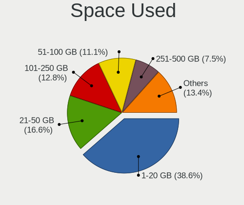
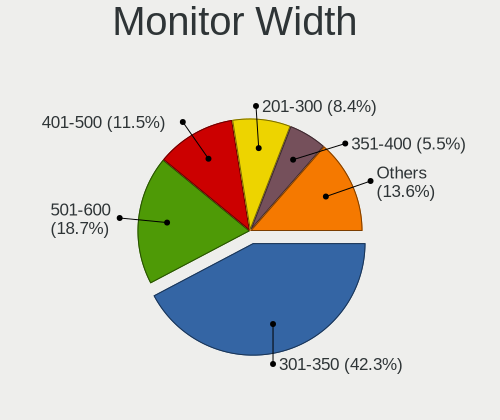
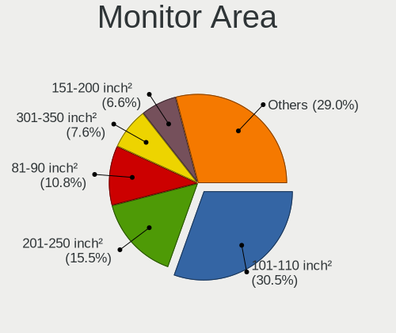
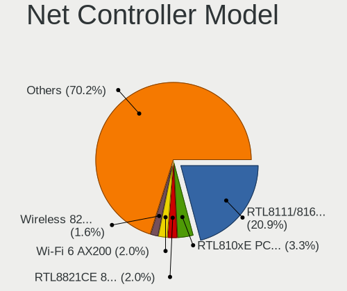
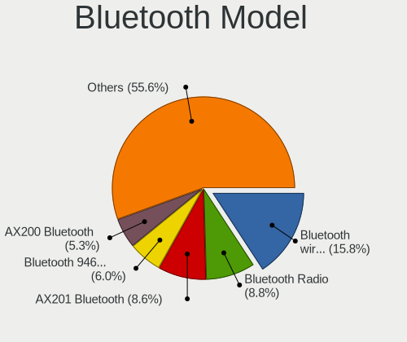
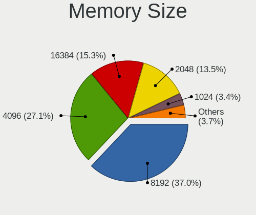

Linux in Italy - Tested Hardware & Statistics
---------------------------------------------

A project to collect tested hardware configurations for Linux in Italy.

Anyone can contribute to this report by the [hw-probe](https://github.com/linuxhw/hw-probe) tool:

    sudo -E hw-probe -all -upload

Please contribute! Especially if your hardware is rare.

This is a report for all computer types. See also reports for [desktops](/Location/Italy/Desktop/README.md) and [notebooks](/Location/Italy/Notebook/README.md).

Contents
--------

* [ Test Cases ](#test-cases)

* [ System ](#system)
  - [ OS                       ](#os)
  - [ OS Family                ](#os-family)
  - [ Kernel                   ](#kernel)
  - [ Kernel Family            ](#kernel-family)
  - [ Kernel Major Ver.        ](#kernel-major-ver)
  - [ Arch                     ](#arch)
  - [ DE                       ](#de)
  - [ Display Server           ](#display-server)
  - [ Display Manager          ](#display-manager)
  - [ OS Lang                  ](#os-lang)
  - [ Boot Mode                ](#boot-mode)
  - [ Filesystem               ](#filesystem)
  - [ Part. scheme             ](#part-scheme)
  - [ Dual Boot with Linux/BSD ](#dual-boot-with-linuxbsd)
  - [ Dual Boot (Win)          ](#dual-boot-win)

* [ Board ](#board)
  - [ Vendor                   ](#vendor)
  - [ Model                    ](#model)
  - [ Model Family             ](#model-family)
  - [ MFG Year                 ](#mfg-year)
  - [ Form Factor              ](#form-factor)
  - [ Secure Boot              ](#secure-boot)
  - [ Coreboot                 ](#coreboot)
  - [ RAM Size                 ](#ram-size)
  - [ RAM Used                 ](#ram-used)
  - [ Total Drives             ](#total-drives)
  - [ Has CD-ROM               ](#has-cd-rom)
  - [ Has Ethernet             ](#has-ethernet)
  - [ Has WiFi                 ](#has-wifi)
  - [ Has Bluetooth            ](#has-bluetooth)

* [ Location ](#location)
  - [ Country                  ](#country)
  - [ City                     ](#city)

* [ Drives ](#drives)
  - [ Drive Vendor             ](#drive-vendor)
  - [ Drive Model              ](#drive-model)
  - [ HDD Vendor               ](#hdd-vendor)
  - [ SSD Vendor               ](#ssd-vendor)
  - [ Drive Kind               ](#drive-kind)
  - [ Drive Connector          ](#drive-connector)
  - [ Drive Size               ](#drive-size)
  - [ Space Total              ](#space-total)
  - [ Space Used               ](#space-used)
  - [ Malfunc. Drives          ](#malfunc-drives)
  - [ Malfunc. Drive Vendor    ](#malfunc-drive-vendor)
  - [ Malfunc. HDD Vendor      ](#malfunc-hdd-vendor)
  - [ Malfunc. Drive Kind      ](#malfunc-drive-kind)
  - [ Failed Drives            ](#failed-drives)
  - [ Failed Drive Vendor      ](#failed-drive-vendor)
  - [ Drive Status             ](#drive-status)

* [ Storage controller ](#storage-controller)
  - [ Storage Vendor           ](#storage-vendor)
  - [ Storage Model            ](#storage-model)
  - [ Storage Kind             ](#storage-kind)

* [ Processor ](#processor)
  - [ CPU Vendor               ](#cpu-vendor)
  - [ CPU Model                ](#cpu-model)
  - [ CPU Model Family         ](#cpu-model-family)
  - [ CPU Cores                ](#cpu-cores)
  - [ CPU Sockets              ](#cpu-sockets)
  - [ CPU Threads              ](#cpu-threads)
  - [ CPU Op-Modes             ](#cpu-op-modes)
  - [ CPU Microcode            ](#cpu-microcode)
  - [ CPU Microarch            ](#cpu-microarch)

* [ Graphics ](#graphics)
  - [ GPU Vendor               ](#gpu-vendor)
  - [ GPU Model                ](#gpu-model)
  - [ GPU Combo                ](#gpu-combo)
  - [ GPU Driver               ](#gpu-driver)
  - [ GPU Memory               ](#gpu-memory)

* [ Monitor ](#monitor)
  - [ Monitor Vendor           ](#monitor-vendor)
  - [ Monitor Model            ](#monitor-model)
  - [ Monitor Resolution       ](#monitor-resolution)
  - [ Monitor Diagonal         ](#monitor-diagonal)
  - [ Monitor Width            ](#monitor-width)
  - [ Aspect Ratio             ](#aspect-ratio)
  - [ Monitor Area             ](#monitor-area)
  - [ Pixel Density            ](#pixel-density)
  - [ Multiple Monitors        ](#multiple-monitors)

* [ Network ](#network)
  - [ Net Controller Vendor    ](#net-controller-vendor)
  - [ Net Controller Model     ](#net-controller-model)
  - [ Wireless Vendor          ](#wireless-vendor)
  - [ Wireless Model           ](#wireless-model)
  - [ Ethernet Vendor          ](#ethernet-vendor)
  - [ Ethernet Model           ](#ethernet-model)
  - [ Net Controller Kind      ](#net-controller-kind)
  - [ Used Controller          ](#used-controller)
  - [ NICs                     ](#nics)
  - [ IPv6                     ](#ipv6)

* [ Bluetooth ](#bluetooth)
  - [ Bluetooth Vendor         ](#bluetooth-vendor)
  - [ Bluetooth Model          ](#bluetooth-model)

* [ Sound ](#sound)
  - [ Sound Vendor             ](#sound-vendor)
  - [ Sound Model              ](#sound-model)

* [ Memory ](#memory)
  - [ Memory Vendor            ](#memory-vendor)
  - [ Memory Model             ](#memory-model)
  - [ Memory Kind              ](#memory-kind)
  - [ Memory Form Factor       ](#memory-form-factor)
  - [ Memory Size              ](#memory-size)
  - [ Memory Speed             ](#memory-speed)

* [ Printers & scanners ](#printers--scanners)
  - [ Printer Vendor           ](#printer-vendor)
  - [ Printer Model            ](#printer-model)
  - [ Scanner Vendor           ](#scanner-vendor)
  - [ Scanner Model            ](#scanner-model)

* [ Camera ](#camera)
  - [ Camera Vendor            ](#camera-vendor)
  - [ Camera Model             ](#camera-model)

* [ Security ](#security)
  - [ Fingerprint Vendor       ](#fingerprint-vendor)
  - [ Fingerprint Model        ](#fingerprint-model)
  - [ Chipcard Vendor          ](#chipcard-vendor)
  - [ Chipcard Model           ](#chipcard-model)

* [ Unsupported ](#unsupported)
  - [ Unsupported Devices      ](#unsupported-devices)
  - [ Unsupported Device Types ](#unsupported-device-types)

Test Cases
----------

Total: 9892

| Vendor        | Model                       | Form-Factor | Probe                                                      | Date         |
|---------------|-----------------------------|-------------|------------------------------------------------------------|--------------|
| ASUSTek       | BT6130                      | Desktop     | [db5b346bd5](https://linux-hardware.org/?probe=db5b346bd5) | Feb 28, 2023 |
| ASUSTek       | Zenbook UX535QE_UM535QE     | Notebook    | [456504fe92](https://linux-hardware.org/?probe=456504fe92) | Feb 28, 2023 |
| Lenovo        | IdeaPad 5 15ARE05 81YQ      | Notebook    | [1165717061](https://linux-hardware.org/?probe=1165717061) | Feb 28, 2023 |
| Fujitsu       | D2990-A3 S26361-D2990-A3    | Desktop     | [6f1de5f17c](https://linux-hardware.org/?probe=6f1de5f17c) | Feb 28, 2023 |
| HP            | ENVY Laptop 17-ch1xxx       | Notebook    | [b518eb9925](https://linux-hardware.org/?probe=b518eb9925) | Feb 28, 2023 |
| HUAWEI        | MRC-WX0                     | Notebook    | [e2776f99bf](https://linux-hardware.org/?probe=e2776f99bf) | Feb 28, 2023 |
| Acer          | Aspire 5750G                | Notebook    | [34b5806bcf](https://linux-hardware.org/?probe=34b5806bcf) | Feb 28, 2023 |
| ASUSTek       | BT6130                      | Desktop     | [3549cfad14](https://linux-hardware.org/?probe=3549cfad14) | Feb 27, 2023 |
| Dell          | Latitude 5530               | Notebook    | [f892221e4c](https://linux-hardware.org/?probe=f892221e4c) | Feb 27, 2023 |
| ASUSTek       | M4N68T-M-V2                 | Desktop     | [051b66987e](https://linux-hardware.org/?probe=051b66987e) | Feb 27, 2023 |
| Acer          | Aspire E1-531               | Notebook    | [a52b94c2d5](https://linux-hardware.org/?probe=a52b94c2d5) | Feb 27, 2023 |
| Cincoze       | DX-1000.01.001              | Desktop     | [64496d4ab7](https://linux-hardware.org/?probe=64496d4ab7) | Feb 27, 2023 |
| Getac         | V200-X                      | Notebook    | [f3a5da3eae](https://linux-hardware.org/?probe=f3a5da3eae) | Feb 27, 2023 |
| Acer          | TravelMate B113             | Notebook    | [31691f9681](https://linux-hardware.org/?probe=31691f9681) | Feb 27, 2023 |
| Razer         | Blade 15 Base Model (Ear... | Notebook    | [425567e8f3](https://linux-hardware.org/?probe=425567e8f3) | Feb 27, 2023 |
| Lenovo        | 36F7 SDK0J40700 WIN 3258... | Desktop     | [580db05e08](https://linux-hardware.org/?probe=580db05e08) | Feb 27, 2023 |
| Olimex        | A20-OLinuXino-LIME          | Soc         | [bcb9e7b9e7](https://linux-hardware.org/?probe=bcb9e7b9e7) | Feb 26, 2023 |
| Cincoze       | DX-1000.01.001              | Desktop     | [7923f1dc21](https://linux-hardware.org/?probe=7923f1dc21) | Feb 26, 2023 |
| Lenovo        | MAHOBAY NO DPK              | Desktop     | [310a65baea](https://linux-hardware.org/?probe=310a65baea) | Feb 26, 2023 |
| HP            | 250 15.6 inch G9 Noteboo... | Notebook    | [2cea6ee649](https://linux-hardware.org/?probe=2cea6ee649) | Feb 26, 2023 |
| ASRock        | G41C-GS                     | Desktop     | [6a698dda57](https://linux-hardware.org/?probe=6a698dda57) | Feb 26, 2023 |
| ASUSTek       | X540NA                      | Notebook    | [8bca0d4eb5](https://linux-hardware.org/?probe=8bca0d4eb5) | Feb 26, 2023 |
| Timi          | TM1612                      | Notebook    | [eb4a3f330e](https://linux-hardware.org/?probe=eb4a3f330e) | Feb 26, 2023 |
| Lenovo        | IdeaPad 3 15ADA05 81W1      | Notebook    | [67b8b5ad09](https://linux-hardware.org/?probe=67b8b5ad09) | Feb 26, 2023 |
| ASUSTek       | PRIME X370-PRO              | Desktop     | [aaa112feae](https://linux-hardware.org/?probe=aaa112feae) | Feb 26, 2023 |
| Lenovo        | Y50-70 20378                | Notebook    | [005749f4ef](https://linux-hardware.org/?probe=005749f4ef) | Feb 26, 2023 |
| ASUSTek       | T100HAN                     | Notebook    | [bde9736ffd](https://linux-hardware.org/?probe=bde9736ffd) | Feb 26, 2023 |
| HP            | 250 15.6 inch G9 Noteboo... | Notebook    | [84750f9d96](https://linux-hardware.org/?probe=84750f9d96) | Feb 25, 2023 |
| Acer          | Aspire A515-51G             | Notebook    | [432235c684](https://linux-hardware.org/?probe=432235c684) | Feb 25, 2023 |
| Acer          | Aspire ES1-521              | Notebook    | [e5f0a23afd](https://linux-hardware.org/?probe=e5f0a23afd) | Feb 25, 2023 |
| Quanta        | XV1                         | All in one  | [fa596130ae](https://linux-hardware.org/?probe=fa596130ae) | Feb 25, 2023 |
| ASUSTek       | X551CA                      | Notebook    | [c8ead0e580](https://linux-hardware.org/?probe=c8ead0e580) | Feb 25, 2023 |
| HP            | 250 G3                      | Notebook    | [6a3d2238ba](https://linux-hardware.org/?probe=6a3d2238ba) | Feb 25, 2023 |
| Gigabyte      | B250M-D3H-CF                | Desktop     | [de180bd339](https://linux-hardware.org/?probe=de180bd339) | Feb 25, 2023 |
| ASUSTek       | T100HAN                     | Notebook    | [fd75fdb59f](https://linux-hardware.org/?probe=fd75fdb59f) | Feb 25, 2023 |
| ASUSTek       | PRIME H610M-R D4            | Desktop     | [3f2e38e322](https://linux-hardware.org/?probe=3f2e38e322) | Feb 25, 2023 |
| Gigabyte      | Z77MX-D3H                   | Desktop     | [bfd1042a82](https://linux-hardware.org/?probe=bfd1042a82) | Feb 25, 2023 |
| ASUSTek       | X556URK                     | Notebook    | [fc80e01794](https://linux-hardware.org/?probe=fc80e01794) | Feb 25, 2023 |
| HP            | EliteBook 820 G3            | Notebook    | [75a0fcca48](https://linux-hardware.org/?probe=75a0fcca48) | Feb 25, 2023 |
| BESSTAR Te... | X400                        | Notebook    | [e1c05e0782](https://linux-hardware.org/?probe=e1c05e0782) | Feb 25, 2023 |
| HP            | ENVY 17                     | Notebook    | [08db7a8be2](https://linux-hardware.org/?probe=08db7a8be2) | Feb 25, 2023 |
| HP            | ENVY 17                     | Notebook    | [0ad15a7e01](https://linux-hardware.org/?probe=0ad15a7e01) | Feb 25, 2023 |
| Unknown       | 1.0                         | Desktop     | [69594c956a](https://linux-hardware.org/?probe=69594c956a) | Feb 25, 2023 |
| ASUSTek       | TUF Gaming X570-PLUS        | Desktop     | [d8b9174fba](https://linux-hardware.org/?probe=d8b9174fba) | Feb 25, 2023 |
| ASUSTek       | ASUS EXPERTBOOK P2451FA_... | Notebook    | [e3578290d2](https://linux-hardware.org/?probe=e3578290d2) | Feb 25, 2023 |
| HONOR         | HYM-WXX                     | Notebook    | [c6f84d1224](https://linux-hardware.org/?probe=c6f84d1224) | Feb 24, 2023 |
| HP            | EliteBook 840 Aero G8 No... | Notebook    | [f24e6a55c4](https://linux-hardware.org/?probe=f24e6a55c4) | Feb 24, 2023 |
| Unknown       | 1.0                         | Desktop     | [bab30a1ac1](https://linux-hardware.org/?probe=bab30a1ac1) | Feb 24, 2023 |
| Dell          | Latitude 5530               | Notebook    | [8ad26dd8a0](https://linux-hardware.org/?probe=8ad26dd8a0) | Feb 24, 2023 |
| Fujitsu       | LIFEBOOK U749               | Notebook    | [ba7cdc6018](https://linux-hardware.org/?probe=ba7cdc6018) | Feb 24, 2023 |
| MSI           | MPG B550 GAMING PLUS        | Desktop     | [ccff1403b0](https://linux-hardware.org/?probe=ccff1403b0) | Feb 24, 2023 |
| ASUSTek       | X555LA                      | Notebook    | [502020fe52](https://linux-hardware.org/?probe=502020fe52) | Feb 24, 2023 |
| ASUSTek       | X551CA                      | Notebook    | [62b46afbb8](https://linux-hardware.org/?probe=62b46afbb8) | Feb 24, 2023 |
| ASUSTek       | X510UQR                     | Notebook    | [075081e4ad](https://linux-hardware.org/?probe=075081e4ad) | Feb 24, 2023 |
| ASRock        | Q1900-ITX                   | Desktop     | [4ed48d952c](https://linux-hardware.org/?probe=4ed48d952c) | Feb 24, 2023 |
| ASRock        | Q1900-ITX                   | Desktop     | [874cbd6e13](https://linux-hardware.org/?probe=874cbd6e13) | Feb 24, 2023 |
| ASUSTek       | M4A77T/USB3                 | Desktop     | [6bf574175a](https://linux-hardware.org/?probe=6bf574175a) | Feb 24, 2023 |
| ASUSTek       | ROG Zephyrus Duo 15 SE G... | Notebook    | [ac2d78d240](https://linux-hardware.org/?probe=ac2d78d240) | Feb 24, 2023 |
| Acer          | Aspire E1-531               | Notebook    | [4526585d29](https://linux-hardware.org/?probe=4526585d29) | Feb 24, 2023 |
| Intel         | NUC10i7FNB K61360-302       | Mini pc     | [fdcb637c97](https://linux-hardware.org/?probe=fdcb637c97) | Feb 24, 2023 |
| ASRock        | H81M-DGS R2.0               | Desktop     | [2645328f34](https://linux-hardware.org/?probe=2645328f34) | Feb 23, 2023 |
| MSI           | X58 Pro                     | Desktop     | [22509b3e42](https://linux-hardware.org/?probe=22509b3e42) | Feb 23, 2023 |
| HP            | Pavilion Laptop 15-cs3xx... | Notebook    | [a8fbcbec0e](https://linux-hardware.org/?probe=a8fbcbec0e) | Feb 23, 2023 |
| HP            | 250 15.6 inch G9 Noteboo... | Notebook    | [cddc383ff9](https://linux-hardware.org/?probe=cddc383ff9) | Feb 23, 2023 |
| ASUSTek       | PRIME B450-PLUS             | Desktop     | [d93c7d5661](https://linux-hardware.org/?probe=d93c7d5661) | Feb 23, 2023 |
| ASUSTek       | PRIME B450-PLUS             | Desktop     | [7cdbd101a4](https://linux-hardware.org/?probe=7cdbd101a4) | Feb 23, 2023 |
| Acer          | Aspire SW3-013              | Notebook    | [771b90caaa](https://linux-hardware.org/?probe=771b90caaa) | Feb 23, 2023 |
| ASUSTek       | M32CD_A_F_K20CD_K31CD       | Desktop     | [576a0fc8f5](https://linux-hardware.org/?probe=576a0fc8f5) | Feb 23, 2023 |
| Dell          | Latitude 5530               | Notebook    | [dbbcb7502c](https://linux-hardware.org/?probe=dbbcb7502c) | Feb 23, 2023 |
| Dell          | Latitude 5530               | Notebook    | [d620cdcce0](https://linux-hardware.org/?probe=d620cdcce0) | Feb 23, 2023 |
| Lenovo        | IdeaPad 330S-15IKB 81F5     | Notebook    | [0f5352f94f](https://linux-hardware.org/?probe=0f5352f94f) | Feb 23, 2023 |
| ASUSTek       | LEONITE                     | Desktop     | [2739b3325c](https://linux-hardware.org/?probe=2739b3325c) | Feb 23, 2023 |
| HP            | Laptop 15s-eq2xxx           | Notebook    | [8a638dd3a7](https://linux-hardware.org/?probe=8a638dd3a7) | Feb 23, 2023 |
| Dell          | Latitude 7300               | Notebook    | [c4bb27e884](https://linux-hardware.org/?probe=c4bb27e884) | Feb 23, 2023 |
| ASUSTek       | P5QL-E                      | Desktop     | [52c9ec67bf](https://linux-hardware.org/?probe=52c9ec67bf) | Feb 23, 2023 |
| Acer          | TravelMate P253             | Notebook    | [b99414b6de](https://linux-hardware.org/?probe=b99414b6de) | Feb 23, 2023 |
| HP            | Pavilion g6                 | Notebook    | [c76844f9a1](https://linux-hardware.org/?probe=c76844f9a1) | Feb 22, 2023 |
| HP            | ProBook 445 G8 Notebook ... | Notebook    | [7d3442e2a7](https://linux-hardware.org/?probe=7d3442e2a7) | Feb 22, 2023 |
| ASUSTek       | X555DG                      | Notebook    | [5e7abe271f](https://linux-hardware.org/?probe=5e7abe271f) | Feb 22, 2023 |
| ASRock        | B660M Pro RS                | Desktop     | [13560ab66d](https://linux-hardware.org/?probe=13560ab66d) | Feb 22, 2023 |
| MSI           | MS-B1831                    | Mini pc     | [10e5b9530c](https://linux-hardware.org/?probe=10e5b9530c) | Feb 22, 2023 |
| Lenovo        | IdeaPad 5 15ABA7 82SG       | Notebook    | [99d4f0df73](https://linux-hardware.org/?probe=99d4f0df73) | Feb 22, 2023 |
| ASUSTek       | X555LA                      | Notebook    | [e62c134a68](https://linux-hardware.org/?probe=e62c134a68) | Feb 22, 2023 |
| Lenovo        | IdeaPad 5 15ABA7 82SG       | Notebook    | [71928c5a75](https://linux-hardware.org/?probe=71928c5a75) | Feb 22, 2023 |
| ASUSTek       | PRIME H610M-R D4            | Desktop     | [2993295e62](https://linux-hardware.org/?probe=2993295e62) | Feb 22, 2023 |
| Lenovo        | IdeaPad 5 15ALC05 82LN      | Notebook    | [57e007d035](https://linux-hardware.org/?probe=57e007d035) | Feb 22, 2023 |
| HP            | ENVY 17                     | Notebook    | [f705060f1e](https://linux-hardware.org/?probe=f705060f1e) | Feb 22, 2023 |
| HP            | ENVY 17                     | Notebook    | [bf86e7904b](https://linux-hardware.org/?probe=bf86e7904b) | Feb 22, 2023 |
| HUAWEI        | BOD-WXX9                    | Notebook    | [05f20bac2d](https://linux-hardware.org/?probe=05f20bac2d) | Feb 21, 2023 |
| ASUSTek       | PRIME H610M-R D4            | Desktop     | [c23f2f53ed](https://linux-hardware.org/?probe=c23f2f53ed) | Feb 21, 2023 |
| HP            | Pavilion dv6                | Notebook    | [526430f218](https://linux-hardware.org/?probe=526430f218) | Feb 21, 2023 |
| Apple         | Mac-942B59F58194171B iMa... | All in one  | [d6ec8781f4](https://linux-hardware.org/?probe=d6ec8781f4) | Feb 21, 2023 |
| Acer          | Aspire SW3-013              | Notebook    | [f0111df214](https://linux-hardware.org/?probe=f0111df214) | Feb 21, 2023 |
| HP            | 85A2                        | All in one  | [c9f6d95fb2](https://linux-hardware.org/?probe=c9f6d95fb2) | Feb 21, 2023 |
| BESSTAR Te... | X400                        | Notebook    | [f7f9004058](https://linux-hardware.org/?probe=f7f9004058) | Feb 21, 2023 |
| Teclast       | F7                          | Notebook    | [3f5fdc3aa9](https://linux-hardware.org/?probe=3f5fdc3aa9) | Feb 21, 2023 |
| Acer          | FIH57                       | Desktop     | [294e04e054](https://linux-hardware.org/?probe=294e04e054) | Feb 21, 2023 |
| VXL           | M6V90AI-VL                  | Desktop     | [935d6b4b24](https://linux-hardware.org/?probe=935d6b4b24) | Feb 21, 2023 |
| Unknown       | Unknown                     | Notebook    | [46d473b3e5](https://linux-hardware.org/?probe=46d473b3e5) | Feb 21, 2023 |
| Lenovo        | ThinkPad S430 336457G       | Notebook    | [3a525ce932](https://linux-hardware.org/?probe=3a525ce932) | Feb 21, 2023 |
| Lenovo        | ThinkPad S430 336457G       | Notebook    | [f845d181ec](https://linux-hardware.org/?probe=f845d181ec) | Feb 20, 2023 |
| ASUSTek       | PRIME Z390-P                | Desktop     | [d81ff5358a](https://linux-hardware.org/?probe=d81ff5358a) | Feb 20, 2023 |
| ASUSTek       | X555LPB                     | Notebook    | [29eb95639c](https://linux-hardware.org/?probe=29eb95639c) | Feb 20, 2023 |
| ASUSTek       | ROG CROSSHAIR VIII DARK ... | Desktop     | [656629ffba](https://linux-hardware.org/?probe=656629ffba) | Feb 20, 2023 |
| ASUSTek       | H170-PRO                    | Desktop     | [011dc701c1](https://linux-hardware.org/?probe=011dc701c1) | Feb 20, 2023 |
| HP            | ENVY x360 Convertible 13... | Convertible | [e434f7f85a](https://linux-hardware.org/?probe=e434f7f85a) | Feb 20, 2023 |
| ASUSTek       | H81M-PLUS                   | Desktop     | [796ba78b54](https://linux-hardware.org/?probe=796ba78b54) | Feb 20, 2023 |
| ASRock        | 960GC-GS FX                 | Desktop     | [39718b8983](https://linux-hardware.org/?probe=39718b8983) | Feb 20, 2023 |
| ASUSTek       | M32CD_A_F_K20CD_K31CD       | Desktop     | [accbe9322f](https://linux-hardware.org/?probe=accbe9322f) | Feb 20, 2023 |
| Packard Be... | IMEDIA S3810                | Desktop     | [472db03bf8](https://linux-hardware.org/?probe=472db03bf8) | Feb 20, 2023 |
| Lenovo        | ThinkPad E590 20NB001AMX    | Notebook    | [ec529ac1bd](https://linux-hardware.org/?probe=ec529ac1bd) | Feb 20, 2023 |
| Gigabyte      | B550 AORUS ELITE V2         | Desktop     | [737c043ed7](https://linux-hardware.org/?probe=737c043ed7) | Feb 20, 2023 |
| Acer          | Aspire V5-573G              | Notebook    | [376b35f5b6](https://linux-hardware.org/?probe=376b35f5b6) | Feb 20, 2023 |
| Microsoft     | Surface Go                  | Tablet      | [6f456ca669](https://linux-hardware.org/?probe=6f456ca669) | Feb 20, 2023 |
| Mediacom      | SmartBook 14 FullHD - SB... | Notebook    | [6f9ef751cd](https://linux-hardware.org/?probe=6f9ef751cd) | Feb 20, 2023 |
| Gigabyte      | B560M DS3H                  | Desktop     | [72891de86c](https://linux-hardware.org/?probe=72891de86c) | Feb 20, 2023 |
| Lenovo        | ThinkPad T470s 20HGS0BY0... | Notebook    | [56c81f1044](https://linux-hardware.org/?probe=56c81f1044) | Feb 20, 2023 |
| HP            | EliteBook 8570w             | Notebook    | [a6fd2ffc5b](https://linux-hardware.org/?probe=a6fd2ffc5b) | Feb 20, 2023 |
| HP            | ProBook 650 G1              | Notebook    | [4e6687829e](https://linux-hardware.org/?probe=4e6687829e) | Feb 19, 2023 |
| ASUSTek       | H81M-PLUS                   | Desktop     | [86f16da5e8](https://linux-hardware.org/?probe=86f16da5e8) | Feb 19, 2023 |
| ASUSTek       | X555LA                      | Notebook    | [51d702d217](https://linux-hardware.org/?probe=51d702d217) | Feb 19, 2023 |
| ASUSTek       | BT6130                      | Desktop     | [470ceee356](https://linux-hardware.org/?probe=470ceee356) | Feb 19, 2023 |
| ASRock        | X570 Phantom Gaming 4       | Desktop     | [2af589c6e9](https://linux-hardware.org/?probe=2af589c6e9) | Feb 19, 2023 |
| Dell          | XPS 15 7590                 | Notebook    | [297b06716d](https://linux-hardware.org/?probe=297b06716d) | Feb 19, 2023 |
| Dell          | Inspiron 7520               | Notebook    | [1489b9779a](https://linux-hardware.org/?probe=1489b9779a) | Feb 19, 2023 |
| Lenovo        | 13w Yoga 82S1               | Convertible | [616e689b13](https://linux-hardware.org/?probe=616e689b13) | Feb 19, 2023 |
| ASUSTek       | S551LN                      | Notebook    | [ff5df2cf03](https://linux-hardware.org/?probe=ff5df2cf03) | Feb 19, 2023 |
| ASUSTek       | S551LN                      | Notebook    | [84e519800c](https://linux-hardware.org/?probe=84e519800c) | Feb 19, 2023 |
| ASUSTek       | X555LA                      | Notebook    | [2ffc7c4a96](https://linux-hardware.org/?probe=2ffc7c4a96) | Feb 19, 2023 |
| Packard Be... | EasyNote TJ65               | Notebook    | [2c98b99901](https://linux-hardware.org/?probe=2c98b99901) | Feb 19, 2023 |
| Lenovo        | ThinkBook 15 G2 ITL 20VE    | Notebook    | [1104c148d1](https://linux-hardware.org/?probe=1104c148d1) | Feb 19, 2023 |
| Pegatron      | 2AB6                        | Desktop     | [537c2d1b64](https://linux-hardware.org/?probe=537c2d1b64) | Feb 18, 2023 |
| Dell          | Latitude 5480               | Notebook    | [e288a18f9d](https://linux-hardware.org/?probe=e288a18f9d) | Feb 18, 2023 |
| Mediacom      | SmartBook 14 FullHD - SB... | Notebook    | [eb9f3822a0](https://linux-hardware.org/?probe=eb9f3822a0) | Feb 18, 2023 |
| HP            | 255 G8 Notebook PC          | Notebook    | [ecf73f400b](https://linux-hardware.org/?probe=ecf73f400b) | Feb 18, 2023 |
| Dell          | 0X9M3X A04                  | Desktop     | [9b13a670c5](https://linux-hardware.org/?probe=9b13a670c5) | Feb 18, 2023 |
| ASUSTek       | PRIME A320M-K               | Desktop     | [105ea39c82](https://linux-hardware.org/?probe=105ea39c82) | Feb 18, 2023 |
| Lenovo        | IdeaPad 5 15ALC05 82LN      | Notebook    | [eb64c99981](https://linux-hardware.org/?probe=eb64c99981) | Feb 18, 2023 |
| MSI           | PRO B660M-A WIFI DDR4       | Desktop     | [a62c4f0fcd](https://linux-hardware.org/?probe=a62c4f0fcd) | Feb 18, 2023 |
| HP            | OMEN by Laptop 15-dh0xxx    | Notebook    | [cadd20aaff](https://linux-hardware.org/?probe=cadd20aaff) | Feb 18, 2023 |
| Samsung       | RF511/RF411/RF711           | Notebook    | [355838f8b2](https://linux-hardware.org/?probe=355838f8b2) | Feb 18, 2023 |
| MSI           | Z170A KRAIT GAMING          | Desktop     | [27dcbbe1d7](https://linux-hardware.org/?probe=27dcbbe1d7) | Feb 18, 2023 |
| MSI           | Summit E13FlipEvo A11MT     | Notebook    | [df01e5357c](https://linux-hardware.org/?probe=df01e5357c) | Feb 18, 2023 |
| HP            | 240 G6 Notebook PC          | Notebook    | [fc39dde214](https://linux-hardware.org/?probe=fc39dde214) | Feb 18, 2023 |
| Acer          | Aspire A515-45              | Notebook    | [01a17523fa](https://linux-hardware.org/?probe=01a17523fa) | Feb 18, 2023 |
| Acer          | Aspire A515-45              | Notebook    | [6b59c75dec](https://linux-hardware.org/?probe=6b59c75dec) | Feb 18, 2023 |
| Jumper        | EZbook                      | Notebook    | [35f7c6a28a](https://linux-hardware.org/?probe=35f7c6a28a) | Feb 18, 2023 |
| ASUSTek       | CM6330_CM6630_CM6730_CM6... | Desktop     | [0428793835](https://linux-hardware.org/?probe=0428793835) | Feb 18, 2023 |
| HP            | ENVY 15                     | Notebook    | [bcdc62a706](https://linux-hardware.org/?probe=bcdc62a706) | Feb 18, 2023 |
| Lenovo        | IdeaPad 3 15IGL05 81WQ      | Notebook    | [7360e6e667](https://linux-hardware.org/?probe=7360e6e667) | Feb 17, 2023 |
| Dell          | Latitude E6440              | Notebook    | [96e9e43a2e](https://linux-hardware.org/?probe=96e9e43a2e) | Feb 17, 2023 |
| Getac         | V200-X                      | Notebook    | [754a4bd022](https://linux-hardware.org/?probe=754a4bd022) | Feb 17, 2023 |
| Getac         | V200-X                      | Notebook    | [6794c7246f](https://linux-hardware.org/?probe=6794c7246f) | Feb 17, 2023 |
| Lenovo        | ThinkBook 15 G3 ACL 21A4    | Notebook    | [e4483255db](https://linux-hardware.org/?probe=e4483255db) | Feb 17, 2023 |
| MSI           | Summit E13FlipEvo A11MT     | Notebook    | [b29933336d](https://linux-hardware.org/?probe=b29933336d) | Feb 17, 2023 |
| MSI           | Summit E13FlipEvo A11MT     | Notebook    | [d97ee3d7d1](https://linux-hardware.org/?probe=d97ee3d7d1) | Feb 17, 2023 |
| Acer          | Aspire E5-571G              | Notebook    | [7a47fab9f3](https://linux-hardware.org/?probe=7a47fab9f3) | Feb 17, 2023 |
| ASUSTek       | VivoBook 14_ASUS Laptop ... | Notebook    | [e84edd71e7](https://linux-hardware.org/?probe=e84edd71e7) | Feb 17, 2023 |
| ASUSTek       | Rampage Formula             | Desktop     | [61fd1aefee](https://linux-hardware.org/?probe=61fd1aefee) | Feb 17, 2023 |
| ASUSTek       | P8Z77-V                     | Desktop     | [f8dca6a264](https://linux-hardware.org/?probe=f8dca6a264) | Feb 17, 2023 |
| HP            | Pavilion 15                 | Notebook    | [a48098f6fc](https://linux-hardware.org/?probe=a48098f6fc) | Feb 17, 2023 |
| HP            | EliteBook 840 G3            | Notebook    | [f8b182d99b](https://linux-hardware.org/?probe=f8b182d99b) | Feb 17, 2023 |
| HP            | 2820h                       | Desktop     | [552bdc9930](https://linux-hardware.org/?probe=552bdc9930) | Feb 17, 2023 |
| Lenovo        | ThinkBook 15 G2 ARE 20VG    | Notebook    | [85fd62f731](https://linux-hardware.org/?probe=85fd62f731) | Feb 17, 2023 |
| Jumper        | EZbook                      | Notebook    | [82ba62c4b0](https://linux-hardware.org/?probe=82ba62c4b0) | Feb 16, 2023 |
| Lenovo        | IdeaPad 5 15ABA7 82SG       | Notebook    | [7d6dcd9cd1](https://linux-hardware.org/?probe=7d6dcd9cd1) | Feb 16, 2023 |
| BESSTAR Te... | VB9                         | All in one  | [deb1c6d3c8](https://linux-hardware.org/?probe=deb1c6d3c8) | Feb 16, 2023 |
| Lenovo        | ThinkPad T430 2349IF8       | Notebook    | [4b6268364f](https://linux-hardware.org/?probe=4b6268364f) | Feb 16, 2023 |
| HP            | 1495                        | Desktop     | [6bc4b54027](https://linux-hardware.org/?probe=6bc4b54027) | Feb 16, 2023 |
| MSI           | Z97-G45 GAMING              | Desktop     | [c6a7d3a755](https://linux-hardware.org/?probe=c6a7d3a755) | Feb 16, 2023 |
| Lenovo        | 13w Yoga 82S1               | Convertible | [5f59be48e1](https://linux-hardware.org/?probe=5f59be48e1) | Feb 16, 2023 |
| Quanta        | XV1                         | All in one  | [6c4ea36dc2](https://linux-hardware.org/?probe=6c4ea36dc2) | Feb 16, 2023 |
| Lenovo        | 13w Yoga 82S1               | Convertible | [68effccd60](https://linux-hardware.org/?probe=68effccd60) | Feb 16, 2023 |
| Jumper        | EZbook                      | Notebook    | [1009011b57](https://linux-hardware.org/?probe=1009011b57) | Feb 16, 2023 |
| ASRock        | Q1900M                      | Desktop     | [2fc7d5968a](https://linux-hardware.org/?probe=2fc7d5968a) | Feb 16, 2023 |
| ASUSTek       | P5K                         | Desktop     | [7767ce777f](https://linux-hardware.org/?probe=7767ce777f) | Feb 16, 2023 |
| Acer          | Swift SF314-59              | Notebook    | [fcf01071e5](https://linux-hardware.org/?probe=fcf01071e5) | Feb 15, 2023 |
| Gigabyte      | H270M-D3H-CF                | Desktop     | [7a58ceb644](https://linux-hardware.org/?probe=7a58ceb644) | Feb 15, 2023 |
| ASUSTek       | BT6130                      | Desktop     | [b0693958a6](https://linux-hardware.org/?probe=b0693958a6) | Feb 15, 2023 |
| HP            | Notebook                    | Notebook    | [21442c303e](https://linux-hardware.org/?probe=21442c303e) | Feb 15, 2023 |
| Lenovo        | ThinkPad SL 2746AHG         | Notebook    | [c141867fa3](https://linux-hardware.org/?probe=c141867fa3) | Feb 15, 2023 |
| Google        | Grunt                       | Notebook    | [89c633c2c1](https://linux-hardware.org/?probe=89c633c2c1) | Feb 15, 2023 |
| ASUSTek       | X553MA                      | Notebook    | [56ee76d678](https://linux-hardware.org/?probe=56ee76d678) | Feb 15, 2023 |
| ASUSTek       | X553MA                      | Notebook    | [1f8387dde4](https://linux-hardware.org/?probe=1f8387dde4) | Feb 15, 2023 |
| Acer          | Veriton X2610G              | Desktop     | [22c65bbb88](https://linux-hardware.org/?probe=22c65bbb88) | Feb 15, 2023 |
| ASUSTek       | F6A                         | Notebook    | [3660446fe5](https://linux-hardware.org/?probe=3660446fe5) | Feb 15, 2023 |
| Supermicro    | X10DRG-Q                    | Desktop     | [5af331bc84](https://linux-hardware.org/?probe=5af331bc84) | Feb 15, 2023 |
| Lenovo        | IdeaPad 3 15IGL05 81WQ      | Notebook    | [28ac8fee12](https://linux-hardware.org/?probe=28ac8fee12) | Feb 14, 2023 |
| HP            | 3396                        | Desktop     | [fbff77d7cc](https://linux-hardware.org/?probe=fbff77d7cc) | Feb 14, 2023 |
| Samsung       | 300E4C/300E5C/300E7C        | Notebook    | [dddbb2d135](https://linux-hardware.org/?probe=dddbb2d135) | Feb 14, 2023 |
| ASUSTek       | VivoBook_ASUSLaptop TP42... | Convertible | [4b0331863e](https://linux-hardware.org/?probe=4b0331863e) | Feb 14, 2023 |
| Fujitsu       | D3430-U1 S26361-D3430-U1    | Desktop     | [49f47896e6](https://linux-hardware.org/?probe=49f47896e6) | Feb 14, 2023 |
| Acer          | Aspire 7250G                | Notebook    | [5f5cec8261](https://linux-hardware.org/?probe=5f5cec8261) | Feb 14, 2023 |
| Lenovo        | IdeaPad Gaming 3 15ARH05... | Notebook    | [a3eb6fde29](https://linux-hardware.org/?probe=a3eb6fde29) | Feb 14, 2023 |
| HP            | 18E7                        | Desktop     | [b81cc64550](https://linux-hardware.org/?probe=b81cc64550) | Feb 14, 2023 |
| HP            | ENVY 17                     | Notebook    | [d07a7a99de](https://linux-hardware.org/?probe=d07a7a99de) | Feb 14, 2023 |
| Dell          | XPS 9320                    | Notebook    | [10eb3017b5](https://linux-hardware.org/?probe=10eb3017b5) | Feb 13, 2023 |
| Lenovo        | 36F7 SDK0J40700 WIN 3258... | Desktop     | [34ad4bac16](https://linux-hardware.org/?probe=34ad4bac16) | Feb 13, 2023 |
| HP            | Laptop 15s-fq4xxx           | Notebook    | [9d1c8bca14](https://linux-hardware.org/?probe=9d1c8bca14) | Feb 13, 2023 |
| Acer          | Swift SF114-33              | Notebook    | [14cd72be0e](https://linux-hardware.org/?probe=14cd72be0e) | Feb 13, 2023 |
| MSI           | Prestige 14Evo A11M         | Notebook    | [abeebd4312](https://linux-hardware.org/?probe=abeebd4312) | Feb 13, 2023 |
| ASUSTek       | BT6130                      | Desktop     | [db3b191eb2](https://linux-hardware.org/?probe=db3b191eb2) | Feb 13, 2023 |
| Unknown       | Unknown                     | Notebook    | [23a611650b](https://linux-hardware.org/?probe=23a611650b) | Feb 13, 2023 |
| ASUSTek       | M5A78L-M LX3                | Desktop     | [c7374801ac](https://linux-hardware.org/?probe=c7374801ac) | Feb 13, 2023 |
| MSI           | GF63 Thin 11UC              | Notebook    | [6eb24e6e38](https://linux-hardware.org/?probe=6eb24e6e38) | Feb 13, 2023 |
| ASUSTek       | H81M-K                      | Desktop     | [6fe888ea28](https://linux-hardware.org/?probe=6fe888ea28) | Feb 13, 2023 |
| Lenovo        | IdeaPad S340-15API 81NC     | Notebook    | [23eec2d2bc](https://linux-hardware.org/?probe=23eec2d2bc) | Feb 13, 2023 |
| HP            | ProBook 455 G8 Notebook ... | Notebook    | [3cccebc1ef](https://linux-hardware.org/?probe=3cccebc1ef) | Feb 12, 2023 |
| HP            | ENVY 15                     | Notebook    | [efc0c8427a](https://linux-hardware.org/?probe=efc0c8427a) | Feb 12, 2023 |
| ASRock        | Z370M Pro4                  | Desktop     | [6dfaa1ed56](https://linux-hardware.org/?probe=6dfaa1ed56) | Feb 12, 2023 |
| ASUSTek       | F2A55-M LK2                 | Desktop     | [01ab687841](https://linux-hardware.org/?probe=01ab687841) | Feb 12, 2023 |
| Lenovo        | ThinkPad L460 20FVS25H01    | Notebook    | [37383d8798](https://linux-hardware.org/?probe=37383d8798) | Feb 12, 2023 |
| MSI           | GF63 Thin 11UC              | Notebook    | [f12982699d](https://linux-hardware.org/?probe=f12982699d) | Feb 12, 2023 |
| HP            | 255 G8 Notebook PC          | Notebook    | [3542104e07](https://linux-hardware.org/?probe=3542104e07) | Feb 12, 2023 |
| HUAWEI        | BOM-WXX9                    | Notebook    | [c798855263](https://linux-hardware.org/?probe=c798855263) | Feb 12, 2023 |
| HP            | Compaq 6720s                | Notebook    | [4b8e0e10e0](https://linux-hardware.org/?probe=4b8e0e10e0) | Feb 12, 2023 |
| HP            | Compaq 6720s                | Notebook    | [a23186bb63](https://linux-hardware.org/?probe=a23186bb63) | Feb 11, 2023 |
| Lenovo        | ThinkPad T440p 20AWS0XX0... | Notebook    | [404cac8b60](https://linux-hardware.org/?probe=404cac8b60) | Feb 11, 2023 |
| Dell          | Vostro 15 3510              | Notebook    | [8291db193a](https://linux-hardware.org/?probe=8291db193a) | Feb 11, 2023 |
| Gigabyte      | Z370 HD3P-CF                | Desktop     | [86ca7a4821](https://linux-hardware.org/?probe=86ca7a4821) | Feb 11, 2023 |
| HP            | 3031h                       | Desktop     | [f9a0848388](https://linux-hardware.org/?probe=f9a0848388) | Feb 11, 2023 |
| Intel         | NUC12WSBi5 M46425-303       | Mini pc     | [dec32b9b60](https://linux-hardware.org/?probe=dec32b9b60) | Feb 11, 2023 |
| HP            | Notebook                    | Notebook    | [94c42af775](https://linux-hardware.org/?probe=94c42af775) | Feb 11, 2023 |
| HP            | ZBook 17 G3                 | Notebook    | [f0dff8ed53](https://linux-hardware.org/?probe=f0dff8ed53) | Feb 11, 2023 |
| Gigabyte      | X570 AORUS ELITE            | Desktop     | [2d776f8810](https://linux-hardware.org/?probe=2d776f8810) | Feb 11, 2023 |
| HP            | Notebook                    | Notebook    | [e19e0407ec](https://linux-hardware.org/?probe=e19e0407ec) | Feb 11, 2023 |
| Lenovo        | SHARKBAY 0B98401 WIN        | Desktop     | [7b6a31ec69](https://linux-hardware.org/?probe=7b6a31ec69) | Feb 11, 2023 |
| ASUSTek       | P5K                         | Desktop     | [9f8790812d](https://linux-hardware.org/?probe=9f8790812d) | Feb 11, 2023 |
| Dell          | XPS 15 9500                 | Notebook    | [11222774d3](https://linux-hardware.org/?probe=11222774d3) | Feb 10, 2023 |
| Lenovo        | 3098 SDK0J40705 WIN         | Desktop     | [6ada8eb627](https://linux-hardware.org/?probe=6ada8eb627) | Feb 10, 2023 |
| MSI           | Prestige 15 A11SCX          | Notebook    | [a82372e461](https://linux-hardware.org/?probe=a82372e461) | Feb 10, 2023 |
| HP            | Notebook                    | Notebook    | [4daf49165c](https://linux-hardware.org/?probe=4daf49165c) | Feb 10, 2023 |
| ASRock        | Z170 Extreme6+              | Desktop     | [9b9b84473b](https://linux-hardware.org/?probe=9b9b84473b) | Feb 10, 2023 |
| Intel         | NUC6CAYB J23203-409         | Mini pc     | [21a8928972](https://linux-hardware.org/?probe=21a8928972) | Feb 10, 2023 |
| HP            | ZBook 17 G3                 | Notebook    | [bd09c6036f](https://linux-hardware.org/?probe=bd09c6036f) | Feb 10, 2023 |
| Intel         | JSL MRD                     | Desktop     | [5a876c1bb0](https://linux-hardware.org/?probe=5a876c1bb0) | Feb 10, 2023 |
| Lenovo        | IdeaPad L340-15IRH Gamin... | Notebook    | [fd8d478a5b](https://linux-hardware.org/?probe=fd8d478a5b) | Feb 10, 2023 |
| ASUSTek       | M4N78                       | Desktop     | [34ddf02a41](https://linux-hardware.org/?probe=34ddf02a41) | Feb 10, 2023 |
| Lenovo        | Yoga Slim 7 13ITL5 82CU     | Notebook    | [7f4c6d1757](https://linux-hardware.org/?probe=7f4c6d1757) | Feb 10, 2023 |
| Lenovo        | IdeaPad 320-15ABR 80XS      | Notebook    | [9de542dff7](https://linux-hardware.org/?probe=9de542dff7) | Feb 09, 2023 |
| HP            | 255 G4                      | Notebook    | [00870a3da9](https://linux-hardware.org/?probe=00870a3da9) | Feb 09, 2023 |
| HP            | 843C                        | Desktop     | [02ddbb64e8](https://linux-hardware.org/?probe=02ddbb64e8) | Feb 09, 2023 |
| MSI           | 2A9C                        | Desktop     | [1332640fbd](https://linux-hardware.org/?probe=1332640fbd) | Feb 09, 2023 |
| Lenovo        | IdeaPad 320-15AST 80XV      | Notebook    | [08f3d3b7d8](https://linux-hardware.org/?probe=08f3d3b7d8) | Feb 09, 2023 |
| Lenovo        | IdeaPad 320-15AST 80XV      | Notebook    | [0cb6963914](https://linux-hardware.org/?probe=0cb6963914) | Feb 09, 2023 |
| Dell          | 0P4T42 A01                  | All in one  | [d32909e1a4](https://linux-hardware.org/?probe=d32909e1a4) | Feb 09, 2023 |
| Acer          | Extensa 5635ZG              | Notebook    | [dd22b216a9](https://linux-hardware.org/?probe=dd22b216a9) | Feb 08, 2023 |
| Lenovo        | IdeaPad 3 15ADA05 81W1      | Notebook    | [96d63ff41b](https://linux-hardware.org/?probe=96d63ff41b) | Feb 08, 2023 |
| Gigabyte      | GA-MA78GM-S2H               | Desktop     | [bbaa8165e4](https://linux-hardware.org/?probe=bbaa8165e4) | Feb 08, 2023 |
| Acer          | Aspire A515-52G             | Notebook    | [e521c55b1a](https://linux-hardware.org/?probe=e521c55b1a) | Feb 08, 2023 |
| Lenovo        | IdeaPad 3 15ITL6 82H8       | Notebook    | [5ce86509b6](https://linux-hardware.org/?probe=5ce86509b6) | Feb 08, 2023 |
| ASUSTek       | ROG CROSSHAIR VIII DARK ... | Desktop     | [69c30e6f7b](https://linux-hardware.org/?probe=69c30e6f7b) | Feb 08, 2023 |
| Dell          | XPS 17 9720                 | Notebook    | [3d1b70c4af](https://linux-hardware.org/?probe=3d1b70c4af) | Feb 08, 2023 |
| Google        | Grunt                       | Notebook    | [84ecb8aaf1](https://linux-hardware.org/?probe=84ecb8aaf1) | Feb 08, 2023 |
| Lenovo        | IdeaPad L340-15IRH Gamin... | Notebook    | [3089398556](https://linux-hardware.org/?probe=3089398556) | Feb 08, 2023 |
| Lenovo        | IdeaPad L340-15IRH Gamin... | Notebook    | [07d8f7c1da](https://linux-hardware.org/?probe=07d8f7c1da) | Feb 08, 2023 |
| Dell          | 0Y5FXV A00                  | Desktop     | [692b7eab6b](https://linux-hardware.org/?probe=692b7eab6b) | Feb 08, 2023 |
| ASUSTek       | SABERTOOTH P67              | Desktop     | [1fdf18a3ed](https://linux-hardware.org/?probe=1fdf18a3ed) | Feb 08, 2023 |
| HP            | ENVY 15                     | Notebook    | [641ce1347d](https://linux-hardware.org/?probe=641ce1347d) | Feb 08, 2023 |
| ASRock        | H310M-STX                   | Desktop     | [faadf8b29c](https://linux-hardware.org/?probe=faadf8b29c) | Feb 08, 2023 |
| Acer          | Aspire E5-553               | Notebook    | [5e951ad06d](https://linux-hardware.org/?probe=5e951ad06d) | Feb 07, 2023 |
| ASUSTek       | TUF Gaming FX505DU_FX505... | Notebook    | [0713732442](https://linux-hardware.org/?probe=0713732442) | Feb 07, 2023 |
| MSI           | Z390-A PRO                  | Desktop     | [de25a58c23](https://linux-hardware.org/?probe=de25a58c23) | Feb 07, 2023 |
| Google        | Grunt                       | Notebook    | [1bbc4ae776](https://linux-hardware.org/?probe=1bbc4ae776) | Feb 07, 2023 |
| Lenovo        | ThinkPad T430 2347G7G       | Notebook    | [925017105d](https://linux-hardware.org/?probe=925017105d) | Feb 07, 2023 |
| HUAWEI        | MACH-WX9                    | Notebook    | [263101d492](https://linux-hardware.org/?probe=263101d492) | Feb 07, 2023 |
| HP            | ENVY Laptop 17-cr0xxx       | Notebook    | [b7ab00ddb1](https://linux-hardware.org/?probe=b7ab00ddb1) | Feb 07, 2023 |
| MSI           | B550-A PRO                  | Desktop     | [cc856dafad](https://linux-hardware.org/?probe=cc856dafad) | Feb 07, 2023 |
| ASUSTek       | Rampage IV EXTREME          | Desktop     | [9a94af0f8a](https://linux-hardware.org/?probe=9a94af0f8a) | Feb 07, 2023 |
| MSI           | U90/U100                    | Notebook    | [f7dc915782](https://linux-hardware.org/?probe=f7dc915782) | Feb 06, 2023 |
| Lenovo        | IdeaPad 5 Pro 16ARH7 82S... | Notebook    | [50af8c9fe6](https://linux-hardware.org/?probe=50af8c9fe6) | Feb 06, 2023 |
| ASUSTek       | X550JF                      | Notebook    | [c8f1b71cfd](https://linux-hardware.org/?probe=c8f1b71cfd) | Feb 06, 2023 |
| ASUSTek       | TUF Gaming Z790-PLUS WIF... | Desktop     | [43c3e4d160](https://linux-hardware.org/?probe=43c3e4d160) | Feb 06, 2023 |
| Lenovo        | IdeaPad Gaming 3 15ACH6 ... | Notebook    | [0edeee4ba6](https://linux-hardware.org/?probe=0edeee4ba6) | Feb 06, 2023 |
| Lenovo        | IdeaPad 3 15ALC6 82KU       | Notebook    | [66201d26d7](https://linux-hardware.org/?probe=66201d26d7) | Feb 06, 2023 |
| Acer          | Extensa 5635                | Notebook    | [8f8f4d24f9](https://linux-hardware.org/?probe=8f8f4d24f9) | Feb 06, 2023 |
| Lenovo        | IdeaPad Z500 20202          | Notebook    | [762c097b3e](https://linux-hardware.org/?probe=762c097b3e) | Feb 06, 2023 |
| Intel         | Unknown                     | Notebook    | [a1044e362f](https://linux-hardware.org/?probe=a1044e362f) | Feb 06, 2023 |
| Lenovo        | Flex 2-14D 20376            | Notebook    | [16f0d33c85](https://linux-hardware.org/?probe=16f0d33c85) | Feb 06, 2023 |
| Lenovo        | ThinkPad T470 20HES3X300    | Notebook    | [6a77ec4c4f](https://linux-hardware.org/?probe=6a77ec4c4f) | Feb 06, 2023 |
| Valve         | Jupiter                     | Notebook    | [8a1998f130](https://linux-hardware.org/?probe=8a1998f130) | Feb 05, 2023 |
| Fujitsu       | D3221-A1 S26361-D3221-A1    | Desktop     | [00006691a6](https://linux-hardware.org/?probe=00006691a6) | Feb 05, 2023 |
| Dell          | Latitude 7380               | Notebook    | [7b9d4ef8b4](https://linux-hardware.org/?probe=7b9d4ef8b4) | Feb 05, 2023 |
| ASUSTek       | N55SF                       | Notebook    | [5b81cbed5f](https://linux-hardware.org/?probe=5b81cbed5f) | Feb 05, 2023 |
| Acer          | One S1002                   | Notebook    | [2d98ceddca](https://linux-hardware.org/?probe=2d98ceddca) | Feb 05, 2023 |
| Lenovo        | IdeaPad 320-15AST 80XV      | Notebook    | [30676c5e14](https://linux-hardware.org/?probe=30676c5e14) | Feb 05, 2023 |
| Lenovo        | IdeaPad 320-15AST 80XV      | Notebook    | [08bf9ddbcf](https://linux-hardware.org/?probe=08bf9ddbcf) | Feb 05, 2023 |
| Acer          | WG43M                       | Desktop     | [e463181f54](https://linux-hardware.org/?probe=e463181f54) | Feb 05, 2023 |
| MSI           | MS-7309                     | Desktop     | [46995d58eb](https://linux-hardware.org/?probe=46995d58eb) | Feb 05, 2023 |
| ASUSTek       | K52Jc                       | Notebook    | [464b35f82b](https://linux-hardware.org/?probe=464b35f82b) | Feb 05, 2023 |
| Lenovo        | ThinkPad E14 Gen 4 21EBC... | Notebook    | [2ac999e9b0](https://linux-hardware.org/?probe=2ac999e9b0) | Feb 05, 2023 |
| Intel         | DH55TC AAE70932-301         | Desktop     | [350458a94e](https://linux-hardware.org/?probe=350458a94e) | Feb 05, 2023 |
| HP            | 3397                        | Desktop     | [ea72001991](https://linux-hardware.org/?probe=ea72001991) | Feb 05, 2023 |
| ASRock        | 775Dual-VSTA                | Desktop     | [945a366595](https://linux-hardware.org/?probe=945a366595) | Feb 05, 2023 |
| HP            | 255 G3                      | Notebook    | [dfa2e96880](https://linux-hardware.org/?probe=dfa2e96880) | Feb 05, 2023 |
| Acer          | Aspire E5-573G              | Notebook    | [b7760210a8](https://linux-hardware.org/?probe=b7760210a8) | Feb 05, 2023 |
| Notebook      | W25CSW                      | Notebook    | [b63184cd07](https://linux-hardware.org/?probe=b63184cd07) | Feb 05, 2023 |
| Notebook      | W65_67SJ                    | Notebook    | [870af12011](https://linux-hardware.org/?probe=870af12011) | Feb 05, 2023 |
| Lenovo        | G50-45 80E3                 | Notebook    | [229050fbe5](https://linux-hardware.org/?probe=229050fbe5) | Feb 05, 2023 |
| Acer          | TravelMate P253             | Notebook    | [b2cad8970a](https://linux-hardware.org/?probe=b2cad8970a) | Feb 04, 2023 |
| ASRock        | X570 Phantom Gaming 4       | Desktop     | [944149e350](https://linux-hardware.org/?probe=944149e350) | Feb 04, 2023 |
| Lenovo        | G50-45 80E3                 | Notebook    | [885ad2ae95](https://linux-hardware.org/?probe=885ad2ae95) | Feb 04, 2023 |
| SiComputer    | Nauta 01C                   | Notebook    | [1579a837f7](https://linux-hardware.org/?probe=1579a837f7) | Feb 04, 2023 |
| MSI           | B550-A PRO                  | Desktop     | [55e2abbd96](https://linux-hardware.org/?probe=55e2abbd96) | Feb 04, 2023 |
| Microtech     | CoreBook                    | Notebook    | [2ee0649a6e](https://linux-hardware.org/?probe=2ee0649a6e) | Feb 03, 2023 |
| ASUSTek       | P8H61-M LE/USB3             | Desktop     | [91a070c2aa](https://linux-hardware.org/?probe=91a070c2aa) | Feb 03, 2023 |
| Microsoft     | Surface Pro                 | Tablet      | [7581d83856](https://linux-hardware.org/?probe=7581d83856) | Feb 03, 2023 |
| Intel         | H61                         | Desktop     | [21fd40e0a1](https://linux-hardware.org/?probe=21fd40e0a1) | Feb 03, 2023 |
| MSI           | B550-A PRO                  | Desktop     | [dc4a285d49](https://linux-hardware.org/?probe=dc4a285d49) | Feb 03, 2023 |
| Toshiba       | Satellite Pro S500          | Notebook    | [9274080d89](https://linux-hardware.org/?probe=9274080d89) | Feb 03, 2023 |
| ASUSTek       | P5GDC                       | Desktop     | [6dbac14e8b](https://linux-hardware.org/?probe=6dbac14e8b) | Feb 03, 2023 |
| HP            | ProBook 440 G7              | Notebook    | [f9a4f80656](https://linux-hardware.org/?probe=f9a4f80656) | Feb 03, 2023 |
| Quanta        | XV1                         | All in one  | [8904f5e7fa](https://linux-hardware.org/?probe=8904f5e7fa) | Feb 03, 2023 |
| Lenovo        | Gardenia CRB SDK0J40700 ... | All in one  | [0759c30dd9](https://linux-hardware.org/?probe=0759c30dd9) | Feb 03, 2023 |
| ASUSTek       | PRIME B550-PLUS             | Desktop     | [fd8c9d9ccf](https://linux-hardware.org/?probe=fd8c9d9ccf) | Feb 03, 2023 |
| HP            | 834F                        | Desktop     | [394eb5f9cc](https://linux-hardware.org/?probe=394eb5f9cc) | Feb 02, 2023 |
| HP            | 834F                        | Desktop     | [9a4a1839d3](https://linux-hardware.org/?probe=9a4a1839d3) | Feb 02, 2023 |
| HP            | Spectre x360 Convertible... | Convertible | [8c8021c54c](https://linux-hardware.org/?probe=8c8021c54c) | Feb 02, 2023 |
| Intel         | Unknown                     | Notebook    | [ba5bda9424](https://linux-hardware.org/?probe=ba5bda9424) | Feb 02, 2023 |
| Acer          | Aspire F5-573G              | Notebook    | [ba43497e32](https://linux-hardware.org/?probe=ba43497e32) | Feb 02, 2023 |
| ASUSTek       | Pro WS X570-ACE             | Desktop     | [1ca0a608f9](https://linux-hardware.org/?probe=1ca0a608f9) | Feb 02, 2023 |
| HP            | 250 G6 Notebook PC          | Notebook    | [a0b5d1c73c](https://linux-hardware.org/?probe=a0b5d1c73c) | Feb 02, 2023 |
| Acer          | Veriton M2631 V:1.0         | Desktop     | [28e1975b51](https://linux-hardware.org/?probe=28e1975b51) | Feb 02, 2023 |
| Fujitsu       | D3230-A1 S26361-D3230-A1    | Desktop     | [09430385c6](https://linux-hardware.org/?probe=09430385c6) | Feb 02, 2023 |
| Raspberry ... | Raspberry Pi 4 Model B R... | Soc         | [0a3273841f](https://linux-hardware.org/?probe=0a3273841f) | Feb 02, 2023 |
| ASUSTek       | K54L                        | Notebook    | [8568b17267](https://linux-hardware.org/?probe=8568b17267) | Feb 02, 2023 |
| Dell          | XPS 13 7390                 | Notebook    | [f86eaa6db8](https://linux-hardware.org/?probe=f86eaa6db8) | Feb 02, 2023 |
| Timi          | Mi Laptop Pro 15            | Notebook    | [9deaff7467](https://linux-hardware.org/?probe=9deaff7467) | Feb 02, 2023 |
| Toshiba       | Satellite Pro S500          | Notebook    | [19a2c05804](https://linux-hardware.org/?probe=19a2c05804) | Feb 02, 2023 |
| Apple         | Mac-F2238BAE iMac11,3       | All in one  | [4b6904f9b1](https://linux-hardware.org/?probe=4b6904f9b1) | Feb 01, 2023 |
| HP            | Pavilion 15                 | Notebook    | [946fec8f7d](https://linux-hardware.org/?probe=946fec8f7d) | Feb 01, 2023 |
| Fujitsu       | D3400-A1 S26361-D3400-A1    | Desktop     | [b792043acd](https://linux-hardware.org/?probe=b792043acd) | Feb 01, 2023 |
| Acer          | Aspire 5750G                | Notebook    | [a8a3f37ad8](https://linux-hardware.org/?probe=a8a3f37ad8) | Feb 01, 2023 |
| ASUSTek       | TUF Gaming X570-PRO WIFI... | Desktop     | [48bccd4f38](https://linux-hardware.org/?probe=48bccd4f38) | Feb 01, 2023 |
| Pegatron      | 2A94                        | Desktop     | [58961a542f](https://linux-hardware.org/?probe=58961a542f) | Feb 01, 2023 |
| HP            | Laptop 15s-fq5xxx           | Notebook    | [bd22f26ad1](https://linux-hardware.org/?probe=bd22f26ad1) | Jan 31, 2023 |
| HP            | Laptop 15s-fq5xxx           | Notebook    | [28ea3cafe8](https://linux-hardware.org/?probe=28ea3cafe8) | Jan 31, 2023 |
| Lenovo        | Yoga 520-14IKB 80X8         | Convertible | [92f6e450b8](https://linux-hardware.org/?probe=92f6e450b8) | Jan 31, 2023 |
| HP            | ENVY 15                     | Notebook    | [c688eb85bb](https://linux-hardware.org/?probe=c688eb85bb) | Jan 31, 2023 |
| HP            | Notebook                    | Notebook    | [f352309997](https://linux-hardware.org/?probe=f352309997) | Jan 31, 2023 |
| ASUSTek       | M5A97 EVO R2.0              | Desktop     | [f4e30fc177](https://linux-hardware.org/?probe=f4e30fc177) | Jan 31, 2023 |
| ASUSTek       | P5QL PRO                    | Desktop     | [77cc2bd640](https://linux-hardware.org/?probe=77cc2bd640) | Jan 31, 2023 |
| ASUSTek       | VivoBook_ASUSLaptop X530... | Notebook    | [78bd5ea99c](https://linux-hardware.org/?probe=78bd5ea99c) | Jan 31, 2023 |
| Raspberry ... | Raspberry Pi 4 Model B R... | Soc         | [656bb989e7](https://linux-hardware.org/?probe=656bb989e7) | Jan 31, 2023 |
| Acer          | Swift SF114-32              | Notebook    | [8e8ae85d60](https://linux-hardware.org/?probe=8e8ae85d60) | Jan 31, 2023 |
| Dell          | XPS 15 9570                 | Notebook    | [ee60c1c921](https://linux-hardware.org/?probe=ee60c1c921) | Jan 31, 2023 |
| Lenovo        | ThinkPad X270 W10DG 20K5... | Notebook    | [5e5231a159](https://linux-hardware.org/?probe=5e5231a159) | Jan 31, 2023 |
| Acer          | Aspire ES1-512              | Notebook    | [0d254e85dd](https://linux-hardware.org/?probe=0d254e85dd) | Jan 30, 2023 |
| ASUSTek       | ROG STRIX X370-F GAMING     | Desktop     | [3c8b3f4e7d](https://linux-hardware.org/?probe=3c8b3f4e7d) | Jan 30, 2023 |
| Acer          | Aspire E1-522               | Notebook    | [88de348bef](https://linux-hardware.org/?probe=88de348bef) | Jan 30, 2023 |
| Fujitsu       | D3230-A1 S26361-D3230-A1    | Desktop     | [3bdb934f29](https://linux-hardware.org/?probe=3bdb934f29) | Jan 30, 2023 |
| Dell          | Precision 3560              | Notebook    | [3d5432deef](https://linux-hardware.org/?probe=3d5432deef) | Jan 30, 2023 |
| Dell          | Precision 3560              | Notebook    | [c250c935bd](https://linux-hardware.org/?probe=c250c935bd) | Jan 30, 2023 |
| Dell          | Precision 3571              | Notebook    | [55f371f4ef](https://linux-hardware.org/?probe=55f371f4ef) | Jan 30, 2023 |
| Acer          | Aspire 5552                 | Notebook    | [f1168775a7](https://linux-hardware.org/?probe=f1168775a7) | Jan 30, 2023 |
| HUAWEI        | NBLB-WAX9N                  | Notebook    | [519a211655](https://linux-hardware.org/?probe=519a211655) | Jan 30, 2023 |
| HP            | Laptop 15s-eq1xxx           | Notebook    | [9f093d7cff](https://linux-hardware.org/?probe=9f093d7cff) | Jan 30, 2023 |
| Intel         | B75                         | Desktop     | [6597bed6da](https://linux-hardware.org/?probe=6597bed6da) | Jan 29, 2023 |
| Gigabyte      | B450 AORUS ELITE            | Desktop     | [e5f6f546d4](https://linux-hardware.org/?probe=e5f6f546d4) | Jan 29, 2023 |
| Acer          | Aspire E5-553               | Notebook    | [8200b57a5b](https://linux-hardware.org/?probe=8200b57a5b) | Jan 29, 2023 |
| ASRock        | B460M Pro4                  | Desktop     | [7af163f694](https://linux-hardware.org/?probe=7af163f694) | Jan 29, 2023 |
| Acer          | Aspire E5-553               | Notebook    | [3ac195a476](https://linux-hardware.org/?probe=3ac195a476) | Jan 29, 2023 |
| MSI           | P55-CD53                    | Desktop     | [7c46f17179](https://linux-hardware.org/?probe=7c46f17179) | Jan 29, 2023 |
| Microsoft     | Surface Go                  | Tablet      | [e91c24c3f9](https://linux-hardware.org/?probe=e91c24c3f9) | Jan 29, 2023 |
| Acer          | Aspire A315-41              | Notebook    | [f8ef554d85](https://linux-hardware.org/?probe=f8ef554d85) | Jan 29, 2023 |
| Lenovo        | ThinkPad X220 42915CG       | Notebook    | [d058eeaad5](https://linux-hardware.org/?probe=d058eeaad5) | Jan 29, 2023 |
| Apple         | MacBookPro7,1               | Notebook    | [615e9f22e4](https://linux-hardware.org/?probe=615e9f22e4) | Jan 29, 2023 |
| ASRock        | H610M-HVS                   | Desktop     | [2774d547be](https://linux-hardware.org/?probe=2774d547be) | Jan 29, 2023 |
| ASRock        | B460M Pro4                  | Desktop     | [37c0fb77f5](https://linux-hardware.org/?probe=37c0fb77f5) | Jan 29, 2023 |
| ASUSTek       | F2A55-M LK2                 | Desktop     | [8bf2fa8d9b](https://linux-hardware.org/?probe=8bf2fa8d9b) | Jan 28, 2023 |
| Dell          | 0HD5W2 A00                  | Desktop     | [890cad48c3](https://linux-hardware.org/?probe=890cad48c3) | Jan 28, 2023 |
| Valve         | Jupiter                     | Notebook    | [5ea763da5f](https://linux-hardware.org/?probe=5ea763da5f) | Jan 28, 2023 |
| Dell          | Inspiron 5570               | Notebook    | [17a8246044](https://linux-hardware.org/?probe=17a8246044) | Jan 28, 2023 |
| HUAWEI        | NBLB-WAX9N                  | Notebook    | [edd571ba94](https://linux-hardware.org/?probe=edd571ba94) | Jan 28, 2023 |
| Gigabyte      | B450M DS3H-CF               | Desktop     | [8f6ea9ffff](https://linux-hardware.org/?probe=8f6ea9ffff) | Jan 28, 2023 |
| Acer          | Aspire A315-41              | Notebook    | [bbe5b30c42](https://linux-hardware.org/?probe=bbe5b30c42) | Jan 28, 2023 |
| Lenovo        | ThinkPad T14 Gen 3 21AH0... | Notebook    | [844e4e4b2a](https://linux-hardware.org/?probe=844e4e4b2a) | Jan 28, 2023 |
| ASUSTek       | H110M-K                     | Desktop     | [73b3f84699](https://linux-hardware.org/?probe=73b3f84699) | Jan 28, 2023 |
| Acer          | Swift SF314-511             | Notebook    | [eeaf26e835](https://linux-hardware.org/?probe=eeaf26e835) | Jan 28, 2023 |
| Microsoft     | Surface Pro                 | Tablet      | [292892acd3](https://linux-hardware.org/?probe=292892acd3) | Jan 28, 2023 |
| ASUSTek       | H61M-K                      | Desktop     | [312e07a824](https://linux-hardware.org/?probe=312e07a824) | Jan 28, 2023 |
| Sony          | SVE1711C5E                  | Notebook    | [73977968f5](https://linux-hardware.org/?probe=73977968f5) | Jan 27, 2023 |
| ASRock        | H61M-DGS                    | Desktop     | [825e70e660](https://linux-hardware.org/?probe=825e70e660) | Jan 27, 2023 |
| Sony          | SVE1711C5E                  | Notebook    | [d526ae42aa](https://linux-hardware.org/?probe=d526ae42aa) | Jan 27, 2023 |
| HP            | 255 G8 Notebook PC          | Notebook    | [23a84c76b8](https://linux-hardware.org/?probe=23a84c76b8) | Jan 27, 2023 |
| Apple         | MacBook4,1                  | Notebook    | [e00443a9cc](https://linux-hardware.org/?probe=e00443a9cc) | Jan 27, 2023 |
| HUAWEI        | VLT-WX0                     | Notebook    | [270e8da18d](https://linux-hardware.org/?probe=270e8da18d) | Jan 27, 2023 |
| Lenovo        | ThinkPad E590 20NB001AMX    | Notebook    | [4bf7b18ab1](https://linux-hardware.org/?probe=4bf7b18ab1) | Jan 27, 2023 |
| ASUSTek       | PRIME A320M-K               | Desktop     | [6f449734a9](https://linux-hardware.org/?probe=6f449734a9) | Jan 26, 2023 |
| Gigabyte      | Z370P D3-CF                 | Desktop     | [90f37ac742](https://linux-hardware.org/?probe=90f37ac742) | Jan 26, 2023 |
| Gigabyte      | Z370P D3-CF                 | Desktop     | [e524d7c4d9](https://linux-hardware.org/?probe=e524d7c4d9) | Jan 26, 2023 |
| HUAWEI        | KLVC-WXX9                   | Notebook    | [8fa82c8684](https://linux-hardware.org/?probe=8fa82c8684) | Jan 26, 2023 |
| Lenovo        | SHARKBAY 0B98401 PRO        | Desktop     | [01e47b07a8](https://linux-hardware.org/?probe=01e47b07a8) | Jan 26, 2023 |
| Lenovo        | SHARKBAY 0B98401 PRO        | Desktop     | [4ae098906f](https://linux-hardware.org/?probe=4ae098906f) | Jan 26, 2023 |
| Toshiba       | Satellite Pro C50-A-1FD     | Notebook    | [7f7198cdcb](https://linux-hardware.org/?probe=7f7198cdcb) | Jan 26, 2023 |
| HP            | Pavilion Laptop 15-cs3xx... | Notebook    | [8725d530e5](https://linux-hardware.org/?probe=8725d530e5) | Jan 26, 2023 |
| Dell          | XPS 17 9700                 | Notebook    | [759ae65214](https://linux-hardware.org/?probe=759ae65214) | Jan 26, 2023 |
| Gigabyte      | B450 AORUS ELITE            | Desktop     | [8128876a22](https://linux-hardware.org/?probe=8128876a22) | Jan 26, 2023 |
| ASUSTek       | PRIME B450-PLUS             | Desktop     | [c216d513a0](https://linux-hardware.org/?probe=c216d513a0) | Jan 25, 2023 |
| ASUSTek       | PRIME B450-PLUS             | Desktop     | [06b972165b](https://linux-hardware.org/?probe=06b972165b) | Jan 25, 2023 |
| ASRock        | H61M-DGS                    | Desktop     | [5672937ec6](https://linux-hardware.org/?probe=5672937ec6) | Jan 25, 2023 |
| Apple         | Mac-031AEE4D24BFF0B1 Mac... | Mini pc     | [027f04536c](https://linux-hardware.org/?probe=027f04536c) | Jan 25, 2023 |
| ASUSTek       | PRIME B560M-A               | Desktop     | [78a1bfaac7](https://linux-hardware.org/?probe=78a1bfaac7) | Jan 25, 2023 |
| Chuwi         | GemiBook Pro                | Notebook    | [bea1d8a9ce](https://linux-hardware.org/?probe=bea1d8a9ce) | Jan 25, 2023 |
| HUAWEI        | KLVL-WXX9                   | Notebook    | [f04915614f](https://linux-hardware.org/?probe=f04915614f) | Jan 25, 2023 |
| ASUSTek       | M5A78L-M/USB3               | Desktop     | [596316a81c](https://linux-hardware.org/?probe=596316a81c) | Jan 25, 2023 |
| ASUSTek       | B150M-A/M.2                 | Desktop     | [edb16eafc7](https://linux-hardware.org/?probe=edb16eafc7) | Jan 25, 2023 |
| MSI           | Z390-A PRO                  | Desktop     | [28c31b639b](https://linux-hardware.org/?probe=28c31b639b) | Jan 25, 2023 |
| Sony          | SVE1513C5E                  | Notebook    | [48ee443aef](https://linux-hardware.org/?probe=48ee443aef) | Jan 25, 2023 |
| Lenovo        | MAHOBAY NO DPK              | Desktop     | [3e1520340a](https://linux-hardware.org/?probe=3e1520340a) | Jan 25, 2023 |
| ASUSTek       | N551JW                      | Notebook    | [9694a30eff](https://linux-hardware.org/?probe=9694a30eff) | Jan 25, 2023 |
| HP            | EliteBook 820 G2            | Notebook    | [7b93d7477b](https://linux-hardware.org/?probe=7b93d7477b) | Jan 25, 2023 |
| HP            | ProBook 6440b               | Notebook    | [25c4dbbe9c](https://linux-hardware.org/?probe=25c4dbbe9c) | Jan 24, 2023 |
| HP            | Laptop 15s-eq2xxx           | Notebook    | [cb29f724a0](https://linux-hardware.org/?probe=cb29f724a0) | Jan 24, 2023 |
| Lenovo        | IdeaPad 310-15IKB 80TV      | Notebook    | [cfd65f9e9e](https://linux-hardware.org/?probe=cfd65f9e9e) | Jan 24, 2023 |
| MSI           | Boston                      | Desktop     | [456d7782ad](https://linux-hardware.org/?probe=456d7782ad) | Jan 24, 2023 |
| TUXEDO        | Aura 15 Gen1                | Notebook    | [51d8d1eb34](https://linux-hardware.org/?probe=51d8d1eb34) | Jan 24, 2023 |
| MSI           | P55-CD53                    | Desktop     | [7c3a675f94](https://linux-hardware.org/?probe=7c3a675f94) | Jan 24, 2023 |
| Lenovo        | IdeaPad S340-15IWL 81N8     | Notebook    | [5df97c3eb1](https://linux-hardware.org/?probe=5df97c3eb1) | Jan 24, 2023 |
| ASUSTek       | T101HA                      | Tablet      | [60962892bc](https://linux-hardware.org/?probe=60962892bc) | Jan 24, 2023 |
| Toshiba       | Satellite Pro S500          | Notebook    | [d529b5d578](https://linux-hardware.org/?probe=d529b5d578) | Jan 24, 2023 |
| ASRock        | Z87 Pro3                    | Desktop     | [0ab0dbb821](https://linux-hardware.org/?probe=0ab0dbb821) | Jan 23, 2023 |
| Dell          | XPS 9320                    | Notebook    | [e6a308392c](https://linux-hardware.org/?probe=e6a308392c) | Jan 23, 2023 |
| ASUSTek       | M32CD_A_F_K20CD_K31CD       | Desktop     | [996a0567b6](https://linux-hardware.org/?probe=996a0567b6) | Jan 23, 2023 |
| Lenovo        | ThinkPad Edge E540 20C60... | Notebook    | [cbd812094c](https://linux-hardware.org/?probe=cbd812094c) | Jan 23, 2023 |
| Lenovo        | IdeaPad 330S-15IKB 81F5     | Notebook    | [a05bb7e519](https://linux-hardware.org/?probe=a05bb7e519) | Jan 23, 2023 |
| Toshiba       | Satellite Pro S500          | Notebook    | [118cda5e06](https://linux-hardware.org/?probe=118cda5e06) | Jan 23, 2023 |
| ASUSTek       | G75VW                       | Notebook    | [917f63e659](https://linux-hardware.org/?probe=917f63e659) | Jan 23, 2023 |
| Packard Be... | EG43M                       | Desktop     | [92810508a2](https://linux-hardware.org/?probe=92810508a2) | Jan 23, 2023 |
| Fujitsu       | LIFEBOOK A544               | Notebook    | [972194ff6e](https://linux-hardware.org/?probe=972194ff6e) | Jan 23, 2023 |
| ASUSTek       | M32CD_A_F_K20CD_K31CD       | Desktop     | [d0f4730f71](https://linux-hardware.org/?probe=d0f4730f71) | Jan 23, 2023 |
| HUAWEI        | KLVL-WXX9                   | Notebook    | [5cd697d63d](https://linux-hardware.org/?probe=5cd697d63d) | Jan 23, 2023 |
| Acer          | Aspire C22-865              | All in one  | [eb0191f969](https://linux-hardware.org/?probe=eb0191f969) | Jan 23, 2023 |
| Fujitsu       | LIFEBOOK U9311A             | Notebook    | [6bdcfeae43](https://linux-hardware.org/?probe=6bdcfeae43) | Jan 23, 2023 |
| Sony          | SVE1513C5E                  | Notebook    | [bff960bae2](https://linux-hardware.org/?probe=bff960bae2) | Jan 23, 2023 |
| T-bao         | MINI PC V1.0                | Desktop     | [6d1c897198](https://linux-hardware.org/?probe=6d1c897198) | Jan 23, 2023 |
| HP            | Pavilion Laptop 15-eg2xx... | Notebook    | [adcd91409c](https://linux-hardware.org/?probe=adcd91409c) | Jan 23, 2023 |
| HP            | Pavilion Laptop 15-eg2xx... | Notebook    | [e2fd85407d](https://linux-hardware.org/?probe=e2fd85407d) | Jan 23, 2023 |
| HP            | Laptop 15-dw0xxx            | Notebook    | [8460e3552a](https://linux-hardware.org/?probe=8460e3552a) | Jan 22, 2023 |
| HUAWEI        | NBLK-WAX9X                  | Notebook    | [8941c8857e](https://linux-hardware.org/?probe=8941c8857e) | Jan 22, 2023 |
| ASRock        | H61M                        | Desktop     | [f5b1db73f7](https://linux-hardware.org/?probe=f5b1db73f7) | Jan 22, 2023 |
| Lenovo        | IdeaPad 330S-15IKB 81F5     | Notebook    | [89c37ebdfa](https://linux-hardware.org/?probe=89c37ebdfa) | Jan 22, 2023 |
| ASUSTek       | VivoBook_ASUSLaptop X435... | Notebook    | [b1ced07f7b](https://linux-hardware.org/?probe=b1ced07f7b) | Jan 22, 2023 |
| HP            | 8433 11                     | Desktop     | [a5c598c4c5](https://linux-hardware.org/?probe=a5c598c4c5) | Jan 22, 2023 |
| MSI           | X470 GAMING PLUS MAX        | Desktop     | [b919144e1c](https://linux-hardware.org/?probe=b919144e1c) | Jan 22, 2023 |
| ASRock        | G31M-S                      | Desktop     | [dbf8922f3a](https://linux-hardware.org/?probe=dbf8922f3a) | Jan 22, 2023 |
| MSI           | Boston                      | Desktop     | [34413408ce](https://linux-hardware.org/?probe=34413408ce) | Jan 22, 2023 |
| Dell          | 0YXT71 A02                  | Desktop     | [5d3b4c4823](https://linux-hardware.org/?probe=5d3b4c4823) | Jan 22, 2023 |
| HP            | ProBook 450 G3              | Notebook    | [a3ce3d4a23](https://linux-hardware.org/?probe=a3ce3d4a23) | Jan 22, 2023 |
| ASUSTek       | P5KPL-AM EPU                | Desktop     | [0aa5260ed0](https://linux-hardware.org/?probe=0aa5260ed0) | Jan 22, 2023 |
| ASUSTek       | P5KPL-AM EPU                | Desktop     | [7389389089](https://linux-hardware.org/?probe=7389389089) | Jan 22, 2023 |
| ASRock        | X370 Pro4                   | Desktop     | [6a8cc962ad](https://linux-hardware.org/?probe=6a8cc962ad) | Jan 22, 2023 |
| ASRock        | B365 Pro4                   | Desktop     | [44fa1b3713](https://linux-hardware.org/?probe=44fa1b3713) | Jan 22, 2023 |
| Lenovo        | ThinkCentre M57e 7066W57    | Desktop     | [3ddcdbb616](https://linux-hardware.org/?probe=3ddcdbb616) | Jan 22, 2023 |
| Gigabyte      | Z77MX-D3H                   | Desktop     | [2142d5e771](https://linux-hardware.org/?probe=2142d5e771) | Jan 22, 2023 |
| Gigabyte      | Z77MX-D3H                   | Desktop     | [80d8c352b9](https://linux-hardware.org/?probe=80d8c352b9) | Jan 22, 2023 |
| HP            | 1497                        | Desktop     | [5f7e021023](https://linux-hardware.org/?probe=5f7e021023) | Jan 22, 2023 |
| Lenovo        | ThinkPad E15 Gen 3 20YGC... | Notebook    | [09650cf189](https://linux-hardware.org/?probe=09650cf189) | Jan 22, 2023 |
| Dell          | Vostro 15 3515              | Notebook    | [51234f64dd](https://linux-hardware.org/?probe=51234f64dd) | Jan 21, 2023 |
| Gigabyte      | GA-78LMT-USB3               | Desktop     | [0bf19053f1](https://linux-hardware.org/?probe=0bf19053f1) | Jan 21, 2023 |
| Acer          | TravelMate Spin B118-RN     | Convertible | [de7f588126](https://linux-hardware.org/?probe=de7f588126) | Jan 21, 2023 |
| Raspberry ... | Raspberry Pi 4 Model B R... | Soc         | [140706838b](https://linux-hardware.org/?probe=140706838b) | Jan 21, 2023 |
| HP            | ProBook 4520s               | Notebook    | [ab9f74eb2c](https://linux-hardware.org/?probe=ab9f74eb2c) | Jan 21, 2023 |
| Acer          | Aspire F5-573G              | Notebook    | [68847eb1e6](https://linux-hardware.org/?probe=68847eb1e6) | Jan 21, 2023 |
| Toshiba       | Satellite Pro C850-10L      | Notebook    | [c1de4d0e2b](https://linux-hardware.org/?probe=c1de4d0e2b) | Jan 21, 2023 |
| Fujitsu       | D3430-A1 S26361-D3430-A1    | Desktop     | [9229e3b2ae](https://linux-hardware.org/?probe=9229e3b2ae) | Jan 21, 2023 |
| ASUSTek       | P5KPL-AM EPU                | Desktop     | [62dc562b9e](https://linux-hardware.org/?probe=62dc562b9e) | Jan 21, 2023 |
| Fujitsu       | D3400-A1 S26361-D3400-A1    | Desktop     | [eb57bb7cd7](https://linux-hardware.org/?probe=eb57bb7cd7) | Jan 21, 2023 |
| Acer          | Aspire E5-575G              | Notebook    | [d020dd93e4](https://linux-hardware.org/?probe=d020dd93e4) | Jan 21, 2023 |
| ASUSTek       | H170I-PLUS D3               | Desktop     | [b8d373b07e](https://linux-hardware.org/?probe=b8d373b07e) | Jan 21, 2023 |
| ASRock        | H61M-VG3                    | Desktop     | [c9d6e1cbb1](https://linux-hardware.org/?probe=c9d6e1cbb1) | Jan 21, 2023 |
| MSI           | Prestige 15 A12SC           | Notebook    | [b368e80a36](https://linux-hardware.org/?probe=b368e80a36) | Jan 21, 2023 |
| Acer          | Aspire 7745G                | Notebook    | [98d6ab791c](https://linux-hardware.org/?probe=98d6ab791c) | Jan 21, 2023 |
| Acer          | Aspire A315-55G             | Notebook    | [b8660798ec](https://linux-hardware.org/?probe=b8660798ec) | Jan 20, 2023 |
| Toshiba       | Satellite Pro S500          | Notebook    | [f1e995c40b](https://linux-hardware.org/?probe=f1e995c40b) | Jan 20, 2023 |
| Toshiba       | Satellite Pro S500          | Notebook    | [16708a6471](https://linux-hardware.org/?probe=16708a6471) | Jan 20, 2023 |
| ASUSTek       | ROG STRIX B450-F GAMING ... | Desktop     | [3432d7c1f5](https://linux-hardware.org/?probe=3432d7c1f5) | Jan 20, 2023 |
| Acer          | Aspire E5-573G              | Notebook    | [c87740267f](https://linux-hardware.org/?probe=c87740267f) | Jan 20, 2023 |
| HP            | Pavilion dv7                | Notebook    | [0a4700fc75](https://linux-hardware.org/?probe=0a4700fc75) | Jan 20, 2023 |
| HUAWEI        | BOM-WXX9                    | Notebook    | [77ac7a6fc3](https://linux-hardware.org/?probe=77ac7a6fc3) | Jan 20, 2023 |
| Raspberry ... | Raspberry Pi 3 Model B R... | Soc         | [b2c0017481](https://linux-hardware.org/?probe=b2c0017481) | Jan 20, 2023 |
| Toshiba       | Satellite Pro S500          | Notebook    | [194f5676bd](https://linux-hardware.org/?probe=194f5676bd) | Jan 20, 2023 |
| ASUSTek       | VivoBook_ASUSLaptop X515... | Notebook    | [76ab21d17b](https://linux-hardware.org/?probe=76ab21d17b) | Jan 20, 2023 |
| Acer          | TravelMate 5735Z            | Notebook    | [712fdb1fa7](https://linux-hardware.org/?probe=712fdb1fa7) | Jan 20, 2023 |
| Acer          | TravelMate 5735Z            | Notebook    | [5b1b812b6e](https://linux-hardware.org/?probe=5b1b812b6e) | Jan 20, 2023 |
| Lenovo        | V15-IIL 82C5                | Notebook    | [8fc05186e7](https://linux-hardware.org/?probe=8fc05186e7) | Jan 20, 2023 |
| MSI           | X470 GAMING PLUS MAX        | Desktop     | [2e73bc84e7](https://linux-hardware.org/?probe=2e73bc84e7) | Jan 20, 2023 |
| Dell          | XPS 13 9305                 | Notebook    | [5175eeeff4](https://linux-hardware.org/?probe=5175eeeff4) | Jan 20, 2023 |
| Lenovo        | Legion 5 15ARH05H 82B1      | Notebook    | [c1169d55de](https://linux-hardware.org/?probe=c1169d55de) | Jan 19, 2023 |
| HP            | Pavilion Laptop 15-eg0xx... | Notebook    | [2f712e8614](https://linux-hardware.org/?probe=2f712e8614) | Jan 19, 2023 |
| HP            | Laptop 15s-eq2xxx           | Notebook    | [bbc2c32eee](https://linux-hardware.org/?probe=bbc2c32eee) | Jan 19, 2023 |
| Acer          | Aspire C22-865              | All in one  | [90ea1c9655](https://linux-hardware.org/?probe=90ea1c9655) | Jan 19, 2023 |
| HP            | Pavilion x2 Detachable      | Notebook    | [8a13d31503](https://linux-hardware.org/?probe=8a13d31503) | Jan 19, 2023 |
| ASUSTek       | P7P55D-E                    | Desktop     | [6bc203c6fd](https://linux-hardware.org/?probe=6bc203c6fd) | Jan 19, 2023 |
| Apple         | MacBookPro11,1              | Notebook    | [67e4dd8f10](https://linux-hardware.org/?probe=67e4dd8f10) | Jan 19, 2023 |
| Insyde        | Braswell                    | Notebook    | [18526fdbe2](https://linux-hardware.org/?probe=18526fdbe2) | Jan 19, 2023 |
| ASUSTek       | Z77-A                       | Desktop     | [10081492a7](https://linux-hardware.org/?probe=10081492a7) | Jan 19, 2023 |
| ASUSTek       | PRIME H610M-R D4            | Desktop     | [2e54ccac4d](https://linux-hardware.org/?probe=2e54ccac4d) | Jan 19, 2023 |
| ASUSTek       | PRIME H610M-R D4            | Desktop     | [763f4cb45f](https://linux-hardware.org/?probe=763f4cb45f) | Jan 18, 2023 |
| Microsoft     | Surface Go                  | Tablet      | [a6c30f3d53](https://linux-hardware.org/?probe=a6c30f3d53) | Jan 18, 2023 |
| Microsoft     | Surface Go                  | Tablet      | [b582c4f1b5](https://linux-hardware.org/?probe=b582c4f1b5) | Jan 18, 2023 |
| ASUSTek       | PRIME A320M-K               | Desktop     | [dcf9186db1](https://linux-hardware.org/?probe=dcf9186db1) | Jan 18, 2023 |
| Lenovo        | IdeaPad 3 15ALC6 82KU       | Notebook    | [79ad95dada](https://linux-hardware.org/?probe=79ad95dada) | Jan 18, 2023 |
| ASRock        | G31M-S                      | Desktop     | [d3aa4e7eea](https://linux-hardware.org/?probe=d3aa4e7eea) | Jan 18, 2023 |
| HP            | Pavilion g6                 | Notebook    | [d1d3fadd60](https://linux-hardware.org/?probe=d1d3fadd60) | Jan 18, 2023 |
| MSI           | Z170A GAMING M7             | Desktop     | [d58a30b560](https://linux-hardware.org/?probe=d58a30b560) | Jan 18, 2023 |
| ASUSTek       | ASUS TUF Gaming F15 FX50... | Notebook    | [5a1bee99ee](https://linux-hardware.org/?probe=5a1bee99ee) | Jan 18, 2023 |
| ASUSTek       | TP301UJ                     | Notebook    | [4ee30e82ab](https://linux-hardware.org/?probe=4ee30e82ab) | Jan 18, 2023 |
| MSI           | B150M PRO-VDH               | Desktop     | [4e8759fda2](https://linux-hardware.org/?probe=4e8759fda2) | Jan 18, 2023 |
| ASUSTek       | E200HA                      | Notebook    | [f17b69afa1](https://linux-hardware.org/?probe=f17b69afa1) | Jan 18, 2023 |
| ASRock        | Z170 Gaming K4              | Desktop     | [44a3d49ef1](https://linux-hardware.org/?probe=44a3d49ef1) | Jan 18, 2023 |
| MSI           | B150M PRO-VDH               | Desktop     | [d1310959ea](https://linux-hardware.org/?probe=d1310959ea) | Jan 17, 2023 |
| ASUSTek       | X505BP                      | Notebook    | [ec4d653e2f](https://linux-hardware.org/?probe=ec4d653e2f) | Jan 17, 2023 |
| HP            | Laptop 15s-fq2xxx           | Notebook    | [133972f199](https://linux-hardware.org/?probe=133972f199) | Jan 17, 2023 |
| Lenovo        | ThinkStation C20 4263BA7    | Desktop     | [52c1a6c197](https://linux-hardware.org/?probe=52c1a6c197) | Jan 17, 2023 |
| Gigabyte      | B450M DS3H-CF               | Desktop     | [b9f958e5c4](https://linux-hardware.org/?probe=b9f958e5c4) | Jan 17, 2023 |
| HP            | Pavilion Laptop 15-eh1xx... | Notebook    | [44bf2e2ced](https://linux-hardware.org/?probe=44bf2e2ced) | Jan 17, 2023 |
| Acer          | Aspire E5-573G              | Notebook    | [9dba648ced](https://linux-hardware.org/?probe=9dba648ced) | Jan 17, 2023 |
| ASUSTek       | TUF Gaming B660M-PLUS WI... | Desktop     | [d78fd14781](https://linux-hardware.org/?probe=d78fd14781) | Jan 17, 2023 |
| Unknown       | T3 MRD                      | Desktop     | [df73fafeb7](https://linux-hardware.org/?probe=df73fafeb7) | Jan 17, 2023 |
| HUAWEI        | BOHB-WAX9                   | Notebook    | [b39c4fc9b7](https://linux-hardware.org/?probe=b39c4fc9b7) | Jan 16, 2023 |
| ASUSTek       | Rampage IV EXTREME          | Desktop     | [4d4b18a5b3](https://linux-hardware.org/?probe=4d4b18a5b3) | Jan 16, 2023 |
| Lenovo        | IdeaPad 5 Pro 14ARH7 82S... | Notebook    | [1c81e8c322](https://linux-hardware.org/?probe=1c81e8c322) | Jan 16, 2023 |
| Lenovo        | IdeaPad 3 15ADA6 82KR       | Notebook    | [5b56cf615b](https://linux-hardware.org/?probe=5b56cf615b) | Jan 16, 2023 |
| ASUSTek       | PRIME B460M-A               | Desktop     | [25cbbcfc98](https://linux-hardware.org/?probe=25cbbcfc98) | Jan 16, 2023 |
| HP            | 15                          | Notebook    | [ae082994e2](https://linux-hardware.org/?probe=ae082994e2) | Jan 16, 2023 |
| Lenovo        | ThinkPad T14 Gen 2i 20W0... | Notebook    | [3891575263](https://linux-hardware.org/?probe=3891575263) | Jan 16, 2023 |
| Sony          | SVT1312M1ES                 | Notebook    | [9244e6ad96](https://linux-hardware.org/?probe=9244e6ad96) | Jan 16, 2023 |
| ASUSTek       | Zenbook UM3402YA_UM3402Y... | Notebook    | [b36eb94e80](https://linux-hardware.org/?probe=b36eb94e80) | Jan 16, 2023 |
| ASUSTek       | P5Q PRO TURBO               | Desktop     | [1dd0101330](https://linux-hardware.org/?probe=1dd0101330) | Jan 16, 2023 |
| HP            | Pavilion Laptop 15-ck0xx    | Notebook    | [360173820c](https://linux-hardware.org/?probe=360173820c) | Jan 16, 2023 |
| ASUSTek       | VivoBook_ASUSLaptop X515... | Notebook    | [8fb168e741](https://linux-hardware.org/?probe=8fb168e741) | Jan 16, 2023 |
| Dell          | 0WMJ54 A01                  | Desktop     | [fece850cae](https://linux-hardware.org/?probe=fece850cae) | Jan 15, 2023 |
| Gigabyte      | Z97X-Gaming G1              | Desktop     | [58c875e5d5](https://linux-hardware.org/?probe=58c875e5d5) | Jan 15, 2023 |
| Gigabyte      | Z370P D3-CF                 | Desktop     | [084cfebfdb](https://linux-hardware.org/?probe=084cfebfdb) | Jan 15, 2023 |
| Gigabyte      | Z370P D3-CF                 | Desktop     | [f8c56a73c0](https://linux-hardware.org/?probe=f8c56a73c0) | Jan 15, 2023 |
| Acer          | TravelMate P253             | Notebook    | [8f2246679e](https://linux-hardware.org/?probe=8f2246679e) | Jan 15, 2023 |
| Gigabyte      | X570S AERO G                | Desktop     | [d30e9b41ef](https://linux-hardware.org/?probe=d30e9b41ef) | Jan 15, 2023 |
| Gigabyte      | X570S AERO G                | Desktop     | [a265db8e50](https://linux-hardware.org/?probe=a265db8e50) | Jan 15, 2023 |
| ASUSTek       | TUF Gaming H470-PRO         | Desktop     | [6d67c981b3](https://linux-hardware.org/?probe=6d67c981b3) | Jan 15, 2023 |
| HP            | Pavilion x2 Detachable      | Notebook    | [aa28cfacc3](https://linux-hardware.org/?probe=aa28cfacc3) | Jan 15, 2023 |
| HP            | Notebook                    | Notebook    | [be5a441ca6](https://linux-hardware.org/?probe=be5a441ca6) | Jan 15, 2023 |
| HP            | Pavilion x2 Detachable      | Notebook    | [5f9aaa4add](https://linux-hardware.org/?probe=5f9aaa4add) | Jan 15, 2023 |
| HP            | 15                          | Notebook    | [3faa6c9265](https://linux-hardware.org/?probe=3faa6c9265) | Jan 15, 2023 |
| HP            | Pavilion dv7                | Notebook    | [b3cbaccd13](https://linux-hardware.org/?probe=b3cbaccd13) | Jan 15, 2023 |
| ASRock        | 775Dual-VSTA                | Desktop     | [7b8818c038](https://linux-hardware.org/?probe=7b8818c038) | Jan 15, 2023 |
| ASRock        | 775Dual-VSTA                | Desktop     | [74dfb9a261](https://linux-hardware.org/?probe=74dfb9a261) | Jan 15, 2023 |
| HP            | Pavilion dv7                | Notebook    | [08bbff061e](https://linux-hardware.org/?probe=08bbff061e) | Jan 15, 2023 |
| Lenovo        | SDK0F82993 WIN              | Desktop     | [48f294dfb4](https://linux-hardware.org/?probe=48f294dfb4) | Jan 15, 2023 |
| ASUSTek       | Zenbook UM3402YA_UM3402Y... | Notebook    | [57d99b139f](https://linux-hardware.org/?probe=57d99b139f) | Jan 15, 2023 |
| Apple         | MacBook5,1                  | Notebook    | [51581940b0](https://linux-hardware.org/?probe=51581940b0) | Jan 15, 2023 |
| Acer          | TravelMate P253             | Notebook    | [15c26878b5](https://linux-hardware.org/?probe=15c26878b5) | Jan 15, 2023 |
| Pegatron      | 2AD5                        | Desktop     | [d41fde4498](https://linux-hardware.org/?probe=d41fde4498) | Jan 15, 2023 |
| Dell          | Vostro 15 3515              | Notebook    | [fdf3113afb](https://linux-hardware.org/?probe=fdf3113afb) | Jan 15, 2023 |
| Kiano         | SlimNote 14,2               | Notebook    | [7596dc87b3](https://linux-hardware.org/?probe=7596dc87b3) | Jan 14, 2023 |
| ASUSTek       | N501VW                      | Notebook    | [5f9c2eebd4](https://linux-hardware.org/?probe=5f9c2eebd4) | Jan 14, 2023 |
| Samsung       | RV411/RV511/E3511/S3511/... | Notebook    | [e5c76bef74](https://linux-hardware.org/?probe=e5c76bef74) | Jan 14, 2023 |
| Samsung       | RV411/RV511/E3511/S3511/... | Notebook    | [2a08ec8e9e](https://linux-hardware.org/?probe=2a08ec8e9e) | Jan 14, 2023 |
| Olivetti      | Olibook P55-431W850-8G50... | Notebook    | [fe5c9c2425](https://linux-hardware.org/?probe=fe5c9c2425) | Jan 14, 2023 |
| Olivetti      | Olibook P55-431W850-8G50... | Notebook    | [649546bc61](https://linux-hardware.org/?probe=649546bc61) | Jan 14, 2023 |
| HP            | Notebook                    | Notebook    | [4c9b4e3b67](https://linux-hardware.org/?probe=4c9b4e3b67) | Jan 14, 2023 |
| HP            | Stream Notebook PC 13       | Notebook    | [b31d60976b](https://linux-hardware.org/?probe=b31d60976b) | Jan 14, 2023 |
| Dell          | 0D24M8 A01                  | Desktop     | [d4cc07d2d2](https://linux-hardware.org/?probe=d4cc07d2d2) | Jan 14, 2023 |
| Toshiba       | Satellite Pro C850-1HD      | Notebook    | [d9ecac6816](https://linux-hardware.org/?probe=d9ecac6816) | Jan 14, 2023 |
| Lenovo        | IdeaPad 330-15IKB 81DE      | Notebook    | [86fff559f5](https://linux-hardware.org/?probe=86fff559f5) | Jan 14, 2023 |
| MSI           | PS63 Modern 8RC             | Notebook    | [e55e0d9d0a](https://linux-hardware.org/?probe=e55e0d9d0a) | Jan 14, 2023 |
| ASUSTek       | VivoBook_ASUSLaptop K650... | Notebook    | [1b50127412](https://linux-hardware.org/?probe=1b50127412) | Jan 14, 2023 |
| HUAWEI        | KPL-W0X                     | Notebook    | [d1175d8dba](https://linux-hardware.org/?probe=d1175d8dba) | Jan 14, 2023 |
| HP            | 250 G4 Notebook PC          | Notebook    | [dda4a9ae38](https://linux-hardware.org/?probe=dda4a9ae38) | Jan 14, 2023 |
| ASUSTek       | X550LD                      | Notebook    | [60b21ee22f](https://linux-hardware.org/?probe=60b21ee22f) | Jan 14, 2023 |
| Acer          | Swift SF314-511             | Notebook    | [8a4bbb603e](https://linux-hardware.org/?probe=8a4bbb603e) | Jan 14, 2023 |
| HP            | 8753                        | Desktop     | [5cdf3ef632](https://linux-hardware.org/?probe=5cdf3ef632) | Jan 14, 2023 |
| Acer          | Aspire E1-572G              | Notebook    | [360a177e77](https://linux-hardware.org/?probe=360a177e77) | Jan 14, 2023 |
| Dell          | XPS 9320                    | Notebook    | [b8de11c93d](https://linux-hardware.org/?probe=b8de11c93d) | Jan 13, 2023 |
| MSI           | Z370 GAMING PRO CARBON      | Desktop     | [05f1e26e96](https://linux-hardware.org/?probe=05f1e26e96) | Jan 13, 2023 |
| Acer          | Swift SF314-511             | Notebook    | [baa87ed4e0](https://linux-hardware.org/?probe=baa87ed4e0) | Jan 13, 2023 |
| Acer          | Swift SF314-511             | Notebook    | [cb94045e18](https://linux-hardware.org/?probe=cb94045e18) | Jan 13, 2023 |
| HP            | Pavilion Laptop 15-cs2xx... | Notebook    | [e7bab74a13](https://linux-hardware.org/?probe=e7bab74a13) | Jan 13, 2023 |
| Dell          | 0WG261                      | Desktop     | [c994d9e8ee](https://linux-hardware.org/?probe=c994d9e8ee) | Jan 13, 2023 |
| ASUSTek       | H110M-R                     | Desktop     | [1318c97f67](https://linux-hardware.org/?probe=1318c97f67) | Jan 13, 2023 |
| ASUSTek       | H110M-R                     | Desktop     | [a86e03551c](https://linux-hardware.org/?probe=a86e03551c) | Jan 13, 2023 |
| Lenovo        | ThinkPad T16 Gen 1 21CHC... | Notebook    | [b3fed0d61d](https://linux-hardware.org/?probe=b3fed0d61d) | Jan 13, 2023 |
| Unknown       | Unknown                     | Notebook    | [d0391da5d8](https://linux-hardware.org/?probe=d0391da5d8) | Jan 13, 2023 |
| Dell          | Precision 3551              | Notebook    | [66d483ea58](https://linux-hardware.org/?probe=66d483ea58) | Jan 13, 2023 |
| Dell          | 0WG261                      | Desktop     | [5d1fe40a1f](https://linux-hardware.org/?probe=5d1fe40a1f) | Jan 13, 2023 |
| Acer          | Swift SF514-52T             | Notebook    | [feb261f5f5](https://linux-hardware.org/?probe=feb261f5f5) | Jan 13, 2023 |
| ASUSTek       | G56JR                       | Notebook    | [3665659d26](https://linux-hardware.org/?probe=3665659d26) | Jan 13, 2023 |
| TUXEDO        | Pulse 15 Gen1               | Notebook    | [033a92981f](https://linux-hardware.org/?probe=033a92981f) | Jan 13, 2023 |
| HP            | EliteBook 840 G6            | Notebook    | [0559975d13](https://linux-hardware.org/?probe=0559975d13) | Jan 13, 2023 |
| ASUSTek       | N501VW                      | Notebook    | [176a3488df](https://linux-hardware.org/?probe=176a3488df) | Jan 12, 2023 |
| ASUSTek       | P8Z77-V LX2                 | Desktop     | [64808b5735](https://linux-hardware.org/?probe=64808b5735) | Jan 12, 2023 |
| HP            | ENVY x360 Convertible 13... | Convertible | [8322c3202b](https://linux-hardware.org/?probe=8322c3202b) | Jan 12, 2023 |
| Google        | Sasuke                      | Notebook    | [7241244512](https://linux-hardware.org/?probe=7241244512) | Jan 12, 2023 |
| Pegatron      | 2ACF                        | Desktop     | [611b2fb2a3](https://linux-hardware.org/?probe=611b2fb2a3) | Jan 12, 2023 |
| Lenovo        | IdeaPad Slim 9 14ITL5 82... | Notebook    | [a8d6ad51af](https://linux-hardware.org/?probe=a8d6ad51af) | Jan 12, 2023 |
| AOpen         | D1007 0BBA                  | Desktop     | [63a1413fa3](https://linux-hardware.org/?probe=63a1413fa3) | Jan 12, 2023 |
| Lenovo        | IdeaPad Gaming 3 15ARH05... | Notebook    | [fb5857252b](https://linux-hardware.org/?probe=fb5857252b) | Jan 12, 2023 |
| Acer          | Aspire V5-561G              | Notebook    | [1551c2b90c](https://linux-hardware.org/?probe=1551c2b90c) | Jan 12, 2023 |
| HP            | Pavilion dv6                | Notebook    | [43e7923f04](https://linux-hardware.org/?probe=43e7923f04) | Jan 11, 2023 |
| ASUSTek       | E200HA                      | Notebook    | [828a42310a](https://linux-hardware.org/?probe=828a42310a) | Jan 11, 2023 |
| HP            | ProBook 430 G5              | Notebook    | [6403930d67](https://linux-hardware.org/?probe=6403930d67) | Jan 11, 2023 |
| Gigabyte      | Z790 AERO G                 | Desktop     | [0d6b77da1a](https://linux-hardware.org/?probe=0d6b77da1a) | Jan 11, 2023 |
| ASUSTek       | PRIME B360M-A               | Desktop     | [75584dc48c](https://linux-hardware.org/?probe=75584dc48c) | Jan 11, 2023 |
| Acer          | Veriton X2640G V:1.0        | Desktop     | [0daf81fe54](https://linux-hardware.org/?probe=0daf81fe54) | Jan 11, 2023 |
| HP            | 8767 A                      | Desktop     | [7b2c61c215](https://linux-hardware.org/?probe=7b2c61c215) | Jan 11, 2023 |
| Google        | Sasuke                      | Notebook    | [99ba2827e0](https://linux-hardware.org/?probe=99ba2827e0) | Jan 10, 2023 |
| Lenovo        | ThinkBook 15 G2 ITL 20VE    | Notebook    | [c82f19c656](https://linux-hardware.org/?probe=c82f19c656) | Jan 10, 2023 |
| ASUSTek       | BT6130                      | Desktop     | [53c9ec0145](https://linux-hardware.org/?probe=53c9ec0145) | Jan 10, 2023 |
| MSI           | MAG X570S TORPEDO MAX       | Desktop     | [71f6d7912a](https://linux-hardware.org/?probe=71f6d7912a) | Jan 10, 2023 |
| Toshiba       | Satellite Pro S500          | Notebook    | [2549187c34](https://linux-hardware.org/?probe=2549187c34) | Jan 10, 2023 |
| ASUSTek       | N501VW                      | Notebook    | [07d13b3b0b](https://linux-hardware.org/?probe=07d13b3b0b) | Jan 10, 2023 |
| ASUSTek       | X555YI                      | Notebook    | [4968e51e0b](https://linux-hardware.org/?probe=4968e51e0b) | Jan 10, 2023 |
| MSI           | Modern 15 A11M              | Notebook    | [5b55647c95](https://linux-hardware.org/?probe=5b55647c95) | Jan 10, 2023 |
| ASUSTek       | PRIME Z690-P WIFI           | Desktop     | [0d0a198245](https://linux-hardware.org/?probe=0d0a198245) | Jan 10, 2023 |
| ASRockRack    | EPC602D8A                   | Desktop     | [2d1d53f993](https://linux-hardware.org/?probe=2d1d53f993) | Jan 10, 2023 |
| MSI           | B450M MORTAR MAX            | Desktop     | [36530dbc41](https://linux-hardware.org/?probe=36530dbc41) | Jan 10, 2023 |
| HP            | 15                          | Notebook    | [f6b287dae1](https://linux-hardware.org/?probe=f6b287dae1) | Jan 10, 2023 |
| HP            | Pavilion dv6                | Notebook    | [8f65765701](https://linux-hardware.org/?probe=8f65765701) | Jan 09, 2023 |
| Lenovo        | IdeaPad Gaming 3 15ACH6 ... | Notebook    | [d6cac381fd](https://linux-hardware.org/?probe=d6cac381fd) | Jan 09, 2023 |
| ASUSTek       | ASUS TUF Dash F15 FX516P... | Notebook    | [9f1f002f51](https://linux-hardware.org/?probe=9f1f002f51) | Jan 09, 2023 |
| Dell          | Precision 7540              | Notebook    | [77b35e556c](https://linux-hardware.org/?probe=77b35e556c) | Jan 09, 2023 |
| MSI           | H310M PRO-D                 | Desktop     | [1ba0a170aa](https://linux-hardware.org/?probe=1ba0a170aa) | Jan 09, 2023 |
| ASUSTek       | K50IJ                       | Notebook    | [9d476dfade](https://linux-hardware.org/?probe=9d476dfade) | Jan 09, 2023 |
| HP            | Pavilion Power Laptop 15... | Notebook    | [4d7677f391](https://linux-hardware.org/?probe=4d7677f391) | Jan 09, 2023 |
| MSI           | MS-7378                     | Desktop     | [965cd11e84](https://linux-hardware.org/?probe=965cd11e84) | Jan 09, 2023 |
| MSI           | Z77A-GD65                   | Desktop     | [f4b0c86cfa](https://linux-hardware.org/?probe=f4b0c86cfa) | Jan 09, 2023 |
| MSI           | MAG B550M MORTAR            | Desktop     | [1549344aef](https://linux-hardware.org/?probe=1549344aef) | Jan 09, 2023 |
| ASRock        | H87 Performance             | Desktop     | [8e1b7a9033](https://linux-hardware.org/?probe=8e1b7a9033) | Jan 09, 2023 |
| MSI           | H310M PRO-D                 | Desktop     | [e5a8783118](https://linux-hardware.org/?probe=e5a8783118) | Jan 09, 2023 |
| HP            | Pavilion dv7                | Notebook    | [d3177dc8b3](https://linux-hardware.org/?probe=d3177dc8b3) | Jan 09, 2023 |
| HP            | Pavilion dv7                | Notebook    | [77590fdff4](https://linux-hardware.org/?probe=77590fdff4) | Jan 09, 2023 |
| Dell          | XPS 9320                    | Notebook    | [a58b8a72b7](https://linux-hardware.org/?probe=a58b8a72b7) | Jan 09, 2023 |
| ASRock        | 980DE3/U3S3                 | Desktop     | [92d7b143d8](https://linux-hardware.org/?probe=92d7b143d8) | Jan 09, 2023 |
| HP            | Notebook                    | Notebook    | [c4cc7fb9f6](https://linux-hardware.org/?probe=c4cc7fb9f6) | Jan 09, 2023 |
| ASRock        | X370 Gaming K4              | Desktop     | [0ed2f96ba8](https://linux-hardware.org/?probe=0ed2f96ba8) | Jan 09, 2023 |
| Apple         | MacBookPro8,2               | Notebook    | [0a7899316d](https://linux-hardware.org/?probe=0a7899316d) | Jan 08, 2023 |
| ASUSTek       | M5A97 R2.0                  | Desktop     | [ca7597c4fb](https://linux-hardware.org/?probe=ca7597c4fb) | Jan 08, 2023 |
| Dell          | Latitude E6440              | Notebook    | [faeb2d5372](https://linux-hardware.org/?probe=faeb2d5372) | Jan 08, 2023 |
| Gigabyte      | 990XA-UD3                   | Desktop     | [1c85ed2f4b](https://linux-hardware.org/?probe=1c85ed2f4b) | Jan 08, 2023 |
| Dell          | Latitude 3450               | Notebook    | [e4e8bee1cb](https://linux-hardware.org/?probe=e4e8bee1cb) | Jan 08, 2023 |
| Lenovo        | MIIX 320-10ICR 80XF         | Tablet      | [88714f1928](https://linux-hardware.org/?probe=88714f1928) | Jan 08, 2023 |
| Gigabyte      | A520M S2H                   | Desktop     | [a303af0bcf](https://linux-hardware.org/?probe=a303af0bcf) | Jan 08, 2023 |
| Notebook      | PCX0DX                      | Notebook    | [7e17526b20](https://linux-hardware.org/?probe=7e17526b20) | Jan 08, 2023 |
| Notebook      | PCX0DX                      | Notebook    | [698649c9ae](https://linux-hardware.org/?probe=698649c9ae) | Jan 08, 2023 |
| HP            | Notebook                    | Notebook    | [1174de12fc](https://linux-hardware.org/?probe=1174de12fc) | Jan 08, 2023 |
| Toshiba       | Satellite Pro S500          | Notebook    | [da62202546](https://linux-hardware.org/?probe=da62202546) | Jan 08, 2023 |
| Notebook      | NL40_50CU                   | Notebook    | [953d771250](https://linux-hardware.org/?probe=953d771250) | Jan 08, 2023 |
| Gigabyte      | X570S AERO G                | Desktop     | [75def9e004](https://linux-hardware.org/?probe=75def9e004) | Jan 07, 2023 |
| Acer          | Veriton N2620G              | Desktop     | [6345424cff](https://linux-hardware.org/?probe=6345424cff) | Jan 07, 2023 |
| HUAWEI        | MateBook HZ-W09             | Tablet      | [1de7d37b18](https://linux-hardware.org/?probe=1de7d37b18) | Jan 07, 2023 |
| Dell          | Latitude 9430               | Convertible | [d04e9626cf](https://linux-hardware.org/?probe=d04e9626cf) | Jan 07, 2023 |
| ASUSTek       | S500CA                      | Notebook    | [d742870a51](https://linux-hardware.org/?probe=d742870a51) | Jan 07, 2023 |
| Timi          | TM1701                      | Notebook    | [c011ef538e](https://linux-hardware.org/?probe=c011ef538e) | Jan 07, 2023 |
| Rockchip      | Orange Pi 5                 | Soc         | [84fc096e00](https://linux-hardware.org/?probe=84fc096e00) | Jan 07, 2023 |
| HP            | Pavilion dv6                | Notebook    | [7e1ac76fc9](https://linux-hardware.org/?probe=7e1ac76fc9) | Jan 07, 2023 |
| HP            | Compaq CQ58                 | Notebook    | [fae1531801](https://linux-hardware.org/?probe=fae1531801) | Jan 07, 2023 |
| Gigabyte      | X570S AERO G                | Desktop     | [c5a401b596](https://linux-hardware.org/?probe=c5a401b596) | Jan 07, 2023 |
| ASRock        | Q1900-ITX                   | Desktop     | [ac7df499e8](https://linux-hardware.org/?probe=ac7df499e8) | Jan 07, 2023 |
| HP            | 8399                        | Desktop     | [eccd5189f5](https://linux-hardware.org/?probe=eccd5189f5) | Jan 07, 2023 |
| HP            | 89D8 SMVB                   | Desktop     | [dac20769fc](https://linux-hardware.org/?probe=dac20769fc) | Jan 07, 2023 |
| Dell          | Latitude E6230              | Notebook    | [7a7cd04af0](https://linux-hardware.org/?probe=7a7cd04af0) | Jan 07, 2023 |
| Acer          | Veriton M2631G V:1.0        | Desktop     | [ebbcc0dda8](https://linux-hardware.org/?probe=ebbcc0dda8) | Jan 07, 2023 |
| Lenovo        | Yoga 9 14IAP7 82LU          | Convertible | [c08993d504](https://linux-hardware.org/?probe=c08993d504) | Jan 07, 2023 |
| HP            | ProLiant MicroServer        | Desktop     | [4bdffcda7f](https://linux-hardware.org/?probe=4bdffcda7f) | Jan 07, 2023 |
| HP            | Stream Notebook PC 13       | Notebook    | [d39ec5e414](https://linux-hardware.org/?probe=d39ec5e414) | Jan 07, 2023 |
| HP            | 250 G3                      | Notebook    | [227b44bf7c](https://linux-hardware.org/?probe=227b44bf7c) | Jan 06, 2023 |
| Dell          | Latitude 7520               | Notebook    | [f4f253a52b](https://linux-hardware.org/?probe=f4f253a52b) | Jan 06, 2023 |
| ASUSTek       | VivoBook_ASUSLaptop TP41... | Convertible | [05356ec25d](https://linux-hardware.org/?probe=05356ec25d) | Jan 06, 2023 |
| Lenovo        | ThinkPad T430 2349KB4       | Notebook    | [4546ecbe85](https://linux-hardware.org/?probe=4546ecbe85) | Jan 06, 2023 |
| Intel         | DH61DL AAG14066-205         | Desktop     | [81431f1578](https://linux-hardware.org/?probe=81431f1578) | Jan 06, 2023 |
| Microsoft     | Surface Laptop              | Tablet      | [391d13c7ba](https://linux-hardware.org/?probe=391d13c7ba) | Jan 06, 2023 |
| ASUSTek       | PRIME B350-PLUS             | Desktop     | [ce4648337e](https://linux-hardware.org/?probe=ce4648337e) | Jan 05, 2023 |
| Acer          | Veriton M2631G V:1.0        | Desktop     | [ddeffc27a7](https://linux-hardware.org/?probe=ddeffc27a7) | Jan 05, 2023 |
| Lenovo        | ThinkPad P14s Gen 1 20S4... | Notebook    | [2227400f4c](https://linux-hardware.org/?probe=2227400f4c) | Jan 05, 2023 |
| HP            | 350 G1                      | Notebook    | [09f234d211](https://linux-hardware.org/?probe=09f234d211) | Jan 05, 2023 |
| Valve         | Jupiter                     | Notebook    | [3ce1a1d086](https://linux-hardware.org/?probe=3ce1a1d086) | Jan 05, 2023 |
| Gigabyte      | B560M DS3H                  | Desktop     | [667c8405f0](https://linux-hardware.org/?probe=667c8405f0) | Jan 05, 2023 |
| ASRock        | H410M-HVS                   | Desktop     | [922db531b3](https://linux-hardware.org/?probe=922db531b3) | Jan 05, 2023 |
| ASUSTek       | VivoBook_ASUSLaptop K650... | Notebook    | [4900ec9966](https://linux-hardware.org/?probe=4900ec9966) | Jan 05, 2023 |
| Lenovo        | ThinkPad T14 Gen 2i 20W0... | Notebook    | [e4a7ff414a](https://linux-hardware.org/?probe=e4a7ff414a) | Jan 05, 2023 |
| Timi          | RedmiBook 16                | Notebook    | [dca6d06bf4](https://linux-hardware.org/?probe=dca6d06bf4) | Jan 05, 2023 |
| HUAWEI        | KPL-W0X                     | Notebook    | [591d1b0ea9](https://linux-hardware.org/?probe=591d1b0ea9) | Jan 04, 2023 |
| Intel         | B75                         | Desktop     | [bb046d2540](https://linux-hardware.org/?probe=bb046d2540) | Jan 04, 2023 |
| Dell          | XPS 9320                    | Notebook    | [8684c6d86b](https://linux-hardware.org/?probe=8684c6d86b) | Jan 04, 2023 |
| ASUSTek       | 1005P                       | Notebook    | [7ccbcf9b28](https://linux-hardware.org/?probe=7ccbcf9b28) | Jan 04, 2023 |
| HP            | 15                          | Notebook    | [d0aae7c4b7](https://linux-hardware.org/?probe=d0aae7c4b7) | Jan 04, 2023 |
| MSI           | X470 GAMING PLUS MAX        | Desktop     | [7655f77ada](https://linux-hardware.org/?probe=7655f77ada) | Jan 04, 2023 |
| MSI           | Prestige 15 A11SCX          | Notebook    | [86850a5925](https://linux-hardware.org/?probe=86850a5925) | Jan 04, 2023 |
| Lenovo        | ThinkPad X380 Yoga 20LJS... | Convertible | [9496d56fab](https://linux-hardware.org/?probe=9496d56fab) | Jan 04, 2023 |
| Apple         | Mac-77EB7D7DAF985301 iMa... | All in one  | [a7563dd7b2](https://linux-hardware.org/?probe=a7563dd7b2) | Jan 04, 2023 |
| Dell          | XPS 15 9550                 | Notebook    | [72f8edfe5b](https://linux-hardware.org/?probe=72f8edfe5b) | Jan 04, 2023 |
| Acer          | Aspire E5-573               | Notebook    | [bd9e90dca3](https://linux-hardware.org/?probe=bd9e90dca3) | Jan 04, 2023 |
| Notebook      | NP5x_NP6x_NP7xPNK_PNH_PN... | Notebook    | [ace1cd7d4d](https://linux-hardware.org/?probe=ace1cd7d4d) | Jan 04, 2023 |
| Unknown       | Unknown                     | Notebook    | [b363093f89](https://linux-hardware.org/?probe=b363093f89) | Jan 04, 2023 |
| HP            | ProBook 650 G1              | Notebook    | [9aadf12194](https://linux-hardware.org/?probe=9aadf12194) | Jan 04, 2023 |
| HP            | x2 Detachable 10-p0XX       | Tablet      | [3b43c0575b](https://linux-hardware.org/?probe=3b43c0575b) | Jan 04, 2023 |
| ASUSTek       | ROG STRIX B550-F GAMING     | Desktop     | [0e9393e884](https://linux-hardware.org/?probe=0e9393e884) | Jan 03, 2023 |
| Lenovo        | ThinkPad W541 20EFCTO1WW    | Notebook    | [a10abfb25a](https://linux-hardware.org/?probe=a10abfb25a) | Jan 03, 2023 |
| Lenovo        | ThinkPad W541 20EGS24J00    | Notebook    | [fa19ac7348](https://linux-hardware.org/?probe=fa19ac7348) | Jan 03, 2023 |
| HP            | 255 G8 Notebook PC          | Notebook    | [b876c5797a](https://linux-hardware.org/?probe=b876c5797a) | Jan 03, 2023 |
| ASRock        | N68C-S UCC                  | Desktop     | [31dfc11401](https://linux-hardware.org/?probe=31dfc11401) | Jan 03, 2023 |
| ASRock        | N68C-S UCC                  | Desktop     | [1497921a99](https://linux-hardware.org/?probe=1497921a99) | Jan 03, 2023 |
| Apple         | Mac-77EB7D7DAF985301 iMa... | All in one  | [f01e4b79c2](https://linux-hardware.org/?probe=f01e4b79c2) | Jan 03, 2023 |
| Dell          | 0VHWTR A02                  | Desktop     | [0d9d6203e1](https://linux-hardware.org/?probe=0d9d6203e1) | Jan 03, 2023 |
| ASRock        | H77M                        | Desktop     | [b7f415926b](https://linux-hardware.org/?probe=b7f415926b) | Jan 03, 2023 |
| ASRock        | H77M                        | Desktop     | [82c399688f](https://linux-hardware.org/?probe=82c399688f) | Jan 03, 2023 |
| ASRock        | FM2A55M-VG3+                | Desktop     | [741f0d79a1](https://linux-hardware.org/?probe=741f0d79a1) | Jan 03, 2023 |
| HP            | 350 G1                      | Notebook    | [0929eec44b](https://linux-hardware.org/?probe=0929eec44b) | Jan 03, 2023 |
| Pegatron      | Benicia                     | Desktop     | [008e5d125e](https://linux-hardware.org/?probe=008e5d125e) | Jan 03, 2023 |
| Pegatron      | Benicia                     | Desktop     | [0d47a13713](https://linux-hardware.org/?probe=0d47a13713) | Jan 03, 2023 |
| Pegatron      | Benicia                     | Desktop     | [25466113c1](https://linux-hardware.org/?probe=25466113c1) | Jan 02, 2023 |
| MSI           | H310M PRO-D                 | Desktop     | [27482bbe30](https://linux-hardware.org/?probe=27482bbe30) | Jan 02, 2023 |
| Dell          | 0RF703                      | Desktop     | [66180b5fdf](https://linux-hardware.org/?probe=66180b5fdf) | Jan 02, 2023 |
| HP            | 250 G8 Notebook PC          | Notebook    | [42e877ed10](https://linux-hardware.org/?probe=42e877ed10) | Jan 02, 2023 |
| MSI           | B250M PRO-VD                | Desktop     | [d94e8b5637](https://linux-hardware.org/?probe=d94e8b5637) | Jan 02, 2023 |
| Lenovo        | G510 20238                  | Notebook    | [90c0016c38](https://linux-hardware.org/?probe=90c0016c38) | Jan 02, 2023 |
| HP            | Victus by Laptop 16-e0xx... | Notebook    | [287840d797](https://linux-hardware.org/?probe=287840d797) | Jan 02, 2023 |
| Lenovo        | IdeaPad 5 15IIL05 81YK      | Notebook    | [0fb41a5066](https://linux-hardware.org/?probe=0fb41a5066) | Jan 02, 2023 |
| Dell          | Latitude 7410               | Notebook    | [acb8ce902e](https://linux-hardware.org/?probe=acb8ce902e) | Jan 01, 2023 |
| HP            | EliteBook 850 G3            | Notebook    | [64c803c589](https://linux-hardware.org/?probe=64c803c589) | Jan 01, 2023 |
| Lenovo        | IdeaPadFlex 5 14ALC05 82... | Convertible | [1aa3c58aa5](https://linux-hardware.org/?probe=1aa3c58aa5) | Jan 01, 2023 |
| Acer          | TravelMate P253             | Notebook    | [a90b917fbe](https://linux-hardware.org/?probe=a90b917fbe) | Jan 01, 2023 |
| ASRock        | B450 Steel Legend           | Desktop     | [b953257b12](https://linux-hardware.org/?probe=b953257b12) | Jan 01, 2023 |
| ASUSTek       | P5GD2-VM                    | Desktop     | [13ccd15493](https://linux-hardware.org/?probe=13ccd15493) | Jan 01, 2023 |
| Intel         | DH61DL AAG14066-205         | Desktop     | [8f923bc065](https://linux-hardware.org/?probe=8f923bc065) | Jan 01, 2023 |
| HP            | 82B4                        | Desktop     | [4e2d86906f](https://linux-hardware.org/?probe=4e2d86906f) | Jan 01, 2023 |
| Acer          | TravelMate 5735Z            | Notebook    | [9fa5978af4](https://linux-hardware.org/?probe=9fa5978af4) | Jan 01, 2023 |
| Dell          | XPS 9320                    | Notebook    | [08626b8d57](https://linux-hardware.org/?probe=08626b8d57) | Jan 01, 2023 |
| Google        | Blooglet                    | Notebook    | [711ca24e79](https://linux-hardware.org/?probe=711ca24e79) | Jan 01, 2023 |
| HP            | Laptop 15s-fq5xxx           | Notebook    | [a8ce1c44a8](https://linux-hardware.org/?probe=a8ce1c44a8) | Jan 01, 2023 |
| Acer          | Aspire E5-573G              | Notebook    | [527a92f562](https://linux-hardware.org/?probe=527a92f562) | Dec 31, 2022 |
| HP            | Notebook                    | Notebook    | [d25df9daf4](https://linux-hardware.org/?probe=d25df9daf4) | Dec 31, 2022 |
| ASUSTek       | ProArt StudioBook H5600Q... | Notebook    | [07ca2ed63d](https://linux-hardware.org/?probe=07ca2ed63d) | Dec 31, 2022 |
| Dell          | XPS 9320                    | Notebook    | [c98fd80f29](https://linux-hardware.org/?probe=c98fd80f29) | Dec 31, 2022 |
| ASRock        | B450 Gaming-ITX/ac          | Desktop     | [afdda0ad31](https://linux-hardware.org/?probe=afdda0ad31) | Dec 31, 2022 |
| ASRock        | B450 Gaming-ITX/ac          | Desktop     | [3659d7377d](https://linux-hardware.org/?probe=3659d7377d) | Dec 31, 2022 |
| HP            | Victus by Laptop 16-e0xx... | Notebook    | [60989ad0c4](https://linux-hardware.org/?probe=60989ad0c4) | Dec 31, 2022 |
| HP            | Compaq 6710b (KE207ES#AB... | Notebook    | [d7d0be3872](https://linux-hardware.org/?probe=d7d0be3872) | Dec 30, 2022 |
| Chuwi         | HeroBook                    | Notebook    | [1664994b07](https://linux-hardware.org/?probe=1664994b07) | Dec 30, 2022 |
| ASUSTek       | K55VD                       | Notebook    | [e4c90250df](https://linux-hardware.org/?probe=e4c90250df) | Dec 30, 2022 |
| MSI           | GP72MVR 7RFX                | Notebook    | [cefedef93c](https://linux-hardware.org/?probe=cefedef93c) | Dec 30, 2022 |
| Lenovo        | ThinkPad W541 20EF0011IX    | Notebook    | [a2f6a6831a](https://linux-hardware.org/?probe=a2f6a6831a) | Dec 30, 2022 |
| Lenovo        | ThinkPad W541 20EF0011IX    | Notebook    | [3f5a2c6ea1](https://linux-hardware.org/?probe=3f5a2c6ea1) | Dec 30, 2022 |
| ASUSTek       | X556UQK                     | Notebook    | [42a9dc760d](https://linux-hardware.org/?probe=42a9dc760d) | Dec 30, 2022 |
| Dell          | Inspiron 5593               | Notebook    | [bf0f36d69a](https://linux-hardware.org/?probe=bf0f36d69a) | Dec 30, 2022 |
| HP            | 255 G3                      | Notebook    | [89d6bd459c](https://linux-hardware.org/?probe=89d6bd459c) | Dec 30, 2022 |
| BESSTAR Te... | C-J34 Pro                   | Desktop     | [1b54a52c3c](https://linux-hardware.org/?probe=1b54a52c3c) | Dec 30, 2022 |
| ASUSTek       | H81M-A                      | Desktop     | [10f0b28589](https://linux-hardware.org/?probe=10f0b28589) | Dec 29, 2022 |
| Dell          | Latitude E6410              | Notebook    | [0ee655e2cc](https://linux-hardware.org/?probe=0ee655e2cc) | Dec 29, 2022 |
| HP            | 0AE8h                       | Desktop     | [b23a6da065](https://linux-hardware.org/?probe=b23a6da065) | Dec 29, 2022 |
| Lenovo        | IdeaPad 110-15ISK 80UD      | Notebook    | [2d653884d9](https://linux-hardware.org/?probe=2d653884d9) | Dec 29, 2022 |
| MSI           | Z390-A PRO                  | Desktop     | [3a3375e173](https://linux-hardware.org/?probe=3a3375e173) | Dec 29, 2022 |
| HP            | 8399                        | Desktop     | [8a4ef9ab88](https://linux-hardware.org/?probe=8a4ef9ab88) | Dec 29, 2022 |
| HP            | Pavilion Laptop 15-cs2xx... | Notebook    | [587aa5f819](https://linux-hardware.org/?probe=587aa5f819) | Dec 29, 2022 |
| ASUSTek       | H110M-K                     | Desktop     | [4dab06b05f](https://linux-hardware.org/?probe=4dab06b05f) | Dec 29, 2022 |
| Lenovo        | ThinkPad E580 20KS001RIX    | Notebook    | [4ca01731b4](https://linux-hardware.org/?probe=4ca01731b4) | Dec 29, 2022 |
| HP            | Compaq 6730s                | Notebook    | [9294bf57da](https://linux-hardware.org/?probe=9294bf57da) | Dec 28, 2022 |
| Lenovo        | ThinkPad E480 20KQS13M00    | Notebook    | [fb7e2874d3](https://linux-hardware.org/?probe=fb7e2874d3) | Dec 28, 2022 |
| Apple         | MacBookPro8,1               | Notebook    | [7b03f438db](https://linux-hardware.org/?probe=7b03f438db) | Dec 28, 2022 |
| Fujitsu       | LIFEBOOK A544               | Notebook    | [efdc6bb5cb](https://linux-hardware.org/?probe=efdc6bb5cb) | Dec 28, 2022 |
| ASUSTek       | M5A78L-M LE/USB3            | Desktop     | [d0969c6a4c](https://linux-hardware.org/?probe=d0969c6a4c) | Dec 28, 2022 |
| ASUSTek       | M5A78L-M LE/USB3            | Desktop     | [8a4dce4662](https://linux-hardware.org/?probe=8a4dce4662) | Dec 28, 2022 |
| Acer          | Aspire A315-55G             | Notebook    | [92155ba882](https://linux-hardware.org/?probe=92155ba882) | Dec 28, 2022 |
| HP            | ProBook 440 G6              | Notebook    | [6240bc3677](https://linux-hardware.org/?probe=6240bc3677) | Dec 28, 2022 |
| HP            | ProBook 440 G6              | Notebook    | [f5689c6edc](https://linux-hardware.org/?probe=f5689c6edc) | Dec 28, 2022 |
| ASUSTek       | ROG STRIX B550-F GAMING     | Desktop     | [6297565fda](https://linux-hardware.org/?probe=6297565fda) | Dec 28, 2022 |
| HP            | EliteBook 850 G3            | Notebook    | [0dede5b37a](https://linux-hardware.org/?probe=0dede5b37a) | Dec 28, 2022 |
| Pegatron      | 2AB6                        | Desktop     | [742c9ebcca](https://linux-hardware.org/?probe=742c9ebcca) | Dec 28, 2022 |
| Pegatron      | 2AB6                        | Desktop     | [9e95c7e7c7](https://linux-hardware.org/?probe=9e95c7e7c7) | Dec 28, 2022 |
| System76      | Darter Pro                  | Notebook    | [a46000c111](https://linux-hardware.org/?probe=a46000c111) | Dec 28, 2022 |
| HP            | 250 G8 Notebook PC          | Notebook    | [7d79eadc7d](https://linux-hardware.org/?probe=7d79eadc7d) | Dec 28, 2022 |
| ASUSTek       | P8Z77-V PRO                 | Desktop     | [79427500b5](https://linux-hardware.org/?probe=79427500b5) | Dec 28, 2022 |
| ASRock        | 4CoreDual-SATA2             | Desktop     | [05ae1afd3f](https://linux-hardware.org/?probe=05ae1afd3f) | Dec 28, 2022 |
| HP            | 0AE8h                       | Desktop     | [c1bd1ff073](https://linux-hardware.org/?probe=c1bd1ff073) | Dec 27, 2022 |
| Teclast       | F15Plus 2                   | Notebook    | [71564a5900](https://linux-hardware.org/?probe=71564a5900) | Dec 27, 2022 |
| Teclast       | F15Plus 2                   | Notebook    | [4d10c4922e](https://linux-hardware.org/?probe=4d10c4922e) | Dec 27, 2022 |
| Packard Be... | EasyNote TJ65               | Notebook    | [57bfe7c99d](https://linux-hardware.org/?probe=57bfe7c99d) | Dec 27, 2022 |
| Unknown       | Unknown                     | Desktop     | [ccce0caf7e](https://linux-hardware.org/?probe=ccce0caf7e) | Dec 27, 2022 |
| ASUSTek       | X550VXK                     | Notebook    | [301db79821](https://linux-hardware.org/?probe=301db79821) | Dec 27, 2022 |
| ASUSTek       | X550VXK                     | Notebook    | [039600625a](https://linux-hardware.org/?probe=039600625a) | Dec 27, 2022 |
| Dell          | XPS 9320                    | Notebook    | [7a2537eba2](https://linux-hardware.org/?probe=7a2537eba2) | Dec 27, 2022 |
| Dell          | XPS 13 9365                 | Convertible | [4eda9a1749](https://linux-hardware.org/?probe=4eda9a1749) | Dec 27, 2022 |
| Dell          | Inspiron 15 3525            | Notebook    | [64a70af984](https://linux-hardware.org/?probe=64a70af984) | Dec 27, 2022 |
| System76      | Darter Pro                  | Notebook    | [c5aebaaece](https://linux-hardware.org/?probe=c5aebaaece) | Dec 27, 2022 |
| MSI           | Z270 GAMING PRO CARBON      | Desktop     | [f422489705](https://linux-hardware.org/?probe=f422489705) | Dec 27, 2022 |
| HP            | Pavilion Laptop 15-cs0xx... | Notebook    | [d75dbe1e39](https://linux-hardware.org/?probe=d75dbe1e39) | Dec 27, 2022 |
| ASUSTek       | VivoBook_ASUSLaptop K650... | Notebook    | [1cf2ac2b8b](https://linux-hardware.org/?probe=1cf2ac2b8b) | Dec 27, 2022 |
| Dell          | 0PTTT9 A01                  | Desktop     | [78512365ca](https://linux-hardware.org/?probe=78512365ca) | Dec 26, 2022 |
| HP            | Pavilion 15                 | Notebook    | [9843ba5174](https://linux-hardware.org/?probe=9843ba5174) | Dec 26, 2022 |
| MSI           | X470 GAMING PLUS MAX        | Desktop     | [bc68280036](https://linux-hardware.org/?probe=bc68280036) | Dec 26, 2022 |
| Notebook      | NP5x_NP6x_NP7xPNK_PNH_PN... | Notebook    | [792a203576](https://linux-hardware.org/?probe=792a203576) | Dec 26, 2022 |
| ASUSTek       | B85M-E/DASH                 | Desktop     | [b2acfa6e70](https://linux-hardware.org/?probe=b2acfa6e70) | Dec 26, 2022 |
| ASUSTek       | B85M-E/DASH                 | Desktop     | [59e6ec4132](https://linux-hardware.org/?probe=59e6ec4132) | Dec 26, 2022 |
| Lenovo        | 3106 SDK0J40697 WIN 3305... | Desktop     | [5ce1ea886f](https://linux-hardware.org/?probe=5ce1ea886f) | Dec 26, 2022 |
| MSI           | GS76 Stealth 11UG           | Notebook    | [10e22b317f](https://linux-hardware.org/?probe=10e22b317f) | Dec 26, 2022 |
| Lenovo        | ThinkPad E590 20NB001AMX    | Notebook    | [047944fa9f](https://linux-hardware.org/?probe=047944fa9f) | Dec 26, 2022 |
| Lenovo        | 3106 SDK0J40697 WIN 3305... | Desktop     | [f56ea263a2](https://linux-hardware.org/?probe=f56ea263a2) | Dec 26, 2022 |
| HP            | Laptop 15-da0xxx            | Notebook    | [96a4f739b8](https://linux-hardware.org/?probe=96a4f739b8) | Dec 26, 2022 |
| HP            | Laptop 15-da0xxx            | Notebook    | [19af161114](https://linux-hardware.org/?probe=19af161114) | Dec 26, 2022 |
| HP            | EliteBook 840 G4            | Notebook    | [1c5b59d2e4](https://linux-hardware.org/?probe=1c5b59d2e4) | Dec 26, 2022 |
| HP            | EliteBook 840 G4            | Notebook    | [730469b496](https://linux-hardware.org/?probe=730469b496) | Dec 26, 2022 |
| HP            | EliteBook 820 G1            | Notebook    | [6a2c20cb74](https://linux-hardware.org/?probe=6a2c20cb74) | Dec 26, 2022 |
| HP            | 255 G8 Notebook PC          | Notebook    | [2df8b7768a](https://linux-hardware.org/?probe=2df8b7768a) | Dec 26, 2022 |
| HP            | Compaq 6730s                | Notebook    | [ac1ae104e8](https://linux-hardware.org/?probe=ac1ae104e8) | Dec 26, 2022 |
| HP            | Pavilion Laptop 15-cs0xx... | Notebook    | [38a87e716e](https://linux-hardware.org/?probe=38a87e716e) | Dec 26, 2022 |
| HP            | Compaq 6730s                | Notebook    | [0cc88159aa](https://linux-hardware.org/?probe=0cc88159aa) | Dec 26, 2022 |
| Lenovo        | ThinkPad X1 Carbon 34604... | Notebook    | [dfb555f802](https://linux-hardware.org/?probe=dfb555f802) | Dec 26, 2022 |
| Gigabyte      | X470 AORUS GAMING 7 WIFI... | Desktop     | [7e46b9fd5b](https://linux-hardware.org/?probe=7e46b9fd5b) | Dec 26, 2022 |
| Samsung       | RV420/RV520/RV720/E3530/... | Notebook    | [4665d79293](https://linux-hardware.org/?probe=4665d79293) | Dec 25, 2022 |
| SANTECH       | NHx0DB,DE                   | Notebook    | [a0996d42bd](https://linux-hardware.org/?probe=a0996d42bd) | Dec 25, 2022 |
| Toshiba       | Satellite Pro S500          | Notebook    | [cd547b04a1](https://linux-hardware.org/?probe=cd547b04a1) | Dec 25, 2022 |
| Lenovo        | IdeaPad 3 15ADA05 81W1      | Notebook    | [ff90a6a029](https://linux-hardware.org/?probe=ff90a6a029) | Dec 25, 2022 |
| MSI           | Boston                      | Desktop     | [5ffbd4e9a5](https://linux-hardware.org/?probe=5ffbd4e9a5) | Dec 25, 2022 |
| Lenovo        | ThinkPad X1 Carbon 5th 2... | Notebook    | [faba7b00c6](https://linux-hardware.org/?probe=faba7b00c6) | Dec 25, 2022 |
| WYSE          | XM CLASS                    | Notebook    | [948bfb388d](https://linux-hardware.org/?probe=948bfb388d) | Dec 25, 2022 |
| ASUSTek       | M32CD_A_F_K20CD_K31CD       | Desktop     | [384d09ccdb](https://linux-hardware.org/?probe=384d09ccdb) | Dec 25, 2022 |
| Dell          | 0DN075                      | Desktop     | [9fd08be389](https://linux-hardware.org/?probe=9fd08be389) | Dec 25, 2022 |
| ASRock        | N3700-ITX                   | Desktop     | [dc3f0d5062](https://linux-hardware.org/?probe=dc3f0d5062) | Dec 25, 2022 |
| HP            | EliteBook 8440p             | Notebook    | [571afe8b70](https://linux-hardware.org/?probe=571afe8b70) | Dec 24, 2022 |
| Dell          | XPS 9320                    | Notebook    | [f55956cac2](https://linux-hardware.org/?probe=f55956cac2) | Dec 24, 2022 |
| Dell          | Latitude 5590               | Notebook    | [f7011844b5](https://linux-hardware.org/?probe=f7011844b5) | Dec 24, 2022 |
| Dell          | Latitude 5590               | Notebook    | [3f1acac04f](https://linux-hardware.org/?probe=3f1acac04f) | Dec 24, 2022 |
| HP            | 255 G8 Notebook PC          | Notebook    | [3f72d88324](https://linux-hardware.org/?probe=3f72d88324) | Dec 24, 2022 |
| AMI           | Cherry Trail FFD            | Desktop     | [7070bf387d](https://linux-hardware.org/?probe=7070bf387d) | Dec 24, 2022 |
| HP            | ProLiant MicroServer        | Desktop     | [b95892f2dc](https://linux-hardware.org/?probe=b95892f2dc) | Dec 24, 2022 |
| Dell          | Latitude 5590               | Notebook    | [e439eb94d4](https://linux-hardware.org/?probe=e439eb94d4) | Dec 24, 2022 |
| Dell          | Latitude 5590               | Notebook    | [816056e28e](https://linux-hardware.org/?probe=816056e28e) | Dec 24, 2022 |
| Foxconn       | 2AA9                        | Desktop     | [07650be639](https://linux-hardware.org/?probe=07650be639) | Dec 24, 2022 |
| ASRock        | B450 Pro4                   | Desktop     | [70ff83271a](https://linux-hardware.org/?probe=70ff83271a) | Dec 24, 2022 |
| ASRock        | X570 Steel Legend           | Desktop     | [7b79249b18](https://linux-hardware.org/?probe=7b79249b18) | Dec 23, 2022 |
| HUAWEI        | KPR-WX9                     | Notebook    | [e2b01c4a0f](https://linux-hardware.org/?probe=e2b01c4a0f) | Dec 23, 2022 |
| ASUSTek       | M5A78L/USB3                 | Desktop     | [348c431775](https://linux-hardware.org/?probe=348c431775) | Dec 23, 2022 |
| Dell          | Inspiron 15 5510            | Notebook    | [d53469cd41](https://linux-hardware.org/?probe=d53469cd41) | Dec 23, 2022 |
| MSI           | B450 TOMAHAWK MAX           | Desktop     | [568df9daf7](https://linux-hardware.org/?probe=568df9daf7) | Dec 23, 2022 |
| ZOTAC         | ZBOX-MI640/MI660/MI620NA... | Mini pc     | [c36792aeaa](https://linux-hardware.org/?probe=c36792aeaa) | Dec 23, 2022 |
| Dell          | Inspiron 15 5510            | Notebook    | [9ddf91aa1b](https://linux-hardware.org/?probe=9ddf91aa1b) | Dec 23, 2022 |
| HUAWEI        | NBLK-WAX9X                  | Notebook    | [f114731a78](https://linux-hardware.org/?probe=f114731a78) | Dec 23, 2022 |
| Lenovo        | ThinkCentre M71e 3129C3G    | Desktop     | [cb9f99f1cf](https://linux-hardware.org/?probe=cb9f99f1cf) | Dec 23, 2022 |
| ASUSTek       | ROG STRIX Z590-F GAMING ... | Desktop     | [9e19c2db67](https://linux-hardware.org/?probe=9e19c2db67) | Dec 23, 2022 |
| Acer          | Aspire A515-52G             | Notebook    | [586dd36eed](https://linux-hardware.org/?probe=586dd36eed) | Dec 23, 2022 |
| Lenovo        | ThinkPad T14 Gen 1 20UD0... | Notebook    | [214b2a3235](https://linux-hardware.org/?probe=214b2a3235) | Dec 23, 2022 |
| ASUSTek       | ASUS EXPERTBOOK B3302CEA... | Notebook    | [756390ae0c](https://linux-hardware.org/?probe=756390ae0c) | Dec 23, 2022 |
| ASUSTek       | ASUS EXPERTBOOK B3302CEA... | Notebook    | [c2dd56664a](https://linux-hardware.org/?probe=c2dd56664a) | Dec 23, 2022 |
| Timi          | TM1701                      | Notebook    | [2f28d7e2dc](https://linux-hardware.org/?probe=2f28d7e2dc) | Dec 23, 2022 |
| Timi          | TM1701                      | Notebook    | [dfb4f8774f](https://linux-hardware.org/?probe=dfb4f8774f) | Dec 23, 2022 |
| Dell          | XPS 9320                    | Notebook    | [7bb7ba7202](https://linux-hardware.org/?probe=7bb7ba7202) | Dec 23, 2022 |
| Medion        | X6816                       | Notebook    | [bafbf1ea90](https://linux-hardware.org/?probe=bafbf1ea90) | Dec 23, 2022 |
| Medion        | X6816                       | Notebook    | [ac9627e5d4](https://linux-hardware.org/?probe=ac9627e5d4) | Dec 23, 2022 |
| Lenovo        | Legion 5 15ARH05H 82B1      | Notebook    | [db7dc4fa25](https://linux-hardware.org/?probe=db7dc4fa25) | Dec 22, 2022 |
| Lenovo        | Legion 5 15ARH05H 82B1      | Notebook    | [e8ac233c29](https://linux-hardware.org/?probe=e8ac233c29) | Dec 22, 2022 |
| HP            | Compaq 6730b (GW687AV)      | Notebook    | [8c936284b0](https://linux-hardware.org/?probe=8c936284b0) | Dec 22, 2022 |
| ASRock        | FM2A88M-HD+                 | Desktop     | [18b83ae613](https://linux-hardware.org/?probe=18b83ae613) | Dec 22, 2022 |
| ASUSTek       | ROG STRIX Z590-F GAMING ... | Desktop     | [ec808658f8](https://linux-hardware.org/?probe=ec808658f8) | Dec 22, 2022 |
| Monster       | TULPAR T5 V20.1             | Notebook    | [23cb6e06f8](https://linux-hardware.org/?probe=23cb6e06f8) | Dec 22, 2022 |
| Acer          | Aspire M3920                | Desktop     | [803cd5d8f9](https://linux-hardware.org/?probe=803cd5d8f9) | Dec 22, 2022 |
| Lenovo        | Yoga 9 14IAP7 82LU          | Convertible | [01aae2d5df](https://linux-hardware.org/?probe=01aae2d5df) | Dec 22, 2022 |
| HP            | Pavilion dv9000 (RR329EA... | Notebook    | [6fc7281f2f](https://linux-hardware.org/?probe=6fc7281f2f) | Dec 22, 2022 |
| HP            | Pavilion Laptop 15-cs3xx... | Notebook    | [a62d8c781d](https://linux-hardware.org/?probe=a62d8c781d) | Dec 22, 2022 |
| HUAWEI        | VLT-WX0                     | Notebook    | [6f2d542a6e](https://linux-hardware.org/?probe=6f2d542a6e) | Dec 22, 2022 |
| Packard Be... | DOT S                       | Notebook    | [c26f1d77e6](https://linux-hardware.org/?probe=c26f1d77e6) | Dec 22, 2022 |
| HP            | Victus by Laptop 16-e0xx... | Notebook    | [54273f1267](https://linux-hardware.org/?probe=54273f1267) | Dec 22, 2022 |
| ASUSTek       | 1215P                       | Notebook    | [a39ca1c22f](https://linux-hardware.org/?probe=a39ca1c22f) | Dec 21, 2022 |
| ASUSTek       | 1215P                       | Notebook    | [ed3dc80f1b](https://linux-hardware.org/?probe=ed3dc80f1b) | Dec 21, 2022 |
| Lenovo        | IdeaPad 320-15IKB 81BT      | Notebook    | [543b6fc9db](https://linux-hardware.org/?probe=543b6fc9db) | Dec 21, 2022 |
| HP            | Pavilion Laptop 15-cs2xx... | Notebook    | [5ea57fb331](https://linux-hardware.org/?probe=5ea57fb331) | Dec 21, 2022 |
| HP            | Pavilion Laptop 15-cs2xx... | Notebook    | [c4f6f99d36](https://linux-hardware.org/?probe=c4f6f99d36) | Dec 21, 2022 |
| ASUSTek       | ZenBook UX363EA_UX363EA     | Convertible | [20150bbe50](https://linux-hardware.org/?probe=20150bbe50) | Dec 21, 2022 |
| ASUSTek       | P5KPL-AM EPU                | Desktop     | [fc162d4cb2](https://linux-hardware.org/?probe=fc162d4cb2) | Dec 21, 2022 |
| ASUSTek       | P5KPL-AM EPU                | Desktop     | [1cdb02c6db](https://linux-hardware.org/?probe=1cdb02c6db) | Dec 21, 2022 |
| Dell          | Latitude E7470              | Notebook    | [e171eea812](https://linux-hardware.org/?probe=e171eea812) | Dec 21, 2022 |
| ASUSTek       | S551LB                      | Notebook    | [5e48f71064](https://linux-hardware.org/?probe=5e48f71064) | Dec 20, 2022 |
| HP            | Sona                        | Notebook    | [85c88dea70](https://linux-hardware.org/?probe=85c88dea70) | Dec 20, 2022 |
| Apple         | Mac-942B5BF58194151B        | All in one  | [aa6f672c23](https://linux-hardware.org/?probe=aa6f672c23) | Dec 20, 2022 |
| HP            | Pavilion Laptop 15-cs2xx... | Notebook    | [a4549398af](https://linux-hardware.org/?probe=a4549398af) | Dec 20, 2022 |
| HP            | 8906 SMVB                   | Desktop     | [c7b2f48d96](https://linux-hardware.org/?probe=c7b2f48d96) | Dec 20, 2022 |
| HUAWEI        | NBLB-WAX9N                  | Notebook    | [2b8c2f06eb](https://linux-hardware.org/?probe=2b8c2f06eb) | Dec 20, 2022 |
| ASUSTek       | ZenBook UX363EA_UX363EA     | Convertible | [d949885cee](https://linux-hardware.org/?probe=d949885cee) | Dec 20, 2022 |
| Notebook      | PCX0DX                      | Notebook    | [83c28a3013](https://linux-hardware.org/?probe=83c28a3013) | Dec 20, 2022 |
| ASUSTek       | PRIME A320M-K               | Desktop     | [3b38fc673c](https://linux-hardware.org/?probe=3b38fc673c) | Dec 19, 2022 |
| Gigabyte      | 970-GAMING                  | Desktop     | [cf93a75cf0](https://linux-hardware.org/?probe=cf93a75cf0) | Dec 19, 2022 |
| MSI           | X470 GAMING PLUS            | Desktop     | [44cdfa03bf](https://linux-hardware.org/?probe=44cdfa03bf) | Dec 19, 2022 |
| HP            | 829E                        | Mini pc     | [effdd89e26](https://linux-hardware.org/?probe=effdd89e26) | Dec 19, 2022 |
| ASUSTek       | ZenBook UX363EA_UX363EA     | Convertible | [7808d8a51f](https://linux-hardware.org/?probe=7808d8a51f) | Dec 19, 2022 |
| HP            | OMEN by Laptop 16-c0xxx     | Notebook    | [9f5a91c628](https://linux-hardware.org/?probe=9f5a91c628) | Dec 19, 2022 |
| Gigabyte      | B75M-D3H                    | Desktop     | [ad506ad64e](https://linux-hardware.org/?probe=ad506ad64e) | Dec 19, 2022 |
| Lenovo        | 3106 SDK0J40697 WIN 3305... | Desktop     | [87907abff7](https://linux-hardware.org/?probe=87907abff7) | Dec 19, 2022 |
| MSI           | X470 GAMING PLUS MAX        | Desktop     | [831f650b05](https://linux-hardware.org/?probe=831f650b05) | Dec 19, 2022 |
| HP            | 18E7                        | Desktop     | [9f601a9f1a](https://linux-hardware.org/?probe=9f601a9f1a) | Dec 19, 2022 |
| Sony          | VGN-FW11E                   | Notebook    | [2d57afaa38](https://linux-hardware.org/?probe=2d57afaa38) | Dec 19, 2022 |
| HUAWEI        | NBLK-WAX9X                  | Notebook    | [686a93a02a](https://linux-hardware.org/?probe=686a93a02a) | Dec 19, 2022 |
| Lenovo        | IdeaPad 120S-14IAP 81A5     | Notebook    | [8e10fc1464](https://linux-hardware.org/?probe=8e10fc1464) | Dec 18, 2022 |
| ASUSTek       | 900SD                       | Notebook    | [43d2c88062](https://linux-hardware.org/?probe=43d2c88062) | Dec 18, 2022 |
| Lenovo        | ThinkPad R61 77324TG        | Notebook    | [90c300a51c](https://linux-hardware.org/?probe=90c300a51c) | Dec 18, 2022 |
| MSI           | B250M PRO-VDH               | Desktop     | [14ea50f3b2](https://linux-hardware.org/?probe=14ea50f3b2) | Dec 18, 2022 |
| Gigabyte      | B450M DS3H-CF               | Desktop     | [2d046f9339](https://linux-hardware.org/?probe=2d046f9339) | Dec 18, 2022 |
| Lenovo        | IdeaPad 3 15ALC6 82KU       | Notebook    | [7dc7a80819](https://linux-hardware.org/?probe=7dc7a80819) | Dec 18, 2022 |
| Acer          | TravelMate P253             | Notebook    | [97d650e93f](https://linux-hardware.org/?probe=97d650e93f) | Dec 18, 2022 |
| Dell          | Latitude E7470              | Notebook    | [262849f0f6](https://linux-hardware.org/?probe=262849f0f6) | Dec 18, 2022 |
| Intel         | H55                         | Desktop     | [a5033f178f](https://linux-hardware.org/?probe=a5033f178f) | Dec 18, 2022 |
| ASUSTek       | P7H55D-M EVO                | Desktop     | [1e294ecd38](https://linux-hardware.org/?probe=1e294ecd38) | Dec 18, 2022 |
| HP            | Laptop 15s-fq2xxx           | Notebook    | [ab6fd91b71](https://linux-hardware.org/?probe=ab6fd91b71) | Dec 17, 2022 |
| HP            | Laptop 15s-fq2xxx           | Notebook    | [1a23b502b9](https://linux-hardware.org/?probe=1a23b502b9) | Dec 17, 2022 |
| Lenovo        | Yoga 9 14IAP7 82LU          | Convertible | [dc92ebcc7c](https://linux-hardware.org/?probe=dc92ebcc7c) | Dec 17, 2022 |
| Lenovo        | ThinkPad E15 Gen 3 20YGC... | Notebook    | [75126bccca](https://linux-hardware.org/?probe=75126bccca) | Dec 17, 2022 |
| ASUSTek       | F1A55-M LE                  | Desktop     | [c2db38b403](https://linux-hardware.org/?probe=c2db38b403) | Dec 17, 2022 |
| ASUSTek       | ASUS EXPERTBOOK B1500CEA... | Notebook    | [a54756ab6f](https://linux-hardware.org/?probe=a54756ab6f) | Dec 17, 2022 |
| HP            | Spectre x360 Convertible    | Convertible | [fcb9b3ba60](https://linux-hardware.org/?probe=fcb9b3ba60) | Dec 17, 2022 |
| ASUSTek       | P8H77-M LE                  | Desktop     | [d9eba2d52f](https://linux-hardware.org/?probe=d9eba2d52f) | Dec 17, 2022 |
| Lenovo        | ThinkBook 15 G2 ITL 20VE    | Notebook    | [fc473cc90f](https://linux-hardware.org/?probe=fc473cc90f) | Dec 17, 2022 |
| MSI           | MS-B1711                    | Desktop     | [a5b142e258](https://linux-hardware.org/?probe=a5b142e258) | Dec 17, 2022 |
| Unknown       | AM02                        | Mini pc     | [e60a6e7777](https://linux-hardware.org/?probe=e60a6e7777) | Dec 17, 2022 |
| WYSE          | XM CLASS                    | Notebook    | [8aac2f31cb](https://linux-hardware.org/?probe=8aac2f31cb) | Dec 17, 2022 |
| HP            | EliteBook 820 G3            | Notebook    | [5e5909e93f](https://linux-hardware.org/?probe=5e5909e93f) | Dec 17, 2022 |
| ASUSTek       | ROG Strix G513RC_G513RC     | Notebook    | [feb5e321dc](https://linux-hardware.org/?probe=feb5e321dc) | Dec 16, 2022 |
| Fujitsu       | D3230-A1 S26361-D3230-A1    | Desktop     | [90912f0bba](https://linux-hardware.org/?probe=90912f0bba) | Dec 16, 2022 |
| Acer          | TravelMate P253             | Notebook    | [80188fd5bf](https://linux-hardware.org/?probe=80188fd5bf) | Dec 16, 2022 |
| Toshiba       | Satellite M70               | Notebook    | [9415a97254](https://linux-hardware.org/?probe=9415a97254) | Dec 16, 2022 |
| Dell          | XPS 15 9520                 | Notebook    | [dcf616e068](https://linux-hardware.org/?probe=dcf616e068) | Dec 16, 2022 |
| Fujitsu       | D3221-A1 S26361-D3221-A1    | Desktop     | [25ba267a65](https://linux-hardware.org/?probe=25ba267a65) | Dec 16, 2022 |
| Acer          | Veriton X2631G V:1.0        | Desktop     | [14d39a67c2](https://linux-hardware.org/?probe=14d39a67c2) | Dec 16, 2022 |
| Acer          | Veriton X2631G V:1.0        | Desktop     | [fc99e84afd](https://linux-hardware.org/?probe=fc99e84afd) | Dec 16, 2022 |
| HP            | Pavilion Laptop 15-cs2xx... | Notebook    | [665bd04471](https://linux-hardware.org/?probe=665bd04471) | Dec 16, 2022 |
| Alienware     | 15                          | Notebook    | [6da8e1748a](https://linux-hardware.org/?probe=6da8e1748a) | Dec 16, 2022 |
| Lenovo        | IdeaPad Gaming 3 15ARH05... | Notebook    | [30fda215a5](https://linux-hardware.org/?probe=30fda215a5) | Dec 16, 2022 |
| Lenovo        | ThinkPad X1 Extreme Gen ... | Notebook    | [d5cf351351](https://linux-hardware.org/?probe=d5cf351351) | Dec 16, 2022 |
| MSI           | AM1I                        | Desktop     | [0ebd00e848](https://linux-hardware.org/?probe=0ebd00e848) | Dec 16, 2022 |
| Lenovo        | ThinkPad X1 Extreme Gen ... | Notebook    | [e2056deb8a](https://linux-hardware.org/?probe=e2056deb8a) | Dec 16, 2022 |
| MSI           | AM1I                        | Desktop     | [97dfa5ebf8](https://linux-hardware.org/?probe=97dfa5ebf8) | Dec 16, 2022 |
| HUAWEI        | BOM-WXX9                    | Notebook    | [dd664077fe](https://linux-hardware.org/?probe=dd664077fe) | Dec 16, 2022 |
| HP            | Laptop 15s-fq2xxx           | Notebook    | [d9c3d0a5cd](https://linux-hardware.org/?probe=d9c3d0a5cd) | Dec 16, 2022 |
| HP            | Laptop 15-da0xxx            | Notebook    | [d871acfe36](https://linux-hardware.org/?probe=d871acfe36) | Dec 16, 2022 |
| Toshiba       | Satellite M70               | Notebook    | [79506873c1](https://linux-hardware.org/?probe=79506873c1) | Dec 15, 2022 |
| Samsung       | 350V5C/351V5C/3540VC/344... | Notebook    | [18d67ba2ab](https://linux-hardware.org/?probe=18d67ba2ab) | Dec 15, 2022 |
| HP            | Spectre x360 Convertible... | Convertible | [e69127d249](https://linux-hardware.org/?probe=e69127d249) | Dec 15, 2022 |
| Packard Be... | EasyNote TJ71               | Notebook    | [f722162e15](https://linux-hardware.org/?probe=f722162e15) | Dec 15, 2022 |
| ASUSTek       | ROG STRIX Z390-H GAMING     | Desktop     | [1d1a225cde](https://linux-hardware.org/?probe=1d1a225cde) | Dec 15, 2022 |
| HP            | OMEN by Laptop 16-c0xxx     | Notebook    | [5e8318b8b8](https://linux-hardware.org/?probe=5e8318b8b8) | Dec 15, 2022 |
| ASUSTek       | ROG STRIX X570-I GAMING     | Desktop     | [587fac961e](https://linux-hardware.org/?probe=587fac961e) | Dec 15, 2022 |
| HP            | Pavilion Gaming Laptop 1... | Notebook    | [57ecebdc0f](https://linux-hardware.org/?probe=57ecebdc0f) | Dec 15, 2022 |
| HP            | OMEN by Laptop 16-c0xxx     | Notebook    | [d5c9abda1e](https://linux-hardware.org/?probe=d5c9abda1e) | Dec 15, 2022 |
| HP            | Pavilion Laptop 15-cs2xx... | Notebook    | [1d57f3ab30](https://linux-hardware.org/?probe=1d57f3ab30) | Dec 15, 2022 |
| HP            | Pavilion Laptop 15-cs2xx... | Notebook    | [a1d6879fab](https://linux-hardware.org/?probe=a1d6879fab) | Dec 15, 2022 |
| Microsoft     | Surface Pro 4               | Tablet      | [d39c428918](https://linux-hardware.org/?probe=d39c428918) | Dec 15, 2022 |
| Lenovo        | 3111 SDK0J40697 WIN 3305... | Mini pc     | [a9d66f9686](https://linux-hardware.org/?probe=a9d66f9686) | Dec 14, 2022 |
| HP            | Compaq 6735s                | Notebook    | [72d29aa11f](https://linux-hardware.org/?probe=72d29aa11f) | Dec 14, 2022 |
| Samsung       | 750XDA                      | Notebook    | [0120054e9f](https://linux-hardware.org/?probe=0120054e9f) | Dec 14, 2022 |
| Dell          | 0XJ8C4 A00                  | Desktop     | [c7ce3d7180](https://linux-hardware.org/?probe=c7ce3d7180) | Dec 14, 2022 |
| Dell          | 0XJ8C4 A00                  | Desktop     | [b136ecfff3](https://linux-hardware.org/?probe=b136ecfff3) | Dec 14, 2022 |
| HP            | 843C                        | Desktop     | [e647aa1207](https://linux-hardware.org/?probe=e647aa1207) | Dec 14, 2022 |
| HP            | 2AF7                        | Desktop     | [089612dee6](https://linux-hardware.org/?probe=089612dee6) | Dec 14, 2022 |
| ASRock        | B450M-HDV R4.0              | Desktop     | [b4d843d4c2](https://linux-hardware.org/?probe=b4d843d4c2) | Dec 14, 2022 |
| HP            | 2AF7                        | Desktop     | [2c6c08c8b8](https://linux-hardware.org/?probe=2c6c08c8b8) | Dec 14, 2022 |
| ASUSTek       | ZenBook UX363EA_UX363EA     | Convertible | [c8207bdc43](https://linux-hardware.org/?probe=c8207bdc43) | Dec 14, 2022 |
| ASUSTek       | X302LA                      | Notebook    | [8404a0b0c6](https://linux-hardware.org/?probe=8404a0b0c6) | Dec 14, 2022 |
| MSI           | MAG X570S TORPEDO MAX       | Desktop     | [39d58ec9aa](https://linux-hardware.org/?probe=39d58ec9aa) | Dec 13, 2022 |
| Intel         | DB75EN AAG39650-400         | Desktop     | [72b3306c33](https://linux-hardware.org/?probe=72b3306c33) | Dec 13, 2022 |
| ASUSTek       | T101HA                      | Tablet      | [8061225355](https://linux-hardware.org/?probe=8061225355) | Dec 13, 2022 |
| PC Special... | Elimina Iv 17               | Notebook    | [66a5d6dd6a](https://linux-hardware.org/?probe=66a5d6dd6a) | Dec 13, 2022 |
| ASUSTek       | ROG Zephyrus G15 GA503QM... | Notebook    | [6fc042d213](https://linux-hardware.org/?probe=6fc042d213) | Dec 13, 2022 |
| HP            | EliteBook 820 G3            | Notebook    | [ff5b82cee3](https://linux-hardware.org/?probe=ff5b82cee3) | Dec 13, 2022 |
| Lenovo        | G505 20240                  | Notebook    | [e6777c2fbc](https://linux-hardware.org/?probe=e6777c2fbc) | Dec 13, 2022 |
| Lenovo        | ThinkPad T480s 20L8002WM... | Notebook    | [d742af8997](https://linux-hardware.org/?probe=d742af8997) | Dec 13, 2022 |
| Foxconn       | 2ABF                        | Desktop     | [48f3c01650](https://linux-hardware.org/?probe=48f3c01650) | Dec 12, 2022 |
| Gigabyte      | B550 AORUS ELITE AX V2      | Desktop     | [3d835ed57d](https://linux-hardware.org/?probe=3d835ed57d) | Dec 12, 2022 |
| ASUSTek       | ROG CROSSHAIR VIII DARK ... | Desktop     | [c62c8e69b0](https://linux-hardware.org/?probe=c62c8e69b0) | Dec 12, 2022 |
| MSI           | GS65 Stealth Thin 8RF       | Notebook    | [074195107c](https://linux-hardware.org/?probe=074195107c) | Dec 12, 2022 |
| Packard Be... | EasyNote TJ71               | Notebook    | [45630329df](https://linux-hardware.org/?probe=45630329df) | Dec 12, 2022 |
| Lenovo        | ThinkPad X1 Carbon Gen 8... | Notebook    | [a9505fa3e4](https://linux-hardware.org/?probe=a9505fa3e4) | Dec 12, 2022 |
| ASUSTek       | PRIME B660M-A WIFI D4       | Desktop     | [9a73e431ee](https://linux-hardware.org/?probe=9a73e431ee) | Dec 12, 2022 |
| HP            | EliteBook 820 G3            | Notebook    | [1e0eec72b2](https://linux-hardware.org/?probe=1e0eec72b2) | Dec 12, 2022 |
| ASUSTek       | PRIME B450M-K               | Desktop     | [2212bad256](https://linux-hardware.org/?probe=2212bad256) | Dec 12, 2022 |
| ASUSTek       | PRIME B450M-K               | Desktop     | [20cb7a525a](https://linux-hardware.org/?probe=20cb7a525a) | Dec 12, 2022 |
| Apple         | MacBookPro14,3              | Notebook    | [7cefe54b56](https://linux-hardware.org/?probe=7cefe54b56) | Dec 12, 2022 |
| ASUSTek       | LEUCITE3                    | Desktop     | [b29a792d69](https://linux-hardware.org/?probe=b29a792d69) | Dec 12, 2022 |
| MSI           | MAG X570S TORPEDO MAX       | Desktop     | [c5501c208c](https://linux-hardware.org/?probe=c5501c208c) | Dec 11, 2022 |
| HP            | EliteBook 8570w             | Notebook    | [367579550b](https://linux-hardware.org/?probe=367579550b) | Dec 11, 2022 |
| SGIN          | laptop                      | Notebook    | [8f650d00dd](https://linux-hardware.org/?probe=8f650d00dd) | Dec 11, 2022 |
| MSI           | Boston                      | Desktop     | [4cc25e826f](https://linux-hardware.org/?probe=4cc25e826f) | Dec 11, 2022 |
| Toshiba       | Satellite L455              | Notebook    | [e92985332e](https://linux-hardware.org/?probe=e92985332e) | Dec 11, 2022 |
| Lenovo        | G50-45 80E3                 | Notebook    | [754e028997](https://linux-hardware.org/?probe=754e028997) | Dec 11, 2022 |
| Lenovo        | G50-45 80E3                 | Notebook    | [fb2f97325d](https://linux-hardware.org/?probe=fb2f97325d) | Dec 11, 2022 |
| HP            | Laptop 15s-fq2xxx           | Notebook    | [129c077e02](https://linux-hardware.org/?probe=129c077e02) | Dec 11, 2022 |
| ASUSTek       | K50C                        | Notebook    | [6cf2037e0f](https://linux-hardware.org/?probe=6cf2037e0f) | Dec 11, 2022 |
| ASUSTek       | S551LN                      | Notebook    | [9aabc2d159](https://linux-hardware.org/?probe=9aabc2d159) | Dec 11, 2022 |
| Teclast       | F5                          | Convertible | [02e54783b6](https://linux-hardware.org/?probe=02e54783b6) | Dec 11, 2022 |
| HP            | EliteBook x360 1040 G6      | Convertible | [7b9b41bfb5](https://linux-hardware.org/?probe=7b9b41bfb5) | Dec 11, 2022 |
| Unknown       | T3 MRD                      | Desktop     | [c2cb5ad16b](https://linux-hardware.org/?probe=c2cb5ad16b) | Dec 11, 2022 |
| Lenovo        | IdeaPadFlex 5 14ALC05 82... | Convertible | [63128e9c0f](https://linux-hardware.org/?probe=63128e9c0f) | Dec 11, 2022 |
| Google        | Blooglet                    | Notebook    | [a9d65d2144](https://linux-hardware.org/?probe=a9d65d2144) | Dec 11, 2022 |
| Valve         | Jupiter                     | Notebook    | [26c1e67dff](https://linux-hardware.org/?probe=26c1e67dff) | Dec 11, 2022 |
| Valve         | Jupiter                     | Notebook    | [e143b181a1](https://linux-hardware.org/?probe=e143b181a1) | Dec 11, 2022 |
| Gigabyte      | X570S AERO G                | Desktop     | [118d4ebca0](https://linux-hardware.org/?probe=118d4ebca0) | Dec 11, 2022 |
| Intel         | DB75EN AAG39650-400         | Desktop     | [01decbbb6d](https://linux-hardware.org/?probe=01decbbb6d) | Dec 10, 2022 |
| HP            | Pavilion dv6000 (RY649EA... | Notebook    | [9deecc89f5](https://linux-hardware.org/?probe=9deecc89f5) | Dec 10, 2022 |
| Acer          | TravelMate 4070             | Notebook    | [8f9e4c0e26](https://linux-hardware.org/?probe=8f9e4c0e26) | Dec 10, 2022 |
| HUAWEI        | CREM-WXX9                   | Notebook    | [1b6dee1e4a](https://linux-hardware.org/?probe=1b6dee1e4a) | Dec 10, 2022 |
| HUAWEI        | NBLB-WAX9N                  | Notebook    | [61b2bab886](https://linux-hardware.org/?probe=61b2bab886) | Dec 10, 2022 |
| ASUSTek       | PRIME X570-P                | Desktop     | [6b00f35a38](https://linux-hardware.org/?probe=6b00f35a38) | Dec 10, 2022 |
| ASUSTek       | VivoBook S15 X510UF         | Notebook    | [5f72ad2758](https://linux-hardware.org/?probe=5f72ad2758) | Dec 10, 2022 |
| HUAWEI        | CREM-WXX9                   | Notebook    | [fdda7ba30e](https://linux-hardware.org/?probe=fdda7ba30e) | Dec 10, 2022 |
| Acer          | Aspire ES1-512              | Notebook    | [c9313e3820](https://linux-hardware.org/?probe=c9313e3820) | Dec 10, 2022 |

...

See full list of test cases in the file [Test_Cases.md](</Location/Italy/All/Test_Cases.md>).

System
------

OS
--

Installed operating systems

| Name                | Computers | Percent |
|---------------------|-----------|---------|
| Ubuntu 20.04        | 893       | 12.49%  |
| Ubuntu 18.04        | 557       | 7.79%   |
| Ubuntu 22.04        | 352       | 4.92%   |
| OpenMandriva 4.2    | 214       | 2.99%   |
| OpenMandriva 4.3    | 183       | 2.56%   |
| Arch Rolling        | 176       | 2.46%   |
| Debian 11           | 169       | 2.36%   |
| Fedora 36           | 147       | 2.06%   |
| Ubuntu 20.10        | 129       | 1.8%    |
| Arch                | 123       | 1.72%   |
| Ubuntu 19.10        | 120       | 1.68%   |
| Ubuntu 19.04        | 108       | 1.51%   |
| Xubuntu 18.04       | 107       | 1.5%    |
| Ubuntu 22.10        | 102       | 1.43%   |
| KDE neon 20.04      | 102       | 1.43%   |
| Xubuntu 20.04       | 101       | 1.41%   |
| Ubuntu 21.10        | 96        | 1.34%   |
| Linux Mint 20.3     | 96        | 1.34%   |
| Pop!_OS 22.04       | 95        | 1.33%   |
| Zorin 16            | 90        | 1.26%   |
| Ubuntu 21.04        | 83        | 1.16%   |
| Linux Mint 21.1     | 83        | 1.16%   |
| Linux Mint 21       | 82        | 1.15%   |
| Debian 10           | 80        | 1.12%   |
| Zorin 15            | 69        | 0.97%   |
| Fedora 37           | 69        | 0.97%   |
| Ubuntu 18.10        | 68        | 0.95%   |
| OpenMandriva 23.01  | 68        | 0.95%   |
| Fedora 35           | 68        | 0.95%   |
| Linux Mint 19.3     | 66        | 0.92%   |
| Kubuntu 20.04       | 66        | 0.92%   |
| EndeavourOS Rolling | 66        | 0.92%   |
| Manjaro             | 63        | 0.88%   |
| ROSA R10            | 62        | 0.87%   |
| Linux Mint 20.1     | 60        | 0.84%   |
| Linux Mint 20.2     | 59        | 0.83%   |
| Pop!_OS 20.10       | 57        | 0.8%    |
| Linux Mint 20       | 57        | 0.8%    |
| Kubuntu 22.04       | 56        | 0.78%   |
| Fedora 33           | 55        | 0.77%   |

OS Family
---------

OS without a version

| Name          | Computers | Percent |
|---------------|-----------|---------|
| Ubuntu        | 2418      | 35.69%  |
| OpenMandriva  | 516       | 7.62%   |
| Linux Mint    | 509       | 7.51%   |
| Fedora        | 427       | 6.3%    |
| Debian        | 313       | 4.62%   |
| Arch          | 293       | 4.32%   |
| Xubuntu       | 291       | 4.3%    |
| Pop!_OS       | 245       | 3.62%   |
| Manjaro       | 205       | 3.03%   |
| Kubuntu       | 189       | 2.79%   |
| ROSA          | 181       | 2.67%   |
| Zorin         | 169       | 2.49%   |
| KDE neon      | 136       | 2.01%   |
| Lubuntu       | 90        | 1.33%   |
| EndeavourOS   | 72        | 1.06%   |
| Ubuntu MATE   | 71        | 1.05%   |
| openSUSE      | 68        | 1%      |
| Elementary    | 56        | 0.83%   |
| Endless       | 48        | 0.71%   |
| Ubuntu Unity  | 40        | 0.59%   |
| Clear Linux   | 37        | 0.55%   |
| BlackPanther  | 35        | 0.52%   |
| ArcoLinux     | 30        | 0.44%   |
| MX            | 29        | 0.43%   |
| LMDE          | 29        | 0.43%   |
| Gentoo        | 29        | 0.43%   |
| Kali          | 23        | 0.34%   |
| Peppermint    | 20        | 0.3%    |
| Garuda Linux  | 19        | 0.28%   |
| Ubuntu Budgie | 18        | 0.27%   |
| Parrot        | 11        | 0.16%   |
| LinuxFX       | 11        | 0.16%   |
| Ubuntu Studio | 10        | 0.15%   |
| Nobara        | 9         | 0.13%   |
| SteamOS       | 8         | 0.12%   |
| Slackware     | 8         | 0.12%   |
| CentOS        | 8         | 0.12%   |
| Raspbian      | 7         | 0.1%    |
| NixOS         | 7         | 0.1%    |
| Chrome OS     | 7         | 0.1%    |

Kernel
------

Version of the Linux kernel

| Version                  | Computers | Percent |
|--------------------------|-----------|---------|
| 5.10.14-desktop-1omv4002 | 207       | 2.62%   |
| 5.16.7-desktop-1omv4003  | 176       | 2.23%   |
| 5.15.0-52-generic        | 165       | 2.09%   |
| 5.4.0-42-generic         | 125       | 1.58%   |
| 5.15.0-56-generic        | 108       | 1.37%   |
| 5.4.0-52-generic         | 81        | 1.02%   |
| 5.15.0-58-generic        | 72        | 0.91%   |
| 5.15.0-47-generic        | 71        | 0.9%    |
| 5.4.0-26-generic         | 66        | 0.84%   |
| 5.3.0-46-generic         | 66        | 0.84%   |
| 5.15.0-46-generic        | 65        | 0.82%   |
| 5.4.0-58-generic         | 60        | 0.76%   |
| 5.4.0-29-generic         | 59        | 0.75%   |
| 6.1.1-desktop-1omv2290   | 58        | 0.73%   |
| 5.3.0-40-generic         | 58        | 0.73%   |
| 5.4.0-48-generic         | 56        | 0.71%   |
| 5.15.0-43-generic        | 51        | 0.65%   |
| 5.3.0-42-generic         | 48        | 0.61%   |
| 5.4.0-54-generic         | 46        | 0.58%   |
| 5.10.0-19-amd64          | 42        | 0.53%   |
| 5.19.0-23-generic        | 41        | 0.52%   |
| 5.15.0-53-generic        | 41        | 0.52%   |
| 6.0.2-arch1-1            | 40        | 0.51%   |
| 5.4.0-28-generic         | 40        | 0.51%   |
| 5.0.0-37-generic         | 39        | 0.49%   |
| 5.4.0-56-generic         | 38        | 0.48%   |
| 5.4.0-37-generic         | 38        | 0.48%   |
| 5.4.0-33-generic         | 38        | 0.48%   |
| 5.4.0-47-generic         | 37        | 0.47%   |
| 5.15.0-60-generic        | 37        | 0.47%   |
| 5.15.0-48-generic        | 37        | 0.47%   |
| 5.11.0-38-generic        | 37        | 0.47%   |
| 5.15.0-41-generic        | 36        | 0.46%   |
| 5.4.0-40-generic         | 35        | 0.44%   |
| 5.13.0-28-generic        | 35        | 0.44%   |
| 5.15.0-50-generic        | 34        | 0.43%   |
| 5.13.0-39-generic        | 33        | 0.42%   |
| 4.18.16-desktop-1bP      | 32        | 0.4%    |
| 5.4.0-31-generic         | 31        | 0.39%   |
| 5.19.16-200.fc36.x86_64  | 31        | 0.39%   |

Kernel Family
-------------

Linux kernel without a distro release

| Version | Computers | Percent |
|---------|-----------|---------|
| 5.4.0   | 1246      | 16.9%   |
| 5.15.0  | 755       | 10.24%  |
| 4.15.0  | 464       | 6.29%   |
| 5.8.0   | 394       | 5.34%   |
| 5.3.0   | 384       | 5.21%   |
| 5.11.0  | 308       | 4.18%   |
| 5.13.0  | 296       | 4.02%   |
| 5.0.0   | 224       | 3.04%   |
| 5.10.14 | 208       | 2.82%   |
| 5.10.0  | 205       | 2.78%   |
| 5.19.0  | 198       | 2.69%   |
| 5.16.7  | 179       | 2.43%   |
| 4.18.0  | 158       | 2.14%   |
| 6.0.2   | 83        | 1.13%   |
| 4.19.0  | 77        | 1.04%   |
| 6.1.1   | 71        | 0.96%   |
| 5.19.16 | 47        | 0.64%   |
| 4.9.60  | 36        | 0.49%   |
| 4.9.20  | 36        | 0.49%   |
| 6.0.6   | 35        | 0.47%   |
| 6.0.12  | 34        | 0.46%   |
| 6.0.0   | 34        | 0.46%   |
| 4.18.16 | 34        | 0.46%   |
| 5.17.5  | 32        | 0.43%   |
| 5.19.6  | 28        | 0.38%   |
| 4.4.0   | 27        | 0.37%   |
| 6.0.10  | 23        | 0.31%   |
| 6.0.7   | 21        | 0.28%   |
| 6.0.5   | 21        | 0.28%   |
| 5.16.11 | 20        | 0.27%   |
| 6.0.9   | 19        | 0.26%   |
| 5.17.1  | 19        | 0.26%   |
| 6.1.8   | 18        | 0.24%   |
| 5.12.4  | 18        | 0.24%   |
| 5.19.4  | 16        | 0.22%   |
| 5.18.0  | 16        | 0.22%   |
| 5.16.0  | 16        | 0.22%   |
| 6.0.8   | 15        | 0.2%    |
| 5.19.12 | 15        | 0.2%    |
| 5.17.0  | 15        | 0.2%    |

Kernel Major Ver.
-----------------

Linux kernel major version

| Version | Computers | Percent |
|---------|-----------|---------|
| 5.4     | 1325      | 18.2%   |
| 5.15    | 918       | 12.61%  |
| 5.10    | 506       | 6.95%   |
| 4.15    | 466       | 6.4%    |
| 5.8     | 464       | 6.37%   |
| 5.3     | 414       | 5.69%   |
| 5.19    | 381       | 5.23%   |
| 5.11    | 370       | 5.08%   |
| 5.13    | 328       | 4.51%   |
| 6.0     | 317       | 4.35%   |
| 5.16    | 270       | 3.71%   |
| 5.0     | 232       | 3.19%   |
| 4.18    | 199       | 2.73%   |
| 6.1     | 171       | 2.35%   |
| 4.9     | 122       | 1.68%   |
| 5.17    | 105       | 1.44%   |
| 4.19    | 102       | 1.4%    |
| 5.18    | 95        | 1.3%    |
| 5.9     | 82        | 1.13%   |
| 5.14    | 76        | 1.04%   |
| 5.6     | 64        | 0.88%   |
| 5.12    | 62        | 0.85%   |
| 5.7     | 50        | 0.69%   |
| 5.5     | 47        | 0.65%   |
| 4.4     | 29        | 0.4%    |
| 4.1     | 16        | 0.22%   |
| 5.2     | 13        | 0.18%   |
| 4.13    | 12        | 0.16%   |
| 5.1     | 7         | 0.1%    |
| 6.2     | 5         | 0.07%   |
| 4.20    | 5         | 0.07%   |
| 4.17    | 5         | 0.07%   |
| 4.12    | 5         | 0.07%   |
| 4.14    | 4         | 0.05%   |
| 3.10    | 3         | 0.04%   |
| 4.16    | 2         | 0.03%   |
| 4.10    | 2         | 0.03%   |
| 4.8     | 1         | 0.01%   |
| 4.7     | 1         | 0.01%   |
| 3.4     | 1         | 0.01%   |

Arch
----

OS architecture (x86_64, i586, etc.)

| Name    | Computers | Percent |
|---------|-----------|---------|
| x86_64  | 6199      | 94.54%  |
| i686    | 312       | 4.76%   |
| aarch64 | 35        | 0.53%   |
| armv7l  | 11        | 0.17%   |

DE
--

Desktop Environment

| Name             | Computers | Percent |
|------------------|-----------|---------|
| GNOME            | 2894      | 42.33%  |
| KDE5             | 1255      | 18.36%  |
| Unknown          | 814       | 11.91%  |
| XFCE             | 576       | 8.43%   |
| X-Cinnamon       | 414       | 6.06%   |
| MATE             | 187       | 2.74%   |
| KDE              | 137       | 2%      |
| KDE4             | 108       | 1.58%   |
| LXQt             | 103       | 1.51%   |
| Pantheon         | 55        | 0.8%    |
| Cinnamon         | 50        | 0.73%   |
| LXDE             | 46        | 0.67%   |
| Unity            | 42        | 0.61%   |
| GNOME Flashback  | 27        | 0.39%   |
| Budgie           | 27        | 0.39%   |
| i3               | 20        | 0.29%   |
| GNOME Classic    | 11        | 0.16%   |
| Deepin           | 11        | 0.16%   |
| sway             | 9         | 0.13%   |
| Openbox          | 9         | 0.13%   |
| Hyprland         | 6         | 0.09%   |
| bspwm            | 6         | 0.09%   |
| lightdm-xsession | 5         | 0.07%   |
| Trinity          | 4         | 0.06%   |
| dwm              | 4         | 0.06%   |
| xubuntu          | 2         | 0.03%   |
| qtile            | 2         | 0.03%   |
| Enlightenment    | 2         | 0.03%   |
| ubuntu           | 1         | 0.01%   |
| none+i3          | 1         | 0.01%   |
| none+bspwm       | 1         | 0.01%   |
| Lubuntu          | 1         | 0.01%   |
| icewm            | 1         | 0.01%   |
| herbstluftwm     | 1         | 0.01%   |
| gamescope        | 1         | 0.01%   |
| FVWM             | 1         | 0.01%   |
| Cutefish         | 1         | 0.01%   |
| awesome          | 1         | 0.01%   |

Display Server
--------------

X11 or Wayland

| Name    | Computers | Percent |
|---------|-----------|---------|
| X11     | 5214      | 77.11%  |
| Wayland | 1036      | 15.32%  |
| Unknown | 420       | 6.21%   |
| Tty     | 92        | 1.36%   |

Display Manager
---------------

SDDM, LightDM, etc.

| Name    | Computers | Percent |
|---------|-----------|---------|
| Unknown | 3214      | 47.09%  |
| SDDM    | 1176      | 17.23%  |
| GDM3    | 742       | 10.87%  |
| GDM     | 741       | 10.86%  |
| LightDM | 644       | 9.44%   |
| TDM     | 168       | 2.46%   |
| KDM     | 111       | 1.63%   |
| XDM     | 12        | 0.18%   |
| SLiM    | 5         | 0.07%   |
| LXDM    | 4         | 0.06%   |
| GREETD  | 3         | 0.04%   |
| Ly      | 2         | 0.03%   |
| WDM     | 1         | 0.01%   |
| NODM    | 1         | 0.01%   |
| MDM     | 1         | 0.01%   |

OS Lang
-------

Language

| Lang         | Computers | Percent |
|--------------|-----------|---------|
| it_IT        | 4161      | 61.83%  |
| en_US        | 1338      | 19.88%  |
| Unknown      | 857       | 12.73%  |
| en_GB        | 148       | 2.2%    |
| C            | 109       | 1.62%   |
| de_DE        | 22        | 0.33%   |
| fr_FR        | 15        | 0.22%   |
| es_ES        | 11        | 0.16%   |
| de_IT        | 10        | 0.15%   |
| ru_RU        | 8         | 0.12%   |
| it_CH        | 8         | 0.12%   |
| POSIX        | 7         | 0.1%    |
| en_IE        | 4         | 0.06%   |
| de_AT        | 4         | 0.06%   |
| en_AU        | 3         | 0.04%   |
| en_AG        | 3         | 0.04%   |
| it_IT@euro   | 2         | 0.03%   |
| en_US.UTF8   | 2         | 0.03%   |
| ro_RO        | 1         | 0.01%   |
| pt_BR        | 1         | 0.01%   |
| pl_PL        | 1         | 0.01%   |
| it_ITutf8    | 1         | 0.01%   |
| it_IT.UTF -8 | 1         | 0.01%   |
| hu_HU        | 1         | 0.01%   |
| fur_IT       | 1         | 0.01%   |
| fr_BE        | 1         | 0.01%   |
| es_US        | 1         | 0.01%   |
| es_MX        | 1         | 0.01%   |
| en_US@euro   | 1         | 0.01%   |
| en_US.utf-8  | 1         | 0.01%   |
| en_US.ASCII  | 1         | 0.01%   |
| en_IN        | 1         | 0.01%   |
| de_CH        | 1         | 0.01%   |
| Default      | 1         | 0.01%   |
| C.UTF8       | 1         | 0.01%   |
| bg_BG        | 1         | 0.01%   |

Boot Mode
---------

EFI or BIOS

| Mode | Computers | Percent |
|------|-----------|---------|
| BIOS | 3487      | 52.17%  |
| EFI  | 3197      | 47.83%  |

Filesystem
----------

Type of filesystem

| Type     | Computers | Percent |
|----------|-----------|---------|
| Ext4     | 5168      | 77.18%  |
| Overlay  | 656       | 9.8%    |
| Btrfs    | 489       | 7.3%    |
| Unknown  | 230       | 3.43%   |
| Xfs      | 63        | 0.94%   |
| Zfs      | 32        | 0.48%   |
| Ext2     | 18        | 0.27%   |
| Ext3     | 15        | 0.22%   |
| Tmpfs    | 9         | 0.13%   |
| F2fs     | 9         | 0.13%   |
| XXX4     | 2         | 0.03%   |
| Aufs     | 2         | 0.03%   |
| XXXX     | 1         | 0.01%   |
| Reiserfs | 1         | 0.01%   |
| Jfs      | 1         | 0.01%   |

Part. scheme
------------

Scheme of partitioning

| Type    | Computers | Percent |
|---------|-----------|---------|
| Unknown | 3472      | 51.69%  |
| GPT     | 2457      | 36.58%  |
| MBR     | 788       | 11.73%  |

Dual Boot with Linux/BSD
------------------------

Hosting more than one Linux/BSD

| Dual boot | Computers | Percent |
|-----------|-----------|---------|
| No        | 5632      | 84.3%   |
| Yes       | 1049      | 15.7%   |

Dual Boot (Win)
---------------

Hosting Linux and Windows

| Dual boot | Computers | Percent |
|-----------|-----------|---------|
| No        | 4230      | 63.22%  |
| Yes       | 2461      | 36.78%  |

Board
-----

Vendor
------

Motherboard manufacturer

| Name                    | Computers | Percent |
|-------------------------|-----------|---------|
| ASUSTek Computer        | 1394      | 21.28%  |
| Hewlett-Packard         | 1102      | 16.82%  |
| Lenovo                  | 746       | 11.39%  |
| Acer                    | 533       | 8.14%   |
| Dell                    | 528       | 8.06%   |
| MSI                     | 359       | 5.48%   |
| ASRock                  | 307       | 4.69%   |
| Gigabyte Technology     | 229       | 3.5%    |
| Apple                   | 135       | 2.06%   |
| Intel                   | 101       | 1.54%   |
| Toshiba                 | 98        | 1.5%    |
| Sony                    | 89        | 1.36%   |
| HUAWEI                  | 89        | 1.36%   |
| Fujitsu                 | 72        | 1.1%    |
| Samsung Electronics     | 68        | 1.04%   |
| Unknown                 | 66        | 1.01%   |
| Packard Bell            | 55        | 0.84%   |
| Pegatron                | 42        | 0.64%   |
| Raspberry Pi Foundation | 33        | 0.5%    |
| Fujitsu Siemens         | 30        | 0.46%   |
| Teclast                 | 26        | 0.4%    |
| Mediacom                | 26        | 0.4%    |
| Chuwi                   | 26        | 0.4%    |
| Microsoft               | 22        | 0.34%   |
| Foxconn                 | 22        | 0.34%   |
| Notebook                | 20        | 0.31%   |
| AMI                     | 19        | 0.29%   |
| Timi                    | 17        | 0.26%   |
| Microtech               | 16        | 0.24%   |
| BESSTAR Tech            | 16        | 0.24%   |
| TUXEDO                  | 12        | 0.18%   |
| Supermicro              | 12        | 0.18%   |
| PC Specialist           | 11        | 0.17%   |
| AZW                     | 10        | 0.15%   |
| eMachines               | 9         | 0.14%   |
| SANTECH                 | 8         | 0.12%   |
| Biostar                 | 8         | 0.12%   |
| Alienware               | 8         | 0.12%   |
| TrekStor                | 7         | 0.11%   |
| Jumper                  | 7         | 0.11%   |

Model
-----

Motherboard model

| Name                                  | Computers | Percent |
|---------------------------------------|-----------|---------|
| Unknown                               | 82        | 1.25%   |
| ASUS All Series                       | 70        | 1.07%   |
| HP Pavilion dv6                       | 51        | 0.78%   |
| HP Notebook                           | 37        | 0.56%   |
| HP Pavilion 15                        | 24        | 0.37%   |
| HP Pavilion g6                        | 22        | 0.34%   |
| HP 255 G8 Notebook PC                 | 17        | 0.26%   |
| HUAWEI NBLK-WAX9X                     | 16        | 0.24%   |
| ASUS PRIME A320M-K                    | 16        | 0.24%   |
| HP 15                                 | 15        | 0.23%   |
| MSI MS-7C37                           | 13        | 0.2%    |
| Dell XPS 15 7590                      | 13        | 0.2%    |
| MSI MS-7C56                           | 12        | 0.18%   |
| MSI MS-7B86                           | 12        | 0.18%   |
| Mediacom SmartBook 14 FullHD - SB14UC | 12        | 0.18%   |
| HP 255 G7 Notebook PC                 | 12        | 0.18%   |
| Dell OptiPlex 7010                    | 12        | 0.18%   |
| Apple MacBook4,1                      | 12        | 0.18%   |
| Lenovo IdeaPad 3 15ADA05 81W1         | 11        | 0.17%   |
| HUAWEI KLVL-WXX9                      | 11        | 0.17%   |
| HP Pavilion x2 Detachable             | 11        | 0.17%   |
| HP G62                                | 11        | 0.17%   |
| HP 255 G6 Notebook PC                 | 11        | 0.17%   |
| HP 250 G6 Notebook PC                 | 11        | 0.17%   |
| ASUS T101HA                           | 11        | 0.17%   |
| RPi Raspberry Pi                      | 10        | 0.15%   |
| HP ENVY 15                            | 10        | 0.15%   |
| HP Compaq Elite 8300 SFF              | 10        | 0.15%   |
| HP Laptop 15s-eq2xxx                  | 9         | 0.14%   |
| Gigabyte B450M DS3H                   | 9         | 0.14%   |
| Dell XPS 15 9570                      | 9         | 0.14%   |
| Dell XPS 15 9560                      | 9         | 0.14%   |
| ASUS TUF Gaming X570-PLUS             | 9         | 0.14%   |
| Lenovo V145-15AST 81MT                | 8         | 0.12%   |
| Lenovo IdeaPad 330S-15IKB 81F5        | 8         | 0.12%   |
| HP ProBook 450 G5                     | 8         | 0.12%   |
| HP Pavilion dv7                       | 8         | 0.12%   |
| HP Compaq 6730s                       | 8         | 0.12%   |
| HP 250 G3                             | 8         | 0.12%   |
| Dell Inspiron 5570                    | 8         | 0.12%   |

Model Family
------------

Motherboard model prefix

| Name                  | Computers | Percent |
|-----------------------|-----------|---------|
| Acer Aspire           | 338       | 5.16%   |
| Lenovo ThinkPad       | 299       | 4.56%   |
| HP Pavilion           | 253       | 3.86%   |
| Dell Latitude         | 150       | 2.29%   |
| Lenovo IdeaPad        | 147       | 2.24%   |
| HP Compaq             | 145       | 2.21%   |
| ASUS PRIME            | 108       | 1.65%   |
| HP EliteBook          | 106       | 1.62%   |
| Dell XPS              | 95        | 1.45%   |
| ASUS VivoBook         | 93        | 1.42%   |
| Dell Inspiron         | 89        | 1.36%   |
| Toshiba Satellite     | 86        | 1.31%   |
| Unknown               | 82        | 1.25%   |
| HP Laptop             | 80        | 1.22%   |
| HP ProBook            | 78        | 1.19%   |
| Dell OptiPlex         | 70        | 1.07%   |
| ASUS All              | 70        | 1.07%   |
| ASUS ROG              | 64        | 0.98%   |
| HP 255                | 55        | 0.84%   |
| ASUS TUF              | 54        | 0.82%   |
| Lenovo ThinkCentre    | 52        | 0.79%   |
| Dell Precision        | 51        | 0.78%   |
| HP 250                | 47        | 0.72%   |
| Dell Vostro           | 38        | 0.58%   |
| HP Notebook           | 37        | 0.56%   |
| Fujitsu LIFEBOOK      | 37        | 0.56%   |
| Acer Extensa          | 34        | 0.52%   |
| RPi Raspberry         | 33        | 0.5%    |
| Acer TravelMate       | 33        | 0.5%    |
| Acer Swift            | 33        | 0.5%    |
| HP ENVY               | 32        | 0.49%   |
| Lenovo ThinkBook      | 30        | 0.46%   |
| Acer Veriton          | 30        | 0.46%   |
| Fujitsu ESPRIMO       | 29        | 0.44%   |
| Lenovo Yoga           | 28        | 0.43%   |
| Packard Bell EasyNote | 22        | 0.34%   |
| Microsoft Surface     | 22        | 0.34%   |
| ASUS P8H61-M          | 20        | 0.31%   |
| Packard Bell IMEDIA   | 18        | 0.27%   |
| HP ProDesk            | 18        | 0.27%   |

MFG Year
--------

Motherboard manufacture year

| Year    | Computers | Percent |
|---------|-----------|---------|
| 2018    | 568       | 8.67%   |
| 2019    | 535       | 8.17%   |
| 2020    | 527       | 8.05%   |
| 2013    | 456       | 6.96%   |
| 2012    | 425       | 6.49%   |
| 2017    | 421       | 6.43%   |
| 2011    | 399       | 6.09%   |
| 2008    | 397       | 6.06%   |
| 2021    | 387       | 5.91%   |
| 2014    | 380       | 5.8%    |
| 2009    | 378       | 5.77%   |
| 2010    | 369       | 5.63%   |
| 2016    | 355       | 5.42%   |
| 2015    | 346       | 5.28%   |
| 2007    | 241       | 3.68%   |
| 2006    | 132       | 2.02%   |
| 2022    | 107       | 1.63%   |
| 2005    | 64        | 0.98%   |
| Unknown | 41        | 0.63%   |
| 2004    | 14        | 0.21%   |
| 2003    | 5         | 0.08%   |
| 2001    | 2         | 0.03%   |
| 2002    | 1         | 0.02%   |

Form Factor
-----------

Physical design of the computer

| Name           | Computers | Percent |
|----------------|-----------|---------|
| Notebook       | 3691      | 56.35%  |
| Desktop        | 2407      | 36.75%  |
| Convertible    | 138       | 2.11%   |
| Mini pc        | 92        | 1.4%    |
| All in one     | 83        | 1.27%   |
| Tablet         | 77        | 1.18%   |
| System on chip | 44        | 0.67%   |
| Server         | 17        | 0.26%   |
| Phone          | 1         | 0.02%   |

Secure Boot
-----------

Enabled or disabled

| State    | Computers | Percent |
|----------|-----------|---------|
| Disabled | 6114      | 92.68%  |
| Enabled  | 483       | 7.32%   |

Coreboot
--------

Have coreboot on board

| Used | Computers | Percent |
|------|-----------|---------|
| No   | 6535      | 99.77%  |
| Yes  | 15        | 0.23%   |

RAM Size
--------

Total RAM memory

| Size in GB      | Computers | Percent |
|-----------------|-----------|---------|
| 4.01-8.0        | 1550      | 23.35%  |
| 3.01-4.0        | 1548      | 23.32%  |
| 16.01-24.0      | 1185      | 17.85%  |
| 8.01-16.0       | 1156      | 17.41%  |
| 32.01-64.0      | 421       | 6.34%   |
| 1.01-2.0        | 412       | 6.21%   |
| 2.01-3.0        | 125       | 1.88%   |
| 64.01-256.0     | 83        | 1.25%   |
| 0.51-1.0        | 76        | 1.14%   |
| 24.01-32.0      | 70        | 1.05%   |
| 0.01-0.5        | 7         | 0.11%   |
| More than 256.0 | 5         | 0.08%   |

RAM Used
--------

Used RAM memory

| Used GB    | Computers | Percent |
|------------|-----------|---------|
| 1.01-2.0   | 2869      | 39.63%  |
| 2.01-3.0   | 1741      | 24.05%  |
| 4.01-8.0   | 848       | 11.71%  |
| 3.01-4.0   | 814       | 11.24%  |
| 0.51-1.0   | 641       | 8.85%   |
| 8.01-16.0  | 204       | 2.82%   |
| 0.01-0.5   | 92        | 1.27%   |
| 16.01-24.0 | 19        | 0.26%   |
| 24.01-32.0 | 8         | 0.11%   |
| Unknown    | 3         | 0.04%   |
| 32.01-64.0 | 1         | 0.01%   |

Total Drives
------------

Number of drives on board

| Drives  | Computers | Percent |
|---------|-----------|---------|
| 1       | 4091      | 60.84%  |
| 2       | 1679      | 24.97%  |
| 3       | 493       | 7.33%   |
| 4       | 217       | 3.23%   |
| 5       | 98        | 1.46%   |
| 0       | 60        | 0.89%   |
| 6       | 44        | 0.65%   |
| 7       | 17        | 0.25%   |
| 8       | 12        | 0.18%   |
| 10      | 4         | 0.06%   |
| 12      | 3         | 0.04%   |
| 9       | 3         | 0.04%   |
| Unknown | 2         | 0.03%   |
| 13      | 1         | 0.01%   |

Has CD-ROM
----------

Has CD-ROM on board

| Presented | Computers | Percent |
|-----------|-----------|---------|
| No        | 3410      | 51.69%  |
| Yes       | 3187      | 48.31%  |

Has Ethernet
------------

Has Ethernet on board

| Presented | Computers | Percent |
|-----------|-----------|---------|
| Yes       | 5596      | 85.14%  |
| No        | 977       | 14.86%  |

Has WiFi
--------

Has WiFi module

| Presented | Computers | Percent |
|-----------|-----------|---------|
| Yes       | 5003      | 75.99%  |
| No        | 1581      | 24.01%  |

Has Bluetooth
-------------

Has Bluetooth module

| Presented | Computers | Percent |
|-----------|-----------|---------|
| Yes       | 3655      | 55%     |
| No        | 2991      | 45%     |

Location
--------

Country
-------

Geographic location (country)

| Country | Computers | Percent |
|---------|-----------|---------|
| Italy   | 6550      | 100%    |

City
----

Geographic location (city)

| City                | Computers | Percent |
|---------------------|-----------|---------|
| Milan               | 904       | 12.26%  |
| Rome                | 767       | 10.4%   |
| Turin               | 238       | 3.23%   |
| Bologna             | 164       | 2.22%   |
| Naples              | 142       | 1.93%   |
| Florence            | 133       | 1.8%    |
| Genoa               | 107       | 1.45%   |
| Rho                 | 98        | 1.33%   |
| Padova              | 88        | 1.19%   |
| Palermo             | 81        | 1.1%    |
| Verona              | 73        | 0.99%   |
| Catania             | 57        | 0.77%   |
| Bari                | 55        | 0.75%   |
| Brescia             | 53        | 0.72%   |
| Trieste             | 50        | 0.68%   |
| Venice              | 43        | 0.58%   |
| Parma               | 42        | 0.57%   |
| Bergamo             | 42        | 0.57%   |
| Modena              | 38        | 0.52%   |
| Pisa                | 35        | 0.47%   |
| Reggio Emilia       | 34        | 0.46%   |
| Sesto San Giovanni  | 33        | 0.45%   |
| Cagliari            | 33        | 0.45%   |
| Pescara             | 32        | 0.43%   |
| Casalecchio di Reno | 32        | 0.43%   |
| Trento              | 31        | 0.42%   |
| Bolzano             | 31        | 0.42%   |
| Monza               | 29        | 0.39%   |
| Milano              | 29        | 0.39%   |
| Perugia             | 28        | 0.38%   |
| Taranto             | 26        | 0.35%   |
| Mestre              | 23        | 0.31%   |
| Udine               | 22        | 0.3%    |
| Seregno             | 22        | 0.3%    |
| Como                | 22        | 0.3%    |
| Vicenza             | 20        | 0.27%   |
| Reggio Calabria     | 20        | 0.27%   |
| Forl              | 20        | 0.27%   |
| Salerno             | 19        | 0.26%   |
| Legnano             | 19        | 0.26%   |

Drives
------

Drive Vendor
------------

Hard drive vendors

| Vendor                    | Computers | Drives | Percent |
|---------------------------|-----------|--------|---------|
| Samsung Electronics       | 1536      | 2164   | 16.29%  |
| Seagate                   | 1359      | 2050   | 14.41%  |
| WDC                       | 1316      | 1977   | 13.96%  |
| Kingston                  | 612       | 798    | 6.49%   |
| Toshiba                   | 568       | 780    | 6.02%   |
| Crucial                   | 545       | 676    | 5.78%   |
| SanDisk                   | 461       | 628    | 4.89%   |
| Unknown                   | 453       | 617    | 4.8%    |
| Hitachi                   | 373       | 478    | 3.96%   |
| SK hynix                  | 207       | 250    | 2.2%    |
| HGST                      | 194       | 261    | 2.06%   |
| Maxtor                    | 176       | 239    | 1.87%   |
| Micron Technology         | 148       | 182    | 1.57%   |
| Intel                     | 142       | 182    | 1.51%   |
| Phison                    | 97        | 132    | 1.03%   |
| China                     | 73        | 82     | 0.77%   |
| KIOXIA                    | 65        | 85     | 0.69%   |
| SPCC                      | 56        | 68     | 0.59%   |
| Fujitsu                   | 53        | 62     | 0.56%   |
| Intenso                   | 45        | 56     | 0.48%   |
| Transcend                 | 42        | 54     | 0.45%   |
| Apple                     | 42        | 52     | 0.45%   |
| A-DATA Technology         | 37        | 48     | 0.39%   |
| Corsair                   | 36        | 53     | 0.38%   |
| Micron/Crucial Technology | 34        | 46     | 0.36%   |
| PNY                       | 32        | 39     | 0.34%   |
| KingDian                  | 32        | 38     | 0.34%   |
| JMicron Technology        | 31        | 34     | 0.33%   |
| LITEON                    | 30        | 36     | 0.32%   |
| Phison Electronics        | 27        | 31     | 0.29%   |
| Silicon Motion            | 24        | 32     | 0.25%   |
| Patriot                   | 24        | 32     | 0.25%   |
| OCZ                       | 24        | 28     | 0.25%   |
| Netac                     | 22        | 24     | 0.23%   |
| Drevo                     | 22        | 24     | 0.23%   |
| Unknown                   | 21        | 26     | 0.22%   |
| Teclast                   | 20        | 26     | 0.21%   |
| SABRENT                   | 17        | 17     | 0.18%   |
| LITEONIT                  | 16        | 26     | 0.17%   |
| Dogfish                   | 16        | 20     | 0.17%   |

Drive Model
-----------

Hard drive models

| Model                                               | Computers | Percent |
|-----------------------------------------------------|-----------|---------|
| Kingston SA400S37240G 240GB SSD                     | 162       | 1.57%   |
| Samsung SSD 860 EVO 500GB                           | 136       | 1.32%   |
| Crucial CT500MX500SSD1 500GB                        | 122       | 1.18%   |
| Samsung SSD 850 EVO 250GB                           | 119       | 1.15%   |
| Seagate ST500DM002-1BD142 500GB                     | 100       | 0.97%   |
| Unknown MMC Card  32GB                              | 86        | 0.83%   |
| Kingston SA400S37480G 480GB SSD                     | 86        | 0.83%   |
| Samsung SSD 850 EVO 500GB                           | 84        | 0.81%   |
| Crucial CT240BX500SSD1 240GB                        | 70        | 0.68%   |
| Samsung SSD 860 EVO 250GB                           | 69        | 0.67%   |
| Toshiba MQ01ABF050 500GB                            | 68        | 0.66%   |
| Unknown MMC Card  64GB                              | 67        | 0.65%   |
| Seagate ST1000DM010-2EP102 1TB                      | 67        | 0.65%   |
| Toshiba DT01ACA100 1TB                              | 58        | 0.56%   |
| Seagate ST1000LM024 HN-M101MBB 1TB                  | 56        | 0.54%   |
| Kingston SA400S37120G 120GB SSD                     | 54        | 0.52%   |
| Samsung NVMe SSD Controller SM981/PM981/PM983 250GB | 53        | 0.51%   |
| Crucial CT1000MX500SSD1 1TB                         | 52        | 0.5%    |
| Seagate ST500LT012-1DG142 500GB                     | 50        | 0.48%   |
| Seagate ST1000LM035-1RK172 1TB                      | 50        | 0.48%   |
| HGST HTS545050A7E680 500GB                          | 50        | 0.48%   |
| Seagate ST2000DM008-2FR102 2TB                      | 49        | 0.47%   |
| Kingston SV300S37A120G 120GB SSD                    | 49        | 0.47%   |
| Crucial CT480BX500SSD1 480GB                        | 49        | 0.47%   |
| Seagate ST3500418AS 500GB                           | 48        | 0.47%   |
| HGST HTS721010A9E630 1TB                            | 46        | 0.45%   |
| Seagate M3 Portable 4TB                             | 45        | 0.44%   |
| SanDisk SSD PLUS 240GB                              | 43        | 0.42%   |
| Samsung NVMe SSD Drive 512GB                        | 43        | 0.42%   |
| Samsung SSD 840 EVO 250GB                           | 41        | 0.4%    |
| Samsung SSD 860 EVO 1TB                             | 39        | 0.38%   |
| Seagate ST31000528AS 1TB                            | 38        | 0.37%   |
| Seagate ST1000DM003-1CH162 1TB                      | 38        | 0.37%   |
| WDC WD10EZEX-08WN4A0 1TB                            | 37        | 0.36%   |
| Toshiba MQ01ABD100 1TB                              | 37        | 0.36%   |
| Seagate ST9500325AS 500GB                           | 37        | 0.36%   |
| Unknown MMC Card  128GB                             | 36        | 0.35%   |
| Seagate Expansion 1TB                               | 36        | 0.35%   |
| Unknown SD/MMC/MS PRO 16GB                          | 35        | 0.34%   |
| Phison Sabrent 1TB                                  | 35        | 0.34%   |

HDD Vendor
----------

Hard disk drive vendors

| Vendor              | Computers | Drives | Percent |
|---------------------|-----------|--------|---------|
| Seagate             | 1318      | 1978   | 33.76%  |
| WDC                 | 1105      | 1666   | 28.3%   |
| Toshiba             | 421       | 574    | 10.78%  |
| Hitachi             | 373       | 478    | 9.55%   |
| HGST                | 193       | 260    | 4.94%   |
| Maxtor              | 174       | 237    | 4.46%   |
| Samsung Electronics | 137       | 173    | 3.51%   |
| Fujitsu             | 53        | 62     | 1.36%   |
| Unknown             | 48        | 58     | 1.23%   |
| SABRENT             | 17        | 17     | 0.44%   |
| JMicron Technology  | 14        | 15     | 0.36%   |
| Apple               | 11        | 13     | 0.28%   |
| USB3.0              | 5         | 6      | 0.13%   |
| HGST HTS            | 5         | 5      | 0.13%   |
| IBM/Hitachi         | 4         | 5      | 0.1%    |
| ASMT                | 3         | 3      | 0.08%   |
| WD MediaMax         | 2         | 2      | 0.05%   |
| Intenso             | 2         | 4      | 0.05%   |
| Hewlett-Packard     | 2         | 3      | 0.05%   |
| ASMT109x            | 2         | 2      | 0.05%   |
| USB 3.0             | 1         | 2      | 0.03%   |
| USB                 | 1         | 1      | 0.03%   |
| StoreJet            | 1         | 1      | 0.03%   |
| Promise             | 1         | 1      | 0.03%   |
| PI-041              | 1         | 1      | 0.03%   |
| MARVELL             | 1         | 2      | 0.03%   |
| IBM-ESXS            | 1         | 2      | 0.03%   |
| IBM-207x            | 1         | 4      | 0.03%   |
| HPE                 | 1         | 1      | 0.03%   |
| Generic-            | 1         | 1      | 0.03%   |
| FC-1307             | 1         | 2      | 0.03%   |
| DAS                 | 1         | 4      | 0.03%   |
| Config              | 1         | 1      | 0.03%   |
| China               | 1         | 1      | 0.03%   |
| ASMedia             | 1         | 1      | 0.03%   |

SSD Vendor
----------

Solid state drive vendors

| Vendor              | Computers | Drives | Percent |
|---------------------|-----------|--------|---------|
| Samsung Electronics | 871       | 1185   | 27.13%  |
| Kingston            | 523       | 683    | 16.29%  |
| Crucial             | 491       | 613    | 15.29%  |
| SanDisk             | 286       | 391    | 8.91%   |
| WDC                 | 113       | 152    | 3.52%   |
| China               | 71        | 80     | 2.21%   |
| Micron Technology   | 66        | 82     | 2.06%   |
| Toshiba             | 52        | 73     | 1.62%   |
| SPCC                | 46        | 56     | 1.43%   |
| SK hynix            | 46        | 54     | 1.43%   |
| Transcend           | 40        | 52     | 1.25%   |
| Intenso             | 38        | 46     | 1.18%   |
| Intel               | 35        | 46     | 1.09%   |
| KingDian            | 31        | 37     | 0.97%   |
| PNY                 | 30        | 36     | 0.93%   |
| Corsair             | 30        | 45     | 0.93%   |
| A-DATA Technology   | 30        | 40     | 0.93%   |
| LITEON              | 26        | 29     | 0.81%   |
| Patriot             | 24        | 32     | 0.75%   |
| Apple               | 24        | 25     | 0.75%   |
| OCZ                 | 23        | 27     | 0.72%   |
| Teclast             | 20        | 26     | 0.62%   |
| Netac               | 19        | 20     | 0.59%   |
| Drevo               | 17        | 18     | 0.53%   |
| LITEONIT            | 16        | 26     | 0.5%    |
| Dogfish             | 16        | 20     | 0.5%    |
| GOODRAM             | 15        | 21     | 0.47%   |
| TCSUNBOW            | 13        | 14     | 0.4%    |
| Team                | 11        | 18     | 0.34%   |
| ASMT                | 11        | 14     | 0.34%   |
| Unknown             | 10        | 11     | 0.31%   |
| FORESEE             | 10        | 12     | 0.31%   |
| Verbatim            | 9         | 14     | 0.28%   |
| Unknown             | 9         | 14     | 0.28%   |
| TO Exter            | 8         | 8      | 0.25%   |
| KingSpec            | 8         | 10     | 0.25%   |
| BAITITON            | 8         | 10     | 0.25%   |
| Microtech           | 7         | 16     | 0.22%   |
| Lexar               | 5         | 6      | 0.16%   |
| Apacer              | 5         | 5      | 0.16%   |

Drive Kind
----------

HDD or SSD

| Kind    | Computers | Drives | Percent |
|---------|-----------|--------|---------|
| HDD     | 3295      | 5586   | 39.01%  |
| SSD     | 2867      | 4189   | 33.94%  |
| NVMe    | 1706      | 2395   | 20.2%   |
| MMC     | 415       | 581    | 4.91%   |
| Unknown | 164       | 203    | 1.94%   |

Drive Connector
---------------

SATA, SAS, NVMe, etc.

| Type | Computers | Drives | Percent |
|------|-----------|--------|---------|
| SATA | 5048      | 9534   | 67.17%  |
| NVMe | 1697      | 2376   | 22.58%  |
| MMC  | 415       | 581    | 5.52%   |
| SAS  | 355       | 463    | 4.72%   |

Drive Size
----------

Size of hard drive

| Size in TB | Computers | Drives | Percent |
|------------|-----------|--------|---------|
| 0.01-0.5   | 4170      | 6537   | 66.62%  |
| 0.51-1.0   | 1507      | 2221   | 24.08%  |
| 1.01-2.0   | 332       | 559    | 5.3%    |
| 2.01-3.0   | 97        | 163    | 1.55%   |
| 3.01-4.0   | 96        | 176    | 1.53%   |
| 4.01-10.0  | 52        | 110    | 0.83%   |
| 10.01-20.0 | 5         | 9      | 0.08%   |

Space Total
-----------

Amount of disk space available on the file system

| Size in GB     | Computers | Percent |
|----------------|-----------|---------|
| 101-250        | 1919      | 27.61%  |
| 251-500        | 1525      | 21.94%  |
| 501-1000       | 823       | 11.84%  |
| 1-20           | 668       | 9.61%   |
| 51-100         | 565       | 8.13%   |
| 1001-2000      | 479       | 6.89%   |
| 21-50          | 338       | 4.86%   |
| More than 3000 | 254       | 3.65%   |
| 2001-3000      | 194       | 2.79%   |
| Unknown        | 185       | 2.66%   |

Space Used
----------

Amount of used disk space

| Used GB        | Computers | Percent |
|----------------|-----------|---------|
| 1-20           | 2979      | 41.39%  |
| 21-50          | 1103      | 15.32%  |
| 101-250        | 872       | 12.11%  |
| 51-100         | 798       | 11.09%  |
| 251-500        | 529       | 7.35%   |
| 501-1000       | 375       | 5.21%   |
| Unknown        | 185       | 2.57%   |
| 1001-2000      | 184       | 2.56%   |
| More than 3000 | 98        | 1.36%   |
| 2001-3000      | 75        | 1.04%   |

Malfunc. Drives
---------------

Drive models with a malfunction

| Model                                          | Computers | Drives | Percent |
|------------------------------------------------|-----------|--------|---------|
| Seagate ST500DM002-1BD142 500GB                | 16        | 18     | 2.78%   |
| HGST HTS545050A7E680 500GB                     | 15        | 16     | 2.61%   |
| Seagate ST3500418AS 500GB                      | 10        | 14     | 1.74%   |
| Seagate ST9500325AS 500GB                      | 8         | 8      | 1.39%   |
| Seagate ST1000LM035-1RK172 1TB                 | 7         | 7      | 1.22%   |
| Hitachi HTS725050A9A364 500GB                  | 7         | 7      | 1.22%   |
| Toshiba MQ01ABF050 500GB                       | 6         | 6      | 1.04%   |
| Maxtor STM3250310AS 250GB                      | 6         | 6      | 1.04%   |
| WDC WD3200BEVT-60A23T0 320GB                   | 5         | 5      | 0.87%   |
| Seagate ST500LT012-1DG142 500GB                | 5         | 5      | 0.87%   |
| Seagate ST1000LM024 HN-M101MBB 1TB             | 5         | 5      | 0.87%   |
| WDC WD5000LPCX-24C6HT0 500GB                   | 4         | 4      | 0.7%    |
| WDC WD40EFRX-68N32N0 4TB                       | 4         | 5      | 0.7%    |
| Unknown MM0500EANCR 500GB                      | 4         | 9      | 0.7%    |
| Seagate ST31500341AS 1TB                       | 4         | 4      | 0.7%    |
| Seagate ST31000528AS 1TB                       | 4         | 7      | 0.7%    |
| Maxtor STM3320820AS 320GB                      | 4         | 4      | 0.7%    |
| Kingston SA400S37240G 240GB SSD                | 4         | 4      | 0.7%    |
| Hitachi HTS545050A7E380 500GB                  | 4         | 4      | 0.7%    |
| HGST HTS725050A7E630 500GB                     | 4         | 5      | 0.7%    |
| WDC WD20EFRX-68EUZN0 2TB                       | 3         | 4      | 0.52%   |
| WDC WD10EZEX-60WN4A0 1TB                       | 3         | 4      | 0.52%   |
| Toshiba MQ01ABD100 1TB                         | 3         | 3      | 0.52%   |
| SK hynix HFS512G39TND-N210A 512GB SSD          | 3         | 3      | 0.52%   |
| Seagate ST500LT012-9WS142 500GB                | 3         | 3      | 0.52%   |
| Seagate ST500LM012 HN-M500MBB 500GB            | 3         | 5      | 0.52%   |
| Seagate ST3500413AS 500GB                      | 3         | 5      | 0.52%   |
| Seagate ST3500320AS 500GB                      | 3         | 3      | 0.52%   |
| Seagate ST2000DM001-1ER164 2TB                 | 3         | 7      | 0.52%   |
| SanDisk SSD PLUS 480GB                         | 3         | 3      | 0.52%   |
| Samsung Electronics SSD 970 EVO 1TB            | 3         | 3      | 0.52%   |
| Samsung Electronics SSD 860 EVO 500GB          | 3         | 4      | 0.52%   |
| Samsung Electronics HD103UJ 1TB                | 3         | 3      | 0.52%   |
| Micron Technology 1100_MTFDDAV512TBN 512GB SSD | 3         | 3      | 0.52%   |
| Maxtor 6Y080L0 81GB                            | 3         | 3      | 0.52%   |
| Kingston SA400S37480G 480GB SSD                | 3         | 3      | 0.52%   |
| Hitachi HTS547550A9E384 500GB                  | 3         | 3      | 0.52%   |
| Hitachi HTS543232A7A384 320GB                  | 3         | 4      | 0.52%   |
| Hitachi HTS543225L9A300 250GB                  | 3         | 3      | 0.52%   |
| Hitachi HDS721010CLA332 1TB                    | 3         | 3      | 0.52%   |

Malfunc. Drive Vendor
---------------------

Vendors of faulty drives

| Vendor                      | Computers | Drives | Percent |
|-----------------------------|-----------|--------|---------|
| Seagate                     | 149       | 192    | 26.65%  |
| WDC                         | 112       | 136    | 20.04%  |
| Hitachi                     | 66        | 70     | 11.81%  |
| Toshiba                     | 37        | 37     | 6.62%   |
| Samsung Electronics         | 33        | 37     | 5.9%    |
| Maxtor                      | 33        | 37     | 5.9%    |
| HGST                        | 30        | 35     | 5.37%   |
| Kingston                    | 16        | 16     | 2.86%   |
| Crucial                     | 14        | 14     | 2.5%    |
| Micron Technology           | 9         | 9      | 1.61%   |
| SK hynix                    | 8         | 9      | 1.43%   |
| SanDisk                     | 8         | 8      | 1.43%   |
| Unknown                     | 5         | 10     | 0.89%   |
| Intel                       | 5         | 7      | 0.89%   |
| Fujitsu                     | 5         | 5      | 0.89%   |
| OCZ                         | 3         | 3      | 0.54%   |
| Drevo                       | 3         | 3      | 0.54%   |
| TCSUNBOW                    | 2         | 2      | 0.36%   |
| Intenso                     | 2         | 3      | 0.36%   |
| BAITITON                    | 2         | 4      | 0.36%   |
| ASMT                        | 2         | 2      | 0.36%   |
| Yangtze Memory Technologies | 1         | 1      | 0.18%   |
| WDC WDS2                    | 1         | 1      | 0.18%   |
| WD MediaMax                 | 1         | 1      | 0.18%   |
| USB3.0                      | 1         | 1      | 0.18%   |
| Transcend                   | 1         | 2      | 0.18%   |
| Teclast                     | 1         | 1      | 0.18%   |
| NGFF                        | 1         | 1      | 0.18%   |
| LITEONIT                    | 1         | 1      | 0.18%   |
| LITEON                      | 1         | 1      | 0.18%   |
| KingSpec                    | 1         | 1      | 0.18%   |
| KingDian                    | 1         | 1      | 0.18%   |
| CT1000P1                    | 1         | 2      | 0.18%   |
| Corsair                     | 1         | 2      | 0.18%   |
| Apacer                      | 1         | 1      | 0.18%   |
| A-DATA Technology           | 1         | 1      | 0.18%   |

Malfunc. HDD Vendor
-------------------

Vendors of faulty HDD drives

| Vendor              | Computers | Drives | Percent |
|---------------------|-----------|--------|---------|
| Seagate             | 149       | 192    | 32.68%  |
| WDC                 | 110       | 132    | 24.12%  |
| Hitachi             | 66        | 70     | 14.47%  |
| Toshiba             | 35        | 35     | 7.68%   |
| Maxtor              | 33        | 37     | 7.24%   |
| HGST                | 30        | 35     | 6.58%   |
| Samsung Electronics | 20        | 22     | 4.39%   |
| Unknown             | 5         | 10     | 1.1%    |
| Fujitsu             | 5         | 5      | 1.1%    |
| WD MediaMax         | 1         | 1      | 0.22%   |
| USB3.0              | 1         | 1      | 0.22%   |
| ASMT                | 1         | 1      | 0.22%   |

Malfunc. Drive Kind
-------------------

Kinds of faulty drives

| Kind | Computers | Drives | Percent |
|------|-----------|--------|---------|
| HDD  | 428       | 541    | 80.45%  |
| SSD  | 92        | 100    | 17.29%  |
| NVMe | 12        | 16     | 2.26%   |

Failed Drives
-------------

Failed drive models

| Model                                            | Computers | Drives | Percent |
|--------------------------------------------------|-----------|--------|---------|
| Seagate ST9500420AS 500GB                        | 2         | 4      | 13.33%  |
| Seagate ST500DM002-1BD142 500GB                  | 2         | 3      | 13.33%  |
| WDC WD5000BEVT-26A0RT0 500GB                     | 1         | 1      | 6.67%   |
| WDC WD5000BEVT-22A0RT0 500GB                     | 1         | 1      | 6.67%   |
| WDC WD10JPVX-60JC3T0 1TB                         | 1         | 1      | 6.67%   |
| WDC PC SN520 SDAPNUW-256G-1102 256GB             | 1         | 1      | 6.67%   |
| Toshiba MK3265GSX 320GB                          | 1         | 1      | 6.67%   |
| Seagate STM3250318AS 250GB                       | 1         | 1      | 6.67%   |
| Seagate ST2000LX001-1RG174 2TB                   | 1         | 1      | 6.67%   |
| Samsung Electronics MZNTY128HDHP-00000 128GB SSD | 1         | 1      | 6.67%   |
| Hitachi HTS725050A7E630 500GB                    | 1         | 1      | 6.67%   |
| Hitachi HTS545050A7E380 500GB                    | 1         | 1      | 6.67%   |
| Hitachi HTS543216L9A300 160GB                    | 1         | 1      | 6.67%   |

Failed Drive Vendor
-------------------

Failed drive vendors

| Vendor              | Computers | Drives | Percent |
|---------------------|-----------|--------|---------|
| Seagate             | 6         | 9      | 40%     |
| WDC                 | 4         | 4      | 26.67%  |
| Hitachi             | 3         | 3      | 20%     |
| Toshiba             | 1         | 1      | 6.67%   |
| Samsung Electronics | 1         | 1      | 6.67%   |

Drive Status
------------

Number of failed and malfunc. drives

| Status   | Computers | Drives | Percent |
|----------|-----------|--------|---------|
| Detected | 3988      | 7744   | 56.14%  |
| Works    | 2580      | 4535   | 36.32%  |
| Malfunc  | 521       | 657    | 7.33%   |
| Failed   | 15        | 18     | 0.21%   |

Storage controller
------------------

Storage Vendor
--------------

Storage controller vendors

| Vendor                           | Computers | Percent |
|----------------------------------|-----------|---------|
| Intel                            | 4431      | 55.71%  |
| AMD                              | 1086      | 13.66%  |
| Samsung Electronics              | 634       | 7.97%   |
| SanDisk                          | 256       | 3.22%   |
| Nvidia                           | 176       | 2.21%   |
| SK hynix                         | 151       | 1.9%    |
| Phison Electronics               | 132       | 1.66%   |
| JMicron Technology               | 126       | 1.58%   |
| ASMedia Technology               | 121       | 1.52%   |
| Marvell Technology Group         | 120       | 1.51%   |
| Kingston Technology Company      | 105       | 1.32%   |
| Toshiba America Info Systems     | 101       | 1.27%   |
| Micron Technology                | 87        | 1.09%   |
| Micron/Crucial Technology        | 85        | 1.07%   |
| KIOXIA                           | 72        | 0.91%   |
| VIA Technologies                 | 55        | 0.69%   |
| Silicon Motion                   | 32        | 0.4%    |
| Silicon Integrated Systems [SiS] | 32        | 0.4%    |
| ADATA Technology                 | 17        | 0.21%   |
| Adaptec                          | 15        | 0.19%   |
| Union Memory (Shenzhen)          | 14        | 0.18%   |
| Silicon Image                    | 12        | 0.15%   |
| Solid State Storage Technology   | 9         | 0.11%   |
| Broadcom / LSI                   | 9         | 0.11%   |
| Apple                            | 9         | 0.11%   |
| LSI Logic / Symbios Logic        | 8         | 0.1%    |
| Lite-On Technology               | 7         | 0.09%   |
| Lenovo                           | 7         | 0.09%   |
| Realtek Semiconductor            | 6         | 0.08%   |
| Seagate Technology               | 5         | 0.06%   |
| Shenzhen Longsys Electronics     | 4         | 0.05%   |
| MAXIO Technology (Hangzhou)      | 4         | 0.05%   |
| Yangtze Memory Technologies      | 3         | 0.04%   |
| Promise Technology               | 3         | 0.04%   |
| Integrated Technology Express    | 3         | 0.04%   |
| Hewlett-Packard                  | 3         | 0.04%   |
| Broadcom                         | 3         | 0.04%   |
| ULi Electronics                  | 2         | 0.03%   |
| INNOGRIT                         | 2         | 0.03%   |
| HighPoint Technologies           | 2         | 0.03%   |

Storage Model
-------------

Storage controller models

| Model                                                                          | Computers | Percent |
|--------------------------------------------------------------------------------|-----------|---------|
| AMD FCH SATA Controller [AHCI mode]                                            | 716       | 7.67%   |
| Intel Sunrise Point-LP SATA Controller [AHCI mode]                             | 349       | 3.74%   |
| Samsung NVMe SSD Controller SM981/PM981/PM983                                  | 326       | 3.49%   |
| Intel 8 Series/C220 Series Chipset Family 6-port SATA Controller 1 [AHCI mode] | 271       | 2.9%    |
| Intel 7 Series Chipset Family 6-port SATA Controller [AHCI mode]               | 256       | 2.74%   |
| Intel 82801 Mobile SATA Controller [RAID mode]                                 | 228       | 2.44%   |
| Intel 6 Series/C200 Series Chipset Family 6 port Mobile SATA AHCI Controller   | 205       | 2.2%    |
| Intel 82801IBM/IEM (ICH9M/ICH9M-E) 4 port SATA Controller [AHCI mode]          | 178       | 1.91%   |
| Intel 82801G (ICH7 Family) IDE Controller                                      | 166       | 1.78%   |
| Intel 8 Series SATA Controller 1 [AHCI mode]                                   | 155       | 1.66%   |
| Samsung NVMe SSD Controller 980                                                | 151       | 1.62%   |
| Intel NM10/ICH7 Family SATA Controller [IDE mode]                              | 151       | 1.62%   |
| AMD 400 Series Chipset SATA Controller                                         | 139       | 1.49%   |
| Intel Q170/Q150/B150/H170/H110/Z170/CM236 Chipset SATA Controller [AHCI Mode]  | 138       | 1.48%   |
| Intel 6 Series/C200 Series Chipset Family 6 port Desktop SATA AHCI Controller  | 132       | 1.41%   |
| AMD SB7x0/SB8x0/SB9x0 SATA Controller [AHCI mode]                              | 129       | 1.38%   |
| AMD SB7x0/SB8x0/SB9x0 IDE Controller                                           | 126       | 1.35%   |
| Intel Celeron/Pentium Silver Processor SATA Controller                         | 125       | 1.34%   |
| Intel 82801HM/HEM (ICH8M/ICH8M-E) IDE Controller                               | 123       | 1.32%   |
| Intel Volume Management Device NVMe RAID Controller                            | 120       | 1.28%   |
| ASMedia ASM1062 Serial ATA Controller                                          | 112       | 1.2%    |
| Intel SATA Controller [RAID mode]                                              | 105       | 1.12%   |
| Intel 82801HM/HEM (ICH8M/ICH8M-E) SATA Controller [AHCI mode]                  | 105       | 1.12%   |
| Intel 5 Series/3400 Series Chipset 4 port SATA AHCI Controller                 | 105       | 1.12%   |
| Intel 7 Series/C210 Series Chipset Family 6-port SATA Controller [AHCI mode]   | 104       | 1.11%   |
| Intel Wildcat Point-LP SATA Controller [AHCI Mode]                             | 97        | 1.04%   |
| Intel 200 Series PCH SATA controller [AHCI mode]                               | 97        | 1.04%   |
| Phison E12 NVMe Controller                                                     | 87        | 0.93%   |
| Micron Non-Volatile memory controller                                          | 87        | 0.93%   |
| Intel Comet Lake SATA AHCI Controller                                          | 87        | 0.93%   |
| Intel 5 Series/3400 Series Chipset 6 port SATA AHCI Controller                 | 87        | 0.93%   |
| Intel Cannon Lake PCH SATA AHCI Controller                                     | 77        | 0.82%   |
| AMD SB7x0/SB8x0/SB9x0 SATA Controller [IDE mode]                               | 77        | 0.82%   |
| Intel Cannon Lake Mobile PCH SATA AHCI Controller                              | 76        | 0.81%   |
| Samsung NVMe SSD Controller PM9A1/PM9A3/980PRO                                 | 73        | 0.78%   |
| Intel HM170/QM170 Chipset SATA Controller [AHCI Mode]                          | 71        | 0.76%   |
| JMicron JMB363 SATA/IDE Controller                                             | 68        | 0.73%   |
| Intel SSD 660P Series                                                          | 63        | 0.67%   |
| KIOXIA NVMe SSD Controller BG4                                                 | 62        | 0.66%   |
| Intel Celeron N3350/Pentium N4200/Atom E3900 Series SATA AHCI Controller       | 62        | 0.66%   |

Storage Kind
------------

Kind of storage controller (IDE, SATA, NVMe, SAS, ...)

| Kind | Computers | Percent |
|------|-----------|---------|
| SATA | 4528      | 56.07%  |
| NVMe | 1711      | 21.19%  |
| IDE  | 1263      | 15.64%  |
| RAID | 555       | 6.87%   |
| SAS  | 10        | 0.12%   |
| SCSI | 9         | 0.11%   |

Processor
---------

CPU Vendor
----------

Processor vendors

| Vendor       | Computers | Percent |
|--------------|-----------|---------|
| Intel        | 5083      | 77.6%   |
| AMD          | 1416      | 21.62%  |
| ARM          | 46        | 0.7%    |
| CentaurHauls | 4         | 0.06%   |
| Unknown      | 1         | 0.02%   |

CPU Model
---------

Processor models

| Model                                         | Computers | Percent |
|-----------------------------------------------|-----------|---------|
| Intel Core i7-8550U CPU @ 1.80GHz             | 89        | 1.36%   |
| Intel 11th Gen Core i7-1165G7 @ 2.80GHz       | 71        | 1.08%   |
| Intel Core i5-8250U CPU @ 1.60GHz             | 70        | 1.07%   |
| Intel Core i7-8565U CPU @ 1.80GHz             | 69        | 1.05%   |
| Intel Atom x5-Z8350 CPU @ 1.44GHz             | 66        | 1.01%   |
| AMD Ryzen 5 3500U with Radeon Vega Mobile Gfx | 52        | 0.79%   |
| Intel Core i7-10510U CPU @ 1.80GHz            | 51        | 0.78%   |
| Intel Core i7-7700HQ CPU @ 2.80GHz            | 47        | 0.72%   |
| Intel Core i5-10210U CPU @ 1.60GHz            | 47        | 0.72%   |
| Intel Core i5-6200U CPU @ 2.30GHz             | 46        | 0.7%    |
| Intel 11th Gen Core i5-1135G7 @ 2.40GHz       | 46        | 0.7%    |
| Intel Core i7-8750H CPU @ 2.20GHz             | 45        | 0.69%   |
| Intel Core i5-7200U CPU @ 2.50GHz             | 45        | 0.69%   |
| Intel Core i7-7500U CPU @ 2.70GHz             | 44        | 0.67%   |
| AMD Ryzen 5 3600 6-Core Processor             | 43        | 0.66%   |
| Intel Core i7-6500U CPU @ 2.50GHz             | 42        | 0.64%   |
| Intel Core i5-3470 CPU @ 3.20GHz              | 38        | 0.58%   |
| Intel Core i7-2670QM CPU @ 2.20GHz            | 37        | 0.56%   |
| Intel Core i5-8265U CPU @ 1.60GHz             | 37        | 0.56%   |
| Intel Atom x5-Z8300 CPU @ 1.44GHz             | 36        | 0.55%   |
| Intel Core i7-9750H CPU @ 2.60GHz             | 35        | 0.53%   |
| Intel Core 2 Quad CPU Q6600 @ 2.40GHz         | 35        | 0.53%   |
| AMD Ryzen 7 3700X 8-Core Processor            | 34        | 0.52%   |
| ARM Processor                                 | 33        | 0.5%    |
| Intel Core i7-6700HQ CPU @ 2.60GHz            | 31        | 0.47%   |
| AMD Ryzen 7 5700U with Radeon Graphics        | 31        | 0.47%   |
| AMD Ryzen 5 5500U with Radeon Graphics        | 31        | 0.47%   |
| Intel Core i5-3320M CPU @ 2.60GHz             | 29        | 0.44%   |
| Intel Celeron N4020 CPU @ 1.10GHz             | 29        | 0.44%   |
| Intel Core i7-1065G7 CPU @ 1.30GHz            | 28        | 0.43%   |
| Intel Core i5-2520M CPU @ 2.50GHz             | 28        | 0.43%   |
| Intel Core i5-1035G1 CPU @ 1.00GHz            | 28        | 0.43%   |
| Intel Core i7-3770 CPU @ 3.40GHz              | 27        | 0.41%   |
| Intel Core i5-4210U CPU @ 1.70GHz             | 27        | 0.41%   |
| Intel Core i5-2400 CPU @ 3.10GHz              | 27        | 0.41%   |
| Intel Core 2 Duo CPU E8400 @ 3.00GHz          | 27        | 0.41%   |
| Intel Core i7-10750H CPU @ 2.60GHz            | 25        | 0.38%   |
| Intel Core 2 Duo CPU P8600 @ 2.40GHz          | 25        | 0.38%   |
| Intel Celeron N4000 CPU @ 1.10GHz             | 25        | 0.38%   |
| Intel Core i7-4790 CPU @ 3.60GHz              | 24        | 0.37%   |

CPU Model Family
----------------

Processor model prefix

| Model                   | Computers | Percent |
|-------------------------|-----------|---------|
| Intel Core i7           | 1303      | 19.86%  |
| Intel Core i5           | 1247      | 19.01%  |
| Intel Core i3           | 461       | 7.03%   |
| Intel Core 2 Duo        | 384       | 5.85%   |
| Intel Celeron           | 351       | 5.35%   |
| Other                   | 337       | 5.14%   |
| AMD Ryzen 5             | 309       | 4.71%   |
| Intel Atom              | 240       | 3.66%   |
| AMD Ryzen 7             | 239       | 3.64%   |
| Intel Pentium           | 125       | 1.91%   |
| Intel Pentium Dual-Core | 116       | 1.77%   |
| Intel Core 2 Quad       | 103       | 1.57%   |
| Intel Xeon              | 95        | 1.45%   |
| Intel Core 2            | 71        | 1.08%   |
| AMD FX                  | 68        | 1.04%   |
| AMD Ryzen 3             | 66        | 1.01%   |
| Intel Pentium Dual      | 65        | 0.99%   |
| Intel Pentium 4         | 63        | 0.96%   |
| AMD Ryzen 9             | 60        | 0.91%   |
| AMD A8                  | 57        | 0.87%   |
| AMD E1                  | 49        | 0.75%   |
| AMD Athlon 64 X2        | 49        | 0.75%   |
| AMD A4                  | 46        | 0.7%    |
| Intel Core i9           | 44        | 0.67%   |
| AMD A10                 | 43        | 0.66%   |
| AMD A6                  | 42        | 0.64%   |
| Intel Genuine           | 38        | 0.58%   |
| AMD Sempron             | 31        | 0.47%   |
| AMD Phenom II X4        | 28        | 0.43%   |
| AMD E2                  | 25        | 0.38%   |
| Intel Pentium D         | 24        | 0.37%   |
| AMD Phenom II X6        | 20        | 0.3%    |
| Intel Pentium Silver    | 18        | 0.27%   |
| AMD Athlon II X2        | 18        | 0.27%   |
| Intel Pentium M         | 16        | 0.24%   |
| AMD Ryzen 5 PRO         | 16        | 0.24%   |
| AMD Phenom              | 16        | 0.24%   |
| AMD Turion 64 X2 Mobile | 15        | 0.23%   |
| AMD Ryzen 7 PRO         | 15        | 0.23%   |
| AMD Athlon II X4        | 15        | 0.23%   |

CPU Cores
---------

Number of processor cores

| Number  | Computers | Percent |
|---------|-----------|---------|
| 2       | 2729      | 41.59%  |
| 4       | 2467      | 37.6%   |
| 6       | 517       | 7.88%   |
| 8       | 369       | 5.62%   |
| 1       | 294       | 4.48%   |
| 12      | 59        | 0.9%    |
| 3       | 33        | 0.5%    |
| 14      | 27        | 0.41%   |
| 10      | 25        | 0.38%   |
| 16      | 21        | 0.32%   |
| Unknown | 7         | 0.11%   |
| 24      | 5         | 0.08%   |
| 28      | 2         | 0.03%   |
| 20      | 2         | 0.03%   |
| 5       | 2         | 0.03%   |
| 64      | 1         | 0.02%   |
| 40      | 1         | 0.02%   |

CPU Sockets
-----------

Number of sockets

| Number  | Computers | Percent |
|---------|-----------|---------|
| 1       | 6493      | 99.13%  |
| 2       | 49        | 0.75%   |
| Unknown | 5         | 0.08%   |
| 4       | 2         | 0.03%   |
| 3       | 1         | 0.02%   |

CPU Threads
-----------

Threads per core (Hyper-Threading)

| Number  | Computers | Percent |
|---------|-----------|---------|
| 2       | 3881      | 59.17%  |
| 1       | 2669      | 40.69%  |
| Unknown | 7         | 0.11%   |
| 4       | 2         | 0.03%   |

CPU Op-Modes
------------

CPU Operation Modes (32-bit, 64-bit)

| Op mode        | Computers | Percent |
|----------------|-----------|---------|
| 32-bit, 64-bit | 6354      | 96.83%  |
| 32-bit         | 120       | 1.83%   |
| Unknown        | 86        | 1.31%   |
| 64-bit         | 2         | 0.03%   |

CPU Microcode
-------------

Microcode number

| Number     | Computers | Percent |
|------------|-----------|---------|
| Unknown    | 1347      | 19.88%  |
| 0x206a7    | 359       | 5.3%    |
| 0x306a9    | 341       | 5.03%   |
| 0x1067a    | 285       | 4.21%   |
| 0x306c3    | 277       | 4.09%   |
| 0x806ea    | 168       | 2.48%   |
| 0x906ea    | 143       | 2.11%   |
| 0x40651    | 143       | 2.11%   |
| 0x806ec    | 141       | 2.08%   |
| 0x806c1    | 138       | 2.04%   |
| 0x806e9    | 137       | 2.02%   |
| 0x506e3    | 129       | 1.9%    |
| 0x6fd      | 127       | 1.87%   |
| 0x406e3    | 127       | 1.87%   |
| 0x906e9    | 115       | 1.7%    |
| 0x20655    | 111       | 1.64%   |
| 0x10676    | 101       | 1.49%   |
| 0x08108109 | 90        | 1.33%   |
| 0x306d4    | 87        | 1.28%   |
| 0x08701021 | 85        | 1.25%   |
| 0x406c4    | 80        | 1.18%   |
| 0x6fb      | 77        | 1.14%   |
| 0x30678    | 71        | 1.05%   |
| 0x406c3    | 66        | 0.97%   |
| 0x706e5    | 62        | 0.92%   |
| 0x20652    | 61        | 0.9%    |
| 0x706a1    | 60        | 0.89%   |
| 0x0a50000c | 56        | 0.83%   |
| 0x806eb    | 51        | 0.75%   |
| 0x6f6      | 50        | 0.74%   |
| 0x706a8    | 49        | 0.72%   |
| 0x010000c8 | 48        | 0.71%   |
| 0x506c9    | 47        | 0.69%   |
| 0x06006705 | 47        | 0.69%   |
| 0x106e5    | 46        | 0.68%   |
| 0x08608103 | 45        | 0.66%   |
| 0x106ca    | 43        | 0.63%   |
| 0xa0652    | 42        | 0.62%   |
| 0x906ed    | 41        | 0.61%   |
| 0x08600106 | 39        | 0.58%   |

CPU Microarch
-------------

Microarchitecture

| Name             | Computers | Percent |
|------------------|-----------|---------|
| KabyLake         | 982       | 14.96%  |
| Haswell          | 533       | 8.12%   |
| Penryn           | 473       | 7.21%   |
| SandyBridge      | 439       | 6.69%   |
| IvyBridge        | 415       | 6.32%   |
| Core             | 334       | 5.09%   |
| Skylake          | 324       | 4.94%   |
| Silvermont       | 264       | 4.02%   |
| Zen 2            | 220       | 3.35%   |
| Westmere         | 214       | 3.26%   |
| Zen+             | 186       | 2.83%   |
| TigerLake        | 173       | 2.64%   |
| Unknown          | 167       | 2.54%   |
| K10              | 161       | 2.45%   |
| Zen 3            | 139       | 2.12%   |
| Goldmont plus    | 128       | 1.95%   |
| CometLake        | 125       | 1.9%    |
| K8 Hammer        | 111       | 1.69%   |
| Excavator        | 107       | 1.63%   |
| Broadwell        | 107       | 1.63%   |
| Zen              | 100       | 1.52%   |
| Icelake          | 100       | 1.52%   |
| Bonnell          | 95        | 1.45%   |
| NetBurst         | 94        | 1.43%   |
| Piledriver       | 93        | 1.42%   |
| Nehalem          | 89        | 1.36%   |
| Goldmont         | 63        | 0.96%   |
| P6               | 58        | 0.88%   |
| Jaguar           | 49        | 0.75%   |
| Puma             | 48        | 0.73%   |
| Alderlake Hybrid | 44        | 0.67%   |
| K10 Llano        | 34        | 0.52%   |
| Bobcat           | 33        | 0.5%    |
| Steamroller      | 29        | 0.44%   |
| K8 & K10 hybrid  | 16        | 0.24%   |
| Bulldozer        | 10        | 0.15%   |
| Tremont          | 5         | 0.08%   |
| K6               | 1         | 0.02%   |

Graphics
--------

GPU Vendor
----------

Vendors of graphics cards

| Vendor                                       | Computers | Percent |
|----------------------------------------------|-----------|---------|
| Intel                                        | 3671      | 47.86%  |
| Nvidia                                       | 2187      | 28.51%  |
| AMD                                          | 1750      | 22.81%  |
| Silicon Integrated Systems [SiS]             | 19        | 0.25%   |
| VIA Technologies                             | 16        | 0.21%   |
| Matrox Electronics Systems                   | 16        | 0.21%   |
| ASPEED Technology                            | 7         | 0.09%   |
| XGI Technology (eXtreme Graphics Innovation) | 3         | 0.04%   |
| S3 Graphics                                  | 1         | 0.01%   |
| ATI Technologies                             | 1         | 0.01%   |

GPU Model
---------

Graphics card models

| Model                                                                                    | Computers | Percent |
|------------------------------------------------------------------------------------------|-----------|---------|
| Intel 2nd Generation Core Processor Family Integrated Graphics Controller                | 302       | 3.79%   |
| Intel 3rd Gen Core processor Graphics Controller                                         | 241       | 3.02%   |
| Intel UHD Graphics 620                                                                   | 186       | 2.33%   |
| Intel Atom/Celeron/Pentium Processor x5-E8000/J3xxx/N3xxx Integrated Graphics Controller | 173       | 2.17%   |
| Intel Haswell-ULT Integrated Graphics Controller                                         | 170       | 2.13%   |
| Intel TigerLake-LP GT2 [Iris Xe Graphics]                                                | 160       | 2.01%   |
| Intel Skylake GT2 [HD Graphics 520]                                                      | 140       | 1.76%   |
| Intel Mobile 4 Series Chipset Integrated Graphics Controller                             | 136       | 1.71%   |
| Intel HD Graphics 620                                                                    | 136       | 1.71%   |
| AMD Picasso/Raven 2 [Radeon Vega Series / Radeon Vega Mobile Series]                     | 133       | 1.67%   |
| Intel WhiskeyLake-U GT2 [UHD Graphics 620]                                               | 120       | 1.5%    |
| Intel CometLake-U GT2 [UHD Graphics]                                                     | 114       | 1.43%   |
| Intel GeminiLake [UHD Graphics 600]                                                      | 110       | 1.38%   |
| Intel Core Processor Integrated Graphics Controller                                      | 109       | 1.37%   |
| Intel CoffeeLake-H GT2 [UHD Graphics 630]                                                | 102       | 1.28%   |
| Intel 4th Gen Core Processor Integrated Graphics Controller                              | 102       | 1.28%   |
| Intel Xeon E3-1200 v3/4th Gen Core Processor Integrated Graphics Controller              | 94        | 1.18%   |
| AMD Renoir                                                                               | 93        | 1.17%   |
| Intel Atom Processor Z36xxx/Z37xxx Series Graphics & Display                             | 89        | 1.12%   |
| AMD Ellesmere [Radeon RX 470/480/570/570X/580/580X/590]                                  | 89        | 1.12%   |
| Intel HD Graphics 5500                                                                   | 87        | 1.09%   |
| Intel HD Graphics 630                                                                    | 76        | 0.95%   |
| Intel HD Graphics 530                                                                    | 74        | 0.93%   |
| AMD Cezanne [Radeon Vega Series / Radeon Vega Mobile Series]                             | 72        | 0.9%    |
| Intel Mobile GM965/GL960 Integrated Graphics Controller (secondary)                      | 71        | 0.89%   |
| Intel Mobile GM965/GL960 Integrated Graphics Controller (primary)                        | 71        | 0.89%   |
| AMD Stoney [Radeon R2/R3/R4/R5 Graphics]                                                 | 69        | 0.87%   |
| AMD Lucienne                                                                             | 69        | 0.87%   |
| Nvidia GP107 [GeForce GTX 1050 Ti]                                                       | 67        | 0.84%   |
| Nvidia GK208B [GeForce GT 710]                                                           | 66        | 0.83%   |
| Intel Mobile 945GM/GMS/GME, 943/940GML Express Integrated Graphics Controller            | 66        | 0.83%   |
| Nvidia GT218 [GeForce 210]                                                               | 60        | 0.75%   |
| Nvidia GF117M [GeForce 610M/710M/810M/820M / GT 620M/625M/630M/720M]                     | 58        | 0.73%   |
| Nvidia GP107M [GeForce GTX 1050 Mobile]                                                  | 56        | 0.7%    |
| Intel 4 Series Chipset Integrated Graphics Controller                                    | 56        | 0.7%    |
| Intel Xeon E3-1200 v2/3rd Gen Core processor Graphics Controller                         | 55        | 0.69%   |
| Intel HD Graphics 500                                                                    | 53        | 0.66%   |
| AMD Raven Ridge [Radeon Vega Series / Radeon Vega Mobile Series]                         | 52        | 0.65%   |
| AMD Topaz XT [Radeon R7 M260/M265 / M340/M360 / M440/M445 / 530/535 / 620/625 Mobile]    | 51        | 0.64%   |
| AMD Seymour [Radeon HD 6400M/7400M Series]                                               | 51        | 0.64%   |

GPU Combo
---------

Combinations of graphics cards

| Name                    | Computers | Percent |
|-------------------------|-----------|---------|
| 1 x Intel               | 2591      | 39.41%  |
| 1 x AMD                 | 1370      | 20.84%  |
| 1 x Nvidia              | 1259      | 19.15%  |
| Intel + Nvidia          | 848       | 12.9%   |
| Intel + AMD             | 176       | 2.68%   |
| 2 x AMD                 | 134       | 2.04%   |
| AMD + Nvidia            | 65        | 0.99%   |
| Other                   | 53        | 0.81%   |
| 1 x SiS                 | 19        | 0.29%   |
| 1 x VIA                 | 16        | 0.24%   |
| 1 x Matrox              | 9         | 0.14%   |
| 2 x Nvidia              | 8         | 0.12%   |
| 2 x Intel               | 4         | 0.06%   |
| Nvidia + Matrox         | 4         | 0.06%   |
| 1 x XGI                 | 3         | 0.05%   |
| Nvidia + ASPEED         | 3         | 0.05%   |
| 1 x ASPEED              | 3         | 0.05%   |
| AMD + Matrox            | 2         | 0.03%   |
| 3 x AMD                 | 1         | 0.02%   |
| 2 x Nvidia + 1 x Matrox | 1         | 0.02%   |
| 2 x AMD + 1 x Nvidia    | 1         | 0.02%   |
| 1 x S3 Graphics         | 1         | 0.02%   |
| Intel + 2 x AMD         | 1         | 0.02%   |
| AMD + 2 x Nvidia        | 1         | 0.02%   |
| AMD + ASPEED            | 1         | 0.02%   |

GPU Driver
----------

Free vs proprietary

| Driver      | Computers | Percent |
|-------------|-----------|---------|
| Free        | 5362      | 80.66%  |
| Proprietary | 1049      | 15.78%  |
| Unknown     | 237       | 3.56%   |

GPU Memory
----------

Total video memory

| Size in GB | Computers | Percent |
|------------|-----------|---------|
| Unknown    | 3549      | 52.66%  |
| 0.01-0.5   | 951       | 14.11%  |
| 1.01-2.0   | 902       | 13.38%  |
| 0.51-1.0   | 612       | 9.08%   |
| 3.01-4.0   | 363       | 5.39%   |
| 7.01-8.0   | 160       | 2.37%   |
| 5.01-6.0   | 126       | 1.87%   |
| 2.01-3.0   | 43        | 0.64%   |
| 8.01-16.0  | 32        | 0.47%   |
| 4.01-5.0   | 1         | 0.01%   |
| 16.01-24.0 | 1         | 0.01%   |

Monitor
-------

Monitor Vendor
--------------

Monitor vendors

| Vendor                  | Computers | Percent |
|-------------------------|-----------|---------|
| Samsung Electronics     | 1026      | 14.83%  |
| AU Optronics            | 842       | 12.17%  |
| Chimei Innolux          | 609       | 8.8%    |
| LG Display              | 561       | 8.11%   |
| BOE                     | 545       | 7.88%   |
| Hewlett-Packard         | 340       | 4.91%   |
| Goldstar                | 332       | 4.8%    |
| Philips                 | 309       | 4.47%   |
| Ancor Communications    | 270       | 3.9%    |
| Acer                    | 228       | 3.3%    |
| Dell                    | 169       | 2.44%   |
| BenQ                    | 154       | 2.23%   |
| Chi Mei Optoelectronics | 131       | 1.89%   |
| Sharp                   | 128       | 1.85%   |
| Apple                   | 116       | 1.68%   |
| AOC                     | 116       | 1.68%   |
| Lenovo                  | 95        | 1.37%   |
| HannStar                | 71        | 1.03%   |
| Sony                    | 60        | 0.87%   |
| LG Philips              | 60        | 0.87%   |
| PANDA                   | 59        | 0.85%   |
| InfoVision              | 40        | 0.58%   |
| ASUSTek Computer        | 40        | 0.58%   |
| Unknown                 | 38        | 0.55%   |
| LG Electronics          | 37        | 0.53%   |
| MSI                     | 22        | 0.32%   |
| Eizo                    | 22        | 0.32%   |
| CPT                     | 21        | 0.3%    |
| CSO                     | 19        | 0.27%   |
| Fujitsu Siemens         | 18        | 0.26%   |
| Toshiba                 | 17        | 0.25%   |
| Vestel Elektronik       | 13        | 0.19%   |
| Quanta Display          | 13        | 0.19%   |
| Packard Bell            | 13        | 0.19%   |
| LGD                     | 13        | 0.19%   |
| Iiyama                  | 13        | 0.19%   |
| Panasonic               | 12        | 0.17%   |
| Mi                      | 12        | 0.17%   |
| NEC Computers           | 11        | 0.16%   |
| CVT                     | 10        | 0.14%   |

Monitor Model
-------------

Monitor models

| Model                                                                    | Computers | Percent |
|--------------------------------------------------------------------------|-----------|---------|
| Chimei Innolux LCD Monitor CMN15DB 1366x768 344x193mm 15.5-inch          | 63        | 0.89%   |
| Goldstar FULL HD GSM5B55 1920x1080 480x270mm 21.7-inch                   | 37        | 0.52%   |
| Chimei Innolux LCD Monitor CMN14D4 1920x1080 309x173mm 13.9-inch         | 37        | 0.52%   |
| AU Optronics LCD Monitor AUO61ED 1920x1080 344x193mm 15.5-inch           | 35        | 0.49%   |
| BOE LCD Monitor BOE06A5 1366x768 344x194mm 15.5-inch                     | 34        | 0.48%   |
| LG Display LCD Monitor LGD02DC 1366x768 344x194mm 15.5-inch              | 32        | 0.45%   |
| Samsung Electronics C27F390 SAM0D32 1920x1080 598x336mm 27.0-inch        | 30        | 0.42%   |
| AU Optronics LCD Monitor AUO71EC 1366x768 344x193mm 15.5-inch            | 30        | 0.42%   |
| AU Optronics LCD Monitor AUO38ED 1920x1080 344x193mm 15.5-inch           | 29        | 0.41%   |
| Chimei Innolux LCD Monitor CMN15C9 1366x768 344x193mm 15.5-inch          | 28        | 0.39%   |
| Chimei Innolux LCD Monitor CMN15F5 1920x1080 344x193mm 15.5-inch         | 27        | 0.38%   |
| AU Optronics LCD Monitor AUO22EC 1366x768 344x193mm 15.5-inch            | 27        | 0.38%   |
| AU Optronics LCD Monitor AUO21ED 1920x1080 344x193mm 15.5-inch           | 26        | 0.37%   |
| Chi Mei Optoelectronics LCD Monitor CMO15A7 1366x768 344x193mm 15.5-inch | 25        | 0.35%   |
| Philips PHL 243V5 PHLC0D1 1920x1080 521x293mm 23.5-inch                  | 24        | 0.34%   |
| AU Optronics LCD Monitor AUO26EC 1366x768 344x193mm 15.5-inch            | 24        | 0.34%   |
| Ancor Communications ASUS VS228 ACI22FD 1920x1080 476x268mm 21.5-inch    | 23        | 0.32%   |
| Chimei Innolux LCD Monitor CMN15E6 1366x768 344x193mm 15.5-inch          | 22        | 0.31%   |
| AU Optronics LCD Monitor AUO23EC 1366x768 344x193mm 15.5-inch            | 22        | 0.31%   |
| Samsung Electronics LCD Monitor SEC5441 1366x768 293x165mm 13.2-inch     | 21        | 0.3%    |
| LG Display LCD Monitor LGD039F 1366x768 345x194mm 15.6-inch              | 20        | 0.28%   |
| Samsung Electronics S24F350 SAM0D20 1920x1080 521x293mm 23.5-inch        | 19        | 0.27%   |
| Chimei Innolux LCD Monitor CMN15CA 1366x768 344x193mm 15.5-inch          | 19        | 0.27%   |
| AU Optronics LCD Monitor AUO403D 1920x1080 309x173mm 13.9-inch           | 19        | 0.27%   |
| AU Optronics LCD Monitor AUO45EC 1366x768 344x193mm 15.5-inch            | 18        | 0.25%   |
| Philips PHL 223V5 PHLC0CF 1920x1080 477x268mm 21.5-inch                  | 17        | 0.24%   |
| Goldstar HDR 4K GSM7707 3840x2160 600x340mm 27.2-inch                    | 17        | 0.24%   |
| BOE LCD Monitor BOE0872 1920x1080 344x194mm 15.5-inch                    | 17        | 0.24%   |
| BOE LCD Monitor BOE06A4 1366x768 344x194mm 15.5-inch                     | 17        | 0.24%   |
| LG Display LCD Monitor LGD046F 1920x1080 344x194mm 15.5-inch             | 16        | 0.22%   |
| Chimei Innolux LCD Monitor CMN15E7 1920x1080 344x193mm 15.5-inch         | 16        | 0.22%   |
| AU Optronics LCD Monitor AUO106C 1366x768 277x156mm 12.5-inch            | 16        | 0.22%   |
| Samsung Electronics S24D330 SAM0D92 1920x1080 531x299mm 24.0-inch        | 15        | 0.21%   |
| Philips 226V4 PHLC0B1 1920x1080 477x268mm 21.5-inch                      | 15        | 0.21%   |
| HannStar LCD Monitor HSD03E9 1024x600 220x129mm 10.0-inch                | 15        | 0.21%   |
| AU Optronics LCD Monitor AUO46EC 1366x768 344x193mm 15.5-inch            | 15        | 0.21%   |
| LG Display LCD Monitor LGD045C 1366x768 345x194mm 15.6-inch              | 14        | 0.2%    |
| AU Optronics LCD Monitor AUO18D4 1280x800 216x135mm 10.0-inch            | 14        | 0.2%    |
| Vestel Elektronik 42 FHD_LCD-TV VES3700 1920x540                         | 13        | 0.18%   |
| Samsung Electronics LCD Monitor SEC3245 1366x768 344x194mm 15.5-inch     | 13        | 0.18%   |

Monitor Resolution
------------------

Monitor screen resolution

| Resolution         | Computers | Percent |
|--------------------|-----------|---------|
| 1920x1080 (FHD)    | 2868      | 43.02%  |
| 1366x768 (WXGA)    | 1381      | 20.72%  |
| 3840x2160 (4K)     | 335       | 5.03%   |
| 1280x1024 (SXGA)   | 307       | 4.61%   |
| 1280x800 (WXGA)    | 280       | 4.2%    |
| 1440x900 (WXGA+)   | 219       | 3.29%   |
| 1680x1050 (WSXGA+) | 202       | 3.03%   |
| 2560x1440 (QHD)    | 199       | 2.99%   |
| 1600x900 (HD+)     | 178       | 2.67%   |
| 1920x1200 (WUXGA)  | 105       | 1.58%   |
| 1360x768           | 65        | 0.98%   |
| 1024x600           | 57        | 0.86%   |
| Unknown            | 56        | 0.84%   |
| 2560x1080          | 46        | 0.69%   |
| 1024x768 (XGA)     | 37        | 0.56%   |
| 2560x1600          | 36        | 0.54%   |
| 3440x1440          | 30        | 0.45%   |
| 2160x1440          | 30        | 0.45%   |
| 3840x1080          | 27        | 0.41%   |
| 2880x1800          | 20        | 0.3%    |
| 3840x2400          | 15        | 0.23%   |
| 1600x1200          | 15        | 0.23%   |
| 1920x540           | 14        | 0.21%   |
| 1280x720 (HD)      | 11        | 0.17%   |
| 3000x2000          | 9         | 0.14%   |
| 3200x1800 (QHD+)   | 8         | 0.12%   |
| 2736x1824          | 8         | 0.12%   |
| 1920x1280          | 8         | 0.12%   |
| 800x1280           | 6         | 0.09%   |
| 3072x1920          | 5         | 0.08%   |
| 1800x1200          | 5         | 0.08%   |
| 2880x1920          | 4         | 0.06%   |
| 2288x1287          | 4         | 0.06%   |
| 2256x1504          | 4         | 0.06%   |
| 1400x1050          | 4         | 0.06%   |
| 1280x768           | 4         | 0.06%   |
| 4480x1440          | 3         | 0.05%   |
| 3840x1600          | 3         | 0.05%   |
| 3200x1080          | 3         | 0.05%   |
| 2520x1680          | 3         | 0.05%   |

Monitor Diagonal
----------------

Diagonal size in inches

| Inches  | Computers | Percent |
|---------|-----------|---------|
| 15      | 2149      | 31.01%  |
| 13      | 579       | 8.35%   |
| 24      | 473       | 6.82%   |
| 27      | 459       | 6.62%   |
| 21      | 432       | 6.23%   |
| 14      | 375       | 5.41%   |
| 23      | 372       | 5.37%   |
| Unknown | 367       | 5.3%    |
| 17      | 330       | 4.76%   |
| 19      | 265       | 3.82%   |
| 18      | 146       | 2.11%   |
| 12      | 122       | 1.76%   |
| 20      | 110       | 1.59%   |
| 22      | 104       | 1.5%    |
| 31      | 77        | 1.11%   |
| 10      | 77        | 1.11%   |
| 34      | 69        | 1%      |
| 11      | 66        | 0.95%   |
| 40      | 46        | 0.66%   |
| 16      | 41        | 0.59%   |
| 84      | 39        | 0.56%   |
| 54      | 31        | 0.45%   |
| 72      | 28        | 0.4%    |
| 25      | 22        | 0.32%   |
| 32      | 20        | 0.29%   |
| 52      | 11        | 0.16%   |
| 48      | 10        | 0.14%   |
| 42      | 9         | 0.13%   |
| 28      | 9         | 0.13%   |
| 47      | 8         | 0.12%   |
| 26      | 8         | 0.12%   |
| 46      | 7         | 0.1%    |
| 37      | 7         | 0.1%    |
| 43      | 6         | 0.09%   |
| 8       | 6         | 0.09%   |
| 65      | 5         | 0.07%   |
| 39      | 5         | 0.07%   |
| 29      | 5         | 0.07%   |
| 142     | 4         | 0.06%   |
| 60      | 4         | 0.06%   |

Monitor Width
-------------

Physical width

| Width in mm    | Computers | Percent |
|----------------|-----------|---------|
| 301-350        | 2883      | 42.12%  |
| 501-600        | 1213      | 17.72%  |
| 401-500        | 895       | 13.08%  |
| 201-300        | 603       | 8.81%   |
| 351-400        | 401       | 5.86%   |
| Unknown        | 367       | 5.36%   |
| 601-700        | 142       | 2.07%   |
| 701-800        | 93        | 1.36%   |
| 1001-1500      | 86        | 1.26%   |
| 1501-2000      | 69        | 1.01%   |
| 801-900        | 62        | 0.91%   |
| 901-1000       | 15        | 0.22%   |
| 101-200        | 8         | 0.12%   |
| More than 2000 | 4         | 0.06%   |
| 1-100          | 3         | 0.04%   |

Aspect Ratio
------------

Proportional relationship between the width and the height

| Ratio   | Computers | Percent |
|---------|-----------|---------|
| 16/9    | 4652      | 72.97%  |
| 16/10   | 859       | 13.47%  |
| Unknown | 302       | 4.74%   |
| 5/4     | 293       | 4.6%    |
| 3/2     | 87        | 1.36%   |
| 4/3     | 75        | 1.18%   |
| 21/9    | 74        | 1.16%   |
| 6/5     | 12        | 0.19%   |
| 32/9    | 9         | 0.14%   |
| 1.00    | 4         | 0.06%   |
| 0.67    | 3         | 0.05%   |
| 0.62    | 3         | 0.05%   |
| 2.65    | 1         | 0.02%   |
| 2.21    | 1         | 0.02%   |

Monitor Area
------------

Area in inch

| Area in inch | Computers | Percent |
|----------------|-----------|---------|
| 101-110        | 2146      | 31.24%  |
| 201-250        | 1112      | 16.19%  |
| 81-90          | 685       | 9.97%   |
| 151-200        | 528       | 7.69%   |
| 301-350        | 467       | 6.8%    |
| Unknown        | 367       | 5.34%   |
| 71-80          | 272       | 3.96%   |
| 141-150        | 235       | 3.42%   |
| 351-500        | 174       | 2.53%   |
| 121-130        | 153       | 2.23%   |
| 251-300        | 151       | 2.2%    |
| More than 1000 | 137       | 1.99%   |
| 61-70          | 110       | 1.6%    |
| 501-1000       | 100       | 1.46%   |
| 41-50          | 76        | 1.11%   |
| 51-60          | 68        | 0.99%   |
| 131-140        | 33        | 0.48%   |
| 111-120        | 29        | 0.42%   |
| 91-100         | 17        | 0.25%   |
| 1-40           | 10        | 0.15%   |

Pixel Density
-------------

Pixels per inch

| Density       | Computers | Percent |
|---------------|-----------|---------|
| 51-100        | 2389      | 35.47%  |
| 101-120       | 1787      | 26.53%  |
| 121-160       | 1583      | 23.5%   |
| 161-240       | 372       | 5.52%   |
| Unknown       | 367       | 5.45%   |
| 1-50          | 124       | 1.84%   |
| More than 240 | 114       | 1.69%   |

Multiple Monitors
-----------------

Total monitors connected

| Total | Computers | Percent |
|-------|-----------|---------|
| 1     | 5522      | 82.63%  |
| 2     | 834       | 12.48%  |
| 0     | 255       | 3.82%   |
| 3     | 69        | 1.03%   |
| 4     | 3         | 0.04%   |

Network
-------

Net Controller Vendor
---------------------

Controller vendors

| Vendor                            | Computers | Percent |
|-----------------------------------|-----------|---------|
| Realtek Semiconductor             | 3567      | 36.04%  |
| Intel                             | 2821      | 28.5%   |
| Qualcomm Atheros                  | 1237      | 12.5%   |
| Broadcom                          | 591       | 5.97%   |
| Marvell Technology Group          | 195       | 1.97%   |
| TP-Link                           | 139       | 1.4%    |
| Broadcom Limited                  | 139       | 1.4%    |
| Nvidia                            | 135       | 1.36%   |
| Ralink Technology                 | 124       | 1.25%   |
| Ralink                            | 108       | 1.09%   |
| MediaTek                          | 80        | 0.81%   |
| Qualcomm Atheros Communications   | 51        | 0.52%   |
| Huawei Technologies               | 50        | 0.51%   |
| ASIX Electronics                  | 43        | 0.43%   |
| D-Link System                     | 40        | 0.4%    |
| Xiaomi                            | 38        | 0.38%   |
| D-Link                            | 35        | 0.35%   |
| Samsung Electronics               | 34        | 0.34%   |
| Sitecom Europe                    | 31        | 0.31%   |
| VIA Technologies                  | 30        | 0.3%    |
| Dell                              | 27        | 0.27%   |
| NetGear                           | 24        | 0.24%   |
| Silicon Integrated Systems [SiS]  | 23        | 0.23%   |
| ASUSTek Computer                  | 21        | 0.21%   |
| Sierra Wireless                   | 18        | 0.18%   |
| Ericsson Business Mobile Networks | 18        | 0.18%   |
| JMicron Technology                | 17        | 0.17%   |
| Microsoft                         | 16        | 0.16%   |
| Attansic Technology               | 16        | 0.16%   |
| Qualcomm                          | 14        | 0.14%   |
| Belkin Components                 | 12        | 0.12%   |
| Microchip Technology              | 11        | 0.11%   |
| Hewlett-Packard                   | 11        | 0.11%   |
| DisplayLink                       | 11        | 0.11%   |
| OPPO                              | 9         | 0.09%   |
| OnePlus Technology (Shenzhen)     | 9         | 0.09%   |
| Gemtek                            | 9         | 0.09%   |
| ZTE WCDMA Technologies MSM        | 8         | 0.08%   |
| Lenovo                            | 7         | 0.07%   |
| Aquantia                          | 7         | 0.07%   |

Net Controller Model
--------------------

Controller models

| Model                                                                   | Computers | Percent |
|-------------------------------------------------------------------------|-----------|---------|
| Realtek RTL8111/8168/8411 PCI Express Gigabit Ethernet Controller       | 2426      | 21.24%  |
| Realtek RTL810xE PCI Express Fast Ethernet controller                   | 431       | 3.77%   |
| Intel Wi-Fi 6 AX200                                                     | 222       | 1.94%   |
| Realtek RTL8821CE 802.11ac PCIe Wireless Network Adapter                | 207       | 1.81%   |
| Intel 82579LM Gigabit Network Connection (Lewisville)                   | 202       | 1.77%   |
| Qualcomm Atheros AR9285 Wireless Network Adapter (PCI-Express)          | 182       | 1.59%   |
| Intel Wireless 8265 / 8275                                              | 182       | 1.59%   |
| Qualcomm Atheros QCA9377 802.11ac Wireless Network Adapter              | 171       | 1.5%    |
| Qualcomm Atheros QCA9565 / AR9565 Wireless Network Adapter              | 167       | 1.46%   |
| Realtek RTL8153 Gigabit Ethernet Adapter                                | 154       | 1.35%   |
| Intel Wireless 7265                                                     | 152       | 1.33%   |
| Intel Wireless 3165                                                     | 143       | 1.25%   |
| Qualcomm Atheros AR9485 Wireless Network Adapter                        | 136       | 1.19%   |
| Realtek RTL8822CE 802.11ac PCIe Wireless Network Adapter                | 131       | 1.15%   |
| Intel Wi-Fi 6 AX201                                                     | 123       | 1.08%   |
| Intel Ethernet Connection (2) I219-V                                    | 106       | 0.93%   |
| Intel I211 Gigabit Network Connection                                   | 100       | 0.88%   |
| Intel Wireless 7260                                                     | 99        | 0.87%   |
| Intel Comet Lake PCH-LP CNVi WiFi                                       | 97        | 0.85%   |
| Realtek RTL8723BE PCIe Wireless Network Adapter                         | 83        | 0.73%   |
| Realtek RTL-8100/8101L/8139 PCI Fast Ethernet Adapter                   | 83        | 0.73%   |
| Intel Cannon Point-LP CNVi [Wireless-AC]                                | 83        | 0.73%   |
| Qualcomm Atheros QCA6174 802.11ac Wireless Network Adapter              | 82        | 0.72%   |
| Broadcom BCM4313 802.11bgn Wireless Network Adapter                     | 79        | 0.69%   |
| Intel PRO/Wireless 3945ABG [Golan] Network Connection                   | 75        | 0.66%   |
| Intel Centrino Advanced-N 6205 [Taylor Peak]                            | 74        | 0.65%   |
| Intel 82579V Gigabit Network Connection                                 | 74        | 0.65%   |
| Qualcomm Atheros AR242x / AR542x Wireless Network Adapter (PCI-Express) | 71        | 0.62%   |
| Intel Wireless 8260                                                     | 71        | 0.62%   |
| Realtek RTL8125 2.5GbE Controller                                       | 70        | 0.61%   |
| Intel Dual Band Wireless-AC 3168NGW [Stone Peak]                        | 70        | 0.61%   |
| Intel Cannon Lake PCH CNVi WiFi                                         | 69        | 0.6%    |
| Intel WiFi Link 5100                                                    | 65        | 0.57%   |
| Qualcomm Atheros AR928X Wireless Network Adapter (PCI-Express)          | 59        | 0.52%   |
| Broadcom BCM43142 802.11b/g/n                                           | 58        | 0.51%   |
| Intel Ethernet Connection I217-LM                                       | 56        | 0.49%   |
| Qualcomm Atheros AR8121/AR8113/AR8114 Gigabit or Fast Ethernet          | 54        | 0.47%   |
| Realtek RTL8188EUS 802.11n Wireless Network Adapter                     | 50        | 0.44%   |
| Intel Wireless-AC 9260                                                  | 50        | 0.44%   |
| Intel Comet Lake PCH CNVi WiFi                                          | 49        | 0.43%   |

Wireless Vendor
---------------

Wireless vendors

| Vendor                                | Computers | Percent |
|---------------------------------------|-----------|---------|
| Intel                                 | 2114      | 39.95%  |
| Qualcomm Atheros                      | 1034      | 19.54%  |
| Realtek Semiconductor                 | 940       | 17.76%  |
| Broadcom                              | 384       | 7.26%   |
| TP-Link                               | 129       | 2.44%   |
| Ralink Technology                     | 124       | 2.34%   |
| Ralink                                | 108       | 2.04%   |
| Broadcom Limited                      | 78        | 1.47%   |
| MediaTek                              | 59        | 1.11%   |
| Qualcomm Atheros Communications       | 51        | 0.96%   |
| D-Link                                | 34        | 0.64%   |
| D-Link System                         | 32        | 0.6%    |
| Sitecom Europe                        | 30        | 0.57%   |
| NetGear                               | 23        | 0.43%   |
| ASUSTek Computer                      | 20        | 0.38%   |
| Sierra Wireless                       | 18        | 0.34%   |
| Dell                                  | 17        | 0.32%   |
| Microsoft                             | 13        | 0.25%   |
| Marvell Technology Group              | 12        | 0.23%   |
| Belkin Components                     | 12        | 0.23%   |
| Gemtek                                | 9         | 0.17%   |
| Ericsson Business Mobile Networks     | 7         | 0.13%   |
| FIBOCOM                               | 6         | 0.11%   |
| AVM                                   | 6         | 0.11%   |
| Qualcomm                              | 5         | 0.09%   |
| Linksys                               | 5         | 0.09%   |
| ZyDAS                                 | 4         | 0.08%   |
| 802.11g Adapter [Linksys WUSB54GC v3] | 3         | 0.06%   |
| ZyXEL Communications                  | 2         | 0.04%   |
| U.S. Robotics                         | 2         | 0.04%   |
| Qcom                                  | 2         | 0.04%   |
| Hewlett-Packard                       | 2         | 0.04%   |
| Edimax Technology                     | 2         | 0.04%   |
| Wilocity                              | 1         | 0.02%   |
| Wacom                                 | 1         | 0.02%   |
| Samsung Electronics                   | 1         | 0.02%   |
| Fiberline                             | 1         | 0.02%   |
| AboCom Systems                        | 1         | 0.02%   |

Wireless Model
--------------

Wireless models

| Model                                                                   | Computers | Percent |
|-------------------------------------------------------------------------|-----------|---------|
| Intel Wi-Fi 6 AX200                                                     | 222       | 4.17%   |
| Realtek RTL8821CE 802.11ac PCIe Wireless Network Adapter                | 207       | 3.89%   |
| Qualcomm Atheros AR9285 Wireless Network Adapter (PCI-Express)          | 182       | 3.42%   |
| Intel Wireless 8265 / 8275                                              | 182       | 3.42%   |
| Qualcomm Atheros QCA9377 802.11ac Wireless Network Adapter              | 171       | 3.21%   |
| Qualcomm Atheros QCA9565 / AR9565 Wireless Network Adapter              | 167       | 3.14%   |
| Intel Wireless 7265                                                     | 152       | 2.86%   |
| Intel Wireless 3165                                                     | 143       | 2.69%   |
| Qualcomm Atheros AR9485 Wireless Network Adapter                        | 136       | 2.55%   |
| Realtek RTL8822CE 802.11ac PCIe Wireless Network Adapter                | 131       | 2.46%   |
| Intel Wi-Fi 6 AX201                                                     | 123       | 2.31%   |
| Intel Wireless 7260                                                     | 99        | 1.86%   |
| Intel Comet Lake PCH-LP CNVi WiFi                                       | 97        | 1.82%   |
| Realtek RTL8723BE PCIe Wireless Network Adapter                         | 83        | 1.56%   |
| Intel Cannon Point-LP CNVi [Wireless-AC]                                | 83        | 1.56%   |
| Qualcomm Atheros QCA6174 802.11ac Wireless Network Adapter              | 82        | 1.54%   |
| Broadcom BCM4313 802.11bgn Wireless Network Adapter                     | 79        | 1.48%   |
| Intel PRO/Wireless 3945ABG [Golan] Network Connection                   | 75        | 1.41%   |
| Intel Centrino Advanced-N 6205 [Taylor Peak]                            | 74        | 1.39%   |
| Qualcomm Atheros AR242x / AR542x Wireless Network Adapter (PCI-Express) | 71        | 1.33%   |
| Intel Wireless 8260                                                     | 71        | 1.33%   |
| Intel Dual Band Wireless-AC 3168NGW [Stone Peak]                        | 70        | 1.32%   |
| Intel Cannon Lake PCH CNVi WiFi                                         | 69        | 1.3%    |
| Intel WiFi Link 5100                                                    | 65        | 1.22%   |
| Qualcomm Atheros AR928X Wireless Network Adapter (PCI-Express)          | 59        | 1.11%   |
| Broadcom BCM43142 802.11b/g/n                                           | 58        | 1.09%   |
| Realtek RTL8188EUS 802.11n Wireless Network Adapter                     | 50        | 0.94%   |
| Intel Wireless-AC 9260                                                  | 50        | 0.94%   |
| Intel Comet Lake PCH CNVi WiFi                                          | 49        | 0.92%   |
| Qualcomm Atheros AR9271 802.11n                                         | 47        | 0.88%   |
| Realtek 802.11ac NIC                                                    | 45        | 0.85%   |
| Qualcomm Atheros AR9462 Wireless Network Adapter                        | 45        | 0.85%   |
| Realtek RTL88x2bu [AC1200 Techkey]                                      | 44        | 0.83%   |
| TP-Link TL-WN823N v2/v3 [Realtek RTL8192EU]                             | 42        | 0.79%   |
| Intel Ice Lake-LP PCH CNVi WiFi                                         | 40        | 0.75%   |
| Realtek RTL8822BE 802.11a/b/g/n/ac WiFi adapter                         | 38        | 0.71%   |
| Qualcomm Atheros AR9287 Wireless Network Adapter (PCI-Express)          | 36        | 0.68%   |
| Intel Centrino Advanced-N 6200                                          | 35        | 0.66%   |
| Intel Alder Lake-P PCH CNVi WiFi                                        | 34        | 0.64%   |
| Realtek RTL8821AE 802.11ac PCIe Wireless Network Adapter                | 33        | 0.62%   |

Ethernet Vendor
---------------

Ethernet vendors

| Vendor                            | Computers | Percent |
|-----------------------------------|-----------|---------|
| Realtek Semiconductor             | 3212      | 54.26%  |
| Intel                             | 1326      | 22.4%   |
| Qualcomm Atheros                  | 327       | 5.52%   |
| Broadcom                          | 277       | 4.68%   |
| Marvell Technology Group          | 183       | 3.09%   |
| Nvidia                            | 134       | 2.26%   |
| Broadcom Limited                  | 62        | 1.05%   |
| ASIX Electronics                  | 43        | 0.73%   |
| Huawei Technologies               | 42        | 0.71%   |
| Xiaomi                            | 38        | 0.64%   |
| Samsung Electronics               | 32        | 0.54%   |
| VIA Technologies                  | 29        | 0.49%   |
| Silicon Integrated Systems [SiS]  | 21        | 0.35%   |
| MediaTek                          | 21        | 0.35%   |
| JMicron Technology                | 17        | 0.29%   |
| Attansic Technology               | 16        | 0.27%   |
| DisplayLink                       | 11        | 0.19%   |
| TP-Link                           | 10        | 0.17%   |
| Qualcomm                          | 9         | 0.15%   |
| OPPO                              | 9         | 0.15%   |
| OnePlus Technology (Shenzhen)     | 8         | 0.14%   |
| D-Link System                     | 8         | 0.14%   |
| ZTE WCDMA Technologies MSM        | 7         | 0.12%   |
| Microchip Technology              | 7         | 0.12%   |
| Lenovo                            | 7         | 0.12%   |
| Aquantia                          | 7         | 0.12%   |
| Apple                             | 7         | 0.12%   |
| HMD Global                        | 6         | 0.1%    |
| 3Com                              | 5         | 0.08%   |
| T & A Mobile Phones               | 4         | 0.07%   |
| Motorola PCS                      | 4         | 0.07%   |
| ICS Advent                        | 4         | 0.07%   |
| LG Electronics                    | 3         | 0.05%   |
| Google                            | 3         | 0.05%   |
| Spreadtrum Communications         | 2         | 0.03%   |
| Hewlett-Packard                   | 2         | 0.03%   |
| Foxconn / Hon Hai                 | 2         | 0.03%   |
| ULi Electronics                   | 1         | 0.02%   |
| SysKonnect                        | 1         | 0.02%   |
| Sundance Technology Inc / IC Plus | 1         | 0.02%   |

Ethernet Model
--------------

Ethernet models

| Model                                                             | Computers | Percent |
|-------------------------------------------------------------------|-----------|---------|
| Realtek RTL8111/8168/8411 PCI Express Gigabit Ethernet Controller | 2426      | 40.43%  |
| Realtek RTL810xE PCI Express Fast Ethernet controller             | 431       | 7.18%   |
| Intel 82579LM Gigabit Network Connection (Lewisville)             | 202       | 3.37%   |
| Realtek RTL8153 Gigabit Ethernet Adapter                          | 154       | 2.57%   |
| Intel Ethernet Connection (2) I219-V                              | 106       | 1.77%   |
| Intel I211 Gigabit Network Connection                             | 100       | 1.67%   |
| Realtek RTL-8100/8101L/8139 PCI Fast Ethernet Adapter             | 83        | 1.38%   |
| Intel 82579V Gigabit Network Connection                           | 74        | 1.23%   |
| Realtek RTL8125 2.5GbE Controller                                 | 70        | 1.17%   |
| Intel Ethernet Connection I217-LM                                 | 56        | 0.93%   |
| Qualcomm Atheros AR8121/AR8113/AR8114 Gigabit or Fast Ethernet    | 54        | 0.9%    |
| Intel Ethernet Connection I217-V                                  | 44        | 0.73%   |
| Qualcomm Atheros AR8151 v2.0 Gigabit Ethernet                     | 43        | 0.72%   |
| Intel Ethernet Controller I225-V                                  | 43        | 0.72%   |
| Nvidia MCP61 Ethernet                                             | 39        | 0.65%   |
| Marvell Group 88E8056 PCI-E Gigabit Ethernet Controller           | 39        | 0.65%   |
| Intel Ethernet Connection (7) I219-V                              | 38        | 0.63%   |
| Intel Ethernet Connection (4) I219-LM                             | 38        | 0.63%   |
| Qualcomm Atheros AR8131 Gigabit Ethernet                          | 37        | 0.62%   |
| Intel 82577LM Gigabit Network Connection                          | 34        | 0.57%   |
| Broadcom NetLink BCM57785 Gigabit Ethernet PCIe                   | 34        | 0.57%   |
| Xiaomi Mi/Redmi series (RNDIS)                                    | 33        | 0.55%   |
| Intel Ethernet Connection I218-LM                                 | 33        | 0.55%   |
| Realtek RTL8169 PCI Gigabit Ethernet Controller                   | 31        | 0.52%   |
| Intel 82567LM-3 Gigabit Network Connection                        | 30        | 0.5%    |
| Intel 82567LM Gigabit Network Connection                          | 30        | 0.5%    |
| Broadcom NetLink BCM5787M Gigabit Ethernet PCI Express            | 30        | 0.5%    |
| ASIX AX88179 Gigabit Ethernet                                     | 29        | 0.48%   |
| Qualcomm Atheros QCA8171 Gigabit Ethernet                         | 28        | 0.47%   |
| Nvidia MCP79 Ethernet                                             | 28        | 0.47%   |
| Intel Ethernet Connection (6) I219-V                              | 28        | 0.47%   |
| Intel Ethernet Connection (4) I219-V                              | 28        | 0.47%   |
| VIA VT6102/VT6103 [Rhine-II]                                      | 27        | 0.45%   |
| Qualcomm Atheros AR8132 Fast Ethernet                             | 27        | 0.45%   |
| Broadcom NetXtreme BCM5764M Gigabit Ethernet PCIe                 | 27        | 0.45%   |
| Intel Ethernet Connection I219-LM                                 | 25        | 0.42%   |
| Huawei MLA-L11                                                    | 25        | 0.42%   |
| Broadcom NetXtreme BCM57765 Gigabit Ethernet PCIe                 | 25        | 0.42%   |
| Intel Ethernet Connection (10) I219-V                             | 24        | 0.4%    |
| Samsung Galaxy series, misc. (tethering mode)                     | 23        | 0.38%   |

Net Controller Kind
-------------------

Ethernet, WiFi or modem

| Kind     | Computers | Percent |
|----------|-----------|---------|
| Ethernet | 5582      | 52.26%  |
| WiFi     | 4999      | 46.8%   |
| Modem    | 89        | 0.83%   |
| Unknown  | 11        | 0.1%    |

Used Controller
---------------

Currently used network controller

| Kind     | Computers | Percent |
|----------|-----------|---------|
| WiFi     | 3911      | 58.5%   |
| Ethernet | 2770      | 41.44%  |
| Unknown  | 3         | 0.04%   |
| Modem    | 1         | 0.01%   |

NICs
----

Total network controllers on board

| Total | Computers | Percent |
|-------|-----------|---------|
| 2     | 3537      | 53.84%  |
| 1     | 2755      | 41.93%  |
| 0     | 163       | 2.48%   |
| 3     | 97        | 1.48%   |
| 4     | 13        | 0.2%    |
| 5     | 2         | 0.03%   |
| 12    | 1         | 0.02%   |
| 7     | 1         | 0.02%   |
| 6     | 1         | 0.02%   |

IPv6
----

IPv6 vs IPv4

| Used | Computers | Percent |
|------|-----------|---------|
| No   | 6220      | 94.2%   |
| Yes  | 383       | 5.8%    |

Bluetooth
---------

Bluetooth Vendor
----------------

Controller vendors

| Vendor                          | Computers | Percent |
|---------------------------------|-----------|---------|
| Intel                           | 1617      | 43.76%  |
| Realtek Semiconductor           | 439       | 11.88%  |
| Cambridge Silicon Radio         | 231       | 6.25%   |
| Qualcomm Atheros Communications | 228       | 6.17%   |
| Broadcom                        | 201       | 5.44%   |
| IMC Networks                    | 190       | 5.14%   |
| Lite-On Technology              | 166       | 4.49%   |
| Foxconn / Hon Hai               | 127       | 3.44%   |
| Apple                           | 125       | 3.38%   |
| Hewlett-Packard                 | 61        | 1.65%   |
| ASUSTek Computer                | 59        | 1.6%    |
| Realtek                         | 52        | 1.41%   |
| Dell                            | 39        | 1.06%   |
| Ralink                          | 33        | 0.89%   |
| Toshiba                         | 31        | 0.84%   |
| Alps Electric                   | 15        | 0.41%   |
| Marvell Semiconductor           | 12        | 0.32%   |
| Integrated System Solution      | 10        | 0.27%   |
| MediaTek                        | 9         | 0.24%   |
| Ralink Technology               | 7         | 0.19%   |
| TP-Link                         | 6         | 0.16%   |
| Foxconn International           | 5         | 0.14%   |
| Sitecom Europe                  | 4         | 0.11%   |
| Belkin Components               | 4         | 0.11%   |
| Askey Computer                  | 4         | 0.11%   |
| Conwise Technology              | 3         | 0.08%   |
| Chicony Electronics             | 3         | 0.08%   |
| Unknown                         | 2         | 0.05%   |
| Taiyo Yuden                     | 2         | 0.05%   |
| D-Link System                   | 2         | 0.05%   |
| Qcom                            | 1         | 0.03%   |
| Opticis                         | 1         | 0.03%   |
| Logitech                        | 1         | 0.03%   |
| HTC (High Tech Computer)        | 1         | 0.03%   |
| Fujitsu Siemens Computers       | 1         | 0.03%   |
| Fujitsu                         | 1         | 0.03%   |
| Edimax Technology               | 1         | 0.03%   |
| 3Com                            | 1         | 0.03%   |

Bluetooth Model
---------------

Controller models

| Model                                                                               | Computers | Percent |
|-------------------------------------------------------------------------------------|-----------|---------|
| Intel Bluetooth wireless interface                                                  | 671       | 18.15%  |
| Realtek Bluetooth Radio                                                             | 289       | 7.82%   |
| Intel AX201 Bluetooth                                                               | 262       | 7.09%   |
| Intel Bluetooth 9460/9560 Jefferson Peak (JfP)                                      | 240       | 6.49%   |
| Cambridge Silicon Radio Bluetooth Dongle (HCI mode)                                 | 231       | 6.25%   |
| Intel AX200 Bluetooth                                                               | 205       | 5.55%   |
| Realtek  Bluetooth 4.2 Adapter                                                      | 119       | 3.22%   |
| IMC Networks Bluetooth Device                                                       | 92        | 2.49%   |
| Qualcomm Atheros  Bluetooth Device                                                  | 88        | 2.38%   |
| Intel Wireless-AC 3168 Bluetooth                                                    | 69        | 1.87%   |
| Lite-On Qualcomm Atheros QCA9377 Bluetooth                                          | 55        | 1.49%   |
| Qualcomm Atheros AR3011 Bluetooth                                                   | 49        | 1.33%   |
| Intel Centrino Bluetooth Wireless Transceiver                                       | 49        | 1.33%   |
| Apple Bluetooth Host Controller                                                     | 49        | 1.33%   |
| Intel Wireless-AC 9260 Bluetooth Adapter                                            | 47        | 1.27%   |
| Qualcomm Atheros AR3012 Bluetooth 4.0                                               | 45        | 1.22%   |
| IMC Networks Bluetooth Radio                                                        | 45        | 1.22%   |
| Lite-On Bluetooth Device                                                            | 43        | 1.16%   |
| Realtek 802.11ac WLAN Adapter                                                       | 41        | 1.11%   |
| Qualcomm Atheros QCA61x4 Bluetooth 4.0                                              | 41        | 1.11%   |
| Foxconn / Hon Hai Bluetooth Device                                                  | 39        | 1.06%   |
| Broadcom BCM2045 Bluetooth                                                          | 39        | 1.06%   |
| Lite-On Atheros AR3012 Bluetooth                                                    | 35        | 0.95%   |
| Ralink RT3290 Bluetooth                                                             | 33        | 0.89%   |
| Intel AX210 Bluetooth                                                               | 31        | 0.84%   |
| HP Broadcom 2070 Bluetooth Combo                                                    | 29        | 0.78%   |
| HP Bluetooth 2.0 Interface [Broadcom BCM2045]                                       | 29        | 0.78%   |
| Apple Bluetooth USB Host Controller                                                 | 28        | 0.76%   |
| Intel Bluetooth Device                                                              | 27        | 0.73%   |
| Apple Bluetooth HCI                                                                 | 26        | 0.7%    |
| Broadcom BCM20702A0 Bluetooth 4.0                                                   | 25        | 0.68%   |
| Foxconn / Hon Hai Foxconn T77H114 BCM2070 [Single-Chip Bluetooth 2.1 + EDR Adapter] | 23        | 0.62%   |
| IMC Networks Wireless_Device                                                        | 21        | 0.57%   |
| Apple Built-in Bluetooth 2.0+EDR HCI                                                | 19        | 0.51%   |
| Intel Centrino Advanced-N 6230 Bluetooth adapter                                    | 17        | 0.46%   |
| Foxconn / Hon Hai Wireless_Device                                                   | 17        | 0.46%   |
| Realtek RTL8723B Bluetooth                                                          | 16        | 0.43%   |
| Lite-On Broadcom BCM43142A0 Bluetooth Device                                        | 16        | 0.43%   |
| IMC Networks Atheros AR3012 Bluetooth 4.0 Adapter                                   | 16        | 0.43%   |
| Dell BCM20702A0 Bluetooth Module                                                    | 15        | 0.41%   |

Sound
-----

Sound Vendor
------------

Sound card vendors

| Vendor                               | Computers | Percent |
|--------------------------------------|-----------|---------|
| Intel                                | 4755      | 54.96%  |
| AMD                                  | 1730      | 20%     |
| Nvidia                               | 1395      | 16.12%  |
| C-Media Electronics                  | 152       | 1.76%   |
| Logitech                             | 54        | 0.62%   |
| Creative Labs                        | 48        | 0.55%   |
| VIA Technologies                     | 39        | 0.45%   |
| Silicon Integrated Systems [SiS]     | 32        | 0.37%   |
| JMTek                                | 27        | 0.31%   |
| GN Netcom                            | 24        | 0.28%   |
| Texas Instruments                    | 21        | 0.24%   |
| Generalplus Technology               | 21        | 0.24%   |
| Creative Technology                  | 21        | 0.24%   |
| Realtek Semiconductor                | 18        | 0.21%   |
| Razer USA                            | 17        | 0.2%    |
| M-Audio                              | 15        | 0.17%   |
| Focusrite-Novation                   | 15        | 0.17%   |
| Kingston Technology                  | 11        | 0.13%   |
| BEHRINGER International              | 10        | 0.12%   |
| ASUSTek Computer                     | 10        | 0.12%   |
| Tenx Technology                      | 8         | 0.09%   |
| Samson Technologies                  | 8         | 0.09%   |
| Plantronics                          | 8         | 0.09%   |
| Micro Star International             | 8         | 0.09%   |
| Hewlett-Packard                      | 8         | 0.09%   |
| Dell                                 | 8         | 0.09%   |
| Trust                                | 7         | 0.08%   |
| Microsoft                            | 7         | 0.08%   |
| Lenovo                               | 7         | 0.08%   |
| Ensoniq                              | 7         | 0.08%   |
| CMX Systems                          | 6         | 0.07%   |
| Apple                                | 6         | 0.07%   |
| Thesycon Systemsoftware & Consulting | 5         | 0.06%   |
| Sony                                 | 5         | 0.06%   |
| Corsair                              | 5         | 0.06%   |
| Cambridge Silicon Radio              | 5         | 0.06%   |
| Yamaha                               | 4         | 0.05%   |
| XMOS                                 | 4         | 0.05%   |
| SAVITECH                             | 4         | 0.05%   |
| Huawei Technologies                  | 4         | 0.05%   |

Sound Model
-----------

Sound card models

| Model                                                                      | Computers | Percent |
|----------------------------------------------------------------------------|-----------|---------|
| Intel Sunrise Point-LP HD Audio                                            | 508       | 5.02%   |
| AMD Family 17h/19h HD Audio Controller                                     | 439       | 4.33%   |
| Intel 7 Series/C216 Chipset Family High Definition Audio Controller        | 411       | 4.06%   |
| Intel 6 Series/C200 Series Chipset Family High Definition Audio Controller | 404       | 3.99%   |
| Intel 82801I (ICH9 Family) HD Audio Controller                             | 299       | 2.95%   |
| Intel 8 Series/C220 Series Chipset High Definition Audio Controller        | 298       | 2.94%   |
| Intel NM10/ICH7 Family High Definition Audio Controller                    | 297       | 2.93%   |
| Intel 5 Series/3400 Series Chipset High Definition Audio                   | 255       | 2.52%   |
| AMD Renoir Radeon High Definition Audio Controller                         | 228       | 2.25%   |
| AMD SBx00 Azalia (Intel HDA)                                               | 220       | 2.17%   |
| AMD FCH Azalia Controller                                                  | 210       | 2.07%   |
| Intel Xeon E3-1200 v3/4th Gen Core Processor HD Audio Controller           | 200       | 1.97%   |
| Intel Cannon Lake PCH cAVS                                                 | 198       | 1.95%   |
| Intel 100 Series/C230 Series Chipset Family HD Audio Controller            | 179       | 1.77%   |
| AMD Raven/Raven2/Fenghuang HDMI/DP Audio Controller                        | 178       | 1.76%   |
| Intel Tiger Lake-LP Smart Sound Technology Audio Controller                | 173       | 1.71%   |
| AMD Starship/Matisse HD Audio Controller                                   | 173       | 1.71%   |
| Intel Haswell-ULT HD Audio Controller                                      | 172       | 1.7%    |
| Intel 8 Series HD Audio Controller                                         | 172       | 1.7%    |
| Intel 82801H (ICH8 Family) HD Audio Controller                             | 146       | 1.44%   |
| Intel Cannon Point-LP High Definition Audio Controller                     | 133       | 1.31%   |
| Intel Celeron/Pentium Silver Processor High Definition Audio               | 127       | 1.25%   |
| Nvidia GK208 HDMI/DP Audio Controller                                      | 126       | 1.24%   |
| Intel Comet Lake PCH-LP cAVS                                               | 125       | 1.23%   |
| AMD Kabini HDMI/DP Audio                                                   | 121       | 1.19%   |
| Nvidia GP107GL High Definition Audio Controller                            | 116       | 1.15%   |
| Nvidia GF108 High Definition Audio Controller                              | 111       | 1.1%    |
| Nvidia High Definition Audio Controller                                    | 108       | 1.07%   |
| Intel 200 Series PCH HD Audio                                              | 105       | 1.04%   |
| Intel Broadwell-U Audio Controller                                         | 104       | 1.03%   |
| AMD Family 15h (Models 60h-6fh) Audio Controller                           | 104       | 1.03%   |
| Intel Wildcat Point-LP High Definition Audio Controller                    | 99        | 0.98%   |
| Intel 82801JI (ICH10 Family) HD Audio Controller                           | 96        | 0.95%   |
| AMD Family 17h (Models 00h-0fh) HD Audio Controller                        | 93        | 0.92%   |
| AMD Ellesmere HDMI Audio [Radeon RX 470/480 / 570/580/590]                 | 92        | 0.91%   |
| Intel Comet Lake PCH cAVS                                                  | 80        | 0.79%   |
| AMD Cedar HDMI Audio [Radeon HD 5400/6300/7300 Series]                     | 79        | 0.78%   |
| Intel Ice Lake-LP Smart Sound Technology Audio Controller                  | 72        | 0.71%   |
| Nvidia GM107 High Definition Audio Controller [GeForce 940MX]              | 71        | 0.7%    |
| AMD High Definition Audio Controller                                       | 69        | 0.68%   |

Memory
------

Memory Vendor
-------------

Memory module vendors

| Vendor                       | Computers | Percent |
|------------------------------|-----------|---------|
| Samsung Electronics          | 901       | 22.29%  |
| SK hynix                     | 684       | 16.92%  |
| Kingston                     | 492       | 12.17%  |
| Unknown                      | 478       | 11.82%  |
| Micron Technology            | 403       | 9.97%   |
| Crucial                      | 269       | 6.65%   |
| Corsair                      | 235       | 5.81%   |
| G.Skill                      | 80        | 1.98%   |
| Ramaxel Technology           | 77        | 1.9%    |
| Unknown (ABCD)               | 72        | 1.78%   |
| Elpida                       | 68        | 1.68%   |
| A-DATA Technology            | 58        | 1.43%   |
| Nanya Technology             | 44        | 1.09%   |
| Team                         | 33        | 0.82%   |
| Patriot                      | 25        | 0.62%   |
| Unknown                      | 20        | 0.49%   |
| Transcend                    | 14        | 0.35%   |
| ASint Technology             | 10        | 0.25%   |
| Unifosa                      | 8         | 0.2%    |
| Toshiba                      | 6         | 0.15%   |
| Qimonda                      | 6         | 0.15%   |
| Patriot Memory (PDP Systems) | 4         | 0.1%    |
| Hewlett-Packard              | 4         | 0.1%    |
| 48spaces                     | 4         | 0.1%    |
| Unknown (AB)                 | 3         | 0.07%   |
| Timetec                      | 3         | 0.07%   |
| Silicon Power                | 3         | 0.07%   |
| GeIL                         | 3         | 0.07%   |
| PLEXHD                       | 2         | 0.05%   |
| GOODRAM                      | 2         | 0.05%   |
| Goldkey                      | 2         | 0.05%   |
| CSX                          | 2         | 0.05%   |
| A Force                      | 2         | 0.05%   |
| V-Color                      | 1         | 0.02%   |
| Unknown (D386)               | 1         | 0.02%   |
| Unknown (8A02)               | 1         | 0.02%   |
| Unknown (7F7F7F7F7F7F6B00)   | 1         | 0.02%   |
| Unknown (0x8551)             | 1         | 0.02%   |
| Unknown (0x08A4FFFFFFFFFFFF) | 1         | 0.02%   |
| Unigen                       | 1         | 0.02%   |

Memory Model
------------

Memory module models

| Model                                                            | Computers | Percent |
|------------------------------------------------------------------|-----------|---------|
| Unknown (ABCD) RAM 123456789012345678 2GB SODIMM LPDDR4 2400MT/s | 54        | 1.24%   |
| Samsung RAM M471A5244CB0-CTD 4GB SODIMM DDR4 3266MT/s            | 40        | 0.92%   |
| Samsung RAM M471A1K43CB1-CRC 8GB SODIMM DDR4 2667MT/s            | 35        | 0.8%    |
| Samsung RAM M471A1G44AB0-CWE 8GB SODIMM DDR4 3200MT/s            | 33        | 0.76%   |
| SK hynix RAM HMT451S6BFR8A-PB 4GB SODIMM DDR3 1600MT/s           | 30        | 0.69%   |
| SK hynix RAM HMA81GS6AFR8N-UH 8GB SODIMM DDR4 2667MT/s           | 30        | 0.69%   |
| Samsung RAM M471B5273DH0-CH9 4GB SODIMM DDR3 1334MT/s            | 29        | 0.67%   |
| Micron RAM 4ATF51264HZ-2G6E1 4GB SODIMM DDR4 2667MT/s            | 27        | 0.62%   |
| Corsair RAM CMK16GX4M2B3200C16 8GB DIMM DDR4 3600MT/s            | 27        | 0.62%   |
| Samsung RAM M471B5173QH0-YK0 4GB SODIMM DDR3 1600MT/s            | 26        | 0.6%    |
| Samsung RAM M471B5173EB0-YK0 4GB SODIMM DDR3 1600MT/s            | 25        | 0.57%   |
| Samsung RAM M471A1K43CB1-CTD 8GB SODIMM DDR4 2667MT/s            | 24        | 0.55%   |
| Samsung RAM M471B1G73QH0-YK0 8GB SODIMM DDR3 1867MT/s            | 23        | 0.53%   |
| Samsung RAM M471A5244CB0-CWE 4GB SODIMM DDR4 3200MT/s            | 23        | 0.53%   |
| SK hynix RAM HMT41GS6BFR8A-PB 8GB SODIMM DDR3 1600MT/s           | 21        | 0.48%   |
| Corsair RAM CMK16GX4M2B3000C15 8GB DIMM DDR4 3200MT/s            | 21        | 0.48%   |
| SK hynix RAM HMA81GS6DJR8N-XN 8GB SODIMM DDR4 3200MT/s           | 20        | 0.46%   |
| Samsung RAM M471A2K43DB1-CWE 16GB SODIMM DDR4 3200MT/s           | 20        | 0.46%   |
| Unknown                                                          | 20        | 0.46%   |
| Unknown RAM Module 2GB DIMM DDR2 800MT/s                         | 19        | 0.44%   |
| SK hynix RAM HMA851S6AFR6N-UH 4GB SODIMM DDR4 2667MT/s           | 19        | 0.44%   |
| Samsung RAM M471B1G73DB0-YK0 8192MB SODIMM DDR3 1600MT/s         | 19        | 0.44%   |
| Samsung RAM M471A1K43DB1-CWE 8GB SODIMM DDR4 3200MT/s            | 19        | 0.44%   |
| Unknown (ABCD) RAM 123456789012345678 2GB DIMM LPDDR4 2400MT/s   | 18        | 0.41%   |
| Samsung RAM M471B5173DB0-YK0 4GB SODIMM DDR3 1600MT/s            | 18        | 0.41%   |
| Samsung RAM M471A5244CB0-CRC 4GB SODIMM DDR4 2667MT/s            | 18        | 0.41%   |
| SK hynix RAM HMA851S6CJR6N-VK 4GB SODIMM DDR4 2667MT/s           | 17        | 0.39%   |
| Samsung RAM M471A2K43CB1-CTD 16GB SODIMM DDR4 8400MT/s           | 17        | 0.39%   |
| Samsung RAM M471A1K43BB1-CRC 8GB SODIMM DDR4 2667MT/s            | 17        | 0.39%   |
| Samsung RAM M471A1G44AB0-CWE 8GB Row Of Chips DDR4 3200MT/s      | 17        | 0.39%   |
| SK hynix RAM HMA81GS6JJR8N-VK 8GB SODIMM DDR4 2667MT/s           | 16        | 0.37%   |
| Samsung RAM M471A5244CB0-CWE 4GB Row Of Chips DDR4 3200MT/s      | 16        | 0.37%   |
| Samsung RAM M471A1K43EB1-CWE 8GB SODIMM DDR4 3200MT/s            | 15        | 0.34%   |
| Samsung RAM M471A1K43DB1-CTD 8GB SODIMM DDR4 2667MT/s            | 15        | 0.34%   |
| Unknown RAM Module 4GB SODIMM DDR3                               | 14        | 0.32%   |
| SK hynix RAM HMT351S6BFR8C-H9 4GB SODIMM DDR3 1333MT/s           | 14        | 0.32%   |
| Samsung RAM M471B5673FH0-CH9 2GB SODIMM DDR3 1334MT/s            | 14        | 0.32%   |
| Samsung RAM M471A5244CB0-CTD 4GB Row Of Chips DDR4 2667MT/s      | 14        | 0.32%   |
| Micron RAM 4ATF1G64HZ-3G2E1 8GB SODIMM DDR4 3200MT/s             | 14        | 0.32%   |
| Unknown RAM Module 8GB SODIMM DDR3 1600MT/s                      | 13        | 0.3%    |

Memory Kind
-----------

Memory module kinds

| Kind    | Computers | Percent |
|---------|-----------|---------|
| DDR4    | 1566      | 44.13%  |
| DDR3    | 1197      | 33.73%  |
| DDR2    | 248       | 6.99%   |
| LPDDR4  | 167       | 4.71%   |
| SDRAM   | 125       | 3.52%   |
| LPDDR3  | 100       | 2.82%   |
| Unknown | 80        | 2.25%   |
| DDR     | 30        | 0.85%   |
| DDR5    | 20        | 0.56%   |
| DRAM    | 10        | 0.28%   |
| LPDDR5  | 6         | 0.17%   |

Memory Form Factor
------------------

Physical design of the memory module

| Name         | Computers | Percent |
|--------------|-----------|---------|
| SODIMM       | 2052      | 58.25%  |
| DIMM         | 1185      | 33.64%  |
| Row Of Chips | 271       | 7.69%   |
| Chip         | 9         | 0.26%   |
| FB-DIMM      | 4         | 0.11%   |
| Unknown      | 2         | 0.06%   |

Memory Size
-----------

Memory module size

| Size  | Computers | Percent |
|-------|-----------|---------|
| 8192  | 1385      | 36.15%  |
| 4096  | 1162      | 30.33%  |
| 2048  | 592       | 15.45%  |
| 16384 | 439       | 11.46%  |
| 1024  | 152       | 3.97%   |
| 32768 | 59        | 1.54%   |
| 512   | 34        | 0.89%   |
| 256   | 5         | 0.13%   |
| 3072  | 2         | 0.05%   |
| 32    | 1         | 0.03%   |

Memory Speed
------------

Memory module speed

| Speed   | Computers | Percent |
|---------|-----------|---------|
| 1600    | 722       | 18.9%   |
| 2667    | 541       | 14.16%  |
| 3200    | 485       | 12.7%   |
| 2400    | 313       | 8.19%   |
| 1333    | 254       | 6.65%   |
| 2133    | 171       | 4.48%   |
| 1334    | 141       | 3.69%   |
| Unknown | 122       | 3.19%   |
| 667     | 109       | 2.85%   |
| 800     | 106       | 2.77%   |
| 3600    | 97        | 2.54%   |
| 1867    | 94        | 2.46%   |
| 4267    | 56        | 1.47%   |
| 1066    | 54        | 1.41%   |
| 3266    | 51        | 1.34%   |
| 1067    | 33        | 0.86%   |
| 3000    | 29        | 0.76%   |
| 2933    | 29        | 0.76%   |
| 3466    | 26        | 0.68%   |
| 3400    | 26        | 0.68%   |
| 3733    | 23        | 0.6%    |
| 1866    | 22        | 0.58%   |
| 533     | 22        | 0.58%   |
| 4800    | 19        | 0.5%    |
| 2048    | 18        | 0.47%   |
| 8400    | 17        | 0.45%   |
| 4199    | 17        | 0.45%   |
| 1800    | 17        | 0.45%   |
| 400     | 15        | 0.39%   |
| 266     | 15        | 0.39%   |
| 3666    | 14        | 0.37%   |
| 3800    | 13        | 0.34%   |
| 2666    | 12        | 0.31%   |
| 4266    | 9         | 0.24%   |
| 975     | 9         | 0.24%   |
| 333     | 9         | 0.24%   |
| 2800    | 8         | 0.21%   |
| 2000    | 7         | 0.18%   |
| 1639    | 7         | 0.18%   |
| 6400    | 6         | 0.16%   |

Printers & scanners
-------------------

Printer Vendor
--------------

Printer device vendors

| Vendor                | Computers | Percent |
|-----------------------|-----------|---------|
| Hewlett-Packard       | 105       | 38.04%  |
| Samsung Electronics   | 46        | 16.67%  |
| Canon                 | 37        | 13.41%  |
| Brother Industries    | 31        | 11.23%  |
| Seiko Epson           | 29        | 10.51%  |
| Lexmark International | 4         | 1.45%   |
| Dymo-CoStar           | 4         | 1.45%   |
| Xerox                 | 3         | 1.09%   |
| Pantum                | 3         | 1.09%   |
| Prolific Technology   | 2         | 0.72%   |
| Oki Data              | 2         | 0.72%   |
| Apple                 | 2         | 0.72%   |
| Toshiba TEC           | 1         | 0.36%   |
| STMicroelectronics    | 1         | 0.36%   |
| Sato                  | 1         | 0.36%   |
| Sagem                 | 1         | 0.36%   |
| Ricoh                 | 1         | 0.36%   |
| QinHeng Electronics   | 1         | 0.36%   |
| Kyocera               | 1         | 0.36%   |
| ICS Advent            | 1         | 0.36%   |

Printer Model
-------------

Printer device models

| Model                                                                 | Computers | Percent |
|-----------------------------------------------------------------------|-----------|---------|
| Seiko Epson WF-2510 Series                                            | 8         | 2.89%   |
| Samsung M2020 Series                                                  | 7         | 2.53%   |
| HP OfficeJet 6950                                                     | 7         | 2.53%   |
| HP Deskjet 2050 J510                                                  | 7         | 2.53%   |
| Samsung M267x 287x Series                                             | 6         | 2.17%   |
| Seiko Epson Printer                                                   | 5         | 1.81%   |
| Samsung ML-216x Series Laser Printer                                  | 5         | 1.81%   |
| HP ENVY 4520 series                                                   | 5         | 1.81%   |
| Seiko Epson ME OFFICE 620F Series/Stylus Office BX305F/BX305FW/TX320F | 4         | 1.44%   |
| Samsung M2070 Series                                                  | 4         | 1.44%   |
| HP Officejet 2620 series                                              | 4         | 1.44%   |
| HP LaserJet 1018                                                      | 4         | 1.44%   |
| Canon PIXMA MG3600 Series                                             | 4         | 1.44%   |
| Samsung ML-1660 Series                                                | 3         | 1.08%   |
| Samsung ML-1640 Series Laser Printer                                  | 3         | 1.08%   |
| Samsung Composite Device                                              | 3         | 1.08%   |
| HP LaserJet Professional P 1102w                                      | 3         | 1.08%   |
| HP LaserJet P1102                                                     | 3         | 1.08%   |
| HP LaserJet P1005                                                     | 3         | 1.08%   |
| HP LaserJet 1200                                                      | 3         | 1.08%   |
| HP ENVY 5000 series                                                   | 3         | 1.08%   |
| HP Deskjet F4500 series                                               | 3         | 1.08%   |
| HP Deskjet 3520 series                                                | 3         | 1.08%   |
| HP Deskjet 3050A                                                      | 3         | 1.08%   |
| Dymo-CoStar LabelWriter 450                                           | 3         | 1.08%   |
| Canon PIXMA MG2500 Series                                             | 3         | 1.08%   |
| Canon LiDE 400                                                        | 3         | 1.08%   |
| Brother MFC-L2700DW                                                   | 3         | 1.08%   |
| Brother HL-3140CW series                                              | 3         | 1.08%   |
| Brother DCP-1610W                                                     | 3         | 1.08%   |
| Seiko Epson ET-2820 Series                                            | 2         | 0.72%   |
| Samsung SCX-4623 Series                                               | 2         | 0.72%   |
| Samsung SCX-4300 Series                                               | 2         | 0.72%   |
| Prolific PL2305 Parallel Port                                         | 2         | 0.72%   |
| Oki Data USB Device                                                   | 2         | 0.72%   |
| Lexmark International InkJet Color Printer                            | 2         | 0.72%   |
| HP Officejet Pro 6230                                                 | 2         | 0.72%   |
| HP OfficeJet 5200 series                                              | 2         | 0.72%   |
| HP OfficeJet 4650 series                                              | 2         | 0.72%   |
| HP Officejet 4630 series                                              | 2         | 0.72%   |

Scanner Vendor
--------------

Scanner device vendors

| Vendor             | Computers | Percent |
|--------------------|-----------|---------|
| Canon              | 39        | 53.42%  |
| Seiko Epson        | 19        | 26.03%  |
| Hewlett-Packard    | 9         | 12.33%  |
| Mustek Systems     | 4         | 5.48%   |
| Ultima Electronics | 1         | 1.37%   |
| Plustek            | 1         | 1.37%   |

Scanner Model
-------------

Scanner device models

| Model                                                                                 | Computers | Percent |
|---------------------------------------------------------------------------------------|-----------|---------|
| Canon CanoScan LiDE 110                                                               | 10        | 13.51%  |
| Canon CanoScan LiDE 210                                                               | 5         | 6.76%   |
| Canon CanoScan N670U/N676U/LiDE 20                                                    | 4         | 5.41%   |
| Canon CanoScan LiDE 120                                                               | 4         | 5.41%   |
| Seiko Epson GT-F500/GT-F550 [Perfection 2480/2580 PHOTO]                              | 3         | 4.05%   |
| Canon CanoScan LiDE 100                                                               | 3         | 4.05%   |
| Seiko Epson GT-F520/GT-F570 [Perfection 3590 PHOTO]                                   | 2         | 2.7%    |
| Seiko Epson GT-7700U [Perfection 1240U]                                               | 2         | 2.7%    |
| Seiko Epson GT-7300U [Perfection 1260/1260 PHOTO]                                     | 2         | 2.7%    |
| Mustek Systems BearPaw 1200 CU Plus                                                   | 2         | 2.7%    |
| HP Scanjet 200                                                                        | 2         | 2.7%    |
| Canon CanoScan N1240U/LiDE 30                                                         | 2         | 2.7%    |
| Canon CanoScan LiDE 60                                                                | 2         | 2.7%    |
| Canon CanoScan LIDE 25                                                                | 2         | 2.7%    |
| Canon CanoScan LiDE 220                                                               | 2         | 2.7%    |
| Ultima Artec Ultima 2000 (GT6801 based)/Lifetec LT9385/ScanMagic 1200 UB Plus Scanner | 1         | 1.35%   |
| Seiko Epson GT-X750 [Perfection 4490 Photo]                                           | 1         | 1.35%   |
| Seiko Epson GT-F730 [GT-S630/Perfection V33/V330 Photo]                               | 1         | 1.35%   |
| Seiko Epson GT-F700 [Perfection V350]                                                 | 1         | 1.35%   |
| Seiko Epson GT-9700F [Perfection 2450 PHOTO]                                          | 1         | 1.35%   |
| Seiko Epson GT-9300UF [Perfection 2400 PHOTO]                                         | 1         | 1.35%   |
| Seiko Epson GT-8400UF [Perfection 1670/1670 PHOTO]                                    | 1         | 1.35%   |
| Seiko Epson GT-7600UF [Perfection 1200U/1200U Photo]                                  | 1         | 1.35%   |
| Seiko Epson GT-6600U [Perfection 610]                                                 | 1         | 1.35%   |
| Seiko Epson ES-D400 [GT-S80]                                                          | 1         | 1.35%   |
| Seiko Epson CC-570L [Stylus CX3100/CX3200]                                            | 1         | 1.35%   |
| Plustek 600DPI USB Scanner                                                            | 1         | 1.35%   |
| Mustek Systems SNAPSCAN e22                                                           | 1         | 1.35%   |
| Mustek Systems ScanExpress A3 USB 1200 PRO                                            | 1         | 1.35%   |
| HP Scanjet G2710                                                                      | 1         | 1.35%   |
| HP ScanJet 3800c                                                                      | 1         | 1.35%   |
| HP ScanJet 3570c                                                                      | 1         | 1.35%   |
| HP ScanJet 3400cse                                                                    | 1         | 1.35%   |
| HP ScanJet 2400c                                                                      | 1         | 1.35%   |
| HP PSC 1200                                                                           | 1         | 1.35%   |
| HP HP4470C                                                                            | 1         | 1.35%   |
| Canon CanoScan LiDE 90                                                                | 1         | 1.35%   |
| Canon CanoScan LiDE 700F                                                              | 1         | 1.35%   |
| Canon CanoScan LiDE 600F                                                              | 1         | 1.35%   |
| Canon CanoScan 4400F                                                                  | 1         | 1.35%   |

Camera
------

Camera Vendor
-------------

Camera device vendors

| Vendor                                 | Computers | Percent |
|----------------------------------------|-----------|---------|
| Chicony Electronics                    | 944       | 23.48%  |
| IMC Networks                           | 430       | 10.7%   |
| Microdia                               | 305       | 7.59%   |
| Realtek Semiconductor                  | 278       | 6.92%   |
| Acer                                   | 271       | 6.74%   |
| Logitech                               | 194       | 4.83%   |
| Quanta                                 | 181       | 4.5%    |
| Suyin                                  | 177       | 4.4%    |
| Sunplus Innovation Technology          | 166       | 4.13%   |
| Cheng Uei Precision Industry (Foxlink) | 153       | 3.81%   |
| Apple                                  | 108       | 2.69%   |
| Alcor Micro                            | 94        | 2.34%   |
| Syntek                                 | 88        | 2.19%   |
| Lite-On Technology                     | 84        | 2.09%   |
| Microsoft                              | 62        | 1.54%   |
| Ricoh                                  | 46        | 1.14%   |
| Silicon Motion                         | 45        | 1.12%   |
| Luxvisions Innotech Limited            | 42        | 1.04%   |
| Z-Star Microelectronics                | 25        | 0.62%   |
| Samsung Electronics                    | 23        | 0.57%   |
| ARC International                      | 21        | 0.52%   |
| DLEQNA19IFK6G2                         | 19        | 0.47%   |
| Trust                                  | 15        | 0.37%   |
| Generalplus Technology                 | 15        | 0.37%   |
| ALi                                    | 15        | 0.37%   |
| Primax Electronics                     | 14        | 0.35%   |
| KYE Systems (Mouse Systems)            | 10        | 0.25%   |
| GEMBIRD                                | 10        | 0.25%   |
| SunplusIT                              | 9         | 0.22%   |
| icSpring                               | 9         | 0.22%   |
| Cubeternet                             | 9         | 0.22%   |
| WaveRider Communications               | 8         | 0.2%    |
| Sunplus Technology                     | 8         | 0.2%    |
| Lenovo                                 | 8         | 0.2%    |
| Genesys Logic                          | 8         | 0.2%    |
| Bison Electronics                      | 8         | 0.2%    |
| Sonix Technology                       | 7         | 0.17%   |
| Sunplus IT                             | 6         | 0.15%   |
| Importek                               | 6         | 0.15%   |
| Huawei Technologies                    | 6         | 0.15%   |

Camera Model
------------

Camera device models

| Model                                                   | Computers | Percent |
|---------------------------------------------------------|-----------|---------|
| Chicony Integrated Camera                               | 145       | 3.58%   |
| Microdia Integrated_Webcam_HD                           | 103       | 2.54%   |
| Chicony HD WebCam                                       | 92        | 2.27%   |
| IMC Networks USB2.0 HD UVC WebCam                       | 80        | 1.98%   |
| IMC Networks USB2.0 VGA UVC WebCam                      | 70        | 1.73%   |
| IMC Networks Integrated Camera                          | 70        | 1.73%   |
| Acer Integrated Camera                                  | 70        | 1.73%   |
| Realtek Integrated_Webcam_HD                            | 67        | 1.65%   |
| Logitech Webcam C270                                    | 58        | 1.43%   |
| Syntek Integrated Camera                                | 45        | 1.11%   |
| Alcor Micro USB Camera                                  | 45        | 1.11%   |
| Realtek USB Camera                                      | 43        | 1.06%   |
| Chicony USB2.0 VGA UVC WebCam                           | 43        | 1.06%   |
| Chicony USB2.0 HD UVC WebCam                            | 43        | 1.06%   |
| Chicony HP Truevision HD                                | 40        | 0.99%   |
| Sunplus Integrated_Webcam_HD                            | 36        | 0.89%   |
| Apple Built-in iSight                                   | 35        | 0.86%   |
| Quanta HP TrueVision HD Camera                          | 33        | 0.82%   |
| Apple iPhone 5/5C/5S/6/SE                               | 32        | 0.79%   |
| Acer Lenovo EasyCamera                                  | 32        | 0.79%   |
| Microdia Webcam Vitade AF                               | 30        | 0.74%   |
| Chicony HP Wide Vision HD Camera                        | 30        | 0.74%   |
| Chicony FJ Camera                                       | 30        | 0.74%   |
| Chicony HP HD Camera                                    | 29        | 0.72%   |
| Microsoft LifeCam HD-3000                               | 28        | 0.69%   |
| Chicony HP Webcam                                       | 28        | 0.69%   |
| Chicony HP TrueVision HD Camera                         | 28        | 0.69%   |
| Quanta HP Webcam                                        | 26        | 0.64%   |
| Sunplus HD WebCam                                       | 25        | 0.62%   |
| IMC Networks ov9734_azurewave_camera                    | 25        | 0.62%   |
| Cheng Uei Precision Industry (Foxlink) HP Truevision HD | 25        | 0.62%   |
| Logitech HD Pro Webcam C920                             | 24        | 0.59%   |
| Acer HD Webcam                                          | 24        | 0.59%   |
| Suyin HP Truevision HD                                  | 23        | 0.57%   |
| Samsung Galaxy A5 (MTP)                                 | 23        | 0.57%   |
| Realtek USB2.0 VGA UVC WebCam                           | 23        | 0.57%   |
| Microdia Sonix USB 2.0 Camera                           | 23        | 0.57%   |
| Alcor Micro Asus Integrated Webcam                      | 23        | 0.57%   |
| Suyin Acer/HP Integrated Webcam [CN0314]                | 22        | 0.54%   |
| Logitech Webcam C170                                    | 22        | 0.54%   |

Security
--------

Fingerprint Vendor
------------------

Fingerprint sensor vendors

| Vendor                             | Computers | Percent |
|------------------------------------|-----------|---------|
| Validity Sensors                   | 201       | 29.13%  |
| Synaptics                          | 174       | 25.22%  |
| Shenzhen Goodix Technology         | 121       | 17.54%  |
| Elan Microelectronics              | 76        | 11.01%  |
| Upek                               | 36        | 5.22%   |
| LighTuning Technology              | 35        | 5.07%   |
| AuthenTec                          | 35        | 5.07%   |
| STMicroelectronics                 | 5         | 0.72%   |
| Focal-systems.Corp                 | 4         | 0.58%   |
| Realtek USB2.0 Finger Print Bridge | 2         | 0.29%   |
| Microsoft                          | 1         | 0.14%   |

Fingerprint Model
-----------------

Fingerprint sensor models

| Model                                                                      | Computers | Percent |
|----------------------------------------------------------------------------|-----------|---------|
| Shenzhen Goodix  Fingerprint Device                                        | 83        | 12.03%  |
| Unknown                                                                    | 66        | 9.57%   |
| Elan ELAN:ARM-M4                                                           | 49        | 7.1%    |
| Synaptics Prometheus MIS Touch Fingerprint Reader                          | 41        | 5.94%   |
| Validity Sensors VFS495 Fingerprint Reader                                 | 36        | 5.22%   |
| Upek Biometric Touchchip/Touchstrip Fingerprint Sensor                     | 31        | 4.49%   |
| Shenzhen Goodix Fingerprint Reader                                         | 27        | 3.91%   |
| Elan ELAN:Fingerprint                                                      | 27        | 3.91%   |
| LighTuning EgisTec Touch Fingerprint Sensor                                | 24        | 3.48%   |
| Validity Sensors Swipe Fingerprint Sensor                                  | 22        | 3.19%   |
| Synaptics Metallica MIS Touch Fingerprint Reader                           | 20        | 2.9%    |
| Validity Sensors VFS5011 Fingerprint Reader                                | 19        | 2.75%   |
| Validity Sensors VFS 5011 fingerprint sensor                               | 18        | 2.61%   |
| Synaptics  WBDI                                                            | 18        | 2.61%   |
| Validity Sensors Fingerprint scanner                                       | 15        | 2.17%   |
| Validity Sensors VFS451 Fingerprint Reader                                 | 14        | 2.03%   |
| Validity Sensors VFS471 Fingerprint Reader                                 | 13        | 1.88%   |
| Validity Sensors Synaptics VFS7552 Touch Fingerprint Sensor with PurePrint | 12        | 1.74%   |
| AuthenTec AES2501 Fingerprint Sensor                                       | 12        | 1.74%   |
| Validity Sensors VFS491                                                    | 11        | 1.59%   |
| Shenzhen Goodix FingerPrint                                                | 11        | 1.59%   |
| Synaptics  FS7604 Touch Fingerprint Sensor with PurePrint                  | 10        | 1.45%   |
| Synaptics  VFS7552 Touch Fingerprint Sensor with PurePrint                 | 9         | 1.3%    |
| Synaptics Metallica MOH Touch Fingerprint Reader                           | 9         | 1.3%    |
| Validity Sensors VFS101 Fingerprint Reader                                 | 8         | 1.16%   |
| Validity Sensors Synaptics WBDI                                            | 8         | 1.16%   |
| Validity Sensors VFS Fingerprint sensor                                    | 7         | 1.01%   |
| AuthenTec Fingerprint Sensor                                               | 7         | 1.01%   |
| AuthenTec AES1600                                                          | 7         | 1.01%   |
| Validity Sensors Synaptics VFS7552 Touch Fingerprint Sensor                | 6         | 0.87%   |
| LighTuning ES603 Swipe Fingerprint Sensor                                  | 6         | 0.87%   |
| Upek TCS5B Fingerprint sensor                                              | 5         | 0.72%   |
| STMicroelectronics Fingerprint Reader                                      | 5         | 0.72%   |
| LighTuning Fingerprint Reader                                              | 5         | 0.72%   |
| Validity Sensors VFS301 Fingerprint Reader                                 | 4         | 0.58%   |
| Focal-systems.Corp FT9201Fingerprint.                                      | 4         | 0.58%   |
| Validity Sensors VFS7552 Touch Fingerprint Sensor                          | 3         | 0.43%   |
| Validity Sensors VFS7500 Touch Fingerprint Sensor                          | 3         | 0.43%   |
| AuthenTec AES2810                                                          | 3         | 0.43%   |
| AuthenTec AES2550 Fingerprint Sensor                                       | 3         | 0.43%   |

Chipcard Vendor
---------------

Chipcard module vendors

| Vendor                    | Computers | Percent |
|---------------------------|-----------|---------|
| Broadcom                  | 101       | 33.55%  |
| Alcor Micro               | 84        | 27.91%  |
| O2 Micro                  | 27        | 8.97%   |
| Advanced Card Systems     | 22        | 7.31%   |
| Lenovo                    | 16        | 5.32%   |
| Upek                      | 11        | 3.65%   |
| BIT4ID                    | 10        | 3.32%   |
| Gemalto (was Gemplus)     | 8         | 2.66%   |
| Realtek Semiconductor     | 7         | 2.33%   |
| SCM Microsystems          | 4         | 1.33%   |
| OmniKey                   | 3         | 1%      |
| Clay Logic                | 3         | 1%      |
| Reiner SCT Kartensysteme  | 2         | 0.66%   |
| Microchip Technology      | 1         | 0.33%   |
| In Focus Systems          | 1         | 0.33%   |
| Fujitsu Siemens Computers | 1         | 0.33%   |

Chipcard Model
--------------

Chipcard module models

| Model                                                                        | Computers | Percent |
|------------------------------------------------------------------------------|-----------|---------|
| Alcor Micro AU9540 Smartcard Reader                                          | 79        | 26.16%  |
| Broadcom 58200                                                               | 31        | 10.26%  |
| Broadcom BCM5880 Secure Applications Processor                               | 30        | 9.93%   |
| O2 Micro OZ776 CCID Smartcard Reader                                         | 23        | 7.62%   |
| Broadcom BCM5880 Secure Applications Processor with fingerprint swipe sensor | 20        | 6.62%   |
| Broadcom 5880                                                                | 18        | 5.96%   |
| Advanced Card Systems ACR38 SmartCard Reader                                 | 17        | 5.63%   |
| Lenovo Integrated Smart Card Reader                                          | 16        | 5.3%    |
| Upek TouchChip Fingerprint Coprocessor (WBF advanced mode)                   | 11        | 3.64%   |
| BIT4ID miniLector EVO                                                        | 9         | 2.98%   |
| Realtek Semiconductor Smart Card Reader Interface                            | 7         | 2.32%   |
| Gemalto (was Gemplus) GemPC Twin SmartCard Reader                            | 5         | 1.66%   |
| Alcor Micro Watchdata W 1981                                                 | 5         | 1.66%   |
| Advanced Card Systems ACR122U                                                | 5         | 1.66%   |
| O2 Micro Oz776 SmartCard Reader                                              | 4         | 1.32%   |
| Gemalto (was Gemplus) Compact Smart Card Reader Writer                       | 3         | 0.99%   |
| Clay Logic Nitrokey Pro                                                      | 3         | 0.99%   |
| SCM Microsystems uTrust 3700 F CL Reader                                     | 2         | 0.66%   |
| Reiner SCT Kartensysteme cyberJack RFID basis contactless smartcard reader   | 2         | 0.66%   |
| Broadcom BCM5880 Secure Applications Processor with fingerprint touch sensor | 2         | 0.66%   |
| SCM Microsystems SCR35xx Smart Card Reader                                   | 1         | 0.33%   |
| SCM Microsystems SCR335 SmartCard Reader                                     | 1         | 0.33%   |
| OmniKey CardMan Smart@Link                                                   | 1         | 0.33%   |
| OmniKey CardMan 3021 / 3121                                                  | 1         | 0.33%   |
| OmniKey 3x21 Smart Card Reader                                               | 1         | 0.33%   |
| Microchip Technology SMSC USX101x Reader                                     | 1         | 0.33%   |
| In Focus Systems EMV Smartcard Reader                                        | 1         | 0.33%   |
| Fujitsu Siemens Computers SmartCard Reader 2A                                | 1         | 0.33%   |
| BIT4ID miniLector AIR NFC v3                                                 | 1         | 0.33%   |
| Advanced Card Systems ACR1281 1S Dual Reader                                 | 1         | 0.33%   |

Unsupported
-----------

Unsupported Devices
-------------------

Total unsupported devices on board

| Total | Computers | Percent |
|-------|-----------|---------|
| 0     | 4796      | 71.51%  |
| 1     | 1538      | 22.93%  |
| 2     | 324       | 4.83%   |
| 3     | 31        | 0.46%   |
| 4     | 11        | 0.16%   |
| 5     | 5         | 0.07%   |
| 6     | 2         | 0.03%   |

Unsupported Device Types
------------------------

Types of unsupported devices

| Type                     | Computers | Percent |
|--------------------------|-----------|---------|
| Fingerprint reader       | 683       | 30.22%  |
| Graphics card            | 524       | 23.19%  |
| Net/wireless             | 283       | 12.52%  |
| Chipcard                 | 251       | 11.11%  |
| Multimedia controller    | 106       | 4.69%   |
| Camera                   | 79        | 3.5%    |
| Communication controller | 73        | 3.23%   |
| Bluetooth                | 62        | 2.74%   |
| Sound                    | 31        | 1.37%   |
| Unassigned class         | 29        | 1.28%   |
| Storage                  | 28        | 1.24%   |
| Modem                    | 23        | 1.02%   |
| Card reader              | 22        | 0.97%   |
| Flash memory             | 18        | 0.8%    |
| Net/ethernet             | 15        | 0.66%   |
| Network                  | 9         | 0.4%    |
| Dvb card                 | 6         | 0.27%   |
| Storage/raid             | 5         | 0.22%   |
| Firewire controller      | 5         | 0.22%   |
| Video                    | 2         | 0.09%   |
| Tv card                  | 2         | 0.09%   |
| Storage/ide              | 2         | 0.09%   |
| Wireless                 | 1         | 0.04%   |
| Storage/nvme             | 1         | 0.04%   |

