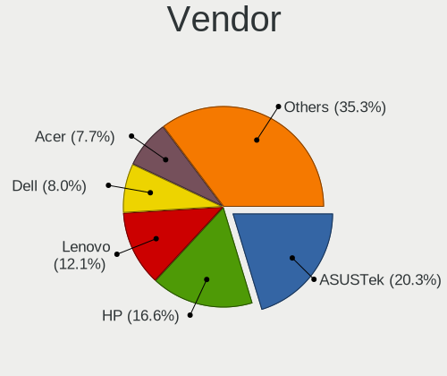
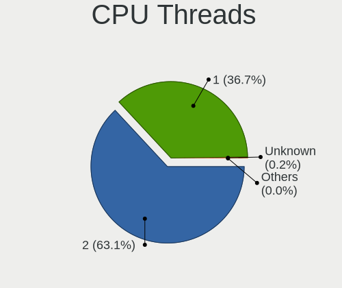
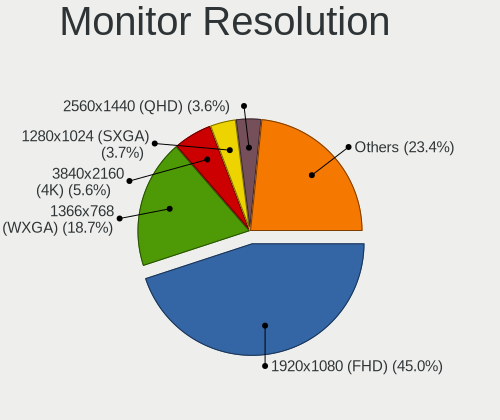
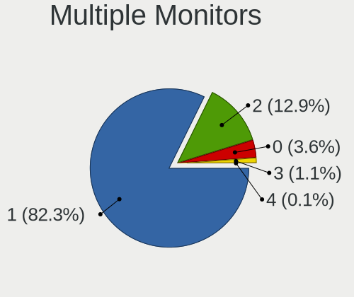
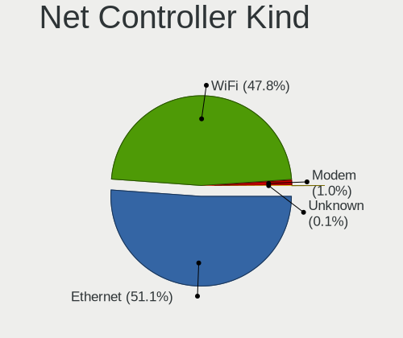
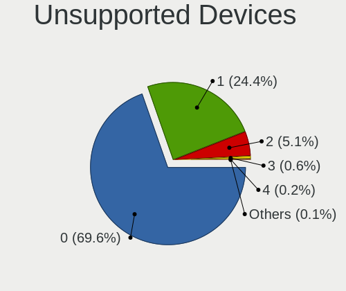

Linux in Italy - Tested Hardware & Statistics
---------------------------------------------

A project to collect tested hardware configurations for Linux in Italy.

Anyone can contribute to this report by the [hw-probe](https://github.com/linuxhw/hw-probe) tool:

    sudo -E hw-probe -all -upload

Please contribute! Especially if your hardware is rare.

This is a report for all computer types. See also reports for [desktops](/Location/Italy/Desktop/README.md) and [notebooks](/Location/Italy/Notebook/README.md).

Contents
--------

* [ Test Cases ](#test-cases)

* [ System ](#system)
  - [ OS                       ](#os)
  - [ OS Family                ](#os-family)
  - [ Kernel                   ](#kernel)
  - [ Kernel Family            ](#kernel-family)
  - [ Kernel Major Ver.        ](#kernel-major-ver)
  - [ Arch                     ](#arch)
  - [ DE                       ](#de)
  - [ Display Server           ](#display-server)
  - [ Display Manager          ](#display-manager)
  - [ OS Lang                  ](#os-lang)
  - [ Boot Mode                ](#boot-mode)
  - [ Filesystem               ](#filesystem)
  - [ Part. scheme             ](#part-scheme)
  - [ Dual Boot with Linux/BSD ](#dual-boot-with-linuxbsd)
  - [ Dual Boot (Win)          ](#dual-boot-win)

* [ Board ](#board)
  - [ Vendor                   ](#vendor)
  - [ Model                    ](#model)
  - [ Model Family             ](#model-family)
  - [ MFG Year                 ](#mfg-year)
  - [ Form Factor              ](#form-factor)
  - [ Secure Boot              ](#secure-boot)
  - [ Coreboot                 ](#coreboot)
  - [ RAM Size                 ](#ram-size)
  - [ RAM Used                 ](#ram-used)
  - [ Total Drives             ](#total-drives)
  - [ Has CD-ROM               ](#has-cd-rom)
  - [ Has Ethernet             ](#has-ethernet)
  - [ Has WiFi                 ](#has-wifi)
  - [ Has Bluetooth            ](#has-bluetooth)

* [ Location ](#location)
  - [ Country                  ](#country)
  - [ City                     ](#city)

* [ Drives ](#drives)
  - [ Drive Vendor             ](#drive-vendor)
  - [ Drive Model              ](#drive-model)
  - [ HDD Vendor               ](#hdd-vendor)
  - [ SSD Vendor               ](#ssd-vendor)
  - [ Drive Kind               ](#drive-kind)
  - [ Drive Connector          ](#drive-connector)
  - [ Drive Size               ](#drive-size)
  - [ Space Total              ](#space-total)
  - [ Space Used               ](#space-used)
  - [ Malfunc. Drives          ](#malfunc-drives)
  - [ Malfunc. Drive Vendor    ](#malfunc-drive-vendor)
  - [ Malfunc. HDD Vendor      ](#malfunc-hdd-vendor)
  - [ Malfunc. Drive Kind      ](#malfunc-drive-kind)
  - [ Failed Drives            ](#failed-drives)
  - [ Failed Drive Vendor      ](#failed-drive-vendor)
  - [ Drive Status             ](#drive-status)

* [ Storage controller ](#storage-controller)
  - [ Storage Vendor           ](#storage-vendor)
  - [ Storage Model            ](#storage-model)
  - [ Storage Kind             ](#storage-kind)

* [ Processor ](#processor)
  - [ CPU Vendor               ](#cpu-vendor)
  - [ CPU Model                ](#cpu-model)
  - [ CPU Model Family         ](#cpu-model-family)
  - [ CPU Cores                ](#cpu-cores)
  - [ CPU Sockets              ](#cpu-sockets)
  - [ CPU Threads              ](#cpu-threads)
  - [ CPU Op-Modes             ](#cpu-op-modes)
  - [ CPU Microcode            ](#cpu-microcode)
  - [ CPU Microarch            ](#cpu-microarch)

* [ Graphics ](#graphics)
  - [ GPU Vendor               ](#gpu-vendor)
  - [ GPU Model                ](#gpu-model)
  - [ GPU Combo                ](#gpu-combo)
  - [ GPU Driver               ](#gpu-driver)
  - [ GPU Memory               ](#gpu-memory)

* [ Monitor ](#monitor)
  - [ Monitor Vendor           ](#monitor-vendor)
  - [ Monitor Model            ](#monitor-model)
  - [ Monitor Resolution       ](#monitor-resolution)
  - [ Monitor Diagonal         ](#monitor-diagonal)
  - [ Monitor Width            ](#monitor-width)
  - [ Aspect Ratio             ](#aspect-ratio)
  - [ Monitor Area             ](#monitor-area)
  - [ Pixel Density            ](#pixel-density)
  - [ Multiple Monitors        ](#multiple-monitors)

* [ Network ](#network)
  - [ Net Controller Vendor    ](#net-controller-vendor)
  - [ Net Controller Model     ](#net-controller-model)
  - [ Wireless Vendor          ](#wireless-vendor)
  - [ Wireless Model           ](#wireless-model)
  - [ Ethernet Vendor          ](#ethernet-vendor)
  - [ Ethernet Model           ](#ethernet-model)
  - [ Net Controller Kind      ](#net-controller-kind)
  - [ Used Controller          ](#used-controller)
  - [ NICs                     ](#nics)
  - [ IPv6                     ](#ipv6)

* [ Bluetooth ](#bluetooth)
  - [ Bluetooth Vendor         ](#bluetooth-vendor)
  - [ Bluetooth Model          ](#bluetooth-model)

* [ Sound ](#sound)
  - [ Sound Vendor             ](#sound-vendor)
  - [ Sound Model              ](#sound-model)

* [ Memory ](#memory)
  - [ Memory Vendor            ](#memory-vendor)
  - [ Memory Model             ](#memory-model)
  - [ Memory Kind              ](#memory-kind)
  - [ Memory Form Factor       ](#memory-form-factor)
  - [ Memory Size              ](#memory-size)
  - [ Memory Speed             ](#memory-speed)

* [ Printers & scanners ](#printers--scanners)
  - [ Printer Vendor           ](#printer-vendor)
  - [ Printer Model            ](#printer-model)
  - [ Scanner Vendor           ](#scanner-vendor)
  - [ Scanner Model            ](#scanner-model)

* [ Camera ](#camera)
  - [ Camera Vendor            ](#camera-vendor)
  - [ Camera Model             ](#camera-model)

* [ Security ](#security)
  - [ Fingerprint Vendor       ](#fingerprint-vendor)
  - [ Fingerprint Model        ](#fingerprint-model)
  - [ Chipcard Vendor          ](#chipcard-vendor)
  - [ Chipcard Model           ](#chipcard-model)

* [ Unsupported ](#unsupported)
  - [ Unsupported Devices      ](#unsupported-devices)
  - [ Unsupported Device Types ](#unsupported-device-types)

Test Cases
----------

Total: 7390

| Vendor        | Model                       | Form-Factor | Probe                                                      | Date         |
|---------------|-----------------------------|-------------|------------------------------------------------------------|--------------|
| HP            | ENVY Laptop 15-ep0xxx       | Notebook    | [93ff04a07b](https://linux-hardware.org/?probe=93ff04a07b) | Sep 01, 2022 |
| Pegatron      | 2AB6                        | Desktop     | [c4ca3989e0](https://linux-hardware.org/?probe=c4ca3989e0) | Aug 31, 2022 |
| Unknown       | Unknown                     | Notebook    | [cba954794c](https://linux-hardware.org/?probe=cba954794c) | Aug 31, 2022 |
| HP            | 18E9                        | Desktop     | [2dff78f303](https://linux-hardware.org/?probe=2dff78f303) | Aug 31, 2022 |
| Gigabyte      | B550 AORUS ELITE AX V2      | Desktop     | [98e0a08e65](https://linux-hardware.org/?probe=98e0a08e65) | Aug 30, 2022 |
| AMI           | Intel                       | Convertible | [0e6916718e](https://linux-hardware.org/?probe=0e6916718e) | Aug 30, 2022 |
| ASUSTek       | P5QPL-AM                    | Desktop     | [38e6481a65](https://linux-hardware.org/?probe=38e6481a65) | Aug 30, 2022 |
| Microtech     | CoreBook                    | Notebook    | [08c3ccbce4](https://linux-hardware.org/?probe=08c3ccbce4) | Aug 29, 2022 |
| OEM           | G41 775 ICH7 8712           | Desktop     | [4225df6517](https://linux-hardware.org/?probe=4225df6517) | Aug 29, 2022 |
| ASUSTek       | VivoBook_ASUSLaptop X512... | Notebook    | [fc5f863965](https://linux-hardware.org/?probe=fc5f863965) | Aug 29, 2022 |
| HP            | Pavilion x360 Convertibl... | Convertible | [e19d574682](https://linux-hardware.org/?probe=e19d574682) | Aug 29, 2022 |
| ASUSTek       | Z97-C                       | Desktop     | [9bdae9239f](https://linux-hardware.org/?probe=9bdae9239f) | Aug 29, 2022 |
| ASUSTek       | P5KPL-AM SE                 | Desktop     | [7a2c713719](https://linux-hardware.org/?probe=7a2c713719) | Aug 29, 2022 |
| HP            | 8751                        | Desktop     | [62c8c2f25e](https://linux-hardware.org/?probe=62c8c2f25e) | Aug 29, 2022 |
| ASUSTek       | P5KPL-AM SE                 | Desktop     | [17e8c1560b](https://linux-hardware.org/?probe=17e8c1560b) | Aug 28, 2022 |
| Lenovo        | V15-IGL 82C3                | Notebook    | [9efc7bc8ee](https://linux-hardware.org/?probe=9efc7bc8ee) | Aug 28, 2022 |
| ASRock        | H61M-DGS                    | Desktop     | [023204fa1f](https://linux-hardware.org/?probe=023204fa1f) | Aug 28, 2022 |
| Gigabyte      | H97-HD3                     | Desktop     | [25e4d6c064](https://linux-hardware.org/?probe=25e4d6c064) | Aug 28, 2022 |
| Microtech     | CoreBook                    | Notebook    | [7507a104b7](https://linux-hardware.org/?probe=7507a104b7) | Aug 28, 2022 |
| HP            | 620                         | Notebook    | [b16c60f4cf](https://linux-hardware.org/?probe=b16c60f4cf) | Aug 28, 2022 |
| ASUSTek       | N552VX                      | Notebook    | [b464c050cc](https://linux-hardware.org/?probe=b464c050cc) | Aug 28, 2022 |
| Acer          | AO722                       | Notebook    | [377ad8686f](https://linux-hardware.org/?probe=377ad8686f) | Aug 28, 2022 |
| ASUSTek       | VivoBook_ASUSLaptop X515... | Notebook    | [82fa6fbefa](https://linux-hardware.org/?probe=82fa6fbefa) | Aug 27, 2022 |
| Fujitsu       | D3061-A1 S26361-D3061-A1    | Desktop     | [f74dc71ad8](https://linux-hardware.org/?probe=f74dc71ad8) | Aug 27, 2022 |
| Dell          | Latitude 3150               | Notebook    | [09f1514148](https://linux-hardware.org/?probe=09f1514148) | Aug 27, 2022 |
| Apple         | MacBook4,1                  | Notebook    | [fdb7c715b3](https://linux-hardware.org/?probe=fdb7c715b3) | Aug 26, 2022 |
| Gigabyte      | Z490 UD                     | Desktop     | [a872472b1c](https://linux-hardware.org/?probe=a872472b1c) | Aug 26, 2022 |
| Intel         | D2550MUD2 AAG81497-700      | Desktop     | [a181512016](https://linux-hardware.org/?probe=a181512016) | Aug 26, 2022 |
| ASUSTek       | M5A78L LE                   | Desktop     | [e4a6425675](https://linux-hardware.org/?probe=e4a6425675) | Aug 26, 2022 |
| HP            | ProBook 430 G5              | Notebook    | [6a7db587c7](https://linux-hardware.org/?probe=6a7db587c7) | Aug 25, 2022 |
| HP            | Laptop 15-dw0xxx            | Notebook    | [8bb62c2062](https://linux-hardware.org/?probe=8bb62c2062) | Aug 24, 2022 |
| HP            | 255 G6 Notebook PC          | Notebook    | [a476ba5a83](https://linux-hardware.org/?probe=a476ba5a83) | Aug 24, 2022 |
| ASUSTek       | PRIME A320M-K               | Desktop     | [a096217ea3](https://linux-hardware.org/?probe=a096217ea3) | Aug 24, 2022 |
| Lenovo        | Legion S7 15IMH5 82BC       | Notebook    | [594d5d4209](https://linux-hardware.org/?probe=594d5d4209) | Aug 24, 2022 |
| Lenovo        | Legion S7 15IMH5 82BC       | Notebook    | [f50f2a36d5](https://linux-hardware.org/?probe=f50f2a36d5) | Aug 24, 2022 |
| Lenovo        | IdeaPad 3 15ADA6 82KR       | Notebook    | [f20e68e820](https://linux-hardware.org/?probe=f20e68e820) | Aug 24, 2022 |
| HP            | Laptop 15s-eq0xxx           | Notebook    | [29db41fc1b](https://linux-hardware.org/?probe=29db41fc1b) | Aug 23, 2022 |
| ASUSTek       | M4N68T-M-V2                 | Desktop     | [1528da74f6](https://linux-hardware.org/?probe=1528da74f6) | Aug 22, 2022 |
| Microtech     | CoreBook                    | Notebook    | [91f9a78c00](https://linux-hardware.org/?probe=91f9a78c00) | Aug 22, 2022 |
| Microtech     | CoreBook                    | Notebook    | [e6924626bb](https://linux-hardware.org/?probe=e6924626bb) | Aug 22, 2022 |
| ASUSTek       | PRIME Z390-P                | Desktop     | [ca7534d4dc](https://linux-hardware.org/?probe=ca7534d4dc) | Aug 22, 2022 |
| ASUSTek       | H110M-A/M.2                 | Desktop     | [dab0f526b0](https://linux-hardware.org/?probe=dab0f526b0) | Aug 22, 2022 |
| MSI           | MPG X570 GAMING PLUS        | Desktop     | [e064c453da](https://linux-hardware.org/?probe=e064c453da) | Aug 21, 2022 |
| Gigabyte      | P35-DS3L                    | Desktop     | [1ee42449ed](https://linux-hardware.org/?probe=1ee42449ed) | Aug 21, 2022 |
| Acer          | Aspire E1-522               | Notebook    | [f4f0162d9a](https://linux-hardware.org/?probe=f4f0162d9a) | Aug 21, 2022 |
| Toshiba       | Satellite P70-B             | Notebook    | [4e04d56e06](https://linux-hardware.org/?probe=4e04d56e06) | Aug 21, 2022 |
| Toshiba       | Satellite P70-B             | Notebook    | [402017a7ea](https://linux-hardware.org/?probe=402017a7ea) | Aug 21, 2022 |
| OEM           | G41 775 ICH7 8712           | Desktop     | [71bfa72a22](https://linux-hardware.org/?probe=71bfa72a22) | Aug 21, 2022 |
| MSI           | G31M3                       | Desktop     | [3bb7906f56](https://linux-hardware.org/?probe=3bb7906f56) | Aug 20, 2022 |
| AZW           | MII-V                       | Desktop     | [59698f6b33](https://linux-hardware.org/?probe=59698f6b33) | Aug 20, 2022 |
| HP            | Pavilion dv6                | Notebook    | [5d8ca491cf](https://linux-hardware.org/?probe=5d8ca491cf) | Aug 20, 2022 |
| MSI           | B450 TOMAHAWK MAX II        | Desktop     | [57f1970999](https://linux-hardware.org/?probe=57f1970999) | Aug 20, 2022 |
| MSI           | Boston                      | Desktop     | [4a10f122a2](https://linux-hardware.org/?probe=4a10f122a2) | Aug 19, 2022 |
| HP            | EliteBook 850 G3            | Notebook    | [bb313c5b5e](https://linux-hardware.org/?probe=bb313c5b5e) | Aug 19, 2022 |
| HP            | EliteBook 850 G3            | Notebook    | [a81d513d7c](https://linux-hardware.org/?probe=a81d513d7c) | Aug 19, 2022 |
| Intel         | NUC7i7BNB J31145-310        | Mini pc     | [d9f1c174b3](https://linux-hardware.org/?probe=d9f1c174b3) | Aug 18, 2022 |
| Framework     | Laptop                      | Notebook    | [a8988f1665](https://linux-hardware.org/?probe=a8988f1665) | Aug 18, 2022 |
| Gigabyte      | Z370 HD3P-CF                | Desktop     | [410c71e7ef](https://linux-hardware.org/?probe=410c71e7ef) | Aug 18, 2022 |
| MSI           | Katana GF66 11UG            | Notebook    | [74da710e26](https://linux-hardware.org/?probe=74da710e26) | Aug 18, 2022 |
| ASRock        | H61M-DGS                    | Desktop     | [ffb9dcb065](https://linux-hardware.org/?probe=ffb9dcb065) | Aug 18, 2022 |
| Microtech     | ebookPro                    | Notebook    | [b6c6859a02](https://linux-hardware.org/?probe=b6c6859a02) | Aug 18, 2022 |
| Dynabook      | Satellite Pro C50-G-10M     | Notebook    | [92acf22491](https://linux-hardware.org/?probe=92acf22491) | Aug 18, 2022 |
| Dynabook      | Satellite Pro C50-G-10M     | Notebook    | [f1c882f6f9](https://linux-hardware.org/?probe=f1c882f6f9) | Aug 18, 2022 |
| HP            | ENVY x360 Convertible 13... | Convertible | [b5963af4aa](https://linux-hardware.org/?probe=b5963af4aa) | Aug 17, 2022 |
| Acer          | MRS600M                     | Desktop     | [ec4c10d06e](https://linux-hardware.org/?probe=ec4c10d06e) | Aug 17, 2022 |
| Lenovo        | ThinkPad T450 20BUS0EW1F    | Notebook    | [88ad38d9f7](https://linux-hardware.org/?probe=88ad38d9f7) | Aug 17, 2022 |
| Lenovo        | ThinkPad T450 20BUS0EW1F    | Notebook    | [73b611ea50](https://linux-hardware.org/?probe=73b611ea50) | Aug 17, 2022 |
| ASRock        | 775Dual-VSTA                | Desktop     | [89ac2bb6fe](https://linux-hardware.org/?probe=89ac2bb6fe) | Aug 17, 2022 |
| MSI           | Modern 14 B11SBL            | Notebook    | [ad56f2a352](https://linux-hardware.org/?probe=ad56f2a352) | Aug 17, 2022 |
| Chuwi         | LarkBook X                  | Notebook    | [b3c5eba91b](https://linux-hardware.org/?probe=b3c5eba91b) | Aug 17, 2022 |
| Dell          | Precision M6600             | Notebook    | [2e1eaedbc4](https://linux-hardware.org/?probe=2e1eaedbc4) | Aug 17, 2022 |
| HP            | Laptop 15-dw0xxx            | Notebook    | [73dbd54bc5](https://linux-hardware.org/?probe=73dbd54bc5) | Aug 16, 2022 |
| HP            | OMEN by Laptop 15-dc1xxx    | Notebook    | [364ebb944a](https://linux-hardware.org/?probe=364ebb944a) | Aug 16, 2022 |
| Lenovo        | Yoga 720-15IKB              | Convertible | [33bd89a7e0](https://linux-hardware.org/?probe=33bd89a7e0) | Aug 16, 2022 |
| HP            | 630                         | Notebook    | [5f438aea36](https://linux-hardware.org/?probe=5f438aea36) | Aug 16, 2022 |
| HP            | 1495                        | Desktop     | [34b69b08b1](https://linux-hardware.org/?probe=34b69b08b1) | Aug 15, 2022 |
| Lenovo        | ThinkPad T14 Gen 1 20UD0... | Notebook    | [d9f8a6ea69](https://linux-hardware.org/?probe=d9f8a6ea69) | Aug 15, 2022 |
| HP            | Notebook                    | Notebook    | [975f3e38e3](https://linux-hardware.org/?probe=975f3e38e3) | Aug 15, 2022 |
| HP            | 1495                        | Desktop     | [1ace6c9868](https://linux-hardware.org/?probe=1ace6c9868) | Aug 15, 2022 |
| HP            | 1495                        | Desktop     | [af820eee7e](https://linux-hardware.org/?probe=af820eee7e) | Aug 15, 2022 |
| HP            | 1495                        | Desktop     | [6db4307c50](https://linux-hardware.org/?probe=6db4307c50) | Aug 15, 2022 |
| HP            | ProBook 450 G3              | Notebook    | [b359d6e711](https://linux-hardware.org/?probe=b359d6e711) | Aug 15, 2022 |
| HP            | 1495                        | Desktop     | [c122ce06ab](https://linux-hardware.org/?probe=c122ce06ab) | Aug 15, 2022 |
| ASUSTek       | PRIME B450M-A II            | Desktop     | [4ba26713bc](https://linux-hardware.org/?probe=4ba26713bc) | Aug 15, 2022 |
| ASUSTek       | N551VW                      | Notebook    | [b84ee36534](https://linux-hardware.org/?probe=b84ee36534) | Aug 15, 2022 |
| ASUSTek       | N551VW                      | Notebook    | [b4daacb47f](https://linux-hardware.org/?probe=b4daacb47f) | Aug 15, 2022 |
| HP            | Victus by Laptop 16-e0xx... | Notebook    | [fd64b105a4](https://linux-hardware.org/?probe=fd64b105a4) | Aug 14, 2022 |
| HP            | Victus by Laptop 16-e0xx... | Notebook    | [73f2db9159](https://linux-hardware.org/?probe=73f2db9159) | Aug 14, 2022 |
| Lenovo        | ThinkPad T460s 20FAS0Q90... | Notebook    | [644c7518e9](https://linux-hardware.org/?probe=644c7518e9) | Aug 14, 2022 |
| ASUSTek       | X540LA                      | Notebook    | [15ffff65c0](https://linux-hardware.org/?probe=15ffff65c0) | Aug 14, 2022 |
| Dell          | XPS 15 9550                 | Notebook    | [ad3ad84c75](https://linux-hardware.org/?probe=ad3ad84c75) | Aug 14, 2022 |
| Lenovo        | V130-15IKB 81HN             | Notebook    | [b479c93d90](https://linux-hardware.org/?probe=b479c93d90) | Aug 14, 2022 |
| ASUSTek       | ROG CROSSHAIR VIII DARK ... | Desktop     | [fd06db829d](https://linux-hardware.org/?probe=fd06db829d) | Aug 14, 2022 |
| Lenovo        | HASWELLREFRESHDT 3190005... | All in one  | [80f0ca82d9](https://linux-hardware.org/?probe=80f0ca82d9) | Aug 13, 2022 |
| Gigabyte      | Z370 HD3P-CF                | Desktop     | [2162cafc91](https://linux-hardware.org/?probe=2162cafc91) | Aug 13, 2022 |
| ASUSTek       | STRIX Z270E GAMING          | Desktop     | [6a0c6ab778](https://linux-hardware.org/?probe=6a0c6ab778) | Aug 13, 2022 |
| Acer          | Aspire A114-33              | Notebook    | [471a1ec71e](https://linux-hardware.org/?probe=471a1ec71e) | Aug 12, 2022 |
| HUAWEI        | BOM-WXX9                    | Notebook    | [902894a02b](https://linux-hardware.org/?probe=902894a02b) | Aug 12, 2022 |
| HP            | ProBook 440 G7              | Notebook    | [ee57cf772f](https://linux-hardware.org/?probe=ee57cf772f) | Aug 12, 2022 |
| Fujitsu       | LIFEBOOK S904               | Notebook    | [0e3107a650](https://linux-hardware.org/?probe=0e3107a650) | Aug 12, 2022 |
| ASUSTek       | T100HAN                     | Notebook    | [4159616818](https://linux-hardware.org/?probe=4159616818) | Aug 12, 2022 |
| Valve         | Jupiter                     | Notebook    | [b63f9aedab](https://linux-hardware.org/?probe=b63f9aedab) | Aug 12, 2022 |
| AZW           | U59                         | Desktop     | [344d4587f6](https://linux-hardware.org/?probe=344d4587f6) | Aug 12, 2022 |
| Lenovo        | ThinkStation C20 4263BA7    | Desktop     | [e5e5d0d3a3](https://linux-hardware.org/?probe=e5e5d0d3a3) | Aug 11, 2022 |
| Lenovo        | ThinkStation C20 4263BA7    | Desktop     | [93ecf84dcf](https://linux-hardware.org/?probe=93ecf84dcf) | Aug 11, 2022 |
| Lenovo        | Yoga C640-13IML 81UE        | Convertible | [e1a4a04e29](https://linux-hardware.org/?probe=e1a4a04e29) | Aug 11, 2022 |
| HP            | Pavilion Gaming Notebook    | Notebook    | [673ef8a276](https://linux-hardware.org/?probe=673ef8a276) | Aug 11, 2022 |
| Mediacom      | SmartBook 14 FullHD - SB... | Notebook    | [5bb07e1a28](https://linux-hardware.org/?probe=5bb07e1a28) | Aug 11, 2022 |
| HP            | Laptop 15-dw0xxx            | Notebook    | [75322a996d](https://linux-hardware.org/?probe=75322a996d) | Aug 11, 2022 |
| Dell          | Latitude 5590               | Notebook    | [a00272df56](https://linux-hardware.org/?probe=a00272df56) | Aug 11, 2022 |
| Notebook      | PD5x_7xPNP_PNN_PNT          | Notebook    | [4a34f7697a](https://linux-hardware.org/?probe=4a34f7697a) | Aug 11, 2022 |
| ASRock        | G41M-VS3                    | Desktop     | [4185ab0f97](https://linux-hardware.org/?probe=4185ab0f97) | Aug 10, 2022 |
| ASUSTek       | PRIME Z690-P WIFI           | Desktop     | [7792f4471e](https://linux-hardware.org/?probe=7792f4471e) | Aug 10, 2022 |
| HP            | Pavilion g6                 | Notebook    | [5b3f1dcc95](https://linux-hardware.org/?probe=5b3f1dcc95) | Aug 10, 2022 |
| ASUSTek       | V230IC                      | All in one  | [bac1e9869d](https://linux-hardware.org/?probe=bac1e9869d) | Aug 09, 2022 |
| ASRock        | H61M-DGS                    | Desktop     | [7005dd1f5f](https://linux-hardware.org/?probe=7005dd1f5f) | Aug 09, 2022 |
| MSI           | Prestige 15 A10SC           | Notebook    | [9471547f71](https://linux-hardware.org/?probe=9471547f71) | Aug 09, 2022 |
| HUAWEI        | CREM-WXX9                   | Notebook    | [1a95dd7974](https://linux-hardware.org/?probe=1a95dd7974) | Aug 09, 2022 |
| HP            | 630                         | Notebook    | [fc9bc69e9a](https://linux-hardware.org/?probe=fc9bc69e9a) | Aug 09, 2022 |
| Fujitsu       | LIFEBOOK A544               | Notebook    | [e5785106f1](https://linux-hardware.org/?probe=e5785106f1) | Aug 09, 2022 |
| ASUSTek       | X200MA                      | Notebook    | [f5a57fdc48](https://linux-hardware.org/?probe=f5a57fdc48) | Aug 08, 2022 |
| ASRock        | H55M-LE                     | Desktop     | [841c63de14](https://linux-hardware.org/?probe=841c63de14) | Aug 08, 2022 |
| Dell          | XPS 15 9520                 | Notebook    | [50420ea12f](https://linux-hardware.org/?probe=50420ea12f) | Aug 08, 2022 |
| Dell          | Inspiron 5515               | Notebook    | [6f3674f2b9](https://linux-hardware.org/?probe=6f3674f2b9) | Aug 08, 2022 |
| Dell          | Latitude 5420               | Notebook    | [824404ee24](https://linux-hardware.org/?probe=824404ee24) | Aug 08, 2022 |
| HP            | 15                          | Notebook    | [0dc4269577](https://linux-hardware.org/?probe=0dc4269577) | Aug 08, 2022 |
| Gigabyte      | B550 AORUS ELITE AX V2      | Desktop     | [7ca881aae7](https://linux-hardware.org/?probe=7ca881aae7) | Aug 08, 2022 |
| Apple         | Mac-8ED6AF5B48C039E1 Mac... | Mini pc     | [0f4b093f48](https://linux-hardware.org/?probe=0f4b093f48) | Aug 07, 2022 |
| HP            | ProBook 455 G7              | Notebook    | [b2e805c687](https://linux-hardware.org/?probe=b2e805c687) | Aug 07, 2022 |
| HP            | Pavilion 17                 | Notebook    | [f06bb8d9ab](https://linux-hardware.org/?probe=f06bb8d9ab) | Aug 07, 2022 |
| HP            | Pavilion 17                 | Notebook    | [9c47c2e4f4](https://linux-hardware.org/?probe=9c47c2e4f4) | Aug 07, 2022 |
| ASUSTek       | K53SC                       | Notebook    | [15522c32d7](https://linux-hardware.org/?probe=15522c32d7) | Aug 06, 2022 |
| SANTECH       | NHx0DB,DE                   | Notebook    | [1eba623e90](https://linux-hardware.org/?probe=1eba623e90) | Aug 06, 2022 |
| MSI           | GL63 8SD                    | Notebook    | [2034714c18](https://linux-hardware.org/?probe=2034714c18) | Aug 06, 2022 |
| TrekStor      | Notebook Slim S130          | Notebook    | [ba73d094e7](https://linux-hardware.org/?probe=ba73d094e7) | Aug 06, 2022 |
| TrekStor      | Notebook Slim S130          | Notebook    | [d2c7e85bf4](https://linux-hardware.org/?probe=d2c7e85bf4) | Aug 06, 2022 |
| Apple         | Mac-8ED6AF5B48C039E1 Mac... | Mini pc     | [fc8e3b6a3b](https://linux-hardware.org/?probe=fc8e3b6a3b) | Aug 05, 2022 |
| Acer          | E1-510                      | Notebook    | [05ea3ff386](https://linux-hardware.org/?probe=05ea3ff386) | Aug 05, 2022 |
| Lenovo        | ThinkPad X230 2325U9T       | Notebook    | [0f0e8ec24f](https://linux-hardware.org/?probe=0f0e8ec24f) | Aug 04, 2022 |
| MSI           | Modern 14 A10M              | Notebook    | [f8a0b1d6e6](https://linux-hardware.org/?probe=f8a0b1d6e6) | Aug 04, 2022 |
| Dell          | Latitude 5590               | Notebook    | [52f059849a](https://linux-hardware.org/?probe=52f059849a) | Aug 04, 2022 |
| Dell          | Latitude 5590               | Notebook    | [47292ecf57](https://linux-hardware.org/?probe=47292ecf57) | Aug 04, 2022 |
| HP            | ProBook 440 G7              | Notebook    | [830c827eb0](https://linux-hardware.org/?probe=830c827eb0) | Aug 04, 2022 |
| Teclast       | F15 Plus                    | Notebook    | [c816a74a84](https://linux-hardware.org/?probe=c816a74a84) | Aug 03, 2022 |
| Lenovo        | ThinkBook 15 G2 ITL 20VE    | Notebook    | [900f1d3f01](https://linux-hardware.org/?probe=900f1d3f01) | Aug 03, 2022 |
| HP            | 255 G3                      | Notebook    | [46ad188006](https://linux-hardware.org/?probe=46ad188006) | Aug 02, 2022 |
| Acer          | Predator PO3-620            | Desktop     | [ff0507688f](https://linux-hardware.org/?probe=ff0507688f) | Aug 02, 2022 |
| Dell          | Latitude E6430              | Notebook    | [15e26c7cc5](https://linux-hardware.org/?probe=15e26c7cc5) | Aug 02, 2022 |
| Acer          | FIH57                       | Desktop     | [eec3e58c8c](https://linux-hardware.org/?probe=eec3e58c8c) | Aug 02, 2022 |
| HUAWEI        | BOD-WXX9                    | Notebook    | [7fdd86e71f](https://linux-hardware.org/?probe=7fdd86e71f) | Aug 01, 2022 |
| ASUSTek       | VivoBook_ASUSLaptop TP42... | Convertible | [98e8e717df](https://linux-hardware.org/?probe=98e8e717df) | Jul 31, 2022 |
| Fujitsu       | LIFEBOOK E754               | Notebook    | [7875967525](https://linux-hardware.org/?probe=7875967525) | Jul 31, 2022 |
| Fujitsu       | LIFEBOOK E754               | Notebook    | [14be18819f](https://linux-hardware.org/?probe=14be18819f) | Jul 31, 2022 |
| Apple         | Mac-942B5BF58194151B        | All in one  | [a654f941dd](https://linux-hardware.org/?probe=a654f941dd) | Jul 30, 2022 |
| Acer          | FIH57                       | Desktop     | [a6b9d91f36](https://linux-hardware.org/?probe=a6b9d91f36) | Jul 30, 2022 |
| Intel         | NUC6i7KYB H90766-406        | Mini pc     | [22775850ff](https://linux-hardware.org/?probe=22775850ff) | Jul 30, 2022 |
| ASUSTek       | K53E                        | Notebook    | [3ca340212e](https://linux-hardware.org/?probe=3ca340212e) | Jul 30, 2022 |
| MSI           | MPG X570S CARBON MAX WIF... | Desktop     | [bace89cd10](https://linux-hardware.org/?probe=bace89cd10) | Jul 30, 2022 |
| ASUSTek       | P6T DELUXE V2               | Desktop     | [3c18081f88](https://linux-hardware.org/?probe=3c18081f88) | Jul 29, 2022 |
| Lenovo        | Yoga 530-14ARR 81H9         | Convertible | [a6c7b90642](https://linux-hardware.org/?probe=a6c7b90642) | Jul 29, 2022 |
| MSI           | MPG X570S CARBON MAX WIF... | Desktop     | [54d5ee0a3a](https://linux-hardware.org/?probe=54d5ee0a3a) | Jul 28, 2022 |
| MSI           | B250M PRO-VD                | Desktop     | [e58c8fca5a](https://linux-hardware.org/?probe=e58c8fca5a) | Jul 28, 2022 |
| ASUSTek       | K53U                        | Notebook    | [7db28a1538](https://linux-hardware.org/?probe=7db28a1538) | Jul 28, 2022 |
| Lenovo        | Yoga 530-14ARR 81H9         | Convertible | [830913d1ab](https://linux-hardware.org/?probe=830913d1ab) | Jul 28, 2022 |
| Acer          | Aspire 3100                 | Notebook    | [26c6af2a55](https://linux-hardware.org/?probe=26c6af2a55) | Jul 28, 2022 |
| HP            | 250 G2                      | Notebook    | [5650fd3dd6](https://linux-hardware.org/?probe=5650fd3dd6) | Jul 28, 2022 |
| ASUSTek       | Z97-C                       | Desktop     | [e292699b1c](https://linux-hardware.org/?probe=e292699b1c) | Jul 28, 2022 |
| Microsoft     | Surface Pro 4               | Tablet      | [a555c41bb7](https://linux-hardware.org/?probe=a555c41bb7) | Jul 28, 2022 |
| Dell          | Latitude 5590               | Notebook    | [7fa93449bd](https://linux-hardware.org/?probe=7fa93449bd) | Jul 28, 2022 |
| Acer          | EM61SM/EM61PM               | Desktop     | [2de6d95c80](https://linux-hardware.org/?probe=2de6d95c80) | Jul 28, 2022 |
| MSI           | Prestige 15 A10SC           | Notebook    | [0fe8633425](https://linux-hardware.org/?probe=0fe8633425) | Jul 27, 2022 |
| MSI           | Prestige 15 A10SC           | Notebook    | [36001f3112](https://linux-hardware.org/?probe=36001f3112) | Jul 27, 2022 |
| ASUSTek       | VivoBook_ASUSLaptop X509... | Notebook    | [94a6b79798](https://linux-hardware.org/?probe=94a6b79798) | Jul 27, 2022 |
| Dell          | Inspiron 5567               | Notebook    | [059231751f](https://linux-hardware.org/?probe=059231751f) | Jul 27, 2022 |
| Microtech     | ebookPro                    | Notebook    | [12215b6984](https://linux-hardware.org/?probe=12215b6984) | Jul 27, 2022 |
| HP            | 250 G4 Notebook PC          | Notebook    | [fbe3850683](https://linux-hardware.org/?probe=fbe3850683) | Jul 27, 2022 |
| Lenovo        | IdeaPad 5 Pro 14ACN6 82L... | Notebook    | [f062c9d4c7](https://linux-hardware.org/?probe=f062c9d4c7) | Jul 27, 2022 |
| HP            | 1495                        | Desktop     | [61a8f473e2](https://linux-hardware.org/?probe=61a8f473e2) | Jul 27, 2022 |
| ASUSTek       | P552LA                      | Notebook    | [b47b03db47](https://linux-hardware.org/?probe=b47b03db47) | Jul 27, 2022 |
| Lenovo        | IdeaPad 5 Pro 14ACN6 82L... | Notebook    | [e3fff7dcf4](https://linux-hardware.org/?probe=e3fff7dcf4) | Jul 27, 2022 |
| HUAWEI        | BOM-WXX9                    | Notebook    | [d748013457](https://linux-hardware.org/?probe=d748013457) | Jul 26, 2022 |
| Acer          | FIH57                       | Desktop     | [f351802c52](https://linux-hardware.org/?probe=f351802c52) | Jul 26, 2022 |
| Dell          | 0KH290                      | Desktop     | [74934828fa](https://linux-hardware.org/?probe=74934828fa) | Jul 26, 2022 |
| MSI           | Z490-A PRO                  | Desktop     | [fe48f1e5cd](https://linux-hardware.org/?probe=fe48f1e5cd) | Jul 26, 2022 |
| Acer          | FIH57                       | Desktop     | [df3c42e452](https://linux-hardware.org/?probe=df3c42e452) | Jul 25, 2022 |
| Acer          | Ferrari One 200             | Notebook    | [023ff9a691](https://linux-hardware.org/?probe=023ff9a691) | Jul 25, 2022 |
| Acer          | Ferrari One 200             | Notebook    | [447f8a06ea](https://linux-hardware.org/?probe=447f8a06ea) | Jul 25, 2022 |
| Acer          | EM61SM/EM61PM               | Desktop     | [e470dff38f](https://linux-hardware.org/?probe=e470dff38f) | Jul 25, 2022 |
| Dell          | Latitude E6430              | Notebook    | [c6f235793c](https://linux-hardware.org/?probe=c6f235793c) | Jul 25, 2022 |
| AMI           | Cherry Trail CR             | Desktop     | [6463c26211](https://linux-hardware.org/?probe=6463c26211) | Jul 25, 2022 |
| ASRock        | 990FX Extreme3              | Desktop     | [158c8d142b](https://linux-hardware.org/?probe=158c8d142b) | Jul 24, 2022 |
| Lenovo        | G50-45 80E3                 | Notebook    | [e6b9106560](https://linux-hardware.org/?probe=e6b9106560) | Jul 24, 2022 |
| HUAWEI        | BOM-WXX9                    | Notebook    | [0b50c88cc8](https://linux-hardware.org/?probe=0b50c88cc8) | Jul 24, 2022 |
| HUAWEI        | BOM-WXX9                    | Notebook    | [10c3aa036f](https://linux-hardware.org/?probe=10c3aa036f) | Jul 23, 2022 |
| HUAWEI        | BOM-WXX9                    | Notebook    | [2c2ddc37dd](https://linux-hardware.org/?probe=2c2ddc37dd) | Jul 23, 2022 |
| Gigabyte      | P35-DS3L                    | Desktop     | [4ae76fafc9](https://linux-hardware.org/?probe=4ae76fafc9) | Jul 22, 2022 |
| ASUSTek       | BU201LA                     | Notebook    | [0b78bea31f](https://linux-hardware.org/?probe=0b78bea31f) | Jul 22, 2022 |
| Lenovo        | Yoga 720-15IKB              | Convertible | [b9e70cb819](https://linux-hardware.org/?probe=b9e70cb819) | Jul 22, 2022 |
| ASUSTek       | ROG CROSSHAIR VIII DARK ... | Desktop     | [6e4f170da9](https://linux-hardware.org/?probe=6e4f170da9) | Jul 22, 2022 |
| MSI           | B450 TOMAHAWK MAX II        | Desktop     | [dfe6047aa7](https://linux-hardware.org/?probe=dfe6047aa7) | Jul 21, 2022 |
| Dell          | Latitude E4200              | Notebook    | [6cc0415a8a](https://linux-hardware.org/?probe=6cc0415a8a) | Jul 21, 2022 |
| ASUSTek       | H110M-A/M.2                 | Desktop     | [97f5b09dd2](https://linux-hardware.org/?probe=97f5b09dd2) | Jul 21, 2022 |
| HP            | Notebook                    | Notebook    | [e859de5718](https://linux-hardware.org/?probe=e859de5718) | Jul 21, 2022 |
| Lenovo        | ThinkPad T490 20N2000FIX    | Notebook    | [a68ebe9c0c](https://linux-hardware.org/?probe=a68ebe9c0c) | Jul 21, 2022 |
| Teclast       | F15 Plus                    | Notebook    | [d77f56c032](https://linux-hardware.org/?probe=d77f56c032) | Jul 20, 2022 |
| ASUSTek       | ROG CROSSHAIR VIII DARK ... | Desktop     | [6e4fbc6688](https://linux-hardware.org/?probe=6e4fbc6688) | Jul 20, 2022 |
| ASUSTek       | VivoBook_ASUSLaptop X513... | Notebook    | [75b4088788](https://linux-hardware.org/?probe=75b4088788) | Jul 20, 2022 |
| ASUSTek       | VivoBook_ASUSLaptop X513... | Notebook    | [3c2afd2b5e](https://linux-hardware.org/?probe=3c2afd2b5e) | Jul 20, 2022 |
| Gigabyte      | P35-DS3L                    | Desktop     | [cabd591648](https://linux-hardware.org/?probe=cabd591648) | Jul 20, 2022 |
| HP            | ENVY x360 Convertible 13... | Convertible | [f5aba6ba0f](https://linux-hardware.org/?probe=f5aba6ba0f) | Jul 19, 2022 |
| Acer          | Aspire E5-573               | Notebook    | [d5f490187d](https://linux-hardware.org/?probe=d5f490187d) | Jul 19, 2022 |
| Foxconn       | 2ABF                        | Desktop     | [765d75028c](https://linux-hardware.org/?probe=765d75028c) | Jul 19, 2022 |
| HP            | Notebook                    | Notebook    | [79c0f60f74](https://linux-hardware.org/?probe=79c0f60f74) | Jul 19, 2022 |
| Apple         | MacBookPro8,1               | Notebook    | [d5b50db42e](https://linux-hardware.org/?probe=d5b50db42e) | Jul 19, 2022 |
| Teclast       | F15 Plus                    | Notebook    | [6201934176](https://linux-hardware.org/?probe=6201934176) | Jul 17, 2022 |
| Apple         | MacBookPro8,1               | Notebook    | [21c49763f5](https://linux-hardware.org/?probe=21c49763f5) | Jul 17, 2022 |
| Dell          | 0F6X5P A00                  | Desktop     | [528f781464](https://linux-hardware.org/?probe=528f781464) | Jul 16, 2022 |
| Acer          | Aspire E1-532               | Notebook    | [13d38a6632](https://linux-hardware.org/?probe=13d38a6632) | Jul 16, 2022 |
| Dell          | Inspiron 5584               | Notebook    | [b6d23c8307](https://linux-hardware.org/?probe=b6d23c8307) | Jul 16, 2022 |
| Dell          | Inspiron 5584               | Notebook    | [d40f956c16](https://linux-hardware.org/?probe=d40f956c16) | Jul 16, 2022 |
| ASUSTek       | G752VY                      | Notebook    | [c6ec6114a4](https://linux-hardware.org/?probe=c6ec6114a4) | Jul 16, 2022 |
| Dell          | Inspiron 15-3552            | Notebook    | [d0bd509f9f](https://linux-hardware.org/?probe=d0bd509f9f) | Jul 15, 2022 |
| Dell          | Inspiron 15-3552            | Notebook    | [8366fa0fe6](https://linux-hardware.org/?probe=8366fa0fe6) | Jul 15, 2022 |
| Acer          | FIH57                       | Desktop     | [ea25a3cc88](https://linux-hardware.org/?probe=ea25a3cc88) | Jul 15, 2022 |
| ASUSTek       | P5QLD PRO                   | Desktop     | [fbf3a31304](https://linux-hardware.org/?probe=fbf3a31304) | Jul 15, 2022 |
| MSI           | B450 TOMAHAWK MAX II        | Desktop     | [8f2f28b1c3](https://linux-hardware.org/?probe=8f2f28b1c3) | Jul 15, 2022 |
| Intel         | DQ77MK AAG39642-500         | Desktop     | [7b6a43a9f1](https://linux-hardware.org/?probe=7b6a43a9f1) | Jul 15, 2022 |
| ASUSTek       | K53SC                       | Notebook    | [dd45175b9d](https://linux-hardware.org/?probe=dd45175b9d) | Jul 15, 2022 |
| HP            | Unknown                     | Notebook    | [e4ccba30f8](https://linux-hardware.org/?probe=e4ccba30f8) | Jul 15, 2022 |
| Dell          | XPS 15 9570                 | Notebook    | [e157e6d524](https://linux-hardware.org/?probe=e157e6d524) | Jul 14, 2022 |
| Schenker      | XMG APEX (Mid 2021)         | Notebook    | [41136553b2](https://linux-hardware.org/?probe=41136553b2) | Jul 13, 2022 |
| HP            | EliteBook 2560p             | Notebook    | [444a7e921c](https://linux-hardware.org/?probe=444a7e921c) | Jul 13, 2022 |
| HP            | 2B4B                        | Desktop     | [6592fe9157](https://linux-hardware.org/?probe=6592fe9157) | Jul 13, 2022 |
| Lenovo        | IdeaPad 3 15ADA05 81W1      | Notebook    | [896226e566](https://linux-hardware.org/?probe=896226e566) | Jul 13, 2022 |
| ASUSTek       | X555LD                      | Notebook    | [afcccf6436](https://linux-hardware.org/?probe=afcccf6436) | Jul 13, 2022 |
| Toshiba       | TECRA R940                  | Notebook    | [ae9720d59b](https://linux-hardware.org/?probe=ae9720d59b) | Jul 12, 2022 |
| MSI           | Boston                      | Desktop     | [4966d9bfdf](https://linux-hardware.org/?probe=4966d9bfdf) | Jul 12, 2022 |
| Acer          | Aspire ES1-523              | Notebook    | [109bec9fa8](https://linux-hardware.org/?probe=109bec9fa8) | Jul 12, 2022 |
| HP            | Spectre x360 Convertible... | Convertible | [e96661c5ec](https://linux-hardware.org/?probe=e96661c5ec) | Jul 12, 2022 |
| ASUSTek       | Maximus VIII HERO           | Desktop     | [491e37bdfb](https://linux-hardware.org/?probe=491e37bdfb) | Jul 12, 2022 |
| ASUSTek       | T101HA                      | Tablet      | [9711445846](https://linux-hardware.org/?probe=9711445846) | Jul 11, 2022 |
| ASUSTek       | T101HA                      | Tablet      | [4a70930dcf](https://linux-hardware.org/?probe=4a70930dcf) | Jul 11, 2022 |
| Dell          | Latitude 9420               | Convertible | [afe463abbf](https://linux-hardware.org/?probe=afe463abbf) | Jul 11, 2022 |
| Dell          | Latitude 9420               | Convertible | [e1f5e84d11](https://linux-hardware.org/?probe=e1f5e84d11) | Jul 11, 2022 |
| Acer          | FIH57                       | Desktop     | [b052eec1d0](https://linux-hardware.org/?probe=b052eec1d0) | Jul 10, 2022 |
| HP            | Notebook                    | Notebook    | [afaaed48c7](https://linux-hardware.org/?probe=afaaed48c7) | Jul 10, 2022 |
| ASRock        | N68C-S UCC                  | Desktop     | [8c5338cc67](https://linux-hardware.org/?probe=8c5338cc67) | Jul 10, 2022 |
| Gigabyte      | GA-MA78GM-S2H               | Desktop     | [6ed805403a](https://linux-hardware.org/?probe=6ed805403a) | Jul 10, 2022 |
| Dell          | Latitude E7440              | Notebook    | [f9e4c6639d](https://linux-hardware.org/?probe=f9e4c6639d) | Jul 09, 2022 |
| MSI           | Z390-A PRO                  | Desktop     | [f3a1f552c8](https://linux-hardware.org/?probe=f3a1f552c8) | Jul 09, 2022 |
| HUAWEI        | WRTB-WXX9                   | Notebook    | [b7efa7907b](https://linux-hardware.org/?probe=b7efa7907b) | Jul 09, 2022 |
| Sony          | VAIO                        | All in one  | [c06597ffc8](https://linux-hardware.org/?probe=c06597ffc8) | Jul 09, 2022 |
| Unknown       | Unknown                     | Desktop     | [e7dfa60f77](https://linux-hardware.org/?probe=e7dfa60f77) | Jul 09, 2022 |
| MSI           | H110M GAMING                | Desktop     | [92f54d6efd](https://linux-hardware.org/?probe=92f54d6efd) | Jul 09, 2022 |
| HP            | 1495                        | Desktop     | [3e67bd3405](https://linux-hardware.org/?probe=3e67bd3405) | Jul 09, 2022 |
| Samsung       | 750XDA                      | Notebook    | [ea175c3e28](https://linux-hardware.org/?probe=ea175c3e28) | Jul 09, 2022 |
| ASUSTek       | P8H61-M LX R2.0             | Desktop     | [3db9c636d0](https://linux-hardware.org/?probe=3db9c636d0) | Jul 09, 2022 |
| HP            | Pavilion 15                 | Notebook    | [1fbb699502](https://linux-hardware.org/?probe=1fbb699502) | Jul 09, 2022 |
| HP            | Pavilion 15                 | Notebook    | [c74f3711f3](https://linux-hardware.org/?probe=c74f3711f3) | Jul 09, 2022 |
| ASUSTek       | TUF Gaming B560-PLUS WIF... | Desktop     | [d66a60be9a](https://linux-hardware.org/?probe=d66a60be9a) | Jul 08, 2022 |
| Lenovo        | ThinkBook 13s G3 ACN 20Y... | Notebook    | [c3c73948f5](https://linux-hardware.org/?probe=c3c73948f5) | Jul 08, 2022 |
| Timi          | RedmiBook 16                | Notebook    | [f0965eac08](https://linux-hardware.org/?probe=f0965eac08) | Jul 08, 2022 |
| ASUSTek       | U36SG                       | Notebook    | [878e0283d9](https://linux-hardware.org/?probe=878e0283d9) | Jul 08, 2022 |
| MicroByte     | ezbook                      | Notebook    | [0f08faf963](https://linux-hardware.org/?probe=0f08faf963) | Jul 08, 2022 |
| Gigabyte      | B450M DS3H-CF               | Desktop     | [8b1a622249](https://linux-hardware.org/?probe=8b1a622249) | Jul 07, 2022 |
| MSI           | B250M PRO-VH                | Desktop     | [cab2cbb630](https://linux-hardware.org/?probe=cab2cbb630) | Jul 07, 2022 |
| Timi          | RedmiBook 16                | Notebook    | [7e2193bae0](https://linux-hardware.org/?probe=7e2193bae0) | Jul 07, 2022 |
| Acer          | E91M                        | Desktop     | [4e55aacdd7](https://linux-hardware.org/?probe=4e55aacdd7) | Jul 06, 2022 |
| Toshiba       | Satellite Pro S500          | Notebook    | [cb61224ec8](https://linux-hardware.org/?probe=cb61224ec8) | Jul 06, 2022 |
| Acer          | FIH57                       | Desktop     | [75895f96b9](https://linux-hardware.org/?probe=75895f96b9) | Jul 05, 2022 |
| ASUSTek       | Zephyrus M GU502GU_GU502... | Notebook    | [1773a0941f](https://linux-hardware.org/?probe=1773a0941f) | Jul 05, 2022 |
| Biostar       | P4M90-M7A Ver:1.0           | Desktop     | [0567d5e337](https://linux-hardware.org/?probe=0567d5e337) | Jul 05, 2022 |
| Dell          | Inspiron 5406 2n1           | Convertible | [a19593fa3e](https://linux-hardware.org/?probe=a19593fa3e) | Jul 04, 2022 |
| Gigabyte      | B450 AORUS ELITE            | Desktop     | [5c8477b1a3](https://linux-hardware.org/?probe=5c8477b1a3) | Jul 04, 2022 |
| MSI           | MPG B460I GAMING EDGE WI... | Desktop     | [161f8c2665](https://linux-hardware.org/?probe=161f8c2665) | Jul 03, 2022 |
| MSI           | MPG B460I GAMING EDGE WI... | Desktop     | [15118ef9fd](https://linux-hardware.org/?probe=15118ef9fd) | Jul 03, 2022 |
| HUAWEI        | NBLK-WAX9X                  | Notebook    | [8999ce3eca](https://linux-hardware.org/?probe=8999ce3eca) | Jul 03, 2022 |
| HUAWEI        | NBLK-WAX9X                  | Notebook    | [6e6839a1d0](https://linux-hardware.org/?probe=6e6839a1d0) | Jul 03, 2022 |
| ASUSTek       | K53SC                       | Notebook    | [ef75149636](https://linux-hardware.org/?probe=ef75149636) | Jul 03, 2022 |
| ASRock        | J4105M                      | Desktop     | [502c01c109](https://linux-hardware.org/?probe=502c01c109) | Jul 03, 2022 |
| Gigabyte      | G31M-S2L                    | Desktop     | [d555145d9f](https://linux-hardware.org/?probe=d555145d9f) | Jul 03, 2022 |
| Dell          | Latitude 5285               | Tablet      | [cf54a0fd6c](https://linux-hardware.org/?probe=cf54a0fd6c) | Jul 03, 2022 |
| ASUSTek       | P8H77-M PRO                 | Desktop     | [efc2332724](https://linux-hardware.org/?probe=efc2332724) | Jul 02, 2022 |
| Lenovo        | B590 37612ZG                | Notebook    | [fd6668e0e7](https://linux-hardware.org/?probe=fd6668e0e7) | Jul 02, 2022 |
| ASRock        | AM1B-M                      | Desktop     | [e0e4a278c9](https://linux-hardware.org/?probe=e0e4a278c9) | Jul 02, 2022 |
| HP            | EliteBook 830 G5            | Notebook    | [01ca4e5726](https://linux-hardware.org/?probe=01ca4e5726) | Jul 02, 2022 |
| Unknown       | Unknown                     | Notebook    | [72833df63f](https://linux-hardware.org/?probe=72833df63f) | Jul 02, 2022 |
| ASUSTek       | X555YI                      | Notebook    | [762b96a2de](https://linux-hardware.org/?probe=762b96a2de) | Jul 02, 2022 |
| Intel         | D2500CC AAG81477-400        | Desktop     | [c9a6658803](https://linux-hardware.org/?probe=c9a6658803) | Jul 02, 2022 |
| Lenovo        | IdeaPad S145-15IGM 81MX     | Notebook    | [de35c60b5f](https://linux-hardware.org/?probe=de35c60b5f) | Jul 01, 2022 |
| Raspberry ... | Raspberry Pi 4 Model B R... | Soc         | [5a2507857c](https://linux-hardware.org/?probe=5a2507857c) | Jul 01, 2022 |
| ASRock        | 775Dual-VSTA                | Desktop     | [31825f35da](https://linux-hardware.org/?probe=31825f35da) | Jun 30, 2022 |
| HP            | Pavilion 15                 | Notebook    | [82bc7e7316](https://linux-hardware.org/?probe=82bc7e7316) | Jun 30, 2022 |
| Gigabyte      | B450M DS3H-CF               | Desktop     | [6a2f1d22f1](https://linux-hardware.org/?probe=6a2f1d22f1) | Jun 29, 2022 |
| Gigabyte      | B450M DS3H-CF               | Desktop     | [0a976062da](https://linux-hardware.org/?probe=0a976062da) | Jun 29, 2022 |
| MSI           | Stealth GS66 12UGS          | Notebook    | [8c8ad7136d](https://linux-hardware.org/?probe=8c8ad7136d) | Jun 29, 2022 |
| MicroByte     | ezbook                      | Notebook    | [91b1fc169b](https://linux-hardware.org/?probe=91b1fc169b) | Jun 28, 2022 |
| Dell          | 0RF703                      | Desktop     | [7b1a5ddcb6](https://linux-hardware.org/?probe=7b1a5ddcb6) | Jun 27, 2022 |
| ASUSTek       | P552LA                      | Notebook    | [4e4b2838e7](https://linux-hardware.org/?probe=4e4b2838e7) | Jun 27, 2022 |
| HP            | Pavilion dv6                | Notebook    | [ff3ebff8ff](https://linux-hardware.org/?probe=ff3ebff8ff) | Jun 27, 2022 |
| MSI           | B250 GAMING M3              | Desktop     | [b294a7b0b1](https://linux-hardware.org/?probe=b294a7b0b1) | Jun 26, 2022 |
| HP            | ProBook x360 435 G8 Note... | Convertible | [8d5e06f168](https://linux-hardware.org/?probe=8d5e06f168) | Jun 26, 2022 |
| HP            | 3398                        | Desktop     | [4241fd0ba0](https://linux-hardware.org/?probe=4241fd0ba0) | Jun 26, 2022 |
| MSI           | B250 GAMING M3              | Desktop     | [f79c31ad28](https://linux-hardware.org/?probe=f79c31ad28) | Jun 26, 2022 |
| MSI           | MPG B460I GAMING EDGE WI... | Desktop     | [6580b51e30](https://linux-hardware.org/?probe=6580b51e30) | Jun 25, 2022 |
| MSI           | MPG B460I GAMING EDGE WI... | Desktop     | [01fcd4495e](https://linux-hardware.org/?probe=01fcd4495e) | Jun 25, 2022 |
| Toshiba       | Satellite C660D             | Notebook    | [fc25883979](https://linux-hardware.org/?probe=fc25883979) | Jun 25, 2022 |
| Foxconn       | 945 7MC Series              | Desktop     | [16836e63f5](https://linux-hardware.org/?probe=16836e63f5) | Jun 25, 2022 |
| Acer          | Aspire V5-551               | Notebook    | [d792c36a43](https://linux-hardware.org/?probe=d792c36a43) | Jun 25, 2022 |
| Acer          | Aspire V5-551               | Notebook    | [b2a4a606b0](https://linux-hardware.org/?probe=b2a4a606b0) | Jun 25, 2022 |
| MSI           | A78M-E45                    | Desktop     | [ca217e0ccb](https://linux-hardware.org/?probe=ca217e0ccb) | Jun 25, 2022 |
| HP            | OMEN by Laptop 15-dc1xxx    | Notebook    | [6902fe8b8a](https://linux-hardware.org/?probe=6902fe8b8a) | Jun 25, 2022 |
| Lenovo        | ThinkPad Edge 0301GXG       | Notebook    | [19ccbec274](https://linux-hardware.org/?probe=19ccbec274) | Jun 25, 2022 |
| HP            | ProBook 4520s               | Notebook    | [eb9033a7c1](https://linux-hardware.org/?probe=eb9033a7c1) | Jun 24, 2022 |
| HP            | Pavilion 15                 | Notebook    | [cc5c87a20e](https://linux-hardware.org/?probe=cc5c87a20e) | Jun 24, 2022 |
| HUAWEI        | KLVD-WXX9                   | Notebook    | [a8c98b76b4](https://linux-hardware.org/?probe=a8c98b76b4) | Jun 24, 2022 |
| Dell          | XPS 13 9370                 | Notebook    | [b1447080a3](https://linux-hardware.org/?probe=b1447080a3) | Jun 24, 2022 |
| ASRock        | H77 Pro4/MVP                | Desktop     | [f022b1b430](https://linux-hardware.org/?probe=f022b1b430) | Jun 24, 2022 |
| HP            | EliteBook 830 G5            | Notebook    | [91feaf70cc](https://linux-hardware.org/?probe=91feaf70cc) | Jun 23, 2022 |
| HP            | x2 Detachable 10-p0XX       | Tablet      | [dc7570d322](https://linux-hardware.org/?probe=dc7570d322) | Jun 23, 2022 |
| Lenovo        | IdeaPad Gaming 3 15ARH05... | Notebook    | [926d4055f7](https://linux-hardware.org/?probe=926d4055f7) | Jun 23, 2022 |
| Dell          | Inspiron 5579               | Notebook    | [139199cbc7](https://linux-hardware.org/?probe=139199cbc7) | Jun 23, 2022 |
| Dell          | Latitude 5590               | Notebook    | [aa45d97e0b](https://linux-hardware.org/?probe=aa45d97e0b) | Jun 23, 2022 |
| Dell          | Latitude 5590               | Notebook    | [3745dfcae3](https://linux-hardware.org/?probe=3745dfcae3) | Jun 23, 2022 |
| ASRock        | X370 Pro4                   | Desktop     | [df6751dcaa](https://linux-hardware.org/?probe=df6751dcaa) | Jun 22, 2022 |
| Lenovo        | ThinkPad P1 Gen 3 20TJS2... | Notebook    | [f002062377](https://linux-hardware.org/?probe=f002062377) | Jun 22, 2022 |
| Timi          | A35S                        | Notebook    | [22a6903c72](https://linux-hardware.org/?probe=22a6903c72) | Jun 22, 2022 |
| Apple         | Mac-942B59F58194171B iMa... | All in one  | [f140cafa9f](https://linux-hardware.org/?probe=f140cafa9f) | Jun 22, 2022 |
| Intel         | DX58SO AAE29331-703         | Desktop     | [edb0ff1a68](https://linux-hardware.org/?probe=edb0ff1a68) | Jun 22, 2022 |
| MSI           | B450M-A PRO MAX             | Desktop     | [db4763808b](https://linux-hardware.org/?probe=db4763808b) | Jun 22, 2022 |
| Gigabyte      | H97M-D3H                    | Desktop     | [1529cf29a5](https://linux-hardware.org/?probe=1529cf29a5) | Jun 22, 2022 |
| Apple         | Mac-942B59F58194171B iMa... | All in one  | [b60cfda63f](https://linux-hardware.org/?probe=b60cfda63f) | Jun 22, 2022 |
| Gigabyte      | H97M-D3H                    | Desktop     | [4a2493f02c](https://linux-hardware.org/?probe=4a2493f02c) | Jun 22, 2022 |
| eMachines     | E527                        | Notebook    | [a987a6cac2](https://linux-hardware.org/?probe=a987a6cac2) | Jun 22, 2022 |
| ASUSTek       | M4N78-AM                    | Desktop     | [f98db3efe8](https://linux-hardware.org/?probe=f98db3efe8) | Jun 22, 2022 |
| Unknown       | RS780-SB700                 | Desktop     | [a4649c2c4a](https://linux-hardware.org/?probe=a4649c2c4a) | Jun 21, 2022 |
| HP            | 0AA0h                       | Desktop     | [ccc94e1725](https://linux-hardware.org/?probe=ccc94e1725) | Jun 21, 2022 |
| MSI           | B550M-A PRO                 | Desktop     | [1765b91360](https://linux-hardware.org/?probe=1765b91360) | Jun 21, 2022 |
| Fujitsu       | LIFEBOOK E744               | Notebook    | [093dfd12e4](https://linux-hardware.org/?probe=093dfd12e4) | Jun 21, 2022 |
| Fujitsu       | LIFEBOOK E744               | Notebook    | [b741aac903](https://linux-hardware.org/?probe=b741aac903) | Jun 21, 2022 |
| PC Special... | Standard                    | Notebook    | [ab0d32b043](https://linux-hardware.org/?probe=ab0d32b043) | Jun 20, 2022 |
| HP            | 255 G8 Notebook PC          | Notebook    | [2b7b8e778a](https://linux-hardware.org/?probe=2b7b8e778a) | Jun 20, 2022 |
| ASUSTek       | ROG STRIX B560-G GAMING ... | Desktop     | [88a7cd954c](https://linux-hardware.org/?probe=88a7cd954c) | Jun 19, 2022 |
| Dell          | 040DDP A01                  | Desktop     | [a4091a0526](https://linux-hardware.org/?probe=a4091a0526) | Jun 19, 2022 |
| HP            | ProBook 4520s               | Notebook    | [b34f97ddb3](https://linux-hardware.org/?probe=b34f97ddb3) | Jun 19, 2022 |
| ASUSTek       | ROG STRIX B550-E GAMING     | Desktop     | [7912825604](https://linux-hardware.org/?probe=7912825604) | Jun 19, 2022 |
| ASUSTek       | X550JF                      | Notebook    | [be77e811e2](https://linux-hardware.org/?probe=be77e811e2) | Jun 18, 2022 |
| TUXEDO        | InfinityBook S 15 Gen6      | Notebook    | [1dbf6320bc](https://linux-hardware.org/?probe=1dbf6320bc) | Jun 18, 2022 |
| Dell          | Inspiron 7437               | Notebook    | [2ac68c5d39](https://linux-hardware.org/?probe=2ac68c5d39) | Jun 18, 2022 |
| Apple         | MacBook5,1                  | Notebook    | [e601e834f2](https://linux-hardware.org/?probe=e601e834f2) | Jun 18, 2022 |
| ASUSTek       | N53SV                       | Notebook    | [444af845ca](https://linux-hardware.org/?probe=444af845ca) | Jun 18, 2022 |
| HP            | ProBook 430 G8 Notebook ... | Notebook    | [e9494c5d21](https://linux-hardware.org/?probe=e9494c5d21) | Jun 17, 2022 |
| Acer          | Aspire A515-45              | Notebook    | [5b5ff140df](https://linux-hardware.org/?probe=5b5ff140df) | Jun 17, 2022 |
| Acer          | Aspire A515-45              | Notebook    | [ab9c602be3](https://linux-hardware.org/?probe=ab9c602be3) | Jun 17, 2022 |
| ASRock        | B85M DASH/OL R2.0           | Desktop     | [c5763f8865](https://linux-hardware.org/?probe=c5763f8865) | Jun 17, 2022 |
| ASUSTek       | M4N78-AM                    | Desktop     | [8522c93ea3](https://linux-hardware.org/?probe=8522c93ea3) | Jun 16, 2022 |
| ASUSTek       | M4N78-AM                    | Desktop     | [d7dddc4270](https://linux-hardware.org/?probe=d7dddc4270) | Jun 16, 2022 |
| ASUSTek       | P5QC                        | Desktop     | [b9a53514e1](https://linux-hardware.org/?probe=b9a53514e1) | Jun 16, 2022 |
| MSI           | Z270 GAMING M5              | Desktop     | [d5f742022e](https://linux-hardware.org/?probe=d5f742022e) | Jun 16, 2022 |
| MSI           | Z270 GAMING M5              | Desktop     | [6c352cf792](https://linux-hardware.org/?probe=6c352cf792) | Jun 16, 2022 |
| ASUSTek       | M5A78L-M/USB3               | Desktop     | [fb36d0a844](https://linux-hardware.org/?probe=fb36d0a844) | Jun 15, 2022 |
| Acer          | Aspire E5-575G              | Notebook    | [aa390f3eaa](https://linux-hardware.org/?probe=aa390f3eaa) | Jun 15, 2022 |
| Lenovo        | IdeaPad 5 14ARE05 81YM      | Notebook    | [322a8b0f1b](https://linux-hardware.org/?probe=322a8b0f1b) | Jun 15, 2022 |
| Gigabyte      | GA-MA790FXT-UD5P            | Desktop     | [8852623d3d](https://linux-hardware.org/?probe=8852623d3d) | Jun 15, 2022 |
| Dell          | Precision M4700             | Notebook    | [3d10ec3c17](https://linux-hardware.org/?probe=3d10ec3c17) | Jun 15, 2022 |
| ASUSTek       | PRIME A320M-K               | Desktop     | [c8dfb12509](https://linux-hardware.org/?probe=c8dfb12509) | Jun 14, 2022 |
| HUAWEI        | BOHB-WAX9                   | Notebook    | [850d5001c5](https://linux-hardware.org/?probe=850d5001c5) | Jun 14, 2022 |
| Dell          | Precision 3551              | Notebook    | [3499839fd0](https://linux-hardware.org/?probe=3499839fd0) | Jun 14, 2022 |
| HP            | Notebook                    | Notebook    | [390f55db2e](https://linux-hardware.org/?probe=390f55db2e) | Jun 14, 2022 |
| ASUSTek       | U36SG                       | Notebook    | [d5c67322d4](https://linux-hardware.org/?probe=d5c67322d4) | Jun 14, 2022 |
| Dell          | Latitude E5450              | Notebook    | [b8d806d8a4](https://linux-hardware.org/?probe=b8d806d8a4) | Jun 13, 2022 |
| Gigabyte      | Z390 AORUS PRO-CF           | Desktop     | [d827dcbe06](https://linux-hardware.org/?probe=d827dcbe06) | Jun 13, 2022 |
| HP            | EliteBook 2570p             | Notebook    | [8b6f8e8952](https://linux-hardware.org/?probe=8b6f8e8952) | Jun 13, 2022 |
| ASUSTek       | M5A97 R2.0                  | Desktop     | [1c1f01b85f](https://linux-hardware.org/?probe=1c1f01b85f) | Jun 12, 2022 |
| ASUSTek       | VivoBook_ASUSLaptop X515... | Notebook    | [7ade21daba](https://linux-hardware.org/?probe=7ade21daba) | Jun 12, 2022 |
| HP            | Pavilion dv6                | Notebook    | [0bf35c5293](https://linux-hardware.org/?probe=0bf35c5293) | Jun 11, 2022 |
| Foxconn       | Irvine HP P/N               | Desktop     | [551f18d133](https://linux-hardware.org/?probe=551f18d133) | Jun 11, 2022 |
| Acer          | Aspire A315-55G             | Notebook    | [54d5f67813](https://linux-hardware.org/?probe=54d5f67813) | Jun 11, 2022 |
| MSI           | Boston                      | Desktop     | [f44a102ffb](https://linux-hardware.org/?probe=f44a102ffb) | Jun 11, 2022 |
| Sony          | SVE1711C5E                  | Notebook    | [2123c26290](https://linux-hardware.org/?probe=2123c26290) | Jun 11, 2022 |
| IP3 Tech      | VB2                         | Mini pc     | [a8ae899e1e](https://linux-hardware.org/?probe=a8ae899e1e) | Jun 11, 2022 |
| ASUSTek       | K52F                        | Notebook    | [cce08db024](https://linux-hardware.org/?probe=cce08db024) | Jun 11, 2022 |
| ASUSTek       | K52F                        | Notebook    | [c0f08a9b2a](https://linux-hardware.org/?probe=c0f08a9b2a) | Jun 11, 2022 |
| Acer          | Swift SF114-32              | Notebook    | [63f76026b7](https://linux-hardware.org/?probe=63f76026b7) | Jun 10, 2022 |
| ASUSTek       | X556UAK                     | Notebook    | [a6a1a232ac](https://linux-hardware.org/?probe=a6a1a232ac) | Jun 10, 2022 |
| ASUSTek       | PRIME H270M-PLUS            | Desktop     | [2dd49013ff](https://linux-hardware.org/?probe=2dd49013ff) | Jun 10, 2022 |
| Razer         | Blade                       | Notebook    | [2d8524dc81](https://linux-hardware.org/?probe=2d8524dc81) | Jun 10, 2022 |
| Apple         | Mac-031AEE4D24BFF0B1 Mac... | Mini pc     | [6023bfb4cc](https://linux-hardware.org/?probe=6023bfb4cc) | Jun 09, 2022 |
| HP            | Victus by Laptop 16-e0xx... | Notebook    | [31ff60ed5a](https://linux-hardware.org/?probe=31ff60ed5a) | Jun 09, 2022 |
| Lenovo        | ThinkBook 15 G2 ITL 20VE    | Notebook    | [dcfb1c33aa](https://linux-hardware.org/?probe=dcfb1c33aa) | Jun 09, 2022 |
| Dell          | Latitude 5590               | Notebook    | [befc14c3db](https://linux-hardware.org/?probe=befc14c3db) | Jun 09, 2022 |
| Dell          | Latitude 5590               | Notebook    | [0c8e1f9f23](https://linux-hardware.org/?probe=0c8e1f9f23) | Jun 09, 2022 |
| T-bao         | MINI PC V1.0                | Desktop     | [8108463ab7](https://linux-hardware.org/?probe=8108463ab7) | Jun 09, 2022 |
| Toshiba       | Satellite A200              | Notebook    | [9719a84d3e](https://linux-hardware.org/?probe=9719a84d3e) | Jun 08, 2022 |
| Lenovo        | CRESCENTBAY SDK0E50510 W... | All in one  | [5eaef9db5a](https://linux-hardware.org/?probe=5eaef9db5a) | Jun 08, 2022 |
| SANTECH       | NHx0DB,DE                   | Notebook    | [17b16800ba](https://linux-hardware.org/?probe=17b16800ba) | Jun 08, 2022 |
| Dell          | Latitude E6530              | Notebook    | [f155f4f9a3](https://linux-hardware.org/?probe=f155f4f9a3) | Jun 08, 2022 |
| Lenovo        | SHARKBAY 0B98401 PRO        | Desktop     | [59f197c68d](https://linux-hardware.org/?probe=59f197c68d) | Jun 07, 2022 |
| Lenovo        | CRESCENTBAY SDK0E50510 W... | All in one  | [0ce0f27bac](https://linux-hardware.org/?probe=0ce0f27bac) | Jun 07, 2022 |
| Gigabyte      | B450 AORUS ELITE            | Desktop     | [9756188040](https://linux-hardware.org/?probe=9756188040) | Jun 07, 2022 |
| Lenovo        | ThinkPad X1 Carbon Gen 9... | Notebook    | [14a3f31e7d](https://linux-hardware.org/?probe=14a3f31e7d) | Jun 07, 2022 |
| Shenzhen W... | AERO 2 Pro                  | Mini pc     | [e445d85039](https://linux-hardware.org/?probe=e445d85039) | Jun 06, 2022 |
| ASRock        | 775Dual-VSTA                | Desktop     | [5dca8ae4cb](https://linux-hardware.org/?probe=5dca8ae4cb) | Jun 06, 2022 |
| HP            | Notebook                    | Notebook    | [f07183fab5](https://linux-hardware.org/?probe=f07183fab5) | Jun 06, 2022 |
| Intel         | Kabylake Platform           | Notebook    | [074fd90c6a](https://linux-hardware.org/?probe=074fd90c6a) | Jun 06, 2022 |
| ASRock        | 775Dual-VSTA                | Desktop     | [b627c94dff](https://linux-hardware.org/?probe=b627c94dff) | Jun 06, 2022 |
| Dell          | Latitude 5511               | Notebook    | [5d9a12a88d](https://linux-hardware.org/?probe=5d9a12a88d) | Jun 06, 2022 |
| MSI           | B550M PRO-VDH               | Desktop     | [8279a4df3a](https://linux-hardware.org/?probe=8279a4df3a) | Jun 06, 2022 |
| ASUSTek       | X556URK                     | Notebook    | [d6da70c8bd](https://linux-hardware.org/?probe=d6da70c8bd) | Jun 05, 2022 |
| Dell          | Latitude 5590               | Notebook    | [be30c04869](https://linux-hardware.org/?probe=be30c04869) | Jun 05, 2022 |
| HP            | Pavilion x360 Convertibl... | Convertible | [0e817967c8](https://linux-hardware.org/?probe=0e817967c8) | Jun 05, 2022 |
| MSI           | Boston                      | Desktop     | [2497abc0c1](https://linux-hardware.org/?probe=2497abc0c1) | Jun 05, 2022 |
| Dell          | Latitude 5590               | Notebook    | [cc94c06259](https://linux-hardware.org/?probe=cc94c06259) | Jun 04, 2022 |
| Fujitsu       | LIFEBOOK U937               | Notebook    | [44d3d1edad](https://linux-hardware.org/?probe=44d3d1edad) | Jun 04, 2022 |
| MSI           | X570-A PRO                  | Desktop     | [95af0fa349](https://linux-hardware.org/?probe=95af0fa349) | Jun 04, 2022 |
| Acer          | Aspire E5-573G              | Notebook    | [31de2e546e](https://linux-hardware.org/?probe=31de2e546e) | Jun 04, 2022 |
| ASUSTek       | Z170-A                      | Desktop     | [ed86450031](https://linux-hardware.org/?probe=ed86450031) | Jun 03, 2022 |
| Chuwi         | GemiBook Pro                | Notebook    | [a0fd3260c3](https://linux-hardware.org/?probe=a0fd3260c3) | Jun 03, 2022 |
| ASUSTek       | TUF Z390-PLUS GAMING        | Desktop     | [61b90c102c](https://linux-hardware.org/?probe=61b90c102c) | Jun 03, 2022 |
| Raspberry ... | Raspberry Pi 4 Model B R... | Soc         | [c3e0f9969f](https://linux-hardware.org/?probe=c3e0f9969f) | Jun 03, 2022 |
| ASUSTek       | N53SV                       | Notebook    | [d793b451f6](https://linux-hardware.org/?probe=d793b451f6) | Jun 02, 2022 |
| HP            | 255 G6 Notebook PC          | Notebook    | [6e67a29156](https://linux-hardware.org/?probe=6e67a29156) | Jun 02, 2022 |
| ASUSTek       | ASUS EXPERTBOOK B3302CEA... | Notebook    | [ad66932f23](https://linux-hardware.org/?probe=ad66932f23) | Jun 02, 2022 |
| HUAWEI        | BOHB-WAX9                   | Notebook    | [0a458659f6](https://linux-hardware.org/?probe=0a458659f6) | Jun 01, 2022 |
| Toshiba       | Satellite L50-A-1D6         | Notebook    | [0436371728](https://linux-hardware.org/?probe=0436371728) | Jun 01, 2022 |
| Toshiba       | Satellite L50-A-1D6         | Notebook    | [20d1a7e37b](https://linux-hardware.org/?probe=20d1a7e37b) | Jun 01, 2022 |
| Dynabook      | Satellite Pro C50-G-10G     | Notebook    | [a4d02be05d](https://linux-hardware.org/?probe=a4d02be05d) | Jun 01, 2022 |
| Dell          | Latitude D820               | Notebook    | [8c2336469f](https://linux-hardware.org/?probe=8c2336469f) | Jun 01, 2022 |
| ASUSTek       | H110M-A/M.2                 | Desktop     | [990cfd2d12](https://linux-hardware.org/?probe=990cfd2d12) | May 31, 2022 |
| HP            | 3047h                       | Desktop     | [59affe5430](https://linux-hardware.org/?probe=59affe5430) | May 31, 2022 |
| ASUSTek       | VivoBook_ASUSLaptop TP42... | Convertible | [00e41181b1](https://linux-hardware.org/?probe=00e41181b1) | May 31, 2022 |
| Dell          | Latitude 5511               | Notebook    | [ef262c4020](https://linux-hardware.org/?probe=ef262c4020) | May 31, 2022 |
| Acer          | Aspire A315-55G             | Notebook    | [8fb35bd970](https://linux-hardware.org/?probe=8fb35bd970) | May 31, 2022 |
| SANTECH       | NHx0DB,DE                   | Notebook    | [f3444e62bb](https://linux-hardware.org/?probe=f3444e62bb) | May 30, 2022 |
| SANTECH       | NHx0DB,DE                   | Notebook    | [4fbdcfe44b](https://linux-hardware.org/?probe=4fbdcfe44b) | May 30, 2022 |
| Dell          | Latitude 5511               | Notebook    | [33b796acff](https://linux-hardware.org/?probe=33b796acff) | May 30, 2022 |
| ASUSTek       | VivoBook_ASUSLaptop X580... | Notebook    | [aa1cb34c55](https://linux-hardware.org/?probe=aa1cb34c55) | May 30, 2022 |
| Acer          | Aspire E5-573G              | Notebook    | [bd9b967f9b](https://linux-hardware.org/?probe=bd9b967f9b) | May 29, 2022 |
| Notebook      | W65_67SJ                    | Notebook    | [2f6d77befb](https://linux-hardware.org/?probe=2f6d77befb) | May 29, 2022 |
| Pegatron      | 2A73h                       | Desktop     | [c9af41f21f](https://linux-hardware.org/?probe=c9af41f21f) | May 28, 2022 |
| Pegatron      | 2A73h                       | Desktop     | [d09310f985](https://linux-hardware.org/?probe=d09310f985) | May 28, 2022 |
| MSI           | Boston                      | Desktop     | [53510ee8ef](https://linux-hardware.org/?probe=53510ee8ef) | May 28, 2022 |
| Dell          | 04YP6J A02                  | Desktop     | [5c0b3c0e56](https://linux-hardware.org/?probe=5c0b3c0e56) | May 28, 2022 |
| HP            | 255 G6 Notebook PC          | Notebook    | [8746b1aa23](https://linux-hardware.org/?probe=8746b1aa23) | May 27, 2022 |
| ASUSTek       | PRIME B460M-K               | Desktop     | [a6dafabf0c](https://linux-hardware.org/?probe=a6dafabf0c) | May 27, 2022 |
| ASUSTek       | X550CA                      | Notebook    | [6789d8dad5](https://linux-hardware.org/?probe=6789d8dad5) | May 26, 2022 |
| ASRock        | AB350M Pro4                 | Desktop     | [dd39f18241](https://linux-hardware.org/?probe=dd39f18241) | May 25, 2022 |
| Dell          | 0RF703                      | Desktop     | [228efad4f1](https://linux-hardware.org/?probe=228efad4f1) | May 25, 2022 |
| Lenovo        | Yoga 530-14ARR 81H9         | Convertible | [324297291d](https://linux-hardware.org/?probe=324297291d) | May 25, 2022 |
| HP            | ProBook 450 G6              | Notebook    | [3f78a19968](https://linux-hardware.org/?probe=3f78a19968) | May 25, 2022 |
| ASUSTek       | ROG CROSSHAIR VIII DARK ... | Desktop     | [a22a5ebbff](https://linux-hardware.org/?probe=a22a5ebbff) | May 25, 2022 |
| ASUSTek       | K52F                        | Notebook    | [601b1c4857](https://linux-hardware.org/?probe=601b1c4857) | May 25, 2022 |
| T-bao         | MINI PC V1.0                | Desktop     | [1715d72a33](https://linux-hardware.org/?probe=1715d72a33) | May 25, 2022 |
| T-bao         | MINI PC V1.0                | Desktop     | [f964c9691e](https://linux-hardware.org/?probe=f964c9691e) | May 25, 2022 |
| Gigabyte      | P55-UD3L                    | Desktop     | [256b5355c3](https://linux-hardware.org/?probe=256b5355c3) | May 24, 2022 |
| HP            | 255 G3                      | Notebook    | [a6e7ea804b](https://linux-hardware.org/?probe=a6e7ea804b) | May 24, 2022 |
| PC Special... | NH5x_NH7x_HHx_HJx_HKx       | Notebook    | [edbc299690](https://linux-hardware.org/?probe=edbc299690) | May 24, 2022 |
| HP            | ProBook 6460b               | Notebook    | [7af90825ff](https://linux-hardware.org/?probe=7af90825ff) | May 23, 2022 |
| HP            | ProBook 6460b               | Notebook    | [e3819153ed](https://linux-hardware.org/?probe=e3819153ed) | May 23, 2022 |
| HP            | Compaq 15                   | Notebook    | [262d99131a](https://linux-hardware.org/?probe=262d99131a) | May 23, 2022 |
| ASUSTek       | X550CL                      | Notebook    | [49ebd9e68d](https://linux-hardware.org/?probe=49ebd9e68d) | May 23, 2022 |
| Mediacom      | WinPad 11,6 FullHD- WPU1... | Notebook    | [0d13155508](https://linux-hardware.org/?probe=0d13155508) | May 23, 2022 |
| HP            | 1495                        | Desktop     | [68ead7bd6a](https://linux-hardware.org/?probe=68ead7bd6a) | May 23, 2022 |
| Acer          | Swift SF114-32              | Notebook    | [601f82b2dd](https://linux-hardware.org/?probe=601f82b2dd) | May 23, 2022 |
| MSI           | Prestige 14Evo A11M         | Notebook    | [166b6b7ac3](https://linux-hardware.org/?probe=166b6b7ac3) | May 23, 2022 |
| SANTECH       | NHx0EH_EJ_EK                | Notebook    | [72b5c6d06b](https://linux-hardware.org/?probe=72b5c6d06b) | May 23, 2022 |
| ASUSTek       | F50SL                       | Notebook    | [7d588b102d](https://linux-hardware.org/?probe=7d588b102d) | May 23, 2022 |
| HP            | Compaq 6720s                | Notebook    | [b7ea743814](https://linux-hardware.org/?probe=b7ea743814) | May 22, 2022 |
| HP            | Compaq 6720s                | Notebook    | [c0b723e185](https://linux-hardware.org/?probe=c0b723e185) | May 22, 2022 |
| Apple         | Mac-942B5BF58194151B        | All in one  | [ccd1bfb682](https://linux-hardware.org/?probe=ccd1bfb682) | May 22, 2022 |
| HP            | EliteBook 8470p             | Notebook    | [ba9a4dd332](https://linux-hardware.org/?probe=ba9a4dd332) | May 22, 2022 |
| Intel         | NUC8BEB J72693-309          | Mini pc     | [ecc465abb8](https://linux-hardware.org/?probe=ecc465abb8) | May 21, 2022 |
| Sony          | VGN-NS21S_S                 | Notebook    | [0c972ad98b](https://linux-hardware.org/?probe=0c972ad98b) | May 21, 2022 |
| HP            | Pavilion dv6000 (RR374EA... | Notebook    | [926749e311](https://linux-hardware.org/?probe=926749e311) | May 21, 2022 |
| Mediacom      | WinPad 11,6 FullHD- WPU1... | Notebook    | [f52f5b7be2](https://linux-hardware.org/?probe=f52f5b7be2) | May 21, 2022 |
| Lenovo        | ThinkPad E15 Gen 3 20YG0... | Notebook    | [20309ca84a](https://linux-hardware.org/?probe=20309ca84a) | May 20, 2022 |
| HP            | ENVY x360 Convertible 13... | Convertible | [28b26566bf](https://linux-hardware.org/?probe=28b26566bf) | May 19, 2022 |
| Foxconn       | 946 7MA Series              | Desktop     | [9f88edf79e](https://linux-hardware.org/?probe=9f88edf79e) | May 19, 2022 |
| Lenovo        | V15-ADA 82C7                | Notebook    | [b42178398a](https://linux-hardware.org/?probe=b42178398a) | May 19, 2022 |
| Apple         | MacBookPro5,5               | Notebook    | [af3a0c021a](https://linux-hardware.org/?probe=af3a0c021a) | May 19, 2022 |
| Dell          | XPS 15 9570                 | Notebook    | [ba19473e18](https://linux-hardware.org/?probe=ba19473e18) | May 19, 2022 |
| Lenovo        | ThinkPad X1 Carbon Gen 8... | Notebook    | [592a32a1af](https://linux-hardware.org/?probe=592a32a1af) | May 18, 2022 |
| MSI           | Z97-G45 GAMING              | Desktop     | [1b02844b0b](https://linux-hardware.org/?probe=1b02844b0b) | May 18, 2022 |
| HP            | ProBook 430 G1              | Notebook    | [5fee96836d](https://linux-hardware.org/?probe=5fee96836d) | May 17, 2022 |
| HP            | EliteBook 8570p             | Notebook    | [703787dd00](https://linux-hardware.org/?probe=703787dd00) | May 17, 2022 |
| Dell          | Studio 1555                 | Notebook    | [2f84ca8885](https://linux-hardware.org/?probe=2f84ca8885) | May 17, 2022 |
| Lenovo        | ThinkBook 15 G2 ITL 20VE    | Notebook    | [f86ea538c8](https://linux-hardware.org/?probe=f86ea538c8) | May 17, 2022 |
| HUAWEI        | HN-WX9X                     | Notebook    | [f5ade437dc](https://linux-hardware.org/?probe=f5ade437dc) | May 17, 2022 |
| HP            | Laptop 15s-eq3xxx           | Notebook    | [2298d45b84](https://linux-hardware.org/?probe=2298d45b84) | May 16, 2022 |
| HP            | Pavilion g6                 | Notebook    | [a81310b255](https://linux-hardware.org/?probe=a81310b255) | May 16, 2022 |
| Teclast       | F15 Plus                    | Notebook    | [1163da6e09](https://linux-hardware.org/?probe=1163da6e09) | May 16, 2022 |
| MSI           | Boston                      | Desktop     | [b49f5c367f](https://linux-hardware.org/?probe=b49f5c367f) | May 16, 2022 |
| MSI           | Summit E13FlipEvo A11MT     | Notebook    | [2b5c24c068](https://linux-hardware.org/?probe=2b5c24c068) | May 16, 2022 |
| Dell          | XPS 13 9350                 | Notebook    | [cf7f597752](https://linux-hardware.org/?probe=cf7f597752) | May 16, 2022 |
| Lenovo        | ThinkPad T440p 20AW000KU... | Notebook    | [66fc91a0d0](https://linux-hardware.org/?probe=66fc91a0d0) | May 16, 2022 |
| Lenovo        | IdeaPad S340-15API 81NC     | Notebook    | [3ecda9477c](https://linux-hardware.org/?probe=3ecda9477c) | May 16, 2022 |
| ASUSTek       | M3N78 PRO                   | Desktop     | [246f442b9b](https://linux-hardware.org/?probe=246f442b9b) | May 15, 2022 |
| Dell          | Precision M4400             | Notebook    | [d0d09df553](https://linux-hardware.org/?probe=d0d09df553) | May 15, 2022 |
| HP            | ProLiant DL360e Gen8        | Server      | [af20282390](https://linux-hardware.org/?probe=af20282390) | May 15, 2022 |
| ASUSTek       | X550VX                      | Notebook    | [ff41e5356a](https://linux-hardware.org/?probe=ff41e5356a) | May 15, 2022 |
| HP            | 250 G7 Notebook PC          | Notebook    | [4e824e7eac](https://linux-hardware.org/?probe=4e824e7eac) | May 15, 2022 |
| ASUSTek       | ROG STRIX B550-I GAMING     | Desktop     | [0d9d6b919b](https://linux-hardware.org/?probe=0d9d6b919b) | May 15, 2022 |
| ASUSTek       | M3N78 PRO                   | Desktop     | [af5eec886b](https://linux-hardware.org/?probe=af5eec886b) | May 15, 2022 |
| Dell          | Precision M4400             | Notebook    | [96af5a9104](https://linux-hardware.org/?probe=96af5a9104) | May 15, 2022 |
| MSI           | 970A-G43 PLUS               | Desktop     | [399deea7b9](https://linux-hardware.org/?probe=399deea7b9) | May 15, 2022 |
| Lenovo        | G500 20236                  | Notebook    | [5f97d51402](https://linux-hardware.org/?probe=5f97d51402) | May 14, 2022 |
| Lenovo        | ThinkPad E560 20EV000YIX    | Notebook    | [d4bcf0bed9](https://linux-hardware.org/?probe=d4bcf0bed9) | May 14, 2022 |
| Packard Be... | EasyNote MH35               | Notebook    | [f3180b0817](https://linux-hardware.org/?probe=f3180b0817) | May 13, 2022 |
| ASUSTek       | M4A785TD-M EVO              | Desktop     | [c84b325929](https://linux-hardware.org/?probe=c84b325929) | May 13, 2022 |
| Lenovo        | ThinkPad T61 7661V72        | Notebook    | [3d40fb11e8](https://linux-hardware.org/?probe=3d40fb11e8) | May 13, 2022 |
| ASUSTek       | NARRA3                      | Desktop     | [ca524c9e95](https://linux-hardware.org/?probe=ca524c9e95) | May 13, 2022 |
| Lenovo        | ThinkPad T14 Gen 1 20S1S... | Notebook    | [8866f1fd7c](https://linux-hardware.org/?probe=8866f1fd7c) | May 13, 2022 |
| Lenovo        | ThinkPad T14 Gen 1 20S1S... | Notebook    | [76a04f4e4e](https://linux-hardware.org/?probe=76a04f4e4e) | May 13, 2022 |
| ASUSTek       | PRIME H370-PLUS             | Desktop     | [df570dd8e0](https://linux-hardware.org/?probe=df570dd8e0) | May 12, 2022 |
| Dell          | XPS 15 9500                 | Notebook    | [da0e4e32b4](https://linux-hardware.org/?probe=da0e4e32b4) | May 12, 2022 |
| Unknown       | Unknown                     | Desktop     | [7931f8191f](https://linux-hardware.org/?probe=7931f8191f) | May 11, 2022 |
| Unknown       | Unknown                     | Desktop     | [271a8ba23e](https://linux-hardware.org/?probe=271a8ba23e) | May 11, 2022 |
| Toshiba       | Satellite P20               | Notebook    | [923779da79](https://linux-hardware.org/?probe=923779da79) | May 11, 2022 |
| HP            | 2B4B                        | Desktop     | [868bd14401](https://linux-hardware.org/?probe=868bd14401) | May 11, 2022 |
| HUAWEI        | KLVL-WXX9                   | Notebook    | [62c6121a76](https://linux-hardware.org/?probe=62c6121a76) | May 11, 2022 |
| ASUSTek       | H61M-K                      | Desktop     | [64f2ed4df2](https://linux-hardware.org/?probe=64f2ed4df2) | May 11, 2022 |
| Chuwi         | HeroBook Air                | Notebook    | [7a535f9f30](https://linux-hardware.org/?probe=7a535f9f30) | May 11, 2022 |
| HP            | 3395                        | All in one  | [7ba85be5f2](https://linux-hardware.org/?probe=7ba85be5f2) | May 10, 2022 |
| Lenovo        | ThinkBook 16p Gen 2 20YM    | Notebook    | [a8c09f53de](https://linux-hardware.org/?probe=a8c09f53de) | May 10, 2022 |
| Lenovo        | G500 20236                  | Notebook    | [844405420f](https://linux-hardware.org/?probe=844405420f) | May 10, 2022 |
| ASUSTek       | P9X79                       | Desktop     | [694affb24e](https://linux-hardware.org/?probe=694affb24e) | May 10, 2022 |
| HP            | OMEN by Laptop 15-dh1xxx    | Notebook    | [3314cd39d7](https://linux-hardware.org/?probe=3314cd39d7) | May 10, 2022 |
| Lenovo        | G500 20236                  | Notebook    | [84c21454ef](https://linux-hardware.org/?probe=84c21454ef) | May 10, 2022 |
| Lenovo        | IdeaPad S510p 20298         | Notebook    | [3780dc0fe5](https://linux-hardware.org/?probe=3780dc0fe5) | May 10, 2022 |
| Lenovo        | IdeaPad S510p 20298         | Notebook    | [09d0c5a57c](https://linux-hardware.org/?probe=09d0c5a57c) | May 10, 2022 |
| Lenovo        | MIIX 320-10ICR 80XF         | Tablet      | [3d0817538d](https://linux-hardware.org/?probe=3d0817538d) | May 10, 2022 |
| Lenovo        | ThinkPad E555 20DH000WGE    | Notebook    | [75920152df](https://linux-hardware.org/?probe=75920152df) | May 10, 2022 |
| Apple         | Mac-F2268DAE                | All in one  | [def5dc3173](https://linux-hardware.org/?probe=def5dc3173) | May 10, 2022 |
| MSI           | B450M PRO-VDH MAX           | Desktop     | [feafca0464](https://linux-hardware.org/?probe=feafca0464) | May 10, 2022 |
| HP            | Laptop 15s-eq0xxx           | Notebook    | [474578814d](https://linux-hardware.org/?probe=474578814d) | May 10, 2022 |
| HP            | 255 G8 Notebook PC          | Notebook    | [d45bb1569a](https://linux-hardware.org/?probe=d45bb1569a) | May 10, 2022 |
| Standard      | Unknown                     | Notebook    | [3d9f8907fd](https://linux-hardware.org/?probe=3d9f8907fd) | May 09, 2022 |
| Lenovo        | ThinkPad T520 4243WS4       | Notebook    | [5b9d7ac2d4](https://linux-hardware.org/?probe=5b9d7ac2d4) | May 09, 2022 |
| HP            | G62                         | Notebook    | [51ef1487fb](https://linux-hardware.org/?probe=51ef1487fb) | May 09, 2022 |
| HP            | G62                         | Notebook    | [e6f78066c8](https://linux-hardware.org/?probe=e6f78066c8) | May 09, 2022 |
| Unknown       | HX90                        | Desktop     | [3a7e2628b0](https://linux-hardware.org/?probe=3a7e2628b0) | May 09, 2022 |
| Valve         | Jupiter                     | Notebook    | [79f6db1d69](https://linux-hardware.org/?probe=79f6db1d69) | May 08, 2022 |
| ASUSTek       | ZenBook UX425JA_UX425JA     | Notebook    | [ba03e5bb90](https://linux-hardware.org/?probe=ba03e5bb90) | May 08, 2022 |
| Acer          | Aspire 5755G                | Notebook    | [634471ce19](https://linux-hardware.org/?probe=634471ce19) | May 08, 2022 |
| ASRock        | 970 Extreme3 R2.0           | Desktop     | [17e7dcafe2](https://linux-hardware.org/?probe=17e7dcafe2) | May 08, 2022 |
| Lenovo        | ThinkPad T14s Gen 1 20T1... | Notebook    | [d5348dedec](https://linux-hardware.org/?probe=d5348dedec) | May 08, 2022 |
| Lenovo        | ThinkPad T14s Gen 1 20T1... | Notebook    | [ddded0e6c3](https://linux-hardware.org/?probe=ddded0e6c3) | May 08, 2022 |
| BESSTAR Te... | GB1B                        | Mini pc     | [7d0c493e7c](https://linux-hardware.org/?probe=7d0c493e7c) | May 08, 2022 |
| HP            | Compaq 6820s                | Notebook    | [1ba74fc299](https://linux-hardware.org/?probe=1ba74fc299) | May 07, 2022 |
| HP            | Compaq 6820s                | Notebook    | [5b027deec0](https://linux-hardware.org/?probe=5b027deec0) | May 07, 2022 |
| Apple         | MacBookPro11,1              | Notebook    | [08cbb5e9f7](https://linux-hardware.org/?probe=08cbb5e9f7) | May 07, 2022 |
| Lenovo        | Yoga 720-15IKB              | Convertible | [badcc44923](https://linux-hardware.org/?probe=badcc44923) | May 07, 2022 |
| MSI           | MEG Z590 GODLIKE            | Desktop     | [0b88e8e449](https://linux-hardware.org/?probe=0b88e8e449) | May 06, 2022 |
| MSI           | Prestige 14Evo A11M         | Notebook    | [5de20a7cb4](https://linux-hardware.org/?probe=5de20a7cb4) | May 06, 2022 |
| Toshiba       | Satellite C70-C-11L         | Notebook    | [32fd52cba1](https://linux-hardware.org/?probe=32fd52cba1) | May 06, 2022 |
| Toshiba       | Satellite C70-C-11L         | Notebook    | [bda878ed3a](https://linux-hardware.org/?probe=bda878ed3a) | May 06, 2022 |
| Lenovo        | B590 37613LG                | Notebook    | [b0226c712c](https://linux-hardware.org/?probe=b0226c712c) | May 06, 2022 |
| ASUSTek       | 2A73h                       | Desktop     | [458bf998ee](https://linux-hardware.org/?probe=458bf998ee) | May 06, 2022 |
| ASUSTek       | GL552VW                     | Notebook    | [e1ece84cc1](https://linux-hardware.org/?probe=e1ece84cc1) | May 05, 2022 |
| Lenovo        | IdeaPad Gaming 3 15ARH05... | Notebook    | [a49301cdaf](https://linux-hardware.org/?probe=a49301cdaf) | May 05, 2022 |
| AMI           | Aptio CRB                   | Mini pc     | [63540ee2db](https://linux-hardware.org/?probe=63540ee2db) | May 05, 2022 |
| AMI           | Aptio CRB                   | Mini pc     | [e5edebd8c7](https://linux-hardware.org/?probe=e5edebd8c7) | May 05, 2022 |
| MSI           | MEG Z590 GODLIKE            | Desktop     | [ce253bc962](https://linux-hardware.org/?probe=ce253bc962) | May 05, 2022 |
| HUAWEI        | BOM-WXX9                    | Notebook    | [6a3b618bb9](https://linux-hardware.org/?probe=6a3b618bb9) | May 05, 2022 |
| Lenovo        | Yoga 6 13ALC6 82ND          | Convertible | [62648dab2f](https://linux-hardware.org/?probe=62648dab2f) | May 05, 2022 |
| Lenovo        | V110-15ISK 80TL             | Notebook    | [d9436bb9f5](https://linux-hardware.org/?probe=d9436bb9f5) | May 05, 2022 |
| HP            | 18E7                        | Desktop     | [57194bb53c](https://linux-hardware.org/?probe=57194bb53c) | May 04, 2022 |
| Samsung       | 270E5G/270E5U               | Notebook    | [01d1669345](https://linux-hardware.org/?probe=01d1669345) | May 04, 2022 |
| Lenovo        | HASWELLREFRESHDT 3190005... | All in one  | [2b8dd47e10](https://linux-hardware.org/?probe=2b8dd47e10) | May 04, 2022 |
| HP            | 635                         | Notebook    | [66305e8923](https://linux-hardware.org/?probe=66305e8923) | May 04, 2022 |
| Sony          | VGN-FW56J                   | Notebook    | [92f7897c3c](https://linux-hardware.org/?probe=92f7897c3c) | May 04, 2022 |
| ASUSTek       | T300FA                      | Notebook    | [af1316bab5](https://linux-hardware.org/?probe=af1316bab5) | May 04, 2022 |
| ASUSTek       | CM6650                      | Desktop     | [d41d1228db](https://linux-hardware.org/?probe=d41d1228db) | May 04, 2022 |
| Lenovo        | ThinkPad P14s Gen 2a 21A... | Notebook    | [155ac0a54c](https://linux-hardware.org/?probe=155ac0a54c) | May 04, 2022 |
| Lenovo        | ThinkPad X230 2325H50       | Notebook    | [5bd84d8490](https://linux-hardware.org/?probe=5bd84d8490) | May 03, 2022 |
| Samsung       | 270E5G/270E5U               | Notebook    | [883bcc5a52](https://linux-hardware.org/?probe=883bcc5a52) | May 03, 2022 |
| ASUSTek       | PRIME X370-A                | Desktop     | [4d1f9886c2](https://linux-hardware.org/?probe=4d1f9886c2) | May 03, 2022 |
| HP            | Compaq CQ58                 | Notebook    | [e42824ac37](https://linux-hardware.org/?probe=e42824ac37) | May 03, 2022 |
| HP            | Compaq 15                   | Notebook    | [201778c9ef](https://linux-hardware.org/?probe=201778c9ef) | May 03, 2022 |
| Microtech     | CoreBookLite                | Notebook    | [5e4647a5c4](https://linux-hardware.org/?probe=5e4647a5c4) | May 03, 2022 |
| Lenovo        | IdeaPad 320S-14IKB 81BN     | Notebook    | [5c929eea1c](https://linux-hardware.org/?probe=5c929eea1c) | May 03, 2022 |
| Toshiba       | Satellite Pro L500          | Notebook    | [5b72ea9a47](https://linux-hardware.org/?probe=5b72ea9a47) | May 02, 2022 |
| ASRock        | AB350M Pro4                 | Desktop     | [1d4a595342](https://linux-hardware.org/?probe=1d4a595342) | May 02, 2022 |
| MSI           | MS-16Y1                     | Notebook    | [7a8ff17e6c](https://linux-hardware.org/?probe=7a8ff17e6c) | May 02, 2022 |
| ASUSTek       | K53SC                       | Notebook    | [1533323fbf](https://linux-hardware.org/?probe=1533323fbf) | May 02, 2022 |
| Toshiba       | Satellite Pro S500          | Notebook    | [09eded1793](https://linux-hardware.org/?probe=09eded1793) | May 02, 2022 |
| HP            | EliteBook 8470p             | Notebook    | [990f36a507](https://linux-hardware.org/?probe=990f36a507) | May 02, 2022 |
| Lenovo        | 3181 SDK0J40697 WIN 3305... | Mini pc     | [a717bd6ceb](https://linux-hardware.org/?probe=a717bd6ceb) | May 02, 2022 |
| Apple         | Mac-942B5BF58194151B        | All in one  | [80919bcd33](https://linux-hardware.org/?probe=80919bcd33) | May 01, 2022 |
| Lenovo        | HASWELLREFRESHDT 3190005... | All in one  | [fb167ea17d](https://linux-hardware.org/?probe=fb167ea17d) | May 01, 2022 |
| Acer          | Nitro AN517-54              | Notebook    | [de2960b350](https://linux-hardware.org/?probe=de2960b350) | May 01, 2022 |
| Apple         | Mac-F22C86C8                | Mini pc     | [ee04a42912](https://linux-hardware.org/?probe=ee04a42912) | May 01, 2022 |
| YASHI         | MYBOOK 360                  | Notebook    | [c206790d1e](https://linux-hardware.org/?probe=c206790d1e) | May 01, 2022 |
| ASUSTek       | H61M-K                      | Desktop     | [fbbae98a18](https://linux-hardware.org/?probe=fbbae98a18) | May 01, 2022 |
| ASUSTek       | PU551LA                     | Notebook    | [19e1b6041b](https://linux-hardware.org/?probe=19e1b6041b) | May 01, 2022 |
| MSI           | MPG Z490 GAMING PLUS        | Desktop     | [8d3881574d](https://linux-hardware.org/?probe=8d3881574d) | Apr 30, 2022 |
| HP            | 1494                        | Desktop     | [939f3b7987](https://linux-hardware.org/?probe=939f3b7987) | Apr 30, 2022 |
| Dell          | Latitude 9420               | Notebook    | [4ba28afe84](https://linux-hardware.org/?probe=4ba28afe84) | Apr 30, 2022 |
| Lenovo        | ThinkBook 15 G2 ITL 20VE    | Notebook    | [1abef3591b](https://linux-hardware.org/?probe=1abef3591b) | Apr 30, 2022 |
| Acer          | TM4750                      | Notebook    | [b515682692](https://linux-hardware.org/?probe=b515682692) | Apr 30, 2022 |
| ASUSTek       | ZenBook UX450FDX_UX480FD    | Notebook    | [9f7923bcd2](https://linux-hardware.org/?probe=9f7923bcd2) | Apr 29, 2022 |
| Lenovo        | Yoga S740-14IIL 81RS        | Notebook    | [6affdcee0f](https://linux-hardware.org/?probe=6affdcee0f) | Apr 29, 2022 |
| YASHI         | MYBOOK 360                  | Notebook    | [d44c4fd567](https://linux-hardware.org/?probe=d44c4fd567) | Apr 29, 2022 |
| ASUSTek       | K53SC                       | Notebook    | [f2605ba739](https://linux-hardware.org/?probe=f2605ba739) | Apr 29, 2022 |
| Teclast       | F7 Plus                     | Notebook    | [8096cf3295](https://linux-hardware.org/?probe=8096cf3295) | Apr 29, 2022 |
| Unknown       | X133                        | Notebook    | [b90d940d9e](https://linux-hardware.org/?probe=b90d940d9e) | Apr 29, 2022 |
| ASUSTek       | PRIME X470-PRO              | Desktop     | [8c1bf73769](https://linux-hardware.org/?probe=8c1bf73769) | Apr 28, 2022 |
| MSI           | MEG Z590 GODLIKE            | Desktop     | [d0ca0e52ad](https://linux-hardware.org/?probe=d0ca0e52ad) | Apr 28, 2022 |
| Lenovo        | 312D SDK0J40697 WIN 3305... | Mini pc     | [7cd94887fe](https://linux-hardware.org/?probe=7cd94887fe) | Apr 28, 2022 |
| TYAN Compu... | S7012                       | Server      | [018f293210](https://linux-hardware.org/?probe=018f293210) | Apr 28, 2022 |
| Sony          | VGN-FW56J                   | Notebook    | [45c6c458bc](https://linux-hardware.org/?probe=45c6c458bc) | Apr 28, 2022 |
| MSI           | MEG Z590 GODLIKE            | Desktop     | [a2f86e2fea](https://linux-hardware.org/?probe=a2f86e2fea) | Apr 28, 2022 |
| Dell          | Inspiron 5400 2n1           | Convertible | [b8854e91ae](https://linux-hardware.org/?probe=b8854e91ae) | Apr 28, 2022 |
| Toshiba       | Satellite Pro S500          | Notebook    | [eb4ae51e74](https://linux-hardware.org/?probe=eb4ae51e74) | Apr 27, 2022 |
| HP            | 255 G8 Notebook PC          | Notebook    | [782eef0bbe](https://linux-hardware.org/?probe=782eef0bbe) | Apr 27, 2022 |
| Acer          | TM4750                      | Notebook    | [8254e2b47d](https://linux-hardware.org/?probe=8254e2b47d) | Apr 27, 2022 |
| Lenovo        | ThinkPad R61 7735WRF        | Notebook    | [81c8577ab7](https://linux-hardware.org/?probe=81c8577ab7) | Apr 27, 2022 |
| SANTECH       | NHx0EH_EJ_EK                | Notebook    | [f10828c0a8](https://linux-hardware.org/?probe=f10828c0a8) | Apr 27, 2022 |
| HP            | 829A                        | Mini pc     | [316fd2fd12](https://linux-hardware.org/?probe=316fd2fd12) | Apr 27, 2022 |
| HP            | 1588h                       | Desktop     | [20624367eb](https://linux-hardware.org/?probe=20624367eb) | Apr 27, 2022 |
| HP            | 1588h                       | Desktop     | [831e4e5993](https://linux-hardware.org/?probe=831e4e5993) | Apr 27, 2022 |
| HP            | 250 G5 Notebook PC          | Notebook    | [e4ecdec958](https://linux-hardware.org/?probe=e4ecdec958) | Apr 27, 2022 |
| Acer          | Aspire 3810TZ               | Notebook    | [cba19ea352](https://linux-hardware.org/?probe=cba19ea352) | Apr 27, 2022 |
| MSI           | MPG X570 GAMING PLUS        | Desktop     | [80792ef9d7](https://linux-hardware.org/?probe=80792ef9d7) | Apr 27, 2022 |
| HP            | 09F8h                       | Desktop     | [8605181df9](https://linux-hardware.org/?probe=8605181df9) | Apr 26, 2022 |
| HP            | 255 G8 Notebook PC          | Notebook    | [17ccf19b71](https://linux-hardware.org/?probe=17ccf19b71) | Apr 26, 2022 |
| Lenovo        | ThinkPad X230 2333BF6       | Notebook    | [f5e57e219b](https://linux-hardware.org/?probe=f5e57e219b) | Apr 26, 2022 |
| Acer          | Aspire TC-780               | Desktop     | [501877dba5](https://linux-hardware.org/?probe=501877dba5) | Apr 25, 2022 |
| Dell          | Latitude E6410              | Notebook    | [bc9515e4a7](https://linux-hardware.org/?probe=bc9515e4a7) | Apr 25, 2022 |
| ASUSTek       | ROG STRIX B550-F GAMING     | Desktop     | [35975b7d55](https://linux-hardware.org/?probe=35975b7d55) | Apr 25, 2022 |
| HP            | EliteBook 850 G5            | Notebook    | [f147e21cb9](https://linux-hardware.org/?probe=f147e21cb9) | Apr 25, 2022 |
| HP            | EliteBook 850 G5            | Notebook    | [5ec9af6708](https://linux-hardware.org/?probe=5ec9af6708) | Apr 25, 2022 |
| Toshiba       | Satellite A200              | Notebook    | [f940bea00c](https://linux-hardware.org/?probe=f940bea00c) | Apr 25, 2022 |
| Toshiba       | Satellite A200              | Notebook    | [b1594df62f](https://linux-hardware.org/?probe=b1594df62f) | Apr 25, 2022 |
| ASUSTek       | P8H61-M LX2                 | Desktop     | [a60c0bf48d](https://linux-hardware.org/?probe=a60c0bf48d) | Apr 24, 2022 |
| ASUSTek       | P5KPL-AM SE                 | Desktop     | [d3d995a41b](https://linux-hardware.org/?probe=d3d995a41b) | Apr 24, 2022 |
| HP            | 255 G6 Notebook PC          | Notebook    | [ad390bd7b7](https://linux-hardware.org/?probe=ad390bd7b7) | Apr 24, 2022 |
| ASUSTek       | P5GD1                       | Desktop     | [11b7aa3465](https://linux-hardware.org/?probe=11b7aa3465) | Apr 24, 2022 |
| SANTECH       | NHx0EH_EJ_EK                | Notebook    | [2e51ffc9e7](https://linux-hardware.org/?probe=2e51ffc9e7) | Apr 24, 2022 |
| BESSTAR Te... | VB9                         | All in one  | [d38a98aa85](https://linux-hardware.org/?probe=d38a98aa85) | Apr 23, 2022 |
| HP            | 09F8h                       | Desktop     | [5042a34dcd](https://linux-hardware.org/?probe=5042a34dcd) | Apr 23, 2022 |
| Acer          | Aspire V5-571G              | Notebook    | [e76a1e5467](https://linux-hardware.org/?probe=e76a1e5467) | Apr 23, 2022 |
| PC Special... | N8xEJEK                     | Notebook    | [344f872508](https://linux-hardware.org/?probe=344f872508) | Apr 23, 2022 |
| Toshiba       | Satellite L50D-B            | Notebook    | [f283519d44](https://linux-hardware.org/?probe=f283519d44) | Apr 22, 2022 |
| HP            | Pavilion 15                 | Notebook    | [a1b094c360](https://linux-hardware.org/?probe=a1b094c360) | Apr 22, 2022 |
| Lenovo        | SKYBAY SDK0J40705 WIN 34... | Desktop     | [30f8dbd98c](https://linux-hardware.org/?probe=30f8dbd98c) | Apr 22, 2022 |
| Lenovo        | SKYBAY SDK0J40705 WIN 34... | Desktop     | [179d1e1a0f](https://linux-hardware.org/?probe=179d1e1a0f) | Apr 22, 2022 |
| Apple         | MacBookPro9,2               | Notebook    | [2ceab75e03](https://linux-hardware.org/?probe=2ceab75e03) | Apr 22, 2022 |
| ASUSTek       | ROG Zephyrus M16 GU603HE... | Notebook    | [2c48c81559](https://linux-hardware.org/?probe=2c48c81559) | Apr 22, 2022 |
| Lenovo        | ThinkBook 15-IML 20RW       | Notebook    | [28690580aa](https://linux-hardware.org/?probe=28690580aa) | Apr 22, 2022 |
| HP            | Compaq nx7300 (RU608ES#A... | Notebook    | [8910c29183](https://linux-hardware.org/?probe=8910c29183) | Apr 22, 2022 |
| Lenovo        | IdeaPad 500-15ISK 80NT      | Notebook    | [3b670f415f](https://linux-hardware.org/?probe=3b670f415f) | Apr 21, 2022 |
| Razer         | Blade 14 - RZ09-0370        | Notebook    | [51eac6f63f](https://linux-hardware.org/?probe=51eac6f63f) | Apr 21, 2022 |
| Acer          | Veriton M2631 V:1.0         | Desktop     | [4f27720e96](https://linux-hardware.org/?probe=4f27720e96) | Apr 21, 2022 |
| Lenovo        | Legion Y530-15ICH 81FV      | Notebook    | [7f31ce6194](https://linux-hardware.org/?probe=7f31ce6194) | Apr 21, 2022 |
| Lenovo        | G50-70 20351                | Notebook    | [270da8f08a](https://linux-hardware.org/?probe=270da8f08a) | Apr 20, 2022 |
| Lenovo        | SDK0E50510 WIN              | Desktop     | [3d829a871e](https://linux-hardware.org/?probe=3d829a871e) | Apr 20, 2022 |
| HP            | OMEN by Laptop 16-c0xxx     | Notebook    | [d277143404](https://linux-hardware.org/?probe=d277143404) | Apr 20, 2022 |
| Lenovo        | SHARKBAY 31900058 STD       | Desktop     | [beab5308cb](https://linux-hardware.org/?probe=beab5308cb) | Apr 19, 2022 |
| Microtech     | ebookPro                    | Notebook    | [78932bce82](https://linux-hardware.org/?probe=78932bce82) | Apr 19, 2022 |
| Toshiba       | Satellite Pro S500          | Notebook    | [ab247646c8](https://linux-hardware.org/?probe=ab247646c8) | Apr 19, 2022 |
| Dell          | Latitude E5470              | Notebook    | [da9241c331](https://linux-hardware.org/?probe=da9241c331) | Apr 19, 2022 |
| HP            | Compaq 6720s                | Notebook    | [23c39d626c](https://linux-hardware.org/?probe=23c39d626c) | Apr 19, 2022 |
| ASUSTek       | PRIME H510M-A               | Desktop     | [59fb2af2c2](https://linux-hardware.org/?probe=59fb2af2c2) | Apr 18, 2022 |
| ASUSTek       | 1101HA                      | Notebook    | [fc482cbbe1](https://linux-hardware.org/?probe=fc482cbbe1) | Apr 18, 2022 |
| ASUSTek       | P8Z68 DELUXE                | Desktop     | [4df90e6250](https://linux-hardware.org/?probe=4df90e6250) | Apr 18, 2022 |
| ASUSTek       | UL30VT                      | Notebook    | [faad37ee2e](https://linux-hardware.org/?probe=faad37ee2e) | Apr 18, 2022 |
| Acer          | Aspire TC-115               | Desktop     | [16d5411ae8](https://linux-hardware.org/?probe=16d5411ae8) | Apr 18, 2022 |
| ASUSTek       | ROG Zephyrus G14 GA401QH... | Notebook    | [5a58c1f799](https://linux-hardware.org/?probe=5a58c1f799) | Apr 18, 2022 |
| Acer          | Aspire E5-571G              | Notebook    | [f37cea6c6f](https://linux-hardware.org/?probe=f37cea6c6f) | Apr 18, 2022 |
| ASUSTek       | PRIME B460M-A               | Desktop     | [98637b4cf2](https://linux-hardware.org/?probe=98637b4cf2) | Apr 18, 2022 |
| Acer          | Nitro AN515-55              | Notebook    | [6d20f56bba](https://linux-hardware.org/?probe=6d20f56bba) | Apr 17, 2022 |
| Lenovo        | Yoga 720-15IKB              | Convertible | [42b7bd7f75](https://linux-hardware.org/?probe=42b7bd7f75) | Apr 16, 2022 |
| Toshiba       | Satellite Pro S500          | Notebook    | [61158a707c](https://linux-hardware.org/?probe=61158a707c) | Apr 16, 2022 |
| Dell          | Inspiron 5406 2n1           | Convertible | [24a1739a88](https://linux-hardware.org/?probe=24a1739a88) | Apr 16, 2022 |
| Acer          | Nitro AN517-41              | Notebook    | [e955d40057](https://linux-hardware.org/?probe=e955d40057) | Apr 16, 2022 |
| ASUSTek       | X541UAK                     | Notebook    | [811e032c61](https://linux-hardware.org/?probe=811e032c61) | Apr 16, 2022 |
| Apple         | MacBookPro9,2               | Notebook    | [144971e364](https://linux-hardware.org/?probe=144971e364) | Apr 16, 2022 |
| HP            | Compaq 6730s                | Notebook    | [4902d2bf25](https://linux-hardware.org/?probe=4902d2bf25) | Apr 16, 2022 |
| AWOW          | AK34Pro                     | Mini pc     | [676c8502ff](https://linux-hardware.org/?probe=676c8502ff) | Apr 15, 2022 |
| ASUSTek       | ROG STRIX X470-F GAMING     | Desktop     | [0169381aeb](https://linux-hardware.org/?probe=0169381aeb) | Apr 15, 2022 |
| Dell          | Inspiron 5406 2n1           | Convertible | [a2947cf99b](https://linux-hardware.org/?probe=a2947cf99b) | Apr 15, 2022 |
| Dell          | Inspiron 5406 2n1           | Convertible | [a6c14df869](https://linux-hardware.org/?probe=a6c14df869) | Apr 15, 2022 |
| Lenovo        | MAHOBAY NO DPK              | Desktop     | [c3d8900f58](https://linux-hardware.org/?probe=c3d8900f58) | Apr 15, 2022 |
| Dell          | 0HN7XN A01                  | Desktop     | [5a9ba12201](https://linux-hardware.org/?probe=5a9ba12201) | Apr 15, 2022 |
| ASUSTek       | X556UB                      | Notebook    | [7174b543f1](https://linux-hardware.org/?probe=7174b543f1) | Apr 15, 2022 |
| ASUSTek       | ROG Zephyrus G14 GA401QM... | Notebook    | [c1273dfd07](https://linux-hardware.org/?probe=c1273dfd07) | Apr 15, 2022 |
| Acer          | Swift SF314-43              | Notebook    | [ac4a3ad35c](https://linux-hardware.org/?probe=ac4a3ad35c) | Apr 15, 2022 |
| HP            | Compaq 6730s                | Notebook    | [755dcc7629](https://linux-hardware.org/?probe=755dcc7629) | Apr 15, 2022 |
| Gigabyte      | GA-A55M-S2V                 | Desktop     | [36d5c02824](https://linux-hardware.org/?probe=36d5c02824) | Apr 15, 2022 |
| ASUSTek       | P8Z68 DELUXE                | Desktop     | [7cc9a1bbb7](https://linux-hardware.org/?probe=7cc9a1bbb7) | Apr 15, 2022 |
| Lenovo        | ThinkPad T15g Gen 1 20UR... | Notebook    | [c60feffffb](https://linux-hardware.org/?probe=c60feffffb) | Apr 14, 2022 |
| Lenovo        | Legion 5 15IMH05H 81Y6      | Notebook    | [68d7627d20](https://linux-hardware.org/?probe=68d7627d20) | Apr 14, 2022 |
| Raspberry ... | Raspberry Pi 4 Model B R... | Soc         | [93d20b6e00](https://linux-hardware.org/?probe=93d20b6e00) | Apr 14, 2022 |
| Intel         | NUC10i3FNB M38070-307       | Mini pc     | [740e265aa0](https://linux-hardware.org/?probe=740e265aa0) | Apr 14, 2022 |
| Lenovo        | SHARKBAY 0B98401 PRO        | Desktop     | [0e7314b7c9](https://linux-hardware.org/?probe=0e7314b7c9) | Apr 14, 2022 |
| HP            | OMEN Laptop 15-en0xxx       | Notebook    | [7025b1689c](https://linux-hardware.org/?probe=7025b1689c) | Apr 14, 2022 |
| Intel         | NUC10i3FNB M38070-307       | Mini pc     | [19982b9d17](https://linux-hardware.org/?probe=19982b9d17) | Apr 14, 2022 |
| Sony          | SVE1712S1EB                 | Notebook    | [546692479d](https://linux-hardware.org/?probe=546692479d) | Apr 14, 2022 |
| MSI           | A68HM-P33                   | Desktop     | [8c395556de](https://linux-hardware.org/?probe=8c395556de) | Apr 14, 2022 |
| Gigabyte      | B450 AORUS ELITE            | Desktop     | [dff6de5032](https://linux-hardware.org/?probe=dff6de5032) | Apr 14, 2022 |
| Apple         | MacBookPro10,1              | Notebook    | [471a8b1d51](https://linux-hardware.org/?probe=471a8b1d51) | Apr 14, 2022 |
| Gigabyte      | B450 AORUS ELITE            | Desktop     | [6a2c5f12fd](https://linux-hardware.org/?probe=6a2c5f12fd) | Apr 13, 2022 |
| Dell          | Latitude E6500              | Notebook    | [d88c77328a](https://linux-hardware.org/?probe=d88c77328a) | Apr 13, 2022 |
| Intel         | NUC7i3BNB J22859-312        | Mini pc     | [387a4d15e4](https://linux-hardware.org/?probe=387a4d15e4) | Apr 13, 2022 |
| ASUSTek       | N56VV                       | Notebook    | [8ae8e89c42](https://linux-hardware.org/?probe=8ae8e89c42) | Apr 13, 2022 |
| Gigabyte      | B150M-D3H-CF                | Desktop     | [e3a8701de2](https://linux-hardware.org/?probe=e3a8701de2) | Apr 13, 2022 |
| PC Special... | PCx0Dx                      | Notebook    | [6b0f05bf07](https://linux-hardware.org/?probe=6b0f05bf07) | Apr 13, 2022 |
| ASUSTek       | PRIME A520M-K               | Desktop     | [58dab53fb1](https://linux-hardware.org/?probe=58dab53fb1) | Apr 13, 2022 |
| MSI           | MPG X570 GAMING PLUS        | Desktop     | [6ac57575d9](https://linux-hardware.org/?probe=6ac57575d9) | Apr 13, 2022 |
| Notebook      | NL40_50CU                   | Notebook    | [2220d70361](https://linux-hardware.org/?probe=2220d70361) | Apr 13, 2022 |
| MSI           | Modern 15 A11M              | Notebook    | [c3202f68fc](https://linux-hardware.org/?probe=c3202f68fc) | Apr 13, 2022 |
| ASRock        | X570 Phantom Gaming 4       | Desktop     | [dc6799506a](https://linux-hardware.org/?probe=dc6799506a) | Apr 13, 2022 |
| Lenovo        | Legion S7 15IMH5 82BC       | Notebook    | [96fc2ced60](https://linux-hardware.org/?probe=96fc2ced60) | Apr 13, 2022 |
| HP            | Pavilion Laptop 15-cs0xx... | Notebook    | [7eb23b5a43](https://linux-hardware.org/?probe=7eb23b5a43) | Apr 13, 2022 |
| Acer          | Extensa 5635Z               | Notebook    | [641be7bf1b](https://linux-hardware.org/?probe=641be7bf1b) | Apr 12, 2022 |
| Lenovo        | IdeaPad 320-15ABR 80XS      | Notebook    | [c1180f07e0](https://linux-hardware.org/?probe=c1180f07e0) | Apr 12, 2022 |
| Lenovo        | IdeaPad 700-15ISK 80RU      | Notebook    | [7c4eb57bca](https://linux-hardware.org/?probe=7c4eb57bca) | Apr 12, 2022 |
| Intel         | NUC8BEB J72692-309          | Mini pc     | [34d5943fac](https://linux-hardware.org/?probe=34d5943fac) | Apr 12, 2022 |
| Intel         | NUC8BEB J72692-309          | Mini pc     | [19177f4fb2](https://linux-hardware.org/?probe=19177f4fb2) | Apr 12, 2022 |
| ASUSTek       | S551LN                      | Notebook    | [8795a49142](https://linux-hardware.org/?probe=8795a49142) | Apr 12, 2022 |
| ASUSTek       | S551LN                      | Notebook    | [4999fb1eff](https://linux-hardware.org/?probe=4999fb1eff) | Apr 12, 2022 |
| Lenovo        | ThinkPad W541 20EGS24J00    | Notebook    | [6fbd04d8fd](https://linux-hardware.org/?probe=6fbd04d8fd) | Apr 11, 2022 |
| Lenovo        | ThinkPad E570 20H500B5IX    | Notebook    | [28ab9096ba](https://linux-hardware.org/?probe=28ab9096ba) | Apr 11, 2022 |
| Dell          | Vostro 15 5510              | Notebook    | [62fcced15f](https://linux-hardware.org/?probe=62fcced15f) | Apr 11, 2022 |
| Dell          | Vostro 15 5510              | Notebook    | [2a88d30c9b](https://linux-hardware.org/?probe=2a88d30c9b) | Apr 11, 2022 |
| MSI           | MAG X570S TORPEDO MAX       | Desktop     | [8c2362aa24](https://linux-hardware.org/?probe=8c2362aa24) | Apr 11, 2022 |
| Apple         | Mac-DB15BD556843C820 iMa... | All in one  | [5756c7991b](https://linux-hardware.org/?probe=5756c7991b) | Apr 11, 2022 |
| HP            | Laptop 15s-eq2xxx           | Notebook    | [542c9c6703](https://linux-hardware.org/?probe=542c9c6703) | Apr 11, 2022 |
| HP            | ProBook 440 G7              | Notebook    | [f0aa16927c](https://linux-hardware.org/?probe=f0aa16927c) | Apr 11, 2022 |
| Raspberry ... | Raspberry Pi 4 Model B R... | Soc         | [5c31fd2838](https://linux-hardware.org/?probe=5c31fd2838) | Apr 11, 2022 |
| Dell          | Vostro 15 3515              | Notebook    | [848a486145](https://linux-hardware.org/?probe=848a486145) | Apr 10, 2022 |
| ASUSTek       | TUF Gaming B560-PLUS WIF... | Desktop     | [14b70a1c77](https://linux-hardware.org/?probe=14b70a1c77) | Apr 10, 2022 |
| HP            | EliteBook Folio 9470m       | Notebook    | [c42f3e3b5b](https://linux-hardware.org/?probe=c42f3e3b5b) | Apr 10, 2022 |
| ASUSTek       | M2N8L                       | Desktop     | [dc78c18c3f](https://linux-hardware.org/?probe=dc78c18c3f) | Apr 10, 2022 |
| Gigabyte      | GA-MA78GM-S2H               | Desktop     | [a56209b0c7](https://linux-hardware.org/?probe=a56209b0c7) | Apr 09, 2022 |
| Microtech     | CoreBook                    | Notebook    | [97f07fc56c](https://linux-hardware.org/?probe=97f07fc56c) | Apr 09, 2022 |
| MSI           | X470 GAMING PLUS MAX        | Desktop     | [8d440b5da5](https://linux-hardware.org/?probe=8d440b5da5) | Apr 09, 2022 |
| Gigabyte      | B450 AORUS M                | Desktop     | [1a4b90c894](https://linux-hardware.org/?probe=1a4b90c894) | Apr 08, 2022 |
| Dell          | 072XWF A01                  | Server      | [cc03fc608a](https://linux-hardware.org/?probe=cc03fc608a) | Apr 08, 2022 |
| ASRock        | H61M-DGS                    | Desktop     | [1d08a53545](https://linux-hardware.org/?probe=1d08a53545) | Apr 08, 2022 |
| ASUSTek       | K53SC                       | Notebook    | [8b6bb16303](https://linux-hardware.org/?probe=8b6bb16303) | Apr 08, 2022 |
| Acer          | Aspire 7720G                | Notebook    | [8cdee656da](https://linux-hardware.org/?probe=8cdee656da) | Apr 08, 2022 |
| HP            | 3397                        | Desktop     | [d22ff33b0e](https://linux-hardware.org/?probe=d22ff33b0e) | Apr 08, 2022 |
| Lenovo        | ThinkStation S20 4157WC1    | Desktop     | [d64502fb70](https://linux-hardware.org/?probe=d64502fb70) | Apr 08, 2022 |
| Lenovo        | ThinkPad T430 2349AK5       | Notebook    | [57e3c5731e](https://linux-hardware.org/?probe=57e3c5731e) | Apr 08, 2022 |
| Dell          | Inspiron 3793               | Notebook    | [f39ad72be3](https://linux-hardware.org/?probe=f39ad72be3) | Apr 07, 2022 |
| Intel         | NUC8BEB J72692-309          | Mini pc     | [71fa98ac8d](https://linux-hardware.org/?probe=71fa98ac8d) | Apr 07, 2022 |
| Intel         | STK2MV64CC H89290-502       | Desktop     | [b2cb31c994](https://linux-hardware.org/?probe=b2cb31c994) | Apr 07, 2022 |
| Lenovo        | ThinkPad T495 20NJ000XIX    | Notebook    | [f00fb05977](https://linux-hardware.org/?probe=f00fb05977) | Apr 07, 2022 |
| HP            | 15                          | Notebook    | [8f4d0a0db7](https://linux-hardware.org/?probe=8f4d0a0db7) | Apr 07, 2022 |
| ASUSTek       | N75SF                       | Notebook    | [e3f8003fb7](https://linux-hardware.org/?probe=e3f8003fb7) | Apr 07, 2022 |
| Intel         | NUC8BEB J72692-309          | Mini pc     | [b497764490](https://linux-hardware.org/?probe=b497764490) | Apr 07, 2022 |
| MSI           | Prestige 14Evo A11M         | Notebook    | [c711343703](https://linux-hardware.org/?probe=c711343703) | Apr 07, 2022 |
| Toshiba       | Satellite A350D             | Notebook    | [ea021d7947](https://linux-hardware.org/?probe=ea021d7947) | Apr 06, 2022 |
| HP            | Pavilion dv6                | Notebook    | [209dbfbea6](https://linux-hardware.org/?probe=209dbfbea6) | Apr 06, 2022 |
| TrekStor      | Notebook Slim S130          | Notebook    | [febbb5b9a2](https://linux-hardware.org/?probe=febbb5b9a2) | Apr 06, 2022 |
| TrekStor      | Notebook Slim S130          | Notebook    | [e941163105](https://linux-hardware.org/?probe=e941163105) | Apr 06, 2022 |
| Chuwi         | HeroBook Pro                | Notebook    | [8fe1e95f48](https://linux-hardware.org/?probe=8fe1e95f48) | Apr 05, 2022 |
| LG Electro... | 22V270 2                    | All in one  | [bf55c2198d](https://linux-hardware.org/?probe=bf55c2198d) | Apr 05, 2022 |
| Chuwi         | HeroBook Pro                | Notebook    | [38c91b1b9d](https://linux-hardware.org/?probe=38c91b1b9d) | Apr 05, 2022 |
| BESSTAR Te... | GB1B                        | Mini pc     | [64204171bd](https://linux-hardware.org/?probe=64204171bd) | Apr 05, 2022 |
| Lenovo        | ThinkPad P1 Gen 3 20TJS2... | Notebook    | [00da75f071](https://linux-hardware.org/?probe=00da75f071) | Apr 05, 2022 |
| Dell          | Latitude E7440              | Notebook    | [4c136cb9b6](https://linux-hardware.org/?probe=4c136cb9b6) | Apr 05, 2022 |
| Acer          | E1-510                      | Notebook    | [bdcc9d59ad](https://linux-hardware.org/?probe=bdcc9d59ad) | Apr 05, 2022 |
| HP            | Pavilion dv6500             | Notebook    | [2f18112668](https://linux-hardware.org/?probe=2f18112668) | Apr 04, 2022 |
| Lenovo        | B50-30 80ES                 | Notebook    | [1f107c9bf8](https://linux-hardware.org/?probe=1f107c9bf8) | Apr 04, 2022 |
| HP            | 3395                        | All in one  | [6d14906f2b](https://linux-hardware.org/?probe=6d14906f2b) | Apr 04, 2022 |
| Lenovo        | ThinkPad T495 20NJ000XIX    | Notebook    | [bdd5a36f62](https://linux-hardware.org/?probe=bdd5a36f62) | Apr 04, 2022 |
| Gigabyte      | B365 M AORUS ELITE-CF       | Desktop     | [7da8a936ea](https://linux-hardware.org/?probe=7da8a936ea) | Apr 04, 2022 |
| Dell          | Inspiron 5770               | Notebook    | [6ce105eda2](https://linux-hardware.org/?probe=6ce105eda2) | Apr 04, 2022 |
| Apple         | Mac-031AEE4D24BFF0B1 Mac... | Mini pc     | [99a152f9c7](https://linux-hardware.org/?probe=99a152f9c7) | Apr 04, 2022 |
| ASRock        | C2750D4I                    | Desktop     | [b328ff82c5](https://linux-hardware.org/?probe=b328ff82c5) | Apr 03, 2022 |
| Lenovo        | ThinkPad X1 Carbon 6th 2... | Notebook    | [8c1841d2d0](https://linux-hardware.org/?probe=8c1841d2d0) | Apr 03, 2022 |
| ASRock        | 970 Extreme4                | Desktop     | [cc65547e82](https://linux-hardware.org/?probe=cc65547e82) | Apr 03, 2022 |
| Lenovo        | ThinkPad X100e 0022CTO      | Notebook    | [ad4b7e6509](https://linux-hardware.org/?probe=ad4b7e6509) | Apr 03, 2022 |
| Acer          | Aspire E5-573G              | Notebook    | [8c6db85346](https://linux-hardware.org/?probe=8c6db85346) | Apr 03, 2022 |
| MSI           | Z590-A PRO                  | Desktop     | [229ed42b3d](https://linux-hardware.org/?probe=229ed42b3d) | Apr 03, 2022 |
| Lenovo        | ThinkBook 13s G3 ACN 20Y... | Notebook    | [ba4863a7bb](https://linux-hardware.org/?probe=ba4863a7bb) | Apr 02, 2022 |
| Fujitsu       | LIFEBOOK P701               | Notebook    | [5789c0842c](https://linux-hardware.org/?probe=5789c0842c) | Apr 02, 2022 |
| Acer          | Aspire M1920                | Desktop     | [00d3df045a](https://linux-hardware.org/?probe=00d3df045a) | Apr 02, 2022 |
| Acer          | Aspire E5-575G              | Notebook    | [6915f5f706](https://linux-hardware.org/?probe=6915f5f706) | Apr 02, 2022 |
| ASUSTek       | PRIME Z390M-PLUS            | Desktop     | [3807eeb187](https://linux-hardware.org/?probe=3807eeb187) | Apr 02, 2022 |
| HP            | EliteBook 840 G5            | Notebook    | [30573f4db5](https://linux-hardware.org/?probe=30573f4db5) | Apr 02, 2022 |
| HP            | Laptop 15-da0xxx            | Notebook    | [b73099e091](https://linux-hardware.org/?probe=b73099e091) | Apr 01, 2022 |
| ASUSTek       | P5GD1 PRO                   | Desktop     | [9156c67116](https://linux-hardware.org/?probe=9156c67116) | Apr 01, 2022 |
| ASUSTek       | A68HM-K                     | Desktop     | [482d5e9c62](https://linux-hardware.org/?probe=482d5e9c62) | Apr 01, 2022 |
| ASRock        | 775Dual-VSTA                | Desktop     | [f5aea8ce64](https://linux-hardware.org/?probe=f5aea8ce64) | Apr 01, 2022 |
| MSI           | Z590-A PRO                  | Desktop     | [cafa6713f0](https://linux-hardware.org/?probe=cafa6713f0) | Apr 01, 2022 |
| Microtech     | ebookPro                    | Notebook    | [8f16156037](https://linux-hardware.org/?probe=8f16156037) | Mar 31, 2022 |
| MSI           | Alpha15 A3DD                | Notebook    | [f65aacae8e](https://linux-hardware.org/?probe=f65aacae8e) | Mar 31, 2022 |
| Lenovo        | ThinkBook 15 G2 ITL 20VE    | Notebook    | [8e7fc0aef9](https://linux-hardware.org/?probe=8e7fc0aef9) | Mar 31, 2022 |
| MSI           | Alpha15 A3DD                | Notebook    | [92d79067a7](https://linux-hardware.org/?probe=92d79067a7) | Mar 31, 2022 |
| HUAWEI        | KLVL-WXX9                   | Notebook    | [9a18c2ac1c](https://linux-hardware.org/?probe=9a18c2ac1c) | Mar 31, 2022 |
| Razer         | Blade 15 Base Model (Ear... | Notebook    | [e983db3f40](https://linux-hardware.org/?probe=e983db3f40) | Mar 31, 2022 |
| HUAWEI        | KLVL-WXX9                   | Notebook    | [ceae86aef1](https://linux-hardware.org/?probe=ceae86aef1) | Mar 30, 2022 |
| Acer          | Aspire A315-55G             | Notebook    | [d5e0c99be3](https://linux-hardware.org/?probe=d5e0c99be3) | Mar 30, 2022 |
| HP            | 255 G5                      | Notebook    | [a90f8842e7](https://linux-hardware.org/?probe=a90f8842e7) | Mar 30, 2022 |
| Toshiba       | TECRA Z50-A                 | Notebook    | [cd333e5720](https://linux-hardware.org/?probe=cd333e5720) | Mar 30, 2022 |
| HP            | ProBook 640 G1              | Notebook    | [0834bd783c](https://linux-hardware.org/?probe=0834bd783c) | Mar 30, 2022 |
| HP            | Laptop 14-dq1xxx            | Notebook    | [9a1238141d](https://linux-hardware.org/?probe=9a1238141d) | Mar 30, 2022 |
| Gigabyte      | G1.Sniper B6-CF             | Desktop     | [17ea484809](https://linux-hardware.org/?probe=17ea484809) | Mar 29, 2022 |
| Gigabyte      | H81M-S2PV                   | Desktop     | [79a7adfb69](https://linux-hardware.org/?probe=79a7adfb69) | Mar 29, 2022 |
| ASUSTek       | M4A785TD-M EVO              | Desktop     | [641cb912c4](https://linux-hardware.org/?probe=641cb912c4) | Mar 29, 2022 |
| Gigabyte      | H81M-S2PV                   | Desktop     | [5a75a3f121](https://linux-hardware.org/?probe=5a75a3f121) | Mar 29, 2022 |
| ASUSTek       | AM1M-A                      | Desktop     | [29e10859da](https://linux-hardware.org/?probe=29e10859da) | Mar 29, 2022 |
| Dell          | Latitude 5285               | Notebook    | [162d3bef44](https://linux-hardware.org/?probe=162d3bef44) | Mar 29, 2022 |
| MSI           | GP76 Leopard 11UG           | Notebook    | [93a6b587c2](https://linux-hardware.org/?probe=93a6b587c2) | Mar 29, 2022 |
| ASUSTek       | Rampage IV GENE             | Desktop     | [c067a4d0e7](https://linux-hardware.org/?probe=c067a4d0e7) | Mar 29, 2022 |
| Intel         | DH55HC AAE70933-505         | Desktop     | [0a58762fd9](https://linux-hardware.org/?probe=0a58762fd9) | Mar 29, 2022 |
| SANTECH       | NHx0EH_EJ_EK                | Notebook    | [58ffa7ef4f](https://linux-hardware.org/?probe=58ffa7ef4f) | Mar 29, 2022 |
| Packard Be... | DOT S                       | Notebook    | [85e7386152](https://linux-hardware.org/?probe=85e7386152) | Mar 28, 2022 |
| Acer          | Aspire ES1-520              | Notebook    | [95df1e3190](https://linux-hardware.org/?probe=95df1e3190) | Mar 28, 2022 |
| Packard Be... | DOT S                       | Notebook    | [edef12b9d5](https://linux-hardware.org/?probe=edef12b9d5) | Mar 28, 2022 |
| Biostar       | P4M90-M7A Ver:1.0           | Desktop     | [9cd4056356](https://linux-hardware.org/?probe=9cd4056356) | Mar 28, 2022 |
| ASUSTek       | P8H61-M LX R2.0             | Desktop     | [9688bbdb3f](https://linux-hardware.org/?probe=9688bbdb3f) | Mar 28, 2022 |
| ASUSTek       | H110M-K                     | Desktop     | [4e238835bd](https://linux-hardware.org/?probe=4e238835bd) | Mar 28, 2022 |
| ASUSTek       | PRIME X299-DELUXE II        | Desktop     | [6f66a7137f](https://linux-hardware.org/?probe=6f66a7137f) | Mar 28, 2022 |
| Lenovo        | ThinkPad E14 Gen 2 20T60... | Notebook    | [9554184dcd](https://linux-hardware.org/?probe=9554184dcd) | Mar 28, 2022 |
| Dell          | XPS 15 9500                 | Notebook    | [26c61ab42f](https://linux-hardware.org/?probe=26c61ab42f) | Mar 27, 2022 |
| Dell          | Latitude 7389               | Convertible | [994b9bbd25](https://linux-hardware.org/?probe=994b9bbd25) | Mar 27, 2022 |
| Apple         | Mac-CFF7D910A743CAAF iMa... | All in one  | [bf70acd34b](https://linux-hardware.org/?probe=bf70acd34b) | Mar 27, 2022 |
| ASRock        | AMCP7AION-HT                | Desktop     | [23f929c975](https://linux-hardware.org/?probe=23f929c975) | Mar 27, 2022 |
| Dell          | Latitude 5285               | Notebook    | [d5a93ff0d5](https://linux-hardware.org/?probe=d5a93ff0d5) | Mar 26, 2022 |
| ASUSTek       | 1101HA                      | Notebook    | [2c4815fb69](https://linux-hardware.org/?probe=2c4815fb69) | Mar 26, 2022 |
| MSI           | Prestige 14Evo A11M         | Notebook    | [5f0a0a6f31](https://linux-hardware.org/?probe=5f0a0a6f31) | Mar 26, 2022 |
| ASUSTek       | H110M-K                     | Desktop     | [14f509aa32](https://linux-hardware.org/?probe=14f509aa32) | Mar 26, 2022 |
| ASUSTek       | H110M-K                     | Desktop     | [31098e4c80](https://linux-hardware.org/?probe=31098e4c80) | Mar 26, 2022 |
| MSI           | MAG Z590 TOMAHAWK WIFI      | Desktop     | [e4526228cd](https://linux-hardware.org/?probe=e4526228cd) | Mar 26, 2022 |
| MSI           | MAG Z590 TOMAHAWK WIFI      | Desktop     | [402c4d5758](https://linux-hardware.org/?probe=402c4d5758) | Mar 26, 2022 |
| HP            | Pavilion g6                 | Notebook    | [4a6403215e](https://linux-hardware.org/?probe=4a6403215e) | Mar 26, 2022 |
| HP            | 255 G6 Notebook PC          | Notebook    | [2e45272bc9](https://linux-hardware.org/?probe=2e45272bc9) | Mar 26, 2022 |
| Acer          | E1-510                      | Notebook    | [acfbdcfffc](https://linux-hardware.org/?probe=acfbdcfffc) | Mar 25, 2022 |
| MSI           | IONA                        | Desktop     | [1a625c0505](https://linux-hardware.org/?probe=1a625c0505) | Mar 25, 2022 |
| Dell          | Inspiron 5379               | Notebook    | [85c7a99f91](https://linux-hardware.org/?probe=85c7a99f91) | Mar 25, 2022 |
| Biostar       | P4M90-M7A Ver:1.0           | Desktop     | [fc2b611797](https://linux-hardware.org/?probe=fc2b611797) | Mar 25, 2022 |
| ASUSTek       | P8H61/USB3 R2.0             | Desktop     | [d5a1c13ab1](https://linux-hardware.org/?probe=d5a1c13ab1) | Mar 25, 2022 |
| HUAWEI        | BOHK-WAX9X                  | Notebook    | [da358bbf5c](https://linux-hardware.org/?probe=da358bbf5c) | Mar 25, 2022 |
| Sony          | VGN-FW56J                   | Notebook    | [79349dfa9f](https://linux-hardware.org/?probe=79349dfa9f) | Mar 25, 2022 |
| Acer          | Aspire 5755G                | Notebook    | [89fc7544dc](https://linux-hardware.org/?probe=89fc7544dc) | Mar 25, 2022 |
| Acer          | Aspire 5755G                | Notebook    | [5cf1cbb4b2](https://linux-hardware.org/?probe=5cf1cbb4b2) | Mar 25, 2022 |
| HP            | 255 G8 Notebook PC          | Notebook    | [d51166d2be](https://linux-hardware.org/?probe=d51166d2be) | Mar 25, 2022 |
| HP            | 255 G8 Notebook PC          | Notebook    | [496d2fd146](https://linux-hardware.org/?probe=496d2fd146) | Mar 25, 2022 |
| Lenovo        | ThinkPad SL500 274677G      | Notebook    | [1fcd4e44f1](https://linux-hardware.org/?probe=1fcd4e44f1) | Mar 25, 2022 |
| Dell          | XPS 15 9500                 | Notebook    | [911fd95d9f](https://linux-hardware.org/?probe=911fd95d9f) | Mar 25, 2022 |
| Dell          | XPS 17 9710                 | Notebook    | [4f862c8b5e](https://linux-hardware.org/?probe=4f862c8b5e) | Mar 25, 2022 |
| HP            | ProBook 455 G8 Notebook ... | Notebook    | [6796eb3981](https://linux-hardware.org/?probe=6796eb3981) | Mar 24, 2022 |
| BESSTAR Te... | UM700                       | Desktop     | [b1ff998755](https://linux-hardware.org/?probe=b1ff998755) | Mar 24, 2022 |
| Dell          | Latitude 9420               | Notebook    | [bee4bccd5f](https://linux-hardware.org/?probe=bee4bccd5f) | Mar 24, 2022 |
| Gigabyte      | MZBAYAP-D9                  | Desktop     | [2c077e2993](https://linux-hardware.org/?probe=2c077e2993) | Mar 24, 2022 |
| Lenovo        | V145-15AST 81MT             | Notebook    | [10ea2311cc](https://linux-hardware.org/?probe=10ea2311cc) | Mar 24, 2022 |
| ASUSTek       | ROG CROSSHAIR VIII DARK ... | Desktop     | [58cfc7fbae](https://linux-hardware.org/?probe=58cfc7fbae) | Mar 23, 2022 |
| ASUSTek       | VivoBook S15 X510UF         | Notebook    | [10bc700e9b](https://linux-hardware.org/?probe=10bc700e9b) | Mar 23, 2022 |
| HUAWEI        | BOHK-WAX9X                  | Notebook    | [55730a4af8](https://linux-hardware.org/?probe=55730a4af8) | Mar 23, 2022 |
| ASUSTek       | TUF Gaming B550-PLUS        | Desktop     | [481f4ad619](https://linux-hardware.org/?probe=481f4ad619) | Mar 23, 2022 |
| ASUSTek       | T103HAF                     | Tablet      | [79ba1b5d1a](https://linux-hardware.org/?probe=79ba1b5d1a) | Mar 23, 2022 |
| AMI           | Cherry Trail CR             | Desktop     | [bbea34ce64](https://linux-hardware.org/?probe=bbea34ce64) | Mar 22, 2022 |
| ASUSTek       | X405UA                      | Notebook    | [1895364071](https://linux-hardware.org/?probe=1895364071) | Mar 22, 2022 |
| HP            | Pavilion x2 Detachable      | Notebook    | [a82a2739a8](https://linux-hardware.org/?probe=a82a2739a8) | Mar 22, 2022 |
| Lenovo        | Legion S7 15IMH5 82BC       | Notebook    | [5a5b9bfbe4](https://linux-hardware.org/?probe=5a5b9bfbe4) | Mar 22, 2022 |
| Intel         | NUC6i7KYB H90766-406        | Mini pc     | [db124982e8](https://linux-hardware.org/?probe=db124982e8) | Mar 21, 2022 |
| HP            | 255 G8 Notebook PC          | Notebook    | [5adc6f4d6b](https://linux-hardware.org/?probe=5adc6f4d6b) | Mar 21, 2022 |
| HP            | EliteBook 745 G6            | Notebook    | [a3f94c2957](https://linux-hardware.org/?probe=a3f94c2957) | Mar 20, 2022 |
| Acer          | Nitro AN515-55              | Notebook    | [4354802bd6](https://linux-hardware.org/?probe=4354802bd6) | Mar 20, 2022 |
| Lenovo        | V145-15AST 81MT             | Notebook    | [92126b1954](https://linux-hardware.org/?probe=92126b1954) | Mar 20, 2022 |
| Dell          | Latitude E5530 non-vPro     | Notebook    | [30d244eb42](https://linux-hardware.org/?probe=30d244eb42) | Mar 20, 2022 |
| Lenovo        | Legion S7 15IMH5 82BC       | Notebook    | [afeb6102a1](https://linux-hardware.org/?probe=afeb6102a1) | Mar 20, 2022 |
| Lenovo        | Legion S7 15IMH5 82BC       | Notebook    | [6f0abc624a](https://linux-hardware.org/?probe=6f0abc624a) | Mar 20, 2022 |
| AMI           | Cherry Trail CR             | Desktop     | [bc5a34ef7e](https://linux-hardware.org/?probe=bc5a34ef7e) | Mar 20, 2022 |
| Lenovo        | G50-45 80E3                 | Notebook    | [9ffca5e95b](https://linux-hardware.org/?probe=9ffca5e95b) | Mar 20, 2022 |
| MSI           | B550-A PRO                  | Desktop     | [2f713e8db8](https://linux-hardware.org/?probe=2f713e8db8) | Mar 19, 2022 |
| Fujitsu Si... | LIFEBOOK E8410              | Notebook    | [1b9131d30f](https://linux-hardware.org/?probe=1b9131d30f) | Mar 19, 2022 |
| Fujitsu Si... | LIFEBOOK E8410              | Notebook    | [e5e77babce](https://linux-hardware.org/?probe=e5e77babce) | Mar 19, 2022 |
| Dell          | 033FF6 A00                  | Desktop     | [8ba917619e](https://linux-hardware.org/?probe=8ba917619e) | Mar 19, 2022 |
| Sony          | VPCEB1S1E                   | Notebook    | [4b9ad8654e](https://linux-hardware.org/?probe=4b9ad8654e) | Mar 19, 2022 |
| Dell          | 033FF6 A00                  | Desktop     | [48c7f5e6ae](https://linux-hardware.org/?probe=48c7f5e6ae) | Mar 19, 2022 |
| Lenovo        | SHARKBAY 31900058 STD       | Desktop     | [73bf7d8080](https://linux-hardware.org/?probe=73bf7d8080) | Mar 19, 2022 |
| Samsung       | R510/P510                   | Notebook    | [5ec1b197a4](https://linux-hardware.org/?probe=5ec1b197a4) | Mar 19, 2022 |
| HP            | Pavilion Gaming Laptop 1... | Notebook    | [ff8b4a174d](https://linux-hardware.org/?probe=ff8b4a174d) | Mar 19, 2022 |
| Lenovo        | ThinkPad X1 Carbon 3rd 2... | Notebook    | [38a582ce12](https://linux-hardware.org/?probe=38a582ce12) | Mar 19, 2022 |
| Dell          | Vostro 15 3515              | Notebook    | [6806f47a62](https://linux-hardware.org/?probe=6806f47a62) | Mar 19, 2022 |
| Lenovo        | ThinkPad X1 Carbon 3rd 2... | Notebook    | [6f2b0728d0](https://linux-hardware.org/?probe=6f2b0728d0) | Mar 19, 2022 |
| MSI           | B550-A PRO                  | Desktop     | [b4a188ad90](https://linux-hardware.org/?probe=b4a188ad90) | Mar 19, 2022 |
| Dell          | 0C4Y3R A00                  | Server      | [5e1b9f2f68](https://linux-hardware.org/?probe=5e1b9f2f68) | Mar 18, 2022 |
| HP            | 3397                        | Desktop     | [fe1ae429b1](https://linux-hardware.org/?probe=fe1ae429b1) | Mar 18, 2022 |
| Sony          | VPCEB4E1E                   | Notebook    | [51c7b5aa1a](https://linux-hardware.org/?probe=51c7b5aa1a) | Mar 18, 2022 |
| HP            | Pavilion 15                 | Notebook    | [efb1a65f52](https://linux-hardware.org/?probe=efb1a65f52) | Mar 18, 2022 |
| HP            | Pavilion 15                 | Notebook    | [a2c3aac64f](https://linux-hardware.org/?probe=a2c3aac64f) | Mar 18, 2022 |
| HP            | Pavilion g6                 | Notebook    | [0762474e5f](https://linux-hardware.org/?probe=0762474e5f) | Mar 18, 2022 |
| ASRock        | G31M-VS2                    | Desktop     | [129721c7ce](https://linux-hardware.org/?probe=129721c7ce) | Mar 17, 2022 |
| ASUSTek       | VivoBook_ASUSLaptop X512... | Notebook    | [f3ce1536e5](https://linux-hardware.org/?probe=f3ce1536e5) | Mar 17, 2022 |
| Dell          | Inspiron 16 7610            | Notebook    | [50e24fc89b](https://linux-hardware.org/?probe=50e24fc89b) | Mar 17, 2022 |
| Acer          | EM61SM/EM61PM               | Desktop     | [a33e5dfb8e](https://linux-hardware.org/?probe=a33e5dfb8e) | Mar 17, 2022 |
| Lenovo        | G50-70 20351                | Notebook    | [16ced37ed8](https://linux-hardware.org/?probe=16ced37ed8) | Mar 17, 2022 |
| ASUSTek       | PRIME B460M-A               | Desktop     | [bb8e459621](https://linux-hardware.org/?probe=bb8e459621) | Mar 17, 2022 |
| ASUSTek       | PRIME A320M-K               | Desktop     | [42ce115c70](https://linux-hardware.org/?probe=42ce115c70) | Mar 17, 2022 |
| Microsoft     | Surface Laptop              | Tablet      | [da83fd0087](https://linux-hardware.org/?probe=da83fd0087) | Mar 16, 2022 |
| ASUSTek       | PRIME Z690-A                | Desktop     | [228a532955](https://linux-hardware.org/?probe=228a532955) | Mar 16, 2022 |
| Teclast       | F15 Plus                    | Notebook    | [9d3b8151f2](https://linux-hardware.org/?probe=9d3b8151f2) | Mar 16, 2022 |
| ASUSTek       | Rampage IV GENE             | Desktop     | [7f5053b061](https://linux-hardware.org/?probe=7f5053b061) | Mar 16, 2022 |
| Lenovo        | ThinkBook 15-IIL 20SM       | Notebook    | [147ab6c35e](https://linux-hardware.org/?probe=147ab6c35e) | Mar 16, 2022 |
| Lenovo        | IdeaPad 3 15IIL05 81WE      | Notebook    | [c019034627](https://linux-hardware.org/?probe=c019034627) | Mar 16, 2022 |
| Lenovo        | IdeaPad 3 15IIL05 81WE      | Notebook    | [e21f056afe](https://linux-hardware.org/?probe=e21f056afe) | Mar 16, 2022 |
| Acer          | Aspire 5935                 | Notebook    | [69cae65bf4](https://linux-hardware.org/?probe=69cae65bf4) | Mar 16, 2022 |
| Acer          | Aspire 5935                 | Notebook    | [67a1970f50](https://linux-hardware.org/?probe=67a1970f50) | Mar 16, 2022 |
| ASUSTek       | Rampage IV GENE             | Desktop     | [7ff55a3ca6](https://linux-hardware.org/?probe=7ff55a3ca6) | Mar 16, 2022 |
| HP            | ProLiant MicroServer Gen... | Desktop     | [9da39d2356](https://linux-hardware.org/?probe=9da39d2356) | Mar 15, 2022 |
| Dell          | Latitude E6220              | Notebook    | [e2c9477eb3](https://linux-hardware.org/?probe=e2c9477eb3) | Mar 15, 2022 |
| Gigabyte      | Z590 AORUS PRO AX           | Desktop     | [c8809e0561](https://linux-hardware.org/?probe=c8809e0561) | Mar 15, 2022 |
| ASRock        | B85M DASH/OL R2.0           | Desktop     | [162abf1031](https://linux-hardware.org/?probe=162abf1031) | Mar 15, 2022 |
| Acer          | Aspire A515-52G             | Notebook    | [13775d028d](https://linux-hardware.org/?probe=13775d028d) | Mar 15, 2022 |
| Apple         | Mac-CFF7D910A743CAAF iMa... | All in one  | [58d2e77531](https://linux-hardware.org/?probe=58d2e77531) | Mar 14, 2022 |
| Packard Be... | P5N-E SLI                   | Desktop     | [7b991e7fe6](https://linux-hardware.org/?probe=7b991e7fe6) | Mar 14, 2022 |
| Apple         | Mac-F2268DAE                | All in one  | [7cdec0f827](https://linux-hardware.org/?probe=7cdec0f827) | Mar 14, 2022 |
| HP            | Laptop 15s-eq2xxx           | Notebook    | [189e272099](https://linux-hardware.org/?probe=189e272099) | Mar 13, 2022 |
| Samsung       | Q210/P210                   | Notebook    | [9c189ebc8d](https://linux-hardware.org/?probe=9c189ebc8d) | Mar 13, 2022 |
| Dell          | 0GM819                      | Desktop     | [bf94874639](https://linux-hardware.org/?probe=bf94874639) | Mar 13, 2022 |
| MSI           | B360M MORTAR                | Desktop     | [a00a055108](https://linux-hardware.org/?probe=a00a055108) | Mar 13, 2022 |
| Acer          | Aspire A315-41              | Notebook    | [704438d05e](https://linux-hardware.org/?probe=704438d05e) | Mar 13, 2022 |
| Acer          | Aspire A315-41              | Notebook    | [571547ee1d](https://linux-hardware.org/?probe=571547ee1d) | Mar 13, 2022 |
| Gigabyte      | GA-MA78GM-S2H               | Desktop     | [dfef2d9492](https://linux-hardware.org/?probe=dfef2d9492) | Mar 13, 2022 |
| ASUSTek       | ASUS EXPERTBOOK B3302FEA... | Convertible | [13ddfa4486](https://linux-hardware.org/?probe=13ddfa4486) | Mar 13, 2022 |
| Dell          | 0GM819                      | Desktop     | [acc1399bb2](https://linux-hardware.org/?probe=acc1399bb2) | Mar 13, 2022 |
| Toshiba       | Satellite Pro S500          | Notebook    | [9976a7321c](https://linux-hardware.org/?probe=9976a7321c) | Mar 13, 2022 |
| Lenovo        | IdeaPad 320S-15IKB 81BQ     | Notebook    | [088d2bf23b](https://linux-hardware.org/?probe=088d2bf23b) | Mar 13, 2022 |
| Toshiba       | Satellite Pro C660          | Notebook    | [2a2400c148](https://linux-hardware.org/?probe=2a2400c148) | Mar 13, 2022 |
| Apple         | Mac-942B59F58194171B iMa... | All in one  | [0677e5b134](https://linux-hardware.org/?probe=0677e5b134) | Mar 12, 2022 |
| ASUSTek       | X550LA                      | Notebook    | [eb7071ed13](https://linux-hardware.org/?probe=eb7071ed13) | Mar 12, 2022 |
| Lenovo        | ThinkPad R400 7440CL2       | Notebook    | [04ddfc86f6](https://linux-hardware.org/?probe=04ddfc86f6) | Mar 12, 2022 |
| MSI           | MAG X570 TOMAHAWK WIFI      | Desktop     | [0b912c2834](https://linux-hardware.org/?probe=0b912c2834) | Mar 12, 2022 |
| ASUSTek       | X99-A                       | Desktop     | [4c62821984](https://linux-hardware.org/?probe=4c62821984) | Mar 12, 2022 |
| ECS           | Nettle3                     | Desktop     | [7a96fa9c3f](https://linux-hardware.org/?probe=7a96fa9c3f) | Mar 12, 2022 |
| ASRock        | H270 Pro4                   | Desktop     | [ae79ca8557](https://linux-hardware.org/?probe=ae79ca8557) | Mar 12, 2022 |
| ASUSTek       | VivoBook_ASUS Laptop X50... | Notebook    | [0ec42d934b](https://linux-hardware.org/?probe=0ec42d934b) | Mar 12, 2022 |
| Microtech     | ebookPro                    | Notebook    | [153f9c3d37](https://linux-hardware.org/?probe=153f9c3d37) | Mar 11, 2022 |
| Intel         | NUC8BEB J72692-309          | Mini pc     | [c79a71b9db](https://linux-hardware.org/?probe=c79a71b9db) | Mar 11, 2022 |
| Apple         | Mac-DB15BD556843C820 iMa... | All in one  | [4fd151ada5](https://linux-hardware.org/?probe=4fd151ada5) | Mar 11, 2022 |
| Dell          | Latitude 7389               | Convertible | [41c5b09aa4](https://linux-hardware.org/?probe=41c5b09aa4) | Mar 11, 2022 |
| Acer          | TravelMate P253             | Notebook    | [809073b4d7](https://linux-hardware.org/?probe=809073b4d7) | Mar 10, 2022 |
| Samsung       | RC530/RC730                 | Notebook    | [859b5c10cd](https://linux-hardware.org/?probe=859b5c10cd) | Mar 10, 2022 |
| HP            | Stream Laptop 14-ax0XX      | Notebook    | [f4a2cbf25a](https://linux-hardware.org/?probe=f4a2cbf25a) | Mar 10, 2022 |
| HP            | Pavilion dv6                | Notebook    | [5ee398dbbd](https://linux-hardware.org/?probe=5ee398dbbd) | Mar 10, 2022 |
| Acer          | Aspire 5750G                | Notebook    | [066fecf595](https://linux-hardware.org/?probe=066fecf595) | Mar 10, 2022 |
| Lenovo        | IdeaPad 3 15ALC6 82KU       | Notebook    | [8f01a08655](https://linux-hardware.org/?probe=8f01a08655) | Mar 10, 2022 |
| Raspberry ... | Raspberry Pi                | Soc         | [f1562f69c5](https://linux-hardware.org/?probe=f1562f69c5) | Mar 10, 2022 |
| Raspberry ... | Raspberry Pi                | Soc         | [e2dc2da2e8](https://linux-hardware.org/?probe=e2dc2da2e8) | Mar 10, 2022 |
| Acer          | Aspire 5750G                | Notebook    | [a308e376c2](https://linux-hardware.org/?probe=a308e376c2) | Mar 09, 2022 |
| ASUSTek       | TUF B450-PRO GAMING         | Desktop     | [798e5f6c43](https://linux-hardware.org/?probe=798e5f6c43) | Mar 09, 2022 |
| Acer          | Veriton X2610G              | Desktop     | [1f5f3ecca1](https://linux-hardware.org/?probe=1f5f3ecca1) | Mar 09, 2022 |
| Gigabyte      | GA-A75-UD4H                 | Desktop     | [7d31af4995](https://linux-hardware.org/?probe=7d31af4995) | Mar 08, 2022 |
| HP            | ProBook 6560b               | Notebook    | [42020405ab](https://linux-hardware.org/?probe=42020405ab) | Mar 08, 2022 |
| Razer         | Blade 15 Base Model (Ear... | Notebook    | [35c65c10b0](https://linux-hardware.org/?probe=35c65c10b0) | Mar 08, 2022 |
| ASUSTek       | X555LAB                     | Notebook    | [4f9b339dd5](https://linux-hardware.org/?probe=4f9b339dd5) | Mar 07, 2022 |
| Fujitsu Si... | AMILO Li 2732               | Notebook    | [0bdeea54a6](https://linux-hardware.org/?probe=0bdeea54a6) | Mar 07, 2022 |
| Fujitsu Si... | AMILO Li 2732               | Notebook    | [9f61c70952](https://linux-hardware.org/?probe=9f61c70952) | Mar 07, 2022 |
| Fujitsu       | LIFEBOOK E751               | Notebook    | [c46fa05c07](https://linux-hardware.org/?probe=c46fa05c07) | Mar 07, 2022 |
| HP            | 1497                        | Desktop     | [f67b96c14e](https://linux-hardware.org/?probe=f67b96c14e) | Mar 07, 2022 |
| Pegatron      | 2AC3                        | Desktop     | [8d0b8e2e12](https://linux-hardware.org/?probe=8d0b8e2e12) | Mar 07, 2022 |
| Pegatron      | 2AC3                        | Desktop     | [ea3781cdac](https://linux-hardware.org/?probe=ea3781cdac) | Mar 07, 2022 |
| ASUSTek       | ROG Maximus XII FORMULA     | Desktop     | [bde9b00de4](https://linux-hardware.org/?probe=bde9b00de4) | Mar 07, 2022 |
| ASUSTek       | K52JT                       | Notebook    | [d8a321aae3](https://linux-hardware.org/?probe=d8a321aae3) | Mar 06, 2022 |
| Acer          | Aspire A315-55G             | Notebook    | [2dd27496c9](https://linux-hardware.org/?probe=2dd27496c9) | Mar 06, 2022 |
| ASUSTek       | UX331UN                     | Notebook    | [f1cf640532](https://linux-hardware.org/?probe=f1cf640532) | Mar 06, 2022 |
| ASUSTek       | PRIME H510M-A               | Desktop     | [4521c22268](https://linux-hardware.org/?probe=4521c22268) | Mar 06, 2022 |
| Lenovo        | Z50-75 80EC                 | Notebook    | [ff0b74c0b7](https://linux-hardware.org/?probe=ff0b74c0b7) | Mar 06, 2022 |
| MSI           | Z590-A PRO                  | Desktop     | [5f37c84d61](https://linux-hardware.org/?probe=5f37c84d61) | Mar 06, 2022 |
| Fujitsu       | D3400-A1 S26361-D3400-A1    | Desktop     | [68250a6d74](https://linux-hardware.org/?probe=68250a6d74) | Mar 06, 2022 |
| ASUSTek       | PRIME H510M-A               | Desktop     | [6381e8c673](https://linux-hardware.org/?probe=6381e8c673) | Mar 06, 2022 |
| HUAWEI        | BOHB-WAX9                   | Notebook    | [915ca09de4](https://linux-hardware.org/?probe=915ca09de4) | Mar 05, 2022 |
| Lenovo        | SHARKBAY 31900058 STD       | Desktop     | [a4335990af](https://linux-hardware.org/?probe=a4335990af) | Mar 05, 2022 |
| HP            | 339A                        | Desktop     | [c26acecee2](https://linux-hardware.org/?probe=c26acecee2) | Mar 05, 2022 |
| ASUSTek       | X580VN                      | Notebook    | [b942413aa7](https://linux-hardware.org/?probe=b942413aa7) | Mar 05, 2022 |
| Lenovo        | SHARKBAY 31900058 STD       | Desktop     | [70405d9cb0](https://linux-hardware.org/?probe=70405d9cb0) | Mar 05, 2022 |
| Lenovo        | G50-70 20351                | Notebook    | [0f4e501d1f](https://linux-hardware.org/?probe=0f4e501d1f) | Mar 05, 2022 |
| Acer          | Nitro AN517-52              | Notebook    | [4576110ce4](https://linux-hardware.org/?probe=4576110ce4) | Mar 05, 2022 |
| ASUSTek       | X555DG                      | Notebook    | [74e5474a84](https://linux-hardware.org/?probe=74e5474a84) | Mar 05, 2022 |
| ASUSTek       | T100HAN                     | Notebook    | [22e9c0f37c](https://linux-hardware.org/?probe=22e9c0f37c) | Mar 05, 2022 |
| SiComputer    | Activa Pico                 | Desktop     | [ff99171465](https://linux-hardware.org/?probe=ff99171465) | Mar 05, 2022 |
| Dell          | Venue 11 Pro 7130 vPro      | Notebook    | [57b302b119](https://linux-hardware.org/?probe=57b302b119) | Mar 05, 2022 |
| Lenovo        | IdeaPadFlex 10 20324        | Notebook    | [9f925455e8](https://linux-hardware.org/?probe=9f925455e8) | Mar 04, 2022 |
| Lenovo        | G500 20236                  | Notebook    | [9a400ff743](https://linux-hardware.org/?probe=9a400ff743) | Mar 04, 2022 |
| ASUSTek       | X102BA                      | Notebook    | [dd03a06a21](https://linux-hardware.org/?probe=dd03a06a21) | Mar 03, 2022 |
| Foxconn       | Irvine HP P/N               | Desktop     | [1d37020507](https://linux-hardware.org/?probe=1d37020507) | Mar 03, 2022 |
| Apple         | Mac-F2208EC8                | Mini pc     | [d7f1687670](https://linux-hardware.org/?probe=d7f1687670) | Mar 03, 2022 |
| Lenovo        | 31900058 STD                | Desktop     | [bc59b862f4](https://linux-hardware.org/?probe=bc59b862f4) | Mar 02, 2022 |
| Intel         | H61 V1.05                   | Desktop     | [51ad5bd7b7](https://linux-hardware.org/?probe=51ad5bd7b7) | Mar 02, 2022 |
| ASUSTek       | UX331UN                     | Notebook    | [463899cdb7](https://linux-hardware.org/?probe=463899cdb7) | Mar 02, 2022 |
| ASRock        | 990FX Extreme9              | Desktop     | [408514b026](https://linux-hardware.org/?probe=408514b026) | Mar 01, 2022 |
| Lenovo        | ThinkPad X1 Carbon 2nd 2... | Notebook    | [27797bf55a](https://linux-hardware.org/?probe=27797bf55a) | Mar 01, 2022 |
| Quanta        | XV1                         | All in one  | [9d84cffde0](https://linux-hardware.org/?probe=9d84cffde0) | Mar 01, 2022 |
| Dell          | Latitude 7285               | Tablet      | [78f2672479](https://linux-hardware.org/?probe=78f2672479) | Mar 01, 2022 |
| ASUSTek       | TUF Gaming B560-PLUS WIF... | Desktop     | [e40aac52d8](https://linux-hardware.org/?probe=e40aac52d8) | Feb 28, 2022 |
| HP            | ProBook 4520s               | Notebook    | [05dc6c2114](https://linux-hardware.org/?probe=05dc6c2114) | Feb 28, 2022 |
| Lenovo        | U310                        | Notebook    | [856a65502e](https://linux-hardware.org/?probe=856a65502e) | Feb 28, 2022 |
| Dell          | Latitude 5591               | Notebook    | [0bc1368ac5](https://linux-hardware.org/?probe=0bc1368ac5) | Feb 28, 2022 |
| HP            | 09F8h                       | Desktop     | [19dc89049d](https://linux-hardware.org/?probe=19dc89049d) | Feb 28, 2022 |
| ASUSTek       | X202E                       | Notebook    | [a8ceeefa2d](https://linux-hardware.org/?probe=a8ceeefa2d) | Feb 28, 2022 |
| Sony          | VPCEH2E0E                   | Notebook    | [8f42776e23](https://linux-hardware.org/?probe=8f42776e23) | Feb 28, 2022 |
| Lenovo        | Z50-75 80EC                 | Notebook    | [7b706624c6](https://linux-hardware.org/?probe=7b706624c6) | Feb 27, 2022 |
| Lenovo        | Z50-75 80EC                 | Notebook    | [edf65ba872](https://linux-hardware.org/?probe=edf65ba872) | Feb 27, 2022 |
| Dell          | Latitude E4300              | Notebook    | [3efd166e47](https://linux-hardware.org/?probe=3efd166e47) | Feb 27, 2022 |
| HP            | Elite x2 1012 G2            | Tablet      | [beeb081772](https://linux-hardware.org/?probe=beeb081772) | Feb 27, 2022 |
| MSI           | Boston                      | Desktop     | [b5bf0fa044](https://linux-hardware.org/?probe=b5bf0fa044) | Feb 26, 2022 |
| Clientron ... | L700                        | Desktop     | [c2cebca02b](https://linux-hardware.org/?probe=c2cebca02b) | Feb 26, 2022 |
| ASRock        | A75 Extreme6                | Desktop     | [8db778fe6e](https://linux-hardware.org/?probe=8db778fe6e) | Feb 26, 2022 |
| Gigabyte      | F2A88X-D3H                  | Desktop     | [bc86e829a1](https://linux-hardware.org/?probe=bc86e829a1) | Feb 26, 2022 |
| ASUSTek       | T101HA                      | Tablet      | [db2b372be1](https://linux-hardware.org/?probe=db2b372be1) | Feb 26, 2022 |
| ASUSTek       | T101HA                      | Tablet      | [202804c383](https://linux-hardware.org/?probe=202804c383) | Feb 26, 2022 |
| ASUSTek       | K50IJ                       | Notebook    | [8f931f7385](https://linux-hardware.org/?probe=8f931f7385) | Feb 25, 2022 |
| Acer          | Aspire XC-830               | Desktop     | [89acf6268c](https://linux-hardware.org/?probe=89acf6268c) | Feb 25, 2022 |
| HP            | 255 G7 Notebook PC          | Notebook    | [cdcea77db0](https://linux-hardware.org/?probe=cdcea77db0) | Feb 25, 2022 |
| Lenovo        | ThinkPad E15 Gen 3 20YGC... | Notebook    | [279a26d7e5](https://linux-hardware.org/?probe=279a26d7e5) | Feb 25, 2022 |
| ASUSTek       | ET2002G                     | All in one  | [72365e4985](https://linux-hardware.org/?probe=72365e4985) | Feb 25, 2022 |
| Toshiba       | Satellite C55-A-1P6         | Notebook    | [870c0d1042](https://linux-hardware.org/?probe=870c0d1042) | Feb 25, 2022 |
| HP            | Notebook                    | Notebook    | [acdbd7eaaf](https://linux-hardware.org/?probe=acdbd7eaaf) | Feb 24, 2022 |
| Clientron ... | L700                        | Desktop     | [0a16915d4f](https://linux-hardware.org/?probe=0a16915d4f) | Feb 23, 2022 |
| Clientron ... | L700                        | Desktop     | [64f361f774](https://linux-hardware.org/?probe=64f361f774) | Feb 23, 2022 |
| ASRock        | H310M-ITX/ac                | Desktop     | [c5a3dacac5](https://linux-hardware.org/?probe=c5a3dacac5) | Feb 23, 2022 |
| Fujitsu       | LIFEBOOK A514               | Notebook    | [59306c1b61](https://linux-hardware.org/?probe=59306c1b61) | Feb 23, 2022 |
| Samsung       | 750XDA                      | Notebook    | [ad6823c08e](https://linux-hardware.org/?probe=ad6823c08e) | Feb 23, 2022 |
| Fujitsu       | LIFEBOOK A514               | Notebook    | [32503c1847](https://linux-hardware.org/?probe=32503c1847) | Feb 23, 2022 |
| Dell          | Latitude 7480               | Notebook    | [fbd2d9b5c7](https://linux-hardware.org/?probe=fbd2d9b5c7) | Feb 23, 2022 |
| Dell          | Latitude E4300              | Notebook    | [ff42bce998](https://linux-hardware.org/?probe=ff42bce998) | Feb 23, 2022 |
| Dell          | Latitude E4300              | Notebook    | [ce00b44454](https://linux-hardware.org/?probe=ce00b44454) | Feb 23, 2022 |
| Alienware     | Area-51m R2                 | Notebook    | [65a1979bb3](https://linux-hardware.org/?probe=65a1979bb3) | Feb 22, 2022 |
| MSI           | MPG X570 GAMING PRO CARB... | Desktop     | [db5c30632e](https://linux-hardware.org/?probe=db5c30632e) | Feb 22, 2022 |
| Lenovo        | ThinkPad X1 Carbon 2nd 2... | Notebook    | [4327d37f2d](https://linux-hardware.org/?probe=4327d37f2d) | Feb 22, 2022 |
| Acer          | Swift SF314-52              | Notebook    | [d5d23d1841](https://linux-hardware.org/?probe=d5d23d1841) | Feb 22, 2022 |
| HP            | EliteBook 820 G1            | Notebook    | [f7beb95ac9](https://linux-hardware.org/?probe=f7beb95ac9) | Feb 22, 2022 |
| HP            | Pavilion dv5                | Notebook    | [38d3a28768](https://linux-hardware.org/?probe=38d3a28768) | Feb 22, 2022 |
| MSI           | MAG B460M MORTAR WIFI       | Desktop     | [50536f1318](https://linux-hardware.org/?probe=50536f1318) | Feb 22, 2022 |
| MSI           | MAG B460M MORTAR WIFI       | Desktop     | [b6a9e09f78](https://linux-hardware.org/?probe=b6a9e09f78) | Feb 22, 2022 |
| ASUSTek       | P6X58D PREMIUM              | Desktop     | [286998a230](https://linux-hardware.org/?probe=286998a230) | Feb 22, 2022 |
| Sony          | VPCEH3L1E                   | Notebook    | [4fa6aebb55](https://linux-hardware.org/?probe=4fa6aebb55) | Feb 21, 2022 |
| ASUSTek       | VivoBook 15_ASUS Laptop ... | Notebook    | [41b5d73df1](https://linux-hardware.org/?probe=41b5d73df1) | Feb 21, 2022 |
| ASRock        | X370 Taichi                 | Desktop     | [d4d5aa3b0a](https://linux-hardware.org/?probe=d4d5aa3b0a) | Feb 21, 2022 |
| ASRock        | ALiveNF6P-VSTA              | Desktop     | [eb361d0491](https://linux-hardware.org/?probe=eb361d0491) | Feb 20, 2022 |
| Lenovo        | 3098 0B98401 PRO            | Desktop     | [709ca2add8](https://linux-hardware.org/?probe=709ca2add8) | Feb 20, 2022 |
| ASUSTek       | E402SA                      | Notebook    | [b9796e46de](https://linux-hardware.org/?probe=b9796e46de) | Feb 20, 2022 |
| HP            | 255 G4                      | Notebook    | [631246447d](https://linux-hardware.org/?probe=631246447d) | Feb 20, 2022 |
| HP            | Notebook                    | Notebook    | [6d501d45fd](https://linux-hardware.org/?probe=6d501d45fd) | Feb 20, 2022 |
| Mediacom      | SmartBook 14 FullHD - SB... | Notebook    | [bf747a6763](https://linux-hardware.org/?probe=bf747a6763) | Feb 19, 2022 |
| Unknown       | Intel X79                   | Desktop     | [7968affda8](https://linux-hardware.org/?probe=7968affda8) | Feb 19, 2022 |
| Acer          | Aspire A515-51G             | Notebook    | [c11057eac9](https://linux-hardware.org/?probe=c11057eac9) | Feb 19, 2022 |
| Proline       | ProlinePartner              | Desktop     | [df914c13d7](https://linux-hardware.org/?probe=df914c13d7) | Feb 19, 2022 |
| HP            | Compaq CQ58                 | Notebook    | [fc3b92e02f](https://linux-hardware.org/?probe=fc3b92e02f) | Feb 19, 2022 |
| Acer          | Aspire E5-575G              | Notebook    | [52f178c230](https://linux-hardware.org/?probe=52f178c230) | Feb 19, 2022 |
| HP            | Laptop 15-bw0xx             | Notebook    | [fa638b506a](https://linux-hardware.org/?probe=fa638b506a) | Feb 19, 2022 |
| Acer          | Aspire 5935                 | Notebook    | [db6f479fdd](https://linux-hardware.org/?probe=db6f479fdd) | Feb 18, 2022 |
| ASRock        | A320M-HDV                   | Desktop     | [6678e3ba4a](https://linux-hardware.org/?probe=6678e3ba4a) | Feb 18, 2022 |
| HP            | 620                         | Notebook    | [9824e767d3](https://linux-hardware.org/?probe=9824e767d3) | Feb 18, 2022 |
| Lenovo        | ThinkPad W541 20EGS24J00    | Notebook    | [e2ab1c19df](https://linux-hardware.org/?probe=e2ab1c19df) | Feb 18, 2022 |
| HP            | Pavilion Gaming Laptop 1... | Notebook    | [499191c566](https://linux-hardware.org/?probe=499191c566) | Feb 18, 2022 |
| ASUSTek       | X555YI                      | Notebook    | [8bc0136607](https://linux-hardware.org/?probe=8bc0136607) | Feb 18, 2022 |
| HP            | Presario CQ61               | Notebook    | [92054824d8](https://linux-hardware.org/?probe=92054824d8) | Feb 18, 2022 |
| HP            | Presario CQ61               | Notebook    | [bb314dee54](https://linux-hardware.org/?probe=bb314dee54) | Feb 18, 2022 |
| ASRock        | A320M-HDV                   | Desktop     | [f37110c1d5](https://linux-hardware.org/?probe=f37110c1d5) | Feb 18, 2022 |
| MSI           | MAG B550 TOMAHAWK           | Desktop     | [5a5f32380c](https://linux-hardware.org/?probe=5a5f32380c) | Feb 18, 2022 |
| BESSTAR Te... | UM270 V1.0                  | Desktop     | [3228f18f20](https://linux-hardware.org/?probe=3228f18f20) | Feb 17, 2022 |
| Gigabyte      | H97M-D3H                    | Desktop     | [da5a6a7160](https://linux-hardware.org/?probe=da5a6a7160) | Feb 17, 2022 |
| HP            | Notebook                    | Notebook    | [a3d5180134](https://linux-hardware.org/?probe=a3d5180134) | Feb 17, 2022 |
| HP            | Pavilion Laptop 14-ce0xx... | Notebook    | [ffb9eb537e](https://linux-hardware.org/?probe=ffb9eb537e) | Feb 17, 2022 |
| HP            | 1497                        | Desktop     | [8693cfc8c8](https://linux-hardware.org/?probe=8693cfc8c8) | Feb 17, 2022 |
| Raspberry ... | Raspberry Pi 3 Model B R... | Soc         | [0c406a0fb6](https://linux-hardware.org/?probe=0c406a0fb6) | Feb 17, 2022 |
| Acer          | TravelMate 7730G            | Notebook    | [14146a65af](https://linux-hardware.org/?probe=14146a65af) | Feb 17, 2022 |
| AZW           | GT-R                        | Notebook    | [d7e250a9b8](https://linux-hardware.org/?probe=d7e250a9b8) | Feb 17, 2022 |
| ASUSTek       | T200TAC                     | Notebook    | [20834c0dba](https://linux-hardware.org/?probe=20834c0dba) | Feb 17, 2022 |
| MSI           | MPG B550 GAMING PLUS        | Desktop     | [dba2436c5c](https://linux-hardware.org/?probe=dba2436c5c) | Feb 17, 2022 |
| ASUSTek       | T200TAC                     | Notebook    | [ffd9891203](https://linux-hardware.org/?probe=ffd9891203) | Feb 17, 2022 |
| MSI           | A520M-A PRO                 | Desktop     | [dbe8ddd097](https://linux-hardware.org/?probe=dbe8ddd097) | Feb 17, 2022 |
| Pegatron      | 2AB6                        | Desktop     | [4659956809](https://linux-hardware.org/?probe=4659956809) | Feb 17, 2022 |
| HP            | Compaq 6730b                | Notebook    | [bd5616251e](https://linux-hardware.org/?probe=bd5616251e) | Feb 17, 2022 |
| Dell          | Latitude 9420               | Notebook    | [80a2f3e508](https://linux-hardware.org/?probe=80a2f3e508) | Feb 17, 2022 |
| ASUSTek       | K53SD                       | Notebook    | [d0ecebab71](https://linux-hardware.org/?probe=d0ecebab71) | Feb 16, 2022 |
| Lenovo        | XiaoXinPro 16ACH 2021 82... | Notebook    | [354434e81d](https://linux-hardware.org/?probe=354434e81d) | Feb 16, 2022 |
| HP            | ProBook 4520s               | Notebook    | [04fd51b48e](https://linux-hardware.org/?probe=04fd51b48e) | Feb 16, 2022 |
| HP            | 304Ah                       | Desktop     | [8bbd035899](https://linux-hardware.org/?probe=8bbd035899) | Feb 16, 2022 |
| Lenovo        | IdeaPad S206 2638           | Notebook    | [d646606f2b](https://linux-hardware.org/?probe=d646606f2b) | Feb 16, 2022 |
| ASRock        | Q1900B-ITX                  | Desktop     | [b205b32b2a](https://linux-hardware.org/?probe=b205b32b2a) | Feb 16, 2022 |
| Dell          | Latitude 7285               | Tablet      | [f21545dd14](https://linux-hardware.org/?probe=f21545dd14) | Feb 16, 2022 |
| Lenovo        | B50-30 80ES                 | Notebook    | [d9b49b400b](https://linux-hardware.org/?probe=d9b49b400b) | Feb 16, 2022 |
| Lenovo        | ThinkPad T470 20JNS08H00    | Notebook    | [f97643f94c](https://linux-hardware.org/?probe=f97643f94c) | Feb 16, 2022 |
| Teclast       | F5                          | Convertible | [ab28d730e6](https://linux-hardware.org/?probe=ab28d730e6) | Feb 15, 2022 |
| Intel         | NUC8BEB J72693-308          | Mini pc     | [849a97d8c3](https://linux-hardware.org/?probe=849a97d8c3) | Feb 15, 2022 |
| ASUSTek       | P5QPL-AM                    | Desktop     | [c42862bbdb](https://linux-hardware.org/?probe=c42862bbdb) | Feb 15, 2022 |
| ASUSTek       | P5QPL-AM                    | Desktop     | [185fed2422](https://linux-hardware.org/?probe=185fed2422) | Feb 15, 2022 |
| HP            | OMEN by Laptop 15-dc1xxx    | Notebook    | [bc0bb93209](https://linux-hardware.org/?probe=bc0bb93209) | Feb 15, 2022 |
| ASUSTek       | TUF Z390-PLUS GAMING        | Desktop     | [71ecb0275e](https://linux-hardware.org/?probe=71ecb0275e) | Feb 15, 2022 |
| Gigabyte      | H81M-D2V                    | Desktop     | [283cf4fd8d](https://linux-hardware.org/?probe=283cf4fd8d) | Feb 15, 2022 |
| HP            | Pavilion 15                 | Notebook    | [3bd713bd35](https://linux-hardware.org/?probe=3bd713bd35) | Feb 15, 2022 |
| MSI           | MPG X570S CARBON MAX WIF... | Desktop     | [b11d43558e](https://linux-hardware.org/?probe=b11d43558e) | Feb 15, 2022 |
| BESSTAR Te... | UM270 V1.0                  | Desktop     | [a2ee2f6a38](https://linux-hardware.org/?probe=a2ee2f6a38) | Feb 15, 2022 |
| ASRock        | 880GMH/USB3                 | Desktop     | [2789041a4d](https://linux-hardware.org/?probe=2789041a4d) | Feb 15, 2022 |
| HP            | 250 G7 Notebook PC          | Notebook    | [00251b219f](https://linux-hardware.org/?probe=00251b219f) | Feb 14, 2022 |
| HP            | Pavilion Laptop 15-eg0xx... | Notebook    | [95e3f94065](https://linux-hardware.org/?probe=95e3f94065) | Feb 14, 2022 |
| ASUSTek       | X550WE                      | Notebook    | [beed529fc3](https://linux-hardware.org/?probe=beed529fc3) | Feb 14, 2022 |
| YANYU         | H17SL                       | Desktop     | [0a6638d9c9](https://linux-hardware.org/?probe=0a6638d9c9) | Feb 14, 2022 |
| BESSTAR Te... | UM270 V1.0                  | Desktop     | [1916cd8623](https://linux-hardware.org/?probe=1916cd8623) | Feb 14, 2022 |
| Apple         | Mac-F2268CC8                | All in one  | [4f76cf1bc8](https://linux-hardware.org/?probe=4f76cf1bc8) | Feb 14, 2022 |
| Packard Be... | EasyNote TJ65               | Notebook    | [8a31f29547](https://linux-hardware.org/?probe=8a31f29547) | Feb 14, 2022 |
| Lenovo        | IdeaPad S145-15API 81UT     | Notebook    | [d9b970a3f2](https://linux-hardware.org/?probe=d9b970a3f2) | Feb 14, 2022 |
| Intel         | NUC7i7BNB J31145-310        | Mini pc     | [524246985d](https://linux-hardware.org/?probe=524246985d) | Feb 13, 2022 |
| MSI           | MS-7360                     | Desktop     | [9f4470ea28](https://linux-hardware.org/?probe=9f4470ea28) | Feb 13, 2022 |
| ASUSTek       | P8H61-M LX                  | Desktop     | [f1b4a515a3](https://linux-hardware.org/?probe=f1b4a515a3) | Feb 13, 2022 |
| ASUSTek       | E402NA                      | Notebook    | [ec217b7bd1](https://linux-hardware.org/?probe=ec217b7bd1) | Feb 13, 2022 |
| HP            | 339A                        | Desktop     | [05148d7fb4](https://linux-hardware.org/?probe=05148d7fb4) | Feb 13, 2022 |
| Razer         | Blade 14 - RZ09-0370        | Notebook    | [e3fd65aa29](https://linux-hardware.org/?probe=e3fd65aa29) | Feb 13, 2022 |
| Gateway       | SX2865 V1.0                 | Desktop     | [890768bebd](https://linux-hardware.org/?probe=890768bebd) | Feb 12, 2022 |
| Packard Be... | EasyNote TE11HC             | Notebook    | [e7c108139b](https://linux-hardware.org/?probe=e7c108139b) | Feb 12, 2022 |
| Packard Be... | EasyNote TE11HC             | Notebook    | [9bf695f39f](https://linux-hardware.org/?probe=9bf695f39f) | Feb 12, 2022 |
| HP            | 8767 A                      | Desktop     | [e048574911](https://linux-hardware.org/?probe=e048574911) | Feb 12, 2022 |
| ASUSTek       | ROG Maximus XII FORMULA     | Desktop     | [a63d909e46](https://linux-hardware.org/?probe=a63d909e46) | Feb 12, 2022 |
| HP            | 8767 A                      | Desktop     | [6cb1e6b72f](https://linux-hardware.org/?probe=6cb1e6b72f) | Feb 12, 2022 |
| ASUSTek       | ROG Maximus XII FORMULA     | Desktop     | [885617bdda](https://linux-hardware.org/?probe=885617bdda) | Feb 12, 2022 |
| Dell          | 0KH290                      | Desktop     | [c4684237ef](https://linux-hardware.org/?probe=c4684237ef) | Feb 12, 2022 |
| ASUSTek       | VivoBook_ASUSLaptop X530... | Notebook    | [9110a471ac](https://linux-hardware.org/?probe=9110a471ac) | Feb 12, 2022 |
| Unknown       | Unknown                     | Desktop     | [b1ed0635ab](https://linux-hardware.org/?probe=b1ed0635ab) | Feb 12, 2022 |
| Microtech     | CoreBook                    | Notebook    | [a44b1610bc](https://linux-hardware.org/?probe=a44b1610bc) | Feb 12, 2022 |
| Lenovo        | SHARKBAY NOK                | Desktop     | [dec96a3fee](https://linux-hardware.org/?probe=dec96a3fee) | Feb 12, 2022 |
| Foxconn       | nT-iBT18/nT-iBT19/nT-iBT... | Desktop     | [51095189f7](https://linux-hardware.org/?probe=51095189f7) | Feb 12, 2022 |
| Dell          | Vostro 3559                 | Notebook    | [02bc6c4a34](https://linux-hardware.org/?probe=02bc6c4a34) | Feb 12, 2022 |
| Lenovo        | G50-70 20351                | Notebook    | [3ea53e359a](https://linux-hardware.org/?probe=3ea53e359a) | Feb 12, 2022 |
| Acer          | EM61SM/EM61PM               | Desktop     | [8398f79f2a](https://linux-hardware.org/?probe=8398f79f2a) | Feb 12, 2022 |
| ASRock        | A320M-DVS R4.0              | Desktop     | [5356027467](https://linux-hardware.org/?probe=5356027467) | Feb 12, 2022 |
| MSI           | MS-7345                     | Desktop     | [3412e837ef](https://linux-hardware.org/?probe=3412e837ef) | Feb 12, 2022 |
| HP            | 255 G7 Notebook PC          | Notebook    | [3dd53bfe23](https://linux-hardware.org/?probe=3dd53bfe23) | Feb 12, 2022 |
| MSI           | 0A48                        | Desktop     | [29ea38af38](https://linux-hardware.org/?probe=29ea38af38) | Feb 12, 2022 |
| ASUSTek       | TAICHI31                    | Notebook    | [760fdd8fdd](https://linux-hardware.org/?probe=760fdd8fdd) | Feb 12, 2022 |
| HP            | Pavilion x360 Convertibl... | Convertible | [eb0e21d784](https://linux-hardware.org/?probe=eb0e21d784) | Feb 11, 2022 |
| HP            | Pavilion x360 Convertibl... | Convertible | [0eb31742e7](https://linux-hardware.org/?probe=0eb31742e7) | Feb 11, 2022 |
| HP            | Pavilion x360 Convertibl... | Convertible | [981b697116](https://linux-hardware.org/?probe=981b697116) | Feb 11, 2022 |
| HP            | EliteBook 8570p             | Notebook    | [9db0010267](https://linux-hardware.org/?probe=9db0010267) | Feb 11, 2022 |
| Acer          | TravelMate 7730G            | Notebook    | [bb7eb08ebb](https://linux-hardware.org/?probe=bb7eb08ebb) | Feb 11, 2022 |
| HP            | 304Bh                       | Desktop     | [ee8368a314](https://linux-hardware.org/?probe=ee8368a314) | Feb 11, 2022 |
| Sony          | VPCZ11X9E                   | Notebook    | [41f76e701c](https://linux-hardware.org/?probe=41f76e701c) | Feb 11, 2022 |
| Lenovo        | ThinkPad T14 Gen 1 20S00... | Notebook    | [39dbce5e49](https://linux-hardware.org/?probe=39dbce5e49) | Feb 11, 2022 |
| Intel         | NUC11TNBi7 M11895-402       | Mini pc     | [23fce48df7](https://linux-hardware.org/?probe=23fce48df7) | Feb 11, 2022 |
| Acer          | Aspire 5750G                | Notebook    | [11d24586e8](https://linux-hardware.org/?probe=11d24586e8) | Feb 11, 2022 |
| Acer          | Swift SF314-43              | Notebook    | [2a2573e162](https://linux-hardware.org/?probe=2a2573e162) | Feb 11, 2022 |
| Gigabyte      | H170M-HD3 DDR3-CF           | Desktop     | [5503a29249](https://linux-hardware.org/?probe=5503a29249) | Feb 11, 2022 |
| Gigabyte      | B450 AORUS ELITE            | Desktop     | [a8c18662ff](https://linux-hardware.org/?probe=a8c18662ff) | Feb 10, 2022 |
| Acer          | TravelMate B117-M           | Notebook    | [148a39d164](https://linux-hardware.org/?probe=148a39d164) | Feb 10, 2022 |
| HP            | 2B34                        | Desktop     | [1281e2e4dd](https://linux-hardware.org/?probe=1281e2e4dd) | Feb 10, 2022 |
| Packard Be... | FIH57                       | Desktop     | [d0d43c4388](https://linux-hardware.org/?probe=d0d43c4388) | Feb 10, 2022 |
| HP            | 83E0                        | Desktop     | [12a6ad4f59](https://linux-hardware.org/?probe=12a6ad4f59) | Feb 10, 2022 |
| Fujitsu       | D3171-A1 S26361-D3171-A1    | Desktop     | [421e056029](https://linux-hardware.org/?probe=421e056029) | Feb 10, 2022 |
| Gigabyte      | Z370 HD3P-CF                | Desktop     | [5afe97188b](https://linux-hardware.org/?probe=5afe97188b) | Feb 10, 2022 |
| Acer          | Aspire E5-571               | Notebook    | [c9317e5bc5](https://linux-hardware.org/?probe=c9317e5bc5) | Feb 10, 2022 |
| ASUSTek       | X555LAB                     | Notebook    | [4c0c519cde](https://linux-hardware.org/?probe=4c0c519cde) | Feb 10, 2022 |
| Acer          | Aspire F5-573G              | Notebook    | [de6408497a](https://linux-hardware.org/?probe=de6408497a) | Feb 10, 2022 |
| ASUSTek       | B150M-K D3                  | Desktop     | [2f698f5683](https://linux-hardware.org/?probe=2f698f5683) | Feb 10, 2022 |
| Dell          | Latitude E6230              | Notebook    | [9a78278ecc](https://linux-hardware.org/?probe=9a78278ecc) | Feb 10, 2022 |
| ASRock        | 970 Extreme3 R2.0           | Desktop     | [0094ddce46](https://linux-hardware.org/?probe=0094ddce46) | Feb 10, 2022 |
| ASUSTek       | K52N                        | Notebook    | [840d632adf](https://linux-hardware.org/?probe=840d632adf) | Feb 10, 2022 |
| Samsung       | 305V4A/305V5A               | Notebook    | [07233a144c](https://linux-hardware.org/?probe=07233a144c) | Feb 09, 2022 |
| HP            | EliteBook 850 G7 Noteboo... | Notebook    | [9dea900c40](https://linux-hardware.org/?probe=9dea900c40) | Feb 09, 2022 |
| Dell          | 0C27VV A00                  | Desktop     | [4ce2b5c0b9](https://linux-hardware.org/?probe=4ce2b5c0b9) | Feb 09, 2022 |
| HP            | ProBook 430 G7              | Notebook    | [91a9c529f1](https://linux-hardware.org/?probe=91a9c529f1) | Feb 09, 2022 |
| ASUSTek       | M4A77TD                     | Desktop     | [7c3ac4c29f](https://linux-hardware.org/?probe=7c3ac4c29f) | Feb 09, 2022 |
| HP            | Spectre x360 Convertible... | Convertible | [50162491d3](https://linux-hardware.org/?probe=50162491d3) | Feb 09, 2022 |
| Lenovo        | ThinkPad X240 20AMA18CIX    | Notebook    | [d1a32f6e9e](https://linux-hardware.org/?probe=d1a32f6e9e) | Feb 09, 2022 |
| HP            | 15                          | Notebook    | [e2d83073ec](https://linux-hardware.org/?probe=e2d83073ec) | Feb 09, 2022 |
| Toshiba       | Satellite Pro S500          | Notebook    | [5b814e0d6e](https://linux-hardware.org/?probe=5b814e0d6e) | Feb 09, 2022 |
| MSI           | GE62 7RE                    | Notebook    | [dba21298d0](https://linux-hardware.org/?probe=dba21298d0) | Feb 09, 2022 |
| Dell          | 0773VG A00                  | Desktop     | [e81f82fd5e](https://linux-hardware.org/?probe=e81f82fd5e) | Feb 09, 2022 |
| ASUSTek       | Rampage Formula             | Desktop     | [2cf0349fbe](https://linux-hardware.org/?probe=2cf0349fbe) | Feb 08, 2022 |
| AZW           | GT-R                        | Notebook    | [7d67299afc](https://linux-hardware.org/?probe=7d67299afc) | Feb 08, 2022 |
| HP            | ProBook 450 G6              | Notebook    | [a632707345](https://linux-hardware.org/?probe=a632707345) | Feb 08, 2022 |
| Dell          | Precision 5530              | Notebook    | [4bb426e493](https://linux-hardware.org/?probe=4bb426e493) | Feb 08, 2022 |
| HP            | ProBook 430 G7              | Notebook    | [7cc0d251ea](https://linux-hardware.org/?probe=7cc0d251ea) | Feb 08, 2022 |
| ASUSTek       | VivoBook_ASUSLaptop X512... | Notebook    | [6ee082de04](https://linux-hardware.org/?probe=6ee082de04) | Feb 08, 2022 |
| HP            | Pavilion Gaming Laptop 1... | Notebook    | [af4419f6e4](https://linux-hardware.org/?probe=af4419f6e4) | Feb 08, 2022 |
| ASUSTek       | TUF Z390-PRO GAMING         | Desktop     | [de476d2b5a](https://linux-hardware.org/?probe=de476d2b5a) | Feb 08, 2022 |
| ASUSTek       | VivoBook_ASUSLaptop X512... | Notebook    | [534c935b15](https://linux-hardware.org/?probe=534c935b15) | Feb 08, 2022 |
| HP            | Pavilion Gaming Laptop 1... | Notebook    | [b14fd9654f](https://linux-hardware.org/?probe=b14fd9654f) | Feb 08, 2022 |
| Gigabyte      | Z390 UD                     | Desktop     | [523ae21d77](https://linux-hardware.org/?probe=523ae21d77) | Feb 08, 2022 |
| Lenovo        | Flex 2-15D 20377            | Notebook    | [6825bda258](https://linux-hardware.org/?probe=6825bda258) | Feb 08, 2022 |
| Acer          | Swift SF114-33              | Notebook    | [3a0c2e30ff](https://linux-hardware.org/?probe=3a0c2e30ff) | Feb 08, 2022 |
| Sony          | SVE1513Q1ESI                | Notebook    | [77e599ef9f](https://linux-hardware.org/?probe=77e599ef9f) | Feb 08, 2022 |
| Acer          | Aspire F5-573G              | Notebook    | [e1f58e9713](https://linux-hardware.org/?probe=e1f58e9713) | Feb 08, 2022 |
| HP            | Laptop 15s-fq1xxx           | Notebook    | [d6f9a9112f](https://linux-hardware.org/?probe=d6f9a9112f) | Feb 07, 2022 |
| Gigabyte      | Z370 HD3P-CF                | Desktop     | [73da97a50b](https://linux-hardware.org/?probe=73da97a50b) | Feb 07, 2022 |
| ASUSTek       | X200MA                      | Notebook    | [535688daec](https://linux-hardware.org/?probe=535688daec) | Feb 07, 2022 |
| HP            | Laptop 15s-fq1xxx           | Notebook    | [24186d3b9e](https://linux-hardware.org/?probe=24186d3b9e) | Feb 07, 2022 |
| Samsung       | N150P/N210P/N220P           | Notebook    | [b654dcd163](https://linux-hardware.org/?probe=b654dcd163) | Feb 07, 2022 |
| HP            | 250 G3                      | Notebook    | [c54f59d942](https://linux-hardware.org/?probe=c54f59d942) | Feb 06, 2022 |
| ASUSTek       | T101HA                      | Notebook    | [3ec67a3424](https://linux-hardware.org/?probe=3ec67a3424) | Feb 06, 2022 |
| YANYU         | H17SL                       | Desktop     | [cd763ca612](https://linux-hardware.org/?probe=cd763ca612) | Feb 06, 2022 |
| Acer          | Aspire 5100                 | Notebook    | [191eb6224a](https://linux-hardware.org/?probe=191eb6224a) | Feb 06, 2022 |
| Lenovo        | Ducati 5 82ES               | Notebook    | [3364f4de6b](https://linux-hardware.org/?probe=3364f4de6b) | Feb 06, 2022 |
| Timi          | TM1701                      | Notebook    | [64527262f8](https://linux-hardware.org/?probe=64527262f8) | Feb 06, 2022 |
| Dell          | XPS 13 9333                 | Notebook    | [cf69920d91](https://linux-hardware.org/?probe=cf69920d91) | Feb 06, 2022 |
| Chuwi         | Hero Book                   | Notebook    | [b5dbc15bbf](https://linux-hardware.org/?probe=b5dbc15bbf) | Feb 06, 2022 |
| HP            | 255 G6 Notebook PC          | Notebook    | [9c5efed237](https://linux-hardware.org/?probe=9c5efed237) | Feb 06, 2022 |
| HP            | OMEN Laptop 15-en0xxx       | Notebook    | [7ac4ed97e7](https://linux-hardware.org/?probe=7ac4ed97e7) | Feb 06, 2022 |
| ASRock        | 970 Extreme3 R2.0           | Desktop     | [4664ace096](https://linux-hardware.org/?probe=4664ace096) | Feb 05, 2022 |
| Acer          | Aspire TC-115               | Desktop     | [03188d20fc](https://linux-hardware.org/?probe=03188d20fc) | Feb 05, 2022 |
| Lenovo        | 3000 N200 0769ALU           | Notebook    | [695855f143](https://linux-hardware.org/?probe=695855f143) | Feb 05, 2022 |
| Lenovo        | 3000 N200 0769ALU           | Notebook    | [661ffedd80](https://linux-hardware.org/?probe=661ffedd80) | Feb 05, 2022 |
| HP            | 255 G6 Notebook PC          | Notebook    | [4c355aa7c2](https://linux-hardware.org/?probe=4c355aa7c2) | Feb 05, 2022 |
| ASRock        | J4105M                      | Desktop     | [2f9baf0de0](https://linux-hardware.org/?probe=2f9baf0de0) | Feb 05, 2022 |
| HP            | 255 G6 Notebook PC          | Notebook    | [61fc6b2cb0](https://linux-hardware.org/?probe=61fc6b2cb0) | Feb 05, 2022 |
| ASUSTek       | K52Dr                       | Notebook    | [fef25611fb](https://linux-hardware.org/?probe=fef25611fb) | Feb 05, 2022 |
| Acer          | Aspire VN7-792G             | Notebook    | [20e910e73b](https://linux-hardware.org/?probe=20e910e73b) | Feb 05, 2022 |
| Dell          | 0N826N A03                  | Desktop     | [87c3ec3dac](https://linux-hardware.org/?probe=87c3ec3dac) | Feb 04, 2022 |
| ASUSTek       | Puffer                      | Desktop     | [a0a948ecf5](https://linux-hardware.org/?probe=a0a948ecf5) | Feb 04, 2022 |
| Dell          | Latitude 9420               | Notebook    | [987feed95d](https://linux-hardware.org/?probe=987feed95d) | Feb 04, 2022 |
| HP            | Pavilion dv6                | Notebook    | [a30b2daa0f](https://linux-hardware.org/?probe=a30b2daa0f) | Feb 03, 2022 |
| Dell          | Latitude 9420               | Notebook    | [8ba5ead5e5](https://linux-hardware.org/?probe=8ba5ead5e5) | Feb 03, 2022 |
| Chuwi         | GemiBook                    | Notebook    | [8a892ea268](https://linux-hardware.org/?probe=8a892ea268) | Feb 03, 2022 |
| Acer          | AOA110                      | Notebook    | [3290f1de93](https://linux-hardware.org/?probe=3290f1de93) | Feb 02, 2022 |
| Gigabyte      | P35-DS3L                    | Desktop     | [20541a0b3c](https://linux-hardware.org/?probe=20541a0b3c) | Feb 02, 2022 |
| Acer          | Aspire S3-391               | Notebook    | [87788239d2](https://linux-hardware.org/?probe=87788239d2) | Feb 02, 2022 |
| Teclast       | X6 plus                     | Tablet      | [dca4d50a5c](https://linux-hardware.org/?probe=dca4d50a5c) | Feb 02, 2022 |
| ASUSTek       | VivoBook_ASUSLaptop X515... | Notebook    | [1a682734eb](https://linux-hardware.org/?probe=1a682734eb) | Feb 02, 2022 |
| ASUSTek       | VivoBook_ASUSLaptop X515... | Notebook    | [e0138c9f63](https://linux-hardware.org/?probe=e0138c9f63) | Feb 02, 2022 |
| Acer          | Aspire 3820                 | Notebook    | [e6091c93a9](https://linux-hardware.org/?probe=e6091c93a9) | Feb 02, 2022 |
| Samsung       | RC530/RC730                 | Notebook    | [d541cf4375](https://linux-hardware.org/?probe=d541cf4375) | Feb 01, 2022 |
| ASUSTek       | H87M-PRO                    | Desktop     | [0f96c91905](https://linux-hardware.org/?probe=0f96c91905) | Feb 01, 2022 |
| Lenovo        | ThinkPad Edge E530c 3366... | Notebook    | [b69439c244](https://linux-hardware.org/?probe=b69439c244) | Feb 01, 2022 |
| Dell          | XPS 15 9560                 | Notebook    | [2a3b959f49](https://linux-hardware.org/?probe=2a3b959f49) | Feb 01, 2022 |
| Samsung       | RC530/RC730                 | Notebook    | [c4651bdbc6](https://linux-hardware.org/?probe=c4651bdbc6) | Jan 31, 2022 |
| HP            | 255 G8 Notebook PC          | Notebook    | [d6a1e99ba7](https://linux-hardware.org/?probe=d6a1e99ba7) | Jan 31, 2022 |
| ASUSTek       | CM6870                      | Desktop     | [f217244fb2](https://linux-hardware.org/?probe=f217244fb2) | Jan 31, 2022 |
| Intel         | NUC8BEB J72693-307          | Mini pc     | [6ff6b7b418](https://linux-hardware.org/?probe=6ff6b7b418) | Jan 31, 2022 |
| ASRock        | 890GX Extreme3              | Desktop     | [30d08c4c1f](https://linux-hardware.org/?probe=30d08c4c1f) | Jan 31, 2022 |
| HP            | Pavilion Laptop 15-eh0xx... | Notebook    | [dccef6f0ca](https://linux-hardware.org/?probe=dccef6f0ca) | Jan 30, 2022 |
| Chuwi         | RZBOX                       | Desktop     | [bea5e134d8](https://linux-hardware.org/?probe=bea5e134d8) | Jan 30, 2022 |
| Toshiba       | TECRA R940                  | Notebook    | [c326f16d07](https://linux-hardware.org/?probe=c326f16d07) | Jan 30, 2022 |
| Lenovo        | ThinkPad T420 4180F65       | Notebook    | [23a97a1da0](https://linux-hardware.org/?probe=23a97a1da0) | Jan 30, 2022 |
| Teclast       | F15S                        | Notebook    | [f3161d72b0](https://linux-hardware.org/?probe=f3161d72b0) | Jan 30, 2022 |
| Dell          | XPS 13 9360                 | Notebook    | [0053294310](https://linux-hardware.org/?probe=0053294310) | Jan 30, 2022 |
| Intel         | NUC8BEB J72693-307          | Mini pc     | [d122fd260a](https://linux-hardware.org/?probe=d122fd260a) | Jan 30, 2022 |
| ASUSTek       | E200HA                      | Notebook    | [b3248d656d](https://linux-hardware.org/?probe=b3248d656d) | Jan 29, 2022 |
| ASUSTek       | E200HA                      | Notebook    | [34c256bce3](https://linux-hardware.org/?probe=34c256bce3) | Jan 29, 2022 |
| Lenovo        | IdeaPad S145-15IIL 81W8     | Notebook    | [2efb15ce38](https://linux-hardware.org/?probe=2efb15ce38) | Jan 29, 2022 |
| Unknown       | Unknown                     | Notebook    | [1b3b692899](https://linux-hardware.org/?probe=1b3b692899) | Jan 29, 2022 |
| Unknown       | Unknown                     | Notebook    | [3187a241c0](https://linux-hardware.org/?probe=3187a241c0) | Jan 29, 2022 |
| Gigabyte      | H110M-S2H-CF                | Desktop     | [fe5bd0b5ed](https://linux-hardware.org/?probe=fe5bd0b5ed) | Jan 29, 2022 |
| ASUSTek       | Z170-K                      | Desktop     | [33d0a3b270](https://linux-hardware.org/?probe=33d0a3b270) | Jan 29, 2022 |
| HP            | 250 G5 Notebook PC          | Notebook    | [b864987207](https://linux-hardware.org/?probe=b864987207) | Jan 29, 2022 |
| Acer          | AOD257                      | Notebook    | [4d8476adb1](https://linux-hardware.org/?probe=4d8476adb1) | Jan 29, 2022 |
| Acer          | Aspire 8942G                | Notebook    | [97a7a92547](https://linux-hardware.org/?probe=97a7a92547) | Jan 28, 2022 |
| Dell          | G5 5500                     | Notebook    | [4917524046](https://linux-hardware.org/?probe=4917524046) | Jan 28, 2022 |
| ASUSTek       | P5Q PRO TURBO               | Desktop     | [83ca29c9c8](https://linux-hardware.org/?probe=83ca29c9c8) | Jan 28, 2022 |
| Samsung       | N150P/N210P/N220P           | Notebook    | [b7b95978f9](https://linux-hardware.org/?probe=b7b95978f9) | Jan 27, 2022 |
| ASUSTek       | Z97-PRO                     | Desktop     | [256f789c6d](https://linux-hardware.org/?probe=256f789c6d) | Jan 27, 2022 |
| Lenovo        | IdeaPad 320-15AST 80XV      | Notebook    | [a43e7fdfa8](https://linux-hardware.org/?probe=a43e7fdfa8) | Jan 26, 2022 |
| Fujitsu Si... | D2824-A1 S26361-D2824-A1    | Desktop     | [044e014d11](https://linux-hardware.org/?probe=044e014d11) | Jan 26, 2022 |
| HP            | 255 G6 Notebook PC          | Notebook    | [39624646b6](https://linux-hardware.org/?probe=39624646b6) | Jan 26, 2022 |
| ASUSTek       | H97M-E                      | Desktop     | [5e3573c525](https://linux-hardware.org/?probe=5e3573c525) | Jan 26, 2022 |
| ASUSTek       | VivoBook_ASUSLaptop X509... | Notebook    | [992ccf1855](https://linux-hardware.org/?probe=992ccf1855) | Jan 26, 2022 |
| ASUSTek       | ROG Zephyrus G15 GA503QM... | Notebook    | [a4172550fa](https://linux-hardware.org/?probe=a4172550fa) | Jan 26, 2022 |
| Unknown       | Unknown                     | Soc         | [c3d9b5f9cd](https://linux-hardware.org/?probe=c3d9b5f9cd) | Jan 26, 2022 |
| ASUSTek       | VivoBook_ASUSLaptop X509... | Notebook    | [eed0593d0a](https://linux-hardware.org/?probe=eed0593d0a) | Jan 25, 2022 |
| HP            | 1905                        | Desktop     | [d0ef619547](https://linux-hardware.org/?probe=d0ef619547) | Jan 25, 2022 |
| GTZS          | Unknown                     | Notebook    | [a95df49476](https://linux-hardware.org/?probe=a95df49476) | Jan 25, 2022 |
| Raspberry ... | Raspberry Pi 3 Model B P... | Soc         | [56fd2119f8](https://linux-hardware.org/?probe=56fd2119f8) | Jan 25, 2022 |
| Dell          | Inspiron 7437               | Notebook    | [eb390d4f76](https://linux-hardware.org/?probe=eb390d4f76) | Jan 25, 2022 |
| Sony          | VPCEH2Q1E                   | Notebook    | [60b1c9da3d](https://linux-hardware.org/?probe=60b1c9da3d) | Jan 25, 2022 |
| Acer          | V5-131                      | Notebook    | [ac6664dce9](https://linux-hardware.org/?probe=ac6664dce9) | Jan 25, 2022 |
| HP            | ProBook x360 435 G7         | Convertible | [cf7b776431](https://linux-hardware.org/?probe=cf7b776431) | Jan 24, 2022 |
| Getac         | V200-G2                     | Notebook    | [6d9b456d5f](https://linux-hardware.org/?probe=6d9b456d5f) | Jan 24, 2022 |
| ASUSTek       | TUF Gaming X570-PLUS        | Desktop     | [7f69220928](https://linux-hardware.org/?probe=7f69220928) | Jan 24, 2022 |
| ASUSTek       | H81M-K                      | Desktop     | [6b834ecf57](https://linux-hardware.org/?probe=6b834ecf57) | Jan 24, 2022 |
| ASRock        | AB350M Pro4                 | Desktop     | [cae6b39683](https://linux-hardware.org/?probe=cae6b39683) | Jan 24, 2022 |
| ASRock        | AB350M Pro4                 | Desktop     | [75e0b58fa2](https://linux-hardware.org/?probe=75e0b58fa2) | Jan 24, 2022 |
| Lenovo        | ThinkPad E560 20EV002UIX    | Notebook    | [5df655624a](https://linux-hardware.org/?probe=5df655624a) | Jan 24, 2022 |
| ASUSTek       | P5KPL-AM SE                 | Desktop     | [868c5fe3a4](https://linux-hardware.org/?probe=868c5fe3a4) | Jan 24, 2022 |
| ASRock        | AM1B-ITX                    | Desktop     | [5f089eb5bf](https://linux-hardware.org/?probe=5f089eb5bf) | Jan 24, 2022 |
| Acer          | Spin SP314-51               | Convertible | [3b7769aa97](https://linux-hardware.org/?probe=3b7769aa97) | Jan 23, 2022 |
| Acer          | Spin SP314-51               | Convertible | [1273501b4c](https://linux-hardware.org/?probe=1273501b4c) | Jan 23, 2022 |
| HP            | EliteBook 820 G1            | Notebook    | [5eec7ca4eb](https://linux-hardware.org/?probe=5eec7ca4eb) | Jan 23, 2022 |
| Acer          | Aspire 3000                 | Notebook    | [743815e34a](https://linux-hardware.org/?probe=743815e34a) | Jan 23, 2022 |
| Acer          | Aspire 3000                 | Notebook    | [d9989e0ab6](https://linux-hardware.org/?probe=d9989e0ab6) | Jan 23, 2022 |
| Acer          | FIH57                       | Desktop     | [af79e42583](https://linux-hardware.org/?probe=af79e42583) | Jan 23, 2022 |
| Sony          | VPCF11M1E                   | Notebook    | [ef13dd6491](https://linux-hardware.org/?probe=ef13dd6491) | Jan 23, 2022 |
| ASUSTek       | T100TAS                     | Notebook    | [a37b7c51fd](https://linux-hardware.org/?probe=a37b7c51fd) | Jan 22, 2022 |
| Sony          | VPCEH2N1E                   | Notebook    | [17a4bc1847](https://linux-hardware.org/?probe=17a4bc1847) | Jan 22, 2022 |
| Fujitsu Si... | AMILO Li 2732               | Notebook    | [9f638e184f](https://linux-hardware.org/?probe=9f638e184f) | Jan 22, 2022 |
| HP            | EliteBook 820 G1            | Notebook    | [d1b7b2f8ac](https://linux-hardware.org/?probe=d1b7b2f8ac) | Jan 22, 2022 |
| HP            | ENVY Laptop 15-ep0xxx       | Notebook    | [2c0f007811](https://linux-hardware.org/?probe=2c0f007811) | Jan 22, 2022 |
| Lenovo        | ThinkPad T470 20JNS08H00    | Notebook    | [5007cce576](https://linux-hardware.org/?probe=5007cce576) | Jan 21, 2022 |
| ASRock        | B550 Phantom Gaming 4/ac    | Desktop     | [ada27693c4](https://linux-hardware.org/?probe=ada27693c4) | Jan 21, 2022 |
| Lenovo        | ThinkPad T520 4243K86       | Notebook    | [5ccce1fb71](https://linux-hardware.org/?probe=5ccce1fb71) | Jan 21, 2022 |
| Lenovo        | ThinkPad T520 4243K86       | Notebook    | [91adda5a0e](https://linux-hardware.org/?probe=91adda5a0e) | Jan 21, 2022 |
| ASRock        | H510 Pro BTC+               | Desktop     | [ff2dd45add](https://linux-hardware.org/?probe=ff2dd45add) | Jan 21, 2022 |
| HUAWEI        | HKD-WXX                     | Notebook    | [170a3c500e](https://linux-hardware.org/?probe=170a3c500e) | Jan 21, 2022 |
| HUAWEI        | HKD-WXX                     | Notebook    | [a8eefb04f1](https://linux-hardware.org/?probe=a8eefb04f1) | Jan 21, 2022 |
| ASRock        | H510 Pro BTC+               | Desktop     | [234acd7143](https://linux-hardware.org/?probe=234acd7143) | Jan 21, 2022 |
| Microtech     | ebookPro                    | Notebook    | [a89d17d11c](https://linux-hardware.org/?probe=a89d17d11c) | Jan 21, 2022 |
| HP            | EliteBook 8470p             | Notebook    | [e1fc2fd20e](https://linux-hardware.org/?probe=e1fc2fd20e) | Jan 21, 2022 |
| HP            | Pavilion Laptop 14-ce0xx... | Notebook    | [bdf7199e93](https://linux-hardware.org/?probe=bdf7199e93) | Jan 21, 2022 |
| Gigabyte      | Z390 UD                     | Desktop     | [cf1efe764d](https://linux-hardware.org/?probe=cf1efe764d) | Jan 21, 2022 |
| ASUSTek       | UX331UN                     | Notebook    | [86146ae08b](https://linux-hardware.org/?probe=86146ae08b) | Jan 21, 2022 |
| ASUSTek       | TUF Gaming B560-PLUS WIF... | Desktop     | [3b7c230363](https://linux-hardware.org/?probe=3b7c230363) | Jan 21, 2022 |
| Unknown       | HX90                        | Desktop     | [43efcb00a2](https://linux-hardware.org/?probe=43efcb00a2) | Jan 20, 2022 |
| Acer          | Nitro AN515-55              | Notebook    | [822b247272](https://linux-hardware.org/?probe=822b247272) | Jan 20, 2022 |
| ASUSTek       | GL752VW                     | Notebook    | [50310aa439](https://linux-hardware.org/?probe=50310aa439) | Jan 20, 2022 |
| Gigabyte      | B460M D3H                   | Desktop     | [d64f06fd5a](https://linux-hardware.org/?probe=d64f06fd5a) | Jan 20, 2022 |
| Acer          | Aspire V5-571PG             | Notebook    | [19c732cd05](https://linux-hardware.org/?probe=19c732cd05) | Jan 20, 2022 |
| Acer          | Aspire E5-573G              | Notebook    | [30829ce42e](https://linux-hardware.org/?probe=30829ce42e) | Jan 19, 2022 |
| Acer          | Nitro AN515-55              | Notebook    | [be5ef45fee](https://linux-hardware.org/?probe=be5ef45fee) | Jan 19, 2022 |
| Unknown       | HX90                        | Desktop     | [d12701e394](https://linux-hardware.org/?probe=d12701e394) | Jan 19, 2022 |
| MSI           | B550M PRO-VDH WIFI          | Desktop     | [993543545b](https://linux-hardware.org/?probe=993543545b) | Jan 18, 2022 |
| MSI           | B550M PRO-VDH WIFI          | Desktop     | [7e0c6ebfc9](https://linux-hardware.org/?probe=7e0c6ebfc9) | Jan 18, 2022 |
| MSI           | B550M PRO-VDH WIFI          | Desktop     | [d531de56b2](https://linux-hardware.org/?probe=d531de56b2) | Jan 18, 2022 |
| Dell          | Latitude 5521               | Notebook    | [a155d3249c](https://linux-hardware.org/?probe=a155d3249c) | Jan 18, 2022 |
| Gigabyte      | MZBSWBP-00                  | Desktop     | [a8699a0a00](https://linux-hardware.org/?probe=a8699a0a00) | Jan 18, 2022 |
| ASRock        | H61M-HVS                    | Desktop     | [95bbde94a9](https://linux-hardware.org/?probe=95bbde94a9) | Jan 18, 2022 |
| MSI           | P65 Creator 9SE             | Notebook    | [da7b942050](https://linux-hardware.org/?probe=da7b942050) | Jan 18, 2022 |
| ASUSTek       | T100TAS                     | Notebook    | [86df8cdba1](https://linux-hardware.org/?probe=86df8cdba1) | Jan 18, 2022 |
| HP            | EliteBook 8540w             | Notebook    | [7293c4a8a3](https://linux-hardware.org/?probe=7293c4a8a3) | Jan 17, 2022 |
| MSI           | GP75 Leopard 9SD            | Notebook    | [6935c7fc83](https://linux-hardware.org/?probe=6935c7fc83) | Jan 17, 2022 |
| HP            | 1495                        | Desktop     | [f67a5913e3](https://linux-hardware.org/?probe=f67a5913e3) | Jan 17, 2022 |
| Apple         | Mac-63001698E7A34814 iMa... | All in one  | [4d965760ae](https://linux-hardware.org/?probe=4d965760ae) | Jan 17, 2022 |
| HUAWEI        | KLVL-WXX9                   | Notebook    | [877ef4a50a](https://linux-hardware.org/?probe=877ef4a50a) | Jan 17, 2022 |
| Dell          | Latitude E5420              | Notebook    | [cc0c3b60d6](https://linux-hardware.org/?probe=cc0c3b60d6) | Jan 17, 2022 |
| ASRock        | B450M Pro4-F                | Desktop     | [f55512e3bc](https://linux-hardware.org/?probe=f55512e3bc) | Jan 17, 2022 |
| Gigabyte      | Z97M-D3H                    | Desktop     | [dfbc85bafe](https://linux-hardware.org/?probe=dfbc85bafe) | Jan 17, 2022 |
| Apple         | Mac-63001698E7A34814 iMa... | All in one  | [4cd00814d9](https://linux-hardware.org/?probe=4cd00814d9) | Jan 17, 2022 |
| Dell          | Vostro 1000                 | Notebook    | [bb0c9696ea](https://linux-hardware.org/?probe=bb0c9696ea) | Jan 17, 2022 |
| Toshiba       | TECRA Z50-A                 | Notebook    | [229902d68f](https://linux-hardware.org/?probe=229902d68f) | Jan 17, 2022 |
| HUAWEI        | BOHK-WAX9X                  | Notebook    | [2d411179d3](https://linux-hardware.org/?probe=2d411179d3) | Jan 17, 2022 |
| ASUSTek       | Z87-A                       | Desktop     | [b6d5a58347](https://linux-hardware.org/?probe=b6d5a58347) | Jan 17, 2022 |
| Apple         | Mac-63001698E7A34814 iMa... | All in one  | [70fcfbfdf5](https://linux-hardware.org/?probe=70fcfbfdf5) | Jan 16, 2022 |
| Apple         | Mac-63001698E7A34814 iMa... | All in one  | [5ff3ad853f](https://linux-hardware.org/?probe=5ff3ad853f) | Jan 16, 2022 |
| ASUSTek       | 1001PX                      | Notebook    | [5343777492](https://linux-hardware.org/?probe=5343777492) | Jan 16, 2022 |
| ASUSTek       | X751LB                      | Notebook    | [c9d01095cd](https://linux-hardware.org/?probe=c9d01095cd) | Jan 16, 2022 |
| Dell          | 0PP150 A00                  | Desktop     | [554774c3c8](https://linux-hardware.org/?probe=554774c3c8) | Jan 16, 2022 |
| HP            | Compaq 6730s                | Notebook    | [0b2b8e165b](https://linux-hardware.org/?probe=0b2b8e165b) | Jan 15, 2022 |
| Unknown       | K8Upgrade-1689              | Desktop     | [d2e29b9e82](https://linux-hardware.org/?probe=d2e29b9e82) | Jan 15, 2022 |
| Lenovo        | Ducati 5 82ES               | Notebook    | [e136a4d332](https://linux-hardware.org/?probe=e136a4d332) | Jan 15, 2022 |
| HP            | Mini 110-1100               | Notebook    | [10271759b0](https://linux-hardware.org/?probe=10271759b0) | Jan 14, 2022 |
| ASUSTek       | 1015CX                      | Notebook    | [e682cee335](https://linux-hardware.org/?probe=e682cee335) | Jan 13, 2022 |
| ASUSTek       | H110-PLUS                   | Desktop     | [baea3e1d59](https://linux-hardware.org/?probe=baea3e1d59) | Jan 13, 2022 |
| Unknown       | T3 MRD                      | Desktop     | [33392a90ce](https://linux-hardware.org/?probe=33392a90ce) | Jan 13, 2022 |
| Acer          | Swift SF114-32              | Notebook    | [f45f5dc35b](https://linux-hardware.org/?probe=f45f5dc35b) | Jan 13, 2022 |
| Lenovo        | IdeaPad C340-14API 81N6     | Notebook    | [06fe87b641](https://linux-hardware.org/?probe=06fe87b641) | Jan 13, 2022 |
| Microtech     | ebookPro                    | Notebook    | [8312a78bd0](https://linux-hardware.org/?probe=8312a78bd0) | Jan 13, 2022 |
| Acer          | TravelMate P253             | Notebook    | [7e27cc82a9](https://linux-hardware.org/?probe=7e27cc82a9) | Jan 13, 2022 |
| HP            | Pavilion dv6500             | Notebook    | [15838ae11b](https://linux-hardware.org/?probe=15838ae11b) | Jan 12, 2022 |
| Lenovo        | ThinkPad T14 Gen 2i 20W0... | Notebook    | [45d63385d2](https://linux-hardware.org/?probe=45d63385d2) | Jan 12, 2022 |
| Lenovo        | ThinkBook 15 G2 ARE 20VG    | Notebook    | [8da79f41e0](https://linux-hardware.org/?probe=8da79f41e0) | Jan 12, 2022 |
| ASUSTek       | K53SC                       | Notebook    | [b01004055c](https://linux-hardware.org/?probe=b01004055c) | Jan 11, 2022 |
| ASRock        | FM2A88M-HD+                 | Desktop     | [2d834a40f5](https://linux-hardware.org/?probe=2d834a40f5) | Jan 10, 2022 |
| MOTION        | KEX00                       | Notebook    | [8e36590e72](https://linux-hardware.org/?probe=8e36590e72) | Jan 10, 2022 |
| HP            | 250 G7 Notebook PC          | Notebook    | [0bd99eab19](https://linux-hardware.org/?probe=0bd99eab19) | Jan 10, 2022 |
| Unknown       | RS780-SB700                 | Desktop     | [b5bd3c5c5d](https://linux-hardware.org/?probe=b5bd3c5c5d) | Jan 10, 2022 |
| Lenovo        | ThinkPad T460s 20FAS1NF0... | Notebook    | [b6b9155c53](https://linux-hardware.org/?probe=b6b9155c53) | Jan 10, 2022 |
| MOTION        | KEX00                       | Notebook    | [8ff3554d7d](https://linux-hardware.org/?probe=8ff3554d7d) | Jan 10, 2022 |
| Dell          | Vostro 1000                 | Notebook    | [bb174ea7b8](https://linux-hardware.org/?probe=bb174ea7b8) | Jan 10, 2022 |
| HP            | 09F8h                       | Desktop     | [b17a2aef1b](https://linux-hardware.org/?probe=b17a2aef1b) | Jan 10, 2022 |
| Sony          | VPCEH1S1E                   | Notebook    | [854163fb58](https://linux-hardware.org/?probe=854163fb58) | Jan 10, 2022 |
| ASUSTek       | ROG CROSSHAIR VIII DARK ... | Desktop     | [b431bed91e](https://linux-hardware.org/?probe=b431bed91e) | Jan 10, 2022 |
| ASUSTek       | ROG STRIX B450-F GAMING     | Desktop     | [1ef1dec7bc](https://linux-hardware.org/?probe=1ef1dec7bc) | Jan 09, 2022 |
| Gigabyte      | B450 AORUS PRO-CF           | Desktop     | [cba57c7cfe](https://linux-hardware.org/?probe=cba57c7cfe) | Jan 09, 2022 |
| Sony          | VPCS13V9E                   | Notebook    | [609e1c504a](https://linux-hardware.org/?probe=609e1c504a) | Jan 09, 2022 |
| HP            | EliteBook 820 G1            | Notebook    | [03c6f51322](https://linux-hardware.org/?probe=03c6f51322) | Jan 09, 2022 |
| Acer          | Aspire 5755G                | Notebook    | [2bb43fbbb1](https://linux-hardware.org/?probe=2bb43fbbb1) | Jan 09, 2022 |
| Dell          | Latitude E5420              | Notebook    | [28c33b9e71](https://linux-hardware.org/?probe=28c33b9e71) | Jan 09, 2022 |
| Apple         | Mac-F2218EA9                | All in one  | [eeebc29bad](https://linux-hardware.org/?probe=eeebc29bad) | Jan 09, 2022 |
| ASUSTek       | PRIME H310M-K               | Desktop     | [3b4d6e5abd](https://linux-hardware.org/?probe=3b4d6e5abd) | Jan 08, 2022 |
| HP            | Notebook                    | Notebook    | [4e0916b606](https://linux-hardware.org/?probe=4e0916b606) | Jan 08, 2022 |
| ASUSTek       | P5K-E                       | Desktop     | [f3ebd22f2f](https://linux-hardware.org/?probe=f3ebd22f2f) | Jan 08, 2022 |
| ASUSTek       | P8P67 DELUXE                | Desktop     | [9bd6fe4b7c](https://linux-hardware.org/?probe=9bd6fe4b7c) | Jan 08, 2022 |
| Acer          | Extensa 5620                | Notebook    | [41a1c7001c](https://linux-hardware.org/?probe=41a1c7001c) | Jan 08, 2022 |
| Acer          | Extensa 5620                | Notebook    | [a10369e225](https://linux-hardware.org/?probe=a10369e225) | Jan 08, 2022 |
| Sony          | VPCEB2B4E                   | Notebook    | [4d3b6ede0c](https://linux-hardware.org/?probe=4d3b6ede0c) | Jan 08, 2022 |
| ASUSTek       | H110-PLUS                   | Desktop     | [c3fd3de501](https://linux-hardware.org/?probe=c3fd3de501) | Jan 08, 2022 |
| Acer          | Aspire 5755G                | Notebook    | [e96ad6257b](https://linux-hardware.org/?probe=e96ad6257b) | Jan 08, 2022 |
| HP            | 3397                        | Desktop     | [38a4d731fe](https://linux-hardware.org/?probe=38a4d731fe) | Jan 08, 2022 |
| ASRock        | N68-S3 UCC                  | Desktop     | [bfcf287c09](https://linux-hardware.org/?probe=bfcf287c09) | Jan 08, 2022 |
| Acer          | Aspire 7720G                | Notebook    | [61e120f622](https://linux-hardware.org/?probe=61e120f622) | Jan 07, 2022 |
| MSI           | X570-A PRO                  | Desktop     | [8319fcd2fe](https://linux-hardware.org/?probe=8319fcd2fe) | Jan 07, 2022 |
| Dell          | Latitude E5420              | Notebook    | [89617aa917](https://linux-hardware.org/?probe=89617aa917) | Jan 07, 2022 |
| ASUSTek       | PRIME J4005I-C              | Desktop     | [b73988a1c9](https://linux-hardware.org/?probe=b73988a1c9) | Jan 07, 2022 |
| Lenovo        | IdeaPad 330-15AST 81D6      | Notebook    | [53e9ec174a](https://linux-hardware.org/?probe=53e9ec174a) | Jan 06, 2022 |
| Lenovo        | MIIX 310-10ICR 80SG         | Tablet      | [13843d716a](https://linux-hardware.org/?probe=13843d716a) | Jan 06, 2022 |
| HP            | EliteBook 840 G3            | Notebook    | [58cff543b5](https://linux-hardware.org/?probe=58cff543b5) | Jan 06, 2022 |
| ASUSTek       | X542BP                      | Notebook    | [1f13c19485](https://linux-hardware.org/?probe=1f13c19485) | Jan 06, 2022 |
| ASUSTek       | M5A99FX PRO R2.0            | Desktop     | [be76fa91bc](https://linux-hardware.org/?probe=be76fa91bc) | Jan 05, 2022 |
| HUAWEI        | NBLK-WAX9X                  | Notebook    | [c6e9b909bf](https://linux-hardware.org/?probe=c6e9b909bf) | Jan 05, 2022 |
| Lenovo        | ThinkPad T470 W10DG 20JN... | Notebook    | [fbb0e6d1d5](https://linux-hardware.org/?probe=fbb0e6d1d5) | Jan 05, 2022 |
| ASUSTek       | ASUS EXPERTBOOK B3302CEA... | Notebook    | [270443c029](https://linux-hardware.org/?probe=270443c029) | Jan 05, 2022 |
| HP            | ENVY x360 Convertible 13... | Convertible | [4be68e5286](https://linux-hardware.org/?probe=4be68e5286) | Jan 05, 2022 |
| Intel         | NUC10i7FNB K61360-303       | Mini pc     | [5f270a7818](https://linux-hardware.org/?probe=5f270a7818) | Jan 04, 2022 |
| Acer          | Swift SF314-51              | Notebook    | [ee3a998ce5](https://linux-hardware.org/?probe=ee3a998ce5) | Jan 04, 2022 |
| ASUSTek       | P552LA                      | Notebook    | [e063e1e680](https://linux-hardware.org/?probe=e063e1e680) | Jan 04, 2022 |
| Gigabyte      | GA-970A-D3                  | Desktop     | [98280b3f37](https://linux-hardware.org/?probe=98280b3f37) | Jan 04, 2022 |
| Dell          | 0MM599                      | Desktop     | [82532cb19f](https://linux-hardware.org/?probe=82532cb19f) | Jan 03, 2022 |
| HP            | Pavilion Laptop 15-eh1xx... | Notebook    | [78e7c5cf2b](https://linux-hardware.org/?probe=78e7c5cf2b) | Jan 03, 2022 |
| Dell          | Inspiron 3501               | Notebook    | [a7a9ddc621](https://linux-hardware.org/?probe=a7a9ddc621) | Jan 02, 2022 |
| Packard Be... | EasyNote_MX37-U-062IT       | Notebook    | [8a49321f63](https://linux-hardware.org/?probe=8a49321f63) | Jan 02, 2022 |
| Dell          | Inspiron 3501               | Notebook    | [e071d4f83a](https://linux-hardware.org/?probe=e071d4f83a) | Jan 02, 2022 |
| Acer          | Aspire A514-54              | Notebook    | [24799c3c30](https://linux-hardware.org/?probe=24799c3c30) | Jan 02, 2022 |
| Lenovo        | ThinkPad T470 W10DG 20JN... | Notebook    | [440d6a1b59](https://linux-hardware.org/?probe=440d6a1b59) | Jan 02, 2022 |
| Teclast       | F15 Plus                    | Notebook    | [48888c4e5a](https://linux-hardware.org/?probe=48888c4e5a) | Jan 02, 2022 |
| Samsung       | 750XDA                      | Notebook    | [86824eb8ff](https://linux-hardware.org/?probe=86824eb8ff) | Jan 02, 2022 |
| Dell          | Vostro 15 3515              | Notebook    | [45b6bf0410](https://linux-hardware.org/?probe=45b6bf0410) | Jan 01, 2022 |
| Dell          | Inspiron 7786               | Convertible | [c687c192da](https://linux-hardware.org/?probe=c687c192da) | Jan 01, 2022 |
| Jumper        | EZbook                      | Notebook    | [2a9ea409b3](https://linux-hardware.org/?probe=2a9ea409b3) | Jan 01, 2022 |
| ASUSTek       | K52F                        | Notebook    | [3d895c327a](https://linux-hardware.org/?probe=3d895c327a) | Jan 01, 2022 |
| ASRock        | G41C-GS                     | Desktop     | [841dc47501](https://linux-hardware.org/?probe=841dc47501) | Jan 01, 2022 |
| Samsung       | 750XDA                      | Notebook    | [2b99263c43](https://linux-hardware.org/?probe=2b99263c43) | Jan 01, 2022 |
| Acer          | Aspire A514-54              | Notebook    | [5c6f9966f6](https://linux-hardware.org/?probe=5c6f9966f6) | Jan 01, 2022 |
| ABIT          | AW9D-MAX                    | Desktop     | [104f0e6fde](https://linux-hardware.org/?probe=104f0e6fde) | Jan 01, 2022 |
| HP            | 0AA0h                       | Desktop     | [bf7b3e968e](https://linux-hardware.org/?probe=bf7b3e968e) | Jan 01, 2022 |
| Dell          | Vostro 3560                 | Notebook    | [de8eb0c2de](https://linux-hardware.org/?probe=de8eb0c2de) | Jan 01, 2022 |
| MSI           | 760GM-P23                   | Desktop     | [96ce7a909b](https://linux-hardware.org/?probe=96ce7a909b) | Jan 01, 2022 |
| Toshiba       | Satellite P850              | Notebook    | [757fbcaab1](https://linux-hardware.org/?probe=757fbcaab1) | Dec 31, 2021 |
| Teclast       | F7                          | Notebook    | [44bba02dee](https://linux-hardware.org/?probe=44bba02dee) | Dec 31, 2021 |
| Mediacom      | M-SB151                     | Notebook    | [ebfc37b77e](https://linux-hardware.org/?probe=ebfc37b77e) | Dec 30, 2021 |
| Dell          | Latitude E5450              | Notebook    | [4c54e7694d](https://linux-hardware.org/?probe=4c54e7694d) | Dec 30, 2021 |
| Dell          | Latitude E5450              | Notebook    | [c66d2c2c3f](https://linux-hardware.org/?probe=c66d2c2c3f) | Dec 30, 2021 |
| ASRock        | 970 Pro3 R2.0               | Desktop     | [398a0cf729](https://linux-hardware.org/?probe=398a0cf729) | Dec 30, 2021 |
| Dell          | XPS 17 9710                 | Notebook    | [cf5002d9df](https://linux-hardware.org/?probe=cf5002d9df) | Dec 29, 2021 |
| ASUSTek       | P8H61                       | Desktop     | [682efb70d7](https://linux-hardware.org/?probe=682efb70d7) | Dec 29, 2021 |
| ASRock        | Z87 Pro4                    | Desktop     | [2a8588f61e](https://linux-hardware.org/?probe=2a8588f61e) | Dec 29, 2021 |
| Lenovo        | ThinkPad E595 20NF0005IX    | Notebook    | [33b1bcf72f](https://linux-hardware.org/?probe=33b1bcf72f) | Dec 29, 2021 |
| Lenovo        | ThinkPad X1 Nano Gen 1 2... | Notebook    | [c539559392](https://linux-hardware.org/?probe=c539559392) | Dec 29, 2021 |
| HP            | 2AF7                        | Desktop     | [646ae9f001](https://linux-hardware.org/?probe=646ae9f001) | Dec 29, 2021 |
| Lenovo        | Ducati 5 82ES               | Notebook    | [646ce5947c](https://linux-hardware.org/?probe=646ce5947c) | Dec 28, 2021 |
| Lenovo        | Ducati 5 82ES               | Notebook    | [f53e88bfa4](https://linux-hardware.org/?probe=f53e88bfa4) | Dec 28, 2021 |
| Dell          | Latitude 5410               | Notebook    | [0e38439f9e](https://linux-hardware.org/?probe=0e38439f9e) | Dec 28, 2021 |
| ASUSTek       | ZenBook UX431FN_UX431FN     | Notebook    | [3dcb9b67ae](https://linux-hardware.org/?probe=3dcb9b67ae) | Dec 27, 2021 |
| HP            | Pavilion Gaming Laptop 1... | Notebook    | [d14a949e3d](https://linux-hardware.org/?probe=d14a949e3d) | Dec 27, 2021 |
| Gigabyte      | P35-DS3L                    | Desktop     | [e13fea24e4](https://linux-hardware.org/?probe=e13fea24e4) | Dec 27, 2021 |
| ASUSTek       | CM6870                      | Desktop     | [0a24371b49](https://linux-hardware.org/?probe=0a24371b49) | Dec 27, 2021 |
| Acer          | TravelMate 7730G            | Notebook    | [ffeb09863d](https://linux-hardware.org/?probe=ffeb09863d) | Dec 27, 2021 |
| MSI           | B450 GAMING PLUS MAX        | Desktop     | [d139e4cfa0](https://linux-hardware.org/?probe=d139e4cfa0) | Dec 27, 2021 |
| Dell          | Latitude E5420              | Notebook    | [fa12c0d177](https://linux-hardware.org/?probe=fa12c0d177) | Dec 27, 2021 |
| MSI           | B450M MORTAR MAX            | Desktop     | [82cd3a640e](https://linux-hardware.org/?probe=82cd3a640e) | Dec 26, 2021 |
| Lenovo        | Ducati 5 82ES               | Notebook    | [61dd257cc7](https://linux-hardware.org/?probe=61dd257cc7) | Dec 26, 2021 |
| HP            | Notebook                    | Notebook    | [d496159ad3](https://linux-hardware.org/?probe=d496159ad3) | Dec 26, 2021 |
| ASUSTek       | X550CL                      | Notebook    | [4eb9e6a01b](https://linux-hardware.org/?probe=4eb9e6a01b) | Dec 25, 2021 |
| Lenovo        | ThinkPad 8 20BN0036GE       | Tablet      | [59c522169b](https://linux-hardware.org/?probe=59c522169b) | Dec 25, 2021 |
| MSI           | B450M MORTAR MAX            | Desktop     | [bcfc2dd514](https://linux-hardware.org/?probe=bcfc2dd514) | Dec 25, 2021 |
| HP            | Pavilion Gaming Laptop 1... | Notebook    | [913bb7bf0b](https://linux-hardware.org/?probe=913bb7bf0b) | Dec 25, 2021 |
| Dell          | Latitude E4300              | Notebook    | [97309f78ad](https://linux-hardware.org/?probe=97309f78ad) | Dec 25, 2021 |
| HP            | Pavilion Gaming Laptop 1... | Notebook    | [b6b4df52d0](https://linux-hardware.org/?probe=b6b4df52d0) | Dec 25, 2021 |
| Lenovo        | U310                        | Notebook    | [fa57a69141](https://linux-hardware.org/?probe=fa57a69141) | Dec 24, 2021 |
| Microtech     | ebookPro                    | Notebook    | [3c55dc5833](https://linux-hardware.org/?probe=3c55dc5833) | Dec 24, 2021 |
| Microtech     | ebookPro                    | Notebook    | [6f13d15aaf](https://linux-hardware.org/?probe=6f13d15aaf) | Dec 24, 2021 |
| Dell          | 0VNP2H A00                  | Desktop     | [e64f51e52a](https://linux-hardware.org/?probe=e64f51e52a) | Dec 24, 2021 |
| MSI           | GL62 6QC                    | Notebook    | [6f94b1e700](https://linux-hardware.org/?probe=6f94b1e700) | Dec 24, 2021 |
| Microtech     | ebookPro                    | Notebook    | [4d9fd45acc](https://linux-hardware.org/?probe=4d9fd45acc) | Dec 24, 2021 |
| Lenovo        | ThinkPad 8 20BN0036GE       | Tablet      | [a11d01406e](https://linux-hardware.org/?probe=a11d01406e) | Dec 24, 2021 |
| Lenovo        | SHARKBAY 31900058 STD       | Desktop     | [fa1d026542](https://linux-hardware.org/?probe=fa1d026542) | Dec 23, 2021 |
| ASRock        | 970 Extreme4                | Desktop     | [1fbef2b76c](https://linux-hardware.org/?probe=1fbef2b76c) | Dec 23, 2021 |
| HP            | 250 G5 Notebook PC          | Notebook    | [286b87e3ee](https://linux-hardware.org/?probe=286b87e3ee) | Dec 23, 2021 |
| HP            | ENVY 17                     | Notebook    | [1601038695](https://linux-hardware.org/?probe=1601038695) | Dec 23, 2021 |
| Acer          | Aspire 5745G                | Notebook    | [3a4e9e9188](https://linux-hardware.org/?probe=3a4e9e9188) | Dec 23, 2021 |
| HP            | 250 G1                      | Notebook    | [da8e31b740](https://linux-hardware.org/?probe=da8e31b740) | Dec 23, 2021 |
| MSI           | A68HM-P33 V2                | Desktop     | [4b36ec9c1a](https://linux-hardware.org/?probe=4b36ec9c1a) | Dec 23, 2021 |
| ASUSTek       | TP300LD                     | Notebook    | [b6a5dd1c92](https://linux-hardware.org/?probe=b6a5dd1c92) | Dec 22, 2021 |
| ASUSTek       | TP300LD                     | Notebook    | [7c11fdeeeb](https://linux-hardware.org/?probe=7c11fdeeeb) | Dec 22, 2021 |
| HP            | G61                         | Notebook    | [d3f48fd2b2](https://linux-hardware.org/?probe=d3f48fd2b2) | Dec 22, 2021 |
| HP            | Laptop 15-bw0xx             | Notebook    | [95a7b55ac1](https://linux-hardware.org/?probe=95a7b55ac1) | Dec 22, 2021 |
| HP            | Laptop 15-bw0xx             | Notebook    | [3abb105d88](https://linux-hardware.org/?probe=3abb105d88) | Dec 22, 2021 |
| ASUSTek       | P5P43TD PRO                 | Desktop     | [6019461793](https://linux-hardware.org/?probe=6019461793) | Dec 22, 2021 |
| ASUSTek       | TUF Gaming X570-PRO         | Desktop     | [c66f391530](https://linux-hardware.org/?probe=c66f391530) | Dec 22, 2021 |
| ASUSTek       | K53E                        | Notebook    | [da767b0719](https://linux-hardware.org/?probe=da767b0719) | Dec 21, 2021 |
| Lenovo        | G580 2189                   | Notebook    | [843f8c04fe](https://linux-hardware.org/?probe=843f8c04fe) | Dec 21, 2021 |
| Microtech     | ebookPro                    | Notebook    | [cc50f8ba54](https://linux-hardware.org/?probe=cc50f8ba54) | Dec 20, 2021 |
| MSI           | MS-B090                     | All in one  | [70a6d2738e](https://linux-hardware.org/?probe=70a6d2738e) | Dec 20, 2021 |
| HP            | EliteBook 850 G7 Noteboo... | Notebook    | [a0bd0bf4cf](https://linux-hardware.org/?probe=a0bd0bf4cf) | Dec 19, 2021 |
| ASUSTek       | K60IJ                       | Notebook    | [63d2e73104](https://linux-hardware.org/?probe=63d2e73104) | Dec 19, 2021 |
| HP            | Pavilion dv6500             | Notebook    | [978ee4328d](https://linux-hardware.org/?probe=978ee4328d) | Dec 19, 2021 |
| HUAWEI        | KLVD-WXX9                   | Notebook    | [96661cdf6b](https://linux-hardware.org/?probe=96661cdf6b) | Dec 19, 2021 |
| ASUSTek       | VivoBook_ASUSLaptop X515... | Notebook    | [bc183b3d0b](https://linux-hardware.org/?probe=bc183b3d0b) | Dec 19, 2021 |
| HP            | 530                         | Notebook    | [0de0ec8994](https://linux-hardware.org/?probe=0de0ec8994) | Dec 19, 2021 |
| Dell          | Latitude 5420               | Notebook    | [f8313f07c4](https://linux-hardware.org/?probe=f8313f07c4) | Dec 18, 2021 |
| ASUSTek       | H97M-PLUS                   | Desktop     | [d81c8e7d01](https://linux-hardware.org/?probe=d81c8e7d01) | Dec 18, 2021 |
| Acer          | Aspire F5-573G              | Notebook    | [55e4486324](https://linux-hardware.org/?probe=55e4486324) | Dec 18, 2021 |
| Dell          | Latitude E5530 non-vPro     | Notebook    | [f68d8e194a](https://linux-hardware.org/?probe=f68d8e194a) | Dec 18, 2021 |
| Dell          | Latitude 9420               | Notebook    | [a5eeb38a83](https://linux-hardware.org/?probe=a5eeb38a83) | Dec 18, 2021 |
| Dell          | Latitude E6410              | Notebook    | [afc1ab2fee](https://linux-hardware.org/?probe=afc1ab2fee) | Dec 18, 2021 |
| HP            | Laptop 15-db1xxx            | Notebook    | [20f9c7a4ef](https://linux-hardware.org/?probe=20f9c7a4ef) | Dec 18, 2021 |
| HP            | 250 G8 Notebook PC          | Notebook    | [fda86b8b4a](https://linux-hardware.org/?probe=fda86b8b4a) | Dec 18, 2021 |
| HP            | Pavilion dv6                | Notebook    | [bb01b911cd](https://linux-hardware.org/?probe=bb01b911cd) | Dec 17, 2021 |
| Unknown       | Intel X79                   | Desktop     | [767fb84ac9](https://linux-hardware.org/?probe=767fb84ac9) | Dec 17, 2021 |
| Acer          | Aspire 5741G                | Notebook    | [702be0b615](https://linux-hardware.org/?probe=702be0b615) | Dec 17, 2021 |
| Acer          | Aspire 5741G                | Notebook    | [60d68b4c13](https://linux-hardware.org/?probe=60d68b4c13) | Dec 17, 2021 |
| Dell          | Inspiron 7306 2n1           | Convertible | [7fdeb45dde](https://linux-hardware.org/?probe=7fdeb45dde) | Dec 17, 2021 |
| AZW           | GK mini                     | Mini pc     | [bb4770d627](https://linux-hardware.org/?probe=bb4770d627) | Dec 17, 2021 |
| ASUSTek       | TUF Gaming X570-PLUS        | Desktop     | [92f0b24884](https://linux-hardware.org/?probe=92f0b24884) | Dec 16, 2021 |
| ASUSTek       | VivoBook 15_ASUS Laptop ... | Notebook    | [baac720c6c](https://linux-hardware.org/?probe=baac720c6c) | Dec 16, 2021 |
| Dell          | 0WR7PY A02                  | Desktop     | [459b162eab](https://linux-hardware.org/?probe=459b162eab) | Dec 16, 2021 |
| ASUSTek       | K53SJ                       | Notebook    | [1ffcc2cfda](https://linux-hardware.org/?probe=1ffcc2cfda) | Dec 16, 2021 |
| Dell          | Latitude 5590               | Notebook    | [db16174d3a](https://linux-hardware.org/?probe=db16174d3a) | Dec 16, 2021 |
| Lenovo        | ThinkPad L380 20M6S4E000    | Notebook    | [745c4f6a79](https://linux-hardware.org/?probe=745c4f6a79) | Dec 16, 2021 |
| ASRock        | X58 Extreme                 | Desktop     | [ac26e59e63](https://linux-hardware.org/?probe=ac26e59e63) | Dec 15, 2021 |
| Microsoft     | Surface 3                   | Tablet      | [91f5c431ed](https://linux-hardware.org/?probe=91f5c431ed) | Dec 15, 2021 |
| HP            | Notebook                    | Notebook    | [28a73cd53a](https://linux-hardware.org/?probe=28a73cd53a) | Dec 15, 2021 |
| Acer          | Aspire 3820                 | Notebook    | [b2f24124da](https://linux-hardware.org/?probe=b2f24124da) | Dec 14, 2021 |
| Acer          | Aspire 3820                 | Notebook    | [c4ed088328](https://linux-hardware.org/?probe=c4ed088328) | Dec 14, 2021 |
| MSI           | Z97 GUARD-PRO               | Desktop     | [dcc4b73b5c](https://linux-hardware.org/?probe=dcc4b73b5c) | Dec 14, 2021 |
| HP            | 255 G7 Notebook PC          | Notebook    | [a34aa5357b](https://linux-hardware.org/?probe=a34aa5357b) | Dec 14, 2021 |
| Acer          | Swift SF314-43              | Notebook    | [fd53be96e6](https://linux-hardware.org/?probe=fd53be96e6) | Dec 13, 2021 |
| Razer         | Blade 14 - RZ09-0370        | Notebook    | [c3144c3e22](https://linux-hardware.org/?probe=c3144c3e22) | Dec 13, 2021 |
| ASUSTek       | VivoBook 15_ASUS Laptop ... | Notebook    | [e40a285a7e](https://linux-hardware.org/?probe=e40a285a7e) | Dec 13, 2021 |
| ASUSTek       | VivoBook 15_ASUS Laptop ... | Notebook    | [b2dc5e9741](https://linux-hardware.org/?probe=b2dc5e9741) | Dec 13, 2021 |
| HP            | 530                         | Notebook    | [a4ef71fdef](https://linux-hardware.org/?probe=a4ef71fdef) | Dec 12, 2021 |
| ASUSTek       | ProArt X570-CREATOR WIFI    | Desktop     | [bdfec258d5](https://linux-hardware.org/?probe=bdfec258d5) | Dec 12, 2021 |
| HP            | 1495                        | Desktop     | [05cbcf49b8](https://linux-hardware.org/?probe=05cbcf49b8) | Dec 12, 2021 |
| HP            | ZBook 15 G6                 | Notebook    | [b241f46e61](https://linux-hardware.org/?probe=b241f46e61) | Dec 12, 2021 |
| ASUSTek       | M4A88TD-M EVO               | Desktop     | [815ae34e1d](https://linux-hardware.org/?probe=815ae34e1d) | Dec 11, 2021 |
| Samsung       | 300E5EV/300E4EV/270E5EV/... | Notebook    | [a5528e8f98](https://linux-hardware.org/?probe=a5528e8f98) | Dec 11, 2021 |
| ASUSTek       | UX331UN                     | Notebook    | [e72e95f8de](https://linux-hardware.org/?probe=e72e95f8de) | Dec 11, 2021 |
| Lenovo        | ThinkPad T14 Gen 1 20UD0... | Notebook    | [54058ac7e2](https://linux-hardware.org/?probe=54058ac7e2) | Dec 11, 2021 |
| ASUSTek       | P6T DELUXE V2               | Desktop     | [def7aa454b](https://linux-hardware.org/?probe=def7aa454b) | Dec 11, 2021 |
| Apple         | MacBookPro3,1               | Notebook    | [4577eaf68d](https://linux-hardware.org/?probe=4577eaf68d) | Dec 11, 2021 |
| Acer          | Extensa 5220                | Notebook    | [5ae6473f1a](https://linux-hardware.org/?probe=5ae6473f1a) | Dec 10, 2021 |
| Lenovo        | ThinkPad T61 64669YG        | Notebook    | [f0c57ccd03](https://linux-hardware.org/?probe=f0c57ccd03) | Dec 10, 2021 |
| HP            | ProBook 450 G4              | Notebook    | [9fb3716320](https://linux-hardware.org/?probe=9fb3716320) | Dec 10, 2021 |
| Acer          | Aspire X5950                | Desktop     | [26b0d257ef](https://linux-hardware.org/?probe=26b0d257ef) | Dec 10, 2021 |
| ASRock        | H170A-X1                    | Desktop     | [9e5931fa7d](https://linux-hardware.org/?probe=9e5931fa7d) | Dec 10, 2021 |
| Dell          | Latitude 9420               | Notebook    | [5e00e700d4](https://linux-hardware.org/?probe=5e00e700d4) | Dec 10, 2021 |
| Lenovo        | ThinkPad E14 Gen 3 20Y7C... | Notebook    | [195283a93a](https://linux-hardware.org/?probe=195283a93a) | Dec 09, 2021 |
| Lenovo        | Legion Y540-15IRH-PG0 81... | Notebook    | [9e41ceb42d](https://linux-hardware.org/?probe=9e41ceb42d) | Dec 09, 2021 |
| ASUSTek       | Z170M-PLUS                  | Desktop     | [730046deb9](https://linux-hardware.org/?probe=730046deb9) | Dec 09, 2021 |
| Dell          | 040DDP A01                  | Desktop     | [b8e92a4957](https://linux-hardware.org/?probe=b8e92a4957) | Dec 09, 2021 |
| Lenovo        | 3151 SDK0J40697 WIN 3305... | Mini pc     | [f7ca8d84ca](https://linux-hardware.org/?probe=f7ca8d84ca) | Dec 08, 2021 |
| Dell          | Latitude E5530 non-vPro     | Notebook    | [6ad7a31369](https://linux-hardware.org/?probe=6ad7a31369) | Dec 08, 2021 |
| Gigabyte      | H77-DS3H                    | Desktop     | [5754691e4b](https://linux-hardware.org/?probe=5754691e4b) | Dec 08, 2021 |
| ASUSTek       | M4A89GTD-PRO/USB3           | Desktop     | [160b6097cd](https://linux-hardware.org/?probe=160b6097cd) | Dec 08, 2021 |
| HP            | 8184 X4                     | Desktop     | [3a2d5e3c77](https://linux-hardware.org/?probe=3a2d5e3c77) | Dec 08, 2021 |
| HP            | 8184 X4                     | Desktop     | [e225665abc](https://linux-hardware.org/?probe=e225665abc) | Dec 08, 2021 |
| Acer          | Veriton E430 v1.0           | Desktop     | [5c857f1bb6](https://linux-hardware.org/?probe=5c857f1bb6) | Dec 08, 2021 |
| Dell          | Precision 5560              | Notebook    | [3344954818](https://linux-hardware.org/?probe=3344954818) | Dec 08, 2021 |
| ASUSTek       | X550CL                      | Notebook    | [319b95b99d](https://linux-hardware.org/?probe=319b95b99d) | Dec 07, 2021 |
| Acer          | Aspire F5-573G              | Notebook    | [a49a5a129c](https://linux-hardware.org/?probe=a49a5a129c) | Dec 07, 2021 |
| ASRock        | M3A770DE                    | Desktop     | [f0f197bdf8](https://linux-hardware.org/?probe=f0f197bdf8) | Dec 07, 2021 |
| Chuwi         | HeroBook Air                | Notebook    | [12438bddad](https://linux-hardware.org/?probe=12438bddad) | Dec 07, 2021 |
| Chuwi         | LapBook Pro                 | Notebook    | [ad5d162393](https://linux-hardware.org/?probe=ad5d162393) | Dec 06, 2021 |
| Chuwi         | Hi10 pro tablet             | Tablet      | [cbe9c1fb38](https://linux-hardware.org/?probe=cbe9c1fb38) | Dec 06, 2021 |
| Toshiba       | Satellite P850              | Notebook    | [e9d0c6b6fa](https://linux-hardware.org/?probe=e9d0c6b6fa) | Dec 06, 2021 |
| MSI           | Z390-A PRO                  | Desktop     | [f67e3e407c](https://linux-hardware.org/?probe=f67e3e407c) | Dec 06, 2021 |
| Acer          | Swift SF314-43              | Notebook    | [ed43af14cf](https://linux-hardware.org/?probe=ed43af14cf) | Dec 06, 2021 |
| Dell          | Venue 11 Pro 7140           | Notebook    | [2cda03e17b](https://linux-hardware.org/?probe=2cda03e17b) | Dec 06, 2021 |
| HUAWEI        | KLVD-WXX9                   | Notebook    | [4e6e60b6b1](https://linux-hardware.org/?probe=4e6e60b6b1) | Dec 06, 2021 |
| Apple         | MacBookPro9,2               | Notebook    | [c41080ef38](https://linux-hardware.org/?probe=c41080ef38) | Dec 05, 2021 |
| Dell          | Inspiron 5406 2n1           | Convertible | [9e6cd42a9f](https://linux-hardware.org/?probe=9e6cd42a9f) | Dec 05, 2021 |
| Acer          | Aspire E1-572G              | Notebook    | [0ec4596d55](https://linux-hardware.org/?probe=0ec4596d55) | Dec 05, 2021 |
| ASUSTek       | E200HA                      | Notebook    | [ef6d21504e](https://linux-hardware.org/?probe=ef6d21504e) | Dec 05, 2021 |
| AMI           | Intel                       | Convertible | [292a506fac](https://linux-hardware.org/?probe=292a506fac) | Dec 04, 2021 |
| ASUSTek       | ROG STRIX Z490-I GAMING     | Desktop     | [4c55363bc2](https://linux-hardware.org/?probe=4c55363bc2) | Dec 04, 2021 |
| Chuwi         | Hi10 pro tablet             | Tablet      | [e16326de62](https://linux-hardware.org/?probe=e16326de62) | Dec 04, 2021 |
| Samsung       | RC530/RC730                 | Notebook    | [6105853b97](https://linux-hardware.org/?probe=6105853b97) | Dec 04, 2021 |
| Lenovo        | IdeaPad 100-15IBY 80MJ      | Notebook    | [6882bbb1fb](https://linux-hardware.org/?probe=6882bbb1fb) | Dec 04, 2021 |
| Gigabyte      | H310N x.x                   | Desktop     | [57267d12ff](https://linux-hardware.org/?probe=57267d12ff) | Dec 03, 2021 |
| ASRock        | X58 Extreme                 | Desktop     | [1a9d6547f0](https://linux-hardware.org/?probe=1a9d6547f0) | Dec 03, 2021 |
| Lenovo        | ThinkPad T14 Gen 1 20UD0... | Notebook    | [f90f047538](https://linux-hardware.org/?probe=f90f047538) | Dec 03, 2021 |
| Acer          | Aspire 5755G                | Notebook    | [13138046a6](https://linux-hardware.org/?probe=13138046a6) | Dec 03, 2021 |
| Dixonsxp      | Unknown                     | Notebook    | [9f1502866b](https://linux-hardware.org/?probe=9f1502866b) | Dec 03, 2021 |
| Dixonsxp      | Unknown                     | Notebook    | [093fef7eaa](https://linux-hardware.org/?probe=093fef7eaa) | Dec 03, 2021 |
| Intel         | NUC8BEB J72693-308          | Mini pc     | [d6c8bae58f](https://linux-hardware.org/?probe=d6c8bae58f) | Dec 03, 2021 |
| Lenovo        | IdeaPad 110-15ISK 80UD      | Notebook    | [b71a9c285d](https://linux-hardware.org/?probe=b71a9c285d) | Dec 03, 2021 |
| ASUSTek       | X555LF                      | Notebook    | [071c862c89](https://linux-hardware.org/?probe=071c862c89) | Dec 03, 2021 |
| ASUSTek       | LEONITE                     | Desktop     | [704345be69](https://linux-hardware.org/?probe=704345be69) | Dec 03, 2021 |
| Unknown       | Intel X79                   | Desktop     | [e1ef0e8dc9](https://linux-hardware.org/?probe=e1ef0e8dc9) | Dec 02, 2021 |
| Lenovo        | ThinkPad T410 2537W2L       | Notebook    | [92068cb097](https://linux-hardware.org/?probe=92068cb097) | Dec 02, 2021 |
| Dell          | 040DDP A01                  | Desktop     | [b108ae97c2](https://linux-hardware.org/?probe=b108ae97c2) | Dec 02, 2021 |
| HUAWEI        | BOHB-WAX9                   | Notebook    | [c7b4e4cc3c](https://linux-hardware.org/?probe=c7b4e4cc3c) | Dec 02, 2021 |
| Lenovo        | ThinkCentre A52 8381W7G     | Desktop     | [3439a0acde](https://linux-hardware.org/?probe=3439a0acde) | Dec 02, 2021 |
| Dell          | XPS 17 9710                 | Notebook    | [e34c5d610c](https://linux-hardware.org/?probe=e34c5d610c) | Dec 02, 2021 |
| Lenovo        | B575e 36852BG               | Notebook    | [3e096f868d](https://linux-hardware.org/?probe=3e096f868d) | Dec 02, 2021 |
| Gigabyte      | P35-DS3L                    | Desktop     | [2e5a8410bc](https://linux-hardware.org/?probe=2e5a8410bc) | Dec 01, 2021 |
| ASRock        | G41M-VS3                    | Desktop     | [e2d4b12fef](https://linux-hardware.org/?probe=e2d4b12fef) | Dec 01, 2021 |
| MSI           | X470 GAMING PLUS MAX        | Desktop     | [1d6ece4240](https://linux-hardware.org/?probe=1d6ece4240) | Dec 01, 2021 |
| Acer          | Aspire 5750G                | Notebook    | [0131556200](https://linux-hardware.org/?probe=0131556200) | Dec 01, 2021 |
| ASRock        | Q1900-ITX                   | Desktop     | [878cd074fb](https://linux-hardware.org/?probe=878cd074fb) | Nov 30, 2021 |
| ASRock        | Q1900-ITX                   | Desktop     | [3468f76ee4](https://linux-hardware.org/?probe=3468f76ee4) | Nov 30, 2021 |
| ASUSTek       | P8Z77-V LE PLUS             | Desktop     | [fe3d4f5bc1](https://linux-hardware.org/?probe=fe3d4f5bc1) | Nov 30, 2021 |
| MSI           | GF63 Thin 10SC              | Notebook    | [5f908f227a](https://linux-hardware.org/?probe=5f908f227a) | Nov 30, 2021 |
| Dell          | Latitude 5300               | Notebook    | [fe3eafba1f](https://linux-hardware.org/?probe=fe3eafba1f) | Nov 30, 2021 |
| LattePanda    | Delta CDJQ-BI-7-S70GR200... | Desktop     | [25d7f6e054](https://linux-hardware.org/?probe=25d7f6e054) | Nov 30, 2021 |
| Lenovo        | ThinkPad T14 Gen 1 20UD0... | Notebook    | [b2d55bd445](https://linux-hardware.org/?probe=b2d55bd445) | Nov 30, 2021 |
| Dell          | Latitude 5420               | Notebook    | [b0f561b8a8](https://linux-hardware.org/?probe=b0f561b8a8) | Nov 30, 2021 |
| Lenovo        | V15-ADA 82C7                | Notebook    | [589a741415](https://linux-hardware.org/?probe=589a741415) | Nov 30, 2021 |
| HP            | Pavilion dv6                | Notebook    | [e4f34aeabf](https://linux-hardware.org/?probe=e4f34aeabf) | Nov 30, 2021 |
| HP            | Laptop 15s-eq0xxx           | Notebook    | [e06c73ada9](https://linux-hardware.org/?probe=e06c73ada9) | Nov 29, 2021 |
| Lenovo        | ThinkBook 13s G2 ITL 20V... | Notebook    | [c81c74d820](https://linux-hardware.org/?probe=c81c74d820) | Nov 29, 2021 |
| HUAWEI        | KLVD-WXX9                   | Notebook    | [7c6665cafa](https://linux-hardware.org/?probe=7c6665cafa) | Nov 29, 2021 |
| ASUSTek       | P5QL                        | Desktop     | [70e9ac5d75](https://linux-hardware.org/?probe=70e9ac5d75) | Nov 29, 2021 |
| Acer          | TravelMate P253             | Notebook    | [cc535c766a](https://linux-hardware.org/?probe=cc535c766a) | Nov 29, 2021 |
| Lenovo        | IdeaPad 330-15AST 81D6      | Notebook    | [4aa9def017](https://linux-hardware.org/?probe=4aa9def017) | Nov 29, 2021 |
| Dell          | 0XPDFK A00                  | Desktop     | [50d479c71e](https://linux-hardware.org/?probe=50d479c71e) | Nov 29, 2021 |
| Unknown       | Unknown                     | Desktop     | [08926b737d](https://linux-hardware.org/?probe=08926b737d) | Nov 28, 2021 |
| HP            | EliteBook 845 G8 Noteboo... | Notebook    | [8d962864f8](https://linux-hardware.org/?probe=8d962864f8) | Nov 28, 2021 |
| HP            | 8299                        | Desktop     | [105c1751dc](https://linux-hardware.org/?probe=105c1751dc) | Nov 28, 2021 |
| Notebook      | NHx0DB,DE                   | Notebook    | [90806839ac](https://linux-hardware.org/?probe=90806839ac) | Nov 28, 2021 |
| Lenovo        | ThinkPad T14 Gen 1 20S00... | Notebook    | [4fa0a94620](https://linux-hardware.org/?probe=4fa0a94620) | Nov 28, 2021 |
| HP            | Laptop 15s-fq0xxx           | Notebook    | [8b1d090289](https://linux-hardware.org/?probe=8b1d090289) | Nov 28, 2021 |
| Dell          | Inspiron 15 5510            | Notebook    | [e59e8f144e](https://linux-hardware.org/?probe=e59e8f144e) | Nov 27, 2021 |
| ASUSTek       | X541UAK                     | Notebook    | [bb138385d2](https://linux-hardware.org/?probe=bb138385d2) | Nov 27, 2021 |
| HP            | ProBook 450 G5              | Notebook    | [dd2b422dd8](https://linux-hardware.org/?probe=dd2b422dd8) | Nov 27, 2021 |
| Lenovo        | SHARKBAY SDK0E50510 WIN     | Desktop     | [8ffbfad5e8](https://linux-hardware.org/?probe=8ffbfad5e8) | Nov 27, 2021 |
| Lenovo        | ThinkPad T400 6474B84       | Notebook    | [67f32be00d](https://linux-hardware.org/?probe=67f32be00d) | Nov 27, 2021 |
| Lenovo        | ThinkPad T460s 20F9S08Y0... | Notebook    | [c2437b4887](https://linux-hardware.org/?probe=c2437b4887) | Nov 27, 2021 |
| Lenovo        | ThinkPad T460s 20F9S08Y0... | Notebook    | [a339e0ba96](https://linux-hardware.org/?probe=a339e0ba96) | Nov 27, 2021 |
| Dell          | 0VNP2H A00                  | Desktop     | [803e55fd86](https://linux-hardware.org/?probe=803e55fd86) | Nov 27, 2021 |
| ASRock        | H61M-VS                     | Desktop     | [4aefcd6dd3](https://linux-hardware.org/?probe=4aefcd6dd3) | Nov 27, 2021 |
| HUAWEI        | BOD-WXX9                    | Notebook    | [c21782d496](https://linux-hardware.org/?probe=c21782d496) | Nov 27, 2021 |
| Lenovo        | IdeaPad 500S-14ISK 80Q3     | Notebook    | [6ea0cdba08](https://linux-hardware.org/?probe=6ea0cdba08) | Nov 27, 2021 |
| Lenovo        | ThinkPad T14 Gen 1 20S00... | Notebook    | [f08b8241b0](https://linux-hardware.org/?probe=f08b8241b0) | Nov 26, 2021 |
| ASRock        | ALiveNF6G-DVI               | Desktop     | [2761f434e8](https://linux-hardware.org/?probe=2761f434e8) | Nov 26, 2021 |
| ASRock        | 970M Pro3                   | Desktop     | [3c1b7aba70](https://linux-hardware.org/?probe=3c1b7aba70) | Nov 26, 2021 |
| Gigabyte      | H77M-D3H                    | Desktop     | [a2606aebd8](https://linux-hardware.org/?probe=a2606aebd8) | Nov 26, 2021 |
| Acer          | Aspire A315-55G             | Notebook    | [448bb6c3ec](https://linux-hardware.org/?probe=448bb6c3ec) | Nov 26, 2021 |
| Dell          | XPS 13 9360                 | Notebook    | [4e9a979bca](https://linux-hardware.org/?probe=4e9a979bca) | Nov 26, 2021 |
| ASUSTek       | X556URK                     | Notebook    | [dcb4c56719](https://linux-hardware.org/?probe=dcb4c56719) | Nov 26, 2021 |
| Lenovo        | ThinkBook 14 G2 ARE 20VF    | Notebook    | [ab87a28736](https://linux-hardware.org/?probe=ab87a28736) | Nov 26, 2021 |
| MSI           | B450M-A PRO MAX             | Desktop     | [602d5d0655](https://linux-hardware.org/?probe=602d5d0655) | Nov 26, 2021 |
| Dell          | Inspiron 5567               | Notebook    | [e73341feab](https://linux-hardware.org/?probe=e73341feab) | Nov 26, 2021 |
| Acer          | Aspire 4810T                | Notebook    | [2f0aa07be8](https://linux-hardware.org/?probe=2f0aa07be8) | Nov 26, 2021 |
| Lenovo        | ThinkBook 15-IML 20RW       | Notebook    | [a000027ce6](https://linux-hardware.org/?probe=a000027ce6) | Nov 26, 2021 |
| Toshiba       | Satellite L750              | Notebook    | [836cf1ca10](https://linux-hardware.org/?probe=836cf1ca10) | Nov 25, 2021 |
| Lenovo        | ThinkPad E15 Gen 3 20YGC... | Notebook    | [5f3cfbdd91](https://linux-hardware.org/?probe=5f3cfbdd91) | Nov 25, 2021 |
| Dell          | 0VNP2H A00                  | Desktop     | [fe9de9a896](https://linux-hardware.org/?probe=fe9de9a896) | Nov 25, 2021 |
| Sony          | VGN-NS21M_W                 | Notebook    | [fba2060cbd](https://linux-hardware.org/?probe=fba2060cbd) | Nov 25, 2021 |
| HP            | 255 G6 Notebook PC          | Notebook    | [a0a3c23fb7](https://linux-hardware.org/?probe=a0a3c23fb7) | Nov 25, 2021 |
| Acer          | EG43M                       | Desktop     | [328e16606e](https://linux-hardware.org/?probe=328e16606e) | Nov 25, 2021 |
| HP            | 8054                        | Desktop     | [28cdc58146](https://linux-hardware.org/?probe=28cdc58146) | Nov 25, 2021 |
| Toshiba       | Satellite L750              | Notebook    | [827e07a075](https://linux-hardware.org/?probe=827e07a075) | Nov 24, 2021 |
| Dell          | Latitude 7420               | Notebook    | [648247b3cc](https://linux-hardware.org/?probe=648247b3cc) | Nov 24, 2021 |
| Toshiba       | Satellite Pro C850-1GU      | Notebook    | [46a6f52122](https://linux-hardware.org/?probe=46a6f52122) | Nov 24, 2021 |
| Lenovo        | ThinkCentre A52 8381W7G     | Desktop     | [6a0e22157b](https://linux-hardware.org/?probe=6a0e22157b) | Nov 24, 2021 |
| Lenovo        | Legion Y530-15ICH 81FV      | Notebook    | [2fc0deb231](https://linux-hardware.org/?probe=2fc0deb231) | Nov 24, 2021 |
| HP            | Pavilion Laptop 15-eg0xx... | Notebook    | [7da9e011ad](https://linux-hardware.org/?probe=7da9e011ad) | Nov 23, 2021 |
| HP            | Pavilion Laptop 15-eg0xx... | Notebook    | [ea392c29f2](https://linux-hardware.org/?probe=ea392c29f2) | Nov 23, 2021 |
| Toshiba       | TECRA R940                  | Notebook    | [778fe1dfcc](https://linux-hardware.org/?probe=778fe1dfcc) | Nov 23, 2021 |
| HP            | 339A                        | Desktop     | [1a13b170eb](https://linux-hardware.org/?probe=1a13b170eb) | Nov 23, 2021 |
| ASRock        | H81M-DGS R2.0               | Desktop     | [138f5b0109](https://linux-hardware.org/?probe=138f5b0109) | Nov 23, 2021 |
| Toshiba       | Satellite C855-1JD          | Notebook    | [9ead13671d](https://linux-hardware.org/?probe=9ead13671d) | Nov 22, 2021 |
| Apple         | MacBookPro11,4              | Notebook    | [7b9225653f](https://linux-hardware.org/?probe=7b9225653f) | Nov 22, 2021 |
| HP            | 1495                        | Desktop     | [6be5bb9489](https://linux-hardware.org/?probe=6be5bb9489) | Nov 22, 2021 |
| ASRock        | P67 Extreme6                | Desktop     | [54cd91039c](https://linux-hardware.org/?probe=54cd91039c) | Nov 22, 2021 |
| Fujitsu       | LIFEBOOK U747               | Notebook    | [ece0600e5d](https://linux-hardware.org/?probe=ece0600e5d) | Nov 22, 2021 |
| Lenovo        | IdeaPad 330S-15IKB 81F5     | Notebook    | [860506d6bd](https://linux-hardware.org/?probe=860506d6bd) | Nov 22, 2021 |
| ASRock        | ALiveNF6G-DVI               | Desktop     | [23a839f917](https://linux-hardware.org/?probe=23a839f917) | Nov 21, 2021 |
| ASUSTek       | VivoBook_ASUSLaptop X580... | Notebook    | [63fca17ae1](https://linux-hardware.org/?probe=63fca17ae1) | Nov 21, 2021 |
| Dell          | XPS 15 9510                 | Notebook    | [c89373bfad](https://linux-hardware.org/?probe=c89373bfad) | Nov 21, 2021 |
| Lenovo        | ThinkPad T400 6474B84       | Notebook    | [f779165258](https://linux-hardware.org/?probe=f779165258) | Nov 21, 2021 |
| HP            | ProBook 450 G6              | Notebook    | [549ab62c90](https://linux-hardware.org/?probe=549ab62c90) | Nov 21, 2021 |
| Dell          | XPS 15 9570                 | Notebook    | [09557621d2](https://linux-hardware.org/?probe=09557621d2) | Nov 21, 2021 |
| Dell          | Inspiron 5406 2n1           | Convertible | [5412f75d12](https://linux-hardware.org/?probe=5412f75d12) | Nov 21, 2021 |
| HP            | 1495                        | Desktop     | [f52ded8998](https://linux-hardware.org/?probe=f52ded8998) | Nov 20, 2021 |
| Lenovo        | ThinkServer TS140           | Desktop     | [da5af2478e](https://linux-hardware.org/?probe=da5af2478e) | Nov 20, 2021 |
| HP            | G62                         | Notebook    | [7659359d92](https://linux-hardware.org/?probe=7659359d92) | Nov 20, 2021 |
| Apple         | MacBookPro5,2               | Notebook    | [216f1d2d13](https://linux-hardware.org/?probe=216f1d2d13) | Nov 20, 2021 |
| ASUSTek       | X510UNR                     | Notebook    | [26d39481b2](https://linux-hardware.org/?probe=26d39481b2) | Nov 20, 2021 |
| Intel         | NUC11TNBv7 K87766-403       | Mini pc     | [b23894b3e4](https://linux-hardware.org/?probe=b23894b3e4) | Nov 20, 2021 |
| HP            | G62                         | Notebook    | [5e62f156d2](https://linux-hardware.org/?probe=5e62f156d2) | Nov 20, 2021 |
| HP            | Pavilion dv6                | Notebook    | [5e2a9d6535](https://linux-hardware.org/?probe=5e2a9d6535) | Nov 20, 2021 |
| ASUSTek       | PRIME H510M-K               | Desktop     | [dc3ffc2288](https://linux-hardware.org/?probe=dc3ffc2288) | Nov 20, 2021 |
| HP            | 3047h                       | Desktop     | [a8b27aa212](https://linux-hardware.org/?probe=a8b27aa212) | Nov 20, 2021 |
| HUAWEI        | KLVL-WXX9                   | Notebook    | [0bccbf892a](https://linux-hardware.org/?probe=0bccbf892a) | Nov 19, 2021 |
| HUAWEI        | KLVL-WXX9                   | Notebook    | [7a4c2319fa](https://linux-hardware.org/?probe=7a4c2319fa) | Nov 19, 2021 |
| Intel         | NUC8BEB J72693-306          | Mini pc     | [e51685c09a](https://linux-hardware.org/?probe=e51685c09a) | Nov 19, 2021 |
| Dell          | Latitude E4300              | Notebook    | [7bb479a55e](https://linux-hardware.org/?probe=7bb479a55e) | Nov 19, 2021 |
| Acer          | Aspire E5-551               | Notebook    | [7ae0f74c7d](https://linux-hardware.org/?probe=7ae0f74c7d) | Nov 19, 2021 |
| HP            | Notebook                    | Notebook    | [47fbe7c4ce](https://linux-hardware.org/?probe=47fbe7c4ce) | Nov 19, 2021 |
| Lenovo        | Legion 5 Pro 16ACH6H 82J... | Notebook    | [d7a5775f61](https://linux-hardware.org/?probe=d7a5775f61) | Nov 19, 2021 |
| Dell          | XPS 13 9310 2-in-1          | Convertible | [7e26dc00fd](https://linux-hardware.org/?probe=7e26dc00fd) | Nov 19, 2021 |
| Dell          | XPS 13 9310 2-in-1          | Convertible | [ad1187dec0](https://linux-hardware.org/?probe=ad1187dec0) | Nov 19, 2021 |
| Sony          | VGN-NS21M_W                 | Notebook    | [a03986ce4e](https://linux-hardware.org/?probe=a03986ce4e) | Nov 18, 2021 |
| Dell          | XPS 13 9350                 | Notebook    | [ec54ffae7a](https://linux-hardware.org/?probe=ec54ffae7a) | Nov 18, 2021 |
| Lenovo        | ThinkPad X260 20F5S3H000    | Notebook    | [14fd8f5878](https://linux-hardware.org/?probe=14fd8f5878) | Nov 18, 2021 |
| HP            | ZBook Fury 17.3 inch G8 ... | Notebook    | [63f392ea8b](https://linux-hardware.org/?probe=63f392ea8b) | Nov 18, 2021 |
| HP            | 304Ah                       | Desktop     | [988e1e374a](https://linux-hardware.org/?probe=988e1e374a) | Nov 18, 2021 |
| Google        | Soraka                      | Tablet      | [72ccad3aa6](https://linux-hardware.org/?probe=72ccad3aa6) | Nov 18, 2021 |
| Lenovo        | ThinkPad T14 Gen 2i 20W0... | Notebook    | [05879919b0](https://linux-hardware.org/?probe=05879919b0) | Nov 17, 2021 |
| Acer          | TravelMate 6292             | Notebook    | [2cec3b7547](https://linux-hardware.org/?probe=2cec3b7547) | Nov 17, 2021 |
| ASUSTek       | X705UNR                     | Notebook    | [8c7b7fb0cf](https://linux-hardware.org/?probe=8c7b7fb0cf) | Nov 17, 2021 |
| Dell          | Latitude 7420               | Notebook    | [6ce80ade47](https://linux-hardware.org/?probe=6ce80ade47) | Nov 17, 2021 |
| Acer          | TravelMate 6292             | Notebook    | [0acf22106c](https://linux-hardware.org/?probe=0acf22106c) | Nov 17, 2021 |
| ASUSTek       | ASUS TUF Dash F15 FX516P... | Notebook    | [dfba89a8f0](https://linux-hardware.org/?probe=dfba89a8f0) | Nov 17, 2021 |
| HP            | 1494                        | Desktop     | [a1e8628159](https://linux-hardware.org/?probe=a1e8628159) | Nov 17, 2021 |
| Acer          | Extensa 5635Z               | Notebook    | [dac5f9f46b](https://linux-hardware.org/?probe=dac5f9f46b) | Nov 16, 2021 |
| Apple         | MacBookPro5,5               | Notebook    | [706587b8f3](https://linux-hardware.org/?probe=706587b8f3) | Nov 16, 2021 |
| ASRock        | Z68 Extreme4 Gen3           | Desktop     | [246e62e738](https://linux-hardware.org/?probe=246e62e738) | Nov 16, 2021 |
| HP            | EliteBook 8460p             | Notebook    | [ccf6d8f04b](https://linux-hardware.org/?probe=ccf6d8f04b) | Nov 16, 2021 |
| ASUSTek       | ROG STRIX B450-F GAMING     | Desktop     | [9404dfb1fe](https://linux-hardware.org/?probe=9404dfb1fe) | Nov 16, 2021 |
| Lenovo        | ThinkPad T14 Gen 2i 20W0... | Notebook    | [5f0f191f13](https://linux-hardware.org/?probe=5f0f191f13) | Nov 16, 2021 |
| MSI           | Modern 15 A11M              | Notebook    | [6398858488](https://linux-hardware.org/?probe=6398858488) | Nov 16, 2021 |
| Dell          | Inspiron 5593               | Notebook    | [a88cbbb773](https://linux-hardware.org/?probe=a88cbbb773) | Nov 16, 2021 |
| ASUSTek       | X540NA                      | Notebook    | [4266da9531](https://linux-hardware.org/?probe=4266da9531) | Nov 16, 2021 |
| Lenovo        | IdeaPad 3 15ADA05 81W1      | Notebook    | [ad427f77d7](https://linux-hardware.org/?probe=ad427f77d7) | Nov 15, 2021 |
| Dell          | Inspiron 15 5510            | Notebook    | [07c1bf63e8](https://linux-hardware.org/?probe=07c1bf63e8) | Nov 15, 2021 |
| HP            | Pavilion dv9500             | Notebook    | [bef50ae82a](https://linux-hardware.org/?probe=bef50ae82a) | Nov 15, 2021 |
| ASRock        | B450M Pro4                  | Desktop     | [2cdd151d75](https://linux-hardware.org/?probe=2cdd151d75) | Nov 14, 2021 |
| Dell          | Latitude E5400              | Notebook    | [cbe746a421](https://linux-hardware.org/?probe=cbe746a421) | Nov 14, 2021 |
| MSI           | Modern 15 A11M              | Notebook    | [8b02ecc2b6](https://linux-hardware.org/?probe=8b02ecc2b6) | Nov 14, 2021 |
| HP            | Pavilion dv6                | Notebook    | [591f986631](https://linux-hardware.org/?probe=591f986631) | Nov 14, 2021 |
| SiComputer    | Nauta 01W PRO               | Notebook    | [70b84217bd](https://linux-hardware.org/?probe=70b84217bd) | Nov 14, 2021 |
| HP            | Compaq nx8220 (PG801ET#A... | Notebook    | [60c7204131](https://linux-hardware.org/?probe=60c7204131) | Nov 14, 2021 |
| HP            | Pavilion dv6                | Notebook    | [bd95885a92](https://linux-hardware.org/?probe=bd95885a92) | Nov 14, 2021 |
| SiComputer    | Nauta 01W PRO               | Notebook    | [d88aea84ef](https://linux-hardware.org/?probe=d88aea84ef) | Nov 14, 2021 |
| Gigabyte      | GA-78LMT-USB3 R2 sex        | Desktop     | [71342b9603](https://linux-hardware.org/?probe=71342b9603) | Nov 14, 2021 |
| ASUSTek       | M4A77TD PRO                 | Desktop     | [fadecb8927](https://linux-hardware.org/?probe=fadecb8927) | Nov 14, 2021 |
| HP            | 1495                        | Desktop     | [5fd0d39362](https://linux-hardware.org/?probe=5fd0d39362) | Nov 13, 2021 |
| ASUSTek       | PRIME A320M-K               | Desktop     | [7ae75212ce](https://linux-hardware.org/?probe=7ae75212ce) | Nov 13, 2021 |
| ASRock        | Z68 Extreme4 Gen3           | Desktop     | [5d283e7da8](https://linux-hardware.org/?probe=5d283e7da8) | Nov 13, 2021 |
| HP            | Pavilion g6                 | Notebook    | [084a162b81](https://linux-hardware.org/?probe=084a162b81) | Nov 13, 2021 |
| HP            | ProBook 450 G5              | Notebook    | [984b162f45](https://linux-hardware.org/?probe=984b162f45) | Nov 12, 2021 |
| ASUSTek       | TUF Gaming B560M-PLUS WI... | Desktop     | [f609e8c701](https://linux-hardware.org/?probe=f609e8c701) | Nov 12, 2021 |
| ASUSTek       | TUF Gaming B550-PLUS        | Desktop     | [a13e2b71e5](https://linux-hardware.org/?probe=a13e2b71e5) | Nov 12, 2021 |
| Acer          | Aspire F5-573G              | Notebook    | [768c187f40](https://linux-hardware.org/?probe=768c187f40) | Nov 12, 2021 |
| Apple         | Mac-942B59F58194171B iMa... | All in one  | [86333ab8cf](https://linux-hardware.org/?probe=86333ab8cf) | Nov 12, 2021 |
| Apple         | Mac-942B59F58194171B iMa... | All in one  | [d455226b81](https://linux-hardware.org/?probe=d455226b81) | Nov 12, 2021 |
| Acer          | Aspire 5740                 | Notebook    | [0c661cb2d6](https://linux-hardware.org/?probe=0c661cb2d6) | Nov 12, 2021 |
| ASUSTek       | M4N78-AM                    | Desktop     | [33e5f6918d](https://linux-hardware.org/?probe=33e5f6918d) | Nov 11, 2021 |
| Lenovo        | G500 20236                  | Notebook    | [1b36195063](https://linux-hardware.org/?probe=1b36195063) | Nov 11, 2021 |
| Apple         | MacBookPro8,3               | Notebook    | [55d8436f66](https://linux-hardware.org/?probe=55d8436f66) | Nov 11, 2021 |
| Fujitsu Si... | AMILO Pro Edition V3505     | Notebook    | [f168acafa4](https://linux-hardware.org/?probe=f168acafa4) | Nov 10, 2021 |
| Lenovo        | ThinkPad T14 Gen 1 20S1S... | Notebook    | [b8a4220821](https://linux-hardware.org/?probe=b8a4220821) | Nov 10, 2021 |
| Lenovo        | ThinkPad T14 Gen 1 20S1S... | Notebook    | [6a04985dbe](https://linux-hardware.org/?probe=6a04985dbe) | Nov 10, 2021 |
| Acer          | AO751h                      | Notebook    | [71eac887d5](https://linux-hardware.org/?probe=71eac887d5) | Nov 09, 2021 |
| ASUSTek       | P5KPL-CM                    | Desktop     | [e89b41000d](https://linux-hardware.org/?probe=e89b41000d) | Nov 09, 2021 |
| Lenovo        | ThinkPad W530 24474KG       | Notebook    | [6584d17e10](https://linux-hardware.org/?probe=6584d17e10) | Nov 09, 2021 |
| Dell          | 040DDP A01                  | Desktop     | [3587a95d63](https://linux-hardware.org/?probe=3587a95d63) | Nov 09, 2021 |
| Lenovo        | V145-15AST 81MT             | Notebook    | [7575d10e18](https://linux-hardware.org/?probe=7575d10e18) | Nov 09, 2021 |
| HUAWEI        | HLYL-WXX9                   | Notebook    | [1c63b3b4ce](https://linux-hardware.org/?probe=1c63b3b4ce) | Nov 09, 2021 |
| ASUSTek       | Maximus V EXTREME           | Desktop     | [c0aa47a4a3](https://linux-hardware.org/?probe=c0aa47a4a3) | Nov 09, 2021 |
| ASUSTek       | K54C                        | Notebook    | [5cbd0eaa65](https://linux-hardware.org/?probe=5cbd0eaa65) | Nov 09, 2021 |
| ASUSTek       | H81M-K                      | Desktop     | [e2c43ab9cf](https://linux-hardware.org/?probe=e2c43ab9cf) | Nov 08, 2021 |
| HP            | 84F5                        | Mini pc     | [4055d7b3fc](https://linux-hardware.org/?probe=4055d7b3fc) | Nov 08, 2021 |
| Sony          | VPCS12L9E                   | Notebook    | [e2f57652b2](https://linux-hardware.org/?probe=e2f57652b2) | Nov 08, 2021 |
| HP            | Pavilion dv6                | Notebook    | [605479abf7](https://linux-hardware.org/?probe=605479abf7) | Nov 08, 2021 |
| HP            | Pavilion dv6                | Notebook    | [b7a410c2e6](https://linux-hardware.org/?probe=b7a410c2e6) | Nov 08, 2021 |
| Gigabyte      | Z77X-UD5H                   | Desktop     | [85d8ecd997](https://linux-hardware.org/?probe=85d8ecd997) | Nov 08, 2021 |
| HP            | Pavilion Laptop 15-eg0xx... | Notebook    | [8f2e244a54](https://linux-hardware.org/?probe=8f2e244a54) | Nov 08, 2021 |
| HP            | Pavilion Laptop 15-eg0xx... | Notebook    | [70d5814db3](https://linux-hardware.org/?probe=70d5814db3) | Nov 08, 2021 |
| MSI           | X570-A PRO                  | Desktop     | [0e47ec7819](https://linux-hardware.org/?probe=0e47ec7819) | Nov 08, 2021 |
| Lenovo        | Ducati 5 82ES               | Notebook    | [6269149643](https://linux-hardware.org/?probe=6269149643) | Nov 07, 2021 |
| Mediacom      | SmartBook 130 FullHD - M... | Notebook    | [dd9ee343ea](https://linux-hardware.org/?probe=dd9ee343ea) | Nov 07, 2021 |
| HP            | Pavilion g6                 | Notebook    | [ed14748445](https://linux-hardware.org/?probe=ed14748445) | Nov 07, 2021 |
| ASUSTek       | H81M-C                      | Desktop     | [09306240c7](https://linux-hardware.org/?probe=09306240c7) | Nov 07, 2021 |
| ASUSTek       | H81M-C                      | Desktop     | [707a5aa817](https://linux-hardware.org/?probe=707a5aa817) | Nov 07, 2021 |
| HP            | Pavilion Laptop 15-ck0xx    | Notebook    | [b4d29007be](https://linux-hardware.org/?probe=b4d29007be) | Nov 07, 2021 |
| Gigabyte      | Z97X-UD3H-CF                | Desktop     | [914d585adc](https://linux-hardware.org/?probe=914d585adc) | Nov 07, 2021 |
| Dell          | Inspiron 14 5410            | Notebook    | [cdd5141f5b](https://linux-hardware.org/?probe=cdd5141f5b) | Nov 06, 2021 |
| Lenovo        | 3151 SDK0J40697 WIN 3305... | Mini pc     | [34a03f8adf](https://linux-hardware.org/?probe=34a03f8adf) | Nov 06, 2021 |
| ASUSTek       | ROG STRIX B450-F GAMING     | Desktop     | [6cce11439f](https://linux-hardware.org/?probe=6cce11439f) | Nov 06, 2021 |
| HP            | 250 G1                      | Notebook    | [1c52b861c7](https://linux-hardware.org/?probe=1c52b861c7) | Nov 06, 2021 |
| Acer          | Aspire R3-131T              | Notebook    | [d512426792](https://linux-hardware.org/?probe=d512426792) | Nov 06, 2021 |
| Lenovo        | ThinkPad E14 20RA001XIX     | Notebook    | [98d8c0fbdb](https://linux-hardware.org/?probe=98d8c0fbdb) | Nov 06, 2021 |
| Acer          | Aspire 5755G                | Notebook    | [cf6731a30a](https://linux-hardware.org/?probe=cf6731a30a) | Nov 06, 2021 |
| ASUSTek       | P5LD2                       | Desktop     | [7fd427c196](https://linux-hardware.org/?probe=7fd427c196) | Nov 06, 2021 |
| Raspberry ... | Raspberry Pi                | Soc         | [077a2863fd](https://linux-hardware.org/?probe=077a2863fd) | Nov 05, 2021 |
| HP            | EliteBook 850 G3            | Notebook    | [cd26ab6e8f](https://linux-hardware.org/?probe=cd26ab6e8f) | Nov 05, 2021 |
| Dell          | Latitude E7440              | Notebook    | [96a92b3d98](https://linux-hardware.org/?probe=96a92b3d98) | Nov 04, 2021 |
| Apple         | MacBookPro11,1              | Notebook    | [4245dd96fd](https://linux-hardware.org/?probe=4245dd96fd) | Nov 04, 2021 |
| ASUSTek       | P9X79                       | Desktop     | [062b1aa83d](https://linux-hardware.org/?probe=062b1aa83d) | Nov 04, 2021 |
| Lenovo        | ThinkPad E14 20RA001JIX     | Notebook    | [c04e027495](https://linux-hardware.org/?probe=c04e027495) | Nov 04, 2021 |
| Gigabyte      | 945GZM-S2                   | Desktop     | [df920d0ad1](https://linux-hardware.org/?probe=df920d0ad1) | Nov 04, 2021 |
| ASUSTek       | K61IC                       | Notebook    | [e54a7ecfe1](https://linux-hardware.org/?probe=e54a7ecfe1) | Nov 03, 2021 |
| ASUSTek       | K61IC                       | Notebook    | [f6346cca36](https://linux-hardware.org/?probe=f6346cca36) | Nov 03, 2021 |
| ASUSTek       | ROG CROSSHAIR VIII DARK ... | Desktop     | [f8baadef0e](https://linux-hardware.org/?probe=f8baadef0e) | Nov 03, 2021 |
| Dell          | Inspiron 5502               | Notebook    | [c68c3a5c3b](https://linux-hardware.org/?probe=c68c3a5c3b) | Nov 03, 2021 |
| Toshiba       | TECRA Z50-A                 | Notebook    | [4aae9bdc03](https://linux-hardware.org/?probe=4aae9bdc03) | Nov 03, 2021 |
| MSI           | Z97 GAMING 3                | Desktop     | [75a7ea92de](https://linux-hardware.org/?probe=75a7ea92de) | Nov 03, 2021 |
| ASRock        | H81M-VG4 R2.0               | Desktop     | [57bd551a7e](https://linux-hardware.org/?probe=57bd551a7e) | Nov 02, 2021 |
| Samsung       | RC530/RC730                 | Notebook    | [a4d9d06231](https://linux-hardware.org/?probe=a4d9d06231) | Nov 02, 2021 |
| Lenovo        | IdeaPad S540-14API 81NH     | Notebook    | [0f52e985a4](https://linux-hardware.org/?probe=0f52e985a4) | Nov 02, 2021 |
| Acer          | Aspire E5-573G              | Notebook    | [606c8d7a59](https://linux-hardware.org/?probe=606c8d7a59) | Nov 02, 2021 |
| Lenovo        | IdeaPad 330S-15IKB 81F5     | Notebook    | [33b288d9d0](https://linux-hardware.org/?probe=33b288d9d0) | Nov 01, 2021 |
| Acer          | Aspire E5-573G              | Notebook    | [20e08af002](https://linux-hardware.org/?probe=20e08af002) | Nov 01, 2021 |
| Lenovo        | MAHOBAY                     | Desktop     | [75dba94995](https://linux-hardware.org/?probe=75dba94995) | Nov 01, 2021 |
| HP            | 250 G1                      | Notebook    | [87613ac669](https://linux-hardware.org/?probe=87613ac669) | Nov 01, 2021 |
| MSI           | X58 Pro                     | Desktop     | [e37a1a6dd3](https://linux-hardware.org/?probe=e37a1a6dd3) | Nov 01, 2021 |
| ASUSTek       | ROG STRIX Z390-H GAMING     | Desktop     | [74ac661b7e](https://linux-hardware.org/?probe=74ac661b7e) | Nov 01, 2021 |
| ASUSTek       | ROG STRIX Z390-H GAMING     | Desktop     | [63d574bb8a](https://linux-hardware.org/?probe=63d574bb8a) | Nov 01, 2021 |
| ASUSTek       | ROG STRIX Z390-H GAMING     | Desktop     | [3067e726ce](https://linux-hardware.org/?probe=3067e726ce) | Nov 01, 2021 |
| ASUSTek       | ROG STRIX Z390-H GAMING     | Desktop     | [d8d613566e](https://linux-hardware.org/?probe=d8d613566e) | Nov 01, 2021 |
| ASUSTek       | K52F                        | Notebook    | [34a9f3b662](https://linux-hardware.org/?probe=34a9f3b662) | Nov 01, 2021 |
| ASUSTek       | H81M-PLUS                   | Desktop     | [ce74345bf7](https://linux-hardware.org/?probe=ce74345bf7) | Nov 01, 2021 |
| HP            | 339A                        | Desktop     | [8dc56deebb](https://linux-hardware.org/?probe=8dc56deebb) | Nov 01, 2021 |
| Dell          | Inspiron 5515               | Notebook    | [35d04dc3b9](https://linux-hardware.org/?probe=35d04dc3b9) | Nov 01, 2021 |
| MSI           | H310M PRO-VDH PLUS          | Desktop     | [f8a7da7b89](https://linux-hardware.org/?probe=f8a7da7b89) | Nov 01, 2021 |
| HP            | ProBook 4540s               | Notebook    | [fca622f4c4](https://linux-hardware.org/?probe=fca622f4c4) | Nov 01, 2021 |
| ASUSTek       | X540NA                      | Notebook    | [4a93747ed1](https://linux-hardware.org/?probe=4a93747ed1) | Nov 01, 2021 |
| Dell          | Inspiron 5502               | Notebook    | [da5e2f59cc](https://linux-hardware.org/?probe=da5e2f59cc) | Nov 01, 2021 |
| ASRock        | B450M Pro4                  | Desktop     | [60ffb9d428](https://linux-hardware.org/?probe=60ffb9d428) | Oct 31, 2021 |
| Samsung       | 300E5EV/300E4EV/270E5EV/... | Notebook    | [83d642714b](https://linux-hardware.org/?probe=83d642714b) | Oct 31, 2021 |
| Rockchip      | Unknown                     | Soc         | [342ccd2ecf](https://linux-hardware.org/?probe=342ccd2ecf) | Oct 31, 2021 |
| Dell          | XPS 15 7590                 | Notebook    | [58e43f0514](https://linux-hardware.org/?probe=58e43f0514) | Oct 31, 2021 |
| HP            | 3561                        | All in one  | [41323f324c](https://linux-hardware.org/?probe=41323f324c) | Oct 31, 2021 |
| ASRock        | B85M-HDS                    | Desktop     | [111e98ddef](https://linux-hardware.org/?probe=111e98ddef) | Oct 31, 2021 |
| Toshiba       | Satellite Pro C850-1HD      | Notebook    | [e9faa1a00b](https://linux-hardware.org/?probe=e9faa1a00b) | Oct 31, 2021 |
| HP            | ProBook 4540s               | Notebook    | [e12d7e47e6](https://linux-hardware.org/?probe=e12d7e47e6) | Oct 31, 2021 |
| HP            | ProBook 4540s               | Notebook    | [e565d7befe](https://linux-hardware.org/?probe=e565d7befe) | Oct 31, 2021 |
| Dell          | Inspiron 14 5410            | Notebook    | [6a3d844d87](https://linux-hardware.org/?probe=6a3d844d87) | Oct 30, 2021 |
| Dell          | Inspiron 14 5410            | Notebook    | [2a7532fb18](https://linux-hardware.org/?probe=2a7532fb18) | Oct 30, 2021 |
| Gigabyte      | G31M-ES2L                   | Desktop     | [23b6458508](https://linux-hardware.org/?probe=23b6458508) | Oct 30, 2021 |
| ASUSTek       | SABERTOOTH X79              | Desktop     | [0c14ffd402](https://linux-hardware.org/?probe=0c14ffd402) | Oct 30, 2021 |
| ASRock        | B85M-HDS                    | Desktop     | [69dd0cf598](https://linux-hardware.org/?probe=69dd0cf598) | Oct 30, 2021 |
| ASUSTek       | VivoBook_ASUSLaptop X515... | Notebook    | [4fe54b07a9](https://linux-hardware.org/?probe=4fe54b07a9) | Oct 30, 2021 |
| Apple         | Mac-F2238AC8                | All in one  | [8ecbd29abd](https://linux-hardware.org/?probe=8ecbd29abd) | Oct 29, 2021 |
| Dell          | Precision 3551              | Notebook    | [f4b1efa60f](https://linux-hardware.org/?probe=f4b1efa60f) | Oct 29, 2021 |
| Dell          | Vostro 5568                 | Notebook    | [8894639b19](https://linux-hardware.org/?probe=8894639b19) | Oct 29, 2021 |
| ASUSTek       | ROG CROSSHAIR VIII DARK ... | Desktop     | [89c1a7f472](https://linux-hardware.org/?probe=89c1a7f472) | Oct 28, 2021 |
| AZW           | SEi                         | Mini pc     | [1155d58828](https://linux-hardware.org/?probe=1155d58828) | Oct 28, 2021 |
| Unknown       | T3 MRD                      | Desktop     | [033fe23df1](https://linux-hardware.org/?probe=033fe23df1) | Oct 28, 2021 |
| ASUSTek       | Strix 17 GL703GE            | Notebook    | [085ef9e58d](https://linux-hardware.org/?probe=085ef9e58d) | Oct 28, 2021 |
| Fujitsu       | LIFEBOOK E5510              | Notebook    | [54fb1101f1](https://linux-hardware.org/?probe=54fb1101f1) | Oct 28, 2021 |
| ASUSTek       | CM6870                      | Desktop     | [1575e2c682](https://linux-hardware.org/?probe=1575e2c682) | Oct 28, 2021 |
| Lenovo        | B50-30 80ES                 | Notebook    | [07d05077af](https://linux-hardware.org/?probe=07d05077af) | Oct 28, 2021 |
| HP            | Compaq Presario CQ60        | Notebook    | [b9b0c35db8](https://linux-hardware.org/?probe=b9b0c35db8) | Oct 28, 2021 |
| Lenovo        | ThinkPad T470s 20HGS3AX0... | Notebook    | [f82b6569d1](https://linux-hardware.org/?probe=f82b6569d1) | Oct 27, 2021 |
| Lenovo        | B50-30 80ES                 | Notebook    | [8c4669be5c](https://linux-hardware.org/?probe=8c4669be5c) | Oct 27, 2021 |
| Dell          | XPS 15 9510                 | Notebook    | [27f4b2412f](https://linux-hardware.org/?probe=27f4b2412f) | Oct 27, 2021 |
| HUAWEI        | HN-WX9X                     | Notebook    | [c62bb4adc9](https://linux-hardware.org/?probe=c62bb4adc9) | Oct 27, 2021 |
| ASRock        | H110 Pro BTC+               | Desktop     | [6b4c3f811b](https://linux-hardware.org/?probe=6b4c3f811b) | Oct 27, 2021 |
| Dell          | Latitude 9420               | Convertible | [062c3b976f](https://linux-hardware.org/?probe=062c3b976f) | Oct 27, 2021 |
| MSI           | GF615M-P33                  | Desktop     | [79851e843c](https://linux-hardware.org/?probe=79851e843c) | Oct 27, 2021 |
| HP            | Compaq 6730s                | Notebook    | [8bc4483616](https://linux-hardware.org/?probe=8bc4483616) | Oct 27, 2021 |
| HP            | Laptop 15s-eq0xxx           | Notebook    | [5bb4e443f9](https://linux-hardware.org/?probe=5bb4e443f9) | Oct 26, 2021 |
| HP            | Spectre x360 Convertible    | Convertible | [45ba0657f1](https://linux-hardware.org/?probe=45ba0657f1) | Oct 26, 2021 |
| Lenovo        | ThinkPad X1 Carbon Gen 9... | Notebook    | [67ab68b5f3](https://linux-hardware.org/?probe=67ab68b5f3) | Oct 26, 2021 |
| MSI           | X570-A PRO                  | Desktop     | [6ce1beb282](https://linux-hardware.org/?probe=6ce1beb282) | Oct 26, 2021 |
| MSI           | Modern 14 A10M              | Notebook    | [7218db94a0](https://linux-hardware.org/?probe=7218db94a0) | Oct 26, 2021 |
| HP            | Pavilion dv6                | Notebook    | [976aa3e9e2](https://linux-hardware.org/?probe=976aa3e9e2) | Oct 26, 2021 |
| HP            | ZBook 15 G3                 | Notebook    | [a82e488ac1](https://linux-hardware.org/?probe=a82e488ac1) | Oct 26, 2021 |
| ASUSTek       | M4A89GTD-PRO/USB3           | Desktop     | [c7b95d7362](https://linux-hardware.org/?probe=c7b95d7362) | Oct 26, 2021 |
| HP            | Pavilion dv6                | Notebook    | [609150d606](https://linux-hardware.org/?probe=609150d606) | Oct 26, 2021 |
| ASUSTek       | PRIME Z370-A                | Desktop     | [b87a3ed6f4](https://linux-hardware.org/?probe=b87a3ed6f4) | Oct 25, 2021 |
| Sony          | VPCEC3S1E                   | Notebook    | [2af79ba873](https://linux-hardware.org/?probe=2af79ba873) | Oct 25, 2021 |
| TUXEDO        | Book XP15 / XP17 Gen12      | Notebook    | [4a518a759f](https://linux-hardware.org/?probe=4a518a759f) | Oct 25, 2021 |
| MSI           | B450M-A PRO MAX             | Desktop     | [b7df25ba5d](https://linux-hardware.org/?probe=b7df25ba5d) | Oct 25, 2021 |
| Lenovo        | IdeaPad 3 15IIL05 81WE      | Notebook    | [338ddd258e](https://linux-hardware.org/?probe=338ddd258e) | Oct 24, 2021 |
| Intel         | NUC8BEB J72693-306          | Mini pc     | [d699ff84ba](https://linux-hardware.org/?probe=d699ff84ba) | Oct 24, 2021 |
| HP            | Compaq 6730s                | Notebook    | [587b440ce4](https://linux-hardware.org/?probe=587b440ce4) | Oct 24, 2021 |
| Lenovo        | IdeaPad Z500 20202          | Notebook    | [52a7bba547](https://linux-hardware.org/?probe=52a7bba547) | Oct 24, 2021 |
| ASUSTek       | Leonite2                    | Desktop     | [6c12f8eadc](https://linux-hardware.org/?probe=6c12f8eadc) | Oct 23, 2021 |
| Acer          | Aspire TC-281               | Desktop     | [5114976821](https://linux-hardware.org/?probe=5114976821) | Oct 23, 2021 |
| ASRock        | N3150DC-ITX                 | Desktop     | [6e3084cf7f](https://linux-hardware.org/?probe=6e3084cf7f) | Oct 23, 2021 |
| ASRock        | N3150DC-ITX                 | Desktop     | [c1808f5d2f](https://linux-hardware.org/?probe=c1808f5d2f) | Oct 23, 2021 |
| ASUSTek       | P5Q                         | Desktop     | [3291b34601](https://linux-hardware.org/?probe=3291b34601) | Oct 23, 2021 |
| Dell          | Precision 7750              | Notebook    | [4b2c0dddeb](https://linux-hardware.org/?probe=4b2c0dddeb) | Oct 23, 2021 |
| Lenovo        | ThinkPad X121e 3051RT2      | Notebook    | [29fef13a3a](https://linux-hardware.org/?probe=29fef13a3a) | Oct 22, 2021 |
| HP            | ProBook 450 G5              | Notebook    | [5909be5c82](https://linux-hardware.org/?probe=5909be5c82) | Oct 22, 2021 |
| Lenovo        | ThinkPad T15g Gen 1 20UR... | Notebook    | [55de21b8b0](https://linux-hardware.org/?probe=55de21b8b0) | Oct 21, 2021 |
| ASRock        | B365M Pro4                  | Desktop     | [ec939fb289](https://linux-hardware.org/?probe=ec939fb289) | Oct 20, 2021 |
| Acer          | Swift SF114-32              | Notebook    | [faa49a332b](https://linux-hardware.org/?probe=faa49a332b) | Oct 20, 2021 |
| HP            | Compaq Presario CQ60        | Notebook    | [82be0be59c](https://linux-hardware.org/?probe=82be0be59c) | Oct 20, 2021 |
| Dell          | Inspiron 14 5410            | Notebook    | [528acb162c](https://linux-hardware.org/?probe=528acb162c) | Oct 19, 2021 |
| Lenovo        | ThinkCentre M58p 6137A1G    | Desktop     | [ed1d55e70a](https://linux-hardware.org/?probe=ed1d55e70a) | Oct 19, 2021 |
| MSI           | Boston                      | Desktop     | [16b390163e](https://linux-hardware.org/?probe=16b390163e) | Oct 18, 2021 |
| Gigabyte      | H310M H                     | Desktop     | [c8106b6a92](https://linux-hardware.org/?probe=c8106b6a92) | Oct 18, 2021 |
| Dell          | Latitude E4300              | Notebook    | [127b65224f](https://linux-hardware.org/?probe=127b65224f) | Oct 18, 2021 |
| Lenovo        | ThinkPad T480 20L5000AMC    | Notebook    | [ea23d24f90](https://linux-hardware.org/?probe=ea23d24f90) | Oct 18, 2021 |
| Lenovo        | ThinkCentre M58p 6137A1G    | Desktop     | [7d9fb13a94](https://linux-hardware.org/?probe=7d9fb13a94) | Oct 18, 2021 |
| Dell          | XPS 15 7590                 | Notebook    | [c61bb65266](https://linux-hardware.org/?probe=c61bb65266) | Oct 18, 2021 |
| Gigabyte      | Z77X-UD5H                   | Desktop     | [dd8ce106ae](https://linux-hardware.org/?probe=dd8ce106ae) | Oct 17, 2021 |
| Dell          | Latitude 9420               | Notebook    | [e37216cfa8](https://linux-hardware.org/?probe=e37216cfa8) | Oct 17, 2021 |
| MSI           | Z77A-G45                    | Desktop     | [3d516c23c5](https://linux-hardware.org/?probe=3d516c23c5) | Oct 17, 2021 |
| HP            | Elite x2 1012 G1            | Notebook    | [89e5ab8846](https://linux-hardware.org/?probe=89e5ab8846) | Oct 17, 2021 |
| Dell          | Latitude E6400              | Notebook    | [fbc4bfa1b0](https://linux-hardware.org/?probe=fbc4bfa1b0) | Oct 16, 2021 |
| ASUSTek       | PRIME H270-PRO              | Desktop     | [4e41f87995](https://linux-hardware.org/?probe=4e41f87995) | Oct 16, 2021 |
| HP            | Stream Laptop 14-ax0XX      | Notebook    | [ff6de8e062](https://linux-hardware.org/?probe=ff6de8e062) | Oct 16, 2021 |
| ASUSTek       | Z170-A                      | Desktop     | [d3e0e0f937](https://linux-hardware.org/?probe=d3e0e0f937) | Oct 16, 2021 |
| HP            | EliteBook 8460p             | Notebook    | [9aaccaf459](https://linux-hardware.org/?probe=9aaccaf459) | Oct 16, 2021 |
| HP            | EliteBook 8460p             | Notebook    | [8dcfeeb86a](https://linux-hardware.org/?probe=8dcfeeb86a) | Oct 16, 2021 |
| HUAWEI        | KLVL-WXX9                   | Notebook    | [ff0e6377ee](https://linux-hardware.org/?probe=ff0e6377ee) | Oct 16, 2021 |
| Lenovo        | G50-45 80E3                 | Notebook    | [5e79417ff5](https://linux-hardware.org/?probe=5e79417ff5) | Oct 16, 2021 |
| HP            | Pavilion g6                 | Notebook    | [cd78947861](https://linux-hardware.org/?probe=cd78947861) | Oct 16, 2021 |
| Lenovo        | IdeaPad 5 14ALC05 82LM      | Notebook    | [a376d9680f](https://linux-hardware.org/?probe=a376d9680f) | Oct 16, 2021 |
| HPE           | ProLiant MicroServer Gen... | Server      | [7735f49c62](https://linux-hardware.org/?probe=7735f49c62) | Oct 16, 2021 |
| Dell          | G5 5587                     | Notebook    | [cfa2dd7e7c](https://linux-hardware.org/?probe=cfa2dd7e7c) | Oct 16, 2021 |
| HP            | Pavilion g6                 | Notebook    | [603173c8b3](https://linux-hardware.org/?probe=603173c8b3) | Oct 16, 2021 |
| Lenovo        | SHARKBAY 31900058 STD       | Desktop     | [8b50d81590](https://linux-hardware.org/?probe=8b50d81590) | Oct 16, 2021 |
| HP            | Elite x2 1012 G1            | Notebook    | [ef69897bb6](https://linux-hardware.org/?probe=ef69897bb6) | Oct 16, 2021 |
| Lenovo        | SHARKBAY 31900058 STD       | Desktop     | [6e15fcad52](https://linux-hardware.org/?probe=6e15fcad52) | Oct 15, 2021 |
| Dell          | Latitude E4300              | Notebook    | [81efc2581c](https://linux-hardware.org/?probe=81efc2581c) | Oct 15, 2021 |
| ASRock        | FM2A68M-HD+                 | Desktop     | [3f95ddf15a](https://linux-hardware.org/?probe=3f95ddf15a) | Oct 15, 2021 |
| ASUSTek       | PU551JD                     | Notebook    | [1e77763341](https://linux-hardware.org/?probe=1e77763341) | Oct 15, 2021 |
| Acer          | Aspire A315-56              | Notebook    | [f30ecd32c2](https://linux-hardware.org/?probe=f30ecd32c2) | Oct 15, 2021 |
| ASUSTek       | P5K PRO                     | Desktop     | [77b7d82f05](https://linux-hardware.org/?probe=77b7d82f05) | Oct 15, 2021 |
| ASRock        | G41C-GS                     | Desktop     | [7b91f52e83](https://linux-hardware.org/?probe=7b91f52e83) | Oct 14, 2021 |
| Pegatron      | 2AB6                        | Desktop     | [903bb1752e](https://linux-hardware.org/?probe=903bb1752e) | Oct 14, 2021 |
| HUAWEI        | NBLK-WAX9X                  | Notebook    | [233ebafa95](https://linux-hardware.org/?probe=233ebafa95) | Oct 14, 2021 |
| ASRock        | FM2A68M-HD+                 | Desktop     | [f192680213](https://linux-hardware.org/?probe=f192680213) | Oct 14, 2021 |
| Acer          | Swift SF314-59              | Notebook    | [2cd9b13bb1](https://linux-hardware.org/?probe=2cd9b13bb1) | Oct 14, 2021 |
| Dell          | 0MN1TX A02                  | Desktop     | [f107638d6e](https://linux-hardware.org/?probe=f107638d6e) | Oct 14, 2021 |
| ASUSTek       | Basswood                    | Desktop     | [eab83905be](https://linux-hardware.org/?probe=eab83905be) | Oct 13, 2021 |
| Gigabyte      | X570 AORUS MASTER           | Desktop     | [294d1f6a89](https://linux-hardware.org/?probe=294d1f6a89) | Oct 13, 2021 |
| ASUSTek       | Basswood                    | Desktop     | [509df39bec](https://linux-hardware.org/?probe=509df39bec) | Oct 13, 2021 |
| Fujitsu       | D3230-A1 S26361-D3230-A1    | Desktop     | [5964c48c2c](https://linux-hardware.org/?probe=5964c48c2c) | Oct 12, 2021 |
| ASUSTek       | VivoBook_ASUSLaptop X415... | Notebook    | [13085adae8](https://linux-hardware.org/?probe=13085adae8) | Oct 12, 2021 |
| MSI           | B450M-A PRO MAX             | Desktop     | [17d37c5316](https://linux-hardware.org/?probe=17d37c5316) | Oct 12, 2021 |
| Toshiba       | Satellite Pro C850-1HD      | Notebook    | [f7995e92f1](https://linux-hardware.org/?probe=f7995e92f1) | Oct 12, 2021 |
| Lenovo        | ThinkPad E15 Gen 3 20YGC... | Notebook    | [dce9cc60d3](https://linux-hardware.org/?probe=dce9cc60d3) | Oct 11, 2021 |
| HP            | EliteBook 8440p             | Notebook    | [b3bd1860ac](https://linux-hardware.org/?probe=b3bd1860ac) | Oct 11, 2021 |
| ASUSTek       | X550CL                      | Notebook    | [15e808f714](https://linux-hardware.org/?probe=15e808f714) | Oct 10, 2021 |
| ASRock        | P4VM8                       | Desktop     | [5797c27ef8](https://linux-hardware.org/?probe=5797c27ef8) | Oct 10, 2021 |
| MSI           | MEG X570 UNIFY              | Desktop     | [4d49755fc4](https://linux-hardware.org/?probe=4d49755fc4) | Oct 10, 2021 |
| ASRock        | P4VM8                       | Desktop     | [84c50aca4b](https://linux-hardware.org/?probe=84c50aca4b) | Oct 10, 2021 |
| HP            | ProBook 430 G2              | Notebook    | [7f05b30b2d](https://linux-hardware.org/?probe=7f05b30b2d) | Oct 10, 2021 |
| HP            | Compaq 6730s                | Notebook    | [9b21d843cd](https://linux-hardware.org/?probe=9b21d843cd) | Oct 10, 2021 |
| ASUSTek       | K52Dr                       | Notebook    | [a26c94316c](https://linux-hardware.org/?probe=a26c94316c) | Oct 10, 2021 |
| ASUSTek       | K52Dr                       | Notebook    | [21a712cd53](https://linux-hardware.org/?probe=21a712cd53) | Oct 10, 2021 |
| Intel         | NUC8BEB J72693-306          | Mini pc     | [e97e078454](https://linux-hardware.org/?probe=e97e078454) | Oct 10, 2021 |
| HP            | ProBook 430 G2              | Notebook    | [eb1bac0769](https://linux-hardware.org/?probe=eb1bac0769) | Oct 09, 2021 |
| Acer          | Aspire E5-551               | Notebook    | [264e09233b](https://linux-hardware.org/?probe=264e09233b) | Oct 09, 2021 |
| Packard Be... | IMEDIA S3712                | Desktop     | [769a6a4900](https://linux-hardware.org/?probe=769a6a4900) | Oct 09, 2021 |
| ASUSTek       | X555DG                      | Notebook    | [a7e80c532d](https://linux-hardware.org/?probe=a7e80c532d) | Oct 09, 2021 |
| Sony          | VGN-N11M_W                  | Notebook    | [7a0e2dfd11](https://linux-hardware.org/?probe=7a0e2dfd11) | Oct 09, 2021 |
| Lenovo        | ThinkPad X1 Carbon Gen 9... | Notebook    | [04d8d207df](https://linux-hardware.org/?probe=04d8d207df) | Oct 08, 2021 |
| Lenovo        | ThinkPad X1 Carbon Gen 9... | Notebook    | [d0d578ae42](https://linux-hardware.org/?probe=d0d578ae42) | Oct 08, 2021 |
| ASUSTek       | K52N                        | Notebook    | [9a58e1e8dc](https://linux-hardware.org/?probe=9a58e1e8dc) | Oct 08, 2021 |
| Lenovo        | IdeaPad 310-15ABR 80ST      | Notebook    | [b2d192f2f2](https://linux-hardware.org/?probe=b2d192f2f2) | Oct 08, 2021 |
| ASUSTek       | M4N78-AM                    | Desktop     | [9005621271](https://linux-hardware.org/?probe=9005621271) | Oct 08, 2021 |
| Unknown       | Unknown                     | Desktop     | [54642e6ee3](https://linux-hardware.org/?probe=54642e6ee3) | Oct 07, 2021 |
| ASUSTek       | K52N                        | Notebook    | [bd51f8a0ae](https://linux-hardware.org/?probe=bd51f8a0ae) | Oct 06, 2021 |
| Lenovo        | ThinkBook 15 G2 ITL 20VE    | Notebook    | [977ee63f28](https://linux-hardware.org/?probe=977ee63f28) | Oct 06, 2021 |
| Gigabyte      | X570 AORUS MASTER           | Desktop     | [990facb027](https://linux-hardware.org/?probe=990facb027) | Oct 06, 2021 |
| ASRock        | 775Dual-VSTA                | Desktop     | [6df28d7ea1](https://linux-hardware.org/?probe=6df28d7ea1) | Oct 06, 2021 |
| Lenovo        | ThinkBook 14-IIL 20SL       | Notebook    | [abda3bd166](https://linux-hardware.org/?probe=abda3bd166) | Oct 05, 2021 |
| ASUSTek       | 1005HA                      | Notebook    | [c420fc556e](https://linux-hardware.org/?probe=c420fc556e) | Oct 05, 2021 |
| Gigabyte      | X570 AORUS MASTER           | Desktop     | [182591a045](https://linux-hardware.org/?probe=182591a045) | Oct 05, 2021 |
| Acer          | Swift SF514-52TP            | Notebook    | [8e7472b07b](https://linux-hardware.org/?probe=8e7472b07b) | Oct 05, 2021 |
| HP            | EliteBook 2570p             | Notebook    | [dfbc51210d](https://linux-hardware.org/?probe=dfbc51210d) | Oct 04, 2021 |
| Gigabyte      | B450M DS3H-CF               | Desktop     | [323303e8a2](https://linux-hardware.org/?probe=323303e8a2) | Oct 04, 2021 |
| Intel         | DQ57TM AAE70931-403         | Desktop     | [bf6d27f32d](https://linux-hardware.org/?probe=bf6d27f32d) | Oct 04, 2021 |
| Samsung       | RC530/RC730                 | Notebook    | [931664ed89](https://linux-hardware.org/?probe=931664ed89) | Oct 04, 2021 |
| ASUSTek       | X450LD                      | Notebook    | [84565148d2](https://linux-hardware.org/?probe=84565148d2) | Oct 04, 2021 |
| ASUSTek       | Pro WS X570-ACE             | Desktop     | [f89ce83c89](https://linux-hardware.org/?probe=f89ce83c89) | Oct 04, 2021 |
| ASUSTek       | PRIME B360M-K               | Desktop     | [163b47753d](https://linux-hardware.org/?probe=163b47753d) | Oct 03, 2021 |
| HP            | EliteBook 830 G6            | Notebook    | [ccc383c91f](https://linux-hardware.org/?probe=ccc383c91f) | Oct 03, 2021 |
| HP            | EliteBook 830 G6            | Notebook    | [8a9c0fa053](https://linux-hardware.org/?probe=8a9c0fa053) | Oct 03, 2021 |
| HP            | G61                         | Notebook    | [98ef6e48b5](https://linux-hardware.org/?probe=98ef6e48b5) | Oct 03, 2021 |
| ASUSTek       | TUF Gaming Z590-PLUS WIF... | Desktop     | [f72bc27861](https://linux-hardware.org/?probe=f72bc27861) | Oct 03, 2021 |
| ASUSTek       | TUF Gaming Z590-PLUS WIF... | Desktop     | [5904ce7230](https://linux-hardware.org/?probe=5904ce7230) | Oct 03, 2021 |
| Lenovo        | Y520-15IKBN 80WK            | Notebook    | [e804a59920](https://linux-hardware.org/?probe=e804a59920) | Oct 02, 2021 |
| Lenovo        | ThinkBook 14-IIL 20SL       | Notebook    | [83897aeb9c](https://linux-hardware.org/?probe=83897aeb9c) | Oct 02, 2021 |
| ASUSTek       | K75VM                       | Notebook    | [d9976e30e3](https://linux-hardware.org/?probe=d9976e30e3) | Oct 02, 2021 |
| HP            | Compaq 6730s                | Notebook    | [ba51913963](https://linux-hardware.org/?probe=ba51913963) | Oct 02, 2021 |
| HP            | Pavilion Laptop 13-bb0xx... | Notebook    | [5a6c7b98c0](https://linux-hardware.org/?probe=5a6c7b98c0) | Oct 02, 2021 |
| ASUSTek       | P5K-VM                      | Desktop     | [04c2c920fe](https://linux-hardware.org/?probe=04c2c920fe) | Oct 02, 2021 |
| Microtech     | CoreBook                    | Notebook    | [3992a9d7ab](https://linux-hardware.org/?probe=3992a9d7ab) | Oct 01, 2021 |
| Gigabyte      | P35-DS3L                    | Desktop     | [2f7c2f51f8](https://linux-hardware.org/?probe=2f7c2f51f8) | Oct 01, 2021 |
| Microtech     | CoreBook                    | Notebook    | [5dadcd20fc](https://linux-hardware.org/?probe=5dadcd20fc) | Oct 01, 2021 |
| ASUSTek       | X450LD                      | Notebook    | [1fb155805b](https://linux-hardware.org/?probe=1fb155805b) | Oct 01, 2021 |
| Raspberry ... | Raspberry Pi 4 Model B R... | Soc         | [6268790a76](https://linux-hardware.org/?probe=6268790a76) | Oct 01, 2021 |
| Raspberry ... | Raspberry Pi 4 Model B R... | Soc         | [dc7925e9ed](https://linux-hardware.org/?probe=dc7925e9ed) | Sep 30, 2021 |
| Gigabyte      | Z370 AORUS ULTRA GAMING-... | Desktop     | [2f27c4c6f0](https://linux-hardware.org/?probe=2f27c4c6f0) | Sep 29, 2021 |
| Lenovo        | ThinkPad T15g Gen 1 20UR... | Notebook    | [1b81ca9e7a](https://linux-hardware.org/?probe=1b81ca9e7a) | Sep 29, 2021 |
| Acer          | Aspire 5715Z                | Notebook    | [042172343a](https://linux-hardware.org/?probe=042172343a) | Sep 29, 2021 |
| Sony          | VGN-NS31M_P                 | Notebook    | [766d73adb0](https://linux-hardware.org/?probe=766d73adb0) | Sep 28, 2021 |
| Lenovo        | IdeaPad S206 2638           | Notebook    | [7b045a5f19](https://linux-hardware.org/?probe=7b045a5f19) | Sep 28, 2021 |
| ASRock        | FM2A55M-HD+                 | Desktop     | [ebdbd50dcb](https://linux-hardware.org/?probe=ebdbd50dcb) | Sep 28, 2021 |
| Lenovo        | IdeaPad S206 2638           | Notebook    | [c74659131f](https://linux-hardware.org/?probe=c74659131f) | Sep 28, 2021 |
| Acer          | Aspire A515-52G             | Notebook    | [5627f9a45d](https://linux-hardware.org/?probe=5627f9a45d) | Sep 28, 2021 |
| HP            | ProBook 450 G8 Notebook ... | Notebook    | [e4fc5031c4](https://linux-hardware.org/?probe=e4fc5031c4) | Sep 27, 2021 |
| HP            | ProBook 450 G8 Notebook ... | Notebook    | [d330837f85](https://linux-hardware.org/?probe=d330837f85) | Sep 27, 2021 |
| Dell          | 0D24M8 A01                  | Desktop     | [f1f58938d1](https://linux-hardware.org/?probe=f1f58938d1) | Sep 27, 2021 |
| Acer          | Swift SF314-59              | Notebook    | [d4a045dda2](https://linux-hardware.org/?probe=d4a045dda2) | Sep 27, 2021 |
| Lenovo        | G50-45 80E3                 | Notebook    | [a01dd88bfb](https://linux-hardware.org/?probe=a01dd88bfb) | Sep 27, 2021 |
| ASRock        | X300M-STX                   | Desktop     | [800d0584ad](https://linux-hardware.org/?probe=800d0584ad) | Sep 27, 2021 |
| ASUSTek       | PRIME X470-PRO              | Desktop     | [85925128ef](https://linux-hardware.org/?probe=85925128ef) | Sep 27, 2021 |
| HP            | G61                         | Notebook    | [348bab0a1b](https://linux-hardware.org/?probe=348bab0a1b) | Sep 27, 2021 |
| Lenovo        | ThinkPad T15 Gen 1 20S60... | Notebook    | [3095cda8c3](https://linux-hardware.org/?probe=3095cda8c3) | Sep 27, 2021 |
| Lenovo        | ThinkPad T15 Gen 1 20S60... | Notebook    | [299d4edf8d](https://linux-hardware.org/?probe=299d4edf8d) | Sep 27, 2021 |
| MSI           | MS-B1061                    | All in one  | [1bc488324f](https://linux-hardware.org/?probe=1bc488324f) | Sep 27, 2021 |
| ASUSTek       | Pro WS X570-ACE             | Desktop     | [fcb09a46a1](https://linux-hardware.org/?probe=fcb09a46a1) | Sep 27, 2021 |
| Gigabyte      | Z97X-UD5H                   | Desktop     | [86a2ff019c](https://linux-hardware.org/?probe=86a2ff019c) | Sep 26, 2021 |
| ASUSTek       | X405UA                      | Notebook    | [3a78f7edf5](https://linux-hardware.org/?probe=3a78f7edf5) | Sep 26, 2021 |
| Packard Be... | EasyNote TS11HR             | Notebook    | [abf2c60d3f](https://linux-hardware.org/?probe=abf2c60d3f) | Sep 26, 2021 |
| Acer          | Aspire F5-573G              | Notebook    | [97a2a90138](https://linux-hardware.org/?probe=97a2a90138) | Sep 26, 2021 |
| Lenovo        | ThinkPad E590 20NB001AIX    | Notebook    | [436614e885](https://linux-hardware.org/?probe=436614e885) | Sep 26, 2021 |
| ASUSTek       | TUF Gaming H570-PRO         | Desktop     | [97c090583f](https://linux-hardware.org/?probe=97c090583f) | Sep 26, 2021 |
| Foxconn       | 2ABF                        | Desktop     | [c18c7a80c7](https://linux-hardware.org/?probe=c18c7a80c7) | Sep 26, 2021 |
| ASUSTek       | P5K SE/EPU                  | Desktop     | [df44856137](https://linux-hardware.org/?probe=df44856137) | Sep 26, 2021 |
| MSI           | MAG X570 TOMAHAWK WIFI      | Desktop     | [469a7b17fa](https://linux-hardware.org/?probe=469a7b17fa) | Sep 25, 2021 |
| Dell          | Latitude E5400              | Notebook    | [e9769262e8](https://linux-hardware.org/?probe=e9769262e8) | Sep 25, 2021 |
| ASRock        | 775VM800                    | Desktop     | [e07158e4ab](https://linux-hardware.org/?probe=e07158e4ab) | Sep 24, 2021 |
| Acer          | H57M01                      | Desktop     | [6e58f49020](https://linux-hardware.org/?probe=6e58f49020) | Sep 24, 2021 |
| Gigabyte      | Z77-DS3H                    | Desktop     | [40468f1cff](https://linux-hardware.org/?probe=40468f1cff) | Sep 23, 2021 |
| Lenovo        | ThinkPad T440p 20AWS2LU0... | Notebook    | [ee96e617ab](https://linux-hardware.org/?probe=ee96e617ab) | Sep 23, 2021 |
| HP            | G72                         | Notebook    | [5e97b4aba2](https://linux-hardware.org/?probe=5e97b4aba2) | Sep 23, 2021 |
| HP            | 0AA8h                       | Desktop     | [b702f1c3a2](https://linux-hardware.org/?probe=b702f1c3a2) | Sep 23, 2021 |
| Lenovo        | ThinkPad E495 20NECTO1WW    | Notebook    | [0064d74421](https://linux-hardware.org/?probe=0064d74421) | Sep 23, 2021 |
| Lenovo        | IdeaPad 5 14ALC05 82LM      | Notebook    | [f3704d3fee](https://linux-hardware.org/?probe=f3704d3fee) | Sep 23, 2021 |
| HP            | EliteBook 2570p             | Notebook    | [109188cc8f](https://linux-hardware.org/?probe=109188cc8f) | Sep 23, 2021 |
| Lenovo        | IdeaPad 3 15ADA05 81W1      | Notebook    | [597b7ebb09](https://linux-hardware.org/?probe=597b7ebb09) | Sep 23, 2021 |
| ASUSTek       | SABERTOOTH X58              | Desktop     | [5947903d48](https://linux-hardware.org/?probe=5947903d48) | Sep 23, 2021 |
| Samsung       | RC530/RC730                 | Notebook    | [4aa6a34c0c](https://linux-hardware.org/?probe=4aa6a34c0c) | Sep 23, 2021 |
| HP            | Laptop 14s-dq1xxx           | Notebook    | [1260542a5e](https://linux-hardware.org/?probe=1260542a5e) | Sep 23, 2021 |
| Lenovo        | ThinkPad T520 42406AG       | Notebook    | [ca498dc06d](https://linux-hardware.org/?probe=ca498dc06d) | Sep 22, 2021 |
| HP            | EliteBook 2570p             | Notebook    | [289ef53c29](https://linux-hardware.org/?probe=289ef53c29) | Sep 22, 2021 |
| Timi          | A35S                        | Notebook    | [c10b3fac0b](https://linux-hardware.org/?probe=c10b3fac0b) | Sep 22, 2021 |
| HP            | 21F5                        | Desktop     | [d6613e1901](https://linux-hardware.org/?probe=d6613e1901) | Sep 22, 2021 |
| ASUSTek       | Z87-C                       | Desktop     | [2ca018510e](https://linux-hardware.org/?probe=2ca018510e) | Sep 22, 2021 |
| ASUSTek       | TUF Gaming B550-PLUS        | Desktop     | [5172a1a665](https://linux-hardware.org/?probe=5172a1a665) | Sep 22, 2021 |
| HP            | 0AA8h                       | Desktop     | [27262b41aa](https://linux-hardware.org/?probe=27262b41aa) | Sep 22, 2021 |
| Lenovo        | Z50-75 80EC                 | Notebook    | [aed87e2fdb](https://linux-hardware.org/?probe=aed87e2fdb) | Sep 21, 2021 |
| ASUSTek       | TUF Gaming B550M-PLUS       | Desktop     | [b44b19f051](https://linux-hardware.org/?probe=b44b19f051) | Sep 21, 2021 |
| ASUSTek       | TUF Gaming B550M-PLUS       | Desktop     | [a5211dc1bb](https://linux-hardware.org/?probe=a5211dc1bb) | Sep 21, 2021 |
| Dell          | Latitude 9420               | Convertible | [0161434460](https://linux-hardware.org/?probe=0161434460) | Sep 21, 2021 |
| Lenovo        | ThinkPad E15 Gen 3 20YG0... | Notebook    | [1a5fe3b0cf](https://linux-hardware.org/?probe=1a5fe3b0cf) | Sep 20, 2021 |
| Apple         | MacBookPro5,5               | Notebook    | [22262e98a5](https://linux-hardware.org/?probe=22262e98a5) | Sep 20, 2021 |
| Apple         | MacBookPro5,5               | Notebook    | [c266841471](https://linux-hardware.org/?probe=c266841471) | Sep 20, 2021 |
| Lenovo        | ThinkPad T440p 20AWS3DD0... | Notebook    | [6b9183c184](https://linux-hardware.org/?probe=6b9183c184) | Sep 20, 2021 |
| Lenovo        | ThinkPad E14 Gen 2 20T60... | Notebook    | [e106c35284](https://linux-hardware.org/?probe=e106c35284) | Sep 20, 2021 |
| Dell          | Latitude E5420              | Notebook    | [4e68ffab50](https://linux-hardware.org/?probe=4e68ffab50) | Sep 19, 2021 |
| Gigabyte      | B450M DS3H-CF               | Desktop     | [35cbc8e5b5](https://linux-hardware.org/?probe=35cbc8e5b5) | Sep 19, 2021 |
| Gigabyte      | B450M DS3H-CF               | Desktop     | [860fb3dc8c](https://linux-hardware.org/?probe=860fb3dc8c) | Sep 19, 2021 |
| Dell          | Latitude 7424 Rugged Ext... | Notebook    | [362307c0b1](https://linux-hardware.org/?probe=362307c0b1) | Sep 19, 2021 |
| HP            | ProBook 450 G5              | Notebook    | [fc7ea9d020](https://linux-hardware.org/?probe=fc7ea9d020) | Sep 19, 2021 |
| Acer          | TravelMate 6593             | Notebook    | [9098a95664](https://linux-hardware.org/?probe=9098a95664) | Sep 19, 2021 |
| HP            | ENVY 15                     | Notebook    | [ba9a8e1d7a](https://linux-hardware.org/?probe=ba9a8e1d7a) | Sep 19, 2021 |
| Dell          | Latitude 7424 Rugged Ext... | Notebook    | [5083b0993b](https://linux-hardware.org/?probe=5083b0993b) | Sep 19, 2021 |
| Dell          | Latitude E5420              | Notebook    | [58be5075be](https://linux-hardware.org/?probe=58be5075be) | Sep 19, 2021 |
| Lenovo        | MIIX 320-10ICR 80XF         | Tablet      | [a7012d76f4](https://linux-hardware.org/?probe=a7012d76f4) | Sep 18, 2021 |
| Lenovo        | MIIX 320-10ICR 80XF         | Tablet      | [4c7915daa9](https://linux-hardware.org/?probe=4c7915daa9) | Sep 18, 2021 |
| ASUSTek       | X555LD                      | Notebook    | [da1cc479ff](https://linux-hardware.org/?probe=da1cc479ff) | Sep 18, 2021 |
| HP            | ENVY 15                     | Notebook    | [d2d607895f](https://linux-hardware.org/?probe=d2d607895f) | Sep 18, 2021 |
| System76      | Oryx Pro                    | Notebook    | [9a185f41ac](https://linux-hardware.org/?probe=9a185f41ac) | Sep 18, 2021 |
| HP            | x2 Detachable 10-p0XX       | Tablet      | [3c40bbda61](https://linux-hardware.org/?probe=3c40bbda61) | Sep 18, 2021 |
| Acer          | FIH57                       | Desktop     | [af740ea4c9](https://linux-hardware.org/?probe=af740ea4c9) | Sep 18, 2021 |
| Acer          | FIH57                       | Desktop     | [1f486783b8](https://linux-hardware.org/?probe=1f486783b8) | Sep 18, 2021 |
| Intel         | Kabylake Platform           | Notebook    | [5c69886f68](https://linux-hardware.org/?probe=5c69886f68) | Sep 18, 2021 |
| HP            | 550                         | Notebook    | [19817702a0](https://linux-hardware.org/?probe=19817702a0) | Sep 17, 2021 |
| HP            | Pavilion 15                 | Notebook    | [ac08722c91](https://linux-hardware.org/?probe=ac08722c91) | Sep 17, 2021 |
| Notebook      | NL40_50CU                   | Notebook    | [68c14531f0](https://linux-hardware.org/?probe=68c14531f0) | Sep 17, 2021 |
| Fujitsu Si... | ESPRIMO Mobile V5535        | Notebook    | [9583110b21](https://linux-hardware.org/?probe=9583110b21) | Sep 16, 2021 |
| Dell          | Latitude E7250              | Notebook    | [f22656907f](https://linux-hardware.org/?probe=f22656907f) | Sep 16, 2021 |
| Dell          | XPS 15 9570                 | Notebook    | [388f014c63](https://linux-hardware.org/?probe=388f014c63) | Sep 16, 2021 |
| MSI           | GP76 Leopard 10UE           | Notebook    | [547ee4e1ea](https://linux-hardware.org/?probe=547ee4e1ea) | Sep 16, 2021 |
| MSI           | GP76 Leopard 10UE           | Notebook    | [90168ebbeb](https://linux-hardware.org/?probe=90168ebbeb) | Sep 16, 2021 |
| ASUSTek       | PRIME X570-P                | Desktop     | [3ef71721e0](https://linux-hardware.org/?probe=3ef71721e0) | Sep 16, 2021 |
| HP            | Pavilion dv6500             | Notebook    | [acbb9cba5f](https://linux-hardware.org/?probe=acbb9cba5f) | Sep 16, 2021 |
| HP            | Pavilion dv6500             | Notebook    | [2281c359fc](https://linux-hardware.org/?probe=2281c359fc) | Sep 16, 2021 |
| Fujitsu       | LIFEBOOK U747               | Notebook    | [acd19e81c0](https://linux-hardware.org/?probe=acd19e81c0) | Sep 16, 2021 |
| Chuwi         | GemiBook Pro                | Notebook    | [b01c27ab07](https://linux-hardware.org/?probe=b01c27ab07) | Sep 15, 2021 |
| ASUSTek       | X555LD                      | Notebook    | [a7013201dc](https://linux-hardware.org/?probe=a7013201dc) | Sep 14, 2021 |
| HP            | 550                         | Notebook    | [5b79123b1c](https://linux-hardware.org/?probe=5b79123b1c) | Sep 14, 2021 |
| Chuwi         | GemiBook Pro                | Notebook    | [463b1c68ed](https://linux-hardware.org/?probe=463b1c68ed) | Sep 14, 2021 |
| LG Electro... | 17Z90P-G.AD88B              | Notebook    | [06d20d0816](https://linux-hardware.org/?probe=06d20d0816) | Sep 13, 2021 |
| ASRock        | N68C-S UCC                  | Desktop     | [a44caf0bdc](https://linux-hardware.org/?probe=a44caf0bdc) | Sep 13, 2021 |
| Lenovo        | G50-45 80E3                 | Notebook    | [51cf32f87c](https://linux-hardware.org/?probe=51cf32f87c) | Sep 12, 2021 |
| HP            | Elite Dragonfly             | Convertible | [55df5ff310](https://linux-hardware.org/?probe=55df5ff310) | Sep 12, 2021 |
| HP            | Elite Dragonfly             | Convertible | [b85f20b007](https://linux-hardware.org/?probe=b85f20b007) | Sep 12, 2021 |
| MSI           | Z170A GAMING M7             | Desktop     | [7e104e0d59](https://linux-hardware.org/?probe=7e104e0d59) | Sep 12, 2021 |
| Dell          | XPS 13 9380                 | Notebook    | [a032929888](https://linux-hardware.org/?probe=a032929888) | Sep 12, 2021 |
| Lenovo        | 370A SDK0J40700 WIN 3258... | Desktop     | [1b82d2d167](https://linux-hardware.org/?probe=1b82d2d167) | Sep 12, 2021 |
| ASRock        | H87 Pro4                    | Desktop     | [2dc902069e](https://linux-hardware.org/?probe=2dc902069e) | Sep 11, 2021 |
| ASRock        | Z77 Extreme4                | Desktop     | [4e164a0a47](https://linux-hardware.org/?probe=4e164a0a47) | Sep 11, 2021 |
| Acer          | Aspire 6935                 | Notebook    | [a54da4db51](https://linux-hardware.org/?probe=a54da4db51) | Sep 11, 2021 |
| HP            | Compaq nx8220 (PG801ET#A... | Notebook    | [bf69b6646d](https://linux-hardware.org/?probe=bf69b6646d) | Sep 11, 2021 |
| HP            | Compaq nx8220 (PG801ET#A... | Notebook    | [796e5b8b43](https://linux-hardware.org/?probe=796e5b8b43) | Sep 11, 2021 |
| ASUSTek       | P8Z68 DELUXE                | Desktop     | [4e38c7976d](https://linux-hardware.org/?probe=4e38c7976d) | Sep 11, 2021 |
| Toshiba       | Satellite Pro C850-1HD      | Notebook    | [1342183f44](https://linux-hardware.org/?probe=1342183f44) | Sep 10, 2021 |
| Toshiba       | QOSMIO X70-B                | Notebook    | [f13562105a](https://linux-hardware.org/?probe=f13562105a) | Sep 10, 2021 |
| Toshiba       | QOSMIO X70-B                | Notebook    | [674d752eeb](https://linux-hardware.org/?probe=674d752eeb) | Sep 10, 2021 |
| MSI           | MPG X570 GAMING PLUS        | Desktop     | [bbfc6ac323](https://linux-hardware.org/?probe=bbfc6ac323) | Sep 10, 2021 |
| Toshiba       | Satellite C850-1CP          | Notebook    | [8cec9884a8](https://linux-hardware.org/?probe=8cec9884a8) | Sep 10, 2021 |
| Fujitsu Si... | AMILO Li 2732               | Notebook    | [e1daaa37f5](https://linux-hardware.org/?probe=e1daaa37f5) | Sep 09, 2021 |
| Fujitsu Si... | AMILO Li 2732               | Notebook    | [e48457cbee](https://linux-hardware.org/?probe=e48457cbee) | Sep 09, 2021 |
| ASRock        | A75M-HVS                    | Desktop     | [865936d9fc](https://linux-hardware.org/?probe=865936d9fc) | Sep 09, 2021 |
| Gigabyte      | B450M DS3H-CF               | Desktop     | [5ccce57d3f](https://linux-hardware.org/?probe=5ccce57d3f) | Sep 09, 2021 |
| Gigabyte      | B450M DS3H-CF               | Desktop     | [4b7b87adc3](https://linux-hardware.org/?probe=4b7b87adc3) | Sep 08, 2021 |
| Pendo Indu... | PNDFWXUFD11BLK6             | Notebook    | [06d0750e6e](https://linux-hardware.org/?probe=06d0750e6e) | Sep 08, 2021 |
| Acer          | Swift SF314-55              | Notebook    | [312fb76f1d](https://linux-hardware.org/?probe=312fb76f1d) | Sep 07, 2021 |
| Lenovo        | IdeaPad S540-14API 81NH     | Notebook    | [05dfd1b85e](https://linux-hardware.org/?probe=05dfd1b85e) | Sep 07, 2021 |
| Lenovo        | IdeaPad S540-14API 81NH     | Notebook    | [9fe8b2d7e5](https://linux-hardware.org/?probe=9fe8b2d7e5) | Sep 07, 2021 |
| Intel         | DQ57TM AAE70931-403         | Desktop     | [6add940021](https://linux-hardware.org/?probe=6add940021) | Sep 07, 2021 |
| Apple         | Mac-F2238AC8                | All in one  | [0183fb8d78](https://linux-hardware.org/?probe=0183fb8d78) | Sep 07, 2021 |
| Teclast       | F5                          | Convertible | [bac577cc32](https://linux-hardware.org/?probe=bac577cc32) | Sep 06, 2021 |
| Dell          | 033FF6 A00                  | Desktop     | [9b0b45b6fb](https://linux-hardware.org/?probe=9b0b45b6fb) | Sep 06, 2021 |
| ASUSTek       | Z87-C                       | Desktop     | [d12600995f](https://linux-hardware.org/?probe=d12600995f) | Sep 06, 2021 |
| ASRock        | H170 Pro4                   | Desktop     | [9f587f8b51](https://linux-hardware.org/?probe=9f587f8b51) | Sep 06, 2021 |
| ASUSTek       | SABERTOOTH 990FX            | Desktop     | [10f34cd263](https://linux-hardware.org/?probe=10f34cd263) | Sep 05, 2021 |
| Apple         | MacBook4,1                  | Notebook    | [fc88f454a5](https://linux-hardware.org/?probe=fc88f454a5) | Sep 05, 2021 |
| Apple         | MacBookPro3,1               | Notebook    | [8e5dae94e9](https://linux-hardware.org/?probe=8e5dae94e9) | Sep 05, 2021 |
| AMI           | Intel                       | Convertible | [4534d06570](https://linux-hardware.org/?probe=4534d06570) | Sep 05, 2021 |
| Dell          | 08HPGT A01                  | Desktop     | [eea1f6e691](https://linux-hardware.org/?probe=eea1f6e691) | Sep 04, 2021 |
| ASUSTek       | Z170I PRO GAMING            | Desktop     | [9e6ccaa1f3](https://linux-hardware.org/?probe=9e6ccaa1f3) | Sep 04, 2021 |
| Dynabook      | PORTEGE X30W-J              | Convertible | [1cfe27d3d1](https://linux-hardware.org/?probe=1cfe27d3d1) | Sep 04, 2021 |
| Dynabook      | PORTEGE X30W-J              | Convertible | [32d0a89cc6](https://linux-hardware.org/?probe=32d0a89cc6) | Sep 04, 2021 |
| Pegatron      | Maureen                     | Desktop     | [c5ab105ead](https://linux-hardware.org/?probe=c5ab105ead) | Sep 04, 2021 |
| Gigabyte      | AX370M-Gaming 3-CF          | Desktop     | [393846cf6c](https://linux-hardware.org/?probe=393846cf6c) | Sep 03, 2021 |
| Gigabyte      | AX370M-Gaming 3-CF          | Desktop     | [02edd5f25e](https://linux-hardware.org/?probe=02edd5f25e) | Sep 03, 2021 |
| Unknown       | T3 MRD                      | Notebook    | [0687d6609d](https://linux-hardware.org/?probe=0687d6609d) | Sep 03, 2021 |
| Lenovo        | IdeaPad C340-14IML 81TK     | Convertible | [611c3c0c19](https://linux-hardware.org/?probe=611c3c0c19) | Sep 03, 2021 |
| Lenovo        | IdeaPad C340-14IML 81TK     | Convertible | [7f07140410](https://linux-hardware.org/?probe=7f07140410) | Sep 03, 2021 |
| Pegatron      | Maureen                     | Desktop     | [8591d54048](https://linux-hardware.org/?probe=8591d54048) | Sep 03, 2021 |
| ASRock        | 970M Pro3                   | Desktop     | [3931271e02](https://linux-hardware.org/?probe=3931271e02) | Sep 02, 2021 |
| ASRock        | 970M Pro3                   | Desktop     | [a3e28f8cc9](https://linux-hardware.org/?probe=a3e28f8cc9) | Sep 02, 2021 |
| MSI           | A75A-G55                    | Desktop     | [eb17249857](https://linux-hardware.org/?probe=eb17249857) | Sep 02, 2021 |
| Dell          | XPS 13 9360                 | Notebook    | [77a32d2048](https://linux-hardware.org/?probe=77a32d2048) | Sep 02, 2021 |
| Gigabyte      | B450M DS3H-CF               | Desktop     | [c3354f8b3d](https://linux-hardware.org/?probe=c3354f8b3d) | Sep 02, 2021 |
| Dell          | Vostro 3500                 | Notebook    | [53cf388c21](https://linux-hardware.org/?probe=53cf388c21) | Sep 02, 2021 |
| Acer          | Aspire E5-521G              | Notebook    | [d1aa71f003](https://linux-hardware.org/?probe=d1aa71f003) | Sep 02, 2021 |
| ASUSTek       | Puffer                      | Desktop     | [5019322121](https://linux-hardware.org/?probe=5019322121) | Sep 01, 2021 |
| ASUSTek       | Puffer                      | Desktop     | [b4ab7c9946](https://linux-hardware.org/?probe=b4ab7c9946) | Sep 01, 2021 |
| ASUSTek       | Z87-K                       | Desktop     | [286d6314d1](https://linux-hardware.org/?probe=286d6314d1) | Sep 01, 2021 |
| Acer          | Aspire 6935                 | Notebook    | [ed7db1ed07](https://linux-hardware.org/?probe=ed7db1ed07) | Sep 01, 2021 |
| Intel         | CM11EBC4W M15494-302        | Mini pc     | [bd9cfc6a29](https://linux-hardware.org/?probe=bd9cfc6a29) | Sep 01, 2021 |
| ASUSTek       | X405UA                      | Notebook    | [9bf230ee3f](https://linux-hardware.org/?probe=9bf230ee3f) | Aug 31, 2021 |
| ASUSTek       | P5N-MX                      | Desktop     | [f748ee1490](https://linux-hardware.org/?probe=f748ee1490) | Aug 31, 2021 |
| ASUSTek       | ROG Flow X13 GV301QH_GV3... | Notebook    | [1f13431849](https://linux-hardware.org/?probe=1f13431849) | Aug 31, 2021 |
| MSI           | MPG X570 GAMING PLUS        | Desktop     | [3ccd4032a1](https://linux-hardware.org/?probe=3ccd4032a1) | Aug 31, 2021 |
| Dell          | 0TDG4V A01                  | Desktop     | [d41deb84bf](https://linux-hardware.org/?probe=d41deb84bf) | Aug 30, 2021 |
| Apple         | Mac-F2238AC8                | All in one  | [ca46b71791](https://linux-hardware.org/?probe=ca46b71791) | Aug 30, 2021 |
| MSI           | 2A78h                       | Desktop     | [2fbe95f312](https://linux-hardware.org/?probe=2fbe95f312) | Aug 29, 2021 |
| MSI           | 2A78h                       | Desktop     | [b39690d456](https://linux-hardware.org/?probe=b39690d456) | Aug 29, 2021 |
| Acer          | Aspire 5100                 | Notebook    | [86dfc89e4a](https://linux-hardware.org/?probe=86dfc89e4a) | Aug 29, 2021 |
| Lenovo        | HASWELLREFRESHDT 3190005... | All in one  | [4581bb2d5b](https://linux-hardware.org/?probe=4581bb2d5b) | Aug 29, 2021 |
| HP            | Compaq Presario C700        | Notebook    | [6de0905808](https://linux-hardware.org/?probe=6de0905808) | Aug 28, 2021 |
| Acer          | Aspire A515-44              | Notebook    | [4530370c28](https://linux-hardware.org/?probe=4530370c28) | Aug 28, 2021 |
| Dell          | XPS 17 9710                 | Notebook    | [d46f0b24a4](https://linux-hardware.org/?probe=d46f0b24a4) | Aug 28, 2021 |
| ASUSTek       | P8Z77-V                     | Desktop     | [b763e20e1f](https://linux-hardware.org/?probe=b763e20e1f) | Aug 27, 2021 |
| Toshiba       | Satellite P200              | Notebook    | [9c5e106c1d](https://linux-hardware.org/?probe=9c5e106c1d) | Aug 26, 2021 |
| Intel         | DH67BL AAG10189-206         | Desktop     | [cf6543044c](https://linux-hardware.org/?probe=cf6543044c) | Aug 25, 2021 |
| ONDA          | V919 AIR CH                 | Tablet      | [239d17bc4a](https://linux-hardware.org/?probe=239d17bc4a) | Aug 25, 2021 |
| Intel         | DH67BL AAG10189-206         | Desktop     | [67f7ee5fde](https://linux-hardware.org/?probe=67f7ee5fde) | Aug 25, 2021 |
| Lenovo        | G500 20236                  | Notebook    | [fb90bc01bc](https://linux-hardware.org/?probe=fb90bc01bc) | Aug 25, 2021 |
| ASUSTek       | ROG Zephyrus G14 GA401QM... | Notebook    | [48121667a9](https://linux-hardware.org/?probe=48121667a9) | Aug 25, 2021 |
| ASUSTek       | VivoBook_ASUSLaptop X580... | Notebook    | [31b0b9087e](https://linux-hardware.org/?probe=31b0b9087e) | Aug 25, 2021 |
| MSI           | B550-A PRO                  | Desktop     | [f06e43a572](https://linux-hardware.org/?probe=f06e43a572) | Aug 25, 2021 |
| ASRock        | FM2A88X-ITX+                | Desktop     | [3fc477b58a](https://linux-hardware.org/?probe=3fc477b58a) | Aug 24, 2021 |
| Gigabyte      | H77-DS3H                    | Desktop     | [de1a6ba085](https://linux-hardware.org/?probe=de1a6ba085) | Aug 24, 2021 |
| Apple         | Mac-F2218FC8                | All in one  | [f1df07c7a1](https://linux-hardware.org/?probe=f1df07c7a1) | Aug 24, 2021 |
| Dell          | 0D28YY A01                  | Desktop     | [343f1e9cf8](https://linux-hardware.org/?probe=343f1e9cf8) | Aug 24, 2021 |
| ASRock        | Q77M vPro                   | Desktop     | [f53a9f288f](https://linux-hardware.org/?probe=f53a9f288f) | Aug 24, 2021 |
| Acer          | Aspire A315-55G             | Notebook    | [3b94c6f7ae](https://linux-hardware.org/?probe=3b94c6f7ae) | Aug 23, 2021 |
| ASUSTek       | VivoBook_ASUSLaptop X580... | Notebook    | [e15c710bf8](https://linux-hardware.org/?probe=e15c710bf8) | Aug 22, 2021 |
| Lenovo        | ThinkPad P14s Gen 1 20Y1... | Notebook    | [3d417f197c](https://linux-hardware.org/?probe=3d417f197c) | Aug 22, 2021 |
| MSI           | MS-7142                     | Desktop     | [2700c74bd9](https://linux-hardware.org/?probe=2700c74bd9) | Aug 21, 2021 |
| MSI           | MS-7142                     | Desktop     | [18ae0c1bb3](https://linux-hardware.org/?probe=18ae0c1bb3) | Aug 21, 2021 |
| Lenovo        | IdeaPad 3 15ALC6 82KU       | Notebook    | [c5c5a463ab](https://linux-hardware.org/?probe=c5c5a463ab) | Aug 21, 2021 |
| Lenovo        | ThinkPad T570 20JXS1S900    | Notebook    | [dec9f41914](https://linux-hardware.org/?probe=dec9f41914) | Aug 21, 2021 |
| ASUSTek       | M2N-E SLI                   | Desktop     | [149d762d08](https://linux-hardware.org/?probe=149d762d08) | Aug 20, 2021 |
| Dell          | 0KV62T A00                  | Desktop     | [d7fd97ec39](https://linux-hardware.org/?probe=d7fd97ec39) | Aug 20, 2021 |
| ASUSTek       | K75VM                       | Notebook    | [21b58d5364](https://linux-hardware.org/?probe=21b58d5364) | Aug 19, 2021 |
| Pegatron      | 2A94                        | Desktop     | [89f32c6f1d](https://linux-hardware.org/?probe=89f32c6f1d) | Aug 19, 2021 |
| Dell          | Vostro 3360                 | Notebook    | [03074a36b2](https://linux-hardware.org/?probe=03074a36b2) | Aug 19, 2021 |
| ASUSTek       | M2N-E SLI                   | Desktop     | [4c1a100ab1](https://linux-hardware.org/?probe=4c1a100ab1) | Aug 19, 2021 |
| ASUSTek       | M2N-E SLI                   | Desktop     | [810f986c77](https://linux-hardware.org/?probe=810f986c77) | Aug 19, 2021 |
| Lenovo        | ThinkPad W540 20BHS04T0P    | Notebook    | [24f73e707a](https://linux-hardware.org/?probe=24f73e707a) | Aug 18, 2021 |
| Apple         | MacBookPro11,1              | Notebook    | [7731a3a1da](https://linux-hardware.org/?probe=7731a3a1da) | Aug 18, 2021 |
| Apple         | MacBookPro11,1              | Notebook    | [64adb81ad2](https://linux-hardware.org/?probe=64adb81ad2) | Aug 18, 2021 |
| Dell          | Precision M6800             | Notebook    | [f601d92efe](https://linux-hardware.org/?probe=f601d92efe) | Aug 18, 2021 |
| NEC Comput... | GA-8TRC410M-NF              | Desktop     | [e2215fc750](https://linux-hardware.org/?probe=e2215fc750) | Aug 18, 2021 |
| ASUSTek       | X550VX                      | Notebook    | [08cf117d80](https://linux-hardware.org/?probe=08cf117d80) | Aug 18, 2021 |
| NEC Comput... | GA-8TRC410M-NF              | Desktop     | [552abea580](https://linux-hardware.org/?probe=552abea580) | Aug 18, 2021 |
| ASUSTek       | P7P55D-E                    | Desktop     | [14baafdcc0](https://linux-hardware.org/?probe=14baafdcc0) | Aug 18, 2021 |
| ASUSTek       | X580VD                      | Notebook    | [bcaeda71f9](https://linux-hardware.org/?probe=bcaeda71f9) | Aug 17, 2021 |
| Foxconn       | 946 7MA Series              | Desktop     | [09da5fab45](https://linux-hardware.org/?probe=09da5fab45) | Aug 17, 2021 |
| MSI           | 2AE0                        | Desktop     | [ee9bcaef5f](https://linux-hardware.org/?probe=ee9bcaef5f) | Aug 17, 2021 |
| Acer          | Aspire 5733                 | Notebook    | [7d63c49cee](https://linux-hardware.org/?probe=7d63c49cee) | Aug 16, 2021 |
| Acer          | Aspire A315-42              | Notebook    | [d94f741f99](https://linux-hardware.org/?probe=d94f741f99) | Aug 16, 2021 |
| ASUSTek       | ROG Zephyrus G14 GA401QM... | Notebook    | [4e946ccb36](https://linux-hardware.org/?probe=4e946ccb36) | Aug 15, 2021 |
| ASUSTek       | PRIME B360M-K               | Desktop     | [8a77b11785](https://linux-hardware.org/?probe=8a77b11785) | Aug 15, 2021 |
| HP            | ProBook 6470b               | Notebook    | [f42e212309](https://linux-hardware.org/?probe=f42e212309) | Aug 14, 2021 |
| HP            | Pavilion dv6                | Notebook    | [85137e0eb5](https://linux-hardware.org/?probe=85137e0eb5) | Aug 14, 2021 |
| ASUSTek       | PRIME B365M-A               | Desktop     | [0aabfbb3fd](https://linux-hardware.org/?probe=0aabfbb3fd) | Aug 14, 2021 |
| HP            | 8653 A                      | Desktop     | [7ba975c504](https://linux-hardware.org/?probe=7ba975c504) | Aug 13, 2021 |
| Dell          | Latitude E5410              | Notebook    | [a2e097afe4](https://linux-hardware.org/?probe=a2e097afe4) | Aug 13, 2021 |
| HP            | 630                         | Notebook    | [97a34d2f5f](https://linux-hardware.org/?probe=97a34d2f5f) | Aug 12, 2021 |
| HP            | 630                         | Notebook    | [2a6623dd17](https://linux-hardware.org/?probe=2a6623dd17) | Aug 12, 2021 |
| Dell          | 0WR7PY A02                  | Desktop     | [3e13aec14c](https://linux-hardware.org/?probe=3e13aec14c) | Aug 12, 2021 |
| Gigabyte      | GA-78LMT-USB3 R2 sex        | Desktop     | [02f3303081](https://linux-hardware.org/?probe=02f3303081) | Aug 12, 2021 |
| Intel         | DX38BT AAD85848-503         | Desktop     | [d9ea2aa414](https://linux-hardware.org/?probe=d9ea2aa414) | Aug 12, 2021 |
| Dell          | 0C27VV A01                  | Desktop     | [4a0484868d](https://linux-hardware.org/?probe=4a0484868d) | Aug 11, 2021 |
| HP            | 620                         | Notebook    | [233df2ee68](https://linux-hardware.org/?probe=233df2ee68) | Aug 11, 2021 |
| Chuwi         | Hi10 X                      | Tablet      | [0e5b41af2a](https://linux-hardware.org/?probe=0e5b41af2a) | Aug 10, 2021 |
| HP            | Laptop 15-dw2xxx            | Notebook    | [2a41f49238](https://linux-hardware.org/?probe=2a41f49238) | Aug 10, 2021 |
| Lenovo        | B51-35 80LH                 | Notebook    | [5f87168a65](https://linux-hardware.org/?probe=5f87168a65) | Aug 10, 2021 |
| HP            | ProBook 450 G5              | Notebook    | [8e62a52f33](https://linux-hardware.org/?probe=8e62a52f33) | Aug 09, 2021 |
| Intel         | DX38BT AAD85848-503         | Desktop     | [9495ca3432](https://linux-hardware.org/?probe=9495ca3432) | Aug 09, 2021 |
| Fujitsu Si... | AMILO Li 2732               | Notebook    | [4ea55b1973](https://linux-hardware.org/?probe=4ea55b1973) | Aug 09, 2021 |
| HP            | Laptop 15-bw0xx             | Notebook    | [204794347c](https://linux-hardware.org/?probe=204794347c) | Aug 08, 2021 |
| Lenovo        | Yoga C640-13IML 81UE        | Convertible | [b1f5babbfb](https://linux-hardware.org/?probe=b1f5babbfb) | Aug 08, 2021 |
| Samsung       | N150P/N210P/N220P           | Notebook    | [0a9b2f9147](https://linux-hardware.org/?probe=0a9b2f9147) | Aug 08, 2021 |
| ASUSTek       | E402SA                      | Notebook    | [790033a704](https://linux-hardware.org/?probe=790033a704) | Aug 07, 2021 |
| Dell          | Inspiron 5406 2n1           | Convertible | [d2819f7f94](https://linux-hardware.org/?probe=d2819f7f94) | Aug 07, 2021 |
| Toshiba       | TECRA Z50-A                 | Notebook    | [e04191385a](https://linux-hardware.org/?probe=e04191385a) | Aug 07, 2021 |
| Toshiba       | Satellite A100              | Notebook    | [7d3f237f02](https://linux-hardware.org/?probe=7d3f237f02) | Aug 07, 2021 |
| ASUSTek       | H97-PLUS                    | Desktop     | [e37b36a31b](https://linux-hardware.org/?probe=e37b36a31b) | Aug 06, 2021 |
| Alienware     | 046MHW A00                  | Desktop     | [15eb46f84e](https://linux-hardware.org/?probe=15eb46f84e) | Aug 06, 2021 |
| Toshiba       | Satellite Pro L450          | Notebook    | [3eb3ad0e80](https://linux-hardware.org/?probe=3eb3ad0e80) | Aug 06, 2021 |
| Notebook      | P65_P67RGRERA               | Notebook    | [07d63d9efc](https://linux-hardware.org/?probe=07d63d9efc) | Aug 06, 2021 |
| Toshiba       | TECRA Z50-A                 | Notebook    | [6a9e7d18fc](https://linux-hardware.org/?probe=6a9e7d18fc) | Aug 06, 2021 |
| Dell          | Latitude 7400               | Notebook    | [46a2ce10b5](https://linux-hardware.org/?probe=46a2ce10b5) | Aug 05, 2021 |
| Foxconn       | 2ABF                        | Desktop     | [5407e26d8d](https://linux-hardware.org/?probe=5407e26d8d) | Aug 05, 2021 |
| TUXEDO        | InfinityBook S 14 Gen6      | Notebook    | [07f8448d85](https://linux-hardware.org/?probe=07f8448d85) | Aug 05, 2021 |
| Unknown       | Intel X79                   | Desktop     | [fc0dedbb3c](https://linux-hardware.org/?probe=fc0dedbb3c) | Aug 05, 2021 |
| HP            | Laptop 15-dw0xxx            | Notebook    | [74a72e42e7](https://linux-hardware.org/?probe=74a72e42e7) | Aug 05, 2021 |
| ASUSTek       | P5Q SE PLUS                 | Desktop     | [4bde9c26aa](https://linux-hardware.org/?probe=4bde9c26aa) | Aug 04, 2021 |
| ASUSTek       | X555QA                      | Notebook    | [9ea78fd6b8](https://linux-hardware.org/?probe=9ea78fd6b8) | Aug 04, 2021 |
| Pegatron      | 2A94                        | Desktop     | [02959528ba](https://linux-hardware.org/?probe=02959528ba) | Aug 04, 2021 |
| MSI           | Z170A KRAIT GAMING          | Desktop     | [58edc5351f](https://linux-hardware.org/?probe=58edc5351f) | Aug 04, 2021 |
| TUXEDO        | Book_XA1510                 | Notebook    | [f4f777ed12](https://linux-hardware.org/?probe=f4f777ed12) | Aug 03, 2021 |
| Gigabyte      | A320M-S2H-CF                | Desktop     | [95bc356b41](https://linux-hardware.org/?probe=95bc356b41) | Aug 03, 2021 |
| Pegatron      | 2A94                        | Desktop     | [f8aa38fd3c](https://linux-hardware.org/?probe=f8aa38fd3c) | Aug 03, 2021 |
| Mediacom      | SmartBook 14 FullHD - SB... | Notebook    | [0719538c6e](https://linux-hardware.org/?probe=0719538c6e) | Aug 02, 2021 |
| PC Special... | P9XXEN_EF_ED                | Notebook    | [3235fd7f87](https://linux-hardware.org/?probe=3235fd7f87) | Aug 02, 2021 |
| ASUSTek       | X555QA                      | Notebook    | [77f9efc15b](https://linux-hardware.org/?probe=77f9efc15b) | Aug 02, 2021 |
| Dell          | Latitude 9420               | Convertible | [f652d72482](https://linux-hardware.org/?probe=f652d72482) | Aug 02, 2021 |
| Dell          | Latitude 9420               | Convertible | [7809155e5b](https://linux-hardware.org/?probe=7809155e5b) | Aug 02, 2021 |
| Acer          | FQ965M                      | Desktop     | [3b458ed3ee](https://linux-hardware.org/?probe=3b458ed3ee) | Aug 01, 2021 |
| HP            | Presario CQ61               | Notebook    | [3496f82684](https://linux-hardware.org/?probe=3496f82684) | Aug 01, 2021 |
| Toshiba       | Satellite C50-A-19U         | Notebook    | [49eb4cdc57](https://linux-hardware.org/?probe=49eb4cdc57) | Aug 01, 2021 |
| Dell          | XPS 15 9570                 | Notebook    | [75228088e0](https://linux-hardware.org/?probe=75228088e0) | Jul 30, 2021 |
| Lenovo        | ThinkPad X1 Carbon Gen 8... | Notebook    | [e07e2a7ec0](https://linux-hardware.org/?probe=e07e2a7ec0) | Jul 30, 2021 |
| HP            | Notebook                    | Notebook    | [dcf6a089f5](https://linux-hardware.org/?probe=dcf6a089f5) | Jul 30, 2021 |
| HP            | Notebook                    | Notebook    | [79da18091b](https://linux-hardware.org/?probe=79da18091b) | Jul 30, 2021 |
| Lenovo        | MIIX 510-12IKB 80XE         | Tablet      | [38d5e44ce7](https://linux-hardware.org/?probe=38d5e44ce7) | Jul 30, 2021 |
| HP            | ProBook 450 G3              | Notebook    | [eeb7b874f8](https://linux-hardware.org/?probe=eeb7b874f8) | Jul 29, 2021 |
| ASUSTek       | H81M-PLUS                   | Desktop     | [02f7a21c31](https://linux-hardware.org/?probe=02f7a21c31) | Jul 29, 2021 |
| Intel         | DP67DE AAG10217-300         | Desktop     | [e5f06ddd1f](https://linux-hardware.org/?probe=e5f06ddd1f) | Jul 29, 2021 |
| ASUSTek       | H170-PRO                    | Desktop     | [39486efb08](https://linux-hardware.org/?probe=39486efb08) | Jul 29, 2021 |
| Intel         | NUC10i3FNB K61362-303       | Mini pc     | [ae39d6a5fc](https://linux-hardware.org/?probe=ae39d6a5fc) | Jul 28, 2021 |
| TUXEDO        | InfinityBook S 14 Gen6      | Notebook    | [7ac3b73ffd](https://linux-hardware.org/?probe=7ac3b73ffd) | Jul 28, 2021 |
| TUXEDO        | InfinityBook S 14 Gen6      | Notebook    | [75ff3dac2c](https://linux-hardware.org/?probe=75ff3dac2c) | Jul 28, 2021 |
| HP            | 255 G2                      | Notebook    | [04b5be2a91](https://linux-hardware.org/?probe=04b5be2a91) | Jul 28, 2021 |
| AMI           | Intel                       | Convertible | [f57e799da4](https://linux-hardware.org/?probe=f57e799da4) | Jul 27, 2021 |
| ASUSTek       | P8H61-M LX2                 | Desktop     | [678c76b2b6](https://linux-hardware.org/?probe=678c76b2b6) | Jul 27, 2021 |
| AMI           | Intel                       | Convertible | [4902924370](https://linux-hardware.org/?probe=4902924370) | Jul 27, 2021 |
| Shuttle       | FDX30                       | Desktop     | [4032fc8496](https://linux-hardware.org/?probe=4032fc8496) | Jul 27, 2021 |
| Lenovo        | ThinkPad E14 Gen 2 20T60... | Notebook    | [19b3b1a4ee](https://linux-hardware.org/?probe=19b3b1a4ee) | Jul 27, 2021 |
| Shuttle       | FL10J                       | Desktop     | [0f9fb196fb](https://linux-hardware.org/?probe=0f9fb196fb) | Jul 27, 2021 |
| Apple         | Mac-F2218EA9                | All in one  | [96779b301f](https://linux-hardware.org/?probe=96779b301f) | Jul 26, 2021 |
| ASUSTek       | X205TA                      | Notebook    | [37efd6fc5e](https://linux-hardware.org/?probe=37efd6fc5e) | Jul 26, 2021 |
| ASUSTek       | UX303LB                     | Notebook    | [b94606a53c](https://linux-hardware.org/?probe=b94606a53c) | Jul 26, 2021 |
| Lenovo        | B51-35 80LH                 | Notebook    | [662fffc9d2](https://linux-hardware.org/?probe=662fffc9d2) | Jul 25, 2021 |
| Lenovo        | B51-35 80LH                 | Notebook    | [bdaceebba4](https://linux-hardware.org/?probe=bdaceebba4) | Jul 25, 2021 |
| ASUSTek       | Z87-C                       | Desktop     | [02864b35ef](https://linux-hardware.org/?probe=02864b35ef) | Jul 25, 2021 |
| ASUSTek       | ROG CROSSHAIR VIII DARK ... | Desktop     | [02dad54406](https://linux-hardware.org/?probe=02dad54406) | Jul 25, 2021 |
| ASUSTek       | PRIME Z390M-PLUS            | Desktop     | [deeb6b1a2f](https://linux-hardware.org/?probe=deeb6b1a2f) | Jul 25, 2021 |
| MSI           | Z490-A PRO                  | Desktop     | [740f322568](https://linux-hardware.org/?probe=740f322568) | Jul 25, 2021 |
| ASUSTek       | PRIME H310T2 R2.0           | Desktop     | [0ea7ca0a7e](https://linux-hardware.org/?probe=0ea7ca0a7e) | Jul 24, 2021 |
| HP            | 250 G1                      | Notebook    | [61d592b754](https://linux-hardware.org/?probe=61d592b754) | Jul 24, 2021 |
| Dell          | Inspiron 5406 2n1           | Convertible | [9f6fa077ca](https://linux-hardware.org/?probe=9f6fa077ca) | Jul 24, 2021 |
| Lenovo        | MIIX 310-10ICR 80SG         | Tablet      | [b26e588a14](https://linux-hardware.org/?probe=b26e588a14) | Jul 24, 2021 |
| Dell          | 0D24M8 A01                  | Desktop     | [2080a71bc0](https://linux-hardware.org/?probe=2080a71bc0) | Jul 24, 2021 |
| Lenovo        | IdeaPad Z510 20287          | Notebook    | [818166936a](https://linux-hardware.org/?probe=818166936a) | Jul 24, 2021 |
| Samsung       | 350V5C/351V5C/3540VC/344... | Notebook    | [49be4c6d59](https://linux-hardware.org/?probe=49be4c6d59) | Jul 23, 2021 |
| Lenovo        | ThinkPad E595 20NF0005IX    | Notebook    | [dd220c0bdb](https://linux-hardware.org/?probe=dd220c0bdb) | Jul 23, 2021 |
| ASUSTek       | X550ZE                      | Notebook    | [e436ae3019](https://linux-hardware.org/?probe=e436ae3019) | Jul 23, 2021 |
| ASUSTek       | X550ZE                      | Notebook    | [49cd19882f](https://linux-hardware.org/?probe=49cd19882f) | Jul 23, 2021 |
| Dell          | Latitude E7440              | Notebook    | [6e60b85b4a](https://linux-hardware.org/?probe=6e60b85b4a) | Jul 23, 2021 |
| HP            | EliteBook Folio 1040 G1     | Notebook    | [9f6a9339fa](https://linux-hardware.org/?probe=9f6a9339fa) | Jul 22, 2021 |
| Lenovo        | IdeaPad 3 15ALC6 82KU       | Notebook    | [cbf8408cf2](https://linux-hardware.org/?probe=cbf8408cf2) | Jul 22, 2021 |
| Lenovo        | IdeaPad 3 15ALC6 82KU       | Notebook    | [dc45834087](https://linux-hardware.org/?probe=dc45834087) | Jul 22, 2021 |
| Lenovo        | IdeaPad 3 15ALC6 82KU       | Notebook    | [9159e1df5f](https://linux-hardware.org/?probe=9159e1df5f) | Jul 22, 2021 |
| Dell          | Latitude 9420               | Convertible | [f294febed6](https://linux-hardware.org/?probe=f294febed6) | Jul 22, 2021 |
| Dell          | 0CN7X8 A05                  | Server      | [e5766c8331](https://linux-hardware.org/?probe=e5766c8331) | Jul 22, 2021 |
| Lenovo        | IdeaPad S145-15IWL 81S9     | Notebook    | [ecd10ec3a7](https://linux-hardware.org/?probe=ecd10ec3a7) | Jul 22, 2021 |
| YANYU         | ITX-M51_D2L baytrail        | Desktop     | [92dcf334a1](https://linux-hardware.org/?probe=92dcf334a1) | Jul 21, 2021 |
| HP            | 0A1Ch E                     | Desktop     | [6d6f2ce899](https://linux-hardware.org/?probe=6d6f2ce899) | Jul 21, 2021 |
| Dell          | Inspiron 15-3552            | Notebook    | [cf485a4d14](https://linux-hardware.org/?probe=cf485a4d14) | Jul 20, 2021 |
| Acer          | Aspire E1-522               | Notebook    | [a67424b17c](https://linux-hardware.org/?probe=a67424b17c) | Jul 19, 2021 |
| ASUSTek       | K30AD_M31AD_M51AD           | Desktop     | [0f6b60cc29](https://linux-hardware.org/?probe=0f6b60cc29) | Jul 19, 2021 |
| ASUSTek       | K30AD_M31AD_M51AD           | Desktop     | [704aa27146](https://linux-hardware.org/?probe=704aa27146) | Jul 19, 2021 |
| Lenovo        | Flex 2-15 20405             | Notebook    | [177ef60eeb](https://linux-hardware.org/?probe=177ef60eeb) | Jul 18, 2021 |
| Lenovo        | IdeaPad 3 15IML05 81WB      | Notebook    | [9325c953a8](https://linux-hardware.org/?probe=9325c953a8) | Jul 18, 2021 |
| Lenovo        | G500 20236                  | Notebook    | [e9ecd52e2c](https://linux-hardware.org/?probe=e9ecd52e2c) | Jul 18, 2021 |
| ASUSTek       | P8H61-M LE R2.0             | Desktop     | [788a713bdd](https://linux-hardware.org/?probe=788a713bdd) | Jul 18, 2021 |
| ASUSTek       | ROG STRIX Z490-F GAMING     | Desktop     | [d2f11dc136](https://linux-hardware.org/?probe=d2f11dc136) | Jul 18, 2021 |
| Lenovo        | Aptio CRB NOK               | Mini pc     | [4713ca77a1](https://linux-hardware.org/?probe=4713ca77a1) | Jul 18, 2021 |
| Apple         | MacBook8,1                  | Notebook    | [f7cabbb5fe](https://linux-hardware.org/?probe=f7cabbb5fe) | Jul 18, 2021 |
| Huanan        | Unknown                     | Desktop     | [d7a6661942](https://linux-hardware.org/?probe=d7a6661942) | Jul 17, 2021 |
| Huanan        | Unknown                     | Desktop     | [2c4a829d6f](https://linux-hardware.org/?probe=2c4a829d6f) | Jul 17, 2021 |
| HP            | Compaq nx7300 (RU389ES#A... | Notebook    | [d678be8583](https://linux-hardware.org/?probe=d678be8583) | Jul 17, 2021 |
| Apple         | Mac-F2218EA9                | All in one  | [246a96ebbf](https://linux-hardware.org/?probe=246a96ebbf) | Jul 17, 2021 |
| Acer          | Aspire A315-23              | Notebook    | [f608273dd1](https://linux-hardware.org/?probe=f608273dd1) | Jul 16, 2021 |
| Toshiba       | Satellite C55-A-1P6         | Notebook    | [9c3f3bd6a9](https://linux-hardware.org/?probe=9c3f3bd6a9) | Jul 16, 2021 |
| Sony          | SVE1113M1EW                 | Notebook    | [b01beadd52](https://linux-hardware.org/?probe=b01beadd52) | Jul 16, 2021 |
| Lenovo        | Yoga 510-14ISK 80S7         | Notebook    | [cffb8fc405](https://linux-hardware.org/?probe=cffb8fc405) | Jul 16, 2021 |
| Lenovo        | ThinkPad T460 20FN004CMX    | Notebook    | [2bf20785e9](https://linux-hardware.org/?probe=2bf20785e9) | Jul 16, 2021 |
| ASUSTek       | Z97-PRO                     | Desktop     | [20baa30b1c](https://linux-hardware.org/?probe=20baa30b1c) | Jul 16, 2021 |
| HP            | 8653 A                      | Desktop     | [0871d86f09](https://linux-hardware.org/?probe=0871d86f09) | Jul 16, 2021 |
| Dell          | Inspiron 3793               | Notebook    | [a87acc7896](https://linux-hardware.org/?probe=a87acc7896) | Jul 15, 2021 |
| Lenovo        | IdeaPad 5 14ARE05 81YM      | Notebook    | [0d3018fd1c](https://linux-hardware.org/?probe=0d3018fd1c) | Jul 15, 2021 |
| HP            | 8653 A                      | Desktop     | [458b24e30d](https://linux-hardware.org/?probe=458b24e30d) | Jul 15, 2021 |
| Lenovo        | ThinkPad X230 23245J8       | Notebook    | [ca741fd5ba](https://linux-hardware.org/?probe=ca741fd5ba) | Jul 14, 2021 |
| Dell          | Latitude 5300               | Notebook    | [c1bf5424e4](https://linux-hardware.org/?probe=c1bf5424e4) | Jul 14, 2021 |
| Apple         | MacBookPro7,1               | Notebook    | [0ff6c3f65d](https://linux-hardware.org/?probe=0ff6c3f65d) | Jul 14, 2021 |
| ASUSTek       | P7P55D PREMIUM              | Desktop     | [fdc5878250](https://linux-hardware.org/?probe=fdc5878250) | Jul 14, 2021 |
| HP            | EliteBook 2570p             | Notebook    | [d176f8f865](https://linux-hardware.org/?probe=d176f8f865) | Jul 13, 2021 |
| Sony          | SVE1713N9EB                 | Notebook    | [2347a5075a](https://linux-hardware.org/?probe=2347a5075a) | Jul 13, 2021 |
| Sony          | SVE1713N9EB                 | Notebook    | [61986259ee](https://linux-hardware.org/?probe=61986259ee) | Jul 13, 2021 |
| Sony          | SVE1713N9EB                 | Notebook    | [a6f0c9b485](https://linux-hardware.org/?probe=a6f0c9b485) | Jul 13, 2021 |
| Lenovo        | IdeaPad 5 15IIL05 81YK      | Notebook    | [6b11ceaab4](https://linux-hardware.org/?probe=6b11ceaab4) | Jul 13, 2021 |
| PC Special... | Fusion IV                   | Notebook    | [b972aa6131](https://linux-hardware.org/?probe=b972aa6131) | Jul 13, 2021 |
| MSI           | Z170A GAMING M7             | Desktop     | [6efd63dc8b](https://linux-hardware.org/?probe=6efd63dc8b) | Jul 13, 2021 |
| Acer          | AS5750G                     | Notebook    | [5059f64428](https://linux-hardware.org/?probe=5059f64428) | Jul 13, 2021 |
| HP            | ENVY x360 Convertible 13... | Convertible | [03f587e7b9](https://linux-hardware.org/?probe=03f587e7b9) | Jul 12, 2021 |
| SYWZ          | S200 Series                 | Desktop     | [842ae5d4a3](https://linux-hardware.org/?probe=842ae5d4a3) | Jul 12, 2021 |
| Gigabyte      | X570 AORUS PRO              | Desktop     | [4108591a0b](https://linux-hardware.org/?probe=4108591a0b) | Jul 11, 2021 |
| Fujitsu       | LIFEBOOK A556               | Notebook    | [076bf0f706](https://linux-hardware.org/?probe=076bf0f706) | Jul 11, 2021 |
| Chuwi         | Hi10 X                      | Tablet      | [426d32adfa](https://linux-hardware.org/?probe=426d32adfa) | Jul 11, 2021 |
| ASUSTek       | M6Ne                        | Notebook    | [ae1c7d3df6](https://linux-hardware.org/?probe=ae1c7d3df6) | Jul 11, 2021 |
| HP            | ProBook 450 G5              | Notebook    | [d800f52701](https://linux-hardware.org/?probe=d800f52701) | Jul 10, 2021 |
| Hampoo        | I1D6_C109S_Hi10Pro          | Tablet      | [2b8ddb78a4](https://linux-hardware.org/?probe=2b8ddb78a4) | Jul 09, 2021 |
| Gigabyte      | X570 AORUS ULTRA            | Desktop     | [ff86957404](https://linux-hardware.org/?probe=ff86957404) | Jul 09, 2021 |
| Gigabyte      | F2A88XM-DS2                 | Desktop     | [ff3d4c04a4](https://linux-hardware.org/?probe=ff3d4c04a4) | Jul 08, 2021 |
| TUXEDO        | InfinityBook Pro 14 Gen6    | Notebook    | [24854101eb](https://linux-hardware.org/?probe=24854101eb) | Jul 08, 2021 |
| Fujitsu       | LIFEBOOK U747               | Notebook    | [68be809f45](https://linux-hardware.org/?probe=68be809f45) | Jul 08, 2021 |
| HP            | 3646h                       | Desktop     | [fb103b4efb](https://linux-hardware.org/?probe=fb103b4efb) | Jul 08, 2021 |
| ASUSTek       | M5A78L-M LX                 | Desktop     | [2762e93602](https://linux-hardware.org/?probe=2762e93602) | Jul 07, 2021 |
| Gigabyte      | X299 UD4 Pro-CF             | Desktop     | [d68d953aae](https://linux-hardware.org/?probe=d68d953aae) | Jul 07, 2021 |
| HP            | ENVY Laptop 15-ep0xxx       | Notebook    | [ec0db39d7a](https://linux-hardware.org/?probe=ec0db39d7a) | Jul 07, 2021 |
| HP            | ENVY Laptop 15-ep0xxx       | Notebook    | [86fdf9dc69](https://linux-hardware.org/?probe=86fdf9dc69) | Jul 07, 2021 |
| HP            | Pavilion dv6                | Notebook    | [089a39fe70](https://linux-hardware.org/?probe=089a39fe70) | Jul 07, 2021 |
| ASUSTek       | N53SV                       | Notebook    | [e36e6ba4b8](https://linux-hardware.org/?probe=e36e6ba4b8) | Jul 06, 2021 |
| MSI           | Z490-A PRO                  | Desktop     | [9a7f6c3cc6](https://linux-hardware.org/?probe=9a7f6c3cc6) | Jul 06, 2021 |
| Intel         | DQ57TM AAE70931-402         | Desktop     | [cde4ef6ebf](https://linux-hardware.org/?probe=cde4ef6ebf) | Jul 05, 2021 |
| MSI           | B360M BAZOOKA               | Desktop     | [383e335ebb](https://linux-hardware.org/?probe=383e335ebb) | Jul 05, 2021 |
| MSI           | X370 GAMING PRO CARBON      | Desktop     | [b37f10ecef](https://linux-hardware.org/?probe=b37f10ecef) | Jul 05, 2021 |
| Intel         | DQ77MK AAG39642-500         | Desktop     | [4b6753e3b4](https://linux-hardware.org/?probe=4b6753e3b4) | Jul 04, 2021 |
| ASUSTek       | Berkeley                    | Desktop     | [339fe7d7de](https://linux-hardware.org/?probe=339fe7d7de) | Jul 04, 2021 |
| ASUSTek       | Berkeley                    | Desktop     | [d777062dd1](https://linux-hardware.org/?probe=d777062dd1) | Jul 04, 2021 |
| Acer          | AO751h                      | Notebook    | [bdc360e4e1](https://linux-hardware.org/?probe=bdc360e4e1) | Jul 04, 2021 |
| MSI           | G41M-P33                    | Desktop     | [8bc3bbf743](https://linux-hardware.org/?probe=8bc3bbf743) | Jul 04, 2021 |
| HUAWEI        | HLYL-WXX9                   | Notebook    | [5aa1cef5bb](https://linux-hardware.org/?probe=5aa1cef5bb) | Jul 03, 2021 |
| Lenovo        | IdeaPad 330-15AST 81D6      | Notebook    | [e84643a2e5](https://linux-hardware.org/?probe=e84643a2e5) | Jul 03, 2021 |
| ASUSTek       | P5K                         | Desktop     | [11fed8f8ae](https://linux-hardware.org/?probe=11fed8f8ae) | Jul 03, 2021 |
| HP            | OMEN by Laptop 15-dh0xxx    | Notebook    | [3452e90866](https://linux-hardware.org/?probe=3452e90866) | Jul 03, 2021 |
| SANTECH       | PCX0DX                      | Notebook    | [fee2d7443a](https://linux-hardware.org/?probe=fee2d7443a) | Jul 03, 2021 |
| ASUSTek       | P7H55D-M EVO                | Desktop     | [62f256e36e](https://linux-hardware.org/?probe=62f256e36e) | Jul 03, 2021 |
| MSI           | B450M PRO-VDH PLUS          | Desktop     | [2cbbf71a66](https://linux-hardware.org/?probe=2cbbf71a66) | Jul 02, 2021 |
| MSI           | MEG X570 ACE                | Desktop     | [ad5fb0116a](https://linux-hardware.org/?probe=ad5fb0116a) | Jul 02, 2021 |
| Lenovo        | ThinkPad X260 20F5S3H000    | Notebook    | [50b4c57b0b](https://linux-hardware.org/?probe=50b4c57b0b) | Jul 02, 2021 |
| Pegatron      | VIOLET                      | Desktop     | [3a69706315](https://linux-hardware.org/?probe=3a69706315) | Jul 02, 2021 |
| ASUSTek       | M5A97 EVO R2.0              | Desktop     | [ac7bf0575f](https://linux-hardware.org/?probe=ac7bf0575f) | Jul 01, 2021 |
| HP            | 620                         | Notebook    | [a1ca12ac2c](https://linux-hardware.org/?probe=a1ca12ac2c) | Jul 01, 2021 |
| Lenovo        | IdeaPad 310-15ABR 80ST      | Notebook    | [faa5456455](https://linux-hardware.org/?probe=faa5456455) | Jul 01, 2021 |
| ASUSTek       | P8H61-M LE/USB3             | Desktop     | [9a6e18e56a](https://linux-hardware.org/?probe=9a6e18e56a) | Jul 01, 2021 |
| ASUSTek       | P8B75-M LX                  | Desktop     | [887c8ea2af](https://linux-hardware.org/?probe=887c8ea2af) | Jul 01, 2021 |
| Unknown       | Unknown                     | Notebook    | [5d1737bfa5](https://linux-hardware.org/?probe=5d1737bfa5) | Jul 01, 2021 |
| Unknown       | Unknown                     | Notebook    | [ab5cbd2ea7](https://linux-hardware.org/?probe=ab5cbd2ea7) | Jul 01, 2021 |
| Packard Be... | DOTS E2                     | Notebook    | [0414f513ca](https://linux-hardware.org/?probe=0414f513ca) | Jun 30, 2021 |
| Dell          | XPS 15 9560                 | Notebook    | [2d009670bb](https://linux-hardware.org/?probe=2d009670bb) | Jun 30, 2021 |
| Dell          | XPS 15 9560                 | Notebook    | [bcf70cbabe](https://linux-hardware.org/?probe=bcf70cbabe) | Jun 30, 2021 |
| PC Special... | NH5x_NH7x_HHx_HJx_HKx       | Notebook    | [4cf1a31c14](https://linux-hardware.org/?probe=4cf1a31c14) | Jun 30, 2021 |
| Lenovo        | ThinkPad Yoga 370 20JJS0... | Convertible | [75dfe18377](https://linux-hardware.org/?probe=75dfe18377) | Jun 30, 2021 |
| Raspberry ... | Raspberry Pi                | Soc         | [721afc488a](https://linux-hardware.org/?probe=721afc488a) | Jun 30, 2021 |
| PC Special... | NH5x_NH7x_HHx_HJx_HKx       | Notebook    | [dbb4cc79dc](https://linux-hardware.org/?probe=dbb4cc79dc) | Jun 30, 2021 |
| Acer          | MCP73VE NVIDIA MCP73        | Desktop     | [d56325b68b](https://linux-hardware.org/?probe=d56325b68b) | Jun 30, 2021 |
| Acer          | MCP73VE NVIDIA MCP73        | Desktop     | [01a3fb2374](https://linux-hardware.org/?probe=01a3fb2374) | Jun 30, 2021 |
| MSI           | Z77A-G43                    | Desktop     | [072048636a](https://linux-hardware.org/?probe=072048636a) | Jun 29, 2021 |
| ASUSTek       | VivoBook_ASUS Laptop E41... | Notebook    | [70b7ae3529](https://linux-hardware.org/?probe=70b7ae3529) | Jun 29, 2021 |
| ASUSTek       | P8H61/USB3 R2.0             | Desktop     | [a2398ab2d4](https://linux-hardware.org/?probe=a2398ab2d4) | Jun 29, 2021 |
| ASUSTek       | PRIME B460M-A               | Desktop     | [2edcde427c](https://linux-hardware.org/?probe=2edcde427c) | Jun 28, 2021 |
| SYWZ          | S200 Series                 | Desktop     | [a848b9e433](https://linux-hardware.org/?probe=a848b9e433) | Jun 28, 2021 |
| ASUSTek       | G53JW                       | Notebook    | [68fb3cee64](https://linux-hardware.org/?probe=68fb3cee64) | Jun 28, 2021 |
| HP            | Pavilion dv6                | Notebook    | [c0e15bcf06](https://linux-hardware.org/?probe=c0e15bcf06) | Jun 27, 2021 |
| Acer          | Aspire 7530G                | Notebook    | [7053d3c84f](https://linux-hardware.org/?probe=7053d3c84f) | Jun 27, 2021 |
| Acer          | Nitro AN515-52              | Notebook    | [ea190d7d5b](https://linux-hardware.org/?probe=ea190d7d5b) | Jun 27, 2021 |
| Lenovo        | XiaoXinPro 16ACH 2021 82... | Notebook    | [fa17f630fc](https://linux-hardware.org/?probe=fa17f630fc) | Jun 26, 2021 |
| HP            | Pavilion g6                 | Notebook    | [3cfb1f50dc](https://linux-hardware.org/?probe=3cfb1f50dc) | Jun 26, 2021 |
| ASUSTek       | K54HR                       | Notebook    | [8fcbeb49c1](https://linux-hardware.org/?probe=8fcbeb49c1) | Jun 26, 2021 |
| Dell          | Inspiron 5406 2n1           | Convertible | [6e52c0e48b](https://linux-hardware.org/?probe=6e52c0e48b) | Jun 26, 2021 |
| HP            | Pavilion Gaming Laptop 1... | Notebook    | [cc5fd0194e](https://linux-hardware.org/?probe=cc5fd0194e) | Jun 26, 2021 |
| Lenovo        | IdeaPad 3 15ADA05 81W1      | Notebook    | [f1088ef024](https://linux-hardware.org/?probe=f1088ef024) | Jun 25, 2021 |
| HP            | 8750                        | Desktop     | [86cf510b70](https://linux-hardware.org/?probe=86cf510b70) | Jun 25, 2021 |
| HP            | ZBook 17 G3                 | Notebook    | [bb110af1eb](https://linux-hardware.org/?probe=bb110af1eb) | Jun 24, 2021 |
| HP            | ZBook 17 G3                 | Notebook    | [e118524a10](https://linux-hardware.org/?probe=e118524a10) | Jun 24, 2021 |
| ASUSTek       | P4P800                      | Desktop     | [34311a4871](https://linux-hardware.org/?probe=34311a4871) | Jun 24, 2021 |
| ASUSTek       | E402SA                      | Notebook    | [6e79fb94aa](https://linux-hardware.org/?probe=6e79fb94aa) | Jun 24, 2021 |
| HP            | Pavilion dv6700             | Notebook    | [c72481003a](https://linux-hardware.org/?probe=c72481003a) | Jun 24, 2021 |
| Lenovo        | B590 62743PG                | Notebook    | [83bdc57e22](https://linux-hardware.org/?probe=83bdc57e22) | Jun 24, 2021 |
| Acer          | Nitro AN515-52              | Notebook    | [63d7af3f6c](https://linux-hardware.org/?probe=63d7af3f6c) | Jun 23, 2021 |
| Lenovo        | IdeaPad Gaming 3 15ARH05... | Notebook    | [edbc0b05ab](https://linux-hardware.org/?probe=edbc0b05ab) | Jun 23, 2021 |
| HP            | Pavilion dv6700             | Notebook    | [f1d9fcd165](https://linux-hardware.org/?probe=f1d9fcd165) | Jun 23, 2021 |
| Acer          | Extensa 5635Z               | Notebook    | [8c9260d570](https://linux-hardware.org/?probe=8c9260d570) | Jun 23, 2021 |
| Acer          | Aspire A515-45              | Notebook    | [26fb2233aa](https://linux-hardware.org/?probe=26fb2233aa) | Jun 23, 2021 |
| Dell          | 00P8G1 A00                  | All in one  | [1fa1f8cd8c](https://linux-hardware.org/?probe=1fa1f8cd8c) | Jun 23, 2021 |
| HP            | EliteBook 830 G7 Noteboo... | Notebook    | [0240acc863](https://linux-hardware.org/?probe=0240acc863) | Jun 22, 2021 |
| HP            | EliteBook 830 G7 Noteboo... | Notebook    | [f64428c049](https://linux-hardware.org/?probe=f64428c049) | Jun 22, 2021 |
| MSI           | X370 GAMING PRO CARBON      | Desktop     | [9ead1e1bb5](https://linux-hardware.org/?probe=9ead1e1bb5) | Jun 22, 2021 |
| ASUSTek       | P5K SE/EPU                  | Desktop     | [2ac4f62ee0](https://linux-hardware.org/?probe=2ac4f62ee0) | Jun 22, 2021 |
| HP            | EliteBook 840 G4            | Notebook    | [1155abf435](https://linux-hardware.org/?probe=1155abf435) | Jun 22, 2021 |
| Acer          | Aspire A515-45              | Notebook    | [028284f368](https://linux-hardware.org/?probe=028284f368) | Jun 21, 2021 |
| HP            | 09F0h                       | Desktop     | [87e8574f22](https://linux-hardware.org/?probe=87e8574f22) | Jun 21, 2021 |
| ASRock        | H87 Pro4                    | Desktop     | [700a3a261f](https://linux-hardware.org/?probe=700a3a261f) | Jun 20, 2021 |
| ASRock        | B450M Pro4                  | Desktop     | [c71b41c7a8](https://linux-hardware.org/?probe=c71b41c7a8) | Jun 20, 2021 |
| Notebook      | W740SU                      | Notebook    | [874b5c706a](https://linux-hardware.org/?probe=874b5c706a) | Jun 20, 2021 |
| ASRock        | B450M Pro4                  | Desktop     | [f39e5005bd](https://linux-hardware.org/?probe=f39e5005bd) | Jun 20, 2021 |
| Packard Be... | EasyNote TH36               | Notebook    | [5f558a4204](https://linux-hardware.org/?probe=5f558a4204) | Jun 19, 2021 |
| HP            | ProBook 450 G5              | Notebook    | [441ef616f8](https://linux-hardware.org/?probe=441ef616f8) | Jun 19, 2021 |
| HP            | Pavilion dv5000 (EZ149EA... | Notebook    | [54e16f7626](https://linux-hardware.org/?probe=54e16f7626) | Jun 19, 2021 |
| ASUSTek       | X542UAR                     | Notebook    | [25f528f9dc](https://linux-hardware.org/?probe=25f528f9dc) | Jun 19, 2021 |
| ASRock        | H310CM-HDV                  | Desktop     | [3291e5d2de](https://linux-hardware.org/?probe=3291e5d2de) | Jun 19, 2021 |
| IBM           | 8183V6D                     | Desktop     | [d5c4e8c76b](https://linux-hardware.org/?probe=d5c4e8c76b) | Jun 18, 2021 |
| HP            | ProBook 430 G5              | Notebook    | [0c8eb719f7](https://linux-hardware.org/?probe=0c8eb719f7) | Jun 17, 2021 |
| HP            | TouchSmart tm2              | Notebook    | [3f4b9a191a](https://linux-hardware.org/?probe=3f4b9a191a) | Jun 17, 2021 |
| Dell          | 06JWJY A01                  | Desktop     | [c89316e492](https://linux-hardware.org/?probe=c89316e492) | Jun 17, 2021 |
| ASUSTek       | H87-PRO                     | Desktop     | [acd35c74b5](https://linux-hardware.org/?probe=acd35c74b5) | Jun 17, 2021 |
| Apple         | Mac-F4238CC8 PVT            | All in one  | [54cc68c556](https://linux-hardware.org/?probe=54cc68c556) | Jun 17, 2021 |
| HP            | ZBook 15u G6                | Notebook    | [9a2cc24fbd](https://linux-hardware.org/?probe=9a2cc24fbd) | Jun 17, 2021 |
| Acer          | Aspire V3-572G              | Notebook    | [cbc87ff256](https://linux-hardware.org/?probe=cbc87ff256) | Jun 15, 2021 |
| Lenovo        | IdeaPad 520-15IKB 81BF      | Notebook    | [9045745027](https://linux-hardware.org/?probe=9045745027) | Jun 15, 2021 |
| Dell          | Precision M6700             | Notebook    | [bc845286be](https://linux-hardware.org/?probe=bc845286be) | Jun 15, 2021 |
| ASUSTek       | H110M-R                     | Desktop     | [00bac228a5](https://linux-hardware.org/?probe=00bac228a5) | Jun 15, 2021 |
| ASUSTek       | PRIME B450M-K               | Desktop     | [6ba9397454](https://linux-hardware.org/?probe=6ba9397454) | Jun 15, 2021 |
| Acer          | Extensa 2540                | Notebook    | [59c8bbdafa](https://linux-hardware.org/?probe=59c8bbdafa) | Jun 14, 2021 |
| Acer          | Extensa 2540                | Notebook    | [505cc98c20](https://linux-hardware.org/?probe=505cc98c20) | Jun 14, 2021 |
| ASUSTek       | PRIME Z590-A                | Desktop     | [ad883d60a1](https://linux-hardware.org/?probe=ad883d60a1) | Jun 14, 2021 |
| ASUSTek       | GL502VMK                    | Notebook    | [eab2eb4115](https://linux-hardware.org/?probe=eab2eb4115) | Jun 14, 2021 |
| HP            | 81C7 MVB 0C                 | Server      | [5299b4da87](https://linux-hardware.org/?probe=5299b4da87) | Jun 14, 2021 |
| HP            | 255 G7 Notebook PC          | Notebook    | [2762be36c4](https://linux-hardware.org/?probe=2762be36c4) | Jun 14, 2021 |
| SANTECH       | PCX0DX                      | Notebook    | [d900b00344](https://linux-hardware.org/?probe=d900b00344) | Jun 13, 2021 |
| Dell          | XPS 15 9560                 | Notebook    | [a747b7cad9](https://linux-hardware.org/?probe=a747b7cad9) | Jun 13, 2021 |
| HP            | 198E                        | Desktop     | [4d38d777c3](https://linux-hardware.org/?probe=4d38d777c3) | Jun 13, 2021 |
| ASUSTek       | PRIME B450M-A               | Desktop     | [9640e0c3b6](https://linux-hardware.org/?probe=9640e0c3b6) | Jun 13, 2021 |
| ASUSTek       | PRIME B365M-A               | Desktop     | [bc646daae3](https://linux-hardware.org/?probe=bc646daae3) | Jun 13, 2021 |
| ASUSTek       | ROG CROSSHAIR VII HERO      | Desktop     | [0a78275a12](https://linux-hardware.org/?probe=0a78275a12) | Jun 12, 2021 |
| Acer          | Aspire A315-42              | Notebook    | [efab65cf1d](https://linux-hardware.org/?probe=efab65cf1d) | Jun 12, 2021 |
| ASUSTek       | STRIX Z270F GAMING          | Desktop     | [92f48178fc](https://linux-hardware.org/?probe=92f48178fc) | Jun 12, 2021 |
| Gigabyte      | G41MT-USB3                  | Desktop     | [df62a2a7e0](https://linux-hardware.org/?probe=df62a2a7e0) | Jun 11, 2021 |
| Pegatron      | Narra6                      | Desktop     | [50ed53f75c](https://linux-hardware.org/?probe=50ed53f75c) | Jun 11, 2021 |
| Dell          | Inspiron 5502               | Notebook    | [791fcb9720](https://linux-hardware.org/?probe=791fcb9720) | Jun 10, 2021 |
| Acer          | AS5750G                     | Notebook    | [29a60b38c7](https://linux-hardware.org/?probe=29a60b38c7) | Jun 10, 2021 |
| ASUSTek       | P7P55 LX                    | Desktop     | [ab33816373](https://linux-hardware.org/?probe=ab33816373) | Jun 10, 2021 |
| HUAWEI        | HLYL-WXX9                   | Notebook    | [cf5a4ceda4](https://linux-hardware.org/?probe=cf5a4ceda4) | Jun 10, 2021 |
| ASUSTek       | P7P55 LX                    | Desktop     | [fe68f058d6](https://linux-hardware.org/?probe=fe68f058d6) | Jun 10, 2021 |
| HUAWEI        | HLYL-WXX9                   | Notebook    | [43b8801add](https://linux-hardware.org/?probe=43b8801add) | Jun 10, 2021 |
| HP            | 198E                        | Desktop     | [683e970f55](https://linux-hardware.org/?probe=683e970f55) | Jun 10, 2021 |
| Pegatron      | Narra6                      | Desktop     | [1d703f0683](https://linux-hardware.org/?probe=1d703f0683) | Jun 10, 2021 |
| HP            | Compaq 6730s                | Notebook    | [c2207a656d](https://linux-hardware.org/?probe=c2207a656d) | Jun 10, 2021 |
| Packard Be... | IPOWER G5800                | Desktop     | [6978d14549](https://linux-hardware.org/?probe=6978d14549) | Jun 10, 2021 |
| Sony          | VPCEA1S1E                   | Notebook    | [87b88092c7](https://linux-hardware.org/?probe=87b88092c7) | Jun 09, 2021 |
| Apple         | MacBookAir6,2               | Notebook    | [100060fffa](https://linux-hardware.org/?probe=100060fffa) | Jun 09, 2021 |
| Acer          | Swift SF314-52              | Notebook    | [af097bb3da](https://linux-hardware.org/?probe=af097bb3da) | Jun 09, 2021 |
| HP            | ProBook 450 G6              | Notebook    | [e081b13666](https://linux-hardware.org/?probe=e081b13666) | Jun 09, 2021 |
| HP            | ProBook 450 G6              | Notebook    | [e3efe71b23](https://linux-hardware.org/?probe=e3efe71b23) | Jun 09, 2021 |
| HP            | 8436                        | Desktop     | [f8cefa0267](https://linux-hardware.org/?probe=f8cefa0267) | Jun 09, 2021 |
| ASUSTek       | H81M-P PLUS                 | Desktop     | [832c44928a](https://linux-hardware.org/?probe=832c44928a) | Jun 08, 2021 |
| HP            | Pavilion Gaming Laptop 1... | Notebook    | [631db93ce1](https://linux-hardware.org/?probe=631db93ce1) | Jun 08, 2021 |
| ASUSTek       | H61M-K                      | Desktop     | [ff3298a573](https://linux-hardware.org/?probe=ff3298a573) | Jun 08, 2021 |
| Lenovo        | ThinkCentre M58 7638CH6     | Desktop     | [17a54739fd](https://linux-hardware.org/?probe=17a54739fd) | Jun 08, 2021 |
| HP            | EliteBook 830 G7 Noteboo... | Notebook    | [5217278060](https://linux-hardware.org/?probe=5217278060) | Jun 08, 2021 |
| Dell          | 0VD5HY A04                  | Desktop     | [504f3bb1bf](https://linux-hardware.org/?probe=504f3bb1bf) | Jun 08, 2021 |
| ASUSTek       | ROG STRIX B450-F GAMING     | Desktop     | [2c66c12e1b](https://linux-hardware.org/?probe=2c66c12e1b) | Jun 07, 2021 |
| Lenovo        | ThinkPad X220 4290LT8       | Notebook    | [281446b9b1](https://linux-hardware.org/?probe=281446b9b1) | Jun 07, 2021 |
| Apple         | Mac-8ED6AF5B48C039E1 Mac... | Mini pc     | [8dc468b83d](https://linux-hardware.org/?probe=8dc468b83d) | Jun 07, 2021 |
| HP            | 3396                        | Desktop     | [0cb8ca8887](https://linux-hardware.org/?probe=0cb8ca8887) | Jun 07, 2021 |
| HP            | ProBook 450 G5              | Notebook    | [3f5df2365c](https://linux-hardware.org/?probe=3f5df2365c) | Jun 07, 2021 |
| HP            | ProLiant Micro Server       | Desktop     | [789d7d0e90](https://linux-hardware.org/?probe=789d7d0e90) | Jun 06, 2021 |
| Dell          | 0GXM1W A00                  | Desktop     | [78f74c7eeb](https://linux-hardware.org/?probe=78f74c7eeb) | Jun 06, 2021 |
| Mediacom      | SmartBook Pro i5            | Notebook    | [336786814c](https://linux-hardware.org/?probe=336786814c) | Jun 06, 2021 |
| ASUSTek       | P8B75-M LX                  | Desktop     | [f08258e247](https://linux-hardware.org/?probe=f08258e247) | Jun 06, 2021 |
| HP            | 250 G6 Notebook PC          | Notebook    | [9da7a2a7e4](https://linux-hardware.org/?probe=9da7a2a7e4) | Jun 06, 2021 |
| HP            | Pavilion Gaming Laptop 1... | Notebook    | [de5f0d967b](https://linux-hardware.org/?probe=de5f0d967b) | Jun 05, 2021 |
| ASUSTek       | Z87M-PLUS                   | Desktop     | [6416e75d0f](https://linux-hardware.org/?probe=6416e75d0f) | Jun 05, 2021 |
| ASUSTek       | Z87M-PLUS                   | Desktop     | [92afe18e55](https://linux-hardware.org/?probe=92afe18e55) | Jun 05, 2021 |
| ASUSTek       | X550LA                      | Notebook    | [84b10eaccc](https://linux-hardware.org/?probe=84b10eaccc) | Jun 05, 2021 |
| ASRock        | FM2A68M-DG3+                | Desktop     | [81fee2b563](https://linux-hardware.org/?probe=81fee2b563) | Jun 04, 2021 |
| ASRock        | A320M-DVS R4.0              | Desktop     | [4ce3673d2d](https://linux-hardware.org/?probe=4ce3673d2d) | Jun 04, 2021 |
| Lenovo        | ThinkPad L14 Gen 1 20U6S... | Notebook    | [8cbe8c75f8](https://linux-hardware.org/?probe=8cbe8c75f8) | Jun 04, 2021 |
| ASUSTek       | X550CA                      | Notebook    | [5b11088438](https://linux-hardware.org/?probe=5b11088438) | Jun 04, 2021 |
| ASUSTek       | X550CA                      | Notebook    | [8251d1ed73](https://linux-hardware.org/?probe=8251d1ed73) | Jun 04, 2021 |
| HUAWEI        | KPL-W0X                     | Notebook    | [880cd11d89](https://linux-hardware.org/?probe=880cd11d89) | Jun 03, 2021 |
| Dell          | Latitude E6420              | Notebook    | [3b2cf29e19](https://linux-hardware.org/?probe=3b2cf29e19) | Jun 03, 2021 |
| Chuwi         | Hi10 X                      | Tablet      | [b8ca5e61ae](https://linux-hardware.org/?probe=b8ca5e61ae) | Jun 03, 2021 |
| ASUSTek       | M4A88T-M/USB3               | Desktop     | [7483847993](https://linux-hardware.org/?probe=7483847993) | Jun 03, 2021 |
| Apple         | MacBookAir6,2               | Notebook    | [1ce8c5e2c7](https://linux-hardware.org/?probe=1ce8c5e2c7) | Jun 03, 2021 |
| Teclast       | F7S                         | Notebook    | [045469ee83](https://linux-hardware.org/?probe=045469ee83) | Jun 03, 2021 |
| MSI           | H81M-P33                    | Desktop     | [40cf3439db](https://linux-hardware.org/?probe=40cf3439db) | Jun 02, 2021 |
| ASUSTek       | PRIME B350-PLUS             | Desktop     | [d80338f3e9](https://linux-hardware.org/?probe=d80338f3e9) | Jun 02, 2021 |
| ASUSTek       | PRIME B350-PLUS             | Desktop     | [93670ccf22](https://linux-hardware.org/?probe=93670ccf22) | Jun 02, 2021 |
| Toshiba       | Satellite C660              | Notebook    | [60d052c05d](https://linux-hardware.org/?probe=60d052c05d) | Jun 02, 2021 |
| Samsung       | 450R4E/450R5E/450R4V/450... | Notebook    | [5846d60e48](https://linux-hardware.org/?probe=5846d60e48) | Jun 02, 2021 |
| Apple         | Mac-F226BEC8 PVT            | All in one  | [55a14704fb](https://linux-hardware.org/?probe=55a14704fb) | Jun 02, 2021 |
| ASUSTek       | PRIME Z370-A II             | Desktop     | [5cbd925314](https://linux-hardware.org/?probe=5cbd925314) | Jun 02, 2021 |
| ASUSTek       | VivoBook_ASUS Laptop E41... | Notebook    | [6188310c3b](https://linux-hardware.org/?probe=6188310c3b) | Jun 02, 2021 |
| Unknown       | Unknown                     | Notebook    | [3ce5819b57](https://linux-hardware.org/?probe=3ce5819b57) | Jun 02, 2021 |
| MSI           | B450M GAMING PLUS           | Desktop     | [cdbf3bb107](https://linux-hardware.org/?probe=cdbf3bb107) | Jun 02, 2021 |
| HP            | 250 G6 Notebook PC          | Notebook    | [f569a1ada7](https://linux-hardware.org/?probe=f569a1ada7) | Jun 01, 2021 |
| Lenovo        | ThinkPad T15 Gen 1 20S60... | Notebook    | [1505924642](https://linux-hardware.org/?probe=1505924642) | Jun 01, 2021 |
| Lenovo        | IdeaPad 3 15IML05 81WB      | Notebook    | [57e683258c](https://linux-hardware.org/?probe=57e683258c) | Jun 01, 2021 |
| MSI           | B450 GAMING PRO CARBON A... | Desktop     | [b8d0e81636](https://linux-hardware.org/?probe=b8d0e81636) | Jun 01, 2021 |
| ASUSTek       | K52Jr                       | Notebook    | [11f1cdc49a](https://linux-hardware.org/?probe=11f1cdc49a) | May 31, 2021 |
| Lenovo        | G50-80 80E5                 | Notebook    | [09cc2aed35](https://linux-hardware.org/?probe=09cc2aed35) | May 31, 2021 |
| ASUSTek       | ROG CROSSHAIR VIII DARK ... | Desktop     | [a133667e3c](https://linux-hardware.org/?probe=a133667e3c) | May 31, 2021 |
| HP            | Mini 210-1000               | Notebook    | [82b7fc749d](https://linux-hardware.org/?probe=82b7fc749d) | May 31, 2021 |
| HP            | Compaq 6735s                | Notebook    | [2ceb6921c6](https://linux-hardware.org/?probe=2ceb6921c6) | May 31, 2021 |
| ASUSTek       | T100HAN                     | Notebook    | [866c75d8e6](https://linux-hardware.org/?probe=866c75d8e6) | May 31, 2021 |
| HP            | EliteBook 830 G7 Noteboo... | Notebook    | [b7ec4606a3](https://linux-hardware.org/?probe=b7ec4606a3) | May 31, 2021 |
| MSI           | Z390-A PRO                  | Desktop     | [995ef5ecd6](https://linux-hardware.org/?probe=995ef5ecd6) | May 30, 2021 |
| MSI           | Z390-A PRO                  | Desktop     | [821ef6c770](https://linux-hardware.org/?probe=821ef6c770) | May 30, 2021 |
| Acer          | Veriton X270                | Desktop     | [d6cb41706d](https://linux-hardware.org/?probe=d6cb41706d) | May 30, 2021 |
| ASUSTek       | VivoBook_ASUS Laptop E41... | Notebook    | [bbd93f8e6d](https://linux-hardware.org/?probe=bbd93f8e6d) | May 30, 2021 |
| Dell          | Inspiron 5737               | Notebook    | [f226786c1b](https://linux-hardware.org/?probe=f226786c1b) | May 30, 2021 |
| Teclast       | F7S                         | Notebook    | [71a92492e3](https://linux-hardware.org/?probe=71a92492e3) | May 30, 2021 |
| ASRock        | 890FX Deluxe3               | Desktop     | [2b9cbc3fac](https://linux-hardware.org/?probe=2b9cbc3fac) | May 30, 2021 |
| ASUSTek       | P5QPL-AM                    | Desktop     | [5101982911](https://linux-hardware.org/?probe=5101982911) | May 30, 2021 |
| HP            | 3048h                       | Desktop     | [39204d22ae](https://linux-hardware.org/?probe=39204d22ae) | May 29, 2021 |
| Acer          | F672CR R01-B1               | Desktop     | [652ed79c86](https://linux-hardware.org/?probe=652ed79c86) | May 29, 2021 |
| ASUSTek       | E200HA                      | Notebook    | [c323a8132a](https://linux-hardware.org/?probe=c323a8132a) | May 29, 2021 |
| Intel         | NUC8BEB J72692-308          | Mini pc     | [7ca350189c](https://linux-hardware.org/?probe=7ca350189c) | May 29, 2021 |
| ASUSTek       | M3N18L T-M3N8200            | Desktop     | [4b4d8aa09f](https://linux-hardware.org/?probe=4b4d8aa09f) | May 28, 2021 |
| ASUSTek       | X550LA                      | Notebook    | [1416ba31a9](https://linux-hardware.org/?probe=1416ba31a9) | May 28, 2021 |
| ASUSTek       | X550LA                      | Notebook    | [01349dc324](https://linux-hardware.org/?probe=01349dc324) | May 28, 2021 |
| Unknown       | Unknown                     | Notebook    | [ce72c3ed0d](https://linux-hardware.org/?probe=ce72c3ed0d) | May 28, 2021 |
| HP            | Laptop 15-dy1xxx            | Notebook    | [b40784d2c7](https://linux-hardware.org/?probe=b40784d2c7) | May 28, 2021 |
| Toshiba       | Satellite P100              | Notebook    | [3752763dd2](https://linux-hardware.org/?probe=3752763dd2) | May 28, 2021 |
| Acer          | Aspire A315-21              | Notebook    | [cdc742cd03](https://linux-hardware.org/?probe=cdc742cd03) | May 28, 2021 |
| Raspberry ... | Raspberry Pi                | Soc         | [4eac592912](https://linux-hardware.org/?probe=4eac592912) | May 27, 2021 |
| ASRock        | Q1900M                      | Desktop     | [cfca765670](https://linux-hardware.org/?probe=cfca765670) | May 27, 2021 |
| HP            | EliteBook 8460p             | Notebook    | [701e56a49f](https://linux-hardware.org/?probe=701e56a49f) | May 27, 2021 |
| ASRock        | G41C-GS                     | Desktop     | [3b3b30bf78](https://linux-hardware.org/?probe=3b3b30bf78) | May 27, 2021 |
| ASUSTek       | P8Z77-V LX                  | Desktop     | [330b8b499b](https://linux-hardware.org/?probe=330b8b499b) | May 27, 2021 |
| MSI           | H110M PRO-VD                | Desktop     | [21eb602a48](https://linux-hardware.org/?probe=21eb602a48) | May 26, 2021 |
| ASUSTek       | Rampage Formula             | Desktop     | [4f6defb975](https://linux-hardware.org/?probe=4f6defb975) | May 26, 2021 |
| Dell          | Inspiron 5567               | Notebook    | [904017303b](https://linux-hardware.org/?probe=904017303b) | May 26, 2021 |
| Gigabyte      | F2A88XM-DS2                 | Desktop     | [78392163bc](https://linux-hardware.org/?probe=78392163bc) | May 26, 2021 |
| HP            | Laptop 15s-fq1xxx           | Notebook    | [15275ded56](https://linux-hardware.org/?probe=15275ded56) | May 26, 2021 |
| Lenovo        | IdeaPad 3 15ADA05 81W1      | Notebook    | [e7fda6091a](https://linux-hardware.org/?probe=e7fda6091a) | May 26, 2021 |
| Acer          | F672CR R01-B1               | Desktop     | [0c35af28cc](https://linux-hardware.org/?probe=0c35af28cc) | May 26, 2021 |
| HP            | 821D                        | Desktop     | [b67ebd33a8](https://linux-hardware.org/?probe=b67ebd33a8) | May 26, 2021 |
| Lenovo        | IdeaPad 3 15ADA05 81W1      | Notebook    | [d2a26e0f30](https://linux-hardware.org/?probe=d2a26e0f30) | May 26, 2021 |
| ASUSTek       | TUF Gaming Z590-PLUS WIF... | Desktop     | [3b8ddca28e](https://linux-hardware.org/?probe=3b8ddca28e) | May 26, 2021 |
| Foxconn       | 2ABF                        | Desktop     | [57ffe115ac](https://linux-hardware.org/?probe=57ffe115ac) | May 26, 2021 |
| MSI           | B450M GAMING PLUS           | Desktop     | [9b8f51b1d4](https://linux-hardware.org/?probe=9b8f51b1d4) | May 26, 2021 |
| Lenovo        | IdeaPad Z580                | Notebook    | [466576f64f](https://linux-hardware.org/?probe=466576f64f) | May 25, 2021 |
| ASUSTek       | P8H61-M LE R2.0             | Desktop     | [e6f55faad0](https://linux-hardware.org/?probe=e6f55faad0) | May 25, 2021 |
| ASUSTek       | E402NA                      | Notebook    | [5e42886fed](https://linux-hardware.org/?probe=5e42886fed) | May 25, 2021 |
| ASUSTek       | ET2400E                     | All in one  | [a4a1d08110](https://linux-hardware.org/?probe=a4a1d08110) | May 25, 2021 |
| HP            | Pavilion dv6                | Notebook    | [08c9c4c3f9](https://linux-hardware.org/?probe=08c9c4c3f9) | May 25, 2021 |
| HP            | 87A4 10100                  | All in one  | [49834da4fa](https://linux-hardware.org/?probe=49834da4fa) | May 25, 2021 |
| Lenovo        | ThinkPad T410 2537Z2J       | Notebook    | [d86d3e8984](https://linux-hardware.org/?probe=d86d3e8984) | May 25, 2021 |
| ASRock        | X370 Pro4                   | Desktop     | [838ce3fb95](https://linux-hardware.org/?probe=838ce3fb95) | May 25, 2021 |
| MSI           | MPG X570 GAMING PRO CARB... | Desktop     | [1db1dcbb2c](https://linux-hardware.org/?probe=1db1dcbb2c) | May 25, 2021 |
| Foxconn       | ETON                        | Desktop     | [e00899cc83](https://linux-hardware.org/?probe=e00899cc83) | May 25, 2021 |
| ASUSTek       | P8Z77-V LX                  | Desktop     | [57dddd9077](https://linux-hardware.org/?probe=57dddd9077) | May 25, 2021 |
| Unknown       | 1.0                         | Desktop     | [704db88794](https://linux-hardware.org/?probe=704db88794) | May 25, 2021 |
| HP            | 255 G7 Notebook PC          | Notebook    | [d22a5e8410](https://linux-hardware.org/?probe=d22a5e8410) | May 25, 2021 |
| Dell          | Latitude D630               | Notebook    | [e26afa7597](https://linux-hardware.org/?probe=e26afa7597) | May 24, 2021 |
| Dell          | Latitude D630               | Notebook    | [0dae2244cc](https://linux-hardware.org/?probe=0dae2244cc) | May 24, 2021 |
| ASUSTek       | PRIME B360-PLUS             | Desktop     | [f0606e05ac](https://linux-hardware.org/?probe=f0606e05ac) | May 24, 2021 |
| ASUSTek       | M4A88TD-M EVO               | Desktop     | [23198e478a](https://linux-hardware.org/?probe=23198e478a) | May 24, 2021 |
| Lenovo        | Aptio CRB NOK               | Mini pc     | [ca54ece919](https://linux-hardware.org/?probe=ca54ece919) | May 24, 2021 |
| Lenovo        | IdeaPad 520-15IKB 81BF      | Notebook    | [2bbea8f317](https://linux-hardware.org/?probe=2bbea8f317) | May 24, 2021 |
| Gigabyte      | B450 AORUS M                | Desktop     | [a9539e0359](https://linux-hardware.org/?probe=a9539e0359) | May 24, 2021 |
| ASUSTek       | TUF B360-PRO GAMING         | Desktop     | [46d8de81b9](https://linux-hardware.org/?probe=46d8de81b9) | May 24, 2021 |
| Dell          | Inspiron 15-3552            | Notebook    | [1ea1c9f3fe](https://linux-hardware.org/?probe=1ea1c9f3fe) | May 23, 2021 |
| HP            | EliteBook 2570p             | Notebook    | [bf8f2c3cb2](https://linux-hardware.org/?probe=bf8f2c3cb2) | May 23, 2021 |
| Intel         | DH67CL AAG10212-210         | Desktop     | [e513453d87](https://linux-hardware.org/?probe=e513453d87) | May 23, 2021 |
| Gigabyte      | F2A78M-DS2                  | Desktop     | [da126fa410](https://linux-hardware.org/?probe=da126fa410) | May 23, 2021 |
| Lenovo        | ThinkPad T410 2537W2L       | Notebook    | [14eb0d132d](https://linux-hardware.org/?probe=14eb0d132d) | May 23, 2021 |
| ASUSTek       | ET2700I                     | Desktop     | [a3edd93ada](https://linux-hardware.org/?probe=a3edd93ada) | May 23, 2021 |
| Dell          | Inspiron 15-3552            | Notebook    | [43fdbfbc89](https://linux-hardware.org/?probe=43fdbfbc89) | May 23, 2021 |
| MSI           | B450-A PRO MAX              | Desktop     | [a42f5b4313](https://linux-hardware.org/?probe=a42f5b4313) | May 22, 2021 |
| Dell          | Latitude 5300 2-in-1        | Convertible | [0b85ba260d](https://linux-hardware.org/?probe=0b85ba260d) | May 22, 2021 |
| Samsung       | 300E4A/300E5A/300E7A/343... | Notebook    | [30ffaaaad4](https://linux-hardware.org/?probe=30ffaaaad4) | May 22, 2021 |
| Teclast       | F15                         | Notebook    | [00ae2dc227](https://linux-hardware.org/?probe=00ae2dc227) | May 22, 2021 |
| MSI           | GE62 7RE                    | Notebook    | [9d064bcc8d](https://linux-hardware.org/?probe=9d064bcc8d) | May 21, 2021 |
| Lenovo        | ThinkPad T590 20N5S84300    | Notebook    | [3f74a71c6e](https://linux-hardware.org/?probe=3f74a71c6e) | May 21, 2021 |
| Sony          | VGN-NS21Z_S                 | Notebook    | [4c412bd16f](https://linux-hardware.org/?probe=4c412bd16f) | May 21, 2021 |
| MSI           | GE62 7RE                    | Notebook    | [d560e067d4](https://linux-hardware.org/?probe=d560e067d4) | May 21, 2021 |
| ASUSTek       | VivoBook_ASUSLaptop X509... | Notebook    | [f94e0d5abc](https://linux-hardware.org/?probe=f94e0d5abc) | May 21, 2021 |
| ASUSTek       | ROG Zephyrus G15 GA503QM... | Notebook    | [0ab74390ed](https://linux-hardware.org/?probe=0ab74390ed) | May 21, 2021 |
| Acer          | AOA150                      | Notebook    | [19783e7af3](https://linux-hardware.org/?probe=19783e7af3) | May 21, 2021 |
| Samsung       | 300E4A/300E5A/300E7A/343... | Notebook    | [91b9340ed6](https://linux-hardware.org/?probe=91b9340ed6) | May 20, 2021 |
| Acer          | Aspire E1-570G              | Notebook    | [98166600fa](https://linux-hardware.org/?probe=98166600fa) | May 20, 2021 |
| ASUSTek       | ROG Zephyrus G14 GA401IV... | Notebook    | [558f4b75e9](https://linux-hardware.org/?probe=558f4b75e9) | May 20, 2021 |
| Raspberry ... | Raspberry Pi                | Soc         | [42d9ebb57e](https://linux-hardware.org/?probe=42d9ebb57e) | May 20, 2021 |
| Lenovo        | ThinkPad L380 20M50013UK    | Notebook    | [65dc1ecf31](https://linux-hardware.org/?probe=65dc1ecf31) | May 19, 2021 |
| Acer          | Extensa 2519                | Notebook    | [3f648818a8](https://linux-hardware.org/?probe=3f648818a8) | May 19, 2021 |
| ASUSTek       | GL502VSK                    | Notebook    | [577af42985](https://linux-hardware.org/?probe=577af42985) | May 19, 2021 |
| TongFang      | GK7CP6S                     | Notebook    | [6a28a7c1dc](https://linux-hardware.org/?probe=6a28a7c1dc) | May 19, 2021 |
| 51nb          | X210                        | Notebook    | [1805d2ed4d](https://linux-hardware.org/?probe=1805d2ed4d) | May 19, 2021 |
| ASUSTek       | N53SM                       | Notebook    | [fb4667be90](https://linux-hardware.org/?probe=fb4667be90) | May 19, 2021 |
| ASUSTek       | TUF Gaming Z590-PLUS WIF... | Desktop     | [3814598db5](https://linux-hardware.org/?probe=3814598db5) | May 19, 2021 |
| ASUSTek       | M4A88TD-M EVO               | Desktop     | [cfe0035561](https://linux-hardware.org/?probe=cfe0035561) | May 19, 2021 |
| ASUSTek       | Z97-K                       | Desktop     | [ace0bb9d53](https://linux-hardware.org/?probe=ace0bb9d53) | May 19, 2021 |
| Dell          | Inspiron 7306 2n1           | Convertible | [6bfdd9fda4](https://linux-hardware.org/?probe=6bfdd9fda4) | May 19, 2021 |
| Alienware     | m15 R2                      | Notebook    | [edbc78b196](https://linux-hardware.org/?probe=edbc78b196) | May 19, 2021 |
| HP            | Laptop 15-bs0xx             | Notebook    | [e17ff8a9e4](https://linux-hardware.org/?probe=e17ff8a9e4) | May 19, 2021 |
| Gigabyte      | B360M DS3H                  | Desktop     | [cd81d5a6be](https://linux-hardware.org/?probe=cd81d5a6be) | May 18, 2021 |
| Dell          | XPS 15 9570                 | Notebook    | [c836825ea8](https://linux-hardware.org/?probe=c836825ea8) | May 18, 2021 |
| HP            | Pavilion dv6700             | Notebook    | [fbb5b15389](https://linux-hardware.org/?probe=fbb5b15389) | May 18, 2021 |
| MSI           | B450M-A PRO MAX             | Desktop     | [2f09898c11](https://linux-hardware.org/?probe=2f09898c11) | May 18, 2021 |
| Alienware     | m15 R2                      | Notebook    | [4ad510a9f4](https://linux-hardware.org/?probe=4ad510a9f4) | May 18, 2021 |
| Alienware     | m15 R2                      | Notebook    | [d01a501e34](https://linux-hardware.org/?probe=d01a501e34) | May 18, 2021 |
| Lenovo        | IdeaPad 3 15ADA05 81W1      | Notebook    | [5632d74722](https://linux-hardware.org/?probe=5632d74722) | May 18, 2021 |
| Dell          | Inspiron 7490               | Notebook    | [621336abaf](https://linux-hardware.org/?probe=621336abaf) | May 17, 2021 |
| Pegatron      | Benicia                     | Desktop     | [e051360964](https://linux-hardware.org/?probe=e051360964) | May 17, 2021 |
| Dell          | XPS 13 9350                 | Notebook    | [42eddedfb8](https://linux-hardware.org/?probe=42eddedfb8) | May 17, 2021 |
| Acer          | Aspire E1-522               | Notebook    | [212881fbeb](https://linux-hardware.org/?probe=212881fbeb) | May 16, 2021 |
| Toshiba       | Satellite L850-1C9          | Notebook    | [1c040e75dd](https://linux-hardware.org/?probe=1c040e75dd) | May 16, 2021 |
| Acer          | F672CR R01-B1               | Desktop     | [bd8067c8cf](https://linux-hardware.org/?probe=bd8067c8cf) | May 16, 2021 |
| Foxconn       | 2ABF                        | Desktop     | [6e96a8df5f](https://linux-hardware.org/?probe=6e96a8df5f) | May 16, 2021 |
| HP            | Pavilion dv5                | Notebook    | [14f176409d](https://linux-hardware.org/?probe=14f176409d) | May 15, 2021 |
| Samsung       | RC530/RC730                 | Notebook    | [1da22350d7](https://linux-hardware.org/?probe=1da22350d7) | May 15, 2021 |
| HP            | 8653 A                      | Desktop     | [a9b6e036cd](https://linux-hardware.org/?probe=a9b6e036cd) | May 14, 2021 |
| ASUSTek       | PRIME B450M-A               | Desktop     | [dce57e5149](https://linux-hardware.org/?probe=dce57e5149) | May 14, 2021 |
| MSI           | B560M PRO-VDH WIFI          | Desktop     | [529fdcaf2a](https://linux-hardware.org/?probe=529fdcaf2a) | May 14, 2021 |
| Apple         | Mac-AA95B1DDAB278B95 iMa... | All in one  | [74ec4fcd5b](https://linux-hardware.org/?probe=74ec4fcd5b) | May 14, 2021 |
| ASRock        | X570 Creator                | Desktop     | [6ac8300ce8](https://linux-hardware.org/?probe=6ac8300ce8) | May 14, 2021 |
| ASUSTek       | P8H61/USB3 R2.0             | Desktop     | [acdc104331](https://linux-hardware.org/?probe=acdc104331) | May 14, 2021 |
| ASUSTek       | PRIME B450-PLUS             | Desktop     | [3199607565](https://linux-hardware.org/?probe=3199607565) | May 13, 2021 |
| Sony          | VGN-AR51SU                  | Notebook    | [6d72715029](https://linux-hardware.org/?probe=6d72715029) | May 13, 2021 |
| Acer          | LuganoII                    | Notebook    | [c26e330dae](https://linux-hardware.org/?probe=c26e330dae) | May 13, 2021 |
| Dell          | Latitude 5590               | Notebook    | [9b726ce28d](https://linux-hardware.org/?probe=9b726ce28d) | May 13, 2021 |
| Lenovo        | Y50-70 20378                | Notebook    | [3aa52efc73](https://linux-hardware.org/?probe=3aa52efc73) | May 13, 2021 |
| HP            | 255 G7 Notebook PC          | Notebook    | [1ed3419726](https://linux-hardware.org/?probe=1ed3419726) | May 13, 2021 |
| Nvidia        | Tegra                       | Soc         | [742be0320c](https://linux-hardware.org/?probe=742be0320c) | May 12, 2021 |
| Dell          | Latitude E6220              | Notebook    | [41e38ae50a](https://linux-hardware.org/?probe=41e38ae50a) | May 12, 2021 |
| ASUSTek       | X551CAP                     | Notebook    | [ae8c5d52f8](https://linux-hardware.org/?probe=ae8c5d52f8) | May 12, 2021 |
| HP            | Compaq 610                  | Notebook    | [d7fba18a92](https://linux-hardware.org/?probe=d7fba18a92) | May 12, 2021 |
| Acer          | LuganoII                    | Notebook    | [3a87a5cef9](https://linux-hardware.org/?probe=3a87a5cef9) | May 12, 2021 |
| ASRock        | 960GM/U3S3 FX               | Desktop     | [6bdf2e77c2](https://linux-hardware.org/?probe=6bdf2e77c2) | May 12, 2021 |
| HP            | 255 G7 Notebook PC          | Notebook    | [e57ab59850](https://linux-hardware.org/?probe=e57ab59850) | May 12, 2021 |
| Lenovo        | IdeaPad 330S-14IKB 81F4     | Notebook    | [744242646f](https://linux-hardware.org/?probe=744242646f) | May 12, 2021 |
| Lenovo        | IdeaPad 330S-14IKB 81F4     | Notebook    | [c5e4ff103f](https://linux-hardware.org/?probe=c5e4ff103f) | May 11, 2021 |
| Apple         | MacBookPro11,5              | Notebook    | [3ec3ae2845](https://linux-hardware.org/?probe=3ec3ae2845) | May 11, 2021 |
| Dell          | Precision M4500             | Notebook    | [784b8e3db4](https://linux-hardware.org/?probe=784b8e3db4) | May 11, 2021 |
| ASUSTek       | K55VD                       | Notebook    | [87c1f4a491](https://linux-hardware.org/?probe=87c1f4a491) | May 11, 2021 |
| ASUSTek       | N501JW                      | Notebook    | [db19b78eb8](https://linux-hardware.org/?probe=db19b78eb8) | May 10, 2021 |
| HP            | 8298                        | Desktop     | [d5257ee99c](https://linux-hardware.org/?probe=d5257ee99c) | May 10, 2021 |
| HP            | Compaq 6730s                | Notebook    | [3592dd32d6](https://linux-hardware.org/?probe=3592dd32d6) | May 10, 2021 |
| HP            | ENVY 17                     | Notebook    | [4aaade426e](https://linux-hardware.org/?probe=4aaade426e) | May 09, 2021 |
| Gigabyte      | B450M DS3H-CF               | Desktop     | [c88308fb06](https://linux-hardware.org/?probe=c88308fb06) | May 09, 2021 |
| HP            | Laptop 15-db1xxx            | Notebook    | [d03bdbf1da](https://linux-hardware.org/?probe=d03bdbf1da) | May 09, 2021 |
| ASRock        | H81M-HDS R2.0               | Desktop     | [c25f7a35df](https://linux-hardware.org/?probe=c25f7a35df) | May 09, 2021 |
| Dell          | XPS 13 9333                 | Notebook    | [ae230fded8](https://linux-hardware.org/?probe=ae230fded8) | May 08, 2021 |
| YJKC          | vBOOK Plus RVP7             | Notebook    | [b62a6c9162](https://linux-hardware.org/?probe=b62a6c9162) | May 08, 2021 |
| Acer          | Veriton X490G               | Desktop     | [a729505133](https://linux-hardware.org/?probe=a729505133) | May 08, 2021 |
| Cube          | i18-L                       | Notebook    | [77cd23575f](https://linux-hardware.org/?probe=77cd23575f) | May 07, 2021 |
| ASUSTek       | M5A97 EVO R2.0              | Desktop     | [240f428975](https://linux-hardware.org/?probe=240f428975) | May 07, 2021 |
| HP            | 0AA8h                       | Desktop     | [73de7edd60](https://linux-hardware.org/?probe=73de7edd60) | May 07, 2021 |
| Lenovo        | G50-45 80E3                 | Notebook    | [651a94ef46](https://linux-hardware.org/?probe=651a94ef46) | May 07, 2021 |
| HP            | Pavilion x360 Convertibl... | Convertible | [b6bc75336e](https://linux-hardware.org/?probe=b6bc75336e) | May 07, 2021 |
| Lenovo        | ThinkPad X260 20F5S3H000    | Notebook    | [ff72a34439](https://linux-hardware.org/?probe=ff72a34439) | May 07, 2021 |
| HP            | 18E7                        | Desktop     | [6165bab829](https://linux-hardware.org/?probe=6165bab829) | May 07, 2021 |
| ASUSTek       | K52F                        | Notebook    | [871f4c23c5](https://linux-hardware.org/?probe=871f4c23c5) | May 06, 2021 |
| Apple         | Mac-AA95B1DDAB278B95 iMa... | All in one  | [02959e657f](https://linux-hardware.org/?probe=02959e657f) | May 06, 2021 |
| Apple         | MacBookPro11,1              | Notebook    | [ce9091f8ae](https://linux-hardware.org/?probe=ce9091f8ae) | May 05, 2021 |
| Quanta        | XV1                         | All in one  | [d3b0fddedf](https://linux-hardware.org/?probe=d3b0fddedf) | May 05, 2021 |
| Intel         | NUC8BEB J72692-309          | Mini pc     | [b75e151ca2](https://linux-hardware.org/?probe=b75e151ca2) | May 05, 2021 |
| ASUSTek       | ROG Zephyrus G14 GA401IV... | Notebook    | [091c929d67](https://linux-hardware.org/?probe=091c929d67) | May 05, 2021 |
| ASUSTek       | H110M-PLUS                  | Desktop     | [4ed02bf7a2](https://linux-hardware.org/?probe=4ed02bf7a2) | May 05, 2021 |
| HP            | ProBook 430 G1              | Notebook    | [818bb34eae](https://linux-hardware.org/?probe=818bb34eae) | May 04, 2021 |
| ASUSTek       | E402SA                      | Notebook    | [1bd16bb71e](https://linux-hardware.org/?probe=1bd16bb71e) | May 04, 2021 |
| ASUSTek       | E402SA                      | Notebook    | [383a86e3a8](https://linux-hardware.org/?probe=383a86e3a8) | May 04, 2021 |
| ASUSTek       | STRIX Z270F GAMING          | Desktop     | [2f8ba8af70](https://linux-hardware.org/?probe=2f8ba8af70) | May 04, 2021 |
| Fujitsu       | LIFEBOOK E780               | Notebook    | [79dc3442b5](https://linux-hardware.org/?probe=79dc3442b5) | May 04, 2021 |
| MSI           | MPG Z490M GAMING EDGE WI... | Desktop     | [34660a208d](https://linux-hardware.org/?probe=34660a208d) | May 04, 2021 |
| Apple         | Mac-AA95B1DDAB278B95 iMa... | All in one  | [ececd0656e](https://linux-hardware.org/?probe=ececd0656e) | May 03, 2021 |
| HP            | Unknown                     | Notebook    | [c14c5325a7](https://linux-hardware.org/?probe=c14c5325a7) | May 03, 2021 |
| Lenovo        | V145-15AST 81MT             | Notebook    | [785deb7625](https://linux-hardware.org/?probe=785deb7625) | May 03, 2021 |
| Fujitsu       | LIFEBOOK UH572              | Notebook    | [47eae809a0](https://linux-hardware.org/?probe=47eae809a0) | May 03, 2021 |
| Dell          | XPS 15 7590                 | Notebook    | [857f281985](https://linux-hardware.org/?probe=857f281985) | May 03, 2021 |
| HP            | EliteBook 840 G2            | Notebook    | [d5d59ee354](https://linux-hardware.org/?probe=d5d59ee354) | May 03, 2021 |
| HP            | Pavilion dv5                | Notebook    | [5bb8ef6423](https://linux-hardware.org/?probe=5bb8ef6423) | May 02, 2021 |
| HP            | Pavilion dv5                | Notebook    | [837f43749f](https://linux-hardware.org/?probe=837f43749f) | May 02, 2021 |
| Acer          | Aspire 5538                 | Notebook    | [b01066567a](https://linux-hardware.org/?probe=b01066567a) | May 02, 2021 |
| IBM           | 8183V6D                     | Desktop     | [0df40278d1](https://linux-hardware.org/?probe=0df40278d1) | May 02, 2021 |
| Acer          | Aspire 5538                 | Notebook    | [39c929202c](https://linux-hardware.org/?probe=39c929202c) | May 02, 2021 |
| ASUSTek       | M3A79-T DELUXE              | Desktop     | [3a7bb902f4](https://linux-hardware.org/?probe=3a7bb902f4) | May 02, 2021 |
| ASUSTek       | K53BR                       | Notebook    | [841e53b659](https://linux-hardware.org/?probe=841e53b659) | May 02, 2021 |
| ASUSTek       | T100HAN                     | Notebook    | [12e1b01848](https://linux-hardware.org/?probe=12e1b01848) | May 02, 2021 |
| ASUSTek       | H170M-PLUS                  | Desktop     | [9759cdb995](https://linux-hardware.org/?probe=9759cdb995) | May 02, 2021 |
| ASUSTek       | Q87T                        | Desktop     | [808a17b746](https://linux-hardware.org/?probe=808a17b746) | May 01, 2021 |
| Lenovo        | ThinkPad T470 W10DG 20JN... | Notebook    | [dee09340de](https://linux-hardware.org/?probe=dee09340de) | May 01, 2021 |
| ASUSTek       | ROG STRIX B550-F GAMING     | Desktop     | [5896a72e6f](https://linux-hardware.org/?probe=5896a72e6f) | May 01, 2021 |
| Acer          | Nitro AN515-55              | Notebook    | [092736d168](https://linux-hardware.org/?probe=092736d168) | May 01, 2021 |
| HP            | 255 G4                      | Notebook    | [9070448ace](https://linux-hardware.org/?probe=9070448ace) | May 01, 2021 |
| ASUSTek       | K501UX                      | Notebook    | [a940987f89](https://linux-hardware.org/?probe=a940987f89) | May 01, 2021 |
| ASUSTek       | K501UX                      | Notebook    | [c37b2264b2](https://linux-hardware.org/?probe=c37b2264b2) | May 01, 2021 |
| TrekStor      | Notebook Slim S130          | Notebook    | [3ee0251799](https://linux-hardware.org/?probe=3ee0251799) | May 01, 2021 |
| Sony          | SVE14A1V1EB                 | Notebook    | [e61b623334](https://linux-hardware.org/?probe=e61b623334) | May 01, 2021 |
| Acer          | TravelMate 5735Z            | Notebook    | [c693260a6b](https://linux-hardware.org/?probe=c693260a6b) | May 01, 2021 |
| ASUSTek       | TUF B360-PRO GAMING         | Desktop     | [c33283ad59](https://linux-hardware.org/?probe=c33283ad59) | May 01, 2021 |
| Dell          | Precision 5540              | Notebook    | [6c482a49f8](https://linux-hardware.org/?probe=6c482a49f8) | Apr 30, 2021 |
| Quanta        | XV1                         | All in one  | [5d38d7934e](https://linux-hardware.org/?probe=5d38d7934e) | Apr 30, 2021 |
| HUAWEI        | NBLK-WAX9X                  | Notebook    | [cc6bef7fe5](https://linux-hardware.org/?probe=cc6bef7fe5) | Apr 30, 2021 |
| Dell          | Inspiron 5406 2n1           | Convertible | [a87b9f37b8](https://linux-hardware.org/?probe=a87b9f37b8) | Apr 30, 2021 |
| Apple         | Mac-AA95B1DDAB278B95 iMa... | All in one  | [0b4d7ca209](https://linux-hardware.org/?probe=0b4d7ca209) | Apr 30, 2021 |
| Apple         | Mac-AA95B1DDAB278B95 iMa... | All in one  | [62b7ee34f7](https://linux-hardware.org/?probe=62b7ee34f7) | Apr 30, 2021 |
| Acer          | Aspire V5-571G              | Notebook    | [89cb767ad1](https://linux-hardware.org/?probe=89cb767ad1) | Apr 29, 2021 |
| ASUSTek       | UN45                        | Desktop     | [6abde89216](https://linux-hardware.org/?probe=6abde89216) | Apr 29, 2021 |
| Intel         | NUC10i7FNB K61360-302       | Mini pc     | [113ac4cd75](https://linux-hardware.org/?probe=113ac4cd75) | Apr 29, 2021 |
| Dell          | XPS 13 7390                 | Notebook    | [c7d9657c4c](https://linux-hardware.org/?probe=c7d9657c4c) | Apr 29, 2021 |
| Raspberry ... | Raspberry Pi                | Soc         | [dc1d4b5ff5](https://linux-hardware.org/?probe=dc1d4b5ff5) | Apr 29, 2021 |
| Raspberry ... | Raspberry Pi                | Soc         | [6305534d12](https://linux-hardware.org/?probe=6305534d12) | Apr 29, 2021 |
| Lenovo        | V145-15AST 81MT             | Notebook    | [b2890bdf2f](https://linux-hardware.org/?probe=b2890bdf2f) | Apr 29, 2021 |
| ASUSTek       | PRIME H370-PLUS             | Desktop     | [da586f48d4](https://linux-hardware.org/?probe=da586f48d4) | Apr 29, 2021 |
| Acer          | Aspire E1-522               | Notebook    | [8fbdb754ae](https://linux-hardware.org/?probe=8fbdb754ae) | Apr 28, 2021 |
| Acer          | Aspire X5950                | Desktop     | [a18a958cf8](https://linux-hardware.org/?probe=a18a958cf8) | Apr 28, 2021 |
| HP            | EliteBook 2570p             | Notebook    | [e7b5a45a81](https://linux-hardware.org/?probe=e7b5a45a81) | Apr 28, 2021 |
| Gigabyte      | B450 AORUS M                | Desktop     | [487d3c6959](https://linux-hardware.org/?probe=487d3c6959) | Apr 27, 2021 |
| Lenovo        | ThinkPad X60 1706AA7        | Notebook    | [34a54e1198](https://linux-hardware.org/?probe=34a54e1198) | Apr 27, 2021 |
| ASUSTek       | ROG Flow X13 GV301QH_GV3... | Notebook    | [c1a5d52c30](https://linux-hardware.org/?probe=c1a5d52c30) | Apr 27, 2021 |
| Acer          | Aspire A515-51G             | Notebook    | [bbd69fd1b9](https://linux-hardware.org/?probe=bbd69fd1b9) | Apr 27, 2021 |
| ASUSTek       | M2N-E                       | Desktop     | [a4394162e1](https://linux-hardware.org/?probe=a4394162e1) | Apr 27, 2021 |
| ASUSTek       | ZenBook UX333FN_UX333FN     | Notebook    | [a042fd63c6](https://linux-hardware.org/?probe=a042fd63c6) | Apr 27, 2021 |
| MSI           | B450 GAMING PRO CARBON M... | Desktop     | [43367e9899](https://linux-hardware.org/?probe=43367e9899) | Apr 26, 2021 |
| Acer          | Aspire XC-885 V:1.1         | Desktop     | [5c8af3a6f6](https://linux-hardware.org/?probe=5c8af3a6f6) | Apr 26, 2021 |
| HUAWEI        | KLVL-WXX9                   | Notebook    | [d7318b3c30](https://linux-hardware.org/?probe=d7318b3c30) | Apr 26, 2021 |
| HUAWEI        | KLVL-WXX9                   | Notebook    | [ceee3d709c](https://linux-hardware.org/?probe=ceee3d709c) | Apr 26, 2021 |
| MSI           | B450-A PRO MAX              | Desktop     | [8b8739af7f](https://linux-hardware.org/?probe=8b8739af7f) | Apr 25, 2021 |
| ASUSTek       | X555YI                      | Notebook    | [66780ed1f3](https://linux-hardware.org/?probe=66780ed1f3) | Apr 25, 2021 |
| MSI           | Z97I AC                     | Desktop     | [f4b6014b42](https://linux-hardware.org/?probe=f4b6014b42) | Apr 25, 2021 |
| Gigabyte      | GA-73VM-S2                  | Desktop     | [a8aff187a3](https://linux-hardware.org/?probe=a8aff187a3) | Apr 25, 2021 |
| Lenovo        | ThinkPad E14 Gen 2 20T60... | Notebook    | [401dd4a3df](https://linux-hardware.org/?probe=401dd4a3df) | Apr 25, 2021 |
| ASRock        | FM2A68M-HD+                 | Desktop     | [254f079c86](https://linux-hardware.org/?probe=254f079c86) | Apr 25, 2021 |
| Acer          | Extensa 2510                | Notebook    | [1f257d3f4e](https://linux-hardware.org/?probe=1f257d3f4e) | Apr 25, 2021 |
| Dell          | Inspiron 15-3567            | Notebook    | [fb5a9f4800](https://linux-hardware.org/?probe=fb5a9f4800) | Apr 24, 2021 |
| Lenovo        | SHARKBAY 31900058 STD       | Desktop     | [f648d54072](https://linux-hardware.org/?probe=f648d54072) | Apr 24, 2021 |
| Acer          | Extensa 5510                | Notebook    | [8e9e536486](https://linux-hardware.org/?probe=8e9e536486) | Apr 24, 2021 |
| Alienware     | 046MHW A00                  | Desktop     | [791f444e79](https://linux-hardware.org/?probe=791f444e79) | Apr 24, 2021 |
| ASUSTek       | K73SD                       | Notebook    | [7196de2988](https://linux-hardware.org/?probe=7196de2988) | Apr 23, 2021 |
| ASUSTek       | K73SD                       | Notebook    | [790b052c88](https://linux-hardware.org/?probe=790b052c88) | Apr 23, 2021 |
| Dell          | Precision M6800             | Notebook    | [f802c6ac36](https://linux-hardware.org/?probe=f802c6ac36) | Apr 23, 2021 |
| Dell          | Precision M6800             | Notebook    | [05650cf9de](https://linux-hardware.org/?probe=05650cf9de) | Apr 23, 2021 |
| ASUSTek       | K50IN                       | Notebook    | [7a84f17bdb](https://linux-hardware.org/?probe=7a84f17bdb) | Apr 23, 2021 |
| ASUSTek       | PRIME H270-PRO              | Desktop     | [163211473a](https://linux-hardware.org/?probe=163211473a) | Apr 23, 2021 |
| ASUSTek       | P8P67                       | Desktop     | [e9c8622c63](https://linux-hardware.org/?probe=e9c8622c63) | Apr 23, 2021 |
| HP            | 0B48h                       | Desktop     | [a6862c2a01](https://linux-hardware.org/?probe=a6862c2a01) | Apr 23, 2021 |
| HP            | Unknown                     | Notebook    | [3dd52a6acf](https://linux-hardware.org/?probe=3dd52a6acf) | Apr 23, 2021 |
| HP            | Unknown                     | Notebook    | [49c7da4fad](https://linux-hardware.org/?probe=49c7da4fad) | Apr 23, 2021 |
| MSI           | H81M-P33                    | Desktop     | [4197922248](https://linux-hardware.org/?probe=4197922248) | Apr 22, 2021 |
| HP            | Mini 210-2000               | Notebook    | [c8d0ec2001](https://linux-hardware.org/?probe=c8d0ec2001) | Apr 22, 2021 |
| HP            | Pavilion g6                 | Notebook    | [e22e43c0b5](https://linux-hardware.org/?probe=e22e43c0b5) | Apr 22, 2021 |
| Acer          | Mantasta                    | Notebook    | [fe7a0a65d1](https://linux-hardware.org/?probe=fe7a0a65d1) | Apr 22, 2021 |
| LattePanda    | Alpha                       | Desktop     | [a16a117b5a](https://linux-hardware.org/?probe=a16a117b5a) | Apr 22, 2021 |
| LattePanda    | Alpha                       | Desktop     | [2a92af628e](https://linux-hardware.org/?probe=2a92af628e) | Apr 22, 2021 |
| Dell          | Latitude 5590               | Notebook    | [ae217762e2](https://linux-hardware.org/?probe=ae217762e2) | Apr 21, 2021 |
| Acer          | Aspire XC-885 V:1.1         | Desktop     | [6d786229f3](https://linux-hardware.org/?probe=6d786229f3) | Apr 21, 2021 |
| Acer          | Aspire XC-885 V:1.1         | Desktop     | [d659fa1ad2](https://linux-hardware.org/?probe=d659fa1ad2) | Apr 21, 2021 |
| HP            | ProBook 640 G2              | Notebook    | [cc4b216807](https://linux-hardware.org/?probe=cc4b216807) | Apr 21, 2021 |
| ASUSTek       | H97M-E                      | Desktop     | [31aab66985](https://linux-hardware.org/?probe=31aab66985) | Apr 21, 2021 |
| Lenovo        | IdeaPad 720S-13IKB 81BV     | Notebook    | [18475c8361](https://linux-hardware.org/?probe=18475c8361) | Apr 21, 2021 |
| Lenovo        | IdeaPad 5 14ITL05 82FE      | Notebook    | [0d2bc4189d](https://linux-hardware.org/?probe=0d2bc4189d) | Apr 20, 2021 |
| HP            | Pavilion Laptop 15-cs3xx... | Notebook    | [e70ae3b8a9](https://linux-hardware.org/?probe=e70ae3b8a9) | Apr 20, 2021 |
| HP            | Pavilion dv7                | Notebook    | [a87c66370a](https://linux-hardware.org/?probe=a87c66370a) | Apr 20, 2021 |
| Acer          | F672CR R01-B1               | Desktop     | [e41788bfca](https://linux-hardware.org/?probe=e41788bfca) | Apr 20, 2021 |
| ASUSTek       | TUF B360-PRO GAMING         | Desktop     | [cc19aae500](https://linux-hardware.org/?probe=cc19aae500) | Apr 20, 2021 |
| HP            | ProBook 640 G2              | Notebook    | [9b79c42f94](https://linux-hardware.org/?probe=9b79c42f94) | Apr 19, 2021 |
| Dell          | Latitude 7410               | Notebook    | [d2a62b6afb](https://linux-hardware.org/?probe=d2a62b6afb) | Apr 19, 2021 |
| Dell          | 0G7W4R A00                  | Desktop     | [477ba6a2a6](https://linux-hardware.org/?probe=477ba6a2a6) | Apr 19, 2021 |
| ASUSTek       | TUF Gaming X570-PLUS        | Desktop     | [0bb4e622db](https://linux-hardware.org/?probe=0bb4e622db) | Apr 19, 2021 |
| Raspberry ... | Raspberry Pi Compute Mod... | Soc         | [7fd82b33f8](https://linux-hardware.org/?probe=7fd82b33f8) | Apr 19, 2021 |
| HP            | EliteBook 8460p             | Notebook    | [dc1e0bf320](https://linux-hardware.org/?probe=dc1e0bf320) | Apr 19, 2021 |
| Dell          | 0KV62T A00                  | Desktop     | [4adc8bc921](https://linux-hardware.org/?probe=4adc8bc921) | Apr 18, 2021 |
| Acer          | Aspire E1-572G              | Notebook    | [43b1a35ea2](https://linux-hardware.org/?probe=43b1a35ea2) | Apr 18, 2021 |
| HP            | 250 G1                      | Notebook    | [bb7bd4844b](https://linux-hardware.org/?probe=bb7bd4844b) | Apr 18, 2021 |
| Sony          | VGN-FE41M                   | Notebook    | [82bd19c032](https://linux-hardware.org/?probe=82bd19c032) | Apr 18, 2021 |
| Lenovo        | IdeaPad 330-15AST 81D6      | Notebook    | [4c7a397037](https://linux-hardware.org/?probe=4c7a397037) | Apr 18, 2021 |
| Lenovo        | ThinkPad T440 20B7S05Y00    | Notebook    | [b503f4c4ef](https://linux-hardware.org/?probe=b503f4c4ef) | Apr 18, 2021 |
| Acer          | Aspire E5-573G              | Notebook    | [757d6acfca](https://linux-hardware.org/?probe=757d6acfca) | Apr 18, 2021 |
| Dell          | Latitude 5310               | Notebook    | [c308a5a20b](https://linux-hardware.org/?probe=c308a5a20b) | Apr 17, 2021 |
| Lenovo        | Flex 2-15 20405             | Notebook    | [bd075d1778](https://linux-hardware.org/?probe=bd075d1778) | Apr 17, 2021 |
| ASUSTek       | H61M-K                      | Desktop     | [e63cdf17ed](https://linux-hardware.org/?probe=e63cdf17ed) | Apr 17, 2021 |
| Lenovo        | ThinkPad T430 2349OB6       | Notebook    | [7a6f541470](https://linux-hardware.org/?probe=7a6f541470) | Apr 16, 2021 |
| Dell          | Latitude E7440              | Notebook    | [926cab109f](https://linux-hardware.org/?probe=926cab109f) | Apr 16, 2021 |
| Lenovo        | ThinkPad T430 2349OB6       | Notebook    | [e22d3efcdd](https://linux-hardware.org/?probe=e22d3efcdd) | Apr 16, 2021 |
| Dell          | Latitude 5310               | Notebook    | [2eab1c1ad2](https://linux-hardware.org/?probe=2eab1c1ad2) | Apr 16, 2021 |
| Dell          | Precision 7530              | Notebook    | [0cbb50cf63](https://linux-hardware.org/?probe=0cbb50cf63) | Apr 16, 2021 |
| ASRock        | X79 Extreme3                | Desktop     | [7a4d566f94](https://linux-hardware.org/?probe=7a4d566f94) | Apr 16, 2021 |
| Dell          | Latitude 5300 2-in-1        | Convertible | [8e4d4b21a5](https://linux-hardware.org/?probe=8e4d4b21a5) | Apr 16, 2021 |
| Lenovo        | Z50-75 80EC                 | Notebook    | [bfb316042f](https://linux-hardware.org/?probe=bfb316042f) | Apr 16, 2021 |
| Acer          | Aspire 5732Z                | Notebook    | [4c148f2101](https://linux-hardware.org/?probe=4c148f2101) | Apr 16, 2021 |
| Unknown       | RS780-SB700                 | Desktop     | [f3faf71595](https://linux-hardware.org/?probe=f3faf71595) | Apr 16, 2021 |
| HP            | Laptop 15-bs0xx             | Notebook    | [c86810e4d8](https://linux-hardware.org/?probe=c86810e4d8) | Apr 15, 2021 |
| Gigabyte      | EX58-UD3R                   | Desktop     | [0adcffb219](https://linux-hardware.org/?probe=0adcffb219) | Apr 15, 2021 |
| ASUSTek       | T100HAN                     | Notebook    | [0751d8f0d6](https://linux-hardware.org/?probe=0751d8f0d6) | Apr 15, 2021 |
| ASUSTek       | ROG STRIX X470-F GAMING     | Desktop     | [69b0143e69](https://linux-hardware.org/?probe=69b0143e69) | Apr 15, 2021 |
| Pegatron      | Benicia                     | Desktop     | [7b1f7c7edf](https://linux-hardware.org/?probe=7b1f7c7edf) | Apr 15, 2021 |
| HP            | ProLiant DL580 G7           | Server      | [a2261c146d](https://linux-hardware.org/?probe=a2261c146d) | Apr 15, 2021 |
| Toshiba       | Satellite C850D-13F         | Notebook    | [9c84b6372e](https://linux-hardware.org/?probe=9c84b6372e) | Apr 15, 2021 |
| MSI           | B350 TOMAHAWK               | Desktop     | [382673d3f6](https://linux-hardware.org/?probe=382673d3f6) | Apr 15, 2021 |
| HP            | Pavilion Power Laptop 15... | Notebook    | [ee91b5329e](https://linux-hardware.org/?probe=ee91b5329e) | Apr 15, 2021 |
| SANTECH       | X170SM                      | Notebook    | [ffd8b268d5](https://linux-hardware.org/?probe=ffd8b268d5) | Apr 14, 2021 |
| ASUSTek       | N53SV                       | Notebook    | [fa885b5df7](https://linux-hardware.org/?probe=fa885b5df7) | Apr 14, 2021 |
| ASUSTek       | TP410UAR                    | Convertible | [f3387cb864](https://linux-hardware.org/?probe=f3387cb864) | Apr 14, 2021 |
| Lenovo        | ThinkPad T410 2537W2L       | Notebook    | [79e627b98f](https://linux-hardware.org/?probe=79e627b98f) | Apr 14, 2021 |
| Lenovo        | ThinkPad R61e/R61i 76508... | Notebook    | [e3b2bd3e3a](https://linux-hardware.org/?probe=e3b2bd3e3a) | Apr 14, 2021 |
| ASUSTek       | P8P67 EVO                   | Desktop     | [5e98e0ae38](https://linux-hardware.org/?probe=5e98e0ae38) | Apr 14, 2021 |
| Samsung       | NC10/N110                   | Notebook    | [3bbc21313b](https://linux-hardware.org/?probe=3bbc21313b) | Apr 14, 2021 |
| ASUSTek       | T100HAN                     | Notebook    | [e24c5b97f6](https://linux-hardware.org/?probe=e24c5b97f6) | Apr 14, 2021 |
| ASUSTek       | X505BA                      | Notebook    | [f8877c3a3b](https://linux-hardware.org/?probe=f8877c3a3b) | Apr 14, 2021 |
| Dell          | 0KRC95 A02                  | Desktop     | [13439b846f](https://linux-hardware.org/?probe=13439b846f) | Apr 14, 2021 |
| Samsung       | 300E4A/300E5A/300E7A/343... | Notebook    | [c1b93578d2](https://linux-hardware.org/?probe=c1b93578d2) | Apr 14, 2021 |
| ASUSTek       | K55VD                       | Notebook    | [b9086bf814](https://linux-hardware.org/?probe=b9086bf814) | Apr 14, 2021 |
| MSI           | Modern 14 A10M              | Notebook    | [7e0ea56c00](https://linux-hardware.org/?probe=7e0ea56c00) | Apr 14, 2021 |
| Lenovo        | ThinkPad X230 2325OR2       | Notebook    | [7b8ac4cb2f](https://linux-hardware.org/?probe=7b8ac4cb2f) | Apr 14, 2021 |
| Acer          | Aspire S3                   | Notebook    | [2d96e9c861](https://linux-hardware.org/?probe=2d96e9c861) | Apr 13, 2021 |
| ASUSTek       | K55VD                       | Notebook    | [10987a7dec](https://linux-hardware.org/?probe=10987a7dec) | Apr 13, 2021 |
| ASUSTek       | N71Jq                       | Notebook    | [84e694ae88](https://linux-hardware.org/?probe=84e694ae88) | Apr 13, 2021 |
| ASUSTek       | P5GD1-VM                    | Desktop     | [3be5f678de](https://linux-hardware.org/?probe=3be5f678de) | Apr 13, 2021 |
| HP            | 0AA0h                       | Desktop     | [1a9967aefe](https://linux-hardware.org/?probe=1a9967aefe) | Apr 12, 2021 |
| HP            | EliteBook 845 G7 Noteboo... | Notebook    | [163f6d6042](https://linux-hardware.org/?probe=163f6d6042) | Apr 12, 2021 |
| Lenovo        | IdeaPad 330-15AST 81D6      | Notebook    | [9749184629](https://linux-hardware.org/?probe=9749184629) | Apr 12, 2021 |
| TUXEDO        | N24_25BU                    | Notebook    | [32cc7aa6c2](https://linux-hardware.org/?probe=32cc7aa6c2) | Apr 12, 2021 |
| SANTECH       | X170SM                      | Notebook    | [08967057a2](https://linux-hardware.org/?probe=08967057a2) | Apr 12, 2021 |
| ASRock        | X79 Extreme3                | Desktop     | [7d3e0b3326](https://linux-hardware.org/?probe=7d3e0b3326) | Apr 12, 2021 |
| Acer          | Aspire 9300                 | Notebook    | [56639aca29](https://linux-hardware.org/?probe=56639aca29) | Apr 11, 2021 |
| Acer          | Veriton M490G               | Desktop     | [35b50e1b82](https://linux-hardware.org/?probe=35b50e1b82) | Apr 11, 2021 |
| BESSTAR Te... | UM250 V1.0                  | Desktop     | [4def631c3f](https://linux-hardware.org/?probe=4def631c3f) | Apr 11, 2021 |
| HP            | EliteBook x360 1030 G3      | Convertible | [6b1ee26d25](https://linux-hardware.org/?probe=6b1ee26d25) | Apr 11, 2021 |
| ASUSTek       | P5KPL-AM SE                 | Desktop     | [3bc558699a](https://linux-hardware.org/?probe=3bc558699a) | Apr 11, 2021 |
| Dell          | XPS 15 7590                 | Notebook    | [b7de9b1f0c](https://linux-hardware.org/?probe=b7de9b1f0c) | Apr 11, 2021 |
| Acer          | Aspire 5600                 | Notebook    | [a59e16433a](https://linux-hardware.org/?probe=a59e16433a) | Apr 11, 2021 |
| Dell          | 0CT017                      | Desktop     | [a57cbe27ac](https://linux-hardware.org/?probe=a57cbe27ac) | Apr 11, 2021 |
| HP            | Laptop 15-dw1xxx            | Notebook    | [83e9963b1b](https://linux-hardware.org/?probe=83e9963b1b) | Apr 11, 2021 |
| Dell          | G5 5500                     | Notebook    | [86d2c22097](https://linux-hardware.org/?probe=86d2c22097) | Apr 10, 2021 |
| ASUSTek       | H61M-K                      | Desktop     | [d8c2b8c6f1](https://linux-hardware.org/?probe=d8c2b8c6f1) | Apr 10, 2021 |
| Acer          | Aspire V3-771               | Notebook    | [5c83df4fe6](https://linux-hardware.org/?probe=5c83df4fe6) | Apr 10, 2021 |
| ASUSTek       | H61M-K                      | Desktop     | [50baaadc88](https://linux-hardware.org/?probe=50baaadc88) | Apr 10, 2021 |
| HP            | 86E9 A                      | Desktop     | [4391ffaa59](https://linux-hardware.org/?probe=4391ffaa59) | Apr 09, 2021 |
| ASRock        | B365 Pro4                   | Desktop     | [c16dc79b70](https://linux-hardware.org/?probe=c16dc79b70) | Apr 09, 2021 |
| ASUSTek       | X553MA                      | Notebook    | [490f8dfe24](https://linux-hardware.org/?probe=490f8dfe24) | Apr 09, 2021 |
| Gigabyte      | EX58-UD3R                   | Desktop     | [72136cdcb4](https://linux-hardware.org/?probe=72136cdcb4) | Apr 09, 2021 |
| HP            | 255 G2                      | Notebook    | [c3d4e77462](https://linux-hardware.org/?probe=c3d4e77462) | Apr 09, 2021 |
| ASUSTek       | PRIME H410M-A               | Desktop     | [ffb7b0bfdf](https://linux-hardware.org/?probe=ffb7b0bfdf) | Apr 09, 2021 |
| Unknown       | Unknown                     | Desktop     | [48c3da2346](https://linux-hardware.org/?probe=48c3da2346) | Apr 09, 2021 |
| HP            | 0AA0h                       | Desktop     | [7b37a65309](https://linux-hardware.org/?probe=7b37a65309) | Apr 09, 2021 |
| Gigabyte      | G31M-ES2L                   | Desktop     | [1a28b142a6](https://linux-hardware.org/?probe=1a28b142a6) | Apr 08, 2021 |
| Gigabyte      | G31M-ES2L                   | Desktop     | [08105265b6](https://linux-hardware.org/?probe=08105265b6) | Apr 08, 2021 |
| HP            | 15                          | Notebook    | [acc9ccddfa](https://linux-hardware.org/?probe=acc9ccddfa) | Apr 08, 2021 |
| Gigabyte      | X570 AORUS PRO              | Desktop     | [3676c6c723](https://linux-hardware.org/?probe=3676c6c723) | Apr 08, 2021 |
| Apple         | MacBookPro7,1               | Notebook    | [71eb63b8e6](https://linux-hardware.org/?probe=71eb63b8e6) | Apr 08, 2021 |
| ASUSTek       | X550CL                      | Notebook    | [98450d99ea](https://linux-hardware.org/?probe=98450d99ea) | Apr 08, 2021 |
| ASUSTek       | VivoBook_ASUSLaptop X530... | Notebook    | [2926c6ad2e](https://linux-hardware.org/?probe=2926c6ad2e) | Apr 07, 2021 |
| HUAWEI        | NBLK-WAX9X                  | Notebook    | [969b2e9724](https://linux-hardware.org/?probe=969b2e9724) | Apr 07, 2021 |
| Gigabyte      | B450M DS3H-CF               | Desktop     | [e4e5849dc3](https://linux-hardware.org/?probe=e4e5849dc3) | Apr 07, 2021 |
| ASUSTek       | K52JT                       | Notebook    | [a9bfd57427](https://linux-hardware.org/?probe=a9bfd57427) | Apr 07, 2021 |
| ASUSTek       | K52JT                       | Notebook    | [41ae3db6e7](https://linux-hardware.org/?probe=41ae3db6e7) | Apr 07, 2021 |
| Acer          | Aspire V5-561G              | Notebook    | [19b6ae8ca9](https://linux-hardware.org/?probe=19b6ae8ca9) | Apr 07, 2021 |
| Fujitsu Si... | AMILO Li1705                | Notebook    | [56c5cc70d1](https://linux-hardware.org/?probe=56c5cc70d1) | Apr 07, 2021 |
| Acer          | Aspire V5-561G              | Notebook    | [78a3925de0](https://linux-hardware.org/?probe=78a3925de0) | Apr 07, 2021 |
| HP            | Pavilion dv6                | Notebook    | [8b9cd8bac1](https://linux-hardware.org/?probe=8b9cd8bac1) | Apr 07, 2021 |
| Gigabyte      | B450M DS3H-CF               | Desktop     | [bbba9f20f9](https://linux-hardware.org/?probe=bbba9f20f9) | Apr 07, 2021 |
| Fujitsu Si... | AMILO Li1705                | Notebook    | [71e906faa3](https://linux-hardware.org/?probe=71e906faa3) | Apr 07, 2021 |
| ASUSTek       | TUF Gaming X570-PLUS        | Desktop     | [b0530164f5](https://linux-hardware.org/?probe=b0530164f5) | Apr 06, 2021 |
| Apple         | MacBookPro7,1               | Notebook    | [0643749734](https://linux-hardware.org/?probe=0643749734) | Apr 06, 2021 |
| HP            | 0B48h                       | Desktop     | [3f20bd760d](https://linux-hardware.org/?probe=3f20bd760d) | Apr 06, 2021 |
| Fujitsu       | LIFEBOOK A555               | Notebook    | [1c32478380](https://linux-hardware.org/?probe=1c32478380) | Apr 06, 2021 |
| ASUSTek       | P5Q                         | Desktop     | [ebd008d62f](https://linux-hardware.org/?probe=ebd008d62f) | Apr 06, 2021 |
| HP            | Laptop 15-dw1xxx            | Notebook    | [02477f2a36](https://linux-hardware.org/?probe=02477f2a36) | Apr 05, 2021 |
| ASUSTek       | Z170-A                      | Desktop     | [0e290cc57a](https://linux-hardware.org/?probe=0e290cc57a) | Apr 05, 2021 |
| HP            | ProBook 450 G5              | Notebook    | [461ebe62c8](https://linux-hardware.org/?probe=461ebe62c8) | Apr 05, 2021 |
| HP            | ENVY x360 Convertible 13... | Convertible | [b92068694c](https://linux-hardware.org/?probe=b92068694c) | Apr 05, 2021 |
| ASRock        | H81M                        | Desktop     | [5c1ff2d024](https://linux-hardware.org/?probe=5c1ff2d024) | Apr 05, 2021 |
| ASRock        | H81M                        | Desktop     | [e3362d225b](https://linux-hardware.org/?probe=e3362d225b) | Apr 05, 2021 |
| Gigabyte      | H310M H x.x                 | Desktop     | [ec750c2771](https://linux-hardware.org/?probe=ec750c2771) | Apr 05, 2021 |
| Dell          | Inspiron 5406 2n1           | Convertible | [eb4cc7f2c2](https://linux-hardware.org/?probe=eb4cc7f2c2) | Apr 05, 2021 |
| Lenovo        | ThinkPad T430 2349DD5       | Notebook    | [3cf8173314](https://linux-hardware.org/?probe=3cf8173314) | Apr 05, 2021 |
| MSI           | P45-C51                     | Desktop     | [fd6b5e81cc](https://linux-hardware.org/?probe=fd6b5e81cc) | Apr 04, 2021 |
| Acer          | Aspire 5935                 | Notebook    | [eb8f15b14d](https://linux-hardware.org/?probe=eb8f15b14d) | Apr 04, 2021 |
| Acer          | Aspire XC-703               | Desktop     | [a0ff265d62](https://linux-hardware.org/?probe=a0ff265d62) | Apr 04, 2021 |
| Jumper        | EZbook                      | Notebook    | [b532c0faab](https://linux-hardware.org/?probe=b532c0faab) | Apr 04, 2021 |
| ASUSTek       | ROG STRIX B450-F GAMING     | Desktop     | [b7ddba0e80](https://linux-hardware.org/?probe=b7ddba0e80) | Apr 04, 2021 |
| Lenovo        | HASWELLREFRESHDT 3190005... | All in one  | [a027e01c3b](https://linux-hardware.org/?probe=a027e01c3b) | Apr 03, 2021 |
| Toshiba       | Satellite A350              | Notebook    | [84882bd057](https://linux-hardware.org/?probe=84882bd057) | Apr 03, 2021 |
| MSI           | GF65 Thin 10UE              | Notebook    | [0325e4d095](https://linux-hardware.org/?probe=0325e4d095) | Apr 03, 2021 |
| HP            | ProBook 6550b               | Notebook    | [31baa47389](https://linux-hardware.org/?probe=31baa47389) | Apr 03, 2021 |
| ASUSTek       | P8H61-M LX3 PLUS R2.0       | Desktop     | [7086b0c8af](https://linux-hardware.org/?probe=7086b0c8af) | Apr 03, 2021 |
| HP            | Notebook                    | Notebook    | [e11b01ba52](https://linux-hardware.org/?probe=e11b01ba52) | Apr 02, 2021 |
| ASUSTek       | K52JT                       | Notebook    | [22355311ad](https://linux-hardware.org/?probe=22355311ad) | Apr 02, 2021 |
| Lenovo        | G500 20236                  | Notebook    | [fd36613a3c](https://linux-hardware.org/?probe=fd36613a3c) | Apr 02, 2021 |
| Samsung       | 300E4C/300E5C/300E7C        | Notebook    | [17b131245a](https://linux-hardware.org/?probe=17b131245a) | Apr 02, 2021 |
| Acer          | Aspire A315-21G             | Notebook    | [7df2e9b0a4](https://linux-hardware.org/?probe=7df2e9b0a4) | Apr 02, 2021 |
| ASUSTek       | H110M-C                     | Desktop     | [5809742ae4](https://linux-hardware.org/?probe=5809742ae4) | Apr 02, 2021 |
| Acer          | Aspire E1-522               | Notebook    | [d7eeb6e45b](https://linux-hardware.org/?probe=d7eeb6e45b) | Apr 02, 2021 |
| ASUSTek       | VivoBook_ASUSLaptop X530... | Notebook    | [11a0cd56e5](https://linux-hardware.org/?probe=11a0cd56e5) | Apr 02, 2021 |
| Dell          | 0GM819                      | Desktop     | [a96a855376](https://linux-hardware.org/?probe=a96a855376) | Apr 01, 2021 |
| Acer          | Aspire V5-571PG             | Notebook    | [e499ac500b](https://linux-hardware.org/?probe=e499ac500b) | Apr 01, 2021 |
| Dell          | Latitude 7400               | Notebook    | [ad09754015](https://linux-hardware.org/?probe=ad09754015) | Apr 01, 2021 |
| ASUSTek       | PRIME Z490-P                | Desktop     | [ddc489f5a0](https://linux-hardware.org/?probe=ddc489f5a0) | Apr 01, 2021 |
| Toshiba       | Satellite A350              | Notebook    | [b0b7decab2](https://linux-hardware.org/?probe=b0b7decab2) | Apr 01, 2021 |
| HP            | 8433 11                     | Desktop     | [e9742c8d9f](https://linux-hardware.org/?probe=e9742c8d9f) | Mar 31, 2021 |
| HP            | EliteBook x360 1030 G2      | Convertible | [15440cc34c](https://linux-hardware.org/?probe=15440cc34c) | Mar 31, 2021 |
| Gigabyte      | Z170X-Gaming 7              | Desktop     | [5fd55d3c2b](https://linux-hardware.org/?probe=5fd55d3c2b) | Mar 30, 2021 |
| AZW           | Gemini X45                  | Desktop     | [47684b9b79](https://linux-hardware.org/?probe=47684b9b79) | Mar 30, 2021 |
| ASUSTek       | VivoBook_ASUSLaptop X512... | Notebook    | [50129e69a1](https://linux-hardware.org/?probe=50129e69a1) | Mar 30, 2021 |
| ASUSTek       | 1005PE                      | Notebook    | [d75411e5b3](https://linux-hardware.org/?probe=d75411e5b3) | Mar 30, 2021 |
| HP            | Pavilion 15                 | Notebook    | [52dd1e21f9](https://linux-hardware.org/?probe=52dd1e21f9) | Mar 30, 2021 |
| Apple         | Mac-63001698E7A34814 iMa... | All in one  | [b7cd69de99](https://linux-hardware.org/?probe=b7cd69de99) | Mar 29, 2021 |
| HP            | Pavilion dv7                | Notebook    | [b443d3f45a](https://linux-hardware.org/?probe=b443d3f45a) | Mar 28, 2021 |
| ASUSTek       | VivoBook_ASUSLaptop X509... | Notebook    | [4716b771e5](https://linux-hardware.org/?probe=4716b771e5) | Mar 28, 2021 |
| Dell          | Latitude E7440              | Notebook    | [48c4ed2641](https://linux-hardware.org/?probe=48c4ed2641) | Mar 28, 2021 |
| Unknown       | 2Core1333-2.66G             | Desktop     | [e677b96dba](https://linux-hardware.org/?probe=e677b96dba) | Mar 28, 2021 |
| ASUSTek       | X550WE                      | Notebook    | [4db9710d78](https://linux-hardware.org/?probe=4db9710d78) | Mar 28, 2021 |
| ASUSTek       | CM1740                      | Desktop     | [96dd2d8f2b](https://linux-hardware.org/?probe=96dd2d8f2b) | Mar 28, 2021 |
| HP            | G62                         | Notebook    | [8c9a21b41e](https://linux-hardware.org/?probe=8c9a21b41e) | Mar 28, 2021 |
| Acer          | Aspire 5520                 | Notebook    | [b79b98d390](https://linux-hardware.org/?probe=b79b98d390) | Mar 28, 2021 |
| Samsung       | 300E4A/300E5A/300E7A/343... | Notebook    | [c1b634df6e](https://linux-hardware.org/?probe=c1b634df6e) | Mar 28, 2021 |
| Acer          | Aspire 5520                 | Notebook    | [2f37d03d68](https://linux-hardware.org/?probe=2f37d03d68) | Mar 28, 2021 |
| HP            | Pavilion TS Sleekbook 15    | Notebook    | [96c62cf4db](https://linux-hardware.org/?probe=96c62cf4db) | Mar 27, 2021 |
| HP            | Laptop 15-dw1xxx            | Notebook    | [f05e00c42a](https://linux-hardware.org/?probe=f05e00c42a) | Mar 27, 2021 |
| Acer          | Ferrari IV                  | Notebook    | [60873d0a0e](https://linux-hardware.org/?probe=60873d0a0e) | Mar 27, 2021 |
| Sony          | SVE14A1V1EB                 | Notebook    | [2ee3501d12](https://linux-hardware.org/?probe=2ee3501d12) | Mar 27, 2021 |
| ASRock        | FM2A68M-HD+                 | Desktop     | [1a1f695752](https://linux-hardware.org/?probe=1a1f695752) | Mar 27, 2021 |
| ASUSTek       | X550LD                      | Notebook    | [ed77da0a7f](https://linux-hardware.org/?probe=ed77da0a7f) | Mar 27, 2021 |
| Gigabyte      | B450M DS3H-CF               | Desktop     | [cd78c529ab](https://linux-hardware.org/?probe=cd78c529ab) | Mar 26, 2021 |
| MSI           | B450-A PRO MAX              | Desktop     | [00e17958e2](https://linux-hardware.org/?probe=00e17958e2) | Mar 26, 2021 |
| AAEON         | UP-APL01 V0.4               | Desktop     | [9a724f738f](https://linux-hardware.org/?probe=9a724f738f) | Mar 26, 2021 |
| ASUSTek       | ROG STRIX B450-F GAMING     | Desktop     | [f52a9800ea](https://linux-hardware.org/?probe=f52a9800ea) | Mar 26, 2021 |
| ASUSTek       | X510UQR                     | Notebook    | [30c8adce97](https://linux-hardware.org/?probe=30c8adce97) | Mar 25, 2021 |
| ASUSTek       | PRIME Z390-P                | Desktop     | [efaace4042](https://linux-hardware.org/?probe=efaace4042) | Mar 25, 2021 |
| ASUSTek       | X556URK                     | Notebook    | [625fa47a89](https://linux-hardware.org/?probe=625fa47a89) | Mar 25, 2021 |
| ASUSTek       | P5KPL-SE                    | Desktop     | [f894abd641](https://linux-hardware.org/?probe=f894abd641) | Mar 25, 2021 |
| Dell          | XPS 13 9333                 | Notebook    | [4cf198d4c8](https://linux-hardware.org/?probe=4cf198d4c8) | Mar 25, 2021 |
| HP            | EliteBook x360 1030 G2      | Convertible | [b85de15c61](https://linux-hardware.org/?probe=b85de15c61) | Mar 25, 2021 |
| Lenovo        | 3106 SDK0J40697 WIN 3305... | Desktop     | [4cec86e841](https://linux-hardware.org/?probe=4cec86e841) | Mar 25, 2021 |
| MSI           | Z77A-GD65                   | Desktop     | [a9c3672597](https://linux-hardware.org/?probe=a9c3672597) | Mar 25, 2021 |
| ASUSTek       | H81-PLUS                    | Desktop     | [771f8dbc5d](https://linux-hardware.org/?probe=771f8dbc5d) | Mar 25, 2021 |
| ASUSTek       | PRIME H310M-K               | Desktop     | [1faa19e424](https://linux-hardware.org/?probe=1faa19e424) | Mar 24, 2021 |
| ASUSTek       | X556URK                     | Notebook    | [ca47aa9df4](https://linux-hardware.org/?probe=ca47aa9df4) | Mar 24, 2021 |
| ASRock        | 4CoreDual-VSTA              | Desktop     | [517b90d6f4](https://linux-hardware.org/?probe=517b90d6f4) | Mar 24, 2021 |
| ASRock        | 4CoreDual-VSTA              | Desktop     | [20e21ed03f](https://linux-hardware.org/?probe=20e21ed03f) | Mar 24, 2021 |
| ASUSTek       | M4A87TD/USB3                | Desktop     | [c98e498e71](https://linux-hardware.org/?probe=c98e498e71) | Mar 24, 2021 |
| ASUSTek       | M4A87TD/USB3                | Desktop     | [9c88c5fbd7](https://linux-hardware.org/?probe=9c88c5fbd7) | Mar 24, 2021 |
| ASUSTek       | P7H55D-M EVO                | Desktop     | [b33fccab41](https://linux-hardware.org/?probe=b33fccab41) | Mar 24, 2021 |
| HP            | Laptop 15-dw1xxx            | Notebook    | [1a0b79e449](https://linux-hardware.org/?probe=1a0b79e449) | Mar 23, 2021 |
| Dell          | 03NVJ6 A02                  | Desktop     | [255c511610](https://linux-hardware.org/?probe=255c511610) | Mar 23, 2021 |
| TUXEDO        | InfinityBook S 14 v5        | Notebook    | [70e3bf6814](https://linux-hardware.org/?probe=70e3bf6814) | Mar 23, 2021 |
| Lenovo        | IdeaPad 530S-14ARR 81H1     | Notebook    | [022e223e70](https://linux-hardware.org/?probe=022e223e70) | Mar 23, 2021 |
| ASUSTek       | P8P67                       | Desktop     | [22670bee96](https://linux-hardware.org/?probe=22670bee96) | Mar 23, 2021 |
| Gigabyte      | 945GZM-S2                   | Desktop     | [3da6cb6a08](https://linux-hardware.org/?probe=3da6cb6a08) | Mar 22, 2021 |
| Gigabyte      | H410M S2H                   | Desktop     | [8acf257064](https://linux-hardware.org/?probe=8acf257064) | Mar 22, 2021 |
| Unknown       | Intel X79                   | Desktop     | [8bd86d25b8](https://linux-hardware.org/?probe=8bd86d25b8) | Mar 22, 2021 |
| Dell          | 03NVJ6 A02                  | Desktop     | [e3ba207d42](https://linux-hardware.org/?probe=e3ba207d42) | Mar 22, 2021 |
| Acer          | Aspire A515-56              | Notebook    | [2b3e5e5172](https://linux-hardware.org/?probe=2b3e5e5172) | Mar 22, 2021 |
| Acer          | Chapala                     | Notebook    | [627c6b040a](https://linux-hardware.org/?probe=627c6b040a) | Mar 22, 2021 |
| HP            | EliteBook 840 G3            | Notebook    | [34172d3d0f](https://linux-hardware.org/?probe=34172d3d0f) | Mar 21, 2021 |
| ASUSTek       | ET2013I                     | All in one  | [11466c75b0](https://linux-hardware.org/?probe=11466c75b0) | Mar 21, 2021 |
| Dell          | Latitude E4200              | Notebook    | [cad17f5f44](https://linux-hardware.org/?probe=cad17f5f44) | Mar 21, 2021 |
| Gigabyte      | Z97X-UD5H                   | Desktop     | [600eb1487a](https://linux-hardware.org/?probe=600eb1487a) | Mar 21, 2021 |
| ASRock        | 4Core1600Twins-P35          | Desktop     | [5df045db58](https://linux-hardware.org/?probe=5df045db58) | Mar 21, 2021 |
| HP            | Pavilion g6                 | Notebook    | [663694b02d](https://linux-hardware.org/?probe=663694b02d) | Mar 21, 2021 |
| MSI           | GF63 Thin 9RCX              | Notebook    | [a7d83229d8](https://linux-hardware.org/?probe=a7d83229d8) | Mar 21, 2021 |
| Dell          | Latitude E6410              | Notebook    | [63f64023f3](https://linux-hardware.org/?probe=63f64023f3) | Mar 21, 2021 |
| MSI           | A320M-A PRO                 | Desktop     | [9bd4224188](https://linux-hardware.org/?probe=9bd4224188) | Mar 21, 2021 |
| Dell          | Latitude 5285               | Tablet      | [45b102beaf](https://linux-hardware.org/?probe=45b102beaf) | Mar 21, 2021 |
| ASUSTek       | ET2013I                     | All in one  | [37c46dab6e](https://linux-hardware.org/?probe=37c46dab6e) | Mar 20, 2021 |
| ASRock        | 4CoreDual-VSTA              | Desktop     | [5f974c11f5](https://linux-hardware.org/?probe=5f974c11f5) | Mar 20, 2021 |
| Mediacom      | M11W                        | Notebook    | [b0946a2081](https://linux-hardware.org/?probe=b0946a2081) | Mar 20, 2021 |
| Teclast       | TbooK 16 Power              | Tablet      | [896d64beb4](https://linux-hardware.org/?probe=896d64beb4) | Mar 20, 2021 |
| ASUSTek       | X556URK                     | Notebook    | [4904d2c78e](https://linux-hardware.org/?probe=4904d2c78e) | Mar 18, 2021 |
| ASUSTek       | X550LD                      | Notebook    | [dcdaabae85](https://linux-hardware.org/?probe=dcdaabae85) | Mar 18, 2021 |
| Mediacom      | Unknown                     | Notebook    | [5dbde592d4](https://linux-hardware.org/?probe=5dbde592d4) | Mar 18, 2021 |
| Acer          | Aspire one 1-431            | Notebook    | [ed6f77168b](https://linux-hardware.org/?probe=ed6f77168b) | Mar 18, 2021 |
| HP            | 3031h                       | Desktop     | [b30170a46c](https://linux-hardware.org/?probe=b30170a46c) | Mar 18, 2021 |
| HP            | 3396                        | Desktop     | [752b8343d6](https://linux-hardware.org/?probe=752b8343d6) | Mar 18, 2021 |
| Gigabyte      | B450M DS3H-CF               | Desktop     | [fd5b65a6e0](https://linux-hardware.org/?probe=fd5b65a6e0) | Mar 18, 2021 |
| Dell          | Latitude E6410              | Notebook    | [044f4a3f1d](https://linux-hardware.org/?probe=044f4a3f1d) | Mar 17, 2021 |
| Dell          | Latitude E6410              | Notebook    | [71d191a783](https://linux-hardware.org/?probe=71d191a783) | Mar 17, 2021 |
| HP            | 3396                        | Desktop     | [9517a9cae5](https://linux-hardware.org/?probe=9517a9cae5) | Mar 17, 2021 |
| ASUSTek       | PRIME B450M-K               | Desktop     | [11e009f263](https://linux-hardware.org/?probe=11e009f263) | Mar 17, 2021 |
| ASUSTek       | PRIME B450M-K               | Desktop     | [b8a918cbbd](https://linux-hardware.org/?probe=b8a918cbbd) | Mar 17, 2021 |
| TUXEDO        | Pulse 15 Gen1               | Notebook    | [e8653a3ff8](https://linux-hardware.org/?probe=e8653a3ff8) | Mar 17, 2021 |
| ASRock        | H61M-DGS                    | Desktop     | [7bda431c0e](https://linux-hardware.org/?probe=7bda431c0e) | Mar 17, 2021 |
| Lenovo        | ThinkPad X250 20CM003WMS    | Notebook    | [28fa77d271](https://linux-hardware.org/?probe=28fa77d271) | Mar 17, 2021 |
| Acer          | Aspire A315-57G             | Notebook    | [4235b59b38](https://linux-hardware.org/?probe=4235b59b38) | Mar 17, 2021 |
| Acer          | Aspire A315-57G             | Notebook    | [4b3b196273](https://linux-hardware.org/?probe=4b3b196273) | Mar 17, 2021 |
| Lenovo        | ThinkPad E14 Gen 2 20T60... | Notebook    | [2d79aa5932](https://linux-hardware.org/?probe=2d79aa5932) | Mar 17, 2021 |
| ASRock        | H270 Pro4                   | Desktop     | [417c8cce2b](https://linux-hardware.org/?probe=417c8cce2b) | Mar 17, 2021 |
| Lenovo        | V15-IIL 82C5                | Notebook    | [d0d09bf087](https://linux-hardware.org/?probe=d0d09bf087) | Mar 17, 2021 |
| Dell          | 0KWVT8 A03                  | Desktop     | [9a3fd32ec9](https://linux-hardware.org/?probe=9a3fd32ec9) | Mar 17, 2021 |
| Intel         | DZ68DB AAG27985-101         | Desktop     | [f0962cd3b3](https://linux-hardware.org/?probe=f0962cd3b3) | Mar 17, 2021 |
| HP            | ProBook 450 G6              | Notebook    | [2b11aa7f90](https://linux-hardware.org/?probe=2b11aa7f90) | Mar 15, 2021 |
| HP            | Pavilion Gaming Laptop 1... | Notebook    | [3e4d9c8191](https://linux-hardware.org/?probe=3e4d9c8191) | Mar 15, 2021 |
| HP            | Pavilion Gaming Laptop 1... | Notebook    | [bb103b5e4c](https://linux-hardware.org/?probe=bb103b5e4c) | Mar 15, 2021 |
| Acer          | Extensa 5635                | Notebook    | [5bf0144cd3](https://linux-hardware.org/?probe=5bf0144cd3) | Mar 15, 2021 |
| MSI           | 0A90                        | Desktop     | [77af045208](https://linux-hardware.org/?probe=77af045208) | Mar 15, 2021 |
| Acer          | Aspire A515-56              | Notebook    | [05509e20e5](https://linux-hardware.org/?probe=05509e20e5) | Mar 15, 2021 |
| Acer          | Aspire A515-56              | Notebook    | [cad62c6ea8](https://linux-hardware.org/?probe=cad62c6ea8) | Mar 15, 2021 |
| HP            | 1494                        | Desktop     | [9b362701c1](https://linux-hardware.org/?probe=9b362701c1) | Mar 14, 2021 |
| Raspberry ... | Raspberry Pi                | Soc         | [116f759b10](https://linux-hardware.org/?probe=116f759b10) | Mar 14, 2021 |
| HP            | Pavilion dv6                | Notebook    | [4a453f1ebe](https://linux-hardware.org/?probe=4a453f1ebe) | Mar 14, 2021 |
| HP            | ProLiant MicroServer Gen... | Desktop     | [e11bd273fa](https://linux-hardware.org/?probe=e11bd273fa) | Mar 14, 2021 |
| Acer          | Aspire 5745G                | Notebook    | [12c86dba61](https://linux-hardware.org/?probe=12c86dba61) | Mar 14, 2021 |
| HP            | Laptop 17-bs0xx             | Notebook    | [17587aee25](https://linux-hardware.org/?probe=17587aee25) | Mar 14, 2021 |
| Toshiba       | PORTEGE Z30-C               | Notebook    | [765466f6ab](https://linux-hardware.org/?probe=765466f6ab) | Mar 14, 2021 |
| MSI           | H97 GAMING 3                | Desktop     | [16f03f3813](https://linux-hardware.org/?probe=16f03f3813) | Mar 14, 2021 |
| HP            | EliteBook 2570p             | Notebook    | [f07f1b7a54](https://linux-hardware.org/?probe=f07f1b7a54) | Mar 14, 2021 |
| ASUSTek       | K54C                        | Notebook    | [aa9b811213](https://linux-hardware.org/?probe=aa9b811213) | Mar 14, 2021 |
| Lenovo        | IdeaPad 5 15IIL05 81YK      | Notebook    | [352ea8eb69](https://linux-hardware.org/?probe=352ea8eb69) | Mar 14, 2021 |
| ASUSTek       | A6VC                        | Notebook    | [ab746bb033](https://linux-hardware.org/?probe=ab746bb033) | Mar 14, 2021 |
| ASUSTek       | P5KPL-SE                    | Desktop     | [d863235bc9](https://linux-hardware.org/?probe=d863235bc9) | Mar 13, 2021 |
| HP            | 255 G7 Notebook PC          | Notebook    | [1f135e90c7](https://linux-hardware.org/?probe=1f135e90c7) | Mar 13, 2021 |
| HP            | Pavilion tx1000             | Notebook    | [bad7484c1a](https://linux-hardware.org/?probe=bad7484c1a) | Mar 13, 2021 |
| HP            | Pavilion tx1000             | Notebook    | [d5330fedad](https://linux-hardware.org/?probe=d5330fedad) | Mar 13, 2021 |
| Fujitsu Si... | D2804-A1 S26361-D2804-A1    | Desktop     | [a80d2276e2](https://linux-hardware.org/?probe=a80d2276e2) | Mar 13, 2021 |
| Fujitsu Si... | D2804-A1 S26361-D2804-A1    | Desktop     | [0628a7cc4a](https://linux-hardware.org/?probe=0628a7cc4a) | Mar 13, 2021 |
| ASUSTek       | A6VC                        | Notebook    | [d7f52205f7](https://linux-hardware.org/?probe=d7f52205f7) | Mar 13, 2021 |
| Gigabyte      | Z390 AORUS ELITE-CF         | Desktop     | [1d728a566c](https://linux-hardware.org/?probe=1d728a566c) | Mar 13, 2021 |
| ASRock        | X570 Taichi                 | Desktop     | [625f6e648c](https://linux-hardware.org/?probe=625f6e648c) | Mar 13, 2021 |
| Acer          | AO751h                      | Notebook    | [f2338daa68](https://linux-hardware.org/?probe=f2338daa68) | Mar 13, 2021 |
| ASUSTek       | P8H77-I                     | Desktop     | [0190551f1e](https://linux-hardware.org/?probe=0190551f1e) | Mar 13, 2021 |
| ASUSTek       | P8H77-I                     | Desktop     | [1184f695c1](https://linux-hardware.org/?probe=1184f695c1) | Mar 13, 2021 |
| MSI           | H97 GAMING 3                | Desktop     | [d0fa1639a2](https://linux-hardware.org/?probe=d0fa1639a2) | Mar 13, 2021 |
| ASUSTek       | P8H77-I                     | Desktop     | [b5658ed87e](https://linux-hardware.org/?probe=b5658ed87e) | Mar 12, 2021 |
| ASUSTek       | K52F                        | Notebook    | [b1669197d5](https://linux-hardware.org/?probe=b1669197d5) | Mar 12, 2021 |
| Dell          | Vostro 1540                 | Notebook    | [4fa9a0a396](https://linux-hardware.org/?probe=4fa9a0a396) | Mar 12, 2021 |
| AMI           | Aptio CRB                   | Mini pc     | [0bdcddf2f1](https://linux-hardware.org/?probe=0bdcddf2f1) | Mar 12, 2021 |
| HP            | ProBook 450 G5              | Notebook    | [ebc3f02b2f](https://linux-hardware.org/?probe=ebc3f02b2f) | Mar 12, 2021 |

...

See full list of test cases in the file [Test_Cases.md](</Location/Italy/All/Test_Cases.md>).

System
------

OS
--

Installed operating systems

| Name                         | Computers | Percent |
|------------------------------|-----------|---------|
| Ubuntu 20.04                 | 853       | 16.11%  |
| Ubuntu 18.04                 | 555       | 10.48%  |
| OpenMandriva 4.2             | 210       | 3.97%   |
| OpenMandriva 4.3             | 142       | 2.68%   |
| Ubuntu 20.10                 | 129       | 2.44%   |
| Ubuntu 19.10                 | 121       | 2.29%   |
| Arch                         | 113       | 2.13%   |
| Ubuntu 19.04                 | 108       | 2.04%   |
| Xubuntu 18.04                | 103       | 1.95%   |
| Ubuntu 21.10                 | 97        | 1.83%   |
| Xubuntu 20.04                | 94        | 1.78%   |
| KDE neon 20.04               | 90        | 1.7%    |
| Debian 11                    | 87        | 1.64%   |
| Ubuntu 22.04                 | 84        | 1.59%   |
| Ubuntu 21.04                 | 84        | 1.59%   |
| Debian 10                    | 77        | 1.45%   |
| Ubuntu 18.10                 | 68        | 1.28%   |
| Zorin 15                     | 66        | 1.25%   |
| ROSA R10                     | 62        | 1.17%   |
| Linux Mint 19.3              | 62        | 1.17%   |
| Ubuntu 16.04                 | 61        | 1.15%   |
| Fedora 35                    | 61        | 1.15%   |
| Pop!_OS 20.10                | 57        | 1.08%   |
| Linux Mint 20.1              | 57        | 1.08%   |
| Linux Mint 20.3              | 55        | 1.04%   |
| Kubuntu 20.04                | 54        | 1.02%   |
| Fedora 33                    | 54        | 1.02%   |
| Linux Mint 20.2              | 53        | 1%      |
| Linux Mint 20                | 52        | 0.98%   |
| Manjaro                      | 51        | 0.96%   |
| Fedora 32                    | 46        | 0.87%   |
| Zorin 16                     | 45        | 0.85%   |
| Arch Rolling                 | 42        | 0.79%   |
| Fedora 34                    | 41        | 0.77%   |
| ROSA R9                      | 39        | 0.74%   |
| Fedora 36                    | 39        | 0.74%   |
| ROSA R11                     | 37        | 0.7%    |
| Fedora 31                    | 37        | 0.7%    |
| Pop!_OS 21.04                | 36        | 0.68%   |
| Pop!_OS 20.04                | 36        | 0.68%   |
| BlackPanther 18.1            | 32        | 0.6%    |
| Xubuntu 19.10                | 30        | 0.57%   |
| Lubuntu 20.04                | 30        | 0.57%   |
| ROSA R11.1                   | 29        | 0.55%   |
| Pop!_OS 21.10                | 28        | 0.53%   |
| openSUSE Tumbleweed-XXXXXXXX | 28        | 0.53%   |
| OpenMandriva 4.50            | 27        | 0.51%   |
| Debian Testing               | 27        | 0.51%   |
| ArcoLinux Rolling            | 23        | 0.43%   |
| Ubuntu MATE 20.04            | 22        | 0.42%   |
| Elementary 6.1               | 22        | 0.42%   |
| Ubuntu MATE 18.04            | 19        | 0.36%   |
| Pop!_OS 22.04                | 19        | 0.36%   |
| EndeavourOS Rolling          | 18        | 0.34%   |
| ROSA R8.1                    | 17        | 0.32%   |
| KDE neon 18.04               | 17        | 0.32%   |
| Peppermint 10                | 15        | 0.28%   |
| Lubuntu 18.04                | 15        | 0.28%   |
| Linux Mint 19.1              | 15        | 0.28%   |
| Kubuntu 20.10                | 15        | 0.28%   |

OS Family
---------

OS without a version

| Name          | Computers | Percent |
|---------------|-----------|---------|
| Ubuntu        | 2060      | 40.8%   |
| OpenMandriva  | 384       | 7.61%   |
| Linux Mint    | 307       | 6.08%   |
| Fedora        | 264       | 5.23%   |
| Xubuntu       | 258       | 5.11%   |
| Debian        | 206       | 4.08%   |
| ROSA          | 176       | 3.49%   |
| Pop!_OS       | 171       | 3.39%   |
| Arch          | 154       | 3.05%   |
| Manjaro       | 148       | 2.93%   |
| Zorin         | 121       | 2.4%    |
| Kubuntu       | 112       | 2.22%   |
| KDE neon      | 108       | 2.14%   |
| Lubuntu       | 70        | 1.39%   |
| Ubuntu MATE   | 57        | 1.13%   |
| openSUSE      | 45        | 0.89%   |
| Endless       | 45        | 0.89%   |
| Elementary    | 40        | 0.79%   |
| BlackPanther  | 33        | 0.65%   |
| Clear Linux   | 29        | 0.57%   |
| Gentoo        | 24        | 0.48%   |
| EndeavourOS   | 24        | 0.48%   |
| ArcoLinux     | 24        | 0.48%   |
| LMDE          | 18        | 0.36%   |
| Peppermint    | 16        | 0.32%   |
| Ubuntu Budgie | 15        | 0.3%    |
| Kali          | 15        | 0.3%    |
| Garuda Linux  | 13        | 0.26%   |
| MX            | 10        | 0.2%    |
| LinuxFX       | 9         | 0.18%   |
| Ubuntu Studio | 7         | 0.14%   |
| Parrot        | 7         | 0.14%   |
| Chrome OS     | 7         | 0.14%   |
| CentOS        | 7         | 0.14%   |
| Slackware     | 6         | 0.12%   |
| Raspbian      | 6         | 0.12%   |
| SteamOS       | 4         | 0.08%   |
| RHEL          | 4         | 0.08%   |
| Mageia        | 4         | 0.08%   |
| Xero          | 3         | 0.06%   |
| Deepin        | 3         | 0.06%   |
| Siduction     | 2         | 0.04%   |
| Q4OS          | 2         | 0.04%   |
| Puppy         | 2         | 0.04%   |
| PCLinuxOS     | 2         | 0.04%   |
| Manjaro-ARM   | 2         | 0.04%   |
| Makulu        | 2         | 0.04%   |
| Linux Lite    | 2         | 0.04%   |
| Artix         | 2         | 0.04%   |
| UbuntuDDE     | 1         | 0.02%   |
| Solus         | 1         | 0.02%   |
| Salient OS    | 1         | 0.02%   |
| Sabayon       | 1         | 0.02%   |
| Rocky Linux   | 1         | 0.02%   |
| PureOS        | 1         | 0.02%   |
| Pearl         | 1         | 0.02%   |
| Parabola      | 1         | 0.02%   |
| Oracle Linux  | 1         | 0.02%   |
| Lilidog       | 1         | 0.02%   |
| Jingos        | 1         | 0.02%   |

Kernel
------

Version of the Linux kernel

| Version                         | Computers | Percent |
|---------------------------------|-----------|---------|
| 5.10.14-desktop-1omv4002        | 203       | 3.45%   |
| 5.16.7-desktop-1omv4003         | 138       | 2.35%   |
| 5.4.0-42-generic                | 125       | 2.13%   |
| 5.4.0-52-generic                | 81        | 1.38%   |
| 5.3.0-46-generic                | 66        | 1.12%   |
| 5.4.0-26-generic                | 65        | 1.11%   |
| 5.4.0-58-generic                | 60        | 1.02%   |
| 5.4.0-29-generic                | 59        | 1%      |
| 5.3.0-40-generic                | 58        | 0.99%   |
| 5.4.0-48-generic                | 56        | 0.95%   |
| 5.3.0-42-generic                | 48        | 0.82%   |
| 5.4.0-54-generic                | 46        | 0.78%   |
| 5.4.0-28-generic                | 40        | 0.68%   |
| 5.0.0-37-generic                | 39        | 0.66%   |
| 5.4.0-56-generic                | 38        | 0.65%   |
| 5.4.0-37-generic                | 38        | 0.65%   |
| 5.4.0-33-generic                | 38        | 0.65%   |
| 5.4.0-47-generic                | 37        | 0.63%   |
| 5.11.0-38-generic               | 36        | 0.61%   |
| 5.4.0-40-generic                | 35        | 0.6%    |
| 5.13.0-28-generic               | 35        | 0.6%    |
| 5.13.0-39-generic               | 33        | 0.56%   |
| 5.4.0-31-generic                | 31        | 0.53%   |
| 5.15.0-46-generic               | 31        | 0.53%   |
| 4.18.16-desktop-1bP             | 31        | 0.53%   |
| 4.18.0-15-generic               | 31        | 0.53%   |
| 5.8.0-48-generic                | 30        | 0.51%   |
| 5.3.0-51-generic                | 30        | 0.51%   |
| 5.0.0-32-generic                | 30        | 0.51%   |
| 5.3.0-28-generic                | 29        | 0.49%   |
| 5.11.0-27-generic               | 29        | 0.49%   |
| 5.0.0-13-generic                | 29        | 0.49%   |
| 4.9.60-nrj-desktop-1rosa-x86_64 | 29        | 0.49%   |
| 5.4.0-53-generic                | 27        | 0.46%   |
| 5.11.0-43-generic               | 27        | 0.46%   |
| 4.9.20-nrj-desktop-1rosa-x86_64 | 27        | 0.46%   |
| 5.8.0-50-generic                | 26        | 0.44%   |
| 5.4.0-65-generic                | 26        | 0.44%   |
| 5.3.0-45-generic                | 26        | 0.44%   |
| 5.0.0-25-generic                | 26        | 0.44%   |
| 4.15.0-29-generic               | 26        | 0.44%   |
| 5.8.0-7630-generic              | 25        | 0.43%   |
| 5.8.0-59-generic                | 25        | 0.43%   |
| 5.4.0-73-generic                | 25        | 0.43%   |
| 5.8.0-41-generic                | 24        | 0.41%   |
| 5.4.0-91-generic                | 24        | 0.41%   |
| 5.3.0-26-generic                | 24        | 0.41%   |
| 5.13.0-22-generic               | 24        | 0.41%   |
| 5.0.0-23-generic                | 24        | 0.41%   |
| 5.8.0-43-generic                | 23        | 0.39%   |
| 5.11.0-40-generic               | 23        | 0.39%   |
| 4.18.0-25-generic               | 23        | 0.39%   |
| 5.8.0-33-generic                | 22        | 0.37%   |
| 5.4.0-66-generic                | 22        | 0.37%   |
| 5.13.0-35-generic               | 22        | 0.37%   |
| 5.13.0-30-generic               | 22        | 0.37%   |
| 5.13.0-27-generic               | 22        | 0.37%   |
| 5.11.0-37-generic               | 22        | 0.37%   |
| 5.8.0-44-generic                | 21        | 0.36%   |
| 4.18.0-17-generic               | 21        | 0.36%   |

Kernel Family
-------------

Linux kernel without a distro release

| Version | Computers | Percent |
|---------|-----------|---------|
| 5.4.0   | 1168      | 21.39%  |
| 4.15.0  | 454       | 8.31%   |
| 5.8.0   | 394       | 7.21%   |
| 5.3.0   | 384       | 7.03%   |
| 5.11.0  | 303       | 5.55%   |
| 5.13.0  | 286       | 5.24%   |
| 5.0.0   | 224       | 4.1%    |
| 5.10.14 | 204       | 3.74%   |
| 4.18.0  | 155       | 2.84%   |
| 5.15.0  | 146       | 2.67%   |
| 5.16.7  | 141       | 2.58%   |
| 5.10.0  | 100       | 1.83%   |
| 4.19.0  | 72        | 1.32%   |
| 4.9.60  | 36        | 0.66%   |
| 4.9.20  | 36        | 0.66%   |
| 4.18.16 | 33        | 0.6%    |
| 5.17.5  | 25        | 0.46%   |
| 4.4.0   | 25        | 0.46%   |
| 5.17.1  | 19        | 0.35%   |
| 5.16.11 | 19        | 0.35%   |
| 5.12.4  | 18        | 0.33%   |
| 5.8.18  | 14        | 0.26%   |
| 5.6.0   | 13        | 0.24%   |
| 5.4.32  | 13        | 0.24%   |
| 4.9.155 | 13        | 0.24%   |
| 5.9.16  | 12        | 0.22%   |
| 5.9.0   | 12        | 0.22%   |
| 5.17.4  | 12        | 0.22%   |
| 5.16.0  | 12        | 0.22%   |
| 5.14.14 | 12        | 0.22%   |
| 5.9.8   | 11        | 0.2%    |
| 5.7.0   | 11        | 0.2%    |
| 5.9.10  | 10        | 0.18%   |
| 5.15.5  | 10        | 0.18%   |
| 5.14.0  | 10        | 0.18%   |
| 5.11.12 | 10        | 0.18%   |
| 5.8.6   | 9         | 0.16%   |
| 5.5.8   | 9         | 0.16%   |
| 5.18.12 | 9         | 0.16%   |
| 5.17.0  | 9         | 0.16%   |
| 5.15.7  | 9         | 0.16%   |
| 5.15.15 | 9         | 0.16%   |
| 5.15.12 | 9         | 0.16%   |
| 5.14.18 | 9         | 0.16%   |
| 4.9.76  | 9         | 0.16%   |
| 4.13.0  | 9         | 0.16%   |
| 5.9.1   | 8         | 0.15%   |
| 5.8.12  | 8         | 0.15%   |
| 5.18.0  | 8         | 0.15%   |
| 5.11.16 | 8         | 0.15%   |
| 4.9.124 | 8         | 0.15%   |
| 4.9.0   | 8         | 0.15%   |
| 4.1.34  | 8         | 0.15%   |
| 5.9.11  | 7         | 0.13%   |
| 5.8.5   | 7         | 0.13%   |
| 5.5.13  | 7         | 0.13%   |
| 5.5.0   | 7         | 0.13%   |
| 5.3.18  | 7         | 0.13%   |
| 5.18.10 | 7         | 0.13%   |
| 5.18.1  | 7         | 0.13%   |

Kernel Major Ver.
-----------------

Linux kernel major version

| Version | Computers | Percent |
|---------|-----------|---------|
| 5.4     | 1247      | 23.08%  |
| 5.8     | 464       | 8.59%   |
| 4.15    | 456       | 8.44%   |
| 5.3     | 414       | 7.66%   |
| 5.10    | 391       | 7.24%   |
| 5.11    | 365       | 6.76%   |
| 5.13    | 318       | 5.89%   |
| 5.15    | 247       | 4.57%   |
| 5.0     | 231       | 4.28%   |
| 5.16    | 220       | 4.07%   |
| 4.18    | 195       | 3.61%   |
| 4.9     | 121       | 2.24%   |
| 4.19    | 96        | 1.78%   |
| 5.17    | 90        | 1.67%   |
| 5.9     | 82        | 1.52%   |
| 5.14    | 67        | 1.24%   |
| 5.6     | 63        | 1.17%   |
| 5.12    | 62        | 1.15%   |
| 5.18    | 61        | 1.13%   |
| 5.7     | 50        | 0.93%   |
| 5.5     | 47        | 0.87%   |
| 4.4     | 27        | 0.5%    |
| 4.1     | 16        | 0.3%    |
| 5.2     | 13        | 0.24%   |
| 5.19    | 12        | 0.22%   |
| 4.13    | 11        | 0.2%    |
| 5.1     | 7         | 0.13%   |
| 4.20    | 5         | 0.09%   |
| 4.17    | 5         | 0.09%   |
| 4.12    | 5         | 0.09%   |
| 4.14    | 4         | 0.07%   |
| 4.16    | 2         | 0.04%   |
| 3.10    | 2         | 0.04%   |
| 4.8     | 1         | 0.02%   |
| 4.7     | 1         | 0.02%   |
| 4.10    | 1         | 0.02%   |
| 3.4     | 1         | 0.02%   |
| 3.14    | 1         | 0.02%   |
| 2.6.35  | 1         | 0.02%   |

Arch
----

OS architecture (x86_64, i586, etc.)

| Name    | Computers | Percent |
|---------|-----------|---------|
| x86_64  | 4565      | 93.22%  |
| i686    | 295       | 6.02%   |
| aarch64 | 29        | 0.59%   |
| armv7l  | 8         | 0.16%   |

DE
--

Desktop Environment

| Name             | Computers | Percent |
|------------------|-----------|---------|
| GNOME            | 2133      | 41.7%   |
| KDE5             | 817       | 15.97%  |
| Unknown          | 780       | 15.25%  |
| XFCE             | 433       | 8.47%   |
| X-Cinnamon       | 240       | 4.69%   |
| MATE             | 140       | 2.74%   |
| KDE              | 133       | 2.6%    |
| KDE4             | 108       | 2.11%   |
| LXQt             | 81        | 1.58%   |
| Unity            | 39        | 0.76%   |
| LXDE             | 39        | 0.76%   |
| Pantheon         | 38        | 0.74%   |
| Cinnamon         | 36        | 0.7%    |
| Budgie           | 22        | 0.43%   |
| GNOME Flashback  | 19        | 0.37%   |
| GNOME Classic    | 10        | 0.2%    |
| i3               | 9         | 0.18%   |
| Deepin           | 9         | 0.18%   |
| openbox          | 6         | 0.12%   |
| DWM              | 4         | 0.08%   |
| bspwm            | 3         | 0.06%   |
| xubuntu          | 2         | 0.04%   |
| Sway             | 2         | 0.04%   |
| lightdm-xsession | 2         | 0.04%   |
| enlightenment    | 2         | 0.04%   |
| ubuntu           | 1         | 0.02%   |
| Trinity          | 1         | 0.02%   |
| qtile            | 1         | 0.02%   |
| Lubuntu          | 1         | 0.02%   |
| herbstluftwm     | 1         | 0.02%   |
| gamescope        | 1         | 0.02%   |
| FVWM             | 1         | 0.02%   |
| Cutefish         | 1         | 0.02%   |

Display Server
--------------

X11 or Wayland

| Name    | Computers | Percent |
|---------|-----------|---------|
| X11     | 4058      | 80.58%  |
| Wayland | 519       | 10.31%  |
| Unknown | 400       | 7.94%   |
| Tty     | 59        | 1.17%   |

Display Manager
---------------

SDDM, LightDM, etc.

| Name    | Computers | Percent |
|---------|-----------|---------|
| Unknown | 2893      | 57.03%  |
| SDDM    | 784       | 15.45%  |
| GDM     | 507       | 9.99%   |
| GDM3    | 301       | 5.93%   |
| LightDM | 291       | 5.74%   |
| TDM     | 165       | 3.25%   |
| KDM     | 111       | 2.19%   |
| XDM     | 11        | 0.22%   |
| LXDM    | 3         | 0.06%   |
| SLiM    | 2         | 0.04%   |
| WDM     | 1         | 0.02%   |
| NODM    | 1         | 0.02%   |
| MDM     | 1         | 0.02%   |
| Ly      | 1         | 0.02%   |
| GREETD  | 1         | 0.02%   |

OS Lang
-------

Language

| Lang         | Computers | Percent |
|--------------|-----------|---------|
| it_IT        | 3070      | 61.07%  |
| en_US        | 874       | 17.39%  |
| Unknown      | 844       | 16.79%  |
| en_GB        | 96        | 1.91%   |
| C            | 56        | 1.11%   |
| de_DE        | 17        | 0.34%   |
| fr_FR        | 12        | 0.24%   |
| es_ES        | 11        | 0.22%   |
| ru_RU        | 7         | 0.14%   |
| it_CH        | 7         | 0.14%   |
| de_IT        | 6         | 0.12%   |
| POSIX        | 3         | 0.06%   |
| en_IE        | 3         | 0.06%   |
| de_AT        | 3         | 0.06%   |
| en_US.UTF8   | 2         | 0.04%   |
| ro_RO        | 1         | 0.02%   |
| pt_BR        | 1         | 0.02%   |
| pl_PL        | 1         | 0.02%   |
| it_IT.UTF -8 | 1         | 0.02%   |
| hu_HU        | 1         | 0.02%   |
| fr_BE        | 1         | 0.02%   |
| es_US        | 1         | 0.02%   |
| es_MX        | 1         | 0.02%   |
| en_US@euro   | 1         | 0.02%   |
| en_US.utf-8  | 1         | 0.02%   |
| en_US.ASCII  | 1         | 0.02%   |
| en_IN        | 1         | 0.02%   |
| en_AU        | 1         | 0.02%   |
| Default      | 1         | 0.02%   |
| C.UTF8       | 1         | 0.02%   |
| bg_BG        | 1         | 0.02%   |

Boot Mode
---------

EFI or BIOS

| Mode | Computers | Percent |
|------|-----------|---------|
| BIOS | 2847      | 57.18%  |
| EFI  | 2132      | 42.82%  |

Filesystem
----------

Type of filesystem

| Type     | Computers | Percent |
|----------|-----------|---------|
| Ext4     | 3938      | 78.93%  |
| Overlay  | 452       | 9.06%   |
| Btrfs    | 258       | 5.17%   |
| Unknown  | 230       | 4.61%   |
| Xfs      | 46        | 0.92%   |
| Ext2     | 18        | 0.36%   |
| Zfs      | 17        | 0.34%   |
| Ext3     | 13        | 0.26%   |
| F2fs     | 7         | 0.14%   |
| Tmpfs    | 6         | 0.12%   |
| Aufs     | 2         | 0.04%   |
| XXX4     | 1         | 0.02%   |
| Reiserfs | 1         | 0.02%   |

Part. scheme
------------

Scheme of partitioning

| Type    | Computers | Percent |
|---------|-----------|---------|
| Unknown | 3136      | 63.02%  |
| GPT     | 1265      | 25.42%  |
| MBR     | 575       | 11.56%  |

Dual Boot with Linux/BSD
------------------------

Hosting more than one Linux/BSD

| Dual boot | Computers | Percent |
|-----------|-----------|---------|
| No        | 4220      | 84.64%  |
| Yes       | 766       | 15.36%  |

Dual Boot (Win)
---------------

Hosting Linux and Windows

| Dual boot | Computers | Percent |
|-----------|-----------|---------|
| No        | 3228      | 64.59%  |
| Yes       | 1770      | 35.41%  |

Board
-----

Vendor
------

Motherboard manufacturer

| Name                    | Computers | Percent |
|-------------------------|-----------|---------|
| ASUSTek Computer        | 1084      | 22.16%  |
| Hewlett-Packard         | 817       | 16.7%   |
| Lenovo                  | 497       | 10.16%  |
| Acer                    | 426       | 8.71%   |
| Dell                    | 386       | 7.89%   |
| MSI                     | 244       | 4.99%   |
| ASRock                  | 243       | 4.97%   |
| Gigabyte Technology     | 169       | 3.45%   |
| Apple                   | 100       | 2.04%   |
| Toshiba                 | 84        | 1.72%   |
| Intel                   | 81        | 1.66%   |
| Sony                    | 75        | 1.53%   |
| Samsung Electronics     | 56        | 1.14%   |
| Fujitsu                 | 53        | 1.08%   |
| Unknown                 | 48        | 0.98%   |
| HUAWEI                  | 47        | 0.96%   |
| Packard Bell            | 46        | 0.94%   |
| Pegatron                | 30        | 0.61%   |
| Fujitsu Siemens         | 28        | 0.57%   |
| Raspberry Pi Foundation | 27        | 0.55%   |
| Teclast                 | 21        | 0.43%   |
| Mediacom                | 21        | 0.43%   |
| Foxconn                 | 20        | 0.41%   |
| Chuwi                   | 18        | 0.37%   |
| AMI                     | 17        | 0.35%   |
| Notebook                | 12        | 0.25%   |
| Microtech               | 10        | 0.2%    |
| BESSTAR Tech            | 10        | 0.2%    |
| Supermicro              | 9         | 0.18%   |
| eMachines               | 9         | 0.18%   |
| TUXEDO                  | 8         | 0.16%   |
| Timi                    | 8         | 0.16%   |
| PC Specialist           | 8         | 0.16%   |
| Microsoft               | 8         | 0.16%   |
| Biostar                 | 8         | 0.16%   |
| AZW                     | 8         | 0.16%   |
| Alienware               | 8         | 0.16%   |
| TYAN Computer           | 6         | 0.12%   |
| TrekStor                | 6         | 0.12%   |
| Hampoo                  | 6         | 0.12%   |
| ABIT                    | 6         | 0.12%   |
| Sapphire                | 5         | 0.1%    |
| SANTECH                 | 5         | 0.1%    |
| Jumper                  | 5         | 0.1%    |
| IBM                     | 5         | 0.1%    |
| Wistron                 | 4         | 0.08%   |
| NEC Computers           | 4         | 0.08%   |
| YASHI                   | 3         | 0.06%   |
| SiComputer              | 3         | 0.06%   |
| Razer                   | 3         | 0.06%   |
| LG Electronics          | 3         | 0.06%   |
| Gateway                 | 3         | 0.06%   |
| ECS                     | 3         | 0.06%   |
| Dynabook                | 3         | 0.06%   |
| Clevo                   | 3         | 0.06%   |
| YANYU                   | 2         | 0.04%   |
| Valve                   | 2         | 0.04%   |
| TELECOMITALIA           | 2         | 0.04%   |
| Shuttle                 | 2         | 0.04%   |
| Proline                 | 2         | 0.04%   |

Model
-----

Motherboard model

| Name                                       | Computers | Percent |
|--------------------------------------------|-----------|---------|
| Unknown                                    | 62        | 1.27%   |
| ASUS All Series                            | 58        | 1.19%   |
| HP Pavilion dv6                            | 44        | 0.9%    |
| HP Notebook                                | 28        | 0.57%   |
| HP Pavilion 15                             | 19        | 0.39%   |
| HP Pavilion g6                             | 18        | 0.37%   |
| HP 255 G7 Notebook PC                      | 12        | 0.25%   |
| HP 255 G6 Notebook PC                      | 11        | 0.22%   |
| RPi Raspberry Pi                           | 10        | 0.2%    |
| MSI MS-7B86                                | 10        | 0.2%    |
| HP G62                                     | 10        | 0.2%    |
| HP 250 G6 Notebook PC                      | 10        | 0.2%    |
| HP 15                                      | 10        | 0.2%    |
| Dell OptiPlex 7010                         | 10        | 0.2%    |
| ASUS PRIME A320M-K                         | 10        | 0.2%    |
| Apple MacBook4,1                           | 10        | 0.2%    |
| MSI MS-7C37                                | 9         | 0.18%   |
| Mediacom SmartBook 14 FullHD - SB14UC      | 9         | 0.18%   |
| HUAWEI NBLK-WAX9X                          | 9         | 0.18%   |
| HP Pavilion x2 Detachable                  | 9         | 0.18%   |
| Dell XPS 15 7590                           | 8         | 0.16%   |
| ASUS T101HA                                | 8         | 0.16%   |
| ASUS K53SC                                 | 8         | 0.16%   |
| Supermicro H8DM8-2                         | 7         | 0.14%   |
| Microtech ebookPro                         | 7         | 0.14%   |
| Lenovo V145-15AST 81MT                     | 7         | 0.14%   |
| Lenovo G50-45 80E3                         | 7         | 0.14%   |
| HUAWEI KLVL-WXX9                           | 7         | 0.14%   |
| HP ProBook 450 G5                          | 7         | 0.14%   |
| HP 620                                     | 7         | 0.14%   |
| HP 255 G8 Notebook PC                      | 7         | 0.14%   |
| Dell XPS 15 9560                           | 7         | 0.14%   |
| Dell Latitude E7440                        | 7         | 0.14%   |
| ASUS X550CC                                | 7         | 0.14%   |
| ASUS P5KPL-SE                              | 7         | 0.14%   |
| ASUS N53SV                                 | 7         | 0.14%   |
| Acer Aspire E1-522                         | 7         | 0.14%   |
| Acer Aspire 5750G                          | 7         | 0.14%   |
| Samsung RC530/RC730                        | 6         | 0.12%   |
| Samsung 300E4A/300E5A/300E7A/3430EA/3530EA | 6         | 0.12%   |
| Lenovo MIIX 320-10ICR 80XF                 | 6         | 0.12%   |
| Lenovo IdeaPad 3 15ADA05 81W1              | 6         | 0.12%   |
| HP ProBook 450 G6                          | 6         | 0.12%   |
| HP Pavilion Gaming Laptop 15-dk0xxx        | 6         | 0.12%   |
| HP Pavilion dv6500                         | 6         | 0.12%   |
| HP Laptop 15s-fq1xxx                       | 6         | 0.12%   |
| HP Laptop 15-bw0xx                         | 6         | 0.12%   |
| HP ENVY 15                                 | 6         | 0.12%   |
| HP EliteBook 8460p                         | 6         | 0.12%   |
| HP EliteBook 2570p                         | 6         | 0.12%   |
| HP Compaq Presario CQ60                    | 6         | 0.12%   |
| HP Compaq Elite 8300 SFF                   | 6         | 0.12%   |
| HP Compaq 8200 Elite SFF PC                | 6         | 0.12%   |
| HP Compaq 6730s                            | 6         | 0.12%   |
| HP All-in-One 24-f0xx                      | 6         | 0.12%   |
| HP 250 G7 Notebook PC                      | 6         | 0.12%   |
| Gigabyte B450M DS3H                        | 6         | 0.12%   |
| Dell Latitude 9420                         | 6         | 0.12%   |
| ASUS X550CL                                | 6         | 0.12%   |
| ASUS VivoBook_ASUSLaptop X580GD_N580GD     | 6         | 0.12%   |

Model Family
------------

Motherboard model prefix

| Name                    | Computers | Percent |
|-------------------------|-----------|---------|
| Acer Aspire             | 268       | 5.48%   |
| Lenovo ThinkPad         | 195       | 3.99%   |
| HP Pavilion             | 191       | 3.9%    |
| HP Compaq               | 123       | 2.51%   |
| Dell Latitude           | 117       | 2.39%   |
| Lenovo IdeaPad          | 96        | 1.96%   |
| ASUS PRIME              | 78        | 1.59%   |
| HP EliteBook            | 77        | 1.57%   |
| Toshiba Satellite       | 73        | 1.49%   |
| ASUS VivoBook           | 65        | 1.33%   |
| Dell Inspiron           | 64        | 1.31%   |
| Dell XPS                | 62        | 1.27%   |
| Unknown                 | 62        | 1.27%   |
| ASUS All                | 58        | 1.19%   |
| HP ProBook              | 57        | 1.17%   |
| Dell OptiPlex           | 54        | 1.1%    |
| HP Laptop               | 47        | 0.96%   |
| HP 255                  | 41        | 0.84%   |
| ASUS ROG                | 40        | 0.82%   |
| Lenovo ThinkCentre      | 35        | 0.72%   |
| Dell Precision          | 35        | 0.72%   |
| HP 250                  | 32        | 0.65%   |
| ASUS TUF                | 32        | 0.65%   |
| Acer Extensa            | 30        | 0.61%   |
| Fujitsu LIFEBOOK        | 29        | 0.59%   |
| Dell Vostro             | 29        | 0.59%   |
| HP Notebook             | 28        | 0.57%   |
| RPi Raspberry           | 27        | 0.55%   |
| Acer Swift              | 26        | 0.53%   |
| Acer TravelMate         | 25        | 0.51%   |
| Acer Veriton            | 24        | 0.49%   |
| HP ENVY                 | 20        | 0.41%   |
| Packard Bell EasyNote   | 19        | 0.39%   |
| Fujitsu ESPRIMO         | 19        | 0.39%   |
| Lenovo ThinkBook        | 18        | 0.37%   |
| Lenovo Yoga             | 17        | 0.35%   |
| ASUS P8H61-M            | 17        | 0.35%   |
| Packard Bell IMEDIA     | 15        | 0.31%   |
| HP Presario             | 13        | 0.27%   |
| HP ZBook                | 12        | 0.25%   |
| HP EliteDesk            | 12        | 0.25%   |
| Mediacom SmartBook      | 11        | 0.22%   |
| Lenovo MIIX             | 11        | 0.22%   |
| HP ProDesk              | 11        | 0.22%   |
| Gigabyte X570           | 11        | 0.22%   |
| Fujitsu Siemens ESPRIMO | 11        | 0.22%   |
| Apple MacBookPro11      | 11        | 0.22%   |
| MSI MS-7B86             | 10        | 0.2%    |
| HP G62                  | 10        | 0.2%    |
| HP 15                   | 10        | 0.2%    |
| Gigabyte B450           | 10        | 0.2%    |
| Fujitsu Siemens AMILO   | 10        | 0.2%    |
| ASUS P5Q                | 10        | 0.2%    |
| ASUS P5KPL-AM           | 10        | 0.2%    |
| Apple MacBook4          | 10        | 0.2%    |
| MSI MS-7C37             | 9         | 0.18%   |
| Lenovo G50-45           | 9         | 0.18%   |
| HUAWEI NBLK-WAX9X       | 9         | 0.18%   |
| ASUS ZenBook            | 9         | 0.18%   |
| ASUS P6T                | 9         | 0.18%   |

MFG Year
--------

Motherboard manufacture year

| Year    | Computers | Percent |
|---------|-----------|---------|
| 2018    | 419       | 8.57%   |
| 2019    | 383       | 7.83%   |
| 2008    | 346       | 7.07%   |
| 2013    | 341       | 6.97%   |
| 2011    | 341       | 6.97%   |
| 2020    | 325       | 6.64%   |
| 2009    | 324       | 6.62%   |
| 2012    | 321       | 6.56%   |
| 2017    | 315       | 6.44%   |
| 2010    | 312       | 6.38%   |
| 2014    | 287       | 5.87%   |
| 2016    | 266       | 5.44%   |
| 2015    | 253       | 5.17%   |
| 2007    | 220       | 4.5%    |
| 2021    | 193       | 3.95%   |
| 2006    | 120       | 2.45%   |
| 2005    | 59        | 1.21%   |
| Unknown | 37        | 0.76%   |
| 2004    | 14        | 0.29%   |
| 2022    | 8         | 0.16%   |
| 2003    | 5         | 0.1%    |
| 2001    | 2         | 0.04%   |
| 2002    | 1         | 0.02%   |

Form Factor
-----------

Physical design of the computer

| Name           | Computers | Percent |
|----------------|-----------|---------|
| Notebook       | 2729      | 55.78%  |
| Desktop        | 1842      | 37.65%  |
| Convertible    | 82        | 1.68%   |
| Mini pc        | 70        | 1.43%   |
| All in one     | 68        | 1.39%   |
| Tablet         | 52        | 1.06%   |
| System on chip | 35        | 0.72%   |
| Server         | 13        | 0.27%   |
| Phone          | 1         | 0.02%   |

Secure Boot
-----------

Enabled or disabled

| State    | Computers | Percent |
|----------|-----------|---------|
| Disabled | 4591      | 93.28%  |
| Enabled  | 331       | 6.72%   |

Coreboot
--------

Have coreboot on board

| Used | Computers | Percent |
|------|-----------|---------|
| No   | 4888      | 99.92%  |
| Yes  | 4         | 0.08%   |

RAM Size
--------

Total RAM memory

| Size in GB      | Computers | Percent |
|-----------------|-----------|---------|
| 3.01-4.0        | 1304      | 26.27%  |
| 4.01-8.0        | 1115      | 22.46%  |
| 8.01-16.0       | 837       | 16.86%  |
| 16.01-24.0      | 775       | 15.61%  |
| 1.01-2.0        | 380       | 7.66%   |
| 32.01-64.0      | 265       | 5.34%   |
| 2.01-3.0        | 108       | 2.18%   |
| 0.51-1.0        | 68        | 1.37%   |
| 64.01-256.0     | 57        | 1.15%   |
| 24.01-32.0      | 44        | 0.89%   |
| 0.01-0.5        | 6         | 0.12%   |
| More than 256.0 | 5         | 0.1%    |

RAM Used
--------

Used RAM memory

| Used GB    | Computers | Percent |
|------------|-----------|---------|
| 1.01-2.0   | 2365      | 43.9%   |
| 2.01-3.0   | 1220      | 22.65%  |
| 0.51-1.0   | 582       | 10.8%   |
| 3.01-4.0   | 502       | 9.32%   |
| 4.01-8.0   | 500       | 9.28%   |
| 8.01-16.0  | 118       | 2.19%   |
| 0.01-0.5   | 80        | 1.49%   |
| 16.01-24.0 | 11        | 0.2%    |
| 24.01-32.0 | 5         | 0.09%   |
| Unknown    | 3         | 0.06%   |
| 32.01-64.0 | 1         | 0.02%   |

Total Drives
------------

Number of drives on board

| Drives  | Computers | Percent |
|---------|-----------|---------|
| 1       | 3074      | 61.2%   |
| 2       | 1258      | 25.04%  |
| 3       | 358       | 7.13%   |
| 4       | 152       | 3.03%   |
| 5       | 72        | 1.43%   |
| 0       | 48        | 0.96%   |
| 6       | 32        | 0.64%   |
| 8       | 9         | 0.18%   |
| 7       | 9         | 0.18%   |
| 10      | 4         | 0.08%   |
| 9       | 3         | 0.06%   |
| Unknown | 2         | 0.04%   |
| 13      | 1         | 0.02%   |
| 12      | 1         | 0.02%   |

Has CD-ROM
----------

Has CD-ROM on board

| Presented | Computers | Percent |
|-----------|-----------|---------|
| Yes       | 2597      | 52.73%  |
| No        | 2328      | 47.27%  |

Has Ethernet
------------

Has Ethernet on board

| Presented | Computers | Percent |
|-----------|-----------|---------|
| Yes       | 4266      | 86.88%  |
| No        | 644       | 13.12%  |

Has WiFi
--------

Has WiFi module

| Presented | Computers | Percent |
|-----------|-----------|---------|
| Yes       | 3673      | 74.7%   |
| No        | 1244      | 25.3%   |

Has Bluetooth
-------------

Has Bluetooth module

| Presented | Computers | Percent |
|-----------|-----------|---------|
| Yes       | 2507      | 50.48%  |
| No        | 2459      | 49.52%  |

Location
--------

Country
-------

Geographic location (country)

| Country | Computers | Percent |
|---------|-----------|---------|
| Italy   | 4892      | 100%    |

City
----

Geographic location (city)

| City                  | Computers | Percent |
|-----------------------|-----------|---------|
| Milan                 | 636       | 11.62%  |
| Rome                  | 601       | 10.98%  |
| Turin                 | 185       | 3.38%   |
| Bologna               | 119       | 2.17%   |
| Naples                | 105       | 1.92%   |
| Florence              | 105       | 1.92%   |
| Genoa                 | 85        | 1.55%   |
| Rho                   | 72        | 1.32%   |
| Padova                | 70        | 1.28%   |
| Palermo               | 57        | 1.04%   |
| Verona                | 51        | 0.93%   |
| Brescia               | 41        | 0.75%   |
| Trieste               | 40        | 0.73%   |
| Catania               | 36        | 0.66%   |
| Bari                  | 34        | 0.62%   |
| Reggio Emilia         | 29        | 0.53%   |
| Parma                 | 29        | 0.53%   |
| Pisa                  | 27        | 0.49%   |
| Trento                | 26        | 0.48%   |
| Modena                | 26        | 0.48%   |
| Bergamo               | 26        | 0.48%   |
| Venice                | 25        | 0.46%   |
| Sesto San Giovanni    | 25        | 0.46%   |
| Bolzano               | 25        | 0.46%   |
| Pescara               | 24        | 0.44%   |
| Perugia               | 24        | 0.44%   |
| Cagliari              | 24        | 0.44%   |
| Monza                 | 23        | 0.42%   |
| Taranto               | 22        | 0.4%    |
| Casalecchio di Reno   | 22        | 0.4%    |
| Seregno               | 20        | 0.37%   |
| Vicenza               | 18        | 0.33%   |
| Mestre                | 18        | 0.33%   |
| Udine                 | 17        | 0.31%   |
| Legnano               | 16        | 0.29%   |
| Forl                | 16        | 0.29%   |
| Capriate San Gervasio | 16        | 0.29%   |
| Spinetoli             | 15        | 0.27%   |
| Reggio Calabria       | 14        | 0.26%   |
| Ancona                | 14        | 0.26%   |
| Treviso               | 13        | 0.24%   |
| Salerno               | 13        | 0.24%   |
| Como                  | 13        | 0.24%   |
| Cesena                | 13        | 0.24%   |
| Prato                 | 12        | 0.22%   |
| Paladina              | 12        | 0.22%   |
| Novara                | 12        | 0.22%   |
| Lecce                 | 12        | 0.22%   |
| La Spezia             | 12        | 0.22%   |
| Valbrembo             | 11        | 0.2%    |
| Sesto Fiorentino      | 11        | 0.2%    |
| Siena                 | 10        | 0.18%   |
| Rozzano               | 10        | 0.18%   |
| Rimini                | 10        | 0.18%   |
| Pordenone             | 10        | 0.18%   |
| Lucca                 | 10        | 0.18%   |
| Biella                | 10        | 0.18%   |
| Pistoia               | 9         | 0.16%   |
| Livorno               | 9         | 0.16%   |
| Capannori             | 9         | 0.16%   |

Drives
------

Drive Vendor
------------

Hard drive vendors

| Vendor                    | Computers | Drives | Percent |
|---------------------------|-----------|--------|---------|
| Seagate                   | 1088      | 1633   | 15.72%  |
| Samsung Electronics       | 1057      | 1487   | 15.27%  |
| WDC                       | 1025      | 1514   | 14.81%  |
| Kingston                  | 443       | 586    | 6.4%    |
| Toshiba                   | 435       | 598    | 6.29%   |
| Crucial                   | 351       | 435    | 5.07%   |
| Unknown                   | 343       | 464    | 4.96%   |
| SanDisk                   | 325       | 443    | 4.7%    |
| Hitachi                   | 324       | 406    | 4.68%   |
| HGST                      | 156       | 203    | 2.25%   |
| Maxtor                    | 153       | 208    | 2.21%   |
| SK hynix                  | 136       | 169    | 1.97%   |
| Intel                     | 93        | 117    | 1.34%   |
| Micron Technology         | 85        | 107    | 1.23%   |
| Phison                    | 68        | 92     | 0.98%   |
| Fujitsu                   | 47        | 55     | 0.68%   |
| China                     | 47        | 53     | 0.68%   |
| SPCC                      | 38        | 47     | 0.55%   |
| KIOXIA                    | 36        | 48     | 0.52%   |
| Transcend                 | 34        | 44     | 0.49%   |
| Intenso                   | 34        | 42     | 0.49%   |
| Corsair                   | 30        | 38     | 0.43%   |
| KingDian                  | 28        | 33     | 0.4%    |
| Apple                     | 28        | 35     | 0.4%    |
| A-DATA Technology         | 28        | 39     | 0.4%    |
| PNY                       | 23        | 30     | 0.33%   |
| JMicron Technology        | 23        | 25     | 0.33%   |
| Micron/Crucial Technology | 21        | 28     | 0.3%    |
| Netac                     | 17        | 18     | 0.25%   |
| Teclast                   | 16        | 19     | 0.23%   |
| Silicon Motion            | 16        | 20     | 0.23%   |
| Patriot                   | 16        | 22     | 0.23%   |
| Drevo                     | 16        | 18     | 0.23%   |
| OCZ                       | 15        | 17     | 0.22%   |
| SABRENT                   | 14        | 14     | 0.2%    |
| LITEON                    | 14        | 17     | 0.2%    |
| TCSUNBOW                  | 13        | 15     | 0.19%   |
| GOODRAM                   | 13        | 16     | 0.19%   |
| Dogfish                   | 12        | 16     | 0.17%   |
| ASMT                      | 12        | 15     | 0.17%   |
| LITEONIT                  | 11        | 19     | 0.16%   |
| FORESEE                   | 9         | 11     | 0.13%   |
| Unknown                   | 9         | 12     | 0.13%   |
| Verbatim                  | 8         | 13     | 0.12%   |
| External                  | 7         | 8      | 0.1%    |
| Microtech                 | 6         | 15     | 0.09%   |
| LaCie                     | 6         | 8      | 0.09%   |
| Inateck                   | 6         | 6      | 0.09%   |
| XPG                       | 5         | 5      | 0.07%   |
| USB3.0                    | 5         | 5      | 0.07%   |
| Team                      | 5         | 7      | 0.07%   |
| Lenovo                    | 5         | 5      | 0.07%   |
| KingSpec                  | 5         | 6      | 0.07%   |
| AS25                      | 5         | 5      | 0.07%   |
| SSSTC                     | 4         | 4      | 0.06%   |
| S3+                       | 4         | 5      | 0.06%   |
| Lexar                     | 4         | 4      | 0.06%   |
| HUAWEI                    | 4         | 5      | 0.06%   |
| Hewlett-Packard           | 4         | 5      | 0.06%   |
| Gigabyte Technology       | 4         | 8      | 0.06%   |

Drive Model
-----------

Hard drive models

| Model                              | Computers | Percent |
|------------------------------------|-----------|---------|
| Kingston SA400S37240G 240GB SSD    | 108       | 1.43%   |
| Samsung SSD 860 EVO 500GB          | 101       | 1.34%   |
| Samsung SSD 850 EVO 250GB          | 84        | 1.11%   |
| Crucial CT500MX500SSD1 500GB       | 81        | 1.07%   |
| Seagate ST500DM002-1BD142 500GB    | 79        | 1.05%   |
| Unknown MMC Card  32GB             | 70        | 0.93%   |
| Samsung SSD 850 EVO 500GB          | 67        | 0.89%   |
| Kingston SA400S37480G 480GB SSD    | 66        | 0.87%   |
| Toshiba MQ01ABF050 500GB           | 53        | 0.7%    |
| Seagate ST1000DM010-2EP102 1TB     | 51        | 0.68%   |
| Unknown MMC Card  64GB             | 50        | 0.66%   |
| Seagate ST1000LM024 HN-M101MBB 1TB | 48        | 0.64%   |
| Seagate ST500LT012-1DG142 500GB    | 47        | 0.62%   |
| Samsung SSD 860 EVO 250GB          | 47        | 0.62%   |
| Crucial CT240BX500SSD1 240GB       | 47        | 0.62%   |
| Toshiba DT01ACA100 1TB             | 45        | 0.6%    |
| Samsung NVMe SSD Drive 512GB       | 41        | 0.54%   |
| Kingston SA400S37120G 120GB SSD    | 40        | 0.53%   |
| HGST HTS545050A7E680 500GB         | 40        | 0.53%   |
| Seagate ST1000LM035-1RK172 1TB     | 39        | 0.52%   |
| HGST HTS721010A9E630 1TB           | 39        | 0.52%   |
| Seagate ST3500418AS 500GB          | 38        | 0.5%    |
| SanDisk SSD PLUS 240GB             | 37        | 0.49%   |
| Kingston SV300S37A120G 120GB SSD   | 36        | 0.48%   |
| Seagate ST2000DM008-2FR102 2TB     | 35        | 0.46%   |
| Toshiba MQ01ABD100 1TB             | 34        | 0.45%   |
| Seagate ST31000528AS 1TB           | 34        | 0.45%   |
| Samsung NVMe SSD Drive 500GB       | 34        | 0.45%   |
| Seagate ST9500325AS 500GB          | 33        | 0.44%   |
| Samsung SSD 840 EVO 250GB          | 33        | 0.44%   |
| Seagate M3 Portable 4TB            | 32        | 0.42%   |
| Crucial CT1000MX500SSD1 1TB        | 32        | 0.42%   |
| SanDisk NVMe SSD Drive 512GB       | 31        | 0.41%   |
| Samsung NVMe SSD Drive 256GB       | 31        | 0.41%   |
| Samsung SSD 860 EVO 1TB            | 29        | 0.38%   |
| Unknown SD/MMC/MS PRO 128GB        | 28        | 0.37%   |
| Seagate ST1000DM003-1CH162 1TB     | 28        | 0.37%   |
| Seagate Expansion 500GB            | 28        | 0.37%   |
| Crucial CT480BX500SSD1 480GB       | 28        | 0.37%   |
| WDC WD10EZEX-08WN4A0 1TB           | 25        | 0.33%   |
| Seagate ST2000DM001-1ER164 2TB     | 25        | 0.33%   |
| Unknown MMC Card  128GB            | 24        | 0.32%   |
| SanDisk NVMe SSD Drive 256GB       | 24        | 0.32%   |
| Samsung SSD 850 PRO 256GB          | 24        | 0.32%   |
| Seagate ST1000DM003-1ER162 1TB     | 22        | 0.29%   |
| Samsung SSD 970 EVO Plus 500GB     | 22        | 0.29%   |
| Samsung NVMe SSD Drive 1TB         | 22        | 0.29%   |
| Crucial CT120BX500SSD1 120GB       | 22        | 0.29%   |
| Toshiba MQ04ABF100 1TB             | 21        | 0.28%   |
| SK hynix NVMe SSD Drive 512GB      | 21        | 0.28%   |
| Samsung SSD 750 EVO 250GB          | 21        | 0.28%   |
| Phison Sabrent 2TB                 | 21        | 0.28%   |
| Kingston SV300S37A240G 240GB SSD   | 21        | 0.28%   |
| Crucial CT525MX300SSD1 528GB       | 21        | 0.28%   |
| Unknown MMC Card  16GB             | 20        | 0.27%   |
| Toshiba NVMe SSD Drive 512GB       | 20        | 0.27%   |
| Seagate ST3500413AS 500GB          | 20        | 0.27%   |
| Samsung SSD 860 QVO 1TB            | 20        | 0.27%   |
| Toshiba DT01ACA050 500GB           | 19        | 0.25%   |
| SK hynix NVMe SSD Drive 256GB      | 19        | 0.25%   |

HDD Vendor
----------

Hard disk drive vendors

| Vendor              | Computers | Drives | Percent |
|---------------------|-----------|--------|---------|
| Seagate             | 1061      | 1584   | 33.41%  |
| WDC                 | 891       | 1310   | 28.05%  |
| Toshiba             | 333       | 449    | 10.48%  |
| Hitachi             | 324       | 406    | 10.2%   |
| HGST                | 155       | 202    | 4.88%   |
| Maxtor              | 153       | 208    | 4.82%   |
| Samsung Electronics | 115       | 147    | 3.62%   |
| Fujitsu             | 47        | 55     | 1.48%   |
| Unknown             | 40        | 49     | 1.26%   |
| SABRENT             | 14        | 14     | 0.44%   |
| ASMT                | 9         | 12     | 0.28%   |
| Apple               | 8         | 10     | 0.25%   |
| USB3.0              | 5         | 5      | 0.16%   |
| IBM/Hitachi         | 3         | 4      | 0.09%   |
| Intenso             | 2         | 4      | 0.06%   |
| HGST HTS            | 2         | 2      | 0.06%   |
| ASMT109x            | 2         | 2      | 0.06%   |
| WD MediaMax         | 1         | 1      | 0.03%   |
| USB 3.0             | 1         | 2      | 0.03%   |
| USB                 | 1         | 1      | 0.03%   |
| StoreJet            | 1         | 1      | 0.03%   |
| Promise             | 1         | 1      | 0.03%   |
| PI-041              | 1         | 1      | 0.03%   |
| MARVELL             | 1         | 2      | 0.03%   |
| IBM-207x            | 1         | 4      | 0.03%   |
| Hewlett-Packard     | 1         | 1      | 0.03%   |
| FC-1307             | 1         | 2      | 0.03%   |
| DAS                 | 1         | 4      | 0.03%   |
| Config              | 1         | 1      | 0.03%   |

SSD Vendor
----------

Solid state drive vendors

| Vendor              | Computers | Drives | Percent |
|---------------------|-----------|--------|---------|
| Samsung Electronics | 629       | 861    | 27.26%  |
| Kingston            | 388       | 510    | 16.82%  |
| Crucial             | 322       | 405    | 13.96%  |
| SanDisk             | 218       | 294    | 9.45%   |
| WDC                 | 81        | 113    | 3.51%   |
| Micron Technology   | 55        | 67     | 2.38%   |
| China               | 46        | 52     | 1.99%   |
| Toshiba             | 41        | 59     | 1.78%   |
| Transcend           | 32        | 42     | 1.39%   |
| SK hynix            | 31        | 38     | 1.34%   |
| Intel               | 30        | 40     | 1.3%    |
| SPCC                | 29        | 36     | 1.26%   |
| KingDian            | 27        | 32     | 1.17%   |
| Intenso             | 27        | 32     | 1.17%   |
| Corsair             | 26        | 33     | 1.13%   |
| A-DATA Technology   | 24        | 34     | 1.04%   |
| PNY                 | 21        | 27     | 0.91%   |
| Teclast             | 16        | 19     | 0.69%   |
| Patriot             | 16        | 22     | 0.69%   |
| OCZ                 | 14        | 16     | 0.61%   |
| Netac               | 14        | 15     | 0.61%   |
| Apple               | 14        | 14     | 0.61%   |
| Goodram             | 13        | 16     | 0.56%   |
| TCSUNBOW            | 12        | 13     | 0.52%   |
| LITEON              | 12        | 13     | 0.52%   |
| Dogfish             | 12        | 16     | 0.52%   |
| LITEONIT            | 11        | 19     | 0.48%   |
| JMicron Technology  | 11        | 12     | 0.48%   |
| Drevo               | 11        | 12     | 0.48%   |
| FORESEE             | 9         | 11     | 0.39%   |
| Verbatim            | 8         | 13     | 0.35%   |
| Unknown             | 7         | 8      | 0.3%    |
| Microtech           | 6         | 15     | 0.26%   |
| Unknown             | 6         | 9      | 0.26%   |
| Team                | 5         | 7      | 0.22%   |
| KingSpec            | 5         | 6      | 0.22%   |
| S3+                 | 4         | 5      | 0.17%   |
| BAITITON            | 4         | 4      | 0.17%   |
| Apacer              | 4         | 4      | 0.17%   |
| TO Exter            | 3         | 3      | 0.13%   |
| KIOXIA-EXCERIA      | 3         | 3      | 0.13%   |
| Hewlett-Packard     | 3         | 4      | 0.13%   |
| Gigabyte Technology | 3         | 7      | 0.13%   |
| BHT                 | 3         | 3      | 0.13%   |
| Vaseky              | 2         | 2      | 0.09%   |
| Plextor             | 2         | 5      | 0.09%   |
| Phison              | 2         | 3      | 0.09%   |
| Lexar               | 2         | 2      | 0.09%   |
| Leven               | 2         | 2      | 0.09%   |
| Inateck             | 2         | 2      | 0.09%   |
| CT250MX5            | 2         | 3      | 0.09%   |
| ASMT                | 2         | 2      | 0.09%   |
| AS25                | 2         | 2      | 0.09%   |
| ZOTAC               | 1         | 1      | 0.04%   |
| WDC WDS2            | 1         | 1      | 0.04%   |
| USB30               | 1         | 3      | 0.04%   |
| TUSUNBOW            | 1         | 1      | 0.04%   |
| TrekStor            | 1         | 1      | 0.04%   |
| ShanDianZhe         | 1         | 1      | 0.04%   |
| Seagate             | 1         | 1      | 0.04%   |

Drive Kind
----------

HDD or SSD

| Kind    | Computers | Drives | Percent |
|---------|-----------|--------|---------|
| HDD     | 2692      | 4484   | 43.43%  |
| SSD     | 2076      | 3026   | 33.49%  |
| NVMe    | 1007      | 1417   | 16.24%  |
| MMC     | 303       | 427    | 4.89%   |
| Unknown | 121       | 152    | 1.95%   |

Drive Connector
---------------

SATA, SAS, NVMe, etc.

| Type | Computers | Drives | Percent |
|------|-----------|--------|---------|
| SATA | 3962      | 7340   | 71.71%  |
| NVMe | 1001      | 1404   | 18.12%  |
| MMC  | 303       | 427    | 5.48%   |
| SAS  | 259       | 335    | 4.69%   |

Drive Size
----------

Size of hard drive

| Size in TB | Computers | Drives | Percent |
|------------|-----------|--------|---------|
| 0.01-0.5   | 3314      | 5176   | 68.78%  |
| 0.51-1.0   | 1099      | 1608   | 22.81%  |
| 1.01-2.0   | 232       | 397    | 4.82%   |
| 2.01-3.0   | 70        | 125    | 1.45%   |
| 3.01-4.0   | 65        | 119    | 1.35%   |
| 4.01-10.0  | 34        | 77     | 0.71%   |
| 10.01-20.0 | 4         | 8      | 0.08%   |

Space Total
-----------

Amount of disk space available on the file system

| Size in GB     | Computers | Percent |
|----------------|-----------|---------|
| 101-250        | 1460      | 28.18%  |
| 251-500        | 1150      | 22.2%   |
| 501-1000       | 586       | 11.31%  |
| 51-100         | 468       | 9.03%   |
| 1-20           | 453       | 8.74%   |
| 1001-2000      | 325       | 6.27%   |
| 21-50          | 268       | 5.17%   |
| More than 3000 | 183       | 3.53%   |
| Unknown        | 152       | 2.93%   |
| 2001-3000      | 136       | 2.62%   |

Space Used
----------

Amount of used disk space

| Used GB        | Computers | Percent |
|----------------|-----------|---------|
| 1-20           | 2379      | 44.37%  |
| 21-50          | 797       | 14.86%  |
| 101-250        | 592       | 11.04%  |
| 51-100         | 568       | 10.59%  |
| 251-500        | 367       | 6.84%   |
| 501-1000       | 252       | 4.7%    |
| Unknown        | 152       | 2.83%   |
| 1001-2000      | 130       | 2.42%   |
| More than 3000 | 77        | 1.44%   |
| 2001-3000      | 48        | 0.9%    |

Malfunc. Drives
---------------

Drive models with a malfunction

| Model                                          | Computers | Drives | Percent |
|------------------------------------------------|-----------|--------|---------|
| Seagate ST500DM002-1BD142 500GB                | 11        | 13     | 2.84%   |
| Seagate ST3500418AS 500GB                      | 8         | 12     | 2.07%   |
| HGST HTS545050A7E680 500GB                     | 8         | 8      | 2.07%   |
| Seagate ST9500325AS 500GB                      | 6         | 6      | 1.55%   |
| WDC WD3200BEVT-60A23T0 320GB                   | 5         | 5      | 1.29%   |
| Seagate ST500LT012-1DG142 500GB                | 5         | 5      | 1.29%   |
| Seagate ST1000LM035-1RK172 1TB                 | 5         | 5      | 1.29%   |
| Hitachi HTS725050A9A364 500GB                  | 5         | 5      | 1.29%   |
| WDC WD5000LPCX-24C6HT0 500GB                   | 4         | 4      | 1.03%   |
| Unknown MM0500EANCR 500GB                      | 4         | 9      | 1.03%   |
| Seagate ST31500341AS 1TB                       | 4         | 4      | 1.03%   |
| Seagate ST31000528AS 1TB                       | 4         | 7      | 1.03%   |
| Seagate ST1000LM024 HN-M101MBB 1TB             | 4         | 4      | 1.03%   |
| Maxtor STM3320820AS 320GB                      | 4         | 4      | 1.03%   |
| Hitachi HTS545050A7E380 500GB                  | 4         | 4      | 1.03%   |
| Samsung Electronics SSD 970 EVO 1TB            | 3         | 3      | 0.78%   |
| Samsung Electronics SSD 860 EVO 500GB          | 3         | 4      | 0.78%   |
| Maxtor STM3250310AS 250GB                      | 3         | 3      | 0.78%   |
| Maxtor 6Y080L0 82GB                            | 3         | 3      | 0.78%   |
| Kingston SA400S37480G 480GB SSD                | 3         | 3      | 0.78%   |
| Hitachi HTS547550A9E384 500GB                  | 3         | 3      | 0.78%   |
| HGST HTS725050A7E630 500GB                     | 3         | 3      | 0.78%   |
| WDC WD5000BEVT-22ZAT0 500GB                    | 2         | 2      | 0.52%   |
| WDC WD40EFRX-68N32N0 4TB                       | 2         | 3      | 0.52%   |
| WDC WD30EFRX-68EUZN0 3TB                       | 2         | 2      | 0.52%   |
| WDC WD20EFRX-68EUZN0 2TB                       | 2         | 3      | 0.52%   |
| WDC WD1002FAEX-00Z3A0 1TB                      | 2         | 2      | 0.52%   |
| Toshiba MQ01ABF050 500GB                       | 2         | 2      | 0.52%   |
| Toshiba MQ01ABD100 1TB                         | 2         | 2      | 0.52%   |
| Toshiba MK5065GSX 500GB                        | 2         | 2      | 0.52%   |
| Toshiba DT01ACA100 1TB                         | 2         | 2      | 0.52%   |
| Toshiba DT01ACA050 500GB                       | 2         | 2      | 0.52%   |
| SK hynix HFS512G39TND-N210A 512GB SSD          | 2         | 2      | 0.52%   |
| Seagate ST9500530NS 500GB                      | 2         | 3      | 0.52%   |
| Seagate ST9320325AS 320GB                      | 2         | 2      | 0.52%   |
| Seagate ST9250315AS 250GB                      | 2         | 2      | 0.52%   |
| Seagate ST9160411AS 160GB                      | 2         | 2      | 0.52%   |
| Seagate ST9160310AS 160GB                      | 2         | 3      | 0.52%   |
| Seagate ST500LT012-9WS142 500GB                | 2         | 2      | 0.52%   |
| Seagate ST3500413AS 500GB                      | 2         | 3      | 0.52%   |
| Seagate ST3500320AS 500GB                      | 2         | 2      | 0.52%   |
| Seagate ST3250820AS 250GB                      | 2         | 3      | 0.52%   |
| Seagate ST3250318AS 250GB                      | 2         | 2      | 0.52%   |
| Seagate ST3250310AS 250GB                      | 2         | 2      | 0.52%   |
| Seagate ST320LT020-9YG142 320GB                | 2         | 2      | 0.52%   |
| Seagate ST2000DM001-1ER164 2TB                 | 2         | 6      | 0.52%   |
| SanDisk SSD PLUS 480GB                         | 2         | 2      | 0.52%   |
| Micron Technology 1100_MTFDDAV512TBN 512GB SSD | 2         | 2      | 0.52%   |
| Maxtor STM3160815AS 160GB                      | 2         | 2      | 0.52%   |
| Maxtor STM3160215AS 160GB                      | 2         | 2      | 0.52%   |
| Kingston SA400S37240G 240GB SSD                | 2         | 2      | 0.52%   |
| Hitachi HTS723232A7A364 320GB                  | 2         | 2      | 0.52%   |
| Hitachi HTS545032B9A300 320GB                  | 2         | 2      | 0.52%   |
| Hitachi HTS543232A7A384 320GB                  | 2         | 2      | 0.52%   |
| Hitachi HTS543225L9A300 250GB                  | 2         | 2      | 0.52%   |
| Hitachi HTS543216L9A300 160GB                  | 2         | 2      | 0.52%   |
| Hitachi HTS542516K9SA00 160GB                  | 2         | 2      | 0.52%   |
| Hitachi HDS721010CLA332 1TB                    | 2         | 2      | 0.52%   |
| Hitachi HDP725050GLA360 500GB                  | 2         | 2      | 0.52%   |
| HGST HTS541075A9E680 752GB                     | 2         | 2      | 0.52%   |

Malfunc. Drive Vendor
---------------------

Vendors of faulty drives

| Vendor              | Computers | Drives | Percent |
|---------------------|-----------|--------|---------|
| Seagate             | 107       | 145    | 28.31%  |
| WDC                 | 77        | 89     | 20.37%  |
| Hitachi             | 53        | 56     | 14.02%  |
| Toshiba             | 26        | 26     | 6.88%   |
| Maxtor              | 25        | 28     | 6.61%   |
| Samsung Electronics | 21        | 24     | 5.56%   |
| HGST                | 16        | 17     | 4.23%   |
| Kingston            | 11        | 11     | 2.91%   |
| Micron Technology   | 7         | 7      | 1.85%   |
| Crucial             | 6         | 6      | 1.59%   |
| Unknown             | 5         | 10     | 1.32%   |
| SanDisk             | 5         | 5      | 1.32%   |
| SK hynix            | 3         | 3      | 0.79%   |
| Fujitsu             | 3         | 3      | 0.79%   |
| Drevo               | 3         | 3      | 0.79%   |
| TCSUNBOW            | 2         | 2      | 0.53%   |
| Intel               | 2         | 2      | 0.53%   |
| WDC WDS2            | 1         | 1      | 0.26%   |
| Transcend           | 1         | 2      | 0.26%   |
| KingDian            | 1         | 1      | 0.26%   |
| Intenso             | 1         | 1      | 0.26%   |
| Corsair             | 1         | 2      | 0.26%   |
| ASMT                | 1         | 1      | 0.26%   |

Malfunc. HDD Vendor
-------------------

Vendors of faulty HDD drives

| Vendor              | Computers | Drives | Percent |
|---------------------|-----------|--------|---------|
| Seagate             | 107       | 145    | 33.23%  |
| WDC                 | 76        | 88     | 23.6%   |
| Hitachi             | 53        | 56     | 16.46%  |
| Toshiba             | 25        | 25     | 7.76%   |
| Maxtor              | 25        | 28     | 7.76%   |
| HGST                | 16        | 17     | 4.97%   |
| Samsung Electronics | 11        | 12     | 3.42%   |
| Unknown             | 5         | 10     | 1.55%   |
| Fujitsu             | 3         | 3      | 0.93%   |
| ASMT                | 1         | 1      | 0.31%   |

Malfunc. Drive Kind
-------------------

Kinds of faulty drives

| Kind | Computers | Drives | Percent |
|------|-----------|--------|---------|
| HDD  | 298       | 385    | 84.42%  |
| SSD  | 48        | 53     | 13.6%   |
| NVMe | 7         | 7      | 1.98%   |

Failed Drives
-------------

Failed drive models

| Model                                | Computers | Drives | Percent |
|--------------------------------------|-----------|--------|---------|
| WDC WD5000BEVT-26A0RT0 500GB         | 1         | 1      | 10%     |
| WDC WD10JPVX-60JC3T0 1TB             | 1         | 1      | 10%     |
| WDC PC SN520 SDAPNUW-256G-1102 256GB | 1         | 1      | 10%     |
| Toshiba MK3265GSX 320GB              | 1         | 1      | 10%     |
| Seagate STM3250318AS 250GB           | 1         | 1      | 10%     |
| Seagate ST9500420AS 500GB            | 1         | 3      | 10%     |
| Seagate ST500DM002-1BD142 500GB      | 1         | 1      | 10%     |
| Hitachi HTS725050A7E630 500GB        | 1         | 1      | 10%     |
| Hitachi HTS545050A7E380 500GB        | 1         | 1      | 10%     |
| Hitachi HTS543216L9A300 160GB        | 1         | 1      | 10%     |

Failed Drive Vendor
-------------------

Failed drive vendors

| Vendor  | Computers | Drives | Percent |
|---------|-----------|--------|---------|
| WDC     | 3         | 3      | 30%     |
| Seagate | 3         | 5      | 30%     |
| Hitachi | 3         | 3      | 30%     |
| Toshiba | 1         | 1      | 10%     |

Drive Status
------------

Number of failed and malfunc. drives

| Status   | Computers | Drives | Percent |
|----------|-----------|--------|---------|
| Detected | 3292      | 6339   | 63.11%  |
| Works    | 1569      | 2710   | 30.08%  |
| Malfunc  | 345       | 445    | 6.61%   |
| Failed   | 10        | 12     | 0.19%   |

Storage controller
------------------

Storage Vendor
--------------

Storage controller vendors

| Vendor                           | Computers | Percent |
|----------------------------------|-----------|---------|
| Intel                            | 3385      | 58.48%  |
| AMD                              | 797       | 13.77%  |
| Samsung Electronics              | 386       | 6.67%   |
| Nvidia                           | 156       | 2.7%    |
| SanDisk                          | 143       | 2.47%   |
| JMicron Technology               | 106       | 1.83%   |
| Marvell Technology Group         | 102       | 1.76%   |
| SK hynix                         | 98        | 1.69%   |
| Phison Electronics               | 81        | 1.4%    |
| ASMedia Technology               | 78        | 1.35%   |
| Toshiba America Info Systems     | 66        | 1.14%   |
| Kingston Technology Company      | 61        | 1.05%   |
| VIA Technologies                 | 48        | 0.83%   |
| Micron/Crucial Technology        | 45        | 0.78%   |
| KIOXIA                           | 38        | 0.66%   |
| Micron Technology                | 34        | 0.59%   |
| Silicon Integrated Systems [SiS] | 31        | 0.54%   |
| Silicon Motion                   | 24        | 0.41%   |
| Adaptec                          | 14        | 0.24%   |
| Silicon Image                    | 11        | 0.19%   |
| ADATA Technology                 | 10        | 0.17%   |
| Union Memory (Shenzhen)          | 8         | 0.14%   |
| Broadcom / LSI                   | 8         | 0.14%   |
| LSI Logic / Symbios Logic        | 7         | 0.12%   |
| Apple                            | 7         | 0.12%   |
| Solid State Storage Technology   | 6         | 0.1%    |
| Lenovo                           | 5         | 0.09%   |
| Seagate Technology               | 3         | 0.05%   |
| Promise Technology               | 3         | 0.05%   |
| Lite-On Technology               | 3         | 0.05%   |
| Hewlett-Packard                  | 3         | 0.05%   |
| Broadcom                         | 3         | 0.05%   |
| Yangtze Memory Technologies      | 2         | 0.03%   |
| ULi Electronics                  | 2         | 0.03%   |
| Realtek Semiconductor            | 2         | 0.03%   |
| MAXIO Technology (Hangzhou)      | 2         | 0.03%   |
| Integrated Technology Express    | 2         | 0.03%   |
| HighPoint Technologies           | 2         | 0.03%   |
| Unknown                          | 1         | 0.02%   |
| Shenzhen Longsys Electronics     | 1         | 0.02%   |
| OCZ Technology Group             | 1         | 0.02%   |
| O2 Micro                         | 1         | 0.02%   |
| Lite-On IT Corp. / Plextor       | 1         | 0.02%   |
| Initio                           | 1         | 0.02%   |

Storage Model
-------------

Storage controller models

| Model                                                                                   | Computers | Percent |
|-----------------------------------------------------------------------------------------|-----------|---------|
| AMD FCH SATA Controller [AHCI mode]                                                     | 515       | 7.44%   |
| Intel Sunrise Point-LP SATA Controller [AHCI mode]                                      | 259       | 3.74%   |
| Samsung NVMe SSD Controller SM981/PM981/PM983                                           | 217       | 3.13%   |
| Intel 7 Series Chipset Family 6-port SATA Controller [AHCI mode]                        | 202       | 2.92%   |
| Intel 8 Series/C220 Series Chipset Family 6-port SATA Controller 1 [AHCI mode]          | 184       | 2.66%   |
| Intel 6 Series/C200 Series Chipset Family 6 port Mobile SATA AHCI Controller            | 179       | 2.59%   |
| Intel 82801 Mobile SATA Controller [RAID mode]                                          | 168       | 2.43%   |
| Intel 82801IBM/IEM (ICH9M/ICH9M-E) 4 port SATA Controller [AHCI mode]                   | 149       | 2.15%   |
| Intel 82801G (ICH7 Family) IDE Controller                                               | 147       | 2.12%   |
| Intel NM10/ICH7 Family SATA Controller [IDE mode]                                       | 138       | 1.99%   |
| Intel 8 Series SATA Controller 1 [AHCI mode]                                            | 115       | 1.66%   |
| Intel 82801HM/HEM (ICH8M/ICH8M-E) IDE Controller                                        | 114       | 1.65%   |
| AMD SB7x0/SB8x0/SB9x0 SATA Controller [AHCI mode]                                       | 107       | 1.55%   |
| AMD SB7x0/SB8x0/SB9x0 IDE Controller                                                    | 107       | 1.55%   |
| Intel 6 Series/C200 Series Chipset Family 6 port Desktop SATA AHCI Controller           | 103       | 1.49%   |
| Intel Celeron/Pentium Silver Processor SATA Controller                                  | 97        | 1.4%    |
| Intel Q170/Q150/B150/H170/H110/Z170/CM236 Chipset SATA Controller [AHCI Mode]           | 95        | 1.37%   |
| Intel 82801HM/HEM (ICH8M/ICH8M-E) SATA Controller [AHCI mode]                           | 95        | 1.37%   |
| AMD 400 Series Chipset SATA Controller                                                  | 90        | 1.3%    |
| Intel 5 Series/3400 Series Chipset 4 port SATA AHCI Controller                          | 87        | 1.26%   |
| Samsung NVMe SSD Controller 980                                                         | 83        | 1.2%    |
| Intel SATA Controller [RAID mode]                                                       | 80        | 1.16%   |
| ASMedia ASM1062 Serial ATA Controller                                                   | 75        | 1.08%   |
| Intel 5 Series/3400 Series Chipset 6 port SATA AHCI Controller                          | 73        | 1.05%   |
| Intel 200 Series PCH SATA controller [AHCI mode]                                        | 72        | 1.04%   |
| Intel 7 Series/C210 Series Chipset Family 6-port SATA Controller [AHCI mode]            | 71        | 1.03%   |
| AMD SB7x0/SB8x0/SB9x0 SATA Controller [IDE mode]                                        | 70        | 1.01%   |
| Intel Wildcat Point-LP SATA Controller [AHCI Mode]                                      | 68        | 0.98%   |
| Intel Comet Lake SATA AHCI Controller                                                   | 60        | 0.87%   |
| Phison E12 NVMe Controller                                                              | 56        | 0.81%   |
| JMicron JMB363 SATA/IDE Controller                                                      | 55        | 0.79%   |
| Intel NM10/ICH7 Family SATA Controller [AHCI mode]                                      | 55        | 0.79%   |
| Intel Cannon Lake Mobile PCH SATA AHCI Controller                                       | 55        | 0.79%   |
| Intel HM170/QM170 Chipset SATA Controller [AHCI Mode]                                   | 54        | 0.78%   |
| Intel Cannon Lake PCH SATA AHCI Controller                                              | 52        | 0.75%   |
| Intel 82801I (ICH9 Family) 2 port SATA Controller [IDE mode]                            | 51        | 0.74%   |
| Intel Volume Management Device NVMe RAID Controller                                     | 48        | 0.69%   |
| Intel Celeron N3350/Pentium N4200/Atom E3900 Series SATA AHCI Controller                | 47        | 0.68%   |
| Intel 82801JI (ICH10 Family) 4 port SATA IDE Controller #1                              | 46        | 0.66%   |
| Intel 82801GBM/GHM (ICH7-M Family) SATA Controller [IDE mode]                           | 46        | 0.66%   |
| Nvidia MCP61 SATA Controller                                                            | 45        | 0.65%   |
| Intel Atom Processor E3800 Series SATA AHCI Controller                                  | 44        | 0.64%   |
| Intel 6 Series/C200 Series Chipset Family Desktop SATA Controller (IDE mode, ports 4-5) | 43        | 0.62%   |
| Intel 6 Series/C200 Series Chipset Family Desktop SATA Controller (IDE mode, ports 0-3) | 43        | 0.62%   |
| Intel 82801JI (ICH10 Family) 2 port SATA IDE Controller #2                              | 41        | 0.59%   |
| Samsung NVMe SSD Controller SM961/PM961/SM963                                           | 39        | 0.56%   |
| SanDisk WD Blue SN500 / PC SN520 NVMe SSD                                               | 38        | 0.55%   |
| Nvidia MCP61 IDE                                                                        | 38        | 0.55%   |
| KIOXIA NVMe SSD Controller BG4                                                          | 38        | 0.55%   |
| Intel Atom/Celeron/Pentium Processor x5-E8000/J3xxx/N3xxx Series SATA Controller        | 37        | 0.53%   |
| Intel 5 Series/3400 Series Chipset 4 port SATA IDE Controller                           | 37        | 0.53%   |
| Intel SSD 660P Series                                                                   | 36        | 0.52%   |
| Intel 9 Series Chipset Family SATA Controller [AHCI Mode]                               | 36        | 0.52%   |
| Intel Cannon Point-LP SATA Controller [AHCI Mode]                                       | 35        | 0.51%   |
| Micron Non-Volatile memory controller                                                   | 34        | 0.49%   |
| Intel 82801IR/IO/IH (ICH9R/DO/DH) 4 port SATA Controller [IDE mode]                     | 34        | 0.49%   |
| Intel 5 Series/3400 Series Chipset 2 port SATA IDE Controller                           | 34        | 0.49%   |
| VIA VT82C586A/B/VT82C686/A/B/VT823x/A/C PIPC Bus Master IDE                             | 32        | 0.46%   |
| SanDisk WD Blue SN550 NVMe SSD                                                          | 32        | 0.46%   |
| Intel 82801GBM/GHM (ICH7-M Family) SATA Controller [AHCI mode]                          | 32        | 0.46%   |

Storage Kind
------------

Kind of storage controller (IDE, SATA, NVMe, SAS, ...)

| Kind | Computers | Percent |
|------|-----------|---------|
| SATA | 3384      | 57.26%  |
| IDE  | 1116      | 18.88%  |
| NVMe | 1012      | 17.12%  |
| RAID | 382       | 6.46%   |
| SCSI | 9         | 0.15%   |
| SAS  | 7         | 0.12%   |

Processor
---------

CPU Vendor
----------

Processor vendors

| Vendor       | Computers | Percent |
|--------------|-----------|---------|
| Intel        | 3831      | 78.31%  |
| AMD          | 1020      | 20.85%  |
| ARM          | 37        | 0.76%   |
| CentaurHauls | 3         | 0.06%   |
| Unknown      | 1         | 0.02%   |

CPU Model
---------

Processor models

| Model                                         | Computers | Percent |
|-----------------------------------------------|-----------|---------|
| Intel Core i7-8550U CPU @ 1.80GHz             | 59        | 1.2%    |
| Intel Atom x5-Z8350 CPU @ 1.44GHz             | 52        | 1.06%   |
| Intel Core i7-8565U CPU @ 1.80GHz             | 49        | 1%      |
| Intel Core i5-8250U CPU @ 1.60GHz             | 48        | 0.98%   |
| Intel Core i7-10510U CPU @ 1.80GHz            | 41        | 0.84%   |
| Intel Core i5-7200U CPU @ 2.50GHz             | 37        | 0.76%   |
| Intel Core i7-8750H CPU @ 2.20GHz             | 36        | 0.73%   |
| Intel Core i7-6500U CPU @ 2.50GHz             | 36        | 0.73%   |
| Intel Core i5-6200U CPU @ 2.30GHz             | 36        | 0.73%   |
| AMD Ryzen 5 3500U with Radeon Vega Mobile Gfx | 36        | 0.73%   |
| Intel Core i7-7500U CPU @ 2.70GHz             | 34        | 0.69%   |
| Intel Core i7-2670QM CPU @ 2.20GHz            | 34        | 0.69%   |
| Intel Core i7-7700HQ CPU @ 2.80GHz            | 32        | 0.65%   |
| Intel Core i5-3470 CPU @ 3.20GHz              | 30        | 0.61%   |
| Intel Core 2 Quad CPU Q6600 @ 2.40GHz         | 30        | 0.61%   |
| Intel Atom x5-Z8300 CPU @ 1.44GHz             | 30        | 0.61%   |
| Intel 11th Gen Core i7-1165G7 @ 2.80GHz       | 30        | 0.61%   |
| Intel Core i5-10210U CPU @ 1.60GHz            | 28        | 0.57%   |
| Intel Core i7-6700HQ CPU @ 2.60GHz            | 27        | 0.55%   |
| Intel Core i5-8265U CPU @ 1.60GHz             | 27        | 0.55%   |
| ARM Processor                                 | 27        | 0.55%   |
| AMD Ryzen 5 3600 6-Core Processor             | 27        | 0.55%   |
| Intel Core i7-9750H CPU @ 2.60GHz             | 25        | 0.51%   |
| Intel Core i5-2400 CPU @ 3.10GHz              | 24        | 0.49%   |
| Intel Core 2 Duo CPU E8400 @ 3.00GHz          | 23        | 0.47%   |
| Intel Core i5-2520M CPU @ 2.50GHz             | 22        | 0.45%   |
| Intel Celeron N4000 CPU @ 1.10GHz             | 22        | 0.45%   |
| Intel 11th Gen Core i5-1135G7 @ 2.40GHz       | 22        | 0.45%   |
| AMD Ryzen 7 3700X 8-Core Processor            | 22        | 0.45%   |
| Intel Pentium 4 CPU 3.00GHz                   | 21        | 0.43%   |
| Intel Core i5-3320M CPU @ 2.60GHz             | 21        | 0.43%   |
| Intel Core i5-4210U CPU @ 1.70GHz             | 20        | 0.41%   |
| Intel Core i5-3230M CPU @ 2.60GHz             | 20        | 0.41%   |
| Intel Core i5-2410M CPU @ 2.30GHz             | 20        | 0.41%   |
| Intel Core i5-1035G1 CPU @ 1.00GHz            | 20        | 0.41%   |
| Intel Core i3-6006U CPU @ 2.00GHz             | 20        | 0.41%   |
| AMD Ryzen 5 5500U with Radeon Graphics        | 20        | 0.41%   |
| Intel Core i7-4790 CPU @ 3.60GHz              | 19        | 0.39%   |
| Intel Core i7-2630QM CPU @ 2.00GHz            | 19        | 0.39%   |
| Intel Core 2 Duo CPU P8600 @ 2.40GHz          | 19        | 0.39%   |
| AMD FX-8350 Eight-Core Processor              | 19        | 0.39%   |
| AMD A4-9125 RADEON R3, 4 COMPUTE CORES 2C+2G  | 19        | 0.39%   |
| Intel Core i7-2600 CPU @ 3.40GHz              | 18        | 0.37%   |
| Intel Core i3-3110M CPU @ 2.40GHz             | 18        | 0.37%   |
| Intel Core i3-2100 CPU @ 3.10GHz              | 18        | 0.37%   |
| Intel Atom CPU N270 @ 1.60GHz                 | 18        | 0.37%   |
| Intel Pentium Dual-Core CPU E5300 @ 2.60GHz   | 17        | 0.35%   |
| Intel Pentium Dual-Core CPU E5200 @ 2.50GHz   | 17        | 0.35%   |
| Intel Core i7-10750H CPU @ 2.60GHz            | 17        | 0.35%   |
| Intel Core i7-1065G7 CPU @ 1.30GHz            | 17        | 0.35%   |
| Intel Core i5-4300U CPU @ 1.90GHz             | 17        | 0.35%   |
| Intel Core i5-3210M CPU @ 2.50GHz             | 17        | 0.35%   |
| Intel Celeron N4100 CPU @ 1.10GHz             | 17        | 0.35%   |
| Intel Core i7-3770 CPU @ 3.40GHz              | 16        | 0.33%   |
| Intel Core i5-4460 CPU @ 3.20GHz              | 16        | 0.33%   |
| Intel Core i3-5005U CPU @ 2.00GHz             | 16        | 0.33%   |
| Intel Celeron CPU N3350 @ 1.10GHz             | 16        | 0.33%   |
| Intel Core i5-7400 CPU @ 3.00GHz              | 15        | 0.31%   |
| Intel Core i3-4005U CPU @ 1.70GHz             | 15        | 0.31%   |
| Intel Celeron N4020 CPU @ 1.10GHz             | 15        | 0.31%   |

CPU Model Family
----------------

Processor model prefix

| Model                   | Computers | Percent |
|-------------------------|-----------|---------|
| Intel Core i7           | 950       | 19.39%  |
| Intel Core i5           | 912       | 18.62%  |
| Intel Core i3           | 370       | 7.55%   |
| Intel Core 2 Duo        | 330       | 6.74%   |
| Intel Celeron           | 271       | 5.53%   |
| Intel Atom              | 203       | 4.14%   |
| AMD Ryzen 5             | 186       | 3.8%    |
| Other                   | 152       | 3.1%    |
| AMD Ryzen 7             | 126       | 2.57%   |
| Intel Pentium Dual-Core | 99        | 2.02%   |
| Intel Pentium           | 95        | 1.94%   |
| Intel Core 2 Quad       | 89        | 1.82%   |
| Intel Xeon              | 75        | 1.53%   |
| Intel Core 2            | 63        | 1.29%   |
| Intel Pentium Dual      | 62        | 1.27%   |
| Intel Pentium 4         | 57        | 1.16%   |
| AMD FX                  | 54        | 1.1%    |
| AMD A8                  | 51        | 1.04%   |
| AMD Athlon 64 X2        | 47        | 0.96%   |
| AMD Ryzen 3             | 45        | 0.92%   |
| AMD A4                  | 38        | 0.78%   |
| AMD E1                  | 37        | 0.76%   |
| AMD Ryzen 9             | 36        | 0.73%   |
| AMD A10                 | 35        | 0.71%   |
| Intel Genuine           | 34        | 0.69%   |
| AMD A6                  | 34        | 0.69%   |
| Intel Core i9           | 29        | 0.59%   |
| AMD Sempron             | 29        | 0.59%   |
| AMD Phenom II X4        | 24        | 0.49%   |
| AMD E2                  | 22        | 0.45%   |
| Intel Pentium D         | 20        | 0.41%   |
| AMD Phenom II X6        | 17        | 0.35%   |
| Intel Pentium Silver    | 16        | 0.33%   |
| AMD Athlon II X2        | 16        | 0.33%   |
| AMD Athlon              | 15        | 0.31%   |
| Intel Pentium M         | 14        | 0.29%   |
| AMD Turion 64 X2 Mobile | 14        | 0.29%   |
| AMD Phenom              | 14        | 0.29%   |
| AMD Athlon II X4        | 14        | 0.29%   |
| Intel Celeron M         | 12        | 0.24%   |
| AMD Six-Core Opteron    | 11        | 0.22%   |
| AMD E                   | 11        | 0.22%   |
| AMD Athlon 64           | 11        | 0.22%   |
| AMD Ryzen 7 PRO         | 10        | 0.2%    |
| AMD Ryzen 5 PRO         | 9         | 0.18%   |
| AMD Mobile Sempron      | 9         | 0.18%   |
| AMD Athlon II X3        | 9         | 0.18%   |
| Intel Core m3           | 8         | 0.16%   |
| Intel Celeron Dual-Core | 6         | 0.12%   |
| ARM BCM                 | 6         | 0.12%   |
| AMD Athlon X4           | 6         | 0.12%   |
| AMD A12                 | 6         | 0.12%   |
| AMD Ryzen Threadripper  | 5         | 0.1%    |
| AMD Athlon X2           | 5         | 0.1%    |
| Intel Core M            | 4         | 0.08%   |
| AMD Turion 64 Mobile    | 4         | 0.08%   |
| AMD Quad-Core Opteron   | 4         | 0.08%   |
| AMD Opteron             | 4         | 0.08%   |
| AMD Athlon II           | 4         | 0.08%   |
| Intel Core Duo          | 3         | 0.06%   |

CPU Cores
---------

Number of processor cores

| Number  | Computers | Percent |
|---------|-----------|---------|
| 2       | 2202      | 44.95%  |
| 4       | 1769      | 36.11%  |
| 6       | 340       | 6.94%   |
| 1       | 268       | 5.47%   |
| 8       | 212       | 4.33%   |
| 12      | 36        | 0.73%   |
| 3       | 27        | 0.55%   |
| 16      | 14        | 0.29%   |
| 10      | 14        | 0.29%   |
| Unknown | 5         | 0.1%    |
| 24      | 4         | 0.08%   |
| 14      | 3         | 0.06%   |
| 64      | 1         | 0.02%   |
| 40      | 1         | 0.02%   |
| 28      | 1         | 0.02%   |
| 20      | 1         | 0.02%   |
| 5       | 1         | 0.02%   |

CPU Sockets
-----------

Number of sockets

| Number  | Computers | Percent |
|---------|-----------|---------|
| 1       | 4845      | 99.04%  |
| 2       | 43        | 0.88%   |
| Unknown | 3         | 0.06%   |
| 4       | 1         | 0.02%   |

CPU Threads
-----------

Threads per core (Hyper-Threading)

| Number  | Computers | Percent |
|---------|-----------|---------|
| 2       | 2715      | 55.43%  |
| 1       | 2178      | 44.47%  |
| Unknown | 5         | 0.1%    |

CPU Op-Modes
------------

CPU Operation Modes (32-bit, 64-bit)

| Op mode        | Computers | Percent |
|----------------|-----------|---------|
| 32-bit, 64-bit | 4707      | 96%     |
| 32-bit         | 111       | 2.26%   |
| Unknown        | 83        | 1.69%   |
| 64-bit         | 2         | 0.04%   |

CPU Microcode
-------------

Microcode number

| Number     | Computers | Percent |
|------------|-----------|---------|
| Unknown    | 962       | 19.1%   |
| 0x206a7    | 310       | 6.15%   |
| 0x306a9    | 254       | 5.04%   |
| 0x1067a    | 251       | 4.98%   |
| 0x306c3    | 202       | 4.01%   |
| 0x6fd      | 117       | 2.32%   |
| 0x806ea    | 114       | 2.26%   |
| 0x40651    | 108       | 2.14%   |
| 0x906ea    | 106       | 2.1%    |
| 0x806e9    | 100       | 1.99%   |
| 0x806ec    | 99        | 1.97%   |
| 0x20655    | 99        | 1.97%   |
| 0x406e3    | 97        | 1.93%   |
| 0x506e3    | 85        | 1.69%   |
| 0x906e9    | 84        | 1.67%   |
| 0x10676    | 84        | 1.67%   |
| 0x6fb      | 70        | 1.39%   |
| 0x406c4    | 64        | 1.27%   |
| 0x806c1    | 62        | 1.23%   |
| 0x306d4    | 60        | 1.19%   |
| 0x30678    | 56        | 1.11%   |
| 0x08108109 | 56        | 1.11%   |
| 0x706a1    | 53        | 1.05%   |
| 0x406c3    | 51        | 1.01%   |
| 0x08701021 | 50        | 0.99%   |
| 0x20652    | 46        | 0.91%   |
| 0x6f6      | 45        | 0.89%   |
| 0x010000c8 | 41        | 0.81%   |
| 0x106ca    | 40        | 0.79%   |
| 0x06006705 | 40        | 0.79%   |
| 0x706e5    | 39        | 0.77%   |
| 0x106e5    | 38        | 0.75%   |
| 0x506c9    | 37        | 0.73%   |
| 0x806eb    | 36        | 0.71%   |
| 0x706a8    | 31        | 0.62%   |
| 0x0a50000c | 31        | 0.62%   |
| 0x0800820d | 31        | 0.62%   |
| 0x106c2    | 29        | 0.58%   |
| 0x07030105 | 29        | 0.58%   |
| 0xa0652    | 28        | 0.56%   |
| 0x906ed    | 28        | 0.56%   |
| 0x0700010f | 27        | 0.54%   |
| 0x06001119 | 27        | 0.54%   |
| 0x06000852 | 27        | 0.54%   |
| 0x6e8      | 23        | 0.46%   |
| 0x106a5    | 21        | 0.42%   |
| 0x08108102 | 21        | 0.42%   |
| 0x03000027 | 21        | 0.42%   |
| 0x08701013 | 20        | 0.4%    |
| 0x08608103 | 20        | 0.4%    |
| 0x0810100b | 20        | 0.4%    |
| 0x06003106 | 19        | 0.38%   |
| 0x10661    | 18        | 0.36%   |
| 0x08600106 | 18        | 0.36%   |
| 0xa0655    | 17        | 0.34%   |
| 0x10677    | 17        | 0.34%   |
| 0x08600104 | 17        | 0.34%   |
| 0x6f2      | 15        | 0.3%    |
| 0x05000119 | 15        | 0.3%    |
| 0xf43      | 14        | 0.28%   |

CPU Microarch
-------------

Microarchitecture

| Name             | Computers | Percent |
|------------------|-----------|---------|
| KabyLake         | 693       | 14.15%  |
| Penryn           | 402       | 8.21%   |
| Haswell          | 385       | 7.86%   |
| SandyBridge      | 368       | 7.51%   |
| IvyBridge        | 308       | 6.29%   |
| Core             | 303       | 6.18%   |
| Skylake          | 235       | 4.8%    |
| Silvermont       | 208       | 4.25%   |
| Westmere         | 179       | 3.65%   |
| K10              | 141       | 2.88%   |
| Zen 2            | 130       | 2.65%   |
| Zen+             | 129       | 2.63%   |
| K8 Hammer        | 107       | 2.18%   |
| Goldmont plus    | 97        | 1.98%   |
| Excavator        | 88        | 1.8%    |
| Bonnell          | 87        | 1.78%   |
| NetBurst         | 83        | 1.69%   |
| CometLake        | 83        | 1.69%   |
| Unknown          | 82        | 1.67%   |
| TigerLake        | 78        | 1.59%   |
| Piledriver       | 74        | 1.51%   |
| Nehalem          | 74        | 1.51%   |
| Broadwell        | 74        | 1.51%   |
| Zen              | 71        | 1.45%   |
| Zen 3            | 66        | 1.35%   |
| IceLake          | 63        | 1.29%   |
| P6               | 53        | 1.08%   |
| Goldmont         | 47        | 0.96%   |
| Jaguar           | 40        | 0.82%   |
| Puma             | 39        | 0.8%    |
| Bobcat           | 28        | 0.57%   |
| K10 Llano        | 27        | 0.55%   |
| Steamroller      | 25        | 0.51%   |
| K8 & K10 hybrid  | 15        | 0.31%   |
| Bulldozer        | 9         | 0.18%   |
| Alderlake Hybrid | 5         | 0.1%    |
| Tremont          | 2         | 0.04%   |
| K6               | 1         | 0.02%   |

Graphics
--------

GPU Vendor
----------

Vendors of graphics cards

| Vendor                                       | Computers | Percent |
|----------------------------------------------|-----------|---------|
| Intel                                        | 2710      | 47.71%  |
| Nvidia                                       | 1619      | 28.5%   |
| AMD                                          | 1295      | 22.8%   |
| Silicon Integrated Systems [SiS]             | 18        | 0.32%   |
| VIA Technologies                             | 15        | 0.26%   |
| Matrox Electronics Systems                   | 14        | 0.25%   |
| ASPEED Technology                            | 5         | 0.09%   |
| XGI Technology (eXtreme Graphics Innovation) | 3         | 0.05%   |
| S3 Graphics                                  | 1         | 0.02%   |

GPU Model
---------

Graphics card models

| Model                                                                                    | Computers | Percent |
|------------------------------------------------------------------------------------------|-----------|---------|
| Intel 2nd Generation Core Processor Family Integrated Graphics Controller                | 254       | 4.28%   |
| Intel 3rd Gen Core processor Graphics Controller                                         | 193       | 3.26%   |
| Intel Atom/Celeron/Pentium Processor x5-E8000/J3xxx/N3xxx Integrated Graphics Controller | 135       | 2.28%   |
| Intel Haswell-ULT Integrated Graphics Controller                                         | 128       | 2.16%   |
| Intel UHD Graphics 620                                                                   | 118       | 1.99%   |
| Intel Mobile 4 Series Chipset Integrated Graphics Controller                             | 115       | 1.94%   |
| Intel Skylake GT2 [HD Graphics 520]                                                      | 109       | 1.84%   |
| Intel HD Graphics 620                                                                    | 97        | 1.64%   |
| Intel Core Processor Integrated Graphics Controller                                      | 92        | 1.55%   |
| AMD Picasso/Raven 2 [Radeon Vega Series / Radeon Vega Mobile Series]                     | 87        | 1.47%   |
| Intel WhiskeyLake-U GT2 [UHD Graphics 620]                                               | 86        | 1.45%   |
| Intel GeminiLake [UHD Graphics 600]                                                      | 81        | 1.37%   |
| Intel CometLake-U GT2 [UHD Graphics]                                                     | 81        | 1.37%   |
| Intel CoffeeLake-H GT2 [UHD Graphics 630]                                                | 75        | 1.27%   |
| Intel TigerLake-LP GT2 [Iris Xe Graphics]                                                | 73        | 1.23%   |
| Intel Atom Processor Z36xxx/Z37xxx Series Graphics & Display                             | 72        | 1.21%   |
| Intel Xeon E3-1200 v3/4th Gen Core Processor Integrated Graphics Controller              | 68        | 1.15%   |
| AMD Ellesmere [Radeon RX 470/480/570/570X/580/580X/590]                                  | 68        | 1.15%   |
| Intel Mobile GM965/GL960 Integrated Graphics Controller (secondary)                      | 64        | 1.08%   |
| Intel Mobile GM965/GL960 Integrated Graphics Controller (primary)                        | 64        | 1.08%   |
| Intel Mobile 945GM/GMS/GME, 943/940GML Express Integrated Graphics Controller            | 61        | 1.03%   |
| Intel 4th Gen Core Processor Integrated Graphics Controller                              | 60        | 1.01%   |
| Intel HD Graphics 5500                                                                   | 59        | 1%      |
| AMD Stoney [Radeon R2/R3/R4/R5 Graphics]                                                 | 59        | 1%      |
| Intel HD Graphics 630                                                                    | 53        | 0.89%   |
| Nvidia GK208B [GeForce GT 710]                                                           | 52        | 0.88%   |
| Intel 4 Series Chipset Integrated Graphics Controller                                    | 52        | 0.88%   |
| Nvidia GT218 [GeForce 210]                                                               | 51        | 0.86%   |
| Intel HD Graphics 530                                                                    | 51        | 0.86%   |
| AMD Renoir                                                                               | 50        | 0.84%   |
| Nvidia GF117M [GeForce 610M/710M/810M/820M / GT 620M/625M/630M/720M]                     | 47        | 0.79%   |
| AMD Seymour [Radeon HD 6400M/7400M Series]                                               | 45        | 0.76%   |
| Nvidia GP107 [GeForce GTX 1050 Ti]                                                       | 44        | 0.74%   |
| Nvidia GP107M [GeForce GTX 1050 Mobile]                                                  | 43        | 0.73%   |
| Intel HD Graphics 500                                                                    | 42        | 0.71%   |
| Intel Xeon E3-1200 v2/3rd Gen Core processor Graphics Controller                         | 41        | 0.69%   |
| Intel Mobile 945GM/GMS, 943/940GML Express Integrated Graphics Controller                | 41        | 0.69%   |
| Intel Atom Processor D4xx/D5xx/N4xx/N5xx Integrated Graphics Controller                  | 39        | 0.66%   |
| AMD Raven Ridge [Radeon Vega Series / Radeon Vega Mobile Series]                         | 39        | 0.66%   |
| AMD Cezanne                                                                              | 38        | 0.64%   |
| AMD Sun XT [Radeon HD 8670A/8670M/8690M / R5 M330 / M430 / Radeon 520 Mobile]            | 36        | 0.61%   |
| Intel CometLake-H GT2 [UHD Graphics]                                                     | 34        | 0.57%   |
| Nvidia GP108M [GeForce MX150]                                                            | 33        | 0.56%   |
| AMD Topaz XT [Radeon R7 M260/M265 / M340/M360 / M440/M445 / 530/535 / 620/625 Mobile]    | 32        | 0.54%   |
| AMD Lucienne                                                                             | 30        | 0.51%   |
| AMD Caicos [Radeon HD 6450/7450/8450 / R5 230 OEM]                                       | 30        | 0.51%   |
| Intel CoffeeLake-S GT2 [UHD Graphics 630]                                                | 29        | 0.49%   |
| Intel Iris Plus Graphics G1 (Ice Lake)                                                   | 28        | 0.47%   |
| Nvidia TU117M [GeForce GTX 1650 Mobile / Max-Q]                                          | 27        | 0.46%   |
| AMD Cedar [Radeon HD 5000/6000/7350/8350 Series]                                         | 27        | 0.46%   |
| Nvidia GF108M [GeForce GT 540M]                                                          | 26        | 0.44%   |
| AMD Mullins [Radeon R4/R5 Graphics]                                                      | 26        | 0.44%   |
| Nvidia GM107 [GeForce GTX 750 Ti]                                                        | 25        | 0.42%   |
| Intel 82G33/G31 Express Integrated Graphics Controller                                   | 24        | 0.4%    |
| AMD Wani [Radeon R5/R6/R7 Graphics]                                                      | 24        | 0.4%    |
| AMD Park [Mobility Radeon HD 5430/5450/5470]                                             | 24        | 0.4%    |
| Nvidia GM108M [GeForce MX130]                                                            | 23        | 0.39%   |
| Nvidia GP108 [GeForce GT 1030]                                                           | 22        | 0.37%   |
| Nvidia GM107M [GeForce GTX 950M]                                                         | 22        | 0.37%   |
| Nvidia GF119 [GeForce GT 610]                                                            | 22        | 0.37%   |

GPU Combo
---------

Combinations of graphics cards

| Name                    | Computers | Percent |
|-------------------------|-----------|---------|
| 1 x Intel               | 1943      | 39.6%   |
| 1 x AMD                 | 1011      | 20.61%  |
| 1 x Nvidia              | 972       | 19.81%  |
| Intel + Nvidia          | 598       | 12.19%  |
| Intel + AMD             | 135       | 2.75%   |
| 2 x AMD                 | 106       | 2.16%   |
| Other                   | 40        | 0.82%   |
| AMD + Nvidia            | 37        | 0.75%   |
| 1 x SiS                 | 18        | 0.37%   |
| 1 x VIA                 | 15        | 0.31%   |
| 1 x Matrox              | 8         | 0.16%   |
| 2 x Nvidia              | 5         | 0.1%    |
| Nvidia + Matrox         | 4         | 0.08%   |
| 1 x XGI                 | 3         | 0.06%   |
| 1 x ASPEED              | 3         | 0.06%   |
| 2 x Nvidia + 1 x Matrox | 1         | 0.02%   |
| 2 x AMD + 1 x Nvidia    | 1         | 0.02%   |
| 1 x S3 Graphics         | 1         | 0.02%   |
| Nvidia + ASPEED         | 1         | 0.02%   |
| Intel + 2 x AMD         | 1         | 0.02%   |
| AMD + 2 x Nvidia        | 1         | 0.02%   |
| AMD + Matrox            | 1         | 0.02%   |
| AMD + ASPEED            | 1         | 0.02%   |

GPU Driver
----------

Free vs proprietary

| Driver      | Computers | Percent |
|-------------|-----------|---------|
| Free        | 4026      | 81.04%  |
| Proprietary | 745       | 15%     |
| Unknown     | 197       | 3.97%   |

GPU Memory
----------

Total video memory

| Size in GB | Computers | Percent |
|------------|-----------|---------|
| Unknown    | 2528      | 50.32%  |
| 0.01-0.5   | 782       | 15.57%  |
| 1.01-2.0   | 713       | 14.19%  |
| 0.51-1.0   | 501       | 9.97%   |
| 3.01-4.0   | 267       | 5.31%   |
| 7.01-8.0   | 97        | 1.93%   |
| 5.01-6.0   | 85        | 1.69%   |
| 2.01-3.0   | 33        | 0.66%   |
| 8.01-16.0  | 16        | 0.32%   |
| 4.01-5.0   | 1         | 0.02%   |
| 16.01-24.0 | 1         | 0.02%   |

Monitor
-------

Monitor Vendor
--------------

Monitor vendors

| Vendor                  | Computers | Percent |
|-------------------------|-----------|---------|
| Samsung Electronics     | 777       | 15.51%  |
| AU Optronics            | 608       | 12.14%  |
| LG Display              | 427       | 8.52%   |
| Chimei Innolux          | 417       | 8.33%   |
| BOE                     | 351       | 7.01%   |
| Hewlett-Packard         | 249       | 4.97%   |
| Philips                 | 242       | 4.83%   |
| Goldstar                | 220       | 4.39%   |
| Ancor Communications    | 208       | 4.15%   |
| Acer                    | 167       | 3.33%   |
| Dell                    | 121       | 2.42%   |
| Chi Mei Optoelectronics | 117       | 2.34%   |
| BenQ                    | 106       | 2.12%   |
| Apple                   | 86        | 1.72%   |
| AOC                     | 85        | 1.7%    |
| Sharp                   | 84        | 1.68%   |
| Lenovo                  | 70        | 1.4%    |
| HannStar                | 59        | 1.18%   |
| LG Philips              | 52        | 1.04%   |
| Sony                    | 49        | 0.98%   |
| Unknown                 | 33        | 0.66%   |
| LG Electronics          | 32        | 0.64%   |
| PANDA                   | 28        | 0.56%   |
| InfoVision              | 25        | 0.5%    |
| ASUSTek Computer        | 20        | 0.4%    |
| Fujitsu Siemens         | 17        | 0.34%   |
| CPT                     | 17        | 0.34%   |
| Eizo                    | 14        | 0.28%   |
| Toshiba                 | 12        | 0.24%   |
| Quanta Display          | 12        | 0.24%   |
| LGD                     | 12        | 0.24%   |
| Vestel Elektronik       | 11        | 0.22%   |
| Packard Bell            | 11        | 0.22%   |
| CSO                     | 10        | 0.2%    |
| MSI                     | 9         | 0.18%   |
| Iiyama                  | 9         | 0.18%   |
| Belinea                 | 9         | 0.18%   |
| Seiko/Epson             | 8         | 0.16%   |
| Panasonic               | 8         | 0.16%   |
| RTK                     | 7         | 0.14%   |
| NEC Computers           | 7         | 0.14%   |
| HPN                     | 7         | 0.14%   |
| CVT                     | 7         | 0.14%   |
| MiTAC                   | 6         | 0.12%   |
| ViewSonic               | 5         | 0.1%    |
| OEM                     | 5         | 0.1%    |
| Lenovo Group Limited    | 5         | 0.1%    |
| GDH                     | 5         | 0.1%    |
| Arnos Instruments       | 5         | 0.1%    |
| TMX                     | 4         | 0.08%   |
| QBell                   | 4         | 0.08%   |
| Microstep               | 4         | 0.08%   |
| InnoLux Display         | 4         | 0.08%   |
| IBM                     | 4         | 0.08%   |
| Hyundai ImageQuest      | 4         | 0.08%   |
| Hitachi                 | 4         | 0.08%   |
| HannStar Display        | 4         | 0.08%   |
| FUS                     | 4         | 0.08%   |
| Compaq Computer         | 4         | 0.08%   |
| ___                     | 3         | 0.06%   |

Monitor Model
-------------

Monitor models

| Model                                                                    | Computers | Percent |
|--------------------------------------------------------------------------|-----------|---------|
| Chimei Innolux LCD Monitor CMN15DB 1366x768 344x193mm 15.5-inch          | 56        | 1.08%   |
| BOE LCD Monitor BOE06A5 1366x768 344x194mm 15.5-inch                     | 30        | 0.58%   |
| LG Display LCD Monitor LGD02DC 1366x768 344x194mm 15.5-inch              | 28        | 0.54%   |
| AU Optronics LCD Monitor AUO61ED 1920x1080 344x193mm 15.5-inch           | 27        | 0.52%   |
| AU Optronics LCD Monitor AUO71EC 1366x768 344x193mm 15.5-inch            | 25        | 0.48%   |
| Chimei Innolux LCD Monitor CMN15C9 1366x768 344x193mm 15.5-inch          | 23        | 0.45%   |
| Chimei Innolux LCD Monitor CMN14D4 1920x1080 309x173mm 13.9-inch         | 23        | 0.45%   |
| Chi Mei Optoelectronics LCD Monitor CMO15A7 1366x768 344x193mm 15.5-inch | 23        | 0.45%   |
| Philips PHL 243V5 PHLC0D1 1920x1080 521x293mm 23.5-inch                  | 21        | 0.41%   |
| Chimei Innolux LCD Monitor CMN15F5 1920x1080 344x193mm 15.5-inch         | 21        | 0.41%   |
| AU Optronics LCD Monitor AUO38ED 1920x1080 344x193mm 15.5-inch           | 21        | 0.41%   |
| AU Optronics LCD Monitor AUO26EC 1366x768 344x193mm 15.5-inch            | 20        | 0.39%   |
| AU Optronics LCD Monitor AUO22EC 1366x768 344x193mm 15.5-inch            | 20        | 0.39%   |
| AU Optronics LCD Monitor AUO23EC 1366x768 344x193mm 15.5-inch            | 19        | 0.37%   |
| Samsung Electronics C27F390 SAM0D32 1920x1080 600x340mm 27.2-inch        | 18        | 0.35%   |
| AU Optronics LCD Monitor AUO21ED 1920x1080 344x193mm 15.5-inch           | 18        | 0.35%   |
| Samsung Electronics LCD Monitor SEC5441 1366x768 344x194mm 15.5-inch     | 17        | 0.33%   |
| LG Display LCD Monitor LGD039F 1366x768 345x194mm 15.6-inch              | 16        | 0.31%   |
| Chimei Innolux LCD Monitor CMN15E6 1366x768 344x193mm 15.5-inch          | 16        | 0.31%   |
| AU Optronics LCD Monitor AUO45EC 1366x768 344x193mm 15.5-inch            | 16        | 0.31%   |
| Goldstar FULL HD GSM5B55 1920x1080 480x270mm 21.7-inch                   | 15        | 0.29%   |
| Ancor Communications ASUS VS228 ACI22FD 1920x1080 476x268mm 21.5-inch    | 15        | 0.29%   |
| Samsung Electronics LCD Monitor SEC3245 1366x768 344x194mm 15.5-inch     | 13        | 0.25%   |
| Philips PHL 223V5 PHLC0CF 1920x1080 477x268mm 21.5-inch                  | 13        | 0.25%   |
| Chimei Innolux LCD Monitor CMN15CA 1366x768 344x193mm 15.5-inch          | 13        | 0.25%   |
| Samsung Electronics LCD Monitor SEC4251 1366x768 344x194mm 15.5-inch     | 12        | 0.23%   |
| Philips 226V4 PHLC0B1 1920x1080 477x268mm 21.5-inch                      | 12        | 0.23%   |
| LG Display LCD Monitor LGD046F 1920x1080 345x194mm 15.6-inch             | 12        | 0.23%   |
| HannStar LCD Monitor HSD03E9 1024x600 220x129mm 10.0-inch                | 12        | 0.23%   |
| Chi Mei Optoelectronics LCD Monitor CMO15A2 1366x768 344x193mm 15.5-inch | 12        | 0.23%   |
| Vestel Elektronik 50UHD_LCD_TV VES3700 3840x2160 1872x1053mm 84.6-inch   | 11        | 0.21%   |
| Samsung Electronics S24F350 SAM0D20 1920x1080 521x293mm 23.5-inch        | 11        | 0.21%   |
| BOE LCD Monitor BOE06A4 1366x768 344x194mm 15.5-inch                     | 11        | 0.21%   |
| AU Optronics LCD Monitor AUO403D 1920x1080 309x173mm 13.9-inch           | 11        | 0.21%   |
| Samsung Electronics LCD Monitor SEC324A 1366x768 344x194mm 15.5-inch     | 10        | 0.19%   |
| LG Display LCD Monitor LGD045C 1366x768 345x194mm 15.6-inch              | 10        | 0.19%   |
| Chimei Innolux LCD Monitor CMN14D6 1366x768 309x173mm 13.9-inch          | 10        | 0.19%   |
| Chi Mei Optoelectronics LCD Monitor CMO15A3 1366x768 344x193mm 15.5-inch | 10        | 0.19%   |
| BOE LCD Monitor BOE0812 1920x1080 344x194mm 15.5-inch                    | 10        | 0.19%   |
| BOE LCD Monitor BOE06DF 1920x1080 309x173mm 13.9-inch                    | 10        | 0.19%   |
| AU Optronics LCD Monitor AUO46EC 1366x768 344x193mm 15.5-inch            | 10        | 0.19%   |
| AU Optronics LCD Monitor AUO21EC 1366x768 340x190mm 15.3-inch            | 10        | 0.19%   |
| AU Optronics LCD Monitor AUO18D4 1280x800 216x135mm 10.0-inch            | 10        | 0.19%   |
| AU Optronics LCD Monitor AUO106C 1366x768 277x156mm 12.5-inch            | 10        | 0.19%   |
| Samsung Electronics S24D330 SAM0D92 1920x1080 531x299mm 24.0-inch        | 9         | 0.17%   |
| LG Display LCD Monitor LGD033A 1366x768 344x194mm 15.5-inch              | 9         | 0.17%   |
| Chimei Innolux LCD Monitor CMN15BF 1366x768 344x193mm 15.5-inch          | 9         | 0.17%   |
| Chimei Innolux LCD Monitor CMN14D5 1920x1080 309x173mm 13.9-inch         | 9         | 0.17%   |
| BOE LCD Monitor BOE0872 1920x1080 344x194mm 15.5-inch                    | 9         | 0.17%   |
| AU Optronics LCD Monitor AUO20EC 1366x768 344x193mm 15.5-inch            | 9         | 0.17%   |
| Sony LCD Monitor MS_0025 1920x1080 340x190mm 15.3-inch                   | 8         | 0.15%   |
| Samsung Electronics LCD Monitor SEC3052 1024x600 223x125mm 10.1-inch     | 8         | 0.15%   |
| Samsung Electronics LCD Monitor SEC304C 1366x768 353x198mm 15.9-inch     | 8         | 0.15%   |
| Samsung Electronics LCD Monitor SDC4951 1366x768 344x194mm 15.5-inch     | 8         | 0.15%   |
| Philips PHL 246V5 PHLC0C5 1920x1080 531x299mm 24.0-inch                  | 8         | 0.15%   |
| LG Display LCD Monitor LGD046D 1920x1080 309x174mm 14.0-inch             | 8         | 0.15%   |
| Hewlett-Packard w1907 HWP26A2 1440x900 408x255mm 18.9-inch               | 8         | 0.15%   |
| Goldstar HDR 4K GSM7707 3840x2160 600x340mm 27.2-inch                    | 8         | 0.15%   |
| Chimei Innolux LCD Monitor CMN15AB 1366x768 344x193mm 15.5-inch          | 8         | 0.15%   |
| Chi Mei Optoelectronics LCD Monitor CMO1526 1280x800 331x207mm 15.4-inch | 8         | 0.15%   |

Monitor Resolution
------------------

Monitor screen resolution

| Resolution         | Computers | Percent |
|--------------------|-----------|---------|
| 1920x1080 (FHD)    | 1973      | 40.67%  |
| 1366x768 (WXGA)    | 1095      | 22.57%  |
| 1280x1024 (SXGA)   | 254       | 5.24%   |
| 1280x800 (WXGA)    | 244       | 5.03%   |
| 3840x2160 (4K)     | 214       | 4.41%   |
| 1440x900 (WXGA+)   | 177       | 3.65%   |
| 1680x1050 (WSXGA+) | 154       | 3.17%   |
| 1600x900 (HD+)     | 142       | 2.93%   |
| 2560x1440 (QHD)    | 118       | 2.43%   |
| 1920x1200 (WUXGA)  | 67        | 1.38%   |
| 1360x768           | 54        | 1.11%   |
| 1024x600           | 50        | 1.03%   |
| Unknown            | 48        | 0.99%   |
| 1024x768 (XGA)     | 32        | 0.66%   |
| 2560x1080          | 22        | 0.45%   |
| 2560x1600          | 19        | 0.39%   |
| 2160x1440          | 19        | 0.39%   |
| 3840x1080          | 18        | 0.37%   |
| 3440x1440          | 15        | 0.31%   |
| 1600x1200          | 14        | 0.29%   |
| 2880x1800          | 10        | 0.21%   |
| 3840x2400          | 9         | 0.19%   |
| 1280x720 (HD)      | 8         | 0.16%   |
| 3200x1800 (QHD+)   | 7         | 0.14%   |
| 1920x540           | 7         | 0.14%   |
| 1920x1280          | 6         | 0.12%   |
| 3000x2000          | 5         | 0.1%    |
| 2736x1824          | 5         | 0.1%    |
| 2880x1920          | 4         | 0.08%   |
| 3200x1080          | 3         | 0.06%   |
| 2288x1287          | 3         | 0.06%   |
| 8960x2160          | 2         | 0.04%   |
| 800x1280           | 2         | 0.04%   |
| 5120x1440          | 2         | 0.04%   |
| 4480x1440          | 2         | 0.04%   |
| 3072x1920          | 2         | 0.04%   |
| 2640x1024          | 2         | 0.04%   |
| 2520x1680          | 2         | 0.04%   |
| 2304x1024          | 2         | 0.04%   |
| 2256x1504          | 2         | 0.04%   |
| 2240x1400          | 2         | 0.04%   |
| 1818x1022          | 2         | 0.04%   |
| 1400x1050          | 2         | 0.04%   |
| 1280x960           | 2         | 0.04%   |
| 1280x768           | 2         | 0.04%   |
| 6784x2160          | 1         | 0.02%   |
| 5760x2160          | 1         | 0.02%   |
| 5760x1080          | 1         | 0.02%   |
| 5520x2160          | 1         | 0.02%   |
| 4480x1080          | 1         | 0.02%   |
| 3968x1152          | 1         | 0.02%   |
| 3840x1920          | 1         | 0.02%   |
| 3840x1600          | 1         | 0.02%   |
| 3840x1200          | 1         | 0.02%   |
| 3456x2160          | 1         | 0.02%   |
| 3360x1080          | 1         | 0.02%   |
| 3280x1080          | 1         | 0.02%   |
| 3040x900           | 1         | 0.02%   |
| 2944x1080          | 1         | 0.02%   |
| 2800x900           | 1         | 0.02%   |

Monitor Diagonal
----------------

Diagonal size in inches

| Inches  | Computers | Percent |
|---------|-----------|---------|
| 15      | 1588      | 31.65%  |
| 13      | 397       | 7.91%   |
| 27      | 328       | 6.54%   |
| Unknown | 320       | 6.38%   |
| 21      | 318       | 6.34%   |
| 24      | 304       | 6.06%   |
| 23      | 264       | 5.26%   |
| 17      | 256       | 5.1%    |
| 14      | 254       | 5.06%   |
| 19      | 219       | 4.37%   |
| 18      | 115       | 2.29%   |
| 12      | 89        | 1.77%   |
| 20      | 82        | 1.63%   |
| 22      | 79        | 1.57%   |
| 10      | 59        | 1.18%   |
| 11      | 52        | 1.04%   |
| 31      | 46        | 0.92%   |
| 34      | 35        | 0.7%    |
| 84      | 31        | 0.62%   |
| 54      | 23        | 0.46%   |
| 16      | 18        | 0.36%   |
| 72      | 16        | 0.32%   |
| 40      | 16        | 0.32%   |
| 25      | 16        | 0.32%   |
| 32      | 15        | 0.3%    |
| 52      | 8         | 0.16%   |
| 47      | 6         | 0.12%   |
| 42      | 6         | 0.12%   |
| 28      | 6         | 0.12%   |
| 48      | 5         | 0.1%    |
| 8       | 5         | 0.1%    |
| 60      | 4         | 0.08%   |
| 46      | 4         | 0.08%   |
| 39      | 4         | 0.08%   |
| 37      | 4         | 0.08%   |
| 26      | 4         | 0.08%   |
| 142     | 3         | 0.06%   |
| 65      | 3         | 0.06%   |
| 43      | 3         | 0.06%   |
| 33      | 3         | 0.06%   |
| 50      | 2         | 0.04%   |
| 74      | 1         | 0.02%   |
| 57      | 1         | 0.02%   |
| 55      | 1         | 0.02%   |
| 35      | 1         | 0.02%   |
| 30      | 1         | 0.02%   |
| 29      | 1         | 0.02%   |
| 9       | 1         | 0.02%   |

Monitor Width
-------------

Physical width

| Width in mm    | Computers | Percent |
|----------------|-----------|---------|
| 301-350        | 2084      | 42.01%  |
| 501-600        | 833       | 16.79%  |
| 401-500        | 683       | 13.77%  |
| 201-300        | 434       | 8.75%   |
| Unknown        | 320       | 6.45%   |
| 351-400        | 318       | 6.41%   |
| 601-700        | 90        | 1.81%   |
| 1001-1500      | 56        | 1.13%   |
| 701-800        | 52        | 1.05%   |
| 1501-2000      | 48        | 0.97%   |
| 801-900        | 26        | 0.52%   |
| 901-1000       | 8         | 0.16%   |
| 101-200        | 6         | 0.12%   |
| More than 2000 | 3         | 0.06%   |

Aspect Ratio
------------

Proportional relationship between the width and the height

| Ratio   | Computers | Percent |
|---------|-----------|---------|
| 16/9    | 3322      | 71.2%   |
| 16/10   | 658       | 14.1%   |
| Unknown | 273       | 5.85%   |
| 5/4     | 239       | 5.12%   |
| 4/3     | 60        | 1.29%   |
| 3/2     | 57        | 1.22%   |
| 21/9    | 36        | 0.77%   |
| 6/5     | 12        | 0.26%   |
| 32/9    | 3         | 0.06%   |
| 1.00    | 3         | 0.06%   |
| 0.62    | 2         | 0.04%   |
| 2.21    | 1         | 0.02%   |

Monitor Area
------------

Area in inch

| Area in inch | Computers | Percent |
|----------------|-----------|---------|
| 101-110        | 1578      | 31.65%  |
| 201-250        | 783       | 15.71%  |
| 81-90          | 466       | 9.35%   |
| 151-200        | 422       | 8.47%   |
| 301-350        | 332       | 6.66%   |
| Unknown        | 320       | 6.42%   |
| 71-80          | 187       | 3.75%   |
| 141-150        | 186       | 3.73%   |
| 121-130        | 114       | 2.29%   |
| 351-500        | 100       | 2.01%   |
| 251-300        | 100       | 2.01%   |
| More than 1000 | 95        | 1.91%   |
| 61-70          | 83        | 1.66%   |
| 41-50          | 60        | 1.2%    |
| 51-60          | 52        | 1.04%   |
| 501-1000       | 48        | 0.96%   |
| 131-140        | 27        | 0.54%   |
| 91-100         | 14        | 0.28%   |
| 111-120        | 13        | 0.26%   |
| 1-40           | 5         | 0.1%    |

Pixel Density
-------------

Pixels per inch

| Density       | Computers | Percent |
|---------------|-----------|---------|
| 51-100        | 1786      | 36.46%  |
| 101-120       | 1370      | 27.97%  |
| 121-160       | 1027      | 20.97%  |
| Unknown       | 320       | 6.53%   |
| 161-240       | 232       | 4.74%   |
| 1-50          | 89        | 1.82%   |
| More than 240 | 74        | 1.51%   |

Multiple Monitors
-----------------

Total monitors connected

| Total | Computers | Percent |
|-------|-----------|---------|
| 1     | 4183      | 83.95%  |
| 2     | 534       | 10.72%  |
| 0     | 216       | 4.33%   |
| 3     | 48        | 0.96%   |
| 4     | 2         | 0.04%   |

Network
-------

Net Controller Vendor
---------------------

Controller vendors

| Vendor                            | Computers | Percent |
|-----------------------------------|-----------|---------|
| Realtek Semiconductor             | 2632      | 35.4%   |
| Intel                             | 2009      | 27.02%  |
| Qualcomm Atheros                  | 988       | 13.29%  |
| Broadcom                          | 484       | 6.51%   |
| Marvell Technology Group          | 172       | 2.31%   |
| Nvidia                            | 118       | 1.59%   |
| Ralink Technology                 | 109       | 1.47%   |
| Broadcom Limited                  | 108       | 1.45%   |
| TP-Link                           | 96        | 1.29%   |
| Ralink                            | 88        | 1.18%   |
| Qualcomm Atheros Communications   | 45        | 0.61%   |
| Huawei Technologies               | 42        | 0.56%   |
| MediaTek                          | 40        | 0.54%   |
| D-Link System                     | 31        | 0.42%   |
| VIA Technologies                  | 28        | 0.38%   |
| D-Link                            | 27        | 0.36%   |
| Xiaomi                            | 25        | 0.34%   |
| ASIX Electronics                  | 25        | 0.34%   |
| Sitecom Europe                    | 24        | 0.32%   |
| Samsung Electronics               | 24        | 0.32%   |
| Silicon Integrated Systems [SiS]  | 23        | 0.31%   |
| Dell                              | 21        | 0.28%   |
| ASUSTek Computer                  | 18        | 0.24%   |
| NetGear                           | 16        | 0.22%   |
| JMicron Technology                | 16        | 0.22%   |
| Sierra Wireless                   | 15        | 0.2%    |
| Ericsson Business Mobile Networks | 15        | 0.2%    |
| Attansic Technology               | 15        | 0.2%    |
| Belkin Components                 | 11        | 0.15%   |
| Qualcomm                          | 9         | 0.12%   |
| Microsoft                         | 9         | 0.12%   |
| Hewlett-Packard                   | 9         | 0.12%   |
| Gemtek                            | 7         | 0.09%   |
| Aquantia                          | 7         | 0.09%   |
| AMD                               | 7         | 0.09%   |
| ZTE WCDMA Technologies MSM        | 6         | 0.08%   |
| HMD Global                        | 6         | 0.08%   |
| DisplayLink                       | 6         | 0.08%   |
| T & A Mobile Phones               | 5         | 0.07%   |
| OnePlus Technology (Shenzhen)     | 5         | 0.07%   |
| Microchip Technology              | 5         | 0.07%   |
| Linksys                           | 5         | 0.07%   |
| Apple                             | 5         | 0.07%   |
| 3Com                              | 5         | 0.07%   |
| ZyDAS                             | 4         | 0.05%   |
| OPPO Electronics                  | 4         | 0.05%   |
| Motorola PCS                      | 4         | 0.05%   |
| Fibocom                           | 4         | 0.05%   |
| AVM                               | 4         | 0.05%   |
| U.S. Robotics                     | 3         | 0.04%   |
| Motorola                          | 3         | 0.04%   |
| LG Electronics                    | 3         | 0.04%   |
| Lenovo                            | 3         | 0.04%   |
| ICS Advent                        | 3         | 0.04%   |
| ZyXEL Communications              | 2         | 0.03%   |
| Smart Link                        | 2         | 0.03%   |
| Sigma Designs                     | 2         | 0.03%   |
| Qcom                              | 2         | 0.03%   |
| Foxconn / Hon Hai                 | 2         | 0.03%   |
| Exar                              | 2         | 0.03%   |

Net Controller Model
--------------------

Controller models

| Model                                                                   | Computers | Percent |
|-------------------------------------------------------------------------|-----------|---------|
| Realtek RTL8111/8168/8411 PCI Express Gigabit Ethernet Controller       | 1789      | 20.93%  |
| Realtek RTL810xE PCI Express Fast Ethernet controller                   | 346       | 4.05%   |
| Intel 82579LM Gigabit Network Connection (Lewisville)                   | 164       | 1.92%   |
| Qualcomm Atheros AR9285 Wireless Network Adapter (PCI-Express)          | 157       | 1.84%   |
| Realtek RTL8821CE 802.11ac PCIe Wireless Network Adapter                | 140       | 1.64%   |
| Qualcomm Atheros QCA9377 802.11ac Wireless Network Adapter              | 136       | 1.59%   |
| Qualcomm Atheros QCA9565 / AR9565 Wireless Network Adapter              | 126       | 1.47%   |
| Intel Wi-Fi 6 AX200                                                     | 125       | 1.46%   |
| Intel Wireless 8265 / 8275                                              | 112       | 1.31%   |
| Intel Wireless 3165                                                     | 110       | 1.29%   |
| Qualcomm Atheros AR9485 Wireless Network Adapter                        | 104       | 1.22%   |
| Realtek RTL8153 Gigabit Ethernet Adapter                                | 99        | 1.16%   |
| Intel Wireless 7265                                                     | 99        | 1.16%   |
| Intel Ethernet Connection (2) I219-V                                    | 80        | 0.94%   |
| Realtek RTL-8100/8101L/8139 PCI Fast Ethernet Adapter                   | 77        | 0.9%    |
| Intel Wireless 7260                                                     | 75        | 0.88%   |
| Intel I211 Gigabit Network Connection                                   | 71        | 0.83%   |
| Realtek RTL8822CE 802.11ac PCIe Wireless Network Adapter                | 69        | 0.81%   |
| Intel PRO/Wireless 3945ABG [Golan] Network Connection                   | 69        | 0.81%   |
| Broadcom BCM4313 802.11bgn Wireless Network Adapter                     | 68        | 0.8%    |
| Intel Comet Lake PCH-LP CNVi WiFi                                       | 67        | 0.78%   |
| Qualcomm Atheros AR242x / AR542x Wireless Network Adapter (PCI-Express) | 66        | 0.77%   |
| Intel Cannon Point-LP CNVi [Wireless-AC]                                | 65        | 0.76%   |
| Realtek RTL8723BE PCIe Wireless Network Adapter                         | 64        | 0.75%   |
| Intel Centrino Advanced-N 6205 [Taylor Peak]                            | 62        | 0.73%   |
| Intel Wi-Fi 6 AX201                                                     | 59        | 0.69%   |
| Qualcomm Atheros QCA6174 802.11ac Wireless Network Adapter              | 56        | 0.66%   |
| Intel WiFi Link 5100                                                    | 56        | 0.66%   |
| Intel Dual Band Wireless-AC 3168NGW [Stone Peak]                        | 54        | 0.63%   |
| Intel 82579V Gigabit Network Connection                                 | 53        | 0.62%   |
| Intel Wireless 8260                                                     | 49        | 0.57%   |
| Intel Cannon Lake PCH CNVi WiFi                                         | 49        | 0.57%   |
| Qualcomm Atheros AR928X Wireless Network Adapter (PCI-Express)          | 46        | 0.54%   |
| Qualcomm Atheros AR8121/AR8113/AR8114 Gigabit or Fast Ethernet          | 45        | 0.53%   |
| Broadcom BCM43142 802.11b/g/n                                           | 45        | 0.53%   |
| Qualcomm Atheros AR9271 802.11n                                         | 43        | 0.5%    |
| Intel Ethernet Connection I217-LM                                       | 43        | 0.5%    |
| Realtek RTL8188EUS 802.11n Wireless Network Adapter                     | 41        | 0.48%   |
| Realtek RTL8125 2.5GbE Controller                                       | 41        | 0.48%   |
| Qualcomm Atheros AR8151 v2.0 Gigabit Ethernet                           | 36        | 0.42%   |
| Nvidia MCP61 Ethernet                                                   | 36        | 0.42%   |
| Intel Wireless-AC 9260                                                  | 35        | 0.41%   |
| Realtek RTL88x2bu [AC1200 Techkey]                                      | 34        | 0.4%    |
| Marvell Group 88E8056 PCI-E Gigabit Ethernet Controller                 | 34        | 0.4%    |
| Intel Comet Lake PCH CNVi WiFi                                          | 34        | 0.4%    |
| TP-Link TL-WN823N v2/v3 [Realtek RTL8192EU]                             | 33        | 0.39%   |
| Qualcomm Atheros AR8131 Gigabit Ethernet                                | 32        | 0.37%   |
| Qualcomm Atheros AR9462 Wireless Network Adapter                        | 31        | 0.36%   |
| Qualcomm Atheros AR9287 Wireless Network Adapter (PCI-Express)          | 30        | 0.35%   |
| Intel Centrino Advanced-N 6200                                          | 30        | 0.35%   |
| Intel 82567LM Gigabit Network Connection                                | 30        | 0.35%   |
| Realtek RTL8822BE 802.11a/b/g/n/ac WiFi adapter                         | 29        | 0.34%   |
| Realtek 802.11ac NIC                                                    | 29        | 0.34%   |
| Intel Ethernet Connection I218-LM                                       | 29        | 0.34%   |
| Broadcom NetLink BCM57785 Gigabit Ethernet PCIe                         | 29        | 0.34%   |
| Realtek RTL8169 PCI Gigabit Ethernet Controller                         | 28        | 0.33%   |
| Ralink RT2870/RT3070 Wireless Adapter                                   | 28        | 0.33%   |
| Intel 82577LM Gigabit Network Connection                                | 28        | 0.33%   |
| Broadcom BCM4312 802.11b/g LP-PHY                                       | 28        | 0.33%   |
| Intel Dual Band Wireless-AC 3165 Plus Bluetooth                         | 27        | 0.32%   |

Wireless Vendor
---------------

Wireless vendors

| Vendor                                | Computers | Percent |
|---------------------------------------|-----------|---------|
| Intel                                 | 1470      | 37.81%  |
| Qualcomm Atheros                      | 825       | 21.22%  |
| Realtek Semiconductor                 | 661       | 17%     |
| Broadcom                              | 314       | 8.08%   |
| Ralink Technology                     | 109       | 2.8%    |
| TP-Link                               | 89        | 2.29%   |
| Ralink                                | 88        | 2.26%   |
| Broadcom Limited                      | 59        | 1.52%   |
| Qualcomm Atheros Communications       | 45        | 1.16%   |
| MediaTek                              | 32        | 0.82%   |
| D-Link                                | 26        | 0.67%   |
| Sitecom Europe                        | 23        | 0.59%   |
| D-Link System                         | 23        | 0.59%   |
| ASUSTek Computer                      | 17        | 0.44%   |
| NetGear                               | 16        | 0.41%   |
| Dell                                  | 14        | 0.36%   |
| Sierra Wireless                       | 11        | 0.28%   |
| Belkin Components                     | 11        | 0.28%   |
| Microsoft                             | 7         | 0.18%   |
| Marvell Technology Group              | 7         | 0.18%   |
| Gemtek                                | 7         | 0.18%   |
| Ericsson Business Mobile Networks     | 6         | 0.15%   |
| Linksys                               | 5         | 0.13%   |
| ZyDAS                                 | 4         | 0.1%    |
| AVM                                   | 4         | 0.1%    |
| ZyXEL Communications                  | 2         | 0.05%   |
| U.S. Robotics                         | 2         | 0.05%   |
| Qcom                                  | 2         | 0.05%   |
| 802.11g Adapter [Linksys WUSB54GC v3] | 2         | 0.05%   |
| Samsung Electronics                   | 1         | 0.03%   |
| Realtek                               | 1         | 0.03%   |
| Qualcomm                              | 1         | 0.03%   |
| Fibocom                               | 1         | 0.03%   |
| Fiberline                             | 1         | 0.03%   |
| Edimax Technology                     | 1         | 0.03%   |
| AboCom Systems                        | 1         | 0.03%   |

Wireless Model
--------------

Wireless models

| Model                                                                         | Computers | Percent |
|-------------------------------------------------------------------------------|-----------|---------|
| Qualcomm Atheros AR9285 Wireless Network Adapter (PCI-Express)                | 157       | 4.02%   |
| Realtek RTL8821CE 802.11ac PCIe Wireless Network Adapter                      | 140       | 3.58%   |
| Qualcomm Atheros QCA9377 802.11ac Wireless Network Adapter                    | 136       | 3.48%   |
| Qualcomm Atheros QCA9565 / AR9565 Wireless Network Adapter                    | 126       | 3.22%   |
| Intel Wi-Fi 6 AX200                                                           | 125       | 3.2%    |
| Intel Wireless 8265 / 8275                                                    | 112       | 2.86%   |
| Intel Wireless 3165                                                           | 110       | 2.81%   |
| Qualcomm Atheros AR9485 Wireless Network Adapter                              | 104       | 2.66%   |
| Intel Wireless 7265                                                           | 99        | 2.53%   |
| Intel Wireless 7260                                                           | 75        | 1.92%   |
| Realtek RTL8822CE 802.11ac PCIe Wireless Network Adapter                      | 69        | 1.76%   |
| Intel PRO/Wireless 3945ABG [Golan] Network Connection                         | 69        | 1.76%   |
| Broadcom BCM4313 802.11bgn Wireless Network Adapter                           | 68        | 1.74%   |
| Intel Comet Lake PCH-LP CNVi WiFi                                             | 67        | 1.71%   |
| Qualcomm Atheros AR242x / AR542x Wireless Network Adapter (PCI-Express)       | 66        | 1.69%   |
| Intel Cannon Point-LP CNVi [Wireless-AC]                                      | 65        | 1.66%   |
| Realtek RTL8723BE PCIe Wireless Network Adapter                               | 64        | 1.64%   |
| Intel Centrino Advanced-N 6205 [Taylor Peak]                                  | 62        | 1.59%   |
| Intel Wi-Fi 6 AX201                                                           | 59        | 1.51%   |
| Qualcomm Atheros QCA6174 802.11ac Wireless Network Adapter                    | 56        | 1.43%   |
| Intel WiFi Link 5100                                                          | 56        | 1.43%   |
| Intel Dual Band Wireless-AC 3168NGW [Stone Peak]                              | 54        | 1.38%   |
| Intel Wireless 8260                                                           | 49        | 1.25%   |
| Intel Cannon Lake PCH CNVi WiFi                                               | 49        | 1.25%   |
| Qualcomm Atheros AR928X Wireless Network Adapter (PCI-Express)                | 46        | 1.18%   |
| Broadcom BCM43142 802.11b/g/n                                                 | 45        | 1.15%   |
| Qualcomm Atheros AR9271 802.11n                                               | 43        | 1.1%    |
| Realtek RTL8188EUS 802.11n Wireless Network Adapter                           | 41        | 1.05%   |
| Intel Wireless-AC 9260                                                        | 35        | 0.9%    |
| Realtek RTL88x2bu [AC1200 Techkey]                                            | 34        | 0.87%   |
| Intel Comet Lake PCH CNVi WiFi                                                | 34        | 0.87%   |
| TP-Link TL-WN823N v2/v3 [Realtek RTL8192EU]                                   | 33        | 0.84%   |
| Qualcomm Atheros AR9462 Wireless Network Adapter                              | 31        | 0.79%   |
| Qualcomm Atheros AR9287 Wireless Network Adapter (PCI-Express)                | 30        | 0.77%   |
| Intel Centrino Advanced-N 6200                                                | 30        | 0.77%   |
| Realtek RTL8822BE 802.11a/b/g/n/ac WiFi adapter                               | 29        | 0.74%   |
| Realtek 802.11ac NIC                                                          | 29        | 0.74%   |
| Ralink RT2870/RT3070 Wireless Adapter                                         | 28        | 0.72%   |
| Broadcom BCM4312 802.11b/g LP-PHY                                             | 28        | 0.72%   |
| Intel Dual Band Wireless-AC 3165 Plus Bluetooth                               | 27        | 0.69%   |
| Realtek RTL8188EE Wireless Network Adapter                                    | 25        | 0.64%   |
| Realtek RTL8192CU 802.11n WLAN Adapter                                        | 24        | 0.61%   |
| Realtek RTL8188CE 802.11b/g/n WiFi Adapter                                    | 24        | 0.61%   |
| Ralink MT7601U Wireless Adapter                                               | 24        | 0.61%   |
| Intel Wireless 3160                                                           | 24        | 0.61%   |
| Intel Ice Lake-LP PCH CNVi WiFi                                               | 24        | 0.61%   |
| Broadcom BCM4311 802.11b/g WLAN                                               | 24        | 0.61%   |
| Ralink RT3290 Wireless 802.11n 1T/1R PCIe                                     | 23        | 0.59%   |
| Intel Centrino Wireless-N 2230                                                | 23        | 0.59%   |
| Intel Centrino Wireless-N 100                                                 | 23        | 0.59%   |
| Intel Centrino Ultimate-N 6300                                                | 23        | 0.59%   |
| Realtek RTL8821AE 802.11ac PCIe Wireless Network Adapter                      | 22        | 0.56%   |
| Intel PRO/Wireless 4965 AG or AGN [Kedron] Network Connection                 | 22        | 0.56%   |
| Intel PRO/Wireless 5100 AGN [Shiloh] Network Connection                       | 21        | 0.54%   |
| MediaTek MT7921 802.11ax PCI Express Wireless Network Adapter                 | 20        | 0.51%   |
| Realtek RTL8192EE PCIe Wireless Network Adapter                               | 19        | 0.49%   |
| Ralink RT2501/RT2573 Wireless Adapter                                         | 19        | 0.49%   |
| Qualcomm Atheros AR2413/AR2414 Wireless Network Adapter [AR5005G(S) 802.11bg] | 19        | 0.49%   |
| Realtek RTL8192EU 802.11b/g/n WLAN Adapter                                    | 18        | 0.46%   |
| Broadcom BCM4321 802.11a/b/g/n                                                | 18        | 0.46%   |

Ethernet Vendor
---------------

Ethernet vendors

| Vendor                            | Computers | Percent |
|-----------------------------------|-----------|---------|
| Realtek Semiconductor             | 2393      | 53.28%  |
| Intel                             | 973       | 21.67%  |
| Qualcomm Atheros                  | 261       | 5.81%   |
| Broadcom                          | 232       | 5.17%   |
| Marvell Technology Group          | 165       | 3.67%   |
| Nvidia                            | 117       | 2.61%   |
| Broadcom Limited                  | 50        | 1.11%   |
| Huawei Technologies               | 34        | 0.76%   |
| VIA Technologies                  | 27        | 0.6%    |
| Xiaomi                            | 25        | 0.56%   |
| ASIX Electronics                  | 25        | 0.56%   |
| Samsung Electronics               | 22        | 0.49%   |
| Silicon Integrated Systems [SiS]  | 21        | 0.47%   |
| JMicron Technology                | 16        | 0.36%   |
| Attansic Technology               | 15        | 0.33%   |
| Qualcomm                          | 8         | 0.18%   |
| MediaTek                          | 8         | 0.18%   |
| D-Link System                     | 8         | 0.18%   |
| TP-Link                           | 7         | 0.16%   |
| Aquantia                          | 7         | 0.16%   |
| HMD Global                        | 6         | 0.13%   |
| DisplayLink                       | 6         | 0.13%   |
| Apple                             | 5         | 0.11%   |
| 3Com                              | 5         | 0.11%   |
| ZTE WCDMA Technologies MSM        | 4         | 0.09%   |
| T & A Mobile Phones               | 4         | 0.09%   |
| Sierra Wireless                   | 4         | 0.09%   |
| OPPO Electronics                  | 4         | 0.09%   |
| OnePlus Technology (Shenzhen)     | 4         | 0.09%   |
| Motorola PCS                      | 4         | 0.09%   |
| Microchip Technology              | 3         | 0.07%   |
| LG Electronics                    | 3         | 0.07%   |
| Lenovo                            | 3         | 0.07%   |
| ICS Advent                        | 3         | 0.07%   |
| Fibocom                           | 3         | 0.07%   |
| Hewlett-Packard                   | 2         | 0.04%   |
| Foxconn / Hon Hai                 | 2         | 0.04%   |
| ULi Electronics                   | 1         | 0.02%   |
| Sundance Technology Inc / IC Plus | 1         | 0.02%   |
| Standard Microsystems             | 1         | 0.02%   |
| Spreadtrum Communications         | 1         | 0.02%   |
| Sitecom Europe                    | 1         | 0.02%   |
| NetXen Incorporated               | 1         | 0.02%   |
| MosChip Semiconductor             | 1         | 0.02%   |
| Microsoft                         | 1         | 0.02%   |
| HTC (High Tech Computer)          | 1         | 0.02%   |
| D-Link                            | 1         | 0.02%   |
| ASUSTek Computer                  | 1         | 0.02%   |
| Accton Technology                 | 1         | 0.02%   |

Ethernet Model
--------------

Ethernet models

| Model                                                                          | Computers | Percent |
|--------------------------------------------------------------------------------|-----------|---------|
| Realtek RTL8111/8168/8411 PCI Express Gigabit Ethernet Controller              | 1789      | 39.3%   |
| Realtek RTL810xE PCI Express Fast Ethernet controller                          | 346       | 7.6%    |
| Intel 82579LM Gigabit Network Connection (Lewisville)                          | 164       | 3.6%    |
| Realtek RTL8153 Gigabit Ethernet Adapter                                       | 99        | 2.17%   |
| Intel Ethernet Connection (2) I219-V                                           | 80        | 1.76%   |
| Realtek RTL-8100/8101L/8139 PCI Fast Ethernet Adapter                          | 77        | 1.69%   |
| Intel I211 Gigabit Network Connection                                          | 71        | 1.56%   |
| Intel 82579V Gigabit Network Connection                                        | 53        | 1.16%   |
| Qualcomm Atheros AR8121/AR8113/AR8114 Gigabit or Fast Ethernet                 | 45        | 0.99%   |
| Intel Ethernet Connection I217-LM                                              | 43        | 0.94%   |
| Realtek RTL8125 2.5GbE Controller                                              | 41        | 0.9%    |
| Qualcomm Atheros AR8151 v2.0 Gigabit Ethernet                                  | 36        | 0.79%   |
| Nvidia MCP61 Ethernet                                                          | 36        | 0.79%   |
| Marvell Group 88E8056 PCI-E Gigabit Ethernet Controller                        | 34        | 0.75%   |
| Qualcomm Atheros AR8131 Gigabit Ethernet                                       | 32        | 0.7%    |
| Intel 82567LM Gigabit Network Connection                                       | 30        | 0.66%   |
| Intel Ethernet Connection I218-LM                                              | 29        | 0.64%   |
| Broadcom NetLink BCM57785 Gigabit Ethernet PCIe                                | 29        | 0.64%   |
| Realtek RTL8169 PCI Gigabit Ethernet Controller                                | 28        | 0.62%   |
| Intel 82577LM Gigabit Network Connection                                       | 28        | 0.62%   |
| Broadcom NetLink BCM5787M Gigabit Ethernet PCI Express                         | 27        | 0.59%   |
| Intel Ethernet Connection I217-V                                               | 26        | 0.57%   |
| VIA VT6102/VT6103 [Rhine-II]                                                   | 25        | 0.55%   |
| Intel Ethernet Controller I225-V                                               | 25        | 0.55%   |
| Intel 82567LM-3 Gigabit Network Connection                                     | 25        | 0.55%   |
| Intel Ethernet Connection (6) I219-V                                           | 24        | 0.53%   |
| Xiaomi Mi/Redmi series (RNDIS)                                                 | 23        | 0.51%   |
| Qualcomm Atheros QCA8171 Gigabit Ethernet                                      | 23        | 0.51%   |
| Intel Ethernet Connection (7) I219-V                                           | 22        | 0.48%   |
| Broadcom NetXtreme BCM5764M Gigabit Ethernet PCIe                              | 22        | 0.48%   |
| Qualcomm Atheros AR8132 Fast Ethernet                                          | 21        | 0.46%   |
| Nvidia MCP79 Ethernet                                                          | 21        | 0.46%   |
| Nvidia MCP77 Ethernet                                                          | 19        | 0.42%   |
| Marvell Group 88E8055 PCI-E Gigabit Ethernet Controller                        | 19        | 0.42%   |
| Huawei JNY-LX1                                                                 | 19        | 0.42%   |
| Broadcom NetXtreme BCM57765 Gigabit Ethernet PCIe                              | 19        | 0.42%   |
| Silicon Integrated Systems [SiS] 191 Gigabit Ethernet Adapter                  | 18        | 0.4%    |
| Qualcomm Atheros Attansic L1 Gigabit Ethernet                                  | 18        | 0.4%    |
| Marvell Group Yukon Optima 88E8059 [PCIe Gigabit Ethernet Controller with AVB] | 18        | 0.4%    |
| Marvell Group 88E8058 PCI-E Gigabit Ethernet Controller                        | 18        | 0.4%    |
| Marvell Group 88E8040 PCI-E Fast Ethernet Controller                           | 18        | 0.4%    |
| Intel Ethernet Connection (4) I219-V                                           | 18        | 0.4%    |
| Intel Ethernet Connection (4) I219-LM                                          | 17        | 0.37%   |
| JMicron JMC250 PCI Express Gigabit Ethernet Controller                         | 16        | 0.35%   |
| Intel Ethernet Connection (2) I218-V                                           | 16        | 0.35%   |
| Intel Ethernet Connection (10) I219-V                                          | 16        | 0.35%   |
| Samsung Galaxy series, misc. (tethering mode)                                  | 15        | 0.33%   |
| Qualcomm Atheros Killer E220x Gigabit Ethernet Controller                      | 15        | 0.33%   |
| Qualcomm Atheros AR8161 Gigabit Ethernet                                       | 15        | 0.33%   |
| Intel Ethernet Connection I219-V                                               | 15        | 0.33%   |
| Attansic AR8152 v2.0 Fast Ethernet                                             | 15        | 0.33%   |
| Qualcomm Atheros Killer E2400 Gigabit Ethernet Controller                      | 14        | 0.31%   |
| Nvidia MCP73 Ethernet                                                          | 14        | 0.31%   |
| Marvell Group 88E8053 PCI-E Gigabit Ethernet Controller                        | 14        | 0.31%   |
| Intel Ethernet Connection I219-LM                                              | 14        | 0.31%   |
| Intel 82574L Gigabit Network Connection                                        | 14        | 0.31%   |
| Broadcom NetLink BCM57780 Gigabit Ethernet PCIe                                | 14        | 0.31%   |
| Broadcom BCM4401-B0 100Base-TX                                                 | 14        | 0.31%   |
| Qualcomm Atheros Killer E2500 Gigabit Ethernet Controller                      | 13        | 0.29%   |
| Intel Ethernet Connection (3) I218-LM                                          | 13        | 0.29%   |

Net Controller Kind
-------------------

Ethernet, WiFi or modem

| Kind     | Computers | Percent |
|----------|-----------|---------|
| Ethernet | 4254      | 53.1%   |
| WiFi     | 3671      | 45.82%  |
| Modem    | 77        | 0.96%   |
| Unknown  | 9         | 0.11%   |

Used Controller
---------------

Currently used network controller

| Kind     | Computers | Percent |
|----------|-----------|---------|
| WiFi     | 2850      | 57.33%  |
| Ethernet | 2117      | 42.59%  |
| Unknown  | 3         | 0.06%   |
| Modem    | 1         | 0.02%   |

NICs
----

Total network controllers on board

| Total | Computers | Percent |
|-------|-----------|---------|
| 2     | 2683      | 54.67%  |
| 1     | 2001      | 40.77%  |
| 0     | 137       | 2.79%   |
| 3     | 74        | 1.51%   |
| 4     | 10        | 0.2%    |
| 12    | 1         | 0.02%   |
| 6     | 1         | 0.02%   |
| 5     | 1         | 0.02%   |

IPv6
----

IPv6 vs IPv4

| Used | Computers | Percent |
|------|-----------|---------|
| No   | 4732      | 96.16%  |
| Yes  | 189       | 3.84%   |

Bluetooth
---------

Bluetooth Vendor
----------------

Controller vendors

| Vendor                          | Computers | Percent |
|---------------------------------|-----------|---------|
| Intel                           | 1056      | 41.67%  |
| Realtek Semiconductor           | 275       | 10.85%  |
| Qualcomm Atheros Communications | 169       | 6.67%   |
| Cambridge Silicon Radio         | 161       | 6.35%   |
| Broadcom                        | 153       | 6.04%   |
| IMC Networks                    | 137       | 5.41%   |
| Lite-On Technology              | 127       | 5.01%   |
| Apple                           | 92        | 3.63%   |
| Foxconn / Hon Hai               | 91        | 3.59%   |
| Hewlett-Packard                 | 49        | 1.93%   |
| ASUSTek Computer                | 41        | 1.62%   |
| Dell                            | 35        | 1.38%   |
| Realtek                         | 34        | 1.34%   |
| Toshiba                         | 27        | 1.07%   |
| Ralink                          | 23        | 0.91%   |
| Alps Electric                   | 12        | 0.47%   |
| Integrated System Solution      | 8         | 0.32%   |
| Ralink Technology               | 7         | 0.28%   |
| Marvell Semiconductor           | 7         | 0.28%   |
| MediaTek                        | 5         | 0.2%    |
| Foxconn International           | 4         | 0.16%   |
| Askey Computer                  | 4         | 0.16%   |
| Chicony Electronics             | 3         | 0.12%   |
| Belkin Components               | 3         | 0.12%   |
| Taiyo Yuden                     | 2         | 0.08%   |
| Sitecom Europe                  | 2         | 0.08%   |
| Conwise Technology              | 2         | 0.08%   |
| Unknown                         | 1         | 0.04%   |
| Qcom                            | 1         | 0.04%   |
| Logitech                        | 1         | 0.04%   |
| HTC (High Tech Computer)        | 1         | 0.04%   |
| Fujitsu Siemens Computers       | 1         | 0.04%   |

Bluetooth Model
---------------

Controller models

| Model                                                                               | Computers | Percent |
|-------------------------------------------------------------------------------------|-----------|---------|
| Intel Bluetooth wireless interface                                                  | 469       | 18.5%   |
| Intel Bluetooth 9460/9560 Jefferson Peak (JfP)                                      | 168       | 6.63%   |
| Realtek Bluetooth Radio                                                             | 163       | 6.43%   |
| Cambridge Silicon Radio Bluetooth Dongle (HCI mode)                                 | 161       | 6.35%   |
| Intel AX201 Bluetooth                                                               | 153       | 6.04%   |
| Intel AX200 Bluetooth                                                               | 113       | 4.46%   |
| Realtek  Bluetooth 4.2 Adapter                                                      | 90        | 3.55%   |
| IMC Networks Bluetooth Device                                                       | 74        | 2.92%   |
| Qualcomm Atheros  Bluetooth Device                                                  | 63        | 2.49%   |
| Intel Wireless-AC 3168 Bluetooth                                                    | 53        | 2.09%   |
| Lite-On Qualcomm Atheros QCA9377 Bluetooth                                          | 43        | 1.7%    |
| Qualcomm Atheros AR3011 Bluetooth                                                   | 42        | 1.66%   |
| Intel Centrino Bluetooth Wireless Transceiver                                       | 38        | 1.5%    |
| Lite-On Bluetooth Device                                                            | 36        | 1.42%   |
| Realtek Bluetooth Radio                                                             | 34        | 1.34%   |
| Broadcom BCM2045 Bluetooth                                                          | 34        | 1.34%   |
| Qualcomm Atheros AR3012 Bluetooth 4.0                                               | 33        | 1.3%    |
| Intel Wireless-AC 9260 Bluetooth Adapter                                            | 32        | 1.26%   |
| Apple Bluetooth Host Controller                                                     | 32        | 1.26%   |
| IMC Networks Bluetooth Radio                                                        | 30        | 1.18%   |
| Foxconn / Hon Hai Bluetooth Device                                                  | 30        | 1.18%   |
| Qualcomm Atheros QCA61x4 Bluetooth 4.0                                              | 28        | 1.1%    |
| Lite-On Atheros AR3012 Bluetooth                                                    | 25        | 0.99%   |
| HP Bluetooth 2.0 Interface [Broadcom BCM2045]                                       | 25        | 0.99%   |
| Apple Bluetooth HCI                                                                 | 25        | 0.99%   |
| Ralink RT3290 Bluetooth                                                             | 23        | 0.91%   |
| HP Broadcom 2070 Bluetooth Combo                                                    | 21        | 0.83%   |
| Apple Bluetooth USB Host Controller                                                 | 21        | 0.83%   |
| Foxconn / Hon Hai Foxconn T77H114 BCM2070 [Single-Chip Bluetooth 2.1 + EDR Adapter] | 20        | 0.79%   |
| Broadcom BCM20702A0 Bluetooth 4.0                                                   | 19        | 0.75%   |
| Intel AX210 Bluetooth                                                               | 15        | 0.59%   |
| IMC Networks Atheros AR3012 Bluetooth 4.0 Adapter                                   | 15        | 0.59%   |
| Intel Centrino Advanced-N 6230 Bluetooth adapter                                    | 14        | 0.55%   |
| Realtek RTL8723B Bluetooth                                                          | 13        | 0.51%   |
| Dell BCM20702A0 Bluetooth Module                                                    | 13        | 0.51%   |
| Apple Built-in Bluetooth 2.0+EDR HCI                                                | 13        | 0.51%   |
| Toshiba Integrated Bluetooth HCI                                                    | 12        | 0.47%   |
| Broadcom BCM2045B (BDC-2.1)                                                         | 12        | 0.47%   |
| Lite-On Broadcom BCM43142A0 Bluetooth Device                                        | 11        | 0.43%   |
| Broadcom BCM43142A0 Bluetooth Device                                                | 11        | 0.43%   |
| ASUS Broadcom BCM20702A0 Bluetooth                                                  | 10        | 0.39%   |
| Foxconn / Hon Hai Bluetooth USB Host Controller                                     | 9         | 0.36%   |
| Dell DW375 Bluetooth Module                                                         | 9         | 0.36%   |
| Broadcom HP Portable SoftSailing                                                    | 9         | 0.36%   |
| Broadcom BCM43142A0 Bluetooth 4.0                                                   | 9         | 0.36%   |
| IMC Networks Wireless_Device                                                        | 8         | 0.32%   |
| Broadcom BCM2070 Bluetooth 2.1 + EDR                                                | 8         | 0.32%   |
| Ralink Motorola BC4 Bluetooth 3.0+HS Adapter                                        | 7         | 0.28%   |
| Lite-On Wireless_Device                                                             | 7         | 0.28%   |
| Foxconn / Hon Hai BCM43142A0 broadcom bluetooth                                     | 7         | 0.28%   |
| Broadcom BCM20702 Bluetooth 4.0 [ThinkPad]                                          | 7         | 0.28%   |
| Broadcom BCM2070 Bluetooth Device                                                   | 7         | 0.28%   |
| Alps Electric BCM2046 Bluetooth Device                                              | 7         | 0.28%   |
| Realtek RTL8821A Bluetooth                                                          | 6         | 0.24%   |
| Marvell Bluetooth and Wireless LAN Composite                                        | 6         | 0.24%   |
| ASUS BCM20702A0                                                                     | 6         | 0.24%   |
| Toshiba Bluetooth Device                                                            | 5         | 0.2%    |
| Integrated System Solution Bluetooth Device                                         | 5         | 0.2%    |
| IMC Networks Bluetooth USB Host Controller                                          | 5         | 0.2%    |
| Foxconn / Hon Hai Wireless_Device                                                   | 5         | 0.2%    |

Sound
-----

Sound Vendor
------------

Sound card vendors

| Vendor                               | Computers | Percent |
|--------------------------------------|-----------|---------|
| Intel                                | 3557      | 55.8%   |
| AMD                                  | 1254      | 19.67%  |
| Nvidia                               | 1035      | 16.24%  |
| C-Media Electronics                  | 100       | 1.57%   |
| VIA Technologies                     | 35        | 0.55%   |
| Creative Labs                        | 34        | 0.53%   |
| Silicon Integrated Systems [SiS]     | 31        | 0.49%   |
| Logitech                             | 30        | 0.47%   |
| JMTek                                | 16        | 0.25%   |
| GN Netcom                            | 16        | 0.25%   |
| Generalplus Technology               | 15        | 0.24%   |
| Texas Instruments                    | 14        | 0.22%   |
| Creative Technology                  | 13        | 0.2%    |
| M-Audio                              | 12        | 0.19%   |
| Realtek Semiconductor                | 11        | 0.17%   |
| Razer USA                            | 10        | 0.16%   |
| BEHRINGER International              | 10        | 0.16%   |
| Focusrite-Novation                   | 9         | 0.14%   |
| Plantronics                          | 8         | 0.13%   |
| Tenx Technology                      | 7         | 0.11%   |
| ASUSTek Computer                     | 7         | 0.11%   |
| Microsoft                            | 6         | 0.09%   |
| Ensoniq                              | 6         | 0.09%   |
| Dell                                 | 6         | 0.09%   |
| Thesycon Systemsoftware & Consulting | 5         | 0.08%   |
| Micro Star International             | 5         | 0.08%   |
| Kingston Technology                  | 5         | 0.08%   |
| XMOS                                 | 4         | 0.06%   |
| Trust                                | 4         | 0.06%   |
| Hewlett-Packard                      | 4         | 0.06%   |
| Corsair                              | 4         | 0.06%   |
| CMX Systems                          | 4         | 0.06%   |
| Cambridge Silicon Radio              | 4         | 0.06%   |
| Apple                                | 4         | 0.06%   |
| Sennheiser Communications            | 3         | 0.05%   |
| SAVITECH                             | 3         | 0.05%   |
| Samson Technologies                  | 3         | 0.05%   |
| RODE Microphones                     | 3         | 0.05%   |
| Lenovo                               | 3         | 0.05%   |
| Huawei Technologies                  | 3         | 0.05%   |
| Fujitsu                              | 3         | 0.05%   |
| Bose                                 | 3         | 0.05%   |
| ZOOM                                 | 2         | 0.03%   |
| Yamaha                               | 2         | 0.03%   |
| ULi Electronics                      | 2         | 0.03%   |
| Studiologic                          | 2         | 0.03%   |
| Sony                                 | 2         | 0.03%   |
| iSoft Silicon                        | 2         | 0.03%   |
| GYROCOM C&C                          | 2         | 0.03%   |
| FiiO Electronics Technology          | 2         | 0.03%   |
| Cooler Master                        | 2         | 0.03%   |
| Conrad Electronic SE                 | 2         | 0.03%   |
| Astro Gaming                         | 2         | 0.03%   |
| Xilinx                               | 1         | 0.02%   |
| Veho                                 | 1         | 0.02%   |
| Unknown                              | 1         | 0.02%   |
| TerraTec Electronic                  | 1         | 0.02%   |
| TEAC                                 | 1         | 0.02%   |
| Tdlasunnic                           | 1         | 0.02%   |
| Syntek                               | 1         | 0.02%   |

Sound Model
-----------

Sound card models

| Model                                                                                             | Computers | Percent |
|---------------------------------------------------------------------------------------------------|-----------|---------|
| Intel Sunrise Point-LP HD Audio                                                                   | 357       | 4.82%   |
| Intel 6 Series/C200 Series Chipset Family High Definition Audio Controller                        | 336       | 4.54%   |
| Intel 7 Series/C216 Chipset Family High Definition Audio Controller                               | 312       | 4.22%   |
| Intel NM10/ICH7 Family High Definition Audio Controller                                           | 270       | 3.65%   |
| Intel 82801I (ICH9 Family) HD Audio Controller                                                    | 253       | 3.42%   |
| AMD Family 17h/19h HD Audio Controller                                                            | 249       | 3.36%   |
| Intel 5 Series/3400 Series Chipset High Definition Audio                                          | 211       | 2.85%   |
| Intel 8 Series/C220 Series Chipset High Definition Audio Controller                               | 203       | 2.74%   |
| AMD SBx00 Azalia (Intel HDA)                                                                      | 190       | 2.57%   |
| AMD FCH Azalia Controller                                                                         | 173       | 2.34%   |
| Intel Cannon Lake PCH cAVS                                                                        | 141       | 1.9%    |
| Intel 82801H (ICH8 Family) HD Audio Controller                                                    | 136       | 1.84%   |
| Intel Xeon E3-1200 v3/4th Gen Core Processor HD Audio Controller                                  | 134       | 1.81%   |
| Intel Haswell-ULT HD Audio Controller                                                             | 129       | 1.74%   |
| Intel 8 Series HD Audio Controller                                                                | 129       | 1.74%   |
| Intel 100 Series/C230 Series Chipset Family HD Audio Controller                                   | 127       | 1.72%   |
| AMD Raven/Raven2/Fenghuang HDMI/DP Audio Controller                                               | 123       | 1.66%   |
| AMD Renoir Radeon High Definition Audio Controller                                                | 110       | 1.49%   |
| AMD Starship/Matisse HD Audio Controller                                                          | 101       | 1.36%   |
| Nvidia GK208 HDMI/DP Audio Controller                                                             | 100       | 1.35%   |
| Intel Cannon Point-LP High Definition Audio Controller                                            | 97        | 1.31%   |
| Intel Celeron/Pentium Silver Processor High Definition Audio                                      | 96        | 1.3%    |
| AMD Kabini HDMI/DP Audio                                                                          | 96        | 1.3%    |
| Nvidia GF108 High Definition Audio Controller                                                     | 95        | 1.28%   |
| Nvidia High Definition Audio Controller                                                           | 90        | 1.22%   |
| Intel Comet Lake PCH-LP cAVS                                                                      | 88        | 1.19%   |
| AMD Family 15h (Models 60h-6fh) Audio Controller                                                  | 86        | 1.16%   |
| Intel 82801JI (ICH10 Family) HD Audio Controller                                                  | 82        | 1.11%   |
| Nvidia GP107GL High Definition Audio Controller                                                   | 80        | 1.08%   |
| Intel Tiger Lake-LP Smart Sound Technology Audio Controller                                       | 78        | 1.05%   |
| Intel 200 Series PCH HD Audio                                                                     | 78        | 1.05%   |
| Intel Broadwell-U Audio Controller                                                                | 72        | 0.97%   |
| AMD Ellesmere HDMI Audio [Radeon RX 470/480 / 570/580/590]                                        | 70        | 0.95%   |
| Intel Wildcat Point-LP High Definition Audio Controller                                           | 68        | 0.92%   |
| AMD Family 17h (Models 00h-0fh) HD Audio Controller                                               | 67        | 0.91%   |
| AMD Cedar HDMI Audio [Radeon HD 5400/6300/7300 Series]                                            | 64        | 0.86%   |
| AMD High Definition Audio Controller                                                              | 59        | 0.8%    |
| Intel Comet Lake PCH cAVS                                                                         | 56        | 0.76%   |
| AMD RV710/730 HDMI Audio [Radeon HD 4000 series]                                                  | 56        | 0.76%   |
| Nvidia GF119 HDMI Audio Controller                                                                | 52        | 0.7%    |
| Nvidia GM107 High Definition Audio Controller [GeForce 940MX]                                     | 50        | 0.68%   |
| Intel Atom Processor Z36xxx/Z37xxx Series High Definition Audio Controller                        | 49        | 0.66%   |
| AMD Caicos HDMI Audio [Radeon HD 6450 / 7450/8450/8490 OEM / R5 230/235/235X OEM]                 | 49        | 0.66%   |
| Intel Ice Lake-LP Smart Sound Technology Audio Controller                                         | 47        | 0.63%   |
| Intel Celeron N3350/Pentium N4200/Atom E3900 Series Audio Cluster                                 | 47        | 0.63%   |
| Intel Atom/Celeron/Pentium Processor x5-E8000/J3xxx/N3xxx Series High Definition Audio Controller | 46        | 0.62%   |
| AMD Oland/Hainan/Cape Verde/Pitcairn HDMI Audio [Radeon HD 7000 Series]                           | 45        | 0.61%   |
| Nvidia MCP61 High Definition Audio                                                                | 43        | 0.58%   |
| Nvidia TU116 High Definition Audio Controller                                                     | 42        | 0.57%   |
| Nvidia GP106 High Definition Audio Controller                                                     | 42        | 0.57%   |
| Nvidia GT216 HDMI Audio Controller                                                                | 40        | 0.54%   |
| Nvidia GK107 HDMI Audio Controller                                                                | 40        | 0.54%   |
| Intel 9 Series Chipset Family HD Audio Controller                                                 | 38        | 0.51%   |
| Intel CM238 HD Audio Controller                                                                   | 36        | 0.49%   |
| Nvidia TU106 High Definition Audio Controller                                                     | 34        | 0.46%   |
| Nvidia TU107 GeForce GTX 1650 High Definition Audio Controller                                    | 32        | 0.43%   |
| Nvidia MCP79 High Definition Audio                                                                | 31        | 0.42%   |
| AMD Baffin HDMI/DP Audio [Radeon RX 550 640SP / RX 560/560X]                                      | 31        | 0.42%   |
| Intel 82801JD/DO (ICH10 Family) HD Audio Controller                                               | 29        | 0.39%   |
| AMD Wrestler HDMI Audio                                                                           | 26        | 0.35%   |

Memory
------

Memory Vendor
-------------

Memory module vendors

| Vendor                       | Computers | Percent |
|------------------------------|-----------|---------|
| Samsung Electronics          | 539       | 20.91%  |
| SK hynix                     | 414       | 16.06%  |
| Unknown                      | 362       | 14.04%  |
| Kingston                     | 330       | 12.8%   |
| Micron Technology            | 250       | 9.7%    |
| Crucial                      | 152       | 5.9%    |
| Corsair                      | 149       | 5.78%   |
| Unknown (ABCD)               | 53        | 2.06%   |
| Ramaxel Technology           | 51        | 1.98%   |
| G.Skill                      | 48        | 1.86%   |
| A-DATA Technology            | 47        | 1.82%   |
| Elpida                       | 44        | 1.71%   |
| Nanya Technology             | 30        | 1.16%   |
| Team                         | 16        | 0.62%   |
| Patriot                      | 14        | 0.54%   |
| Transcend                    | 9         | 0.35%   |
| ASint Technology             | 7         | 0.27%   |
| Unifosa                      | 6         | 0.23%   |
| Qimonda                      | 6         | 0.23%   |
| Unknown                      | 6         | 0.23%   |
| Toshiba                      | 4         | 0.16%   |
| 48spaces                     | 4         | 0.16%   |
| Timetec                      | 3         | 0.12%   |
| Hewlett-Packard              | 3         | 0.12%   |
| Silicon Power                | 2         | 0.08%   |
| PLEXHD                       | 2         | 0.08%   |
| GeIL                         | 2         | 0.08%   |
| A Force                      | 2         | 0.08%   |
| V-Color                      | 1         | 0.04%   |
| Unknown (AB)                 | 1         | 0.04%   |
| Unknown (8A02)               | 1         | 0.04%   |
| Unknown (7F7F7F7F7F7F6B00)   | 1         | 0.04%   |
| Unknown (0x8551)             | 1         | 0.04%   |
| Unknown (0x08A4FFFFFFFFFFFF) | 1         | 0.04%   |
| Unigen                       | 1         | 0.04%   |
| TwinMOS                      | 1         | 0.04%   |
| Thermaltake                  | 1         | 0.04%   |
| TakeMS                       | 1         | 0.04%   |
| Smart Brazil                 | 1         | 0.04%   |
| Sesame                       | 1         | 0.04%   |
| PUSKILL                      | 1         | 0.04%   |
| Patriot Memory (PDP Systems) | 1         | 0.04%   |
| Netac                        | 1         | 0.04%   |
| KomputerBay                  | 1         | 0.04%   |
| Kingmax                      | 1         | 0.04%   |
| Infineon                     | 1         | 0.04%   |
| Goodram                      | 1         | 0.04%   |
| Goldkey                      | 1         | 0.04%   |
| CSX                          | 1         | 0.04%   |
| ChangXin Memory              | 1         | 0.04%   |
| Avant                        | 1         | 0.04%   |

Memory Model
------------

Memory module models

| Model                                                               | Computers | Percent |
|---------------------------------------------------------------------|-----------|---------|
| Unknown (ABCD) RAM 123456789012345678 2048MB SODIMM LPDDR4 2400MT/s | 40        | 1.43%   |
| Samsung RAM M471B5273DH0-CH9 4096MB SODIMM DDR3 1334MT/s            | 24        | 0.86%   |
| Samsung RAM M471A5244CB0-CTD 4096MB SODIMM DDR4 3266MT/s            | 24        | 0.86%   |
| Samsung RAM M471A1K43CB1-CRC 8GB SODIMM DDR4 2667MT/s               | 21        | 0.75%   |
| Samsung RAM M471B5173EB0-YK0 4GB SODIMM DDR3 1600MT/s               | 19        | 0.68%   |
| SK hynix RAM HMT451S6BFR8A-PB 4GB SODIMM DDR3 1600MT/s              | 18        | 0.64%   |
| SK hynix RAM HMA81GS6AFR8N-UH 8GB SODIMM DDR4 2667MT/s              | 18        | 0.64%   |
| Samsung RAM M471A1G44AB0-CWE 8GB SODIMM DDR4 3200MT/s               | 18        | 0.64%   |
| Micron RAM 4ATF51264HZ-2G6E1 4GB SODIMM DDR4 2667MT/s               | 18        | 0.64%   |
| Samsung RAM M471B5173QH0-YK0 4GB SODIMM DDR3 1600MT/s               | 16        | 0.57%   |
| SK hynix RAM HMT41GS6BFR8A-PB 8GB SODIMM DDR3 1600MT/s              | 15        | 0.54%   |
| Samsung RAM M471A1K43CB1-CTD 8GB SODIMM DDR4 2667MT/s               | 15        | 0.54%   |
| Corsair RAM CMK16GX4M2B3200C16 8GB DIMM DDR4 3600MT/s               | 15        | 0.54%   |
| SK hynix RAM HMA851S6CJR6N-VK 4GB SODIMM DDR4 2667MT/s              | 14        | 0.5%    |
| Samsung RAM M471B1G73QH0-YK0 8GB SODIMM DDR3 1600MT/s               | 14        | 0.5%    |
| Unknown RAM Module 4096MB DIMM DDR2 266MT/s                         | 13        | 0.47%   |
| Unknown (ABCD) RAM 123456789012345678 1GB DIMM DDR3 2400MT/s        | 13        | 0.47%   |
| Corsair RAM CMK16GX4M2B3000C15 8GB DIMM DDR4 3000MT/s               | 13        | 0.47%   |
| SK hynix RAM HMA851S6AFR6N-UH 4GB SODIMM DDR4 2667MT/s              | 12        | 0.43%   |
| Unknown RAM Module 4GB SODIMM DDR3                                  | 11        | 0.39%   |
| Unknown RAM Module 2048MB DIMM SDRAM                                | 11        | 0.39%   |
| SK hynix RAM HMA81GS6JJR8N-VK 8GB SODIMM DDR4 2667MT/s              | 11        | 0.39%   |
| Samsung RAM M471A5244CB0-CWE 4GB SODIMM DDR4 3200MT/s               | 11        | 0.39%   |
| Samsung RAM M471A2K43DB1-CWE 16GB SODIMM DDR4 3200MT/s              | 11        | 0.39%   |
| Samsung RAM M471A2K43CB1-CTD 16GB SODIMM DDR4 8400MT/s              | 11        | 0.39%   |
| Unknown RAM Module 4096MB SODIMM DDR3                               | 10        | 0.36%   |
| Unknown RAM Module 2GB DIMM DDR2 800MT/s                            | 10        | 0.36%   |
| Unknown RAM Module 2048MB SODIMM DDR2                               | 10        | 0.36%   |
| Samsung RAM M471B5173DB0-YK0 4096MB SODIMM DDR3 1600MT/s            | 10        | 0.36%   |
| Samsung RAM M471A5244CB0-CRC 4GB SODIMM DDR4 2667MT/s               | 10        | 0.36%   |
| Samsung RAM M471A1K43DB1-CTD 8GB SODIMM DDR4 2667MT/s               | 10        | 0.36%   |
| Unknown RAM Module 2048MB DIMM DDR2 800MT/s                         | 9         | 0.32%   |
| SK hynix RAM HMAA1GS6CJR6N-XN 8GB SODIMM DDR4 3200MT/s              | 9         | 0.32%   |
| SK hynix RAM HMA81GS6CJR8N-VK 8GB SODIMM DDR4 2667MT/s              | 9         | 0.32%   |
| Samsung RAM M471B1G73DB0-YK0 8GB SODIMM DDR3 1600MT/s               | 9         | 0.32%   |
| Samsung RAM M471A2K43CB1-CRC 16GB SODIMM DDR4 2667MT/s              | 9         | 0.32%   |
| Samsung RAM M471A1K43DB1-CWE 8GB SODIMM DDR4 3200MT/s               | 9         | 0.32%   |
| Micron RAM 8KTF51264HZ-1G6E1 4096MB SODIMM DDR3 1600MT/s            | 9         | 0.32%   |
| Micron RAM 16KTF51264HZ-1G6M1 4GB SODIMM DDR3 1600MT/s              | 9         | 0.32%   |
| Kingston RAM KHX3200C16D4/8GX 8GB DIMM DDR4 3600MT/s                | 9         | 0.32%   |
| Unknown RAM Module 2048MB SODIMM DDR2 667MT/s                       | 8         | 0.29%   |
| SK hynix RAM HMT351S6CFR8C-PB 4GB SODIMM DDR3 1600MT/s              | 8         | 0.29%   |
| SK hynix RAM HMT325S6BFR8C-H9 2GB SODIMM DDR3 1333MT/s              | 8         | 0.29%   |
| SK hynix RAM HMA81GS6DJR8N-XN 8GB SODIMM DDR4 3200MT/s              | 8         | 0.29%   |
| Samsung RAM M471B5673FH0-CH9 2GB SODIMM DDR3 1334MT/s               | 8         | 0.29%   |
| Samsung RAM M471A5244CB0-CTD 4096MB Row Of Chips DDR4 2667MT/s      | 8         | 0.29%   |
| Kingston RAM KHX1600C9S3L/8G 8GB SODIMM DDR3 1600MT/s               | 8         | 0.29%   |
| Kingston RAM 99U5428-018.A00LF 8GB SODIMM DDR3 1600MT/s             | 8         | 0.29%   |
| Elpida RAM EBJ41UF8BCS0-DJ-F 4GB SODIMM DDR3 1334MT/s               | 8         | 0.29%   |
| Unknown RAM Module 2GB DIMM SDRAM                                   | 7         | 0.25%   |
| Unknown RAM Module 2048MB SODIMM DDR3 1066MT/s                      | 7         | 0.25%   |
| SK hynix RAM HMT351S6BFR8C-H9 4GB SODIMM DDR3 1333MT/s              | 7         | 0.25%   |
| SK hynix RAM HMA851S6JJR6N-VK 4096MB SODIMM DDR4 2667MT/s           | 7         | 0.25%   |
| Samsung RAM M471B5773DH0-CH9 2048MB SODIMM DDR3 1600MT/s            | 7         | 0.25%   |
| Samsung RAM M471A1K43BB0-CPB 8GB SODIMM DDR4 2133MT/s               | 7         | 0.25%   |
| Samsung RAM M471A1G44AB0-CWE 8GB Row Of Chips DDR4 3200MT/s         | 7         | 0.25%   |
| Ramaxel RAM RMSA3260NA78HAF-2666 8GB SODIMM DDR4 2667MT/s           | 7         | 0.25%   |
| Micron RAM 8ATF1G64HZ-2G3E1 8GB SODIMM DDR4 2400MT/s                | 7         | 0.25%   |
| Micron RAM 8ATF1G64HZ-2G3B1 8GB SODIMM DDR4 2400MT/s                | 7         | 0.25%   |
| Micron RAM 4ATF51264HZ-2G3B1 4GB SODIMM DDR4 2400MT/s               | 7         | 0.25%   |

Memory Kind
-----------

Memory module kinds

| Kind    | Computers | Percent |
|---------|-----------|---------|
| DDR4    | 903       | 39.69%  |
| DDR3    | 828       | 36.4%   |
| DDR2    | 193       | 8.48%   |
| LPDDR4  | 100       | 4.4%    |
| SDRAM   | 97        | 4.26%   |
| Unknown | 64        | 2.81%   |
| LPDDR3  | 56        | 2.46%   |
| DDR     | 23        | 1.01%   |
| DRAM    | 10        | 0.44%   |
| DDR5    | 1         | 0.04%   |

Memory Form Factor
------------------

Physical design of the memory module

| Name         | Computers | Percent |
|--------------|-----------|---------|
| SODIMM       | 1325      | 58.92%  |
| DIMM         | 778       | 34.59%  |
| Row Of Chips | 140       | 6.22%   |
| Chip         | 4         | 0.18%   |
| FB-DIMM      | 2         | 0.09%   |

Memory Size
-----------

Memory module size

| Size  | Computers | Percent |
|-------|-----------|---------|
| 4096  | 817       | 33.25%  |
| 8192  | 764       | 31.09%  |
| 2048  | 441       | 17.95%  |
| 16384 | 239       | 9.73%   |
| 1024  | 123       | 5.01%   |
| 32768 | 33        | 1.34%   |
| 512   | 33        | 1.34%   |
| 256   | 5         | 0.2%    |
| 3072  | 1         | 0.04%   |
| 32    | 1         | 0.04%   |

Memory Speed
------------

Memory module speed

| Speed   | Computers | Percent |
|---------|-----------|---------|
| 1600    | 482       | 19.67%  |
| 2667    | 347       | 14.16%  |
| 3200    | 248       | 10.12%  |
| 2400    | 204       | 8.33%   |
| 1333    | 184       | 7.51%   |
| 2133    | 116       | 4.73%   |
| 1334    | 102       | 4.16%   |
| Unknown | 101       | 4.12%   |
| 667     | 91        | 3.71%   |
| 800     | 79        | 3.22%   |
| 3600    | 60        | 2.45%   |
| 1867    | 54        | 2.2%    |
| 1066    | 43        | 1.76%   |
| 4267    | 27        | 1.1%    |
| 3266    | 25        | 1.02%   |
| 1067    | 24        | 0.98%   |
| 3000    | 19        | 0.78%   |
| 2933    | 18        | 0.73%   |
| 533     | 18        | 0.73%   |
| 1866    | 17        | 0.69%   |
| 3466    | 16        | 0.65%   |
| 266     | 15        | 0.61%   |
| 2048    | 14        | 0.57%   |
| 4199    | 13        | 0.53%   |
| 400     | 12        | 0.49%   |
| 8400    | 11        | 0.45%   |
| 3733    | 10        | 0.41%   |
| 1800    | 10        | 0.41%   |
| 2666    | 8         | 0.33%   |
| 333     | 8         | 0.33%   |
| 975     | 7         | 0.29%   |
| 3400    | 6         | 0.24%   |
| 2000    | 6         | 0.24%   |
| 1639    | 5         | 0.2%    |
| 49926   | 4         | 0.16%   |
| 4800    | 4         | 0.16%   |
| 2800    | 4         | 0.16%   |
| 4266    | 3         | 0.12%   |
| 3333    | 3         | 0.12%   |
| 1400    | 3         | 0.12%   |
| 4133    | 2         | 0.08%   |
| 3800    | 2         | 0.08%   |
| 3334    | 2         | 0.08%   |
| 3151    | 2         | 0.08%   |
| 3100    | 2         | 0.08%   |
| 3066    | 2         | 0.08%   |
| 2733    | 2         | 0.08%   |
| 1200    | 2         | 0.08%   |
| 52217   | 1         | 0.04%   |
| 52028   | 1         | 0.04%   |
| 4200    | 1         | 0.04%   |
| 3866    | 1         | 0.04%   |
| 3533    | 1         | 0.04%   |
| 3007    | 1         | 0.04%   |
| 2747    | 1         | 0.04%   |
| 2267    | 1         | 0.04%   |
| 2176    | 1         | 0.04%   |
| 2134    | 1         | 0.04%   |
| 1648    | 1         | 0.04%   |
| 1332    | 1         | 0.04%   |

Printers & scanners
-------------------

Printer Vendor
--------------

Printer device vendors

| Vendor                | Computers | Percent |
|-----------------------|-----------|---------|
| Hewlett-Packard       | 86        | 38.57%  |
| Samsung Electronics   | 39        | 17.49%  |
| Canon                 | 28        | 12.56%  |
| Brother Industries    | 26        | 11.66%  |
| Seiko Epson           | 23        | 10.31%  |
| Pantum                | 3         | 1.35%   |
| Lexmark International | 3         | 1.35%   |
| Xerox                 | 2         | 0.9%    |
| Prolific Technology   | 2         | 0.9%    |
| Oki Data              | 2         | 0.9%    |
| Dymo-CoStar           | 2         | 0.9%    |
| Toshiba TEC           | 1         | 0.45%   |
| Sato                  | 1         | 0.45%   |
| Sagem                 | 1         | 0.45%   |
| Ricoh                 | 1         | 0.45%   |
| QinHeng Electronics   | 1         | 0.45%   |
| Kyocera               | 1         | 0.45%   |
| Apple                 | 1         | 0.45%   |

Printer Model
-------------

Printer device models

| Model                                                                 | Computers | Percent |
|-----------------------------------------------------------------------|-----------|---------|
| Seiko Epson WF-2510 Series                                            | 7         | 3.13%   |
| Samsung M2020 Series                                                  | 7         | 3.13%   |
| HP OfficeJet 6950                                                     | 7         | 3.13%   |
| Seiko Epson Printer                                                   | 5         | 2.23%   |
| Samsung ML-216x Series Laser Printer                                  | 5         | 2.23%   |
| HP ENVY 4520 series                                                   | 5         | 2.23%   |
| Seiko Epson ME OFFICE 620F Series/Stylus Office BX305F/BX305FW/TX320F | 4         | 1.79%   |
| Samsung M267x 287x Series                                             | 4         | 1.79%   |
| HP LaserJet 1018                                                      | 4         | 1.79%   |
| HP Deskjet 2050 J510                                                  | 4         | 1.79%   |
| Canon PIXMA MG3600 Series                                             | 4         | 1.79%   |
| Samsung ML-1660 Series                                                | 3         | 1.34%   |
| Samsung M2070 Series                                                  | 3         | 1.34%   |
| Samsung Composite Device                                              | 3         | 1.34%   |
| HP Officejet 2620 series                                              | 3         | 1.34%   |
| HP LaserJet Professional P 1102w                                      | 3         | 1.34%   |
| HP LaserJet P1102                                                     | 3         | 1.34%   |
| HP LaserJet P1005                                                     | 3         | 1.34%   |
| HP Deskjet F4500 series                                               | 3         | 1.34%   |
| Brother DCP-1610W                                                     | 3         | 1.34%   |
| Samsung SCX-4623 Series                                               | 2         | 0.89%   |
| Samsung ML-1640 Series Laser Printer                                  | 2         | 0.89%   |
| Prolific PL2305 Parallel Port                                         | 2         | 0.89%   |
| Oki Data USB Device                                                   | 2         | 0.89%   |
| Lexmark International InkJet Color Printer                            | 2         | 0.89%   |
| HP Officejet Pro 6230                                                 | 2         | 0.89%   |
| HP OfficeJet 5200 series                                              | 2         | 0.89%   |
| HP OfficeJet 4650 series                                              | 2         | 0.89%   |
| HP Officejet 4500 G510n-z                                             | 2         | 0.89%   |
| HP OfficeJet 3830 series                                              | 2         | 0.89%   |
| HP LaserJet 1200                                                      | 2         | 0.89%   |
| HP LaserJet 1010                                                      | 2         | 0.89%   |
| HP ENVY 5000 series                                                   | 2         | 0.89%   |
| HP DeskJet F4200 series                                               | 2         | 0.89%   |
| HP Deskjet 3520 series                                                | 2         | 0.89%   |
| HP Deskjet 3050A                                                      | 2         | 0.89%   |
| HP DeskJet 2130 series                                                | 2         | 0.89%   |
| HP Deskjet 1510                                                       | 2         | 0.89%   |
| Dymo-CoStar LabelWriter 450                                           | 2         | 0.89%   |
| Canon PIXMA MX920 Series                                              | 2         | 0.89%   |
| Canon PIXMA MX490 Series                                              | 2         | 0.89%   |
| Canon PIXMA MG2500 Series                                             | 2         | 0.89%   |
| Canon LiDE 400                                                        | 2         | 0.89%   |
| Canon CanoScan LiDE 300                                               | 2         | 0.89%   |
| Brother MFC-L2710DW series                                            | 2         | 0.89%   |
| Brother MFC-L2700DW                                                   | 2         | 0.89%   |
| Brother MFC-1810                                                      | 2         | 0.89%   |
| Brother HL-3140CW series                                              | 2         | 0.89%   |
| Brother DCP-1510                                                      | 2         | 0.89%   |
| Xerox Phaser 6121MFP Scan                                             | 1         | 0.45%   |
| Xerox Phaser 6010N                                                    | 1         | 0.45%   |
| Toshiba TEC e-STD120 USB                                              | 1         | 0.45%   |
| Seiko Epson XP-3150 Series                                            | 1         | 0.45%   |
| Seiko Epson WF-7830 Series                                            | 1         | 0.45%   |
| Seiko Epson WF-3520 Series                                            | 1         | 0.45%   |
| Seiko Epson ME Office 600F/Stylus Office BX300F/TX300F                | 1         | 0.45%   |
| Seiko Epson L4150 Series                                              | 1         | 0.45%   |
| Seiko Epson L355 Series                                               | 1         | 0.45%   |
| Seiko Epson ET-4750 [WorkForce ET-4750 EcoTank All-in-One]            | 1         | 0.45%   |
| Sato CG408                                                            | 1         | 0.45%   |

Scanner Vendor
--------------

Scanner device vendors

| Vendor             | Computers | Percent |
|--------------------|-----------|---------|
| Canon              | 35        | 53.03%  |
| Seiko Epson        | 17        | 25.76%  |
| Hewlett-Packard    | 9         | 13.64%  |
| Mustek Systems     | 3         | 4.55%   |
| Ultima Electronics | 1         | 1.52%   |
| Plustek            | 1         | 1.52%   |

Scanner Model
-------------

Scanner device models

| Model                                                                                 | Computers | Percent |
|---------------------------------------------------------------------------------------|-----------|---------|
| Canon CanoScan LiDE 110                                                               | 8         | 11.94%  |
| Canon CanoScan LiDE 210                                                               | 5         | 7.46%   |
| Canon CanoScan N670U/N676U/LiDE 20                                                    | 4         | 5.97%   |
| Canon CanoScan LiDE 120                                                               | 4         | 5.97%   |
| Seiko Epson GT-F500/GT-F550 [Perfection 2480/2580 PHOTO]                              | 3         | 4.48%   |
| Canon CanoScan LiDE 100                                                               | 3         | 4.48%   |
| Seiko Epson GT-7700U [Perfection 1240U]                                               | 2         | 2.99%   |
| Seiko Epson GT-7300U [Perfection 1260/1260 PHOTO]                                     | 2         | 2.99%   |
| Mustek Systems BearPaw 1200 CU Plus                                                   | 2         | 2.99%   |
| HP Scanjet 200                                                                        | 2         | 2.99%   |
| Canon CanoScan N1240U/LiDE 30                                                         | 2         | 2.99%   |
| Canon CanoScan LiDE 220                                                               | 2         | 2.99%   |
| Ultima Artec Ultima 2000 (GT6801 based)/Lifetec LT9385/ScanMagic 1200 UB Plus Scanner | 1         | 1.49%   |
| Seiko Epson GT-X750 [Perfection 4490 Photo]                                           | 1         | 1.49%   |
| Seiko Epson GT-F730 [GT-S630/Perfection V33/V330 Photo]                               | 1         | 1.49%   |
| Seiko Epson GT-F700 [Perfection V350]                                                 | 1         | 1.49%   |
| Seiko Epson GT-F520/GT-F570 [Perfection 3590 PHOTO]                                   | 1         | 1.49%   |
| Seiko Epson GT-9700F [Perfection 2450 PHOTO]                                          | 1         | 1.49%   |
| Seiko Epson GT-9300UF [Perfection 2400 PHOTO]                                         | 1         | 1.49%   |
| Seiko Epson GT-8400UF [Perfection 1670/1670 PHOTO]                                    | 1         | 1.49%   |
| Seiko Epson GT-6600U [Perfection 610]                                                 | 1         | 1.49%   |
| Seiko Epson ES-D400 [GT-S80]                                                          | 1         | 1.49%   |
| Seiko Epson CC-570L [Stylus CX3100/CX3200]                                            | 1         | 1.49%   |
| Plustek 600DPI USB Scanner                                                            | 1         | 1.49%   |
| Mustek Systems SNAPSCAN e22                                                           | 1         | 1.49%   |
| HP Scanjet G2710                                                                      | 1         | 1.49%   |
| HP ScanJet 3800c                                                                      | 1         | 1.49%   |
| HP ScanJet 3570c                                                                      | 1         | 1.49%   |
| HP ScanJet 3400cse                                                                    | 1         | 1.49%   |
| HP ScanJet 2400c                                                                      | 1         | 1.49%   |
| HP PSC 1200                                                                           | 1         | 1.49%   |
| HP HP4470C                                                                            | 1         | 1.49%   |
| Canon CanoScan LiDE 90                                                                | 1         | 1.49%   |
| Canon CanoScan LiDE 700F                                                              | 1         | 1.49%   |
| Canon CanoScan LiDE 600F                                                              | 1         | 1.49%   |
| Canon CanoScan LiDE 60                                                                | 1         | 1.49%   |
| Canon CanoScan LIDE 25                                                                | 1         | 1.49%   |
| Canon CanoScan 4400F                                                                  | 1         | 1.49%   |
| Canon CanoScan 4200F                                                                  | 1         | 1.49%   |
| Canon CanoScan 1220U                                                                  | 1         | 1.49%   |

Camera
------

Camera Vendor
-------------

Camera device vendors

| Vendor                                            | Computers | Percent |
|---------------------------------------------------|-----------|---------|
| Chicony Electronics                               | 697       | 23.94%  |
| IMC Networks                                      | 313       | 10.75%  |
| Microdia                                          | 217       | 7.45%   |
| Realtek Semiconductor                             | 203       | 6.97%   |
| Acer                                              | 179       | 6.15%   |
| Suyin                                             | 149       | 5.12%   |
| Logitech                                          | 138       | 4.74%   |
| Sunplus Innovation Technology                     | 120       | 4.12%   |
| Quanta                                            | 119       | 4.09%   |
| Cheng Uei Precision Industry (Foxlink)            | 105       | 3.61%   |
| Apple                                             | 82        | 2.82%   |
| Alcor Micro                                       | 80        | 2.75%   |
| Lite-On Technology                                | 61        | 2.1%    |
| Syntek                                            | 52        | 1.79%   |
| Microsoft                                         | 44        | 1.51%   |
| Silicon Motion                                    | 38        | 1.31%   |
| Ricoh                                             | 38        | 1.31%   |
| Luxvisions Innotech Limited                       | 30        | 1.03%   |
| Z-Star Microelectronics                           | 21        | 0.72%   |
| Samsung Electronics                               | 17        | 0.58%   |
| ARC International                                 | 16        | 0.55%   |
| ALi                                               | 13        | 0.45%   |
| Trust                                             | 12        | 0.41%   |
| Primax Electronics                                | 12        | 0.41%   |
| Generalplus Technology                            | 10        | 0.34%   |
| Genesys Logic                                     | 8         | 0.27%   |
| Cubeternet                                        | 8         | 0.27%   |
| Sunplus Technology                                | 7         | 0.24%   |
| KYE Systems (Mouse Systems)                       | 7         | 0.24%   |
| GEMBIRD                                           | 7         | 0.24%   |
| SunplusIT                                         | 6         | 0.21%   |
| Lenovo                                            | 6         | 0.21%   |
| icSpring                                          | 6         | 0.21%   |
| Huawei Technologies                               | 6         | 0.21%   |
| DigiTech                                          | 6         | 0.21%   |
| webcam                                            | 5         | 0.17%   |
| WaveRider Communications                          | 5         | 0.17%   |
| Sunplus IT                                        | 5         | 0.17%   |
| LG Electronics                                    | 4         | 0.14%   |
| Jieli Technology                                  | 4         | 0.14%   |
| Importek                                          | 4         | 0.14%   |
| MacroSilicon                                      | 3         | 0.1%    |
| Aveo Technology                                   | 3         | 0.1%    |
| Xiongmai                                          | 2         | 0.07%   |
| OmniVision Technologies                           | 2         | 0.07%   |
| Nintendo                                          | 2         | 0.07%   |
| Mustek Systems                                    | 2         | 0.07%   |
| Hewlett-Packard                                   | 2         | 0.07%   |
| Dell                                              | 2         | 0.07%   |
| Arkmicro Technologies                             | 2         | 0.07%   |
| USB3.0 HD Audio Capture                           | 1         | 0.03%   |
| Unknown (3730304231393931305153)                  | 1         | 0.03%   |
| Unknown                                           | 1         | 0.03%   |
| Toshiba                                           | 1         | 0.03%   |
| Tobii Technology AB                               | 1         | 0.03%   |
| TerraTec Electronic                               | 1         | 0.03%   |
| STMicroelectronics Imaging Division (VLSI Vision) | 1         | 0.03%   |
| Sonix Technology                                  | 1         | 0.03%   |
| SJ-180517-N                                       | 1         | 0.03%   |
| SiGma Micro                                       | 1         | 0.03%   |

Camera Model
------------

Camera device models

| Model                                                   | Computers | Percent |
|---------------------------------------------------------|-----------|---------|
| Chicony Integrated Camera                               | 98        | 3.35%   |
| Chicony HD WebCam                                       | 70        | 2.39%   |
| Microdia Integrated_Webcam_HD                           | 65        | 2.22%   |
| IMC Networks USB2.0 VGA UVC WebCam                      | 63        | 2.15%   |
| IMC Networks USB2.0 HD UVC WebCam                       | 50        | 1.71%   |
| Realtek Integrated_Webcam_HD                            | 48        | 1.64%   |
| IMC Networks Integrated Camera                          | 45        | 1.54%   |
| Logitech Webcam C270                                    | 41        | 1.4%    |
| Acer Integrated Camera                                  | 40        | 1.37%   |
| Alcor Micro USB 2.0 Camera                              | 39        | 1.33%   |
| Realtek USB Camera                                      | 38        | 1.3%    |
| Chicony USB2.0 HD UVC WebCam                            | 34        | 1.16%   |
| Chicony USB2.0 VGA UVC WebCam                           | 33        | 1.13%   |
| Chicony HP TrueVision HD                                | 30        | 1.02%   |
| Sunplus Integrated_Webcam_HD                            | 26        | 0.89%   |
| Apple Built-in iSight                                   | 26        | 0.89%   |
| Apple iPhone 5/5C/5S/6/SE                               | 25        | 0.85%   |
| Quanta HP Webcam                                        | 24        | 0.82%   |
| Chicony HP HD Camera                                    | 24        | 0.82%   |
| Chicony FJ Camera                                       | 24        | 0.82%   |
| Chicony HP Webcam                                       | 23        | 0.79%   |
| Microsoft LifeCam HD-3000                               | 21        | 0.72%   |
| Logitech HD Pro Webcam C920                             | 21        | 0.72%   |
| Alcor Micro Asus Integrated Webcam                      | 21        | 0.72%   |
| Acer Lenovo EasyCamera                                  | 21        | 0.72%   |
| Sunplus HD WebCam                                       | 20        | 0.68%   |
| Realtek USB2.0 VGA UVC WebCam                           | 20        | 0.68%   |
| Microdia Webcam Vitade AF                               | 20        | 0.68%   |
| Syntek Integrated Camera                                | 19        | 0.65%   |
| Microdia Sonix USB 2.0 Camera                           | 19        | 0.65%   |
| IMC Networks UVC VGA Webcam                             | 19        | 0.65%   |
| Cheng Uei Precision Industry (Foxlink) HP TrueVision HD | 19        | 0.65%   |
| Suyin HP TrueVision HD                                  | 18        | 0.61%   |
| Suyin Acer/HP Integrated Webcam [CN0314]                | 18        | 0.61%   |
| Quanta HP TrueVision HD Camera                          | 18        | 0.61%   |
| Samsung Galaxy series, misc. (MTP mode)                 | 17        | 0.58%   |
| Logitech Webcam C170                                    | 17        | 0.58%   |
| IMC Networks HD Camera                                  | 17        | 0.58%   |
| Chicony USB 2.0 Camera                                  | 17        | 0.58%   |
| Chicony HP Wide Vision HD Camera                        | 17        | 0.58%   |
| Chicony EasyCamera                                      | 17        | 0.58%   |
| Suyin Acer CrystalEye Webcam                            | 16        | 0.55%   |
| Microdia USB 2.0 Camera                                 | 16        | 0.55%   |
| IMC Networks Integrated Webcam                          | 16        | 0.55%   |
| Chicony USB2.0 Camera                                   | 16        | 0.55%   |
| Chicony TOSHIBA Web Camera - HD                         | 16        | 0.55%   |
| ARC International Camera                                | 16        | 0.55%   |
| Quanta HD User Facing                                   | 15        | 0.51%   |
| IMC Networks USB2.0 UVC HD Webcam                       | 15        | 0.51%   |
| Chicony HP Truevision HD camera                         | 15        | 0.51%   |
| Cheng Uei Precision Industry (Foxlink) Webcam           | 15        | 0.51%   |
| Syntek Lenovo EasyCamera                                | 14        | 0.48%   |
| Microdia Integrated Webcam                              | 14        | 0.48%   |
| Lite-On HP HD Camera                                    | 14        | 0.48%   |
| Acer SunplusIT Integrated Camera                        | 14        | 0.48%   |
| Acer HD Webcam                                          | 14        | 0.48%   |
| Realtek USB2.0 HD UVC WebCam                            | 13        | 0.44%   |
| Luxvisions Innotech Limited HP TrueVision HD Camera     | 13        | 0.44%   |
| Chicony WebCam                                          | 13        | 0.44%   |
| Apple FaceTime HD Camera (Built-in)                     | 13        | 0.44%   |

Security
--------

Fingerprint Vendor
------------------

Fingerprint sensor vendors

| Vendor                     | Computers | Percent |
|----------------------------|-----------|---------|
| Validity Sensors           | 150       | 31.51%  |
| Synaptics                  | 111       | 23.32%  |
| Shenzhen Goodix Technology | 74        | 15.55%  |
| Elan Microelectronics      | 44        | 9.24%   |
| AuthenTec                  | 32        | 6.72%   |
| Upek                       | 29        | 6.09%   |
| LighTuning Technology      | 28        | 5.88%   |
| STMicroelectronics         | 4         | 0.84%   |
| Focal-systems.Corp         | 4         | 0.84%   |

Fingerprint Model
-----------------

Fingerprint sensor models

| Model                                                                      | Computers | Percent |
|----------------------------------------------------------------------------|-----------|---------|
| Shenzhen Goodix  FingerPrint Device                                        | 49        | 10.29%  |
| Unknown                                                                    | 33        | 6.93%   |
| Validity Sensors VFS495 Fingerprint Reader                                 | 31        | 6.51%   |
| Synaptics Prometheus MIS Touch Fingerprint Reader                          | 31        | 6.51%   |
| Elan ELAN:ARM-M4                                                           | 25        | 5.25%   |
| Upek Biometric Touchchip/Touchstrip Fingerprint Sensor                     | 24        | 5.04%   |
| LighTuning EgisTec Touch Fingerprint Sensor                                | 20        | 4.2%    |
| Shenzhen Goodix Fingerprint Reader                                         | 19        | 3.99%   |
| Elan ELAN:Fingerprint                                                      | 19        | 3.99%   |
| Validity Sensors Swipe Fingerprint Sensor                                  | 17        | 3.57%   |
| Synaptics  WBDI                                                            | 16        | 3.36%   |
| Validity Sensors VFS5011 Fingerprint Reader                                | 14        | 2.94%   |
| Validity Sensors Fingerprint scanner                                       | 13        | 2.73%   |
| AuthenTec AES2501 Fingerprint Sensor                                       | 11        | 2.31%   |
| Validity Sensors VFS471 Fingerprint Reader                                 | 10        | 2.1%    |
| Validity Sensors VFS451 Fingerprint Reader                                 | 10        | 2.1%    |
| Synaptics Metallica MIS Touch Fingerprint Reader                           | 10        | 2.1%    |
| Validity Sensors VFS 5011 fingerprint sensor                               | 9         | 1.89%   |
| Validity Sensors Synaptics VFS7552 Touch Fingerprint Sensor with PurePrint | 9         | 1.89%   |
| Validity Sensors VFS491                                                    | 8         | 1.68%   |
| Validity Sensors VFS101 Fingerprint Reader                                 | 8         | 1.68%   |
| Synaptics  FS7604 Touch Fingerprint Sensor with PurePrint                  | 8         | 1.68%   |
| Synaptics  VFS7552 Touch Fingerprint Sensor with PurePrint                 | 7         | 1.47%   |
| AuthenTec Fingerprint Sensor                                               | 7         | 1.47%   |
| Shenzhen Goodix FingerPrint                                                | 6         | 1.26%   |
| Validity Sensors VFS Fingerprint sensor                                    | 5         | 1.05%   |
| Upek TCS5B Fingerprint sensor                                              | 5         | 1.05%   |
| Synaptics Metallica MOH Touch Fingerprint Reader                           | 5         | 1.05%   |
| AuthenTec AES1600                                                          | 5         | 1.05%   |
| Validity Sensors Synaptics WBDI                                            | 4         | 0.84%   |
| STMicroelectronics Fingerprint Reader                                      | 4         | 0.84%   |
| LighTuning Fingerprint Reader                                              | 4         | 0.84%   |
| LighTuning ES603 Swipe Fingerprint Sensor                                  | 4         | 0.84%   |
| Focal-systems.Corp FT9201Fingerprint.                                      | 4         | 0.84%   |
| Validity Sensors VFS301 Fingerprint Reader                                 | 3         | 0.63%   |
| Validity Sensors Synaptics VFS7552 Touch Fingerprint Sensor                | 3         | 0.63%   |
| AuthenTec AES2810                                                          | 3         | 0.63%   |
| AuthenTec AES2550 Fingerprint Sensor                                       | 3         | 0.63%   |
| Validity Sensors VFS7552 Touch Fingerprint Sensor                          | 2         | 0.42%   |
| Validity Sensors VFS7500 Touch Fingerprint Sensor                          | 2         | 0.42%   |
| Validity Sensors VFS300 Fingerprint Reader                                 | 2         | 0.42%   |
| AuthenTec AES1660 Fingerprint Sensor                                       | 2         | 0.42%   |
| Synaptics WBDI Device                                                      | 1         | 0.21%   |
| AuthenTec AES3500 TruePrint Sensor                                         | 1         | 0.21%   |

Chipcard Vendor
---------------

Chipcard module vendors

| Vendor                    | Computers | Percent |
|---------------------------|-----------|---------|
| Broadcom                  | 80        | 35.09%  |
| Alcor Micro               | 52        | 22.81%  |
| O2 Micro                  | 26        | 11.4%   |
| Advanced Card Systems     | 17        | 7.46%   |
| Lenovo                    | 12        | 5.26%   |
| Bit4id                    | 8         | 3.51%   |
| Gemalto (was Gemplus)     | 7         | 3.07%   |
| Upek                      | 6         | 2.63%   |
| Realtek Semiconductor     | 6         | 2.63%   |
| SCM Microsystems          | 3         | 1.32%   |
| OmniKey                   | 3         | 1.32%   |
| Clay Logic                | 3         | 1.32%   |
| Reiner SCT Kartensysteme  | 2         | 0.88%   |
| Microchip Technology      | 1         | 0.44%   |
| In Focus Systems          | 1         | 0.44%   |
| Fujitsu Siemens Computers | 1         | 0.44%   |

Chipcard Model
--------------

Chipcard module models

| Model                                                                        | Computers | Percent |
|------------------------------------------------------------------------------|-----------|---------|
| Alcor Micro AU9540 Smartcard Reader                                          | 48        | 20.96%  |
| Broadcom BCM5880 Secure Applications Processor                               | 29        | 12.66%  |
| O2 Micro OZ776 CCID Smartcard Reader                                         | 22        | 9.61%   |
| Broadcom 58200                                                               | 21        | 9.17%   |
| Broadcom BCM5880 Secure Applications Processor with fingerprint swipe sensor | 18        | 7.86%   |
| Advanced Card Systems ACR38 SmartCard Reader                                 | 15        | 6.55%   |
| Lenovo Integrated Smart Card Reader                                          | 12        | 5.24%   |
| Broadcom 5880                                                                | 10        | 4.37%   |
| Bit4id miniLector EVO                                                        | 8         | 3.49%   |
| Upek TouchChip Fingerprint Coprocessor (WBF advanced mode)                   | 6         | 2.62%   |
| Realtek Semiconductor Smart Card Reader Interface                            | 6         | 2.62%   |
| O2 Micro Oz776 SmartCard Reader                                              | 4         | 1.75%   |
| Gemalto (was Gemplus) GemPC Twin SmartCard Reader                            | 4         | 1.75%   |
| Alcor Micro Watchdata W 1981                                                 | 4         | 1.75%   |
| Gemalto (was Gemplus) Compact Smart Card Reader Writer                       | 3         | 1.31%   |
| Clay Logic Nitrokey Pro                                                      | 3         | 1.31%   |
| Reiner SCT Kartensysteme cyberJack RFID basis contactless smartcard reader   | 2         | 0.87%   |
| Broadcom BCM5880 Secure Applications Processor with fingerprint touch sensor | 2         | 0.87%   |
| Advanced Card Systems ACR122U                                                | 2         | 0.87%   |
| SCM Microsystems uTrust 3700 F CL Reader                                     | 1         | 0.44%   |
| SCM Microsystems SCR35xx Smart Card Reader                                   | 1         | 0.44%   |
| SCM Microsystems SCR335 SmartCard Reader                                     | 1         | 0.44%   |
| OmniKey CardMan Smart@Link                                                   | 1         | 0.44%   |
| OmniKey CardMan 3021 / 3121                                                  | 1         | 0.44%   |
| OmniKey 3x21 Smart Card Reader                                               | 1         | 0.44%   |
| Microchip Technology SMSC USX101x Reader                                     | 1         | 0.44%   |
| In Focus Systems EMV Smartcard Reader                                        | 1         | 0.44%   |
| Fujitsu Siemens Computers SmartCard Reader 2A                                | 1         | 0.44%   |
| Advanced Card Systems ACR1281 1S Dual Reader                                 | 1         | 0.44%   |

Unsupported
-----------

Unsupported Devices
-------------------

Total unsupported devices on board

| Total | Computers | Percent |
|-------|-----------|---------|
| 0     | 3626      | 72.55%  |
| 1     | 1102      | 22.05%  |
| 2     | 238       | 4.76%   |
| 3     | 19        | 0.38%   |
| 4     | 7         | 0.14%   |
| 5     | 4         | 0.08%   |
| 6     | 2         | 0.04%   |

Unsupported Device Types
------------------------

Types of unsupported devices

| Type                     | Computers | Percent |
|--------------------------|-----------|---------|
| Fingerprint reader       | 475       | 29.45%  |
| Graphics card            | 363       | 22.5%   |
| Net/wireless             | 219       | 13.58%  |
| Chipcard                 | 190       | 11.78%  |
| Multimedia controller    | 68        | 4.22%   |
| Communication controller | 50        | 3.1%    |
| Camera                   | 45        | 2.79%   |
| Bluetooth                | 41        | 2.54%   |
| Storage                  | 25        | 1.55%   |
| Sound                    | 24        | 1.49%   |
| Unassigned class         | 23        | 1.43%   |
| Modem                    | 20        | 1.24%   |
| Card reader              | 20        | 1.24%   |
| Flash memory             | 18        | 1.12%   |
| Net/ethernet             | 12        | 0.74%   |
| Dvb card                 | 5         | 0.31%   |
| Storage/raid             | 3         | 0.19%   |
| Network                  | 3         | 0.19%   |
| Video                    | 2         | 0.12%   |
| Tv card                  | 2         | 0.12%   |
| Storage/ide              | 2         | 0.12%   |
| Firewire controller      | 2         | 0.12%   |
| Storage/nvme             | 1         | 0.06%   |

