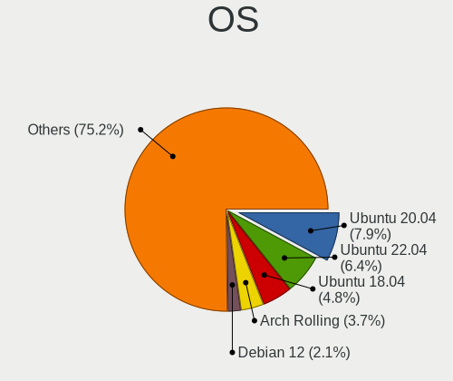
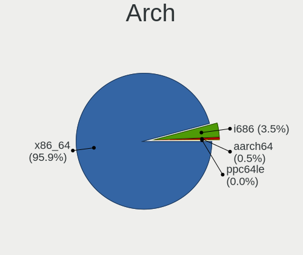
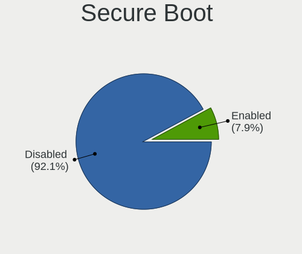
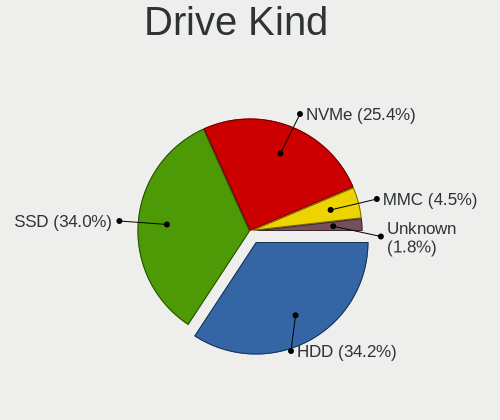
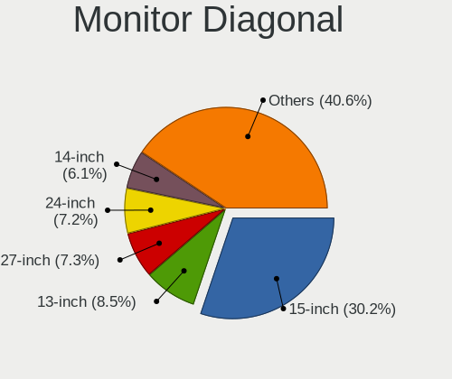
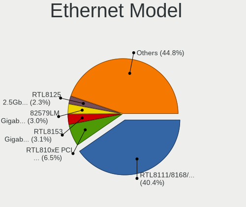

Linux in Italy - Tested Hardware & Statistics
---------------------------------------------

A project to collect tested hardware configurations for Linux in Italy.

Anyone can contribute to this report by the [hw-probe](https://github.com/linuxhw/hw-probe) tool:

    sudo -E hw-probe -all -upload

Please contribute! Especially if your hardware is rare.

This is a report for all computer types. See also reports for [desktops](/Location/Italy/Desktop/README.md) and [notebooks](/Location/Italy/Notebook/README.md).

Contents
--------

* [ Test Cases ](#test-cases)

* [ System ](#system)
  - [ OS                       ](#os)
  - [ OS Family                ](#os-family)
  - [ Kernel                   ](#kernel)
  - [ Kernel Family            ](#kernel-family)
  - [ Kernel Major Ver.        ](#kernel-major-ver)
  - [ Arch                     ](#arch)
  - [ DE                       ](#de)
  - [ Display Server           ](#display-server)
  - [ Display Manager          ](#display-manager)
  - [ OS Lang                  ](#os-lang)
  - [ Boot Mode                ](#boot-mode)
  - [ Filesystem               ](#filesystem)
  - [ Part. scheme             ](#part-scheme)
  - [ Dual Boot with Linux/BSD ](#dual-boot-with-linuxbsd)
  - [ Dual Boot (Win)          ](#dual-boot-win)

* [ Board ](#board)
  - [ Vendor                   ](#vendor)
  - [ Model                    ](#model)
  - [ Model Family             ](#model-family)
  - [ MFG Year                 ](#mfg-year)
  - [ Form Factor              ](#form-factor)
  - [ Secure Boot              ](#secure-boot)
  - [ Coreboot                 ](#coreboot)
  - [ RAM Size                 ](#ram-size)
  - [ RAM Used                 ](#ram-used)
  - [ Total Drives             ](#total-drives)
  - [ Has CD-ROM               ](#has-cd-rom)
  - [ Has Ethernet             ](#has-ethernet)
  - [ Has WiFi                 ](#has-wifi)
  - [ Has Bluetooth            ](#has-bluetooth)

* [ Location ](#location)
  - [ Country                  ](#country)
  - [ City                     ](#city)

* [ Drives ](#drives)
  - [ Drive Vendor             ](#drive-vendor)
  - [ Drive Model              ](#drive-model)
  - [ HDD Vendor               ](#hdd-vendor)
  - [ SSD Vendor               ](#ssd-vendor)
  - [ Drive Kind               ](#drive-kind)
  - [ Drive Connector          ](#drive-connector)
  - [ Drive Size               ](#drive-size)
  - [ Space Total              ](#space-total)
  - [ Space Used               ](#space-used)
  - [ Malfunc. Drives          ](#malfunc-drives)
  - [ Malfunc. Drive Vendor    ](#malfunc-drive-vendor)
  - [ Malfunc. HDD Vendor      ](#malfunc-hdd-vendor)
  - [ Malfunc. Drive Kind      ](#malfunc-drive-kind)
  - [ Failed Drives            ](#failed-drives)
  - [ Failed Drive Vendor      ](#failed-drive-vendor)
  - [ Drive Status             ](#drive-status)

* [ Storage controller ](#storage-controller)
  - [ Storage Vendor           ](#storage-vendor)
  - [ Storage Model            ](#storage-model)
  - [ Storage Kind             ](#storage-kind)

* [ Processor ](#processor)
  - [ CPU Vendor               ](#cpu-vendor)
  - [ CPU Model                ](#cpu-model)
  - [ CPU Model Family         ](#cpu-model-family)
  - [ CPU Cores                ](#cpu-cores)
  - [ CPU Sockets              ](#cpu-sockets)
  - [ CPU Threads              ](#cpu-threads)
  - [ CPU Op-Modes             ](#cpu-op-modes)
  - [ CPU Microcode            ](#cpu-microcode)
  - [ CPU Microarch            ](#cpu-microarch)

* [ Graphics ](#graphics)
  - [ GPU Vendor               ](#gpu-vendor)
  - [ GPU Model                ](#gpu-model)
  - [ GPU Combo                ](#gpu-combo)
  - [ GPU Driver               ](#gpu-driver)
  - [ GPU Memory               ](#gpu-memory)

* [ Monitor ](#monitor)
  - [ Monitor Vendor           ](#monitor-vendor)
  - [ Monitor Model            ](#monitor-model)
  - [ Monitor Resolution       ](#monitor-resolution)
  - [ Monitor Diagonal         ](#monitor-diagonal)
  - [ Monitor Width            ](#monitor-width)
  - [ Aspect Ratio             ](#aspect-ratio)
  - [ Monitor Area             ](#monitor-area)
  - [ Pixel Density            ](#pixel-density)
  - [ Multiple Monitors        ](#multiple-monitors)

* [ Network ](#network)
  - [ Net Controller Vendor    ](#net-controller-vendor)
  - [ Net Controller Model     ](#net-controller-model)
  - [ Wireless Vendor          ](#wireless-vendor)
  - [ Wireless Model           ](#wireless-model)
  - [ Ethernet Vendor          ](#ethernet-vendor)
  - [ Ethernet Model           ](#ethernet-model)
  - [ Net Controller Kind      ](#net-controller-kind)
  - [ Used Controller          ](#used-controller)
  - [ NICs                     ](#nics)
  - [ IPv6                     ](#ipv6)

* [ Bluetooth ](#bluetooth)
  - [ Bluetooth Vendor         ](#bluetooth-vendor)
  - [ Bluetooth Model          ](#bluetooth-model)

* [ Sound ](#sound)
  - [ Sound Vendor             ](#sound-vendor)
  - [ Sound Model              ](#sound-model)

* [ Memory ](#memory)
  - [ Memory Vendor            ](#memory-vendor)
  - [ Memory Model             ](#memory-model)
  - [ Memory Kind              ](#memory-kind)
  - [ Memory Form Factor       ](#memory-form-factor)
  - [ Memory Size              ](#memory-size)
  - [ Memory Speed             ](#memory-speed)

* [ Printers & scanners ](#printers--scanners)
  - [ Printer Vendor           ](#printer-vendor)
  - [ Printer Model            ](#printer-model)
  - [ Scanner Vendor           ](#scanner-vendor)
  - [ Scanner Model            ](#scanner-model)

* [ Camera ](#camera)
  - [ Camera Vendor            ](#camera-vendor)
  - [ Camera Model             ](#camera-model)

* [ Security ](#security)
  - [ Fingerprint Vendor       ](#fingerprint-vendor)
  - [ Fingerprint Model        ](#fingerprint-model)
  - [ Chipcard Vendor          ](#chipcard-vendor)
  - [ Chipcard Model           ](#chipcard-model)

* [ Unsupported ](#unsupported)
  - [ Unsupported Devices      ](#unsupported-devices)
  - [ Unsupported Device Types ](#unsupported-device-types)

Test Cases
----------

Total: 10230

| Vendor        | Model                       | Form-Factor | Probe                                                      | Date         |
|---------------|-----------------------------|-------------|------------------------------------------------------------|--------------|
| ASUSTek       | PRIME Z490-P                | Desktop     | [bbbfbb2dfc](https://linux-hardware.org/?probe=bbbfbb2dfc) | Apr 01, 2023 |
| Intel         | DB75EN AAG39650-303         | Desktop     | [50d4a766a6](https://linux-hardware.org/?probe=50d4a766a6) | Apr 01, 2023 |
| Acer          | H11H4-AI V:1.0              | Desktop     | [d5337ce0e3](https://linux-hardware.org/?probe=d5337ce0e3) | Apr 01, 2023 |
| Lenovo        | V110-15ISK 80TL             | Notebook    | [db058df07b](https://linux-hardware.org/?probe=db058df07b) | Apr 01, 2023 |
| Lenovo        | V110-15ISK 80TL             | Notebook    | [3691be13e8](https://linux-hardware.org/?probe=3691be13e8) | Apr 01, 2023 |
| HP            | Pavilion Gaming Laptop 1... | Notebook    | [70fb59cd4f](https://linux-hardware.org/?probe=70fb59cd4f) | Apr 01, 2023 |
| Unknown       | Unknown                     | Notebook    | [702a241ca6](https://linux-hardware.org/?probe=702a241ca6) | Apr 01, 2023 |
| Lenovo        | G50-45 80E3                 | Notebook    | [f75af97954](https://linux-hardware.org/?probe=f75af97954) | Apr 01, 2023 |
| Acer          | WG43M                       | Desktop     | [77cb0bf517](https://linux-hardware.org/?probe=77cb0bf517) | Apr 01, 2023 |
| HP            | Notebook                    | Notebook    | [7cb279c8e0](https://linux-hardware.org/?probe=7cb279c8e0) | Apr 01, 2023 |
| HP            | Pavilion x2 Detachable      | Notebook    | [363d925d25](https://linux-hardware.org/?probe=363d925d25) | Apr 01, 2023 |
| MSI           | X570-A PRO                  | Desktop     | [3093c50d3d](https://linux-hardware.org/?probe=3093c50d3d) | Mar 31, 2023 |
| ASUSTek       | X556UAK                     | Notebook    | [24f79c68f6](https://linux-hardware.org/?probe=24f79c68f6) | Mar 31, 2023 |
| Notebook      | W54_55SU1,SUW               | Notebook    | [74313ae73b](https://linux-hardware.org/?probe=74313ae73b) | Mar 31, 2023 |
| Microtech     | ebookPro                    | Notebook    | [ffe1da27cc](https://linux-hardware.org/?probe=ffe1da27cc) | Mar 31, 2023 |
| Acer          | Extensa 215-31              | Notebook    | [b1601e6747](https://linux-hardware.org/?probe=b1601e6747) | Mar 31, 2023 |
| Dell          | Latitude E7440              | Notebook    | [fdd9fda693](https://linux-hardware.org/?probe=fdd9fda693) | Mar 31, 2023 |
| HP            | Pavilion 15                 | Notebook    | [4dc2c9dfc1](https://linux-hardware.org/?probe=4dc2c9dfc1) | Mar 31, 2023 |
| Lenovo        | ThinkPad E14 20RA0016IX     | Notebook    | [685f18f5b3](https://linux-hardware.org/?probe=685f18f5b3) | Mar 31, 2023 |
| MSI           | B550-A PRO                  | Desktop     | [f243351def](https://linux-hardware.org/?probe=f243351def) | Mar 31, 2023 |
| ASUSTek       | ET2400E                     | All in one  | [eb1110a2f0](https://linux-hardware.org/?probe=eb1110a2f0) | Mar 31, 2023 |
| Lenovo        | Yoga 3 11 80J8              | Notebook    | [fce7483fa0](https://linux-hardware.org/?probe=fce7483fa0) | Mar 31, 2023 |
| Gigabyte      | X570 I AORUS PRO WIFI       | Desktop     | [871b458080](https://linux-hardware.org/?probe=871b458080) | Mar 31, 2023 |
| Olivetti      | Spring Peak                 | Notebook    | [9678c685d7](https://linux-hardware.org/?probe=9678c685d7) | Mar 31, 2023 |
| Gigabyte      | Z390 M-CF                   | Desktop     | [6bce2b9bc3](https://linux-hardware.org/?probe=6bce2b9bc3) | Mar 31, 2023 |
| Olivetti      | Spring Peak                 | Notebook    | [7878f53f36](https://linux-hardware.org/?probe=7878f53f36) | Mar 31, 2023 |
| Valve         | Jupiter                     | Notebook    | [34766581f3](https://linux-hardware.org/?probe=34766581f3) | Mar 31, 2023 |
| Toshiba       | Satellite Pro S500          | Notebook    | [b2e60d9170](https://linux-hardware.org/?probe=b2e60d9170) | Mar 31, 2023 |
| ASUSTek       | N552VX                      | Notebook    | [cacf95c277](https://linux-hardware.org/?probe=cacf95c277) | Mar 30, 2023 |
| DFI           | LP UT X58                   | Desktop     | [cd706d90d3](https://linux-hardware.org/?probe=cd706d90d3) | Mar 30, 2023 |
| Acer          | Aspire ES1-523              | Notebook    | [a800dab0ab](https://linux-hardware.org/?probe=a800dab0ab) | Mar 30, 2023 |
| Sony          | SVE1713X1EB                 | Notebook    | [8953aa2e04](https://linux-hardware.org/?probe=8953aa2e04) | Mar 30, 2023 |
| Packard Be... | FIH57                       | Desktop     | [f1336c6cc4](https://linux-hardware.org/?probe=f1336c6cc4) | Mar 30, 2023 |
| Lenovo        | IdeaPad 3 15ITL6 82H8       | Notebook    | [45f39402f0](https://linux-hardware.org/?probe=45f39402f0) | Mar 30, 2023 |
| Lenovo        | IdeaPad 100-14IBY 80MH      | Notebook    | [976d8a1a13](https://linux-hardware.org/?probe=976d8a1a13) | Mar 30, 2023 |
| Gigabyte      | B550M AORUS PRO-P           | Desktop     | [4ccaa78b43](https://linux-hardware.org/?probe=4ccaa78b43) | Mar 30, 2023 |
| ASUSTek       | H110M-R                     | Desktop     | [3c641024ba](https://linux-hardware.org/?probe=3c641024ba) | Mar 30, 2023 |
| Apple         | Mac-B809C3757DA9BB8D iMa... | All in one  | [e8fc7722ef](https://linux-hardware.org/?probe=e8fc7722ef) | Mar 30, 2023 |
| Dell          | Precision 3560              | Notebook    | [f6ef5c1a2c](https://linux-hardware.org/?probe=f6ef5c1a2c) | Mar 30, 2023 |
| Samsung       | 950QED                      | Convertible | [20b6d6f93d](https://linux-hardware.org/?probe=20b6d6f93d) | Mar 30, 2023 |
| Lenovo        | G505 20240                  | Notebook    | [25c5c7ee2e](https://linux-hardware.org/?probe=25c5c7ee2e) | Mar 30, 2023 |
| Toshiba       | Satellite L655              | Notebook    | [2e6ea8bf5c](https://linux-hardware.org/?probe=2e6ea8bf5c) | Mar 30, 2023 |
| Apple         | Mac-F2268DC8                | All in one  | [0e8950a217](https://linux-hardware.org/?probe=0e8950a217) | Mar 30, 2023 |
| Dell          | Latitude 5580               | Notebook    | [84157deda8](https://linux-hardware.org/?probe=84157deda8) | Mar 29, 2023 |
| Fujitsu       | D3401-A1 S26361-D3401-A1    | Desktop     | [e772d0e916](https://linux-hardware.org/?probe=e772d0e916) | Mar 29, 2023 |
| AZW           | U59                         | Desktop     | [3776cd7fb3](https://linux-hardware.org/?probe=3776cd7fb3) | Mar 29, 2023 |
| AZW           | U59                         | Desktop     | [f7958b8f39](https://linux-hardware.org/?probe=f7958b8f39) | Mar 29, 2023 |
| Fujitsu       | LIFEBOOK A555               | Notebook    | [6f28f9e6ec](https://linux-hardware.org/?probe=6f28f9e6ec) | Mar 29, 2023 |
| Lenovo        | HASWELLREFRESHDT 3190005... | All in one  | [9a6102422f](https://linux-hardware.org/?probe=9a6102422f) | Mar 29, 2023 |
| HP            | 3646h                       | Desktop     | [b173e99a5a](https://linux-hardware.org/?probe=b173e99a5a) | Mar 29, 2023 |
| MSI           | Prestige 14Evo A11M         | Notebook    | [fc06b01f31](https://linux-hardware.org/?probe=fc06b01f31) | Mar 29, 2023 |
| MSI           | Prestige 14Evo A11M         | Notebook    | [5ac693dbd4](https://linux-hardware.org/?probe=5ac693dbd4) | Mar 29, 2023 |
| Lenovo        | ThinkPad T440 20B7A0CYMH    | Notebook    | [428491a9d5](https://linux-hardware.org/?probe=428491a9d5) | Mar 29, 2023 |
| ASUSTek       | P8Z77-V LX2                 | Desktop     | [23256b54cf](https://linux-hardware.org/?probe=23256b54cf) | Mar 29, 2023 |
| HP            | Laptop 15-dw0xxx            | Notebook    | [53bc341050](https://linux-hardware.org/?probe=53bc341050) | Mar 29, 2023 |
| Lenovo        | ThinkPad L13 Yoga Gen 2 ... | Convertible | [a38bcb83b3](https://linux-hardware.org/?probe=a38bcb83b3) | Mar 29, 2023 |
| Valve         | Jupiter                     | Notebook    | [889e4e5eef](https://linux-hardware.org/?probe=889e4e5eef) | Mar 29, 2023 |
| Acer          | H11H4-AI V:1.0              | Desktop     | [4266c0287d](https://linux-hardware.org/?probe=4266c0287d) | Mar 29, 2023 |
| MSI           | X570-A PRO                  | Desktop     | [0921fd9096](https://linux-hardware.org/?probe=0921fd9096) | Mar 28, 2023 |
| HP            | ProBook 640 G1              | Notebook    | [c9ac2eb353](https://linux-hardware.org/?probe=c9ac2eb353) | Mar 28, 2023 |
| Lenovo        | IdeaPad 3 15IML05 81WB      | Notebook    | [5520b0fc5f](https://linux-hardware.org/?probe=5520b0fc5f) | Mar 28, 2023 |
| MSI           | B450-A PRO MAX              | Desktop     | [f3ebf80a3d](https://linux-hardware.org/?probe=f3ebf80a3d) | Mar 28, 2023 |
| HP            | OMEN Laptop 15-ek0xxx       | Notebook    | [f44d26ed76](https://linux-hardware.org/?probe=f44d26ed76) | Mar 28, 2023 |
| Acer          | One S1003                   | Tablet      | [89fa2c4ac3](https://linux-hardware.org/?probe=89fa2c4ac3) | Mar 28, 2023 |
| ASUSTek       | TUF Z390-PRO GAMING         | Desktop     | [5ac9dd16da](https://linux-hardware.org/?probe=5ac9dd16da) | Mar 28, 2023 |
| Acer          | Swift SF314-511             | Notebook    | [ccef379a7f](https://linux-hardware.org/?probe=ccef379a7f) | Mar 28, 2023 |
| HP            | ProBook 450 G7              | Notebook    | [8b27d78a17](https://linux-hardware.org/?probe=8b27d78a17) | Mar 28, 2023 |
| Dell          | Inspiron 16 5630            | Notebook    | [5838554410](https://linux-hardware.org/?probe=5838554410) | Mar 28, 2023 |
| ASUSTek       | N53SV                       | Notebook    | [77aa77b2a3](https://linux-hardware.org/?probe=77aa77b2a3) | Mar 28, 2023 |
| Unknown       | Unknown                     | Notebook    | [26d819f9fc](https://linux-hardware.org/?probe=26d819f9fc) | Mar 27, 2023 |
| HP            | 250 G1                      | Notebook    | [75cf798dde](https://linux-hardware.org/?probe=75cf798dde) | Mar 27, 2023 |
| Sony          | SVE1713X1EB                 | Notebook    | [fa77641b57](https://linux-hardware.org/?probe=fa77641b57) | Mar 27, 2023 |
| HP            | 18E6                        | Desktop     | [a406dc2463](https://linux-hardware.org/?probe=a406dc2463) | Mar 27, 2023 |
| Dell          | XPS 13 9305                 | Notebook    | [2f96abf16a](https://linux-hardware.org/?probe=2f96abf16a) | Mar 27, 2023 |
| Dell          | XPS 13 9305                 | Notebook    | [07caea9176](https://linux-hardware.org/?probe=07caea9176) | Mar 27, 2023 |
| Acer          | Mammoth                     | Notebook    | [d43ab9891b](https://linux-hardware.org/?probe=d43ab9891b) | Mar 27, 2023 |
| ASUSTek       | X79-DELUXE                  | Desktop     | [da016d15c7](https://linux-hardware.org/?probe=da016d15c7) | Mar 27, 2023 |
| Sony          | VPCEH1S1E                   | Notebook    | [081294b14c](https://linux-hardware.org/?probe=081294b14c) | Mar 27, 2023 |
| Unknown       | Unknown                     | Desktop     | [6f77d9be36](https://linux-hardware.org/?probe=6f77d9be36) | Mar 26, 2023 |
| Lenovo        | G50-45 80E3                 | Notebook    | [279d3659a9](https://linux-hardware.org/?probe=279d3659a9) | Mar 26, 2023 |
| ASUSTek       | X550LD                      | Notebook    | [6ac498fa82](https://linux-hardware.org/?probe=6ac498fa82) | Mar 26, 2023 |
| ASUSTek       | N552VW                      | Notebook    | [322426698a](https://linux-hardware.org/?probe=322426698a) | Mar 26, 2023 |
| Shenzhen M... | HX90G                       | Desktop     | [fb3f1be00d](https://linux-hardware.org/?probe=fb3f1be00d) | Mar 26, 2023 |
| MSI           | B550-A PRO                  | Desktop     | [eddf5a759a](https://linux-hardware.org/?probe=eddf5a759a) | Mar 26, 2023 |
| ASRock        | H61M-DGS                    | Desktop     | [76fc7291a6](https://linux-hardware.org/?probe=76fc7291a6) | Mar 26, 2023 |
| Apple         | MacBookPro11,5              | Notebook    | [0c2be4a34c](https://linux-hardware.org/?probe=0c2be4a34c) | Mar 26, 2023 |
| Intel         | NUC5i7RYB H73774-105        | Mini pc     | [584e5e014a](https://linux-hardware.org/?probe=584e5e014a) | Mar 26, 2023 |
| Dell          | XPS 13 9305                 | Notebook    | [5b29fbd6ac](https://linux-hardware.org/?probe=5b29fbd6ac) | Mar 26, 2023 |
| Sony          | SVE1713X1EB                 | Notebook    | [cf11e69c46](https://linux-hardware.org/?probe=cf11e69c46) | Mar 26, 2023 |
| HP            | 250 15.6 inch G9 Noteboo... | Notebook    | [55c29cec29](https://linux-hardware.org/?probe=55c29cec29) | Mar 26, 2023 |
| Acer          | Veriton M2631 V:1.0         | Desktop     | [4a4f12631a](https://linux-hardware.org/?probe=4a4f12631a) | Mar 26, 2023 |
| ASUSTek       | M5A78L-M/USB3               | Desktop     | [c7e347798a](https://linux-hardware.org/?probe=c7e347798a) | Mar 26, 2023 |
| ASUSTek       | STRIX Z270I GAMING          | Desktop     | [4253088a92](https://linux-hardware.org/?probe=4253088a92) | Mar 25, 2023 |
| HP            | Compaq 6730s                | Notebook    | [ca30390612](https://linux-hardware.org/?probe=ca30390612) | Mar 25, 2023 |
| MSI           | Z170A PC MATE               | Desktop     | [ad4b4f6a8f](https://linux-hardware.org/?probe=ad4b4f6a8f) | Mar 25, 2023 |
| HP            | Laptop 15-dw3xxx            | Notebook    | [3b8cd70b69](https://linux-hardware.org/?probe=3b8cd70b69) | Mar 25, 2023 |
| MSI           | Katana GF66 12UG            | Notebook    | [9e03ac14c0](https://linux-hardware.org/?probe=9e03ac14c0) | Mar 25, 2023 |
| Lenovo        | V130-15IKB 81HN             | Notebook    | [0bfaf1252f](https://linux-hardware.org/?probe=0bfaf1252f) | Mar 25, 2023 |
| Dell          | Latitude E6230              | Notebook    | [1a248bdc33](https://linux-hardware.org/?probe=1a248bdc33) | Mar 25, 2023 |
| Acer          | Aspire A517-52G             | Notebook    | [ce3133a010](https://linux-hardware.org/?probe=ce3133a010) | Mar 25, 2023 |
| ASUSTek       | ROG Maximus XII FORMULA     | Desktop     | [bf5cc186ea](https://linux-hardware.org/?probe=bf5cc186ea) | Mar 25, 2023 |
| ASUSTek       | GL503VS                     | Notebook    | [8e066fcf6e](https://linux-hardware.org/?probe=8e066fcf6e) | Mar 25, 2023 |
| Lenovo        | ThinkPad X1 Yoga 2nd 20J... | Convertible | [5b3d7995b2](https://linux-hardware.org/?probe=5b3d7995b2) | Mar 25, 2023 |
| ASRock        | X570 Phantom Gaming 4       | Desktop     | [518cef7fe4](https://linux-hardware.org/?probe=518cef7fe4) | Mar 24, 2023 |
| ASUSTek       | M32CD_A_F_K20CD_K31CD       | Desktop     | [dc56fbfedb](https://linux-hardware.org/?probe=dc56fbfedb) | Mar 24, 2023 |
| ASUSTek       | M32CD_A_F_K20CD_K31CD       | Desktop     | [67d60d55e4](https://linux-hardware.org/?probe=67d60d55e4) | Mar 24, 2023 |
| Lenovo        | Z50-75 80EC                 | Notebook    | [d6783c57a6](https://linux-hardware.org/?probe=d6783c57a6) | Mar 24, 2023 |
| Lenovo        | Z50-75 80EC                 | Notebook    | [353666c217](https://linux-hardware.org/?probe=353666c217) | Mar 24, 2023 |
| Dell          | XPS 13 9305                 | Notebook    | [c7e354ffe3](https://linux-hardware.org/?probe=c7e354ffe3) | Mar 24, 2023 |
| Apple         | MacBookPro11,5              | Notebook    | [9fd6508caf](https://linux-hardware.org/?probe=9fd6508caf) | Mar 24, 2023 |
| Dell          | Latitude 5580               | Notebook    | [d4ad4c55a6](https://linux-hardware.org/?probe=d4ad4c55a6) | Mar 24, 2023 |
| ASUSTek       | P8P67 PRO                   | Desktop     | [7ed577df49](https://linux-hardware.org/?probe=7ed577df49) | Mar 23, 2023 |
| ASUSTek       | K53SJ                       | Notebook    | [175f99ccdd](https://linux-hardware.org/?probe=175f99ccdd) | Mar 23, 2023 |
| Acer          | Aspire E3-112               | Notebook    | [721e804a03](https://linux-hardware.org/?probe=721e804a03) | Mar 23, 2023 |
| HUAWEI        | BOD-WXX9                    | Notebook    | [088494906d](https://linux-hardware.org/?probe=088494906d) | Mar 23, 2023 |
| MSI           | Z590-A PRO                  | Desktop     | [ad6a144db9](https://linux-hardware.org/?probe=ad6a144db9) | Mar 23, 2023 |
| Lenovo        | SDK0F82993 WIN              | Desktop     | [fbff3ec47c](https://linux-hardware.org/?probe=fbff3ec47c) | Mar 23, 2023 |
| HP            | ProBook 440 G8 Notebook ... | Notebook    | [aba9609828](https://linux-hardware.org/?probe=aba9609828) | Mar 23, 2023 |
| Dell          | Inspiron 1750               | Notebook    | [007a0b3bb7](https://linux-hardware.org/?probe=007a0b3bb7) | Mar 22, 2023 |
| Dell          | XPS 9315                    | Notebook    | [b082aa6edf](https://linux-hardware.org/?probe=b082aa6edf) | Mar 22, 2023 |
| Dell          | XPS 9315                    | Notebook    | [9a14590477](https://linux-hardware.org/?probe=9a14590477) | Mar 22, 2023 |
| TrekStor      | Notebook Slim S130          | Notebook    | [6c3a6e7e53](https://linux-hardware.org/?probe=6c3a6e7e53) | Mar 22, 2023 |
| Toshiba       | Satellite Pro S500          | Notebook    | [2bb2519c2c](https://linux-hardware.org/?probe=2bb2519c2c) | Mar 21, 2023 |
| Toshiba       | Satellite Pro S500          | Notebook    | [a45c7086e5](https://linux-hardware.org/?probe=a45c7086e5) | Mar 21, 2023 |
| Dell          | XPS 15 9570                 | Notebook    | [6fc76628d3](https://linux-hardware.org/?probe=6fc76628d3) | Mar 21, 2023 |
| HP            | 250 15.6 inch G9 Noteboo... | Notebook    | [b4d5442d02](https://linux-hardware.org/?probe=b4d5442d02) | Mar 21, 2023 |
| Gigabyte      | H81M-S2PV                   | Desktop     | [ac856abadc](https://linux-hardware.org/?probe=ac856abadc) | Mar 21, 2023 |
| Apple         | Mac-F226BEC8 PVT            | All in one  | [074de9621d](https://linux-hardware.org/?probe=074de9621d) | Mar 21, 2023 |
| MSI           | Prestige 14Evo A11M         | Notebook    | [cac8d6b991](https://linux-hardware.org/?probe=cac8d6b991) | Mar 21, 2023 |
| HP            | Pavilion Laptop 15-cs2xx... | Notebook    | [6d96576431](https://linux-hardware.org/?probe=6d96576431) | Mar 21, 2023 |
| Dell          | Inspiron 5570               | Notebook    | [e311e9a53a](https://linux-hardware.org/?probe=e311e9a53a) | Mar 21, 2023 |
| ASRock        | B550M Pro4                  | Desktop     | [de1c89d1b0](https://linux-hardware.org/?probe=de1c89d1b0) | Mar 21, 2023 |
| Dell          | 0D441T A03                  | Desktop     | [926d18b722](https://linux-hardware.org/?probe=926d18b722) | Mar 20, 2023 |
| Acer          | Extensa 5235                | Notebook    | [270cd6ed83](https://linux-hardware.org/?probe=270cd6ed83) | Mar 20, 2023 |
| Lenovo        | ThinkPad T480s 20L8002WM... | Notebook    | [762762da77](https://linux-hardware.org/?probe=762762da77) | Mar 20, 2023 |
| Acer          | Aspire C24-320              | All in one  | [f320bc5964](https://linux-hardware.org/?probe=f320bc5964) | Mar 20, 2023 |
| Acer          | Veriton M4610G              | Desktop     | [fed7efcecb](https://linux-hardware.org/?probe=fed7efcecb) | Mar 20, 2023 |
| Acer          | Aspire C24-320              | All in one  | [21de7ff6d5](https://linux-hardware.org/?probe=21de7ff6d5) | Mar 20, 2023 |
| HP            | 872E                        | Mini pc     | [4be8ddc98e](https://linux-hardware.org/?probe=4be8ddc98e) | Mar 20, 2023 |
| Lenovo        | ThinkBook 13s G2 ITL 20V... | Notebook    | [0a71696d3b](https://linux-hardware.org/?probe=0a71696d3b) | Mar 20, 2023 |
| Techvision    | TVI7309X B0                 | Desktop     | [67b681a703](https://linux-hardware.org/?probe=67b681a703) | Mar 20, 2023 |
| HP            | Laptop 15s-eq3xxx           | Notebook    | [83fbe3a3d6](https://linux-hardware.org/?probe=83fbe3a3d6) | Mar 20, 2023 |
| ASUSTek       | CROSSHAIR VI HERO           | Desktop     | [42290142fb](https://linux-hardware.org/?probe=42290142fb) | Mar 19, 2023 |
| ASUSTek       | ROG STRIX Z590-F GAMING ... | Desktop     | [3500d84a8e](https://linux-hardware.org/?probe=3500d84a8e) | Mar 19, 2023 |
| Notebook      | P15SM                       | Notebook    | [00d7786f9f](https://linux-hardware.org/?probe=00d7786f9f) | Mar 19, 2023 |
| ASRock        | H61M-DGS                    | Desktop     | [2b86166550](https://linux-hardware.org/?probe=2b86166550) | Mar 19, 2023 |
| Microtech     | CoreBook                    | Notebook    | [d50c0297a6](https://linux-hardware.org/?probe=d50c0297a6) | Mar 19, 2023 |
| HP            | G62                         | Notebook    | [2cb4092da0](https://linux-hardware.org/?probe=2cb4092da0) | Mar 19, 2023 |
| HP            | G62                         | Notebook    | [76d7e36f21](https://linux-hardware.org/?probe=76d7e36f21) | Mar 19, 2023 |
| ASUSTek       | VivoBook_ASUSLaptop X509... | Notebook    | [cbad8c5f1e](https://linux-hardware.org/?probe=cbad8c5f1e) | Mar 18, 2023 |
| Lenovo        | ThinkPad T460s 20FAS6PN0... | Notebook    | [bb86a34180](https://linux-hardware.org/?probe=bb86a34180) | Mar 18, 2023 |
| Lenovo        | IdeaPad 120S-14IAP 81A5     | Notebook    | [a3339e152a](https://linux-hardware.org/?probe=a3339e152a) | Mar 18, 2023 |
| Gigabyte      | 970A-DS3P                   | Desktop     | [727e5c46b7](https://linux-hardware.org/?probe=727e5c46b7) | Mar 18, 2023 |
| Quanta        | XV1                         | All in one  | [2bbbb73d41](https://linux-hardware.org/?probe=2bbbb73d41) | Mar 18, 2023 |
| MSI           | H55M-P31                    | Desktop     | [e95e62df99](https://linux-hardware.org/?probe=e95e62df99) | Mar 18, 2023 |
| HP            | Laptop 15-dw1xxx            | Notebook    | [63ecda6230](https://linux-hardware.org/?probe=63ecda6230) | Mar 18, 2023 |
| HP            | 18E7                        | Desktop     | [9f4d303ffa](https://linux-hardware.org/?probe=9f4d303ffa) | Mar 18, 2023 |
| ASRock        | X570 Phantom Gaming 4       | Desktop     | [b346ffbe8e](https://linux-hardware.org/?probe=b346ffbe8e) | Mar 18, 2023 |
| Lenovo        | IdeaPadFlex 5 14ALC05 82... | Convertible | [b21fb664f8](https://linux-hardware.org/?probe=b21fb664f8) | Mar 17, 2023 |
| ASUSTek       | TUF B350M-PLUS GAMING       | Desktop     | [be6db6cc62](https://linux-hardware.org/?probe=be6db6cc62) | Mar 17, 2023 |
| MSI           | PRO B660M-A WIFI DDR4       | Desktop     | [7298c4b04b](https://linux-hardware.org/?probe=7298c4b04b) | Mar 17, 2023 |
| AMI           | Intel                       | Desktop     | [491d2cca9d](https://linux-hardware.org/?probe=491d2cca9d) | Mar 17, 2023 |
| HP            | ProBook 6570b               | Notebook    | [f5c9cd8419](https://linux-hardware.org/?probe=f5c9cd8419) | Mar 17, 2023 |
| MSI           | PRO B660M-A WIFI DDR4       | Desktop     | [794bc239ab](https://linux-hardware.org/?probe=794bc239ab) | Mar 17, 2023 |
| HP            | 255 G3                      | Notebook    | [3e5f860704](https://linux-hardware.org/?probe=3e5f860704) | Mar 17, 2023 |
| Lenovo        | MIIX 310-10ICR 80SG         | Tablet      | [ef104e7202](https://linux-hardware.org/?probe=ef104e7202) | Mar 17, 2023 |
| Lenovo        | IdeaPad 5 Pro 14ACN6 82L... | Notebook    | [2530e262d2](https://linux-hardware.org/?probe=2530e262d2) | Mar 17, 2023 |
| ASUSTek       | K61IC                       | Notebook    | [045474725b](https://linux-hardware.org/?probe=045474725b) | Mar 17, 2023 |
| Lenovo        | ThinkPad T480s 20L8S88M0... | Notebook    | [2ad89b7995](https://linux-hardware.org/?probe=2ad89b7995) | Mar 16, 2023 |
| HP            | Pavilion Laptop 15-ck0xx    | Notebook    | [6a1e908693](https://linux-hardware.org/?probe=6a1e908693) | Mar 16, 2023 |
| ASUSTek       | VivoBook_ASUSLaptop M340... | Notebook    | [2cb5e6ce4f](https://linux-hardware.org/?probe=2cb5e6ce4f) | Mar 16, 2023 |
| Dell          | Latitude E5470              | Notebook    | [cc4f08349d](https://linux-hardware.org/?probe=cc4f08349d) | Mar 16, 2023 |
| MSI           | B550-A PRO                  | Desktop     | [730eec29f4](https://linux-hardware.org/?probe=730eec29f4) | Mar 16, 2023 |
| MSI           | Modern 14 B11MOL            | Notebook    | [33bbc272c0](https://linux-hardware.org/?probe=33bbc272c0) | Mar 15, 2023 |
| Lenovo        | ThinkPad P14s Gen 2a 21A... | Notebook    | [c454542aaa](https://linux-hardware.org/?probe=c454542aaa) | Mar 15, 2023 |
| Valve         | Jupiter                     | Notebook    | [fc387a787e](https://linux-hardware.org/?probe=fc387a787e) | Mar 15, 2023 |
| Toshiba       | Satellite Pro S500          | Notebook    | [0065669867](https://linux-hardware.org/?probe=0065669867) | Mar 15, 2023 |
| ASUSTek       | VivoBook_ASUSLaptop X530... | Notebook    | [b0b311216d](https://linux-hardware.org/?probe=b0b311216d) | Mar 14, 2023 |
| ASUSTek       | P5KPL-AM SE                 | Desktop     | [37f8d341e3](https://linux-hardware.org/?probe=37f8d341e3) | Mar 14, 2023 |
| ASUSTek       | H61M-K                      | Desktop     | [783ff991d4](https://linux-hardware.org/?probe=783ff991d4) | Mar 14, 2023 |
| ASUSTek       | P5KPL-AM SE                 | Desktop     | [ce69431d69](https://linux-hardware.org/?probe=ce69431d69) | Mar 14, 2023 |
| Lenovo        | ThinkPad X1 Carbon 6th 2... | Notebook    | [0f6370d7f7](https://linux-hardware.org/?probe=0f6370d7f7) | Mar 14, 2023 |
| ASUSTek       | U36SD                       | Notebook    | [74e2dfbbc6](https://linux-hardware.org/?probe=74e2dfbbc6) | Mar 14, 2023 |
| HP            | ProLiant DL380 G4           | Server      | [403a18bfff](https://linux-hardware.org/?probe=403a18bfff) | Mar 14, 2023 |
| HP            | EliteBook x360 1030 G2      | Convertible | [ec3dcfdbc0](https://linux-hardware.org/?probe=ec3dcfdbc0) | Mar 14, 2023 |
| HP            | EliteBook x360 1030 G2      | Convertible | [64f7f16909](https://linux-hardware.org/?probe=64f7f16909) | Mar 14, 2023 |
| HP            | Pavilion Laptop 15-ck0xx    | Notebook    | [d9f9e09a41](https://linux-hardware.org/?probe=d9f9e09a41) | Mar 14, 2023 |
| ASUSTek       | Rampage V EXTREME           | Desktop     | [e186537a7e](https://linux-hardware.org/?probe=e186537a7e) | Mar 14, 2023 |
| Lenovo        | ThinkPad X1 Yoga 1st 20F... | Convertible | [af6b7e8138](https://linux-hardware.org/?probe=af6b7e8138) | Mar 13, 2023 |
| HP            | Pavilion Laptop 15-ck0xx    | Notebook    | [be16fd4aab](https://linux-hardware.org/?probe=be16fd4aab) | Mar 13, 2023 |
| HP            | Pro x2 612 G2               | Tablet      | [6ecc8f0bad](https://linux-hardware.org/?probe=6ecc8f0bad) | Mar 13, 2023 |
| ASUSTek       | GL753VE                     | Notebook    | [8100c63113](https://linux-hardware.org/?probe=8100c63113) | Mar 13, 2023 |
| HP            | Pavilion dv6500             | Notebook    | [03097b6049](https://linux-hardware.org/?probe=03097b6049) | Mar 13, 2023 |
| Dell          | XPS 15 9570                 | Notebook    | [456057e6af](https://linux-hardware.org/?probe=456057e6af) | Mar 13, 2023 |
| Dell          | XPS 15 9570                 | Notebook    | [7ee93079fb](https://linux-hardware.org/?probe=7ee93079fb) | Mar 13, 2023 |
| Lenovo        | ThinkPad T495s 20QJCTO1W... | Notebook    | [ee01825196](https://linux-hardware.org/?probe=ee01825196) | Mar 13, 2023 |
| HP            | Pro x2 612 G2               | Tablet      | [13f42eb616](https://linux-hardware.org/?probe=13f42eb616) | Mar 13, 2023 |
| Quanta        | XV1                         | All in one  | [930e98f517](https://linux-hardware.org/?probe=930e98f517) | Mar 13, 2023 |
| HP            | 18E7                        | Desktop     | [2042edf904](https://linux-hardware.org/?probe=2042edf904) | Mar 12, 2023 |
| Acer          | One S1003                   | Tablet      | [89fff0b13a](https://linux-hardware.org/?probe=89fff0b13a) | Mar 12, 2023 |
| Fujitsu       | D2912-A1 S26361-D2912-A1    | Desktop     | [a7105953c2](https://linux-hardware.org/?probe=a7105953c2) | Mar 12, 2023 |
| Lenovo        | IdeaPad Z500 20202          | Notebook    | [a7d30f68b1](https://linux-hardware.org/?probe=a7d30f68b1) | Mar 12, 2023 |
| Acer          | aspire5740                  | Notebook    | [d5e64f31d4](https://linux-hardware.org/?probe=d5e64f31d4) | Mar 12, 2023 |
| MSI           | P55-CD53                    | Desktop     | [d492118b16](https://linux-hardware.org/?probe=d492118b16) | Mar 12, 2023 |
| ASRock        | B460M Pro4                  | Desktop     | [50e790583a](https://linux-hardware.org/?probe=50e790583a) | Mar 12, 2023 |
| ASRock        | B450 Pro4                   | Desktop     | [4dd7be5be9](https://linux-hardware.org/?probe=4dd7be5be9) | Mar 12, 2023 |
| ASRock        | B450 Pro4                   | Desktop     | [ce0343a044](https://linux-hardware.org/?probe=ce0343a044) | Mar 12, 2023 |
| ASUSTek       | CROSSHAIR VI HERO           | Desktop     | [17431ae177](https://linux-hardware.org/?probe=17431ae177) | Mar 12, 2023 |
| HP            | Laptop 15s-fq5xxx           | Notebook    | [5bf763c288](https://linux-hardware.org/?probe=5bf763c288) | Mar 11, 2023 |
| Dell          | 0P03DX A04                  | Desktop     | [e1c38bafaa](https://linux-hardware.org/?probe=e1c38bafaa) | Mar 11, 2023 |
| Dell          | Latitude E6440              | Notebook    | [e5ba284442](https://linux-hardware.org/?probe=e5ba284442) | Mar 11, 2023 |
| HP            | G61                         | Notebook    | [2f5e9f6f43](https://linux-hardware.org/?probe=2f5e9f6f43) | Mar 11, 2023 |
| Lenovo        | 3141 SDK0J40700 WIN 3258... | Desktop     | [b7de8d093d](https://linux-hardware.org/?probe=b7de8d093d) | Mar 11, 2023 |
| Sony          | SVE1713X1EB                 | Notebook    | [2a7d9091ff](https://linux-hardware.org/?probe=2a7d9091ff) | Mar 11, 2023 |
| ASUSTek       | CROSSHAIR VI HERO           | Desktop     | [278b9e10a7](https://linux-hardware.org/?probe=278b9e10a7) | Mar 11, 2023 |
| Dell          | 0HY9JP A00                  | Desktop     | [caaa97e4ba](https://linux-hardware.org/?probe=caaa97e4ba) | Mar 11, 2023 |
| MSI           | Z590-A PRO                  | Desktop     | [c0c43b3296](https://linux-hardware.org/?probe=c0c43b3296) | Mar 11, 2023 |
| ASUSTek       | X556UQK                     | Notebook    | [e5c898a856](https://linux-hardware.org/?probe=e5c898a856) | Mar 11, 2023 |
| HP            | Pavilion x360 Convertibl... | Convertible | [5d7fdfa3ab](https://linux-hardware.org/?probe=5d7fdfa3ab) | Mar 11, 2023 |
| Lenovo        | IdeaPad Z500 20202          | Notebook    | [d7ed4aaf2c](https://linux-hardware.org/?probe=d7ed4aaf2c) | Mar 11, 2023 |
| ASUSTek       | ROG Zephyrus G15 GA503QS... | Notebook    | [4664479644](https://linux-hardware.org/?probe=4664479644) | Mar 11, 2023 |
| Lenovo        | IdeaPad Z500 20202          | Notebook    | [6e97141469](https://linux-hardware.org/?probe=6e97141469) | Mar 10, 2023 |
| Acer          | Aspire TC-380               | Desktop     | [563bd52487](https://linux-hardware.org/?probe=563bd52487) | Mar 10, 2023 |
| HP            | EliteBook 840 G1            | Notebook    | [1315898b67](https://linux-hardware.org/?probe=1315898b67) | Mar 10, 2023 |
| ASUSTek       | VivoBook_ASUSLaptop M760... | Notebook    | [ffcc55bb14](https://linux-hardware.org/?probe=ffcc55bb14) | Mar 10, 2023 |
| Lenovo        | ThinkPad T460 20LPS3K002    | Notebook    | [c375b36f4a](https://linux-hardware.org/?probe=c375b36f4a) | Mar 10, 2023 |
| ASRock        | H410M-HVS                   | Desktop     | [689186d7de](https://linux-hardware.org/?probe=689186d7de) | Mar 10, 2023 |
| Lenovo        | ThinkPad T495s 20QJCTO1W... | Notebook    | [420b463f4d](https://linux-hardware.org/?probe=420b463f4d) | Mar 10, 2023 |
| MSI           | B550-A PRO                  | Desktop     | [493a2b9df6](https://linux-hardware.org/?probe=493a2b9df6) | Mar 10, 2023 |
| Gigabyte      | Z370N WIFI-CF               | Desktop     | [0fb1309bff](https://linux-hardware.org/?probe=0fb1309bff) | Mar 10, 2023 |
| ASUSTek       | X540LA                      | Notebook    | [de3c24e686](https://linux-hardware.org/?probe=de3c24e686) | Mar 10, 2023 |
| HP            | 2B35                        | Desktop     | [ddb4d051ab](https://linux-hardware.org/?probe=ddb4d051ab) | Mar 09, 2023 |
| HP            | 2B35                        | Desktop     | [83f9096b77](https://linux-hardware.org/?probe=83f9096b77) | Mar 09, 2023 |
| Lenovo        | IdeaPad 330S-15IKB 81F5     | Notebook    | [041ebfc8c6](https://linux-hardware.org/?probe=041ebfc8c6) | Mar 09, 2023 |
| MSI           | 970A-G46                    | Desktop     | [322eb2bdf0](https://linux-hardware.org/?probe=322eb2bdf0) | Mar 09, 2023 |
| Lenovo        | ThinkPad T440p 20AWS0XX0... | Notebook    | [780937bb9f](https://linux-hardware.org/?probe=780937bb9f) | Mar 09, 2023 |
| Acer          | Veriton M480                | Desktop     | [8cd45e8525](https://linux-hardware.org/?probe=8cd45e8525) | Mar 09, 2023 |
| Lenovo        | IdeaPad 320-15AST 80XV      | Notebook    | [ffbffb33ae](https://linux-hardware.org/?probe=ffbffb33ae) | Mar 09, 2023 |
| ASRock        | H61M-ITX                    | Desktop     | [ab7e81c6ca](https://linux-hardware.org/?probe=ab7e81c6ca) | Mar 09, 2023 |
| Fujitsu       | LIFEBOOK U7312              | Notebook    | [74bbf2c865](https://linux-hardware.org/?probe=74bbf2c865) | Mar 09, 2023 |
| Intel         | NUC10i3FNB K61362-303       | Mini pc     | [d19762a0e5](https://linux-hardware.org/?probe=d19762a0e5) | Mar 09, 2023 |
| Lenovo        | IdeaPad 5 Pro 14ACN6 82L... | Notebook    | [796b1ad7cb](https://linux-hardware.org/?probe=796b1ad7cb) | Mar 09, 2023 |
| HP            | Compaq Presario CQ60        | Notebook    | [4167bec602](https://linux-hardware.org/?probe=4167bec602) | Mar 09, 2023 |
| HP            | 8433 11                     | Desktop     | [95f33803c0](https://linux-hardware.org/?probe=95f33803c0) | Mar 08, 2023 |
| Lenovo        | ThinkPad T495s 20QJCTO1W... | Notebook    | [8faa1d14ca](https://linux-hardware.org/?probe=8faa1d14ca) | Mar 08, 2023 |
| ASRock        | 970 Performance             | Desktop     | [c018d98ddc](https://linux-hardware.org/?probe=c018d98ddc) | Mar 08, 2023 |
| Lenovo        | CRESCENTBAY 31900056 PRO... | All in one  | [4189f851d8](https://linux-hardware.org/?probe=4189f851d8) | Mar 08, 2023 |
| Lenovo        | ThinkPad E490 20N9S21H00    | Notebook    | [0bb64aee2c](https://linux-hardware.org/?probe=0bb64aee2c) | Mar 08, 2023 |
| ASUSTek       | H81T                        | Desktop     | [c17251dbd9](https://linux-hardware.org/?probe=c17251dbd9) | Mar 08, 2023 |
| ASUSTek       | ROG STRIX X470-F GAMING     | Desktop     | [3629efc5a5](https://linux-hardware.org/?probe=3629efc5a5) | Mar 08, 2023 |
| HP            | Pavilion x2 Detachable      | Notebook    | [04ef76ee4a](https://linux-hardware.org/?probe=04ef76ee4a) | Mar 07, 2023 |
| Timi          | TM1701                      | Notebook    | [3a94d06b73](https://linux-hardware.org/?probe=3a94d06b73) | Mar 07, 2023 |
| ASUSTek       | ZenBook UX363EA_UX363EA     | Convertible | [4630034dbc](https://linux-hardware.org/?probe=4630034dbc) | Mar 07, 2023 |
| HP            | Pavilion dv6                | Notebook    | [a1631eb10b](https://linux-hardware.org/?probe=a1631eb10b) | Mar 07, 2023 |
| Gigabyte      | A320M-S2H-CF                | Desktop     | [00ddbf4ad1](https://linux-hardware.org/?probe=00ddbf4ad1) | Mar 07, 2023 |
| Acer          | Veriton X4610G              | Desktop     | [7f5cb2ac6a](https://linux-hardware.org/?probe=7f5cb2ac6a) | Mar 07, 2023 |
| MSI           | MPG B550 GAMING EDGE WIF... | Desktop     | [ced1079ce2](https://linux-hardware.org/?probe=ced1079ce2) | Mar 07, 2023 |
| Dell          | Latitude 5300 2-in-1        | Convertible | [5a706c6543](https://linux-hardware.org/?probe=5a706c6543) | Mar 07, 2023 |
| HP            | ENVY x360 Convertible 13... | Convertible | [0a85b4da67](https://linux-hardware.org/?probe=0a85b4da67) | Mar 07, 2023 |
| Unknown       | Unknown                     | Notebook    | [fdc4f4d3c6](https://linux-hardware.org/?probe=fdc4f4d3c6) | Mar 07, 2023 |
| Dell          | Latitude 5330               | Notebook    | [c99cbe9970](https://linux-hardware.org/?probe=c99cbe9970) | Mar 07, 2023 |
| HP            | EliteBook 840 G1            | Notebook    | [f56dc75b4e](https://linux-hardware.org/?probe=f56dc75b4e) | Mar 07, 2023 |
| Lenovo        | MAHOBAY                     | Desktop     | [e4e709f69a](https://linux-hardware.org/?probe=e4e709f69a) | Mar 07, 2023 |
| Lenovo        | IdeaPad 3 15ALC6 82KU       | Notebook    | [16c33be9a3](https://linux-hardware.org/?probe=16c33be9a3) | Mar 07, 2023 |
| HUAWEI        | NBLK-WAX9X                  | Notebook    | [be24c7e178](https://linux-hardware.org/?probe=be24c7e178) | Mar 07, 2023 |
| Acer          | H11H4-AI V:1.0              | Desktop     | [ff1a57749f](https://linux-hardware.org/?probe=ff1a57749f) | Mar 07, 2023 |
| Acer          | H11H4-AI V:1.0              | Desktop     | [37f7cabb58](https://linux-hardware.org/?probe=37f7cabb58) | Mar 07, 2023 |
| Acer          | Aspire E5-575G              | Notebook    | [fd8c378fda](https://linux-hardware.org/?probe=fd8c378fda) | Mar 07, 2023 |
| ASUSTek       | X556UAK                     | Notebook    | [51f2084195](https://linux-hardware.org/?probe=51f2084195) | Mar 06, 2023 |
| Lenovo        | IdeaPad S540-14IWL 81ND     | Notebook    | [745898b5de](https://linux-hardware.org/?probe=745898b5de) | Mar 06, 2023 |
| Lenovo        | IdeaPad Z500 20202          | Notebook    | [8a70478523](https://linux-hardware.org/?probe=8a70478523) | Mar 06, 2023 |
| ASUSTek       | PRIME Z690-P WIFI D4        | Desktop     | [ad0dbd5503](https://linux-hardware.org/?probe=ad0dbd5503) | Mar 06, 2023 |
| Chuwi         | LarkBox Pro                 | Mini pc     | [256a8abb58](https://linux-hardware.org/?probe=256a8abb58) | Mar 06, 2023 |
| ASUSTek       | PRIME Z690-P WIFI D4        | Desktop     | [0f36c1b0f7](https://linux-hardware.org/?probe=0f36c1b0f7) | Mar 06, 2023 |
| Lenovo        | IdeaPad Z500 20202          | Notebook    | [6e08a2dcf9](https://linux-hardware.org/?probe=6e08a2dcf9) | Mar 06, 2023 |
| Chuwi         | LarkBox Pro                 | Mini pc     | [dbe64de6bd](https://linux-hardware.org/?probe=dbe64de6bd) | Mar 06, 2023 |
| Lenovo        | IdeaPad Gaming 3 15ACH6 ... | Notebook    | [20fbc926fd](https://linux-hardware.org/?probe=20fbc926fd) | Mar 06, 2023 |
| Lenovo        | G50-45 80E3                 | Notebook    | [02dfdb807e](https://linux-hardware.org/?probe=02dfdb807e) | Mar 06, 2023 |
| HP            | G72                         | Notebook    | [64009d0874](https://linux-hardware.org/?probe=64009d0874) | Mar 06, 2023 |
| HP            | ProBook 430 G5              | Notebook    | [aaebada0ca](https://linux-hardware.org/?probe=aaebada0ca) | Mar 06, 2023 |
| YJKC          | vBOOK Plus RVP7             | Notebook    | [acdf0dca1d](https://linux-hardware.org/?probe=acdf0dca1d) | Mar 06, 2023 |
| Microtech     | ebookPro                    | Notebook    | [cac30f03b1](https://linux-hardware.org/?probe=cac30f03b1) | Mar 06, 2023 |
| ASRock        | G31M-S                      | Desktop     | [69f88597a5](https://linux-hardware.org/?probe=69f88597a5) | Mar 05, 2023 |
| ASUSTek       | PRIME A320I-K               | Desktop     | [88e6308c0a](https://linux-hardware.org/?probe=88e6308c0a) | Mar 05, 2023 |
| AZW           | U59                         | Desktop     | [7711289a77](https://linux-hardware.org/?probe=7711289a77) | Mar 05, 2023 |
| ASUSTek       | ROG STRIX Z690-E GAMING ... | Desktop     | [109fa85017](https://linux-hardware.org/?probe=109fa85017) | Mar 05, 2023 |
| ASUSTek       | ROG STRIX Z690-E GAMING ... | Desktop     | [0d99cfc372](https://linux-hardware.org/?probe=0d99cfc372) | Mar 05, 2023 |
| Lenovo        | ThinkPad P40 Yoga 20GQ00... | Convertible | [4fbc244180](https://linux-hardware.org/?probe=4fbc244180) | Mar 05, 2023 |
| Dell          | Inspiron 17-7779            | Notebook    | [24b5bddf1d](https://linux-hardware.org/?probe=24b5bddf1d) | Mar 05, 2023 |
| MSI           | B450M MORTAR MAX            | Desktop     | [f8eea076e5](https://linux-hardware.org/?probe=f8eea076e5) | Mar 05, 2023 |
| HP            | 3397                        | Desktop     | [5250af801f](https://linux-hardware.org/?probe=5250af801f) | Mar 04, 2023 |
| HP            | 2B45 0100                   | All in one  | [2694ad74f3](https://linux-hardware.org/?probe=2694ad74f3) | Mar 04, 2023 |
| SANTECH       | NHx0DB,DE                   | Notebook    | [9ebc94ec48](https://linux-hardware.org/?probe=9ebc94ec48) | Mar 04, 2023 |
| Apple         | MacBookPro10,1              | Notebook    | [7b7aa513b8](https://linux-hardware.org/?probe=7b7aa513b8) | Mar 04, 2023 |
| Toshiba       | NB550D                      | Notebook    | [8ba5171640](https://linux-hardware.org/?probe=8ba5171640) | Mar 04, 2023 |
| HP            | G72                         | Notebook    | [a094ef43f1](https://linux-hardware.org/?probe=a094ef43f1) | Mar 04, 2023 |
| ASUSTek       | P8H67                       | Desktop     | [99008935e9](https://linux-hardware.org/?probe=99008935e9) | Mar 04, 2023 |
| Lenovo        | ThinkPad T495s 20QJCTO1W... | Notebook    | [4816618219](https://linux-hardware.org/?probe=4816618219) | Mar 04, 2023 |
| Dell          | Inspiron 16 7610            | Notebook    | [1121d93a65](https://linux-hardware.org/?probe=1121d93a65) | Mar 04, 2023 |
| Lenovo        | IdeaPad Gaming 3 15ARH05... | Notebook    | [71f2f93645](https://linux-hardware.org/?probe=71f2f93645) | Mar 04, 2023 |
| Lenovo        | IdeaPad Gaming 3 15ARH05... | Notebook    | [13fc723c9e](https://linux-hardware.org/?probe=13fc723c9e) | Mar 04, 2023 |
| Apple         | Mac-27ADBB7B4CEE8E61 iMa... | All in one  | [3c681075fb](https://linux-hardware.org/?probe=3c681075fb) | Mar 04, 2023 |
| HP            | ZBook Fury 15.6 inch G8 ... | Notebook    | [1a0011a745](https://linux-hardware.org/?probe=1a0011a745) | Mar 03, 2023 |
| HP            | 255 G8 Notebook PC          | Notebook    | [7dc484b236](https://linux-hardware.org/?probe=7dc484b236) | Mar 03, 2023 |
| HP            | 255 G8 Notebook PC          | Notebook    | [b7e4822b00](https://linux-hardware.org/?probe=b7e4822b00) | Mar 03, 2023 |
| HUAWEI        | CREF-XX                     | Notebook    | [bef62e57b0](https://linux-hardware.org/?probe=bef62e57b0) | Mar 03, 2023 |
| HUAWEI        | CREF-XX                     | Notebook    | [b42f1c3f6b](https://linux-hardware.org/?probe=b42f1c3f6b) | Mar 03, 2023 |
| HP            | ENVY 15                     | Notebook    | [9ceefd9a22](https://linux-hardware.org/?probe=9ceefd9a22) | Mar 03, 2023 |
| Lenovo        | ThinkPad T495s 20QJCTO1W... | Notebook    | [17f1328add](https://linux-hardware.org/?probe=17f1328add) | Mar 03, 2023 |
| HP            | ENVY dv6                    | Notebook    | [357b5b3506](https://linux-hardware.org/?probe=357b5b3506) | Mar 03, 2023 |
| MSI           | B450 GAMING PLUS MAX        | Desktop     | [860f53436b](https://linux-hardware.org/?probe=860f53436b) | Mar 03, 2023 |
| Apple         | MacBookAir6,2               | Notebook    | [f791caa732](https://linux-hardware.org/?probe=f791caa732) | Mar 03, 2023 |
| Gigabyte      | X570S AERO G                | Desktop     | [7e85150e30](https://linux-hardware.org/?probe=7e85150e30) | Mar 03, 2023 |
| Acer          | Aspire 5732Z                | Notebook    | [bff68efdba](https://linux-hardware.org/?probe=bff68efdba) | Mar 03, 2023 |
| HP            | EliteBook 830 G5            | Notebook    | [cd6c75d08e](https://linux-hardware.org/?probe=cd6c75d08e) | Mar 03, 2023 |
| Toshiba       | Satellite L50-B             | Notebook    | [8abe852ff0](https://linux-hardware.org/?probe=8abe852ff0) | Mar 03, 2023 |
| Apple         | MacBookAir6,2               | Notebook    | [0b39498d52](https://linux-hardware.org/?probe=0b39498d52) | Mar 03, 2023 |
| ASUSTek       | TUF Gaming B550M-PLUS       | Desktop     | [bdfb7a4647](https://linux-hardware.org/?probe=bdfb7a4647) | Mar 03, 2023 |
| GMK           | NucBox2                     | Notebook    | [84af5a7d53](https://linux-hardware.org/?probe=84af5a7d53) | Mar 02, 2023 |
| AMI           | Intel                       | Desktop     | [b6d932a0ed](https://linux-hardware.org/?probe=b6d932a0ed) | Mar 02, 2023 |
| HP            | OMEN by Laptop 15-dc1xxx    | Notebook    | [c34c6d8786](https://linux-hardware.org/?probe=c34c6d8786) | Mar 02, 2023 |
| HP            | OMEN by Laptop 15-dc1xxx    | Notebook    | [2a1515aaa3](https://linux-hardware.org/?probe=2a1515aaa3) | Mar 02, 2023 |
| ASRock        | B365 Pro4                   | Desktop     | [16875fc443](https://linux-hardware.org/?probe=16875fc443) | Mar 02, 2023 |
| Acer          | TravelMate P253             | Notebook    | [aa56b7749c](https://linux-hardware.org/?probe=aa56b7749c) | Mar 02, 2023 |
| MSI           | Creator 15M A9SD            | Notebook    | [b19d8d936c](https://linux-hardware.org/?probe=b19d8d936c) | Mar 02, 2023 |
| Acer          | Aspire 5755G                | Notebook    | [c1594b1f9d](https://linux-hardware.org/?probe=c1594b1f9d) | Mar 02, 2023 |
| PC Special... | 14 Fusion IV                | Notebook    | [e465178d82](https://linux-hardware.org/?probe=e465178d82) | Mar 02, 2023 |
| ASUSTek       | TUF Gaming H470-PRO         | Desktop     | [14a44a0392](https://linux-hardware.org/?probe=14a44a0392) | Mar 02, 2023 |
| Acer          | FIH57                       | Desktop     | [3f9c79675c](https://linux-hardware.org/?probe=3f9c79675c) | Mar 01, 2023 |
| Lenovo        | ThinkPad T495s 20QJCTO1W... | Notebook    | [98e86d41d1](https://linux-hardware.org/?probe=98e86d41d1) | Mar 01, 2023 |
| Lenovo        | ThinkPad T495s 20QJCTO1W... | Notebook    | [61fe88e268](https://linux-hardware.org/?probe=61fe88e268) | Mar 01, 2023 |
| HP            | 3396                        | Desktop     | [2da0f889cb](https://linux-hardware.org/?probe=2da0f889cb) | Mar 01, 2023 |
| HP            | Pavilion Laptop 15-eg0xx... | Notebook    | [6a99428156](https://linux-hardware.org/?probe=6a99428156) | Mar 01, 2023 |
| ASUSTek       | SABERTOOTH P67              | Desktop     | [fa7df5da3b](https://linux-hardware.org/?probe=fa7df5da3b) | Mar 01, 2023 |
| Lenovo        | IdeaPad 5 15ARE05 81YQ      | Notebook    | [52ecc1a9fb](https://linux-hardware.org/?probe=52ecc1a9fb) | Mar 01, 2023 |
| HP            | Pavilion 15                 | Notebook    | [78f570552a](https://linux-hardware.org/?probe=78f570552a) | Mar 01, 2023 |
| ASUSTek       | BT6130                      | Desktop     | [dabd3e0232](https://linux-hardware.org/?probe=dabd3e0232) | Mar 01, 2023 |
| MSI           | MPG X570 GAMING PLUS        | Desktop     | [4e701d495f](https://linux-hardware.org/?probe=4e701d495f) | Mar 01, 2023 |
| ASUSTek       | BT6130                      | Desktop     | [db5b346bd5](https://linux-hardware.org/?probe=db5b346bd5) | Feb 28, 2023 |
| ASUSTek       | Zenbook UX535QE_UM535QE     | Notebook    | [456504fe92](https://linux-hardware.org/?probe=456504fe92) | Feb 28, 2023 |
| Lenovo        | IdeaPad 5 15ARE05 81YQ      | Notebook    | [1165717061](https://linux-hardware.org/?probe=1165717061) | Feb 28, 2023 |
| Fujitsu       | D2990-A3 S26361-D2990-A3    | Desktop     | [6f1de5f17c](https://linux-hardware.org/?probe=6f1de5f17c) | Feb 28, 2023 |
| HP            | ENVY Laptop 17-ch1xxx       | Notebook    | [b518eb9925](https://linux-hardware.org/?probe=b518eb9925) | Feb 28, 2023 |
| HUAWEI        | MRC-WX0                     | Notebook    | [e2776f99bf](https://linux-hardware.org/?probe=e2776f99bf) | Feb 28, 2023 |
| Acer          | Aspire 5750G                | Notebook    | [34b5806bcf](https://linux-hardware.org/?probe=34b5806bcf) | Feb 28, 2023 |
| ASUSTek       | BT6130                      | Desktop     | [3549cfad14](https://linux-hardware.org/?probe=3549cfad14) | Feb 27, 2023 |
| Dell          | Latitude 5530               | Notebook    | [f892221e4c](https://linux-hardware.org/?probe=f892221e4c) | Feb 27, 2023 |
| ASUSTek       | M4N68T-M-V2                 | Desktop     | [051b66987e](https://linux-hardware.org/?probe=051b66987e) | Feb 27, 2023 |
| Acer          | Aspire E1-531               | Notebook    | [a52b94c2d5](https://linux-hardware.org/?probe=a52b94c2d5) | Feb 27, 2023 |
| Cincoze       | DX-1000.01.001              | Desktop     | [64496d4ab7](https://linux-hardware.org/?probe=64496d4ab7) | Feb 27, 2023 |
| Getac         | V200-X                      | Notebook    | [f3a5da3eae](https://linux-hardware.org/?probe=f3a5da3eae) | Feb 27, 2023 |
| Acer          | TravelMate B113             | Notebook    | [31691f9681](https://linux-hardware.org/?probe=31691f9681) | Feb 27, 2023 |
| Razer         | Blade 15 Base Model (Ear... | Notebook    | [425567e8f3](https://linux-hardware.org/?probe=425567e8f3) | Feb 27, 2023 |
| Lenovo        | 36F7 SDK0J40700 WIN 3258... | Desktop     | [580db05e08](https://linux-hardware.org/?probe=580db05e08) | Feb 27, 2023 |
| Olimex        | A20-OLinuXino-LIME          | Soc         | [bcb9e7b9e7](https://linux-hardware.org/?probe=bcb9e7b9e7) | Feb 26, 2023 |
| Cincoze       | DX-1000.01.001              | Desktop     | [7923f1dc21](https://linux-hardware.org/?probe=7923f1dc21) | Feb 26, 2023 |
| Lenovo        | MAHOBAY NO DPK              | Desktop     | [310a65baea](https://linux-hardware.org/?probe=310a65baea) | Feb 26, 2023 |
| HP            | 250 15.6 inch G9 Noteboo... | Notebook    | [2cea6ee649](https://linux-hardware.org/?probe=2cea6ee649) | Feb 26, 2023 |
| ASRock        | G41C-GS                     | Desktop     | [6a698dda57](https://linux-hardware.org/?probe=6a698dda57) | Feb 26, 2023 |
| ASUSTek       | X540NA                      | Notebook    | [8bca0d4eb5](https://linux-hardware.org/?probe=8bca0d4eb5) | Feb 26, 2023 |
| Timi          | TM1612                      | Notebook    | [eb4a3f330e](https://linux-hardware.org/?probe=eb4a3f330e) | Feb 26, 2023 |
| Lenovo        | IdeaPad 3 15ADA05 81W1      | Notebook    | [67b8b5ad09](https://linux-hardware.org/?probe=67b8b5ad09) | Feb 26, 2023 |
| ASUSTek       | PRIME X370-PRO              | Desktop     | [aaa112feae](https://linux-hardware.org/?probe=aaa112feae) | Feb 26, 2023 |
| Lenovo        | Y50-70 20378                | Notebook    | [005749f4ef](https://linux-hardware.org/?probe=005749f4ef) | Feb 26, 2023 |
| ASUSTek       | T100HAN                     | Notebook    | [bde9736ffd](https://linux-hardware.org/?probe=bde9736ffd) | Feb 26, 2023 |
| HP            | 250 15.6 inch G9 Noteboo... | Notebook    | [84750f9d96](https://linux-hardware.org/?probe=84750f9d96) | Feb 25, 2023 |
| Acer          | Aspire A515-51G             | Notebook    | [432235c684](https://linux-hardware.org/?probe=432235c684) | Feb 25, 2023 |
| Acer          | Aspire ES1-521              | Notebook    | [e5f0a23afd](https://linux-hardware.org/?probe=e5f0a23afd) | Feb 25, 2023 |
| Quanta        | XV1                         | All in one  | [fa596130ae](https://linux-hardware.org/?probe=fa596130ae) | Feb 25, 2023 |
| ASUSTek       | X551CA                      | Notebook    | [c8ead0e580](https://linux-hardware.org/?probe=c8ead0e580) | Feb 25, 2023 |
| HP            | 250 G3                      | Notebook    | [6a3d2238ba](https://linux-hardware.org/?probe=6a3d2238ba) | Feb 25, 2023 |
| Gigabyte      | B250M-D3H-CF                | Desktop     | [de180bd339](https://linux-hardware.org/?probe=de180bd339) | Feb 25, 2023 |
| ASUSTek       | T100HAN                     | Notebook    | [fd75fdb59f](https://linux-hardware.org/?probe=fd75fdb59f) | Feb 25, 2023 |
| ASUSTek       | PRIME H610M-R D4            | Desktop     | [3f2e38e322](https://linux-hardware.org/?probe=3f2e38e322) | Feb 25, 2023 |
| Gigabyte      | Z77MX-D3H                   | Desktop     | [bfd1042a82](https://linux-hardware.org/?probe=bfd1042a82) | Feb 25, 2023 |
| ASUSTek       | X556URK                     | Notebook    | [fc80e01794](https://linux-hardware.org/?probe=fc80e01794) | Feb 25, 2023 |
| HP            | EliteBook 820 G3            | Notebook    | [75a0fcca48](https://linux-hardware.org/?probe=75a0fcca48) | Feb 25, 2023 |
| BESSTAR Te... | X400                        | Notebook    | [e1c05e0782](https://linux-hardware.org/?probe=e1c05e0782) | Feb 25, 2023 |
| HP            | ENVY 17                     | Notebook    | [08db7a8be2](https://linux-hardware.org/?probe=08db7a8be2) | Feb 25, 2023 |
| HP            | ENVY 17                     | Notebook    | [0ad15a7e01](https://linux-hardware.org/?probe=0ad15a7e01) | Feb 25, 2023 |
| Unknown       | 1.0                         | Desktop     | [69594c956a](https://linux-hardware.org/?probe=69594c956a) | Feb 25, 2023 |
| ASUSTek       | TUF Gaming X570-PLUS        | Desktop     | [d8b9174fba](https://linux-hardware.org/?probe=d8b9174fba) | Feb 25, 2023 |
| ASUSTek       | ASUS EXPERTBOOK P2451FA_... | Notebook    | [e3578290d2](https://linux-hardware.org/?probe=e3578290d2) | Feb 25, 2023 |
| HONOR         | HYM-WXX                     | Notebook    | [c6f84d1224](https://linux-hardware.org/?probe=c6f84d1224) | Feb 24, 2023 |
| HP            | EliteBook 840 Aero G8 No... | Notebook    | [f24e6a55c4](https://linux-hardware.org/?probe=f24e6a55c4) | Feb 24, 2023 |
| Unknown       | 1.0                         | Desktop     | [bab30a1ac1](https://linux-hardware.org/?probe=bab30a1ac1) | Feb 24, 2023 |
| Dell          | Latitude 5530               | Notebook    | [8ad26dd8a0](https://linux-hardware.org/?probe=8ad26dd8a0) | Feb 24, 2023 |
| Fujitsu       | LIFEBOOK U749               | Notebook    | [ba7cdc6018](https://linux-hardware.org/?probe=ba7cdc6018) | Feb 24, 2023 |
| MSI           | MPG B550 GAMING PLUS        | Desktop     | [ccff1403b0](https://linux-hardware.org/?probe=ccff1403b0) | Feb 24, 2023 |
| ASUSTek       | X555LA                      | Notebook    | [502020fe52](https://linux-hardware.org/?probe=502020fe52) | Feb 24, 2023 |
| ASUSTek       | X551CA                      | Notebook    | [62b46afbb8](https://linux-hardware.org/?probe=62b46afbb8) | Feb 24, 2023 |
| ASUSTek       | X510UQR                     | Notebook    | [075081e4ad](https://linux-hardware.org/?probe=075081e4ad) | Feb 24, 2023 |
| ASRock        | Q1900-ITX                   | Desktop     | [4ed48d952c](https://linux-hardware.org/?probe=4ed48d952c) | Feb 24, 2023 |
| ASRock        | Q1900-ITX                   | Desktop     | [874cbd6e13](https://linux-hardware.org/?probe=874cbd6e13) | Feb 24, 2023 |
| ASUSTek       | M4A77T/USB3                 | Desktop     | [6bf574175a](https://linux-hardware.org/?probe=6bf574175a) | Feb 24, 2023 |
| ASUSTek       | ROG Zephyrus Duo 15 SE G... | Notebook    | [ac2d78d240](https://linux-hardware.org/?probe=ac2d78d240) | Feb 24, 2023 |
| Acer          | Aspire E1-531               | Notebook    | [4526585d29](https://linux-hardware.org/?probe=4526585d29) | Feb 24, 2023 |
| Intel         | NUC10i7FNB K61360-302       | Mini pc     | [fdcb637c97](https://linux-hardware.org/?probe=fdcb637c97) | Feb 24, 2023 |
| ASRock        | H81M-DGS R2.0               | Desktop     | [2645328f34](https://linux-hardware.org/?probe=2645328f34) | Feb 23, 2023 |
| MSI           | X58 Pro                     | Desktop     | [22509b3e42](https://linux-hardware.org/?probe=22509b3e42) | Feb 23, 2023 |
| HP            | Pavilion Laptop 15-cs3xx... | Notebook    | [a8fbcbec0e](https://linux-hardware.org/?probe=a8fbcbec0e) | Feb 23, 2023 |
| HP            | 250 15.6 inch G9 Noteboo... | Notebook    | [cddc383ff9](https://linux-hardware.org/?probe=cddc383ff9) | Feb 23, 2023 |
| ASUSTek       | PRIME B450-PLUS             | Desktop     | [d93c7d5661](https://linux-hardware.org/?probe=d93c7d5661) | Feb 23, 2023 |
| ASUSTek       | PRIME B450-PLUS             | Desktop     | [7cdbd101a4](https://linux-hardware.org/?probe=7cdbd101a4) | Feb 23, 2023 |
| Acer          | Aspire SW3-013              | Notebook    | [771b90caaa](https://linux-hardware.org/?probe=771b90caaa) | Feb 23, 2023 |
| ASUSTek       | M32CD_A_F_K20CD_K31CD       | Desktop     | [576a0fc8f5](https://linux-hardware.org/?probe=576a0fc8f5) | Feb 23, 2023 |
| Dell          | Latitude 5530               | Notebook    | [dbbcb7502c](https://linux-hardware.org/?probe=dbbcb7502c) | Feb 23, 2023 |
| Dell          | Latitude 5530               | Notebook    | [d620cdcce0](https://linux-hardware.org/?probe=d620cdcce0) | Feb 23, 2023 |
| Lenovo        | IdeaPad 330S-15IKB 81F5     | Notebook    | [0f5352f94f](https://linux-hardware.org/?probe=0f5352f94f) | Feb 23, 2023 |
| ASUSTek       | LEONITE                     | Desktop     | [2739b3325c](https://linux-hardware.org/?probe=2739b3325c) | Feb 23, 2023 |
| HP            | Laptop 15s-eq2xxx           | Notebook    | [8a638dd3a7](https://linux-hardware.org/?probe=8a638dd3a7) | Feb 23, 2023 |
| Dell          | Latitude 7300               | Notebook    | [c4bb27e884](https://linux-hardware.org/?probe=c4bb27e884) | Feb 23, 2023 |
| ASUSTek       | P5QL-E                      | Desktop     | [52c9ec67bf](https://linux-hardware.org/?probe=52c9ec67bf) | Feb 23, 2023 |
| Acer          | TravelMate P253             | Notebook    | [b99414b6de](https://linux-hardware.org/?probe=b99414b6de) | Feb 23, 2023 |
| HP            | Pavilion g6                 | Notebook    | [c76844f9a1](https://linux-hardware.org/?probe=c76844f9a1) | Feb 22, 2023 |
| HP            | ProBook 445 G8 Notebook ... | Notebook    | [7d3442e2a7](https://linux-hardware.org/?probe=7d3442e2a7) | Feb 22, 2023 |
| ASUSTek       | X555DG                      | Notebook    | [5e7abe271f](https://linux-hardware.org/?probe=5e7abe271f) | Feb 22, 2023 |
| ASRock        | B660M Pro RS                | Desktop     | [13560ab66d](https://linux-hardware.org/?probe=13560ab66d) | Feb 22, 2023 |
| MSI           | MS-B1831                    | Mini pc     | [10e5b9530c](https://linux-hardware.org/?probe=10e5b9530c) | Feb 22, 2023 |
| Lenovo        | IdeaPad 5 15ABA7 82SG       | Notebook    | [99d4f0df73](https://linux-hardware.org/?probe=99d4f0df73) | Feb 22, 2023 |
| ASUSTek       | X555LA                      | Notebook    | [e62c134a68](https://linux-hardware.org/?probe=e62c134a68) | Feb 22, 2023 |
| Lenovo        | IdeaPad 5 15ABA7 82SG       | Notebook    | [71928c5a75](https://linux-hardware.org/?probe=71928c5a75) | Feb 22, 2023 |
| ASUSTek       | PRIME H610M-R D4            | Desktop     | [2993295e62](https://linux-hardware.org/?probe=2993295e62) | Feb 22, 2023 |
| Lenovo        | IdeaPad 5 15ALC05 82LN      | Notebook    | [57e007d035](https://linux-hardware.org/?probe=57e007d035) | Feb 22, 2023 |
| HP            | ENVY 17                     | Notebook    | [f705060f1e](https://linux-hardware.org/?probe=f705060f1e) | Feb 22, 2023 |
| HP            | ENVY 17                     | Notebook    | [bf86e7904b](https://linux-hardware.org/?probe=bf86e7904b) | Feb 22, 2023 |
| HUAWEI        | BOD-WXX9                    | Notebook    | [05f20bac2d](https://linux-hardware.org/?probe=05f20bac2d) | Feb 21, 2023 |
| ASUSTek       | PRIME H610M-R D4            | Desktop     | [c23f2f53ed](https://linux-hardware.org/?probe=c23f2f53ed) | Feb 21, 2023 |
| HP            | Pavilion dv6                | Notebook    | [526430f218](https://linux-hardware.org/?probe=526430f218) | Feb 21, 2023 |
| Apple         | Mac-942B59F58194171B iMa... | All in one  | [d6ec8781f4](https://linux-hardware.org/?probe=d6ec8781f4) | Feb 21, 2023 |
| Acer          | Aspire SW3-013              | Notebook    | [f0111df214](https://linux-hardware.org/?probe=f0111df214) | Feb 21, 2023 |
| HP            | 85A2                        | All in one  | [c9f6d95fb2](https://linux-hardware.org/?probe=c9f6d95fb2) | Feb 21, 2023 |
| BESSTAR Te... | X400                        | Notebook    | [f7f9004058](https://linux-hardware.org/?probe=f7f9004058) | Feb 21, 2023 |
| Teclast       | F7                          | Notebook    | [3f5fdc3aa9](https://linux-hardware.org/?probe=3f5fdc3aa9) | Feb 21, 2023 |
| Acer          | FIH57                       | Desktop     | [294e04e054](https://linux-hardware.org/?probe=294e04e054) | Feb 21, 2023 |
| VXL           | M6V90AI-VL                  | Desktop     | [935d6b4b24](https://linux-hardware.org/?probe=935d6b4b24) | Feb 21, 2023 |
| Unknown       | Unknown                     | Notebook    | [46d473b3e5](https://linux-hardware.org/?probe=46d473b3e5) | Feb 21, 2023 |
| Lenovo        | ThinkPad S430 336457G       | Notebook    | [3a525ce932](https://linux-hardware.org/?probe=3a525ce932) | Feb 21, 2023 |
| Lenovo        | ThinkPad S430 336457G       | Notebook    | [f845d181ec](https://linux-hardware.org/?probe=f845d181ec) | Feb 20, 2023 |
| ASUSTek       | PRIME Z390-P                | Desktop     | [d81ff5358a](https://linux-hardware.org/?probe=d81ff5358a) | Feb 20, 2023 |
| ASUSTek       | X555LPB                     | Notebook    | [29eb95639c](https://linux-hardware.org/?probe=29eb95639c) | Feb 20, 2023 |
| ASUSTek       | ROG CROSSHAIR VIII DARK ... | Desktop     | [656629ffba](https://linux-hardware.org/?probe=656629ffba) | Feb 20, 2023 |
| ASUSTek       | H170-PRO                    | Desktop     | [011dc701c1](https://linux-hardware.org/?probe=011dc701c1) | Feb 20, 2023 |
| HP            | ENVY x360 Convertible 13... | Convertible | [e434f7f85a](https://linux-hardware.org/?probe=e434f7f85a) | Feb 20, 2023 |
| ASUSTek       | H81M-PLUS                   | Desktop     | [796ba78b54](https://linux-hardware.org/?probe=796ba78b54) | Feb 20, 2023 |
| ASRock        | 960GC-GS FX                 | Desktop     | [39718b8983](https://linux-hardware.org/?probe=39718b8983) | Feb 20, 2023 |
| ASUSTek       | M32CD_A_F_K20CD_K31CD       | Desktop     | [accbe9322f](https://linux-hardware.org/?probe=accbe9322f) | Feb 20, 2023 |
| Packard Be... | IMEDIA S3810                | Desktop     | [472db03bf8](https://linux-hardware.org/?probe=472db03bf8) | Feb 20, 2023 |
| Lenovo        | ThinkPad E590 20NB001AMX    | Notebook    | [ec529ac1bd](https://linux-hardware.org/?probe=ec529ac1bd) | Feb 20, 2023 |
| Gigabyte      | B550 AORUS ELITE V2         | Desktop     | [737c043ed7](https://linux-hardware.org/?probe=737c043ed7) | Feb 20, 2023 |
| Acer          | Aspire V5-573G              | Notebook    | [376b35f5b6](https://linux-hardware.org/?probe=376b35f5b6) | Feb 20, 2023 |
| Microsoft     | Surface Go                  | Tablet      | [6f456ca669](https://linux-hardware.org/?probe=6f456ca669) | Feb 20, 2023 |
| Mediacom      | SmartBook 14 FullHD - SB... | Notebook    | [6f9ef751cd](https://linux-hardware.org/?probe=6f9ef751cd) | Feb 20, 2023 |
| Gigabyte      | B560M DS3H                  | Desktop     | [72891de86c](https://linux-hardware.org/?probe=72891de86c) | Feb 20, 2023 |
| Lenovo        | ThinkPad T470s 20HGS0BY0... | Notebook    | [56c81f1044](https://linux-hardware.org/?probe=56c81f1044) | Feb 20, 2023 |
| HP            | EliteBook 8570w             | Notebook    | [a6fd2ffc5b](https://linux-hardware.org/?probe=a6fd2ffc5b) | Feb 20, 2023 |
| HP            | ProBook 650 G1              | Notebook    | [4e6687829e](https://linux-hardware.org/?probe=4e6687829e) | Feb 19, 2023 |
| ASUSTek       | H81M-PLUS                   | Desktop     | [86f16da5e8](https://linux-hardware.org/?probe=86f16da5e8) | Feb 19, 2023 |
| ASUSTek       | X555LA                      | Notebook    | [51d702d217](https://linux-hardware.org/?probe=51d702d217) | Feb 19, 2023 |
| ASUSTek       | BT6130                      | Desktop     | [470ceee356](https://linux-hardware.org/?probe=470ceee356) | Feb 19, 2023 |
| ASRock        | X570 Phantom Gaming 4       | Desktop     | [2af589c6e9](https://linux-hardware.org/?probe=2af589c6e9) | Feb 19, 2023 |
| Dell          | XPS 15 7590                 | Notebook    | [297b06716d](https://linux-hardware.org/?probe=297b06716d) | Feb 19, 2023 |
| Dell          | Inspiron 7520               | Notebook    | [1489b9779a](https://linux-hardware.org/?probe=1489b9779a) | Feb 19, 2023 |
| Lenovo        | 13w Yoga 82S1               | Convertible | [616e689b13](https://linux-hardware.org/?probe=616e689b13) | Feb 19, 2023 |
| ASUSTek       | S551LN                      | Notebook    | [ff5df2cf03](https://linux-hardware.org/?probe=ff5df2cf03) | Feb 19, 2023 |
| ASUSTek       | S551LN                      | Notebook    | [84e519800c](https://linux-hardware.org/?probe=84e519800c) | Feb 19, 2023 |
| ASUSTek       | X555LA                      | Notebook    | [2ffc7c4a96](https://linux-hardware.org/?probe=2ffc7c4a96) | Feb 19, 2023 |
| Packard Be... | EasyNote TJ65               | Notebook    | [2c98b99901](https://linux-hardware.org/?probe=2c98b99901) | Feb 19, 2023 |
| Lenovo        | ThinkBook 15 G2 ITL 20VE    | Notebook    | [1104c148d1](https://linux-hardware.org/?probe=1104c148d1) | Feb 19, 2023 |
| Pegatron      | 2AB6                        | Desktop     | [537c2d1b64](https://linux-hardware.org/?probe=537c2d1b64) | Feb 18, 2023 |
| Dell          | Latitude 5480               | Notebook    | [e288a18f9d](https://linux-hardware.org/?probe=e288a18f9d) | Feb 18, 2023 |
| Mediacom      | SmartBook 14 FullHD - SB... | Notebook    | [eb9f3822a0](https://linux-hardware.org/?probe=eb9f3822a0) | Feb 18, 2023 |
| HP            | 255 G8 Notebook PC          | Notebook    | [ecf73f400b](https://linux-hardware.org/?probe=ecf73f400b) | Feb 18, 2023 |
| Dell          | 0X9M3X A04                  | Desktop     | [9b13a670c5](https://linux-hardware.org/?probe=9b13a670c5) | Feb 18, 2023 |
| ASUSTek       | PRIME A320M-K               | Desktop     | [105ea39c82](https://linux-hardware.org/?probe=105ea39c82) | Feb 18, 2023 |
| Lenovo        | IdeaPad 5 15ALC05 82LN      | Notebook    | [eb64c99981](https://linux-hardware.org/?probe=eb64c99981) | Feb 18, 2023 |
| MSI           | PRO B660M-A WIFI DDR4       | Desktop     | [a62c4f0fcd](https://linux-hardware.org/?probe=a62c4f0fcd) | Feb 18, 2023 |
| HP            | OMEN by Laptop 15-dh0xxx    | Notebook    | [cadd20aaff](https://linux-hardware.org/?probe=cadd20aaff) | Feb 18, 2023 |
| Samsung       | RF511/RF411/RF711           | Notebook    | [355838f8b2](https://linux-hardware.org/?probe=355838f8b2) | Feb 18, 2023 |
| MSI           | Z170A KRAIT GAMING          | Desktop     | [27dcbbe1d7](https://linux-hardware.org/?probe=27dcbbe1d7) | Feb 18, 2023 |
| MSI           | Summit E13FlipEvo A11MT     | Notebook    | [df01e5357c](https://linux-hardware.org/?probe=df01e5357c) | Feb 18, 2023 |
| HP            | 240 G6 Notebook PC          | Notebook    | [fc39dde214](https://linux-hardware.org/?probe=fc39dde214) | Feb 18, 2023 |
| Acer          | Aspire A515-45              | Notebook    | [01a17523fa](https://linux-hardware.org/?probe=01a17523fa) | Feb 18, 2023 |
| Acer          | Aspire A515-45              | Notebook    | [6b59c75dec](https://linux-hardware.org/?probe=6b59c75dec) | Feb 18, 2023 |
| Jumper        | EZbook                      | Notebook    | [35f7c6a28a](https://linux-hardware.org/?probe=35f7c6a28a) | Feb 18, 2023 |
| ASUSTek       | CM6330_CM6630_CM6730_CM6... | Desktop     | [0428793835](https://linux-hardware.org/?probe=0428793835) | Feb 18, 2023 |
| HP            | ENVY 15                     | Notebook    | [bcdc62a706](https://linux-hardware.org/?probe=bcdc62a706) | Feb 18, 2023 |
| Lenovo        | IdeaPad 3 15IGL05 81WQ      | Notebook    | [7360e6e667](https://linux-hardware.org/?probe=7360e6e667) | Feb 17, 2023 |
| Dell          | Latitude E6440              | Notebook    | [96e9e43a2e](https://linux-hardware.org/?probe=96e9e43a2e) | Feb 17, 2023 |
| Getac         | V200-X                      | Notebook    | [754a4bd022](https://linux-hardware.org/?probe=754a4bd022) | Feb 17, 2023 |
| Getac         | V200-X                      | Notebook    | [6794c7246f](https://linux-hardware.org/?probe=6794c7246f) | Feb 17, 2023 |
| Lenovo        | ThinkBook 15 G3 ACL 21A4    | Notebook    | [e4483255db](https://linux-hardware.org/?probe=e4483255db) | Feb 17, 2023 |
| MSI           | Summit E13FlipEvo A11MT     | Notebook    | [b29933336d](https://linux-hardware.org/?probe=b29933336d) | Feb 17, 2023 |
| MSI           | Summit E13FlipEvo A11MT     | Notebook    | [d97ee3d7d1](https://linux-hardware.org/?probe=d97ee3d7d1) | Feb 17, 2023 |
| Acer          | Aspire E5-571G              | Notebook    | [7a47fab9f3](https://linux-hardware.org/?probe=7a47fab9f3) | Feb 17, 2023 |
| ASUSTek       | VivoBook 14_ASUS Laptop ... | Notebook    | [e84edd71e7](https://linux-hardware.org/?probe=e84edd71e7) | Feb 17, 2023 |
| ASUSTek       | Rampage Formula             | Desktop     | [61fd1aefee](https://linux-hardware.org/?probe=61fd1aefee) | Feb 17, 2023 |
| ASUSTek       | P8Z77-V                     | Desktop     | [f8dca6a264](https://linux-hardware.org/?probe=f8dca6a264) | Feb 17, 2023 |
| HP            | Pavilion 15                 | Notebook    | [a48098f6fc](https://linux-hardware.org/?probe=a48098f6fc) | Feb 17, 2023 |
| HP            | EliteBook 840 G3            | Notebook    | [f8b182d99b](https://linux-hardware.org/?probe=f8b182d99b) | Feb 17, 2023 |
| HP            | 2820h                       | Desktop     | [552bdc9930](https://linux-hardware.org/?probe=552bdc9930) | Feb 17, 2023 |
| Lenovo        | ThinkBook 15 G2 ARE 20VG    | Notebook    | [85fd62f731](https://linux-hardware.org/?probe=85fd62f731) | Feb 17, 2023 |
| Jumper        | EZbook                      | Notebook    | [82ba62c4b0](https://linux-hardware.org/?probe=82ba62c4b0) | Feb 16, 2023 |
| Lenovo        | IdeaPad 5 15ABA7 82SG       | Notebook    | [7d6dcd9cd1](https://linux-hardware.org/?probe=7d6dcd9cd1) | Feb 16, 2023 |
| BESSTAR Te... | VB9                         | All in one  | [deb1c6d3c8](https://linux-hardware.org/?probe=deb1c6d3c8) | Feb 16, 2023 |
| Lenovo        | ThinkPad T430 2349IF8       | Notebook    | [4b6268364f](https://linux-hardware.org/?probe=4b6268364f) | Feb 16, 2023 |
| HP            | 1495                        | Desktop     | [6bc4b54027](https://linux-hardware.org/?probe=6bc4b54027) | Feb 16, 2023 |
| MSI           | Z97-G45 GAMING              | Desktop     | [c6a7d3a755](https://linux-hardware.org/?probe=c6a7d3a755) | Feb 16, 2023 |
| Lenovo        | 13w Yoga 82S1               | Convertible | [5f59be48e1](https://linux-hardware.org/?probe=5f59be48e1) | Feb 16, 2023 |
| Quanta        | XV1                         | All in one  | [6c4ea36dc2](https://linux-hardware.org/?probe=6c4ea36dc2) | Feb 16, 2023 |
| Lenovo        | 13w Yoga 82S1               | Convertible | [68effccd60](https://linux-hardware.org/?probe=68effccd60) | Feb 16, 2023 |
| Jumper        | EZbook                      | Notebook    | [1009011b57](https://linux-hardware.org/?probe=1009011b57) | Feb 16, 2023 |
| ASRock        | Q1900M                      | Desktop     | [2fc7d5968a](https://linux-hardware.org/?probe=2fc7d5968a) | Feb 16, 2023 |
| ASUSTek       | P5K                         | Desktop     | [7767ce777f](https://linux-hardware.org/?probe=7767ce777f) | Feb 16, 2023 |
| Acer          | Swift SF314-59              | Notebook    | [fcf01071e5](https://linux-hardware.org/?probe=fcf01071e5) | Feb 15, 2023 |
| Gigabyte      | H270M-D3H-CF                | Desktop     | [7a58ceb644](https://linux-hardware.org/?probe=7a58ceb644) | Feb 15, 2023 |
| ASUSTek       | BT6130                      | Desktop     | [b0693958a6](https://linux-hardware.org/?probe=b0693958a6) | Feb 15, 2023 |
| HP            | Notebook                    | Notebook    | [21442c303e](https://linux-hardware.org/?probe=21442c303e) | Feb 15, 2023 |
| Lenovo        | ThinkPad SL 2746AHG         | Notebook    | [c141867fa3](https://linux-hardware.org/?probe=c141867fa3) | Feb 15, 2023 |
| Google        | Grunt                       | Notebook    | [89c633c2c1](https://linux-hardware.org/?probe=89c633c2c1) | Feb 15, 2023 |
| ASUSTek       | X553MA                      | Notebook    | [56ee76d678](https://linux-hardware.org/?probe=56ee76d678) | Feb 15, 2023 |
| ASUSTek       | X553MA                      | Notebook    | [1f8387dde4](https://linux-hardware.org/?probe=1f8387dde4) | Feb 15, 2023 |
| Acer          | Veriton X2610G              | Desktop     | [22c65bbb88](https://linux-hardware.org/?probe=22c65bbb88) | Feb 15, 2023 |
| ASUSTek       | F6A                         | Notebook    | [3660446fe5](https://linux-hardware.org/?probe=3660446fe5) | Feb 15, 2023 |
| Supermicro    | X10DRG-Q                    | Desktop     | [5af331bc84](https://linux-hardware.org/?probe=5af331bc84) | Feb 15, 2023 |
| Lenovo        | IdeaPad 3 15IGL05 81WQ      | Notebook    | [28ac8fee12](https://linux-hardware.org/?probe=28ac8fee12) | Feb 14, 2023 |
| HP            | 3396                        | Desktop     | [fbff77d7cc](https://linux-hardware.org/?probe=fbff77d7cc) | Feb 14, 2023 |
| Samsung       | 300E4C/300E5C/300E7C        | Notebook    | [dddbb2d135](https://linux-hardware.org/?probe=dddbb2d135) | Feb 14, 2023 |
| ASUSTek       | VivoBook_ASUSLaptop TP42... | Convertible | [4b0331863e](https://linux-hardware.org/?probe=4b0331863e) | Feb 14, 2023 |
| Fujitsu       | D3430-U1 S26361-D3430-U1    | Desktop     | [49f47896e6](https://linux-hardware.org/?probe=49f47896e6) | Feb 14, 2023 |
| Acer          | Aspire 7250G                | Notebook    | [5f5cec8261](https://linux-hardware.org/?probe=5f5cec8261) | Feb 14, 2023 |
| Lenovo        | IdeaPad Gaming 3 15ARH05... | Notebook    | [a3eb6fde29](https://linux-hardware.org/?probe=a3eb6fde29) | Feb 14, 2023 |
| HP            | 18E7                        | Desktop     | [b81cc64550](https://linux-hardware.org/?probe=b81cc64550) | Feb 14, 2023 |
| HP            | ENVY 17                     | Notebook    | [d07a7a99de](https://linux-hardware.org/?probe=d07a7a99de) | Feb 14, 2023 |
| Dell          | XPS 9320                    | Notebook    | [10eb3017b5](https://linux-hardware.org/?probe=10eb3017b5) | Feb 13, 2023 |
| Lenovo        | 36F7 SDK0J40700 WIN 3258... | Desktop     | [34ad4bac16](https://linux-hardware.org/?probe=34ad4bac16) | Feb 13, 2023 |
| HP            | Laptop 15s-fq4xxx           | Notebook    | [9d1c8bca14](https://linux-hardware.org/?probe=9d1c8bca14) | Feb 13, 2023 |
| Acer          | Swift SF114-33              | Notebook    | [14cd72be0e](https://linux-hardware.org/?probe=14cd72be0e) | Feb 13, 2023 |
| MSI           | Prestige 14Evo A11M         | Notebook    | [abeebd4312](https://linux-hardware.org/?probe=abeebd4312) | Feb 13, 2023 |
| ASUSTek       | BT6130                      | Desktop     | [db3b191eb2](https://linux-hardware.org/?probe=db3b191eb2) | Feb 13, 2023 |
| Unknown       | Unknown                     | Notebook    | [23a611650b](https://linux-hardware.org/?probe=23a611650b) | Feb 13, 2023 |
| ASUSTek       | M5A78L-M LX3                | Desktop     | [c7374801ac](https://linux-hardware.org/?probe=c7374801ac) | Feb 13, 2023 |
| MSI           | GF63 Thin 11UC              | Notebook    | [6eb24e6e38](https://linux-hardware.org/?probe=6eb24e6e38) | Feb 13, 2023 |
| ASUSTek       | H81M-K                      | Desktop     | [6fe888ea28](https://linux-hardware.org/?probe=6fe888ea28) | Feb 13, 2023 |
| Lenovo        | IdeaPad S340-15API 81NC     | Notebook    | [23eec2d2bc](https://linux-hardware.org/?probe=23eec2d2bc) | Feb 13, 2023 |
| HP            | ProBook 455 G8 Notebook ... | Notebook    | [3cccebc1ef](https://linux-hardware.org/?probe=3cccebc1ef) | Feb 12, 2023 |
| HP            | ENVY 15                     | Notebook    | [efc0c8427a](https://linux-hardware.org/?probe=efc0c8427a) | Feb 12, 2023 |
| ASRock        | Z370M Pro4                  | Desktop     | [6dfaa1ed56](https://linux-hardware.org/?probe=6dfaa1ed56) | Feb 12, 2023 |
| ASUSTek       | F2A55-M LK2                 | Desktop     | [01ab687841](https://linux-hardware.org/?probe=01ab687841) | Feb 12, 2023 |
| Lenovo        | ThinkPad L460 20FVS25H01    | Notebook    | [37383d8798](https://linux-hardware.org/?probe=37383d8798) | Feb 12, 2023 |
| MSI           | GF63 Thin 11UC              | Notebook    | [f12982699d](https://linux-hardware.org/?probe=f12982699d) | Feb 12, 2023 |
| HP            | 255 G8 Notebook PC          | Notebook    | [3542104e07](https://linux-hardware.org/?probe=3542104e07) | Feb 12, 2023 |
| HUAWEI        | BOM-WXX9                    | Notebook    | [c798855263](https://linux-hardware.org/?probe=c798855263) | Feb 12, 2023 |
| HP            | Compaq 6720s                | Notebook    | [4b8e0e10e0](https://linux-hardware.org/?probe=4b8e0e10e0) | Feb 12, 2023 |
| HP            | Compaq 6720s                | Notebook    | [a23186bb63](https://linux-hardware.org/?probe=a23186bb63) | Feb 11, 2023 |
| Lenovo        | ThinkPad T440p 20AWS0XX0... | Notebook    | [404cac8b60](https://linux-hardware.org/?probe=404cac8b60) | Feb 11, 2023 |
| Dell          | Vostro 15 3510              | Notebook    | [8291db193a](https://linux-hardware.org/?probe=8291db193a) | Feb 11, 2023 |
| Gigabyte      | Z370 HD3P-CF                | Desktop     | [86ca7a4821](https://linux-hardware.org/?probe=86ca7a4821) | Feb 11, 2023 |
| HP            | 3031h                       | Desktop     | [f9a0848388](https://linux-hardware.org/?probe=f9a0848388) | Feb 11, 2023 |
| Intel         | NUC12WSBi5 M46425-303       | Mini pc     | [dec32b9b60](https://linux-hardware.org/?probe=dec32b9b60) | Feb 11, 2023 |
| HP            | Notebook                    | Notebook    | [94c42af775](https://linux-hardware.org/?probe=94c42af775) | Feb 11, 2023 |
| HP            | ZBook 17 G3                 | Notebook    | [f0dff8ed53](https://linux-hardware.org/?probe=f0dff8ed53) | Feb 11, 2023 |
| Gigabyte      | X570 AORUS ELITE            | Desktop     | [2d776f8810](https://linux-hardware.org/?probe=2d776f8810) | Feb 11, 2023 |
| HP            | Notebook                    | Notebook    | [e19e0407ec](https://linux-hardware.org/?probe=e19e0407ec) | Feb 11, 2023 |
| Lenovo        | SHARKBAY 0B98401 WIN        | Desktop     | [7b6a31ec69](https://linux-hardware.org/?probe=7b6a31ec69) | Feb 11, 2023 |
| ASUSTek       | P5K                         | Desktop     | [9f8790812d](https://linux-hardware.org/?probe=9f8790812d) | Feb 11, 2023 |
| Dell          | XPS 15 9500                 | Notebook    | [11222774d3](https://linux-hardware.org/?probe=11222774d3) | Feb 10, 2023 |
| Lenovo        | 3098 SDK0J40705 WIN         | Desktop     | [6ada8eb627](https://linux-hardware.org/?probe=6ada8eb627) | Feb 10, 2023 |
| MSI           | Prestige 15 A11SCX          | Notebook    | [a82372e461](https://linux-hardware.org/?probe=a82372e461) | Feb 10, 2023 |
| HP            | Notebook                    | Notebook    | [4daf49165c](https://linux-hardware.org/?probe=4daf49165c) | Feb 10, 2023 |
| ASRock        | Z170 Extreme6+              | Desktop     | [9b9b84473b](https://linux-hardware.org/?probe=9b9b84473b) | Feb 10, 2023 |
| Intel         | NUC6CAYB J23203-409         | Mini pc     | [21a8928972](https://linux-hardware.org/?probe=21a8928972) | Feb 10, 2023 |
| HP            | ZBook 17 G3                 | Notebook    | [bd09c6036f](https://linux-hardware.org/?probe=bd09c6036f) | Feb 10, 2023 |
| Intel         | JSL MRD                     | Desktop     | [5a876c1bb0](https://linux-hardware.org/?probe=5a876c1bb0) | Feb 10, 2023 |
| Lenovo        | IdeaPad L340-15IRH Gamin... | Notebook    | [fd8d478a5b](https://linux-hardware.org/?probe=fd8d478a5b) | Feb 10, 2023 |
| ASUSTek       | M4N78                       | Desktop     | [34ddf02a41](https://linux-hardware.org/?probe=34ddf02a41) | Feb 10, 2023 |
| Lenovo        | Yoga Slim 7 13ITL5 82CU     | Notebook    | [7f4c6d1757](https://linux-hardware.org/?probe=7f4c6d1757) | Feb 10, 2023 |
| Lenovo        | IdeaPad 320-15ABR 80XS      | Notebook    | [9de542dff7](https://linux-hardware.org/?probe=9de542dff7) | Feb 09, 2023 |
| HP            | 255 G4                      | Notebook    | [00870a3da9](https://linux-hardware.org/?probe=00870a3da9) | Feb 09, 2023 |
| HP            | 843C                        | Desktop     | [02ddbb64e8](https://linux-hardware.org/?probe=02ddbb64e8) | Feb 09, 2023 |
| MSI           | 2A9C                        | Desktop     | [1332640fbd](https://linux-hardware.org/?probe=1332640fbd) | Feb 09, 2023 |
| Lenovo        | IdeaPad 320-15AST 80XV      | Notebook    | [08f3d3b7d8](https://linux-hardware.org/?probe=08f3d3b7d8) | Feb 09, 2023 |
| Lenovo        | IdeaPad 320-15AST 80XV      | Notebook    | [0cb6963914](https://linux-hardware.org/?probe=0cb6963914) | Feb 09, 2023 |
| Dell          | 0P4T42 A01                  | All in one  | [d32909e1a4](https://linux-hardware.org/?probe=d32909e1a4) | Feb 09, 2023 |
| Acer          | Extensa 5635ZG              | Notebook    | [dd22b216a9](https://linux-hardware.org/?probe=dd22b216a9) | Feb 08, 2023 |
| Lenovo        | IdeaPad 3 15ADA05 81W1      | Notebook    | [96d63ff41b](https://linux-hardware.org/?probe=96d63ff41b) | Feb 08, 2023 |
| Gigabyte      | GA-MA78GM-S2H               | Desktop     | [bbaa8165e4](https://linux-hardware.org/?probe=bbaa8165e4) | Feb 08, 2023 |
| Acer          | Aspire A515-52G             | Notebook    | [e521c55b1a](https://linux-hardware.org/?probe=e521c55b1a) | Feb 08, 2023 |
| Lenovo        | IdeaPad 3 15ITL6 82H8       | Notebook    | [5ce86509b6](https://linux-hardware.org/?probe=5ce86509b6) | Feb 08, 2023 |
| ASUSTek       | ROG CROSSHAIR VIII DARK ... | Desktop     | [69c30e6f7b](https://linux-hardware.org/?probe=69c30e6f7b) | Feb 08, 2023 |
| Dell          | XPS 17 9720                 | Notebook    | [3d1b70c4af](https://linux-hardware.org/?probe=3d1b70c4af) | Feb 08, 2023 |
| Google        | Grunt                       | Notebook    | [84ecb8aaf1](https://linux-hardware.org/?probe=84ecb8aaf1) | Feb 08, 2023 |
| Lenovo        | IdeaPad L340-15IRH Gamin... | Notebook    | [3089398556](https://linux-hardware.org/?probe=3089398556) | Feb 08, 2023 |
| Lenovo        | IdeaPad L340-15IRH Gamin... | Notebook    | [07d8f7c1da](https://linux-hardware.org/?probe=07d8f7c1da) | Feb 08, 2023 |
| Dell          | 0Y5FXV A00                  | Desktop     | [692b7eab6b](https://linux-hardware.org/?probe=692b7eab6b) | Feb 08, 2023 |
| ASUSTek       | SABERTOOTH P67              | Desktop     | [1fdf18a3ed](https://linux-hardware.org/?probe=1fdf18a3ed) | Feb 08, 2023 |
| HP            | ENVY 15                     | Notebook    | [641ce1347d](https://linux-hardware.org/?probe=641ce1347d) | Feb 08, 2023 |
| ASRock        | H310M-STX                   | Desktop     | [faadf8b29c](https://linux-hardware.org/?probe=faadf8b29c) | Feb 08, 2023 |
| Acer          | Aspire E5-553               | Notebook    | [5e951ad06d](https://linux-hardware.org/?probe=5e951ad06d) | Feb 07, 2023 |
| ASUSTek       | TUF Gaming FX505DU_FX505... | Notebook    | [0713732442](https://linux-hardware.org/?probe=0713732442) | Feb 07, 2023 |
| MSI           | Z390-A PRO                  | Desktop     | [de25a58c23](https://linux-hardware.org/?probe=de25a58c23) | Feb 07, 2023 |
| Google        | Grunt                       | Notebook    | [1bbc4ae776](https://linux-hardware.org/?probe=1bbc4ae776) | Feb 07, 2023 |
| Lenovo        | ThinkPad T430 2347G7G       | Notebook    | [925017105d](https://linux-hardware.org/?probe=925017105d) | Feb 07, 2023 |
| HUAWEI        | MACH-WX9                    | Notebook    | [263101d492](https://linux-hardware.org/?probe=263101d492) | Feb 07, 2023 |
| HP            | ENVY Laptop 17-cr0xxx       | Notebook    | [b7ab00ddb1](https://linux-hardware.org/?probe=b7ab00ddb1) | Feb 07, 2023 |
| MSI           | B550-A PRO                  | Desktop     | [cc856dafad](https://linux-hardware.org/?probe=cc856dafad) | Feb 07, 2023 |
| ASUSTek       | Rampage IV EXTREME          | Desktop     | [9a94af0f8a](https://linux-hardware.org/?probe=9a94af0f8a) | Feb 07, 2023 |
| MSI           | U90/U100                    | Notebook    | [f7dc915782](https://linux-hardware.org/?probe=f7dc915782) | Feb 06, 2023 |
| Lenovo        | IdeaPad 5 Pro 16ARH7 82S... | Notebook    | [50af8c9fe6](https://linux-hardware.org/?probe=50af8c9fe6) | Feb 06, 2023 |
| ASUSTek       | X550JF                      | Notebook    | [c8f1b71cfd](https://linux-hardware.org/?probe=c8f1b71cfd) | Feb 06, 2023 |
| ASUSTek       | TUF Gaming Z790-PLUS WIF... | Desktop     | [43c3e4d160](https://linux-hardware.org/?probe=43c3e4d160) | Feb 06, 2023 |
| Lenovo        | IdeaPad Gaming 3 15ACH6 ... | Notebook    | [0edeee4ba6](https://linux-hardware.org/?probe=0edeee4ba6) | Feb 06, 2023 |
| Lenovo        | IdeaPad 3 15ALC6 82KU       | Notebook    | [66201d26d7](https://linux-hardware.org/?probe=66201d26d7) | Feb 06, 2023 |
| Acer          | Extensa 5635                | Notebook    | [8f8f4d24f9](https://linux-hardware.org/?probe=8f8f4d24f9) | Feb 06, 2023 |
| Lenovo        | IdeaPad Z500 20202          | Notebook    | [762c097b3e](https://linux-hardware.org/?probe=762c097b3e) | Feb 06, 2023 |
| Intel         | Unknown                     | Notebook    | [a1044e362f](https://linux-hardware.org/?probe=a1044e362f) | Feb 06, 2023 |
| Lenovo        | Flex 2-14D 20376            | Notebook    | [16f0d33c85](https://linux-hardware.org/?probe=16f0d33c85) | Feb 06, 2023 |
| Lenovo        | ThinkPad T470 20HES3X300    | Notebook    | [6a77ec4c4f](https://linux-hardware.org/?probe=6a77ec4c4f) | Feb 06, 2023 |
| Valve         | Jupiter                     | Notebook    | [8a1998f130](https://linux-hardware.org/?probe=8a1998f130) | Feb 05, 2023 |
| Fujitsu       | D3221-A1 S26361-D3221-A1    | Desktop     | [00006691a6](https://linux-hardware.org/?probe=00006691a6) | Feb 05, 2023 |
| Dell          | Latitude 7380               | Notebook    | [7b9d4ef8b4](https://linux-hardware.org/?probe=7b9d4ef8b4) | Feb 05, 2023 |
| ASUSTek       | N55SF                       | Notebook    | [5b81cbed5f](https://linux-hardware.org/?probe=5b81cbed5f) | Feb 05, 2023 |
| Acer          | One S1002                   | Notebook    | [2d98ceddca](https://linux-hardware.org/?probe=2d98ceddca) | Feb 05, 2023 |
| Lenovo        | IdeaPad 320-15AST 80XV      | Notebook    | [30676c5e14](https://linux-hardware.org/?probe=30676c5e14) | Feb 05, 2023 |
| Lenovo        | IdeaPad 320-15AST 80XV      | Notebook    | [08bf9ddbcf](https://linux-hardware.org/?probe=08bf9ddbcf) | Feb 05, 2023 |
| Acer          | WG43M                       | Desktop     | [e463181f54](https://linux-hardware.org/?probe=e463181f54) | Feb 05, 2023 |
| MSI           | MS-7309                     | Desktop     | [46995d58eb](https://linux-hardware.org/?probe=46995d58eb) | Feb 05, 2023 |
| ASUSTek       | K52Jc                       | Notebook    | [464b35f82b](https://linux-hardware.org/?probe=464b35f82b) | Feb 05, 2023 |
| Lenovo        | ThinkPad E14 Gen 4 21EBC... | Notebook    | [2ac999e9b0](https://linux-hardware.org/?probe=2ac999e9b0) | Feb 05, 2023 |
| Intel         | DH55TC AAE70932-301         | Desktop     | [350458a94e](https://linux-hardware.org/?probe=350458a94e) | Feb 05, 2023 |
| HP            | 3397                        | Desktop     | [ea72001991](https://linux-hardware.org/?probe=ea72001991) | Feb 05, 2023 |
| ASRock        | 775Dual-VSTA                | Desktop     | [945a366595](https://linux-hardware.org/?probe=945a366595) | Feb 05, 2023 |
| HP            | 255 G3                      | Notebook    | [dfa2e96880](https://linux-hardware.org/?probe=dfa2e96880) | Feb 05, 2023 |
| Acer          | Aspire E5-573G              | Notebook    | [b7760210a8](https://linux-hardware.org/?probe=b7760210a8) | Feb 05, 2023 |
| Notebook      | W25CSW                      | Notebook    | [b63184cd07](https://linux-hardware.org/?probe=b63184cd07) | Feb 05, 2023 |
| Notebook      | W65_67SJ                    | Notebook    | [870af12011](https://linux-hardware.org/?probe=870af12011) | Feb 05, 2023 |
| Lenovo        | G50-45 80E3                 | Notebook    | [229050fbe5](https://linux-hardware.org/?probe=229050fbe5) | Feb 05, 2023 |
| Acer          | TravelMate P253             | Notebook    | [b2cad8970a](https://linux-hardware.org/?probe=b2cad8970a) | Feb 04, 2023 |
| ASRock        | X570 Phantom Gaming 4       | Desktop     | [944149e350](https://linux-hardware.org/?probe=944149e350) | Feb 04, 2023 |
| Lenovo        | G50-45 80E3                 | Notebook    | [885ad2ae95](https://linux-hardware.org/?probe=885ad2ae95) | Feb 04, 2023 |
| SiComputer    | Nauta 01C                   | Notebook    | [1579a837f7](https://linux-hardware.org/?probe=1579a837f7) | Feb 04, 2023 |
| MSI           | B550-A PRO                  | Desktop     | [55e2abbd96](https://linux-hardware.org/?probe=55e2abbd96) | Feb 04, 2023 |
| Microtech     | CoreBook                    | Notebook    | [2ee0649a6e](https://linux-hardware.org/?probe=2ee0649a6e) | Feb 03, 2023 |
| ASUSTek       | P8H61-M LE/USB3             | Desktop     | [91a070c2aa](https://linux-hardware.org/?probe=91a070c2aa) | Feb 03, 2023 |
| Microsoft     | Surface Pro                 | Tablet      | [7581d83856](https://linux-hardware.org/?probe=7581d83856) | Feb 03, 2023 |
| Intel         | H61                         | Desktop     | [21fd40e0a1](https://linux-hardware.org/?probe=21fd40e0a1) | Feb 03, 2023 |
| MSI           | B550-A PRO                  | Desktop     | [dc4a285d49](https://linux-hardware.org/?probe=dc4a285d49) | Feb 03, 2023 |
| Toshiba       | Satellite Pro S500          | Notebook    | [9274080d89](https://linux-hardware.org/?probe=9274080d89) | Feb 03, 2023 |
| ASUSTek       | P5GDC                       | Desktop     | [6dbac14e8b](https://linux-hardware.org/?probe=6dbac14e8b) | Feb 03, 2023 |
| HP            | ProBook 440 G7              | Notebook    | [f9a4f80656](https://linux-hardware.org/?probe=f9a4f80656) | Feb 03, 2023 |
| Quanta        | XV1                         | All in one  | [8904f5e7fa](https://linux-hardware.org/?probe=8904f5e7fa) | Feb 03, 2023 |
| Lenovo        | Gardenia CRB SDK0J40700 ... | All in one  | [0759c30dd9](https://linux-hardware.org/?probe=0759c30dd9) | Feb 03, 2023 |
| ASUSTek       | PRIME B550-PLUS             | Desktop     | [fd8c9d9ccf](https://linux-hardware.org/?probe=fd8c9d9ccf) | Feb 03, 2023 |
| HP            | 834F                        | Desktop     | [394eb5f9cc](https://linux-hardware.org/?probe=394eb5f9cc) | Feb 02, 2023 |
| HP            | 834F                        | Desktop     | [9a4a1839d3](https://linux-hardware.org/?probe=9a4a1839d3) | Feb 02, 2023 |
| HP            | Spectre x360 Convertible... | Convertible | [8c8021c54c](https://linux-hardware.org/?probe=8c8021c54c) | Feb 02, 2023 |
| Intel         | Unknown                     | Notebook    | [ba5bda9424](https://linux-hardware.org/?probe=ba5bda9424) | Feb 02, 2023 |
| Acer          | Aspire F5-573G              | Notebook    | [ba43497e32](https://linux-hardware.org/?probe=ba43497e32) | Feb 02, 2023 |
| ASUSTek       | Pro WS X570-ACE             | Desktop     | [1ca0a608f9](https://linux-hardware.org/?probe=1ca0a608f9) | Feb 02, 2023 |
| HP            | 250 G6 Notebook PC          | Notebook    | [a0b5d1c73c](https://linux-hardware.org/?probe=a0b5d1c73c) | Feb 02, 2023 |
| Acer          | Veriton M2631 V:1.0         | Desktop     | [28e1975b51](https://linux-hardware.org/?probe=28e1975b51) | Feb 02, 2023 |
| Fujitsu       | D3230-A1 S26361-D3230-A1    | Desktop     | [09430385c6](https://linux-hardware.org/?probe=09430385c6) | Feb 02, 2023 |
| Raspberry ... | Raspberry Pi 4 Model B R... | Soc         | [0a3273841f](https://linux-hardware.org/?probe=0a3273841f) | Feb 02, 2023 |
| ASUSTek       | K54L                        | Notebook    | [8568b17267](https://linux-hardware.org/?probe=8568b17267) | Feb 02, 2023 |
| Dell          | XPS 13 7390                 | Notebook    | [f86eaa6db8](https://linux-hardware.org/?probe=f86eaa6db8) | Feb 02, 2023 |
| Timi          | Mi Laptop Pro 15            | Notebook    | [9deaff7467](https://linux-hardware.org/?probe=9deaff7467) | Feb 02, 2023 |
| Toshiba       | Satellite Pro S500          | Notebook    | [19a2c05804](https://linux-hardware.org/?probe=19a2c05804) | Feb 02, 2023 |
| Apple         | Mac-F2238BAE iMac11,3       | All in one  | [4b6904f9b1](https://linux-hardware.org/?probe=4b6904f9b1) | Feb 01, 2023 |
| HP            | Pavilion 15                 | Notebook    | [946fec8f7d](https://linux-hardware.org/?probe=946fec8f7d) | Feb 01, 2023 |
| Fujitsu       | D3400-A1 S26361-D3400-A1    | Desktop     | [b792043acd](https://linux-hardware.org/?probe=b792043acd) | Feb 01, 2023 |
| Acer          | Aspire 5750G                | Notebook    | [a8a3f37ad8](https://linux-hardware.org/?probe=a8a3f37ad8) | Feb 01, 2023 |
| ASUSTek       | TUF Gaming X570-PRO WIFI... | Desktop     | [48bccd4f38](https://linux-hardware.org/?probe=48bccd4f38) | Feb 01, 2023 |
| Pegatron      | 2A94                        | Desktop     | [58961a542f](https://linux-hardware.org/?probe=58961a542f) | Feb 01, 2023 |
| HP            | Laptop 15s-fq5xxx           | Notebook    | [bd22f26ad1](https://linux-hardware.org/?probe=bd22f26ad1) | Jan 31, 2023 |
| HP            | Laptop 15s-fq5xxx           | Notebook    | [28ea3cafe8](https://linux-hardware.org/?probe=28ea3cafe8) | Jan 31, 2023 |
| Lenovo        | Yoga 520-14IKB 80X8         | Convertible | [92f6e450b8](https://linux-hardware.org/?probe=92f6e450b8) | Jan 31, 2023 |
| HP            | ENVY 15                     | Notebook    | [c688eb85bb](https://linux-hardware.org/?probe=c688eb85bb) | Jan 31, 2023 |
| HP            | Notebook                    | Notebook    | [f352309997](https://linux-hardware.org/?probe=f352309997) | Jan 31, 2023 |
| ASUSTek       | M5A97 EVO R2.0              | Desktop     | [f4e30fc177](https://linux-hardware.org/?probe=f4e30fc177) | Jan 31, 2023 |
| ASUSTek       | P5QL PRO                    | Desktop     | [77cc2bd640](https://linux-hardware.org/?probe=77cc2bd640) | Jan 31, 2023 |
| ASUSTek       | VivoBook_ASUSLaptop X530... | Notebook    | [78bd5ea99c](https://linux-hardware.org/?probe=78bd5ea99c) | Jan 31, 2023 |
| Raspberry ... | Raspberry Pi 4 Model B R... | Soc         | [656bb989e7](https://linux-hardware.org/?probe=656bb989e7) | Jan 31, 2023 |
| Acer          | Swift SF114-32              | Notebook    | [8e8ae85d60](https://linux-hardware.org/?probe=8e8ae85d60) | Jan 31, 2023 |
| Dell          | XPS 15 9570                 | Notebook    | [ee60c1c921](https://linux-hardware.org/?probe=ee60c1c921) | Jan 31, 2023 |
| Lenovo        | ThinkPad X270 W10DG 20K5... | Notebook    | [5e5231a159](https://linux-hardware.org/?probe=5e5231a159) | Jan 31, 2023 |
| Acer          | Aspire ES1-512              | Notebook    | [0d254e85dd](https://linux-hardware.org/?probe=0d254e85dd) | Jan 30, 2023 |
| ASUSTek       | ROG STRIX X370-F GAMING     | Desktop     | [3c8b3f4e7d](https://linux-hardware.org/?probe=3c8b3f4e7d) | Jan 30, 2023 |
| Acer          | Aspire E1-522               | Notebook    | [88de348bef](https://linux-hardware.org/?probe=88de348bef) | Jan 30, 2023 |
| Fujitsu       | D3230-A1 S26361-D3230-A1    | Desktop     | [3bdb934f29](https://linux-hardware.org/?probe=3bdb934f29) | Jan 30, 2023 |
| Dell          | Precision 3560              | Notebook    | [3d5432deef](https://linux-hardware.org/?probe=3d5432deef) | Jan 30, 2023 |
| Dell          | Precision 3560              | Notebook    | [c250c935bd](https://linux-hardware.org/?probe=c250c935bd) | Jan 30, 2023 |
| Dell          | Precision 3571              | Notebook    | [55f371f4ef](https://linux-hardware.org/?probe=55f371f4ef) | Jan 30, 2023 |
| Acer          | Aspire 5552                 | Notebook    | [f1168775a7](https://linux-hardware.org/?probe=f1168775a7) | Jan 30, 2023 |
| HUAWEI        | NBLB-WAX9N                  | Notebook    | [519a211655](https://linux-hardware.org/?probe=519a211655) | Jan 30, 2023 |
| HP            | Laptop 15s-eq1xxx           | Notebook    | [9f093d7cff](https://linux-hardware.org/?probe=9f093d7cff) | Jan 30, 2023 |
| Intel         | B75                         | Desktop     | [6597bed6da](https://linux-hardware.org/?probe=6597bed6da) | Jan 29, 2023 |
| Gigabyte      | B450 AORUS ELITE            | Desktop     | [e5f6f546d4](https://linux-hardware.org/?probe=e5f6f546d4) | Jan 29, 2023 |
| Acer          | Aspire E5-553               | Notebook    | [8200b57a5b](https://linux-hardware.org/?probe=8200b57a5b) | Jan 29, 2023 |
| ASRock        | B460M Pro4                  | Desktop     | [7af163f694](https://linux-hardware.org/?probe=7af163f694) | Jan 29, 2023 |
| Acer          | Aspire E5-553               | Notebook    | [3ac195a476](https://linux-hardware.org/?probe=3ac195a476) | Jan 29, 2023 |
| MSI           | P55-CD53                    | Desktop     | [7c46f17179](https://linux-hardware.org/?probe=7c46f17179) | Jan 29, 2023 |
| Microsoft     | Surface Go                  | Tablet      | [e91c24c3f9](https://linux-hardware.org/?probe=e91c24c3f9) | Jan 29, 2023 |
| Acer          | Aspire A315-41              | Notebook    | [f8ef554d85](https://linux-hardware.org/?probe=f8ef554d85) | Jan 29, 2023 |
| Lenovo        | ThinkPad X220 42915CG       | Notebook    | [d058eeaad5](https://linux-hardware.org/?probe=d058eeaad5) | Jan 29, 2023 |
| Apple         | MacBookPro7,1               | Notebook    | [615e9f22e4](https://linux-hardware.org/?probe=615e9f22e4) | Jan 29, 2023 |
| ASRock        | H610M-HVS                   | Desktop     | [2774d547be](https://linux-hardware.org/?probe=2774d547be) | Jan 29, 2023 |
| ASRock        | B460M Pro4                  | Desktop     | [37c0fb77f5](https://linux-hardware.org/?probe=37c0fb77f5) | Jan 29, 2023 |
| ASUSTek       | F2A55-M LK2                 | Desktop     | [8bf2fa8d9b](https://linux-hardware.org/?probe=8bf2fa8d9b) | Jan 28, 2023 |
| Dell          | 0HD5W2 A00                  | Desktop     | [890cad48c3](https://linux-hardware.org/?probe=890cad48c3) | Jan 28, 2023 |
| Valve         | Jupiter                     | Notebook    | [5ea763da5f](https://linux-hardware.org/?probe=5ea763da5f) | Jan 28, 2023 |
| Dell          | Inspiron 5570               | Notebook    | [17a8246044](https://linux-hardware.org/?probe=17a8246044) | Jan 28, 2023 |
| HUAWEI        | NBLB-WAX9N                  | Notebook    | [edd571ba94](https://linux-hardware.org/?probe=edd571ba94) | Jan 28, 2023 |
| Gigabyte      | B450M DS3H-CF               | Desktop     | [8f6ea9ffff](https://linux-hardware.org/?probe=8f6ea9ffff) | Jan 28, 2023 |
| Acer          | Aspire A315-41              | Notebook    | [bbe5b30c42](https://linux-hardware.org/?probe=bbe5b30c42) | Jan 28, 2023 |
| Lenovo        | ThinkPad T14 Gen 3 21AH0... | Notebook    | [844e4e4b2a](https://linux-hardware.org/?probe=844e4e4b2a) | Jan 28, 2023 |
| ASUSTek       | H110M-K                     | Desktop     | [73b3f84699](https://linux-hardware.org/?probe=73b3f84699) | Jan 28, 2023 |
| Acer          | Swift SF314-511             | Notebook    | [eeaf26e835](https://linux-hardware.org/?probe=eeaf26e835) | Jan 28, 2023 |
| Microsoft     | Surface Pro                 | Tablet      | [292892acd3](https://linux-hardware.org/?probe=292892acd3) | Jan 28, 2023 |
| ASUSTek       | H61M-K                      | Desktop     | [312e07a824](https://linux-hardware.org/?probe=312e07a824) | Jan 28, 2023 |
| Sony          | SVE1711C5E                  | Notebook    | [73977968f5](https://linux-hardware.org/?probe=73977968f5) | Jan 27, 2023 |
| ASRock        | H61M-DGS                    | Desktop     | [825e70e660](https://linux-hardware.org/?probe=825e70e660) | Jan 27, 2023 |
| Sony          | SVE1711C5E                  | Notebook    | [d526ae42aa](https://linux-hardware.org/?probe=d526ae42aa) | Jan 27, 2023 |
| HP            | 255 G8 Notebook PC          | Notebook    | [23a84c76b8](https://linux-hardware.org/?probe=23a84c76b8) | Jan 27, 2023 |
| Apple         | MacBook4,1                  | Notebook    | [e00443a9cc](https://linux-hardware.org/?probe=e00443a9cc) | Jan 27, 2023 |
| HUAWEI        | VLT-WX0                     | Notebook    | [270e8da18d](https://linux-hardware.org/?probe=270e8da18d) | Jan 27, 2023 |
| Lenovo        | ThinkPad E590 20NB001AMX    | Notebook    | [4bf7b18ab1](https://linux-hardware.org/?probe=4bf7b18ab1) | Jan 27, 2023 |
| ASUSTek       | PRIME A320M-K               | Desktop     | [6f449734a9](https://linux-hardware.org/?probe=6f449734a9) | Jan 26, 2023 |
| Gigabyte      | Z370P D3-CF                 | Desktop     | [90f37ac742](https://linux-hardware.org/?probe=90f37ac742) | Jan 26, 2023 |
| Gigabyte      | Z370P D3-CF                 | Desktop     | [e524d7c4d9](https://linux-hardware.org/?probe=e524d7c4d9) | Jan 26, 2023 |
| HUAWEI        | KLVC-WXX9                   | Notebook    | [8fa82c8684](https://linux-hardware.org/?probe=8fa82c8684) | Jan 26, 2023 |
| Lenovo        | SHARKBAY 0B98401 PRO        | Desktop     | [01e47b07a8](https://linux-hardware.org/?probe=01e47b07a8) | Jan 26, 2023 |
| Lenovo        | SHARKBAY 0B98401 PRO        | Desktop     | [4ae098906f](https://linux-hardware.org/?probe=4ae098906f) | Jan 26, 2023 |
| Toshiba       | Satellite Pro C50-A-1FD     | Notebook    | [7f7198cdcb](https://linux-hardware.org/?probe=7f7198cdcb) | Jan 26, 2023 |
| HP            | Pavilion Laptop 15-cs3xx... | Notebook    | [8725d530e5](https://linux-hardware.org/?probe=8725d530e5) | Jan 26, 2023 |
| Dell          | XPS 17 9700                 | Notebook    | [759ae65214](https://linux-hardware.org/?probe=759ae65214) | Jan 26, 2023 |
| Gigabyte      | B450 AORUS ELITE            | Desktop     | [8128876a22](https://linux-hardware.org/?probe=8128876a22) | Jan 26, 2023 |
| ASUSTek       | PRIME B450-PLUS             | Desktop     | [c216d513a0](https://linux-hardware.org/?probe=c216d513a0) | Jan 25, 2023 |
| ASUSTek       | PRIME B450-PLUS             | Desktop     | [06b972165b](https://linux-hardware.org/?probe=06b972165b) | Jan 25, 2023 |
| ASRock        | H61M-DGS                    | Desktop     | [5672937ec6](https://linux-hardware.org/?probe=5672937ec6) | Jan 25, 2023 |
| Apple         | Mac-031AEE4D24BFF0B1 Mac... | Mini pc     | [027f04536c](https://linux-hardware.org/?probe=027f04536c) | Jan 25, 2023 |
| ASUSTek       | PRIME B560M-A               | Desktop     | [78a1bfaac7](https://linux-hardware.org/?probe=78a1bfaac7) | Jan 25, 2023 |
| Chuwi         | GemiBook Pro                | Notebook    | [bea1d8a9ce](https://linux-hardware.org/?probe=bea1d8a9ce) | Jan 25, 2023 |
| HUAWEI        | KLVL-WXX9                   | Notebook    | [f04915614f](https://linux-hardware.org/?probe=f04915614f) | Jan 25, 2023 |
| ASUSTek       | M5A78L-M/USB3               | Desktop     | [596316a81c](https://linux-hardware.org/?probe=596316a81c) | Jan 25, 2023 |
| ASUSTek       | B150M-A/M.2                 | Desktop     | [edb16eafc7](https://linux-hardware.org/?probe=edb16eafc7) | Jan 25, 2023 |
| MSI           | Z390-A PRO                  | Desktop     | [28c31b639b](https://linux-hardware.org/?probe=28c31b639b) | Jan 25, 2023 |
| Sony          | SVE1513C5E                  | Notebook    | [48ee443aef](https://linux-hardware.org/?probe=48ee443aef) | Jan 25, 2023 |
| Lenovo        | MAHOBAY NO DPK              | Desktop     | [3e1520340a](https://linux-hardware.org/?probe=3e1520340a) | Jan 25, 2023 |
| ASUSTek       | N551JW                      | Notebook    | [9694a30eff](https://linux-hardware.org/?probe=9694a30eff) | Jan 25, 2023 |
| HP            | EliteBook 820 G2            | Notebook    | [7b93d7477b](https://linux-hardware.org/?probe=7b93d7477b) | Jan 25, 2023 |
| HP            | ProBook 6440b               | Notebook    | [25c4dbbe9c](https://linux-hardware.org/?probe=25c4dbbe9c) | Jan 24, 2023 |
| HP            | Laptop 15s-eq2xxx           | Notebook    | [cb29f724a0](https://linux-hardware.org/?probe=cb29f724a0) | Jan 24, 2023 |
| Lenovo        | IdeaPad 310-15IKB 80TV      | Notebook    | [cfd65f9e9e](https://linux-hardware.org/?probe=cfd65f9e9e) | Jan 24, 2023 |
| MSI           | Boston                      | Desktop     | [456d7782ad](https://linux-hardware.org/?probe=456d7782ad) | Jan 24, 2023 |
| TUXEDO        | Aura 15 Gen1                | Notebook    | [51d8d1eb34](https://linux-hardware.org/?probe=51d8d1eb34) | Jan 24, 2023 |
| MSI           | P55-CD53                    | Desktop     | [7c3a675f94](https://linux-hardware.org/?probe=7c3a675f94) | Jan 24, 2023 |
| Lenovo        | IdeaPad S340-15IWL 81N8     | Notebook    | [5df97c3eb1](https://linux-hardware.org/?probe=5df97c3eb1) | Jan 24, 2023 |
| ASUSTek       | T101HA                      | Tablet      | [60962892bc](https://linux-hardware.org/?probe=60962892bc) | Jan 24, 2023 |
| Toshiba       | Satellite Pro S500          | Notebook    | [d529b5d578](https://linux-hardware.org/?probe=d529b5d578) | Jan 24, 2023 |
| ASRock        | Z87 Pro3                    | Desktop     | [0ab0dbb821](https://linux-hardware.org/?probe=0ab0dbb821) | Jan 23, 2023 |
| Dell          | XPS 9320                    | Notebook    | [e6a308392c](https://linux-hardware.org/?probe=e6a308392c) | Jan 23, 2023 |
| ASUSTek       | M32CD_A_F_K20CD_K31CD       | Desktop     | [996a0567b6](https://linux-hardware.org/?probe=996a0567b6) | Jan 23, 2023 |
| Lenovo        | ThinkPad Edge E540 20C60... | Notebook    | [cbd812094c](https://linux-hardware.org/?probe=cbd812094c) | Jan 23, 2023 |
| Lenovo        | IdeaPad 330S-15IKB 81F5     | Notebook    | [a05bb7e519](https://linux-hardware.org/?probe=a05bb7e519) | Jan 23, 2023 |
| Toshiba       | Satellite Pro S500          | Notebook    | [118cda5e06](https://linux-hardware.org/?probe=118cda5e06) | Jan 23, 2023 |
| ASUSTek       | G75VW                       | Notebook    | [917f63e659](https://linux-hardware.org/?probe=917f63e659) | Jan 23, 2023 |
| Packard Be... | EG43M                       | Desktop     | [92810508a2](https://linux-hardware.org/?probe=92810508a2) | Jan 23, 2023 |
| Fujitsu       | LIFEBOOK A544               | Notebook    | [972194ff6e](https://linux-hardware.org/?probe=972194ff6e) | Jan 23, 2023 |
| ASUSTek       | M32CD_A_F_K20CD_K31CD       | Desktop     | [d0f4730f71](https://linux-hardware.org/?probe=d0f4730f71) | Jan 23, 2023 |
| HUAWEI        | KLVL-WXX9                   | Notebook    | [5cd697d63d](https://linux-hardware.org/?probe=5cd697d63d) | Jan 23, 2023 |
| Acer          | Aspire C22-865              | All in one  | [eb0191f969](https://linux-hardware.org/?probe=eb0191f969) | Jan 23, 2023 |
| Fujitsu       | LIFEBOOK U9311A             | Notebook    | [6bdcfeae43](https://linux-hardware.org/?probe=6bdcfeae43) | Jan 23, 2023 |
| Sony          | SVE1513C5E                  | Notebook    | [bff960bae2](https://linux-hardware.org/?probe=bff960bae2) | Jan 23, 2023 |
| T-bao         | MINI PC V1.0                | Desktop     | [6d1c897198](https://linux-hardware.org/?probe=6d1c897198) | Jan 23, 2023 |
| HP            | Pavilion Laptop 15-eg2xx... | Notebook    | [adcd91409c](https://linux-hardware.org/?probe=adcd91409c) | Jan 23, 2023 |
| HP            | Pavilion Laptop 15-eg2xx... | Notebook    | [e2fd85407d](https://linux-hardware.org/?probe=e2fd85407d) | Jan 23, 2023 |
| HP            | Laptop 15-dw0xxx            | Notebook    | [8460e3552a](https://linux-hardware.org/?probe=8460e3552a) | Jan 22, 2023 |
| HUAWEI        | NBLK-WAX9X                  | Notebook    | [8941c8857e](https://linux-hardware.org/?probe=8941c8857e) | Jan 22, 2023 |
| ASRock        | H61M                        | Desktop     | [f5b1db73f7](https://linux-hardware.org/?probe=f5b1db73f7) | Jan 22, 2023 |
| Lenovo        | IdeaPad 330S-15IKB 81F5     | Notebook    | [89c37ebdfa](https://linux-hardware.org/?probe=89c37ebdfa) | Jan 22, 2023 |
| ASUSTek       | VivoBook_ASUSLaptop X435... | Notebook    | [b1ced07f7b](https://linux-hardware.org/?probe=b1ced07f7b) | Jan 22, 2023 |
| HP            | 8433 11                     | Desktop     | [a5c598c4c5](https://linux-hardware.org/?probe=a5c598c4c5) | Jan 22, 2023 |
| MSI           | X470 GAMING PLUS MAX        | Desktop     | [b919144e1c](https://linux-hardware.org/?probe=b919144e1c) | Jan 22, 2023 |
| ASRock        | G31M-S                      | Desktop     | [dbf8922f3a](https://linux-hardware.org/?probe=dbf8922f3a) | Jan 22, 2023 |
| MSI           | Boston                      | Desktop     | [34413408ce](https://linux-hardware.org/?probe=34413408ce) | Jan 22, 2023 |
| Dell          | 0YXT71 A02                  | Desktop     | [5d3b4c4823](https://linux-hardware.org/?probe=5d3b4c4823) | Jan 22, 2023 |
| HP            | ProBook 450 G3              | Notebook    | [a3ce3d4a23](https://linux-hardware.org/?probe=a3ce3d4a23) | Jan 22, 2023 |
| ASUSTek       | P5KPL-AM EPU                | Desktop     | [0aa5260ed0](https://linux-hardware.org/?probe=0aa5260ed0) | Jan 22, 2023 |
| ASUSTek       | P5KPL-AM EPU                | Desktop     | [7389389089](https://linux-hardware.org/?probe=7389389089) | Jan 22, 2023 |
| ASRock        | X370 Pro4                   | Desktop     | [6a8cc962ad](https://linux-hardware.org/?probe=6a8cc962ad) | Jan 22, 2023 |
| ASRock        | B365 Pro4                   | Desktop     | [44fa1b3713](https://linux-hardware.org/?probe=44fa1b3713) | Jan 22, 2023 |
| Lenovo        | ThinkCentre M57e 7066W57    | Desktop     | [3ddcdbb616](https://linux-hardware.org/?probe=3ddcdbb616) | Jan 22, 2023 |
| Gigabyte      | Z77MX-D3H                   | Desktop     | [2142d5e771](https://linux-hardware.org/?probe=2142d5e771) | Jan 22, 2023 |
| Gigabyte      | Z77MX-D3H                   | Desktop     | [80d8c352b9](https://linux-hardware.org/?probe=80d8c352b9) | Jan 22, 2023 |
| HP            | 1497                        | Desktop     | [5f7e021023](https://linux-hardware.org/?probe=5f7e021023) | Jan 22, 2023 |
| Lenovo        | ThinkPad E15 Gen 3 20YGC... | Notebook    | [09650cf189](https://linux-hardware.org/?probe=09650cf189) | Jan 22, 2023 |
| Dell          | Vostro 15 3515              | Notebook    | [51234f64dd](https://linux-hardware.org/?probe=51234f64dd) | Jan 21, 2023 |
| Gigabyte      | GA-78LMT-USB3               | Desktop     | [0bf19053f1](https://linux-hardware.org/?probe=0bf19053f1) | Jan 21, 2023 |
| Acer          | TravelMate Spin B118-RN     | Convertible | [de7f588126](https://linux-hardware.org/?probe=de7f588126) | Jan 21, 2023 |
| Raspberry ... | Raspberry Pi 4 Model B R... | Soc         | [140706838b](https://linux-hardware.org/?probe=140706838b) | Jan 21, 2023 |
| HP            | ProBook 4520s               | Notebook    | [ab9f74eb2c](https://linux-hardware.org/?probe=ab9f74eb2c) | Jan 21, 2023 |
| Acer          | Aspire F5-573G              | Notebook    | [68847eb1e6](https://linux-hardware.org/?probe=68847eb1e6) | Jan 21, 2023 |
| Toshiba       | Satellite Pro C850-10L      | Notebook    | [c1de4d0e2b](https://linux-hardware.org/?probe=c1de4d0e2b) | Jan 21, 2023 |
| Fujitsu       | D3430-A1 S26361-D3430-A1    | Desktop     | [9229e3b2ae](https://linux-hardware.org/?probe=9229e3b2ae) | Jan 21, 2023 |
| ASUSTek       | P5KPL-AM EPU                | Desktop     | [62dc562b9e](https://linux-hardware.org/?probe=62dc562b9e) | Jan 21, 2023 |
| Fujitsu       | D3400-A1 S26361-D3400-A1    | Desktop     | [eb57bb7cd7](https://linux-hardware.org/?probe=eb57bb7cd7) | Jan 21, 2023 |
| Acer          | Aspire E5-575G              | Notebook    | [d020dd93e4](https://linux-hardware.org/?probe=d020dd93e4) | Jan 21, 2023 |
| ASUSTek       | H170I-PLUS D3               | Desktop     | [b8d373b07e](https://linux-hardware.org/?probe=b8d373b07e) | Jan 21, 2023 |
| ASRock        | H61M-VG3                    | Desktop     | [c9d6e1cbb1](https://linux-hardware.org/?probe=c9d6e1cbb1) | Jan 21, 2023 |
| MSI           | Prestige 15 A12SC           | Notebook    | [b368e80a36](https://linux-hardware.org/?probe=b368e80a36) | Jan 21, 2023 |
| Acer          | Aspire 7745G                | Notebook    | [98d6ab791c](https://linux-hardware.org/?probe=98d6ab791c) | Jan 21, 2023 |
| Acer          | Aspire A315-55G             | Notebook    | [b8660798ec](https://linux-hardware.org/?probe=b8660798ec) | Jan 20, 2023 |
| Toshiba       | Satellite Pro S500          | Notebook    | [f1e995c40b](https://linux-hardware.org/?probe=f1e995c40b) | Jan 20, 2023 |
| Toshiba       | Satellite Pro S500          | Notebook    | [16708a6471](https://linux-hardware.org/?probe=16708a6471) | Jan 20, 2023 |
| ASUSTek       | ROG STRIX B450-F GAMING ... | Desktop     | [3432d7c1f5](https://linux-hardware.org/?probe=3432d7c1f5) | Jan 20, 2023 |
| Acer          | Aspire E5-573G              | Notebook    | [c87740267f](https://linux-hardware.org/?probe=c87740267f) | Jan 20, 2023 |
| HP            | Pavilion dv7                | Notebook    | [0a4700fc75](https://linux-hardware.org/?probe=0a4700fc75) | Jan 20, 2023 |
| HUAWEI        | BOM-WXX9                    | Notebook    | [77ac7a6fc3](https://linux-hardware.org/?probe=77ac7a6fc3) | Jan 20, 2023 |
| Raspberry ... | Raspberry Pi 3 Model B R... | Soc         | [b2c0017481](https://linux-hardware.org/?probe=b2c0017481) | Jan 20, 2023 |
| Toshiba       | Satellite Pro S500          | Notebook    | [194f5676bd](https://linux-hardware.org/?probe=194f5676bd) | Jan 20, 2023 |
| ASUSTek       | VivoBook_ASUSLaptop X515... | Notebook    | [76ab21d17b](https://linux-hardware.org/?probe=76ab21d17b) | Jan 20, 2023 |
| Acer          | TravelMate 5735Z            | Notebook    | [712fdb1fa7](https://linux-hardware.org/?probe=712fdb1fa7) | Jan 20, 2023 |
| Acer          | TravelMate 5735Z            | Notebook    | [5b1b812b6e](https://linux-hardware.org/?probe=5b1b812b6e) | Jan 20, 2023 |
| Lenovo        | V15-IIL 82C5                | Notebook    | [8fc05186e7](https://linux-hardware.org/?probe=8fc05186e7) | Jan 20, 2023 |
| MSI           | X470 GAMING PLUS MAX        | Desktop     | [2e73bc84e7](https://linux-hardware.org/?probe=2e73bc84e7) | Jan 20, 2023 |
| Dell          | XPS 13 9305                 | Notebook    | [5175eeeff4](https://linux-hardware.org/?probe=5175eeeff4) | Jan 20, 2023 |
| Lenovo        | Legion 5 15ARH05H 82B1      | Notebook    | [c1169d55de](https://linux-hardware.org/?probe=c1169d55de) | Jan 19, 2023 |
| HP            | Pavilion Laptop 15-eg0xx... | Notebook    | [2f712e8614](https://linux-hardware.org/?probe=2f712e8614) | Jan 19, 2023 |
| HP            | Laptop 15s-eq2xxx           | Notebook    | [bbc2c32eee](https://linux-hardware.org/?probe=bbc2c32eee) | Jan 19, 2023 |
| Acer          | Aspire C22-865              | All in one  | [90ea1c9655](https://linux-hardware.org/?probe=90ea1c9655) | Jan 19, 2023 |
| HP            | Pavilion x2 Detachable      | Notebook    | [8a13d31503](https://linux-hardware.org/?probe=8a13d31503) | Jan 19, 2023 |
| ASUSTek       | P7P55D-E                    | Desktop     | [6bc203c6fd](https://linux-hardware.org/?probe=6bc203c6fd) | Jan 19, 2023 |
| Apple         | MacBookPro11,1              | Notebook    | [67e4dd8f10](https://linux-hardware.org/?probe=67e4dd8f10) | Jan 19, 2023 |
| Insyde        | Braswell                    | Notebook    | [18526fdbe2](https://linux-hardware.org/?probe=18526fdbe2) | Jan 19, 2023 |
| ASUSTek       | Z77-A                       | Desktop     | [10081492a7](https://linux-hardware.org/?probe=10081492a7) | Jan 19, 2023 |
| ASUSTek       | PRIME H610M-R D4            | Desktop     | [2e54ccac4d](https://linux-hardware.org/?probe=2e54ccac4d) | Jan 19, 2023 |
| ASUSTek       | PRIME H610M-R D4            | Desktop     | [763f4cb45f](https://linux-hardware.org/?probe=763f4cb45f) | Jan 18, 2023 |
| Microsoft     | Surface Go                  | Tablet      | [a6c30f3d53](https://linux-hardware.org/?probe=a6c30f3d53) | Jan 18, 2023 |
| Microsoft     | Surface Go                  | Tablet      | [b582c4f1b5](https://linux-hardware.org/?probe=b582c4f1b5) | Jan 18, 2023 |
| ASUSTek       | PRIME A320M-K               | Desktop     | [dcf9186db1](https://linux-hardware.org/?probe=dcf9186db1) | Jan 18, 2023 |
| Lenovo        | IdeaPad 3 15ALC6 82KU       | Notebook    | [79ad95dada](https://linux-hardware.org/?probe=79ad95dada) | Jan 18, 2023 |
| ASRock        | G31M-S                      | Desktop     | [d3aa4e7eea](https://linux-hardware.org/?probe=d3aa4e7eea) | Jan 18, 2023 |
| HP            | Pavilion g6                 | Notebook    | [d1d3fadd60](https://linux-hardware.org/?probe=d1d3fadd60) | Jan 18, 2023 |
| MSI           | Z170A GAMING M7             | Desktop     | [d58a30b560](https://linux-hardware.org/?probe=d58a30b560) | Jan 18, 2023 |
| ASUSTek       | ASUS TUF Gaming F15 FX50... | Notebook    | [5a1bee99ee](https://linux-hardware.org/?probe=5a1bee99ee) | Jan 18, 2023 |
| ASUSTek       | TP301UJ                     | Notebook    | [4ee30e82ab](https://linux-hardware.org/?probe=4ee30e82ab) | Jan 18, 2023 |
| MSI           | B150M PRO-VDH               | Desktop     | [4e8759fda2](https://linux-hardware.org/?probe=4e8759fda2) | Jan 18, 2023 |
| ASUSTek       | E200HA                      | Notebook    | [f17b69afa1](https://linux-hardware.org/?probe=f17b69afa1) | Jan 18, 2023 |
| ASRock        | Z170 Gaming K4              | Desktop     | [44a3d49ef1](https://linux-hardware.org/?probe=44a3d49ef1) | Jan 18, 2023 |
| MSI           | B150M PRO-VDH               | Desktop     | [d1310959ea](https://linux-hardware.org/?probe=d1310959ea) | Jan 17, 2023 |
| ASUSTek       | X505BP                      | Notebook    | [ec4d653e2f](https://linux-hardware.org/?probe=ec4d653e2f) | Jan 17, 2023 |
| HP            | Laptop 15s-fq2xxx           | Notebook    | [133972f199](https://linux-hardware.org/?probe=133972f199) | Jan 17, 2023 |
| Lenovo        | ThinkStation C20 4263BA7    | Desktop     | [52c1a6c197](https://linux-hardware.org/?probe=52c1a6c197) | Jan 17, 2023 |
| Gigabyte      | B450M DS3H-CF               | Desktop     | [b9f958e5c4](https://linux-hardware.org/?probe=b9f958e5c4) | Jan 17, 2023 |
| HP            | Pavilion Laptop 15-eh1xx... | Notebook    | [44bf2e2ced](https://linux-hardware.org/?probe=44bf2e2ced) | Jan 17, 2023 |
| Acer          | Aspire E5-573G              | Notebook    | [9dba648ced](https://linux-hardware.org/?probe=9dba648ced) | Jan 17, 2023 |
| ASUSTek       | TUF Gaming B660M-PLUS WI... | Desktop     | [d78fd14781](https://linux-hardware.org/?probe=d78fd14781) | Jan 17, 2023 |
| Unknown       | T3 MRD                      | Desktop     | [df73fafeb7](https://linux-hardware.org/?probe=df73fafeb7) | Jan 17, 2023 |
| HUAWEI        | BOHB-WAX9                   | Notebook    | [b39c4fc9b7](https://linux-hardware.org/?probe=b39c4fc9b7) | Jan 16, 2023 |
| ASUSTek       | Rampage IV EXTREME          | Desktop     | [4d4b18a5b3](https://linux-hardware.org/?probe=4d4b18a5b3) | Jan 16, 2023 |
| Lenovo        | IdeaPad 5 Pro 14ARH7 82S... | Notebook    | [1c81e8c322](https://linux-hardware.org/?probe=1c81e8c322) | Jan 16, 2023 |
| Lenovo        | IdeaPad 3 15ADA6 82KR       | Notebook    | [5b56cf615b](https://linux-hardware.org/?probe=5b56cf615b) | Jan 16, 2023 |
| ASUSTek       | PRIME B460M-A               | Desktop     | [25cbbcfc98](https://linux-hardware.org/?probe=25cbbcfc98) | Jan 16, 2023 |
| HP            | 15                          | Notebook    | [ae082994e2](https://linux-hardware.org/?probe=ae082994e2) | Jan 16, 2023 |
| Lenovo        | ThinkPad T14 Gen 2i 20W0... | Notebook    | [3891575263](https://linux-hardware.org/?probe=3891575263) | Jan 16, 2023 |
| Sony          | SVT1312M1ES                 | Notebook    | [9244e6ad96](https://linux-hardware.org/?probe=9244e6ad96) | Jan 16, 2023 |
| ASUSTek       | Zenbook UM3402YA_UM3402Y... | Notebook    | [b36eb94e80](https://linux-hardware.org/?probe=b36eb94e80) | Jan 16, 2023 |
| ASUSTek       | P5Q PRO TURBO               | Desktop     | [1dd0101330](https://linux-hardware.org/?probe=1dd0101330) | Jan 16, 2023 |
| HP            | Pavilion Laptop 15-ck0xx    | Notebook    | [360173820c](https://linux-hardware.org/?probe=360173820c) | Jan 16, 2023 |
| ASUSTek       | VivoBook_ASUSLaptop X515... | Notebook    | [8fb168e741](https://linux-hardware.org/?probe=8fb168e741) | Jan 16, 2023 |
| Dell          | 0WMJ54 A01                  | Desktop     | [fece850cae](https://linux-hardware.org/?probe=fece850cae) | Jan 15, 2023 |
| Gigabyte      | Z97X-Gaming G1              | Desktop     | [58c875e5d5](https://linux-hardware.org/?probe=58c875e5d5) | Jan 15, 2023 |
| Gigabyte      | Z370P D3-CF                 | Desktop     | [084cfebfdb](https://linux-hardware.org/?probe=084cfebfdb) | Jan 15, 2023 |
| Gigabyte      | Z370P D3-CF                 | Desktop     | [f8c56a73c0](https://linux-hardware.org/?probe=f8c56a73c0) | Jan 15, 2023 |
| Acer          | TravelMate P253             | Notebook    | [8f2246679e](https://linux-hardware.org/?probe=8f2246679e) | Jan 15, 2023 |
| Gigabyte      | X570S AERO G                | Desktop     | [d30e9b41ef](https://linux-hardware.org/?probe=d30e9b41ef) | Jan 15, 2023 |
| Gigabyte      | X570S AERO G                | Desktop     | [a265db8e50](https://linux-hardware.org/?probe=a265db8e50) | Jan 15, 2023 |
| ASUSTek       | TUF Gaming H470-PRO         | Desktop     | [6d67c981b3](https://linux-hardware.org/?probe=6d67c981b3) | Jan 15, 2023 |
| HP            | Pavilion x2 Detachable      | Notebook    | [aa28cfacc3](https://linux-hardware.org/?probe=aa28cfacc3) | Jan 15, 2023 |
| HP            | Notebook                    | Notebook    | [be5a441ca6](https://linux-hardware.org/?probe=be5a441ca6) | Jan 15, 2023 |
| HP            | Pavilion x2 Detachable      | Notebook    | [5f9aaa4add](https://linux-hardware.org/?probe=5f9aaa4add) | Jan 15, 2023 |
| HP            | 15                          | Notebook    | [3faa6c9265](https://linux-hardware.org/?probe=3faa6c9265) | Jan 15, 2023 |
| HP            | Pavilion dv7                | Notebook    | [b3cbaccd13](https://linux-hardware.org/?probe=b3cbaccd13) | Jan 15, 2023 |
| ASRock        | 775Dual-VSTA                | Desktop     | [7b8818c038](https://linux-hardware.org/?probe=7b8818c038) | Jan 15, 2023 |
| ASRock        | 775Dual-VSTA                | Desktop     | [74dfb9a261](https://linux-hardware.org/?probe=74dfb9a261) | Jan 15, 2023 |
| HP            | Pavilion dv7                | Notebook    | [08bbff061e](https://linux-hardware.org/?probe=08bbff061e) | Jan 15, 2023 |
| Lenovo        | SDK0F82993 WIN              | Desktop     | [48f294dfb4](https://linux-hardware.org/?probe=48f294dfb4) | Jan 15, 2023 |
| ASUSTek       | Zenbook UM3402YA_UM3402Y... | Notebook    | [57d99b139f](https://linux-hardware.org/?probe=57d99b139f) | Jan 15, 2023 |
| Apple         | MacBook5,1                  | Notebook    | [51581940b0](https://linux-hardware.org/?probe=51581940b0) | Jan 15, 2023 |
| Acer          | TravelMate P253             | Notebook    | [15c26878b5](https://linux-hardware.org/?probe=15c26878b5) | Jan 15, 2023 |
| Pegatron      | 2AD5                        | Desktop     | [d41fde4498](https://linux-hardware.org/?probe=d41fde4498) | Jan 15, 2023 |
| Dell          | Vostro 15 3515              | Notebook    | [fdf3113afb](https://linux-hardware.org/?probe=fdf3113afb) | Jan 15, 2023 |
| Kiano         | SlimNote 14,2               | Notebook    | [7596dc87b3](https://linux-hardware.org/?probe=7596dc87b3) | Jan 14, 2023 |
| ASUSTek       | N501VW                      | Notebook    | [5f9c2eebd4](https://linux-hardware.org/?probe=5f9c2eebd4) | Jan 14, 2023 |
| Samsung       | RV411/RV511/E3511/S3511/... | Notebook    | [e5c76bef74](https://linux-hardware.org/?probe=e5c76bef74) | Jan 14, 2023 |
| Samsung       | RV411/RV511/E3511/S3511/... | Notebook    | [2a08ec8e9e](https://linux-hardware.org/?probe=2a08ec8e9e) | Jan 14, 2023 |
| Olivetti      | Olibook P55-431W850-8G50... | Notebook    | [fe5c9c2425](https://linux-hardware.org/?probe=fe5c9c2425) | Jan 14, 2023 |
| Olivetti      | Olibook P55-431W850-8G50... | Notebook    | [649546bc61](https://linux-hardware.org/?probe=649546bc61) | Jan 14, 2023 |
| HP            | Notebook                    | Notebook    | [4c9b4e3b67](https://linux-hardware.org/?probe=4c9b4e3b67) | Jan 14, 2023 |
| HP            | Stream Notebook PC 13       | Notebook    | [b31d60976b](https://linux-hardware.org/?probe=b31d60976b) | Jan 14, 2023 |
| Dell          | 0D24M8 A01                  | Desktop     | [d4cc07d2d2](https://linux-hardware.org/?probe=d4cc07d2d2) | Jan 14, 2023 |
| Toshiba       | Satellite Pro C850-1HD      | Notebook    | [d9ecac6816](https://linux-hardware.org/?probe=d9ecac6816) | Jan 14, 2023 |
| Lenovo        | IdeaPad 330-15IKB 81DE      | Notebook    | [86fff559f5](https://linux-hardware.org/?probe=86fff559f5) | Jan 14, 2023 |
| MSI           | PS63 Modern 8RC             | Notebook    | [e55e0d9d0a](https://linux-hardware.org/?probe=e55e0d9d0a) | Jan 14, 2023 |
| ASUSTek       | VivoBook_ASUSLaptop K650... | Notebook    | [1b50127412](https://linux-hardware.org/?probe=1b50127412) | Jan 14, 2023 |
| HUAWEI        | KPL-W0X                     | Notebook    | [d1175d8dba](https://linux-hardware.org/?probe=d1175d8dba) | Jan 14, 2023 |
| HP            | 250 G4 Notebook PC          | Notebook    | [dda4a9ae38](https://linux-hardware.org/?probe=dda4a9ae38) | Jan 14, 2023 |
| ASUSTek       | X550LD                      | Notebook    | [60b21ee22f](https://linux-hardware.org/?probe=60b21ee22f) | Jan 14, 2023 |
| Acer          | Swift SF314-511             | Notebook    | [8a4bbb603e](https://linux-hardware.org/?probe=8a4bbb603e) | Jan 14, 2023 |
| HP            | 8753                        | Desktop     | [5cdf3ef632](https://linux-hardware.org/?probe=5cdf3ef632) | Jan 14, 2023 |
| Acer          | Aspire E1-572G              | Notebook    | [360a177e77](https://linux-hardware.org/?probe=360a177e77) | Jan 14, 2023 |
| Dell          | XPS 9320                    | Notebook    | [b8de11c93d](https://linux-hardware.org/?probe=b8de11c93d) | Jan 13, 2023 |
| MSI           | Z370 GAMING PRO CARBON      | Desktop     | [05f1e26e96](https://linux-hardware.org/?probe=05f1e26e96) | Jan 13, 2023 |
| Acer          | Swift SF314-511             | Notebook    | [baa87ed4e0](https://linux-hardware.org/?probe=baa87ed4e0) | Jan 13, 2023 |
| Acer          | Swift SF314-511             | Notebook    | [cb94045e18](https://linux-hardware.org/?probe=cb94045e18) | Jan 13, 2023 |
| HP            | Pavilion Laptop 15-cs2xx... | Notebook    | [e7bab74a13](https://linux-hardware.org/?probe=e7bab74a13) | Jan 13, 2023 |
| Dell          | 0WG261                      | Desktop     | [c994d9e8ee](https://linux-hardware.org/?probe=c994d9e8ee) | Jan 13, 2023 |
| ASUSTek       | H110M-R                     | Desktop     | [1318c97f67](https://linux-hardware.org/?probe=1318c97f67) | Jan 13, 2023 |
| ASUSTek       | H110M-R                     | Desktop     | [a86e03551c](https://linux-hardware.org/?probe=a86e03551c) | Jan 13, 2023 |
| Lenovo        | ThinkPad T16 Gen 1 21CHC... | Notebook    | [b3fed0d61d](https://linux-hardware.org/?probe=b3fed0d61d) | Jan 13, 2023 |
| Unknown       | Unknown                     | Notebook    | [d0391da5d8](https://linux-hardware.org/?probe=d0391da5d8) | Jan 13, 2023 |
| Dell          | Precision 3551              | Notebook    | [66d483ea58](https://linux-hardware.org/?probe=66d483ea58) | Jan 13, 2023 |
| Dell          | 0WG261                      | Desktop     | [5d1fe40a1f](https://linux-hardware.org/?probe=5d1fe40a1f) | Jan 13, 2023 |
| Acer          | Swift SF514-52T             | Notebook    | [feb261f5f5](https://linux-hardware.org/?probe=feb261f5f5) | Jan 13, 2023 |
| ASUSTek       | G56JR                       | Notebook    | [3665659d26](https://linux-hardware.org/?probe=3665659d26) | Jan 13, 2023 |
| TUXEDO        | Pulse 15 Gen1               | Notebook    | [033a92981f](https://linux-hardware.org/?probe=033a92981f) | Jan 13, 2023 |
| HP            | EliteBook 840 G6            | Notebook    | [0559975d13](https://linux-hardware.org/?probe=0559975d13) | Jan 13, 2023 |
| ASUSTek       | N501VW                      | Notebook    | [176a3488df](https://linux-hardware.org/?probe=176a3488df) | Jan 12, 2023 |
| ASUSTek       | P8Z77-V LX2                 | Desktop     | [64808b5735](https://linux-hardware.org/?probe=64808b5735) | Jan 12, 2023 |
| HP            | ENVY x360 Convertible 13... | Convertible | [8322c3202b](https://linux-hardware.org/?probe=8322c3202b) | Jan 12, 2023 |
| Google        | Sasuke                      | Notebook    | [7241244512](https://linux-hardware.org/?probe=7241244512) | Jan 12, 2023 |
| Pegatron      | 2ACF                        | Desktop     | [611b2fb2a3](https://linux-hardware.org/?probe=611b2fb2a3) | Jan 12, 2023 |
| Lenovo        | IdeaPad Slim 9 14ITL5 82... | Notebook    | [a8d6ad51af](https://linux-hardware.org/?probe=a8d6ad51af) | Jan 12, 2023 |
| AOpen         | D1007 0BBA                  | Desktop     | [63a1413fa3](https://linux-hardware.org/?probe=63a1413fa3) | Jan 12, 2023 |
| Lenovo        | IdeaPad Gaming 3 15ARH05... | Notebook    | [fb5857252b](https://linux-hardware.org/?probe=fb5857252b) | Jan 12, 2023 |
| Acer          | Aspire V5-561G              | Notebook    | [1551c2b90c](https://linux-hardware.org/?probe=1551c2b90c) | Jan 12, 2023 |
| HP            | Pavilion dv6                | Notebook    | [43e7923f04](https://linux-hardware.org/?probe=43e7923f04) | Jan 11, 2023 |
| ASUSTek       | E200HA                      | Notebook    | [828a42310a](https://linux-hardware.org/?probe=828a42310a) | Jan 11, 2023 |
| HP            | ProBook 430 G5              | Notebook    | [6403930d67](https://linux-hardware.org/?probe=6403930d67) | Jan 11, 2023 |
| Gigabyte      | Z790 AERO G                 | Desktop     | [0d6b77da1a](https://linux-hardware.org/?probe=0d6b77da1a) | Jan 11, 2023 |
| ASUSTek       | PRIME B360M-A               | Desktop     | [75584dc48c](https://linux-hardware.org/?probe=75584dc48c) | Jan 11, 2023 |
| Acer          | Veriton X2640G V:1.0        | Desktop     | [0daf81fe54](https://linux-hardware.org/?probe=0daf81fe54) | Jan 11, 2023 |
| HP            | 8767 A                      | Desktop     | [7b2c61c215](https://linux-hardware.org/?probe=7b2c61c215) | Jan 11, 2023 |
| Google        | Sasuke                      | Notebook    | [99ba2827e0](https://linux-hardware.org/?probe=99ba2827e0) | Jan 10, 2023 |
| Lenovo        | ThinkBook 15 G2 ITL 20VE    | Notebook    | [c82f19c656](https://linux-hardware.org/?probe=c82f19c656) | Jan 10, 2023 |
| ASUSTek       | BT6130                      | Desktop     | [53c9ec0145](https://linux-hardware.org/?probe=53c9ec0145) | Jan 10, 2023 |
| MSI           | MAG X570S TORPEDO MAX       | Desktop     | [71f6d7912a](https://linux-hardware.org/?probe=71f6d7912a) | Jan 10, 2023 |
| Toshiba       | Satellite Pro S500          | Notebook    | [2549187c34](https://linux-hardware.org/?probe=2549187c34) | Jan 10, 2023 |
| ASUSTek       | N501VW                      | Notebook    | [07d13b3b0b](https://linux-hardware.org/?probe=07d13b3b0b) | Jan 10, 2023 |
| ASUSTek       | X555YI                      | Notebook    | [4968e51e0b](https://linux-hardware.org/?probe=4968e51e0b) | Jan 10, 2023 |
| MSI           | Modern 15 A11M              | Notebook    | [5b55647c95](https://linux-hardware.org/?probe=5b55647c95) | Jan 10, 2023 |
| ASUSTek       | PRIME Z690-P WIFI           | Desktop     | [0d0a198245](https://linux-hardware.org/?probe=0d0a198245) | Jan 10, 2023 |
| ASRockRack    | EPC602D8A                   | Desktop     | [2d1d53f993](https://linux-hardware.org/?probe=2d1d53f993) | Jan 10, 2023 |
| MSI           | B450M MORTAR MAX            | Desktop     | [36530dbc41](https://linux-hardware.org/?probe=36530dbc41) | Jan 10, 2023 |
| HP            | 15                          | Notebook    | [f6b287dae1](https://linux-hardware.org/?probe=f6b287dae1) | Jan 10, 2023 |
| HP            | Pavilion dv6                | Notebook    | [8f65765701](https://linux-hardware.org/?probe=8f65765701) | Jan 09, 2023 |
| Lenovo        | IdeaPad Gaming 3 15ACH6 ... | Notebook    | [d6cac381fd](https://linux-hardware.org/?probe=d6cac381fd) | Jan 09, 2023 |
| ASUSTek       | ASUS TUF Dash F15 FX516P... | Notebook    | [9f1f002f51](https://linux-hardware.org/?probe=9f1f002f51) | Jan 09, 2023 |
| Dell          | Precision 7540              | Notebook    | [77b35e556c](https://linux-hardware.org/?probe=77b35e556c) | Jan 09, 2023 |
| MSI           | H310M PRO-D                 | Desktop     | [1ba0a170aa](https://linux-hardware.org/?probe=1ba0a170aa) | Jan 09, 2023 |
| ASUSTek       | K50IJ                       | Notebook    | [9d476dfade](https://linux-hardware.org/?probe=9d476dfade) | Jan 09, 2023 |
| HP            | Pavilion Power Laptop 15... | Notebook    | [4d7677f391](https://linux-hardware.org/?probe=4d7677f391) | Jan 09, 2023 |
| MSI           | MS-7378                     | Desktop     | [965cd11e84](https://linux-hardware.org/?probe=965cd11e84) | Jan 09, 2023 |
| MSI           | Z77A-GD65                   | Desktop     | [f4b0c86cfa](https://linux-hardware.org/?probe=f4b0c86cfa) | Jan 09, 2023 |
| MSI           | MAG B550M MORTAR            | Desktop     | [1549344aef](https://linux-hardware.org/?probe=1549344aef) | Jan 09, 2023 |
| ASRock        | H87 Performance             | Desktop     | [8e1b7a9033](https://linux-hardware.org/?probe=8e1b7a9033) | Jan 09, 2023 |
| MSI           | H310M PRO-D                 | Desktop     | [e5a8783118](https://linux-hardware.org/?probe=e5a8783118) | Jan 09, 2023 |
| HP            | Pavilion dv7                | Notebook    | [d3177dc8b3](https://linux-hardware.org/?probe=d3177dc8b3) | Jan 09, 2023 |
| HP            | Pavilion dv7                | Notebook    | [77590fdff4](https://linux-hardware.org/?probe=77590fdff4) | Jan 09, 2023 |
| Dell          | XPS 9320                    | Notebook    | [a58b8a72b7](https://linux-hardware.org/?probe=a58b8a72b7) | Jan 09, 2023 |
| ASRock        | 980DE3/U3S3                 | Desktop     | [92d7b143d8](https://linux-hardware.org/?probe=92d7b143d8) | Jan 09, 2023 |
| HP            | Notebook                    | Notebook    | [c4cc7fb9f6](https://linux-hardware.org/?probe=c4cc7fb9f6) | Jan 09, 2023 |
| ASRock        | X370 Gaming K4              | Desktop     | [0ed2f96ba8](https://linux-hardware.org/?probe=0ed2f96ba8) | Jan 09, 2023 |
| Apple         | MacBookPro8,2               | Notebook    | [0a7899316d](https://linux-hardware.org/?probe=0a7899316d) | Jan 08, 2023 |
| ASUSTek       | M5A97 R2.0                  | Desktop     | [ca7597c4fb](https://linux-hardware.org/?probe=ca7597c4fb) | Jan 08, 2023 |
| Dell          | Latitude E6440              | Notebook    | [faeb2d5372](https://linux-hardware.org/?probe=faeb2d5372) | Jan 08, 2023 |
| Gigabyte      | 990XA-UD3                   | Desktop     | [1c85ed2f4b](https://linux-hardware.org/?probe=1c85ed2f4b) | Jan 08, 2023 |
| Dell          | Latitude 3450               | Notebook    | [e4e8bee1cb](https://linux-hardware.org/?probe=e4e8bee1cb) | Jan 08, 2023 |
| Lenovo        | MIIX 320-10ICR 80XF         | Tablet      | [88714f1928](https://linux-hardware.org/?probe=88714f1928) | Jan 08, 2023 |
| Gigabyte      | A520M S2H                   | Desktop     | [a303af0bcf](https://linux-hardware.org/?probe=a303af0bcf) | Jan 08, 2023 |
| Notebook      | PCX0DX                      | Notebook    | [7e17526b20](https://linux-hardware.org/?probe=7e17526b20) | Jan 08, 2023 |
| Notebook      | PCX0DX                      | Notebook    | [698649c9ae](https://linux-hardware.org/?probe=698649c9ae) | Jan 08, 2023 |
| HP            | Notebook                    | Notebook    | [1174de12fc](https://linux-hardware.org/?probe=1174de12fc) | Jan 08, 2023 |
| Toshiba       | Satellite Pro S500          | Notebook    | [da62202546](https://linux-hardware.org/?probe=da62202546) | Jan 08, 2023 |
| Notebook      | NL40_50CU                   | Notebook    | [953d771250](https://linux-hardware.org/?probe=953d771250) | Jan 08, 2023 |
| Gigabyte      | X570S AERO G                | Desktop     | [75def9e004](https://linux-hardware.org/?probe=75def9e004) | Jan 07, 2023 |
| Acer          | Veriton N2620G              | Desktop     | [6345424cff](https://linux-hardware.org/?probe=6345424cff) | Jan 07, 2023 |
| HUAWEI        | MateBook HZ-W09             | Tablet      | [1de7d37b18](https://linux-hardware.org/?probe=1de7d37b18) | Jan 07, 2023 |
| Dell          | Latitude 9430               | Convertible | [d04e9626cf](https://linux-hardware.org/?probe=d04e9626cf) | Jan 07, 2023 |
| ASUSTek       | S500CA                      | Notebook    | [d742870a51](https://linux-hardware.org/?probe=d742870a51) | Jan 07, 2023 |
| Timi          | TM1701                      | Notebook    | [c011ef538e](https://linux-hardware.org/?probe=c011ef538e) | Jan 07, 2023 |
| Rockchip      | Orange Pi 5                 | Soc         | [84fc096e00](https://linux-hardware.org/?probe=84fc096e00) | Jan 07, 2023 |
| HP            | Pavilion dv6                | Notebook    | [7e1ac76fc9](https://linux-hardware.org/?probe=7e1ac76fc9) | Jan 07, 2023 |
| HP            | Compaq CQ58                 | Notebook    | [fae1531801](https://linux-hardware.org/?probe=fae1531801) | Jan 07, 2023 |
| Gigabyte      | X570S AERO G                | Desktop     | [c5a401b596](https://linux-hardware.org/?probe=c5a401b596) | Jan 07, 2023 |
| ASRock        | Q1900-ITX                   | Desktop     | [ac7df499e8](https://linux-hardware.org/?probe=ac7df499e8) | Jan 07, 2023 |
| HP            | 8399                        | Desktop     | [eccd5189f5](https://linux-hardware.org/?probe=eccd5189f5) | Jan 07, 2023 |
| HP            | 89D8 SMVB                   | Desktop     | [dac20769fc](https://linux-hardware.org/?probe=dac20769fc) | Jan 07, 2023 |
| Dell          | Latitude E6230              | Notebook    | [7a7cd04af0](https://linux-hardware.org/?probe=7a7cd04af0) | Jan 07, 2023 |
| Acer          | Veriton M2631G V:1.0        | Desktop     | [ebbcc0dda8](https://linux-hardware.org/?probe=ebbcc0dda8) | Jan 07, 2023 |
| Lenovo        | Yoga 9 14IAP7 82LU          | Convertible | [c08993d504](https://linux-hardware.org/?probe=c08993d504) | Jan 07, 2023 |

...

See full list of test cases in the file [Test_Cases.md](</Location/Italy/All/Test_Cases.md>).

System
------

OS
--

Installed operating systems

| Name                | Computers | Percent |
|---------------------|-----------|---------|
| Ubuntu 20.04        | 896       | 12.14%  |
| Ubuntu 18.04        | 558       | 7.56%   |
| Ubuntu 22.04        | 376       | 5.09%   |
| OpenMandriva 4.2    | 215       | 2.91%   |
| Arch Rolling        | 193       | 2.61%   |
| OpenMandriva 4.3    | 185       | 2.51%   |
| Debian 11           | 183       | 2.48%   |
| Fedora 36           | 147       | 1.99%   |
| Ubuntu 20.10        | 129       | 1.75%   |
| Arch                | 123       | 1.67%   |
| Ubuntu 19.10        | 120       | 1.63%   |
| Ubuntu 22.10        | 119       | 1.61%   |
| Ubuntu 19.04        | 108       | 1.46%   |
| Xubuntu 18.04       | 107       | 1.45%   |
| Xubuntu 20.04       | 102       | 1.38%   |
| KDE neon 20.04      | 102       | 1.38%   |
| Linux Mint 21.1     | 99        | 1.34%   |
| Pop!_OS 22.04       | 98        | 1.33%   |
| Zorin 16            | 97        | 1.31%   |
| Linux Mint 20.3     | 97        | 1.31%   |
| Ubuntu 21.10        | 96        | 1.3%    |
| Fedora 37           | 89        | 1.21%   |
| OpenMandriva 23.01  | 86        | 1.16%   |
| Linux Mint 21       | 86        | 1.16%   |
| Ubuntu 21.04        | 83        | 1.12%   |
| Debian 10           | 81        | 1.1%    |
| EndeavourOS Rolling | 70        | 0.95%   |
| Zorin 15            | 69        | 0.93%   |
| Ubuntu 18.10        | 68        | 0.92%   |
| Fedora 35           | 68        | 0.92%   |
| Linux Mint 19.3     | 66        | 0.89%   |
| Kubuntu 20.04       | 66        | 0.89%   |
| Manjaro             | 64        | 0.87%   |
| ROSA R10            | 62        | 0.84%   |
| Linux Mint 20.1     | 60        | 0.81%   |
| Linux Mint 20.2     | 59        | 0.8%    |
| Pop!_OS 20.10       | 57        | 0.77%   |
| Linux Mint 20       | 57        | 0.77%   |
| Kubuntu 22.04       | 57        | 0.77%   |
| Fedora 33           | 55        | 0.75%   |

OS Family
---------

OS without a version

| Name          | Computers | Percent |
|---------------|-----------|---------|
| Ubuntu        | 2461      | 35.26%  |
| OpenMandriva  | 544       | 7.79%   |
| Linux Mint    | 530       | 7.59%   |
| Fedora        | 444       | 6.36%   |
| Debian        | 327       | 4.69%   |
| Arch          | 310       | 4.44%   |
| Xubuntu       | 294       | 4.21%   |
| Pop!_OS       | 248       | 3.55%   |
| Manjaro       | 209       | 2.99%   |
| Kubuntu       | 194       | 2.78%   |
| ROSA          | 182       | 2.61%   |
| Zorin         | 176       | 2.52%   |
| KDE neon      | 136       | 1.95%   |
| Lubuntu       | 92        | 1.32%   |
| EndeavourOS   | 76        | 1.09%   |
| Ubuntu MATE   | 73        | 1.05%   |
| openSUSE      | 71        | 1.02%   |
| Elementary    | 58        | 0.83%   |
| Endless       | 48        | 0.69%   |
| Ubuntu Unity  | 40        | 0.57%   |
| Clear Linux   | 38        | 0.54%   |
| BlackPanther  | 35        | 0.5%    |
| ArcoLinux     | 32        | 0.46%   |
| MX            | 31        | 0.44%   |
| LMDE          | 31        | 0.44%   |
| Gentoo        | 30        | 0.43%   |
| Kali          | 24        | 0.34%   |
| Ubuntu Budgie | 22        | 0.32%   |
| Peppermint    | 20        | 0.29%   |
| Garuda Linux  | 19        | 0.27%   |
| SteamOS       | 12        | 0.17%   |
| LinuxFX       | 12        | 0.17%   |
| Parrot        | 11        | 0.16%   |
| Nobara        | 11        | 0.16%   |
| Ubuntu Studio | 10        | 0.14%   |
| Slackware     | 8         | 0.11%   |
| CentOS        | 8         | 0.11%   |
| Raspbian      | 7         | 0.1%    |
| Q4OS          | 7         | 0.1%    |
| NixOS         | 7         | 0.1%    |

Kernel
------

Version of the Linux kernel

| Version                  | Computers | Percent |
|--------------------------|-----------|---------|
| 5.10.14-desktop-1omv4002 | 208       | 2.55%   |
| 5.16.7-desktop-1omv4003  | 178       | 2.18%   |
| 5.15.0-52-generic        | 166       | 2.03%   |
| 5.4.0-42-generic         | 125       | 1.53%   |
| 5.15.0-56-generic        | 116       | 1.42%   |
| 5.4.0-52-generic         | 81        | 0.99%   |
| 5.15.0-58-generic        | 73        | 0.89%   |
| 6.1.1-desktop-1omv2290   | 72        | 0.88%   |
| 5.15.0-47-generic        | 71        | 0.87%   |
| 5.4.0-26-generic         | 66        | 0.81%   |
| 5.3.0-46-generic         | 66        | 0.81%   |
| 5.15.0-46-generic        | 65        | 0.8%    |
| 5.4.0-58-generic         | 60        | 0.73%   |
| 5.4.0-29-generic         | 59        | 0.72%   |
| 5.3.0-40-generic         | 58        | 0.71%   |
| 5.4.0-48-generic         | 56        | 0.69%   |
| 5.15.0-43-generic        | 52        | 0.64%   |
| 5.3.0-42-generic         | 48        | 0.59%   |
| 5.4.0-54-generic         | 46        | 0.56%   |
| 5.10.0-19-amd64          | 42        | 0.51%   |
| 5.19.0-23-generic        | 41        | 0.5%    |
| 5.15.0-53-generic        | 41        | 0.5%    |
| 6.0.2-arch1-1            | 40        | 0.49%   |
| 5.4.0-28-generic         | 40        | 0.49%   |
| 5.19.0-35-generic        | 40        | 0.49%   |
| 5.15.0-60-generic        | 40        | 0.49%   |
| 5.0.0-37-generic         | 39        | 0.48%   |
| 5.4.0-56-generic         | 38        | 0.47%   |
| 5.4.0-37-generic         | 38        | 0.47%   |
| 5.4.0-33-generic         | 38        | 0.47%   |
| 5.4.0-47-generic         | 37        | 0.45%   |
| 5.15.0-48-generic        | 37        | 0.45%   |
| 5.15.0-41-generic        | 37        | 0.45%   |
| 5.11.0-38-generic        | 37        | 0.45%   |
| 5.4.0-40-generic         | 35        | 0.43%   |
| 5.13.0-28-generic        | 35        | 0.43%   |
| 5.15.0-50-generic        | 34        | 0.42%   |
| 5.13.0-39-generic        | 33        | 0.4%    |
| 4.18.16-desktop-1bP      | 32        | 0.39%   |
| 5.4.0-31-generic         | 31        | 0.38%   |

Kernel Family
-------------

Linux kernel without a distro release

| Version | Computers | Percent |
|---------|-----------|---------|
| 5.4.0   | 1248      | 16.37%  |
| 5.15.0  | 786       | 10.31%  |
| 4.15.0  | 465       | 6.1%    |
| 5.8.0   | 394       | 5.17%   |
| 5.3.0   | 384       | 5.04%   |
| 5.11.0  | 308       | 4.04%   |
| 5.13.0  | 299       | 3.92%   |
| 5.19.0  | 261       | 3.42%   |
| 5.0.0   | 224       | 2.94%   |
| 5.10.0  | 219       | 2.87%   |
| 5.10.14 | 209       | 2.74%   |
| 5.16.7  | 181       | 2.37%   |
| 4.18.0  | 158       | 2.07%   |
| 6.1.1   | 85        | 1.11%   |
| 6.0.2   | 83        | 1.09%   |
| 4.19.0  | 78        | 1.02%   |
| 5.19.16 | 47        | 0.62%   |
| 6.0.0   | 36        | 0.47%   |
| 4.9.60  | 36        | 0.47%   |
| 4.9.20  | 36        | 0.47%   |
| 6.0.6   | 35        | 0.46%   |
| 6.0.12  | 34        | 0.45%   |
| 4.18.16 | 34        | 0.45%   |
| 5.17.5  | 32        | 0.42%   |
| 6.2.6   | 29        | 0.38%   |
| 5.19.6  | 28        | 0.37%   |
| 4.4.0   | 27        | 0.35%   |
| 6.0.7   | 23        | 0.3%    |
| 6.0.10  | 23        | 0.3%    |
| 6.0.5   | 21        | 0.28%   |
| 5.16.11 | 20        | 0.26%   |
| 6.0.9   | 19        | 0.25%   |
| 5.17.1  | 19        | 0.25%   |
| 6.1.8   | 18        | 0.24%   |
| 5.12.4  | 18        | 0.24%   |
| 5.18.0  | 17        | 0.22%   |
| 6.1.0   | 16        | 0.21%   |
| 5.19.4  | 16        | 0.21%   |
| 5.17.0  | 16        | 0.21%   |
| 5.16.0  | 16        | 0.21%   |

Kernel Major Ver.
-----------------

Linux kernel major version

| Version | Computers | Percent |
|---------|-----------|---------|
| 5.4     | 1328      | 17.64%  |
| 5.15    | 951       | 12.63%  |
| 5.10    | 522       | 6.93%   |
| 4.15    | 467       | 6.2%    |
| 5.8     | 464       | 6.16%   |
| 5.19    | 445       | 5.91%   |
| 5.3     | 414       | 5.5%    |
| 5.11    | 370       | 4.91%   |
| 5.13    | 332       | 4.41%   |
| 6.0     | 321       | 4.26%   |
| 5.16    | 272       | 3.61%   |
| 5.0     | 232       | 3.08%   |
| 6.1     | 220       | 2.92%   |
| 4.18    | 199       | 2.64%   |
| 4.9     | 123       | 1.63%   |
| 5.17    | 106       | 1.41%   |
| 4.19    | 103       | 1.37%   |
| 5.18    | 97        | 1.29%   |
| 5.9     | 82        | 1.09%   |
| 5.14    | 76        | 1.01%   |
| 6.2     | 73        | 0.97%   |
| 5.6     | 64        | 0.85%   |
| 5.12    | 62        | 0.82%   |
| 5.7     | 50        | 0.66%   |
| 5.5     | 47        | 0.62%   |
| 4.4     | 29        | 0.39%   |
| 4.1     | 16        | 0.21%   |
| 5.2     | 13        | 0.17%   |
| 4.13    | 12        | 0.16%   |
| 5.1     | 7         | 0.09%   |
| 4.20    | 5         | 0.07%   |
| 4.17    | 5         | 0.07%   |
| 4.12    | 5         | 0.07%   |
| 4.14    | 4         | 0.05%   |
| 3.10    | 3         | 0.04%   |
| 4.16    | 2         | 0.03%   |
| 4.10    | 2         | 0.03%   |
| 4.8     | 1         | 0.01%   |
| 4.7     | 1         | 0.01%   |
| 3.4     | 1         | 0.01%   |

Arch
----

OS architecture (x86_64, i586, etc.)

| Name    | Computers | Percent |
|---------|-----------|---------|
| x86_64  | 6383      | 94.68%  |
| i686    | 313       | 4.64%   |
| aarch64 | 35        | 0.52%   |
| armv7l  | 11        | 0.16%   |

DE
--

Desktop Environment

| Name              | Computers | Percent |
|-------------------|-----------|---------|
| GNOME             | 2980      | 42.32%  |
| KDE5              | 1308      | 18.57%  |
| Unknown           | 822       | 11.67%  |
| XFCE              | 587       | 8.34%   |
| X-Cinnamon        | 432       | 6.13%   |
| MATE              | 196       | 2.78%   |
| KDE               | 140       | 1.99%   |
| KDE4              | 108       | 1.53%   |
| LXQt              | 105       | 1.49%   |
| Pantheon          | 57        | 0.81%   |
| Cinnamon          | 51        | 0.72%   |
| LXDE              | 47        | 0.67%   |
| Unity             | 42        | 0.6%    |
| Budgie            | 32        | 0.45%   |
| GNOME Flashback   | 28        | 0.4%    |
| i3                | 20        | 0.28%   |
| GNOME Classic     | 12        | 0.17%   |
| Deepin            | 11        | 0.16%   |
| sway              | 9         | 0.13%   |
| Openbox           | 9         | 0.13%   |
| Hyprland          | 9         | 0.13%   |
| bspwm             | 6         | 0.09%   |
| lightdm-xsession  | 5         | 0.07%   |
| Trinity           | 4         | 0.06%   |
| DWM               | 4         | 0.06%   |
| xubuntu           | 2         | 0.03%   |
| qtile             | 2         | 0.03%   |
| icewm             | 2         | 0.03%   |
| enlightenment     | 2         | 0.03%   |
| ubuntu:pika:GNOME | 1         | 0.01%   |
| ubuntu            | 1         | 0.01%   |
| none+i3           | 1         | 0.01%   |
| none+bspwm        | 1         | 0.01%   |
| Lubuntu           | 1         | 0.01%   |
| herbstluftwm      | 1         | 0.01%   |
| gamescope         | 1         | 0.01%   |
| FVWM              | 1         | 0.01%   |
| Cutefish          | 1         | 0.01%   |
| awesome           | 1         | 0.01%   |

Display Server
--------------

X11 or Wayland

| Name    | Computers | Percent |
|---------|-----------|---------|
| X11     | 5333      | 76.68%  |
| Wayland | 1100      | 15.82%  |
| Unknown | 423       | 6.08%   |
| Tty     | 99        | 1.42%   |

Display Manager
---------------

SDDM, LightDM, etc.

| Name    | Computers | Percent |
|---------|-----------|---------|
| Unknown | 3266      | 46.43%  |
| SDDM    | 1227      | 17.44%  |
| GDM3    | 790       | 11.23%  |
| GDM     | 764       | 10.86%  |
| LightDM | 677       | 9.62%   |
| TDM     | 168       | 2.39%   |
| KDM     | 111       | 1.58%   |
| XDM     | 12        | 0.17%   |
| SLiM    | 6         | 0.09%   |
| LXDM    | 4         | 0.06%   |
| GREETD  | 3         | 0.04%   |
| Ly      | 2         | 0.03%   |
| WDM     | 1         | 0.01%   |
| SLIMSKI | 1         | 0.01%   |
| NODM    | 1         | 0.01%   |
| MDM     | 1         | 0.01%   |

OS Lang
-------

Language

| Lang         | Computers | Percent |
|--------------|-----------|---------|
| it_IT        | 4288      | 61.88%  |
| en_US        | 1395      | 20.13%  |
| Unknown      | 858       | 12.38%  |
| en_GB        | 150       | 2.16%   |
| C            | 118       | 1.7%    |
| de_DE        | 22        | 0.32%   |
| fr_FR        | 15        | 0.22%   |
| es_ES        | 11        | 0.16%   |
| de_IT        | 10        | 0.14%   |
| ru_RU        | 8         | 0.12%   |
| it_CH        | 8         | 0.12%   |
| POSIX        | 7         | 0.1%    |
| en_IE        | 6         | 0.09%   |
| de_AT        | 4         | 0.06%   |
| it_IT@euro   | 3         | 0.04%   |
| en_AU        | 3         | 0.04%   |
| en_AG        | 3         | 0.04%   |
| en_US.UTF8   | 2         | 0.03%   |
| ro_RO        | 1         | 0.01%   |
| pt_BR        | 1         | 0.01%   |
| pl_PL        | 1         | 0.01%   |
| it_ITutf8    | 1         | 0.01%   |
| it_IT.UTF -8 | 1         | 0.01%   |
| it           | 1         | 0.01%   |
| hu_HU        | 1         | 0.01%   |
| fur_IT       | 1         | 0.01%   |
| fr_BE        | 1         | 0.01%   |
| es_US        | 1         | 0.01%   |
| es_MX        | 1         | 0.01%   |
| en_US@euro   | 1         | 0.01%   |
| en_US.utf-8  | 1         | 0.01%   |
| en_US.ASCII  | 1         | 0.01%   |
| en_IN        | 1         | 0.01%   |
| de_CH        | 1         | 0.01%   |
| Default      | 1         | 0.01%   |
| C.UTF8       | 1         | 0.01%   |
| bg_BG        | 1         | 0.01%   |

Boot Mode
---------

EFI or BIOS

| Mode | Computers | Percent |
|------|-----------|---------|
| BIOS | 3565      | 51.81%  |
| EFI  | 3316      | 48.19%  |

Filesystem
----------

Type of filesystem

| Type     | Computers | Percent |
|----------|-----------|---------|
| Ext4     | 5296      | 76.78%  |
| Overlay  | 685       | 9.93%   |
| Btrfs    | 522       | 7.57%   |
| Unknown  | 230       | 3.33%   |
| Xfs      | 66        | 0.96%   |
| Zfs      | 37        | 0.54%   |
| Ext2     | 18        | 0.26%   |
| Ext3     | 16        | 0.23%   |
| F2fs     | 11        | 0.16%   |
| Tmpfs    | 10        | 0.14%   |
| XXX4     | 2         | 0.03%   |
| Aufs     | 2         | 0.03%   |
| XXXX     | 1         | 0.01%   |
| Reiserfs | 1         | 0.01%   |
| Jfs      | 1         | 0.01%   |

Part. scheme
------------

Scheme of partitioning

| Type    | Computers | Percent |
|---------|-----------|---------|
| Unknown | 3518      | 50.81%  |
| GPT     | 2597      | 37.51%  |
| MBR     | 809       | 11.68%  |

Dual Boot with Linux/BSD
------------------------

Hosting more than one Linux/BSD

| Dual boot | Computers | Percent |
|-----------|-----------|---------|
| No        | 5796      | 84.27%  |
| Yes       | 1082      | 15.73%  |

Dual Boot (Win)
---------------

Hosting Linux and Windows

| Dual boot | Computers | Percent |
|-----------|-----------|---------|
| No        | 4363      | 63.32%  |
| Yes       | 2527      | 36.68%  |

Board
-----

Vendor
------

Motherboard manufacturer

| Name                    | Computers | Percent |
|-------------------------|-----------|---------|
| ASUSTek Computer        | 1422      | 21.11%  |
| Hewlett-Packard         | 1142      | 16.96%  |
| Lenovo                  | 775       | 11.51%  |
| Acer                    | 545       | 8.09%   |
| Dell                    | 541       | 8.03%   |
| MSI                     | 370       | 5.49%   |
| ASRock                  | 312       | 4.63%   |
| Gigabyte Technology     | 236       | 3.5%    |
| Apple                   | 142       | 2.11%   |
| Intel                   | 103       | 1.53%   |
| Toshiba                 | 100       | 1.48%   |
| HUAWEI                  | 92        | 1.37%   |
| Sony                    | 90        | 1.34%   |
| Fujitsu                 | 75        | 1.11%   |
| Samsung Electronics     | 69        | 1.02%   |
| Unknown                 | 69        | 1.02%   |
| Packard Bell            | 55        | 0.82%   |
| Pegatron                | 42        | 0.62%   |
| Raspberry Pi Foundation | 33        | 0.49%   |
| Fujitsu Siemens         | 30        | 0.45%   |
| Chuwi                   | 27        | 0.4%    |
| Teclast                 | 26        | 0.39%   |
| Mediacom                | 26        | 0.39%   |
| Microsoft               | 22        | 0.33%   |
| Foxconn                 | 22        | 0.33%   |
| Notebook                | 21        | 0.31%   |
| AMI                     | 21        | 0.31%   |
| Timi                    | 18        | 0.27%   |
| Microtech               | 17        | 0.25%   |
| BESSTAR Tech            | 16        | 0.24%   |
| TUXEDO                  | 12        | 0.18%   |
| Supermicro              | 12        | 0.18%   |
| AZW                     | 12        | 0.18%   |
| PC Specialist           | 11        | 0.16%   |
| Valve                   | 9         | 0.13%   |
| eMachines               | 9         | 0.13%   |
| TrekStor                | 8         | 0.12%   |
| SANTECH                 | 8         | 0.12%   |
| Biostar                 | 8         | 0.12%   |
| Alienware               | 8         | 0.12%   |

Model
-----

Motherboard model

| Name                                  | Computers | Percent |
|---------------------------------------|-----------|---------|
| Unknown                               | 85        | 1.26%   |
| ASUS All Series                       | 71        | 1.05%   |
| HP Pavilion dv6                       | 52        | 0.77%   |
| HP Notebook                           | 38        | 0.56%   |
| HP Pavilion 15                        | 26        | 0.39%   |
| HP Pavilion g6                        | 22        | 0.33%   |
| HP 255 G8 Notebook PC                 | 18        | 0.27%   |
| HUAWEI NBLK-WAX9X                     | 17        | 0.25%   |
| ASUS PRIME A320M-K                    | 16        | 0.24%   |
| HP 15                                 | 15        | 0.22%   |
| MSI MS-7C37                           | 14        | 0.21%   |
| MSI MS-7C56                           | 13        | 0.19%   |
| MSI MS-7B86                           | 13        | 0.19%   |
| Dell XPS 15 7590                      | 13        | 0.19%   |
| Mediacom SmartBook 14 FullHD - SB14UC | 12        | 0.18%   |
| HP Pavilion x2 Detachable             | 12        | 0.18%   |
| HP G62                                | 12        | 0.18%   |
| HP 255 G7 Notebook PC                 | 12        | 0.18%   |
| Dell OptiPlex 7010                    | 12        | 0.18%   |
| Apple MacBook4,1                      | 12        | 0.18%   |
| Lenovo IdeaPad 3 15ADA05 81W1         | 11        | 0.16%   |
| HUAWEI KLVL-WXX9                      | 11        | 0.16%   |
| HP 255 G6 Notebook PC                 | 11        | 0.16%   |
| HP 250 G6 Notebook PC                 | 11        | 0.16%   |
| ASUS T101HA                           | 11        | 0.16%   |
| RPi Raspberry Pi                      | 10        | 0.15%   |
| HP ENVY 15                            | 10        | 0.15%   |
| HP Compaq Elite 8300 SFF              | 10        | 0.15%   |
| Valve Jupiter                         | 9         | 0.13%   |
| Lenovo IdeaPad 330S-15IKB 81F5        | 9         | 0.13%   |
| HP Laptop 15s-eq2xxx                  | 9         | 0.13%   |
| HP Compaq 6730s                       | 9         | 0.13%   |
| Gigabyte B450M DS3H                   | 9         | 0.13%   |
| Dell XPS 15 9570                      | 9         | 0.13%   |
| Dell XPS 15 9560                      | 9         | 0.13%   |
| ASUS TUF Gaming X570-PLUS             | 9         | 0.13%   |
| Lenovo V145-15AST 81MT                | 8         | 0.12%   |
| HP ProBook 450 G5                     | 8         | 0.12%   |
| HP Pavilion dv7                       | 8         | 0.12%   |
| HP 250 G3                             | 8         | 0.12%   |

Model Family
------------

Motherboard model prefix

| Name                  | Computers | Percent |
|-----------------------|-----------|---------|
| Acer Aspire           | 343       | 5.09%   |
| Lenovo ThinkPad       | 312       | 4.63%   |
| HP Pavilion           | 262       | 3.89%   |
| Lenovo IdeaPad        | 155       | 2.3%    |
| Dell Latitude         | 155       | 2.3%    |
| HP Compaq             | 149       | 2.21%   |
| ASUS PRIME            | 111       | 1.65%   |
| HP EliteBook          | 108       | 1.6%    |
| Dell XPS              | 96        | 1.43%   |
| ASUS VivoBook         | 96        | 1.43%   |
| Dell Inspiron         | 92        | 1.37%   |
| Toshiba Satellite     | 87        | 1.29%   |
| Unknown               | 85        | 1.26%   |
| HP ProBook            | 83        | 1.23%   |
| HP Laptop             | 83        | 1.23%   |
| Dell OptiPlex         | 73        | 1.08%   |
| ASUS All              | 71        | 1.05%   |
| ASUS ROG              | 68        | 1.01%   |
| HP 255                | 56        | 0.83%   |
| ASUS TUF              | 56        | 0.83%   |
| Lenovo ThinkCentre    | 52        | 0.77%   |
| Dell Precision        | 52        | 0.77%   |
| HP 250                | 49        | 0.73%   |
| HP Notebook           | 38        | 0.56%   |
| Fujitsu LIFEBOOK      | 38        | 0.56%   |
| Dell Vostro           | 38        | 0.56%   |
| Acer Extensa          | 36        | 0.53%   |
| HP ENVY               | 34        | 0.5%    |
| Acer TravelMate       | 34        | 0.5%    |
| RPi Raspberry         | 33        | 0.49%   |
| Acer Veriton          | 33        | 0.49%   |
| Acer Swift            | 33        | 0.49%   |
| Fujitsu ESPRIMO       | 31        | 0.46%   |
| Lenovo ThinkBook      | 30        | 0.45%   |
| Lenovo Yoga           | 29        | 0.43%   |
| Packard Bell EasyNote | 22        | 0.33%   |
| Microsoft Surface     | 22        | 0.33%   |
| HP ProDesk            | 20        | 0.3%    |
| ASUS P8H61-M          | 20        | 0.3%    |
| Packard Bell IMEDIA   | 18        | 0.27%   |

MFG Year
--------

Motherboard manufacture year

| Year    | Computers | Percent |
|---------|-----------|---------|
| 2018    | 587       | 8.72%   |
| 2019    | 551       | 8.18%   |
| 2020    | 542       | 8.05%   |
| 2013    | 471       | 6.99%   |
| 2012    | 434       | 6.44%   |
| 2017    | 433       | 6.43%   |
| 2021    | 411       | 6.1%    |
| 2011    | 405       | 6.01%   |
| 2008    | 402       | 5.97%   |
| 2014    | 385       | 5.72%   |
| 2009    | 385       | 5.72%   |
| 2010    | 377       | 5.6%    |
| 2016    | 364       | 5.4%    |
| 2015    | 361       | 5.36%   |
| 2007    | 241       | 3.58%   |
| 2006    | 133       | 1.97%   |
| 2022    | 124       | 1.84%   |
| 2005    | 65        | 0.97%   |
| Unknown | 41        | 0.61%   |
| 2004    | 14        | 0.21%   |
| 2003    | 5         | 0.07%   |
| 2001    | 2         | 0.03%   |
| 2023    | 1         | 0.01%   |
| 2002    | 1         | 0.01%   |

Form Factor
-----------

Physical design of the computer

| Name           | Computers | Percent |
|----------------|-----------|---------|
| Notebook       | 3792      | 56.3%   |
| Desktop        | 2469      | 36.66%  |
| Convertible    | 146       | 2.17%   |
| Mini pc        | 95        | 1.41%   |
| All in one     | 90        | 1.34%   |
| Tablet         | 80        | 1.19%   |
| System on chip | 44        | 0.65%   |
| Server         | 18        | 0.27%   |
| Phone          | 1         | 0.01%   |

Secure Boot
-----------

Enabled or disabled

| State    | Computers | Percent |
|----------|-----------|---------|
| Disabled | 6292      | 92.68%  |
| Enabled  | 497       | 7.32%   |

Coreboot
--------

Have coreboot on board

| Used | Computers | Percent |
|------|-----------|---------|
| No   | 6720      | 99.78%  |
| Yes  | 15        | 0.22%   |

RAM Size
--------

Total RAM memory

| Size in GB      | Computers | Percent |
|-----------------|-----------|---------|
| 4.01-8.0        | 1611      | 23.59%  |
| 3.01-4.0        | 1572      | 23.02%  |
| 16.01-24.0      | 1225      | 17.94%  |
| 8.01-16.0       | 1189      | 17.41%  |
| 32.01-64.0      | 441       | 6.46%   |
| 1.01-2.0        | 416       | 6.09%   |
| 2.01-3.0        | 127       | 1.86%   |
| 64.01-256.0     | 88        | 1.29%   |
| 0.51-1.0        | 76        | 1.11%   |
| 24.01-32.0      | 72        | 1.05%   |
| 0.01-0.5        | 7         | 0.1%    |
| More than 256.0 | 5         | 0.07%   |

RAM Used
--------

Used RAM memory

| Used GB    | Computers | Percent |
|------------|-----------|---------|
| 1.01-2.0   | 2938      | 39.34%  |
| 2.01-3.0   | 1804      | 24.16%  |
| 4.01-8.0   | 888       | 11.89%  |
| 3.01-4.0   | 852       | 11.41%  |
| 0.51-1.0   | 648       | 8.68%   |
| 8.01-16.0  | 212       | 2.84%   |
| 0.01-0.5   | 93        | 1.25%   |
| 16.01-24.0 | 21        | 0.28%   |
| 24.01-32.0 | 8         | 0.11%   |
| Unknown    | 3         | 0.04%   |
| 32.01-64.0 | 1         | 0.01%   |

Total Drives
------------

Number of drives on board

| Drives  | Computers | Percent |
|---------|-----------|---------|
| 1       | 4209      | 60.84%  |
| 2       | 1730      | 25.01%  |
| 3       | 508       | 7.34%   |
| 4       | 221       | 3.19%   |
| 5       | 103       | 1.49%   |
| 0       | 61        | 0.88%   |
| 6       | 44        | 0.64%   |
| 7       | 17        | 0.25%   |
| 8       | 12        | 0.17%   |
| 10      | 4         | 0.06%   |
| 12      | 3         | 0.04%   |
| 9       | 3         | 0.04%   |
| Unknown | 2         | 0.03%   |
| 13      | 1         | 0.01%   |

Has CD-ROM
----------

Has CD-ROM on board

| Presented | Computers | Percent |
|-----------|-----------|---------|
| No        | 3536      | 52.1%   |
| Yes       | 3251      | 47.9%   |

Has Ethernet
------------

Has Ethernet on board

| Presented | Computers | Percent |
|-----------|-----------|---------|
| Yes       | 5749      | 85.06%  |
| No        | 1010      | 14.94%  |

Has WiFi
--------

Has WiFi module

| Presented | Computers | Percent |
|-----------|-----------|---------|
| Yes       | 5163      | 76.26%  |
| No        | 1607      | 23.74%  |

Has Bluetooth
-------------

Has Bluetooth module

| Presented | Computers | Percent |
|-----------|-----------|---------|
| Yes       | 3798      | 55.56%  |
| No        | 3038      | 44.44%  |

Location
--------

Country
-------

Geographic location (country)

| Country | Computers | Percent |
|---------|-----------|---------|
| Italy   | 6735      | 100%    |

City
----

Geographic location (city)

| City                | Computers | Percent |
|---------------------|-----------|---------|
| Milan               | 931       | 12.21%  |
| Rome                | 786       | 10.31%  |
| Turin               | 247       | 3.24%   |
| Bologna             | 165       | 2.16%   |
| Naples              | 149       | 1.95%   |
| Florence            | 137       | 1.8%    |
| Genoa               | 114       | 1.5%    |
| Rho                 | 101       | 1.33%   |
| Padova              | 88        | 1.15%   |
| Palermo             | 83        | 1.09%   |
| Verona              | 75        | 0.98%   |
| Catania             | 59        | 0.77%   |
| Bari                | 57        | 0.75%   |
| Brescia             | 55        | 0.72%   |
| Trieste             | 51        | 0.67%   |
| Milano              | 49        | 0.64%   |
| Bergamo             | 45        | 0.59%   |
| Venice              | 43        | 0.56%   |
| Parma               | 43        | 0.56%   |
| Modena              | 38        | 0.5%    |
| Pisa                | 36        | 0.47%   |
| Sesto San Giovanni  | 34        | 0.45%   |
| Reggio Emilia       | 34        | 0.45%   |
| Pescara             | 33        | 0.43%   |
| Cagliari            | 33        | 0.43%   |
| Trento              | 32        | 0.42%   |
| Casalecchio di Reno | 32        | 0.42%   |
| Bolzano             | 32        | 0.42%   |
| Monza               | 30        | 0.39%   |
| Perugia             | 29        | 0.38%   |
| Taranto             | 26        | 0.34%   |
| Mestre              | 23        | 0.3%    |
| Udine               | 22        | 0.29%   |
| Seregno             | 22        | 0.29%   |
| Como                | 22        | 0.29%   |
| Reggio Calabria     | 21        | 0.28%   |
| Vicenza             | 20        | 0.26%   |
| Forl              | 20        | 0.26%   |
| Salerno             | 19        | 0.25%   |
| Legnano             | 19        | 0.25%   |

Drives
------

Drive Vendor
------------

Hard drive vendors

| Vendor                    | Computers | Drives | Percent |
|---------------------------|-----------|--------|---------|
| Samsung Electronics       | 1585      | 2252   | 16.34%  |
| Seagate                   | 1389      | 2111   | 14.32%  |
| WDC                       | 1341      | 2027   | 13.82%  |
| Kingston                  | 631       | 823    | 6.5%    |
| Toshiba                   | 584       | 807    | 6.02%   |
| Crucial                   | 562       | 701    | 5.79%   |
| SanDisk                   | 476       | 649    | 4.91%   |
| Unknown                   | 465       | 634    | 4.79%   |
| Hitachi                   | 377       | 484    | 3.89%   |
| SK hynix                  | 216       | 259    | 2.23%   |
| HGST                      | 202       | 272    | 2.08%   |
| Maxtor                    | 178       | 241    | 1.83%   |
| Micron Technology         | 151       | 187    | 1.56%   |
| Intel                     | 147       | 192    | 1.51%   |
| Phison                    | 102       | 139    | 1.05%   |
| China                     | 76        | 85     | 0.78%   |
| KIOXIA                    | 67        | 89     | 0.69%   |
| SPCC                      | 56        | 69     | 0.58%   |
| Fujitsu                   | 53        | 62     | 0.55%   |
| Intenso                   | 48        | 59     | 0.49%   |
| Apple                     | 47        | 58     | 0.48%   |
| Transcend                 | 45        | 58     | 0.46%   |
| A-DATA Technology         | 39        | 53     | 0.4%    |
| Micron/Crucial Technology | 37        | 50     | 0.38%   |
| Corsair                   | 37        | 54     | 0.38%   |
| PNY                       | 32        | 40     | 0.33%   |
| KingDian                  | 32        | 38     | 0.33%   |
| Phison Electronics        | 31        | 37     | 0.32%   |
| JMicron Technology        | 31        | 35     | 0.32%   |
| LITEON                    | 30        | 38     | 0.31%   |
| Silicon Motion            | 25        | 33     | 0.26%   |
| Patriot                   | 24        | 32     | 0.25%   |
| OCZ                       | 24        | 29     | 0.25%   |
| Netac                     | 23        | 25     | 0.24%   |
| Unknown                   | 23        | 28     | 0.24%   |
| Drevo                     | 22        | 24     | 0.23%   |
| Teclast                   | 21        | 27     | 0.22%   |
| SABRENT                   | 19        | 19     | 0.2%    |
| ASMT                      | 17        | 20     | 0.18%   |
| LITEONIT                  | 16        | 26     | 0.16%   |

Drive Model
-----------

Hard drive models

| Model                                               | Computers | Percent |
|-----------------------------------------------------|-----------|---------|
| Kingston SA400S37240G 240GB SSD                     | 169       | 1.59%   |
| Samsung SSD 860 EVO 500GB                           | 140       | 1.32%   |
| Crucial CT500MX500SSD1 500GB                        | 129       | 1.22%   |
| Samsung SSD 850 EVO 250GB                           | 121       | 1.14%   |
| Seagate ST500DM002-1BD142 500GB                     | 104       | 0.98%   |
| Unknown MMC Card  32GB                              | 88        | 0.83%   |
| Samsung SSD 850 EVO 500GB                           | 87        | 0.82%   |
| Kingston SA400S37480G 480GB SSD                     | 87        | 0.82%   |
| Crucial CT240BX500SSD1 240GB                        | 71        | 0.67%   |
| Toshiba MQ01ABF050 500GB                            | 69        | 0.65%   |
| Samsung SSD 860 EVO 250GB                           | 69        | 0.65%   |
| Seagate ST1000DM010-2EP102 1TB                      | 68        | 0.64%   |
| Unknown MMC Card  64GB                              | 67        | 0.63%   |
| Samsung NVMe SSD Controller SM981/PM981/PM983 250GB | 59        | 0.56%   |
| Toshiba DT01ACA100 1TB                              | 58        | 0.55%   |
| Seagate ST1000LM024 HN-M101MBB 1TB                  | 57        | 0.54%   |
| Kingston SA400S37120G 120GB SSD                     | 56        | 0.53%   |
| Crucial CT1000MX500SSD1 1TB                         | 53        | 0.5%    |
| Seagate ST500LT012-1DG142 500GB                     | 52        | 0.49%   |
| HGST HTS545050A7E680 500GB                          | 52        | 0.49%   |
| Crucial CT480BX500SSD1 480GB                        | 51        | 0.48%   |
| Seagate ST2000DM008-2FR102 2TB                      | 50        | 0.47%   |
| Seagate ST1000LM035-1RK172 1TB                      | 50        | 0.47%   |
| Kingston SV300S37A120G 120GB SSD                    | 49        | 0.46%   |
| Seagate ST3500418AS 500GB                           | 48        | 0.45%   |
| HGST HTS721010A9E630 1TB                            | 48        | 0.45%   |
| Seagate M3 Portable 2TB                             | 45        | 0.42%   |
| SanDisk SSD PLUS 240GB                              | 45        | 0.42%   |
| Samsung SSD 840 EVO 250GB                           | 43        | 0.41%   |
| Samsung NVMe SSD Drive 512GB                        | 43        | 0.41%   |
| Seagate ST9500325AS 500GB                           | 40        | 0.38%   |
| Samsung SSD 860 EVO 1TB                             | 40        | 0.38%   |
| WDC WD10EZEX-08WN4A0 1TB                            | 39        | 0.37%   |
| Phison Sabrent 512GB                                | 39        | 0.37%   |
| Toshiba MQ01ABD100 1TB                              | 38        | 0.36%   |
| Seagate ST31000528AS 1TB                            | 38        | 0.36%   |
| Seagate ST1000DM003-1CH162 1TB                      | 38        | 0.36%   |
| Seagate Expansion+ 2TB                              | 38        | 0.36%   |
| Unknown SD/MMC/MS PRO 64GB                          | 37        | 0.35%   |
| Unknown MMC Card  128GB                             | 36        | 0.34%   |

HDD Vendor
----------

Hard disk drive vendors

| Vendor              | Computers | Drives | Percent |
|---------------------|-----------|--------|---------|
| Seagate             | 1347      | 2033   | 33.84%  |
| WDC                 | 1124      | 1708   | 28.24%  |
| Toshiba             | 432       | 593    | 10.85%  |
| Hitachi             | 377       | 484    | 9.47%   |
| HGST                | 201       | 271    | 5.05%   |
| Maxtor              | 176       | 239    | 4.42%   |
| Samsung Electronics | 137       | 173    | 3.44%   |
| Fujitsu             | 53        | 62     | 1.33%   |
| Unknown             | 50        | 60     | 1.26%   |
| SABRENT             | 19        | 19     | 0.48%   |
| ASMT                | 14        | 17     | 0.35%   |
| Apple               | 13        | 15     | 0.33%   |
| USB3.0              | 5         | 6      | 0.13%   |
| HGST HTS            | 5         | 5      | 0.13%   |
| IBM/Hitachi         | 4         | 5      | 0.1%    |
| WD MediaMax         | 2         | 2      | 0.05%   |
| Intenso             | 2         | 4      | 0.05%   |
| Hewlett-Packard     | 2         | 3      | 0.05%   |
| ASMT109x            | 2         | 2      | 0.05%   |
| USB 3.0             | 1         | 2      | 0.03%   |
| USB                 | 1         | 1      | 0.03%   |
| StoreJet            | 1         | 1      | 0.03%   |
| Promise             | 1         | 1      | 0.03%   |
| PI-041              | 1         | 1      | 0.03%   |
| MARVELL             | 1         | 2      | 0.03%   |
| IBM-ESXS            | 1         | 2      | 0.03%   |
| IBM-207x            | 1         | 4      | 0.03%   |
| HPE                 | 1         | 1      | 0.03%   |
| Generic-            | 1         | 1      | 0.03%   |
| FC-1307             | 1         | 2      | 0.03%   |
| DAS                 | 1         | 4      | 0.03%   |
| Config              | 1         | 1      | 0.03%   |
| China               | 1         | 1      | 0.03%   |
| ASMedia             | 1         | 1      | 0.03%   |

SSD Vendor
----------

Solid state drive vendors

| Vendor              | Computers | Drives | Percent |
|---------------------|-----------|--------|---------|
| Samsung Electronics | 894       | 1229   | 27.01%  |
| Kingston            | 538       | 703    | 16.25%  |
| Crucial             | 505       | 633    | 15.26%  |
| SanDisk             | 296       | 406    | 8.94%   |
| WDC                 | 115       | 155    | 3.47%   |
| China               | 74        | 83     | 2.24%   |
| Micron Technology   | 66        | 82     | 1.99%   |
| Toshiba             | 53        | 74     | 1.6%    |
| SK hynix            | 49        | 57     | 1.48%   |
| SPCC                | 46        | 56     | 1.39%   |
| Transcend           | 42        | 55     | 1.27%   |
| Intenso             | 41        | 49     | 1.24%   |
| Intel               | 36        | 49     | 1.09%   |
| KingDian            | 31        | 37     | 0.94%   |
| Corsair             | 31        | 46     | 0.94%   |
| A-DATA Technology   | 31        | 43     | 0.94%   |
| PNY                 | 30        | 37     | 0.91%   |
| Apple               | 28        | 29     | 0.85%   |
| LITEON              | 26        | 30     | 0.79%   |
| Patriot             | 24        | 32     | 0.73%   |
| OCZ                 | 23        | 28     | 0.69%   |
| Teclast             | 21        | 27     | 0.63%   |
| Netac               | 19        | 20     | 0.57%   |
| Drevo               | 17        | 18     | 0.51%   |
| LITEONIT            | 16        | 26     | 0.48%   |
| GOODRAM             | 16        | 23     | 0.48%   |
| Dogfish             | 16        | 20     | 0.48%   |
| JMicron Technology  | 14        | 16     | 0.42%   |
| TCSUNBOW            | 13        | 14     | 0.39%   |
| Team                | 11        | 18     | 0.33%   |
| Verbatim            | 10        | 15     | 0.3%    |
| Unknown             | 10        | 11     | 0.3%    |
| FORESEE             | 10        | 12     | 0.3%    |
| Unknown             | 10        | 15     | 0.3%    |
| TO Exter            | 8         | 8      | 0.24%   |
| KingSpec            | 8         | 10     | 0.24%   |
| BAITITON            | 8         | 10     | 0.24%   |
| Microtech           | 7         | 17     | 0.21%   |
| Lexar               | 5         | 7      | 0.15%   |
| Emtec               | 5         | 5      | 0.15%   |

Drive Kind
----------

HDD or SSD

| Kind    | Computers | Drives | Percent |
|---------|-----------|--------|---------|
| HDD     | 3365      | 5726   | 38.67%  |
| SSD     | 2953      | 4338   | 33.93%  |
| NVMe    | 1788      | 2520   | 20.55%  |
| MMC     | 428       | 599    | 4.92%   |
| Unknown | 168       | 212    | 1.93%   |

Drive Connector
---------------

SATA, SAS, NVMe, etc.

| Type | Computers | Drives | Percent |
|------|-----------|--------|---------|
| SATA | 5166      | 9805   | 66.7%   |
| NVMe | 1779      | 2501   | 22.97%  |
| MMC  | 428       | 599    | 5.53%   |
| SAS  | 372       | 490    | 4.8%    |

Drive Size
----------

Size of hard drive

| Size in TB | Computers | Drives | Percent |
|------------|-----------|--------|---------|
| 0.01-0.5   | 4263      | 6717   | 66.39%  |
| 0.51-1.0   | 1524      | 2249   | 23.73%  |
| 1.01-2.0   | 379       | 630    | 5.9%    |
| 2.01-3.0   | 99        | 169    | 1.54%   |
| 3.01-4.0   | 95        | 174    | 1.48%   |
| 4.01-10.0  | 56        | 116    | 0.87%   |
| 10.01-20.0 | 5         | 9      | 0.08%   |

Space Total
-----------

Amount of disk space available on the file system

| Size in GB     | Computers | Percent |
|----------------|-----------|---------|
| 101-250        | 1973      | 27.53%  |
| 251-500        | 1570      | 21.91%  |
| 501-1000       | 853       | 11.9%   |
| 1-20           | 693       | 9.67%   |
| 51-100         | 573       | 8%      |
| 1001-2000      | 497       | 6.94%   |
| 21-50          | 347       | 4.84%   |
| More than 3000 | 260       | 3.63%   |
| 2001-3000      | 204       | 2.85%   |
| Unknown        | 196       | 2.74%   |

Space Used
----------

Amount of used disk space

| Used GB        | Computers | Percent |
|----------------|-----------|---------|
| 1-20           | 3060      | 41.21%  |
| 21-50          | 1138      | 15.33%  |
| 101-250        | 902       | 12.15%  |
| 51-100         | 828       | 11.15%  |
| 251-500        | 544       | 7.33%   |
| 501-1000       | 390       | 5.25%   |
| Unknown        | 196       | 2.64%   |
| 1001-2000      | 191       | 2.57%   |
| More than 3000 | 100       | 1.35%   |
| 2001-3000      | 76        | 1.02%   |

Malfunc. Drives
---------------

Drive models with a malfunction

| Model                                          | Computers | Drives | Percent |
|------------------------------------------------|-----------|--------|---------|
| Seagate ST500DM002-1BD142 500GB                | 17        | 19     | 2.82%   |
| HGST HTS545050A7E680 500GB                     | 16        | 17     | 2.65%   |
| Seagate ST3500418AS 500GB                      | 10        | 14     | 1.66%   |
| Seagate ST9500325AS 500GB                      | 9         | 9      | 1.49%   |
| Seagate ST1000LM035-1RK172 1TB                 | 7         | 9      | 1.16%   |
| Maxtor STM3250310AS 250GB                      | 7         | 7      | 1.16%   |
| Hitachi HTS725050A9A364 500GB                  | 7         | 7      | 1.16%   |
| Toshiba MQ01ABF050 500GB                       | 6         | 6      | 1%      |
| Seagate ST1000LM024 HN-M101MBB 1TB             | 6         | 6      | 1%      |
| WDC WD3200BEVT-60A23T0 320GB                   | 5         | 5      | 0.83%   |
| Seagate ST500LT012-1DG142 500GB                | 5         | 5      | 0.83%   |
| WDC WD5000LPCX-24C6HT0 500GB                   | 4         | 4      | 0.66%   |
| WDC WD40EFRX-68N32N0 4TB                       | 4         | 5      | 0.66%   |
| Unknown MM0500EANCR 500GB                      | 4         | 9      | 0.66%   |
| Toshiba MK5065GSX 500GB                        | 4         | 4      | 0.66%   |
| Seagate ST31500341AS 1TB                       | 4         | 4      | 0.66%   |
| Seagate ST31000528AS 1TB                       | 4         | 7      | 0.66%   |
| SanDisk SSD PLUS 480GB                         | 4         | 5      | 0.66%   |
| Maxtor STM3320820AS 320GB                      | 4         | 4      | 0.66%   |
| Kingston SA400S37240G 240GB SSD                | 4         | 4      | 0.66%   |
| Hitachi HTS545050A7E380 500GB                  | 4         | 4      | 0.66%   |
| HGST HTS725050A7E630 500GB                     | 4         | 5      | 0.66%   |
| WDC WD20EFRX-68EUZN0 2TB                       | 3         | 4      | 0.5%    |
| WDC WD10EZEX-60WN4A0 1TB                       | 3         | 4      | 0.5%    |
| Toshiba MQ01ABD100 1TB                         | 3         | 4      | 0.5%    |
| Toshiba DT01ACA100 1TB                         | 3         | 3      | 0.5%    |
| SK hynix HFS512G39TND-N210A 512GB SSD          | 3         | 3      | 0.5%    |
| Seagate ST500LT012-9WS142 500GB                | 3         | 3      | 0.5%    |
| Seagate ST500LM012 HN-M500MBB 500GB            | 3         | 5      | 0.5%    |
| Seagate ST3500413AS 500GB                      | 3         | 5      | 0.5%    |
| Seagate ST3500320AS 500GB                      | 3         | 3      | 0.5%    |
| Seagate ST2000DM001-1ER164 2TB                 | 3         | 7      | 0.5%    |
| Samsung Electronics SSD 970 EVO 1TB            | 3         | 3      | 0.5%    |
| Samsung Electronics SSD 860 EVO 500GB          | 3         | 4      | 0.5%    |
| Samsung Electronics HD103UJ 1TB                | 3         | 3      | 0.5%    |
| Micron Technology 1100_MTFDDAV512TBN 512GB SSD | 3         | 3      | 0.5%    |
| Maxtor 6Y080L0 82GB                            | 3         | 3      | 0.5%    |
| Kingston SA400S37480G 480GB SSD                | 3         | 3      | 0.5%    |
| Hitachi HTS547550A9E384 500GB                  | 3         | 3      | 0.5%    |
| Hitachi HTS543232A7A384 320GB                  | 3         | 4      | 0.5%    |

Malfunc. Drive Vendor
---------------------

Vendors of faulty drives

| Vendor                      | Computers | Drives | Percent |
|-----------------------------|-----------|--------|---------|
| Seagate                     | 156       | 202    | 26.58%  |
| WDC                         | 115       | 142    | 19.59%  |
| Hitachi                     | 67        | 71     | 11.41%  |
| Toshiba                     | 43        | 44     | 7.33%   |
| Samsung Electronics         | 35        | 39     | 5.96%   |
| Maxtor                      | 34        | 38     | 5.79%   |
| HGST                        | 31        | 37     | 5.28%   |
| Kingston                    | 16        | 16     | 2.73%   |
| Crucial                     | 14        | 14     | 2.39%   |
| SK hynix                    | 10        | 11     | 1.7%    |
| SanDisk                     | 9         | 10     | 1.53%   |
| Micron Technology           | 9         | 9      | 1.53%   |
| Unknown                     | 5         | 10     | 0.85%   |
| Intel                       | 5         | 8      | 0.85%   |
| Fujitsu                     | 5         | 5      | 0.85%   |
| OCZ                         | 3         | 3      | 0.51%   |
| Drevo                       | 3         | 3      | 0.51%   |
| TCSUNBOW                    | 2         | 2      | 0.34%   |
| Intenso                     | 2         | 3      | 0.34%   |
| Corsair                     | 2         | 3      | 0.34%   |
| BAITITON                    | 2         | 4      | 0.34%   |
| ASMT                        | 2         | 2      | 0.34%   |
| Yangtze Memory Technologies | 1         | 1      | 0.17%   |
| WINTEC                      | 1         | 1      | 0.17%   |
| WDC WDS2                    | 1         | 1      | 0.17%   |
| WD MediaMax                 | 1         | 1      | 0.17%   |
| USB3.0                      | 1         | 1      | 0.17%   |
| Transcend                   | 1         | 2      | 0.17%   |
| Teclast                     | 1         | 1      | 0.17%   |
| SSSTC                       | 1         | 1      | 0.17%   |
| NGFF                        | 1         | 1      | 0.17%   |
| LITEONIT                    | 1         | 1      | 0.17%   |
| LITEON                      | 1         | 1      | 0.17%   |
| KingSpec                    | 1         | 1      | 0.17%   |
| KingDian                    | 1         | 1      | 0.17%   |
| GSemi                       | 1         | 1      | 0.17%   |
| CT1000P1                    | 1         | 2      | 0.17%   |
| Apacer                      | 1         | 1      | 0.17%   |
| A-DATA Technology           | 1         | 1      | 0.17%   |

Malfunc. HDD Vendor
-------------------

Vendors of faulty HDD drives

| Vendor              | Computers | Drives | Percent |
|---------------------|-----------|--------|---------|
| Seagate             | 156       | 202    | 32.77%  |
| WDC                 | 113       | 137    | 23.74%  |
| Hitachi             | 67        | 71     | 14.08%  |
| Toshiba             | 41        | 42     | 8.61%   |
| Maxtor              | 34        | 38     | 7.14%   |
| HGST                | 31        | 37     | 6.51%   |
| Samsung Electronics | 20        | 22     | 4.2%    |
| Unknown             | 5         | 10     | 1.05%   |
| Fujitsu             | 5         | 5      | 1.05%   |
| ASMT                | 2         | 2      | 0.42%   |
| WD MediaMax         | 1         | 1      | 0.21%   |
| USB3.0              | 1         | 1      | 0.21%   |

Malfunc. Drive Kind
-------------------

Kinds of faulty drives

| Kind | Computers | Drives | Percent |
|------|-----------|--------|---------|
| HDD  | 448       | 568    | 80%     |
| SSD  | 99        | 110    | 17.68%  |
| NVMe | 13        | 17     | 2.32%   |

Failed Drives
-------------

Failed drive models

| Model                                            | Computers | Drives | Percent |
|--------------------------------------------------|-----------|--------|---------|
| Seagate ST9500420AS 500GB                        | 2         | 4      | 13.33%  |
| Seagate ST500DM002-1BD142 500GB                  | 2         | 3      | 13.33%  |
| WDC WD5000BEVT-26A0RT0 500GB                     | 1         | 1      | 6.67%   |
| WDC WD5000BEVT-22A0RT0 500GB                     | 1         | 1      | 6.67%   |
| WDC WD10JPVX-60JC3T0 1TB                         | 1         | 1      | 6.67%   |
| WDC PC SN520 SDAPNUW-256G-1102 256GB             | 1         | 1      | 6.67%   |
| Toshiba MK3265GSX 320GB                          | 1         | 1      | 6.67%   |
| Seagate STM3250318AS 250GB                       | 1         | 1      | 6.67%   |
| Seagate ST2000LX001-1RG174 2TB                   | 1         | 1      | 6.67%   |
| Samsung Electronics MZNTY128HDHP-00000 128GB SSD | 1         | 1      | 6.67%   |
| Hitachi HTS725050A7E630 500GB                    | 1         | 1      | 6.67%   |
| Hitachi HTS545050A7E380 500GB                    | 1         | 1      | 6.67%   |
| Hitachi HTS543216L9A300 160GB                    | 1         | 1      | 6.67%   |

Failed Drive Vendor
-------------------

Failed drive vendors

| Vendor              | Computers | Drives | Percent |
|---------------------|-----------|--------|---------|
| Seagate             | 6         | 9      | 40%     |
| WDC                 | 4         | 4      | 26.67%  |
| Hitachi             | 3         | 3      | 20%     |
| Toshiba             | 1         | 1      | 6.67%   |
| Samsung Electronics | 1         | 1      | 6.67%   |

Drive Status
------------

Number of failed and malfunc. drives

| Status   | Computers | Drives | Percent |
|----------|-----------|--------|---------|
| Detected | 4073      | 7949   | 55.62%  |
| Works    | 2687      | 4733   | 36.69%  |
| Malfunc  | 548       | 695    | 7.48%   |
| Failed   | 15        | 18     | 0.2%    |

Storage controller
------------------

Storage Vendor
--------------

Storage controller vendors

| Vendor                           | Computers | Percent |
|----------------------------------|-----------|---------|
| Intel                            | 4548      | 55.44%  |
| AMD                              | 1120      | 13.65%  |
| Samsung Electronics              | 666       | 8.12%   |
| SanDisk                          | 265       | 3.23%   |
| Nvidia                           | 177       | 2.16%   |
| SK hynix                         | 155       | 1.89%   |
| Phison Electronics               | 141       | 1.72%   |
| JMicron Technology               | 128       | 1.56%   |
| ASMedia Technology               | 127       | 1.55%   |
| Marvell Technology Group         | 123       | 1.5%    |
| Kingston Technology Company      | 113       | 1.38%   |
| Toshiba America Info Systems     | 104       | 1.27%   |
| Micron/Crucial Technology        | 93        | 1.13%   |
| Micron Technology                | 90        | 1.1%    |
| KIOXIA                           | 75        | 0.91%   |
| VIA Technologies                 | 55        | 0.67%   |
| Silicon Motion                   | 35        | 0.43%   |
| Silicon Integrated Systems [SiS] | 32        | 0.39%   |
| ADATA Technology                 | 19        | 0.23%   |
| Adaptec                          | 15        | 0.18%   |
| Union Memory (Shenzhen)          | 14        | 0.17%   |
| Solid State Storage Technology   | 12        | 0.15%   |
| Silicon Image                    | 12        | 0.15%   |
| Broadcom / LSI                   | 9         | 0.11%   |
| Apple                            | 9         | 0.11%   |
| LSI Logic / Symbios Logic        | 8         | 0.1%    |
| Lite-On Technology               | 7         | 0.09%   |
| Lenovo                           | 7         | 0.09%   |
| Realtek Semiconductor            | 6         | 0.07%   |
| Seagate Technology               | 5         | 0.06%   |
| Shenzhen Longsys Electronics     | 4         | 0.05%   |
| MAXIO Technology (Hangzhou)      | 4         | 0.05%   |
| Yangtze Memory Technologies      | 3         | 0.04%   |
| Promise Technology               | 3         | 0.04%   |
| Integrated Technology Express    | 3         | 0.04%   |
| Hewlett-Packard                  | 3         | 0.04%   |
| Broadcom                         | 3         | 0.04%   |
| ULi Electronics                  | 2         | 0.02%   |
| INNOGRIT                         | 2         | 0.02%   |
| HighPoint Technologies           | 2         | 0.02%   |

Storage Model
-------------

Storage controller models

| Model                                                                          | Computers | Percent |
|--------------------------------------------------------------------------------|-----------|---------|
| AMD FCH SATA Controller [AHCI mode]                                            | 737       | 7.66%   |
| Intel Sunrise Point-LP SATA Controller [AHCI mode]                             | 361       | 3.75%   |
| Samsung NVMe SSD Controller SM981/PM981/PM983                                  | 341       | 3.55%   |
| Intel 8 Series/C220 Series Chipset Family 6-port SATA Controller 1 [AHCI mode] | 277       | 2.88%   |
| Intel 7 Series Chipset Family 6-port SATA Controller [AHCI mode]               | 260       | 2.7%    |
| Intel 82801 Mobile SATA Controller [RAID mode]                                 | 235       | 2.44%   |
| Intel 6 Series/C200 Series Chipset Family 6 port Mobile SATA AHCI Controller   | 208       | 2.16%   |
| Intel 82801IBM/IEM (ICH9M/ICH9M-E) 4 port SATA Controller [AHCI mode]          | 184       | 1.91%   |
| Intel 82801G (ICH7 Family) IDE Controller                                      | 166       | 1.73%   |
| Samsung NVMe SSD Controller 980                                                | 159       | 1.65%   |
| Intel 8 Series SATA Controller 1 [AHCI mode]                                   | 159       | 1.65%   |
| Intel NM10/ICH7 Family SATA Controller [IDE mode]                              | 151       | 1.57%   |
| Intel Q170/Q150/B150/H170/H110/Z170/CM236 Chipset SATA Controller [AHCI Mode]  | 144       | 1.5%    |
| AMD 400 Series Chipset SATA Controller                                         | 144       | 1.5%    |
| Intel 6 Series/C200 Series Chipset Family 6 port Desktop SATA AHCI Controller  | 137       | 1.42%   |
| AMD SB7x0/SB8x0/SB9x0 SATA Controller [AHCI mode]                              | 134       | 1.39%   |
| Intel Celeron/Pentium Silver Processor SATA Controller                         | 130       | 1.35%   |
| Intel Volume Management Device NVMe RAID Controller                            | 129       | 1.34%   |
| AMD SB7x0/SB8x0/SB9x0 IDE Controller                                           | 127       | 1.32%   |
| Intel 82801HM/HEM (ICH8M/ICH8M-E) IDE Controller                               | 125       | 1.3%    |
| ASMedia ASM1062 Serial ATA Controller                                          | 118       | 1.23%   |
| Intel SATA Controller [RAID mode]                                              | 107       | 1.11%   |
| Intel 82801HM/HEM (ICH8M/ICH8M-E) SATA Controller [AHCI mode]                  | 107       | 1.11%   |
| Intel 5 Series/3400 Series Chipset 4 port SATA AHCI Controller                 | 107       | 1.11%   |
| Intel 7 Series/C210 Series Chipset Family 6-port SATA Controller [AHCI mode]   | 106       | 1.1%    |
| Intel Wildcat Point-LP SATA Controller [AHCI Mode]                             | 101       | 1.05%   |
| Intel 200 Series PCH SATA controller [AHCI mode]                               | 99        | 1.03%   |
| Phison E12 NVMe Controller                                                     | 93        | 0.97%   |
| Intel Comet Lake SATA AHCI Controller                                          | 91        | 0.95%   |
| Micron NVMe Storage Controller                                                 | 89        | 0.93%   |
| Intel 5 Series/3400 Series Chipset 6 port SATA AHCI Controller                 | 88        | 0.91%   |
| Intel Cannon Lake PCH SATA AHCI Controller                                     | 78        | 0.81%   |
| Samsung NVMe SSD Controller PM9A1/PM9A3/980PRO                                 | 77        | 0.8%    |
| Intel Cannon Lake Mobile PCH SATA AHCI Controller                              | 77        | 0.8%    |
| AMD SB7x0/SB8x0/SB9x0 SATA Controller [IDE mode]                               | 77        | 0.8%    |
| Intel HM170/QM170 Chipset SATA Controller [AHCI Mode]                          | 74        | 0.77%   |
| JMicron JMB363 SATA/IDE Controller                                             | 69        | 0.72%   |
| SanDisk WD Blue SN550 NVMe SSD                                                 | 65        | 0.68%   |
| KIOXIA NVMe SSD Controller BG4                                                 | 65        | 0.68%   |
| Intel Celeron N3350/Pentium N4200/Atom E3900 Series SATA AHCI Controller       | 65        | 0.68%   |

Storage Kind
------------

Kind of storage controller (IDE, SATA, NVMe, SAS, ...)

| Kind | Computers | Percent |
|------|-----------|---------|
| SATA | 4656      | 55.93%  |
| NVMe | 1793      | 21.54%  |
| IDE  | 1273      | 15.29%  |
| RAID | 584       | 7.02%   |
| SAS  | 10        | 0.12%   |
| SCSI | 9         | 0.11%   |

Processor
---------

CPU Vendor
----------

Processor vendors

| Vendor       | Computers | Percent |
|--------------|-----------|---------|
| Intel        | 5223      | 77.55%  |
| AMD          | 1461      | 21.69%  |
| ARM          | 46        | 0.68%   |
| CentaurHauls | 4         | 0.06%   |
| Unknown      | 1         | 0.01%   |

CPU Model
---------

Processor models

| Model                                         | Computers | Percent |
|-----------------------------------------------|-----------|---------|
| Intel Core i7-8550U CPU @ 1.80GHz             | 91        | 1.35%   |
| Intel 11th Gen Core i7-1165G7 @ 2.80GHz       | 76        | 1.13%   |
| Intel Core i5-8250U CPU @ 1.60GHz             | 73        | 1.08%   |
| Intel Core i7-8565U CPU @ 1.80GHz             | 71        | 1.05%   |
| Intel Atom x5-Z8350 CPU @ 1.44GHz             | 67        | 0.99%   |
| Intel Core i7-10510U CPU @ 1.80GHz            | 53        | 0.79%   |
| AMD Ryzen 5 3500U with Radeon Vega Mobile Gfx | 53        | 0.79%   |
| Intel Core i5-10210U CPU @ 1.60GHz            | 49        | 0.73%   |
| Intel Core i7-7700HQ CPU @ 2.80GHz            | 48        | 0.71%   |
| Intel 11th Gen Core i5-1135G7 @ 2.40GHz       | 48        | 0.71%   |
| Intel Core i7-7500U CPU @ 2.70GHz             | 47        | 0.7%    |
| Intel Core i5-6200U CPU @ 2.30GHz             | 47        | 0.7%    |
| Intel Core i5-7200U CPU @ 2.50GHz             | 46        | 0.68%   |
| Intel Core i7-8750H CPU @ 2.20GHz             | 45        | 0.67%   |
| Intel Core i7-6500U CPU @ 2.50GHz             | 43        | 0.64%   |
| AMD Ryzen 5 3600 6-Core Processor             | 43        | 0.64%   |
| Intel Core i5-3470 CPU @ 3.20GHz              | 39        | 0.58%   |
| Intel Core i5-8265U CPU @ 1.60GHz             | 38        | 0.56%   |
| Intel Atom x5-Z8300 CPU @ 1.44GHz             | 38        | 0.56%   |
| Intel Core i7-2670QM CPU @ 2.20GHz            | 37        | 0.55%   |
| Intel Core i7-9750H CPU @ 2.60GHz             | 35        | 0.52%   |
| Intel Core 2 Quad CPU Q6600 @ 2.40GHz         | 35        | 0.52%   |
| AMD Ryzen 7 3700X 8-Core Processor            | 35        | 0.52%   |
| Intel Core i7-6700HQ CPU @ 2.60GHz            | 33        | 0.49%   |
| ARM Processor                                 | 33        | 0.49%   |
| AMD Ryzen 7 5700U with Radeon Graphics        | 33        | 0.49%   |
| AMD Ryzen 5 5500U with Radeon Graphics        | 32        | 0.47%   |
| Intel Core i5-3320M CPU @ 2.60GHz             | 30        | 0.44%   |
| Intel Celeron N4020 CPU @ 1.10GHz             | 30        | 0.44%   |
| Intel Core i7-3770 CPU @ 3.40GHz              | 29        | 0.43%   |
| Intel Core i5-2400 CPU @ 3.10GHz              | 29        | 0.43%   |
| Intel Core i5-1035G1 CPU @ 1.00GHz            | 29        | 0.43%   |
| Intel Core i7-1065G7 CPU @ 1.30GHz            | 28        | 0.41%   |
| Intel Core i5-2520M CPU @ 2.50GHz             | 28        | 0.41%   |
| Intel Core i5-4210U CPU @ 1.70GHz             | 27        | 0.4%    |
| Intel Core 2 Duo CPU E8400 @ 3.00GHz          | 27        | 0.4%    |
| Intel Core i7-10750H CPU @ 2.60GHz            | 26        | 0.39%   |
| Intel Celeron N4000 CPU @ 1.10GHz             | 26        | 0.39%   |
| Intel Core i5-6300U CPU @ 2.40GHz             | 25        | 0.37%   |
| Intel Core 2 Duo CPU P8600 @ 2.40GHz          | 25        | 0.37%   |

CPU Model Family
----------------

Processor model prefix

| Model                   | Computers | Percent |
|-------------------------|-----------|---------|
| Intel Core i7           | 1343      | 19.91%  |
| Intel Core i5           | 1281      | 18.99%  |
| Intel Core i3           | 472       | 7%      |
| Intel Core 2 Duo        | 391       | 5.8%    |
| Other                   | 362       | 5.37%   |
| Intel Celeron           | 362       | 5.37%   |
| AMD Ryzen 5             | 318       | 4.71%   |
| AMD Ryzen 7             | 252       | 3.74%   |
| Intel Atom              | 243       | 3.6%    |
| Intel Pentium           | 130       | 1.93%   |
| Intel Pentium Dual-Core | 118       | 1.75%   |
| Intel Core 2 Quad       | 103       | 1.53%   |
| Intel Xeon              | 97        | 1.44%   |
| Intel Core 2            | 71        | 1.05%   |
| AMD FX                  | 71        | 1.05%   |
| AMD Ryzen 3             | 68        | 1.01%   |
| Intel Pentium Dual      | 66        | 0.98%   |
| AMD Ryzen 9             | 65        | 0.96%   |
| Intel Pentium 4         | 63        | 0.93%   |
| AMD A8                  | 57        | 0.84%   |
| AMD E1                  | 50        | 0.74%   |
| AMD Athlon 64 X2        | 49        | 0.73%   |
| AMD A4                  | 46        | 0.68%   |
| AMD A10                 | 46        | 0.68%   |
| Intel Core i9           | 45        | 0.67%   |
| AMD A6                  | 42        | 0.62%   |
| Intel Genuine           | 38        | 0.56%   |
| AMD Sempron             | 31        | 0.46%   |
| AMD Phenom II X4        | 28        | 0.42%   |
| AMD E2                  | 25        | 0.37%   |
| Intel Pentium D         | 24        | 0.36%   |
| AMD Phenom II X6        | 20        | 0.3%    |
| Intel Pentium Silver    | 18        | 0.27%   |
| AMD Ryzen 5 PRO         | 18        | 0.27%   |
| AMD Athlon II X2        | 18        | 0.27%   |
| Intel Pentium M         | 16        | 0.24%   |
| AMD Ryzen 7 PRO         | 16        | 0.24%   |
| AMD Phenom              | 16        | 0.24%   |
| AMD Turion 64 X2 Mobile | 15        | 0.22%   |
| AMD Athlon II X4        | 15        | 0.22%   |

CPU Cores
---------

Number of processor cores

| Number  | Computers | Percent |
|---------|-----------|---------|
| 2       | 2791      | 41.37%  |
| 4       | 2542      | 37.68%  |
| 6       | 530       | 7.86%   |
| 8       | 388       | 5.75%   |
| 1       | 294       | 4.36%   |
| 12      | 63        | 0.93%   |
| 3       | 35        | 0.52%   |
| 10      | 32        | 0.47%   |
| 14      | 29        | 0.43%   |
| 16      | 22        | 0.33%   |
| Unknown | 7         | 0.1%    |
| 24      | 5         | 0.07%   |
| 28      | 2         | 0.03%   |
| 20      | 2         | 0.03%   |
| 5       | 2         | 0.03%   |
| 64      | 1         | 0.01%   |
| 40      | 1         | 0.01%   |

CPU Sockets
-----------

Number of sockets

| Number  | Computers | Percent |
|---------|-----------|---------|
| 1       | 6677      | 99.14%  |
| 2       | 50        | 0.74%   |
| Unknown | 5         | 0.07%   |
| 4       | 2         | 0.03%   |
| 3       | 1         | 0.01%   |

CPU Threads
-----------

Threads per core (Hyper-Threading)

| Number  | Computers | Percent |
|---------|-----------|---------|
| 2       | 4015      | 59.53%  |
| 1       | 2721      | 40.34%  |
| Unknown | 7         | 0.1%    |
| 4       | 2         | 0.03%   |

CPU Op-Modes
------------

CPU Operation Modes (32-bit, 64-bit)

| Op mode        | Computers | Percent |
|----------------|-----------|---------|
| 32-bit, 64-bit | 6538      | 96.9%   |
| 32-bit         | 120       | 1.78%   |
| Unknown        | 87        | 1.29%   |
| 64-bit         | 2         | 0.03%   |

CPU Microcode
-------------

Microcode number

| Number     | Computers | Percent |
|------------|-----------|---------|
| Unknown    | 1443      | 20.65%  |
| 0x206a7    | 361       | 5.17%   |
| 0x306a9    | 345       | 4.94%   |
| 0x1067a    | 290       | 4.15%   |
| 0x306c3    | 280       | 4.01%   |
| 0x806ea    | 173       | 2.48%   |
| 0x40651    | 146       | 2.09%   |
| 0x806ec    | 145       | 2.07%   |
| 0x906ea    | 144       | 2.06%   |
| 0x806e9    | 144       | 2.06%   |
| 0x806c1    | 144       | 2.06%   |
| 0x506e3    | 135       | 1.93%   |
| 0x6fd      | 130       | 1.86%   |
| 0x406e3    | 130       | 1.86%   |
| 0x906e9    | 119       | 1.7%    |
| 0x20655    | 112       | 1.6%    |
| 0x10676    | 102       | 1.46%   |
| 0x08108109 | 93        | 1.33%   |
| 0x306d4    | 89        | 1.27%   |
| 0x08701021 | 85        | 1.22%   |
| 0x406c4    | 80        | 1.14%   |
| 0x6fb      | 77        | 1.1%    |
| 0x30678    | 72        | 1.03%   |
| 0x406c3    | 68        | 0.97%   |
| 0x706e5    | 63        | 0.9%    |
| 0x20652    | 62        | 0.89%   |
| 0x706a1    | 61        | 0.87%   |
| 0x0a50000c | 60        | 0.86%   |
| 0x806eb    | 53        | 0.76%   |
| 0x706a8    | 51        | 0.73%   |
| 0x6f6      | 50        | 0.72%   |
| 0x506c9    | 49        | 0.7%    |
| 0x08608103 | 48        | 0.69%   |
| 0x06006705 | 48        | 0.69%   |
| 0x010000c8 | 48        | 0.69%   |
| 0x106e5    | 47        | 0.67%   |
| 0x106ca    | 43        | 0.62%   |
| 0xa0652    | 42        | 0.6%    |
| 0x906ed    | 41        | 0.59%   |
| 0x08600106 | 41        | 0.59%   |

CPU Microarch
-------------

Microarchitecture

| Name             | Computers | Percent |
|------------------|-----------|---------|
| KabyLake         | 1011      | 14.98%  |
| Haswell          | 547       | 8.1%    |
| Penryn           | 481       | 7.13%   |
| SandyBridge      | 445       | 6.59%   |
| IvyBridge        | 428       | 6.34%   |
| Core             | 337       | 4.99%   |
| Skylake          | 336       | 4.98%   |
| Silvermont       | 270       | 4%      |
| Zen 2            | 224       | 3.32%   |
| Westmere         | 218       | 3.23%   |
| Zen+             | 191       | 2.83%   |
| TigerLake        | 182       | 2.7%    |
| Unknown          | 178       | 2.64%   |
| K10              | 162       | 2.4%    |
| Zen 3            | 152       | 2.25%   |
| Goldmont plus    | 133       | 1.97%   |
| CometLake        | 130       | 1.93%   |
| K8 Hammer        | 111       | 1.64%   |
| Broadwell        | 111       | 1.64%   |
| Excavator        | 109       | 1.62%   |
| Zen              | 106       | 1.57%   |
| Icelake          | 102       | 1.51%   |
| Piledriver       | 96        | 1.42%   |
| NetBurst         | 95        | 1.41%   |
| Bonnell          | 95        | 1.41%   |
| Nehalem          | 91        | 1.35%   |
| Goldmont         | 66        | 0.98%   |
| P6               | 58        | 0.86%   |
| Alderlake Hybrid | 53        | 0.79%   |
| Jaguar           | 50        | 0.74%   |
| Puma             | 48        | 0.71%   |
| K10 Llano        | 34        | 0.5%    |
| Bobcat           | 34        | 0.5%    |
| Steamroller      | 30        | 0.44%   |
| K8 & K10 hybrid  | 16        | 0.24%   |
| Bulldozer        | 11        | 0.16%   |
| Tremont          | 7         | 0.1%    |
| K6               | 1         | 0.01%   |

Graphics
--------

GPU Vendor
----------

Vendors of graphics cards

| Vendor                                       | Computers | Percent |
|----------------------------------------------|-----------|---------|
| Intel                                        | 3781      | 47.93%  |
| Nvidia                                       | 2242      | 28.42%  |
| AMD                                          | 1802      | 22.84%  |
| Silicon Integrated Systems [SiS]             | 19        | 0.24%   |
| VIA Technologies                             | 16        | 0.2%    |
| Matrox Electronics Systems                   | 16        | 0.2%    |
| ASPEED Technology                            | 7         | 0.09%   |
| XGI Technology (eXtreme Graphics Innovation) | 3         | 0.04%   |
| S3 Graphics                                  | 1         | 0.01%   |
| ATI Technologies                             | 1         | 0.01%   |

GPU Model
---------

Graphics card models

| Model                                                                                    | Computers | Percent |
|------------------------------------------------------------------------------------------|-----------|---------|
| Intel 2nd Generation Core Processor Family Integrated Graphics Controller                | 306       | 3.73%   |
| Intel 3rd Gen Core processor Graphics Controller                                         | 246       | 3%      |
| Intel UHD Graphics 620                                                                   | 192       | 2.34%   |
| Intel Atom/Celeron/Pentium Processor x5-E8000/J3xxx/N3xxx Integrated Graphics Controller | 177       | 2.16%   |
| Intel Haswell-ULT Integrated Graphics Controller                                         | 176       | 2.15%   |
| Intel TigerLake-LP GT2 [Iris Xe Graphics]                                                | 169       | 2.06%   |
| Intel Skylake GT2 [HD Graphics 520]                                                      | 146       | 1.78%   |
| Intel HD Graphics 620                                                                    | 143       | 1.74%   |
| Intel Mobile 4 Series Chipset Integrated Graphics Controller                             | 140       | 1.71%   |
| AMD Picasso/Raven 2 [Radeon Vega Series / Radeon Vega Mobile Series]                     | 137       | 1.67%   |
| Intel WhiskeyLake-U GT2 [UHD Graphics 620]                                               | 124       | 1.51%   |
| Intel CometLake-U GT2 [UHD Graphics]                                                     | 118       | 1.44%   |
| Intel GeminiLake [UHD Graphics 600]                                                      | 115       | 1.4%    |
| Intel Core Processor Integrated Graphics Controller                                      | 110       | 1.34%   |
| Intel 4th Gen Core Processor Integrated Graphics Controller                              | 104       | 1.27%   |
| Intel CoffeeLake-H GT2 [UHD Graphics 630]                                                | 102       | 1.24%   |
| Intel Xeon E3-1200 v3/4th Gen Core Processor Integrated Graphics Controller              | 96        | 1.17%   |
| AMD Renoir                                                                               | 96        | 1.17%   |
| Intel Atom Processor Z36xxx/Z37xxx Series Graphics & Display                             | 91        | 1.11%   |
| AMD Ellesmere [Radeon RX 470/480/570/570X/580/580X/590]                                  | 91        | 1.11%   |
| Intel HD Graphics 5500                                                                   | 89        | 1.09%   |
| Intel HD Graphics 630                                                                    | 78        | 0.95%   |
| Intel HD Graphics 530                                                                    | 78        | 0.95%   |
| AMD Cezanne [Radeon Vega Series / Radeon Vega Mobile Series]                             | 78        | 0.95%   |
| Intel Mobile GM965/GL960 Integrated Graphics Controller (secondary)                      | 72        | 0.88%   |
| Intel Mobile GM965/GL960 Integrated Graphics Controller (primary)                        | 72        | 0.88%   |
| AMD Lucienne                                                                             | 72        | 0.88%   |
| Nvidia GK208B [GeForce GT 710]                                                           | 70        | 0.85%   |
| AMD Stoney [Radeon R2/R3/R4/R5 Graphics]                                                 | 70        | 0.85%   |
| Nvidia GP107 [GeForce GTX 1050 Ti]                                                       | 67        | 0.82%   |
| Intel Mobile 945GM/GMS/GME, 943/940GML Express Integrated Graphics Controller            | 66        | 0.8%    |
| Nvidia GT218 [GeForce 210]                                                               | 60        | 0.73%   |
| Nvidia GF117M [GeForce 610M/710M/810M/820M / GT 620M/625M/630M/720M]                     | 60        | 0.73%   |
| Intel 4 Series Chipset Integrated Graphics Controller                                    | 58        | 0.71%   |
| Nvidia GP107M [GeForce GTX 1050 Mobile]                                                  | 56        | 0.68%   |
| Intel Xeon E3-1200 v2/3rd Gen Core processor Graphics Controller                         | 56        | 0.68%   |
| Intel HD Graphics 500                                                                    | 55        | 0.67%   |
| AMD Topaz XT [Radeon R7 M260/M265 / M340/M360 / M440/M445 / 530/535 / 620/625 Mobile]    | 54        | 0.66%   |
| AMD Raven Ridge [Radeon Vega Series / Radeon Vega Mobile Series]                         | 53        | 0.65%   |
| Intel CometLake-H GT2 [UHD Graphics]                                                     | 51        | 0.62%   |

GPU Combo
---------

Combinations of graphics cards

| Name                    | Computers | Percent |
|-------------------------|-----------|---------|
| 1 x Intel               | 2671      | 39.5%   |
| 1 x AMD                 | 1412      | 20.88%  |
| 1 x Nvidia              | 1284      | 18.99%  |
| Intel + Nvidia          | 873       | 12.91%  |
| Intel + AMD             | 179       | 2.65%   |
| 2 x AMD                 | 139       | 2.06%   |
| AMD + Nvidia            | 69        | 1.02%   |
| Other                   | 53        | 0.78%   |
| 1 x SiS                 | 19        | 0.28%   |
| 1 x VIA                 | 16        | 0.24%   |
| 2 x Nvidia              | 9         | 0.13%   |
| 1 x Matrox              | 9         | 0.13%   |
| 2 x Intel               | 7         | 0.1%    |
| Nvidia + Matrox         | 4         | 0.06%   |
| 1 x XGI                 | 3         | 0.04%   |
| Nvidia + ASPEED         | 3         | 0.04%   |
| 1 x ASPEED              | 3         | 0.04%   |
| AMD + Matrox            | 2         | 0.03%   |
| 3 x AMD                 | 1         | 0.01%   |
| 2 x Nvidia + 1 x Matrox | 1         | 0.01%   |
| 2 x AMD + 1 x Nvidia    | 1         | 0.01%   |
| 1 x S3 Graphics         | 1         | 0.01%   |
| Intel + 2 x AMD         | 1         | 0.01%   |
| AMD + 2 x Nvidia        | 1         | 0.01%   |
| AMD + ASPEED            | 1         | 0.01%   |

GPU Driver
----------

Free vs proprietary

| Driver      | Computers | Percent |
|-------------|-----------|---------|
| Free        | 5514      | 80.6%   |
| Proprietary | 1081      | 15.8%   |
| Unknown     | 246       | 3.6%    |

GPU Memory
----------

Total video memory

| Size in GB | Computers | Percent |
|------------|-----------|---------|
| Unknown    | 3670      | 52.9%   |
| 0.01-0.5   | 963       | 13.88%  |
| 1.01-2.0   | 930       | 13.41%  |
| 0.51-1.0   | 623       | 8.98%   |
| 3.01-4.0   | 373       | 5.38%   |
| 7.01-8.0   | 168       | 2.42%   |
| 5.01-6.0   | 131       | 1.89%   |
| 2.01-3.0   | 44        | 0.63%   |
| 8.01-16.0  | 33        | 0.48%   |
| 4.01-5.0   | 1         | 0.01%   |
| 16.01-24.0 | 1         | 0.01%   |

Monitor
-------

Monitor Vendor
--------------

Monitor vendors

| Vendor                  | Computers | Percent |
|-------------------------|-----------|---------|
| Samsung Electronics     | 1051      | 14.92%  |
| AU Optronics            | 827       | 11.74%  |
| Chimei Innolux          | 633       | 8.98%   |
| LG Display              | 577       | 8.19%   |
| BOE                     | 562       | 7.98%   |
| Hewlett-Packard         | 351       | 4.98%   |
| Philips                 | 319       | 4.53%   |
| Goldstar                | 315       | 4.47%   |
| Ancor Communications    | 269       | 3.82%   |
| Acer                    | 235       | 3.34%   |
| Dell                    | 175       | 2.48%   |
| BenQ                    | 154       | 2.19%   |
| Chi Mei Optoelectronics | 133       | 1.89%   |
| Sharp                   | 129       | 1.83%   |
| Apple                   | 123       | 1.75%   |
| AOC                     | 120       | 1.7%    |
| Lenovo                  | 98        | 1.39%   |
| HannStar                | 71        | 1.01%   |
| Sony                    | 63        | 0.89%   |
| PANDA                   | 60        | 0.85%   |
| LG Philips              | 60        | 0.85%   |
| Unknown                 | 42        | 0.6%    |
| InfoVision              | 42        | 0.6%    |
| ASUSTek Computer        | 40        | 0.57%   |
| LG Electronics          | 37        | 0.53%   |
| MSI                     | 23        | 0.33%   |
| Eizo                    | 22        | 0.31%   |
| CPT                     | 22        | 0.31%   |
| CSO                     | 19        | 0.27%   |
| Fujitsu Siemens         | 18        | 0.26%   |
| Toshiba                 | 17        | 0.24%   |
| Iiyama                  | 14        | 0.2%    |
| Vestel Elektronik       | 13        | 0.18%   |
| Quanta Display          | 13        | 0.18%   |
| Packard Bell            | 13        | 0.18%   |
| LGD                     | 13        | 0.18%   |
| Panasonic               | 12        | 0.17%   |
| Mi                      | 12        | 0.17%   |
| NEC Computers           | 11        | 0.16%   |
| Belinea                 | 11        | 0.16%   |

Monitor Model
-------------

Monitor models

| Model                                                                    | Computers | Percent |
|--------------------------------------------------------------------------|-----------|---------|
| Chimei Innolux LCD Monitor CMN15DB 1366x768 344x193mm 15.5-inch          | 63        | 0.87%   |
| Chimei Innolux LCD Monitor CMN14D4 1920x1080 309x173mm 13.9-inch         | 39        | 0.54%   |
| Goldstar FULL HD GSM5B55 1920x1080 480x270mm 21.7-inch                   | 37        | 0.51%   |
| BOE LCD Monitor BOE06A5 1366x768 344x194mm 15.5-inch                     | 34        | 0.47%   |
| Samsung Electronics C27F390 SAM0D32 1920x1080 598x336mm 27.0-inch        | 33        | 0.46%   |
| LG Display LCD Monitor LGD02DC 1366x768 344x194mm 15.5-inch              | 32        | 0.44%   |
| AU Optronics LCD Monitor AUO71EC 1366x768 344x193mm 15.5-inch            | 30        | 0.41%   |
| Chimei Innolux LCD Monitor CMN15F5 1920x1080 344x193mm 15.5-inch         | 29        | 0.4%    |
| AU Optronics LCD Monitor AUO38ED 1920x1080 344x193mm 15.5-inch           | 29        | 0.4%    |
| Chimei Innolux LCD Monitor CMN15C9 1366x768 344x193mm 15.5-inch          | 28        | 0.39%   |
| AU Optronics LCD Monitor AUO21ED 1920x1080 344x194mm 15.5-inch           | 28        | 0.39%   |
| AU Optronics LCD Monitor AUO22EC 1366x768 344x193mm 15.5-inch            | 27        | 0.37%   |
| Chi Mei Optoelectronics LCD Monitor CMO15A7 1366x768 344x193mm 15.5-inch | 26        | 0.36%   |
| Philips PHL 243V5 PHLC0D1 1920x1080 521x293mm 23.5-inch                  | 25        | 0.35%   |
| AU Optronics LCD Monitor AUO26EC 1366x768 344x193mm 15.5-inch            | 24        | 0.33%   |
| Ancor Communications ASUS VS228 ACI22FD 1920x1080 476x268mm 21.5-inch    | 24        | 0.33%   |
| Chimei Innolux LCD Monitor CMN15E6 1366x768 344x193mm 15.5-inch          | 22        | 0.3%    |
| AU Optronics LCD Monitor AUO23EC 1366x768 344x193mm 15.5-inch            | 22        | 0.3%    |
| Samsung Electronics LCD Monitor SEC5441 1366x768 344x194mm 15.5-inch     | 21        | 0.29%   |
| LG Display LCD Monitor LGD039F 1366x768 345x194mm 15.6-inch              | 20        | 0.28%   |
| Chimei Innolux LCD Monitor CMN15CA 1366x768 344x193mm 15.5-inch          | 20        | 0.28%   |
| Samsung Electronics S24F350 SAM0D20 1920x1080 521x293mm 23.5-inch        | 19        | 0.26%   |
| AU Optronics LCD Monitor AUO403D 1920x1080 309x173mm 13.9-inch           | 19        | 0.26%   |
| Chimei Innolux LCD Monitor CMN15E7 1920x1080 344x193mm 15.5-inch         | 18        | 0.25%   |
| BOE LCD Monitor BOE0872 1920x1080 344x194mm 15.5-inch                    | 18        | 0.25%   |
| AU Optronics LCD Monitor AUO45EC 1366x768 344x193mm 15.5-inch            | 18        | 0.25%   |
| Philips PHL 223V5 PHLC0CF 1920x1080 477x268mm 21.5-inch                  | 17        | 0.23%   |
| LG Display LCD Monitor LGD046F 1920x1080 344x194mm 15.5-inch             | 17        | 0.23%   |
| BOE LCD Monitor BOE06A4 1366x768 344x194mm 15.5-inch                     | 17        | 0.23%   |
| AU Optronics LCD Monitor AUO46EC 1366x768 344x193mm 15.5-inch            | 16        | 0.22%   |
| AU Optronics LCD Monitor AUO106C 1366x768 276x155mm 12.5-inch            | 16        | 0.22%   |
| Samsung Electronics S24D330 SAM0D92 1920x1080 531x299mm 24.0-inch        | 15        | 0.21%   |
| Philips 226V4 PHLC0B1 1920x1080 477x268mm 21.5-inch                      | 15        | 0.21%   |
| HannStar LCD Monitor HSD03E9 1024x600 220x129mm 10.0-inch                | 15        | 0.21%   |
| AU Optronics LCD Monitor AUO18D4 1280x800 216x135mm 10.0-inch            | 15        | 0.21%   |
| Samsung Electronics C24F390 SAM0D2C 1920x1080 521x293mm 23.5-inch        | 14        | 0.19%   |
| LG Display LCD Monitor LGD045C 1366x768 345x194mm 15.6-inch              | 14        | 0.19%   |
| Vestel Elektronik 55UHD_LCD_TV VES3700 3840x2160 1872x1053mm 84.6-inch   | 13        | 0.18%   |
| Samsung Electronics LCD Monitor SEC3245 1366x768 344x194mm 15.5-inch     | 13        | 0.18%   |
| Philips PHL 243V7 PHLC155 1920x1080 527x296mm 23.8-inch                  | 13        | 0.18%   |

Monitor Resolution
------------------

Monitor screen resolution

| Resolution         | Computers | Percent |
|--------------------|-----------|---------|
| 1920x1080 (FHD)    | 2926      | 43.09%  |
| 1366x768 (WXGA)    | 1404      | 20.67%  |
| 3840x2160 (4K)     | 327       | 4.82%   |
| 1280x1024 (SXGA)   | 312       | 4.59%   |
| 1280x800 (WXGA)    | 283       | 4.17%   |
| 1440x900 (WXGA+)   | 221       | 3.25%   |
| 1680x1050 (WSXGA+) | 211       | 3.11%   |
| 2560x1440 (QHD)    | 205       | 3.02%   |
| 1600x900 (HD+)     | 180       | 2.65%   |
| 1920x1200 (WUXGA)  | 106       | 1.56%   |
| 1360x768           | 68        | 1%      |
| 1024x600           | 58        | 0.85%   |
| Unknown            | 58        | 0.85%   |
| 2560x1080          | 47        | 0.69%   |
| 1024x768 (XGA)     | 37        | 0.54%   |
| 2560x1600          | 36        | 0.53%   |
| 3440x1440          | 31        | 0.46%   |
| 2160x1440          | 30        | 0.44%   |
| 3840x1080          | 29        | 0.43%   |
| 2880x1800          | 23        | 0.34%   |
| 3840x2400          | 16        | 0.24%   |
| 1600x1200          | 15        | 0.22%   |
| 1920x540           | 14        | 0.21%   |
| 1280x720 (HD)      | 11        | 0.16%   |
| 3000x2000          | 9         | 0.13%   |
| 1920x1280          | 9         | 0.13%   |
| 3200x1800 (QHD+)   | 8         | 0.12%   |
| 2736x1824          | 8         | 0.12%   |
| 800x1280           | 7         | 0.1%    |
| 2880x1920          | 6         | 0.09%   |
| 3840x1600          | 5         | 0.07%   |
| 3072x1920          | 5         | 0.07%   |
| 2288x1287          | 5         | 0.07%   |
| 1800x1200          | 5         | 0.07%   |
| 1280x768           | 5         | 0.07%   |
| 4480x1440          | 4         | 0.06%   |
| 2520x1680          | 4         | 0.06%   |
| 2256x1504          | 4         | 0.06%   |
| 1400x1050          | 4         | 0.06%   |
| 3200x1080          | 3         | 0.04%   |

Monitor Diagonal
----------------

Diagonal size in inches

| Inches  | Computers | Percent |
|---------|-----------|---------|
| 15      | 2166      | 30.68%  |
| 13      | 599       | 8.48%   |
| 24      | 474       | 6.71%   |
| 27      | 451       | 6.39%   |
| 21      | 442       | 6.26%   |
| 14      | 389       | 5.51%   |
| 23      | 382       | 5.41%   |
| Unknown | 377       | 5.34%   |
| 17      | 333       | 4.72%   |
| 19      | 269       | 3.81%   |
| 18      | 147       | 2.08%   |
| 12      | 124       | 1.76%   |
| 20      | 112       | 1.59%   |
| 22      | 110       | 1.56%   |
| 10      | 79        | 1.12%   |
| 31      | 77        | 1.09%   |
| 34      | 71        | 1.01%   |
| 11      | 68        | 0.96%   |
| 40      | 52        | 0.74%   |
| 16      | 44        | 0.62%   |
| 84      | 39        | 0.55%   |
| 72      | 30        | 0.42%   |
| 54      | 30        | 0.42%   |
| 25      | 23        | 0.33%   |
| 32      | 22        | 0.31%   |
| 52      | 12        | 0.17%   |
| 48      | 12        | 0.17%   |
| 47      | 9         | 0.13%   |
| 42      | 9         | 0.13%   |
| 28      | 9         | 0.13%   |
| 37      | 8         | 0.11%   |
| 26      | 8         | 0.11%   |
| 65      | 7         | 0.1%    |
| 46      | 7         | 0.1%    |
| 36      | 7         | 0.1%    |
| 8       | 6         | 0.08%   |
| 7       | 6         | 0.08%   |
| 142     | 5         | 0.07%   |
| 43      | 5         | 0.07%   |
| 39      | 5         | 0.07%   |

Monitor Width
-------------

Physical width

| Width in mm    | Computers | Percent |
|----------------|-----------|---------|
| 301-350        | 2929      | 41.97%  |
| 501-600        | 1227      | 17.58%  |
| 401-500        | 915       | 13.11%  |
| 201-300        | 617       | 8.84%   |
| 351-400        | 407       | 5.83%   |
| Unknown        | 377       | 5.4%    |
| 601-700        | 137       | 1.96%   |
| 701-800        | 103       | 1.48%   |
| 1001-1500      | 90        | 1.29%   |
| 1501-2000      | 73        | 1.05%   |
| 801-900        | 70        | 1%      |
| 901-1000       | 14        | 0.2%    |
| 101-200        | 8         | 0.11%   |
| 1-100          | 6         | 0.09%   |
| More than 2000 | 5         | 0.07%   |

Aspect Ratio
------------

Proportional relationship between the width and the height

| Ratio   | Computers | Percent |
|---------|-----------|---------|
| 16/9    | 4738      | 72.83%  |
| 16/10   | 879       | 13.51%  |
| Unknown | 314       | 4.83%   |
| 5/4     | 296       | 4.55%   |
| 3/2     | 89        | 1.37%   |
| 21/9    | 78        | 1.2%    |
| 4/3     | 76        | 1.17%   |
| 6/5     | 12        | 0.18%   |
| 32/9    | 10        | 0.15%   |
| 0.67    | 6         | 0.09%   |
| 1.00    | 5         | 0.08%   |
| 2.65    | 1         | 0.02%   |
| 2.21    | 1         | 0.02%   |
| 0.62    | 1         | 0.02%   |

Monitor Area
------------

Area in inch

| Area in inch | Computers | Percent |
|----------------|-----------|---------|
| 101-110        | 2163      | 30.9%   |
| 201-250        | 1141      | 16.3%   |
| 81-90          | 712       | 10.17%  |
| 151-200        | 539       | 7.7%    |
| 301-350        | 459       | 6.56%   |
| Unknown        | 377       | 5.39%   |
| 71-80          | 279       | 3.99%   |
| 141-150        | 235       | 3.36%   |
| 351-500        | 178       | 2.54%   |
| 121-130        | 157       | 2.24%   |
| 251-300        | 146       | 2.09%   |
| More than 1000 | 144       | 2.06%   |
| 501-1000       | 115       | 1.64%   |
| 61-70          | 112       | 1.6%    |
| 41-50          | 78        | 1.11%   |
| 51-60          | 70        | 1%      |
| 131-140        | 32        | 0.46%   |
| 111-120        | 32        | 0.46%   |
| 91-100         | 17        | 0.24%   |
| 1-40           | 13        | 0.19%   |

Pixel Density
-------------

Pixels per inch

| Density       | Computers | Percent |
|---------------|-----------|---------|
| 51-100        | 2436      | 35.52%  |
| 101-120       | 1820      | 26.54%  |
| 121-160       | 1610      | 23.48%  |
| Unknown       | 377       | 5.5%    |
| 161-240       | 370       | 5.4%    |
| 1-50          | 129       | 1.88%   |
| More than 240 | 116       | 1.69%   |

Multiple Monitors
-----------------

Total monitors connected

| Total | Computers | Percent |
|-------|-----------|---------|
| 1     | 5678      | 82.61%  |
| 2     | 856       | 12.45%  |
| 0     | 265       | 3.86%   |
| 3     | 71        | 1.03%   |
| 4     | 3         | 0.04%   |

Network
-------

Net Controller Vendor
---------------------

Controller vendors

| Vendor                            | Computers | Percent |
|-----------------------------------|-----------|---------|
| Realtek Semiconductor             | 3666      | 36.04%  |
| Intel                             | 2917      | 28.68%  |
| Qualcomm Atheros                  | 1257      | 12.36%  |
| Broadcom                          | 608       | 5.98%   |
| Marvell Technology Group          | 200       | 1.97%   |
| TP-Link                           | 142       | 1.4%    |
| Broadcom Limited                  | 142       | 1.4%    |
| Nvidia                            | 136       | 1.34%   |
| Ralink Technology                 | 125       | 1.23%   |
| Ralink                            | 109       | 1.07%   |
| MediaTek                          | 86        | 0.85%   |
| Qualcomm Atheros Communications   | 52        | 0.51%   |
| Huawei Technologies               | 51        | 0.5%    |
| ASIX Electronics                  | 45        | 0.44%   |
| D-Link System                     | 40        | 0.39%   |
| Xiaomi                            | 39        | 0.38%   |
| D-Link                            | 35        | 0.34%   |
| Samsung Electronics               | 34        | 0.33%   |
| Sitecom Europe                    | 31        | 0.3%    |
| VIA Technologies                  | 30        | 0.29%   |
| Dell                              | 29        | 0.29%   |
| NetGear                           | 25        | 0.25%   |
| Silicon Integrated Systems [SiS]  | 23        | 0.23%   |
| ASUSTek Computer                  | 22        | 0.22%   |
| Sierra Wireless                   | 19        | 0.19%   |
| Ericsson Business Mobile Networks | 18        | 0.18%   |
| Microsoft                         | 17        | 0.17%   |
| JMicron Technology                | 17        | 0.17%   |
| Attansic Technology               | 16        | 0.16%   |
| Qualcomm                          | 14        | 0.14%   |
| Belkin Components                 | 13        | 0.13%   |
| Hewlett-Packard                   | 12        | 0.12%   |
| Microchip Technology              | 11        | 0.11%   |
| DisplayLink                       | 11        | 0.11%   |
| OPPO Electronics                  | 10        | 0.1%    |
| ZTE WCDMA Technologies MSM        | 9         | 0.09%   |
| OnePlus Technology (Shenzhen)     | 9         | 0.09%   |
| Gemtek                            | 9         | 0.09%   |
| Lenovo                            | 8         | 0.08%   |
| Aquantia                          | 8         | 0.08%   |

Net Controller Model
--------------------

Controller models

| Model                                                                   | Computers | Percent |
|-------------------------------------------------------------------------|-----------|---------|
| Realtek RTL8111/8168/8411 PCI Express Gigabit Ethernet Controller       | 2498      | 21.26%  |
| Realtek RTL810xE PCI Express Fast Ethernet controller                   | 440       | 3.74%   |
| Intel Wi-Fi 6 AX200                                                     | 228       | 1.94%   |
| Realtek RTL8821CE 802.11ac PCIe Wireless Network Adapter                | 216       | 1.84%   |
| Intel 82579LM Gigabit Network Connection (Lewisville)                   | 208       | 1.77%   |
| Intel Wireless 8265 / 8275                                              | 191       | 1.63%   |
| Qualcomm Atheros AR9285 Wireless Network Adapter (PCI-Express)          | 183       | 1.56%   |
| Qualcomm Atheros QCA9377 802.11ac Wireless Network Adapter              | 174       | 1.48%   |
| Qualcomm Atheros QCA9565 / AR9565 Wireless Network Adapter              | 172       | 1.46%   |
| Realtek RTL8153 Gigabit Ethernet Adapter                                | 161       | 1.37%   |
| Intel Wireless 7265                                                     | 158       | 1.34%   |
| Intel Wireless 3165                                                     | 150       | 1.28%   |
| Realtek RTL8822CE 802.11ac PCIe Wireless Network Adapter                | 142       | 1.21%   |
| Qualcomm Atheros AR9485 Wireless Network Adapter                        | 138       | 1.17%   |
| Intel Wi-Fi 6 AX201                                                     | 129       | 1.1%    |
| Intel Ethernet Connection (2) I219-V                                    | 109       | 0.93%   |
| Intel I211 Gigabit Network Connection                                   | 105       | 0.89%   |
| Intel Wireless 7260                                                     | 102       | 0.87%   |
| Intel Comet Lake PCH-LP CNVi WiFi                                       | 100       | 0.85%   |
| Realtek RTL8723BE PCIe Wireless Network Adapter                         | 85        | 0.72%   |
| Qualcomm Atheros QCA6174 802.11ac Wireless Network Adapter              | 85        | 0.72%   |
| Realtek RTL-8100/8101L/8139 PCI Fast Ethernet Adapter                   | 84        | 0.71%   |
| Intel Cannon Point-LP CNVi [Wireless-AC]                                | 83        | 0.71%   |
| Broadcom BCM4313 802.11bgn Wireless Network Adapter                     | 80        | 0.68%   |
| Intel 82579V Gigabit Network Connection                                 | 77        | 0.66%   |
| Intel Wireless 8260                                                     | 76        | 0.65%   |
| Intel PRO/Wireless 3945ABG [Golan] Network Connection                   | 76        | 0.65%   |
| Intel Centrino Advanced-N 6205 [Taylor Peak]                            | 75        | 0.64%   |
| Realtek RTL8125 2.5GbE Controller                                       | 73        | 0.62%   |
| Intel Dual Band Wireless-AC 3168NGW [Stone Peak]                        | 73        | 0.62%   |
| Qualcomm Atheros AR242x / AR542x Wireless Network Adapter (PCI-Express) | 72        | 0.61%   |
| Intel Cannon Lake PCH CNVi WiFi                                         | 69        | 0.59%   |
| Intel WiFi Link 5100                                                    | 65        | 0.55%   |
| Qualcomm Atheros AR928X Wireless Network Adapter (PCI-Express)          | 62        | 0.53%   |
| Broadcom BCM43142 802.11b/g/n                                           | 60        | 0.51%   |
| Intel Ethernet Connection I217-LM                                       | 58        | 0.49%   |
| Qualcomm Atheros AR8121/AR8113/AR8114 Gigabit or Fast Ethernet          | 54        | 0.46%   |
| Intel Wireless-AC 9260                                                  | 52        | 0.44%   |
| Intel Comet Lake PCH CNVi WiFi                                          | 51        | 0.43%   |
| Realtek RTL8188EUS 802.11n Wireless Network Adapter                     | 50        | 0.43%   |

Wireless Vendor
---------------

Wireless vendors

| Vendor                                | Computers | Percent |
|---------------------------------------|-----------|---------|
| Intel                                 | 2188      | 40.14%  |
| Qualcomm Atheros                      | 1053      | 19.32%  |
| Realtek Semiconductor                 | 967       | 17.74%  |
| Broadcom                              | 397       | 7.28%   |
| TP-Link                               | 131       | 2.4%    |
| Ralink Technology                     | 125       | 2.29%   |
| Ralink                                | 109       | 2%      |
| Broadcom Limited                      | 81        | 1.49%   |
| MediaTek                              | 77        | 1.41%   |
| Qualcomm Atheros Communications       | 52        | 0.95%   |
| D-Link                                | 34        | 0.62%   |
| D-Link System                         | 32        | 0.59%   |
| Sitecom Europe                        | 30        | 0.55%   |
| NetGear                               | 24        | 0.44%   |
| ASUSTek Computer                      | 21        | 0.39%   |
| Sierra Wireless                       | 19        | 0.35%   |
| Dell                                  | 18        | 0.33%   |
| Microsoft                             | 14        | 0.26%   |
| Belkin Components                     | 13        | 0.24%   |
| Marvell Technology Group              | 12        | 0.22%   |
| Gemtek                                | 9         | 0.17%   |
| FIBOCOM                               | 6         | 0.11%   |
| AVM                                   | 6         | 0.11%   |
| ZyDAS                                 | 5         | 0.09%   |
| Qualcomm                              | 5         | 0.09%   |
| Linksys                               | 5         | 0.09%   |
| 802.11g Adapter [Linksys WUSB54GC v3] | 3         | 0.06%   |
| ZyXEL Communications                  | 2         | 0.04%   |
| U.S. Robotics                         | 2         | 0.04%   |
| Qcom                                  | 2         | 0.04%   |
| Hewlett-Packard                       | 2         | 0.04%   |
| Edimax Technology                     | 2         | 0.04%   |
| Wilocity                              | 1         | 0.02%   |
| Wacom                                 | 1         | 0.02%   |
| Samsung Electronics                   | 1         | 0.02%   |
| Fiberline                             | 1         | 0.02%   |
| AboCom Systems                        | 1         | 0.02%   |

Wireless Model
--------------

Wireless models

| Model                                                                   | Computers | Percent |
|-------------------------------------------------------------------------|-----------|---------|
| Intel Wi-Fi 6 AX200                                                     | 228       | 4.16%   |
| Realtek RTL8821CE 802.11ac PCIe Wireless Network Adapter                | 216       | 3.94%   |
| Intel Wireless 8265 / 8275                                              | 191       | 3.48%   |
| Qualcomm Atheros AR9285 Wireless Network Adapter (PCI-Express)          | 183       | 3.34%   |
| Qualcomm Atheros QCA9377 802.11ac Wireless Network Adapter              | 174       | 3.17%   |
| Qualcomm Atheros QCA9565 / AR9565 Wireless Network Adapter              | 172       | 3.14%   |
| Intel Wireless 7265                                                     | 158       | 2.88%   |
| Intel Wireless 3165                                                     | 150       | 2.74%   |
| Realtek RTL8822CE 802.11ac PCIe Wireless Network Adapter                | 142       | 2.59%   |
| Qualcomm Atheros AR9485 Wireless Network Adapter                        | 138       | 2.52%   |
| Intel Wi-Fi 6 AX201                                                     | 129       | 2.35%   |
| Intel Wireless 7260                                                     | 102       | 1.86%   |
| Intel Comet Lake PCH-LP CNVi WiFi                                       | 100       | 1.82%   |
| Realtek RTL8723BE PCIe Wireless Network Adapter                         | 85        | 1.55%   |
| Qualcomm Atheros QCA6174 802.11ac Wireless Network Adapter              | 85        | 1.55%   |
| Intel Cannon Point-LP CNVi [Wireless-AC]                                | 83        | 1.51%   |
| Broadcom BCM4313 802.11bgn Wireless Network Adapter                     | 80        | 1.46%   |
| Intel Wireless 8260                                                     | 76        | 1.39%   |
| Intel PRO/Wireless 3945ABG [Golan] Network Connection                   | 76        | 1.39%   |
| Intel Centrino Advanced-N 6205 [Taylor Peak]                            | 75        | 1.37%   |
| Intel Dual Band Wireless-AC 3168NGW [Stone Peak]                        | 73        | 1.33%   |
| Qualcomm Atheros AR242x / AR542x Wireless Network Adapter (PCI-Express) | 72        | 1.31%   |
| Intel Cannon Lake PCH CNVi WiFi                                         | 69        | 1.26%   |
| Intel WiFi Link 5100                                                    | 65        | 1.19%   |
| Qualcomm Atheros AR928X Wireless Network Adapter (PCI-Express)          | 62        | 1.13%   |
| Broadcom BCM43142 802.11b/g/n                                           | 60        | 1.09%   |
| Intel Wireless-AC 9260                                                  | 52        | 0.95%   |
| Intel Comet Lake PCH CNVi WiFi                                          | 51        | 0.93%   |
| Realtek RTL8188EUS 802.11n Wireless Network Adapter                     | 50        | 0.91%   |
| Qualcomm Atheros AR9271 802.11n                                         | 48        | 0.88%   |
| Qualcomm Atheros AR9462 Wireless Network Adapter                        | 46        | 0.84%   |
| MediaTek MT7921 802.11ax PCI Express Wireless Network Adapter           | 46        | 0.84%   |
| Realtek 802.11ac NIC                                                    | 45        | 0.82%   |
| Realtek RTL88x2bu [AC1200 Techkey]                                      | 44        | 0.8%    |
| TP-Link TL-WN823N v2/v3 [Realtek RTL8192EU]                             | 43        | 0.78%   |
| Intel Ice Lake-LP PCH CNVi WiFi                                         | 41        | 0.75%   |
| Intel Alder Lake-P PCH CNVi WiFi                                        | 40        | 0.73%   |
| Realtek RTL8822BE 802.11a/b/g/n/ac WiFi adapter                         | 39        | 0.71%   |
| Qualcomm Atheros AR9287 Wireless Network Adapter (PCI-Express)          | 36        | 0.66%   |
| Intel Wi-Fi 6 AX210/AX211/AX411 160MHz                                  | 36        | 0.66%   |

Ethernet Vendor
---------------

Ethernet vendors

| Vendor                            | Computers | Percent |
|-----------------------------------|-----------|---------|
| Realtek Semiconductor             | 3301      | 54.36%  |
| Intel                             | 1374      | 22.62%  |
| Qualcomm Atheros                  | 332       | 5.47%   |
| Broadcom                          | 283       | 4.66%   |
| Marvell Technology Group          | 188       | 3.1%    |
| Nvidia                            | 135       | 2.22%   |
| Broadcom Limited                  | 62        | 1.02%   |
| ASIX Electronics                  | 45        | 0.74%   |
| Huawei Technologies               | 42        | 0.69%   |
| Xiaomi                            | 39        | 0.64%   |
| Samsung Electronics               | 32        | 0.53%   |
| VIA Technologies                  | 29        | 0.48%   |
| Silicon Integrated Systems [SiS]  | 21        | 0.35%   |
| JMicron Technology                | 17        | 0.28%   |
| Attansic Technology               | 16        | 0.26%   |
| TP-Link                           | 11        | 0.18%   |
| DisplayLink                       | 11        | 0.18%   |
| OPPO Electronics                  | 10        | 0.16%   |
| Qualcomm                          | 9         | 0.15%   |
| MediaTek                          | 9         | 0.15%   |
| ZTE WCDMA Technologies MSM        | 8         | 0.13%   |
| OnePlus Technology (Shenzhen)     | 8         | 0.13%   |
| Lenovo                            | 8         | 0.13%   |
| D-Link System                     | 8         | 0.13%   |
| Aquantia                          | 8         | 0.13%   |
| Microchip Technology              | 7         | 0.12%   |
| Apple                             | 7         | 0.12%   |
| HMD Global                        | 6         | 0.1%    |
| ICS Advent                        | 5         | 0.08%   |
| 3Com                              | 5         | 0.08%   |
| T & A Mobile Phones               | 4         | 0.07%   |
| Motorola PCS                      | 4         | 0.07%   |
| Google                            | 4         | 0.07%   |
| LG Electronics                    | 3         | 0.05%   |
| Hewlett-Packard                   | 3         | 0.05%   |
| Spreadtrum Communications         | 2         | 0.03%   |
| Foxconn / Hon Hai                 | 2         | 0.03%   |
| ULi Electronics                   | 1         | 0.02%   |
| SysKonnect                        | 1         | 0.02%   |
| Sundance Technology Inc / IC Plus | 1         | 0.02%   |

Ethernet Model
--------------

Ethernet models

| Model                                                             | Computers | Percent |
|-------------------------------------------------------------------|-----------|---------|
| Realtek RTL8111/8168/8411 PCI Express Gigabit Ethernet Controller | 2498      | 40.56%  |
| Realtek RTL810xE PCI Express Fast Ethernet controller             | 440       | 7.14%   |
| Intel 82579LM Gigabit Network Connection (Lewisville)             | 208       | 3.38%   |
| Realtek RTL8153 Gigabit Ethernet Adapter                          | 161       | 2.61%   |
| Intel Ethernet Connection (2) I219-V                              | 109       | 1.77%   |
| Intel I211 Gigabit Network Connection                             | 105       | 1.7%    |
| Realtek RTL-8100/8101L/8139 PCI Fast Ethernet Adapter             | 84        | 1.36%   |
| Intel 82579V Gigabit Network Connection                           | 77        | 1.25%   |
| Realtek RTL8125 2.5GbE Controller                                 | 73        | 1.19%   |
| Intel Ethernet Connection I217-LM                                 | 58        | 0.94%   |
| Qualcomm Atheros AR8121/AR8113/AR8114 Gigabit or Fast Ethernet    | 54        | 0.88%   |
| Intel Ethernet Controller I225-V                                  | 47        | 0.76%   |
| Intel Ethernet Connection I217-V                                  | 45        | 0.73%   |
| Qualcomm Atheros AR8151 v2.0 Gigabit Ethernet                     | 44        | 0.71%   |
| Intel Ethernet Connection (4) I219-LM                             | 41        | 0.67%   |
| Nvidia MCP61 Ethernet                                             | 39        | 0.63%   |
| Marvell Group 88E8056 PCI-E Gigabit Ethernet Controller           | 39        | 0.63%   |
| Intel Ethernet Connection (7) I219-V                              | 39        | 0.63%   |
| Qualcomm Atheros AR8131 Gigabit Ethernet                          | 38        | 0.62%   |
| Intel Ethernet Connection I218-LM                                 | 36        | 0.58%   |
| Broadcom NetLink BCM57785 Gigabit Ethernet PCIe                   | 35        | 0.57%   |
| Xiaomi Mi/Redmi series (RNDIS)                                    | 34        | 0.55%   |
| Intel 82577LM Gigabit Network Connection                          | 34        | 0.55%   |
| Realtek RTL8169 PCI Gigabit Ethernet Controller                   | 31        | 0.5%    |
| Intel 82567LM-3 Gigabit Network Connection                        | 31        | 0.5%    |
| ASIX AX88179 Gigabit Ethernet                                     | 31        | 0.5%    |
| Intel 82567LM Gigabit Network Connection                          | 30        | 0.49%   |
| Broadcom NetLink BCM5787M Gigabit Ethernet PCI Express            | 30        | 0.49%   |
| Nvidia MCP79 Ethernet                                             | 29        | 0.47%   |
| Intel Ethernet Connection I219-LM                                 | 29        | 0.47%   |
| Intel Ethernet Connection (4) I219-V                              | 29        | 0.47%   |
| Qualcomm Atheros QCA8171 Gigabit Ethernet                         | 28        | 0.45%   |
| Qualcomm Atheros AR8132 Fast Ethernet                             | 28        | 0.45%   |
| Intel Ethernet Connection (6) I219-V                              | 28        | 0.45%   |
| VIA VT6102/VT6103 [Rhine-II]                                      | 27        | 0.44%   |
| Broadcom NetXtreme BCM5764M Gigabit Ethernet PCIe                 | 27        | 0.44%   |
| Huawei ANA-NX9                                                    | 25        | 0.41%   |
| Broadcom NetXtreme BCM57765 Gigabit Ethernet PCIe                 | 25        | 0.41%   |
| Intel Ethernet Connection (10) I219-V                             | 24        | 0.39%   |
| Samsung Galaxy series, misc. (tethering mode)                     | 23        | 0.37%   |

Net Controller Kind
-------------------

Ethernet, WiFi or modem

| Kind     | Computers | Percent |
|----------|-----------|---------|
| Ethernet | 5735      | 52.12%  |
| WiFi     | 5159      | 46.88%  |
| Modem    | 99        | 0.9%    |
| Unknown  | 11        | 0.1%    |

Used Controller
---------------

Currently used network controller

| Kind     | Computers | Percent |
|----------|-----------|---------|
| WiFi     | 4036      | 58.64%  |
| Ethernet | 2843      | 41.3%   |
| Unknown  | 3         | 0.04%   |
| Modem    | 1         | 0.01%   |

NICs
----

Total network controllers on board

| Total | Computers | Percent |
|-------|-----------|---------|
| 2     | 3643      | 53.92%  |
| 1     | 2826      | 41.83%  |
| 0     | 165       | 2.44%   |
| 3     | 103       | 1.52%   |
| 4     | 13        | 0.19%   |
| 6     | 2         | 0.03%   |
| 5     | 2         | 0.03%   |
| 12    | 1         | 0.01%   |
| 7     | 1         | 0.01%   |

IPv6
----

IPv6 vs IPv4

| Used | Computers | Percent |
|------|-----------|---------|
| No   | 6388      | 94.02%  |
| Yes  | 406       | 5.98%   |

Bluetooth
---------

Bluetooth Vendor
----------------

Controller vendors

| Vendor                          | Computers | Percent |
|---------------------------------|-----------|---------|
| Intel                           | 1685      | 43.87%  |
| Realtek Semiconductor           | 459       | 11.95%  |
| Cambridge Silicon Radio         | 237       | 6.17%   |
| Qualcomm Atheros Communications | 236       | 6.14%   |
| Broadcom                        | 205       | 5.34%   |
| IMC Networks                    | 199       | 5.18%   |
| Lite-On Technology              | 169       | 4.4%    |
| Apple                           | 134       | 3.49%   |
| Foxconn / Hon Hai               | 131       | 3.41%   |
| ASUSTek Computer                | 63        | 1.64%   |
| Hewlett-Packard                 | 62        | 1.61%   |
| Realtek                         | 54        | 1.41%   |
| Dell                            | 40        | 1.04%   |
| Ralink                          | 34        | 0.89%   |
| Toshiba                         | 32        | 0.83%   |
| Alps Electric                   | 15        | 0.39%   |
| Marvell Semiconductor           | 12        | 0.31%   |
| MediaTek                        | 10        | 0.26%   |
| Integrated System Solution      | 10        | 0.26%   |
| TP-Link                         | 7         | 0.18%   |
| Ralink Technology               | 7         | 0.18%   |
| Foxconn International           | 5         | 0.13%   |
| Sitecom Europe                  | 4         | 0.1%    |
| Chicony Electronics             | 4         | 0.1%    |
| Belkin Components               | 4         | 0.1%    |
| Askey Computer                  | 4         | 0.1%    |
| Conwise Technology              | 3         | 0.08%   |
| Taiyo Yuden                     | 2         | 0.05%   |
| D-Link System                   | 2         | 0.05%   |
| Accel Semiconductor             | 2         | 0.05%   |
| Unknown                         | 1         | 0.03%   |
| SINO WEALTH                     | 1         | 0.03%   |
| Qcom                            | 1         | 0.03%   |
| Opticis                         | 1         | 0.03%   |
| Logitech                        | 1         | 0.03%   |
| HTC (High Tech Computer)        | 1         | 0.03%   |
| Fujitsu Siemens Computers       | 1         | 0.03%   |
| Fujitsu                         | 1         | 0.03%   |
| Edimax Technology               | 1         | 0.03%   |
| 3Com                            | 1         | 0.03%   |

Bluetooth Model
---------------

Controller models

| Model                                                                               | Computers | Percent |
|-------------------------------------------------------------------------------------|-----------|---------|
| Intel Bluetooth wireless interface                                                  | 701       | 18.25%  |
| Realtek Bluetooth Radio                                                             | 302       | 7.86%   |
| Intel AX201 Bluetooth                                                               | 275       | 7.16%   |
| Intel Bluetooth 9460/9560 Jefferson Peak (JfP)                                      | 244       | 6.35%   |
| Cambridge Silicon Radio Bluetooth Dongle (HCI mode)                                 | 237       | 6.17%   |
| Intel AX200 Bluetooth                                                               | 211       | 5.49%   |
| Realtek  Bluetooth 4.2 Adapter                                                      | 122       | 3.18%   |
| IMC Networks Bluetooth Device                                                       | 94        | 2.45%   |
| Qualcomm Atheros  Bluetooth Device                                                  | 91        | 2.37%   |
| Intel Wireless-AC 3168 Bluetooth                                                    | 72        | 1.87%   |
| Apple Bluetooth Host Controller                                                     | 63        | 1.64%   |
| Lite-On Qualcomm Atheros QCA9377 Bluetooth                                          | 55        | 1.43%   |
| Realtek Bluetooth Radio                                                             | 54        | 1.41%   |
| Qualcomm Atheros AR3011 Bluetooth                                                   | 52        | 1.35%   |
| Intel Centrino Bluetooth Wireless Transceiver                                       | 50        | 1.3%    |
| Intel Wireless-AC 9260 Bluetooth Adapter                                            | 49        | 1.28%   |
| IMC Networks Bluetooth Radio                                                        | 49        | 1.28%   |
| Qualcomm Atheros AR3012 Bluetooth 4.0                                               | 45        | 1.17%   |
| Lite-On Bluetooth Device                                                            | 44        | 1.15%   |
| Qualcomm Atheros QCA61x4 Bluetooth 4.0                                              | 43        | 1.12%   |
| Foxconn / Hon Hai Bluetooth Device                                                  | 41        | 1.07%   |
| Broadcom BCM2045 Bluetooth                                                          | 39        | 1.02%   |
| Lite-On Atheros AR3012 Bluetooth                                                    | 36        | 0.94%   |
| Ralink RT3290 Bluetooth                                                             | 34        | 0.88%   |
| Intel Bluetooth Device                                                              | 33        | 0.86%   |
| Intel AX210 Bluetooth                                                               | 33        | 0.86%   |
| HP Bluetooth 2.0 Interface [Broadcom BCM2045]                                       | 30        | 0.78%   |
| HP Broadcom 2070 Bluetooth Combo                                                    | 29        | 0.75%   |
| Apple Bluetooth HCI                                                                 | 27        | 0.7%    |
| Broadcom BCM20702A0 Bluetooth 4.0                                                   | 25        | 0.65%   |
| IMC Networks Wireless_Device                                                        | 24        | 0.62%   |
| Foxconn / Hon Hai Foxconn T77H114 BCM2070 [Single-Chip Bluetooth 2.1 + EDR Adapter] | 23        | 0.6%    |
| Apple Bluetooth USB Host Controller                                                 | 21        | 0.55%   |
| Apple Built-in Bluetooth 2.0+EDR HCI                                                | 20        | 0.52%   |
| Intel Centrino Advanced-N 6230 Bluetooth adapter                                    | 18        | 0.47%   |
| Foxconn / Hon Hai Wireless_Device                                                   | 18        | 0.47%   |
| Realtek RTL8723B Bluetooth                                                          | 16        | 0.42%   |
| Lite-On Broadcom BCM43142A0 Bluetooth Device                                        | 16        | 0.42%   |
| IMC Networks Atheros AR3012 Bluetooth 4.0 Adapter                                   | 16        | 0.42%   |
| Dell BCM20702A0 Bluetooth Module                                                    | 16        | 0.42%   |

Sound
-----

Sound Vendor
------------

Sound card vendors

| Vendor                               | Computers | Percent |
|--------------------------------------|-----------|---------|
| Intel                                | 4888      | 54.88%  |
| AMD                                  | 1786      | 20.05%  |
| Nvidia                               | 1432      | 16.08%  |
| C-Media Electronics                  | 157       | 1.76%   |
| Logitech                             | 54        | 0.61%   |
| Creative Labs                        | 52        | 0.58%   |
| VIA Technologies                     | 40        | 0.45%   |
| Silicon Integrated Systems [SiS]     | 32        | 0.36%   |
| JMTek                                | 29        | 0.33%   |
| GN Netcom                            | 24        | 0.27%   |
| Generalplus Technology               | 22        | 0.25%   |
| Texas Instruments                    | 21        | 0.24%   |
| Creative Technology                  | 21        | 0.24%   |
| Realtek Semiconductor                | 19        | 0.21%   |
| Razer USA                            | 18        | 0.2%    |
| M-Audio                              | 15        | 0.17%   |
| Focusrite-Novation                   | 15        | 0.17%   |
| ASUSTek Computer                     | 12        | 0.13%   |
| Kingston Technology                  | 11        | 0.12%   |
| BEHRINGER International              | 10        | 0.11%   |
| Samson Technologies                  | 9         | 0.1%    |
| Plantronics                          | 9         | 0.1%    |
| Dell                                 | 9         | 0.1%    |
| Tenx Technology                      | 8         | 0.09%   |
| Micro Star International             | 8         | 0.09%   |
| Hewlett-Packard                      | 8         | 0.09%   |
| Trust                                | 7         | 0.08%   |
| Microsoft                            | 7         | 0.08%   |
| Lenovo                               | 7         | 0.08%   |
| Ensoniq                              | 7         | 0.08%   |
| Corsair                              | 7         | 0.08%   |
| CMX Systems                          | 6         | 0.07%   |
| Apple                                | 6         | 0.07%   |
| Thesycon Systemsoftware & Consulting | 5         | 0.06%   |
| Sony                                 | 5         | 0.06%   |
| Cambridge Silicon Radio              | 5         | 0.06%   |
| Yamaha                               | 4         | 0.04%   |
| XMOS                                 | 4         | 0.04%   |
| SAVITECH                             | 4         | 0.04%   |
| Huawei Technologies                  | 4         | 0.04%   |

Sound Model
-----------

Sound card models

| Model                                                                      | Computers | Percent |
|----------------------------------------------------------------------------|-----------|---------|
| Intel Sunrise Point-LP HD Audio                                            | 528       | 5.06%   |
| AMD Family 17h/19h HD Audio Controller                                     | 458       | 4.39%   |
| Intel 7 Series/C216 Chipset Family High Definition Audio Controller        | 421       | 4.04%   |
| Intel 6 Series/C200 Series Chipset Family High Definition Audio Controller | 412       | 3.95%   |
| Intel 82801I (ICH9 Family) HD Audio Controller                             | 305       | 2.92%   |
| Intel 8 Series/C220 Series Chipset High Definition Audio Controller        | 305       | 2.92%   |
| Intel NM10/ICH7 Family High Definition Audio Controller                    | 297       | 2.85%   |
| Intel 5 Series/3400 Series Chipset High Definition Audio                   | 260       | 2.49%   |
| AMD Renoir Radeon High Definition Audio Controller                         | 240       | 2.3%    |
| AMD SBx00 Azalia (Intel HDA)                                               | 224       | 2.15%   |
| AMD FCH Azalia Controller                                                  | 213       | 2.04%   |
| Intel Xeon E3-1200 v3/4th Gen Core Processor HD Audio Controller           | 205       | 1.97%   |
| Intel Cannon Lake PCH cAVS                                                 | 199       | 1.91%   |
| Intel 100 Series/C230 Series Chipset Family HD Audio Controller            | 186       | 1.78%   |
| AMD Raven/Raven2/Fenghuang HDMI/DP Audio Controller                        | 183       | 1.75%   |
| Intel Tiger Lake-LP Smart Sound Technology Audio Controller                | 182       | 1.74%   |
| AMD Starship/Matisse HD Audio Controller                                   | 180       | 1.73%   |
| Intel Haswell-ULT HD Audio Controller                                      | 178       | 1.71%   |
| Intel 8 Series HD Audio Controller                                         | 178       | 1.71%   |
| Intel 82801H (ICH8 Family) HD Audio Controller                             | 148       | 1.42%   |
| Intel Cannon Point-LP High Definition Audio Controller                     | 138       | 1.32%   |
| Intel Celeron/Pentium Silver Processor High Definition Audio               | 132       | 1.27%   |
| Nvidia GK208 HDMI/DP Audio Controller                                      | 130       | 1.25%   |
| Intel Comet Lake PCH-LP cAVS                                               | 129       | 1.24%   |
| AMD Kabini HDMI/DP Audio                                                   | 123       | 1.18%   |
| Nvidia GP107GL High Definition Audio Controller                            | 117       | 1.12%   |
| Nvidia GF108 High Definition Audio Controller                              | 114       | 1.09%   |
| Nvidia High Definition Audio Controller                                    | 108       | 1.04%   |
| Intel Broadwell-U Audio Controller                                         | 108       | 1.04%   |
| Intel 200 Series PCH HD Audio                                              | 107       | 1.03%   |
| AMD Family 15h (Models 60h-6fh) Audio Controller                           | 106       | 1.02%   |
| Intel Wildcat Point-LP High Definition Audio Controller                    | 103       | 0.99%   |
| AMD Family 17h (Models 00h-0fh) HD Audio Controller                        | 99        | 0.95%   |
| Intel 82801JI (ICH10 Family) HD Audio Controller                           | 98        | 0.94%   |
| AMD Ellesmere HDMI Audio [Radeon RX 470/480 / 570/580/590]                 | 94        | 0.9%    |
| Intel Comet Lake PCH cAVS                                                  | 84        | 0.81%   |
| AMD Cedar HDMI Audio [Radeon HD 5400/6300/7300 Series]                     | 82        | 0.79%   |
| Nvidia GM107 High Definition Audio Controller [GeForce 940MX]              | 74        | 0.71%   |
| Intel Ice Lake-LP Smart Sound Technology Audio Controller                  | 73        | 0.7%    |
| AMD High Definition Audio Controller                                       | 70        | 0.67%   |

Memory
------

Memory Vendor
-------------

Memory module vendors

| Vendor                       | Computers | Percent |
|------------------------------|-----------|---------|
| Samsung Electronics          | 939       | 22.38%  |
| SK hynix                     | 708       | 16.88%  |
| Kingston                     | 502       | 11.97%  |
| Unknown                      | 489       | 11.66%  |
| Micron Technology            | 423       | 10.08%  |
| Crucial                      | 280       | 6.67%   |
| Corsair                      | 243       | 5.79%   |
| G.Skill                      | 84        | 2%      |
| Ramaxel Technology           | 79        | 1.88%   |
| Unknown (ABCD)               | 78        | 1.86%   |
| Elpida                       | 70        | 1.67%   |
| A-DATA Technology            | 60        | 1.43%   |
| Nanya Technology             | 45        | 1.07%   |
| Team                         | 35        | 0.83%   |
| Patriot                      | 26        | 0.62%   |
| Unknown                      | 24        | 0.57%   |
| Transcend                    | 16        | 0.38%   |
| ASint Technology             | 10        | 0.24%   |
| Unifosa                      | 8         | 0.19%   |
| Toshiba                      | 6         | 0.14%   |
| Qimonda                      | 6         | 0.14%   |
| Timetec                      | 4         | 0.1%    |
| Patriot Memory (PDP Systems) | 4         | 0.1%    |
| Hewlett-Packard              | 4         | 0.1%    |
| 48spaces                     | 4         | 0.1%    |
| Unknown (AB)                 | 3         | 0.07%   |
| Silicon Power                | 3         | 0.07%   |
| GeIL                         | 3         | 0.07%   |
| PLEXHD                       | 2         | 0.05%   |
| GOODRAM                      | 2         | 0.05%   |
| Goldkey                      | 2         | 0.05%   |
| CSX                          | 2         | 0.05%   |
| A Force                      | 2         | 0.05%   |
| V-Color                      | 1         | 0.02%   |
| Unknown (D386)               | 1         | 0.02%   |
| Unknown (8A5D)               | 1         | 0.02%   |
| Unknown (8A02)               | 1         | 0.02%   |
| Unknown (7F7F7F7F7F7F6B00)   | 1         | 0.02%   |
| Unknown (0x8551)             | 1         | 0.02%   |
| Unknown (0x08A4FFFFFFFFFFFF) | 1         | 0.02%   |

Memory Model
------------

Memory module models

| Model                                                            | Computers | Percent |
|------------------------------------------------------------------|-----------|---------|
| Unknown (ABCD) RAM 123456789012345678 2GB SODIMM LPDDR4 2400MT/s | 56        | 1.24%   |
| Samsung RAM M471A5244CB0-CTD 4GB SODIMM DDR4 3266MT/s            | 43        | 0.95%   |
| Samsung RAM M471A1K43CB1-CRC 8GB SODIMM DDR4 2667MT/s            | 35        | 0.77%   |
| Samsung RAM M471A1G44AB0-CWE 8GB SODIMM DDR4 3200MT/s            | 34        | 0.75%   |
| SK hynix RAM HMT451S6BFR8A-PB 4GB SODIMM DDR3 1600MT/s           | 31        | 0.69%   |
| SK hynix RAM HMA81GS6AFR8N-UH 8GB SODIMM DDR4 2667MT/s           | 31        | 0.69%   |
| Samsung RAM M471B5273DH0-CH9 4GB SODIMM DDR3 1334MT/s            | 29        | 0.64%   |
| Micron RAM 4ATF51264HZ-2G6E1 4GB SODIMM DDR4 2667MT/s            | 29        | 0.64%   |
| Corsair RAM CMK16GX4M2B3200C16 8GB DIMM DDR4 3600MT/s            | 28        | 0.62%   |
| Samsung RAM M471B5173QH0-YK0 4GB SODIMM DDR3 1600MT/s            | 27        | 0.6%    |
| Samsung RAM M471B5173EB0-YK0 4GB SODIMM DDR3 1600MT/s            | 26        | 0.58%   |
| Samsung RAM M471A5244CB0-CWE 4GB SODIMM DDR4 3200MT/s            | 26        | 0.58%   |
| Samsung RAM M471B1G73QH0-YK0 8GB SODIMM DDR3 1867MT/s            | 24        | 0.53%   |
| Samsung RAM M471A1K43CB1-CTD 8GB SODIMM DDR4 2667MT/s            | 24        | 0.53%   |
| Unknown                                                          | 24        | 0.53%   |
| Unknown (ABCD) RAM 123456789012345678 1GB DIMM DDR3 2400MT/s     | 22        | 0.49%   |
| SK hynix RAM HMT41GS6BFR8A-PB 8GB SODIMM DDR3 1600MT/s           | 21        | 0.46%   |
| SK hynix RAM HMA81GS6DJR8N-XN 8GB SODIMM DDR4 3200MT/s           | 21        | 0.46%   |
| Samsung RAM M471A1K43DB1-CWE 8GB SODIMM DDR4 3200MT/s            | 21        | 0.46%   |
| Corsair RAM CMK16GX4M2B3000C15 8GB DIMM DDR4 3200MT/s            | 21        | 0.46%   |
| Samsung RAM M471B1G73DB0-YK0 8GB SODIMM DDR3 1600MT/s            | 20        | 0.44%   |
| Samsung RAM M471A2K43DB1-CWE 16GB SODIMM DDR4 3200MT/s           | 20        | 0.44%   |
| Unknown RAM Module 2GB DIMM DDR2 800MT/s                         | 19        | 0.42%   |
| SK hynix RAM HMAA1GS6CJR6N-XN 8GB SODIMM DDR4 3200MT/s           | 19        | 0.42%   |
| SK hynix RAM HMA851S6AFR6N-UH 4GB SODIMM DDR4 2667MT/s           | 19        | 0.42%   |
| Samsung RAM M471A5244CB0-CRC 4GB SODIMM DDR4 2667MT/s            | 19        | 0.42%   |
| Samsung RAM M471A1K43EB1-CWE 8GB SODIMM DDR4 3200MT/s            | 19        | 0.42%   |
| Samsung RAM M471B5173DB0-YK0 4GB SODIMM DDR3 1600MT/s            | 18        | 0.4%    |
| Samsung RAM M471A1K43BB1-CRC 8GB SODIMM DDR4 2667MT/s            | 18        | 0.4%    |
| Samsung RAM M471A5244CB0-CWE 4GB Row Of Chips DDR4 3200MT/s      | 17        | 0.38%   |
| Samsung RAM M471A2K43CB1-CTD 16GB SODIMM DDR4 8400MT/s           | 17        | 0.38%   |
| Samsung RAM M471A1G44AB0-CWE 8GB Row Of Chips DDR4 3200MT/s      | 17        | 0.38%   |
| SK hynix RAM HMA81GS6JJR8N-VK 8GB SODIMM DDR4 2667MT/s           | 16        | 0.35%   |
| Samsung RAM M471A5244CB0-CTD 4GB Row Of Chips DDR4 2667MT/s      | 15        | 0.33%   |
| Samsung RAM M471A1K43DB1-CTD 8GB SODIMM DDR4 2667MT/s            | 15        | 0.33%   |
| Unknown RAM Module 8GB SODIMM DDR3 1600MT/s                      | 14        | 0.31%   |
| Unknown RAM Module 4GB SODIMM DDR3                               | 14        | 0.31%   |
| Unknown RAM Module 2GB SODIMM DDR2 667MT/s                       | 14        | 0.31%   |
| SK hynix RAM HMT351S6BFR8C-H9 4GB SODIMM DDR3 1333MT/s           | 14        | 0.31%   |
| Samsung RAM M471B5673FH0-CH9 2GB SODIMM DDR3 1334MT/s            | 14        | 0.31%   |

Memory Kind
-----------

Memory module kinds

| Kind    | Computers | Percent |
|---------|-----------|---------|
| DDR4    | 1642      | 44.62%  |
| DDR3    | 1227      | 33.34%  |
| DDR2    | 251       | 6.82%   |
| LPDDR4  | 174       | 4.73%   |
| SDRAM   | 130       | 3.53%   |
| LPDDR3  | 103       | 2.8%    |
| Unknown | 81        | 2.2%    |
| DDR     | 31        | 0.84%   |
| DDR5    | 21        | 0.57%   |
| LPDDR5  | 10        | 0.27%   |
| DRAM    | 10        | 0.27%   |

Memory Form Factor
------------------

Physical design of the memory module

| Name         | Computers | Percent |
|--------------|-----------|---------|
| SODIMM       | 2128      | 58.21%  |
| DIMM         | 1226      | 33.53%  |
| Row Of Chips | 285       | 7.8%    |
| Chip         | 11        | 0.3%    |
| FB-DIMM      | 4         | 0.11%   |
| Unknown      | 2         | 0.05%   |

Memory Size
-----------

Memory module size

| Size  | Computers | Percent |
|-------|-----------|---------|
| 8192  | 1441      | 36.27%  |
| 4096  | 1197      | 30.13%  |
| 2048  | 611       | 15.38%  |
| 16384 | 464       | 11.68%  |
| 1024  | 155       | 3.9%    |
| 32768 | 63        | 1.59%   |
| 512   | 34        | 0.86%   |
| 256   | 5         | 0.13%   |
| 3072  | 2         | 0.05%   |
| 32    | 1         | 0.03%   |

Memory Speed
------------

Memory module speed

| Speed   | Computers | Percent |
|---------|-----------|---------|
| 1600    | 747       | 18.83%  |
| 2667    | 568       | 14.31%  |
| 3200    | 508       | 12.8%   |
| 2400    | 326       | 8.22%   |
| 1333    | 259       | 6.53%   |
| 2133    | 177       | 4.46%   |
| 1334    | 142       | 3.58%   |
| Unknown | 123       | 3.1%    |
| 667     | 111       | 2.8%    |
| 800     | 107       | 2.7%    |
| 3600    | 104       | 2.62%   |
| 1867    | 99        | 2.49%   |
| 4267    | 57        | 1.44%   |
| 3266    | 54        | 1.36%   |
| 1066    | 54        | 1.36%   |
| 1067    | 34        | 0.86%   |
| 3400    | 33        | 0.83%   |
| 3000    | 32        | 0.81%   |
| 2933    | 29        | 0.73%   |
| 3466    | 27        | 0.68%   |
| 3733    | 24        | 0.6%    |
| 1866    | 22        | 0.55%   |
| 533     | 22        | 0.55%   |
| 4800    | 20        | 0.5%    |
| 4199    | 19        | 0.48%   |
| 2048    | 18        | 0.45%   |
| 8400    | 17        | 0.43%   |
| 1800    | 17        | 0.43%   |
| 400     | 16        | 0.4%    |
| 3666    | 15        | 0.38%   |
| 266     | 15        | 0.38%   |
| 3800    | 14        | 0.35%   |
| 2666    | 12        | 0.3%    |
| 6400    | 10        | 0.25%   |
| 4266    | 9         | 0.23%   |
| 2800    | 9         | 0.23%   |
| 975     | 9         | 0.23%   |
| 333     | 9         | 0.23%   |
| 2000    | 7         | 0.18%   |
| 1639    | 7         | 0.18%   |

Printers & scanners
-------------------

Printer Vendor
--------------

Printer device vendors

| Vendor                | Computers | Percent |
|-----------------------|-----------|---------|
| Hewlett-Packard       | 107       | 36.9%   |
| Samsung Electronics   | 51        | 17.59%  |
| Canon                 | 40        | 13.79%  |
| Seiko Epson           | 31        | 10.69%  |
| Brother Industries    | 31        | 10.69%  |
| Xerox                 | 4         | 1.38%   |
| Lexmark International | 4         | 1.38%   |
| Dymo-CoStar           | 4         | 1.38%   |
| Pantum                | 3         | 1.03%   |
| Prolific Technology   | 2         | 0.69%   |
| Oki Data              | 2         | 0.69%   |
| Kyocera               | 2         | 0.69%   |
| Apple                 | 2         | 0.69%   |
| Toshiba TEC           | 1         | 0.34%   |
| STMicroelectronics    | 1         | 0.34%   |
| Sato                  | 1         | 0.34%   |
| Sagem                 | 1         | 0.34%   |
| Ricoh                 | 1         | 0.34%   |
| QinHeng Electronics   | 1         | 0.34%   |
| ICS Advent            | 1         | 0.34%   |

Printer Model
-------------

Printer device models

| Model                                                                 | Computers | Percent |
|-----------------------------------------------------------------------|-----------|---------|
| Samsung M2020 Series                                                  | 9         | 3.09%   |
| Seiko Epson WF-2510 Series                                            | 8         | 2.75%   |
| HP OfficeJet 6950                                                     | 8         | 2.75%   |
| Samsung M267x 287x Series                                             | 7         | 2.41%   |
| HP Deskjet 2050 J510                                                  | 7         | 2.41%   |
| Seiko Epson Printer                                                   | 5         | 1.72%   |
| Samsung ML-216x Series Laser Printer                                  | 5         | 1.72%   |
| Samsung M2070 Series                                                  | 5         | 1.72%   |
| HP ENVY 4520 series                                                   | 5         | 1.72%   |
| Canon LiDE 400                                                        | 5         | 1.72%   |
| Seiko Epson ME OFFICE 620F Series/Stylus Office BX305F/BX305FW/TX320F | 4         | 1.37%   |
| HP Officejet 2620 series                                              | 4         | 1.37%   |
| HP LaserJet P1102                                                     | 4         | 1.37%   |
| HP LaserJet 1018                                                      | 4         | 1.37%   |
| Canon PIXMA MG3600 Series                                             | 4         | 1.37%   |
| Samsung ML-1660 Series                                                | 3         | 1.03%   |
| Samsung ML-1640 Series Laser Printer                                  | 3         | 1.03%   |
| Samsung Composite Device                                              | 3         | 1.03%   |
| HP LaserJet Professional P 1102w                                      | 3         | 1.03%   |
| HP LaserJet P1005                                                     | 3         | 1.03%   |
| HP LaserJet 1200                                                      | 3         | 1.03%   |
| HP ENVY 5000 series                                                   | 3         | 1.03%   |
| HP Deskjet F4500 series                                               | 3         | 1.03%   |
| HP Deskjet 3520 series                                                | 3         | 1.03%   |
| HP Deskjet 3050A                                                      | 3         | 1.03%   |
| Dymo-CoStar LabelWriter 450                                           | 3         | 1.03%   |
| Canon PIXMA MG2500 Series                                             | 3         | 1.03%   |
| Brother MFC-L2700DW                                                   | 3         | 1.03%   |
| Brother HL-3140CW series                                              | 3         | 1.03%   |
| Brother DCP-1610W                                                     | 3         | 1.03%   |
| Seiko Epson ET-2820 Series                                            | 2         | 0.69%   |
| Samsung SCX-4623 Series                                               | 2         | 0.69%   |
| Samsung SCX-4300 Series                                               | 2         | 0.69%   |
| Prolific PL2305 Parallel Port                                         | 2         | 0.69%   |
| Oki Data USB Device                                                   | 2         | 0.69%   |
| Lexmark International InkJet Color Printer                            | 2         | 0.69%   |
| HP Officejet Pro 6230                                                 | 2         | 0.69%   |
| HP OfficeJet 5200 series                                              | 2         | 0.69%   |
| HP OfficeJet 4650 series                                              | 2         | 0.69%   |
| HP Officejet 4630 series                                              | 2         | 0.69%   |

Scanner Vendor
--------------

Scanner device vendors

| Vendor             | Computers | Percent |
|--------------------|-----------|---------|
| Canon              | 40        | 54.05%  |
| Seiko Epson        | 19        | 25.68%  |
| Hewlett-Packard    | 9         | 12.16%  |
| Mustek Systems     | 4         | 5.41%   |
| Ultima Electronics | 1         | 1.35%   |
| Plustek            | 1         | 1.35%   |

Scanner Model
-------------

Scanner device models

| Model                                                                                 | Computers | Percent |
|---------------------------------------------------------------------------------------|-----------|---------|
| Canon CanoScan LiDE 110                                                               | 10        | 13.33%  |
| Canon CanoScan LiDE 210                                                               | 6         | 8%      |
| Canon CanoScan N670U/N676U/LiDE 20                                                    | 4         | 5.33%   |
| Canon CanoScan LiDE 120                                                               | 4         | 5.33%   |
| Seiko Epson GT-F500/GT-F550 [Perfection 2480/2580 PHOTO]                              | 3         | 4%      |
| Canon CanoScan LiDE 100                                                               | 3         | 4%      |
| Seiko Epson GT-F520/GT-F570 [Perfection 3590 PHOTO]                                   | 2         | 2.67%   |
| Seiko Epson GT-7700U [Perfection 1240U]                                               | 2         | 2.67%   |
| Seiko Epson GT-7300U [Perfection 1260/1260 PHOTO]                                     | 2         | 2.67%   |
| Mustek Systems BearPaw 1200 CU Plus                                                   | 2         | 2.67%   |
| HP Scanjet 200                                                                        | 2         | 2.67%   |
| Canon CanoScan N1240U/LiDE 30                                                         | 2         | 2.67%   |
| Canon CanoScan LiDE 60                                                                | 2         | 2.67%   |
| Canon CanoScan LIDE 25                                                                | 2         | 2.67%   |
| Canon CanoScan LiDE 220                                                               | 2         | 2.67%   |
| Ultima Artec Ultima 2000 (GT6801 based)/Lifetec LT9385/ScanMagic 1200 UB Plus Scanner | 1         | 1.33%   |
| Seiko Epson GT-X750 [Perfection 4490 Photo]                                           | 1         | 1.33%   |
| Seiko Epson GT-F730 [GT-S630/Perfection V33/V330 Photo]                               | 1         | 1.33%   |
| Seiko Epson GT-F700 [Perfection V350]                                                 | 1         | 1.33%   |
| Seiko Epson GT-9700F [Perfection 2450 PHOTO]                                          | 1         | 1.33%   |
| Seiko Epson GT-9300UF [Perfection 2400 PHOTO]                                         | 1         | 1.33%   |
| Seiko Epson GT-8400UF [Perfection 1670/1670 PHOTO]                                    | 1         | 1.33%   |
| Seiko Epson GT-7600UF [Perfection 1200U/1200U Photo]                                  | 1         | 1.33%   |
| Seiko Epson GT-6600U [Perfection 610]                                                 | 1         | 1.33%   |
| Seiko Epson ES-D400 [GT-S80]                                                          | 1         | 1.33%   |
| Seiko Epson CC-570L [Stylus CX3100/CX3200]                                            | 1         | 1.33%   |
| Plustek 600DPI USB Scanner                                                            | 1         | 1.33%   |
| Mustek Systems SNAPSCAN e22                                                           | 1         | 1.33%   |
| Mustek Systems ScanExpress A3 USB 1200 PRO                                            | 1         | 1.33%   |
| HP Scanjet G2710                                                                      | 1         | 1.33%   |
| HP ScanJet 3800c                                                                      | 1         | 1.33%   |
| HP ScanJet 3570c                                                                      | 1         | 1.33%   |
| HP ScanJet 3400cse                                                                    | 1         | 1.33%   |
| HP ScanJet 2400c                                                                      | 1         | 1.33%   |
| HP PSC 1200                                                                           | 1         | 1.33%   |
| HP HP4470C                                                                            | 1         | 1.33%   |
| Canon CanoScan LiDE 90                                                                | 1         | 1.33%   |
| Canon CanoScan LiDE 700F                                                              | 1         | 1.33%   |
| Canon CanoScan LiDE 600F                                                              | 1         | 1.33%   |
| Canon CanoScan 4400F                                                                  | 1         | 1.33%   |

Camera
------

Camera Vendor
-------------

Camera device vendors

| Vendor                                 | Computers | Percent |
|----------------------------------------|-----------|---------|
| Chicony Electronics                    | 966       | 23.33%  |
| IMC Networks                           | 443       | 10.7%   |
| Microdia                               | 313       | 7.56%   |
| Realtek Semiconductor                  | 286       | 6.91%   |
| Acer                                   | 248       | 5.99%   |
| Logitech                               | 201       | 4.86%   |
| Quanta                                 | 185       | 4.47%   |
| Suyin                                  | 180       | 4.35%   |
| Sunplus Innovation Technology          | 170       | 4.11%   |
| Cheng Uei Precision Industry (Foxlink) | 160       | 3.86%   |
| Apple                                  | 115       | 2.78%   |
| Alcor Micro                            | 95        | 2.29%   |
| Syntek                                 | 93        | 2.25%   |
| Lite-On Technology                     | 87        | 2.1%    |
| Luxvisions Innotech Limited            | 65        | 1.57%   |
| Microsoft                              | 63        | 1.52%   |
| Ricoh                                  | 47        | 1.14%   |
| Silicon Motion                         | 45        | 1.09%   |
| Bison Electronics                      | 42        | 1.01%   |
| Z-Star Microelectronics                | 26        | 0.63%   |
| Samsung Electronics                    | 23        | 0.56%   |
| ARC International                      | 23        | 0.56%   |
| Trust                                  | 16        | 0.39%   |
| ALi                                    | 16        | 0.39%   |
| Primax Electronics                     | 15        | 0.36%   |
| Generalplus Technology                 | 15        | 0.36%   |
| SunplusIT                              | 11        | 0.27%   |
| USB Camera                             | 10        | 0.24%   |
| KYE Systems (Mouse Systems)            | 10        | 0.24%   |
| GEMBIRD                                | 10        | 0.24%   |
| Cubeternet                             | 9         | 0.22%   |
| WaveRider Communications               | 8         | 0.19%   |
| Sunplus Technology                     | 8         | 0.19%   |
| Sonix Technology                       | 8         | 0.19%   |
| Lenovo                                 | 8         | 0.19%   |
| Genesys Logic                          | 8         | 0.19%   |
| Importek                               | 7         | 0.17%   |
| webcam                                 | 6         | 0.14%   |
| Sunplus IT                             | 6         | 0.14%   |
| Huawei Technologies                    | 6         | 0.14%   |

Camera Model
------------

Camera device models

| Model                                                   | Computers | Percent |
|---------------------------------------------------------|-----------|---------|
| Chicony Integrated Camera                               | 153       | 3.67%   |
| Microdia Integrated_Webcam_HD                           | 105       | 2.52%   |
| Chicony HD WebCam                                       | 90        | 2.16%   |
| IMC Networks USB2.0 HD UVC WebCam                       | 84        | 2.01%   |
| IMC Networks Integrated Camera                          | 73        | 1.75%   |
| IMC Networks USB2.0 VGA UVC WebCam                      | 71        | 1.7%    |
| Realtek Integrated_Webcam_HD                            | 67        | 1.61%   |
| Logitech Webcam C270                                    | 61        | 1.46%   |
| Acer Integrated Camera                                  | 57        | 1.37%   |
| Syntek Integrated Camera                                | 49        | 1.17%   |
| Alcor Micro USB 2.0 Camera                              | 45        | 1.08%   |
| Realtek USB Camera                                      | 44        | 1.05%   |
| Chicony USB2.0 VGA UVC WebCam                           | 44        | 1.05%   |
| Chicony USB2.0 HD UVC WebCam                            | 43        | 1.03%   |
| Chicony HP TrueVision HD                                | 41        | 0.98%   |
| Luxvisions Innotech Limited HP TrueVision HD Camera     | 37        | 0.89%   |
| Apple Built-in iSight                                   | 37        | 0.89%   |
| Sunplus Integrated_Webcam_HD                            | 36        | 0.86%   |
| Quanta HP TrueVision HD Camera                          | 34        | 0.81%   |
| Apple iPhone 5/5C/5S/6/SE/7/8/X                         | 34        | 0.81%   |
| Microdia Webcam Vitade AF                               | 32        | 0.77%   |
| Acer Lenovo EasyCamera                                  | 32        | 0.77%   |
| Chicony HP Wide Vision HD Camera                        | 31        | 0.74%   |
| Chicony HP HD Camera                                    | 31        | 0.74%   |
| IMC Networks HD Camera                                  | 30        | 0.72%   |
| Chicony FJ Camera                                       | 30        | 0.72%   |
| Microsoft LifeCam HD-3000                               | 28        | 0.67%   |
| Chicony HP Webcam                                       | 28        | 0.67%   |
| Chicony HP TrueVision HD Camera                         | 28        | 0.67%   |
| Sunplus HD WebCam                                       | 26        | 0.62%   |
| Quanta HP Webcam                                        | 26        | 0.62%   |
| Acer HD Webcam                                          | 26        | 0.62%   |
| Logitech HD Pro Webcam C920                             | 25        | 0.6%    |
| Cheng Uei Precision Industry (Foxlink) HP Truevision HD | 25        | 0.6%    |
| Suyin HP Truevision HD                                  | 24        | 0.58%   |
| Realtek USB2.0 VGA UVC WebCam                           | 24        | 0.58%   |
| Samsung Galaxy A5 (MTP)                                 | 23        | 0.55%   |
| Microdia USB 2.0 Camera                                 | 23        | 0.55%   |
| Microdia Sonix USB 2.0 Camera                           | 23        | 0.55%   |
| ARC International Camera                                | 23        | 0.55%   |

Security
--------

Fingerprint Vendor
------------------

Fingerprint sensor vendors

| Vendor                             | Computers | Percent |
|------------------------------------|-----------|---------|
| Validity Sensors                   | 210       | 29.33%  |
| Synaptics                          | 182       | 25.42%  |
| Shenzhen Goodix Technology         | 123       | 17.18%  |
| Elan Microelectronics              | 81        | 11.31%  |
| Upek                               | 37        | 5.17%   |
| AuthenTec                          | 36        | 5.03%   |
| LighTuning Technology              | 35        | 4.89%   |
| STMicroelectronics                 | 5         | 0.7%    |
| Focal-systems.Corp                 | 4         | 0.56%   |
| Realtek USB2.0 Finger Print Bridge | 2         | 0.28%   |
| Microsoft                          | 1         | 0.14%   |

Fingerprint Model
-----------------

Fingerprint sensor models

| Model                                                                      | Computers | Percent |
|----------------------------------------------------------------------------|-----------|---------|
| Shenzhen Goodix  FingerPrint Device                                        | 85        | 11.87%  |
| Elan ELAN:ARM-M4                                                           | 53        | 7.4%    |
| Synaptics Prometheus MIS Touch Fingerprint Reader                          | 44        | 6.15%   |
| Validity Sensors VFS495 Fingerprint Reader                                 | 38        | 5.31%   |
| Upek Biometric Touchchip/Touchstrip Fingerprint Sensor                     | 32        | 4.47%   |
| Elan ELAN:Fingerprint                                                      | 28        | 3.91%   |
| Shenzhen Goodix Fingerprint Reader                                         | 27        | 3.77%   |
| LighTuning EgisTec Touch Fingerprint Sensor                                | 24        | 3.35%   |
| Validity Sensors Swipe Fingerprint Sensor                                  | 23        | 3.21%   |
| Synaptics Metallica MIS Touch Fingerprint Reader                           | 21        | 2.93%   |
| Validity Sensors VFS5011 Fingerprint Reader                                | 19        | 2.65%   |
| Validity Sensors VFS 5011 fingerprint sensor                               | 19        | 2.65%   |
| Synaptics WBDI Fingerprint Reader USB 086                                  | 18        | 2.51%   |
| Synaptics  WBDI                                                            | 18        | 2.51%   |
| Validity Sensors Fingerprint scanner                                       | 16        | 2.23%   |
| Synaptics UWP WBDI                                                         | 16        | 2.23%   |
| Validity Sensors VFS451 Fingerprint Reader                                 | 14        | 1.96%   |
| Validity Sensors VFS471 Fingerprint Reader                                 | 13        | 1.82%   |
| AuthenTec AES2501 Fingerprint Sensor                                       | 13        | 1.82%   |
| Validity Sensors Synaptics VFS7552 Touch Fingerprint Sensor with PurePrint | 12        | 1.68%   |
| Validity Sensors VFS491                                                    | 11        | 1.54%   |
| Synaptics  FS7604 Touch Fingerprint Sensor with PurePrint                  | 11        | 1.54%   |
| Shenzhen Goodix FingerPrint                                                | 11        | 1.54%   |
| Synaptics WBDI                                                             | 10        | 1.4%    |
| Validity Sensors Synaptics WBDI                                            | 9         | 1.26%   |
| Synaptics  VFS7552 Touch Fingerprint Sensor with PurePrint                 | 9         | 1.26%   |
| Synaptics Metallica MOH Touch Fingerprint Reader                           | 9         | 1.26%   |
| Unknown                                                                    | 9         | 1.26%   |
| Validity Sensors VFS101 Fingerprint Reader                                 | 8         | 1.12%   |
| Validity Sensors Synaptics VFS7552 Touch Fingerprint Sensor                | 8         | 1.12%   |
| Validity Sensors VFS Fingerprint sensor                                    | 7         | 0.98%   |
| Synaptics FS7604 Touch Fingerprint Sensor with PurePrint                   | 7         | 0.98%   |
| AuthenTec Fingerprint Sensor                                               | 7         | 0.98%   |
| AuthenTec AES1600                                                          | 7         | 0.98%   |
| LighTuning ES603 Swipe Fingerprint Sensor                                  | 6         | 0.84%   |
| Upek TCS5B Fingerprint sensor                                              | 5         | 0.7%    |
| Synaptics UWP WBDI Device                                                  | 5         | 0.7%    |
| STMicroelectronics Fingerprint Reader                                      | 5         | 0.7%    |
| LighTuning Fingerprint Reader                                              | 5         | 0.7%    |
| Validity Sensors VFS7500 Touch Fingerprint Sensor                          | 4         | 0.56%   |

Chipcard Vendor
---------------

Chipcard module vendors

| Vendor                    | Computers | Percent |
|---------------------------|-----------|---------|
| Broadcom                  | 105       | 33.76%  |
| Alcor Micro               | 90        | 28.94%  |
| O2 Micro                  | 27        | 8.68%   |
| Advanced Card Systems     | 22        | 7.07%   |
| Lenovo                    | 16        | 5.14%   |
| Upek                      | 11        | 3.54%   |
| BIT4ID                    | 10        | 3.22%   |
| Gemalto (was Gemplus)     | 8         | 2.57%   |
| Realtek Semiconductor     | 7         | 2.25%   |
| SCM Microsystems          | 4         | 1.29%   |
| OmniKey                   | 3         | 0.96%   |
| Clay Logic                | 3         | 0.96%   |
| Reiner SCT Kartensysteme  | 2         | 0.64%   |
| Microchip Technology      | 1         | 0.32%   |
| In Focus Systems          | 1         | 0.32%   |
| Fujitsu Siemens Computers | 1         | 0.32%   |

Chipcard Model
--------------

Chipcard module models

| Model                                                                        | Computers | Percent |
|------------------------------------------------------------------------------|-----------|---------|
| Alcor Micro AU9540 Smartcard Reader                                          | 85        | 27.24%  |
| Broadcom 58200                                                               | 32        | 10.26%  |
| Broadcom BCM5880 Secure Applications Processor                               | 31        | 9.94%   |
| O2 Micro OZ776 CCID Smartcard Reader                                         | 23        | 7.37%   |
| Broadcom BCM5880 Secure Applications Processor with fingerprint swipe sensor | 20        | 6.41%   |
| Broadcom 5880                                                                | 20        | 6.41%   |
| Advanced Card Systems ACR38 SmartCard Reader                                 | 17        | 5.45%   |
| Lenovo Integrated Smart Card Reader                                          | 16        | 5.13%   |
| Upek TouchChip Fingerprint Coprocessor (WBF advanced mode)                   | 11        | 3.53%   |
| BIT4ID miniLector EVO                                                        | 9         | 2.88%   |
| Realtek Semiconductor Smart Card Reader Interface                            | 7         | 2.24%   |
| Gemalto (was Gemplus) GemPC Twin SmartCard Reader                            | 5         | 1.6%    |
| Alcor Micro Watchdata W 1981                                                 | 5         | 1.6%    |
| Advanced Card Systems ACR122U                                                | 5         | 1.6%    |
| O2 Micro Oz776 SmartCard Reader                                              | 4         | 1.28%   |
| Gemalto (was Gemplus) Compact Smart Card Reader Writer                       | 3         | 0.96%   |
| Clay Logic Nitrokey Pro                                                      | 3         | 0.96%   |
| SCM Microsystems uTrust 3700 F CL Reader                                     | 2         | 0.64%   |
| Reiner SCT Kartensysteme cyberJack RFID basis contactless smartcard reader   | 2         | 0.64%   |
| Broadcom BCM5880 Secure Applications Processor with fingerprint touch sensor | 2         | 0.64%   |
| SCM Microsystems SCR35xx Smart Card Reader                                   | 1         | 0.32%   |
| SCM Microsystems SCR335 SmartCard Reader                                     | 1         | 0.32%   |
| OmniKey CardMan Smart@Link                                                   | 1         | 0.32%   |
| OmniKey CardMan 3021 / 3121                                                  | 1         | 0.32%   |
| OmniKey 3x21 Smart Card Reader                                               | 1         | 0.32%   |
| Microchip Technology SMSC USX101x Reader                                     | 1         | 0.32%   |
| In Focus Systems EMV Smartcard Reader                                        | 1         | 0.32%   |
| Fujitsu Siemens Computers SmartCard Reader 2A                                | 1         | 0.32%   |
| BIT4ID miniLector AIR NFC v3                                                 | 1         | 0.32%   |
| Advanced Card Systems ACR1281 1S Dual Reader                                 | 1         | 0.32%   |

Unsupported
-----------

Unsupported Devices
-------------------

Total unsupported devices on board

| Total | Computers | Percent |
|-------|-----------|---------|
| 0     | 4909      | 71.16%  |
| 1     | 1599      | 23.18%  |
| 2     | 340       | 4.93%   |
| 3     | 32        | 0.46%   |
| 4     | 12        | 0.17%   |
| 5     | 5         | 0.07%   |
| 6     | 2         | 0.03%   |

Unsupported Device Types
------------------------

Types of unsupported devices

| Type                     | Computers | Percent |
|--------------------------|-----------|---------|
| Fingerprint reader       | 708       | 30.05%  |
| Graphics card            | 570       | 24.19%  |
| Net/wireless             | 287       | 12.18%  |
| Chipcard                 | 258       | 10.95%  |
| Multimedia controller    | 111       | 4.71%   |
| Camera                   | 81        | 3.44%   |
| Communication controller | 73        | 3.1%    |
| Bluetooth                | 63        | 2.67%   |
| Sound                    | 32        | 1.36%   |
| Unassigned class         | 31        | 1.32%   |
| Storage                  | 28        | 1.19%   |
| Modem                    | 23        | 0.98%   |
| Card reader              | 23        | 0.98%   |
| Flash memory             | 18        | 0.76%   |
| Net/ethernet             | 16        | 0.68%   |
| Network                  | 9         | 0.38%   |
| Dvb card                 | 6         | 0.25%   |
| Storage/raid             | 5         | 0.21%   |
| Firewire controller      | 5         | 0.21%   |
| Wireless                 | 2         | 0.08%   |
| Video                    | 2         | 0.08%   |
| Tv card                  | 2         | 0.08%   |
| Storage/ide              | 2         | 0.08%   |
| Storage/nvme             | 1         | 0.04%   |

