Linux in Italy - Tested Hardware & Statistics (Desktops)
--------------------------------------------------------

A project to collect tested hardware configurations for Linux in Italy.

Anyone can contribute to this report by the [hw-probe](https://github.com/linuxhw/hw-probe) tool:

    sudo -E hw-probe -all -upload

Please contribute! Especially if your hardware is rare.

Contents
--------

* [ Test Cases ](#test-cases)

* [ System ](#system)
  - [ OS                       ](#os)
  - [ OS Family                ](#os-family)
  - [ Kernel                   ](#kernel)
  - [ Kernel Family            ](#kernel-family)
  - [ Kernel Major Ver.        ](#kernel-major-ver)
  - [ Arch                     ](#arch)
  - [ DE                       ](#de)
  - [ Display Server           ](#display-server)
  - [ Display Manager          ](#display-manager)
  - [ OS Lang                  ](#os-lang)
  - [ Boot Mode                ](#boot-mode)
  - [ Filesystem               ](#filesystem)
  - [ Part. scheme             ](#part-scheme)
  - [ Dual Boot with Linux/BSD ](#dual-boot-with-linuxbsd)
  - [ Dual Boot (Win)          ](#dual-boot-win)

* [ Board ](#board)
  - [ Vendor                   ](#vendor)
  - [ Model                    ](#model)
  - [ Model Family             ](#model-family)
  - [ MFG Year                 ](#mfg-year)
  - [ Form Factor              ](#form-factor)
  - [ Secure Boot              ](#secure-boot)
  - [ Coreboot                 ](#coreboot)
  - [ RAM Size                 ](#ram-size)
  - [ RAM Used                 ](#ram-used)
  - [ Total Drives             ](#total-drives)
  - [ Has CD-ROM               ](#has-cd-rom)
  - [ Has Ethernet             ](#has-ethernet)
  - [ Has WiFi                 ](#has-wifi)
  - [ Has Bluetooth            ](#has-bluetooth)

* [ Location ](#location)
  - [ Country                  ](#country)
  - [ City                     ](#city)

* [ Drives ](#drives)
  - [ Drive Vendor             ](#drive-vendor)
  - [ Drive Model              ](#drive-model)
  - [ HDD Vendor               ](#hdd-vendor)
  - [ SSD Vendor               ](#ssd-vendor)
  - [ Drive Kind               ](#drive-kind)
  - [ Drive Connector          ](#drive-connector)
  - [ Drive Size               ](#drive-size)
  - [ Space Total              ](#space-total)
  - [ Space Used               ](#space-used)
  - [ Malfunc. Drives          ](#malfunc-drives)
  - [ Malfunc. Drive Vendor    ](#malfunc-drive-vendor)
  - [ Malfunc. HDD Vendor      ](#malfunc-hdd-vendor)
  - [ Malfunc. Drive Kind      ](#malfunc-drive-kind)
  - [ Failed Drives            ](#failed-drives)
  - [ Failed Drive Vendor      ](#failed-drive-vendor)
  - [ Drive Status             ](#drive-status)

* [ Storage controller ](#storage-controller)
  - [ Storage Vendor           ](#storage-vendor)
  - [ Storage Model            ](#storage-model)
  - [ Storage Kind             ](#storage-kind)

* [ Processor ](#processor)
  - [ CPU Vendor               ](#cpu-vendor)
  - [ CPU Model                ](#cpu-model)
  - [ CPU Model Family         ](#cpu-model-family)
  - [ CPU Cores                ](#cpu-cores)
  - [ CPU Sockets              ](#cpu-sockets)
  - [ CPU Threads              ](#cpu-threads)
  - [ CPU Op-Modes             ](#cpu-op-modes)
  - [ CPU Microcode            ](#cpu-microcode)
  - [ CPU Microarch            ](#cpu-microarch)

* [ Graphics ](#graphics)
  - [ GPU Vendor               ](#gpu-vendor)
  - [ GPU Model                ](#gpu-model)
  - [ GPU Combo                ](#gpu-combo)
  - [ GPU Driver               ](#gpu-driver)
  - [ GPU Memory               ](#gpu-memory)

* [ Monitor ](#monitor)
  - [ Monitor Vendor           ](#monitor-vendor)
  - [ Monitor Model            ](#monitor-model)
  - [ Monitor Resolution       ](#monitor-resolution)
  - [ Monitor Diagonal         ](#monitor-diagonal)
  - [ Monitor Width            ](#monitor-width)
  - [ Aspect Ratio             ](#aspect-ratio)
  - [ Monitor Area             ](#monitor-area)
  - [ Pixel Density            ](#pixel-density)
  - [ Multiple Monitors        ](#multiple-monitors)

* [ Network ](#network)
  - [ Net Controller Vendor    ](#net-controller-vendor)
  - [ Net Controller Model     ](#net-controller-model)
  - [ Wireless Vendor          ](#wireless-vendor)
  - [ Wireless Model           ](#wireless-model)
  - [ Ethernet Vendor          ](#ethernet-vendor)
  - [ Ethernet Model           ](#ethernet-model)
  - [ Net Controller Kind      ](#net-controller-kind)
  - [ Used Controller          ](#used-controller)
  - [ NICs                     ](#nics)
  - [ IPv6                     ](#ipv6)

* [ Bluetooth ](#bluetooth)
  - [ Bluetooth Vendor         ](#bluetooth-vendor)
  - [ Bluetooth Model          ](#bluetooth-model)

* [ Sound ](#sound)
  - [ Sound Vendor             ](#sound-vendor)
  - [ Sound Model              ](#sound-model)

* [ Memory ](#memory)
  - [ Memory Vendor            ](#memory-vendor)
  - [ Memory Model             ](#memory-model)
  - [ Memory Kind              ](#memory-kind)
  - [ Memory Form Factor       ](#memory-form-factor)
  - [ Memory Size              ](#memory-size)
  - [ Memory Speed             ](#memory-speed)

* [ Printers & scanners ](#printers--scanners)
  - [ Printer Vendor           ](#printer-vendor)
  - [ Printer Model            ](#printer-model)
  - [ Scanner Vendor           ](#scanner-vendor)
  - [ Scanner Model            ](#scanner-model)

* [ Camera ](#camera)
  - [ Camera Vendor            ](#camera-vendor)
  - [ Camera Model             ](#camera-model)

* [ Security ](#security)
  - [ Fingerprint Vendor       ](#fingerprint-vendor)
  - [ Fingerprint Model        ](#fingerprint-model)
  - [ Chipcard Vendor          ](#chipcard-vendor)
  - [ Chipcard Model           ](#chipcard-model)

* [ Unsupported ](#unsupported)
  - [ Unsupported Devices      ](#unsupported-devices)
  - [ Unsupported Device Types ](#unsupported-device-types)

Test Cases
----------

Total: 7407

| Vendor        | Model                       | Probe                                                      | Date         |
|---------------|-----------------------------|------------------------------------------------------------|--------------|
| Gigabyte      | B550M DS3H AC               | [767ad8fe5b](https://linux-hardware.org/?probe=767ad8fe5b) | Jan 03, 2026 |
| ASRock        | X670E Taichi Carrara        | [c5b30f8440](https://linux-hardware.org/?probe=c5b30f8440) | Jan 03, 2026 |
| ASUSTek       | 970 PRO GAMING/AURA         | [7f5c5c99a4](https://linux-hardware.org/?probe=7f5c5c99a4) | Jan 03, 2026 |
| Gigabyte      | B250M-D2V-CF                | [92759c307d](https://linux-hardware.org/?probe=92759c307d) | Jan 02, 2026 |
| Gigabyte      | B250M-D2V-CF                | [85269401f7](https://linux-hardware.org/?probe=85269401f7) | Jan 02, 2026 |
| Lenovo        | 1036 SDK0Q40104 WIN 3305... | [efad00deb8](https://linux-hardware.org/?probe=efad00deb8) | Jan 02, 2026 |
| Gigabyte      | B550M DS3H AC               | [82300c5831](https://linux-hardware.org/?probe=82300c5831) | Jan 02, 2026 |
| ASRock        | B450M Pro4                  | [e7e95e897c](https://linux-hardware.org/?probe=e7e95e897c) | Jan 02, 2026 |
| Packard Be... | IMEDIA S2185                | [8cd832ce44](https://linux-hardware.org/?probe=8cd832ce44) | Jan 01, 2026 |
| ASUSTek       | TUF Gaming B650M-PLUS WI... | [601bf37381](https://linux-hardware.org/?probe=601bf37381) | Dec 31, 2025 |
| Gigabyte      | GA-MA78LMT-S2               | [cff486190f](https://linux-hardware.org/?probe=cff486190f) | Dec 31, 2025 |
| ASUSTek       | PRIME B365M-A               | [c827dc109a](https://linux-hardware.org/?probe=c827dc109a) | Dec 31, 2025 |
| MSI           | MAG B760M MORTAR WIFI       | [88cafa55e3](https://linux-hardware.org/?probe=88cafa55e3) | Dec 30, 2025 |
| Gigabyte      | B760M DS3H AX DDR4          | [5aac66aa4f](https://linux-hardware.org/?probe=5aac66aa4f) | Dec 30, 2025 |
| RealBom       | RB-P101G                    | [19739d8f88](https://linux-hardware.org/?probe=19739d8f88) | Dec 30, 2025 |
| ASUSTek       | TUF Gaming B550M-PLUS       | [356f323819](https://linux-hardware.org/?probe=356f323819) | Dec 30, 2025 |
| MSI           | H81M-P33                    | [9753790362](https://linux-hardware.org/?probe=9753790362) | Dec 29, 2025 |
| ASUSTek       | ROG CROSSHAIR X870E HERO    | [0f78f6bc68](https://linux-hardware.org/?probe=0f78f6bc68) | Dec 28, 2025 |
| ASUSTek       | ROG CROSSHAIR X870E HERO    | [10952a16c3](https://linux-hardware.org/?probe=10952a16c3) | Dec 28, 2025 |
| ASUSTek       | SABERTOOTH Z170 MARK 1      | [57678dd0ca](https://linux-hardware.org/?probe=57678dd0ca) | Dec 27, 2025 |
| ASUSTek       | A55BM-E                     | [3ca2e23c35](https://linux-hardware.org/?probe=3ca2e23c35) | Dec 26, 2025 |
| ASUSTek       | A4320A6420                  | [0b492872a5](https://linux-hardware.org/?probe=0b492872a5) | Dec 26, 2025 |
| ASUSTek       | B150-PLUS                   | [bb93d580a6](https://linux-hardware.org/?probe=bb93d580a6) | Dec 26, 2025 |
| Acer          | H810M41 V10                 | [3b000d2777](https://linux-hardware.org/?probe=3b000d2777) | Dec 26, 2025 |
| ASUSTek       | PRIME B660-PLUS D4          | [4783000454](https://linux-hardware.org/?probe=4783000454) | Dec 25, 2025 |
| ASUSTek       | PRIME B660-PLUS D4          | [f2b43c2e79](https://linux-hardware.org/?probe=f2b43c2e79) | Dec 25, 2025 |
| Unknown       | Unknown                     | [c7dcabbf37](https://linux-hardware.org/?probe=c7dcabbf37) | Dec 25, 2025 |
| Packard Be... | WMCP78M                     | [6003686ab6](https://linux-hardware.org/?probe=6003686ab6) | Dec 25, 2025 |
| Gigabyte      | X870 EAGLE WIFI7            | [a9b8058335](https://linux-hardware.org/?probe=a9b8058335) | Dec 25, 2025 |
| ASUSTek       | ROG CROSSHAIR X870E HERO    | [eb71f0c03e](https://linux-hardware.org/?probe=eb71f0c03e) | Dec 25, 2025 |
| ASUSTek       | SABERTOOTH 990FX R2.0       | [f086149978](https://linux-hardware.org/?probe=f086149978) | Dec 25, 2025 |
| SZQFTX        | MI2-SC                      | [5856d4eebd](https://linux-hardware.org/?probe=5856d4eebd) | Dec 25, 2025 |
| HP            | 3031h                       | [3962981a17](https://linux-hardware.org/?probe=3962981a17) | Dec 24, 2025 |
| MSI           | MPG B460I GAMING EDGE WI... | [06a120fca2](https://linux-hardware.org/?probe=06a120fca2) | Dec 24, 2025 |
| SZQFTX        | MI2-SC                      | [ae70515a6e](https://linux-hardware.org/?probe=ae70515a6e) | Dec 24, 2025 |
| ASUSTek       | ROG CROSSHAIR VIII DARK ... | [10316f3d09](https://linux-hardware.org/?probe=10316f3d09) | Dec 24, 2025 |
| HP            | 1998                        | [d5d612603e](https://linux-hardware.org/?probe=d5d612603e) | Dec 24, 2025 |
| Shenzhen M... | AHBNB OEM                   | [0449abb2c2](https://linux-hardware.org/?probe=0449abb2c2) | Dec 24, 2025 |
| Shenzhen M... | AHBNB OEM                   | [44378863cb](https://linux-hardware.org/?probe=44378863cb) | Dec 24, 2025 |
| Gigabyte      | B550M AORUS ELITE           | [92f1e09a9f](https://linux-hardware.org/?probe=92f1e09a9f) | Dec 23, 2025 |
| Intel         | DQ45CB AAE30148-301         | [aa42ef11c4](https://linux-hardware.org/?probe=aa42ef11c4) | Dec 23, 2025 |
| HP            | ProLiant ML350p Gen8        | [73a79eefd7](https://linux-hardware.org/?probe=73a79eefd7) | Dec 22, 2025 |
| ASRock        | H81M-DGS R2.0               | [e593af4fd7](https://linux-hardware.org/?probe=e593af4fd7) | Dec 22, 2025 |
| HP            | 83F0                        | [80761c9897](https://linux-hardware.org/?probe=80761c9897) | Dec 22, 2025 |
| HP            | ProLiant ML350p Gen8        | [c795691759](https://linux-hardware.org/?probe=c795691759) | Dec 21, 2025 |
| MSI           | B550M PRO-VDH WIFI          | [12e71927ab](https://linux-hardware.org/?probe=12e71927ab) | Dec 21, 2025 |
| ASRock        | Z77 Extreme4                | [9d81dbc864](https://linux-hardware.org/?probe=9d81dbc864) | Dec 21, 2025 |
| ASUSTek       | P8Z77-V LX                  | [43529e98e0](https://linux-hardware.org/?probe=43529e98e0) | Dec 21, 2025 |
| ASRock        | H81M-DGS R2.0               | [057bab39d0](https://linux-hardware.org/?probe=057bab39d0) | Dec 21, 2025 |
| ASUSTek       | Maximus II Formula          | [658e5ce24d](https://linux-hardware.org/?probe=658e5ce24d) | Dec 18, 2025 |
| MSI           | MAG B850 TOMAHAWK MAX WI... | [36a61e916f](https://linux-hardware.org/?probe=36a61e916f) | Dec 17, 2025 |
| Dell          | 0FF3FN A00                  | [b34954685a](https://linux-hardware.org/?probe=b34954685a) | Dec 17, 2025 |
| ASRock        | X870 Steel Legend WiFi      | [f0388f5e0b](https://linux-hardware.org/?probe=f0388f5e0b) | Dec 17, 2025 |
| Advantech     | TPC-B200-J13AE              | [25a13cb7df](https://linux-hardware.org/?probe=25a13cb7df) | Dec 17, 2025 |
| ASUSTek       | 970 PRO GAMING/AURA         | [7ab2e6d219](https://linux-hardware.org/?probe=7ab2e6d219) | Dec 15, 2025 |
| Dell          | 0FF3FN A00                  | [daa446a97b](https://linux-hardware.org/?probe=daa446a97b) | Dec 15, 2025 |
| LinuxConta... | Incus pc-q35-7.2            | [7a887b8b7f](https://linux-hardware.org/?probe=7a887b8b7f) | Dec 14, 2025 |
| MSI           | MAG Z790 TOMAHAWK WIFI      | [b5fedca6e4](https://linux-hardware.org/?probe=b5fedca6e4) | Dec 14, 2025 |
| ASRock        | X670E Pro RS                | [844c83ad9e](https://linux-hardware.org/?probe=844c83ad9e) | Dec 14, 2025 |
| MSI           | MPG B460I GAMING EDGE WI... | [cf4edb04d2](https://linux-hardware.org/?probe=cf4edb04d2) | Dec 14, 2025 |
| AZW           | U59                         | [e64f6e6e59](https://linux-hardware.org/?probe=e64f6e6e59) | Dec 13, 2025 |
| Shuttle       | FH61 v1.0                   | [f10a63afaa](https://linux-hardware.org/?probe=f10a63afaa) | Dec 13, 2025 |
| ANGXUN        | X99 V1.0                    | [e1b55a494a](https://linux-hardware.org/?probe=e1b55a494a) | Dec 13, 2025 |
| MSI           | B550-A PRO                  | [9d28ea9b93](https://linux-hardware.org/?probe=9d28ea9b93) | Dec 12, 2025 |
| Gigabyte      | Z97X-Gaming 5               | [9467fd33f0](https://linux-hardware.org/?probe=9467fd33f0) | Dec 12, 2025 |
| Gigabyte      | Z97X-Gaming 5               | [2c3154dc73](https://linux-hardware.org/?probe=2c3154dc73) | Dec 12, 2025 |
| Shuttle       | FH61 v1.0                   | [92ad2a4e40](https://linux-hardware.org/?probe=92ad2a4e40) | Dec 12, 2025 |
| Intel         | DB75EN AAG39650-302         | [a5fc16054d](https://linux-hardware.org/?probe=a5fc16054d) | Dec 12, 2025 |
| ASUSTek       | Z170 PRO GAMING             | [027726fa86](https://linux-hardware.org/?probe=027726fa86) | Dec 12, 2025 |
| Lenovo        | 3106 SDK0J40697 WIN 3305... | [7a969591ae](https://linux-hardware.org/?probe=7a969591ae) | Dec 12, 2025 |
| MSI           | B760 GAMING PLUS WIFI       | [ac07cb76b4](https://linux-hardware.org/?probe=ac07cb76b4) | Dec 11, 2025 |
| MSI           | MAG X870E TOMAHAWK WIFI     | [f3626a2412](https://linux-hardware.org/?probe=f3626a2412) | Dec 10, 2025 |
| Fujitsu       | D3413-A1 S26361-D3413-A1    | [4bd6f55cac](https://linux-hardware.org/?probe=4bd6f55cac) | Dec 10, 2025 |
| MSI           | MPG X570 GAMING PLUS        | [cf884e02d7](https://linux-hardware.org/?probe=cf884e02d7) | Dec 10, 2025 |
| Dell          | 077RRV A00                  | [a5886a16fe](https://linux-hardware.org/?probe=a5886a16fe) | Dec 09, 2025 |
| ASUSTek       | SABERTOOTH Z87              | [ae59755b31](https://linux-hardware.org/?probe=ae59755b31) | Dec 09, 2025 |
| Gigabyte      | AB350N-Gaming WIFI-CF       | [e17e35fe62](https://linux-hardware.org/?probe=e17e35fe62) | Dec 08, 2025 |
| ASUSTek       | P5E Deluxe                  | [d135185820](https://linux-hardware.org/?probe=d135185820) | Dec 08, 2025 |
| Lenovo        | 312A SDK0J40697 WIN 3305... | [c8b2958c62](https://linux-hardware.org/?probe=c8b2958c62) | Dec 08, 2025 |
| Unknown       | T3 MRD                      | [f4657c10d4](https://linux-hardware.org/?probe=f4657c10d4) | Dec 08, 2025 |
| Dell          | 077RRV A00                  | [03707400ac](https://linux-hardware.org/?probe=03707400ac) | Dec 08, 2025 |
| MSI           | MAG B850 TOMAHAWK MAX WI... | [90a0b5de8c](https://linux-hardware.org/?probe=90a0b5de8c) | Dec 07, 2025 |
| MSI           | PRO B650-A WIFI             | [f65f1d367d](https://linux-hardware.org/?probe=f65f1d367d) | Dec 07, 2025 |
| Gigabyte      | B460 HD3                    | [88e9427b13](https://linux-hardware.org/?probe=88e9427b13) | Dec 07, 2025 |
| MSI           | Z170A GAMING M7             | [242f829035](https://linux-hardware.org/?probe=242f829035) | Dec 07, 2025 |
| HP            | 843B                        | [a63784057e](https://linux-hardware.org/?probe=a63784057e) | Dec 07, 2025 |
| ASUSTek       | TUF Gaming B850-PLUS WIF... | [eeb4c35807](https://linux-hardware.org/?probe=eeb4c35807) | Dec 06, 2025 |
| GEEKOM        | A5                          | [2ed10a9773](https://linux-hardware.org/?probe=2ed10a9773) | Dec 06, 2025 |
| Lenovo        | 318E NOK                    | [e56613b588](https://linux-hardware.org/?probe=e56613b588) | Dec 05, 2025 |
| Fujitsu       | D3500-A1 S26361-D3500-A1    | [074d53e7bb](https://linux-hardware.org/?probe=074d53e7bb) | Dec 05, 2025 |
| ASRock        | A75M-HVS                    | [bd6ac01de8](https://linux-hardware.org/?probe=bd6ac01de8) | Dec 05, 2025 |
| Gigabyte      | GA-78LMT-S2                 | [acc306e4e6](https://linux-hardware.org/?probe=acc306e4e6) | Dec 04, 2025 |
| ASRock        | A75M-HVS                    | [4d17984ee3](https://linux-hardware.org/?probe=4d17984ee3) | Dec 04, 2025 |
| ASUSTek       | B150-PLUS                   | [68a24df616](https://linux-hardware.org/?probe=68a24df616) | Dec 04, 2025 |
| Gigabyte      | X470 AORUS ULTRA GAMING-... | [f4839e1335](https://linux-hardware.org/?probe=f4839e1335) | Dec 04, 2025 |
| GMKtec        | NucBox M7 Pro               | [7268fa0134](https://linux-hardware.org/?probe=7268fa0134) | Dec 04, 2025 |
| GMKtec        | NucBox M7 Pro               | [40fbc8a936](https://linux-hardware.org/?probe=40fbc8a936) | Dec 04, 2025 |
| Gigabyte      | X870 AORUS ELITE WIFI7 I... | [c0b57846a8](https://linux-hardware.org/?probe=c0b57846a8) | Dec 03, 2025 |
| ASUSTek       | TUF Z370-PRO GAMING         | [eef0c88ecd](https://linux-hardware.org/?probe=eef0c88ecd) | Dec 03, 2025 |
| Dell          | 0R849J A01                  | [a3e43b8fdb](https://linux-hardware.org/?probe=a3e43b8fdb) | Dec 02, 2025 |
| HP            | 339A                        | [5eb079b928](https://linux-hardware.org/?probe=5eb079b928) | Dec 02, 2025 |
| Fujitsu       | D3233-A1 S26361-D3233-A1    | [0a9e7a6ccd](https://linux-hardware.org/?probe=0a9e7a6ccd) | Dec 02, 2025 |
| HP            | 8455                        | [463f9770a1](https://linux-hardware.org/?probe=463f9770a1) | Dec 02, 2025 |
| Unknown       | Unknown                     | [9abca8c361](https://linux-hardware.org/?probe=9abca8c361) | Dec 02, 2025 |
| ASUSTek       | ROG STRIX B360-G GAMING     | [22618d3b6c](https://linux-hardware.org/?probe=22618d3b6c) | Dec 02, 2025 |
| Lenovo        | MAHOBAY Win8 Pro DPK TPG    | [2f045e6950](https://linux-hardware.org/?probe=2f045e6950) | Dec 02, 2025 |
| Lenovo        | 318E NOK                    | [ba0a495a6c](https://linux-hardware.org/?probe=ba0a495a6c) | Dec 02, 2025 |
| Gigabyte      | X670 AORUS ELITE AX         | [b5adc310fb](https://linux-hardware.org/?probe=b5adc310fb) | Dec 01, 2025 |
| HC Technol... | HCAR5000-MI                 | [7882a04849](https://linux-hardware.org/?probe=7882a04849) | Dec 01, 2025 |
| ASUSTek       | ROG CROSSHAIR VIII DARK ... | [e549225698](https://linux-hardware.org/?probe=e549225698) | Dec 01, 2025 |
| HP            | 8455                        | [77c23b390e](https://linux-hardware.org/?probe=77c23b390e) | Dec 01, 2025 |
| HP            | 339A                        | [2ceb8108d6](https://linux-hardware.org/?probe=2ceb8108d6) | Dec 01, 2025 |
| Gigabyte      | B450M K-CF                  | [dfdbd031e2](https://linux-hardware.org/?probe=dfdbd031e2) | Dec 01, 2025 |
| Gigabyte      | H97-HD3                     | [a891779aa1](https://linux-hardware.org/?probe=a891779aa1) | Dec 01, 2025 |
| MSI           | MAG B550M MORTAR MAX WIF... | [c6cbcaded5](https://linux-hardware.org/?probe=c6cbcaded5) | Nov 30, 2025 |
| Acer          | Veriton X2631G V:1.0        | [8a39bd8d30](https://linux-hardware.org/?probe=8a39bd8d30) | Nov 30, 2025 |
| Fujitsu Si... | G31T-M2 V3.02               | [867df93621](https://linux-hardware.org/?probe=867df93621) | Nov 30, 2025 |
| ASUSTek       | ProArt B650-CREATOR         | [9cb53349b2](https://linux-hardware.org/?probe=9cb53349b2) | Nov 30, 2025 |
| HP            | 3398                        | [39ceccf650](https://linux-hardware.org/?probe=39ceccf650) | Nov 30, 2025 |
| Lenovo        | 3098 SDK0E50510 WIN         | [c753230e36](https://linux-hardware.org/?probe=c753230e36) | Nov 29, 2025 |
| ASRock        | FM2A68M-HD+                 | [c88a0441c2](https://linux-hardware.org/?probe=c88a0441c2) | Nov 29, 2025 |
| ASUSTek       | P5GC-MX/1333                | [119394b3e6](https://linux-hardware.org/?probe=119394b3e6) | Nov 29, 2025 |
| Acer          | Aspire TC-115               | [ee71deaff1](https://linux-hardware.org/?probe=ee71deaff1) | Nov 28, 2025 |
| Intel         | DN2820FYK H24582-204        | [72fd3eb992](https://linux-hardware.org/?probe=72fd3eb992) | Nov 27, 2025 |
| Fujitsu       | D3230-A1 S26361-D3230-A1    | [c481f171a9](https://linux-hardware.org/?probe=c481f171a9) | Nov 27, 2025 |
| AMI           | Cherry Trail CR             | [398c5de462](https://linux-hardware.org/?probe=398c5de462) | Nov 27, 2025 |
| Gigabyte      | X670 AORUS ELITE AX         | [84acd95766](https://linux-hardware.org/?probe=84acd95766) | Nov 27, 2025 |
| HP            | 1589                        | [60e873266b](https://linux-hardware.org/?probe=60e873266b) | Nov 27, 2025 |
| MSI           | MAG B560 TOMAHAWK WIFI      | [c08f14850e](https://linux-hardware.org/?probe=c08f14850e) | Nov 27, 2025 |
| Unknown       | Unknown                     | [5d2868ca1e](https://linux-hardware.org/?probe=5d2868ca1e) | Nov 27, 2025 |
| ASUSTek       | TUF Z390-PLUS GAMING        | [95d532d243](https://linux-hardware.org/?probe=95d532d243) | Nov 26, 2025 |
| HP            | 8184 X4                     | [be2b881fd9](https://linux-hardware.org/?probe=be2b881fd9) | Nov 26, 2025 |
| ASUSTek       | SABERTOOTH 990FX R2.0       | [148549ee78](https://linux-hardware.org/?probe=148549ee78) | Nov 26, 2025 |
| ASUSTek       | TUF Gaming Z690-PLUS D4     | [a120894617](https://linux-hardware.org/?probe=a120894617) | Nov 26, 2025 |
| Unknown       | Unknown                     | [1e30b308be](https://linux-hardware.org/?probe=1e30b308be) | Nov 26, 2025 |
| Unknown       | Unknown                     | [b7f2b39b4b](https://linux-hardware.org/?probe=b7f2b39b4b) | Nov 26, 2025 |
| ASUSTek       | Maximus VII HERO            | [27284d69d2](https://linux-hardware.org/?probe=27284d69d2) | Nov 26, 2025 |
| ASUSTek       | Maximus VII HERO            | [825ba7ab8a](https://linux-hardware.org/?probe=825ba7ab8a) | Nov 26, 2025 |
| Gigabyte      | X570 AORUS ELITE            | [7527d6c3df](https://linux-hardware.org/?probe=7527d6c3df) | Nov 26, 2025 |
| ASUSTek       | Rampage IV EXTREME          | [1da6908dbc](https://linux-hardware.org/?probe=1da6908dbc) | Nov 25, 2025 |
| ASUSTek       | Rampage IV EXTREME          | [e7274448a7](https://linux-hardware.org/?probe=e7274448a7) | Nov 25, 2025 |
| Pegatron      | 2A99                        | [7ad851a702](https://linux-hardware.org/?probe=7ad851a702) | Nov 25, 2025 |
| ASUSTek       | TUF Gaming A520M-PLUS II    | [5fe2248c28](https://linux-hardware.org/?probe=5fe2248c28) | Nov 25, 2025 |
| Gigabyte      | H110M-S2H-CF                | [4afe8d0be4](https://linux-hardware.org/?probe=4afe8d0be4) | Nov 25, 2025 |
| ASUSTek       | ROG CROSSHAIR X670E EXTR... | [841e113682](https://linux-hardware.org/?probe=841e113682) | Nov 25, 2025 |
| Unknown       | Unknown                     | [49057c278a](https://linux-hardware.org/?probe=49057c278a) | Nov 24, 2025 |
| Lenovo        | SHARKBAY NOK                | [d3c5703b1d](https://linux-hardware.org/?probe=d3c5703b1d) | Nov 24, 2025 |
| Gigabyte      | H510M S2H V2                | [1f47256a68](https://linux-hardware.org/?probe=1f47256a68) | Nov 24, 2025 |
| MSI           | Indio                       | [abe4992dfe](https://linux-hardware.org/?probe=abe4992dfe) | Nov 24, 2025 |
| ASUSTek       | ROG STRIX Z690-F GAMING ... | [9247c83ccd](https://linux-hardware.org/?probe=9247c83ccd) | Nov 24, 2025 |
| HP            | 1495                        | [be2a87592d](https://linux-hardware.org/?probe=be2a87592d) | Nov 23, 2025 |
| MSI           | A320M PRO-M2 V2             | [fedf7958ba](https://linux-hardware.org/?probe=fedf7958ba) | Nov 23, 2025 |
| MACHINIST     | X99-MR9S V6.2               | [45389a4883](https://linux-hardware.org/?probe=45389a4883) | Nov 22, 2025 |
| Gigabyte      | B550 GAMING X V2            | [f6e9e220e4](https://linux-hardware.org/?probe=f6e9e220e4) | Nov 21, 2025 |
| Lenovo        | SHARKBAY NOK                | [9dd2814b3d](https://linux-hardware.org/?probe=9dd2814b3d) | Nov 21, 2025 |
| ASUSTek       | ROG STRIX X370-F GAMING     | [01d1d01d95](https://linux-hardware.org/?probe=01d1d01d95) | Nov 21, 2025 |
| Acer          | Extensa M2610 V:1.0         | [e21881eac4](https://linux-hardware.org/?probe=e21881eac4) | Nov 21, 2025 |
| ASUSTek       | PRIME B550M-A WIFI II       | [7f4b05c7c1](https://linux-hardware.org/?probe=7f4b05c7c1) | Nov 20, 2025 |
| MSI           | H97I AC                     | [29f1f0a8c4](https://linux-hardware.org/?probe=29f1f0a8c4) | Nov 20, 2025 |
| ASUSTek       | PRIME X870-P WIFI           | [57c1e8e6c9](https://linux-hardware.org/?probe=57c1e8e6c9) | Nov 20, 2025 |
| ASUSTek       | PRIME X870-P WIFI           | [aa02ce8c17](https://linux-hardware.org/?probe=aa02ce8c17) | Nov 20, 2025 |
| ASRock        | H77 Pro4-M                  | [d695099702](https://linux-hardware.org/?probe=d695099702) | Nov 19, 2025 |
| Gigabyte      | B450 AORUS M                | [d30e24d69b](https://linux-hardware.org/?probe=d30e24d69b) | Nov 19, 2025 |
| ASUSTek       | PRIME B760M-A WIFI D4       | [83dc05bd57](https://linux-hardware.org/?probe=83dc05bd57) | Nov 19, 2025 |
| ASRock        | H110M-ITX                   | [75c4c73971](https://linux-hardware.org/?probe=75c4c73971) | Nov 19, 2025 |
| ASUSTek       | ROG STRIX X670E-E GAMING... | [f95b5f4e6b](https://linux-hardware.org/?probe=f95b5f4e6b) | Nov 18, 2025 |
| Dell          | 055H3G A01                  | [38c484edbb](https://linux-hardware.org/?probe=38c484edbb) | Nov 18, 2025 |
| Dell          | 055H3G A01                  | [10d4b6f5e0](https://linux-hardware.org/?probe=10d4b6f5e0) | Nov 18, 2025 |
| ASUSTek       | ROG STRIX Z390-F GAMING     | [b599df4a46](https://linux-hardware.org/?probe=b599df4a46) | Nov 18, 2025 |
| ASRock        | B550M-ITX/ac                | [71efebc36f](https://linux-hardware.org/?probe=71efebc36f) | Nov 17, 2025 |
| MSI           | B450 TOMAHAWK MAX           | [73a843e2e0](https://linux-hardware.org/?probe=73a843e2e0) | Nov 17, 2025 |
| TYAN Compu... | D2568 S26361-D2568-A10      | [6b64d39ec5](https://linux-hardware.org/?probe=6b64d39ec5) | Nov 17, 2025 |
| Biostar       | G41-M7                      | [6aa61170b8](https://linux-hardware.org/?probe=6aa61170b8) | Nov 16, 2025 |
| Gigabyte      | AB350N-Gaming WIFI-CF       | [e17b791b17](https://linux-hardware.org/?probe=e17b791b17) | Nov 16, 2025 |
| ASRock        | H310CM-ITX/ac               | [63986bc139](https://linux-hardware.org/?probe=63986bc139) | Nov 16, 2025 |
| Gigabyte      | B850 GAMING X WIFI6E        | [ac77faedcb](https://linux-hardware.org/?probe=ac77faedcb) | Nov 15, 2025 |
| ASUSTek       | ROG CROSSHAIR X870E APEX    | [26915cd7bc](https://linux-hardware.org/?probe=26915cd7bc) | Nov 15, 2025 |
| Gigabyte      | AB350N-Gaming WIFI-CF       | [02ce439ae1](https://linux-hardware.org/?probe=02ce439ae1) | Nov 15, 2025 |
| HP            | 8054                        | [776b2275e2](https://linux-hardware.org/?probe=776b2275e2) | Nov 14, 2025 |
| HP            | 1850                        | [97a46ff6f9](https://linux-hardware.org/?probe=97a46ff6f9) | Nov 14, 2025 |
| Fujitsu       | D3500-A1 S26361-D3500-A1    | [6a2f53b69e](https://linux-hardware.org/?probe=6a2f53b69e) | Nov 14, 2025 |
| Gigabyte      | X570S AERO G                | [400aaba999](https://linux-hardware.org/?probe=400aaba999) | Nov 14, 2025 |
| Gigabyte      | X399 AORUS XTREME-CF        | [2c13341d04](https://linux-hardware.org/?probe=2c13341d04) | Nov 14, 2025 |
| MSI           | MPG B550 GAMING PLUS        | [a32f528d07](https://linux-hardware.org/?probe=a32f528d07) | Nov 13, 2025 |
| MSI           | MPG B550 GAMING PLUS        | [b35653ed0e](https://linux-hardware.org/?probe=b35653ed0e) | Nov 13, 2025 |
| ASUSTek       | P5KPL-AM SE                 | [856ff1d89b](https://linux-hardware.org/?probe=856ff1d89b) | Nov 13, 2025 |
| Unknown       | Unknown                     | [4ec47cae1f](https://linux-hardware.org/?probe=4ec47cae1f) | Nov 13, 2025 |
| HP            | 18E7                        | [eb49ba63eb](https://linux-hardware.org/?probe=eb49ba63eb) | Nov 13, 2025 |
| Lenovo        | SHARKBAY 31900058 STD       | [d43a97d75d](https://linux-hardware.org/?probe=d43a97d75d) | Nov 12, 2025 |
| Gigabyte      | H61N-USB3                   | [d30d702891](https://linux-hardware.org/?probe=d30d702891) | Nov 12, 2025 |
| Lenovo        | 3098 SDK0E50510 WIN         | [f405f1ef17](https://linux-hardware.org/?probe=f405f1ef17) | Nov 12, 2025 |
| Lenovo        | ThinkServer TS140           | [b5115714ae](https://linux-hardware.org/?probe=b5115714ae) | Nov 11, 2025 |
| Intel         | DQ965GF AAD41676-402        | [2360a547a4](https://linux-hardware.org/?probe=2360a547a4) | Nov 11, 2025 |
| Intel         | DQ965GF AAD41676-402        | [bdf5979a37](https://linux-hardware.org/?probe=bdf5979a37) | Nov 11, 2025 |
| ASRock        | H77 Pro4-M                  | [5c8a102f5a](https://linux-hardware.org/?probe=5c8a102f5a) | Nov 11, 2025 |
| MSI           | X470 GAMING PRO CARBON      | [bd75121ed5](https://linux-hardware.org/?probe=bd75121ed5) | Nov 10, 2025 |
| MSI           | PRO A620M-E                 | [00cce61051](https://linux-hardware.org/?probe=00cce61051) | Nov 09, 2025 |
| Acer          | Veriton EN76G V:1.2         | [c4ee684178](https://linux-hardware.org/?probe=c4ee684178) | Nov 09, 2025 |
| ASUSTek       | ET2020I                     | [0d821697a3](https://linux-hardware.org/?probe=0d821697a3) | Nov 09, 2025 |
| MSI           | PRO Z790-P WIFI             | [a842f71aae](https://linux-hardware.org/?probe=a842f71aae) | Nov 09, 2025 |
| MSI           | PRO Z790-P WIFI             | [f9bf7be700](https://linux-hardware.org/?probe=f9bf7be700) | Nov 09, 2025 |
| HP            | 198E                        | [6822062212](https://linux-hardware.org/?probe=6822062212) | Nov 08, 2025 |
| ASUSTek       | ROG STRIX X570-E GAMING ... | [ae7f3600cb](https://linux-hardware.org/?probe=ae7f3600cb) | Nov 08, 2025 |
| ASUSTek       | H87I-PLUS                   | [863f87c5a3](https://linux-hardware.org/?probe=863f87c5a3) | Nov 07, 2025 |
| Gigabyte      | P75-D3                      | [03a91d7366](https://linux-hardware.org/?probe=03a91d7366) | Nov 06, 2025 |
| ASUSTek       | P8H67                       | [bd27d0aba9](https://linux-hardware.org/?probe=bd27d0aba9) | Nov 06, 2025 |
| ASRock        | X670E Taichi Carrara        | [380c8e88a7](https://linux-hardware.org/?probe=380c8e88a7) | Nov 06, 2025 |
| MSI           | B550-A PRO                  | [b8bb5d069d](https://linux-hardware.org/?probe=b8bb5d069d) | Nov 06, 2025 |
| ASUSTek       | ET2020I                     | [5de839b24d](https://linux-hardware.org/?probe=5de839b24d) | Nov 05, 2025 |
| ASUSTek       | P5GC-MX/1333                | [25993ec78c](https://linux-hardware.org/?probe=25993ec78c) | Nov 05, 2025 |
| Dell          | 0KJCC5 A00                  | [7e6b623004](https://linux-hardware.org/?probe=7e6b623004) | Nov 04, 2025 |
| Gigabyte      | X870 GAMING WIFI6           | [9023d65256](https://linux-hardware.org/?probe=9023d65256) | Nov 04, 2025 |
| Acer          | Veriton X2631G V:1.0        | [04732c7f93](https://linux-hardware.org/?probe=04732c7f93) | Nov 04, 2025 |
| MSI           | MAG X870E TOMAHAWK WIFI     | [4927920bae](https://linux-hardware.org/?probe=4927920bae) | Nov 04, 2025 |
| Dell          | 0YXT71 A02                  | [d1f5f0d7ef](https://linux-hardware.org/?probe=d1f5f0d7ef) | Nov 03, 2025 |
| Fujitsu       | D3400-A1 S26361-D3400-A1    | [db51326222](https://linux-hardware.org/?probe=db51326222) | Nov 03, 2025 |
| ASUSTek       | P8H77-M                     | [a9c5632748](https://linux-hardware.org/?probe=a9c5632748) | Nov 03, 2025 |
| ASUSTek       | P8H77-M                     | [f781785cf1](https://linux-hardware.org/?probe=f781785cf1) | Nov 03, 2025 |
| Fujitsu       | D3233-A1 S26361-D3233-A1    | [3028b7d4d2](https://linux-hardware.org/?probe=3028b7d4d2) | Nov 03, 2025 |
| ASUSTek       | ROG CROSSHAIR VI HERO       | [2dde4df105](https://linux-hardware.org/?probe=2dde4df105) | Nov 03, 2025 |
| MSI           | B550M PRO-VDH WIFI          | [f55bd3e706](https://linux-hardware.org/?probe=f55bd3e706) | Nov 03, 2025 |
| Lenovo        | ThinkCentre M58e 7298WQF    | [1e575765c2](https://linux-hardware.org/?probe=1e575765c2) | Nov 02, 2025 |
| ASUSTek       | A4320A6420                  | [0a9ab5918e](https://linux-hardware.org/?probe=0a9ab5918e) | Nov 02, 2025 |
| MSI           | B560M PRO                   | [b6380fa73c](https://linux-hardware.org/?probe=b6380fa73c) | Nov 02, 2025 |
| Lenovo        | SDK0J40700 WIN              | [e0f461ab8a](https://linux-hardware.org/?probe=e0f461ab8a) | Nov 02, 2025 |
| Acer          | Aspire XC-1760              | [75312525eb](https://linux-hardware.org/?probe=75312525eb) | Nov 01, 2025 |
| Dell          | 0NW6H5 A00                  | [331f3cc420](https://linux-hardware.org/?probe=331f3cc420) | Nov 01, 2025 |
| ASUSTek       | H81M-K                      | [365297b719](https://linux-hardware.org/?probe=365297b719) | Nov 01, 2025 |
| Gigabyte      | B450 I AORUS PRO WIFI-CF    | [5af760ac74](https://linux-hardware.org/?probe=5af760ac74) | Nov 01, 2025 |
| QIYIDA        | X79 (INTEL Xeon E5/Corei... | [9e561f50cf](https://linux-hardware.org/?probe=9e561f50cf) | Nov 01, 2025 |
| Gigabyte      | Z790 AORUS ELITE AX         | [05c2f8012d](https://linux-hardware.org/?probe=05c2f8012d) | Nov 01, 2025 |
| ASUSTek       | ROG STRIX B850-I GAMING ... | [53f3dc66e1](https://linux-hardware.org/?probe=53f3dc66e1) | Nov 01, 2025 |
| ABIT          | IP35 PRO                    | [aa4792543e](https://linux-hardware.org/?probe=aa4792543e) | Nov 01, 2025 |
| ASUSTek       | H110M-R                     | [f535a0f8eb](https://linux-hardware.org/?probe=f535a0f8eb) | Nov 01, 2025 |
| HP            | 21D0                        | [b540a06906](https://linux-hardware.org/?probe=b540a06906) | Nov 01, 2025 |
| Acer          | FG43D                       | [7edd158250](https://linux-hardware.org/?probe=7edd158250) | Oct 31, 2025 |
| Intel         | DQ35JO AAD82085-801         | [904e922f45](https://linux-hardware.org/?probe=904e922f45) | Oct 31, 2025 |
| Gigabyte      | F2A78M-HD2                  | [ba146dac29](https://linux-hardware.org/?probe=ba146dac29) | Oct 31, 2025 |
| Lenovo        | 3141 SDK0J40700 WIN 3258... | [feb7999d4c](https://linux-hardware.org/?probe=feb7999d4c) | Oct 31, 2025 |
| Gigabyte      | B75M-D2V                    | [72bcb48e6e](https://linux-hardware.org/?probe=72bcb48e6e) | Oct 31, 2025 |
| Gigabyte      | B450 AORUS M                | [3dfd279933](https://linux-hardware.org/?probe=3dfd279933) | Oct 30, 2025 |
| MSI           | X470 GAMING PLUS            | [af604a7a44](https://linux-hardware.org/?probe=af604a7a44) | Oct 30, 2025 |
| Dell          | 0NKW6Y A02                  | [e38cf02648](https://linux-hardware.org/?probe=e38cf02648) | Oct 30, 2025 |
| Dell          | 0NKW6Y A02                  | [0a2602c6b5](https://linux-hardware.org/?probe=0a2602c6b5) | Oct 30, 2025 |
| Gigabyte      | H61N-USB3                   | [b859a1acce](https://linux-hardware.org/?probe=b859a1acce) | Oct 30, 2025 |
| Fujitsu       | D3500-A1 S26361-D3500-A1    | [a27a8726dc](https://linux-hardware.org/?probe=a27a8726dc) | Oct 29, 2025 |
| ASUSTek       | M51BC                       | [c429b0d2b0](https://linux-hardware.org/?probe=c429b0d2b0) | Oct 29, 2025 |
| Standard      | A9 Max                      | [311d22f16e](https://linux-hardware.org/?probe=311d22f16e) | Oct 29, 2025 |
| MSI           | B760 GAMING PLUS WIFI       | [7d7a5f43fb](https://linux-hardware.org/?probe=7d7a5f43fb) | Oct 29, 2025 |
| ASUSTek       | TUF Gaming B550-PLUS        | [5f50e54209](https://linux-hardware.org/?probe=5f50e54209) | Oct 29, 2025 |
| Foxconn       | 2ABF                        | [0af3820cfa](https://linux-hardware.org/?probe=0af3820cfa) | Oct 29, 2025 |
| ASUSTek       | P5Q SE                      | [48681cacab](https://linux-hardware.org/?probe=48681cacab) | Oct 28, 2025 |
| HP            | 83F3                        | [c9a221ef66](https://linux-hardware.org/?probe=c9a221ef66) | Oct 28, 2025 |
| HC Technol... | HCAR5000-MI                 | [dede807c29](https://linux-hardware.org/?probe=dede807c29) | Oct 28, 2025 |
| HC Technol... | HCAR5000-MI                 | [eb174cc8e8](https://linux-hardware.org/?probe=eb174cc8e8) | Oct 28, 2025 |
| Lenovo        | 1030 NO DPK                 | [9408f059f1](https://linux-hardware.org/?probe=9408f059f1) | Oct 28, 2025 |
| Gigabyte      | Z790 AORUS ELITE AX         | [d2d30274b4](https://linux-hardware.org/?probe=d2d30274b4) | Oct 27, 2025 |
| ASUSTek       | TUF Gaming X570-PLUS        | [f3e2ad185d](https://linux-hardware.org/?probe=f3e2ad185d) | Oct 27, 2025 |
| ASRock        | M3A785GM-LE/128M            | [3bd4c7a673](https://linux-hardware.org/?probe=3bd4c7a673) | Oct 27, 2025 |
| HP            | 83F3                        | [f11d142308](https://linux-hardware.org/?probe=f11d142308) | Oct 27, 2025 |
| ASUSTek       | PRIME B450-PLUS             | [03c1033fe6](https://linux-hardware.org/?probe=03c1033fe6) | Oct 26, 2025 |
| ASUSTek       | ROG CROSSHAIR X870E HERO    | [0a5c177cc4](https://linux-hardware.org/?probe=0a5c177cc4) | Oct 26, 2025 |
| Fujitsu       | D3313-S3 S26361-D3313-S3    | [86295b2194](https://linux-hardware.org/?probe=86295b2194) | Oct 26, 2025 |
| Gigabyte      | GA-78LMT-USB3 R2 sex        | [1dc32dc802](https://linux-hardware.org/?probe=1dc32dc802) | Oct 26, 2025 |
| ASUSTek       | PRIME X470-PRO              | [16460be1e6](https://linux-hardware.org/?probe=16460be1e6) | Oct 25, 2025 |
| ASRock        | M3A785GM-LE/128M            | [57beea7478](https://linux-hardware.org/?probe=57beea7478) | Oct 25, 2025 |
| Lenovo        | ThinkCentre M58 6258WJE     | [1b8b6ee944](https://linux-hardware.org/?probe=1b8b6ee944) | Oct 25, 2025 |
| ASUSTek       | ROG STRIX X299-E GAMING     | [b0599db8d9](https://linux-hardware.org/?probe=b0599db8d9) | Oct 25, 2025 |
| ASUSTek       | PRIME B660M-K D4            | [a3bee3b08a](https://linux-hardware.org/?probe=a3bee3b08a) | Oct 25, 2025 |
| ASUSTek       | PRIME B660M-K D4            | [4a238bc045](https://linux-hardware.org/?probe=4a238bc045) | Oct 25, 2025 |
| ASUSTek       | ROG STRIX H370-I GAMING     | [f7c1b553a0](https://linux-hardware.org/?probe=f7c1b553a0) | Oct 25, 2025 |
| ASRock        | H170 Pro4                   | [98912a6a13](https://linux-hardware.org/?probe=98912a6a13) | Oct 25, 2025 |
| ASRock        | X570M Pro4                  | [4f463269a8](https://linux-hardware.org/?probe=4f463269a8) | Oct 25, 2025 |
| Unknown       | Unknown                     | [e67cf20e99](https://linux-hardware.org/?probe=e67cf20e99) | Oct 25, 2025 |
| HP            | 0B4Ch D                     | [2bb6916656](https://linux-hardware.org/?probe=2bb6916656) | Oct 24, 2025 |
| Gigabyte      | B450 AORUS ELITE V2         | [2b763d8c1f](https://linux-hardware.org/?probe=2b763d8c1f) | Oct 24, 2025 |
| HP            | 3031h                       | [0a0715c416](https://linux-hardware.org/?probe=0a0715c416) | Oct 23, 2025 |
| HP            | 3031h                       | [cfae61d70d](https://linux-hardware.org/?probe=cfae61d70d) | Oct 23, 2025 |
| MSI           | PRO H610M-G DDR4            | [8dc81af224](https://linux-hardware.org/?probe=8dc81af224) | Oct 23, 2025 |
| HP            | 0B4Ch D                     | [700d0a69be](https://linux-hardware.org/?probe=700d0a69be) | Oct 23, 2025 |
| Shenzhen M... | F7BFD                       | [255a6086b8](https://linux-hardware.org/?probe=255a6086b8) | Oct 22, 2025 |
| ASRock        | X670E Taichi Carrara        | [4e8fca3eae](https://linux-hardware.org/?probe=4e8fca3eae) | Oct 22, 2025 |
| ASRock        | X570M Pro4                  | [68b1818685](https://linux-hardware.org/?probe=68b1818685) | Oct 22, 2025 |
| ASRock        | N68C-S UCC                  | [a33d72f651](https://linux-hardware.org/?probe=a33d72f651) | Oct 22, 2025 |
| ASUSTek       | 970 PRO GAMING/AURA         | [aeff53f77e](https://linux-hardware.org/?probe=aeff53f77e) | Oct 22, 2025 |
| ASRock        | Z97 Pro3                    | [eb25e4067f](https://linux-hardware.org/?probe=eb25e4067f) | Oct 22, 2025 |
| ASUSTek       | ROG STRIX Z690-A GAMING ... | [4252f48947](https://linux-hardware.org/?probe=4252f48947) | Oct 21, 2025 |
| ASUSTek       | TUF Z370-PRO GAMING         | [8ced56e9c4](https://linux-hardware.org/?probe=8ced56e9c4) | Oct 21, 2025 |
| ASRock        | 970 Pro3 R2.0               | [6c727919ea](https://linux-hardware.org/?probe=6c727919ea) | Oct 21, 2025 |
| ASRock        | H81M-DGS R2.0               | [ea6b7258df](https://linux-hardware.org/?probe=ea6b7258df) | Oct 20, 2025 |
| ASUSTek       | M4A88T-I DELUXE             | [ba8f1a6f6d](https://linux-hardware.org/?probe=ba8f1a6f6d) | Oct 20, 2025 |
| Dell          | 0VRWRC A00                  | [eaabbeadf7](https://linux-hardware.org/?probe=eaabbeadf7) | Oct 20, 2025 |
| Foxconn       | 2A8C                        | [0b0ed92a40](https://linux-hardware.org/?probe=0b0ed92a40) | Oct 20, 2025 |
| ASUSTek       | ROG STRIX Z690-A GAMING ... | [5b826cc3df](https://linux-hardware.org/?probe=5b826cc3df) | Oct 20, 2025 |
| Foxconn       | 2A8C                        | [637bfd9d67](https://linux-hardware.org/?probe=637bfd9d67) | Oct 20, 2025 |
| Dell          | 04YP6J A01                  | [2d27bff698](https://linux-hardware.org/?probe=2d27bff698) | Oct 20, 2025 |
| ASUSTek       | H81M-E                      | [171542d96a](https://linux-hardware.org/?probe=171542d96a) | Oct 18, 2025 |
| ASUSTek       | P5E-VM HDMI                 | [495660ee37](https://linux-hardware.org/?probe=495660ee37) | Oct 18, 2025 |
| ASUSTek       | P5E-VM HDMI                 | [6eb2a5b53a](https://linux-hardware.org/?probe=6eb2a5b53a) | Oct 18, 2025 |
| ASUSTek       | Z87-A                       | [4933389155](https://linux-hardware.org/?probe=4933389155) | Oct 17, 2025 |
| ASRock        | X470 Taichi Ultimate        | [78f4d63c2b](https://linux-hardware.org/?probe=78f4d63c2b) | Oct 17, 2025 |
| ASRock        | X470 Taichi Ultimate        | [9c7a4cf8dc](https://linux-hardware.org/?probe=9c7a4cf8dc) | Oct 17, 2025 |
| Foxconn       | 2ABF                        | [f0807f0e34](https://linux-hardware.org/?probe=f0807f0e34) | Oct 17, 2025 |
| ASUSTek       | PRIME X470-PRO              | [79d70bbda8](https://linux-hardware.org/?probe=79d70bbda8) | Oct 16, 2025 |
| ASRock        | H110M-HDV                   | [29b9fea3a3](https://linux-hardware.org/?probe=29b9fea3a3) | Oct 16, 2025 |
| ASRock        | B650 PG Lightning           | [95b0f94c83](https://linux-hardware.org/?probe=95b0f94c83) | Oct 16, 2025 |
| MSI           | H170A GAMING PRO            | [54178d60d8](https://linux-hardware.org/?probe=54178d60d8) | Oct 16, 2025 |
| ASUSTek       | K30AD_M31AD_M51AD_M32AD     | [16df201a11](https://linux-hardware.org/?probe=16df201a11) | Oct 16, 2025 |
| HP            | 8455                        | [d1afecec96](https://linux-hardware.org/?probe=d1afecec96) | Oct 16, 2025 |
| Huanan        | X99-8M-F V1.1               | [99cdf43524](https://linux-hardware.org/?probe=99cdf43524) | Oct 15, 2025 |
| AZW           | EQ                          | [8ac0c3df50](https://linux-hardware.org/?probe=8ac0c3df50) | Oct 15, 2025 |
| Gigabyte      | GA-990FX-GAMING             | [ed047b414f](https://linux-hardware.org/?probe=ed047b414f) | Oct 15, 2025 |
| Gigabyte      | B850 GAMING WIFI6           | [1c6373d2df](https://linux-hardware.org/?probe=1c6373d2df) | Oct 15, 2025 |
| ASRock        | FM2A68M-HD+                 | [ebb6066e43](https://linux-hardware.org/?probe=ebb6066e43) | Oct 15, 2025 |
| Dell          | 08NPPY A00                  | [ae7851a668](https://linux-hardware.org/?probe=ae7851a668) | Oct 15, 2025 |
| ASUSTek       | P9X79 DELUXE                | [a3532e35ee](https://linux-hardware.org/?probe=a3532e35ee) | Oct 14, 2025 |
| MSI           | PRO H610M-G DDR4            | [8e6f99ba73](https://linux-hardware.org/?probe=8e6f99ba73) | Oct 14, 2025 |
| ASRock        | H110M-HDV                   | [4cacda3851](https://linux-hardware.org/?probe=4cacda3851) | Oct 14, 2025 |
| ASUSTek       | VM40B                       | [f03e504745](https://linux-hardware.org/?probe=f03e504745) | Oct 14, 2025 |
| Gigabyte      | B550M DS3H                  | [5def16f0e5](https://linux-hardware.org/?probe=5def16f0e5) | Oct 14, 2025 |
| Dell          | 0X75JG A00                  | [d839bbe48f](https://linux-hardware.org/?probe=d839bbe48f) | Oct 14, 2025 |
| ASRock        | B365M Pro4-F                | [b5c329be72](https://linux-hardware.org/?probe=b5c329be72) | Oct 14, 2025 |
| ASRock        | B365M Pro4-F                | [f0bbaf03cb](https://linux-hardware.org/?probe=f0bbaf03cb) | Oct 14, 2025 |
| ASUSTek       | PRIME B450M-A II            | [cbf5b495d6](https://linux-hardware.org/?probe=cbf5b495d6) | Oct 13, 2025 |
| ASRock        | FM2A68M-HD+                 | [61a79f951c](https://linux-hardware.org/?probe=61a79f951c) | Oct 13, 2025 |
| MSI           | H170A GAMING PRO            | [714ce241a1](https://linux-hardware.org/?probe=714ce241a1) | Oct 13, 2025 |
| ASUSTek       | P8Z68-V PRO                 | [982b207336](https://linux-hardware.org/?probe=982b207336) | Oct 12, 2025 |
| HP            | 843B                        | [4f9629a3b9](https://linux-hardware.org/?probe=4f9629a3b9) | Oct 12, 2025 |
| Gigabyte      | Z390 UD                     | [74edd7338d](https://linux-hardware.org/?probe=74edd7338d) | Oct 12, 2025 |
| Gigabyte      | B450 AORUS PRO-CF           | [4ee89ef4b1](https://linux-hardware.org/?probe=4ee89ef4b1) | Oct 12, 2025 |
| Gigabyte      | Z790 GAMING PLUS AX         | [0fea373d11](https://linux-hardware.org/?probe=0fea373d11) | Oct 12, 2025 |
| ASUSTek       | P8H61-M LX                  | [fbe28f6cee](https://linux-hardware.org/?probe=fbe28f6cee) | Oct 12, 2025 |
| BESSTAR Te... | JB9                         | [6035148574](https://linux-hardware.org/?probe=6035148574) | Oct 12, 2025 |
| ASUSTek       | P8H77-M                     | [c38bc26e68](https://linux-hardware.org/?probe=c38bc26e68) | Oct 11, 2025 |
| MSI           | B550-A PRO                  | [357d89b188](https://linux-hardware.org/?probe=357d89b188) | Oct 11, 2025 |
| ASUSTek       | P8B75-V                     | [2d8a97f096](https://linux-hardware.org/?probe=2d8a97f096) | Oct 10, 2025 |
| ASRock        | 970 Pro3 R2.0               | [53996415e2](https://linux-hardware.org/?probe=53996415e2) | Oct 10, 2025 |
| Dell          | 0WR7PY A02                  | [b4e412a57a](https://linux-hardware.org/?probe=b4e412a57a) | Oct 09, 2025 |
| ASUSTek       | P9X79 DELUXE                | [d3e291b5b6](https://linux-hardware.org/?probe=d3e291b5b6) | Oct 09, 2025 |
| Gigabyte      | X570 GAMING X               | [46ef3700b4](https://linux-hardware.org/?probe=46ef3700b4) | Oct 09, 2025 |
| Gigabyte      | 990FXA-UD3                  | [a0b6bb434d](https://linux-hardware.org/?probe=a0b6bb434d) | Oct 09, 2025 |
| ASUSTek       | ROG STRIX Z390-F GAMING     | [a337b16baf](https://linux-hardware.org/?probe=a337b16baf) | Oct 08, 2025 |
| MSI           | B450-A PRO MAX              | [98621bcb5c](https://linux-hardware.org/?probe=98621bcb5c) | Oct 08, 2025 |
| ASRock        | B75M-ITX                    | [e0172a10a1](https://linux-hardware.org/?probe=e0172a10a1) | Oct 08, 2025 |
| Gigabyte      | X670 AORUS ELITE AX         | [7387986677](https://linux-hardware.org/?probe=7387986677) | Oct 08, 2025 |
| ASUSTek       | PRIME H270-PRO              | [97cc34adac](https://linux-hardware.org/?probe=97cc34adac) | Oct 08, 2025 |
| ASUSTek       | PRIME Z390-A                | [7447df6bed](https://linux-hardware.org/?probe=7447df6bed) | Oct 08, 2025 |
| ASUSTek       | TUF Gaming X570-PLUS        | [4099055418](https://linux-hardware.org/?probe=4099055418) | Oct 08, 2025 |
| ASRock        | B650I Lightning WiFi        | [cd97810249](https://linux-hardware.org/?probe=cd97810249) | Oct 07, 2025 |
| Intel         | X99-H9S V1.21               | [6fb16daa26](https://linux-hardware.org/?probe=6fb16daa26) | Oct 06, 2025 |
| ASUSTek       | PRIME H510M-A               | [dcb77b4287](https://linux-hardware.org/?probe=dcb77b4287) | Oct 06, 2025 |
| ASUSTek       | PRIME Z390-P                | [b80ffab5e2](https://linux-hardware.org/?probe=b80ffab5e2) | Oct 05, 2025 |
| ASRock        | B650M-H/M.2+                | [a08c3be3b9](https://linux-hardware.org/?probe=a08c3be3b9) | Oct 05, 2025 |
| AMI           | Intel                       | [2add1b1dad](https://linux-hardware.org/?probe=2add1b1dad) | Oct 05, 2025 |
| ASRock        | B650M-H/M.2+                | [e3b29924d9](https://linux-hardware.org/?probe=e3b29924d9) | Oct 05, 2025 |
| ASUSTek       | TUF B450-PLUS GAMING        | [890a961f39](https://linux-hardware.org/?probe=890a961f39) | Oct 05, 2025 |
| Dell          | 06XMFM A02                  | [3297de28f7](https://linux-hardware.org/?probe=3297de28f7) | Oct 04, 2025 |
| ASUSTek       | Z97-P                       | [53e87fd585](https://linux-hardware.org/?probe=53e87fd585) | Oct 04, 2025 |
| Fujitsu       | D3233-A1 S26361-D3233-A1    | [ad502e282c](https://linux-hardware.org/?probe=ad502e282c) | Oct 03, 2025 |
| ASUSTek       | P8H67-M                     | [3c68dc8d23](https://linux-hardware.org/?probe=3c68dc8d23) | Oct 03, 2025 |
| AMI           | Cherry Trail CR             | [11894e829c](https://linux-hardware.org/?probe=11894e829c) | Oct 02, 2025 |
| Packard Be... | WMCP78M                     | [f7a9a9cb1d](https://linux-hardware.org/?probe=f7a9a9cb1d) | Oct 02, 2025 |
| ASRock        | G41M-S3                     | [6dc48b28db](https://linux-hardware.org/?probe=6dc48b28db) | Oct 02, 2025 |
| ASUSTek       | ROG STRIX B760-I GAMING ... | [756dbb167c](https://linux-hardware.org/?probe=756dbb167c) | Oct 02, 2025 |
| ASUSTek       | ROG STRIX B760-I GAMING ... | [84e01cb8c2](https://linux-hardware.org/?probe=84e01cb8c2) | Oct 01, 2025 |
| Gigabyte      | B450M DS3H-CF               | [c369b8d045](https://linux-hardware.org/?probe=c369b8d045) | Oct 01, 2025 |
| ASUSTek       | PRIME Z390-A                | [3ef946afcf](https://linux-hardware.org/?probe=3ef946afcf) | Oct 01, 2025 |
| Dell          | 06CV2N A01                  | [b287e103b3](https://linux-hardware.org/?probe=b287e103b3) | Oct 01, 2025 |
| ASUSTek       | PRIME X570-PRO              | [5912b460cc](https://linux-hardware.org/?probe=5912b460cc) | Sep 30, 2025 |
| Gigabyte      | Z97M-DS3H                   | [ef4691bca8](https://linux-hardware.org/?probe=ef4691bca8) | Sep 30, 2025 |
| ASUSTek       | M3N78-EM                    | [a6518c800a](https://linux-hardware.org/?probe=a6518c800a) | Sep 30, 2025 |
| Shenzhen M... | DRBAA                       | [c3ef5a7e31](https://linux-hardware.org/?probe=c3ef5a7e31) | Sep 30, 2025 |
| ASUSTek       | PRIME H310M-A R2.0          | [63db77d4ae](https://linux-hardware.org/?probe=63db77d4ae) | Sep 29, 2025 |
| ASUSTek       | ROG CROSSHAIR VIII DARK ... | [3a1817fe8d](https://linux-hardware.org/?probe=3a1817fe8d) | Sep 29, 2025 |
| Gigabyte      | B450M DS3H-CF               | [7b1a467f0b](https://linux-hardware.org/?probe=7b1a467f0b) | Sep 29, 2025 |
| Gigabyte      | Z390 I AORUS PRO WIFI-CF    | [9aced12e2b](https://linux-hardware.org/?probe=9aced12e2b) | Sep 28, 2025 |
| ASUSTek       | P5KPL-AM SE                 | [68f0594557](https://linux-hardware.org/?probe=68f0594557) | Sep 28, 2025 |
| ASUSTek       | PRIME B550-PLUS             | [16b1de354d](https://linux-hardware.org/?probe=16b1de354d) | Sep 28, 2025 |
| ASUSTek       | PRIME B550-PLUS             | [3077df8754](https://linux-hardware.org/?probe=3077df8754) | Sep 28, 2025 |
| Intel         | H110                        | [ea2962c860](https://linux-hardware.org/?probe=ea2962c860) | Sep 28, 2025 |
| MSI           | PRO B660M-A WIFI DDR4       | [55d9d6e088](https://linux-hardware.org/?probe=55d9d6e088) | Sep 27, 2025 |
| ASUSTek       | M3N78-EM                    | [9eced08abf](https://linux-hardware.org/?probe=9eced08abf) | Sep 27, 2025 |
| ASRock        | N68-VS3 UCC                 | [759a0408ac](https://linux-hardware.org/?probe=759a0408ac) | Sep 26, 2025 |
| ASUSTek       | TUF Gaming X570-PLUS        | [e0435fd6ca](https://linux-hardware.org/?probe=e0435fd6ca) | Sep 26, 2025 |
| Lenovo        | SHARKBAY NOK                | [915a49552f](https://linux-hardware.org/?probe=915a49552f) | Sep 26, 2025 |
| MSI           | 2A9Ch                       | [154d525436](https://linux-hardware.org/?probe=154d525436) | Sep 26, 2025 |
| Lenovo        | 36EB SDK0J40700 WIN 3258... | [372ffc8cb3](https://linux-hardware.org/?probe=372ffc8cb3) | Sep 25, 2025 |
| ASUSTek       | TUF Gaming B650-PLUS WIF... | [bc94b18a0d](https://linux-hardware.org/?probe=bc94b18a0d) | Sep 25, 2025 |
| ASUSTek       | P8H77-V LE                  | [907aaae82b](https://linux-hardware.org/?probe=907aaae82b) | Sep 25, 2025 |
| Lenovo        | 36EB SDK0J40700 WIN 3258... | [c18d4ba2aa](https://linux-hardware.org/?probe=c18d4ba2aa) | Sep 25, 2025 |
| Lenovo        | Jadeite CRB SDK0J40700 W... | [c31dd86a5b](https://linux-hardware.org/?probe=c31dd86a5b) | Sep 24, 2025 |
| GEEKOM        | Mini IT11                   | [81717b092e](https://linux-hardware.org/?probe=81717b092e) | Sep 24, 2025 |
| ASUSTek       | PRIME A320M-K               | [9751082cc9](https://linux-hardware.org/?probe=9751082cc9) | Sep 24, 2025 |
| Lenovo        | 30D2 NOK                    | [1551a67459](https://linux-hardware.org/?probe=1551a67459) | Sep 24, 2025 |
| MSI           | Z270 GAMING PRO             | [39a6e2fda4](https://linux-hardware.org/?probe=39a6e2fda4) | Sep 24, 2025 |
| Acer          | FIH57                       | [b2ee52ccab](https://linux-hardware.org/?probe=b2ee52ccab) | Sep 24, 2025 |
| Standard      | A9 Max                      | [540b968eb9](https://linux-hardware.org/?probe=540b968eb9) | Sep 23, 2025 |
| Gigabyte      | B850 GAMING WIFI6           | [2a56ec678a](https://linux-hardware.org/?probe=2a56ec678a) | Sep 23, 2025 |
| ASUSTek       | P8Z77-V LX                  | [f3b007a504](https://linux-hardware.org/?probe=f3b007a504) | Sep 22, 2025 |
| ASUSTek       | B85M-G                      | [fd51643038](https://linux-hardware.org/?probe=fd51643038) | Sep 22, 2025 |
| ASUSTek       | TUF Gaming Z890-PLUS WIF... | [dd71b6ae37](https://linux-hardware.org/?probe=dd71b6ae37) | Sep 21, 2025 |
| ASUSTek       | H170-PRO                    | [d2408a5dcb](https://linux-hardware.org/?probe=d2408a5dcb) | Sep 21, 2025 |
| ASRock        | X470 Taichi Ultimate        | [1d6ac61efb](https://linux-hardware.org/?probe=1d6ac61efb) | Sep 21, 2025 |
| Gigabyte      | GA-990FX-GAMING             | [d7ecdbe693](https://linux-hardware.org/?probe=d7ecdbe693) | Sep 21, 2025 |
| Gigabyte      | GA-990FX-GAMING             | [486b6047f6](https://linux-hardware.org/?probe=486b6047f6) | Sep 21, 2025 |
| MSI           | B450 GAMING PLUS MAX        | [2b8717db55](https://linux-hardware.org/?probe=2b8717db55) | Sep 20, 2025 |
| Standard      | A9 Max                      | [64831e3c48](https://linux-hardware.org/?probe=64831e3c48) | Sep 20, 2025 |
| ASUSTek       | TUF Gaming B760M-E D4       | [b1206eb9b1](https://linux-hardware.org/?probe=b1206eb9b1) | Sep 20, 2025 |
| Gigabyte      | B850 EAGLE WIFI6E           | [067bd084d4](https://linux-hardware.org/?probe=067bd084d4) | Sep 19, 2025 |
| Acer          | F690GVM                     | [d33aeb9192](https://linux-hardware.org/?probe=d33aeb9192) | Sep 19, 2025 |
| Intel         | DG41TY AAE47335-300         | [45e81d27ad](https://linux-hardware.org/?probe=45e81d27ad) | Sep 19, 2025 |
| ASRock        | Z170 Gaming K4              | [4c642650f5](https://linux-hardware.org/?probe=4c642650f5) | Sep 19, 2025 |
| ASRock        | B450M Pro4                  | [6505219198](https://linux-hardware.org/?probe=6505219198) | Sep 19, 2025 |
| Dell          | 0PU052                      | [de4016a828](https://linux-hardware.org/?probe=de4016a828) | Sep 18, 2025 |
| Dell          | 0PU052                      | [b8881ae961](https://linux-hardware.org/?probe=b8881ae961) | Sep 18, 2025 |
| HP            | 83E9                        | [e04cf923a8](https://linux-hardware.org/?probe=e04cf923a8) | Sep 18, 2025 |
| HP            | 83E9                        | [c75310e8fa](https://linux-hardware.org/?probe=c75310e8fa) | Sep 18, 2025 |
| ASUSTek       | H81-PLUS                    | [f944ac1da5](https://linux-hardware.org/?probe=f944ac1da5) | Sep 18, 2025 |
| HP            | 8298                        | [4fa8b680a4](https://linux-hardware.org/?probe=4fa8b680a4) | Sep 17, 2025 |
| Unknown       | Unknown                     | [e05ae6ce20](https://linux-hardware.org/?probe=e05ae6ce20) | Sep 16, 2025 |
| Unknown       | Unknown                     | [245ca5810e](https://linux-hardware.org/?probe=245ca5810e) | Sep 16, 2025 |
| ASRock        | Z97 Extreme4                | [b07a19921c](https://linux-hardware.org/?probe=b07a19921c) | Sep 16, 2025 |
| Lenovo        | 3768 NO DPK                 | [b0c49c27ca](https://linux-hardware.org/?probe=b0c49c27ca) | Sep 16, 2025 |
| ASUSTek       | TUF Gaming Z590-PLUS WIF... | [d5ea2cf5fb](https://linux-hardware.org/?probe=d5ea2cf5fb) | Sep 15, 2025 |
| Foxconn       | 2ABF                        | [8150d9eefe](https://linux-hardware.org/?probe=8150d9eefe) | Sep 15, 2025 |
| Gigabyte      | B650M D3HP AX               | [d3045f17e2](https://linux-hardware.org/?probe=d3045f17e2) | Sep 14, 2025 |
| Gigabyte      | B650M D3HP AX               | [7398d963be](https://linux-hardware.org/?probe=7398d963be) | Sep 14, 2025 |
| ASRock        | X570M Pro4                  | [bdf7987ad3](https://linux-hardware.org/?probe=bdf7987ad3) | Sep 14, 2025 |
| Dell          | 06X1TJ A01                  | [861466444c](https://linux-hardware.org/?probe=861466444c) | Sep 13, 2025 |
| OEM           | X79-Turbo                   | [043e908400](https://linux-hardware.org/?probe=043e908400) | Sep 13, 2025 |
| ASRock        | B365M Pro4                  | [6fe1190e6d](https://linux-hardware.org/?probe=6fe1190e6d) | Sep 13, 2025 |
| ASUSTek       | BM6630_BM6330_BP6230        | [8cfa6b32e7](https://linux-hardware.org/?probe=8cfa6b32e7) | Sep 12, 2025 |
| Unknown       | Unknown                     | [dcd8ee1298](https://linux-hardware.org/?probe=dcd8ee1298) | Sep 12, 2025 |
| Dell          | 018D1Y A00                  | [f54bc30949](https://linux-hardware.org/?probe=f54bc30949) | Sep 12, 2025 |
| ASUSTek       | X870 MAX GAMING WIFI7       | [81ccd47b86](https://linux-hardware.org/?probe=81ccd47b86) | Sep 11, 2025 |
| ASUSTek       | TUF Gaming B550-PLUS        | [e9c3d7e157](https://linux-hardware.org/?probe=e9c3d7e157) | Sep 11, 2025 |
| Fujitsu       | D3654-C1 S26361-D3654-C1    | [e44df02fe1](https://linux-hardware.org/?probe=e44df02fe1) | Sep 11, 2025 |
| Intel         | DH87MC AAG74242-402         | [d043600976](https://linux-hardware.org/?probe=d043600976) | Sep 11, 2025 |
| Fujitsu       | D3817-A1 S26361-D3817-A1... | [9ae705319e](https://linux-hardware.org/?probe=9ae705319e) | Sep 10, 2025 |
| Dell          | 0KV3RP A00                  | [2a6941a562](https://linux-hardware.org/?probe=2a6941a562) | Sep 10, 2025 |
| ASUSTek       | P5G41T-M LE                 | [d0eae92524](https://linux-hardware.org/?probe=d0eae92524) | Sep 10, 2025 |
| ASRock        | X570 Phantom Gaming 4       | [f1c2f26f95](https://linux-hardware.org/?probe=f1c2f26f95) | Sep 09, 2025 |
| ASUSTek       | PRIME H310M-K               | [07033ce9bd](https://linux-hardware.org/?probe=07033ce9bd) | Sep 09, 2025 |
| Gigabyte      | X870 EAGLE WIFI7            | [aff861a77c](https://linux-hardware.org/?probe=aff861a77c) | Sep 08, 2025 |
| Unknown       | Unknown                     | [73a4051a00](https://linux-hardware.org/?probe=73a4051a00) | Sep 08, 2025 |
| Unknown       | Unknown                     | [b572edc9ca](https://linux-hardware.org/?probe=b572edc9ca) | Sep 08, 2025 |
| MSI           | MPG B550 GAMING PLUS        | [d9caf42fe0](https://linux-hardware.org/?probe=d9caf42fe0) | Sep 08, 2025 |
| Gigabyte      | H81M-D2V                    | [2b50c86425](https://linux-hardware.org/?probe=2b50c86425) | Sep 08, 2025 |
| HP            | 8906 SMVB                   | [b5be7cf4a7](https://linux-hardware.org/?probe=b5be7cf4a7) | Sep 08, 2025 |
| ASUSTek       | TUF Gaming Z890-PLUS WIF... | [1c66ebe51d](https://linux-hardware.org/?probe=1c66ebe51d) | Sep 08, 2025 |
| ASRock        | ALiveNF6P-VSTA              | [bafc30fe1f](https://linux-hardware.org/?probe=bafc30fe1f) | Sep 07, 2025 |
| MSI           | Z790 GAMING PLUS WIFI       | [318c9d415a](https://linux-hardware.org/?probe=318c9d415a) | Sep 07, 2025 |
| Packard Be... | IPOWER G3610                | [e1b5142588](https://linux-hardware.org/?probe=e1b5142588) | Sep 06, 2025 |
| Acer          | Aspire XC-217               | [f0f933277e](https://linux-hardware.org/?probe=f0f933277e) | Sep 06, 2025 |
| Acer          | Aspire XC-217               | [eb8e4d996e](https://linux-hardware.org/?probe=eb8e4d996e) | Sep 06, 2025 |
| Acer          | Veriton M4610G              | [595fcb1b21](https://linux-hardware.org/?probe=595fcb1b21) | Sep 06, 2025 |
| Lenovo        | 377E SDK0T76463 WIN 3422... | [d1d112ab3d](https://linux-hardware.org/?probe=d1d112ab3d) | Sep 06, 2025 |
| Acer          | Aspire XC-217               | [ab5d42886d](https://linux-hardware.org/?probe=ab5d42886d) | Sep 06, 2025 |
| Acer          | F690GVM                     | [8944edd565](https://linux-hardware.org/?probe=8944edd565) | Sep 06, 2025 |
| Fujitsu Si... | D2594-A1 S26361-D2594-A1    | [dc95b482a7](https://linux-hardware.org/?probe=dc95b482a7) | Sep 06, 2025 |
| MSI           | MPG X570 GAMING PLUS        | [4595514154](https://linux-hardware.org/?probe=4595514154) | Sep 06, 2025 |
| ASUSTek       | ROG STRIX B450-F GAMING     | [f191f87d7d](https://linux-hardware.org/?probe=f191f87d7d) | Sep 05, 2025 |
| ASUSTek       | P9X79 PRO                   | [5a1a266f27](https://linux-hardware.org/?probe=5a1a266f27) | Sep 05, 2025 |
| MSI           | A520M-A PRO                 | [7db5087f13](https://linux-hardware.org/?probe=7db5087f13) | Sep 04, 2025 |
| HP            | 3647h                       | [3098282156](https://linux-hardware.org/?probe=3098282156) | Sep 04, 2025 |
| ASUSTek       | ProArt B660-CREATOR D4      | [2406c4e30d](https://linux-hardware.org/?probe=2406c4e30d) | Sep 04, 2025 |
| Gigabyte      | B650 EAGLE                  | [b56edf5a75](https://linux-hardware.org/?probe=b56edf5a75) | Sep 03, 2025 |
| MSI           | MEG X570 UNIFY              | [baa5d12d0b](https://linux-hardware.org/?probe=baa5d12d0b) | Sep 03, 2025 |
| Fujitsu Si... | D2594-A1 S26361-D2594-A1    | [227deda7b7](https://linux-hardware.org/?probe=227deda7b7) | Sep 02, 2025 |
| ASUSTek       | ProArt B660-CREATOR D4      | [ecc85ac387](https://linux-hardware.org/?probe=ecc85ac387) | Sep 02, 2025 |
| ASUSTek       | TUF Gaming B660M-E D4       | [e4f9f29d57](https://linux-hardware.org/?probe=e4f9f29d57) | Sep 01, 2025 |
| BESSTAR Te... | UM250 V1.0                  | [d131c25a83](https://linux-hardware.org/?probe=d131c25a83) | Sep 01, 2025 |
| HP            | 0A58h                       | [f9067487ff](https://linux-hardware.org/?probe=f9067487ff) | Aug 31, 2025 |
| ASUSTek       | P8H61-M LX3 PLUS R2.0       | [32d082f1a7](https://linux-hardware.org/?probe=32d082f1a7) | Aug 31, 2025 |
| MSI           | B150M MORTAR                | [36d320b0bd](https://linux-hardware.org/?probe=36d320b0bd) | Aug 31, 2025 |
| Dell          | 0HD5W2 A01                  | [fb6b897648](https://linux-hardware.org/?probe=fb6b897648) | Aug 30, 2025 |
| ASUSTek       | B85M-G                      | [e733e26357](https://linux-hardware.org/?probe=e733e26357) | Aug 30, 2025 |
| HC Technol... | HCAR5000-MI                 | [b0c216cbdf](https://linux-hardware.org/?probe=b0c216cbdf) | Aug 30, 2025 |
| HC Technol... | HCAR5000-MI                 | [0495f15358](https://linux-hardware.org/?probe=0495f15358) | Aug 29, 2025 |
| ASUSTek       | M5A78L-M LX                 | [663592c94a](https://linux-hardware.org/?probe=663592c94a) | Aug 28, 2025 |
| ASRock        | AB350M Pro4                 | [35fec40e80](https://linux-hardware.org/?probe=35fec40e80) | Aug 26, 2025 |
| Unknown       | V1.0                        | [e3721e120b](https://linux-hardware.org/?probe=e3721e120b) | Aug 26, 2025 |
| ASUSTek       | A4320A6420                  | [206f0b7888](https://linux-hardware.org/?probe=206f0b7888) | Aug 26, 2025 |
| Lenovo        | 1048 SDK0J40697 WIN 3305... | [b64a8dfa6d](https://linux-hardware.org/?probe=b64a8dfa6d) | Aug 26, 2025 |
| Lenovo        | SHARKBAY NOK                | [1adf3a3841](https://linux-hardware.org/?probe=1adf3a3841) | Aug 26, 2025 |
| MSI           | Boston                      | [c0892ad4fc](https://linux-hardware.org/?probe=c0892ad4fc) | Aug 25, 2025 |
| BESSTAR Te... | UM350                       | [e7e10d940f](https://linux-hardware.org/?probe=e7e10d940f) | Aug 25, 2025 |
| ASUSTek       | Z97-C                       | [bf90a748c8](https://linux-hardware.org/?probe=bf90a748c8) | Aug 25, 2025 |
| HP            | 81B3                        | [ff3695b6ec](https://linux-hardware.org/?probe=ff3695b6ec) | Aug 25, 2025 |
| ASRock        | H81M-DGS R2.0               | [1cb2b466c8](https://linux-hardware.org/?probe=1cb2b466c8) | Aug 24, 2025 |
| ASRock        | H61M-DGS R2.0               | [58876edfca](https://linux-hardware.org/?probe=58876edfca) | Aug 24, 2025 |
| SYWZ          | S210HA Series               | [2003910c87](https://linux-hardware.org/?probe=2003910c87) | Aug 24, 2025 |
| ASUSTek       | ROG CROSSHAIR X670E HERO    | [4ca4fafce4](https://linux-hardware.org/?probe=4ca4fafce4) | Aug 24, 2025 |
| ASUSTek       | Pro B550M-C                 | [0ba93b65c5](https://linux-hardware.org/?probe=0ba93b65c5) | Aug 23, 2025 |
| Unknown       | Unknown                     | [0e2a1e2ef4](https://linux-hardware.org/?probe=0e2a1e2ef4) | Aug 23, 2025 |
| Lenovo        | MAHOBAY NO DPK              | [a8bfb0e31d](https://linux-hardware.org/?probe=a8bfb0e31d) | Aug 23, 2025 |
| Chuwi         | RZBOX                       | [c31c739db2](https://linux-hardware.org/?probe=c31c739db2) | Aug 23, 2025 |
| HP            | 8056                        | [30e2efe0dc](https://linux-hardware.org/?probe=30e2efe0dc) | Aug 23, 2025 |
| HP            | 8056                        | [86944ffdf7](https://linux-hardware.org/?probe=86944ffdf7) | Aug 23, 2025 |
| GEEKOM        | AE7                         | [545ec0d8f9](https://linux-hardware.org/?probe=545ec0d8f9) | Aug 22, 2025 |
| Acer          | Aspire TC-605               | [602f59d749](https://linux-hardware.org/?probe=602f59d749) | Aug 22, 2025 |
| HP            | 8433 11                     | [b1a35805a6](https://linux-hardware.org/?probe=b1a35805a6) | Aug 22, 2025 |
| ASRock        | X670E Taichi Carrara        | [b1e2f22df8](https://linux-hardware.org/?probe=b1e2f22df8) | Aug 20, 2025 |
| GEEKOM        | A5                          | [1c187ca9b3](https://linux-hardware.org/?probe=1c187ca9b3) | Aug 20, 2025 |
| AMD           | B450-AMD V1.0               | [d966d25621](https://linux-hardware.org/?probe=d966d25621) | Aug 20, 2025 |
| MSI           | 2AE0                        | [e6a7e7751d](https://linux-hardware.org/?probe=e6a7e7751d) | Aug 20, 2025 |
| Dell          | OptiPlex 990                | [5604d83d91](https://linux-hardware.org/?probe=5604d83d91) | Aug 20, 2025 |
| Dell          | 0WR7PY A03                  | [a3419c8610](https://linux-hardware.org/?probe=a3419c8610) | Aug 20, 2025 |
| MSI           | MPG B550I GAMING EDGE MA... | [3895305f9d](https://linux-hardware.org/?probe=3895305f9d) | Aug 20, 2025 |
| ASUSTek       | Z87-A                       | [fb45fbf143](https://linux-hardware.org/?probe=fb45fbf143) | Aug 19, 2025 |
| HP            | 1495                        | [b7efb02d81](https://linux-hardware.org/?probe=b7efb02d81) | Aug 19, 2025 |
| HP            | 0B4Ch D                     | [29307b6ba6](https://linux-hardware.org/?probe=29307b6ba6) | Aug 19, 2025 |
| ASUSTek       | PRIME B450M-A II            | [cf765adef6](https://linux-hardware.org/?probe=cf765adef6) | Aug 18, 2025 |
| HP            | 2B36                        | [871bcaf0dc](https://linux-hardware.org/?probe=871bcaf0dc) | Aug 18, 2025 |
| MSI           | MPG B550 GAMING PLUS        | [fb13be64ef](https://linux-hardware.org/?probe=fb13be64ef) | Aug 18, 2025 |
| HP            | 89B5 A                      | [5f6784ff8a](https://linux-hardware.org/?probe=5f6784ff8a) | Aug 18, 2025 |
| Gigabyte      | B650 AORUS ELITE AX         | [37e5597f22](https://linux-hardware.org/?probe=37e5597f22) | Aug 18, 2025 |
| HP            | 8056                        | [268118922f](https://linux-hardware.org/?probe=268118922f) | Aug 18, 2025 |
| MSI           | MAG X670E TOMAHAWK WIFI     | [ef4a6fb557](https://linux-hardware.org/?probe=ef4a6fb557) | Aug 18, 2025 |
| MSI           | MAG X670E TOMAHAWK WIFI     | [79fde0960c](https://linux-hardware.org/?probe=79fde0960c) | Aug 18, 2025 |
| MSI           | PRO Z690-A WIFI             | [64d8aa014b](https://linux-hardware.org/?probe=64d8aa014b) | Aug 18, 2025 |
| ASRock        | H81M-DGS R2.0               | [4dd8e5ef41](https://linux-hardware.org/?probe=4dd8e5ef41) | Aug 18, 2025 |
| HC Technol... | HCAR5000-MI                 | [416be7ec92](https://linux-hardware.org/?probe=416be7ec92) | Aug 17, 2025 |
| ASRock        | B760 Pro RS/D4              | [06bf7562a5](https://linux-hardware.org/?probe=06bf7562a5) | Aug 17, 2025 |
| Lenovo        | 3708 SDK0J40700 WIN 3258... | [da8678b159](https://linux-hardware.org/?probe=da8678b159) | Aug 17, 2025 |
| ASUSTek       | PRIME B550-PLUS             | [dc706e409e](https://linux-hardware.org/?probe=dc706e409e) | Aug 17, 2025 |
| MSI           | Boston                      | [f570d4df59](https://linux-hardware.org/?probe=f570d4df59) | Aug 16, 2025 |
| ASRock        | X570 Phantom Gaming 4       | [3c9def043f](https://linux-hardware.org/?probe=3c9def043f) | Aug 16, 2025 |
| ASUSTek       | P5B-Deluxe                  | [c6d17faec3](https://linux-hardware.org/?probe=c6d17faec3) | Aug 15, 2025 |
| Fujitsu       | D3041-A1 S26361-D3041-A1    | [c5bbe16320](https://linux-hardware.org/?probe=c5bbe16320) | Aug 15, 2025 |
| MSI           | PRO B650-S WIFI             | [d64f537ec6](https://linux-hardware.org/?probe=d64f537ec6) | Aug 14, 2025 |
| ASUSTek       | SABERTOOTH X58              | [9c58a1cc5e](https://linux-hardware.org/?probe=9c58a1cc5e) | Aug 13, 2025 |
| Gigabyte      | X670 AORUS ELITE AX         | [4da7a6bf60](https://linux-hardware.org/?probe=4da7a6bf60) | Aug 13, 2025 |
| ASRock        | A520M-HVS                   | [c37d16a0d1](https://linux-hardware.org/?probe=c37d16a0d1) | Aug 13, 2025 |
| ASUSTek       | PRIME B650-PLUS             | [f641981b6c](https://linux-hardware.org/?probe=f641981b6c) | Aug 13, 2025 |
| HP            | 3397                        | [9d54a37436](https://linux-hardware.org/?probe=9d54a37436) | Aug 12, 2025 |
| MSI           | MAG B650 TOMAHAWK WIFI      | [b080494a1f](https://linux-hardware.org/?probe=b080494a1f) | Aug 12, 2025 |
| Intel         | JSL MRD                     | [cf8d5ceddb](https://linux-hardware.org/?probe=cf8d5ceddb) | Aug 12, 2025 |
| MSI           | H87-G43                     | [70f56b1fbb](https://linux-hardware.org/?probe=70f56b1fbb) | Aug 12, 2025 |
| Gigabyte      | 970A-UD3P                   | [cc2d3d7b8b](https://linux-hardware.org/?probe=cc2d3d7b8b) | Aug 11, 2025 |
| Gigabyte      | Z370 AORUS Gaming 3         | [92e10e0d50](https://linux-hardware.org/?probe=92e10e0d50) | Aug 11, 2025 |
| Fujitsu       | D3041-A1 S26361-D3041-A1    | [edb3372019](https://linux-hardware.org/?probe=edb3372019) | Aug 11, 2025 |
| Intel         | JSL MRD                     | [3be587f1a8](https://linux-hardware.org/?probe=3be587f1a8) | Aug 11, 2025 |
| Lenovo        | 3178 SDK0J40697 WIN 3305... | [ca10a89b5c](https://linux-hardware.org/?probe=ca10a89b5c) | Aug 10, 2025 |
| ASUSTek       | ROG CROSSHAIR X870E APEX    | [6c398aa273](https://linux-hardware.org/?probe=6c398aa273) | Aug 10, 2025 |
| ASUSTek       | P7P55D-E                    | [48c85fa3ed](https://linux-hardware.org/?probe=48c85fa3ed) | Aug 10, 2025 |
| ASUSTek       | P5Q                         | [fadb5d2559](https://linux-hardware.org/?probe=fadb5d2559) | Aug 10, 2025 |
| ASRock        | N68C-GS UCC                 | [25ddde5ecc](https://linux-hardware.org/?probe=25ddde5ecc) | Aug 09, 2025 |
| Lenovo        | 3106 SDK0J40697 WIN 3305... | [460058bb6d](https://linux-hardware.org/?probe=460058bb6d) | Aug 09, 2025 |
| Acer          | FIH57                       | [57d3509f87](https://linux-hardware.org/?probe=57d3509f87) | Aug 08, 2025 |
| ASUSTek       | PRIME X470-PRO              | [26cc0238cf](https://linux-hardware.org/?probe=26cc0238cf) | Aug 08, 2025 |
| Gigabyte      | B450M DS3H WIFI-CF          | [1a75972367](https://linux-hardware.org/?probe=1a75972367) | Aug 08, 2025 |
| Dell          | 09KPNV A01                  | [a55c5bffd0](https://linux-hardware.org/?probe=a55c5bffd0) | Aug 07, 2025 |
| ASUSTek       | PRIME H610M-E D4            | [5da19bba9c](https://linux-hardware.org/?probe=5da19bba9c) | Aug 07, 2025 |
| MSI           | MS-B9331                    | [cf61ffc508](https://linux-hardware.org/?probe=cf61ffc508) | Aug 07, 2025 |
| ASUSTek       | PRIME B450M-K II            | [c70418950f](https://linux-hardware.org/?probe=c70418950f) | Aug 07, 2025 |
| ASUSTek       | TUF Gaming B650-PLUS        | [5964038f3e](https://linux-hardware.org/?probe=5964038f3e) | Aug 06, 2025 |
| ASUSTek       | ROG Maximus XII FORMULA     | [f9c9c6be0a](https://linux-hardware.org/?probe=f9c9c6be0a) | Aug 06, 2025 |
| ASUSTek       | PRIME H510M-A               | [576ca33a27](https://linux-hardware.org/?probe=576ca33a27) | Aug 06, 2025 |
| ASUSTek       | PRIME H510M-A               | [90d167cc49](https://linux-hardware.org/?probe=90d167cc49) | Aug 06, 2025 |
| Dell          | 0X4N41 A01                  | [91e8672160](https://linux-hardware.org/?probe=91e8672160) | Aug 05, 2025 |
| ASUSTek       | Z170M-PLUS                  | [6f8e810113](https://linux-hardware.org/?probe=6f8e810113) | Aug 05, 2025 |
| MSI           | B650M GAMING PLUS WIFI      | [36da2b9db8](https://linux-hardware.org/?probe=36da2b9db8) | Aug 05, 2025 |
| Unknown       | Unknown                     | [3f22d77ef5](https://linux-hardware.org/?probe=3f22d77ef5) | Aug 05, 2025 |
| MSI           | 970A SLI Krait Edition      | [9aaeb08ae3](https://linux-hardware.org/?probe=9aaeb08ae3) | Aug 04, 2025 |
| Unknown       | Unknown                     | [1387ce8db2](https://linux-hardware.org/?probe=1387ce8db2) | Aug 04, 2025 |
| Dell          | 07N90W A00                  | [fedddafefe](https://linux-hardware.org/?probe=fedddafefe) | Aug 04, 2025 |
| Gigabyte      | 990FXA-UD3                  | [6e05884fce](https://linux-hardware.org/?probe=6e05884fce) | Aug 04, 2025 |
| Unknown       | Unknown                     | [ceab263e21](https://linux-hardware.org/?probe=ceab263e21) | Aug 03, 2025 |
| ASRock        | N68C-GS UCC                 | [45c7b73e4b](https://linux-hardware.org/?probe=45c7b73e4b) | Aug 03, 2025 |
| ASUSTek       | Z170M-PLUS                  | [79a33c4788](https://linux-hardware.org/?probe=79a33c4788) | Aug 03, 2025 |
| ASUSTek       | H81M-K                      | [c68a51771e](https://linux-hardware.org/?probe=c68a51771e) | Aug 03, 2025 |
| ASUSTek       | H81M-K                      | [87ad681afe](https://linux-hardware.org/?probe=87ad681afe) | Aug 03, 2025 |
| ASUSTek       | H81-PLUS                    | [fb76c7ec0a](https://linux-hardware.org/?probe=fb76c7ec0a) | Aug 03, 2025 |
| HP            | 1825                        | [a144637e61](https://linux-hardware.org/?probe=a144637e61) | Aug 02, 2025 |
| ASUSTek       | PRIME B550-PLUS             | [ef445eed2b](https://linux-hardware.org/?probe=ef445eed2b) | Aug 02, 2025 |
| ASUSTek       | H81-PLUS                    | [ef9bad4152](https://linux-hardware.org/?probe=ef9bad4152) | Aug 02, 2025 |
| ASUSTek       | B85M-G                      | [34b2368a8e](https://linux-hardware.org/?probe=34b2368a8e) | Aug 02, 2025 |
| ASRock        | B850M Steel Legend WiFi     | [f8abce4b49](https://linux-hardware.org/?probe=f8abce4b49) | Aug 02, 2025 |
| MSI           | B550M PRO-VDH               | [2a726ac3cc](https://linux-hardware.org/?probe=2a726ac3cc) | Aug 01, 2025 |
| AZW           | U59                         | [675db42ec7](https://linux-hardware.org/?probe=675db42ec7) | Aug 01, 2025 |
| ASUSTek       | A4320A6420                  | [a0a8fac471](https://linux-hardware.org/?probe=a0a8fac471) | Aug 01, 2025 |
| Gigabyte      | X570 AORUS PRO              | [260201de61](https://linux-hardware.org/?probe=260201de61) | Jul 31, 2025 |
| ASUSTek       | M5A78L-M LX V2              | [b5da0f6f0d](https://linux-hardware.org/?probe=b5da0f6f0d) | Jul 31, 2025 |
| Gigabyte      | X670 GAMING X AX V2         | [bf91da4183](https://linux-hardware.org/?probe=bf91da4183) | Jul 30, 2025 |
| HC Technol... | HCAR5000-MI                 | [b342232690](https://linux-hardware.org/?probe=b342232690) | Jul 30, 2025 |
| HP            | 2B44 0101                   | [da9fd2f184](https://linux-hardware.org/?probe=da9fd2f184) | Jul 30, 2025 |
| ASUSTek       | TUF Gaming B450M-PRO II     | [96d980cf60](https://linux-hardware.org/?probe=96d980cf60) | Jul 30, 2025 |
| Acer          | Predator G3610              | [5cb54c7648](https://linux-hardware.org/?probe=5cb54c7648) | Jul 29, 2025 |
| MSI           | 2A9Ch                       | [4cdc79b50e](https://linux-hardware.org/?probe=4cdc79b50e) | Jul 29, 2025 |
| ASUSTek       | ROG CROSSHAIR VIII DARK ... | [5285d934c4](https://linux-hardware.org/?probe=5285d934c4) | Jul 28, 2025 |
| ASUSTek       | P8H67-M                     | [be5c6945e8](https://linux-hardware.org/?probe=be5c6945e8) | Jul 28, 2025 |
| MSI           | B550-A PRO                  | [296a1df2c2](https://linux-hardware.org/?probe=296a1df2c2) | Jul 28, 2025 |
| Packard Be... | Veriton M275                | [e3d18ebf1e](https://linux-hardware.org/?probe=e3d18ebf1e) | Jul 28, 2025 |
| ASUSTek       | Z170-PRO                    | [fcd45a7c7c](https://linux-hardware.org/?probe=fcd45a7c7c) | Jul 28, 2025 |
| HP            | 2AF7                        | [613f929587](https://linux-hardware.org/?probe=613f929587) | Jul 27, 2025 |
| ASUSTek       | SABERTOOTH 990FX R2.0       | [34600175d1](https://linux-hardware.org/?probe=34600175d1) | Jul 27, 2025 |
| Gigabyte      | Z590 UD AC                  | [d4c56fc5bf](https://linux-hardware.org/?probe=d4c56fc5bf) | Jul 27, 2025 |
| ASUSTek       | ProArt Z690-CREATOR WIFI    | [7159220a5e](https://linux-hardware.org/?probe=7159220a5e) | Jul 27, 2025 |
| ASUSTek       | ROG STRIX X299-E GAMING     | [6dcaa50cd7](https://linux-hardware.org/?probe=6dcaa50cd7) | Jul 26, 2025 |
| Acer          | FIH57                       | [e28af6bf25](https://linux-hardware.org/?probe=e28af6bf25) | Jul 26, 2025 |
| ASUSTek       | ROG STRIX X299-E GAMING     | [288715001b](https://linux-hardware.org/?probe=288715001b) | Jul 26, 2025 |
| Gigabyte      | AB350-Gaming-CF             | [6f7fae8693](https://linux-hardware.org/?probe=6f7fae8693) | Jul 23, 2025 |
| ASUSTek       | H170-PRO                    | [30ff8f643a](https://linux-hardware.org/?probe=30ff8f643a) | Jul 22, 2025 |
| Unknown       | NF-MCP61                    | [dbc3fcac34](https://linux-hardware.org/?probe=dbc3fcac34) | Jul 21, 2025 |
| Unknown       | NF-MCP61                    | [b21d12d78d](https://linux-hardware.org/?probe=b21d12d78d) | Jul 21, 2025 |
| GEEKOM        | A6                          | [a23baa592b](https://linux-hardware.org/?probe=a23baa592b) | Jul 21, 2025 |
| MSI           | MAG B550 TOMAHAWK MAX WI... | [de69657638](https://linux-hardware.org/?probe=de69657638) | Jul 21, 2025 |
| Gigabyte      | B450 AORUS M                | [d403e6a13c](https://linux-hardware.org/?probe=d403e6a13c) | Jul 20, 2025 |
| Fujitsu       | D3603-A1 S26361-D3603-A1    | [e8352669e4](https://linux-hardware.org/?probe=e8352669e4) | Jul 20, 2025 |
| ASUSTek       | TUF Gaming X570-PLUS        | [a7debe2319](https://linux-hardware.org/?probe=a7debe2319) | Jul 19, 2025 |
| HP            | 198E                        | [c9e26122f4](https://linux-hardware.org/?probe=c9e26122f4) | Jul 18, 2025 |
| Dell          | 0D4MD1 A00                  | [161727c01b](https://linux-hardware.org/?probe=161727c01b) | Jul 16, 2025 |
| HP            | 3397                        | [d1c4184ffe](https://linux-hardware.org/?probe=d1c4184ffe) | Jul 16, 2025 |
| MSI           | PRO Z790-P WIFI             | [11a4a6fd29](https://linux-hardware.org/?probe=11a4a6fd29) | Jul 15, 2025 |
| ASUSTek       | ROG CROSSHAIR X870E HERO    | [a6cf7c2b6d](https://linux-hardware.org/?probe=a6cf7c2b6d) | Jul 15, 2025 |
| Dell          | 0P03DX A04                  | [f50f0ad71a](https://linux-hardware.org/?probe=f50f0ad71a) | Jul 15, 2025 |
| MSI           | X470 GAMING PLUS MAX        | [2255c95e78](https://linux-hardware.org/?probe=2255c95e78) | Jul 14, 2025 |
| ASUSTek       | PRIME B360M-K               | [aac5bfcb66](https://linux-hardware.org/?probe=aac5bfcb66) | Jul 14, 2025 |
| GEEKOM        | Mini IT12                   | [d87b3ec0c9](https://linux-hardware.org/?probe=d87b3ec0c9) | Jul 14, 2025 |
| Dell          | 0P03DX A04                  | [a1d023a277](https://linux-hardware.org/?probe=a1d023a277) | Jul 14, 2025 |
| HP            | 3085B                       | [a38c282056](https://linux-hardware.org/?probe=a38c282056) | Jul 13, 2025 |
| Dell          | 0P03DX A04                  | [b4fdad092a](https://linux-hardware.org/?probe=b4fdad092a) | Jul 13, 2025 |
| ASUSTek       | TUF Gaming B550M-PLUS       | [b4e4852e09](https://linux-hardware.org/?probe=b4e4852e09) | Jul 12, 2025 |
| HP            | 8055                        | [f85d8cfce6](https://linux-hardware.org/?probe=f85d8cfce6) | Jul 11, 2025 |
| MSI           | B450M PRO-VDH MAX           | [50ff5e1499](https://linux-hardware.org/?probe=50ff5e1499) | Jul 11, 2025 |
| MSI           | PRO B650-S WIFI             | [73c48d645f](https://linux-hardware.org/?probe=73c48d645f) | Jul 11, 2025 |
| MSI           | Z370 GAMING M5              | [dc8cb2a583](https://linux-hardware.org/?probe=dc8cb2a583) | Jul 10, 2025 |
| ASUSTek       | H81M-K                      | [7c2618151b](https://linux-hardware.org/?probe=7c2618151b) | Jul 10, 2025 |
| Dell          | 00V62H A00                  | [d2b74ef284](https://linux-hardware.org/?probe=d2b74ef284) | Jul 10, 2025 |
| Unknown       | Unknown                     | [ef7a4cd4c1](https://linux-hardware.org/?probe=ef7a4cd4c1) | Jul 10, 2025 |
| Dell          | 00V62H A00                  | [61072a41f6](https://linux-hardware.org/?probe=61072a41f6) | Jul 10, 2025 |
| Gigabyte      | B650M K                     | [a59cc3f02c](https://linux-hardware.org/?probe=a59cc3f02c) | Jul 09, 2025 |
| MSI           | PRO B650-S WIFI             | [b90b0ac7e2](https://linux-hardware.org/?probe=b90b0ac7e2) | Jul 09, 2025 |
| ASUSTek       | B85M-G                      | [385bc0d0eb](https://linux-hardware.org/?probe=385bc0d0eb) | Jul 09, 2025 |
| Dell          | 0PU052                      | [c1a27cc2e0](https://linux-hardware.org/?probe=c1a27cc2e0) | Jul 08, 2025 |
| Dell          | 0G80H2 A00                  | [5dff841e3e](https://linux-hardware.org/?probe=5dff841e3e) | Jul 08, 2025 |
| Fujitsu       | D3501-A1 S26361-D3501-A1    | [aaf59860d2](https://linux-hardware.org/?probe=aaf59860d2) | Jul 07, 2025 |
| ASUSTek       | PRIME B450M-A               | [97c23a25a4](https://linux-hardware.org/?probe=97c23a25a4) | Jul 07, 2025 |
| ASUSTek       | PRIME B450M-A II            | [e21f48b864](https://linux-hardware.org/?probe=e21f48b864) | Jul 07, 2025 |
| HP            | 2AA7 H                      | [22bfe0cdb9](https://linux-hardware.org/?probe=22bfe0cdb9) | Jul 07, 2025 |
| HP            | 2AA7 H                      | [b81bab4e09](https://linux-hardware.org/?probe=b81bab4e09) | Jul 07, 2025 |
| HP            | 198E                        | [b3571f9b48](https://linux-hardware.org/?probe=b3571f9b48) | Jul 06, 2025 |
| ASUSTek       | LEUCITE3                    | [bdade9aea9](https://linux-hardware.org/?probe=bdade9aea9) | Jul 06, 2025 |
| Gigabyte      | B650 EAGLE AX               | [0e8f55aeb0](https://linux-hardware.org/?probe=0e8f55aeb0) | Jul 06, 2025 |
| ASUSTek       | TUF Gaming B460-PRO         | [5c42c322d3](https://linux-hardware.org/?probe=5c42c322d3) | Jul 06, 2025 |
| Lenovo        | 30D0 SDK0J40705 WIN 3425... | [6a15f7c584](https://linux-hardware.org/?probe=6a15f7c584) | Jul 06, 2025 |
| MSI           | G41M-P28                    | [9483ea82a3](https://linux-hardware.org/?probe=9483ea82a3) | Jul 05, 2025 |
| ASUSTek       | H81M-PLUS                   | [270ee2c677](https://linux-hardware.org/?probe=270ee2c677) | Jul 05, 2025 |
| ASUSTek       | H81M-K                      | [4750b690b2](https://linux-hardware.org/?probe=4750b690b2) | Jul 05, 2025 |
| ASRock        | H61M-HVS                    | [c61dfe78e6](https://linux-hardware.org/?probe=c61dfe78e6) | Jul 05, 2025 |
| HP            | 8653 A                      | [ccfc068723](https://linux-hardware.org/?probe=ccfc068723) | Jul 05, 2025 |
| HP            | 8653 A                      | [c190d136ab](https://linux-hardware.org/?probe=c190d136ab) | Jul 05, 2025 |
| ASRock        | B850M Pro-A WiFi            | [57d38c7a1b](https://linux-hardware.org/?probe=57d38c7a1b) | Jul 05, 2025 |
| MSI           | MPG B650I EDGE WIFI         | [143eeb226d](https://linux-hardware.org/?probe=143eeb226d) | Jul 04, 2025 |
| Shenzhen M... | F1FXM                       | [46c4cfaaf6](https://linux-hardware.org/?probe=46c4cfaaf6) | Jul 04, 2025 |
| Shenzhen M... | F7BAA                       | [7de53d6b6f](https://linux-hardware.org/?probe=7de53d6b6f) | Jul 04, 2025 |
| HP            | 2AF7                        | [42b67b0da1](https://linux-hardware.org/?probe=42b67b0da1) | Jul 04, 2025 |
| Lenovo        | 30D0 SDK0J40705 WIN 3425... | [96e7b7f3fa](https://linux-hardware.org/?probe=96e7b7f3fa) | Jul 03, 2025 |
| Lenovo        | SHARKBAY 0B98401 WIN        | [82d6c381c9](https://linux-hardware.org/?probe=82d6c381c9) | Jul 03, 2025 |
| MSI           | PRO Z790-P WIFI             | [822cf09bcb](https://linux-hardware.org/?probe=822cf09bcb) | Jul 03, 2025 |
| Biostar       | A10N-9830E                  | [95d235adaa](https://linux-hardware.org/?probe=95d235adaa) | Jul 03, 2025 |
| ASUSTek       | M4N68T-M-V2                 | [d7c5a695d2](https://linux-hardware.org/?probe=d7c5a695d2) | Jul 03, 2025 |
| HC Technol... | HCAR5000-MI                 | [8811737f17](https://linux-hardware.org/?probe=8811737f17) | Jul 03, 2025 |
| MSI           | Z97A GAMING 7               | [04dd9d5a54](https://linux-hardware.org/?probe=04dd9d5a54) | Jul 03, 2025 |
| ASUSTek       | TUF Gaming B460-PRO         | [8d58a5c67f](https://linux-hardware.org/?probe=8d58a5c67f) | Jul 02, 2025 |
| ASUSTek       | TUF Gaming B460-PRO         | [b1db59ab84](https://linux-hardware.org/?probe=b1db59ab84) | Jul 02, 2025 |
| Gigabyte      | X870 AORUS ELITE WIFI7 I... | [c260f9b131](https://linux-hardware.org/?probe=c260f9b131) | Jul 02, 2025 |
| ASRock        | X670E Taichi Carrara        | [d3e1ec105c](https://linux-hardware.org/?probe=d3e1ec105c) | Jul 02, 2025 |
| ASRock        | X670E Taichi Carrara        | [cfb2d557ab](https://linux-hardware.org/?probe=cfb2d557ab) | Jul 02, 2025 |
| GEEKOM        | Mini IT12                   | [cb2e8e9a83](https://linux-hardware.org/?probe=cb2e8e9a83) | Jul 01, 2025 |
| ASUSTek       | P8H61-M LX3 PLUS R2.0       | [49126a54b9](https://linux-hardware.org/?probe=49126a54b9) | Jul 01, 2025 |
| Gigabyte      | X670 AORUS ELITE AX         | [433416bdfc](https://linux-hardware.org/?probe=433416bdfc) | Jun 30, 2025 |
| ASUSTek       | TUF B450M-PLUS GAMING       | [66356bfa25](https://linux-hardware.org/?probe=66356bfa25) | Jun 30, 2025 |
| Gigabyte      | TRX50 AI TOP                | [9ce0cc3006](https://linux-hardware.org/?probe=9ce0cc3006) | Jun 30, 2025 |
| HP            | 8055                        | [d5cb195cf1](https://linux-hardware.org/?probe=d5cb195cf1) | Jun 30, 2025 |
| ASUSTek       | ROG STRIX B650E-E GAMING... | [7549161716](https://linux-hardware.org/?probe=7549161716) | Jun 29, 2025 |
| ASUSTek       | ROG STRIX B650E-E GAMING... | [0b4981f723](https://linux-hardware.org/?probe=0b4981f723) | Jun 29, 2025 |
| HP            | 8000 X4                     | [a16eb1f67d](https://linux-hardware.org/?probe=a16eb1f67d) | Jun 29, 2025 |
| MSI           | B550 GAMING GEN3            | [c88bacc8b4](https://linux-hardware.org/?probe=c88bacc8b4) | Jun 28, 2025 |
| ASUSTek       | P5Q SE/R                    | [cf801a28b3](https://linux-hardware.org/?probe=cf801a28b3) | Jun 28, 2025 |
| ASUSTek       | P8H61 PRO                   | [84d3178b07](https://linux-hardware.org/?probe=84d3178b07) | Jun 27, 2025 |
| MSI           | B450 GAMING PLUS MAX        | [4366287f2b](https://linux-hardware.org/?probe=4366287f2b) | Jun 27, 2025 |
| Gigabyte      | X670 GAMING X AX            | [482562fdfa](https://linux-hardware.org/?probe=482562fdfa) | Jun 26, 2025 |
| Fujitsu       | D3233-A1 S26361-D3233-A1    | [50d716c5fc](https://linux-hardware.org/?probe=50d716c5fc) | Jun 25, 2025 |
| ASUSTek       | PRIME B450M-A               | [b60d4dca42](https://linux-hardware.org/?probe=b60d4dca42) | Jun 25, 2025 |
| ASUSTek       | ROG STRIX B850-E GAMING ... | [b066674fdc](https://linux-hardware.org/?probe=b066674fdc) | Jun 25, 2025 |
| HP            | 18E9                        | [b5fe4c125a](https://linux-hardware.org/?probe=b5fe4c125a) | Jun 25, 2025 |
| Lenovo        | 30D2 SDK0J40705 WIN 3425... | [9d4872e7d0](https://linux-hardware.org/?probe=9d4872e7d0) | Jun 25, 2025 |
| ASUSTek       | H97M-PLUS                   | [1fd06c861f](https://linux-hardware.org/?probe=1fd06c861f) | Jun 25, 2025 |
| Acer          | H11H4-AD2 V:1.1             | [2ccf76dacc](https://linux-hardware.org/?probe=2ccf76dacc) | Jun 25, 2025 |
| ASUSTek       | ROG STRIX X570-F GAMING     | [7cd053b431](https://linux-hardware.org/?probe=7cd053b431) | Jun 24, 2025 |
| Acer          | Veriton X2631G V:1.0        | [08f3c7be33](https://linux-hardware.org/?probe=08f3c7be33) | Jun 24, 2025 |
| ASUSTek       | P5Q SE                      | [ddd0e67fa6](https://linux-hardware.org/?probe=ddd0e67fa6) | Jun 24, 2025 |
| MSI           | B550 GAMING GEN3            | [5d436154ca](https://linux-hardware.org/?probe=5d436154ca) | Jun 24, 2025 |
| HP            | 1825                        | [0be61011c4](https://linux-hardware.org/?probe=0be61011c4) | Jun 23, 2025 |
| MSI           | B350 TOMAHAWK               | [80da17689f](https://linux-hardware.org/?probe=80da17689f) | Jun 23, 2025 |
| ASUSTek       | M51AC                       | [ec738b58f2](https://linux-hardware.org/?probe=ec738b58f2) | Jun 23, 2025 |
| ASUSTek       | ROG STRIX B450-F GAMING     | [760a6d237f](https://linux-hardware.org/?probe=760a6d237f) | Jun 23, 2025 |
| Gigabyte      | B550M AORUS ELITE           | [7009a0da44](https://linux-hardware.org/?probe=7009a0da44) | Jun 22, 2025 |
| Lenovo        | ThinkCentre M90P 5852W3Z    | [766dfdf8a2](https://linux-hardware.org/?probe=766dfdf8a2) | Jun 22, 2025 |
| Gigabyte      | B550M AORUS ELITE           | [3dda34dc73](https://linux-hardware.org/?probe=3dda34dc73) | Jun 22, 2025 |
| Fujitsu       | D3413-A1 S26361-D3413-A1    | [754b2a0bc0](https://linux-hardware.org/?probe=754b2a0bc0) | Jun 21, 2025 |
| ASUSTek       | F1A55                       | [68a43f659f](https://linux-hardware.org/?probe=68a43f659f) | Jun 21, 2025 |
| ASUSTek       | F1A55                       | [e5e6216416](https://linux-hardware.org/?probe=e5e6216416) | Jun 21, 2025 |
| MSI           | 2A9Ch                       | [701e3e1b71](https://linux-hardware.org/?probe=701e3e1b71) | Jun 20, 2025 |
| Dell          | 018D1Y A00                  | [267fda63f9](https://linux-hardware.org/?probe=267fda63f9) | Jun 20, 2025 |
| ASUSTek       | H97M-E                      | [bccd34fa04](https://linux-hardware.org/?probe=bccd34fa04) | Jun 20, 2025 |
| ASRock        | X870E Nova WiFi             | [e8483964bf](https://linux-hardware.org/?probe=e8483964bf) | Jun 19, 2025 |
| ASUSTek       | P8H77-M                     | [e73fb112eb](https://linux-hardware.org/?probe=e73fb112eb) | Jun 18, 2025 |
| Lenovo        | 30D2 SDK0J40705 WIN 3425... | [7c08b68b88](https://linux-hardware.org/?probe=7c08b68b88) | Jun 18, 2025 |
| Gigabyte      | Z490M GAMING X              | [4acc0b7472](https://linux-hardware.org/?probe=4acc0b7472) | Jun 17, 2025 |
| Intel         | DH55TC AAE70932-301         | [67c1b94d97](https://linux-hardware.org/?probe=67c1b94d97) | Jun 17, 2025 |
| ASUSTek       | TUF Gaming A620-PRO WIFI    | [13052b9b01](https://linux-hardware.org/?probe=13052b9b01) | Jun 16, 2025 |
| ASUSTek       | ROG CROSSHAIR X870E HERO    | [e2073b7a76](https://linux-hardware.org/?probe=e2073b7a76) | Jun 16, 2025 |
| Gigabyte      | B650 AORUS ELITE AX         | [4976a59aa0](https://linux-hardware.org/?probe=4976a59aa0) | Jun 16, 2025 |
| MSI           | PRO A620M-E                 | [d2ccce30b5](https://linux-hardware.org/?probe=d2ccce30b5) | Jun 15, 2025 |
| ASUSTek       | M5A97 LE R2.0               | [d7d44ff328](https://linux-hardware.org/?probe=d7d44ff328) | Jun 15, 2025 |
| Dell          | 0YXT71 A02                  | [3c43359304](https://linux-hardware.org/?probe=3c43359304) | Jun 14, 2025 |
| ASUSTek       | B85M-G                      | [4ead4830df](https://linux-hardware.org/?probe=4ead4830df) | Jun 14, 2025 |
| ASRock        | H61M                        | [4124afe08e](https://linux-hardware.org/?probe=4124afe08e) | Jun 14, 2025 |
| Lenovo        | 3102 SDK0J40697 WIN 3305... | [34229d43be](https://linux-hardware.org/?probe=34229d43be) | Jun 14, 2025 |
| MSI           | H410M-A PRO                 | [828b2b15b3](https://linux-hardware.org/?probe=828b2b15b3) | Jun 14, 2025 |
| ASUSTek       | Z97-C                       | [455a0640b5](https://linux-hardware.org/?probe=455a0640b5) | Jun 13, 2025 |
| ASUSTek       | P8H61-M LX2                 | [da73a6efc6](https://linux-hardware.org/?probe=da73a6efc6) | Jun 13, 2025 |
| Shenzhen M... | F6BFC                       | [7e64dfa19b](https://linux-hardware.org/?probe=7e64dfa19b) | Jun 12, 2025 |
| Dell          | 0PU052                      | [d6bb64a46e](https://linux-hardware.org/?probe=d6bb64a46e) | Jun 12, 2025 |
| Lenovo        | 3102 SDK0J40697 WIN 3305... | [688dffe312](https://linux-hardware.org/?probe=688dffe312) | Jun 12, 2025 |
| ASRock        | H55M-LE                     | [d1884d630b](https://linux-hardware.org/?probe=d1884d630b) | Jun 11, 2025 |
| ASUSTek       | ROG CROSSHAIR VIII DARK ... | [314c9bfcd8](https://linux-hardware.org/?probe=314c9bfcd8) | Jun 11, 2025 |
| MSI           | MPG X570 GAMING PRO CARB... | [6406194f1c](https://linux-hardware.org/?probe=6406194f1c) | Jun 11, 2025 |
| Gigabyte      | B450 AORUS PRO-CF           | [ca4ba4e6d0](https://linux-hardware.org/?probe=ca4ba4e6d0) | Jun 11, 2025 |
| ASUSTek       | P8H77-M                     | [208d8fac14](https://linux-hardware.org/?probe=208d8fac14) | Jun 11, 2025 |
| ASUSTek       | ROG STRIX B450-I GAMING     | [4d5d4027fb](https://linux-hardware.org/?probe=4d5d4027fb) | Jun 10, 2025 |
| ASUSTek       | STRIX Z270G GAMING          | [55a8273db7](https://linux-hardware.org/?probe=55a8273db7) | Jun 10, 2025 |
| ASUSTek       | TUF Gaming B660M-PLUS WI... | [1fd004c38a](https://linux-hardware.org/?probe=1fd004c38a) | Jun 10, 2025 |
| ASUSTek       | PRIME Z270-A                | [af642da49b](https://linux-hardware.org/?probe=af642da49b) | Jun 08, 2025 |
| Dell          | 0J3C2F A00                  | [9f8a3628b3](https://linux-hardware.org/?probe=9f8a3628b3) | Jun 08, 2025 |
| MSI           | MAG B850 TOMAHAWK MAX WI... | [9ac08d77ab](https://linux-hardware.org/?probe=9ac08d77ab) | Jun 08, 2025 |
| HP            | 8949 11                     | [df435e7379](https://linux-hardware.org/?probe=df435e7379) | Jun 08, 2025 |
| HP            | 8949 11                     | [c4fac816a8](https://linux-hardware.org/?probe=c4fac816a8) | Jun 08, 2025 |
| ASUSTek       | P8H61-M LX3 PLUS R2.0       | [b229ba5e07](https://linux-hardware.org/?probe=b229ba5e07) | Jun 07, 2025 |
| ASRock        | H81M-VG4 R2.0               | [fc98ad9ba7](https://linux-hardware.org/?probe=fc98ad9ba7) | Jun 07, 2025 |
| GEEKOM        | Mini IT12                   | [76efa70314](https://linux-hardware.org/?probe=76efa70314) | Jun 06, 2025 |
| HP            | 18E7                        | [bdc60e462e](https://linux-hardware.org/?probe=bdc60e462e) | Jun 06, 2025 |
| ASUSTek       | ROG Maximus XII FORMULA     | [28cf2a444d](https://linux-hardware.org/?probe=28cf2a444d) | Jun 05, 2025 |
| ASRock        | A520M-HVS                   | [796a4442ce](https://linux-hardware.org/?probe=796a4442ce) | Jun 05, 2025 |
| Lenovo        | 317C SDK0J40700 WIN 3258... | [c4951d5137](https://linux-hardware.org/?probe=c4951d5137) | Jun 05, 2025 |
| Gigabyte      | Z370P D3-CF                 | [ad163eb91c](https://linux-hardware.org/?probe=ad163eb91c) | Jun 03, 2025 |
| ASUSTek       | Z87-A                       | [e9655bcb0c](https://linux-hardware.org/?probe=e9655bcb0c) | Jun 02, 2025 |
| Dell          | 0X4N41 A01                  | [8f5e27a01d](https://linux-hardware.org/?probe=8f5e27a01d) | Jun 02, 2025 |
| ASRock        | X670E PG Lightning          | [60e510d121](https://linux-hardware.org/?probe=60e510d121) | Jun 02, 2025 |
| Gigabyte      | A520M S2H                   | [6bb087d1c4](https://linux-hardware.org/?probe=6bb087d1c4) | Jun 02, 2025 |
| ASUSTek       | Z170-P                      | [7b559b9960](https://linux-hardware.org/?probe=7b559b9960) | Jun 02, 2025 |
| ASRock        | B860I Lightning WiFi        | [6b598dc62e](https://linux-hardware.org/?probe=6b598dc62e) | Jun 01, 2025 |
| MSI           | MPG X570 GAMING PLUS        | [1309e1e2f8](https://linux-hardware.org/?probe=1309e1e2f8) | May 31, 2025 |
| ASRock        | H81M-VG4 R2.0               | [37e3bfb209](https://linux-hardware.org/?probe=37e3bfb209) | May 31, 2025 |
| ASUSTek       | PRIME B450M-A II            | [720ae70428](https://linux-hardware.org/?probe=720ae70428) | May 31, 2025 |
| ASUSTek       | ROG STRIX X470-F GAMING     | [206a113b74](https://linux-hardware.org/?probe=206a113b74) | May 31, 2025 |
| Gigabyte      | H97-D3H-CF                  | [e411add067](https://linux-hardware.org/?probe=e411add067) | May 30, 2025 |
| MSI           | MPG X870E EDGE TI WIFI      | [dd90c2ff3b](https://linux-hardware.org/?probe=dd90c2ff3b) | May 30, 2025 |
| Standard      | Mini Air12                  | [b3e59860fb](https://linux-hardware.org/?probe=b3e59860fb) | May 30, 2025 |
| Standard      | Mini Air12                  | [f55f878324](https://linux-hardware.org/?probe=f55f878324) | May 30, 2025 |
| ASRock        | H81M-DG4                    | [3f044fad6f](https://linux-hardware.org/?probe=3f044fad6f) | May 30, 2025 |
| Gigabyte      | B550M DS3H                  | [ee8934463e](https://linux-hardware.org/?probe=ee8934463e) | May 30, 2025 |
| ASUSTek       | A4320A6420                  | [7f9ae20fc1](https://linux-hardware.org/?probe=7f9ae20fc1) | May 29, 2025 |
| MSI           | 2A9C                        | [51425e16cf](https://linux-hardware.org/?probe=51425e16cf) | May 29, 2025 |
| Lenovo        | SHARKBAY 31900058 STD or... | [8ca360d1a5](https://linux-hardware.org/?probe=8ca360d1a5) | May 29, 2025 |
| HP            | 339A                        | [a9de28f996](https://linux-hardware.org/?probe=a9de28f996) | May 29, 2025 |
| ASUSTek       | PRIME B450M-A               | [46be9dbab5](https://linux-hardware.org/?probe=46be9dbab5) | May 28, 2025 |
| HP            | 2B36                        | [efadf56419](https://linux-hardware.org/?probe=efadf56419) | May 28, 2025 |
| MSI           | B550M PRO-VDH WIFI          | [c7809d7b1c](https://linux-hardware.org/?probe=c7809d7b1c) | May 28, 2025 |
| ASUSTek       | M5A97 R2.0                  | [bec1808f83](https://linux-hardware.org/?probe=bec1808f83) | May 28, 2025 |
| ASRock        | H81M-VG4 R2.0               | [0623a1f5f6](https://linux-hardware.org/?probe=0623a1f5f6) | May 27, 2025 |
| ASUSTek       | M3A32-MVP DELUXE            | [0e42134ce2](https://linux-hardware.org/?probe=0e42134ce2) | May 27, 2025 |
| MSI           | B550-A PRO                  | [ade16bf793](https://linux-hardware.org/?probe=ade16bf793) | May 27, 2025 |
| Lenovo        | SHARKBAY 31900058 STD or... | [f2812d0210](https://linux-hardware.org/?probe=f2812d0210) | May 26, 2025 |
| AZW           | SEi                         | [30630bcba5](https://linux-hardware.org/?probe=30630bcba5) | May 26, 2025 |
| ASUSTek       | ROG CROSSHAIR VIII DARK ... | [49b5de52f5](https://linux-hardware.org/?probe=49b5de52f5) | May 26, 2025 |
| ASUSTek       | M5A97 R2.0                  | [2dcb2e3ff9](https://linux-hardware.org/?probe=2dcb2e3ff9) | May 26, 2025 |
| ASUSTek       | P5K-E                       | [95351058e8](https://linux-hardware.org/?probe=95351058e8) | May 26, 2025 |
| ASUSTek       | P8H61-M LX3 PLUS R2.0       | [f2d635ae11](https://linux-hardware.org/?probe=f2d635ae11) | May 26, 2025 |
| Packard Be... | IMEDIA S3712                | [575abef83a](https://linux-hardware.org/?probe=575abef83a) | May 25, 2025 |
| HP            | 8643 SMVB                   | [93e25979f7](https://linux-hardware.org/?probe=93e25979f7) | May 25, 2025 |
| MSI           | 2A9C                        | [0d196756ea](https://linux-hardware.org/?probe=0d196756ea) | May 25, 2025 |
| Lenovo        | 3102 SDK0J40697 WIN 3305... | [66ae172566](https://linux-hardware.org/?probe=66ae172566) | May 25, 2025 |
| HP            | 339A                        | [0adea6e20d](https://linux-hardware.org/?probe=0adea6e20d) | May 25, 2025 |
| ASUSTek       | P8H77-M                     | [357b0039e1](https://linux-hardware.org/?probe=357b0039e1) | May 25, 2025 |
| ASRock        | H81M-DG4                    | [cef66f9ccf](https://linux-hardware.org/?probe=cef66f9ccf) | May 25, 2025 |
| MSI           | H61M-P31/W8                 | [aa437c043d](https://linux-hardware.org/?probe=aa437c043d) | May 24, 2025 |
| ASRock        | H61M-DGS R2.0               | [ef770ee775](https://linux-hardware.org/?probe=ef770ee775) | May 24, 2025 |
| Gigabyte      | B650M D3HP AX               | [78ee2cbf06](https://linux-hardware.org/?probe=78ee2cbf06) | May 24, 2025 |
| Gigabyte      | B650 GAMING X AX V2         | [629427ed6a](https://linux-hardware.org/?probe=629427ed6a) | May 23, 2025 |
| Lenovo        | 3106 SDK0J40697 WIN 3305... | [5694319656](https://linux-hardware.org/?probe=5694319656) | May 23, 2025 |
| MSI           | MPG Z490 GAMING PLUS        | [7583bef841](https://linux-hardware.org/?probe=7583bef841) | May 23, 2025 |
| ASUSTek       | P8H67-M PRO                 | [4f213753ec](https://linux-hardware.org/?probe=4f213753ec) | May 22, 2025 |
| AMI           | Cherry Trail CR             | [f47b90ff25](https://linux-hardware.org/?probe=f47b90ff25) | May 22, 2025 |
| ASRock        | X670E Taichi Carrara        | [0d549b9891](https://linux-hardware.org/?probe=0d549b9891) | May 22, 2025 |
| AMI           | Cherry Trail CR             | [f3516a497b](https://linux-hardware.org/?probe=f3516a497b) | May 22, 2025 |
| Lenovo        | 3328 SDK0T76461 WIN 3422... | [7e51383690](https://linux-hardware.org/?probe=7e51383690) | May 22, 2025 |
| Lenovo        | 3328 SDK0T76461 WIN 3422... | [f1b6f9d219](https://linux-hardware.org/?probe=f1b6f9d219) | May 22, 2025 |
| ASRock        | X670E Taichi Carrara        | [39834e7edb](https://linux-hardware.org/?probe=39834e7edb) | May 21, 2025 |
| ASUSTek       | Berkeley                    | [77db204b85](https://linux-hardware.org/?probe=77db204b85) | May 21, 2025 |
| HP            | 339A                        | [9e45d664c8](https://linux-hardware.org/?probe=9e45d664c8) | May 21, 2025 |
| HP            | 339A                        | [ea8975bcf7](https://linux-hardware.org/?probe=ea8975bcf7) | May 21, 2025 |
| ASUSTek       | PRIME H510M-E R2.0          | [b0f48d7ea2](https://linux-hardware.org/?probe=b0f48d7ea2) | May 20, 2025 |
| Intel         | DG41TY AAE47335-300         | [4e8f39f3fd](https://linux-hardware.org/?probe=4e8f39f3fd) | May 20, 2025 |
| Intel         | DG41TY AAE47335-300         | [2d3fb4c5f8](https://linux-hardware.org/?probe=2d3fb4c5f8) | May 20, 2025 |
| AMI           | Intel                       | [7b1797247f](https://linux-hardware.org/?probe=7b1797247f) | May 20, 2025 |
| ASUSTek       | PRIME X470-PRO              | [305397ffd5](https://linux-hardware.org/?probe=305397ffd5) | May 19, 2025 |
| Unknown       | Unknown                     | [2b2cd2665a](https://linux-hardware.org/?probe=2b2cd2665a) | May 19, 2025 |
| Unknown       | Unknown                     | [ba041c7d53](https://linux-hardware.org/?probe=ba041c7d53) | May 19, 2025 |
| ASUSTek       | V-P7H55E                    | [8af61a86bf](https://linux-hardware.org/?probe=8af61a86bf) | May 19, 2025 |
| Gigabyte      | B550M DS3H                  | [93c2ed0f9e](https://linux-hardware.org/?probe=93c2ed0f9e) | May 18, 2025 |
| ASRock        | Z97M OC Formula             | [e9a9c112ad](https://linux-hardware.org/?probe=e9a9c112ad) | May 18, 2025 |
| ASRock        | Z270 Extreme4               | [ba1418f690](https://linux-hardware.org/?probe=ba1418f690) | May 18, 2025 |
| ASUSTek       | ROG STRIX X870E-E GAMING... | [e63e22bb2f](https://linux-hardware.org/?probe=e63e22bb2f) | May 18, 2025 |
| MSI           | B550M PRO                   | [767854c77b](https://linux-hardware.org/?probe=767854c77b) | May 18, 2025 |
| Unknown       | Unknown                     | [ed5f69591e](https://linux-hardware.org/?probe=ed5f69591e) | May 18, 2025 |
| MSI           | B760 GAMING PLUS WIFI DD... | [0fb63d761b](https://linux-hardware.org/?probe=0fb63d761b) | May 18, 2025 |
| ASUSTek       | TUF Gaming B550M-PLUS       | [ae46d2fd0a](https://linux-hardware.org/?probe=ae46d2fd0a) | May 18, 2025 |
| ASUSTek       | PRIME X470-PRO              | [c4dc1d4834](https://linux-hardware.org/?probe=c4dc1d4834) | May 17, 2025 |
| Gigabyte      | B650M DS3H                  | [f5899fb178](https://linux-hardware.org/?probe=f5899fb178) | May 17, 2025 |
| MSI           | B760 GAMING PLUS WIFI DD... | [1604609021](https://linux-hardware.org/?probe=1604609021) | May 17, 2025 |
| ASUSTek       | PRIME Z370-P II             | [ce93cc89b1](https://linux-hardware.org/?probe=ce93cc89b1) | May 17, 2025 |
| ASUSTek       | TUF Gaming X670E-PLUS       | [7edc9e6027](https://linux-hardware.org/?probe=7edc9e6027) | May 17, 2025 |
| Unknown       | Unknown                     | [cbc1b570b5](https://linux-hardware.org/?probe=cbc1b570b5) | May 17, 2025 |
| Alder lake    | Intel RVP                   | [efb0e4dc01](https://linux-hardware.org/?probe=efb0e4dc01) | May 17, 2025 |
| MSI           | MAG B550M MORTAR WIFI       | [3c1a165d45](https://linux-hardware.org/?probe=3c1a165d45) | May 16, 2025 |
| Acer          | EG43M                       | [fd345c83d3](https://linux-hardware.org/?probe=fd345c83d3) | May 16, 2025 |
| Unknown       | Unknown                     | [52fc0b0f03](https://linux-hardware.org/?probe=52fc0b0f03) | May 16, 2025 |
| Lenovo        | 3106 SDK0J40697 WIN 3305... | [677eeef848](https://linux-hardware.org/?probe=677eeef848) | May 16, 2025 |
| ASUSTek       | PRIME B350-PLUS             | [d5d9a2cfbd](https://linux-hardware.org/?probe=d5d9a2cfbd) | May 15, 2025 |
| Unknown       | Unknown                     | [b982da8f85](https://linux-hardware.org/?probe=b982da8f85) | May 15, 2025 |
| Dell          | 0M3F6C A00                  | [d205a34832](https://linux-hardware.org/?probe=d205a34832) | May 15, 2025 |
| ASUSTek       | P8Z77-V DELUXE              | [c2eb8b731e](https://linux-hardware.org/?probe=c2eb8b731e) | May 15, 2025 |
| AMI           | Intel                       | [2e3af1063a](https://linux-hardware.org/?probe=2e3af1063a) | May 14, 2025 |
| Unknown       | Unknown                     | [5b0c790cd6](https://linux-hardware.org/?probe=5b0c790cd6) | May 14, 2025 |
| Lenovo        | 3106 SDK0J40697 WIN 3305... | [01c100f630](https://linux-hardware.org/?probe=01c100f630) | May 14, 2025 |
| ASRock        | X870E Nova WiFi             | [3549a46082](https://linux-hardware.org/?probe=3549a46082) | May 13, 2025 |
| ASUSTek       | H81M-C                      | [11dd2b44ab](https://linux-hardware.org/?probe=11dd2b44ab) | May 12, 2025 |
| Lenovo        | 30D2 SDK0J40705 WIN 3425... | [75a1f9552e](https://linux-hardware.org/?probe=75a1f9552e) | May 12, 2025 |
| ASUSTek       | PRIME Z690-P WIFI D4        | [8bd6a8c2a4](https://linux-hardware.org/?probe=8bd6a8c2a4) | May 12, 2025 |
| JGINYUE       | B450M-TI V2.11              | [1301e48cab](https://linux-hardware.org/?probe=1301e48cab) | May 12, 2025 |
| Gigabyte      | X870 EAGLE WIFI7            | [be53c67c7a](https://linux-hardware.org/?probe=be53c67c7a) | May 12, 2025 |
| ASUSTek       | P5K                         | [1fc7705893](https://linux-hardware.org/?probe=1fc7705893) | May 12, 2025 |
| ASUSTek       | P5KR                        | [976f0f319b](https://linux-hardware.org/?probe=976f0f319b) | May 11, 2025 |
| ASUSTek       | P5K                         | [7d94ebf86b](https://linux-hardware.org/?probe=7d94ebf86b) | May 11, 2025 |
| ASRock        | B550M Steel Legend          | [aa11caecb1](https://linux-hardware.org/?probe=aa11caecb1) | May 11, 2025 |
| Lenovo        | 312A SDK0J40697 WIN 3305... | [16e68543f3](https://linux-hardware.org/?probe=16e68543f3) | May 11, 2025 |
| Dell          | 0WR7PY A02                  | [ca6b6dbd5d](https://linux-hardware.org/?probe=ca6b6dbd5d) | May 11, 2025 |
| HP            | 83E9                        | [9598eb0d64](https://linux-hardware.org/?probe=9598eb0d64) | May 11, 2025 |
| BESSTAR Te... | HM90                        | [c212666a93](https://linux-hardware.org/?probe=c212666a93) | May 10, 2025 |
| HP            | 8AC1                        | [71078d9250](https://linux-hardware.org/?probe=71078d9250) | May 10, 2025 |
| ASUSTek       | M4N78 PRO                   | [c0c1a4a77a](https://linux-hardware.org/?probe=c0c1a4a77a) | May 10, 2025 |
| Lenovo        | SDK0J40705 WIN 342503991... | [566728e595](https://linux-hardware.org/?probe=566728e595) | May 10, 2025 |
| ASUSTek       | TUF Gaming A520M-PLUS II    | [af9bc13e60](https://linux-hardware.org/?probe=af9bc13e60) | May 09, 2025 |
| TaNix         | T3 MRD                      | [399a02f25f](https://linux-hardware.org/?probe=399a02f25f) | May 09, 2025 |
| Gigabyte      | X570 AORUS PRO              | [1e94b0f529](https://linux-hardware.org/?probe=1e94b0f529) | May 09, 2025 |
| AMI           | AMD                         | [02e9baabbc](https://linux-hardware.org/?probe=02e9baabbc) | May 08, 2025 |
| Fujitsu Si... | D2594-A1 S26361-D2594-A1    | [d94695d92a](https://linux-hardware.org/?probe=d94695d92a) | May 08, 2025 |
| MSI           | MPG X570 GAMING PRO CARB... | [5b5ece7f9f](https://linux-hardware.org/?probe=5b5ece7f9f) | May 08, 2025 |
| ASRock        | B450M-HDV R4.0              | [4330b81ca7](https://linux-hardware.org/?probe=4330b81ca7) | May 08, 2025 |
| ASRock        | B450M-HDV R4.0              | [1506102c8a](https://linux-hardware.org/?probe=1506102c8a) | May 08, 2025 |
| Gigabyte      | Z590 UD AC                  | [e6d6b9486c](https://linux-hardware.org/?probe=e6d6b9486c) | May 07, 2025 |
| MSI           | PRO B760-P WIFI DDR4        | [710bb3d6da](https://linux-hardware.org/?probe=710bb3d6da) | May 07, 2025 |
| ASUSTek       | TUF Gaming Z490-PLUS        | [669b774241](https://linux-hardware.org/?probe=669b774241) | May 06, 2025 |
| ASUSTek       | P6T SE                      | [28386822ba](https://linux-hardware.org/?probe=28386822ba) | May 06, 2025 |
| ASRock        | 990FX Killer                | [5edf1ca675](https://linux-hardware.org/?probe=5edf1ca675) | May 06, 2025 |
| Gigabyte      | H97-D3H-CF                  | [68ef6eca25](https://linux-hardware.org/?probe=68ef6eca25) | May 06, 2025 |
| Dell          | 06FW8P A01                  | [5a944461e8](https://linux-hardware.org/?probe=5a944461e8) | May 06, 2025 |
| ASUSTek       | P8P67 EVO                   | [ddcb5bc507](https://linux-hardware.org/?probe=ddcb5bc507) | May 06, 2025 |
| ASRock        | Z790 Pro RS WiFi            | [5da1b592b3](https://linux-hardware.org/?probe=5da1b592b3) | May 05, 2025 |
| Gigabyte      | H610M S2H V2 DDR4           | [0cd833bd66](https://linux-hardware.org/?probe=0cd833bd66) | May 05, 2025 |
| ASUSTek       | TUF Gaming Z590-PLUS WIF... | [e5a57240f6](https://linux-hardware.org/?probe=e5a57240f6) | May 04, 2025 |
| MSI           | PRO B650-A WIFI             | [408c746479](https://linux-hardware.org/?probe=408c746479) | May 04, 2025 |
| HP            | 304Ah                       | [698a59f5b7](https://linux-hardware.org/?probe=698a59f5b7) | May 04, 2025 |
| MSI           | Z270 GAMING M3              | [851856d581](https://linux-hardware.org/?probe=851856d581) | May 04, 2025 |
| Dell          | 0X4N41 A01                  | [458cefb8d5](https://linux-hardware.org/?probe=458cefb8d5) | May 04, 2025 |
| Dell          | 0X4N41 A01                  | [a48fb502f9](https://linux-hardware.org/?probe=a48fb502f9) | May 04, 2025 |
| Standard      | Mini Air12                  | [cc1e5bb822](https://linux-hardware.org/?probe=cc1e5bb822) | May 04, 2025 |
| MSI           | P45-C51                     | [bbf32bc9ca](https://linux-hardware.org/?probe=bbf32bc9ca) | May 04, 2025 |
| GEEKOM        | AE8                         | [9158c70300](https://linux-hardware.org/?probe=9158c70300) | May 04, 2025 |
| MSI           | MEG Z690I UNIFY             | [81152939b0](https://linux-hardware.org/?probe=81152939b0) | May 03, 2025 |
| Fujitsu       | D2679-B1 S26361-D2679-Bx... | [927ccce014](https://linux-hardware.org/?probe=927ccce014) | May 03, 2025 |
| ASUSTek       | H110M-C                     | [67ed25d104](https://linux-hardware.org/?probe=67ed25d104) | May 03, 2025 |
| Gigabyte      | 970A-DS3P                   | [bb00143af9](https://linux-hardware.org/?probe=bb00143af9) | May 03, 2025 |
| GEEKOM        | AE8                         | [7cdc357a94](https://linux-hardware.org/?probe=7cdc357a94) | May 03, 2025 |
| ASUSTek       | PRIME Z690-P WIFI D4        | [285844f02b](https://linux-hardware.org/?probe=285844f02b) | May 03, 2025 |
| Gigabyte      | B660M GAMING DDR4           | [7cc8c06b7d](https://linux-hardware.org/?probe=7cc8c06b7d) | May 02, 2025 |
| Gigabyte      | B660M GAMING DDR4           | [884569f651](https://linux-hardware.org/?probe=884569f651) | May 02, 2025 |
| ASUSTek       | P5KPL-AM EPU                | [9626706a7b](https://linux-hardware.org/?probe=9626706a7b) | May 02, 2025 |
| Lenovo        | 334B SDK0T76530 WIN 3556... | [67145c64ce](https://linux-hardware.org/?probe=67145c64ce) | May 02, 2025 |
| GMKtec        | NucBox K6                   | [6aaea93362](https://linux-hardware.org/?probe=6aaea93362) | May 02, 2025 |
| ASRock        | H110M-HDV R3.0              | [7b41bd16a4](https://linux-hardware.org/?probe=7b41bd16a4) | May 02, 2025 |
| ASUSTek       | ROG CROSSHAIR VIII HERO     | [0803524a36](https://linux-hardware.org/?probe=0803524a36) | May 02, 2025 |
| Fujitsu       | D3600-A1 S26361-D3600-A1    | [db8bd495a8](https://linux-hardware.org/?probe=db8bd495a8) | May 01, 2025 |
| Fujitsu       | D3403-U1 S26361-D3403-U1    | [765e85f1a1](https://linux-hardware.org/?probe=765e85f1a1) | May 01, 2025 |
| ASUSTek       | ROG CROSSHAIR VI HERO       | [9fdcb96e49](https://linux-hardware.org/?probe=9fdcb96e49) | May 01, 2025 |
| ASUSTek       | ROG STRIX B450-F GAMING     | [e296f22b9c](https://linux-hardware.org/?probe=e296f22b9c) | May 01, 2025 |
| ASUSTek       | A4320A6420                  | [a4ddd90965](https://linux-hardware.org/?probe=a4ddd90965) | May 01, 2025 |
| ASUSTek       | A4320A6420                  | [734584b833](https://linux-hardware.org/?probe=734584b833) | May 01, 2025 |
| ASUSTek       | H81M-PLUS                   | [d02a3f8a33](https://linux-hardware.org/?probe=d02a3f8a33) | May 01, 2025 |
| ASUSTek       | ROG Maximus Z790 HERO       | [f49386d3d7](https://linux-hardware.org/?probe=f49386d3d7) | May 01, 2025 |
| ASUSTek       | ET2012E                     | [f84a42f42e](https://linux-hardware.org/?probe=f84a42f42e) | May 01, 2025 |
| Gigabyte      | B760 AORUS ELITE AX         | [2de3d412fd](https://linux-hardware.org/?probe=2de3d412fd) | Apr 30, 2025 |
| ASUSTek       | ROG STRIX B550-F GAMING     | [0f9852c33c](https://linux-hardware.org/?probe=0f9852c33c) | Apr 30, 2025 |
| MSI           | H110M PRO-VH                | [cdd7df168c](https://linux-hardware.org/?probe=cdd7df168c) | Apr 30, 2025 |
| ASUSTek       | PRIME B365M-A               | [95dda4a1c1](https://linux-hardware.org/?probe=95dda4a1c1) | Apr 30, 2025 |
| MSI           | B450M PRO-VDH MAX           | [2e5be3c9e7](https://linux-hardware.org/?probe=2e5be3c9e7) | Apr 30, 2025 |
| ASRock        | H110M-ITX                   | [9b18eaf5fc](https://linux-hardware.org/?probe=9b18eaf5fc) | Apr 30, 2025 |
| HP            | 2AA7 H                      | [bd4ba0318b](https://linux-hardware.org/?probe=bd4ba0318b) | Apr 30, 2025 |
| MSI           | H55M-E33                    | [61bc7ee8c0](https://linux-hardware.org/?probe=61bc7ee8c0) | Apr 29, 2025 |
| MSI           | H55M-E33                    | [038c1c4cb3](https://linux-hardware.org/?probe=038c1c4cb3) | Apr 29, 2025 |
| Gigabyte      | X570 AORUS MASTER           | [0bcfb48eed](https://linux-hardware.org/?probe=0bcfb48eed) | Apr 29, 2025 |
| HP            | 1825                        | [568b8e79ff](https://linux-hardware.org/?probe=568b8e79ff) | Apr 29, 2025 |
| ASUSTek       | PRIME H270M-PLUS            | [e7e1355bd7](https://linux-hardware.org/?probe=e7e1355bd7) | Apr 29, 2025 |
| ASRock        | B450 Steel Legend           | [d7972481c8](https://linux-hardware.org/?probe=d7972481c8) | Apr 29, 2025 |
| ASUSTek       | H110M-K                     | [bbb40e8611](https://linux-hardware.org/?probe=bbb40e8611) | Apr 29, 2025 |
| ASUSTek       | PRIME X670-P WIFI           | [7624ef9642](https://linux-hardware.org/?probe=7624ef9642) | Apr 29, 2025 |
| Lenovo        | 317C SDK0J40700 WIN 3258... | [e3a2b2b628](https://linux-hardware.org/?probe=e3a2b2b628) | Apr 28, 2025 |
| ASUSTek       | TUF Z390-PLUS GAMING        | [e97692925e](https://linux-hardware.org/?probe=e97692925e) | Apr 28, 2025 |
| ASRock        | Q1900M                      | [f6548f58ab](https://linux-hardware.org/?probe=f6548f58ab) | Apr 28, 2025 |
| Lenovo        | 30D2 SDK0J40705 WIN 3425... | [259f391007](https://linux-hardware.org/?probe=259f391007) | Apr 28, 2025 |
| ASUSTek       | TUF Gaming B560-PLUS WIF... | [46fe480b04](https://linux-hardware.org/?probe=46fe480b04) | Apr 28, 2025 |
| MSI           | Z590-A PRO                  | [a3bfd6c63e](https://linux-hardware.org/?probe=a3bfd6c63e) | Apr 28, 2025 |
| ASRock        | B75M DASH G/A               | [24b2b8eb91](https://linux-hardware.org/?probe=24b2b8eb91) | Apr 28, 2025 |
| Fujitsu       | D3233-A1 S26361-D3233-A1    | [32f4556d11](https://linux-hardware.org/?probe=32f4556d11) | Apr 28, 2025 |
| ASUSTek       | H81M-K                      | [7d9abda29a](https://linux-hardware.org/?probe=7d9abda29a) | Apr 27, 2025 |
| MSI           | PRO Z790-P WIFI             | [756bb7ee19](https://linux-hardware.org/?probe=756bb7ee19) | Apr 27, 2025 |
| ASUSTek       | P8Z77-V LE PLUS             | [910dbc84f7](https://linux-hardware.org/?probe=910dbc84f7) | Apr 27, 2025 |
| Intel         | X99E V1.0                   | [64609fa6ce](https://linux-hardware.org/?probe=64609fa6ce) | Apr 27, 2025 |
| Intel         | X99E V1.0                   | [a2be68eefe](https://linux-hardware.org/?probe=a2be68eefe) | Apr 27, 2025 |
| MSI           | B450 GAMING PLUS MAX        | [e78fa98b1d](https://linux-hardware.org/?probe=e78fa98b1d) | Apr 27, 2025 |
| MSI           | A520M-A PRO                 | [7487f770db](https://linux-hardware.org/?probe=7487f770db) | Apr 27, 2025 |
| ASRock        | FM2A68M-DG3+                | [2de41f8a23](https://linux-hardware.org/?probe=2de41f8a23) | Apr 27, 2025 |
| Clientron ... | L700                        | [eed16cfff6](https://linux-hardware.org/?probe=eed16cfff6) | Apr 27, 2025 |
| ASRock        | B550M PG Riptide            | [6eb5fc2f44](https://linux-hardware.org/?probe=6eb5fc2f44) | Apr 27, 2025 |
| ASRock        | 990FX Extreme4              | [195d56524b](https://linux-hardware.org/?probe=195d56524b) | Apr 26, 2025 |
| MSI           | Z370 GAMING PRO CARBON      | [c269902d46](https://linux-hardware.org/?probe=c269902d46) | Apr 26, 2025 |
| Gigabyte      | F2A88XM-D3H                 | [8c5ef0b9b0](https://linux-hardware.org/?probe=8c5ef0b9b0) | Apr 26, 2025 |
| Lenovo        | 3102 SDK0J40705 WIN 3425... | [4dabd930cd](https://linux-hardware.org/?probe=4dabd930cd) | Apr 26, 2025 |
| Lenovo        | 317C SDK0J40700 WIN 3258... | [78a9b8dff5](https://linux-hardware.org/?probe=78a9b8dff5) | Apr 26, 2025 |
| ASUSTek       | M32CD4-K                    | [e844041c63](https://linux-hardware.org/?probe=e844041c63) | Apr 26, 2025 |
| MSI           | H81M-E34                    | [1a3bafa57e](https://linux-hardware.org/?probe=1a3bafa57e) | Apr 26, 2025 |
| ASUSTek       | PRIME A320M-K               | [f258bcb72c](https://linux-hardware.org/?probe=f258bcb72c) | Apr 26, 2025 |
| ASUSTek       | ROG CROSSHAIR X870E HERO    | [1834f85a20](https://linux-hardware.org/?probe=1834f85a20) | Apr 26, 2025 |
| ASRock        | X58 Extreme6                | [24161c8dff](https://linux-hardware.org/?probe=24161c8dff) | Apr 25, 2025 |
| Dell          | 0XC838                      | [25d956aefc](https://linux-hardware.org/?probe=25d956aefc) | Apr 25, 2025 |
| ASUSTek       | A4320A6420                  | [f0219cefc2](https://linux-hardware.org/?probe=f0219cefc2) | Apr 25, 2025 |
| Fujitsu       | D3233-A1 S26361-D3233-A1    | [c3f4ecb302](https://linux-hardware.org/?probe=c3f4ecb302) | Apr 25, 2025 |
| ASRock        | H110M-HDV R3.0              | [8006053c5a](https://linux-hardware.org/?probe=8006053c5a) | Apr 25, 2025 |
| Gigabyte      | B560M D3H                   | [7446942dc1](https://linux-hardware.org/?probe=7446942dc1) | Apr 25, 2025 |
| HP            | 8592                        | [3d0cb635fe](https://linux-hardware.org/?probe=3d0cb635fe) | Apr 25, 2025 |
| MSI           | MAG B550 TOMAHAWK           | [2592c16fbe](https://linux-hardware.org/?probe=2592c16fbe) | Apr 25, 2025 |
| HP            | 8054                        | [4090f26e72](https://linux-hardware.org/?probe=4090f26e72) | Apr 25, 2025 |
| ASRock        | H110M-HDV R3.0              | [75d7c16a09](https://linux-hardware.org/?probe=75d7c16a09) | Apr 25, 2025 |
| HP            | 0B4Ch D                     | [dd487cf2a9](https://linux-hardware.org/?probe=dd487cf2a9) | Apr 25, 2025 |
| ASUSTek       | PRIME Z690-P WIFI D4        | [c8cc70633b](https://linux-hardware.org/?probe=c8cc70633b) | Apr 24, 2025 |
| ASUSTek       | PRIME H410M-K               | [1c54367232](https://linux-hardware.org/?probe=1c54367232) | Apr 24, 2025 |
| Unknown       | 1.0                         | [45ea755ffc](https://linux-hardware.org/?probe=45ea755ffc) | Apr 24, 2025 |
| Unknown       | Unknown                     | [2b40234911](https://linux-hardware.org/?probe=2b40234911) | Apr 24, 2025 |
| MSI           | H81M-E34                    | [e436b4660c](https://linux-hardware.org/?probe=e436b4660c) | Apr 23, 2025 |
| ASUSTek       | ROG STRIX B650E-E GAMING... | [a411f0de1f](https://linux-hardware.org/?probe=a411f0de1f) | Apr 23, 2025 |
| Gigabyte      | X470 AORUS ULTRA GAMING-... | [61727bf2bd](https://linux-hardware.org/?probe=61727bf2bd) | Apr 23, 2025 |
| Lenovo        | SHARKBAY SDK0E50510 WIN     | [aaeb4dbb14](https://linux-hardware.org/?probe=aaeb4dbb14) | Apr 23, 2025 |
| Gigabyte      | B760 AORUS ELITE AX         | [9ed61fa147](https://linux-hardware.org/?probe=9ed61fa147) | Apr 22, 2025 |
| ASUSTek       | ROG Maximus Z790 HERO       | [23e0762b26](https://linux-hardware.org/?probe=23e0762b26) | Apr 22, 2025 |
| Pegatron      | JESSE                       | [a661afc9b0](https://linux-hardware.org/?probe=a661afc9b0) | Apr 22, 2025 |
| MSI           | Z790 GAMING PRO WIFI        | [c0dfa2c355](https://linux-hardware.org/?probe=c0dfa2c355) | Apr 22, 2025 |
| Pegatron      | JESSE                       | [aa1c43ddb6](https://linux-hardware.org/?probe=aa1c43ddb6) | Apr 22, 2025 |
| Dell          | 09M8Y8 A00                  | [46860e1d7a](https://linux-hardware.org/?probe=46860e1d7a) | Apr 22, 2025 |
| JINGSHA       | H310M-I Coffelake           | [2d04c84b81](https://linux-hardware.org/?probe=2d04c84b81) | Apr 22, 2025 |
| ASUSTek       | PRIME H270-PRO              | [acc626bf42](https://linux-hardware.org/?probe=acc626bf42) | Apr 22, 2025 |
| Gigabyte      | B760 AORUS ELITE AX         | [cb515d8f8d](https://linux-hardware.org/?probe=cb515d8f8d) | Apr 21, 2025 |
| Fujitsu       | D3061-A1 S26361-D3061-A1    | [741f628250](https://linux-hardware.org/?probe=741f628250) | Apr 21, 2025 |
| ASUSTek       | P8P67 EVO                   | [f4cbed50a4](https://linux-hardware.org/?probe=f4cbed50a4) | Apr 21, 2025 |
| ASUSTek       | P5Q-PRO                     | [e31eca53da](https://linux-hardware.org/?probe=e31eca53da) | Apr 21, 2025 |
| MSI           | PRO B760M-A WIFI DDR4       | [e436ec070a](https://linux-hardware.org/?probe=e436ec070a) | Apr 21, 2025 |
| Unknown       | Unknown                     | [8e8b9215d2](https://linux-hardware.org/?probe=8e8b9215d2) | Apr 21, 2025 |
| ASUSTek       | Z97-P                       | [3f7064f405](https://linux-hardware.org/?probe=3f7064f405) | Apr 20, 2025 |
| Alder lake    | Intel RVP                   | [bd906f8d3b](https://linux-hardware.org/?probe=bd906f8d3b) | Apr 20, 2025 |
| HP            | 8437                        | [002d4248e4](https://linux-hardware.org/?probe=002d4248e4) | Apr 20, 2025 |
| ASUSTek       | Z97-P                       | [c0be6a9ef7](https://linux-hardware.org/?probe=c0be6a9ef7) | Apr 19, 2025 |
| Lenovo        | 30D2 SDK0J40705 WIN 3425... | [c64b2890b9](https://linux-hardware.org/?probe=c64b2890b9) | Apr 19, 2025 |
| ASUSTek       | H81M-K                      | [d3b181c3e7](https://linux-hardware.org/?probe=d3b181c3e7) | Apr 19, 2025 |
| MSI           | Z270 GAMING M7              | [84073eca19](https://linux-hardware.org/?probe=84073eca19) | Apr 19, 2025 |
| Lenovo        | 30D2 SDK0J40705 WIN 3425... | [c1b7b6dc8b](https://linux-hardware.org/?probe=c1b7b6dc8b) | Apr 19, 2025 |
| Gigabyte      | B550M AORUS ELITE           | [50148035cd](https://linux-hardware.org/?probe=50148035cd) | Apr 19, 2025 |
| Lenovo        | 30D2 SDK0J40705 WIN 3425... | [61cfada2ea](https://linux-hardware.org/?probe=61cfada2ea) | Apr 19, 2025 |
| ASUSTek       | P5Q-PRO                     | [e7cf2bd47f](https://linux-hardware.org/?probe=e7cf2bd47f) | Apr 18, 2025 |
| ASRock        | Z170 Pro4                   | [b3c60f9140](https://linux-hardware.org/?probe=b3c60f9140) | Apr 18, 2025 |
| ASUSTek       | PRIME Z690-P WIFI D4        | [59620af665](https://linux-hardware.org/?probe=59620af665) | Apr 18, 2025 |
| Acer          | Veriton X4110G              | [397841983c](https://linux-hardware.org/?probe=397841983c) | Apr 18, 2025 |
| HP            | 0B4Ch D                     | [3cf36ba352](https://linux-hardware.org/?probe=3cf36ba352) | Apr 17, 2025 |
| MSI           | MPG B650I EDGE WIFI         | [be99dc5e62](https://linux-hardware.org/?probe=be99dc5e62) | Apr 17, 2025 |
| MSI           | MPG B550 GAMING PLUS        | [eee443ac6e](https://linux-hardware.org/?probe=eee443ac6e) | Apr 17, 2025 |
| MSI           | MPG B550 GAMING PLUS        | [4f357c1139](https://linux-hardware.org/?probe=4f357c1139) | Apr 17, 2025 |
| Packard Be... | Cuba MS-7301                | [8700cf3d98](https://linux-hardware.org/?probe=8700cf3d98) | Apr 17, 2025 |
| ASUSTek       | ROG STRIX B560-F GAMING ... | [6376d95539](https://linux-hardware.org/?probe=6376d95539) | Apr 17, 2025 |
| HP            | 87D6 SMVB                   | [51e9b5f9d5](https://linux-hardware.org/?probe=51e9b5f9d5) | Apr 16, 2025 |

...

See full list of test cases in the file [Test_Cases.md](</Location/Italy/Desktop/Test_Cases.md>).

System
------

OS
--

Installed operating systems

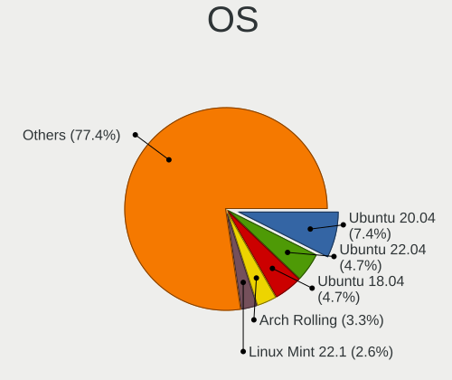

| Name                         | Desktops | Percent |
|------------------------------|----------|---------|
| Ubuntu 20.04                 | 397      | 7.42%   |
| Ubuntu 22.04                 | 251      | 4.69%   |
| Ubuntu 18.04                 | 249      | 4.65%   |
| Arch Rolling                 | 174      | 3.25%   |
| Linux Mint 22.1              | 140      | 2.62%   |
| Debian 12                    | 119      | 2.22%   |
| OpenMandriva 4.2             | 110      | 2.06%   |
| Ubuntu 24.04                 | 106      | 1.98%   |
| Linux Mint 21.3              | 103      | 1.93%   |
| OpenMandriva 4.3             | 89       | 1.66%   |
| Linux Mint 22                | 83       | 1.55%   |
| Pop!_OS 22.04                | 80       | 1.5%    |
| Debian 11                    | 80       | 1.5%    |
| Zorin 17                     | 78       | 1.46%   |
| Linux Mint 22.2              | 70       | 1.31%   |
| Linux Mint 21.1              | 68       | 1.27%   |
| EndeavourOS Rolling          | 62       | 1.16%   |
| OpenMandriva 24.12           | 59       | 1.1%    |
| Linux Mint 21.2              | 59       | 1.1%    |
| Fedora 42                    | 58       | 1.08%   |
| Manjaro                      | 56       | 1.05%   |
| OpenMandriva 25.90           | 55       | 1.03%   |
| Linux Mint 20.3              | 53       | 0.99%   |
| Ubuntu 20.10                 | 51       | 0.95%   |
| OpenMandriva 23.08           | 51       | 0.95%   |
| Zorin 16                     | 50       | 0.93%   |
| Ubuntu 22.10                 | 49       | 0.92%   |
| Ubuntu 19.04                 | 47       | 0.88%   |
| OpenMandriva 23.01           | 46       | 0.86%   |
| Fedora 41                    | 46       | 0.86%   |
| LMDE 6                       | 45       | 0.84%   |
| KDE neon 20.04               | 43       | 0.8%    |
| Fedora 36                    | 43       | 0.8%    |
| Ubuntu 19.10                 | 42       | 0.79%   |
| Linux Mint 21                | 41       | 0.77%   |
| Xubuntu 20.04                | 39       | 0.73%   |
| openSUSE Tumbleweed-XXXXXXXX | 39       | 0.73%   |
| OpenMandriva 5.0             | 37       | 0.69%   |
| OpenMandriva 24.07           | 37       | 0.69%   |
| Fedora 38                    | 37       | 0.69%   |

OS Family
---------

OS without a version

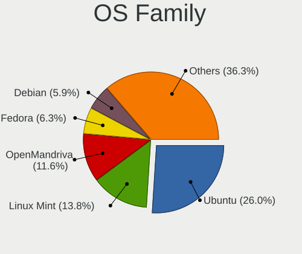

| Name          | Desktops | Percent |
|---------------|----------|---------|
| Ubuntu        | 1287     | 26.01%  |
| Linux Mint    | 685      | 13.84%  |
| OpenMandriva  | 572      | 11.56%  |
| Fedora        | 314      | 6.35%   |
| Debian        | 293      | 5.92%   |
| Arch          | 207      | 4.18%   |
| Zorin         | 173      | 3.5%    |
| Pop!_OS       | 135      | 2.73%   |
| Xubuntu       | 128      | 2.59%   |
| Manjaro       | 127      | 2.57%   |
| Kubuntu       | 119      | 2.41%   |
| ROSA          | 103      | 2.08%   |
| KDE neon      | 84       | 1.7%    |
| EndeavourOS   | 66       | 1.33%   |
| LMDE          | 62       | 1.25%   |
| openSUSE      | 52       | 1.05%   |
| Ubuntu MATE   | 43       | 0.87%   |
| Lubuntu       | 40       | 0.81%   |
| Bazzite       | 37       | 0.75%   |
| ArcoLinux     | 31       | 0.63%   |
| Nobara        | 29       | 0.59%   |
| Garuda Linux  | 25       | 0.51%   |
| Elementary    | 25       | 0.51%   |
| Gentoo        | 24       | 0.49%   |
| Ubuntu Unity  | 21       | 0.42%   |
| MX            | 20       | 0.4%    |
| CachyOS       | 17       | 0.34%   |
| BlackPanther  | 16       | 0.32%   |
| Clear Linux   | 14       | 0.28%   |
| NixOS         | 12       | 0.24%   |
| Kali          | 12       | 0.24%   |
| Peppermint    | 11       | 0.22%   |
| Endless       | 11       | 0.22%   |
| SteamOS       | 10       | 0.2%    |
| Rocky Linux   | 10       | 0.2%    |
| Ubuntu Studio | 9        | 0.18%   |
| Q4OS          | 8        | 0.16%   |
| Slackware     | 6        | 0.12%   |
| CentOS        | 6        | 0.12%   |
| Xero          | 5        | 0.1%    |

Kernel
------

Version of the Linux kernel

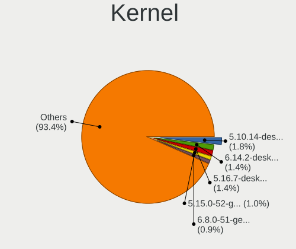

| Version                  | Desktops | Percent |
|--------------------------|----------|---------|
| 5.10.14-desktop-1omv4002 | 108      | 1.8%    |
| 6.14.2-desktop-3omv2590  | 86       | 1.43%   |
| 5.16.7-desktop-1omv4003  | 86       | 1.43%   |
| 5.15.0-52-generic        | 59       | 0.98%   |
| 6.8.0-51-generic         | 55       | 0.92%   |
| 5.4.0-42-generic         | 52       | 0.87%   |
| 6.12.1-desktop-1omv2490  | 49       | 0.82%   |
| 5.15.0-56-generic        | 48       | 0.8%    |
| 6.4.11-desktop-1omv2390  | 44       | 0.73%   |
| 6.6.2-desktop-1omv2390   | 43       | 0.72%   |
| 5.4.0-52-generic         | 43       | 0.72%   |
| 6.1.1-desktop-1omv2290   | 38       | 0.63%   |
| 6.8.0-52-generic         | 35       | 0.58%   |
| 6.2.6-desktop-1omv2390   | 35       | 0.58%   |
| 6.14.0-33-generic        | 33       | 0.55%   |
| 5.15.0-47-generic        | 33       | 0.55%   |
| 6.8.0-49-generic         | 27       | 0.45%   |
| 5.15.0-58-generic        | 27       | 0.45%   |
| 6.8.0-45-generic         | 26       | 0.43%   |
| 5.15.0-91-generic        | 26       | 0.43%   |
| 6.8.0-60-generic         | 25       | 0.42%   |
| 5.4.0-58-generic         | 25       | 0.42%   |
| 6.2.0-39-generic         | 24       | 0.4%    |
| 6.10.0-desktop-1omv2490  | 24       | 0.4%    |
| 5.4.0-48-generic         | 24       | 0.4%    |
| 5.3.0-46-generic         | 23       | 0.38%   |
| 5.3.0-40-generic         | 23       | 0.38%   |
| 6.14.0-29-generic        | 22       | 0.37%   |
| 5.4.0-56-generic         | 22       | 0.37%   |
| 5.4.0-29-generic         | 21       | 0.35%   |
| 5.4.0-26-generic         | 21       | 0.35%   |
| 5.15.0-46-generic        | 21       | 0.35%   |
| 6.8.0-47-generic         | 20       | 0.33%   |
| 5.4.0-54-generic         | 20       | 0.33%   |
| 6.9.3-76060903-generic   | 19       | 0.32%   |
| 6.8.0-57-generic         | 19       | 0.32%   |
| 6.2.0-36-generic         | 19       | 0.32%   |
| 5.4.0-40-generic         | 19       | 0.32%   |
| 6.5.0-26-generic         | 18       | 0.3%    |
| 5.4.0-28-generic         | 18       | 0.3%    |

Kernel Family
-------------

Linux kernel without a distro release

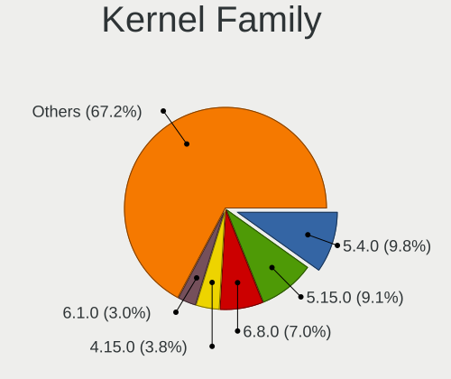

| Version | Desktops | Percent |
|---------|----------|---------|
| 5.4.0   | 548      | 9.85%   |
| 5.15.0  | 506      | 9.09%   |
| 6.8.0   | 389      | 6.99%   |
| 4.15.0  | 214      | 3.84%   |
| 6.1.0   | 167      | 3%      |
| 5.8.0   | 162      | 2.91%   |
| 6.5.0   | 148      | 2.66%   |
| 6.14.0  | 147      | 2.64%   |
| 5.3.0   | 141      | 2.53%   |
| 5.19.0  | 115      | 2.07%   |
| 5.11.0  | 115      | 2.07%   |
| 6.2.0   | 111      | 1.99%   |
| 5.10.14 | 109      | 1.96%   |
| 6.14.2  | 107      | 1.92%   |
| 5.0.0   | 99       | 1.78%   |
| 5.10.0  | 95       | 1.71%   |
| 5.16.7  | 87       | 1.56%   |
| 5.13.0  | 84       | 1.51%   |
| 4.18.0  | 71       | 1.28%   |
| 6.11.0  | 67       | 1.2%    |
| 6.4.11  | 51       | 0.92%   |
| 6.12.1  | 50       | 0.9%    |
| 6.6.2   | 46       | 0.83%   |
| 6.2.6   | 43       | 0.77%   |
| 6.1.1   | 43       | 0.77%   |
| 4.19.0  | 31       | 0.56%   |
| 6.0.2   | 27       | 0.49%   |
| 6.10.0  | 25       | 0.45%   |
| 6.9.3   | 24       | 0.43%   |
| 6.5.9   | 23       | 0.41%   |
| 6.12.10 | 20       | 0.36%   |
| 6.10.6  | 19       | 0.34%   |
| 4.9.60  | 18       | 0.32%   |
| 6.12.9  | 17       | 0.31%   |
| 4.18.16 | 17       | 0.31%   |
| 6.9.7   | 16       | 0.29%   |
| 6.17.9  | 16       | 0.29%   |
| 6.12.6  | 16       | 0.29%   |
| 4.9.20  | 16       | 0.29%   |
| 6.5.6   | 15       | 0.27%   |

Kernel Major Ver.
-----------------

Linux kernel major version

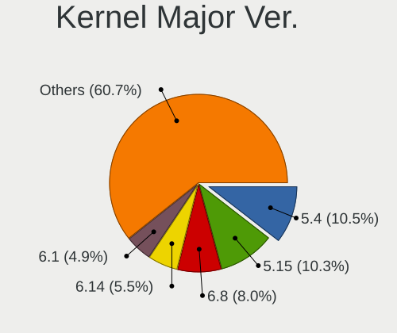

| Version | Desktops | Percent |
|---------|----------|---------|
| 5.4     | 576      | 10.5%   |
| 5.15    | 567      | 10.34%  |
| 6.8     | 439      | 8%      |
| 6.14    | 303      | 5.52%   |
| 6.1     | 270      | 4.92%   |
| 5.10    | 234      | 4.27%   |
| 6.5     | 222      | 4.05%   |
| 4.15    | 215      | 3.92%   |
| 6.12    | 202      | 3.68%   |
| 6.2     | 199      | 3.63%   |
| 5.8     | 186      | 3.39%   |
| 5.19    | 176      | 3.21%   |
| 5.3     | 146      | 2.66%   |
| 5.11    | 134      | 2.44%   |
| 6.6     | 124      | 2.26%   |
| 5.16    | 118      | 2.15%   |
| 6.11    | 116      | 2.11%   |
| 6.4     | 107      | 1.95%   |
| 6.0     | 104      | 1.9%    |
| 5.0     | 102      | 1.86%   |
| 5.13    | 93       | 1.7%    |
| 4.18    | 92       | 1.68%   |
| 6.10    | 85       | 1.55%   |
| 6.17    | 67       | 1.22%   |
| 6.9     | 61       | 1.11%   |
| 6.13    | 57       | 1.04%   |
| 4.9     | 55       | 1%      |
| 6.16    | 48       | 0.88%   |
| 6.15    | 47       | 0.86%   |
| 4.19    | 41       | 0.75%   |
| 6.3     | 35       | 0.64%   |
| 6.7     | 33       | 0.6%    |
| 5.9     | 32       | 0.58%   |
| 5.18    | 29       | 0.53%   |
| 5.17    | 29       | 0.53%   |
| 5.14    | 26       | 0.47%   |
| 5.6     | 20       | 0.36%   |
| 5.12    | 20       | 0.36%   |
| 5.7     | 18       | 0.33%   |
| 4.4     | 11       | 0.2%    |

Arch
----

OS architecture (x86_64, i586, etc.)

| Name    | Desktops | Percent |
|---------|----------|---------|
| x86_64  | 4564     | 97.5%   |
| i686    | 116      | 2.48%   |
| ppc64le | 1        | 0.02%   |

DE
--

Desktop Environment

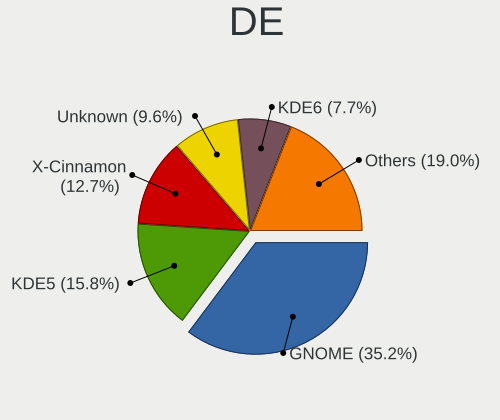

| Name             | Desktops | Percent |
|------------------|----------|---------|
| GNOME            | 1762     | 35.25%  |
| KDE5             | 790      | 15.8%   |
| X-Cinnamon       | 633      | 12.66%  |
| Unknown          | 478      | 9.56%   |
| KDE6             | 384      | 7.68%   |
| XFCE             | 332      | 6.64%   |
| MATE             | 162      | 3.24%   |
| KDE              | 84       | 1.68%   |
| LXQt             | 80       | 1.6%    |
| KDE4             | 63       | 1.26%   |
| LXDE             | 31       | 0.62%   |
| Cinnamon         | 29       | 0.58%   |
| Pantheon         | 24       | 0.48%   |
| Hyprland         | 21       | 0.42%   |
| Unity            | 20       | 0.4%    |
| COSMIC           | 18       | 0.36%   |
| GNOME Classic    | 16       | 0.32%   |
| GNOME Flashback  | 15       | 0.3%    |
| i3               | 10       | 0.2%    |
| Budgie           | 10       | 0.2%    |
| Trinity          | 7        | 0.14%   |
| Deepin           | 6        | 0.12%   |
| sway             | 5        | 0.1%    |
| lightdm-xsession | 5        | 0.1%    |
| openbox          | 3        | 0.06%   |
| icewm            | 2        | 0.04%   |
| sway:wlroots     | 1        | 0.02%   |
| onyx:GNOME       | 1        | 0.02%   |
| Lubuntu          | 1        | 0.02%   |
| i3-with-shmlog   | 1        | 0.02%   |
| herbstluftwm     | 1        | 0.02%   |
| FVWM             | 1        | 0.02%   |
| Endless:GNOME    | 1        | 0.02%   |
| DDE              | 1        | 0.02%   |
| bspwm            | 1        | 0.02%   |

Display Server
--------------

X11 or Wayland

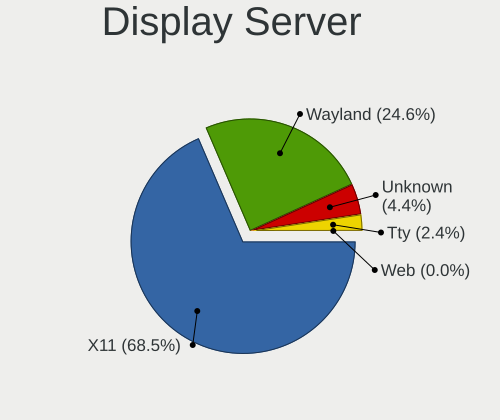

| Name    | Desktops | Percent |
|---------|----------|---------|
| X11     | 3375     | 68.54%  |
| Wayland | 1213     | 24.63%  |
| Unknown | 219      | 4.45%   |
| Tty     | 116      | 2.36%   |
| Web     | 1        | 0.02%   |

Display Manager
---------------

SDDM, LightDM, etc.

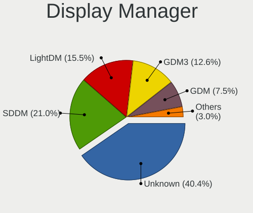

| Name           | Desktops | Percent |
|----------------|----------|---------|
| Unknown        | 2009     | 40.42%  |
| SDDM           | 1042     | 20.97%  |
| LightDM        | 768      | 15.45%  |
| GDM3           | 627      | 12.62%  |
| GDM            | 375      | 7.55%   |
| TDM            | 65       | 1.31%   |
| KDM            | 61       | 1.23%   |
| XDM            | 9        | 0.18%   |
| GREETD         | 4        | 0.08%   |
| COSMIC-GREETER | 4        | 0.08%   |
| SLiM           | 2        | 0.04%   |
| LXDM           | 2        | 0.04%   |
| SLIMSKI        | 1        | 0.02%   |
| NODM           | 1        | 0.02%   |

OS Lang
-------

Language

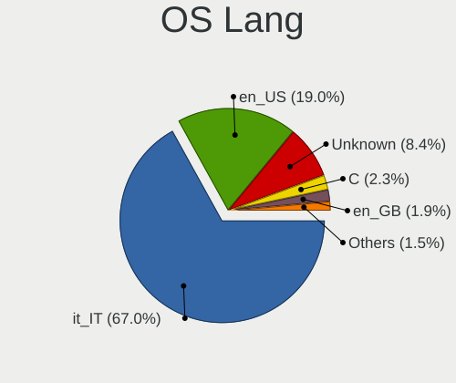

| Lang              | Desktops | Percent |
|-------------------|----------|---------|
| it_IT             | 3226     | 66.96%  |
| en_US             | 917      | 19.03%  |
| Unknown           | 403      | 8.36%   |
| C                 | 112      | 2.32%   |
| en_GB             | 90       | 1.87%   |
| fr_FR             | 9        | 0.19%   |
| de_DE             | 8        | 0.17%   |
| en_IE             | 7        | 0.15%   |
| it_CH             | 6        | 0.12%   |
| es_ES             | 5        | 0.1%    |
| de_IT             | 4        | 0.08%   |
| de_AT             | 4        | 0.08%   |
| ru_RU             | 3        | 0.06%   |
| POSIX             | 3        | 0.06%   |
| it_IT@euro        | 2        | 0.04%   |
| hu_HU             | 2        | 0.04%   |
| en_AU             | 2        | 0.04%   |
| sc_IT             | 1        | 0.02%   |
| pt_BR             | 1        | 0.02%   |
| pl_PL             | 1        | 0.02%   |
| it_ITutf8         | 1        | 0.02%   |
| it_IT.UTF8        | 1        | 0.02%   |
| it                | 1        | 0.02%   |
| fr_CH             | 1        | 0.02%   |
| es_MX             | 1        | 0.02%   |
| es_AR             | 1        | 0.02%   |
| en_US.ISO-8859-15 | 1        | 0.02%   |
| en_US.ASCII       | 1        | 0.02%   |
| en_IN             | 1        | 0.02%   |
| en_AG             | 1        | 0.02%   |
| Default           | 1        | 0.02%   |
| C.UTF8            | 1        | 0.02%   |

Boot Mode
---------

EFI or BIOS

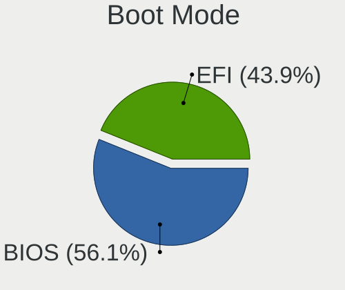

| Mode | Desktops | Percent |
|------|----------|---------|
| BIOS | 2704     | 56.09%  |
| EFI  | 2117     | 43.91%  |

Filesystem
----------

Type of filesystem

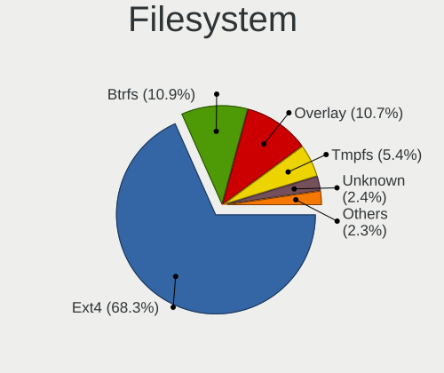

| Type     | Desktops | Percent |
|----------|----------|---------|
| Ext4     | 3351     | 68.33%  |
| Btrfs    | 533      | 10.87%  |
| Overlay  | 525      | 10.71%  |
| Tmpfs    | 264      | 5.38%   |
| Unknown  | 117      | 2.39%   |
| Xfs      | 68       | 1.39%   |
| Zfs      | 14       | 0.29%   |
| Ext3     | 14       | 0.29%   |
| Ext2     | 7        | 0.14%   |
| F2fs     | 5        | 0.1%    |
| Aufs     | 3        | 0.06%   |
| XXXX     | 1        | 0.02%   |
| Reiserfs | 1        | 0.02%   |
| Bcachefs | 1        | 0.02%   |

Part. scheme
------------

Scheme of partitioning

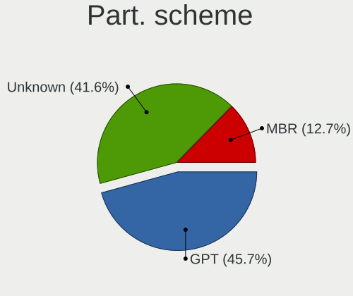

| Type    | Desktops | Percent |
|---------|----------|---------|
| GPT     | 2233     | 45.72%  |
| Unknown | 2031     | 41.58%  |
| MBR     | 620      | 12.69%  |

Dual Boot with Linux/BSD
------------------------

Hosting more than one Linux/BSD

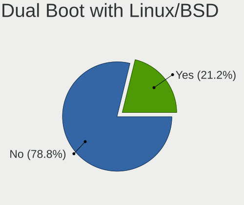

| Dual boot | Desktops | Percent |
|-----------|----------|---------|
| No        | 3824     | 78.81%  |
| Yes       | 1028     | 21.19%  |

Dual Boot (Win)
---------------

Hosting Linux and Windows

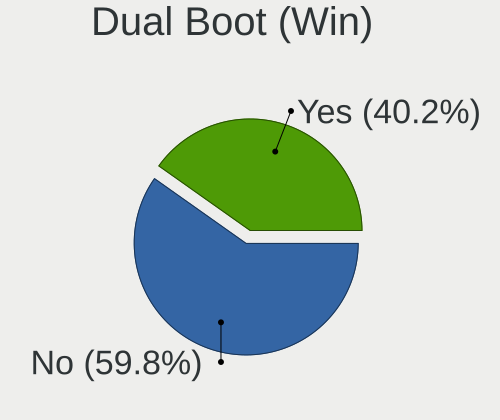

| Dual boot | Desktops | Percent |
|-----------|----------|---------|
| No        | 2887     | 59.8%   |
| Yes       | 1941     | 40.2%   |

Board
-----

Vendor
------

Motherboard manufacturer

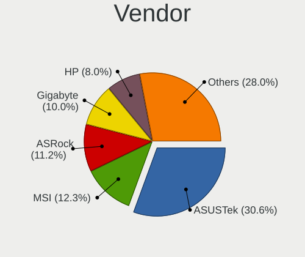

| Name                                 | Desktops | Percent |
|--------------------------------------|----------|---------|
| ASUSTek Computer                     | 1431     | 30.6%   |
| MSI                                  | 573      | 12.25%  |
| ASRock                               | 522      | 11.16%  |
| Gigabyte Technology                  | 467      | 9.99%   |
| Hewlett-Packard                      | 373      | 7.98%   |
| Dell                                 | 234      | 5%      |
| Lenovo                               | 176      | 3.76%   |
| Acer                                 | 159      | 3.4%    |
| Unknown                              | 102      | 2.18%   |
| Intel                                | 91       | 1.95%   |
| Fujitsu                              | 86       | 1.84%   |
| Pegatron                             | 58       | 1.24%   |
| Foxconn                              | 40       | 0.86%   |
| Packard Bell                         | 38       | 0.81%   |
| AMI                                  | 33       | 0.71%   |
| Shenzhen Meigao Electronic Equipment | 20       | 0.43%   |
| AZW                                  | 20       | 0.43%   |
| GEEKOM                               | 18       | 0.38%   |
| Fujitsu Siemens                      | 17       | 0.36%   |
| BESSTAR Tech                         | 16       | 0.34%   |
| Biostar                              | 13       | 0.28%   |
| Supermicro                           | 12       | 0.26%   |
| HC Technology.                       | 9        | 0.19%   |
| Apple                                | 8        | 0.17%   |
| Huanan                               | 7        | 0.15%   |
| ABIT                                 | 7        | 0.15%   |
| TYAN Computer                        | 6        | 0.13%   |
| Sapphire                             | 6        | 0.13%   |
| Chuwi                                | 6        | 0.13%   |
| OEM                                  | 5        | 0.11%   |
| IBM                                  | 5        | 0.11%   |
| Wistron                              | 4        | 0.09%   |
| SYWZ                                 | 4        | 0.09%   |
| Shuttle                              | 4        | 0.09%   |
| NEC Computers                        | 4        | 0.09%   |
| Gateway                              | 4        | 0.09%   |
| ECS                                  | 4        | 0.09%   |
| Alienware                            | 4        | 0.09%   |
| YANYU                                | 3        | 0.06%   |
| T-bao                                | 3        | 0.06%   |

Model
-----

Motherboard model

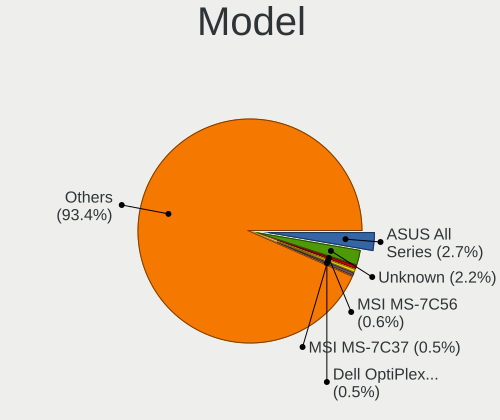

| Name                            | Desktops | Percent |
|---------------------------------|----------|---------|
| ASUS All Series                 | 127      | 2.72%   |
| Unknown                         | 105      | 2.25%   |
| MSI MS-7C56                     | 26       | 0.56%   |
| MSI MS-7C37                     | 25       | 0.53%   |
| Dell OptiPlex 7010              | 25       | 0.53%   |
| MSI MS-7B86                     | 24       | 0.51%   |
| ASUS TUF Gaming X570-PLUS       | 20       | 0.43%   |
| ASUS PRIME A320M-K              | 19       | 0.41%   |
| AMI Intel                       | 19       | 0.41%   |
| HP Compaq Elite 8300 SFF        | 18       | 0.38%   |
| Gigabyte B450M DS3H             | 16       | 0.34%   |
| ASUS TUF Gaming B550-PLUS       | 14       | 0.3%    |
| MSI MS-7C91                     | 13       | 0.28%   |
| MSI MS-7B79                     | 13       | 0.28%   |
| HP ProDesk 600 G1 SFF           | 13       | 0.28%   |
| ASRock Q1900M                   | 13       | 0.28%   |
| Gigabyte X570 AORUS ELITE       | 12       | 0.26%   |
| ASUS ROG STRIX B550-F GAMING    | 12       | 0.26%   |
| ASUS ROG STRIX B450-F GAMING    | 12       | 0.26%   |
| MSI MS-7C52                     | 11       | 0.24%   |
| HP Compaq 8200 Elite SFF PC     | 11       | 0.24%   |
| Fujitsu ESPRIMO Q920            | 11       | 0.24%   |
| ASUS H110M-K                    | 11       | 0.24%   |
| MSI MS-7C02                     | 10       | 0.21%   |
| MSI MS-7A38                     | 10       | 0.21%   |
| ASUS Z170 PRO GAMING            | 10       | 0.21%   |
| ASUS PRIME B450M-A              | 10       | 0.21%   |
| ASUS PRIME B450-PLUS            | 10       | 0.21%   |
| ASUS P5KPL-AM SE                | 10       | 0.21%   |
| ASUS M5A97 R2.0                 | 10       | 0.21%   |
| ASRock B450M-HDV R4.0           | 10       | 0.21%   |
| MSI MS-7C95                     | 9        | 0.19%   |
| HP EliteDesk 800 G1 SFF         | 9        | 0.19%   |
| HC Technology. HCAR5000-MI      | 9        | 0.19%   |
| Gigabyte B550M DS3H             | 9        | 0.19%   |
| Gigabyte B550 AORUS ELITE AX V2 | 9        | 0.19%   |
| Gigabyte B450 AORUS PRO         | 9        | 0.19%   |
| Dell OptiPlex 790               | 9        | 0.19%   |
| Dell OptiPlex 780               | 9        | 0.19%   |
| Dell OptiPlex 3020              | 9        | 0.19%   |

Model Family
------------

Motherboard model prefix

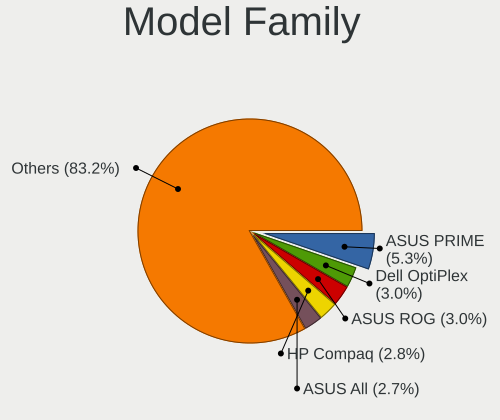

| Name                | Desktops | Percent |
|---------------------|----------|---------|
| ASUS PRIME          | 246      | 5.26%   |
| Dell OptiPlex       | 142      | 3.04%   |
| ASUS ROG            | 140      | 2.99%   |
| HP Compaq           | 131      | 2.8%    |
| ASUS All            | 127      | 2.72%   |
| ASUS TUF            | 125      | 2.67%   |
| Unknown             | 105      | 2.25%   |
| Lenovo ThinkCentre  | 100      | 2.14%   |
| Acer Aspire         | 79       | 1.69%   |
| Fujitsu ESPRIMO     | 74       | 1.58%   |
| Acer Veriton        | 55       | 1.18%   |
| HP ProDesk          | 48       | 1.03%   |
| HP EliteDesk        | 44       | 0.94%   |
| Dell Precision      | 40       | 0.86%   |
| ASUS P8H61-M        | 35       | 0.75%   |
| Gigabyte X570       | 33       | 0.71%   |
| HP Pavilion         | 29       | 0.62%   |
| Gigabyte B450       | 28       | 0.6%    |
| Packard Bell IMEDIA | 26       | 0.56%   |
| MSI MS-7C56         | 26       | 0.56%   |
| MSI MS-7C37         | 25       | 0.53%   |
| MSI MS-7B86         | 24       | 0.51%   |
| ASUS M5A97          | 24       | 0.51%   |
| Lenovo IdeaCentre   | 23       | 0.49%   |
| ASUS P5KPL-AM       | 22       | 0.47%   |
| Gigabyte B450M      | 21       | 0.45%   |
| ASUS P8Z77-V        | 20       | 0.43%   |
| ASUS P5Q            | 20       | 0.43%   |
| AMI Intel           | 19       | 0.41%   |
| Lenovo ThinkStation | 18       | 0.38%   |
| Gigabyte Z390       | 18       | 0.38%   |
| Gigabyte B550M      | 18       | 0.38%   |
| ASUS M5A78L-M       | 17       | 0.36%   |
| Dell Vostro         | 16       | 0.34%   |
| Gigabyte B550       | 15       | 0.32%   |
| ASUS SABERTOOTH     | 15       | 0.32%   |
| MSI MS-7C91         | 13       | 0.28%   |
| MSI MS-7B79         | 13       | 0.28%   |
| ASUS P6T            | 13       | 0.28%   |
| ASUS P5K            | 13       | 0.28%   |

MFG Year
--------

Motherboard manufacture year

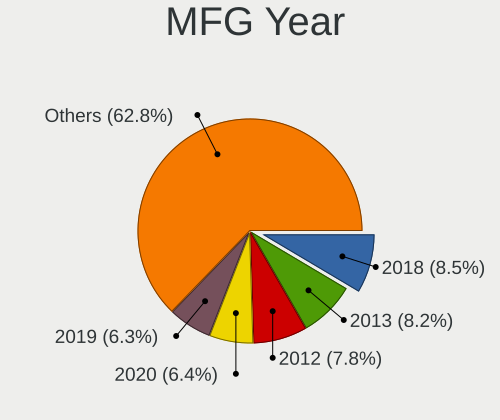

| Year    | Desktops | Percent |
|---------|----------|---------|
| 2018    | 399      | 8.53%   |
| 2013    | 382      | 8.17%   |
| 2012    | 366      | 7.83%   |
| 2020    | 298      | 6.37%   |
| 2019    | 296      | 6.33%   |
| 2014    | 281      | 6.01%   |
| 2011    | 277      | 5.92%   |
| 2009    | 271      | 5.79%   |
| 2015    | 240      | 5.13%   |
| 2008    | 235      | 5.02%   |
| 2017    | 224      | 4.79%   |
| 2010    | 222      | 4.75%   |
| 2021    | 218      | 4.66%   |
| 2022    | 199      | 4.25%   |
| 2016    | 185      | 3.96%   |
| 2007    | 164      | 3.51%   |
| 2023    | 143      | 3.06%   |
| 2024    | 99       | 2.12%   |
| 2006    | 81       | 1.73%   |
| 2005    | 46       | 0.98%   |
| 2025    | 24       | 0.51%   |
| 2004    | 14       | 0.3%    |
| Unknown | 5        | 0.11%   |
| 2003    | 4        | 0.09%   |
| 2001    | 2        | 0.04%   |
| 2002    | 1        | 0.02%   |
| 2000    | 1        | 0.02%   |

Form Factor
-----------

Physical design of the computer

| Name    | Desktops | Percent |
|---------|----------|---------|
| Desktop | 4677     | 100%    |

Secure Boot
-----------

Enabled or disabled

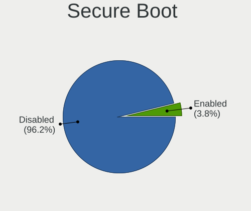

| State    | Desktops | Percent |
|----------|----------|---------|
| Disabled | 4525     | 96.15%  |
| Enabled  | 181      | 3.85%   |

Coreboot
--------

Have coreboot on board

| Used | Desktops | Percent |
|------|----------|---------|
| No   | 4676     | 99.98%  |
| Yes  | 1        | 0.02%   |

RAM Size
--------

Total RAM memory

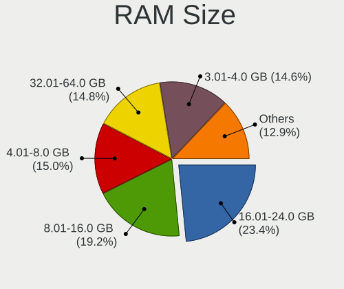

| Size in GB      | Desktops | Percent |
|-----------------|----------|---------|
| 16.01-24.0      | 1124     | 23.44%  |
| 8.01-16.0       | 921      | 19.21%  |
| 4.01-8.0        | 717      | 14.95%  |
| 32.01-64.0      | 712      | 14.85%  |
| 3.01-4.0        | 702      | 14.64%  |
| 64.01-256.0     | 197      | 4.11%   |
| 24.01-32.0      | 179      | 3.73%   |
| 1.01-2.0        | 160      | 3.34%   |
| 2.01-3.0        | 49       | 1.02%   |
| 0.51-1.0        | 29       | 0.6%    |
| More than 256.0 | 3        | 0.06%   |
| 0.01-0.5        | 2        | 0.04%   |

RAM Used
--------

Used RAM memory

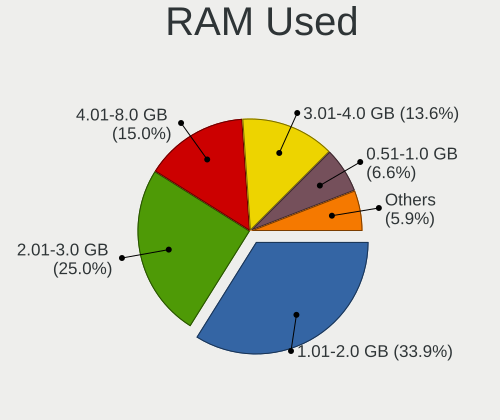

| Used GB    | Desktops | Percent |
|------------|----------|---------|
| 1.01-2.0   | 1811     | 33.9%   |
| 2.01-3.0   | 1337     | 25.03%  |
| 4.01-8.0   | 800      | 14.98%  |
| 3.01-4.0   | 727      | 13.61%  |
| 0.51-1.0   | 353      | 6.61%   |
| 8.01-16.0  | 213      | 3.99%   |
| 0.01-0.5   | 54       | 1.01%   |
| 16.01-24.0 | 33       | 0.62%   |
| 24.01-32.0 | 10       | 0.19%   |
| 32.01-64.0 | 3        | 0.06%   |
| Unknown    | 1        | 0.02%   |

Total Drives
------------

Number of drives on board

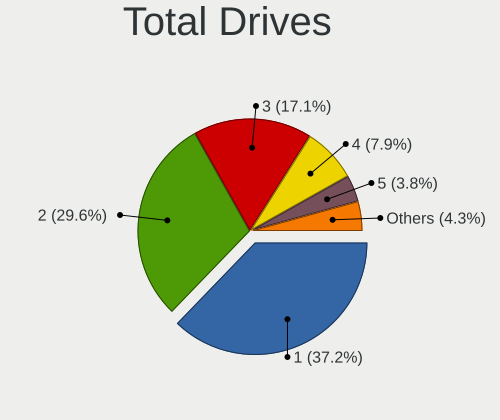

| Drives  | Desktops | Percent |
|---------|----------|---------|
| 1       | 1840     | 37.22%  |
| 2       | 1465     | 29.63%  |
| 3       | 846      | 17.11%  |
| 4       | 391      | 7.91%   |
| 5       | 190      | 3.84%   |
| 6       | 94       | 1.9%    |
| 0       | 43       | 0.87%   |
| 7       | 33       | 0.67%   |
| 8       | 16       | 0.32%   |
| 9       | 13       | 0.26%   |
| 10      | 4        | 0.08%   |
| 12      | 3        | 0.06%   |
| 13      | 2        | 0.04%   |
| 19      | 1        | 0.02%   |
| 17      | 1        | 0.02%   |
| 14      | 1        | 0.02%   |
| Unknown | 1        | 0.02%   |

Has CD-ROM
----------

Has CD-ROM on board

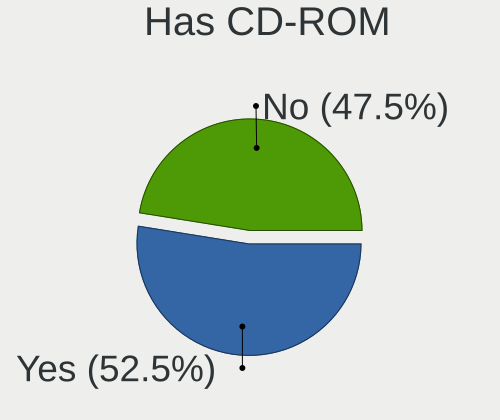

| Presented | Desktops | Percent |
|-----------|----------|---------|
| Yes       | 2499     | 52.53%  |
| No        | 2258     | 47.47%  |

Has Ethernet
------------

Has Ethernet on board

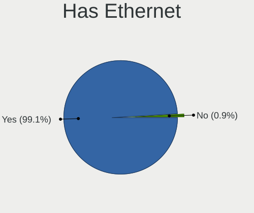

| Presented | Desktops | Percent |
|-----------|----------|---------|
| Yes       | 4633     | 99.06%  |
| No        | 44       | 0.94%   |

Has WiFi
--------

Has WiFi module

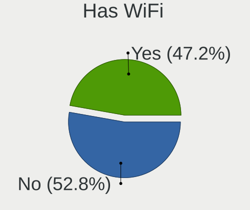

| Presented | Desktops | Percent |
|-----------|----------|---------|
| No        | 2516     | 52.79%  |
| Yes       | 2250     | 47.21%  |

Has Bluetooth
-------------

Has Bluetooth module

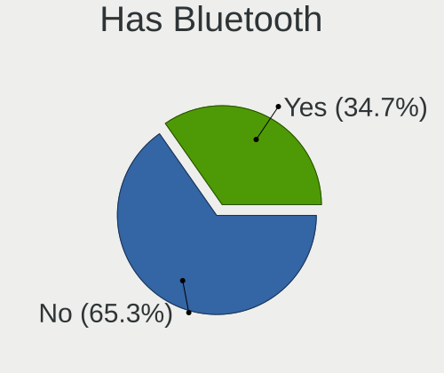

| Presented | Desktops | Percent |
|-----------|----------|---------|
| No        | 3114     | 65.28%  |
| Yes       | 1656     | 34.72%  |

Location
--------

Country
-------

Geographic location (country)

| Country | Desktops | Percent |
|---------|----------|---------|
| Italy   | 4677     | 100%    |

City
----

Geographic location (city)

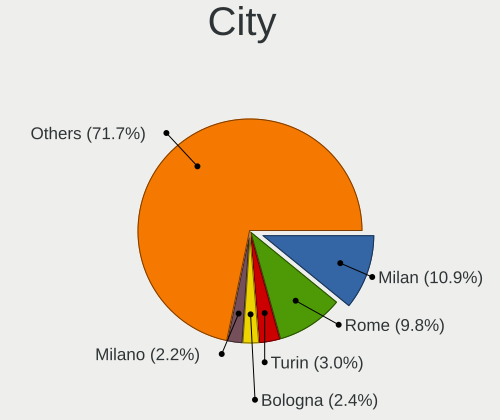

| City                  | Desktops | Percent |
|-----------------------|----------|---------|
| Milan                 | 595      | 10.89%  |
| Rome                  | 534      | 9.77%   |
| Turin                 | 166      | 3.04%   |
| Bologna               | 130      | 2.38%   |
| Milano                | 120      | 2.2%    |
| Naples                | 110      | 2.01%   |
| Florence              | 107      | 1.96%   |
| Genoa                 | 87       | 1.59%   |
| Padova                | 68       | 1.24%   |
| Rho                   | 62       | 1.13%   |
| Palermo               | 57       | 1.04%   |
| Verona                | 53       | 0.97%   |
| Venice                | 43       | 0.79%   |
| Brescia               | 37       | 0.68%   |
| Trieste               | 36       | 0.66%   |
| Catania               | 36       | 0.66%   |
| Parma                 | 34       | 0.62%   |
| Bari                  | 31       | 0.57%   |
| Reggio Emilia         | 29       | 0.53%   |
| Monza                 | 29       | 0.53%   |
| Trento                | 28       | 0.51%   |
| Pescara               | 28       | 0.51%   |
| Pisa                  | 25       | 0.46%   |
| Cagliari              | 25       | 0.46%   |
| Bergamo               | 24       | 0.44%   |
| Vicenza               | 22       | 0.4%    |
| Perugia               | 22       | 0.4%    |
| Modena                | 22       | 0.4%    |
| Livorno               | 22       | 0.4%    |
| Udine                 | 20       | 0.37%   |
| Lucca                 | 20       | 0.37%   |
| Taranto               | 19       | 0.35%   |
| Ancona                | 19       | 0.35%   |
| Casalecchio di Reno   | 18       | 0.33%   |
| Sesto San Giovanni    | 16       | 0.29%   |
| Salerno               | 16       | 0.29%   |
| Capriate San Gervasio | 16       | 0.29%   |
| Treviso               | 15       | 0.27%   |
| Legnano               | 15       | 0.27%   |
| Mestre                | 14       | 0.26%   |

Drives
------

Drive Vendor
------------

Hard drive vendors

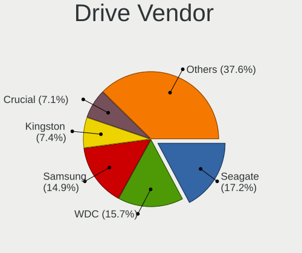

| Vendor                       | Desktops | Drives | Percent |
|------------------------------|----------|--------|---------|
| Seagate                      | 1520     | 2604   | 17.24%  |
| WDC                          | 1388     | 2404   | 15.74%  |
| Samsung Electronics          | 1315     | 2276   | 14.91%  |
| Kingston                     | 649      | 941    | 7.36%   |
| Crucial                      | 627      | 943    | 7.11%   |
| Toshiba                      | 394      | 600    | 4.47%   |
| Sandisk                      | 335      | 474    | 3.8%    |
| Hitachi                      | 233      | 315    | 2.64%   |
| Maxtor                       | 224      | 313    | 2.54%   |
| Micron/Crucial Technology    | 131      | 171    | 1.49%   |
| Unknown                      | 118      | 193    | 1.34%   |
| Phison Electronics           | 108      | 138    | 1.22%   |
| China                        | 103      | 126    | 1.17%   |
| SPCC                         | 87       | 109    | 0.99%   |
| Phison                       | 80       | 153    | 0.91%   |
| Micron Technology            | 75       | 90     | 0.85%   |
| MAXIO Technology (Hangzhou)  | 74       | 99     | 0.84%   |
| Intenso                      | 64       | 87     | 0.73%   |
| HGST                         | 64       | 98     | 0.73%   |
| Kingston Technology Company  | 59       | 81     | 0.67%   |
| SK hynix                     | 56       | 75     | 0.64%   |
| Intel                        | 50       | 79     | 0.57%   |
| Fanxiang                     | 49       | 60     | 0.56%   |
| Lexar                        | 47       | 52     | 0.53%   |
| Corsair                      | 44       | 69     | 0.5%    |
| PNY                          | 38       | 50     | 0.43%   |
| JMicron Technology           | 37       | 41     | 0.42%   |
| A-DATA Technology            | 37       | 53     | 0.42%   |
| Patriot                      | 36       | 43     | 0.41%   |
| Silicon Motion               | 31       | 43     | 0.35%   |
| OCZ                          | 31       | 39     | 0.35%   |
| Transcend                    | 30       | 40     | 0.34%   |
| Shenzhen Longsys Electronics | 29       | 41     | 0.33%   |
| KingDian                     | 28       | 31     | 0.32%   |
| Realtek Semiconductor        | 25       | 29     | 0.28%   |
| SABRENT                      | 22       | 26     | 0.25%   |
| Netac                        | 19       | 30     | 0.22%   |
| Drevo                        | 18       | 20     | 0.2%    |
| Unknown                      | 18       | 23     | 0.2%    |
| Team                         | 17       | 33     | 0.19%   |

Drive Model
-----------

Hard drive models

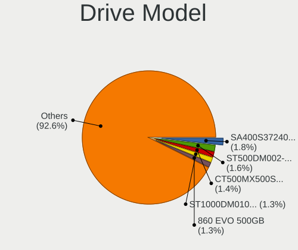

| Model                                              | Desktops | Percent |
|----------------------------------------------------|----------|---------|
| Kingston SA400S37240G 240GB SSD                    | 181      | 1.78%   |
| Seagate ST500DM002-1BD142 500GB                    | 168      | 1.65%   |
| Crucial CT500MX500SSD1 500GB                       | 141      | 1.38%   |
| Seagate ST1000DM010-2EP102 1TB                     | 135      | 1.32%   |
| Samsung SSD 860 EVO 500GB                          | 128      | 1.26%   |
| Kingston SA400S37480G 480GB SSD                    | 117      | 1.15%   |
| Samsung SSD 850 EVO 250GB                          | 114      | 1.12%   |
| Toshiba DT01ACA100 1TB                             | 99       | 0.97%   |
| Samsung NVMe SSD Controller SM981/PM981/PM983 1TB  | 97       | 0.95%   |
| Seagate ST2000DM008-2FR102 2TB                     | 93       | 0.91%   |
| Samsung SSD 850 EVO 500GB                          | 83       | 0.81%   |
| Crucial CT1000MX500SSD1 1TB                        | 80       | 0.78%   |
| Crucial CT240BX500SSD1 240GB                       | 73       | 0.72%   |
| WDC WD10EZEX-08WN4A0 1TB                           | 72       | 0.71%   |
| Seagate ST3500418AS 500GB                          | 72       | 0.71%   |
| Samsung SSD 860 EVO 250GB                          | 70       | 0.69%   |
| Micron/Crucial P2 NVMe PCIe SSD 2TB                | 63       | 0.62%   |
| Samsung NVMe SSD Controller PM9A1/PM9A3/980PRO 1TB | 61       | 0.6%    |
| Phison E12 NVMe Controller 1TB                     | 61       | 0.6%    |
| Crucial CT480BX500SSD1 480GB                       | 61       | 0.6%    |
| Seagate ST1000DM003-1ER162 1TB                     | 58       | 0.57%   |
| Seagate ST1000DM003-1CH162 1TB                     | 57       | 0.56%   |
| Kingston SA400S37120G 120GB SSD                    | 56       | 0.55%   |
| Kingston SV300S37A120G 120GB SSD                   | 53       | 0.52%   |
| Samsung SSD 870 EVO 500GB                          | 52       | 0.51%   |
| Toshiba DT01ACA050 500GB                           | 49       | 0.48%   |
| Seagate ST31000528AS 1TB                           | 49       | 0.48%   |
| Samsung SSD 870 QVO 1TB                            | 46       | 0.45%   |
| Crucial CT1000BX500SSD1 1TB                        | 44       | 0.43%   |
| Seagate ST2000DM001-1ER164 2TB                     | 43       | 0.42%   |
| WDC WD10EZEX-00BN5A0 1TB                           | 40       | 0.39%   |
| Unknown SD/MMC/MS PRO 2GB                          | 40       | 0.39%   |
| Seagate ST4000DM004-2CV104 4TB                     | 39       | 0.38%   |
| Samsung SSD 870 EVO 1TB                            | 39       | 0.38%   |
| Samsung SSD 860 EVO 1TB                            | 38       | 0.37%   |
| Crucial CT250MX500SSD1 250GB                       | 38       | 0.37%   |
| Phison Sabrent 2TB                                 | 37       | 0.36%   |
| Samsung SSD 840 EVO 250GB                          | 36       | 0.35%   |
| Seagate ST3500413AS 500GB                          | 35       | 0.34%   |
| Seagate ST1000DM003-1SB102 1TB                     | 35       | 0.34%   |

HDD Vendor
----------

Hard disk drive vendors

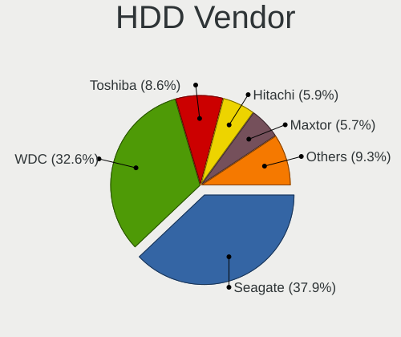

| Vendor              | Desktops | Drives | Percent |
|---------------------|----------|--------|---------|
| Seagate             | 1488     | 2529   | 37.93%  |
| WDC                 | 1278     | 2199   | 32.58%  |
| Toshiba             | 336      | 515    | 8.56%   |
| Hitachi             | 233      | 315    | 5.94%   |
| Maxtor              | 224      | 313    | 5.71%   |
| Samsung Electronics | 138      | 179    | 3.52%   |
| HGST                | 64       | 98     | 1.63%   |
| Unknown             | 51       | 68     | 1.3%    |
| JMicron Technology  | 20       | 23     | 0.51%   |
| Fujitsu             | 11       | 23     | 0.28%   |
| Apple               | 8        | 11     | 0.2%    |
| USB3.0              | 7        | 12     | 0.18%   |
| TO Exter            | 6        | 6      | 0.15%   |
| ASMT                | 6        | 8      | 0.15%   |
| Hewlett-Packard     | 5        | 8      | 0.13%   |
| IBM/Hitachi         | 4        | 4      | 0.1%    |
| External            | 4        | 5      | 0.1%    |
| SABRENT             | 3        | 6      | 0.08%   |
| LaCie               | 3        | 4      | 0.08%   |
| Initio              | 3        | 3      | 0.08%   |
| Inateck             | 3        | 3      | 0.08%   |
| ASMedia             | 3        | 3      | 0.08%   |
| WD MediaMax         | 2        | 2      | 0.05%   |
| USB                 | 2        | 2      | 0.05%   |
| MARVELL             | 2        | 4      | 0.05%   |
| Intenso             | 2        | 6      | 0.05%   |
| HPE                 | 2        | 5      | 0.05%   |
| HGST HTS            | 2        | 2      | 0.05%   |
| USB 3.0             | 1        | 2      | 0.03%   |
| SSK                 | 1        | 1      | 0.03%   |
| SD                  | 1        | 1      | 0.03%   |
| QUANTUM             | 1        | 1      | 0.03%   |
| Promise             | 1        | 1      | 0.03%   |
| PI-041              | 1        | 1      | 0.03%   |
| Lenovo              | 1        | 2      | 0.03%   |
| IomintSA            | 1        | 2      | 0.03%   |
| FC-1307             | 1        | 2      | 0.03%   |
| EAGET               | 1        | 2      | 0.03%   |
| Config              | 1        | 1      | 0.03%   |
| China               | 1        | 1      | 0.03%   |

SSD Vendor
----------

Solid state drive vendors

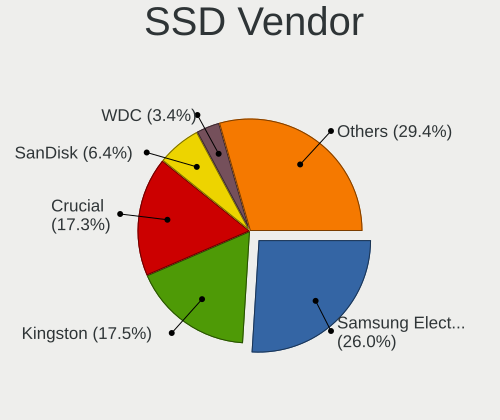

| Vendor              | Desktops | Drives | Percent |
|---------------------|----------|--------|---------|
| Samsung Electronics | 851      | 1330   | 25.99%  |
| Kingston            | 574      | 836    | 17.53%  |
| Crucial             | 565      | 844    | 17.26%  |
| SanDisk             | 209      | 306    | 6.38%   |
| WDC                 | 111      | 147    | 3.39%   |
| China               | 101      | 124    | 3.08%   |
| SPCC                | 74       | 94     | 2.26%   |
| Intenso             | 59       | 75     | 1.8%    |
| Toshiba             | 45       | 61     | 1.37%   |
| PNY                 | 35       | 46     | 1.07%   |
| Corsair             | 33       | 54     | 1.01%   |
| Patriot             | 31       | 38     | 0.95%   |
| Fanxiang            | 31       | 36     | 0.95%   |
| OCZ                 | 30       | 38     | 0.92%   |
| A-DATA Technology   | 29       | 44     | 0.89%   |
| Transcend           | 28       | 38     | 0.86%   |
| KingDian            | 28       | 31     | 0.86%   |
| Micron Technology   | 27       | 33     | 0.82%   |
| Lexar               | 24       | 28     | 0.73%   |
| SABRENT             | 19       | 20     | 0.58%   |
| Intel               | 18       | 30     | 0.55%   |
| Drevo               | 16       | 17     | 0.49%   |
| Netac               | 15       | 25     | 0.46%   |
| GOODRAM             | 15       | 24     | 0.46%   |
| Team                | 14       | 30     | 0.43%   |
| SK hynix            | 14       | 18     | 0.43%   |
| KingSpec            | 14       | 17     | 0.43%   |
| Dogfish             | 12       | 18     | 0.37%   |
| Unknown             | 12       | 15     | 0.37%   |
| BAITITON            | 11       | 13     | 0.34%   |
| TCSUNBOW            | 9        | 10     | 0.27%   |
| LITEONIT            | 9        | 10     | 0.27%   |
| Emtec               | 9        | 13     | 0.27%   |
| S3+                 | 8        | 10     | 0.24%   |
| Verbatim            | 7        | 9      | 0.21%   |
| Plextor             | 7        | 14     | 0.21%   |
| LITEON              | 7        | 8      | 0.21%   |
| Gigabyte Technology | 7        | 18     | 0.21%   |
| ASMT                | 7        | 7      | 0.21%   |
| Unknown             | 6        | 7      | 0.18%   |

Drive Kind
----------

HDD or SSD

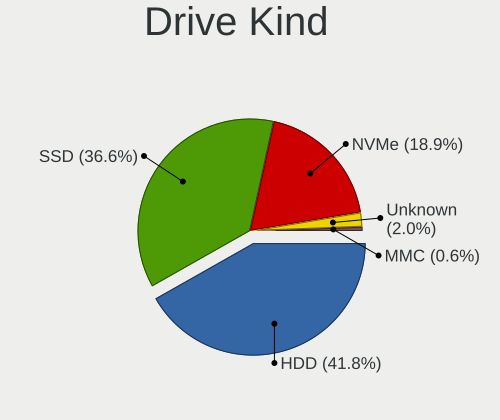

| Kind    | Desktops | Drives | Percent |
|---------|----------|--------|---------|
| HDD     | 3030     | 6374   | 41.8%   |
| SSD     | 2654     | 4720   | 36.61%  |
| NVMe    | 1373     | 2388   | 18.94%  |
| Unknown | 148      | 232    | 2.04%   |
| MMC     | 44       | 52     | 0.61%   |

Drive Connector
---------------

SATA, SAS, NVMe, etc.

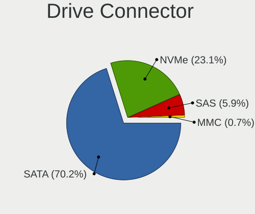

| Type | Desktops | Drives | Percent |
|------|----------|--------|---------|
| SATA | 4148     | 10774  | 70.17%  |
| NVMe | 1368     | 2358   | 23.14%  |
| SAS  | 351      | 582    | 5.94%   |
| MMC  | 44       | 52     | 0.74%   |

Drive Size
----------

Size of hard drive

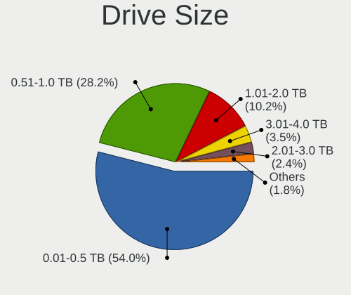

| Size in TB | Desktops | Drives | Percent |
|------------|----------|--------|---------|
| 0.01-0.5   | 3254     | 6333   | 53.97%  |
| 0.51-1.0   | 1698     | 2836   | 28.16%  |
| 1.01-2.0   | 616      | 1077   | 10.22%  |
| 3.01-4.0   | 212      | 353    | 3.52%   |
| 2.01-3.0   | 143      | 249    | 2.37%   |
| 4.01-10.0  | 94       | 213    | 1.56%   |
| 10.01-20.0 | 12       | 33     | 0.2%    |

Space Total
-----------

Amount of disk space available on the file system

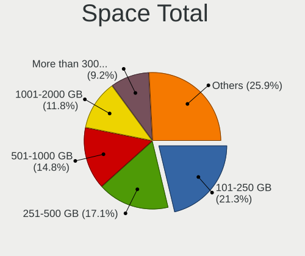

| Size in GB     | Desktops | Percent |
|----------------|----------|---------|
| 101-250        | 1100     | 21.27%  |
| 251-500        | 883      | 17.08%  |
| 501-1000       | 764      | 14.77%  |
| 1001-2000      | 611      | 11.82%  |
| More than 3000 | 476      | 9.21%   |
| 1-20           | 412      | 7.97%   |
| 51-100         | 292      | 5.65%   |
| 2001-3000      | 291      | 5.63%   |
| Unknown        | 176      | 3.4%    |
| 21-50          | 165      | 3.19%   |
| 0              | 1        | 0.02%   |

Space Used
----------

Amount of used disk space

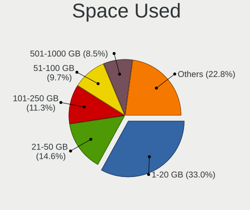

| Used GB        | Desktops | Percent |
|----------------|----------|---------|
| 1-20           | 1763     | 33%     |
| 21-50          | 781      | 14.62%  |
| 101-250        | 606      | 11.34%  |
| 51-100         | 520      | 9.73%   |
| 501-1000       | 452      | 8.46%   |
| 251-500        | 437      | 8.18%   |
| 1001-2000      | 306      | 5.73%   |
| Unknown        | 176      | 3.29%   |
| More than 3000 | 173      | 3.24%   |
| 2001-3000      | 119      | 2.23%   |
| 0              | 9        | 0.17%   |

Malfunc. Drives
---------------

Drive models with a malfunction

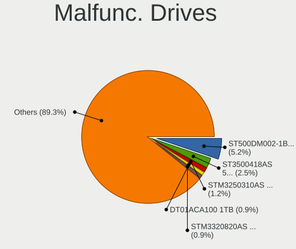

| Model                                 | Desktops | Drives | Percent |
|---------------------------------------|----------|--------|---------|
| Seagate ST500DM002-1BD142 500GB       | 39       | 50     | 5.17%   |
| Seagate ST3500418AS 500GB             | 19       | 24     | 2.52%   |
| Maxtor STM3250310AS 250GB             | 9        | 12     | 1.19%   |
| Toshiba DT01ACA100 1TB                | 7        | 7      | 0.93%   |
| Maxtor STM3320820AS 320GB             | 7        | 7      | 0.93%   |
| WDC WD20EFRX-68EUZN0 2TB              | 6        | 10     | 0.8%    |
| Seagate ST3500320AS 500GB             | 6        | 6      | 0.8%    |
| Seagate ST31000528AS 1TB              | 6        | 9      | 0.8%    |
| Seagate ST1000DM010-2EP102 1TB        | 6        | 6      | 0.8%    |
| Seagate ST1000DM003-9YN162 1TB        | 6        | 6      | 0.8%    |
| SanDisk SSD PLUS 480GB                | 6        | 11     | 0.8%    |
| HGST HTS545050A7E680 500GB            | 6        | 7      | 0.8%    |
| WDC WD40EFRX-68N32N0 4TB              | 5        | 6      | 0.66%   |
| WDC WD30EFRX-68EUZN0 3TB              | 5        | 5      | 0.66%   |
| Seagate ST9500325AS 500GB             | 5        | 5      | 0.66%   |
| Seagate ST3500413AS 500GB             | 5        | 7      | 0.66%   |
| Maxtor STM3320613AS 320GB             | 5        | 6      | 0.66%   |
| Maxtor 6Y080L0 81GB                   | 5        | 5      | 0.66%   |
| Kingston SA400S37240G 240GB SSD       | 5        | 7      | 0.66%   |
| Kingston SA400S37120G 120GB SSD       | 5        | 6      | 0.66%   |
| WDC WD5000AAKX-60U6AA0 500GB          | 4        | 4      | 0.53%   |
| WDC WD10EZEX-60WN4A0 1TB              | 4        | 5      | 0.53%   |
| WDC WD10EARS-00Y5B1 1TB               | 4        | 4      | 0.53%   |
| WDC WD1002FAEX-00Z3A0 1TB             | 4        | 5      | 0.53%   |
| Unknown MM0500EANCR 500GB             | 4        | 9      | 0.53%   |
| Toshiba DT01ACA050 500GB              | 4        | 5      | 0.53%   |
| Seagate ST3320613AS 320GB             | 4        | 6      | 0.53%   |
| Seagate ST31500341AS 1TB              | 4        | 4      | 0.53%   |
| Seagate ST31000524AS 1TB              | 4        | 7      | 0.53%   |
| Seagate ST2000DM001-9YN164 2TB        | 4        | 4      | 0.53%   |
| Seagate ST2000DM001-1ER164 2TB        | 4        | 8      | 0.53%   |
| Seagate ST1000DM003-1ER162 1TB        | 4        | 4      | 0.53%   |
| Seagate ST1000DM003-1CH162 1TB        | 4        | 5      | 0.53%   |
| Samsung Electronics SSD 870 EVO 1TB   | 4        | 6      | 0.53%   |
| Samsung Electronics SSD 860 EVO 500GB | 4        | 6      | 0.53%   |
| Samsung Electronics HD103UJ 1TB       | 4        | 4      | 0.53%   |
| Hitachi HDS721616PLA380 160GB         | 4        | 4      | 0.53%   |
| Crucial CT525MX300SSD1 528GB          | 4        | 4      | 0.53%   |
| WDC WDS240G2G0A-00JH30 240GB SSD      | 3        | 3      | 0.4%    |
| WDC WD5000AAKS-00A7B2 500GB           | 3        | 4      | 0.4%    |

Malfunc. Drive Vendor
---------------------

Vendors of faulty drives

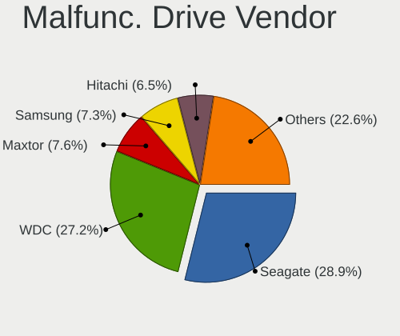

| Vendor                    | Desktops | Drives | Percent |
|---------------------------|----------|--------|---------|
| Seagate                   | 210      | 279    | 28.89%  |
| WDC                       | 198      | 241    | 27.24%  |
| Maxtor                    | 55       | 69     | 7.57%   |
| Samsung Electronics       | 53       | 62     | 7.29%   |
| Hitachi                   | 47       | 55     | 6.46%   |
| Toshiba                   | 27       | 28     | 3.71%   |
| Kingston                  | 24       | 30     | 3.3%    |
| Crucial                   | 21       | 29     | 2.89%   |
| SanDisk                   | 13       | 19     | 1.79%   |
| HGST                      | 13       | 16     | 1.79%   |
| OCZ                       | 6        | 8      | 0.83%   |
| Unknown                   | 4        | 9      | 0.55%   |
| SK hynix                  | 4        | 5      | 0.55%   |
| Intenso                   | 4        | 5      | 0.55%   |
| Corsair                   | 4        | 5      | 0.55%   |
| Micron/Crucial Technology | 3        | 4      | 0.41%   |
| Micron Technology         | 3        | 3      | 0.41%   |
| Emtec                     | 2        | 4      | 0.28%   |
| China                     | 2        | 2      | 0.28%   |
| ASMT                      | 2        | 2      | 0.28%   |
| A-DATA Technology         | 2        | 2      | 0.28%   |
| WD MediaMax               | 1        | 1      | 0.14%   |
| USB3.0                    | 1        | 1      | 0.14%   |
| Teclast                   | 1        | 1      | 0.14%   |
| TCSUNBOW                  | 1        | 1      | 0.14%   |
| SPCC                      | 1        | 2      | 0.14%   |
| Silicon Motion            | 1        | 1      | 0.14%   |
| S3+                       | 1        | 1      | 0.14%   |
| Reeinno                   | 1        | 1      | 0.14%   |
| Realtek Semiconductor     | 1        | 1      | 0.14%   |
| QUANTUM                   | 1        | 1      | 0.14%   |
| PNY                       | 1        | 1      | 0.14%   |
| Netac                     | 1        | 1      | 0.14%   |
| Mushkin                   | 1        | 1      | 0.14%   |
| LITEONIT                  | 1        | 1      | 0.14%   |
| Leven                     | 1        | 2      | 0.14%   |
| KingSpec                  | 1        | 1      | 0.14%   |
| KingDian                  | 1        | 1      | 0.14%   |
| Intel                     | 1        | 1      | 0.14%   |
| Inateck                   | 1        | 1      | 0.14%   |

Malfunc. HDD Vendor
-------------------

Vendors of faulty HDD drives

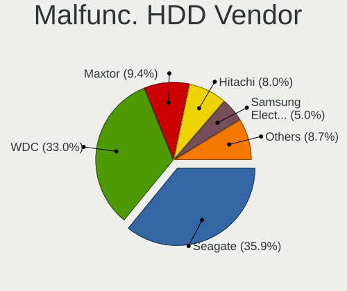

| Vendor              | Desktops | Drives | Percent |
|---------------------|----------|--------|---------|
| Seagate             | 210      | 279    | 35.9%   |
| WDC                 | 193      | 233    | 32.99%  |
| Maxtor              | 55       | 69     | 9.4%    |
| Hitachi             | 47       | 55     | 8.03%   |
| Samsung Electronics | 29       | 32     | 4.96%   |
| Toshiba             | 26       | 27     | 4.44%   |
| HGST                | 13       | 16     | 2.22%   |
| Unknown             | 4        | 9      | 0.68%   |
| WD MediaMax         | 1        | 1      | 0.17%   |
| USB3.0              | 1        | 1      | 0.17%   |
| QUANTUM             | 1        | 1      | 0.17%   |
| Inateck             | 1        | 1      | 0.17%   |
| IBM/Hitachi         | 1        | 1      | 0.17%   |
| Fujitsu             | 1        | 2      | 0.17%   |
| ASMT                | 1        | 1      | 0.17%   |
| ASMedia             | 1        | 1      | 0.17%   |

Malfunc. Drive Kind
-------------------

Kinds of faulty drives

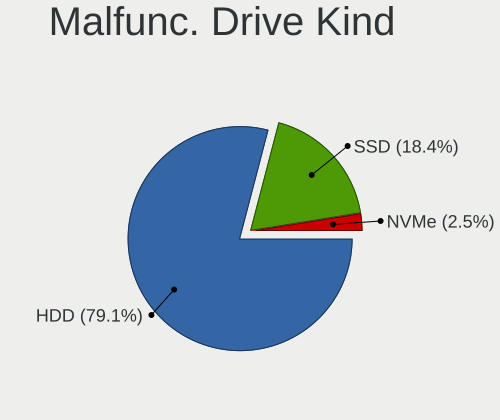

| Kind | Desktops | Drives | Percent |
|------|----------|--------|---------|
| HDD  | 529      | 729    | 79.07%  |
| SSD  | 123      | 162    | 18.39%  |
| NVMe | 17       | 20     | 2.54%   |

Failed Drives
-------------

Failed drive models

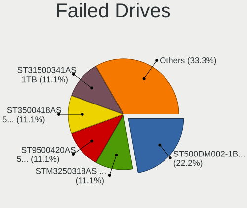

| Model                                          | Desktops | Drives | Percent |
|------------------------------------------------|----------|--------|---------|
| Seagate ST500DM002-1BD142 500GB                | 2        | 3      | 22.22%  |
| Seagate STM3250318AS 250GB                     | 1        | 1      | 11.11%  |
| Seagate ST9500420AS 500GB                      | 1        | 1      | 11.11%  |
| Seagate ST3500418AS 500GB                      | 1        | 1      | 11.11%  |
| Seagate ST31500341AS 1TB                       | 1        | 1      | 11.11%  |
| Micron/Crucial Technology P2 NVMe PCIe SSD 2TB | 1        | 1      | 11.11%  |
| Hitachi HTS725050A7E630 500GB                  | 1        | 1      | 11.11%  |
| Hitachi HTS543216L9A300 160GB                  | 1        | 1      | 11.11%  |

Failed Drive Vendor
-------------------

Failed drive vendors

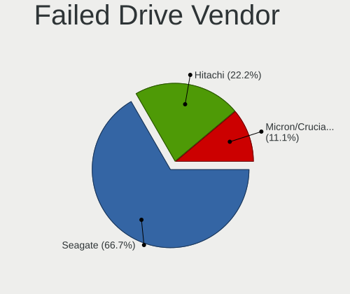

| Vendor                    | Desktops | Drives | Percent |
|---------------------------|----------|--------|---------|
| Seagate                   | 6        | 7      | 66.67%  |
| Hitachi                   | 2        | 2      | 22.22%  |
| Micron/Crucial Technology | 1        | 1      | 11.11%  |

Drive Status
------------

Number of failed and malfunc. drives

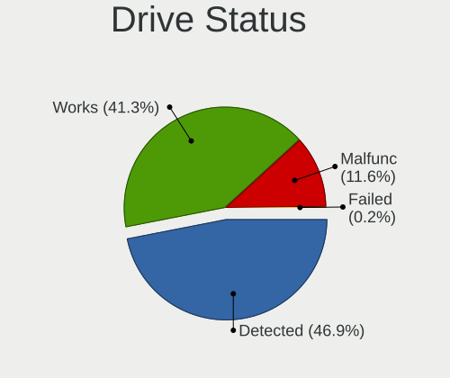

| Status   | Desktops | Drives | Percent |
|----------|----------|--------|---------|
| Detected | 2552     | 7074   | 46.93%  |
| Works    | 2245     | 5771   | 41.28%  |
| Malfunc  | 632      | 911    | 11.62%  |
| Failed   | 9        | 10     | 0.17%   |

Storage controller
------------------

Storage Vendor
--------------

Storage controller vendors

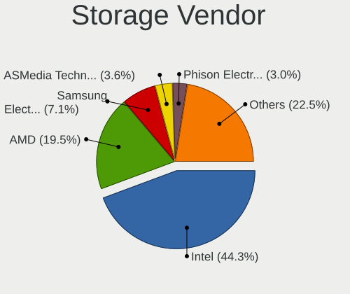

| Vendor                           | Desktops | Percent |
|----------------------------------|----------|---------|
| Intel                            | 3068     | 44.34%  |
| AMD                              | 1347     | 19.47%  |
| Samsung Electronics              | 490      | 7.08%   |
| ASMedia Technology               | 250      | 3.61%   |
| Phison Electronics               | 208      | 3.01%   |
| Micron/Crucial Technology        | 190      | 2.75%   |
| JMicron Technology               | 182      | 2.63%   |
| Marvell Technology Group         | 174      | 2.51%   |
| Sandisk                          | 164      | 2.37%   |
| Nvidia                           | 145      | 2.1%    |
| Kingston Technology Company      | 138      | 1.99%   |
| MAXIO Technology (Hangzhou)      | 95       | 1.37%   |
| VIA Technologies                 | 67       | 0.97%   |
| Micron Technology                | 54       | 0.78%   |
| Silicon Motion                   | 42       | 0.61%   |
| SK hynix                         | 40       | 0.58%   |
| Shenzhen Longsys Electronics     | 39       | 0.56%   |
| Realtek Semiconductor            | 31       | 0.45%   |
| Adaptec                          | 23       | 0.33%   |
| Toshiba America Info Systems     | 22       | 0.32%   |
| ADATA Technology                 | 19       | 0.27%   |
| Silicon Image                    | 15       | 0.22%   |
| KIOXIA                           | 15       | 0.22%   |
| Seagate Technology               | 12       | 0.17%   |
| Broadcom / LSI                   | 12       | 0.17%   |
| LSI Logic / Symbios Logic        | 11       | 0.16%   |
| INNOGRIT                         | 10       | 0.14%   |
| Silicon Integrated Systems [SiS] | 9        | 0.13%   |
| Biwin Storage Technology         | 7        | 0.1%    |
| TenaFe                           | 5        | 0.07%   |
| Solidigm                         | 4        | 0.06%   |
| Promise Technology               | 3        | 0.04%   |
| Integrated Technology Express    | 3        | 0.04%   |
| HighPoint Technologies           | 3        | 0.04%   |
| Broadcom                         | 3        | 0.04%   |
| Unknown                          | 3        | 0.04%   |
| ULi Electronics                  | 2        | 0.03%   |
| Solid State Storage Technology   | 2        | 0.03%   |
| Shenzhen Wodposit Electronics    | 2        | 0.03%   |
| Netac Technology                 | 2        | 0.03%   |

Storage Model
-------------

Storage controller models

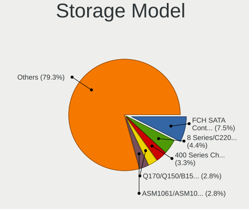

| Model                                                                                   | Desktops | Percent |
|-----------------------------------------------------------------------------------------|----------|---------|
| AMD FCH SATA Controller [AHCI mode]                                                     | 641      | 7.5%    |
| Intel 8 Series/C220 Series Chipset Family 6-port SATA Controller 1 [AHCI mode]          | 372      | 4.35%   |
| AMD 400 Series Chipset SATA Controller                                                  | 278      | 3.25%   |
| Intel Q170/Q150/B150/H170/H110/Z170/CM236 Chipset SATA Controller [AHCI Mode]           | 240      | 2.81%   |
| ASMedia ASM1061/ASM1062 Serial ATA Controller                                           | 236      | 2.76%   |
| Samsung NVMe SSD Controller SM981/PM981/PM983                                           | 224      | 2.62%   |
| Intel 6 Series/C200 Series Chipset Family 6 port Desktop SATA AHCI Controller           | 213      | 2.49%   |
| Intel NM10/ICH7 Family SATA Controller [IDE mode]                                       | 204      | 2.39%   |
| Intel 7 Series/C210 Series Chipset Family 6-port SATA Controller [AHCI mode]            | 196      | 2.29%   |
| Intel SATA Controller [RAID mode]                                                       | 193      | 2.26%   |
| AMD 500 Series Chipset SATA Controller                                                  | 193      | 2.26%   |
| Intel 200 Series PCH SATA controller [AHCI mode]                                        | 191      | 2.23%   |
| Intel 82801G (ICH7 Family) IDE Controller                                               | 170      | 1.99%   |
| AMD SB7x0/SB8x0/SB9x0 IDE Controller                                                    | 164      | 1.92%   |
| Intel Cannon Lake PCH SATA AHCI Controller                                              | 149      | 1.74%   |
| AMD SB7x0/SB8x0/SB9x0 SATA Controller [AHCI mode]                                       | 136      | 1.59%   |
| AMD 600 Series Chipset SATA Controller                                                  | 134      | 1.57%   |
| Phison E12 NVMe Controller                                                              | 121      | 1.42%   |
| Micron/Crucial P2 [Nick P2] / P3 / P3 Plus NVMe PCIe SSD (DRAM-less)                    | 108      | 1.26%   |
| AMD SB7x0/SB8x0/SB9x0 SATA Controller [IDE mode]                                        | 102      | 1.19%   |
| Samsung NVMe SSD Controller PM9A1/PM9A3/980PRO                                          | 100      | 1.17%   |
| JMicron JMB363 SATA/IDE Controller                                                      | 94       | 1.1%    |
| Intel 6 Series/C200 Series Chipset Family Desktop SATA Controller (IDE mode, ports 4-5) | 89       | 1.04%   |
| Intel 6 Series/C200 Series Chipset Family Desktop SATA Controller (IDE mode, ports 0-3) | 89       | 1.04%   |
| Intel 82801JI (ICH10 Family) 4 port SATA IDE Controller #1                              | 80       | 0.94%   |
| Samsung NVMe SSD Controller 980 (DRAM-less)                                             | 79       | 0.92%   |
| Intel 9 Series Chipset Family SATA Controller [AHCI Mode]                               | 78       | 0.91%   |
| Intel 500 Series Chipset Family SATA AHCI Controller                                    | 77       | 0.9%    |
| Intel 82801JI (ICH10 Family) 2 port SATA IDE Controller #2                              | 75       | 0.88%   |
| Intel Alder Lake-S PCH SATA Controller [AHCI Mode]                                      | 74       | 0.87%   |
| Intel 82801I (ICH9 Family) 2 port SATA Controller [IDE mode]                            | 74       | 0.87%   |
| Intel Raptor Lake SATA AHCI Controller                                                  | 64       | 0.75%   |
| Nvidia MCP61 SATA Controller                                                            | 60       | 0.7%    |
| Intel 5 Series/3400 Series Chipset 6 port SATA AHCI Controller                          | 60       | 0.7%    |
| AMD 300 Series Chipset SATA Controller                                                  | 58       | 0.68%   |
| Samsung NVMe SSD Controller S4LV008[Pascal]                                             | 55       | 0.64%   |
| Intel Comet Lake SATA AHCI Controller                                                   | 53       | 0.62%   |
| Nvidia MCP61 IDE                                                                        | 51       | 0.6%    |
| Intel 82801JI (ICH10 Family) SATA AHCI Controller                                       | 51       | 0.6%    |
| Intel Volume Management Device NVMe RAID Controller                                     | 50       | 0.58%   |

Storage Kind
------------

Kind of storage controller (IDE, SATA, NVMe, SAS, ...)

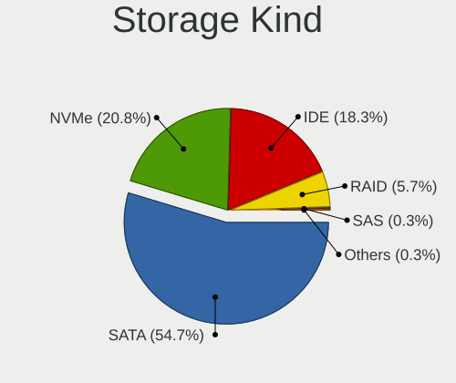

| Kind | Desktops | Percent |
|------|----------|---------|
| SATA | 3614     | 54.67%  |
| NVMe | 1374     | 20.78%  |
| IDE  | 1210     | 18.3%   |
| RAID | 376      | 5.69%   |
| SAS  | 19       | 0.29%   |
| SCSI | 18       | 0.27%   |

Processor
---------

CPU Vendor
----------

Processor vendors

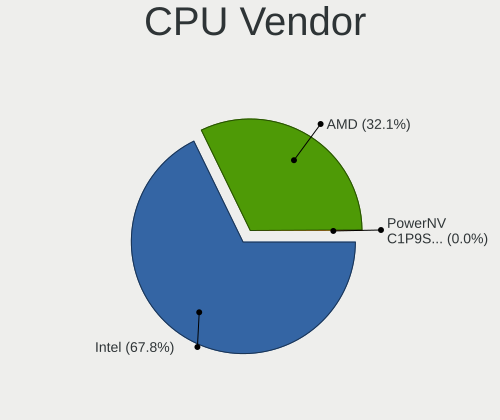

| Vendor                   | Desktops | Percent |
|--------------------------|----------|---------|
| Intel                    | 3170     | 67.78%  |
| AMD                      | 1503     | 32.14%  |
| CentaurHauls             | 3        | 0.06%   |
| PowerNV C1P9S01 REV 1.01 | 1        | 0.02%   |

CPU Model
---------

Processor models

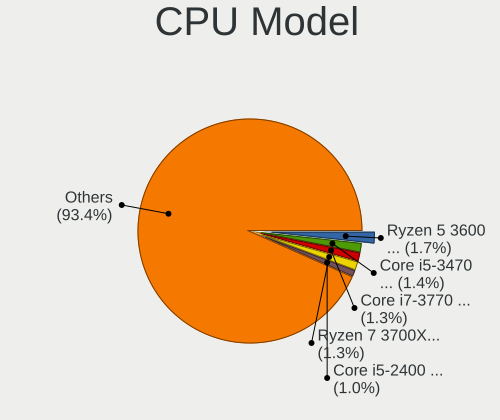

| Model                                       | Desktops | Percent |
|---------------------------------------------|----------|---------|
| AMD Ryzen 5 3600 6-Core Processor           | 80       | 1.7%    |
| Intel Core i5-3470 CPU @ 3.20GHz            | 65       | 1.38%   |
| Intel Core i7-3770 CPU @ 3.40GHz            | 62       | 1.32%   |
| AMD Ryzen 7 3700X 8-Core Processor          | 61       | 1.3%    |
| Intel Core i5-2400 CPU @ 3.10GHz            | 45       | 0.96%   |
| Intel Core 2 Quad CPU Q6600 @ 2.40GHz       | 45       | 0.96%   |
| AMD Ryzen 5 5600X 6-Core Processor          | 45       | 0.96%   |
| Intel Core i7-2600 CPU @ 3.40GHz            | 43       | 0.91%   |
| Intel Core i7-4790 CPU @ 3.60GHz            | 42       | 0.89%   |
| AMD Ryzen 7 5800X 8-Core Processor          | 42       | 0.89%   |
| Intel Core i5-4460 CPU @ 3.20GHz            | 41       | 0.87%   |
| Intel Core 2 Duo CPU E8400 @ 3.00GHz        | 40       | 0.85%   |
| AMD Ryzen 5 5600G with Radeon Graphics      | 38       | 0.81%   |
| Intel Core i7-7700 CPU @ 3.60GHz            | 37       | 0.79%   |
| Intel Core i7-6700 CPU @ 3.40GHz            | 37       | 0.79%   |
| AMD Ryzen 9 5900X 12-Core Processor         | 37       | 0.79%   |
| Intel Core i5-6500 CPU @ 3.20GHz            | 35       | 0.74%   |
| AMD FX-8350 Eight-Core Processor            | 34       | 0.72%   |
| Intel Core i7-4770 CPU @ 3.40GHz            | 32       | 0.68%   |
| Intel Core i3-2100 CPU @ 3.10GHz            | 32       | 0.68%   |
| Intel Core i3-2120 CPU @ 3.30GHz            | 31       | 0.66%   |
| AMD Ryzen 7 2700X Eight-Core Processor      | 31       | 0.66%   |
| AMD Ryzen 5 2600 Six-Core Processor         | 31       | 0.66%   |
| AMD Ryzen 7 5700G with Radeon Graphics      | 30       | 0.64%   |
| Intel Core i7-6700K CPU @ 4.00GHz           | 29       | 0.62%   |
| Intel Core i5-6400 CPU @ 2.70GHz            | 29       | 0.62%   |
| Intel Core i5-9400F CPU @ 2.90GHz           | 28       | 0.59%   |
| Intel Core i5-7400 CPU @ 3.00GHz            | 28       | 0.59%   |
| Intel Core i3-4130 CPU @ 3.40GHz            | 28       | 0.59%   |
| Intel Core i5-4590 CPU @ 3.30GHz            | 27       | 0.57%   |
| Intel Pentium 4 CPU 3.00GHz                 | 26       | 0.55%   |
| Intel Core i7-4790K CPU @ 4.00GHz           | 26       | 0.55%   |
| Intel Core i5-7500 CPU @ 3.40GHz            | 26       | 0.55%   |
| Intel Core i5 CPU 650 @ 3.20GHz             | 26       | 0.55%   |
| AMD Ryzen 9 3900X 12-Core Processor         | 25       | 0.53%   |
| Intel Core i7-7700K CPU @ 4.20GHz           | 24       | 0.51%   |
| Intel Celeron CPU J1900 @ 1.99GHz           | 24       | 0.51%   |
| Intel Pentium Dual-Core CPU E5300 @ 2.60GHz | 23       | 0.49%   |
| Intel Core i5-8400 CPU @ 2.80GHz            | 23       | 0.49%   |
| Intel Core i3-4160 CPU @ 3.60GHz            | 23       | 0.49%   |

CPU Model Family
----------------

Processor model prefix

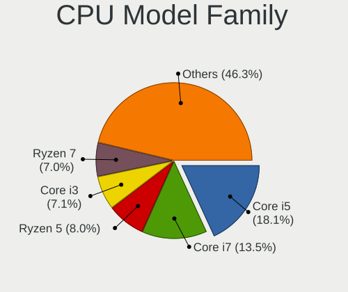

| Model                   | Desktops | Percent |
|-------------------------|----------|---------|
| Intel Core i5           | 853      | 18.15%  |
| Intel Core i7           | 636      | 13.53%  |
| AMD Ryzen 5             | 375      | 7.98%   |
| Intel Core i3           | 332      | 7.06%   |
| AMD Ryzen 7             | 330      | 7.02%   |
| Other                   | 247      | 5.25%   |
| AMD Ryzen 9             | 167      | 3.55%   |
| Intel Xeon              | 164      | 3.49%   |
| Intel Core 2 Quad       | 147      | 3.13%   |
| Intel Core 2 Duo        | 147      | 3.13%   |
| Intel Celeron           | 147      | 3.13%   |
| Intel Pentium           | 116      | 2.47%   |
| AMD FX                  | 115      | 2.45%   |
| Intel Pentium Dual-Core | 105      | 2.23%   |
| Intel Pentium 4         | 66       | 1.4%    |
| AMD Ryzen 3             | 55       | 1.17%   |
| AMD Athlon 64 X2        | 55       | 1.17%   |
| Intel Core i9           | 54       | 1.15%   |
| Intel Core 2            | 49       | 1.04%   |
| AMD Phenom II X4        | 45       | 0.96%   |
| Intel Atom              | 41       | 0.87%   |
| Intel Pentium Dual      | 40       | 0.85%   |
| AMD A8                  | 38       | 0.81%   |
| AMD A10                 | 32       | 0.68%   |
| AMD Phenom II X6        | 28       | 0.6%    |
| AMD Athlon II X2        | 28       | 0.6%    |
| Intel Pentium D         | 27       | 0.57%   |
| AMD Sempron             | 21       | 0.45%   |
| AMD A4                  | 21       | 0.45%   |
| AMD Athlon              | 20       | 0.43%   |
| AMD Phenom              | 18       | 0.38%   |
| AMD Athlon II X4        | 17       | 0.36%   |
| AMD A6                  | 17       | 0.36%   |
| AMD Athlon 64           | 16       | 0.34%   |
| AMD Athlon II X3        | 14       | 0.3%    |
| AMD Ryzen 5 PRO         | 12       | 0.26%   |
| AMD Six-Core Opteron    | 11       | 0.23%   |
| AMD Athlon X4           | 10       | 0.21%   |
| Intel Pentium Gold      | 9        | 0.19%   |
| AMD Ryzen Threadripper  | 8        | 0.17%   |

CPU Cores
---------

Number of processor cores

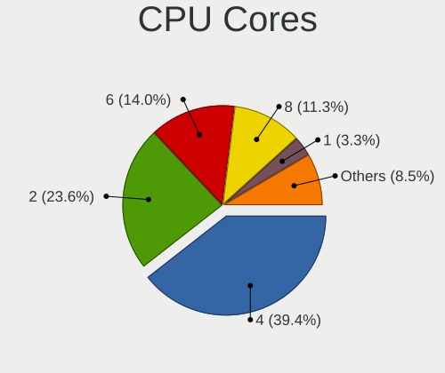

| Number  | Desktops | Percent |
|---------|----------|---------|
| 4       | 1853     | 39.43%  |
| 2       | 1108     | 23.57%  |
| 6       | 656      | 13.96%  |
| 8       | 532      | 11.32%  |
| 1       | 153      | 3.26%   |
| 12      | 141      | 3%      |
| 16      | 85       | 1.81%   |
| 10      | 48       | 1.02%   |
| 3       | 48       | 1.02%   |
| 14      | 35       | 0.74%   |
| 24      | 25       | 0.53%   |
| 20      | 8        | 0.17%   |
| 28      | 2        | 0.04%   |
| 5       | 2        | 0.04%   |
| 64      | 1        | 0.02%   |
| 36      | 1        | 0.02%   |
| 32      | 1        | 0.02%   |
| Unknown | 1        | 0.02%   |

CPU Sockets
-----------

Number of sockets

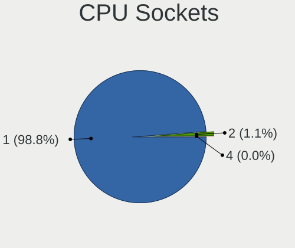

| Number | Desktops | Percent |
|--------|----------|---------|
| 1      | 4622     | 98.8%   |
| 2      | 51       | 1.09%   |
| 8      | 3        | 0.06%   |
| 20     | 1        | 0.02%   |
| 4      | 1        | 0.02%   |

CPU Threads
-----------

Threads per core (Hyper-Threading)

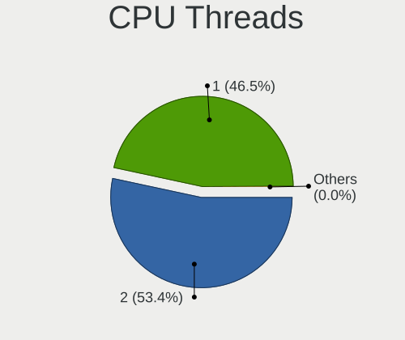

| Number  | Desktops | Percent |
|---------|----------|---------|
| 2       | 2504     | 53.37%  |
| 1       | 2183     | 46.53%  |
| 4       | 2        | 0.04%   |
| 12      | 1        | 0.02%   |
| 8       | 1        | 0.02%   |
| Unknown | 1        | 0.02%   |

CPU Op-Modes
------------

CPU Operation Modes (32-bit, 64-bit)

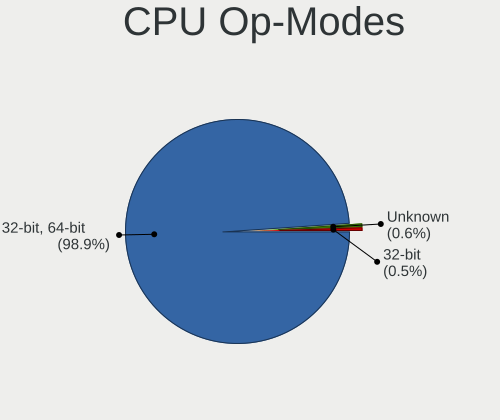

| Op mode        | Desktops | Percent |
|----------------|----------|---------|
| 32-bit, 64-bit | 4632     | 98.91%  |
| Unknown        | 26       | 0.56%   |
| 32-bit         | 25       | 0.53%   |

CPU Microcode
-------------

Microcode number

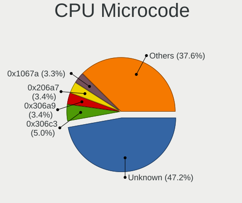

| Number     | Desktops | Percent |
|------------|----------|---------|
| Unknown    | 2339     | 47.19%  |
| 0x306c3    | 249      | 5.02%   |
| 0x306a9    | 171      | 3.45%   |
| 0x206a7    | 170      | 3.43%   |
| 0x1067a    | 165      | 3.33%   |
| 0x506e3    | 117      | 2.36%   |
| 0x08701021 | 107      | 2.16%   |
| 0x906e9    | 80       | 1.61%   |
| 0x906ea    | 68       | 1.37%   |
| 0x6fb      | 58       | 1.17%   |
| 0x0800820d | 56       | 1.13%   |
| 0x06000852 | 47       | 0.95%   |
| 0x010000c8 | 47       | 0.95%   |
| 0x6fd      | 41       | 0.83%   |
| 0x08108109 | 38       | 0.77%   |
| 0x906ed    | 35       | 0.71%   |
| 0x106e5    | 32       | 0.65%   |
| 0x10676    | 31       | 0.63%   |
| 0x08701013 | 30       | 0.61%   |
| 0x06001119 | 29       | 0.59%   |
| 0xa0655    | 28       | 0.56%   |
| 0x6f6      | 28       | 0.56%   |
| 0x08001138 | 28       | 0.56%   |
| 0xa0653    | 27       | 0.54%   |
| 0x0a201016 | 27       | 0.54%   |
| 0x0a50000c | 26       | 0.52%   |
| 0x106a5    | 25       | 0.5%    |
| 0x0a50000d | 25       | 0.5%    |
| 0x20655    | 24       | 0.48%   |
| 0xa0671    | 23       | 0.46%   |
| 0x20652    | 23       | 0.46%   |
| 0x10677    | 22       | 0.44%   |
| 0x010000dc | 20       | 0.4%    |
| 0xf43      | 19       | 0.38%   |
| 0x08701030 | 19       | 0.38%   |
| 0x03000027 | 18       | 0.36%   |
| 0x0a20120a | 17       | 0.34%   |
| 0x906eb    | 16       | 0.32%   |
| 0x306f2    | 16       | 0.32%   |
| 0x30678    | 16       | 0.32%   |

CPU Microarch
-------------

Microarchitecture

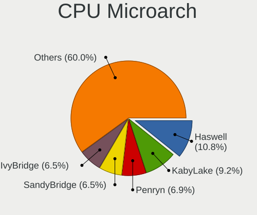

| Name             | Desktops | Percent |
|------------------|----------|---------|
| Haswell          | 509      | 10.81%  |
| KabyLake         | 433      | 9.2%    |
| Penryn           | 323      | 6.86%   |
| SandyBridge      | 308      | 6.54%   |
| IvyBridge        | 308      | 6.54%   |
| Unknown          | 280      | 5.95%   |
| Zen 3            | 276      | 5.86%   |
| Zen 2            | 247      | 5.25%   |
| Skylake          | 242      | 5.14%   |
| Core             | 192      | 4.08%   |
| K10              | 186      | 3.95%   |
| Zen+             | 163      | 3.46%   |
| Piledriver       | 137      | 2.91%   |
| CometLake        | 131      | 2.78%   |
| Zen              | 115      | 2.44%   |
| Alderlake Hybrid | 103      | 2.19%   |
| NetBurst         | 102      | 2.17%   |
| Nehalem          | 101      | 2.15%   |
| Westmere         | 89       | 1.89%   |
| K8 Hammer        | 87       | 1.85%   |
| Silvermont       | 69       | 1.47%   |
| Icelake          | 39       | 0.83%   |
| Steamroller      | 31       | 0.66%   |
| Goldmont plus    | 31       | 0.66%   |
| Goldmont         | 30       | 0.64%   |
| Gracemont        | 27       | 0.57%   |
| Excavator        | 27       | 0.57%   |
| K10 Llano        | 24       | 0.51%   |
| Bulldozer        | 18       | 0.38%   |
| Bonnell          | 18       | 0.38%   |
| Jaguar           | 14       | 0.3%    |
| Broadwell        | 13       | 0.28%   |
| Puma             | 12       | 0.25%   |
| Tremont          | 9        | 0.19%   |
| Bobcat           | 7        | 0.15%   |
| TigerLake        | 3        | 0.06%   |
| K6               | 2        | 0.04%   |
| P6               | 1        | 0.02%   |
| Lunarlake Hybrid | 1        | 0.02%   |

Graphics
--------

GPU Vendor
----------

Vendors of graphics cards

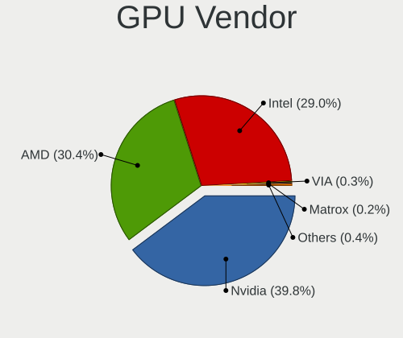

| Vendor                                       | Desktops | Percent |
|----------------------------------------------|----------|---------|
| Nvidia                                       | 1982     | 39.76%  |
| AMD                                          | 1514     | 30.37%  |
| Intel                                        | 1445     | 28.99%  |
| VIA Technologies                             | 14       | 0.28%   |
| Matrox Electronics Systems                   | 9        | 0.18%   |
| Silicon Integrated Systems [SiS]             | 6        | 0.12%   |
| ASPEED Technology                            | 5        | 0.1%    |
| Red Hat                                      | 4        | 0.08%   |
| XGI Technology (eXtreme Graphics Innovation) | 3        | 0.06%   |
| S3 Graphics                                  | 1        | 0.02%   |
| ATI Technologies                             | 1        | 0.02%   |
| 3DLabs                                       | 1        | 0.02%   |

GPU Model
---------

Graphics card models

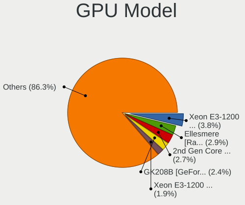

| Model                                                                                    | Desktops | Percent |
|------------------------------------------------------------------------------------------|----------|---------|
| Intel Xeon E3-1200 v3/4th Gen Core Processor Integrated Graphics Controller              | 196      | 3.78%   |
| AMD Ellesmere [Radeon RX 470/480/570/570X/580/580X/590]                                  | 149      | 2.87%   |
| Intel 2nd Generation Core Processor Family Integrated Graphics Controller                | 141      | 2.72%   |
| Nvidia GK208B [GeForce GT 710]                                                           | 127      | 2.45%   |
| Intel Xeon E3-1200 v2/3rd Gen Core processor Graphics Controller                         | 100      | 1.93%   |
| Nvidia GP107 [GeForce GTX 1050 Ti]                                                       | 99       | 1.91%   |
| Intel Skylake-S GT2 [HD Graphics 530]                                                    | 95       | 1.83%   |
| Intel 4 Series Chipset Integrated Graphics Controller                                    | 88       | 1.69%   |
| Nvidia GT218 [GeForce 210]                                                               | 81       | 1.56%   |
| Intel CoffeeLake-S GT2 [UHD Graphics 630]                                                | 80       | 1.54%   |
| AMD Cezanne [Radeon Vega Series / Radeon Vega Mobile Series]                             | 77       | 1.48%   |
| AMD Raphael                                                                              | 76       | 1.46%   |
| Nvidia GP108 [GeForce GT 1030]                                                           | 68       | 1.31%   |
| Intel 4th Generation Core Processor Family Integrated Graphics Controller                | 62       | 1.19%   |
| AMD Navi 10 [Radeon RX 5600 OEM/5600 XT / 5700/5700 XT]                                  | 61       | 1.17%   |
| Nvidia GP106 [GeForce GTX 1060 6GB]                                                      | 56       | 1.08%   |
| AMD Cedar [Radeon HD 5000/6000/7350/8350 Series]                                         | 56       | 1.08%   |
| AMD Caicos [Radeon HD 6450/7450/8450 / R5 230 OEM]                                       | 55       | 1.06%   |
| Nvidia GM107 [GeForce GTX 750 Ti]                                                        | 54       | 1.04%   |
| Nvidia GK208B [GeForce GT 730]                                                           | 54       | 1.04%   |
| Intel Kaby Lake-S GT2 [HD Graphics 630]                                                  | 53       | 1.02%   |
| Intel CometLake-S GT2 [UHD Graphics 630]                                                 | 52       | 1%      |
| AMD Picasso/Raven 2 [Radeon Vega Series / Radeon Vega Mobile Series]                     | 52       | 1%      |
| AMD Lexa PRO [Radeon 540/540X/550/550X / RX 540X/550/550X]                               | 44       | 0.85%   |
| Nvidia GF119 [GeForce GT 610]                                                            | 43       | 0.83%   |
| AMD Navi 22 [Radeon RX 6700/6700 XT/6750 XT / 6800M/6850M XT]                            | 42       | 0.81%   |
| Intel IvyBridge GT2 [HD Graphics 4000]                                                   | 41       | 0.79%   |
| Nvidia GM204 [GeForce GTX 970]                                                           | 40       | 0.77%   |
| AMD Navi 23 [Radeon RX 6600/6600 XT/6600M]                                               | 40       | 0.77%   |
| AMD Raven Ridge [Radeon Vega Series / Radeon Vega Mobile Series]                         | 37       | 0.71%   |
| Nvidia TU117 [GeForce GTX 1650]                                                          | 35       | 0.67%   |
| Nvidia TU116 [GeForce GTX 1660 SUPER]                                                    | 34       | 0.65%   |
| Nvidia GP107 [GeForce GTX 1050]                                                          | 34       | 0.65%   |
| Nvidia GM206 [GeForce GTX 960]                                                           | 34       | 0.65%   |
| Intel Atom/Celeron/Pentium Processor x5-E8000/J3xxx/N3xxx Integrated Graphics Controller | 34       | 0.65%   |
| Intel 82G33/G31 Express Integrated Graphics Controller                                   | 34       | 0.65%   |
| Nvidia GP106 [GeForce GTX 1060 3GB]                                                      | 33       | 0.64%   |
| Intel Atom Processor Z36xxx/Z37xxx Series Graphics & Display                             | 33       | 0.64%   |
| Nvidia GA106 [GeForce RTX 3060 Lite Hash Rate]                                           | 31       | 0.6%    |
| Intel Alder Lake-N [UHD Graphics]                                                        | 31       | 0.6%    |

GPU Combo
---------

Combinations of graphics cards

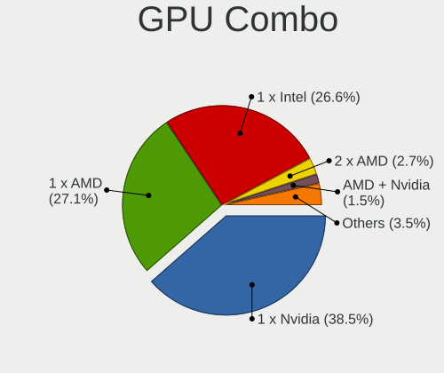

| Name                 | Desktops | Percent |
|----------------------|----------|---------|
| 1 x Nvidia           | 1828     | 38.52%  |
| 1 x AMD              | 1287     | 27.12%  |
| 1 x Intel            | 1260     | 26.55%  |
| 2 x AMD              | 130      | 2.74%   |
| AMD + Nvidia         | 72       | 1.52%   |
| Intel + Nvidia       | 70       | 1.48%   |
| Intel + AMD          | 28       | 0.59%   |
| 1 x VIA              | 14       | 0.3%    |
| 2 x Nvidia           | 10       | 0.21%   |
| 2 x Intel            | 9        | 0.19%   |
| 1 x SiS              | 6        | 0.13%   |
| Other                | 4        | 0.08%   |
| 1 x Red Hat          | 4        | 0.08%   |
| Nvidia + Matrox      | 4        | 0.08%   |
| 1 x Matrox           | 4        | 0.08%   |
| 1 x ASPEED           | 4        | 0.08%   |
| 1 x XGI              | 3        | 0.06%   |
| 3 x AMD              | 1        | 0.02%   |
| 2 x AMD + 1 x Nvidia | 1        | 0.02%   |
| 2 x AMD + 1 x 3DLabs | 1        | 0.02%   |
| 1 x S3 Graphics      | 1        | 0.02%   |
| Nvidia + ASPEED      | 1        | 0.02%   |
| Intel + 2 x Nvidia   | 1        | 0.02%   |
| Intel + 2 x AMD      | 1        | 0.02%   |
| AMD + Matrox         | 1        | 0.02%   |

GPU Driver
----------

Free vs proprietary

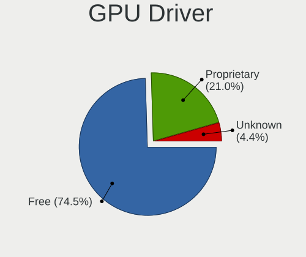

| Driver      | Desktops | Percent |
|-------------|----------|---------|
| Free        | 3579     | 74.52%  |
| Proprietary | 1011     | 21.05%  |
| Unknown     | 213      | 4.43%   |

GPU Memory
----------

Total video memory

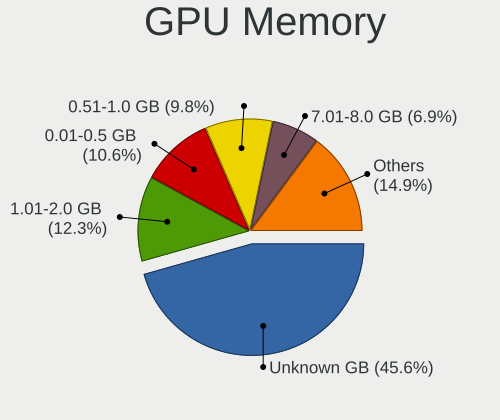

| Size in GB | Desktops | Percent |
|------------|----------|---------|
| Unknown    | 2239     | 45.61%  |
| 1.01-2.0   | 605      | 12.32%  |
| 0.01-0.5   | 518      | 10.55%  |
| 0.51-1.0   | 480      | 9.78%   |
| 7.01-8.0   | 338      | 6.89%   |
| 3.01-4.0   | 328      | 6.68%   |
| 8.01-16.0  | 170      | 3.46%   |
| 5.01-6.0   | 154      | 3.14%   |
| 2.01-3.0   | 59       | 1.2%    |
| 16.01-24.0 | 13       | 0.26%   |
| 4.01-5.0   | 3        | 0.06%   |
| 24.01-32.0 | 2        | 0.04%   |

Monitor
-------

Monitor Vendor
--------------

Monitor vendors

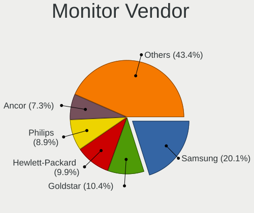

| Vendor               | Desktops | Percent |
|----------------------|----------|---------|
| Samsung Electronics  | 984      | 20.13%  |
| Goldstar             | 508      | 10.39%  |
| Hewlett-Packard      | 485      | 9.92%   |
| Philips              | 433      | 8.86%   |
| Ancor Communications | 356      | 7.28%   |
| Acer                 | 315      | 6.44%   |
| BenQ                 | 215      | 4.4%    |
| Dell                 | 211      | 4.32%   |
| AOC                  | 184      | 3.76%   |
| ASUSTek Computer     | 98       | 2%      |
| Lenovo               | 89       | 1.82%   |
| MSI                  | 81       | 1.66%   |
| Unknown              | 75       | 1.53%   |
| Sony                 | 69       | 1.41%   |
| HannStar             | 56       | 1.15%   |
| LG Electronics       | 45       | 0.92%   |
| Fujitsu Siemens      | 32       | 0.65%   |
| Eizo                 | 30       | 0.61%   |
| HKC                  | 27       | 0.55%   |
| Mi                   | 25       | 0.51%   |
| NEC Computers        | 21       | 0.43%   |
| RTK                  | 19       | 0.39%   |
| ViewSonic            | 16       | 0.33%   |
| Vestel Elektronik    | 16       | 0.33%   |
| Packard Bell         | 15       | 0.31%   |
| Unknown              | 14       | 0.29%   |
| Panasonic            | 13       | 0.27%   |
| MiTAC                | 13       | 0.27%   |
| Iiyama               | 13       | 0.27%   |
| HUAWEI               | 12       | 0.25%   |
| ___                  | 11       | 0.22%   |
| Unknown (XXX)        | 11       | 0.22%   |
| Sharp                | 11       | 0.22%   |
| GreenWood            | 11       | 0.22%   |
| Belinea              | 11       | 0.22%   |
| QBell                | 10       | 0.2%    |
| Hitachi              | 10       | 0.2%    |
| CVT                  | 10       | 0.2%    |
| Toshiba              | 9        | 0.18%   |
| OEM                  | 9        | 0.18%   |

Monitor Model
-------------

Monitor models

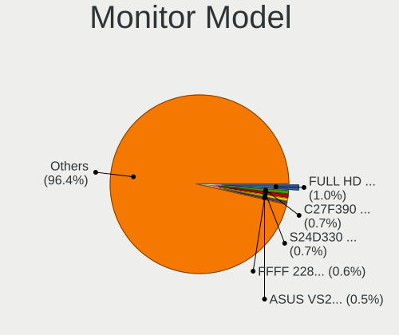

| Model                                                                 | Desktops | Percent |
|-----------------------------------------------------------------------|----------|---------|
| Goldstar FULL HD GSM5B55 1920x1080 480x270mm 21.7-inch                | 54       | 1.05%   |
| Samsung Electronics C27F390 SAM0D32 1920x1080 598x336mm 27.0-inch     | 38       | 0.74%   |
| Samsung Electronics S24D330 SAM0D92 1920x1080 531x299mm 24.0-inch     | 35       | 0.68%   |
| Unknown LCD Monitor FFFF 2288x1287 2550x2550mm 142.0-inch             | 32       | 0.62%   |
| Ancor Communications ASUS VS228 ACI22FD 1920x1080 476x268mm 21.5-inch | 26       | 0.5%    |
| Hewlett-Packard 24f HPN3545 1920x1080 527x296mm 23.8-inch             | 23       | 0.45%   |
| Samsung Electronics S24F350 SAM0D20 1920x1080 521x293mm 23.5-inch     | 22       | 0.43%   |
| Philips PHL 223V5 PHLC0CF 1920x1080 477x268mm 21.5-inch               | 22       | 0.43%   |
| Philips PHL 243V7 PHLC155 1920x1080 527x296mm 23.8-inch               | 20       | 0.39%   |
| Hewlett-Packard 27fh HPN354A 1920x1080 598x336mm 27.0-inch            | 19       | 0.37%   |
| AOC 27G2G4 AOC2702 1920x1080 598x336mm 27.0-inch                      | 19       | 0.37%   |
| Samsung Electronics S22B150 SAM08A3 1920x1080 477x268mm 21.5-inch     | 18       | 0.35%   |
| Philips 226V4 PHLC0B1 1920x1080 477x268mm 21.5-inch                   | 18       | 0.35%   |
| Ancor Communications VE228 ACI22FA 1920x1080 477x268mm 21.5-inch      | 18       | 0.35%   |
| Vestel Elektronik 40UHD_LCD_TV VES3700 3840x2160 880x500mm 39.8-inch  | 16       | 0.31%   |
| Samsung Electronics U28E590 SAM0C4D 3840x2160 607x345mm 27.5-inch     | 16       | 0.31%   |
| Samsung Electronics C24F390 SAM0D2C 1920x1080 521x293mm 23.5-inch     | 16       | 0.31%   |
| Philips PHL 243V5 PHLC0D1 1920x1080 521x293mm 23.5-inch               | 16       | 0.31%   |
| Hewlett-Packard 27f HPN354B 1920x1080 598x336mm 27.0-inch             | 15       | 0.29%   |
| Goldstar Ultra HD GSM5B09 3840x2160 600x340mm 27.2-inch               | 15       | 0.29%   |
| Goldstar HDR 4K GSM7707 3840x2160 600x340mm 27.2-inch                 | 15       | 0.29%   |
| AOC 2270W AOC2270 1920x1080 477x268mm 21.5-inch                       | 15       | 0.29%   |
| Goldstar HDR WFHD GSM7714 2560x1080 798x334mm 34.1-inch               | 14       | 0.27%   |
| Goldstar FULL HD GSM5B54 1920x1080 480x270mm 21.7-inch                | 14       | 0.27%   |
| Unknown                                                               | 14       | 0.27%   |
| Philips PHL 273V7 PHLC156 1920x1080 598x336mm 27.0-inch               | 13       | 0.25%   |
| Hewlett-Packard w1907 HWP26A2 1440x900 408x255mm 18.9-inch            | 13       | 0.25%   |
| Hewlett-Packard 22w HPN342E 1920x1080 476x268mm 21.5-inch             | 13       | 0.25%   |
| AOC G2460 AOC2460 1920x1080 531x299mm 24.0-inch                       | 13       | 0.25%   |
| AOC 24G2W1G3 AOC2402 1920x1080 527x296mm 23.8-inch                    | 13       | 0.25%   |
| Ancor Communications ASUS VW193D ACI19D5 1440x900 408x255mm 18.9-inch | 13       | 0.25%   |
| Acer X223W ACR000D 1680x1050 474x296mm 22.0-inch                      | 13       | 0.25%   |
| Philips PHL 246V5 PHLC0C5 1920x1080 531x299mm 24.0-inch               | 12       | 0.23%   |
| Goldstar HDR 4K GSM7706 3840x2160 600x340mm 27.2-inch                 | 12       | 0.23%   |
| Ancor Communications VE247 ACI2493 1920x1080 530x300mm 24.0-inch      | 12       | 0.23%   |
| Ancor Communications ASUS VS247 ACI249A 1920x1080 521x293mm 23.5-inch | 12       | 0.23%   |
| Samsung Electronics LCD Monitor SAM0C39 1920x1080 885x498mm 40.0-inch | 11       | 0.21%   |
| HUAWEI ZQE-CBA HWV6A25 3440x1440 797x334mm 34.0-inch                  | 11       | 0.21%   |
| Samsung Electronics S24D300 SAM0B43 1920x1080 531x299mm 24.0-inch     | 10       | 0.19%   |
| Samsung Electronics S22F350 SAM0D1A 1920x1080 477x268mm 21.5-inch     | 10       | 0.19%   |

Monitor Resolution
------------------

Monitor screen resolution

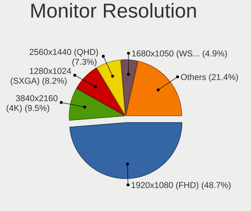

| Resolution         | Desktops | Percent |
|--------------------|----------|---------|
| 1920x1080 (FHD)    | 2324     | 48.72%  |
| 3840x2160 (4K)     | 452      | 9.48%   |
| 1280x1024 (SXGA)   | 390      | 8.18%   |
| 2560x1440 (QHD)    | 348      | 7.3%    |
| 1680x1050 (WSXGA+) | 233      | 4.88%   |
| 1440x900 (WXGA+)   | 213      | 4.47%   |
| 1366x768 (WXGA)    | 110      | 2.31%   |
| 1920x1200 (WUXGA)  | 93       | 1.95%   |
| 1360x768           | 80       | 1.68%   |
| 3440x1440          | 76       | 1.59%   |
| 1600x900 (HD+)     | 72       | 1.51%   |
| Unknown            | 64       | 1.34%   |
| 2560x1080          | 59       | 1.24%   |
| 1024x768 (XGA)     | 45       | 0.94%   |
| 3840x1080          | 37       | 0.78%   |
| 2288x1287          | 32       | 0.67%   |
| 1920x540           | 24       | 0.5%    |
| 1280x720 (HD)      | 17       | 0.36%   |
| 1600x1200          | 14       | 0.29%   |
| 1280x768           | 8        | 0.17%   |
| 3840x1600          | 7        | 0.15%   |
| 2560x1600          | 7        | 0.15%   |
| 4480x1440          | 4        | 0.08%   |
| 2560x1397          | 4        | 0.08%   |
| 5120x1440          | 3        | 0.06%   |
| 3840x1200          | 3        | 0.06%   |
| 3200x1080          | 3        | 0.06%   |
| 2160x1440          | 3        | 0.06%   |
| 2048x1152          | 3        | 0.06%   |
| 8960x2160          | 2        | 0.04%   |
| 800x600            | 2        | 0.04%   |
| 5760x1080          | 2        | 0.04%   |
| 2640x1024          | 2        | 0.04%   |
| 2304x1024          | 2        | 0.04%   |
| 2160x1200          | 2        | 0.04%   |
| 1818x1022          | 2        | 0.04%   |
| 1400x1050          | 2        | 0.04%   |
| 1280x800 (WXGA)    | 2        | 0.04%   |
| 6784x2160          | 1        | 0.02%   |
| 6400x2160          | 1        | 0.02%   |

Monitor Diagonal
----------------

Diagonal size in inches

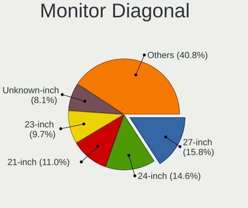

| Inches  | Desktops | Percent |
|---------|----------|---------|
| 27      | 777      | 15.83%  |
| 24      | 716      | 14.59%  |
| 21      | 539      | 10.98%  |
| 23      | 476      | 9.7%    |
| Unknown | 398      | 8.11%   |
| 19      | 359      | 7.32%   |
| 31      | 229      | 4.67%   |
| 18      | 184      | 3.75%   |
| 17      | 179      | 3.65%   |
| 22      | 141      | 2.87%   |
| 20      | 130      | 2.65%   |
| 34      | 121      | 2.47%   |
| 15      | 75       | 1.53%   |
| 40      | 68       | 1.39%   |
| 84      | 60       | 1.22%   |
| 72      | 53       | 1.08%   |
| 54      | 53       | 1.08%   |
| 32      | 34       | 0.69%   |
| 142     | 32       | 0.65%   |
| 25      | 31       | 0.63%   |
| 28      | 26       | 0.53%   |
| 63      | 21       | 0.43%   |
| 65      | 18       | 0.37%   |
| 26      | 17       | 0.35%   |
| 52      | 16       | 0.33%   |
| 48      | 15       | 0.31%   |
| 29      | 12       | 0.24%   |
| 37      | 11       | 0.22%   |
| 46      | 10       | 0.2%    |
| 43      | 10       | 0.2%    |
| 42      | 10       | 0.2%    |
| 49      | 7        | 0.14%   |
| 39      | 7        | 0.14%   |
| 16      | 7        | 0.14%   |
| 14      | 7        | 0.14%   |
| 33      | 6        | 0.12%   |
| 13      | 6        | 0.12%   |
| 12      | 6        | 0.12%   |
| 36      | 5        | 0.1%    |
| 75      | 4        | 0.08%   |

Monitor Width
-------------

Physical width

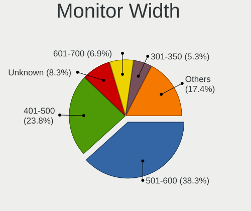

| Width in mm    | Desktops | Percent |
|----------------|----------|---------|
| 501-600        | 1830     | 38.3%   |
| 401-500        | 1136     | 23.78%  |
| Unknown        | 398      | 8.33%   |
| 601-700        | 330      | 6.91%   |
| 301-350        | 254      | 5.32%   |
| 351-400        | 224      | 4.69%   |
| 701-800        | 163      | 3.41%   |
| 1001-1500      | 158      | 3.31%   |
| 1501-2000      | 124      | 2.6%    |
| 801-900        | 89       | 1.86%   |
| More than 2000 | 32       | 0.67%   |
| 901-1000       | 22       | 0.46%   |
| 201-300        | 17       | 0.36%   |
| 101-200        | 1        | 0.02%   |

Aspect Ratio
------------

Proportional relationship between the width and the height

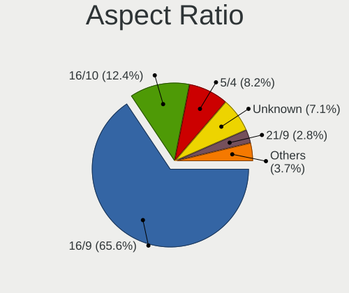

| Ratio   | Desktops | Percent |
|---------|----------|---------|
| 16/9    | 3011     | 65.64%  |
| 16/10   | 571      | 12.45%  |
| 5/4     | 378      | 8.24%   |
| Unknown | 327      | 7.13%   |
| 21/9    | 128      | 2.79%   |
| 4/3     | 92       | 2.01%   |
| 1.00    | 33       | 0.72%   |
| 32/9    | 18       | 0.39%   |
| 6/5     | 14       | 0.31%   |
| 3/2     | 14       | 0.31%   |
| 2.65    | 1        | 0.02%   |

Monitor Area
------------

Area in inch²

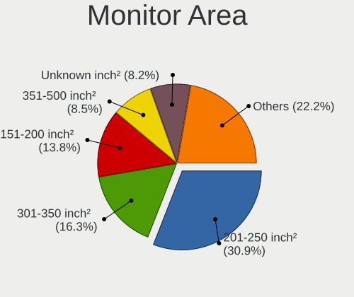

| Area in inch² | Desktops | Percent |
|----------------|----------|---------|
| 201-250        | 1497     | 30.93%  |
| 301-350        | 791      | 16.34%  |
| 151-200        | 668      | 13.8%   |
| 351-500        | 410      | 8.47%   |
| Unknown        | 398      | 8.22%   |
| 141-150        | 287      | 5.93%   |
| More than 1000 | 280      | 5.79%   |
| 251-300        | 259      | 5.35%   |
| 501-1000       | 147      | 3.04%   |
| 101-110        | 72       | 1.49%   |
| 71-80          | 11       | 0.23%   |
| 111-120        | 6        | 0.12%   |
| 131-140        | 5        | 0.1%    |
| 81-90          | 4        | 0.08%   |
| 91-100         | 3        | 0.06%   |
| 51-60          | 1        | 0.02%   |
| 1-40           | 1        | 0.02%   |

Pixel Density
-------------

Pixels per inch

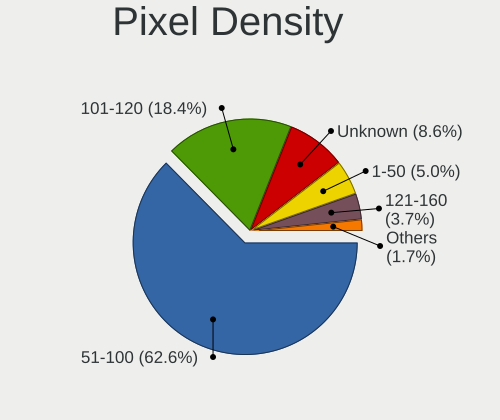

| Density       | Desktops | Percent |
|---------------|----------|---------|
| 51-100        | 2906     | 62.6%   |
| 101-120       | 854      | 18.4%   |
| Unknown       | 398      | 8.57%   |
| 1-50          | 233      | 5.02%   |
| 121-160       | 174      | 3.75%   |
| 161-240       | 74       | 1.59%   |
| More than 240 | 3        | 0.06%   |

Multiple Monitors
-----------------

Total monitors connected

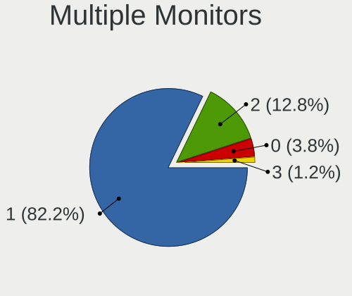

| Total | Desktops | Percent |
|-------|----------|---------|
| 1     | 3925     | 82.2%   |
| 2     | 610      | 12.77%  |
| 0     | 181      | 3.79%   |
| 3     | 59       | 1.24%   |

Network
-------

Net Controller Vendor
---------------------

Controller vendors

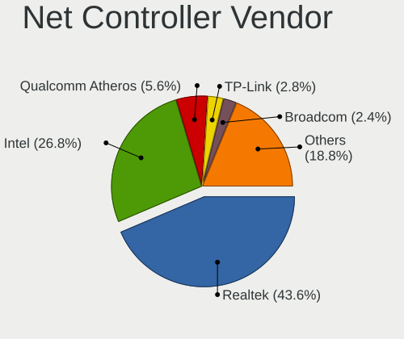

| Vendor                           | Desktops | Percent |
|----------------------------------|----------|---------|
| Realtek Semiconductor            | 2978     | 43.6%   |
| Intel                            | 1831     | 26.8%   |
| Qualcomm Atheros                 | 384      | 5.62%   |
| TP-Link                          | 191      | 2.8%    |
| Broadcom                         | 163      | 2.39%   |
| MediaTek                         | 149      | 2.18%   |
| Ralink Technology                | 130      | 1.9%    |
| Nvidia                           | 120      | 1.76%   |
| Marvell Technology Group         | 81       | 1.19%   |
| Qualcomm Atheros Communications  | 62       | 0.91%   |
| Ralink                           | 59       | 0.86%   |
| D-Link                           | 59       | 0.86%   |
| D-Link System                    | 56       | 0.82%   |
| Xiaomi                           | 42       | 0.61%   |
| Broadcom Limited                 | 42       | 0.61%   |
| Microsoft                        | 38       | 0.56%   |
| VIA Technologies                 | 35       | 0.51%   |
| Samsung Electronics              | 35       | 0.51%   |
| Sitecom Europe                   | 34       | 0.5%    |
| Huawei Technologies              | 32       | 0.47%   |
| ASUSTek Computer                 | 29       | 0.42%   |
| NetGear                          | 28       | 0.41%   |
| ASIX Electronics                 | 27       | 0.4%    |
| Aquantia                         | 19       | 0.28%   |
| Belkin Components                | 13       | 0.19%   |
| AVM                              | 11       | 0.16%   |
| OPPO Electronics                 | 10       | 0.15%   |
| Gemtek                           | 10       | 0.15%   |
| 3Com                             | 10       | 0.15%   |
| QinHeng Electronics              | 8        | 0.12%   |
| DisplayLink                      | 8        | 0.12%   |
| Silicon Integrated Systems [SiS] | 7        | 0.1%    |
| ZTE WCDMA Technologies MSM       | 6        | 0.09%   |
| Qualcomm Technologies            | 6        | 0.09%   |
| Motorola PCS                     | 6        | 0.09%   |
| Mercucys                         | 6        | 0.09%   |
| ZyDAS                            | 5        | 0.07%   |
| Motorola                         | 5        | 0.07%   |
| Microchip Technology             | 5        | 0.07%   |
| Linksys                          | 5        | 0.07%   |

Net Controller Model
--------------------

Controller models

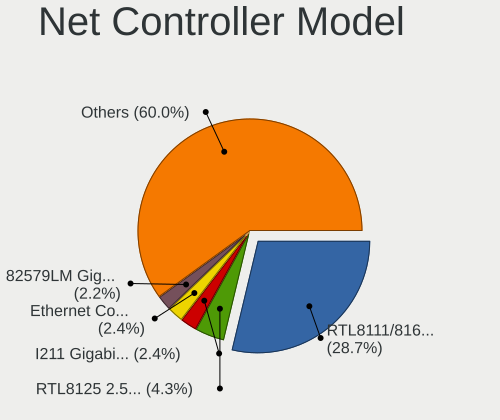

| Model                                                                  | Desktops | Percent |
|------------------------------------------------------------------------|----------|---------|
| Realtek RTL8111/8168/8211/8411 PCI Express Gigabit Ethernet Controller | 2238     | 28.74%  |
| Realtek RTL8125 2.5GbE Controller                                      | 334      | 4.29%   |
| Intel I211 Gigabit Network Connection                                  | 189      | 2.43%   |
| Intel Ethernet Connection (2) I219-V                                   | 184      | 2.36%   |
| Intel 82579LM Gigabit Network Connection (Lewisville)                  | 170      | 2.18%   |
| Intel Wi-Fi 6 AX200                                                    | 163      | 2.09%   |
| Intel Ethernet Controller I225-V                                       | 134      | 1.72%   |
| Intel Ethernet Connection I217-LM                                      | 101      | 1.3%    |
| Realtek RTL8821CE 802.11ac PCIe Wireless Network Adapter               | 97       | 1.25%   |
| Intel 82579V Gigabit Network Connection                                | 97       | 1.25%   |
| Intel Wi-Fi 6E(802.11ax) AX210/AX1675* 2x2 [Typhoon Peak]              | 91       | 1.17%   |
| Realtek 802.11ac NIC                                                   | 82       | 1.05%   |
| Realtek RTL88x2bu [AC1200 Techkey]                                     | 80       | 1.03%   |
| Intel Ethernet Connection (7) I219-V                                   | 80       | 1.03%   |
| Realtek RTL810xE PCI Express Fast Ethernet controller                  | 77       | 0.99%   |
| Realtek RTL8188EUS 802.11n Wireless Network Adapter                    | 69       | 0.89%   |
| MediaTek MT7922 802.11ax PCI Express Wireless Network Adapter          | 62       | 0.8%    |
| TP-Link TL-WN823N v2/v3 [Realtek RTL8192EU]                            | 60       | 0.77%   |
| Intel Wireless 7265                                                    | 58       | 0.74%   |
| Qualcomm Atheros AR9271 802.11n                                        | 57       | 0.73%   |
| Qualcomm Atheros AR8121/AR8113/AR8114 Gigabit or Fast Ethernet         | 57       | 0.73%   |
| Marvell Group 88E8056 PCI-E Gigabit Ethernet Controller                | 53       | 0.68%   |
| Intel Ethernet Connection I217-V                                       | 52       | 0.67%   |
| Nvidia MCP61 Ethernet                                                  | 50       | 0.64%   |
| Realtek RTL8852BE PCIe 802.11ax Wireless Network Controller            | 49       | 0.63%   |
| Realtek RTL-8100/8101L/8139 PCI Fast Ethernet Adapter                  | 49       | 0.63%   |
| Intel Ethernet Controller I226-V                                       | 49       | 0.63%   |
| Intel 82567LM-3 Gigabit Network Connection                             | 48       | 0.62%   |
| Intel 700 Series Chipset CNVi WiFi                                     | 47       | 0.6%    |
| Ralink MT7601U Wireless Adapter                                        | 45       | 0.58%   |
| Intel Dual Band Wireless-AC 3168NGW [Stone Peak]                       | 39       | 0.5%    |
| Realtek RTL8192EE PCIe Wireless Network Adapter                        | 38       | 0.49%   |
| Realtek RTL8192CU 802.11n WLAN Adapter                                 | 38       | 0.49%   |
| Intel Wi-Fi 5(802.11ac) Wireless-AC 9x6x [Thunder Peak]                | 38       | 0.49%   |
| Intel Ethernet Connection (2) I219-LM                                  | 37       | 0.48%   |
| Realtek RTL8169 PCI Gigabit Ethernet Controller                        | 36       | 0.46%   |
| Xiaomi Mi/Redmi series (RNDIS)                                         | 35       | 0.45%   |
| Qualcomm Atheros Killer E220x Gigabit Ethernet Controller              | 35       | 0.45%   |
| MediaTek MT7921K (RZ608) Wi-Fi 6E 80MHz                                | 33       | 0.42%   |
| Qualcomm Atheros AR9485 Wireless Network Adapter                       | 32       | 0.41%   |

Wireless Vendor
---------------

Wireless vendors

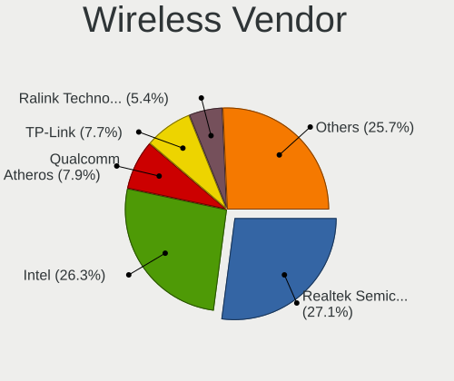

| Vendor                                | Desktops | Percent |
|---------------------------------------|----------|---------|
| Realtek Semiconductor                 | 656      | 27.06%  |
| Intel                                 | 637      | 26.28%  |
| Qualcomm Atheros                      | 192      | 7.92%   |
| TP-Link                               | 186      | 7.67%   |
| Ralink Technology                     | 130      | 5.36%   |
| MediaTek                              | 119      | 4.91%   |
| Broadcom                              | 70       | 2.89%   |
| Qualcomm Atheros Communications       | 62       | 2.56%   |
| Ralink                                | 59       | 2.43%   |
| D-Link                                | 58       | 2.39%   |
| D-Link System                         | 41       | 1.69%   |
| Microsoft                             | 36       | 1.49%   |
| Sitecom Europe                        | 34       | 1.4%    |
| ASUSTek Computer                      | 28       | 1.16%   |
| NetGear                               | 27       | 1.11%   |
| Belkin Components                     | 12       | 0.5%    |
| AVM                                   | 11       | 0.45%   |
| Gemtek                                | 10       | 0.41%   |
| Broadcom Limited                      | 10       | 0.41%   |
| Mercucys                              | 6        | 0.25%   |
| ZyDAS                                 | 5        | 0.21%   |
| Linksys                               | 5        | 0.21%   |
| Realtek                               | 4        | 0.17%   |
| Edimax Technology                     | 4        | 0.17%   |
| ZyXEL Communications                  | 3        | 0.12%   |
| AboCom Systems                        | 3        | 0.12%   |
| 802.11g Adapter [Linksys WUSB54GC v3] | 3        | 0.12%   |
| Qualcomm Technologies                 | 2        | 0.08%   |
| ZTE WCDMA Technologies MSM            | 1        | 0.04%   |
| Wilocity                              | 1        | 0.04%   |
| Wacom                                 | 1        | 0.04%   |
| TRENDnet                              | 1        | 0.04%   |
| Texas Instruments                     | 1        | 0.04%   |
| Sierra Wireless                       | 1        | 0.04%   |
| Samsung Electronics                   | 1        | 0.04%   |
| Micro Star International              | 1        | 0.04%   |
| Fiberline                             | 1        | 0.04%   |
| BUFFALO                               | 1        | 0.04%   |
| Accton Technology                     | 1        | 0.04%   |

Wireless Model
--------------

Wireless models

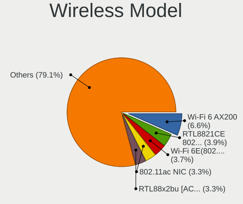

| Model                                                          | Desktops | Percent |
|----------------------------------------------------------------|----------|---------|
| Intel Wi-Fi 6 AX200                                            | 163      | 6.63%   |
| Realtek RTL8821CE 802.11ac PCIe Wireless Network Adapter       | 97       | 3.95%   |
| Intel Wi-Fi 6E(802.11ax) AX210/AX1675* 2x2 [Typhoon Peak]      | 91       | 3.7%    |
| Realtek 802.11ac NIC                                           | 82       | 3.34%   |
| Realtek RTL88x2bu [AC1200 Techkey]                             | 80       | 3.25%   |
| Realtek RTL8188EUS 802.11n Wireless Network Adapter            | 69       | 2.81%   |
| TP-Link TL-WN823N v2/v3 [Realtek RTL8192EU]                    | 60       | 2.44%   |
| Intel Wireless 7265                                            | 58       | 2.36%   |
| Qualcomm Atheros AR9271 802.11n                                | 57       | 2.32%   |
| MediaTek MT7922 802.11ax PCI Express Wireless Network Adapter  | 48       | 1.95%   |
| Intel 700 Series Chipset CNVi WiFi                             | 47       | 1.91%   |
| Ralink MT7601U Wireless Adapter                                | 45       | 1.83%   |
| Intel Dual Band Wireless-AC 3168NGW [Stone Peak]               | 39       | 1.59%   |
| Realtek RTL8192EE PCIe Wireless Network Adapter                | 38       | 1.55%   |
| Realtek RTL8192CU 802.11n WLAN Adapter                         | 38       | 1.55%   |
| Intel Wi-Fi 5(802.11ac) Wireless-AC 9x6x [Thunder Peak]        | 38       | 1.55%   |
| MediaTek MT7921K (RZ608) Wi-Fi 6E 80MHz                        | 33       | 1.34%   |
| Qualcomm Atheros AR9485 Wireless Network Adapter               | 32       | 1.3%    |
| TP-Link 802.11ac NIC                                           | 27       | 1.1%    |
| Broadcom BCM4352 802.11ac Dual Band Wireless Network Adapter   | 27       | 1.1%    |
| Intel Wireless 3165                                            | 26       | 1.06%   |
| Realtek RTL8192EU 802.11b/g/n WLAN Adapter                     | 25       | 1.02%   |
| Intel Wireless 7260                                            | 25       | 1.02%   |
| Ralink RT5370 Wireless Adapter                                 | 24       | 0.98%   |
| Intel Cannon Lake PCH CNVi WiFi                                | 24       | 0.98%   |
| Intel Alder Lake-S PCH CNVi WiFi                               | 22       | 0.9%    |
| Broadcom BCM4360 802.11ac Dual Band Wireless Network Adapter   | 22       | 0.9%    |
| Intel Tiger Lake PCH CNVi WiFi                                 | 21       | 0.85%   |
| Realtek RTL8812AE 802.11ac PCIe Wireless Network Adapter       | 20       | 0.81%   |
| Intel Comet Lake PCH CNVi WiFi                                 | 20       | 0.81%   |
| TP-Link TL-WN821N v5/v6 [RTL8192EU]                            | 19       | 0.77%   |
| TP-Link AC600 wireless Realtek RTL8811AU [Archer T2U Nano]     | 19       | 0.77%   |
| Qualcomm Atheros AR9287 Wireless Network Adapter (PCI-Express) | 19       | 0.77%   |
| Ralink RT2870/RT3070 Wireless Adapter                          | 18       | 0.73%   |
| Ralink RT2501/RT2573 Wireless Adapter                          | 18       | 0.73%   |
| Qualcomm Atheros AR93xx Wireless Network Adapter               | 18       | 0.73%   |
| Qualcomm Atheros AR9227 Wireless Network Adapter               | 18       | 0.73%   |
| TP-Link 802.11ac WLAN Adapter                                  | 17       | 0.69%   |
| Realtek RTL8821AE 802.11ac PCIe Wireless Network Adapter       | 17       | 0.69%   |
| Qualcomm Atheros QCA6174 802.11ac Wireless Network Adapter     | 17       | 0.69%   |

Ethernet Vendor
---------------

Ethernet vendors

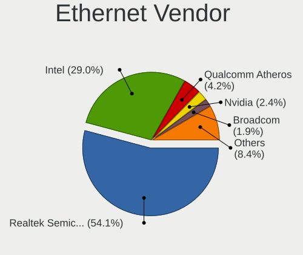

| Vendor                                 | Desktops | Percent |
|----------------------------------------|----------|---------|
| Realtek Semiconductor                  | 2751     | 54.14%  |
| Intel                                  | 1475     | 29.03%  |
| Qualcomm Atheros                       | 214      | 4.21%   |
| Nvidia                                 | 120      | 2.36%   |
| Broadcom                               | 96       | 1.89%   |
| Marvell Technology Group               | 81       | 1.59%   |
| Xiaomi                                 | 42       | 0.83%   |
| Samsung Electronics                    | 34       | 0.67%   |
| VIA Technologies                       | 33       | 0.65%   |
| Broadcom Limited                       | 32       | 0.63%   |
| Huawei Technologies                    | 30       | 0.59%   |
| ASIX Electronics                       | 27       | 0.53%   |
| MediaTek                               | 26       | 0.51%   |
| Aquantia                               | 19       | 0.37%   |
| D-Link System                          | 15       | 0.3%    |
| OPPO Electronics                       | 10       | 0.2%    |
| 3Com                                   | 10       | 0.2%    |
| DisplayLink                            | 8        | 0.16%   |
| Silicon Integrated Systems [SiS]       | 7        | 0.14%   |
| Motorola PCS                           | 6        | 0.12%   |
| TP-Link                                | 5        | 0.1%    |
| Google                                 | 5        | 0.1%    |
| Qualcomm Technologies                  | 4        | 0.08%   |
| Qualcomm                               | 4        | 0.08%   |
| Tehuti Networks                        | 3        | 0.06%   |
| OnePlus Technology (Shenzhen)          | 3        | 0.06%   |
| Mellanox Technologies                  | 2        | 0.04%   |
| ZTE WCDMA Technologies MSM             | 1        | 0.02%   |
| ULi Electronics                        | 1        | 0.02%   |
| T & A Mobile Phones                    | 1        | 0.02%   |
| SysKonnect                             | 1        | 0.02%   |
| Suzhou Motorcomm Electronic Technology | 1        | 0.02%   |
| Sundance Technology Inc / IC Plus      | 1        | 0.02%   |
| Spreadtrum Communications              | 1        | 0.02%   |
| NetGear                                | 1        | 0.02%   |
| Microchip Technology                   | 1        | 0.02%   |
| LG Electronics                         | 1        | 0.02%   |
| JMicron Technology                     | 1        | 0.02%   |
| HTC (High Tech Computer)               | 1        | 0.02%   |
| HMD Global                             | 1        | 0.02%   |

Ethernet Model
--------------

Ethernet models

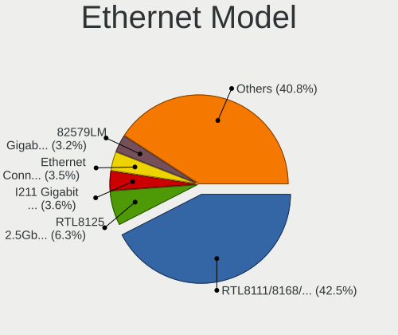

| Model                                                                  | Desktops | Percent |
|------------------------------------------------------------------------|----------|---------|
| Realtek RTL8111/8168/8211/8411 PCI Express Gigabit Ethernet Controller | 2238     | 42.5%   |
| Realtek RTL8125 2.5GbE Controller                                      | 334      | 6.34%   |
| Intel I211 Gigabit Network Connection                                  | 189      | 3.59%   |
| Intel Ethernet Connection (2) I219-V                                   | 184      | 3.49%   |
| Intel 82579LM Gigabit Network Connection (Lewisville)                  | 170      | 3.23%   |
| Intel Ethernet Controller I225-V                                       | 134      | 2.54%   |
| Intel Ethernet Connection I217-LM                                      | 101      | 1.92%   |
| Intel 82579V Gigabit Network Connection                                | 97       | 1.84%   |
| Intel Ethernet Connection (7) I219-V                                   | 80       | 1.52%   |
| Realtek RTL810xE PCI Express Fast Ethernet controller                  | 77       | 1.46%   |
| Qualcomm Atheros AR8121/AR8113/AR8114 Gigabit or Fast Ethernet         | 57       | 1.08%   |
| Marvell Group 88E8056 PCI-E Gigabit Ethernet Controller                | 53       | 1.01%   |
| Intel Ethernet Connection I217-V                                       | 52       | 0.99%   |
| Nvidia MCP61 Ethernet                                                  | 50       | 0.95%   |
| Realtek RTL-8100/8101L/8139 PCI Fast Ethernet Adapter                  | 49       | 0.93%   |
| Intel Ethernet Controller I226-V                                       | 49       | 0.93%   |
| Intel 82567LM-3 Gigabit Network Connection                             | 48       | 0.91%   |
| Intel Ethernet Connection (2) I219-LM                                  | 37       | 0.7%    |
| Realtek RTL8169 PCI Gigabit Ethernet Controller                        | 36       | 0.68%   |
| Xiaomi Mi/Redmi series (RNDIS)                                         | 35       | 0.66%   |
| Qualcomm Atheros Killer E220x Gigabit Ethernet Controller              | 35       | 0.66%   |
| Realtek RTL8852BE PCIe 802.11ax Wireless Network Controller            | 33       | 0.63%   |
| Intel Ethernet Connection (2) I218-V                                   | 32       | 0.61%   |
| Realtek RTL8153 Gigabit Ethernet Adapter                               | 31       | 0.59%   |
| Samsung Galaxy series, misc. (tethering mode)                          | 30       | 0.57%   |
| VIA VT6102/VT6103 [Rhine-II]                                           | 29       | 0.55%   |
| Qualcomm Atheros Attansic L1 Gigabit Ethernet                          | 29       | 0.55%   |
| Nvidia MCP77 Ethernet                                                  | 24       | 0.46%   |
| Intel 82574L Gigabit Network Connection                                | 23       | 0.44%   |
| Intel I210 Gigabit Network Connection                                  | 22       | 0.42%   |
| Intel 82566DM-2 Gigabit Network Connection                             | 22       | 0.42%   |
| Intel 82578DM Gigabit Network Connection                               | 21       | 0.4%    |
| Intel 82578DC Gigabit Network Connection                               | 20       | 0.38%   |
| Realtek RTL8126 5GbE Controller                                        | 19       | 0.36%   |
| Qualcomm Atheros AR8151 v2.0 Gigabit Ethernet                          | 18       | 0.34%   |
| Huawei FOA-LX9                                                         | 18       | 0.34%   |
| ASIX AX88179 Gigabit Ethernet                                          | 18       | 0.34%   |
| Qualcomm Atheros AR8161 Gigabit Ethernet                               | 17       | 0.32%   |
| Intel Ethernet Connection (14) I219-V                                  | 17       | 0.32%   |
| Realtek RTL-8110SC/8169SC Gigabit Ethernet                             | 16       | 0.3%    |

Net Controller Kind
-------------------

Ethernet, WiFi or modem

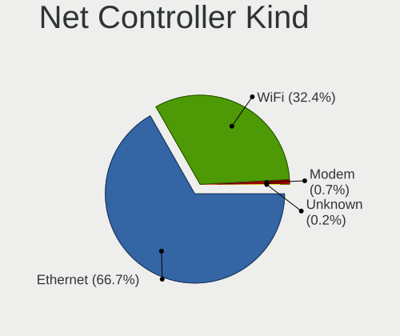

| Kind     | Desktops | Percent |
|----------|----------|---------|
| Ethernet | 4633     | 66.75%  |
| WiFi     | 2246     | 32.36%  |
| Modem    | 51       | 0.73%   |
| Unknown  | 11       | 0.16%   |

Used Controller
---------------

Currently used network controller

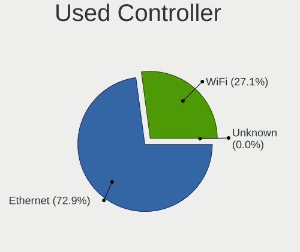

| Kind     | Desktops | Percent |
|----------|----------|---------|
| Ethernet | 3491     | 72.88%  |
| WiFi     | 1298     | 27.1%   |
| Unknown  | 1        | 0.02%   |

NICs
----

Total network controllers on board

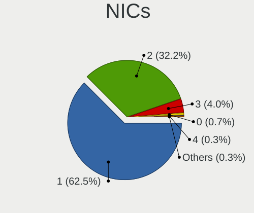

| Total | Desktops | Percent |
|-------|----------|---------|
| 1     | 2949     | 62.53%  |
| 2     | 1519     | 32.21%  |
| 3     | 188      | 3.99%   |
| 0     | 33       | 0.7%    |
| 4     | 14       | 0.3%    |
| 5     | 7        | 0.15%   |
| 6     | 4        | 0.08%   |
| 12    | 2        | 0.04%   |

IPv6
----

IPv6 vs IPv4

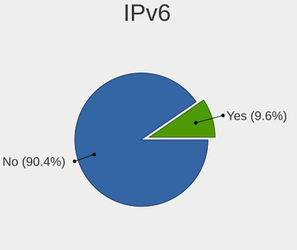

| Used | Desktops | Percent |
|------|----------|---------|
| No   | 4284     | 90.44%  |
| Yes  | 453      | 9.56%   |

Bluetooth
---------

Bluetooth Vendor
----------------

Controller vendors

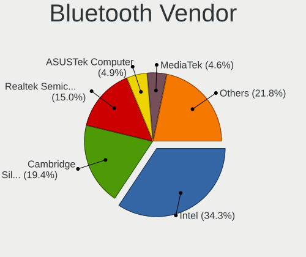

| Vendor                          | Desktops | Percent |
|---------------------------------|----------|---------|
| Intel                           | 590      | 34.34%  |
| Cambridge Silicon Radio         | 334      | 19.44%  |
| Realtek Semiconductor           | 257      | 14.96%  |
| ASUSTek Computer                | 84       | 4.89%   |
| MediaTek                        | 79       | 4.6%    |
| Broadcom                        | 77       | 4.48%   |
| IMC Networks                    | 70       | 4.07%   |
| Foxconn / Hon Hai               | 41       | 2.39%   |
| TP-Link                         | 40       | 2.33%   |
| Qualcomm Atheros Communications | 39       | 2.27%   |
| Apple                           | 22       | 1.28%   |
| Integrated System Solution      | 13       | 0.76%   |
| Lite-On Technology              | 11       | 0.64%   |
| Belkin Components               | 9        | 0.52%   |
| Mercucys                        | 7        | 0.41%   |
| Sitecom Europe                  | 6        | 0.35%   |
| Realtek                         | 5        | 0.29%   |
| Unknown                         | 5        | 0.29%   |
| SINO WEALTH                     | 3        | 0.17%   |
| Logitech                        | 3        | 0.17%   |
| HTC (High Tech Computer)        | 2        | 0.12%   |
| Hewlett-Packard                 | 2        | 0.12%   |
| D-Link System                   | 2        | 0.12%   |
| Conwise Technology              | 2        | 0.12%   |
| Actions                         | 2        | 0.12%   |
| Accel Semiconductor             | 2        | 0.12%   |
| TDK                             | 1        | 0.06%   |
| SiW                             | 1        | 0.06%   |
| Roper                           | 1        | 0.06%   |
| Micro Star International        | 1        | 0.06%   |
| Fujitsu Siemens Computers       | 1        | 0.06%   |
| Fujitsu                         | 1        | 0.06%   |
| Edimax Technology               | 1        | 0.06%   |
| Dell                            | 1        | 0.06%   |
| D-Link                          | 1        | 0.06%   |
| AICSemi                         | 1        | 0.06%   |
| 3Com                            | 1        | 0.06%   |

Bluetooth Model
---------------

Controller models

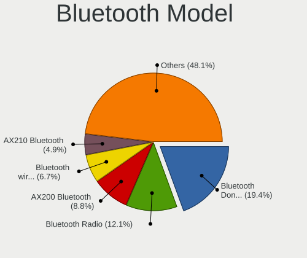

| Model                                                 | Desktops | Percent |
|-------------------------------------------------------|----------|---------|
| Cambridge Silicon Radio Bluetooth Dongle (HCI mode)   | 334      | 19.42%  |
| Realtek Bluetooth Radio                               | 208      | 12.09%  |
| Intel AX200 Bluetooth                                 | 151      | 8.78%   |
| Intel Bluetooth wireless interface                    | 115      | 6.69%   |
| Intel AX210 Bluetooth                                 | 84       | 4.88%   |
| MediaTek Wireless_Device                              | 79       | 4.59%   |
| Intel AX201 Bluetooth                                 | 70       | 4.07%   |
| Intel Bluetooth Device                                | 57       | 3.31%   |
| TP-Link TP-T@- UB500 Adapter                          | 40       | 2.33%   |
| Intel Wireless-AC 3168 Bluetooth                      | 38       | 2.21%   |
| Intel Wireless-AC 9260 Bluetooth Adapter              | 36       | 2.09%   |
| Intel Bluetooth 9460/9560 Jefferson Peak (JfP)        | 35       | 2.03%   |
| IMC Networks Bluetooth Radio                          | 34       | 1.98%   |
| Broadcom BCM20702A0 Bluetooth 4.0                     | 33       | 1.92%   |
| Foxconn / Hon Hai Wireless_Device                     | 31       | 1.8%    |
| Realtek  Bluetooth 4.2 Adapter                        | 30       | 1.74%   |
| ASUS Broadcom BCM20702A0 Bluetooth                    | 27       | 1.57%   |
| IMC Networks Wireless_Device                          | 25       | 1.45%   |
| Qualcomm Atheros AR3011 Bluetooth                     | 23       | 1.34%   |
| Broadcom BCM2045 Bluetooth                            | 20       | 1.16%   |
| Apple Bluetooth Host Controller                       | 17       | 0.99%   |
| ASUS Bluetooth Radio                                  | 14       | 0.81%   |
| ASUS Qualcomm Bluetooth 4.1                           | 10       | 0.58%   |
| ASUS Bluetooth Adapter                                | 10       | 0.58%   |
| Realtek Bluetooth 5.4 Radio                           | 9        | 0.52%   |
| Qualcomm Atheros  Bluetooth Device                    | 9        | 0.52%   |
| IMC Networks Bluetooth Device                         | 9        | 0.52%   |
| ASUS BCM20702A0                                       | 9        | 0.52%   |
| ASUS ASUS USB-BT500                                   | 9        | 0.52%   |
| Foxconn / Hon Hai Bluetooth Device                    | 8        | 0.47%   |
| Mercucys Mercusys MA530 Adapter                       | 7        | 0.41%   |
| Integrated System Solution KY-BT100 Bluetooth Adapter | 7        | 0.41%   |
| Realtek Bluetooth 5.3 Radio                           | 6        | 0.35%   |
| Intel Centrino Bluetooth Wireless Transceiver         | 6        | 0.35%   |
| Integrated System Solution Bluetooth Device           | 6        | 0.35%   |
| Broadcom BCM92046DG-CL1ROM Bluetooth 2.1 Adapter      | 6        | 0.35%   |
| Realtek Bluetooth Radio                               | 5        | 0.29%   |
| Lite-On Bluetooth Device                              | 5        | 0.29%   |
| Unknown                                               | 5        | 0.29%   |
| Lite-On Qualcomm Atheros QCA9377 Bluetooth            | 4        | 0.23%   |

Sound
-----

Sound Vendor
------------

Sound card vendors

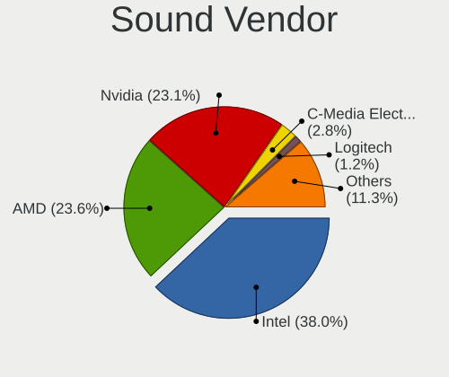

| Vendor                                       | Desktops | Percent |
|----------------------------------------------|----------|---------|
| Intel                                        | 3015     | 38%     |
| AMD                                          | 1874     | 23.62%  |
| Nvidia                                       | 1830     | 23.06%  |
| C-Media Electronics                          | 223      | 2.81%   |
| Logitech                                     | 94       | 1.18%   |
| Creative Labs                                | 87       | 1.1%    |
| ASUSTek Computer                             | 49       | 0.62%   |
| VIA Technologies                             | 44       | 0.55%   |
| Razer USA                                    | 37       | 0.47%   |
| Texas Instruments                            | 36       | 0.45%   |
| Focusrite-Novation                           | 36       | 0.45%   |
| Zoran Co. Personal Media Division (Nogatech) | 35       | 0.44%   |
| Micro Star International                     | 34       | 0.43%   |
| Creative Technology                          | 34       | 0.43%   |
| JMTek                                        | 27       | 0.34%   |
| Generalplus Technology                       | 23       | 0.29%   |
| GN Netcom                                    | 21       | 0.26%   |
| Trust                                        | 20       | 0.25%   |
| Kingston Technology                          | 20       | 0.25%   |
| Thesycon Systemsoftware & Consulting         | 16       | 0.2%    |
| Samson Technologies                          | 16       | 0.2%    |
| Hewlett-Packard                              | 15       | 0.19%   |
| Sony                                         | 14       | 0.18%   |
| M-Audio                                      | 14       | 0.18%   |
| Jieli Technology                             | 14       | 0.18%   |
| BEHRINGER International                      | 14       | 0.18%   |
| Tenx Technology                              | 13       | 0.16%   |
| Corsair                                      | 13       | 0.16%   |
| SteelSeries ApS                              | 10       | 0.13%   |
| Yamaha                                       | 9        | 0.11%   |
| Silicon Integrated Systems [SiS]             | 9        | 0.11%   |
| Elgato Systems                               | 9        | 0.11%   |
| Realtek Semiconductor                        | 8        | 0.1%    |
| Plantronics                                  | 8        | 0.1%    |
| KTMicro                                      | 8        | 0.1%    |
| Ensoniq                                      | 8        | 0.1%    |
| Dell                                         | 8        | 0.1%    |
| Microsoft                                    | 7        | 0.09%   |
| DSEA A/S                                     | 7        | 0.09%   |
| ASRock                                       | 7        | 0.09%   |

Sound Model
-----------

Sound card models

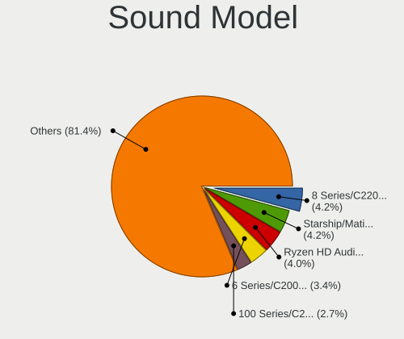

| Model                                                                             | Desktops | Percent |
|-----------------------------------------------------------------------------------|----------|---------|
| Intel 8 Series/C220 Series Chipset High Definition Audio Controller               | 390      | 4.25%   |
| AMD Starship/Matisse HD Audio Controller                                          | 382      | 4.16%   |
| AMD Ryzen HD Audio Controller                                                     | 368      | 4.01%   |
| Intel 6 Series/C200 Series Chipset Family High Definition Audio Controller        | 315      | 3.43%   |
| Intel 100 Series/C230 Series Chipset Family HD Audio Controller                   | 251      | 2.74%   |
| AMD SBx00 Azalia (Intel HDA)                                                      | 249      | 2.71%   |
| Intel 7 Series/C216 Chipset Family High Definition Audio Controller               | 247      | 2.69%   |
| Intel 200 Series PCH HD Audio                                                     | 220      | 2.4%    |
| Intel Xeon E3-1200 v3/4th Gen Core Processor HD Audio Controller                  | 218      | 2.38%   |
| Intel NM10/ICH7 Family High Definition Audio Controller                           | 217      | 2.36%   |
| Nvidia GK208 HDMI/DP Audio Controller                                             | 204      | 2.22%   |
| AMD Family 17h (Models 00h-0fh) HD Audio Controller                               | 166      | 1.81%   |
| AMD Ellesmere HDMI Audio [Radeon RX 470/480 / 570/580/590]                        | 164      | 1.79%   |
| Intel Cannon Lake PCH cAVS                                                        | 162      | 1.77%   |
| Intel 82801JI (ICH10 Family) HD Audio Controller                                  | 147      | 1.6%    |
| AMD Navi 21/23 HDMI/DP Audio Controller                                           | 145      | 1.58%   |
| AMD Radeon High Definition Audio Controller                                       | 137      | 1.49%   |
| Nvidia GP107GL High Definition Audio Controller                                   | 136      | 1.48%   |
| AMD Renoir/Cezanne HDMI/DP Audio Controller                                       | 123      | 1.34%   |
| Intel 5 Series/3400 Series Chipset High Definition Audio                          | 121      | 1.32%   |
| AMD FCH Azalia Controller                                                         | 119      | 1.3%    |
| Nvidia High Definition Audio Controller                                           | 114      | 1.24%   |
| Intel 82801I (ICH9 Family) HD Audio Controller                                    | 112      | 1.22%   |
| Nvidia GM107 High Definition Audio Controller [GeForce 940MX]                     | 99       | 1.08%   |
| Nvidia GP106 High Definition Audio Controller                                     | 94       | 1.02%   |
| AMD Baffin HDMI/DP Audio [Radeon RX 550 640SP / RX 560/560X]                      | 91       | 0.99%   |
| Nvidia GF108 High Definition Audio Controller                                     | 89       | 0.97%   |
| AMD Raven/Raven2/Fenghuang HDMI/DP Audio Controller                               | 89       | 0.97%   |
| Nvidia TU116 High Definition Audio Controller                                     | 88       | 0.96%   |
| AMD Oland/Hainan/Cape Verde/Pitcairn HDMI Audio [Radeon HD 7000 Series]           | 85       | 0.93%   |
| Intel 9 Series Chipset Family HD Audio Controller                                 | 81       | 0.88%   |
| Nvidia GA104 High Definition Audio Controller                                     | 79       | 0.86%   |
| AMD Caicos HDMI Audio [Radeon HD 6450 / 7450/8450/8490 OEM / R5 230/235/235X OEM] | 79       | 0.86%   |
| AMD Navi 10 HDMI Audio                                                            | 78       | 0.85%   |
| Nvidia GF119 HDMI Audio Controller                                                | 76       | 0.83%   |
| C-Media Electronics Audio Adapter (Unitek Y-247A)                                 | 76       | 0.83%   |
| Intel Alder Lake-S HD Audio Controller                                            | 74       | 0.81%   |
| AMD Cedar HDMI Audio [Radeon HD 5400/6300/7300 Series]                            | 73       | 0.8%    |
| Nvidia GP104 High Definition Audio Controller                                     | 68       | 0.74%   |
| Nvidia GP108 High Definition Audio Controller                                     | 67       | 0.73%   |

Memory
------

Memory Vendor
-------------

Memory module vendors

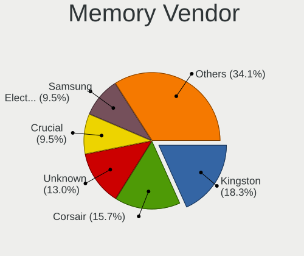

| Vendor                             | Desktops | Percent |
|------------------------------------|----------|---------|
| Kingston                           | 578      | 18.26%  |
| Corsair                            | 496      | 15.67%  |
| Unknown                            | 410      | 12.95%  |
| Crucial                            | 302      | 9.54%   |
| Samsung Electronics                | 301      | 9.51%   |
| SK hynix                           | 241      | 7.61%   |
| Micron Technology                  | 172      | 5.43%   |
| G.Skill                            | 172      | 5.43%   |
| Team                               | 55       | 1.74%   |
| A-DATA Technology                  | 44       | 1.39%   |
| Unknown                            | 44       | 1.39%   |
| Patriot                            | 43       | 1.36%   |
| Ramaxel Technology                 | 36       | 1.14%   |
| Unknown (ABCD)                     | 31       | 0.98%   |
| Elpida                             | 26       | 0.82%   |
| Nanya Technology                   | 25       | 0.79%   |
| Transcend                          | 14       | 0.44%   |
| ASint Technology                   | 12       | 0.38%   |
| Unknown (0x0E9D)                   | 11       | 0.35%   |
| Unifosa                            | 11       | 0.35%   |
| Lexar                              | 11       | 0.35%   |
| Silicon Power                      | 9        | 0.28%   |
| GOODRAM                            | 8        | 0.25%   |
| Wodposit                           | 7        | 0.22%   |
| GeIL                               | 7        | 0.22%   |
| Unknown (AB)                       | 6        | 0.19%   |
| Patriot Memory (PDP Systems)       | 6        | 0.19%   |
| Timetec                            | 5        | 0.16%   |
| Qimonda                            | 5        | 0.16%   |
| Patriot Memory                     | 5        | 0.16%   |
| PNY                                | 4        | 0.13%   |
| Hewlett-Packard                    | 4        | 0.13%   |
| Toshiba                            | 3        | 0.09%   |
| Red Hat                            | 3        | 0.09%   |
| Netac                              | 3        | 0.09%   |
| Lexar Co Limited                   | 3        | 0.09%   |
| Kimtigo Semiconductor (HK) Limited | 3        | 0.09%   |
| Unknown (0x0FF4)                   | 2        | 0.06%   |
| Unknown (0x0B45)                   | 2        | 0.06%   |
| Unknown (0B38)                     | 2        | 0.06%   |

Memory Model
------------

Memory module models

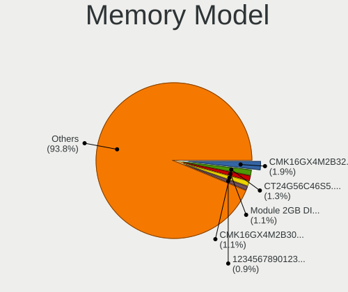

| Model                                                          | Desktops | Percent |
|----------------------------------------------------------------|----------|---------|
| Corsair RAM CMK16GX4M2B3200C16 8GB DIMM DDR4 3600MT/s          | 65       | 1.86%   |
| Unknown                                                        | 44       | 1.26%   |
| Unknown RAM Module 2GB DIMM DDR2 800MT/s                       | 39       | 1.11%   |
| Corsair RAM CMK16GX4M2B3000C15 8GB DIMM DDR4 3600MT/s          | 39       | 1.11%   |
| Unknown (ABCD) RAM 123456789012345678 2GB DIMM LPDDR4 2133MT/s | 31       | 0.89%   |
| Corsair RAM CMK16GX4M2D3600C18 8GB DIMM DDR4 4000MT/s          | 27       | 0.77%   |
| Kingston RAM KHX3200C16D4/8GX 8GB DIMM DDR4 3733MT/s           | 23       | 0.66%   |
| Kingston RAM KHX1600C10D3/8G 8GB DIMM DDR3 2133MT/s            | 22       | 0.63%   |
| SK hynix RAM HMT351U6CFR8C-PB 4GB DIMM DDR3 1800MT/s           | 19       | 0.54%   |
| G.Skill RAM F4-3200C16-8GIS 8GB DIMM DDR4 3600MT/s             | 19       | 0.54%   |
| Samsung RAM M378B5173QH0-CK0 4GB DIMM DDR3                     | 18       | 0.51%   |
| Corsair RAM CMZ8GX3M2A1600C9 4GB DIMM SDRAM 1800MT/s           | 16       | 0.46%   |
| Corsair RAM CMK32GX4M2B3200C16 16GB DIMM DDR4 3800MT/s         | 16       | 0.46%   |
| SK hynix RAM HMT351U6EFR8C-PB 4GB DIMM DDR3 1600MT/s           | 15       | 0.43%   |
| Kingston RAM KHX2133C14D4/8G 8GB DIMM DDR4 3000MT/s            | 14       | 0.4%    |
| G.Skill RAM F4-3000C16-8GISB 8GB DIMM DDR4 3200MT/s            | 14       | 0.4%    |
| Corsair RAM CML8GX3M2A1600C9 4GB DIMM DDR3 1600MT/s            | 14       | 0.4%    |
| Unknown RAM Module 4GB DIMM DDR3 1333MT/s                      | 13       | 0.37%   |
| Unknown RAM Module 4096MB DIMM DDR2 266MT/s                    | 13       | 0.37%   |
| Unknown RAM Module 2048MB DIMM SDRAM                           | 13       | 0.37%   |
| Unknown RAM Module 1GB DIMM DDR2 667MT/s                       | 13       | 0.37%   |
| Samsung RAM M378B5773DH0-CH9 2GB DIMM DDR3 1333MT/s            | 13       | 0.37%   |
| Samsung RAM M378B5673FH0-CH9 2GB DIMM DDR3 1600MT/s            | 13       | 0.37%   |
| Micron RAM 8JTF51264AZ-1G6E1 4GB DIMM DDR3 1600MT/s            | 13       | 0.37%   |
| Unknown RAM Module 8GB DIMM DDR3 1600MT/s                      | 12       | 0.34%   |
| Unknown RAM Module 2GB DIMM SDRAM                              | 12       | 0.34%   |
| Samsung RAM M378B5773CH0-CH9 2GB DIMM DDR3 1867MT/s            | 12       | 0.34%   |
| Samsung RAM M378B5273DH0-CH9 4GB DIMM DDR3 2133MT/s            | 12       | 0.34%   |
| Kingston RAM 99U5584-005.A00LF 4GB DIMM DDR3 1600MT/s          | 12       | 0.34%   |
| Kingston RAM 99U5471-020.A00LF 4GB DIMM 1600MT/s               | 12       | 0.34%   |
| Crucial RAM BL8G36C16U4B.M8FE1 8GB DIMM DDR4 3733MT/s          | 12       | 0.34%   |
| Corsair RAM CMK32GX4M2E3200C16 16GB DIMM DDR4 3600MT/s         | 12       | 0.34%   |
| Unknown RAM Module 2GB DIMM DDR2 667MT/s                       | 11       | 0.31%   |
| Kingston RAM 99U5471-012.A00LF 4GB DIMM DDR3 1333MT/s          | 11       | 0.31%   |
| Unknown RAM Module 2GB DIMM 1066MT/s                           | 10       | 0.29%   |
| Kingston RAM KHX2133C14/8G 8GB DIMM DDR4 2666MT/s              | 10       | 0.29%   |
| Kingston RAM 99U5474-028.A00LF 4GB DIMM DDR3 1333MT/s          | 10       | 0.29%   |
| Kingston RAM 99U5471-054.A00LF 8GB DIMM DDR3 1600MT/s          | 10       | 0.29%   |
| Elpida RAM EBJ21UE8BDF0-DJ-F 2GB DIMM DDR3 1333MT/s            | 10       | 0.29%   |
| Corsair RAM CMK32GX4M2D3600C18 16GB DIMM DDR4 3800MT/s         | 10       | 0.29%   |

Memory Kind
-----------

Memory module kinds

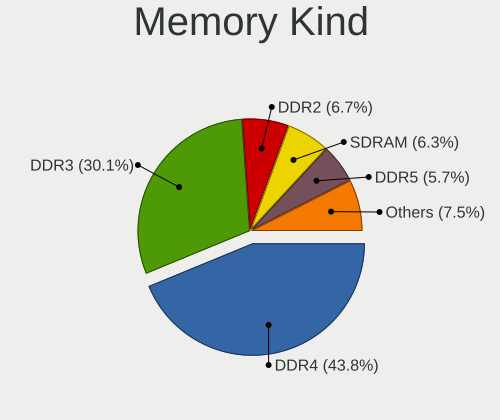

| Kind         | Desktops | Percent |
|--------------|----------|---------|
| DDR4         | 1232     | 43.78%  |
| DDR3         | 847      | 30.1%   |
| DDR2         | 189      | 6.72%   |
| SDRAM        | 177      | 6.29%   |
| DDR5         | 159      | 5.65%   |
| Unknown      | 111      | 3.94%   |
| DDR          | 41       | 1.46%   |
| LPDDR4       | 37       | 1.31%   |
| LPDDR3       | 7        | 0.25%   |
| DRAM         | 5        | 0.18%   |
| RAM          | 4        | 0.14%   |
| LPDDR5       | 3        | 0.11%   |
| DDR2 FB-DIMM | 2        | 0.07%   |

Memory Form Factor
------------------

Physical design of the memory module

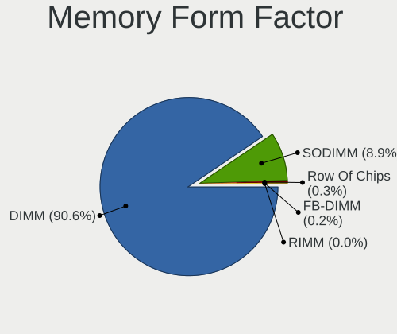

| Name         | Desktops | Percent |
|--------------|----------|---------|
| DIMM         | 2463     | 90.55%  |
| SODIMM       | 242      | 8.9%    |
| Row Of Chips | 9        | 0.33%   |
| FB-DIMM      | 5        | 0.18%   |
| RIMM         | 1        | 0.04%   |

Memory Size
-----------

Memory module size

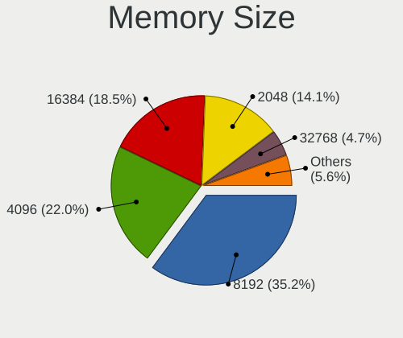

| Size  | Desktops | Percent |
|-------|----------|---------|
| 8192  | 1068     | 35.15%  |
| 4096  | 668      | 21.99%  |
| 16384 | 561      | 18.47%  |
| 2048  | 429      | 14.12%  |
| 32768 | 143      | 4.71%   |
| 1024  | 126      | 4.15%   |
| 512   | 23       | 0.76%   |
| 256   | 6        | 0.2%    |
| 49152 | 4        | 0.13%   |
| 65536 | 3        | 0.1%    |
| 3072  | 3        | 0.1%    |
| 24576 | 1        | 0.03%   |
| 12288 | 1        | 0.03%   |
| 6144  | 1        | 0.03%   |
| 32    | 1        | 0.03%   |

Memory Speed
------------

Memory module speed

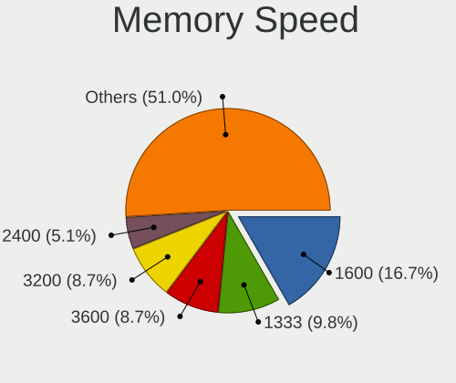

| Speed   | Desktops | Percent |
|---------|----------|---------|
| 1600    | 521      | 16.7%   |
| 1333    | 307      | 9.84%   |
| 3600    | 272      | 8.72%   |
| 3200    | 270      | 8.66%   |
| 2400    | 159      | 5.1%    |
| 2667    | 158      | 5.07%   |
| 800     | 123      | 3.94%   |
| 2133    | 117      | 3.75%   |
| 3733    | 76       | 2.44%   |
| 667     | 72       | 2.31%   |
| 3000    | 69       | 2.21%   |
| Unknown | 69       | 2.21%   |
| 6000    | 64       | 2.05%   |
| 3800    | 59       | 1.89%   |
| 1866    | 56       | 1.8%    |
| 1800    | 54       | 1.73%   |
| 1867    | 51       | 1.64%   |
| 2666    | 46       | 1.47%   |
| 4000    | 44       | 1.41%   |
| 3400    | 40       | 1.28%   |
| 1066    | 37       | 1.19%   |
| 5600    | 34       | 1.09%   |
| 4800    | 31       | 0.99%   |
| 2933    | 25       | 0.8%    |
| 400     | 21       | 0.67%   |
| 3466    | 19       | 0.61%   |
| 3866    | 17       | 0.55%   |
| 3666    | 16       | 0.51%   |
| 2800    | 15       | 0.48%   |
| 1334    | 15       | 0.48%   |
| 266     | 15       | 0.48%   |
| 6400    | 13       | 0.42%   |
| 1067    | 13       | 0.42%   |
| 533     | 12       | 0.38%   |
| 2000    | 11       | 0.35%   |
| 3500    | 9        | 0.29%   |
| 3467    | 9        | 0.29%   |
| 333     | 9        | 0.29%   |
| 4333    | 8        | 0.26%   |
| 3333    | 8        | 0.26%   |

Printers & scanners
-------------------

Printer Vendor
--------------

Printer device vendors

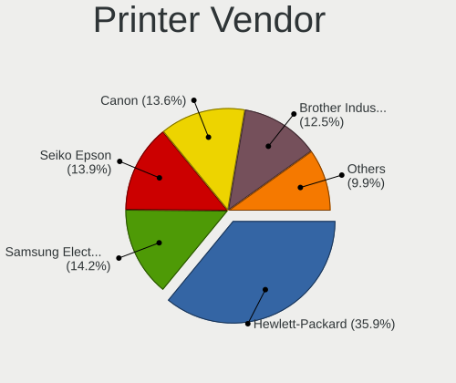

| Vendor                | Desktops | Percent |
|-----------------------|----------|---------|
| Hewlett-Packard       | 124      | 35.94%  |
| Samsung Electronics   | 49       | 14.2%   |
| Seiko Epson           | 48       | 13.91%  |
| Canon                 | 47       | 13.62%  |
| Brother Industries    | 43       | 12.46%  |
| Dymo-CoStar           | 6        | 1.74%   |
| Lexmark International | 4        | 1.16%   |
| Xerox                 | 3        | 0.87%   |
| QinHeng Electronics   | 3        | 0.87%   |
| Prolific Technology   | 3        | 0.87%   |
| Pantum                | 3        | 0.87%   |
| Oki Data              | 3        | 0.87%   |
| STMicroelectronics    | 2        | 0.58%   |
| Kyocera               | 2        | 0.58%   |
| Toshiba TEC           | 1        | 0.29%   |
| Sharp                 | 1        | 0.29%   |
| Sato                  | 1        | 0.29%   |
| Ricoh                 | 1        | 0.29%   |
| Apple                 | 1        | 0.29%   |

Printer Model
-------------

Printer device models

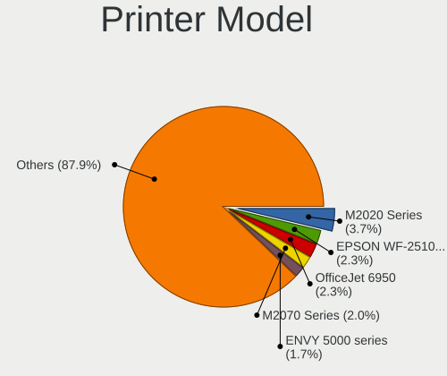

| Model                                                                 | Desktops | Percent |
|-----------------------------------------------------------------------|----------|---------|
| Samsung M2020 Series                                                  | 13       | 3.75%   |
| Seiko Epson EPSON WF-2510 Series                                      | 8        | 2.31%   |
| HP OfficeJet 6950                                                     | 8        | 2.31%   |
| Samsung M2070 Series                                                  | 7        | 2.02%   |
| HP ENVY 5000 series                                                   | 6        | 1.73%   |
| HP Deskjet 2050 J510                                                  | 6        | 1.73%   |
| Canon PIXMA MX920 Series                                              | 6        | 1.73%   |
| Canon LiDE 400                                                        | 6        | 1.73%   |
| Seiko Epson Printer                                                   | 5        | 1.44%   |
| Samsung M267x 287x Series                                             | 5        | 1.44%   |
| HP ENVY 4520 series                                                   | 5        | 1.44%   |
| Seiko Epson XP-4100 Series                                            | 4        | 1.15%   |
| Seiko Epson ET-2820 Series                                            | 4        | 1.15%   |
| Samsung ML-216x Series Laser Printer                                  | 4        | 1.15%   |
| HP OfficeJet 3830 series                                              | 4        | 1.15%   |
| HP LaserJet 1018                                                      | 4        | 1.15%   |
| Canon PIXMA MG3600 Series                                             | 4        | 1.15%   |
| Canon LiDE 300                                                        | 4        | 1.15%   |
| Brother MFC-L2700DW                                                   | 4        | 1.15%   |
| Brother DCP-1610W                                                     | 4        | 1.15%   |
| Seiko Epson ME OFFICE 620F Series/Stylus Office BX305F/BX305FW/TX320F | 3        | 0.86%   |
| Samsung Composite Device                                              | 3        | 0.86%   |
| QinHeng CH340S                                                        | 3        | 0.86%   |
| Prolific PL2305 Parallel Port                                         | 3        | 0.86%   |
| HP LaserJet Professional P 1102w                                      | 3        | 0.86%   |
| HP LaserJet P1102                                                     | 3        | 0.86%   |
| HP LaserJet P1005                                                     | 3        | 0.86%   |
| HP LaserJet M14-M17                                                   | 3        | 0.86%   |
| HP LaserJet M109-M112                                                 | 3        | 0.86%   |
| HP ENVY 4500 series                                                   | 3        | 0.86%   |
| HP Deskjet F4500 series                                               | 3        | 0.86%   |
| HP DeskJet 3700 series                                                | 3        | 0.86%   |
| HP Deskjet 3050A                                                      | 3        | 0.86%   |
| HP Deskjet 1510                                                       | 3        | 0.86%   |
| Brother MFC-L2710DW series                                            | 3        | 0.86%   |
| STMicroelectronics LED badge -- mini LED display -- 11x44             | 2        | 0.58%   |
| Seiko Epson WF-2870 Series                                            | 2        | 0.58%   |
| Seiko Epson ME Office 600F/Stylus Office BX300F/TX300F                | 2        | 0.58%   |
| Seiko Epson ET-2720 Series                                            | 2        | 0.58%   |
| Samsung SCX-4300 Series                                               | 2        | 0.58%   |

Scanner Vendor
--------------

Scanner device vendors

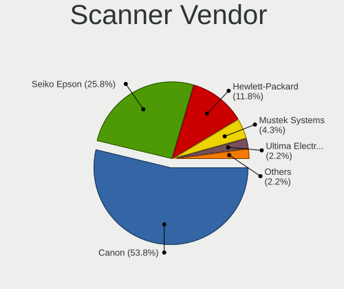

| Vendor             | Desktops | Percent |
|--------------------|----------|---------|
| Canon              | 50       | 53.76%  |
| Seiko Epson        | 24       | 25.81%  |
| Hewlett-Packard    | 11       | 11.83%  |
| Mustek Systems     | 4        | 4.3%    |
| Ultima Electronics | 2        | 2.15%   |
| Plustek            | 1        | 1.08%   |
| AGFA-Gevaert NV    | 1        | 1.08%   |

Scanner Model
-------------

Scanner device models

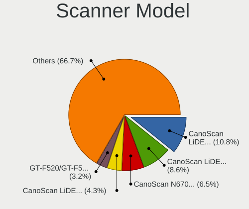

| Model                                                                                 | Desktops | Percent |
|---------------------------------------------------------------------------------------|----------|---------|
| Canon CanoScan LiDE 210                                                               | 10       | 10.75%  |
| Canon CanoScan LiDE 110                                                               | 8        | 8.6%    |
| Canon CanoScan N670U/N676U/LiDE 20                                                    | 6        | 6.45%   |
| Canon CanoScan LiDE 120                                                               | 4        | 4.3%    |
| Seiko Epson GT-F520/GT-F570 [Perfection 3590 PHOTO]                                   | 3        | 3.23%   |
| Seiko Epson GT-F500/GT-F550 [Perfection 2480/2580 PHOTO]                              | 3        | 3.23%   |
| Canon CanoScan N1240U/LiDE 30                                                         | 3        | 3.23%   |
| Canon CanoScan LiDE 700F                                                              | 3        | 3.23%   |
| Canon CanoScan LiDE 60                                                                | 3        | 3.23%   |
| Canon CanoScan LiDE 220                                                               | 3        | 3.23%   |
| Canon CanoScan LiDE 100                                                               | 3        | 3.23%   |
| Ultima Artec Ultima 2000 (GT6801 based)/Lifetec LT9385/ScanMagic 1200 UB Plus Scanner | 2        | 2.15%   |
| Seiko Epson Perfection V37/V370                                                       | 2        | 2.15%   |
| Seiko Epson GT-F650 [GT-S600/Perfection V10/V100]                                     | 2        | 2.15%   |
| Seiko Epson GT-7700U [Perfection 1240U]                                               | 2        | 2.15%   |
| Mustek Systems BearPaw 1200 CU Plus                                                   | 2        | 2.15%   |
| HP ScanJet 3400cse                                                                    | 2        | 2.15%   |
| HP Scanjet 200                                                                        | 2        | 2.15%   |
| Canon CanoScan LIDE 25                                                                | 2        | 2.15%   |
| Seiko Epson GT-X800 [Perfection 4990 PHOTO]                                           | 1        | 1.08%   |
| Seiko Epson GT-X750 [Perfection 4490 Photo]                                           | 1        | 1.08%   |
| Seiko Epson GT-X700 [Perfection 4870]                                                 | 1        | 1.08%   |
| Seiko Epson GT-F730 [GT-S630/Perfection V33/V330 Photo]                               | 1        | 1.08%   |
| Seiko Epson GT-F700 [Perfection V350]                                                 | 1        | 1.08%   |
| Seiko Epson GT-9700F [Perfection 2450 PHOTO]                                          | 1        | 1.08%   |
| Seiko Epson GT-9400UF [Perfection 3170]                                               | 1        | 1.08%   |
| Seiko Epson GT-9300UF [Perfection 2400 PHOTO]                                         | 1        | 1.08%   |
| Seiko Epson GT-8400UF [Perfection 1670/1670 PHOTO]                                    | 1        | 1.08%   |
| Seiko Epson GT-7600UF [Perfection 1200U/1200U Photo]                                  | 1        | 1.08%   |
| Seiko Epson GT-7300U [Perfection 1260/1260 PHOTO]                                     | 1        | 1.08%   |
| Seiko Epson GT-6600U [Perfection 610]                                                 | 1        | 1.08%   |
| Plustek 600DPI USB Scanner                                                            | 1        | 1.08%   |
| Mustek Systems SNAPSCAN e22                                                           | 1        | 1.08%   |
| Mustek Systems ScanExpress A3 USB 1200 PRO                                            | 1        | 1.08%   |
| HP ScanJet G3010                                                                      | 1        | 1.08%   |
| HP ScanJet 3800c                                                                      | 1        | 1.08%   |
| HP ScanJet 3300c                                                                      | 1        | 1.08%   |
| HP Scanjet 3000                                                                       | 1        | 1.08%   |
| HP ScanJet 2400c                                                                      | 1        | 1.08%   |
| HP PSC 1200                                                                           | 1        | 1.08%   |

Camera
------

Camera Vendor
-------------

Camera device vendors

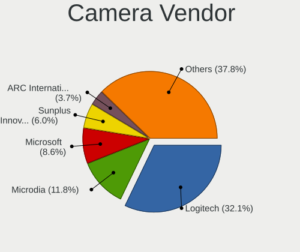

| Vendor                        | Desktops | Percent |
|-------------------------------|----------|---------|
| Logitech                      | 315      | 32.14%  |
| Microdia                      | 116      | 11.84%  |
| Microsoft                     | 84       | 8.57%   |
| Sunplus Innovation Technology | 59       | 6.02%   |
| ARC International             | 36       | 3.67%   |
| Trust                         | 32       | 3.27%   |
| Generalplus Technology        | 23       | 2.35%   |
| Realtek Semiconductor         | 22       | 2.24%   |
| Chicony Electronics           | 22       | 2.24%   |
| KYE Systems (Mouse Systems)   | 20       | 2.04%   |
| Apple                         | 18       | 1.84%   |
| Samsung Electronics           | 17       | 1.73%   |
| webcam                        | 13       | 1.33%   |
| Sunplus IT                    | 13       | 1.33%   |
| GEMBIRD                       | 12       | 1.22%   |
| MacroSilicon                  | 11       | 1.12%   |
| Cubeternet                    | 11       | 1.12%   |
| Z-Star Microelectronics       | 10       | 1.02%   |
| SunplusIT                     | 8        | 0.82%   |
| Creative Technology           | 8        | 0.82%   |
| Xiongmai                      | 7        | 0.71%   |
| Huawei Technologies           | 7        | 0.71%   |
| WaveRider Communications      | 6        | 0.61%   |
| Jieli Technology              | 6        | 0.61%   |
| IMC Networks                  | 6        | 0.61%   |
| Hewlett-Packard               | 5        | 0.51%   |
| Genesys Logic                 | 5        | 0.51%   |
| Arkmicro Technologies         | 5        | 0.51%   |
| Sonix Technology              | 4        | 0.41%   |
| Razer USA                     | 4        | 0.41%   |
| Aveo Technology               | 4        | 0.41%   |
| Alcor Micro                   | 4        | 0.41%   |
| Unknown                       | 3        | 0.31%   |
| Silicon Motion                | 3        | 0.31%   |
| OPPO Electronics              | 3        | 0.31%   |
| Novatek Microelectronics      | 3        | 0.31%   |
| Nintendo                      | 3        | 0.31%   |
| Google                        | 3        | 0.31%   |
| eMeet                         | 3        | 0.31%   |
| Suyin                         | 2        | 0.2%    |

Camera Model
------------

Camera device models

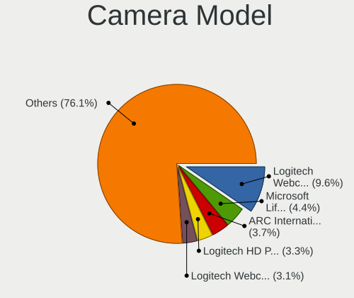

| Model                                                 | Desktops | Percent |
|-------------------------------------------------------|----------|---------|
| Logitech Webcam C270                                  | 94       | 9.56%   |
| Microsoft LifeCam HD-3000                             | 43       | 4.37%   |
| ARC International Camera                              | 36       | 3.66%   |
| Logitech HD Pro Webcam C920                           | 32       | 3.26%   |
| Logitech Webcam C170                                  | 30       | 3.05%   |
| Microdia Webcam Vitade AF                             | 27       | 2.75%   |
| Microdia Camera                                       | 23       | 2.34%   |
| Logitech Webcam C310                                  | 18       | 1.83%   |
| Samsung Galaxy series, misc. (MTP mode)               | 17       | 1.73%   |
| Generalplus GENERAL WEBCAM                            | 17       | 1.73%   |
| Sunplus Aukey-PC-LM1E Camera                          | 16       | 1.63%   |
| KYE Systems (Mouse Systems) USB 2.0 HD1080P PC Camera | 16       | 1.63%   |
| Apple iPhone 5/5C/5S/6/SE/7/8/X                       | 16       | 1.63%   |
| Microdia USB 2.0 Camera                               | 15       | 1.53%   |
| Sunplus Full HD webcam                                | 14       | 1.42%   |
| Microdia Sonix USB 2.0 Camera                         | 14       | 1.42%   |
| webcam webcam                                         | 13       | 1.32%   |
| Microdia Integrated Camera                            | 11       | 1.12%   |
| Logitech StreamCam                                    | 11       | 1.12%   |
| Sunplus IT AUKEY PC-LM1 USB Camera                    | 10       | 1.02%   |
| Sunplus Integrated Camera                             | 10       | 1.02%   |
| Microdia CyberTrack H7                                | 10       | 1.02%   |
| Logitech QuickCam Pro 9000                            | 10       | 1.02%   |
| Logitech HD Webcam C525                               | 10       | 1.02%   |
| Sunplus SPCA2281 Web Camera                           | 9        | 0.92%   |
| Realtek USB Camera                                    | 9        | 0.92%   |
| Logitech QuickCam E 3500                              | 9        | 0.92%   |
| Logitech C922 Pro Stream Webcam                       | 9        | 0.92%   |
| Microsoft LifeCam VX-800                              | 8        | 0.81%   |
| Logitech Webcam C200                                  | 8        | 0.81%   |
| Logitech HD Webcam C910                               | 8        | 0.81%   |
| Logitech C920 PRO HD Webcam                           | 8        | 0.81%   |
| GEMBIRD USB2.0 PC CAMERA                              | 8        | 0.81%   |
| Xiongmai web camera                                   | 7        | 0.71%   |
| MacroSilicon USB Video                                | 7        | 0.71%   |
| Logitech Webcam C930e                                 | 7        | 0.71%   |
| Huawei HiCamera                                       | 7        | 0.71%   |
| WaveRider USB Live camera                             | 6        | 0.61%   |
| Trust WB-6250X Webcam                                 | 6        | 0.61%   |
| Trust USB Camera                                      | 6        | 0.61%   |

Security
--------

Fingerprint Vendor
------------------

Fingerprint sensor vendors

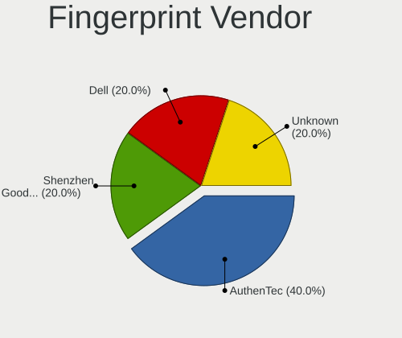

| Vendor                     | Desktops | Percent |
|----------------------------|----------|---------|
| AuthenTec                  | 2        | 40%     |
| Shenzhen Goodix Technology | 1        | 20%     |
| Dell                       | 1        | 20%     |
| Unknown                    | 1        | 20%     |

Fingerprint Model
-----------------

Fingerprint sensor models

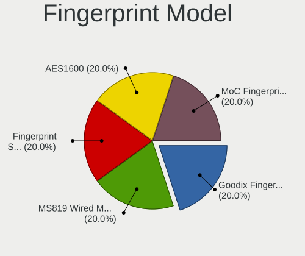

| Model                                          | Desktops | Percent |
|------------------------------------------------|----------|---------|
| Shenzhen Goodix  Fingerprint Device            | 1        | 20%     |
| Dell MS819 Wired Mouse With Fingerprint Reader | 1        | 20%     |
| AuthenTec Fingerprint Sensor                   | 1        | 20%     |
| AuthenTec AES1600                              | 1        | 20%     |
| Unknown                                        | 1        | 20%     |

Chipcard Vendor
---------------

Chipcard module vendors

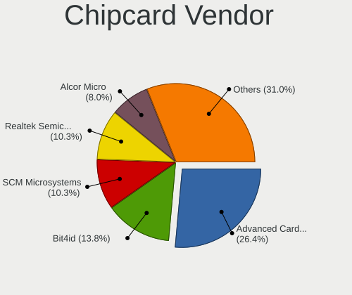

| Vendor                    | Desktops | Percent |
|---------------------------|----------|---------|
| Advanced Card Systems     | 23       | 26.44%  |
| Bit4id                    | 12       | 13.79%  |
| SCM Microsystems          | 9        | 10.34%  |
| Realtek Semiconductor     | 9        | 10.34%  |
| Alcor Micro               | 7        | 8.05%   |
| Gemalto (was Gemplus)     | 6        | 6.9%    |
| Clay Logic                | 5        | 5.75%   |
| Reiner SCT Kartensysteme  | 4        | 4.6%    |
| OmniKey                   | 3        | 3.45%   |
| Microchip Technology      | 3        | 3.45%   |
| NXP Semiconductors        | 2        | 2.3%    |
| GHI                       | 1        | 1.15%   |
| Fujitsu Siemens Computers | 1        | 1.15%   |
| Feitian Technologies      | 1        | 1.15%   |
| Alcorlink                 | 1        | 1.15%   |

Chipcard Model
--------------

Chipcard module models

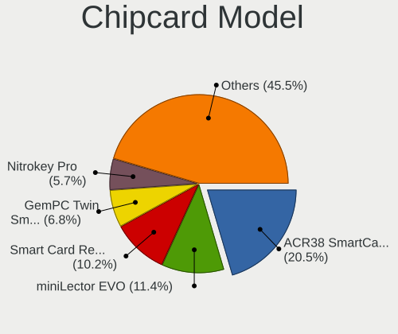

| Model                                                                      | Desktops | Percent |
|----------------------------------------------------------------------------|----------|---------|
| Advanced Card Systems ACR38 SmartCard Reader                               | 18       | 20.45%  |
| Bit4id miniLector EVO                                                      | 10       | 11.36%  |
| Realtek Semiconductor Smart Card Reader Interface                          | 9        | 10.23%  |
| Gemalto (was Gemplus) GemPC Twin SmartCard Reader                          | 6        | 6.82%   |
| Clay Logic Nitrokey Pro                                                    | 5        | 5.68%   |
| Alcor Micro AU9540 Smartcard Reader                                        | 5        | 5.68%   |
| Advanced Card Systems ACR122U                                              | 5        | 5.68%   |
| Reiner SCT Kartensysteme cyberJack RFID basis contactless smartcard reader | 4        | 4.55%   |
| SCM Microsystems uTrust 3700 F CL Reader                                   | 3        | 3.41%   |
| SCM Microsystems Identiv SmartOS Reader                                    | 3        | 3.41%   |
| Microchip Technology SMSC USX101x Reader                                   | 3        | 3.41%   |
| OmniKey CardMan 3021 / 3121                                                | 2        | 2.27%   |
| NXP Semiconductors HUSCR-NFC                                               | 2        | 2.27%   |
| Alcor Micro Watchdata W 1981                                               | 2        | 2.27%   |
| SCM Microsystems SCR35xx Smart Card Reader                                 | 1        | 1.14%   |
| SCM Microsystems SCR335 SmartCard Reader                                   | 1        | 1.14%   |
| SCM Microsystems SCR331-LC1 / SCR3310 SmartCard Reader                     | 1        | 1.14%   |
| OmniKey 3x21 Smart Card Reader                                             | 1        | 1.14%   |
| GHI NC001                                                                  | 1        | 1.14%   |
| Fujitsu Siemens Computers SmartCard Reader 2A                              | 1        | 1.14%   |
| Feitian Technologies R502                                                  | 1        | 1.14%   |
| Bit4id miniLector-s                                                        | 1        | 1.14%   |
| BIT4ID miniLector AIR NFC v3                                               | 1        | 1.14%   |
| Alcorlink EMV Smartcard Reader                                             | 1        | 1.14%   |
| Advanced Card Systems ACR1281 1S Dual Reader                               | 1        | 1.14%   |

Unsupported
-----------

Unsupported Devices
-------------------

Total unsupported devices on board

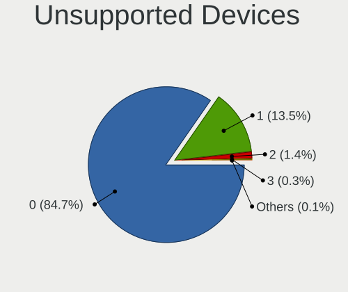

| Total | Desktops | Percent |
|-------|----------|---------|
| 0     | 4070     | 84.65%  |
| 1     | 649      | 13.5%   |
| 2     | 68       | 1.41%   |
| 3     | 14       | 0.29%   |
| 5     | 4        | 0.08%   |
| 4     | 2        | 0.04%   |
| 8     | 1        | 0.02%   |

Unsupported Device Types
------------------------

Types of unsupported devices

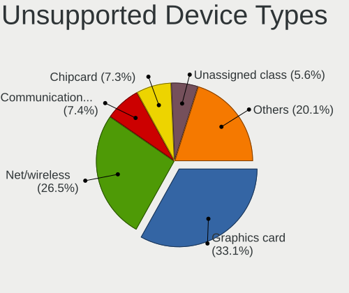

| Type                     | Desktops | Percent |
|--------------------------|----------|---------|
| Graphics card            | 273      | 33.09%  |
| Net/wireless             | 219      | 26.55%  |
| Communication controller | 61       | 7.39%   |
| Chipcard                 | 60       | 7.27%   |
| Unassigned class         | 46       | 5.58%   |
| Sound                    | 26       | 3.15%   |
| Multimedia controller    | 20       | 2.42%   |
| Camera                   | 20       | 2.42%   |
| Net/ethernet             | 17       | 2.06%   |
| Network                  | 15       | 1.82%   |
| Card reader              | 14       | 1.7%    |
| Bluetooth                | 13       | 1.58%   |
| Storage/raid             | 11       | 1.33%   |
| Modem                    | 8        | 0.97%   |
| Firewire controller      | 6        | 0.73%   |
| Storage/ide              | 4        | 0.48%   |
| Dvb card                 | 4        | 0.48%   |
| Video                    | 3        | 0.36%   |
| Fingerprint reader       | 3        | 0.36%   |
| Tv card                  | 2        | 0.24%   |

