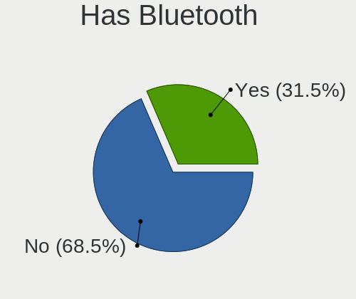
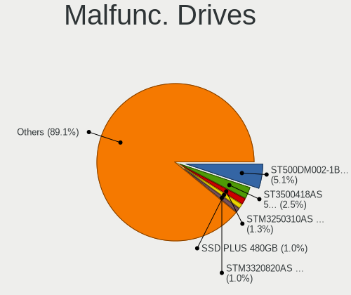
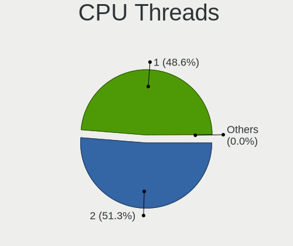
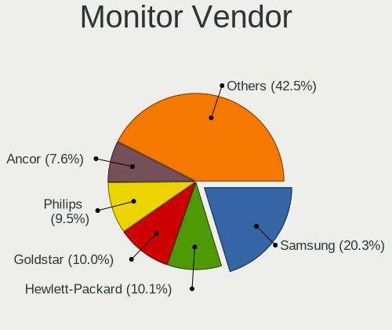
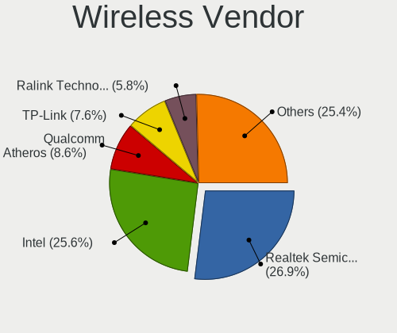

Linux in Italy - Tested Hardware & Statistics (Desktops)
--------------------------------------------------------

A project to collect tested hardware configurations for Linux in Italy.

Anyone can contribute to this report by the [hw-probe](https://github.com/linuxhw/hw-probe) tool:

    sudo -E hw-probe -all -upload

Please contribute! Especially if your hardware is rare.

Contents
--------

* [ Test Cases ](#test-cases)

* [ System ](#system)
  - [ OS                       ](#os)
  - [ OS Family                ](#os-family)
  - [ Kernel                   ](#kernel)
  - [ Kernel Family            ](#kernel-family)
  - [ Kernel Major Ver.        ](#kernel-major-ver)
  - [ Arch                     ](#arch)
  - [ DE                       ](#de)
  - [ Display Server           ](#display-server)
  - [ Display Manager          ](#display-manager)
  - [ OS Lang                  ](#os-lang)
  - [ Boot Mode                ](#boot-mode)
  - [ Filesystem               ](#filesystem)
  - [ Part. scheme             ](#part-scheme)
  - [ Dual Boot with Linux/BSD ](#dual-boot-with-linuxbsd)
  - [ Dual Boot (Win)          ](#dual-boot-win)

* [ Board ](#board)
  - [ Vendor                   ](#vendor)
  - [ Model                    ](#model)
  - [ Model Family             ](#model-family)
  - [ MFG Year                 ](#mfg-year)
  - [ Form Factor              ](#form-factor)
  - [ Secure Boot              ](#secure-boot)
  - [ Coreboot                 ](#coreboot)
  - [ RAM Size                 ](#ram-size)
  - [ RAM Used                 ](#ram-used)
  - [ Total Drives             ](#total-drives)
  - [ Has CD-ROM               ](#has-cd-rom)
  - [ Has Ethernet             ](#has-ethernet)
  - [ Has WiFi                 ](#has-wifi)
  - [ Has Bluetooth            ](#has-bluetooth)

* [ Location ](#location)
  - [ Country                  ](#country)
  - [ City                     ](#city)

* [ Drives ](#drives)
  - [ Drive Vendor             ](#drive-vendor)
  - [ Drive Model              ](#drive-model)
  - [ HDD Vendor               ](#hdd-vendor)
  - [ SSD Vendor               ](#ssd-vendor)
  - [ Drive Kind               ](#drive-kind)
  - [ Drive Connector          ](#drive-connector)
  - [ Drive Size               ](#drive-size)
  - [ Space Total              ](#space-total)
  - [ Space Used               ](#space-used)
  - [ Malfunc. Drives          ](#malfunc-drives)
  - [ Malfunc. Drive Vendor    ](#malfunc-drive-vendor)
  - [ Malfunc. HDD Vendor      ](#malfunc-hdd-vendor)
  - [ Malfunc. Drive Kind      ](#malfunc-drive-kind)
  - [ Failed Drives            ](#failed-drives)
  - [ Failed Drive Vendor      ](#failed-drive-vendor)
  - [ Drive Status             ](#drive-status)

* [ Storage controller ](#storage-controller)
  - [ Storage Vendor           ](#storage-vendor)
  - [ Storage Model            ](#storage-model)
  - [ Storage Kind             ](#storage-kind)

* [ Processor ](#processor)
  - [ CPU Vendor               ](#cpu-vendor)
  - [ CPU Model                ](#cpu-model)
  - [ CPU Model Family         ](#cpu-model-family)
  - [ CPU Cores                ](#cpu-cores)
  - [ CPU Sockets              ](#cpu-sockets)
  - [ CPU Threads              ](#cpu-threads)
  - [ CPU Op-Modes             ](#cpu-op-modes)
  - [ CPU Microcode            ](#cpu-microcode)
  - [ CPU Microarch            ](#cpu-microarch)

* [ Graphics ](#graphics)
  - [ GPU Vendor               ](#gpu-vendor)
  - [ GPU Model                ](#gpu-model)
  - [ GPU Combo                ](#gpu-combo)
  - [ GPU Driver               ](#gpu-driver)
  - [ GPU Memory               ](#gpu-memory)

* [ Monitor ](#monitor)
  - [ Monitor Vendor           ](#monitor-vendor)
  - [ Monitor Model            ](#monitor-model)
  - [ Monitor Resolution       ](#monitor-resolution)
  - [ Monitor Diagonal         ](#monitor-diagonal)
  - [ Monitor Width            ](#monitor-width)
  - [ Aspect Ratio             ](#aspect-ratio)
  - [ Monitor Area             ](#monitor-area)
  - [ Pixel Density            ](#pixel-density)
  - [ Multiple Monitors        ](#multiple-monitors)

* [ Network ](#network)
  - [ Net Controller Vendor    ](#net-controller-vendor)
  - [ Net Controller Model     ](#net-controller-model)
  - [ Wireless Vendor          ](#wireless-vendor)
  - [ Wireless Model           ](#wireless-model)
  - [ Ethernet Vendor          ](#ethernet-vendor)
  - [ Ethernet Model           ](#ethernet-model)
  - [ Net Controller Kind      ](#net-controller-kind)
  - [ Used Controller          ](#used-controller)
  - [ NICs                     ](#nics)
  - [ IPv6                     ](#ipv6)

* [ Bluetooth ](#bluetooth)
  - [ Bluetooth Vendor         ](#bluetooth-vendor)
  - [ Bluetooth Model          ](#bluetooth-model)

* [ Sound ](#sound)
  - [ Sound Vendor             ](#sound-vendor)
  - [ Sound Model              ](#sound-model)

* [ Memory ](#memory)
  - [ Memory Vendor            ](#memory-vendor)
  - [ Memory Model             ](#memory-model)
  - [ Memory Kind              ](#memory-kind)
  - [ Memory Form Factor       ](#memory-form-factor)
  - [ Memory Size              ](#memory-size)
  - [ Memory Speed             ](#memory-speed)

* [ Printers & scanners ](#printers--scanners)
  - [ Printer Vendor           ](#printer-vendor)
  - [ Printer Model            ](#printer-model)
  - [ Scanner Vendor           ](#scanner-vendor)
  - [ Scanner Model            ](#scanner-model)

* [ Camera ](#camera)
  - [ Camera Vendor            ](#camera-vendor)
  - [ Camera Model             ](#camera-model)

* [ Security ](#security)
  - [ Fingerprint Vendor       ](#fingerprint-vendor)
  - [ Fingerprint Model        ](#fingerprint-model)
  - [ Chipcard Vendor          ](#chipcard-vendor)
  - [ Chipcard Model           ](#chipcard-model)

* [ Unsupported ](#unsupported)
  - [ Unsupported Devices      ](#unsupported-devices)
  - [ Unsupported Device Types ](#unsupported-device-types)

Test Cases
----------

Total: 5155

| Vendor        | Model                       | Probe                                                      | Date         |
|---------------|-----------------------------|------------------------------------------------------------|--------------|
| ASUSTek       | PRIME B250M-C               | [0a6d61d9f6](https://linux-hardware.org/?probe=0a6d61d9f6) | May 09, 2024 |
| ASUSTek       | P8H77-V LE                  | [e896127dc3](https://linux-hardware.org/?probe=e896127dc3) | May 08, 2024 |
| ASRock        | Z77 Performance             | [500cd7ed60](https://linux-hardware.org/?probe=500cd7ed60) | May 08, 2024 |
| MSI           | MAG Z690 TOMAHAWK WIFI D... | [2143043fa4](https://linux-hardware.org/?probe=2143043fa4) | May 08, 2024 |
| ASRock        | Z68 Extreme4 Gen3           | [df427b5f9f](https://linux-hardware.org/?probe=df427b5f9f) | May 07, 2024 |
| ASUSTek       | PRIME X570-P                | [2ff26254ae](https://linux-hardware.org/?probe=2ff26254ae) | May 07, 2024 |
| Packard Be... | WMCP78M                     | [4d711194fa](https://linux-hardware.org/?probe=4d711194fa) | May 07, 2024 |
| ASUSTek       | TUF Gaming Z790-PRO WIFI    | [07048840f0](https://linux-hardware.org/?probe=07048840f0) | May 06, 2024 |
| ASUSTek       | P8Z77-V LX2                 | [1181eb41ee](https://linux-hardware.org/?probe=1181eb41ee) | May 06, 2024 |
| Acer          | Predator PO3-630            | [7271f27dc0](https://linux-hardware.org/?probe=7271f27dc0) | May 06, 2024 |
| GEEKOM        | Mini IT12                   | [bf478cb069](https://linux-hardware.org/?probe=bf478cb069) | May 06, 2024 |
| ASUSTek       | H81M-K                      | [a17314c287](https://linux-hardware.org/?probe=a17314c287) | May 05, 2024 |
| ASUSTek       | CM6870                      | [63591686d7](https://linux-hardware.org/?probe=63591686d7) | May 05, 2024 |
| ASUSTek       | CM6870                      | [6d828aab44](https://linux-hardware.org/?probe=6d828aab44) | May 05, 2024 |
| Dell          | 0YXT71 A02                  | [4da89e5d1d](https://linux-hardware.org/?probe=4da89e5d1d) | May 05, 2024 |
| ECS           | P45T-A                      | [c1f450f8a1](https://linux-hardware.org/?probe=c1f450f8a1) | May 04, 2024 |
| ASUSTek       | ROG STRIX B550-I GAMING     | [169c97e582](https://linux-hardware.org/?probe=169c97e582) | May 04, 2024 |
| GEEKOM        | Mini IT12                   | [d1264f51d1](https://linux-hardware.org/?probe=d1264f51d1) | May 03, 2024 |
| ASUSTek       | P8Z68-V                     | [04f2de6ec1](https://linux-hardware.org/?probe=04f2de6ec1) | May 03, 2024 |
| MSI           | G41M-P28                    | [c946f92e74](https://linux-hardware.org/?probe=c946f92e74) | May 02, 2024 |
| Acer          | FIH57                       | [8e4b02facb](https://linux-hardware.org/?probe=8e4b02facb) | May 02, 2024 |
| ASRock        | H61M-S                      | [2c79ee4cae](https://linux-hardware.org/?probe=2c79ee4cae) | May 01, 2024 |
| MSI           | MPG Z390 GAMING PLUS        | [f50df78b1f](https://linux-hardware.org/?probe=f50df78b1f) | May 01, 2024 |
| ASUSTek       | H81-PLUS                    | [efe7c01899](https://linux-hardware.org/?probe=efe7c01899) | May 01, 2024 |
| ASUSTek       | H81-PLUS                    | [512660cdbc](https://linux-hardware.org/?probe=512660cdbc) | May 01, 2024 |
| MSI           | Z170A GAMING M7             | [3ce4a9b0c5](https://linux-hardware.org/?probe=3ce4a9b0c5) | Apr 30, 2024 |
| HP            | 09F8h                       | [d31df7e1d8](https://linux-hardware.org/?probe=d31df7e1d8) | Apr 29, 2024 |
| ASRock        | B365M-HDV                   | [23d6569af8](https://linux-hardware.org/?probe=23d6569af8) | Apr 29, 2024 |
| Gigabyte      | Z790 AERO G                 | [f226cfa836](https://linux-hardware.org/?probe=f226cfa836) | Apr 29, 2024 |
| MSI           | B350M PRO-VD PLUS           | [25f45497bf](https://linux-hardware.org/?probe=25f45497bf) | Apr 29, 2024 |
| Pegatron      | 2AD5                        | [fae22df93c](https://linux-hardware.org/?probe=fae22df93c) | Apr 28, 2024 |
| Fujitsu       | D3041-A1 S26361-D3041-A1    | [166266e759](https://linux-hardware.org/?probe=166266e759) | Apr 28, 2024 |
| HP            | 2B52                        | [41588d4e13](https://linux-hardware.org/?probe=41588d4e13) | Apr 28, 2024 |
| Lenovo        | NO DPK                      | [50204c0691](https://linux-hardware.org/?probe=50204c0691) | Apr 28, 2024 |
| MSI           | B450 TOMAHAWK MAX           | [1fd2d052b0](https://linux-hardware.org/?probe=1fd2d052b0) | Apr 28, 2024 |
| Packard Be... | IMEDIA S3712                | [200b3d1a1e](https://linux-hardware.org/?probe=200b3d1a1e) | Apr 28, 2024 |
| ASUSTek       | P5Q3 DELUXE                 | [080e3fa26d](https://linux-hardware.org/?probe=080e3fa26d) | Apr 27, 2024 |
| Gigabyte      | H610M H DDR4                | [1617705438](https://linux-hardware.org/?probe=1617705438) | Apr 27, 2024 |
| Gigabyte      | H610M H DDR4                | [e6d74d7705](https://linux-hardware.org/?probe=e6d74d7705) | Apr 27, 2024 |
| ASUSTek       | P5QPL-AM                    | [9199a16ddd](https://linux-hardware.org/?probe=9199a16ddd) | Apr 27, 2024 |
| Fujitsu       | D3171-A1 S26361-D3171-A1    | [a52ce5dea5](https://linux-hardware.org/?probe=a52ce5dea5) | Apr 27, 2024 |
| ASUSTek       | M5A78L-M/USB3               | [c33dc3b69c](https://linux-hardware.org/?probe=c33dc3b69c) | Apr 26, 2024 |
| HPE           | ProLiant MicroServer Gen... | [ca351b002d](https://linux-hardware.org/?probe=ca351b002d) | Apr 26, 2024 |
| MSI           | A320M-A PRO MAX             | [253984e9f3](https://linux-hardware.org/?probe=253984e9f3) | Apr 26, 2024 |
| ASUSTek       | P5Q3 DELUXE                 | [bac3d4945e](https://linux-hardware.org/?probe=bac3d4945e) | Apr 26, 2024 |
| Gigabyte      | Z390 UD                     | [2aebb056ff](https://linux-hardware.org/?probe=2aebb056ff) | Apr 26, 2024 |
| ASUSTek       | ROG CROSSHAIR VII HERO      | [bfc2a1f12e](https://linux-hardware.org/?probe=bfc2a1f12e) | Apr 26, 2024 |
| ASUSTek       | ROG CROSSHAIR VII HERO      | [8faa952621](https://linux-hardware.org/?probe=8faa952621) | Apr 26, 2024 |
| ASUSTek       | P5Q SE                      | [1df93195b0](https://linux-hardware.org/?probe=1df93195b0) | Apr 25, 2024 |
| ASUSTek       | P5QLD PRO                   | [f20dcd8125](https://linux-hardware.org/?probe=f20dcd8125) | Apr 25, 2024 |
| Pegatron      | 2A94                        | [3673d4e290](https://linux-hardware.org/?probe=3673d4e290) | Apr 25, 2024 |
| Acer          | Aspire TC-1660 V:1.1        | [cd563cdb02](https://linux-hardware.org/?probe=cd563cdb02) | Apr 25, 2024 |
| ASUSTek       | P8Z77-V PRO                 | [755f446bc7](https://linux-hardware.org/?probe=755f446bc7) | Apr 24, 2024 |
| Dell          | 0K095G A02                  | [a5f4dd8567](https://linux-hardware.org/?probe=a5f4dd8567) | Apr 24, 2024 |
| Dell          | 0K095G A02                  | [0d7d9ad04d](https://linux-hardware.org/?probe=0d7d9ad04d) | Apr 24, 2024 |
| ASUSTek       | PRIME B450M-A               | [41856dea7c](https://linux-hardware.org/?probe=41856dea7c) | Apr 24, 2024 |
| ASUSTek       | H81-PLUS                    | [34b4840a60](https://linux-hardware.org/?probe=34b4840a60) | Apr 24, 2024 |
| ASUSTek       | M4A78 PRO                   | [4a79911a5b](https://linux-hardware.org/?probe=4a79911a5b) | Apr 24, 2024 |
| ASUSTek       | F2A85-M PRO                 | [1a0e93d25f](https://linux-hardware.org/?probe=1a0e93d25f) | Apr 23, 2024 |
| AMI           | Intel                       | [7f5a03f6a3](https://linux-hardware.org/?probe=7f5a03f6a3) | Apr 23, 2024 |
| ASUSTek       | ROG STRIX B450-F GAMING ... | [4626c1b15a](https://linux-hardware.org/?probe=4626c1b15a) | Apr 23, 2024 |
| Unknown       | Unknown                     | [2be166cff9](https://linux-hardware.org/?probe=2be166cff9) | Apr 22, 2024 |
| Unknown       | Unknown                     | [9bce7f48fb](https://linux-hardware.org/?probe=9bce7f48fb) | Apr 22, 2024 |
| ASUSTek       | F2A85-M PRO                 | [8c84e31977](https://linux-hardware.org/?probe=8c84e31977) | Apr 22, 2024 |
| ASUSTek       | P5Q SE                      | [686ba44668](https://linux-hardware.org/?probe=686ba44668) | Apr 22, 2024 |
| ASUSTek       | ROG STRIX Z690-F GAMING ... | [77503515ef](https://linux-hardware.org/?probe=77503515ef) | Apr 21, 2024 |
| Unknown       | Unknown                     | [746f56684d](https://linux-hardware.org/?probe=746f56684d) | Apr 21, 2024 |
| ASRock        | H61M-S                      | [2e941c8160](https://linux-hardware.org/?probe=2e941c8160) | Apr 21, 2024 |
| ASUSTek       | TUF Gaming B550-PLUS        | [5b37288076](https://linux-hardware.org/?probe=5b37288076) | Apr 21, 2024 |
| ASUSTek       | M3N78 PRO                   | [01371d4a2c](https://linux-hardware.org/?probe=01371d4a2c) | Apr 21, 2024 |
| ASUSTek       | PRIME B250M-C               | [46d23f3585](https://linux-hardware.org/?probe=46d23f3585) | Apr 21, 2024 |
| Gigabyte      | H81M-D2V                    | [601836b445](https://linux-hardware.org/?probe=601836b445) | Apr 21, 2024 |
| HP            | 1495                        | [0eb85fb716](https://linux-hardware.org/?probe=0eb85fb716) | Apr 20, 2024 |
| MACHINIST     | H81M-PRO S1 V2.0            | [15bd0a756c](https://linux-hardware.org/?probe=15bd0a756c) | Apr 20, 2024 |
| MSI           | B85M Night Elf              | [bcf2e02f82](https://linux-hardware.org/?probe=bcf2e02f82) | Apr 20, 2024 |
| HP            | 1495                        | [f3b383fe91](https://linux-hardware.org/?probe=f3b383fe91) | Apr 20, 2024 |
| Colorful T... | CVN Z690 GAMING FROZEN V... | [09cbde09ca](https://linux-hardware.org/?probe=09cbde09ca) | Apr 20, 2024 |
| HP            | 18E7                        | [1d707ddc17](https://linux-hardware.org/?probe=1d707ddc17) | Apr 20, 2024 |
| Shenzhen M... | AHBNB OEM                   | [0ff344b5d6](https://linux-hardware.org/?probe=0ff344b5d6) | Apr 20, 2024 |
| ASUSTek       | TUF Gaming B650M-E WIFI     | [8fd0a624a7](https://linux-hardware.org/?probe=8fd0a624a7) | Apr 20, 2024 |
| HP            | 802E                        | [2c4cd0708d](https://linux-hardware.org/?probe=2c4cd0708d) | Apr 20, 2024 |
| ASUSTek       | TUF Gaming B650M-E WIFI     | [5e91dc2b03](https://linux-hardware.org/?probe=5e91dc2b03) | Apr 20, 2024 |
| ASUSTek       | PRIME B450M-A               | [704ca87ebc](https://linux-hardware.org/?probe=704ca87ebc) | Apr 19, 2024 |
| ASUSTek       | P8Z68 DELUXE                | [f77a3ef205](https://linux-hardware.org/?probe=f77a3ef205) | Apr 16, 2024 |
| ASUSTek       | ROG STRIX Z490-A GAMING     | [1a16ee804f](https://linux-hardware.org/?probe=1a16ee804f) | Apr 16, 2024 |
| HP            | 8617                        | [4f55f454d0](https://linux-hardware.org/?probe=4f55f454d0) | Apr 16, 2024 |
| ASUSTek       | ROG STRIX Z490-A GAMING     | [2397ebd700](https://linux-hardware.org/?probe=2397ebd700) | Apr 16, 2024 |
| Dell          | 0FF3FN A00                  | [b1bddc88aa](https://linux-hardware.org/?probe=b1bddc88aa) | Apr 15, 2024 |
| ASUSTek       | P5G41T-M LX                 | [24a706aaeb](https://linux-hardware.org/?probe=24a706aaeb) | Apr 15, 2024 |
| Gigabyte      | B550I AORUS PRO AX          | [f65f90469b](https://linux-hardware.org/?probe=f65f90469b) | Apr 14, 2024 |
| HP            | 2B47                        | [2ea4cccb87](https://linux-hardware.org/?probe=2ea4cccb87) | Apr 14, 2024 |
| HP            | 2B52                        | [e775ba35a1](https://linux-hardware.org/?probe=e775ba35a1) | Apr 13, 2024 |
| Gigabyte      | B450 AORUS PRO-CF           | [84e0f3d8a3](https://linux-hardware.org/?probe=84e0f3d8a3) | Apr 13, 2024 |
| ASUSTek       | PRIME H610M-K D4            | [ca76c3d3ec](https://linux-hardware.org/?probe=ca76c3d3ec) | Apr 13, 2024 |
| ASUSTek       | TUF Gaming B550-PLUS        | [2bbd6deca8](https://linux-hardware.org/?probe=2bbd6deca8) | Apr 13, 2024 |
| Gigabyte      | Z390 GAMING X-CF            | [e2bf219dba](https://linux-hardware.org/?probe=e2bf219dba) | Apr 13, 2024 |
| ASRock        | J4105B-ITX                  | [ecb84ecf2a](https://linux-hardware.org/?probe=ecb84ecf2a) | Apr 12, 2024 |
| ASUSTek       | P8Z68-V                     | [e6cd50c20c](https://linux-hardware.org/?probe=e6cd50c20c) | Apr 12, 2024 |
| ASUSTek       | ROG STRIX B450-F GAMING     | [6bd36b8a91](https://linux-hardware.org/?probe=6bd36b8a91) | Apr 12, 2024 |
| ASUSTek       | ROG STRIX Z690-E GAMING ... | [0b66fdcaf8](https://linux-hardware.org/?probe=0b66fdcaf8) | Apr 11, 2024 |
| ASRock        | H77 Pro4-M                  | [7b10a71ade](https://linux-hardware.org/?probe=7b10a71ade) | Apr 11, 2024 |
| MSI           | MPG X570 GAMING PLUS        | [11e58d238c](https://linux-hardware.org/?probe=11e58d238c) | Apr 11, 2024 |
| ASRock        | Z77 Performance             | [8904a692b1](https://linux-hardware.org/?probe=8904a692b1) | Apr 11, 2024 |
| MSI           | MPG X570 GAMING PRO CARB... | [85072c85db](https://linux-hardware.org/?probe=85072c85db) | Apr 11, 2024 |
| Acer          | WG43M                       | [782ee862c8](https://linux-hardware.org/?probe=782ee862c8) | Apr 11, 2024 |
| Gigabyte      | GA-MA78G-DS3H               | [da706e0534](https://linux-hardware.org/?probe=da706e0534) | Apr 11, 2024 |
| ASUSTek       | CM6870                      | [0c29f72def](https://linux-hardware.org/?probe=0c29f72def) | Apr 10, 2024 |
| ASUSTek       | Q87T                        | [9b85fb5652](https://linux-hardware.org/?probe=9b85fb5652) | Apr 10, 2024 |
| ASRock        | Z370 Extreme4               | [89b87e5d2e](https://linux-hardware.org/?probe=89b87e5d2e) | Apr 10, 2024 |
| ASUSTek       | P8P67 LE                    | [de829401f2](https://linux-hardware.org/?probe=de829401f2) | Apr 10, 2024 |
| Dell          | 0FF3FN A00                  | [979d51faa5](https://linux-hardware.org/?probe=979d51faa5) | Apr 10, 2024 |
| Dell          | 0D441T A01                  | [98b14bc73d](https://linux-hardware.org/?probe=98b14bc73d) | Apr 10, 2024 |
| Intel         | DH61CR AAG14064-207         | [f8046553af](https://linux-hardware.org/?probe=f8046553af) | Apr 10, 2024 |
| GenMachine    | Ren12                       | [f5ec7252ac](https://linux-hardware.org/?probe=f5ec7252ac) | Apr 10, 2024 |
| ASUSTek       | PRIME B450M-A II            | [ec1a7c3951](https://linux-hardware.org/?probe=ec1a7c3951) | Apr 09, 2024 |
| Acer          | Predator PO3-630            | [8bd507c30e](https://linux-hardware.org/?probe=8bd507c30e) | Apr 08, 2024 |
| Acer          | Veriton X4630G              | [4ba25709b1](https://linux-hardware.org/?probe=4ba25709b1) | Apr 07, 2024 |
| Gigabyte      | Z390 AORUS PRO-CF           | [3ef4683b94](https://linux-hardware.org/?probe=3ef4683b94) | Apr 07, 2024 |
| ASUSTek       | PRIME B250M-A               | [455bdd34ef](https://linux-hardware.org/?probe=455bdd34ef) | Apr 07, 2024 |
| ASUSTek       | PRIME B250M-A               | [fa5b0597ea](https://linux-hardware.org/?probe=fa5b0597ea) | Apr 07, 2024 |
| Packard Be... | WMCP78M                     | [89a292ea11](https://linux-hardware.org/?probe=89a292ea11) | Apr 07, 2024 |
| Gigabyte      | G41M-Combo                  | [4fa66fe035](https://linux-hardware.org/?probe=4fa66fe035) | Apr 07, 2024 |
| Gigabyte      | Z390 AORUS PRO-CF           | [5a9432f73b](https://linux-hardware.org/?probe=5a9432f73b) | Apr 06, 2024 |
| HP            | 2AF7                        | [e666f2cf49](https://linux-hardware.org/?probe=e666f2cf49) | Apr 06, 2024 |
| HP            | 8653 A                      | [6df4b26261](https://linux-hardware.org/?probe=6df4b26261) | Apr 06, 2024 |
| ASRock        | B450 Steel Legend           | [8acd2823d2](https://linux-hardware.org/?probe=8acd2823d2) | Apr 06, 2024 |
| Packard Be... | WMCP78M                     | [e91b099d94](https://linux-hardware.org/?probe=e91b099d94) | Apr 06, 2024 |
| GEEKOM        | Mini IT13                   | [b867775b62](https://linux-hardware.org/?probe=b867775b62) | Apr 06, 2024 |
| HP            | 8455                        | [487bf9d08f](https://linux-hardware.org/?probe=487bf9d08f) | Apr 06, 2024 |
| HP            | 8653 A                      | [1ab035c8c7](https://linux-hardware.org/?probe=1ab035c8c7) | Apr 06, 2024 |
| HP            | 8455                        | [21d1aa3abc](https://linux-hardware.org/?probe=21d1aa3abc) | Apr 06, 2024 |
| ASUSTek       | P5KPL-CM                    | [7fb2e983ef](https://linux-hardware.org/?probe=7fb2e983ef) | Apr 06, 2024 |
| HP            | 3048h                       | [98a7ae878b](https://linux-hardware.org/?probe=98a7ae878b) | Apr 06, 2024 |
| ASUSTek       | STRIX Z270G GAMING          | [67a3c40ae1](https://linux-hardware.org/?probe=67a3c40ae1) | Apr 05, 2024 |
| ASUSTek       | PRIME Z590-P                | [9ef1b07dc2](https://linux-hardware.org/?probe=9ef1b07dc2) | Apr 05, 2024 |
| HP            | 18E7                        | [32fb4595f3](https://linux-hardware.org/?probe=32fb4595f3) | Apr 05, 2024 |
| ASUSTek       | PRIME Z370-P II             | [e075d81601](https://linux-hardware.org/?probe=e075d81601) | Apr 04, 2024 |
| ASUSTek       | ROG Maximus Z790 HERO       | [cbebdb268e](https://linux-hardware.org/?probe=cbebdb268e) | Apr 04, 2024 |
| ASRock        | H81M-DG4                    | [422726b1b4](https://linux-hardware.org/?probe=422726b1b4) | Apr 03, 2024 |
| ASUSTek       | G11CB                       | [372379f18a](https://linux-hardware.org/?probe=372379f18a) | Apr 03, 2024 |
| HP            | 1497                        | [86bbef8ff3](https://linux-hardware.org/?probe=86bbef8ff3) | Apr 03, 2024 |
| ASRock        | H61M-ITX                    | [56a5b3ae2f](https://linux-hardware.org/?probe=56a5b3ae2f) | Apr 03, 2024 |
| ASRock        | H77 Pro4-M                  | [4202019d78](https://linux-hardware.org/?probe=4202019d78) | Apr 03, 2024 |
| ASUSTek       | H170M-PLUS                  | [2c1173e504](https://linux-hardware.org/?probe=2c1173e504) | Apr 03, 2024 |
| Dell          | 051FJ8 A00                  | [8f67355bed](https://linux-hardware.org/?probe=8f67355bed) | Apr 03, 2024 |
| HP            | 3396                        | [641a1891ba](https://linux-hardware.org/?probe=641a1891ba) | Apr 02, 2024 |
| Huanan        | X99-F8D PLUS V1.3           | [87853d6d1c](https://linux-hardware.org/?probe=87853d6d1c) | Apr 02, 2024 |
| ASUSTek       | Z87-A                       | [19d75dd3f4](https://linux-hardware.org/?probe=19d75dd3f4) | Apr 02, 2024 |
| Dell          | 0GXM1W A00                  | [0af28f3719](https://linux-hardware.org/?probe=0af28f3719) | Apr 02, 2024 |
| ASUSTek       | H81M-K                      | [e7044658cf](https://linux-hardware.org/?probe=e7044658cf) | Apr 01, 2024 |
| SiComputer    | ActivaOne                   | [62822405e7](https://linux-hardware.org/?probe=62822405e7) | Apr 01, 2024 |
| HP            | 1632                        | [09e29cc1bb](https://linux-hardware.org/?probe=09e29cc1bb) | Apr 01, 2024 |
| HP            | 1632                        | [746200a8d4](https://linux-hardware.org/?probe=746200a8d4) | Apr 01, 2024 |
| ASUSTek       | P7H55-M PRO                 | [825d1f7a17](https://linux-hardware.org/?probe=825d1f7a17) | Apr 01, 2024 |
| HP            | 2171                        | [3cd1f729a4](https://linux-hardware.org/?probe=3cd1f729a4) | Apr 01, 2024 |
| ASRock        | H310CM-DVS                  | [c543e25407](https://linux-hardware.org/?probe=c543e25407) | Mar 31, 2024 |
| ASRock        | H310CM-DVS                  | [39914bc3e6](https://linux-hardware.org/?probe=39914bc3e6) | Mar 31, 2024 |
| Gigabyte      | B450M DS3H-CF               | [44a5af956a](https://linux-hardware.org/?probe=44a5af956a) | Mar 31, 2024 |
| Foxconn       | 2ADA                        | [302a9a0e28](https://linux-hardware.org/?probe=302a9a0e28) | Mar 31, 2024 |
| Gigabyte      | Z390 GAMING X-CF            | [c32641d945](https://linux-hardware.org/?probe=c32641d945) | Mar 31, 2024 |
| Gigabyte      | X570 I AORUS PRO WIFI       | [1fb5102d8c](https://linux-hardware.org/?probe=1fb5102d8c) | Mar 30, 2024 |
| ASUSTek       | H110M-K                     | [8b3c41683d](https://linux-hardware.org/?probe=8b3c41683d) | Mar 30, 2024 |
| ASUSTek       | ROG STRIX B650E-E GAMING... | [79fe67eaa6](https://linux-hardware.org/?probe=79fe67eaa6) | Mar 30, 2024 |
| Gigabyte      | G41M-Combo                  | [de15aa9a55](https://linux-hardware.org/?probe=de15aa9a55) | Mar 29, 2024 |
| HP            | 3398                        | [97bcb402ed](https://linux-hardware.org/?probe=97bcb402ed) | Mar 28, 2024 |
| Packard Be... | IXTREME M5850               | [7e315f3367](https://linux-hardware.org/?probe=7e315f3367) | Mar 27, 2024 |
| Packard Be... | IXTREME M5850               | [ef6855721d](https://linux-hardware.org/?probe=ef6855721d) | Mar 27, 2024 |
| MSI           | Z87-G45 GAMING              | [9d1882967c](https://linux-hardware.org/?probe=9d1882967c) | Mar 27, 2024 |
| Gigabyte      | B450 AORUS PRO-CF           | [a47bfb1a29](https://linux-hardware.org/?probe=a47bfb1a29) | Mar 27, 2024 |
| MSI           | B350 TOMAHAWK               | [10ca4510ec](https://linux-hardware.org/?probe=10ca4510ec) | Mar 26, 2024 |
| Gigabyte      | B365M D2V                   | [bd13d968ce](https://linux-hardware.org/?probe=bd13d968ce) | Mar 26, 2024 |
| MSI           | B550-A PRO                  | [639196a80f](https://linux-hardware.org/?probe=639196a80f) | Mar 26, 2024 |
| Fujitsu       | D3161-A1 S26361-D3161-A1    | [feb35a6b9c](https://linux-hardware.org/?probe=feb35a6b9c) | Mar 25, 2024 |
| HP            | 2B52                        | [5f6112f456](https://linux-hardware.org/?probe=5f6112f456) | Mar 25, 2024 |
| HP            | 2B52                        | [d6d9cdd38e](https://linux-hardware.org/?probe=d6d9cdd38e) | Mar 25, 2024 |
| ASUSTek       | TUF Gaming X670E-PLUS       | [932ab537fb](https://linux-hardware.org/?probe=932ab537fb) | Mar 24, 2024 |
| ASUSTek       | ROG STRIX B550-I GAMING     | [e8278f3412](https://linux-hardware.org/?probe=e8278f3412) | Mar 24, 2024 |
| ASUSTek       | B150M-A/M.2                 | [7d11879130](https://linux-hardware.org/?probe=7d11879130) | Mar 24, 2024 |
| HP            | 1905                        | [ee5ca084c4](https://linux-hardware.org/?probe=ee5ca084c4) | Mar 24, 2024 |
| ASUSTek       | CROSSHAIR VI HERO           | [52902a9cbc](https://linux-hardware.org/?probe=52902a9cbc) | Mar 24, 2024 |
| Packard Be... | WMCP78M                     | [854bfb4d53](https://linux-hardware.org/?probe=854bfb4d53) | Mar 24, 2024 |
| HP            | 1905                        | [05c7e6e706](https://linux-hardware.org/?probe=05c7e6e706) | Mar 24, 2024 |
| ASUSTek       | P6T DELUXE V2               | [526ba57aee](https://linux-hardware.org/?probe=526ba57aee) | Mar 24, 2024 |
| SYWZ          | S210HA Series               | [0adb0f4432](https://linux-hardware.org/?probe=0adb0f4432) | Mar 23, 2024 |
| ASUSTek       | A68HM-PLUS                  | [0f967dfb79](https://linux-hardware.org/?probe=0f967dfb79) | Mar 23, 2024 |
| ASRock        | H110M-HDV                   | [fa6c0a124f](https://linux-hardware.org/?probe=fa6c0a124f) | Mar 23, 2024 |
| MSI           | B650 GAMING PLUS WIFI       | [8f6b235761](https://linux-hardware.org/?probe=8f6b235761) | Mar 23, 2024 |
| SYWZ          | S210HA Series               | [0fbf298970](https://linux-hardware.org/?probe=0fbf298970) | Mar 23, 2024 |
| Lenovo        | SHARKBAY SDK0E50510 WIN     | [6b90e66027](https://linux-hardware.org/?probe=6b90e66027) | Mar 22, 2024 |
| MSI           | B450M BAZOOKA               | [a4ff7791f6](https://linux-hardware.org/?probe=a4ff7791f6) | Mar 22, 2024 |
| Fujitsu       | D3161-A1 S26361-D3161-A1    | [07889f98fc](https://linux-hardware.org/?probe=07889f98fc) | Mar 22, 2024 |
| Gigabyte      | X570 AORUS ELITE            | [488589d270](https://linux-hardware.org/?probe=488589d270) | Mar 22, 2024 |
| Unknown       | Unknown                     | [52255354d1](https://linux-hardware.org/?probe=52255354d1) | Mar 21, 2024 |
| MSI           | X58 Pro                     | [4480d39e78](https://linux-hardware.org/?probe=4480d39e78) | Mar 21, 2024 |
| ASUSTek       | ROG STRIX Z370-E GAMING     | [c47be99616](https://linux-hardware.org/?probe=c47be99616) | Mar 20, 2024 |
| ASRock        | H81M-VG4                    | [627ddc4a77](https://linux-hardware.org/?probe=627ddc4a77) | Mar 20, 2024 |
| ASUSTek       | B85M-C/C/SI                 | [b456ba2213](https://linux-hardware.org/?probe=b456ba2213) | Mar 20, 2024 |
| Gigabyte      | B550I AORUS PRO AX          | [17d208911e](https://linux-hardware.org/?probe=17d208911e) | Mar 20, 2024 |
| ASRock        | X670E Taichi                | [9478d158a1](https://linux-hardware.org/?probe=9478d158a1) | Mar 20, 2024 |
| Dell          | 07T4MC A06                  | [152cda2324](https://linux-hardware.org/?probe=152cda2324) | Mar 20, 2024 |
| MSI           | X58 Pro                     | [ff22611a3e](https://linux-hardware.org/?probe=ff22611a3e) | Mar 20, 2024 |
| ASUSTek       | PRIME B460M-A               | [6d5c05f0a7](https://linux-hardware.org/?probe=6d5c05f0a7) | Mar 20, 2024 |
| MSI           | H97 PC Mate                 | [aea5049f9f](https://linux-hardware.org/?probe=aea5049f9f) | Mar 19, 2024 |
| MSI           | MAG B660M MORTAR WIFI DD... | [d1ba139b4e](https://linux-hardware.org/?probe=d1ba139b4e) | Mar 19, 2024 |
| ASUSTek       | B85M-C/C/SI                 | [d374aaf228](https://linux-hardware.org/?probe=d374aaf228) | Mar 19, 2024 |
| ASUSTek       | Maximus VIII HERO ALPHA     | [27e08fbafc](https://linux-hardware.org/?probe=27e08fbafc) | Mar 19, 2024 |
| ASUSTek       | Z170 PRO GAMING             | [a9647ad337](https://linux-hardware.org/?probe=a9647ad337) | Mar 19, 2024 |
| HP            | 889C                        | [395bdd06d9](https://linux-hardware.org/?probe=395bdd06d9) | Mar 19, 2024 |
| MSI           | B450M BAZOOKA               | [8acd0b4f67](https://linux-hardware.org/?probe=8acd0b4f67) | Mar 19, 2024 |
| ASUSTek       | PRIME H410M-R               | [5213638a3c](https://linux-hardware.org/?probe=5213638a3c) | Mar 19, 2024 |
| ASUSTek       | PRIME H510M-A               | [3fb9e2390e](https://linux-hardware.org/?probe=3fb9e2390e) | Mar 19, 2024 |
| ASUSTek       | A68HM-PLUS                  | [3515178501](https://linux-hardware.org/?probe=3515178501) | Mar 18, 2024 |
| Fujitsu       | D3161-A1 S26361-D3161-A1    | [7c2336be5e](https://linux-hardware.org/?probe=7c2336be5e) | Mar 18, 2024 |
| ASUSTek       | M5A97 R2.0                  | [9b92d1d8d0](https://linux-hardware.org/?probe=9b92d1d8d0) | Mar 17, 2024 |
| ASUSTek       | Z170 PRO GAMING             | [ddd79fecda](https://linux-hardware.org/?probe=ddd79fecda) | Mar 17, 2024 |
| MSI           | MAG B550M MORTAR            | [7190a95ce8](https://linux-hardware.org/?probe=7190a95ce8) | Mar 17, 2024 |
| MSI           | Z270 GAMING M5              | [5deb427721](https://linux-hardware.org/?probe=5deb427721) | Mar 17, 2024 |
| Fujitsu       | D3041-A1 S26361-D3041-A1    | [7347a50168](https://linux-hardware.org/?probe=7347a50168) | Mar 17, 2024 |
| ASUSTek       | PRIME B350-PLUS             | [5d30af07da](https://linux-hardware.org/?probe=5d30af07da) | Mar 16, 2024 |
| ASRock        | FM2A68M-HD+                 | [0dd66d219d](https://linux-hardware.org/?probe=0dd66d219d) | Mar 16, 2024 |
| ASUSTek       | ROG CROSSHAIR VIII DARK ... | [84e1a7347a](https://linux-hardware.org/?probe=84e1a7347a) | Mar 16, 2024 |
| ASUSTek       | PRIME X470-PRO              | [ebbc10ff00](https://linux-hardware.org/?probe=ebbc10ff00) | Mar 15, 2024 |
| HP            | 097Ch                       | [23bc1b2344](https://linux-hardware.org/?probe=23bc1b2344) | Mar 15, 2024 |
| AZW           | MINI S 10                   | [843a0455d6](https://linux-hardware.org/?probe=843a0455d6) | Mar 15, 2024 |
| Unknown       | Unknown                     | [765be7c26e](https://linux-hardware.org/?probe=765be7c26e) | Mar 15, 2024 |
| ASUSTek       | PRIME B350-PLUS             | [6c0b3fb84c](https://linux-hardware.org/?probe=6c0b3fb84c) | Mar 15, 2024 |
| ASUSTek       | TUF Gaming Z490-PLUS        | [ed06ccc20a](https://linux-hardware.org/?probe=ed06ccc20a) | Mar 15, 2024 |
| Apple         | Mac-F42C88C8 Proto1         | [4e7425d94c](https://linux-hardware.org/?probe=4e7425d94c) | Mar 14, 2024 |
| ASUSTek       | Maximus VIII HERO ALPHA     | [d98c142fbe](https://linux-hardware.org/?probe=d98c142fbe) | Mar 14, 2024 |
| ASUSTek       | PRIME B450M-A II            | [e5bf526b80](https://linux-hardware.org/?probe=e5bf526b80) | Mar 13, 2024 |
| ASUSTek       | P5QL-EM                     | [6a8fe023d8](https://linux-hardware.org/?probe=6a8fe023d8) | Mar 12, 2024 |
| MSI           | Z87-G45 GAMING              | [a37652ce0a](https://linux-hardware.org/?probe=a37652ce0a) | Mar 11, 2024 |
| ASUSTek       | P5Q                         | [9e6a34f9fd](https://linux-hardware.org/?probe=9e6a34f9fd) | Mar 11, 2024 |
| Dell          | 0FF3FN A00                  | [78dd6f891e](https://linux-hardware.org/?probe=78dd6f891e) | Mar 11, 2024 |
| HP            | 2171                        | [83cba3a447](https://linux-hardware.org/?probe=83cba3a447) | Mar 11, 2024 |
| ASRock        | B450M-HDV R4.0              | [f17a5b4720](https://linux-hardware.org/?probe=f17a5b4720) | Mar 11, 2024 |
| MSI           | MEG Z590 ACE GOLD EDITIO... | [df6500bf6b](https://linux-hardware.org/?probe=df6500bf6b) | Mar 10, 2024 |
| ASUSTek       | P6T DELUXE V2               | [6b1dcf50e8](https://linux-hardware.org/?probe=6b1dcf50e8) | Mar 10, 2024 |
| ASRock        | H570 Phantom Gaming 4       | [8874ba55ff](https://linux-hardware.org/?probe=8874ba55ff) | Mar 10, 2024 |
| Lenovo        | ThinkCentre M57 6075W5N     | [bc6ff80035](https://linux-hardware.org/?probe=bc6ff80035) | Mar 10, 2024 |
| ASUSTek       | M5A97 EVO R2.0              | [001f42acad](https://linux-hardware.org/?probe=001f42acad) | Mar 10, 2024 |
| ASUSTek       | H110M-K                     | [321f393354](https://linux-hardware.org/?probe=321f393354) | Mar 10, 2024 |
| ASRock        | H310CM-HDV                  | [f289e031a3](https://linux-hardware.org/?probe=f289e031a3) | Mar 09, 2024 |
| Dell          | 04Y8V0 A02                  | [c15b0cc3e2](https://linux-hardware.org/?probe=c15b0cc3e2) | Mar 08, 2024 |
| GEEKOM        | A7                          | [902477b52e](https://linux-hardware.org/?probe=902477b52e) | Mar 08, 2024 |
| ASUSTek       | PRIME B365M-K               | [343dc1071f](https://linux-hardware.org/?probe=343dc1071f) | Mar 08, 2024 |
| MSI           | B450 GAMING PRO CARBON A... | [a04cc41ec5](https://linux-hardware.org/?probe=a04cc41ec5) | Mar 07, 2024 |
| Dell          | 06JWJY A00                  | [f1c6a0f9dd](https://linux-hardware.org/?probe=f1c6a0f9dd) | Mar 06, 2024 |
| Biostar       | M7MKB                       | [8d1cf151f7](https://linux-hardware.org/?probe=8d1cf151f7) | Mar 05, 2024 |
| Biostar       | M7MKB                       | [bd1260c783](https://linux-hardware.org/?probe=bd1260c783) | Mar 05, 2024 |
| ASUSTek       | TUF Gaming X670E-PLUS WI... | [42a5c3d1a3](https://linux-hardware.org/?probe=42a5c3d1a3) | Mar 04, 2024 |
| ASUSTek       | TUF Gaming A620M-PLUS       | [813c36f5cf](https://linux-hardware.org/?probe=813c36f5cf) | Mar 03, 2024 |
| Dell          | 0C522T A03                  | [9ca74a9e44](https://linux-hardware.org/?probe=9ca74a9e44) | Mar 02, 2024 |
| Dell          | 042P49 A02                  | [f02e3ceba7](https://linux-hardware.org/?probe=f02e3ceba7) | Mar 02, 2024 |
| ASUSTek       | D500TC                      | [78a01397ae](https://linux-hardware.org/?probe=78a01397ae) | Mar 02, 2024 |
| ASUSTek       | D500TC                      | [06e510f9b4](https://linux-hardware.org/?probe=06e510f9b4) | Mar 02, 2024 |
| ASUSTek       | P5G41T-M LX                 | [e0de46817d](https://linux-hardware.org/?probe=e0de46817d) | Mar 01, 2024 |
| MSI           | Z170A GAMING M7             | [07244d5e51](https://linux-hardware.org/?probe=07244d5e51) | Mar 01, 2024 |
| HP            | 843B                        | [4293861b42](https://linux-hardware.org/?probe=4293861b42) | Mar 01, 2024 |
| MSI           | 2A9C                        | [4782e67070](https://linux-hardware.org/?probe=4782e67070) | Mar 01, 2024 |
| ASUSTek       | PRIME X570-PRO              | [67fc346412](https://linux-hardware.org/?probe=67fc346412) | Mar 01, 2024 |
| ASUSTek       | CROSSHAIR VI HERO           | [6c63f25dbc](https://linux-hardware.org/?probe=6c63f25dbc) | Feb 29, 2024 |
| ASUSTek       | ROG STRIX Z790-F GAMING ... | [08482c8ae5](https://linux-hardware.org/?probe=08482c8ae5) | Feb 29, 2024 |
| ASUSTek       | ROG STRIX Z790-F GAMING ... | [f7550261f5](https://linux-hardware.org/?probe=f7550261f5) | Feb 29, 2024 |
| ASRock        | N68-GS4 FX                  | [90b09b13a4](https://linux-hardware.org/?probe=90b09b13a4) | Feb 29, 2024 |
| Gigabyte      | B450 AORUS M                | [d11b129122](https://linux-hardware.org/?probe=d11b129122) | Feb 29, 2024 |
| ASUSTek       | PRIME H510M-E               | [32c850d7a0](https://linux-hardware.org/?probe=32c850d7a0) | Feb 28, 2024 |
| ASUSTek       | ROG STRIX Z690-E GAMING ... | [dfddb11609](https://linux-hardware.org/?probe=dfddb11609) | Feb 28, 2024 |
| ASRock        | Z170 Pro4                   | [dd1a0b8173](https://linux-hardware.org/?probe=dd1a0b8173) | Feb 28, 2024 |
| HP            | 83EE                        | [86edbf63e7](https://linux-hardware.org/?probe=86edbf63e7) | Feb 28, 2024 |
| ASUSTek       | PRIME H510M-E               | [3ccf63844b](https://linux-hardware.org/?probe=3ccf63844b) | Feb 27, 2024 |
| MSI           | B365M PRO-VH                | [030fdfa47e](https://linux-hardware.org/?probe=030fdfa47e) | Feb 26, 2024 |
| ASUSTek       | H61M-K                      | [9bf9a75794](https://linux-hardware.org/?probe=9bf9a75794) | Feb 26, 2024 |
| ASUSTek       | H61M-K                      | [4fa6f03992](https://linux-hardware.org/?probe=4fa6f03992) | Feb 26, 2024 |
| ASUSTek       | TUF Gaming A620M-PLUS       | [7fe90d068b](https://linux-hardware.org/?probe=7fe90d068b) | Feb 26, 2024 |
| ASUSTek       | TUF Gaming A620M-PLUS       | [5b006b8b96](https://linux-hardware.org/?probe=5b006b8b96) | Feb 26, 2024 |
| Gigabyte      | Z370 HD3P-CF                | [38e6bbe4ee](https://linux-hardware.org/?probe=38e6bbe4ee) | Feb 26, 2024 |
| ASUSTek       | STRIX Z270G GAMING          | [8ad7f250df](https://linux-hardware.org/?probe=8ad7f250df) | Feb 25, 2024 |
| MSI           | AM1I                        | [70713d8578](https://linux-hardware.org/?probe=70713d8578) | Feb 25, 2024 |
| ASUSTek       | PRIME Z790-P                | [e302c30d09](https://linux-hardware.org/?probe=e302c30d09) | Feb 25, 2024 |
| ASUSTek       | M5A97 LE R2.0               | [fbe5235d49](https://linux-hardware.org/?probe=fbe5235d49) | Feb 25, 2024 |
| ASUSTek       | ROG STRIX B450-F GAMING     | [a6f08967ca](https://linux-hardware.org/?probe=a6f08967ca) | Feb 24, 2024 |
| ASUSTek       | P7P55-M                     | [3ea869d864](https://linux-hardware.org/?probe=3ea869d864) | Feb 24, 2024 |
| Acer          | Aspire TC-885 V:1.1         | [deda1f24e0](https://linux-hardware.org/?probe=deda1f24e0) | Feb 24, 2024 |
| SiComputer    | ActivaOne                   | [af902e64c6](https://linux-hardware.org/?probe=af902e64c6) | Feb 24, 2024 |
| ASUSTek       | PRIME B660-PLUS D4          | [623fa9174e](https://linux-hardware.org/?probe=623fa9174e) | Feb 24, 2024 |
| Dell          | 0F6X5P A00                  | [2b1f681fd3](https://linux-hardware.org/?probe=2b1f681fd3) | Feb 24, 2024 |
| Pegatron      | 2A9Eh                       | [94d3a033b2](https://linux-hardware.org/?probe=94d3a033b2) | Feb 23, 2024 |
| Pegatron      | 2A9Eh                       | [d4ec32384c](https://linux-hardware.org/?probe=d4ec32384c) | Feb 23, 2024 |
| ASUSTek       | PRIME H510M-E               | [5e789b17a4](https://linux-hardware.org/?probe=5e789b17a4) | Feb 22, 2024 |
| Packard Be... | WMCP78M                     | [287778c9d3](https://linux-hardware.org/?probe=287778c9d3) | Feb 22, 2024 |
| ASUSTek       | PRIME Z490-P                | [9c9f621388](https://linux-hardware.org/?probe=9c9f621388) | Feb 21, 2024 |
| MSI           | B450 TOMAHAWK MAX           | [4b35a9b634](https://linux-hardware.org/?probe=4b35a9b634) | Feb 21, 2024 |
| HC Technol... | HCAR5000-MI                 | [235d34fbb4](https://linux-hardware.org/?probe=235d34fbb4) | Feb 21, 2024 |
| HC Technol... | HCAR5000-MI                 | [432c91517b](https://linux-hardware.org/?probe=432c91517b) | Feb 21, 2024 |
| Unknown       | Unknown                     | [be4ddf53d4](https://linux-hardware.org/?probe=be4ddf53d4) | Feb 21, 2024 |
| Lenovo        | 30D9 SDK0J40705 WIN 3425... | [d63458f668](https://linux-hardware.org/?probe=d63458f668) | Feb 21, 2024 |
| ASUSTek       | PRIME B365M-K               | [0594874cf6](https://linux-hardware.org/?probe=0594874cf6) | Feb 21, 2024 |
| HP            | 18E7                        | [bb8f095490](https://linux-hardware.org/?probe=bb8f095490) | Feb 20, 2024 |
| HP            | 3647h                       | [220be271eb](https://linux-hardware.org/?probe=220be271eb) | Feb 20, 2024 |
| Gigabyte      | A520I AC                    | [43c2e83da6](https://linux-hardware.org/?probe=43c2e83da6) | Feb 20, 2024 |
| ASUSTek       | ROG Maximus XI HERO         | [9b01704fd0](https://linux-hardware.org/?probe=9b01704fd0) | Feb 19, 2024 |
| ASUSTek       | PRIME H510M-E               | [82ae92e9ec](https://linux-hardware.org/?probe=82ae92e9ec) | Feb 18, 2024 |
| Gigabyte      | G41MT-S2PT                  | [dca61882f5](https://linux-hardware.org/?probe=dca61882f5) | Feb 18, 2024 |
| MSI           | B350 GAMING PRO CARBON      | [3307faa138](https://linux-hardware.org/?probe=3307faa138) | Feb 18, 2024 |
| Gigabyte      | Z690 GAMING X DDR4          | [84c64fdd20](https://linux-hardware.org/?probe=84c64fdd20) | Feb 18, 2024 |
| MSI           | H310M PRO-VD                | [31625fed4d](https://linux-hardware.org/?probe=31625fed4d) | Feb 17, 2024 |
| Gigabyte      | Z690 GAMING X DDR4          | [750dd55d12](https://linux-hardware.org/?probe=750dd55d12) | Feb 17, 2024 |
| Pegatron      | 2A9Eh                       | [a9643719d6](https://linux-hardware.org/?probe=a9643719d6) | Feb 17, 2024 |
| Pegatron      | 2A9Eh                       | [6f761d008c](https://linux-hardware.org/?probe=6f761d008c) | Feb 17, 2024 |
| HP            | 1998                        | [88acae11a0](https://linux-hardware.org/?probe=88acae11a0) | Feb 16, 2024 |
| ASUSTek       | ET2301I                     | [97c93084f4](https://linux-hardware.org/?probe=97c93084f4) | Feb 16, 2024 |
| MSI           | B450M-A PRO MAX             | [dbe01c0fc4](https://linux-hardware.org/?probe=dbe01c0fc4) | Feb 16, 2024 |
| ASUSTek       | TUF Gaming Z790-PRO WIFI    | [e008d83e46](https://linux-hardware.org/?probe=e008d83e46) | Feb 16, 2024 |
| Packard Be... | WMCP78M                     | [667944d1b4](https://linux-hardware.org/?probe=667944d1b4) | Feb 16, 2024 |
| ASRock        | B450M-HDV R4.0              | [910a91c8ee](https://linux-hardware.org/?probe=910a91c8ee) | Feb 15, 2024 |
| ASUSTek       | M5A97 EVO R2.0              | [a62bdc7719](https://linux-hardware.org/?probe=a62bdc7719) | Feb 15, 2024 |
| MSI           | B450M-A PRO MAX             | [06ec01ce9a](https://linux-hardware.org/?probe=06ec01ce9a) | Feb 15, 2024 |
| AOpen         | D1009 A1A4                  | [97f2ada76d](https://linux-hardware.org/?probe=97f2ada76d) | Feb 14, 2024 |
| Packard Be... | WMCP78M                     | [24e5b7a839](https://linux-hardware.org/?probe=24e5b7a839) | Feb 14, 2024 |
| HP            | 18E7                        | [b6da2159e6](https://linux-hardware.org/?probe=b6da2159e6) | Feb 14, 2024 |
| Intel         | ADL-F10                     | [afa55bc295](https://linux-hardware.org/?probe=afa55bc295) | Feb 14, 2024 |
| HP            | 18E7                        | [dc6f42b7dd](https://linux-hardware.org/?probe=dc6f42b7dd) | Feb 14, 2024 |
| Dell          | 0WR1RF A05                  | [b5e464293c](https://linux-hardware.org/?probe=b5e464293c) | Feb 14, 2024 |
| Acer          | Predator PO3-630            | [45ef053c68](https://linux-hardware.org/?probe=45ef053c68) | Feb 14, 2024 |
| ASUSTek       | TUF Gaming A620M-PLUS       | [ea66a8f18a](https://linux-hardware.org/?probe=ea66a8f18a) | Feb 14, 2024 |
| HP            | 8169                        | [8aadb502eb](https://linux-hardware.org/?probe=8aadb502eb) | Feb 13, 2024 |
| MSI           | H310M PRO-VD                | [9dba655949](https://linux-hardware.org/?probe=9dba655949) | Feb 12, 2024 |
| ASUSTek       | ROG STRIX B550-I GAMING     | [7efa507cb3](https://linux-hardware.org/?probe=7efa507cb3) | Feb 12, 2024 |
| ASUSTek       | ROG STRIX B450-F GAMING     | [3d70390768](https://linux-hardware.org/?probe=3d70390768) | Feb 12, 2024 |
| ASUSTek       | P8Z68-V                     | [a626ed4aad](https://linux-hardware.org/?probe=a626ed4aad) | Feb 12, 2024 |
| ASUSTek       | TUF Gaming A520M-PLUS       | [7442b9508b](https://linux-hardware.org/?probe=7442b9508b) | Feb 12, 2024 |
| ASUSTek       | P7H55-M PRO                 | [28081a6da7](https://linux-hardware.org/?probe=28081a6da7) | Feb 11, 2024 |
| Lenovo        | SKYBAY SDK0J40700 WIN 32... | [915d2de64a](https://linux-hardware.org/?probe=915d2de64a) | Feb 11, 2024 |
| Lenovo        | SKYBAY SDK0J40700 WIN 32... | [aa3e660848](https://linux-hardware.org/?probe=aa3e660848) | Feb 11, 2024 |
| Gigabyte      | H81M-DS2                    | [ec530a9900](https://linux-hardware.org/?probe=ec530a9900) | Feb 11, 2024 |
| Gigabyte      | H81M-DS2                    | [825fdec714](https://linux-hardware.org/?probe=825fdec714) | Feb 11, 2024 |
| ASUSTek       | P8H61                       | [6b53ddd469](https://linux-hardware.org/?probe=6b53ddd469) | Feb 11, 2024 |
| AMI           | Intel                       | [a9d0db3ab1](https://linux-hardware.org/?probe=a9d0db3ab1) | Feb 11, 2024 |
| ASUSTek       | Z97-PRO                     | [62ffbbe133](https://linux-hardware.org/?probe=62ffbbe133) | Feb 10, 2024 |
| ASUSTek       | P5KC                        | [6b22388eb2](https://linux-hardware.org/?probe=6b22388eb2) | Feb 10, 2024 |
| ASUSTek       | TUF Gaming A620M-PLUS       | [0fa5fdbad2](https://linux-hardware.org/?probe=0fa5fdbad2) | Feb 10, 2024 |
| Unknown       | Unknown                     | [f8f4e3c485](https://linux-hardware.org/?probe=f8f4e3c485) | Feb 10, 2024 |
| ASUSTek       | Z97-PRO                     | [4326b10737](https://linux-hardware.org/?probe=4326b10737) | Feb 10, 2024 |
| Intel         | X99                         | [d4c2465bfe](https://linux-hardware.org/?probe=d4c2465bfe) | Feb 10, 2024 |
| ASUSTek       | ROG CROSSHAIR VIII DARK ... | [6d6b8b6d7d](https://linux-hardware.org/?probe=6d6b8b6d7d) | Feb 10, 2024 |
| Intel         | X99                         | [1fa5f7b075](https://linux-hardware.org/?probe=1fa5f7b075) | Feb 10, 2024 |
| MSI           | MS-B0A1                     | [a0357b7ac8](https://linux-hardware.org/?probe=a0357b7ac8) | Feb 10, 2024 |
| Pegatron      | 2AD5                        | [f4f413c353](https://linux-hardware.org/?probe=f4f413c353) | Feb 09, 2024 |
| MSI           | B760 GAMING PLUS WIFI       | [a0aee2033e](https://linux-hardware.org/?probe=a0aee2033e) | Feb 09, 2024 |
| ASUSTek       | TUF Gaming X570-PLUS        | [9db247a049](https://linux-hardware.org/?probe=9db247a049) | Feb 08, 2024 |
| ASUSTek       | ROG Maximus Z790 HERO       | [dcebfdaea2](https://linux-hardware.org/?probe=dcebfdaea2) | Feb 08, 2024 |
| ASUSTek       | PRIME H510M-A               | [a64d32594c](https://linux-hardware.org/?probe=a64d32594c) | Feb 07, 2024 |
| HP            | 802E                        | [b157e8cc27](https://linux-hardware.org/?probe=b157e8cc27) | Feb 07, 2024 |
| MACHINIST     | X99 PR9                     | [c86d90b27f](https://linux-hardware.org/?probe=c86d90b27f) | Feb 04, 2024 |
| MACHINIST     | X99 PR9                     | [830f14678a](https://linux-hardware.org/?probe=830f14678a) | Feb 04, 2024 |
| ASUSTek       | TUF Gaming B550-PLUS        | [2b1d61e309](https://linux-hardware.org/?probe=2b1d61e309) | Feb 04, 2024 |
| HP            | 1998                        | [093236a7d8](https://linux-hardware.org/?probe=093236a7d8) | Feb 04, 2024 |
| ASRock        | 4Core1600-D800              | [70cc10cb2c](https://linux-hardware.org/?probe=70cc10cb2c) | Feb 04, 2024 |
| ASRock        | 4Core1600-D800              | [c34e1b1365](https://linux-hardware.org/?probe=c34e1b1365) | Feb 04, 2024 |
| ASUSTek       | CROSSHAIR VI HERO           | [15c3f648e4](https://linux-hardware.org/?probe=15c3f648e4) | Feb 03, 2024 |
| GEEKOM        | Mini IT13                   | [251ceb1f00](https://linux-hardware.org/?probe=251ceb1f00) | Feb 03, 2024 |
| ASUSTek       | H81M-E                      | [ab23743b5b](https://linux-hardware.org/?probe=ab23743b5b) | Feb 03, 2024 |
| XDO.AI        | Pantera Pico PC             | [f5069feac3](https://linux-hardware.org/?probe=f5069feac3) | Feb 02, 2024 |
| ASUSTek       | Z170 PRO GAMING             | [b43380d687](https://linux-hardware.org/?probe=b43380d687) | Feb 02, 2024 |
| ASUSTek       | F2A85-M LE                  | [680ba020e2](https://linux-hardware.org/?probe=680ba020e2) | Feb 02, 2024 |
| ASUSTek       | PRIME B760-PLUS D4          | [d9355c6146](https://linux-hardware.org/?probe=d9355c6146) | Feb 01, 2024 |
| Dell          | 0YJPT1 A00                  | [014e8534ab](https://linux-hardware.org/?probe=014e8534ab) | Jan 31, 2024 |
| Intel         | DG41AN AAE92991-401         | [5e520c92ca](https://linux-hardware.org/?probe=5e520c92ca) | Jan 31, 2024 |
| Fujitsu       | D3233-A1 S26361-D3233-A1    | [2a526e4632](https://linux-hardware.org/?probe=2a526e4632) | Jan 30, 2024 |
| MSI           | Z97 GAMING 7                | [4d77613083](https://linux-hardware.org/?probe=4d77613083) | Jan 30, 2024 |
| HP            | 2AA7 H                      | [4dbc7b0fe9](https://linux-hardware.org/?probe=4dbc7b0fe9) | Jan 30, 2024 |
| HP            | 1495                        | [06ca3d46b1](https://linux-hardware.org/?probe=06ca3d46b1) | Jan 29, 2024 |
| ASUSTek       | ROG Maximus XI HERO         | [5af523a874](https://linux-hardware.org/?probe=5af523a874) | Jan 29, 2024 |
| ASUSTek       | TUF Gaming X570-PLUS        | [c9d5d0fa7b](https://linux-hardware.org/?probe=c9d5d0fa7b) | Jan 29, 2024 |
| MSI           | Z790 GAMING PRO WIFI        | [3e946efe3c](https://linux-hardware.org/?probe=3e946efe3c) | Jan 29, 2024 |
| MSI           | MPG B560I GAMING EDGE WI... | [d4492753b4](https://linux-hardware.org/?probe=d4492753b4) | Jan 28, 2024 |
| ASUSTek       | PRIME A320M-K               | [c5777be509](https://linux-hardware.org/?probe=c5777be509) | Jan 28, 2024 |
| ASUSTek       | PRIME A320M-K               | [4fa63d205f](https://linux-hardware.org/?probe=4fa63d205f) | Jan 28, 2024 |
| ASUSTek       | M5A97 PLUS                  | [f06a700136](https://linux-hardware.org/?probe=f06a700136) | Jan 27, 2024 |
| Gigabyte      | B450M DS3H-CF               | [2d860764f7](https://linux-hardware.org/?probe=2d860764f7) | Jan 27, 2024 |
| ASRock        | AB350M Pro4                 | [ab39d263d5](https://linux-hardware.org/?probe=ab39d263d5) | Jan 27, 2024 |
| ASUSTek       | CM6870                      | [1abc8128a3](https://linux-hardware.org/?probe=1abc8128a3) | Jan 26, 2024 |
| Unknown       | Unknown                     | [ca9dd04b16](https://linux-hardware.org/?probe=ca9dd04b16) | Jan 26, 2024 |
| GEEKOM        | A5                          | [2408e3a6dc](https://linux-hardware.org/?probe=2408e3a6dc) | Jan 26, 2024 |
| Dell          | 04Y8V0 A02                  | [34289f06cd](https://linux-hardware.org/?probe=34289f06cd) | Jan 26, 2024 |
| GEEKOM        | A5                          | [4818316c00](https://linux-hardware.org/?probe=4818316c00) | Jan 26, 2024 |
| ASRock        | 775Dual-VSTA                | [76da6861f1](https://linux-hardware.org/?probe=76da6861f1) | Jan 25, 2024 |
| Intel         | JSL MRD                     | [17cea243b5](https://linux-hardware.org/?probe=17cea243b5) | Jan 24, 2024 |
| ASRock        | Z370 Extreme4               | [1f8f4bbd8a](https://linux-hardware.org/?probe=1f8f4bbd8a) | Jan 24, 2024 |
| Gigabyte      | H110M-S2H-CF                | [81f34fc65a](https://linux-hardware.org/?probe=81f34fc65a) | Jan 23, 2024 |
| AOpen         | D2644 S26361-D2644          | [f45673bd59](https://linux-hardware.org/?probe=f45673bd59) | Jan 22, 2024 |
| ASUSTek       | P5Q PRO TURBO               | [93762ed6a5](https://linux-hardware.org/?probe=93762ed6a5) | Jan 22, 2024 |
| ASUSTek       | TUF Gaming X570-PLUS        | [369e56d5f6](https://linux-hardware.org/?probe=369e56d5f6) | Jan 22, 2024 |
| ASUSTek       | M5A97 R2.0                  | [de6fb94ac8](https://linux-hardware.org/?probe=de6fb94ac8) | Jan 21, 2024 |
| MSI           | Z790 GAMING PRO WIFI        | [bdcd287661](https://linux-hardware.org/?probe=bdcd287661) | Jan 20, 2024 |
| Gigabyte      | H110M-S2H-CF                | [d57cdb4371](https://linux-hardware.org/?probe=d57cdb4371) | Jan 20, 2024 |
| Gigabyte      | B450M DS3H-CF               | [30d4375ab2](https://linux-hardware.org/?probe=30d4375ab2) | Jan 20, 2024 |
| Unknown       | Unknown                     | [bcded7aa47](https://linux-hardware.org/?probe=bcded7aa47) | Jan 20, 2024 |
| MSI           | MAG B550 TOMAHAWK           | [5ecdfd3d3c](https://linux-hardware.org/?probe=5ecdfd3d3c) | Jan 17, 2024 |
| Sapphire      | PE-AM2RS690V2               | [c01394270c](https://linux-hardware.org/?probe=c01394270c) | Jan 16, 2024 |
| ASUSTek       | H81M-K                      | [c1f78ee398](https://linux-hardware.org/?probe=c1f78ee398) | Jan 16, 2024 |
| MSI           | Z170A GAMING M7             | [eeb7e9a203](https://linux-hardware.org/?probe=eeb7e9a203) | Jan 16, 2024 |
| ASUSTek       | Z87-PLUS                    | [8636e544df](https://linux-hardware.org/?probe=8636e544df) | Jan 15, 2024 |
| ASRock        | FM2A68M-HD+                 | [cad806dfff](https://linux-hardware.org/?probe=cad806dfff) | Jan 15, 2024 |
| ASRock        | FM2A68M-HD+                 | [66adaa98ac](https://linux-hardware.org/?probe=66adaa98ac) | Jan 15, 2024 |
| Unknown       | Unknown                     | [b9a545ad1c](https://linux-hardware.org/?probe=b9a545ad1c) | Jan 14, 2024 |
| Huanan        | X99-F8 V2.0                 | [a8b182fa35](https://linux-hardware.org/?probe=a8b182fa35) | Jan 14, 2024 |
| Gigabyte      | B550 AORUS ELITE AX V2      | [a2ec3f504c](https://linux-hardware.org/?probe=a2ec3f504c) | Jan 14, 2024 |
| Gigabyte      | B550 AORUS ELITE AX V2      | [167fddc449](https://linux-hardware.org/?probe=167fddc449) | Jan 14, 2024 |
| Gigabyte      | H410M S2H V3                | [d8f3909453](https://linux-hardware.org/?probe=d8f3909453) | Jan 14, 2024 |
| AMI           | Intel                       | [8cea24270b](https://linux-hardware.org/?probe=8cea24270b) | Jan 14, 2024 |
| ASUSTek       | H81M-K                      | [f28965133b](https://linux-hardware.org/?probe=f28965133b) | Jan 13, 2024 |
| ASRock        | H110M-HDV                   | [5f7f485a15](https://linux-hardware.org/?probe=5f7f485a15) | Jan 12, 2024 |
| HP            | 339A                        | [75faedbb21](https://linux-hardware.org/?probe=75faedbb21) | Jan 12, 2024 |
| Dell          | 0F6X5P A00                  | [bf6a022632](https://linux-hardware.org/?probe=bf6a022632) | Jan 12, 2024 |
| Dell          | 0F6X5P A00                  | [8d2b313d2a](https://linux-hardware.org/?probe=8d2b313d2a) | Jan 12, 2024 |
| Dell          | 0F6X5P A00                  | [6f7cf4ae8d](https://linux-hardware.org/?probe=6f7cf4ae8d) | Jan 12, 2024 |
| ASUSTek       | PRIME B350M-A               | [7eabdfe5d0](https://linux-hardware.org/?probe=7eabdfe5d0) | Jan 12, 2024 |
| HP            | 0B4Ch D                     | [d04339c0dc](https://linux-hardware.org/?probe=d04339c0dc) | Jan 12, 2024 |
| MSI           | B450M-A PRO MAX             | [15d413beb6](https://linux-hardware.org/?probe=15d413beb6) | Jan 12, 2024 |
| MSI           | B450M-A PRO MAX             | [50ca06fa28](https://linux-hardware.org/?probe=50ca06fa28) | Jan 11, 2024 |
| Dell          | 0K1D6X A00                  | [a47ccd2cfe](https://linux-hardware.org/?probe=a47ccd2cfe) | Jan 11, 2024 |
| Dell          | 0K1D6X A00                  | [5fc28b03c2](https://linux-hardware.org/?probe=5fc28b03c2) | Jan 11, 2024 |
| Pegatron      | 2ACF                        | [eadd385333](https://linux-hardware.org/?probe=eadd385333) | Jan 11, 2024 |
| ASUSTek       | M5A78L-M LX3                | [6b0c1cd101](https://linux-hardware.org/?probe=6b0c1cd101) | Jan 10, 2024 |
| Shenzhen M... | F7BFD                       | [870cb76e60](https://linux-hardware.org/?probe=870cb76e60) | Jan 09, 2024 |
| MSI           | Z170A GAMING M7             | [5b17acbc6b](https://linux-hardware.org/?probe=5b17acbc6b) | Jan 09, 2024 |
| Unknown       | Unknown                     | [11b9f14d03](https://linux-hardware.org/?probe=11b9f14d03) | Jan 09, 2024 |
| MSI           | MPG X570 GAMING PRO CARB... | [a97d9690ff](https://linux-hardware.org/?probe=a97d9690ff) | Jan 09, 2024 |
| ASUSTek       | P8P67 EVO                   | [d54cf27190](https://linux-hardware.org/?probe=d54cf27190) | Jan 09, 2024 |
| ASRock        | B150M-HDV                   | [01698aac7f](https://linux-hardware.org/?probe=01698aac7f) | Jan 09, 2024 |
| ASUSTek       | M5A97 PLUS                  | [d22d465f0f](https://linux-hardware.org/?probe=d22d465f0f) | Jan 09, 2024 |
| ASUSTek       | Z87-PRO                     | [35ec3dca89](https://linux-hardware.org/?probe=35ec3dca89) | Jan 09, 2024 |
| ASUSTek       | ROG CROSSHAIR VIII DARK ... | [e72b2cebd3](https://linux-hardware.org/?probe=e72b2cebd3) | Jan 08, 2024 |
| Lenovo        | ThinkCentre M72e 0896A2G    | [b77ad754ae](https://linux-hardware.org/?probe=b77ad754ae) | Jan 08, 2024 |
| Gigabyte      | Z87N-WIFI                   | [bc0c6ef206](https://linux-hardware.org/?probe=bc0c6ef206) | Jan 08, 2024 |
| ASRock        | Z170 Pro4S                  | [1c355ea1f8](https://linux-hardware.org/?probe=1c355ea1f8) | Jan 08, 2024 |
| ASRock        | Z170 Pro4S                  | [535f68cf7b](https://linux-hardware.org/?probe=535f68cf7b) | Jan 08, 2024 |
| MSI           | X470 GAMING PLUS MAX        | [ac3aa9697a](https://linux-hardware.org/?probe=ac3aa9697a) | Jan 07, 2024 |
| Lenovo        | ThinkCentre M81 5049RA9     | [a443bef1bf](https://linux-hardware.org/?probe=a443bef1bf) | Jan 07, 2024 |
| AMD           | A88                         | [f614fcb81f](https://linux-hardware.org/?probe=f614fcb81f) | Jan 06, 2024 |
| ASUSTek       | H81M-K                      | [e73865e1e0](https://linux-hardware.org/?probe=e73865e1e0) | Jan 06, 2024 |
| AMD           | A88                         | [04e378da84](https://linux-hardware.org/?probe=04e378da84) | Jan 06, 2024 |
| HP            | 2B35                        | [440fa90f6f](https://linux-hardware.org/?probe=440fa90f6f) | Jan 05, 2024 |
| HP            | 2B35                        | [e6337403f7](https://linux-hardware.org/?probe=e6337403f7) | Jan 05, 2024 |
| Gigabyte      | H410M S2H V3                | [85b99222c1](https://linux-hardware.org/?probe=85b99222c1) | Jan 05, 2024 |
| Shenzhen M... | F7BFC                       | [59d6a69f30](https://linux-hardware.org/?probe=59d6a69f30) | Jan 05, 2024 |
| ASRock        | Z370 Extreme4               | [0726856482](https://linux-hardware.org/?probe=0726856482) | Jan 05, 2024 |
| Shenzhen M... | F7BFC                       | [d8ed7241cb](https://linux-hardware.org/?probe=d8ed7241cb) | Jan 05, 2024 |
| ASUSTek       | M5A97 LE R2.0               | [f8471bbcf4](https://linux-hardware.org/?probe=f8471bbcf4) | Jan 04, 2024 |
| ASUSTek       | M5A97 LE R2.0               | [3290e9841e](https://linux-hardware.org/?probe=3290e9841e) | Jan 04, 2024 |
| HP            | 339A                        | [3c4dcb2e52](https://linux-hardware.org/?probe=3c4dcb2e52) | Jan 04, 2024 |
| Acer          | Nitro N50-610               | [612f4f165a](https://linux-hardware.org/?probe=612f4f165a) | Jan 04, 2024 |
| Lenovo        | MAHOBAY NO DPK              | [9a18a450f2](https://linux-hardware.org/?probe=9a18a450f2) | Jan 04, 2024 |
| HP            | 339A                        | [1b50e2401a](https://linux-hardware.org/?probe=1b50e2401a) | Jan 04, 2024 |
| HP            | 339A                        | [b86795707e](https://linux-hardware.org/?probe=b86795707e) | Jan 04, 2024 |
| ASRock        | B650E PG Riptide WiFi       | [71bf3eba70](https://linux-hardware.org/?probe=71bf3eba70) | Jan 04, 2024 |
| HP            | 339A                        | [a1901b8bcf](https://linux-hardware.org/?probe=a1901b8bcf) | Jan 04, 2024 |
| Gigabyte      | GA-K8NF9 Ultra              | [bbc0256984](https://linux-hardware.org/?probe=bbc0256984) | Jan 03, 2024 |
| MSI           | X99A GAMING 7               | [1d4efc3026](https://linux-hardware.org/?probe=1d4efc3026) | Jan 03, 2024 |
| Koloe         | X58                         | [2a3e4788ed](https://linux-hardware.org/?probe=2a3e4788ed) | Jan 03, 2024 |
| ASRock        | Z77 Performance             | [7f44640341](https://linux-hardware.org/?probe=7f44640341) | Jan 03, 2024 |
| Biostar       | A320MH                      | [fde80defce](https://linux-hardware.org/?probe=fde80defce) | Jan 02, 2024 |
| ASUSTek       | ROG STRIX B650E-E GAMING... | [57a12c9041](https://linux-hardware.org/?probe=57a12c9041) | Jan 02, 2024 |
| MSI           | MS-B9181                    | [56b0ad4a01](https://linux-hardware.org/?probe=56b0ad4a01) | Jan 02, 2024 |
| Unknown       | Unknown                     | [b101d94fff](https://linux-hardware.org/?probe=b101d94fff) | Jan 01, 2024 |
| Dell          | 0F6X5P A00                  | [750a1d90dd](https://linux-hardware.org/?probe=750a1d90dd) | Jan 01, 2024 |
| Dell          | 0F6X5P A00                  | [b4f1a69ca3](https://linux-hardware.org/?probe=b4f1a69ca3) | Jan 01, 2024 |
| Dell          | 0F6X5P A00                  | [b5efb44fe4](https://linux-hardware.org/?probe=b5efb44fe4) | Jan 01, 2024 |
| HP            | 18E7                        | [cf9a9bbe99](https://linux-hardware.org/?probe=cf9a9bbe99) | Jan 01, 2024 |
| Shenzhen M... | F7BFD                       | [a55f5157bc](https://linux-hardware.org/?probe=a55f5157bc) | Dec 31, 2023 |
| ASUSTek       | H110M-A/M.2                 | [9e622b4006](https://linux-hardware.org/?probe=9e622b4006) | Dec 31, 2023 |
| ASUSTek       | M5A97 LE R2.0               | [210fa8e369](https://linux-hardware.org/?probe=210fa8e369) | Dec 31, 2023 |
| HP            | 18E9                        | [298cd92eb1](https://linux-hardware.org/?probe=298cd92eb1) | Dec 31, 2023 |
| ASUSTek       | CM6870                      | [bdc19328ef](https://linux-hardware.org/?probe=bdc19328ef) | Dec 31, 2023 |
| ASUSTek       | PRIME B660M-A WIFI D4       | [7caa5da564](https://linux-hardware.org/?probe=7caa5da564) | Dec 31, 2023 |
| ASUSTek       | M5A97 R2.0                  | [674f54c42c](https://linux-hardware.org/?probe=674f54c42c) | Dec 30, 2023 |
| HP            | 8053                        | [26cb660757](https://linux-hardware.org/?probe=26cb660757) | Dec 30, 2023 |
| ASUSTek       | H81M-C                      | [a9a91f6c49](https://linux-hardware.org/?probe=a9a91f6c49) | Dec 30, 2023 |
| ASRock        | H310CM-HDV                  | [df518ecaf1](https://linux-hardware.org/?probe=df518ecaf1) | Dec 29, 2023 |
| Foxconn       | Irvine HP P/N               | [cd125aca3c](https://linux-hardware.org/?probe=cd125aca3c) | Dec 29, 2023 |
| MSI           | H310M PRO-VD PLUS           | [d7083ded0a](https://linux-hardware.org/?probe=d7083ded0a) | Dec 29, 2023 |
| ASUSTek       | P5QL-E                      | [fb478f78b1](https://linux-hardware.org/?probe=fb478f78b1) | Dec 29, 2023 |
| ASRock        | Z370 Extreme4               | [97e413d4b8](https://linux-hardware.org/?probe=97e413d4b8) | Dec 29, 2023 |
| T-bao         | MINI PC                     | [ad89280fd6](https://linux-hardware.org/?probe=ad89280fd6) | Dec 29, 2023 |
| Unknown       | Alviso                      | [fe4096f520](https://linux-hardware.org/?probe=fe4096f520) | Dec 29, 2023 |
| Foxconn       | H67MP-S/-V/H67MP            | [17473d28e3](https://linux-hardware.org/?probe=17473d28e3) | Dec 28, 2023 |
| HP            | 830C                        | [2f602f34b2](https://linux-hardware.org/?probe=2f602f34b2) | Dec 28, 2023 |
| ASRock        | H61M-S                      | [2321baa69b](https://linux-hardware.org/?probe=2321baa69b) | Dec 28, 2023 |
| ASRock        | H61M-S                      | [466863e657](https://linux-hardware.org/?probe=466863e657) | Dec 28, 2023 |
| HP            | 830C                        | [2256355ca5](https://linux-hardware.org/?probe=2256355ca5) | Dec 28, 2023 |
| MSI           | Z77 MPower                  | [54a4a451c1](https://linux-hardware.org/?probe=54a4a451c1) | Dec 28, 2023 |
| ASRock        | G41M-VS3                    | [96266413d3](https://linux-hardware.org/?probe=96266413d3) | Dec 28, 2023 |
| HP            | 876C SMVB                   | [7082e52b57](https://linux-hardware.org/?probe=7082e52b57) | Dec 27, 2023 |
| HP            | 3397                        | [de93e38762](https://linux-hardware.org/?probe=de93e38762) | Dec 27, 2023 |
| ASUSTek       | PRIME X570-PRO              | [4e5179b4d1](https://linux-hardware.org/?probe=4e5179b4d1) | Dec 26, 2023 |
| ASUSTek       | PRIME B450M-A               | [b93ec9563c](https://linux-hardware.org/?probe=b93ec9563c) | Dec 26, 2023 |
| ASUSTek       | M5A78L-M LE/USB3            | [fd68915b97](https://linux-hardware.org/?probe=fd68915b97) | Dec 26, 2023 |
| ASUSTek       | ROG STRIX Z790-H GAMING ... | [a5a641b111](https://linux-hardware.org/?probe=a5a641b111) | Dec 25, 2023 |
| Dell          | 0F6X5P A00                  | [8b6cbdd646](https://linux-hardware.org/?probe=8b6cbdd646) | Dec 24, 2023 |
| Lenovo        | 317E SDK0J40700 WIN 3258... | [2bf8854e33](https://linux-hardware.org/?probe=2bf8854e33) | Dec 24, 2023 |
| Foxconn       | 2ADA                        | [f30aec24c2](https://linux-hardware.org/?probe=f30aec24c2) | Dec 23, 2023 |
| Lenovo        | SHARKBAY SDK0E50510 WIN     | [ab3cc8a89c](https://linux-hardware.org/?probe=ab3cc8a89c) | Dec 23, 2023 |
| AZW           | MINI S 10                   | [59d6fa667d](https://linux-hardware.org/?probe=59d6fa667d) | Dec 22, 2023 |
| ASRock        | FM2A68M-HD+                 | [83fd663b68](https://linux-hardware.org/?probe=83fd663b68) | Dec 22, 2023 |
| HP            | 876C SMVB                   | [c13f4eb91b](https://linux-hardware.org/?probe=c13f4eb91b) | Dec 21, 2023 |
| Dell          | 0F6X5P A00                  | [fb2877e727](https://linux-hardware.org/?probe=fb2877e727) | Dec 21, 2023 |
| HP            | 18E7                        | [ad6cf02d18](https://linux-hardware.org/?probe=ad6cf02d18) | Dec 21, 2023 |
| ASUSTek       | PRIME H610M-R D4            | [5e7428fc75](https://linux-hardware.org/?probe=5e7428fc75) | Dec 21, 2023 |
| HP            | 18E7                        | [fdb8b2d229](https://linux-hardware.org/?probe=fdb8b2d229) | Dec 21, 2023 |
| Lenovo        | 317C NOK                    | [87064e6d98](https://linux-hardware.org/?probe=87064e6d98) | Dec 20, 2023 |
| MSI           | PRO Z690-A WIFI             | [d6a5b20ac6](https://linux-hardware.org/?probe=d6a5b20ac6) | Dec 20, 2023 |
| Gigabyte      | X570 AORUS MASTER           | [8dac564efb](https://linux-hardware.org/?probe=8dac564efb) | Dec 19, 2023 |
| Gigabyte      | X570 AORUS MASTER           | [6184376b69](https://linux-hardware.org/?probe=6184376b69) | Dec 19, 2023 |
| ASUSTek       | ROG STRIX X470-F GAMING     | [2501635862](https://linux-hardware.org/?probe=2501635862) | Dec 18, 2023 |
| HP            | 18E7                        | [20a3bd6bee](https://linux-hardware.org/?probe=20a3bd6bee) | Dec 17, 2023 |
| ASUSTek       | PRIME B350-PLUS             | [448a2dec7d](https://linux-hardware.org/?probe=448a2dec7d) | Dec 17, 2023 |
| ASUSTek       | PRIME B350-PLUS             | [ebfec06632](https://linux-hardware.org/?probe=ebfec06632) | Dec 17, 2023 |
| ASUSTek       | CROSSHAIR VI HERO           | [b595a47be1](https://linux-hardware.org/?probe=b595a47be1) | Dec 17, 2023 |
| ASUSTek       | PRIME H510M-A WIFI          | [2335d46852](https://linux-hardware.org/?probe=2335d46852) | Dec 17, 2023 |
| HP            | 1790                        | [2d8c859110](https://linux-hardware.org/?probe=2d8c859110) | Dec 17, 2023 |
| ASUSTek       | M4A89GTD-PRO/USB3           | [8adfc82dc5](https://linux-hardware.org/?probe=8adfc82dc5) | Dec 17, 2023 |
| Acer          | FIH57                       | [0edb232edf](https://linux-hardware.org/?probe=0edb232edf) | Dec 16, 2023 |
| Dell          | 0GXM1W A00                  | [476c368866](https://linux-hardware.org/?probe=476c368866) | Dec 16, 2023 |
| MSI           | MPG X570 GAMING PLUS        | [57a64ca85e](https://linux-hardware.org/?probe=57a64ca85e) | Dec 16, 2023 |
| ASUSTek       | PRIME H510M-A WIFI          | [e97f16f34e](https://linux-hardware.org/?probe=e97f16f34e) | Dec 16, 2023 |
| HP            | 1790                        | [9bb2d6fcb4](https://linux-hardware.org/?probe=9bb2d6fcb4) | Dec 16, 2023 |
| HP            | 8653 A                      | [186fc771e8](https://linux-hardware.org/?probe=186fc771e8) | Dec 16, 2023 |
| Unknown       | Unknown                     | [678b41c4e7](https://linux-hardware.org/?probe=678b41c4e7) | Dec 16, 2023 |
| Gigabyte      | B550M DS3H                  | [50ad2630fb](https://linux-hardware.org/?probe=50ad2630fb) | Dec 16, 2023 |
| Dell          | 0M5WNK A02                  | [f47a8fcf1f](https://linux-hardware.org/?probe=f47a8fcf1f) | Dec 15, 2023 |
| Dell          | 0C27VV A02                  | [94560c4ce8](https://linux-hardware.org/?probe=94560c4ce8) | Dec 15, 2023 |
| ASRock        | H310CM-HDV/M.2              | [c3604a3f0d](https://linux-hardware.org/?probe=c3604a3f0d) | Dec 15, 2023 |
| HP            | 18E7                        | [5923f47c4b](https://linux-hardware.org/?probe=5923f47c4b) | Dec 15, 2023 |
| Gigabyte      | B250M-D2V-CF                | [e0e94706d7](https://linux-hardware.org/?probe=e0e94706d7) | Dec 15, 2023 |
| Acer          | MCP7A                       | [12708a342e](https://linux-hardware.org/?probe=12708a342e) | Dec 14, 2023 |
| Gigabyte      | H410M H V3                  | [048f7ace00](https://linux-hardware.org/?probe=048f7ace00) | Dec 14, 2023 |
| ASUSTek       | P8H61                       | [00f636bb09](https://linux-hardware.org/?probe=00f636bb09) | Dec 14, 2023 |
| ASUSTek       | TUF Gaming B650-PLUS WIF... | [efe4c56706](https://linux-hardware.org/?probe=efe4c56706) | Dec 13, 2023 |
| Apple         | Mac-F60DEB81FF30ACF6 Mac... | [5435277f12](https://linux-hardware.org/?probe=5435277f12) | Dec 13, 2023 |
| HP            | 2AA7 H                      | [5e9703dff5](https://linux-hardware.org/?probe=5e9703dff5) | Dec 13, 2023 |
| HP            | 8169                        | [4f4439a6fb](https://linux-hardware.org/?probe=4f4439a6fb) | Dec 13, 2023 |
| ASRock        | G41M-VS3                    | [894c4cf9fb](https://linux-hardware.org/?probe=894c4cf9fb) | Dec 12, 2023 |
| Gigabyte      | H510M H                     | [5d637d06a3](https://linux-hardware.org/?probe=5d637d06a3) | Dec 12, 2023 |
| Gigabyte      | Z390 GAMING X-CF            | [34c5aec887](https://linux-hardware.org/?probe=34c5aec887) | Dec 12, 2023 |
| ASUSTek       | PRIME B450-PLUS             | [7e201ea559](https://linux-hardware.org/?probe=7e201ea559) | Dec 11, 2023 |
| Dell          | 0GXM1W A00                  | [1b4243a8d7](https://linux-hardware.org/?probe=1b4243a8d7) | Dec 11, 2023 |
| Unknown       | Unknown                     | [2c6a120dd2](https://linux-hardware.org/?probe=2c6a120dd2) | Dec 10, 2023 |
| HP            | 3032h                       | [ca8902be00](https://linux-hardware.org/?probe=ca8902be00) | Dec 10, 2023 |
| ASRock        | H310M-STX                   | [205a5c1696](https://linux-hardware.org/?probe=205a5c1696) | Dec 10, 2023 |
| MSI           | MAG B550 TOMAHAWK           | [dc0acbdb23](https://linux-hardware.org/?probe=dc0acbdb23) | Dec 10, 2023 |
| MSI           | 970A-G46                    | [86bd084c44](https://linux-hardware.org/?probe=86bd084c44) | Dec 10, 2023 |
| ASRock        | H81M-HDS                    | [6e718e8473](https://linux-hardware.org/?probe=6e718e8473) | Dec 10, 2023 |
| ASUSTek       | TUF Gaming X570-PLUS        | [241c795a70](https://linux-hardware.org/?probe=241c795a70) | Dec 10, 2023 |
| ASUSTek       | ROG CROSSHAIR VIII DARK ... | [31821d09d8](https://linux-hardware.org/?probe=31821d09d8) | Dec 09, 2023 |
| Gigabyte      | Z170XP-SLI-CF               | [a51f4ce5e5](https://linux-hardware.org/?probe=a51f4ce5e5) | Dec 09, 2023 |
| ASUSTek       | ROG STRIX B450-F GAMING     | [7a0919a7fc](https://linux-hardware.org/?probe=7a0919a7fc) | Dec 09, 2023 |
| ASUSTek       | F1A55-M LE R2.0             | [83885aa02c](https://linux-hardware.org/?probe=83885aa02c) | Dec 09, 2023 |
| ASUSTek       | PRIME Z270M-PLUS            | [5c1ffcfbe3](https://linux-hardware.org/?probe=5c1ffcfbe3) | Dec 09, 2023 |
| Dell          | 0F373D A00                  | [cf693d5429](https://linux-hardware.org/?probe=cf693d5429) | Dec 09, 2023 |
| ASUSTek       | PRIME H510M-A               | [40fae6bc6c](https://linux-hardware.org/?probe=40fae6bc6c) | Dec 08, 2023 |
| Lenovo        | 32E9 SDK0T76465 WIN 3422... | [a4eb4e410e](https://linux-hardware.org/?probe=a4eb4e410e) | Dec 08, 2023 |
| HP            | ProLiant MicroServer        | [5451582602](https://linux-hardware.org/?probe=5451582602) | Dec 08, 2023 |
| Dell          | 04YP6J A01                  | [186bb25f07](https://linux-hardware.org/?probe=186bb25f07) | Dec 08, 2023 |
| Shenzhen M... | F7BFD                       | [9a042578ee](https://linux-hardware.org/?probe=9a042578ee) | Dec 07, 2023 |
| Unknown       | Unknown                     | [7144bda606](https://linux-hardware.org/?probe=7144bda606) | Dec 07, 2023 |
| MSI           | B450 GAMING PLUS MAX        | [bd9d40cd17](https://linux-hardware.org/?probe=bd9d40cd17) | Dec 06, 2023 |
| MSI           | B450 GAMING PLUS MAX        | [6aaaa355d3](https://linux-hardware.org/?probe=6aaaa355d3) | Dec 06, 2023 |
| HP            | 802E                        | [0f4d573a9b](https://linux-hardware.org/?probe=0f4d573a9b) | Dec 06, 2023 |
| ASUSTek       | P8H61-M LE/USB3             | [26ab67528e](https://linux-hardware.org/?probe=26ab67528e) | Dec 06, 2023 |
| AMI           | Intel                       | [8649d088c6](https://linux-hardware.org/?probe=8649d088c6) | Dec 06, 2023 |
| HP            | 802E                        | [9b58aa9c3a](https://linux-hardware.org/?probe=9b58aa9c3a) | Dec 05, 2023 |
| ASUSTek       | TUF Gaming X670E-PLUS WI... | [f42e951aa3](https://linux-hardware.org/?probe=f42e951aa3) | Dec 05, 2023 |
| Intel         | Unknown                     | [3ae9554945](https://linux-hardware.org/?probe=3ae9554945) | Dec 05, 2023 |
| MSI           | B450 TOMAHAWK MAX           | [044e8ae8d6](https://linux-hardware.org/?probe=044e8ae8d6) | Dec 05, 2023 |
| Unknown       | Unknown                     | [56dab5d412](https://linux-hardware.org/?probe=56dab5d412) | Dec 04, 2023 |
| ASUSTek       | H81M-K                      | [8fd5e3b166](https://linux-hardware.org/?probe=8fd5e3b166) | Dec 04, 2023 |
| MSI           | B450 TOMAHAWK               | [001185a53f](https://linux-hardware.org/?probe=001185a53f) | Dec 04, 2023 |
| Fujitsu       | D3233-A1 S26361-D3233-A1    | [ace4fe2fd9](https://linux-hardware.org/?probe=ace4fe2fd9) | Dec 03, 2023 |
| HP            | ProLiant MicroServer Gen... | [47222bf19c](https://linux-hardware.org/?probe=47222bf19c) | Dec 03, 2023 |
| HP            | ProLiant MicroServer Gen... | [5a5296e72f](https://linux-hardware.org/?probe=5a5296e72f) | Dec 03, 2023 |
| MSI           | MAG Z790 TOMAHAWK WIFI      | [a28372598e](https://linux-hardware.org/?probe=a28372598e) | Dec 03, 2023 |
| ASUSTek       | M4A77T/USB3                 | [706e9636ca](https://linux-hardware.org/?probe=706e9636ca) | Dec 02, 2023 |
| ASUSTek       | P8H67-M PRO                 | [5923988290](https://linux-hardware.org/?probe=5923988290) | Dec 02, 2023 |
| ASUSTek       | H97M-E                      | [9e60faee5f](https://linux-hardware.org/?probe=9e60faee5f) | Dec 01, 2023 |
| Dell          | 0VRWRC A00                  | [13e072ec20](https://linux-hardware.org/?probe=13e072ec20) | Dec 01, 2023 |
| Dell          | 0NW73C A00                  | [380639dd58](https://linux-hardware.org/?probe=380639dd58) | Dec 01, 2023 |
| Gigabyte      | B550 AORUS ELITE V2         | [cba20469ce](https://linux-hardware.org/?probe=cba20469ce) | Nov 30, 2023 |
| Acer          | Nitro N50-610               | [78a6b232e3](https://linux-hardware.org/?probe=78a6b232e3) | Nov 30, 2023 |
| ASUSTek       | PRIME B450M-A               | [9fee8c35c3](https://linux-hardware.org/?probe=9fee8c35c3) | Nov 30, 2023 |
| HP            | 2AF7                        | [78514a9009](https://linux-hardware.org/?probe=78514a9009) | Nov 30, 2023 |
| AZW           | U59                         | [eccee157da](https://linux-hardware.org/?probe=eccee157da) | Nov 30, 2023 |
| ASUSTek       | PRIME B450M-A               | [a27577cb3a](https://linux-hardware.org/?probe=a27577cb3a) | Nov 30, 2023 |
| MSI           | B250M PRO-VD                | [e0dead14ab](https://linux-hardware.org/?probe=e0dead14ab) | Nov 29, 2023 |
| HP            | 1905                        | [8d1dfc94c1](https://linux-hardware.org/?probe=8d1dfc94c1) | Nov 29, 2023 |
| HC Technol... | HCAR5000-MI                 | [7ff2232073](https://linux-hardware.org/?probe=7ff2232073) | Nov 29, 2023 |
| ASUSTek       | TUF Gaming B550M-PLUS       | [a326b802a3](https://linux-hardware.org/?probe=a326b802a3) | Nov 29, 2023 |
| Fujitsu       | D2924-A1 S26361-D2924-A1    | [a06c08c462](https://linux-hardware.org/?probe=a06c08c462) | Nov 28, 2023 |
| Gigabyte      | Z790 AERO G                 | [f0bd1c9fa9](https://linux-hardware.org/?probe=f0bd1c9fa9) | Nov 28, 2023 |
| Fujitsu       | D3227-A1 S26361-D3227-A1    | [9e6c582721](https://linux-hardware.org/?probe=9e6c582721) | Nov 28, 2023 |
| ASUSTek       | PRIME B650M-A WIFI II       | [f502294656](https://linux-hardware.org/?probe=f502294656) | Nov 28, 2023 |
| ASRock        | H310CM-HDV/M.2              | [72f7a18db5](https://linux-hardware.org/?probe=72f7a18db5) | Nov 28, 2023 |
| ASUSTek       | P8Z68-V PRO GEN3            | [b2deb81c19](https://linux-hardware.org/?probe=b2deb81c19) | Nov 27, 2023 |
| Gigabyte      | Z690M AORUS ELITE AX DDR... | [532f8ccb97](https://linux-hardware.org/?probe=532f8ccb97) | Nov 27, 2023 |
| Dell          | 0F3KHR A00                  | [c744967be3](https://linux-hardware.org/?probe=c744967be3) | Nov 27, 2023 |
| ASUSTek       | X79-DELUXE                  | [b89bce359a](https://linux-hardware.org/?probe=b89bce359a) | Nov 27, 2023 |
| ASUSTek       | PRIME Z490-P                | [b25d830579](https://linux-hardware.org/?probe=b25d830579) | Nov 26, 2023 |
| ASUSTek       | ROG Maximus XI HERO         | [e7d72eaf1d](https://linux-hardware.org/?probe=e7d72eaf1d) | Nov 25, 2023 |
| ASUSTek       | TUF B450M-PLUS GAMING       | [ab26a80bc5](https://linux-hardware.org/?probe=ab26a80bc5) | Nov 25, 2023 |
| ASUSTek       | M32CD_A_F_K20CD_K31CD       | [a76eab064b](https://linux-hardware.org/?probe=a76eab064b) | Nov 25, 2023 |
| ASUSTek       | TUF B450M-PLUS GAMING       | [3730101bfb](https://linux-hardware.org/?probe=3730101bfb) | Nov 24, 2023 |
| MSI           | B550M PRO                   | [e834bc66b9](https://linux-hardware.org/?probe=e834bc66b9) | Nov 24, 2023 |
| ASRock        | 970 Extreme3 R2.0           | [502e296060](https://linux-hardware.org/?probe=502e296060) | Nov 23, 2023 |
| Acer          | Veriton K8-680G V:1.0       | [415b88184f](https://linux-hardware.org/?probe=415b88184f) | Nov 23, 2023 |
| HP            | 2B2C                        | [406c00d62a](https://linux-hardware.org/?probe=406c00d62a) | Nov 23, 2023 |
| Gigabyte      | Z370 AORUS Gaming 3         | [1097230d3f](https://linux-hardware.org/?probe=1097230d3f) | Nov 23, 2023 |
| ASUSTek       | P5KPL-AM EPU                | [1a8702d13b](https://linux-hardware.org/?probe=1a8702d13b) | Nov 22, 2023 |
| BESSTAR Te... | TH50                        | [39c4acf035](https://linux-hardware.org/?probe=39c4acf035) | Nov 22, 2023 |
| ASUSTek       | BM2AD_D510MT_D310MT         | [03140aee39](https://linux-hardware.org/?probe=03140aee39) | Nov 22, 2023 |
| Gigabyte      | Z690M AORUS ELITE AX DDR... | [887bb8aabe](https://linux-hardware.org/?probe=887bb8aabe) | Nov 21, 2023 |
| HP            | 18E7                        | [594059fee8](https://linux-hardware.org/?probe=594059fee8) | Nov 21, 2023 |
| ASRock        | G41C-GS                     | [de97cb0d6f](https://linux-hardware.org/?probe=de97cb0d6f) | Nov 21, 2023 |
| HP            | 2AA7 H                      | [c98041f477](https://linux-hardware.org/?probe=c98041f477) | Nov 21, 2023 |
| MSI           | MAG X670E TOMAHAWK WIFI     | [84df454a40](https://linux-hardware.org/?probe=84df454a40) | Nov 21, 2023 |
| HP            | 1905                        | [7f22b93c4b](https://linux-hardware.org/?probe=7f22b93c4b) | Nov 20, 2023 |
| Gigabyte      | Z690M AORUS ELITE AX DDR... | [e723e12a01](https://linux-hardware.org/?probe=e723e12a01) | Nov 19, 2023 |
| Gigabyte      | B450 AORUS PRO-CF           | [8f389f95a6](https://linux-hardware.org/?probe=8f389f95a6) | Nov 19, 2023 |
| Gigabyte      | B450 AORUS PRO-CF           | [8f99d241f8](https://linux-hardware.org/?probe=8f99d241f8) | Nov 19, 2023 |
| HP            | 1905                        | [19cc0187db](https://linux-hardware.org/?probe=19cc0187db) | Nov 19, 2023 |
| ASUSTek       | P7H55                       | [cd5e7b0924](https://linux-hardware.org/?probe=cd5e7b0924) | Nov 18, 2023 |
| ASUSTek       | H110M-K                     | [850a7f4e8e](https://linux-hardware.org/?probe=850a7f4e8e) | Nov 18, 2023 |
| MSI           | B75MA-E33                   | [87132187f5](https://linux-hardware.org/?probe=87132187f5) | Nov 18, 2023 |
| MSI           | B75MA-E33                   | [ed47d2c01d](https://linux-hardware.org/?probe=ed47d2c01d) | Nov 18, 2023 |
| ASUSTek       | M32CD_A_F_K20CD_K31CD       | [76c00a164a](https://linux-hardware.org/?probe=76c00a164a) | Nov 18, 2023 |
| ASRock        | 970 Performance             | [7b106f5305](https://linux-hardware.org/?probe=7b106f5305) | Nov 18, 2023 |
| ASUSTek       | ROG CROSSHAIR VII HERO      | [756a8e0f19](https://linux-hardware.org/?probe=756a8e0f19) | Nov 17, 2023 |
| Fujitsu       | D3400-A1 S26361-D3400-A1    | [e52328d89f](https://linux-hardware.org/?probe=e52328d89f) | Nov 17, 2023 |
| Dell          | 0KWVT8 A03                  | [0619c3b255](https://linux-hardware.org/?probe=0619c3b255) | Nov 17, 2023 |
| ASUSTek       | TUF Gaming X570-PLUS        | [ff84b6e035](https://linux-hardware.org/?probe=ff84b6e035) | Nov 17, 2023 |
| ASUSTek       | P8H67-M                     | [5a6066ab8c](https://linux-hardware.org/?probe=5a6066ab8c) | Nov 17, 2023 |
| ASUSTek       | TUF Gaming X570-PLUS        | [3204f2ad9f](https://linux-hardware.org/?probe=3204f2ad9f) | Nov 17, 2023 |
| ASUSTek       | H170 PRO GAMING             | [8274f1048a](https://linux-hardware.org/?probe=8274f1048a) | Nov 16, 2023 |
| ASUSTek       | P8H67-M                     | [663c18d823](https://linux-hardware.org/?probe=663c18d823) | Nov 16, 2023 |
| Dell          | 08WKV3 A00                  | [ded5bb92bd](https://linux-hardware.org/?probe=ded5bb92bd) | Nov 16, 2023 |
| HC Technol... | HCAR5000-MI                 | [e4ac0f919f](https://linux-hardware.org/?probe=e4ac0f919f) | Nov 16, 2023 |
| MSI           | H110M PRO-VD PLUS           | [07a1bedd9b](https://linux-hardware.org/?probe=07a1bedd9b) | Nov 15, 2023 |
| ASUSTek       | P5KPL-AM SE                 | [90b6757607](https://linux-hardware.org/?probe=90b6757607) | Nov 15, 2023 |
| HP            | 3031h                       | [41814a3ce4](https://linux-hardware.org/?probe=41814a3ce4) | Nov 15, 2023 |
| Gigabyte      | 990FXA-UD3                  | [e6e07a90bf](https://linux-hardware.org/?probe=e6e07a90bf) | Nov 15, 2023 |
| Dell          | 0HX555                      | [ca73b21791](https://linux-hardware.org/?probe=ca73b21791) | Nov 15, 2023 |
| Gigabyte      | X570 UD                     | [4d7c838629](https://linux-hardware.org/?probe=4d7c838629) | Nov 14, 2023 |
| ASUSTek       | TUF Gaming X570-PLUS        | [ec3e7b63cb](https://linux-hardware.org/?probe=ec3e7b63cb) | Nov 14, 2023 |
| ASUSTek       | P8P67-M PRO                 | [9d1c329ebb](https://linux-hardware.org/?probe=9d1c329ebb) | Nov 14, 2023 |
| ASRock        | A320M-HDV R4.0              | [a09eca53d5](https://linux-hardware.org/?probe=a09eca53d5) | Nov 14, 2023 |
| Fujitsu       | D3400-A1 S26361-D3400-A1    | [c4b486ecb1](https://linux-hardware.org/?probe=c4b486ecb1) | Nov 13, 2023 |
| AZW           | Speed S                     | [d855e4476a](https://linux-hardware.org/?probe=d855e4476a) | Nov 13, 2023 |
| AMI           | Intel                       | [7c96434a18](https://linux-hardware.org/?probe=7c96434a18) | Nov 13, 2023 |
| HP            | 198E                        | [ea1760ddb6](https://linux-hardware.org/?probe=ea1760ddb6) | Nov 13, 2023 |
| Gigabyte      | H610M S2H DDR4              | [ec1ca3afc1](https://linux-hardware.org/?probe=ec1ca3afc1) | Nov 12, 2023 |
| Gigabyte      | X570 UD                     | [7c3fc962ca](https://linux-hardware.org/?probe=7c3fc962ca) | Nov 12, 2023 |
| ASUSTek       | ROG STRIX X670E-E GAMING... | [b0bf1f1ac1](https://linux-hardware.org/?probe=b0bf1f1ac1) | Nov 11, 2023 |
| Gigabyte      | H97M-D3H                    | [9c77400bbf](https://linux-hardware.org/?probe=9c77400bbf) | Nov 11, 2023 |
| Unknown       | Unknown                     | [e4a09ae9d2](https://linux-hardware.org/?probe=e4a09ae9d2) | Nov 10, 2023 |
| HP            | 1998                        | [3843c1d8d9](https://linux-hardware.org/?probe=3843c1d8d9) | Nov 10, 2023 |
| Acer          | Veriton X2611G V1.0         | [dd73474667](https://linux-hardware.org/?probe=dd73474667) | Nov 10, 2023 |
| ASUSTek       | PRIME H310M-E R2.0          | [2788382d20](https://linux-hardware.org/?probe=2788382d20) | Nov 10, 2023 |
| Gigabyte      | 990FXA-UD3                  | [89b0efe7ed](https://linux-hardware.org/?probe=89b0efe7ed) | Nov 10, 2023 |
| Acer          | Veriton X2611G V1.0         | [aaca941b62](https://linux-hardware.org/?probe=aaca941b62) | Nov 10, 2023 |
| HP            | 3397                        | [83e88e81bf](https://linux-hardware.org/?probe=83e88e81bf) | Nov 10, 2023 |
| ASUSTek       | M5A97 R2.0                  | [2c6f89c817](https://linux-hardware.org/?probe=2c6f89c817) | Nov 09, 2023 |
| ASUSTek       | ROG CROSSHAIR VII HERO      | [5c243dae6b](https://linux-hardware.org/?probe=5c243dae6b) | Nov 09, 2023 |
| ASUSTek       | Z170 PRO GAMING             | [27571092d5](https://linux-hardware.org/?probe=27571092d5) | Nov 09, 2023 |
| Gigabyte      | H610M S2H DDR4              | [3f45bd8f8d](https://linux-hardware.org/?probe=3f45bd8f8d) | Nov 08, 2023 |
| ASUSTek       | PRIME B365M-K               | [a26aceca7f](https://linux-hardware.org/?probe=a26aceca7f) | Nov 08, 2023 |
| ASUSTek       | Z170-K                      | [e83f07f0c3](https://linux-hardware.org/?probe=e83f07f0c3) | Nov 08, 2023 |
| ASUSTek       | Z170 PRO GAMING             | [47bd2b5230](https://linux-hardware.org/?probe=47bd2b5230) | Nov 08, 2023 |
| ASRock        | A320M-HDV R4.0              | [8ba89e650a](https://linux-hardware.org/?probe=8ba89e650a) | Nov 08, 2023 |
| MSI           | Z790 GAMING PRO WIFI        | [44fcbf488b](https://linux-hardware.org/?probe=44fcbf488b) | Nov 08, 2023 |
| ASUSTek       | Z170-K                      | [4f31a7817f](https://linux-hardware.org/?probe=4f31a7817f) | Nov 07, 2023 |
| ASUSTek       | PRIME X570-PRO              | [a599d9b486](https://linux-hardware.org/?probe=a599d9b486) | Nov 07, 2023 |
| HP            | 8437                        | [818f52c6f0](https://linux-hardware.org/?probe=818f52c6f0) | Nov 07, 2023 |
| ASRock        | B450 Gaming K4              | [166a9aee87](https://linux-hardware.org/?probe=166a9aee87) | Nov 06, 2023 |
| HP            | 1495                        | [9bc696067b](https://linux-hardware.org/?probe=9bc696067b) | Nov 06, 2023 |
| NZXT          | N7 B550                     | [082ee28ba2](https://linux-hardware.org/?probe=082ee28ba2) | Nov 06, 2023 |
| Gigabyte      | B450 GAMING X               | [83e5c381b2](https://linux-hardware.org/?probe=83e5c381b2) | Nov 06, 2023 |
| ASUSTek       | TUF Gaming B550M-PLUS       | [df52b675c8](https://linux-hardware.org/?probe=df52b675c8) | Nov 06, 2023 |
| ASRock        | H110M-ITX                   | [c384352141](https://linux-hardware.org/?probe=c384352141) | Nov 06, 2023 |
| Dell          | 08WKV3 A00                  | [e16dbbaf8b](https://linux-hardware.org/?probe=e16dbbaf8b) | Nov 05, 2023 |
| ASUSTek       | P5Q-PRO                     | [a1500e2e9c](https://linux-hardware.org/?probe=a1500e2e9c) | Nov 05, 2023 |
| ASUSTek       | PRIME B460M-A               | [034b113ac8](https://linux-hardware.org/?probe=034b113ac8) | Nov 05, 2023 |
| HP            | 1998                        | [d454314b77](https://linux-hardware.org/?probe=d454314b77) | Nov 05, 2023 |
| ASRockRack    | EPC602D8A                   | [c1b6c06dc5](https://linux-hardware.org/?probe=c1b6c06dc5) | Nov 05, 2023 |
| Gigabyte      | M5NM1AI-GB                  | [99e2275a93](https://linux-hardware.org/?probe=99e2275a93) | Nov 05, 2023 |
| Gigabyte      | H410M S2H V2                | [8bbce8a378](https://linux-hardware.org/?probe=8bbce8a378) | Nov 04, 2023 |
| Gigabyte      | B450 AORUS M                | [62798aa8cf](https://linux-hardware.org/?probe=62798aa8cf) | Nov 04, 2023 |
| Acer          | Aspire M1920                | [f6ffcb0c41](https://linux-hardware.org/?probe=f6ffcb0c41) | Nov 04, 2023 |
| ASRock        | FM2A68M-HD+                 | [2b5c984cd8](https://linux-hardware.org/?probe=2b5c984cd8) | Nov 04, 2023 |
| Lenovo        | 103D SDK0Q40112 WIN 3305... | [76acaae6cc](https://linux-hardware.org/?probe=76acaae6cc) | Nov 04, 2023 |
| MSI           | B650 GAMING PLUS WIFI       | [8edaffcccb](https://linux-hardware.org/?probe=8edaffcccb) | Nov 04, 2023 |
| ASUSTek       | M5A97 R2.0                  | [798cba826c](https://linux-hardware.org/?probe=798cba826c) | Nov 04, 2023 |
| ASUSTek       | M5A97 R2.0                  | [2c601304f7](https://linux-hardware.org/?probe=2c601304f7) | Nov 04, 2023 |
| ASUSTek       | TUF Gaming Z490-PLUS        | [c9e7b12e63](https://linux-hardware.org/?probe=c9e7b12e63) | Nov 03, 2023 |
| HP            | 0B54h D                     | [574e5fd946](https://linux-hardware.org/?probe=574e5fd946) | Nov 03, 2023 |
| Dell          | 09WH54 A01                  | [4eae8e67db](https://linux-hardware.org/?probe=4eae8e67db) | Nov 03, 2023 |
| ASRock        | A320M-HDV R4.0              | [44890192a1](https://linux-hardware.org/?probe=44890192a1) | Nov 03, 2023 |
| MSI           | B350 PC MATE                | [9c089ed10c](https://linux-hardware.org/?probe=9c089ed10c) | Nov 03, 2023 |
| ASUSTek       | P7P55D-E                    | [f16aeca403](https://linux-hardware.org/?probe=f16aeca403) | Nov 03, 2023 |
| Gigabyte      | P35-DS3L                    | [c2df6f267b](https://linux-hardware.org/?probe=c2df6f267b) | Nov 03, 2023 |
| Gigabyte      | Z390 AORUS ELITE-CF         | [7aa3982cb4](https://linux-hardware.org/?probe=7aa3982cb4) | Nov 03, 2023 |
| ASUSTek       | P5KPL-AM SE                 | [ea92d94742](https://linux-hardware.org/?probe=ea92d94742) | Nov 02, 2023 |
| Gigabyte      | X570 AORUS ELITE            | [0631c3ec84](https://linux-hardware.org/?probe=0631c3ec84) | Nov 02, 2023 |
| MSI           | MAG B550 TOMAHAWK           | [bbe345cd5d](https://linux-hardware.org/?probe=bbe345cd5d) | Nov 02, 2023 |
| ASRock        | P67 Professional            | [c998340fa9](https://linux-hardware.org/?probe=c998340fa9) | Nov 02, 2023 |
| ASRock        | Z77 WS                      | [73b9354a1a](https://linux-hardware.org/?probe=73b9354a1a) | Nov 02, 2023 |
| ASUSTek       | ROG STRIX B360-F GAMING     | [72a5b8f06a](https://linux-hardware.org/?probe=72a5b8f06a) | Nov 02, 2023 |
| ASUSTek       | B150M-A/M.2                 | [dad897d3c4](https://linux-hardware.org/?probe=dad897d3c4) | Nov 02, 2023 |
| ASRock        | 990FX Extreme3              | [ad8e4a9dae](https://linux-hardware.org/?probe=ad8e4a9dae) | Nov 02, 2023 |
| Unknown       | 1.0                         | [6265787d93](https://linux-hardware.org/?probe=6265787d93) | Nov 01, 2023 |
| MSI           | A320M-A PRO MAX             | [f1e35faa1a](https://linux-hardware.org/?probe=f1e35faa1a) | Nov 01, 2023 |
| HP            | 822A                        | [59c055e360](https://linux-hardware.org/?probe=59c055e360) | Nov 01, 2023 |
| ASUSTek       | CM6870                      | [ae34108b69](https://linux-hardware.org/?probe=ae34108b69) | Nov 01, 2023 |
| ASUSTek       | CROSSHAIR VI HERO           | [4fc590fe55](https://linux-hardware.org/?probe=4fc590fe55) | Nov 01, 2023 |
| Pegatron      | Benicia                     | [b253f40dc7](https://linux-hardware.org/?probe=b253f40dc7) | Nov 01, 2023 |
| Pegatron      | Benicia                     | [a3378fce47](https://linux-hardware.org/?probe=a3378fce47) | Nov 01, 2023 |
| Gigabyte      | Z370N WIFI-CF               | [1ab426a7ed](https://linux-hardware.org/?probe=1ab426a7ed) | Nov 01, 2023 |
| HP            | 1497                        | [0fd6a908fe](https://linux-hardware.org/?probe=0fd6a908fe) | Nov 01, 2023 |
| ASRock        | B85M Pro4                   | [0ea7f00b4e](https://linux-hardware.org/?probe=0ea7f00b4e) | Nov 01, 2023 |
| ASUSTek       | Z170-A                      | [50a30d4ebd](https://linux-hardware.org/?probe=50a30d4ebd) | Nov 01, 2023 |
| Sapphire      | PE-AM2RS690V2               | [2b2de28f02](https://linux-hardware.org/?probe=2b2de28f02) | Nov 01, 2023 |
| Fujitsu       | D3233-A1 S26361-D3233-A1    | [0026b681e2](https://linux-hardware.org/?probe=0026b681e2) | Nov 01, 2023 |
| MSI           | MPG B550 GAMING PLUS        | [301a117426](https://linux-hardware.org/?probe=301a117426) | Nov 01, 2023 |
| ASRock        | B250M Pro4                  | [399fe59760](https://linux-hardware.org/?probe=399fe59760) | Nov 01, 2023 |
| ASRock        | H310CM-HDV                  | [b24b974555](https://linux-hardware.org/?probe=b24b974555) | Oct 31, 2023 |
| Gigabyte      | B450M S2H                   | [d099ae69e8](https://linux-hardware.org/?probe=d099ae69e8) | Oct 31, 2023 |
| MSI           | MPG B550 GAMING EDGE WIF... | [3b79851103](https://linux-hardware.org/?probe=3b79851103) | Oct 31, 2023 |
| Unknown       | Unknown                     | [4aa5e757eb](https://linux-hardware.org/?probe=4aa5e757eb) | Oct 31, 2023 |
| Fujitsu       | D3313-B1 S26361-D3313-B1    | [2d90a96dfb](https://linux-hardware.org/?probe=2d90a96dfb) | Oct 31, 2023 |
| Gigabyte      | Z370 AORUS Gaming 3         | [d2072a9949](https://linux-hardware.org/?probe=d2072a9949) | Oct 31, 2023 |
| ASUSTek       | PRIME B350-PLUS             | [7b71031ba1](https://linux-hardware.org/?probe=7b71031ba1) | Oct 31, 2023 |
| ASUSTek       | PRIME B350-PLUS             | [3ab77e3324](https://linux-hardware.org/?probe=3ab77e3324) | Oct 31, 2023 |
| ASUSTek       | H170M-PLUS                  | [90b5515582](https://linux-hardware.org/?probe=90b5515582) | Oct 31, 2023 |
| ASUSTek       | PRIME Z590-A                | [40f30de33b](https://linux-hardware.org/?probe=40f30de33b) | Oct 31, 2023 |
| ASRock        | Z370 Pro4                   | [55f20f6750](https://linux-hardware.org/?probe=55f20f6750) | Oct 31, 2023 |
| ASUSTek       | BT1AD                       | [133784e5ee](https://linux-hardware.org/?probe=133784e5ee) | Oct 31, 2023 |
| HP            | 18EB                        | [83596ab9d9](https://linux-hardware.org/?probe=83596ab9d9) | Oct 31, 2023 |
| Gigabyte      | 970-GAMING                  | [2b4315885f](https://linux-hardware.org/?probe=2b4315885f) | Oct 31, 2023 |
| Gigabyte      | X570 AORUS ELITE            | [90172d9cef](https://linux-hardware.org/?probe=90172d9cef) | Oct 31, 2023 |
| ASRock        | X670E Steel Legend          | [d802042506](https://linux-hardware.org/?probe=d802042506) | Oct 31, 2023 |
| Gigabyte      | Z97-D3H-CF                  | [56e4a560bc](https://linux-hardware.org/?probe=56e4a560bc) | Oct 31, 2023 |
| MSI           | Z270 GAMING M5              | [fb56165b30](https://linux-hardware.org/?probe=fb56165b30) | Oct 31, 2023 |
| MSI           | Z270-A PRO                  | [b4e85014cc](https://linux-hardware.org/?probe=b4e85014cc) | Oct 31, 2023 |
| ASRock        | A320M-HDV R4.0              | [7941dfd8cf](https://linux-hardware.org/?probe=7941dfd8cf) | Oct 31, 2023 |
| ASUSTek       | P8H61-M LE                  | [86dd25c85a](https://linux-hardware.org/?probe=86dd25c85a) | Oct 31, 2023 |
| Dell          | 0P01GV A03                  | [c77bed1e18](https://linux-hardware.org/?probe=c77bed1e18) | Oct 31, 2023 |
| ASUSTek       | ROG STRIX X670E-E GAMING... | [d1e473a77b](https://linux-hardware.org/?probe=d1e473a77b) | Oct 31, 2023 |
| ASUSTek       | P7P55D LE                   | [26533c338a](https://linux-hardware.org/?probe=26533c338a) | Oct 31, 2023 |
| ASUSTek       | B150M-A/M.2                 | [e150519e40](https://linux-hardware.org/?probe=e150519e40) | Oct 31, 2023 |
| Gigabyte      | X570 GAMING X               | [85cb35fdc6](https://linux-hardware.org/?probe=85cb35fdc6) | Oct 31, 2023 |
| Gigabyte      | X570 AORUS ELITE            | [f6e8c279ef](https://linux-hardware.org/?probe=f6e8c279ef) | Oct 31, 2023 |
| Gigabyte      | B550M DS3H                  | [6ee7bce3de](https://linux-hardware.org/?probe=6ee7bce3de) | Oct 31, 2023 |
| ASUSTek       | STRIX Z270I GAMING          | [62adc05f6a](https://linux-hardware.org/?probe=62adc05f6a) | Oct 31, 2023 |
| ASUSTek       | ROG STRIX B760-F GAMING ... | [e0971c3b56](https://linux-hardware.org/?probe=e0971c3b56) | Oct 31, 2023 |
| ASUSTek       | PRIME B360M-A               | [ef307df799](https://linux-hardware.org/?probe=ef307df799) | Oct 31, 2023 |
| Gigabyte      | X570S AORUS ELITE AX        | [01ce498c44](https://linux-hardware.org/?probe=01ce498c44) | Oct 30, 2023 |
| ASUSTek       | PRIME X570-PRO              | [0251ada092](https://linux-hardware.org/?probe=0251ada092) | Oct 30, 2023 |
| MSI           | PRO B550M-P GEN3            | [413254deb3](https://linux-hardware.org/?probe=413254deb3) | Oct 30, 2023 |
| Fujitsu       | D3430-U1 S26361-D3430-U1    | [0b62ec2df6](https://linux-hardware.org/?probe=0b62ec2df6) | Oct 30, 2023 |
| Unknown       | Unknown                     | [4bd69e46d1](https://linux-hardware.org/?probe=4bd69e46d1) | Oct 30, 2023 |
| Dell          | 0WR7PY A02                  | [d63ccd5259](https://linux-hardware.org/?probe=d63ccd5259) | Oct 30, 2023 |
| Cincoze       | DX-1000.01.001              | [fb33e90b93](https://linux-hardware.org/?probe=fb33e90b93) | Oct 30, 2023 |
| ASUSTek       | ROG STRIX B560-G GAMING ... | [4e5ba58b35](https://linux-hardware.org/?probe=4e5ba58b35) | Oct 30, 2023 |
| MSI           | B560M PRO-VDH WIFI          | [a2faa2b06a](https://linux-hardware.org/?probe=a2faa2b06a) | Oct 30, 2023 |
| ASUSTek       | TUF Gaming B550M-PLUS       | [28ddca3b76](https://linux-hardware.org/?probe=28ddca3b76) | Oct 30, 2023 |
| MSI           | Z87-G45 GAMING              | [731cb3b152](https://linux-hardware.org/?probe=731cb3b152) | Oct 30, 2023 |
| ASRock        | H77 Pro4-M                  | [83aeda3c64](https://linux-hardware.org/?probe=83aeda3c64) | Oct 30, 2023 |
| MSI           | H97 GAMING 3                | [f59457f708](https://linux-hardware.org/?probe=f59457f708) | Oct 30, 2023 |
| Intel         | X99                         | [8f60418655](https://linux-hardware.org/?probe=8f60418655) | Oct 30, 2023 |
| MSI           | X570-A PRO                  | [a198e0f9c2](https://linux-hardware.org/?probe=a198e0f9c2) | Oct 30, 2023 |
| ASUSTek       | PRIME H310M-K R2.0          | [fe3816864f](https://linux-hardware.org/?probe=fe3816864f) | Oct 30, 2023 |
| HP            | 21F5 0A                     | [097ce56daf](https://linux-hardware.org/?probe=097ce56daf) | Oct 30, 2023 |
| ASUSTek       | PRIME A320M-K               | [64bc9621da](https://linux-hardware.org/?probe=64bc9621da) | Oct 30, 2023 |
| ASUSTek       | TUF Gaming B550M-PLUS       | [daffd3cd06](https://linux-hardware.org/?probe=daffd3cd06) | Oct 30, 2023 |
| Gigabyte      | X570 AORUS MASTER           | [3f0259e17b](https://linux-hardware.org/?probe=3f0259e17b) | Oct 30, 2023 |
| Pegatron      | 2AB6                        | [7bcf41bb9f](https://linux-hardware.org/?probe=7bcf41bb9f) | Oct 30, 2023 |
| ASUSTek       | ROG CROSSHAIR VIII DARK ... | [e06f6c5888](https://linux-hardware.org/?probe=e06f6c5888) | Oct 30, 2023 |
| ASUSTek       | M4A89GTD-PRO                | [b160015184](https://linux-hardware.org/?probe=b160015184) | Oct 29, 2023 |
| ASUSTek       | PRIME B550-PLUS             | [59f0a72f7b](https://linux-hardware.org/?probe=59f0a72f7b) | Oct 29, 2023 |
| HP            | 802E                        | [a57f8d5afa](https://linux-hardware.org/?probe=a57f8d5afa) | Oct 29, 2023 |
| Acer          | Nitro N50-610               | [b83310ffb8](https://linux-hardware.org/?probe=b83310ffb8) | Oct 29, 2023 |
| ASUSTek       | M5A97 PLUS                  | [484d866dc6](https://linux-hardware.org/?probe=484d866dc6) | Oct 27, 2023 |
| ASUSTek       | M5A97 PLUS                  | [a619c8a955](https://linux-hardware.org/?probe=a619c8a955) | Oct 27, 2023 |
| Foxconn       | 17A0                        | [ce8f3561ee](https://linux-hardware.org/?probe=ce8f3561ee) | Oct 27, 2023 |
| Dell          | 0VD5HY A07                  | [3db7e99c4a](https://linux-hardware.org/?probe=3db7e99c4a) | Oct 27, 2023 |
| Dell          | 0GTK4K A02                  | [df85a996c9](https://linux-hardware.org/?probe=df85a996c9) | Oct 27, 2023 |
| Lenovo        | 376D SDK0T76465 WIN 3422... | [2a97bb6c00](https://linux-hardware.org/?probe=2a97bb6c00) | Oct 27, 2023 |
| ASUSTek       | ROG STRIX X370-F GAMING     | [50b77f9f9e](https://linux-hardware.org/?probe=50b77f9f9e) | Oct 26, 2023 |
| ASUSTek       | TUF Gaming B760M-PLUS       | [a576bfd0b1](https://linux-hardware.org/?probe=a576bfd0b1) | Oct 26, 2023 |
| Unknown       | P4M800CE-8237               | [bf22b887f8](https://linux-hardware.org/?probe=bf22b887f8) | Oct 26, 2023 |
| HP            | 8653 A                      | [07aae59bf1](https://linux-hardware.org/?probe=07aae59bf1) | Oct 26, 2023 |
| Dell          | 0C27VV A02                  | [7a88945a88](https://linux-hardware.org/?probe=7a88945a88) | Oct 25, 2023 |
| Lenovo        | SHARKBAY 0B98401 WIN        | [b38766677c](https://linux-hardware.org/?probe=b38766677c) | Oct 25, 2023 |
| Dell          | 0VD5HY A04                  | [36249c99ec](https://linux-hardware.org/?probe=36249c99ec) | Oct 25, 2023 |
| ASUSTek       | H81M-PLUS                   | [f1ee66826b](https://linux-hardware.org/?probe=f1ee66826b) | Oct 24, 2023 |
| ASUSTek       | H81M-PLUS                   | [0f58ce148b](https://linux-hardware.org/?probe=0f58ce148b) | Oct 24, 2023 |
| ASUSTek       | PRIME A320M-K               | [36f77e9a81](https://linux-hardware.org/?probe=36f77e9a81) | Oct 24, 2023 |
| ASUSTek       | P5Q3                        | [660547e520](https://linux-hardware.org/?probe=660547e520) | Oct 24, 2023 |
| ASRock        | 880GMH/USB3                 | [4d3fcc56ec](https://linux-hardware.org/?probe=4d3fcc56ec) | Oct 24, 2023 |
| ASUSTek       | PRIME H510M-A               | [1be0a39692](https://linux-hardware.org/?probe=1be0a39692) | Oct 23, 2023 |
| HP            | 3397                        | [1344d9d38b](https://linux-hardware.org/?probe=1344d9d38b) | Oct 23, 2023 |
| ASRock        | H81M-DG4                    | [3c73dc5daa](https://linux-hardware.org/?probe=3c73dc5daa) | Oct 23, 2023 |
| Dell          | 0WMJ54 A01                  | [6adb6574e7](https://linux-hardware.org/?probe=6adb6574e7) | Oct 22, 2023 |
| Acer          | Veriton S2680G              | [da6ff1f2f3](https://linux-hardware.org/?probe=da6ff1f2f3) | Oct 22, 2023 |
| Gigabyte      | B450M DS3H-CF               | [428cf5b8dc](https://linux-hardware.org/?probe=428cf5b8dc) | Oct 21, 2023 |
| MSI           | X570-A PRO                  | [78df342ad3](https://linux-hardware.org/?probe=78df342ad3) | Oct 21, 2023 |
| ASRock        | H61M-HVS                    | [cd365d2e35](https://linux-hardware.org/?probe=cd365d2e35) | Oct 21, 2023 |
| ASUSTek       | PRIME H270-PRO              | [3b1d62c873](https://linux-hardware.org/?probe=3b1d62c873) | Oct 21, 2023 |
| ASRock        | 870 Extreme3 R2.0           | [a625868a25](https://linux-hardware.org/?probe=a625868a25) | Oct 21, 2023 |
| ASUSTek       | SABERTOOTH P67              | [5536078e9f](https://linux-hardware.org/?probe=5536078e9f) | Oct 21, 2023 |
| ASRock        | FM2A68M-HD+                 | [aed5514f95](https://linux-hardware.org/?probe=aed5514f95) | Oct 21, 2023 |
| ASRock        | FM2A68M-HD+                 | [4aa0e3a887](https://linux-hardware.org/?probe=4aa0e3a887) | Oct 21, 2023 |
| MSI           | X470 GAMING PLUS MAX        | [aad7482915](https://linux-hardware.org/?probe=aad7482915) | Oct 19, 2023 |
| Gigabyte      | B450M DS3H-CF               | [b73212b85e](https://linux-hardware.org/?probe=b73212b85e) | Oct 18, 2023 |
| Gigabyte      | Z370N WIFI-CF               | [df8d309418](https://linux-hardware.org/?probe=df8d309418) | Oct 18, 2023 |
| MSI           | MAG B650 TOMAHAWK WIFI      | [1748fce718](https://linux-hardware.org/?probe=1748fce718) | Oct 18, 2023 |
| Dell          | 0MNPJ9 A03                  | [36e7a1e261](https://linux-hardware.org/?probe=36e7a1e261) | Oct 18, 2023 |
| HP            | 18E7                        | [3beee97f8b](https://linux-hardware.org/?probe=3beee97f8b) | Oct 18, 2023 |
| ASRock        | 970 Pro3 R2.0               | [dbb30ccac0](https://linux-hardware.org/?probe=dbb30ccac0) | Oct 18, 2023 |
| Lenovo        | SHARKBAY NOK                | [084e18e78d](https://linux-hardware.org/?probe=084e18e78d) | Oct 15, 2023 |
| Lenovo        | MAHOBAY Win8 Pro DPK TPG    | [6b4ccf6ef7](https://linux-hardware.org/?probe=6b4ccf6ef7) | Oct 15, 2023 |
| MSI           | A320M-A PRO MAX             | [3c6ab62b00](https://linux-hardware.org/?probe=3c6ab62b00) | Oct 15, 2023 |
| MSI           | B450 GAMING PLUS MAX        | [bc33324b0d](https://linux-hardware.org/?probe=bc33324b0d) | Oct 15, 2023 |
| MSI           | B560M PRO                   | [1dba250310](https://linux-hardware.org/?probe=1dba250310) | Oct 14, 2023 |
| ASRock        | H310M-STX                   | [b0bc91de7a](https://linux-hardware.org/?probe=b0bc91de7a) | Oct 14, 2023 |
| ASUSTek       | P8Z77-V LX                  | [09a90189ec](https://linux-hardware.org/?probe=09a90189ec) | Oct 14, 2023 |
| ASRockRack    | EPC602D8A                   | [a47c7098c0](https://linux-hardware.org/?probe=a47c7098c0) | Oct 13, 2023 |
| MSI           | B350 GAMING PRO CARBON      | [f164204da9](https://linux-hardware.org/?probe=f164204da9) | Oct 12, 2023 |
| MSI           | MAG Z690 TOMAHAWK WIFI D... | [8845aff9cd](https://linux-hardware.org/?probe=8845aff9cd) | Oct 12, 2023 |
| MSI           | MAG Z690 TOMAHAWK WIFI D... | [ee17b03d04](https://linux-hardware.org/?probe=ee17b03d04) | Oct 12, 2023 |
| HP            | 3048h                       | [79350e657a](https://linux-hardware.org/?probe=79350e657a) | Oct 12, 2023 |
| MSI           | Boston                      | [9558e2f4d6](https://linux-hardware.org/?probe=9558e2f4d6) | Oct 09, 2023 |
| ASUSTek       | PRIME B450M-K II            | [a3401cc125](https://linux-hardware.org/?probe=a3401cc125) | Oct 09, 2023 |
| ASUSTek       | TUF Gaming B550-PLUS WIF... | [49d0e884bb](https://linux-hardware.org/?probe=49d0e884bb) | Oct 08, 2023 |
| HP            | 18E7                        | [ec69c74dde](https://linux-hardware.org/?probe=ec69c74dde) | Oct 08, 2023 |
| ASUSTek       | P5Q3 DELUXE                 | [7dbdce995b](https://linux-hardware.org/?probe=7dbdce995b) | Oct 07, 2023 |
| MSI           | X470 GAMING PLUS MAX        | [f347154767](https://linux-hardware.org/?probe=f347154767) | Oct 07, 2023 |
| Unknown       | 1.0                         | [f0cef2eaac](https://linux-hardware.org/?probe=f0cef2eaac) | Oct 06, 2023 |
| ASUSTek       | ROG STRIX B550-F GAMING     | [c35ab8ae2e](https://linux-hardware.org/?probe=c35ab8ae2e) | Oct 05, 2023 |
| HP            | 18E7                        | [4b6af4b657](https://linux-hardware.org/?probe=4b6af4b657) | Oct 05, 2023 |
| ASUSTek       | ROG STRIX B550-E GAMING     | [947c66cb1f](https://linux-hardware.org/?probe=947c66cb1f) | Oct 05, 2023 |
| Gigabyte      | A520 AORUS ELITE            | [60c7927b3f](https://linux-hardware.org/?probe=60c7927b3f) | Oct 05, 2023 |
| AZW           | SEi                         | [84632f00e7](https://linux-hardware.org/?probe=84632f00e7) | Oct 04, 2023 |
| ASUSTek       | PRIME H610M-R D4            | [9272efa028](https://linux-hardware.org/?probe=9272efa028) | Oct 04, 2023 |
| HP            | 18E7                        | [13028106c6](https://linux-hardware.org/?probe=13028106c6) | Oct 04, 2023 |
| MSI           | B450M MORTAR MAX            | [a3f55874e2](https://linux-hardware.org/?probe=a3f55874e2) | Oct 03, 2023 |
| ASUSTek       | PRIME B550-PLUS             | [9e62c6ffa3](https://linux-hardware.org/?probe=9e62c6ffa3) | Oct 03, 2023 |
| Dell          | 088DT1 A00                  | [4e85b8e145](https://linux-hardware.org/?probe=4e85b8e145) | Oct 03, 2023 |
| MSI           | Boston                      | [bcd0c19145](https://linux-hardware.org/?probe=bcd0c19145) | Oct 02, 2023 |
| ASUSTek       | VM40B                       | [461b7d03fb](https://linux-hardware.org/?probe=461b7d03fb) | Oct 02, 2023 |
| HP            | 09F8h                       | [996f1179ba](https://linux-hardware.org/?probe=996f1179ba) | Oct 02, 2023 |
| Intel         | H110                        | [eaf6f0f81c](https://linux-hardware.org/?probe=eaf6f0f81c) | Oct 02, 2023 |
| Intel         | X79M-S                      | [dfa1322112](https://linux-hardware.org/?probe=dfa1322112) | Oct 01, 2023 |
| ASUSTek       | PRIME H610M-E D4            | [fc7c58ab80](https://linux-hardware.org/?probe=fc7c58ab80) | Oct 01, 2023 |
| ASUSTek       | PRIME H610M-E D4            | [cfbd11fee1](https://linux-hardware.org/?probe=cfbd11fee1) | Oct 01, 2023 |
| ASUSTek       | PRIME H610M-E D4            | [8985b86479](https://linux-hardware.org/?probe=8985b86479) | Oct 01, 2023 |
| MSI           | B450-A PRO MAX              | [6ee0910511](https://linux-hardware.org/?probe=6ee0910511) | Sep 30, 2023 |
| Lenovo        | 3106 SDK0J40697 WIN 3305... | [c93af00811](https://linux-hardware.org/?probe=c93af00811) | Sep 30, 2023 |
| ASUSTek       | CG8480                      | [dc174e8f73](https://linux-hardware.org/?probe=dc174e8f73) | Sep 30, 2023 |
| MSI           | P67A-C43                    | [22492f6d47](https://linux-hardware.org/?probe=22492f6d47) | Sep 30, 2023 |
| ASRock        | 4Core1600-GLAN              | [aefbc14017](https://linux-hardware.org/?probe=aefbc14017) | Sep 30, 2023 |
| Acer          | Nitro N50-610               | [a91f602e4a](https://linux-hardware.org/?probe=a91f602e4a) | Sep 29, 2023 |
| GEEKOM        | Mini IT 8                   | [fc5d6092da](https://linux-hardware.org/?probe=fc5d6092da) | Sep 29, 2023 |
| MSI           | A320M-A PRO MAX             | [4aa521a31f](https://linux-hardware.org/?probe=4aa521a31f) | Sep 29, 2023 |
| ASUSTek       | H81M-E                      | [0137140cae](https://linux-hardware.org/?probe=0137140cae) | Sep 28, 2023 |
| ASUSTek       | PRIME B450M-A               | [6bce0e41d9](https://linux-hardware.org/?probe=6bce0e41d9) | Sep 28, 2023 |
| MSI           | MPG B550 GAMING PLUS        | [8f35ffb248](https://linux-hardware.org/?probe=8f35ffb248) | Sep 28, 2023 |
| MSI           | H310M PRO-VD                | [67e14c1b2d](https://linux-hardware.org/?probe=67e14c1b2d) | Sep 28, 2023 |
| HP            | 0AA8h                       | [7c8c8fbb40](https://linux-hardware.org/?probe=7c8c8fbb40) | Sep 28, 2023 |
| HP            | 843C                        | [4af4a9e798](https://linux-hardware.org/?probe=4af4a9e798) | Sep 28, 2023 |
| Intel         | H61                         | [f41171114f](https://linux-hardware.org/?probe=f41171114f) | Sep 28, 2023 |
| MSI           | MPG Z490M GAMING EDGE WI... | [23150c5bd3](https://linux-hardware.org/?probe=23150c5bd3) | Sep 27, 2023 |
| Unknown       | Unknown                     | [2bf5f64c14](https://linux-hardware.org/?probe=2bf5f64c14) | Sep 27, 2023 |
| MSI           | A320M-A PRO MAX             | [f6c6bfc3fe](https://linux-hardware.org/?probe=f6c6bfc3fe) | Sep 27, 2023 |
| Gigabyte      | B450M DS3H-CF               | [812b06784e](https://linux-hardware.org/?probe=812b06784e) | Sep 27, 2023 |
| YANYU         | H17SL                       | [5966ae64d0](https://linux-hardware.org/?probe=5966ae64d0) | Sep 26, 2023 |
| ASUSTek       | Z97-PRO GAMER               | [0a5cc18946](https://linux-hardware.org/?probe=0a5cc18946) | Sep 26, 2023 |
| ASUSTek       | M5A97 R2.0                  | [275018a17e](https://linux-hardware.org/?probe=275018a17e) | Sep 26, 2023 |
| Foxconn       | 2ABF                        | [2be1547618](https://linux-hardware.org/?probe=2be1547618) | Sep 26, 2023 |
| ASUSTek       | P9D WS                      | [fd2133400d](https://linux-hardware.org/?probe=fd2133400d) | Sep 25, 2023 |
| MSI           | MPG Z490M GAMING EDGE WI... | [a6ef2b5028](https://linux-hardware.org/?probe=a6ef2b5028) | Sep 25, 2023 |
| Dell          | 0200DY A02                  | [0ecd2d60b4](https://linux-hardware.org/?probe=0ecd2d60b4) | Sep 25, 2023 |
| Dell          | 0773VG A02                  | [83390c3986](https://linux-hardware.org/?probe=83390c3986) | Sep 25, 2023 |
| Acer          | H11H4-AI V:1.0              | [971f03180e](https://linux-hardware.org/?probe=971f03180e) | Sep 24, 2023 |
| ASUSTek       | H81M-E                      | [6d3f4579cd](https://linux-hardware.org/?probe=6d3f4579cd) | Sep 24, 2023 |
| Gigabyte      | GA-78LMT-USB3 R2 sex        | [c80ba0c0f7](https://linux-hardware.org/?probe=c80ba0c0f7) | Sep 24, 2023 |
| Foxconn       | H67MP-S/-V/H67MP            | [67b0050938](https://linux-hardware.org/?probe=67b0050938) | Sep 24, 2023 |
| HP            | 18E7                        | [6257920a37](https://linux-hardware.org/?probe=6257920a37) | Sep 24, 2023 |
| Dell          | 0WR7PY A01                  | [64e4102978](https://linux-hardware.org/?probe=64e4102978) | Sep 23, 2023 |
| Shuttle       | XS36V                       | [dbcb5658e4](https://linux-hardware.org/?probe=dbcb5658e4) | Sep 23, 2023 |
| ASUSTek       | PRIME Z370-P                | [fb3ade25c0](https://linux-hardware.org/?probe=fb3ade25c0) | Sep 22, 2023 |
| MSI           | Boston                      | [a9fe9241ec](https://linux-hardware.org/?probe=a9fe9241ec) | Sep 21, 2023 |
| MSI           | A88XM-E45                   | [99b5c7c976](https://linux-hardware.org/?probe=99b5c7c976) | Sep 21, 2023 |
| ASRock        | H310M-HDV                   | [0ac59e2ff6](https://linux-hardware.org/?probe=0ac59e2ff6) | Sep 21, 2023 |
| HP            | 2ADC                        | [b4794f247b](https://linux-hardware.org/?probe=b4794f247b) | Sep 21, 2023 |
| HP            | 2ADC                        | [7e9eb06b31](https://linux-hardware.org/?probe=7e9eb06b31) | Sep 21, 2023 |
| Gigabyte      | B450M DS3H-CF               | [f65b051dc9](https://linux-hardware.org/?probe=f65b051dc9) | Sep 20, 2023 |
| Acer          | EG43M                       | [77e78183b9](https://linux-hardware.org/?probe=77e78183b9) | Sep 20, 2023 |
| Huanan        | X99-F8 V2.0                 | [f832424d90](https://linux-hardware.org/?probe=f832424d90) | Sep 19, 2023 |
| ASUSTek       | P5KPL-AM SE                 | [7273c8eb2e](https://linux-hardware.org/?probe=7273c8eb2e) | Sep 19, 2023 |
| ASRock        | B450 Steel Legend           | [b294855348](https://linux-hardware.org/?probe=b294855348) | Sep 19, 2023 |
| ASUSTek       | PRIME B365M-A               | [8922ced8ec](https://linux-hardware.org/?probe=8922ced8ec) | Sep 18, 2023 |
| ASUSTek       | P5KPL-AM SE                 | [9a7a68b69f](https://linux-hardware.org/?probe=9a7a68b69f) | Sep 18, 2023 |
| Dell          | 0PTTT9 A01                  | [35248efbaf](https://linux-hardware.org/?probe=35248efbaf) | Sep 18, 2023 |
| Unknown       | Unknown                     | [faa59f7ab3](https://linux-hardware.org/?probe=faa59f7ab3) | Sep 18, 2023 |
| MSI           | MPG Z590 GAMING FORCE       | [0ac4289831](https://linux-hardware.org/?probe=0ac4289831) | Sep 18, 2023 |
| HC Technol... | HCAR5000-MI                 | [eb9e6551ac](https://linux-hardware.org/?probe=eb9e6551ac) | Sep 17, 2023 |
| HC Technol... | HCAR5000-MI                 | [f3a4ce70fb](https://linux-hardware.org/?probe=f3a4ce70fb) | Sep 17, 2023 |
| ASUSTek       | CM1740                      | [96b9168216](https://linux-hardware.org/?probe=96b9168216) | Sep 16, 2023 |
| ASUSTek       | ROG Maximus Z790 APEX       | [76d354fede](https://linux-hardware.org/?probe=76d354fede) | Sep 16, 2023 |
| ASUSTek       | ROG Maximus Z790 APEX       | [ae35c7426c](https://linux-hardware.org/?probe=ae35c7426c) | Sep 16, 2023 |
| Gigabyte      | B450M DS3H-CF               | [27d7589428](https://linux-hardware.org/?probe=27d7589428) | Sep 15, 2023 |
| Foxconn       | H67MP-S/-V/H67MP            | [9df835f343](https://linux-hardware.org/?probe=9df835f343) | Sep 14, 2023 |
| ASUSTek       | P8Z77-V LX                  | [103e7031fe](https://linux-hardware.org/?probe=103e7031fe) | Sep 14, 2023 |
| Intel         | DH67CL AAG10212-210         | [21932b1004](https://linux-hardware.org/?probe=21932b1004) | Sep 14, 2023 |
| ASUSTek       | P8P67-M PRO                 | [799a135aca](https://linux-hardware.org/?probe=799a135aca) | Sep 14, 2023 |
| Unknown       | Unknown                     | [be3cf24114](https://linux-hardware.org/?probe=be3cf24114) | Sep 13, 2023 |
| ASUSTek       | P8Z77-V LX                  | [7cea54ec70](https://linux-hardware.org/?probe=7cea54ec70) | Sep 13, 2023 |
| Intel         | X79                         | [e9a4f4dc51](https://linux-hardware.org/?probe=e9a4f4dc51) | Sep 13, 2023 |
| ASRock        | H97 Anniversary             | [37014ea895](https://linux-hardware.org/?probe=37014ea895) | Sep 13, 2023 |
| Gigabyte      | AB350M-Gaming 3-CF          | [4dcd4e8234](https://linux-hardware.org/?probe=4dcd4e8234) | Sep 13, 2023 |
| Gigabyte      | AB350M-Gaming 3-CF          | [cbfa4c2641](https://linux-hardware.org/?probe=cbfa4c2641) | Sep 13, 2023 |
| ASUSTek       | P8H61-M LX2 R2.0            | [8b55f7f82a](https://linux-hardware.org/?probe=8b55f7f82a) | Sep 13, 2023 |
| ASRock        | H410M-HVS                   | [483bbfcc92](https://linux-hardware.org/?probe=483bbfcc92) | Sep 13, 2023 |
| AZW           | MINI S 10                   | [5cd0efea8b](https://linux-hardware.org/?probe=5cd0efea8b) | Sep 12, 2023 |
| Dell          | 0G254H A00                  | [b41d69b7e2](https://linux-hardware.org/?probe=b41d69b7e2) | Sep 12, 2023 |
| HP            | 18E7                        | [a553a173be](https://linux-hardware.org/?probe=a553a173be) | Sep 11, 2023 |
| Cincoze       | DX-1000.01.001              | [561f581c95](https://linux-hardware.org/?probe=561f581c95) | Sep 11, 2023 |
| ASUSTek       | H110M-A/M.2                 | [e186172ee4](https://linux-hardware.org/?probe=e186172ee4) | Sep 10, 2023 |
| Acer          | Veriton M2631 V:1.0         | [ec947814d1](https://linux-hardware.org/?probe=ec947814d1) | Sep 10, 2023 |
| MSI           | B450M GAMING PLUS           | [5bf280924d](https://linux-hardware.org/?probe=5bf280924d) | Sep 09, 2023 |
| ASUSTek       | P8B75-M                     | [d64063efa5](https://linux-hardware.org/?probe=d64063efa5) | Sep 09, 2023 |
| MSI           | Boston                      | [865959d898](https://linux-hardware.org/?probe=865959d898) | Sep 08, 2023 |
| ASUSTek       | P8P67-M PRO                 | [6ec67cd2f1](https://linux-hardware.org/?probe=6ec67cd2f1) | Sep 08, 2023 |
| Acer          | Veriton M2632G V:1.0        | [a0363f72e3](https://linux-hardware.org/?probe=a0363f72e3) | Sep 08, 2023 |
| Gigabyte      | X570 I AORUS PRO WIFI       | [c06ee9858a](https://linux-hardware.org/?probe=c06ee9858a) | Sep 08, 2023 |
| ASUSTek       | P5K-VM                      | [9b8cb6e3f6](https://linux-hardware.org/?probe=9b8cb6e3f6) | Sep 07, 2023 |
| MSI           | B450 TOMAHAWK MAX           | [36a4c33de8](https://linux-hardware.org/?probe=36a4c33de8) | Sep 07, 2023 |
| Unknown       | Unknown                     | [b0fccd6eb5](https://linux-hardware.org/?probe=b0fccd6eb5) | Sep 07, 2023 |
| ASRock        | 775Dual-VSTA                | [05af667eb0](https://linux-hardware.org/?probe=05af667eb0) | Sep 07, 2023 |
| ASUSTek       | SABERTOOTH P67              | [002bdcd34d](https://linux-hardware.org/?probe=002bdcd34d) | Sep 07, 2023 |
| ASRock        | Z97M OC Formula             | [1f2c20e8cf](https://linux-hardware.org/?probe=1f2c20e8cf) | Sep 06, 2023 |
| Unknown       | Unknown                     | [7fd153d869](https://linux-hardware.org/?probe=7fd153d869) | Sep 06, 2023 |
| Unknown       | Unknown                     | [6508e8eeb8](https://linux-hardware.org/?probe=6508e8eeb8) | Sep 06, 2023 |
| ASUSTek       | ROG CROSSHAIR VIII DARK ... | [c404211007](https://linux-hardware.org/?probe=c404211007) | Sep 05, 2023 |
| Dell          | 0PTTT9 A01                  | [2c7accd18e](https://linux-hardware.org/?probe=2c7accd18e) | Sep 05, 2023 |
| ASRock        | 970 Extreme4                | [4196acbe15](https://linux-hardware.org/?probe=4196acbe15) | Sep 05, 2023 |
| MSI           | Boston                      | [5e1b8aa70b](https://linux-hardware.org/?probe=5e1b8aa70b) | Sep 04, 2023 |
| Gigabyte      | Z390 AORUS PRO-CF           | [a9321ea88e](https://linux-hardware.org/?probe=a9321ea88e) | Sep 04, 2023 |
| MSI           | Boston                      | [5ad763345c](https://linux-hardware.org/?probe=5ad763345c) | Sep 04, 2023 |
| Intel         | DG41RQ AAE54511-203         | [46aeab1365](https://linux-hardware.org/?probe=46aeab1365) | Sep 04, 2023 |
| Dell          | 0773VG A00                  | [426a2f4142](https://linux-hardware.org/?probe=426a2f4142) | Sep 04, 2023 |
| AZW           | MINI S 10                   | [54967a6b36](https://linux-hardware.org/?probe=54967a6b36) | Sep 04, 2023 |
| ASRock        | Z790 Taichi Carrara         | [80f9f3915b](https://linux-hardware.org/?probe=80f9f3915b) | Sep 04, 2023 |
| HP            | 1825                        | [ea5da3d446](https://linux-hardware.org/?probe=ea5da3d446) | Sep 03, 2023 |
| ASUSTek       | PRIME B450-PLUS             | [5590e2e8d6](https://linux-hardware.org/?probe=5590e2e8d6) | Sep 02, 2023 |
| Shenzhen M... | F6BFC                       | [4b8aead223](https://linux-hardware.org/?probe=4b8aead223) | Sep 01, 2023 |
| Intel         | DP67DE AAG10217-300         | [4d0db0b964](https://linux-hardware.org/?probe=4d0db0b964) | Sep 01, 2023 |
| HP            | 89B5 A                      | [3b6a46c308](https://linux-hardware.org/?probe=3b6a46c308) | Sep 01, 2023 |
| Gigabyte      | B450M DS3H-CF               | [7940f23184](https://linux-hardware.org/?probe=7940f23184) | Sep 01, 2023 |
| HP            | 1632                        | [a36b07aeda](https://linux-hardware.org/?probe=a36b07aeda) | Sep 01, 2023 |
| ASUSTek       | P5Q SE                      | [288078e39e](https://linux-hardware.org/?probe=288078e39e) | Sep 01, 2023 |
| Intel         | X79M-S                      | [a6952c68e4](https://linux-hardware.org/?probe=a6952c68e4) | Sep 01, 2023 |
| Gigabyte      | M5NM1AI-GB                  | [2b2efe00dd](https://linux-hardware.org/?probe=2b2efe00dd) | Sep 01, 2023 |
| HP            | 1632                        | [13de11f1ff](https://linux-hardware.org/?probe=13de11f1ff) | Sep 01, 2023 |
| ASUSTek       | M4A87TD EVO                 | [32a123fc5d](https://linux-hardware.org/?probe=32a123fc5d) | Aug 31, 2023 |
| ASUSTek       | M4A88TD-V EVO/USB3          | [578f5e581e](https://linux-hardware.org/?probe=578f5e581e) | Aug 31, 2023 |
| MSI           | A88X-G41 PC Mate            | [13724b9cc2](https://linux-hardware.org/?probe=13724b9cc2) | Aug 31, 2023 |
| MSI           | A320M PRO-E                 | [92c4032614](https://linux-hardware.org/?probe=92c4032614) | Aug 31, 2023 |
| ASRock        | Q1900B-ITX                  | [875427cd72](https://linux-hardware.org/?probe=875427cd72) | Aug 31, 2023 |
| ASUSTek       | P8B75-M                     | [4f8c86072b](https://linux-hardware.org/?probe=4f8c86072b) | Aug 31, 2023 |
| Gigabyte      | X570S AERO G                | [f367356391](https://linux-hardware.org/?probe=f367356391) | Aug 30, 2023 |
| HP            | 82B4                        | [28155e6336](https://linux-hardware.org/?probe=28155e6336) | Aug 30, 2023 |
| ASUSTek       | A8N32-SLI-Deluxe            | [26c288c533](https://linux-hardware.org/?probe=26c288c533) | Aug 30, 2023 |
| Lenovo        | SHARKBAY SDK0E50510 WIN     | [f040a85f2f](https://linux-hardware.org/?probe=f040a85f2f) | Aug 30, 2023 |
| Gigabyte      | AB350-Gaming 3-CF           | [1fd98a124f](https://linux-hardware.org/?probe=1fd98a124f) | Aug 29, 2023 |
| ASRock        | X570 Phantom Gaming 4       | [7674d12aa5](https://linux-hardware.org/?probe=7674d12aa5) | Aug 28, 2023 |
| HP            | 21D0                        | [8978dfd3bf](https://linux-hardware.org/?probe=8978dfd3bf) | Aug 28, 2023 |
| ASUSTek       | ROG STRIX Z390-F GAMING     | [17136ed242](https://linux-hardware.org/?probe=17136ed242) | Aug 28, 2023 |
| Gigabyte      | H410M S2H V3                | [c772f3df30](https://linux-hardware.org/?probe=c772f3df30) | Aug 28, 2023 |
| ASUSTek       | PRIME B450M-A               | [b4411a9169](https://linux-hardware.org/?probe=b4411a9169) | Aug 27, 2023 |
| ASRock        | Z490M-ITX/ac                | [d3a4f92f62](https://linux-hardware.org/?probe=d3a4f92f62) | Aug 27, 2023 |
| Gigabyte      | B650 AORUS ELITE AX         | [b7020427e0](https://linux-hardware.org/?probe=b7020427e0) | Aug 27, 2023 |
| ASUSTek       | PRIME X370-PRO              | [95d23ba555](https://linux-hardware.org/?probe=95d23ba555) | Aug 27, 2023 |
| MSI           | H310M PRO-VD PLUS           | [2a25ad0be2](https://linux-hardware.org/?probe=2a25ad0be2) | Aug 27, 2023 |
| ASUSTek       | H110M-K                     | [9cf3912874](https://linux-hardware.org/?probe=9cf3912874) | Aug 26, 2023 |
| ASRock        | 775Dual-VSTA                | [8d36dd0fbb](https://linux-hardware.org/?probe=8d36dd0fbb) | Aug 25, 2023 |
| HP            | 21F5 0A                     | [812718f3e7](https://linux-hardware.org/?probe=812718f3e7) | Aug 25, 2023 |
| Pegatron      | EVANS                       | [1b32c5d271](https://linux-hardware.org/?probe=1b32c5d271) | Aug 24, 2023 |
| Lenovo        | 3141 SDK0J40697 WIN 3305... | [088ba21947](https://linux-hardware.org/?probe=088ba21947) | Aug 24, 2023 |
| MSI           | MAG Z390M MORTAR            | [91de6baf4d](https://linux-hardware.org/?probe=91de6baf4d) | Aug 24, 2023 |
| Pegatron      | 2AD5                        | [fcb0ac31fe](https://linux-hardware.org/?probe=fcb0ac31fe) | Aug 23, 2023 |

...

See full list of test cases in the file [Test_Cases.md](</Location/Italy/Desktop/Test_Cases.md>).

System
------

OS
--

Installed operating systems

| Name                         | Desktops | Percent |
|------------------------------|----------|---------|
| Ubuntu 20.04                 | 390      | 10.59%  |
| Ubuntu 18.04                 | 247      | 6.7%    |
| Ubuntu 22.04                 | 216      | 5.86%   |
| Arch Rolling                 | 110      | 2.99%   |
| OpenMandriva 4.2             | 106      | 2.88%   |
| OpenMandriva 4.3             | 86       | 2.33%   |
| Debian 11                    | 73       | 1.98%   |
| Linux Mint 21.1              | 65       | 1.76%   |
| Linux Mint 21.2              | 53       | 1.44%   |
| Pop!_OS 22.04                | 52       | 1.41%   |
| Ubuntu 20.10                 | 51       | 1.38%   |
| Zorin 16                     | 49       | 1.33%   |
| Linux Mint 20.3              | 49       | 1.33%   |
| Linux Mint 21.3              | 48       | 1.3%    |
| Ubuntu 22.10                 | 47       | 1.28%   |
| Ubuntu 19.04                 | 47       | 1.28%   |
| OpenMandriva 23.01           | 46       | 1.25%   |
| Debian 12                    | 44       | 1.19%   |
| Manjaro                      | 43       | 1.17%   |
| KDE neon 20.04               | 43       | 1.17%   |
| Fedora 36                    | 43       | 1.17%   |
| Ubuntu 19.10                 | 42       | 1.14%   |
| OpenMandriva 23.08           | 41       | 1.11%   |
| EndeavourOS Rolling          | 40       | 1.09%   |
| Xubuntu 20.04                | 38       | 1.03%   |
| Linux Mint 21                | 37       | 1%      |
| Arch                         | 36       | 0.98%   |
| Xubuntu 18.04                | 35       | 0.95%   |
| Fedora 38                    | 35       | 0.95%   |
| OpenMandriva 23.03           | 34       | 0.92%   |
| Debian 10                    | 33       | 0.9%    |
| ROSA R10                     | 32       | 0.87%   |
| Ubuntu 21.10                 | 31       | 0.84%   |
| Ubuntu 21.04                 | 31       | 0.84%   |
| Kubuntu 22.04                | 30       | 0.81%   |
| Fedora 39                    | 30       | 0.81%   |
| openSUSE Tumbleweed-XXXXXXXX | 27       | 0.73%   |
| Linux Mint 19.3              | 26       | 0.71%   |
| Kubuntu 20.04                | 26       | 0.71%   |
| KDE neon 22.04               | 25       | 0.68%   |

OS Family
---------

OS without a version

| Name          | Desktops | Percent |
|---------------|----------|---------|
| Ubuntu        | 1117     | 32.52%  |
| OpenMandriva  | 361      | 10.51%  |
| Linux Mint    | 337      | 9.81%   |
| Fedora        | 182      | 5.3%    |
| Debian        | 180      | 5.24%   |
| Arch          | 143      | 4.16%   |
| Xubuntu       | 116      | 3.38%   |
| Manjaro       | 99       | 2.88%   |
| ROSA          | 96       | 2.79%   |
| Pop!_OS       | 96       | 2.79%   |
| Zorin         | 94       | 2.74%   |
| Kubuntu       | 90       | 2.62%   |
| KDE neon      | 75       | 2.18%   |
| EndeavourOS   | 44       | 1.28%   |
| Ubuntu MATE   | 37       | 1.08%   |
| openSUSE      | 35       | 1.02%   |
| Lubuntu       | 34       | 0.99%   |
| LMDE          | 31       | 0.9%    |
| ArcoLinux     | 22       | 0.64%   |
| Ubuntu Unity  | 20       | 0.58%   |
| Gentoo        | 18       | 0.52%   |
| Elementary    | 17       | 0.49%   |
| Garuda Linux  | 16       | 0.47%   |
| BlackPanther  | 15       | 0.44%   |
| Clear Linux   | 14       | 0.41%   |
| MX            | 12       | 0.35%   |
| Nobara        | 11       | 0.32%   |
| Endless       | 11       | 0.32%   |
| Peppermint    | 10       | 0.29%   |
| Ubuntu Studio | 8        | 0.23%   |
| Slackware     | 6        | 0.17%   |
| Kali          | 6        | 0.17%   |
| Xero          | 5        | 0.15%   |
| NixOS         | 5        | 0.15%   |
| CentOS        | 5        | 0.15%   |
| Rocky Linux   | 4        | 0.12%   |
| Q4OS          | 4        | 0.12%   |
| LinuxFX       | 4        | 0.12%   |
| Ubuntu Budgie | 3        | 0.09%   |
| TUXEDO OS     | 3        | 0.09%   |

Kernel
------

Version of the Linux kernel

| Version                  | Desktops | Percent |
|--------------------------|----------|---------|
| 5.10.14-desktop-1omv4002 | 104      | 2.51%   |
| 5.16.7-desktop-1omv4003  | 83       | 2%      |
| 5.15.0-52-generic        | 58       | 1.4%    |
| 5.4.0-42-generic         | 52       | 1.25%   |
| 5.15.0-56-generic        | 48       | 1.16%   |
| 5.4.0-52-generic         | 43       | 1.04%   |
| 6.4.11-desktop-1omv2390  | 38       | 0.92%   |
| 6.1.1-desktop-1omv2290   | 38       | 0.92%   |
| 6.2.6-desktop-1omv2390   | 35       | 0.84%   |
| 5.15.0-47-generic        | 33       | 0.8%    |
| 6.6.2-desktop-1omv2390   | 30       | 0.72%   |
| 5.15.0-58-generic        | 27       | 0.65%   |
| 5.4.0-58-generic         | 25       | 0.6%    |
| 5.15.0-91-generic        | 25       | 0.6%    |
| 5.4.0-48-generic         | 24       | 0.58%   |
| 5.3.0-46-generic         | 23       | 0.55%   |
| 5.3.0-40-generic         | 23       | 0.55%   |
| 5.4.0-56-generic         | 22       | 0.53%   |
| 6.2.0-39-generic         | 21       | 0.51%   |
| 5.4.0-29-generic         | 21       | 0.51%   |
| 5.4.0-26-generic         | 21       | 0.51%   |
| 5.15.0-46-generic        | 21       | 0.51%   |
| 5.4.0-54-generic         | 20       | 0.48%   |
| 6.2.0-36-generic         | 19       | 0.46%   |
| 5.4.0-40-generic         | 19       | 0.46%   |
| 6.5.0-26-generic         | 18       | 0.43%   |
| 5.4.0-28-generic         | 18       | 0.43%   |
| 5.15.0-88-generic        | 18       | 0.43%   |
| 5.15.0-76-generic        | 18       | 0.43%   |
| 5.11.0-38-generic        | 18       | 0.43%   |
| 5.0.0-32-generic         | 18       | 0.43%   |
| 6.5.9-arch2-1            | 17       | 0.41%   |
| 5.8.0-59-generic         | 16       | 0.39%   |
| 5.4.0-37-generic         | 16       | 0.39%   |
| 5.15.0-60-generic        | 16       | 0.39%   |
| 5.15.0-43-generic        | 16       | 0.39%   |
| 6.2.0-26-generic         | 15       | 0.36%   |
| 5.8.0-41-generic         | 15       | 0.36%   |
| 5.4.0-65-generic         | 15       | 0.36%   |
| 5.4.0-33-generic         | 15       | 0.36%   |

Kernel Family
-------------

Linux kernel without a distro release

| Version | Desktops | Percent |
|---------|----------|---------|
| 5.4.0   | 535      | 13.99%  |
| 5.15.0  | 433      | 11.32%  |
| 4.15.0  | 212      | 5.54%   |
| 5.8.0   | 162      | 4.24%   |
| 5.3.0   | 141      | 3.69%   |
| 5.11.0  | 115      | 3.01%   |
| 6.5.0   | 113      | 2.96%   |
| 5.19.0  | 113      | 2.96%   |
| 6.2.0   | 106      | 2.77%   |
| 5.10.14 | 105      | 2.75%   |
| 5.0.0   | 99       | 2.59%   |
| 5.10.0  | 86       | 2.25%   |
| 5.16.7  | 84       | 2.2%    |
| 5.13.0  | 83       | 2.17%   |
| 4.18.0  | 68       | 1.78%   |
| 6.1.0   | 67       | 1.75%   |
| 6.4.11  | 45       | 1.18%   |
| 6.2.6   | 43       | 1.12%   |
| 6.1.1   | 43       | 1.12%   |
| 6.6.2   | 32       | 0.84%   |
| 4.19.0  | 31       | 0.81%   |
| 6.0.2   | 27       | 0.71%   |
| 6.5.9   | 23       | 0.6%    |
| 4.9.60  | 18       | 0.47%   |
| 4.9.20  | 16       | 0.42%   |
| 4.18.16 | 16       | 0.42%   |
| 6.5.6   | 15       | 0.39%   |
| 5.19.6  | 15       | 0.39%   |
| 6.0.6   | 14       | 0.37%   |
| 5.19.16 | 13       | 0.34%   |
| 6.0.10  | 12       | 0.31%   |
| 6.6.10  | 11       | 0.29%   |
| 4.4.0   | 11       | 0.29%   |
| 6.6.8   | 10       | 0.26%   |
| 6.5.5   | 10       | 0.26%   |
| 6.0.12  | 10       | 0.26%   |
| 5.17.5  | 10       | 0.26%   |
| 6.2.9   | 9        | 0.24%   |
| 5.18.12 | 9        | 0.24%   |
| 6.5.7   | 8        | 0.21%   |

Kernel Major Ver.
-----------------

Linux kernel major version

| Version | Desktops | Percent |
|---------|----------|---------|
| 5.4     | 562      | 14.91%  |
| 5.15    | 494      | 13.1%   |
| 5.10    | 221      | 5.86%   |
| 4.15    | 213      | 5.65%   |
| 6.2     | 192      | 5.09%   |
| 6.5     | 186      | 4.93%   |
| 5.8     | 186      | 4.93%   |
| 5.19    | 174      | 4.62%   |
| 6.1     | 171      | 4.54%   |
| 5.3     | 146      | 3.87%   |
| 5.11    | 134      | 3.55%   |
| 5.16    | 114      | 3.02%   |
| 6.0     | 103      | 2.73%   |
| 5.0     | 102      | 2.71%   |
| 6.4     | 93       | 2.47%   |
| 5.13    | 92       | 2.44%   |
| 4.18    | 88       | 2.33%   |
| 6.6     | 85       | 2.25%   |
| 4.9     | 55       | 1.46%   |
| 4.19    | 41       | 1.09%   |
| 6.8     | 38       | 1.01%   |
| 6.3     | 34       | 0.9%    |
| 5.9     | 32       | 0.85%   |
| 6.7     | 29       | 0.77%   |
| 5.17    | 29       | 0.77%   |
| 5.18    | 28       | 0.74%   |
| 5.6     | 20       | 0.53%   |
| 5.14    | 20       | 0.53%   |
| 5.12    | 20       | 0.53%   |
| 5.7     | 18       | 0.48%   |
| 4.4     | 11       | 0.29%   |
| 4.1     | 10       | 0.27%   |
| 5.5     | 9        | 0.24%   |
| 4.13    | 5        | 0.13%   |
| 5.1     | 2        | 0.05%   |
| 4.20    | 2        | 0.05%   |
| 6.9     | 1        | 0.03%   |
| 5.2     | 1        | 0.03%   |
| 4.8     | 1        | 0.03%   |
| 4.7     | 1        | 0.03%   |

Arch
----

OS architecture (x86_64, i586, etc.)

| Name    | Desktops | Percent |
|---------|----------|---------|
| x86_64  | 3168     | 96.59%  |
| i686    | 111      | 3.38%   |
| ppc64le | 1        | 0.03%   |

DE
--

Desktop Environment

| Name             | Desktops | Percent |
|------------------|----------|---------|
| GNOME            | 1339     | 38.77%  |
| KDE5             | 714      | 20.67%  |
| Unknown          | 393      | 11.38%  |
| X-Cinnamon       | 301      | 8.71%   |
| XFCE             | 246      | 7.12%   |
| MATE             | 117      | 3.39%   |
| KDE              | 62       | 1.8%    |
| KDE4             | 56       | 1.62%   |
| LXQt             | 54       | 1.56%   |
| Cinnamon         | 27       | 0.78%   |
| LXDE             | 23       | 0.67%   |
| Unity            | 19       | 0.55%   |
| KDE6             | 19       | 0.55%   |
| Pantheon         | 16       | 0.46%   |
| GNOME Flashback  | 12       | 0.35%   |
| GNOME Classic    | 10       | 0.29%   |
| i3               | 7        | 0.2%    |
| Hyprland         | 7        | 0.2%    |
| Budgie           | 6        | 0.17%   |
| Deepin           | 5        | 0.14%   |
| Trinity          | 4        | 0.12%   |
| lightdm-xsession | 4        | 0.12%   |
| sway             | 3        | 0.09%   |
| openbox          | 2        | 0.06%   |
| icewm            | 2        | 0.06%   |
| onyx:GNOME       | 1        | 0.03%   |
| Lubuntu          | 1        | 0.03%   |
| herbstluftwm     | 1        | 0.03%   |
| FVWM             | 1        | 0.03%   |
| Endless:GNOME    | 1        | 0.03%   |
| bspwm            | 1        | 0.03%   |

Display Server
--------------

X11 or Wayland

| Name    | Desktops | Percent |
|---------|----------|---------|
| X11     | 2559     | 74.87%  |
| Wayland | 597      | 17.47%  |
| Unknown | 195      | 5.71%   |
| Tty     | 67       | 1.96%   |

Display Manager
---------------

SDDM, LightDM, etc.

| Name    | Desktops | Percent |
|---------|----------|---------|
| Unknown | 1535     | 44.35%  |
| SDDM    | 676      | 19.53%  |
| GDM3    | 435      | 12.57%  |
| LightDM | 406      | 11.73%  |
| GDM     | 273      | 7.89%   |
| TDM     | 62       | 1.79%   |
| KDM     | 60       | 1.73%   |
| XDM     | 7        | 0.2%    |
| GREETD  | 3        | 0.09%   |
| LXDM    | 2        | 0.06%   |
| SLIMSKI | 1        | 0.03%   |
| NODM    | 1        | 0.03%   |

OS Lang
-------

Language

| Lang              | Desktops | Percent |
|-------------------|----------|---------|
| it_IT             | 2221     | 65.71%  |
| en_US             | 595      | 17.6%   |
| Unknown           | 397      | 11.75%  |
| C                 | 68       | 2.01%   |
| en_GB             | 56       | 1.66%   |
| it_CH             | 5        | 0.15%   |
| fr_FR             | 5        | 0.15%   |
| de_DE             | 5        | 0.15%   |
| en_IE             | 4        | 0.12%   |
| ru_RU             | 3        | 0.09%   |
| de_AT             | 3        | 0.09%   |
| POSIX             | 2        | 0.06%   |
| it_IT@euro        | 2        | 0.06%   |
| de_IT             | 2        | 0.06%   |
| sc_IT             | 1        | 0.03%   |
| it_ITutf8         | 1        | 0.03%   |
| it                | 1        | 0.03%   |
| hu_HU             | 1        | 0.03%   |
| fr_CH             | 1        | 0.03%   |
| es_MX             | 1        | 0.03%   |
| es_ES             | 1        | 0.03%   |
| en_US.ISO-8859-15 | 1        | 0.03%   |
| en_US.ASCII       | 1        | 0.03%   |
| en_AU             | 1        | 0.03%   |
| en_AG             | 1        | 0.03%   |
| Default           | 1        | 0.03%   |

Boot Mode
---------

EFI or BIOS

| Mode | Desktops | Percent |
|------|----------|---------|
| BIOS | 2015     | 59.65%  |
| EFI  | 1363     | 40.35%  |

Filesystem
----------

Type of filesystem

| Type     | Desktops | Percent |
|----------|----------|---------|
| Ext4     | 2461     | 71.94%  |
| Overlay  | 366      | 10.7%   |
| Btrfs    | 254      | 7.42%   |
| Tmpfs    | 137      | 4%      |
| Unknown  | 117      | 3.42%   |
| Xfs      | 46       | 1.34%   |
| Zfs      | 12       | 0.35%   |
| Ext3     | 11       | 0.32%   |
| Ext2     | 7        | 0.2%    |
| F2fs     | 5        | 0.15%   |
| Aufs     | 3        | 0.09%   |
| XXXX     | 1        | 0.03%   |
| Bcachefs | 1        | 0.03%   |

Part. scheme
------------

Scheme of partitioning

| Type    | Desktops | Percent |
|---------|----------|---------|
| Unknown | 1600     | 46.84%  |
| GPT     | 1323     | 38.73%  |
| MBR     | 493      | 14.43%  |

Dual Boot with Linux/BSD
------------------------

Hosting more than one Linux/BSD

| Dual boot | Desktops | Percent |
|-----------|----------|---------|
| No        | 2658     | 78.22%  |
| Yes       | 740      | 21.78%  |

Dual Boot (Win)
---------------

Hosting Linux and Windows

| Dual boot | Desktops | Percent |
|-----------|----------|---------|
| No        | 1962     | 58.17%  |
| Yes       | 1411     | 41.83%  |

Board
-----

Vendor
------

Motherboard manufacturer

| Name                                 | Desktops | Percent |
|--------------------------------------|----------|---------|
| ASUSTek Computer                     | 1034     | 31.55%  |
| MSI                                  | 402      | 12.27%  |
| ASRock                               | 377      | 11.5%   |
| Gigabyte Technology                  | 311      | 9.49%   |
| Hewlett-Packard                      | 271      | 8.27%   |
| Dell                                 | 166      | 5.07%   |
| Acer                                 | 121      | 3.69%   |
| Lenovo                               | 100      | 3.05%   |
| Intel                                | 68       | 2.08%   |
| Unknown                              | 58       | 1.77%   |
| Fujitsu                              | 52       | 1.59%   |
| Pegatron                             | 51       | 1.56%   |
| Packard Bell                         | 29       | 0.88%   |
| Foxconn                              | 29       | 0.88%   |
| AMI                                  | 16       | 0.49%   |
| AZW                                  | 15       | 0.46%   |
| Fujitsu Siemens                      | 14       | 0.43%   |
| BESSTAR Tech                         | 11       | 0.34%   |
| Supermicro                           | 10       | 0.31%   |
| Biostar                              | 10       | 0.31%   |
| Shenzhen Meigao Electronic Equipment | 8        | 0.24%   |
| Apple                                | 7        | 0.21%   |
| Sapphire                             | 6        | 0.18%   |
| GEEKOM                               | 6        | 0.18%   |
| ABIT                                 | 6        | 0.18%   |
| TYAN Computer                        | 5        | 0.15%   |
| IBM                                  | 5        | 0.15%   |
| Wistron                              | 4        | 0.12%   |
| NEC Computers                        | 4        | 0.12%   |
| Huanan                               | 4        | 0.12%   |
| HC Technology.                       | 4        | 0.12%   |
| ECS                                  | 4        | 0.12%   |
| Chuwi                                | 4        | 0.12%   |
| YANYU                                | 3        | 0.09%   |
| Shuttle                              | 3        | 0.09%   |
| Gateway                              | 3        | 0.09%   |
| AOpen                                | 3        | 0.09%   |
| Alienware                            | 3        | 0.09%   |
| T-bao                                | 2        | 0.06%   |
| SYWZ                                 | 2        | 0.06%   |

Model
-----

Motherboard model

| Name                         | Desktops | Percent |
|------------------------------|----------|---------|
| ASUS All Series              | 91       | 2.78%   |
| Unknown                      | 60       | 1.83%   |
| Dell OptiPlex 7010           | 21       | 0.64%   |
| MSI MS-7C37                  | 19       | 0.58%   |
| ASUS PRIME A320M-K           | 18       | 0.55%   |
| MSI MS-7C56                  | 16       | 0.49%   |
| MSI MS-7B86                  | 16       | 0.49%   |
| HP Compaq Elite 8300 SFF     | 13       | 0.4%    |
| ASUS TUF Gaming X570-PLUS    | 13       | 0.4%    |
| MSI MS-7B79                  | 12       | 0.37%   |
| MSI MS-7C52                  | 11       | 0.34%   |
| Gigabyte X570 AORUS ELITE    | 11       | 0.34%   |
| Gigabyte B450M DS3H          | 11       | 0.34%   |
| MSI MS-7C02                  | 10       | 0.31%   |
| HP ProDesk 600 G1 SFF        | 10       | 0.31%   |
| HP Compaq 8200 Elite SFF PC  | 9        | 0.27%   |
| ASUS TUF Gaming B550-PLUS    | 9        | 0.27%   |
| ASUS ROG STRIX B550-F GAMING | 9        | 0.27%   |
| ASUS M5A97 R2.0              | 9        | 0.27%   |
| ASUS H110M-K                 | 9        | 0.27%   |
| ASRock Q1900M                | 9        | 0.27%   |
| MSI MS-7C91                  | 8        | 0.24%   |
| Dell OptiPlex 780            | 8        | 0.24%   |
| Dell OptiPlex 3020           | 8        | 0.24%   |
| ASUS ROG STRIX B450-F GAMING | 8        | 0.24%   |
| ASUS PRIME B450-PLUS         | 8        | 0.24%   |
| AMI Intel                    | 8        | 0.24%   |
| Supermicro H8DM8-2           | 7        | 0.21%   |
| Dell OptiPlex 390            | 7        | 0.21%   |
| ASUS Z170 PRO GAMING         | 7        | 0.21%   |
| ASUS P5KPL-SE                | 7        | 0.21%   |
| ASUS P5KPL-AM SE             | 7        | 0.21%   |
| ASUS M5A97 LE R2.0           | 7        | 0.21%   |
| ASUS CM6870                  | 7        | 0.21%   |
| ASRock N68C-S UCC            | 7        | 0.21%   |
| ASRock B450M-HDV R4.0        | 7        | 0.21%   |
| MSI MS-7758                  | 6        | 0.18%   |
| Gigabyte B450 AORUS PRO      | 6        | 0.18%   |
| Fujitsu ESPRIMO Q920         | 6        | 0.18%   |
| Dell OptiPlex 760            | 6        | 0.18%   |

Model Family
------------

Motherboard model prefix

| Name                | Desktops | Percent |
|---------------------|----------|---------|
| ASUS PRIME          | 169      | 5.16%   |
| HP Compaq           | 105      | 3.2%    |
| Dell OptiPlex       | 102      | 3.11%   |
| ASUS All            | 91       | 2.78%   |
| ASUS ROG            | 82       | 2.5%    |
| ASUS TUF            | 77       | 2.35%   |
| Acer Aspire         | 62       | 1.89%   |
| Unknown             | 60       | 1.83%   |
| Lenovo ThinkCentre  | 57       | 1.74%   |
| Fujitsu ESPRIMO     | 46       | 1.4%    |
| Acer Veriton        | 41       | 1.25%   |
| HP ProDesk          | 35       | 1.07%   |
| Dell Precision      | 27       | 0.82%   |
| Gigabyte X570       | 26       | 0.79%   |
| ASUS P8H61-M        | 25       | 0.76%   |
| HP Pavilion         | 22       | 0.67%   |
| HP EliteDesk        | 21       | 0.64%   |
| ASUS M5A97          | 21       | 0.64%   |
| Packard Bell IMEDIA | 20       | 0.61%   |
| MSI MS-7C37         | 19       | 0.58%   |
| Gigabyte B450       | 17       | 0.52%   |
| MSI MS-7C56         | 16       | 0.49%   |
| MSI MS-7B86         | 16       | 0.49%   |
| Lenovo IdeaCentre   | 16       | 0.49%   |
| ASUS P5KPL-AM       | 16       | 0.49%   |
| ASUS P5Q            | 15       | 0.46%   |
| Gigabyte Z390       | 14       | 0.43%   |
| Gigabyte B450M      | 14       | 0.43%   |
| ASUS P8Z77-V        | 14       | 0.43%   |
| ASUS M5A78L-M       | 13       | 0.4%    |
| MSI MS-7B79         | 12       | 0.37%   |
| Lenovo ThinkStation | 12       | 0.37%   |
| ASUS P5K            | 12       | 0.37%   |
| ASRock B450         | 12       | 0.37%   |
| ASRock 970          | 12       | 0.37%   |
| Pegatron Pro        | 11       | 0.34%   |
| MSI MS-7C52         | 11       | 0.34%   |
| ASUS P8P67          | 11       | 0.34%   |
| MSI MS-7C02         | 10       | 0.31%   |
| Dell Vostro         | 10       | 0.31%   |

MFG Year
--------

Motherboard manufacture year

| Year    | Desktops | Percent |
|---------|----------|---------|
| 2018    | 296      | 9.03%   |
| 2012    | 274      | 8.36%   |
| 2013    | 261      | 7.96%   |
| 2019    | 226      | 6.9%    |
| 2009    | 226      | 6.9%    |
| 2011    | 217      | 6.62%   |
| 2014    | 203      | 6.19%   |
| 2008    | 202      | 6.16%   |
| 2020    | 201      | 6.13%   |
| 2010    | 176      | 5.37%   |
| 2017    | 162      | 4.94%   |
| 2015    | 151      | 4.61%   |
| 2021    | 141      | 4.3%    |
| 2016    | 134      | 4.09%   |
| 2007    | 130      | 3.97%   |
| 2022    | 79       | 2.41%   |
| 2006    | 74       | 2.26%   |
| 2023    | 53       | 1.62%   |
| 2005    | 44       | 1.34%   |
| 2004    | 12       | 0.37%   |
| 2024    | 4        | 0.12%   |
| 2003    | 4        | 0.12%   |
| Unknown | 3        | 0.09%   |
| 2001    | 2        | 0.06%   |
| 2002    | 1        | 0.03%   |
| 2000    | 1        | 0.03%   |

Form Factor
-----------

Physical design of the computer

| Name    | Desktops | Percent |
|---------|----------|---------|
| Desktop | 3277     | 100%    |

Secure Boot
-----------

Enabled or disabled

| State    | Desktops | Percent |
|----------|----------|---------|
| Disabled | 3193     | 97.11%  |
| Enabled  | 95       | 2.89%   |

Coreboot
--------

Have coreboot on board

| Used | Desktops | Percent |
|------|----------|---------|
| No   | 3277     | 100%    |

RAM Size
--------

Total RAM memory

| Size in GB      | Desktops | Percent |
|-----------------|----------|---------|
| 16.01-24.0      | 757      | 22.63%  |
| 8.01-16.0       | 681      | 20.36%  |
| 3.01-4.0        | 585      | 17.49%  |
| 4.01-8.0        | 522      | 15.61%  |
| 32.01-64.0      | 393      | 11.75%  |
| 1.01-2.0        | 139      | 4.16%   |
| 64.01-256.0     | 112      | 3.35%   |
| 24.01-32.0      | 81       | 2.42%   |
| 2.01-3.0        | 44       | 1.32%   |
| 0.51-1.0        | 27       | 0.81%   |
| More than 256.0 | 2        | 0.06%   |
| 0.01-0.5        | 2        | 0.06%   |

RAM Used
--------

Used RAM memory

| Used GB    | Desktops | Percent |
|------------|----------|---------|
| 1.01-2.0   | 1422     | 38.28%  |
| 2.01-3.0   | 886      | 23.85%  |
| 3.01-4.0   | 460      | 12.38%  |
| 4.01-8.0   | 450      | 12.11%  |
| 0.51-1.0   | 298      | 8.02%   |
| 8.01-16.0  | 125      | 3.36%   |
| 0.01-0.5   | 46       | 1.24%   |
| 16.01-24.0 | 19       | 0.51%   |
| 24.01-32.0 | 5        | 0.13%   |
| 32.01-64.0 | 3        | 0.08%   |
| Unknown    | 1        | 0.03%   |

Total Drives
------------

Number of drives on board

| Drives  | Desktops | Percent |
|---------|----------|---------|
| 1       | 1274     | 36.87%  |
| 2       | 1027     | 29.73%  |
| 3       | 596      | 17.25%  |
| 4       | 283      | 8.19%   |
| 5       | 129      | 3.73%   |
| 6       | 64       | 1.85%   |
| 0       | 33       | 0.96%   |
| 7       | 21       | 0.61%   |
| 8       | 11       | 0.32%   |
| 9       | 7        | 0.2%    |
| 10      | 4        | 0.12%   |
| 12      | 3        | 0.09%   |
| 14      | 1        | 0.03%   |
| 13      | 1        | 0.03%   |
| Unknown | 1        | 0.03%   |

Has CD-ROM
----------

Has CD-ROM on board

| Presented | Desktops | Percent |
|-----------|----------|---------|
| Yes       | 1893     | 56.81%  |
| No        | 1439     | 43.19%  |

Has Ethernet
------------

Has Ethernet on board

| Presented | Desktops | Percent |
|-----------|----------|---------|
| Yes       | 3254     | 99.3%   |
| No        | 23       | 0.7%    |

Has WiFi
--------

Has WiFi module

| Presented | Desktops | Percent |
|-----------|----------|---------|
| No        | 1824     | 54.76%  |
| Yes       | 1507     | 45.24%  |

Has Bluetooth
-------------

Has Bluetooth module

| Presented | Desktops | Percent |
|-----------|----------|---------|
| No        | 2343     | 69.96%  |
| Yes       | 1006     | 30.04%  |

Location
--------

Country
-------

Geographic location (country)

| Country | Desktops | Percent |
|---------|----------|---------|
| Italy   | 3277     | 100%    |

City
----

Geographic location (city)

| City                  | Desktops | Percent |
|-----------------------|----------|---------|
| Milan                 | 400      | 10.46%  |
| Rome                  | 379      | 9.91%   |
| Turin                 | 121      | 3.16%   |
| Bologna               | 97       | 2.54%   |
| Naples                | 74       | 1.94%   |
| Florence              | 70       | 1.83%   |
| Genoa                 | 65       | 1.7%    |
| Milano                | 58       | 1.52%   |
| Rho                   | 50       | 1.31%   |
| Padova                | 43       | 1.12%   |
| Palermo               | 37       | 0.97%   |
| Verona                | 34       | 0.89%   |
| Venice                | 27       | 0.71%   |
| Catania               | 26       | 0.68%   |
| Trieste               | 25       | 0.65%   |
| Brescia               | 24       | 0.63%   |
| Pescara               | 23       | 0.6%    |
| Pisa                  | 21       | 0.55%   |
| Parma                 | 21       | 0.55%   |
| Cagliari              | 20       | 0.52%   |
| Bari                  | 20       | 0.52%   |
| Reggio Emilia         | 19       | 0.5%    |
| Bergamo               | 19       | 0.5%    |
| Trento                | 18       | 0.47%   |
| Monza                 | 18       | 0.47%   |
| Vicenza               | 16       | 0.42%   |
| Capriate San Gervasio | 16       | 0.42%   |
| Casalecchio di Reno   | 15       | 0.39%   |
| Taranto               | 14       | 0.37%   |
| Sesto San Giovanni    | 14       | 0.37%   |
| Modena                | 14       | 0.37%   |
| Udine                 | 13       | 0.34%   |
| Lucca                 | 13       | 0.34%   |
| Perugia               | 12       | 0.31%   |
| Como                  | 12       | 0.31%   |
| Livorno               | 11       | 0.29%   |
| Ancona                | 11       | 0.29%   |
| Treviso               | 10       | 0.26%   |
| Reggio Calabria       | 9        | 0.24%   |
| Mestre                | 9        | 0.24%   |

Drives
------

Drive Vendor
------------

Hard drive vendors

| Vendor                      | Desktops | Drives | Percent |
|-----------------------------|----------|--------|---------|
| Seagate                     | 1160     | 1983   | 19.08%  |
| WDC                         | 1043     | 1801   | 17.16%  |
| Samsung Electronics         | 890      | 1496   | 14.64%  |
| Kingston                    | 459      | 658    | 7.55%   |
| Crucial                     | 423      | 601    | 6.96%   |
| Toshiba                     | 290      | 458    | 4.77%   |
| SanDisk                     | 218      | 321    | 3.59%   |
| Maxtor                      | 200      | 274    | 3.29%   |
| Hitachi                     | 193      | 255    | 3.17%   |
| Unknown                     | 81       | 128    | 1.33%   |
| Phison                      | 69       | 116    | 1.14%   |
| China                       | 66       | 79     | 1.09%   |
| Micron/Crucial Technology   | 64       | 84     | 1.05%   |
| SPCC                        | 52       | 64     | 0.86%   |
| HGST                        | 50       | 78     | 0.82%   |
| Phison Electronics          | 45       | 55     | 0.74%   |
| Intenso                     | 39       | 53     | 0.64%   |
| Micron Technology           | 36       | 44     | 0.59%   |
| Intel                       | 34       | 49     | 0.56%   |
| Corsair                     | 33       | 50     | 0.54%   |
| A-DATA Technology           | 31       | 43     | 0.51%   |
| PNY                         | 25       | 35     | 0.41%   |
| Silicon Motion              | 24       | 35     | 0.39%   |
| OCZ                         | 24       | 29     | 0.39%   |
| Transcend                   | 23       | 30     | 0.38%   |
| SK hynix                    | 23       | 26     | 0.38%   |
| Lexar                       | 21       | 25     | 0.35%   |
| Kingston Technology Company | 21       | 30     | 0.35%   |
| KingDian                    | 20       | 22     | 0.33%   |
| Fanxiang                    | 19       | 23     | 0.31%   |
| Patriot                     | 18       | 25     | 0.3%    |
| JMicron Technology          | 16       | 17     | 0.26%   |
| Drevo                       | 16       | 17     | 0.26%   |
| MAXIO Technology (Hangzhou) | 14       | 14     | 0.23%   |
| SABRENT                     | 12       | 12     | 0.2%    |
| GOODRAM                     | 12       | 19     | 0.2%    |
| Unknown                     | 12       | 17     | 0.2%    |
| Team                        | 11       | 27     | 0.18%   |
| Fujitsu                     | 10       | 12     | 0.16%   |
| Dogfish                     | 10       | 15     | 0.16%   |

Drive Model
-----------

Hard drive models

| Model                                              | Desktops | Percent |
|----------------------------------------------------|----------|---------|
| Seagate ST500DM002-1BD142 500GB                    | 129      | 1.83%   |
| Kingston SA400S37240G 240GB SSD                    | 128      | 1.82%   |
| Crucial CT500MX500SSD1 500GB                       | 97       | 1.38%   |
| Samsung SSD 860 EVO 500GB                          | 94       | 1.33%   |
| Seagate ST1000DM010-2EP102 1TB                     | 93       | 1.32%   |
| Samsung SSD 850 EVO 250GB                          | 83       | 1.18%   |
| Toshiba DT01ACA100 1TB                             | 80       | 1.14%   |
| Kingston SA400S37480G 480GB SSD                    | 72       | 1.02%   |
| Seagate ST2000DM008-2FR102 2TB                     | 69       | 0.98%   |
| Seagate ST3500418AS 500GB                          | 56       | 0.8%    |
| Samsung SSD 850 EVO 500GB                          | 55       | 0.78%   |
| Crucial CT1000MX500SSD1 1TB                        | 54       | 0.77%   |
| WDC WD10EZEX-08WN4A0 1TB                           | 50       | 0.71%   |
| Samsung SSD 860 EVO 250GB                          | 50       | 0.71%   |
| Kingston SA400S37120G 120GB SSD                    | 50       | 0.71%   |
| Samsung NVMe SSD Controller SM981/PM981/PM983 1TB  | 49       | 0.7%    |
| Seagate ST1000DM003-1ER162 1TB                     | 47       | 0.67%   |
| Crucial CT240BX500SSD1 240GB                       | 47       | 0.67%   |
| Crucial CT480BX500SSD1 480GB                       | 45       | 0.64%   |
| Seagate ST31000528AS 1TB                           | 42       | 0.6%    |
| Seagate ST1000DM003-1CH162 1TB                     | 42       | 0.6%    |
| Kingston SV300S37A120G 120GB SSD                   | 39       | 0.55%   |
| Toshiba DT01ACA050 500GB                           | 38       | 0.54%   |
| Seagate ST2000DM001-1ER164 2TB                     | 36       | 0.51%   |
| Samsung NVMe SSD Controller PM9A1/PM9A3/980PRO 1TB | 34       | 0.48%   |
| Unknown SD/MMC/MS PRO 128GB                        | 31       | 0.44%   |
| Phison Sabrent 1TB                                 | 30       | 0.43%   |
| Seagate ST1000DM003-1SB10C 1TB                     | 29       | 0.41%   |
| Samsung SSD 870 EVO 500GB                          | 29       | 0.41%   |
| WDC WD10EZEX-00BN5A0 1TB                           | 28       | 0.4%    |
| Seagate ST4000DM004-2CV104 4TB                     | 28       | 0.4%    |
| Samsung SSD 870 QVO 1TB                            | 28       | 0.4%    |
| Phison E12 NVMe Controller 2TB                     | 28       | 0.4%    |
| Micron/Crucial P2 NVMe PCIe SSD 4TB                | 28       | 0.4%    |
| Seagate ST3500413AS 500GB                          | 27       | 0.38%   |
| Seagate ST1000DM003-9YN162 1TB                     | 27       | 0.38%   |
| Maxtor STM3250310AS 250GB                          | 27       | 0.38%   |
| Seagate ST2000DM006-2DM164 2TB                     | 26       | 0.37%   |
| Seagate M3 Portable 4TB                            | 26       | 0.37%   |
| Samsung NVMe SSD Drive 500GB                       | 26       | 0.37%   |

HDD Vendor
----------

Hard disk drive vendors

| Vendor              | Desktops | Drives | Percent |
|---------------------|----------|--------|---------|
| Seagate             | 1139     | 1931   | 37.74%  |
| WDC                 | 961      | 1645   | 31.84%  |
| Toshiba             | 250      | 398    | 8.28%   |
| Maxtor              | 200      | 274    | 6.63%   |
| Hitachi             | 193      | 255    | 6.39%   |
| Samsung Electronics | 115      | 149    | 3.81%   |
| HGST                | 50       | 78     | 1.66%   |
| Unknown             | 38       | 48     | 1.26%   |
| SABRENT             | 12       | 12     | 0.4%    |
| Fujitsu             | 10       | 12     | 0.33%   |
| JMicron Technology  | 6        | 7      | 0.2%    |
| TO Exter            | 5        | 5      | 0.17%   |
| Apple               | 5        | 5      | 0.17%   |
| Inateck             | 3        | 3      | 0.1%    |
| IBM/Hitachi         | 3        | 3      | 0.1%    |
| Hewlett-Packard     | 3        | 6      | 0.1%    |
| ASMT                | 3        | 3      | 0.1%    |
| WD MediaMax         | 2        | 2      | 0.07%   |
| USB                 | 2        | 2      | 0.07%   |
| MARVELL             | 2        | 4      | 0.07%   |
| Initio              | 2        | 2      | 0.07%   |
| HGST HTS            | 2        | 2      | 0.07%   |
| USB3.0              | 1        | 1      | 0.03%   |
| USB 3.0             | 1        | 2      | 0.03%   |
| QUANTUM             | 1        | 1      | 0.03%   |
| Promise             | 1        | 1      | 0.03%   |
| PI-041              | 1        | 1      | 0.03%   |
| LaCie               | 1        | 2      | 0.03%   |
| Intenso             | 1        | 3      | 0.03%   |
| HPE                 | 1        | 1      | 0.03%   |
| FC-1307             | 1        | 2      | 0.03%   |
| Config              | 1        | 1      | 0.03%   |
| China               | 1        | 1      | 0.03%   |
| ASMT109x            | 1        | 1      | 0.03%   |

SSD Vendor
----------

Solid state drive vendors

| Vendor              | Desktops | Drives | Percent |
|---------------------|----------|--------|---------|
| Samsung Electronics | 572      | 895    | 26.21%  |
| Kingston            | 410      | 593    | 18.79%  |
| Crucial             | 376      | 530    | 17.23%  |
| SanDisk             | 153      | 237    | 7.01%   |
| WDC                 | 76       | 105    | 3.48%   |
| China               | 65       | 77     | 2.98%   |
| SPCC                | 46       | 58     | 2.11%   |
| Intenso             | 36       | 46     | 1.65%   |
| Toshiba             | 31       | 42     | 1.42%   |
| Corsair             | 27       | 42     | 1.24%   |
| PNY                 | 24       | 34     | 1.1%    |
| A-DATA Technology   | 24       | 36     | 1.1%    |
| OCZ                 | 23       | 28     | 1.05%   |
| Transcend           | 21       | 28     | 0.96%   |
| KingDian            | 20       | 22     | 0.92%   |
| Patriot             | 17       | 24     | 0.78%   |
| Micron Technology   | 16       | 19     | 0.73%   |
| Drevo               | 14       | 14     | 0.64%   |
| Intel               | 13       | 21     | 0.6%    |
| GOODRAM             | 12       | 19     | 0.55%   |
| Fanxiang            | 12       | 16     | 0.55%   |
| Team                | 10       | 26     | 0.46%   |
| Lexar               | 10       | 13     | 0.46%   |
| Dogfish             | 10       | 15     | 0.46%   |
| TCSUNBOW            | 9        | 10     | 0.41%   |
| Unknown             | 8        | 8      | 0.37%   |
| Netac               | 7        | 9      | 0.32%   |
| LITEONIT            | 7        | 8      | 0.32%   |
| Unknown             | 6        | 7      | 0.27%   |
| BAITITON            | 6        | 8      | 0.27%   |
| Verbatim            | 5        | 5      | 0.23%   |
| SK hynix            | 5        | 5      | 0.23%   |
| LITEON              | 5        | 6      | 0.23%   |
| Kimtigo             | 5        | 6      | 0.23%   |
| Emtec               | 5        | 6      | 0.23%   |
| ASMT                | 5        | 5      | 0.23%   |
| Plextor             | 4        | 8      | 0.18%   |
| Gigabyte Technology | 4        | 12     | 0.18%   |
| Apacer              | 4        | 4      | 0.18%   |
| X12                 | 3        | 3      | 0.14%   |

Drive Kind
----------

HDD or SSD

| Kind    | Desktops | Drives | Percent |
|---------|----------|--------|---------|
| HDD     | 2308     | 4863   | 46.05%  |
| SSD     | 1799     | 3144   | 35.89%  |
| NVMe    | 779      | 1266   | 15.54%  |
| Unknown | 99       | 156    | 1.98%   |
| MMC     | 27       | 34     | 0.54%   |

Drive Connector
---------------

SATA, SAS, NVMe, etc.

| Type | Desktops | Drives | Percent |
|------|----------|--------|---------|
| SATA | 3004     | 7822   | 74.28%  |
| NVMe | 777      | 1253   | 19.21%  |
| SAS  | 236      | 354    | 5.84%   |
| MMC  | 27       | 34     | 0.67%   |

Drive Size
----------

Size of hard drive

| Size in TB      | Desktops | Drives | Percent |
|-----------------|----------|--------|---------|
| 0.01-0.5        | 2413     | 4678   | 55.93%  |
| 0.51-1.0        | 1165     | 1969   | 27.01%  |
| 1.01-2.0        | 418      | 747    | 9.69%   |
| 3.01-4.0        | 130      | 234    | 3.01%   |
| 2.01-3.0        | 114      | 208    | 2.64%   |
| 4.01-10.0       | 61       | 146    | 1.41%   |
| 10.01-20.0      | 12       | 24     | 0.28%   |
| More than 100.0 | 1        | 1      | 0.02%   |

Space Total
-----------

Amount of disk space available on the file system

| Size in GB     | Desktops | Percent |
|----------------|----------|---------|
| 101-250        | 807      | 22.35%  |
| 251-500        | 626      | 17.34%  |
| 501-1000       | 498      | 13.79%  |
| 1001-2000      | 405      | 11.22%  |
| 1-20           | 311      | 8.61%   |
| More than 3000 | 292      | 8.09%   |
| 51-100         | 236      | 6.54%   |
| 2001-3000      | 193      | 5.34%   |
| 21-50          | 128      | 3.54%   |
| Unknown        | 114      | 3.16%   |
| 0              | 1        | 0.03%   |

Space Used
----------

Amount of used disk space

| Used GB        | Desktops | Percent |
|----------------|----------|---------|
| 1-20           | 1304     | 35.09%  |
| 21-50          | 533      | 14.34%  |
| 101-250        | 408      | 10.98%  |
| 51-100         | 356      | 9.58%   |
| 501-1000       | 307      | 8.26%   |
| 251-500        | 303      | 8.15%   |
| 1001-2000      | 199      | 5.36%   |
| More than 3000 | 116      | 3.12%   |
| Unknown        | 114      | 3.07%   |
| 2001-3000      | 75       | 2.02%   |
| 0              | 1        | 0.03%   |

Malfunc. Drives
---------------

Drive models with a malfunction

| Model                                 | Desktops | Drives | Percent |
|---------------------------------------|----------|--------|---------|
| Seagate ST500DM002-1BD142 500GB       | 26       | 29     | 5.1%    |
| Seagate ST3500418AS 500GB             | 13       | 18     | 2.55%   |
| Maxtor STM3250310AS 250GB             | 8        | 11     | 1.57%   |
| Maxtor STM3320820AS 320GB             | 6        | 6      | 1.18%   |
| WDC WD40EFRX-68N32N0 4TB              | 5        | 6      | 0.98%   |
| WDC WD30EFRX-68EUZN0 3TB              | 5        | 5      | 0.98%   |
| Toshiba DT01ACA100 1TB                | 5        | 5      | 0.98%   |
| SanDisk SSD PLUS 480GB                | 5        | 10     | 0.98%   |
| Kingston SA400S37120G 120GB SSD       | 5        | 6      | 0.98%   |
| Unknown MM0500EANCR 500GB             | 4        | 9      | 0.78%   |
| Seagate ST3500320AS 500GB             | 4        | 4      | 0.78%   |
| Seagate ST3320613AS 320GB             | 4        | 6      | 0.78%   |
| Seagate ST31500341AS 1TB              | 4        | 4      | 0.78%   |
| Seagate ST31000528AS 1TB              | 4        | 7      | 0.78%   |
| Seagate ST1000DM003-1ER162 1TB        | 4        | 4      | 0.78%   |
| Samsung Electronics SSD 860 EVO 500GB | 4        | 5      | 0.78%   |
| Samsung Electronics HD103UJ 1TB       | 4        | 4      | 0.78%   |
| HGST HTS545050A7E680 500GB            | 4        | 4      | 0.78%   |
| WDC WD20EZRZ-00Z5HB0 2TB              | 3        | 3      | 0.59%   |
| WDC WD20EFRX-68EUZN0 2TB              | 3        | 5      | 0.59%   |
| Toshiba DT01ACA050 500GB              | 3        | 4      | 0.59%   |
| Seagate ST9500325AS 500GB             | 3        | 3      | 0.59%   |
| Seagate ST3500413AS 500GB             | 3        | 5      | 0.59%   |
| Seagate ST3250310AS 250GB             | 3        | 4      | 0.59%   |
| Seagate ST2000DM006-2DM164 2TB        | 3        | 4      | 0.59%   |
| Seagate ST2000DM001-9YN164 2TB        | 3        | 3      | 0.59%   |
| Seagate ST2000DM001-1ER164 2TB        | 3        | 7      | 0.59%   |
| Seagate ST1000DM003-9YN162 1TB        | 3        | 3      | 0.59%   |
| Seagate ST1000DM003-1CH162 1TB        | 3        | 4      | 0.59%   |
| Maxtor STM380215AS 80GB               | 3        | 3      | 0.59%   |
| Maxtor STM3500320AS 500GB             | 3        | 3      | 0.59%   |
| Maxtor 6Y080L0 82GB                   | 3        | 3      | 0.59%   |
| Kingston SA400S37240G 240GB SSD       | 3        | 4      | 0.59%   |
| Hitachi HDS721616PLA380 160GB         | 3        | 3      | 0.59%   |
| Hitachi HDS721010CLA332 1TB           | 3        | 3      | 0.59%   |
| Hitachi HDP725050GLA360 500GB         | 3        | 3      | 0.59%   |
| Crucial CT275MX300SSD1 275GB          | 3        | 6      | 0.59%   |
| WDC WDS240G2G0A-00JH30 240GB SSD      | 2        | 2      | 0.39%   |
| WDC WD5000LPCX-24C6HT0 500GB          | 2        | 2      | 0.39%   |
| WDC WD5000AAKX-001CA0 500GB           | 2        | 3      | 0.39%   |

Malfunc. Drive Vendor
---------------------

Vendors of faulty drives

| Vendor                    | Desktops | Drives | Percent |
|---------------------------|----------|--------|---------|
| Seagate                   | 146      | 199    | 29.86%  |
| WDC                       | 121      | 149    | 24.74%  |
| Maxtor                    | 43       | 54     | 8.79%   |
| Samsung Electronics       | 39       | 45     | 7.98%   |
| Hitachi                   | 36       | 41     | 7.36%   |
| Toshiba                   | 18       | 19     | 3.68%   |
| Kingston                  | 17       | 21     | 3.48%   |
| Crucial                   | 13       | 16     | 2.66%   |
| HGST                      | 9        | 10     | 1.84%   |
| SanDisk                   | 6        | 11     | 1.23%   |
| Unknown                   | 4        | 9      | 0.82%   |
| OCZ                       | 4        | 4      | 0.82%   |
| Intenso                   | 3        | 4      | 0.61%   |
| Corsair                   | 3        | 4      | 0.61%   |
| Micron Technology         | 2        | 2      | 0.41%   |
| China                     | 2        | 2      | 0.41%   |
| ASMT                      | 2        | 2      | 0.41%   |
| WD MediaMax               | 1        | 1      | 0.2%    |
| USB3.0                    | 1        | 1      | 0.2%    |
| TCSUNBOW                  | 1        | 1      | 0.2%    |
| SPCC                      | 1        | 2      | 0.2%    |
| SK hynix                  | 1        | 1      | 0.2%    |
| Silicon Motion            | 1        | 1      | 0.2%    |
| Realtek Semiconductor     | 1        | 1      | 0.2%    |
| QUANTUM                   | 1        | 1      | 0.2%    |
| Mushkin                   | 1        | 1      | 0.2%    |
| Micron/Crucial Technology | 1        | 1      | 0.2%    |
| LITEONIT                  | 1        | 1      | 0.2%    |
| Inateck                   | 1        | 1      | 0.2%    |
| IBM/Hitachi               | 1        | 1      | 0.2%    |
| GSemi                     | 1        | 1      | 0.2%    |
| Fujitsu                   | 1        | 2      | 0.2%    |
| Emtec                     | 1        | 1      | 0.2%    |
| Drevo                     | 1        | 1      | 0.2%    |
| CT1000P1                  | 1        | 2      | 0.2%    |
| BAITITON                  | 1        | 1      | 0.2%    |
| Apacer                    | 1        | 1      | 0.2%    |
| A-DATA Technology         | 1        | 1      | 0.2%    |

Malfunc. HDD Vendor
-------------------

Vendors of faulty HDD drives

| Vendor              | Desktops | Drives | Percent |
|---------------------|----------|--------|---------|
| Seagate             | 146      | 199    | 36.59%  |
| WDC                 | 117      | 142    | 29.32%  |
| Maxtor              | 43       | 54     | 10.78%  |
| Hitachi             | 36       | 41     | 9.02%   |
| Samsung Electronics | 20       | 22     | 5.01%   |
| Toshiba             | 18       | 19     | 4.51%   |
| HGST                | 9        | 10     | 2.26%   |
| Unknown             | 4        | 9      | 1%      |
| WD MediaMax         | 1        | 1      | 0.25%   |
| QUANTUM             | 1        | 1      | 0.25%   |
| Inateck             | 1        | 1      | 0.25%   |
| IBM/Hitachi         | 1        | 1      | 0.25%   |
| Fujitsu             | 1        | 2      | 0.25%   |
| ASMT                | 1        | 1      | 0.25%   |

Malfunc. Drive Kind
-------------------

Kinds of faulty drives

| Kind | Desktops | Drives | Percent |
|------|----------|--------|---------|
| HDD  | 360      | 503    | 79.82%  |
| SSD  | 79       | 99     | 17.52%  |
| NVMe | 12       | 14     | 2.66%   |

Failed Drives
-------------

Failed drive models

| Model                           | Desktops | Drives | Percent |
|---------------------------------|----------|--------|---------|
| Seagate ST500DM002-1BD142 500GB | 2        | 3      | 28.57%  |
| Seagate STM3250318AS 250GB      | 1        | 1      | 14.29%  |
| Seagate ST9500420AS 500GB       | 1        | 1      | 14.29%  |
| Seagate ST3500418AS 500GB       | 1        | 1      | 14.29%  |
| Hitachi HTS725050A7E630 500GB   | 1        | 1      | 14.29%  |
| Hitachi HTS543216L9A300 160GB   | 1        | 1      | 14.29%  |

Failed Drive Vendor
-------------------

Failed drive vendors

| Vendor  | Desktops | Drives | Percent |
|---------|----------|--------|---------|
| Seagate | 5        | 6      | 71.43%  |
| Hitachi | 2        | 2      | 28.57%  |

Drive Status
------------

Number of failed and malfunc. drives

| Status   | Desktops | Drives | Percent |
|----------|----------|--------|---------|
| Detected | 1906     | 5198   | 50.61%  |
| Works    | 1430     | 3641   | 37.97%  |
| Malfunc  | 423      | 616    | 11.23%  |
| Failed   | 7        | 8      | 0.19%   |

Storage controller
------------------

Storage Vendor
--------------

Storage controller vendors

| Vendor                           | Desktops | Percent |
|----------------------------------|----------|---------|
| Intel                            | 2175     | 46.57%  |
| AMD                              | 893      | 19.12%  |
| Samsung Electronics              | 304      | 6.51%   |
| ASMedia Technology               | 171      | 3.66%   |
| JMicron Technology               | 150      | 3.21%   |
| Marvell Technology Group         | 144      | 3.08%   |
| Nvidia                           | 128      | 2.74%   |
| Phison Electronics               | 119      | 2.55%   |
| Micron/Crucial Technology        | 112      | 2.4%    |
| SanDisk                          | 100      | 2.14%   |
| Kingston Technology Company      | 76       | 1.63%   |
| VIA Technologies                 | 58       | 1.24%   |
| Silicon Motion                   | 32       | 0.69%   |
| Micron Technology                | 25       | 0.54%   |
| MAXIO Technology (Hangzhou)      | 24       | 0.51%   |
| Toshiba America Info Systems     | 17       | 0.36%   |
| Adaptec                          | 17       | 0.36%   |
| SK hynix                         | 16       | 0.34%   |
| ADATA Technology                 | 16       | 0.34%   |
| Silicon Image                    | 12       | 0.26%   |
| Realtek Semiconductor            | 11       | 0.24%   |
| Silicon Integrated Systems [SiS] | 9        | 0.19%   |
| Shenzhen Longsys Electronics     | 9        | 0.19%   |
| LSI Logic / Symbios Logic        | 9        | 0.19%   |
| Broadcom / LSI                   | 9        | 0.19%   |
| INNOGRIT                         | 5        | 0.11%   |
| KIOXIA                           | 4        | 0.09%   |
| Seagate Technology               | 3        | 0.06%   |
| Promise Technology               | 3        | 0.06%   |
| Integrated Technology Express    | 3        | 0.06%   |
| HighPoint Technologies           | 3        | 0.06%   |
| Broadcom                         | 3        | 0.06%   |
| ULi Electronics                  | 2        | 0.04%   |
| Biwin Storage Technology         | 2        | 0.04%   |
| Swissbit                         | 1        | 0.02%   |
| Solid State Storage Technology   | 1        | 0.02%   |
| OCZ Technology Group             | 1        | 0.02%   |
| Lite-On IT Corp. / Plextor       | 1        | 0.02%   |
| Initio                           | 1        | 0.02%   |
| Unknown                          | 1        | 0.02%   |

Storage Model
-------------

Storage controller models

| Model                                                                                   | Desktops | Percent |
|-----------------------------------------------------------------------------------------|----------|---------|
| AMD FCH SATA Controller [AHCI mode]                                                     | 472      | 7.96%   |
| Intel 8 Series/C220 Series Chipset Family 6-port SATA Controller 1 [AHCI mode]          | 240      | 4.05%   |
| AMD 400 Series Chipset SATA Controller                                                  | 193      | 3.25%   |
| Intel Q170/Q150/B150/H170/H110/Z170/CM236 Chipset SATA Controller [AHCI Mode]           | 175      | 2.95%   |
| Intel NM10/ICH7 Family SATA Controller [IDE mode]                                       | 170      | 2.87%   |
| ASMedia ASM1061/ASM1062 Serial ATA Controller                                           | 161      | 2.71%   |
| Samsung NVMe SSD Controller SM981/PM981/PM983                                           | 156      | 2.63%   |
| Intel 6 Series/C200 Series Chipset Family 6 port Desktop SATA AHCI Controller           | 155      | 2.61%   |
| Intel SATA Controller [RAID mode]                                                       | 150      | 2.53%   |
| Intel 7 Series/C210 Series Chipset Family 6-port SATA Controller [AHCI mode]            | 147      | 2.48%   |
| Intel 82801G (ICH7 Family) IDE Controller                                               | 141      | 2.38%   |
| AMD SB7x0/SB8x0/SB9x0 IDE Controller                                                    | 138      | 2.33%   |
| Intel 200 Series PCH SATA controller [AHCI mode]                                        | 129      | 2.17%   |
| AMD SB7x0/SB8x0/SB9x0 SATA Controller [AHCI mode]                                       | 105      | 1.77%   |
| AMD 500 Series Chipset SATA Controller                                                  | 99       | 1.67%   |
| Intel Cannon Lake PCH SATA AHCI Controller                                              | 96       | 1.62%   |
| AMD SB7x0/SB8x0/SB9x0 SATA Controller [IDE mode]                                        | 88       | 1.48%   |
| Phison E12 NVMe Controller                                                              | 79       | 1.33%   |
| JMicron JMB363 SATA/IDE Controller                                                      | 74       | 1.25%   |
| Intel 6 Series/C200 Series Chipset Family Desktop SATA Controller (IDE mode, ports 4-5) | 73       | 1.23%   |
| Intel 6 Series/C200 Series Chipset Family Desktop SATA Controller (IDE mode, ports 0-3) | 73       | 1.23%   |
| Micron/Crucial P2 [Nick P2] / P3 / P3 Plus NVMe PCIe SSD (DRAM-less)                    | 64       | 1.08%   |
| Intel 82801JI (ICH10 Family) 4 port SATA IDE Controller #1                              | 63       | 1.06%   |
| Intel 82801I (ICH9 Family) 2 port SATA Controller [IDE mode]                            | 62       | 1.05%   |
| Samsung NVMe SSD Controller PM9A1/PM9A3/980PRO                                          | 60       | 1.01%   |
| Intel 82801JI (ICH10 Family) 2 port SATA IDE Controller #2                              | 59       | 0.99%   |
| Intel 9 Series Chipset Family SATA Controller [AHCI Mode]                               | 56       | 0.94%   |
| Intel 500 Series Chipset Family SATA AHCI Controller                                    | 56       | 0.94%   |
| Samsung NVMe SSD Controller 980 (DRAM-less)                                             | 54       | 0.91%   |
| Nvidia MCP61 SATA Controller                                                            | 49       | 0.83%   |
| Nvidia MCP61 IDE                                                                        | 42       | 0.71%   |
| Intel 5 Series/3400 Series Chipset 6 port SATA AHCI Controller                          | 42       | 0.71%   |
| AMD FCH SATA Controller D                                                               | 42       | 0.71%   |
| JMicron JMB368 IDE controller                                                           | 41       | 0.69%   |
| Intel 5 Series/3400 Series Chipset 4 port SATA IDE Controller                           | 41       | 0.69%   |
| Intel 5 Series/3400 Series Chipset 2 port SATA IDE Controller                           | 40       | 0.67%   |
| Intel 82801IR/IO/IH (ICH9R/DO/DH) 4 port SATA Controller [IDE mode]                     | 39       | 0.66%   |
| Intel 4 Series Chipset PT IDER Controller                                               | 39       | 0.66%   |
| AMD 300 Series Chipset SATA Controller                                                  | 39       | 0.66%   |
| Intel 82801JI (ICH10 Family) SATA AHCI Controller                                       | 37       | 0.62%   |

Storage Kind
------------

Kind of storage controller (IDE, SATA, NVMe, SAS, ...)

| Kind | Desktops | Percent |
|------|----------|---------|
| SATA | 2429     | 53.76%  |
| IDE  | 1008     | 22.31%  |
| NVMe | 783      | 17.33%  |
| RAID | 273      | 6.04%   |
| SAS  | 13       | 0.29%   |
| SCSI | 12       | 0.27%   |

Processor
---------

CPU Vendor
----------

Processor vendors

| Vendor                   | Desktops | Percent |
|--------------------------|----------|---------|
| Intel                    | 2268     | 69.21%  |
| AMD                      | 1006     | 30.7%   |
| CentaurHauls             | 2        | 0.06%   |
| PowerNV C1P9S01 REV 1.01 | 1        | 0.03%   |

CPU Model
---------

Processor models

| Model                                       | Desktops | Percent |
|---------------------------------------------|----------|---------|
| AMD Ryzen 5 3600 6-Core Processor           | 56       | 1.7%    |
| Intel Core i5-3470 CPU @ 3.20GHz            | 55       | 1.67%   |
| AMD Ryzen 7 3700X 8-Core Processor          | 51       | 1.55%   |
| Intel Core i7-3770 CPU @ 3.40GHz            | 46       | 1.39%   |
| Intel Core i5-2400 CPU @ 3.10GHz            | 38       | 1.15%   |
| Intel Core 2 Quad CPU Q6600 @ 2.40GHz       | 38       | 1.15%   |
| Intel Core 2 Duo CPU E8400 @ 3.00GHz        | 34       | 1.03%   |
| Intel Core i7-2600 CPU @ 3.40GHz            | 30       | 0.91%   |
| Intel Core i7-4790 CPU @ 3.60GHz            | 29       | 0.88%   |
| Intel Core i7-6700 CPU @ 3.40GHz            | 26       | 0.79%   |
| AMD Ryzen 5 5600X 6-Core Processor          | 26       | 0.79%   |
| AMD FX-8350 Eight-Core Processor            | 26       | 0.79%   |
| Intel Pentium 4 CPU 3.00GHz                 | 25       | 0.76%   |
| AMD Ryzen 7 5800X 8-Core Processor          | 25       | 0.76%   |
| Intel Core i7-7700 CPU @ 3.60GHz            | 24       | 0.73%   |
| Intel Core i5-4460 CPU @ 3.20GHz            | 24       | 0.73%   |
| Intel Core i3-4130 CPU @ 3.40GHz            | 24       | 0.73%   |
| Intel Core i3-2100 CPU @ 3.10GHz            | 24       | 0.73%   |
| Intel Core i7-6700K CPU @ 4.00GHz           | 23       | 0.7%    |
| AMD Ryzen 5 5600G with Radeon Graphics      | 23       | 0.7%    |
| AMD Ryzen 5 2600 Six-Core Processor         | 22       | 0.67%   |
| Intel Pentium Dual-Core CPU E5300 @ 2.60GHz | 21       | 0.64%   |
| Intel Core i5-7400 CPU @ 3.00GHz            | 21       | 0.64%   |
| Intel Core i5-6500 CPU @ 3.20GHz            | 21       | 0.64%   |
| AMD Ryzen 9 3900X 12-Core Processor         | 21       | 0.64%   |
| Intel Pentium Dual-Core CPU E5200 @ 2.50GHz | 20       | 0.61%   |
| Intel Core i7-4770 CPU @ 3.40GHz            | 20       | 0.61%   |
| Intel Core i5-9400F CPU @ 2.90GHz           | 20       | 0.61%   |
| Intel Core i5-7500 CPU @ 3.40GHz            | 20       | 0.61%   |
| Intel Core i5 CPU 650 @ 3.20GHz             | 20       | 0.61%   |
| Intel Core i3-2120 CPU @ 3.30GHz            | 20       | 0.61%   |
| Intel Core i7-4790K CPU @ 4.00GHz           | 19       | 0.58%   |
| Intel Core i5-8400 CPU @ 2.80GHz            | 19       | 0.58%   |
| Intel Core i5-6400 CPU @ 2.70GHz            | 19       | 0.58%   |
| Intel Core i5-4590 CPU @ 3.30GHz            | 19       | 0.58%   |
| Intel Core 2 Duo CPU E7500 @ 2.93GHz        | 19       | 0.58%   |
| Intel Celeron CPU J1900 @ 1.99GHz           | 18       | 0.55%   |
| AMD Ryzen 7 5700G with Radeon Graphics      | 18       | 0.55%   |
| AMD Ryzen 7 2700X Eight-Core Processor      | 18       | 0.55%   |
| AMD Ryzen 5 1600 Six-Core Processor         | 18       | 0.55%   |

CPU Model Family
----------------

Processor model prefix

| Model                   | Desktops | Percent |
|-------------------------|----------|---------|
| Intel Core i5           | 590      | 17.93%  |
| Intel Core i7           | 450      | 13.67%  |
| AMD Ryzen 5             | 237      | 7.2%    |
| Intel Core i3           | 236      | 7.17%   |
| AMD Ryzen 7             | 183      | 5.56%   |
| Intel Core 2 Duo        | 123      | 3.74%   |
| Intel Core 2 Quad       | 122      | 3.71%   |
| Other                   | 118      | 3.59%   |
| Intel Xeon              | 113      | 3.43%   |
| Intel Celeron           | 113      | 3.43%   |
| Intel Pentium           | 86       | 2.61%   |
| AMD FX                  | 85       | 2.58%   |
| Intel Pentium Dual-Core | 82       | 2.49%   |
| AMD Ryzen 9             | 79       | 2.4%    |
| Intel Pentium 4         | 64       | 1.94%   |
| AMD Athlon 64 X2        | 50       | 1.52%   |
| AMD Ryzen 3             | 46       | 1.4%    |
| Intel Core 2            | 42       | 1.28%   |
| AMD Phenom II X4        | 37       | 1.12%   |
| Intel Pentium Dual      | 36       | 1.09%   |
| Intel Core i9           | 33       | 1%      |
| Intel Atom              | 33       | 1%      |
| AMD A8                  | 29       | 0.88%   |
| Intel Pentium D         | 24       | 0.73%   |
| AMD A10                 | 24       | 0.73%   |
| AMD Phenom II X6        | 23       | 0.7%    |
| AMD Athlon II X2        | 21       | 0.64%   |
| AMD Sempron             | 20       | 0.61%   |
| AMD A4                  | 18       | 0.55%   |
| AMD Phenom              | 16       | 0.49%   |
| AMD Athlon II X4        | 16       | 0.49%   |
| AMD Athlon              | 16       | 0.49%   |
| AMD A6                  | 15       | 0.46%   |
| AMD Athlon 64           | 14       | 0.43%   |
| AMD Six-Core Opteron    | 11       | 0.33%   |
| AMD Athlon II X3        | 11       | 0.33%   |
| AMD Athlon X4           | 8        | 0.24%   |
| AMD Ryzen Threadripper  | 6        | 0.18%   |
| AMD Ryzen 5 PRO         | 6        | 0.18%   |
| Intel Pentium Gold      | 5        | 0.15%   |

CPU Cores
---------

Number of processor cores

| Number  | Desktops | Percent |
|---------|----------|---------|
| 4       | 1354     | 41.17%  |
| 2       | 859      | 26.12%  |
| 6       | 419      | 12.74%  |
| 8       | 307      | 9.33%   |
| 1       | 142      | 4.32%   |
| 12      | 81       | 2.46%   |
| 3       | 38       | 1.16%   |
| 16      | 37       | 1.12%   |
| 10      | 24       | 0.73%   |
| 24      | 12       | 0.36%   |
| 14      | 10       | 0.3%    |
| 28      | 2        | 0.06%   |
| 5       | 2        | 0.06%   |
| 64      | 1        | 0.03%   |
| Unknown | 1        | 0.03%   |

CPU Sockets
-----------

Number of sockets

| Number | Desktops | Percent |
|--------|----------|---------|
| 1      | 3236     | 98.75%  |
| 2      | 41       | 1.25%   |

CPU Threads
-----------

Threads per core (Hyper-Threading)

| Number  | Desktops | Percent |
|---------|----------|---------|
| 1       | 1641     | 49.95%  |
| 2       | 1639     | 49.89%  |
| 4       | 2        | 0.06%   |
| 12      | 1        | 0.03%   |
| 8       | 1        | 0.03%   |
| Unknown | 1        | 0.03%   |

CPU Op-Modes
------------

CPU Operation Modes (32-bit, 64-bit)

| Op mode        | Desktops | Percent |
|----------------|----------|---------|
| 32-bit, 64-bit | 3232     | 98.45%  |
| Unknown        | 26       | 0.79%   |
| 32-bit         | 25       | 0.76%   |

CPU Microcode
-------------

Microcode number

| Number     | Desktops | Percent |
|------------|----------|---------|
| Unknown    | 1033     | 29.7%   |
| 0x306c3    | 229      | 6.58%   |
| 0x206a7    | 160      | 4.6%    |
| 0x306a9    | 157      | 4.51%   |
| 0x1067a    | 155      | 4.46%   |
| 0x506e3    | 111      | 3.19%   |
| 0x08701021 | 103      | 2.96%   |
| 0x906e9    | 77       | 2.21%   |
| 0x906ea    | 61       | 1.75%   |
| 0x6fb      | 56       | 1.61%   |
| 0x0800820d | 52       | 1.5%    |
| 0x06000852 | 44       | 1.27%   |
| 0x010000c8 | 42       | 1.21%   |
| 0x6fd      | 39       | 1.12%   |
| 0x08108109 | 37       | 1.06%   |
| 0x906ed    | 34       | 0.98%   |
| 0x106e5    | 30       | 0.86%   |
| 0x10676    | 30       | 0.86%   |
| 0x08701013 | 29       | 0.83%   |
| 0x06001119 | 29       | 0.83%   |
| 0xa0655    | 27       | 0.78%   |
| 0x6f6      | 27       | 0.78%   |
| 0x0a201016 | 27       | 0.78%   |
| 0x08001138 | 26       | 0.75%   |
| 0xa0653    | 24       | 0.69%   |
| 0x0a50000c | 24       | 0.69%   |
| 0x20655    | 23       | 0.66%   |
| 0x106a5    | 23       | 0.66%   |
| 0x20652    | 22       | 0.63%   |
| 0x0a50000d | 22       | 0.63%   |
| 0xa0671    | 21       | 0.6%    |
| 0x10677    | 20       | 0.58%   |
| 0x03000027 | 18       | 0.52%   |
| 0x010000dc | 18       | 0.52%   |
| 0xf43      | 17       | 0.49%   |
| 0x0a20120a | 17       | 0.49%   |
| 0x08701030 | 17       | 0.49%   |
| 0x30678    | 16       | 0.46%   |
| 0x08101016 | 16       | 0.46%   |
| 0x906eb    | 15       | 0.43%   |

CPU Microarch
-------------

Microarchitecture

| Name             | Desktops | Percent |
|------------------|----------|---------|
| Haswell          | 339      | 10.29%  |
| KabyLake         | 300      | 9.1%    |
| Penryn           | 262      | 7.95%   |
| SandyBridge      | 232      | 7.04%   |
| IvyBridge        | 229      | 6.95%   |
| Zen 2            | 182      | 5.52%   |
| Skylake          | 166      | 5.04%   |
| Core             | 165      | 5.01%   |
| K10              | 158      | 4.8%    |
| Zen 3            | 141      | 4.28%   |
| Zen+             | 113      | 3.43%   |
| Piledriver       | 107      | 3.25%   |
| Zen              | 98       | 2.97%   |
| NetBurst         | 96       | 2.91%   |
| CometLake        | 90       | 2.73%   |
| Unknown          | 79       | 2.4%    |
| K8 Hammer        | 78       | 2.37%   |
| Nehalem          | 76       | 2.31%   |
| Westmere         | 74       | 2.25%   |
| Silvermont       | 51       | 1.55%   |
| Alderlake Hybrid | 44       | 1.34%   |
| Icelake          | 28       | 0.85%   |
| Goldmont plus    | 24       | 0.73%   |
| Steamroller      | 22       | 0.67%   |
| K10 Llano        | 22       | 0.67%   |
| Goldmont         | 21       | 0.64%   |
| Excavator        | 18       | 0.55%   |
| Bonnell          | 18       | 0.55%   |
| Bulldozer        | 13       | 0.39%   |
| Jaguar           | 11       | 0.33%   |
| Gracemont        | 9        | 0.27%   |
| Tremont          | 8        | 0.24%   |
| Puma             | 6        | 0.18%   |
| Broadwell        | 6        | 0.18%   |
| Bobcat           | 5        | 0.15%   |
| K6               | 2        | 0.06%   |
| TigerLake        | 1        | 0.03%   |
| P6               | 1        | 0.03%   |

Graphics
--------

GPU Vendor
----------

Vendors of graphics cards

| Vendor                                       | Desktops | Percent |
|----------------------------------------------|----------|---------|
| Nvidia                                       | 1399     | 40.4%   |
| AMD                                          | 1025     | 29.6%   |
| Intel                                        | 1005     | 29.02%  |
| VIA Technologies                             | 11       | 0.32%   |
| Matrox Electronics Systems                   | 7        | 0.2%    |
| Silicon Integrated Systems [SiS]             | 6        | 0.17%   |
| ASPEED Technology                            | 5        | 0.14%   |
| XGI Technology (eXtreme Graphics Innovation) | 3        | 0.09%   |
| S3 Graphics                                  | 1        | 0.03%   |
| ATI Technologies                             | 1        | 0.03%   |

GPU Model
---------

Graphics card models

| Model                                                                                    | Desktops | Percent |
|------------------------------------------------------------------------------------------|----------|---------|
| Intel Xeon E3-1200 v3/4th Gen Core Processor Integrated Graphics Controller              | 136      | 3.79%   |
| AMD Ellesmere [Radeon RX 470/480/570/570X/580/580X/590]                                  | 116      | 3.23%   |
| Intel 2nd Generation Core Processor Family Integrated Graphics Controller                | 107      | 2.98%   |
| Nvidia GK208B [GeForce GT 710]                                                           | 95       | 2.64%   |
| Nvidia GP107 [GeForce GTX 1050 Ti]                                                       | 77       | 2.14%   |
| Intel Xeon E3-1200 v2/3rd Gen Core processor Graphics Controller                         | 74       | 2.06%   |
| Intel 4 Series Chipset Integrated Graphics Controller                                    | 71       | 1.98%   |
| Nvidia GT218 [GeForce 210]                                                               | 67       | 1.86%   |
| Intel HD Graphics 530                                                                    | 57       | 1.59%   |
| Nvidia GP108 [GeForce GT 1030]                                                           | 53       | 1.48%   |
| Intel CoffeeLake-S GT2 [UHD Graphics 630]                                                | 52       | 1.45%   |
| AMD Caicos [Radeon HD 6450/7450/8450 / R5 230 OEM]                                       | 48       | 1.34%   |
| AMD Cezanne [Radeon Vega Series / Radeon Vega Mobile Series]                             | 45       | 1.25%   |
| Nvidia GP106 [GeForce GTX 1060 6GB]                                                      | 44       | 1.22%   |
| AMD Cedar [Radeon HD 5000/6000/7350/8350 Series]                                         | 44       | 1.22%   |
| AMD Navi 10 [Radeon RX 5600 OEM/5600 XT / 5700/5700 XT]                                  | 43       | 1.2%    |
| Intel HD Graphics 630                                                                    | 42       | 1.17%   |
| Nvidia GM107 [GeForce GTX 750 Ti]                                                        | 40       | 1.11%   |
| AMD Picasso/Raven 2 [Radeon Vega Series / Radeon Vega Mobile Series]                     | 39       | 1.09%   |
| Nvidia GK208B [GeForce GT 730]                                                           | 38       | 1.06%   |
| Intel CometLake-S GT2 [UHD Graphics 630]                                                 | 37       | 1.03%   |
| Intel 4th Generation Core Processor Family Integrated Graphics Controller                | 37       | 1.03%   |
| Nvidia GF119 [GeForce GT 610]                                                            | 36       | 1%      |
| Intel 82G33/G31 Express Integrated Graphics Controller                                   | 31       | 0.86%   |
| AMD Raven Ridge [Radeon Vega Series / Radeon Vega Mobile Series]                         | 31       | 0.86%   |
| Nvidia GM204 [GeForce GTX 970]                                                           | 29       | 0.81%   |
| Intel IvyBridge GT2 [HD Graphics 4000]                                                   | 27       | 0.75%   |
| Intel Atom/Celeron/Pentium Processor x5-E8000/J3xxx/N3xxx Integrated Graphics Controller | 26       | 0.72%   |
| AMD Lexa PRO [Radeon 540/540X/550/550X / RX 540X/550/550X]                               | 25       | 0.7%    |
| Nvidia TU117 [GeForce GTX 1650]                                                          | 24       | 0.67%   |
| Nvidia GF108 [GeForce GT 730]                                                            | 24       | 0.67%   |
| Intel Core Processor Integrated Graphics Controller                                      | 24       | 0.67%   |
| AMD Raphael                                                                              | 24       | 0.67%   |
| AMD Navi 22 [Radeon RX 6700/6700 XT/6750 XT / 6800M/6850M XT]                            | 24       | 0.67%   |
| Nvidia TU116 [GeForce GTX 1660 SUPER]                                                    | 23       | 0.64%   |
| Nvidia GP107 [GeForce GTX 1050]                                                          | 23       | 0.64%   |
| Nvidia GP106 [GeForce GTX 1060 3GB]                                                      | 23       | 0.64%   |
| Nvidia G96C [GeForce 9500 GT]                                                            | 23       | 0.64%   |
| Intel Atom Processor Z36xxx/Z37xxx Series Graphics & Display                             | 23       | 0.64%   |
| Intel 82945G/GZ Integrated Graphics Controller                                           | 23       | 0.64%   |

GPU Combo
---------

Combinations of graphics cards

| Name                 | Desktops | Percent |
|----------------------|----------|---------|
| 1 x Nvidia           | 1316     | 39.72%  |
| 1 x AMD              | 894      | 26.98%  |
| 1 x Intel            | 886      | 26.74%  |
| 2 x AMD              | 74       | 2.23%   |
| Intel + Nvidia       | 36       | 1.09%   |
| AMD + Nvidia         | 34       | 1.03%   |
| Intel + AMD          | 20       | 0.6%    |
| 1 x VIA              | 11       | 0.33%   |
| 2 x Nvidia           | 9        | 0.27%   |
| 1 x SiS              | 6        | 0.18%   |
| 2 x Intel            | 5        | 0.15%   |
| 1 x ASPEED           | 4        | 0.12%   |
| Other                | 3        | 0.09%   |
| 1 x XGI              | 3        | 0.09%   |
| Nvidia + Matrox      | 3        | 0.09%   |
| 1 x Matrox           | 3        | 0.09%   |
| 3 x AMD              | 1        | 0.03%   |
| 2 x AMD + 1 x Nvidia | 1        | 0.03%   |
| 1 x S3 Graphics      | 1        | 0.03%   |
| Nvidia + ASPEED      | 1        | 0.03%   |
| Intel + 2 x AMD      | 1        | 0.03%   |
| AMD + Matrox         | 1        | 0.03%   |

GPU Driver
----------

Free vs proprietary

| Driver      | Desktops | Percent |
|-------------|----------|---------|
| Free        | 2490     | 73.98%  |
| Proprietary | 760      | 22.58%  |
| Unknown     | 116      | 3.45%   |

GPU Memory
----------

Total video memory

| Size in GB | Desktops | Percent |
|------------|----------|---------|
| Unknown    | 1372     | 40.01%  |
| 1.01-2.0   | 497      | 14.49%  |
| 0.01-0.5   | 422      | 12.31%  |
| 0.51-1.0   | 413      | 12.04%  |
| 3.01-4.0   | 250      | 7.29%   |
| 7.01-8.0   | 223      | 6.5%    |
| 5.01-6.0   | 121      | 3.53%   |
| 8.01-16.0  | 74       | 2.16%   |
| 2.01-3.0   | 46       | 1.34%   |
| 16.01-24.0 | 9        | 0.26%   |
| 4.01-5.0   | 2        | 0.06%   |

Monitor
-------

Monitor Vendor
--------------

Monitor vendors

| Vendor               | Desktops | Percent |
|----------------------|----------|---------|
| Samsung Electronics  | 697      | 20.45%  |
| Hewlett-Packard      | 346      | 10.15%  |
| Goldstar             | 336      | 9.86%   |
| Philips              | 323      | 9.48%   |
| Ancor Communications | 269      | 7.89%   |
| Acer                 | 235      | 6.9%    |
| Dell                 | 152      | 4.46%   |
| BenQ                 | 148      | 4.34%   |
| AOC                  | 124      | 3.64%   |
| Lenovo               | 56       | 1.64%   |
| ASUSTek Computer     | 47       | 1.38%   |
| Sony                 | 46       | 1.35%   |
| Unknown              | 45       | 1.32%   |
| HannStar             | 43       | 1.26%   |
| LG Electronics       | 40       | 1.17%   |
| MSI                  | 39       | 1.14%   |
| Fujitsu Siemens      | 23       | 0.67%   |
| Eizo                 | 22       | 0.65%   |
| NEC Computers        | 17       | 0.5%    |
| Packard Bell         | 14       | 0.41%   |
| Mi                   | 14       | 0.41%   |
| ViewSonic            | 12       | 0.35%   |
| Vestel Elektronik    | 11       | 0.32%   |
| RTK                  | 11       | 0.32%   |
| HKC                  | 11       | 0.32%   |
| MiTAC                | 10       | 0.29%   |
| Belinea              | 10       | 0.29%   |
| Sharp                | 9        | 0.26%   |
| Panasonic            | 9        | 0.26%   |
| Iiyama               | 9        | 0.26%   |
| HPN                  | 9        | 0.26%   |
| CVT                  | 9        | 0.26%   |
| Unknown              | 9        | 0.26%   |
| QBell                | 8        | 0.23%   |
| HUAWEI               | 8        | 0.23%   |
| OEM                  | 7        | 0.21%   |
| Lenovo Group Limited | 7        | 0.21%   |
| GreenWood            | 7        | 0.21%   |
| ___                  | 6        | 0.18%   |
| Hyundai ImageQuest   | 6        | 0.18%   |

Monitor Model
-------------

Monitor models

| Model                                                                 | Desktops | Percent |
|-----------------------------------------------------------------------|----------|---------|
| Goldstar FULL HD GSM5B55 1920x1080 480x270mm 21.7-inch                | 35       | 0.97%   |
| Samsung Electronics C27F390 SAM0D32 1920x1080 598x336mm 27.0-inch     | 24       | 0.66%   |
| Ancor Communications ASUS VS228 ACI22FD 1920x1080 476x268mm 21.5-inch | 22       | 0.61%   |
| Samsung Electronics S24D330 SAM0D92 1920x1080 531x299mm 24.0-inch     | 21       | 0.58%   |
| Samsung Electronics S24F350 SAM0D20 1920x1080 521x293mm 23.5-inch     | 17       | 0.47%   |
| Hewlett-Packard 24fw HPN3545 1920x1080 527x296mm 23.8-inch            | 15       | 0.42%   |
| Philips PHL 243V5 PHLC0D1 1920x1080 521x293mm 23.5-inch               | 14       | 0.39%   |
| Philips PHL 223V5 PHLC0CF 1920x1080 477x268mm 21.5-inch               | 14       | 0.39%   |
| Philips 226V4 PHLC0B1 1920x1080 477x268mm 21.5-inch                   | 14       | 0.39%   |
| Philips PHL 243V7 PHLC155 1920x1080 527x296mm 23.8-inch               | 13       | 0.36%   |
| Hewlett-Packard 27f HPN354A 1920x1080 598x336mm 27.0-inch             | 13       | 0.36%   |
| Goldstar Ultra HD GSM5B09 3840x2160 600x340mm 27.2-inch               | 13       | 0.36%   |
| AOC 2270W AOC2270 1920x1080 477x268mm 21.5-inch                       | 13       | 0.36%   |
| Samsung Electronics S22B150 SAM08A3 1920x1080 477x268mm 21.5-inch     | 12       | 0.33%   |
| Samsung Electronics C24F390 SAM0D2C 1920x1080 521x293mm 23.5-inch     | 12       | 0.33%   |
| Hewlett-Packard 27f HPN354B 1920x1080 598x336mm 27.0-inch             | 12       | 0.33%   |
| AOC 27G2G3 AOC2702 1920x1080 598x336mm 27.0-inch                      | 12       | 0.33%   |
| Vestel Elektronik 22W_LCD_TV VES3700 1920x540                         | 11       | 0.3%    |
| Hewlett-Packard w1907 HWP26A2 1440x900 408x255mm 18.9-inch            | 11       | 0.3%    |
| Hewlett-Packard 22w HPN342E 1920x1080 476x268mm 21.5-inch             | 11       | 0.3%    |
| Goldstar ULTRAWIDE GSM59F1 2560x1080 673x284mm 28.8-inch              | 10       | 0.28%   |
| Goldstar HDR WFHD GSM7714 2560x1080 798x334mm 34.1-inch               | 10       | 0.28%   |
| Goldstar FULL HD GSM5B54 1920x1080 480x270mm 21.7-inch                | 10       | 0.28%   |
| Ancor Communications VE228 ACI22FA 1920x1080 477x268mm 21.5-inch      | 10       | 0.28%   |
| Ancor Communications ASUS VW193D ACI19D5 1440x900 408x255mm 18.9-inch | 10       | 0.28%   |
| Acer X223W ACR000D 1680x1050 474x296mm 22.0-inch                      | 10       | 0.28%   |
| Philips PHL 246V5 PHLC0C5 1920x1080 531x299mm 24.0-inch               | 9        | 0.25%   |
| Ancor Communications VE247 ACI2493 1920x1080 531x299mm 24.0-inch      | 9        | 0.25%   |
| Unknown                                                               | 9        | 0.25%   |
| Unknown LCD Monitor FFFF 2288x1287 2550x2550mm 142.0-inch             | 8        | 0.22%   |
| Samsung Electronics SyncMaster SAM011E 1280x1024 338x270mm 17.0-inch  | 8        | 0.22%   |
| Samsung Electronics C27F390 SAM0D33 1920x1080 598x336mm 27.0-inch     | 8        | 0.22%   |
| Philips PHL 273V7 PHLC156 1920x1080 598x336mm 27.0-inch               | 8        | 0.22%   |
| Hewlett-Packard 27f HPN354C 1920x1080 598x336mm 27.0-inch             | 8        | 0.22%   |
| Hewlett-Packard 24w HPN3431 1920x1080 530x300mm 24.0-inch             | 8        | 0.22%   |
| BenQ GW2280 BNQ78E8 1920x1080 476x268mm 21.5-inch                     | 8        | 0.22%   |
| BenQ GW2270 BNQ78DB 1920x1080 476x268mm 21.5-inch                     | 8        | 0.22%   |
| AOC G2460PG AOC2460 1920x1080 531x299mm 24.0-inch                     | 8        | 0.22%   |
| Acer K222HQL ACR03E1 1920x1080 480x270mm 21.7-inch                    | 8        | 0.22%   |
| Samsung Electronics U28E590 SAM0C4D 3840x2160 607x345mm 27.5-inch     | 7        | 0.19%   |

Monitor Resolution
------------------

Monitor screen resolution

| Resolution         | Desktops | Percent |
|--------------------|----------|---------|
| 1920x1080 (FHD)    | 1604     | 48%     |
| 1280x1024 (SXGA)   | 339      | 10.14%  |
| 3840x2160 (4K)     | 238      | 7.12%   |
| 1680x1050 (WSXGA+) | 193      | 5.77%   |
| 2560x1440 (QHD)    | 189      | 5.66%   |
| 1440x900 (WXGA+)   | 183      | 5.48%   |
| 1366x768 (WXGA)    | 81       | 2.42%   |
| 1360x768           | 69       | 2.06%   |
| Unknown            | 61       | 1.83%   |
| 1920x1200 (WUXGA)  | 60       | 1.8%    |
| 1600x900 (HD+)     | 53       | 1.59%   |
| 2560x1080          | 46       | 1.38%   |
| 3440x1440          | 40       | 1.2%    |
| 1024x768 (XGA)     | 35       | 1.05%   |
| 3840x1080          | 33       | 0.99%   |
| 1920x540           | 16       | 0.48%   |
| 1600x1200          | 13       | 0.39%   |
| 1280x720 (HD)      | 12       | 0.36%   |
| 2288x1287          | 8        | 0.24%   |
| 2560x1600          | 7        | 0.21%   |
| 1280x768           | 7        | 0.21%   |
| 3840x1600          | 5        | 0.15%   |
| 4480x1440          | 4        | 0.12%   |
| 5120x1440          | 3        | 0.09%   |
| 3200x1080          | 3        | 0.09%   |
| 8960x2160          | 2        | 0.06%   |
| 5760x1080          | 2        | 0.06%   |
| 3840x1200          | 2        | 0.06%   |
| 2640x1024          | 2        | 0.06%   |
| 2304x1024          | 2        | 0.06%   |
| 2160x1200          | 2        | 0.06%   |
| 2048x1152          | 2        | 0.06%   |
| 1818x1022          | 2        | 0.06%   |
| 1280x800 (WXGA)    | 2        | 0.06%   |
| 800x600            | 1        | 0.03%   |
| 6784x2160          | 1        | 0.03%   |
| 6400x2160          | 1        | 0.03%   |
| 5760x2160          | 1        | 0.03%   |
| 5520x2160          | 1        | 0.03%   |
| 4480x1080          | 1        | 0.03%   |

Monitor Diagonal
----------------

Diagonal size in inches

| Inches  | Desktops | Percent |
|---------|----------|---------|
| 24      | 460      | 13.43%  |
| 27      | 458      | 13.37%  |
| 21      | 447      | 13.05%  |
| Unknown | 356      | 10.39%  |
| 23      | 318      | 9.28%   |
| 19      | 291      | 8.49%   |
| 17      | 163      | 4.76%   |
| 18      | 145      | 4.23%   |
| 20      | 108      | 3.15%   |
| 22      | 105      | 3.06%   |
| 31      | 99       | 2.89%   |
| 34      | 83       | 2.42%   |
| 15      | 58       | 1.69%   |
| 40      | 46       | 1.34%   |
| 54      | 34       | 0.99%   |
| 72      | 33       | 0.96%   |
| 84      | 29       | 0.85%   |
| 32      | 19       | 0.55%   |
| 25      | 19       | 0.55%   |
| 28      | 17       | 0.5%    |
| 26      | 10       | 0.29%   |
| 65      | 9        | 0.26%   |
| 52      | 9        | 0.26%   |
| 48      | 9        | 0.26%   |
| 42      | 9        | 0.26%   |
| 142     | 8        | 0.23%   |
| 46      | 8        | 0.23%   |
| 37      | 8        | 0.23%   |
| 29      | 7        | 0.2%    |
| 36      | 6        | 0.18%   |
| 39      | 5        | 0.15%   |
| 33      | 5        | 0.15%   |
| 12      | 5        | 0.15%   |
| 43      | 4        | 0.12%   |
| 16      | 4        | 0.12%   |
| 85      | 3        | 0.09%   |
| 60      | 3        | 0.09%   |
| 59      | 3        | 0.09%   |
| 50      | 3        | 0.09%   |
| 49      | 3        | 0.09%   |

Monitor Width
-------------

Physical width

| Width in mm    | Desktops | Percent |
|----------------|----------|---------|
| 501-600        | 1157     | 34.58%  |
| 401-500        | 912      | 27.26%  |
| Unknown        | 356      | 10.64%  |
| 301-350        | 217      | 6.49%   |
| 351-400        | 186      | 5.56%   |
| 601-700        | 160      | 4.78%   |
| 701-800        | 112      | 3.35%   |
| 1001-1500      | 86       | 2.57%   |
| 1501-2000      | 67       | 2%      |
| 801-900        | 61       | 1.82%   |
| 901-1000       | 13       | 0.39%   |
| 201-300        | 10       | 0.3%    |
| More than 2000 | 8        | 0.24%   |
| 101-200        | 1        | 0.03%   |

Aspect Ratio
------------

Proportional relationship between the width and the height

| Ratio   | Desktops | Percent |
|---------|----------|---------|
| 16/9    | 1965     | 60.85%  |
| 16/10   | 432      | 13.38%  |
| 5/4     | 327      | 10.13%  |
| Unknown | 301      | 9.32%   |
| 21/9    | 87       | 2.69%   |
| 4/3     | 76       | 2.35%   |
| 6/5     | 12       | 0.37%   |
| 3/2     | 11       | 0.34%   |
| 32/9    | 9        | 0.28%   |
| 1.00    | 8        | 0.25%   |
| 2.65    | 1        | 0.03%   |

Monitor Area
------------

Area in inch

| Area in inch | Desktops | Percent |
|----------------|----------|---------|
| 201-250        | 1063     | 31.56%  |
| 151-200        | 556      | 16.51%  |
| 301-350        | 468      | 13.9%   |
| Unknown        | 356      | 10.57%  |
| 141-150        | 241      | 7.16%   |
| 351-500        | 213      | 6.32%   |
| 251-300        | 153      | 4.54%   |
| More than 1000 | 142      | 4.22%   |
| 501-1000       | 102      | 3.03%   |
| 101-110        | 55       | 1.63%   |
| 71-80          | 7        | 0.21%   |
| 131-140        | 4        | 0.12%   |
| 111-120        | 3        | 0.09%   |
| 81-90          | 2        | 0.06%   |
| 91-100         | 2        | 0.06%   |
| 1-40           | 1        | 0.03%   |

Pixel Density
-------------

Pixels per inch

| Density       | Desktops | Percent |
|---------------|----------|---------|
| 51-100        | 2029     | 62.35%  |
| 101-120       | 608      | 18.68%  |
| Unknown       | 356      | 10.94%  |
| 1-50          | 130      | 4%      |
| 121-160       | 96       | 2.95%   |
| 161-240       | 34       | 1.04%   |
| More than 240 | 1        | 0.03%   |

Multiple Monitors
-----------------

Total monitors connected

| Total | Desktops | Percent |
|-------|----------|---------|
| 1     | 2762     | 82.6%   |
| 2     | 408      | 12.2%   |
| 0     | 130      | 3.89%   |
| 3     | 44       | 1.32%   |

Network
-------

Net Controller Vendor
---------------------

Controller vendors

| Vendor                           | Desktops | Percent |
|----------------------------------|----------|---------|
| Realtek Semiconductor            | 2019     | 42.92%  |
| Intel                            | 1242     | 26.4%   |
| Qualcomm Atheros                 | 297      | 6.31%   |
| Broadcom                         | 134      | 2.85%   |
| TP-Link                          | 121      | 2.57%   |
| Nvidia                           | 103      | 2.19%   |
| Ralink Technology                | 96       | 2.04%   |
| Marvell Technology Group         | 69       | 1.47%   |
| Ralink                           | 48       | 1.02%   |
| MediaTek                         | 48       | 1.02%   |
| Qualcomm Atheros Communications  | 47       | 1%      |
| D-Link System                    | 44       | 0.94%   |
| D-Link                           | 37       | 0.79%   |
| Broadcom Limited                 | 37       | 0.79%   |
| VIA Technologies                 | 32       | 0.68%   |
| Huawei Technologies              | 29       | 0.62%   |
| Samsung Electronics              | 27       | 0.57%   |
| Sitecom Europe                   | 26       | 0.55%   |
| Xiaomi                           | 24       | 0.51%   |
| NetGear                          | 24       | 0.51%   |
| Microsoft                        | 24       | 0.51%   |
| ASUSTek Computer                 | 21       | 0.45%   |
| ASIX Electronics                 | 15       | 0.32%   |
| Gemtek                           | 10       | 0.21%   |
| Aquantia                         | 9        | 0.19%   |
| Belkin Components                | 8        | 0.17%   |
| 3Com                             | 8        | 0.17%   |
| Silicon Integrated Systems [SiS] | 7        | 0.15%   |
| OPPO Electronics                 | 7        | 0.15%   |
| DisplayLink                      | 7        | 0.15%   |
| ZTE WCDMA Technologies MSM       | 6        | 0.13%   |
| AVM                              | 6        | 0.13%   |
| Linksys                          | 5        | 0.11%   |
| QinHeng Electronics              | 4        | 0.09%   |
| Motorola                         | 4        | 0.09%   |
| Microchip Technology             | 4        | 0.09%   |
| Qualcomm                         | 3        | 0.06%   |
| OnePlus Technology (Shenzhen)    | 3        | 0.06%   |
| Google                           | 3        | 0.06%   |
| Edimax Technology                | 3        | 0.06%   |

Net Controller Model
--------------------

Controller models

| Model                                                                  | Desktops | Percent |
|------------------------------------------------------------------------|----------|---------|
| Realtek RTL8111/8168/8211/8411 PCI Express Gigabit Ethernet Controller | 1586     | 29.82%  |
| Realtek RTL8125 2.5GbE Controller                                      | 141      | 2.65%   |
| Intel I211 Gigabit Network Connection                                  | 137      | 2.58%   |
| Intel Ethernet Connection (2) I219-V                                   | 137      | 2.58%   |
| Intel 82579LM Gigabit Network Connection (Lewisville)                  | 127      | 2.39%   |
| Intel Wi-Fi 6 AX200                                                    | 123      | 2.31%   |
| Intel Ethernet Controller I225-V                                       | 84       | 1.58%   |
| Intel 82579V Gigabit Network Connection                                | 78       | 1.47%   |
| Intel Ethernet Connection I217-LM                                      | 65       | 1.22%   |
| Realtek RTL810xE PCI Express Fast Ethernet controller                  | 60       | 1.13%   |
| Realtek 802.11ac NIC                                                   | 56       | 1.05%   |
| Realtek RTL8821CE 802.11ac PCIe Wireless Network Adapter               | 54       | 1.02%   |
| Realtek RTL88x2bu [AC1200 Techkey]                                     | 52       | 0.98%   |
| Intel Ethernet Connection (7) I219-V                                   | 49       | 0.92%   |
| Realtek RTL8188EUS 802.11n Wireless Network Adapter                    | 46       | 0.86%   |
| Realtek RTL-8100/8101L/8139 PCI Fast Ethernet Adapter                  | 46       | 0.86%   |
| Qualcomm Atheros AR8121/AR8113/AR8114 Gigabit or Fast Ethernet         | 46       | 0.86%   |
| Marvell Group 88E8056 PCI-E Gigabit Ethernet Controller                | 45       | 0.85%   |
| Qualcomm Atheros AR9271 802.11n                                        | 44       | 0.83%   |
| Intel Wireless 7265                                                    | 43       | 0.81%   |
| TP-Link TL-WN823N v2/v3 [Realtek RTL8192EU]                            | 40       | 0.75%   |
| Nvidia MCP61 Ethernet                                                  | 39       | 0.73%   |
| Intel Ethernet Connection I217-V                                       | 38       | 0.71%   |
| Intel 82567LM-3 Gigabit Network Connection                             | 38       | 0.71%   |
| Intel Wi-Fi 6E(802.11ax) AX210/AX1675* 2x2 [Typhoon Peak]              | 34       | 0.64%   |
| Realtek RTL8169 PCI Gigabit Ethernet Controller                        | 33       | 0.62%   |
| Realtek RTL8192EE PCIe Wireless Network Adapter                        | 31       | 0.58%   |
| Realtek RTL8192CU 802.11n WLAN Adapter                                 | 28       | 0.53%   |
| Ralink MT7601U Wireless Adapter                                        | 28       | 0.53%   |
| Intel Wi-Fi 5(802.11ac) Wireless-AC 9x6x [Thunder Peak]                | 28       | 0.53%   |
| Intel Dual Band Wireless-AC 3168NGW [Stone Peak]                       | 28       | 0.53%   |
| VIA VT6102/VT6103 [Rhine-II]                                           | 26       | 0.49%   |
| Qualcomm Atheros Killer E220x Gigabit Ethernet Controller              | 25       | 0.47%   |
| Samsung Galaxy series, misc. (tethering mode)                          | 23       | 0.43%   |
| Qualcomm Atheros Attansic L1 Gigabit Ethernet                          | 23       | 0.43%   |
| Broadcom BCM4352 802.11ac Dual Band Wireless Network Adapter           | 23       | 0.43%   |
| Xiaomi Mi/Redmi series (RNDIS)                                         | 22       | 0.41%   |
| Qualcomm Atheros AR9485 Wireless Network Adapter                       | 22       | 0.41%   |
| Intel Ethernet Connection (2) I219-LM                                  | 22       | 0.41%   |
| Realtek RTL8192EU 802.11b/g/n WLAN Adapter                             | 20       | 0.38%   |

Wireless Vendor
---------------

Wireless vendors

| Vendor                                | Desktops | Percent |
|---------------------------------------|----------|---------|
| Realtek Semiconductor                 | 440      | 27.24%  |
| Intel                                 | 404      | 25.02%  |
| Qualcomm Atheros                      | 149      | 9.23%   |
| TP-Link                               | 116      | 7.18%   |
| Ralink Technology                     | 96       | 5.94%   |
| Broadcom                              | 59       | 3.65%   |
| Ralink                                | 48       | 2.97%   |
| Qualcomm Atheros Communications       | 47       | 2.91%   |
| MediaTek                              | 41       | 2.54%   |
| D-Link                                | 37       | 2.29%   |
| D-Link System                         | 34       | 2.11%   |
| Sitecom Europe                        | 26       | 1.61%   |
| NetGear                               | 23       | 1.42%   |
| Microsoft                             | 23       | 1.42%   |
| ASUSTek Computer                      | 20       | 1.24%   |
| Gemtek                                | 10       | 0.62%   |
| Belkin Components                     | 8        | 0.5%    |
| Broadcom Limited                      | 6        | 0.37%   |
| AVM                                   | 6        | 0.37%   |
| Linksys                               | 5        | 0.31%   |
| Edimax Technology                     | 3        | 0.19%   |
| 802.11g Adapter [Linksys WUSB54GC v3] | 3        | 0.19%   |
| ZyDAS                                 | 2        | 0.12%   |
| ZyXEL Communications                  | 1        | 0.06%   |
| ZTE WCDMA Technologies MSM            | 1        | 0.06%   |
| Wilocity                              | 1        | 0.06%   |
| Wacom                                 | 1        | 0.06%   |
| Sierra Wireless                       | 1        | 0.06%   |
| Samsung Electronics                   | 1        | 0.06%   |
| Fiberline                             | 1        | 0.06%   |
| Accton Technology                     | 1        | 0.06%   |
| AboCom Systems                        | 1        | 0.06%   |

Wireless Model
--------------

Wireless models

| Model                                                                      | Desktops | Percent |
|----------------------------------------------------------------------------|----------|---------|
| Intel Wi-Fi 6 AX200                                                        | 123      | 7.5%    |
| Realtek 802.11ac NIC                                                       | 56       | 3.42%   |
| Realtek RTL8821CE 802.11ac PCIe Wireless Network Adapter                   | 54       | 3.29%   |
| Realtek RTL88x2bu [AC1200 Techkey]                                         | 52       | 3.17%   |
| Realtek RTL8188EUS 802.11n Wireless Network Adapter                        | 46       | 2.81%   |
| Qualcomm Atheros AR9271 802.11n                                            | 44       | 2.68%   |
| Intel Wireless 7265                                                        | 43       | 2.62%   |
| TP-Link TL-WN823N v2/v3 [Realtek RTL8192EU]                                | 40       | 2.44%   |
| Intel Wi-Fi 6E(802.11ax) AX210/AX1675* 2x2 [Typhoon Peak]                  | 34       | 2.07%   |
| Realtek RTL8192EE PCIe Wireless Network Adapter                            | 31       | 1.89%   |
| Realtek RTL8192CU 802.11n WLAN Adapter                                     | 28       | 1.71%   |
| Ralink MT7601U Wireless Adapter                                            | 28       | 1.71%   |
| Intel Wi-Fi 5(802.11ac) Wireless-AC 9x6x [Thunder Peak]                    | 28       | 1.71%   |
| Intel Dual Band Wireless-AC 3168NGW [Stone Peak]                           | 28       | 1.71%   |
| Broadcom BCM4352 802.11ac Dual Band Wireless Network Adapter               | 23       | 1.4%    |
| Qualcomm Atheros AR9485 Wireless Network Adapter                           | 22       | 1.34%   |
| Realtek RTL8192EU 802.11b/g/n WLAN Adapter                                 | 20       | 1.22%   |
| Intel Wireless 3165                                                        | 19       | 1.16%   |
| Broadcom BCM4360 802.11ac Dual Band Wireless Network Adapter               | 19       | 1.16%   |
| Qualcomm Atheros AR93xx Wireless Network Adapter                           | 17       | 1.04%   |
| Qualcomm Atheros AR9287 Wireless Network Adapter (PCI-Express)             | 17       | 1.04%   |
| MediaTek MT7922 802.11ax PCI Express Wireless Network Adapter              | 17       | 1.04%   |
| MediaTek MT7921K (RZ608) Wi-Fi 6E 80MHz                                    | 17       | 1.04%   |
| Intel Raptor Lake-S PCH CNVi WiFi                                          | 17       | 1.04%   |
| Intel Comet Lake PCH CNVi WiFi                                             | 17       | 1.04%   |
| Ralink RT5370 Wireless Adapter                                             | 16       | 0.98%   |
| Ralink RT2501/RT2573 Wireless Adapter                                      | 16       | 0.98%   |
| Intel Tiger Lake PCH CNVi WiFi                                             | 16       | 0.98%   |
| Realtek RTL8812AE 802.11ac PCIe Wireless Network Adapter                   | 15       | 0.92%   |
| Intel Alder Lake-S PCH CNVi WiFi                                           | 15       | 0.92%   |
| TP-Link TL-WN821N v5/v6 [RTL8192EU]                                        | 14       | 0.85%   |
| Realtek RTL8852BE PCIe 802.11ax Wireless Network Controller                | 14       | 0.85%   |
| Ralink RT2870/RT3070 Wireless Adapter                                      | 14       | 0.85%   |
| Intel Wireless 7260                                                        | 14       | 0.85%   |
| Qualcomm Atheros QCA6174 802.11ac Wireless Network Adapter                 | 13       | 0.79%   |
| Qualcomm Atheros AR9227 Wireless Network Adapter                           | 13       | 0.79%   |
| Intel Cannon Lake PCH CNVi WiFi                                            | 13       | 0.79%   |
| D-Link System AirPlus G DWL-G122 Wireless Adapter(rev.C1) [Ralink RT2571W] | 13       | 0.79%   |
| TP-Link 802.11ac WLAN Adapter                                              | 12       | 0.73%   |
| Realtek RTL8821AE 802.11ac PCIe Wireless Network Adapter                   | 12       | 0.73%   |

Ethernet Vendor
---------------

Ethernet vendors

| Vendor                            | Desktops | Percent |
|-----------------------------------|----------|---------|
| Realtek Semiconductor             | 1867     | 52.64%  |
| Intel                             | 1021     | 28.78%  |
| Qualcomm Atheros                  | 170      | 4.79%   |
| Nvidia                            | 103      | 2.9%    |
| Broadcom                          | 78       | 2.2%    |
| Marvell Technology Group          | 69       | 1.95%   |
| Broadcom Limited                  | 31       | 0.87%   |
| VIA Technologies                  | 30       | 0.85%   |
| Huawei Technologies               | 27       | 0.76%   |
| Samsung Electronics               | 26       | 0.73%   |
| Xiaomi                            | 24       | 0.68%   |
| ASIX Electronics                  | 15       | 0.42%   |
| D-Link System                     | 10       | 0.28%   |
| Aquantia                          | 9        | 0.25%   |
| 3Com                              | 8        | 0.23%   |
| Silicon Integrated Systems [SiS]  | 7        | 0.2%    |
| OPPO Electronics                  | 7        | 0.2%    |
| MediaTek                          | 7        | 0.2%    |
| DisplayLink                       | 7        | 0.2%    |
| ZTE WCDMA Technologies MSM        | 5        | 0.14%   |
| TP-Link                           | 5        | 0.14%   |
| Qualcomm                          | 3        | 0.08%   |
| Google                            | 3        | 0.08%   |
| OnePlus Technology (Shenzhen)     | 2        | 0.06%   |
| Motorola PCS                      | 2        | 0.06%   |
| ULi Electronics                   | 1        | 0.03%   |
| Tehuti Networks                   | 1        | 0.03%   |
| SysKonnect                        | 1        | 0.03%   |
| Sundance Technology Inc / IC Plus | 1        | 0.03%   |
| NetGear                           | 1        | 0.03%   |
| LG Electronics                    | 1        | 0.03%   |
| JMicron Technology                | 1        | 0.03%   |
| HTC (High Tech Computer)          | 1        | 0.03%   |
| HMD Global                        | 1        | 0.03%   |
| Compal Electronics                | 1        | 0.03%   |
| ASUSTek Computer                  | 1        | 0.03%   |

Ethernet Model
--------------

Ethernet models

| Model                                                                  | Desktops | Percent |
|------------------------------------------------------------------------|----------|---------|
| Realtek RTL8111/8168/8211/8411 PCI Express Gigabit Ethernet Controller | 1586     | 43.6%   |
| Realtek RTL8125 2.5GbE Controller                                      | 141      | 3.88%   |
| Intel I211 Gigabit Network Connection                                  | 137      | 3.77%   |
| Intel Ethernet Connection (2) I219-V                                   | 137      | 3.77%   |
| Intel 82579LM Gigabit Network Connection (Lewisville)                  | 127      | 3.49%   |
| Intel Ethernet Controller I225-V                                       | 84       | 2.31%   |
| Intel 82579V Gigabit Network Connection                                | 78       | 2.14%   |
| Intel Ethernet Connection I217-LM                                      | 65       | 1.79%   |
| Realtek RTL810xE PCI Express Fast Ethernet controller                  | 60       | 1.65%   |
| Intel Ethernet Connection (7) I219-V                                   | 49       | 1.35%   |
| Realtek RTL-8100/8101L/8139 PCI Fast Ethernet Adapter                  | 46       | 1.26%   |
| Qualcomm Atheros AR8121/AR8113/AR8114 Gigabit or Fast Ethernet         | 46       | 1.26%   |
| Marvell Group 88E8056 PCI-E Gigabit Ethernet Controller                | 45       | 1.24%   |
| Nvidia MCP61 Ethernet                                                  | 39       | 1.07%   |
| Intel Ethernet Connection I217-V                                       | 38       | 1.04%   |
| Intel 82567LM-3 Gigabit Network Connection                             | 38       | 1.04%   |
| Realtek RTL8169 PCI Gigabit Ethernet Controller                        | 33       | 0.91%   |
| VIA VT6102/VT6103 [Rhine-II]                                           | 26       | 0.71%   |
| Qualcomm Atheros Killer E220x Gigabit Ethernet Controller              | 25       | 0.69%   |
| Samsung Galaxy series, misc. (tethering mode)                          | 23       | 0.63%   |
| Qualcomm Atheros Attansic L1 Gigabit Ethernet                          | 23       | 0.63%   |
| Xiaomi Mi/Redmi series (RNDIS)                                         | 22       | 0.6%    |
| Intel Ethernet Connection (2) I219-LM                                  | 22       | 0.6%    |
| Nvidia MCP77 Ethernet                                                  | 20       | 0.55%   |
| Intel Ethernet Connection (2) I218-V                                   | 20       | 0.55%   |
| Intel 82566DM-2 Gigabit Network Connection                             | 18       | 0.49%   |
| Intel 82578DM Gigabit Network Connection                               | 17       | 0.47%   |
| Qualcomm Atheros AR8151 v2.0 Gigabit Ethernet                          | 16       | 0.44%   |
| Nvidia MCP73 Ethernet                                                  | 16       | 0.44%   |
| Intel Ethernet Controller I226-V                                       | 16       | 0.44%   |
| Intel 82578DC Gigabit Network Connection                               | 16       | 0.44%   |
| Huawei VTR-L09                                                         | 16       | 0.44%   |
| Realtek RTL8153 Gigabit Ethernet Adapter                               | 15       | 0.41%   |
| Qualcomm Atheros AR8161 Gigabit Ethernet                               | 15       | 0.41%   |
| Intel 82574L Gigabit Network Connection                                | 15       | 0.41%   |
| Realtek RTL-8110SC/8169SC Gigabit Ethernet                             | 13       | 0.36%   |
| Qualcomm Atheros Killer E2400 Gigabit Ethernet Controller              | 13       | 0.36%   |
| Qualcomm Atheros AR8131 Gigabit Ethernet                               | 13       | 0.36%   |
| Intel NM10/ICH7 Family LAN Controller                                  | 13       | 0.36%   |
| Intel I210 Gigabit Network Connection                                  | 12       | 0.33%   |

Net Controller Kind
-------------------

Ethernet, WiFi or modem

| Kind     | Desktops | Percent |
|----------|----------|---------|
| Ethernet | 3253     | 67.81%  |
| WiFi     | 1504     | 31.35%  |
| Modem    | 35       | 0.73%   |
| Unknown  | 5        | 0.1%    |

Used Controller
---------------

Currently used network controller

| Kind     | Desktops | Percent |
|----------|----------|---------|
| Ethernet | 2489     | 74.03%  |
| WiFi     | 872      | 25.94%  |
| Unknown  | 1        | 0.03%   |

NICs
----

Total network controllers on board

| Total | Desktops | Percent |
|-------|----------|---------|
| 1     | 2176     | 65.9%   |
| 2     | 981      | 29.71%  |
| 3     | 111      | 3.36%   |
| 0     | 17       | 0.51%   |
| 4     | 7        | 0.21%   |
| 5     | 5        | 0.15%   |
| 6     | 3        | 0.09%   |
| 12    | 2        | 0.06%   |

IPv6
----

IPv6 vs IPv4

| Used | Desktops | Percent |
|------|----------|---------|
| No   | 3087     | 93.01%  |
| Yes  | 232      | 6.99%   |

Bluetooth
---------

Bluetooth Vendor
----------------

Controller vendors

| Vendor                          | Desktops | Percent |
|---------------------------------|----------|---------|
| Intel                           | 367      | 35.49%  |
| Cambridge Silicon Radio         | 248      | 23.98%  |
| Realtek Semiconductor           | 127      | 12.28%  |
| ASUSTek Computer                | 61       | 5.9%    |
| Broadcom                        | 56       | 5.42%   |
| Qualcomm Atheros Communications | 28       | 2.71%   |
| MediaTek                        | 27       | 2.61%   |
| IMC Networks                    | 27       | 2.61%   |
| TP-Link                         | 18       | 1.74%   |
| Apple                           | 16       | 1.55%   |
| Integrated System Solution      | 10       | 0.97%   |
| Foxconn / Hon Hai               | 7        | 0.68%   |
| Belkin Components               | 7        | 0.68%   |
| Lite-On Technology              | 6        | 0.58%   |
| Sitecom Europe                  | 3        | 0.29%   |
| SINO WEALTH                     | 3        | 0.29%   |
| Realtek                         | 3        | 0.29%   |
| Logitech                        | 3        | 0.29%   |
| HTC (High Tech Computer)        | 2        | 0.19%   |
| D-Link System                   | 2        | 0.19%   |
| Conwise Technology              | 2        | 0.19%   |
| Accel Semiconductor             | 2        | 0.19%   |
| SiW                             | 1        | 0.1%    |
| Hewlett-Packard                 | 1        | 0.1%    |
| Fujitsu Siemens Computers       | 1        | 0.1%    |
| Fujitsu                         | 1        | 0.1%    |
| Edimax Technology               | 1        | 0.1%    |
| Dell                            | 1        | 0.1%    |
| D-Link                          | 1        | 0.1%    |
| 3Com                            | 1        | 0.1%    |
| Unknown                         | 1        | 0.1%    |

Bluetooth Model
---------------

Controller models

| Model                                                 | Desktops | Percent |
|-------------------------------------------------------|----------|---------|
| Cambridge Silicon Radio Bluetooth Dongle (HCI mode)   | 248      | 23.94%  |
| Intel AX200 Bluetooth                                 | 110      | 10.62%  |
| Realtek Bluetooth Radio                               | 99       | 9.56%   |
| Intel Bluetooth wireless interface                    | 69       | 6.66%   |
| Intel AX201 Bluetooth                                 | 52       | 5.02%   |
| Intel AX210 Bluetooth                                 | 31       | 2.99%   |
| Intel Wireless-AC 3168 Bluetooth                      | 29       | 2.8%    |
| MediaTek Wireless_Device                              | 27       | 2.61%   |
| Intel Wireless-AC 9260 Bluetooth Adapter              | 26       | 2.51%   |
| Realtek  Bluetooth 4.2 Adapter                        | 22       | 2.12%   |
| Intel Bluetooth 9460/9560 Jefferson Peak (JfP)        | 20       | 1.93%   |
| Broadcom BCM20702A0 Bluetooth 4.0                     | 20       | 1.93%   |
| ASUS Broadcom BCM20702A0 Bluetooth                    | 20       | 1.93%   |
| Intel AX211 Bluetooth                                 | 19       | 1.83%   |
| TP-Link UB500 Adapter                                 | 18       | 1.74%   |
| Broadcom BCM2045 Bluetooth                            | 17       | 1.64%   |
| Qualcomm Atheros AR3011 Bluetooth                     | 16       | 1.54%   |
| Apple Bluetooth Host Controller                       | 13       | 1.25%   |
| IMC Networks Bluetooth Radio                          | 12       | 1.16%   |
| Intel Bluetooth Device                                | 10       | 0.97%   |
| ASUS Bluetooth Radio                                  | 9        | 0.87%   |
| ASUS Qualcomm Bluetooth 4.1                           | 8        | 0.77%   |
| ASUS Bluetooth Adapter                                | 8        | 0.77%   |
| ASUS BCM20702A0                                       | 8        | 0.77%   |
| IMC Networks Bluetooth Device                         | 7        | 0.68%   |
| Qualcomm Atheros  Bluetooth Device                    | 6        | 0.58%   |
| Integrated System Solution Bluetooth Device           | 6        | 0.58%   |
| IMC Networks Wireless_Device                          | 6        | 0.58%   |
| Broadcom BCM92046DG-CL1ROM Bluetooth 2.1 Adapter      | 5        | 0.48%   |
| Lite-On Bluetooth Device                              | 4        | 0.39%   |
| Integrated System Solution KY-BT100 Bluetooth Adapter | 4        | 0.39%   |
| Foxconn / Hon Hai Wireless_Device                     | 4        | 0.39%   |
| Belkin Components F8T012 Bluetooth Adapter            | 4        | 0.39%   |
| SINO WEALTH RK Bluetooth Keyboard                     | 3        | 0.29%   |
| Realtek 802.11ac WLAN Adapter                         | 3        | 0.29%   |
| Realtek Bluetooth Radio                               | 3        | 0.29%   |
| Qualcomm Atheros Bluetooth USB Host Controller        | 3        | 0.29%   |
| Logitech BT Mini-Receiver (HCI mode)                  | 3        | 0.29%   |
| Intel Centrino Bluetooth Wireless Transceiver         | 3        | 0.29%   |
| Broadcom BCM2035 Bluetooth dongle                     | 3        | 0.29%   |

Sound
-----

Sound Vendor
------------

Sound card vendors

| Vendor                                       | Desktops | Percent |
|----------------------------------------------|----------|---------|
| Intel                                        | 2131     | 39.08%  |
| Nvidia                                       | 1274     | 23.36%  |
| AMD                                          | 1266     | 23.22%  |
| C-Media Electronics                          | 163      | 2.99%   |
| Creative Labs                                | 63       | 1.16%   |
| Logitech                                     | 52       | 0.95%   |
| VIA Technologies                             | 38       | 0.7%    |
| Texas Instruments                            | 23       | 0.42%   |
| Razer USA                                    | 23       | 0.42%   |
| JMTek                                        | 20       | 0.37%   |
| ASUSTek Computer                             | 20       | 0.37%   |
| Micro Star International                     | 18       | 0.33%   |
| Focusrite-Novation                           | 18       | 0.33%   |
| Creative Technology                          | 18       | 0.33%   |
| Generalplus Technology                       | 16       | 0.29%   |
| Zoran Co. Personal Media Division (Nogatech) | 13       | 0.24%   |
| Samson Technologies                          | 13       | 0.24%   |
| Kingston Technology                          | 13       | 0.24%   |
| M-Audio                                      | 12       | 0.22%   |
| GN Netcom                                    | 12       | 0.22%   |
| Thesycon Systemsoftware & Consulting         | 11       | 0.2%    |
| Tenx Technology                              | 10       | 0.18%   |
| Corsair                                      | 10       | 0.18%   |
| Trust                                        | 9        | 0.17%   |
| Silicon Integrated Systems [SiS]             | 9        | 0.17%   |
| BEHRINGER International                      | 9        | 0.17%   |
| Realtek Semiconductor                        | 7        | 0.13%   |
| Hewlett-Packard                              | 7        | 0.13%   |
| Ensoniq                                      | 7        | 0.13%   |
| Dell                                         | 7        | 0.13%   |
| Yamaha                                       | 6        | 0.11%   |
| Plantronics                                  | 6        | 0.11%   |
| Microsoft                                    | 6        | 0.11%   |
| DSEA A/S                                     | 6        | 0.11%   |
| BR25                                         | 6        | 0.11%   |
| Sony                                         | 5        | 0.09%   |
| SAVITECH                                     | 5        | 0.09%   |
| KTMicro                                      | 5        | 0.09%   |
| SteelSeries ApS                              | 4        | 0.07%   |
| Fnatic Gear                                  | 4        | 0.07%   |

Sound Model
-----------

Sound card models

| Model                                                                             | Desktops | Percent |
|-----------------------------------------------------------------------------------|----------|---------|
| Intel 8 Series/C220 Series Chipset High Definition Audio Controller               | 253      | 4.07%   |
| AMD Starship/Matisse HD Audio Controller                                          | 251      | 4.04%   |
| Intel 6 Series/C200 Series Chipset Family High Definition Audio Controller        | 239      | 3.84%   |
| AMD SBx00 Azalia (Intel HDA)                                                      | 197      | 3.17%   |
| Intel 100 Series/C230 Series Chipset Family HD Audio Controller                   | 184      | 2.96%   |
| Intel NM10/ICH7 Family High Definition Audio Controller                           | 183      | 2.94%   |
| Intel 7 Series/C216 Chipset Family High Definition Audio Controller               | 181      | 2.91%   |
| AMD Family 17h/19h HD Audio Controller                                            | 177      | 2.85%   |
| Nvidia GK208 HDMI/DP Audio Controller                                             | 154      | 2.48%   |
| Intel Xeon E3-1200 v3/4th Gen Core Processor HD Audio Controller                  | 148      | 2.38%   |
| Intel 200 Series PCH HD Audio                                                     | 146      | 2.35%   |
| AMD Family 17h (Models 00h-0fh) HD Audio Controller                               | 126      | 2.03%   |
| AMD Ellesmere HDMI Audio [Radeon RX 470/480 / 570/580/590]                        | 122      | 1.96%   |
| Intel 82801JI (ICH10 Family) HD Audio Controller                                  | 114      | 1.83%   |
| Intel Cannon Lake PCH cAVS                                                        | 107      | 1.72%   |
| Nvidia GP107GL High Definition Audio Controller                                   | 102      | 1.64%   |
| Intel 5 Series/3400 Series Chipset High Definition Audio                          | 97       | 1.56%   |
| Nvidia High Definition Audio Controller                                           | 96       | 1.54%   |
| Intel 82801I (ICH9 Family) HD Audio Controller                                    | 95       | 1.53%   |
| AMD FCH Azalia Controller                                                         | 95       | 1.53%   |
| AMD Navi 21/23 HDMI/DP Audio Controller                                           | 74       | 1.19%   |
| Nvidia GP106 High Definition Audio Controller                                     | 71       | 1.14%   |
| Nvidia GM107 High Definition Audio Controller [GeForce 940MX]                     | 71       | 1.14%   |
| AMD Raven/Raven2/Fenghuang HDMI/DP Audio Controller                               | 70       | 1.13%   |
| Nvidia GF108 High Definition Audio Controller                                     | 69       | 1.11%   |
| AMD Renoir Radeon High Definition Audio Controller                                | 65       | 1.05%   |
| AMD Caicos HDMI Audio [Radeon HD 6450 / 7450/8450/8490 OEM / R5 230/235/235X OEM] | 64       | 1.03%   |
| Nvidia GF119 HDMI Audio Controller                                                | 62       | 1%      |
| AMD Oland/Hainan/Cape Verde/Pitcairn HDMI Audio [Radeon HD 7000 Series]           | 62       | 1%      |
| AMD Baffin HDMI/DP Audio [Radeon RX 550 640SP / RX 560/560X]                      | 61       | 0.98%   |
| Nvidia TU116 High Definition Audio Controller                                     | 59       | 0.95%   |
| Intel 9 Series Chipset Family HD Audio Controller                                 | 57       | 0.92%   |
| AMD Cedar HDMI Audio [Radeon HD 5400/6300/7300 Series]                            | 57       | 0.92%   |
| C-Media Electronics Audio Adapter (Unitek Y-247A)                                 | 55       | 0.88%   |
| Nvidia GP108 High Definition Audio Controller                                     | 52       | 0.84%   |
| AMD Navi 10 HDMI Audio                                                            | 52       | 0.84%   |
| Nvidia MCP61 High Definition Audio                                                | 47       | 0.76%   |
| Nvidia GP104 High Definition Audio Controller                                     | 42       | 0.68%   |
| Intel 82801JD/DO (ICH10 Family) HD Audio Controller                               | 42       | 0.68%   |
| Nvidia TU106 High Definition Audio Controller                                     | 41       | 0.66%   |

Memory
------

Memory Vendor
-------------

Memory module vendors

| Vendor                       | Desktops | Percent |
|------------------------------|----------|---------|
| Kingston                     | 398      | 19.09%  |
| Corsair                      | 324      | 15.54%  |
| Unknown                      | 301      | 14.44%  |
| Crucial                      | 214      | 10.26%  |
| Samsung Electronics          | 196      | 9.4%    |
| SK hynix                     | 152      | 7.29%   |
| G.Skill                      | 111      | 5.32%   |
| Micron Technology            | 96       | 4.6%    |
| Team                         | 35       | 1.68%   |
| A-DATA Technology            | 34       | 1.63%   |
| Patriot                      | 29       | 1.39%   |
| Unknown                      | 25       | 1.2%    |
| Unknown (ABCD)               | 20       | 0.96%   |
| Ramaxel Technology           | 20       | 0.96%   |
| Nanya Technology             | 19       | 0.91%   |
| Elpida                       | 16       | 0.77%   |
| Transcend                    | 12       | 0.58%   |
| Unifosa                      | 9        | 0.43%   |
| ASint Technology             | 8        | 0.38%   |
| GeIL                         | 5        | 0.24%   |
| Unknown (0x0E9D)             | 4        | 0.19%   |
| Patriot Memory (PDP Systems) | 4        | 0.19%   |
| GOODRAM                      | 4        | 0.19%   |
| Unknown (AB)                 | 3        | 0.14%   |
| Silicon Power                | 3        | 0.14%   |
| Hewlett-Packard              | 3        | 0.14%   |
| Wodposit                     | 2        | 0.1%    |
| Qimonda                      | 2        | 0.1%    |
| PUSKILL                      | 2        | 0.1%    |
| PLEXHD                       | 2        | 0.1%    |
| Netac                        | 2        | 0.1%    |
| Essencore                    | 2        | 0.1%    |
| CSX                          | 2        | 0.1%    |
| A Force                      | 2        | 0.1%    |
| V-Color                      | 1        | 0.05%   |
| Unknown (0x0B45)             | 1        | 0.05%   |
| Unknown (07FB)               | 1        | 0.05%   |
| TwinMOS                      | 1        | 0.05%   |
| Toshiba                      | 1        | 0.05%   |
| Thermaltake                  | 1        | 0.05%   |

Memory Model
------------

Memory module models

| Model                                                        | Desktops | Percent |
|--------------------------------------------------------------|----------|---------|
| Corsair RAM CMK16GX4M2B3200C16 8GB DIMM DDR4 3600MT/s        | 44       | 1.9%    |
| Corsair RAM CMK16GX4M2B3000C15 8GB DIMM DDR4 3600MT/s        | 29       | 1.25%   |
| Unknown RAM Module 2GB DIMM DDR2 800MT/s                     | 25       | 1.08%   |
| Unknown                                                      | 25       | 1.08%   |
| Unknown (ABCD) RAM 123456789012345678 4GB DIMM DDR4 2400MT/s | 20       | 0.86%   |
| Kingston RAM KHX3200C16D4/8GX 8GB DIMM DDR4 3733MT/s         | 17       | 0.73%   |
| Corsair RAM CMK16GX4M2D3600C18 8GB DIMM DDR4 3600MT/s        | 16       | 0.69%   |
| SK hynix RAM HMT351U6CFR8C-PB 4GB DIMM DDR3 1800MT/s         | 14       | 0.6%    |
| G.Skill RAM F4-3200C16-8GIS 8GB DIMM DDR4 3200MT/s           | 14       | 0.6%    |
| Unknown RAM Module 4096MB DIMM DDR2 266MT/s                  | 13       | 0.56%   |
| Unknown RAM Module 2048MB DIMM SDRAM                         | 13       | 0.56%   |
| Kingston RAM KHX1600C10D3/8G 8GB DIMM DDR3 1648MT/s          | 13       | 0.56%   |
| Unknown RAM Module 2GB DIMM SDRAM                            | 12       | 0.52%   |
| Corsair RAM CMZ8GX3M2A1600C9 4GB DIMM DDR3 1800MT/s          | 12       | 0.52%   |
| Samsung RAM M378B5773CH0-CH9 2048MB DIMM DDR3 1867MT/s       | 11       | 0.47%   |
| G.Skill RAM F4-3000C16-8GISB 8192MB DIMM DDR4 3200MT/s       | 11       | 0.47%   |
| Crucial RAM BL8G36C16U4B.M8FE1 8GB DIMM DDR4 3733MT/s        | 11       | 0.47%   |
| Unknown RAM Module 4GB DIMM DDR3 1333MT/s                    | 10       | 0.43%   |
| Kingston RAM KHX2133C14D4/8G 8GB DIMM DDR4 2667MT/s          | 10       | 0.43%   |
| Corsair RAM CMK32GX4M2B3200C16 16GB DIMM DDR4 3800MT/s       | 10       | 0.43%   |
| Unknown RAM Module 2048MB DIMM DDR2 800MT/s                  | 9        | 0.39%   |
| Samsung RAM M378B5673FH0-CH9 2GB DIMM DDR3 1600MT/s          | 9        | 0.39%   |
| Samsung RAM M378B5273DH0-CH9 4096MB DIMM DDR3 2133MT/s       | 9        | 0.39%   |
| Samsung RAM M378B5173QH0-CK0 4GB DIMM DDR3 1600MT/s          | 9        | 0.39%   |
| Kingston RAM KHX2133C14/8G 8GB DIMM DDR4 2666MT/s            | 9        | 0.39%   |
| Samsung RAM M378B5773DH0-CH9 2GB DIMM DDR3 1333MT/s          | 8        | 0.34%   |
| Samsung RAM M378A1K43CB2-CRC 8GB DIMM DDR4 3500MT/s          | 8        | 0.34%   |
| Kingston RAM KHX3200C16D4/16GX 16GB DIMM DDR4 3600MT/s       | 8        | 0.34%   |
| Kingston RAM 99U5471-020.A00LF 4GB DIMM DDR3 1600MT/s        | 8        | 0.34%   |
| Corsair RAM CML8GX3M2A1600C9 4GB DIMM DDR3 1867MT/s          | 8        | 0.34%   |
| Corsair RAM CMK32GX4M2E3200C16 16GB DIMM DDR4 3534MT/s       | 8        | 0.34%   |
| Unknown RAM Module 8GB DIMM DDR3 1600MT/s                    | 7        | 0.3%    |
| Unknown RAM Module 512MB DIMM SDRAM                          | 7        | 0.3%    |
| Team RAM TEAMGROUP-UD4-3200 8GB DIMM DDR4 3800MT/s           | 7        | 0.3%    |
| Team RAM TEAMGROUP-UD4-2400 8GB DIMM DDR4 2400MT/s           | 7        | 0.3%    |
| SK hynix RAM HYMP125U64CP8-S6 2GB DIMM DDR2 49926MT/s        | 7        | 0.3%    |
| SK hynix RAM HMT351U6EFR8C-PB 4GB DIMM DDR3 1600MT/s         | 7        | 0.3%    |
| SK hynix RAM HMA41GU6AFR8N-TF 8GB DIMM DDR4 2465MT/s         | 7        | 0.3%    |
| Patriot RAM 3200 C16 Series 8GB DIMM DDR4 3600MT/s           | 7        | 0.3%    |
| Micron RAM 8JTF51264AZ-1G6E1 4GB DIMM DDR3 1600MT/s          | 7        | 0.3%    |

Memory Kind
-----------

Memory module kinds

| Kind    | Desktops | Percent |
|---------|----------|---------|
| DDR4    | 809      | 43.66%  |
| DDR3    | 599      | 32.33%  |
| DDR2    | 148      | 7.99%   |
| SDRAM   | 112      | 6.04%   |
| Unknown | 78       | 4.21%   |
| DDR5    | 42       | 2.27%   |
| DDR     | 32       | 1.73%   |
| LPDDR4  | 25       | 1.35%   |
| LPDDR3  | 5        | 0.27%   |
| DRAM    | 2        | 0.11%   |
| LPDDR5  | 1        | 0.05%   |

Memory Form Factor
------------------

Physical design of the memory module

| Name         | Desktops | Percent |
|--------------|----------|---------|
| DIMM         | 1659     | 92.47%  |
| SODIMM       | 125      | 6.97%   |
| Row Of Chips | 5        | 0.28%   |
| FB-DIMM      | 5        | 0.28%   |

Memory Size
-----------

Memory module size

| Size  | Desktops | Percent |
|-------|----------|---------|
| 8192  | 698      | 34.54%  |
| 4096  | 473      | 23.4%   |
| 2048  | 328      | 16.23%  |
| 16384 | 316      | 15.64%  |
| 1024  | 101      | 5%      |
| 32768 | 73       | 3.61%   |
| 512   | 22       | 1.09%   |
| 256   | 6        | 0.3%    |
| 3072  | 2        | 0.1%    |
| 6144  | 1        | 0.05%   |
| 32    | 1        | 0.05%   |

Memory Speed
------------

Memory module speed

| Speed   | Desktops | Percent |
|---------|----------|---------|
| 1600    | 346      | 16.85%  |
| 1333    | 216      | 10.52%  |
| 3200    | 176      | 8.57%   |
| 3600    | 166      | 8.08%   |
| 2400    | 116      | 5.65%   |
| 2667    | 96       | 4.67%   |
| 800     | 95       | 4.63%   |
| 2133    | 65       | 3.16%   |
| 1867    | 55       | 2.68%   |
| Unknown | 55       | 2.68%   |
| 3733    | 52       | 2.53%   |
| 667     | 48       | 2.34%   |
| 1800    | 41       | 2%      |
| 3400    | 36       | 1.75%   |
| 3000    | 36       | 1.75%   |
| 2666    | 32       | 1.56%   |
| 3800    | 31       | 1.51%   |
| 2933    | 29       | 1.41%   |
| 1866    | 28       | 1.36%   |
| 3666    | 25       | 1.22%   |
| 1066    | 23       | 1.12%   |
| 4800    | 18       | 0.88%   |
| 400     | 16       | 0.78%   |
| 266     | 15       | 0.73%   |
| 1334    | 14       | 0.68%   |
| 3866    | 12       | 0.58%   |
| 2800    | 11       | 0.54%   |
| 533     | 11       | 0.54%   |
| 2000    | 10       | 0.49%   |
| 3466    | 9        | 0.44%   |
| 6000    | 8        | 0.39%   |
| 3534    | 8        | 0.39%   |
| 3500    | 8        | 0.39%   |
| 49926   | 7        | 0.34%   |
| 2465    | 7        | 0.34%   |
| 2048    | 7        | 0.34%   |
| 333     | 7        | 0.34%   |
| 1400    | 6        | 0.29%   |
| 1067    | 6        | 0.29%   |
| 5200    | 5        | 0.24%   |

Printers & scanners
-------------------

Printer Vendor
--------------

Printer device vendors

| Vendor                | Desktops | Percent |
|-----------------------|----------|---------|
| Hewlett-Packard       | 101      | 39%     |
| Samsung Electronics   | 39       | 15.06%  |
| Canon                 | 34       | 13.13%  |
| Seiko Epson           | 32       | 12.36%  |
| Brother Industries    | 28       | 10.81%  |
| Lexmark International | 4        | 1.54%   |
| Dymo-CoStar           | 4        | 1.54%   |
| Xerox                 | 3        | 1.16%   |
| QinHeng Electronics   | 2        | 0.77%   |
| Prolific Technology   | 2        | 0.77%   |
| Oki Data              | 2        | 0.77%   |
| Kyocera               | 2        | 0.77%   |
| Toshiba TEC           | 1        | 0.39%   |
| STMicroelectronics    | 1        | 0.39%   |
| Sato                  | 1        | 0.39%   |
| Ricoh                 | 1        | 0.39%   |
| Pantum                | 1        | 0.39%   |
| Apple                 | 1        | 0.39%   |

Printer Model
-------------

Printer device models

| Model                                                                 | Desktops | Percent |
|-----------------------------------------------------------------------|----------|---------|
| Samsung M2020 Series                                                  | 10       | 3.86%   |
| Seiko Epson WF-2510 Series                                            | 7        | 2.7%    |
| HP OfficeJet 6950                                                     | 7        | 2.7%    |
| HP Deskjet 2050 J510                                                  | 6        | 2.32%   |
| Samsung M2070 Series                                                  | 5        | 1.93%   |
| Canon LiDE 400                                                        | 5        | 1.93%   |
| Seiko Epson Printer                                                   | 4        | 1.54%   |
| Samsung ML-216x Series Laser Printer                                  | 4        | 1.54%   |
| Samsung M267x 287x Series                                             | 4        | 1.54%   |
| HP LaserJet 1018                                                      | 4        | 1.54%   |
| HP ENVY 5000 series                                                   | 4        | 1.54%   |
| HP ENVY 4520 series                                                   | 4        | 1.54%   |
| Canon PIXMA MG3600 Series                                             | 4        | 1.54%   |
| Seiko Epson ME OFFICE 620F Series/Stylus Office BX305F/BX305FW/TX320F | 3        | 1.16%   |
| Seiko Epson ET-2820 Series                                            | 3        | 1.16%   |
| Samsung Composite Device                                              | 3        | 1.16%   |
| HP LaserJet Professional P 1102w                                      | 3        | 1.16%   |
| HP LaserJet P1102                                                     | 3        | 1.16%   |
| HP LaserJet P1005                                                     | 3        | 1.16%   |
| HP Deskjet F4500 series                                               | 3        | 1.16%   |
| HP Deskjet 3050A                                                      | 3        | 1.16%   |
| Canon PIXMA MX920 Series                                              | 3        | 1.16%   |
| Brother MFC-L2700DW                                                   | 3        | 1.16%   |
| Brother DCP-1610W                                                     | 3        | 1.16%   |
| Seiko Epson WF-2870 Series                                            | 2        | 0.77%   |
| Seiko Epson ME Office 600F/Stylus Office BX300F/TX300F                | 2        | 0.77%   |
| Samsung ML-1660 Series                                                | 2        | 0.77%   |
| Samsung ML-1640 Series Laser Printer                                  | 2        | 0.77%   |
| QinHeng CH340S                                                        | 2        | 0.77%   |
| Prolific PL2305 Parallel Port                                         | 2        | 0.77%   |
| Lexmark International InkJet Color Printer                            | 2        | 0.77%   |
| HP OfficeJet 5200 series                                              | 2        | 0.77%   |
| HP Officejet 4630 series                                              | 2        | 0.77%   |
| HP Officejet 4500 G510n-z                                             | 2        | 0.77%   |
| HP OfficeJet 3830 series                                              | 2        | 0.77%   |
| HP Officejet 2620 series                                              | 2        | 0.77%   |
| HP LaserJet Pro M12a                                                  | 2        | 0.77%   |
| HP LaserJet 1200                                                      | 2        | 0.77%   |
| HP HP LaserJet M14-M17                                                | 2        | 0.77%   |
| HP ENVY Photo 6200 series                                             | 2        | 0.77%   |

Scanner Vendor
--------------

Scanner device vendors

| Vendor             | Desktops | Percent |
|--------------------|----------|---------|
| Canon              | 40       | 57.14%  |
| Seiko Epson        | 17       | 24.29%  |
| Hewlett-Packard    | 7        | 10%     |
| Mustek Systems     | 4        | 5.71%   |
| Ultima Electronics | 1        | 1.43%   |
| Plustek            | 1        | 1.43%   |

Scanner Model
-------------

Scanner device models

| Model                                                                                 | Desktops | Percent |
|---------------------------------------------------------------------------------------|----------|---------|
| Canon CanoScan LiDE 210                                                               | 7        | 10%     |
| Canon CanoScan LiDE 110                                                               | 7        | 10%     |
| Canon CanoScan N670U/N676U/LiDE 20                                                    | 5        | 7.14%   |
| Seiko Epson GT-F520/GT-F570 [Perfection 3590 PHOTO]                                   | 3        | 4.29%   |
| Canon CanoScan LiDE 60                                                                | 3        | 4.29%   |
| Canon CanoScan LiDE 120                                                               | 3        | 4.29%   |
| Canon CanoScan LiDE 100                                                               | 3        | 4.29%   |
| Seiko Epson GT-F500/GT-F550 [Perfection 2480/2580 PHOTO]                              | 2        | 2.86%   |
| Seiko Epson GT-7700U [Perfection 1240U]                                               | 2        | 2.86%   |
| Mustek Systems BearPaw 1200 CU Plus                                                   | 2        | 2.86%   |
| HP Scanjet 200                                                                        | 2        | 2.86%   |
| Canon CanoScan N1240U/LiDE 30                                                         | 2        | 2.86%   |
| Canon CanoScan LiDE 700F                                                              | 2        | 2.86%   |
| Canon CanoScan LiDE 220                                                               | 2        | 2.86%   |
| Ultima Artec Ultima 2000 (GT6801 based)/Lifetec LT9385/ScanMagic 1200 UB Plus Scanner | 1        | 1.43%   |
| Seiko Epson GT-X800 [Perfection 4990 PHOTO]                                           | 1        | 1.43%   |
| Seiko Epson GT-X750 [Perfection 4490 Photo]                                           | 1        | 1.43%   |
| Seiko Epson GT-F730 [GT-S630/Perfection V33/V330 Photo]                               | 1        | 1.43%   |
| Seiko Epson GT-F700 [Perfection V350]                                                 | 1        | 1.43%   |
| Seiko Epson GT-F650 [GT-S600/Perfection V10/V100]                                     | 1        | 1.43%   |
| Seiko Epson GT-9700F [Perfection 2450 PHOTO]                                          | 1        | 1.43%   |
| Seiko Epson GT-9300UF [Perfection 2400 PHOTO]                                         | 1        | 1.43%   |
| Seiko Epson GT-8400UF [Perfection 1670/1670 PHOTO]                                    | 1        | 1.43%   |
| Seiko Epson GT-7600UF [Perfection 1200U/1200U Photo]                                  | 1        | 1.43%   |
| Seiko Epson GT-6600U [Perfection 610]                                                 | 1        | 1.43%   |
| Plustek 600DPI USB Scanner                                                            | 1        | 1.43%   |
| Mustek Systems SNAPSCAN e22                                                           | 1        | 1.43%   |
| Mustek Systems ScanExpress A3 USB 1200 PRO                                            | 1        | 1.43%   |
| HP ScanJet 3800c                                                                      | 1        | 1.43%   |
| HP ScanJet 3400cse                                                                    | 1        | 1.43%   |
| HP ScanJet 2400c                                                                      | 1        | 1.43%   |
| HP PSC 1200                                                                           | 1        | 1.43%   |
| HP HP4470C                                                                            | 1        | 1.43%   |
| Canon CanoScan LiDE 90                                                                | 1        | 1.43%   |
| Canon CanoScan LiDE 600F                                                              | 1        | 1.43%   |
| Canon CanoScan LiDE 500F                                                              | 1        | 1.43%   |
| Canon CanoScan LIDE 25                                                                | 1        | 1.43%   |
| Canon CanoScan 4200F                                                                  | 1        | 1.43%   |
| Canon CanoScan 3000/3000F/3000ex                                                      | 1        | 1.43%   |

Camera
------

Camera Vendor
-------------

Camera device vendors

| Vendor                        | Desktops | Percent |
|-------------------------------|----------|---------|
| Logitech                      | 221      | 32.55%  |
| Microdia                      | 78       | 11.49%  |
| Microsoft                     | 71       | 10.46%  |
| Sunplus Innovation Technology | 36       | 5.3%    |
| Trust                         | 24       | 3.53%   |
| ARC International             | 24       | 3.53%   |
| Generalplus Technology        | 17       | 2.5%    |
| Chicony Electronics           | 17       | 2.5%    |
| Realtek Semiconductor         | 15       | 2.21%   |
| Samsung Electronics           | 13       | 1.91%   |
| Sunplus IT                    | 11       | 1.62%   |
| KYE Systems (Mouse Systems)   | 11       | 1.62%   |
| Apple                         | 11       | 1.62%   |
| Cubeternet                    | 10       | 1.47%   |
| 2M UVC CAMERA                 | 10       | 1.47%   |
| Z-Star Microelectronics       | 8        | 1.18%   |
| GEMBIRD                       | 7        | 1.03%   |
| WaveRider Communications      | 6        | 0.88%   |
| MacroSilicon                  | 6        | 0.88%   |
| Huawei Technologies           | 6        | 0.88%   |
| Genesys Logic                 | 5        | 0.74%   |
| Sonix Technology              | 4        | 0.59%   |
| IMC Networks                  | 4        | 0.59%   |
| Creative Technology           | 4        | 0.59%   |
| Aveo Technology               | 4        | 0.59%   |
| Arkmicro Technologies         | 4        | 0.59%   |
| Xiongmai                      | 3        | 0.44%   |
| Silicon Motion                | 3        | 0.44%   |
| Jieli Technology              | 3        | 0.44%   |
| Hewlett-Packard               | 3        | 0.44%   |
| Unknown                       | 2        | 0.29%   |
| SunplusIT                     | 2        | 0.29%   |
| Novatel Wireless              | 2        | 0.29%   |
| LG Electronics                | 2        | 0.29%   |
| Alcorlink                     | 2        | 0.29%   |
| Alcor Micro                   | 2        | 0.29%   |
| TerraTec Electronic           | 1        | 0.15%   |
| Syntek                        | 1        | 0.15%   |
| Suyin                         | 1        | 0.15%   |
| Sunplus Technology            | 1        | 0.15%   |

Camera Model
------------

Camera device models

| Model                                     | Desktops | Percent |
|-------------------------------------------|----------|---------|
| Logitech Webcam C270                      | 67       | 9.81%   |
| Microsoft LifeCam HD-3000                 | 33       | 4.83%   |
| Logitech Webcam C170                      | 26       | 3.81%   |
| Logitech HD Pro Webcam C920               | 24       | 3.51%   |
| ARC International Camera                  | 24       | 3.51%   |
| Microdia Webcam Vitade AF                 | 18       | 2.64%   |
| Microdia USB 2.0 Camera                   | 15       | 2.2%    |
| Microdia Camera                           | 15       | 2.2%    |
| Logitech Webcam C310                      | 14       | 2.05%   |
| Samsung Galaxy series, misc. (MTP mode)   | 13       | 1.9%    |
| Microdia Sonix USB 2.0 Camera             | 13       | 1.9%    |
| Generalplus CAMERA - UVC                  | 12       | 1.76%   |
| Sunplus 5Mega Webcam                      | 11       | 1.61%   |
| Apple iPhone 5/5C/5S/6/SE/7/8/X           | 10       | 1.46%   |
| 2M UVC CAMERA NexiGo N60 FHD Webcam       | 10       | 1.46%   |
| Logitech HD Webcam C525                   | 9        | 1.32%   |
| Sunplus PC Camera                         | 8        | 1.17%   |
| Microdia Integrated Camera                | 8        | 1.17%   |
| Logitech QuickCam Pro 9000                | 7        | 1.02%   |
| Logitech HD Webcam C910                   | 7        | 1.02%   |
| KYE Systems (Mouse Systems) Genius Webcam | 7        | 1.02%   |
| WaveRider USB Live camera                 | 6        | 0.88%   |
| Trust WB-6250X Webcam                     | 6        | 0.88%   |
| Sunplus IT AUKEY PC-LM1 USB Camera        | 6        | 0.88%   |
| Realtek FULL HD 1080P Webcam              | 6        | 0.88%   |
| Microsoft LifeCam VX-800                  | 6        | 0.88%   |
| Microsoft LifeCam VX-2000                 | 6        | 0.88%   |
| Logitech QuickCam E 3500                  | 6        | 0.88%   |
| Huawei HiCamera                           | 6        | 0.88%   |
| Trust 17676 Webcam                        | 5        | 0.73%   |
| Microsoft LifeCam VX-5000                 | 5        | 0.73%   |
| Microsoft LifeCam HD-5000                 | 5        | 0.73%   |
| Microsoft LifeCam Cinema                  | 5        | 0.73%   |
| MacroSilicon MiraBox Capture              | 5        | 0.73%   |
| Logitech StreamCam                        | 5        | 0.73%   |
| Logitech C922 Pro Stream Webcam           | 5        | 0.73%   |
| Logitech C920 PRO HD Webcam               | 5        | 0.73%   |
| GEMBIRD USB2.0 PC CAMERA                  | 5        | 0.73%   |
| Trust Webcam                              | 4        | 0.59%   |
| Trust USB Camera                          | 4        | 0.59%   |

Security
--------

Fingerprint Vendor
------------------

Fingerprint sensor vendors

| Vendor    | Desktops | Percent |
|-----------|----------|---------|
| Dell      | 1        | 50%     |
| AuthenTec | 1        | 50%     |

Fingerprint Model
-----------------

Fingerprint sensor models

| Model                                          | Desktops | Percent |
|------------------------------------------------|----------|---------|
| Dell MS819 Wired Mouse With Fingerprint Reader | 1        | 50%     |
| AuthenTec Fingerprint Sensor                   | 1        | 50%     |

Chipcard Vendor
---------------

Chipcard module vendors

| Vendor                    | Desktops | Percent |
|---------------------------|----------|---------|
| Advanced Card Systems     | 20       | 33.33%  |
| Bit4id                    | 10       | 16.67%  |
| Realtek Semiconductor     | 7        | 11.67%  |
| SCM Microsystems          | 6        | 10%     |
| Clay Logic                | 5        | 8.33%   |
| Gemalto (was Gemplus)     | 4        | 6.67%   |
| Alcor Micro               | 3        | 5%      |
| OmniKey                   | 2        | 3.33%   |
| Reiner SCT Kartensysteme  | 1        | 1.67%   |
| Microchip Technology      | 1        | 1.67%   |
| Fujitsu Siemens Computers | 1        | 1.67%   |

Chipcard Model
--------------

Chipcard module models

| Model                                                                      | Desktops | Percent |
|----------------------------------------------------------------------------|----------|---------|
| Advanced Card Systems ACR38 SmartCard Reader                               | 16       | 26.23%  |
| Bit4id miniLector EVO                                                      | 8        | 13.11%  |
| Realtek Semiconductor Smart Card Reader Interface                          | 7        | 11.48%  |
| Clay Logic Nitrokey Pro                                                    | 5        | 8.2%    |
| Gemalto (was Gemplus) GemPC Twin SmartCard Reader                          | 4        | 6.56%   |
| Advanced Card Systems ACR122U                                              | 4        | 6.56%   |
| SCM Microsystems Identiv SmartOS Reader                                    | 3        | 4.92%   |
| Alcor Micro Watchdata W 1981                                               | 2        | 3.28%   |
| SCM Microsystems uTrust 3700 F CL Reader                                   | 1        | 1.64%   |
| SCM Microsystems SCR35xx Smart Card Reader                                 | 1        | 1.64%   |
| SCM Microsystems SCR335 SmartCard Reader                                   | 1        | 1.64%   |
| Reiner SCT Kartensysteme cyberJack RFID basis contactless smartcard reader | 1        | 1.64%   |
| OmniKey CardMan 3021 / 3121                                                | 1        | 1.64%   |
| OmniKey 3x21 Smart Card Reader                                             | 1        | 1.64%   |
| Microchip Technology SMSC USX101x Reader                                   | 1        | 1.64%   |
| Fujitsu Siemens Computers SmartCard Reader 2A                              | 1        | 1.64%   |
| Bit4id miniLector-s                                                        | 1        | 1.64%   |
| BIT4ID miniLector AIR NFC v3                                               | 1        | 1.64%   |
| Alcor Micro AU9540 Smartcard Reader                                        | 1        | 1.64%   |
| Advanced Card Systems ACR1281 1S Dual Reader                               | 1        | 1.64%   |

Unsupported
-----------

Unsupported Devices
-------------------

Total unsupported devices on board

| Total | Desktops | Percent |
|-------|----------|---------|
| 0     | 2859     | 85.01%  |
| 1     | 449      | 13.35%  |
| 2     | 42       | 1.25%   |
| 3     | 8        | 0.24%   |
| 5     | 3        | 0.09%   |
| 4     | 2        | 0.06%   |

Unsupported Device Types
------------------------

Types of unsupported devices

| Type                     | Desktops | Percent |
|--------------------------|----------|---------|
| Graphics card            | 182      | 32.97%  |
| Net/wireless             | 142      | 25.72%  |
| Communication controller | 50       | 9.06%   |
| Chipcard                 | 41       | 7.43%   |
| Unassigned class         | 32       | 5.8%    |
| Sound                    | 15       | 2.72%   |
| Camera                   | 14       | 2.54%   |
| Multimedia controller    | 13       | 2.36%   |
| Card reader              | 11       | 1.99%   |
| Storage/raid             | 10       | 1.81%   |
| Net/ethernet             | 7        | 1.27%   |
| Modem                    | 7        | 1.27%   |
| Network                  | 6        | 1.09%   |
| Bluetooth                | 6        | 1.09%   |
| Firewire controller      | 5        | 0.91%   |
| Video                    | 3        | 0.54%   |
| Dvb card                 | 3        | 0.54%   |
| Tv card                  | 2        | 0.36%   |
| Storage/ide              | 2        | 0.36%   |
| Fingerprint reader       | 1        | 0.18%   |

