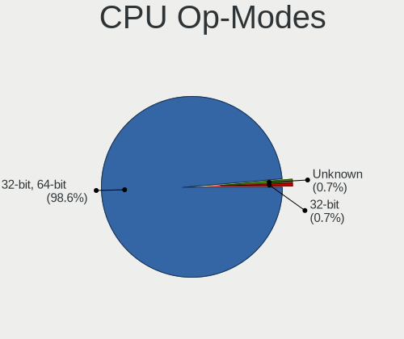
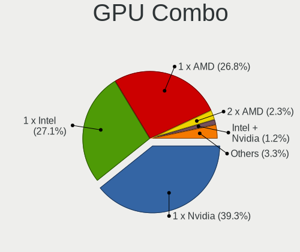
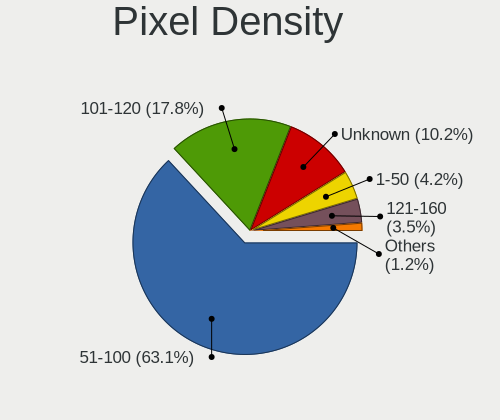

Linux in Italy - Tested Hardware & Statistics (Desktops)
--------------------------------------------------------

A project to collect tested hardware configurations for Linux in Italy.

Anyone can contribute to this report by the [hw-probe](https://github.com/linuxhw/hw-probe) tool:

    sudo -E hw-probe -all -upload

Please contribute! Especially if your hardware is rare.

Contents
--------

* [ Test Cases ](#test-cases)

* [ System ](#system)
  - [ OS                       ](#os)
  - [ OS Family                ](#os-family)
  - [ Kernel                   ](#kernel)
  - [ Kernel Family            ](#kernel-family)
  - [ Kernel Major Ver.        ](#kernel-major-ver)
  - [ Arch                     ](#arch)
  - [ DE                       ](#de)
  - [ Display Server           ](#display-server)
  - [ Display Manager          ](#display-manager)
  - [ OS Lang                  ](#os-lang)
  - [ Boot Mode                ](#boot-mode)
  - [ Filesystem               ](#filesystem)
  - [ Part. scheme             ](#part-scheme)
  - [ Dual Boot with Linux/BSD ](#dual-boot-with-linuxbsd)
  - [ Dual Boot (Win)          ](#dual-boot-win)

* [ Board ](#board)
  - [ Vendor                   ](#vendor)
  - [ Model                    ](#model)
  - [ Model Family             ](#model-family)
  - [ MFG Year                 ](#mfg-year)
  - [ Form Factor              ](#form-factor)
  - [ Secure Boot              ](#secure-boot)
  - [ Coreboot                 ](#coreboot)
  - [ RAM Size                 ](#ram-size)
  - [ RAM Used                 ](#ram-used)
  - [ Total Drives             ](#total-drives)
  - [ Has CD-ROM               ](#has-cd-rom)
  - [ Has Ethernet             ](#has-ethernet)
  - [ Has WiFi                 ](#has-wifi)
  - [ Has Bluetooth            ](#has-bluetooth)

* [ Location ](#location)
  - [ Country                  ](#country)
  - [ City                     ](#city)

* [ Drives ](#drives)
  - [ Drive Vendor             ](#drive-vendor)
  - [ Drive Model              ](#drive-model)
  - [ HDD Vendor               ](#hdd-vendor)
  - [ SSD Vendor               ](#ssd-vendor)
  - [ Drive Kind               ](#drive-kind)
  - [ Drive Connector          ](#drive-connector)
  - [ Drive Size               ](#drive-size)
  - [ Space Total              ](#space-total)
  - [ Space Used               ](#space-used)
  - [ Malfunc. Drives          ](#malfunc-drives)
  - [ Malfunc. Drive Vendor    ](#malfunc-drive-vendor)
  - [ Malfunc. HDD Vendor      ](#malfunc-hdd-vendor)
  - [ Malfunc. Drive Kind      ](#malfunc-drive-kind)
  - [ Failed Drives            ](#failed-drives)
  - [ Failed Drive Vendor      ](#failed-drive-vendor)
  - [ Drive Status             ](#drive-status)

* [ Storage controller ](#storage-controller)
  - [ Storage Vendor           ](#storage-vendor)
  - [ Storage Model            ](#storage-model)
  - [ Storage Kind             ](#storage-kind)

* [ Processor ](#processor)
  - [ CPU Vendor               ](#cpu-vendor)
  - [ CPU Model                ](#cpu-model)
  - [ CPU Model Family         ](#cpu-model-family)
  - [ CPU Cores                ](#cpu-cores)
  - [ CPU Sockets              ](#cpu-sockets)
  - [ CPU Threads              ](#cpu-threads)
  - [ CPU Op-Modes             ](#cpu-op-modes)
  - [ CPU Microcode            ](#cpu-microcode)
  - [ CPU Microarch            ](#cpu-microarch)

* [ Graphics ](#graphics)
  - [ GPU Vendor               ](#gpu-vendor)
  - [ GPU Model                ](#gpu-model)
  - [ GPU Combo                ](#gpu-combo)
  - [ GPU Driver               ](#gpu-driver)
  - [ GPU Memory               ](#gpu-memory)

* [ Monitor ](#monitor)
  - [ Monitor Vendor           ](#monitor-vendor)
  - [ Monitor Model            ](#monitor-model)
  - [ Monitor Resolution       ](#monitor-resolution)
  - [ Monitor Diagonal         ](#monitor-diagonal)
  - [ Monitor Width            ](#monitor-width)
  - [ Aspect Ratio             ](#aspect-ratio)
  - [ Monitor Area             ](#monitor-area)
  - [ Pixel Density            ](#pixel-density)
  - [ Multiple Monitors        ](#multiple-monitors)

* [ Network ](#network)
  - [ Net Controller Vendor    ](#net-controller-vendor)
  - [ Net Controller Model     ](#net-controller-model)
  - [ Wireless Vendor          ](#wireless-vendor)
  - [ Wireless Model           ](#wireless-model)
  - [ Ethernet Vendor          ](#ethernet-vendor)
  - [ Ethernet Model           ](#ethernet-model)
  - [ Net Controller Kind      ](#net-controller-kind)
  - [ Used Controller          ](#used-controller)
  - [ NICs                     ](#nics)
  - [ IPv6                     ](#ipv6)

* [ Bluetooth ](#bluetooth)
  - [ Bluetooth Vendor         ](#bluetooth-vendor)
  - [ Bluetooth Model          ](#bluetooth-model)

* [ Sound ](#sound)
  - [ Sound Vendor             ](#sound-vendor)
  - [ Sound Model              ](#sound-model)

* [ Memory ](#memory)
  - [ Memory Vendor            ](#memory-vendor)
  - [ Memory Model             ](#memory-model)
  - [ Memory Kind              ](#memory-kind)
  - [ Memory Form Factor       ](#memory-form-factor)
  - [ Memory Size              ](#memory-size)
  - [ Memory Speed             ](#memory-speed)

* [ Printers & scanners ](#printers--scanners)
  - [ Printer Vendor           ](#printer-vendor)
  - [ Printer Model            ](#printer-model)
  - [ Scanner Vendor           ](#scanner-vendor)
  - [ Scanner Model            ](#scanner-model)

* [ Camera ](#camera)
  - [ Camera Vendor            ](#camera-vendor)
  - [ Camera Model             ](#camera-model)

* [ Security ](#security)
  - [ Fingerprint Vendor       ](#fingerprint-vendor)
  - [ Fingerprint Model        ](#fingerprint-model)
  - [ Chipcard Vendor          ](#chipcard-vendor)
  - [ Chipcard Model           ](#chipcard-model)

* [ Unsupported ](#unsupported)
  - [ Unsupported Devices      ](#unsupported-devices)
  - [ Unsupported Device Types ](#unsupported-device-types)

Test Cases
----------

Total: 5952

| Vendor        | Model                       | Probe                                                      | Date         |
|---------------|-----------------------------|------------------------------------------------------------|--------------|
| ASRock        | 970M Pro3                   | [8eda0b8fbf](https://linux-hardware.org/?probe=8eda0b8fbf) | Jan 06, 2025 |
| ASRock        | H110M-ITX                   | [d9985ebe4e](https://linux-hardware.org/?probe=d9985ebe4e) | Jan 06, 2025 |
| OEM           | B75 Ver:1.41                | [72dd3048a2](https://linux-hardware.org/?probe=72dd3048a2) | Jan 05, 2025 |
| Dell          | 0JP3NX A01                  | [954d7d9768](https://linux-hardware.org/?probe=954d7d9768) | Jan 04, 2025 |
| ASUSTek       | PRIME H310M-E R2.0          | [79752b904b](https://linux-hardware.org/?probe=79752b904b) | Jan 04, 2025 |
| ASUSTek       | P5VD2-MX SE                 | [79f2dc1f44](https://linux-hardware.org/?probe=79f2dc1f44) | Jan 04, 2025 |
| ASRock        | H61M-S                      | [313d81da9f](https://linux-hardware.org/?probe=313d81da9f) | Jan 04, 2025 |
| OEM           | B75 Ver:1.41                | [b5e4cb38f7](https://linux-hardware.org/?probe=b5e4cb38f7) | Jan 04, 2025 |
| ASRock        | H61M-DGS                    | [0e1053e06a](https://linux-hardware.org/?probe=0e1053e06a) | Jan 04, 2025 |
| ASRock        | A300M-STX                   | [7d00280570](https://linux-hardware.org/?probe=7d00280570) | Jan 04, 2025 |
| ASUSTek       | PRIME A320M-K               | [76cfde7dc3](https://linux-hardware.org/?probe=76cfde7dc3) | Jan 04, 2025 |
| Lenovo        | 3168 SDK0J40697 WIN 3305... | [c6915cb84a](https://linux-hardware.org/?probe=c6915cb84a) | Jan 03, 2025 |
| ASUSTek       | PRIME A320M-K               | [65588fd6c1](https://linux-hardware.org/?probe=65588fd6c1) | Jan 03, 2025 |
| HP            | 339A                        | [37e08931cc](https://linux-hardware.org/?probe=37e08931cc) | Jan 03, 2025 |
| Dell          | 0F6X5P A00                  | [7cad62d105](https://linux-hardware.org/?probe=7cad62d105) | Jan 03, 2025 |
| Dell          | 0F6X5P A00                  | [2014bb07e8](https://linux-hardware.org/?probe=2014bb07e8) | Jan 03, 2025 |
| Dell          | 0F6X5P A00                  | [1fc923f99b](https://linux-hardware.org/?probe=1fc923f99b) | Jan 03, 2025 |
| ASUSTek       | PRIME B350M-A               | [014692b809](https://linux-hardware.org/?probe=014692b809) | Jan 03, 2025 |
| HP            | 0B4Ch D                     | [689bb32b5c](https://linux-hardware.org/?probe=689bb32b5c) | Jan 03, 2025 |
| Dell          | 0FF3FN A00                  | [7015b068fb](https://linux-hardware.org/?probe=7015b068fb) | Jan 03, 2025 |
| Dell          | 0FF3FN A00                  | [24dd59cb38](https://linux-hardware.org/?probe=24dd59cb38) | Jan 03, 2025 |
| Unknown       | Unknown                     | [e4a99f7f2d](https://linux-hardware.org/?probe=e4a99f7f2d) | Jan 02, 2025 |
| ASRock        | AB350 Pro4                  | [669da3420f](https://linux-hardware.org/?probe=669da3420f) | Jan 02, 2025 |
| Lenovo        | SHARKBAY 0B98401 WIN        | [612e46a0e7](https://linux-hardware.org/?probe=612e46a0e7) | Jan 01, 2025 |
| MSI           | A68HM GAMING                | [d12ab6c4d3](https://linux-hardware.org/?probe=d12ab6c4d3) | Jan 01, 2025 |
| Gigabyte      | X570 AORUS PRO              | [9ad161a45a](https://linux-hardware.org/?probe=9ad161a45a) | Jan 01, 2025 |
| ASUSTek       | PRIME B450M-K               | [4cb02f7ced](https://linux-hardware.org/?probe=4cb02f7ced) | Dec 31, 2024 |
| ASRock        | B450M-HDV R4.0              | [c996300bbf](https://linux-hardware.org/?probe=c996300bbf) | Dec 31, 2024 |
| ASUSTek       | TUF B450M-PLUS GAMING       | [bfc48412dd](https://linux-hardware.org/?probe=bfc48412dd) | Dec 31, 2024 |
| MSI           | MPG Z390 GAMING PLUS        | [7ecce10a98](https://linux-hardware.org/?probe=7ecce10a98) | Dec 31, 2024 |
| ASUSTek       | Pro H610M-C                 | [9f47d5bad6](https://linux-hardware.org/?probe=9f47d5bad6) | Dec 30, 2024 |
| HP            | 2AF7                        | [391d4cf404](https://linux-hardware.org/?probe=391d4cf404) | Dec 30, 2024 |
| ASUSTek       | P8H61-M LX3 PLUS R2.0       | [529afc68af](https://linux-hardware.org/?probe=529afc68af) | Dec 30, 2024 |
| ASUSTek       | TUF Gaming B550-PLUS WIF... | [5c9bfe608f](https://linux-hardware.org/?probe=5c9bfe608f) | Dec 30, 2024 |
| HP            | 18E7                        | [47d21f72aa](https://linux-hardware.org/?probe=47d21f72aa) | Dec 29, 2024 |
| Huanan        | X99-F8 GAMING V5.0          | [e1be4649fa](https://linux-hardware.org/?probe=e1be4649fa) | Dec 29, 2024 |
| MSI           | X470 GAMING PLUS MAX        | [b5263fe645](https://linux-hardware.org/?probe=b5263fe645) | Dec 29, 2024 |
| ASUSTek       | PRIME Z270-P                | [83bbeb0374](https://linux-hardware.org/?probe=83bbeb0374) | Dec 28, 2024 |
| Lenovo        | 3106 SDK0J40697 WIN 3305... | [d5047e58d1](https://linux-hardware.org/?probe=d5047e58d1) | Dec 28, 2024 |
| HP            | 81B3                        | [67462f75bb](https://linux-hardware.org/?probe=67462f75bb) | Dec 27, 2024 |
| ASUSTek       | TUF Gaming B450M-PLUS II    | [477041c5bc](https://linux-hardware.org/?probe=477041c5bc) | Dec 27, 2024 |
| ASRock        | H110M-HDV                   | [4501aaefe1](https://linux-hardware.org/?probe=4501aaefe1) | Dec 27, 2024 |
| ASRock        | H110M-HDV                   | [eb488f568b](https://linux-hardware.org/?probe=eb488f568b) | Dec 26, 2024 |
| ASRock        | Z77 Pro3                    | [6e2115d1fc](https://linux-hardware.org/?probe=6e2115d1fc) | Dec 26, 2024 |
| ASRock        | Z77 Pro3                    | [b995c7c799](https://linux-hardware.org/?probe=b995c7c799) | Dec 26, 2024 |
| ASRock        | N68-GE                      | [7f7f614f22](https://linux-hardware.org/?probe=7f7f614f22) | Dec 26, 2024 |
| MSI           | X470 GAMING PLUS MAX        | [25790885cb](https://linux-hardware.org/?probe=25790885cb) | Dec 25, 2024 |
| ASUSTek       | PRIME B660M-A D4            | [d314c49ee9](https://linux-hardware.org/?probe=d314c49ee9) | Dec 25, 2024 |
| ASUSTek       | PRIME B660M-A D4            | [f39ab795bb](https://linux-hardware.org/?probe=f39ab795bb) | Dec 25, 2024 |
| Lenovo        | 317C SDK0J40700 WIN 3258... | [0ab0a286ad](https://linux-hardware.org/?probe=0ab0a286ad) | Dec 25, 2024 |
| ASUSTek       | P5QPL-AM                    | [c3df99294f](https://linux-hardware.org/?probe=c3df99294f) | Dec 25, 2024 |
| GEEKOM        | XT12 Pro                    | [b728f081fd](https://linux-hardware.org/?probe=b728f081fd) | Dec 24, 2024 |
| Unknown       | Unknown                     | [7119a317d5](https://linux-hardware.org/?probe=7119a317d5) | Dec 24, 2024 |
| MSI           | B550-A PRO                  | [2ceed545b9](https://linux-hardware.org/?probe=2ceed545b9) | Dec 24, 2024 |
| ASUSTek       | PRIME B360M-K               | [cfa9fb9aba](https://linux-hardware.org/?probe=cfa9fb9aba) | Dec 24, 2024 |
| ASUSTek       | P5QPL-AM                    | [9ae485f387](https://linux-hardware.org/?probe=9ae485f387) | Dec 24, 2024 |
| Lenovo        | 36EB SDK0R32862 WIN 3258... | [572d308e92](https://linux-hardware.org/?probe=572d308e92) | Dec 23, 2024 |
| ASUSTek       | ROG STRIX X670E-E GAMING... | [65b8d941dc](https://linux-hardware.org/?probe=65b8d941dc) | Dec 23, 2024 |
| ASUSTek       | PRIME B450M-A               | [4dbc846a39](https://linux-hardware.org/?probe=4dbc846a39) | Dec 23, 2024 |
| ASUSTek       | PRIME Z490-A                | [c7a92e755d](https://linux-hardware.org/?probe=c7a92e755d) | Dec 23, 2024 |
| Dell          | 0200DY A01                  | [fa349ac11f](https://linux-hardware.org/?probe=fa349ac11f) | Dec 23, 2024 |
| ASUSTek       | PRIME Z490-A                | [7d25b9b02f](https://linux-hardware.org/?probe=7d25b9b02f) | Dec 23, 2024 |
| Fujitsu       | D3233-A1 S26361-D3233-A1    | [80598d6a43](https://linux-hardware.org/?probe=80598d6a43) | Dec 23, 2024 |
| ASUSTek       | P6T SE                      | [3269bf4415](https://linux-hardware.org/?probe=3269bf4415) | Dec 23, 2024 |
| ASRock        | H510M-HDV/M.2               | [66b8b7eae0](https://linux-hardware.org/?probe=66b8b7eae0) | Dec 23, 2024 |
| Lenovo        | SHARKBAY 0B98417 PRO        | [c7502297f0](https://linux-hardware.org/?probe=c7502297f0) | Dec 23, 2024 |
| Dell          | 0F6X5P A00                  | [e95791f119](https://linux-hardware.org/?probe=e95791f119) | Dec 22, 2024 |
| Colorful T... | CVN B650M GAMING FROZEN ... | [1155e83e75](https://linux-hardware.org/?probe=1155e83e75) | Dec 22, 2024 |
| ASUSTek       | H170M-PLUS                  | [1a3bfda1b2](https://linux-hardware.org/?probe=1a3bfda1b2) | Dec 22, 2024 |
| Packard Be... | WMCP78M                     | [b9f3620021](https://linux-hardware.org/?probe=b9f3620021) | Dec 22, 2024 |
| Packard Be... | WMCP78M                     | [9d24c10673](https://linux-hardware.org/?probe=9d24c10673) | Dec 22, 2024 |
| ASUSTek       | ROG STRIX B660-A GAMING ... | [8bf0b50eb2](https://linux-hardware.org/?probe=8bf0b50eb2) | Dec 22, 2024 |
| Gigabyte      | B550 AORUS ELITE AX V2      | [671a76bf13](https://linux-hardware.org/?probe=671a76bf13) | Dec 21, 2024 |
| HP            | 339A                        | [f12d4ef0f3](https://linux-hardware.org/?probe=f12d4ef0f3) | Dec 21, 2024 |
| ASRock        | B365 Pro4                   | [d18fd00942](https://linux-hardware.org/?probe=d18fd00942) | Dec 19, 2024 |
| MSI           | B75MA-P45                   | [da146c44f0](https://linux-hardware.org/?probe=da146c44f0) | Dec 19, 2024 |
| Shenzhen M... | F7BFC                       | [20a921dcdd](https://linux-hardware.org/?probe=20a921dcdd) | Dec 18, 2024 |
| Lenovo        | SHARKBAY NOK                | [9db3e7ed5a](https://linux-hardware.org/?probe=9db3e7ed5a) | Dec 18, 2024 |
| ASUSTek       | P8Z77-V LX                  | [a65cf104b4](https://linux-hardware.org/?probe=a65cf104b4) | Dec 18, 2024 |
| ASRock        | B75M                        | [b5d292db3a](https://linux-hardware.org/?probe=b5d292db3a) | Dec 18, 2024 |
| Acer          | Veriton X2631G              | [c603e73396](https://linux-hardware.org/?probe=c603e73396) | Dec 18, 2024 |
| Gigabyte      | B450M DS3H-CF               | [38d246c0d7](https://linux-hardware.org/?probe=38d246c0d7) | Dec 18, 2024 |
| HP            | 2B2C                        | [0b3869847d](https://linux-hardware.org/?probe=0b3869847d) | Dec 17, 2024 |
| Gigabyte      | B450M DS3H-CF               | [244afc8414](https://linux-hardware.org/?probe=244afc8414) | Dec 17, 2024 |
| Dell          | 0GXM1W A00                  | [a2efe505a5](https://linux-hardware.org/?probe=a2efe505a5) | Dec 17, 2024 |
| Gigabyte      | Z270N-WIFI-CF               | [21910e2c4a](https://linux-hardware.org/?probe=21910e2c4a) | Dec 16, 2024 |
| Foxconn       | 2ABF                        | [34c40afb92](https://linux-hardware.org/?probe=34c40afb92) | Dec 16, 2024 |
| ASRock        | Z370 Pro4                   | [bd29cc04f6](https://linux-hardware.org/?probe=bd29cc04f6) | Dec 16, 2024 |
| Lenovo        | SHARKBAY 0B98401 WIN        | [c3fec53206](https://linux-hardware.org/?probe=c3fec53206) | Dec 16, 2024 |
| Lenovo        | SHARKBAY NOK                | [7bcee07c07](https://linux-hardware.org/?probe=7bcee07c07) | Dec 15, 2024 |
| ASUSTek       | P5KPL-AM EPU                | [bfb2d315bb](https://linux-hardware.org/?probe=bfb2d315bb) | Dec 15, 2024 |
| Lenovo        | SHARKBAY NOK                | [e5fd8952ae](https://linux-hardware.org/?probe=e5fd8952ae) | Dec 14, 2024 |
| HP            | 81C5 MVB                    | [d1d4415deb](https://linux-hardware.org/?probe=d1d4415deb) | Dec 14, 2024 |
| ASUSTek       | M4A87TD/USB3                | [a14debaa36](https://linux-hardware.org/?probe=a14debaa36) | Dec 14, 2024 |
| ASUSTek       | H110M-R                     | [87c39f6163](https://linux-hardware.org/?probe=87c39f6163) | Dec 14, 2024 |
| HP            | 8184 X4                     | [bbb778251a](https://linux-hardware.org/?probe=bbb778251a) | Dec 14, 2024 |
| Dell          | 0TDG4V A00                  | [e8c33005d3](https://linux-hardware.org/?probe=e8c33005d3) | Dec 14, 2024 |
| ASUSTek       | PRIME Z270-A                | [5af9a6f758](https://linux-hardware.org/?probe=5af9a6f758) | Dec 14, 2024 |
| Lenovo        | SHARKBAY SDK0E50510 WIN     | [36c0ecd50a](https://linux-hardware.org/?probe=36c0ecd50a) | Dec 14, 2024 |
| Lenovo        | SHARKBAY SDK0E50510 WIN     | [cf56d42225](https://linux-hardware.org/?probe=cf56d42225) | Dec 14, 2024 |
| Pegatron      | VIOLET                      | [94fe59184c](https://linux-hardware.org/?probe=94fe59184c) | Dec 14, 2024 |
| Unknown       | Unknown                     | [62942fa339](https://linux-hardware.org/?probe=62942fa339) | Dec 14, 2024 |
| Gigabyte      | B550M AORUS ELITE           | [39f30baf2e](https://linux-hardware.org/?probe=39f30baf2e) | Dec 14, 2024 |
| ASUSTek       | ROG STRIX B450-F GAMING     | [41c0acdaab](https://linux-hardware.org/?probe=41c0acdaab) | Dec 13, 2024 |
| Lenovo        | 317C SDK0J40700 WIN 3258... | [845bbbb028](https://linux-hardware.org/?probe=845bbbb028) | Dec 13, 2024 |
| Lenovo        | SHARKBAY 31900058 STD       | [e17f61a1f8](https://linux-hardware.org/?probe=e17f61a1f8) | Dec 13, 2024 |
| Acer          | Veriton X2631G              | [2413d11f75](https://linux-hardware.org/?probe=2413d11f75) | Dec 13, 2024 |
| HP            | 1587h                       | [0c955e88ce](https://linux-hardware.org/?probe=0c955e88ce) | Dec 13, 2024 |
| ASRock        | H61M-VG4                    | [76d007efbe](https://linux-hardware.org/?probe=76d007efbe) | Dec 13, 2024 |
| HP            | 1587h                       | [85205e402a](https://linux-hardware.org/?probe=85205e402a) | Dec 12, 2024 |
| Acer          | Aspire XC-217               | [c83b898f91](https://linux-hardware.org/?probe=c83b898f91) | Dec 12, 2024 |
| AMI           | Intel                       | [e4d540364c](https://linux-hardware.org/?probe=e4d540364c) | Dec 12, 2024 |
| Dell          | 0C27VV A02                  | [98eb45ffe1](https://linux-hardware.org/?probe=98eb45ffe1) | Dec 11, 2024 |
| ASUSTek       | ROG STRIX B450-F GAMING     | [9f1726cead](https://linux-hardware.org/?probe=9f1726cead) | Dec 11, 2024 |
| AMI           | Intel                       | [9387b0b63c](https://linux-hardware.org/?probe=9387b0b63c) | Dec 11, 2024 |
| Chuwi         | RZBOX                       | [ceebadbef7](https://linux-hardware.org/?probe=ceebadbef7) | Dec 11, 2024 |
| Shenzhen M... | RPBNB                       | [eafb54c8d7](https://linux-hardware.org/?probe=eafb54c8d7) | Dec 11, 2024 |
| QTQD          | Unknown                     | [fe9c71e541](https://linux-hardware.org/?probe=fe9c71e541) | Dec 10, 2024 |
| ASUSTek       | PRIME A320M-K               | [1ef5763e52](https://linux-hardware.org/?probe=1ef5763e52) | Dec 10, 2024 |
| MSI           | B450M PRO-M2 MAX            | [8436935283](https://linux-hardware.org/?probe=8436935283) | Dec 10, 2024 |
| ASUSTek       | TUF Z390-PLUS GAMING        | [6462e457e9](https://linux-hardware.org/?probe=6462e457e9) | Dec 09, 2024 |
| MSI           | 970A GAMING PRO CARBON      | [1337503422](https://linux-hardware.org/?probe=1337503422) | Dec 09, 2024 |
| ASUSTek       | PRIME A320M-K               | [2b32ed6115](https://linux-hardware.org/?probe=2b32ed6115) | Dec 09, 2024 |
| Supermicro    | X9DRD-iF                    | [f90d8dfc09](https://linux-hardware.org/?probe=f90d8dfc09) | Dec 08, 2024 |
| Gigabyte      | H81M-HD3                    | [d20c93d629](https://linux-hardware.org/?probe=d20c93d629) | Dec 08, 2024 |
| ASRock        | B85M Pro4                   | [6590a75db3](https://linux-hardware.org/?probe=6590a75db3) | Dec 08, 2024 |
| ASUSTek       | ROG STRIX B550-F GAMING     | [eba104f14a](https://linux-hardware.org/?probe=eba104f14a) | Dec 07, 2024 |
| MSI           | MS-7253                     | [06a8a5402f](https://linux-hardware.org/?probe=06a8a5402f) | Dec 07, 2024 |
| Supermicro    | X9DRD-iF                    | [24c2ea7bbd](https://linux-hardware.org/?probe=24c2ea7bbd) | Dec 07, 2024 |
| ASUSTek       | P8B75-M LE                  | [e7f0693f7c](https://linux-hardware.org/?probe=e7f0693f7c) | Dec 07, 2024 |
| ASUSTek       | Q87M-E                      | [797bbc90f3](https://linux-hardware.org/?probe=797bbc90f3) | Dec 07, 2024 |
| ASUSTek       | Q87M-E                      | [7acd570f10](https://linux-hardware.org/?probe=7acd570f10) | Dec 07, 2024 |
| ASUSTek       | ROG Maximus XII FORMULA     | [000952dc62](https://linux-hardware.org/?probe=000952dc62) | Dec 07, 2024 |
| HP            | 3646h                       | [a878c4299b](https://linux-hardware.org/?probe=a878c4299b) | Dec 06, 2024 |
| ASUSTek       | P5KPL-AM SE                 | [3da9d693d2](https://linux-hardware.org/?probe=3da9d693d2) | Dec 06, 2024 |
| Packard Be... | IMEDIA S1300                | [b02a054b44](https://linux-hardware.org/?probe=b02a054b44) | Dec 05, 2024 |
| MSI           | MAG B550M MORTAR            | [52ef9b3448](https://linux-hardware.org/?probe=52ef9b3448) | Dec 04, 2024 |
| AMI           | Intel                       | [cecf6051ca](https://linux-hardware.org/?probe=cecf6051ca) | Dec 03, 2024 |
| HP            | 843F                        | [57d6dec6d5](https://linux-hardware.org/?probe=57d6dec6d5) | Dec 02, 2024 |
| MSI           | MAG B760M MORTAR WIFI       | [70ca834172](https://linux-hardware.org/?probe=70ca834172) | Dec 02, 2024 |
| HP            | 843F                        | [38c42e1258](https://linux-hardware.org/?probe=38c42e1258) | Dec 01, 2024 |
| MSI           | Z170A GAMING M5             | [2aeccdf82a](https://linux-hardware.org/?probe=2aeccdf82a) | Dec 01, 2024 |
| Shenzhen M... | RPBNB                       | [471e0eae44](https://linux-hardware.org/?probe=471e0eae44) | Nov 30, 2024 |
| Shenzhen M... | MTBAC                       | [7ae2f62c7d](https://linux-hardware.org/?probe=7ae2f62c7d) | Nov 30, 2024 |
| Chuwi         | RZBOX                       | [b70c931ab6](https://linux-hardware.org/?probe=b70c931ab6) | Nov 30, 2024 |
| Chuwi         | RZBOX                       | [841cc4d9c6](https://linux-hardware.org/?probe=841cc4d9c6) | Nov 30, 2024 |
| HP            | 304Ah                       | [9c4499ff99](https://linux-hardware.org/?probe=9c4499ff99) | Nov 30, 2024 |
| ASRock        | H77 Pro4-M                  | [ee78ad6501](https://linux-hardware.org/?probe=ee78ad6501) | Nov 30, 2024 |
| Lenovo        | 3106 SDK0J40697 WIN 3305... | [5f1a0866e9](https://linux-hardware.org/?probe=5f1a0866e9) | Nov 29, 2024 |
| Lenovo        | 3106 SDK0J40697 WIN 3305... | [8c009c7dc1](https://linux-hardware.org/?probe=8c009c7dc1) | Nov 29, 2024 |
| Gigabyte      | X570 AORUS MASTER           | [880eb76c45](https://linux-hardware.org/?probe=880eb76c45) | Nov 29, 2024 |
| ASUSTek       | Rampage IV FORMULA          | [19d479aa20](https://linux-hardware.org/?probe=19d479aa20) | Nov 29, 2024 |
| ASRock        | B450 Pro4                   | [ca8808db77](https://linux-hardware.org/?probe=ca8808db77) | Nov 29, 2024 |
| ASRock        | B75M                        | [54a8c00779](https://linux-hardware.org/?probe=54a8c00779) | Nov 28, 2024 |
| ASRock        | B450 Pro4                   | [fb2858b084](https://linux-hardware.org/?probe=fb2858b084) | Nov 28, 2024 |
| ASRock        | Z590 Phantom Gaming 4       | [0fa184b969](https://linux-hardware.org/?probe=0fa184b969) | Nov 28, 2024 |
| ASUSTek       | ROG CROSSHAIR X670E HERO    | [49d629a4df](https://linux-hardware.org/?probe=49d629a4df) | Nov 27, 2024 |
| ASUSTek       | P5QL/EPU                    | [2a7b69e02e](https://linux-hardware.org/?probe=2a7b69e02e) | Nov 27, 2024 |
| AMI           | Cherry Trail CR             | [605d0c79f5](https://linux-hardware.org/?probe=605d0c79f5) | Nov 26, 2024 |
| Gigabyte      | B650 EAGLE AX               | [d8aa0621cb](https://linux-hardware.org/?probe=d8aa0621cb) | Nov 26, 2024 |
| GEEKOM        | Mini IT12                   | [f5b92bba05](https://linux-hardware.org/?probe=f5b92bba05) | Nov 26, 2024 |
| GEEKOM        | Mini IT12                   | [a896649890](https://linux-hardware.org/?probe=a896649890) | Nov 26, 2024 |
| GEEKOM        | Mini IT12                   | [49be531cbb](https://linux-hardware.org/?probe=49be531cbb) | Nov 26, 2024 |
| Lenovo        | 3106 SDK0J40697 WIN 3305... | [2e121a8a35](https://linux-hardware.org/?probe=2e121a8a35) | Nov 26, 2024 |
| Gigabyte      | X58A-UD3R                   | [8a9846c516](https://linux-hardware.org/?probe=8a9846c516) | Nov 25, 2024 |
| ASUSTek       | ROG STRIX B365-G GAMING     | [3104f705c2](https://linux-hardware.org/?probe=3104f705c2) | Nov 25, 2024 |
| Gigabyte      | B550M DS3H                  | [00f4a22013](https://linux-hardware.org/?probe=00f4a22013) | Nov 25, 2024 |
| MSI           | H310M PRO-VDH PLUS          | [0766cb5641](https://linux-hardware.org/?probe=0766cb5641) | Nov 25, 2024 |
| MSI           | MPG X570 GAMING PLUS        | [8bc7c644b4](https://linux-hardware.org/?probe=8bc7c644b4) | Nov 23, 2024 |
| ASUSTek       | P8H77-M LE                  | [949fefc3e0](https://linux-hardware.org/?probe=949fefc3e0) | Nov 23, 2024 |
| ASUSTek       | TUF Gaming B460-PLUS        | [09833d7cc6](https://linux-hardware.org/?probe=09833d7cc6) | Nov 21, 2024 |
| ASUSTek       | P5K-E                       | [f27932b7fc](https://linux-hardware.org/?probe=f27932b7fc) | Nov 21, 2024 |
| Gigabyte      | H81M-HD3                    | [44a2c7c5a7](https://linux-hardware.org/?probe=44a2c7c5a7) | Nov 21, 2024 |
| Intel         | Alder Lake-H PCH E1.0G      | [7dc3c81a67](https://linux-hardware.org/?probe=7dc3c81a67) | Nov 21, 2024 |
| ASUSTek       | TUF Gaming Z790-PRO WIFI    | [827f0d7cef](https://linux-hardware.org/?probe=827f0d7cef) | Nov 20, 2024 |
| Gigabyte      | B550 AORUS ELITE AX V2      | [d9fa077e13](https://linux-hardware.org/?probe=d9fa077e13) | Nov 19, 2024 |
| ASUSTek       | ROG CROSSHAIR X670E HERO    | [8bab1d90d6](https://linux-hardware.org/?probe=8bab1d90d6) | Nov 18, 2024 |
| Gigabyte      | P35-DS3L                    | [beaa8307e1](https://linux-hardware.org/?probe=beaa8307e1) | Nov 18, 2024 |
| ASUSTek       | PRIME Z590-V                | [ef30ee12e2](https://linux-hardware.org/?probe=ef30ee12e2) | Nov 18, 2024 |
| ASUSTek       | ROG CROSSHAIR VIII DARK ... | [f12649ad72](https://linux-hardware.org/?probe=f12649ad72) | Nov 18, 2024 |
| ASUSTek       | P5K                         | [dfdb2cf6ee](https://linux-hardware.org/?probe=dfdb2cf6ee) | Nov 17, 2024 |
| ASUSTek       | TUF Gaming B450M-PLUS II    | [22fd04f7ee](https://linux-hardware.org/?probe=22fd04f7ee) | Nov 17, 2024 |
| Gigabyte      | B550 AORUS ELITE V2         | [4892f1748d](https://linux-hardware.org/?probe=4892f1748d) | Nov 16, 2024 |
| Gigabyte      | X870 GAMING WIFI6           | [561c6e7c57](https://linux-hardware.org/?probe=561c6e7c57) | Nov 16, 2024 |
| HP            | 1998                        | [021e8262ce](https://linux-hardware.org/?probe=021e8262ce) | Nov 16, 2024 |
| Gigabyte      | B550 AORUS ELITE V2         | [fd769cfe8f](https://linux-hardware.org/?probe=fd769cfe8f) | Nov 16, 2024 |
| Foxconn       | 2ADA                        | [f3b302e1d7](https://linux-hardware.org/?probe=f3b302e1d7) | Nov 15, 2024 |
| ASUSTek       | P8Z77-V LX2                 | [482dd6b939](https://linux-hardware.org/?probe=482dd6b939) | Nov 14, 2024 |
| MSI           | B450M-A PRO MAX             | [4bbab9f1b9](https://linux-hardware.org/?probe=4bbab9f1b9) | Nov 14, 2024 |
| MSI           | PRO B760-P WIFI DDR4        | [1b53092624](https://linux-hardware.org/?probe=1b53092624) | Nov 13, 2024 |
| ASUSTek       | D500MD                      | [e95286140f](https://linux-hardware.org/?probe=e95286140f) | Nov 13, 2024 |
| Unknown       | Unknown                     | [f4378d7617](https://linux-hardware.org/?probe=f4378d7617) | Nov 12, 2024 |
| ASUSTek       | P5K                         | [909b21807d](https://linux-hardware.org/?probe=909b21807d) | Nov 11, 2024 |
| ASRock        | X570 Phantom Gaming 4       | [2656542e7b](https://linux-hardware.org/?probe=2656542e7b) | Nov 11, 2024 |
| Unknown       | Unknown                     | [66788e06ff](https://linux-hardware.org/?probe=66788e06ff) | Nov 11, 2024 |
| ASUSTek       | ROG STRIX B650E-I GAMING... | [98037d8d44](https://linux-hardware.org/?probe=98037d8d44) | Nov 10, 2024 |
| MSI           | Z390-A PRO                  | [68c27eb24c](https://linux-hardware.org/?probe=68c27eb24c) | Nov 10, 2024 |
| MSI           | Z390-A PRO                  | [a6930afc53](https://linux-hardware.org/?probe=a6930afc53) | Nov 10, 2024 |
| MSI           | B760 GAMING PLUS WIFI       | [8c904e033f](https://linux-hardware.org/?probe=8c904e033f) | Nov 09, 2024 |
| ASUSTek       | TUF Z390-PLUS GAMING        | [09bd105ca4](https://linux-hardware.org/?probe=09bd105ca4) | Nov 09, 2024 |
| ASRock        | A520M Pro4                  | [c2076fe2ce](https://linux-hardware.org/?probe=c2076fe2ce) | Nov 08, 2024 |
| ASRock        | B550 Phantom Gaming 4       | [c8b9b27c31](https://linux-hardware.org/?probe=c8b9b27c31) | Nov 07, 2024 |
| Intel         | DH77KC AAG39641-400         | [38d1c4d2b3](https://linux-hardware.org/?probe=38d1c4d2b3) | Nov 07, 2024 |
| Intel         | DH77KC AAG39641-400         | [7e99679aa4](https://linux-hardware.org/?probe=7e99679aa4) | Nov 07, 2024 |
| ASUSTek       | ROG STRIX X870E-E GAMING... | [7b867cc335](https://linux-hardware.org/?probe=7b867cc335) | Nov 06, 2024 |
| ASUSTek       | ROG STRIX X870E-E GAMING... | [53d2a83ce9](https://linux-hardware.org/?probe=53d2a83ce9) | Nov 06, 2024 |
| HP            | 83F3                        | [e3c4ab7715](https://linux-hardware.org/?probe=e3c4ab7715) | Nov 06, 2024 |
| Acer          | Veriton X2610G              | [943c9b333b](https://linux-hardware.org/?probe=943c9b333b) | Nov 06, 2024 |
| Acer          | Veriton X2610G              | [ac729c4f71](https://linux-hardware.org/?probe=ac729c4f71) | Nov 06, 2024 |
| Gigabyte      | H410M H V3                  | [f0e8705b26](https://linux-hardware.org/?probe=f0e8705b26) | Nov 05, 2024 |
| Unknown       | Unknown                     | [865473bcdf](https://linux-hardware.org/?probe=865473bcdf) | Nov 04, 2024 |
| MSI           | H97 PC Mate                 | [b887d2c9f3](https://linux-hardware.org/?probe=b887d2c9f3) | Nov 04, 2024 |
| ASUSTek       | P5B-MX                      | [4362c0f099](https://linux-hardware.org/?probe=4362c0f099) | Nov 04, 2024 |
| ASUSTek       | AM1M-A                      | [9d653fa159](https://linux-hardware.org/?probe=9d653fa159) | Nov 04, 2024 |
| ASRock        | H170 Pro4                   | [b7b97b0699](https://linux-hardware.org/?probe=b7b97b0699) | Nov 03, 2024 |
| ASUSTek       | ROG CROSSHAIR X670E HERO    | [7e30f1299d](https://linux-hardware.org/?probe=7e30f1299d) | Nov 03, 2024 |
| T-bao         | MINI PC                     | [0196d10026](https://linux-hardware.org/?probe=0196d10026) | Nov 03, 2024 |
| HP            | 2820h                       | [c5a1cd276f](https://linux-hardware.org/?probe=c5a1cd276f) | Nov 03, 2024 |
| ASUSTek       | M32CD4-K                    | [108fddf731](https://linux-hardware.org/?probe=108fddf731) | Nov 02, 2024 |
| ASUSTek       | M32CD4-K                    | [63bb988d3a](https://linux-hardware.org/?probe=63bb988d3a) | Nov 02, 2024 |
| Intel         | H110D4-P1                   | [65e304fcef](https://linux-hardware.org/?probe=65e304fcef) | Nov 02, 2024 |
| Dell          | 0KYWH7 A03                  | [b4d4f8a6dc](https://linux-hardware.org/?probe=b4d4f8a6dc) | Nov 02, 2024 |
| MSI           | B450M PRO-VDH MAX           | [7d2f504c77](https://linux-hardware.org/?probe=7d2f504c77) | Nov 01, 2024 |
| ASUSTek       | P5Q-PRO                     | [bb5cbb409e](https://linux-hardware.org/?probe=bb5cbb409e) | Nov 01, 2024 |
| ASUSTek       | X99-A                       | [20b3429f27](https://linux-hardware.org/?probe=20b3429f27) | Oct 31, 2024 |
| Gigabyte      | H410M H V2                  | [d8fc45704f](https://linux-hardware.org/?probe=d8fc45704f) | Oct 31, 2024 |
| ASRock        | X570 Phantom Gaming 4       | [2fd4351d4d](https://linux-hardware.org/?probe=2fd4351d4d) | Oct 31, 2024 |
| ASUSTek       | PRIME B350-PLUS             | [034bc782c9](https://linux-hardware.org/?probe=034bc782c9) | Oct 31, 2024 |
| Acer          | Predator PO3-630            | [b2da1b5363](https://linux-hardware.org/?probe=b2da1b5363) | Oct 31, 2024 |
| ASUSTek       | BM6835_BM6635_BP6335        | [f177323396](https://linux-hardware.org/?probe=f177323396) | Oct 30, 2024 |
| ASRock        | Z370 Pro4                   | [dfed34972f](https://linux-hardware.org/?probe=dfed34972f) | Oct 30, 2024 |
| ASUSTek       | TUF Gaming X670E-PLUS WI... | [df33da1aff](https://linux-hardware.org/?probe=df33da1aff) | Oct 30, 2024 |
| ASRock        | Z390 Pro4                   | [bd98d1bb5c](https://linux-hardware.org/?probe=bd98d1bb5c) | Oct 30, 2024 |
| ASRock        | H61M-DGS                    | [1cfd9e3c68](https://linux-hardware.org/?probe=1cfd9e3c68) | Oct 29, 2024 |
| ASUSTek       | ROG STRIX X570-F GAMING     | [b76e374826](https://linux-hardware.org/?probe=b76e374826) | Oct 29, 2024 |
| ASRock        | Z590 Phantom Gaming 4       | [989969bf16](https://linux-hardware.org/?probe=989969bf16) | Oct 29, 2024 |
| ASUSTek       | P5KPL-AM SE                 | [cb398b6580](https://linux-hardware.org/?probe=cb398b6580) | Oct 28, 2024 |
| ASUSTek       | X99-A                       | [01ef68fdbe](https://linux-hardware.org/?probe=01ef68fdbe) | Oct 28, 2024 |
| ASRock        | Z590 Phantom Gaming 4       | [87f3ae0898](https://linux-hardware.org/?probe=87f3ae0898) | Oct 28, 2024 |
| Gigabyte      | B550M DS3H AC               | [20f47e21f7](https://linux-hardware.org/?probe=20f47e21f7) | Oct 28, 2024 |
| Fujitsu       | D3161-A1 S26361-D3161-A1    | [695e4b4285](https://linux-hardware.org/?probe=695e4b4285) | Oct 27, 2024 |
| Fujitsu       | D3161-A1 S26361-D3161-A1    | [908e681a81](https://linux-hardware.org/?probe=908e681a81) | Oct 27, 2024 |
| Dell          | 0D28YY A00                  | [ffb4541701](https://linux-hardware.org/?probe=ffb4541701) | Oct 27, 2024 |
| HP            | 339A                        | [a80a6dbe21](https://linux-hardware.org/?probe=a80a6dbe21) | Oct 27, 2024 |
| HP            | 339A                        | [e6518d9592](https://linux-hardware.org/?probe=e6518d9592) | Oct 27, 2024 |
| HP            | 339A                        | [3e6ef4a5d2](https://linux-hardware.org/?probe=3e6ef4a5d2) | Oct 27, 2024 |
| Fujitsu       | D3227-A1 S26361-D3227-A1    | [4edc7c0869](https://linux-hardware.org/?probe=4edc7c0869) | Oct 26, 2024 |
| MSI           | B450M PRO-VDH MAX           | [f8f6986b16](https://linux-hardware.org/?probe=f8f6986b16) | Oct 26, 2024 |
| Gigabyte      | Z790 UD                     | [68afa8fd74](https://linux-hardware.org/?probe=68afa8fd74) | Oct 26, 2024 |
| ASRock        | 980DE3/U3S3                 | [e5d89c7efa](https://linux-hardware.org/?probe=e5d89c7efa) | Oct 26, 2024 |
| ASUSTek       | H81M-K                      | [4fd4d2e0bd](https://linux-hardware.org/?probe=4fd4d2e0bd) | Oct 25, 2024 |
| Dell          | 0J4NFV A01                  | [6ba567e2bc](https://linux-hardware.org/?probe=6ba567e2bc) | Oct 25, 2024 |
| ASUSTek       | P8Z77-V PRO                 | [7d7555087d](https://linux-hardware.org/?probe=7d7555087d) | Oct 25, 2024 |
| ASRock        | Q1900M                      | [9724395584](https://linux-hardware.org/?probe=9724395584) | Oct 25, 2024 |
| Fujitsu Si... | D2584-A1 S26361-D2584-A1    | [46280512d5](https://linux-hardware.org/?probe=46280512d5) | Oct 25, 2024 |
| MSI           | Z87-GD65 GAMING             | [6873f3e825](https://linux-hardware.org/?probe=6873f3e825) | Oct 25, 2024 |
| Acer          | Veriton ES2730G V:1.0       | [3702712c0d](https://linux-hardware.org/?probe=3702712c0d) | Oct 24, 2024 |
| MSI           | B150M PRO-VDH               | [360821d9d9](https://linux-hardware.org/?probe=360821d9d9) | Oct 24, 2024 |
| MSI           | X99A SLI PLUS               | [b6cff0886e](https://linux-hardware.org/?probe=b6cff0886e) | Oct 24, 2024 |
| ASUSTek       | ROG STRIX B650E-E GAMING... | [61223757a1](https://linux-hardware.org/?probe=61223757a1) | Oct 23, 2024 |
| Gigabyte      | H410M H V2                  | [c054528eeb](https://linux-hardware.org/?probe=c054528eeb) | Oct 23, 2024 |
| ASUSTek       | PRIME B550M-A WIFI II       | [d5d628d107](https://linux-hardware.org/?probe=d5d628d107) | Oct 22, 2024 |
| Lenovo        | 3148 SDK0J40697 WIN 3305... | [90245dec30](https://linux-hardware.org/?probe=90245dec30) | Oct 22, 2024 |
| ASRock        | H61M-DGS                    | [19f104c65a](https://linux-hardware.org/?probe=19f104c65a) | Oct 22, 2024 |
| ASRock        | Z77 Performance             | [01cb85dde8](https://linux-hardware.org/?probe=01cb85dde8) | Oct 22, 2024 |
| ASRock        | H81M-DG4                    | [bcb664b558](https://linux-hardware.org/?probe=bcb664b558) | Oct 22, 2024 |
| ASRock        | H81M-DG4                    | [0e2fa86fa6](https://linux-hardware.org/?probe=0e2fa86fa6) | Oct 22, 2024 |
| ASUSTek       | ROG STRIX X570-F GAMING     | [0c6b58355e](https://linux-hardware.org/?probe=0c6b58355e) | Oct 22, 2024 |
| ASUSTek       | PRIME B350-PLUS             | [41ac64cb55](https://linux-hardware.org/?probe=41ac64cb55) | Oct 21, 2024 |
| PRAIM         | C32                         | [cb6010a727](https://linux-hardware.org/?probe=cb6010a727) | Oct 20, 2024 |
| PRAIM         | C32                         | [fdb2efa6f5](https://linux-hardware.org/?probe=fdb2efa6f5) | Oct 20, 2024 |
| MSI           | MS-B1831                    | [cbe12a0f3c](https://linux-hardware.org/?probe=cbe12a0f3c) | Oct 20, 2024 |
| Unknown       | Unknown                     | [1380476f1e](https://linux-hardware.org/?probe=1380476f1e) | Oct 20, 2024 |
| Packard Be... | IMEDIA S1300                | [14232351b4](https://linux-hardware.org/?probe=14232351b4) | Oct 19, 2024 |
| MSI           | Z97 MPOWER MAX AC           | [02bbeb1a17](https://linux-hardware.org/?probe=02bbeb1a17) | Oct 19, 2024 |
| ASRock        | B250M Pro4                  | [d920080f25](https://linux-hardware.org/?probe=d920080f25) | Oct 19, 2024 |
| ASRock        | B250M Pro4                  | [29b043cb95](https://linux-hardware.org/?probe=29b043cb95) | Oct 19, 2024 |
| Fujitsu       | D3041-A1 S26361-D3041-A1    | [f7756415e3](https://linux-hardware.org/?probe=f7756415e3) | Oct 19, 2024 |
| Gigabyte      | H170-D3HP-CF                | [4d27146d89](https://linux-hardware.org/?probe=4d27146d89) | Oct 18, 2024 |
| Gigabyte      | H170-D3HP-CF                | [0f32c90816](https://linux-hardware.org/?probe=0f32c90816) | Oct 18, 2024 |
| Gigabyte      | B760M DS3H AX DDR4          | [90f6d1aeaa](https://linux-hardware.org/?probe=90f6d1aeaa) | Oct 18, 2024 |
| ASUSTek       | M4N68T-M-LE-V2              | [041eb0280b](https://linux-hardware.org/?probe=041eb0280b) | Oct 18, 2024 |
| ASUSTek       | M4N68T-M-LE-V2              | [6ab3638a8e](https://linux-hardware.org/?probe=6ab3638a8e) | Oct 18, 2024 |
| ASUSTek       | PRIME B350-PLUS             | [88e5f63026](https://linux-hardware.org/?probe=88e5f63026) | Oct 17, 2024 |
| ASUSTek       | Rampage II GENE             | [4fde5bcf74](https://linux-hardware.org/?probe=4fde5bcf74) | Oct 17, 2024 |
| ASRock        | H81M-VG4                    | [7888cc5e82](https://linux-hardware.org/?probe=7888cc5e82) | Oct 17, 2024 |
| ASUSTek       | P8H61-M PRO                 | [86ded07dbf](https://linux-hardware.org/?probe=86ded07dbf) | Oct 17, 2024 |
| ASUSTek       | P8H61-M PRO                 | [0129c2195c](https://linux-hardware.org/?probe=0129c2195c) | Oct 17, 2024 |
| ASRock        | Z370 Pro4                   | [768bfdaf9a](https://linux-hardware.org/?probe=768bfdaf9a) | Oct 17, 2024 |
| Gigabyte      | AB350M-DS3H V2-CF           | [d858b80241](https://linux-hardware.org/?probe=d858b80241) | Oct 16, 2024 |
| ASRock        | H81M-DGS R2.0               | [c498134667](https://linux-hardware.org/?probe=c498134667) | Oct 16, 2024 |
| ASRock        | H81M-DGS R2.0               | [bc56e44248](https://linux-hardware.org/?probe=bc56e44248) | Oct 16, 2024 |
| Gigabyte      | H55M-UD2H                   | [714988ab55](https://linux-hardware.org/?probe=714988ab55) | Oct 16, 2024 |
| Gigabyte      | B360 AORUS GAMING 3 WIFI... | [0a10d42a20](https://linux-hardware.org/?probe=0a10d42a20) | Oct 16, 2024 |
| Lenovo        | 3102 SDK0J40697 WIN 3305... | [d8a7c8652a](https://linux-hardware.org/?probe=d8a7c8652a) | Oct 15, 2024 |
| Gigabyte      | Z390 AORUS XTREME WATERF... | [6ce451292f](https://linux-hardware.org/?probe=6ce451292f) | Oct 15, 2024 |
| MSI           | G41M-P28                    | [0133465618](https://linux-hardware.org/?probe=0133465618) | Oct 15, 2024 |
| Gigabyte      | Z170-Gaming K3-CF           | [ce9c318079](https://linux-hardware.org/?probe=ce9c318079) | Oct 15, 2024 |
| Gigabyte      | B450 GAMING X               | [53f7bb5239](https://linux-hardware.org/?probe=53f7bb5239) | Oct 13, 2024 |
| ASRock        | Z68 Pro3                    | [e69090fa3f](https://linux-hardware.org/?probe=e69090fa3f) | Oct 12, 2024 |
| ICP / iEi     | SEC4 V2.0                   | [a765eeefd5](https://linux-hardware.org/?probe=a765eeefd5) | Oct 12, 2024 |
| Gigabyte      | Z68X-UD3H-B3                | [5f6121d1c4](https://linux-hardware.org/?probe=5f6121d1c4) | Oct 11, 2024 |
| Dell          | 01W26N A00                  | [dbbdea4522](https://linux-hardware.org/?probe=dbbdea4522) | Oct 11, 2024 |
| ASUSTek       | TUF Gaming B460-PLUS        | [cce2af49f0](https://linux-hardware.org/?probe=cce2af49f0) | Oct 10, 2024 |
| ASRock        | N68C-S UCC                  | [30c2b184d6](https://linux-hardware.org/?probe=30c2b184d6) | Oct 09, 2024 |
| Gigabyte      | B660M DS3H DDR4             | [d385217188](https://linux-hardware.org/?probe=d385217188) | Oct 09, 2024 |
| ASUSTek       | P8B WS                      | [7281fef91c](https://linux-hardware.org/?probe=7281fef91c) | Oct 09, 2024 |
| HP            | 339A                        | [c933fa55e0](https://linux-hardware.org/?probe=c933fa55e0) | Oct 09, 2024 |
| Gigabyte      | B550 AORUS ELITE AX V2      | [bd93ac4886](https://linux-hardware.org/?probe=bd93ac4886) | Oct 08, 2024 |
| Gigabyte      | B360N WIFI-CF               | [78592b0936](https://linux-hardware.org/?probe=78592b0936) | Oct 08, 2024 |
| ASUSTek       | P5QL-CM                     | [a87fd34663](https://linux-hardware.org/?probe=a87fd34663) | Oct 08, 2024 |
| ASRock        | H310M-HDV                   | [b20cb44166](https://linux-hardware.org/?probe=b20cb44166) | Oct 08, 2024 |
| MSI           | 970A-G46                    | [7f5bf49bca](https://linux-hardware.org/?probe=7f5bf49bca) | Oct 08, 2024 |
| Gigabyte      | B650M AORUS ELITE AX        | [bc06f61edf](https://linux-hardware.org/?probe=bc06f61edf) | Oct 06, 2024 |
| Lenovo        | 3716 SDK0T76463 WIN 3422... | [059f908f06](https://linux-hardware.org/?probe=059f908f06) | Oct 06, 2024 |
| HP            | 21F5 0A                     | [3aa5448519](https://linux-hardware.org/?probe=3aa5448519) | Oct 06, 2024 |
| Gigabyte      | B650M AORUS ELITE AX        | [4ecb717139](https://linux-hardware.org/?probe=4ecb717139) | Oct 06, 2024 |
| MSI           | Z97 MPOWER MAX AC           | [b8fbfecc12](https://linux-hardware.org/?probe=b8fbfecc12) | Oct 06, 2024 |
| Gigabyte      | B760M DS3H DDR4             | [de3987395e](https://linux-hardware.org/?probe=de3987395e) | Oct 05, 2024 |
| ASRock        | H61M-DGS                    | [6bdbe5bc33](https://linux-hardware.org/?probe=6bdbe5bc33) | Oct 05, 2024 |
| ASUSTek       | TUF Gaming X570-PLUS        | [b4e2660cc8](https://linux-hardware.org/?probe=b4e2660cc8) | Oct 05, 2024 |
| MSI           | MAG B460M MORTAR            | [3fc82f90a0](https://linux-hardware.org/?probe=3fc82f90a0) | Oct 04, 2024 |
| MSI           | MAG B460M MORTAR            | [62fb810090](https://linux-hardware.org/?probe=62fb810090) | Oct 03, 2024 |
| ASRock        | B365 Pro4                   | [59bc68680f](https://linux-hardware.org/?probe=59bc68680f) | Oct 03, 2024 |
| ASUSTek       | PRIME B450-PLUS             | [2997e9eb80](https://linux-hardware.org/?probe=2997e9eb80) | Oct 03, 2024 |
| ASUSTek       | BM2AD_D510MT_D310MT         | [7da4858e7f](https://linux-hardware.org/?probe=7da4858e7f) | Oct 02, 2024 |
| Intel         | X99-P4 V5.1                 | [b885a85a75](https://linux-hardware.org/?probe=b885a85a75) | Oct 02, 2024 |
| MSI           | Boston                      | [8e086f2e70](https://linux-hardware.org/?probe=8e086f2e70) | Oct 02, 2024 |
| Acer          | EQ45M                       | [0d9b3aab5f](https://linux-hardware.org/?probe=0d9b3aab5f) | Oct 02, 2024 |
| Lenovo        | 0B98401 PRO                 | [8d48741234](https://linux-hardware.org/?probe=8d48741234) | Oct 02, 2024 |
| Lenovo        | 0B98401 PRO                 | [46c569b7bf](https://linux-hardware.org/?probe=46c569b7bf) | Oct 02, 2024 |
| Gigabyte      | B450 AORUS ELITE            | [ab7932706d](https://linux-hardware.org/?probe=ab7932706d) | Oct 02, 2024 |
| MSI           | B760 GAMING PLUS WIFI       | [3d0b957a92](https://linux-hardware.org/?probe=3d0b957a92) | Oct 01, 2024 |
| Unknown       | 1.0                         | [f7a80613c5](https://linux-hardware.org/?probe=f7a80613c5) | Oct 01, 2024 |
| ASUSTek       | B85M-G                      | [3c667ee4c6](https://linux-hardware.org/?probe=3c667ee4c6) | Oct 01, 2024 |
| Lenovo        | 3106 SDK0J40697 WIN 3305... | [7cbe0719e7](https://linux-hardware.org/?probe=7cbe0719e7) | Oct 01, 2024 |
| ASUSTek       | P8H61-M LX2                 | [eeadaf7682](https://linux-hardware.org/?probe=eeadaf7682) | Oct 01, 2024 |
| ASRock        | A620M-HDV/M.2               | [1f6a1a1295](https://linux-hardware.org/?probe=1f6a1a1295) | Oct 01, 2024 |
| ASRock        | H610M-ITX/ac                | [17e8f1e713](https://linux-hardware.org/?probe=17e8f1e713) | Sep 29, 2024 |
| MSI           | Z97 GAMING 5                | [60cb15cc01](https://linux-hardware.org/?probe=60cb15cc01) | Sep 29, 2024 |
| ASUSTek       | A78M-E                      | [92e02b6371](https://linux-hardware.org/?probe=92e02b6371) | Sep 29, 2024 |
| Gigabyte      | P35-DS3L                    | [199f033892](https://linux-hardware.org/?probe=199f033892) | Sep 29, 2024 |
| Gigabyte      | P35-DS3L                    | [c3ce9fa5d8](https://linux-hardware.org/?probe=c3ce9fa5d8) | Sep 28, 2024 |
| Intel         | H110D4-P1                   | [626cc0fd13](https://linux-hardware.org/?probe=626cc0fd13) | Sep 28, 2024 |
| ASRock        | H470M-HDV/M.2               | [8158f71264](https://linux-hardware.org/?probe=8158f71264) | Sep 28, 2024 |
| Dell          | 0F6X5P A00                  | [fc052cba3c](https://linux-hardware.org/?probe=fc052cba3c) | Sep 28, 2024 |
| Lenovo        | 317C SDK0J40700 WIN 3258... | [807bf527f5](https://linux-hardware.org/?probe=807bf527f5) | Sep 28, 2024 |
| Dell          | 08WKV3 A00                  | [6ed7dba3a1](https://linux-hardware.org/?probe=6ed7dba3a1) | Sep 28, 2024 |
| Gigabyte      | GA-78LMT-S2                 | [ced9a3f102](https://linux-hardware.org/?probe=ced9a3f102) | Sep 27, 2024 |
| MSI           | Z370-A PRO                  | [094eab2744](https://linux-hardware.org/?probe=094eab2744) | Sep 26, 2024 |
| ASRock        | B250M Pro4                  | [28552e8c78](https://linux-hardware.org/?probe=28552e8c78) | Sep 26, 2024 |
| ASUSTek       | PRIME X670E-PRO WIFI        | [dbc88b064e](https://linux-hardware.org/?probe=dbc88b064e) | Sep 26, 2024 |
| ASUSTek       | ROG STRIX Z490-F GAMING     | [7d35226fe2](https://linux-hardware.org/?probe=7d35226fe2) | Sep 26, 2024 |
| ASUSTek       | ROG STRIX Z490-F GAMING     | [355059e70a](https://linux-hardware.org/?probe=355059e70a) | Sep 26, 2024 |
| BESSTAR Te... | UM350                       | [57738b8c5e](https://linux-hardware.org/?probe=57738b8c5e) | Sep 25, 2024 |
| ASUSTek       | M5A97 LE R2.0               | [c3ccf68469](https://linux-hardware.org/?probe=c3ccf68469) | Sep 25, 2024 |
| MSI           | PRO B760M-P DDR4            | [649743fa60](https://linux-hardware.org/?probe=649743fa60) | Sep 25, 2024 |
| Dell          | 0HV8FN A01                  | [a3be10ea10](https://linux-hardware.org/?probe=a3be10ea10) | Sep 25, 2024 |
| MSI           | MAG X670E TOMAHAWK WIFI     | [e18053e73e](https://linux-hardware.org/?probe=e18053e73e) | Sep 24, 2024 |
| ASUSTek       | Z170 PRO GAMING             | [294c3cad07](https://linux-hardware.org/?probe=294c3cad07) | Sep 24, 2024 |
| ASUSTek       | M32CD4-K                    | [06f8276917](https://linux-hardware.org/?probe=06f8276917) | Sep 24, 2024 |
| HP            | 82A1                        | [9e17703561](https://linux-hardware.org/?probe=9e17703561) | Sep 24, 2024 |
| HP            | 8053                        | [6d4fb4cdc0](https://linux-hardware.org/?probe=6d4fb4cdc0) | Sep 24, 2024 |
| ASRock        | H670M Pro RS                | [5e71ff8ae5](https://linux-hardware.org/?probe=5e71ff8ae5) | Sep 24, 2024 |
| Pegatron      | 2AC3                        | [ae0de7bb2e](https://linux-hardware.org/?probe=ae0de7bb2e) | Sep 23, 2024 |
| Dell          | 0GK1K2 A00                  | [2053759f81](https://linux-hardware.org/?probe=2053759f81) | Sep 23, 2024 |
| MSI           | H310M PRO-VD                | [b9924118ac](https://linux-hardware.org/?probe=b9924118ac) | Sep 23, 2024 |
| Dell          | 0J8G6F A02                  | [968e081763](https://linux-hardware.org/?probe=968e081763) | Sep 23, 2024 |
| ASUSTek       | Z170 PRO GAMING             | [62a42e3e4c](https://linux-hardware.org/?probe=62a42e3e4c) | Sep 23, 2024 |
| ASUSTek       | ROG STRIX B650-A GAMING ... | [0859ce1a17](https://linux-hardware.org/?probe=0859ce1a17) | Sep 22, 2024 |
| ASUSTek       | P5G41T-M LE                 | [d2315eef29](https://linux-hardware.org/?probe=d2315eef29) | Sep 22, 2024 |
| MSI           | Z97 PC Mate                 | [9e5fa5693a](https://linux-hardware.org/?probe=9e5fa5693a) | Sep 22, 2024 |
| MSI           | Z97 PC Mate                 | [5f57996552](https://linux-hardware.org/?probe=5f57996552) | Sep 22, 2024 |
| Biostar       | P31-A7                      | [8f249ff212](https://linux-hardware.org/?probe=8f249ff212) | Sep 22, 2024 |
| Dell          | 0F6X5P A00                  | [0c54dd2ad4](https://linux-hardware.org/?probe=0c54dd2ad4) | Sep 22, 2024 |
| ASUSTek       | P5KC                        | [4ff012d224](https://linux-hardware.org/?probe=4ff012d224) | Sep 21, 2024 |
| Gigabyte      | Z390 AORUS PRO-CF           | [13a5f9277f](https://linux-hardware.org/?probe=13a5f9277f) | Sep 21, 2024 |
| Gigabyte      | Z390 AORUS PRO-CF           | [456f1a48d7](https://linux-hardware.org/?probe=456f1a48d7) | Sep 21, 2024 |
| MSI           | H370 GAMING PLUS            | [75935d4ff6](https://linux-hardware.org/?probe=75935d4ff6) | Sep 21, 2024 |
| Lenovo        | 3138                        | [5443da17eb](https://linux-hardware.org/?probe=5443da17eb) | Sep 20, 2024 |
| MSI           | B350 TOMAHAWK               | [f87173b8b2](https://linux-hardware.org/?probe=f87173b8b2) | Sep 20, 2024 |
| Gigabyte      | B450 AORUS ELITE            | [5725d58536](https://linux-hardware.org/?probe=5725d58536) | Sep 19, 2024 |
| Lenovo        | 3138                        | [930f7bd71f](https://linux-hardware.org/?probe=930f7bd71f) | Sep 19, 2024 |
| ASUSTek       | H81-GAMER                   | [be55c0ed79](https://linux-hardware.org/?probe=be55c0ed79) | Sep 19, 2024 |
| HP            | 802E                        | [3e912c052d](https://linux-hardware.org/?probe=3e912c052d) | Sep 18, 2024 |
| Lenovo        | NO DPK                      | [ce8e9a2393](https://linux-hardware.org/?probe=ce8e9a2393) | Sep 18, 2024 |
| MSI           | MEG Z390 ACE                | [d7b45bd7ba](https://linux-hardware.org/?probe=d7b45bd7ba) | Sep 18, 2024 |
| MSI           | MEG Z390 ACE                | [9d3fab5854](https://linux-hardware.org/?probe=9d3fab5854) | Sep 18, 2024 |
| HP            | 802E                        | [58524aefa1](https://linux-hardware.org/?probe=58524aefa1) | Sep 18, 2024 |
| ASRock        | H110 Pro BTC+               | [11266fe76e](https://linux-hardware.org/?probe=11266fe76e) | Sep 18, 2024 |
| ASUSTek       | PRIME X570-P                | [41069e9de7](https://linux-hardware.org/?probe=41069e9de7) | Sep 17, 2024 |
| Acer          | Veriton M2631 V:1.0         | [6624a5c506](https://linux-hardware.org/?probe=6624a5c506) | Sep 17, 2024 |
| Dell          | 01W26N A00                  | [8fd4a0ae2d](https://linux-hardware.org/?probe=8fd4a0ae2d) | Sep 17, 2024 |
| MSI           | H61M-P20                    | [8354cf2e1a](https://linux-hardware.org/?probe=8354cf2e1a) | Sep 17, 2024 |
| ASUSTek       | F2A85-M PRO                 | [95a5bda3f9](https://linux-hardware.org/?probe=95a5bda3f9) | Sep 16, 2024 |
| Gigabyte      | B550M DS3H                  | [e42fc20d2e](https://linux-hardware.org/?probe=e42fc20d2e) | Sep 16, 2024 |
| ASUSTek       | ROG CROSSHAIR VIII DARK ... | [12e603b654](https://linux-hardware.org/?probe=12e603b654) | Sep 15, 2024 |
| Dell          | 042P49 A02                  | [002c4fe6af](https://linux-hardware.org/?probe=002c4fe6af) | Sep 15, 2024 |
| MSI           | PRO B760M-A WIFI            | [9b9efad16f](https://linux-hardware.org/?probe=9b9efad16f) | Sep 15, 2024 |
| ASUSTek       | PRIME B350-PLUS             | [833d4acd21](https://linux-hardware.org/?probe=833d4acd21) | Sep 15, 2024 |
| ASRock        | B550M Steel Legend          | [aadc023cfc](https://linux-hardware.org/?probe=aadc023cfc) | Sep 15, 2024 |
| ASUSTek       | ROG CROSSHAIR X670E HERO    | [f9dd180792](https://linux-hardware.org/?probe=f9dd180792) | Sep 15, 2024 |
| ASUSTek       | STRIX Z270H GAMING          | [d7f27ca251](https://linux-hardware.org/?probe=d7f27ca251) | Sep 14, 2024 |
| ASUSTek       | STRIX Z270H GAMING          | [2b3c178c9e](https://linux-hardware.org/?probe=2b3c178c9e) | Sep 14, 2024 |
| Acer          | Veriton M4640G              | [dd74f21ba9](https://linux-hardware.org/?probe=dd74f21ba9) | Sep 14, 2024 |
| ASRock        | H61M-DGS                    | [0b2b1c5747](https://linux-hardware.org/?probe=0b2b1c5747) | Sep 14, 2024 |
| ASRock        | Z370 Extreme4               | [53e502252c](https://linux-hardware.org/?probe=53e502252c) | Sep 14, 2024 |
| ASRock        | H510M-HDV/M.2               | [7b5e4af25e](https://linux-hardware.org/?probe=7b5e4af25e) | Sep 14, 2024 |
| ASRock        | H510M-HDV/M.2               | [6b492485d4](https://linux-hardware.org/?probe=6b492485d4) | Sep 14, 2024 |
| ASUSTek       | P5GC-MX/1333                | [34c336cabc](https://linux-hardware.org/?probe=34c336cabc) | Sep 14, 2024 |
| Lenovo        | SHARKBAY 0B98401 WIN        | [465267e57f](https://linux-hardware.org/?probe=465267e57f) | Sep 14, 2024 |
| Lenovo        | SHARKBAY 0B98401 WIN        | [7f26dc27d2](https://linux-hardware.org/?probe=7f26dc27d2) | Sep 14, 2024 |
| Gigabyte      | B550 AORUS ELITE AX V2      | [cc99554541](https://linux-hardware.org/?probe=cc99554541) | Sep 14, 2024 |
| Dell          | 042P49 A02                  | [9f6b43e99e](https://linux-hardware.org/?probe=9f6b43e99e) | Sep 13, 2024 |
| ASUSTek       | ROG STRIX B550-F GAMING     | [f2b6796926](https://linux-hardware.org/?probe=f2b6796926) | Sep 12, 2024 |
| Unknown       | K105F                       | [0e11f9f830](https://linux-hardware.org/?probe=0e11f9f830) | Sep 12, 2024 |
| Gigabyte      | Z370P D3-CF                 | [06ba250747](https://linux-hardware.org/?probe=06ba250747) | Sep 12, 2024 |
| ASUSTek       | P5B SE                      | [4c42931311](https://linux-hardware.org/?probe=4c42931311) | Sep 12, 2024 |
| ASRock        | Z370 Extreme4               | [3df07c7665](https://linux-hardware.org/?probe=3df07c7665) | Sep 11, 2024 |
| Pegatron      | TRUCKEE                     | [734fa7bcd1](https://linux-hardware.org/?probe=734fa7bcd1) | Sep 11, 2024 |
| Pegatron      | TRUCKEE                     | [3a969b02aa](https://linux-hardware.org/?probe=3a969b02aa) | Sep 10, 2024 |
| Unknown       | Unknown                     | [e43e1e52bf](https://linux-hardware.org/?probe=e43e1e52bf) | Sep 10, 2024 |
| ASUSTek       | ROG STRIX B550-F GAMING     | [dd74657516](https://linux-hardware.org/?probe=dd74657516) | Sep 10, 2024 |
| HP            | 1497                        | [6ca7cc71e1](https://linux-hardware.org/?probe=6ca7cc71e1) | Sep 10, 2024 |
| iEi           | SAX9 V1.00                  | [d25454a2fb](https://linux-hardware.org/?probe=d25454a2fb) | Sep 10, 2024 |
| HP            | 8265                        | [43b7b19d0e](https://linux-hardware.org/?probe=43b7b19d0e) | Sep 09, 2024 |
| ASUSTek       | ROG STRIX B550-F GAMING     | [0f08c484b0](https://linux-hardware.org/?probe=0f08c484b0) | Sep 08, 2024 |
| Pegatron      | 2A94h                       | [5a721a5edc](https://linux-hardware.org/?probe=5a721a5edc) | Sep 08, 2024 |
| ASUSTek       | Maximus V FORMULA           | [afdfe72541](https://linux-hardware.org/?probe=afdfe72541) | Sep 08, 2024 |
| ASUSTek       | P5Q3 DELUXE                 | [43f88e43fa](https://linux-hardware.org/?probe=43f88e43fa) | Sep 08, 2024 |
| ASUSTek       | PB60                        | [f516855940](https://linux-hardware.org/?probe=f516855940) | Sep 07, 2024 |
| ASUSTek       | H97-PLUS                    | [1c314094d5](https://linux-hardware.org/?probe=1c314094d5) | Sep 07, 2024 |
| ASUSTek       | P5Q3 DELUXE                 | [7c7e7e0577](https://linux-hardware.org/?probe=7c7e7e0577) | Sep 07, 2024 |
| ASUSTek       | PB60                        | [19c2d1c5bc](https://linux-hardware.org/?probe=19c2d1c5bc) | Sep 07, 2024 |
| ASUSTek       | P5Q3 DELUXE                 | [650641e0de](https://linux-hardware.org/?probe=650641e0de) | Sep 07, 2024 |
| Unknown       | Unknown                     | [eeafaa6833](https://linux-hardware.org/?probe=eeafaa6833) | Sep 07, 2024 |
| Dell          | 01W26N A00                  | [22dab9c6fe](https://linux-hardware.org/?probe=22dab9c6fe) | Sep 06, 2024 |
| Dell          | 0GK1K2 A00                  | [272836d37d](https://linux-hardware.org/?probe=272836d37d) | Sep 06, 2024 |
| MSI           | Z370 GAMING M5              | [390e9ff312](https://linux-hardware.org/?probe=390e9ff312) | Sep 05, 2024 |
| ASUSTek       | PRIME A320M-K               | [a2923c2916](https://linux-hardware.org/?probe=a2923c2916) | Sep 04, 2024 |
| HP            | 3397                        | [010527f0d2](https://linux-hardware.org/?probe=010527f0d2) | Sep 04, 2024 |
| IceWhale T... | ZimaBoard 832 ZMB           | [6b2dd48333](https://linux-hardware.org/?probe=6b2dd48333) | Sep 03, 2024 |
| Lenovo        | NO DPK                      | [c4404aaf61](https://linux-hardware.org/?probe=c4404aaf61) | Sep 02, 2024 |
| MSI           | MAG B550 TOMAHAWK MAX WI... | [585a443140](https://linux-hardware.org/?probe=585a443140) | Sep 01, 2024 |
| ASUSTek       | H110M-K                     | [a1c10987b2](https://linux-hardware.org/?probe=a1c10987b2) | Sep 01, 2024 |
| Foxconn       | 2ABF                        | [2940b62c84](https://linux-hardware.org/?probe=2940b62c84) | Sep 01, 2024 |
| MSI           | Z97 GAMING 5                | [fe87c95954](https://linux-hardware.org/?probe=fe87c95954) | Sep 01, 2024 |
| Shenzhen M... | AHBTB                       | [ec73f12c24](https://linux-hardware.org/?probe=ec73f12c24) | Sep 01, 2024 |
| MSI           | H81M-P33                    | [e042807dc2](https://linux-hardware.org/?probe=e042807dc2) | Sep 01, 2024 |
| ASUSTek       | M5A78L/USB3                 | [525c825aa7](https://linux-hardware.org/?probe=525c825aa7) | Aug 31, 2024 |
| ASUSTek       | PRIME H310M-R R2.0          | [a3e806666a](https://linux-hardware.org/?probe=a3e806666a) | Aug 31, 2024 |
| Intel         | DQ67EP AAG12529-308         | [caac73c213](https://linux-hardware.org/?probe=caac73c213) | Aug 31, 2024 |
| Fujitsu       | D3219-A1 S26361-D3219-A1    | [f67aa32eca](https://linux-hardware.org/?probe=f67aa32eca) | Aug 31, 2024 |
| Fujitsu       | D3061-A1 S26361-D3061-A1    | [ac81eefe24](https://linux-hardware.org/?probe=ac81eefe24) | Aug 31, 2024 |
| ASUSTek       | TUF Gaming B550-PLUS        | [664fb0bf5c](https://linux-hardware.org/?probe=664fb0bf5c) | Aug 30, 2024 |
| Dell          | 0RF703                      | [e82a1ff8e3](https://linux-hardware.org/?probe=e82a1ff8e3) | Aug 29, 2024 |
| MSI           | B760 GAMING PLUS WIFI       | [48e74e492a](https://linux-hardware.org/?probe=48e74e492a) | Aug 29, 2024 |
| ASUSTek       | P8H77-M                     | [82957cabed](https://linux-hardware.org/?probe=82957cabed) | Aug 29, 2024 |
| Gigabyte      | GA-MA78GM-S2H               | [082ba563c8](https://linux-hardware.org/?probe=082ba563c8) | Aug 27, 2024 |
| Lenovo        | 36F7 SDK0J40700 WIN 3258... | [eb23e561c0](https://linux-hardware.org/?probe=eb23e561c0) | Aug 27, 2024 |
| BESSTAR Te... | TH50                        | [046ff4811c](https://linux-hardware.org/?probe=046ff4811c) | Aug 27, 2024 |
| BESSTAR Te... | TH50                        | [c91a8d5dbe](https://linux-hardware.org/?probe=c91a8d5dbe) | Aug 27, 2024 |
| ASUSTek       | PRIME B450-PLUS             | [e909a9e846](https://linux-hardware.org/?probe=e909a9e846) | Aug 27, 2024 |
| MSI           | Z370 GAMING M5              | [3a36128c03](https://linux-hardware.org/?probe=3a36128c03) | Aug 27, 2024 |
| MSI           | B450M PRO-VDH MAX           | [082067d04e](https://linux-hardware.org/?probe=082067d04e) | Aug 27, 2024 |
| Lenovo        | 32CB SDK0T76530 WIN 3556... | [5096c46f27](https://linux-hardware.org/?probe=5096c46f27) | Aug 26, 2024 |
| Gigabyte      | X670 GAMING X AX            | [6a778397b6](https://linux-hardware.org/?probe=6a778397b6) | Aug 26, 2024 |
| MSI           | MPG Z390 GAMING PLUS        | [bea0cfc51e](https://linux-hardware.org/?probe=bea0cfc51e) | Aug 26, 2024 |
| ASUSTek       | TUF Gaming B460-PLUS        | [b64c63b67f](https://linux-hardware.org/?probe=b64c63b67f) | Aug 26, 2024 |
| Gigabyte      | H270N-WIFI-CF               | [0061772dde](https://linux-hardware.org/?probe=0061772dde) | Aug 26, 2024 |
| ASUSTek       | P8H61-M LX3 PLUS R2.0       | [26c7fca733](https://linux-hardware.org/?probe=26c7fca733) | Aug 26, 2024 |
| ECS           | P45T-A                      | [05f396ce21](https://linux-hardware.org/?probe=05f396ce21) | Aug 26, 2024 |
| HP            | 1998                        | [9fb9664b40](https://linux-hardware.org/?probe=9fb9664b40) | Aug 26, 2024 |
| GEEKOM        | A5                          | [bea9f96908](https://linux-hardware.org/?probe=bea9f96908) | Aug 26, 2024 |
| ASUSTek       | PRIME B350-PLUS             | [43b7250175](https://linux-hardware.org/?probe=43b7250175) | Aug 26, 2024 |
| ASRock        | B450M Pro4                  | [a7ac33ab5c](https://linux-hardware.org/?probe=a7ac33ab5c) | Aug 25, 2024 |
| ASRock        | B250M Pro4                  | [97a7b1d3c7](https://linux-hardware.org/?probe=97a7b1d3c7) | Aug 25, 2024 |
| Pegatron      | 2A94h                       | [6ec199373b](https://linux-hardware.org/?probe=6ec199373b) | Aug 25, 2024 |
| ECS           | P45T-A                      | [22b56330c6](https://linux-hardware.org/?probe=22b56330c6) | Aug 25, 2024 |
| Acer          | Aspire M5910                | [0a851cb5da](https://linux-hardware.org/?probe=0a851cb5da) | Aug 24, 2024 |
| Acer          | Aspire M5910                | [d1a2d21585](https://linux-hardware.org/?probe=d1a2d21585) | Aug 24, 2024 |
| ASUSTek       | ROG STRIX B760-G GAMING ... | [54e6a9011a](https://linux-hardware.org/?probe=54e6a9011a) | Aug 24, 2024 |
| ASUSTek       | ET2301I                     | [4eb71388bc](https://linux-hardware.org/?probe=4eb71388bc) | Aug 23, 2024 |
| ASUSTek       | ET2301I                     | [86b98d945a](https://linux-hardware.org/?probe=86b98d945a) | Aug 23, 2024 |
| MSI           | PRO B760M-A WIFI            | [dffcb9242a](https://linux-hardware.org/?probe=dffcb9242a) | Aug 23, 2024 |
| ASRock        | B250M Pro4                  | [e58fd49e45](https://linux-hardware.org/?probe=e58fd49e45) | Aug 23, 2024 |
| Acer          | Aspire M1930                | [984d81a7ac](https://linux-hardware.org/?probe=984d81a7ac) | Aug 22, 2024 |
| Foxconn       | 2AAF                        | [77ab7699b3](https://linux-hardware.org/?probe=77ab7699b3) | Aug 22, 2024 |
| Foxconn       | 2AAF                        | [9c27a351e5](https://linux-hardware.org/?probe=9c27a351e5) | Aug 22, 2024 |
| Gigabyte      | H170-HD3 DDR3-CF            | [daa64d3c7d](https://linux-hardware.org/?probe=daa64d3c7d) | Aug 21, 2024 |
| Gigabyte      | H170-HD3 DDR3-CF            | [da375bfcec](https://linux-hardware.org/?probe=da375bfcec) | Aug 21, 2024 |
| ASUSTek       | ROG STRIX B550-A GAMING     | [c771260335](https://linux-hardware.org/?probe=c771260335) | Aug 19, 2024 |
| ASUSTek       | PRIME B450-PLUS             | [7585bac032](https://linux-hardware.org/?probe=7585bac032) | Aug 19, 2024 |
| Dell          | 07WP95 A01                  | [a4a7707426](https://linux-hardware.org/?probe=a4a7707426) | Aug 19, 2024 |
| Dell          | 0773VG A02                  | [56a9b6f7e6](https://linux-hardware.org/?probe=56a9b6f7e6) | Aug 19, 2024 |
| MSI           | PRO B760M-P DDR4            | [f62f2a6b9c](https://linux-hardware.org/?probe=f62f2a6b9c) | Aug 19, 2024 |
| ASRock        | N68-S                       | [028d97c1cf](https://linux-hardware.org/?probe=028d97c1cf) | Aug 19, 2024 |
| GEEKOM        | A5                          | [464fe39877](https://linux-hardware.org/?probe=464fe39877) | Aug 18, 2024 |
| Intel         | DG31PR AAD97573-302         | [6ab6002bbd](https://linux-hardware.org/?probe=6ab6002bbd) | Aug 18, 2024 |
| ASRock        | H61M-DGS                    | [befbfd411f](https://linux-hardware.org/?probe=befbfd411f) | Aug 18, 2024 |
| Acer          | F690GVM                     | [f9f5665863](https://linux-hardware.org/?probe=f9f5665863) | Aug 18, 2024 |
| Gigabyte      | P85-D3                      | [963dc3b162](https://linux-hardware.org/?probe=963dc3b162) | Aug 17, 2024 |
| Gigabyte      | X670E AORUS MASTER          | [fbf683c390](https://linux-hardware.org/?probe=fbf683c390) | Aug 17, 2024 |
| Fujitsu       | D3171-A1 S26361-D3171-A1    | [6bf836b973](https://linux-hardware.org/?probe=6bf836b973) | Aug 17, 2024 |
| Gigabyte      | B760M AORUS ELITE X AX      | [a5b8962a8e](https://linux-hardware.org/?probe=a5b8962a8e) | Aug 17, 2024 |
| MSI           | B450-A PRO                  | [4870948fbf](https://linux-hardware.org/?probe=4870948fbf) | Aug 17, 2024 |
| Gigabyte      | B760M AORUS ELITE X AX      | [8a079aef34](https://linux-hardware.org/?probe=8a079aef34) | Aug 17, 2024 |
| MSI           | B450-A PRO                  | [75b5b5ebc2](https://linux-hardware.org/?probe=75b5b5ebc2) | Aug 16, 2024 |
| MSI           | X470 GAMING PLUS MAX        | [f521bf46f6](https://linux-hardware.org/?probe=f521bf46f6) | Aug 14, 2024 |
| MSI           | X470 GAMING PLUS MAX        | [e55ddf5da1](https://linux-hardware.org/?probe=e55ddf5da1) | Aug 14, 2024 |
| Fujitsu       | D3064-A1 S26361-D3064-A1    | [166cdc0250](https://linux-hardware.org/?probe=166cdc0250) | Aug 14, 2024 |
| ASUSTek       | ROG STRIX B550-F GAMING     | [a36328f184](https://linux-hardware.org/?probe=a36328f184) | Aug 14, 2024 |
| Gigabyte      | B450M DS3H-CF               | [70fb5d3332](https://linux-hardware.org/?probe=70fb5d3332) | Aug 13, 2024 |
| ASRock        | H61M-DGS                    | [ed6b235a54](https://linux-hardware.org/?probe=ed6b235a54) | Aug 13, 2024 |
| Gigabyte      | B450M DS3H-CF               | [d2701d1f2b](https://linux-hardware.org/?probe=d2701d1f2b) | Aug 13, 2024 |
| ASRock        | FM2A55M-DGS                 | [a5fa87c0d6](https://linux-hardware.org/?probe=a5fa87c0d6) | Aug 13, 2024 |
| Acer          | Veriton M2632G V:1.0        | [d01b6865bf](https://linux-hardware.org/?probe=d01b6865bf) | Aug 12, 2024 |
| Dell          | 0XD433 A01                  | [d1ca45c18f](https://linux-hardware.org/?probe=d1ca45c18f) | Aug 12, 2024 |
| MSI           | MPG Z590 GAMING CARBON W... | [f3441e7e7d](https://linux-hardware.org/?probe=f3441e7e7d) | Aug 11, 2024 |
| MSI           | Z370 GAMING M5              | [5cd926df4f](https://linux-hardware.org/?probe=5cd926df4f) | Aug 11, 2024 |
| ASRock        | H81M-HDS R2.0               | [051e8de774](https://linux-hardware.org/?probe=051e8de774) | Aug 11, 2024 |
| ASUSTek       | Maximus VII HERO            | [5c94a6c420](https://linux-hardware.org/?probe=5c94a6c420) | Aug 10, 2024 |
| Lenovo        | 3106 SDK0J40697 WIN 3305... | [1e1acfa187](https://linux-hardware.org/?probe=1e1acfa187) | Aug 10, 2024 |
| Gigabyte      | A520M S2H                   | [d50c94d73c](https://linux-hardware.org/?probe=d50c94d73c) | Aug 08, 2024 |
| Gigabyte      | A520M S2H                   | [d42122f3da](https://linux-hardware.org/?probe=d42122f3da) | Aug 08, 2024 |
| HP            | 18E9                        | [e3ff75ef3f](https://linux-hardware.org/?probe=e3ff75ef3f) | Aug 08, 2024 |
| Gigabyte      | B760M DS3H DDR4             | [f65ee4168b](https://linux-hardware.org/?probe=f65ee4168b) | Aug 06, 2024 |
| ASUSTek       | Z87M-PLUS                   | [1ed225ce94](https://linux-hardware.org/?probe=1ed225ce94) | Aug 06, 2024 |
| Unknown       | Unknown                     | [a139eb66d2](https://linux-hardware.org/?probe=a139eb66d2) | Aug 06, 2024 |
| ASUSTek       | M32CD_A_F_K20CD_K31CD       | [c6367fd908](https://linux-hardware.org/?probe=c6367fd908) | Aug 05, 2024 |
| Acer          | Veriton N4630G              | [7006800997](https://linux-hardware.org/?probe=7006800997) | Aug 05, 2024 |
| Gigabyte      | EP43T-UD3L                  | [94df9b5c30](https://linux-hardware.org/?probe=94df9b5c30) | Aug 05, 2024 |
| Intel         | DG31PR AAD97573-302         | [b2d9f45126](https://linux-hardware.org/?probe=b2d9f45126) | Aug 04, 2024 |
| ASUSTek       | ROG STRIX B550-F GAMING     | [c148754bd1](https://linux-hardware.org/?probe=c148754bd1) | Aug 04, 2024 |
| ASUSTek       | PRIME H310M-R R2.0          | [578712aebe](https://linux-hardware.org/?probe=578712aebe) | Aug 04, 2024 |
| GEEKOM        | A7                          | [a642de18b4](https://linux-hardware.org/?probe=a642de18b4) | Aug 03, 2024 |
| ASUSTek       | P5Q SE2                     | [edff6c686b](https://linux-hardware.org/?probe=edff6c686b) | Aug 03, 2024 |
| GEEKOM        | A7                          | [5e4d479deb](https://linux-hardware.org/?probe=5e4d479deb) | Aug 03, 2024 |
| Dell          | 0MN1TX A02                  | [df4df4e304](https://linux-hardware.org/?probe=df4df4e304) | Aug 03, 2024 |
| ASRock        | J4105-ITX                   | [1dc3e6bb80](https://linux-hardware.org/?probe=1dc3e6bb80) | Aug 02, 2024 |
| ASUSTek       | STRIX Z270G GAMING          | [76090a5179](https://linux-hardware.org/?probe=76090a5179) | Aug 02, 2024 |
| Fujitsu       | D3161-A1 S26361-D3161-A1    | [fec9424ef8](https://linux-hardware.org/?probe=fec9424ef8) | Aug 02, 2024 |
| HP            | 8299                        | [9295b0b5b3](https://linux-hardware.org/?probe=9295b0b5b3) | Aug 02, 2024 |
| ASUSTek       | PRIME B360M-A               | [24558da639](https://linux-hardware.org/?probe=24558da639) | Aug 02, 2024 |
| HP            | 1825                        | [5b9b648342](https://linux-hardware.org/?probe=5b9b648342) | Aug 02, 2024 |
| HP            | 2B47                        | [70adccddff](https://linux-hardware.org/?probe=70adccddff) | Aug 01, 2024 |
| Fujitsu       | D3003-A1 S26361-D3003-A1    | [8a7ddf4baf](https://linux-hardware.org/?probe=8a7ddf4baf) | Aug 01, 2024 |
| ASUSTek       | ROG STRIX B450-F GAMING ... | [8c20c8ffdd](https://linux-hardware.org/?probe=8c20c8ffdd) | Aug 01, 2024 |
| ASRock        | H81M-DGS R2.0               | [24b0e4a7f5](https://linux-hardware.org/?probe=24b0e4a7f5) | Aug 01, 2024 |
| ASUSTek       | PRIME B365M-A               | [e9253cacb4](https://linux-hardware.org/?probe=e9253cacb4) | Aug 01, 2024 |
| ASUSTek       | STRIX Z270G GAMING          | [c7f1467120](https://linux-hardware.org/?probe=c7f1467120) | Aug 01, 2024 |
| Acer          | F690GVM                     | [5fd27036dc](https://linux-hardware.org/?probe=5fd27036dc) | Jul 31, 2024 |
| ASUSTek       | TUF Gaming B450M-PLUS II    | [dcf96a8542](https://linux-hardware.org/?probe=dcf96a8542) | Jul 30, 2024 |
| HP            | 8906 SMVB                   | [9285d60b1f](https://linux-hardware.org/?probe=9285d60b1f) | Jul 30, 2024 |
| Packard Be... | WMCP78M                     | [8b002f18eb](https://linux-hardware.org/?probe=8b002f18eb) | Jul 30, 2024 |
| ASRock        | H470M-HDV/M.2               | [7a15f390cd](https://linux-hardware.org/?probe=7a15f390cd) | Jul 30, 2024 |
| Dell          | 0MN1TX A02                  | [94c88b74f1](https://linux-hardware.org/?probe=94c88b74f1) | Jul 29, 2024 |
| HP            | 2B2C                        | [d5b3e82b2b](https://linux-hardware.org/?probe=d5b3e82b2b) | Jul 29, 2024 |
| ASUSTek       | PRIME B350M-A               | [b0359d6d88](https://linux-hardware.org/?probe=b0359d6d88) | Jul 28, 2024 |
| Dell          | 0HY9JP A00                  | [ce223ac9e4](https://linux-hardware.org/?probe=ce223ac9e4) | Jul 28, 2024 |
| Gigabyte      | B650 EAGLE AX               | [16391777e6](https://linux-hardware.org/?probe=16391777e6) | Jul 28, 2024 |
| Dell          | 0XR1GT A00                  | [e8337f3abd](https://linux-hardware.org/?probe=e8337f3abd) | Jul 27, 2024 |
| Dell          | 0V8WGR A00                  | [2fc421d7ff](https://linux-hardware.org/?probe=2fc421d7ff) | Jul 27, 2024 |
| GEEKOM        | Mini IT13                   | [23c5c50556](https://linux-hardware.org/?probe=23c5c50556) | Jul 27, 2024 |
| Foxconn       | 2ABF                        | [7cc7a40e85](https://linux-hardware.org/?probe=7cc7a40e85) | Jul 27, 2024 |
| Gigabyte      | B650 EAGLE AX               | [00b10068e7](https://linux-hardware.org/?probe=00b10068e7) | Jul 27, 2024 |
| Gigabyte      | Z690 GAMING X DDR4          | [901da3e131](https://linux-hardware.org/?probe=901da3e131) | Jul 27, 2024 |
| ASUSTek       | ROG CROSSHAIR VIII DARK ... | [26c71d4462](https://linux-hardware.org/?probe=26c71d4462) | Jul 26, 2024 |
| ASUSTek       | ProArt B550-CREATOR         | [9a733fe6d3](https://linux-hardware.org/?probe=9a733fe6d3) | Jul 26, 2024 |
| MSI           | B350M PRO-VDH               | [0f95697403](https://linux-hardware.org/?probe=0f95697403) | Jul 25, 2024 |
| ASUSTek       | PRIME B450M-A II            | [9b93efc7fa](https://linux-hardware.org/?probe=9b93efc7fa) | Jul 25, 2024 |
| ASUSTek       | H81M-K                      | [c7efb5f986](https://linux-hardware.org/?probe=c7efb5f986) | Jul 25, 2024 |
| ASRock        | Z77 Performance             | [3235e7c866](https://linux-hardware.org/?probe=3235e7c866) | Jul 25, 2024 |
| ASUSTek       | A88XM-E/USB                 | [9cc6e54448](https://linux-hardware.org/?probe=9cc6e54448) | Jul 25, 2024 |
| MSI           | MAG B760 TOMAHAWK WIFI D... | [86cc92224f](https://linux-hardware.org/?probe=86cc92224f) | Jul 25, 2024 |
| Unknown       | Unknown                     | [9f21efbdc8](https://linux-hardware.org/?probe=9f21efbdc8) | Jul 24, 2024 |
| AMI           | Intel                       | [3a2452931b](https://linux-hardware.org/?probe=3a2452931b) | Jul 23, 2024 |
| Lenovo        | SHARKBAY 31900058 STD       | [ef8ec22b50](https://linux-hardware.org/?probe=ef8ec22b50) | Jul 23, 2024 |
| ASUSTek       | TUF Z390-PLUS GAMING        | [bde1d0c7b3](https://linux-hardware.org/?probe=bde1d0c7b3) | Jul 23, 2024 |
| Acer          | Veriton ES2730G V:1.0       | [901755e9dc](https://linux-hardware.org/?probe=901755e9dc) | Jul 23, 2024 |
| Acer          | Veriton ES2730G V:1.0       | [679d13f469](https://linux-hardware.org/?probe=679d13f469) | Jul 23, 2024 |
| Unknown       | Unknown                     | [a2b29f0943](https://linux-hardware.org/?probe=a2b29f0943) | Jul 23, 2024 |
| Unknown       | Unknown                     | [9f73b5f819](https://linux-hardware.org/?probe=9f73b5f819) | Jul 23, 2024 |
| ASUSTek       | PRIME B450M-A II            | [bccf1b55f8](https://linux-hardware.org/?probe=bccf1b55f8) | Jul 22, 2024 |
| Unknown       | HM77-3                      | [3059ab9794](https://linux-hardware.org/?probe=3059ab9794) | Jul 22, 2024 |
| ASUSTek       | PRIME B550M-K               | [868bbd9678](https://linux-hardware.org/?probe=868bbd9678) | Jul 22, 2024 |
| HP            | 18E9                        | [1c404f1ff7](https://linux-hardware.org/?probe=1c404f1ff7) | Jul 22, 2024 |
| Lenovo        | 3102 SDK0J40705 WIN 3425... | [f73b9ac9df](https://linux-hardware.org/?probe=f73b9ac9df) | Jul 22, 2024 |
| Dell          | 0T568R A00                  | [dcdfb2e676](https://linux-hardware.org/?probe=dcdfb2e676) | Jul 21, 2024 |
| Shenzhen M... | RPFXI                       | [13c9fe508b](https://linux-hardware.org/?probe=13c9fe508b) | Jul 21, 2024 |
| ASUSTek       | PRIME H510M-A               | [2777674e71](https://linux-hardware.org/?probe=2777674e71) | Jul 21, 2024 |
| MSI           | B450M PRO-VDH PLUS          | [48b9f2133c](https://linux-hardware.org/?probe=48b9f2133c) | Jul 21, 2024 |
| Shenzhen M... | F7BFC                       | [0ef7da7cc6](https://linux-hardware.org/?probe=0ef7da7cc6) | Jul 21, 2024 |
| Gigabyte      | GA-880GA-UD3H               | [11fd69223a](https://linux-hardware.org/?probe=11fd69223a) | Jul 20, 2024 |
| Dell          | 0NKW6Y A02                  | [9c800bffc3](https://linux-hardware.org/?probe=9c800bffc3) | Jul 19, 2024 |
| Intel         | DG31PR AAD97573-302         | [a77090bf5f](https://linux-hardware.org/?probe=a77090bf5f) | Jul 18, 2024 |
| ASUSTek       | PRIME Z790-P                | [020a0369b2](https://linux-hardware.org/?probe=020a0369b2) | Jul 18, 2024 |
| MSI           | MAG X570 TOMAHAWK WIFI      | [f5bc2b848f](https://linux-hardware.org/?probe=f5bc2b848f) | Jul 18, 2024 |
| ASRock        | H81M-DGS R2.0               | [fce2fe61c4](https://linux-hardware.org/?probe=fce2fe61c4) | Jul 18, 2024 |
| MSI           | B450M MORTAR MAX            | [c66b57e709](https://linux-hardware.org/?probe=c66b57e709) | Jul 17, 2024 |
| ASUSTek       | ROG STRIX Z690-E GAMING ... | [42391c2183](https://linux-hardware.org/?probe=42391c2183) | Jul 17, 2024 |
| Fujitsu       | D3062-A1 S26361-D3062-A1    | [ae5c5e7f74](https://linux-hardware.org/?probe=ae5c5e7f74) | Jul 16, 2024 |
| Gigabyte      | MZBSWMP-00                  | [6a00cb375d](https://linux-hardware.org/?probe=6a00cb375d) | Jul 15, 2024 |
| ASUSTek       | ROG CROSSHAIR VIII DARK ... | [2814f40d02](https://linux-hardware.org/?probe=2814f40d02) | Jul 15, 2024 |
| ASUSTek       | PRIME H510M-A               | [4e22a1dd53](https://linux-hardware.org/?probe=4e22a1dd53) | Jul 15, 2024 |
| Gigabyte      | X670 GAMING X AX            | [3944d99205](https://linux-hardware.org/?probe=3944d99205) | Jul 15, 2024 |
| AMI           | Intel                       | [1efab61403](https://linux-hardware.org/?probe=1efab61403) | Jul 15, 2024 |
| Lenovo        | SHARKBAY 0B98401 WIN        | [4c8d0649f8](https://linux-hardware.org/?probe=4c8d0649f8) | Jul 15, 2024 |
| Gigabyte      | X670 GAMING X AX            | [5f8df2b873](https://linux-hardware.org/?probe=5f8df2b873) | Jul 14, 2024 |
| ASUSTek       | ROG STRIX B450-F GAMING     | [6330f5f7b8](https://linux-hardware.org/?probe=6330f5f7b8) | Jul 14, 2024 |
| ASRock        | Z77 Pro3                    | [210f6f09ec](https://linux-hardware.org/?probe=210f6f09ec) | Jul 14, 2024 |
| HP            | 8184 X4                     | [e17f043d95](https://linux-hardware.org/?probe=e17f043d95) | Jul 14, 2024 |
| Unknown       | Unknown                     | [59c3b16f4d](https://linux-hardware.org/?probe=59c3b16f4d) | Jul 14, 2024 |
| Intel         | DP55WG AAE57269-405         | [0ae059999e](https://linux-hardware.org/?probe=0ae059999e) | Jul 13, 2024 |
| HP            | 8184 X4                     | [c1bdf94e05](https://linux-hardware.org/?probe=c1bdf94e05) | Jul 12, 2024 |
| ASRock        | G31M-S                      | [91753f29af](https://linux-hardware.org/?probe=91753f29af) | Jul 11, 2024 |
| ASRock        | H61M-DGS                    | [02c4a7193c](https://linux-hardware.org/?probe=02c4a7193c) | Jul 10, 2024 |
| Fujitsu       | D3162-A1 S26361-D3162-A1    | [9217eb5455](https://linux-hardware.org/?probe=9217eb5455) | Jul 10, 2024 |
| Lenovo        | 36F7 SDK0J40700 WIN 3258... | [0154d82600](https://linux-hardware.org/?probe=0154d82600) | Jul 10, 2024 |
| MSI           | MAG X570 TOMAHAWK WIFI      | [c8b98f8a09](https://linux-hardware.org/?probe=c8b98f8a09) | Jul 09, 2024 |
| MSI           | MAG B550 TOMAHAWK           | [215839623e](https://linux-hardware.org/?probe=215839623e) | Jul 09, 2024 |
| Gigabyte      | B560M DS3H                  | [1e2307a40c](https://linux-hardware.org/?probe=1e2307a40c) | Jul 08, 2024 |
| Acer          | Veriton M2631 V:1.0         | [e485ea60b8](https://linux-hardware.org/?probe=e485ea60b8) | Jul 08, 2024 |
| DFI           | LP DK 790FX                 | [8507191fd2](https://linux-hardware.org/?probe=8507191fd2) | Jul 07, 2024 |
| ASUSTek       | P8H61/USB3 R2.0             | [2c4fddcb67](https://linux-hardware.org/?probe=2c4fddcb67) | Jul 07, 2024 |
| Acer          | WG43M                       | [0a5383935d](https://linux-hardware.org/?probe=0a5383935d) | Jul 07, 2024 |
| HP            | 8751                        | [41a5aaccca](https://linux-hardware.org/?probe=41a5aaccca) | Jul 07, 2024 |
| ASUSTek       | TUF B450M-PRO GAMING        | [01e4be1d25](https://linux-hardware.org/?probe=01e4be1d25) | Jul 07, 2024 |
| Unknown       | Unknown                     | [648be3a154](https://linux-hardware.org/?probe=648be3a154) | Jul 07, 2024 |
| HP            | 8265                        | [200db29eec](https://linux-hardware.org/?probe=200db29eec) | Jul 06, 2024 |
| Gigabyte      | B550 AORUS ELITE V2         | [d83abb4ca3](https://linux-hardware.org/?probe=d83abb4ca3) | Jul 06, 2024 |
| Gigabyte      | X570 AORUS PRO              | [869ed9164d](https://linux-hardware.org/?probe=869ed9164d) | Jul 06, 2024 |
| ASUSTek       | TUF Gaming B650-PLUS WIF... | [8a9f0eadaf](https://linux-hardware.org/?probe=8a9f0eadaf) | Jul 06, 2024 |
| Unknown       | 1.0                         | [fdefe5f9dd](https://linux-hardware.org/?probe=fdefe5f9dd) | Jul 06, 2024 |
| Dell          | 0D441T A00                  | [f9ff9838a5](https://linux-hardware.org/?probe=f9ff9838a5) | Jul 06, 2024 |
| ASUSTek       | P5QL-E                      | [3d5f7956c9](https://linux-hardware.org/?probe=3d5f7956c9) | Jul 05, 2024 |
| MSI           | A78M-E45                    | [1a99381c4e](https://linux-hardware.org/?probe=1a99381c4e) | Jul 05, 2024 |
| Intel         | DH55TC AAE70932-205         | [8b01a57584](https://linux-hardware.org/?probe=8b01a57584) | Jul 05, 2024 |
| Lenovo        | MAHOBAY NOK                 | [c53c40a7c9](https://linux-hardware.org/?probe=c53c40a7c9) | Jul 04, 2024 |
| ASUSTek       | P5QPL-AM                    | [22b2a4f5d4](https://linux-hardware.org/?probe=22b2a4f5d4) | Jul 04, 2024 |
| ASUSTek       | ROG CROSSHAIR VII HERO      | [7800f8011d](https://linux-hardware.org/?probe=7800f8011d) | Jul 04, 2024 |
| HP            | 1825                        | [92ff06e3a1](https://linux-hardware.org/?probe=92ff06e3a1) | Jul 04, 2024 |
| ASUSTek       | PRIME X670-P WIFI           | [67ef3d1c39](https://linux-hardware.org/?probe=67ef3d1c39) | Jul 04, 2024 |
| Acer          | Popcorn                     | [2c4f3259cc](https://linux-hardware.org/?probe=2c4f3259cc) | Jul 04, 2024 |
| Intel         | B75                         | [93e8fbba9c](https://linux-hardware.org/?probe=93e8fbba9c) | Jul 03, 2024 |
| ASUSTek       | H81M-PLUS                   | [ce1e7e565b](https://linux-hardware.org/?probe=ce1e7e565b) | Jul 03, 2024 |
| AMI           | Intel                       | [e559a00e77](https://linux-hardware.org/?probe=e559a00e77) | Jul 03, 2024 |
| ASUSTek       | Maximus IX HERO             | [b83f7d9d59](https://linux-hardware.org/?probe=b83f7d9d59) | Jul 03, 2024 |
| Intel         | DG31PR AAD97573-302         | [94a0a1e0e0](https://linux-hardware.org/?probe=94a0a1e0e0) | Jul 01, 2024 |
| Dell          | 0YXT71 A02                  | [a0f01e0864](https://linux-hardware.org/?probe=a0f01e0864) | Jul 01, 2024 |
| MSI           | H97 PC Mate                 | [192aecfe03](https://linux-hardware.org/?probe=192aecfe03) | Jul 01, 2024 |
| HP            | 1998                        | [1e67a89d2b](https://linux-hardware.org/?probe=1e67a89d2b) | Jun 30, 2024 |
| ASUSTek       | TUF Gaming Z590-PLUS WIF... | [2b24f333f4](https://linux-hardware.org/?probe=2b24f333f4) | Jun 29, 2024 |
| ASUSTek       | TUF Gaming X570-PLUS        | [418334d2aa](https://linux-hardware.org/?probe=418334d2aa) | Jun 29, 2024 |
| Fujitsu       | D3230-A1 S26361-D3230-A1    | [6c5690edc3](https://linux-hardware.org/?probe=6c5690edc3) | Jun 29, 2024 |
| MSI           | Z370-A PRO                  | [c2d7486b84](https://linux-hardware.org/?probe=c2d7486b84) | Jun 28, 2024 |
| Foxconn       | 2ADA                        | [4bd8aea628](https://linux-hardware.org/?probe=4bd8aea628) | Jun 28, 2024 |
| Maxtang       | AL35                        | [92ad0ced3c](https://linux-hardware.org/?probe=92ad0ced3c) | Jun 28, 2024 |
| Dell          | 0D881F A06                  | [0a7538d510](https://linux-hardware.org/?probe=0a7538d510) | Jun 27, 2024 |
| ASUSTek       | TUF Gaming X670E-PLUS WI... | [3ecc71603d](https://linux-hardware.org/?probe=3ecc71603d) | Jun 27, 2024 |
| Dell          | 0D881F A06                  | [9554f4f4b6](https://linux-hardware.org/?probe=9554f4f4b6) | Jun 27, 2024 |
| ASRock        | H61M-DGS                    | [c4e9309c19](https://linux-hardware.org/?probe=c4e9309c19) | Jun 26, 2024 |
| Gigabyte      | B760 DS3H AX                | [cccc6e56ee](https://linux-hardware.org/?probe=cccc6e56ee) | Jun 26, 2024 |
| PC Engines    | APU3                        | [687c3364b7](https://linux-hardware.org/?probe=687c3364b7) | Jun 25, 2024 |
| Lenovo        | SHARKBAY 31900058 STD or... | [0081a9d0a6](https://linux-hardware.org/?probe=0081a9d0a6) | Jun 24, 2024 |
| ASRock        | H61M-DGS                    | [a7a6fdf1ad](https://linux-hardware.org/?probe=a7a6fdf1ad) | Jun 24, 2024 |
| Intel         | B75                         | [e4c9dfbaed](https://linux-hardware.org/?probe=e4c9dfbaed) | Jun 24, 2024 |
| ASRock        | B365M-HDV                   | [2139692ba9](https://linux-hardware.org/?probe=2139692ba9) | Jun 23, 2024 |
| GEEKOM        | A7                          | [de3013d687](https://linux-hardware.org/?probe=de3013d687) | Jun 23, 2024 |
| ASUSTek       | H81-PLUS                    | [61145d4341](https://linux-hardware.org/?probe=61145d4341) | Jun 23, 2024 |
| Gigabyte      | Z77X-UP4 TH                 | [70868b4564](https://linux-hardware.org/?probe=70868b4564) | Jun 23, 2024 |
| ASUSTek       | TUF Gaming B550-PLUS        | [31708d14fb](https://linux-hardware.org/?probe=31708d14fb) | Jun 22, 2024 |
| Gigabyte      | B550M DS3H AC               | [a35cf7e3a4](https://linux-hardware.org/?probe=a35cf7e3a4) | Jun 22, 2024 |
| MSI           | PRO B660M-A WIFI DDR4       | [45964def4c](https://linux-hardware.org/?probe=45964def4c) | Jun 22, 2024 |
| ASRock        | Z77 Performance             | [772cecb8ab](https://linux-hardware.org/?probe=772cecb8ab) | Jun 22, 2024 |
| ASRock        | G31M-S                      | [6ed3e35541](https://linux-hardware.org/?probe=6ed3e35541) | Jun 21, 2024 |
| ASUSTek       | STRIX H270F GAMING          | [fcc5c05273](https://linux-hardware.org/?probe=fcc5c05273) | Jun 20, 2024 |
| HP            | 09F8h                       | [5760a9f480](https://linux-hardware.org/?probe=5760a9f480) | Jun 20, 2024 |
| HP            | 3397                        | [6156808fc9](https://linux-hardware.org/?probe=6156808fc9) | Jun 20, 2024 |
| HP            | 3397                        | [28f359e68a](https://linux-hardware.org/?probe=28f359e68a) | Jun 20, 2024 |
| MSI           | Boston                      | [4b244032d0](https://linux-hardware.org/?probe=4b244032d0) | Jun 19, 2024 |
| MSI           | Boston                      | [5252f63696](https://linux-hardware.org/?probe=5252f63696) | Jun 19, 2024 |
| ASUSTek       | Maximus V FORMULA           | [47efb48881](https://linux-hardware.org/?probe=47efb48881) | Jun 19, 2024 |
| ASUSTek       | PRIME Z390-P                | [798538f7b0](https://linux-hardware.org/?probe=798538f7b0) | Jun 18, 2024 |
| ASUSTek       | Maximus V FORMULA           | [0dc46b788d](https://linux-hardware.org/?probe=0dc46b788d) | Jun 17, 2024 |
| ASUSTek       | TUF Gaming B650-PLUS WIF... | [78b31c4750](https://linux-hardware.org/?probe=78b31c4750) | Jun 17, 2024 |
| MSI           | H110M PRO-VH                | [b595b5ec70](https://linux-hardware.org/?probe=b595b5ec70) | Jun 17, 2024 |
| MSI           | H97 PC Mate                 | [2925d8d33c](https://linux-hardware.org/?probe=2925d8d33c) | Jun 17, 2024 |
| ASRock        | B450M-HDV R4.0              | [7041e2ff79](https://linux-hardware.org/?probe=7041e2ff79) | Jun 16, 2024 |
| MSI           | B450 GAMING PLUS MAX        | [3c22c8cd3f](https://linux-hardware.org/?probe=3c22c8cd3f) | Jun 16, 2024 |
| MSI           | PRO H610M-E DDR4            | [29a044838c](https://linux-hardware.org/?probe=29a044838c) | Jun 14, 2024 |
| ASUSTek       | ROG STRIX B360-F GAMING     | [71878f6979](https://linux-hardware.org/?probe=71878f6979) | Jun 13, 2024 |
| Gigabyte      | B650 EAGLE AX               | [9c07c032e3](https://linux-hardware.org/?probe=9c07c032e3) | Jun 12, 2024 |
| Gigabyte      | B650 EAGLE AX               | [c2055ecf1e](https://linux-hardware.org/?probe=c2055ecf1e) | Jun 11, 2024 |
| Gigabyte      | Z370 HD3P-CF                | [a2d690073b](https://linux-hardware.org/?probe=a2d690073b) | Jun 10, 2024 |
| Dell          | 0PU052                      | [032a46e12b](https://linux-hardware.org/?probe=032a46e12b) | Jun 10, 2024 |
| Dell          | 0PU052                      | [5d49f578b0](https://linux-hardware.org/?probe=5d49f578b0) | Jun 10, 2024 |
| ASUSTek       | P6T6 WS REVOLUTION          | [e02b595e23](https://linux-hardware.org/?probe=e02b595e23) | Jun 10, 2024 |
| ASUSTek       | BM6650                      | [ffc45cde59](https://linux-hardware.org/?probe=ffc45cde59) | Jun 09, 2024 |
| ASUSTek       | BM6650                      | [b6bb0d79e1](https://linux-hardware.org/?probe=b6bb0d79e1) | Jun 09, 2024 |
| HP            | 2B36                        | [3f48e6e1f0](https://linux-hardware.org/?probe=3f48e6e1f0) | Jun 09, 2024 |
| Fujitsu       | D3400-A1 S26361-D3400-A1    | [7f0c1bcf56](https://linux-hardware.org/?probe=7f0c1bcf56) | Jun 08, 2024 |
| ASUSTek       | PRIME H510T2/CSM            | [725f34f704](https://linux-hardware.org/?probe=725f34f704) | Jun 08, 2024 |
| MSI           | MPG Z490 GAMING EDGE WIF... | [ec44852721](https://linux-hardware.org/?probe=ec44852721) | Jun 08, 2024 |
| Acer          | WG43M                       | [1b1aaf3187](https://linux-hardware.org/?probe=1b1aaf3187) | Jun 08, 2024 |
| Fujitsu Si... | D2594-A1 S26361-D2594-A1    | [055df6dd2b](https://linux-hardware.org/?probe=055df6dd2b) | Jun 08, 2024 |
| ASRock        | H81M-DGS R2.0               | [83e4def30c](https://linux-hardware.org/?probe=83e4def30c) | Jun 08, 2024 |
| ASRock        | H81M-DGS R2.0               | [d6eeb3e4a4](https://linux-hardware.org/?probe=d6eeb3e4a4) | Jun 08, 2024 |
| ASUSTek       | PRIME B450M-A II            | [f96dfb06cf](https://linux-hardware.org/?probe=f96dfb06cf) | Jun 07, 2024 |
| ASUSTek       | PRIME H510T2/CSM            | [bd11dbd4c3](https://linux-hardware.org/?probe=bd11dbd4c3) | Jun 07, 2024 |
| ASRock        | B365M-HDV                   | [91f4bb129a](https://linux-hardware.org/?probe=91f4bb129a) | Jun 06, 2024 |
| ASUSTek       | ROG STRIX Z370-E GAMING     | [2611518af0](https://linux-hardware.org/?probe=2611518af0) | Jun 06, 2024 |
| Fujitsu       | D3400-A1 S26361-D3400-A1    | [eeaf7933b5](https://linux-hardware.org/?probe=eeaf7933b5) | Jun 06, 2024 |
| Gigabyte      | B450M DS3H-CF               | [232d5224cb](https://linux-hardware.org/?probe=232d5224cb) | Jun 06, 2024 |
| Gigabyte      | B450M DS3H-CF               | [9cb484e2bb](https://linux-hardware.org/?probe=9cb484e2bb) | Jun 06, 2024 |
| ASUSTek       | PRIME X370-PRO              | [a45e1b649c](https://linux-hardware.org/?probe=a45e1b649c) | Jun 06, 2024 |
| HP            | 18E9                        | [35fccc6fb6](https://linux-hardware.org/?probe=35fccc6fb6) | Jun 06, 2024 |
| Gigabyte      | Z77-DS3H                    | [48b394718c](https://linux-hardware.org/?probe=48b394718c) | Jun 06, 2024 |
| ASUSTek       | PRIME H510M-K R2.0          | [2f2a24345a](https://linux-hardware.org/?probe=2f2a24345a) | Jun 05, 2024 |
| ASUSTek       | PRIME H510M-K R2.0          | [a15ecb15f8](https://linux-hardware.org/?probe=a15ecb15f8) | Jun 05, 2024 |
| ASUSTek       | ROG STRIX Z370-I GAMING     | [113ebcd7cf](https://linux-hardware.org/?probe=113ebcd7cf) | Jun 05, 2024 |
| HP            | 2AA7 H                      | [3f761cfc1d](https://linux-hardware.org/?probe=3f761cfc1d) | Jun 04, 2024 |
| ASRock        | H81M-HDS                    | [45e878f6c6](https://linux-hardware.org/?probe=45e878f6c6) | Jun 04, 2024 |
| ASUSTek       | ET1612I                     | [589954115c](https://linux-hardware.org/?probe=589954115c) | Jun 03, 2024 |
| Dell          | 0FM586                      | [480574c2be](https://linux-hardware.org/?probe=480574c2be) | Jun 03, 2024 |
| Fujitsu       | D3041-A1 S26361-D3041-A1    | [a83bb7fac6](https://linux-hardware.org/?probe=a83bb7fac6) | Jun 03, 2024 |
| Fujitsu Si... | D2594-A1 S26361-D2594-A1    | [0a41e77c21](https://linux-hardware.org/?probe=0a41e77c21) | Jun 03, 2024 |
| MSI           | PRO H410M-B                 | [b920153cc7](https://linux-hardware.org/?probe=b920153cc7) | Jun 02, 2024 |
| ASRock        | X670E Steel Legend          | [ea99c96bde](https://linux-hardware.org/?probe=ea99c96bde) | Jun 02, 2024 |
| Dell          | 08WKV3 A00                  | [07e2918074](https://linux-hardware.org/?probe=07e2918074) | Jun 02, 2024 |
| ASUSTek       | ROG STRIX B650E-I GAMING... | [5de6b792c4](https://linux-hardware.org/?probe=5de6b792c4) | Jun 02, 2024 |
| ASUSTek       | B75M-PLUS                   | [b5b1e4990e](https://linux-hardware.org/?probe=b5b1e4990e) | Jun 01, 2024 |
| Intel         | DQ77MK AAG39642-500         | [03352367e1](https://linux-hardware.org/?probe=03352367e1) | May 31, 2024 |
| HP            | 2AA7 H                      | [5696d0e2fb](https://linux-hardware.org/?probe=5696d0e2fb) | May 31, 2024 |
| Dell          | 0FM586                      | [c192f1ab3d](https://linux-hardware.org/?probe=c192f1ab3d) | May 30, 2024 |
| ASUSTek       | A88XM-E/USB                 | [f3bc277c6b](https://linux-hardware.org/?probe=f3bc277c6b) | May 29, 2024 |
| Dell          | 0YXT71 A02                  | [ab3b880704](https://linux-hardware.org/?probe=ab3b880704) | May 28, 2024 |
| HP            | 18E7                        | [1a667b2c7f](https://linux-hardware.org/?probe=1a667b2c7f) | May 28, 2024 |
| ASUSTek       | TUF Gaming A620M-PLUS       | [96a5a5f044](https://linux-hardware.org/?probe=96a5a5f044) | May 28, 2024 |
| MSI           | Z87I                        | [7e9bcdf140](https://linux-hardware.org/?probe=7e9bcdf140) | May 28, 2024 |
| Lenovo        | SHARKBAY SDK0E50510 WIN     | [010fd377fa](https://linux-hardware.org/?probe=010fd377fa) | May 27, 2024 |
| ASUSTek       | PRIME Z790-P WIFI           | [722462c93d](https://linux-hardware.org/?probe=722462c93d) | May 27, 2024 |
| ASUSTek       | A88XM-E/USB                 | [7872140812](https://linux-hardware.org/?probe=7872140812) | May 27, 2024 |
| MSI           | PRO H610M-E DDR4            | [38863a89c5](https://linux-hardware.org/?probe=38863a89c5) | May 26, 2024 |
| Fujitsu       | D3041-A1 S26361-D3041-A1    | [39a63e9fc7](https://linux-hardware.org/?probe=39a63e9fc7) | May 26, 2024 |
| MSI           | PRO B650M-P                 | [33a271f626](https://linux-hardware.org/?probe=33a271f626) | May 26, 2024 |
| ZOTAC         | AMD HUDSON-M1               | [3bcc9158f0](https://linux-hardware.org/?probe=3bcc9158f0) | May 26, 2024 |
| MSI           | PRO H610M-E DDR4            | [45ed7dced5](https://linux-hardware.org/?probe=45ed7dced5) | May 26, 2024 |
| ZOTAC         | AMD HUDSON-M1               | [f8899b739a](https://linux-hardware.org/?probe=f8899b739a) | May 26, 2024 |
| ASUSTek       | P5K-E                       | [3f5cb67199](https://linux-hardware.org/?probe=3f5cb67199) | May 25, 2024 |
| Gigabyte      | Z370N WIFI-CF               | [285bac1279](https://linux-hardware.org/?probe=285bac1279) | May 25, 2024 |
| HP            | 8433 11                     | [35aa45b665](https://linux-hardware.org/?probe=35aa45b665) | May 25, 2024 |
| ASUSTek       | SABERTOOTH P67              | [7c94b2b143](https://linux-hardware.org/?probe=7c94b2b143) | May 25, 2024 |
| HP            | 158A                        | [89f26f3ada](https://linux-hardware.org/?probe=89f26f3ada) | May 22, 2024 |
| MSI           | Z87I                        | [b722ab8fcd](https://linux-hardware.org/?probe=b722ab8fcd) | May 22, 2024 |
| SYWZ          | S210H Series                | [dd23648417](https://linux-hardware.org/?probe=dd23648417) | May 21, 2024 |
| ASUSTek       | PRIME B250M-C               | [14dacfb036](https://linux-hardware.org/?probe=14dacfb036) | May 21, 2024 |
| GEEKOM        | Mini IT12                   | [9c26a93c58](https://linux-hardware.org/?probe=9c26a93c58) | May 21, 2024 |
| ASUSTek       | PRIME Z690-P WIFI           | [60c9fc3030](https://linux-hardware.org/?probe=60c9fc3030) | May 21, 2024 |
| MSI           | B550-A PRO                  | [d04025e7cd](https://linux-hardware.org/?probe=d04025e7cd) | May 20, 2024 |
| Intel         | DG31PR AAD97573-302         | [1a817bb8ab](https://linux-hardware.org/?probe=1a817bb8ab) | May 20, 2024 |
| Acer          | WG43M                       | [47875247e5](https://linux-hardware.org/?probe=47875247e5) | May 19, 2024 |
| Intel         | TH510-D4 v2.3               | [d1382cd7f8](https://linux-hardware.org/?probe=d1382cd7f8) | May 19, 2024 |
| ASUSTek       | PRIME B350-PLUS             | [95e403024b](https://linux-hardware.org/?probe=95e403024b) | May 19, 2024 |
| ASUSTek       | M4A78LT-M                   | [2736095341](https://linux-hardware.org/?probe=2736095341) | May 18, 2024 |
| ASUSTek       | M4A78LT-M                   | [9ae2bfab73](https://linux-hardware.org/?probe=9ae2bfab73) | May 18, 2024 |
| MSI           | MPG X570 GAMING PLUS        | [70086b2646](https://linux-hardware.org/?probe=70086b2646) | May 18, 2024 |
| ASRock        | G31M-S                      | [53b9eebd24](https://linux-hardware.org/?probe=53b9eebd24) | May 18, 2024 |
| MSI           | PRO H410M-B                 | [8ca5193d77](https://linux-hardware.org/?probe=8ca5193d77) | May 17, 2024 |
| Unknown       | 1.0                         | [57595bf520](https://linux-hardware.org/?probe=57595bf520) | May 17, 2024 |
| Supermicro    | X7DB8                       | [ae698b2086](https://linux-hardware.org/?probe=ae698b2086) | May 17, 2024 |
| ASRock        | Z77 Performance             | [7bef6fd4d3](https://linux-hardware.org/?probe=7bef6fd4d3) | May 16, 2024 |
| ASUSTek       | B85M-G                      | [1a26d58097](https://linux-hardware.org/?probe=1a26d58097) | May 16, 2024 |
| Packard Be... | WMCP78M                     | [446f79801d](https://linux-hardware.org/?probe=446f79801d) | May 15, 2024 |
| MSI           | MPG Z390 GAMING PLUS        | [9b8e3655ee](https://linux-hardware.org/?probe=9b8e3655ee) | May 14, 2024 |
| Dell          | 0JP3NX A01                  | [6ece3c10f1](https://linux-hardware.org/?probe=6ece3c10f1) | May 13, 2024 |
| ASUSTek       | F2A85-M PRO                 | [9108705227](https://linux-hardware.org/?probe=9108705227) | May 13, 2024 |
| ASUSTek       | F2A85-M PRO                 | [7d1350a132](https://linux-hardware.org/?probe=7d1350a132) | May 13, 2024 |
| ASUSTek       | PRIME H310M-K               | [610e967419](https://linux-hardware.org/?probe=610e967419) | May 13, 2024 |
| ASUSTek       | P5QL PRO                    | [acd53ca948](https://linux-hardware.org/?probe=acd53ca948) | May 13, 2024 |
| ASUSTek       | P5QL PRO                    | [9cf04d890a](https://linux-hardware.org/?probe=9cf04d890a) | May 13, 2024 |
| Dell          | 0GWHMW A00                  | [e89c3fd1e0](https://linux-hardware.org/?probe=e89c3fd1e0) | May 13, 2024 |
| ASUSTek       | ROG CROSSHAIR VIII DARK ... | [4b0cfc00fa](https://linux-hardware.org/?probe=4b0cfc00fa) | May 13, 2024 |
| Lenovo        | 313A SDK0J40697 WIN 3305... | [fa88b85ac4](https://linux-hardware.org/?probe=fa88b85ac4) | May 13, 2024 |
| Dell          | 0GWHMW A00                  | [c590afd76d](https://linux-hardware.org/?probe=c590afd76d) | May 13, 2024 |
| ASUSTek       | Z87-A                       | [427f83d647](https://linux-hardware.org/?probe=427f83d647) | May 13, 2024 |
| ASUSTek       | PRIME H510M-E               | [e387f4f112](https://linux-hardware.org/?probe=e387f4f112) | May 12, 2024 |
| ASRock        | 4Core1600Twins-P35          | [46c54039d4](https://linux-hardware.org/?probe=46c54039d4) | May 12, 2024 |
| ASUSTek       | PRIME Z490-P                | [e7c65d3ed9](https://linux-hardware.org/?probe=e7c65d3ed9) | May 12, 2024 |
| ASUSTek       | PRIME Z490-P                | [1f00d9b11d](https://linux-hardware.org/?probe=1f00d9b11d) | May 12, 2024 |
| ASRock        | B550M-ITX/ac                | [788d4a3afd](https://linux-hardware.org/?probe=788d4a3afd) | May 11, 2024 |
| ASUSTek       | P5KPL-AM                    | [a87c8b229f](https://linux-hardware.org/?probe=a87c8b229f) | May 11, 2024 |
| MSI           | A320M-A PRO MAX             | [80f004ca97](https://linux-hardware.org/?probe=80f004ca97) | May 11, 2024 |
| ASUSTek       | ROG STRIX B550-I GAMING     | [0f7d279329](https://linux-hardware.org/?probe=0f7d279329) | May 11, 2024 |
| Unknown       | 775V88+                     | [73f73bf5c8](https://linux-hardware.org/?probe=73f73bf5c8) | May 11, 2024 |
| ASUSTek       | PRIME B250M-C               | [1f7c62ca20](https://linux-hardware.org/?probe=1f7c62ca20) | May 11, 2024 |
| MSI           | B550M PRO-VDH WIFI          | [075eb6fdf3](https://linux-hardware.org/?probe=075eb6fdf3) | May 11, 2024 |
| ASUSTek       | PRIME B250M-C               | [0a6d61d9f6](https://linux-hardware.org/?probe=0a6d61d9f6) | May 09, 2024 |
| ASUSTek       | P8H77-V LE                  | [e896127dc3](https://linux-hardware.org/?probe=e896127dc3) | May 08, 2024 |
| ASRock        | Z77 Performance             | [500cd7ed60](https://linux-hardware.org/?probe=500cd7ed60) | May 08, 2024 |
| MSI           | MAG Z690 TOMAHAWK WIFI D... | [2143043fa4](https://linux-hardware.org/?probe=2143043fa4) | May 08, 2024 |
| ASRock        | Z68 Extreme4 Gen3           | [df427b5f9f](https://linux-hardware.org/?probe=df427b5f9f) | May 07, 2024 |
| ASUSTek       | PRIME X570-P                | [2ff26254ae](https://linux-hardware.org/?probe=2ff26254ae) | May 07, 2024 |
| Packard Be... | WMCP78M                     | [4d711194fa](https://linux-hardware.org/?probe=4d711194fa) | May 07, 2024 |
| ASUSTek       | TUF Gaming Z790-PRO WIFI    | [07048840f0](https://linux-hardware.org/?probe=07048840f0) | May 06, 2024 |
| ASUSTek       | P8Z77-V LX2                 | [1181eb41ee](https://linux-hardware.org/?probe=1181eb41ee) | May 06, 2024 |
| Acer          | Predator PO3-630            | [7271f27dc0](https://linux-hardware.org/?probe=7271f27dc0) | May 06, 2024 |
| GEEKOM        | Mini IT12                   | [bf478cb069](https://linux-hardware.org/?probe=bf478cb069) | May 06, 2024 |
| ASUSTek       | H81M-K                      | [a17314c287](https://linux-hardware.org/?probe=a17314c287) | May 05, 2024 |
| ASUSTek       | CM6870                      | [63591686d7](https://linux-hardware.org/?probe=63591686d7) | May 05, 2024 |
| ASUSTek       | CM6870                      | [6d828aab44](https://linux-hardware.org/?probe=6d828aab44) | May 05, 2024 |
| Dell          | 0YXT71 A02                  | [4da89e5d1d](https://linux-hardware.org/?probe=4da89e5d1d) | May 05, 2024 |
| ECS           | P45T-A                      | [c1f450f8a1](https://linux-hardware.org/?probe=c1f450f8a1) | May 04, 2024 |
| ASUSTek       | ROG STRIX B550-I GAMING     | [169c97e582](https://linux-hardware.org/?probe=169c97e582) | May 04, 2024 |
| GEEKOM        | Mini IT12                   | [d1264f51d1](https://linux-hardware.org/?probe=d1264f51d1) | May 03, 2024 |
| ASUSTek       | P8Z68-V                     | [04f2de6ec1](https://linux-hardware.org/?probe=04f2de6ec1) | May 03, 2024 |
| MSI           | G41M-P28                    | [c946f92e74](https://linux-hardware.org/?probe=c946f92e74) | May 02, 2024 |
| Acer          | FIH57                       | [8e4b02facb](https://linux-hardware.org/?probe=8e4b02facb) | May 02, 2024 |
| ASRock        | H61M-S                      | [2c79ee4cae](https://linux-hardware.org/?probe=2c79ee4cae) | May 01, 2024 |
| MSI           | MPG Z390 GAMING PLUS        | [f50df78b1f](https://linux-hardware.org/?probe=f50df78b1f) | May 01, 2024 |
| ASUSTek       | H81-PLUS                    | [efe7c01899](https://linux-hardware.org/?probe=efe7c01899) | May 01, 2024 |
| ASUSTek       | H81-PLUS                    | [512660cdbc](https://linux-hardware.org/?probe=512660cdbc) | May 01, 2024 |
| MSI           | Z170A GAMING M7             | [3ce4a9b0c5](https://linux-hardware.org/?probe=3ce4a9b0c5) | Apr 30, 2024 |
| HP            | 09F8h                       | [d31df7e1d8](https://linux-hardware.org/?probe=d31df7e1d8) | Apr 29, 2024 |
| ASRock        | B365M-HDV                   | [23d6569af8](https://linux-hardware.org/?probe=23d6569af8) | Apr 29, 2024 |
| Gigabyte      | Z790 AERO G                 | [f226cfa836](https://linux-hardware.org/?probe=f226cfa836) | Apr 29, 2024 |
| MSI           | B350M PRO-VD PLUS           | [25f45497bf](https://linux-hardware.org/?probe=25f45497bf) | Apr 29, 2024 |
| Pegatron      | 2AD5                        | [fae22df93c](https://linux-hardware.org/?probe=fae22df93c) | Apr 28, 2024 |
| Fujitsu       | D3041-A1 S26361-D3041-A1    | [166266e759](https://linux-hardware.org/?probe=166266e759) | Apr 28, 2024 |
| HP            | 2B52                        | [41588d4e13](https://linux-hardware.org/?probe=41588d4e13) | Apr 28, 2024 |
| Lenovo        | NO DPK                      | [50204c0691](https://linux-hardware.org/?probe=50204c0691) | Apr 28, 2024 |
| MSI           | B450 TOMAHAWK MAX           | [1fd2d052b0](https://linux-hardware.org/?probe=1fd2d052b0) | Apr 28, 2024 |
| Packard Be... | IMEDIA S3712                | [200b3d1a1e](https://linux-hardware.org/?probe=200b3d1a1e) | Apr 28, 2024 |
| ASUSTek       | P5Q3 DELUXE                 | [080e3fa26d](https://linux-hardware.org/?probe=080e3fa26d) | Apr 27, 2024 |
| Gigabyte      | H610M H DDR4                | [1617705438](https://linux-hardware.org/?probe=1617705438) | Apr 27, 2024 |
| Gigabyte      | H610M H DDR4                | [e6d74d7705](https://linux-hardware.org/?probe=e6d74d7705) | Apr 27, 2024 |
| ASUSTek       | P5QPL-AM                    | [9199a16ddd](https://linux-hardware.org/?probe=9199a16ddd) | Apr 27, 2024 |
| Fujitsu       | D3171-A1 S26361-D3171-A1    | [a52ce5dea5](https://linux-hardware.org/?probe=a52ce5dea5) | Apr 27, 2024 |
| ASUSTek       | M5A78L-M/USB3               | [c33dc3b69c](https://linux-hardware.org/?probe=c33dc3b69c) | Apr 26, 2024 |
| HPE           | ProLiant MicroServer Gen... | [ca351b002d](https://linux-hardware.org/?probe=ca351b002d) | Apr 26, 2024 |
| MSI           | A320M-A PRO MAX             | [253984e9f3](https://linux-hardware.org/?probe=253984e9f3) | Apr 26, 2024 |
| ASUSTek       | P5Q3 DELUXE                 | [bac3d4945e](https://linux-hardware.org/?probe=bac3d4945e) | Apr 26, 2024 |
| Gigabyte      | Z390 UD                     | [2aebb056ff](https://linux-hardware.org/?probe=2aebb056ff) | Apr 26, 2024 |
| ASUSTek       | ROG CROSSHAIR VII HERO      | [bfc2a1f12e](https://linux-hardware.org/?probe=bfc2a1f12e) | Apr 26, 2024 |
| ASUSTek       | ROG CROSSHAIR VII HERO      | [8faa952621](https://linux-hardware.org/?probe=8faa952621) | Apr 26, 2024 |
| ASUSTek       | P5Q SE                      | [1df93195b0](https://linux-hardware.org/?probe=1df93195b0) | Apr 25, 2024 |
| ASUSTek       | P5QLD PRO                   | [f20dcd8125](https://linux-hardware.org/?probe=f20dcd8125) | Apr 25, 2024 |
| Pegatron      | 2A94                        | [3673d4e290](https://linux-hardware.org/?probe=3673d4e290) | Apr 25, 2024 |
| Acer          | Aspire TC-1660 V:1.1        | [cd563cdb02](https://linux-hardware.org/?probe=cd563cdb02) | Apr 25, 2024 |
| ASUSTek       | P8Z77-V PRO                 | [755f446bc7](https://linux-hardware.org/?probe=755f446bc7) | Apr 24, 2024 |
| Dell          | 0K095G A02                  | [a5f4dd8567](https://linux-hardware.org/?probe=a5f4dd8567) | Apr 24, 2024 |
| Dell          | 0K095G A02                  | [0d7d9ad04d](https://linux-hardware.org/?probe=0d7d9ad04d) | Apr 24, 2024 |
| ASUSTek       | PRIME B450M-A               | [41856dea7c](https://linux-hardware.org/?probe=41856dea7c) | Apr 24, 2024 |
| ASUSTek       | H81-PLUS                    | [34b4840a60](https://linux-hardware.org/?probe=34b4840a60) | Apr 24, 2024 |
| ASUSTek       | M4A78 PRO                   | [4a79911a5b](https://linux-hardware.org/?probe=4a79911a5b) | Apr 24, 2024 |
| ASUSTek       | F2A85-M PRO                 | [1a0e93d25f](https://linux-hardware.org/?probe=1a0e93d25f) | Apr 23, 2024 |
| AMI           | Intel                       | [7f5a03f6a3](https://linux-hardware.org/?probe=7f5a03f6a3) | Apr 23, 2024 |
| ASUSTek       | ROG STRIX B450-F GAMING ... | [4626c1b15a](https://linux-hardware.org/?probe=4626c1b15a) | Apr 23, 2024 |
| Unknown       | Unknown                     | [2be166cff9](https://linux-hardware.org/?probe=2be166cff9) | Apr 22, 2024 |
| Unknown       | Unknown                     | [9bce7f48fb](https://linux-hardware.org/?probe=9bce7f48fb) | Apr 22, 2024 |
| ASUSTek       | F2A85-M PRO                 | [8c84e31977](https://linux-hardware.org/?probe=8c84e31977) | Apr 22, 2024 |
| ASUSTek       | P5Q SE                      | [686ba44668](https://linux-hardware.org/?probe=686ba44668) | Apr 22, 2024 |
| ASUSTek       | ROG STRIX Z690-F GAMING ... | [77503515ef](https://linux-hardware.org/?probe=77503515ef) | Apr 21, 2024 |
| Unknown       | Unknown                     | [746f56684d](https://linux-hardware.org/?probe=746f56684d) | Apr 21, 2024 |
| ASRock        | H61M-S                      | [2e941c8160](https://linux-hardware.org/?probe=2e941c8160) | Apr 21, 2024 |
| ASUSTek       | TUF Gaming B550-PLUS        | [5b37288076](https://linux-hardware.org/?probe=5b37288076) | Apr 21, 2024 |
| ASUSTek       | M3N78 PRO                   | [01371d4a2c](https://linux-hardware.org/?probe=01371d4a2c) | Apr 21, 2024 |
| ASUSTek       | PRIME B250M-C               | [46d23f3585](https://linux-hardware.org/?probe=46d23f3585) | Apr 21, 2024 |
| Gigabyte      | H81M-D2V                    | [601836b445](https://linux-hardware.org/?probe=601836b445) | Apr 21, 2024 |
| HP            | 1495                        | [0eb85fb716](https://linux-hardware.org/?probe=0eb85fb716) | Apr 20, 2024 |
| MACHINIST     | H81M-PRO S1 V2.0            | [15bd0a756c](https://linux-hardware.org/?probe=15bd0a756c) | Apr 20, 2024 |
| MSI           | B85M Night Elf              | [bcf2e02f82](https://linux-hardware.org/?probe=bcf2e02f82) | Apr 20, 2024 |
| HP            | 1495                        | [f3b383fe91](https://linux-hardware.org/?probe=f3b383fe91) | Apr 20, 2024 |
| Colorful T... | CVN Z690 GAMING FROZEN V... | [09cbde09ca](https://linux-hardware.org/?probe=09cbde09ca) | Apr 20, 2024 |
| HP            | 18E7                        | [1d707ddc17](https://linux-hardware.org/?probe=1d707ddc17) | Apr 20, 2024 |
| Shenzhen M... | AHBNB OEM                   | [0ff344b5d6](https://linux-hardware.org/?probe=0ff344b5d6) | Apr 20, 2024 |
| ASUSTek       | TUF Gaming B650M-E WIFI     | [8fd0a624a7](https://linux-hardware.org/?probe=8fd0a624a7) | Apr 20, 2024 |
| HP            | 802E                        | [2c4cd0708d](https://linux-hardware.org/?probe=2c4cd0708d) | Apr 20, 2024 |
| ASUSTek       | TUF Gaming B650M-E WIFI     | [5e91dc2b03](https://linux-hardware.org/?probe=5e91dc2b03) | Apr 20, 2024 |
| ASUSTek       | PRIME B450M-A               | [704ca87ebc](https://linux-hardware.org/?probe=704ca87ebc) | Apr 19, 2024 |
| ASUSTek       | P8Z68 DELUXE                | [f77a3ef205](https://linux-hardware.org/?probe=f77a3ef205) | Apr 16, 2024 |
| ASUSTek       | ROG STRIX Z490-A GAMING     | [1a16ee804f](https://linux-hardware.org/?probe=1a16ee804f) | Apr 16, 2024 |
| HP            | 8617                        | [4f55f454d0](https://linux-hardware.org/?probe=4f55f454d0) | Apr 16, 2024 |
| ASUSTek       | ROG STRIX Z490-A GAMING     | [2397ebd700](https://linux-hardware.org/?probe=2397ebd700) | Apr 16, 2024 |
| Dell          | 0FF3FN A00                  | [b1bddc88aa](https://linux-hardware.org/?probe=b1bddc88aa) | Apr 15, 2024 |
| ASUSTek       | P5G41T-M LX                 | [24a706aaeb](https://linux-hardware.org/?probe=24a706aaeb) | Apr 15, 2024 |
| Gigabyte      | B550I AORUS PRO AX          | [f65f90469b](https://linux-hardware.org/?probe=f65f90469b) | Apr 14, 2024 |
| HP            | 2B47                        | [2ea4cccb87](https://linux-hardware.org/?probe=2ea4cccb87) | Apr 14, 2024 |
| HP            | 2B52                        | [e775ba35a1](https://linux-hardware.org/?probe=e775ba35a1) | Apr 13, 2024 |
| Gigabyte      | B450 AORUS PRO-CF           | [84e0f3d8a3](https://linux-hardware.org/?probe=84e0f3d8a3) | Apr 13, 2024 |
| ASUSTek       | PRIME H610M-K D4            | [ca76c3d3ec](https://linux-hardware.org/?probe=ca76c3d3ec) | Apr 13, 2024 |
| ASUSTek       | TUF Gaming B550-PLUS        | [2bbd6deca8](https://linux-hardware.org/?probe=2bbd6deca8) | Apr 13, 2024 |
| Gigabyte      | Z390 GAMING X-CF            | [e2bf219dba](https://linux-hardware.org/?probe=e2bf219dba) | Apr 13, 2024 |
| ASRock        | J4105B-ITX                  | [ecb84ecf2a](https://linux-hardware.org/?probe=ecb84ecf2a) | Apr 12, 2024 |
| ASUSTek       | P8Z68-V                     | [e6cd50c20c](https://linux-hardware.org/?probe=e6cd50c20c) | Apr 12, 2024 |
| ASUSTek       | ROG STRIX B450-F GAMING     | [6bd36b8a91](https://linux-hardware.org/?probe=6bd36b8a91) | Apr 12, 2024 |
| ASUSTek       | ROG STRIX Z690-E GAMING ... | [0b66fdcaf8](https://linux-hardware.org/?probe=0b66fdcaf8) | Apr 11, 2024 |
| ASRock        | H77 Pro4-M                  | [7b10a71ade](https://linux-hardware.org/?probe=7b10a71ade) | Apr 11, 2024 |
| MSI           | MPG X570 GAMING PLUS        | [11e58d238c](https://linux-hardware.org/?probe=11e58d238c) | Apr 11, 2024 |
| ASRock        | Z77 Performance             | [8904a692b1](https://linux-hardware.org/?probe=8904a692b1) | Apr 11, 2024 |
| MSI           | MPG X570 GAMING PRO CARB... | [85072c85db](https://linux-hardware.org/?probe=85072c85db) | Apr 11, 2024 |
| Acer          | WG43M                       | [782ee862c8](https://linux-hardware.org/?probe=782ee862c8) | Apr 11, 2024 |
| Gigabyte      | GA-MA78G-DS3H               | [da706e0534](https://linux-hardware.org/?probe=da706e0534) | Apr 11, 2024 |
| ASUSTek       | CM6870                      | [0c29f72def](https://linux-hardware.org/?probe=0c29f72def) | Apr 10, 2024 |
| ASUSTek       | Q87T                        | [9b85fb5652](https://linux-hardware.org/?probe=9b85fb5652) | Apr 10, 2024 |
| ASRock        | Z370 Extreme4               | [89b87e5d2e](https://linux-hardware.org/?probe=89b87e5d2e) | Apr 10, 2024 |
| ASUSTek       | P8P67 LE                    | [de829401f2](https://linux-hardware.org/?probe=de829401f2) | Apr 10, 2024 |
| Dell          | 0FF3FN A00                  | [979d51faa5](https://linux-hardware.org/?probe=979d51faa5) | Apr 10, 2024 |
| Dell          | 0D441T A01                  | [98b14bc73d](https://linux-hardware.org/?probe=98b14bc73d) | Apr 10, 2024 |
| Intel         | DH61CR AAG14064-207         | [f8046553af](https://linux-hardware.org/?probe=f8046553af) | Apr 10, 2024 |
| GenMachine    | Ren12                       | [f5ec7252ac](https://linux-hardware.org/?probe=f5ec7252ac) | Apr 10, 2024 |
| ASUSTek       | PRIME B450M-A II            | [ec1a7c3951](https://linux-hardware.org/?probe=ec1a7c3951) | Apr 09, 2024 |
| Acer          | Predator PO3-630            | [8bd507c30e](https://linux-hardware.org/?probe=8bd507c30e) | Apr 08, 2024 |
| Acer          | Veriton X4630G              | [4ba25709b1](https://linux-hardware.org/?probe=4ba25709b1) | Apr 07, 2024 |
| Gigabyte      | Z390 AORUS PRO-CF           | [3ef4683b94](https://linux-hardware.org/?probe=3ef4683b94) | Apr 07, 2024 |
| ASUSTek       | PRIME B250M-A               | [455bdd34ef](https://linux-hardware.org/?probe=455bdd34ef) | Apr 07, 2024 |
| ASUSTek       | PRIME B250M-A               | [fa5b0597ea](https://linux-hardware.org/?probe=fa5b0597ea) | Apr 07, 2024 |
| Packard Be... | WMCP78M                     | [89a292ea11](https://linux-hardware.org/?probe=89a292ea11) | Apr 07, 2024 |
| Gigabyte      | G41M-Combo                  | [4fa66fe035](https://linux-hardware.org/?probe=4fa66fe035) | Apr 07, 2024 |
| Gigabyte      | Z390 AORUS PRO-CF           | [5a9432f73b](https://linux-hardware.org/?probe=5a9432f73b) | Apr 06, 2024 |
| HP            | 2AF7                        | [e666f2cf49](https://linux-hardware.org/?probe=e666f2cf49) | Apr 06, 2024 |
| HP            | 8653 A                      | [6df4b26261](https://linux-hardware.org/?probe=6df4b26261) | Apr 06, 2024 |
| ASRock        | B450 Steel Legend           | [8acd2823d2](https://linux-hardware.org/?probe=8acd2823d2) | Apr 06, 2024 |
| Packard Be... | WMCP78M                     | [e91b099d94](https://linux-hardware.org/?probe=e91b099d94) | Apr 06, 2024 |
| GEEKOM        | Mini IT13                   | [b867775b62](https://linux-hardware.org/?probe=b867775b62) | Apr 06, 2024 |
| HP            | 8455                        | [487bf9d08f](https://linux-hardware.org/?probe=487bf9d08f) | Apr 06, 2024 |
| HP            | 8653 A                      | [1ab035c8c7](https://linux-hardware.org/?probe=1ab035c8c7) | Apr 06, 2024 |
| HP            | 8455                        | [21d1aa3abc](https://linux-hardware.org/?probe=21d1aa3abc) | Apr 06, 2024 |
| ASUSTek       | P5KPL-CM                    | [7fb2e983ef](https://linux-hardware.org/?probe=7fb2e983ef) | Apr 06, 2024 |
| HP            | 3048h                       | [98a7ae878b](https://linux-hardware.org/?probe=98a7ae878b) | Apr 06, 2024 |
| ASUSTek       | STRIX Z270G GAMING          | [67a3c40ae1](https://linux-hardware.org/?probe=67a3c40ae1) | Apr 05, 2024 |
| ASUSTek       | PRIME Z590-P                | [9ef1b07dc2](https://linux-hardware.org/?probe=9ef1b07dc2) | Apr 05, 2024 |
| HP            | 18E7                        | [32fb4595f3](https://linux-hardware.org/?probe=32fb4595f3) | Apr 05, 2024 |
| ASUSTek       | PRIME Z370-P II             | [e075d81601](https://linux-hardware.org/?probe=e075d81601) | Apr 04, 2024 |
| ASUSTek       | ROG Maximus Z790 HERO       | [cbebdb268e](https://linux-hardware.org/?probe=cbebdb268e) | Apr 04, 2024 |
| ASRock        | H81M-DG4                    | [422726b1b4](https://linux-hardware.org/?probe=422726b1b4) | Apr 03, 2024 |
| ASUSTek       | G11CB                       | [372379f18a](https://linux-hardware.org/?probe=372379f18a) | Apr 03, 2024 |
| HP            | 1497                        | [86bbef8ff3](https://linux-hardware.org/?probe=86bbef8ff3) | Apr 03, 2024 |
| ASRock        | H61M-ITX                    | [56a5b3ae2f](https://linux-hardware.org/?probe=56a5b3ae2f) | Apr 03, 2024 |
| ASRock        | H77 Pro4-M                  | [4202019d78](https://linux-hardware.org/?probe=4202019d78) | Apr 03, 2024 |
| ASUSTek       | H170M-PLUS                  | [2c1173e504](https://linux-hardware.org/?probe=2c1173e504) | Apr 03, 2024 |
| Dell          | 051FJ8 A00                  | [8f67355bed](https://linux-hardware.org/?probe=8f67355bed) | Apr 03, 2024 |
| HP            | 3396                        | [641a1891ba](https://linux-hardware.org/?probe=641a1891ba) | Apr 02, 2024 |
| Huanan        | X99-F8D PLUS V1.3           | [87853d6d1c](https://linux-hardware.org/?probe=87853d6d1c) | Apr 02, 2024 |
| ASUSTek       | Z87-A                       | [19d75dd3f4](https://linux-hardware.org/?probe=19d75dd3f4) | Apr 02, 2024 |
| Dell          | 0GXM1W A00                  | [0af28f3719](https://linux-hardware.org/?probe=0af28f3719) | Apr 02, 2024 |
| ASUSTek       | H81M-K                      | [e7044658cf](https://linux-hardware.org/?probe=e7044658cf) | Apr 01, 2024 |
| SiComputer    | ActivaOne                   | [62822405e7](https://linux-hardware.org/?probe=62822405e7) | Apr 01, 2024 |
| HP            | 1632                        | [09e29cc1bb](https://linux-hardware.org/?probe=09e29cc1bb) | Apr 01, 2024 |
| HP            | 1632                        | [746200a8d4](https://linux-hardware.org/?probe=746200a8d4) | Apr 01, 2024 |
| ASUSTek       | P7H55-M PRO                 | [825d1f7a17](https://linux-hardware.org/?probe=825d1f7a17) | Apr 01, 2024 |
| HP            | 2171                        | [3cd1f729a4](https://linux-hardware.org/?probe=3cd1f729a4) | Apr 01, 2024 |
| ASRock        | H310CM-DVS                  | [c543e25407](https://linux-hardware.org/?probe=c543e25407) | Mar 31, 2024 |
| ASRock        | H310CM-DVS                  | [39914bc3e6](https://linux-hardware.org/?probe=39914bc3e6) | Mar 31, 2024 |
| Gigabyte      | B450M DS3H-CF               | [44a5af956a](https://linux-hardware.org/?probe=44a5af956a) | Mar 31, 2024 |
| Foxconn       | 2ADA                        | [302a9a0e28](https://linux-hardware.org/?probe=302a9a0e28) | Mar 31, 2024 |
| Gigabyte      | Z390 GAMING X-CF            | [c32641d945](https://linux-hardware.org/?probe=c32641d945) | Mar 31, 2024 |
| Gigabyte      | X570 I AORUS PRO WIFI       | [1fb5102d8c](https://linux-hardware.org/?probe=1fb5102d8c) | Mar 30, 2024 |
| ASUSTek       | H110M-K                     | [8b3c41683d](https://linux-hardware.org/?probe=8b3c41683d) | Mar 30, 2024 |
| ASUSTek       | ROG STRIX B650E-E GAMING... | [79fe67eaa6](https://linux-hardware.org/?probe=79fe67eaa6) | Mar 30, 2024 |
| Gigabyte      | G41M-Combo                  | [de15aa9a55](https://linux-hardware.org/?probe=de15aa9a55) | Mar 29, 2024 |
| HP            | 3398                        | [97bcb402ed](https://linux-hardware.org/?probe=97bcb402ed) | Mar 28, 2024 |
| Packard Be... | IXTREME M5850               | [7e315f3367](https://linux-hardware.org/?probe=7e315f3367) | Mar 27, 2024 |
| Packard Be... | IXTREME M5850               | [ef6855721d](https://linux-hardware.org/?probe=ef6855721d) | Mar 27, 2024 |
| MSI           | Z87-G45 GAMING              | [9d1882967c](https://linux-hardware.org/?probe=9d1882967c) | Mar 27, 2024 |
| Gigabyte      | B450 AORUS PRO-CF           | [a47bfb1a29](https://linux-hardware.org/?probe=a47bfb1a29) | Mar 27, 2024 |
| MSI           | B350 TOMAHAWK               | [10ca4510ec](https://linux-hardware.org/?probe=10ca4510ec) | Mar 26, 2024 |
| Gigabyte      | B365M D2V                   | [bd13d968ce](https://linux-hardware.org/?probe=bd13d968ce) | Mar 26, 2024 |
| MSI           | B550-A PRO                  | [639196a80f](https://linux-hardware.org/?probe=639196a80f) | Mar 26, 2024 |
| Fujitsu       | D3161-A1 S26361-D3161-A1    | [feb35a6b9c](https://linux-hardware.org/?probe=feb35a6b9c) | Mar 25, 2024 |
| HP            | 2B52                        | [5f6112f456](https://linux-hardware.org/?probe=5f6112f456) | Mar 25, 2024 |
| HP            | 2B52                        | [d6d9cdd38e](https://linux-hardware.org/?probe=d6d9cdd38e) | Mar 25, 2024 |
| ASUSTek       | TUF Gaming X670E-PLUS       | [932ab537fb](https://linux-hardware.org/?probe=932ab537fb) | Mar 24, 2024 |
| ASUSTek       | ROG STRIX B550-I GAMING     | [e8278f3412](https://linux-hardware.org/?probe=e8278f3412) | Mar 24, 2024 |
| ASUSTek       | B150M-A/M.2                 | [7d11879130](https://linux-hardware.org/?probe=7d11879130) | Mar 24, 2024 |
| HP            | 1905                        | [ee5ca084c4](https://linux-hardware.org/?probe=ee5ca084c4) | Mar 24, 2024 |
| ASUSTek       | CROSSHAIR VI HERO           | [52902a9cbc](https://linux-hardware.org/?probe=52902a9cbc) | Mar 24, 2024 |
| Packard Be... | WMCP78M                     | [854bfb4d53](https://linux-hardware.org/?probe=854bfb4d53) | Mar 24, 2024 |
| HP            | 1905                        | [05c7e6e706](https://linux-hardware.org/?probe=05c7e6e706) | Mar 24, 2024 |
| ASUSTek       | P6T DELUXE V2               | [526ba57aee](https://linux-hardware.org/?probe=526ba57aee) | Mar 24, 2024 |
| SYWZ          | S210HA Series               | [0adb0f4432](https://linux-hardware.org/?probe=0adb0f4432) | Mar 23, 2024 |
| ASUSTek       | A68HM-PLUS                  | [0f967dfb79](https://linux-hardware.org/?probe=0f967dfb79) | Mar 23, 2024 |
| ASRock        | H110M-HDV                   | [fa6c0a124f](https://linux-hardware.org/?probe=fa6c0a124f) | Mar 23, 2024 |
| MSI           | B650 GAMING PLUS WIFI       | [8f6b235761](https://linux-hardware.org/?probe=8f6b235761) | Mar 23, 2024 |
| SYWZ          | S210HA Series               | [0fbf298970](https://linux-hardware.org/?probe=0fbf298970) | Mar 23, 2024 |
| Lenovo        | SHARKBAY SDK0E50510 WIN     | [6b90e66027](https://linux-hardware.org/?probe=6b90e66027) | Mar 22, 2024 |
| MSI           | B450M BAZOOKA               | [a4ff7791f6](https://linux-hardware.org/?probe=a4ff7791f6) | Mar 22, 2024 |
| Fujitsu       | D3161-A1 S26361-D3161-A1    | [07889f98fc](https://linux-hardware.org/?probe=07889f98fc) | Mar 22, 2024 |
| Gigabyte      | X570 AORUS ELITE            | [488589d270](https://linux-hardware.org/?probe=488589d270) | Mar 22, 2024 |
| Unknown       | Unknown                     | [52255354d1](https://linux-hardware.org/?probe=52255354d1) | Mar 21, 2024 |
| MSI           | X58 Pro                     | [4480d39e78](https://linux-hardware.org/?probe=4480d39e78) | Mar 21, 2024 |
| ASUSTek       | ROG STRIX Z370-E GAMING     | [c47be99616](https://linux-hardware.org/?probe=c47be99616) | Mar 20, 2024 |
| ASRock        | H81M-VG4                    | [627ddc4a77](https://linux-hardware.org/?probe=627ddc4a77) | Mar 20, 2024 |
| ASUSTek       | B85M-C/C/SI                 | [b456ba2213](https://linux-hardware.org/?probe=b456ba2213) | Mar 20, 2024 |
| Gigabyte      | B550I AORUS PRO AX          | [17d208911e](https://linux-hardware.org/?probe=17d208911e) | Mar 20, 2024 |
| ASRock        | X670E Taichi                | [9478d158a1](https://linux-hardware.org/?probe=9478d158a1) | Mar 20, 2024 |
| Dell          | 07T4MC A06                  | [152cda2324](https://linux-hardware.org/?probe=152cda2324) | Mar 20, 2024 |
| MSI           | X58 Pro                     | [ff22611a3e](https://linux-hardware.org/?probe=ff22611a3e) | Mar 20, 2024 |
| ASUSTek       | PRIME B460M-A               | [6d5c05f0a7](https://linux-hardware.org/?probe=6d5c05f0a7) | Mar 20, 2024 |
| MSI           | H97 PC Mate                 | [aea5049f9f](https://linux-hardware.org/?probe=aea5049f9f) | Mar 19, 2024 |
| MSI           | MAG B660M MORTAR WIFI DD... | [d1ba139b4e](https://linux-hardware.org/?probe=d1ba139b4e) | Mar 19, 2024 |

...

See full list of test cases in the file [Test_Cases.md](</Location/Italy/Desktop/Test_Cases.md>).

System
------

OS
--

Installed operating systems

| Name                | Desktops | Percent |
|---------------------|----------|---------|
| Ubuntu 20.04        | 395      | 9.29%   |
| Ubuntu 18.04        | 249      | 5.86%   |
| Ubuntu 22.04        | 241      | 5.67%   |
| Arch Rolling        | 126      | 2.96%   |
| OpenMandriva 4.2    | 108      | 2.54%   |
| OpenMandriva 4.3    | 88       | 2.07%   |
| Linux Mint 21.3     | 87       | 2.05%   |
| Debian 12           | 85       | 2%      |
| Debian 11           | 75       | 1.76%   |
| Linux Mint 22       | 68       | 1.6%    |
| Pop!_OS 22.04       | 65       | 1.53%   |
| Linux Mint 21.1     | 65       | 1.53%   |
| Linux Mint 21.2     | 57       | 1.34%   |
| Linux Mint 20.3     | 53       | 1.25%   |
| Ubuntu 20.10        | 51       | 1.2%    |
| OpenMandriva 23.08  | 51       | 1.2%    |
| Zorin 16            | 50       | 1.18%   |
| EndeavourOS Rolling | 50       | 1.18%   |
| Ubuntu 22.10        | 49       | 1.15%   |
| Ubuntu 19.04        | 47       | 1.11%   |
| Manjaro             | 47       | 1.11%   |
| OpenMandriva 23.01  | 46       | 1.08%   |
| Zorin 17            | 45       | 1.06%   |
| KDE neon 20.04      | 43       | 1.01%   |
| Fedora 36           | 43       | 1.01%   |
| Ubuntu 19.10        | 42       | 0.99%   |
| Xubuntu 20.04       | 38       | 0.89%   |
| Linux Mint 21       | 38       | 0.89%   |
| OpenMandriva 24.07  | 37       | 0.87%   |
| Ubuntu 24.04        | 36       | 0.85%   |
| Fedora 38           | 36       | 0.85%   |
| Arch                | 36       | 0.85%   |
| Xubuntu 18.04       | 35       | 0.82%   |
| OpenMandriva 23.03  | 34       | 0.8%    |
| Kubuntu 22.04       | 33       | 0.78%   |
| Debian 10           | 33       | 0.78%   |
| ROSA R10            | 32       | 0.75%   |
| OpenMandriva 5.0    | 32       | 0.75%   |
| LMDE 6              | 32       | 0.75%   |
| Ubuntu 21.10        | 31       | 0.73%   |

OS Family
---------

OS without a version

| Name          | Desktops | Percent |
|---------------|----------|---------|
| Ubuntu        | 1183     | 29.97%  |
| Linux Mint    | 448      | 11.35%  |
| OpenMandriva  | 434      | 11%     |
| Fedora        | 223      | 5.65%   |
| Debian        | 223      | 5.65%   |
| Arch          | 159      | 4.03%   |
| Xubuntu       | 121      | 3.07%   |
| Zorin         | 118      | 2.99%   |
| Pop!_OS       | 112      | 2.84%   |
| Manjaro       | 111      | 2.81%   |
| Kubuntu       | 103      | 2.61%   |
| ROSA          | 98       | 2.48%   |
| KDE neon      | 78       | 1.98%   |
| EndeavourOS   | 54       | 1.37%   |
| LMDE          | 46       | 1.17%   |
| openSUSE      | 41       | 1.04%   |
| Ubuntu MATE   | 39       | 0.99%   |
| Lubuntu       | 36       | 0.91%   |
| ArcoLinux     | 28       | 0.71%   |
| Elementary    | 21       | 0.53%   |
| Ubuntu Unity  | 20       | 0.51%   |
| Garuda Linux  | 20       | 0.51%   |
| Gentoo        | 19       | 0.48%   |
| Nobara        | 18       | 0.46%   |
| MX            | 15       | 0.38%   |
| BlackPanther  | 15       | 0.38%   |
| Clear Linux   | 14       | 0.35%   |
| Peppermint    | 11       | 0.28%   |
| Endless       | 11       | 0.28%   |
| Ubuntu Studio | 8        | 0.2%    |
| Kali          | 8        | 0.2%    |
| Rocky Linux   | 7        | 0.18%   |
| Slackware     | 6        | 0.15%   |
| NixOS         | 6        | 0.15%   |
| Bazzite       | 6        | 0.15%   |
| Xero          | 5        | 0.13%   |
| CentOS        | 5        | 0.13%   |
| Q4OS          | 4        | 0.1%    |
| Parrot        | 4        | 0.1%    |
| LinuxFX       | 4        | 0.1%    |

Kernel
------

Version of the Linux kernel

| Version                  | Desktops | Percent |
|--------------------------|----------|---------|
| 5.10.14-desktop-1omv4002 | 106      | 2.21%   |
| 5.16.7-desktop-1omv4003  | 85       | 1.77%   |
| 5.15.0-52-generic        | 58       | 1.21%   |
| 5.4.0-42-generic         | 52       | 1.09%   |
| 5.15.0-56-generic        | 48       | 1%      |
| 6.4.11-desktop-1omv2390  | 44       | 0.92%   |
| 5.4.0-52-generic         | 43       | 0.9%    |
| 6.6.2-desktop-1omv2390   | 38       | 0.79%   |
| 6.1.1-desktop-1omv2290   | 38       | 0.79%   |
| 6.2.6-desktop-1omv2390   | 35       | 0.73%   |
| 5.15.0-47-generic        | 33       | 0.69%   |
| 5.15.0-58-generic        | 27       | 0.56%   |
| 6.8.0-45-generic         | 26       | 0.54%   |
| 5.15.0-91-generic        | 26       | 0.54%   |
| 6.8.0-49-generic         | 25       | 0.52%   |
| 5.4.0-58-generic         | 25       | 0.52%   |
| 5.4.0-48-generic         | 24       | 0.5%    |
| 6.2.0-39-generic         | 23       | 0.48%   |
| 6.10.0-desktop-1omv2490  | 23       | 0.48%   |
| 5.3.0-46-generic         | 23       | 0.48%   |
| 5.3.0-40-generic         | 23       | 0.48%   |
| 5.4.0-56-generic         | 22       | 0.46%   |
| 5.4.0-29-generic         | 21       | 0.44%   |
| 5.4.0-26-generic         | 21       | 0.44%   |
| 5.15.0-46-generic        | 21       | 0.44%   |
| 6.8.0-47-generic         | 20       | 0.42%   |
| 5.4.0-54-generic         | 20       | 0.42%   |
| 6.2.0-36-generic         | 19       | 0.4%    |
| 5.4.0-40-generic         | 19       | 0.4%    |
| 6.5.0-26-generic         | 18       | 0.38%   |
| 6.12.1-desktop-1omv2490  | 18       | 0.38%   |
| 5.4.0-28-generic         | 18       | 0.38%   |
| 5.15.0-88-generic        | 18       | 0.38%   |
| 5.15.0-76-generic        | 18       | 0.38%   |
| 5.11.0-38-generic        | 18       | 0.38%   |
| 5.0.0-32-generic         | 18       | 0.38%   |
| 6.5.9-arch2-1            | 17       | 0.35%   |
| 6.1.0-23-amd64           | 17       | 0.35%   |
| 6.9.3-76060903-generic   | 16       | 0.33%   |
| 6.2.0-26-generic         | 16       | 0.33%   |

Kernel Family
-------------

Linux kernel without a distro release

| Version | Desktops | Percent |
|---------|----------|---------|
| 5.4.0   | 542      | 12.24%  |
| 5.15.0  | 481      | 10.87%  |
| 4.15.0  | 214      | 4.83%   |
| 5.8.0   | 162      | 3.66%   |
| 6.8.0   | 149      | 3.37%   |
| 6.5.0   | 146      | 3.3%    |
| 5.3.0   | 141      | 3.19%   |
| 6.1.0   | 121      | 2.73%   |
| 5.19.0  | 115      | 2.6%    |
| 5.11.0  | 115      | 2.6%    |
| 6.2.0   | 110      | 2.48%   |
| 5.10.14 | 107      | 2.42%   |
| 5.0.0   | 99       | 2.24%   |
| 5.10.0  | 90       | 2.03%   |
| 5.16.7  | 86       | 1.94%   |
| 5.13.0  | 83       | 1.87%   |
| 4.18.0  | 70       | 1.58%   |
| 6.4.11  | 51       | 1.15%   |
| 6.2.6   | 43       | 0.97%   |
| 6.1.1   | 43       | 0.97%   |
| 6.6.2   | 41       | 0.93%   |
| 4.19.0  | 31       | 0.7%    |
| 6.0.2   | 27       | 0.61%   |
| 6.10.0  | 24       | 0.54%   |
| 6.5.9   | 23       | 0.52%   |
| 6.9.3   | 21       | 0.47%   |
| 6.10.6  | 19       | 0.43%   |
| 6.12.1  | 18       | 0.41%   |
| 4.9.60  | 18       | 0.41%   |
| 6.9.7   | 16       | 0.36%   |
| 4.9.20  | 16       | 0.36%   |
| 4.18.16 | 16       | 0.36%   |
| 6.5.6   | 15       | 0.34%   |
| 5.19.6  | 15       | 0.34%   |
| 6.11.0  | 14       | 0.32%   |
| 6.0.6   | 14       | 0.32%   |
| 5.19.16 | 13       | 0.29%   |
| 6.6.10  | 12       | 0.27%   |
| 6.4.8   | 12       | 0.27%   |
| 6.0.10  | 12       | 0.27%   |

Kernel Major Ver.
-----------------

Linux kernel major version

| Version | Desktops | Percent |
|---------|----------|---------|
| 5.4     | 569      | 13.05%  |
| 5.15    | 542      | 12.43%  |
| 5.10    | 227      | 5.21%   |
| 6.1     | 224      | 5.14%   |
| 6.5     | 220      | 5.04%   |
| 4.15    | 215      | 4.93%   |
| 6.8     | 198      | 4.54%   |
| 6.2     | 196      | 4.49%   |
| 5.8     | 186      | 4.27%   |
| 5.19    | 176      | 4.04%   |
| 5.3     | 146      | 3.35%   |
| 5.11    | 134      | 3.07%   |
| 5.16    | 117      | 2.68%   |
| 6.6     | 108      | 2.48%   |
| 6.4     | 104      | 2.38%   |
| 6.0     | 104      | 2.38%   |
| 5.0     | 102      | 2.34%   |
| 5.13    | 92       | 2.11%   |
| 4.18    | 90       | 2.06%   |
| 6.10    | 80       | 1.83%   |
| 6.9     | 58       | 1.33%   |
| 4.9     | 55       | 1.26%   |
| 6.11    | 50       | 1.15%   |
| 4.19    | 41       | 0.94%   |
| 6.12    | 40       | 0.92%   |
| 6.3     | 34       | 0.78%   |
| 5.9     | 32       | 0.73%   |
| 6.7     | 31       | 0.71%   |
| 5.18    | 29       | 0.66%   |
| 5.17    | 29       | 0.66%   |
| 5.14    | 25       | 0.57%   |
| 5.6     | 20       | 0.46%   |
| 5.12    | 20       | 0.46%   |
| 5.7     | 18       | 0.41%   |
| 4.4     | 11       | 0.25%   |
| 4.1     | 10       | 0.23%   |
| 5.5     | 9        | 0.21%   |
| 4.13    | 5        | 0.11%   |
| 5.1     | 2        | 0.05%   |
| 4.20    | 2        | 0.05%   |

Arch
----

OS architecture (x86_64, i586, etc.)

| Name    | Desktops | Percent |
|---------|----------|---------|
| x86_64  | 3636     | 96.93%  |
| i686    | 114      | 3.04%   |
| ppc64le | 1        | 0.03%   |

DE
--

Desktop Environment

| Name             | Desktops | Percent |
|------------------|----------|---------|
| GNOME            | 1488     | 37.41%  |
| KDE5             | 760      | 19.11%  |
| Unknown          | 457      | 11.49%  |
| X-Cinnamon       | 410      | 10.31%  |
| XFCE             | 275      | 6.91%   |
| MATE             | 139      | 3.49%   |
| KDE6             | 76       | 1.91%   |
| KDE              | 69       | 1.73%   |
| LXQt             | 68       | 1.71%   |
| KDE4             | 59       | 1.48%   |
| Cinnamon         | 29       | 0.73%   |
| LXDE             | 25       | 0.63%   |
| Pantheon         | 20       | 0.5%    |
| Unity            | 19       | 0.48%   |
| GNOME Classic    | 13       | 0.33%   |
| GNOME Flashback  | 12       | 0.3%    |
| i3               | 10       | 0.25%   |
| Hyprland         | 10       | 0.25%   |
| Budgie           | 7        | 0.18%   |
| sway             | 5        | 0.13%   |
| Deepin           | 5        | 0.13%   |
| Trinity          | 4        | 0.1%    |
| lightdm-xsession | 4        | 0.1%    |
| COSMIC           | 4        | 0.1%    |
| openbox          | 2        | 0.05%   |
| icewm            | 2        | 0.05%   |
| onyx:GNOME       | 1        | 0.03%   |
| Lubuntu          | 1        | 0.03%   |
| herbstluftwm     | 1        | 0.03%   |
| FVWM             | 1        | 0.03%   |
| Endless:GNOME    | 1        | 0.03%   |
| bspwm            | 1        | 0.03%   |

Display Server
--------------

X11 or Wayland

| Name    | Desktops | Percent |
|---------|----------|---------|
| X11     | 2840     | 72.25%  |
| Wayland | 801      | 20.38%  |
| Unknown | 202      | 5.14%   |
| Tty     | 87       | 2.21%   |
| Web     | 1        | 0.03%   |

Display Manager
---------------

SDDM, LightDM, etc.

| Name    | Desktops | Percent |
|---------|----------|---------|
| Unknown | 1675     | 42.17%  |
| SDDM    | 798      | 20.09%  |
| LightDM | 551      | 13.87%  |
| GDM3    | 502      | 12.64%  |
| GDM     | 307      | 7.73%   |
| TDM     | 62       | 1.56%   |
| KDM     | 61       | 1.54%   |
| XDM     | 8        | 0.2%    |
| GREETD  | 3        | 0.08%   |
| LXDM    | 2        | 0.05%   |
| SLIMSKI | 1        | 0.03%   |
| SLiM    | 1        | 0.03%   |
| NODM    | 1        | 0.03%   |

OS Lang
-------

Language

| Lang              | Desktops | Percent |
|-------------------|----------|---------|
| it_IT             | 2576     | 66.67%  |
| en_US             | 697      | 18.04%  |
| Unknown           | 399      | 10.33%  |
| C                 | 80       | 2.07%   |
| en_GB             | 64       | 1.66%   |
| it_CH             | 6        | 0.16%   |
| de_DE             | 6        | 0.16%   |
| fr_FR             | 5        | 0.13%   |
| en_IE             | 5        | 0.13%   |
| ru_RU             | 3        | 0.08%   |
| de_AT             | 3        | 0.08%   |
| POSIX             | 2        | 0.05%   |
| it_IT@euro        | 2        | 0.05%   |
| es_ES             | 2        | 0.05%   |
| de_IT             | 2        | 0.05%   |
| sc_IT             | 1        | 0.03%   |
| it_ITutf8         | 1        | 0.03%   |
| it                | 1        | 0.03%   |
| hu_HU             | 1        | 0.03%   |
| fr_CH             | 1        | 0.03%   |
| es_MX             | 1        | 0.03%   |
| en_US.ISO-8859-15 | 1        | 0.03%   |
| en_US.ASCII       | 1        | 0.03%   |
| en_IN             | 1        | 0.03%   |
| en_AU             | 1        | 0.03%   |
| en_AG             | 1        | 0.03%   |
| Default           | 1        | 0.03%   |

Boot Mode
---------

EFI or BIOS

| Mode | Desktops | Percent |
|------|----------|---------|
| BIOS | 2259     | 58.43%  |
| EFI  | 1607     | 41.57%  |

Filesystem
----------

Type of filesystem

| Type     | Desktops | Percent |
|----------|----------|---------|
| Ext4     | 2770     | 70.74%  |
| Overlay  | 415      | 10.6%   |
| Btrfs    | 335      | 8.55%   |
| Tmpfs    | 183      | 4.67%   |
| Unknown  | 117      | 2.99%   |
| Xfs      | 55       | 1.4%    |
| Zfs      | 12       | 0.31%   |
| Ext3     | 11       | 0.28%   |
| Ext2     | 7        | 0.18%   |
| F2fs     | 5        | 0.13%   |
| Aufs     | 3        | 0.08%   |
| XXXX     | 1        | 0.03%   |
| Reiserfs | 1        | 0.03%   |
| Bcachefs | 1        | 0.03%   |

Part. scheme
------------

Scheme of partitioning

| Type    | Desktops | Percent |
|---------|----------|---------|
| Unknown | 1726     | 44.15%  |
| GPT     | 1638     | 41.9%   |
| MBR     | 545      | 13.94%  |

Dual Boot with Linux/BSD
------------------------

Hosting more than one Linux/BSD

| Dual boot | Desktops | Percent |
|-----------|----------|---------|
| No        | 3048     | 78.4%   |
| Yes       | 840      | 21.6%   |

Dual Boot (Win)
---------------

Hosting Linux and Windows

| Dual boot | Desktops | Percent |
|-----------|----------|---------|
| No        | 2261     | 58.59%  |
| Yes       | 1598     | 41.41%  |

Board
-----

Vendor
------

Motherboard manufacturer

| Name                                 | Desktops | Percent |
|--------------------------------------|----------|---------|
| ASUSTek Computer                     | 1166     | 31.12%  |
| MSI                                  | 461      | 12.3%   |
| ASRock                               | 426      | 11.37%  |
| Gigabyte Technology                  | 366      | 9.77%   |
| Hewlett-Packard                      | 303      | 8.09%   |
| Dell                                 | 190      | 5.07%   |
| Acer                                 | 134      | 3.58%   |
| Lenovo                               | 123      | 3.28%   |
| Intel                                | 78       | 2.08%   |
| Unknown                              | 70       | 1.87%   |
| Fujitsu                              | 64       | 1.71%   |
| Pegatron                             | 54       | 1.44%   |
| Foxconn                              | 34       | 0.91%   |
| Packard Bell                         | 30       | 0.8%    |
| AMI                                  | 23       | 0.61%   |
| Fujitsu Siemens                      | 16       | 0.43%   |
| AZW                                  | 15       | 0.4%    |
| Shenzhen Meigao Electronic Equipment | 14       | 0.37%   |
| BESSTAR Tech                         | 13       | 0.35%   |
| Supermicro                           | 12       | 0.32%   |
| GEEKOM                               | 11       | 0.29%   |
| Biostar                              | 11       | 0.29%   |
| Apple                                | 7        | 0.19%   |
| Sapphire                             | 6        | 0.16%   |
| ABIT                                 | 6        | 0.16%   |
| TYAN Computer                        | 5        | 0.13%   |
| IBM                                  | 5        | 0.13%   |
| Huanan                               | 5        | 0.13%   |
| Chuwi                                | 5        | 0.13%   |
| Wistron                              | 4        | 0.11%   |
| NEC Computers                        | 4        | 0.11%   |
| HC Technology.                       | 4        | 0.11%   |
| ECS                                  | 4        | 0.11%   |
| YANYU                                | 3        | 0.08%   |
| T-bao                                | 3        | 0.08%   |
| SYWZ                                 | 3        | 0.08%   |
| Shuttle                              | 3        | 0.08%   |
| OEM                                  | 3        | 0.08%   |
| Gateway                              | 3        | 0.08%   |
| AOpen                                | 3        | 0.08%   |

Model
-----

Motherboard model

| Name                            | Desktops | Percent |
|---------------------------------|----------|---------|
| ASUS All Series                 | 101      | 2.7%    |
| Unknown                         | 73       | 1.95%   |
| Dell OptiPlex 7010              | 23       | 0.61%   |
| MSI MS-7C37                     | 21       | 0.56%   |
| ASUS PRIME A320M-K              | 19       | 0.51%   |
| MSI MS-7C56                     | 18       | 0.48%   |
| MSI MS-7B86                     | 18       | 0.48%   |
| HP Compaq Elite 8300 SFF        | 15       | 0.4%    |
| ASUS TUF Gaming X570-PLUS       | 15       | 0.4%    |
| AMI Intel                       | 14       | 0.37%   |
| Gigabyte B450M DS3H             | 13       | 0.35%   |
| MSI MS-7B79                     | 12       | 0.32%   |
| HP ProDesk 600 G1 SFF           | 12       | 0.32%   |
| MSI MS-7C52                     | 11       | 0.29%   |
| Gigabyte X570 AORUS ELITE       | 11       | 0.29%   |
| MSI MS-7C02                     | 10       | 0.27%   |
| ASUS TUF Gaming B550-PLUS       | 10       | 0.27%   |
| ASUS ROG STRIX B550-F GAMING    | 10       | 0.27%   |
| ASUS PRIME B450-PLUS            | 10       | 0.27%   |
| ASUS H110M-K                    | 10       | 0.27%   |
| MSI MS-7C91                     | 9        | 0.24%   |
| MSI MS-7A38                     | 9        | 0.24%   |
| HP Compaq 8200 Elite SFF PC     | 9        | 0.24%   |
| Dell OptiPlex 780               | 9        | 0.24%   |
| ASUS ROG STRIX B450-F GAMING    | 9        | 0.24%   |
| ASUS M5A97 R2.0                 | 9        | 0.24%   |
| ASRock Q1900M                   | 9        | 0.24%   |
| ASRock B450M-HDV R4.0           | 9        | 0.24%   |
| Dell OptiPlex 3020              | 8        | 0.21%   |
| Dell OptiPlex 3010              | 8        | 0.21%   |
| ASUS Z170 PRO GAMING            | 8        | 0.21%   |
| ASUS PRIME B350-PLUS            | 8        | 0.21%   |
| ASUS M5A97 LE R2.0              | 8        | 0.21%   |
| ASRock N68C-S UCC               | 8        | 0.21%   |
| Supermicro H8DM8-2              | 7        | 0.19%   |
| HP EliteDesk 800 G1 SFF         | 7        | 0.19%   |
| Gigabyte B550 AORUS ELITE AX V2 | 7        | 0.19%   |
| Fujitsu ESPRIMO Q920            | 7        | 0.19%   |
| Dell OptiPlex 790               | 7        | 0.19%   |
| Dell OptiPlex 390               | 7        | 0.19%   |

Model Family
------------

Motherboard model prefix

| Name                | Desktops | Percent |
|---------------------|----------|---------|
| ASUS PRIME          | 199      | 5.31%   |
| Dell OptiPlex       | 117      | 3.12%   |
| HP Compaq           | 111      | 2.96%   |
| ASUS ROG            | 102      | 2.72%   |
| ASUS All            | 101      | 2.7%    |
| ASUS TUF            | 90       | 2.4%    |
| Unknown             | 73       | 1.95%   |
| Lenovo ThinkCentre  | 71       | 1.89%   |
| Acer Aspire         | 68       | 1.81%   |
| Fujitsu ESPRIMO     | 56       | 1.49%   |
| Acer Veriton        | 47       | 1.25%   |
| HP ProDesk          | 41       | 1.09%   |
| HP EliteDesk        | 29       | 0.77%   |
| Gigabyte X570       | 29       | 0.77%   |
| Dell Precision      | 29       | 0.77%   |
| ASUS P8H61-M        | 29       | 0.77%   |
| HP Pavilion         | 23       | 0.61%   |
| ASUS M5A97          | 22       | 0.59%   |
| Packard Bell IMEDIA | 21       | 0.56%   |
| MSI MS-7C37         | 21       | 0.56%   |
| Gigabyte B450       | 20       | 0.53%   |
| MSI MS-7C56         | 18       | 0.48%   |
| MSI MS-7B86         | 18       | 0.48%   |
| ASUS P5KPL-AM       | 18       | 0.48%   |
| Lenovo IdeaCentre   | 17       | 0.45%   |
| Gigabyte B450M      | 16       | 0.43%   |
| ASUS P5Q            | 16       | 0.43%   |
| Gigabyte Z390       | 15       | 0.4%    |
| ASUS P8Z77-V        | 15       | 0.4%    |
| AMI Intel           | 14       | 0.37%   |
| Gigabyte B550       | 13       | 0.35%   |
| ASUS P5K            | 13       | 0.35%   |
| ASUS M5A78L-M       | 13       | 0.35%   |
| ASRock B450         | 13       | 0.35%   |
| MSI MS-7B79         | 12       | 0.32%   |
| Lenovo ThinkStation | 12       | 0.32%   |
| Dell Vostro         | 12       | 0.32%   |
| ASRock 970          | 12       | 0.32%   |
| Pegatron Pro        | 11       | 0.29%   |
| MSI MS-7C52         | 11       | 0.29%   |

MFG Year
--------

Motherboard manufacture year

| Year    | Desktops | Percent |
|---------|----------|---------|
| 2018    | 334      | 8.91%   |
| 2012    | 311      | 8.3%    |
| 2013    | 302      | 8.06%   |
| 2019    | 248      | 6.62%   |
| 2011    | 241      | 6.43%   |
| 2009    | 240      | 6.41%   |
| 2020    | 235      | 6.27%   |
| 2014    | 226      | 6.03%   |
| 2008    | 216      | 5.76%   |
| 2010    | 194      | 5.18%   |
| 2017    | 190      | 5.07%   |
| 2021    | 168      | 4.48%   |
| 2015    | 167      | 4.46%   |
| 2016    | 157      | 4.19%   |
| 2007    | 147      | 3.92%   |
| 2022    | 117      | 3.12%   |
| 2023    | 91       | 2.43%   |
| 2006    | 76       | 2.03%   |
| 2005    | 44       | 1.17%   |
| 2024    | 19       | 0.51%   |
| 2004    | 12       | 0.32%   |
| 2003    | 4        | 0.11%   |
| Unknown | 4        | 0.11%   |
| 2001    | 2        | 0.05%   |
| 2002    | 1        | 0.03%   |
| 2000    | 1        | 0.03%   |

Form Factor
-----------

Physical design of the computer

| Name    | Desktops | Percent |
|---------|----------|---------|
| Desktop | 3747     | 100%    |

Secure Boot
-----------

Enabled or disabled

| State    | Desktops | Percent |
|----------|----------|---------|
| Disabled | 3657     | 97.05%  |
| Enabled  | 111      | 2.95%   |

Coreboot
--------

Have coreboot on board

| Used | Desktops | Percent |
|------|----------|---------|
| No   | 3746     | 99.97%  |
| Yes  | 1        | 0.03%   |

RAM Size
--------

Total RAM memory

| Size in GB      | Desktops | Percent |
|-----------------|----------|---------|
| 16.01-24.0      | 878      | 22.92%  |
| 8.01-16.0       | 777      | 20.28%  |
| 3.01-4.0        | 625      | 16.31%  |
| 4.01-8.0        | 597      | 15.58%  |
| 32.01-64.0      | 487      | 12.71%  |
| 1.01-2.0        | 146      | 3.81%   |
| 64.01-256.0     | 138      | 3.6%    |
| 24.01-32.0      | 105      | 2.74%   |
| 2.01-3.0        | 45       | 1.17%   |
| 0.51-1.0        | 29       | 0.76%   |
| More than 256.0 | 2        | 0.05%   |
| 0.01-0.5        | 2        | 0.05%   |

RAM Used
--------

Used RAM memory

| Used GB    | Desktops | Percent |
|------------|----------|---------|
| 1.01-2.0   | 1563     | 36.59%  |
| 2.01-3.0   | 1044     | 24.44%  |
| 4.01-8.0   | 561      | 13.13%  |
| 3.01-4.0   | 552      | 12.92%  |
| 0.51-1.0   | 320      | 7.49%   |
| 8.01-16.0  | 152      | 3.56%   |
| 0.01-0.5   | 49       | 1.15%   |
| 16.01-24.0 | 21       | 0.49%   |
| 24.01-32.0 | 6        | 0.14%   |
| 32.01-64.0 | 3        | 0.07%   |
| Unknown    | 1        | 0.02%   |

Total Drives
------------

Number of drives on board

| Drives  | Desktops | Percent |
|---------|----------|---------|
| 1       | 1471     | 37.18%  |
| 2       | 1180     | 29.83%  |
| 3       | 676      | 17.09%  |
| 4       | 314      | 7.94%   |
| 5       | 150      | 3.79%   |
| 6       | 72       | 1.82%   |
| 0       | 35       | 0.88%   |
| 7       | 25       | 0.63%   |
| 8       | 13       | 0.33%   |
| 9       | 9        | 0.23%   |
| 10      | 4        | 0.1%    |
| 12      | 3        | 0.08%   |
| 13      | 2        | 0.05%   |
| 14      | 1        | 0.03%   |
| Unknown | 1        | 0.03%   |

Has CD-ROM
----------

Has CD-ROM on board

| Presented | Desktops | Percent |
|-----------|----------|---------|
| Yes       | 2112     | 55.54%  |
| No        | 1691     | 44.46%  |

Has Ethernet
------------

Has Ethernet on board

| Presented | Desktops | Percent |
|-----------|----------|---------|
| Yes       | 3715     | 99.15%  |
| No        | 32       | 0.85%   |

Has WiFi
--------

Has WiFi module

| Presented | Desktops | Percent |
|-----------|----------|---------|
| No        | 2061     | 54.05%  |
| Yes       | 1752     | 45.95%  |

Has Bluetooth
-------------

Has Bluetooth module

| Presented | Desktops | Percent |
|-----------|----------|---------|
| No        | 2623     | 68.52%  |
| Yes       | 1205     | 31.48%  |

Location
--------

Country
-------

Geographic location (country)

| Country | Desktops | Percent |
|---------|----------|---------|
| Italy   | 3747     | 100%    |

City
----

Geographic location (city)

| City                  | Desktops | Percent |
|-----------------------|----------|---------|
| Milan                 | 458      | 10.45%  |
| Rome                  | 442      | 10.09%  |
| Turin                 | 136      | 3.1%    |
| Bologna               | 105      | 2.4%    |
| Naples                | 88       | 2.01%   |
| Florence              | 87       | 1.99%   |
| Milano                | 77       | 1.76%   |
| Genoa                 | 73       | 1.67%   |
| Rho                   | 60       | 1.37%   |
| Padova                | 52       | 1.19%   |
| Palermo               | 44       | 1%      |
| Verona                | 43       | 0.98%   |
| Venice                | 32       | 0.73%   |
| Trieste               | 31       | 0.71%   |
| Brescia               | 31       | 0.71%   |
| Catania               | 27       | 0.62%   |
| Parma                 | 26       | 0.59%   |
| Pescara               | 24       | 0.55%   |
| Pisa                  | 23       | 0.52%   |
| Bari                  | 23       | 0.52%   |
| Reggio Emilia         | 22       | 0.5%    |
| Vicenza               | 21       | 0.48%   |
| Trento                | 21       | 0.48%   |
| Monza                 | 21       | 0.48%   |
| Cagliari              | 21       | 0.48%   |
| Bergamo               | 20       | 0.46%   |
| Casalecchio di Reno   | 17       | 0.39%   |
| Udine                 | 16       | 0.37%   |
| Taranto               | 16       | 0.37%   |
| Perugia               | 16       | 0.37%   |
| Modena                | 16       | 0.37%   |
| Lucca                 | 16       | 0.37%   |
| Capriate San Gervasio | 16       | 0.37%   |
| Sesto San Giovanni    | 15       | 0.34%   |
| Livorno               | 14       | 0.32%   |
| Como                  | 14       | 0.32%   |
| Treviso               | 13       | 0.3%    |
| Ancona                | 13       | 0.3%    |
| Messina               | 11       | 0.25%   |
| Bolzano               | 11       | 0.25%   |

Drives
------

Drive Vendor
------------

Hard drive vendors

| Vendor                      | Desktops | Drives | Percent |
|-----------------------------|----------|--------|---------|
| Seagate                     | 1287     | 2211   | 18.44%  |
| WDC                         | 1168     | 2027   | 16.73%  |
| Samsung Electronics         | 1024     | 1761   | 14.67%  |
| Kingston                    | 537      | 780    | 7.69%   |
| Crucial                     | 483      | 707    | 6.92%   |
| Toshiba                     | 325      | 514    | 4.66%   |
| Sandisk                     | 256      | 364    | 3.67%   |
| Maxtor                      | 211      | 290    | 3.02%   |
| Hitachi                     | 209      | 280    | 2.99%   |
| Unknown                     | 93       | 153    | 1.33%   |
| Micron/Crucial Technology   | 78       | 106    | 1.12%   |
| China                       | 75       | 88     | 1.07%   |
| Phison                      | 74       | 130    | 1.06%   |
| SPCC                        | 63       | 76     | 0.9%    |
| Phison Electronics          | 61       | 77     | 0.87%   |
| HGST                        | 56       | 86     | 0.8%    |
| Intenso                     | 49       | 64     | 0.7%    |
| Micron Technology           | 47       | 59     | 0.67%   |
| Intel                       | 42       | 62     | 0.6%    |
| SK hynix                    | 37       | 45     | 0.53%   |
| Corsair                     | 36       | 56     | 0.52%   |
| Kingston Technology Company | 35       | 49     | 0.5%    |
| A-DATA Technology           | 32       | 46     | 0.46%   |
| Lexar                       | 30       | 34     | 0.43%   |
| MAXIO Technology (Hangzhou) | 29       | 33     | 0.42%   |
| PNY                         | 28       | 38     | 0.4%    |
| Transcend                   | 26       | 34     | 0.37%   |
| Silicon Motion              | 26       | 37     | 0.37%   |
| OCZ                         | 25       | 30     | 0.36%   |
| Fanxiang                    | 25       | 32     | 0.36%   |
| Patriot                     | 22       | 29     | 0.32%   |
| KingDian                    | 22       | 24     | 0.32%   |
| JMicron Technology          | 22       | 24     | 0.32%   |
| SABRENT                     | 17       | 18     | 0.24%   |
| Drevo                       | 16       | 17     | 0.23%   |
| Realtek Semiconductor       | 15       | 17     | 0.21%   |
| Unknown                     | 15       | 20     | 0.21%   |
| Team                        | 14       | 30     | 0.2%    |
| GOODRAM                     | 13       | 22     | 0.19%   |
| Netac                       | 12       | 19     | 0.17%   |

Drive Model
-----------

Hard drive models

| Model                                                | Desktops | Percent |
|------------------------------------------------------|----------|---------|
| Kingston SA400S37240G 240GB SSD                      | 148      | 1.83%   |
| Seagate ST500DM002-1BD142 500GB                      | 144      | 1.78%   |
| Crucial CT500MX500SSD1 500GB                         | 115      | 1.43%   |
| Seagate ST1000DM010-2EP102 1TB                       | 105      | 1.3%    |
| Samsung SSD 860 EVO 500GB                            | 104      | 1.29%   |
| Samsung SSD 850 EVO 250GB                            | 93       | 1.15%   |
| Kingston SA400S37480G 480GB SSD                      | 89       | 1.1%    |
| Toshiba DT01ACA100 1TB                               | 87       | 1.08%   |
| Seagate ST2000DM008-2FR102 2TB                       | 78       | 0.97%   |
| Samsung NVMe SSD Controller SM981/PM981/PM983 512GB  | 65       | 0.81%   |
| Samsung SSD 850 EVO 500GB                            | 64       | 0.79%   |
| Crucial CT1000MX500SSD1 1TB                          | 64       | 0.79%   |
| WDC WD10EZEX-08WN4A0 1TB                             | 60       | 0.74%   |
| Seagate ST3500418AS 500GB                            | 60       | 0.74%   |
| Samsung SSD 860 EVO 250GB                            | 56       | 0.69%   |
| Kingston SA400S37120G 120GB SSD                      | 53       | 0.66%   |
| Crucial CT240BX500SSD1 240GB                         | 53       | 0.66%   |
| Seagate ST1000DM003-1ER162 1TB                       | 50       | 0.62%   |
| Crucial CT480BX500SSD1 480GB                         | 50       | 0.62%   |
| Kingston SV300S37A120G 120GB SSD                     | 48       | 0.59%   |
| Seagate ST1000DM003-1CH162 1TB                       | 46       | 0.57%   |
| Seagate ST31000528AS 1TB                             | 45       | 0.56%   |
| Seagate ST2000DM001-1ER164 2TB                       | 40       | 0.5%    |
| Samsung NVMe SSD Controller PM9A1/PM9A3/980PRO 512GB | 40       | 0.5%    |
| Toshiba DT01ACA050 500GB                             | 39       | 0.48%   |
| Micron/Crucial P2 NVMe PCIe SSD 500GB                | 38       | 0.47%   |
| Samsung SSD 870 EVO 500GB                            | 37       | 0.46%   |
| Phison E12 NVMe Controller 480GB                     | 35       | 0.43%   |
| Unknown SD/MMC/MS PRO 128GB                          | 34       | 0.42%   |
| Samsung SSD 870 QVO 1TB                              | 34       | 0.42%   |
| Phison Sabrent 1TB                                   | 33       | 0.41%   |
| WDC WD10EZEX-00BN5A0 1TB                             | 32       | 0.4%    |
| Seagate ST4000DM004-2CV104 4TB                       | 32       | 0.4%    |
| Seagate ST3500413AS 500GB                            | 30       | 0.37%   |
| Seagate ST1000DM003-1SB10C 1TB                       | 30       | 0.37%   |
| Seagate ST1000DM003-9YN162 1TB                       | 29       | 0.36%   |
| SanDisk SSD PLUS 240GB                               | 29       | 0.36%   |
| Samsung SSD 860 EVO 1TB                              | 29       | 0.36%   |
| Seagate ST1000DM003-1SB102 1TB                       | 28       | 0.35%   |
| Samsung SSD 840 EVO 250GB                            | 28       | 0.35%   |

HDD Vendor
----------

Hard disk drive vendors

| Vendor              | Desktops | Drives | Percent |
|---------------------|----------|--------|---------|
| Seagate             | 1263     | 2149   | 37.61%  |
| WDC                 | 1078     | 1855   | 32.1%   |
| Toshiba             | 279      | 448    | 8.31%   |
| Maxtor              | 211      | 290    | 6.28%   |
| Hitachi             | 209      | 280    | 6.22%   |
| Samsung Electronics | 123      | 158    | 3.66%   |
| HGST                | 56       | 86     | 1.67%   |
| Unknown             | 41       | 54     | 1.22%   |
| SABRENT             | 17       | 17     | 0.51%   |
| Fujitsu             | 11       | 23     | 0.33%   |
| JMicron Technology  | 9        | 10     | 0.27%   |
| ASMT                | 8        | 8      | 0.24%   |
| TO Exter            | 6        | 6      | 0.18%   |
| Apple               | 6        | 6      | 0.18%   |
| IBM/Hitachi         | 4        | 4      | 0.12%   |
| Hewlett-Packard     | 4        | 7      | 0.12%   |
| Initio              | 3        | 3      | 0.09%   |
| Inateck             | 3        | 3      | 0.09%   |
| External            | 3        | 3      | 0.09%   |
| ASMedia             | 3        | 3      | 0.09%   |
| WD MediaMax         | 2        | 2      | 0.06%   |
| USB                 | 2        | 2      | 0.06%   |
| MARVELL             | 2        | 4      | 0.06%   |
| LaCie               | 2        | 3      | 0.06%   |
| HGST HTS            | 2        | 2      | 0.06%   |
| USB3.0              | 1        | 1      | 0.03%   |
| USB 3.0             | 1        | 2      | 0.03%   |
| QUANTUM             | 1        | 1      | 0.03%   |
| Promise             | 1        | 1      | 0.03%   |
| PI-041              | 1        | 1      | 0.03%   |
| Intenso             | 1        | 3      | 0.03%   |
| HPE                 | 1        | 1      | 0.03%   |
| FC-1307             | 1        | 2      | 0.03%   |
| Config              | 1        | 1      | 0.03%   |
| China               | 1        | 1      | 0.03%   |
| ASMT109x            | 1        | 1      | 0.03%   |

SSD Vendor
----------

Solid state drive vendors

| Vendor              | Desktops | Drives | Percent |
|---------------------|----------|--------|---------|
| Samsung Electronics | 664      | 1050   | 26.3%   |
| Kingston            | 476      | 697    | 18.85%  |
| Crucial             | 434      | 632    | 17.19%  |
| SanDisk             | 174      | 261    | 6.89%   |
| WDC                 | 87       | 119    | 3.45%   |
| China               | 74       | 86     | 2.93%   |
| SPCC                | 54       | 67     | 2.14%   |
| Intenso             | 46       | 57     | 1.82%   |
| Toshiba             | 34       | 45     | 1.35%   |
| Corsair             | 28       | 44     | 1.11%   |
| PNY                 | 27       | 37     | 1.07%   |
| A-DATA Technology   | 25       | 39     | 0.99%   |
| Transcend           | 24       | 32     | 0.95%   |
| OCZ                 | 24       | 29     | 0.95%   |
| KingDian            | 22       | 24     | 0.87%   |
| Patriot             | 20       | 27     | 0.79%   |
| Micron Technology   | 17       | 20     | 0.67%   |
| Fanxiang            | 17       | 22     | 0.67%   |
| Lexar               | 15       | 18     | 0.59%   |
| Intel               | 15       | 23     | 0.59%   |
| Drevo               | 14       | 14     | 0.55%   |
| GOODRAM             | 13       | 22     | 0.51%   |
| Team                | 12       | 28     | 0.48%   |
| SK hynix            | 11       | 13     | 0.44%   |
| Dogfish             | 11       | 16     | 0.44%   |
| Netac               | 10       | 16     | 0.4%    |
| Unknown             | 10       | 13     | 0.4%    |
| TCSUNBOW            | 9        | 10     | 0.36%   |
| LITEONIT            | 8        | 9      | 0.32%   |
| Verbatim            | 7        | 7      | 0.28%   |
| BAITITON            | 7        | 9      | 0.28%   |
| Unknown             | 6        | 7      | 0.24%   |
| Plextor             | 6        | 11     | 0.24%   |
| Kimtigo             | 6        | 7      | 0.24%   |
| Gigabyte Technology | 6        | 16     | 0.24%   |
| Emtec               | 6        | 8      | 0.24%   |
| LITEON              | 5        | 6      | 0.2%    |
| KingSpec            | 5        | 7      | 0.2%    |
| X12                 | 4        | 4      | 0.16%   |
| USB3.0              | 4        | 5      | 0.16%   |

Drive Kind
----------

HDD or SSD

| Kind    | Desktops | Drives | Percent |
|---------|----------|--------|---------|
| HDD     | 2573     | 5441   | 44.67%  |
| SSD     | 2081     | 3664   | 36.13%  |
| NVMe    | 958      | 1604   | 16.63%  |
| Unknown | 114      | 182    | 1.98%   |
| MMC     | 34       | 41     | 0.59%   |

Drive Connector
---------------

SATA, SAS, NVMe, etc.

| Type | Desktops | Drives | Percent |
|------|----------|--------|---------|
| SATA | 3403     | 8869   | 72.95%  |
| NVMe | 954      | 1580   | 20.45%  |
| SAS  | 274      | 442    | 5.87%   |
| MMC  | 34       | 41     | 0.73%   |

Drive Size
----------

Size of hard drive

| Size in TB | Desktops | Drives | Percent |
|------------|----------|--------|---------|
| 0.01-0.5   | 2711     | 5264   | 55.15%  |
| 0.51-1.0   | 1346     | 2286   | 27.38%  |
| 1.01-2.0   | 487      | 852    | 9.91%   |
| 3.01-4.0   | 162      | 281    | 3.3%    |
| 2.01-3.0   | 127      | 229    | 2.58%   |
| 4.01-10.0  | 67       | 163    | 1.36%   |
| 10.01-20.0 | 16       | 30     | 0.33%   |

Space Total
-----------

Amount of disk space available on the file system

| Size in GB     | Desktops | Percent |
|----------------|----------|---------|
| 101-250        | 920      | 22.25%  |
| 251-500        | 725      | 17.54%  |
| 501-1000       | 595      | 14.39%  |
| 1001-2000      | 466      | 11.27%  |
| 1-20           | 345      | 8.35%   |
| More than 3000 | 343      | 8.3%    |
| 51-100         | 263      | 6.36%   |
| 2001-3000      | 218      | 5.27%   |
| 21-50          | 136      | 3.29%   |
| Unknown        | 122      | 2.95%   |
| 0              | 1        | 0.02%   |

Space Used
----------

Amount of used disk space

| Used GB        | Desktops | Percent |
|----------------|----------|---------|
| 1-20           | 1472     | 34.59%  |
| 21-50          | 627      | 14.74%  |
| 101-250        | 484      | 11.37%  |
| 51-100         | 410      | 9.64%   |
| 501-1000       | 357      | 8.39%   |
| 251-500        | 337      | 7.92%   |
| 1001-2000      | 225      | 5.29%   |
| More than 3000 | 129      | 3.03%   |
| Unknown        | 122      | 2.87%   |
| 2001-3000      | 88       | 2.07%   |
| 0              | 4        | 0.09%   |

Malfunc. Drives
---------------

Drive models with a malfunction

| Model                                 | Desktops | Drives | Percent |
|---------------------------------------|----------|--------|---------|
| Seagate ST500DM002-1BD142 500GB       | 31       | 36     | 5.14%   |
| Seagate ST3500418AS 500GB             | 15       | 20     | 2.49%   |
| Maxtor STM3250310AS 250GB             | 8        | 11     | 1.33%   |
| SanDisk SSD PLUS 480GB                | 6        | 11     | 1%      |
| Maxtor STM3320820AS 320GB             | 6        | 6      | 1%      |
| WDC WD40EFRX-68N32N0 4TB              | 5        | 6      | 0.83%   |
| WDC WD30EFRX-68EUZN0 3TB              | 5        | 5      | 0.83%   |
| WDC WD20EFRX-68EUZN0 2TB              | 5        | 9      | 0.83%   |
| Toshiba DT01ACA100 1TB                | 5        | 5      | 0.83%   |
| Seagate ST3500320AS 500GB             | 5        | 5      | 0.83%   |
| Seagate ST31000528AS 1TB              | 5        | 8      | 0.83%   |
| Seagate ST1000DM003-9YN162 1TB        | 5        | 5      | 0.83%   |
| Maxtor 6Y080L0 82GB                   | 5        | 5      | 0.83%   |
| Kingston SA400S37120G 120GB SSD       | 5        | 6      | 0.83%   |
| HGST HTS545050A7E680 500GB            | 5        | 5      | 0.83%   |
| Unknown MM0500EANCR 500GB             | 4        | 9      | 0.66%   |
| Seagate ST3500413AS 500GB             | 4        | 6      | 0.66%   |
| Seagate ST3320613AS 320GB             | 4        | 6      | 0.66%   |
| Seagate ST31500341AS 1TB              | 4        | 4      | 0.66%   |
| Seagate ST2000DM001-1ER164 2TB        | 4        | 8      | 0.66%   |
| Seagate ST1000DM003-1ER162 1TB        | 4        | 4      | 0.66%   |
| Samsung Electronics SSD 860 EVO 500GB | 4        | 6      | 0.66%   |
| Samsung Electronics HD103UJ 1TB       | 4        | 4      | 0.66%   |
| Kingston SA400S37240G 240GB SSD       | 4        | 6      | 0.66%   |
| WDC WD5000AAKS-00A7B2 500GB           | 3        | 3      | 0.5%    |
| WDC WD5000AADS-00S9B0 500GB           | 3        | 3      | 0.5%    |
| WDC WD20EZRZ-00Z5HB0 2TB              | 3        | 3      | 0.5%    |
| WDC WD10EZEX-60WN4A0 1TB              | 3        | 4      | 0.5%    |
| WDC WD1002FAEX-00Z3A0 1TB             | 3        | 3      | 0.5%    |
| Toshiba DT01ACA050 500GB              | 3        | 4      | 0.5%    |
| Seagate ST9500325AS 500GB             | 3        | 3      | 0.5%    |
| Seagate ST3250310AS 250GB             | 3        | 4      | 0.5%    |
| Seagate ST31000524AS 1TB              | 3        | 5      | 0.5%    |
| Seagate ST2000DM006-2DM164 2TB        | 3        | 4      | 0.5%    |
| Seagate ST2000DM001-9YN164 2TB        | 3        | 3      | 0.5%    |
| Seagate ST1000DM010-2EP102 1TB        | 3        | 3      | 0.5%    |
| Seagate ST1000DM003-1CH162 1TB        | 3        | 4      | 0.5%    |
| Samsung Electronics SSD 870 EVO 1TB   | 3        | 5      | 0.5%    |
| Samsung Electronics HD161HJ 160GB     | 3        | 3      | 0.5%    |
| Maxtor STM380215AS 80GB               | 3        | 3      | 0.5%    |

Malfunc. Drive Vendor
---------------------

Vendors of faulty drives

| Vendor                    | Desktops | Drives | Percent |
|---------------------------|----------|--------|---------|
| Seagate                   | 171      | 231    | 29.43%  |
| WDC                       | 152      | 186    | 26.16%  |
| Maxtor                    | 48       | 60     | 8.26%   |
| Samsung Electronics       | 45       | 53     | 7.75%   |
| Hitachi                   | 40       | 47     | 6.88%   |
| Kingston                  | 21       | 26     | 3.61%   |
| Toshiba                   | 20       | 21     | 3.44%   |
| Crucial                   | 15       | 19     | 2.58%   |
| HGST                      | 11       | 13     | 1.89%   |
| SanDisk                   | 9        | 14     | 1.55%   |
| Unknown                   | 4        | 9      | 0.69%   |
| SK hynix                  | 4        | 4      | 0.69%   |
| OCZ                       | 4        | 4      | 0.69%   |
| Intenso                   | 4        | 5      | 0.69%   |
| Corsair                   | 3        | 4      | 0.52%   |
| Micron Technology         | 2        | 2      | 0.34%   |
| Emtec                     | 2        | 2      | 0.34%   |
| China                     | 2        | 2      | 0.34%   |
| ASMT                      | 2        | 2      | 0.34%   |
| A-DATA Technology         | 2        | 2      | 0.34%   |
| WD MediaMax               | 1        | 1      | 0.17%   |
| USB3.0                    | 1        | 1      | 0.17%   |
| TCSUNBOW                  | 1        | 1      | 0.17%   |
| SPCC                      | 1        | 2      | 0.17%   |
| Silicon Motion            | 1        | 1      | 0.17%   |
| Realtek Semiconductor     | 1        | 1      | 0.17%   |
| QUANTUM                   | 1        | 1      | 0.17%   |
| Mushkin                   | 1        | 1      | 0.17%   |
| Micron/Crucial Technology | 1        | 1      | 0.17%   |
| LITEONIT                  | 1        | 1      | 0.17%   |
| Inateck                   | 1        | 1      | 0.17%   |
| IBM/Hitachi               | 1        | 1      | 0.17%   |
| GSemi                     | 1        | 1      | 0.17%   |
| Fujitsu                   | 1        | 2      | 0.17%   |
| Fanxiang                  | 1        | 1      | 0.17%   |
| Drevo                     | 1        | 1      | 0.17%   |
| CT1000P1                  | 1        | 2      | 0.17%   |
| BAITITON                  | 1        | 1      | 0.17%   |
| ASMedia                   | 1        | 1      | 0.17%   |
| Apacer                    | 1        | 1      | 0.17%   |

Malfunc. HDD Vendor
-------------------

Vendors of faulty HDD drives

| Vendor              | Desktops | Drives | Percent |
|---------------------|----------|--------|---------|
| Seagate             | 171      | 231    | 36.08%  |
| WDC                 | 148      | 179    | 31.22%  |
| Maxtor              | 48       | 60     | 10.13%  |
| Hitachi             | 40       | 47     | 8.44%   |
| Samsung Electronics | 24       | 26     | 5.06%   |
| Toshiba             | 20       | 21     | 4.22%   |
| HGST                | 11       | 13     | 2.32%   |
| Unknown             | 4        | 9      | 0.84%   |
| ASMT                | 2        | 2      | 0.42%   |
| WD MediaMax         | 1        | 1      | 0.21%   |
| QUANTUM             | 1        | 1      | 0.21%   |
| Inateck             | 1        | 1      | 0.21%   |
| IBM/Hitachi         | 1        | 1      | 0.21%   |
| Fujitsu             | 1        | 2      | 0.21%   |
| ASMedia             | 1        | 1      | 0.21%   |

Malfunc. Drive Kind
-------------------

Kinds of faulty drives

| Kind | Desktops | Drives | Percent |
|------|----------|--------|---------|
| HDD  | 429      | 595    | 79.89%  |
| SSD  | 95       | 119    | 17.69%  |
| NVMe | 13       | 15     | 2.42%   |

Failed Drives
-------------

Failed drive models

| Model                           | Desktops | Drives | Percent |
|---------------------------------|----------|--------|---------|
| Seagate ST500DM002-1BD142 500GB | 2        | 3      | 28.57%  |
| Seagate STM3250318AS 250GB      | 1        | 1      | 14.29%  |
| Seagate ST9500420AS 500GB       | 1        | 1      | 14.29%  |
| Seagate ST3500418AS 500GB       | 1        | 1      | 14.29%  |
| Hitachi HTS725050A7E630 500GB   | 1        | 1      | 14.29%  |
| Hitachi HTS543216L9A300 160GB   | 1        | 1      | 14.29%  |

Failed Drive Vendor
-------------------

Failed drive vendors

| Vendor  | Desktops | Drives | Percent |
|---------|----------|--------|---------|
| Seagate | 5        | 6      | 71.43%  |
| Hitachi | 2        | 2      | 28.57%  |

Drive Status
------------

Number of failed and malfunc. drives

| Status   | Desktops | Drives | Percent |
|----------|----------|--------|---------|
| Detected | 2116     | 5831   | 48.78%  |
| Works    | 1710     | 4364   | 39.42%  |
| Malfunc  | 505      | 729    | 11.64%  |
| Failed   | 7        | 8      | 0.16%   |

Storage controller
------------------

Storage Vendor
--------------

Storage controller vendors

| Vendor                           | Desktops | Percent |
|----------------------------------|----------|---------|
| Intel                            | 2502     | 46.38%  |
| AMD                              | 1024     | 18.98%  |
| Samsung Electronics              | 356      | 6.6%    |
| ASMedia Technology               | 193      | 3.58%   |
| JMicron Technology               | 165      | 3.06%   |
| Marvell Technology Group         | 151      | 2.8%    |
| Phison Electronics               | 145      | 2.69%   |
| Nvidia                           | 134      | 2.48%   |
| Micron/Crucial Technology        | 128      | 2.37%   |
| SanDisk                          | 118      | 2.19%   |
| Kingston Technology Company      | 101      | 1.87%   |
| VIA Technologies                 | 61       | 1.13%   |
| MAXIO Technology (Hangzhou)      | 45       | 0.83%   |
| Micron Technology                | 35       | 0.65%   |
| Silicon Motion                   | 34       | 0.63%   |
| SK hynix                         | 24       | 0.44%   |
| Toshiba America Info Systems     | 20       | 0.37%   |
| Adaptec                          | 20       | 0.37%   |
| Realtek Semiconductor            | 19       | 0.35%   |
| ADATA Technology                 | 17       | 0.32%   |
| Shenzhen Longsys Electronics     | 16       | 0.3%    |
| Silicon Image                    | 13       | 0.24%   |
| Broadcom / LSI                   | 10       | 0.19%   |
| Silicon Integrated Systems [SiS] | 9        | 0.17%   |
| LSI Logic / Symbios Logic        | 9        | 0.17%   |
| KIOXIA                           | 8        | 0.15%   |
| Seagate Technology               | 6        | 0.11%   |
| INNOGRIT                         | 6        | 0.11%   |
| Promise Technology               | 3        | 0.06%   |
| Integrated Technology Express    | 3        | 0.06%   |
| HighPoint Technologies           | 3        | 0.06%   |
| Broadcom                         | 3        | 0.06%   |
| Unknown                          | 3        | 0.06%   |
| ULi Electronics                  | 2        | 0.04%   |
| Biwin Storage Technology         | 2        | 0.04%   |
| Swissbit                         | 1        | 0.02%   |
| Solidigm                         | 1        | 0.02%   |
| Solid State Storage Technology   | 1        | 0.02%   |
| OCZ Technology Group             | 1        | 0.02%   |
| Lite-On IT Corp. / Plextor       | 1        | 0.02%   |

Storage Model
-------------

Storage controller models

| Model                                                                                   | Desktops | Percent |
|-----------------------------------------------------------------------------------------|----------|---------|
| AMD FCH SATA Controller [AHCI mode]                                                     | 530      | 7.81%   |
| Intel 8 Series/C220 Series Chipset Family 6-port SATA Controller 1 [AHCI mode]          | 287      | 4.23%   |
| AMD 400 Series Chipset SATA Controller                                                  | 222      | 3.27%   |
| Intel Q170/Q150/B150/H170/H110/Z170/CM236 Chipset SATA Controller [AHCI Mode]           | 192      | 2.83%   |
| Intel NM10/ICH7 Family SATA Controller [IDE mode]                                       | 183      | 2.7%    |
| ASMedia ASM1061/ASM1062 Serial ATA Controller                                           | 182      | 2.68%   |
| Samsung NVMe SSD Controller SM981/PM981/PM983                                           | 179      | 2.64%   |
| Intel 6 Series/C200 Series Chipset Family 6 port Desktop SATA AHCI Controller           | 177      | 2.61%   |
| Intel 7 Series/C210 Series Chipset Family 6-port SATA Controller [AHCI mode]            | 167      | 2.46%   |
| Intel SATA Controller [RAID mode]                                                       | 164      | 2.42%   |
| Intel 200 Series PCH SATA controller [AHCI mode]                                        | 152      | 2.24%   |
| Intel 82801G (ICH7 Family) IDE Controller                                               | 151      | 2.22%   |
| AMD SB7x0/SB8x0/SB9x0 IDE Controller                                                    | 148      | 2.18%   |
| AMD 500 Series Chipset SATA Controller                                                  | 126      | 1.86%   |
| Intel Cannon Lake PCH SATA AHCI Controller                                              | 121      | 1.78%   |
| AMD SB7x0/SB8x0/SB9x0 SATA Controller [AHCI mode]                                       | 114      | 1.68%   |
| AMD SB7x0/SB8x0/SB9x0 SATA Controller [IDE mode]                                        | 93       | 1.37%   |
| Phison E12 NVMe Controller                                                              | 90       | 1.33%   |
| JMicron JMB363 SATA/IDE Controller                                                      | 84       | 1.24%   |
| Intel 6 Series/C200 Series Chipset Family Desktop SATA Controller (IDE mode, ports 4-5) | 80       | 1.18%   |
| Intel 6 Series/C200 Series Chipset Family Desktop SATA Controller (IDE mode, ports 0-3) | 80       | 1.18%   |
| Micron/Crucial P2 [Nick P2] / P3 / P3 Plus NVMe PCIe SSD (DRAM-less)                    | 75       | 1.1%    |
| Samsung NVMe SSD Controller PM9A1/PM9A3/980PRO                                          | 73       | 1.08%   |
| Intel 82801JI (ICH10 Family) 4 port SATA IDE Controller #1                              | 72       | 1.06%   |
| Intel 82801JI (ICH10 Family) 2 port SATA IDE Controller #2                              | 68       | 1%      |
| Intel 82801I (ICH9 Family) 2 port SATA Controller [IDE mode]                            | 68       | 1%      |
| Intel 500 Series Chipset Family SATA AHCI Controller                                    | 64       | 0.94%   |
| Intel 9 Series Chipset Family SATA Controller [AHCI Mode]                               | 62       | 0.91%   |
| Samsung NVMe SSD Controller 980 (DRAM-less)                                             | 60       | 0.88%   |
| Nvidia MCP61 SATA Controller                                                            | 54       | 0.8%    |
| AMD 600 Series Chipset SATA Controller                                                  | 49       | 0.72%   |
| Intel Alder Lake-S PCH SATA Controller [AHCI Mode]                                      | 48       | 0.71%   |
| AMD 300 Series Chipset SATA Controller                                                  | 47       | 0.69%   |
| Nvidia MCP61 IDE                                                                        | 46       | 0.68%   |
| JMicron JMB368 IDE controller                                                           | 45       | 0.66%   |
| Intel 5 Series/3400 Series Chipset 6 port SATA AHCI Controller                          | 45       | 0.66%   |
| AMD A320 Chipset SATA Controller [AHCI mode]                                            | 43       | 0.63%   |
| Intel 82801IR/IO/IH (ICH9R/DO/DH) 4 port SATA Controller [IDE mode]                     | 42       | 0.62%   |
| Intel 5 Series/3400 Series Chipset 4 port SATA IDE Controller                           | 42       | 0.62%   |
| Intel Comet Lake SATA AHCI Controller                                                   | 41       | 0.6%    |

Storage Kind
------------

Kind of storage controller (IDE, SATA, NVMe, SAS, ...)

| Kind | Desktops | Percent |
|------|----------|---------|
| SATA | 2824     | 54.18%  |
| IDE  | 1090     | 20.91%  |
| NVMe | 960      | 18.42%  |
| RAID | 310      | 5.95%   |
| SAS  | 14       | 0.27%   |
| SCSI | 14       | 0.27%   |

Processor
---------

CPU Vendor
----------

Processor vendors

| Vendor                   | Desktops | Percent |
|--------------------------|----------|---------|
| Intel                    | 2597     | 69.31%  |
| AMD                      | 1147     | 30.61%  |
| CentaurHauls             | 2        | 0.05%   |
| PowerNV C1P9S01 REV 1.01 | 1        | 0.03%   |

CPU Model
---------

Processor models

| Model                                       | Desktops | Percent |
|---------------------------------------------|----------|---------|
| AMD Ryzen 5 3600 6-Core Processor           | 65       | 1.72%   |
| Intel Core i5-3470 CPU @ 3.20GHz            | 59       | 1.56%   |
| Intel Core i7-3770 CPU @ 3.40GHz            | 53       | 1.4%    |
| AMD Ryzen 7 3700X 8-Core Processor          | 51       | 1.35%   |
| Intel Core i5-2400 CPU @ 3.10GHz            | 39       | 1.03%   |
| Intel Core 2 Quad CPU Q6600 @ 2.40GHz       | 39       | 1.03%   |
| Intel Core i7-4790 CPU @ 3.60GHz            | 36       | 0.95%   |
| Intel Core 2 Duo CPU E8400 @ 3.00GHz        | 36       | 0.95%   |
| Intel Core i7-2600 CPU @ 3.40GHz            | 33       | 0.87%   |
| Intel Core i3-2100 CPU @ 3.10GHz            | 32       | 0.85%   |
| AMD Ryzen 5 5600X 6-Core Processor          | 31       | 0.82%   |
| Intel Core i5-4460 CPU @ 3.20GHz            | 30       | 0.79%   |
| Intel Core i7-6700 CPU @ 3.40GHz            | 29       | 0.77%   |
| AMD Ryzen 5 5600G with Radeon Graphics      | 29       | 0.77%   |
| Intel Core i7-7700 CPU @ 3.60GHz            | 28       | 0.74%   |
| AMD Ryzen 7 5800X 8-Core Processor          | 28       | 0.74%   |
| Intel Core i5-6500 CPU @ 3.20GHz            | 27       | 0.72%   |
| Intel Pentium 4 CPU 3.00GHz                 | 26       | 0.69%   |
| Intel Core i3-2120 CPU @ 3.30GHz            | 26       | 0.69%   |
| AMD FX-8350 Eight-Core Processor            | 26       | 0.69%   |
| Intel Core i7-4770 CPU @ 3.40GHz            | 25       | 0.66%   |
| Intel Core i5-7400 CPU @ 3.00GHz            | 25       | 0.66%   |
| Intel Core i3-4130 CPU @ 3.40GHz            | 25       | 0.66%   |
| Intel Core i7-6700K CPU @ 4.00GHz           | 24       | 0.64%   |
| AMD Ryzen 5 2600 Six-Core Processor         | 24       | 0.64%   |
| Intel Core i7-4790K CPU @ 4.00GHz           | 23       | 0.61%   |
| Intel Core i5-6400 CPU @ 2.70GHz            | 23       | 0.61%   |
| AMD Ryzen 9 3900X 12-Core Processor         | 22       | 0.58%   |
| AMD Ryzen 7 5700G with Radeon Graphics      | 22       | 0.58%   |
| AMD Ryzen 7 2700X Eight-Core Processor      | 22       | 0.58%   |
| Intel Pentium Dual-Core CPU E5300 @ 2.60GHz | 21       | 0.56%   |
| Intel Core i5-9400F CPU @ 2.90GHz           | 21       | 0.56%   |
| Intel Core i5-8400 CPU @ 2.80GHz            | 21       | 0.56%   |
| Intel Core i5 CPU 650 @ 3.20GHz             | 21       | 0.56%   |
| Intel Core 2 Duo CPU E7500 @ 2.93GHz        | 21       | 0.56%   |
| Intel Pentium Dual-Core CPU E5200 @ 2.50GHz | 20       | 0.53%   |
| Intel Core i5-7500 CPU @ 3.40GHz            | 20       | 0.53%   |
| Intel Core i5-4590 CPU @ 3.30GHz            | 20       | 0.53%   |
| Intel Core i7 CPU 920 @ 2.67GHz             | 19       | 0.5%    |
| Intel Core i5-4570 CPU @ 3.20GHz            | 19       | 0.5%    |

CPU Model Family
----------------

Processor model prefix

| Model                   | Desktops | Percent |
|-------------------------|----------|---------|
| Intel Core i5           | 677      | 17.98%  |
| Intel Core i7           | 524      | 13.92%  |
| Intel Core i3           | 277      | 7.36%   |
| AMD Ryzen 5             | 277      | 7.36%   |
| AMD Ryzen 7             | 221      | 5.87%   |
| Other                   | 166      | 4.41%   |
| Intel Core 2 Duo        | 135      | 3.59%   |
| Intel Core 2 Quad       | 131      | 3.48%   |
| Intel Celeron           | 128      | 3.4%    |
| Intel Xeon              | 126      | 3.35%   |
| AMD Ryzen 9             | 100      | 2.66%   |
| Intel Pentium           | 97       | 2.58%   |
| AMD FX                  | 91       | 2.42%   |
| Intel Pentium Dual-Core | 85       | 2.26%   |
| Intel Pentium 4         | 66       | 1.75%   |
| AMD Athlon 64 X2        | 52       | 1.38%   |
| AMD Ryzen 3             | 51       | 1.35%   |
| Intel Core 2            | 44       | 1.17%   |
| AMD Phenom II X4        | 40       | 1.06%   |
| Intel Pentium Dual      | 39       | 1.04%   |
| Intel Core i9           | 38       | 1.01%   |
| Intel Atom              | 35       | 0.93%   |
| AMD A8                  | 33       | 0.88%   |
| AMD Phenom II X6        | 27       | 0.72%   |
| Intel Pentium D         | 26       | 0.69%   |
| AMD A10                 | 26       | 0.69%   |
| AMD Athlon II X2        | 24       | 0.64%   |
| AMD Sempron             | 21       | 0.56%   |
| AMD Athlon              | 18       | 0.48%   |
| AMD A4                  | 18       | 0.48%   |
| AMD Phenom              | 17       | 0.45%   |
| AMD Athlon II X4        | 16       | 0.42%   |
| AMD A6                  | 15       | 0.4%    |
| AMD Athlon 64           | 14       | 0.37%   |
| AMD Six-Core Opteron    | 11       | 0.29%   |
| AMD Athlon II X3        | 11       | 0.29%   |
| Intel Pentium Gold      | 9        | 0.24%   |
| AMD Ryzen 5 PRO         | 8        | 0.21%   |
| AMD Athlon X4           | 8        | 0.21%   |
| AMD Ryzen Threadripper  | 6        | 0.16%   |

CPU Cores
---------

Number of processor cores

| Number  | Desktops | Percent |
|---------|----------|---------|
| 4       | 1523     | 40.46%  |
| 2       | 958      | 25.45%  |
| 6       | 500      | 13.28%  |
| 8       | 372      | 9.88%   |
| 1       | 147      | 3.91%   |
| 12      | 96       | 2.55%   |
| 16      | 51       | 1.35%   |
| 3       | 43       | 1.14%   |
| 10      | 30       | 0.8%    |
| 24      | 18       | 0.48%   |
| 14      | 18       | 0.48%   |
| 28      | 2        | 0.05%   |
| 20      | 2        | 0.05%   |
| 5       | 2        | 0.05%   |
| 64      | 1        | 0.03%   |
| Unknown | 1        | 0.03%   |

CPU Sockets
-----------

Number of sockets

| Number | Desktops | Percent |
|--------|----------|---------|
| 1      | 3702     | 98.77%  |
| 2      | 46       | 1.23%   |

CPU Threads
-----------

Threads per core (Hyper-Threading)

| Number  | Desktops | Percent |
|---------|----------|---------|
| 2       | 1927     | 51.28%  |
| 1       | 1826     | 48.59%  |
| 4       | 2        | 0.05%   |
| 12      | 1        | 0.03%   |
| 8       | 1        | 0.03%   |
| Unknown | 1        | 0.03%   |

CPU Op-Modes
------------

CPU Operation Modes (32-bit, 64-bit)

| Op mode        | Desktops | Percent |
|----------------|----------|---------|
| 32-bit, 64-bit | 3702     | 98.64%  |
| Unknown        | 26       | 0.69%   |
| 32-bit         | 25       | 0.67%   |

CPU Microcode
-------------

Microcode number

| Number     | Desktops | Percent |
|------------|----------|---------|
| Unknown    | 1443     | 36.16%  |
| 0x306c3    | 236      | 5.91%   |
| 0x306a9    | 168      | 4.21%   |
| 0x206a7    | 168      | 4.21%   |
| 0x1067a    | 159      | 3.98%   |
| 0x506e3    | 113      | 2.83%   |
| 0x08701021 | 106      | 2.66%   |
| 0x906e9    | 79       | 1.98%   |
| 0x906ea    | 66       | 1.65%   |
| 0x6fb      | 56       | 1.4%    |
| 0x0800820d | 55       | 1.38%   |
| 0x06000852 | 46       | 1.15%   |
| 0x010000c8 | 45       | 1.13%   |
| 0x6fd      | 41       | 1.03%   |
| 0x08108109 | 38       | 0.95%   |
| 0x906ed    | 35       | 0.88%   |
| 0x106e5    | 31       | 0.78%   |
| 0x10676    | 31       | 0.78%   |
| 0x08701013 | 29       | 0.73%   |
| 0x06001119 | 29       | 0.73%   |
| 0x6f6      | 28       | 0.7%    |
| 0xa0655    | 27       | 0.68%   |
| 0x0a201016 | 27       | 0.68%   |
| 0x08001138 | 27       | 0.68%   |
| 0xa0653    | 25       | 0.63%   |
| 0x0a50000d | 25       | 0.63%   |
| 0x0a50000c | 25       | 0.63%   |
| 0x20655    | 24       | 0.6%    |
| 0x106a5    | 24       | 0.6%    |
| 0xa0671    | 22       | 0.55%   |
| 0x20652    | 22       | 0.55%   |
| 0x10677    | 20       | 0.5%    |
| 0x010000dc | 20       | 0.5%    |
| 0xf43      | 19       | 0.48%   |
| 0x08701030 | 19       | 0.48%   |
| 0x03000027 | 18       | 0.45%   |
| 0x0a20120a | 17       | 0.43%   |
| 0x906eb    | 16       | 0.4%    |
| 0x306f2    | 16       | 0.4%    |
| 0x30678    | 16       | 0.4%    |

CPU Microarch
-------------

Microarchitecture

| Name             | Desktops | Percent |
|------------------|----------|---------|
| Haswell          | 398      | 10.55%  |
| KabyLake         | 354      | 9.39%   |
| Penryn           | 281      | 7.45%   |
| SandyBridge      | 265      | 7.03%   |
| IvyBridge        | 259      | 6.87%   |
| Zen 2            | 201      | 5.33%   |
| Skylake          | 189      | 5.01%   |
| Core             | 178      | 4.72%   |
| Zen 3            | 177      | 4.69%   |
| K10              | 171      | 4.53%   |
| Zen+             | 132      | 3.5%    |
| Unknown          | 132      | 3.5%    |
| Piledriver       | 114      | 3.02%   |
| Zen              | 106      | 2.81%   |
| CometLake        | 104      | 2.76%   |
| NetBurst         | 100      | 2.65%   |
| Nehalem          | 84       | 2.23%   |
| K8 Hammer        | 81       | 2.15%   |
| Westmere         | 77       | 2.04%   |
| Alderlake Hybrid | 66       | 1.75%   |
| Silvermont       | 55       | 1.46%   |
| Icelake          | 32       | 0.85%   |
| Goldmont plus    | 29       | 0.77%   |
| Goldmont         | 26       | 0.69%   |
| Steamroller      | 25       | 0.66%   |
| K10 Llano        | 22       | 0.58%   |
| Excavator        | 20       | 0.53%   |
| Bonnell          | 18       | 0.48%   |
| Bulldozer        | 14       | 0.37%   |
| Gracemont        | 13       | 0.34%   |
| Jaguar           | 12       | 0.32%   |
| Puma             | 9        | 0.24%   |
| Tremont          | 8        | 0.21%   |
| Broadwell        | 7        | 0.19%   |
| Bobcat           | 7        | 0.19%   |
| TigerLake        | 2        | 0.05%   |
| K6               | 2        | 0.05%   |
| P6               | 1        | 0.03%   |

Graphics
--------

GPU Vendor
----------

Vendors of graphics cards

| Vendor                                       | Desktops | Percent |
|----------------------------------------------|----------|---------|
| Nvidia                                       | 1593     | 40.1%   |
| Intel                                        | 1172     | 29.5%   |
| AMD                                          | 1170     | 29.45%  |
| VIA Technologies                             | 13       | 0.33%   |
| Matrox Electronics Systems                   | 8        | 0.2%    |
| Silicon Integrated Systems [SiS]             | 6        | 0.15%   |
| ASPEED Technology                            | 5        | 0.13%   |
| XGI Technology (eXtreme Graphics Innovation) | 3        | 0.08%   |
| S3 Graphics                                  | 1        | 0.03%   |
| ATI Technologies                             | 1        | 0.03%   |
| 3DLabs                                       | 1        | 0.03%   |

GPU Model
---------

Graphics card models

| Model                                                                                    | Desktops | Percent |
|------------------------------------------------------------------------------------------|----------|---------|
| Intel Xeon E3-1200 v3/4th Gen Core Processor Integrated Graphics Controller              | 156      | 3.78%   |
| AMD Ellesmere [Radeon RX 470/480/570/570X/580/580X/590]                                  | 132      | 3.2%    |
| Intel 2nd Generation Core Processor Family Integrated Graphics Controller                | 122      | 2.95%   |
| Nvidia GK208B [GeForce GT 710]                                                           | 109      | 2.64%   |
| Nvidia GP107 [GeForce GTX 1050 Ti]                                                       | 89       | 2.16%   |
| Intel Xeon E3-1200 v2/3rd Gen Core processor Graphics Controller                         | 84       | 2.03%   |
| Intel 4 Series Chipset Integrated Graphics Controller                                    | 78       | 1.89%   |
| Nvidia GT218 [GeForce 210]                                                               | 73       | 1.77%   |
| Intel HD Graphics 530                                                                    | 67       | 1.62%   |
| Intel CoffeeLake-S GT2 [UHD Graphics 630]                                                | 66       | 1.6%    |
| Nvidia GP108 [GeForce GT 1030]                                                           | 59       | 1.43%   |
| AMD Cezanne [Radeon Vega Series / Radeon Vega Mobile Series]                             | 57       | 1.38%   |
| AMD Caicos [Radeon HD 6450/7450/8450 / R5 230 OEM]                                       | 51       | 1.24%   |
| AMD Cedar [Radeon HD 5000/6000/7350/8350 Series]                                         | 49       | 1.19%   |
| Nvidia GP106 [GeForce GTX 1060 6GB]                                                      | 48       | 1.16%   |
| Intel 4th Generation Core Processor Family Integrated Graphics Controller                | 47       | 1.14%   |
| AMD Navi 10 [Radeon RX 5600 OEM/5600 XT / 5700/5700 XT]                                  | 45       | 1.09%   |
| AMD Picasso/Raven 2 [Radeon Vega Series / Radeon Vega Mobile Series]                     | 44       | 1.07%   |
| Intel HD Graphics 630                                                                    | 43       | 1.04%   |
| Nvidia GM107 [GeForce GTX 750 Ti]                                                        | 42       | 1.02%   |
| Nvidia GK208B [GeForce GT 730]                                                           | 41       | 0.99%   |
| Intel CometLake-S GT2 [UHD Graphics 630]                                                 | 41       | 0.99%   |
| AMD Raphael                                                                              | 41       | 0.99%   |
| Nvidia GF119 [GeForce GT 610]                                                            | 39       | 0.94%   |
| Intel IvyBridge GT2 [HD Graphics 4000]                                                   | 33       | 0.8%    |
| AMD Raven Ridge [Radeon Vega Series / Radeon Vega Mobile Series]                         | 33       | 0.8%    |
| Intel 82G33/G31 Express Integrated Graphics Controller                                   | 32       | 0.78%   |
| AMD Lexa PRO [Radeon 540/540X/550/550X / RX 540X/550/550X]                               | 32       | 0.78%   |
| Nvidia GM204 [GeForce GTX 970]                                                           | 31       | 0.75%   |
| AMD Navi 22 [Radeon RX 6700/6700 XT/6750 XT / 6800M/6850M XT]                            | 29       | 0.7%    |
| Nvidia GP106 [GeForce GTX 1060 3GB]                                                      | 28       | 0.68%   |
| Intel Atom/Celeron/Pentium Processor x5-E8000/J3xxx/N3xxx Integrated Graphics Controller | 28       | 0.68%   |
| Nvidia TU117 [GeForce GTX 1650]                                                          | 27       | 0.65%   |
| Nvidia TU116 [GeForce GTX 1660 SUPER]                                                    | 27       | 0.65%   |
| Nvidia GP107 [GeForce GTX 1050]                                                          | 27       | 0.65%   |
| Nvidia GF108 [GeForce GT 730]                                                            | 27       | 0.65%   |
| Intel GeminiLake [UHD Graphics 600]                                                      | 26       | 0.63%   |
| Intel Core Processor Integrated Graphics Controller                                      | 26       | 0.63%   |
| AMD Navi 23 [Radeon RX 6600/6600 XT/6600M]                                               | 26       | 0.63%   |
| Nvidia G96C [GeForce 9500 GT]                                                            | 25       | 0.61%   |

GPU Combo
---------

Combinations of graphics cards

| Name                 | Desktops | Percent |
|----------------------|----------|---------|
| 1 x Nvidia           | 1489     | 39.26%  |
| 1 x Intel            | 1027     | 27.08%  |
| 1 x AMD              | 1015     | 26.76%  |
| 2 x AMD              | 89       | 2.35%   |
| Intel + Nvidia       | 47       | 1.24%   |
| AMD + Nvidia         | 42       | 1.11%   |
| Intel + AMD          | 23       | 0.61%   |
| 1 x VIA              | 13       | 0.34%   |
| 2 x Nvidia           | 9        | 0.24%   |
| 2 x Intel            | 7        | 0.18%   |
| 1 x SiS              | 6        | 0.16%   |
| Other                | 4        | 0.11%   |
| Nvidia + Matrox      | 4        | 0.11%   |
| 1 x ASPEED           | 4        | 0.11%   |
| 1 x XGI              | 3        | 0.08%   |
| 1 x Matrox           | 3        | 0.08%   |
| 3 x AMD              | 1        | 0.03%   |
| 2 x AMD + 1 x Nvidia | 1        | 0.03%   |
| 2 x AMD + 1 x 3DLabs | 1        | 0.03%   |
| 1 x S3 Graphics      | 1        | 0.03%   |
| Nvidia + ASPEED      | 1        | 0.03%   |
| Intel + 2 x Nvidia   | 1        | 0.03%   |
| Intel + 2 x AMD      | 1        | 0.03%   |
| AMD + Matrox         | 1        | 0.03%   |

GPU Driver
----------

Free vs proprietary

| Driver      | Desktops | Percent |
|-------------|----------|---------|
| Free        | 2826     | 73.46%  |
| Proprietary | 874      | 22.72%  |
| Unknown     | 147      | 3.82%   |

GPU Memory
----------

Total video memory

| Size in GB | Desktops | Percent |
|------------|----------|---------|
| Unknown    | 1654     | 42.13%  |
| 1.01-2.0   | 538      | 13.7%   |
| 0.01-0.5   | 452      | 11.51%  |
| 0.51-1.0   | 447      | 11.39%  |
| 3.01-4.0   | 275      | 7%      |
| 7.01-8.0   | 257      | 6.55%   |
| 5.01-6.0   | 133      | 3.39%   |
| 8.01-16.0  | 106      | 2.7%    |
| 2.01-3.0   | 51       | 1.3%    |
| 16.01-24.0 | 10       | 0.25%   |
| 4.01-5.0   | 3        | 0.08%   |

Monitor
-------

Monitor Vendor
--------------

Monitor vendors

| Vendor               | Desktops | Percent |
|----------------------|----------|---------|
| Samsung Electronics  | 791      | 20.26%  |
| Hewlett-Packard      | 394      | 10.09%  |
| Goldstar             | 391      | 10.02%  |
| Philips              | 370      | 9.48%   |
| Ancor Communications | 298      | 7.63%   |
| Acer                 | 259      | 6.63%   |
| Dell                 | 167      | 4.28%   |
| BenQ                 | 166      | 4.25%   |
| AOC                  | 141      | 3.61%   |
| Lenovo               | 69       | 1.77%   |
| ASUSTek Computer     | 64       | 1.64%   |
| Sony                 | 56       | 1.43%   |
| Unknown              | 53       | 1.36%   |
| HannStar             | 50       | 1.28%   |
| MSI                  | 48       | 1.23%   |
| LG Electronics       | 43       | 1.1%    |
| Fujitsu Siemens      | 27       | 0.69%   |
| Eizo                 | 25       | 0.64%   |
| Mi                   | 20       | 0.51%   |
| NEC Computers        | 18       | 0.46%   |
| Vestel Elektronik    | 14       | 0.36%   |
| RTK                  | 14       | 0.36%   |
| Packard Bell         | 14       | 0.36%   |
| HKC                  | 14       | 0.36%   |
| Unknown              | 13       | 0.33%   |
| ViewSonic            | 12       | 0.31%   |
| Panasonic            | 12       | 0.31%   |
| MiTAC                | 12       | 0.31%   |
| Iiyama               | 10       | 0.26%   |
| CVT                  | 10       | 0.26%   |
| Belinea              | 10       | 0.26%   |
| Sharp                | 9        | 0.23%   |
| QBell                | 9        | 0.23%   |
| OEM                  | 9        | 0.23%   |
| HUAWEI               | 9        | 0.23%   |
| HPN                  | 9        | 0.23%   |
| GreenWood            | 9        | 0.23%   |
| Unknown (XXX)        | 8        | 0.2%    |
| Toshiba              | 8        | 0.2%    |
| ___                  | 7        | 0.18%   |

Monitor Model
-------------

Monitor models

| Model                                                                 | Desktops | Percent |
|-----------------------------------------------------------------------|----------|---------|
| Goldstar FULL HD GSM5B55 1920x1080 480x270mm 21.7-inch                | 42       | 1.01%   |
| Samsung Electronics C27F390 SAM0D32 1920x1080 600x340mm 27.2-inch     | 31       | 0.75%   |
| Samsung Electronics S24D330 SAM0D92 1920x1080 531x299mm 24.0-inch     | 26       | 0.63%   |
| Ancor Communications ASUS VS228 ACI22FD 1920x1080 476x268mm 21.5-inch | 25       | 0.6%    |
| Samsung Electronics S24F350 SAM0D20 1920x1080 521x293mm 23.5-inch     | 18       | 0.43%   |
| Hewlett-Packard 24f HPN3545 1920x1080 527x296mm 23.8-inch             | 18       | 0.43%   |
| Philips PHL 243V5 PHLC0D1 1920x1080 521x293mm 23.5-inch               | 16       | 0.39%   |
| Unknown LCD Monitor FFFF 2288x1287 2550x2550mm 142.0-inch             | 15       | 0.36%   |
| Samsung Electronics S22B150 SAM08A3 1920x1080 477x268mm 21.5-inch     | 15       | 0.36%   |
| Philips PHL 243V7 PHLC155 1920x1080 527x296mm 23.8-inch               | 15       | 0.36%   |
| Philips 226V4 PHLC0B1 1920x1080 477x268mm 21.5-inch                   | 15       | 0.36%   |
| Hewlett-Packard 27f HPN354A 1920x1080 598x336mm 27.0-inch             | 15       | 0.36%   |
| Vestel Elektronik 49FHD_LCD_TV VES3700 1920x1080 1280x720mm 57.8-inch | 14       | 0.34%   |
| Philips PHL 223V5 PHLC0CF 1920x1080 480x270mm 21.7-inch               | 14       | 0.34%   |
| Goldstar HDR WFHD GSM7714 2560x1080 798x334mm 34.1-inch               | 14       | 0.34%   |
| Ancor Communications VE228 ACI22FA 1920x1080 477x268mm 21.5-inch      | 14       | 0.34%   |
| Hewlett-Packard 27f HPN354B 1920x1080 598x336mm 27.0-inch             | 13       | 0.31%   |
| Goldstar Ultra HD GSM5B09 3840x2160 600x340mm 27.2-inch               | 13       | 0.31%   |
| AOC Q27G2WG4 AOC2702 2560x1440 597x336mm 27.0-inch                    | 13       | 0.31%   |
| AOC 2270W AOC2270 1920x1080 477x268mm 21.5-inch                       | 13       | 0.31%   |
| Unknown                                                               | 13       | 0.31%   |
| Samsung Electronics C24F390 SAM0D2C 1920x1080 521x293mm 23.5-inch     | 12       | 0.29%   |
| Hewlett-Packard 22w HPN342E 1920x1080 476x268mm 21.5-inch             | 12       | 0.29%   |
| Goldstar FULL HD GSM5B54 1920x1080 480x270mm 21.7-inch                | 12       | 0.29%   |
| Hewlett-Packard w1907 HWP26A2 1440x900 408x255mm 18.9-inch            | 11       | 0.27%   |
| AOC 2460G4 AOC2460 1920x1080 531x299mm 24.0-inch                      | 11       | 0.27%   |
| Acer X223W ACR000D 1680x1050 474x296mm 22.0-inch                      | 11       | 0.27%   |
| Philips PHL 246V5 PHLC0C5 1920x1080 531x299mm 24.0-inch               | 10       | 0.24%   |
| Lenovo D24-20 LEN66AE 1920x1080 527x296mm 23.8-inch                   | 10       | 0.24%   |
| Goldstar ULTRAWIDE GSM59F1 2560x1080 677x290mm 29.0-inch              | 10       | 0.24%   |
| Ancor Communications VE247 ACI2493 1920x1080 531x299mm 24.0-inch      | 10       | 0.24%   |
| Ancor Communications ASUS VW193D ACI19D5 1440x900 408x255mm 18.9-inch | 10       | 0.24%   |
| Samsung Electronics U28E590 SAM0C4D 3840x2160 607x345mm 27.5-inch     | 9        | 0.22%   |
| Philips PHL 273V7 PHLC156 1920x1080 598x336mm 27.0-inch               | 9        | 0.22%   |
| Hewlett-Packard 24w HPN3431 1920x1080 527x296mm 23.8-inch             | 9        | 0.22%   |
| Goldstar HDR 4K GSM7707 3840x2160 600x340mm 27.2-inch                 | 9        | 0.22%   |
| Ancor Communications ASUS VS247 ACI249A 1920x1080 521x293mm 23.5-inch | 9        | 0.22%   |
| Samsung Electronics SyncMaster SAM011E 1280x1024 338x270mm 17.0-inch  | 8        | 0.19%   |
| Samsung Electronics S24D300 SAM0B43 1920x1080 531x299mm 24.0-inch     | 8        | 0.19%   |
| Samsung Electronics C27F390 SAM0D33 1920x1080 598x336mm 27.0-inch     | 8        | 0.19%   |

Monitor Resolution
------------------

Monitor screen resolution

| Resolution         | Desktops | Percent |
|--------------------|----------|---------|
| 1920x1080 (FHD)    | 1852     | 48.38%  |
| 1280x1024 (SXGA)   | 359      | 9.38%   |
| 3840x2160 (4K)     | 317      | 8.28%   |
| 2560x1440 (QHD)    | 230      | 6.01%   |
| 1680x1050 (WSXGA+) | 210      | 5.49%   |
| 1440x900 (WXGA+)   | 187      | 4.89%   |
| 1366x768 (WXGA)    | 94       | 2.46%   |
| 1920x1200 (WUXGA)  | 72       | 1.88%   |
| 1360x768           | 69       | 1.8%    |
| Unknown            | 64       | 1.67%   |
| 1600x900 (HD+)     | 57       | 1.49%   |
| 2560x1080          | 51       | 1.33%   |
| 3440x1440          | 50       | 1.31%   |
| 1024x768 (XGA)     | 42       | 1.1%    |
| 3840x1080          | 35       | 0.91%   |
| 1920x540           | 21       | 0.55%   |
| 2288x1287          | 15       | 0.39%   |
| 1600x1200          | 14       | 0.37%   |
| 1280x720 (HD)      | 14       | 0.37%   |
| 1280x768           | 8        | 0.21%   |
| 2560x1600          | 7        | 0.18%   |
| 3840x1600          | 5        | 0.13%   |
| 4480x1440          | 4        | 0.1%    |
| 5120x1440          | 3        | 0.08%   |
| 3840x1200          | 3        | 0.08%   |
| 3200x1080          | 3        | 0.08%   |
| 8960x2160          | 2        | 0.05%   |
| 5760x1080          | 2        | 0.05%   |
| 2640x1024          | 2        | 0.05%   |
| 2304x1024          | 2        | 0.05%   |
| 2160x1200          | 2        | 0.05%   |
| 2048x1152          | 2        | 0.05%   |
| 1818x1022          | 2        | 0.05%   |
| 1280x800 (WXGA)    | 2        | 0.05%   |
| 800x600            | 1        | 0.03%   |
| 6784x2160          | 1        | 0.03%   |
| 6400x2160          | 1        | 0.03%   |
| 5760x2160          | 1        | 0.03%   |
| 5520x2160          | 1        | 0.03%   |
| 4480x1080          | 1        | 0.03%   |

Monitor Diagonal
----------------

Diagonal size in inches

| Inches  | Desktops | Percent |
|---------|----------|---------|
| 27      | 555      | 14.13%  |
| 24      | 545      | 13.88%  |
| 21      | 459      | 11.69%  |
| Unknown | 380      | 9.68%   |
| 23      | 364      | 9.27%   |
| 19      | 318      | 8.1%    |
| 17      | 169      | 4.3%    |
| 31      | 166      | 4.23%   |
| 18      | 157      | 4%      |
| 20      | 116      | 2.95%   |
| 22      | 113      | 2.88%   |
| 34      | 105      | 2.67%   |
| 15      | 67       | 1.71%   |
| 40      | 58       | 1.48%   |
| 84      | 43       | 1.09%   |
| 54      | 42       | 1.07%   |
| 72      | 38       | 0.97%   |
| 32      | 24       | 0.61%   |
| 25      | 23       | 0.59%   |
| 28      | 20       | 0.51%   |
| 142     | 15       | 0.38%   |
| 26      | 12       | 0.31%   |
| 52      | 10       | 0.25%   |
| 48      | 10       | 0.25%   |
| 46      | 9        | 0.23%   |
| 42      | 9        | 0.23%   |
| 65      | 8        | 0.2%    |
| 37      | 8        | 0.2%    |
| 43      | 7        | 0.18%   |
| 29      | 7        | 0.18%   |
| 16      | 7        | 0.18%   |
| 33      | 6        | 0.15%   |
| 49      | 5        | 0.13%   |
| 36      | 5        | 0.13%   |
| 12      | 5        | 0.13%   |
| 60      | 4        | 0.1%    |
| 39      | 4        | 0.1%    |
| 14      | 4        | 0.1%    |
| 13      | 4        | 0.1%    |
| 85      | 3        | 0.08%   |

Monitor Width
-------------

Physical width

| Width in mm    | Desktops | Percent |
|----------------|----------|---------|
| 501-600        | 1368     | 35.65%  |
| 401-500        | 967      | 25.2%   |
| Unknown        | 380      | 9.9%    |
| 601-700        | 238      | 6.2%    |
| 301-350        | 232      | 6.05%   |
| 351-400        | 206      | 5.37%   |
| 701-800        | 137      | 3.57%   |
| 1001-1500      | 101      | 2.63%   |
| 1501-2000      | 90       | 2.35%   |
| 801-900        | 74       | 1.93%   |
| 901-1000       | 16       | 0.42%   |
| More than 2000 | 15       | 0.39%   |
| 201-300        | 12       | 0.31%   |
| 101-200        | 1        | 0.03%   |

Aspect Ratio
------------

Proportional relationship between the width and the height

| Ratio   | Desktops | Percent |
|---------|----------|---------|
| 16/9    | 2300     | 62.28%  |
| 16/10   | 480      | 13%     |
| 5/4     | 349      | 9.45%   |
| Unknown | 318      | 8.61%   |
| 21/9    | 107      | 2.9%    |
| 4/3     | 86       | 2.33%   |
| 1.00    | 15       | 0.41%   |
| 6/5     | 13       | 0.35%   |
| 32/9    | 12       | 0.32%   |
| 3/2     | 12       | 0.32%   |
| 2.65    | 1        | 0.03%   |

Monitor Area
------------

Area in inch

| Area in inch | Desktops | Percent |
|----------------|----------|---------|
| 201-250        | 1178     | 30.46%  |
| 151-200        | 598      | 15.46%  |
| 301-350        | 564      | 14.58%  |
| Unknown        | 380      | 9.83%   |
| 351-500        | 308      | 7.96%   |
| 141-150        | 259      | 6.7%    |
| 251-300        | 189      | 4.89%   |
| More than 1000 | 182      | 4.71%   |
| 501-1000       | 121      | 3.13%   |
| 101-110        | 67       | 1.73%   |
| 71-80          | 8        | 0.21%   |
| 131-140        | 4        | 0.1%    |
| 111-120        | 4        | 0.1%    |
| 81-90          | 2        | 0.05%   |
| 91-100         | 2        | 0.05%   |
| 1-40           | 1        | 0.03%   |

Pixel Density
-------------

Pixels per inch

| Density       | Desktops | Percent |
|---------------|----------|---------|
| 51-100        | 2345     | 63.11%  |
| 101-120       | 663      | 17.84%  |
| Unknown       | 380      | 10.23%  |
| 1-50          | 155      | 4.17%   |
| 121-160       | 129      | 3.47%   |
| 161-240       | 43       | 1.16%   |
| More than 240 | 1        | 0.03%   |

Multiple Monitors
-----------------

Total monitors connected

| Total | Desktops | Percent |
|-------|----------|---------|
| 1     | 3156     | 82.55%  |
| 2     | 475      | 12.42%  |
| 0     | 143      | 3.74%   |
| 3     | 49       | 1.28%   |

Network
-------

Net Controller Vendor
---------------------

Controller vendors

| Vendor                           | Desktops | Percent |
|----------------------------------|----------|---------|
| Realtek Semiconductor            | 2325     | 42.9%   |
| Intel                            | 1452     | 26.79%  |
| Qualcomm Atheros                 | 329      | 6.07%   |
| TP-Link                          | 146      | 2.69%   |
| Broadcom                         | 145      | 2.68%   |
| Ralink Technology                | 109      | 2.01%   |
| Nvidia                           | 109      | 2.01%   |
| MediaTek                         | 73       | 1.35%   |
| Marvell Technology Group         | 72       | 1.33%   |
| Ralink                           | 55       | 1.01%   |
| Qualcomm Atheros Communications  | 53       | 0.98%   |
| D-Link System                    | 48       | 0.89%   |
| D-Link                           | 42       | 0.78%   |
| Broadcom Limited                 | 41       | 0.76%   |
| VIA Technologies                 | 34       | 0.63%   |
| Sitecom Europe                   | 30       | 0.55%   |
| Microsoft                        | 30       | 0.55%   |
| Xiaomi                           | 29       | 0.54%   |
| Samsung Electronics              | 29       | 0.54%   |
| Huawei Technologies              | 29       | 0.54%   |
| NetGear                          | 27       | 0.5%    |
| ASUSTek Computer                 | 23       | 0.42%   |
| ASIX Electronics                 | 18       | 0.33%   |
| Belkin Components                | 11       | 0.2%    |
| Gemtek                           | 10       | 0.18%   |
| Aquantia                         | 10       | 0.18%   |
| 3Com                             | 10       | 0.18%   |
| OPPO Electronics                 | 8        | 0.15%   |
| Silicon Integrated Systems [SiS] | 7        | 0.13%   |
| DisplayLink                      | 7        | 0.13%   |
| ZTE WCDMA Technologies MSM       | 6        | 0.11%   |
| QinHeng Electronics              | 6        | 0.11%   |
| AVM                              | 6        | 0.11%   |
| Linksys                          | 5        | 0.09%   |
| OnePlus Technology (Shenzhen)    | 4        | 0.07%   |
| Motorola PCS                     | 4        | 0.07%   |
| Motorola                         | 4        | 0.07%   |
| Microchip Technology             | 4        | 0.07%   |
| Google                           | 4        | 0.07%   |
| ZyDAS                            | 3        | 0.06%   |

Net Controller Model
--------------------

Controller models

| Model                                                                  | Desktops | Percent |
|------------------------------------------------------------------------|----------|---------|
| Realtek RTL8111/8168/8211/8411 PCI Express Gigabit Ethernet Controller | 1803     | 29.36%  |
| Realtek RTL8125 2.5GbE Controller                                      | 194      | 3.16%   |
| Intel I211 Gigabit Network Connection                                  | 152      | 2.48%   |
| Intel Ethernet Connection (2) I219-V                                   | 152      | 2.48%   |
| Intel 82579LM Gigabit Network Connection (Lewisville)                  | 143      | 2.33%   |
| Intel Wi-Fi 6 AX200                                                    | 135      | 2.2%    |
| Intel Ethernet Controller I225-V                                       | 109      | 1.78%   |
| Intel 82579V Gigabit Network Connection                                | 88       | 1.43%   |
| Intel Ethernet Connection I217-LM                                      | 82       | 1.34%   |
| Realtek RTL8821CE 802.11ac PCIe Wireless Network Adapter               | 68       | 1.11%   |
| Realtek RTL810xE PCI Express Fast Ethernet controller                  | 66       | 1.07%   |
| Realtek RTL88x2bu [AC1200 Techkey]                                     | 64       | 1.04%   |
| Realtek 802.11ac NIC                                                   | 63       | 1.03%   |
| Intel Ethernet Connection (7) I219-V                                   | 63       | 1.03%   |
| Realtek RTL8188EUS 802.11n Wireless Network Adapter                    | 56       | 0.91%   |
| Intel Wi-Fi 6E(802.11ax) AX210/AX1675* 2x2 [Typhoon Peak]              | 55       | 0.9%    |
| Qualcomm Atheros AR8121/AR8113/AR8114 Gigabit or Fast Ethernet         | 52       | 0.85%   |
| Intel Wireless 7265                                                    | 52       | 0.85%   |
| Qualcomm Atheros AR9271 802.11n                                        | 49       | 0.8%    |
| TP-Link TL-WN823N v2/v3 [Realtek RTL8192EU]                            | 47       | 0.77%   |
| Realtek RTL-8100/8101L/8139 PCI Fast Ethernet Adapter                  | 47       | 0.77%   |
| Marvell Group 88E8056 PCI-E Gigabit Ethernet Controller                | 47       | 0.77%   |
| Nvidia MCP61 Ethernet                                                  | 44       | 0.72%   |
| Intel Ethernet Connection I217-V                                       | 41       | 0.67%   |
| Intel 82567LM-3 Gigabit Network Connection                             | 41       | 0.67%   |
| Realtek RTL8169 PCI Gigabit Ethernet Controller                        | 35       | 0.57%   |
| Ralink MT7601U Wireless Adapter                                        | 35       | 0.57%   |
| Realtek RTL8192EE PCIe Wireless Network Adapter                        | 33       | 0.54%   |
| Realtek RTL8192CU 802.11n WLAN Adapter                                 | 31       | 0.5%    |
| Intel Wi-Fi 5(802.11ac) Wireless-AC 9x6x [Thunder Peak]                | 30       | 0.49%   |
| Intel Dual Band Wireless-AC 3168NGW [Stone Peak]                       | 29       | 0.47%   |
| VIA VT6102/VT6103 [Rhine-II]                                           | 28       | 0.46%   |
| Qualcomm Atheros Killer E220x Gigabit Ethernet Controller              | 28       | 0.46%   |
| MediaTek MT7922 802.11ax PCI Express Wireless Network Adapter          | 28       | 0.46%   |
| Xiaomi Mi/Redmi series (RNDIS)                                         | 27       | 0.44%   |
| Qualcomm Atheros Attansic L1 Gigabit Ethernet                          | 26       | 0.42%   |
| Qualcomm Atheros AR9485 Wireless Network Adapter                       | 26       | 0.42%   |
| Intel Raptor Lake-S PCH CNVi WiFi                                      | 26       | 0.42%   |
| Intel Ethernet Connection (2) I219-LM                                  | 26       | 0.42%   |
| Broadcom BCM4352 802.11ac Dual Band Wireless Network Adapter           | 26       | 0.42%   |

Wireless Vendor
---------------

Wireless vendors

| Vendor                                | Desktops | Percent |
|---------------------------------------|----------|---------|
| Realtek Semiconductor                 | 508      | 26.94%  |
| Intel                                 | 483      | 25.61%  |
| Qualcomm Atheros                      | 163      | 8.64%   |
| TP-Link                               | 144      | 7.64%   |
| Ralink Technology                     | 109      | 5.78%   |
| Broadcom                              | 64       | 3.39%   |
| Ralink                                | 55       | 2.92%   |
| MediaTek                              | 55       | 2.92%   |
| Qualcomm Atheros Communications       | 53       | 2.81%   |
| D-Link                                | 42       | 2.23%   |
| D-Link System                         | 37       | 1.96%   |
| Sitecom Europe                        | 30       | 1.59%   |
| Microsoft                             | 29       | 1.54%   |
| NetGear                               | 26       | 1.38%   |
| ASUSTek Computer                      | 22       | 1.17%   |
| Belkin Components                     | 11       | 0.58%   |
| Gemtek                                | 10       | 0.53%   |
| Broadcom Limited                      | 10       | 0.53%   |
| AVM                                   | 6        | 0.32%   |
| Linksys                               | 5        | 0.27%   |
| ZyDAS                                 | 3        | 0.16%   |
| Edimax Technology                     | 3        | 0.16%   |
| 802.11g Adapter [Linksys WUSB54GC v3] | 3        | 0.16%   |
| ZyXEL Communications                  | 2        | 0.11%   |
| Realtek                               | 2        | 0.11%   |
| Mercucys                              | 2        | 0.11%   |
| ZTE WCDMA Technologies MSM            | 1        | 0.05%   |
| Wilocity                              | 1        | 0.05%   |
| Wacom                                 | 1        | 0.05%   |
| Sierra Wireless                       | 1        | 0.05%   |
| Samsung Electronics                   | 1        | 0.05%   |
| Micro Star International              | 1        | 0.05%   |
| Fiberline                             | 1        | 0.05%   |
| Accton Technology                     | 1        | 0.05%   |
| AboCom Systems                        | 1        | 0.05%   |

Wireless Model
--------------

Wireless models

| Model                                                                      | Desktops | Percent |
|----------------------------------------------------------------------------|----------|---------|
| Intel Wi-Fi 6 AX200                                                        | 135      | 7.05%   |
| Realtek RTL8821CE 802.11ac PCIe Wireless Network Adapter                   | 68       | 3.55%   |
| Realtek RTL88x2bu [AC1200 Techkey]                                         | 64       | 3.34%   |
| Realtek 802.11ac NIC                                                       | 63       | 3.29%   |
| Realtek RTL8188EUS 802.11n Wireless Network Adapter                        | 56       | 2.92%   |
| Intel Wi-Fi 6E(802.11ax) AX210/AX1675* 2x2 [Typhoon Peak]                  | 55       | 2.87%   |
| Intel Wireless 7265                                                        | 52       | 2.71%   |
| Qualcomm Atheros AR9271 802.11n                                            | 49       | 2.56%   |
| TP-Link TL-WN823N v2/v3 [Realtek RTL8192EU]                                | 47       | 2.45%   |
| Ralink MT7601U Wireless Adapter                                            | 35       | 1.83%   |
| Realtek RTL8192EE PCIe Wireless Network Adapter                            | 33       | 1.72%   |
| Realtek RTL8192CU 802.11n WLAN Adapter                                     | 31       | 1.62%   |
| Intel Wi-Fi 5(802.11ac) Wireless-AC 9x6x [Thunder Peak]                    | 30       | 1.57%   |
| Intel Dual Band Wireless-AC 3168NGW [Stone Peak]                           | 29       | 1.51%   |
| Qualcomm Atheros AR9485 Wireless Network Adapter                           | 26       | 1.36%   |
| Intel Raptor Lake-S PCH CNVi WiFi                                          | 26       | 1.36%   |
| Broadcom BCM4352 802.11ac Dual Band Wireless Network Adapter               | 26       | 1.36%   |
| MediaTek MT7921K (RZ608) Wi-Fi 6E 80MHz                                    | 25       | 1.3%    |
| Realtek RTL8192EU 802.11b/g/n WLAN Adapter                                 | 22       | 1.15%   |
| MediaTek MT7922 802.11ax PCI Express Wireless Network Adapter              | 20       | 1.04%   |
| Intel Wireless 3165                                                        | 20       | 1.04%   |
| Intel Alder Lake-S PCH CNVi WiFi                                           | 20       | 1.04%   |
| Broadcom BCM4360 802.11ac Dual Band Wireless Network Adapter               | 20       | 1.04%   |
| Qualcomm Atheros AR9287 Wireless Network Adapter (PCI-Express)             | 19       | 0.99%   |
| Intel Wireless 7260                                                        | 19       | 0.99%   |
| Intel Comet Lake PCH CNVi WiFi                                             | 19       | 0.99%   |
| Intel Cannon Lake PCH CNVi WiFi                                            | 19       | 0.99%   |
| Realtek RTL8852BE PCIe 802.11ax Wireless Network Controller                | 17       | 0.89%   |
| Ralink RT5370 Wireless Adapter                                             | 17       | 0.89%   |
| Ralink RT2870/RT3070 Wireless Adapter                                      | 17       | 0.89%   |
| Qualcomm Atheros AR93xx Wireless Network Adapter                           | 17       | 0.89%   |
| Intel Tiger Lake PCH CNVi WiFi                                             | 17       | 0.89%   |
| TP-Link TL-WN821N v5/v6 [RTL8192EU]                                        | 16       | 0.84%   |
| Ralink RT2501/RT2573 Wireless Adapter                                      | 16       | 0.84%   |
| TP-Link AC600 wireless Realtek RTL8811AU [Archer T2U Nano]                 | 15       | 0.78%   |
| Realtek RTL8812AE 802.11ac PCIe Wireless Network Adapter                   | 15       | 0.78%   |
| Microsoft Xbox 360 Wireless Adapter                                        | 15       | 0.78%   |
| D-Link System AirPlus G DWL-G122 Wireless Adapter(rev.C1) [Ralink RT2571W] | 15       | 0.78%   |
| TP-Link 802.11ac NIC                                                       | 14       | 0.73%   |
| Microsoft Xbox Wireless Adapter for Windows                                | 14       | 0.73%   |

Ethernet Vendor
---------------

Ethernet vendors

| Vendor                            | Desktops | Percent |
|-----------------------------------|----------|---------|
| Realtek Semiconductor             | 2147     | 52.99%  |
| Intel                             | 1185     | 29.24%  |
| Qualcomm Atheros                  | 188      | 4.64%   |
| Nvidia                            | 109      | 2.69%   |
| Broadcom                          | 84       | 2.07%   |
| Marvell Technology Group          | 72       | 1.78%   |
| VIA Technologies                  | 32       | 0.79%   |
| Broadcom Limited                  | 31       | 0.77%   |
| Xiaomi                            | 29       | 0.72%   |
| Huawei Technologies               | 27       | 0.67%   |
| Samsung Electronics               | 25       | 0.62%   |
| ASIX Electronics                  | 18       | 0.44%   |
| MediaTek                          | 16       | 0.39%   |
| D-Link System                     | 11       | 0.27%   |
| Aquantia                          | 10       | 0.25%   |
| 3Com                              | 10       | 0.25%   |
| OPPO Electronics                  | 8        | 0.2%    |
| Silicon Integrated Systems [SiS]  | 7        | 0.17%   |
| DisplayLink                       | 7        | 0.17%   |
| Motorola PCS                      | 4        | 0.1%    |
| Google                            | 4        | 0.1%    |
| TP-Link Corporation Limited.      | 3        | 0.07%   |
| Qualcomm                          | 3        | 0.07%   |
| OnePlus Technology (Shenzhen)     | 3        | 0.07%   |
| TP-Link                           | 2        | 0.05%   |
| Mellanox Technologies             | 2        | 0.05%   |
| ZTE WCDMA Technologies MSM        | 1        | 0.02%   |
| ULi Electronics                   | 1        | 0.02%   |
| Tehuti Networks                   | 1        | 0.02%   |
| T & A Mobile Phones               | 1        | 0.02%   |
| SysKonnect                        | 1        | 0.02%   |
| Sundance Technology Inc / IC Plus | 1        | 0.02%   |
| Spreadtrum Communications         | 1        | 0.02%   |
| NetGear                           | 1        | 0.02%   |
| LG Electronics                    | 1        | 0.02%   |
| JMicron Technology                | 1        | 0.02%   |
| HTC (High Tech Computer)          | 1        | 0.02%   |
| HMD Global                        | 1        | 0.02%   |
| Compal Electronics                | 1        | 0.02%   |
| ASUSTek Computer                  | 1        | 0.02%   |

Ethernet Model
--------------

Ethernet models

| Model                                                                  | Desktops | Percent |
|------------------------------------------------------------------------|----------|---------|
| Realtek RTL8111/8168/8211/8411 PCI Express Gigabit Ethernet Controller | 1803     | 43.25%  |
| Realtek RTL8125 2.5GbE Controller                                      | 194      | 4.65%   |
| Intel I211 Gigabit Network Connection                                  | 152      | 3.65%   |
| Intel Ethernet Connection (2) I219-V                                   | 152      | 3.65%   |
| Intel 82579LM Gigabit Network Connection (Lewisville)                  | 143      | 3.43%   |
| Intel Ethernet Controller I225-V                                       | 109      | 2.61%   |
| Intel 82579V Gigabit Network Connection                                | 88       | 2.11%   |
| Intel Ethernet Connection I217-LM                                      | 82       | 1.97%   |
| Realtek RTL810xE PCI Express Fast Ethernet controller                  | 66       | 1.58%   |
| Intel Ethernet Connection (7) I219-V                                   | 63       | 1.51%   |
| Qualcomm Atheros AR8121/AR8113/AR8114 Gigabit or Fast Ethernet         | 52       | 1.25%   |
| Realtek RTL-8100/8101L/8139 PCI Fast Ethernet Adapter                  | 47       | 1.13%   |
| Marvell Group 88E8056 PCI-E Gigabit Ethernet Controller                | 47       | 1.13%   |
| Nvidia MCP61 Ethernet                                                  | 44       | 1.06%   |
| Intel Ethernet Connection I217-V                                       | 41       | 0.98%   |
| Intel 82567LM-3 Gigabit Network Connection                             | 41       | 0.98%   |
| Realtek RTL8169 PCI Gigabit Ethernet Controller                        | 35       | 0.84%   |
| VIA VT6102/VT6103 [Rhine-II]                                           | 28       | 0.67%   |
| Qualcomm Atheros Killer E220x Gigabit Ethernet Controller              | 28       | 0.67%   |
| Xiaomi Mi/Redmi series (RNDIS)                                         | 27       | 0.65%   |
| Qualcomm Atheros Attansic L1 Gigabit Ethernet                          | 26       | 0.62%   |
| Intel Ethernet Connection (2) I219-LM                                  | 26       | 0.62%   |
| Samsung Galaxy series, misc. (tethering mode)                          | 25       | 0.6%    |
| Intel Ethernet Connection (2) I218-V                                   | 25       | 0.6%    |
| Realtek RTL8153 Gigabit Ethernet Adapter                               | 23       | 0.55%   |
| Nvidia MCP77 Ethernet                                                  | 21       | 0.5%    |
| Intel Ethernet Controller I226-V                                       | 21       | 0.5%    |
| Intel 82578DM Gigabit Network Connection                               | 19       | 0.46%   |
| Intel 82566DM-2 Gigabit Network Connection                             | 19       | 0.46%   |
| Intel 82574L Gigabit Network Connection                                | 18       | 0.43%   |
| Qualcomm Atheros AR8151 v2.0 Gigabit Ethernet                          | 17       | 0.41%   |
| Intel 82578DC Gigabit Network Connection                               | 17       | 0.41%   |
| Nvidia MCP73 Ethernet                                                  | 16       | 0.38%   |
| Intel I210 Gigabit Network Connection                                  | 16       | 0.38%   |
| Huawei FOA-LX9                                                         | 16       | 0.38%   |
| Qualcomm Atheros AR8161 Gigabit Ethernet                               | 15       | 0.36%   |
| Intel Ethernet Connection (14) I219-V                                  | 15       | 0.36%   |
| Qualcomm Atheros AR8131 Gigabit Ethernet                               | 14       | 0.34%   |
| Realtek RTL-8110SC/8169SC Gigabit Ethernet                             | 13       | 0.31%   |
| Qualcomm Atheros Killer E2400 Gigabit Ethernet Controller              | 13       | 0.31%   |

Net Controller Kind
-------------------

Ethernet, WiFi or modem

| Kind     | Desktops | Percent |
|----------|----------|---------|
| Ethernet | 3715     | 67.35%  |
| WiFi     | 1748     | 31.69%  |
| Modem    | 46       | 0.83%   |
| Unknown  | 7        | 0.13%   |

Used Controller
---------------

Currently used network controller

| Kind     | Desktops | Percent |
|----------|----------|---------|
| Ethernet | 2825     | 73.51%  |
| WiFi     | 1017     | 26.46%  |
| Unknown  | 1        | 0.03%   |

NICs
----

Total network controllers on board

| Total | Desktops | Percent |
|-------|----------|---------|
| 1     | 2450     | 64.87%  |
| 2     | 1153     | 30.53%  |
| 3     | 133      | 3.52%   |
| 0     | 22       | 0.58%   |
| 4     | 9        | 0.24%   |
| 5     | 5        | 0.13%   |
| 6     | 3        | 0.08%   |
| 12    | 2        | 0.05%   |

IPv6
----

IPv6 vs IPv4

| Used | Desktops | Percent |
|------|----------|---------|
| No   | 3505     | 92.36%  |
| Yes  | 290      | 7.64%   |

Bluetooth
---------

Bluetooth Vendor
----------------

Controller vendors

| Vendor                          | Desktops | Percent |
|---------------------------------|----------|---------|
| Intel                           | 443      | 35.5%   |
| Cambridge Silicon Radio         | 282      | 22.6%   |
| Realtek Semiconductor           | 166      | 13.3%   |
| Broadcom                        | 63       | 5.05%   |
| ASUSTek Computer                | 63       | 5.05%   |
| MediaTek                        | 41       | 3.29%   |
| IMC Networks                    | 39       | 3.13%   |
| Qualcomm Atheros Communications | 32       | 2.56%   |
| TP-Link                         | 26       | 2.08%   |
| Apple                           | 21       | 1.68%   |
| Foxconn / Hon Hai               | 13       | 1.04%   |
| Integrated System Solution      | 10       | 0.8%    |
| Lite-On Technology              | 7        | 0.56%   |
| Belkin Components               | 7        | 0.56%   |
| Sitecom Europe                  | 4        | 0.32%   |
| Realtek                         | 4        | 0.32%   |
| SINO WEALTH                     | 3        | 0.24%   |
| Logitech                        | 3        | 0.24%   |
| Unknown                         | 3        | 0.24%   |
| HTC (High Tech Computer)        | 2        | 0.16%   |
| D-Link System                   | 2        | 0.16%   |
| Conwise Technology              | 2        | 0.16%   |
| Accel Semiconductor             | 2        | 0.16%   |
| SiW                             | 1        | 0.08%   |
| Roper                           | 1        | 0.08%   |
| Hewlett-Packard                 | 1        | 0.08%   |
| Fujitsu Siemens Computers       | 1        | 0.08%   |
| Fujitsu                         | 1        | 0.08%   |
| Edimax Technology               | 1        | 0.08%   |
| Dell                            | 1        | 0.08%   |
| D-Link                          | 1        | 0.08%   |
| Actions                         | 1        | 0.08%   |
| 3Com                            | 1        | 0.08%   |

Bluetooth Model
---------------

Controller models

| Model                                                 | Desktops | Percent |
|-------------------------------------------------------|----------|---------|
| Cambridge Silicon Radio Bluetooth Dongle (HCI mode)   | 282      | 22.56%  |
| Realtek Bluetooth Radio                               | 132      | 10.56%  |
| Intel AX200 Bluetooth                                 | 122      | 9.76%   |
| Intel Bluetooth wireless interface                    | 92       | 7.36%   |
| Intel AX201 Bluetooth                                 | 59       | 4.72%   |
| Intel AX210 Bluetooth                                 | 51       | 4.08%   |
| MediaTek Wireless_Device                              | 41       | 3.28%   |
| Intel Wireless-AC 3168 Bluetooth                      | 29       | 2.32%   |
| Intel Wireless-AC 9260 Bluetooth Adapter              | 28       | 2.24%   |
| Intel Bluetooth 9460/9560 Jefferson Peak (JfP)        | 28       | 2.24%   |
| Intel AX211 Bluetooth                                 | 28       | 2.24%   |
| TP-Link TP-Link Bluetooth USB Adapter                 | 26       | 2.08%   |
| Realtek  Bluetooth 4.2 Adapter                        | 25       | 2%      |
| Broadcom BCM20702A0 Bluetooth 4.0                     | 25       | 2%      |
| ASUS Broadcom BCM20702A0 Bluetooth                    | 20       | 1.6%    |
| Qualcomm Atheros AR3011 Bluetooth                     | 18       | 1.44%   |
| IMC Networks Bluetooth Radio                          | 18       | 1.44%   |
| Broadcom BCM2045 Bluetooth                            | 18       | 1.44%   |
| Apple Bluetooth Host Controller                       | 17       | 1.36%   |
| IMC Networks Wireless_Device                          | 11       | 0.88%   |
| Foxconn / Hon Hai Wireless_Device                     | 10       | 0.8%    |
| ASUS Bluetooth Radio                                  | 10       | 0.8%    |
| Qualcomm Atheros  Bluetooth Device                    | 8        | 0.64%   |
| IMC Networks Bluetooth Device                         | 8        | 0.64%   |
| ASUS Qualcomm Bluetooth 4.1                           | 8        | 0.64%   |
| ASUS Bluetooth Adapter                                | 8        | 0.64%   |
| ASUS BCM20702A0                                       | 8        | 0.64%   |
| Integrated System Solution Bluetooth Device           | 6        | 0.48%   |
| Broadcom BCM92046DG-CL1ROM Bluetooth 2.1 Adapter      | 6        | 0.48%   |
| Lite-On Bluetooth Device                              | 5        | 0.4%    |
| Intel Centrino Bluetooth Wireless Transceiver         | 5        | 0.4%    |
| Realtek Bluetooth Radio                               | 4        | 0.32%   |
| Integrated System Solution KY-BT100 Bluetooth Adapter | 4        | 0.32%   |
| Belkin Components F8T012 Bluetooth Adapter            | 4        | 0.32%   |
| ASUS ASUS USB-BT500                                   | 4        | 0.32%   |
| SINO WEALTH RK Bluetooth Keyboard                     | 3        | 0.24%   |
| Realtek Bluetooth 5.3 Radio                           | 3        | 0.24%   |
| Realtek 802.11ac WLAN Adapter                         | 3        | 0.24%   |
| Qualcomm Atheros Bluetooth USB Host Controller        | 3        | 0.24%   |
| Logitech BT Mini-Receiver (HCI mode)                  | 3        | 0.24%   |

Sound
-----

Sound Vendor
------------

Sound card vendors

| Vendor                                       | Desktops | Percent |
|----------------------------------------------|----------|---------|
| Intel                                        | 2452     | 39.21%  |
| Nvidia                                       | 1456     | 23.28%  |
| AMD                                          | 1445     | 23.11%  |
| C-Media Electronics                          | 181      | 2.89%   |
| Creative Labs                                | 71       | 1.14%   |
| Logitech                                     | 65       | 1.04%   |
| VIA Technologies                             | 42       | 0.67%   |
| ASUSTek Computer                             | 30       | 0.48%   |
| Razer USA                                    | 29       | 0.46%   |
| Texas Instruments                            | 27       | 0.43%   |
| Focusrite-Novation                           | 25       | 0.4%    |
| Creative Technology                          | 23       | 0.37%   |
| JMTek                                        | 22       | 0.35%   |
| Zoran Co. Personal Media Division (Nogatech) | 19       | 0.3%    |
| Micro Star International                     | 19       | 0.3%    |
| Generalplus Technology                       | 19       | 0.3%    |
| Kingston Technology                          | 15       | 0.24%   |
| Samson Technologies                          | 13       | 0.21%   |
| M-Audio                                      | 13       | 0.21%   |
| GN Netcom                                    | 13       | 0.21%   |
| Trust                                        | 11       | 0.18%   |
| Thesycon Systemsoftware & Consulting         | 11       | 0.18%   |
| Tenx Technology                              | 11       | 0.18%   |
| Corsair                                      | 11       | 0.18%   |
| BEHRINGER International                      | 10       | 0.16%   |
| Sony                                         | 9        | 0.14%   |
| Silicon Integrated Systems [SiS]             | 9        | 0.14%   |
| Hewlett-Packard                              | 8        | 0.13%   |
| Dell                                         | 8        | 0.13%   |
| Realtek Semiconductor                        | 7        | 0.11%   |
| Plantronics                                  | 7        | 0.11%   |
| KTMicro                                      | 7        | 0.11%   |
| Ensoniq                                      | 7        | 0.11%   |
| DSEA A/S                                     | 7        | 0.11%   |
| Yamaha                                       | 6        | 0.1%    |
| SteelSeries ApS                              | 6        | 0.1%    |
| Microsoft                                    | 6        | 0.1%    |
| Jieli Technology                             | 6        | 0.1%    |
| SAVITECH                                     | 5        | 0.08%   |
| Elgato Systems                               | 5        | 0.08%   |

Sound Model
-----------

Sound card models

| Model                                                                             | Desktops | Percent |
|-----------------------------------------------------------------------------------|----------|---------|
| Intel 8 Series/C220 Series Chipset High Definition Audio Controller               | 301      | 4.21%   |
| AMD Starship/Matisse HD Audio Controller                                          | 288      | 4.02%   |
| Intel 6 Series/C200 Series Chipset Family High Definition Audio Controller        | 269      | 3.76%   |
| AMD Family 17h/19h/1ah HD Audio Controller                                        | 223      | 3.12%   |
| AMD SBx00 Azalia (Intel HDA)                                                      | 214      | 2.99%   |
| Intel 7 Series/C216 Chipset Family High Definition Audio Controller               | 210      | 2.93%   |
| Intel 100 Series/C230 Series Chipset Family HD Audio Controller                   | 201      | 2.81%   |
| Intel NM10/ICH7 Family High Definition Audio Controller                           | 196      | 2.74%   |
| Intel 200 Series PCH HD Audio                                                     | 176      | 2.46%   |
| Nvidia GK208 HDMI/DP Audio Controller                                             | 171      | 2.39%   |
| Intel Xeon E3-1200 v3/4th Gen Core Processor HD Audio Controller                  | 171      | 2.39%   |
| AMD Family 17h (Models 00h-0fh) HD Audio Controller                               | 141      | 1.97%   |
| AMD Ellesmere HDMI Audio [Radeon RX 470/480 / 570/580/590]                        | 139      | 1.94%   |
| Intel Cannon Lake PCH cAVS                                                        | 131      | 1.83%   |
| Intel 82801JI (ICH10 Family) HD Audio Controller                                  | 126      | 1.76%   |
| Nvidia GP107GL High Definition Audio Controller                                   | 118      | 1.65%   |
| Nvidia High Definition Audio Controller                                           | 104      | 1.45%   |
| Intel 82801I (ICH9 Family) HD Audio Controller                                    | 103      | 1.44%   |
| AMD FCH Azalia Controller                                                         | 103      | 1.44%   |
| Intel 5 Series/3400 Series Chipset High Definition Audio                          | 102      | 1.43%   |
| AMD Navi 21/23 HDMI/DP Audio Controller                                           | 91       | 1.27%   |
| AMD Renoir Radeon High Definition Audio Controller                                | 83       | 1.16%   |
| Nvidia GP106 High Definition Audio Controller                                     | 81       | 1.13%   |
| Nvidia GM107 High Definition Audio Controller [GeForce 940MX]                     | 80       | 1.12%   |
| AMD Raven/Raven2/Fenghuang HDMI/DP Audio Controller                               | 77       | 1.08%   |
| Nvidia GF108 High Definition Audio Controller                                     | 76       | 1.06%   |
| AMD Baffin HDMI/DP Audio [Radeon RX 550 640SP / RX 560/560X]                      | 72       | 1.01%   |
| AMD Caicos HDMI Audio [Radeon HD 6450 / 7450/8450/8490 OEM / R5 230/235/235X OEM] | 70       | 0.98%   |
| Nvidia GF119 HDMI Audio Controller                                                | 69       | 0.96%   |
| AMD Oland/Hainan/Cape Verde/Pitcairn HDMI Audio [Radeon HD 7000 Series]           | 69       | 0.96%   |
| Nvidia TU116 High Definition Audio Controller                                     | 67       | 0.94%   |
| Intel 9 Series Chipset Family HD Audio Controller                                 | 64       | 0.89%   |
| AMD Cedar HDMI Audio [Radeon HD 5400/6300/7300 Series]                            | 62       | 0.87%   |
| Nvidia GP108 High Definition Audio Controller                                     | 58       | 0.81%   |
| C-Media Electronics Audio Adapter (Unitek Y-247A)                                 | 58       | 0.81%   |
| AMD Navi 10 HDMI Audio                                                            | 56       | 0.78%   |
| AMD Rembrandt Radeon High Definition Audio Controller                             | 55       | 0.77%   |
| Nvidia MCP61 High Definition Audio                                                | 52       | 0.73%   |
| Nvidia GA104 High Definition Audio Controller                                     | 51       | 0.71%   |
| Nvidia TU106 High Definition Audio Controller                                     | 49       | 0.68%   |

Memory
------

Memory Vendor
-------------

Memory module vendors

| Vendor                       | Desktops | Percent |
|------------------------------|----------|---------|
| Kingston                     | 458      | 18.51%  |
| Corsair                      | 380      | 15.36%  |
| Unknown                      | 347      | 14.03%  |
| Crucial                      | 251      | 10.15%  |
| Samsung Electronics          | 230      | 9.3%    |
| SK hynix                     | 182      | 7.36%   |
| G.Skill                      | 131      | 5.3%    |
| Micron Technology            | 120      | 4.85%   |
| Team                         | 47       | 1.9%    |
| A-DATA Technology            | 37       | 1.5%    |
| Patriot                      | 33       | 1.33%   |
| Unknown (ABCD)               | 28       | 1.13%   |
| Ramaxel Technology           | 28       | 1.13%   |
| Unknown                      | 26       | 1.05%   |
| Nanya Technology             | 24       | 0.97%   |
| Elpida                       | 22       | 0.89%   |
| Transcend                    | 13       | 0.53%   |
| ASint Technology             | 10       | 0.4%    |
| Unifosa                      | 9        | 0.36%   |
| Unknown (0x0E9D)             | 7        | 0.28%   |
| GOODRAM                      | 6        | 0.24%   |
| Silicon Power                | 5        | 0.2%    |
| Patriot Memory (PDP Systems) | 5        | 0.2%    |
| GeIL                         | 5        | 0.2%    |
| Unknown (AB)                 | 4        | 0.16%   |
| Qimonda                      | 4        | 0.16%   |
| PNY                          | 4        | 0.16%   |
| Lexar                        | 4        | 0.16%   |
| Netac                        | 3        | 0.12%   |
| Hewlett-Packard              | 3        | 0.12%   |
| Wodposit                     | 2        | 0.08%   |
| Unknown (0x0B45)             | 2        | 0.08%   |
| Toshiba                      | 2        | 0.08%   |
| PUSKILL                      | 2        | 0.08%   |
| PLEXHD                       | 2        | 0.08%   |
| Patriot Memory               | 2        | 0.08%   |
| Lexar Co Limited             | 2        | 0.08%   |
| Kimtigo                      | 2        | 0.08%   |
| Goldkey                      | 2        | 0.08%   |
| Essencore                    | 2        | 0.08%   |

Memory Model
------------

Memory module models

| Model                                                        | Desktops | Percent |
|--------------------------------------------------------------|----------|---------|
| Corsair RAM CMK16GX4M2B3200C16 8GB DIMM DDR4 3600MT/s        | 54       | 1.96%   |
| Unknown RAM Module 2GB DIMM DDR2 800MT/s                     | 33       | 1.2%    |
| Corsair RAM CMK16GX4M2B3000C15 8GB DIMM DDR4 3600MT/s        | 33       | 1.2%    |
| Unknown (ABCD) RAM 123456789012345678 2GB DIMM DDR3 2400MT/s | 28       | 1.02%   |
| Unknown                                                      | 26       | 0.94%   |
| Corsair RAM CMK16GX4M2D3600C18 8GB DIMM DDR4 3600MT/s        | 21       | 0.76%   |
| Kingston RAM KHX3200C16D4/8GX 8GB DIMM DDR4 3733MT/s         | 19       | 0.69%   |
| Kingston RAM KHX1600C10D3/8G 8GB DIMM DDR3 1600MT/s          | 18       | 0.65%   |
| SK hynix RAM HMT351U6CFR8C-PB 4GB DIMM DDR3 1800MT/s         | 16       | 0.58%   |
| G.Skill RAM F4-3200C16-8GIS 8GB DIMM DDR4 3200MT/s           | 16       | 0.58%   |
| Corsair RAM CMZ8GX3M2A1600C9 4GB DIMM DDR3 1800MT/s          | 14       | 0.51%   |
| Unknown RAM Module 4096MB DIMM DDR2 266MT/s                  | 13       | 0.47%   |
| Unknown RAM Module 2048MB DIMM SDRAM                         | 13       | 0.47%   |
| Samsung RAM M378B5173QH0-CK0 4GB DIMM DDR3 1600MT/s          | 13       | 0.47%   |
| G.Skill RAM F4-3000C16-8GISB 8GB DIMM DDR4 3200MT/s          | 13       | 0.47%   |
| Unknown RAM Module 4GB DIMM DDR3 1333MT/s                    | 12       | 0.44%   |
| Unknown RAM Module 2GB DIMM SDRAM                            | 12       | 0.44%   |
| SK hynix RAM HMT351U6EFR8C-PB 4GB DIMM DDR3 1600MT/s         | 11       | 0.4%    |
| Samsung RAM M378B5773DH0-CH9 2048MB DIMM DDR3 1333MT/s       | 11       | 0.4%    |
| Samsung RAM M378B5773CH0-CH9 2GB DIMM DDR3 1867MT/s          | 11       | 0.4%    |
| Kingston RAM KHX2133C14D4/8G 8GB DIMM DDR4 3000MT/s          | 11       | 0.4%    |
| Crucial RAM BL8G36C16U4B.M8FE1 8GB DIMM DDR4 3733MT/s        | 11       | 0.4%    |
| Corsair RAM CMK32GX4M2B3200C16 16GB DIMM DDR4 3800MT/s       | 11       | 0.4%    |
| Unknown RAM Module 8GB DIMM DDR3 1600MT/s                    | 10       | 0.36%   |
| Samsung RAM M378B5673FH0-CH9 2GB DIMM DDR3 1600MT/s          | 10       | 0.36%   |
| Kingston RAM 99U5584-005.A00LF 4GB DIMM DDR3 1600MT/s        | 10       | 0.36%   |
| Kingston RAM 99U5471-020.A00LF 4GB DIMM DDR3 1600MT/s        | 10       | 0.36%   |
| Corsair RAM CMK32GX4M2E3200C16 16GB DIMM DDR4 3534MT/s       | 10       | 0.36%   |
| Unknown RAM Module 2048MB DIMM DDR2 800MT/s                  | 9        | 0.33%   |
| Samsung RAM M378B5273DH0-CH9 4GB DIMM DDR3 2133MT/s          | 9        | 0.33%   |
| Micron RAM 8JTF51264AZ-1G6E1 4GB DIMM 1600MT/s               | 9        | 0.33%   |
| Kingston RAM KHX2133C14/8G 8GB DIMM DDR4 2666MT/s            | 9        | 0.33%   |
| Kingston RAM 99U5474-028.A00LF 4GB DIMM DDR3 1333MT/s        | 9        | 0.33%   |
| Corsair RAM CML8GX3M2A1600C9 4GB DIMM DDR3 1867MT/s          | 9        | 0.33%   |
| Unknown RAM Module 512MB DIMM SDRAM                          | 8        | 0.29%   |
| Unknown RAM Module 1GB DIMM DDR2 667MT/s                     | 8        | 0.29%   |
| Team RAM TEAMGROUP-UD4-3200 8GB DIMM DDR4 3733MT/s           | 8        | 0.29%   |
| Team RAM TEAMGROUP-UD4-2400 8GB DIMM DDR4 2400MT/s           | 8        | 0.29%   |
| SK hynix RAM HMA41GU6AFR8N-TF 8GB DIMM DDR4 2465MT/s         | 8        | 0.29%   |
| Samsung RAM M378A1K43CB2-CRC 8GB DIMM DDR4 3500MT/s          | 8        | 0.29%   |

Memory Kind
-----------

Memory module kinds

| Kind    | Desktops | Percent |
|---------|----------|---------|
| DDR4    | 948      | 43.41%  |
| DDR3    | 708      | 32.42%  |
| DDR2    | 169      | 7.74%   |
| SDRAM   | 124      | 5.68%   |
| Unknown | 90       | 4.12%   |
| DDR5    | 65       | 2.98%   |
| LPDDR4  | 34       | 1.56%   |
| DDR     | 34       | 1.56%   |
| LPDDR3  | 6        | 0.27%   |
| DRAM    | 4        | 0.18%   |
| LPDDR5  | 2        | 0.09%   |

Memory Form Factor
------------------

Physical design of the memory module

| Name         | Desktops | Percent |
|--------------|----------|---------|
| DIMM         | 1942     | 91.69%  |
| SODIMM       | 163      | 7.7%    |
| Row Of Chips | 8        | 0.38%   |
| FB-DIMM      | 5        | 0.24%   |

Memory Size
-----------

Memory module size

| Size  | Desktops | Percent |
|-------|----------|---------|
| 8192  | 834      | 35%     |
| 4096  | 552      | 23.16%  |
| 16384 | 378      | 15.86%  |
| 2048  | 376      | 15.78%  |
| 1024  | 111      | 4.66%   |
| 32768 | 98       | 4.11%   |
| 512   | 23       | 0.97%   |
| 256   | 6        | 0.25%   |
| 3072  | 2        | 0.08%   |
| 12288 | 1        | 0.04%   |
| 6144  | 1        | 0.04%   |
| 32    | 1        | 0.04%   |

Memory Speed
------------

Memory module speed

| Speed   | Desktops | Percent |
|---------|----------|---------|
| 1600    | 421      | 17.28%  |
| 1333    | 258      | 10.59%  |
| 3200    | 212      | 8.7%    |
| 3600    | 195      | 8%      |
| 2400    | 143      | 5.87%   |
| 800     | 108      | 4.43%   |
| 2667    | 105      | 4.31%   |
| 2133    | 71       | 2.91%   |
| 1867    | 61       | 2.5%    |
| 3733    | 59       | 2.42%   |
| Unknown | 58       | 2.38%   |
| 667     | 56       | 2.3%    |
| 1800    | 51       | 2.09%   |
| 3000    | 48       | 1.97%   |
| 2666    | 42       | 1.72%   |
| 3800    | 36       | 1.48%   |
| 3400    | 35       | 1.44%   |
| 2933    | 34       | 1.4%    |
| 3666    | 32       | 1.31%   |
| 1866    | 32       | 1.31%   |
| 1066    | 30       | 1.23%   |
| 4800    | 21       | 0.86%   |
| 6000    | 19       | 0.78%   |
| 400     | 17       | 0.7%    |
| 3466    | 15       | 0.62%   |
| 1334    | 15       | 0.62%   |
| 266     | 15       | 0.62%   |
| 2800    | 14       | 0.57%   |
| 533     | 12       | 0.49%   |
| 4000    | 11       | 0.45%   |
| 2000    | 11       | 0.45%   |
| 3534    | 10       | 0.41%   |
| 5600    | 9        | 0.37%   |
| 5200    | 9        | 0.37%   |
| 3866    | 9        | 0.37%   |
| 1067    | 9        | 0.37%   |
| 3500    | 8        | 0.33%   |
| 3467    | 8        | 0.33%   |
| 2465    | 8        | 0.33%   |
| 333     | 8        | 0.33%   |

Printers & scanners
-------------------

Printer Vendor
--------------

Printer device vendors

| Vendor                | Desktops | Percent |
|-----------------------|----------|---------|
| Hewlett-Packard       | 106      | 36.93%  |
| Samsung Electronics   | 45       | 15.68%  |
| Seiko Epson           | 37       | 12.89%  |
| Canon                 | 37       | 12.89%  |
| Brother Industries    | 34       | 11.85%  |
| Dymo-CoStar           | 5        | 1.74%   |
| Lexmark International | 4        | 1.39%   |
| Xerox                 | 3        | 1.05%   |
| QinHeng Electronics   | 3        | 1.05%   |
| Oki Data              | 3        | 1.05%   |
| Prolific Technology   | 2        | 0.7%    |
| Kyocera               | 2        | 0.7%    |
| Toshiba TEC           | 1        | 0.35%   |
| STMicroelectronics    | 1        | 0.35%   |
| Sato                  | 1        | 0.35%   |
| Ricoh                 | 1        | 0.35%   |
| Pantum                | 1        | 0.35%   |
| Apple                 | 1        | 0.35%   |

Printer Model
-------------

Printer device models

| Model                                                                 | Desktops | Percent |
|-----------------------------------------------------------------------|----------|---------|
| Samsung M2020 Series                                                  | 11       | 3.83%   |
| Seiko Epson EPSON WF-2510 Series                                      | 7        | 2.44%   |
| HP OfficeJet 6950                                                     | 7        | 2.44%   |
| Samsung M2070 Series                                                  | 6        | 2.09%   |
| HP Deskjet 2050 J510                                                  | 6        | 2.09%   |
| HP ENVY 5000 series                                                   | 5        | 1.74%   |
| HP ENVY 4520 series                                                   | 5        | 1.74%   |
| Canon LiDE 400                                                        | 5        | 1.74%   |
| Seiko Epson Printer                                                   | 4        | 1.39%   |
| Seiko Epson ET-2820 Series                                            | 4        | 1.39%   |
| Samsung ML-216x Series Laser Printer                                  | 4        | 1.39%   |
| Samsung M267x 287x Series                                             | 4        | 1.39%   |
| HP LaserJet 1018                                                      | 4        | 1.39%   |
| Canon PIXMA MX920 Series                                              | 4        | 1.39%   |
| Canon PIXMA MG3600 Series                                             | 4        | 1.39%   |
| Brother DCP-1610W                                                     | 4        | 1.39%   |
| Seiko Epson ME OFFICE 620F Series/Stylus Office BX305F/BX305FW/TX320F | 3        | 1.05%   |
| Samsung Composite Device                                              | 3        | 1.05%   |
| QinHeng CH340S                                                        | 3        | 1.05%   |
| HP OfficeJet 3830 series                                              | 3        | 1.05%   |
| HP LaserJet Professional P 1102w                                      | 3        | 1.05%   |
| HP LaserJet P1102                                                     | 3        | 1.05%   |
| HP LaserJet P1005                                                     | 3        | 1.05%   |
| HP Deskjet F4500 series                                               | 3        | 1.05%   |
| HP Deskjet 3050A                                                      | 3        | 1.05%   |
| Brother MFC-L2710DW series                                            | 3        | 1.05%   |
| Brother MFC-L2700DW                                                   | 3        | 1.05%   |
| Seiko Epson XP-4100 Series                                            | 2        | 0.7%    |
| Seiko Epson WF-2870 Series                                            | 2        | 0.7%    |
| Seiko Epson ME Office 600F/Stylus Office BX300F/TX300F                | 2        | 0.7%    |
| Samsung SCX-4300 Series                                               | 2        | 0.7%    |
| Samsung SCX-3400 Series                                               | 2        | 0.7%    |
| Samsung ML-1660 Series                                                | 2        | 0.7%    |
| Samsung ML-1640 Series Laser Printer                                  | 2        | 0.7%    |
| Prolific PL2305 Parallel Port                                         | 2        | 0.7%    |
| Lexmark International InkJet Color Printer                            | 2        | 0.7%    |
| HP OfficeJet 5200 series                                              | 2        | 0.7%    |
| HP Officejet 4630 series                                              | 2        | 0.7%    |
| HP Officejet 4500 G510n-z                                             | 2        | 0.7%    |
| HP Officejet 2620 series                                              | 2        | 0.7%    |

Scanner Vendor
--------------

Scanner device vendors

| Vendor             | Desktops | Percent |
|--------------------|----------|---------|
| Canon              | 44       | 57.14%  |
| Seiko Epson        | 18       | 23.38%  |
| Hewlett-Packard    | 8        | 10.39%  |
| Mustek Systems     | 4        | 5.19%   |
| Ultima Electronics | 2        | 2.6%    |
| Plustek            | 1        | 1.3%    |

Scanner Model
-------------

Scanner device models

| Model                                                                                 | Desktops | Percent |
|---------------------------------------------------------------------------------------|----------|---------|
| Canon CanoScan LiDE 210                                                               | 8        | 10.39%  |
| Canon CanoScan LiDE 110                                                               | 8        | 10.39%  |
| Canon CanoScan N670U/N676U/LiDE 20                                                    | 5        | 6.49%   |
| Seiko Epson GT-F520/GT-F570 [Perfection 3590 PHOTO]                                   | 3        | 3.9%    |
| Canon CanoScan N1240U/LiDE 30                                                         | 3        | 3.9%    |
| Canon CanoScan LiDE 60                                                                | 3        | 3.9%    |
| Canon CanoScan LiDE 120                                                               | 3        | 3.9%    |
| Canon CanoScan LiDE 100                                                               | 3        | 3.9%    |
| Ultima Artec Ultima 2000 (GT6801 based)/Lifetec LT9385/ScanMagic 1200 UB Plus Scanner | 2        | 2.6%    |
| Seiko Epson GT-F500/GT-F550 [Perfection 2480/2580 PHOTO]                              | 2        | 2.6%    |
| Seiko Epson GT-7700U [Perfection 1240U]                                               | 2        | 2.6%    |
| Mustek Systems BearPaw 1200 CU Plus                                                   | 2        | 2.6%    |
| HP ScanJet 3400cse                                                                    | 2        | 2.6%    |
| HP Scanjet 200                                                                        | 2        | 2.6%    |
| Canon CanoScan LiDE 700F                                                              | 2        | 2.6%    |
| Canon CanoScan LIDE 25                                                                | 2        | 2.6%    |
| Canon CanoScan LiDE 220                                                               | 2        | 2.6%    |
| Seiko Epson Perfection V37/V370                                                       | 1        | 1.3%    |
| Seiko Epson GT-X800 [Perfection 4990 PHOTO]                                           | 1        | 1.3%    |
| Seiko Epson GT-X750 [Perfection 4490 Photo]                                           | 1        | 1.3%    |
| Seiko Epson GT-F730 [GT-S630/Perfection V33/V330 Photo]                               | 1        | 1.3%    |
| Seiko Epson GT-F700 [Perfection V350]                                                 | 1        | 1.3%    |
| Seiko Epson GT-F650 [GT-S600/Perfection V10/V100]                                     | 1        | 1.3%    |
| Seiko Epson GT-9700F [Perfection 2450 PHOTO]                                          | 1        | 1.3%    |
| Seiko Epson GT-9300UF [Perfection 2400 PHOTO]                                         | 1        | 1.3%    |
| Seiko Epson GT-8400UF [Perfection 1670/1670 PHOTO]                                    | 1        | 1.3%    |
| Seiko Epson GT-7600UF [Perfection 1200U/1200U Photo]                                  | 1        | 1.3%    |
| Seiko Epson GT-6600U [Perfection 610]                                                 | 1        | 1.3%    |
| Plustek 600DPI USB Scanner                                                            | 1        | 1.3%    |
| Mustek Systems SNAPSCAN e22                                                           | 1        | 1.3%    |
| Mustek Systems ScanExpress A3 USB 1200 PRO                                            | 1        | 1.3%    |
| HP ScanJet 3800c                                                                      | 1        | 1.3%    |
| HP ScanJet 2400c                                                                      | 1        | 1.3%    |
| HP PSC 1200                                                                           | 1        | 1.3%    |
| HP HP4470C                                                                            | 1        | 1.3%    |
| Canon CanoScan LiDE 90                                                                | 1        | 1.3%    |
| Canon CanoScan LiDE 600F                                                              | 1        | 1.3%    |
| Canon CanoScan LiDE 500F                                                              | 1        | 1.3%    |
| Canon CanoScan 4200F                                                                  | 1        | 1.3%    |
| Canon CanoScan 3000/3000F/3000ex                                                      | 1        | 1.3%    |

Camera
------

Camera Vendor
-------------

Camera device vendors

| Vendor                        | Desktops | Percent |
|-------------------------------|----------|---------|
| Logitech                      | 255      | 32.65%  |
| Microdia                      | 88       | 11.27%  |
| Microsoft                     | 76       | 9.73%   |
| Sunplus Innovation Technology | 42       | 5.38%   |
| ARC International             | 28       | 3.59%   |
| Trust                         | 25       | 3.2%    |
| Generalplus Technology        | 19       | 2.43%   |
| Realtek Semiconductor         | 18       | 2.3%    |
| Chicony Electronics           | 17       | 2.18%   |
| Samsung Electronics           | 15       | 1.92%   |
| KYE Systems (Mouse Systems)   | 15       | 1.92%   |
| Apple                         | 14       | 1.79%   |
| 2M UVC CAMERA                 | 13       | 1.66%   |
| Sunplus IT                    | 10       | 1.28%   |
| Cubeternet                    | 10       | 1.28%   |
| GEMBIRD                       | 9        | 1.15%   |
| Z-Star Microelectronics       | 8        | 1.02%   |
| SunplusIT                     | 7        | 0.9%    |
| WaveRider Communications      | 6        | 0.77%   |
| MacroSilicon                  | 6        | 0.77%   |
| Huawei Technologies           | 6        | 0.77%   |
| Xiongmai                      | 5        | 0.64%   |
| Genesys Logic                 | 5        | 0.64%   |
| Creative Technology           | 5        | 0.64%   |
| Arkmicro Technologies         | 5        | 0.64%   |
| Sonix Technology              | 4        | 0.51%   |
| Jieli Technology              | 4        | 0.51%   |
| IMC Networks                  | 4        | 0.51%   |
| Hewlett-Packard               | 4        | 0.51%   |
| Aveo Technology               | 4        | 0.51%   |
| Unknown                       | 3        | 0.38%   |
| Silicon Motion                | 3        | 0.38%   |
| Alcor Micro                   | 3        | 0.38%   |
| Suyin                         | 2        | 0.26%   |
| OPPO Electronics              | 2        | 0.26%   |
| Novatel Wireless              | 2        | 0.26%   |
| Novatek Microelectronics      | 2        | 0.26%   |
| LG Electronics                | 2        | 0.26%   |
| eMeet                         | 2        | 0.26%   |
| Dell                          | 2        | 0.26%   |

Camera Model
------------

Camera device models

| Model                                      | Desktops | Percent |
|--------------------------------------------|----------|---------|
| Logitech Webcam C270                       | 76       | 9.67%   |
| Microsoft LifeCam HD-3000                  | 36       | 4.58%   |
| Logitech HD Pro Webcam C920                | 30       | 3.82%   |
| ARC International Camera                   | 28       | 3.56%   |
| Logitech Webcam C170                       | 27       | 3.44%   |
| Microdia Webcam Vitade AF                  | 21       | 2.67%   |
| Microdia Camera                            | 19       | 2.42%   |
| Generalplus GENERAL WEBCAM                 | 16       | 2.04%   |
| Samsung Galaxy series, misc. (MTP mode)    | 15       | 1.91%   |
| Logitech Webcam C310                       | 15       | 1.91%   |
| Microdia Sonix USB 2.0 Camera              | 13       | 1.65%   |
| Apple iPhone 5/5C/5S/6/SE/7/8/X/XR         | 13       | 1.65%   |
| 2M UVC CAMERA NexiGo N60 FHD Webcam        | 13       | 1.65%   |
| Sunplus USB Camera                         | 12       | 1.53%   |
| Microdia USB 2.0 Camera                    | 11       | 1.4%    |
| KYE Systems (Mouse Systems) PC-LM1E Camera | 11       | 1.4%    |
| Logitech HD Webcam C525                    | 10       | 1.27%   |
| Sunplus DICOTA 4K                          | 9        | 1.15%   |
| Microsoft LifeCam VX-800                   | 8        | 1.02%   |
| Microdia Integrated Camera                 | 8        | 1.02%   |
| Logitech C922 Pro Stream Webcam            | 8        | 1.02%   |
| Sunplus IT AUKEY PC-LM1 USB Camera         | 7        | 0.89%   |
| Microdia Streaming Camera W8GS             | 7        | 0.89%   |
| Logitech StreamCam                         | 7        | 0.89%   |
| Logitech QuickCam Pro 9000                 | 7        | 0.89%   |
| Logitech QuickCam E 3500                   | 7        | 0.89%   |
| Logitech HD Webcam C910                    | 7        | 0.89%   |
| WaveRider USB Live camera                  | 6        | 0.76%   |
| Trust WB-6250X Webcam                      | 6        | 0.76%   |
| Sunplus HD 720P webcam                     | 6        | 0.76%   |
| Realtek FULL HD 1080P Webcam               | 6        | 0.76%   |
| Microsoft LifeCam VX-2000                  | 6        | 0.76%   |
| Logitech Webcam C200                       | 6        | 0.76%   |
| Huawei HiCamera                            | 6        | 0.76%   |
| GEMBIRD USB2.0 PC CAMERA                   | 6        | 0.76%   |
| Xiongmai web camera                        | 5        | 0.64%   |
| Trust Trust USB Camera                     | 5        | 0.64%   |
| Trust 17676 Webcam                         | 5        | 0.64%   |
| Realtek USB Camera                         | 5        | 0.64%   |
| Microsoft LifeCam VX-5000                  | 5        | 0.64%   |

Security
--------

Fingerprint Vendor
------------------

Fingerprint sensor vendors

| Vendor    | Desktops | Percent |
|-----------|----------|---------|
| Dell      | 1        | 33.33%  |
| AuthenTec | 1        | 33.33%  |
| Unknown   | 1        | 33.33%  |

Fingerprint Model
-----------------

Fingerprint sensor models

| Model                                          | Desktops | Percent |
|------------------------------------------------|----------|---------|
| Dell MS819 Wired Mouse With Fingerprint Reader | 1        | 33.33%  |
| AuthenTec Fingerprint Sensor                   | 1        | 33.33%  |
| Unknown                                        | 1        | 33.33%  |

Chipcard Vendor
---------------

Chipcard module vendors

| Vendor                    | Desktops | Percent |
|---------------------------|----------|---------|
| Advanced Card Systems     | 22       | 30.99%  |
| Bit4id                    | 10       | 14.08%  |
| Realtek Semiconductor     | 8        | 11.27%  |
| SCM Microsystems          | 6        | 8.45%   |
| Gemalto (was Gemplus)     | 6        | 8.45%   |
| Alcor Micro               | 6        | 8.45%   |
| Clay Logic                | 5        | 7.04%   |
| OmniKey                   | 3        | 4.23%   |
| Reiner SCT Kartensysteme  | 2        | 2.82%   |
| NXP Semiconductors        | 1        | 1.41%   |
| Microchip Technology      | 1        | 1.41%   |
| Fujitsu Siemens Computers | 1        | 1.41%   |

Chipcard Model
--------------

Chipcard module models

| Model                                                                      | Desktops | Percent |
|----------------------------------------------------------------------------|----------|---------|
| Advanced Card Systems ACR38 SmartCard Reader                               | 17       | 23.61%  |
| Realtek Semiconductor Smart Card Reader Interface                          | 8        | 11.11%  |
| Bit4id miniLector EVO                                                      | 8        | 11.11%  |
| Gemalto (was Gemplus) GemPC Twin SmartCard Reader                          | 6        | 8.33%   |
| Clay Logic Nitrokey Pro                                                    | 5        | 6.94%   |
| Advanced Card Systems ACR122U                                              | 5        | 6.94%   |
| Alcor Micro AU9540 Smartcard Reader                                        | 4        | 5.56%   |
| SCM Microsystems Identiv SmartOS Reader                                    | 3        | 4.17%   |
| Reiner SCT Kartensysteme cyberJack RFID basis contactless smartcard reader | 2        | 2.78%   |
| OmniKey CardMan 3021 / 3121                                                | 2        | 2.78%   |
| Alcor Micro Watchdata W 1981                                               | 2        | 2.78%   |
| SCM Microsystems uTrust 3700 F CL Reader                                   | 1        | 1.39%   |
| SCM Microsystems SCR35xx Smart Card Reader                                 | 1        | 1.39%   |
| SCM Microsystems SCR335 SmartCard Reader                                   | 1        | 1.39%   |
| OmniKey 3x21 Smart Card Reader                                             | 1        | 1.39%   |
| NXP Semiconductors HUSCR-NFC                                               | 1        | 1.39%   |
| Microchip Technology SMSC USX101x Reader                                   | 1        | 1.39%   |
| Fujitsu Siemens Computers SmartCard Reader 2A                              | 1        | 1.39%   |
| Bit4id miniLector-s                                                        | 1        | 1.39%   |
| BIT4ID miniLector AIR NFC v3                                               | 1        | 1.39%   |
| Advanced Card Systems ACR1281 1S Dual Reader                               | 1        | 1.39%   |

Unsupported
-----------

Unsupported Devices
-------------------

Total unsupported devices on board

| Total | Desktops | Percent |
|-------|----------|---------|
| 0     | 3256     | 84.51%  |
| 1     | 528      | 13.7%   |
| 2     | 52       | 1.35%   |
| 3     | 11       | 0.29%   |
| 5     | 4        | 0.1%    |
| 4     | 2        | 0.05%   |

Unsupported Device Types
------------------------

Types of unsupported devices

| Type                     | Desktops | Percent |
|--------------------------|----------|---------|
| Graphics card            | 228      | 34.34%  |
| Net/wireless             | 170      | 25.6%   |
| Communication controller | 57       | 8.58%   |
| Chipcard                 | 47       | 7.08%   |
| Unassigned class         | 37       | 5.57%   |
| Multimedia controller    | 17       | 2.56%   |
| Camera                   | 17       | 2.56%   |
| Sound                    | 16       | 2.41%   |
| Card reader              | 12       | 1.81%   |
| Storage/raid             | 10       | 1.51%   |
| Network                  | 10       | 1.51%   |
| Net/ethernet             | 10       | 1.51%   |
| Modem                    | 7        | 1.05%   |
| Bluetooth                | 7        | 1.05%   |
| Firewire controller      | 6        | 0.9%    |
| Dvb card                 | 4        | 0.6%    |
| Video                    | 3        | 0.45%   |
| Tv card                  | 2        | 0.3%    |
| Storage/ide              | 2        | 0.3%    |
| Fingerprint reader       | 2        | 0.3%    |

