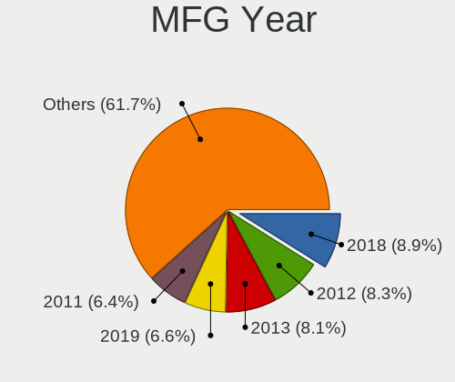
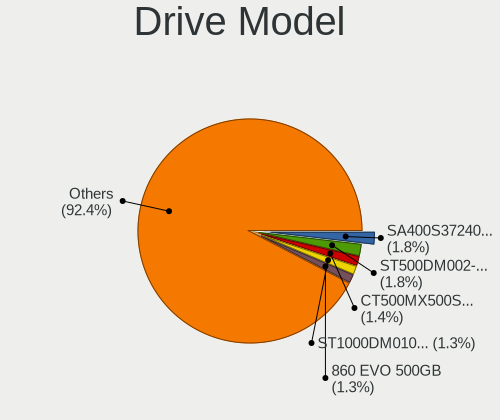
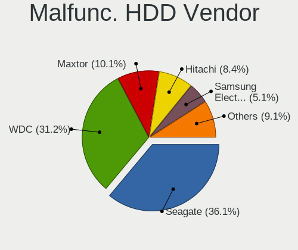
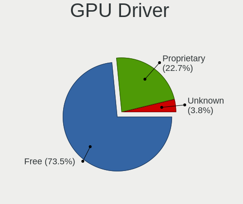
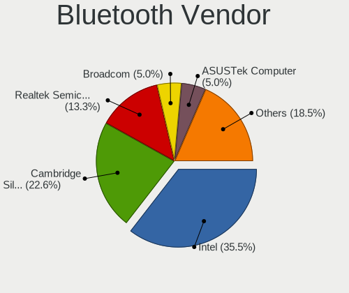
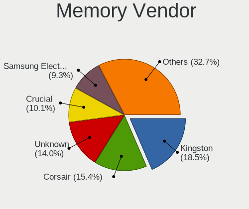
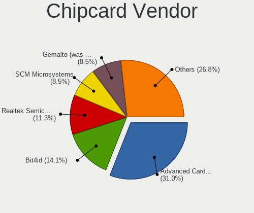

Linux in Italy - Tested Hardware & Statistics (Desktops)
--------------------------------------------------------

A project to collect tested hardware configurations for Linux in Italy.

Anyone can contribute to this report by the [hw-probe](https://github.com/linuxhw/hw-probe) tool:

    sudo -E hw-probe -all -upload

Please contribute! Especially if your hardware is rare.

Contents
--------

* [ Test Cases ](#test-cases)

* [ System ](#system)
  - [ OS                       ](#os)
  - [ OS Family                ](#os-family)
  - [ Kernel                   ](#kernel)
  - [ Kernel Family            ](#kernel-family)
  - [ Kernel Major Ver.        ](#kernel-major-ver)
  - [ Arch                     ](#arch)
  - [ DE                       ](#de)
  - [ Display Server           ](#display-server)
  - [ Display Manager          ](#display-manager)
  - [ OS Lang                  ](#os-lang)
  - [ Boot Mode                ](#boot-mode)
  - [ Filesystem               ](#filesystem)
  - [ Part. scheme             ](#part-scheme)
  - [ Dual Boot with Linux/BSD ](#dual-boot-with-linuxbsd)
  - [ Dual Boot (Win)          ](#dual-boot-win)

* [ Board ](#board)
  - [ Vendor                   ](#vendor)
  - [ Model                    ](#model)
  - [ Model Family             ](#model-family)
  - [ MFG Year                 ](#mfg-year)
  - [ Form Factor              ](#form-factor)
  - [ Secure Boot              ](#secure-boot)
  - [ Coreboot                 ](#coreboot)
  - [ RAM Size                 ](#ram-size)
  - [ RAM Used                 ](#ram-used)
  - [ Total Drives             ](#total-drives)
  - [ Has CD-ROM               ](#has-cd-rom)
  - [ Has Ethernet             ](#has-ethernet)
  - [ Has WiFi                 ](#has-wifi)
  - [ Has Bluetooth            ](#has-bluetooth)

* [ Location ](#location)
  - [ Country                  ](#country)
  - [ City                     ](#city)

* [ Drives ](#drives)
  - [ Drive Vendor             ](#drive-vendor)
  - [ Drive Model              ](#drive-model)
  - [ HDD Vendor               ](#hdd-vendor)
  - [ SSD Vendor               ](#ssd-vendor)
  - [ Drive Kind               ](#drive-kind)
  - [ Drive Connector          ](#drive-connector)
  - [ Drive Size               ](#drive-size)
  - [ Space Total              ](#space-total)
  - [ Space Used               ](#space-used)
  - [ Malfunc. Drives          ](#malfunc-drives)
  - [ Malfunc. Drive Vendor    ](#malfunc-drive-vendor)
  - [ Malfunc. HDD Vendor      ](#malfunc-hdd-vendor)
  - [ Malfunc. Drive Kind      ](#malfunc-drive-kind)
  - [ Failed Drives            ](#failed-drives)
  - [ Failed Drive Vendor      ](#failed-drive-vendor)
  - [ Drive Status             ](#drive-status)

* [ Storage controller ](#storage-controller)
  - [ Storage Vendor           ](#storage-vendor)
  - [ Storage Model            ](#storage-model)
  - [ Storage Kind             ](#storage-kind)

* [ Processor ](#processor)
  - [ CPU Vendor               ](#cpu-vendor)
  - [ CPU Model                ](#cpu-model)
  - [ CPU Model Family         ](#cpu-model-family)
  - [ CPU Cores                ](#cpu-cores)
  - [ CPU Sockets              ](#cpu-sockets)
  - [ CPU Threads              ](#cpu-threads)
  - [ CPU Op-Modes             ](#cpu-op-modes)
  - [ CPU Microcode            ](#cpu-microcode)
  - [ CPU Microarch            ](#cpu-microarch)

* [ Graphics ](#graphics)
  - [ GPU Vendor               ](#gpu-vendor)
  - [ GPU Model                ](#gpu-model)
  - [ GPU Combo                ](#gpu-combo)
  - [ GPU Driver               ](#gpu-driver)
  - [ GPU Memory               ](#gpu-memory)

* [ Monitor ](#monitor)
  - [ Monitor Vendor           ](#monitor-vendor)
  - [ Monitor Model            ](#monitor-model)
  - [ Monitor Resolution       ](#monitor-resolution)
  - [ Monitor Diagonal         ](#monitor-diagonal)
  - [ Monitor Width            ](#monitor-width)
  - [ Aspect Ratio             ](#aspect-ratio)
  - [ Monitor Area             ](#monitor-area)
  - [ Pixel Density            ](#pixel-density)
  - [ Multiple Monitors        ](#multiple-monitors)

* [ Network ](#network)
  - [ Net Controller Vendor    ](#net-controller-vendor)
  - [ Net Controller Model     ](#net-controller-model)
  - [ Wireless Vendor          ](#wireless-vendor)
  - [ Wireless Model           ](#wireless-model)
  - [ Ethernet Vendor          ](#ethernet-vendor)
  - [ Ethernet Model           ](#ethernet-model)
  - [ Net Controller Kind      ](#net-controller-kind)
  - [ Used Controller          ](#used-controller)
  - [ NICs                     ](#nics)
  - [ IPv6                     ](#ipv6)

* [ Bluetooth ](#bluetooth)
  - [ Bluetooth Vendor         ](#bluetooth-vendor)
  - [ Bluetooth Model          ](#bluetooth-model)

* [ Sound ](#sound)
  - [ Sound Vendor             ](#sound-vendor)
  - [ Sound Model              ](#sound-model)

* [ Memory ](#memory)
  - [ Memory Vendor            ](#memory-vendor)
  - [ Memory Model             ](#memory-model)
  - [ Memory Kind              ](#memory-kind)
  - [ Memory Form Factor       ](#memory-form-factor)
  - [ Memory Size              ](#memory-size)
  - [ Memory Speed             ](#memory-speed)

* [ Printers & scanners ](#printers--scanners)
  - [ Printer Vendor           ](#printer-vendor)
  - [ Printer Model            ](#printer-model)
  - [ Scanner Vendor           ](#scanner-vendor)
  - [ Scanner Model            ](#scanner-model)

* [ Camera ](#camera)
  - [ Camera Vendor            ](#camera-vendor)
  - [ Camera Model             ](#camera-model)

* [ Security ](#security)
  - [ Fingerprint Vendor       ](#fingerprint-vendor)
  - [ Fingerprint Model        ](#fingerprint-model)
  - [ Chipcard Vendor          ](#chipcard-vendor)
  - [ Chipcard Model           ](#chipcard-model)

* [ Unsupported ](#unsupported)
  - [ Unsupported Devices      ](#unsupported-devices)
  - [ Unsupported Device Types ](#unsupported-device-types)

Test Cases
----------

Total: 4011

| Vendor        | Model                       | Probe                                                      | Date         |
|---------------|-----------------------------|------------------------------------------------------------|--------------|
| ASUSTek       | ROG CROSSHAIR VII HERO      | [d42cdc8551](https://linux-hardware.org/?probe=d42cdc8551) | Jun 30, 2023 |
| ASRock        | 775Dual-VSTA                | [7ddc95bb2f](https://linux-hardware.org/?probe=7ddc95bb2f) | Jun 30, 2023 |
| Fujitsu       | D3400-A1 S26361-D3400-A1    | [4ad54ee28d](https://linux-hardware.org/?probe=4ad54ee28d) | Jun 29, 2023 |
| ASUSTek       | F2A85-M PRO                 | [a7617c12c5](https://linux-hardware.org/?probe=a7617c12c5) | Jun 28, 2023 |
| Dell          | 0XJ5V0 A03                  | [a1595a590c](https://linux-hardware.org/?probe=a1595a590c) | Jun 28, 2023 |
| ASUSTek       | PRIME Z370M-PLUS II         | [1114cf7328](https://linux-hardware.org/?probe=1114cf7328) | Jun 28, 2023 |
| Gigabyte      | B450 I AORUS PRO WIFI-CF    | [0251f7e1ab](https://linux-hardware.org/?probe=0251f7e1ab) | Jun 27, 2023 |
| MSI           | B250M PRO-VH                | [cb47380993](https://linux-hardware.org/?probe=cb47380993) | Jun 27, 2023 |
| MSI           | X570-A PRO                  | [f664b455eb](https://linux-hardware.org/?probe=f664b455eb) | Jun 26, 2023 |
| ASUSTek       | B85M-G                      | [5a9f85740e](https://linux-hardware.org/?probe=5a9f85740e) | Jun 26, 2023 |
| ASUSTek       | H110M-K                     | [8a0a603eef](https://linux-hardware.org/?probe=8a0a603eef) | Jun 26, 2023 |
| ASUSTek       | PRIME H310M-A R2.0          | [aab1616d0e](https://linux-hardware.org/?probe=aab1616d0e) | Jun 25, 2023 |
| HP            | 8437                        | [477b6d5623](https://linux-hardware.org/?probe=477b6d5623) | Jun 24, 2023 |
| ASUSTek       | P5SD2-VM                    | [d91441b98b](https://linux-hardware.org/?probe=d91441b98b) | Jun 24, 2023 |
| MSI           | MS-7360                     | [9a0d46b069](https://linux-hardware.org/?probe=9a0d46b069) | Jun 23, 2023 |
| MSI           | B550M PRO-VDH WIFI          | [2fb45a65c8](https://linux-hardware.org/?probe=2fb45a65c8) | Jun 23, 2023 |
| MSI           | B550M PRO-VDH WIFI          | [ae8e0ef85b](https://linux-hardware.org/?probe=ae8e0ef85b) | Jun 23, 2023 |
| Intel         | X79                         | [8c50d3b5e8](https://linux-hardware.org/?probe=8c50d3b5e8) | Jun 20, 2023 |
| AMI           | Intel                       | [94c1b63cc6](https://linux-hardware.org/?probe=94c1b63cc6) | Jun 20, 2023 |
| ASUSTek       | P8H61-M LX                  | [35de204113](https://linux-hardware.org/?probe=35de204113) | Jun 19, 2023 |
| Acer          | Aspire TC-780               | [7412881615](https://linux-hardware.org/?probe=7412881615) | Jun 18, 2023 |
| ASUSTek       | P8H61-M LX                  | [fe3b7abf1d](https://linux-hardware.org/?probe=fe3b7abf1d) | Jun 17, 2023 |
| MSI           | Boston                      | [8bc41737a5](https://linux-hardware.org/?probe=8bc41737a5) | Jun 17, 2023 |
| ASUSTek       | P8H61-M LX                  | [23b64edd39](https://linux-hardware.org/?probe=23b64edd39) | Jun 17, 2023 |
| ASUSTek       | P5B-Deluxe                  | [4dae4ff7c6](https://linux-hardware.org/?probe=4dae4ff7c6) | Jun 16, 2023 |
| Unknown       | Unknown                     | [e6ac28ac73](https://linux-hardware.org/?probe=e6ac28ac73) | Jun 14, 2023 |
| Unknown       | Unknown                     | [ca27fe4c19](https://linux-hardware.org/?probe=ca27fe4c19) | Jun 14, 2023 |
| Chuwi         | RZBOX                       | [11bb40ef32](https://linux-hardware.org/?probe=11bb40ef32) | Jun 13, 2023 |
| HP            | 18E7                        | [1be1b42bb4](https://linux-hardware.org/?probe=1be1b42bb4) | Jun 13, 2023 |
| HP            | 18E7                        | [cbf4019da2](https://linux-hardware.org/?probe=cbf4019da2) | Jun 13, 2023 |
| ASUSTek       | H110M-A                     | [d9cd48b67d](https://linux-hardware.org/?probe=d9cd48b67d) | Jun 12, 2023 |
| Lenovo        | 103D SDK0Q40112 WIN 3305... | [5c2eef3678](https://linux-hardware.org/?probe=5c2eef3678) | Jun 12, 2023 |
| MSI           | MPG B550 GAMING EDGE WIF... | [373e36422d](https://linux-hardware.org/?probe=373e36422d) | Jun 12, 2023 |
| ASUSTek       | PRIME H270-PLUS             | [017c7fd564](https://linux-hardware.org/?probe=017c7fd564) | Jun 11, 2023 |
| Chuwi         | RZBOX                       | [e31b33ae5e](https://linux-hardware.org/?probe=e31b33ae5e) | Jun 11, 2023 |
| MSI           | H81I                        | [c7c19346a2](https://linux-hardware.org/?probe=c7c19346a2) | Jun 09, 2023 |
| HP            | 09E0h                       | [b6bb01441c](https://linux-hardware.org/?probe=b6bb01441c) | Jun 09, 2023 |
| HP            | 2B35                        | [5921b94b60](https://linux-hardware.org/?probe=5921b94b60) | Jun 09, 2023 |
| MSI           | X470 GAMING PLUS            | [eea4cea0e0](https://linux-hardware.org/?probe=eea4cea0e0) | Jun 08, 2023 |
| MSI           | MAG B650 TOMAHAWK WIFI      | [35c7fcb130](https://linux-hardware.org/?probe=35c7fcb130) | Jun 08, 2023 |
| MSI           | MAG B650 TOMAHAWK WIFI      | [f4e1a7a712](https://linux-hardware.org/?probe=f4e1a7a712) | Jun 08, 2023 |
| Lenovo        | 317C SDK0J40700 WIN 3258... | [d5d7ffe9df](https://linux-hardware.org/?probe=d5d7ffe9df) | Jun 08, 2023 |
| HP            | 1905                        | [0617f4e698](https://linux-hardware.org/?probe=0617f4e698) | Jun 07, 2023 |
| Lenovo        | 317C SDK0J40700 WIN 3258... | [23b41d16db](https://linux-hardware.org/?probe=23b41d16db) | Jun 06, 2023 |
| Chuwi         | RZBOX                       | [f395c0f429](https://linux-hardware.org/?probe=f395c0f429) | Jun 06, 2023 |
| ASUSTek       | ROG STRIX X570-E GAMING     | [d288737b23](https://linux-hardware.org/?probe=d288737b23) | Jun 05, 2023 |
| MSI           | B360M PRO-VH                | [8d150fb2b0](https://linux-hardware.org/?probe=8d150fb2b0) | Jun 05, 2023 |
| Fujitsu       | D3061-A1 S26361-D3061-A1    | [cc575f0073](https://linux-hardware.org/?probe=cc575f0073) | Jun 05, 2023 |
| Unknown       | Unknown                     | [292269611c](https://linux-hardware.org/?probe=292269611c) | Jun 05, 2023 |
| MSI           | Boston                      | [9f5efc29ad](https://linux-hardware.org/?probe=9f5efc29ad) | Jun 04, 2023 |
| ASUSTek       | ROG STRIX B450-F GAMING ... | [3af6e03b1c](https://linux-hardware.org/?probe=3af6e03b1c) | Jun 04, 2023 |
| Gigabyte      | B450M DS3H-CF               | [4b162cac99](https://linux-hardware.org/?probe=4b162cac99) | Jun 04, 2023 |
| MSI           | MPG X570 GAMING PLUS        | [70e5950511](https://linux-hardware.org/?probe=70e5950511) | Jun 04, 2023 |
| ASRock        | A320M-HDV R4.0              | [f472cba5a6](https://linux-hardware.org/?probe=f472cba5a6) | Jun 04, 2023 |
| MSI           | MAG B550M MORTAR            | [3d911ac9c9](https://linux-hardware.org/?probe=3d911ac9c9) | Jun 03, 2023 |
| ASRock        | B365 Pro4                   | [35fff15a30](https://linux-hardware.org/?probe=35fff15a30) | Jun 02, 2023 |
| ASRock        | B365 Pro4                   | [54fcb811b8](https://linux-hardware.org/?probe=54fcb811b8) | Jun 02, 2023 |
| Gigabyte      | B550M DS3H                  | [a8f8239e40](https://linux-hardware.org/?probe=a8f8239e40) | Jun 02, 2023 |
| MSI           | X470 GAMING PLUS MAX        | [5430a83fca](https://linux-hardware.org/?probe=5430a83fca) | Jun 01, 2023 |
| HP            | 18E7                        | [a3f557389e](https://linux-hardware.org/?probe=a3f557389e) | Jun 01, 2023 |
| ASRock        | H310M-HDV                   | [3dc5138ecd](https://linux-hardware.org/?probe=3dc5138ecd) | Jun 01, 2023 |
| Fujitsu Si... | D2740-A2 S26361-D2740-A2    | [165491db1f](https://linux-hardware.org/?probe=165491db1f) | Jun 01, 2023 |
| Gigabyte      | B550M DS3H                  | [df7287f2c8](https://linux-hardware.org/?probe=df7287f2c8) | Jun 01, 2023 |
| ASRock        | X370 Pro4                   | [aaeac4c226](https://linux-hardware.org/?probe=aaeac4c226) | Jun 01, 2023 |
| MSI           | H110M PRO-VH PLUS           | [cfabc605f7](https://linux-hardware.org/?probe=cfabc605f7) | Jun 01, 2023 |
| Acer          | WG43M                       | [cdd78e1cac](https://linux-hardware.org/?probe=cdd78e1cac) | May 31, 2023 |
| ASRock        | H81M-HDS R2.0               | [810f6b35ea](https://linux-hardware.org/?probe=810f6b35ea) | May 31, 2023 |
| ASUSTek       | P9X79                       | [c677ff5b2d](https://linux-hardware.org/?probe=c677ff5b2d) | May 31, 2023 |
| Fujitsu       | D3233-A1 S26361-D3233-A1    | [de30e713bf](https://linux-hardware.org/?probe=de30e713bf) | May 30, 2023 |
| ASUSTek       | P5KPL-AM                    | [48359795cc](https://linux-hardware.org/?probe=48359795cc) | May 30, 2023 |
| Fujitsu       | D3233-A1 S26361-D3233-A1    | [4679a6e565](https://linux-hardware.org/?probe=4679a6e565) | May 29, 2023 |
| Fujitsu       | D3233-A1 S26361-D3233-A1    | [ec89dcb694](https://linux-hardware.org/?probe=ec89dcb694) | May 29, 2023 |
| Gigabyte      | B450M DS3H-CF               | [cc8e36e75a](https://linux-hardware.org/?probe=cc8e36e75a) | May 26, 2023 |
| ASRock        | 990FX Extreme4              | [8c61dd5381](https://linux-hardware.org/?probe=8c61dd5381) | May 26, 2023 |
| ASUSTek       | P7P55-M                     | [a8fd95ce79](https://linux-hardware.org/?probe=a8fd95ce79) | May 25, 2023 |
| ASUSTek       | PRIME H270-PRO              | [2a14c05edc](https://linux-hardware.org/?probe=2a14c05edc) | May 25, 2023 |
| HPE           | ProLiant MicroServer Gen... | [530b841978](https://linux-hardware.org/?probe=530b841978) | May 25, 2023 |
| MSI           | X99A GAMING PRO CARBON      | [4c9595e6ea](https://linux-hardware.org/?probe=4c9595e6ea) | May 24, 2023 |
| ASUSTek       | PRIME B350M-A               | [174a3139c4](https://linux-hardware.org/?probe=174a3139c4) | May 24, 2023 |
| ASRock        | AB350M Pro4                 | [9f7d80df58](https://linux-hardware.org/?probe=9f7d80df58) | May 23, 2023 |
| BESSTAR Te... | UM350                       | [e177bb8db5](https://linux-hardware.org/?probe=e177bb8db5) | May 23, 2023 |
| MSI           | B550-A PRO                  | [1ec3710265](https://linux-hardware.org/?probe=1ec3710265) | May 23, 2023 |
| MSI           | X99A GAMING PRO CARBON      | [d0312b1a56](https://linux-hardware.org/?probe=d0312b1a56) | May 23, 2023 |
| HP            | 2AF3                        | [e70a1c12fb](https://linux-hardware.org/?probe=e70a1c12fb) | May 22, 2023 |
| Unknown       | Unknown                     | [9cc7b8d0a8](https://linux-hardware.org/?probe=9cc7b8d0a8) | May 22, 2023 |
| MSI           | MAG B650 TOMAHAWK WIFI      | [a8e6f277e2](https://linux-hardware.org/?probe=a8e6f277e2) | May 22, 2023 |
| ASRock        | 775Dual-VSTA                | [2eb8cdff34](https://linux-hardware.org/?probe=2eb8cdff34) | May 21, 2023 |
| MSI           | PRO B760-P WIFI DDR4        | [c8c091e2d8](https://linux-hardware.org/?probe=c8c091e2d8) | May 21, 2023 |
| HP            | 8437                        | [d41a0c8439](https://linux-hardware.org/?probe=d41a0c8439) | May 20, 2023 |
| HP            | 8437                        | [ceacc79bf6](https://linux-hardware.org/?probe=ceacc79bf6) | May 19, 2023 |
| Fujitsu       | D3161-A1 S26361-D3161-A1    | [76a17acffb](https://linux-hardware.org/?probe=76a17acffb) | May 19, 2023 |
| Dell          | 0D881F A06                  | [2d5184956b](https://linux-hardware.org/?probe=2d5184956b) | May 18, 2023 |
| ASUSTek       | P5B                         | [9d815bcd44](https://linux-hardware.org/?probe=9d815bcd44) | May 18, 2023 |
| ASUSTek       | P5B                         | [70be41e795](https://linux-hardware.org/?probe=70be41e795) | May 18, 2023 |
| ASUSTek       | PRIME Z270-A                | [790c5137ba](https://linux-hardware.org/?probe=790c5137ba) | May 18, 2023 |
| ASUSTek       | CROSSHAIR VI HERO           | [bb4c9d6b4c](https://linux-hardware.org/?probe=bb4c9d6b4c) | May 17, 2023 |
| HP            | 3048h                       | [9e65995057](https://linux-hardware.org/?probe=9e65995057) | May 17, 2023 |
| ASUSTek       | ROG STRIX B560-G GAMING ... | [7f3487434e](https://linux-hardware.org/?probe=7f3487434e) | May 17, 2023 |
| HP            | 09F8h                       | [380bbcda71](https://linux-hardware.org/?probe=380bbcda71) | May 17, 2023 |
| Lenovo        | 317E SDK0J40700 WIN 3258... | [281042ebf0](https://linux-hardware.org/?probe=281042ebf0) | May 17, 2023 |
| HP            | 18E5                        | [5e25e2156a](https://linux-hardware.org/?probe=5e25e2156a) | May 16, 2023 |
| Dell          | 0D24M8 A01                  | [4dcf0cf794](https://linux-hardware.org/?probe=4dcf0cf794) | May 16, 2023 |
| ASUSTek       | PRIME B650-PLUS             | [212936564d](https://linux-hardware.org/?probe=212936564d) | May 16, 2023 |
| MSI           | MS-7369                     | [4a083f89af](https://linux-hardware.org/?probe=4a083f89af) | May 16, 2023 |
| Lenovo        | SHARKBAY NOK                | [16308738b3](https://linux-hardware.org/?probe=16308738b3) | May 15, 2023 |
| BESSTAR Te... | UM350                       | [fafdf532fb](https://linux-hardware.org/?probe=fafdf532fb) | May 15, 2023 |
| Gigabyte      | AB350M-DS3H V2-CF           | [0495c4f485](https://linux-hardware.org/?probe=0495c4f485) | May 14, 2023 |
| Gigabyte      | A520M DS3H                  | [e053d0d304](https://linux-hardware.org/?probe=e053d0d304) | May 13, 2023 |
| ASRock        | 775Dual-VSTA                | [4e603c1756](https://linux-hardware.org/?probe=4e603c1756) | May 12, 2023 |
| ASRock        | 775Dual-VSTA                | [5379481e09](https://linux-hardware.org/?probe=5379481e09) | May 12, 2023 |
| HP            | 1998                        | [b806151d9f](https://linux-hardware.org/?probe=b806151d9f) | May 12, 2023 |
| Gigabyte      | Z87X-OC-CF                  | [068ef24174](https://linux-hardware.org/?probe=068ef24174) | May 12, 2023 |
| ASUSTek       | PRO B460M-C                 | [80892a273c](https://linux-hardware.org/?probe=80892a273c) | May 11, 2023 |
| MSI           | B150M PRO-VDH               | [59efd46e1c](https://linux-hardware.org/?probe=59efd46e1c) | May 11, 2023 |
| ASRock        | Z370 Extreme4               | [bdd9bcedf5](https://linux-hardware.org/?probe=bdd9bcedf5) | May 11, 2023 |
| Gigabyte      | B550 GAMING X V2            | [4d4946eec9](https://linux-hardware.org/?probe=4d4946eec9) | May 11, 2023 |
| HP            | 2ADE                        | [ef4aa64bd5](https://linux-hardware.org/?probe=ef4aa64bd5) | May 10, 2023 |
| Gigabyte      | B550 GAMING X V2            | [666c071a8b](https://linux-hardware.org/?probe=666c071a8b) | May 09, 2023 |
| ASRock        | H61M-DGS                    | [0b1518261e](https://linux-hardware.org/?probe=0b1518261e) | May 09, 2023 |
| ASUSTek       | M32CD4-K                    | [0bca52bcc5](https://linux-hardware.org/?probe=0bca52bcc5) | May 09, 2023 |
| HP            | 2ADE                        | [bb8ee11580](https://linux-hardware.org/?probe=bb8ee11580) | May 08, 2023 |
| ASUSTek       | Z170 PRO GAMING             | [3b4eb54186](https://linux-hardware.org/?probe=3b4eb54186) | May 08, 2023 |
| ASUSTek       | TUF Gaming B650-PLUS WIF... | [ecfcb0cab6](https://linux-hardware.org/?probe=ecfcb0cab6) | May 07, 2023 |
| ASRock        | H61M-DGS                    | [96cfd64792](https://linux-hardware.org/?probe=96cfd64792) | May 07, 2023 |
| MSI           | X570-A PRO                  | [46894747b1](https://linux-hardware.org/?probe=46894747b1) | May 05, 2023 |
| MSI           | X570-A PRO                  | [2723e21a6e](https://linux-hardware.org/?probe=2723e21a6e) | May 05, 2023 |
| MSI           | MPG X570 GAMING PRO CARB... | [f8d80b7cf0](https://linux-hardware.org/?probe=f8d80b7cf0) | May 03, 2023 |
| Gigabyte      | Z170X-Gaming 3              | [50f922927f](https://linux-hardware.org/?probe=50f922927f) | May 03, 2023 |
| Unknown       | 1.0                         | [5f99ebeed7](https://linux-hardware.org/?probe=5f99ebeed7) | May 02, 2023 |
| ASUSTek       | ROG STRIX X299-E GAMING     | [553a101cf8](https://linux-hardware.org/?probe=553a101cf8) | May 02, 2023 |
| Acer          | H11H4-AI V:1.0              | [12d9338aba](https://linux-hardware.org/?probe=12d9338aba) | May 02, 2023 |
| Acer          | H11H4-AI V:1.0              | [eaa909b055](https://linux-hardware.org/?probe=eaa909b055) | May 02, 2023 |
| ASRock        | G41M-GS                     | [0824a9c571](https://linux-hardware.org/?probe=0824a9c571) | May 01, 2023 |
| Dell          | 0WR7PY A01                  | [dfe07c7749](https://linux-hardware.org/?probe=dfe07c7749) | May 01, 2023 |
| ASRock        | H61M-DGS                    | [f395109c45](https://linux-hardware.org/?probe=f395109c45) | May 01, 2023 |
| Pegatron      | 2A94                        | [7dcdfa9b9f](https://linux-hardware.org/?probe=7dcdfa9b9f) | May 01, 2023 |
| MSI           | MPG X570 GAMING PRO CARB... | [d02d21f47a](https://linux-hardware.org/?probe=d02d21f47a) | May 01, 2023 |
| ASRock        | 970 Pro3 R2.0               | [26681d2879](https://linux-hardware.org/?probe=26681d2879) | May 01, 2023 |
| ASRock        | 970 Pro3 R2.0               | [577b5e8f51](https://linux-hardware.org/?probe=577b5e8f51) | May 01, 2023 |
| MSI           | 760GM-P23                   | [4ac55a6bbe](https://linux-hardware.org/?probe=4ac55a6bbe) | Apr 30, 2023 |
| Dell          | 0GXM1W A02                  | [7dcb847a6c](https://linux-hardware.org/?probe=7dcb847a6c) | Apr 30, 2023 |
| ASRock        | H61M-HVS                    | [77f87da085](https://linux-hardware.org/?probe=77f87da085) | Apr 29, 2023 |
| Dell          | 0WR7PY A01                  | [e585f66f17](https://linux-hardware.org/?probe=e585f66f17) | Apr 29, 2023 |
| ASUSTek       | SABERTOOTH 990FX            | [4801547d54](https://linux-hardware.org/?probe=4801547d54) | Apr 29, 2023 |
| ASUSTek       | Z97-P                       | [8ea78b28f1](https://linux-hardware.org/?probe=8ea78b28f1) | Apr 29, 2023 |
| HP            | 1998                        | [6f816ac95a](https://linux-hardware.org/?probe=6f816ac95a) | Apr 29, 2023 |
| HP            | 339A                        | [4f9a0b2661](https://linux-hardware.org/?probe=4f9a0b2661) | Apr 28, 2023 |
| Unknown       | RS780-SB700                 | [94f2408a63](https://linux-hardware.org/?probe=94f2408a63) | Apr 28, 2023 |
| Unknown       | RS780-SB700                 | [76c36882d9](https://linux-hardware.org/?probe=76c36882d9) | Apr 28, 2023 |
| MSI           | X470 GAMING PLUS            | [a5d42a7b78](https://linux-hardware.org/?probe=a5d42a7b78) | Apr 26, 2023 |
| ASUSTek       | ROG CROSSHAIR VIII DARK ... | [98ed5e9a2e](https://linux-hardware.org/?probe=98ed5e9a2e) | Apr 25, 2023 |
| Gigabyte      | 945GCM-S2L                  | [405bcbb43c](https://linux-hardware.org/?probe=405bcbb43c) | Apr 25, 2023 |
| ASUSTek       | TUF Gaming Z490-PLUS        | [b144f1aa54](https://linux-hardware.org/?probe=b144f1aa54) | Apr 24, 2023 |
| Dell          | 0R790T A00                  | [7ca2bb8871](https://linux-hardware.org/?probe=7ca2bb8871) | Apr 24, 2023 |
| ASUSTek       | PRIME B350-PLUS             | [34278ef67e](https://linux-hardware.org/?probe=34278ef67e) | Apr 24, 2023 |
| ASUSTek       | PRO B460M-C                 | [2ea3950e19](https://linux-hardware.org/?probe=2ea3950e19) | Apr 24, 2023 |
| ASRock        | H61M-DGS                    | [154380c27c](https://linux-hardware.org/?probe=154380c27c) | Apr 24, 2023 |
| MSI           | B460M PRO-VDH               | [f7709c23a1](https://linux-hardware.org/?probe=f7709c23a1) | Apr 24, 2023 |
| MSI           | Z390-A PRO                  | [74cf7ef6e5](https://linux-hardware.org/?probe=74cf7ef6e5) | Apr 23, 2023 |
| AMI           | Intel                       | [62d06b215e](https://linux-hardware.org/?probe=62d06b215e) | Apr 23, 2023 |
| ASRock        | Z77 Pro3                    | [2f4b412834](https://linux-hardware.org/?probe=2f4b412834) | Apr 22, 2023 |
| ASUSTek       | ET1602                      | [637fb8c9ce](https://linux-hardware.org/?probe=637fb8c9ce) | Apr 22, 2023 |
| MSI           | B360M BAZOOKA               | [46516c6f3a](https://linux-hardware.org/?probe=46516c6f3a) | Apr 22, 2023 |
| ASRock        | H61M/U3S3                   | [8fd7aea5ea](https://linux-hardware.org/?probe=8fd7aea5ea) | Apr 22, 2023 |
| HP            | 82F2 A01                    | [fbcf679bae](https://linux-hardware.org/?probe=fbcf679bae) | Apr 21, 2023 |
| ELSKY         | M219F-6C                    | [5f41223856](https://linux-hardware.org/?probe=5f41223856) | Apr 21, 2023 |
| ASUSTek       | TUF Gaming Z690-PLUS WIF... | [f7ca0a552d](https://linux-hardware.org/?probe=f7ca0a552d) | Apr 20, 2023 |
| ASUSTek       | CG8270                      | [3f390ff38e](https://linux-hardware.org/?probe=3f390ff38e) | Apr 20, 2023 |
| ASUSTek       | CG8270                      | [a4f54ca55b](https://linux-hardware.org/?probe=a4f54ca55b) | Apr 20, 2023 |
| ASUSTek       | P5G41T-M LX                 | [b830d8001e](https://linux-hardware.org/?probe=b830d8001e) | Apr 19, 2023 |
| Gigabyte      | Z68X-UD7-B3                 | [175cfb374b](https://linux-hardware.org/?probe=175cfb374b) | Apr 18, 2023 |
| HP            | 18E9                        | [8c36235f13](https://linux-hardware.org/?probe=8c36235f13) | Apr 18, 2023 |
| MSI           | Z87M GAMING                 | [9552ef2174](https://linux-hardware.org/?probe=9552ef2174) | Apr 17, 2023 |
| MSI           | PRO B660-A DDR4             | [b274726abd](https://linux-hardware.org/?probe=b274726abd) | Apr 17, 2023 |
| ASRock        | N3700-ITX                   | [849679b442](https://linux-hardware.org/?probe=849679b442) | Apr 17, 2023 |
| ASUSTek       | TUF B450M-PLUS GAMING       | [9df377aaf2](https://linux-hardware.org/?probe=9df377aaf2) | Apr 17, 2023 |
| ASUSTek       | PRIME H370M-PLUS            | [0a544df503](https://linux-hardware.org/?probe=0a544df503) | Apr 17, 2023 |
| MSI           | MAG B650 TOMAHAWK WIFI      | [5109f5c8d9](https://linux-hardware.org/?probe=5109f5c8d9) | Apr 17, 2023 |
| ASUSTek       | CROSSHAIR VI HERO           | [67ce5b3ab1](https://linux-hardware.org/?probe=67ce5b3ab1) | Apr 16, 2023 |
| MSI           | H310M PRO-VD PLUS           | [bff38bc725](https://linux-hardware.org/?probe=bff38bc725) | Apr 16, 2023 |
| ASRock        | N68-GS4 FX                  | [19a6cddfe0](https://linux-hardware.org/?probe=19a6cddfe0) | Apr 16, 2023 |
| ASUSTek       | ROG STRIX X570-E GAMING     | [4375bd0fb6](https://linux-hardware.org/?probe=4375bd0fb6) | Apr 16, 2023 |
| ASUSTek       | P5E Deluxe                  | [ce0a1adc22](https://linux-hardware.org/?probe=ce0a1adc22) | Apr 16, 2023 |
| ASUSTek       | PRIME A320M-K               | [2eb96e4d6e](https://linux-hardware.org/?probe=2eb96e4d6e) | Apr 16, 2023 |
| ASUSTek       | PRIME A320M-K               | [7d34909c86](https://linux-hardware.org/?probe=7d34909c86) | Apr 16, 2023 |
| ASUSTek       | Z87-A                       | [3e96076874](https://linux-hardware.org/?probe=3e96076874) | Apr 15, 2023 |
| ASRock        | H61M-DGS                    | [506ba2605a](https://linux-hardware.org/?probe=506ba2605a) | Apr 15, 2023 |
| Acidanther... | Mac-27AD2F918AE68F61 Mac... | [e17175b9ac](https://linux-hardware.org/?probe=e17175b9ac) | Apr 15, 2023 |
| MSI           | 970A-G45                    | [8f62fd1fb1](https://linux-hardware.org/?probe=8f62fd1fb1) | Apr 15, 2023 |
| MSI           | H310M PRO-VD PLUS           | [9f6209111c](https://linux-hardware.org/?probe=9f6209111c) | Apr 14, 2023 |
| Cincoze       | DX-1000.01.001              | [fa2c48478a](https://linux-hardware.org/?probe=fa2c48478a) | Apr 13, 2023 |
| ASUSTek       | PRIME A320M-K               | [bbc081e43e](https://linux-hardware.org/?probe=bbc081e43e) | Apr 13, 2023 |
| ASUSTek       | PRIME A320M-K               | [a59a28162e](https://linux-hardware.org/?probe=a59a28162e) | Apr 13, 2023 |
| Acer          | Veriton K8-680G V:1.0       | [9ab3fc183a](https://linux-hardware.org/?probe=9ab3fc183a) | Apr 13, 2023 |
| Lenovo        | 36F7 SDK0J40700 WIN 3258... | [ea50bc5d28](https://linux-hardware.org/?probe=ea50bc5d28) | Apr 13, 2023 |
| Lenovo        | 36F7 SDK0J40700 WIN 3258... | [8e05a5e529](https://linux-hardware.org/?probe=8e05a5e529) | Apr 13, 2023 |
| ASRock        | H410M-HVS                   | [23371691ec](https://linux-hardware.org/?probe=23371691ec) | Apr 12, 2023 |
| Acer          | Veriton K8-680G V:1.0       | [214038993e](https://linux-hardware.org/?probe=214038993e) | Apr 12, 2023 |
| ASUSTek       | M4A87TD EVO                 | [695de52123](https://linux-hardware.org/?probe=695de52123) | Apr 12, 2023 |
| ASUSTek       | B85M-G                      | [27bfaf568a](https://linux-hardware.org/?probe=27bfaf568a) | Apr 12, 2023 |
| MSI           | X470 GAMING PLUS MAX        | [46eba03bed](https://linux-hardware.org/?probe=46eba03bed) | Apr 12, 2023 |
| MSI           | B450M-A PRO MAX             | [07353da9f6](https://linux-hardware.org/?probe=07353da9f6) | Apr 11, 2023 |
| Acer          | H57M01                      | [c62231ca98](https://linux-hardware.org/?probe=c62231ca98) | Apr 11, 2023 |
| MSI           | MEG X570 UNIFY              | [02d670e0db](https://linux-hardware.org/?probe=02d670e0db) | Apr 11, 2023 |
| Acer          | Aspire TC-780               | [ce8b386e5b](https://linux-hardware.org/?probe=ce8b386e5b) | Apr 11, 2023 |
| MSI           | H310M PRO-VD                | [498c52e62e](https://linux-hardware.org/?probe=498c52e62e) | Apr 10, 2023 |
| ASRock        | Q1900M                      | [6ff7177033](https://linux-hardware.org/?probe=6ff7177033) | Apr 09, 2023 |
| ASUSTek       | P7P55D-E                    | [1f8dc6aa3d](https://linux-hardware.org/?probe=1f8dc6aa3d) | Apr 09, 2023 |
| ASUSTek       | P7P55D-E                    | [ff595db737](https://linux-hardware.org/?probe=ff595db737) | Apr 09, 2023 |
| ASUSTek       | PRIME B350-PLUS             | [621eb9522f](https://linux-hardware.org/?probe=621eb9522f) | Apr 09, 2023 |
| ASUSTek       | PRIME B350-PLUS             | [6aae769b7a](https://linux-hardware.org/?probe=6aae769b7a) | Apr 09, 2023 |
| MSI           | B450M GAMING PLUS           | [cb57237789](https://linux-hardware.org/?probe=cb57237789) | Apr 08, 2023 |
| MSI           | B450 TOMAHAWK MAX           | [e657bedde3](https://linux-hardware.org/?probe=e657bedde3) | Apr 08, 2023 |
| ASUSTek       | PRIME B350-PLUS             | [bd1dc31213](https://linux-hardware.org/?probe=bd1dc31213) | Apr 07, 2023 |
| Gigabyte      | B75M-D3H                    | [bf0c0bb982](https://linux-hardware.org/?probe=bf0c0bb982) | Apr 07, 2023 |
| Dell          | 096JG8 A01                  | [9f5a3611b8](https://linux-hardware.org/?probe=9f5a3611b8) | Apr 07, 2023 |
| ASUSTek       | P8Z77-V LX                  | [241572fcea](https://linux-hardware.org/?probe=241572fcea) | Apr 07, 2023 |
| MSI           | B450M GAMING PLUS           | [51d2c2c17d](https://linux-hardware.org/?probe=51d2c2c17d) | Apr 06, 2023 |
| Dell          | 0GXM1W A02                  | [3fae5e4d5c](https://linux-hardware.org/?probe=3fae5e4d5c) | Apr 05, 2023 |
| Gigabyte      | H97-HD3                     | [caf5563d44](https://linux-hardware.org/?probe=caf5563d44) | Apr 05, 2023 |
| MSI           | X470 GAMING PLUS MAX        | [0e7d453676](https://linux-hardware.org/?probe=0e7d453676) | Apr 05, 2023 |
| MSI           | 2A9C                        | [7a007c46d0](https://linux-hardware.org/?probe=7a007c46d0) | Apr 05, 2023 |
| ASUSTek       | PRIME Z370M-PLUS II         | [9fc5c6f8a7](https://linux-hardware.org/?probe=9fc5c6f8a7) | Apr 05, 2023 |
| Gigabyte      | AB350-Gaming-CF             | [45bcedba86](https://linux-hardware.org/?probe=45bcedba86) | Apr 05, 2023 |
| Gigabyte      | AB350-Gaming-CF             | [f08ea6ee04](https://linux-hardware.org/?probe=f08ea6ee04) | Apr 04, 2023 |
| ASUSTek       | P8Z77-V LX2                 | [250b63078d](https://linux-hardware.org/?probe=250b63078d) | Apr 04, 2023 |
| ASUSTek       | M5A97 LE R2.0               | [f637374c21](https://linux-hardware.org/?probe=f637374c21) | Apr 03, 2023 |
| ASRock        | H61M-DGS                    | [e05fcde338](https://linux-hardware.org/?probe=e05fcde338) | Apr 03, 2023 |
| MSI           | Boston                      | [5a875def3f](https://linux-hardware.org/?probe=5a875def3f) | Apr 02, 2023 |
| ASUSTek       | P8Z77-V PRO                 | [b4207e264f](https://linux-hardware.org/?probe=b4207e264f) | Apr 02, 2023 |
| ASUSTek       | B150M-K D3                  | [08df6b50be](https://linux-hardware.org/?probe=08df6b50be) | Apr 02, 2023 |
| Acidanther... | Mac-27AD2F918AE68F61 Mac... | [217bb72a30](https://linux-hardware.org/?probe=217bb72a30) | Apr 01, 2023 |
| ASUSTek       | PRIME Z490-P                | [bbbfbb2dfc](https://linux-hardware.org/?probe=bbbfbb2dfc) | Apr 01, 2023 |
| Intel         | DB75EN AAG39650-303         | [50d4a766a6](https://linux-hardware.org/?probe=50d4a766a6) | Apr 01, 2023 |
| Acer          | H11H4-AI V:1.0              | [d5337ce0e3](https://linux-hardware.org/?probe=d5337ce0e3) | Apr 01, 2023 |
| Acer          | WG43M                       | [77cb0bf517](https://linux-hardware.org/?probe=77cb0bf517) | Apr 01, 2023 |
| MSI           | X570-A PRO                  | [3093c50d3d](https://linux-hardware.org/?probe=3093c50d3d) | Mar 31, 2023 |
| MSI           | B550-A PRO                  | [f243351def](https://linux-hardware.org/?probe=f243351def) | Mar 31, 2023 |
| Gigabyte      | X570 I AORUS PRO WIFI       | [871b458080](https://linux-hardware.org/?probe=871b458080) | Mar 31, 2023 |
| Gigabyte      | Z390 M-CF                   | [6bce2b9bc3](https://linux-hardware.org/?probe=6bce2b9bc3) | Mar 31, 2023 |
| DFI           | LP UT X58                   | [cd706d90d3](https://linux-hardware.org/?probe=cd706d90d3) | Mar 30, 2023 |
| Packard Be... | FIH57                       | [f1336c6cc4](https://linux-hardware.org/?probe=f1336c6cc4) | Mar 30, 2023 |
| Gigabyte      | B550M AORUS PRO-P           | [4ccaa78b43](https://linux-hardware.org/?probe=4ccaa78b43) | Mar 30, 2023 |
| ASUSTek       | H110M-R                     | [3c641024ba](https://linux-hardware.org/?probe=3c641024ba) | Mar 30, 2023 |
| Fujitsu       | D3401-A1 S26361-D3401-A1    | [e772d0e916](https://linux-hardware.org/?probe=e772d0e916) | Mar 29, 2023 |
| AZW           | U59                         | [3776cd7fb3](https://linux-hardware.org/?probe=3776cd7fb3) | Mar 29, 2023 |
| AZW           | U59                         | [f7958b8f39](https://linux-hardware.org/?probe=f7958b8f39) | Mar 29, 2023 |
| HP            | 3646h                       | [b173e99a5a](https://linux-hardware.org/?probe=b173e99a5a) | Mar 29, 2023 |
| ASUSTek       | P8Z77-V LX2                 | [23256b54cf](https://linux-hardware.org/?probe=23256b54cf) | Mar 29, 2023 |
| Acer          | H11H4-AI V:1.0              | [4266c0287d](https://linux-hardware.org/?probe=4266c0287d) | Mar 29, 2023 |
| MSI           | X570-A PRO                  | [0921fd9096](https://linux-hardware.org/?probe=0921fd9096) | Mar 28, 2023 |
| MSI           | B450-A PRO MAX              | [f3ebf80a3d](https://linux-hardware.org/?probe=f3ebf80a3d) | Mar 28, 2023 |
| ASUSTek       | TUF Z390-PRO GAMING         | [5ac9dd16da](https://linux-hardware.org/?probe=5ac9dd16da) | Mar 28, 2023 |
| HP            | 18E6                        | [a406dc2463](https://linux-hardware.org/?probe=a406dc2463) | Mar 27, 2023 |
| ASUSTek       | X79-DELUXE                  | [da016d15c7](https://linux-hardware.org/?probe=da016d15c7) | Mar 27, 2023 |
| Unknown       | Unknown                     | [6f77d9be36](https://linux-hardware.org/?probe=6f77d9be36) | Mar 26, 2023 |
| Shenzhen M... | HX90G                       | [fb3f1be00d](https://linux-hardware.org/?probe=fb3f1be00d) | Mar 26, 2023 |
| MSI           | B550-A PRO                  | [eddf5a759a](https://linux-hardware.org/?probe=eddf5a759a) | Mar 26, 2023 |
| ASRock        | H61M-DGS                    | [76fc7291a6](https://linux-hardware.org/?probe=76fc7291a6) | Mar 26, 2023 |
| Acer          | Veriton M2631 V:1.0         | [4a4f12631a](https://linux-hardware.org/?probe=4a4f12631a) | Mar 26, 2023 |
| ASUSTek       | M5A78L-M/USB3               | [c7e347798a](https://linux-hardware.org/?probe=c7e347798a) | Mar 26, 2023 |
| ASUSTek       | STRIX Z270I GAMING          | [4253088a92](https://linux-hardware.org/?probe=4253088a92) | Mar 25, 2023 |
| MSI           | Z170A PC MATE               | [ad4b4f6a8f](https://linux-hardware.org/?probe=ad4b4f6a8f) | Mar 25, 2023 |
| ASUSTek       | ROG Maximus XII FORMULA     | [bf5cc186ea](https://linux-hardware.org/?probe=bf5cc186ea) | Mar 25, 2023 |
| ASRock        | X570 Phantom Gaming 4       | [518cef7fe4](https://linux-hardware.org/?probe=518cef7fe4) | Mar 24, 2023 |
| ASUSTek       | M32CD_A_F_K20CD_K31CD       | [dc56fbfedb](https://linux-hardware.org/?probe=dc56fbfedb) | Mar 24, 2023 |
| ASUSTek       | M32CD_A_F_K20CD_K31CD       | [67d60d55e4](https://linux-hardware.org/?probe=67d60d55e4) | Mar 24, 2023 |
| ASUSTek       | P8P67 PRO                   | [7ed577df49](https://linux-hardware.org/?probe=7ed577df49) | Mar 23, 2023 |
| MSI           | Z590-A PRO                  | [ad6a144db9](https://linux-hardware.org/?probe=ad6a144db9) | Mar 23, 2023 |
| Lenovo        | SDK0F82993 WIN              | [fbff3ec47c](https://linux-hardware.org/?probe=fbff3ec47c) | Mar 23, 2023 |
| Gigabyte      | H81M-S2PV                   | [ac856abadc](https://linux-hardware.org/?probe=ac856abadc) | Mar 21, 2023 |
| ASRock        | B550M Pro4                  | [de1c89d1b0](https://linux-hardware.org/?probe=de1c89d1b0) | Mar 21, 2023 |
| Dell          | 0D441T A03                  | [926d18b722](https://linux-hardware.org/?probe=926d18b722) | Mar 20, 2023 |
| Acer          | Veriton M4610G              | [fed7efcecb](https://linux-hardware.org/?probe=fed7efcecb) | Mar 20, 2023 |
| Techvision    | TVI7309X B0                 | [67b681a703](https://linux-hardware.org/?probe=67b681a703) | Mar 20, 2023 |
| ASUSTek       | CROSSHAIR VI HERO           | [42290142fb](https://linux-hardware.org/?probe=42290142fb) | Mar 19, 2023 |
| ASUSTek       | ROG STRIX Z590-F GAMING ... | [3500d84a8e](https://linux-hardware.org/?probe=3500d84a8e) | Mar 19, 2023 |
| ASRock        | H61M-DGS                    | [2b86166550](https://linux-hardware.org/?probe=2b86166550) | Mar 19, 2023 |
| Gigabyte      | 970A-DS3P                   | [727e5c46b7](https://linux-hardware.org/?probe=727e5c46b7) | Mar 18, 2023 |
| MSI           | H55M-P31                    | [e95e62df99](https://linux-hardware.org/?probe=e95e62df99) | Mar 18, 2023 |
| HP            | 18E7                        | [9f4d303ffa](https://linux-hardware.org/?probe=9f4d303ffa) | Mar 18, 2023 |
| ASRock        | X570 Phantom Gaming 4       | [b346ffbe8e](https://linux-hardware.org/?probe=b346ffbe8e) | Mar 18, 2023 |
| ASUSTek       | TUF B350M-PLUS GAMING       | [be6db6cc62](https://linux-hardware.org/?probe=be6db6cc62) | Mar 17, 2023 |
| MSI           | PRO B660M-A WIFI DDR4       | [7298c4b04b](https://linux-hardware.org/?probe=7298c4b04b) | Mar 17, 2023 |
| AMI           | Intel                       | [491d2cca9d](https://linux-hardware.org/?probe=491d2cca9d) | Mar 17, 2023 |
| MSI           | PRO B660M-A WIFI DDR4       | [794bc239ab](https://linux-hardware.org/?probe=794bc239ab) | Mar 17, 2023 |
| MSI           | B550-A PRO                  | [730eec29f4](https://linux-hardware.org/?probe=730eec29f4) | Mar 16, 2023 |
| ASUSTek       | P5KPL-AM SE                 | [37f8d341e3](https://linux-hardware.org/?probe=37f8d341e3) | Mar 14, 2023 |
| ASUSTek       | H61M-K                      | [783ff991d4](https://linux-hardware.org/?probe=783ff991d4) | Mar 14, 2023 |
| ASUSTek       | P5KPL-AM SE                 | [ce69431d69](https://linux-hardware.org/?probe=ce69431d69) | Mar 14, 2023 |
| ASUSTek       | Rampage V EXTREME           | [e186537a7e](https://linux-hardware.org/?probe=e186537a7e) | Mar 14, 2023 |
| HP            | 18E7                        | [2042edf904](https://linux-hardware.org/?probe=2042edf904) | Mar 12, 2023 |
| Fujitsu       | D2912-A1 S26361-D2912-A1    | [a7105953c2](https://linux-hardware.org/?probe=a7105953c2) | Mar 12, 2023 |
| MSI           | P55-CD53                    | [d492118b16](https://linux-hardware.org/?probe=d492118b16) | Mar 12, 2023 |
| ASRock        | B460M Pro4                  | [50e790583a](https://linux-hardware.org/?probe=50e790583a) | Mar 12, 2023 |
| ASRock        | B450 Pro4                   | [4dd7be5be9](https://linux-hardware.org/?probe=4dd7be5be9) | Mar 12, 2023 |
| ASRock        | B450 Pro4                   | [ce0343a044](https://linux-hardware.org/?probe=ce0343a044) | Mar 12, 2023 |
| ASUSTek       | CROSSHAIR VI HERO           | [17431ae177](https://linux-hardware.org/?probe=17431ae177) | Mar 12, 2023 |
| Dell          | 0P03DX A04                  | [e1c38bafaa](https://linux-hardware.org/?probe=e1c38bafaa) | Mar 11, 2023 |
| Lenovo        | 3141 SDK0J40700 WIN 3258... | [b7de8d093d](https://linux-hardware.org/?probe=b7de8d093d) | Mar 11, 2023 |
| ASUSTek       | CROSSHAIR VI HERO           | [278b9e10a7](https://linux-hardware.org/?probe=278b9e10a7) | Mar 11, 2023 |
| Dell          | 0HY9JP A00                  | [caaa97e4ba](https://linux-hardware.org/?probe=caaa97e4ba) | Mar 11, 2023 |
| MSI           | Z590-A PRO                  | [c0c43b3296](https://linux-hardware.org/?probe=c0c43b3296) | Mar 11, 2023 |
| Acer          | Aspire TC-380               | [563bd52487](https://linux-hardware.org/?probe=563bd52487) | Mar 10, 2023 |
| ASRock        | H410M-HVS                   | [689186d7de](https://linux-hardware.org/?probe=689186d7de) | Mar 10, 2023 |
| MSI           | B550-A PRO                  | [493a2b9df6](https://linux-hardware.org/?probe=493a2b9df6) | Mar 10, 2023 |
| Gigabyte      | Z370N WIFI-CF               | [0fb1309bff](https://linux-hardware.org/?probe=0fb1309bff) | Mar 10, 2023 |
| HP            | 2B35                        | [ddb4d051ab](https://linux-hardware.org/?probe=ddb4d051ab) | Mar 09, 2023 |
| HP            | 2B35                        | [83f9096b77](https://linux-hardware.org/?probe=83f9096b77) | Mar 09, 2023 |
| MSI           | 970A-G46                    | [322eb2bdf0](https://linux-hardware.org/?probe=322eb2bdf0) | Mar 09, 2023 |
| Acer          | Veriton M480                | [8cd45e8525](https://linux-hardware.org/?probe=8cd45e8525) | Mar 09, 2023 |
| ASRock        | H61M-ITX                    | [ab7e81c6ca](https://linux-hardware.org/?probe=ab7e81c6ca) | Mar 09, 2023 |
| HP            | 8433 11                     | [95f33803c0](https://linux-hardware.org/?probe=95f33803c0) | Mar 08, 2023 |
| ASRock        | 970 Performance             | [c018d98ddc](https://linux-hardware.org/?probe=c018d98ddc) | Mar 08, 2023 |
| ASUSTek       | H81T                        | [c17251dbd9](https://linux-hardware.org/?probe=c17251dbd9) | Mar 08, 2023 |
| ASUSTek       | ROG STRIX X470-F GAMING     | [3629efc5a5](https://linux-hardware.org/?probe=3629efc5a5) | Mar 08, 2023 |
| Gigabyte      | A320M-S2H-CF                | [00ddbf4ad1](https://linux-hardware.org/?probe=00ddbf4ad1) | Mar 07, 2023 |
| Acer          | Veriton X4610G              | [7f5cb2ac6a](https://linux-hardware.org/?probe=7f5cb2ac6a) | Mar 07, 2023 |
| MSI           | MPG B550 GAMING EDGE WIF... | [ced1079ce2](https://linux-hardware.org/?probe=ced1079ce2) | Mar 07, 2023 |
| Lenovo        | MAHOBAY                     | [e4e709f69a](https://linux-hardware.org/?probe=e4e709f69a) | Mar 07, 2023 |
| Acer          | H11H4-AI V:1.0              | [ff1a57749f](https://linux-hardware.org/?probe=ff1a57749f) | Mar 07, 2023 |
| Acer          | H11H4-AI V:1.0              | [37f7cabb58](https://linux-hardware.org/?probe=37f7cabb58) | Mar 07, 2023 |
| ASUSTek       | PRIME Z690-P WIFI D4        | [ad0dbd5503](https://linux-hardware.org/?probe=ad0dbd5503) | Mar 06, 2023 |
| ASUSTek       | PRIME Z690-P WIFI D4        | [0f36c1b0f7](https://linux-hardware.org/?probe=0f36c1b0f7) | Mar 06, 2023 |
| ASRock        | G31M-S                      | [69f88597a5](https://linux-hardware.org/?probe=69f88597a5) | Mar 05, 2023 |
| ASUSTek       | PRIME A320I-K               | [88e6308c0a](https://linux-hardware.org/?probe=88e6308c0a) | Mar 05, 2023 |
| AZW           | U59                         | [7711289a77](https://linux-hardware.org/?probe=7711289a77) | Mar 05, 2023 |
| ASUSTek       | ROG STRIX Z690-E GAMING ... | [109fa85017](https://linux-hardware.org/?probe=109fa85017) | Mar 05, 2023 |
| ASUSTek       | ROG STRIX Z690-E GAMING ... | [0d99cfc372](https://linux-hardware.org/?probe=0d99cfc372) | Mar 05, 2023 |
| MSI           | B450M MORTAR MAX            | [f8eea076e5](https://linux-hardware.org/?probe=f8eea076e5) | Mar 05, 2023 |
| HP            | 3397                        | [5250af801f](https://linux-hardware.org/?probe=5250af801f) | Mar 04, 2023 |
| ASUSTek       | P8H67                       | [99008935e9](https://linux-hardware.org/?probe=99008935e9) | Mar 04, 2023 |
| MSI           | B450 GAMING PLUS MAX        | [860f53436b](https://linux-hardware.org/?probe=860f53436b) | Mar 03, 2023 |
| Gigabyte      | X570S AERO G                | [7e85150e30](https://linux-hardware.org/?probe=7e85150e30) | Mar 03, 2023 |
| ASUSTek       | TUF Gaming B550M-PLUS       | [bdfb7a4647](https://linux-hardware.org/?probe=bdfb7a4647) | Mar 03, 2023 |
| AMI           | Intel                       | [b6d932a0ed](https://linux-hardware.org/?probe=b6d932a0ed) | Mar 02, 2023 |
| ASRock        | B365 Pro4                   | [16875fc443](https://linux-hardware.org/?probe=16875fc443) | Mar 02, 2023 |
| ASUSTek       | TUF Gaming H470-PRO         | [14a44a0392](https://linux-hardware.org/?probe=14a44a0392) | Mar 02, 2023 |
| Acer          | FIH57                       | [3f9c79675c](https://linux-hardware.org/?probe=3f9c79675c) | Mar 01, 2023 |
| HP            | 3396                        | [2da0f889cb](https://linux-hardware.org/?probe=2da0f889cb) | Mar 01, 2023 |
| ASUSTek       | SABERTOOTH P67              | [fa7df5da3b](https://linux-hardware.org/?probe=fa7df5da3b) | Mar 01, 2023 |
| ASUSTek       | BT6130                      | [dabd3e0232](https://linux-hardware.org/?probe=dabd3e0232) | Mar 01, 2023 |
| MSI           | MPG X570 GAMING PLUS        | [4e701d495f](https://linux-hardware.org/?probe=4e701d495f) | Mar 01, 2023 |
| ASUSTek       | BT6130                      | [db5b346bd5](https://linux-hardware.org/?probe=db5b346bd5) | Feb 28, 2023 |
| Fujitsu       | D2990-A3 S26361-D2990-A3    | [6f1de5f17c](https://linux-hardware.org/?probe=6f1de5f17c) | Feb 28, 2023 |
| ASUSTek       | BT6130                      | [3549cfad14](https://linux-hardware.org/?probe=3549cfad14) | Feb 27, 2023 |
| ASUSTek       | M4N68T-M-V2                 | [051b66987e](https://linux-hardware.org/?probe=051b66987e) | Feb 27, 2023 |
| Cincoze       | DX-1000.01.001              | [64496d4ab7](https://linux-hardware.org/?probe=64496d4ab7) | Feb 27, 2023 |
| Lenovo        | 36F7 SDK0J40700 WIN 3258... | [580db05e08](https://linux-hardware.org/?probe=580db05e08) | Feb 27, 2023 |
| Cincoze       | DX-1000.01.001              | [7923f1dc21](https://linux-hardware.org/?probe=7923f1dc21) | Feb 26, 2023 |
| Lenovo        | MAHOBAY NO DPK              | [310a65baea](https://linux-hardware.org/?probe=310a65baea) | Feb 26, 2023 |
| ASRock        | G41C-GS                     | [6a698dda57](https://linux-hardware.org/?probe=6a698dda57) | Feb 26, 2023 |
| ASUSTek       | PRIME X370-PRO              | [aaa112feae](https://linux-hardware.org/?probe=aaa112feae) | Feb 26, 2023 |
| Gigabyte      | B250M-D3H-CF                | [de180bd339](https://linux-hardware.org/?probe=de180bd339) | Feb 25, 2023 |
| ASUSTek       | PRIME H610M-R D4            | [3f2e38e322](https://linux-hardware.org/?probe=3f2e38e322) | Feb 25, 2023 |
| Gigabyte      | Z77MX-D3H                   | [bfd1042a82](https://linux-hardware.org/?probe=bfd1042a82) | Feb 25, 2023 |
| Unknown       | 1.0                         | [69594c956a](https://linux-hardware.org/?probe=69594c956a) | Feb 25, 2023 |
| ASUSTek       | TUF Gaming X570-PLUS        | [d8b9174fba](https://linux-hardware.org/?probe=d8b9174fba) | Feb 25, 2023 |
| Unknown       | 1.0                         | [bab30a1ac1](https://linux-hardware.org/?probe=bab30a1ac1) | Feb 24, 2023 |
| MSI           | MPG B550 GAMING PLUS        | [ccff1403b0](https://linux-hardware.org/?probe=ccff1403b0) | Feb 24, 2023 |
| ASRock        | Q1900-ITX                   | [4ed48d952c](https://linux-hardware.org/?probe=4ed48d952c) | Feb 24, 2023 |
| ASRock        | Q1900-ITX                   | [874cbd6e13](https://linux-hardware.org/?probe=874cbd6e13) | Feb 24, 2023 |
| ASUSTek       | M4A77T/USB3                 | [6bf574175a](https://linux-hardware.org/?probe=6bf574175a) | Feb 24, 2023 |
| ASRock        | H81M-DGS R2.0               | [2645328f34](https://linux-hardware.org/?probe=2645328f34) | Feb 23, 2023 |
| MSI           | X58 Pro                     | [22509b3e42](https://linux-hardware.org/?probe=22509b3e42) | Feb 23, 2023 |
| ASUSTek       | PRIME B450-PLUS             | [d93c7d5661](https://linux-hardware.org/?probe=d93c7d5661) | Feb 23, 2023 |
| ASUSTek       | PRIME B450-PLUS             | [7cdbd101a4](https://linux-hardware.org/?probe=7cdbd101a4) | Feb 23, 2023 |
| ASUSTek       | M32CD_A_F_K20CD_K31CD       | [576a0fc8f5](https://linux-hardware.org/?probe=576a0fc8f5) | Feb 23, 2023 |
| ASUSTek       | LEONITE                     | [2739b3325c](https://linux-hardware.org/?probe=2739b3325c) | Feb 23, 2023 |
| ASUSTek       | P5QL-E                      | [52c9ec67bf](https://linux-hardware.org/?probe=52c9ec67bf) | Feb 23, 2023 |
| ASRock        | B660M Pro RS                | [13560ab66d](https://linux-hardware.org/?probe=13560ab66d) | Feb 22, 2023 |
| ASUSTek       | PRIME H610M-R D4            | [2993295e62](https://linux-hardware.org/?probe=2993295e62) | Feb 22, 2023 |
| ASUSTek       | PRIME H610M-R D4            | [c23f2f53ed](https://linux-hardware.org/?probe=c23f2f53ed) | Feb 21, 2023 |
| Acer          | FIH57                       | [294e04e054](https://linux-hardware.org/?probe=294e04e054) | Feb 21, 2023 |
| VXL           | M6V90AI-VL                  | [935d6b4b24](https://linux-hardware.org/?probe=935d6b4b24) | Feb 21, 2023 |
| ASUSTek       | PRIME Z390-P                | [d81ff5358a](https://linux-hardware.org/?probe=d81ff5358a) | Feb 20, 2023 |
| ASUSTek       | ROG CROSSHAIR VIII DARK ... | [656629ffba](https://linux-hardware.org/?probe=656629ffba) | Feb 20, 2023 |
| ASUSTek       | H170-PRO                    | [011dc701c1](https://linux-hardware.org/?probe=011dc701c1) | Feb 20, 2023 |
| ASUSTek       | H81M-PLUS                   | [796ba78b54](https://linux-hardware.org/?probe=796ba78b54) | Feb 20, 2023 |
| ASRock        | 960GC-GS FX                 | [39718b8983](https://linux-hardware.org/?probe=39718b8983) | Feb 20, 2023 |
| ASUSTek       | M32CD_A_F_K20CD_K31CD       | [accbe9322f](https://linux-hardware.org/?probe=accbe9322f) | Feb 20, 2023 |
| Packard Be... | IMEDIA S3810                | [472db03bf8](https://linux-hardware.org/?probe=472db03bf8) | Feb 20, 2023 |
| Gigabyte      | B550 AORUS ELITE V2         | [737c043ed7](https://linux-hardware.org/?probe=737c043ed7) | Feb 20, 2023 |
| Gigabyte      | B560M DS3H                  | [72891de86c](https://linux-hardware.org/?probe=72891de86c) | Feb 20, 2023 |
| ASUSTek       | H81M-PLUS                   | [86f16da5e8](https://linux-hardware.org/?probe=86f16da5e8) | Feb 19, 2023 |
| ASUSTek       | BT6130                      | [470ceee356](https://linux-hardware.org/?probe=470ceee356) | Feb 19, 2023 |
| ASRock        | X570 Phantom Gaming 4       | [2af589c6e9](https://linux-hardware.org/?probe=2af589c6e9) | Feb 19, 2023 |
| Pegatron      | 2AB6                        | [537c2d1b64](https://linux-hardware.org/?probe=537c2d1b64) | Feb 18, 2023 |
| Dell          | 0X9M3X A04                  | [9b13a670c5](https://linux-hardware.org/?probe=9b13a670c5) | Feb 18, 2023 |
| ASUSTek       | PRIME A320M-K               | [105ea39c82](https://linux-hardware.org/?probe=105ea39c82) | Feb 18, 2023 |
| MSI           | PRO B660M-A WIFI DDR4       | [a62c4f0fcd](https://linux-hardware.org/?probe=a62c4f0fcd) | Feb 18, 2023 |
| MSI           | Z170A KRAIT GAMING          | [27dcbbe1d7](https://linux-hardware.org/?probe=27dcbbe1d7) | Feb 18, 2023 |
| ASUSTek       | CM6330_CM6630_CM6730_CM6... | [0428793835](https://linux-hardware.org/?probe=0428793835) | Feb 18, 2023 |
| ASUSTek       | Rampage Formula             | [61fd1aefee](https://linux-hardware.org/?probe=61fd1aefee) | Feb 17, 2023 |
| ASUSTek       | P8Z77-V                     | [f8dca6a264](https://linux-hardware.org/?probe=f8dca6a264) | Feb 17, 2023 |
| HP            | 2820h                       | [552bdc9930](https://linux-hardware.org/?probe=552bdc9930) | Feb 17, 2023 |
| HP            | 1495                        | [6bc4b54027](https://linux-hardware.org/?probe=6bc4b54027) | Feb 16, 2023 |
| MSI           | Z97-G45 GAMING              | [c6a7d3a755](https://linux-hardware.org/?probe=c6a7d3a755) | Feb 16, 2023 |
| ASRock        | Q1900M                      | [2fc7d5968a](https://linux-hardware.org/?probe=2fc7d5968a) | Feb 16, 2023 |
| ASUSTek       | P5K                         | [7767ce777f](https://linux-hardware.org/?probe=7767ce777f) | Feb 16, 2023 |
| Gigabyte      | H270M-D3H-CF                | [7a58ceb644](https://linux-hardware.org/?probe=7a58ceb644) | Feb 15, 2023 |
| ASUSTek       | BT6130                      | [b0693958a6](https://linux-hardware.org/?probe=b0693958a6) | Feb 15, 2023 |
| Acer          | Veriton X2610G              | [22c65bbb88](https://linux-hardware.org/?probe=22c65bbb88) | Feb 15, 2023 |
| Supermicro    | X10DRG-Q                    | [5af331bc84](https://linux-hardware.org/?probe=5af331bc84) | Feb 15, 2023 |
| HP            | 3396                        | [fbff77d7cc](https://linux-hardware.org/?probe=fbff77d7cc) | Feb 14, 2023 |
| Fujitsu       | D3430-U1 S26361-D3430-U1    | [49f47896e6](https://linux-hardware.org/?probe=49f47896e6) | Feb 14, 2023 |
| HP            | 18E7                        | [b81cc64550](https://linux-hardware.org/?probe=b81cc64550) | Feb 14, 2023 |
| Lenovo        | 36F7 SDK0J40700 WIN 3258... | [34ad4bac16](https://linux-hardware.org/?probe=34ad4bac16) | Feb 13, 2023 |
| ASUSTek       | BT6130                      | [db3b191eb2](https://linux-hardware.org/?probe=db3b191eb2) | Feb 13, 2023 |
| ASUSTek       | M5A78L-M LX3                | [c7374801ac](https://linux-hardware.org/?probe=c7374801ac) | Feb 13, 2023 |
| ASUSTek       | H81M-K                      | [6fe888ea28](https://linux-hardware.org/?probe=6fe888ea28) | Feb 13, 2023 |
| ASRock        | Z370M Pro4                  | [6dfaa1ed56](https://linux-hardware.org/?probe=6dfaa1ed56) | Feb 12, 2023 |
| ASUSTek       | F2A55-M LK2                 | [01ab687841](https://linux-hardware.org/?probe=01ab687841) | Feb 12, 2023 |
| Gigabyte      | Z370 HD3P-CF                | [86ca7a4821](https://linux-hardware.org/?probe=86ca7a4821) | Feb 11, 2023 |
| HP            | 3031h                       | [f9a0848388](https://linux-hardware.org/?probe=f9a0848388) | Feb 11, 2023 |
| Gigabyte      | X570 AORUS ELITE            | [2d776f8810](https://linux-hardware.org/?probe=2d776f8810) | Feb 11, 2023 |
| Lenovo        | SHARKBAY 0B98401 WIN        | [7b6a31ec69](https://linux-hardware.org/?probe=7b6a31ec69) | Feb 11, 2023 |
| ASUSTek       | P5K                         | [9f8790812d](https://linux-hardware.org/?probe=9f8790812d) | Feb 11, 2023 |
| Lenovo        | 3098 SDK0J40705 WIN         | [6ada8eb627](https://linux-hardware.org/?probe=6ada8eb627) | Feb 10, 2023 |
| ASRock        | Z170 Extreme6+              | [9b9b84473b](https://linux-hardware.org/?probe=9b9b84473b) | Feb 10, 2023 |
| Intel         | JSL MRD                     | [5a876c1bb0](https://linux-hardware.org/?probe=5a876c1bb0) | Feb 10, 2023 |
| ASUSTek       | M4N78                       | [34ddf02a41](https://linux-hardware.org/?probe=34ddf02a41) | Feb 10, 2023 |
| HP            | 843C                        | [02ddbb64e8](https://linux-hardware.org/?probe=02ddbb64e8) | Feb 09, 2023 |
| MSI           | 2A9C                        | [1332640fbd](https://linux-hardware.org/?probe=1332640fbd) | Feb 09, 2023 |
| Gigabyte      | GA-MA78GM-S2H               | [bbaa8165e4](https://linux-hardware.org/?probe=bbaa8165e4) | Feb 08, 2023 |
| ASUSTek       | ROG CROSSHAIR VIII DARK ... | [69c30e6f7b](https://linux-hardware.org/?probe=69c30e6f7b) | Feb 08, 2023 |
| Dell          | 0Y5FXV A00                  | [692b7eab6b](https://linux-hardware.org/?probe=692b7eab6b) | Feb 08, 2023 |
| ASUSTek       | SABERTOOTH P67              | [1fdf18a3ed](https://linux-hardware.org/?probe=1fdf18a3ed) | Feb 08, 2023 |
| ASRock        | H310M-STX                   | [faadf8b29c](https://linux-hardware.org/?probe=faadf8b29c) | Feb 08, 2023 |
| MSI           | Z390-A PRO                  | [de25a58c23](https://linux-hardware.org/?probe=de25a58c23) | Feb 07, 2023 |
| MSI           | B550-A PRO                  | [cc856dafad](https://linux-hardware.org/?probe=cc856dafad) | Feb 07, 2023 |
| ASUSTek       | Rampage IV EXTREME          | [9a94af0f8a](https://linux-hardware.org/?probe=9a94af0f8a) | Feb 07, 2023 |
| ASUSTek       | TUF Gaming Z790-PLUS WIF... | [43c3e4d160](https://linux-hardware.org/?probe=43c3e4d160) | Feb 06, 2023 |
| Fujitsu       | D3221-A1 S26361-D3221-A1    | [00006691a6](https://linux-hardware.org/?probe=00006691a6) | Feb 05, 2023 |
| Acer          | WG43M                       | [e463181f54](https://linux-hardware.org/?probe=e463181f54) | Feb 05, 2023 |
| MSI           | MS-7309                     | [46995d58eb](https://linux-hardware.org/?probe=46995d58eb) | Feb 05, 2023 |
| Intel         | DH55TC AAE70932-301         | [350458a94e](https://linux-hardware.org/?probe=350458a94e) | Feb 05, 2023 |
| HP            | 3397                        | [ea72001991](https://linux-hardware.org/?probe=ea72001991) | Feb 05, 2023 |
| ASRock        | 775Dual-VSTA                | [945a366595](https://linux-hardware.org/?probe=945a366595) | Feb 05, 2023 |
| ASRock        | X570 Phantom Gaming 4       | [944149e350](https://linux-hardware.org/?probe=944149e350) | Feb 04, 2023 |
| MSI           | B550-A PRO                  | [55e2abbd96](https://linux-hardware.org/?probe=55e2abbd96) | Feb 04, 2023 |
| ASUSTek       | P8H61-M LE/USB3             | [91a070c2aa](https://linux-hardware.org/?probe=91a070c2aa) | Feb 03, 2023 |
| Intel         | H61                         | [21fd40e0a1](https://linux-hardware.org/?probe=21fd40e0a1) | Feb 03, 2023 |
| MSI           | B550-A PRO                  | [dc4a285d49](https://linux-hardware.org/?probe=dc4a285d49) | Feb 03, 2023 |
| ASUSTek       | P5GDC                       | [6dbac14e8b](https://linux-hardware.org/?probe=6dbac14e8b) | Feb 03, 2023 |
| ASUSTek       | PRIME B550-PLUS             | [fd8c9d9ccf](https://linux-hardware.org/?probe=fd8c9d9ccf) | Feb 03, 2023 |
| HP            | 834F                        | [394eb5f9cc](https://linux-hardware.org/?probe=394eb5f9cc) | Feb 02, 2023 |
| HP            | 834F                        | [9a4a1839d3](https://linux-hardware.org/?probe=9a4a1839d3) | Feb 02, 2023 |
| ASUSTek       | Pro WS X570-ACE             | [1ca0a608f9](https://linux-hardware.org/?probe=1ca0a608f9) | Feb 02, 2023 |
| Acer          | Veriton M2631 V:1.0         | [28e1975b51](https://linux-hardware.org/?probe=28e1975b51) | Feb 02, 2023 |
| Fujitsu       | D3230-A1 S26361-D3230-A1    | [09430385c6](https://linux-hardware.org/?probe=09430385c6) | Feb 02, 2023 |
| Fujitsu       | D3400-A1 S26361-D3400-A1    | [b792043acd](https://linux-hardware.org/?probe=b792043acd) | Feb 01, 2023 |
| ASUSTek       | TUF Gaming X570-PRO WIFI... | [48bccd4f38](https://linux-hardware.org/?probe=48bccd4f38) | Feb 01, 2023 |
| Pegatron      | 2A94                        | [58961a542f](https://linux-hardware.org/?probe=58961a542f) | Feb 01, 2023 |
| ASUSTek       | M5A97 EVO R2.0              | [f4e30fc177](https://linux-hardware.org/?probe=f4e30fc177) | Jan 31, 2023 |
| ASUSTek       | P5QL PRO                    | [77cc2bd640](https://linux-hardware.org/?probe=77cc2bd640) | Jan 31, 2023 |
| ASUSTek       | ROG STRIX X370-F GAMING     | [3c8b3f4e7d](https://linux-hardware.org/?probe=3c8b3f4e7d) | Jan 30, 2023 |
| Fujitsu       | D3230-A1 S26361-D3230-A1    | [3bdb934f29](https://linux-hardware.org/?probe=3bdb934f29) | Jan 30, 2023 |
| Intel         | B75                         | [6597bed6da](https://linux-hardware.org/?probe=6597bed6da) | Jan 29, 2023 |
| Gigabyte      | B450 AORUS ELITE            | [e5f6f546d4](https://linux-hardware.org/?probe=e5f6f546d4) | Jan 29, 2023 |
| ASRock        | B460M Pro4                  | [7af163f694](https://linux-hardware.org/?probe=7af163f694) | Jan 29, 2023 |
| MSI           | P55-CD53                    | [7c46f17179](https://linux-hardware.org/?probe=7c46f17179) | Jan 29, 2023 |
| ASRock        | H610M-HVS                   | [2774d547be](https://linux-hardware.org/?probe=2774d547be) | Jan 29, 2023 |
| ASRock        | B460M Pro4                  | [37c0fb77f5](https://linux-hardware.org/?probe=37c0fb77f5) | Jan 29, 2023 |
| ASUSTek       | F2A55-M LK2                 | [8bf2fa8d9b](https://linux-hardware.org/?probe=8bf2fa8d9b) | Jan 28, 2023 |
| Dell          | 0HD5W2 A00                  | [890cad48c3](https://linux-hardware.org/?probe=890cad48c3) | Jan 28, 2023 |
| Gigabyte      | B450M DS3H-CF               | [8f6ea9ffff](https://linux-hardware.org/?probe=8f6ea9ffff) | Jan 28, 2023 |
| ASUSTek       | H110M-K                     | [73b3f84699](https://linux-hardware.org/?probe=73b3f84699) | Jan 28, 2023 |
| ASUSTek       | H61M-K                      | [312e07a824](https://linux-hardware.org/?probe=312e07a824) | Jan 28, 2023 |
| ASRock        | H61M-DGS                    | [825e70e660](https://linux-hardware.org/?probe=825e70e660) | Jan 27, 2023 |
| ASUSTek       | PRIME A320M-K               | [6f449734a9](https://linux-hardware.org/?probe=6f449734a9) | Jan 26, 2023 |
| Gigabyte      | Z370P D3-CF                 | [90f37ac742](https://linux-hardware.org/?probe=90f37ac742) | Jan 26, 2023 |
| Gigabyte      | Z370P D3-CF                 | [e524d7c4d9](https://linux-hardware.org/?probe=e524d7c4d9) | Jan 26, 2023 |
| Lenovo        | SHARKBAY 0B98401 PRO        | [01e47b07a8](https://linux-hardware.org/?probe=01e47b07a8) | Jan 26, 2023 |
| Lenovo        | SHARKBAY 0B98401 PRO        | [4ae098906f](https://linux-hardware.org/?probe=4ae098906f) | Jan 26, 2023 |
| Gigabyte      | B450 AORUS ELITE            | [8128876a22](https://linux-hardware.org/?probe=8128876a22) | Jan 26, 2023 |
| ASUSTek       | PRIME B450-PLUS             | [c216d513a0](https://linux-hardware.org/?probe=c216d513a0) | Jan 25, 2023 |
| ASUSTek       | PRIME B450-PLUS             | [06b972165b](https://linux-hardware.org/?probe=06b972165b) | Jan 25, 2023 |
| ASRock        | H61M-DGS                    | [5672937ec6](https://linux-hardware.org/?probe=5672937ec6) | Jan 25, 2023 |
| ASUSTek       | PRIME B560M-A               | [78a1bfaac7](https://linux-hardware.org/?probe=78a1bfaac7) | Jan 25, 2023 |
| ASUSTek       | M5A78L-M/USB3               | [596316a81c](https://linux-hardware.org/?probe=596316a81c) | Jan 25, 2023 |
| ASUSTek       | B150M-A/M.2                 | [edb16eafc7](https://linux-hardware.org/?probe=edb16eafc7) | Jan 25, 2023 |
| MSI           | Z390-A PRO                  | [28c31b639b](https://linux-hardware.org/?probe=28c31b639b) | Jan 25, 2023 |
| Lenovo        | MAHOBAY NO DPK              | [3e1520340a](https://linux-hardware.org/?probe=3e1520340a) | Jan 25, 2023 |
| MSI           | Boston                      | [456d7782ad](https://linux-hardware.org/?probe=456d7782ad) | Jan 24, 2023 |
| MSI           | P55-CD53                    | [7c3a675f94](https://linux-hardware.org/?probe=7c3a675f94) | Jan 24, 2023 |
| ASRock        | Z87 Pro3                    | [0ab0dbb821](https://linux-hardware.org/?probe=0ab0dbb821) | Jan 23, 2023 |
| ASUSTek       | M32CD_A_F_K20CD_K31CD       | [996a0567b6](https://linux-hardware.org/?probe=996a0567b6) | Jan 23, 2023 |
| Packard Be... | EG43M                       | [92810508a2](https://linux-hardware.org/?probe=92810508a2) | Jan 23, 2023 |
| ASUSTek       | M32CD_A_F_K20CD_K31CD       | [d0f4730f71](https://linux-hardware.org/?probe=d0f4730f71) | Jan 23, 2023 |
| T-bao         | MINI PC V1.0                | [6d1c897198](https://linux-hardware.org/?probe=6d1c897198) | Jan 23, 2023 |
| ASRock        | H61M                        | [f5b1db73f7](https://linux-hardware.org/?probe=f5b1db73f7) | Jan 22, 2023 |
| HP            | 8433 11                     | [a5c598c4c5](https://linux-hardware.org/?probe=a5c598c4c5) | Jan 22, 2023 |
| MSI           | X470 GAMING PLUS MAX        | [b919144e1c](https://linux-hardware.org/?probe=b919144e1c) | Jan 22, 2023 |
| ASRock        | G31M-S                      | [dbf8922f3a](https://linux-hardware.org/?probe=dbf8922f3a) | Jan 22, 2023 |
| MSI           | Boston                      | [34413408ce](https://linux-hardware.org/?probe=34413408ce) | Jan 22, 2023 |
| Dell          | 0YXT71 A02                  | [5d3b4c4823](https://linux-hardware.org/?probe=5d3b4c4823) | Jan 22, 2023 |
| ASUSTek       | P5KPL-AM EPU                | [0aa5260ed0](https://linux-hardware.org/?probe=0aa5260ed0) | Jan 22, 2023 |
| ASUSTek       | P5KPL-AM EPU                | [7389389089](https://linux-hardware.org/?probe=7389389089) | Jan 22, 2023 |
| ASRock        | X370 Pro4                   | [6a8cc962ad](https://linux-hardware.org/?probe=6a8cc962ad) | Jan 22, 2023 |
| ASRock        | B365 Pro4                   | [44fa1b3713](https://linux-hardware.org/?probe=44fa1b3713) | Jan 22, 2023 |
| Lenovo        | ThinkCentre M57e 7066W57    | [3ddcdbb616](https://linux-hardware.org/?probe=3ddcdbb616) | Jan 22, 2023 |
| Gigabyte      | Z77MX-D3H                   | [2142d5e771](https://linux-hardware.org/?probe=2142d5e771) | Jan 22, 2023 |
| Gigabyte      | Z77MX-D3H                   | [80d8c352b9](https://linux-hardware.org/?probe=80d8c352b9) | Jan 22, 2023 |
| HP            | 1497                        | [5f7e021023](https://linux-hardware.org/?probe=5f7e021023) | Jan 22, 2023 |
| Gigabyte      | GA-78LMT-USB3               | [0bf19053f1](https://linux-hardware.org/?probe=0bf19053f1) | Jan 21, 2023 |
| Fujitsu       | D3430-A1 S26361-D3430-A1    | [9229e3b2ae](https://linux-hardware.org/?probe=9229e3b2ae) | Jan 21, 2023 |
| ASUSTek       | P5KPL-AM EPU                | [62dc562b9e](https://linux-hardware.org/?probe=62dc562b9e) | Jan 21, 2023 |
| Fujitsu       | D3400-A1 S26361-D3400-A1    | [eb57bb7cd7](https://linux-hardware.org/?probe=eb57bb7cd7) | Jan 21, 2023 |
| ASUSTek       | H170I-PLUS D3               | [b8d373b07e](https://linux-hardware.org/?probe=b8d373b07e) | Jan 21, 2023 |
| ASRock        | H61M-VG3                    | [c9d6e1cbb1](https://linux-hardware.org/?probe=c9d6e1cbb1) | Jan 21, 2023 |
| ASUSTek       | ROG STRIX B450-F GAMING ... | [3432d7c1f5](https://linux-hardware.org/?probe=3432d7c1f5) | Jan 20, 2023 |
| MSI           | X470 GAMING PLUS MAX        | [2e73bc84e7](https://linux-hardware.org/?probe=2e73bc84e7) | Jan 20, 2023 |
| ASUSTek       | P7P55D-E                    | [6bc203c6fd](https://linux-hardware.org/?probe=6bc203c6fd) | Jan 19, 2023 |
| ASUSTek       | Z77-A                       | [10081492a7](https://linux-hardware.org/?probe=10081492a7) | Jan 19, 2023 |
| ASUSTek       | PRIME H610M-R D4            | [2e54ccac4d](https://linux-hardware.org/?probe=2e54ccac4d) | Jan 19, 2023 |
| ASUSTek       | PRIME H610M-R D4            | [763f4cb45f](https://linux-hardware.org/?probe=763f4cb45f) | Jan 18, 2023 |
| ASUSTek       | PRIME A320M-K               | [dcf9186db1](https://linux-hardware.org/?probe=dcf9186db1) | Jan 18, 2023 |
| ASRock        | G31M-S                      | [d3aa4e7eea](https://linux-hardware.org/?probe=d3aa4e7eea) | Jan 18, 2023 |
| MSI           | Z170A GAMING M7             | [d58a30b560](https://linux-hardware.org/?probe=d58a30b560) | Jan 18, 2023 |
| MSI           | B150M PRO-VDH               | [4e8759fda2](https://linux-hardware.org/?probe=4e8759fda2) | Jan 18, 2023 |
| ASRock        | Z170 Gaming K4              | [44a3d49ef1](https://linux-hardware.org/?probe=44a3d49ef1) | Jan 18, 2023 |
| MSI           | B150M PRO-VDH               | [d1310959ea](https://linux-hardware.org/?probe=d1310959ea) | Jan 17, 2023 |
| Lenovo        | ThinkStation C20 4263BA7    | [52c1a6c197](https://linux-hardware.org/?probe=52c1a6c197) | Jan 17, 2023 |
| Gigabyte      | B450M DS3H-CF               | [b9f958e5c4](https://linux-hardware.org/?probe=b9f958e5c4) | Jan 17, 2023 |
| ASUSTek       | TUF Gaming B660M-PLUS WI... | [d78fd14781](https://linux-hardware.org/?probe=d78fd14781) | Jan 17, 2023 |
| Unknown       | T3 MRD                      | [df73fafeb7](https://linux-hardware.org/?probe=df73fafeb7) | Jan 17, 2023 |
| ASUSTek       | Rampage IV EXTREME          | [4d4b18a5b3](https://linux-hardware.org/?probe=4d4b18a5b3) | Jan 16, 2023 |
| ASUSTek       | PRIME B460M-A               | [25cbbcfc98](https://linux-hardware.org/?probe=25cbbcfc98) | Jan 16, 2023 |
| ASUSTek       | P5Q PRO TURBO               | [1dd0101330](https://linux-hardware.org/?probe=1dd0101330) | Jan 16, 2023 |
| Dell          | 0WMJ54 A01                  | [fece850cae](https://linux-hardware.org/?probe=fece850cae) | Jan 15, 2023 |
| Gigabyte      | Z97X-Gaming G1              | [58c875e5d5](https://linux-hardware.org/?probe=58c875e5d5) | Jan 15, 2023 |
| Gigabyte      | Z370P D3-CF                 | [084cfebfdb](https://linux-hardware.org/?probe=084cfebfdb) | Jan 15, 2023 |
| Gigabyte      | Z370P D3-CF                 | [f8c56a73c0](https://linux-hardware.org/?probe=f8c56a73c0) | Jan 15, 2023 |
| Gigabyte      | X570S AERO G                | [d30e9b41ef](https://linux-hardware.org/?probe=d30e9b41ef) | Jan 15, 2023 |
| Gigabyte      | X570S AERO G                | [a265db8e50](https://linux-hardware.org/?probe=a265db8e50) | Jan 15, 2023 |
| ASUSTek       | TUF Gaming H470-PRO         | [6d67c981b3](https://linux-hardware.org/?probe=6d67c981b3) | Jan 15, 2023 |
| ASRock        | 775Dual-VSTA                | [7b8818c038](https://linux-hardware.org/?probe=7b8818c038) | Jan 15, 2023 |
| ASRock        | 775Dual-VSTA                | [74dfb9a261](https://linux-hardware.org/?probe=74dfb9a261) | Jan 15, 2023 |
| Lenovo        | SDK0F82993 WIN              | [48f294dfb4](https://linux-hardware.org/?probe=48f294dfb4) | Jan 15, 2023 |
| Pegatron      | 2AD5                        | [d41fde4498](https://linux-hardware.org/?probe=d41fde4498) | Jan 15, 2023 |
| Dell          | 0D24M8 A01                  | [d4cc07d2d2](https://linux-hardware.org/?probe=d4cc07d2d2) | Jan 14, 2023 |
| HP            | 8753                        | [5cdf3ef632](https://linux-hardware.org/?probe=5cdf3ef632) | Jan 14, 2023 |
| MSI           | Z370 GAMING PRO CARBON      | [05f1e26e96](https://linux-hardware.org/?probe=05f1e26e96) | Jan 13, 2023 |
| Dell          | 0WG261                      | [c994d9e8ee](https://linux-hardware.org/?probe=c994d9e8ee) | Jan 13, 2023 |
| ASUSTek       | H110M-R                     | [1318c97f67](https://linux-hardware.org/?probe=1318c97f67) | Jan 13, 2023 |
| ASUSTek       | H110M-R                     | [a86e03551c](https://linux-hardware.org/?probe=a86e03551c) | Jan 13, 2023 |
| Dell          | 0WG261                      | [5d1fe40a1f](https://linux-hardware.org/?probe=5d1fe40a1f) | Jan 13, 2023 |
| ASUSTek       | P8Z77-V LX2                 | [64808b5735](https://linux-hardware.org/?probe=64808b5735) | Jan 12, 2023 |
| Pegatron      | 2ACF                        | [611b2fb2a3](https://linux-hardware.org/?probe=611b2fb2a3) | Jan 12, 2023 |
| AOpen         | D1007 0BBA                  | [63a1413fa3](https://linux-hardware.org/?probe=63a1413fa3) | Jan 12, 2023 |
| Gigabyte      | Z790 AERO G                 | [0d6b77da1a](https://linux-hardware.org/?probe=0d6b77da1a) | Jan 11, 2023 |
| ASUSTek       | PRIME B360M-A               | [75584dc48c](https://linux-hardware.org/?probe=75584dc48c) | Jan 11, 2023 |
| Acer          | Veriton X2640G V:1.0        | [0daf81fe54](https://linux-hardware.org/?probe=0daf81fe54) | Jan 11, 2023 |
| HP            | 8767 A                      | [7b2c61c215](https://linux-hardware.org/?probe=7b2c61c215) | Jan 11, 2023 |
| ASUSTek       | BT6130                      | [53c9ec0145](https://linux-hardware.org/?probe=53c9ec0145) | Jan 10, 2023 |
| MSI           | MAG X570S TORPEDO MAX       | [71f6d7912a](https://linux-hardware.org/?probe=71f6d7912a) | Jan 10, 2023 |
| ASUSTek       | PRIME Z690-P WIFI           | [0d0a198245](https://linux-hardware.org/?probe=0d0a198245) | Jan 10, 2023 |
| ASRockRack    | EPC602D8A                   | [2d1d53f993](https://linux-hardware.org/?probe=2d1d53f993) | Jan 10, 2023 |
| MSI           | B450M MORTAR MAX            | [36530dbc41](https://linux-hardware.org/?probe=36530dbc41) | Jan 10, 2023 |
| MSI           | H310M PRO-D                 | [1ba0a170aa](https://linux-hardware.org/?probe=1ba0a170aa) | Jan 09, 2023 |
| MSI           | MS-7378                     | [965cd11e84](https://linux-hardware.org/?probe=965cd11e84) | Jan 09, 2023 |
| MSI           | Z77A-GD65                   | [f4b0c86cfa](https://linux-hardware.org/?probe=f4b0c86cfa) | Jan 09, 2023 |
| MSI           | MAG B550M MORTAR            | [1549344aef](https://linux-hardware.org/?probe=1549344aef) | Jan 09, 2023 |
| ASRock        | H87 Performance             | [8e1b7a9033](https://linux-hardware.org/?probe=8e1b7a9033) | Jan 09, 2023 |
| MSI           | H310M PRO-D                 | [e5a8783118](https://linux-hardware.org/?probe=e5a8783118) | Jan 09, 2023 |
| ASRock        | 980DE3/U3S3                 | [92d7b143d8](https://linux-hardware.org/?probe=92d7b143d8) | Jan 09, 2023 |
| ASRock        | X370 Gaming K4              | [0ed2f96ba8](https://linux-hardware.org/?probe=0ed2f96ba8) | Jan 09, 2023 |
| ASUSTek       | M5A97 R2.0                  | [ca7597c4fb](https://linux-hardware.org/?probe=ca7597c4fb) | Jan 08, 2023 |
| Gigabyte      | 990XA-UD3                   | [1c85ed2f4b](https://linux-hardware.org/?probe=1c85ed2f4b) | Jan 08, 2023 |
| Gigabyte      | A520M S2H                   | [a303af0bcf](https://linux-hardware.org/?probe=a303af0bcf) | Jan 08, 2023 |
| Gigabyte      | X570S AERO G                | [75def9e004](https://linux-hardware.org/?probe=75def9e004) | Jan 07, 2023 |
| Acer          | Veriton N2620G              | [6345424cff](https://linux-hardware.org/?probe=6345424cff) | Jan 07, 2023 |
| Gigabyte      | X570S AERO G                | [c5a401b596](https://linux-hardware.org/?probe=c5a401b596) | Jan 07, 2023 |
| ASRock        | Q1900-ITX                   | [ac7df499e8](https://linux-hardware.org/?probe=ac7df499e8) | Jan 07, 2023 |
| HP            | 8399                        | [eccd5189f5](https://linux-hardware.org/?probe=eccd5189f5) | Jan 07, 2023 |
| HP            | 89D8 SMVB                   | [dac20769fc](https://linux-hardware.org/?probe=dac20769fc) | Jan 07, 2023 |
| Acer          | Veriton M2631G V:1.0        | [ebbcc0dda8](https://linux-hardware.org/?probe=ebbcc0dda8) | Jan 07, 2023 |
| HP            | ProLiant MicroServer        | [4bdffcda7f](https://linux-hardware.org/?probe=4bdffcda7f) | Jan 07, 2023 |
| Intel         | DH61DL AAG14066-205         | [81431f1578](https://linux-hardware.org/?probe=81431f1578) | Jan 06, 2023 |
| ASUSTek       | PRIME B350-PLUS             | [ce4648337e](https://linux-hardware.org/?probe=ce4648337e) | Jan 05, 2023 |
| Acer          | Veriton M2631G V:1.0        | [ddeffc27a7](https://linux-hardware.org/?probe=ddeffc27a7) | Jan 05, 2023 |
| Gigabyte      | B560M DS3H                  | [667c8405f0](https://linux-hardware.org/?probe=667c8405f0) | Jan 05, 2023 |
| ASRock        | H410M-HVS                   | [922db531b3](https://linux-hardware.org/?probe=922db531b3) | Jan 05, 2023 |
| Intel         | B75                         | [bb046d2540](https://linux-hardware.org/?probe=bb046d2540) | Jan 04, 2023 |
| MSI           | X470 GAMING PLUS MAX        | [7655f77ada](https://linux-hardware.org/?probe=7655f77ada) | Jan 04, 2023 |
| ASUSTek       | ROG STRIX B550-F GAMING     | [0e9393e884](https://linux-hardware.org/?probe=0e9393e884) | Jan 03, 2023 |
| ASRock        | N68C-S UCC                  | [31dfc11401](https://linux-hardware.org/?probe=31dfc11401) | Jan 03, 2023 |
| ASRock        | N68C-S UCC                  | [1497921a99](https://linux-hardware.org/?probe=1497921a99) | Jan 03, 2023 |
| Dell          | 0VHWTR A02                  | [0d9d6203e1](https://linux-hardware.org/?probe=0d9d6203e1) | Jan 03, 2023 |
| ASRock        | H77M                        | [b7f415926b](https://linux-hardware.org/?probe=b7f415926b) | Jan 03, 2023 |
| ASRock        | H77M                        | [82c399688f](https://linux-hardware.org/?probe=82c399688f) | Jan 03, 2023 |
| ASRock        | FM2A55M-VG3+                | [741f0d79a1](https://linux-hardware.org/?probe=741f0d79a1) | Jan 03, 2023 |
| Pegatron      | Benicia                     | [008e5d125e](https://linux-hardware.org/?probe=008e5d125e) | Jan 03, 2023 |
| Pegatron      | Benicia                     | [0d47a13713](https://linux-hardware.org/?probe=0d47a13713) | Jan 03, 2023 |
| Pegatron      | Benicia                     | [25466113c1](https://linux-hardware.org/?probe=25466113c1) | Jan 02, 2023 |
| MSI           | H310M PRO-D                 | [27482bbe30](https://linux-hardware.org/?probe=27482bbe30) | Jan 02, 2023 |
| Dell          | 0RF703                      | [66180b5fdf](https://linux-hardware.org/?probe=66180b5fdf) | Jan 02, 2023 |
| MSI           | B250M PRO-VD                | [d94e8b5637](https://linux-hardware.org/?probe=d94e8b5637) | Jan 02, 2023 |
| ASRock        | B450 Steel Legend           | [b953257b12](https://linux-hardware.org/?probe=b953257b12) | Jan 01, 2023 |
| ASUSTek       | P5GD2-VM                    | [13ccd15493](https://linux-hardware.org/?probe=13ccd15493) | Jan 01, 2023 |
| Intel         | DH61DL AAG14066-205         | [8f923bc065](https://linux-hardware.org/?probe=8f923bc065) | Jan 01, 2023 |
| HP            | 82B4                        | [4e2d86906f](https://linux-hardware.org/?probe=4e2d86906f) | Jan 01, 2023 |
| ASRock        | B450 Gaming-ITX/ac          | [afdda0ad31](https://linux-hardware.org/?probe=afdda0ad31) | Dec 31, 2022 |
| ASRock        | B450 Gaming-ITX/ac          | [3659d7377d](https://linux-hardware.org/?probe=3659d7377d) | Dec 31, 2022 |
| BESSTAR Te... | C-J34 Pro                   | [1b54a52c3c](https://linux-hardware.org/?probe=1b54a52c3c) | Dec 30, 2022 |
| ASUSTek       | H81M-A                      | [10f0b28589](https://linux-hardware.org/?probe=10f0b28589) | Dec 29, 2022 |
| HP            | 0AE8h                       | [b23a6da065](https://linux-hardware.org/?probe=b23a6da065) | Dec 29, 2022 |
| MSI           | Z390-A PRO                  | [3a3375e173](https://linux-hardware.org/?probe=3a3375e173) | Dec 29, 2022 |
| HP            | 8399                        | [8a4ef9ab88](https://linux-hardware.org/?probe=8a4ef9ab88) | Dec 29, 2022 |
| ASUSTek       | H110M-K                     | [4dab06b05f](https://linux-hardware.org/?probe=4dab06b05f) | Dec 29, 2022 |
| ASUSTek       | M5A78L-M LE/USB3            | [d0969c6a4c](https://linux-hardware.org/?probe=d0969c6a4c) | Dec 28, 2022 |
| ASUSTek       | M5A78L-M LE/USB3            | [8a4dce4662](https://linux-hardware.org/?probe=8a4dce4662) | Dec 28, 2022 |
| ASUSTek       | ROG STRIX B550-F GAMING     | [6297565fda](https://linux-hardware.org/?probe=6297565fda) | Dec 28, 2022 |
| Pegatron      | 2AB6                        | [742c9ebcca](https://linux-hardware.org/?probe=742c9ebcca) | Dec 28, 2022 |
| Pegatron      | 2AB6                        | [9e95c7e7c7](https://linux-hardware.org/?probe=9e95c7e7c7) | Dec 28, 2022 |
| ASUSTek       | P8Z77-V PRO                 | [79427500b5](https://linux-hardware.org/?probe=79427500b5) | Dec 28, 2022 |
| ASRock        | 4CoreDual-SATA2             | [05ae1afd3f](https://linux-hardware.org/?probe=05ae1afd3f) | Dec 28, 2022 |
| HP            | 0AE8h                       | [c1bd1ff073](https://linux-hardware.org/?probe=c1bd1ff073) | Dec 27, 2022 |
| Unknown       | Unknown                     | [ccce0caf7e](https://linux-hardware.org/?probe=ccce0caf7e) | Dec 27, 2022 |
| MSI           | Z270 GAMING PRO CARBON      | [f422489705](https://linux-hardware.org/?probe=f422489705) | Dec 27, 2022 |
| Dell          | 0PTTT9 A01                  | [78512365ca](https://linux-hardware.org/?probe=78512365ca) | Dec 26, 2022 |
| MSI           | X470 GAMING PLUS MAX        | [bc68280036](https://linux-hardware.org/?probe=bc68280036) | Dec 26, 2022 |
| ASUSTek       | B85M-E/DASH                 | [b2acfa6e70](https://linux-hardware.org/?probe=b2acfa6e70) | Dec 26, 2022 |
| ASUSTek       | B85M-E/DASH                 | [59e6ec4132](https://linux-hardware.org/?probe=59e6ec4132) | Dec 26, 2022 |
| Lenovo        | 3106 SDK0J40697 WIN 3305... | [5ce1ea886f](https://linux-hardware.org/?probe=5ce1ea886f) | Dec 26, 2022 |
| Lenovo        | 3106 SDK0J40697 WIN 3305... | [f56ea263a2](https://linux-hardware.org/?probe=f56ea263a2) | Dec 26, 2022 |
| Gigabyte      | X470 AORUS GAMING 7 WIFI... | [7e46b9fd5b](https://linux-hardware.org/?probe=7e46b9fd5b) | Dec 26, 2022 |
| MSI           | Boston                      | [5ffbd4e9a5](https://linux-hardware.org/?probe=5ffbd4e9a5) | Dec 25, 2022 |
| ASUSTek       | M32CD_A_F_K20CD_K31CD       | [384d09ccdb](https://linux-hardware.org/?probe=384d09ccdb) | Dec 25, 2022 |
| Dell          | 0DN075                      | [9fd08be389](https://linux-hardware.org/?probe=9fd08be389) | Dec 25, 2022 |
| ASRock        | N3700-ITX                   | [dc3f0d5062](https://linux-hardware.org/?probe=dc3f0d5062) | Dec 25, 2022 |
| AMI           | Cherry Trail FFD            | [7070bf387d](https://linux-hardware.org/?probe=7070bf387d) | Dec 24, 2022 |
| HP            | ProLiant MicroServer        | [b95892f2dc](https://linux-hardware.org/?probe=b95892f2dc) | Dec 24, 2022 |
| Foxconn       | 2AA9                        | [07650be639](https://linux-hardware.org/?probe=07650be639) | Dec 24, 2022 |
| ASRock        | B450 Pro4                   | [70ff83271a](https://linux-hardware.org/?probe=70ff83271a) | Dec 24, 2022 |
| ASRock        | X570 Steel Legend           | [7b79249b18](https://linux-hardware.org/?probe=7b79249b18) | Dec 23, 2022 |
| ASUSTek       | M5A78L/USB3                 | [348c431775](https://linux-hardware.org/?probe=348c431775) | Dec 23, 2022 |
| MSI           | B450 TOMAHAWK MAX           | [568df9daf7](https://linux-hardware.org/?probe=568df9daf7) | Dec 23, 2022 |
| Lenovo        | ThinkCentre M71e 3129C3G    | [cb9f99f1cf](https://linux-hardware.org/?probe=cb9f99f1cf) | Dec 23, 2022 |
| ASUSTek       | ROG STRIX Z590-F GAMING ... | [9e19c2db67](https://linux-hardware.org/?probe=9e19c2db67) | Dec 23, 2022 |
| ASRock        | FM2A88M-HD+                 | [18b83ae613](https://linux-hardware.org/?probe=18b83ae613) | Dec 22, 2022 |
| ASUSTek       | ROG STRIX Z590-F GAMING ... | [ec808658f8](https://linux-hardware.org/?probe=ec808658f8) | Dec 22, 2022 |
| Acer          | Aspire M3920                | [803cd5d8f9](https://linux-hardware.org/?probe=803cd5d8f9) | Dec 22, 2022 |
| ASUSTek       | P5KPL-AM EPU                | [fc162d4cb2](https://linux-hardware.org/?probe=fc162d4cb2) | Dec 21, 2022 |
| ASUSTek       | P5KPL-AM EPU                | [1cdb02c6db](https://linux-hardware.org/?probe=1cdb02c6db) | Dec 21, 2022 |
| HP            | 8906 SMVB                   | [c7b2f48d96](https://linux-hardware.org/?probe=c7b2f48d96) | Dec 20, 2022 |
| ASUSTek       | PRIME A320M-K               | [3b38fc673c](https://linux-hardware.org/?probe=3b38fc673c) | Dec 19, 2022 |
| Gigabyte      | 970-GAMING                  | [cf93a75cf0](https://linux-hardware.org/?probe=cf93a75cf0) | Dec 19, 2022 |
| MSI           | X470 GAMING PLUS            | [44cdfa03bf](https://linux-hardware.org/?probe=44cdfa03bf) | Dec 19, 2022 |
| Gigabyte      | B75M-D3H                    | [ad506ad64e](https://linux-hardware.org/?probe=ad506ad64e) | Dec 19, 2022 |
| Lenovo        | 3106 SDK0J40697 WIN 3305... | [87907abff7](https://linux-hardware.org/?probe=87907abff7) | Dec 19, 2022 |
| MSI           | X470 GAMING PLUS MAX        | [831f650b05](https://linux-hardware.org/?probe=831f650b05) | Dec 19, 2022 |
| HP            | 18E7                        | [9f601a9f1a](https://linux-hardware.org/?probe=9f601a9f1a) | Dec 19, 2022 |
| MSI           | B250M PRO-VDH               | [14ea50f3b2](https://linux-hardware.org/?probe=14ea50f3b2) | Dec 18, 2022 |
| Gigabyte      | B450M DS3H-CF               | [2d046f9339](https://linux-hardware.org/?probe=2d046f9339) | Dec 18, 2022 |
| Intel         | H55                         | [a5033f178f](https://linux-hardware.org/?probe=a5033f178f) | Dec 18, 2022 |
| ASUSTek       | P7H55D-M EVO                | [1e294ecd38](https://linux-hardware.org/?probe=1e294ecd38) | Dec 18, 2022 |
| ASUSTek       | F1A55-M LE                  | [c2db38b403](https://linux-hardware.org/?probe=c2db38b403) | Dec 17, 2022 |
| ASUSTek       | P8H77-M LE                  | [d9eba2d52f](https://linux-hardware.org/?probe=d9eba2d52f) | Dec 17, 2022 |
| MSI           | MS-B1711                    | [a5b142e258](https://linux-hardware.org/?probe=a5b142e258) | Dec 17, 2022 |
| Fujitsu       | D3230-A1 S26361-D3230-A1    | [90912f0bba](https://linux-hardware.org/?probe=90912f0bba) | Dec 16, 2022 |
| Fujitsu       | D3221-A1 S26361-D3221-A1    | [25ba267a65](https://linux-hardware.org/?probe=25ba267a65) | Dec 16, 2022 |
| Acer          | Veriton X2631G V:1.0        | [14d39a67c2](https://linux-hardware.org/?probe=14d39a67c2) | Dec 16, 2022 |
| Acer          | Veriton X2631G V:1.0        | [fc99e84afd](https://linux-hardware.org/?probe=fc99e84afd) | Dec 16, 2022 |
| MSI           | AM1I                        | [0ebd00e848](https://linux-hardware.org/?probe=0ebd00e848) | Dec 16, 2022 |
| MSI           | AM1I                        | [97dfa5ebf8](https://linux-hardware.org/?probe=97dfa5ebf8) | Dec 16, 2022 |
| ASUSTek       | ROG STRIX Z390-H GAMING     | [1d1a225cde](https://linux-hardware.org/?probe=1d1a225cde) | Dec 15, 2022 |
| ASUSTek       | ROG STRIX X570-I GAMING     | [587fac961e](https://linux-hardware.org/?probe=587fac961e) | Dec 15, 2022 |
| Dell          | 0XJ8C4 A00                  | [c7ce3d7180](https://linux-hardware.org/?probe=c7ce3d7180) | Dec 14, 2022 |
| Dell          | 0XJ8C4 A00                  | [b136ecfff3](https://linux-hardware.org/?probe=b136ecfff3) | Dec 14, 2022 |
| HP            | 843C                        | [e647aa1207](https://linux-hardware.org/?probe=e647aa1207) | Dec 14, 2022 |
| HP            | 2AF7                        | [089612dee6](https://linux-hardware.org/?probe=089612dee6) | Dec 14, 2022 |
| ASRock        | B450M-HDV R4.0              | [b4d843d4c2](https://linux-hardware.org/?probe=b4d843d4c2) | Dec 14, 2022 |
| HP            | 2AF7                        | [2c6c08c8b8](https://linux-hardware.org/?probe=2c6c08c8b8) | Dec 14, 2022 |
| MSI           | MAG X570S TORPEDO MAX       | [39d58ec9aa](https://linux-hardware.org/?probe=39d58ec9aa) | Dec 13, 2022 |
| Intel         | DB75EN AAG39650-400         | [72b3306c33](https://linux-hardware.org/?probe=72b3306c33) | Dec 13, 2022 |
| Foxconn       | 2ABF                        | [48f3c01650](https://linux-hardware.org/?probe=48f3c01650) | Dec 12, 2022 |
| Gigabyte      | B550 AORUS ELITE AX V2      | [3d835ed57d](https://linux-hardware.org/?probe=3d835ed57d) | Dec 12, 2022 |
| ASUSTek       | ROG CROSSHAIR VIII DARK ... | [c62c8e69b0](https://linux-hardware.org/?probe=c62c8e69b0) | Dec 12, 2022 |
| ASUSTek       | PRIME B660M-A WIFI D4       | [9a73e431ee](https://linux-hardware.org/?probe=9a73e431ee) | Dec 12, 2022 |
| ASUSTek       | PRIME B450M-K               | [2212bad256](https://linux-hardware.org/?probe=2212bad256) | Dec 12, 2022 |
| ASUSTek       | PRIME B450M-K               | [20cb7a525a](https://linux-hardware.org/?probe=20cb7a525a) | Dec 12, 2022 |
| ASUSTek       | LEUCITE3                    | [b29a792d69](https://linux-hardware.org/?probe=b29a792d69) | Dec 12, 2022 |
| MSI           | MAG X570S TORPEDO MAX       | [c5501c208c](https://linux-hardware.org/?probe=c5501c208c) | Dec 11, 2022 |
| MSI           | Boston                      | [4cc25e826f](https://linux-hardware.org/?probe=4cc25e826f) | Dec 11, 2022 |
| Unknown       | T3 MRD                      | [c2cb5ad16b](https://linux-hardware.org/?probe=c2cb5ad16b) | Dec 11, 2022 |
| Gigabyte      | X570S AERO G                | [118d4ebca0](https://linux-hardware.org/?probe=118d4ebca0) | Dec 11, 2022 |
| Intel         | DB75EN AAG39650-400         | [01decbbb6d](https://linux-hardware.org/?probe=01decbbb6d) | Dec 10, 2022 |
| ASUSTek       | PRIME X570-P                | [6b00f35a38](https://linux-hardware.org/?probe=6b00f35a38) | Dec 10, 2022 |
| Lenovo        | SHARKBAY NOK                | [746c717d34](https://linux-hardware.org/?probe=746c717d34) | Dec 10, 2022 |
| Unknown       | Unknown                     | [41ff90c88a](https://linux-hardware.org/?probe=41ff90c88a) | Dec 09, 2022 |
| ASRock        | 970 Extreme3 R2.0           | [d52b5053b2](https://linux-hardware.org/?probe=d52b5053b2) | Dec 09, 2022 |
| Acer          | Veriton N2620G              | [2c4bd5a093](https://linux-hardware.org/?probe=2c4bd5a093) | Dec 08, 2022 |
| Dell          | 0RM5DR A00                  | [cd67b584bb](https://linux-hardware.org/?probe=cd67b584bb) | Dec 07, 2022 |
| ASRock        | H410M-HVS                   | [a8aa92bfed](https://linux-hardware.org/?probe=a8aa92bfed) | Dec 07, 2022 |
| ASUSTek       | ROG STRIX Z370-F GAMING     | [768329e263](https://linux-hardware.org/?probe=768329e263) | Dec 07, 2022 |
| ASRock        | Z170 Extreme7+              | [15f86800ee](https://linux-hardware.org/?probe=15f86800ee) | Dec 07, 2022 |
| ASUSTek       | PRIME B660M-A WIFI D4       | [9d8dee4e41](https://linux-hardware.org/?probe=9d8dee4e41) | Dec 07, 2022 |
| MAXSUN        | MS-TZZ A320M.2-VH           | [c3fc86b5d4](https://linux-hardware.org/?probe=c3fc86b5d4) | Dec 06, 2022 |
| ASRock        | A320M-DGS                   | [fd3597e4bf](https://linux-hardware.org/?probe=fd3597e4bf) | Dec 06, 2022 |
| HP            | 843C                        | [278cbd2708](https://linux-hardware.org/?probe=278cbd2708) | Dec 06, 2022 |
| Gigabyte      | Z370P D3-CF                 | [13ac8bc162](https://linux-hardware.org/?probe=13ac8bc162) | Dec 06, 2022 |
| ASUSTek       | P8H61-M LX R2.0             | [664d064b07](https://linux-hardware.org/?probe=664d064b07) | Dec 06, 2022 |
| HP            | 0A64h                       | [58658d8b61](https://linux-hardware.org/?probe=58658d8b61) | Dec 06, 2022 |
| MSI           | MS-B1711                    | [1fbaa02605](https://linux-hardware.org/?probe=1fbaa02605) | Dec 05, 2022 |
| MSI           | Boston                      | [fd25ac3a2e](https://linux-hardware.org/?probe=fd25ac3a2e) | Dec 05, 2022 |
| ASUSTek       | PRIME B660M-A WIFI D4       | [d0230b5c69](https://linux-hardware.org/?probe=d0230b5c69) | Dec 05, 2022 |
| Acer          | Aspire TC-885 V:1.1         | [73d037e031](https://linux-hardware.org/?probe=73d037e031) | Dec 05, 2022 |
| MSI           | B450M BAZOOKA PLUS          | [dc890ad363](https://linux-hardware.org/?probe=dc890ad363) | Dec 03, 2022 |
| ASUSTek       | PRIME A320M-K               | [84bc78ebb6](https://linux-hardware.org/?probe=84bc78ebb6) | Dec 03, 2022 |
| Acer          | Aspire X3950                | [96044c1932](https://linux-hardware.org/?probe=96044c1932) | Dec 03, 2022 |
| MSI           | B450M BAZOOKA PLUS          | [a087ddb18f](https://linux-hardware.org/?probe=a087ddb18f) | Dec 03, 2022 |
| Pegatron      | 2ACF                        | [f2d1d7fb3d](https://linux-hardware.org/?probe=f2d1d7fb3d) | Dec 03, 2022 |
| MSI           | X99S SLI PLUS               | [03a2e66a94](https://linux-hardware.org/?probe=03a2e66a94) | Dec 03, 2022 |
| ASUSTek       | PRIME A320M-K               | [7d42d3210f](https://linux-hardware.org/?probe=7d42d3210f) | Dec 03, 2022 |
| HP            | 2B52                        | [e2e8bdd4f6](https://linux-hardware.org/?probe=e2e8bdd4f6) | Dec 03, 2022 |
| ASUSTek       | TUF Z390-PLUS GAMING        | [dc233f857f](https://linux-hardware.org/?probe=dc233f857f) | Dec 03, 2022 |
| Gigabyte      | B75M-D2V                    | [ee17f7d657](https://linux-hardware.org/?probe=ee17f7d657) | Dec 02, 2022 |
| MSI           | Z170A GAMING M3             | [e4fd5dfa0e](https://linux-hardware.org/?probe=e4fd5dfa0e) | Dec 01, 2022 |
| MSI           | MPG Z390 GAMING PRO CARB... | [f8a7663037](https://linux-hardware.org/?probe=f8a7663037) | Dec 01, 2022 |
| Gigabyte      | Z390 M GAMING-CF            | [f0dba35258](https://linux-hardware.org/?probe=f0dba35258) | Dec 01, 2022 |
| Gigabyte      | Z390 M GAMING-CF            | [baa969bf8b](https://linux-hardware.org/?probe=baa969bf8b) | Nov 30, 2022 |
| MSI           | Boston                      | [0564f7ed2d](https://linux-hardware.org/?probe=0564f7ed2d) | Nov 30, 2022 |
| HP            | 304Ah                       | [15db22accc](https://linux-hardware.org/?probe=15db22accc) | Nov 30, 2022 |
| MSI           | Z170A GAMING M3             | [dfe92c80c1](https://linux-hardware.org/?probe=dfe92c80c1) | Nov 30, 2022 |
| IBM           | MSI-9151 Boards             | [720ff829b9](https://linux-hardware.org/?probe=720ff829b9) | Nov 29, 2022 |
| HP            | 3048h                       | [6f5a8d1a09](https://linux-hardware.org/?probe=6f5a8d1a09) | Nov 29, 2022 |
| ASUSTek       | P5KPL-AM SE                 | [719921de81](https://linux-hardware.org/?probe=719921de81) | Nov 29, 2022 |
| ASUSTek       | P5KPL-AM SE                 | [f998b6a0d9](https://linux-hardware.org/?probe=f998b6a0d9) | Nov 29, 2022 |
| Gigabyte      | TRX40 AORUS PRO WIFI        | [d5702f8b2d](https://linux-hardware.org/?probe=d5702f8b2d) | Nov 29, 2022 |
| Gigabyte      | TRX40 AORUS PRO WIFI        | [640a031786](https://linux-hardware.org/?probe=640a031786) | Nov 29, 2022 |
| HP            | 843B                        | [19bd35484c](https://linux-hardware.org/?probe=19bd35484c) | Nov 28, 2022 |
| ASUSTek       | H110M-K                     | [becbfa5cc7](https://linux-hardware.org/?probe=becbfa5cc7) | Nov 28, 2022 |
| Gigabyte      | M61PME-S2P                  | [4aa3d8ee32](https://linux-hardware.org/?probe=4aa3d8ee32) | Nov 27, 2022 |
| MSI           | H510I PRO WIFI              | [f46e59c772](https://linux-hardware.org/?probe=f46e59c772) | Nov 27, 2022 |
| Gigabyte      | Z370P D3-CF                 | [02c62a5eb8](https://linux-hardware.org/?probe=02c62a5eb8) | Nov 27, 2022 |
| Dell          | 042P49 A01                  | [8f510e55e2](https://linux-hardware.org/?probe=8f510e55e2) | Nov 27, 2022 |
| Gigabyte      | Z370P D3-CF                 | [6206268283](https://linux-hardware.org/?probe=6206268283) | Nov 27, 2022 |
| Gigabyte      | F2A78M-HD2                  | [b5260b5609](https://linux-hardware.org/?probe=b5260b5609) | Nov 26, 2022 |
| Gigabyte      | Z390 I AORUS PRO WIFI-CF    | [eb0921d1f6](https://linux-hardware.org/?probe=eb0921d1f6) | Nov 26, 2022 |
| ASUSTek       | TUF Gaming B560M-PLUS WI... | [07363955de](https://linux-hardware.org/?probe=07363955de) | Nov 26, 2022 |
| HP            | 3397                        | [c943f7435d](https://linux-hardware.org/?probe=c943f7435d) | Nov 26, 2022 |
| Pegatron      | 2ACF                        | [dc9d24ac01](https://linux-hardware.org/?probe=dc9d24ac01) | Nov 25, 2022 |
| Pegatron      | 2ACF                        | [037b47ab43](https://linux-hardware.org/?probe=037b47ab43) | Nov 25, 2022 |
| HP            | 3397                        | [0605f9214a](https://linux-hardware.org/?probe=0605f9214a) | Nov 25, 2022 |
| ASUSTek       | P8H61-I LX/RM/SI            | [61cfa154b0](https://linux-hardware.org/?probe=61cfa154b0) | Nov 24, 2022 |
| MSI           | H81M-E33                    | [80ec8663ac](https://linux-hardware.org/?probe=80ec8663ac) | Nov 24, 2022 |
| ASUSTek       | PRIME B550-PLUS             | [d6fe192013](https://linux-hardware.org/?probe=d6fe192013) | Nov 24, 2022 |
| ASRock        | 960GC-GS FX                 | [30081f61ca](https://linux-hardware.org/?probe=30081f61ca) | Nov 24, 2022 |
| ASRock        | 960GC-GS FX                 | [9e33d3b8f1](https://linux-hardware.org/?probe=9e33d3b8f1) | Nov 24, 2022 |
| Foxconn       | 2ADA                        | [3be30a3d31](https://linux-hardware.org/?probe=3be30a3d31) | Nov 23, 2022 |
| MSI           | B450M-A PRO MAX             | [e4904d14cc](https://linux-hardware.org/?probe=e4904d14cc) | Nov 23, 2022 |
| Dell          | 09M8Y8 A01                  | [4b44aea106](https://linux-hardware.org/?probe=4b44aea106) | Nov 23, 2022 |
| Dell          | 09M8Y8 A01                  | [1c232e6d70](https://linux-hardware.org/?probe=1c232e6d70) | Nov 23, 2022 |
| ASUSTek       | ROG STRIX B450-F GAMING ... | [bd9c6238bc](https://linux-hardware.org/?probe=bd9c6238bc) | Nov 23, 2022 |
| ASUSTek       | TUF Gaming X570-PLUS        | [393b7f7d3a](https://linux-hardware.org/?probe=393b7f7d3a) | Nov 23, 2022 |
| Lenovo        | Bantry CRB SDK0E50510 WI... | [14c0f082d8](https://linux-hardware.org/?probe=14c0f082d8) | Nov 22, 2022 |
| ASRock        | 960GC-GS FX                 | [d0bd92a5e0](https://linux-hardware.org/?probe=d0bd92a5e0) | Nov 22, 2022 |
| ASRock        | 960GC-GS FX                 | [b4cc2dc00b](https://linux-hardware.org/?probe=b4cc2dc00b) | Nov 22, 2022 |
| HP            | 83E2                        | [b04e1014da](https://linux-hardware.org/?probe=b04e1014da) | Nov 22, 2022 |
| ASUSTek       | M4A78T-E                    | [aef32a0e69](https://linux-hardware.org/?probe=aef32a0e69) | Nov 22, 2022 |
| ASUSTek       | PRIME B460M-A               | [4ed396ae3f](https://linux-hardware.org/?probe=4ed396ae3f) | Nov 21, 2022 |
| ASUSTek       | ROG STRIX X570-E GAMING     | [f13d80cf0b](https://linux-hardware.org/?probe=f13d80cf0b) | Nov 21, 2022 |
| ASUSTek       | IP4BL-ME-Oli                | [242fd5b355](https://linux-hardware.org/?probe=242fd5b355) | Nov 21, 2022 |
| Gigabyte      | B450 AORUS M                | [7ccd7842c1](https://linux-hardware.org/?probe=7ccd7842c1) | Nov 21, 2022 |
| ASUSTek       | P5E3 Deluxe                 | [c14020107c](https://linux-hardware.org/?probe=c14020107c) | Nov 21, 2022 |
| HP            | 2AF3                        | [babcb0bf93](https://linux-hardware.org/?probe=babcb0bf93) | Nov 21, 2022 |
| Lenovo        | Bantry CRB SDK0E50510 WI... | [07ca09898f](https://linux-hardware.org/?probe=07ca09898f) | Nov 20, 2022 |
| Gigabyte      | H110M-S2H-CF                | [87c95f019e](https://linux-hardware.org/?probe=87c95f019e) | Nov 20, 2022 |
| ASUSTek       | TUF Gaming X570-PLUS        | [835c000337](https://linux-hardware.org/?probe=835c000337) | Nov 20, 2022 |
| Acer          | Nitro N50-620               | [ecd8e9ec1b](https://linux-hardware.org/?probe=ecd8e9ec1b) | Nov 20, 2022 |
| HP            | 8767 A                      | [375e0d4525](https://linux-hardware.org/?probe=375e0d4525) | Nov 19, 2022 |
| Gigabyte      | H110M-S2H-CF                | [f1724d63d5](https://linux-hardware.org/?probe=f1724d63d5) | Nov 19, 2022 |
| ASUSTek       | PRIME A320M-K               | [6d02e2a960](https://linux-hardware.org/?probe=6d02e2a960) | Nov 19, 2022 |
| ASUSTek       | Z170-K                      | [1af696c23c](https://linux-hardware.org/?probe=1af696c23c) | Nov 19, 2022 |
| MSI           | H510M-A PRO                 | [e913feb821](https://linux-hardware.org/?probe=e913feb821) | Nov 18, 2022 |
| Apple         | Mac-F42C88C8 Proto1         | [a61b66e4ed](https://linux-hardware.org/?probe=a61b66e4ed) | Nov 18, 2022 |
| Lenovo        | 31900058 STD                | [1408b2dc5f](https://linux-hardware.org/?probe=1408b2dc5f) | Nov 18, 2022 |
| Acer          | E946GZ                      | [f084e099d5](https://linux-hardware.org/?probe=f084e099d5) | Nov 17, 2022 |
| Mediacom      | M-AO241/64                  | [8312099aa4](https://linux-hardware.org/?probe=8312099aa4) | Nov 16, 2022 |
| Gigabyte      | H370 AORUS GAMING 3 WIFI... | [e2492ba1c1](https://linux-hardware.org/?probe=e2492ba1c1) | Nov 16, 2022 |
| ASRock        | J3455B-ITX                  | [2a85d4fa3a](https://linux-hardware.org/?probe=2a85d4fa3a) | Nov 15, 2022 |
| ASRock        | 970 Extreme3 R2.0           | [a7e5419c89](https://linux-hardware.org/?probe=a7e5419c89) | Nov 15, 2022 |
| MSI           | H61M-P31/W8                 | [a7d3a01ab2](https://linux-hardware.org/?probe=a7d3a01ab2) | Nov 15, 2022 |
| ASUSTek       | A58M-A/USB3                 | [f6342a3d18](https://linux-hardware.org/?probe=f6342a3d18) | Nov 15, 2022 |
| Intel         | DB75EN AAG39650-400         | [07d6aa9adc](https://linux-hardware.org/?probe=07d6aa9adc) | Nov 14, 2022 |
| Huanan        | X99-F8                      | [503cf4b0ea](https://linux-hardware.org/?probe=503cf4b0ea) | Nov 14, 2022 |
| HP            | 802F                        | [8e7dbc3f9f](https://linux-hardware.org/?probe=8e7dbc3f9f) | Nov 14, 2022 |
| HP            | 802F                        | [89441a53f7](https://linux-hardware.org/?probe=89441a53f7) | Nov 14, 2022 |
| ASUSTek       | PRIME B360-PLUS             | [c3573fb12b](https://linux-hardware.org/?probe=c3573fb12b) | Nov 14, 2022 |
| MSI           | B450M PRO-M2 MAX            | [e1f2995c6f](https://linux-hardware.org/?probe=e1f2995c6f) | Nov 14, 2022 |
| HP            | 3397                        | [035eb81bdf](https://linux-hardware.org/?probe=035eb81bdf) | Nov 13, 2022 |
| MSI           | Z97A GAMING 7               | [275a1c28dd](https://linux-hardware.org/?probe=275a1c28dd) | Nov 13, 2022 |
| Gigabyte      | Z77X-UP7                    | [e0edc946f9](https://linux-hardware.org/?probe=e0edc946f9) | Nov 13, 2022 |
| MSI           | ZH77A-G43                   | [a8f49c1ad8](https://linux-hardware.org/?probe=a8f49c1ad8) | Nov 13, 2022 |
| Mediacom      | M-AO241/64                  | [8c577b3d8f](https://linux-hardware.org/?probe=8c577b3d8f) | Nov 13, 2022 |
| MSI           | PRO B660M-A WIFI DDR4       | [7d72f2fa26](https://linux-hardware.org/?probe=7d72f2fa26) | Nov 12, 2022 |
| MSI           | MS-7309                     | [bd4d6c72e3](https://linux-hardware.org/?probe=bd4d6c72e3) | Nov 12, 2022 |
| Gigabyte      | 970A-DS3                    | [7c25342680](https://linux-hardware.org/?probe=7c25342680) | Nov 12, 2022 |
| ASUSTek       | P8P67 EVO                   | [c033c311f3](https://linux-hardware.org/?probe=c033c311f3) | Nov 12, 2022 |
| Unknown       | 775i65G                     | [b872a779af](https://linux-hardware.org/?probe=b872a779af) | Nov 12, 2022 |
| ASUSTek       | P5L1394                     | [d4c699bf10](https://linux-hardware.org/?probe=d4c699bf10) | Nov 11, 2022 |
| Unknown       | 1.0                         | [d07852e419](https://linux-hardware.org/?probe=d07852e419) | Nov 11, 2022 |
| ASUSTek       | TUF B450M-PLUS GAMING       | [4fddb7605a](https://linux-hardware.org/?probe=4fddb7605a) | Nov 11, 2022 |
| ASUSTek       | TUF B450M-PLUS GAMING       | [779188af6a](https://linux-hardware.org/?probe=779188af6a) | Nov 11, 2022 |
| Intel         | DQ57TM AAE70931-403         | [1759cf3bec](https://linux-hardware.org/?probe=1759cf3bec) | Nov 11, 2022 |
| ASUSTek       | ROG STRIX B550-F GAMING     | [b4aa454d9a](https://linux-hardware.org/?probe=b4aa454d9a) | Nov 10, 2022 |
| ASRock        | B365 Pro4                   | [3069280223](https://linux-hardware.org/?probe=3069280223) | Nov 10, 2022 |
| MSI           | H61M-P31/W8                 | [933683bc04](https://linux-hardware.org/?probe=933683bc04) | Nov 10, 2022 |
| Mediacom      | M-AO241/64                  | [d0cac7ee7b](https://linux-hardware.org/?probe=d0cac7ee7b) | Nov 10, 2022 |
| Mediacom      | M-AO241/64                  | [cf0ed7acab](https://linux-hardware.org/?probe=cf0ed7acab) | Nov 10, 2022 |
| ASUSTek       | P5KPL-SE                    | [dafce5f727](https://linux-hardware.org/?probe=dafce5f727) | Nov 09, 2022 |
| MSI           | X299 RAIDER                 | [b7d117fc31](https://linux-hardware.org/?probe=b7d117fc31) | Nov 09, 2022 |
| ASRock        | X370 Gaming K4              | [f0634d863e](https://linux-hardware.org/?probe=f0634d863e) | Nov 08, 2022 |
| ASRock        | Z77 Pro4-M                  | [3a4a75d603](https://linux-hardware.org/?probe=3a4a75d603) | Nov 08, 2022 |
| ASUSTek       | TUF Gaming B550M-E          | [e7fb74c85e](https://linux-hardware.org/?probe=e7fb74c85e) | Nov 08, 2022 |
| ASUSTek       | PRIME X299-DELUXE           | [92cf5ed7b4](https://linux-hardware.org/?probe=92cf5ed7b4) | Nov 07, 2022 |
| Dell          | 0X231R A01                  | [5846e23f06](https://linux-hardware.org/?probe=5846e23f06) | Nov 07, 2022 |
| ASUSTek       | P8H61-M LX R2.0             | [ddca3f4758](https://linux-hardware.org/?probe=ddca3f4758) | Nov 06, 2022 |
| ASRock        | B365 Pro4                   | [6c37cfce25](https://linux-hardware.org/?probe=6c37cfce25) | Nov 06, 2022 |
| ASUSTek       | ROG STRIX B350-F GAMING     | [958f0c8551](https://linux-hardware.org/?probe=958f0c8551) | Nov 05, 2022 |
| Gigabyte      | Z390 AORUS ELITE-CF         | [98a3c2457d](https://linux-hardware.org/?probe=98a3c2457d) | Nov 05, 2022 |
| Gigabyte      | 990XA-UD3                   | [a06275a0f2](https://linux-hardware.org/?probe=a06275a0f2) | Nov 05, 2022 |
| Gigabyte      | Z390 AORUS ELITE-CF         | [1cf71a1b5c](https://linux-hardware.org/?probe=1cf71a1b5c) | Nov 05, 2022 |
| ASRock        | B450M Pro4                  | [97e52df467](https://linux-hardware.org/?probe=97e52df467) | Nov 05, 2022 |
| BESSTAR Te... | UM250 V1.0                  | [67369107e1](https://linux-hardware.org/?probe=67369107e1) | Nov 05, 2022 |
| AMI           | Cherry Trail CR             | [f731a55cc1](https://linux-hardware.org/?probe=f731a55cc1) | Nov 05, 2022 |
| ASRock        | J3455B-ITX                  | [deda12dd1f](https://linux-hardware.org/?probe=deda12dd1f) | Nov 05, 2022 |
| ASRock        | B450M Steel Legend          | [1534af11b9](https://linux-hardware.org/?probe=1534af11b9) | Nov 05, 2022 |
| HP            | 8053                        | [20c566d4e7](https://linux-hardware.org/?probe=20c566d4e7) | Nov 05, 2022 |
| ASUSTek       | P8H67                       | [0d98e4b3b3](https://linux-hardware.org/?probe=0d98e4b3b3) | Nov 05, 2022 |
| ASUSTek       | TUF Gaming X570-PLUS        | [6494c493cb](https://linux-hardware.org/?probe=6494c493cb) | Nov 04, 2022 |
| Lenovo        | SHARKBAY SDK0J40700 WIN     | [f027f3a4e2](https://linux-hardware.org/?probe=f027f3a4e2) | Nov 04, 2022 |
| Lenovo        | SHARKBAY SDK0J40700 WIN     | [cb9374e939](https://linux-hardware.org/?probe=cb9374e939) | Nov 04, 2022 |
| Gigabyte      | X570 AORUS ELITE            | [97d8c001ef](https://linux-hardware.org/?probe=97d8c001ef) | Nov 03, 2022 |
| Lenovo        | 3728 SDK0J40700 WIN 3258... | [6700909ef7](https://linux-hardware.org/?probe=6700909ef7) | Nov 03, 2022 |
| HP            | 8054                        | [0f1371d133](https://linux-hardware.org/?probe=0f1371d133) | Nov 03, 2022 |
| Dell          | 0W5363                      | [20c6f0d689](https://linux-hardware.org/?probe=20c6f0d689) | Nov 03, 2022 |
| Dell          | 0W5363                      | [7400a9beb1](https://linux-hardware.org/?probe=7400a9beb1) | Nov 03, 2022 |
| Gigabyte      | B550I AORUS PRO AX          | [e4206174ca](https://linux-hardware.org/?probe=e4206174ca) | Nov 03, 2022 |
| ASUSTek       | H81T                        | [7598a634e6](https://linux-hardware.org/?probe=7598a634e6) | Nov 02, 2022 |
| MSI           | MAG X570S TOMAHAWK MAX W... | [c9041d22be](https://linux-hardware.org/?probe=c9041d22be) | Nov 02, 2022 |
| ASUSTek       | B85-PLUS                    | [dd24c26ffa](https://linux-hardware.org/?probe=dd24c26ffa) | Nov 02, 2022 |
| Dell          | 0GWHMW A01                  | [732eaeede7](https://linux-hardware.org/?probe=732eaeede7) | Nov 02, 2022 |
| MSI           | B75A-IE35                   | [57b74e4ca2](https://linux-hardware.org/?probe=57b74e4ca2) | Nov 01, 2022 |
| MSI           | Z370 GAMING PLUS            | [527c779cfb](https://linux-hardware.org/?probe=527c779cfb) | Nov 01, 2022 |
| ASUSTek       | BM2AD_D510MT_D310MT         | [8f2b0bc926](https://linux-hardware.org/?probe=8f2b0bc926) | Nov 01, 2022 |
| Intel         | DH61DL AAG14066-205         | [0f62f6f3b1](https://linux-hardware.org/?probe=0f62f6f3b1) | Nov 01, 2022 |
| MSI           | H81M-E33                    | [ee4c33d7b1](https://linux-hardware.org/?probe=ee4c33d7b1) | Nov 01, 2022 |
| ASUSTek       | PRIME A320M-K               | [a14fa00a56](https://linux-hardware.org/?probe=a14fa00a56) | Nov 01, 2022 |
| ASUSTek       | PRIME A320M-K               | [bfa1db2eb1](https://linux-hardware.org/?probe=bfa1db2eb1) | Nov 01, 2022 |
| ASUSTek       | H61M-K                      | [ca5a47c66a](https://linux-hardware.org/?probe=ca5a47c66a) | Nov 01, 2022 |
| ASUSTek       | SABERTOOTH Z87              | [d39c952932](https://linux-hardware.org/?probe=d39c952932) | Nov 01, 2022 |
| MSI           | X570-A PRO                  | [c60d9aa72d](https://linux-hardware.org/?probe=c60d9aa72d) | Oct 31, 2022 |
| ASUSTek       | CG8480                      | [0f7c1dc1cf](https://linux-hardware.org/?probe=0f7c1dc1cf) | Oct 31, 2022 |
| MSI           | H110M PRO-VD PLUS           | [ced3229025](https://linux-hardware.org/?probe=ced3229025) | Oct 31, 2022 |
| HP            | 3397                        | [942cfa2a25](https://linux-hardware.org/?probe=942cfa2a25) | Oct 31, 2022 |
| Gigabyte      | Z270-HD3P-CF                | [e309413fea](https://linux-hardware.org/?probe=e309413fea) | Oct 31, 2022 |
| Gigabyte      | B450 AORUS M                | [13741c554f](https://linux-hardware.org/?probe=13741c554f) | Oct 31, 2022 |
| Gigabyte      | B450 AORUS M                | [e6e466cd8f](https://linux-hardware.org/?probe=e6e466cd8f) | Oct 31, 2022 |
| MSI           | 990FXA-GD80                 | [baaa1111ec](https://linux-hardware.org/?probe=baaa1111ec) | Oct 31, 2022 |
| Gigabyte      | X570S AERO G                | [600587e66a](https://linux-hardware.org/?probe=600587e66a) | Oct 31, 2022 |
| ASUSTek       | PRIME X570-PRO              | [3fbcca75d5](https://linux-hardware.org/?probe=3fbcca75d5) | Oct 30, 2022 |
| ASRock        | FM2A88X-ITX+                | [08cf9e2ccd](https://linux-hardware.org/?probe=08cf9e2ccd) | Oct 30, 2022 |
| Gigabyte      | G1.Sniper B5-CF             | [c128f85cdc](https://linux-hardware.org/?probe=c128f85cdc) | Oct 30, 2022 |
| ASUSTek       | A88XM-PLUS                  | [10aa435a0b](https://linux-hardware.org/?probe=10aa435a0b) | Oct 30, 2022 |
| ASRock        | FM2A88X-ITX+                | [e28a25b18a](https://linux-hardware.org/?probe=e28a25b18a) | Oct 30, 2022 |
| MSI           | MPG B550 GAMING PLUS        | [1f7df5159e](https://linux-hardware.org/?probe=1f7df5159e) | Oct 30, 2022 |
| ASUSTek       | P6TD DELUXE                 | [faa61ea635](https://linux-hardware.org/?probe=faa61ea635) | Oct 30, 2022 |
| MSI           | Z77A-G45 Thunderbolt        | [fa189cf50b](https://linux-hardware.org/?probe=fa189cf50b) | Oct 30, 2022 |
| HP            | 1495                        | [b62f9d83b9](https://linux-hardware.org/?probe=b62f9d83b9) | Oct 30, 2022 |
| MSI           | A320M-A PRO MAX             | [80d6d99bcf](https://linux-hardware.org/?probe=80d6d99bcf) | Oct 30, 2022 |
| HP            | 18E7                        | [d4a4ad62cb](https://linux-hardware.org/?probe=d4a4ad62cb) | Oct 29, 2022 |
| MSI           | B450M PRO-M2 MAX            | [6549416d9d](https://linux-hardware.org/?probe=6549416d9d) | Oct 29, 2022 |
| ASRock        | B450M Pro4                  | [0616272661](https://linux-hardware.org/?probe=0616272661) | Oct 29, 2022 |
| ASUSTek       | PRIME A320M-K               | [25caeb6d9e](https://linux-hardware.org/?probe=25caeb6d9e) | Oct 29, 2022 |
| ASRock        | 890GX Extreme3              | [ff1af2eaf0](https://linux-hardware.org/?probe=ff1af2eaf0) | Oct 29, 2022 |
| ASUSTek       | LEUCITE3                    | [f51161d005](https://linux-hardware.org/?probe=f51161d005) | Oct 29, 2022 |
| ASUSTek       | LEUCITE3                    | [4c4e1b6871](https://linux-hardware.org/?probe=4c4e1b6871) | Oct 29, 2022 |
| ASUSTek       | P5KPL-AM SE                 | [95af9b0439](https://linux-hardware.org/?probe=95af9b0439) | Oct 29, 2022 |
| Gigabyte      | EX58-UD3R                   | [0d76cc7e31](https://linux-hardware.org/?probe=0d76cc7e31) | Oct 29, 2022 |
| ASUSTek       | PRIME A320M-K               | [5876a2f3d6](https://linux-hardware.org/?probe=5876a2f3d6) | Oct 28, 2022 |
| Acer          | MCP7A                       | [c14a31f6ab](https://linux-hardware.org/?probe=c14a31f6ab) | Oct 28, 2022 |
| Unknown       | 775V88+                     | [f1a685b497](https://linux-hardware.org/?probe=f1a685b497) | Oct 28, 2022 |
| Lenovo        | 317E SDK0J40700 WIN 3258... | [8c85b7ec2e](https://linux-hardware.org/?probe=8c85b7ec2e) | Oct 28, 2022 |
| Gigabyte      | H310M S2H x.x               | [acdf2a172f](https://linux-hardware.org/?probe=acdf2a172f) | Oct 28, 2022 |
| MSI           | H81M-P33                    | [16a78334cd](https://linux-hardware.org/?probe=16a78334cd) | Oct 28, 2022 |
| MSI           | Z370 KRAIT GAMING           | [cbf597cec1](https://linux-hardware.org/?probe=cbf597cec1) | Oct 28, 2022 |
| ASUSTek       | P9X79-WS-SYS                | [8b10d380a5](https://linux-hardware.org/?probe=8b10d380a5) | Oct 28, 2022 |
| ASUSTek       | ROG CROSSHAIR VII HERO      | [1759cbebe1](https://linux-hardware.org/?probe=1759cbebe1) | Oct 28, 2022 |
| ASUSTek       | ROG CROSSHAIR VII HERO      | [ac3b0eaf36](https://linux-hardware.org/?probe=ac3b0eaf36) | Oct 28, 2022 |
| Intel         | DH61DL AAG14066-205         | [9031f7b82b](https://linux-hardware.org/?probe=9031f7b82b) | Oct 27, 2022 |
| Lenovo        | 0B98401 PRO                 | [99f9bbd5ad](https://linux-hardware.org/?probe=99f9bbd5ad) | Oct 27, 2022 |
| MSI           | H110M PRO-VD PLUS           | [d3c4092754](https://linux-hardware.org/?probe=d3c4092754) | Oct 27, 2022 |
| Gigabyte      | Z77X-UP7                    | [c33d6de923](https://linux-hardware.org/?probe=c33d6de923) | Oct 27, 2022 |
| Packard Be... | IMEDIA S3810                | [f492fb9369](https://linux-hardware.org/?probe=f492fb9369) | Oct 27, 2022 |
| MSI           | H81M-E33                    | [f0613bfce8](https://linux-hardware.org/?probe=f0613bfce8) | Oct 27, 2022 |
| MSI           | X58 Pro                     | [6c449246c8](https://linux-hardware.org/?probe=6c449246c8) | Oct 27, 2022 |
| MSI           | B450 TOMAHAWK MAX           | [b682a38061](https://linux-hardware.org/?probe=b682a38061) | Oct 27, 2022 |
| HP            | 1589                        | [4a15b6de0f](https://linux-hardware.org/?probe=4a15b6de0f) | Oct 27, 2022 |
| ASUSTek       | TUF Gaming B460M-PLUS       | [d2debd1dab](https://linux-hardware.org/?probe=d2debd1dab) | Oct 26, 2022 |
| MSI           | MPG Z390 GAMING PRO CARB... | [97d2bacb5d](https://linux-hardware.org/?probe=97d2bacb5d) | Oct 26, 2022 |
| Gigabyte      | X570 AORUS ELITE            | [82fcc1ecc7](https://linux-hardware.org/?probe=82fcc1ecc7) | Oct 26, 2022 |
| Intel         | H55                         | [f634aefb9a](https://linux-hardware.org/?probe=f634aefb9a) | Oct 26, 2022 |
| MSI           | ZH77A-G43                   | [ff43c876e9](https://linux-hardware.org/?probe=ff43c876e9) | Oct 26, 2022 |
| ASUSTek       | TUF B450M-PLUS GAMING       | [469345600b](https://linux-hardware.org/?probe=469345600b) | Oct 26, 2022 |
| Fujitsu       | D3161-A1 S26361-D3161-A1    | [06f33f301b](https://linux-hardware.org/?probe=06f33f301b) | Oct 26, 2022 |
| Gigabyte      | X570 AORUS ELITE            | [8a718e0ade](https://linux-hardware.org/?probe=8a718e0ade) | Oct 26, 2022 |
| ASRock        | H77 Pro4/MVP                | [94d8bc13bb](https://linux-hardware.org/?probe=94d8bc13bb) | Oct 26, 2022 |
| Lenovo        | 1048 SDK0Q40104 WIN 3915... | [2bed8fe9b1](https://linux-hardware.org/?probe=2bed8fe9b1) | Oct 26, 2022 |
| HP            | 1494                        | [fa63090109](https://linux-hardware.org/?probe=fa63090109) | Oct 26, 2022 |
| HP            | 8509                        | [81bfb5a782](https://linux-hardware.org/?probe=81bfb5a782) | Oct 26, 2022 |
| ASUSTek       | P8H67-M PRO                 | [b50585b578](https://linux-hardware.org/?probe=b50585b578) | Oct 26, 2022 |
| Gigabyte      | B450 AORUS M                | [1603f6064b](https://linux-hardware.org/?probe=1603f6064b) | Oct 26, 2022 |
| ASUSTek       | ROG STRIX B550-F GAMING     | [705e51d33e](https://linux-hardware.org/?probe=705e51d33e) | Oct 25, 2022 |
| MSI           | MPG B550 GAMING EDGE WIF... | [50c68d9bb4](https://linux-hardware.org/?probe=50c68d9bb4) | Oct 25, 2022 |
| ASUSTek       | Z87-PRO                     | [a48316f550](https://linux-hardware.org/?probe=a48316f550) | Oct 25, 2022 |
| ASUSTek       | ROG STRIX B550-F GAMING     | [824eb583d8](https://linux-hardware.org/?probe=824eb583d8) | Oct 25, 2022 |
| ASUSTek       | SABERTOOTH 990FX R2.0       | [6ffc032b64](https://linux-hardware.org/?probe=6ffc032b64) | Oct 25, 2022 |
| ASUSTek       | ROG STRIX B550-F GAMING     | [2227bb9824](https://linux-hardware.org/?probe=2227bb9824) | Oct 25, 2022 |
| Lenovo        | 102F SDK0J40705 WIN 3425... | [958c0a2ae7](https://linux-hardware.org/?probe=958c0a2ae7) | Oct 25, 2022 |
| Gigabyte      | H370 AORUS GAMING 3 WIFI... | [1f3561258a](https://linux-hardware.org/?probe=1f3561258a) | Oct 25, 2022 |
| Gigabyte      | H97M-D3H                    | [72532e08fe](https://linux-hardware.org/?probe=72532e08fe) | Oct 25, 2022 |
| Dell          | 040DDP A01                  | [cc0b502ddf](https://linux-hardware.org/?probe=cc0b502ddf) | Oct 25, 2022 |
| ASUSTek       | H110M-K                     | [06c00dc8d5](https://linux-hardware.org/?probe=06c00dc8d5) | Oct 25, 2022 |
| Lenovo        | SHARKBAY 31900058 STD       | [bd3a8063b3](https://linux-hardware.org/?probe=bd3a8063b3) | Oct 25, 2022 |
| ASRock        | AB350 Pro4                  | [82ee095168](https://linux-hardware.org/?probe=82ee095168) | Oct 25, 2022 |
| ASRock        | G41C-GS                     | [a38f9baa55](https://linux-hardware.org/?probe=a38f9baa55) | Oct 25, 2022 |
| MSI           | Z170A GAMING M5             | [b5dcdb6844](https://linux-hardware.org/?probe=b5dcdb6844) | Oct 25, 2022 |
| ASRock        | 4Core1600-GLAN/M            | [33bf20761f](https://linux-hardware.org/?probe=33bf20761f) | Oct 25, 2022 |
| Unknown       | 1.0                         | [cf3a9de207](https://linux-hardware.org/?probe=cf3a9de207) | Oct 25, 2022 |
| ASUSTek       | PRIME Z490-P                | [0eb9c3ebff](https://linux-hardware.org/?probe=0eb9c3ebff) | Oct 25, 2022 |
| Pegatron      | Benicia                     | [3735dca311](https://linux-hardware.org/?probe=3735dca311) | Oct 25, 2022 |
| HP            | 805F                        | [eaa3994f86](https://linux-hardware.org/?probe=eaa3994f86) | Oct 25, 2022 |
| ASUSTek       | TUF Gaming B450M-PRO II     | [ab5d5a6170](https://linux-hardware.org/?probe=ab5d5a6170) | Oct 25, 2022 |
| MSI           | X470 GAMING PLUS MAX        | [040714e135](https://linux-hardware.org/?probe=040714e135) | Oct 25, 2022 |
| ASUSTek       | M5A78L-M/USB3               | [6a9d81591f](https://linux-hardware.org/?probe=6a9d81591f) | Oct 25, 2022 |
| Lenovo        | 318E NOK                    | [6b190bfb4f](https://linux-hardware.org/?probe=6b190bfb4f) | Oct 25, 2022 |
| ASUSTek       | PRIME H370-PLUS             | [ef9fdf5dcd](https://linux-hardware.org/?probe=ef9fdf5dcd) | Oct 25, 2022 |
| ASUSTek       | PRIME B450-PLUS             | [0c63b974e1](https://linux-hardware.org/?probe=0c63b974e1) | Oct 25, 2022 |
| ASUSTek       | M3N78-VM                    | [1c68e176b6](https://linux-hardware.org/?probe=1c68e176b6) | Oct 25, 2022 |
| MSI           | H97 PC Mate                 | [1916f5c048](https://linux-hardware.org/?probe=1916f5c048) | Oct 25, 2022 |
| Gigabyte      | F2A78M-HD2                  | [6cffc39cfc](https://linux-hardware.org/?probe=6cffc39cfc) | Oct 25, 2022 |
| Gigabyte      | Z690 UD DDR4                | [c838769296](https://linux-hardware.org/?probe=c838769296) | Oct 25, 2022 |
| MSI           | B450 TOMAHAWK MAX           | [7b59865f68](https://linux-hardware.org/?probe=7b59865f68) | Oct 25, 2022 |
| ASUSTek       | K30AD_M31AD_M51AD_M32AD     | [7027921568](https://linux-hardware.org/?probe=7027921568) | Oct 25, 2022 |
| MSI           | H61M-P31/W8                 | [7ba2ecf5f0](https://linux-hardware.org/?probe=7ba2ecf5f0) | Oct 25, 2022 |
| Acer          | Veriton M2631 V:1.0         | [1d5e3aa9f0](https://linux-hardware.org/?probe=1d5e3aa9f0) | Oct 25, 2022 |
| MSI           | Z97-G55 SLI                 | [25ddd5274f](https://linux-hardware.org/?probe=25ddd5274f) | Oct 25, 2022 |
| ASUSTek       | TUF Gaming B550-PLUS        | [74ca211759](https://linux-hardware.org/?probe=74ca211759) | Oct 25, 2022 |
| MSI           | MAG Z490 TOMAHAWK           | [aa4a86445a](https://linux-hardware.org/?probe=aa4a86445a) | Oct 25, 2022 |
| ASRock        | B450 Gaming K4              | [122a54b0c2](https://linux-hardware.org/?probe=122a54b0c2) | Oct 25, 2022 |
| ASUSTek       | PRIME B550M-A               | [a55a6ef774](https://linux-hardware.org/?probe=a55a6ef774) | Oct 25, 2022 |
| ASUSTek       | Pro WS X570-ACE             | [52a4b91a1e](https://linux-hardware.org/?probe=52a4b91a1e) | Oct 25, 2022 |
| MSI           | MAG X570S TORPEDO MAX       | [c77d3dfeba](https://linux-hardware.org/?probe=c77d3dfeba) | Oct 25, 2022 |
| Gigabyte      | Z87-HD3                     | [da7fe35832](https://linux-hardware.org/?probe=da7fe35832) | Oct 25, 2022 |
| MSI           | Z170A GAMING M7             | [3326f67ecf](https://linux-hardware.org/?probe=3326f67ecf) | Oct 25, 2022 |
| Intel         | DH61AG AAG23736-507         | [7fa3b3bc6a](https://linux-hardware.org/?probe=7fa3b3bc6a) | Oct 25, 2022 |
| ASUSTek       | PRIME B350-PLUS             | [65c39a9702](https://linux-hardware.org/?probe=65c39a9702) | Oct 24, 2022 |
| Gigabyte      | GA-MA78GM-S2H               | [a0e0f661af](https://linux-hardware.org/?probe=a0e0f661af) | Oct 24, 2022 |
| ASRock        | H370M-ITX/ac                | [fa925dcefb](https://linux-hardware.org/?probe=fa925dcefb) | Oct 24, 2022 |
| MSI           | H510M-A PRO                 | [02e8dbe21d](https://linux-hardware.org/?probe=02e8dbe21d) | Oct 24, 2022 |
| ASUSTek       | PRIME Z390-P                | [261e670072](https://linux-hardware.org/?probe=261e670072) | Oct 24, 2022 |
| ASRock        | Z170 Gaming K4              | [184139e7bc](https://linux-hardware.org/?probe=184139e7bc) | Oct 24, 2022 |
| ASUSTek       | H81M-C                      | [1deed99314](https://linux-hardware.org/?probe=1deed99314) | Oct 24, 2022 |
| ASUSTek       | M4A78T-E                    | [ee86cdac2a](https://linux-hardware.org/?probe=ee86cdac2a) | Oct 24, 2022 |
| Lenovo        | 3708 SDK0J40700 WIN 3258... | [df05c11ff4](https://linux-hardware.org/?probe=df05c11ff4) | Oct 24, 2022 |
| Gigabyte      | X570 AORUS ELITE            | [581fb21345](https://linux-hardware.org/?probe=581fb21345) | Oct 24, 2022 |
| Fujitsu       | D3162-A1 S26361-D3162-A1    | [aa82a1f3c9](https://linux-hardware.org/?probe=aa82a1f3c9) | Oct 24, 2022 |
| ASRock        | B450 Gaming-ITX/ac          | [c76c6f0a0e](https://linux-hardware.org/?probe=c76c6f0a0e) | Oct 24, 2022 |
| Gigabyte      | B365M D2V                   | [c852b8f3f7](https://linux-hardware.org/?probe=c852b8f3f7) | Oct 24, 2022 |
| ASUSTek       | ROG STRIX Z390-E GAMING     | [f42213926f](https://linux-hardware.org/?probe=f42213926f) | Oct 24, 2022 |
| Dell          | 0M5WNK A00                  | [fad0f2f50e](https://linux-hardware.org/?probe=fad0f2f50e) | Oct 24, 2022 |
| ASUSTek       | Maximus VI EXTREME          | [e5264df501](https://linux-hardware.org/?probe=e5264df501) | Oct 24, 2022 |
| ASUSTek       | TUF Gaming B560M-PLUS       | [91bf754e64](https://linux-hardware.org/?probe=91bf754e64) | Oct 24, 2022 |
| MSI           | MPG B550 GAMING PLUS        | [b63ff47508](https://linux-hardware.org/?probe=b63ff47508) | Oct 24, 2022 |
| ASUSTek       | H97-PLUS                    | [aaf3b72437](https://linux-hardware.org/?probe=aaf3b72437) | Oct 24, 2022 |
| ASUSTek       | H170 PRO GAMING             | [905f41afd6](https://linux-hardware.org/?probe=905f41afd6) | Oct 24, 2022 |
| Acer          | Aspire MC605 v1.0           | [9544ff7787](https://linux-hardware.org/?probe=9544ff7787) | Oct 24, 2022 |
| HP            | 3048h                       | [3c3f7eda5e](https://linux-hardware.org/?probe=3c3f7eda5e) | Oct 24, 2022 |
| ASRock        | X370 Gaming K4              | [5658dbff1b](https://linux-hardware.org/?probe=5658dbff1b) | Oct 24, 2022 |
| ASUSTek       | TUF B450-PLUS GAMING        | [1dea808353](https://linux-hardware.org/?probe=1dea808353) | Oct 24, 2022 |
| Gigabyte      | B85M-D3H                    | [f4182ec2e9](https://linux-hardware.org/?probe=f4182ec2e9) | Oct 24, 2022 |
| Gigabyte      | H310M H                     | [3a8627fb53](https://linux-hardware.org/?probe=3a8627fb53) | Oct 24, 2022 |
| MSI           | B350M PRO-VD PLUS           | [93068b4cf8](https://linux-hardware.org/?probe=93068b4cf8) | Oct 24, 2022 |
| ASUSTek       | PRIME B360M-A               | [19ccd70ee8](https://linux-hardware.org/?probe=19ccd70ee8) | Oct 24, 2022 |
| MSI           | MPG Z490 GAMING EDGE WIF... | [01c09a61ae](https://linux-hardware.org/?probe=01c09a61ae) | Oct 24, 2022 |
| ASUSTek       | ROG STRIX B550-I GAMING     | [638c72b105](https://linux-hardware.org/?probe=638c72b105) | Oct 24, 2022 |
| ASUSTek       | PRIME B450M-A               | [fb3feaef06](https://linux-hardware.org/?probe=fb3feaef06) | Oct 24, 2022 |
| MSI           | MAG X570S TORPEDO MAX       | [a8ab16a5c5](https://linux-hardware.org/?probe=a8ab16a5c5) | Oct 24, 2022 |
| ASUSTek       | P8Z77-V LE PLUS             | [164b8dd0d8](https://linux-hardware.org/?probe=164b8dd0d8) | Oct 24, 2022 |
| Dell          | 042P49 A02                  | [d9590e8d45](https://linux-hardware.org/?probe=d9590e8d45) | Oct 24, 2022 |
| MSI           | MPG X570 GAMING PLUS        | [5010a8ef47](https://linux-hardware.org/?probe=5010a8ef47) | Oct 24, 2022 |
| Dell          | 0RW199                      | [dc99b64e62](https://linux-hardware.org/?probe=dc99b64e62) | Oct 24, 2022 |
| MSI           | B450M MORTAR TITANIUM       | [37a0403fc9](https://linux-hardware.org/?probe=37a0403fc9) | Oct 24, 2022 |
| MSI           | Z390-A PRO                  | [40f916420e](https://linux-hardware.org/?probe=40f916420e) | Oct 23, 2022 |
| HP            | 3397                        | [6f58590d3d](https://linux-hardware.org/?probe=6f58590d3d) | Oct 23, 2022 |
| ASUSTek       | TUF Gaming B550-PLUS        | [22ea226b97](https://linux-hardware.org/?probe=22ea226b97) | Oct 23, 2022 |
| Dell          | 0WR7PY A02                  | [07fb028e18](https://linux-hardware.org/?probe=07fb028e18) | Oct 22, 2022 |
| MSI           | X58 Pro                     | [96db21189e](https://linux-hardware.org/?probe=96db21189e) | Oct 22, 2022 |

...

See full list of test cases in the file [Test_Cases.md](</Location/Italy/Desktop/Test_Cases.md>).

System
------

OS
--

Installed operating systems

| Name                | Desktops | Percent |
|---------------------|----------|---------|
| Ubuntu 20.04        | 378      | 13.17%  |
| Ubuntu 18.04        | 242      | 8.43%   |
| Ubuntu 22.04        | 133      | 4.63%   |
| OpenMandriva 4.2    | 106      | 3.69%   |
| OpenMandriva 4.3    | 82       | 2.86%   |
| Arch Rolling        | 68       | 2.37%   |
| Debian 11           | 62       | 2.16%   |
| Linux Mint 21.1     | 52       | 1.81%   |
| Ubuntu 20.10        | 51       | 1.78%   |
| Ubuntu 19.04        | 47       | 1.64%   |
| OpenMandriva 23.01  | 45       | 1.57%   |
| Ubuntu 22.10        | 43       | 1.5%    |
| KDE neon 20.04      | 43       | 1.5%    |
| Fedora 36           | 43       | 1.5%    |
| Ubuntu 19.10        | 42       | 1.46%   |
| Zorin 16            | 38       | 1.32%   |
| Linux Mint 20.3     | 38       | 1.32%   |
| Xubuntu 20.04       | 37       | 1.29%   |
| Arch                | 36       | 1.25%   |
| Xubuntu 18.04       | 34       | 1.18%   |
| Manjaro             | 34       | 1.18%   |
| Linux Mint 21       | 33       | 1.15%   |
| ROSA R10            | 32       | 1.11%   |
| Ubuntu 21.10        | 31       | 1.08%   |
| Ubuntu 21.04        | 31       | 1.08%   |
| Pop!_OS 22.04       | 31       | 1.08%   |
| Debian 10           | 31       | 1.08%   |
| OpenMandriva 23.03  | 29       | 1.01%   |
| Linux Mint 19.3     | 26       | 0.91%   |
| Kubuntu 20.04       | 26       | 0.91%   |
| Ubuntu 18.10        | 24       | 0.84%   |
| EndeavourOS Rolling | 23       | 0.8%    |
| Linux Mint 20.2     | 22       | 0.77%   |
| Linux Mint 20.1     | 22       | 0.77%   |
| Linux Mint 20       | 22       | 0.77%   |
| ROSA R11            | 20       | 0.7%    |
| Kubuntu 22.04       | 20       | 0.7%    |
| Fedora 37           | 20       | 0.7%    |
| Zorin 15            | 19       | 0.66%   |
| ROSA R9             | 19       | 0.66%   |

OS Family
---------

OS without a version

| Name          | Desktops | Percent |
|---------------|----------|---------|
| Ubuntu        | 990      | 36.49%  |
| OpenMandriva  | 283      | 10.43%  |
| Linux Mint    | 221      | 8.15%   |
| Fedora        | 131      | 4.83%   |
| Debian        | 121      | 4.46%   |
| Xubuntu       | 108      | 3.98%   |
| Arch          | 102      | 3.76%   |
| ROSA          | 93       | 3.43%   |
| Manjaro       | 79       | 2.91%   |
| Pop!_OS       | 77       | 2.84%   |
| Kubuntu       | 70       | 2.58%   |
| KDE neon      | 66       | 2.43%   |
| Zorin         | 61       | 2.25%   |
| Lubuntu       | 28       | 1.03%   |
| Ubuntu MATE   | 27       | 1%      |
| EndeavourOS   | 27       | 1%      |
| openSUSE      | 24       | 0.88%   |
| Ubuntu Unity  | 19       | 0.7%    |
| Elementary    | 14       | 0.52%   |
| Clear Linux   | 14       | 0.52%   |
| BlackPanther  | 14       | 0.52%   |
| LMDE          | 12       | 0.44%   |
| Gentoo        | 11       | 0.41%   |
| ArcoLinux     | 11       | 0.41%   |
| Endless       | 10       | 0.37%   |
| Peppermint    | 9        | 0.33%   |
| MX            | 9        | 0.33%   |
| Garuda Linux  | 9        | 0.33%   |
| Ubuntu Studio | 6        | 0.22%   |
| Nobara        | 6        | 0.22%   |
| Kali          | 5        | 0.18%   |
| Slackware     | 4        | 0.15%   |
| Q4OS          | 4        | 0.15%   |
| LinuxFX       | 4        | 0.15%   |
| CentOS        | 4        | 0.15%   |
| Rocky Linux   | 3        | 0.11%   |
| Ubuntu Budgie | 2        | 0.07%   |
| Siduction     | 2        | 0.07%   |
| RHEL          | 2        | 0.07%   |
| Puppy         | 2        | 0.07%   |

Kernel
------

Version of the Linux kernel

| Version                         | Desktops | Percent |
|---------------------------------|----------|---------|
| 5.10.14-desktop-1omv4002        | 104      | 3.23%   |
| 5.16.7-desktop-1omv4003         | 79       | 2.46%   |
| 5.15.0-52-generic               | 57       | 1.77%   |
| 5.4.0-42-generic                | 52       | 1.62%   |
| 5.15.0-56-generic               | 46       | 1.43%   |
| 5.4.0-52-generic                | 43       | 1.34%   |
| 6.1.1-desktop-1omv2290          | 37       | 1.15%   |
| 5.15.0-47-generic               | 33       | 1.03%   |
| 6.2.6-desktop-1omv2390          | 29       | 0.9%    |
| 5.15.0-58-generic               | 25       | 0.78%   |
| 5.4.0-58-generic                | 24       | 0.75%   |
| 5.4.0-48-generic                | 24       | 0.75%   |
| 5.3.0-46-generic                | 23       | 0.72%   |
| 5.3.0-40-generic                | 23       | 0.72%   |
| 5.4.0-56-generic                | 22       | 0.68%   |
| 5.4.0-29-generic                | 21       | 0.65%   |
| 5.4.0-26-generic                | 21       | 0.65%   |
| 5.15.0-46-generic               | 21       | 0.65%   |
| 5.4.0-54-generic                | 20       | 0.62%   |
| 5.4.0-40-generic                | 19       | 0.59%   |
| 5.4.0-28-generic                | 18       | 0.56%   |
| 5.11.0-38-generic               | 18       | 0.56%   |
| 5.0.0-32-generic                | 18       | 0.56%   |
| 5.8.0-59-generic                | 16       | 0.5%    |
| 5.4.0-37-generic                | 16       | 0.5%    |
| 5.15.0-60-generic               | 16       | 0.5%    |
| 5.15.0-43-generic               | 16       | 0.5%    |
| 5.8.0-41-generic                | 15       | 0.47%   |
| 5.4.0-65-generic                | 15       | 0.47%   |
| 5.4.0-33-generic                | 15       | 0.47%   |
| 5.3.0-42-generic                | 15       | 0.47%   |
| 5.19.0-35-generic               | 15       | 0.47%   |
| 5.4.0-47-generic                | 14       | 0.44%   |
| 5.4.0-31-generic                | 14       | 0.44%   |
| 5.19.0-23-generic               | 14       | 0.44%   |
| 5.10.0-19-amd64                 | 14       | 0.44%   |
| 4.9.60-nrj-desktop-1rosa-x86_64 | 14       | 0.44%   |
| 4.18.16-desktop-1bP             | 14       | 0.44%   |
| 4.18.0-25-generic               | 14       | 0.44%   |
| 5.8.0-48-generic                | 13       | 0.4%    |

Kernel Family
-------------

Linux kernel without a distro release

| Version | Desktops | Percent |
|---------|----------|---------|
| 5.4.0   | 514      | 17.31%  |
| 5.15.0  | 295      | 9.94%   |
| 4.15.0  | 209      | 7.04%   |
| 5.8.0   | 162      | 5.46%   |
| 5.3.0   | 140      | 4.72%   |
| 5.11.0  | 115      | 3.87%   |
| 5.19.0  | 105      | 3.54%   |
| 5.10.14 | 105      | 3.54%   |
| 5.0.0   | 99       | 3.33%   |
| 5.13.0  | 84       | 2.83%   |
| 5.16.7  | 80       | 2.69%   |
| 5.10.0  | 72       | 2.43%   |
| 4.18.0  | 65       | 2.19%   |
| 6.1.1   | 42       | 1.41%   |
| 6.2.6   | 36       | 1.21%   |
| 4.19.0  | 29       | 0.98%   |
| 6.0.2   | 27       | 0.91%   |
| 4.9.60  | 18       | 0.61%   |
| 4.9.20  | 17       | 0.57%   |
| 5.19.6  | 15       | 0.51%   |
| 4.18.16 | 15       | 0.51%   |
| 6.0.6   | 14       | 0.47%   |
| 5.19.16 | 13       | 0.44%   |
| 6.0.10  | 12       | 0.4%    |
| 6.1.0   | 11       | 0.37%   |
| 4.4.0   | 11       | 0.37%   |
| 6.0.12  | 10       | 0.34%   |
| 5.17.5  | 10       | 0.34%   |
| 6.2.0   | 9        | 0.3%    |
| 5.18.12 | 9        | 0.3%    |
| 6.1.4   | 8        | 0.27%   |
| 5.12.4  | 8        | 0.27%   |
| 6.1.8   | 7        | 0.24%   |
| 6.0.9   | 7        | 0.24%   |
| 6.0.8   | 7        | 0.24%   |
| 6.0.7   | 7        | 0.24%   |
| 6.0.5   | 7        | 0.24%   |
| 6.0.0   | 7        | 0.24%   |
| 5.19.4  | 7        | 0.24%   |
| 5.16.11 | 7        | 0.24%   |

Kernel Major Ver.
-----------------

Linux kernel major version

| Version | Desktops | Percent |
|---------|----------|---------|
| 5.4     | 541      | 18.46%  |
| 5.15    | 351      | 11.98%  |
| 4.15    | 210      | 7.16%   |
| 5.10    | 206      | 7.03%   |
| 5.8     | 186      | 6.35%   |
| 5.19    | 165      | 5.63%   |
| 5.3     | 145      | 4.95%   |
| 5.11    | 134      | 4.57%   |
| 5.16    | 110      | 3.75%   |
| 6.0     | 102      | 3.48%   |
| 5.0     | 102      | 3.48%   |
| 6.1     | 99       | 3.38%   |
| 5.13    | 93       | 3.17%   |
| 4.18    | 84       | 2.87%   |
| 6.2     | 78       | 2.66%   |
| 4.9     | 55       | 1.88%   |
| 4.19    | 39       | 1.33%   |
| 5.9     | 32       | 1.09%   |
| 5.17    | 29       | 0.99%   |
| 5.18    | 28       | 0.96%   |
| 5.6     | 20       | 0.68%   |
| 5.12    | 20       | 0.68%   |
| 5.7     | 18       | 0.61%   |
| 5.14    | 18       | 0.61%   |
| 6.3     | 17       | 0.58%   |
| 4.4     | 11       | 0.38%   |
| 4.1     | 10       | 0.34%   |
| 5.5     | 9        | 0.31%   |
| 4.13    | 5        | 0.17%   |
| 5.1     | 2        | 0.07%   |
| 4.20    | 2        | 0.07%   |
| 6.4     | 1        | 0.03%   |
| 5.2     | 1        | 0.03%   |
| 4.8     | 1        | 0.03%   |
| 4.7     | 1        | 0.03%   |
| 4.17    | 1        | 0.03%   |
| 4.14    | 1        | 0.03%   |
| 4.12    | 1        | 0.03%   |
| 3.14    | 1        | 0.03%   |
| 3.10    | 1        | 0.03%   |

Arch
----

OS architecture (x86_64, i586, etc.)

| Name    | Desktops | Percent |
|---------|----------|---------|
| x86_64  | 2510     | 95.91%  |
| i686    | 106      | 4.05%   |
| ppc64le | 1        | 0.04%   |

DE
--

Desktop Environment

| Name             | Desktops | Percent |
|------------------|----------|---------|
| GNOME            | 1066     | 38.95%  |
| KDE5             | 548      | 20.02%  |
| Unknown          | 367      | 13.41%  |
| XFCE             | 208      | 7.6%    |
| X-Cinnamon       | 185      | 6.76%   |
| MATE             | 81       | 2.96%   |
| KDE              | 61       | 2.23%   |
| KDE4             | 57       | 2.08%   |
| LXQt             | 39       | 1.42%   |
| Cinnamon         | 22       | 0.8%    |
| LXDE             | 21       | 0.77%   |
| Unity            | 19       | 0.69%   |
| Pantheon         | 13       | 0.47%   |
| GNOME Flashback  | 10       | 0.37%   |
| GNOME Classic    | 7        | 0.26%   |
| i3               | 5        | 0.18%   |
| Deepin           | 5        | 0.18%   |
| Budgie           | 5        | 0.18%   |
| Trinity          | 4        | 0.15%   |
| lightdm-xsession | 4        | 0.15%   |
| openbox          | 2        | 0.07%   |
| Hyprland         | 2        | 0.07%   |
| sway             | 1        | 0.04%   |
| Lubuntu          | 1        | 0.04%   |
| icewm            | 1        | 0.04%   |
| herbstluftwm     | 1        | 0.04%   |
| FVWM             | 1        | 0.04%   |
| bspwm            | 1        | 0.04%   |

Display Server
--------------

X11 or Wayland

| Name    | Desktops | Percent |
|---------|----------|---------|
| X11     | 2143     | 79.43%  |
| Wayland | 320      | 11.86%  |
| Unknown | 190      | 7.04%   |
| Tty     | 45       | 1.67%   |

Display Manager
---------------

SDDM, LightDM, etc.

| Name    | Desktops | Percent |
|---------|----------|---------|
| Unknown | 1331     | 48.54%  |
| SDDM    | 520      | 18.96%  |
| GDM3    | 285      | 10.39%  |
| LightDM | 254      | 9.26%   |
| GDM     | 222      | 8.1%    |
| TDM     | 62       | 2.26%   |
| KDM     | 59       | 2.15%   |
| XDM     | 5        | 0.18%   |
| GREETD  | 2        | 0.07%   |
| NODM    | 1        | 0.04%   |
| LXDM    | 1        | 0.04%   |

OS Lang
-------

Language

| Lang        | Desktops | Percent |
|-------------|----------|---------|
| it_IT       | 1717     | 63.95%  |
| en_US       | 449      | 16.72%  |
| Unknown     | 388      | 14.45%  |
| C           | 48       | 1.79%   |
| en_GB       | 46       | 1.71%   |
| de_DE       | 5        | 0.19%   |
| it_CH       | 4        | 0.15%   |
| fr_FR       | 4        | 0.15%   |
| ru_RU       | 3        | 0.11%   |
| en_IE       | 3        | 0.11%   |
| de_AT       | 3        | 0.11%   |
| POSIX       | 2        | 0.07%   |
| de_IT       | 2        | 0.07%   |
| sc_IT       | 1        | 0.04%   |
| it_ITutf8   | 1        | 0.04%   |
| it_IT@euro  | 1        | 0.04%   |
| it          | 1        | 0.04%   |
| hu_HU       | 1        | 0.04%   |
| fr_CH       | 1        | 0.04%   |
| es_MX       | 1        | 0.04%   |
| es_ES       | 1        | 0.04%   |
| en_US.ASCII | 1        | 0.04%   |
| en_AG       | 1        | 0.04%   |
| Default     | 1        | 0.04%   |

Boot Mode
---------

EFI or BIOS

| Mode | Desktops | Percent |
|------|----------|---------|
| BIOS | 1679     | 62.67%  |
| EFI  | 1000     | 37.33%  |

Filesystem
----------

Type of filesystem

| Type    | Desktops | Percent |
|---------|----------|---------|
| Ext4    | 2009     | 74.55%  |
| Overlay | 312      | 11.58%  |
| Btrfs   | 162      | 6.01%   |
| Unknown | 117      | 4.34%   |
| Xfs     | 32       | 1.19%   |
| Tmpfs   | 28       | 1.04%   |
| Zfs     | 10       | 0.37%   |
| Ext3    | 10       | 0.37%   |
| Ext2    | 7        | 0.26%   |
| F2fs    | 4        | 0.15%   |
| Aufs    | 3        | 0.11%   |
| XXXX    | 1        | 0.04%   |

Part. scheme
------------

Scheme of partitioning

| Type    | Desktops | Percent |
|---------|----------|---------|
| Unknown | 1418     | 52.4%   |
| GPT     | 884      | 32.67%  |
| MBR     | 404      | 14.93%  |

Dual Boot with Linux/BSD
------------------------

Hosting more than one Linux/BSD

| Dual boot | Desktops | Percent |
|-----------|----------|---------|
| No        | 2098     | 77.88%  |
| Yes       | 596      | 22.12%  |

Dual Boot (Win)
---------------

Hosting Linux and Windows

| Dual boot | Desktops | Percent |
|-----------|----------|---------|
| No        | 1546     | 57.6%   |
| Yes       | 1138     | 42.4%   |

Board
-----

Vendor
------

Motherboard manufacturer

| Name                | Desktops | Percent |
|---------------------|----------|---------|
| ASUSTek Computer    | 826      | 31.6%   |
| ASRock              | 324      | 12.39%  |
| MSI                 | 323      | 12.36%  |
| Gigabyte Technology | 249      | 9.53%   |
| Hewlett-Packard     | 205      | 7.84%   |
| Dell                | 127      | 4.86%   |
| Acer                | 104      | 3.98%   |
| Lenovo              | 83       | 3.18%   |
| Intel               | 57       | 2.18%   |
| Pegatron            | 41       | 1.57%   |
| Fujitsu             | 38       | 1.45%   |
| Unknown             | 38       | 1.45%   |
| Packard Bell        | 26       | 0.99%   |
| Foxconn             | 22       | 0.84%   |
| Fujitsu Siemens     | 13       | 0.5%    |
| AMI                 | 12       | 0.46%   |
| Supermicro          | 10       | 0.38%   |
| BESSTAR Tech        | 10       | 0.38%   |
| Biostar             | 8        | 0.31%   |
| AZW                 | 8        | 0.31%   |
| ABIT                | 6        | 0.23%   |
| TYAN Computer       | 5        | 0.19%   |
| Sapphire            | 5        | 0.19%   |
| IBM                 | 5        | 0.19%   |
| Apple               | 5        | 0.19%   |
| Wistron             | 4        | 0.15%   |
| NEC Computers       | 4        | 0.15%   |
| Gateway             | 3        | 0.11%   |
| ECS                 | 3        | 0.11%   |
| Chuwi               | 3        | 0.11%   |
| Alienware           | 3        | 0.11%   |
| YANYU               | 2        | 0.08%   |
| Shuttle             | 2        | 0.08%   |
| Proline             | 2        | 0.08%   |
| OEM                 | 2        | 0.08%   |
| LattePanda          | 2        | 0.08%   |
| Huanan              | 2        | 0.08%   |
| eMachines           | 2        | 0.08%   |
| American Megatrends | 2        | 0.08%   |
| Acidanthera         | 2        | 0.08%   |

Model
-----

Motherboard model

| Name                             | Desktops | Percent |
|----------------------------------|----------|---------|
| ASUS All Series                  | 73       | 2.79%   |
| Unknown                          | 39       | 1.49%   |
| ASUS PRIME A320M-K               | 17       | 0.65%   |
| MSI MS-7C37                      | 16       | 0.61%   |
| Dell OptiPlex 7010               | 15       | 0.57%   |
| MSI MS-7C56                      | 14       | 0.54%   |
| MSI MS-7B86                      | 13       | 0.5%    |
| MSI MS-7B79                      | 10       | 0.38%   |
| HP Compaq Elite 8300 SFF         | 10       | 0.38%   |
| Gigabyte B450M DS3H              | 10       | 0.38%   |
| ASUS TUF Gaming X570-PLUS        | 9        | 0.34%   |
| ASRock Q1900M                    | 9        | 0.34%   |
| Supermicro H8DM8-2               | 7        | 0.27%   |
| MSI MS-7C52                      | 7        | 0.27%   |
| MSI MS-7C02                      | 7        | 0.27%   |
| HP ProDesk 600 G1 SFF            | 7        | 0.27%   |
| HP Compaq 8200 Elite SFF PC      | 7        | 0.27%   |
| Dell OptiPlex 3020               | 7        | 0.27%   |
| ASUS TUF Gaming B550-PLUS        | 7        | 0.27%   |
| ASUS ROG STRIX B550-F GAMING     | 7        | 0.27%   |
| ASUS P5KPL-SE                    | 7        | 0.27%   |
| ASRock N68C-S UCC                | 7        | 0.27%   |
| MSI MS-7C91                      | 6        | 0.23%   |
| MSI MS-7758                      | 6        | 0.23%   |
| Gigabyte X570 AORUS ELITE        | 6        | 0.23%   |
| Dell OptiPlex 390                | 6        | 0.23%   |
| ASUS P5KPL-AM SE                 | 6        | 0.23%   |
| ASUS P5K                         | 6        | 0.23%   |
| ASUS H110M-K                     | 6        | 0.23%   |
| ASRock B450M-HDV R4.0            | 6        | 0.23%   |
| MSI MS-7B89                      | 5        | 0.19%   |
| MSI MS-7817                      | 5        | 0.19%   |
| MSI MS-7693                      | 5        | 0.19%   |
| HP Compaq 6000 Pro MT PC         | 5        | 0.19%   |
| Gigabyte X470 AORUS ULTRA GAMING | 5        | 0.19%   |
| Dell OptiPlex 990                | 5        | 0.19%   |
| Dell OptiPlex 780                | 5        | 0.19%   |
| Dell OptiPlex 760                | 5        | 0.19%   |
| Dell OptiPlex 3010               | 5        | 0.19%   |
| ASUS ROG STRIX B450-F GAMING     | 5        | 0.19%   |

Model Family
------------

Motherboard model prefix

| Name                | Desktops | Percent |
|---------------------|----------|---------|
| ASUS PRIME          | 122      | 4.67%   |
| HP Compaq           | 87       | 3.33%   |
| Dell OptiPlex       | 78       | 2.98%   |
| ASUS All            | 73       | 2.79%   |
| Acer Aspire         | 57       | 2.18%   |
| ASUS ROG            | 55       | 2.1%    |
| ASUS TUF            | 54       | 2.07%   |
| Lenovo ThinkCentre  | 46       | 1.76%   |
| Unknown             | 39       | 1.49%   |
| Fujitsu ESPRIMO     | 34       | 1.3%    |
| Acer Veriton        | 34       | 1.3%    |
| Dell Precision      | 22       | 0.84%   |
| ASUS P8H61-M        | 21       | 0.8%    |
| HP ProDesk          | 19       | 0.73%   |
| HP Pavilion         | 19       | 0.73%   |
| Packard Bell IMEDIA | 18       | 0.69%   |
| Gigabyte X570       | 17       | 0.65%   |
| MSI MS-7C37         | 16       | 0.61%   |
| HP EliteDesk        | 15       | 0.57%   |
| MSI MS-7C56         | 14       | 0.54%   |
| ASUS P5KPL-AM       | 14       | 0.54%   |
| MSI MS-7B86         | 13       | 0.5%    |
| Lenovo IdeaCentre   | 13       | 0.5%    |
| Gigabyte B450       | 13       | 0.5%    |
| ASUS M5A97          | 13       | 0.5%    |
| Gigabyte B450M      | 12       | 0.46%   |
| ASUS P5K            | 12       | 0.46%   |
| ASUS P8Z77-V        | 11       | 0.42%   |
| ASUS P5Q            | 11       | 0.42%   |
| ASUS M5A78L-M       | 11       | 0.42%   |
| MSI MS-7B79         | 10       | 0.38%   |
| Lenovo ThinkStation | 10       | 0.38%   |
| ASRock 970          | 10       | 0.38%   |
| Gigabyte Z390       | 9        | 0.34%   |
| ASUS SABERTOOTH     | 9        | 0.34%   |
| ASUS P8P67          | 9        | 0.34%   |
| ASUS P6T            | 9        | 0.34%   |
| ASRock Q1900M       | 9        | 0.34%   |
| ASRock B450         | 9        | 0.34%   |
| Pegatron Pro        | 8        | 0.31%   |

MFG Year
--------

Motherboard manufacture year

| Year    | Desktops | Percent |
|---------|----------|---------|
| 2018    | 237      | 9.07%   |
| 2012    | 214      | 8.19%   |
| 2013    | 208      | 7.96%   |
| 2009    | 202      | 7.73%   |
| 2011    | 183      | 7%      |
| 2008    | 176      | 6.73%   |
| 2019    | 175      | 6.69%   |
| 2014    | 160      | 6.12%   |
| 2020    | 157      | 6.01%   |
| 2010    | 149      | 5.7%    |
| 2017    | 139      | 5.32%   |
| 2007    | 125      | 4.78%   |
| 2015    | 124      | 4.74%   |
| 2016    | 105      | 4.02%   |
| 2021    | 89       | 3.4%    |
| 2006    | 74       | 2.83%   |
| 2005    | 42       | 1.61%   |
| 2022    | 33       | 1.26%   |
| 2004    | 11       | 0.42%   |
| 2003    | 4        | 0.15%   |
| Unknown | 3        | 0.11%   |
| 2001    | 2        | 0.08%   |
| 2023    | 1        | 0.04%   |
| 2002    | 1        | 0.04%   |

Form Factor
-----------

Physical design of the computer

| Name    | Desktops | Percent |
|---------|----------|---------|
| Desktop | 2614     | 100%    |

Secure Boot
-----------

Enabled or disabled

| State    | Desktops | Percent |
|----------|----------|---------|
| Disabled | 2559     | 97.63%  |
| Enabled  | 62       | 2.37%   |

Coreboot
--------

Have coreboot on board

| Used | Desktops | Percent |
|------|----------|---------|
| No   | 2614     | 100%    |

RAM Size
--------

Total RAM memory

| Size in GB      | Desktops | Percent |
|-----------------|----------|---------|
| 16.01-24.0      | 579      | 21.77%  |
| 8.01-16.0       | 572      | 21.5%   |
| 3.01-4.0        | 520      | 19.55%  |
| 4.01-8.0        | 405      | 15.23%  |
| 32.01-64.0      | 265      | 9.96%   |
| 1.01-2.0        | 134      | 5.04%   |
| 64.01-256.0     | 69       | 2.59%   |
| 24.01-32.0      | 47       | 1.77%   |
| 2.01-3.0        | 41       | 1.54%   |
| 0.51-1.0        | 24       | 0.9%    |
| More than 256.0 | 2        | 0.08%   |
| 0.01-0.5        | 2        | 0.08%   |

RAM Used
--------

Used RAM memory

| Used GB    | Desktops | Percent |
|------------|----------|---------|
| 1.01-2.0   | 1189     | 40.86%  |
| 2.01-3.0   | 676      | 23.23%  |
| 3.01-4.0   | 317      | 10.89%  |
| 4.01-8.0   | 313      | 10.76%  |
| 0.51-1.0   | 273      | 9.38%   |
| 8.01-16.0  | 83       | 2.85%   |
| 0.01-0.5   | 37       | 1.27%   |
| 16.01-24.0 | 15       | 0.52%   |
| 24.01-32.0 | 5        | 0.17%   |
| 32.01-64.0 | 1        | 0.03%   |
| Unknown    | 1        | 0.03%   |

Total Drives
------------

Number of drives on board

| Drives  | Desktops | Percent |
|---------|----------|---------|
| 1       | 1032     | 37.82%  |
| 2       | 815      | 29.86%  |
| 3       | 451      | 16.53%  |
| 4       | 217      | 7.95%   |
| 5       | 102      | 3.74%   |
| 6       | 43       | 1.58%   |
| 0       | 30       | 1.1%    |
| 7       | 16       | 0.59%   |
| 8       | 11       | 0.4%    |
| 10      | 4        | 0.15%   |
| 12      | 3        | 0.11%   |
| 9       | 3        | 0.11%   |
| 13      | 1        | 0.04%   |
| Unknown | 1        | 0.04%   |

Has CD-ROM
----------

Has CD-ROM on board

| Presented | Desktops | Percent |
|-----------|----------|---------|
| Yes       | 1583     | 59.83%  |
| No        | 1063     | 40.17%  |

Has Ethernet
------------

Has Ethernet on board

| Presented | Desktops | Percent |
|-----------|----------|---------|
| Yes       | 2596     | 99.31%  |
| No        | 18       | 0.69%   |

Has WiFi
--------

Has WiFi module

| Presented | Desktops | Percent |
|-----------|----------|---------|
| No        | 1512     | 57.08%  |
| Yes       | 1137     | 42.92%  |

Has Bluetooth
-------------

Has Bluetooth module

| Presented | Desktops | Percent |
|-----------|----------|---------|
| No        | 1944     | 72.92%  |
| Yes       | 722      | 27.08%  |

Location
--------

Country
-------

Geographic location (country)

| Country | Desktops | Percent |
|---------|----------|---------|
| Italy   | 2614     | 100%    |

City
----

Geographic location (city)

| City                  | Desktops | Percent |
|-----------------------|----------|---------|
| Milan                 | 315      | 10.56%  |
| Rome                  | 301      | 10.09%  |
| Turin                 | 92       | 3.08%   |
| Bologna               | 78       | 2.61%   |
| Naples                | 58       | 1.94%   |
| Florence              | 55       | 1.84%   |
| Genoa                 | 49       | 1.64%   |
| Palermo               | 34       | 1.14%   |
| Rho                   | 32       | 1.07%   |
| Padova                | 32       | 1.07%   |
| Milano                | 27       | 0.91%   |
| Verona                | 25       | 0.84%   |
| Venice                | 20       | 0.67%   |
| Catania               | 20       | 0.67%   |
| Brescia               | 20       | 0.67%   |
| Trieste               | 19       | 0.64%   |
| Pescara               | 19       | 0.64%   |
| Reggio Emilia         | 18       | 0.6%    |
| Bari                  | 17       | 0.57%   |
| Parma                 | 16       | 0.54%   |
| Capriate San Gervasio | 16       | 0.54%   |
| Cagliari              | 16       | 0.54%   |
| Bergamo               | 15       | 0.5%    |
| Pisa                  | 14       | 0.47%   |
| Trento                | 13       | 0.44%   |
| Sesto San Giovanni    | 13       | 0.44%   |
| Monza                 | 13       | 0.44%   |
| Vicenza               | 11       | 0.37%   |
| Taranto               | 11       | 0.37%   |
| Perugia               | 11       | 0.37%   |
| Modena                | 11       | 0.37%   |
| Casalecchio di Reno   | 11       | 0.37%   |
| Como                  | 10       | 0.34%   |
| Treviso               | 9        | 0.3%    |
| Lucca                 | 9        | 0.3%    |
| Udine                 | 8        | 0.27%   |
| Mestre                | 8        | 0.27%   |
| Sesto Fiorentino      | 7        | 0.23%   |
| Capannori             | 7        | 0.23%   |
| Campobasso            | 7        | 0.23%   |

Drives
------

Drive Vendor
------------

Hard drive vendors

| Vendor                    | Desktops | Drives | Percent |
|---------------------------|----------|--------|---------|
| Seagate                   | 953      | 1596   | 20.12%  |
| WDC                       | 870      | 1460   | 18.37%  |
| Samsung Electronics       | 685      | 1080   | 14.46%  |
| Kingston                  | 348      | 495    | 7.35%   |
| Crucial                   | 304      | 410    | 6.42%   |
| Toshiba                   | 234      | 370    | 4.94%   |
| Maxtor                    | 185      | 250    | 3.91%   |
| Sandisk                   | 161      | 235    | 3.4%    |
| Hitachi                   | 161      | 216    | 3.4%    |
| Unknown                   | 66       | 90     | 1.39%   |
| Phison                    | 60       | 89     | 1.27%   |
| China                     | 44       | 49     | 0.93%   |
| SPCC                      | 37       | 43     | 0.78%   |
| HGST                      | 35       | 56     | 0.74%   |
| Micron/Crucial Technology | 31       | 41     | 0.65%   |
| Intel                     | 30       | 40     | 0.63%   |
| Corsair                   | 29       | 45     | 0.61%   |
| Intenso                   | 28       | 39     | 0.59%   |
| A-DATA Technology         | 24       | 35     | 0.51%   |
| OCZ                       | 23       | 28     | 0.49%   |
| PNY                       | 20       | 26     | 0.42%   |
| Transcend                 | 19       | 25     | 0.4%    |
| Micron Technology         | 19       | 21     | 0.4%    |
| Phison Electronics        | 18       | 22     | 0.38%   |
| SK hynix                  | 16       | 17     | 0.34%   |
| KingDian                  | 16       | 17     | 0.34%   |
| Silicon Motion            | 14       | 21     | 0.3%    |
| Patriot                   | 14       | 18     | 0.3%    |
| Lexar                     | 12       | 15     | 0.25%   |
| Drevo                     | 11       | 12     | 0.23%   |
| Team                      | 9        | 17     | 0.19%   |
| GOODRAM                   | 9        | 16     | 0.19%   |
| Fujitsu                   | 9        | 10     | 0.19%   |
| XPG                       | 8        | 8      | 0.17%   |
| TCSUNBOW                  | 8        | 9      | 0.17%   |
| SABRENT                   | 8        | 8      | 0.17%   |
| JMicron Technology        | 8        | 9      | 0.17%   |
| Fanxiang                  | 7        | 8      | 0.15%   |
| Dogfish                   | 7        | 10     | 0.15%   |
| ASMT                      | 7        | 7      | 0.15%   |

Drive Model
-----------

Hard drive models

| Model                                               | Desktops | Percent |
|-----------------------------------------------------|----------|---------|
| Seagate ST500DM002-1BD142 500GB                     | 107      | 1.95%   |
| Kingston SA400S37240G 240GB SSD                     | 104      | 1.9%    |
| Samsung SSD 860 EVO 500GB                           | 79       | 1.44%   |
| Samsung SSD 850 EVO 250GB                           | 74       | 1.35%   |
| Seagate ST1000DM010-2EP102 1TB                      | 69       | 1.26%   |
| Crucial CT500MX500SSD1 500GB                        | 69       | 1.26%   |
| Toshiba DT01ACA100 1TB                              | 60       | 1.1%    |
| Kingston SA400S37480G 480GB SSD                     | 53       | 0.97%   |
| Seagate ST2000DM008-2FR102 2TB                      | 52       | 0.95%   |
| Seagate ST3500418AS 500GB                           | 46       | 0.84%   |
| Samsung SSD 860 EVO 250GB                           | 43       | 0.78%   |
| Samsung SSD 850 EVO 500GB                           | 43       | 0.78%   |
| WDC WD10EZEX-08WN4A0 1TB                            | 39       | 0.71%   |
| Seagate ST1000DM003-1CH162 1TB                      | 37       | 0.68%   |
| Kingston SA400S37120G 120GB SSD                     | 37       | 0.68%   |
| Crucial CT1000MX500SSD1 1TB                         | 37       | 0.68%   |
| Crucial CT240BX500SSD1 240GB                        | 36       | 0.66%   |
| Seagate ST31000528AS 1TB                            | 35       | 0.64%   |
| Seagate ST1000DM003-1ER162 1TB                      | 35       | 0.64%   |
| Seagate ST2000DM001-1ER164 2TB                      | 33       | 0.6%    |
| Kingston SV300S37A120G 120GB SSD                    | 29       | 0.53%   |
| Toshiba DT01ACA050 500GB                            | 28       | 0.51%   |
| Crucial CT480BX500SSD1 480GB                        | 27       | 0.49%   |
| Seagate ST3500413AS 500GB                           | 26       | 0.47%   |
| Seagate ST1000DM003-1SB10C 1TB                      | 26       | 0.47%   |
| Samsung NVMe SSD Drive 500GB                        | 26       | 0.47%   |
| Phison Sabrent 1TB                                  | 26       | 0.47%   |
| Unknown SD/MMC/MS PRO 250GB                         | 24       | 0.44%   |
| Samsung NVMe SSD Controller SM981/PM981/PM983 250GB | 24       | 0.44%   |
| Maxtor STM3250310AS 250GB                           | 24       | 0.44%   |
| WDC WD10EZEX-00BN5A0 1TB                            | 23       | 0.42%   |
| Seagate M3 Portable 4TB                             | 23       | 0.42%   |
| Samsung SSD 840 EVO 250GB                           | 23       | 0.42%   |
| Toshiba DT01ACA200 2TB                              | 22       | 0.4%    |
| Seagate ST1000DM003-9YN162 1TB                      | 22       | 0.4%    |
| Seagate Expansion 1TB                               | 22       | 0.4%    |
| Seagate ST2000DM006-2DM164 2TB                      | 21       | 0.38%   |
| Seagate ST1000DM003-1SB102 1TB                      | 20       | 0.37%   |
| WDC WD30EFRX-68EUZN0 3TB                            | 19       | 0.35%   |
| WDC WD20EZRZ-00Z5HB0 2TB                            | 19       | 0.35%   |

HDD Vendor
----------

Hard disk drive vendors

| Vendor              | Desktops | Drives | Percent |
|---------------------|----------|--------|---------|
| Seagate             | 933      | 1549   | 37.44%  |
| WDC                 | 800      | 1326   | 32.1%   |
| Toshiba             | 205      | 327    | 8.23%   |
| Maxtor              | 185      | 250    | 7.42%   |
| Hitachi             | 161      | 216    | 6.46%   |
| Samsung Electronics | 98       | 122    | 3.93%   |
| HGST                | 35       | 56     | 1.4%    |
| Unknown             | 31       | 39     | 1.24%   |
| Fujitsu             | 9        | 10     | 0.36%   |
| Apple               | 4        | 4      | 0.16%   |
| USB3.0              | 3        | 4      | 0.12%   |
| Hewlett-Packard     | 3        | 4      | 0.12%   |
| ASMT                | 3        | 3      | 0.12%   |
| WD MediaMax         | 2        | 2      | 0.08%   |
| Inateck             | 2        | 2      | 0.08%   |
| IBM/Hitachi         | 2        | 2      | 0.08%   |
| HGST HTS            | 2        | 2      | 0.08%   |
| USB 3.0             | 1        | 2      | 0.04%   |
| USB                 | 1        | 1      | 0.04%   |
| SSK                 | 1        | 1      | 0.04%   |
| QUANTUM             | 1        | 1      | 0.04%   |
| Promise             | 1        | 1      | 0.04%   |
| PI-041              | 1        | 1      | 0.04%   |
| MARVELL             | 1        | 2      | 0.04%   |
| LaCie               | 1        | 2      | 0.04%   |
| Intenso             | 1        | 3      | 0.04%   |
| HPE                 | 1        | 1      | 0.04%   |
| FC-1307             | 1        | 2      | 0.04%   |
| Config              | 1        | 1      | 0.04%   |
| China               | 1        | 1      | 0.04%   |
| ASMT109x            | 1        | 1      | 0.04%   |

SSD Vendor
----------

Solid state drive vendors

| Vendor              | Desktops | Drives | Percent |
|---------------------|----------|--------|---------|
| Samsung Electronics | 446      | 663    | 26.88%  |
| Kingston            | 323      | 460    | 19.47%  |
| Crucial             | 265      | 359    | 15.97%  |
| SanDisk             | 126      | 190    | 7.59%   |
| WDC                 | 65       | 91     | 3.92%   |
| China               | 43       | 48     | 2.59%   |
| SPCC                | 32       | 38     | 1.93%   |
| Toshiba             | 26       | 32     | 1.57%   |
| Intenso             | 25       | 33     | 1.51%   |
| Corsair             | 23       | 37     | 1.39%   |
| OCZ                 | 22       | 27     | 1.33%   |
| A-DATA Technology   | 20       | 31     | 1.21%   |
| PNY                 | 19       | 25     | 1.15%   |
| Transcend           | 17       | 23     | 1.02%   |
| KingDian            | 16       | 17     | 0.96%   |
| Patriot             | 14       | 18     | 0.84%   |
| Intel               | 13       | 19     | 0.78%   |
| Micron Technology   | 9        | 10     | 0.54%   |
| GOODRAM             | 9        | 16     | 0.54%   |
| Team                | 8        | 16     | 0.48%   |
| TCSUNBOW            | 8        | 9      | 0.48%   |
| Drevo               | 7        | 7      | 0.42%   |
| Dogfish             | 7        | 10     | 0.42%   |
| Unknown             | 6        | 7      | 0.36%   |
| LITEONIT            | 6        | 6      | 0.36%   |
| Lexar               | 6        | 8      | 0.36%   |
| TO Exter            | 5        | 5      | 0.3%    |
| Verbatim            | 4        | 4      | 0.24%   |
| SK hynix            | 4        | 4      | 0.24%   |
| Plextor             | 4        | 8      | 0.24%   |
| LITEON              | 4        | 5      | 0.24%   |
| Fanxiang            | 4        | 5      | 0.24%   |
| BAITITON            | 4        | 4      | 0.24%   |
| ASMT                | 4        | 4      | 0.24%   |
| Apacer              | 4        | 4      | 0.24%   |
| Netac               | 3        | 3      | 0.18%   |
| KIOXIA-EXCERIA      | 3        | 3      | 0.18%   |
| KingSpec            | 3        | 4      | 0.18%   |
| Gigabyte Technology | 3        | 11     | 0.18%   |
| External            | 3        | 3      | 0.18%   |

Drive Kind
----------

HDD or SSD

| Kind    | Desktops | Drives | Percent |
|---------|----------|--------|---------|
| HDD     | 1909     | 3938   | 48.72%  |
| SSD     | 1385     | 2319   | 35.35%  |
| NVMe    | 514      | 794    | 13.12%  |
| Unknown | 84       | 116    | 2.14%   |
| MMC     | 26       | 31     | 0.66%   |

Drive Connector
---------------

SATA, SAS, NVMe, etc.

| Type | Desktops | Drives | Percent |
|------|----------|--------|---------|
| SATA | 2429     | 6145   | 77.41%  |
| NVMe | 507      | 776    | 16.16%  |
| SAS  | 176      | 246    | 5.61%   |
| MMC  | 26       | 31     | 0.83%   |

Drive Size
----------

Size of hard drive

| Size in TB      | Desktops | Drives | Percent |
|-----------------|----------|--------|---------|
| 0.01-0.5        | 1993     | 3749   | 57.7%   |
| 0.51-1.0        | 907      | 1505   | 26.26%  |
| 1.01-2.0        | 303      | 541    | 8.77%   |
| 2.01-3.0        | 97       | 163    | 2.81%   |
| 3.01-4.0        | 95       | 170    | 2.75%   |
| 4.01-10.0       | 51       | 113    | 1.48%   |
| 10.01-20.0      | 7        | 15     | 0.2%    |
| More than 100.0 | 1        | 1      | 0.03%   |

Space Total
-----------

Amount of disk space available on the file system

| Size in GB     | Desktops | Percent |
|----------------|----------|---------|
| 101-250        | 659      | 23.29%  |
| 251-500        | 472      | 16.68%  |
| 501-1000       | 370      | 13.08%  |
| 1001-2000      | 313      | 11.06%  |
| 1-20           | 258      | 9.12%   |
| More than 3000 | 205      | 7.25%   |
| 51-100         | 200      | 7.07%   |
| 2001-3000      | 148      | 5.23%   |
| 21-50          | 107      | 3.78%   |
| Unknown        | 97       | 3.43%   |

Space Used
----------

Amount of used disk space

| Used GB        | Desktops | Percent |
|----------------|----------|---------|
| 1-20           | 1084     | 37.25%  |
| 21-50          | 395      | 13.57%  |
| 101-250        | 296      | 10.17%  |
| 51-100         | 278      | 9.55%   |
| 501-1000       | 232      | 7.97%   |
| 251-500        | 230      | 7.9%    |
| 1001-2000      | 156      | 5.36%   |
| Unknown        | 97       | 3.33%   |
| More than 3000 | 86       | 2.96%   |
| 2001-3000      | 56       | 1.92%   |

Malfunc. Drives
---------------

Drive models with a malfunction

| Model                            | Desktops | Drives | Percent |
|----------------------------------|----------|--------|---------|
| Seagate ST500DM002-1BD142 500GB  | 18       | 21     | 4.75%   |
| Seagate ST3500418AS 500GB        | 9        | 13     | 2.37%   |
| Maxtor STM3250310AS 250GB        | 8        | 9      | 2.11%   |
| Maxtor STM3320820AS 320GB        | 5        | 5      | 1.32%   |
| WDC WD40EFRX-68N32N0 4TB         | 4        | 5      | 1.06%   |
| Unknown MM0500EANCR 500GB        | 4        | 9      | 1.06%   |
| Seagate ST31500341AS 1TB         | 4        | 4      | 1.06%   |
| Seagate ST31000528AS 1TB         | 4        | 7      | 1.06%   |
| Samsung Electronics HD103UJ 1TB  | 4        | 4      | 1.06%   |
| WDC WD20EFRX-68EUZN0 2TB         | 3        | 4      | 0.79%   |
| Toshiba DT01ACA100 1TB           | 3        | 3      | 0.79%   |
| Toshiba DT01ACA050 500GB         | 3        | 3      | 0.79%   |
| Seagate ST9500325AS 500GB        | 3        | 3      | 0.79%   |
| Seagate ST3500413AS 500GB        | 3        | 5      | 0.79%   |
| Seagate ST3500320AS 500GB        | 3        | 3      | 0.79%   |
| Seagate ST3250310AS 250GB        | 3        | 3      | 0.79%   |
| Seagate ST2000DM001-1ER164 2TB   | 3        | 7      | 0.79%   |
| SanDisk SSD PLUS 480GB           | 3        | 4      | 0.79%   |
| Maxtor 6Y080L0 82GB              | 3        | 3      | 0.79%   |
| Kingston SA400S37240G 240GB SSD  | 3        | 3      | 0.79%   |
| Hitachi HDS721010CLA332 1TB      | 3        | 3      | 0.79%   |
| WDC WDS240G2G0A-00JH30 240GB SSD | 2        | 2      | 0.53%   |
| WDC WD5000LPCX-24C6HT0 500GB     | 2        | 2      | 0.53%   |
| WDC WD5000AADS-00S9B0 500GB      | 2        | 2      | 0.53%   |
| WDC WD40PURZ-85TTDY0 4TB         | 2        | 2      | 0.53%   |
| WDC WD30EFRX-68EUZN0 3TB         | 2        | 2      | 0.53%   |
| WDC WD10EZEX-60WN4A0 1TB         | 2        | 3      | 0.53%   |
| WDC WD10EADS-00M2B0 1TB          | 2        | 2      | 0.53%   |
| WDC WD1002FAEX-00Z3A0 1TB        | 2        | 2      | 0.53%   |
| Toshiba MK2035GSS 200GB          | 2        | 2      | 0.53%   |
| Seagate ST9500530NS 500GB        | 2        | 3      | 0.53%   |
| Seagate ST6000AS0002-1N917X 6TB  | 2        | 5      | 0.53%   |
| Seagate ST3500620AS 500GB        | 2        | 2      | 0.53%   |
| Seagate ST3320620AS 320GB        | 2        | 3      | 0.53%   |
| Seagate ST3320613AS 320GB        | 2        | 2      | 0.53%   |
| Seagate ST3250820AS 250GB        | 2        | 3      | 0.53%   |
| Seagate ST3250318AS 250GB        | 2        | 2      | 0.53%   |
| Seagate ST2000DM006-2DM164 2TB   | 2        | 2      | 0.53%   |
| Seagate ST2000DM001-1CH164 2TB   | 2        | 2      | 0.53%   |
| Seagate ST2000DL003-9VT166 2TB   | 2        | 3      | 0.53%   |

Malfunc. Drive Vendor
---------------------

Vendors of faulty drives

| Vendor              | Desktops | Drives | Percent |
|---------------------|----------|--------|---------|
| Seagate             | 109      | 149    | 30.11%  |
| WDC                 | 89       | 112    | 24.59%  |
| Maxtor              | 38       | 43     | 10.5%   |
| Hitachi             | 29       | 32     | 8.01%   |
| Samsung Electronics | 25       | 28     | 6.91%   |
| Toshiba             | 15       | 15     | 4.14%   |
| Kingston            | 12       | 12     | 3.31%   |
| Crucial             | 10       | 10     | 2.76%   |
| Unknown             | 4        | 9      | 1.1%    |
| SanDisk             | 4        | 5      | 1.1%    |
| HGST                | 4        | 5      | 1.1%    |
| OCZ                 | 3        | 3      | 0.83%   |
| Intenso             | 2        | 3      | 0.55%   |
| Corsair             | 2        | 3      | 0.55%   |
| ASMT                | 2        | 2      | 0.55%   |
| WD MediaMax         | 1        | 1      | 0.28%   |
| USB3.0              | 1        | 1      | 0.28%   |
| TCSUNBOW            | 1        | 1      | 0.28%   |
| SK hynix            | 1        | 1      | 0.28%   |
| QUANTUM             | 1        | 1      | 0.28%   |
| Micron Technology   | 1        | 1      | 0.28%   |
| LITEONIT            | 1        | 1      | 0.28%   |
| GSemi               | 1        | 1      | 0.28%   |
| Fujitsu             | 1        | 1      | 0.28%   |
| Emtec               | 1        | 1      | 0.28%   |
| Drevo               | 1        | 1      | 0.28%   |
| CT1000P1            | 1        | 2      | 0.28%   |
| BAITITON            | 1        | 1      | 0.28%   |
| Apacer              | 1        | 1      | 0.28%   |

Malfunc. HDD Vendor
-------------------

Vendors of faulty HDD drives

| Vendor              | Desktops | Drives | Percent |
|---------------------|----------|--------|---------|
| Seagate             | 109      | 149    | 35.5%   |
| WDC                 | 86       | 106    | 28.01%  |
| Maxtor              | 38       | 43     | 12.38%  |
| Hitachi             | 29       | 32     | 9.45%   |
| Samsung Electronics | 17       | 18     | 5.54%   |
| Toshiba             | 15       | 15     | 4.89%   |
| Unknown             | 4        | 9      | 1.3%    |
| HGST                | 4        | 5      | 1.3%    |
| WD MediaMax         | 1        | 1      | 0.33%   |
| USB3.0              | 1        | 1      | 0.33%   |
| QUANTUM             | 1        | 1      | 0.33%   |
| Fujitsu             | 1        | 1      | 0.33%   |
| ASMT                | 1        | 1      | 0.33%   |

Malfunc. Drive Kind
-------------------

Kinds of faulty drives

| Kind | Desktops | Drives | Percent |
|------|----------|--------|---------|
| HDD  | 278      | 382    | 83.23%  |
| SSD  | 50       | 57     | 14.97%  |
| NVMe | 6        | 7      | 1.8%    |

Failed Drives
-------------

Failed drive models

| Model                           | Desktops | Drives | Percent |
|---------------------------------|----------|--------|---------|
| Seagate ST500DM002-1BD142 500GB | 2        | 3      | 33.33%  |
| Seagate STM3250318AS 250GB      | 1        | 1      | 16.67%  |
| Seagate ST9500420AS 500GB       | 1        | 1      | 16.67%  |
| Hitachi HTS725050A7E630 500GB   | 1        | 1      | 16.67%  |
| Hitachi HTS543216L9A300 160GB   | 1        | 1      | 16.67%  |

Failed Drive Vendor
-------------------

Failed drive vendors

| Vendor  | Desktops | Drives | Percent |
|---------|----------|--------|---------|
| Seagate | 4        | 5      | 66.67%  |
| Hitachi | 2        | 2      | 33.33%  |

Drive Status
------------

Number of failed and malfunc. drives

| Status   | Desktops | Drives | Percent |
|----------|----------|--------|---------|
| Detected | 1594     | 4190   | 53.81%  |
| Works    | 1043     | 2555   | 35.21%  |
| Malfunc  | 319      | 446    | 10.77%  |
| Failed   | 6        | 7      | 0.2%    |

Storage controller
------------------

Storage Vendor
--------------

Storage controller vendors

| Vendor                           | Desktops | Percent |
|----------------------------------|----------|---------|
| Intel                            | 1717     | 47.56%  |
| AMD                              | 704      | 19.5%   |
| Samsung Electronics              | 212      | 5.87%   |
| ASMedia Technology               | 135      | 3.74%   |
| JMicron Technology               | 134      | 3.71%   |
| Nvidia                           | 122      | 3.38%   |
| Marvell Technology Group         | 122      | 3.38%   |
| Phison Electronics               | 86       | 2.38%   |
| Micron/Crucial Technology        | 71       | 1.97%   |
| SanDisk                          | 64       | 1.77%   |
| VIA Technologies                 | 50       | 1.39%   |
| Kingston Technology Company      | 35       | 0.97%   |
| Silicon Motion                   | 20       | 0.55%   |
| Adaptec                          | 16       | 0.44%   |
| Micron Technology                | 12       | 0.33%   |
| ADATA Technology                 | 12       | 0.33%   |
| Toshiba America Info Systems     | 11       | 0.3%    |
| SK hynix                         | 10       | 0.28%   |
| Silicon Integrated Systems [SiS] | 9        | 0.25%   |
| Silicon Image                    | 9        | 0.25%   |
| MAXIO Technology (Hangzhou)      | 9        | 0.25%   |
| LSI Logic / Symbios Logic        | 8        | 0.22%   |
| Broadcom / LSI                   | 8        | 0.22%   |
| Realtek Semiconductor            | 5        | 0.14%   |
| KIOXIA                           | 4        | 0.11%   |
| Shenzhen Longsys Electronics     | 3        | 0.08%   |
| Seagate Technology               | 3        | 0.08%   |
| Promise Technology               | 3        | 0.08%   |
| Integrated Technology Express    | 3        | 0.08%   |
| Broadcom                         | 3        | 0.08%   |
| ULi Electronics                  | 2        | 0.06%   |
| INNOGRIT                         | 2        | 0.06%   |
| HighPoint Technologies           | 2        | 0.06%   |
| Solid State Storage Technology   | 1        | 0.03%   |
| OCZ Technology Group             | 1        | 0.03%   |
| Lite-On IT Corp. / Plextor       | 1        | 0.03%   |
| Initio                           | 1        | 0.03%   |

Storage Model
-------------

Storage controller models

| Model                                                                                   | Desktops | Percent |
|-----------------------------------------------------------------------------------------|----------|---------|
| AMD FCH SATA Controller [AHCI mode]                                                     | 389      | 8.29%   |
| Intel 8 Series/C220 Series Chipset Family 6-port SATA Controller 1 [AHCI mode]          | 182      | 3.88%   |
| AMD 400 Series Chipset SATA Controller                                                  | 152      | 3.24%   |
| Intel NM10/ICH7 Family SATA Controller [IDE mode]                                       | 150      | 3.2%    |
| Intel Q170/Q150/B150/H170/H110/Z170/CM236 Chipset SATA Controller [AHCI Mode]           | 134      | 2.86%   |
| Intel 6 Series/C200 Series Chipset Family 6 port Desktop SATA AHCI Controller           | 130      | 2.77%   |
| Intel 82801G (ICH7 Family) IDE Controller                                               | 128      | 2.73%   |
| ASMedia ASM1062 Serial ATA Controller                                                   | 127      | 2.71%   |
| Samsung NVMe SSD Controller SM981/PM981/PM983                                           | 121      | 2.58%   |
| AMD SB7x0/SB8x0/SB9x0 IDE Controller                                                    | 121      | 2.58%   |
| Intel 7 Series/C210 Series Chipset Family 6-port SATA Controller [AHCI mode]            | 113      | 2.41%   |
| Intel SATA Controller [RAID mode]                                                       | 108      | 2.3%    |
| Intel 200 Series PCH SATA controller [AHCI mode]                                        | 102      | 2.17%   |
| AMD SB7x0/SB8x0/SB9x0 SATA Controller [AHCI mode]                                       | 92       | 1.96%   |
| Intel Cannon Lake PCH SATA AHCI Controller                                              | 76       | 1.62%   |
| AMD SB7x0/SB8x0/SB9x0 SATA Controller [IDE mode]                                        | 76       | 1.62%   |
| JMicron JMB363 SATA/IDE Controller                                                      | 73       | 1.56%   |
| AMD 500 Series Chipset SATA Controller                                                  | 68       | 1.45%   |
| Intel 82801I (ICH9 Family) 2 port SATA Controller [IDE mode]                            | 59       | 1.26%   |
| Phison E12 NVMe Controller                                                              | 58       | 1.24%   |
| Intel 6 Series/C200 Series Chipset Family Desktop SATA Controller (IDE mode, ports 4-5) | 55       | 1.17%   |
| Intel 6 Series/C200 Series Chipset Family Desktop SATA Controller (IDE mode, ports 0-3) | 55       | 1.17%   |
| Intel 82801JI (ICH10 Family) 4 port SATA IDE Controller #1                              | 51       | 1.09%   |
| Nvidia MCP61 SATA Controller                                                            | 49       | 1.04%   |
| Intel 82801JI (ICH10 Family) 2 port SATA IDE Controller #2                              | 48       | 1.02%   |
| Intel 9 Series Chipset Family SATA Controller [AHCI Mode]                               | 45       | 0.96%   |
| Nvidia MCP61 IDE                                                                        | 42       | 0.9%    |
| Samsung NVMe SSD Controller 980                                                         | 37       | 0.79%   |
| Intel 82801IR/IO/IH (ICH9R/DO/DH) 4 port SATA Controller [IDE mode]                     | 37       | 0.79%   |
| Intel 5 Series/3400 Series Chipset 4 port SATA IDE Controller                           | 37       | 0.79%   |
| Samsung NVMe SSD Controller PM9A1/PM9A3/980PRO                                          | 36       | 0.77%   |
| Micron/Crucial P2 NVMe PCIe SSD                                                         | 36       | 0.77%   |
| Intel 5 Series/3400 Series Chipset 2 port SATA IDE Controller                           | 36       | 0.77%   |
| JMicron JMB368 IDE controller                                                           | 35       | 0.75%   |
| Intel 5 Series/3400 Series Chipset 6 port SATA AHCI Controller                          | 35       | 0.75%   |
| AMD FCH SATA Controller D                                                               | 34       | 0.72%   |
| Intel 82801JI (ICH10 Family) SATA AHCI Controller                                       | 33       | 0.7%    |
| Intel 4 Series Chipset PT IDER Controller                                               | 33       | 0.7%    |
| VIA VT82C586A/B/VT82C686/A/B/VT823x/A/C PIPC Bus Master IDE                             | 31       | 0.66%   |
| Intel 500 Series Chipset Family SATA AHCI Controller                                    | 31       | 0.66%   |

Storage Kind
------------

Kind of storage controller (IDE, SATA, NVMe, SAS, ...)

| Kind | Desktops | Percent |
|------|----------|---------|
| SATA | 1878     | 53.34%  |
| IDE  | 900      | 25.56%  |
| NVMe | 513      | 14.57%  |
| RAID | 209      | 5.94%   |
| SCSI | 11       | 0.31%   |
| SAS  | 10       | 0.28%   |

Processor
---------

CPU Vendor
----------

Processor vendors

| Vendor                   | Desktops | Percent |
|--------------------------|----------|---------|
| Intel                    | 1806     | 69.09%  |
| AMD                      | 805      | 30.8%   |
| CentaurHauls             | 2        | 0.08%   |
| PowerNV C1P9S01 REV 1.01 | 1        | 0.04%   |

CPU Model
---------

Processor models

| Model                                       | Desktops | Percent |
|---------------------------------------------|----------|---------|
| AMD Ryzen 5 3600 6-Core Processor           | 49       | 1.86%   |
| Intel Core i5-3470 CPU @ 3.20GHz            | 42       | 1.6%    |
| AMD Ryzen 7 3700X 8-Core Processor          | 39       | 1.48%   |
| Intel Core 2 Quad CPU Q6600 @ 2.40GHz       | 36       | 1.37%   |
| Intel Core i5-2400 CPU @ 3.10GHz            | 32       | 1.22%   |
| Intel Core i7-3770 CPU @ 3.40GHz            | 30       | 1.14%   |
| Intel Core 2 Duo CPU E8400 @ 3.00GHz        | 27       | 1.03%   |
| Intel Core i7-4790 CPU @ 3.60GHz            | 25       | 0.95%   |
| Intel Pentium 4 CPU 3.00GHz                 | 23       | 0.88%   |
| Intel Core i7-2600 CPU @ 3.40GHz            | 23       | 0.88%   |
| AMD FX-8350 Eight-Core Processor            | 22       | 0.84%   |
| Intel Pentium Dual-Core CPU E5300 @ 2.60GHz | 21       | 0.8%    |
| Intel Core i7-7700 CPU @ 3.60GHz            | 21       | 0.8%    |
| Intel Core i5-4460 CPU @ 3.20GHz            | 21       | 0.8%    |
| Intel Core i3-2100 CPU @ 3.10GHz            | 20       | 0.76%   |
| Intel Core i5-7400 CPU @ 3.00GHz            | 19       | 0.72%   |
| AMD Ryzen 7 5800X 8-Core Processor          | 19       | 0.72%   |
| Intel Pentium Dual-Core CPU E5200 @ 2.50GHz | 18       | 0.68%   |
| Intel Core i5-6500 CPU @ 3.20GHz            | 18       | 0.68%   |
| Intel Core i5-4590 CPU @ 3.30GHz            | 18       | 0.68%   |
| Intel Core i3-2120 CPU @ 3.30GHz            | 18       | 0.68%   |
| Intel Celeron CPU J1900 @ 1.99GHz           | 18       | 0.68%   |
| Intel Core i7-6700K CPU @ 4.00GHz           | 17       | 0.65%   |
| Intel Core i3-4130 CPU @ 3.40GHz            | 17       | 0.65%   |
| Intel Core 2 Duo CPU E7500 @ 2.93GHz        | 17       | 0.65%   |
| AMD Ryzen 5 5600X 6-Core Processor          | 17       | 0.65%   |
| AMD Ryzen 5 5600G with Radeon Graphics      | 17       | 0.65%   |
| Intel Core i7-6700 CPU @ 3.40GHz            | 16       | 0.61%   |
| Intel Core i5 CPU 650 @ 3.20GHz             | 16       | 0.61%   |
| AMD Ryzen 5 2600 Six-Core Processor         | 16       | 0.61%   |
| AMD Ryzen 5 1600 Six-Core Processor         | 16       | 0.61%   |
| Intel Core i7-4770 CPU @ 3.40GHz            | 15       | 0.57%   |
| Intel Core i5-9400F CPU @ 2.90GHz           | 15       | 0.57%   |
| Intel Core i5-6600K CPU @ 3.50GHz           | 15       | 0.57%   |
| Intel Core 2 Quad CPU Q8200 @ 2.33GHz       | 15       | 0.57%   |
| AMD Ryzen 9 3900X 12-Core Processor         | 15       | 0.57%   |
| AMD Ryzen 5 2600X Six-Core Processor        | 15       | 0.57%   |
| Intel Core i7 CPU 920 @ 2.67GHz             | 14       | 0.53%   |
| Intel Core i5-8400 CPU @ 2.80GHz            | 14       | 0.53%   |
| Intel Core i5-7500 CPU @ 3.40GHz            | 14       | 0.53%   |

CPU Model Family
----------------

Processor model prefix

| Model                   | Desktops | Percent |
|-------------------------|----------|---------|
| Intel Core i5           | 475      | 18.09%  |
| Intel Core i7           | 348      | 13.25%  |
| Intel Core i3           | 180      | 6.85%   |
| AMD Ryzen 5             | 180      | 6.85%   |
| AMD Ryzen 7             | 128      | 4.87%   |
| Intel Core 2 Quad       | 104      | 3.96%   |
| Intel Core 2 Duo        | 104      | 3.96%   |
| Intel Celeron           | 99       | 3.77%   |
| Intel Xeon              | 88       | 3.35%   |
| Intel Pentium Dual-Core | 76       | 2.89%   |
| Intel Pentium           | 72       | 2.74%   |
| AMD FX                  | 71       | 2.7%    |
| Intel Pentium 4         | 62       | 2.36%   |
| AMD Ryzen 9             | 54       | 2.06%   |
| AMD Athlon 64 X2        | 47       | 1.79%   |
| Other                   | 43       | 1.64%   |
| Intel Core 2            | 41       | 1.56%   |
| AMD Ryzen 3             | 38       | 1.45%   |
| Intel Pentium Dual      | 32       | 1.22%   |
| AMD Phenom II X4        | 30       | 1.14%   |
| Intel Atom              | 29       | 1.1%    |
| AMD A8                  | 27       | 1.03%   |
| Intel Core i9           | 26       | 0.99%   |
| Intel Pentium D         | 24       | 0.91%   |
| AMD Sempron             | 20       | 0.76%   |
| AMD Phenom II X6        | 20       | 0.76%   |
| AMD Athlon II X2        | 19       | 0.72%   |
| AMD A10                 | 18       | 0.69%   |
| AMD Phenom              | 16       | 0.61%   |
| AMD Athlon II X4        | 16       | 0.61%   |
| AMD A6                  | 14       | 0.53%   |
| AMD A4                  | 14       | 0.53%   |
| AMD Athlon 64           | 12       | 0.46%   |
| AMD Six-Core Opteron    | 11       | 0.42%   |
| AMD Athlon II X3        | 11       | 0.42%   |
| AMD Athlon              | 11       | 0.42%   |
| AMD Athlon X4           | 7        | 0.27%   |
| AMD Ryzen Threadripper  | 6        | 0.23%   |
| Intel Pentium Gold      | 4        | 0.15%   |
| Intel Genuine           | 4        | 0.15%   |

CPU Cores
---------

Number of processor cores

| Number  | Desktops | Percent |
|---------|----------|---------|
| 4       | 1091     | 41.58%  |
| 2       | 734      | 27.97%  |
| 6       | 312      | 11.89%  |
| 8       | 215      | 8.19%   |
| 1       | 132      | 5.03%   |
| 12      | 56       | 2.13%   |
| 3       | 36       | 1.37%   |
| 16      | 21       | 0.8%    |
| 10      | 17       | 0.65%   |
| 24      | 4        | 0.15%   |
| 14      | 2        | 0.08%   |
| 64      | 1        | 0.04%   |
| 28      | 1        | 0.04%   |
| 5       | 1        | 0.04%   |
| Unknown | 1        | 0.04%   |

CPU Sockets
-----------

Number of sockets

| Number | Desktops | Percent |
|--------|----------|---------|
| 1      | 2577     | 98.58%  |
| 2      | 37       | 1.42%   |

CPU Threads
-----------

Threads per core (Hyper-Threading)

| Number  | Desktops | Percent |
|---------|----------|---------|
| 1       | 1393     | 53.17%  |
| 2       | 1223     | 46.68%  |
| 4       | 2        | 0.08%   |
| 8       | 1        | 0.04%   |
| Unknown | 1        | 0.04%   |

CPU Op-Modes
------------

CPU Operation Modes (32-bit, 64-bit)

| Op mode        | Desktops | Percent |
|----------------|----------|---------|
| 32-bit, 64-bit | 2572     | 98.17%  |
| Unknown        | 26       | 0.99%   |
| 32-bit         | 22       | 0.84%   |

CPU Microcode
-------------

Microcode number

| Number     | Desktops | Percent |
|------------|----------|---------|
| Unknown    | 608      | 22.27%  |
| 0x306c3    | 201      | 7.36%   |
| 0x206a7    | 148      | 5.42%   |
| 0x1067a    | 144      | 5.27%   |
| 0x306a9    | 136      | 4.98%   |
| 0x506e3    | 95       | 3.48%   |
| 0x08701021 | 89       | 3.26%   |
| 0x906e9    | 70       | 2.56%   |
| 0x6fb      | 56       | 2.05%   |
| 0x906ea    | 53       | 1.94%   |
| 0x0800820d | 41       | 1.5%    |
| 0x010000c8 | 40       | 1.47%   |
| 0x6fd      | 36       | 1.32%   |
| 0x06000852 | 34       | 1.25%   |
| 0x906ed    | 30       | 1.1%    |
| 0x106e5    | 30       | 1.1%    |
| 0x10676    | 29       | 1.06%   |
| 0x6f6      | 27       | 0.99%   |
| 0x08701013 | 27       | 0.99%   |
| 0x08108109 | 27       | 0.99%   |
| 0x0a201016 | 25       | 0.92%   |
| 0x06001119 | 25       | 0.92%   |
| 0xa0655    | 22       | 0.81%   |
| 0x20655    | 22       | 0.81%   |
| 0x106a5    | 22       | 0.81%   |
| 0xa0653    | 21       | 0.77%   |
| 0x08001138 | 21       | 0.77%   |
| 0x0a50000c | 20       | 0.73%   |
| 0x20652    | 19       | 0.7%    |
| 0x10677    | 19       | 0.7%    |
| 0xf43      | 17       | 0.62%   |
| 0xa0671    | 16       | 0.59%   |
| 0x30678    | 16       | 0.59%   |
| 0x03000027 | 16       | 0.59%   |
| 0x306f2    | 15       | 0.55%   |
| 0x010000dc | 15       | 0.55%   |
| 0xf49      | 14       | 0.51%   |
| 0x08001137 | 14       | 0.51%   |
| 0x906eb    | 13       | 0.48%   |
| 0x706a1    | 13       | 0.48%   |

CPU Microarch
-------------

Microarchitecture

| Name             | Desktops | Percent |
|------------------|----------|---------|
| Haswell          | 262      | 9.97%   |
| KabyLake         | 232      | 8.83%   |
| Penryn           | 223      | 8.49%   |
| SandyBridge      | 200      | 7.61%   |
| IvyBridge        | 171      | 6.51%   |
| Core             | 155      | 5.9%    |
| Zen 2            | 145      | 5.52%   |
| K10              | 145      | 5.52%   |
| Skylake          | 126      | 4.8%    |
| Zen 3            | 95       | 3.62%   |
| NetBurst         | 93       | 3.54%   |
| Piledriver       | 89       | 3.39%   |
| Zen+             | 87       | 3.31%   |
| Zen              | 85       | 3.24%   |
| K8 Hammer        | 73       | 2.78%   |
| Nehalem          | 70       | 2.66%   |
| CometLake        | 66       | 2.51%   |
| Westmere         | 62       | 2.36%   |
| Silvermont       | 51       | 1.94%   |
| K10 Llano        | 20       | 0.76%   |
| Goldmont plus    | 20       | 0.76%   |
| Unknown          | 20       | 0.76%   |
| Steamroller      | 19       | 0.72%   |
| Goldmont         | 19       | 0.72%   |
| Alderlake Hybrid | 16       | 0.61%   |
| Excavator        | 15       | 0.57%   |
| Bonnell          | 15       | 0.57%   |
| Icelake          | 14       | 0.53%   |
| Bulldozer        | 12       | 0.46%   |
| Jaguar           | 8        | 0.3%    |
| Puma             | 6        | 0.23%   |
| Bobcat           | 5        | 0.19%   |
| Tremont          | 4        | 0.15%   |
| Broadwell        | 2        | 0.08%   |
| K6               | 1        | 0.04%   |
| Gracemont        | 1        | 0.04%   |

Graphics
--------

GPU Vendor
----------

Vendors of graphics cards

| Vendor                                       | Desktops | Percent |
|----------------------------------------------|----------|---------|
| Nvidia                                       | 1136     | 41.55%  |
| AMD                                          | 812      | 29.7%   |
| Intel                                        | 752      | 27.51%  |
| VIA Technologies                             | 11       | 0.4%    |
| Matrox Electronics Systems                   | 7        | 0.26%   |
| Silicon Integrated Systems [SiS]             | 6        | 0.22%   |
| ASPEED Technology                            | 5        | 0.18%   |
| XGI Technology (eXtreme Graphics Innovation) | 3        | 0.11%   |
| S3 Graphics                                  | 1        | 0.04%   |
| ATI Technologies                             | 1        | 0.04%   |

GPU Model
---------

Graphics card models

| Model                                                                                    | Desktops | Percent |
|------------------------------------------------------------------------------------------|----------|---------|
| Intel Xeon E3-1200 v3/4th Gen Core Processor Integrated Graphics Controller              | 105      | 3.71%   |
| AMD Ellesmere [Radeon RX 470/480/570/570X/580/580X/590]                                  | 95       | 3.36%   |
| Intel 2nd Generation Core Processor Family Integrated Graphics Controller                | 88       | 3.11%   |
| Nvidia GK208B [GeForce GT 710]                                                           | 76       | 2.69%   |
| Nvidia GP107 [GeForce GTX 1050 Ti]                                                       | 68       | 2.41%   |
| Nvidia GT218 [GeForce 210]                                                               | 61       | 2.16%   |
| Intel Xeon E3-1200 v2/3rd Gen Core processor Graphics Controller                         | 57       | 2.02%   |
| Intel 4 Series Chipset Integrated Graphics Controller                                    | 56       | 1.98%   |
| Nvidia GP108 [GeForce GT 1030]                                                           | 41       | 1.45%   |
| Intel HD Graphics 530                                                                    | 40       | 1.41%   |
| AMD Caicos [Radeon HD 6450/7450/8450 / R5 230 OEM]                                       | 37       | 1.31%   |
| Nvidia GM107 [GeForce GTX 750 Ti]                                                        | 36       | 1.27%   |
| AMD Cedar [Radeon HD 5000/6000/7350/8350 Series]                                         | 36       | 1.27%   |
| Nvidia GP106 [GeForce GTX 1060 6GB]                                                      | 35       | 1.24%   |
| AMD Navi 10 [Radeon RX 5600 OEM/5600 XT / 5700/5700 XT]                                  | 35       | 1.24%   |
| Intel CoffeeLake-S GT2 [UHD Graphics 630]                                                | 33       | 1.17%   |
| Intel HD Graphics 630                                                                    | 32       | 1.13%   |
| AMD Cezanne [Radeon Vega Series / Radeon Vega Mobile Series]                             | 31       | 1.1%    |
| Nvidia GF119 [GeForce GT 610]                                                            | 30       | 1.06%   |
| AMD Picasso/Raven 2 [Radeon Vega Series / Radeon Vega Mobile Series]                     | 29       | 1.03%   |
| Intel 82G33/G31 Express Integrated Graphics Controller                                   | 27       | 0.96%   |
| AMD Raven Ridge [Radeon Vega Series / Radeon Vega Mobile Series]                         | 27       | 0.96%   |
| Intel CometLake-S GT2 [UHD Graphics 630]                                                 | 26       | 0.92%   |
| Intel Atom/Celeron/Pentium Processor x5-E8000/J3xxx/N3xxx Integrated Graphics Controller | 26       | 0.92%   |
| Nvidia GK208B [GeForce GT 730]                                                           | 25       | 0.88%   |
| Nvidia GM204 [GeForce GTX 970]                                                           | 23       | 0.81%   |
| Intel Atom Processor Z36xxx/Z37xxx Series Graphics & Display                             | 23       | 0.81%   |
| Nvidia G96C [GeForce 9500 GT]                                                            | 22       | 0.78%   |
| Intel 82945G/GZ Integrated Graphics Controller                                           | 22       | 0.78%   |
| Nvidia GP106 [GeForce GTX 1060 3GB]                                                      | 21       | 0.74%   |
| Intel 4th Generation Core Processor Family Integrated Graphics Controller                | 21       | 0.74%   |
| Intel Core Processor Integrated Graphics Controller                                      | 20       | 0.71%   |
| AMD Lexa PRO [Radeon 540/540X/550/550X / RX 540X/550/550X]                               | 20       | 0.71%   |
| Nvidia GP107 [GeForce GTX 1050]                                                          | 19       | 0.67%   |
| Nvidia G98 [GeForce 8400 GS Rev. 2]                                                      | 19       | 0.67%   |
| Intel IvyBridge GT2 [HD Graphics 4000]                                                   | 19       | 0.67%   |
| Nvidia TU116 [GeForce GTX 1660 SUPER]                                                    | 18       | 0.64%   |
| Intel GeminiLake [UHD Graphics 600]                                                      | 18       | 0.64%   |
| Nvidia TU117 [GeForce GTX 1650]                                                          | 17       | 0.6%    |
| Nvidia TU106 [GeForce RTX 2060 Rev. A]                                                   | 17       | 0.6%    |

GPU Combo
---------

Combinations of graphics cards

| Name                 | Desktops | Percent |
|----------------------|----------|---------|
| 1 x Nvidia           | 1078     | 40.93%  |
| 1 x AMD              | 722      | 27.41%  |
| 1 x Intel            | 676      | 25.66%  |
| 2 x AMD              | 54       | 2.05%   |
| Intel + Nvidia       | 24       | 0.91%   |
| AMD + Nvidia         | 23       | 0.87%   |
| 1 x VIA              | 11       | 0.42%   |
| Intel + AMD          | 10       | 0.38%   |
| 2 x Nvidia           | 7        | 0.27%   |
| 1 x SiS              | 6        | 0.23%   |
| 1 x ASPEED           | 4        | 0.15%   |
| Other                | 3        | 0.11%   |
| 1 x XGI              | 3        | 0.11%   |
| Nvidia + Matrox      | 3        | 0.11%   |
| 1 x Matrox           | 3        | 0.11%   |
| 3 x AMD              | 1        | 0.04%   |
| 2 x Intel            | 1        | 0.04%   |
| 2 x AMD + 1 x Nvidia | 1        | 0.04%   |
| 1 x S3 Graphics      | 1        | 0.04%   |
| Nvidia + ASPEED      | 1        | 0.04%   |
| Intel + 2 x AMD      | 1        | 0.04%   |
| AMD + Matrox         | 1        | 0.04%   |

GPU Driver
----------

Free vs proprietary

| Driver      | Desktops | Percent |
|-------------|----------|---------|
| Free        | 1997     | 74.57%  |
| Proprietary | 587      | 21.92%  |
| Unknown     | 94       | 3.51%   |

GPU Memory
----------

Total video memory

| Size in GB | Desktops | Percent |
|------------|----------|---------|
| Unknown    | 1031     | 37.83%  |
| 1.01-2.0   | 420      | 15.41%  |
| 0.01-0.5   | 371      | 13.61%  |
| 0.51-1.0   | 364      | 13.36%  |
| 3.01-4.0   | 196      | 7.19%   |
| 7.01-8.0   | 163      | 5.98%   |
| 5.01-6.0   | 102      | 3.74%   |
| 2.01-3.0   | 38       | 1.39%   |
| 8.01-16.0  | 38       | 1.39%   |
| 4.01-5.0   | 1        | 0.04%   |
| 16.01-24.0 | 1        | 0.04%   |

Monitor
-------

Monitor Vendor
--------------

Monitor vendors

| Vendor                  | Desktops | Percent |
|-------------------------|----------|---------|
| Samsung Electronics     | 548      | 20.49%  |
| Hewlett-Packard         | 276      | 10.32%  |
| Philips                 | 253      | 9.46%   |
| Goldstar                | 247      | 9.24%   |
| Ancor Communications    | 222      | 8.3%    |
| Acer                    | 197      | 7.37%   |
| BenQ                    | 122      | 4.56%   |
| Dell                    | 120      | 4.49%   |
| AOC                     | 104      | 3.89%   |
| Lenovo                  | 43       | 1.61%   |
| Unknown                 | 38       | 1.42%   |
| HannStar                | 38       | 1.42%   |
| LG Electronics          | 36       | 1.35%   |
| Sony                    | 35       | 1.31%   |
| ASUSTek Computer        | 33       | 1.23%   |
| MSI                     | 17       | 0.64%   |
| Fujitsu Siemens         | 17       | 0.64%   |
| Eizo                    | 15       | 0.56%   |
| Packard Bell            | 12       | 0.45%   |
| NEC Computers           | 10       | 0.37%   |
| Mi                      | 10       | 0.37%   |
| Belinea                 | 10       | 0.37%   |
| Sharp                   | 9        | 0.34%   |
| ViewSonic               | 8        | 0.3%    |
| Panasonic               | 8        | 0.3%    |
| HPN                     | 8        | 0.3%    |
| CVT                     | 8        | 0.3%    |
| Vestel Elektronik       | 7        | 0.26%   |
| MiTAC                   | 7        | 0.26%   |
| RTK                     | 6        | 0.22%   |
| OEM                     | 6        | 0.22%   |
| Lenovo Group Limited    | 6        | 0.22%   |
| Iiyama                  | 6        | 0.22%   |
| HannStar Display        | 6        | 0.22%   |
| ___                     | 5        | 0.19%   |
| QBell                   | 5        | 0.19%   |
| Microstep               | 5        | 0.19%   |
| Hyundai ImageQuest      | 5        | 0.19%   |
| Compaq Computer         | 5        | 0.19%   |
| Chi Mei Optoelectronics | 5        | 0.19%   |

Monitor Model
-------------

Monitor models

| Model                                                                 | Desktops | Percent |
|-----------------------------------------------------------------------|----------|---------|
| Goldstar FULL HD GSM5B55 1920x1080 480x270mm 21.7-inch                | 27       | 0.95%   |
| Samsung Electronics C27F390 SAM0D32 1920x1080 598x336mm 27.0-inch     | 19       | 0.67%   |
| Ancor Communications ASUS VS228 ACI22FD 1920x1080 476x268mm 21.5-inch | 19       | 0.67%   |
| Samsung Electronics S24D330 SAM0D92 1920x1080 531x299mm 24.0-inch     | 13       | 0.46%   |
| Philips PHL 243V7 PHLC155 1920x1080 527x296mm 23.8-inch               | 12       | 0.42%   |
| Philips PHL 243V5 PHLC0D1 1920x1080 520x290mm 23.4-inch               | 12       | 0.42%   |
| Philips PHL 223V5 PHLC0CF 1920x1080 477x268mm 21.5-inch               | 12       | 0.42%   |
| Philips 226V4 PHLC0B1 1920x1080 477x268mm 21.5-inch                   | 12       | 0.42%   |
| AOC 2270W AOC2270 1920x1080 477x268mm 21.5-inch                       | 11       | 0.39%   |
| Samsung Electronics S22B150 SAM08A3 1920x1080 477x268mm 21.5-inch     | 10       | 0.35%   |
| Samsung Electronics C24F390 SAM0D2C 1920x1080 521x293mm 23.5-inch     | 10       | 0.35%   |
| Acer X223W ACR000D 1680x1050 474x296mm 22.0-inch                      | 10       | 0.35%   |
| Samsung Electronics S24F350 SAM0D20 1920x1080 521x293mm 23.5-inch     | 9        | 0.32%   |
| Hewlett-Packard w1907 HWP26A2 1440x900 408x255mm 18.9-inch            | 9        | 0.32%   |
| Hewlett-Packard 24fw HPN3545 1920x1080 527x296mm 23.8-inch            | 9        | 0.32%   |
| Goldstar Ultra HD GSM5B09 3840x2160 600x340mm 27.2-inch               | 9        | 0.32%   |
| AOC 27G2G4 AOC2702 1920x1080 598x336mm 27.0-inch                      | 9        | 0.32%   |
| Samsung Electronics SyncMaster SAM011E 1280x1024 338x270mm 17.0-inch  | 8        | 0.28%   |
| Samsung Electronics C27F390 SAM0D33 1920x1080 598x336mm 27.0-inch     | 8        | 0.28%   |
| Philips PHL 246V5 PHLC0C5 1920x1080 531x299mm 24.0-inch               | 8        | 0.28%   |
| Goldstar HDR WFHD GSM7714 2560x1080 798x334mm 34.1-inch               | 8        | 0.28%   |
| Goldstar FULL HD GSM5B54 1920x1080 480x270mm 21.7-inch                | 8        | 0.28%   |
| Ancor Communications ASUS VW193D ACI19D5 1440x900 410x260mm 19.1-inch | 8        | 0.28%   |
| Acer K222HQL ACR03E1 1920x1080 477x268mm 21.5-inch                    | 8        | 0.28%   |
| Vestel Elektronik 32FHD_LCD_TV VES3700 1920x1080 700x400mm 31.7-inch  | 7        | 0.25%   |
| Samsung Electronics S24D300 SAM0B43 1920x1080 531x299mm 24.0-inch     | 7        | 0.25%   |
| Samsung Electronics LCD Monitor SyncMaster 1680x1050                  | 7        | 0.25%   |
| Samsung Electronics LCD Monitor SAM0C39 1920x1080 885x498mm 40.0-inch | 7        | 0.25%   |
| Philips 196VL PHLC07F 1366x768 409x230mm 18.5-inch                    | 7        | 0.25%   |
| Hewlett-Packard 27f HPN354C 1920x1080 598x336mm 27.0-inch             | 7        | 0.25%   |
| Hewlett-Packard 27f HPN354B 1920x1080 598x336mm 27.0-inch             | 7        | 0.25%   |
| Hewlett-Packard 27f HPN354A 1920x1080 598x336mm 27.0-inch             | 7        | 0.25%   |
| Hewlett-Packard 24w HPN3431 1920x1080 527x296mm 23.8-inch             | 7        | 0.25%   |
| Goldstar ULTRAWIDE GSM59F1 2560x1080 673x284mm 28.8-inch              | 7        | 0.25%   |
| Dell 2009W DEL4042 1680x1050 433x271mm 20.1-inch                      | 7        | 0.25%   |
| BenQ GW2280 BNQ78E8 1920x1080 476x268mm 21.5-inch                     | 7        | 0.25%   |
| AOC 24B2W1G5 AOC2402 1920x1080 527x296mm 23.8-inch                    | 7        | 0.25%   |
| Ancor Communications VE247 ACI2493 1920x1080 531x299mm 24.0-inch      | 7        | 0.25%   |
| Ancor Communications VE228 ACI22FA 1920x1080 480x270mm 21.7-inch      | 7        | 0.25%   |
| Philips 190SW PHL086D 1440x900 408x255mm 18.9-inch                    | 6        | 0.21%   |

Monitor Resolution
------------------

Monitor screen resolution

| Resolution         | Desktops | Percent |
|--------------------|----------|---------|
| 1920x1080 (FHD)    | 1245     | 47.37%  |
| 1280x1024 (SXGA)   | 289      | 11%     |
| 1680x1050 (WSXGA+) | 172      | 6.54%   |
| 3840x2160 (4K)     | 168      | 6.39%   |
| 1440x900 (WXGA+)   | 153      | 5.82%   |
| 2560x1440 (QHD)    | 135      | 5.14%   |
| 1366x768 (WXGA)    | 67       | 2.55%   |
| 1360x768           | 56       | 2.13%   |
| Unknown            | 54       | 2.05%   |
| 1600x900 (HD+)     | 45       | 1.71%   |
| 1920x1200 (WUXGA)  | 39       | 1.48%   |
| 2560x1080          | 36       | 1.37%   |
| 1024x768 (XGA)     | 31       | 1.18%   |
| 3840x1080          | 28       | 1.07%   |
| 3440x1440          | 21       | 0.8%    |
| 1600x1200          | 13       | 0.49%   |
| 1920x540           | 10       | 0.38%   |
| 1280x720 (HD)      | 10       | 0.38%   |
| 1280x768           | 5        | 0.19%   |
| 2560x1600          | 4        | 0.15%   |
| 4480x1440          | 3        | 0.11%   |
| 3840x1600          | 3        | 0.11%   |
| 3200x1080          | 3        | 0.11%   |
| 2288x1287          | 3        | 0.11%   |
| 8960x2160          | 2        | 0.08%   |
| 5760x1080          | 2        | 0.08%   |
| 5120x1440          | 2        | 0.08%   |
| 2640x1024          | 2        | 0.08%   |
| 2304x1024          | 2        | 0.08%   |
| 1818x1022          | 2        | 0.08%   |
| 6784x2160          | 1        | 0.04%   |
| 5760x2160          | 1        | 0.04%   |
| 5520x2160          | 1        | 0.04%   |
| 4480x1080          | 1        | 0.04%   |
| 4093x4093          | 1        | 0.04%   |
| 3968x1152          | 1        | 0.04%   |
| 3840x1920          | 1        | 0.04%   |
| 3840x1200          | 1        | 0.04%   |
| 3520x1080          | 1        | 0.04%   |
| 3360x1080          | 1        | 0.04%   |

Monitor Diagonal
----------------

Diagonal size in inches

| Inches  | Desktops | Percent |
|---------|----------|---------|
| 21      | 357      | 13.28%  |
| 24      | 335      | 12.46%  |
| 27      | 324      | 12.05%  |
| Unknown | 313      | 11.64%  |
| 23      | 258      | 9.6%    |
| 19      | 245      | 9.11%   |
| 17      | 137      | 5.1%    |
| 18      | 120      | 4.46%   |
| 20      | 96       | 3.57%   |
| 22      | 95       | 3.53%   |
| 31      | 61       | 2.27%   |
| 34      | 56       | 2.08%   |
| 15      | 46       | 1.71%   |
| 40      | 34       | 1.26%   |
| 72      | 24       | 0.89%   |
| 84      | 22       | 0.82%   |
| 54      | 20       | 0.74%   |
| 32      | 16       | 0.6%    |
| 25      | 14       | 0.52%   |
| 28      | 11       | 0.41%   |
| 52      | 8        | 0.3%    |
| 48      | 8        | 0.3%    |
| 47      | 8        | 0.3%    |
| 42      | 7        | 0.26%   |
| 36      | 6        | 0.22%   |
| 46      | 5        | 0.19%   |
| 37      | 5        | 0.19%   |
| 29      | 5        | 0.19%   |
| 12      | 5        | 0.19%   |
| 65      | 4        | 0.15%   |
| 39      | 4        | 0.15%   |
| 33      | 4        | 0.15%   |
| 26      | 4        | 0.15%   |
| 142     | 3        | 0.11%   |
| 75      | 3        | 0.11%   |
| 60      | 3        | 0.11%   |
| 50      | 3        | 0.11%   |
| 43      | 3        | 0.11%   |
| 14      | 3        | 0.11%   |
| 59      | 2        | 0.07%   |

Monitor Width
-------------

Physical width

| Width in mm    | Desktops | Percent |
|----------------|----------|---------|
| 501-600        | 861      | 32.74%  |
| 401-500        | 759      | 28.86%  |
| Unknown        | 313      | 11.9%   |
| 301-350        | 179      | 6.81%   |
| 351-400        | 152      | 5.78%   |
| 601-700        | 104      | 3.95%   |
| 701-800        | 81       | 3.08%   |
| 1001-1500      | 64       | 2.43%   |
| 1501-2000      | 50       | 1.9%    |
| 801-900        | 45       | 1.71%   |
| 901-1000       | 10       | 0.38%   |
| 201-300        | 8        | 0.3%    |
| More than 2000 | 3        | 0.11%   |
| 101-200        | 1        | 0.04%   |

Aspect Ratio
------------

Proportional relationship between the width and the height

| Ratio   | Desktops | Percent |
|---------|----------|---------|
| 16/9    | 1504     | 58.96%  |
| 16/10   | 357      | 13.99%  |
| 5/4     | 273      | 10.7%   |
| Unknown | 268      | 10.51%  |
| 4/3     | 64       | 2.51%   |
| 21/9    | 57       | 2.23%   |
| 6/5     | 9        | 0.35%   |
| 3/2     | 9        | 0.35%   |
| 32/9    | 6        | 0.24%   |
| 1.00    | 3        | 0.12%   |
| 2.65    | 1        | 0.04%   |

Monitor Area
------------

Area in inch

| Area in inch | Desktops | Percent |
|----------------|----------|---------|
| 201-250        | 845      | 32.02%  |
| 151-200        | 470      | 17.81%  |
| 301-350        | 329      | 12.47%  |
| Unknown        | 313      | 11.86%  |
| 141-150        | 204      | 7.73%   |
| 351-500        | 141      | 5.34%   |
| More than 1000 | 99       | 3.75%   |
| 251-300        | 98       | 3.71%   |
| 501-1000       | 82       | 3.11%   |
| 101-110        | 44       | 1.67%   |
| 71-80          | 6        | 0.23%   |
| 131-140        | 3        | 0.11%   |
| 91-100         | 2        | 0.08%   |
| 81-90          | 1        | 0.04%   |
| 1-40           | 1        | 0.04%   |
| 111-120        | 1        | 0.04%   |

Pixel Density
-------------

Pixels per inch

| Density       | Desktops | Percent |
|---------------|----------|---------|
| 51-100        | 1599     | 62.36%  |
| 101-120       | 468      | 18.25%  |
| Unknown       | 313      | 12.21%  |
| 1-50          | 98       | 3.82%   |
| 121-160       | 62       | 2.42%   |
| 161-240       | 23       | 0.9%    |
| More than 240 | 1        | 0.04%   |

Multiple Monitors
-----------------

Total monitors connected

| Total | Desktops | Percent |
|-------|----------|---------|
| 1     | 2212     | 83.31%  |
| 2     | 306      | 11.53%  |
| 0     | 105      | 3.95%   |
| 3     | 32       | 1.21%   |

Network
-------

Net Controller Vendor
---------------------

Controller vendors

| Vendor                                | Desktops | Percent |
|---------------------------------------|----------|---------|
| Realtek Semiconductor                 | 1593     | 42.78%  |
| Intel                                 | 948      | 25.46%  |
| Qualcomm Atheros                      | 245      | 6.58%   |
| Broadcom                              | 107      | 2.87%   |
| Nvidia                                | 98       | 2.63%   |
| TP-Link                               | 92       | 2.47%   |
| Ralink Technology                     | 83       | 2.23%   |
| Marvell Technology Group              | 64       | 1.72%   |
| Ralink                                | 44       | 1.18%   |
| Qualcomm Atheros Communications       | 39       | 1.05%   |
| Broadcom Limited                      | 36       | 0.97%   |
| D-Link System                         | 34       | 0.91%   |
| D-Link                                | 30       | 0.81%   |
| VIA Technologies                      | 28       | 0.75%   |
| Huawei Technologies                   | 26       | 0.7%    |
| Sitecom Europe                        | 22       | 0.59%   |
| Xiaomi                                | 21       | 0.56%   |
| NetGear                               | 21       | 0.56%   |
| Samsung Electronics                   | 19       | 0.51%   |
| MediaTek                              | 18       | 0.48%   |
| ASUSTek Computer                      | 18       | 0.48%   |
| Microsoft                             | 15       | 0.4%    |
| Gemtek                                | 9        | 0.24%   |
| ASIX Electronics                      | 9        | 0.24%   |
| Aquantia                              | 8        | 0.21%   |
| Silicon Integrated Systems [SiS]      | 7        | 0.19%   |
| Belkin Components                     | 7        | 0.19%   |
| OPPO Electronics                      | 6        | 0.16%   |
| 3Com                                  | 6        | 0.16%   |
| DisplayLink                           | 5        | 0.13%   |
| AVM                                   | 5        | 0.13%   |
| Linksys                               | 4        | 0.11%   |
| OnePlus Technology (Shenzhen)         | 3        | 0.08%   |
| Motorola                              | 3        | 0.08%   |
| Microchip Technology                  | 3        | 0.08%   |
| 802.11g Adapter [Linksys WUSB54GC v3] | 3        | 0.08%   |
| ZyDAS                                 | 2        | 0.05%   |
| ZTE WCDMA Technologies MSM            | 2        | 0.05%   |
| Smart Link                            | 2        | 0.05%   |
| Qualcomm                              | 2        | 0.05%   |

Net Controller Model
--------------------

Controller models

| Model                                                             | Desktops | Percent |
|-------------------------------------------------------------------|----------|---------|
| Realtek RTL8111/8168/8411 PCI Express Gigabit Ethernet Controller | 1268     | 30.5%   |
| Intel Ethernet Connection (2) I219-V                              | 114      | 2.74%   |
| Intel I211 Gigabit Network Connection                             | 109      | 2.62%   |
| Intel Wi-Fi 6 AX200                                               | 98       | 2.36%   |
| Intel 82579LM Gigabit Network Connection (Lewisville)             | 96       | 2.31%   |
| Realtek RTL8125 2.5GbE Controller                                 | 77       | 1.85%   |
| Intel 82579V Gigabit Network Connection                           | 69       | 1.66%   |
| Realtek RTL810xE PCI Express Fast Ethernet controller             | 52       | 1.25%   |
| Intel Ethernet Controller I225-V                                  | 47       | 1.13%   |
| Realtek RTL-8100/8101L/8139 PCI Fast Ethernet Adapter             | 45       | 1.08%   |
| Intel Ethernet Connection I217-LM                                 | 42       | 1.01%   |
| Marvell Group 88E8056 PCI-E Gigabit Ethernet Controller           | 41       | 0.99%   |
| Nvidia MCP61 Ethernet                                             | 39       | 0.94%   |
| Intel Ethernet Connection (7) I219-V                              | 39       | 0.94%   |
| Realtek RTL8188EUS 802.11n Wireless Network Adapter               | 37       | 0.89%   |
| Realtek RTL88x2bu [AC1200 Techkey]                                | 36       | 0.87%   |
| Qualcomm Atheros AR9271 802.11n                                   | 36       | 0.87%   |
| Qualcomm Atheros AR8121/AR8113/AR8114 Gigabit or Fast Ethernet    | 36       | 0.87%   |
| Intel Ethernet Connection I217-V                                  | 34       | 0.82%   |
| Realtek RTL8821CE 802.11ac PCIe Wireless Network Adapter          | 33       | 0.79%   |
| Realtek 802.11ac NIC                                              | 33       | 0.79%   |
| Intel Wireless 7265                                               | 33       | 0.79%   |
| Intel 82567LM-3 Gigabit Network Connection                        | 31       | 0.75%   |
| Realtek RTL8169 PCI Gigabit Ethernet Controller                   | 30       | 0.72%   |
| TP-Link TL-WN823N v2/v3 [Realtek RTL8192EU]                       | 26       | 0.63%   |
| VIA VT6102/VT6103 [Rhine-II]                                      | 25       | 0.6%    |
| Realtek RTL8192EE PCIe Wireless Network Adapter                   | 25       | 0.6%    |
| Realtek RTL8192CU 802.11n WLAN Adapter                            | 25       | 0.6%    |
| Qualcomm Atheros Attansic L1 Gigabit Ethernet                     | 23       | 0.55%   |
| Intel Wireless-AC 9260                                            | 23       | 0.55%   |
| Ralink MT7601U Wireless Adapter                                   | 22       | 0.53%   |
| Intel Dual Band Wireless-AC 3168NGW [Stone Peak]                  | 22       | 0.53%   |
| Xiaomi Mi/Redmi series (RNDIS)                                    | 20       | 0.48%   |
| Realtek RTL8192EU 802.11b/g/n WLAN Adapter                        | 18       | 0.43%   |
| Intel Ethernet Connection (2) I218-V                              | 18       | 0.43%   |
| Qualcomm Atheros Killer E220x Gigabit Ethernet Controller         | 17       | 0.41%   |
| Nvidia MCP77 Ethernet                                             | 17       | 0.41%   |
| Intel Wi-Fi 6 AX210/AX211/AX411 160MHz                            | 17       | 0.41%   |
| Broadcom BCM4352 802.11ac Wireless Network Adapter                | 17       | 0.41%   |
| Qualcomm Atheros AR9287 Wireless Network Adapter (PCI-Express)    | 16       | 0.38%   |

Wireless Vendor
---------------

Wireless vendors

| Vendor                                | Desktops | Percent |
|---------------------------------------|----------|---------|
| Realtek Semiconductor                 | 329      | 26.95%  |
| Intel                                 | 287      | 23.51%  |
| Qualcomm Atheros                      | 125      | 10.24%  |
| TP-Link                               | 87       | 7.13%   |
| Ralink Technology                     | 83       | 6.8%    |
| Ralink                                | 44       | 3.6%    |
| Broadcom                              | 42       | 3.44%   |
| Qualcomm Atheros Communications       | 39       | 3.19%   |
| D-Link                                | 30       | 2.46%   |
| D-Link System                         | 26       | 2.13%   |
| Sitecom Europe                        | 22       | 1.8%    |
| NetGear                               | 20       | 1.64%   |
| ASUSTek Computer                      | 17       | 1.39%   |
| Microsoft                             | 14       | 1.15%   |
| MediaTek                              | 11       | 0.9%    |
| Gemtek                                | 9        | 0.74%   |
| Belkin Components                     | 7        | 0.57%   |
| Broadcom Limited                      | 6        | 0.49%   |
| AVM                                   | 5        | 0.41%   |
| Linksys                               | 4        | 0.33%   |
| 802.11g Adapter [Linksys WUSB54GC v3] | 3        | 0.25%   |
| ZyDAS                                 | 2        | 0.16%   |
| Edimax Technology                     | 2        | 0.16%   |
| ZyXEL Communications                  | 1        | 0.08%   |
| Wilocity                              | 1        | 0.08%   |
| Wacom                                 | 1        | 0.08%   |
| Samsung Electronics                   | 1        | 0.08%   |
| Fiberline                             | 1        | 0.08%   |
| Accton Technology                     | 1        | 0.08%   |
| AboCom Systems                        | 1        | 0.08%   |

Wireless Model
--------------

Wireless models

| Model                                                                      | Desktops | Percent |
|----------------------------------------------------------------------------|----------|---------|
| Intel Wi-Fi 6 AX200                                                        | 98       | 7.93%   |
| Realtek RTL8188EUS 802.11n Wireless Network Adapter                        | 37       | 2.99%   |
| Realtek RTL88x2bu [AC1200 Techkey]                                         | 36       | 2.91%   |
| Qualcomm Atheros AR9271 802.11n                                            | 36       | 2.91%   |
| Realtek RTL8821CE 802.11ac PCIe Wireless Network Adapter                   | 33       | 2.67%   |
| Realtek 802.11ac NIC                                                       | 33       | 2.67%   |
| Intel Wireless 7265                                                        | 33       | 2.67%   |
| TP-Link TL-WN823N v2/v3 [Realtek RTL8192EU]                                | 26       | 2.1%    |
| Realtek RTL8192EE PCIe Wireless Network Adapter                            | 25       | 2.02%   |
| Realtek RTL8192CU 802.11n WLAN Adapter                                     | 25       | 2.02%   |
| Intel Wireless-AC 9260                                                     | 23       | 1.86%   |
| Ralink MT7601U Wireless Adapter                                            | 22       | 1.78%   |
| Intel Dual Band Wireless-AC 3168NGW [Stone Peak]                           | 22       | 1.78%   |
| Realtek RTL8192EU 802.11b/g/n WLAN Adapter                                 | 18       | 1.46%   |
| Intel Wi-Fi 6 AX210/AX211/AX411 160MHz                                     | 17       | 1.38%   |
| Broadcom BCM4352 802.11ac Wireless Network Adapter                         | 17       | 1.38%   |
| Qualcomm Atheros AR9287 Wireless Network Adapter (PCI-Express)             | 16       | 1.29%   |
| Ralink RT2501/RT2573 Wireless Adapter                                      | 15       | 1.21%   |
| Intel Wireless 3165                                                        | 15       | 1.21%   |
| Broadcom BCM4360 802.11ac Wireless Network Adapter                         | 15       | 1.21%   |
| Ralink RT5370 Wireless Adapter                                             | 14       | 1.13%   |
| Qualcomm Atheros AR9485 Wireless Network Adapter                           | 14       | 1.13%   |
| Qualcomm Atheros AR93xx Wireless Network Adapter                           | 14       | 1.13%   |
| Realtek RTL8812AE 802.11ac PCIe Wireless Network Adapter                   | 13       | 1.05%   |
| Intel Wireless 7260                                                        | 13       | 1.05%   |
| Ralink RT2870/RT3070 Wireless Adapter                                      | 12       | 0.97%   |
| Intel Cannon Lake PCH CNVi WiFi                                            | 12       | 0.97%   |
| Ralink RT2790 Wireless 802.11n 1T/2R PCIe                                  | 11       | 0.89%   |
| Qualcomm Atheros AR9227 Wireless Network Adapter                           | 11       | 0.89%   |
| Intel Tiger Lake PCH CNVi WiFi                                             | 11       | 0.89%   |
| D-Link System AirPlus G DWL-G122 Wireless Adapter(rev.C1) [Ralink RT2571W] | 11       | 0.89%   |
| ASUS USB-N13 802.11n Network Adapter (rev. B1) [Realtek RTL8192CU]         | 11       | 0.89%   |
| TP-Link TL-WN821N v5/v6 [RTL8192EU]                                        | 10       | 0.81%   |
| TP-Link 802.11ac WLAN Adapter                                              | 10       | 0.81%   |
| Realtek RTL8187 Wireless Adapter                                           | 10       | 0.81%   |
| Qualcomm Atheros QCA6174 802.11ac Wireless Network Adapter                 | 10       | 0.81%   |
| Qualcomm Atheros AR9462 Wireless Network Adapter                           | 10       | 0.81%   |
| Intel Comet Lake PCH CNVi WiFi                                             | 10       | 0.81%   |
| Realtek RTL8187B Wireless 802.11g 54Mbps Network Adapter                   | 9        | 0.73%   |
| Ralink RT3090 Wireless 802.11n 1T/1R PCIe                                  | 9        | 0.73%   |

Ethernet Vendor
---------------

Ethernet vendors

| Vendor                            | Desktops | Percent |
|-----------------------------------|----------|---------|
| Realtek Semiconductor             | 1475     | 52.19%  |
| Intel                             | 786      | 27.81%  |
| Qualcomm Atheros                  | 139      | 4.92%   |
| Nvidia                            | 98       | 3.47%   |
| Broadcom                          | 67       | 2.37%   |
| Marvell Technology Group          | 64       | 2.26%   |
| Broadcom Limited                  | 30       | 1.06%   |
| VIA Technologies                  | 27       | 0.96%   |
| Huawei Technologies               | 24       | 0.85%   |
| Xiaomi                            | 21       | 0.74%   |
| Samsung Electronics               | 15       | 0.53%   |
| ASIX Electronics                  | 9        | 0.32%   |
| D-Link System                     | 8        | 0.28%   |
| Aquantia                          | 8        | 0.28%   |
| Silicon Integrated Systems [SiS]  | 7        | 0.25%   |
| MediaTek                          | 7        | 0.25%   |
| OPPO Electronics                  | 6        | 0.21%   |
| 3Com                              | 6        | 0.21%   |
| TP-Link                           | 5        | 0.18%   |
| DisplayLink                       | 5        | 0.18%   |
| Qualcomm                          | 2        | 0.07%   |
| OnePlus Technology (Shenzhen)     | 2        | 0.07%   |
| Motorola PCS                      | 2        | 0.07%   |
| Google                            | 2        | 0.07%   |
| ZTE WCDMA Technologies MSM        | 1        | 0.04%   |
| ULi Electronics                   | 1        | 0.04%   |
| SysKonnect                        | 1        | 0.04%   |
| Sundance Technology Inc / IC Plus | 1        | 0.04%   |
| NetGear                           | 1        | 0.04%   |
| LG Electronics                    | 1        | 0.04%   |
| JMicron Technology                | 1        | 0.04%   |
| HTC (High Tech Computer)          | 1        | 0.04%   |
| HMD Global                        | 1        | 0.04%   |
| Compal Electronics                | 1        | 0.04%   |
| ASUSTek Computer                  | 1        | 0.04%   |

Ethernet Model
--------------

Ethernet models

| Model                                                             | Desktops | Percent |
|-------------------------------------------------------------------|----------|---------|
| Realtek RTL8111/8168/8411 PCI Express Gigabit Ethernet Controller | 1268     | 43.95%  |
| Intel Ethernet Connection (2) I219-V                              | 114      | 3.95%   |
| Intel I211 Gigabit Network Connection                             | 109      | 3.78%   |
| Intel 82579LM Gigabit Network Connection (Lewisville)             | 96       | 3.33%   |
| Realtek RTL8125 2.5GbE Controller                                 | 77       | 2.67%   |
| Intel 82579V Gigabit Network Connection                           | 69       | 2.39%   |
| Realtek RTL810xE PCI Express Fast Ethernet controller             | 52       | 1.8%    |
| Intel Ethernet Controller I225-V                                  | 47       | 1.63%   |
| Realtek RTL-8100/8101L/8139 PCI Fast Ethernet Adapter             | 45       | 1.56%   |
| Intel Ethernet Connection I217-LM                                 | 42       | 1.46%   |
| Marvell Group 88E8056 PCI-E Gigabit Ethernet Controller           | 41       | 1.42%   |
| Nvidia MCP61 Ethernet                                             | 39       | 1.35%   |
| Intel Ethernet Connection (7) I219-V                              | 39       | 1.35%   |
| Qualcomm Atheros AR8121/AR8113/AR8114 Gigabit or Fast Ethernet    | 36       | 1.25%   |
| Intel Ethernet Connection I217-V                                  | 34       | 1.18%   |
| Intel 82567LM-3 Gigabit Network Connection                        | 31       | 1.07%   |
| Realtek RTL8169 PCI Gigabit Ethernet Controller                   | 30       | 1.04%   |
| VIA VT6102/VT6103 [Rhine-II]                                      | 25       | 0.87%   |
| Qualcomm Atheros Attansic L1 Gigabit Ethernet                     | 23       | 0.8%    |
| Xiaomi Mi/Redmi series (RNDIS)                                    | 20       | 0.69%   |
| Intel Ethernet Connection (2) I218-V                              | 18       | 0.62%   |
| Qualcomm Atheros Killer E220x Gigabit Ethernet Controller         | 17       | 0.59%   |
| Nvidia MCP77 Ethernet                                             | 17       | 0.59%   |
| Samsung Galaxy series, misc. (tethering mode)                     | 15       | 0.52%   |
| Nvidia MCP73 Ethernet                                             | 15       | 0.52%   |
| Intel 82578DM Gigabit Network Connection                          | 15       | 0.52%   |
| Intel 82578DC Gigabit Network Connection                          | 15       | 0.52%   |
| Intel 82566DM-2 Gigabit Network Connection                        | 15       | 0.52%   |
| Intel 82574L Gigabit Network Connection                           | 14       | 0.49%   |
| Qualcomm Atheros AR8161 Gigabit Ethernet                          | 13       | 0.45%   |
| Qualcomm Atheros AR8151 v2.0 Gigabit Ethernet                     | 13       | 0.45%   |
| Intel NM10/ICH7 Family LAN Controller                             | 13       | 0.45%   |
| Intel Ethernet Connection (2) I219-LM                             | 13       | 0.45%   |
| Huawei LLD-L21                                                    | 13       | 0.45%   |
| Realtek RTL-8110SC/8169SC Gigabit Ethernet                        | 12       | 0.42%   |
| Realtek RTL8153 Gigabit Ethernet Adapter                          | 11       | 0.38%   |
| Qualcomm Atheros Killer E2400 Gigabit Ethernet Controller         | 11       | 0.38%   |
| Qualcomm Atheros AR8131 Gigabit Ethernet                          | 11       | 0.38%   |
| Intel I210 Gigabit Network Connection                             | 10       | 0.35%   |
| Intel 82567V-2 Gigabit Network Connection                         | 10       | 0.35%   |

Net Controller Kind
-------------------

Ethernet, WiFi or modem

| Kind     | Desktops | Percent |
|----------|----------|---------|
| Ethernet | 2595     | 68.92%  |
| WiFi     | 1134     | 30.12%  |
| Modem    | 32       | 0.85%   |
| Unknown  | 4        | 0.11%   |

Used Controller
---------------

Currently used network controller

| Kind     | Desktops | Percent |
|----------|----------|---------|
| Ethernet | 2004     | 74.97%  |
| WiFi     | 668      | 24.99%  |
| Unknown  | 1        | 0.04%   |

NICs
----

Total network controllers on board

| Total | Desktops | Percent |
|-------|----------|---------|
| 1     | 1789     | 68%     |
| 2     | 738      | 28.05%  |
| 3     | 79       | 3%      |
| 0     | 15       | 0.57%   |
| 4     | 5        | 0.19%   |
| 6     | 2        | 0.08%   |
| 5     | 2        | 0.08%   |
| 12    | 1        | 0.04%   |

IPv6
----

IPv6 vs IPv4

| Used | Desktops | Percent |
|------|----------|---------|
| No   | 2486     | 94.35%  |
| Yes  | 149      | 5.65%   |

Bluetooth
---------

Bluetooth Vendor
----------------

Controller vendors

| Vendor                          | Desktops | Percent |
|---------------------------------|----------|---------|
| Intel                           | 258      | 34.96%  |
| Cambridge Silicon Radio         | 205      | 27.78%  |
| Realtek Semiconductor           | 79       | 10.7%   |
| Broadcom                        | 47       | 6.37%   |
| ASUSTek Computer                | 44       | 5.96%   |
| Qualcomm Atheros Communications | 22       | 2.98%   |
| IMC Networks                    | 14       | 1.9%    |
| Apple                           | 13       | 1.76%   |
| TP-Link                         | 10       | 1.36%   |
| Integrated System Solution      | 8        | 1.08%   |
| MediaTek                        | 6        | 0.81%   |
| Belkin Components               | 5        | 0.68%   |
| Lite-On Technology              | 4        | 0.54%   |
| Sitecom Europe                  | 3        | 0.41%   |
| SINO WEALTH                     | 2        | 0.27%   |
| Realtek                         | 2        | 0.27%   |
| Foxconn / Hon Hai               | 2        | 0.27%   |
| D-Link System                   | 2        | 0.27%   |
| Conwise Technology              | 2        | 0.27%   |
| Accel Semiconductor             | 2        | 0.27%   |
| Logitech                        | 1        | 0.14%   |
| ISSC                            | 1        | 0.14%   |
| HTC (High Tech Computer)        | 1        | 0.14%   |
| Hewlett-Packard                 | 1        | 0.14%   |
| Fujitsu Siemens Computers       | 1        | 0.14%   |
| Fujitsu                         | 1        | 0.14%   |
| Dell                            | 1        | 0.14%   |
| 3Com                            | 1        | 0.14%   |

Bluetooth Model
---------------

Controller models

| Model                                                 | Desktops | Percent |
|-------------------------------------------------------|----------|---------|
| Cambridge Silicon Radio Bluetooth Dongle (HCI mode)   | 205      | 27.74%  |
| Intel AX200 Bluetooth                                 | 86       | 11.64%  |
| Intel Bluetooth wireless interface                    | 66       | 8.93%   |
| Realtek Bluetooth Radio                               | 57       | 7.71%   |
| Intel AX201 Bluetooth                                 | 29       | 3.92%   |
| Intel Wireless-AC 3168 Bluetooth                      | 22       | 2.98%   |
| Intel Wireless-AC 9260 Bluetooth Adapter              | 21       | 2.84%   |
| Realtek  Bluetooth 4.2 Adapter                        | 20       | 2.71%   |
| Broadcom BCM20702A0 Bluetooth 4.0                     | 19       | 2.57%   |
| Intel AX210 Bluetooth                                 | 17       | 2.3%    |
| Intel Bluetooth 9460/9560 Jefferson Peak (JfP)        | 15       | 2.03%   |
| Qualcomm Atheros AR3011 Bluetooth                     | 14       | 1.89%   |
| Broadcom BCM2045 Bluetooth                            | 14       | 1.89%   |
| ASUS Broadcom BCM20702A0 Bluetooth                    | 13       | 1.76%   |
| TP-Link UB500 Adapter                                 | 10       | 1.35%   |
| Apple Bluetooth USB Host Controller                   | 9        | 1.22%   |
| IMC Networks Bluetooth Device                         | 7        | 0.95%   |
| ASUS BCM20702A0                                       | 7        | 0.95%   |
| Qualcomm Atheros  Bluetooth Device                    | 6        | 0.81%   |
| MediaTek Wireless_Device                              | 6        | 0.81%   |
| ASUS Qualcomm Bluetooth 4.1                           | 6        | 0.81%   |
| ASUS Bluetooth Radio                                  | 6        | 0.81%   |
| ASUS Bluetooth Adapter                                | 6        | 0.81%   |
| IMC Networks Bluetooth Radio                          | 5        | 0.68%   |
| Lite-On Bluetooth Device                              | 4        | 0.54%   |
| Integrated System Solution KY-BT100 Bluetooth Adapter | 4        | 0.54%   |
| Integrated System Solution Bluetooth Device           | 4        | 0.54%   |
| Broadcom BCM92046DG-CL1ROM Bluetooth 2.1 Adapter      | 3        | 0.41%   |
| Broadcom BCM2035 Bluetooth dongle                     | 3        | 0.41%   |
| Belkin Components F8T012 Bluetooth Adapter            | 3        | 0.41%   |
| ASUS Bluetooth Device                                 | 3        | 0.41%   |
| SINO WEALTH RK Bluetooth Keyboard                     | 2        | 0.27%   |
| Realtek RTL8821A Bluetooth                            | 2        | 0.27%   |
| Realtek Bluetooth Radio                               | 2        | 0.27%   |
| Intel Centrino Bluetooth Wireless Transceiver         | 2        | 0.27%   |
| D-Link System DBT-122 Bluetooth                       | 2        | 0.27%   |
| Conwise CW6622                                        | 2        | 0.27%   |
| Broadcom Bluetooth 3.0 Device                         | 2        | 0.27%   |
| Apple Bluetooth HCI                                   | 2        | 0.27%   |
| Accel Bluetooth Device                                | 2        | 0.27%   |

Sound
-----

Sound Vendor
------------

Sound card vendors

| Vendor                               | Desktops | Percent |
|--------------------------------------|----------|---------|
| Intel                                | 1677     | 39.19%  |
| Nvidia                               | 1023     | 23.91%  |
| AMD                                  | 1002     | 23.42%  |
| C-Media Electronics                  | 129      | 3.01%   |
| Creative Labs                        | 53       | 1.24%   |
| Logitech                             | 37       | 0.86%   |
| VIA Technologies                     | 35       | 0.82%   |
| Razer USA                            | 19       | 0.44%   |
| JMTek                                | 16       | 0.37%   |
| Texas Instruments                    | 14       | 0.33%   |
| Creative Technology                  | 14       | 0.33%   |
| M-Audio                              | 12       | 0.28%   |
| Focusrite-Novation                   | 12       | 0.28%   |
| Kingston Technology                  | 11       | 0.26%   |
| Micro Star International             | 10       | 0.23%   |
| Generalplus Technology               | 10       | 0.23%   |
| ASUSTek Computer                     | 10       | 0.23%   |
| Tenx Technology                      | 9        | 0.21%   |
| Silicon Integrated Systems [SiS]     | 9        | 0.21%   |
| GN Netcom                            | 9        | 0.21%   |
| Trust                                | 7        | 0.16%   |
| Samson Technologies                  | 7        | 0.16%   |
| Ensoniq                              | 7        | 0.16%   |
| Dell                                 | 7        | 0.16%   |
| Microsoft                            | 6        | 0.14%   |
| Corsair                              | 6        | 0.14%   |
| BEHRINGER International              | 6        | 0.14%   |
| Thesycon Systemsoftware & Consulting | 5        | 0.12%   |
| SAVITECH                             | 5        | 0.12%   |
| Plantronics                          | 5        | 0.12%   |
| Yamaha                               | 4        | 0.09%   |
| Sennheiser Communications            | 4        | 0.09%   |
| Realtek Semiconductor                | 4        | 0.09%   |
| Hewlett-Packard                      | 4        | 0.09%   |
| XMOS                                 | 3        | 0.07%   |
| SteelSeries ApS                      | 3        | 0.07%   |
| Sony                                 | 3        | 0.07%   |
| Scarlett                             | 3        | 0.07%   |
| KTMicro                              | 3        | 0.07%   |
| Jieli Technology                     | 3        | 0.07%   |

Sound Model
-----------

Sound card models

| Model                                                                             | Desktops | Percent |
|-----------------------------------------------------------------------------------|----------|---------|
| Intel 6 Series/C200 Series Chipset Family High Definition Audio Controller        | 193      | 3.98%   |
| AMD Starship/Matisse HD Audio Controller                                          | 193      | 3.98%   |
| Intel 8 Series/C220 Series Chipset High Definition Audio Controller               | 191      | 3.94%   |
| AMD SBx00 Azalia (Intel HDA)                                                      | 173      | 3.57%   |
| Intel NM10/ICH7 Family High Definition Audio Controller                           | 162      | 3.34%   |
| Intel 7 Series/C216 Chipset Family High Definition Audio Controller               | 141      | 2.91%   |
| Intel 100 Series/C230 Series Chipset Family HD Audio Controller                   | 140      | 2.89%   |
| Nvidia GK208 HDMI/DP Audio Controller                                             | 118      | 2.44%   |
| Intel 200 Series PCH HD Audio                                                     | 115      | 2.37%   |
| Intel Xeon E3-1200 v3/4th Gen Core Processor HD Audio Controller                  | 109      | 2.25%   |
| AMD Family 17h/19h HD Audio Controller                                            | 109      | 2.25%   |
| AMD Family 17h (Models 00h-0fh) HD Audio Controller                               | 105      | 2.17%   |
| AMD Ellesmere HDMI Audio [Radeon RX 470/480 / 570/580/590]                        | 98       | 2.02%   |
| Intel 82801JI (ICH10 Family) HD Audio Controller                                  | 94       | 1.94%   |
| Nvidia GP107GL High Definition Audio Controller                                   | 88       | 1.82%   |
| Intel 82801I (ICH9 Family) HD Audio Controller                                    | 88       | 1.82%   |
| Nvidia High Definition Audio Controller                                           | 86       | 1.78%   |
| Intel 5 Series/3400 Series Chipset High Definition Audio                          | 85       | 1.75%   |
| Intel Cannon Lake PCH cAVS                                                        | 82       | 1.69%   |
| AMD FCH Azalia Controller                                                         | 82       | 1.69%   |
| Nvidia GM107 High Definition Audio Controller [GeForce 940MX]                     | 62       | 1.28%   |
| Nvidia GP106 High Definition Audio Controller                                     | 59       | 1.22%   |
| Nvidia GF108 High Definition Audio Controller                                     | 57       | 1.18%   |
| AMD Raven/Raven2/Fenghuang HDMI/DP Audio Controller                               | 56       | 1.16%   |
| Nvidia GF119 HDMI Audio Controller                                                | 54       | 1.11%   |
| AMD Caicos HDMI Audio [Radeon HD 6450 / 7450/8450/8490 OEM / R5 230/235/235X OEM] | 52       | 1.07%   |
| AMD Oland/Hainan/Cape Verde/Pitcairn HDMI Audio [Radeon HD 7000 Series]           | 51       | 1.05%   |
| AMD Baffin HDMI/DP Audio [Radeon RX 550 640SP / RX 560/560X]                      | 50       | 1.03%   |
| Nvidia TU116 High Definition Audio Controller                                     | 49       | 1.01%   |
| Nvidia MCP61 High Definition Audio                                                | 47       | 0.97%   |
| Intel 9 Series Chipset Family HD Audio Controller                                 | 47       | 0.97%   |
| AMD Cedar HDMI Audio [Radeon HD 5400/6300/7300 Series]                            | 47       | 0.97%   |
| AMD Navi 10 HDMI Audio                                                            | 44       | 0.91%   |
| Nvidia GP108 High Definition Audio Controller                                     | 40       | 0.83%   |
| AMD Renoir Radeon High Definition Audio Controller                                | 40       | 0.83%   |
| AMD Navi 21/23 HDMI/DP Audio Controller                                           | 39       | 0.81%   |
| C-Media Electronics Audio Adapter (Unitek Y-247A)                                 | 38       | 0.78%   |
| Nvidia GP104 High Definition Audio Controller                                     | 35       | 0.72%   |
| Nvidia GK107 HDMI Audio Controller                                                | 35       | 0.72%   |
| Intel 82801JD/DO (ICH10 Family) HD Audio Controller                               | 35       | 0.72%   |

Memory
------

Memory Vendor
-------------

Memory module vendors

| Vendor                       | Desktops | Percent |
|------------------------------|----------|---------|
| Kingston                     | 291      | 18.64%  |
| Unknown                      | 251      | 16.08%  |
| Corsair                      | 234      | 14.99%  |
| Crucial                      | 169      | 10.83%  |
| Samsung Electronics          | 138      | 8.84%   |
| SK hynix                     | 112      | 7.17%   |
| G.Skill                      | 84       | 5.38%   |
| Micron Technology            | 75       | 4.8%    |
| Team                         | 28       | 1.79%   |
| Patriot                      | 25       | 1.6%    |
| A-DATA Technology            | 20       | 1.28%   |
| Unknown (ABCD)               | 16       | 1.02%   |
| Ramaxel Technology           | 15       | 0.96%   |
| Nanya Technology             | 15       | 0.96%   |
| Unknown                      | 14       | 0.9%    |
| Elpida                       | 12       | 0.77%   |
| Transcend                    | 9        | 0.58%   |
| Unifosa                      | 6        | 0.38%   |
| Patriot Memory (PDP Systems) | 4        | 0.26%   |
| GOODRAM                      | 4        | 0.26%   |
| ASint Technology             | 4        | 0.26%   |
| Unknown (AB)                 | 3        | 0.19%   |
| Hewlett-Packard              | 3        | 0.19%   |
| GeIL                         | 3        | 0.19%   |
| Silicon Power                | 2        | 0.13%   |
| Qimonda                      | 2        | 0.13%   |
| PLEXHD                       | 2        | 0.13%   |
| Netac                        | 2        | 0.13%   |
| CSX                          | 2        | 0.13%   |
| A Force                      | 2        | 0.13%   |
| V-Color                      | 1        | 0.06%   |
| Unknown (0x0E9D)             | 1        | 0.06%   |
| TwinMOS                      | 1        | 0.06%   |
| Toshiba                      | 1        | 0.06%   |
| Thermaltake                  | 1        | 0.06%   |
| PUSKILL                      | 1        | 0.06%   |
| KomputerBay                  | 1        | 0.06%   |
| Kllisre                      | 1        | 0.06%   |
| Kingmax                      | 1        | 0.06%   |
| INNOVATION PC                | 1        | 0.06%   |

Memory Model
------------

Memory module models

| Model                                                          | Desktops | Percent |
|----------------------------------------------------------------|----------|---------|
| Corsair RAM CMK16GX4M2B3200C16 8192MB DIMM DDR4 3600MT/s       | 32       | 1.84%   |
| Corsair RAM CMK16GX4M2B3000C15 8GB DIMM DDR4 3533MT/s          | 21       | 1.21%   |
| Unknown RAM Module 2GB DIMM DDR2 800MT/s                       | 19       | 1.09%   |
| Unknown (ABCD) RAM 123456789012345678 2GB DIMM LPDDR4 2400MT/s | 16       | 0.92%   |
| Kingston RAM KHX3200C16D4/8GX 8GB DIMM DDR4 3600MT/s           | 14       | 0.8%    |
| Unknown                                                        | 14       | 0.8%    |
| Unknown RAM Module 4096MB DIMM DDR2 266MT/s                    | 13       | 0.75%   |
| Unknown RAM Module 2048MB DIMM SDRAM                           | 13       | 0.75%   |
| Corsair RAM CMK16GX4M2D3600C18 8GB DIMM DDR4 3600MT/s          | 13       | 0.75%   |
| Kingston RAM KHX1600C10D3/8G 8GB DIMM DDR3 1600MT/s            | 11       | 0.63%   |
| Unknown RAM Module 2GB DIMM SDRAM                              | 10       | 0.57%   |
| SK hynix RAM HMT351U6CFR8C-PB 4GB DIMM DDR3 1800MT/s           | 10       | 0.57%   |
| Unknown RAM Module 2048MB DIMM DDR2 800MT/s                    | 9        | 0.52%   |
| Samsung RAM M378B5273DH0-CH9 4096MB DIMM DDR3 2133MT/s         | 9        | 0.52%   |
| G.Skill RAM F4-3200C16-8GIS 8192MB DIMM DDR4 3200MT/s          | 9        | 0.52%   |
| Crucial RAM BL8G36C16U4B.M8FE1 8GB DIMM DDR4 3733MT/s          | 9        | 0.52%   |
| Unknown RAM Module 4GB DIMM DDR3 1333MT/s                      | 8        | 0.46%   |
| Samsung RAM M378B5773CH0-CH9 2GB DIMM DDR3 1867MT/s            | 8        | 0.46%   |
| G.Skill RAM F4-3000C16-8GISB 8GB DIMM DDR4 3200MT/s            | 8        | 0.46%   |
| Samsung RAM M378B5673FH0-CH9 2GB DIMM DDR3 1600MT/s            | 7        | 0.4%    |
| Patriot RAM 3200 C16 Series 8GB DIMM DDR4 3266MT/s             | 7        | 0.4%    |
| Kingston RAM 99U5471-020.A00LF 4GB DIMM DDR3 1600MT/s          | 7        | 0.4%    |
| Corsair RAM CMZ8GX3M2A1600C9 4GB DIMM DDR3 1600MT/s            | 7        | 0.4%    |
| Corsair RAM CMK32GX4M2B3200C16 16GB DIMM DDR4 3400MT/s         | 7        | 0.4%    |
| Unknown RAM Module 8GB DIMM DDR3 1600MT/s                      | 6        | 0.34%   |
| Unknown RAM Module 512MB DIMM SDRAM                            | 6        | 0.34%   |
| Unknown RAM Module 2048MB DIMM 1333MT/s                        | 6        | 0.34%   |
| Unknown RAM Module 1024MB DIMM DDR2 800MT/s                    | 6        | 0.34%   |
| Unknown RAM Module 1024MB DIMM                                 | 6        | 0.34%   |
| Team RAM TEAMGROUP-UD4-3200 8GB DIMM DDR4 3800MT/s             | 6        | 0.34%   |
| Team RAM TEAMGROUP-UD4-2400 4GB DIMM DDR4 2400MT/s             | 6        | 0.34%   |
| Samsung RAM M378B5773DH0-CH9 2GB DIMM DDR3 1333MT/s            | 6        | 0.34%   |
| Samsung RAM M378B5173QH0-CK0 4GB DIMM DDR3 1600MT/s            | 6        | 0.34%   |
| Samsung RAM M378A1K43CB2-CRC 8GB DIMM DDR4 3500MT/s            | 6        | 0.34%   |
| Micron RAM 8JTF51264AZ-1G6E1 4GB DIMM DDR3 1600MT/s            | 6        | 0.34%   |
| Kingston RAM KHX3200C16D4/16GX 16GB DIMM DDR4 3600MT/s         | 6        | 0.34%   |
| Kingston RAM KHX2400C15/8G 8GB DIMM DDR4 3400MT/s              | 6        | 0.34%   |
| Kingston RAM KHX2133C14D4/8G 8GB DIMM DDR4 2667MT/s            | 6        | 0.34%   |
| Kingston RAM KHX2133C14/8G 8192MB DIMM DDR4 2400MT/s           | 6        | 0.34%   |
| Kingston RAM KHX1600C9D3/4GX 4GB DIMM DDR3 1600MT/s            | 6        | 0.34%   |

Memory Kind
-----------

Memory module kinds

| Kind    | Desktops | Percent |
|---------|----------|---------|
| DDR4    | 593      | 42.42%  |
| DDR3    | 460      | 32.9%   |
| DDR2    | 132      | 9.44%   |
| SDRAM   | 91       | 6.51%   |
| Unknown | 66       | 4.72%   |
| DDR     | 23       | 1.65%   |
| LPDDR4  | 18       | 1.29%   |
| DDR5    | 10       | 0.72%   |
| LPDDR3  | 5        | 0.36%   |

Memory Form Factor
------------------

Physical design of the memory module

| Name         | Desktops | Percent |
|--------------|----------|---------|
| DIMM         | 1279     | 94.74%  |
| SODIMM       | 66       | 4.89%   |
| FB-DIMM      | 4        | 0.3%    |
| Row Of Chips | 1        | 0.07%   |

Memory Size
-----------

Memory module size

| Size  | Desktops | Percent |
|-------|----------|---------|
| 8192  | 546      | 35.99%  |
| 4096  | 356      | 23.47%  |
| 2048  | 277      | 18.26%  |
| 16384 | 183      | 12.06%  |
| 1024  | 92       | 6.06%   |
| 32768 | 36       | 2.37%   |
| 512   | 20       | 1.32%   |
| 256   | 4        | 0.26%   |
| 3072  | 2        | 0.13%   |
| 32    | 1        | 0.07%   |

Memory Speed
------------

Memory module speed

| Speed   | Desktops | Percent |
|---------|----------|---------|
| 1600    | 262      | 17.08%  |
| 1333    | 171      | 11.15%  |
| 3600    | 117      | 7.63%   |
| 3200    | 114      | 7.43%   |
| 2400    | 93       | 6.06%   |
| 800     | 78       | 5.08%   |
| 2667    | 66       | 4.3%    |
| 2133    | 50       | 3.26%   |
| Unknown | 46       | 3%      |
| 667     | 45       | 2.93%   |
| 1867    | 44       | 2.87%   |
| 3400    | 33       | 2.15%   |
| 3000    | 33       | 2.15%   |
| 2933    | 26       | 1.69%   |
| 1800    | 24       | 1.56%   |
| 3533    | 23       | 1.5%    |
| 3733    | 20       | 1.3%    |
| 1866    | 19       | 1.24%   |
| 1066    | 19       | 1.24%   |
| 3666    | 16       | 1.04%   |
| 2666    | 15       | 0.98%   |
| 266     | 15       | 0.98%   |
| 3800    | 14       | 0.91%   |
| 1334    | 13       | 0.85%   |
| 400     | 13       | 0.85%   |
| 3266    | 11       | 0.72%   |
| 533     | 11       | 0.72%   |
| 2800    | 9        | 0.59%   |
| 333     | 7        | 0.46%   |
| 4800    | 6        | 0.39%   |
| 3500    | 6        | 0.39%   |
| 3466    | 6        | 0.39%   |
| 2048    | 6        | 0.39%   |
| 2000    | 6        | 0.39%   |
| 1639    | 5        | 0.33%   |
| 1400    | 5        | 0.33%   |
| 1067    | 5        | 0.33%   |
| 49926   | 4        | 0.26%   |
| 3866    | 4        | 0.26%   |
| 3334    | 4        | 0.26%   |

Printers & scanners
-------------------

Printer Vendor
--------------

Printer device vendors

| Vendor                | Desktops | Percent |
|-----------------------|----------|---------|
| Hewlett-Packard       | 86       | 39.09%  |
| Samsung Electronics   | 34       | 15.45%  |
| Canon                 | 30       | 13.64%  |
| Seiko Epson           | 26       | 11.82%  |
| Brother Industries    | 23       | 10.45%  |
| Lexmark International | 4        | 1.82%   |
| Xerox                 | 3        | 1.36%   |
| Prolific Technology   | 2        | 0.91%   |
| Oki Data              | 2        | 0.91%   |
| Dymo-CoStar           | 2        | 0.91%   |
| Toshiba TEC           | 1        | 0.45%   |
| STMicroelectronics    | 1        | 0.45%   |
| Sato                  | 1        | 0.45%   |
| Ricoh                 | 1        | 0.45%   |
| QinHeng Electronics   | 1        | 0.45%   |
| Pantum                | 1        | 0.45%   |
| Kyocera               | 1        | 0.45%   |
| Apple                 | 1        | 0.45%   |

Printer Model
-------------

Printer device models

| Model                                                                 | Desktops | Percent |
|-----------------------------------------------------------------------|----------|---------|
| Samsung M2020 Series                                                  | 9        | 4.09%   |
| Seiko Epson WF-2510 Series                                            | 7        | 3.18%   |
| HP OfficeJet 6950                                                     | 7        | 3.18%   |
| HP Deskjet 2050 J510                                                  | 6        | 2.73%   |
| Canon LiDE 400                                                        | 5        | 2.27%   |
| Samsung ML-216x Series Laser Printer                                  | 4        | 1.82%   |
| Samsung M267x 287x Series                                             | 4        | 1.82%   |
| HP LaserJet 1018                                                      | 4        | 1.82%   |
| HP ENVY 4520 series                                                   | 4        | 1.82%   |
| Canon PIXMA MG3600 Series                                             | 4        | 1.82%   |
| Seiko Epson Printer                                                   | 3        | 1.36%   |
| Seiko Epson ME OFFICE 620F Series/Stylus Office BX305F/BX305FW/TX320F | 3        | 1.36%   |
| Samsung M2070 Series                                                  | 3        | 1.36%   |
| Samsung Composite Device                                              | 3        | 1.36%   |
| HP LaserJet Professional P 1102w                                      | 3        | 1.36%   |
| HP LaserJet P1102                                                     | 3        | 1.36%   |
| HP LaserJet P1005                                                     | 3        | 1.36%   |
| HP Deskjet F4500 series                                               | 3        | 1.36%   |
| HP Deskjet 3050A                                                      | 3        | 1.36%   |
| Brother MFC-L2700DW                                                   | 3        | 1.36%   |
| Brother DCP-1610W                                                     | 3        | 1.36%   |
| Seiko Epson ET-2820 Series                                            | 2        | 0.91%   |
| Samsung ML-1660 Series                                                | 2        | 0.91%   |
| Samsung ML-1640 Series Laser Printer                                  | 2        | 0.91%   |
| Prolific PL2305 Parallel Port                                         | 2        | 0.91%   |
| Oki Data USB Device                                                   | 2        | 0.91%   |
| Lexmark International InkJet Color Printer                            | 2        | 0.91%   |
| HP OfficeJet 5200 series                                              | 2        | 0.91%   |
| HP Officejet 4630 series                                              | 2        | 0.91%   |
| HP Officejet 4500 G510n-z                                             | 2        | 0.91%   |
| HP Officejet 2620 series                                              | 2        | 0.91%   |
| HP LaserJet Pro M12a                                                  | 2        | 0.91%   |
| HP LaserJet 1200                                                      | 2        | 0.91%   |
| HP ENVY 5000 series                                                   | 2        | 0.91%   |
| HP DeskJet F4200 series                                               | 2        | 0.91%   |
| HP Deskjet 3520 series                                                | 2        | 0.91%   |
| HP DeskJet 2130 series                                                | 2        | 0.91%   |
| Canon PIXMA MX920 Series                                              | 2        | 0.91%   |
| Canon PIXMA MG2500 Series                                             | 2        | 0.91%   |
| Canon CanoScan LiDE 300                                               | 2        | 0.91%   |

Scanner Vendor
--------------

Scanner device vendors

| Vendor             | Desktops | Percent |
|--------------------|----------|---------|
| Canon              | 32       | 52.46%  |
| Seiko Epson        | 16       | 26.23%  |
| Hewlett-Packard    | 7        | 11.48%  |
| Mustek Systems     | 4        | 6.56%   |
| Ultima Electronics | 1        | 1.64%   |
| Plustek            | 1        | 1.64%   |

Scanner Model
-------------

Scanner device models

| Model                                                                                 | Desktops | Percent |
|---------------------------------------------------------------------------------------|----------|---------|
| Canon CanoScan LiDE 110                                                               | 7        | 11.48%  |
| Canon CanoScan LiDE 210                                                               | 6        | 9.84%   |
| Seiko Epson GT-F520/GT-F570 [Perfection 3590 PHOTO]                                   | 3        | 4.92%   |
| Canon CanoScan N670U/N676U/LiDE 20                                                    | 3        | 4.92%   |
| Canon CanoScan LiDE 120                                                               | 3        | 4.92%   |
| Seiko Epson GT-F500/GT-F550 [Perfection 2480/2580 PHOTO]                              | 2        | 3.28%   |
| Seiko Epson GT-7700U [Perfection 1240U]                                               | 2        | 3.28%   |
| Mustek Systems BearPaw 1200 CU Plus                                                   | 2        | 3.28%   |
| HP Scanjet 200                                                                        | 2        | 3.28%   |
| Canon CanoScan N1240U/LiDE 30                                                         | 2        | 3.28%   |
| Canon CanoScan LiDE 60                                                                | 2        | 3.28%   |
| Canon CanoScan LiDE 220                                                               | 2        | 3.28%   |
| Canon CanoScan LiDE 100                                                               | 2        | 3.28%   |
| Ultima Artec Ultima 2000 (GT6801 based)/Lifetec LT9385/ScanMagic 1200 UB Plus Scanner | 1        | 1.64%   |
| Seiko Epson GT-X800 [Perfection 4990 PHOTO]                                           | 1        | 1.64%   |
| Seiko Epson GT-X750 [Perfection 4490 Photo]                                           | 1        | 1.64%   |
| Seiko Epson GT-F730 [GT-S630/Perfection V33/V330 Photo]                               | 1        | 1.64%   |
| Seiko Epson GT-F700 [Perfection V350]                                                 | 1        | 1.64%   |
| Seiko Epson GT-9700F [Perfection 2450 PHOTO]                                          | 1        | 1.64%   |
| Seiko Epson GT-9300UF [Perfection 2400 PHOTO]                                         | 1        | 1.64%   |
| Seiko Epson GT-8400UF [Perfection 1670/1670 PHOTO]                                    | 1        | 1.64%   |
| Seiko Epson GT-7600UF [Perfection 1200U/1200U Photo]                                  | 1        | 1.64%   |
| Seiko Epson GT-6600U [Perfection 610]                                                 | 1        | 1.64%   |
| Plustek 600DPI USB Scanner                                                            | 1        | 1.64%   |
| Mustek Systems SNAPSCAN e22                                                           | 1        | 1.64%   |
| Mustek Systems ScanExpress A3 USB 1200 PRO                                            | 1        | 1.64%   |
| HP ScanJet 3800c                                                                      | 1        | 1.64%   |
| HP ScanJet 3400cse                                                                    | 1        | 1.64%   |
| HP ScanJet 2400c                                                                      | 1        | 1.64%   |
| HP PSC 1200                                                                           | 1        | 1.64%   |
| HP HP4470C                                                                            | 1        | 1.64%   |
| Canon CanoScan LiDE 90                                                                | 1        | 1.64%   |
| Canon CanoScan LiDE 700F                                                              | 1        | 1.64%   |
| Canon CanoScan LiDE 600F                                                              | 1        | 1.64%   |
| Canon CanoScan LIDE 25                                                                | 1        | 1.64%   |
| Canon CanoScan 4200F                                                                  | 1        | 1.64%   |

Camera
------

Camera Vendor
-------------

Camera device vendors

| Vendor                                            | Desktops | Percent |
|---------------------------------------------------|----------|---------|
| Logitech                                          | 174      | 33.4%   |
| Microdia                                          | 61       | 11.71%  |
| Microsoft                                         | 55       | 10.56%  |
| Sunplus Innovation Technology                     | 25       | 4.8%    |
| ARC International                                 | 18       | 3.45%   |
| Trust                                             | 15       | 2.88%   |
| Chicony Electronics                               | 13       | 2.5%    |
| Samsung Electronics                               | 12       | 2.3%    |
| Generalplus Technology                            | 11       | 2.11%   |
| Realtek Semiconductor                             | 10       | 1.92%   |
| Cubeternet                                        | 9        | 1.73%   |
| KYE Systems (Mouse Systems)                       | 8        | 1.54%   |
| Apple                                             | 8        | 1.54%   |
| Z-Star Microelectronics                           | 7        | 1.34%   |
| WaveRider Communications                          | 6        | 1.15%   |
| Sunplus IT                                        | 6        | 1.15%   |
| Huawei Technologies                               | 6        | 1.15%   |
| GEMBIRD                                           | 6        | 1.15%   |
| 2M UVC CAMERA                                     | 5        | 0.96%   |
| IMC Networks                                      | 4        | 0.77%   |
| Aveo Technology                                   | 4        | 0.77%   |
| Sonix Technology                                  | 3        | 0.58%   |
| Silicon Motion                                    | 3        | 0.58%   |
| MacroSilicon                                      | 3        | 0.58%   |
| Jieli Technology                                  | 3        | 0.58%   |
| Genesys Logic                                     | 3        | 0.58%   |
| Arkmicro Technologies                             | 3        | 0.58%   |
| Xiongmai                                          | 2        | 0.38%   |
| Unknown                                           | 2        | 0.38%   |
| SunplusIT                                         | 2        | 0.38%   |
| Novatel Wireless                                  | 2        | 0.38%   |
| LG Electronics                                    | 2        | 0.38%   |
| Hewlett-Packard                                   | 2        | 0.38%   |
| Creative Technology                               | 2        | 0.38%   |
| Alcorlink                                         | 2        | 0.38%   |
| TerraTec Electronic                               | 1        | 0.19%   |
| Syntek                                            | 1        | 0.19%   |
| Suyin                                             | 1        | 0.19%   |
| Sunplus Technology                                | 1        | 0.19%   |
| STMicroelectronics Imaging Division (VLSI Vision) | 1        | 0.19%   |

Camera Model
------------

Camera device models

| Model                                            | Desktops | Percent |
|--------------------------------------------------|----------|---------|
| Logitech Webcam C270                             | 50       | 9.52%   |
| Microsoft LifeCam HD-3000                        | 24       | 4.57%   |
| Logitech Webcam C170                             | 24       | 4.57%   |
| Logitech HD Pro Webcam C920                      | 18       | 3.43%   |
| ARC International Camera                         | 18       | 3.43%   |
| Microdia Webcam Vitade AF                        | 16       | 3.05%   |
| Samsung Galaxy A5 (MTP)                          | 12       | 2.29%   |
| Microdia Camera                                  | 12       | 2.29%   |
| Logitech Webcam C310                             | 12       | 2.29%   |
| Microdia Sonix USB 2.0 Camera                    | 10       | 1.9%    |
| Sunplus Aukey-PC-LM1E Camera                     | 9        | 1.71%   |
| Microdia Integrated Camera                       | 7        | 1.33%   |
| Logitech QuickCam Pro 9000                       | 7        | 1.33%   |
| Logitech HD Webcam C525                          | 7        | 1.33%   |
| Apple iPhone 5/5C/5S/6/SE/7/8/X                  | 7        | 1.33%   |
| WaveRider USB 2.0 Camera                         | 6        | 1.14%   |
| Microsoft LifeCam VX-2000                        | 6        | 1.14%   |
| Huawei UVC Camera                                | 6        | 1.14%   |
| Generalplus GENERAL WEBCAM                       | 6        | 1.14%   |
| Trust WB-6250X Webcam                            | 5        | 0.95%   |
| Sunplus IT AUKEY PC-LM1 USB Camera               | 5        | 0.95%   |
| Sunplus FHD Camera Microphone                    | 5        | 0.95%   |
| Microsoft LifeCam VX-5000                        | 5        | 0.95%   |
| Logitech HD Webcam C910                          | 5        | 0.95%   |
| 2M UVC CAMERA NexiGo N660 FHD Webcam             | 5        | 0.95%   |
| Trust Webcam                                     | 4        | 0.76%   |
| Trust 17676 Webcam                               | 4        | 0.76%   |
| Sunplus HD 720P webcam                           | 4        | 0.76%   |
| Microsoft LifeCam VX-800                         | 4        | 0.76%   |
| Microsoft LifeCam HD-5000                        | 4        | 0.76%   |
| Microdia USB 2.0 Camera                          | 4        | 0.76%   |
| Logitech Webcam C200                             | 4        | 0.76%   |
| Logitech QuickCam E 3500                         | 4        | 0.76%   |
| Logitech C922 Pro Stream Webcam                  | 4        | 0.76%   |
| KYE Systems (Mouse Systems) AUKEY PC-LM1E Camera | 4        | 0.76%   |
| GEMBIRD USB2.0 PC CAMERA                         | 4        | 0.76%   |
| Realtek USB Camera                               | 3        | 0.57%   |
| Realtek FULL HD 1080P Webcam                     | 3        | 0.57%   |
| Microsoft LifeCam VX-700                         | 3        | 0.57%   |
| Microsoft LifeCam Cinema                         | 3        | 0.57%   |

Security
--------

Fingerprint Vendor
------------------

Fingerprint sensor vendors

| Vendor | Desktops | Percent |
|--------|----------|---------|
| Dell   | 1        | 100%    |

Fingerprint Model
-----------------

Fingerprint sensor models

| Model                                          | Desktops | Percent |
|------------------------------------------------|----------|---------|
| Dell MS819 Wired Mouse With Fingerprint Reader | 1        | 100%    |

Chipcard Vendor
---------------

Chipcard module vendors

| Vendor                    | Desktops | Percent |
|---------------------------|----------|---------|
| Advanced Card Systems     | 18       | 36.73%  |
| BIT4ID                    | 8        | 16.33%  |
| Realtek Semiconductor     | 5        | 10.2%   |
| Gemalto (was Gemplus)     | 4        | 8.16%   |
| SCM Microsystems          | 3        | 6.12%   |
| Clay Logic                | 3        | 6.12%   |
| Alcor Micro               | 3        | 6.12%   |
| OmniKey                   | 2        | 4.08%   |
| Reiner SCT Kartensysteme  | 1        | 2.04%   |
| Microchip Technology      | 1        | 2.04%   |
| Fujitsu Siemens Computers | 1        | 2.04%   |

Chipcard Model
--------------

Chipcard module models

| Model                                                                      | Desktops | Percent |
|----------------------------------------------------------------------------|----------|---------|
| Advanced Card Systems ACR38 SmartCard Reader                               | 14       | 28%     |
| BIT4ID miniLector EVO                                                      | 7        | 14%     |
| Realtek Semiconductor Smart Card Reader Interface                          | 5        | 10%     |
| Gemalto (was Gemplus) GemPC Twin SmartCard Reader                          | 4        | 8%      |
| Advanced Card Systems ACR122U                                              | 4        | 8%      |
| Clay Logic Nitrokey Pro                                                    | 3        | 6%      |
| Alcor Micro Watchdata W 1981                                               | 2        | 4%      |
| SCM Microsystems uTrust 3700 F CL Reader                                   | 1        | 2%      |
| SCM Microsystems SCR35xx Smart Card Reader                                 | 1        | 2%      |
| SCM Microsystems SCR335 SmartCard Reader                                   | 1        | 2%      |
| Reiner SCT Kartensysteme cyberJack RFID basis contactless smartcard reader | 1        | 2%      |
| OmniKey CardMan 3021 / 3121                                                | 1        | 2%      |
| OmniKey 3x21 Smart Card Reader                                             | 1        | 2%      |
| Microchip Technology SMSC USX101x Reader                                   | 1        | 2%      |
| Fujitsu Siemens Computers SmartCard Reader 2A                              | 1        | 2%      |
| BIT4ID miniLector AIR NFC v3                                               | 1        | 2%      |
| Alcor Micro AU9540 Smartcard Reader                                        | 1        | 2%      |
| Advanced Card Systems ACR1281 1S Dual Reader                               | 1        | 2%      |

Unsupported
-----------

Unsupported Devices
-------------------

Total unsupported devices on board

| Total | Desktops | Percent |
|-------|----------|---------|
| 0     | 2283     | 85.38%  |
| 1     | 347      | 12.98%  |
| 2     | 32       | 1.2%    |
| 3     | 7        | 0.26%   |
| 5     | 3        | 0.11%   |
| 4     | 2        | 0.07%   |

Unsupported Device Types
------------------------

Types of unsupported devices

| Type                     | Desktops | Percent |
|--------------------------|----------|---------|
| Graphics card            | 138      | 32.09%  |
| Net/wireless             | 110      | 25.58%  |
| Communication controller | 43       | 10%     |
| Chipcard                 | 31       | 7.21%   |
| Unassigned class         | 26       | 6.05%   |
| Sound                    | 14       | 3.26%   |
| Multimedia controller    | 11       | 2.56%   |
| Camera                   | 11       | 2.56%   |
| Card reader              | 10       | 2.33%   |
| Modem                    | 6        | 1.4%    |
| Firewire controller      | 5        | 1.16%   |
| Storage/raid             | 4        | 0.93%   |
| Network                  | 4        | 0.93%   |
| Net/ethernet             | 4        | 0.93%   |
| Bluetooth                | 4        | 0.93%   |
| Dvb card                 | 3        | 0.7%    |
| Video                    | 2        | 0.47%   |
| Tv card                  | 2        | 0.47%   |
| Storage/ide              | 2        | 0.47%   |

