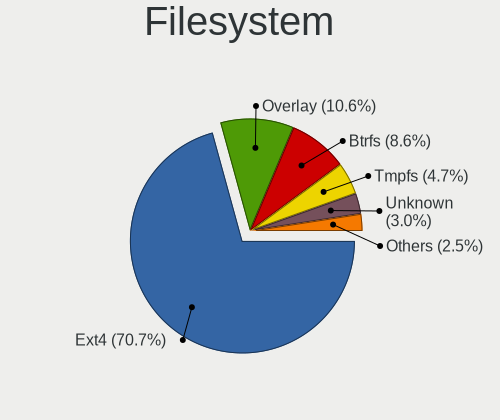
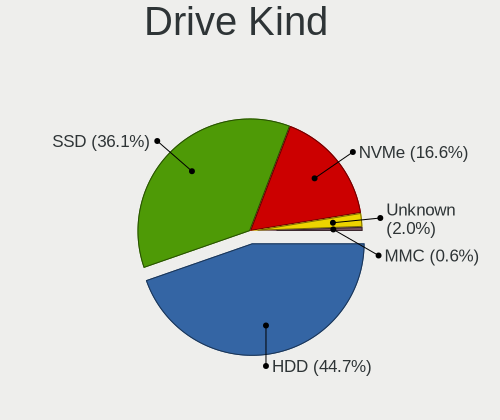
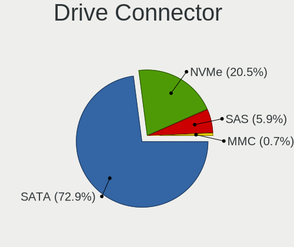
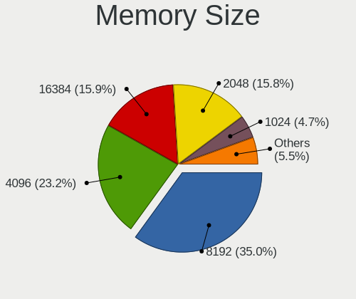

Linux in Italy - Tested Hardware & Statistics (Desktops)
--------------------------------------------------------

A project to collect tested hardware configurations for Linux in Italy.

Anyone can contribute to this report by the [hw-probe](https://github.com/linuxhw/hw-probe) tool:

    sudo -E hw-probe -all -upload

Please contribute! Especially if your hardware is rare.

Contents
--------

* [ Test Cases ](#test-cases)

* [ System ](#system)
  - [ OS                       ](#os)
  - [ OS Family                ](#os-family)
  - [ Kernel                   ](#kernel)
  - [ Kernel Family            ](#kernel-family)
  - [ Kernel Major Ver.        ](#kernel-major-ver)
  - [ Arch                     ](#arch)
  - [ DE                       ](#de)
  - [ Display Server           ](#display-server)
  - [ Display Manager          ](#display-manager)
  - [ OS Lang                  ](#os-lang)
  - [ Boot Mode                ](#boot-mode)
  - [ Filesystem               ](#filesystem)
  - [ Part. scheme             ](#part-scheme)
  - [ Dual Boot with Linux/BSD ](#dual-boot-with-linuxbsd)
  - [ Dual Boot (Win)          ](#dual-boot-win)

* [ Board ](#board)
  - [ Vendor                   ](#vendor)
  - [ Model                    ](#model)
  - [ Model Family             ](#model-family)
  - [ MFG Year                 ](#mfg-year)
  - [ Form Factor              ](#form-factor)
  - [ Secure Boot              ](#secure-boot)
  - [ Coreboot                 ](#coreboot)
  - [ RAM Size                 ](#ram-size)
  - [ RAM Used                 ](#ram-used)
  - [ Total Drives             ](#total-drives)
  - [ Has CD-ROM               ](#has-cd-rom)
  - [ Has Ethernet             ](#has-ethernet)
  - [ Has WiFi                 ](#has-wifi)
  - [ Has Bluetooth            ](#has-bluetooth)

* [ Location ](#location)
  - [ Country                  ](#country)
  - [ City                     ](#city)

* [ Drives ](#drives)
  - [ Drive Vendor             ](#drive-vendor)
  - [ Drive Model              ](#drive-model)
  - [ HDD Vendor               ](#hdd-vendor)
  - [ SSD Vendor               ](#ssd-vendor)
  - [ Drive Kind               ](#drive-kind)
  - [ Drive Connector          ](#drive-connector)
  - [ Drive Size               ](#drive-size)
  - [ Space Total              ](#space-total)
  - [ Space Used               ](#space-used)
  - [ Malfunc. Drives          ](#malfunc-drives)
  - [ Malfunc. Drive Vendor    ](#malfunc-drive-vendor)
  - [ Malfunc. HDD Vendor      ](#malfunc-hdd-vendor)
  - [ Malfunc. Drive Kind      ](#malfunc-drive-kind)
  - [ Failed Drives            ](#failed-drives)
  - [ Failed Drive Vendor      ](#failed-drive-vendor)
  - [ Drive Status             ](#drive-status)

* [ Storage controller ](#storage-controller)
  - [ Storage Vendor           ](#storage-vendor)
  - [ Storage Model            ](#storage-model)
  - [ Storage Kind             ](#storage-kind)

* [ Processor ](#processor)
  - [ CPU Vendor               ](#cpu-vendor)
  - [ CPU Model                ](#cpu-model)
  - [ CPU Model Family         ](#cpu-model-family)
  - [ CPU Cores                ](#cpu-cores)
  - [ CPU Sockets              ](#cpu-sockets)
  - [ CPU Threads              ](#cpu-threads)
  - [ CPU Op-Modes             ](#cpu-op-modes)
  - [ CPU Microcode            ](#cpu-microcode)
  - [ CPU Microarch            ](#cpu-microarch)

* [ Graphics ](#graphics)
  - [ GPU Vendor               ](#gpu-vendor)
  - [ GPU Model                ](#gpu-model)
  - [ GPU Combo                ](#gpu-combo)
  - [ GPU Driver               ](#gpu-driver)
  - [ GPU Memory               ](#gpu-memory)

* [ Monitor ](#monitor)
  - [ Monitor Vendor           ](#monitor-vendor)
  - [ Monitor Model            ](#monitor-model)
  - [ Monitor Resolution       ](#monitor-resolution)
  - [ Monitor Diagonal         ](#monitor-diagonal)
  - [ Monitor Width            ](#monitor-width)
  - [ Aspect Ratio             ](#aspect-ratio)
  - [ Monitor Area             ](#monitor-area)
  - [ Pixel Density            ](#pixel-density)
  - [ Multiple Monitors        ](#multiple-monitors)

* [ Network ](#network)
  - [ Net Controller Vendor    ](#net-controller-vendor)
  - [ Net Controller Model     ](#net-controller-model)
  - [ Wireless Vendor          ](#wireless-vendor)
  - [ Wireless Model           ](#wireless-model)
  - [ Ethernet Vendor          ](#ethernet-vendor)
  - [ Ethernet Model           ](#ethernet-model)
  - [ Net Controller Kind      ](#net-controller-kind)
  - [ Used Controller          ](#used-controller)
  - [ NICs                     ](#nics)
  - [ IPv6                     ](#ipv6)

* [ Bluetooth ](#bluetooth)
  - [ Bluetooth Vendor         ](#bluetooth-vendor)
  - [ Bluetooth Model          ](#bluetooth-model)

* [ Sound ](#sound)
  - [ Sound Vendor             ](#sound-vendor)
  - [ Sound Model              ](#sound-model)

* [ Memory ](#memory)
  - [ Memory Vendor            ](#memory-vendor)
  - [ Memory Model             ](#memory-model)
  - [ Memory Kind              ](#memory-kind)
  - [ Memory Form Factor       ](#memory-form-factor)
  - [ Memory Size              ](#memory-size)
  - [ Memory Speed             ](#memory-speed)

* [ Printers & scanners ](#printers--scanners)
  - [ Printer Vendor           ](#printer-vendor)
  - [ Printer Model            ](#printer-model)
  - [ Scanner Vendor           ](#scanner-vendor)
  - [ Scanner Model            ](#scanner-model)

* [ Camera ](#camera)
  - [ Camera Vendor            ](#camera-vendor)
  - [ Camera Model             ](#camera-model)

* [ Security ](#security)
  - [ Fingerprint Vendor       ](#fingerprint-vendor)
  - [ Fingerprint Model        ](#fingerprint-model)
  - [ Chipcard Vendor          ](#chipcard-vendor)
  - [ Chipcard Model           ](#chipcard-model)

* [ Unsupported ](#unsupported)
  - [ Unsupported Devices      ](#unsupported-devices)
  - [ Unsupported Device Types ](#unsupported-device-types)

Test Cases
----------

Total: 2729

| Vendor        | Model                       | Probe                                                      | Date         |
|---------------|-----------------------------|------------------------------------------------------------|--------------|
| ASRock        | 775Dual-VSTA                | [31825f35da](https://linux-hardware.org/?probe=31825f35da) | Jun 30, 2022 |
| Gigabyte      | B450M DS3H-CF               | [6a2f1d22f1](https://linux-hardware.org/?probe=6a2f1d22f1) | Jun 29, 2022 |
| Gigabyte      | B450M DS3H-CF               | [0a976062da](https://linux-hardware.org/?probe=0a976062da) | Jun 29, 2022 |
| Dell          | 0RF703                      | [7b1a5ddcb6](https://linux-hardware.org/?probe=7b1a5ddcb6) | Jun 27, 2022 |
| MSI           | B250 GAMING M3              | [b294a7b0b1](https://linux-hardware.org/?probe=b294a7b0b1) | Jun 26, 2022 |
| HP            | 3398                        | [4241fd0ba0](https://linux-hardware.org/?probe=4241fd0ba0) | Jun 26, 2022 |
| MSI           | B250 GAMING M3              | [f79c31ad28](https://linux-hardware.org/?probe=f79c31ad28) | Jun 26, 2022 |
| MSI           | MPG B460I GAMING EDGE WI... | [6580b51e30](https://linux-hardware.org/?probe=6580b51e30) | Jun 25, 2022 |
| MSI           | MPG B460I GAMING EDGE WI... | [01fcd4495e](https://linux-hardware.org/?probe=01fcd4495e) | Jun 25, 2022 |
| Foxconn       | 945 7MC Series              | [16836e63f5](https://linux-hardware.org/?probe=16836e63f5) | Jun 25, 2022 |
| MSI           | A78M-E45                    | [ca217e0ccb](https://linux-hardware.org/?probe=ca217e0ccb) | Jun 25, 2022 |
| ASRock        | H77 Pro4/MVP                | [f022b1b430](https://linux-hardware.org/?probe=f022b1b430) | Jun 24, 2022 |
| ASRock        | X370 Pro4                   | [df6751dcaa](https://linux-hardware.org/?probe=df6751dcaa) | Jun 22, 2022 |
| Intel         | DX58SO AAE29331-703         | [edb0ff1a68](https://linux-hardware.org/?probe=edb0ff1a68) | Jun 22, 2022 |
| MSI           | B450M-A PRO MAX             | [db4763808b](https://linux-hardware.org/?probe=db4763808b) | Jun 22, 2022 |
| Gigabyte      | H97M-D3H                    | [1529cf29a5](https://linux-hardware.org/?probe=1529cf29a5) | Jun 22, 2022 |
| Gigabyte      | H97M-D3H                    | [4a2493f02c](https://linux-hardware.org/?probe=4a2493f02c) | Jun 22, 2022 |
| ASUSTek       | M4N78-AM                    | [f98db3efe8](https://linux-hardware.org/?probe=f98db3efe8) | Jun 22, 2022 |
| Unknown       | RS780-SB700                 | [a4649c2c4a](https://linux-hardware.org/?probe=a4649c2c4a) | Jun 21, 2022 |
| HP            | 0AA0h                       | [ccc94e1725](https://linux-hardware.org/?probe=ccc94e1725) | Jun 21, 2022 |
| MSI           | B550M-A PRO                 | [1765b91360](https://linux-hardware.org/?probe=1765b91360) | Jun 21, 2022 |
| ASUSTek       | ROG STRIX B560-G GAMING ... | [88a7cd954c](https://linux-hardware.org/?probe=88a7cd954c) | Jun 19, 2022 |
| Dell          | 040DDP A01                  | [a4091a0526](https://linux-hardware.org/?probe=a4091a0526) | Jun 19, 2022 |
| ASUSTek       | ROG STRIX B550-E GAMING     | [7912825604](https://linux-hardware.org/?probe=7912825604) | Jun 19, 2022 |
| ASRock        | B85M DASH/OL R2.0           | [c5763f8865](https://linux-hardware.org/?probe=c5763f8865) | Jun 17, 2022 |
| ASUSTek       | M4N78-AM                    | [8522c93ea3](https://linux-hardware.org/?probe=8522c93ea3) | Jun 16, 2022 |
| ASUSTek       | M4N78-AM                    | [d7dddc4270](https://linux-hardware.org/?probe=d7dddc4270) | Jun 16, 2022 |
| ASUSTek       | P5QC                        | [b9a53514e1](https://linux-hardware.org/?probe=b9a53514e1) | Jun 16, 2022 |
| MSI           | Z270 GAMING M5              | [d5f742022e](https://linux-hardware.org/?probe=d5f742022e) | Jun 16, 2022 |
| MSI           | Z270 GAMING M5              | [6c352cf792](https://linux-hardware.org/?probe=6c352cf792) | Jun 16, 2022 |
| ASUSTek       | M5A78L-M/USB3               | [fb36d0a844](https://linux-hardware.org/?probe=fb36d0a844) | Jun 15, 2022 |
| Gigabyte      | GA-MA790FXT-UD5P            | [8852623d3d](https://linux-hardware.org/?probe=8852623d3d) | Jun 15, 2022 |
| ASUSTek       | PRIME A320M-K               | [c8dfb12509](https://linux-hardware.org/?probe=c8dfb12509) | Jun 14, 2022 |
| Gigabyte      | Z390 AORUS PRO-CF           | [d827dcbe06](https://linux-hardware.org/?probe=d827dcbe06) | Jun 13, 2022 |
| ASUSTek       | M5A97 R2.0                  | [1c1f01b85f](https://linux-hardware.org/?probe=1c1f01b85f) | Jun 12, 2022 |
| Foxconn       | Irvine HP P/N               | [551f18d133](https://linux-hardware.org/?probe=551f18d133) | Jun 11, 2022 |
| MSI           | Boston                      | [f44a102ffb](https://linux-hardware.org/?probe=f44a102ffb) | Jun 11, 2022 |
| ASUSTek       | PRIME H270M-PLUS            | [2dd49013ff](https://linux-hardware.org/?probe=2dd49013ff) | Jun 10, 2022 |
| T-bao         | MINI PC V1.0                | [8108463ab7](https://linux-hardware.org/?probe=8108463ab7) | Jun 09, 2022 |
| Lenovo        | SHARKBAY 0B98401 PRO        | [59f197c68d](https://linux-hardware.org/?probe=59f197c68d) | Jun 07, 2022 |
| Gigabyte      | B450 AORUS ELITE            | [9756188040](https://linux-hardware.org/?probe=9756188040) | Jun 07, 2022 |
| ASRock        | 775Dual-VSTA                | [5dca8ae4cb](https://linux-hardware.org/?probe=5dca8ae4cb) | Jun 06, 2022 |
| ASRock        | 775Dual-VSTA                | [b627c94dff](https://linux-hardware.org/?probe=b627c94dff) | Jun 06, 2022 |
| MSI           | B550M PRO-VDH               | [8279a4df3a](https://linux-hardware.org/?probe=8279a4df3a) | Jun 06, 2022 |
| MSI           | Boston                      | [2497abc0c1](https://linux-hardware.org/?probe=2497abc0c1) | Jun 05, 2022 |
| MSI           | X570-A PRO                  | [95af0fa349](https://linux-hardware.org/?probe=95af0fa349) | Jun 04, 2022 |
| ASUSTek       | Z170-A                      | [ed86450031](https://linux-hardware.org/?probe=ed86450031) | Jun 03, 2022 |
| ASUSTek       | TUF Z390-PLUS GAMING        | [61b90c102c](https://linux-hardware.org/?probe=61b90c102c) | Jun 03, 2022 |
| ASUSTek       | H110M-A/M.2                 | [990cfd2d12](https://linux-hardware.org/?probe=990cfd2d12) | May 31, 2022 |
| HP            | 3047h                       | [59affe5430](https://linux-hardware.org/?probe=59affe5430) | May 31, 2022 |
| Pegatron      | 2A73h                       | [c9af41f21f](https://linux-hardware.org/?probe=c9af41f21f) | May 28, 2022 |
| Pegatron      | 2A73h                       | [d09310f985](https://linux-hardware.org/?probe=d09310f985) | May 28, 2022 |
| MSI           | Boston                      | [53510ee8ef](https://linux-hardware.org/?probe=53510ee8ef) | May 28, 2022 |
| Dell          | 04YP6J A02                  | [5c0b3c0e56](https://linux-hardware.org/?probe=5c0b3c0e56) | May 28, 2022 |
| ASUSTek       | PRIME B460M-K               | [a6dafabf0c](https://linux-hardware.org/?probe=a6dafabf0c) | May 27, 2022 |
| ASRock        | AB350M Pro4                 | [dd39f18241](https://linux-hardware.org/?probe=dd39f18241) | May 25, 2022 |
| Dell          | 0RF703                      | [228efad4f1](https://linux-hardware.org/?probe=228efad4f1) | May 25, 2022 |
| ASUSTek       | ROG CROSSHAIR VIII DARK ... | [a22a5ebbff](https://linux-hardware.org/?probe=a22a5ebbff) | May 25, 2022 |
| T-bao         | MINI PC V1.0                | [1715d72a33](https://linux-hardware.org/?probe=1715d72a33) | May 25, 2022 |
| T-bao         | MINI PC V1.0                | [f964c9691e](https://linux-hardware.org/?probe=f964c9691e) | May 25, 2022 |
| Gigabyte      | P55-UD3L                    | [256b5355c3](https://linux-hardware.org/?probe=256b5355c3) | May 24, 2022 |
| HP            | 1495                        | [68ead7bd6a](https://linux-hardware.org/?probe=68ead7bd6a) | May 23, 2022 |
| Foxconn       | 946 7MA Series              | [9f88edf79e](https://linux-hardware.org/?probe=9f88edf79e) | May 19, 2022 |
| MSI           | Z97-G45 GAMING              | [1b02844b0b](https://linux-hardware.org/?probe=1b02844b0b) | May 18, 2022 |
| MSI           | Boston                      | [b49f5c367f](https://linux-hardware.org/?probe=b49f5c367f) | May 16, 2022 |
| ASUSTek       | M3N78 PRO                   | [246f442b9b](https://linux-hardware.org/?probe=246f442b9b) | May 15, 2022 |
| ASUSTek       | ROG STRIX B550-I GAMING     | [0d9d6b919b](https://linux-hardware.org/?probe=0d9d6b919b) | May 15, 2022 |
| ASUSTek       | M3N78 PRO                   | [af5eec886b](https://linux-hardware.org/?probe=af5eec886b) | May 15, 2022 |
| MSI           | 970A-G43 PLUS               | [399deea7b9](https://linux-hardware.org/?probe=399deea7b9) | May 15, 2022 |
| ASUSTek       | M4A785TD-M EVO              | [c84b325929](https://linux-hardware.org/?probe=c84b325929) | May 13, 2022 |
| ASUSTek       | NARRA3                      | [ca524c9e95](https://linux-hardware.org/?probe=ca524c9e95) | May 13, 2022 |
| ASUSTek       | PRIME H370-PLUS             | [df570dd8e0](https://linux-hardware.org/?probe=df570dd8e0) | May 12, 2022 |
| Unknown       | Unknown                     | [7931f8191f](https://linux-hardware.org/?probe=7931f8191f) | May 11, 2022 |
| Unknown       | Unknown                     | [271a8ba23e](https://linux-hardware.org/?probe=271a8ba23e) | May 11, 2022 |
| HP            | 2B4B                        | [868bd14401](https://linux-hardware.org/?probe=868bd14401) | May 11, 2022 |
| ASUSTek       | H61M-K                      | [64f2ed4df2](https://linux-hardware.org/?probe=64f2ed4df2) | May 11, 2022 |
| ASUSTek       | P9X79                       | [694affb24e](https://linux-hardware.org/?probe=694affb24e) | May 10, 2022 |
| MSI           | B450M PRO-VDH MAX           | [feafca0464](https://linux-hardware.org/?probe=feafca0464) | May 10, 2022 |
| Unknown       | HX90                        | [3a7e2628b0](https://linux-hardware.org/?probe=3a7e2628b0) | May 09, 2022 |
| ASRock        | 970 Extreme3 R2.0           | [17e7dcafe2](https://linux-hardware.org/?probe=17e7dcafe2) | May 08, 2022 |
| MSI           | MEG Z590 GODLIKE            | [0b88e8e449](https://linux-hardware.org/?probe=0b88e8e449) | May 06, 2022 |
| ASUSTek       | 2A73h                       | [458bf998ee](https://linux-hardware.org/?probe=458bf998ee) | May 06, 2022 |
| MSI           | MEG Z590 GODLIKE            | [ce253bc962](https://linux-hardware.org/?probe=ce253bc962) | May 05, 2022 |
| HP            | 18E7                        | [57194bb53c](https://linux-hardware.org/?probe=57194bb53c) | May 04, 2022 |
| ASUSTek       | CM6650                      | [d41d1228db](https://linux-hardware.org/?probe=d41d1228db) | May 04, 2022 |
| ASUSTek       | PRIME X370-A                | [4d1f9886c2](https://linux-hardware.org/?probe=4d1f9886c2) | May 03, 2022 |
| ASRock        | AB350M Pro4                 | [1d4a595342](https://linux-hardware.org/?probe=1d4a595342) | May 02, 2022 |
| ASUSTek       | H61M-K                      | [fbbae98a18](https://linux-hardware.org/?probe=fbbae98a18) | May 01, 2022 |
| MSI           | MPG Z490 GAMING PLUS        | [8d3881574d](https://linux-hardware.org/?probe=8d3881574d) | Apr 30, 2022 |
| HP            | 1494                        | [939f3b7987](https://linux-hardware.org/?probe=939f3b7987) | Apr 30, 2022 |
| ASUSTek       | PRIME X470-PRO              | [8c1bf73769](https://linux-hardware.org/?probe=8c1bf73769) | Apr 28, 2022 |
| MSI           | MEG Z590 GODLIKE            | [d0ca0e52ad](https://linux-hardware.org/?probe=d0ca0e52ad) | Apr 28, 2022 |
| MSI           | MEG Z590 GODLIKE            | [a2f86e2fea](https://linux-hardware.org/?probe=a2f86e2fea) | Apr 28, 2022 |
| HP            | 1588h                       | [20624367eb](https://linux-hardware.org/?probe=20624367eb) | Apr 27, 2022 |
| HP            | 1588h                       | [831e4e5993](https://linux-hardware.org/?probe=831e4e5993) | Apr 27, 2022 |
| MSI           | MPG X570 GAMING PLUS        | [80792ef9d7](https://linux-hardware.org/?probe=80792ef9d7) | Apr 27, 2022 |
| HP            | 09F8h                       | [8605181df9](https://linux-hardware.org/?probe=8605181df9) | Apr 26, 2022 |
| Acer          | Aspire TC-780               | [501877dba5](https://linux-hardware.org/?probe=501877dba5) | Apr 25, 2022 |
| ASUSTek       | ROG STRIX B550-F GAMING     | [35975b7d55](https://linux-hardware.org/?probe=35975b7d55) | Apr 25, 2022 |
| ASUSTek       | P8H61-M LX2                 | [a60c0bf48d](https://linux-hardware.org/?probe=a60c0bf48d) | Apr 24, 2022 |
| ASUSTek       | P5KPL-AM SE                 | [d3d995a41b](https://linux-hardware.org/?probe=d3d995a41b) | Apr 24, 2022 |
| ASUSTek       | P5GD1                       | [11b7aa3465](https://linux-hardware.org/?probe=11b7aa3465) | Apr 24, 2022 |
| HP            | 09F8h                       | [5042a34dcd](https://linux-hardware.org/?probe=5042a34dcd) | Apr 23, 2022 |
| Lenovo        | SKYBAY SDK0J40705 WIN 34... | [30f8dbd98c](https://linux-hardware.org/?probe=30f8dbd98c) | Apr 22, 2022 |
| Lenovo        | SKYBAY SDK0J40705 WIN 34... | [179d1e1a0f](https://linux-hardware.org/?probe=179d1e1a0f) | Apr 22, 2022 |
| Acer          | Veriton M2631 V:1.0         | [4f27720e96](https://linux-hardware.org/?probe=4f27720e96) | Apr 21, 2022 |
| Lenovo        | SDK0E50510 WIN              | [3d829a871e](https://linux-hardware.org/?probe=3d829a871e) | Apr 20, 2022 |
| Lenovo        | SHARKBAY 31900058 STD       | [beab5308cb](https://linux-hardware.org/?probe=beab5308cb) | Apr 19, 2022 |
| ASUSTek       | PRIME H510M-A               | [59fb2af2c2](https://linux-hardware.org/?probe=59fb2af2c2) | Apr 18, 2022 |
| ASUSTek       | P8Z68 DELUXE                | [4df90e6250](https://linux-hardware.org/?probe=4df90e6250) | Apr 18, 2022 |
| Acer          | Aspire TC-115               | [16d5411ae8](https://linux-hardware.org/?probe=16d5411ae8) | Apr 18, 2022 |
| ASUSTek       | PRIME B460M-A               | [98637b4cf2](https://linux-hardware.org/?probe=98637b4cf2) | Apr 18, 2022 |
| ASUSTek       | ROG STRIX X470-F GAMING     | [0169381aeb](https://linux-hardware.org/?probe=0169381aeb) | Apr 15, 2022 |
| Lenovo        | MAHOBAY NO DPK              | [c3d8900f58](https://linux-hardware.org/?probe=c3d8900f58) | Apr 15, 2022 |
| Dell          | 0HN7XN A01                  | [5a9ba12201](https://linux-hardware.org/?probe=5a9ba12201) | Apr 15, 2022 |
| Gigabyte      | GA-A55M-S2V                 | [36d5c02824](https://linux-hardware.org/?probe=36d5c02824) | Apr 15, 2022 |
| ASUSTek       | P8Z68 DELUXE                | [7cc9a1bbb7](https://linux-hardware.org/?probe=7cc9a1bbb7) | Apr 15, 2022 |
| Lenovo        | SHARKBAY 0B98401 PRO        | [0e7314b7c9](https://linux-hardware.org/?probe=0e7314b7c9) | Apr 14, 2022 |
| MSI           | A68HM-P33                   | [8c395556de](https://linux-hardware.org/?probe=8c395556de) | Apr 14, 2022 |
| Gigabyte      | B450 AORUS ELITE            | [dff6de5032](https://linux-hardware.org/?probe=dff6de5032) | Apr 14, 2022 |
| Gigabyte      | B450 AORUS ELITE            | [6a2c5f12fd](https://linux-hardware.org/?probe=6a2c5f12fd) | Apr 13, 2022 |
| Gigabyte      | B150M-D3H-CF                | [e3a8701de2](https://linux-hardware.org/?probe=e3a8701de2) | Apr 13, 2022 |
| ASUSTek       | PRIME A520M-K               | [58dab53fb1](https://linux-hardware.org/?probe=58dab53fb1) | Apr 13, 2022 |
| MSI           | MPG X570 GAMING PLUS        | [6ac57575d9](https://linux-hardware.org/?probe=6ac57575d9) | Apr 13, 2022 |
| ASRock        | X570 Phantom Gaming 4       | [dc6799506a](https://linux-hardware.org/?probe=dc6799506a) | Apr 13, 2022 |
| MSI           | MAG X570S TORPEDO MAX       | [8c2362aa24](https://linux-hardware.org/?probe=8c2362aa24) | Apr 11, 2022 |
| ASUSTek       | TUF Gaming B560-PLUS WIF... | [14b70a1c77](https://linux-hardware.org/?probe=14b70a1c77) | Apr 10, 2022 |
| ASUSTek       | M2N8L                       | [dc78c18c3f](https://linux-hardware.org/?probe=dc78c18c3f) | Apr 10, 2022 |
| Gigabyte      | GA-MA78GM-S2H               | [a56209b0c7](https://linux-hardware.org/?probe=a56209b0c7) | Apr 09, 2022 |
| MSI           | X470 GAMING PLUS MAX        | [8d440b5da5](https://linux-hardware.org/?probe=8d440b5da5) | Apr 09, 2022 |
| Gigabyte      | B450 AORUS M                | [1a4b90c894](https://linux-hardware.org/?probe=1a4b90c894) | Apr 08, 2022 |
| ASRock        | H61M-DGS                    | [1d08a53545](https://linux-hardware.org/?probe=1d08a53545) | Apr 08, 2022 |
| HP            | 3397                        | [d22ff33b0e](https://linux-hardware.org/?probe=d22ff33b0e) | Apr 08, 2022 |
| Lenovo        | ThinkStation S20 4157WC1    | [d64502fb70](https://linux-hardware.org/?probe=d64502fb70) | Apr 08, 2022 |
| Intel         | STK2MV64CC H89290-502       | [b2cb31c994](https://linux-hardware.org/?probe=b2cb31c994) | Apr 07, 2022 |
| Gigabyte      | B365 M AORUS ELITE-CF       | [7da8a936ea](https://linux-hardware.org/?probe=7da8a936ea) | Apr 04, 2022 |
| ASRock        | C2750D4I                    | [b328ff82c5](https://linux-hardware.org/?probe=b328ff82c5) | Apr 03, 2022 |
| ASRock        | 970 Extreme4                | [cc65547e82](https://linux-hardware.org/?probe=cc65547e82) | Apr 03, 2022 |
| MSI           | Z590-A PRO                  | [229ed42b3d](https://linux-hardware.org/?probe=229ed42b3d) | Apr 03, 2022 |
| Acer          | Aspire M1920                | [00d3df045a](https://linux-hardware.org/?probe=00d3df045a) | Apr 02, 2022 |
| ASUSTek       | PRIME Z390M-PLUS            | [3807eeb187](https://linux-hardware.org/?probe=3807eeb187) | Apr 02, 2022 |
| ASUSTek       | P5GD1 PRO                   | [9156c67116](https://linux-hardware.org/?probe=9156c67116) | Apr 01, 2022 |
| ASUSTek       | A68HM-K                     | [482d5e9c62](https://linux-hardware.org/?probe=482d5e9c62) | Apr 01, 2022 |
| ASRock        | 775Dual-VSTA                | [f5aea8ce64](https://linux-hardware.org/?probe=f5aea8ce64) | Apr 01, 2022 |
| MSI           | Z590-A PRO                  | [cafa6713f0](https://linux-hardware.org/?probe=cafa6713f0) | Apr 01, 2022 |
| Gigabyte      | G1.Sniper B6-CF             | [17ea484809](https://linux-hardware.org/?probe=17ea484809) | Mar 29, 2022 |
| Gigabyte      | H81M-S2PV                   | [79a7adfb69](https://linux-hardware.org/?probe=79a7adfb69) | Mar 29, 2022 |
| ASUSTek       | M4A785TD-M EVO              | [641cb912c4](https://linux-hardware.org/?probe=641cb912c4) | Mar 29, 2022 |
| Gigabyte      | H81M-S2PV                   | [5a75a3f121](https://linux-hardware.org/?probe=5a75a3f121) | Mar 29, 2022 |
| ASUSTek       | AM1M-A                      | [29e10859da](https://linux-hardware.org/?probe=29e10859da) | Mar 29, 2022 |
| ASUSTek       | Rampage IV GENE             | [c067a4d0e7](https://linux-hardware.org/?probe=c067a4d0e7) | Mar 29, 2022 |
| Intel         | DH55HC AAE70933-505         | [0a58762fd9](https://linux-hardware.org/?probe=0a58762fd9) | Mar 29, 2022 |
| Biostar       | P4M90-M7A Ver:1.0           | [9cd4056356](https://linux-hardware.org/?probe=9cd4056356) | Mar 28, 2022 |
| ASUSTek       | P8H61-M LX R2.0             | [9688bbdb3f](https://linux-hardware.org/?probe=9688bbdb3f) | Mar 28, 2022 |
| ASUSTek       | H110M-K                     | [4e238835bd](https://linux-hardware.org/?probe=4e238835bd) | Mar 28, 2022 |
| ASUSTek       | PRIME X299-DELUXE II        | [6f66a7137f](https://linux-hardware.org/?probe=6f66a7137f) | Mar 28, 2022 |
| ASRock        | AMCP7AION-HT                | [23f929c975](https://linux-hardware.org/?probe=23f929c975) | Mar 27, 2022 |
| ASUSTek       | H110M-K                     | [14f509aa32](https://linux-hardware.org/?probe=14f509aa32) | Mar 26, 2022 |
| ASUSTek       | H110M-K                     | [31098e4c80](https://linux-hardware.org/?probe=31098e4c80) | Mar 26, 2022 |
| MSI           | MAG Z590 TOMAHAWK WIFI      | [e4526228cd](https://linux-hardware.org/?probe=e4526228cd) | Mar 26, 2022 |
| MSI           | MAG Z590 TOMAHAWK WIFI      | [402c4d5758](https://linux-hardware.org/?probe=402c4d5758) | Mar 26, 2022 |
| MSI           | IONA                        | [1a625c0505](https://linux-hardware.org/?probe=1a625c0505) | Mar 25, 2022 |
| Biostar       | P4M90-M7A Ver:1.0           | [fc2b611797](https://linux-hardware.org/?probe=fc2b611797) | Mar 25, 2022 |
| ASUSTek       | P8H61/USB3 R2.0             | [d5a1c13ab1](https://linux-hardware.org/?probe=d5a1c13ab1) | Mar 25, 2022 |
| BESSTAR Te... | UM700                       | [b1ff998755](https://linux-hardware.org/?probe=b1ff998755) | Mar 24, 2022 |
| Gigabyte      | MZBAYAP-D9                  | [2c077e2993](https://linux-hardware.org/?probe=2c077e2993) | Mar 24, 2022 |
| ASUSTek       | ROG CROSSHAIR VIII DARK ... | [58cfc7fbae](https://linux-hardware.org/?probe=58cfc7fbae) | Mar 23, 2022 |
| ASUSTek       | TUF Gaming B550-PLUS        | [481f4ad619](https://linux-hardware.org/?probe=481f4ad619) | Mar 23, 2022 |
| AMI           | Cherry Trail CR             | [bbea34ce64](https://linux-hardware.org/?probe=bbea34ce64) | Mar 22, 2022 |
| AMI           | Cherry Trail CR             | [bc5a34ef7e](https://linux-hardware.org/?probe=bc5a34ef7e) | Mar 20, 2022 |
| MSI           | B550-A PRO                  | [2f713e8db8](https://linux-hardware.org/?probe=2f713e8db8) | Mar 19, 2022 |
| Dell          | 033FF6 A00                  | [8ba917619e](https://linux-hardware.org/?probe=8ba917619e) | Mar 19, 2022 |
| Dell          | 033FF6 A00                  | [48c7f5e6ae](https://linux-hardware.org/?probe=48c7f5e6ae) | Mar 19, 2022 |
| Lenovo        | SHARKBAY 31900058 STD       | [73bf7d8080](https://linux-hardware.org/?probe=73bf7d8080) | Mar 19, 2022 |
| MSI           | B550-A PRO                  | [b4a188ad90](https://linux-hardware.org/?probe=b4a188ad90) | Mar 19, 2022 |
| HP            | 3397                        | [fe1ae429b1](https://linux-hardware.org/?probe=fe1ae429b1) | Mar 18, 2022 |
| ASRock        | G31M-VS2                    | [129721c7ce](https://linux-hardware.org/?probe=129721c7ce) | Mar 17, 2022 |
| Acer          | EM61SM/EM61PM               | [a33e5dfb8e](https://linux-hardware.org/?probe=a33e5dfb8e) | Mar 17, 2022 |
| ASUSTek       | PRIME B460M-A               | [bb8e459621](https://linux-hardware.org/?probe=bb8e459621) | Mar 17, 2022 |
| ASUSTek       | PRIME A320M-K               | [42ce115c70](https://linux-hardware.org/?probe=42ce115c70) | Mar 17, 2022 |
| ASUSTek       | PRIME Z690-A                | [228a532955](https://linux-hardware.org/?probe=228a532955) | Mar 16, 2022 |
| ASUSTek       | Rampage IV GENE             | [7f5053b061](https://linux-hardware.org/?probe=7f5053b061) | Mar 16, 2022 |
| ASUSTek       | Rampage IV GENE             | [7ff55a3ca6](https://linux-hardware.org/?probe=7ff55a3ca6) | Mar 16, 2022 |
| HP            | ProLiant MicroServer Gen... | [9da39d2356](https://linux-hardware.org/?probe=9da39d2356) | Mar 15, 2022 |
| Gigabyte      | Z590 AORUS PRO AX           | [c8809e0561](https://linux-hardware.org/?probe=c8809e0561) | Mar 15, 2022 |
| ASRock        | B85M DASH/OL R2.0           | [162abf1031](https://linux-hardware.org/?probe=162abf1031) | Mar 15, 2022 |
| Packard Be... | P5N-E SLI                   | [7b991e7fe6](https://linux-hardware.org/?probe=7b991e7fe6) | Mar 14, 2022 |
| Dell          | 0GM819                      | [bf94874639](https://linux-hardware.org/?probe=bf94874639) | Mar 13, 2022 |
| MSI           | B360M MORTAR                | [a00a055108](https://linux-hardware.org/?probe=a00a055108) | Mar 13, 2022 |
| Gigabyte      | GA-MA78GM-S2H               | [dfef2d9492](https://linux-hardware.org/?probe=dfef2d9492) | Mar 13, 2022 |
| Dell          | 0GM819                      | [acc1399bb2](https://linux-hardware.org/?probe=acc1399bb2) | Mar 13, 2022 |
| MSI           | MAG X570 TOMAHAWK WIFI      | [0b912c2834](https://linux-hardware.org/?probe=0b912c2834) | Mar 12, 2022 |
| ASUSTek       | X99-A                       | [4c62821984](https://linux-hardware.org/?probe=4c62821984) | Mar 12, 2022 |
| ECS           | Nettle3                     | [7a96fa9c3f](https://linux-hardware.org/?probe=7a96fa9c3f) | Mar 12, 2022 |
| ASRock        | H270 Pro4                   | [ae79ca8557](https://linux-hardware.org/?probe=ae79ca8557) | Mar 12, 2022 |
| ASUSTek       | TUF B450-PRO GAMING         | [798e5f6c43](https://linux-hardware.org/?probe=798e5f6c43) | Mar 09, 2022 |
| Acer          | Veriton X2610G              | [1f5f3ecca1](https://linux-hardware.org/?probe=1f5f3ecca1) | Mar 09, 2022 |
| Gigabyte      | GA-A75-UD4H                 | [7d31af4995](https://linux-hardware.org/?probe=7d31af4995) | Mar 08, 2022 |
| HP            | 1497                        | [f67b96c14e](https://linux-hardware.org/?probe=f67b96c14e) | Mar 07, 2022 |
| Pegatron      | 2AC3                        | [8d0b8e2e12](https://linux-hardware.org/?probe=8d0b8e2e12) | Mar 07, 2022 |
| Pegatron      | 2AC3                        | [ea3781cdac](https://linux-hardware.org/?probe=ea3781cdac) | Mar 07, 2022 |
| ASUSTek       | ROG Maximus XII FORMULA     | [bde9b00de4](https://linux-hardware.org/?probe=bde9b00de4) | Mar 07, 2022 |
| ASUSTek       | PRIME H510M-A               | [4521c22268](https://linux-hardware.org/?probe=4521c22268) | Mar 06, 2022 |
| MSI           | Z590-A PRO                  | [5f37c84d61](https://linux-hardware.org/?probe=5f37c84d61) | Mar 06, 2022 |
| Fujitsu       | D3400-A1 S26361-D3400-A1    | [68250a6d74](https://linux-hardware.org/?probe=68250a6d74) | Mar 06, 2022 |
| ASUSTek       | PRIME H510M-A               | [6381e8c673](https://linux-hardware.org/?probe=6381e8c673) | Mar 06, 2022 |
| Lenovo        | SHARKBAY 31900058 STD       | [a4335990af](https://linux-hardware.org/?probe=a4335990af) | Mar 05, 2022 |
| HP            | 339A                        | [c26acecee2](https://linux-hardware.org/?probe=c26acecee2) | Mar 05, 2022 |
| Lenovo        | SHARKBAY 31900058 STD       | [70405d9cb0](https://linux-hardware.org/?probe=70405d9cb0) | Mar 05, 2022 |
| SiComputer    | Activa Pico                 | [ff99171465](https://linux-hardware.org/?probe=ff99171465) | Mar 05, 2022 |
| Foxconn       | Irvine HP P/N               | [1d37020507](https://linux-hardware.org/?probe=1d37020507) | Mar 03, 2022 |
| Lenovo        | 31900058 STD                | [bc59b862f4](https://linux-hardware.org/?probe=bc59b862f4) | Mar 02, 2022 |
| Intel         | H61 V1.05                   | [51ad5bd7b7](https://linux-hardware.org/?probe=51ad5bd7b7) | Mar 02, 2022 |
| ASRock        | 990FX Extreme9              | [408514b026](https://linux-hardware.org/?probe=408514b026) | Mar 01, 2022 |
| ASUSTek       | TUF Gaming B560-PLUS WIF... | [e40aac52d8](https://linux-hardware.org/?probe=e40aac52d8) | Feb 28, 2022 |
| HP            | 09F8h                       | [19dc89049d](https://linux-hardware.org/?probe=19dc89049d) | Feb 28, 2022 |
| MSI           | Boston                      | [b5bf0fa044](https://linux-hardware.org/?probe=b5bf0fa044) | Feb 26, 2022 |
| Clientron ... | L700                        | [c2cebca02b](https://linux-hardware.org/?probe=c2cebca02b) | Feb 26, 2022 |
| ASRock        | A75 Extreme6                | [8db778fe6e](https://linux-hardware.org/?probe=8db778fe6e) | Feb 26, 2022 |
| Gigabyte      | F2A88X-D3H                  | [bc86e829a1](https://linux-hardware.org/?probe=bc86e829a1) | Feb 26, 2022 |
| Acer          | Aspire XC-830               | [89acf6268c](https://linux-hardware.org/?probe=89acf6268c) | Feb 25, 2022 |
| Clientron ... | L700                        | [0a16915d4f](https://linux-hardware.org/?probe=0a16915d4f) | Feb 23, 2022 |
| Clientron ... | L700                        | [64f361f774](https://linux-hardware.org/?probe=64f361f774) | Feb 23, 2022 |
| ASRock        | H310M-ITX/ac                | [c5a3dacac5](https://linux-hardware.org/?probe=c5a3dacac5) | Feb 23, 2022 |
| MSI           | MPG X570 GAMING PRO CARB... | [db5c30632e](https://linux-hardware.org/?probe=db5c30632e) | Feb 22, 2022 |
| MSI           | MAG B460M MORTAR WIFI       | [50536f1318](https://linux-hardware.org/?probe=50536f1318) | Feb 22, 2022 |
| MSI           | MAG B460M MORTAR WIFI       | [b6a9e09f78](https://linux-hardware.org/?probe=b6a9e09f78) | Feb 22, 2022 |
| ASUSTek       | P6X58D PREMIUM              | [286998a230](https://linux-hardware.org/?probe=286998a230) | Feb 22, 2022 |
| ASRock        | X370 Taichi                 | [d4d5aa3b0a](https://linux-hardware.org/?probe=d4d5aa3b0a) | Feb 21, 2022 |
| ASRock        | ALiveNF6P-VSTA              | [eb361d0491](https://linux-hardware.org/?probe=eb361d0491) | Feb 20, 2022 |
| Lenovo        | 3098 0B98401 PRO            | [709ca2add8](https://linux-hardware.org/?probe=709ca2add8) | Feb 20, 2022 |
| Unknown       | Intel X79                   | [7968affda8](https://linux-hardware.org/?probe=7968affda8) | Feb 19, 2022 |
| Proline       | ProlinePartner              | [df914c13d7](https://linux-hardware.org/?probe=df914c13d7) | Feb 19, 2022 |
| ASRock        | A320M-HDV                   | [6678e3ba4a](https://linux-hardware.org/?probe=6678e3ba4a) | Feb 18, 2022 |
| ASRock        | A320M-HDV                   | [f37110c1d5](https://linux-hardware.org/?probe=f37110c1d5) | Feb 18, 2022 |
| MSI           | MAG B550 TOMAHAWK           | [5a5f32380c](https://linux-hardware.org/?probe=5a5f32380c) | Feb 18, 2022 |
| BESSTAR Te... | UM270 V1.0                  | [3228f18f20](https://linux-hardware.org/?probe=3228f18f20) | Feb 17, 2022 |
| Gigabyte      | H97M-D3H                    | [da5a6a7160](https://linux-hardware.org/?probe=da5a6a7160) | Feb 17, 2022 |
| HP            | 1497                        | [8693cfc8c8](https://linux-hardware.org/?probe=8693cfc8c8) | Feb 17, 2022 |
| MSI           | MPG B550 GAMING PLUS        | [dba2436c5c](https://linux-hardware.org/?probe=dba2436c5c) | Feb 17, 2022 |
| MSI           | A520M-A PRO                 | [dbe8ddd097](https://linux-hardware.org/?probe=dbe8ddd097) | Feb 17, 2022 |
| Pegatron      | 2AB6                        | [4659956809](https://linux-hardware.org/?probe=4659956809) | Feb 17, 2022 |
| HP            | 304Ah                       | [8bbd035899](https://linux-hardware.org/?probe=8bbd035899) | Feb 16, 2022 |
| ASRock        | Q1900B-ITX                  | [b205b32b2a](https://linux-hardware.org/?probe=b205b32b2a) | Feb 16, 2022 |
| ASUSTek       | P5QPL-AM                    | [c42862bbdb](https://linux-hardware.org/?probe=c42862bbdb) | Feb 15, 2022 |
| ASUSTek       | P5QPL-AM                    | [185fed2422](https://linux-hardware.org/?probe=185fed2422) | Feb 15, 2022 |
| ASUSTek       | TUF Z390-PLUS GAMING        | [71ecb0275e](https://linux-hardware.org/?probe=71ecb0275e) | Feb 15, 2022 |
| Gigabyte      | H81M-D2V                    | [283cf4fd8d](https://linux-hardware.org/?probe=283cf4fd8d) | Feb 15, 2022 |
| MSI           | MPG X570S CARBON MAX WIF... | [b11d43558e](https://linux-hardware.org/?probe=b11d43558e) | Feb 15, 2022 |
| BESSTAR Te... | UM270 V1.0                  | [a2ee2f6a38](https://linux-hardware.org/?probe=a2ee2f6a38) | Feb 15, 2022 |
| ASRock        | 880GMH/USB3                 | [2789041a4d](https://linux-hardware.org/?probe=2789041a4d) | Feb 15, 2022 |
| YANYU         | H17SL                       | [0a6638d9c9](https://linux-hardware.org/?probe=0a6638d9c9) | Feb 14, 2022 |
| BESSTAR Te... | UM270 V1.0                  | [1916cd8623](https://linux-hardware.org/?probe=1916cd8623) | Feb 14, 2022 |
| MSI           | MS-7360                     | [9f4470ea28](https://linux-hardware.org/?probe=9f4470ea28) | Feb 13, 2022 |
| ASUSTek       | P8H61-M LX                  | [f1b4a515a3](https://linux-hardware.org/?probe=f1b4a515a3) | Feb 13, 2022 |
| HP            | 339A                        | [05148d7fb4](https://linux-hardware.org/?probe=05148d7fb4) | Feb 13, 2022 |
| Gateway       | SX2865 V1.0                 | [890768bebd](https://linux-hardware.org/?probe=890768bebd) | Feb 12, 2022 |
| HP            | 8767 A                      | [e048574911](https://linux-hardware.org/?probe=e048574911) | Feb 12, 2022 |
| ASUSTek       | ROG Maximus XII FORMULA     | [a63d909e46](https://linux-hardware.org/?probe=a63d909e46) | Feb 12, 2022 |
| HP            | 8767 A                      | [6cb1e6b72f](https://linux-hardware.org/?probe=6cb1e6b72f) | Feb 12, 2022 |
| ASUSTek       | ROG Maximus XII FORMULA     | [885617bdda](https://linux-hardware.org/?probe=885617bdda) | Feb 12, 2022 |
| Dell          | 0KH290                      | [c4684237ef](https://linux-hardware.org/?probe=c4684237ef) | Feb 12, 2022 |
| Unknown       | Unknown                     | [b1ed0635ab](https://linux-hardware.org/?probe=b1ed0635ab) | Feb 12, 2022 |
| Lenovo        | SHARKBAY NOK                | [dec96a3fee](https://linux-hardware.org/?probe=dec96a3fee) | Feb 12, 2022 |
| Foxconn       | nT-iBT18/nT-iBT19/nT-iBT... | [51095189f7](https://linux-hardware.org/?probe=51095189f7) | Feb 12, 2022 |
| Acer          | EM61SM/EM61PM               | [8398f79f2a](https://linux-hardware.org/?probe=8398f79f2a) | Feb 12, 2022 |
| ASRock        | A320M-DVS R4.0              | [5356027467](https://linux-hardware.org/?probe=5356027467) | Feb 12, 2022 |
| MSI           | MS-7345                     | [3412e837ef](https://linux-hardware.org/?probe=3412e837ef) | Feb 12, 2022 |
| MSI           | 0A48                        | [29ea38af38](https://linux-hardware.org/?probe=29ea38af38) | Feb 12, 2022 |
| HP            | 304Bh                       | [ee8368a314](https://linux-hardware.org/?probe=ee8368a314) | Feb 11, 2022 |
| Gigabyte      | H170M-HD3 DDR3-CF           | [5503a29249](https://linux-hardware.org/?probe=5503a29249) | Feb 11, 2022 |
| Gigabyte      | B450 AORUS ELITE            | [a8c18662ff](https://linux-hardware.org/?probe=a8c18662ff) | Feb 10, 2022 |
| HP            | 2B34                        | [1281e2e4dd](https://linux-hardware.org/?probe=1281e2e4dd) | Feb 10, 2022 |
| Packard Be... | FIH57                       | [d0d43c4388](https://linux-hardware.org/?probe=d0d43c4388) | Feb 10, 2022 |
| HP            | 83E0                        | [12a6ad4f59](https://linux-hardware.org/?probe=12a6ad4f59) | Feb 10, 2022 |
| Fujitsu       | D3171-A1 S26361-D3171-A1    | [421e056029](https://linux-hardware.org/?probe=421e056029) | Feb 10, 2022 |
| Gigabyte      | Z370 HD3P-CF                | [5afe97188b](https://linux-hardware.org/?probe=5afe97188b) | Feb 10, 2022 |
| ASUSTek       | B150M-K D3                  | [2f698f5683](https://linux-hardware.org/?probe=2f698f5683) | Feb 10, 2022 |
| ASRock        | 970 Extreme3 R2.0           | [0094ddce46](https://linux-hardware.org/?probe=0094ddce46) | Feb 10, 2022 |
| Dell          | 0C27VV A00                  | [4ce2b5c0b9](https://linux-hardware.org/?probe=4ce2b5c0b9) | Feb 09, 2022 |
| ASUSTek       | M4A77TD                     | [7c3ac4c29f](https://linux-hardware.org/?probe=7c3ac4c29f) | Feb 09, 2022 |
| Dell          | 0773VG A00                  | [e81f82fd5e](https://linux-hardware.org/?probe=e81f82fd5e) | Feb 09, 2022 |
| ASUSTek       | Rampage Formula             | [2cf0349fbe](https://linux-hardware.org/?probe=2cf0349fbe) | Feb 08, 2022 |
| ASUSTek       | TUF Z390-PRO GAMING         | [de476d2b5a](https://linux-hardware.org/?probe=de476d2b5a) | Feb 08, 2022 |
| Gigabyte      | Z390 UD                     | [523ae21d77](https://linux-hardware.org/?probe=523ae21d77) | Feb 08, 2022 |
| Gigabyte      | Z370 HD3P-CF                | [73da97a50b](https://linux-hardware.org/?probe=73da97a50b) | Feb 07, 2022 |
| YANYU         | H17SL                       | [cd763ca612](https://linux-hardware.org/?probe=cd763ca612) | Feb 06, 2022 |
| ASRock        | 970 Extreme3 R2.0           | [4664ace096](https://linux-hardware.org/?probe=4664ace096) | Feb 05, 2022 |
| Acer          | Aspire TC-115               | [03188d20fc](https://linux-hardware.org/?probe=03188d20fc) | Feb 05, 2022 |
| ASRock        | J4105M                      | [2f9baf0de0](https://linux-hardware.org/?probe=2f9baf0de0) | Feb 05, 2022 |
| Dell          | 0N826N A03                  | [87c3ec3dac](https://linux-hardware.org/?probe=87c3ec3dac) | Feb 04, 2022 |
| ASUSTek       | Puffer                      | [a0a948ecf5](https://linux-hardware.org/?probe=a0a948ecf5) | Feb 04, 2022 |
| Gigabyte      | P35-DS3L                    | [20541a0b3c](https://linux-hardware.org/?probe=20541a0b3c) | Feb 02, 2022 |
| ASUSTek       | H87M-PRO                    | [0f96c91905](https://linux-hardware.org/?probe=0f96c91905) | Feb 01, 2022 |
| ASUSTek       | CM6870                      | [f217244fb2](https://linux-hardware.org/?probe=f217244fb2) | Jan 31, 2022 |
| ASRock        | 890GX Extreme3              | [30d08c4c1f](https://linux-hardware.org/?probe=30d08c4c1f) | Jan 31, 2022 |
| Chuwi         | RZBOX                       | [bea5e134d8](https://linux-hardware.org/?probe=bea5e134d8) | Jan 30, 2022 |
| Gigabyte      | H110M-S2H-CF                | [fe5bd0b5ed](https://linux-hardware.org/?probe=fe5bd0b5ed) | Jan 29, 2022 |
| ASUSTek       | Z170-K                      | [33d0a3b270](https://linux-hardware.org/?probe=33d0a3b270) | Jan 29, 2022 |
| ASUSTek       | P5Q PRO TURBO               | [83ca29c9c8](https://linux-hardware.org/?probe=83ca29c9c8) | Jan 28, 2022 |
| ASUSTek       | Z97-PRO                     | [256f789c6d](https://linux-hardware.org/?probe=256f789c6d) | Jan 27, 2022 |
| Fujitsu Si... | D2824-A1 S26361-D2824-A1    | [044e014d11](https://linux-hardware.org/?probe=044e014d11) | Jan 26, 2022 |
| ASUSTek       | H97M-E                      | [5e3573c525](https://linux-hardware.org/?probe=5e3573c525) | Jan 26, 2022 |
| HP            | 1905                        | [d0ef619547](https://linux-hardware.org/?probe=d0ef619547) | Jan 25, 2022 |
| ASUSTek       | TUF Gaming X570-PLUS        | [7f69220928](https://linux-hardware.org/?probe=7f69220928) | Jan 24, 2022 |
| ASUSTek       | H81M-K                      | [6b834ecf57](https://linux-hardware.org/?probe=6b834ecf57) | Jan 24, 2022 |
| ASRock        | AB350M Pro4                 | [cae6b39683](https://linux-hardware.org/?probe=cae6b39683) | Jan 24, 2022 |
| ASRock        | AB350M Pro4                 | [75e0b58fa2](https://linux-hardware.org/?probe=75e0b58fa2) | Jan 24, 2022 |
| ASUSTek       | P5KPL-AM SE                 | [868c5fe3a4](https://linux-hardware.org/?probe=868c5fe3a4) | Jan 24, 2022 |
| ASRock        | AM1B-ITX                    | [5f089eb5bf](https://linux-hardware.org/?probe=5f089eb5bf) | Jan 24, 2022 |
| Acer          | FIH57                       | [af79e42583](https://linux-hardware.org/?probe=af79e42583) | Jan 23, 2022 |
| ASRock        | B550 Phantom Gaming 4/ac    | [ada27693c4](https://linux-hardware.org/?probe=ada27693c4) | Jan 21, 2022 |
| ASRock        | H510 Pro BTC+               | [ff2dd45add](https://linux-hardware.org/?probe=ff2dd45add) | Jan 21, 2022 |
| ASRock        | H510 Pro BTC+               | [234acd7143](https://linux-hardware.org/?probe=234acd7143) | Jan 21, 2022 |
| Gigabyte      | Z390 UD                     | [cf1efe764d](https://linux-hardware.org/?probe=cf1efe764d) | Jan 21, 2022 |
| ASUSTek       | TUF Gaming B560-PLUS WIF... | [3b7c230363](https://linux-hardware.org/?probe=3b7c230363) | Jan 21, 2022 |
| Unknown       | HX90                        | [43efcb00a2](https://linux-hardware.org/?probe=43efcb00a2) | Jan 20, 2022 |
| Gigabyte      | B460M D3H                   | [d64f06fd5a](https://linux-hardware.org/?probe=d64f06fd5a) | Jan 20, 2022 |
| Unknown       | HX90                        | [d12701e394](https://linux-hardware.org/?probe=d12701e394) | Jan 19, 2022 |
| MSI           | B550M PRO-VDH WIFI          | [993543545b](https://linux-hardware.org/?probe=993543545b) | Jan 18, 2022 |
| MSI           | B550M PRO-VDH WIFI          | [7e0c6ebfc9](https://linux-hardware.org/?probe=7e0c6ebfc9) | Jan 18, 2022 |
| MSI           | B550M PRO-VDH WIFI          | [d531de56b2](https://linux-hardware.org/?probe=d531de56b2) | Jan 18, 2022 |
| Gigabyte      | MZBSWBP-00                  | [a8699a0a00](https://linux-hardware.org/?probe=a8699a0a00) | Jan 18, 2022 |
| ASRock        | H61M-HVS                    | [95bbde94a9](https://linux-hardware.org/?probe=95bbde94a9) | Jan 18, 2022 |
| HP            | 1495                        | [f67a5913e3](https://linux-hardware.org/?probe=f67a5913e3) | Jan 17, 2022 |
| ASRock        | B450M Pro4-F                | [f55512e3bc](https://linux-hardware.org/?probe=f55512e3bc) | Jan 17, 2022 |
| Gigabyte      | Z97M-D3H                    | [dfbc85bafe](https://linux-hardware.org/?probe=dfbc85bafe) | Jan 17, 2022 |
| ASUSTek       | Z87-A                       | [b6d5a58347](https://linux-hardware.org/?probe=b6d5a58347) | Jan 17, 2022 |
| Dell          | 0PP150 A00                  | [554774c3c8](https://linux-hardware.org/?probe=554774c3c8) | Jan 16, 2022 |
| Unknown       | K8Upgrade-1689              | [d2e29b9e82](https://linux-hardware.org/?probe=d2e29b9e82) | Jan 15, 2022 |
| ASUSTek       | H110-PLUS                   | [baea3e1d59](https://linux-hardware.org/?probe=baea3e1d59) | Jan 13, 2022 |
| Unknown       | T3 MRD                      | [33392a90ce](https://linux-hardware.org/?probe=33392a90ce) | Jan 13, 2022 |
| ASRock        | FM2A88M-HD+                 | [2d834a40f5](https://linux-hardware.org/?probe=2d834a40f5) | Jan 10, 2022 |
| Unknown       | RS780-SB700                 | [b5bd3c5c5d](https://linux-hardware.org/?probe=b5bd3c5c5d) | Jan 10, 2022 |
| HP            | 09F8h                       | [b17a2aef1b](https://linux-hardware.org/?probe=b17a2aef1b) | Jan 10, 2022 |
| ASUSTek       | ROG CROSSHAIR VIII DARK ... | [b431bed91e](https://linux-hardware.org/?probe=b431bed91e) | Jan 10, 2022 |
| ASUSTek       | ROG STRIX B450-F GAMING     | [1ef1dec7bc](https://linux-hardware.org/?probe=1ef1dec7bc) | Jan 09, 2022 |
| Gigabyte      | B450 AORUS PRO-CF           | [cba57c7cfe](https://linux-hardware.org/?probe=cba57c7cfe) | Jan 09, 2022 |
| ASUSTek       | PRIME H310M-K               | [3b4d6e5abd](https://linux-hardware.org/?probe=3b4d6e5abd) | Jan 08, 2022 |
| ASUSTek       | P5K-E                       | [f3ebd22f2f](https://linux-hardware.org/?probe=f3ebd22f2f) | Jan 08, 2022 |
| ASUSTek       | P8P67 DELUXE                | [9bd6fe4b7c](https://linux-hardware.org/?probe=9bd6fe4b7c) | Jan 08, 2022 |
| ASUSTek       | H110-PLUS                   | [c3fd3de501](https://linux-hardware.org/?probe=c3fd3de501) | Jan 08, 2022 |
| HP            | 3397                        | [38a4d731fe](https://linux-hardware.org/?probe=38a4d731fe) | Jan 08, 2022 |
| ASRock        | N68-S3 UCC                  | [bfcf287c09](https://linux-hardware.org/?probe=bfcf287c09) | Jan 08, 2022 |
| MSI           | X570-A PRO                  | [8319fcd2fe](https://linux-hardware.org/?probe=8319fcd2fe) | Jan 07, 2022 |
| ASUSTek       | PRIME J4005I-C              | [b73988a1c9](https://linux-hardware.org/?probe=b73988a1c9) | Jan 07, 2022 |
| ASUSTek       | M5A99FX PRO R2.0            | [be76fa91bc](https://linux-hardware.org/?probe=be76fa91bc) | Jan 05, 2022 |
| Gigabyte      | GA-970A-D3                  | [98280b3f37](https://linux-hardware.org/?probe=98280b3f37) | Jan 04, 2022 |
| Dell          | 0MM599                      | [82532cb19f](https://linux-hardware.org/?probe=82532cb19f) | Jan 03, 2022 |
| ASRock        | G41C-GS                     | [841dc47501](https://linux-hardware.org/?probe=841dc47501) | Jan 01, 2022 |
| ABIT          | AW9D-MAX                    | [104f0e6fde](https://linux-hardware.org/?probe=104f0e6fde) | Jan 01, 2022 |
| HP            | 0AA0h                       | [bf7b3e968e](https://linux-hardware.org/?probe=bf7b3e968e) | Jan 01, 2022 |
| MSI           | 760GM-P23                   | [96ce7a909b](https://linux-hardware.org/?probe=96ce7a909b) | Jan 01, 2022 |
| ASRock        | 970 Pro3 R2.0               | [398a0cf729](https://linux-hardware.org/?probe=398a0cf729) | Dec 30, 2021 |
| ASUSTek       | P8H61                       | [682efb70d7](https://linux-hardware.org/?probe=682efb70d7) | Dec 29, 2021 |
| ASRock        | Z87 Pro4                    | [2a8588f61e](https://linux-hardware.org/?probe=2a8588f61e) | Dec 29, 2021 |
| HP            | 2AF7                        | [646ae9f001](https://linux-hardware.org/?probe=646ae9f001) | Dec 29, 2021 |
| Gigabyte      | P35-DS3L                    | [e13fea24e4](https://linux-hardware.org/?probe=e13fea24e4) | Dec 27, 2021 |
| ASUSTek       | CM6870                      | [0a24371b49](https://linux-hardware.org/?probe=0a24371b49) | Dec 27, 2021 |
| MSI           | B450 GAMING PLUS MAX        | [d139e4cfa0](https://linux-hardware.org/?probe=d139e4cfa0) | Dec 27, 2021 |
| MSI           | B450M MORTAR MAX            | [82cd3a640e](https://linux-hardware.org/?probe=82cd3a640e) | Dec 26, 2021 |
| MSI           | B450M MORTAR MAX            | [bcfc2dd514](https://linux-hardware.org/?probe=bcfc2dd514) | Dec 25, 2021 |
| Dell          | 0VNP2H A00                  | [e64f51e52a](https://linux-hardware.org/?probe=e64f51e52a) | Dec 24, 2021 |
| Lenovo        | SHARKBAY 31900058 STD       | [fa1d026542](https://linux-hardware.org/?probe=fa1d026542) | Dec 23, 2021 |
| ASRock        | 970 Extreme4                | [1fbef2b76c](https://linux-hardware.org/?probe=1fbef2b76c) | Dec 23, 2021 |
| MSI           | A68HM-P33 V2                | [4b36ec9c1a](https://linux-hardware.org/?probe=4b36ec9c1a) | Dec 23, 2021 |
| ASUSTek       | P5P43TD PRO                 | [6019461793](https://linux-hardware.org/?probe=6019461793) | Dec 22, 2021 |
| ASUSTek       | TUF Gaming X570-PRO         | [c66f391530](https://linux-hardware.org/?probe=c66f391530) | Dec 22, 2021 |
| ASUSTek       | H97M-PLUS                   | [d81c8e7d01](https://linux-hardware.org/?probe=d81c8e7d01) | Dec 18, 2021 |
| Unknown       | Intel X79                   | [767fb84ac9](https://linux-hardware.org/?probe=767fb84ac9) | Dec 17, 2021 |
| ASUSTek       | TUF Gaming X570-PLUS        | [92f0b24884](https://linux-hardware.org/?probe=92f0b24884) | Dec 16, 2021 |
| Dell          | 0WR7PY A02                  | [459b162eab](https://linux-hardware.org/?probe=459b162eab) | Dec 16, 2021 |
| ASRock        | X58 Extreme                 | [ac26e59e63](https://linux-hardware.org/?probe=ac26e59e63) | Dec 15, 2021 |
| MSI           | Z97 GUARD-PRO               | [dcc4b73b5c](https://linux-hardware.org/?probe=dcc4b73b5c) | Dec 14, 2021 |
| ASUSTek       | ProArt X570-CREATOR WIFI    | [bdfec258d5](https://linux-hardware.org/?probe=bdfec258d5) | Dec 12, 2021 |
| HP            | 1495                        | [05cbcf49b8](https://linux-hardware.org/?probe=05cbcf49b8) | Dec 12, 2021 |
| ASUSTek       | M4A88TD-M EVO               | [815ae34e1d](https://linux-hardware.org/?probe=815ae34e1d) | Dec 11, 2021 |
| ASUSTek       | P6T DELUXE V2               | [def7aa454b](https://linux-hardware.org/?probe=def7aa454b) | Dec 11, 2021 |
| Acer          | Aspire X5950                | [26b0d257ef](https://linux-hardware.org/?probe=26b0d257ef) | Dec 10, 2021 |
| ASRock        | H170A-X1                    | [9e5931fa7d](https://linux-hardware.org/?probe=9e5931fa7d) | Dec 10, 2021 |
| ASUSTek       | Z170M-PLUS                  | [730046deb9](https://linux-hardware.org/?probe=730046deb9) | Dec 09, 2021 |
| Dell          | 040DDP A01                  | [b8e92a4957](https://linux-hardware.org/?probe=b8e92a4957) | Dec 09, 2021 |
| Gigabyte      | H77-DS3H                    | [5754691e4b](https://linux-hardware.org/?probe=5754691e4b) | Dec 08, 2021 |
| ASUSTek       | M4A89GTD-PRO/USB3           | [160b6097cd](https://linux-hardware.org/?probe=160b6097cd) | Dec 08, 2021 |
| HP            | 8184 X4                     | [3a2d5e3c77](https://linux-hardware.org/?probe=3a2d5e3c77) | Dec 08, 2021 |
| HP            | 8184 X4                     | [e225665abc](https://linux-hardware.org/?probe=e225665abc) | Dec 08, 2021 |
| Acer          | Veriton E430 v1.0           | [5c857f1bb6](https://linux-hardware.org/?probe=5c857f1bb6) | Dec 08, 2021 |
| ASRock        | M3A770DE                    | [f0f197bdf8](https://linux-hardware.org/?probe=f0f197bdf8) | Dec 07, 2021 |
| MSI           | Z390-A PRO                  | [f67e3e407c](https://linux-hardware.org/?probe=f67e3e407c) | Dec 06, 2021 |
| ASUSTek       | ROG STRIX Z490-I GAMING     | [4c55363bc2](https://linux-hardware.org/?probe=4c55363bc2) | Dec 04, 2021 |
| Gigabyte      | H310N x.x                   | [57267d12ff](https://linux-hardware.org/?probe=57267d12ff) | Dec 03, 2021 |
| ASRock        | X58 Extreme                 | [1a9d6547f0](https://linux-hardware.org/?probe=1a9d6547f0) | Dec 03, 2021 |
| ASUSTek       | LEONITE                     | [704345be69](https://linux-hardware.org/?probe=704345be69) | Dec 03, 2021 |
| Unknown       | Intel X79                   | [e1ef0e8dc9](https://linux-hardware.org/?probe=e1ef0e8dc9) | Dec 02, 2021 |
| Dell          | 040DDP A01                  | [b108ae97c2](https://linux-hardware.org/?probe=b108ae97c2) | Dec 02, 2021 |
| Lenovo        | ThinkCentre A52 8381W7G     | [3439a0acde](https://linux-hardware.org/?probe=3439a0acde) | Dec 02, 2021 |
| Gigabyte      | P35-DS3L                    | [2e5a8410bc](https://linux-hardware.org/?probe=2e5a8410bc) | Dec 01, 2021 |
| ASRock        | G41M-VS3                    | [e2d4b12fef](https://linux-hardware.org/?probe=e2d4b12fef) | Dec 01, 2021 |
| MSI           | X470 GAMING PLUS MAX        | [1d6ece4240](https://linux-hardware.org/?probe=1d6ece4240) | Dec 01, 2021 |
| ASRock        | Q1900-ITX                   | [878cd074fb](https://linux-hardware.org/?probe=878cd074fb) | Nov 30, 2021 |
| ASRock        | Q1900-ITX                   | [3468f76ee4](https://linux-hardware.org/?probe=3468f76ee4) | Nov 30, 2021 |
| ASUSTek       | P8Z77-V LE PLUS             | [fe3d4f5bc1](https://linux-hardware.org/?probe=fe3d4f5bc1) | Nov 30, 2021 |
| LattePanda    | Delta CDJQ-BI-7-S70GR200... | [25d7f6e054](https://linux-hardware.org/?probe=25d7f6e054) | Nov 30, 2021 |
| ASUSTek       | P5QL                        | [70e9ac5d75](https://linux-hardware.org/?probe=70e9ac5d75) | Nov 29, 2021 |
| Dell          | 0XPDFK A00                  | [50d479c71e](https://linux-hardware.org/?probe=50d479c71e) | Nov 29, 2021 |
| Unknown       | Unknown                     | [08926b737d](https://linux-hardware.org/?probe=08926b737d) | Nov 28, 2021 |
| HP            | 8299                        | [105c1751dc](https://linux-hardware.org/?probe=105c1751dc) | Nov 28, 2021 |
| Lenovo        | SHARKBAY SDK0E50510 WIN     | [8ffbfad5e8](https://linux-hardware.org/?probe=8ffbfad5e8) | Nov 27, 2021 |
| Dell          | 0VNP2H A00                  | [803e55fd86](https://linux-hardware.org/?probe=803e55fd86) | Nov 27, 2021 |
| ASRock        | H61M-VS                     | [4aefcd6dd3](https://linux-hardware.org/?probe=4aefcd6dd3) | Nov 27, 2021 |
| ASRock        | ALiveNF6G-DVI               | [2761f434e8](https://linux-hardware.org/?probe=2761f434e8) | Nov 26, 2021 |
| ASRock        | 970M Pro3                   | [3c1b7aba70](https://linux-hardware.org/?probe=3c1b7aba70) | Nov 26, 2021 |
| Gigabyte      | H77M-D3H                    | [a2606aebd8](https://linux-hardware.org/?probe=a2606aebd8) | Nov 26, 2021 |
| MSI           | B450M-A PRO MAX             | [602d5d0655](https://linux-hardware.org/?probe=602d5d0655) | Nov 26, 2021 |
| Dell          | 0VNP2H A00                  | [fe9de9a896](https://linux-hardware.org/?probe=fe9de9a896) | Nov 25, 2021 |
| Acer          | EG43M                       | [328e16606e](https://linux-hardware.org/?probe=328e16606e) | Nov 25, 2021 |
| HP            | 8054                        | [28cdc58146](https://linux-hardware.org/?probe=28cdc58146) | Nov 25, 2021 |
| Lenovo        | ThinkCentre A52 8381W7G     | [6a0e22157b](https://linux-hardware.org/?probe=6a0e22157b) | Nov 24, 2021 |
| HP            | 339A                        | [1a13b170eb](https://linux-hardware.org/?probe=1a13b170eb) | Nov 23, 2021 |
| ASRock        | H81M-DGS R2.0               | [138f5b0109](https://linux-hardware.org/?probe=138f5b0109) | Nov 23, 2021 |
| HP            | 1495                        | [6be5bb9489](https://linux-hardware.org/?probe=6be5bb9489) | Nov 22, 2021 |
| ASRock        | P67 Extreme6                | [54cd91039c](https://linux-hardware.org/?probe=54cd91039c) | Nov 22, 2021 |
| ASRock        | ALiveNF6G-DVI               | [23a839f917](https://linux-hardware.org/?probe=23a839f917) | Nov 21, 2021 |
| HP            | 1495                        | [f52ded8998](https://linux-hardware.org/?probe=f52ded8998) | Nov 20, 2021 |
| Lenovo        | ThinkServer TS140           | [da5af2478e](https://linux-hardware.org/?probe=da5af2478e) | Nov 20, 2021 |
| ASUSTek       | PRIME H510M-K               | [dc3ffc2288](https://linux-hardware.org/?probe=dc3ffc2288) | Nov 20, 2021 |
| HP            | 3047h                       | [a8b27aa212](https://linux-hardware.org/?probe=a8b27aa212) | Nov 20, 2021 |
| HP            | 304Ah                       | [988e1e374a](https://linux-hardware.org/?probe=988e1e374a) | Nov 18, 2021 |
| HP            | 1494                        | [a1e8628159](https://linux-hardware.org/?probe=a1e8628159) | Nov 17, 2021 |
| ASRock        | Z68 Extreme4 Gen3           | [246e62e738](https://linux-hardware.org/?probe=246e62e738) | Nov 16, 2021 |
| ASUSTek       | ROG STRIX B450-F GAMING     | [9404dfb1fe](https://linux-hardware.org/?probe=9404dfb1fe) | Nov 16, 2021 |
| ASRock        | B450M Pro4                  | [2cdd151d75](https://linux-hardware.org/?probe=2cdd151d75) | Nov 14, 2021 |
| Gigabyte      | GA-78LMT-USB3 R2 sex        | [71342b9603](https://linux-hardware.org/?probe=71342b9603) | Nov 14, 2021 |
| ASUSTek       | M4A77TD PRO                 | [fadecb8927](https://linux-hardware.org/?probe=fadecb8927) | Nov 14, 2021 |
| HP            | 1495                        | [5fd0d39362](https://linux-hardware.org/?probe=5fd0d39362) | Nov 13, 2021 |
| ASUSTek       | PRIME A320M-K               | [7ae75212ce](https://linux-hardware.org/?probe=7ae75212ce) | Nov 13, 2021 |
| ASRock        | Z68 Extreme4 Gen3           | [5d283e7da8](https://linux-hardware.org/?probe=5d283e7da8) | Nov 13, 2021 |
| ASUSTek       | TUF Gaming B560M-PLUS WI... | [f609e8c701](https://linux-hardware.org/?probe=f609e8c701) | Nov 12, 2021 |
| ASUSTek       | TUF Gaming B550-PLUS        | [a13e2b71e5](https://linux-hardware.org/?probe=a13e2b71e5) | Nov 12, 2021 |
| ASUSTek       | M4N78-AM                    | [33e5f6918d](https://linux-hardware.org/?probe=33e5f6918d) | Nov 11, 2021 |
| ASUSTek       | P5KPL-CM                    | [e89b41000d](https://linux-hardware.org/?probe=e89b41000d) | Nov 09, 2021 |
| Dell          | 040DDP A01                  | [3587a95d63](https://linux-hardware.org/?probe=3587a95d63) | Nov 09, 2021 |
| ASUSTek       | Maximus V EXTREME           | [c0aa47a4a3](https://linux-hardware.org/?probe=c0aa47a4a3) | Nov 09, 2021 |
| ASUSTek       | H81M-K                      | [e2c43ab9cf](https://linux-hardware.org/?probe=e2c43ab9cf) | Nov 08, 2021 |
| Gigabyte      | Z77X-UD5H                   | [85d8ecd997](https://linux-hardware.org/?probe=85d8ecd997) | Nov 08, 2021 |
| MSI           | X570-A PRO                  | [0e47ec7819](https://linux-hardware.org/?probe=0e47ec7819) | Nov 08, 2021 |
| ASUSTek       | H81M-C                      | [09306240c7](https://linux-hardware.org/?probe=09306240c7) | Nov 07, 2021 |
| ASUSTek       | H81M-C                      | [707a5aa817](https://linux-hardware.org/?probe=707a5aa817) | Nov 07, 2021 |
| Gigabyte      | Z97X-UD3H-CF                | [914d585adc](https://linux-hardware.org/?probe=914d585adc) | Nov 07, 2021 |
| ASUSTek       | ROG STRIX B450-F GAMING     | [6cce11439f](https://linux-hardware.org/?probe=6cce11439f) | Nov 06, 2021 |
| ASUSTek       | P5LD2                       | [7fd427c196](https://linux-hardware.org/?probe=7fd427c196) | Nov 06, 2021 |
| ASUSTek       | P9X79                       | [062b1aa83d](https://linux-hardware.org/?probe=062b1aa83d) | Nov 04, 2021 |
| Gigabyte      | 945GZM-S2                   | [df920d0ad1](https://linux-hardware.org/?probe=df920d0ad1) | Nov 04, 2021 |
| ASUSTek       | ROG CROSSHAIR VIII DARK ... | [f8baadef0e](https://linux-hardware.org/?probe=f8baadef0e) | Nov 03, 2021 |
| MSI           | Z97 GAMING 3                | [75a7ea92de](https://linux-hardware.org/?probe=75a7ea92de) | Nov 03, 2021 |
| ASRock        | H81M-VG4 R2.0               | [57bd551a7e](https://linux-hardware.org/?probe=57bd551a7e) | Nov 02, 2021 |
| Lenovo        | MAHOBAY                     | [75dba94995](https://linux-hardware.org/?probe=75dba94995) | Nov 01, 2021 |
| MSI           | X58 Pro                     | [e37a1a6dd3](https://linux-hardware.org/?probe=e37a1a6dd3) | Nov 01, 2021 |
| ASUSTek       | ROG STRIX Z390-H GAMING     | [74ac661b7e](https://linux-hardware.org/?probe=74ac661b7e) | Nov 01, 2021 |
| ASUSTek       | ROG STRIX Z390-H GAMING     | [63d574bb8a](https://linux-hardware.org/?probe=63d574bb8a) | Nov 01, 2021 |
| ASUSTek       | ROG STRIX Z390-H GAMING     | [3067e726ce](https://linux-hardware.org/?probe=3067e726ce) | Nov 01, 2021 |
| ASUSTek       | ROG STRIX Z390-H GAMING     | [d8d613566e](https://linux-hardware.org/?probe=d8d613566e) | Nov 01, 2021 |
| ASUSTek       | H81M-PLUS                   | [ce74345bf7](https://linux-hardware.org/?probe=ce74345bf7) | Nov 01, 2021 |
| HP            | 339A                        | [8dc56deebb](https://linux-hardware.org/?probe=8dc56deebb) | Nov 01, 2021 |
| MSI           | H310M PRO-VDH PLUS          | [f8a7da7b89](https://linux-hardware.org/?probe=f8a7da7b89) | Nov 01, 2021 |
| ASRock        | B450M Pro4                  | [60ffb9d428](https://linux-hardware.org/?probe=60ffb9d428) | Oct 31, 2021 |
| ASRock        | B85M-HDS                    | [111e98ddef](https://linux-hardware.org/?probe=111e98ddef) | Oct 31, 2021 |
| Gigabyte      | G31M-ES2L                   | [23b6458508](https://linux-hardware.org/?probe=23b6458508) | Oct 30, 2021 |
| ASUSTek       | SABERTOOTH X79              | [0c14ffd402](https://linux-hardware.org/?probe=0c14ffd402) | Oct 30, 2021 |
| ASRock        | B85M-HDS                    | [69dd0cf598](https://linux-hardware.org/?probe=69dd0cf598) | Oct 30, 2021 |
| ASUSTek       | ROG CROSSHAIR VIII DARK ... | [89c1a7f472](https://linux-hardware.org/?probe=89c1a7f472) | Oct 28, 2021 |
| Unknown       | T3 MRD                      | [033fe23df1](https://linux-hardware.org/?probe=033fe23df1) | Oct 28, 2021 |
| ASUSTek       | CM6870                      | [1575e2c682](https://linux-hardware.org/?probe=1575e2c682) | Oct 28, 2021 |
| ASRock        | H110 Pro BTC+               | [6b4c3f811b](https://linux-hardware.org/?probe=6b4c3f811b) | Oct 27, 2021 |
| MSI           | GF615M-P33                  | [79851e843c](https://linux-hardware.org/?probe=79851e843c) | Oct 27, 2021 |
| MSI           | X570-A PRO                  | [6ce1beb282](https://linux-hardware.org/?probe=6ce1beb282) | Oct 26, 2021 |
| ASUSTek       | M4A89GTD-PRO/USB3           | [c7b95d7362](https://linux-hardware.org/?probe=c7b95d7362) | Oct 26, 2021 |
| ASUSTek       | PRIME Z370-A                | [b87a3ed6f4](https://linux-hardware.org/?probe=b87a3ed6f4) | Oct 25, 2021 |
| MSI           | B450M-A PRO MAX             | [b7df25ba5d](https://linux-hardware.org/?probe=b7df25ba5d) | Oct 25, 2021 |
| ASUSTek       | Leonite2                    | [6c12f8eadc](https://linux-hardware.org/?probe=6c12f8eadc) | Oct 23, 2021 |
| Acer          | Aspire TC-281               | [5114976821](https://linux-hardware.org/?probe=5114976821) | Oct 23, 2021 |
| ASRock        | N3150DC-ITX                 | [6e3084cf7f](https://linux-hardware.org/?probe=6e3084cf7f) | Oct 23, 2021 |
| ASRock        | N3150DC-ITX                 | [c1808f5d2f](https://linux-hardware.org/?probe=c1808f5d2f) | Oct 23, 2021 |
| ASUSTek       | P5Q                         | [3291b34601](https://linux-hardware.org/?probe=3291b34601) | Oct 23, 2021 |
| ASRock        | B365M Pro4                  | [ec939fb289](https://linux-hardware.org/?probe=ec939fb289) | Oct 20, 2021 |
| Lenovo        | ThinkCentre M58p 6137A1G    | [ed1d55e70a](https://linux-hardware.org/?probe=ed1d55e70a) | Oct 19, 2021 |
| MSI           | Boston                      | [16b390163e](https://linux-hardware.org/?probe=16b390163e) | Oct 18, 2021 |
| Gigabyte      | H310M H                     | [c8106b6a92](https://linux-hardware.org/?probe=c8106b6a92) | Oct 18, 2021 |
| Lenovo        | ThinkCentre M58p 6137A1G    | [7d9fb13a94](https://linux-hardware.org/?probe=7d9fb13a94) | Oct 18, 2021 |
| Gigabyte      | Z77X-UD5H                   | [dd8ce106ae](https://linux-hardware.org/?probe=dd8ce106ae) | Oct 17, 2021 |
| MSI           | Z77A-G45                    | [3d516c23c5](https://linux-hardware.org/?probe=3d516c23c5) | Oct 17, 2021 |
| ASUSTek       | PRIME H270-PRO              | [4e41f87995](https://linux-hardware.org/?probe=4e41f87995) | Oct 16, 2021 |
| ASUSTek       | Z170-A                      | [d3e0e0f937](https://linux-hardware.org/?probe=d3e0e0f937) | Oct 16, 2021 |
| Lenovo        | SHARKBAY 31900058 STD       | [8b50d81590](https://linux-hardware.org/?probe=8b50d81590) | Oct 16, 2021 |
| Lenovo        | SHARKBAY 31900058 STD       | [6e15fcad52](https://linux-hardware.org/?probe=6e15fcad52) | Oct 15, 2021 |
| ASRock        | FM2A68M-HD+                 | [3f95ddf15a](https://linux-hardware.org/?probe=3f95ddf15a) | Oct 15, 2021 |
| ASUSTek       | P5K PRO                     | [77b7d82f05](https://linux-hardware.org/?probe=77b7d82f05) | Oct 15, 2021 |
| ASRock        | G41C-GS                     | [7b91f52e83](https://linux-hardware.org/?probe=7b91f52e83) | Oct 14, 2021 |
| Pegatron      | 2AB6                        | [903bb1752e](https://linux-hardware.org/?probe=903bb1752e) | Oct 14, 2021 |
| ASRock        | FM2A68M-HD+                 | [f192680213](https://linux-hardware.org/?probe=f192680213) | Oct 14, 2021 |
| Dell          | 0MN1TX A02                  | [f107638d6e](https://linux-hardware.org/?probe=f107638d6e) | Oct 14, 2021 |
| ASUSTek       | Basswood                    | [eab83905be](https://linux-hardware.org/?probe=eab83905be) | Oct 13, 2021 |
| Gigabyte      | X570 AORUS MASTER           | [294d1f6a89](https://linux-hardware.org/?probe=294d1f6a89) | Oct 13, 2021 |
| ASUSTek       | Basswood                    | [509df39bec](https://linux-hardware.org/?probe=509df39bec) | Oct 13, 2021 |
| Fujitsu       | D3230-A1 S26361-D3230-A1    | [5964c48c2c](https://linux-hardware.org/?probe=5964c48c2c) | Oct 12, 2021 |
| MSI           | B450M-A PRO MAX             | [17d37c5316](https://linux-hardware.org/?probe=17d37c5316) | Oct 12, 2021 |
| ASRock        | P4VM8                       | [5797c27ef8](https://linux-hardware.org/?probe=5797c27ef8) | Oct 10, 2021 |
| MSI           | MEG X570 UNIFY              | [4d49755fc4](https://linux-hardware.org/?probe=4d49755fc4) | Oct 10, 2021 |
| ASRock        | P4VM8                       | [84c50aca4b](https://linux-hardware.org/?probe=84c50aca4b) | Oct 10, 2021 |
| Packard Be... | IMEDIA S3712                | [769a6a4900](https://linux-hardware.org/?probe=769a6a4900) | Oct 09, 2021 |
| ASUSTek       | M4N78-AM                    | [9005621271](https://linux-hardware.org/?probe=9005621271) | Oct 08, 2021 |
| Unknown       | Unknown                     | [54642e6ee3](https://linux-hardware.org/?probe=54642e6ee3) | Oct 07, 2021 |
| Gigabyte      | X570 AORUS MASTER           | [990facb027](https://linux-hardware.org/?probe=990facb027) | Oct 06, 2021 |
| ASRock        | 775Dual-VSTA                | [6df28d7ea1](https://linux-hardware.org/?probe=6df28d7ea1) | Oct 06, 2021 |
| Gigabyte      | X570 AORUS MASTER           | [182591a045](https://linux-hardware.org/?probe=182591a045) | Oct 05, 2021 |
| Gigabyte      | B450M DS3H-CF               | [323303e8a2](https://linux-hardware.org/?probe=323303e8a2) | Oct 04, 2021 |
| Intel         | DQ57TM AAE70931-403         | [bf6d27f32d](https://linux-hardware.org/?probe=bf6d27f32d) | Oct 04, 2021 |
| ASUSTek       | Pro WS X570-ACE             | [f89ce83c89](https://linux-hardware.org/?probe=f89ce83c89) | Oct 04, 2021 |
| ASUSTek       | PRIME B360M-K               | [163b47753d](https://linux-hardware.org/?probe=163b47753d) | Oct 03, 2021 |
| ASUSTek       | TUF Gaming Z590-PLUS WIF... | [f72bc27861](https://linux-hardware.org/?probe=f72bc27861) | Oct 03, 2021 |
| ASUSTek       | TUF Gaming Z590-PLUS WIF... | [5904ce7230](https://linux-hardware.org/?probe=5904ce7230) | Oct 03, 2021 |
| ASUSTek       | P5K-VM                      | [04c2c920fe](https://linux-hardware.org/?probe=04c2c920fe) | Oct 02, 2021 |
| Gigabyte      | P35-DS3L                    | [2f7c2f51f8](https://linux-hardware.org/?probe=2f7c2f51f8) | Oct 01, 2021 |
| Gigabyte      | Z370 AORUS ULTRA GAMING-... | [2f27c4c6f0](https://linux-hardware.org/?probe=2f27c4c6f0) | Sep 29, 2021 |
| ASRock        | FM2A55M-HD+                 | [ebdbd50dcb](https://linux-hardware.org/?probe=ebdbd50dcb) | Sep 28, 2021 |
| Dell          | 0D24M8 A01                  | [f1f58938d1](https://linux-hardware.org/?probe=f1f58938d1) | Sep 27, 2021 |
| ASRock        | X300M-STX                   | [800d0584ad](https://linux-hardware.org/?probe=800d0584ad) | Sep 27, 2021 |
| ASUSTek       | PRIME X470-PRO              | [85925128ef](https://linux-hardware.org/?probe=85925128ef) | Sep 27, 2021 |
| ASUSTek       | Pro WS X570-ACE             | [fcb09a46a1](https://linux-hardware.org/?probe=fcb09a46a1) | Sep 27, 2021 |
| Gigabyte      | Z97X-UD5H                   | [86a2ff019c](https://linux-hardware.org/?probe=86a2ff019c) | Sep 26, 2021 |
| ASUSTek       | TUF Gaming H570-PRO         | [97c090583f](https://linux-hardware.org/?probe=97c090583f) | Sep 26, 2021 |
| Foxconn       | 2ABF                        | [c18c7a80c7](https://linux-hardware.org/?probe=c18c7a80c7) | Sep 26, 2021 |
| ASUSTek       | P5K SE/EPU                  | [df44856137](https://linux-hardware.org/?probe=df44856137) | Sep 26, 2021 |
| MSI           | MAG X570 TOMAHAWK WIFI      | [469a7b17fa](https://linux-hardware.org/?probe=469a7b17fa) | Sep 25, 2021 |
| ASRock        | 775VM800                    | [e07158e4ab](https://linux-hardware.org/?probe=e07158e4ab) | Sep 24, 2021 |
| Acer          | H57M01                      | [6e58f49020](https://linux-hardware.org/?probe=6e58f49020) | Sep 24, 2021 |
| Gigabyte      | Z77-DS3H                    | [40468f1cff](https://linux-hardware.org/?probe=40468f1cff) | Sep 23, 2021 |
| HP            | 0AA8h                       | [b702f1c3a2](https://linux-hardware.org/?probe=b702f1c3a2) | Sep 23, 2021 |
| ASUSTek       | SABERTOOTH X58              | [5947903d48](https://linux-hardware.org/?probe=5947903d48) | Sep 23, 2021 |
| HP            | 21F5                        | [d6613e1901](https://linux-hardware.org/?probe=d6613e1901) | Sep 22, 2021 |
| ASUSTek       | Z87-C                       | [2ca018510e](https://linux-hardware.org/?probe=2ca018510e) | Sep 22, 2021 |
| ASUSTek       | TUF Gaming B550-PLUS        | [5172a1a665](https://linux-hardware.org/?probe=5172a1a665) | Sep 22, 2021 |
| HP            | 0AA8h                       | [27262b41aa](https://linux-hardware.org/?probe=27262b41aa) | Sep 22, 2021 |
| ASUSTek       | TUF Gaming B550M-PLUS       | [b44b19f051](https://linux-hardware.org/?probe=b44b19f051) | Sep 21, 2021 |
| ASUSTek       | TUF Gaming B550M-PLUS       | [a5211dc1bb](https://linux-hardware.org/?probe=a5211dc1bb) | Sep 21, 2021 |
| Gigabyte      | B450M DS3H-CF               | [35cbc8e5b5](https://linux-hardware.org/?probe=35cbc8e5b5) | Sep 19, 2021 |
| Gigabyte      | B450M DS3H-CF               | [860fb3dc8c](https://linux-hardware.org/?probe=860fb3dc8c) | Sep 19, 2021 |
| Acer          | FIH57                       | [af740ea4c9](https://linux-hardware.org/?probe=af740ea4c9) | Sep 18, 2021 |
| Acer          | FIH57                       | [1f486783b8](https://linux-hardware.org/?probe=1f486783b8) | Sep 18, 2021 |
| ASUSTek       | PRIME X570-P                | [3ef71721e0](https://linux-hardware.org/?probe=3ef71721e0) | Sep 16, 2021 |
| ASRock        | N68C-S UCC                  | [a44caf0bdc](https://linux-hardware.org/?probe=a44caf0bdc) | Sep 13, 2021 |
| MSI           | Z170A GAMING M7             | [7e104e0d59](https://linux-hardware.org/?probe=7e104e0d59) | Sep 12, 2021 |
| Lenovo        | 370A SDK0J40700 WIN 3258... | [1b82d2d167](https://linux-hardware.org/?probe=1b82d2d167) | Sep 12, 2021 |
| ASRock        | H87 Pro4                    | [2dc902069e](https://linux-hardware.org/?probe=2dc902069e) | Sep 11, 2021 |
| ASRock        | Z77 Extreme4                | [4e164a0a47](https://linux-hardware.org/?probe=4e164a0a47) | Sep 11, 2021 |
| ASUSTek       | P8Z68 DELUXE                | [4e38c7976d](https://linux-hardware.org/?probe=4e38c7976d) | Sep 11, 2021 |
| MSI           | MPG X570 GAMING PLUS        | [bbfc6ac323](https://linux-hardware.org/?probe=bbfc6ac323) | Sep 10, 2021 |
| ASRock        | A75M-HVS                    | [865936d9fc](https://linux-hardware.org/?probe=865936d9fc) | Sep 09, 2021 |
| Gigabyte      | B450M DS3H-CF               | [5ccce57d3f](https://linux-hardware.org/?probe=5ccce57d3f) | Sep 09, 2021 |
| Gigabyte      | B450M DS3H-CF               | [4b7b87adc3](https://linux-hardware.org/?probe=4b7b87adc3) | Sep 08, 2021 |
| Intel         | DQ57TM AAE70931-403         | [6add940021](https://linux-hardware.org/?probe=6add940021) | Sep 07, 2021 |
| Dell          | 033FF6 A00                  | [9b0b45b6fb](https://linux-hardware.org/?probe=9b0b45b6fb) | Sep 06, 2021 |
| ASUSTek       | Z87-C                       | [d12600995f](https://linux-hardware.org/?probe=d12600995f) | Sep 06, 2021 |
| ASRock        | H170 Pro4                   | [9f587f8b51](https://linux-hardware.org/?probe=9f587f8b51) | Sep 06, 2021 |
| ASUSTek       | SABERTOOTH 990FX            | [10f34cd263](https://linux-hardware.org/?probe=10f34cd263) | Sep 05, 2021 |
| Dell          | 08HPGT A01                  | [eea1f6e691](https://linux-hardware.org/?probe=eea1f6e691) | Sep 04, 2021 |
| ASUSTek       | Z170I PRO GAMING            | [9e6ccaa1f3](https://linux-hardware.org/?probe=9e6ccaa1f3) | Sep 04, 2021 |
| Pegatron      | Maureen                     | [c5ab105ead](https://linux-hardware.org/?probe=c5ab105ead) | Sep 04, 2021 |
| Gigabyte      | AX370M-Gaming 3-CF          | [393846cf6c](https://linux-hardware.org/?probe=393846cf6c) | Sep 03, 2021 |
| Gigabyte      | AX370M-Gaming 3-CF          | [02edd5f25e](https://linux-hardware.org/?probe=02edd5f25e) | Sep 03, 2021 |
| Pegatron      | Maureen                     | [8591d54048](https://linux-hardware.org/?probe=8591d54048) | Sep 03, 2021 |
| ASRock        | 970M Pro3                   | [3931271e02](https://linux-hardware.org/?probe=3931271e02) | Sep 02, 2021 |
| ASRock        | 970M Pro3                   | [a3e28f8cc9](https://linux-hardware.org/?probe=a3e28f8cc9) | Sep 02, 2021 |
| MSI           | A75A-G55                    | [eb17249857](https://linux-hardware.org/?probe=eb17249857) | Sep 02, 2021 |
| Gigabyte      | B450M DS3H-CF               | [c3354f8b3d](https://linux-hardware.org/?probe=c3354f8b3d) | Sep 02, 2021 |
| ASUSTek       | Puffer                      | [5019322121](https://linux-hardware.org/?probe=5019322121) | Sep 01, 2021 |
| ASUSTek       | Puffer                      | [b4ab7c9946](https://linux-hardware.org/?probe=b4ab7c9946) | Sep 01, 2021 |
| ASUSTek       | Z87-K                       | [286d6314d1](https://linux-hardware.org/?probe=286d6314d1) | Sep 01, 2021 |
| ASUSTek       | P5N-MX                      | [f748ee1490](https://linux-hardware.org/?probe=f748ee1490) | Aug 31, 2021 |
| MSI           | MPG X570 GAMING PLUS        | [3ccd4032a1](https://linux-hardware.org/?probe=3ccd4032a1) | Aug 31, 2021 |
| Dell          | 0TDG4V A01                  | [d41deb84bf](https://linux-hardware.org/?probe=d41deb84bf) | Aug 30, 2021 |
| MSI           | 2A78h                       | [2fbe95f312](https://linux-hardware.org/?probe=2fbe95f312) | Aug 29, 2021 |
| MSI           | 2A78h                       | [b39690d456](https://linux-hardware.org/?probe=b39690d456) | Aug 29, 2021 |
| ASUSTek       | P8Z77-V                     | [b763e20e1f](https://linux-hardware.org/?probe=b763e20e1f) | Aug 27, 2021 |
| Intel         | DH67BL AAG10189-206         | [cf6543044c](https://linux-hardware.org/?probe=cf6543044c) | Aug 25, 2021 |
| Intel         | DH67BL AAG10189-206         | [67f7ee5fde](https://linux-hardware.org/?probe=67f7ee5fde) | Aug 25, 2021 |
| MSI           | B550-A PRO                  | [f06e43a572](https://linux-hardware.org/?probe=f06e43a572) | Aug 25, 2021 |
| ASRock        | FM2A88X-ITX+                | [3fc477b58a](https://linux-hardware.org/?probe=3fc477b58a) | Aug 24, 2021 |
| Gigabyte      | H77-DS3H                    | [de1a6ba085](https://linux-hardware.org/?probe=de1a6ba085) | Aug 24, 2021 |
| Dell          | 0D28YY A01                  | [343f1e9cf8](https://linux-hardware.org/?probe=343f1e9cf8) | Aug 24, 2021 |
| ASRock        | Q77M vPro                   | [f53a9f288f](https://linux-hardware.org/?probe=f53a9f288f) | Aug 24, 2021 |
| MSI           | MS-7142                     | [2700c74bd9](https://linux-hardware.org/?probe=2700c74bd9) | Aug 21, 2021 |
| MSI           | MS-7142                     | [18ae0c1bb3](https://linux-hardware.org/?probe=18ae0c1bb3) | Aug 21, 2021 |
| ASUSTek       | M2N-E SLI                   | [149d762d08](https://linux-hardware.org/?probe=149d762d08) | Aug 20, 2021 |
| Dell          | 0KV62T A00                  | [d7fd97ec39](https://linux-hardware.org/?probe=d7fd97ec39) | Aug 20, 2021 |
| Pegatron      | 2A94                        | [89f32c6f1d](https://linux-hardware.org/?probe=89f32c6f1d) | Aug 19, 2021 |
| ASUSTek       | M2N-E SLI                   | [4c1a100ab1](https://linux-hardware.org/?probe=4c1a100ab1) | Aug 19, 2021 |
| ASUSTek       | M2N-E SLI                   | [810f986c77](https://linux-hardware.org/?probe=810f986c77) | Aug 19, 2021 |
| NEC Comput... | GA-8TRC410M-NF              | [e2215fc750](https://linux-hardware.org/?probe=e2215fc750) | Aug 18, 2021 |
| NEC Comput... | GA-8TRC410M-NF              | [552abea580](https://linux-hardware.org/?probe=552abea580) | Aug 18, 2021 |
| ASUSTek       | P7P55D-E                    | [14baafdcc0](https://linux-hardware.org/?probe=14baafdcc0) | Aug 18, 2021 |
| Foxconn       | 946 7MA Series              | [09da5fab45](https://linux-hardware.org/?probe=09da5fab45) | Aug 17, 2021 |
| MSI           | 2AE0                        | [ee9bcaef5f](https://linux-hardware.org/?probe=ee9bcaef5f) | Aug 17, 2021 |
| ASUSTek       | PRIME B360M-K               | [8a77b11785](https://linux-hardware.org/?probe=8a77b11785) | Aug 15, 2021 |
| ASUSTek       | PRIME B365M-A               | [0aabfbb3fd](https://linux-hardware.org/?probe=0aabfbb3fd) | Aug 14, 2021 |
| HP            | 8653 A                      | [7ba975c504](https://linux-hardware.org/?probe=7ba975c504) | Aug 13, 2021 |
| Dell          | 0WR7PY A02                  | [3e13aec14c](https://linux-hardware.org/?probe=3e13aec14c) | Aug 12, 2021 |
| Gigabyte      | GA-78LMT-USB3 R2 sex        | [02f3303081](https://linux-hardware.org/?probe=02f3303081) | Aug 12, 2021 |
| Intel         | DX38BT AAD85848-503         | [d9ea2aa414](https://linux-hardware.org/?probe=d9ea2aa414) | Aug 12, 2021 |
| Dell          | 0C27VV A01                  | [4a0484868d](https://linux-hardware.org/?probe=4a0484868d) | Aug 11, 2021 |
| Intel         | DX38BT AAD85848-503         | [9495ca3432](https://linux-hardware.org/?probe=9495ca3432) | Aug 09, 2021 |
| ASUSTek       | H97-PLUS                    | [e37b36a31b](https://linux-hardware.org/?probe=e37b36a31b) | Aug 06, 2021 |
| Alienware     | 046MHW A00                  | [15eb46f84e](https://linux-hardware.org/?probe=15eb46f84e) | Aug 06, 2021 |
| Foxconn       | 2ABF                        | [5407e26d8d](https://linux-hardware.org/?probe=5407e26d8d) | Aug 05, 2021 |
| Unknown       | Intel X79                   | [fc0dedbb3c](https://linux-hardware.org/?probe=fc0dedbb3c) | Aug 05, 2021 |
| ASUSTek       | P5Q SE PLUS                 | [4bde9c26aa](https://linux-hardware.org/?probe=4bde9c26aa) | Aug 04, 2021 |
| Pegatron      | 2A94                        | [02959528ba](https://linux-hardware.org/?probe=02959528ba) | Aug 04, 2021 |
| MSI           | Z170A KRAIT GAMING          | [58edc5351f](https://linux-hardware.org/?probe=58edc5351f) | Aug 04, 2021 |
| Gigabyte      | A320M-S2H-CF                | [95bc356b41](https://linux-hardware.org/?probe=95bc356b41) | Aug 03, 2021 |
| Pegatron      | 2A94                        | [f8aa38fd3c](https://linux-hardware.org/?probe=f8aa38fd3c) | Aug 03, 2021 |
| Acer          | FQ965M                      | [3b458ed3ee](https://linux-hardware.org/?probe=3b458ed3ee) | Aug 01, 2021 |
| ASUSTek       | H81M-PLUS                   | [02f7a21c31](https://linux-hardware.org/?probe=02f7a21c31) | Jul 29, 2021 |
| Intel         | DP67DE AAG10217-300         | [e5f06ddd1f](https://linux-hardware.org/?probe=e5f06ddd1f) | Jul 29, 2021 |
| ASUSTek       | H170-PRO                    | [39486efb08](https://linux-hardware.org/?probe=39486efb08) | Jul 29, 2021 |
| ASUSTek       | P8H61-M LX2                 | [678c76b2b6](https://linux-hardware.org/?probe=678c76b2b6) | Jul 27, 2021 |
| Shuttle       | FDX30                       | [4032fc8496](https://linux-hardware.org/?probe=4032fc8496) | Jul 27, 2021 |
| Shuttle       | FL10J                       | [0f9fb196fb](https://linux-hardware.org/?probe=0f9fb196fb) | Jul 27, 2021 |
| ASUSTek       | Z87-C                       | [02864b35ef](https://linux-hardware.org/?probe=02864b35ef) | Jul 25, 2021 |
| ASUSTek       | ROG CROSSHAIR VIII DARK ... | [02dad54406](https://linux-hardware.org/?probe=02dad54406) | Jul 25, 2021 |
| ASUSTek       | PRIME Z390M-PLUS            | [deeb6b1a2f](https://linux-hardware.org/?probe=deeb6b1a2f) | Jul 25, 2021 |
| MSI           | Z490-A PRO                  | [740f322568](https://linux-hardware.org/?probe=740f322568) | Jul 25, 2021 |
| ASUSTek       | PRIME H310T2 R2.0           | [0ea7ca0a7e](https://linux-hardware.org/?probe=0ea7ca0a7e) | Jul 24, 2021 |
| Dell          | 0D24M8 A01                  | [2080a71bc0](https://linux-hardware.org/?probe=2080a71bc0) | Jul 24, 2021 |
| YANYU         | ITX-M51_D2L baytrail        | [92dcf334a1](https://linux-hardware.org/?probe=92dcf334a1) | Jul 21, 2021 |
| HP            | 0A1Ch E                     | [6d6f2ce899](https://linux-hardware.org/?probe=6d6f2ce899) | Jul 21, 2021 |
| ASUSTek       | K30AD_M31AD_M51AD           | [0f6b60cc29](https://linux-hardware.org/?probe=0f6b60cc29) | Jul 19, 2021 |
| ASUSTek       | K30AD_M31AD_M51AD           | [704aa27146](https://linux-hardware.org/?probe=704aa27146) | Jul 19, 2021 |
| ASUSTek       | P8H61-M LE R2.0             | [788a713bdd](https://linux-hardware.org/?probe=788a713bdd) | Jul 18, 2021 |
| ASUSTek       | ROG STRIX Z490-F GAMING     | [d2f11dc136](https://linux-hardware.org/?probe=d2f11dc136) | Jul 18, 2021 |
| Huanan        | Unknown                     | [d7a6661942](https://linux-hardware.org/?probe=d7a6661942) | Jul 17, 2021 |
| Huanan        | Unknown                     | [2c4a829d6f](https://linux-hardware.org/?probe=2c4a829d6f) | Jul 17, 2021 |
| ASUSTek       | Z97-PRO                     | [20baa30b1c](https://linux-hardware.org/?probe=20baa30b1c) | Jul 16, 2021 |
| HP            | 8653 A                      | [0871d86f09](https://linux-hardware.org/?probe=0871d86f09) | Jul 16, 2021 |
| HP            | 8653 A                      | [458b24e30d](https://linux-hardware.org/?probe=458b24e30d) | Jul 15, 2021 |
| ASUSTek       | P7P55D PREMIUM              | [fdc5878250](https://linux-hardware.org/?probe=fdc5878250) | Jul 14, 2021 |
| MSI           | Z170A GAMING M7             | [6efd63dc8b](https://linux-hardware.org/?probe=6efd63dc8b) | Jul 13, 2021 |
| SYWZ          | S200 Series                 | [842ae5d4a3](https://linux-hardware.org/?probe=842ae5d4a3) | Jul 12, 2021 |
| Gigabyte      | X570 AORUS PRO              | [4108591a0b](https://linux-hardware.org/?probe=4108591a0b) | Jul 11, 2021 |
| Gigabyte      | X570 AORUS ULTRA            | [ff86957404](https://linux-hardware.org/?probe=ff86957404) | Jul 09, 2021 |
| Gigabyte      | F2A88XM-DS2                 | [ff3d4c04a4](https://linux-hardware.org/?probe=ff3d4c04a4) | Jul 08, 2021 |
| HP            | 3646h                       | [fb103b4efb](https://linux-hardware.org/?probe=fb103b4efb) | Jul 08, 2021 |
| ASUSTek       | M5A78L-M LX                 | [2762e93602](https://linux-hardware.org/?probe=2762e93602) | Jul 07, 2021 |
| Gigabyte      | X299 UD4 Pro-CF             | [d68d953aae](https://linux-hardware.org/?probe=d68d953aae) | Jul 07, 2021 |
| MSI           | Z490-A PRO                  | [9a7f6c3cc6](https://linux-hardware.org/?probe=9a7f6c3cc6) | Jul 06, 2021 |
| Intel         | DQ57TM AAE70931-402         | [cde4ef6ebf](https://linux-hardware.org/?probe=cde4ef6ebf) | Jul 05, 2021 |
| MSI           | B360M BAZOOKA               | [383e335ebb](https://linux-hardware.org/?probe=383e335ebb) | Jul 05, 2021 |
| MSI           | X370 GAMING PRO CARBON      | [b37f10ecef](https://linux-hardware.org/?probe=b37f10ecef) | Jul 05, 2021 |
| Intel         | DQ77MK AAG39642-500         | [4b6753e3b4](https://linux-hardware.org/?probe=4b6753e3b4) | Jul 04, 2021 |
| ASUSTek       | Berkeley                    | [339fe7d7de](https://linux-hardware.org/?probe=339fe7d7de) | Jul 04, 2021 |
| ASUSTek       | Berkeley                    | [d777062dd1](https://linux-hardware.org/?probe=d777062dd1) | Jul 04, 2021 |
| MSI           | G41M-P33                    | [8bc3bbf743](https://linux-hardware.org/?probe=8bc3bbf743) | Jul 04, 2021 |
| ASUSTek       | P5K                         | [11fed8f8ae](https://linux-hardware.org/?probe=11fed8f8ae) | Jul 03, 2021 |
| ASUSTek       | P7H55D-M EVO                | [62f256e36e](https://linux-hardware.org/?probe=62f256e36e) | Jul 03, 2021 |
| MSI           | B450M PRO-VDH PLUS          | [2cbbf71a66](https://linux-hardware.org/?probe=2cbbf71a66) | Jul 02, 2021 |
| MSI           | MEG X570 ACE                | [ad5fb0116a](https://linux-hardware.org/?probe=ad5fb0116a) | Jul 02, 2021 |
| Pegatron      | VIOLET                      | [3a69706315](https://linux-hardware.org/?probe=3a69706315) | Jul 02, 2021 |
| ASUSTek       | M5A97 EVO R2.0              | [ac7bf0575f](https://linux-hardware.org/?probe=ac7bf0575f) | Jul 01, 2021 |
| ASUSTek       | P8H61-M LE/USB3             | [9a6e18e56a](https://linux-hardware.org/?probe=9a6e18e56a) | Jul 01, 2021 |
| ASUSTek       | P8B75-M LX                  | [887c8ea2af](https://linux-hardware.org/?probe=887c8ea2af) | Jul 01, 2021 |
| Acer          | MCP73VE NVIDIA MCP73        | [d56325b68b](https://linux-hardware.org/?probe=d56325b68b) | Jun 30, 2021 |
| Acer          | MCP73VE NVIDIA MCP73        | [01a3fb2374](https://linux-hardware.org/?probe=01a3fb2374) | Jun 30, 2021 |
| MSI           | Z77A-G43                    | [072048636a](https://linux-hardware.org/?probe=072048636a) | Jun 29, 2021 |
| ASUSTek       | P8H61/USB3 R2.0             | [a2398ab2d4](https://linux-hardware.org/?probe=a2398ab2d4) | Jun 29, 2021 |
| ASUSTek       | PRIME B460M-A               | [2edcde427c](https://linux-hardware.org/?probe=2edcde427c) | Jun 28, 2021 |
| SYWZ          | S200 Series                 | [a848b9e433](https://linux-hardware.org/?probe=a848b9e433) | Jun 28, 2021 |
| HP            | 8750                        | [86cf510b70](https://linux-hardware.org/?probe=86cf510b70) | Jun 25, 2021 |
| ASUSTek       | P4P800                      | [34311a4871](https://linux-hardware.org/?probe=34311a4871) | Jun 24, 2021 |
| MSI           | X370 GAMING PRO CARBON      | [9ead1e1bb5](https://linux-hardware.org/?probe=9ead1e1bb5) | Jun 22, 2021 |
| ASUSTek       | P5K SE/EPU                  | [2ac4f62ee0](https://linux-hardware.org/?probe=2ac4f62ee0) | Jun 22, 2021 |
| HP            | 09F0h                       | [87e8574f22](https://linux-hardware.org/?probe=87e8574f22) | Jun 21, 2021 |
| ASRock        | H87 Pro4                    | [700a3a261f](https://linux-hardware.org/?probe=700a3a261f) | Jun 20, 2021 |
| ASRock        | B450M Pro4                  | [c71b41c7a8](https://linux-hardware.org/?probe=c71b41c7a8) | Jun 20, 2021 |
| ASRock        | B450M Pro4                  | [f39e5005bd](https://linux-hardware.org/?probe=f39e5005bd) | Jun 20, 2021 |
| ASRock        | H310CM-HDV                  | [3291e5d2de](https://linux-hardware.org/?probe=3291e5d2de) | Jun 19, 2021 |
| IBM           | 8183V6D                     | [d5c4e8c76b](https://linux-hardware.org/?probe=d5c4e8c76b) | Jun 18, 2021 |
| Dell          | 06JWJY A01                  | [c89316e492](https://linux-hardware.org/?probe=c89316e492) | Jun 17, 2021 |
| ASUSTek       | H87-PRO                     | [acd35c74b5](https://linux-hardware.org/?probe=acd35c74b5) | Jun 17, 2021 |
| ASUSTek       | H110M-R                     | [00bac228a5](https://linux-hardware.org/?probe=00bac228a5) | Jun 15, 2021 |
| ASUSTek       | PRIME B450M-K               | [6ba9397454](https://linux-hardware.org/?probe=6ba9397454) | Jun 15, 2021 |
| ASUSTek       | PRIME Z590-A                | [ad883d60a1](https://linux-hardware.org/?probe=ad883d60a1) | Jun 14, 2021 |
| HP            | 198E                        | [4d38d777c3](https://linux-hardware.org/?probe=4d38d777c3) | Jun 13, 2021 |
| ASUSTek       | PRIME B450M-A               | [9640e0c3b6](https://linux-hardware.org/?probe=9640e0c3b6) | Jun 13, 2021 |
| ASUSTek       | PRIME B365M-A               | [bc646daae3](https://linux-hardware.org/?probe=bc646daae3) | Jun 13, 2021 |
| ASUSTek       | ROG CROSSHAIR VII HERO      | [0a78275a12](https://linux-hardware.org/?probe=0a78275a12) | Jun 12, 2021 |
| ASUSTek       | STRIX Z270F GAMING          | [92f48178fc](https://linux-hardware.org/?probe=92f48178fc) | Jun 12, 2021 |
| Gigabyte      | G41MT-USB3                  | [df62a2a7e0](https://linux-hardware.org/?probe=df62a2a7e0) | Jun 11, 2021 |
| Pegatron      | Narra6                      | [50ed53f75c](https://linux-hardware.org/?probe=50ed53f75c) | Jun 11, 2021 |
| ASUSTek       | P7P55 LX                    | [ab33816373](https://linux-hardware.org/?probe=ab33816373) | Jun 10, 2021 |
| ASUSTek       | P7P55 LX                    | [fe68f058d6](https://linux-hardware.org/?probe=fe68f058d6) | Jun 10, 2021 |
| HP            | 198E                        | [683e970f55](https://linux-hardware.org/?probe=683e970f55) | Jun 10, 2021 |
| Pegatron      | Narra6                      | [1d703f0683](https://linux-hardware.org/?probe=1d703f0683) | Jun 10, 2021 |
| Packard Be... | IPOWER G5800                | [6978d14549](https://linux-hardware.org/?probe=6978d14549) | Jun 10, 2021 |
| HP            | 8436                        | [f8cefa0267](https://linux-hardware.org/?probe=f8cefa0267) | Jun 09, 2021 |
| ASUSTek       | H81M-P PLUS                 | [832c44928a](https://linux-hardware.org/?probe=832c44928a) | Jun 08, 2021 |
| ASUSTek       | H61M-K                      | [ff3298a573](https://linux-hardware.org/?probe=ff3298a573) | Jun 08, 2021 |
| Lenovo        | ThinkCentre M58 7638CH6     | [17a54739fd](https://linux-hardware.org/?probe=17a54739fd) | Jun 08, 2021 |
| Dell          | 0VD5HY A04                  | [504f3bb1bf](https://linux-hardware.org/?probe=504f3bb1bf) | Jun 08, 2021 |
| ASUSTek       | ROG STRIX B450-F GAMING     | [2c66c12e1b](https://linux-hardware.org/?probe=2c66c12e1b) | Jun 07, 2021 |
| HP            | 3396                        | [0cb8ca8887](https://linux-hardware.org/?probe=0cb8ca8887) | Jun 07, 2021 |
| HP            | ProLiant Micro Server       | [789d7d0e90](https://linux-hardware.org/?probe=789d7d0e90) | Jun 06, 2021 |
| Dell          | 0GXM1W A00                  | [78f74c7eeb](https://linux-hardware.org/?probe=78f74c7eeb) | Jun 06, 2021 |
| ASUSTek       | P8B75-M LX                  | [f08258e247](https://linux-hardware.org/?probe=f08258e247) | Jun 06, 2021 |
| ASUSTek       | Z87M-PLUS                   | [6416e75d0f](https://linux-hardware.org/?probe=6416e75d0f) | Jun 05, 2021 |
| ASUSTek       | Z87M-PLUS                   | [92afe18e55](https://linux-hardware.org/?probe=92afe18e55) | Jun 05, 2021 |
| ASRock        | FM2A68M-DG3+                | [81fee2b563](https://linux-hardware.org/?probe=81fee2b563) | Jun 04, 2021 |
| ASRock        | A320M-DVS R4.0              | [4ce3673d2d](https://linux-hardware.org/?probe=4ce3673d2d) | Jun 04, 2021 |
| ASUSTek       | M4A88T-M/USB3               | [7483847993](https://linux-hardware.org/?probe=7483847993) | Jun 03, 2021 |
| MSI           | H81M-P33                    | [40cf3439db](https://linux-hardware.org/?probe=40cf3439db) | Jun 02, 2021 |
| ASUSTek       | PRIME B350-PLUS             | [d80338f3e9](https://linux-hardware.org/?probe=d80338f3e9) | Jun 02, 2021 |
| ASUSTek       | PRIME B350-PLUS             | [93670ccf22](https://linux-hardware.org/?probe=93670ccf22) | Jun 02, 2021 |
| ASUSTek       | PRIME Z370-A II             | [5cbd925314](https://linux-hardware.org/?probe=5cbd925314) | Jun 02, 2021 |
| MSI           | B450M GAMING PLUS           | [cdbf3bb107](https://linux-hardware.org/?probe=cdbf3bb107) | Jun 02, 2021 |
| MSI           | B450 GAMING PRO CARBON A... | [b8d0e81636](https://linux-hardware.org/?probe=b8d0e81636) | Jun 01, 2021 |
| ASUSTek       | ROG CROSSHAIR VIII DARK ... | [a133667e3c](https://linux-hardware.org/?probe=a133667e3c) | May 31, 2021 |
| MSI           | Z390-A PRO                  | [995ef5ecd6](https://linux-hardware.org/?probe=995ef5ecd6) | May 30, 2021 |
| MSI           | Z390-A PRO                  | [821ef6c770](https://linux-hardware.org/?probe=821ef6c770) | May 30, 2021 |
| Acer          | Veriton X270                | [d6cb41706d](https://linux-hardware.org/?probe=d6cb41706d) | May 30, 2021 |
| ASRock        | 890FX Deluxe3               | [2b9cbc3fac](https://linux-hardware.org/?probe=2b9cbc3fac) | May 30, 2021 |
| ASUSTek       | P5QPL-AM                    | [5101982911](https://linux-hardware.org/?probe=5101982911) | May 30, 2021 |
| HP            | 3048h                       | [39204d22ae](https://linux-hardware.org/?probe=39204d22ae) | May 29, 2021 |
| Acer          | F672CR R01-B1               | [652ed79c86](https://linux-hardware.org/?probe=652ed79c86) | May 29, 2021 |
| ASUSTek       | M3N18L T-M3N8200            | [4b4d8aa09f](https://linux-hardware.org/?probe=4b4d8aa09f) | May 28, 2021 |
| ASRock        | Q1900M                      | [cfca765670](https://linux-hardware.org/?probe=cfca765670) | May 27, 2021 |
| ASRock        | G41C-GS                     | [3b3b30bf78](https://linux-hardware.org/?probe=3b3b30bf78) | May 27, 2021 |
| ASUSTek       | P8Z77-V LX                  | [330b8b499b](https://linux-hardware.org/?probe=330b8b499b) | May 27, 2021 |
| MSI           | H110M PRO-VD                | [21eb602a48](https://linux-hardware.org/?probe=21eb602a48) | May 26, 2021 |
| ASUSTek       | Rampage Formula             | [4f6defb975](https://linux-hardware.org/?probe=4f6defb975) | May 26, 2021 |
| Gigabyte      | F2A88XM-DS2                 | [78392163bc](https://linux-hardware.org/?probe=78392163bc) | May 26, 2021 |
| Acer          | F672CR R01-B1               | [0c35af28cc](https://linux-hardware.org/?probe=0c35af28cc) | May 26, 2021 |
| HP            | 821D                        | [b67ebd33a8](https://linux-hardware.org/?probe=b67ebd33a8) | May 26, 2021 |
| ASUSTek       | TUF Gaming Z590-PLUS WIF... | [3b8ddca28e](https://linux-hardware.org/?probe=3b8ddca28e) | May 26, 2021 |
| Foxconn       | 2ABF                        | [57ffe115ac](https://linux-hardware.org/?probe=57ffe115ac) | May 26, 2021 |
| MSI           | B450M GAMING PLUS           | [9b8f51b1d4](https://linux-hardware.org/?probe=9b8f51b1d4) | May 26, 2021 |
| ASUSTek       | P8H61-M LE R2.0             | [e6f55faad0](https://linux-hardware.org/?probe=e6f55faad0) | May 25, 2021 |
| ASRock        | X370 Pro4                   | [838ce3fb95](https://linux-hardware.org/?probe=838ce3fb95) | May 25, 2021 |
| MSI           | MPG X570 GAMING PRO CARB... | [1db1dcbb2c](https://linux-hardware.org/?probe=1db1dcbb2c) | May 25, 2021 |
| Foxconn       | ETON                        | [e00899cc83](https://linux-hardware.org/?probe=e00899cc83) | May 25, 2021 |
| ASUSTek       | P8Z77-V LX                  | [57dddd9077](https://linux-hardware.org/?probe=57dddd9077) | May 25, 2021 |
| Unknown       | 1.0                         | [704db88794](https://linux-hardware.org/?probe=704db88794) | May 25, 2021 |
| ASUSTek       | PRIME B360-PLUS             | [f0606e05ac](https://linux-hardware.org/?probe=f0606e05ac) | May 24, 2021 |
| ASUSTek       | M4A88TD-M EVO               | [23198e478a](https://linux-hardware.org/?probe=23198e478a) | May 24, 2021 |
| Gigabyte      | B450 AORUS M                | [a9539e0359](https://linux-hardware.org/?probe=a9539e0359) | May 24, 2021 |
| ASUSTek       | TUF B360-PRO GAMING         | [46d8de81b9](https://linux-hardware.org/?probe=46d8de81b9) | May 24, 2021 |
| Intel         | DH67CL AAG10212-210         | [e513453d87](https://linux-hardware.org/?probe=e513453d87) | May 23, 2021 |
| Gigabyte      | F2A78M-DS2                  | [da126fa410](https://linux-hardware.org/?probe=da126fa410) | May 23, 2021 |
| ASUSTek       | ET2700I                     | [a3edd93ada](https://linux-hardware.org/?probe=a3edd93ada) | May 23, 2021 |
| MSI           | B450-A PRO MAX              | [a42f5b4313](https://linux-hardware.org/?probe=a42f5b4313) | May 22, 2021 |
| ASUSTek       | TUF Gaming Z590-PLUS WIF... | [3814598db5](https://linux-hardware.org/?probe=3814598db5) | May 19, 2021 |
| ASUSTek       | M4A88TD-M EVO               | [cfe0035561](https://linux-hardware.org/?probe=cfe0035561) | May 19, 2021 |
| ASUSTek       | Z97-K                       | [ace0bb9d53](https://linux-hardware.org/?probe=ace0bb9d53) | May 19, 2021 |
| Gigabyte      | B360M DS3H                  | [cd81d5a6be](https://linux-hardware.org/?probe=cd81d5a6be) | May 18, 2021 |
| MSI           | B450M-A PRO MAX             | [2f09898c11](https://linux-hardware.org/?probe=2f09898c11) | May 18, 2021 |
| Pegatron      | Benicia                     | [e051360964](https://linux-hardware.org/?probe=e051360964) | May 17, 2021 |
| Acer          | F672CR R01-B1               | [bd8067c8cf](https://linux-hardware.org/?probe=bd8067c8cf) | May 16, 2021 |
| Foxconn       | 2ABF                        | [6e96a8df5f](https://linux-hardware.org/?probe=6e96a8df5f) | May 16, 2021 |
| HP            | 8653 A                      | [a9b6e036cd](https://linux-hardware.org/?probe=a9b6e036cd) | May 14, 2021 |
| ASUSTek       | PRIME B450M-A               | [dce57e5149](https://linux-hardware.org/?probe=dce57e5149) | May 14, 2021 |
| MSI           | B560M PRO-VDH WIFI          | [529fdcaf2a](https://linux-hardware.org/?probe=529fdcaf2a) | May 14, 2021 |
| ASRock        | X570 Creator                | [6ac8300ce8](https://linux-hardware.org/?probe=6ac8300ce8) | May 14, 2021 |
| ASUSTek       | P8H61/USB3 R2.0             | [acdc104331](https://linux-hardware.org/?probe=acdc104331) | May 14, 2021 |
| ASUSTek       | PRIME B450-PLUS             | [3199607565](https://linux-hardware.org/?probe=3199607565) | May 13, 2021 |
| ASRock        | 960GM/U3S3 FX               | [6bdf2e77c2](https://linux-hardware.org/?probe=6bdf2e77c2) | May 12, 2021 |
| HP            | 8298                        | [d5257ee99c](https://linux-hardware.org/?probe=d5257ee99c) | May 10, 2021 |
| Gigabyte      | B450M DS3H-CF               | [c88308fb06](https://linux-hardware.org/?probe=c88308fb06) | May 09, 2021 |
| ASRock        | H81M-HDS R2.0               | [c25f7a35df](https://linux-hardware.org/?probe=c25f7a35df) | May 09, 2021 |
| Acer          | Veriton X490G               | [a729505133](https://linux-hardware.org/?probe=a729505133) | May 08, 2021 |
| ASUSTek       | M5A97 EVO R2.0              | [240f428975](https://linux-hardware.org/?probe=240f428975) | May 07, 2021 |
| HP            | 0AA8h                       | [73de7edd60](https://linux-hardware.org/?probe=73de7edd60) | May 07, 2021 |
| HP            | 18E7                        | [6165bab829](https://linux-hardware.org/?probe=6165bab829) | May 07, 2021 |
| ASUSTek       | H110M-PLUS                  | [4ed02bf7a2](https://linux-hardware.org/?probe=4ed02bf7a2) | May 05, 2021 |
| ASUSTek       | STRIX Z270F GAMING          | [2f8ba8af70](https://linux-hardware.org/?probe=2f8ba8af70) | May 04, 2021 |
| MSI           | MPG Z490M GAMING EDGE WI... | [34660a208d](https://linux-hardware.org/?probe=34660a208d) | May 04, 2021 |
| IBM           | 8183V6D                     | [0df40278d1](https://linux-hardware.org/?probe=0df40278d1) | May 02, 2021 |
| ASUSTek       | M3A79-T DELUXE              | [3a7bb902f4](https://linux-hardware.org/?probe=3a7bb902f4) | May 02, 2021 |
| ASUSTek       | H170M-PLUS                  | [9759cdb995](https://linux-hardware.org/?probe=9759cdb995) | May 02, 2021 |
| ASUSTek       | Q87T                        | [808a17b746](https://linux-hardware.org/?probe=808a17b746) | May 01, 2021 |
| ASUSTek       | ROG STRIX B550-F GAMING     | [5896a72e6f](https://linux-hardware.org/?probe=5896a72e6f) | May 01, 2021 |
| ASUSTek       | TUF B360-PRO GAMING         | [c33283ad59](https://linux-hardware.org/?probe=c33283ad59) | May 01, 2021 |
| ASUSTek       | UN45                        | [6abde89216](https://linux-hardware.org/?probe=6abde89216) | Apr 29, 2021 |
| ASUSTek       | PRIME H370-PLUS             | [da586f48d4](https://linux-hardware.org/?probe=da586f48d4) | Apr 29, 2021 |
| Acer          | Aspire X5950                | [a18a958cf8](https://linux-hardware.org/?probe=a18a958cf8) | Apr 28, 2021 |
| Gigabyte      | B450 AORUS M                | [487d3c6959](https://linux-hardware.org/?probe=487d3c6959) | Apr 27, 2021 |
| ASUSTek       | M2N-E                       | [a4394162e1](https://linux-hardware.org/?probe=a4394162e1) | Apr 27, 2021 |
| MSI           | B450 GAMING PRO CARBON M... | [43367e9899](https://linux-hardware.org/?probe=43367e9899) | Apr 26, 2021 |
| Acer          | Aspire XC-885 V:1.1         | [5c8af3a6f6](https://linux-hardware.org/?probe=5c8af3a6f6) | Apr 26, 2021 |
| MSI           | B450-A PRO MAX              | [8b8739af7f](https://linux-hardware.org/?probe=8b8739af7f) | Apr 25, 2021 |
| MSI           | Z97I AC                     | [f4b6014b42](https://linux-hardware.org/?probe=f4b6014b42) | Apr 25, 2021 |
| Gigabyte      | GA-73VM-S2                  | [a8aff187a3](https://linux-hardware.org/?probe=a8aff187a3) | Apr 25, 2021 |
| ASRock        | FM2A68M-HD+                 | [254f079c86](https://linux-hardware.org/?probe=254f079c86) | Apr 25, 2021 |
| Lenovo        | SHARKBAY 31900058 STD       | [f648d54072](https://linux-hardware.org/?probe=f648d54072) | Apr 24, 2021 |
| Alienware     | 046MHW A00                  | [791f444e79](https://linux-hardware.org/?probe=791f444e79) | Apr 24, 2021 |
| ASUSTek       | PRIME H270-PRO              | [163211473a](https://linux-hardware.org/?probe=163211473a) | Apr 23, 2021 |
| ASUSTek       | P8P67                       | [e9c8622c63](https://linux-hardware.org/?probe=e9c8622c63) | Apr 23, 2021 |
| HP            | 0B48h                       | [a6862c2a01](https://linux-hardware.org/?probe=a6862c2a01) | Apr 23, 2021 |
| MSI           | H81M-P33                    | [4197922248](https://linux-hardware.org/?probe=4197922248) | Apr 22, 2021 |
| LattePanda    | Alpha                       | [a16a117b5a](https://linux-hardware.org/?probe=a16a117b5a) | Apr 22, 2021 |
| LattePanda    | Alpha                       | [2a92af628e](https://linux-hardware.org/?probe=2a92af628e) | Apr 22, 2021 |
| Acer          | Aspire XC-885 V:1.1         | [6d786229f3](https://linux-hardware.org/?probe=6d786229f3) | Apr 21, 2021 |
| Acer          | Aspire XC-885 V:1.1         | [d659fa1ad2](https://linux-hardware.org/?probe=d659fa1ad2) | Apr 21, 2021 |
| ASUSTek       | H97M-E                      | [31aab66985](https://linux-hardware.org/?probe=31aab66985) | Apr 21, 2021 |
| Acer          | F672CR R01-B1               | [e41788bfca](https://linux-hardware.org/?probe=e41788bfca) | Apr 20, 2021 |
| ASUSTek       | TUF B360-PRO GAMING         | [cc19aae500](https://linux-hardware.org/?probe=cc19aae500) | Apr 20, 2021 |
| Dell          | 0G7W4R A00                  | [477ba6a2a6](https://linux-hardware.org/?probe=477ba6a2a6) | Apr 19, 2021 |
| ASUSTek       | TUF Gaming X570-PLUS        | [0bb4e622db](https://linux-hardware.org/?probe=0bb4e622db) | Apr 19, 2021 |
| Dell          | 0KV62T A00                  | [4adc8bc921](https://linux-hardware.org/?probe=4adc8bc921) | Apr 18, 2021 |
| ASUSTek       | H61M-K                      | [e63cdf17ed](https://linux-hardware.org/?probe=e63cdf17ed) | Apr 17, 2021 |
| ASRock        | X79 Extreme3                | [7a4d566f94](https://linux-hardware.org/?probe=7a4d566f94) | Apr 16, 2021 |
| Unknown       | RS780-SB700                 | [f3faf71595](https://linux-hardware.org/?probe=f3faf71595) | Apr 16, 2021 |
| Gigabyte      | EX58-UD3R                   | [0adcffb219](https://linux-hardware.org/?probe=0adcffb219) | Apr 15, 2021 |
| ASUSTek       | ROG STRIX X470-F GAMING     | [69b0143e69](https://linux-hardware.org/?probe=69b0143e69) | Apr 15, 2021 |
| Pegatron      | Benicia                     | [7b1f7c7edf](https://linux-hardware.org/?probe=7b1f7c7edf) | Apr 15, 2021 |
| MSI           | B350 TOMAHAWK               | [382673d3f6](https://linux-hardware.org/?probe=382673d3f6) | Apr 15, 2021 |
| ASUSTek       | P8P67 EVO                   | [5e98e0ae38](https://linux-hardware.org/?probe=5e98e0ae38) | Apr 14, 2021 |
| Dell          | 0KRC95 A02                  | [13439b846f](https://linux-hardware.org/?probe=13439b846f) | Apr 14, 2021 |
| ASUSTek       | P5GD1-VM                    | [3be5f678de](https://linux-hardware.org/?probe=3be5f678de) | Apr 13, 2021 |
| HP            | 0AA0h                       | [1a9967aefe](https://linux-hardware.org/?probe=1a9967aefe) | Apr 12, 2021 |
| ASRock        | X79 Extreme3                | [7d3e0b3326](https://linux-hardware.org/?probe=7d3e0b3326) | Apr 12, 2021 |
| Acer          | Veriton M490G               | [35b50e1b82](https://linux-hardware.org/?probe=35b50e1b82) | Apr 11, 2021 |
| BESSTAR Te... | UM250 V1.0                  | [4def631c3f](https://linux-hardware.org/?probe=4def631c3f) | Apr 11, 2021 |
| ASUSTek       | P5KPL-AM SE                 | [3bc558699a](https://linux-hardware.org/?probe=3bc558699a) | Apr 11, 2021 |
| Dell          | 0CT017                      | [a57cbe27ac](https://linux-hardware.org/?probe=a57cbe27ac) | Apr 11, 2021 |
| ASUSTek       | H61M-K                      | [d8c2b8c6f1](https://linux-hardware.org/?probe=d8c2b8c6f1) | Apr 10, 2021 |
| ASUSTek       | H61M-K                      | [50baaadc88](https://linux-hardware.org/?probe=50baaadc88) | Apr 10, 2021 |
| HP            | 86E9 A                      | [4391ffaa59](https://linux-hardware.org/?probe=4391ffaa59) | Apr 09, 2021 |
| ASRock        | B365 Pro4                   | [c16dc79b70](https://linux-hardware.org/?probe=c16dc79b70) | Apr 09, 2021 |
| Gigabyte      | EX58-UD3R                   | [72136cdcb4](https://linux-hardware.org/?probe=72136cdcb4) | Apr 09, 2021 |
| ASUSTek       | PRIME H410M-A               | [ffb7b0bfdf](https://linux-hardware.org/?probe=ffb7b0bfdf) | Apr 09, 2021 |
| Unknown       | Unknown                     | [48c3da2346](https://linux-hardware.org/?probe=48c3da2346) | Apr 09, 2021 |
| HP            | 0AA0h                       | [7b37a65309](https://linux-hardware.org/?probe=7b37a65309) | Apr 09, 2021 |
| Gigabyte      | G31M-ES2L                   | [1a28b142a6](https://linux-hardware.org/?probe=1a28b142a6) | Apr 08, 2021 |
| Gigabyte      | G31M-ES2L                   | [08105265b6](https://linux-hardware.org/?probe=08105265b6) | Apr 08, 2021 |
| Gigabyte      | X570 AORUS PRO              | [3676c6c723](https://linux-hardware.org/?probe=3676c6c723) | Apr 08, 2021 |
| Gigabyte      | B450M DS3H-CF               | [e4e5849dc3](https://linux-hardware.org/?probe=e4e5849dc3) | Apr 07, 2021 |
| Gigabyte      | B450M DS3H-CF               | [bbba9f20f9](https://linux-hardware.org/?probe=bbba9f20f9) | Apr 07, 2021 |
| ASUSTek       | TUF Gaming X570-PLUS        | [b0530164f5](https://linux-hardware.org/?probe=b0530164f5) | Apr 06, 2021 |
| HP            | 0B48h                       | [3f20bd760d](https://linux-hardware.org/?probe=3f20bd760d) | Apr 06, 2021 |
| ASUSTek       | P5Q                         | [ebd008d62f](https://linux-hardware.org/?probe=ebd008d62f) | Apr 06, 2021 |
| ASUSTek       | Z170-A                      | [0e290cc57a](https://linux-hardware.org/?probe=0e290cc57a) | Apr 05, 2021 |
| ASRock        | H81M                        | [5c1ff2d024](https://linux-hardware.org/?probe=5c1ff2d024) | Apr 05, 2021 |
| ASRock        | H81M                        | [e3362d225b](https://linux-hardware.org/?probe=e3362d225b) | Apr 05, 2021 |
| Gigabyte      | H310M H x.x                 | [ec750c2771](https://linux-hardware.org/?probe=ec750c2771) | Apr 05, 2021 |
| MSI           | P45-C51                     | [fd6b5e81cc](https://linux-hardware.org/?probe=fd6b5e81cc) | Apr 04, 2021 |
| Acer          | Aspire XC-703               | [a0ff265d62](https://linux-hardware.org/?probe=a0ff265d62) | Apr 04, 2021 |
| ASUSTek       | ROG STRIX B450-F GAMING     | [b7ddba0e80](https://linux-hardware.org/?probe=b7ddba0e80) | Apr 04, 2021 |
| ASUSTek       | P8H61-M LX3 PLUS R2.0       | [7086b0c8af](https://linux-hardware.org/?probe=7086b0c8af) | Apr 03, 2021 |
| ASUSTek       | H110M-C                     | [5809742ae4](https://linux-hardware.org/?probe=5809742ae4) | Apr 02, 2021 |
| Dell          | 0GM819                      | [a96a855376](https://linux-hardware.org/?probe=a96a855376) | Apr 01, 2021 |
| ASUSTek       | PRIME Z490-P                | [ddc489f5a0](https://linux-hardware.org/?probe=ddc489f5a0) | Apr 01, 2021 |
| HP            | 8433 11                     | [e9742c8d9f](https://linux-hardware.org/?probe=e9742c8d9f) | Mar 31, 2021 |
| Gigabyte      | Z170X-Gaming 7              | [5fd55d3c2b](https://linux-hardware.org/?probe=5fd55d3c2b) | Mar 30, 2021 |
| AZW           | Gemini X45                  | [47684b9b79](https://linux-hardware.org/?probe=47684b9b79) | Mar 30, 2021 |
| Unknown       | 2Core1333-2.66G             | [e677b96dba](https://linux-hardware.org/?probe=e677b96dba) | Mar 28, 2021 |
| ASUSTek       | CM1740                      | [96dd2d8f2b](https://linux-hardware.org/?probe=96dd2d8f2b) | Mar 28, 2021 |
| ASRock        | FM2A68M-HD+                 | [1a1f695752](https://linux-hardware.org/?probe=1a1f695752) | Mar 27, 2021 |
| Gigabyte      | B450M DS3H-CF               | [cd78c529ab](https://linux-hardware.org/?probe=cd78c529ab) | Mar 26, 2021 |
| MSI           | B450-A PRO MAX              | [00e17958e2](https://linux-hardware.org/?probe=00e17958e2) | Mar 26, 2021 |
| AAEON         | UP-APL01 V0.4               | [9a724f738f](https://linux-hardware.org/?probe=9a724f738f) | Mar 26, 2021 |
| ASUSTek       | ROG STRIX B450-F GAMING     | [f52a9800ea](https://linux-hardware.org/?probe=f52a9800ea) | Mar 26, 2021 |
| ASUSTek       | PRIME Z390-P                | [efaace4042](https://linux-hardware.org/?probe=efaace4042) | Mar 25, 2021 |
| ASUSTek       | P5KPL-SE                    | [f894abd641](https://linux-hardware.org/?probe=f894abd641) | Mar 25, 2021 |
| Lenovo        | 3106 SDK0J40697 WIN 3305... | [4cec86e841](https://linux-hardware.org/?probe=4cec86e841) | Mar 25, 2021 |
| MSI           | Z77A-GD65                   | [a9c3672597](https://linux-hardware.org/?probe=a9c3672597) | Mar 25, 2021 |
| ASUSTek       | H81-PLUS                    | [771f8dbc5d](https://linux-hardware.org/?probe=771f8dbc5d) | Mar 25, 2021 |
| ASUSTek       | PRIME H310M-K               | [1faa19e424](https://linux-hardware.org/?probe=1faa19e424) | Mar 24, 2021 |
| ASRock        | 4CoreDual-VSTA              | [517b90d6f4](https://linux-hardware.org/?probe=517b90d6f4) | Mar 24, 2021 |
| ASRock        | 4CoreDual-VSTA              | [20e21ed03f](https://linux-hardware.org/?probe=20e21ed03f) | Mar 24, 2021 |
| ASUSTek       | M4A87TD/USB3                | [c98e498e71](https://linux-hardware.org/?probe=c98e498e71) | Mar 24, 2021 |
| ASUSTek       | M4A87TD/USB3                | [9c88c5fbd7](https://linux-hardware.org/?probe=9c88c5fbd7) | Mar 24, 2021 |
| ASUSTek       | P7H55D-M EVO                | [b33fccab41](https://linux-hardware.org/?probe=b33fccab41) | Mar 24, 2021 |
| Dell          | 03NVJ6 A02                  | [255c511610](https://linux-hardware.org/?probe=255c511610) | Mar 23, 2021 |
| ASUSTek       | P8P67                       | [22670bee96](https://linux-hardware.org/?probe=22670bee96) | Mar 23, 2021 |
| Gigabyte      | 945GZM-S2                   | [3da6cb6a08](https://linux-hardware.org/?probe=3da6cb6a08) | Mar 22, 2021 |
| Gigabyte      | H410M S2H                   | [8acf257064](https://linux-hardware.org/?probe=8acf257064) | Mar 22, 2021 |
| Unknown       | Intel X79                   | [8bd86d25b8](https://linux-hardware.org/?probe=8bd86d25b8) | Mar 22, 2021 |
| Dell          | 03NVJ6 A02                  | [e3ba207d42](https://linux-hardware.org/?probe=e3ba207d42) | Mar 22, 2021 |
| Gigabyte      | Z97X-UD5H                   | [600eb1487a](https://linux-hardware.org/?probe=600eb1487a) | Mar 21, 2021 |
| ASRock        | 4Core1600Twins-P35          | [5df045db58](https://linux-hardware.org/?probe=5df045db58) | Mar 21, 2021 |
| MSI           | A320M-A PRO                 | [9bd4224188](https://linux-hardware.org/?probe=9bd4224188) | Mar 21, 2021 |
| ASRock        | 4CoreDual-VSTA              | [5f974c11f5](https://linux-hardware.org/?probe=5f974c11f5) | Mar 20, 2021 |
| HP            | 3031h                       | [b30170a46c](https://linux-hardware.org/?probe=b30170a46c) | Mar 18, 2021 |
| HP            | 3396                        | [752b8343d6](https://linux-hardware.org/?probe=752b8343d6) | Mar 18, 2021 |
| Gigabyte      | B450M DS3H-CF               | [fd5b65a6e0](https://linux-hardware.org/?probe=fd5b65a6e0) | Mar 18, 2021 |
| HP            | 3396                        | [9517a9cae5](https://linux-hardware.org/?probe=9517a9cae5) | Mar 17, 2021 |
| ASUSTek       | PRIME B450M-K               | [11e009f263](https://linux-hardware.org/?probe=11e009f263) | Mar 17, 2021 |
| ASUSTek       | PRIME B450M-K               | [b8a918cbbd](https://linux-hardware.org/?probe=b8a918cbbd) | Mar 17, 2021 |
| ASRock        | H61M-DGS                    | [7bda431c0e](https://linux-hardware.org/?probe=7bda431c0e) | Mar 17, 2021 |
| ASRock        | H270 Pro4                   | [417c8cce2b](https://linux-hardware.org/?probe=417c8cce2b) | Mar 17, 2021 |
| Dell          | 0KWVT8 A03                  | [9a3fd32ec9](https://linux-hardware.org/?probe=9a3fd32ec9) | Mar 17, 2021 |
| Intel         | DZ68DB AAG27985-101         | [f0962cd3b3](https://linux-hardware.org/?probe=f0962cd3b3) | Mar 17, 2021 |
| MSI           | 0A90                        | [77af045208](https://linux-hardware.org/?probe=77af045208) | Mar 15, 2021 |
| HP            | 1494                        | [9b362701c1](https://linux-hardware.org/?probe=9b362701c1) | Mar 14, 2021 |
| HP            | ProLiant MicroServer Gen... | [e11bd273fa](https://linux-hardware.org/?probe=e11bd273fa) | Mar 14, 2021 |
| MSI           | H97 GAMING 3                | [16f03f3813](https://linux-hardware.org/?probe=16f03f3813) | Mar 14, 2021 |
| ASUSTek       | P5KPL-SE                    | [d863235bc9](https://linux-hardware.org/?probe=d863235bc9) | Mar 13, 2021 |
| Fujitsu Si... | D2804-A1 S26361-D2804-A1    | [a80d2276e2](https://linux-hardware.org/?probe=a80d2276e2) | Mar 13, 2021 |
| Fujitsu Si... | D2804-A1 S26361-D2804-A1    | [0628a7cc4a](https://linux-hardware.org/?probe=0628a7cc4a) | Mar 13, 2021 |
| Gigabyte      | Z390 AORUS ELITE-CF         | [1d728a566c](https://linux-hardware.org/?probe=1d728a566c) | Mar 13, 2021 |
| ASRock        | X570 Taichi                 | [625f6e648c](https://linux-hardware.org/?probe=625f6e648c) | Mar 13, 2021 |
| ASUSTek       | P8H77-I                     | [0190551f1e](https://linux-hardware.org/?probe=0190551f1e) | Mar 13, 2021 |
| ASUSTek       | P8H77-I                     | [1184f695c1](https://linux-hardware.org/?probe=1184f695c1) | Mar 13, 2021 |
| MSI           | H97 GAMING 3                | [d0fa1639a2](https://linux-hardware.org/?probe=d0fa1639a2) | Mar 13, 2021 |
| ASUSTek       | P8H77-I                     | [b5658ed87e](https://linux-hardware.org/?probe=b5658ed87e) | Mar 12, 2021 |
| MSI           | B360 GAMING ARCTIC          | [f1a02da1b7](https://linux-hardware.org/?probe=f1a02da1b7) | Mar 11, 2021 |
| Gigabyte      | X470 AORUS ULTRA GAMING-... | [e3da7825b3](https://linux-hardware.org/?probe=e3da7825b3) | Mar 09, 2021 |
| AZW           | Gemini X45                  | [d764bffd6d](https://linux-hardware.org/?probe=d764bffd6d) | Mar 09, 2021 |
| Gigabyte      | B450 AORUS ELITE            | [86f2569d5b](https://linux-hardware.org/?probe=86f2569d5b) | Mar 08, 2021 |
| Sapphire      | IPC-E350M1                  | [5a2727c2b6](https://linux-hardware.org/?probe=5a2727c2b6) | Mar 08, 2021 |
| ASUSTek       | P7P55D-E                    | [171f37f987](https://linux-hardware.org/?probe=171f37f987) | Mar 07, 2021 |
| Gigabyte      | X58A-UD3R                   | [1598a586c7](https://linux-hardware.org/?probe=1598a586c7) | Mar 07, 2021 |
| Dell          | 0R849J A00                  | [5327d9f4a3](https://linux-hardware.org/?probe=5327d9f4a3) | Mar 06, 2021 |
| ASUSTek       | PRIME Z390M-PLUS            | [ba7359637e](https://linux-hardware.org/?probe=ba7359637e) | Mar 06, 2021 |
| MSI           | A88X-G45 GAMING             | [6f50656aec](https://linux-hardware.org/?probe=6f50656aec) | Mar 06, 2021 |
| BESSTAR Te... | UM300 V1.0                  | [c4e04796d1](https://linux-hardware.org/?probe=c4e04796d1) | Mar 05, 2021 |
| Intel         | DH67GD AAG10206-205         | [2f7536f0a1](https://linux-hardware.org/?probe=2f7536f0a1) | Mar 05, 2021 |
| Intel         | DH67GD AAG10206-205         | [990269df5a](https://linux-hardware.org/?probe=990269df5a) | Mar 05, 2021 |
| ASUSTek       | P5K-E                       | [7609423845](https://linux-hardware.org/?probe=7609423845) | Mar 04, 2021 |
| ASUSTek       | H81M-C                      | [d0e8823978](https://linux-hardware.org/?probe=d0e8823978) | Mar 04, 2021 |
| Lenovo        | ThinkCentre M55 8805W2G     | [cc0bd5d059](https://linux-hardware.org/?probe=cc0bd5d059) | Mar 01, 2021 |
| Acer          | Veriton X2640G V:1.0        | [c6a5bb827b](https://linux-hardware.org/?probe=c6a5bb827b) | Mar 01, 2021 |
| ASRock        | 4CoreDual-SATA2             | [5360846610](https://linux-hardware.org/?probe=5360846610) | Mar 01, 2021 |
| ASUSTek       | P8H61-M LX                  | [0c1cb15e47](https://linux-hardware.org/?probe=0c1cb15e47) | Feb 28, 2021 |
| ASUSTek       | P8H61-M LX                  | [4774dabe35](https://linux-hardware.org/?probe=4774dabe35) | Feb 28, 2021 |
| Gigabyte      | X470 AORUS ULTRA GAMING-... | [c87ec564b4](https://linux-hardware.org/?probe=c87ec564b4) | Feb 27, 2021 |
| ASRock        | 970 Pro3 R2.0               | [a3bffeaaf2](https://linux-hardware.org/?probe=a3bffeaaf2) | Feb 27, 2021 |
| MSI           | B350 TOMAHAWK               | [f516c094eb](https://linux-hardware.org/?probe=f516c094eb) | Feb 27, 2021 |
| Gigabyte      | 990FXA-UD3                  | [696779c52c](https://linux-hardware.org/?probe=696779c52c) | Feb 26, 2021 |
| Intel         | H55                         | [a4a500bdaf](https://linux-hardware.org/?probe=a4a500bdaf) | Feb 26, 2021 |
| HP            | 3029h                       | [c1402e7026](https://linux-hardware.org/?probe=c1402e7026) | Feb 26, 2021 |
| ASUSTek       | M2A-MX                      | [38f069f44b](https://linux-hardware.org/?probe=38f069f44b) | Feb 26, 2021 |
| ASUSTek       | B250 MINING EXPERT          | [4c6960746c](https://linux-hardware.org/?probe=4c6960746c) | Feb 25, 2021 |
| Gigabyte      | G31M-ES2L                   | [e046f54c33](https://linux-hardware.org/?probe=e046f54c33) | Feb 25, 2021 |
| ASUSTek       | P5LD2EB-DHS                 | [d5d6c2b0b1](https://linux-hardware.org/?probe=d5d6c2b0b1) | Feb 24, 2021 |
| ASUSTek       | P5LD2EB-DHS                 | [12d5d97c6c](https://linux-hardware.org/?probe=12d5d97c6c) | Feb 23, 2021 |
| ASRock        | X300M-STX                   | [89f61ec69c](https://linux-hardware.org/?probe=89f61ec69c) | Feb 23, 2021 |
| MSI           | Z97A GAMING 7               | [1e83e02b7c](https://linux-hardware.org/?probe=1e83e02b7c) | Feb 22, 2021 |
| ASUSTek       | P8H61                       | [d9f4d2b35c](https://linux-hardware.org/?probe=d9f4d2b35c) | Feb 22, 2021 |
| ASUSTek       | PRIME B250M-K               | [d38faa9c22](https://linux-hardware.org/?probe=d38faa9c22) | Feb 22, 2021 |
| ASUSTek       | TUF B360-PRO GAMING         | [19bc1494c6](https://linux-hardware.org/?probe=19bc1494c6) | Feb 21, 2021 |
| Pegatron      | Benicia                     | [0854946ffb](https://linux-hardware.org/?probe=0854946ffb) | Feb 21, 2021 |
| MSI           | B450 TOMAHAWK MAX           | [68470237ba](https://linux-hardware.org/?probe=68470237ba) | Feb 21, 2021 |
| ASUSTek       | CM1740                      | [693f25a9f3](https://linux-hardware.org/?probe=693f25a9f3) | Feb 21, 2021 |
| ASRock        | 4Core1600Twins-P35          | [59f122b797](https://linux-hardware.org/?probe=59f122b797) | Feb 20, 2021 |
| ASUSTek       | J1900I-C                    | [2ea5f955cc](https://linux-hardware.org/?probe=2ea5f955cc) | Feb 20, 2021 |
| ASUSTek       | CM6870                      | [18028e1493](https://linux-hardware.org/?probe=18028e1493) | Feb 20, 2021 |
| ASUSTek       | CM6870                      | [29d2b97d40](https://linux-hardware.org/?probe=29d2b97d40) | Feb 20, 2021 |
| Dell          | 0F373D A00                  | [d5c249a450](https://linux-hardware.org/?probe=d5c249a450) | Feb 20, 2021 |
| HP            | 0B48h                       | [a5f4a89246](https://linux-hardware.org/?probe=a5f4a89246) | Feb 20, 2021 |
| MSI           | Boston                      | [c8c1122097](https://linux-hardware.org/?probe=c8c1122097) | Feb 20, 2021 |
| HP            | 0B48h                       | [cfdbc06fe9](https://linux-hardware.org/?probe=cfdbc06fe9) | Feb 20, 2021 |
| HP            | 8399                        | [733813e901](https://linux-hardware.org/?probe=733813e901) | Feb 20, 2021 |
| ASUSTek       | STRIX Z270F GAMING          | [7d790f5bf5](https://linux-hardware.org/?probe=7d790f5bf5) | Feb 19, 2021 |
| ASUSTek       | STRIX Z270F GAMING          | [4028652c66](https://linux-hardware.org/?probe=4028652c66) | Feb 19, 2021 |
| ASUSTek       | F1A55-M LE R2.0             | [cd88fb9009](https://linux-hardware.org/?probe=cd88fb9009) | Feb 18, 2021 |
| ASUSTek       | M5A97 LE R2.0               | [49c1acd924](https://linux-hardware.org/?probe=49c1acd924) | Feb 17, 2021 |
| ASUSTek       | P8Z77-V PRO/THUNDERBOLT     | [d716bdd4fd](https://linux-hardware.org/?probe=d716bdd4fd) | Feb 17, 2021 |
| Gigabyte      | Z370M D3H-CF                | [d47a646398](https://linux-hardware.org/?probe=d47a646398) | Feb 16, 2021 |
| Acer          | RS780HVF                    | [fe3895a973](https://linux-hardware.org/?probe=fe3895a973) | Feb 16, 2021 |
| ASUSTek       | BM6835_BM6635_BP6335        | [2ca35f372f](https://linux-hardware.org/?probe=2ca35f372f) | Feb 16, 2021 |
| ASRock        | 775VM800                    | [5b04151216](https://linux-hardware.org/?probe=5b04151216) | Feb 15, 2021 |
| ASRock        | B75M DASH G/A               | [417bcccfa6](https://linux-hardware.org/?probe=417bcccfa6) | Feb 15, 2021 |
| Biostar       | G41D3+                      | [b184b1bd6e](https://linux-hardware.org/?probe=b184b1bd6e) | Feb 15, 2021 |
| ECS           | Nettle3                     | [661bebb77e](https://linux-hardware.org/?probe=661bebb77e) | Feb 14, 2021 |
| ECS           | Nettle3                     | [c6e68b8a1f](https://linux-hardware.org/?probe=c6e68b8a1f) | Feb 14, 2021 |
| Dell          | 0WR7PY A02                  | [4005ac4804](https://linux-hardware.org/?probe=4005ac4804) | Feb 14, 2021 |
| ASUSTek       | ROG STRIX Z490-F GAMING     | [70733c3f45](https://linux-hardware.org/?probe=70733c3f45) | Feb 14, 2021 |
| ASRock        | Q1900M                      | [96839e6929](https://linux-hardware.org/?probe=96839e6929) | Feb 14, 2021 |
| ASUSTek       | P8H67                       | [1305a1af87](https://linux-hardware.org/?probe=1305a1af87) | Feb 14, 2021 |
| Gigabyte      | EP45-UD3LR                  | [7b77685578](https://linux-hardware.org/?probe=7b77685578) | Feb 13, 2021 |
| ASRock        | 939A790GMH                  | [cd38d5001b](https://linux-hardware.org/?probe=cd38d5001b) | Feb 13, 2021 |
| Intel         | DH55TC AAE70932-205         | [7d462f007b](https://linux-hardware.org/?probe=7d462f007b) | Feb 13, 2021 |
| ASUSTek       | PRIME X470-PRO              | [bf8919baa3](https://linux-hardware.org/?probe=bf8919baa3) | Feb 13, 2021 |
| Dell          | 0P301D A02                  | [478789c1ce](https://linux-hardware.org/?probe=478789c1ce) | Feb 13, 2021 |
| ASRock        | 960GC-GS FX                 | [637fce941a](https://linux-hardware.org/?probe=637fce941a) | Feb 13, 2021 |
| NEC Comput... | P5S800-VM                   | [9f494b661d](https://linux-hardware.org/?probe=9f494b661d) | Feb 13, 2021 |
| ASUSTek       | P5Q PRO TURBO               | [9b87958706](https://linux-hardware.org/?probe=9b87958706) | Feb 13, 2021 |
| ASUSTek       | CM1745                      | [c15e7fd26c](https://linux-hardware.org/?probe=c15e7fd26c) | Feb 13, 2021 |
| HP            | 8653 A                      | [202f2b5577](https://linux-hardware.org/?probe=202f2b5577) | Feb 13, 2021 |
| ASRock        | FM2A68M-HD+                 | [f913e542e3](https://linux-hardware.org/?probe=f913e542e3) | Feb 13, 2021 |
| HP            | 18E6                        | [3ac0a6e0d1](https://linux-hardware.org/?probe=3ac0a6e0d1) | Feb 13, 2021 |
| ASRock        | 775VM800                    | [d292f6ac7b](https://linux-hardware.org/?probe=d292f6ac7b) | Feb 12, 2021 |
| Gigabyte      | B460M DS3H                  | [e63b1cebf6](https://linux-hardware.org/?probe=e63b1cebf6) | Feb 12, 2021 |
| ASUSTek       | P7H55-M                     | [3e549760d6](https://linux-hardware.org/?probe=3e549760d6) | Feb 11, 2021 |
| Foxconn       | ETON                        | [a31fe17933](https://linux-hardware.org/?probe=a31fe17933) | Feb 11, 2021 |
| ASUSTek       | PRIME B460M-A               | [4ed65d02f4](https://linux-hardware.org/?probe=4ed65d02f4) | Feb 11, 2021 |
| Gigabyte      | X470 AORUS GAMING 7 WIFI... | [74923ee3cb](https://linux-hardware.org/?probe=74923ee3cb) | Feb 10, 2021 |
| ASRock        | 960GC-GS FX                 | [2c27dc7b91](https://linux-hardware.org/?probe=2c27dc7b91) | Feb 10, 2021 |
| ASUSTek       | H81-PLUS                    | [75fc956099](https://linux-hardware.org/?probe=75fc956099) | Feb 10, 2021 |
| MSI           | MS-7369                     | [ecadac56ef](https://linux-hardware.org/?probe=ecadac56ef) | Feb 10, 2021 |
| Packard Be... | IPOWER G5800                | [427dc8145b](https://linux-hardware.org/?probe=427dc8145b) | Feb 10, 2021 |
| ASUSTek       | M2A-MX                      | [1541b0dbe1](https://linux-hardware.org/?probe=1541b0dbe1) | Feb 09, 2021 |
| ASUSTek       | M2A-MX                      | [391d63e436](https://linux-hardware.org/?probe=391d63e436) | Feb 09, 2021 |
| ASUSTek       | M3A78-EMH HDMI              | [7c78d0efc3](https://linux-hardware.org/?probe=7c78d0efc3) | Feb 09, 2021 |
| ASUSTek       | M3A78-EMH HDMI              | [beddd7c01d](https://linux-hardware.org/?probe=beddd7c01d) | Feb 09, 2021 |
| ASUSTek       | Z97-C                       | [72636a31f4](https://linux-hardware.org/?probe=72636a31f4) | Feb 08, 2021 |
| ASRock        | H81M-DGS R2.0               | [d02448fddf](https://linux-hardware.org/?probe=d02448fddf) | Feb 08, 2021 |
| ASRock        | H81M-DGS R2.0               | [062114a51e](https://linux-hardware.org/?probe=062114a51e) | Feb 08, 2021 |
| MSI           | Z97S SLI Krait Edition      | [16e02897fa](https://linux-hardware.org/?probe=16e02897fa) | Feb 08, 2021 |
| Lenovo        | ThinkStation C20 4263BA7    | [28462a6dc9](https://linux-hardware.org/?probe=28462a6dc9) | Feb 07, 2021 |
| ASUSTek       | M5A97 LE R2.0               | [ab23a1c50f](https://linux-hardware.org/?probe=ab23a1c50f) | Feb 07, 2021 |
| Gigabyte      | B450M DS3H-CF               | [4f4c90183a](https://linux-hardware.org/?probe=4f4c90183a) | Feb 07, 2021 |
| Lenovo        | ThinkStation C20 4263BA7    | [2ff2c91b5c](https://linux-hardware.org/?probe=2ff2c91b5c) | Feb 07, 2021 |
| ASUSTek       | P5Q DELUXE                  | [4eee0834a9](https://linux-hardware.org/?probe=4eee0834a9) | Feb 07, 2021 |
| MSI           | B250M BAZOOKA               | [f48bc9fc78](https://linux-hardware.org/?probe=f48bc9fc78) | Feb 07, 2021 |
| MSI           | B250M BAZOOKA               | [1f3b4b8203](https://linux-hardware.org/?probe=1f3b4b8203) | Feb 07, 2021 |
| MSI           | B250M BAZOOKA               | [005301f0e8](https://linux-hardware.org/?probe=005301f0e8) | Feb 07, 2021 |
| Gigabyte      | Z270-HD3P-CF                | [b5231d5568](https://linux-hardware.org/?probe=b5231d5568) | Feb 07, 2021 |
| Packard Be... | IMEDIA S3710                | [31dca23626](https://linux-hardware.org/?probe=31dca23626) | Feb 07, 2021 |
| MSI           | B250M BAZOOKA               | [48a778609f](https://linux-hardware.org/?probe=48a778609f) | Feb 06, 2021 |
| Gigabyte      | B460M DS3H                  | [7b608b30e3](https://linux-hardware.org/?probe=7b608b30e3) | Feb 06, 2021 |
| ASUSTek       | CM1740                      | [8486c6b481](https://linux-hardware.org/?probe=8486c6b481) | Feb 06, 2021 |
| Intel         | D33217GKE G76540-205        | [acd358e227](https://linux-hardware.org/?probe=acd358e227) | Feb 06, 2021 |
| MSI           | Boston                      | [951d581270](https://linux-hardware.org/?probe=951d581270) | Feb 05, 2021 |
| Gigabyte      | AB350M-D3V-CF               | [38a9e8bdd4](https://linux-hardware.org/?probe=38a9e8bdd4) | Feb 05, 2021 |
| ASUSTek       | P7H55-M                     | [4a548dc93d](https://linux-hardware.org/?probe=4a548dc93d) | Feb 04, 2021 |
| Gigabyte      | H61M-S2-B3                  | [449cccd96f](https://linux-hardware.org/?probe=449cccd96f) | Feb 04, 2021 |
| MSI           | B450 TOMAHAWK MAX           | [d6cb6e6165](https://linux-hardware.org/?probe=d6cb6e6165) | Feb 02, 2021 |
| Acer          | Veriton EX2620G             | [5910d11d96](https://linux-hardware.org/?probe=5910d11d96) | Feb 02, 2021 |
| Intel         | X99 V102A                   | [3e013f95b2](https://linux-hardware.org/?probe=3e013f95b2) | Feb 02, 2021 |
| MSI           | MS-7369                     | [c2f302e3a8](https://linux-hardware.org/?probe=c2f302e3a8) | Feb 02, 2021 |
| ASUSTek       | P5KPL-AM                    | [aab0858c5a](https://linux-hardware.org/?probe=aab0858c5a) | Feb 02, 2021 |
| Dell          | 0F373D A00                  | [fd104a556c](https://linux-hardware.org/?probe=fd104a556c) | Feb 02, 2021 |
| ASUSTek       | ROG STRIX Z390-H GAMING     | [a7bcd3dde6](https://linux-hardware.org/?probe=a7bcd3dde6) | Feb 02, 2021 |
| Gigabyte      | 970A-DS3P                   | [b4c4d7f99c](https://linux-hardware.org/?probe=b4c4d7f99c) | Feb 01, 2021 |
| HP            | 1589                        | [9f0f12f814](https://linux-hardware.org/?probe=9f0f12f814) | Jan 31, 2021 |
| ASUSTek       | UN45                        | [076e620008](https://linux-hardware.org/?probe=076e620008) | Jan 31, 2021 |
| MSI           | MAG X570 TOMAHAWK WIFI      | [6994939b1d](https://linux-hardware.org/?probe=6994939b1d) | Jan 31, 2021 |
| ASUSTek       | ROG STRIX Z390-H GAMING     | [8b07b90352](https://linux-hardware.org/?probe=8b07b90352) | Jan 31, 2021 |
| ASRock        | 4CoreDual-VSTA              | [bb2ed11a08](https://linux-hardware.org/?probe=bb2ed11a08) | Jan 31, 2021 |
| ASUSTek       | TUF Gaming X570-PLUS        | [6e7d00c1d9](https://linux-hardware.org/?probe=6e7d00c1d9) | Jan 31, 2021 |
| Gigabyte      | 970A-DS3P                   | [70eabb568f](https://linux-hardware.org/?probe=70eabb568f) | Jan 30, 2021 |
| ASRock        | 939NF6G-VSTA                | [c6097bdda4](https://linux-hardware.org/?probe=c6097bdda4) | Jan 30, 2021 |
| Intel         | DH67GD AAG10206-205         | [6c715227d3](https://linux-hardware.org/?probe=6c715227d3) | Jan 30, 2021 |
| ASUSTek       | TUF Z270 MARK 1             | [6ffd330855](https://linux-hardware.org/?probe=6ffd330855) | Jan 29, 2021 |
| ASRock        | FM2A88M-HD+                 | [fab91b3884](https://linux-hardware.org/?probe=fab91b3884) | Jan 29, 2021 |
| ASUSTek       | P5QPL-AM                    | [cc076d1a0a](https://linux-hardware.org/?probe=cc076d1a0a) | Jan 29, 2021 |
| Gigabyte      | F2A75M-D3H                  | [e3f0de09ce](https://linux-hardware.org/?probe=e3f0de09ce) | Jan 28, 2021 |
| Pegatron      | 2AB5                        | [3503b6f1fe](https://linux-hardware.org/?probe=3503b6f1fe) | Jan 28, 2021 |
| Medion        | H81M-E34                    | [fd62670499](https://linux-hardware.org/?probe=fd62670499) | Jan 28, 2021 |
| Medion        | H81M-E34                    | [8dd34b06cd](https://linux-hardware.org/?probe=8dd34b06cd) | Jan 28, 2021 |
| ASRock        | B85M DASH/OL R2.0           | [c1c5847225](https://linux-hardware.org/?probe=c1c5847225) | Jan 28, 2021 |
| ASUSTek       | Z170-P                      | [418c7ffce0](https://linux-hardware.org/?probe=418c7ffce0) | Jan 27, 2021 |
| ASUSTek       | P7H55-M                     | [39cfab59c1](https://linux-hardware.org/?probe=39cfab59c1) | Jan 27, 2021 |
| ASUSTek       | P7H55-M                     | [37675f6e80](https://linux-hardware.org/?probe=37675f6e80) | Jan 27, 2021 |
| ASUSTek       | P8H61-M LX2                 | [3e24489886](https://linux-hardware.org/?probe=3e24489886) | Jan 27, 2021 |
| ASUSTek       | P5KPL-SE                    | [4670e6e02f](https://linux-hardware.org/?probe=4670e6e02f) | Jan 27, 2021 |
| ASRock        | B460M-ITX/ac                | [6d401c805f](https://linux-hardware.org/?probe=6d401c805f) | Jan 27, 2021 |
| ASUSTek       | P7H55-M                     | [91c1996345](https://linux-hardware.org/?probe=91c1996345) | Jan 26, 2021 |
| Gigabyte      | F2A78M-DS2                  | [ae311c5753](https://linux-hardware.org/?probe=ae311c5753) | Jan 25, 2021 |
| ASUSTek       | TUF Gaming X570-PLUS        | [34cb18dd9a](https://linux-hardware.org/?probe=34cb18dd9a) | Jan 25, 2021 |
| ASUSTek       | P5QPL-AM                    | [5a79da6b85](https://linux-hardware.org/?probe=5a79da6b85) | Jan 24, 2021 |
| ASRock        | G41C-GS                     | [3f31619ae1](https://linux-hardware.org/?probe=3f31619ae1) | Jan 24, 2021 |
| ASRock        | G41C-GS                     | [d18b91b397](https://linux-hardware.org/?probe=d18b91b397) | Jan 24, 2021 |
| ASUSTek       | PRIME X570-PRO              | [a2454e8838](https://linux-hardware.org/?probe=a2454e8838) | Jan 24, 2021 |
| Biostar       | X370GT3                     | [737e7e535f](https://linux-hardware.org/?probe=737e7e535f) | Jan 24, 2021 |
| Gigabyte      | B460M DS3H                  | [2520198c21](https://linux-hardware.org/?probe=2520198c21) | Jan 24, 2021 |
| Pegatron      | 2ACF                        | [f046e35734](https://linux-hardware.org/?probe=f046e35734) | Jan 23, 2021 |
| HP            | 2AFE                        | [f9e753f06a](https://linux-hardware.org/?probe=f9e753f06a) | Jan 23, 2021 |
| eMachines     | EMCP73M                     | [e05d7446ca](https://linux-hardware.org/?probe=e05d7446ca) | Jan 23, 2021 |
| Dell          | 0R230R A00                  | [2e5d077900](https://linux-hardware.org/?probe=2e5d077900) | Jan 23, 2021 |
| Dell          | 0R230R A00                  | [d77b24fcf6](https://linux-hardware.org/?probe=d77b24fcf6) | Jan 23, 2021 |
| Packard Be... | MCP61DM2MA                  | [2e5c05be13](https://linux-hardware.org/?probe=2e5c05be13) | Jan 22, 2021 |
| ASUSTek       | H97-PLUS                    | [16aa8394b9](https://linux-hardware.org/?probe=16aa8394b9) | Jan 22, 2021 |
| Gigabyte      | 970A-DS3P                   | [7da289b0da](https://linux-hardware.org/?probe=7da289b0da) | Jan 22, 2021 |
| ASUSTek       | ROG STRIX B550-F GAMING     | [ce6127fa37](https://linux-hardware.org/?probe=ce6127fa37) | Jan 22, 2021 |
| ASUSTek       | PRIME H310M-A R2.0          | [49961d23ab](https://linux-hardware.org/?probe=49961d23ab) | Jan 21, 2021 |
| ASRock        | B250 Pro4                   | [11be188ad0](https://linux-hardware.org/?probe=11be188ad0) | Jan 21, 2021 |
| Gigabyte      | EP45-UD3LR                  | [577e4b805c](https://linux-hardware.org/?probe=577e4b805c) | Jan 20, 2021 |
| HP            | 0AACh                       | [b15932be81](https://linux-hardware.org/?probe=b15932be81) | Jan 20, 2021 |
| ASUSTek       | M5A78L-M LX                 | [e6da3f3a28](https://linux-hardware.org/?probe=e6da3f3a28) | Jan 20, 2021 |
| ASUSTek       | M4A78LT-M                   | [222cc21390](https://linux-hardware.org/?probe=222cc21390) | Jan 20, 2021 |
| Pegatron      | 2AB5                        | [4b06224bf0](https://linux-hardware.org/?probe=4b06224bf0) | Jan 19, 2021 |
| MSI           | B450 TOMAHAWK MAX           | [d1cec92ce9](https://linux-hardware.org/?probe=d1cec92ce9) | Jan 19, 2021 |
| MSI           | MS-7025                     | [0c428ef80e](https://linux-hardware.org/?probe=0c428ef80e) | Jan 19, 2021 |
| MSI           | MS-7369                     | [150a31f864](https://linux-hardware.org/?probe=150a31f864) | Jan 19, 2021 |
| Lenovo        | SHARKBAY 31900058 STD       | [33358fa215](https://linux-hardware.org/?probe=33358fa215) | Jan 18, 2021 |
| MSI           | 970 GAMING                  | [454cdc1cd3](https://linux-hardware.org/?probe=454cdc1cd3) | Jan 18, 2021 |
| MSI           | MS-7025                     | [454418f14e](https://linux-hardware.org/?probe=454418f14e) | Jan 18, 2021 |
| ASUSTek       | M4A88TD-M EVO               | [e1b1ace23c](https://linux-hardware.org/?probe=e1b1ace23c) | Jan 18, 2021 |
| Intel         | DP965LT AAD41694-206        | [36ae23cf0b](https://linux-hardware.org/?probe=36ae23cf0b) | Jan 17, 2021 |
| MSI           | P45-C51                     | [5b67bdfc19](https://linux-hardware.org/?probe=5b67bdfc19) | Jan 17, 2021 |
| ASUSTek       | M2N-E                       | [6e33400fd7](https://linux-hardware.org/?probe=6e33400fd7) | Jan 17, 2021 |
| Gigabyte      | B75M-D3H                    | [b9f9eca8e5](https://linux-hardware.org/?probe=b9f9eca8e5) | Jan 16, 2021 |
| MSI           | MS-7025                     | [9a918a807f](https://linux-hardware.org/?probe=9a918a807f) | Jan 16, 2021 |
| HP            | 2129                        | [449a9223a3](https://linux-hardware.org/?probe=449a9223a3) | Jan 15, 2021 |
| ASUSTek       | P8H67-M                     | [d865d7e26e](https://linux-hardware.org/?probe=d865d7e26e) | Jan 15, 2021 |
| Gigabyte      | B450M DS3H-CF               | [9e6ea2ee30](https://linux-hardware.org/?probe=9e6ea2ee30) | Jan 13, 2021 |
| Acer          | Aspire X3990                | [1660d13b44](https://linux-hardware.org/?probe=1660d13b44) | Jan 12, 2021 |
| Fujitsu       | D3171-A1 S26361-D3171-A1    | [ff86923105](https://linux-hardware.org/?probe=ff86923105) | Jan 11, 2021 |
| Fujitsu       | D3171-A1 S26361-D3171-A1    | [efd9160db0](https://linux-hardware.org/?probe=efd9160db0) | Jan 11, 2021 |
| Dell          | 0GY6Y8 A03                  | [16cbc4a80e](https://linux-hardware.org/?probe=16cbc4a80e) | Jan 11, 2021 |
| HP            | 2AF3                        | [3f2cb9ee9f](https://linux-hardware.org/?probe=3f2cb9ee9f) | Jan 11, 2021 |
| ASRock        | 880GM-LE                    | [21afeee128](https://linux-hardware.org/?probe=21afeee128) | Jan 11, 2021 |
| Gigabyte      | B550I AORUS PRO AX          | [34a48cac4c](https://linux-hardware.org/?probe=34a48cac4c) | Jan 11, 2021 |
| Dell          | 06D7TR A00                  | [9f539e89f0](https://linux-hardware.org/?probe=9f539e89f0) | Jan 10, 2021 |
| ASUSTek       | PRIME B250-PRO              | [474542bd76](https://linux-hardware.org/?probe=474542bd76) | Jan 10, 2021 |
| ASUSTek       | P5Q DELUXE                  | [84e0ce2e7b](https://linux-hardware.org/?probe=84e0ce2e7b) | Jan 10, 2021 |
| Dell          | 06D7TR A00                  | [7d0183a5cc](https://linux-hardware.org/?probe=7d0183a5cc) | Jan 10, 2021 |
| ASRock        | 970 Extreme3 R2.0           | [58014b2267](https://linux-hardware.org/?probe=58014b2267) | Jan 10, 2021 |
| Gigabyte      | H61M-S1                     | [7a797e4f57](https://linux-hardware.org/?probe=7a797e4f57) | Jan 10, 2021 |
| Gigabyte      | H310M H x.x                 | [241fca8d88](https://linux-hardware.org/?probe=241fca8d88) | Jan 09, 2021 |
| HP            | 3648h                       | [95ce8ac6d8](https://linux-hardware.org/?probe=95ce8ac6d8) | Jan 09, 2021 |
| ASUSTek       | P5KPL-SE                    | [b0547d2088](https://linux-hardware.org/?probe=b0547d2088) | Jan 09, 2021 |
| HP            | 2B46                        | [9fc7425e3d](https://linux-hardware.org/?probe=9fc7425e3d) | Jan 09, 2021 |
| ASUSTek       | CM6870                      | [8be9137cff](https://linux-hardware.org/?probe=8be9137cff) | Jan 08, 2021 |
| Gigabyte      | H310M H x.x                 | [93002aa7cb](https://linux-hardware.org/?probe=93002aa7cb) | Jan 07, 2021 |
| Gigabyte      | G31M-ES2L                   | [4e7d5b4879](https://linux-hardware.org/?probe=4e7d5b4879) | Jan 07, 2021 |
| ASRock        | H270 Pro4                   | [3a3b83a6ed](https://linux-hardware.org/?probe=3a3b83a6ed) | Jan 07, 2021 |
| Gigabyte      | Z270-HD3P-CF                | [5db133158d](https://linux-hardware.org/?probe=5db133158d) | Jan 06, 2021 |
| Acer          | Aspire TC-605               | [7c05356d53](https://linux-hardware.org/?probe=7c05356d53) | Jan 06, 2021 |
| HP            | 3048h                       | [4476c19b01](https://linux-hardware.org/?probe=4476c19b01) | Jan 03, 2021 |
| ASUSTek       | P5Q DELUXE                  | [0d86198fb4](https://linux-hardware.org/?probe=0d86198fb4) | Jan 03, 2021 |
| ASUSTek       | P5Q DELUXE                  | [dc098267a8](https://linux-hardware.org/?probe=dc098267a8) | Jan 03, 2021 |
| MSI           | B450-A PRO                  | [75c5106ead](https://linux-hardware.org/?probe=75c5106ead) | Jan 02, 2021 |
| MSI           | B450-A PRO                  | [38e0eb896d](https://linux-hardware.org/?probe=38e0eb896d) | Jan 02, 2021 |
| ASUSTek       | P5P41TD                     | [4f72243a54](https://linux-hardware.org/?probe=4f72243a54) | Jan 02, 2021 |
| HP            | 1497                        | [e7a4352647](https://linux-hardware.org/?probe=e7a4352647) | Jan 01, 2021 |
| HP            | 1497                        | [25218d0878](https://linux-hardware.org/?probe=25218d0878) | Jan 01, 2021 |
| ASUSTek       | P5KPL-SE                    | [e2cfacc3fd](https://linux-hardware.org/?probe=e2cfacc3fd) | Jan 01, 2021 |
| ASUSTek       | P5P41TD                     | [0f5165ce7f](https://linux-hardware.org/?probe=0f5165ce7f) | Dec 31, 2020 |
| HP            | 2B5E                        | [7778b6569b](https://linux-hardware.org/?probe=7778b6569b) | Dec 31, 2020 |
| ASUSTek       | ROG STRIX B450-F GAMING     | [1e0f11c806](https://linux-hardware.org/?probe=1e0f11c806) | Dec 31, 2020 |
| Acer          | F690GVM                     | [c1e015108d](https://linux-hardware.org/?probe=c1e015108d) | Dec 30, 2020 |
| ASRock        | G41C-GS                     | [b88f5bb549](https://linux-hardware.org/?probe=b88f5bb549) | Dec 29, 2020 |
| ASUSTek       | P7H55-M                     | [b054eb3bdb](https://linux-hardware.org/?probe=b054eb3bdb) | Dec 29, 2020 |
| Gigabyte      | F2A88XN-WIFI                | [cb0c5723ee](https://linux-hardware.org/?probe=cb0c5723ee) | Dec 29, 2020 |
| Gigabyte      | H310M S2H x.x               | [0164c1cfb6](https://linux-hardware.org/?probe=0164c1cfb6) | Dec 29, 2020 |
| Gigabyte      | X470 AORUS ULTRA GAMING-... | [97448f5729](https://linux-hardware.org/?probe=97448f5729) | Dec 28, 2020 |
| HP            | 8653 A                      | [4bd6c2307c](https://linux-hardware.org/?probe=4bd6c2307c) | Dec 28, 2020 |
| ASUSTek       | PRIME A320M-K               | [cc4041e701](https://linux-hardware.org/?probe=cc4041e701) | Dec 28, 2020 |
| ASRock        | B450 Gaming K4              | [7cedc48cf7](https://linux-hardware.org/?probe=7cedc48cf7) | Dec 28, 2020 |
| MSI           | Z170A GAMING M5             | [3bba863bdc](https://linux-hardware.org/?probe=3bba863bdc) | Dec 28, 2020 |
| ASRock        | G41M-VS3                    | [849d5d66dd](https://linux-hardware.org/?probe=849d5d66dd) | Dec 28, 2020 |
| ASUSTek       | PRIME A320M-K               | [44883e9a94](https://linux-hardware.org/?probe=44883e9a94) | Dec 27, 2020 |
| ASUSTek       | PRIME A320M-K               | [2a09840862](https://linux-hardware.org/?probe=2a09840862) | Dec 27, 2020 |
| ASRock        | H81M-DG4                    | [f05367a2a9](https://linux-hardware.org/?probe=f05367a2a9) | Dec 27, 2020 |
| MSI           | Z270I GAMING PRO CARBON ... | [cebddd06ef](https://linux-hardware.org/?probe=cebddd06ef) | Dec 26, 2020 |
| ASRock        | G41C-S                      | [cc6d96677d](https://linux-hardware.org/?probe=cc6d96677d) | Dec 26, 2020 |
| Intel         | X99                         | [e7c73714c7](https://linux-hardware.org/?probe=e7c73714c7) | Dec 26, 2020 |
| Gigabyte      | 965P-DS4                    | [0ca9dd8b94](https://linux-hardware.org/?probe=0ca9dd8b94) | Dec 26, 2020 |
| ASUSTek       | H170 PRO GAMING             | [5ea602351f](https://linux-hardware.org/?probe=5ea602351f) | Dec 26, 2020 |
| Foxconn       | 2ADA                        | [809e03aea5](https://linux-hardware.org/?probe=809e03aea5) | Dec 24, 2020 |
| Biostar       | GF7050V-M7 SE               | [974a439cc4](https://linux-hardware.org/?probe=974a439cc4) | Dec 23, 2020 |
| HP            | 2ADC                        | [81d55608b8](https://linux-hardware.org/?probe=81d55608b8) | Dec 23, 2020 |
| Dell          | 042P49 A02                  | [76cdd69b4d](https://linux-hardware.org/?probe=76cdd69b4d) | Dec 23, 2020 |
| Dell          | 042P49 A02                  | [8cac85c675](https://linux-hardware.org/?probe=8cac85c675) | Dec 23, 2020 |
| ASUSTek       | ROG STRIX B450-F GAMING     | [4986f5040a](https://linux-hardware.org/?probe=4986f5040a) | Dec 23, 2020 |
| MSI           | A320M PRO-VD PLUS           | [eb1f0354f0](https://linux-hardware.org/?probe=eb1f0354f0) | Dec 23, 2020 |
| ASUSTek       | Leonite2                    | [a6d0f90420](https://linux-hardware.org/?probe=a6d0f90420) | Dec 23, 2020 |
| HP            | 2ADC                        | [1492d1cd69](https://linux-hardware.org/?probe=1492d1cd69) | Dec 22, 2020 |
| ASRock        | 990FX Professional          | [3d2c0caaaf](https://linux-hardware.org/?probe=3d2c0caaaf) | Dec 22, 2020 |
| ASRock        | N68-S                       | [fcc903e81f](https://linux-hardware.org/?probe=fcc903e81f) | Dec 22, 2020 |
| ASUSTek       | P8H61-MX USB3               | [4bd395ddd4](https://linux-hardware.org/?probe=4bd395ddd4) | Dec 22, 2020 |
| ASUSTek       | P8H61-MX USB3               | [b2af2dc8e1](https://linux-hardware.org/?probe=b2af2dc8e1) | Dec 22, 2020 |
| ASUSTek       | M3N78-EMH HDMI              | [72db0d0125](https://linux-hardware.org/?probe=72db0d0125) | Dec 20, 2020 |
| Lenovo        | 310B SDK0J40697 WIN 3305... | [9b4c82cd04](https://linux-hardware.org/?probe=9b4c82cd04) | Dec 20, 2020 |
| MSI           | B250M BAZOOKA               | [8630427e0f](https://linux-hardware.org/?probe=8630427e0f) | Dec 20, 2020 |
| Biostar       | GF7050V-M7 SE               | [f8b16e111c](https://linux-hardware.org/?probe=f8b16e111c) | Dec 19, 2020 |
| Lenovo        | MAHOBAY                     | [e5c7508173](https://linux-hardware.org/?probe=e5c7508173) | Dec 19, 2020 |
| HP            | 8459                        | [b5eb47ab31](https://linux-hardware.org/?probe=b5eb47ab31) | Dec 19, 2020 |
| ASUSTek       | P5GD1                       | [5a7acf0d43](https://linux-hardware.org/?probe=5a7acf0d43) | Dec 19, 2020 |
| Foxconn       | 2ABF                        | [6ece19775c](https://linux-hardware.org/?probe=6ece19775c) | Dec 18, 2020 |
| ASUSTek       | PRIME A320M-K               | [ebfbca84d4](https://linux-hardware.org/?probe=ebfbca84d4) | Dec 18, 2020 |
| Gigabyte      | B450 AORUS PRO-CF           | [56d8809172](https://linux-hardware.org/?probe=56d8809172) | Dec 17, 2020 |
| ASUSTek       | Basswood                    | [7c56c0a8fa](https://linux-hardware.org/?probe=7c56c0a8fa) | Dec 17, 2020 |
| Wistron       | ProLiant ML110 G6           | [d865e0d758](https://linux-hardware.org/?probe=d865e0d758) | Dec 17, 2020 |
| Wistron       | ProLiant ML110 G6           | [ee22201e3c](https://linux-hardware.org/?probe=ee22201e3c) | Dec 17, 2020 |
| ASUSTek       | P7H55-M                     | [099c39f097](https://linux-hardware.org/?probe=099c39f097) | Dec 16, 2020 |
| Acer          | FIH57                       | [fce988e698](https://linux-hardware.org/?probe=fce988e698) | Dec 16, 2020 |
| Intel         | DB65AL AAG12530-310         | [4116c02e66](https://linux-hardware.org/?probe=4116c02e66) | Dec 16, 2020 |
| ASRock        | B550 Phantom Gaming-ITX/... | [61e3659f55](https://linux-hardware.org/?probe=61e3659f55) | Dec 15, 2020 |
| Intel         | DP55WB AAE64798-206         | [86ac31c5bc](https://linux-hardware.org/?probe=86ac31c5bc) | Dec 15, 2020 |
| MSI           | B250M BAZOOKA               | [35ed33a3a6](https://linux-hardware.org/?probe=35ed33a3a6) | Dec 15, 2020 |
| HP            | 2B28                        | [896a921ff8](https://linux-hardware.org/?probe=896a921ff8) | Dec 15, 2020 |
| HP            | 2B28                        | [ed223f8b74](https://linux-hardware.org/?probe=ed223f8b74) | Dec 15, 2020 |
| Clevo         | L390T                       | [fe920018c7](https://linux-hardware.org/?probe=fe920018c7) | Dec 15, 2020 |
| MSI           | MS-7369                     | [4c4ea0775a](https://linux-hardware.org/?probe=4c4ea0775a) | Dec 15, 2020 |
| MSI           | B450 TOMAHAWK MAX           | [bb8fbc85b2](https://linux-hardware.org/?probe=bb8fbc85b2) | Dec 15, 2020 |
| ASRock        | Z170 Pro4S                  | [e1c94d7cd8](https://linux-hardware.org/?probe=e1c94d7cd8) | Dec 14, 2020 |
| ASUSTek       | STRIX Z270F GAMING          | [1b09a29231](https://linux-hardware.org/?probe=1b09a29231) | Dec 14, 2020 |
| HP            | 198E                        | [bdc804bed3](https://linux-hardware.org/?probe=bdc804bed3) | Dec 14, 2020 |
| ASUSTek       | Z97-K R2.0                  | [b8a7f3c172](https://linux-hardware.org/?probe=b8a7f3c172) | Dec 13, 2020 |
| Dell          | 09KPNV A01                  | [46d3f40433](https://linux-hardware.org/?probe=46d3f40433) | Dec 13, 2020 |
| ASRock        | H110M-ITX                   | [9e1bfa9957](https://linux-hardware.org/?probe=9e1bfa9957) | Dec 13, 2020 |
| ASUSTek       | PRIME H410M-K               | [f20c2d0552](https://linux-hardware.org/?probe=f20c2d0552) | Dec 12, 2020 |
| ASUSTek       | P5GD1                       | [99cca54b2e](https://linux-hardware.org/?probe=99cca54b2e) | Dec 12, 2020 |
| ASUSTek       | V-P7H55E                    | [ab830cc2f1](https://linux-hardware.org/?probe=ab830cc2f1) | Dec 11, 2020 |
| ASUSTek       | PRIME Z370-P II             | [06a9e07fd7](https://linux-hardware.org/?probe=06a9e07fd7) | Dec 11, 2020 |
| ASUSTek       | P8Z77-V LE PLUS             | [f24affd04f](https://linux-hardware.org/?probe=f24affd04f) | Dec 11, 2020 |
| EVGA          | Classified SR-2 X58         | [0dcf21f1e7](https://linux-hardware.org/?probe=0dcf21f1e7) | Dec 10, 2020 |
| Pegatron      | BOWIE                       | [40f3ca1c9b](https://linux-hardware.org/?probe=40f3ca1c9b) | Dec 10, 2020 |
| ASUSTek       | ROG STRIX B450-F GAMING     | [0a73a1cecf](https://linux-hardware.org/?probe=0a73a1cecf) | Dec 10, 2020 |
| Intel         | DB65AL AAG12530-310         | [0d55d21a8f](https://linux-hardware.org/?probe=0d55d21a8f) | Dec 10, 2020 |
| ASUSTek       | P5KPL-SE                    | [3cad7b72d4](https://linux-hardware.org/?probe=3cad7b72d4) | Dec 10, 2020 |
| Dell          | 0J3C2F A00                  | [b2e5d9d8b0](https://linux-hardware.org/?probe=b2e5d9d8b0) | Dec 09, 2020 |
| Gigabyte      | F2A75M-D3H                  | [4d56696368](https://linux-hardware.org/?probe=4d56696368) | Dec 09, 2020 |
| ASRock        | H55M Pro                    | [aecd729ae4](https://linux-hardware.org/?probe=aecd729ae4) | Dec 09, 2020 |
| ASUSTek       | V-P7H55E                    | [dcc0a47a6b](https://linux-hardware.org/?probe=dcc0a47a6b) | Dec 09, 2020 |
| HP            | 8433 11                     | [691ef58a05](https://linux-hardware.org/?probe=691ef58a05) | Dec 09, 2020 |
| ASUSTek       | M5A97                       | [540f25b6a7](https://linux-hardware.org/?probe=540f25b6a7) | Dec 08, 2020 |
| ASRock        | H55M Pro                    | [ddbb1b1bfc](https://linux-hardware.org/?probe=ddbb1b1bfc) | Dec 08, 2020 |
| Acer          | Veriton X2610G              | [90886662bd](https://linux-hardware.org/?probe=90886662bd) | Dec 08, 2020 |
| Foxconn       | 2ABF                        | [048af32bdd](https://linux-hardware.org/?probe=048af32bdd) | Dec 08, 2020 |
| Dell          | 0F1262                      | [90378abac3](https://linux-hardware.org/?probe=90378abac3) | Dec 08, 2020 |
| Dell          | 0F1262                      | [63e64577e4](https://linux-hardware.org/?probe=63e64577e4) | Dec 08, 2020 |
| Gigabyte      | Z390 AORUS ELITE-CF         | [910a8c0514](https://linux-hardware.org/?probe=910a8c0514) | Dec 08, 2020 |
| ASUSTek       | P8Z77-V LE PLUS             | [4fec34daaf](https://linux-hardware.org/?probe=4fec34daaf) | Dec 08, 2020 |
| ASUSTek       | PRIME B450-PLUS             | [c381251f06](https://linux-hardware.org/?probe=c381251f06) | Dec 08, 2020 |
| Dell          | 0RW199                      | [635a5a5449](https://linux-hardware.org/?probe=635a5a5449) | Dec 07, 2020 |
| ASUSTek       | M5A97 R2.0                  | [f1cd497947](https://linux-hardware.org/?probe=f1cd497947) | Dec 07, 2020 |
| Gigabyte      | H77-DS3H                    | [04346614fa](https://linux-hardware.org/?probe=04346614fa) | Dec 07, 2020 |
| Sapphire      | PI-AM3RS785G                | [dea28c98e7](https://linux-hardware.org/?probe=dea28c98e7) | Dec 06, 2020 |
| Dell          | 0KP561                      | [cbbc323d4c](https://linux-hardware.org/?probe=cbbc323d4c) | Dec 06, 2020 |
| Dell          | 0KP561                      | [070bfb2894](https://linux-hardware.org/?probe=070bfb2894) | Dec 06, 2020 |
| ASUSTek       | PRIME B450M-K               | [5af5f92a13](https://linux-hardware.org/?probe=5af5f92a13) | Dec 06, 2020 |
| ASUSTek       | PRIME B450M-K               | [a03a13da0f](https://linux-hardware.org/?probe=a03a13da0f) | Dec 06, 2020 |
| ASRock        | Z370M-ITX/ac                | [3997021d7c](https://linux-hardware.org/?probe=3997021d7c) | Dec 05, 2020 |
| ASUSTek       | H81M-PLUS                   | [2b112b3bc2](https://linux-hardware.org/?probe=2b112b3bc2) | Dec 05, 2020 |
| Gigabyte      | AB350M-DS3H-CF              | [4e2f0f47dd](https://linux-hardware.org/?probe=4e2f0f47dd) | Dec 05, 2020 |
| Dell          | 09KPNV A01                  | [7615b677f1](https://linux-hardware.org/?probe=7615b677f1) | Dec 05, 2020 |
| ASRock        | Z97 Pro4                    | [dddc399946](https://linux-hardware.org/?probe=dddc399946) | Dec 05, 2020 |
| Gigabyte      | X570 AORUS PRO              | [733bb2971a](https://linux-hardware.org/?probe=733bb2971a) | Dec 05, 2020 |
| HP            | 1495                        | [5fcb2c848a](https://linux-hardware.org/?probe=5fcb2c848a) | Dec 04, 2020 |
| Fujitsu       | D3220-A1 S26361-D3220-A1    | [ba02c398cd](https://linux-hardware.org/?probe=ba02c398cd) | Dec 04, 2020 |
| ASRock        | 775Dual-VSTA                | [b226a3533a](https://linux-hardware.org/?probe=b226a3533a) | Dec 04, 2020 |
| ASRock        | B365 Pro4                   | [99561a0b41](https://linux-hardware.org/?probe=99561a0b41) | Dec 04, 2020 |
| MSI           | 2A9C                        | [6ec88ebfd5](https://linux-hardware.org/?probe=6ec88ebfd5) | Dec 04, 2020 |
| Lenovo        | MAHOBAY                     | [8f4652139b](https://linux-hardware.org/?probe=8f4652139b) | Dec 04, 2020 |
| Gigabyte      | Z370P D3-CF                 | [5f32a51b25](https://linux-hardware.org/?probe=5f32a51b25) | Dec 03, 2020 |
| Acer          | EG43M                       | [25d693e97e](https://linux-hardware.org/?probe=25d693e97e) | Dec 03, 2020 |
| ASUSTek       | P7H55-M                     | [797544586e](https://linux-hardware.org/?probe=797544586e) | Dec 03, 2020 |
| HP            | 8459                        | [3755e58561](https://linux-hardware.org/?probe=3755e58561) | Dec 03, 2020 |
| Intel         | D54250WYK H13922-303        | [334440444a](https://linux-hardware.org/?probe=334440444a) | Dec 03, 2020 |
| Gigabyte      | Z370P D3-CF                 | [9149b65713](https://linux-hardware.org/?probe=9149b65713) | Dec 02, 2020 |
| MSI           | H110M PRO-VD                | [d60f6af679](https://linux-hardware.org/?probe=d60f6af679) | Dec 02, 2020 |
| HP            | 198E                        | [29688e066f](https://linux-hardware.org/?probe=29688e066f) | Dec 02, 2020 |
| ASUSTek       | M3A78                       | [f6b55f7969](https://linux-hardware.org/?probe=f6b55f7969) | Dec 01, 2020 |
| ASRock        | B450M Pro4-F                | [1e395f258f](https://linux-hardware.org/?probe=1e395f258f) | Dec 01, 2020 |
| MSI           | B450-A PRO MAX              | [b66e3a8fe3](https://linux-hardware.org/?probe=b66e3a8fe3) | Dec 01, 2020 |
| Intel         | DP55WB AAE64798-206         | [72330be67d](https://linux-hardware.org/?probe=72330be67d) | Nov 30, 2020 |
| MSI           | B450M PRO-VDH MAX           | [9f4b9ffcaf](https://linux-hardware.org/?probe=9f4b9ffcaf) | Nov 30, 2020 |
| Intel         | DP55WB AAE64798-206         | [3fbfbe0a79](https://linux-hardware.org/?probe=3fbfbe0a79) | Nov 29, 2020 |
| MSI           | B450M PRO-VDH MAX           | [7bc78d3081](https://linux-hardware.org/?probe=7bc78d3081) | Nov 29, 2020 |
| Gigabyte      | Z490I AORUS ULTRA           | [7ab01a639c](https://linux-hardware.org/?probe=7ab01a639c) | Nov 29, 2020 |
| Acer          | EG31M P01-A0                | [eb454eff52](https://linux-hardware.org/?probe=eb454eff52) | Nov 29, 2020 |
| Lenovo        | 367D 31900058 STD           | [40b28c6d37](https://linux-hardware.org/?probe=40b28c6d37) | Nov 29, 2020 |
| ASRock        | AB350 Pro4                  | [b483575230](https://linux-hardware.org/?probe=b483575230) | Nov 29, 2020 |
| ASUSTek       | Maximus V EXTREME           | [c93e0ae0be](https://linux-hardware.org/?probe=c93e0ae0be) | Nov 29, 2020 |
| Gigabyte      | P35-DS3R                    | [2ebb03f2c6](https://linux-hardware.org/?probe=2ebb03f2c6) | Nov 29, 2020 |
| HP            | 198E                        | [6aa754112f](https://linux-hardware.org/?probe=6aa754112f) | Nov 28, 2020 |
| MSI           | B450M PRO-VDH MAX           | [0a6c332847](https://linux-hardware.org/?probe=0a6c332847) | Nov 28, 2020 |
| ASUSTek       | H81M-PLUS                   | [273ff7166e](https://linux-hardware.org/?probe=273ff7166e) | Nov 27, 2020 |
| ASUSTek       | H81M-PLUS                   | [27e030ad5f](https://linux-hardware.org/?probe=27e030ad5f) | Nov 27, 2020 |
| Gigabyte      | X570 AORUS ELITE            | [17dc6fdc48](https://linux-hardware.org/?probe=17dc6fdc48) | Nov 27, 2020 |
| ASRock        | 990FX Professional          | [fb773aef22](https://linux-hardware.org/?probe=fb773aef22) | Nov 27, 2020 |
| ASUSTek       | P5KPL-AM SE                 | [cb176e711f](https://linux-hardware.org/?probe=cb176e711f) | Nov 27, 2020 |
| ASRock        | G31M-S                      | [95e5057598](https://linux-hardware.org/?probe=95e5057598) | Nov 26, 2020 |
| ASRock        | 4Core1600-GLAN              | [5eae42eb75](https://linux-hardware.org/?probe=5eae42eb75) | Nov 25, 2020 |
| HP            | 2820h                       | [fc14726596](https://linux-hardware.org/?probe=fc14726596) | Nov 23, 2020 |
| Fujitsu Si... | P5GD1-FM                    | [8473e30bdd](https://linux-hardware.org/?probe=8473e30bdd) | Nov 23, 2020 |
| ASUSTek       | P5G41T-M LE                 | [ff9f1e3bc5](https://linux-hardware.org/?probe=ff9f1e3bc5) | Nov 22, 2020 |
| ASUSTek       | P5G41T-M LE                 | [41517af8ad](https://linux-hardware.org/?probe=41517af8ad) | Nov 22, 2020 |
| Gigabyte      | GA-MA74GM-S2                | [3993d4bbbc](https://linux-hardware.org/?probe=3993d4bbbc) | Nov 22, 2020 |
| Gigabyte      | H97-D3H-CF                  | [e7073d9128](https://linux-hardware.org/?probe=e7073d9128) | Nov 22, 2020 |
| Gigabyte      | H97-D3H-CF                  | [0eefb83237](https://linux-hardware.org/?probe=0eefb83237) | Nov 22, 2020 |
| Gigabyte      | B360M DS3H                  | [4854b3a89f](https://linux-hardware.org/?probe=4854b3a89f) | Nov 22, 2020 |
| Pegatron      | Benicia                     | [5022820b4c](https://linux-hardware.org/?probe=5022820b4c) | Nov 22, 2020 |
| ASUSTek       | Maximus V EXTREME           | [925ec1c4fd](https://linux-hardware.org/?probe=925ec1c4fd) | Nov 22, 2020 |
| ASUSTek       | P6T                         | [476ca12d7b](https://linux-hardware.org/?probe=476ca12d7b) | Nov 22, 2020 |
| ASUSTek       | Leonite2                    | [da73ca2135](https://linux-hardware.org/?probe=da73ca2135) | Nov 22, 2020 |
| ASUSTek       | M2N-MX                      | [28a1700f96](https://linux-hardware.org/?probe=28a1700f96) | Nov 21, 2020 |
| ASUSTek       | PRIME Z370-P II             | [5ee3f37ae3](https://linux-hardware.org/?probe=5ee3f37ae3) | Nov 21, 2020 |
| ASRock        | 890GM Pro3 R2.0             | [8660008e9a](https://linux-hardware.org/?probe=8660008e9a) | Nov 21, 2020 |
| HP            | 304Ah                       | [94ae3f54d1](https://linux-hardware.org/?probe=94ae3f54d1) | Nov 20, 2020 |
| HP            | 304Ah                       | [b2aad1ea8f](https://linux-hardware.org/?probe=b2aad1ea8f) | Nov 20, 2020 |
| Lenovo        | MAHOBAY NOK                 | [72927d0fcf](https://linux-hardware.org/?probe=72927d0fcf) | Nov 20, 2020 |
| ASUSTek       | P8H61-M LX2 R2.0            | [44f1b006e2](https://linux-hardware.org/?probe=44f1b006e2) | Nov 20, 2020 |
| ASRock        | Q1900M                      | [2d0b876209](https://linux-hardware.org/?probe=2d0b876209) | Nov 20, 2020 |
| ASUSTek       | P5KPL-AM SE                 | [16946154fb](https://linux-hardware.org/?probe=16946154fb) | Nov 20, 2020 |
| MSI           | B450M PRO-VDH PLUS          | [2426b5aa5d](https://linux-hardware.org/?probe=2426b5aa5d) | Nov 20, 2020 |
| ABIT          | IP35 Pro                    | [6f3779061d](https://linux-hardware.org/?probe=6f3779061d) | Nov 20, 2020 |
| ASUSTek       | Maximus VI HERO             | [5c82deb589](https://linux-hardware.org/?probe=5c82deb589) | Nov 19, 2020 |
| Packard Be... | WMCP78M                     | [1e2c0c3bba](https://linux-hardware.org/?probe=1e2c0c3bba) | Nov 19, 2020 |
| MSI           | B450M MORTAR TITANIUM       | [6d885b58e3](https://linux-hardware.org/?probe=6d885b58e3) | Nov 19, 2020 |
| MSI           | B450M MORTAR TITANIUM       | [9e7ed21896](https://linux-hardware.org/?probe=9e7ed21896) | Nov 19, 2020 |
| ASUSTek       | PRIME B250-PLUS             | [54a29849d1](https://linux-hardware.org/?probe=54a29849d1) | Nov 19, 2020 |
| Lenovo        | ThinkCentre M91 2491A3G     | [d4ed53af3a](https://linux-hardware.org/?probe=d4ed53af3a) | Nov 18, 2020 |
| ASRock        | H110M-HDV                   | [d7b5f7e755](https://linux-hardware.org/?probe=d7b5f7e755) | Nov 18, 2020 |
| Supermicro    | H8DM8-2                     | [51d5cdb6e0](https://linux-hardware.org/?probe=51d5cdb6e0) | Nov 18, 2020 |
| ASUSTek       | KFSN4-DRE/RS161             | [993ad878de](https://linux-hardware.org/?probe=993ad878de) | Nov 18, 2020 |
| ASUSTek       | KFSN4-DRE/RS161             | [7efab423c1](https://linux-hardware.org/?probe=7efab423c1) | Nov 18, 2020 |
| ASUSTek       | KFSN4-DRE/RS161             | [dcdbcbc3e0](https://linux-hardware.org/?probe=dcdbcbc3e0) | Nov 18, 2020 |
| Supermicro    | H8DM8-2                     | [629de7ba17](https://linux-hardware.org/?probe=629de7ba17) | Nov 18, 2020 |
| Supermicro    | H8DM8-2                     | [1d03694366](https://linux-hardware.org/?probe=1d03694366) | Nov 18, 2020 |
| Supermicro    | H8DM8-2                     | [abae415b73](https://linux-hardware.org/?probe=abae415b73) | Nov 18, 2020 |
| Supermicro    | H8DM8-2                     | [d647a8e806](https://linux-hardware.org/?probe=d647a8e806) | Nov 18, 2020 |
| Supermicro    | H8DM8-2                     | [7e476adc3f](https://linux-hardware.org/?probe=7e476adc3f) | Nov 18, 2020 |
| Supermicro    | H8DM8-2                     | [c1591cf9d0](https://linux-hardware.org/?probe=c1591cf9d0) | Nov 18, 2020 |
| TYAN Compu... | S3992-E                     | [268b57c4f4](https://linux-hardware.org/?probe=268b57c4f4) | Nov 18, 2020 |
| TYAN Compu... | S3992-E                     | [ad10a59447](https://linux-hardware.org/?probe=ad10a59447) | Nov 18, 2020 |
| TYAN Compu... | S3992-E                     | [0bfb1fe339](https://linux-hardware.org/?probe=0bfb1fe339) | Nov 18, 2020 |
| TYAN Compu... | S8230                       | [c761d2a512](https://linux-hardware.org/?probe=c761d2a512) | Nov 18, 2020 |
| TYAN Compu... | S8230                       | [d3ecc95b54](https://linux-hardware.org/?probe=d3ecc95b54) | Nov 18, 2020 |
| Supermicro    | H8DI3+                      | [cdbfbfdd91](https://linux-hardware.org/?probe=cdbfbfdd91) | Nov 18, 2020 |
| Supermicro    | H8DI3+                      | [c163123358](https://linux-hardware.org/?probe=c163123358) | Nov 17, 2020 |
| ASUSTek       | P5KPL-AM EPU                | [fd299b0592](https://linux-hardware.org/?probe=fd299b0592) | Nov 17, 2020 |
| ASUSTek       | P5KPL-AM EPU                | [df1c6b016b](https://linux-hardware.org/?probe=df1c6b016b) | Nov 17, 2020 |
| Lenovo        | MAHOBAY NO DPK              | [a1b9161d48](https://linux-hardware.org/?probe=a1b9161d48) | Nov 16, 2020 |
| Pegatron      | 2A94h                       | [bebfc490ab](https://linux-hardware.org/?probe=bebfc490ab) | Nov 16, 2020 |
| HP            | 09F8h                       | [60fbac3096](https://linux-hardware.org/?probe=60fbac3096) | Nov 16, 2020 |
| ASRock        | N68C-S UCC                  | [3232d78ba4](https://linux-hardware.org/?probe=3232d78ba4) | Nov 16, 2020 |
| ASUSTek       | Leonite2                    | [efd44b6309](https://linux-hardware.org/?probe=efd44b6309) | Nov 15, 2020 |
| Acer          | FIH57                       | [87dd6423cd](https://linux-hardware.org/?probe=87dd6423cd) | Nov 15, 2020 |
| Acer          | Aspire X3990                | [2e0c343e2d](https://linux-hardware.org/?probe=2e0c343e2d) | Nov 15, 2020 |
| Fujitsu Si... | D2764-A1 S26361-D2764-A1    | [f8a0dc0c6c](https://linux-hardware.org/?probe=f8a0dc0c6c) | Nov 15, 2020 |
| MSI           | 0A90                        | [a6831b8f30](https://linux-hardware.org/?probe=a6831b8f30) | Nov 15, 2020 |
| IBM           | 8183V6D                     | [7784e64311](https://linux-hardware.org/?probe=7784e64311) | Nov 14, 2020 |
| ASRock        | FM2A88X-ITX+                | [5f21f534ef](https://linux-hardware.org/?probe=5f21f534ef) | Nov 14, 2020 |
| Packard Be... | H57M01                      | [37144ffe6e](https://linux-hardware.org/?probe=37144ffe6e) | Nov 13, 2020 |
| ASUSTek       | H81M-C                      | [565b80c506](https://linux-hardware.org/?probe=565b80c506) | Nov 12, 2020 |
| ASUSTek       | A88XM-E                     | [52b7c8a912](https://linux-hardware.org/?probe=52b7c8a912) | Nov 12, 2020 |
| ASUSTek       | H81M-C                      | [2c7441d190](https://linux-hardware.org/?probe=2c7441d190) | Nov 12, 2020 |
| ASUSTek       | PRIME B250-PLUS             | [e4b0348a15](https://linux-hardware.org/?probe=e4b0348a15) | Nov 12, 2020 |
| MSI           | X570-A PRO                  | [3d28186c29](https://linux-hardware.org/?probe=3d28186c29) | Nov 12, 2020 |
| Fujitsu       | D3403-B1 S26361-D3403-B1    | [a960aef3ae](https://linux-hardware.org/?probe=a960aef3ae) | Nov 11, 2020 |
| HP            | 86E9 A                      | [a6bdc589f5](https://linux-hardware.org/?probe=a6bdc589f5) | Nov 11, 2020 |
| Packard Be... | MCP73VT-PM                  | [cbc5eb625b](https://linux-hardware.org/?probe=cbc5eb625b) | Nov 11, 2020 |
| Packard Be... | P5N-E SLI                   | [be9e616b08](https://linux-hardware.org/?probe=be9e616b08) | Nov 10, 2020 |
| ASUSTek       | PRIME X570-P                | [798cae3014](https://linux-hardware.org/?probe=798cae3014) | Nov 10, 2020 |
| MSI           | 870A-G54                    | [8b8d7d6bf8](https://linux-hardware.org/?probe=8b8d7d6bf8) | Nov 09, 2020 |
| Gigabyte      | 990XA-UD3                   | [6ca931347b](https://linux-hardware.org/?probe=6ca931347b) | Nov 09, 2020 |
| Acer          | Veriton M275                | [823573b508](https://linux-hardware.org/?probe=823573b508) | Nov 08, 2020 |
| Lenovo        | MAHOBAY NOK                 | [25538c089f](https://linux-hardware.org/?probe=25538c089f) | Nov 08, 2020 |
| ASRock        | N68C-S UCC                  | [35d9993cdc](https://linux-hardware.org/?probe=35d9993cdc) | Nov 08, 2020 |
| ASUSTek       | Z87-K                       | [f4328192d9](https://linux-hardware.org/?probe=f4328192d9) | Nov 08, 2020 |
| Unknown       | Intel X79                   | [18497be397](https://linux-hardware.org/?probe=18497be397) | Nov 08, 2020 |
| Unknown       | Intel X79                   | [fcea813710](https://linux-hardware.org/?probe=fcea813710) | Nov 08, 2020 |
| Gigabyte      | H310M H x.x                 | [2a339d856a](https://linux-hardware.org/?probe=2a339d856a) | Nov 08, 2020 |
| HP            | 1998                        | [437a5584ed](https://linux-hardware.org/?probe=437a5584ed) | Nov 08, 2020 |
| ASRock        | G31M-S                      | [dd2ce31e02](https://linux-hardware.org/?probe=dd2ce31e02) | Nov 08, 2020 |
| ASRock        | B450 Gaming-ITX/ac          | [c955e14b30](https://linux-hardware.org/?probe=c955e14b30) | Nov 08, 2020 |
| Gigabyte      | EX58-UD5                    | [230ca41ab6](https://linux-hardware.org/?probe=230ca41ab6) | Nov 08, 2020 |
| ASUSTek       | A8R32-MVP Deluxe            | [648ea0ecfc](https://linux-hardware.org/?probe=648ea0ecfc) | Nov 07, 2020 |
| Acer          | EG31M P01-A0                | [5c7295f0a1](https://linux-hardware.org/?probe=5c7295f0a1) | Nov 07, 2020 |
| ASUSTek       | H97-PLUS                    | [041523b28a](https://linux-hardware.org/?probe=041523b28a) | Nov 07, 2020 |
| Packard Be... | WMCP78M                     | [f21e854cee](https://linux-hardware.org/?probe=f21e854cee) | Nov 07, 2020 |
| ASRock        | H67M-ITX/HT                 | [6d6253736c](https://linux-hardware.org/?probe=6d6253736c) | Nov 06, 2020 |
| ASRock        | B450M-HDV R4.0              | [014846f9a3](https://linux-hardware.org/?probe=014846f9a3) | Nov 06, 2020 |
| HP            | 0A58h                       | [7e4ce13808](https://linux-hardware.org/?probe=7e4ce13808) | Nov 06, 2020 |
| Gigabyte      | H310M H x.x                 | [5e93101af2](https://linux-hardware.org/?probe=5e93101af2) | Nov 06, 2020 |
| Wistron       | ProLiant ML110 G6           | [841ca791c1](https://linux-hardware.org/?probe=841ca791c1) | Nov 05, 2020 |
| HP            | 0A58h                       | [5375959148](https://linux-hardware.org/?probe=5375959148) | Nov 05, 2020 |
| ASUSTek       | Z170M-PLUS                  | [436e8c5ead](https://linux-hardware.org/?probe=436e8c5ead) | Nov 05, 2020 |
| ASUSTek       | Z170M-PLUS                  | [4a14036d89](https://linux-hardware.org/?probe=4a14036d89) | Nov 05, 2020 |
| Gigabyte      | 970A-DS3P                   | [e993445a95](https://linux-hardware.org/?probe=e993445a95) | Nov 05, 2020 |
| ASRock        | H67M-ITX/HT                 | [97deca845c](https://linux-hardware.org/?probe=97deca845c) | Nov 05, 2020 |
| Intel         | DX48BT2 AAE26191-207        | [cbf8e3b6c7](https://linux-hardware.org/?probe=cbf8e3b6c7) | Nov 05, 2020 |
| ASUSTek       | M4A88TD-M EVO               | [0c7c43397a](https://linux-hardware.org/?probe=0c7c43397a) | Nov 04, 2020 |
| ASUSTek       | Z87-C                       | [5c78f5aa4b](https://linux-hardware.org/?probe=5c78f5aa4b) | Nov 04, 2020 |
| Pegatron      | 2A99                        | [5215de685e](https://linux-hardware.org/?probe=5215de685e) | Nov 03, 2020 |
| ASUSTek       | PRIME X570-P                | [51e32470f3](https://linux-hardware.org/?probe=51e32470f3) | Nov 03, 2020 |
| ASUSTek       | PRIME X570-P                | [e8e4d91e96](https://linux-hardware.org/?probe=e8e4d91e96) | Nov 03, 2020 |
| ASRock        | 4Core1600-GLAN              | [3bc862c3f6](https://linux-hardware.org/?probe=3bc862c3f6) | Nov 03, 2020 |
| ASUSTek       | PRIME B450-PLUS             | [26041c308a](https://linux-hardware.org/?probe=26041c308a) | Nov 03, 2020 |
| ASUSTek       | STRIX Z270F GAMING          | [d50246d128](https://linux-hardware.org/?probe=d50246d128) | Nov 03, 2020 |
| Gigabyte      | 945GZM-S2                   | [b2df27738c](https://linux-hardware.org/?probe=b2df27738c) | Nov 03, 2020 |
| ASUSTek       | STRIX Z270F GAMING          | [190dc9fd32](https://linux-hardware.org/?probe=190dc9fd32) | Nov 02, 2020 |
| IBM           | 8183V6D                     | [440a6a1057](https://linux-hardware.org/?probe=440a6a1057) | Nov 02, 2020 |
| Acer          | Aspire MC605 v1.0           | [a8285944df](https://linux-hardware.org/?probe=a8285944df) | Nov 02, 2020 |
| HP            | 0A58h                       | [796cd4ef09](https://linux-hardware.org/?probe=796cd4ef09) | Nov 02, 2020 |
| Pegatron      | 2A99                        | [cb57d7ec0d](https://linux-hardware.org/?probe=cb57d7ec0d) | Nov 01, 2020 |
| ASUSTek       | X99-A/USB                   | [9b9bac781d](https://linux-hardware.org/?probe=9b9bac781d) | Nov 01, 2020 |
| ASUSTek       | F2A85-M LE                  | [b197e3e4cc](https://linux-hardware.org/?probe=b197e3e4cc) | Nov 01, 2020 |
| ASRock        | B450M-HDV R4.0              | [248756f9c0](https://linux-hardware.org/?probe=248756f9c0) | Nov 01, 2020 |
| ASRock        | B450M-HDV R4.0              | [b7aecdaa6e](https://linux-hardware.org/?probe=b7aecdaa6e) | Nov 01, 2020 |
| ASRock        | G31M-S                      | [1741a29fd6](https://linux-hardware.org/?probe=1741a29fd6) | Nov 01, 2020 |
| ASRock        | G31M-S                      | [e579695cc9](https://linux-hardware.org/?probe=e579695cc9) | Nov 01, 2020 |
| ASUSTek       | P5K PRO                     | [6067c97f8f](https://linux-hardware.org/?probe=6067c97f8f) | Nov 01, 2020 |
| Acer          | Aspire TC-605               | [341fd321c2](https://linux-hardware.org/?probe=341fd321c2) | Nov 01, 2020 |
| Dell          | 0KP561                      | [8f31ea50ed](https://linux-hardware.org/?probe=8f31ea50ed) | Oct 31, 2020 |
| MSI           | B250 GAMING M3              | [07e2abf8db](https://linux-hardware.org/?probe=07e2abf8db) | Oct 31, 2020 |
| ASRock        | B460M-ITX/ac                | [9974585b86](https://linux-hardware.org/?probe=9974585b86) | Oct 31, 2020 |
| ASUSTek       | M5A97 LE R2.0               | [c09451097d](https://linux-hardware.org/?probe=c09451097d) | Oct 31, 2020 |
| Fujitsu       | D3500-A1 S26361-D3500-A1    | [dbed707ded](https://linux-hardware.org/?probe=dbed707ded) | Oct 30, 2020 |
| MSI           | B250M BAZOOKA               | [496a5ca5d8](https://linux-hardware.org/?probe=496a5ca5d8) | Oct 29, 2020 |
| Gigabyte      | GA-870A-USB3                | [213ab86014](https://linux-hardware.org/?probe=213ab86014) | Oct 28, 2020 |
| Fujitsu Si... | P5GD1-FM                    | [23f70182fd](https://linux-hardware.org/?probe=23f70182fd) | Oct 28, 2020 |
| Fujitsu Si... | P5GD1-FM                    | [bae48146c3](https://linux-hardware.org/?probe=bae48146c3) | Oct 28, 2020 |
| ASUSTek       | PRIME A320M-K               | [580695e51d](https://linux-hardware.org/?probe=580695e51d) | Oct 27, 2020 |
| Fujitsu Si... | D2594-A1 S26361-D2594-A1    | [64b720d5dc](https://linux-hardware.org/?probe=64b720d5dc) | Oct 26, 2020 |
| Fujitsu Si... | D2594-A1 S26361-D2594-A1    | [1ea42061f4](https://linux-hardware.org/?probe=1ea42061f4) | Oct 26, 2020 |
| ASUSTek       | H81M-K                      | [3eb760827a](https://linux-hardware.org/?probe=3eb760827a) | Oct 26, 2020 |
| ASUSTek       | Maximus V EXTREME           | [9cbc236515](https://linux-hardware.org/?probe=9cbc236515) | Oct 25, 2020 |
| Acer          | JM11-MS                     | [069625e15a](https://linux-hardware.org/?probe=069625e15a) | Oct 25, 2020 |
| ASUSTek       | TUF Gaming Z490-PLUS        | [26af23411b](https://linux-hardware.org/?probe=26af23411b) | Oct 24, 2020 |
| Lenovo        | 3706 SDK0J40700 WIN 3258... | [d19a6fb1ad](https://linux-hardware.org/?probe=d19a6fb1ad) | Oct 24, 2020 |
| ASUSTek       | EB1007                      | [ba4ebffcea](https://linux-hardware.org/?probe=ba4ebffcea) | Oct 24, 2020 |
| MSI           | B75MA-P45                   | [3db10a8e54](https://linux-hardware.org/?probe=3db10a8e54) | Oct 24, 2020 |
| ASUSTek       | Z170 PRO GAMING/AURA        | [51a8e7def6](https://linux-hardware.org/?probe=51a8e7def6) | Oct 23, 2020 |
| ASRock        | Z370 Pro4                   | [54521c791e](https://linux-hardware.org/?probe=54521c791e) | Oct 22, 2020 |
| ASRock        | Z370 Pro4                   | [d5024394f6](https://linux-hardware.org/?probe=d5024394f6) | Oct 22, 2020 |
| MSI           | B450M PRO-VDH MAX           | [232d1ed8b3](https://linux-hardware.org/?probe=232d1ed8b3) | Oct 22, 2020 |
| MSI           | B450M PRO-VDH MAX           | [41c93457a9](https://linux-hardware.org/?probe=41c93457a9) | Oct 22, 2020 |
| HP            | 3032h                       | [8ae510c9e4](https://linux-hardware.org/?probe=8ae510c9e4) | Oct 22, 2020 |
| ASRock        | H81M-DGS R2.0               | [3a1392ea30](https://linux-hardware.org/?probe=3a1392ea30) | Oct 21, 2020 |
| ASRock        | ALiveNF6G-VSTA              | [fa2b83511a](https://linux-hardware.org/?probe=fa2b83511a) | Oct 21, 2020 |
| ASRock        | ALiveNF6G-VSTA              | [04a8a81dc9](https://linux-hardware.org/?probe=04a8a81dc9) | Oct 21, 2020 |
| ASUSTek       | ROG ZENITH II EXTREME AL... | [3be207a8ab](https://linux-hardware.org/?probe=3be207a8ab) | Oct 20, 2020 |
| ASUSTek       | P5G41T-M LX                 | [90cfb4eb84](https://linux-hardware.org/?probe=90cfb4eb84) | Oct 20, 2020 |
| Fujitsu       | D3500-A1 S26361-D3500-A1    | [cdda211f63](https://linux-hardware.org/?probe=cdda211f63) | Oct 19, 2020 |
| Gigabyte      | GA-MA790XT-UD4P             | [1f02e0a2e4](https://linux-hardware.org/?probe=1f02e0a2e4) | Oct 19, 2020 |
| Gigabyte      | Z170X-Gaming 7              | [2cf52e1ad7](https://linux-hardware.org/?probe=2cf52e1ad7) | Oct 19, 2020 |
| ASUSTek       | P5Q SE PLUS                 | [d3a113a283](https://linux-hardware.org/?probe=d3a113a283) | Oct 19, 2020 |
| Gigabyte      | Z170X-Gaming 7              | [8cce199ab5](https://linux-hardware.org/?probe=8cce199ab5) | Oct 19, 2020 |
| Apple         | Mac-F4208DC8 PVT            | [25565a3bbf](https://linux-hardware.org/?probe=25565a3bbf) | Oct 19, 2020 |
| Apple         | Mac-F4208DC8 PVT            | [3aa954c07b](https://linux-hardware.org/?probe=3aa954c07b) | Oct 19, 2020 |
| ASUSTek       | EB1007                      | [2e087c4075](https://linux-hardware.org/?probe=2e087c4075) | Oct 18, 2020 |
| Acer          | Predator G3610              | [919189d43a](https://linux-hardware.org/?probe=919189d43a) | Oct 18, 2020 |
| Fujitsu       | D3061-A1 S26361-D3061-A1    | [c94071c5d1](https://linux-hardware.org/?probe=c94071c5d1) | Oct 18, 2020 |
| ASUSTek       | M4A78LT-M                   | [05d6ef0ede](https://linux-hardware.org/?probe=05d6ef0ede) | Oct 17, 2020 |
| Acer          | G31                         | [5eb228cd87](https://linux-hardware.org/?probe=5eb228cd87) | Oct 17, 2020 |
| HP            | 8433 11                     | [670028bf54](https://linux-hardware.org/?probe=670028bf54) | Oct 16, 2020 |
| ASUSTek       | M5A97 R2.0                  | [77ddfc098b](https://linux-hardware.org/?probe=77ddfc098b) | Oct 16, 2020 |
| MSI           | Z97A GAMING 9 ACK           | [b5e973e4f0](https://linux-hardware.org/?probe=b5e973e4f0) | Oct 16, 2020 |
| Gigabyte      | 970A-DS3P                   | [7f1e2386ac](https://linux-hardware.org/?probe=7f1e2386ac) | Oct 15, 2020 |
| ASUSTek       | M5A78L-M LX3                | [1dbe6e7540](https://linux-hardware.org/?probe=1dbe6e7540) | Oct 14, 2020 |
| Lenovo        | ThinkCentre A70z 1165ACG    | [c2eb28c9f6](https://linux-hardware.org/?probe=c2eb28c9f6) | Oct 14, 2020 |
| Lenovo        | ThinkCentre A70z 1165ACG    | [a829cdeb90](https://linux-hardware.org/?probe=a829cdeb90) | Oct 14, 2020 |
| ASRock        | B75 Pro3                    | [f7471e2dac](https://linux-hardware.org/?probe=f7471e2dac) | Oct 13, 2020 |
| ASUSTek       | H97M-E                      | [10ef051d48](https://linux-hardware.org/?probe=10ef051d48) | Oct 13, 2020 |
| Gigabyte      | 970A-DS3P                   | [e5b439d44c](https://linux-hardware.org/?probe=e5b439d44c) | Oct 13, 2020 |
| ASUSTek       | P8H61-M LE                  | [cadcc85a1e](https://linux-hardware.org/?probe=cadcc85a1e) | Oct 12, 2020 |
| Gigabyte      | B450M S2H                   | [9b61991076](https://linux-hardware.org/?probe=9b61991076) | Oct 12, 2020 |
| ASRock        | 990FX Professional          | [97ce7ab2bc](https://linux-hardware.org/?probe=97ce7ab2bc) | Oct 12, 2020 |
| ASUSTek       | P7P55D-E                    | [53d11e2f7e](https://linux-hardware.org/?probe=53d11e2f7e) | Oct 12, 2020 |
| MSI           | B450 GAMING PLUS MAX        | [e6831f4a4d](https://linux-hardware.org/?probe=e6831f4a4d) | Oct 12, 2020 |
| HP            | 3029h                       | [5156424aad](https://linux-hardware.org/?probe=5156424aad) | Oct 11, 2020 |
| Packard Be... | IMEDIA S3810                | [a8aea761b4](https://linux-hardware.org/?probe=a8aea761b4) | Oct 11, 2020 |
| Packard Be... | IMEDIA S3810                | [ba8094c4d6](https://linux-hardware.org/?probe=ba8094c4d6) | Oct 11, 2020 |
| ASUSTek       | G11CB                       | [9fafa60d0b](https://linux-hardware.org/?probe=9fafa60d0b) | Oct 11, 2020 |
| ASRock        | B450M-HDV R4.0              | [f6fcbdf241](https://linux-hardware.org/?probe=f6fcbdf241) | Oct 10, 2020 |
| Dell          | 0KRC95 A02                  | [66b9bd16fd](https://linux-hardware.org/?probe=66b9bd16fd) | Oct 10, 2020 |
| MSI           | MEG Z490 UNIFY              | [e9e7233c5d](https://linux-hardware.org/?probe=e9e7233c5d) | Oct 09, 2020 |
| MSI           | MEG Z490 UNIFY              | [a4189eceb8](https://linux-hardware.org/?probe=a4189eceb8) | Oct 09, 2020 |
| Acer          | Veriton S6610G              | [4514554900](https://linux-hardware.org/?probe=4514554900) | Oct 08, 2020 |
| ASUSTek       | P7P55D-E PRO                | [8006046378](https://linux-hardware.org/?probe=8006046378) | Oct 08, 2020 |
| Acer          | EG43M                       | [46015a6b9f](https://linux-hardware.org/?probe=46015a6b9f) | Oct 08, 2020 |
| Wistron       | ProLiant ML110 G5           | [c5f95c5205](https://linux-hardware.org/?probe=c5f95c5205) | Oct 08, 2020 |
| Lenovo        | SHARKBAY 31900058 STD       | [dccea75dd0](https://linux-hardware.org/?probe=dccea75dd0) | Oct 07, 2020 |
| MSI           | X58 Pro                     | [cba6a4e0ca](https://linux-hardware.org/?probe=cba6a4e0ca) | Oct 07, 2020 |
| Gigabyte      | Z87N-WIFI                   | [a91e9c1d77](https://linux-hardware.org/?probe=a91e9c1d77) | Oct 06, 2020 |
| ASUSTek       | PRIME B360-PLUS             | [b1f0d81fa3](https://linux-hardware.org/?probe=b1f0d81fa3) | Oct 06, 2020 |
| Acer          | H57M01                      | [d13ed33786](https://linux-hardware.org/?probe=d13ed33786) | Oct 06, 2020 |
| ASRock        | H170 Pro4                   | [177ec64179](https://linux-hardware.org/?probe=177ec64179) | Oct 05, 2020 |
| ASUSTek       | P5VD2-VM SE                 | [0316df3f18](https://linux-hardware.org/?probe=0316df3f18) | Oct 04, 2020 |
| ASUSTek       | Maximus V EXTREME           | [dd6242b672](https://linux-hardware.org/?probe=dd6242b672) | Oct 03, 2020 |
| Intel         | DH55HC AAE70933-506         | [c4cdddc83b](https://linux-hardware.org/?probe=c4cdddc83b) | Oct 03, 2020 |
| ASUSTek       | P5VD2-VM SE                 | [c4db0a9703](https://linux-hardware.org/?probe=c4db0a9703) | Oct 03, 2020 |
| ASUSTek       | F1A75-V PRO                 | [e8b974939e](https://linux-hardware.org/?probe=e8b974939e) | Oct 02, 2020 |
| ASUSTek       | P5K                         | [c1c290f102](https://linux-hardware.org/?probe=c1c290f102) | Oct 02, 2020 |
| ASUSTek       | PRIME Z270-A                | [894f4ade05](https://linux-hardware.org/?probe=894f4ade05) | Oct 02, 2020 |
| MSI           | MEG X570 ACE                | [fcc94a3bad](https://linux-hardware.org/?probe=fcc94a3bad) | Oct 02, 2020 |
| MSI           | MEG X570 ACE                | [5736977893](https://linux-hardware.org/?probe=5736977893) | Oct 02, 2020 |
| Acer          | Veriton S6610G              | [a71f91a516](https://linux-hardware.org/?probe=a71f91a516) | Oct 02, 2020 |
| Acer          | Veriton S6610G              | [fd0fde6eda](https://linux-hardware.org/?probe=fd0fde6eda) | Oct 02, 2020 |
| ASUSTek       | V-P7H55E                    | [3233e607de](https://linux-hardware.org/?probe=3233e607de) | Oct 01, 2020 |
| Acer          | EG43M                       | [75e7e1fada](https://linux-hardware.org/?probe=75e7e1fada) | Oct 01, 2020 |
| ASUSTek       | V-P7H55E                    | [01511df391](https://linux-hardware.org/?probe=01511df391) | Oct 01, 2020 |
| Gigabyte      | X299 UD4 Pro-CF             | [2b20bf294d](https://linux-hardware.org/?probe=2b20bf294d) | Oct 01, 2020 |
| ASRock        | A770CrossFire               | [1f0b3f065a](https://linux-hardware.org/?probe=1f0b3f065a) | Oct 01, 2020 |
| Gigabyte      | X299 UD4 Pro-CF             | [47dde5c1dc](https://linux-hardware.org/?probe=47dde5c1dc) | Oct 01, 2020 |
| ASUSTek       | V-M4A3000E                  | [16f62b2645](https://linux-hardware.org/?probe=16f62b2645) | Oct 01, 2020 |
| Gigabyte      | X570 UD                     | [ae5fcdea31](https://linux-hardware.org/?probe=ae5fcdea31) | Sep 30, 2020 |
| Acer          | G31                         | [57f21d51f3](https://linux-hardware.org/?probe=57f21d51f3) | Sep 30, 2020 |
| ASUSTek       | Crosshair IV Formula        | [148be00ebb](https://linux-hardware.org/?probe=148be00ebb) | Sep 29, 2020 |
| MSI           | B550-A PRO                  | [5be6140d9e](https://linux-hardware.org/?probe=5be6140d9e) | Sep 29, 2020 |
| ASUSTek       | PRIME TRX40-PRO             | [3e56820897](https://linux-hardware.org/?probe=3e56820897) | Sep 29, 2020 |
| ASUSTek       | P8P67 DELUXE                | [ba15c37977](https://linux-hardware.org/?probe=ba15c37977) | Sep 28, 2020 |
| ASUSTek       | V-M4A3000E                  | [09011a2a44](https://linux-hardware.org/?probe=09011a2a44) | Sep 28, 2020 |
| MSI           | B550-A PRO                  | [8e57e2861e](https://linux-hardware.org/?probe=8e57e2861e) | Sep 28, 2020 |
| ASUSTek       | Z170 PRO GAMING             | [2bc8fbe372](https://linux-hardware.org/?probe=2bc8fbe372) | Sep 27, 2020 |
| ASRock        | N68-S                       | [53a1e8cd7a](https://linux-hardware.org/?probe=53a1e8cd7a) | Sep 27, 2020 |
| ASUSTek       | P5KPL-AM                    | [d42399006f](https://linux-hardware.org/?probe=d42399006f) | Sep 27, 2020 |
| Dell          | 042P49 A00                  | [f5d7976cc5](https://linux-hardware.org/?probe=f5d7976cc5) | Sep 27, 2020 |
| Dell          | 042P49 A00                  | [47243f2117](https://linux-hardware.org/?probe=47243f2117) | Sep 27, 2020 |
| ASUSTek       | PRIME B360-PLUS             | [2efdb2957d](https://linux-hardware.org/?probe=2efdb2957d) | Sep 26, 2020 |
| ASUSTek       | PRIME B360-PLUS             | [893d264166](https://linux-hardware.org/?probe=893d264166) | Sep 26, 2020 |
| ASRock        | 775i65G                     | [0d0504c1a5](https://linux-hardware.org/?probe=0d0504c1a5) | Sep 24, 2020 |
| MSI           | H81M-E35 V2                 | [39b34c3236](https://linux-hardware.org/?probe=39b34c3236) | Sep 22, 2020 |
| MSI           | B450M PRO-VDH MAX           | [79147c29d6](https://linux-hardware.org/?probe=79147c29d6) | Sep 21, 2020 |
| Intel         | DH55HC AAE70933-506         | [7c8236c425](https://linux-hardware.org/?probe=7c8236c425) | Sep 20, 2020 |
| ASRock        | Z68 Extreme4                | [d82b1b3cbd](https://linux-hardware.org/?probe=d82b1b3cbd) | Sep 20, 2020 |
| Pegatron      | IPPCR-SS                    | [a96ae0a909](https://linux-hardware.org/?probe=a96ae0a909) | Sep 19, 2020 |
| Pegatron      | IPPCR-SS                    | [b45ffe6f4b](https://linux-hardware.org/?probe=b45ffe6f4b) | Sep 19, 2020 |
| MSI           | Boston                      | [dc5892ca4c](https://linux-hardware.org/?probe=dc5892ca4c) | Sep 18, 2020 |
| Gigabyte      | X570 AORUS PRO              | [19318482e4](https://linux-hardware.org/?probe=19318482e4) | Sep 18, 2020 |
| Gigabyte      | X570 AORUS PRO              | [5a574590f7](https://linux-hardware.org/?probe=5a574590f7) | Sep 18, 2020 |
| Packard Be... | MCP73VT-PM                  | [6a6d47f6fd](https://linux-hardware.org/?probe=6a6d47f6fd) | Sep 17, 2020 |
| AOpen         | D1007 0BBA                  | [f9360bc720](https://linux-hardware.org/?probe=f9360bc720) | Sep 17, 2020 |
| ASUSTek       | AM1I-A                      | [f5969ea216](https://linux-hardware.org/?probe=f5969ea216) | Sep 17, 2020 |
| ASUSTek       | AM1I-A                      | [800e6b279f](https://linux-hardware.org/?probe=800e6b279f) | Sep 17, 2020 |
| Fujitsu       | D3500-A1 S26361-D3500-A1    | [2c69624930](https://linux-hardware.org/?probe=2c69624930) | Sep 16, 2020 |
| Dell          | 0KRC95 A00                  | [2dc3913c7e](https://linux-hardware.org/?probe=2dc3913c7e) | Sep 16, 2020 |
| ASUSTek       | Maximus VIII GENE           | [6dc96029ec](https://linux-hardware.org/?probe=6dc96029ec) | Sep 16, 2020 |
| HP            | 0AA8h                       | [cbfb0bcb1c](https://linux-hardware.org/?probe=cbfb0bcb1c) | Sep 15, 2020 |
| ASUSTek       | Benicia                     | [9c0dcf3d26](https://linux-hardware.org/?probe=9c0dcf3d26) | Sep 14, 2020 |
| ASUSTek       | P5KPL-AM                    | [3f22ea2e15](https://linux-hardware.org/?probe=3f22ea2e15) | Sep 13, 2020 |
| Dell          | 0CU409                      | [845bb2c1eb](https://linux-hardware.org/?probe=845bb2c1eb) | Sep 13, 2020 |
| Gigabyte      | B450M DS3H-CF               | [3dcef22058](https://linux-hardware.org/?probe=3dcef22058) | Sep 13, 2020 |
| Acer          | Veriton M2631 V:1.0         | [c492401ffc](https://linux-hardware.org/?probe=c492401ffc) | Sep 13, 2020 |
| Lenovo        | ThinkCentre M58p 6234DK6    | [f8dc9acb3f](https://linux-hardware.org/?probe=f8dc9acb3f) | Sep 13, 2020 |
| Lenovo        | ThinkCentre M58p 6234DK6    | [9f4325cb06](https://linux-hardware.org/?probe=9f4325cb06) | Sep 13, 2020 |
| ASUSTek       | TUF Gaming X570-PLUS        | [09611dd419](https://linux-hardware.org/?probe=09611dd419) | Sep 13, 2020 |
| Gigabyte      | Z77-DS3H                    | [d7f43611eb](https://linux-hardware.org/?probe=d7f43611eb) | Sep 13, 2020 |
| ASUSTek       | P5Q DELUXE                  | [960c7e17db](https://linux-hardware.org/?probe=960c7e17db) | Sep 12, 2020 |
| ASUSTek       | Maximus V EXTREME           | [581d8c601b](https://linux-hardware.org/?probe=581d8c601b) | Sep 12, 2020 |
| ASUSTek       | ROG STRIX X570-E GAMING     | [8a5dbecbe9](https://linux-hardware.org/?probe=8a5dbecbe9) | Sep 11, 2020 |
| ASUSTek       | ROG STRIX X570-E GAMING     | [72c445d61b](https://linux-hardware.org/?probe=72c445d61b) | Sep 11, 2020 |
| MSI           | B250M BAZOOKA               | [7094b10098](https://linux-hardware.org/?probe=7094b10098) | Sep 10, 2020 |
| MSI           | B250M BAZOOKA               | [1e577c0a90](https://linux-hardware.org/?probe=1e577c0a90) | Sep 10, 2020 |
| Dell          | 0CU409                      | [437f18e1b4](https://linux-hardware.org/?probe=437f18e1b4) | Sep 10, 2020 |
| MSI           | B250M BAZOOKA               | [58ba1595d0](https://linux-hardware.org/?probe=58ba1595d0) | Sep 10, 2020 |
| AZW           | Gemini X55                  | [b109444fe7](https://linux-hardware.org/?probe=b109444fe7) | Sep 10, 2020 |
| ASUSTek       | TUF Z390-PLUS GAMING        | [c42eeae6ed](https://linux-hardware.org/?probe=c42eeae6ed) | Sep 10, 2020 |
| AZW           | Gemini X55                  | [2ba4c8e41a](https://linux-hardware.org/?probe=2ba4c8e41a) | Sep 09, 2020 |
| ASUSTek       | H97M-E                      | [88557c5aba](https://linux-hardware.org/?probe=88557c5aba) | Sep 09, 2020 |
| ASRock        | J3455-ITX                   | [8c3e19471e](https://linux-hardware.org/?probe=8c3e19471e) | Sep 08, 2020 |
| Acer          | F672CR R01-A4               | [05829f1c84](https://linux-hardware.org/?probe=05829f1c84) | Sep 08, 2020 |
| MSI           | MAG Z390 TOMAHAWK           | [a146781c5e](https://linux-hardware.org/?probe=a146781c5e) | Sep 08, 2020 |
| ASUSTek       | Maximus V EXTREME           | [a8cd81b816](https://linux-hardware.org/?probe=a8cd81b816) | Sep 07, 2020 |
| Acer          | EM61SM/EM61PM               | [2c469cf161](https://linux-hardware.org/?probe=2c469cf161) | Sep 07, 2020 |
| ASUSTek       | P7P55D-E                    | [aea812777f](https://linux-hardware.org/?probe=aea812777f) | Sep 06, 2020 |
| ASUSTek       | PRIME X370-PRO              | [a1530272c6](https://linux-hardware.org/?probe=a1530272c6) | Sep 06, 2020 |
| ASUSTek       | A_F_K31AN                   | [bd624f8159](https://linux-hardware.org/?probe=bd624f8159) | Sep 06, 2020 |
| HP            | 82F2 A01                    | [f01ac2045a](https://linux-hardware.org/?probe=f01ac2045a) | Sep 05, 2020 |
| Lenovo        | SHARKBAY 31900002 WIN       | [0d3c6c1c68](https://linux-hardware.org/?probe=0d3c6c1c68) | Sep 05, 2020 |
| ASUSTek       | H170I-PRO                   | [98faccc7f5](https://linux-hardware.org/?probe=98faccc7f5) | Sep 05, 2020 |
| ASRock        | X570 Phantom Gaming 4       | [5197abcc56](https://linux-hardware.org/?probe=5197abcc56) | Sep 04, 2020 |
| MSI           | B450-A PRO MAX              | [12ebb330e9](https://linux-hardware.org/?probe=12ebb330e9) | Sep 04, 2020 |
| MSI           | 990FXA-GD80                 | [577dec9786](https://linux-hardware.org/?probe=577dec9786) | Sep 04, 2020 |
| ASUSTek       | Maximus VIII HERO           | [2dc46d052a](https://linux-hardware.org/?probe=2dc46d052a) | Sep 04, 2020 |
| Acer          | MCP7A                       | [2feb2b6dc6](https://linux-hardware.org/?probe=2feb2b6dc6) | Sep 04, 2020 |
| ASUSTek       | STRIX Z270E GAMING          | [242f9cb8c6](https://linux-hardware.org/?probe=242f9cb8c6) | Sep 03, 2020 |
| Gigabyte      | B450M S2H                   | [422a6dd7be](https://linux-hardware.org/?probe=422a6dd7be) | Sep 03, 2020 |
| Gigabyte      | X570 AORUS ELITE            | [63ed157e3a](https://linux-hardware.org/?probe=63ed157e3a) | Sep 03, 2020 |
| ASRock        | B85 Pro4                    | [a7cf83e421](https://linux-hardware.org/?probe=a7cf83e421) | Sep 02, 2020 |
| ASUSTek       | P5Q SE PLUS                 | [9c4adb3b7e](https://linux-hardware.org/?probe=9c4adb3b7e) | Sep 02, 2020 |
| MSI           | B250M BAZOOKA               | [67974ea52a](https://linux-hardware.org/?probe=67974ea52a) | Sep 02, 2020 |
| MSI           | B250M BAZOOKA               | [7a4553d0bf](https://linux-hardware.org/?probe=7a4553d0bf) | Sep 01, 2020 |
| MSI           | B250M BAZOOKA               | [f3a000fae6](https://linux-hardware.org/?probe=f3a000fae6) | Sep 01, 2020 |
| AZW           | Gemini X55                  | [ae62c11442](https://linux-hardware.org/?probe=ae62c11442) | Aug 31, 2020 |
| ASUSTek       | ROG CROSSHAIR VII HERO      | [78553c451b](https://linux-hardware.org/?probe=78553c451b) | Aug 31, 2020 |
| MSI           | MS-7472 0A                  | [e101e99912](https://linux-hardware.org/?probe=e101e99912) | Aug 31, 2020 |
| AZW           | Gemini X55                  | [588a458429](https://linux-hardware.org/?probe=588a458429) | Aug 31, 2020 |
| ASUSTek       | M2N-MX                      | [f8f6538928](https://linux-hardware.org/?probe=f8f6538928) | Aug 30, 2020 |
| Intel         | DZ68DB AAG27985-101         | [6dde305ad2](https://linux-hardware.org/?probe=6dde305ad2) | Aug 30, 2020 |
| ASUSTek       | ROG CROSSHAIR VII HERO      | [83c8a33e5b](https://linux-hardware.org/?probe=83c8a33e5b) | Aug 29, 2020 |
| Fujitsu Si... | D2824-A1 S26361-D2824-A1    | [4f0828c293](https://linux-hardware.org/?probe=4f0828c293) | Aug 29, 2020 |
| HP            | 0AA8h                       | [56cdc6aff9](https://linux-hardware.org/?probe=56cdc6aff9) | Aug 29, 2020 |
| ASUSTek       | PRIME B250M-A               | [76ed04af78](https://linux-hardware.org/?probe=76ed04af78) | Aug 28, 2020 |
| Gigabyte      | X570 AORUS PRO              | [0769c8d889](https://linux-hardware.org/?probe=0769c8d889) | Aug 28, 2020 |
| Acer          | Aspire XC-330               | [eeb5156867](https://linux-hardware.org/?probe=eeb5156867) | Aug 28, 2020 |
| Gigabyte      | EX58-UD5                    | [ba4030e3bc](https://linux-hardware.org/?probe=ba4030e3bc) | Aug 28, 2020 |
| ASUSTek       | M4A78LT-M                   | [cae2109038](https://linux-hardware.org/?probe=cae2109038) | Aug 27, 2020 |
| ASUSTek       | ET1612I                     | [9cc05b2a9e](https://linux-hardware.org/?probe=9cc05b2a9e) | Aug 27, 2020 |
| Gigabyte      | G33M-S2L                    | [433fdcffca](https://linux-hardware.org/?probe=433fdcffca) | Aug 26, 2020 |
| Dell          | 0CU409                      | [d226085fe5](https://linux-hardware.org/?probe=d226085fe5) | Aug 26, 2020 |
| MSI           | H81I                        | [0d2bafed80](https://linux-hardware.org/?probe=0d2bafed80) | Aug 26, 2020 |
| ASUSTek       | P5KPL-AM SE                 | [021f8b7ce5](https://linux-hardware.org/?probe=021f8b7ce5) | Aug 25, 2020 |
| HP            | 2B17                        | [3ed7ff6cc4](https://linux-hardware.org/?probe=3ed7ff6cc4) | Aug 24, 2020 |
| Gigabyte      | G33M-S2L                    | [9c80a0e899](https://linux-hardware.org/?probe=9c80a0e899) | Aug 24, 2020 |
| ASUSTek       | ET1612I                     | [a69dacee1d](https://linux-hardware.org/?probe=a69dacee1d) | Aug 24, 2020 |
| Lenovo        | MAHOBAY NOK                 | [7ec33920d1](https://linux-hardware.org/?probe=7ec33920d1) | Aug 24, 2020 |
| MSI           | MPG X570 GAMING PLUS        | [1849c98429](https://linux-hardware.org/?probe=1849c98429) | Aug 24, 2020 |
| MSI           | MPG X570 GAMING PLUS        | [3e2a1282e2](https://linux-hardware.org/?probe=3e2a1282e2) | Aug 24, 2020 |
| Gigabyte      | X470 AORUS ULTRA GAMING-... | [2fddf4f65e](https://linux-hardware.org/?probe=2fddf4f65e) | Aug 23, 2020 |
| Gigabyte      | M68M-S2P                    | [0bdde8f2b3](https://linux-hardware.org/?probe=0bdde8f2b3) | Aug 21, 2020 |
| ASUSTek       | P8B WS                      | [e432e3cf01](https://linux-hardware.org/?probe=e432e3cf01) | Aug 20, 2020 |
| ASRock        | AB350M Pro4                 | [95b6dbdf4e](https://linux-hardware.org/?probe=95b6dbdf4e) | Aug 20, 2020 |
| Dell          | 0KRC95 A00                  | [67d78c4b30](https://linux-hardware.org/?probe=67d78c4b30) | Aug 19, 2020 |
| Gigabyte      | X570 AORUS ELITE            | [5c09a8571d](https://linux-hardware.org/?probe=5c09a8571d) | Aug 19, 2020 |
| Packard Be... | IMEDIA S3712                | [fb0f76e829](https://linux-hardware.org/?probe=fb0f76e829) | Aug 19, 2020 |
| Gigabyte      | 945GZM-S2                   | [08706b8787](https://linux-hardware.org/?probe=08706b8787) | Aug 17, 2020 |
| ASUSTek       | M2A-MX                      | [a4496076d9](https://linux-hardware.org/?probe=a4496076d9) | Aug 16, 2020 |
| Packard Be... | IMEDIA S3712                | [a14ff9c2b8](https://linux-hardware.org/?probe=a14ff9c2b8) | Aug 16, 2020 |
| ASUSTek       | Benicia                     | [53d2a78245](https://linux-hardware.org/?probe=53d2a78245) | Aug 16, 2020 |
| MSI           | A320M-A PRO                 | [e0c25fa813](https://linux-hardware.org/?probe=e0c25fa813) | Aug 15, 2020 |
| ASRock        | AB350 Pro4                  | [3c5418e4f4](https://linux-hardware.org/?probe=3c5418e4f4) | Aug 14, 2020 |
| ASRock        | B450M Pro4                  | [ea3d073f80](https://linux-hardware.org/?probe=ea3d073f80) | Aug 14, 2020 |
| MSI           | MAG Z390 TOMAHAWK           | [927bfed96f](https://linux-hardware.org/?probe=927bfed96f) | Aug 13, 2020 |
| ASRock        | N3000-NUC                   | [ab1cfbb701](https://linux-hardware.org/?probe=ab1cfbb701) | Aug 12, 2020 |
| MSI           | 2A9C                        | [cc5bd25366](https://linux-hardware.org/?probe=cc5bd25366) | Aug 11, 2020 |
| Dell          | 0KRC95 A00                  | [0a27f87f0c](https://linux-hardware.org/?probe=0a27f87f0c) | Aug 11, 2020 |
| ASUSTek       | P5QC                        | [959e926cbd](https://linux-hardware.org/?probe=959e926cbd) | Aug 11, 2020 |
| HP            | 8459                        | [c0c5068e12](https://linux-hardware.org/?probe=c0c5068e12) | Aug 08, 2020 |
| ASUSTek       | M3N78-VM                    | [2158eae3c4](https://linux-hardware.org/?probe=2158eae3c4) | Aug 08, 2020 |
| ASUSTek       | M2A-MX                      | [5a05a19683](https://linux-hardware.org/?probe=5a05a19683) | Aug 08, 2020 |
| ASUSTek       | P8H77-M                     | [fa7d8422b1](https://linux-hardware.org/?probe=fa7d8422b1) | Aug 07, 2020 |
| ASUSTek       | CROSSHAIR V FORMULA-Z       | [659e601b97](https://linux-hardware.org/?probe=659e601b97) | Aug 07, 2020 |
| Gigabyte      | B75M-D3H                    | [0503eff9c6](https://linux-hardware.org/?probe=0503eff9c6) | Aug 07, 2020 |
| ASUSTek       | P5G41T-M LX                 | [cdd9be8875](https://linux-hardware.org/?probe=cdd9be8875) | Aug 07, 2020 |
| Gigabyte      | GA-880GMA-UD2H              | [c2c3bf94b7](https://linux-hardware.org/?probe=c2c3bf94b7) | Aug 07, 2020 |
| ASUSTek       | Leonite2                    | [5d4611db68](https://linux-hardware.org/?probe=5d4611db68) | Aug 05, 2020 |
| ASUSTek       | Leonite2                    | [c8680a6679](https://linux-hardware.org/?probe=c8680a6679) | Aug 05, 2020 |
| ASRock        | 4CoreDual-SATA2             | [020c7766df](https://linux-hardware.org/?probe=020c7766df) | Aug 05, 2020 |
| MSI           | A78M-E35                    | [f76c445af2](https://linux-hardware.org/?probe=f76c445af2) | Aug 04, 2020 |
| Gigabyte      | B360M H                     | [f9b9e806d8](https://linux-hardware.org/?probe=f9b9e806d8) | Aug 04, 2020 |
| HP            | 0A54h                       | [097eabe722](https://linux-hardware.org/?probe=097eabe722) | Aug 02, 2020 |
| MSI           | A88XM-E35 V2                | [34d22ff366](https://linux-hardware.org/?probe=34d22ff366) | Aug 02, 2020 |
| MSI           | A88XM-E35 V2                | [c589a29940](https://linux-hardware.org/?probe=c589a29940) | Aug 02, 2020 |
| ASUSTek       | P5QC                        | [96a57feffe](https://linux-hardware.org/?probe=96a57feffe) | Aug 02, 2020 |
| Packard Be... | MCP73VT-PM                  | [0b32c22f34](https://linux-hardware.org/?probe=0b32c22f34) | Aug 01, 2020 |
| MSI           | A75MA-G55                   | [f6e27145ee](https://linux-hardware.org/?probe=f6e27145ee) | Aug 01, 2020 |
| Gigabyte      | H81M-S1                     | [551d479063](https://linux-hardware.org/?probe=551d479063) | Jul 31, 2020 |
| Gigabyte      | Z87N-WIFI                   | [4eddbe510a](https://linux-hardware.org/?probe=4eddbe510a) | Jul 31, 2020 |
| Gigabyte      | B360M H                     | [df45e94e6d](https://linux-hardware.org/?probe=df45e94e6d) | Jul 30, 2020 |
| ASRock        | B85M-HDS                    | [7e7ad89d55](https://linux-hardware.org/?probe=7e7ad89d55) | Jul 29, 2020 |
| ASUSTek       | PRIME A320M-K               | [65fcb7a07e](https://linux-hardware.org/?probe=65fcb7a07e) | Jul 28, 2020 |
| ASUSTek       | P5LD2EB-DHS                 | [ebb58f610e](https://linux-hardware.org/?probe=ebb58f610e) | Jul 28, 2020 |
| ASUSTek       | PRIME A320M-K               | [02e55833c8](https://linux-hardware.org/?probe=02e55833c8) | Jul 28, 2020 |
| HP            | 3048h                       | [07fb23bdba](https://linux-hardware.org/?probe=07fb23bdba) | Jul 28, 2020 |
| ASUSTek       | P5Q PRO TURBO               | [f2e010d67a](https://linux-hardware.org/?probe=f2e010d67a) | Jul 27, 2020 |
| ASUSTek       | P5K                         | [6ef5c0d847](https://linux-hardware.org/?probe=6ef5c0d847) | Jul 26, 2020 |
| Gigabyte      | EX58-UD5                    | [c3d39bbc2b](https://linux-hardware.org/?probe=c3d39bbc2b) | Jul 26, 2020 |
| Gigabyte      | EX58-UD5                    | [488a7105c5](https://linux-hardware.org/?probe=488a7105c5) | Jul 26, 2020 |
| ASUSTek       | P5G41T-M LX                 | [52ca0c747d](https://linux-hardware.org/?probe=52ca0c747d) | Jul 24, 2020 |
| MSI           | G31TM-P35                   | [956c575a24](https://linux-hardware.org/?probe=956c575a24) | Jul 24, 2020 |
| ASUSTek       | PRIME Z370-P                | [f995b63717](https://linux-hardware.org/?probe=f995b63717) | Jul 23, 2020 |
| Dell          | 0VNP2H A00                  | [3c3e0dfe36](https://linux-hardware.org/?probe=3c3e0dfe36) | Jul 23, 2020 |
| Gigabyte      | Z170X-Gaming 7              | [b93adeffe2](https://linux-hardware.org/?probe=b93adeffe2) | Jul 21, 2020 |
| ASUSTek       | PRIME Z370-P                | [ff6559cd34](https://linux-hardware.org/?probe=ff6559cd34) | Jul 20, 2020 |
| MSI           | A75MA-G55                   | [9061f7d6fb](https://linux-hardware.org/?probe=9061f7d6fb) | Jul 20, 2020 |
| HP            | 8433 11                     | [ffad5f25ec](https://linux-hardware.org/?probe=ffad5f25ec) | Jul 19, 2020 |
| Gigabyte      | B450M DS3H-CF               | [e4f030d3cd](https://linux-hardware.org/?probe=e4f030d3cd) | Jul 19, 2020 |
| ASUSTek       | PRIME B365M-K               | [596a9f4f53](https://linux-hardware.org/?probe=596a9f4f53) | Jul 19, 2020 |
| MSI           | C847MS-E33                  | [b91f8a59b0](https://linux-hardware.org/?probe=b91f8a59b0) | Jul 18, 2020 |
| ASUSTek       | H97-PLUS                    | [9ec87ba4f9](https://linux-hardware.org/?probe=9ec87ba4f9) | Jul 18, 2020 |
| HP            | 2AF3                        | [c1a8ddc92e](https://linux-hardware.org/?probe=c1a8ddc92e) | Jul 17, 2020 |
| HP            | 8433 11                     | [eefc213074](https://linux-hardware.org/?probe=eefc213074) | Jul 17, 2020 |
| ASUSTek       | P5K                         | [4b059df343](https://linux-hardware.org/?probe=4b059df343) | Jul 17, 2020 |
| Packard Be... | MCP73VT-PM                  | [4a200efcb6](https://linux-hardware.org/?probe=4a200efcb6) | Jul 17, 2020 |
| MSI           | MS-7472 0A                  | [91fe1ec711](https://linux-hardware.org/?probe=91fe1ec711) | Jul 17, 2020 |
| ASUSTek       | M2A-MX                      | [b35aa1c01f](https://linux-hardware.org/?probe=b35aa1c01f) | Jul 16, 2020 |
| ASUSTek       | H81-PLUS                    | [0e79ae7820](https://linux-hardware.org/?probe=0e79ae7820) | Jul 16, 2020 |
| ASRock        | 775Dual-VSTA                | [b97000d1d8](https://linux-hardware.org/?probe=b97000d1d8) | Jul 16, 2020 |
| Gigabyte      | B360M DS3H                  | [2b3a3c7303](https://linux-hardware.org/?probe=2b3a3c7303) | Jul 15, 2020 |
| ASRock        | 775Dual-VSTA                | [94cba10ae4](https://linux-hardware.org/?probe=94cba10ae4) | Jul 15, 2020 |
| ASUSTek       | P8P67                       | [2fba0d81c7](https://linux-hardware.org/?probe=2fba0d81c7) | Jul 15, 2020 |
| Dell          | 0VNP2H A00                  | [06acb4c0ab](https://linux-hardware.org/?probe=06acb4c0ab) | Jul 15, 2020 |
| Dell          | 0VNP2H A00                  | [a8561b5e78](https://linux-hardware.org/?probe=a8561b5e78) | Jul 15, 2020 |
| Biostar       | N61PB-M2S                   | [ff80a14160](https://linux-hardware.org/?probe=ff80a14160) | Jul 14, 2020 |
| Biostar       | N61PB-M2S                   | [2183cfa370](https://linux-hardware.org/?probe=2183cfa370) | Jul 14, 2020 |
| ASRock        | 775Dual-VSTA                | [6439049888](https://linux-hardware.org/?probe=6439049888) | Jul 14, 2020 |
| Packard Be... | IMEDIA S2110A               | [5933579e4d](https://linux-hardware.org/?probe=5933579e4d) | Jul 14, 2020 |
| ASUSTek       | P5KPL-CM                    | [9299d16536](https://linux-hardware.org/?probe=9299d16536) | Jul 13, 2020 |
| ASUSTek       | P5KPL-CM                    | [1a83eca815](https://linux-hardware.org/?probe=1a83eca815) | Jul 13, 2020 |
| ASUSTek       | P5QPL-AM                    | [bd28d2c132](https://linux-hardware.org/?probe=bd28d2c132) | Jul 13, 2020 |
| Acer          | Extensa X2610G              | [12b9c02a39](https://linux-hardware.org/?probe=12b9c02a39) | Jul 11, 2020 |
| HP            | 3397                        | [8ea6a197a8](https://linux-hardware.org/?probe=8ea6a197a8) | Jul 10, 2020 |
| ASRock        | 990FX Extreme3              | [e93aee1b98](https://linux-hardware.org/?probe=e93aee1b98) | Jul 10, 2020 |
| ASRock        | 990FX Extreme3              | [faff0dc399](https://linux-hardware.org/?probe=faff0dc399) | Jul 10, 2020 |
| ASUSTek       | P5KPL-AM SE                 | [242e497d92](https://linux-hardware.org/?probe=242e497d92) | Jul 09, 2020 |
| ASUSTek       | P5KPL-AM SE                 | [7a5a0f43ec](https://linux-hardware.org/?probe=7a5a0f43ec) | Jul 08, 2020 |
| ASRock        | B450M Pro4                  | [cfb4f21a98](https://linux-hardware.org/?probe=cfb4f21a98) | Jul 07, 2020 |
| ASUSTek       | P5G41T-M LX                 | [5b0c93c1e2](https://linux-hardware.org/?probe=5b0c93c1e2) | Jul 07, 2020 |
| Acer          | Aspire MC605 v1.0           | [1ddf75d3b7](https://linux-hardware.org/?probe=1ddf75d3b7) | Jul 06, 2020 |
| HP            | ProLiant MicroServer        | [41ee975578](https://linux-hardware.org/?probe=41ee975578) | Jul 06, 2020 |
| HP            | ProLiant MicroServer        | [245e8721c3](https://linux-hardware.org/?probe=245e8721c3) | Jul 06, 2020 |
| ASUSTek       | P5QC                        | [27e9af4f63](https://linux-hardware.org/?probe=27e9af4f63) | Jul 05, 2020 |
| Gigabyte      | GA-78LMT-USB3 R2 sex        | [5ba6a65149](https://linux-hardware.org/?probe=5ba6a65149) | Jul 05, 2020 |
| ASRock        | ALiveNF6G-GLAN              | [9182a219ee](https://linux-hardware.org/?probe=9182a219ee) | Jul 04, 2020 |
| HP            | 1998                        | [bb467b5229](https://linux-hardware.org/?probe=bb467b5229) | Jul 04, 2020 |
| ASUSTek       | P8H61-M LE                  | [617e5603a9](https://linux-hardware.org/?probe=617e5603a9) | Jul 04, 2020 |
| ASRock        | B450M-HDV R4.0              | [614c7cc9e6](https://linux-hardware.org/?probe=614c7cc9e6) | Jul 03, 2020 |
| HP            | 3032h                       | [ad8bada424](https://linux-hardware.org/?probe=ad8bada424) | Jul 02, 2020 |
| HP            | 1497                        | [b5dc79b8d1](https://linux-hardware.org/?probe=b5dc79b8d1) | Jul 01, 2020 |
| MSI           | MS-B9181                    | [4881a33c91](https://linux-hardware.org/?probe=4881a33c91) | Jul 01, 2020 |
| ASRock        | AM2NF6G-VSTA                | [81cb2b3479](https://linux-hardware.org/?probe=81cb2b3479) | Jun 30, 2020 |
| ASRock        | B450M Pro4                  | [655a32c9b7](https://linux-hardware.org/?probe=655a32c9b7) | Jun 29, 2020 |
| ASRock        | B450M Pro4                  | [81a973fe65](https://linux-hardware.org/?probe=81a973fe65) | Jun 29, 2020 |
| Gigabyte      | GA-MA74GM-S2                | [f463c2798b](https://linux-hardware.org/?probe=f463c2798b) | Jun 28, 2020 |
| Foxconn       | Newark HP P/N               | [9a3f224628](https://linux-hardware.org/?probe=9a3f224628) | Jun 28, 2020 |
| ASRock        | H110M-DVS R2.0              | [76d63ded63](https://linux-hardware.org/?probe=76d63ded63) | Jun 27, 2020 |
| Lenovo        | MAHOBAY NOK                 | [d4c360c2e2](https://linux-hardware.org/?probe=d4c360c2e2) | Jun 27, 2020 |
| Gigabyte      | GA-MA74GM-S2                | [e062e442fb](https://linux-hardware.org/?probe=e062e442fb) | Jun 26, 2020 |
| ASUSTek       | H81M-K                      | [9f6d2e42f4](https://linux-hardware.org/?probe=9f6d2e42f4) | Jun 26, 2020 |
| ASUSTek       | H81M-K                      | [fd8489dbb8](https://linux-hardware.org/?probe=fd8489dbb8) | Jun 26, 2020 |
| ASRock        | G31M-GS                     | [1f5ef51755](https://linux-hardware.org/?probe=1f5ef51755) | Jun 26, 2020 |
| ASUSTek       | P6T SE                      | [1ad936a2e5](https://linux-hardware.org/?probe=1ad936a2e5) | Jun 25, 2020 |
| Gigabyte      | Z390 AORUS PRO-CF           | [6604575d55](https://linux-hardware.org/?probe=6604575d55) | Jun 25, 2020 |
| ASRock        | 4Core1600Twins-P35          | [3a320b2593](https://linux-hardware.org/?probe=3a320b2593) | Jun 25, 2020 |
| Packard Be... | MCP73VT-PM                  | [1af9bd68bf](https://linux-hardware.org/?probe=1af9bd68bf) | Jun 24, 2020 |
| Acer          | Aspire MC605 v1.0           | [9b75146b34](https://linux-hardware.org/?probe=9b75146b34) | Jun 24, 2020 |
| ASUSTek       | PRIME H310M-R R2.0          | [7cb9959792](https://linux-hardware.org/?probe=7cb9959792) | Jun 24, 2020 |
| Packard Be... | MCP73VT-PM                  | [4a41a878a2](https://linux-hardware.org/?probe=4a41a878a2) | Jun 24, 2020 |
| Acer          | E915GVM R01-B2              | [68b1733b02](https://linux-hardware.org/?probe=68b1733b02) | Jun 24, 2020 |
| Acer          | E915GVM R01-B2              | [f02e3f263d](https://linux-hardware.org/?probe=f02e3f263d) | Jun 24, 2020 |
| ASUSTek       | PRIME H310M-R R2.0          | [3534191c32](https://linux-hardware.org/?probe=3534191c32) | Jun 23, 2020 |
| Gigabyte      | Z87-HD3                     | [a595b0b50d](https://linux-hardware.org/?probe=a595b0b50d) | Jun 23, 2020 |
| ASRock        | G31M-GS                     | [b7468bf9f3](https://linux-hardware.org/?probe=b7468bf9f3) | Jun 22, 2020 |
| MSI           | MS-7255                     | [27a9cb796a](https://linux-hardware.org/?probe=27a9cb796a) | Jun 20, 2020 |
| Dell          | 0M858N A01                  | [9c4096f26a](https://linux-hardware.org/?probe=9c4096f26a) | Jun 20, 2020 |
| HP            | 1998                        | [8cc98988bd](https://linux-hardware.org/?probe=8cc98988bd) | Jun 19, 2020 |
| Dell          | 0J584C A00                  | [68509e129e](https://linux-hardware.org/?probe=68509e129e) | Jun 19, 2020 |
| ASUSTek       | H97M-E                      | [c352132bb5](https://linux-hardware.org/?probe=c352132bb5) | Jun 19, 2020 |
| Gigabyte      | B75M-D3V                    | [f3f1248ba8](https://linux-hardware.org/?probe=f3f1248ba8) | Jun 19, 2020 |
| ASUSTek       | ROG STRIX X570-F GAMING     | [4ab486dad3](https://linux-hardware.org/?probe=4ab486dad3) | Jun 19, 2020 |
| Lenovo        | ThinkCentre M81 5049BF6     | [b54709c54c](https://linux-hardware.org/?probe=b54709c54c) | Jun 18, 2020 |
| ASUSTek       | P5LD2                       | [62afb6c0f6](https://linux-hardware.org/?probe=62afb6c0f6) | Jun 17, 2020 |
| MSI           | 0A48                        | [e9c8fd5217](https://linux-hardware.org/?probe=e9c8fd5217) | Jun 17, 2020 |
| ASUSTek       | TUF Z370-PLUS GAMING II     | [44fc6290e2](https://linux-hardware.org/?probe=44fc6290e2) | Jun 17, 2020 |
| ASRock        | B450M-HDV R4.0              | [1d65bfcfd8](https://linux-hardware.org/?probe=1d65bfcfd8) | Jun 16, 2020 |
| ASRock        | Z87 Extreme4                | [48d5db7d11](https://linux-hardware.org/?probe=48d5db7d11) | Jun 15, 2020 |
| ASUSTek       | H170M-PLUS                  | [6cd72601db](https://linux-hardware.org/?probe=6cd72601db) | Jun 15, 2020 |
| ASUSTek       | P6T SE                      | [e9c237721a](https://linux-hardware.org/?probe=e9c237721a) | Jun 14, 2020 |
| Foxconn       | H55M-S                      | [1351c7b098](https://linux-hardware.org/?probe=1351c7b098) | Jun 14, 2020 |
| ASUSTek       | P6T SE                      | [0d83187de0](https://linux-hardware.org/?probe=0d83187de0) | Jun 13, 2020 |
| ASUSTek       | K31CD-K                     | [61a41772a3](https://linux-hardware.org/?probe=61a41772a3) | Jun 13, 2020 |
| ASRock        | P67 Pro3                    | [deaf1b5c77](https://linux-hardware.org/?probe=deaf1b5c77) | Jun 13, 2020 |
| ASRock        | Z170 Gaming K6+             | [291717bd8f](https://linux-hardware.org/?probe=291717bd8f) | Jun 12, 2020 |
| ASRock        | H81M-HDS R2.0               | [8d02c07803](https://linux-hardware.org/?probe=8d02c07803) | Jun 11, 2020 |
| ASUSTek       | A88XM-E                     | [2bfa6a1ebb](https://linux-hardware.org/?probe=2bfa6a1ebb) | Jun 11, 2020 |
| HP            | 2AF3                        | [0cedf0f08e](https://linux-hardware.org/?probe=0cedf0f08e) | Jun 11, 2020 |
| ASRock        | X99 WS                      | [9234f00976](https://linux-hardware.org/?probe=9234f00976) | Jun 11, 2020 |
| ASUSTek       | M5A78L-M LX3                | [ef59083b39](https://linux-hardware.org/?probe=ef59083b39) | Jun 11, 2020 |
| ASUSTek       | PRIME H310M-R R2.0          | [d3226f3a97](https://linux-hardware.org/?probe=d3226f3a97) | Jun 11, 2020 |
| ASUSTek       | H81M-C                      | [25b68c6674](https://linux-hardware.org/?probe=25b68c6674) | Jun 11, 2020 |
| Acer          | Aspire MC605 v1.0           | [351886a313](https://linux-hardware.org/?probe=351886a313) | Jun 10, 2020 |
| ASUSTek       | PRIME H270-PLUS             | [60c0907918](https://linux-hardware.org/?probe=60c0907918) | Jun 09, 2020 |
| Dell          | 0M859N A00                  | [2f351afb31](https://linux-hardware.org/?probe=2f351afb31) | Jun 09, 2020 |
| Foxconn       | CALI                        | [3b87fbb0f6](https://linux-hardware.org/?probe=3b87fbb0f6) | Jun 08, 2020 |
| MSI           | Z390-A PRO                  | [ac8ac15297](https://linux-hardware.org/?probe=ac8ac15297) | Jun 07, 2020 |
| ASUSTek       | H81-PLUS                    | [7d17230c42](https://linux-hardware.org/?probe=7d17230c42) | Jun 07, 2020 |
| Gigabyte      | Z87-HD3                     | [db7f196be9](https://linux-hardware.org/?probe=db7f196be9) | Jun 07, 2020 |
| MSI           | MS-7367                     | [903853f0e0](https://linux-hardware.org/?probe=903853f0e0) | Jun 06, 2020 |
| MSI           | MS-7367                     | [ff291d3d82](https://linux-hardware.org/?probe=ff291d3d82) | Jun 06, 2020 |
| MSI           | 990FXA-GD80                 | [5b22c52803](https://linux-hardware.org/?probe=5b22c52803) | Jun 06, 2020 |
| Unknown       | SKYBAY                      | [1b3ecede5c](https://linux-hardware.org/?probe=1b3ecede5c) | Jun 05, 2020 |
| ASUSTek       | P5QL/EPU                    | [fad6d611e4](https://linux-hardware.org/?probe=fad6d611e4) | Jun 04, 2020 |
| ASUSTek       | ROG STRIX X370-F GAMING     | [cbd263b17c](https://linux-hardware.org/?probe=cbd263b17c) | Jun 04, 2020 |
| HP            | 1905                        | [8392184a35](https://linux-hardware.org/?probe=8392184a35) | Jun 04, 2020 |
| MSI           | X470 GAMING PRO CARBON      | [9c7b7cde1e](https://linux-hardware.org/?probe=9c7b7cde1e) | Jun 04, 2020 |
| MSI           | 870A-G54                    | [f87a0d555b](https://linux-hardware.org/?probe=f87a0d555b) | Jun 04, 2020 |
| MSI           | 990FXA-GD80                 | [edd2d74904](https://linux-hardware.org/?probe=edd2d74904) | Jun 04, 2020 |
| Foxconn       | Newark HP P/N               | [78bd876125](https://linux-hardware.org/?probe=78bd876125) | Jun 03, 2020 |
| Lenovo        | ThinkCentre M58p 7479AD4    | [67ffdf7c6b](https://linux-hardware.org/?probe=67ffdf7c6b) | Jun 03, 2020 |
| Intel         | DH77KC AAG39641-400         | [c70d57d5e5](https://linux-hardware.org/?probe=c70d57d5e5) | Jun 03, 2020 |
| ASUSTek       | TUF Z270 MARK 1             | [bd664fdcfb](https://linux-hardware.org/?probe=bd664fdcfb) | Jun 02, 2020 |
| ASRock        | 990FX Extreme4              | [46941a2ab6](https://linux-hardware.org/?probe=46941a2ab6) | Jun 02, 2020 |
| ASUSTek       | M4A78-E                     | [8d2fd93356](https://linux-hardware.org/?probe=8d2fd93356) | Jun 02, 2020 |
| ASUSTek       | M4A78-E                     | [925cfdaac0](https://linux-hardware.org/?probe=925cfdaac0) | Jun 02, 2020 |
| Lenovo        | ThinkCentre M58p 7479AD4    | [b061f7cdf0](https://linux-hardware.org/?probe=b061f7cdf0) | Jun 01, 2020 |
| MSI           | B450-A PRO                  | [fcb9deefb9](https://linux-hardware.org/?probe=fcb9deefb9) | Jun 01, 2020 |
| MSI           | H81M-E33 V2                 | [b39a1f46b0](https://linux-hardware.org/?probe=b39a1f46b0) | May 31, 2020 |
| ASUSTek       | 970 PRO GAMING/AURA         | [2b1da70b37](https://linux-hardware.org/?probe=2b1da70b37) | May 31, 2020 |
| ASRock        | J3455-ITX                   | [a57f0c75a9](https://linux-hardware.org/?probe=a57f0c75a9) | May 31, 2020 |
| ASUSTek       | BM5242                      | [21e9a468e7](https://linux-hardware.org/?probe=21e9a468e7) | May 31, 2020 |
| ASUSTek       | P5QPL-AM                    | [140b5cec40](https://linux-hardware.org/?probe=140b5cec40) | May 31, 2020 |
| HP            | 0B54h D                     | [c2ecf87364](https://linux-hardware.org/?probe=c2ecf87364) | May 31, 2020 |
| ASUSTek       | P5QPL-AM                    | [9c5c59ed91](https://linux-hardware.org/?probe=9c5c59ed91) | May 30, 2020 |
| ASUSTek       | M5A78L-M LX3                | [bf8c7cf374](https://linux-hardware.org/?probe=bf8c7cf374) | May 29, 2020 |
| HP            | 1497                        | [cbe7690d2b](https://linux-hardware.org/?probe=cbe7690d2b) | May 29, 2020 |
| ASUSTek       | P8H61-M LE                  | [d225118544](https://linux-hardware.org/?probe=d225118544) | May 28, 2020 |
| ASUSTek       | P8H61-M LE                  | [cc579e4b79](https://linux-hardware.org/?probe=cc579e4b79) | May 28, 2020 |
| MSI           | B450 GAMING PRO CARBON A... | [ab6eeb6b03](https://linux-hardware.org/?probe=ab6eeb6b03) | May 28, 2020 |
| Packard Be... | P5N-E SLI                   | [98b756ca5f](https://linux-hardware.org/?probe=98b756ca5f) | May 27, 2020 |
| ASRock        | B85M Pro4                   | [e757509bb5](https://linux-hardware.org/?probe=e757509bb5) | May 27, 2020 |
| ASRock        | B85M Pro4                   | [a0de60b801](https://linux-hardware.org/?probe=a0de60b801) | May 27, 2020 |
| ASUSTek       | P5KPL-VM                    | [ce9a82085b](https://linux-hardware.org/?probe=ce9a82085b) | May 27, 2020 |
| ASUSTek       | B150M-A                     | [6e5665e630](https://linux-hardware.org/?probe=6e5665e630) | May 27, 2020 |
| ASUSTek       | B150M-A                     | [b56e76e2e2](https://linux-hardware.org/?probe=b56e76e2e2) | May 27, 2020 |
| Gigabyte      | G31M-ES2L                   | [f9f7ec4c96](https://linux-hardware.org/?probe=f9f7ec4c96) | May 27, 2020 |
| ASUSTek       | M2A-MX                      | [9a548e9997](https://linux-hardware.org/?probe=9a548e9997) | May 26, 2020 |
| Acer          | Aspire MC605 v1.0           | [7c514cba36](https://linux-hardware.org/?probe=7c514cba36) | May 26, 2020 |
| MSI           | B75MA-P45                   | [3e047b1755](https://linux-hardware.org/?probe=3e047b1755) | May 26, 2020 |
| MSI           | Z97-GD65 GAMING             | [25bf43ac63](https://linux-hardware.org/?probe=25bf43ac63) | May 26, 2020 |
| Acer          | Aspire MC605 v1.0           | [367c03176d](https://linux-hardware.org/?probe=367c03176d) | May 26, 2020 |
| ABIT          | AG8                         | [da1995fd27](https://linux-hardware.org/?probe=da1995fd27) | May 25, 2020 |
| Gigabyte      | 970A-DS3P                   | [22fd82c249](https://linux-hardware.org/?probe=22fd82c249) | May 25, 2020 |
| ASRock        | Z87 Extreme4                | [142c4bbeb9](https://linux-hardware.org/?probe=142c4bbeb9) | May 25, 2020 |
| Acer          | Aspire TC-380               | [b21d6c5e0a](https://linux-hardware.org/?probe=b21d6c5e0a) | May 24, 2020 |
| ASUSTek       | Rampage IV BLACK EDITION    | [ffef931e4f](https://linux-hardware.org/?probe=ffef931e4f) | May 24, 2020 |
| Dell          | 0200DY A01                  | [e692fa2c01](https://linux-hardware.org/?probe=e692fa2c01) | May 24, 2020 |
| ASUSTek       | H81-PLUS                    | [d5ecf72e99](https://linux-hardware.org/?probe=d5ecf72e99) | May 24, 2020 |
| ASUSTek       | B85M-G                      | [a83129ffae](https://linux-hardware.org/?probe=a83129ffae) | May 24, 2020 |
| Packard Be... | P5N-E SLI                   | [02945a8083](https://linux-hardware.org/?probe=02945a8083) | May 24, 2020 |
| Gigabyte      | Z87-HD3                     | [c8e2899998](https://linux-hardware.org/?probe=c8e2899998) | May 24, 2020 |
| Gigabyte      | Z87-HD3                     | [ed9b39d90f](https://linux-hardware.org/?probe=ed9b39d90f) | May 24, 2020 |
| Apple         | Mac-F60DEB81FF30ACF6 Mac... | [9a9af742c1](https://linux-hardware.org/?probe=9a9af742c1) | May 24, 2020 |
| ASUSTek       | D520MT_D520SF_D320MT        | [1222887619](https://linux-hardware.org/?probe=1222887619) | May 23, 2020 |
| ASUSTek       | M4N78 PRO                   | [4ab6c179f7](https://linux-hardware.org/?probe=4ab6c179f7) | May 23, 2020 |
| ASUSTek       | P5KPL-SE                    | [01318bf092](https://linux-hardware.org/?probe=01318bf092) | May 23, 2020 |
| Lenovo        | ThinkServer TS440           | [cb5fceb934](https://linux-hardware.org/?probe=cb5fceb934) | May 22, 2020 |
| Lenovo        | ThinkServer TS440           | [ec12232ca4](https://linux-hardware.org/?probe=ec12232ca4) | May 22, 2020 |
| ASUSTek       | P5QL-EM                     | [08e1b7191d](https://linux-hardware.org/?probe=08e1b7191d) | May 22, 2020 |
| ASUSTek       | P5QL-EM                     | [41a37083ee](https://linux-hardware.org/?probe=41a37083ee) | May 22, 2020 |
| ASUSTek       | P5QL-EM                     | [cfeb32ae8d](https://linux-hardware.org/?probe=cfeb32ae8d) | May 22, 2020 |
| ASRock        | H87 Pro4                    | [f1bf6d531f](https://linux-hardware.org/?probe=f1bf6d531f) | May 21, 2020 |
| ASUSTek       | P8H61                       | [43cf7287a5](https://linux-hardware.org/?probe=43cf7287a5) | May 21, 2020 |
| ASUSTek       | P5KPL-AM                    | [5fed9ba31b](https://linux-hardware.org/?probe=5fed9ba31b) | May 21, 2020 |
| ASUSTek       | M5A99FX PRO R2.0            | [75407105a2](https://linux-hardware.org/?probe=75407105a2) | May 21, 2020 |
| ASUSTek       | M2N                         | [3430ea0717](https://linux-hardware.org/?probe=3430ea0717) | May 21, 2020 |
| Gigabyte      | Z390 AORUS PRO-CF           | [b44991ab2a](https://linux-hardware.org/?probe=b44991ab2a) | May 21, 2020 |
| Gigabyte      | H310M S2H x.x               | [08dedd0736](https://linux-hardware.org/?probe=08dedd0736) | May 21, 2020 |
| ASUSTek       | P5KR                        | [cbf5397d26](https://linux-hardware.org/?probe=cbf5397d26) | May 20, 2020 |
| ASUSTek       | P8Z77-V PRO                 | [b97f2eb31f](https://linux-hardware.org/?probe=b97f2eb31f) | May 20, 2020 |
| ASUSTek       | M2N                         | [4402b28a97](https://linux-hardware.org/?probe=4402b28a97) | May 19, 2020 |
| Acer          | Aspire XC-703               | [a9536218e3](https://linux-hardware.org/?probe=a9536218e3) | May 19, 2020 |
| ASUSTek       | Rampage III Extreme         | [b29b0df19a](https://linux-hardware.org/?probe=b29b0df19a) | May 18, 2020 |
| HP            | 18E5                        | [d20242d012](https://linux-hardware.org/?probe=d20242d012) | May 18, 2020 |
| Gigabyte      | Z87X-UD7 TH-CF              | [5d08766762](https://linux-hardware.org/?probe=5d08766762) | May 18, 2020 |
| Fujitsu       | D3500-A1 S26361-D3500-A1    | [d50f2e8d20](https://linux-hardware.org/?probe=d50f2e8d20) | May 17, 2020 |
| ASUSTek       | PRIME H270-PLUS             | [8ccc20ec45](https://linux-hardware.org/?probe=8ccc20ec45) | May 17, 2020 |
| ASRock        | G31M-GS                     | [b172d8f701](https://linux-hardware.org/?probe=b172d8f701) | May 17, 2020 |
| MSI           | A320M PRO-VD/S              | [c2ff29aad0](https://linux-hardware.org/?probe=c2ff29aad0) | May 17, 2020 |
| ASUSTek       | BM5242                      | [20636dd2dc](https://linux-hardware.org/?probe=20636dd2dc) | May 17, 2020 |
| HP            | 0B4Ch D                     | [370d732bb1](https://linux-hardware.org/?probe=370d732bb1) | May 16, 2020 |
| HP            | 0B4Ch D                     | [7231b7a7e0](https://linux-hardware.org/?probe=7231b7a7e0) | May 16, 2020 |
| Gigabyte      | H97-HD3                     | [9e55f80594](https://linux-hardware.org/?probe=9e55f80594) | May 16, 2020 |
| Gigabyte      | H97-HD3                     | [ec6d78f2d0](https://linux-hardware.org/?probe=ec6d78f2d0) | May 16, 2020 |
| Unknown       | X79A                        | [898c290e35](https://linux-hardware.org/?probe=898c290e35) | May 16, 2020 |
| ASUSTek       | P8H61-M LX3 PLUS R2.0       | [ed3b185bfe](https://linux-hardware.org/?probe=ed3b185bfe) | May 16, 2020 |
| ASUSTek       | M2N                         | [0dc968f3dd](https://linux-hardware.org/?probe=0dc968f3dd) | May 16, 2020 |
| HP            | 18E5                        | [789e80dc68](https://linux-hardware.org/?probe=789e80dc68) | May 16, 2020 |
| ASUSTek       | P5GD1                       | [01dcb22582](https://linux-hardware.org/?probe=01dcb22582) | May 15, 2020 |
| MSI           | B75MA-P45                   | [7d562591b4](https://linux-hardware.org/?probe=7d562591b4) | May 15, 2020 |
| ASRock        | X570 Extreme4               | [f27120c647](https://linux-hardware.org/?probe=f27120c647) | May 15, 2020 |
| HP            | 0A00h                       | [b2d56089ac](https://linux-hardware.org/?probe=b2d56089ac) | May 15, 2020 |
| ASRock        | H81M-HDS R2.0               | [50e7e825a5](https://linux-hardware.org/?probe=50e7e825a5) | May 15, 2020 |
| Gigabyte      | GA-MA78GM-S2H               | [8558e7f816](https://linux-hardware.org/?probe=8558e7f816) | May 15, 2020 |
| ASRock        | 970 Pro3 R2.0               | [4feef6431f](https://linux-hardware.org/?probe=4feef6431f) | May 15, 2020 |
| ASUSTek       | P8H61-M LE                  | [44e17deb82](https://linux-hardware.org/?probe=44e17deb82) | May 15, 2020 |
| ASUSTek       | PRIME A320M-K               | [bf9d111e62](https://linux-hardware.org/?probe=bf9d111e62) | May 15, 2020 |
| Fujitsu       | D3062-A1 S26361-D3062-A1    | [3f253aecbb](https://linux-hardware.org/?probe=3f253aecbb) | May 15, 2020 |
| ASUSTek       | B75M-A                      | [c2166b0fd6](https://linux-hardware.org/?probe=c2166b0fd6) | May 14, 2020 |
| ASUSTek       | B75M-A                      | [1f7883ca50](https://linux-hardware.org/?probe=1f7883ca50) | May 14, 2020 |
| ASUSTek       | M2N                         | [ee90a31b7c](https://linux-hardware.org/?probe=ee90a31b7c) | May 14, 2020 |
| Dell          | 0KRC95 A02                  | [76e436d39a](https://linux-hardware.org/?probe=76e436d39a) | May 14, 2020 |
| VIA Techno... | P4X266-8233                 | [0bf3b29d80](https://linux-hardware.org/?probe=0bf3b29d80) | May 14, 2020 |
| VIA Techno... | P4X266-8233                 | [597e6a2b14](https://linux-hardware.org/?probe=597e6a2b14) | May 14, 2020 |
| Gigabyte      | K8M800-8237                 | [8e2c1f0e62](https://linux-hardware.org/?probe=8e2c1f0e62) | May 13, 2020 |
| ASUSTek       | PRIME A320M-K               | [b3b57496d5](https://linux-hardware.org/?probe=b3b57496d5) | May 13, 2020 |
| MSI           | B75MA-P45                   | [1937259a0d](https://linux-hardware.org/?probe=1937259a0d) | May 12, 2020 |
| ASUSTek       | Z170 PRO GAMING             | [4c8df7e63e](https://linux-hardware.org/?probe=4c8df7e63e) | May 12, 2020 |
| Dell          | 0M859N A00                  | [b78c1a964f](https://linux-hardware.org/?probe=b78c1a964f) | May 12, 2020 |
| Dell          | 0M859N A00                  | [87337cb26b](https://linux-hardware.org/?probe=87337cb26b) | May 12, 2020 |
| Gigabyte      | H81M-S2V                    | [83f94b3a67](https://linux-hardware.org/?probe=83f94b3a67) | May 12, 2020 |
| Gigabyte      | H81M-S2V                    | [735da03dae](https://linux-hardware.org/?probe=735da03dae) | May 12, 2020 |
| ASUSTek       | P6T DELUXE V2               | [01eaa9281b](https://linux-hardware.org/?probe=01eaa9281b) | May 12, 2020 |
| Lenovo        | 3714 SDK0J40700 WIN 3258... | [b95be763fd](https://linux-hardware.org/?probe=b95be763fd) | May 11, 2020 |
| ASUSTek       | Rampage III Extreme         | [33e413d30b](https://linux-hardware.org/?probe=33e413d30b) | May 10, 2020 |
| MSI           | B450M PRO-VDH MAX           | [656d026898](https://linux-hardware.org/?probe=656d026898) | May 10, 2020 |
| MSI           | X99S SLI PLUS               | [350cac4135](https://linux-hardware.org/?probe=350cac4135) | May 10, 2020 |
| Acer          | Predator G3610              | [5650f42fd4](https://linux-hardware.org/?probe=5650f42fd4) | May 10, 2020 |
| Lenovo        | ThinkCentre A57 970275G     | [aa12d5c975](https://linux-hardware.org/?probe=aa12d5c975) | May 10, 2020 |
| ASUSTek       | VM40B                       | [bb482dfa03](https://linux-hardware.org/?probe=bb482dfa03) | May 09, 2020 |
| ASUSTek       | VM40B                       | [167e4b604a](https://linux-hardware.org/?probe=167e4b604a) | May 09, 2020 |
| Gateway       | FG43D                       | [8768f2455d](https://linux-hardware.org/?probe=8768f2455d) | May 07, 2020 |
| Gateway       | FG43D                       | [7822e5bde4](https://linux-hardware.org/?probe=7822e5bde4) | May 07, 2020 |
| ASUSTek       | P5QC                        | [10112b3f2c](https://linux-hardware.org/?probe=10112b3f2c) | May 06, 2020 |
| Dell          | 0GU083 A00                  | [5f05efe407](https://linux-hardware.org/?probe=5f05efe407) | May 06, 2020 |
| Unknown       | Unknown                     | [57964c259f](https://linux-hardware.org/?probe=57964c259f) | May 06, 2020 |
| Packard Be... | RC415                       | [5622763899](https://linux-hardware.org/?probe=5622763899) | May 05, 2020 |
| ASRock        | A320M-HDV                   | [d8eddb8d6d](https://linux-hardware.org/?probe=d8eddb8d6d) | May 05, 2020 |
| ASUSTek       | CM6870                      | [711f850b1f](https://linux-hardware.org/?probe=711f850b1f) | May 03, 2020 |
| Intel         | D525MW AAE93082-402         | [97d38493fc](https://linux-hardware.org/?probe=97d38493fc) | May 03, 2020 |
| Acer          | F672CR R01-A4               | [5f46154217](https://linux-hardware.org/?probe=5f46154217) | May 02, 2020 |
| ASUSTek       | M4A785TD-M EVO              | [fb5bc9acce](https://linux-hardware.org/?probe=fb5bc9acce) | May 02, 2020 |
| ASRock        | H310M-HDV                   | [f647c8cd04](https://linux-hardware.org/?probe=f647c8cd04) | May 02, 2020 |
| ASUSTek       | P5GD1                       | [de0b190907](https://linux-hardware.org/?probe=de0b190907) | May 02, 2020 |
| Fujitsu       | D3500-A1 S26361-D3500-A1    | [b92ae2e711](https://linux-hardware.org/?probe=b92ae2e711) | May 02, 2020 |
| VIA Techno... | P4X266-8233                 | [069ba04b1c](https://linux-hardware.org/?probe=069ba04b1c) | May 02, 2020 |
| ASUSTek       | P7P55D LE                   | [556741d80f](https://linux-hardware.org/?probe=556741d80f) | May 02, 2020 |
| Packard Be... | IMEDIA S2883                | [40908ea5f5](https://linux-hardware.org/?probe=40908ea5f5) | May 02, 2020 |
| ASUSTek       | H110M-R                     | [ae1a9bd460](https://linux-hardware.org/?probe=ae1a9bd460) | May 02, 2020 |
| ASRock        | H87 Pro4                    | [f9947cb060](https://linux-hardware.org/?probe=f9947cb060) | May 02, 2020 |
| HP            | 1790                        | [730d11b794](https://linux-hardware.org/?probe=730d11b794) | May 01, 2020 |
| Packard Be... | IMEDIA S2883                | [81d435f21b](https://linux-hardware.org/?probe=81d435f21b) | May 01, 2020 |
| MSI           | B360M BAZOOKA               | [56931d8a6a](https://linux-hardware.org/?probe=56931d8a6a) | May 01, 2020 |
| ASUSTek       | P6T DELUXE V2               | [317ca29a07](https://linux-hardware.org/?probe=317ca29a07) | May 01, 2020 |
| Packard Be... | RC415                       | [7b59e9b270](https://linux-hardware.org/?probe=7b59e9b270) | May 01, 2020 |
| ASUSTek       | P5Q3                        | [5b8dafd7d6](https://linux-hardware.org/?probe=5b8dafd7d6) | May 01, 2020 |
| Packard Be... | IMEDIA S2883                | [15cfccfb60](https://linux-hardware.org/?probe=15cfccfb60) | May 01, 2020 |
| Packard Be... | P5N-E SLI                   | [1657b88c97](https://linux-hardware.org/?probe=1657b88c97) | May 01, 2020 |
| ASRock        | B450M-HDV R4.0              | [95aefb5e5e](https://linux-hardware.org/?probe=95aefb5e5e) | May 01, 2020 |
| MSI           | H310M PRO-M2 PLUS           | [d0fe69a9da](https://linux-hardware.org/?probe=d0fe69a9da) | Apr 30, 2020 |
| MSI           | H310M PRO-M2 PLUS           | [ce15f64a3a](https://linux-hardware.org/?probe=ce15f64a3a) | Apr 30, 2020 |
| ASUSTek       | PRIME B365M-K               | [bd8d537bfe](https://linux-hardware.org/?probe=bd8d537bfe) | Apr 30, 2020 |
| Foxconn       | H61MXT1/F2/-S/-V            | [9ccf03cfb4](https://linux-hardware.org/?probe=9ccf03cfb4) | Apr 30, 2020 |
| MSI           | P55M-GD45                   | [4771b4f606](https://linux-hardware.org/?probe=4771b4f606) | Apr 29, 2020 |
| MSI           | P55M-GD45                   | [d4ee90b159](https://linux-hardware.org/?probe=d4ee90b159) | Apr 29, 2020 |
| Dell          | 0FJ030                      | [8cae3f8b96](https://linux-hardware.org/?probe=8cae3f8b96) | Apr 29, 2020 |
| MSI           | B360M BAZOOKA               | [20b3124f40](https://linux-hardware.org/?probe=20b3124f40) | Apr 29, 2020 |
| ASUSTek       | P5VDC-TVM                   | [b57a63cb7a](https://linux-hardware.org/?probe=b57a63cb7a) | Apr 29, 2020 |
| ASRock        | 960GC-GS FX                 | [7151586804](https://linux-hardware.org/?probe=7151586804) | Apr 29, 2020 |
| ASUSTek       | PRIME A320M-K               | [abb6b19d0d](https://linux-hardware.org/?probe=abb6b19d0d) | Apr 29, 2020 |
| ASUSTek       | PRIME A320M-K               | [4d1570be7f](https://linux-hardware.org/?probe=4d1570be7f) | Apr 29, 2020 |
| Sapphire      | PC-AM2RS790G                | [4431c5fffc](https://linux-hardware.org/?probe=4431c5fffc) | Apr 29, 2020 |
| Gigabyte      | GA-880GMA-UD2H              | [bddaf3c123](https://linux-hardware.org/?probe=bddaf3c123) | Apr 28, 2020 |
| HP            | 09F0h                       | [810a0c1fa8](https://linux-hardware.org/?probe=810a0c1fa8) | Apr 28, 2020 |
| ASUSTek       | PRIME B360-PLUS             | [40afc65fe2](https://linux-hardware.org/?probe=40afc65fe2) | Apr 28, 2020 |
| ASRock        | ConRoe1333-D667             | [3598a3b12f](https://linux-hardware.org/?probe=3598a3b12f) | Apr 27, 2020 |
| ASRock        | ConRoe1333-D667             | [5ebaff49f6](https://linux-hardware.org/?probe=5ebaff49f6) | Apr 27, 2020 |
| HP            | 0A00h                       | [49db06b1c7](https://linux-hardware.org/?probe=49db06b1c7) | Apr 27, 2020 |
| Pegatron      | Benicia                     | [97c28368c1](https://linux-hardware.org/?probe=97c28368c1) | Apr 27, 2020 |
| HP            | 0A00h                       | [1c8e6418a6](https://linux-hardware.org/?probe=1c8e6418a6) | Apr 26, 2020 |
| ASRock        | G41M-S3                     | [16aa260792](https://linux-hardware.org/?probe=16aa260792) | Apr 26, 2020 |
| ASUSTek       | P5B                         | [a7e0edcdc1](https://linux-hardware.org/?probe=a7e0edcdc1) | Apr 26, 2020 |
| ASUSTek       | Berkeley                    | [5059348fc2](https://linux-hardware.org/?probe=5059348fc2) | Apr 26, 2020 |
| IP3 Tech      | GB3                         | [334e87a3e6](https://linux-hardware.org/?probe=334e87a3e6) | Apr 26, 2020 |
| ASUSTek       | Berkeley                    | [4c665eb82c](https://linux-hardware.org/?probe=4c665eb82c) | Apr 26, 2020 |
| IP3 Tech      | GB3                         | [2f6c60a8f6](https://linux-hardware.org/?probe=2f6c60a8f6) | Apr 26, 2020 |
| Lenovo        | 1.0                         | [c808008439](https://linux-hardware.org/?probe=c808008439) | Apr 26, 2020 |
| Gigabyte      | H77-DS3H                    | [e47dd23222](https://linux-hardware.org/?probe=e47dd23222) | Apr 26, 2020 |
| Sapphire      | PC-AM2RS790G                | [4dd02b48e4](https://linux-hardware.org/?probe=4dd02b48e4) | Apr 26, 2020 |
| MSI           | MPG X570 GAMING PLUS        | [b78fe72f96](https://linux-hardware.org/?probe=b78fe72f96) | Apr 26, 2020 |
| Acer          | Aspire M3970                | [6a9efe189f](https://linux-hardware.org/?probe=6a9efe189f) | Apr 26, 2020 |
| ASUSTek       | M5A99X EVO                  | [bf6131996f](https://linux-hardware.org/?probe=bf6131996f) | Apr 25, 2020 |
| ABIT          | IP35 Pro                    | [23dae6710c](https://linux-hardware.org/?probe=23dae6710c) | Apr 25, 2020 |
| ABIT          | IP35 Pro                    | [0465b43386](https://linux-hardware.org/?probe=0465b43386) | Apr 25, 2020 |
| ASRock        | AM2NF6G-VSTA                | [b701c37d96](https://linux-hardware.org/?probe=b701c37d96) | Apr 23, 2020 |
| ASRock        | AM2NF6G-VSTA                | [dd12dc9477](https://linux-hardware.org/?probe=dd12dc9477) | Apr 23, 2020 |
| ASRock        | AM2NF6G-VSTA                | [e5ec721a65](https://linux-hardware.org/?probe=e5ec721a65) | Apr 23, 2020 |
| ASRock        | Z68 Extreme4 Gen3           | [19a9020fef](https://linux-hardware.org/?probe=19a9020fef) | Apr 22, 2020 |
| IBM           | 8113YDA                     | [bcbf4f1456](https://linux-hardware.org/?probe=bcbf4f1456) | Apr 21, 2020 |
| ASUSTek       | M2A-MX                      | [1a52399cac](https://linux-hardware.org/?probe=1a52399cac) | Apr 21, 2020 |
| Lenovo        | ThinkCentre M58e 7303WW4    | [981421d4ed](https://linux-hardware.org/?probe=981421d4ed) | Apr 21, 2020 |
| ABIT          | IL8                         | [712447d549](https://linux-hardware.org/?probe=712447d549) | Apr 21, 2020 |
| ASUSTek       | P5KPL-AM EPU                | [908176d872](https://linux-hardware.org/?probe=908176d872) | Apr 20, 2020 |
| ASUSTek       | Z97-DELUXE                  | [44ff723c0e](https://linux-hardware.org/?probe=44ff723c0e) | Apr 20, 2020 |
| ASRock        | FM2A88M-HD+ R3.0            | [17a06687d4](https://linux-hardware.org/?probe=17a06687d4) | Apr 20, 2020 |
| ASUSTek       | P5V-VM SE DH                | [ae60d767a3](https://linux-hardware.org/?probe=ae60d767a3) | Apr 20, 2020 |
| AMI           | Cherry Trail CR             | [dfd8e663f9](https://linux-hardware.org/?probe=dfd8e663f9) | Apr 19, 2020 |
| MSI           | Z97M-G43                    | [f5a08f55c6](https://linux-hardware.org/?probe=f5a08f55c6) | Apr 19, 2020 |
| IBM           | 8113YDA                     | [5419a52872](https://linux-hardware.org/?probe=5419a52872) | Apr 19, 2020 |
| ASUSTek       | LOCKTITE                    | [53e1852894](https://linux-hardware.org/?probe=53e1852894) | Apr 19, 2020 |
| MSI           | Z270 GAMING M5              | [1b4bf985a0](https://linux-hardware.org/?probe=1b4bf985a0) | Apr 18, 2020 |
| ASUSTek       | P8P67 LE                    | [6dcd647bf7](https://linux-hardware.org/?probe=6dcd647bf7) | Apr 18, 2020 |
| ABIT          | IL8                         | [0c284dcdad](https://linux-hardware.org/?probe=0c284dcdad) | Apr 18, 2020 |
| ABIT          | IP35 Pro                    | [c1d15add68](https://linux-hardware.org/?probe=c1d15add68) | Apr 18, 2020 |
| ASUSTek       | M2R-FVM                     | [3bef28de93](https://linux-hardware.org/?probe=3bef28de93) | Apr 17, 2020 |
| ASRock        | Z68 Extreme4 Gen3           | [361a6489f3](https://linux-hardware.org/?probe=361a6489f3) | Apr 17, 2020 |
| ASUSTek       | P8Z77-M                     | [665e2e1f1b](https://linux-hardware.org/?probe=665e2e1f1b) | Apr 16, 2020 |
| ASUSTek       | P8Z77-M                     | [812b5e4992](https://linux-hardware.org/?probe=812b5e4992) | Apr 16, 2020 |
| ASUSTek       | PRIME B360-PLUS             | [7a4f6d1d63](https://linux-hardware.org/?probe=7a4f6d1d63) | Apr 16, 2020 |
| ASUSTek       | M5A78L-M PLUS/USB3          | [647c2fc253](https://linux-hardware.org/?probe=647c2fc253) | Apr 16, 2020 |
| ASUSTek       | ROG STRIX B450-F GAMING     | [06ea93b075](https://linux-hardware.org/?probe=06ea93b075) | Apr 16, 2020 |
| ASUSTek       | M5A78L-M/USB3               | [b6f50271de](https://linux-hardware.org/?probe=b6f50271de) | Apr 15, 2020 |
| ASUSTek       | P5Q-PRO                     | [0bf976b026](https://linux-hardware.org/?probe=0bf976b026) | Apr 14, 2020 |
| HP            | 8459                        | [c241c2fa75](https://linux-hardware.org/?probe=c241c2fa75) | Apr 13, 2020 |
| ASUSTek       | A88XM-PLUS                  | [2d34598a72](https://linux-hardware.org/?probe=2d34598a72) | Apr 13, 2020 |
| Acer          | Veriton M275                | [01ac64098a](https://linux-hardware.org/?probe=01ac64098a) | Apr 12, 2020 |
| Acer          | Veriton M275                | [11cf2e3a5f](https://linux-hardware.org/?probe=11cf2e3a5f) | Apr 12, 2020 |
| ASUSTek       | H81M-C                      | [fb8936ea7c](https://linux-hardware.org/?probe=fb8936ea7c) | Apr 12, 2020 |
| Pegatron      | Benicia                     | [834f8499aa](https://linux-hardware.org/?probe=834f8499aa) | Apr 12, 2020 |
| ASUSTek       | H81M-C                      | [7ae6d7f5f0](https://linux-hardware.org/?probe=7ae6d7f5f0) | Apr 12, 2020 |
| MSI           | B75MA-P45                   | [2d42555b6f](https://linux-hardware.org/?probe=2d42555b6f) | Apr 11, 2020 |
| ASUSTek       | H87M-PRO                    | [0df5cc9951](https://linux-hardware.org/?probe=0df5cc9951) | Apr 11, 2020 |
| ASUSTek       | M32CD_A_F_K20CD_K31CD       | [7c58e766b8](https://linux-hardware.org/?probe=7c58e766b8) | Apr 11, 2020 |
| ASUSTek       | M32CD_A_F_K20CD_K31CD       | [5157b01553](https://linux-hardware.org/?probe=5157b01553) | Apr 11, 2020 |
| ASUSTek       | P6T DELUXE V2               | [a07541d089](https://linux-hardware.org/?probe=a07541d089) | Apr 11, 2020 |
| ASUSTek       | P5K-VM                      | [90e9457471](https://linux-hardware.org/?probe=90e9457471) | Apr 11, 2020 |
| ASRock        | Z170M Pro4S                 | [9453bc1d99](https://linux-hardware.org/?probe=9453bc1d99) | Apr 10, 2020 |
| ASRock        | Z170 Pro4S                  | [063d99b2f3](https://linux-hardware.org/?probe=063d99b2f3) | Apr 10, 2020 |
| Pegatron      | Benicia                     | [b985c461f2](https://linux-hardware.org/?probe=b985c461f2) | Apr 10, 2020 |
| Proline       | ProlinePartner              | [0975ec8527](https://linux-hardware.org/?probe=0975ec8527) | Apr 10, 2020 |
| ASUSTek       | M5A78L-M/USB3               | [f1545c9695](https://linux-hardware.org/?probe=f1545c9695) | Apr 10, 2020 |
| Gigabyte      | B360N WIFI-CF               | [bbcff2e362](https://linux-hardware.org/?probe=bbcff2e362) | Apr 09, 2020 |
| Acer          | F89M R03-A4                 | [fca7fd42d3](https://linux-hardware.org/?probe=fca7fd42d3) | Apr 09, 2020 |
| Acer          | Aspire M1930                | [0d3a06e61c](https://linux-hardware.org/?probe=0d3a06e61c) | Apr 09, 2020 |
| HP            | 09E8h                       | [07a8064330](https://linux-hardware.org/?probe=07a8064330) | Apr 09, 2020 |
| Fujitsu       | D2912-A1 S26361-D2912-A1    | [8831718f63](https://linux-hardware.org/?probe=8831718f63) | Apr 08, 2020 |
| ASRock        | J3455-ITX                   | [d88f5df6ae](https://linux-hardware.org/?probe=d88f5df6ae) | Apr 07, 2020 |
| ASUSTek       | M4A78 PRO                   | [09eebe5f93](https://linux-hardware.org/?probe=09eebe5f93) | Apr 07, 2020 |
| HP            | 0AE8h C                     | [b89098aef9](https://linux-hardware.org/?probe=b89098aef9) | Apr 07, 2020 |
| ASRock        | Q1900M                      | [11c1c6b498](https://linux-hardware.org/?probe=11c1c6b498) | Apr 06, 2020 |
| HP            | 2820h                       | [bcfc7372d3](https://linux-hardware.org/?probe=bcfc7372d3) | Apr 05, 2020 |
| ASUSTek       | M2N-E SLI                   | [67526e6d00](https://linux-hardware.org/?probe=67526e6d00) | Apr 05, 2020 |
| Packard Be... | IMEDIA S3850                | [c7fcff3554](https://linux-hardware.org/?probe=c7fcff3554) | Apr 05, 2020 |
| Packard Be... | IMEDIA S3850                | [3fd14e61c0](https://linux-hardware.org/?probe=3fd14e61c0) | Apr 05, 2020 |
| ASRock        | B85M DASH/OL R2.0           | [e7a1d7cb2d](https://linux-hardware.org/?probe=e7a1d7cb2d) | Apr 04, 2020 |
| ASUSTek       | M2N-E SLI                   | [5f55724855](https://linux-hardware.org/?probe=5f55724855) | Apr 04, 2020 |
| ASRock        | B75M DASH G/A               | [fdc8bc5879](https://linux-hardware.org/?probe=fdc8bc5879) | Apr 04, 2020 |
| ASUSTek       | EB1012P                     | [48018968da](https://linux-hardware.org/?probe=48018968da) | Apr 04, 2020 |
| Acer          | Veriton X270                | [54a698a4fe](https://linux-hardware.org/?probe=54a698a4fe) | Apr 03, 2020 |
| ASUSTek       | P5B                         | [63df636f26](https://linux-hardware.org/?probe=63df636f26) | Apr 03, 2020 |
| Biostar       | G41D3+                      | [63d7a92feb](https://linux-hardware.org/?probe=63d7a92feb) | Apr 03, 2020 |
| Pegatron      | Narra6                      | [12207a4617](https://linux-hardware.org/?probe=12207a4617) | Apr 03, 2020 |
| MSI           | Z97S SLI Krait Edition      | [788d189c2d](https://linux-hardware.org/?probe=788d189c2d) | Apr 02, 2020 |
| Lenovo        | SHARKBAY NOK                | [cb0a726c0b](https://linux-hardware.org/?probe=cb0a726c0b) | Apr 02, 2020 |
| Acer          | Aspire M1930                | [9c008552bc](https://linux-hardware.org/?probe=9c008552bc) | Apr 02, 2020 |
| ASUSTek       | EB1012P                     | [daec395f29](https://linux-hardware.org/?probe=daec395f29) | Apr 02, 2020 |
| Packard Be... | H57M01                      | [1e0cffbb84](https://linux-hardware.org/?probe=1e0cffbb84) | Apr 01, 2020 |
| ASUSTek       | M5A78L-M/USB3               | [500a401a31](https://linux-hardware.org/?probe=500a401a31) | Apr 01, 2020 |
| ASUSTek       | M5A78L-M/USB3               | [b4135a559e](https://linux-hardware.org/?probe=b4135a559e) | Apr 01, 2020 |
| Lenovo        | SHARKBAY NOK                | [f3d3747b56](https://linux-hardware.org/?probe=f3d3747b56) | Mar 31, 2020 |
| Acer          | EG31M R01-A3                | [38c5df6599](https://linux-hardware.org/?probe=38c5df6599) | Mar 31, 2020 |
| HP            | 2820h                       | [962d4c2805](https://linux-hardware.org/?probe=962d4c2805) | Mar 31, 2020 |
| Gigabyte      | X99P-SLI-CF                 | [7e9a256992](https://linux-hardware.org/?probe=7e9a256992) | Mar 31, 2020 |
| Gigabyte      | X99P-SLI-CF                 | [a585635a04](https://linux-hardware.org/?probe=a585635a04) | Mar 31, 2020 |
| Packard Be... | PBGL00                      | [15a3d69bad](https://linux-hardware.org/?probe=15a3d69bad) | Mar 30, 2020 |
| ASRock        | B85M DASH/OL R2.0           | [2237c8a97a](https://linux-hardware.org/?probe=2237c8a97a) | Mar 30, 2020 |
| ASUSTek       | M5A78L-M/USB3               | [50d41d02af](https://linux-hardware.org/?probe=50d41d02af) | Mar 30, 2020 |
| ASUSTek       | P7P55 WS SUPERCOMPUTER      | [8de506df3f](https://linux-hardware.org/?probe=8de506df3f) | Mar 30, 2020 |
| ASUSTek       | P5B                         | [42af89f000](https://linux-hardware.org/?probe=42af89f000) | Mar 28, 2020 |
| Packard Be... | H57M01                      | [1b972e7238](https://linux-hardware.org/?probe=1b972e7238) | Mar 28, 2020 |
| MSI           | 0A48                        | [ef81bcbd99](https://linux-hardware.org/?probe=ef81bcbd99) | Mar 28, 2020 |
| ASUSTek       | PRIME Z270-A                | [848f7859fe](https://linux-hardware.org/?probe=848f7859fe) | Mar 28, 2020 |
| ASUSTek       | M3N78-VM                    | [063f395c03](https://linux-hardware.org/?probe=063f395c03) | Mar 27, 2020 |
| ASRock        | 890GX Pro3                  | [b6e1b24703](https://linux-hardware.org/?probe=b6e1b24703) | Mar 27, 2020 |
| ASRock        | 890GX Pro3                  | [018e6d5f28](https://linux-hardware.org/?probe=018e6d5f28) | Mar 27, 2020 |
| ASRock        | G41M-VS3                    | [9a633ab363](https://linux-hardware.org/?probe=9a633ab363) | Mar 26, 2020 |
| ASRock        | G41M-VS3                    | [985df839b0](https://linux-hardware.org/?probe=985df839b0) | Mar 26, 2020 |
| ASUSTek       | M4A87TD/USB3                | [f866cfa800](https://linux-hardware.org/?probe=f866cfa800) | Mar 26, 2020 |
| ASUSTek       | P5G41T-M LE                 | [05ac658c7f](https://linux-hardware.org/?probe=05ac658c7f) | Mar 26, 2020 |
| ASUSTek       | TUF X470-PLUS GAMING        | [2160b3217e](https://linux-hardware.org/?probe=2160b3217e) | Mar 25, 2020 |
| ASUSTek       | TUF X470-PLUS GAMING        | [105f3f7e4b](https://linux-hardware.org/?probe=105f3f7e4b) | Mar 25, 2020 |
| MSI           | H110M PRO-D                 | [8f32d8b56f](https://linux-hardware.org/?probe=8f32d8b56f) | Mar 25, 2020 |
| HP            | 3032h                       | [9b8163360b](https://linux-hardware.org/?probe=9b8163360b) | Mar 24, 2020 |
| ASUSTek       | P5Q-PRO                     | [65d45b878e](https://linux-hardware.org/?probe=65d45b878e) | Mar 24, 2020 |
| Acer          | RS780DV                     | [21944869fd](https://linux-hardware.org/?probe=21944869fd) | Mar 24, 2020 |
| ASUSTek       | ROG STRIX Z370-E GAMING     | [9404088765](https://linux-hardware.org/?probe=9404088765) | Mar 24, 2020 |
| HP            | 83F0                        | [78b57c49a6](https://linux-hardware.org/?probe=78b57c49a6) | Mar 23, 2020 |
| ASRock        | B450M-HDV R4.0              | [b06b8e469d](https://linux-hardware.org/?probe=b06b8e469d) | Mar 23, 2020 |
| HP            | 3029h                       | [928204ecf0](https://linux-hardware.org/?probe=928204ecf0) | Mar 22, 2020 |
| MSI           | B450-A PRO                  | [1de480e90f](https://linux-hardware.org/?probe=1de480e90f) | Mar 22, 2020 |
| ASUSTek       | K8V-MX                      | [cf2b767974](https://linux-hardware.org/?probe=cf2b767974) | Mar 22, 2020 |
| ASRock        | J3455-ITX                   | [dc5c76ee52](https://linux-hardware.org/?probe=dc5c76ee52) | Mar 22, 2020 |
| ASUSTek       | PRIME B250M-PLUS            | [f2848a92da](https://linux-hardware.org/?probe=f2848a92da) | Mar 22, 2020 |
| ASUSTek       | ROG STRIX Z390-E GAMING     | [401f95eb7d](https://linux-hardware.org/?probe=401f95eb7d) | Mar 21, 2020 |
| ASUSTek       | P5B-E                       | [ac36f1cf72](https://linux-hardware.org/?probe=ac36f1cf72) | Mar 21, 2020 |
| ASUSTek       | P5E-VM HDMI                 | [b4d14a98ef](https://linux-hardware.org/?probe=b4d14a98ef) | Mar 20, 2020 |
| ASUSTek       | PRIME B250M-PLUS            | [6e9e6c7f1e](https://linux-hardware.org/?probe=6e9e6c7f1e) | Mar 20, 2020 |
| MSI           | B450 GAMING PLUS MAX        | [642694d59f](https://linux-hardware.org/?probe=642694d59f) | Mar 19, 2020 |
| HP            | 3029h                       | [c784005e2d](https://linux-hardware.org/?probe=c784005e2d) | Mar 18, 2020 |
| Gigabyte      | M61PME-S2P                  | [fd2e75315a](https://linux-hardware.org/?probe=fd2e75315a) | Mar 18, 2020 |
| Gigabyte      | M61PME-S2P                  | [38af4d7d2e](https://linux-hardware.org/?probe=38af4d7d2e) | Mar 18, 2020 |
| ASUSTek       | M5A97 R2.0                  | [ce917a03e4](https://linux-hardware.org/?probe=ce917a03e4) | Mar 18, 2020 |
| MSI           | B450 GAMING PLUS MAX        | [86896f4c65](https://linux-hardware.org/?probe=86896f4c65) | Mar 17, 2020 |
| ASUSTek       | P5GPL-X SE                  | [31e180a996](https://linux-hardware.org/?probe=31e180a996) | Mar 16, 2020 |
| Biostar       | X370GTN                     | [30089deda0](https://linux-hardware.org/?probe=30089deda0) | Mar 16, 2020 |
| HP            | 09F8h                       | [98cd0e0f9f](https://linux-hardware.org/?probe=98cd0e0f9f) | Mar 15, 2020 |
| MSI           | B85M-E45                    | [4d5f4578b5](https://linux-hardware.org/?probe=4d5f4578b5) | Mar 15, 2020 |
| HP            | 83F0                        | [4956b74113](https://linux-hardware.org/?probe=4956b74113) | Mar 15, 2020 |
| MSI           | B150M GAMING PRO            | [20374d8ed1](https://linux-hardware.org/?probe=20374d8ed1) | Mar 15, 2020 |
| ASUSTek       | M4A78-E                     | [91352fe477](https://linux-hardware.org/?probe=91352fe477) | Mar 15, 2020 |
| Lenovo        | ThinkCentre A58 75157PG     | [91366ff008](https://linux-hardware.org/?probe=91366ff008) | Mar 15, 2020 |
| Lenovo        | ThinkCentre A58 75157PG     | [5856f51060](https://linux-hardware.org/?probe=5856f51060) | Mar 15, 2020 |
| ASRock        | X99 WS                      | [5a28a3d867](https://linux-hardware.org/?probe=5a28a3d867) | Mar 14, 2020 |
| MSI           | B450-A PRO                  | [6e4d550bd3](https://linux-hardware.org/?probe=6e4d550bd3) | Mar 14, 2020 |
| Gigabyte      | B360M DS3H                  | [4f73435514](https://linux-hardware.org/?probe=4f73435514) | Mar 14, 2020 |
| ASUSTek       | CM6340                      | [15567a680a](https://linux-hardware.org/?probe=15567a680a) | Mar 10, 2020 |
| Intel         | DG31PR AAD97573-204         | [438c0c0e43](https://linux-hardware.org/?probe=438c0c0e43) | Mar 10, 2020 |
| ASRock        | ConRoe1333-D667             | [ea02c8028b](https://linux-hardware.org/?probe=ea02c8028b) | Mar 10, 2020 |
| ABIT          | IL8                         | [957ca551b0](https://linux-hardware.org/?probe=957ca551b0) | Mar 10, 2020 |
| MSI           | B365M PRO-VDH               | [ae7b865014](https://linux-hardware.org/?probe=ae7b865014) | Mar 09, 2020 |
| Fujitsu       | D3220-A1 S26361-D3220-A1    | [44ea344dde](https://linux-hardware.org/?probe=44ea344dde) | Mar 09, 2020 |
| ASRock        | ConRoe1333-D667             | [a86a07dabe](https://linux-hardware.org/?probe=a86a07dabe) | Mar 08, 2020 |
| Acer          | Extensa X2610G              | [cc0dd1d856](https://linux-hardware.org/?probe=cc0dd1d856) | Mar 08, 2020 |
| Packard Be... | IMEDIA S3712                | [616cb16b09](https://linux-hardware.org/?probe=616cb16b09) | Mar 07, 2020 |
| ASUSTek       | M4A785TD-M EVO              | [b5e6c4ca51](https://linux-hardware.org/?probe=b5e6c4ca51) | Mar 06, 2020 |
| HP            | 3085B                       | [46e47f957d](https://linux-hardware.org/?probe=46e47f957d) | Mar 06, 2020 |
| ASUSTek       | H170M-PLUS                  | [3e730fa387](https://linux-hardware.org/?probe=3e730fa387) | Mar 06, 2020 |
| ASUSTek       | H170M-PLUS                  | [2cf3457090](https://linux-hardware.org/?probe=2cf3457090) | Mar 06, 2020 |
| ASUSTek       | ROG CROSSHAIR VII HERO      | [bad44f5189](https://linux-hardware.org/?probe=bad44f5189) | Mar 05, 2020 |
| Dell          | 0F6X5P A00                  | [e95da966ff](https://linux-hardware.org/?probe=e95da966ff) | Mar 05, 2020 |
| Dell          | 0F6X5P A00                  | [ef99636fb4](https://linux-hardware.org/?probe=ef99636fb4) | Mar 05, 2020 |
| ASUSTek       | M2N68-AM Plus               | [b082fbf211](https://linux-hardware.org/?probe=b082fbf211) | Mar 05, 2020 |
| Dell          | 0F6X5P A00                  | [655fd0eb7c](https://linux-hardware.org/?probe=655fd0eb7c) | Mar 05, 2020 |
| Dell          | 0F6X5P A00                  | [67db7a8824](https://linux-hardware.org/?probe=67db7a8824) | Mar 05, 2020 |
| ABIT          | IL8                         | [e8fa6fa32c](https://linux-hardware.org/?probe=e8fa6fa32c) | Mar 05, 2020 |
| Acer          | Aspire XC-230               | [d0f18a2da1](https://linux-hardware.org/?probe=d0f18a2da1) | Mar 05, 2020 |
| Acer          | RS880M05                    | [6a62d0375d](https://linux-hardware.org/?probe=6a62d0375d) | Mar 05, 2020 |
| ABIT          | IL8                         | [00cf41e3de](https://linux-hardware.org/?probe=00cf41e3de) | Mar 04, 2020 |
| MSI           | H81M-P33                    | [b0244c7c4c](https://linux-hardware.org/?probe=b0244c7c4c) | Mar 04, 2020 |
| MSI           | H81M-P33                    | [d9b698cbed](https://linux-hardware.org/?probe=d9b698cbed) | Mar 04, 2020 |
| MSI           | H81M-P33                    | [ae21843ab4](https://linux-hardware.org/?probe=ae21843ab4) | Mar 04, 2020 |
| ASRock        | H81M-VG4 R2.0               | [3708a45377](https://linux-hardware.org/?probe=3708a45377) | Mar 03, 2020 |
| ASUSTek       | P5VDC-X                     | [bfa978def2](https://linux-hardware.org/?probe=bfa978def2) | Mar 02, 2020 |
| QDI           | P4I865MA                    | [14dd36d514](https://linux-hardware.org/?probe=14dd36d514) | Mar 02, 2020 |
| MSI           | CX-7528                     | [c86ea2e390](https://linux-hardware.org/?probe=c86ea2e390) | Mar 02, 2020 |
| ASRock        | G31M-S                      | [f8df490a86](https://linux-hardware.org/?probe=f8df490a86) | Feb 29, 2020 |
| QDI           | P4I865MA                    | [abdbf93db4](https://linux-hardware.org/?probe=abdbf93db4) | Feb 29, 2020 |
| ASUSTek       | P5VDC-X                     | [e925327947](https://linux-hardware.org/?probe=e925327947) | Feb 28, 2020 |
| Intel         | DQ67OW AAG28716-306         | [07dc216d1d](https://linux-hardware.org/?probe=07dc216d1d) | Feb 28, 2020 |
| Acer          | WMCP78M                     | [ab041d6368](https://linux-hardware.org/?probe=ab041d6368) | Feb 28, 2020 |
| Gigabyte      | B450 AORUS ELITE            | [5e6d53e2ac](https://linux-hardware.org/?probe=5e6d53e2ac) | Feb 27, 2020 |
| ASUSTek       | H81M-K                      | [6adb3339f8](https://linux-hardware.org/?probe=6adb3339f8) | Feb 26, 2020 |
| ASUSTek       | H81M-K                      | [fd72ac39b0](https://linux-hardware.org/?probe=fd72ac39b0) | Feb 26, 2020 |
| MSI           | B365M PRO-VDH               | [498f1d5cd0](https://linux-hardware.org/?probe=498f1d5cd0) | Feb 26, 2020 |
| ASUSTek       | P5E-VM HDMI                 | [df58761358](https://linux-hardware.org/?probe=df58761358) | Feb 26, 2020 |
| ASUSTek       | AT3N7A-I                    | [c60298bd54](https://linux-hardware.org/?probe=c60298bd54) | Feb 26, 2020 |
| ASUSTek       | PRIME Z390-P                | [1adae8c5e8](https://linux-hardware.org/?probe=1adae8c5e8) | Feb 25, 2020 |
| ASUSTek       | PRIME B360M-A               | [36a9a7e83f](https://linux-hardware.org/?probe=36a9a7e83f) | Feb 24, 2020 |
| ASUSTek       | M52AD_M12AD_A_F_K31AD       | [fe11ad505e](https://linux-hardware.org/?probe=fe11ad505e) | Feb 24, 2020 |
| Acer          | EM61SM/EM61PM               | [67cbaff497](https://linux-hardware.org/?probe=67cbaff497) | Feb 23, 2020 |
| Acer          | EM61SM/EM61PM               | [77ae636dab](https://linux-hardware.org/?probe=77ae636dab) | Feb 23, 2020 |
| Fujitsu       | D3161-A1 S26361-D3161-A1    | [c238ddcb06](https://linux-hardware.org/?probe=c238ddcb06) | Feb 23, 2020 |
| ASUSTek       | P6T DELUXE V2               | [46d0f797cb](https://linux-hardware.org/?probe=46d0f797cb) | Feb 22, 2020 |
| Fujitsu Si... | D1931 S26361-D1931          | [6a48bc1e53](https://linux-hardware.org/?probe=6a48bc1e53) | Feb 21, 2020 |
| Fujitsu Si... | D2804-A1 S26361-D2804-A1    | [107b2c10b1](https://linux-hardware.org/?probe=107b2c10b1) | Feb 21, 2020 |
| MSI           | Z97S SLI Krait Edition      | [cf1e9dba3f](https://linux-hardware.org/?probe=cf1e9dba3f) | Feb 20, 2020 |
| ASUSTek       | PRIME A320M-K               | [0b8f4015fa](https://linux-hardware.org/?probe=0b8f4015fa) | Feb 19, 2020 |
| Intel         | D34010WYK H14771-303        | [0c19bbe87a](https://linux-hardware.org/?probe=0c19bbe87a) | Feb 18, 2020 |
| Gigabyte      | P67A-D3-B3                  | [d6de32a669](https://linux-hardware.org/?probe=d6de32a669) | Feb 18, 2020 |
| Gigabyte      | H270M-DS3H-CF               | [57de48d8e3](https://linux-hardware.org/?probe=57de48d8e3) | Feb 15, 2020 |
| ASUSTek       | P5QL/EPU                    | [0375e592fd](https://linux-hardware.org/?probe=0375e592fd) | Feb 15, 2020 |
| ASUSTek       | P5QL/EPU                    | [4766801b58](https://linux-hardware.org/?probe=4766801b58) | Feb 14, 2020 |
| Lenovo        | MAHOBAY                     | [f4695737da](https://linux-hardware.org/?probe=f4695737da) | Feb 13, 2020 |
| Fujitsu       | D3500-A1 S26361-D3500-A1    | [975f23e96f](https://linux-hardware.org/?probe=975f23e96f) | Feb 13, 2020 |
| Fujitsu Si... | D1931 S26361-D1931          | [1ad8d628c8](https://linux-hardware.org/?probe=1ad8d628c8) | Feb 12, 2020 |
| Fujitsu Si... | D1931 S26361-D1931          | [a1abc42f9e](https://linux-hardware.org/?probe=a1abc42f9e) | Feb 12, 2020 |
| Gigabyte      | P67A-D3-B3                  | [ec9e9cfd84](https://linux-hardware.org/?probe=ec9e9cfd84) | Feb 12, 2020 |
| ASUSTek       | P5VDC-X                     | [1f6194ab88](https://linux-hardware.org/?probe=1f6194ab88) | Feb 12, 2020 |
| ASUSTek       | P5E-VM HDMI                 | [2d0a423903](https://linux-hardware.org/?probe=2d0a423903) | Feb 11, 2020 |
| ASUSTek       | P5VDC-X                     | [0156213909](https://linux-hardware.org/?probe=0156213909) | Feb 11, 2020 |
| ASRock        | 4CoreDual-SATA2             | [28f308a559](https://linux-hardware.org/?probe=28f308a559) | Feb 10, 2020 |
| ASUSTek       | P5K-E                       | [c755d3536a](https://linux-hardware.org/?probe=c755d3536a) | Feb 09, 2020 |
| Gigabyte      | B360M DS3H                  | [06592d7ffb](https://linux-hardware.org/?probe=06592d7ffb) | Feb 08, 2020 |
| ASUSTek       | P5E-VM HDMI                 | [b7799e0013](https://linux-hardware.org/?probe=b7799e0013) | Feb 07, 2020 |
| Acer          | H57M01                      | [98807b6a80](https://linux-hardware.org/?probe=98807b6a80) | Feb 07, 2020 |
| Acer          | H57M01                      | [341bbfe493](https://linux-hardware.org/?probe=341bbfe493) | Feb 07, 2020 |
| ASUSTek       | P5S533-TVM SE               | [199135df50](https://linux-hardware.org/?probe=199135df50) | Feb 06, 2020 |
| MSI           | Z87-G45 GAMING              | [7bcfe49dba](https://linux-hardware.org/?probe=7bcfe49dba) | Feb 06, 2020 |
| Fujitsu       | D3500-A1 S26361-D3500-A1    | [0c7a430645](https://linux-hardware.org/?probe=0c7a430645) | Feb 06, 2020 |
| ASUSTek       | H97M-E                      | [11ee892c2f](https://linux-hardware.org/?probe=11ee892c2f) | Feb 05, 2020 |
| ASUSTek       | H97M-E                      | [23805fb325](https://linux-hardware.org/?probe=23805fb325) | Feb 05, 2020 |
| Acer          | Veriton M680G               | [0786938f58](https://linux-hardware.org/?probe=0786938f58) | Feb 04, 2020 |
| Acer          | Veriton M680G               | [dd2d69e81f](https://linux-hardware.org/?probe=dd2d69e81f) | Feb 03, 2020 |
| ASUSTek       | P5VDC-MX/2.x                | [1a3f6db756](https://linux-hardware.org/?probe=1a3f6db756) | Feb 02, 2020 |
| ASUSTek       | P5QL-ASUS-SE                | [16f6ff52f4](https://linux-hardware.org/?probe=16f6ff52f4) | Feb 02, 2020 |
| Lenovo        | MAHOBAY NO DPK              | [0b6823359e](https://linux-hardware.org/?probe=0b6823359e) | Jan 31, 2020 |
| ASUSTek       | ET2012E                     | [32c68521c8](https://linux-hardware.org/?probe=32c68521c8) | Jan 30, 2020 |
| ASUSTek       | ET2012E                     | [ee24204ba8](https://linux-hardware.org/?probe=ee24204ba8) | Jan 30, 2020 |
| Gigabyte      | B85M-D3V                    | [cf2612f344](https://linux-hardware.org/?probe=cf2612f344) | Jan 29, 2020 |
| ASUSTek       | P8Z77-V PRO                 | [0a9570ceaf](https://linux-hardware.org/?probe=0a9570ceaf) | Jan 29, 2020 |
| Gigabyte      | X299 UD4 Pro-CF             | [4d1bedd519](https://linux-hardware.org/?probe=4d1bedd519) | Jan 29, 2020 |
| ASUSTek       | H97-PLUS                    | [d0b92b9616](https://linux-hardware.org/?probe=d0b92b9616) | Jan 28, 2020 |
| ASUSTek       | ROG STRIX B450-F GAMING     | [9d52ffbd7d](https://linux-hardware.org/?probe=9d52ffbd7d) | Jan 28, 2020 |
| Dell          | 0KRC95 A02                  | [66dba88242](https://linux-hardware.org/?probe=66dba88242) | Jan 27, 2020 |
| Unknown       | SKYBAY                      | [15bbbdb9c3](https://linux-hardware.org/?probe=15bbbdb9c3) | Jan 27, 2020 |
| Dell          | 0KRC95 A02                  | [12b1661220](https://linux-hardware.org/?probe=12b1661220) | Jan 27, 2020 |
| ASUSTek       | P5G41T-M LE                 | [571220fc69](https://linux-hardware.org/?probe=571220fc69) | Jan 27, 2020 |
| ASRock        | FM2A75M-DGS                 | [d684793272](https://linux-hardware.org/?probe=d684793272) | Jan 27, 2020 |
| ASRock        | N68-VS3 FX                  | [a62c59e33f](https://linux-hardware.org/?probe=a62c59e33f) | Jan 25, 2020 |
| ASRock        | H110M-HDV                   | [71b475448a](https://linux-hardware.org/?probe=71b475448a) | Jan 24, 2020 |
| ASRock        | J3455M                      | [5ee905d8b9](https://linux-hardware.org/?probe=5ee905d8b9) | Jan 24, 2020 |
| ASUSTek       | P5S533-TVM SE               | [321b162f85](https://linux-hardware.org/?probe=321b162f85) | Jan 23, 2020 |
| ASUSTek       | Maximus IX FORMULA          | [b67bbc7e71](https://linux-hardware.org/?probe=b67bbc7e71) | Jan 22, 2020 |
| ASRock        | G31M-GS                     | [170174b905](https://linux-hardware.org/?probe=170174b905) | Jan 20, 2020 |
| Intel         | DH55HC AAE70933-505         | [a8bd4f87a5](https://linux-hardware.org/?probe=a8bd4f87a5) | Jan 18, 2020 |
| MSI           | IONA                        | [ab9095f444](https://linux-hardware.org/?probe=ab9095f444) | Jan 18, 2020 |
| HP            | 1998                        | [70156b9878](https://linux-hardware.org/?probe=70156b9878) | Jan 18, 2020 |
| Gigabyte      | H81M-DS2V                   | [15455c7443](https://linux-hardware.org/?probe=15455c7443) | Jan 17, 2020 |
| Dell          | 0GU083 A00                  | [d7341fdb94](https://linux-hardware.org/?probe=d7341fdb94) | Jan 15, 2020 |
| Lenovo        | SHARKBAY NOK                | [04a55575ed](https://linux-hardware.org/?probe=04a55575ed) | Jan 14, 2020 |
| ASUSTek       | Z97-P                       | [0152e847db](https://linux-hardware.org/?probe=0152e847db) | Jan 13, 2020 |
| ASUSTek       | Z97-P                       | [72807aca5b](https://linux-hardware.org/?probe=72807aca5b) | Jan 13, 2020 |
| ASUSTek       | P5QD TURBO                  | [d96168ded2](https://linux-hardware.org/?probe=d96168ded2) | Jan 12, 2020 |
| ASRock        | N3700-ITX                   | [f4d6b574a1](https://linux-hardware.org/?probe=f4d6b574a1) | Jan 12, 2020 |
| ASRock        | N3700-ITX                   | [6c5b698db6](https://linux-hardware.org/?probe=6c5b698db6) | Jan 12, 2020 |
| ASUSTek       | A88XM-PLUS                  | [2017281aa7](https://linux-hardware.org/?probe=2017281aa7) | Jan 12, 2020 |
| HP            | 3397                        | [9602ebe2d2](https://linux-hardware.org/?probe=9602ebe2d2) | Jan 11, 2020 |
| ASUSTek       | P7H55-M PRO                 | [8f6541c269](https://linux-hardware.org/?probe=8f6541c269) | Jan 10, 2020 |
| Sapphire      | PI-AM3RS760G                | [c3b3676a40](https://linux-hardware.org/?probe=c3b3676a40) | Jan 08, 2020 |
| Sapphire      | PI-AM3RS760G                | [c6b68917b2](https://linux-hardware.org/?probe=c6b68917b2) | Jan 08, 2020 |
| ASUSTek       | P7H55-M PRO                 | [025a73d4e0](https://linux-hardware.org/?probe=025a73d4e0) | Jan 07, 2020 |
| ASUSTek       | P7P55D                      | [03dd49405e](https://linux-hardware.org/?probe=03dd49405e) | Jan 07, 2020 |
| Acer          | Predator G3600              | [88b192dfa2](https://linux-hardware.org/?probe=88b192dfa2) | Jan 07, 2020 |
| Gigabyte      | Z97P-D3                     | [957b6521ad](https://linux-hardware.org/?probe=957b6521ad) | Jan 07, 2020 |
| ASUSTek       | P8Z77-V PRO                 | [6bffc36e6a](https://linux-hardware.org/?probe=6bffc36e6a) | Jan 06, 2020 |
| MSI           | B450M GAMING PLUS           | [c1f215d1ee](https://linux-hardware.org/?probe=c1f215d1ee) | Jan 05, 2020 |
| HP            | 0A64h                       | [98c423be6f](https://linux-hardware.org/?probe=98c423be6f) | Jan 04, 2020 |
| HP            | 0A64h                       | [4ab1ade3e0](https://linux-hardware.org/?probe=4ab1ade3e0) | Jan 03, 2020 |
| ASUSTek       | P7H55                       | [30852471e5](https://linux-hardware.org/?probe=30852471e5) | Jan 03, 2020 |
| ASRock        | B450M-HDV                   | [fb4890a4dd](https://linux-hardware.org/?probe=fb4890a4dd) | Jan 01, 2020 |
| HP            | 0968h                       | [66884f83c7](https://linux-hardware.org/?probe=66884f83c7) | Dec 31, 2019 |
| Fujitsu       | D3161-A1 S26361-D3161-A1    | [2bef5f71a2](https://linux-hardware.org/?probe=2bef5f71a2) | Dec 31, 2019 |
| ASRock        | H110M-HDV                   | [a7ffab572c](https://linux-hardware.org/?probe=a7ffab572c) | Dec 31, 2019 |
| ASRock        | H110M-HDV                   | [af950ec3c0](https://linux-hardware.org/?probe=af950ec3c0) | Dec 30, 2019 |
| Apple         | Mac-F42C88C8 Proto1         | [59ea5d950b](https://linux-hardware.org/?probe=59ea5d950b) | Dec 30, 2019 |
| ASRock        | H110M-HDV                   | [1811d1ee7a](https://linux-hardware.org/?probe=1811d1ee7a) | Dec 29, 2019 |
| ASRock        | H110M-HDV                   | [8b2f6ded4b](https://linux-hardware.org/?probe=8b2f6ded4b) | Dec 28, 2019 |
| Dell          | 0G919G A00                  | [91fd789e18](https://linux-hardware.org/?probe=91fd789e18) | Dec 27, 2019 |
| Lenovo        | 3100 SDK0J40700 WIN 3258... | [2f126b4841](https://linux-hardware.org/?probe=2f126b4841) | Dec 27, 2019 |
| Intel         | DH61BE AAG14062-206         | [d399f689f0](https://linux-hardware.org/?probe=d399f689f0) | Dec 25, 2019 |
| ASUSTek       | P7H55                       | [a8a928ed59](https://linux-hardware.org/?probe=a8a928ed59) | Dec 25, 2019 |
| ASUSTek       | P6T                         | [ddf9d08a22](https://linux-hardware.org/?probe=ddf9d08a22) | Dec 24, 2019 |
| ASRock        | A75M-HVS                    | [0abb4f0e21](https://linux-hardware.org/?probe=0abb4f0e21) | Dec 24, 2019 |
| ASUSTek       | P6T                         | [eba82f7c39](https://linux-hardware.org/?probe=eba82f7c39) | Dec 24, 2019 |
| Dell          | 0F896N A03                  | [113ed4d732](https://linux-hardware.org/?probe=113ed4d732) | Dec 20, 2019 |
| ASUSTek       | P6T                         | [b2536c0fde](https://linux-hardware.org/?probe=b2536c0fde) | Dec 20, 2019 |
| Acer          | Veriton EX2620G             | [897135872a](https://linux-hardware.org/?probe=897135872a) | Dec 18, 2019 |
| Acer          | Veriton EX2620G             | [fcae0a2802](https://linux-hardware.org/?probe=fcae0a2802) | Dec 18, 2019 |
| MSI           | 0A48                        | [696b638b80](https://linux-hardware.org/?probe=696b638b80) | Dec 18, 2019 |
| ASRock        | ConRoe1333-D667             | [62de4da398](https://linux-hardware.org/?probe=62de4da398) | Dec 17, 2019 |
| HP            | 339A                        | [2962b36d7e](https://linux-hardware.org/?probe=2962b36d7e) | Dec 17, 2019 |
| MSI           | H110M PRO-VD                | [ff12d313a1](https://linux-hardware.org/?probe=ff12d313a1) | Dec 17, 2019 |
| Gigabyte      | H81M-DS2V                   | [410eb6b767](https://linux-hardware.org/?probe=410eb6b767) | Dec 16, 2019 |
| ASUSTek       | K31CD-K                     | [cc599b8a3a](https://linux-hardware.org/?probe=cc599b8a3a) | Dec 16, 2019 |
| Gigabyte      | H81M-DS2V                   | [de56ff74c4](https://linux-hardware.org/?probe=de56ff74c4) | Dec 15, 2019 |
| ASRock        | H81M-HDS                    | [754ce872b9](https://linux-hardware.org/?probe=754ce872b9) | Dec 15, 2019 |
| ASUSTek       | P8H61-M LX3 PLUS R2.0       | [f66245aea5](https://linux-hardware.org/?probe=f66245aea5) | Dec 12, 2019 |
| ASUSTek       | P8H61-M LX3 PLUS R2.0       | [8c1a290948](https://linux-hardware.org/?probe=8c1a290948) | Dec 12, 2019 |
| Gigabyte      | GA-73PVM-S2H                | [8996cebf5b](https://linux-hardware.org/?probe=8996cebf5b) | Dec 10, 2019 |
| Pegatron      | 2ACF                        | [74374104d4](https://linux-hardware.org/?probe=74374104d4) | Dec 08, 2019 |
| MSI           | H110M PRO-VH                | [1e55d134a9](https://linux-hardware.org/?probe=1e55d134a9) | Dec 06, 2019 |
| Gigabyte      | GA-73PVM-S2H                | [9f1614f7fa](https://linux-hardware.org/?probe=9f1614f7fa) | Dec 05, 2019 |
| HP            | 0A54h                       | [3a37dfd543](https://linux-hardware.org/?probe=3a37dfd543) | Dec 05, 2019 |
| HP            | 843C                        | [7773dc895e](https://linux-hardware.org/?probe=7773dc895e) | Dec 05, 2019 |
| Dell          | 040DDP A00                  | [2e66049230](https://linux-hardware.org/?probe=2e66049230) | Dec 04, 2019 |
| Lenovo        | MAHOBAY NO DPK              | [a08028c506](https://linux-hardware.org/?probe=a08028c506) | Dec 04, 2019 |
| HP            | 81B3                        | [2f0c4abc2e](https://linux-hardware.org/?probe=2f0c4abc2e) | Dec 04, 2019 |
| HP            | 18E7                        | [e985589c0c](https://linux-hardware.org/?probe=e985589c0c) | Dec 01, 2019 |
| ASRock        | 970 Extreme3 R2.0           | [01eb44dd37](https://linux-hardware.org/?probe=01eb44dd37) | Nov 30, 2019 |
| ASRock        | 970 Extreme3 R2.0           | [f1a7bbb174](https://linux-hardware.org/?probe=f1a7bbb174) | Nov 30, 2019 |
| ASRock        | ALiveNF6G-GLAN              | [00931dd0b2](https://linux-hardware.org/?probe=00931dd0b2) | Nov 29, 2019 |
| HP            | 82B4                        | [0773ba459e](https://linux-hardware.org/?probe=0773ba459e) | Nov 29, 2019 |
| Gigabyte      | X58A-UD3R                   | [13728b17ae](https://linux-hardware.org/?probe=13728b17ae) | Nov 28, 2019 |
| ECS           | P4VMM2                      | [f7f643e659](https://linux-hardware.org/?probe=f7f643e659) | Nov 26, 2019 |
| ASRock        | 970 Extreme3 R2.0           | [a4a6c357ee](https://linux-hardware.org/?probe=a4a6c357ee) | Nov 26, 2019 |
| Gigabyte      | X299 UD4 Pro-CF             | [0217f128ca](https://linux-hardware.org/?probe=0217f128ca) | Nov 25, 2019 |
| IBM           | 8307GG6                     | [4ebf1fea5a](https://linux-hardware.org/?probe=4ebf1fea5a) | Nov 24, 2019 |
| ASRock        | ConRoe1333-D667             | [ce7f8a5da5](https://linux-hardware.org/?probe=ce7f8a5da5) | Nov 22, 2019 |
| ASUSTek       | H97-PLUS                    | [96007b1835](https://linux-hardware.org/?probe=96007b1835) | Nov 22, 2019 |
| Gigabyte      | EP35-DS3L                   | [8c45d223f8](https://linux-hardware.org/?probe=8c45d223f8) | Nov 21, 2019 |
| MSI           | MPG Z390 GAMING PLUS        | [b903ad14bd](https://linux-hardware.org/?probe=b903ad14bd) | Nov 21, 2019 |
| ASUSTek       | M4A89GTD-PRO/USB3           | [4060eb4962](https://linux-hardware.org/?probe=4060eb4962) | Nov 20, 2019 |
| Gigabyte      | M68M-S2P                    | [d3d67a469b](https://linux-hardware.org/?probe=d3d67a469b) | Nov 20, 2019 |
| Gigabyte      | M68M-S2P                    | [f01fe72735](https://linux-hardware.org/?probe=f01fe72735) | Nov 20, 2019 |
| ASUSTek       | H61M-K                      | [8f3427e15f](https://linux-hardware.org/?probe=8f3427e15f) | Nov 19, 2019 |
| ASUSTek       | M4A89GTD-PRO/USB3           | [56f0a1e0f6](https://linux-hardware.org/?probe=56f0a1e0f6) | Nov 19, 2019 |
| ASUSTek       | M4A89GTD-PRO/USB3           | [621e3424c9](https://linux-hardware.org/?probe=621e3424c9) | Nov 19, 2019 |
| MSI           | MS-7528                     | [ce46bf7581](https://linux-hardware.org/?probe=ce46bf7581) | Nov 18, 2019 |
| HP            | 1589                        | [9d85c4ca60](https://linux-hardware.org/?probe=9d85c4ca60) | Nov 17, 2019 |
| HP            | 2820h                       | [22d8188fd8](https://linux-hardware.org/?probe=22d8188fd8) | Nov 16, 2019 |
| HP            | 2820h                       | [11fce44b86](https://linux-hardware.org/?probe=11fce44b86) | Nov 16, 2019 |
| ASRock        | P67 Pro3 SE                 | [8c62d74dd3](https://linux-hardware.org/?probe=8c62d74dd3) | Nov 16, 2019 |
| MSI           | Z77A-GD55                   | [32dd5baeec](https://linux-hardware.org/?probe=32dd5baeec) | Nov 15, 2019 |
| Gigabyte      | GA-73PVM-S2H                | [6b8473d21f](https://linux-hardware.org/?probe=6b8473d21f) | Nov 15, 2019 |
| Gigabyte      | F2A88XM-HD3                 | [22a571b2e7](https://linux-hardware.org/?probe=22a571b2e7) | Nov 13, 2019 |
| ASUSTek       | P5Q SE PLUS                 | [4edf9cc762](https://linux-hardware.org/?probe=4edf9cc762) | Nov 13, 2019 |
| Dell          | 0HP962                      | [9b674786d6](https://linux-hardware.org/?probe=9b674786d6) | Nov 13, 2019 |
| ASUSTek       | M51AC                       | [3329113338](https://linux-hardware.org/?probe=3329113338) | Nov 13, 2019 |
| ASUSTek       | M51AC                       | [ccd2fb274a](https://linux-hardware.org/?probe=ccd2fb274a) | Nov 13, 2019 |
| ASRock        | 870 Extreme3                | [57024648c9](https://linux-hardware.org/?probe=57024648c9) | Nov 12, 2019 |
| ASUSTek       | P5Q SE PLUS                 | [c6f604105f](https://linux-hardware.org/?probe=c6f604105f) | Nov 11, 2019 |
| Wincor Nix... | G1-CPU-IMP Motherboard_G... | [a6f4bd8866](https://linux-hardware.org/?probe=a6f4bd8866) | Nov 11, 2019 |
| Acer          | Aspire XC-703               | [5e3493c08f](https://linux-hardware.org/?probe=5e3493c08f) | Nov 11, 2019 |
| Acer          | Aspire XC-703               | [d31b932863](https://linux-hardware.org/?probe=d31b932863) | Nov 11, 2019 |
| Acer          | Aspire XC-703               | [0a5f0a6adc](https://linux-hardware.org/?probe=0a5f0a6adc) | Nov 11, 2019 |
| ASUSTek       | M5A97 R2.0                  | [e4e6ac6035](https://linux-hardware.org/?probe=e4e6ac6035) | Nov 10, 2019 |
| ASUSTek       | M5A97 R2.0                  | [14b215a494](https://linux-hardware.org/?probe=14b215a494) | Nov 10, 2019 |
| NEC Comput... | ECS-945G                    | [3494d9ef49](https://linux-hardware.org/?probe=3494d9ef49) | Nov 10, 2019 |
| ASRock        | 970 Extreme3 R2.0           | [4e1905a9e4](https://linux-hardware.org/?probe=4e1905a9e4) | Nov 10, 2019 |
| Fujitsu       | D3162-A1 S26361-D3162-A1    | [071e4e8502](https://linux-hardware.org/?probe=071e4e8502) | Nov 10, 2019 |
| ASUSTek       | Z87-C                       | [58a50ce298](https://linux-hardware.org/?probe=58a50ce298) | Nov 08, 2019 |
| ASUSTek       | H97-PLUS                    | [114df4b3c4](https://linux-hardware.org/?probe=114df4b3c4) | Nov 08, 2019 |
| HP            | 843C                        | [f3766b7759](https://linux-hardware.org/?probe=f3766b7759) | Nov 08, 2019 |
| ASUSTek       | P7H55-M                     | [df4ba14e49](https://linux-hardware.org/?probe=df4ba14e49) | Nov 08, 2019 |
| ASUSTek       | P5KPL-SE                    | [52f046e511](https://linux-hardware.org/?probe=52f046e511) | Nov 08, 2019 |
| ASRock        | N68-GS4/USB3 FX             | [fdf42f20bb](https://linux-hardware.org/?probe=fdf42f20bb) | Nov 05, 2019 |
| HP            | 18E5                        | [8753639d1c](https://linux-hardware.org/?probe=8753639d1c) | Nov 04, 2019 |
| HP            | 0AA8h                       | [bd84f3feeb](https://linux-hardware.org/?probe=bd84f3feeb) | Nov 02, 2019 |
| HP            | 3048h                       | [aa87243773](https://linux-hardware.org/?probe=aa87243773) | Nov 02, 2019 |
| MSI           | Boston                      | [898b642950](https://linux-hardware.org/?probe=898b642950) | Nov 02, 2019 |
| Gigabyte      | P67A-D3-B3                  | [f6a063be97](https://linux-hardware.org/?probe=f6a063be97) | Nov 02, 2019 |
| HP            | 843B                        | [913eb3adcc](https://linux-hardware.org/?probe=913eb3adcc) | Nov 01, 2019 |
| ASRock        | H55M Pro                    | [1d9934126c](https://linux-hardware.org/?probe=1d9934126c) | Oct 30, 2019 |
| ASUSTek       | M4A78L-M                    | [96360ebd03](https://linux-hardware.org/?probe=96360ebd03) | Oct 28, 2019 |
| ASRock        | J3455B-ITX                  | [8a9b3e5533](https://linux-hardware.org/?probe=8a9b3e5533) | Oct 27, 2019 |
| ASUSTek       | M4A79T Deluxe               | [5d250ed2a6](https://linux-hardware.org/?probe=5d250ed2a6) | Oct 26, 2019 |
| ASUSTek       | K8V-MX                      | [78e1bdc29b](https://linux-hardware.org/?probe=78e1bdc29b) | Oct 25, 2019 |
| ASRock        | FM2A75M-DGS                 | [fb8d17d634](https://linux-hardware.org/?probe=fb8d17d634) | Oct 25, 2019 |
| Acer          | EG31M P01-A0L               | [d4716810fc](https://linux-hardware.org/?probe=d4716810fc) | Oct 25, 2019 |
| Intel         | DB75EN AAG39650-303         | [a306fadc3b](https://linux-hardware.org/?probe=a306fadc3b) | Oct 25, 2019 |
| ASUSTek       | TUF X470-PLUS GAMING        | [acdd9e30c7](https://linux-hardware.org/?probe=acdd9e30c7) | Oct 24, 2019 |
| Dell          | 0CT103 A03                  | [3f7e0a764b](https://linux-hardware.org/?probe=3f7e0a764b) | Oct 22, 2019 |
| MSI           | X370 GAMING PRO CARBON      | [4e83715b2b](https://linux-hardware.org/?probe=4e83715b2b) | Oct 20, 2019 |
| MSI           | X370 GAMING PRO CARBON      | [9437f9c02b](https://linux-hardware.org/?probe=9437f9c02b) | Oct 20, 2019 |
| ASUSTek       | H97-PLUS                    | [76f4ce91dc](https://linux-hardware.org/?probe=76f4ce91dc) | Oct 20, 2019 |
| Gigabyte      | F2A75M-D3H                  | [5101bf81d3](https://linux-hardware.org/?probe=5101bf81d3) | Oct 19, 2019 |
| ASUSTek       | P5G41T-M LX                 | [f54cb2be14](https://linux-hardware.org/?probe=f54cb2be14) | Oct 16, 2019 |
| Fujitsu       | D3162-C1 S26361-D3162-C1    | [3ace0e7247](https://linux-hardware.org/?probe=3ace0e7247) | Oct 15, 2019 |
| ASUSTek       | PRIME A320M-K               | [e19045809a](https://linux-hardware.org/?probe=e19045809a) | Oct 13, 2019 |
| ASUSTek       | H87M-PRO                    | [7f5844dacd](https://linux-hardware.org/?probe=7f5844dacd) | Oct 13, 2019 |
| ASRock        | H110M-ITX/ac                | [005d67d00b](https://linux-hardware.org/?probe=005d67d00b) | Oct 11, 2019 |
| Acer          | G31                         | [a0bd82d6b8](https://linux-hardware.org/?probe=a0bd82d6b8) | Oct 11, 2019 |
| ASUSTek       | PRIME A320M-K               | [fe5048f982](https://linux-hardware.org/?probe=fe5048f982) | Oct 10, 2019 |
| ASUSTek       | TUF X470-PLUS GAMING        | [942d009565](https://linux-hardware.org/?probe=942d009565) | Oct 09, 2019 |
| Pegatron      | NARRA5                      | [1ff2518d54](https://linux-hardware.org/?probe=1ff2518d54) | Oct 08, 2019 |
| HP            | 1998                        | [8d826a36d2](https://linux-hardware.org/?probe=8d826a36d2) | Oct 07, 2019 |
| HP            | 1998                        | [2b762dba06](https://linux-hardware.org/?probe=2b762dba06) | Oct 07, 2019 |
| MSI           | X99A RAIDER                 | [fde33600e4](https://linux-hardware.org/?probe=fde33600e4) | Oct 05, 2019 |
| ASRock        | 870 Extreme3                | [4afd0f77ed](https://linux-hardware.org/?probe=4afd0f77ed) | Oct 02, 2019 |
| ASRock        | 870 Extreme3                | [d65cf164cf](https://linux-hardware.org/?probe=d65cf164cf) | Oct 02, 2019 |
| ASRock        | 870 Extreme3                | [0eb6da3548](https://linux-hardware.org/?probe=0eb6da3548) | Oct 02, 2019 |
| ASRock        | 870 Extreme3                | [75278c5e8d](https://linux-hardware.org/?probe=75278c5e8d) | Oct 02, 2019 |
| ASRock        | 870 Extreme3                | [15ff0c25e2](https://linux-hardware.org/?probe=15ff0c25e2) | Oct 02, 2019 |
| ASRock        | Z77 Pro4-M                  | [7291533e89](https://linux-hardware.org/?probe=7291533e89) | Oct 01, 2019 |
| ASRock        | H97 Anniversary             | [3a60d4e5ce](https://linux-hardware.org/?probe=3a60d4e5ce) | Oct 01, 2019 |
| ASUSTek       | E35M1-M                     | [86d0caf97c](https://linux-hardware.org/?probe=86d0caf97c) | Sep 29, 2019 |
| HP            | 3397                        | [ec39b3f48a](https://linux-hardware.org/?probe=ec39b3f48a) | Sep 27, 2019 |
| Dell          | 0HJ054                      | [4e41dee061](https://linux-hardware.org/?probe=4e41dee061) | Sep 26, 2019 |
| ASUSTek       | Z170-A                      | [b5c466bde4](https://linux-hardware.org/?probe=b5c466bde4) | Sep 25, 2019 |
| ASRock        | Q1900M                      | [f8ca2fbb82](https://linux-hardware.org/?probe=f8ca2fbb82) | Sep 24, 2019 |
| Intel         | DG41TY AAE47335-302         | [6c85e652d6](https://linux-hardware.org/?probe=6c85e652d6) | Sep 24, 2019 |
| Dell          | 0H1290                      | [580679094a](https://linux-hardware.org/?probe=580679094a) | Sep 24, 2019 |
| Dell          | 0H1290                      | [18cf7c0503](https://linux-hardware.org/?probe=18cf7c0503) | Sep 24, 2019 |
| ECS           | P4VMM2                      | [1d92b8ade6](https://linux-hardware.org/?probe=1d92b8ade6) | Sep 24, 2019 |
| Unknown       | Unknown                     | [a6659ee127](https://linux-hardware.org/?probe=a6659ee127) | Sep 20, 2019 |
| Gigabyte      | Z170X-Gaming 7              | [112140b1a6](https://linux-hardware.org/?probe=112140b1a6) | Sep 19, 2019 |
| ASRock        | Q1900M                      | [f1461986cf](https://linux-hardware.org/?probe=f1461986cf) | Sep 19, 2019 |
| Acer          | Aspire TC-280               | [86472bf81e](https://linux-hardware.org/?probe=86472bf81e) | Sep 18, 2019 |
| Gigabyte      | Z87X-OC Force-CF            | [e8870caa15](https://linux-hardware.org/?probe=e8870caa15) | Sep 17, 2019 |
| MSI           | X99A RAIDER                 | [6642f9e5eb](https://linux-hardware.org/?probe=6642f9e5eb) | Sep 16, 2019 |
| Gigabyte      | J4005ND2P-CF                | [f325c7da06](https://linux-hardware.org/?probe=f325c7da06) | Sep 15, 2019 |
| ASRock        | G41M-LE                     | [24879f27ef](https://linux-hardware.org/?probe=24879f27ef) | Sep 15, 2019 |
| ASUSTek       | P5B SE                      | [196bdf7448](https://linux-hardware.org/?probe=196bdf7448) | Sep 14, 2019 |
| Dell          | 0WMJ54 A01                  | [7c9c7ac9a1](https://linux-hardware.org/?probe=7c9c7ac9a1) | Sep 14, 2019 |
| ASRock        | 960GM-GS3 FX                | [b0d3c36cba](https://linux-hardware.org/?probe=b0d3c36cba) | Sep 13, 2019 |
| Fujitsu       | D3161-A1 S26361-D3161-A1    | [b39cf7d47c](https://linux-hardware.org/?probe=b39cf7d47c) | Sep 13, 2019 |
| ASRock        | 960GM-GS3 FX                | [53e418b0f6](https://linux-hardware.org/?probe=53e418b0f6) | Sep 11, 2019 |
| ASRock        | 960GM-GS3 FX                | [58194091d1](https://linux-hardware.org/?probe=58194091d1) | Sep 11, 2019 |
| MSI           | 0A90                        | [8b0e25bd50](https://linux-hardware.org/?probe=8b0e25bd50) | Sep 08, 2019 |
| MSI           | 0A90                        | [54cfa6c69e](https://linux-hardware.org/?probe=54cfa6c69e) | Sep 06, 2019 |
| HP            | 2B35                        | [cc65af2a5b](https://linux-hardware.org/?probe=cc65af2a5b) | Sep 06, 2019 |
| Fujitsu Si... | D2824-A1 S26361-D2824-A1    | [4cdb503b48](https://linux-hardware.org/?probe=4cdb503b48) | Sep 05, 2019 |
| Intel         | DG41TY AAE47335-302         | [cf48865878](https://linux-hardware.org/?probe=cf48865878) | Sep 05, 2019 |
| ASRock        | J3455M                      | [985e1d0532](https://linux-hardware.org/?probe=985e1d0532) | Sep 04, 2019 |
| ASRock        | J3455M                      | [9312d422c1](https://linux-hardware.org/?probe=9312d422c1) | Sep 04, 2019 |
| HP            | 82B4                        | [cddec07481](https://linux-hardware.org/?probe=cddec07481) | Sep 04, 2019 |
| ASUSTek       | M4A78LT-M                   | [46bb5efd11](https://linux-hardware.org/?probe=46bb5efd11) | Sep 04, 2019 |
| Packard Be... | FMP55                       | [c388ccfbbb](https://linux-hardware.org/?probe=c388ccfbbb) | Sep 03, 2019 |
| Packard Be... | FMP55                       | [301af29234](https://linux-hardware.org/?probe=301af29234) | Sep 02, 2019 |
| ASUSTek       | PRIME B350-PLUS             | [4d977809c7](https://linux-hardware.org/?probe=4d977809c7) | Aug 31, 2019 |
| Unknown       | Unknown                     | [6788990f5b](https://linux-hardware.org/?probe=6788990f5b) | Aug 29, 2019 |
| Unknown       | Unknown                     | [a079d5ea0a](https://linux-hardware.org/?probe=a079d5ea0a) | Aug 29, 2019 |
| Unknown       | K10N78hSLI-WiFi             | [411ae44fde](https://linux-hardware.org/?probe=411ae44fde) | Aug 29, 2019 |
| AMI           | Cherry Trail CR             | [8050dc14fc](https://linux-hardware.org/?probe=8050dc14fc) | Aug 28, 2019 |
| ECS           | P4VMM2                      | [3999ffd185](https://linux-hardware.org/?probe=3999ffd185) | Aug 26, 2019 |
| Gigabyte      | Z170X-Gaming 7              | [3e2c758994](https://linux-hardware.org/?probe=3e2c758994) | Aug 24, 2019 |
| ASUSTek       | H87M-E                      | [20eb7128f0](https://linux-hardware.org/?probe=20eb7128f0) | Aug 24, 2019 |
| ASUSTek       | P5K SE/EPU                  | [c9449f1c4a](https://linux-hardware.org/?probe=c9449f1c4a) | Aug 24, 2019 |
| ASUSTek       | H110M-A/M.2                 | [596d2f7a72](https://linux-hardware.org/?probe=596d2f7a72) | Aug 23, 2019 |
| MSI           | 970 GAMING                  | [c785453555](https://linux-hardware.org/?probe=c785453555) | Aug 21, 2019 |
| MSI           | 970 GAMING                  | [c52678aebe](https://linux-hardware.org/?probe=c52678aebe) | Aug 21, 2019 |
| ASUSTek       | ROG STRIX Z370-F GAMING     | [51ea8170ef](https://linux-hardware.org/?probe=51ea8170ef) | Aug 21, 2019 |
| ASUSTek       | P5K-E                       | [75a8124577](https://linux-hardware.org/?probe=75a8124577) | Aug 19, 2019 |
| Fujitsu Si... | P5RS600-FVM                 | [37d5168f87](https://linux-hardware.org/?probe=37d5168f87) | Aug 19, 2019 |
| Packard Be... | CLR0 MP                     | [0c4ddb4115](https://linux-hardware.org/?probe=0c4ddb4115) | Aug 17, 2019 |
| Packard Be... | CLR0 MP                     | [9f282aa9b1](https://linux-hardware.org/?probe=9f282aa9b1) | Aug 17, 2019 |
| MSI           | 970 GAMING                  | [1c58331441](https://linux-hardware.org/?probe=1c58331441) | Aug 17, 2019 |
| ASUSTek       | M2NPV-VM                    | [6a07bb6de3](https://linux-hardware.org/?probe=6a07bb6de3) | Aug 16, 2019 |
| Dell          | 0FM586                      | [ae3a8ac9ac](https://linux-hardware.org/?probe=ae3a8ac9ac) | Aug 15, 2019 |
| ASUSTek       | PRIME X370-PRO              | [cc66863a72](https://linux-hardware.org/?probe=cc66863a72) | Aug 14, 2019 |
| Dell          | 0VHWTR A02                  | [ef816b48e7](https://linux-hardware.org/?probe=ef816b48e7) | Aug 14, 2019 |
| ASUSTek       | M2N-MX SE Plus              | [d0b4620c9c](https://linux-hardware.org/?probe=d0b4620c9c) | Aug 13, 2019 |
| MSI           | 2A78h                       | [ff2075223c](https://linux-hardware.org/?probe=ff2075223c) | Aug 13, 2019 |
| ASUSTek       | P7H55D-M EVO                | [3770b95c02](https://linux-hardware.org/?probe=3770b95c02) | Aug 13, 2019 |
| Intel         | DG41WV AAE90316-104         | [5c368b1257](https://linux-hardware.org/?probe=5c368b1257) | Aug 12, 2019 |
| Gigabyte      | GA-MA78GM-S2H               | [8d9dbecbba](https://linux-hardware.org/?probe=8d9dbecbba) | Aug 11, 2019 |
| MSI           | 2A78h                       | [0bacd3a8d5](https://linux-hardware.org/?probe=0bacd3a8d5) | Aug 11, 2019 |
| Lenovo        | SHARKBAY SDK0E50510 PRO     | [5015c308c8](https://linux-hardware.org/?probe=5015c308c8) | Aug 10, 2019 |
| ASRock        | J3455B-ITX                  | [1dec1979b1](https://linux-hardware.org/?probe=1dec1979b1) | Aug 10, 2019 |
| Dell          | 0Y2MRG A00                  | [dbcec87fcf](https://linux-hardware.org/?probe=dbcec87fcf) | Aug 10, 2019 |
| ASRock        | Q77M vPro                   | [73e9d6a145](https://linux-hardware.org/?probe=73e9d6a145) | Aug 09, 2019 |
| Pegatron      | 2A94h                       | [2a826cb6a9](https://linux-hardware.org/?probe=2a826cb6a9) | Aug 07, 2019 |
| ASRock        | 939A785GMH/128M             | [34e166ca13](https://linux-hardware.org/?probe=34e166ca13) | Aug 06, 2019 |
| ASRock        | 939A785GMH/128M             | [fc44594794](https://linux-hardware.org/?probe=fc44594794) | Aug 06, 2019 |
| ASRock        | 939A785GMH/128M             | [a71a136fbe](https://linux-hardware.org/?probe=a71a136fbe) | Aug 06, 2019 |
| Acer          | F672CR R01-B1               | [9849dad801](https://linux-hardware.org/?probe=9849dad801) | Aug 01, 2019 |
| ASRock        | N68C-S UCC                  | [87e89e7b91](https://linux-hardware.org/?probe=87e89e7b91) | Aug 01, 2019 |
| ASRock        | N68C-S UCC                  | [566703c97a](https://linux-hardware.org/?probe=566703c97a) | Aug 01, 2019 |
| Dell          | 042P49 A00                  | [ccafba61e8](https://linux-hardware.org/?probe=ccafba61e8) | Jul 31, 2019 |
| Unknown       | G31M-GS                     | [a2b4ea4540](https://linux-hardware.org/?probe=a2b4ea4540) | Jul 30, 2019 |
| HP            | 304Bh                       | [16c4c7c1c0](https://linux-hardware.org/?probe=16c4c7c1c0) | Jul 27, 2019 |
| ASUSTek       | M4A89GTD-PRO/USB3           | [33f663a020](https://linux-hardware.org/?probe=33f663a020) | Jul 25, 2019 |
| ASRock        | ALiveNF6G-GLAN              | [816fe60d2d](https://linux-hardware.org/?probe=816fe60d2d) | Jul 25, 2019 |
| AMD           | Kabini CRB                  | [8c6609b568](https://linux-hardware.org/?probe=8c6609b568) | Jul 23, 2019 |
| MSI           | P43T-C51                    | [9994fb8aba](https://linux-hardware.org/?probe=9994fb8aba) | Jul 20, 2019 |
| MSI           | P43T-C51                    | [d2b57fe7aa](https://linux-hardware.org/?probe=d2b57fe7aa) | Jul 20, 2019 |
| Pegatron      | IPMMB-MQ1                   | [e3cb82e571](https://linux-hardware.org/?probe=e3cb82e571) | Jul 19, 2019 |
| ASUSTek       | Z87-PRO                     | [b61d174c21](https://linux-hardware.org/?probe=b61d174c21) | Jul 17, 2019 |
| Dell          | 0WR7PY A02                  | [87dab1466b](https://linux-hardware.org/?probe=87dab1466b) | Jul 16, 2019 |
| Dell          | 03KWTV A00                  | [2454aeb8ab](https://linux-hardware.org/?probe=2454aeb8ab) | Jul 15, 2019 |
| Intel         | D34010WYK H14771-302        | [84e10f6b4c](https://linux-hardware.org/?probe=84e10f6b4c) | Jul 15, 2019 |
| ASUSTek       | M2A-VM                      | [eb0cdd472f](https://linux-hardware.org/?probe=eb0cdd472f) | Jul 14, 2019 |
| ASRock        | H61M-VG4                    | [516ebdd1c3](https://linux-hardware.org/?probe=516ebdd1c3) | Jul 13, 2019 |
| ASUSTek       | F1A75-M PRO                 | [7a1ebd3e5d](https://linux-hardware.org/?probe=7a1ebd3e5d) | Jul 13, 2019 |
| ASRock        | H61M-VG4                    | [6b82eae1a5](https://linux-hardware.org/?probe=6b82eae1a5) | Jul 10, 2019 |
| MSI           | X399 SLI PLUS               | [a9b1fd6467](https://linux-hardware.org/?probe=a9b1fd6467) | Jul 09, 2019 |
| AMI           | Cherry Trail CR             | [52d4377bd6](https://linux-hardware.org/?probe=52d4377bd6) | Jul 08, 2019 |
| Fujitsu       | D2828-A2 S26361-D2828-A2    | [d8dff6cec0](https://linux-hardware.org/?probe=d8dff6cec0) | Jul 06, 2019 |
| ASRock        | 990FX Extreme9              | [7b99fd4c95](https://linux-hardware.org/?probe=7b99fd4c95) | Jul 06, 2019 |
| ASUSTek       | M5A97 R2.0                  | [22ef3947c2](https://linux-hardware.org/?probe=22ef3947c2) | Jul 05, 2019 |
| HP            | 18E5                        | [a7a1e71c76](https://linux-hardware.org/?probe=a7a1e71c76) | Jul 01, 2019 |
| ASUSTek       | SABERTOOTH 990FX R2.0       | [71188db9d0](https://linux-hardware.org/?probe=71188db9d0) | Jun 30, 2019 |
| ASUSTek       | BM6AD_BM1AD_BP1AD           | [42619a6cca](https://linux-hardware.org/?probe=42619a6cca) | Jun 26, 2019 |
| Intel         | X58                         | [4221302feb](https://linux-hardware.org/?probe=4221302feb) | Jun 25, 2019 |
| ASUSTek       | Z87I-PRO                    | [ec0a4b72f3](https://linux-hardware.org/?probe=ec0a4b72f3) | Jun 23, 2019 |
| ASUSTek       | Z87I-PRO                    | [04c0853eaf](https://linux-hardware.org/?probe=04c0853eaf) | Jun 23, 2019 |
| ASUSTek       | Z87I-PRO                    | [680a34868a](https://linux-hardware.org/?probe=680a34868a) | Jun 23, 2019 |
| ASUSTek       | P5E                         | [6486bde550](https://linux-hardware.org/?probe=6486bde550) | Jun 22, 2019 |
| Dell          | 0MWYPT A02                  | [c4aba2451d](https://linux-hardware.org/?probe=c4aba2451d) | Jun 20, 2019 |
| ASUSTek       | P5W DH Deluxe               | [6932570c80](https://linux-hardware.org/?probe=6932570c80) | Jun 17, 2019 |
| Dell          | 0MWYPT A02                  | [c1a479f581](https://linux-hardware.org/?probe=c1a479f581) | Jun 17, 2019 |
| Fujitsu       | D2828-A2 S26361-D2828-A2    | [ca162546ee](https://linux-hardware.org/?probe=ca162546ee) | Jun 16, 2019 |
| Acer          | WG43M                       | [cb4bd052fc](https://linux-hardware.org/?probe=cb4bd052fc) | Jun 14, 2019 |
| AMI           | Cherry Trail CR             | [a55363d509](https://linux-hardware.org/?probe=a55363d509) | Jun 11, 2019 |
| ASUSTek       | P7H55-M LX                  | [9a8e939d8b](https://linux-hardware.org/?probe=9a8e939d8b) | Jun 10, 2019 |
| ASRock        | ConRoeXFire-eSATA2          | [c582a1389f](https://linux-hardware.org/?probe=c582a1389f) | Jun 09, 2019 |
| Dell          | 0FM586                      | [6b1ccc7aa5](https://linux-hardware.org/?probe=6b1ccc7aa5) | Jun 08, 2019 |
| ZOTAC         | AMD HUDSON-M1               | [4b87155829](https://linux-hardware.org/?probe=4b87155829) | Jun 07, 2019 |
| ZOTAC         | AMD HUDSON-M1               | [d572258ad6](https://linux-hardware.org/?probe=d572258ad6) | Jun 07, 2019 |
| ASRock        | 4Core1600P35-WiFi+          | [7ab7663ace](https://linux-hardware.org/?probe=7ab7663ace) | Jun 05, 2019 |
| Packard Be... | IMEDIA S3840                | [bd8007cd7c](https://linux-hardware.org/?probe=bd8007cd7c) | Jun 05, 2019 |
| Packard Be... | IMEDIA S3840                | [deb19f989e](https://linux-hardware.org/?probe=deb19f989e) | Jun 05, 2019 |
| Dell          | 0215PR A02                  | [adb52fae26](https://linux-hardware.org/?probe=adb52fae26) | Jun 05, 2019 |
| ASUSTek       | PRIME B350-PLUS             | [b4329a898c](https://linux-hardware.org/?probe=b4329a898c) | Jun 04, 2019 |
| AAEON         | UP-CHT01 V0.4               | [90f9bd30f6](https://linux-hardware.org/?probe=90f9bd30f6) | Jun 04, 2019 |
| Fujitsu       | D3220-A1 S26361-D3220-A1    | [7bca31b8da](https://linux-hardware.org/?probe=7bca31b8da) | Jun 04, 2019 |
| ASRock        | H77M                        | [40f6677c70](https://linux-hardware.org/?probe=40f6677c70) | Jun 02, 2019 |
| ASRock        | H77M                        | [42871b6a90](https://linux-hardware.org/?probe=42871b6a90) | Jun 02, 2019 |
| ASRock        | 960GM-VGS3 FX               | [b3601d20da](https://linux-hardware.org/?probe=b3601d20da) | May 31, 2019 |
| ASUSTek       | H97-PLUS                    | [04ce720011](https://linux-hardware.org/?probe=04ce720011) | May 30, 2019 |
| ASUSTek       | H97-PLUS                    | [e1866544d3](https://linux-hardware.org/?probe=e1866544d3) | May 30, 2019 |
| ASUSTek       | H97-PLUS                    | [aa04fc3ccb](https://linux-hardware.org/?probe=aa04fc3ccb) | May 30, 2019 |
| ASUSTek       | CROSSHAIR VI HERO           | [e45c3cb530](https://linux-hardware.org/?probe=e45c3cb530) | May 30, 2019 |
| HP            | 2820h                       | [4e78b7bb0b](https://linux-hardware.org/?probe=4e78b7bb0b) | May 30, 2019 |
| ASUSTek       | F1A55-M                     | [ef4e23ece5](https://linux-hardware.org/?probe=ef4e23ece5) | May 30, 2019 |
| ASUSTek       | Z87-C                       | [286c38f586](https://linux-hardware.org/?probe=286c38f586) | May 29, 2019 |
| Acer          | Aspire M3920                | [650eae20b3](https://linux-hardware.org/?probe=650eae20b3) | May 26, 2019 |
| Acer          | Aspire M3920                | [7b09cf5725](https://linux-hardware.org/?probe=7b09cf5725) | May 26, 2019 |
| Acer          | Aspire M3920                | [f5b54ae9a2](https://linux-hardware.org/?probe=f5b54ae9a2) | May 26, 2019 |
| NEC Comput... | K8M800-8237                 | [b7cec1644d](https://linux-hardware.org/?probe=b7cec1644d) | May 26, 2019 |
| ASUSTek       | P5Q-PRO                     | [28dfb478b7](https://linux-hardware.org/?probe=28dfb478b7) | May 26, 2019 |
| Unknown       | RS780-SB700                 | [51d8ebc0be](https://linux-hardware.org/?probe=51d8ebc0be) | May 25, 2019 |
| Lenovo        | NOK                         | [1696af786f](https://linux-hardware.org/?probe=1696af786f) | May 25, 2019 |
| ASUSTek       | P8H61-M LE                  | [66aa87d249](https://linux-hardware.org/?probe=66aa87d249) | May 24, 2019 |
| ASUSTek       | A8N-VM/PVG                  | [3f5df90ee9](https://linux-hardware.org/?probe=3f5df90ee9) | May 22, 2019 |
| ASUSTek       | M2N68-CM                    | [88eb91b4f7](https://linux-hardware.org/?probe=88eb91b4f7) | May 22, 2019 |
| ASUSTek       | M2N68-CM                    | [719bd4f66e](https://linux-hardware.org/?probe=719bd4f66e) | May 22, 2019 |
| ASUSTek       | M2N68-CM                    | [f87f2821b4](https://linux-hardware.org/?probe=f87f2821b4) | May 22, 2019 |
| ASUSTek       | M5A97 LE R2.0               | [345b8e38ba](https://linux-hardware.org/?probe=345b8e38ba) | May 22, 2019 |
| ASUSTek       | M5A97 LE R2.0               | [9a90057972](https://linux-hardware.org/?probe=9a90057972) | May 22, 2019 |
| Intel         | DB65AL AAG12530-307         | [fe045a83c1](https://linux-hardware.org/?probe=fe045a83c1) | May 21, 2019 |
| MSI           | X99A SLI PLUS               | [608fafb692](https://linux-hardware.org/?probe=608fafb692) | May 19, 2019 |
| ASUSTek       | P8H61-M LE                  | [9d383e22cb](https://linux-hardware.org/?probe=9d383e22cb) | May 19, 2019 |
| ASUSTek       | PRIME A320M-K               | [fd5e41554c](https://linux-hardware.org/?probe=fd5e41554c) | May 19, 2019 |
| Acer          | Predator G3600              | [0244042bb6](https://linux-hardware.org/?probe=0244042bb6) | May 19, 2019 |
| Acer          | Predator G3600              | [1629f4052b](https://linux-hardware.org/?probe=1629f4052b) | May 19, 2019 |
| ASUSTek       | H87M-PRO                    | [d01f60a7dd](https://linux-hardware.org/?probe=d01f60a7dd) | May 19, 2019 |
| ASRock        | ConRoeXFire-eSATA2          | [2c69988ab8](https://linux-hardware.org/?probe=2c69988ab8) | May 19, 2019 |
| ASUSTek       | PRIME A320M-R               | [e33f222370](https://linux-hardware.org/?probe=e33f222370) | May 18, 2019 |
| Packard Be... | FMCP7AM                     | [5443c8ec11](https://linux-hardware.org/?probe=5443c8ec11) | May 18, 2019 |
| ASUSTek       | M4N78 SE                    | [2cae195313](https://linux-hardware.org/?probe=2cae195313) | May 17, 2019 |
| ASUSTek       | TUF Z390-PLUS GAMING        | [c4788779c1](https://linux-hardware.org/?probe=c4788779c1) | May 17, 2019 |
| Pegatron      | NARRA5                      | [1c7c48b06d](https://linux-hardware.org/?probe=1c7c48b06d) | May 16, 2019 |
| ASUSTek       | CM6330_CM6630_CM6730_CM6... | [4d05b20e54](https://linux-hardware.org/?probe=4d05b20e54) | May 15, 2019 |
| ASUSTek       | PRIME X370-A                | [8c9fbbb860](https://linux-hardware.org/?probe=8c9fbbb860) | May 14, 2019 |
| ASUSTek       | PRIME A320M-R               | [4622adbbf5](https://linux-hardware.org/?probe=4622adbbf5) | May 14, 2019 |
| ASUSTek       | PRIME A320M-R               | [15147c3009](https://linux-hardware.org/?probe=15147c3009) | May 14, 2019 |
| Pegatron      | VIOLET                      | [2e29a30fa2](https://linux-hardware.org/?probe=2e29a30fa2) | May 13, 2019 |
| ASUSTek       | P5PL2                       | [fd2b46befa](https://linux-hardware.org/?probe=fd2b46befa) | May 12, 2019 |
| MSI           | MS-7758                     | [46d7f071f8](https://linux-hardware.org/?probe=46d7f071f8) | May 12, 2019 |
| MSI           | MS-7758                     | [b510cafc77](https://linux-hardware.org/?probe=b510cafc77) | May 12, 2019 |
| Pegatron      | NARRA5                      | [efd216fd90](https://linux-hardware.org/?probe=efd216fd90) | May 11, 2019 |
| Dell          | 0WG864                      | [c50923e1a9](https://linux-hardware.org/?probe=c50923e1a9) | May 08, 2019 |
| Dell          | 0WG864                      | [212d2cc5ee](https://linux-hardware.org/?probe=212d2cc5ee) | May 08, 2019 |
| Dell          | 0WG864                      | [2c95b596f6](https://linux-hardware.org/?probe=2c95b596f6) | May 08, 2019 |
| ASRock        | P4i65GV                     | [700b2827fd](https://linux-hardware.org/?probe=700b2827fd) | May 07, 2019 |
| ASUSTek       | P5KR                        | [14aff7e585](https://linux-hardware.org/?probe=14aff7e585) | May 07, 2019 |
| Acer          | EM61SM/EM61PM               | [507f08ed31](https://linux-hardware.org/?probe=507f08ed31) | May 05, 2019 |
| Gigabyte      | EP31-DS3L                   | [2d9d561137](https://linux-hardware.org/?probe=2d9d561137) | May 05, 2019 |
| ASRock        | G31M-GS                     | [dfad60705b](https://linux-hardware.org/?probe=dfad60705b) | May 04, 2019 |
| ASRock        | G31M-GS                     | [f690fa1af5](https://linux-hardware.org/?probe=f690fa1af5) | May 04, 2019 |
| ASRock        | P4i65GV                     | [d6c086202a](https://linux-hardware.org/?probe=d6c086202a) | May 03, 2019 |
| MSI           | Z370 GAMING PLUS            | [0e6d239f5b](https://linux-hardware.org/?probe=0e6d239f5b) | May 02, 2019 |
| ASUSTek       | M5A97 LE R2.0               | [4280987378](https://linux-hardware.org/?probe=4280987378) | May 02, 2019 |
| Acer          | FC51GM                      | [d6d1dc7cd6](https://linux-hardware.org/?probe=d6d1dc7cd6) | May 02, 2019 |
| ASUSTek       | PRIME B360M-A               | [04c0bfbf31](https://linux-hardware.org/?probe=04c0bfbf31) | May 02, 2019 |
| HP            | 82F2                        | [a94c2196f9](https://linux-hardware.org/?probe=a94c2196f9) | May 02, 2019 |
| ASUSTek       | PRIME X399-A                | [1ac34242fa](https://linux-hardware.org/?probe=1ac34242fa) | May 01, 2019 |
| Dell          | 0CKCXH A03                  | [9bf556ca2f](https://linux-hardware.org/?probe=9bf556ca2f) | May 01, 2019 |
| ASUSTek       | PRIME X399-A                | [0f37a61aa0](https://linux-hardware.org/?probe=0f37a61aa0) | May 01, 2019 |
| ASUSTek       | P7P55 LX                    | [6703609944](https://linux-hardware.org/?probe=6703609944) | Apr 28, 2019 |
| ASRock        | 970 Extreme3 R2.0           | [cbc1cb5648](https://linux-hardware.org/?probe=cbc1cb5648) | Apr 28, 2019 |
| ASUSTek       | PRIME B360M-A               | [cc5c9f6b7e](https://linux-hardware.org/?probe=cc5c9f6b7e) | Apr 26, 2019 |
| ASRock        | N68C-S UCC                  | [e8f504dee8](https://linux-hardware.org/?probe=e8f504dee8) | Apr 26, 2019 |
| HP            | 09F8h                       | [7a6835908d](https://linux-hardware.org/?probe=7a6835908d) | Apr 25, 2019 |
| ASRock        | A75M-HVS                    | [11f4ded10c](https://linux-hardware.org/?probe=11f4ded10c) | Apr 25, 2019 |
| MSI           | Z370 GAMING PLUS            | [d1b17f65ff](https://linux-hardware.org/?probe=d1b17f65ff) | Apr 25, 2019 |
| MSI           | Z370 GAMING PLUS            | [1b7113e7b1](https://linux-hardware.org/?probe=1b7113e7b1) | Apr 25, 2019 |
| Foxconn       | nT-i1000 Series PCB         | [a8642fb2fb](https://linux-hardware.org/?probe=a8642fb2fb) | Apr 24, 2019 |
| Foxconn       | nT-i1000 Series PCB         | [9002c31319](https://linux-hardware.org/?probe=9002c31319) | Apr 24, 2019 |
| ASRock        | A790GXH/128M                | [f95add372c](https://linux-hardware.org/?probe=f95add372c) | Apr 24, 2019 |
| ASRock        | 970 Extreme3 R2.0           | [3488b0af2f](https://linux-hardware.org/?probe=3488b0af2f) | Apr 22, 2019 |
| ASRock        | H110 Pro BTC+               | [c242b583ec](https://linux-hardware.org/?probe=c242b583ec) | Apr 22, 2019 |
| MSI           | Gypsum                      | [5cbbe8f938](https://linux-hardware.org/?probe=5cbbe8f938) | Apr 20, 2019 |
| MSI           | G41M-P33 Combo              | [74c3a10e25](https://linux-hardware.org/?probe=74c3a10e25) | Apr 19, 2019 |
| ASUSTek       | P5QL/EPU                    | [d741a77579](https://linux-hardware.org/?probe=d741a77579) | Apr 15, 2019 |
| Lenovo        | ThinkStation S20 4157GD9    | [d03ee36403](https://linux-hardware.org/?probe=d03ee36403) | Apr 14, 2019 |
| Gigabyte      | X58A-UD3R                   | [5feafd37c9](https://linux-hardware.org/?probe=5feafd37c9) | Apr 14, 2019 |
| ASUSTek       | M2N68-AM                    | [4732ce2414](https://linux-hardware.org/?probe=4732ce2414) | Apr 13, 2019 |
| Wistron       | ProLiant ML110 G5           | [8a73a236da](https://linux-hardware.org/?probe=8a73a236da) | Apr 12, 2019 |
| Wistron       | ProLiant ML110 G5           | [05589bdd3e](https://linux-hardware.org/?probe=05589bdd3e) | Apr 12, 2019 |
| Packard Be... | FX58                        | [6415e2e4d3](https://linux-hardware.org/?probe=6415e2e4d3) | Apr 12, 2019 |
| Packard Be... | FX58                        | [53eac3cb41](https://linux-hardware.org/?probe=53eac3cb41) | Apr 12, 2019 |
| ASUSTek       | P9X79                       | [bd2d2edb1b](https://linux-hardware.org/?probe=bd2d2edb1b) | Apr 12, 2019 |
| HP            | 2215                        | [1b3213ca06](https://linux-hardware.org/?probe=1b3213ca06) | Apr 11, 2019 |
| ASUSTek       | SABERTOOTH Z77              | [0308fca137](https://linux-hardware.org/?probe=0308fca137) | Apr 08, 2019 |
| Sapphire      | Pure Platinum A75 0ABWM0... | [7707a1b5e7](https://linux-hardware.org/?probe=7707a1b5e7) | Apr 07, 2019 |
| Intel         | DQ67SW AAG12527-310         | [a44ce70ff7](https://linux-hardware.org/?probe=a44ce70ff7) | Apr 07, 2019 |
| Foxconn       | Irvine HP P/N               | [71ecb869b0](https://linux-hardware.org/?probe=71ecb869b0) | Apr 07, 2019 |
| HP            | 82F2                        | [2fe91dede5](https://linux-hardware.org/?probe=2fe91dede5) | Apr 07, 2019 |
| ASUSTek       | P5B                         | [6ed9a92bcb](https://linux-hardware.org/?probe=6ed9a92bcb) | Apr 06, 2019 |
| Sapphire      | Pure Platinum A75 0ABWM0... | [45e3774ef9](https://linux-hardware.org/?probe=45e3774ef9) | Apr 06, 2019 |
| MSI           | B75A-G41                    | [7347b4c9ed](https://linux-hardware.org/?probe=7347b4c9ed) | Apr 06, 2019 |
| ASRock        | 890FX Deluxe4               | [6039533473](https://linux-hardware.org/?probe=6039533473) | Apr 05, 2019 |
| ASUSTek       | P9X79                       | [937d996496](https://linux-hardware.org/?probe=937d996496) | Apr 05, 2019 |
| ASRock        | H61M-ITX                    | [d1aaddc33a](https://linux-hardware.org/?probe=d1aaddc33a) | Apr 05, 2019 |
| Foxconn       | Irvine HP P/N               | [e003dc5cfd](https://linux-hardware.org/?probe=e003dc5cfd) | Apr 04, 2019 |
| Gateway       | DT31                        | [de2c9e810c](https://linux-hardware.org/?probe=de2c9e810c) | Mar 31, 2019 |
| Apple         | Mac-F4208DC8 PVT            | [45cef6727f](https://linux-hardware.org/?probe=45cef6727f) | Mar 31, 2019 |
| HP            | 1998                        | [a5ad67c9e4](https://linux-hardware.org/?probe=a5ad67c9e4) | Mar 31, 2019 |
| HP            | 1998                        | [27782ee9c4](https://linux-hardware.org/?probe=27782ee9c4) | Mar 30, 2019 |
| Dell          | 0D6H9T A00                  | [68ecbc0d7a](https://linux-hardware.org/?probe=68ecbc0d7a) | Mar 28, 2019 |
| ASUSTek       | P5Q SE/R                    | [2d171c7607](https://linux-hardware.org/?probe=2d171c7607) | Mar 28, 2019 |
| Gigabyte      | GA-78LMT-USB3 R2 sex        | [b41472725b](https://linux-hardware.org/?probe=b41472725b) | Mar 28, 2019 |
| Acer          | Veriton M4610G              | [2f8eddd53d](https://linux-hardware.org/?probe=2f8eddd53d) | Mar 24, 2019 |
| ASRock        | FM2A75M-DGS                 | [f6de22fd19](https://linux-hardware.org/?probe=f6de22fd19) | Mar 24, 2019 |
| ASRock        | 960GC-GS FX                 | [cf74aabe5e](https://linux-hardware.org/?probe=cf74aabe5e) | Mar 23, 2019 |
| MSI           | 760GM-P33                   | [0b9f27acd5](https://linux-hardware.org/?probe=0b9f27acd5) | Mar 23, 2019 |
| ABIT          | IS-10                       | [14744c26c5](https://linux-hardware.org/?probe=14744c26c5) | Mar 23, 2019 |
| Dell          | 0RF703                      | [bbc6b47eed](https://linux-hardware.org/?probe=bbc6b47eed) | Mar 23, 2019 |
| ASUSTek       | M4A89GTD-PRO/USB3           | [7e41958b72](https://linux-hardware.org/?probe=7e41958b72) | Mar 22, 2019 |
| ASUSTek       | M4A89GTD-PRO/USB3           | [0fe70fbf04](https://linux-hardware.org/?probe=0fe70fbf04) | Mar 22, 2019 |
| ASUSTek       | P5K SE                      | [4dd77dd778](https://linux-hardware.org/?probe=4dd77dd778) | Mar 18, 2019 |
| Gigabyte      | B450 AORUS PRO-CF           | [c343341c9f](https://linux-hardware.org/?probe=c343341c9f) | Mar 15, 2019 |
| Pegatron      | Benicia                     | [a7cbffecf0](https://linux-hardware.org/?probe=a7cbffecf0) | Mar 13, 2019 |
| Intel         | DQ67SW AAG12527-310         | [a678e2b4fc](https://linux-hardware.org/?probe=a678e2b4fc) | Mar 07, 2019 |
| MSI           | MS-7345                     | [1ccbb9556f](https://linux-hardware.org/?probe=1ccbb9556f) | Mar 04, 2019 |
| ASRock        | FM2A75M-DGS R2.0            | [24c1ab909a](https://linux-hardware.org/?probe=24c1ab909a) | Feb 25, 2019 |
| ASUSTek       | P8H61/USB3                  | [ec3e833088](https://linux-hardware.org/?probe=ec3e833088) | Feb 24, 2019 |
| Acer          | Aspire TC-780               | [30a1f0e90f](https://linux-hardware.org/?probe=30a1f0e90f) | Feb 24, 2019 |
| ASUSTek       | D520MT_D520SF_D320MT        | [a5b780e131](https://linux-hardware.org/?probe=a5b780e131) | Feb 22, 2019 |
| ASUSTek       | H170 PRO GAMING             | [d654a8db62](https://linux-hardware.org/?probe=d654a8db62) | Feb 22, 2019 |
| ASUSTek       | H170 PRO GAMING             | [81baad9132](https://linux-hardware.org/?probe=81baad9132) | Feb 22, 2019 |
| Foxconn       | P4M900-8237A                | [6a98e2c476](https://linux-hardware.org/?probe=6a98e2c476) | Feb 22, 2019 |
| ASUSTek       | P5KC                        | [7d23dd895a](https://linux-hardware.org/?probe=7d23dd895a) | Feb 14, 2019 |
| ASUSTek       | P5KC                        | [6fc43ef3be](https://linux-hardware.org/?probe=6fc43ef3be) | Feb 14, 2019 |
| ASUSTek       | M4A78LT-M-LE                | [19741eb873](https://linux-hardware.org/?probe=19741eb873) | Feb 13, 2019 |
| American M... | P4S61                       | [9c2dd93e2e](https://linux-hardware.org/?probe=9c2dd93e2e) | Feb 11, 2019 |
| ASUSTek       | M5A99FX PRO R2.0            | [2bb9f36e68](https://linux-hardware.org/?probe=2bb9f36e68) | Feb 10, 2019 |
| ASUSTek       | M2N-MX                      | [8c4716b30a](https://linux-hardware.org/?probe=8c4716b30a) | Feb 09, 2019 |
| ASUSTek       | M2N-MX                      | [7c41426c71](https://linux-hardware.org/?probe=7c41426c71) | Feb 09, 2019 |
| Alienware     | 0R3FWM A00                  | [30eaa0ac0a](https://linux-hardware.org/?probe=30eaa0ac0a) | Feb 01, 2019 |
| ASRock        | H110M-HDV                   | [54368ba4d1](https://linux-hardware.org/?probe=54368ba4d1) | Jan 29, 2019 |
| Fujitsu       | D3041-A1 S26361-D3041-A1    | [30bc86cdbe](https://linux-hardware.org/?probe=30bc86cdbe) | Jan 28, 2019 |
| Intel         | DG41WV AAE90316-104         | [b5dd161856](https://linux-hardware.org/?probe=b5dd161856) | Jan 27, 2019 |
| ASUSTek       | P7H55-M/USB3                | [b378ad2452](https://linux-hardware.org/?probe=b378ad2452) | Jan 27, 2019 |
| Intel         | DG41WV AAE90316-104         | [a8e56904d2](https://linux-hardware.org/?probe=a8e56904d2) | Jan 26, 2019 |
| Dell          | 0HHV7N A00                  | [2369e0376d](https://linux-hardware.org/?probe=2369e0376d) | Jan 25, 2019 |
| ASRock        | H61M-ITX                    | [444985c9a5](https://linux-hardware.org/?probe=444985c9a5) | Jan 24, 2019 |
| Alienware     | 0R3FWM A00                  | [827502254d](https://linux-hardware.org/?probe=827502254d) | Jan 24, 2019 |
| ASUSTek       | M4A88T-V EVO                | [9f6a6f2a7f](https://linux-hardware.org/?probe=9f6a6f2a7f) | Jan 21, 2019 |
| ASUSTek       | H81M-K                      | [5802ade744](https://linux-hardware.org/?probe=5802ade744) | Jan 20, 2019 |
| IBM           | 8213E7G                     | [59e9c26aad](https://linux-hardware.org/?probe=59e9c26aad) | Jan 18, 2019 |
| IBM           | 8213E7G                     | [97804a6851](https://linux-hardware.org/?probe=97804a6851) | Jan 18, 2019 |
| Pegatron      | Benicia                     | [e8351f801e](https://linux-hardware.org/?probe=e8351f801e) | Jan 11, 2019 |
| Fujitsu       | D3003-S3 S26361-D3003-S3    | [311bcdd823](https://linux-hardware.org/?probe=311bcdd823) | Jan 10, 2019 |
| Acer          | FG43D                       | [38e32ac147](https://linux-hardware.org/?probe=38e32ac147) | Jan 09, 2019 |
| Acer          | FG43D                       | [addb6fb0d9](https://linux-hardware.org/?probe=addb6fb0d9) | Jan 09, 2019 |
| Gigabyte      | G31M-ES2L                   | [8531feefb2](https://linux-hardware.org/?probe=8531feefb2) | Jan 07, 2019 |
| ASRock        | Z170 Gaming-ITX/ac          | [7a0fc72547](https://linux-hardware.org/?probe=7a0fc72547) | Jan 05, 2019 |
| MSI           | X370 GAMING PRO CARBON      | [5323c68fa8](https://linux-hardware.org/?probe=5323c68fa8) | Jan 05, 2019 |
| MSI           | X370 GAMING PRO CARBON      | [dff462287f](https://linux-hardware.org/?probe=dff462287f) | Jan 05, 2019 |
| ASUSTek       | LEONITE                     | [6fc9b4048b](https://linux-hardware.org/?probe=6fc9b4048b) | Jan 04, 2019 |
| ASUSTek       | LEONITE                     | [40f7eaddac](https://linux-hardware.org/?probe=40f7eaddac) | Jan 04, 2019 |
| ASRock        | H55M-LE                     | [221f27f481](https://linux-hardware.org/?probe=221f27f481) | Jan 02, 2019 |
| ASRock        | H55M-LE                     | [791e87f6bf](https://linux-hardware.org/?probe=791e87f6bf) | Jan 02, 2019 |
| ASUSTek       | M4A78LT-M-LE                | [fe8424f4d4](https://linux-hardware.org/?probe=fe8424f4d4) | Jan 01, 2019 |
| Gigabyte      | H81M-D2V                    | [789464d860](https://linux-hardware.org/?probe=789464d860) | Dec 27, 2018 |
| Lenovo        | ThinkCentre M58 7373WBJ     | [72f3ae3f7d](https://linux-hardware.org/?probe=72f3ae3f7d) | Dec 25, 2018 |
| Lenovo        | ThinkCentre M58 7373WBJ     | [12948b282a](https://linux-hardware.org/?probe=12948b282a) | Dec 25, 2018 |
| ASUSTek       | A88XM-A                     | [08da0b9e0b](https://linux-hardware.org/?probe=08da0b9e0b) | Dec 24, 2018 |
| eMachines     | MCP61PM-GM                  | [537937fbe2](https://linux-hardware.org/?probe=537937fbe2) | Dec 20, 2018 |
| Gigabyte      | X58A-UD3R                   | [8d5f93fffc](https://linux-hardware.org/?probe=8d5f93fffc) | Dec 17, 2018 |
| MSI           | 0A48                        | [98cd0351c6](https://linux-hardware.org/?probe=98cd0351c6) | Dec 15, 2018 |
| HP            | 18E4                        | [9c96d3613a](https://linux-hardware.org/?probe=9c96d3613a) | Dec 14, 2018 |
| Pegatron      | 2A73h                       | [f45f113932](https://linux-hardware.org/?probe=f45f113932) | Dec 08, 2018 |
| Pegatron      | 2A73h                       | [9c12b09695](https://linux-hardware.org/?probe=9c12b09695) | Dec 08, 2018 |
| Dell          | 09KPNV A00                  | [ae161c9207](https://linux-hardware.org/?probe=ae161c9207) | Dec 06, 2018 |
| ASUSTek       | P8H61-M LX R2.0             | [bf021cba4f](https://linux-hardware.org/?probe=bf021cba4f) | Dec 02, 2018 |
| Fujitsu Si... | D1327 S26361-D1327          | [2ab4ef4b41](https://linux-hardware.org/?probe=2ab4ef4b41) | Dec 01, 2018 |
| ASRock        | AB350M-HDV                  | [5e77397648](https://linux-hardware.org/?probe=5e77397648) | Nov 28, 2018 |
| ABIT          | IP35                        | [5c0fc04230](https://linux-hardware.org/?probe=5c0fc04230) | Nov 24, 2018 |
| ABIT          | IP35                        | [ad4855ee87](https://linux-hardware.org/?probe=ad4855ee87) | Nov 23, 2018 |
| ASUSTek       | P8H77-V                     | [0f38e59fd3](https://linux-hardware.org/?probe=0f38e59fd3) | Nov 22, 2018 |
| ASRock        | G31M-GS                     | [9c1a149f7c](https://linux-hardware.org/?probe=9c1a149f7c) | Nov 17, 2018 |
| ASRock        | G31M-GS                     | [cd4d4ebed5](https://linux-hardware.org/?probe=cd4d4ebed5) | Nov 17, 2018 |
| MSI           | H81I                        | [bbbe063975](https://linux-hardware.org/?probe=bbbe063975) | Nov 17, 2018 |
| MSI           | H81I                        | [b3dc18a7ac](https://linux-hardware.org/?probe=b3dc18a7ac) | Nov 17, 2018 |
| ASUSTek       | P5VD2-VM SE                 | [b41f8abc76](https://linux-hardware.org/?probe=b41f8abc76) | Nov 13, 2018 |
| ASUSTek       | P5VD2-VM SE                 | [96ffe39cbd](https://linux-hardware.org/?probe=96ffe39cbd) | Nov 13, 2018 |
| ASUSTek       | P5KPL-VM                    | [45fcbc8b9a](https://linux-hardware.org/?probe=45fcbc8b9a) | Nov 13, 2018 |
| ASUSTek       | P5KPL-VM                    | [87ab309588](https://linux-hardware.org/?probe=87ab309588) | Nov 13, 2018 |
| ASUSTek       | AM1M-A                      | [2b706273bd](https://linux-hardware.org/?probe=2b706273bd) | Nov 11, 2018 |
| ASUSTek       | AM1M-A                      | [be18959cdc](https://linux-hardware.org/?probe=be18959cdc) | Nov 11, 2018 |
| MSI           | B450M PRO-M2                | [f83c6e1394](https://linux-hardware.org/?probe=f83c6e1394) | Nov 08, 2018 |
| Unknown       | SKYBAY                      | [658ac65ba1](https://linux-hardware.org/?probe=658ac65ba1) | Nov 08, 2018 |
| ASUSTek       | F1A55-M LE                  | [c8ef367493](https://linux-hardware.org/?probe=c8ef367493) | Nov 06, 2018 |
| ASUSTek       | F1A55-M LE                  | [80e8542424](https://linux-hardware.org/?probe=80e8542424) | Nov 06, 2018 |
| ASRock        | FM2A58M-DG3+                | [a2530eeec3](https://linux-hardware.org/?probe=a2530eeec3) | Nov 04, 2018 |
| ASRock        | FM2A58M-DG3+                | [76931a39f2](https://linux-hardware.org/?probe=76931a39f2) | Nov 04, 2018 |
| ASUSTek       | P5N-E SLI                   | [55d1430fc2](https://linux-hardware.org/?probe=55d1430fc2) | Nov 04, 2018 |
| ASUSTek       | CM6870                      | [49cb8fdcc7](https://linux-hardware.org/?probe=49cb8fdcc7) | Oct 29, 2018 |
| ASUSTek       | B85M-E                      | [8321542cc3](https://linux-hardware.org/?probe=8321542cc3) | Oct 27, 2018 |
| ASUSTek       | P8P67                       | [177da06fdd](https://linux-hardware.org/?probe=177da06fdd) | Oct 27, 2018 |
| ASRock        | A790GXH/128M                | [6bdf47a3f7](https://linux-hardware.org/?probe=6bdf47a3f7) | Oct 25, 2018 |
| Intel         | DQ965GF AAD41676-305        | [a876d7fa9f](https://linux-hardware.org/?probe=a876d7fa9f) | Oct 25, 2018 |
| ASRock        | H110M-HDV                   | [3c66fe73bc](https://linux-hardware.org/?probe=3c66fe73bc) | Oct 23, 2018 |
| ASUSTek       | B75M-A                      | [9740c7ca90](https://linux-hardware.org/?probe=9740c7ca90) | Oct 13, 2018 |
| ASUSTek       | B75M-A                      | [83a4070f71](https://linux-hardware.org/?probe=83a4070f71) | Oct 13, 2018 |
| ASUSTek       | ROG STRIX X399-E GAMING     | [57510c73af](https://linux-hardware.org/?probe=57510c73af) | Oct 12, 2018 |
| ASUSTek       | PRIME X370-PRO              | [50986e373a](https://linux-hardware.org/?probe=50986e373a) | Oct 10, 2018 |
| ASUSTek       | PRIME X370-PRO              | [1ae1b1695a](https://linux-hardware.org/?probe=1ae1b1695a) | Oct 09, 2018 |
| ASUSTek       | CM1435                      | [670c180bea](https://linux-hardware.org/?probe=670c180bea) | Oct 08, 2018 |
| ASUSTek       | CM1435                      | [1364502e7c](https://linux-hardware.org/?probe=1364502e7c) | Oct 08, 2018 |
| Gigabyte      | GA-MA790FX-DQ6              | [a06e30b4b5](https://linux-hardware.org/?probe=a06e30b4b5) | Oct 04, 2018 |
| Gigabyte      | GA-MA790FX-DQ6              | [cbc3009bde](https://linux-hardware.org/?probe=cbc3009bde) | Oct 04, 2018 |
| ASUSTek       | H97-PRO                     | [383ceccd01](https://linux-hardware.org/?probe=383ceccd01) | Oct 01, 2018 |
| ASUSTek       | P6T DELUXE V2               | [0621a268eb](https://linux-hardware.org/?probe=0621a268eb) | Sep 29, 2018 |
| HP            | 3397                        | [ead7241972](https://linux-hardware.org/?probe=ead7241972) | Sep 23, 2018 |
| ASUSTek       | ROG STRIX X299-E GAMING     | [b676102907](https://linux-hardware.org/?probe=b676102907) | Sep 22, 2018 |
| ASUSTek       | ROG STRIX X299-E GAMING     | [05333d5cd5](https://linux-hardware.org/?probe=05333d5cd5) | Sep 22, 2018 |
| Alienware     | 0KM92T A01                  | [cba5d3466f](https://linux-hardware.org/?probe=cba5d3466f) | Sep 21, 2018 |
| ASRock        | FM2A58M-DG3+                | [9944072a79](https://linux-hardware.org/?probe=9944072a79) | Sep 09, 2018 |
| ASUSTek       | P8H77-M                     | [e44fbb6e80](https://linux-hardware.org/?probe=e44fbb6e80) | Aug 25, 2018 |
| ASUSTek       | P5KPL-AM EPU                | [a8617f6757](https://linux-hardware.org/?probe=a8617f6757) | Aug 22, 2018 |
| MSI           | MS-7369                     | [2168e29cd2](https://linux-hardware.org/?probe=2168e29cd2) | Aug 20, 2018 |
| ASUSTek       | P5LD2-SE                    | [14bbc0909d](https://linux-hardware.org/?probe=14bbc0909d) | Aug 16, 2018 |
| ASUSTek       | H87-PRO                     | [04639570f3](https://linux-hardware.org/?probe=04639570f3) | Aug 16, 2018 |
| ASUSTek       | P5LD2-SE                    | [b77721282e](https://linux-hardware.org/?probe=b77721282e) | Aug 11, 2018 |
| ASUSTek       | P8B75-M LX                  | [673d732d4b](https://linux-hardware.org/?probe=673d732d4b) | Aug 10, 2018 |
| Biostar       | TF570 SLI A2+               | [93cd5b587f](https://linux-hardware.org/?probe=93cd5b587f) | Jul 23, 2018 |
| ASUSTek       | P6TD DELUXE                 | [9687b78324](https://linux-hardware.org/?probe=9687b78324) | Jul 19, 2018 |
| Intel         | D865GLC AAC28909-413        | [1b7ee2439a](https://linux-hardware.org/?probe=1b7ee2439a) | Jun 18, 2018 |
| Lenovo        | 102F SDK0J40705 WIN 3425... | [bb3b9b883b](https://linux-hardware.org/?probe=bb3b9b883b) | Jun 13, 2018 |
| Acer          | Aspire X1700                | [6db3031d1e](https://linux-hardware.org/?probe=6db3031d1e) | Jun 04, 2018 |
| Acer          | Aspire X1700                | [f034094a38](https://linux-hardware.org/?probe=f034094a38) | Jun 02, 2018 |
| Acer          | Aspire X1700                | [8e792c1322](https://linux-hardware.org/?probe=8e792c1322) | Jun 01, 2018 |
| Fujitsu       | D2990-A2 S26361-D2990-A2    | [d7ce3e314f](https://linux-hardware.org/?probe=d7ce3e314f) | May 31, 2018 |
| MSI           | Boston                      | [b77a077837](https://linux-hardware.org/?probe=b77a077837) | May 31, 2018 |
| ASRock        | AB350M-HDV                  | [94b0cbf647](https://linux-hardware.org/?probe=94b0cbf647) | May 26, 2018 |
| ASUSTek       | M4A78T-E                    | [9bc8084a3e](https://linux-hardware.org/?probe=9bc8084a3e) | May 05, 2018 |
| American M... | K7S41GX                     | [f878099d6d](https://linux-hardware.org/?probe=f878099d6d) | Mar 29, 2018 |
| ASRock        | H81M-HDS R2.0               | [c27bf308e2](https://linux-hardware.org/?probe=c27bf308e2) | Mar 25, 2018 |
| Lenovo        | 102F SDK0J40705 WIN 3425... | [4c516558e0](https://linux-hardware.org/?probe=4c516558e0) | Mar 25, 2018 |
| MSI           | 970 GAMING                  | [c0f433d67b](https://linux-hardware.org/?probe=c0f433d67b) | Mar 19, 2018 |
| ASUSTek       | M4N78 SE                    | [f938584c96](https://linux-hardware.org/?probe=f938584c96) | Mar 11, 2018 |
| ASUSTek       | M5A78L/USB3                 | [9664aa0934](https://linux-hardware.org/?probe=9664aa0934) | Mar 02, 2018 |
| ASUSTek       | Rampage V EDITION 10        | [c21900b2a2](https://linux-hardware.org/?probe=c21900b2a2) | Feb 22, 2018 |
| ASUSTek       | M4A77TD PRO                 | [781fe5db32](https://linux-hardware.org/?probe=781fe5db32) | Feb 21, 2018 |
| ASUSTek       | M4A78T-E                    | [3444e5caf7](https://linux-hardware.org/?probe=3444e5caf7) | Feb 15, 2018 |
| ASUSTek       | P5QL                        | [b42067ae5a](https://linux-hardware.org/?probe=b42067ae5a) | Jan 20, 2018 |
| MSI           | 0A48                        | [d5bb47bc4a](https://linux-hardware.org/?probe=d5bb47bc4a) | Jan 14, 2018 |
| Acer          | F89M R03-A4                 | [b2f6f334bf](https://linux-hardware.org/?probe=b2f6f334bf) | Jan 13, 2018 |
| ASUSTek       | P5KPL-AM EPU                | [ea04a3420c](https://linux-hardware.org/?probe=ea04a3420c) | Jan 10, 2018 |
| ASUSTek       | M3N78-EMH HDMI              | [6124e61650](https://linux-hardware.org/?probe=6124e61650) | Jan 07, 2018 |
| Gigabyte      | GA-MA78LMT-S2               | [5ed098d56c](https://linux-hardware.org/?probe=5ed098d56c) | Jan 07, 2018 |
| ASUSTek       | P5KPL-AM EPU                | [a7e3bc770c](https://linux-hardware.org/?probe=a7e3bc770c) | Jan 06, 2018 |
| Packard Be... | IXTREME M5860               | [7309ec9e94](https://linux-hardware.org/?probe=7309ec9e94) | Dec 20, 2017 |
| HP            | 3048h                       | [b60039a681](https://linux-hardware.org/?probe=b60039a681) | Dec 16, 2017 |
| Acer          | Aspire TC-780               | [04cee62819](https://linux-hardware.org/?probe=04cee62819) | Dec 12, 2017 |
| ASRock        | ConRoe1333-D667             | [b193872571](https://linux-hardware.org/?probe=b193872571) | Dec 09, 2017 |
| ASRock        | ConRoe1333-D667             | [adbecc9568](https://linux-hardware.org/?probe=adbecc9568) | Dec 09, 2017 |
| HP            | 3031h                       | [5cb194e5b4](https://linux-hardware.org/?probe=5cb194e5b4) | Nov 19, 2017 |
| Acer          | EM61SM/EM61PM               | [0f1e4fd81e](https://linux-hardware.org/?probe=0f1e4fd81e) | Nov 12, 2017 |
| ASUSTek       | X79-DELUXE                  | [27e7bda60a](https://linux-hardware.org/?probe=27e7bda60a) | Nov 09, 2017 |
| ASUSTek       | X79-DELUXE                  | [5aa8c1cfc3](https://linux-hardware.org/?probe=5aa8c1cfc3) | Nov 09, 2017 |
| Gigabyte      | EP43T-UD3L                  | [afa74c42cc](https://linux-hardware.org/?probe=afa74c42cc) | Nov 02, 2017 |
| Gigabyte      | EP43T-UD3L                  | [dfb0e9f882](https://linux-hardware.org/?probe=dfb0e9f882) | Nov 02, 2017 |
| Gigabyte      | 945GCMX-S2                  | [fc1fd98471](https://linux-hardware.org/?probe=fc1fd98471) | Sep 30, 2017 |
| Fujitsu       | D2950-A1 S26361-D2950-A1    | [df83cb29d0](https://linux-hardware.org/?probe=df83cb29d0) | Sep 23, 2017 |
| Gigabyte      | Z97X-UD5H                   | [689a9ecd23](https://linux-hardware.org/?probe=689a9ecd23) | Sep 01, 2017 |
| ASRock        | Q1900B-ITX                  | [6081b5dd6f](https://linux-hardware.org/?probe=6081b5dd6f) | Aug 15, 2017 |
| ASRock        | Q1900B-ITX                  | [8f7861430a](https://linux-hardware.org/?probe=8f7861430a) | Aug 15, 2017 |
| Gigabyte      | G41M-Combo                  | [4040304ce4](https://linux-hardware.org/?probe=4040304ce4) | Aug 11, 2017 |
| ASUSTek       | P8B75-M LX                  | [a5e4dd2410](https://linux-hardware.org/?probe=a5e4dd2410) | Aug 09, 2017 |
| ASRock        | 775VM800                    | [10131635de](https://linux-hardware.org/?probe=10131635de) | Jul 26, 2017 |
| Gigabyte      | MZBSWBP-00                  | [8b674b2728](https://linux-hardware.org/?probe=8b674b2728) | Jul 25, 2017 |
| ASUSTek       | SABERTOOTH 990FX R2.0       | [3cd2ac8c7d](https://linux-hardware.org/?probe=3cd2ac8c7d) | Jul 17, 2017 |
| ASRock        | 4CoreN73PV-HD720p           | [64e722cec4](https://linux-hardware.org/?probe=64e722cec4) | Jul 15, 2017 |
| ASUSTek       | H81M-K                      | [94f00107ce](https://linux-hardware.org/?probe=94f00107ce) | Jul 12, 2017 |
| ASUSTek       | SABERTOOTH 990FX R2.0       | [4dcf86e650](https://linux-hardware.org/?probe=4dcf86e650) | Jul 03, 2017 |
| ASUSTek       | SABERTOOTH 990FX R2.0       | [f9d410f5f3](https://linux-hardware.org/?probe=f9d410f5f3) | Jun 25, 2017 |
| Gigabyte      | Z97X-UD5H                   | [7f33f9ecdc](https://linux-hardware.org/?probe=7f33f9ecdc) | Jun 20, 2017 |
| ASUSTek       | P8Z68-V PRO                 | [a4a08e3712](https://linux-hardware.org/?probe=a4a08e3712) | May 28, 2017 |
| ASRock        | 775VM800                    | [7417b81653](https://linux-hardware.org/?probe=7417b81653) | May 20, 2017 |
| ASUSTek       | M4A78                       | [e5a3e3df43](https://linux-hardware.org/?probe=e5a3e3df43) | May 12, 2017 |
| ASUSTek       | M4A78                       | [ef7d1d0731](https://linux-hardware.org/?probe=ef7d1d0731) | May 12, 2017 |
| ASUSTek       | M4N78 SE                    | [282da82f3e](https://linux-hardware.org/?probe=282da82f3e) | May 08, 2017 |
| MSI           | 0A48                        | [3fe3ab3894](https://linux-hardware.org/?probe=3fe3ab3894) | Apr 25, 2017 |
| ASUSTek       | P6TD DELUXE                 | [607cc050e1](https://linux-hardware.org/?probe=607cc050e1) | Apr 23, 2017 |
| MSI           | 0A48                        | [fc3e8882c9](https://linux-hardware.org/?probe=fc3e8882c9) | Apr 19, 2017 |
| ASUSTek       | P5KPL-VM                    | [b82b8cd5ae](https://linux-hardware.org/?probe=b82b8cd5ae) | Mar 20, 2017 |
| ASUSTek       | H97M-E                      | [ad6f0de19e](https://linux-hardware.org/?probe=ad6f0de19e) | Mar 19, 2017 |
| ASRock        | AD510PV                     | [989fb4525c](https://linux-hardware.org/?probe=989fb4525c) | Feb 27, 2017 |
| MSI           | B150M BAZOOKA               | [ae97650e7c](https://linux-hardware.org/?probe=ae97650e7c) | Dec 26, 2016 |
| MSI           | B150M BAZOOKA               | [9958b3728e](https://linux-hardware.org/?probe=9958b3728e) | Dec 26, 2016 |
| ASUSTek       | P5KPL-SE                    | [03c6596d7e](https://linux-hardware.org/?probe=03c6596d7e) | Dec 14, 2016 |
| HP            | 09FCh                       | [e9647f808a](https://linux-hardware.org/?probe=e9647f808a) | Dec 06, 2016 |
| ASUSTek       | F1A55-M LE R2.0             | [27f53344ce](https://linux-hardware.org/?probe=27f53344ce) | Dec 02, 2016 |
| ASUSTek       | F1A55-M LE R2.0             | [ef2518b297](https://linux-hardware.org/?probe=ef2518b297) | Dec 02, 2016 |
| ASRock        | N68-GS4 FX                  | [9f9e718ba4](https://linux-hardware.org/?probe=9f9e718ba4) | Nov 15, 2016 |
| MSI           | G31M3                       | [15a8eccb99](https://linux-hardware.org/?probe=15a8eccb99) | Nov 12, 2016 |
| ASUSTek       | X79-DELUXE                  | [d6bb56c8f8](https://linux-hardware.org/?probe=d6bb56c8f8) | Nov 12, 2016 |
| ASUSTek       | X79-DELUXE                  | [dedac27995](https://linux-hardware.org/?probe=dedac27995) | Nov 11, 2016 |

...

See full list of test cases in the file [Test_Cases.md](</Location/Italy/Desktop/Test_Cases.md>).

System
------

OS
--

Installed operating systems

| Name                         | Desktops | Percent |
|------------------------------|----------|---------|
| Ubuntu 20.04                 | 356      | 18.46%  |
| Ubuntu 18.04                 | 241      | 12.49%  |
| OpenMandriva 4.2             | 99       | 5.13%   |
| Ubuntu 20.10                 | 51       | 2.64%   |
| OpenMandriva 4.3             | 48       | 2.49%   |
| Ubuntu 19.04                 | 47       | 2.44%   |
| Ubuntu 19.10                 | 42       | 2.18%   |
| KDE neon 20.04               | 38       | 1.97%   |
| Xubuntu 20.04                | 34       | 1.76%   |
| Xubuntu 18.04                | 32       | 1.66%   |
| ROSA R10                     | 32       | 1.66%   |
| Ubuntu 21.10                 | 31       | 1.61%   |
| Arch                         | 31       | 1.61%   |
| Ubuntu 21.04                 | 30       | 1.56%   |
| Debian 10                    | 27       | 1.4%    |
| Manjaro                      | 25       | 1.3%    |
| Ubuntu 18.10                 | 24       | 1.24%   |
| Debian 11                    | 24       | 1.24%   |
| Ubuntu 16.04                 | 23       | 1.19%   |
| Linux Mint 19.3              | 23       | 1.19%   |
| Linux Mint 20.2              | 21       | 1.09%   |
| Linux Mint 20.1              | 21       | 1.09%   |
| Kubuntu 20.04                | 21       | 1.09%   |
| ROSA R11                     | 20       | 1.04%   |
| Linux Mint 20                | 20       | 1.04%   |
| ROSA R9                      | 19       | 0.98%   |
| Zorin 16                     | 18       | 0.93%   |
| Pop!_OS 20.10                | 18       | 0.93%   |
| Zorin 15                     | 17       | 0.88%   |
| Arch Rolling                 | 16       | 0.83%   |
| Fedora 33                    | 15       | 0.78%   |
| Fedora 32                    | 15       | 0.78%   |
| ROSA R11.1                   | 14       | 0.73%   |
| Xubuntu 19.10                | 13       | 0.67%   |
| Fedora 35                    | 13       | 0.67%   |
| BlackPanther 18.1            | 13       | 0.67%   |
| Linux Mint 20.3              | 12       | 0.62%   |
| Fedora 34                    | 12       | 0.62%   |
| KDE neon 18.04               | 11       | 0.57%   |
| Pop!_OS 21.04                | 10       | 0.52%   |
| Pop!_OS 20.04                | 10       | 0.52%   |
| Debian Testing               | 10       | 0.52%   |
| Ubuntu 22.04                 | 9        | 0.47%   |
| ROSA R8.1                    | 9        | 0.47%   |
| OpenMandriva 4.50            | 9        | 0.47%   |
| Lubuntu 20.04                | 9        | 0.47%   |
| Fedora 31                    | 9        | 0.47%   |
| ROSA R8                      | 8        | 0.41%   |
| Pop!_OS 21.10                | 8        | 0.41%   |
| openSUSE Tumbleweed-XXXXXXXX | 8        | 0.41%   |
| Peppermint 10                | 7        | 0.36%   |
| Linux Mint 19.1              | 7        | 0.36%   |
| EndeavourOS Rolling          | 7        | 0.36%   |
| Ubuntu MATE 18.04            | 6        | 0.31%   |
| Linux Mint 19.2              | 6        | 0.31%   |
| Gentoo 2.6                   | 6        | 0.31%   |
| Xubuntu 16.04                | 5        | 0.26%   |
| Lubuntu 18.04                | 5        | 0.26%   |
| Fedora 30                    | 5        | 0.26%   |
| ArcoLinux Rolling            | 5        | 0.26%   |

OS Family
---------

OS without a version

| Name          | Desktops | Percent |
|---------------|----------|---------|
| Ubuntu        | 818      | 44.53%  |
| OpenMandriva  | 156      | 8.49%   |
| Linux Mint    | 109      | 5.93%   |
| Xubuntu       | 92       | 5.01%   |
| ROSA          | 89       | 4.84%   |
| Debian        | 69       | 3.76%   |
| Fedora        | 66       | 3.59%   |
| Pop!_OS       | 50       | 2.72%   |
| Manjaro       | 50       | 2.72%   |
| KDE neon      | 48       | 2.61%   |
| Arch          | 46       | 2.5%    |
| Zorin         | 39       | 2.12%   |
| Kubuntu       | 38       | 2.07%   |
| Lubuntu       | 22       | 1.2%    |
| Ubuntu MATE   | 16       | 0.87%   |
| BlackPanther  | 13       | 0.71%   |
| Clear Linux   | 12       | 0.65%   |
| openSUSE      | 11       | 0.6%    |
| EndeavourOS   | 11       | 0.6%    |
| Endless       | 10       | 0.54%   |
| Gentoo        | 8        | 0.44%   |
| Peppermint    | 7        | 0.38%   |
| Elementary    | 7        | 0.38%   |
| LMDE          | 5        | 0.27%   |
| ArcoLinux     | 5        | 0.27%   |
| Ubuntu Studio | 4        | 0.22%   |
| Slackware     | 4        | 0.22%   |
| Garuda Linux  | 4        | 0.22%   |
| CentOS        | 3        | 0.16%   |
| Ubuntu Budgie | 2        | 0.11%   |
| RHEL          | 2        | 0.11%   |
| Puppy         | 2        | 0.11%   |
| Parrot        | 2        | 0.11%   |
| LinuxFX       | 2        | 0.11%   |
| Kali          | 2        | 0.11%   |
| Chrome OS     | 2        | 0.11%   |
| Xero          | 1        | 0.05%   |
| UbuntuDDE     | 1        | 0.05%   |
| Siduction     | 1        | 0.05%   |
| Parabola      | 1        | 0.05%   |
| Oracle Linux  | 1        | 0.05%   |
| MX            | 1        | 0.05%   |
| Mageia        | 1        | 0.05%   |
| Jingos        | 1        | 0.05%   |
| Feren OS      | 1        | 0.05%   |
| Deepin        | 1        | 0.05%   |
| Artix         | 1        | 0.05%   |

Kernel
------

Version of the Linux kernel

| Version                         | Desktops | Percent |
|---------------------------------|----------|---------|
| 5.10.14-desktop-1omv4002        | 97       | 4.5%    |
| 5.4.0-42-generic                | 52       | 2.41%   |
| 5.16.7-desktop-1omv4003         | 48       | 2.23%   |
| 5.4.0-52-generic                | 43       | 1.99%   |
| 5.4.0-58-generic                | 24       | 1.11%   |
| 5.4.0-48-generic                | 24       | 1.11%   |
| 5.3.0-46-generic                | 23       | 1.07%   |
| 5.3.0-40-generic                | 23       | 1.07%   |
| 5.4.0-56-generic                | 22       | 1.02%   |
| 5.4.0-29-generic                | 21       | 0.97%   |
| 5.4.0-26-generic                | 21       | 0.97%   |
| 5.4.0-54-generic                | 20       | 0.93%   |
| 5.4.0-40-generic                | 19       | 0.88%   |
| 5.4.0-28-generic                | 18       | 0.83%   |
| 5.0.0-32-generic                | 18       | 0.83%   |
| 5.11.0-38-generic               | 17       | 0.79%   |
| 5.8.0-59-generic                | 16       | 0.74%   |
| 5.4.0-37-generic                | 16       | 0.74%   |
| 5.8.0-41-generic                | 15       | 0.7%    |
| 5.4.0-65-generic                | 15       | 0.7%    |
| 5.4.0-33-generic                | 15       | 0.7%    |
| 5.3.0-42-generic                | 15       | 0.7%    |
| 5.4.0-47-generic                | 14       | 0.65%   |
| 5.4.0-31-generic                | 14       | 0.65%   |
| 4.9.60-nrj-desktop-1rosa-x86_64 | 14       | 0.65%   |
| 4.18.0-25-generic               | 14       | 0.65%   |
| 5.8.0-48-generic                | 13       | 0.6%    |
| 5.13.0-39-generic               | 13       | 0.6%    |
| 4.18.16-desktop-1bP             | 13       | 0.6%    |
| 4.15.0-29-generic               | 13       | 0.6%    |
| 5.11.0-41-generic               | 12       | 0.56%   |
| 5.11.0-27-generic               | 12       | 0.56%   |
| 5.0.0-27-generic                | 12       | 0.56%   |
| 5.0.0-23-generic                | 12       | 0.56%   |
| 5.0.0-13-generic                | 12       | 0.56%   |
| 4.9.20-nrj-desktop-1rosa-x86_64 | 12       | 0.56%   |
| 5.8.0-50-generic                | 11       | 0.51%   |
| 5.8.0-44-generic                | 11       | 0.51%   |
| 5.8.0-29-generic                | 11       | 0.51%   |
| 5.11.0-40-generic               | 11       | 0.51%   |
| 5.8.0-7630-generic              | 10       | 0.46%   |
| 5.4.0-73-generic                | 10       | 0.46%   |
| 5.4.0-53-generic                | 10       | 0.46%   |
| 5.3.0-28-generic                | 10       | 0.46%   |
| 5.0.0-37-generic                | 10       | 0.46%   |
| 5.0.0-25-generic                | 10       | 0.46%   |
| 4.18.0-15-generic               | 10       | 0.46%   |
| 4.15.0-43-generic               | 10       | 0.46%   |
| 5.3.0-45-generic                | 9        | 0.42%   |
| 5.3.0-26-generic                | 9        | 0.42%   |
| 5.3.0-18-generic                | 9        | 0.42%   |
| 5.10.0-11-amd64                 | 9        | 0.42%   |
| 4.15.0-72-generic               | 9        | 0.42%   |
| 5.8.0-36-generic                | 8        | 0.37%   |
| 5.8.0-33-generic                | 8        | 0.37%   |
| 5.4.0-91-generic                | 8        | 0.37%   |
| 5.4.0-81-generic                | 8        | 0.37%   |
| 5.4.0-39-generic                | 8        | 0.37%   |
| 5.3.0-53-generic                | 8        | 0.37%   |
| 5.13.0-22-generic               | 8        | 0.37%   |

Kernel Family
-------------

Linux kernel without a distro release

| Version | Desktops | Percent |
|---------|----------|---------|
| 5.4.0   | 470      | 23.65%  |
| 4.15.0  | 203      | 10.22%  |
| 5.8.0   | 162      | 8.15%   |
| 5.3.0   | 140      | 7.05%   |
| 5.11.0  | 112      | 5.64%   |
| 5.0.0   | 99       | 4.98%   |
| 5.10.14 | 98       | 4.93%   |
| 5.13.0  | 78       | 3.93%   |
| 4.18.0  | 63       | 3.17%   |
| 5.16.7  | 49       | 2.47%   |
| 4.19.0  | 24       | 1.21%   |
| 5.10.0  | 23       | 1.16%   |
| 5.15.0  | 18       | 0.91%   |
| 4.9.60  | 18       | 0.91%   |
| 4.9.20  | 17       | 0.86%   |
| 4.18.16 | 14       | 0.7%    |
| 4.4.0   | 9        | 0.45%   |
| 5.12.4  | 8        | 0.4%    |
| 5.9.16  | 6        | 0.3%    |
| 5.4.32  | 6        | 0.3%    |
| 5.17.5  | 6        | 0.3%    |
| 5.16.11 | 6        | 0.3%    |
| 5.15.15 | 6        | 0.3%    |
| 4.1.34  | 6        | 0.3%    |
| 5.9.1   | 5        | 0.25%   |
| 5.8.18  | 5        | 0.25%   |
| 4.9.155 | 5        | 0.25%   |
| 5.9.14  | 4        | 0.2%    |
| 5.9.0   | 4        | 0.2%    |
| 5.7.0   | 4        | 0.2%    |
| 5.16.18 | 4        | 0.2%    |
| 5.16.0  | 4        | 0.2%    |
| 5.15.7  | 4        | 0.2%    |
| 5.13.19 | 4        | 0.2%    |
| 5.11.11 | 4        | 0.2%    |
| 4.9.76  | 4        | 0.2%    |
| 4.9.124 | 4        | 0.2%    |
| 4.9.111 | 4        | 0.2%    |
| 4.9.0   | 4        | 0.2%    |
| 5.8.7   | 3        | 0.15%   |
| 5.8.6   | 3        | 0.15%   |
| 5.8.5   | 3        | 0.15%   |
| 5.8.12  | 3        | 0.15%   |
| 5.6.12  | 3        | 0.15%   |
| 5.6.0   | 3        | 0.15%   |
| 5.17.4  | 3        | 0.15%   |
| 5.15.32 | 3        | 0.15%   |
| 5.13.4  | 3        | 0.15%   |
| 5.11.16 | 3        | 0.15%   |
| 5.10.23 | 3        | 0.15%   |
| 5.10.13 | 3        | 0.15%   |
| 4.9.95  | 3        | 0.15%   |
| 4.9.9   | 3        | 0.15%   |
| 4.13.0  | 3        | 0.15%   |
| 4.1.38  | 3        | 0.15%   |
| 5.9.8   | 2        | 0.1%    |
| 5.9.6   | 2        | 0.1%    |
| 5.9.3   | 2        | 0.1%    |
| 5.9.13  | 2        | 0.1%    |
| 5.9.12  | 2        | 0.1%    |

Kernel Major Ver.
-----------------

Linux kernel major version

| Version | Desktops | Percent |
|---------|----------|---------|
| 5.4     | 496      | 25.24%  |
| 4.15    | 204      | 10.38%  |
| 5.8     | 186      | 9.47%   |
| 5.10    | 147      | 7.48%   |
| 5.3     | 145      | 7.38%   |
| 5.11    | 131      | 6.67%   |
| 5.0     | 102      | 5.19%   |
| 5.13    | 86       | 4.38%   |
| 4.18    | 81       | 4.12%   |
| 5.16    | 74       | 3.77%   |
| 4.9     | 54       | 2.75%   |
| 5.15    | 50       | 2.54%   |
| 4.19    | 34       | 1.73%   |
| 5.9     | 32       | 1.63%   |
| 5.6     | 20       | 1.02%   |
| 5.12    | 20       | 1.02%   |
| 5.17    | 19       | 0.97%   |
| 5.7     | 18       | 0.92%   |
| 5.14    | 14       | 0.71%   |
| 4.1     | 10       | 0.51%   |
| 5.5     | 9        | 0.46%   |
| 4.4     | 9        | 0.46%   |
| 5.18    | 8        | 0.41%   |
| 4.13    | 4        | 0.2%    |
| 5.1     | 2        | 0.1%    |
| 4.20    | 2        | 0.1%    |
| 5.2     | 1        | 0.05%   |
| 4.8     | 1        | 0.05%   |
| 4.7     | 1        | 0.05%   |
| 4.17    | 1        | 0.05%   |
| 4.14    | 1        | 0.05%   |
| 4.12    | 1        | 0.05%   |
| 3.14    | 1        | 0.05%   |
| 2.6.35  | 1        | 0.05%   |

Arch
----

OS architecture (x86_64, i586, etc.)

| Name   | Desktops | Percent |
|--------|----------|---------|
| x86_64 | 1684     | 94.34%  |
| i686   | 101      | 5.66%   |

DE
--

Desktop Environment

| Name             | Desktops | Percent |
|------------------|----------|---------|
| GNOME            | 725      | 38.85%  |
| Unknown          | 344      | 18.44%  |
| KDE5             | 292      | 15.65%  |
| XFCE             | 143      | 7.66%   |
| X-Cinnamon       | 83       | 4.45%   |
| KDE              | 60       | 3.22%   |
| KDE4             | 57       | 3.05%   |
| MATE             | 50       | 2.68%   |
| LXQt             | 28       | 1.5%    |
| LXDE             | 19       | 1.02%   |
| Unity            | 16       | 0.86%   |
| Cinnamon         | 15       | 0.8%    |
| GNOME Flashback  | 8        | 0.43%   |
| Pantheon         | 6        | 0.32%   |
| GNOME Classic    | 6        | 0.32%   |
| Deepin           | 5        | 0.27%   |
| Budgie           | 3        | 0.16%   |
| Lubuntu          | 1        | 0.05%   |
| lightdm-xsession | 1        | 0.05%   |
| i3               | 1        | 0.05%   |
| herbstluftwm     | 1        | 0.05%   |
| FVWM             | 1        | 0.05%   |
| bspwm            | 1        | 0.05%   |

Display Server
--------------

X11 or Wayland

| Name    | Desktops | Percent |
|---------|----------|---------|
| X11     | 1504     | 82.32%  |
| Unknown | 181      | 9.91%   |
| Wayland | 116      | 6.35%   |
| Tty     | 26       | 1.42%   |

Display Manager
---------------

SDDM, LightDM, etc.

| Name    | Desktops | Percent |
|---------|----------|---------|
| Unknown | 1137     | 61.36%  |
| SDDM    | 286      | 15.43%  |
| GDM     | 131      | 7.07%   |
| LightDM | 89       | 4.8%    |
| GDM3    | 89       | 4.8%    |
| KDM     | 59       | 3.18%   |
| TDM     | 58       | 3.13%   |
| XDM     | 3        | 0.16%   |
| NODM    | 1        | 0.05%   |

OS Lang
-------

Language

| Lang        | Desktops | Percent |
|-------------|----------|---------|
| it_IT       | 1129     | 61.73%  |
| Unknown     | 378      | 20.67%  |
| en_US       | 251      | 13.72%  |
| en_GB       | 33       | 1.8%    |
| C           | 20       | 1.09%   |
| it_CH       | 3        | 0.16%   |
| de_DE       | 3        | 0.16%   |
| ru_RU       | 2        | 0.11%   |
| fr_FR       | 2        | 0.11%   |
| en_IE       | 2        | 0.11%   |
| de_AT       | 2        | 0.11%   |
| es_MX       | 1        | 0.05%   |
| es_ES       | 1        | 0.05%   |
| en_US.ASCII | 1        | 0.05%   |
| de_IT       | 1        | 0.05%   |

Boot Mode
---------

EFI or BIOS

| Mode | Desktops | Percent |
|------|----------|---------|
| BIOS | 1251     | 68.74%  |
| EFI  | 569      | 31.26%  |

Filesystem
----------

Type of filesystem

| Type    | Desktops | Percent |
|---------|----------|---------|
| Ext4    | 1421     | 78.03%  |
| Overlay | 175      | 9.61%   |
| Unknown | 116      | 6.37%   |
| Btrfs   | 59       | 3.24%   |
| Xfs     | 22       | 1.21%   |
| Ext3    | 9        | 0.49%   |
| Zfs     | 7        | 0.38%   |
| Ext2    | 7        | 0.38%   |
| Tmpfs   | 3        | 0.16%   |
| Aufs    | 2        | 0.11%   |

Part. scheme
------------

Scheme of partitioning

| Type    | Desktops | Percent |
|---------|----------|---------|
| Unknown | 1208     | 66.63%  |
| GPT     | 360      | 19.86%  |
| MBR     | 245      | 13.51%  |

Dual Boot with Linux/BSD
------------------------

Hosting more than one Linux/BSD

| Dual boot | Desktops | Percent |
|-----------|----------|---------|
| No        | 1439     | 78.68%  |
| Yes       | 390      | 21.32%  |

Dual Boot (Win)
---------------

Hosting Linux and Windows

| Dual boot | Desktops | Percent |
|-----------|----------|---------|
| No        | 1081     | 59.2%   |
| Yes       | 745      | 40.8%   |

Board
-----

Vendor
------

Motherboard manufacturer

| Name                | Desktops | Percent |
|---------------------|----------|---------|
| ASUSTek Computer    | 580      | 32.53%  |
| ASRock              | 238      | 13.35%  |
| MSI                 | 191      | 10.71%  |
| Gigabyte Technology | 162      | 9.09%   |
| Hewlett-Packard     | 139      | 7.8%    |
| Dell                | 84       | 4.71%   |
| Acer                | 77       | 4.32%   |
| Lenovo              | 49       | 2.75%   |
| Intel               | 40       | 2.24%   |
| Pegatron            | 28       | 1.57%   |
| Unknown             | 24       | 1.35%   |
| Packard Bell        | 22       | 1.23%   |
| Fujitsu             | 20       | 1.12%   |
| Foxconn             | 19       | 1.07%   |
| Fujitsu Siemens     | 11       | 0.62%   |
| Supermicro          | 8        | 0.45%   |
| Biostar             | 7        | 0.39%   |
| ABIT                | 6        | 0.34%   |
| TYAN Computer       | 5        | 0.28%   |
| Sapphire            | 5        | 0.28%   |
| BESSTAR Tech        | 5        | 0.28%   |
| AMI                 | 5        | 0.28%   |
| Wistron             | 4        | 0.22%   |
| NEC Computers       | 4        | 0.22%   |
| IBM                 | 4        | 0.22%   |
| Apple               | 4        | 0.22%   |
| Gateway             | 3        | 0.17%   |
| ECS                 | 3        | 0.17%   |
| AZW                 | 3        | 0.17%   |
| Alienware           | 3        | 0.17%   |
| YANYU               | 2        | 0.11%   |
| Shuttle             | 2        | 0.11%   |
| Proline             | 2        | 0.11%   |
| LattePanda          | 2        | 0.11%   |
| eMachines           | 2        | 0.11%   |
| American Megatrends | 2        | 0.11%   |
| AAEON               | 2        | 0.11%   |
| ZOTAC               | 1        | 0.06%   |
| Wincor Nixdorf      | 1        | 0.06%   |
| VIA Technologies    | 1        | 0.06%   |
| T-bao               | 1        | 0.06%   |
| SYWZ                | 1        | 0.06%   |
| SiComputer          | 1        | 0.06%   |
| QDI                 | 1        | 0.06%   |
| Medion              | 1        | 0.06%   |
| IP3 Tech            | 1        | 0.06%   |
| Huanan              | 1        | 0.06%   |
| EVGA                | 1        | 0.06%   |
| Clientron Crop.     | 1        | 0.06%   |
| Clevo               | 1        | 0.06%   |
| Chuwi               | 1        | 0.06%   |
| AOpen               | 1        | 0.06%   |
| AMD                 | 1        | 0.06%   |

Model
-----

Motherboard model

| Name                               | Desktops | Percent |
|------------------------------------|----------|---------|
| ASUS All Series                    | 56       | 3.14%   |
| Unknown                            | 25       | 1.4%    |
| MSI MS-7B86                        | 10       | 0.56%   |
| Dell OptiPlex 7010                 | 10       | 0.56%   |
| ASUS PRIME A320M-K                 | 10       | 0.56%   |
| MSI MS-7C37                        | 8        | 0.45%   |
| Supermicro H8DM8-2                 | 7        | 0.39%   |
| ASUS P5KPL-SE                      | 7        | 0.39%   |
| HP Compaq Elite 8300 SFF           | 6        | 0.34%   |
| Gigabyte B450M DS3H                | 6        | 0.34%   |
| ASUS TUF Gaming X570-PLUS          | 6        | 0.34%   |
| MSI MS-7C56                        | 5        | 0.28%   |
| Dell OptiPlex 990                  | 5        | 0.28%   |
| Dell OptiPlex 760                  | 5        | 0.28%   |
| Dell OptiPlex 3020                 | 5        | 0.28%   |
| ASUS ROG STRIX B450-F GAMING       | 5        | 0.28%   |
| ASRock Q1900M                      | 5        | 0.28%   |
| ASRock N68C-S UCC                  | 5        | 0.28%   |
| ASRock G31M-GS                     | 5        | 0.28%   |
| ASRock B450M-HDV R4.0              | 5        | 0.28%   |
| MSI MS-7C52                        | 4        | 0.22%   |
| MSI MS-7A38                        | 4        | 0.22%   |
| MSI MS-7A32                        | 4        | 0.22%   |
| MSI MS-7996                        | 4        | 0.22%   |
| MSI MS-7721                        | 4        | 0.22%   |
| HP Pavilion Desktop TP01-0xxx      | 4        | 0.22%   |
| HP Compaq dc7800 Small Form Factor | 4        | 0.22%   |
| HP Compaq dc7600 Small Form Factor | 4        | 0.22%   |
| HP Compaq 8200 Elite SFF PC        | 4        | 0.22%   |
| HP Compaq 6200 Pro SFF PC          | 4        | 0.22%   |
| Gigabyte X570 AORUS PRO            | 4        | 0.22%   |
| Gigabyte G31M-ES2L                 | 4        | 0.22%   |
| Dell Precision WorkStation T3500   | 4        | 0.22%   |
| Dell OptiPlex 780                  | 4        | 0.22%   |
| Dell OptiPlex 745                  | 4        | 0.22%   |
| Dell OptiPlex 390                  | 4        | 0.22%   |
| ASUS Z170-A                        | 4        | 0.22%   |
| ASUS P8H61-M LE                    | 4        | 0.22%   |
| ASUS P7H55-M                       | 4        | 0.22%   |
| ASUS P6T DELUXE V2                 | 4        | 0.22%   |
| ASUS P5QC                          | 4        | 0.22%   |
| ASUS P5G41T-M LX                   | 4        | 0.22%   |
| ASUS M5A97 LE R2.0                 | 4        | 0.22%   |
| ASUS M4A89GTD-PRO/USB3             | 4        | 0.22%   |
| ASUS M2A-MX                        | 4        | 0.22%   |
| ASUS CM6870                        | 4        | 0.22%   |
| ASRock H110M-HDV                   | 4        | 0.22%   |
| ASRock ConRoe1333-D667             | 4        | 0.22%   |
| Acer Aspire T180                   | 4        | 0.22%   |
| TYAN S3992-E                       | 3        | 0.17%   |
| MSI MS-7C84                        | 3        | 0.17%   |
| MSI MS-7C75                        | 3        | 0.17%   |
| MSI MS-7B85                        | 3        | 0.17%   |
| MSI MS-7A70                        | 3        | 0.17%   |
| MSI MS-7885                        | 3        | 0.17%   |
| MSI MS-7817                        | 3        | 0.17%   |
| MSI MS-7758                        | 3        | 0.17%   |
| MSI MS-7693                        | 3        | 0.17%   |
| MSI MS-7025                        | 3        | 0.17%   |
| MSI Compaq dx2200 MT               | 3        | 0.17%   |

Model Family
------------

Motherboard model prefix

| Name                    | Desktops | Percent |
|-------------------------|----------|---------|
| ASUS PRIME              | 75       | 4.21%   |
| HP Compaq               | 66       | 3.7%    |
| ASUS All                | 56       | 3.14%   |
| Dell OptiPlex           | 51       | 2.86%   |
| Acer Aspire             | 45       | 2.52%   |
| Lenovo ThinkCentre      | 30       | 1.68%   |
| ASUS TUF                | 29       | 1.63%   |
| ASUS ROG                | 29       | 1.63%   |
| Unknown                 | 25       | 1.4%    |
| Acer Veriton            | 24       | 1.35%   |
| Fujitsu ESPRIMO         | 17       | 0.95%   |
| ASUS P8H61-M            | 16       | 0.9%    |
| Packard Bell IMEDIA     | 15       | 0.84%   |
| Dell Precision          | 14       | 0.79%   |
| HP Pavilion             | 13       | 0.73%   |
| HP EliteDesk            | 11       | 0.62%   |
| Gigabyte X570           | 11       | 0.62%   |
| MSI MS-7B86             | 10       | 0.56%   |
| ASUS P5Q                | 10       | 0.56%   |
| HP ProDesk              | 9        | 0.5%    |
| Gigabyte B450           | 9        | 0.5%    |
| ASUS P5KPL-AM           | 9        | 0.5%    |
| ASUS P5K                | 9        | 0.5%    |
| ASUS M5A97              | 9        | 0.5%    |
| MSI MS-7C37             | 8        | 0.45%   |
| Gigabyte B450M          | 8        | 0.45%   |
| ASUS P6T                | 8        | 0.45%   |
| ASUS M5A78L-M           | 8        | 0.45%   |
| Supermicro H8DM8-2      | 7        | 0.39%   |
| MSI Compaq              | 7        | 0.39%   |
| ASUS P8P67              | 7        | 0.39%   |
| ASUS P7H55-M            | 7        | 0.39%   |
| ASUS P5KPL-SE           | 7        | 0.39%   |
| ASUS P5G41T-M           | 7        | 0.39%   |
| Lenovo ThinkStation     | 6        | 0.34%   |
| Fujitsu Siemens ESPRIMO | 6        | 0.34%   |
| ASUS SABERTOOTH         | 6        | 0.34%   |
| ASUS Rampage            | 6        | 0.34%   |
| ASUS P8Z77-V            | 6        | 0.34%   |
| ASRock B450M-HDV        | 6        | 0.34%   |
| ASRock 970              | 6        | 0.34%   |
| MSI MS-7C56             | 5        | 0.28%   |
| Lenovo H50-50           | 5        | 0.28%   |
| Dell Vostro             | 5        | 0.28%   |
| ASUS P5QL               | 5        | 0.28%   |
| ASRock Q1900M           | 5        | 0.28%   |
| ASRock N68C-S           | 5        | 0.28%   |
| ASRock G31M-GS          | 5        | 0.28%   |
| Wistron ProLiant        | 4        | 0.22%   |
| Pegatron Pro            | 4        | 0.22%   |
| Packard Bell IXTREME    | 4        | 0.22%   |
| MSI MS-7C52             | 4        | 0.22%   |
| MSI MS-7A38             | 4        | 0.22%   |
| MSI MS-7A32             | 4        | 0.22%   |
| MSI MS-7996             | 4        | 0.22%   |
| MSI MS-7721             | 4        | 0.22%   |
| Lenovo IdeaCentre       | 4        | 0.22%   |
| HP ProLiant             | 4        | 0.22%   |
| Gigabyte Z390           | 4        | 0.22%   |
| Gigabyte X470           | 4        | 0.22%   |

MFG Year
--------

Motherboard manufacture year

| Year    | Desktops | Percent |
|---------|----------|---------|
| 2009    | 169      | 9.48%   |
| 2008    | 151      | 8.47%   |
| 2018    | 148      | 8.3%    |
| 2013    | 141      | 7.91%   |
| 2012    | 136      | 7.63%   |
| 2011    | 135      | 7.57%   |
| 2010    | 119      | 6.67%   |
| 2014    | 114      | 6.39%   |
| 2019    | 112      | 6.28%   |
| 2007    | 107      | 6%      |
| 2017    | 91       | 5.1%    |
| 2015    | 79       | 4.43%   |
| 2020    | 75       | 4.21%   |
| 2006    | 60       | 3.37%   |
| 2016    | 57       | 3.2%    |
| 2005    | 36       | 2.02%   |
| 2021    | 33       | 1.85%   |
| 2004    | 11       | 0.62%   |
| 2003    | 4        | 0.22%   |
| 2001    | 2        | 0.11%   |
| 2022    | 1        | 0.06%   |
| 2002    | 1        | 0.06%   |
| Unknown | 1        | 0.06%   |

Form Factor
-----------

Physical design of the computer

| Name    | Desktops | Percent |
|---------|----------|---------|
| Desktop | 1783     | 100%    |

Secure Boot
-----------

Enabled or disabled

| State    | Desktops | Percent |
|----------|----------|---------|
| Disabled | 1748     | 97.87%  |
| Enabled  | 38       | 2.13%   |

Coreboot
--------

Have coreboot on board

| Used | Desktops | Percent |
|------|----------|---------|
| No   | 1783     | 100%    |

RAM Size
--------

Total RAM memory

| Size in GB      | Desktops | Percent |
|-----------------|----------|---------|
| 3.01-4.0        | 411      | 22.68%  |
| 8.01-16.0       | 394      | 21.74%  |
| 16.01-24.0      | 334      | 18.43%  |
| 4.01-8.0        | 283      | 15.62%  |
| 32.01-64.0      | 142      | 7.84%   |
| 1.01-2.0        | 123      | 6.79%   |
| 64.01-256.0     | 43       | 2.37%   |
| 2.01-3.0        | 33       | 1.82%   |
| 24.01-32.0      | 25       | 1.38%   |
| 0.51-1.0        | 20       | 1.1%    |
| More than 256.0 | 2        | 0.11%   |
| 0.01-0.5        | 2        | 0.11%   |

RAM Used
--------

Used RAM memory

| Used GB    | Desktops | Percent |
|------------|----------|---------|
| 1.01-2.0   | 904      | 45.82%  |
| 2.01-3.0   | 418      | 21.19%  |
| 0.51-1.0   | 237      | 12.01%  |
| 3.01-4.0   | 167      | 8.46%   |
| 4.01-8.0   | 164      | 8.31%   |
| 8.01-16.0  | 41       | 2.08%   |
| 0.01-0.5   | 28       | 1.42%   |
| 16.01-24.0 | 8        | 0.41%   |
| 24.01-32.0 | 4        | 0.2%    |
| 32.01-64.0 | 1        | 0.05%   |
| Unknown    | 1        | 0.05%   |

Total Drives
------------

Number of drives on board

| Drives  | Desktops | Percent |
|---------|----------|---------|
| 1       | 730      | 39.18%  |
| 2       | 579      | 31.08%  |
| 3       | 277      | 14.87%  |
| 4       | 135      | 7.25%   |
| 5       | 66       | 3.54%   |
| 6       | 27       | 1.45%   |
| 0       | 24       | 1.29%   |
| 7       | 8        | 0.43%   |
| 8       | 7        | 0.38%   |
| 10      | 4        | 0.21%   |
| 9       | 3        | 0.16%   |
| 13      | 1        | 0.05%   |
| 12      | 1        | 0.05%   |
| Unknown | 1        | 0.05%   |

Has CD-ROM
----------

Has CD-ROM on board

| Presented | Desktops | Percent |
|-----------|----------|---------|
| Yes       | 1165     | 64.44%  |
| No        | 643      | 35.56%  |

Has Ethernet
------------

Has Ethernet on board

| Presented | Desktops | Percent |
|-----------|----------|---------|
| Yes       | 1770     | 99.27%  |
| No        | 13       | 0.73%   |

Has WiFi
--------

Has WiFi module

| Presented | Desktops | Percent |
|-----------|----------|---------|
| No        | 1074     | 59.57%  |
| Yes       | 729      | 40.43%  |

Has Bluetooth
-------------

Has Bluetooth module

| Presented | Desktops | Percent |
|-----------|----------|---------|
| No        | 1437     | 79.13%  |
| Yes       | 379      | 20.87%  |

Location
--------

Country
-------

Geographic location (country)

| Country | Desktops | Percent |
|---------|----------|---------|
| Italy   | 1783     | 100%    |

City
----

Geographic location (city)

| City                  | Desktops | Percent |
|-----------------------|----------|---------|
| Rome                  | 211      | 10.5%   |
| Milan                 | 209      | 10.4%   |
| Turin                 | 65       | 3.24%   |
| Bologna               | 59       | 2.94%   |
| Naples                | 41       | 2.04%   |
| Florence              | 39       | 1.94%   |
| Genoa                 | 35       | 1.74%   |
| Padova                | 24       | 1.19%   |
| Palermo               | 21       | 1.05%   |
| Rho                   | 17       | 0.85%   |
| Verona                | 16       | 0.8%    |
| Capriate San Gervasio | 16       | 0.8%    |
| Trieste               | 13       | 0.65%   |
| Reggio Emilia         | 13       | 0.65%   |
| Pescara               | 13       | 0.65%   |
| Catania               | 13       | 0.65%   |
| Venice                | 12       | 0.6%    |
| Brescia               | 12       | 0.6%    |
| Sesto San Giovanni    | 11       | 0.55%   |
| Trento                | 10       | 0.5%    |
| Cagliari              | 10       | 0.5%    |
| Taranto               | 9        | 0.45%   |
| Pisa                  | 9        | 0.45%   |
| Perugia               | 9        | 0.45%   |
| Modena                | 9        | 0.45%   |
| Monza                 | 8        | 0.4%    |
| Lucca                 | 8        | 0.4%    |
| Bergamo               | 8        | 0.4%    |
| Bari                  | 8        | 0.4%    |
| Vicenza               | 7        | 0.35%   |
| Treviso               | 7        | 0.35%   |
| Parma                 | 7        | 0.35%   |
| Capannori             | 7        | 0.35%   |
| Mestre                | 6        | 0.3%    |
| Legnano               | 6        | 0.3%    |
| Bolzano               | 6        | 0.3%    |
| Ancona                | 6        | 0.3%    |
| Vigodarzere           | 5        | 0.25%   |
| Udine                 | 5        | 0.25%   |
| Spinetoli             | 5        | 0.25%   |
| Siena                 | 5        | 0.25%   |
| Sesto Fiorentino      | 5        | 0.25%   |
| Seregno               | 5        | 0.25%   |
| Paladina              | 5        | 0.25%   |
| La Spezia             | 5        | 0.25%   |
| Cosenza               | 5        | 0.25%   |
| Como                  | 5        | 0.25%   |
| Casalecchio di Reno   | 5        | 0.25%   |
| Scandicci             | 4        | 0.2%    |
| Salerno               | 4        | 0.2%    |
| Pordenone             | 4        | 0.2%    |
| Pinerolo              | 4        | 0.2%    |
| Pesaro                | 4        | 0.2%    |
| Lissone               | 4        | 0.2%    |
| Lecco                 | 4        | 0.2%    |
| Lecce                 | 4        | 0.2%    |
| Gravina di Catania    | 4        | 0.2%    |
| Gavirate              | 4        | 0.2%    |
| Fano                  | 4        | 0.2%    |
| Fabriano              | 4        | 0.2%    |

Drives
------

Drive Vendor
------------

Hard drive vendors

| Vendor                    | Desktops | Drives | Percent |
|---------------------------|----------|--------|---------|
| Seagate                   | 676      | 1120   | 21.88%  |
| WDC                       | 607      | 989    | 19.65%  |
| Samsung Electronics       | 418      | 639    | 13.53%  |
| Kingston                  | 223      | 321    | 7.22%   |
| Crucial                   | 156      | 211    | 5.05%   |
| Maxtor                    | 151      | 204    | 4.89%   |
| Toshiba                   | 149      | 243    | 4.82%   |
| Hitachi                   | 126      | 171    | 4.08%   |
| SanDisk                   | 105      | 149    | 3.4%    |
| Unknown                   | 45       | 61     | 1.46%   |
| Phison                    | 36       | 49     | 1.17%   |
| Intel                     | 22       | 28     | 0.71%   |
| Corsair                   | 21       | 27     | 0.68%   |
| China                     | 21       | 24     | 0.68%   |
| Intenso                   | 19       | 25     | 0.62%   |
| SPCC                      | 18       | 22     | 0.58%   |
| HGST                      | 18       | 30     | 0.58%   |
| Micron/Crucial Technology | 17       | 22     | 0.55%   |
| Transcend                 | 14       | 20     | 0.45%   |
| PNY                       | 13       | 18     | 0.42%   |
| Micron Technology         | 13       | 14     | 0.42%   |
| A-DATA Technology         | 13       | 20     | 0.42%   |
| KingDian                  | 12       | 13     | 0.39%   |
| OCZ                       | 11       | 13     | 0.36%   |
| Patriot                   | 9        | 12     | 0.29%   |
| Fujitsu                   | 9        | 10     | 0.29%   |
| SK hynix                  | 8        | 9      | 0.26%   |
| Silicon Motion            | 8        | 10     | 0.26%   |
| Goodram                   | 8        | 11     | 0.26%   |
| Drevo                     | 8        | 9      | 0.26%   |
| TCSUNBOW                  | 7        | 8      | 0.23%   |
| XPG                       | 5        | 5      | 0.16%   |
| JMicron Technology        | 5        | 5      | 0.16%   |
| Dogfish                   | 5        | 8      | 0.16%   |
| ASMT                      | 5        | 5      | 0.16%   |
| Verbatim                  | 4        | 4      | 0.13%   |
| Team                      | 4        | 6      | 0.13%   |
| Netac                     | 4        | 4      | 0.13%   |
| LaCie                     | 4        | 6      | 0.13%   |
| Gigabyte Technology       | 4        | 8      | 0.13%   |
| SABRENT                   | 3        | 3      | 0.1%    |
| LITEONIT                  | 3        | 3      | 0.1%    |
| Lexar                     | 3        | 3      | 0.1%    |
| KIOXIA-EXCERIA            | 3        | 3      | 0.1%    |
| Inateck                   | 3        | 3      | 0.1%    |
| BAITITON                  | 3        | 3      | 0.1%    |
| Apple                     | 3        | 3      | 0.1%    |
| Apacer                    | 3        | 3      | 0.1%    |
| USB3.0                    | 2        | 2      | 0.06%   |
| USB                       | 2        | 2      | 0.06%   |
| TO Exter                  | 2        | 2      | 0.06%   |
| S3+                       | 2        | 3      | 0.06%   |
| Reeinno                   | 2        | 2      | 0.06%   |
| Plextor                   | 2        | 5      | 0.06%   |
| MARVELL                   | 2        | 3      | 0.06%   |
| KingSpec                  | 2        | 3      | 0.06%   |
| Kimtigo                   | 2        | 2      | 0.06%   |
| HS-SSD-E100               | 2        | 2      | 0.06%   |
| External                  | 2        | 2      | 0.06%   |
| AS25                      | 2        | 2      | 0.06%   |

Drive Model
-----------

Hard drive models

| Model                                  | Desktops | Percent |
|----------------------------------------|----------|---------|
| Seagate ST500DM002-1BD142 500GB        | 75       | 2.11%   |
| Kingston SA400S37240G 240GB SSD        | 59       | 1.66%   |
| Seagate ST1000DM010-2EP102 1TB         | 50       | 1.4%    |
| Samsung SSD 860 EVO 500GB              | 49       | 1.38%   |
| Toshiba DT01ACA100 1TB                 | 43       | 1.21%   |
| Samsung SSD 850 EVO 250GB              | 42       | 1.18%   |
| Seagate ST3500418AS 500GB              | 38       | 1.07%   |
| Kingston SA400S37480G 480GB SSD        | 37       | 1.04%   |
| Seagate ST2000DM008-2FR102 2TB         | 34       | 0.96%   |
| Samsung SSD 850 EVO 500GB              | 34       | 0.96%   |
| Crucial CT500MX500SSD1 500GB           | 33       | 0.93%   |
| Seagate ST31000528AS 1TB               | 29       | 0.81%   |
| Samsung SSD 860 EVO 250GB              | 28       | 0.79%   |
| Samsung SM963 2.5" NVMe PCIe SSD 500GB | 26       | 0.73%   |
| Seagate ST1000DM003-1CH162 1TB         | 25       | 0.7%    |
| WDC WD10EZEX-08WN4A0 1TB               | 24       | 0.67%   |
| Seagate ST2000DM001-1ER164 2TB         | 24       | 0.67%   |
| Kingston SA400S37120G 120GB SSD        | 24       | 0.67%   |
| Crucial CT240BX500SSD1 240GB           | 22       | 0.62%   |
| Seagate ST1000DM003-1ER162 1TB         | 20       | 0.56%   |
| Samsung SSD 840 EVO 250GB              | 20       | 0.56%   |
| Toshiba DT01ACA050 500GB               | 19       | 0.53%   |
| Kingston SV300S37A120G 120GB SSD       | 19       | 0.53%   |
| Seagate ST3500413AS 500GB              | 18       | 0.51%   |
| Seagate ST1000DM003-1SB10C 1TB         | 18       | 0.51%   |
| Crucial CT1000MX500SSD1 1TB            | 17       | 0.48%   |
| Seagate ST2000DM006-2DM164 2TB         | 16       | 0.45%   |
| Seagate ST1000DM003-9YN162 1TB         | 16       | 0.45%   |
| SanDisk SSD PLUS 240GB                 | 16       | 0.45%   |
| Samsung SSD 850 PRO 256GB              | 15       | 0.42%   |
| Maxtor STM3250310AS 250GB              | 15       | 0.42%   |
| WDC WD30EFRX-68EUZN0 3TB               | 14       | 0.39%   |
| WDC WD20EZRZ-00Z5HB0 2TB               | 14       | 0.39%   |
| Unknown SD/MMC/MS PRO 128GB            | 14       | 0.39%   |
| Toshiba DT01ACA200 2TB                 | 14       | 0.39%   |
| Seagate ST3250310AS 250GB              | 14       | 0.39%   |
| Seagate M3 Portable 2TB                | 14       | 0.39%   |
| Seagate Expansion 1TB                  | 14       | 0.39%   |
| Samsung SSD 750 EVO 250GB              | 14       | 0.39%   |
| Samsung NVMe SSD Drive 1TB             | 14       | 0.39%   |
| Maxtor 6Y080L0 82GB                    | 14       | 0.39%   |
| Hitachi HDP725050GLA360 500GB          | 14       | 0.39%   |
| WDC WD20EFRX-68EUZN0 2TB               | 13       | 0.37%   |
| Seagate STM3500418AS 500GB             | 13       | 0.37%   |
| Samsung NVMe SSD Drive 250GB           | 13       | 0.37%   |
| Maxtor STM3320820AS 320GB              | 13       | 0.37%   |
| Kingston SV300S37A240G 240GB SSD       | 13       | 0.37%   |
| Crucial CT120BX500SSD1 120GB           | 13       | 0.37%   |
| Seagate ST31000524AS 1TB               | 12       | 0.34%   |
| Samsung SSD 860 QVO 1TB                | 12       | 0.34%   |
| WDC WD5000AAKX-001CA0 500GB            | 11       | 0.31%   |
| WDC WD10EZEX-00BN5A0 1TB               | 11       | 0.31%   |
| Toshiba HDWD110 1TB                    | 11       | 0.31%   |
| Seagate ST3160815AS 160GB              | 11       | 0.31%   |
| Seagate ST2000DM001-1CH164 2TB         | 11       | 0.31%   |
| Seagate ST1000DM003-1SB102 1TB         | 11       | 0.31%   |
| Samsung SSD 860 EVO 1TB                | 11       | 0.31%   |
| Phison Sabrent 1TB                     | 11       | 0.31%   |
| Micron/Crucial NVMe SSD Drive 500GB    | 11       | 0.31%   |
| WDC WD20EZRX-00D8PB0 2TB               | 10       | 0.28%   |

HDD Vendor
----------

Hard disk drive vendors

| Vendor              | Desktops | Drives | Percent |
|---------------------|----------|--------|---------|
| Seagate             | 666      | 1096   | 37.37%  |
| WDC                 | 566      | 905    | 31.76%  |
| Maxtor              | 151      | 204    | 8.47%   |
| Toshiba             | 129      | 214    | 7.24%   |
| Hitachi             | 126      | 171    | 7.07%   |
| Samsung Electronics | 73       | 94     | 4.1%    |
| Unknown             | 21       | 27     | 1.18%   |
| HGST                | 18       | 30     | 1.01%   |
| Fujitsu             | 9        | 10     | 0.51%   |
| ASMT                | 3        | 3      | 0.17%   |
| JMicron Technology  | 2        | 2      | 0.11%   |
| Inateck             | 2        | 2      | 0.11%   |
| Apple               | 2        | 2      | 0.11%   |
| WD MediaMax         | 1        | 1      | 0.06%   |
| USB3.0              | 1        | 1      | 0.06%   |
| USB 3.0             | 1        | 2      | 0.06%   |
| USB                 | 1        | 1      | 0.06%   |
| Promise             | 1        | 1      | 0.06%   |
| PI-041              | 1        | 1      | 0.06%   |
| MARVELL             | 1        | 2      | 0.06%   |
| Intenso             | 1        | 3      | 0.06%   |
| IBM/Hitachi         | 1        | 1      | 0.06%   |
| HGST HTS            | 1        | 1      | 0.06%   |
| Hewlett-Packard     | 1        | 1      | 0.06%   |
| FC-1307             | 1        | 2      | 0.06%   |
| Config              | 1        | 1      | 0.06%   |
| ASMT109x            | 1        | 1      | 0.06%   |

SSD Vendor
----------

Solid state drive vendors

| Vendor              | Desktops | Drives | Percent |
|---------------------|----------|--------|---------|
| Samsung Electronics | 283      | 411    | 27.53%  |
| Kingston            | 215      | 306    | 20.91%  |
| Crucial             | 138      | 192    | 13.42%  |
| SanDisk             | 88       | 125    | 8.56%   |
| WDC                 | 46       | 69     | 4.47%   |
| Toshiba             | 21       | 27     | 2.04%   |
| China               | 21       | 24     | 2.04%   |
| Corsair             | 17       | 22     | 1.65%   |
| Intenso             | 16       | 19     | 1.56%   |
| SPCC                | 15       | 19     | 1.46%   |
| PNY                 | 13       | 18     | 1.26%   |
| Transcend           | 12       | 18     | 1.17%   |
| KingDian            | 12       | 13     | 1.17%   |
| Intel               | 11       | 16     | 1.07%   |
| A-DATA Technology   | 11       | 18     | 1.07%   |
| OCZ                 | 10       | 12     | 0.97%   |
| Patriot             | 9        | 12     | 0.88%   |
| Goodram             | 8        | 11     | 0.78%   |
| TCSUNBOW            | 7        | 8      | 0.68%   |
| Micron Technology   | 7        | 8      | 0.68%   |
| Dogfish             | 5        | 8      | 0.49%   |
| Verbatim            | 4        | 4      | 0.39%   |
| Team                | 4        | 6      | 0.39%   |
| Drevo               | 4        | 4      | 0.39%   |
| Unknown             | 3        | 4      | 0.29%   |
| LITEONIT            | 3        | 3      | 0.29%   |
| KIOXIA-EXCERIA      | 3        | 3      | 0.29%   |
| Gigabyte Technology | 3        | 7      | 0.29%   |
| BAITITON            | 3        | 3      | 0.29%   |
| Apacer              | 3        | 3      | 0.29%   |
| TO Exter            | 2        | 2      | 0.19%   |
| S3+                 | 2        | 3      | 0.19%   |
| Plextor             | 2        | 5      | 0.19%   |
| Netac               | 2        | 2      | 0.19%   |
| Lexar               | 2        | 2      | 0.19%   |
| KingSpec            | 2        | 3      | 0.19%   |
| AS25                | 2        | 2      | 0.19%   |
| Vaseky              | 1        | 1      | 0.1%    |
| USB3.0              | 1        | 1      | 0.1%    |
| Teclast             | 1        | 1      | 0.1%    |
| SK hynix            | 1        | 1      | 0.1%    |
| Seagate             | 1        | 1      | 0.1%    |
| Reeinno             | 1        | 1      | 0.1%    |
| QUMOX               | 1        | 1      | 0.1%    |
| LITEON              | 1        | 2      | 0.1%    |
| Kimtigo             | 1        | 1      | 0.1%    |
| HS-SSD-E100         | 1        | 1      | 0.1%    |
| Hoodisk             | 1        | 2      | 0.1%    |
| GLOWAY              | 1        | 1      | 0.1%    |
| GBDriver            | 1        | 2      | 0.1%    |
| Foxline             | 1        | 1      | 0.1%    |
| EMTEC               | 1        | 1      | 0.1%    |
| CT250MX5            | 1        | 2      | 0.1%    |
| ASMT                | 1        | 1      | 0.1%    |
| Apple               | 1        | 1      | 0.1%    |
| Advantech           | 1        | 1      | 0.1%    |

Drive Kind
----------

HDD or SSD

| Kind    | Desktops | Drives | Percent |
|---------|----------|--------|---------|
| HDD     | 1362     | 2779   | 53.47%  |
| SSD     | 871      | 1435   | 34.2%   |
| NVMe    | 246      | 352    | 9.66%   |
| Unknown | 54       | 74     | 2.12%   |
| MMC     | 14       | 17     | 0.55%   |

Drive Connector
---------------

SATA, SAS, NVMe, etc.

| Type | Desktops | Drives | Percent |
|------|----------|--------|---------|
| SATA | 1685     | 4158   | 82.48%  |
| NVMe | 242      | 345    | 11.85%  |
| SAS  | 102      | 137    | 4.99%   |
| MMC  | 14       | 17     | 0.69%   |

Drive Size
----------

Size of hard drive

| Size in TB | Desktops | Drives | Percent |
|------------|----------|--------|---------|
| 0.01-0.5   | 1401     | 2604   | 59.57%  |
| 0.51-1.0   | 592      | 953    | 25.17%  |
| 1.01-2.0   | 194      | 347    | 8.25%   |
| 2.01-3.0   | 68       | 118    | 2.89%   |
| 3.01-4.0   | 60       | 109    | 2.55%   |
| 4.01-10.0  | 33       | 75     | 1.4%    |
| 10.01-20.0 | 4        | 8      | 0.17%   |

Space Total
-----------

Amount of disk space available on the file system

| Size in GB     | Desktops | Percent |
|----------------|----------|---------|
| 101-250        | 471      | 24.57%  |
| 251-500        | 347      | 18.1%   |
| 501-1000       | 245      | 12.78%  |
| 1001-2000      | 190      | 9.91%   |
| 51-100         | 159      | 8.29%   |
| 1-20           | 153      | 7.98%   |
| More than 3000 | 127      | 6.62%   |
| 2001-3000      | 83       | 4.33%   |
| Unknown        | 74       | 3.86%   |
| 21-50          | 68       | 3.55%   |

Space Used
----------

Amount of used disk space

| Used GB        | Desktops | Percent |
|----------------|----------|---------|
| 1-20           | 789      | 40.03%  |
| 21-50          | 275      | 13.95%  |
| 101-250        | 186      | 9.44%   |
| 51-100         | 182      | 9.23%   |
| 501-1000       | 145      | 7.36%   |
| 251-500        | 142      | 7.2%    |
| 1001-2000      | 89       | 4.52%   |
| Unknown        | 74       | 3.75%   |
| More than 3000 | 59       | 2.99%   |
| 2001-3000      | 30       | 1.52%   |

Malfunc. Drives
---------------

Drive models with a malfunction

| Model                            | Desktops | Drives | Percent |
|----------------------------------|----------|--------|---------|
| Seagate ST500DM002-1BD142 500GB  | 10       | 12     | 4.78%   |
| Seagate ST3500418AS 500GB        | 8        | 12     | 3.83%   |
| Unknown MM0500EANCR 500GB        | 4        | 9      | 1.91%   |
| Maxtor STM3320820AS 320GB        | 4        | 4      | 1.91%   |
| Seagate ST31500341AS 1TB         | 3        | 3      | 1.44%   |
| Seagate ST31000528AS 1TB         | 3        | 6      | 1.44%   |
| Maxtor STM3250310AS 250GB        | 3        | 3      | 1.44%   |
| Maxtor 6Y080L0 82GB              | 3        | 3      | 1.44%   |
| WDC WD5000LPCX-24C6HT0 500GB     | 2        | 2      | 0.96%   |
| WDC WD40EFRX-68N32N0 4TB         | 2        | 3      | 0.96%   |
| WDC WD30EFRX-68EUZN0 3TB         | 2        | 2      | 0.96%   |
| WDC WD20EFRX-68EUZN0 2TB         | 2        | 3      | 0.96%   |
| WDC WD1002FAEX-00Z3A0 1TB        | 2        | 2      | 0.96%   |
| Toshiba DT01ACA100 1TB           | 2        | 2      | 0.96%   |
| Toshiba DT01ACA050 500GB         | 2        | 2      | 0.96%   |
| Seagate ST9500530NS 500GB        | 2        | 3      | 0.96%   |
| Seagate ST3500320AS 500GB        | 2        | 2      | 0.96%   |
| Seagate ST3250820AS 250GB        | 2        | 3      | 0.96%   |
| Seagate ST3250318AS 250GB        | 2        | 2      | 0.96%   |
| Seagate ST3250310AS 250GB        | 2        | 2      | 0.96%   |
| Seagate ST2000DM001-1ER164 2TB   | 2        | 6      | 0.96%   |
| Maxtor STM3160815AS 160GB        | 2        | 2      | 0.96%   |
| Maxtor STM3160215AS 160GB        | 2        | 2      | 0.96%   |
| Kingston SA400S37480G 480GB SSD  | 2        | 2      | 0.96%   |
| Hitachi HTS725050A9A364 500GB    | 2        | 2      | 0.96%   |
| Hitachi HDS721010CLA332 1TB      | 2        | 2      | 0.96%   |
| Hitachi HDP725050GLA360 500GB    | 2        | 2      | 0.96%   |
| WDC WDS240G2G0B-00EPW0 240GB SSD | 1        | 1      | 0.48%   |
| WDC WD7501AAES-60Z2A0 752GB      | 1        | 1      | 0.48%   |
| WDC WD6400AAKS-22A7B2 640GB      | 1        | 1      | 0.48%   |
| WDC WD6400AAKS-22A7B0 640GB      | 1        | 1      | 0.48%   |
| WDC WD6003FFBX-68MU3N0 6TB       | 1        | 2      | 0.48%   |
| WDC WD5001AALS-00L3B2 500GB      | 1        | 1      | 0.48%   |
| WDC WD5000LPVX-28V0TT1 500GB     | 1        | 2      | 0.48%   |
| WDC WD5000AAVS-00ZTB0 500GB      | 1        | 1      | 0.48%   |
| WDC WD5000AAKX-003CA0 500GB      | 1        | 1      | 0.48%   |
| WDC WD5000AAKX-001CA0 500GB      | 1        | 2      | 0.48%   |
| WDC WD40PURZ-85TTDY0 4TB         | 1        | 1      | 0.48%   |
| WDC WD4003FZEX-00Z4SA0 4TB       | 1        | 2      | 0.48%   |
| WDC WD3200AAJS-65B4A0 320GB      | 1        | 1      | 0.48%   |
| WDC WD3200AAJS-60M0A1 320GB      | 1        | 1      | 0.48%   |
| WDC WD3200AAJS-56M0A0 320GB      | 1        | 1      | 0.48%   |
| WDC WD30EZRZ-00GXCB0 3TB         | 1        | 1      | 0.48%   |
| WDC WD2500BEVS-22UST0 250GB      | 1        | 1      | 0.48%   |
| WDC WD2500AVJS-63B6A0 250GB      | 1        | 1      | 0.48%   |
| WDC WD2500AAKS-00F0A0 250GB      | 1        | 1      | 0.48%   |
| WDC WD20EZRZ-00Z5HB0 2TB         | 1        | 1      | 0.48%   |
| WDC WD20EZRX-00D8PB0 2TB         | 1        | 2      | 0.48%   |
| WDC WD20EVDS-63T3B0 2TB          | 1        | 1      | 0.48%   |
| WDC WD20EARS-60MVWB0 2TB         | 1        | 1      | 0.48%   |
| WDC WD20EARS-00MVWB0 2TB         | 1        | 1      | 0.48%   |
| WDC WD2002FAEX-007BA0 2TB        | 1        | 1      | 0.48%   |
| WDC WD2000JS-00MHB0 200GB        | 1        | 1      | 0.48%   |
| WDC WD1600JD-00HBC0 160GB        | 1        | 1      | 0.48%   |
| WDC WD1600BEVS-22UST0 160GB      | 1        | 1      | 0.48%   |
| WDC WD1600AAJS-60B4A0 160GB      | 1        | 1      | 0.48%   |
| WDC WD15EARS-00MVWB0 1TB         | 1        | 1      | 0.48%   |
| WDC WD10EZEX-22RKKA0 1TB         | 1        | 1      | 0.48%   |
| WDC WD10EAVS-00D7B1 1TB          | 1        | 1      | 0.48%   |
| WDC WD10EARS-22Y5B1 1TB          | 1        | 1      | 0.48%   |

Malfunc. Drive Vendor
---------------------

Vendors of faulty drives

| Vendor              | Desktops | Drives | Percent |
|---------------------|----------|--------|---------|
| Seagate             | 66       | 97     | 33%     |
| WDC                 | 47       | 56     | 23.5%   |
| Maxtor              | 25       | 28     | 12.5%   |
| Hitachi             | 21       | 24     | 10.5%   |
| Samsung Electronics | 11       | 14     | 5.5%    |
| Kingston            | 9        | 9      | 4.5%    |
| Toshiba             | 5        | 5      | 2.5%    |
| Unknown             | 4        | 9      | 2%      |
| Crucial             | 3        | 3      | 1.5%    |
| TCSUNBOW            | 1        | 1      | 0.5%    |
| SanDisk             | 1        | 1      | 0.5%    |
| Micron Technology   | 1        | 1      | 0.5%    |
| Intenso             | 1        | 1      | 0.5%    |
| HGST                | 1        | 2      | 0.5%    |
| Fujitsu             | 1        | 1      | 0.5%    |
| Drevo               | 1        | 1      | 0.5%    |
| Corsair             | 1        | 2      | 0.5%    |
| ASMT                | 1        | 1      | 0.5%    |

Malfunc. HDD Vendor
-------------------

Vendors of faulty HDD drives

| Vendor              | Desktops | Drives | Percent |
|---------------------|----------|--------|---------|
| Seagate             | 66       | 97     | 37.08%  |
| WDC                 | 46       | 55     | 25.84%  |
| Maxtor              | 25       | 28     | 14.04%  |
| Hitachi             | 21       | 24     | 11.8%   |
| Samsung Electronics | 8        | 9      | 4.49%   |
| Toshiba             | 5        | 5      | 2.81%   |
| Unknown             | 4        | 9      | 2.25%   |
| HGST                | 1        | 2      | 0.56%   |
| Fujitsu             | 1        | 1      | 0.56%   |
| ASMT                | 1        | 1      | 0.56%   |

Malfunc. Drive Kind
-------------------

Kinds of faulty drives

| Kind | Desktops | Drives | Percent |
|------|----------|--------|---------|
| HDD  | 156      | 231    | 88.14%  |
| SSD  | 18       | 22     | 10.17%  |
| NVMe | 3        | 3      | 1.69%   |

Failed Drives
-------------

Failed drive models

| Model                           | Desktops | Drives | Percent |
|---------------------------------|----------|--------|---------|
| Seagate STM3250318AS 250GB      | 1        | 1      | 25%     |
| Seagate ST500DM002-1BD142 500GB | 1        | 1      | 25%     |
| Hitachi HTS725050A7E630 500GB   | 1        | 1      | 25%     |
| Hitachi HTS543216L9A300 160GB   | 1        | 1      | 25%     |

Failed Drive Vendor
-------------------

Failed drive vendors

| Vendor  | Desktops | Drives | Percent |
|---------|----------|--------|---------|
| Seagate | 2        | 2      | 50%     |
| Hitachi | 2        | 2      | 50%     |

Drive Status
------------

Number of failed and malfunc. drives

| Status   | Desktops | Drives | Percent |
|----------|----------|--------|---------|
| Detected | 1232     | 3102   | 63.18%  |
| Works    | 545      | 1295   | 27.95%  |
| Malfunc  | 169      | 256    | 8.67%   |
| Failed   | 4        | 4      | 0.21%   |

Storage controller
------------------

Storage Vendor
--------------

Storage controller vendors

| Vendor                           | Desktops | Percent |
|----------------------------------|----------|---------|
| Intel                            | 1179     | 49.96%  |
| AMD                              | 444      | 18.81%  |
| Nvidia                           | 107      | 4.53%   |
| JMicron Technology               | 104      | 4.41%   |
| Samsung Electronics              | 102      | 4.32%   |
| Marvell Technology Group         | 97       | 4.11%   |
| ASMedia Technology               | 73       | 3.09%   |
| Phison Electronics               | 44       | 1.86%   |
| VIA Technologies                 | 40       | 1.69%   |
| Micron/Crucial Technology        | 32       | 1.36%   |
| SanDisk                          | 25       | 1.06%   |
| Silicon Motion                   | 14       | 0.59%   |
| Adaptec                          | 14       | 0.59%   |
| Kingston Technology Company      | 13       | 0.55%   |
| Silicon Integrated Systems [SiS] | 8        | 0.34%   |
| Micron Technology                | 8        | 0.34%   |
| SK hynix                         | 7        | 0.3%    |
| Silicon Image                    | 7        | 0.3%    |
| Broadcom / LSI                   | 7        | 0.3%    |
| ADATA Technology                 | 7        | 0.3%    |
| Toshiba America Info Systems     | 5        | 0.21%   |
| LSI Logic / Symbios Logic        | 5        | 0.21%   |
| Promise Technology               | 3        | 0.13%   |
| Broadcom                         | 3        | 0.13%   |
| ULi Electronics                  | 2        | 0.08%   |
| Integrated Technology Express    | 2        | 0.08%   |
| HighPoint Technologies           | 2        | 0.08%   |
| Unknown                          | 1        | 0.04%   |
| Seagate Technology               | 1        | 0.04%   |
| Realtek Semiconductor            | 1        | 0.04%   |
| OCZ Technology Group             | 1        | 0.04%   |
| Lite-On IT Corp. / Plextor       | 1        | 0.04%   |
| Initio                           | 1        | 0.04%   |

Storage Model
-------------

Storage controller models

| Model                                                                                   | Desktops | Percent |
|-----------------------------------------------------------------------------------------|----------|---------|
| AMD FCH SATA Controller [AHCI mode]                                                     | 243      | 7.63%   |
| Intel NM10/ICH7 Family SATA Controller [IDE mode]                                       | 126      | 3.96%   |
| Intel 8 Series/C220 Series Chipset Family 6-port SATA Controller 1 [AHCI mode]          | 121      | 3.8%    |
| Intel 82801G (ICH7 Family) IDE Controller                                               | 104      | 3.27%   |
| AMD SB7x0/SB8x0/SB9x0 IDE Controller                                                    | 96       | 3.01%   |
| Intel 6 Series/C200 Series Chipset Family 6 port Desktop SATA AHCI Controller           | 89       | 2.79%   |
| AMD 400 Series Chipset SATA Controller                                                  | 85       | 2.67%   |
| Intel Q170/Q150/B150/H170/H110/Z170/CM236 Chipset SATA Controller [AHCI Mode]           | 78       | 2.45%   |
| Intel SATA Controller [RAID mode]                                                       | 77       | 2.42%   |
| ASMedia ASM1062 Serial ATA Controller                                                   | 71       | 2.23%   |
| Intel 7 Series/C210 Series Chipset Family 6-port SATA Controller [AHCI mode]            | 70       | 2.2%    |
| AMD SB7x0/SB8x0/SB9x0 SATA Controller [AHCI mode]                                       | 68       | 2.14%   |
| Intel 200 Series PCH SATA controller [AHCI mode]                                        | 65       | 2.04%   |
| AMD SB7x0/SB8x0/SB9x0 SATA Controller [IDE mode]                                        | 65       | 2.04%   |
| Samsung NVMe SSD Controller SM981/PM981/PM983                                           | 61       | 1.92%   |
| JMicron JMB363 SATA/IDE Controller                                                      | 55       | 1.73%   |
| Intel 82801I (ICH9 Family) 2 port SATA Controller [IDE mode]                            | 51       | 1.6%    |
| Intel Cannon Lake PCH SATA AHCI Controller                                              | 44       | 1.38%   |
| Nvidia MCP61 SATA Controller                                                            | 42       | 1.32%   |
| Intel 82801JI (ICH10 Family) 4 port SATA IDE Controller #1                              | 41       | 1.29%   |
| Intel 6 Series/C200 Series Chipset Family Desktop SATA Controller (IDE mode, ports 4-5) | 41       | 1.29%   |
| Intel 6 Series/C200 Series Chipset Family Desktop SATA Controller (IDE mode, ports 0-3) | 41       | 1.29%   |
| Intel 82801JI (ICH10 Family) 2 port SATA IDE Controller #2                              | 39       | 1.22%   |
| Nvidia MCP61 IDE                                                                        | 35       | 1.1%    |
| Intel 9 Series Chipset Family SATA Controller [AHCI Mode]                               | 34       | 1.07%   |
| Intel 82801IR/IO/IH (ICH9R/DO/DH) 4 port SATA Controller [IDE mode]                     | 34       | 1.07%   |
| JMicron JMB368 IDE controller                                                           | 31       | 0.97%   |
| Phison E12 NVMe Controller                                                              | 29       | 0.91%   |
| Intel 5 Series/3400 Series Chipset 4 port SATA IDE Controller                           | 29       | 0.91%   |
| Intel 82801JI (ICH10 Family) SATA AHCI Controller                                       | 28       | 0.88%   |
| Intel 5 Series/3400 Series Chipset 2 port SATA IDE Controller                           | 28       | 0.88%   |
| Intel 4 Series Chipset PT IDER Controller                                               | 28       | 0.88%   |
| VIA VT82C586A/B/VT82C686/A/B/VT823x/A/C PIPC Bus Master IDE                             | 27       | 0.85%   |
| Marvell Group 88SE6111/6121 SATA II / PATA Controller                                   | 26       | 0.82%   |
| Intel 5 Series/3400 Series Chipset 6 port SATA AHCI Controller                          | 26       | 0.82%   |
| AMD 500 Series Chipset SATA Controller                                                  | 23       | 0.72%   |
| AMD FCH SATA Controller D                                                               | 20       | 0.63%   |
| AMD FCH IDE Controller                                                                  | 20       | 0.63%   |
| Intel 82801H (ICH8 Family) 4 port SATA Controller [IDE mode]                            | 18       | 0.57%   |
| Intel 82801IB (ICH9) 2 port SATA Controller [IDE mode]                                  | 17       | 0.53%   |
| AMD X370 Series Chipset SATA Controller                                                 | 17       | 0.53%   |
| Samsung NVMe SSD Controller 980                                                         | 16       | 0.5%    |
| Intel 500 Series Chipset Family SATA AHCI Controller                                    | 16       | 0.5%    |
| Marvell Group 88SE9172 SATA 6Gb/s Controller                                            | 15       | 0.47%   |
| Intel 82801JD/DO (ICH10 Family) SATA AHCI Controller                                    | 15       | 0.47%   |
| Samsung NVMe SSD Controller PM9A1/PM9A3/980PRO                                          | 14       | 0.44%   |
| Nvidia MCP73 IDE Controller                                                             | 14       | 0.44%   |
| Micron/Crucial P2 NVMe PCIe SSD                                                         | 14       | 0.44%   |
| Intel Celeron/Pentium Silver Processor SATA Controller                                  | 14       | 0.44%   |
| Intel Atom Processor E3800 Series SATA AHCI Controller                                  | 14       | 0.44%   |
| Intel 82801HR/HO/HH (ICH8R/DO/DH) 2 port SATA Controller [IDE mode]                     | 14       | 0.44%   |
| AMD 300 Series Chipset SATA Controller                                                  | 14       | 0.44%   |
| Intel C600/X79 series chipset 6-Port SATA AHCI Controller                               | 13       | 0.41%   |
| AMD SB600 Non-Raid-5 SATA                                                               | 13       | 0.41%   |
| AMD SB600 IDE                                                                           | 13       | 0.41%   |
| AMD FCH SATA Controller [IDE mode]                                                      | 13       | 0.41%   |
| Nvidia MCP78S [GeForce 8200] IDE                                                        | 12       | 0.38%   |
| Intel 82801JD/DO (ICH10 Family) 4-port SATA IDE Controller                              | 12       | 0.38%   |
| Intel 82801JD/DO (ICH10 Family) 2-port SATA IDE Controller                              | 12       | 0.38%   |
| Intel 82801FB/FBM/FR/FW/FRW (ICH6 Family) IDE Controller                                | 12       | 0.38%   |

Storage Kind
------------

Kind of storage controller (IDE, SATA, NVMe, SAS, ...)

| Kind | Desktops | Percent |
|------|----------|---------|
| SATA | 1192     | 50.96%  |
| IDE  | 734      | 31.38%  |
| NVMe | 248      | 10.6%   |
| RAID | 150      | 6.41%   |
| SCSI | 9        | 0.38%   |
| SAS  | 6        | 0.26%   |

Processor
---------

CPU Vendor
----------

Processor vendors

| Vendor       | Desktops | Percent |
|--------------|----------|---------|
| Intel        | 1247     | 69.94%  |
| AMD          | 535      | 30.01%  |
| CentaurHauls | 1        | 0.06%   |

CPU Model
---------

Processor models

| Model                                       | Desktops | Percent |
|---------------------------------------------|----------|---------|
| Intel Core i5-3470 CPU @ 3.20GHz            | 30       | 1.68%   |
| Intel Core 2 Quad CPU Q6600 @ 2.40GHz       | 29       | 1.62%   |
| AMD Ryzen 5 3600 6-Core Processor           | 25       | 1.4%    |
| Intel Core 2 Duo CPU E8400 @ 3.00GHz        | 23       | 1.28%   |
| Intel Core i5-2400 CPU @ 3.10GHz            | 22       | 1.23%   |
| AMD Ryzen 7 3700X 8-Core Processor          | 22       | 1.23%   |
| Intel Pentium 4 CPU 3.00GHz                 | 20       | 1.12%   |
| Intel Core i7-4790 CPU @ 3.60GHz            | 19       | 1.06%   |
| AMD FX-8350 Eight-Core Processor            | 19       | 1.06%   |
| Intel Core i3-2100 CPU @ 3.10GHz            | 18       | 1.01%   |
| Intel Pentium Dual-Core CPU E5300 @ 2.60GHz | 17       | 0.95%   |
| Intel Pentium Dual-Core CPU E5200 @ 2.50GHz | 17       | 0.95%   |
| Intel Core i7-3770 CPU @ 3.40GHz            | 16       | 0.89%   |
| Intel Core i5-4460 CPU @ 3.20GHz            | 15       | 0.84%   |
| Intel Core i7-2600 CPU @ 3.40GHz            | 14       | 0.78%   |
| Intel Core i5-7400 CPU @ 3.00GHz            | 14       | 0.78%   |
| Intel Core 2 Quad CPU Q8200 @ 2.33GHz       | 14       | 0.78%   |
| Intel Core i5 CPU 650 @ 3.20GHz             | 13       | 0.73%   |
| Intel Core i3-2120 CPU @ 3.30GHz            | 13       | 0.73%   |
| Intel Core i5-4590 CPU @ 3.30GHz            | 12       | 0.67%   |
| Intel Core i3-4130 CPU @ 3.40GHz            | 12       | 0.67%   |
| Intel Core 2 Duo CPU E7500 @ 2.93GHz        | 12       | 0.67%   |
| Intel Celeron CPU J1900 @ 1.99GHz           | 12       | 0.67%   |
| Intel Core i7-6700K CPU @ 4.00GHz           | 11       | 0.61%   |
| Intel Core i7 CPU 920 @ 2.67GHz             | 11       | 0.61%   |
| Intel Core i5-9400F CPU @ 2.90GHz           | 11       | 0.61%   |
| Intel Core i5-6600K CPU @ 3.50GHz           | 11       | 0.61%   |
| Intel Core i3-8100 CPU @ 3.60GHz            | 11       | 0.61%   |
| Intel Core 2 Quad CPU Q9550 @ 2.83GHz       | 11       | 0.61%   |
| AMD Six-Core Opteron Processor 8435         | 11       | 0.61%   |
| AMD Ryzen 5 2600 Six-Core Processor         | 11       | 0.61%   |
| AMD Ryzen 5 1600 Six-Core Processor         | 11       | 0.61%   |
| AMD Athlon 64 X2 Dual Core Processor 5000+  | 11       | 0.61%   |
| Intel Pentium 4 CPU 3.20GHz                 | 10       | 0.56%   |
| Intel Core i7-9700K CPU @ 3.60GHz           | 10       | 0.56%   |
| Intel Core i7-7700 CPU @ 3.60GHz            | 10       | 0.56%   |
| Intel Core i5-8400 CPU @ 2.80GHz            | 10       | 0.56%   |
| Intel Core 2 Duo CPU E6550 @ 2.33GHz        | 10       | 0.56%   |
| AMD Ryzen 5 2600X Six-Core Processor        | 10       | 0.56%   |
| AMD Phenom II X4 955 Processor              | 10       | 0.56%   |
| AMD Athlon II X4 640 Processor              | 10       | 0.56%   |
| Intel Pentium Dual-Core CPU E5400 @ 2.70GHz | 9        | 0.5%    |
| Intel Core i7-4770 CPU @ 3.40GHz            | 9        | 0.5%    |
| Intel Core i7-2600K CPU @ 3.40GHz           | 9        | 0.5%    |
| Intel Core i5-7500 CPU @ 3.40GHz            | 9        | 0.5%    |
| Intel Core i5-6500 CPU @ 3.20GHz            | 9        | 0.5%    |
| Intel Core i5-2500K CPU @ 3.30GHz           | 9        | 0.5%    |
| Intel Core i5-2500 CPU @ 3.30GHz            | 9        | 0.5%    |
| Intel Core i3-4160 CPU @ 3.60GHz            | 9        | 0.5%    |
| Intel Core 2 CPU 6300 @ 1.86GHz             | 9        | 0.5%    |
| AMD Ryzen 7 2700X Eight-Core Processor      | 9        | 0.5%    |
| AMD Ryzen 3 2200G with Radeon Vega Graphics | 9        | 0.5%    |
| AMD FX-8320 Eight-Core Processor            | 9        | 0.5%    |
| AMD Athlon 64 X2 Dual Core Processor 4200+  | 9        | 0.5%    |
| Intel Pentium D CPU 3.40GHz                 | 8        | 0.45%   |
| Intel Core i7-8700 CPU @ 3.20GHz            | 8        | 0.45%   |
| Intel Core i7-4790K CPU @ 4.00GHz           | 8        | 0.45%   |
| Intel Core i7 CPU 860 @ 2.80GHz             | 8        | 0.45%   |
| Intel Core i5-4570 CPU @ 3.20GHz            | 8        | 0.45%   |
| Intel Core i5-2320 CPU @ 3.00GHz            | 8        | 0.45%   |

CPU Model Family
----------------

Processor model prefix

| Model                   | Desktops | Percent |
|-------------------------|----------|---------|
| Intel Core i5           | 311      | 17.38%  |
| Intel Core i7           | 217      | 12.13%  |
| Intel Core i3           | 126      | 7.04%   |
| Intel Core 2 Duo        | 88       | 4.92%   |
| AMD Ryzen 5             | 88       | 4.92%   |
| Intel Core 2 Quad       | 86       | 4.81%   |
| AMD Ryzen 7             | 67       | 3.75%   |
| Intel Pentium Dual-Core | 65       | 3.63%   |
| Intel Celeron           | 64       | 3.58%   |
| Intel Xeon              | 62       | 3.47%   |
| Intel Pentium 4         | 53       | 2.96%   |
| Intel Pentium           | 50       | 2.79%   |
| AMD FX                  | 50       | 2.79%   |
| AMD Athlon 64 X2        | 44       | 2.46%   |
| Intel Core 2            | 33       | 1.84%   |
| AMD Ryzen 9             | 26       | 1.45%   |
| Intel Pentium Dual      | 24       | 1.34%   |
| AMD Ryzen 3             | 23       | 1.29%   |
| AMD Phenom II X4        | 23       | 1.29%   |
| AMD A8                  | 23       | 1.29%   |
| Intel Pentium D         | 20       | 1.12%   |
| Intel Atom              | 20       | 1.12%   |
| AMD Sempron             | 17       | 0.95%   |
| AMD Phenom II X6        | 17       | 0.95%   |
| AMD Athlon II X2        | 15       | 0.84%   |
| Other                   | 14       | 0.78%   |
| Intel Core i9           | 14       | 0.78%   |
| AMD Phenom              | 14       | 0.78%   |
| AMD Athlon II X4        | 14       | 0.78%   |
| AMD A10                 | 13       | 0.73%   |
| AMD Six-Core Opteron    | 11       | 0.61%   |
| AMD Athlon 64           | 11       | 0.61%   |
| AMD Athlon              | 10       | 0.56%   |
| AMD A6                  | 10       | 0.56%   |
| AMD A4                  | 10       | 0.56%   |
| AMD Athlon II X3        | 9        | 0.5%    |
| AMD Athlon X4           | 6        | 0.34%   |
| AMD Ryzen Threadripper  | 5        | 0.28%   |
| AMD Quad-Core Opteron   | 4        | 0.22%   |
| AMD Phenom II X2        | 3        | 0.17%   |
| AMD E                   | 3        | 0.17%   |
| AMD Ryzen 5 PRO         | 2        | 0.11%   |
| AMD Phenom II X3        | 2        | 0.11%   |
| AMD Opteron             | 2        | 0.11%   |
| AMD E1                  | 2        | 0.11%   |
| AMD Athlon Dual Core    | 2        | 0.11%   |
| Intel Xeon Bronze       | 1        | 0.06%   |
| Intel Pentium Silver    | 1        | 0.06%   |
| Intel Pentium Gold      | 1        | 0.06%   |
| Intel Genuine           | 1        | 0.06%   |
| Intel Core m5           | 1        | 0.06%   |
| Intel Core m3           | 1        | 0.06%   |
| CentaurHauls VIA Eden   | 1        | 0.06%   |
| AMD Turion II Neo       | 1        | 0.06%   |
| AMD Ryzen 7 PRO         | 1        | 0.06%   |
| AMD GX                  | 1        | 0.06%   |
| AMD G                   | 1        | 0.06%   |
| AMD E2                  | 1        | 0.06%   |
| AMD Athlon XP           | 1        | 0.06%   |
| AMD Athlon X2           | 1        | 0.06%   |

CPU Cores
---------

Number of processor cores

| Number  | Desktops | Percent |
|---------|----------|---------|
| 4       | 726      | 40.6%   |
| 2       | 568      | 31.77%  |
| 6       | 179      | 10.01%  |
| 8       | 117      | 6.54%   |
| 1       | 112      | 6.26%   |
| 12      | 30       | 1.68%   |
| 3       | 27       | 1.51%   |
| 16      | 12       | 0.67%   |
| 10      | 11       | 0.62%   |
| 24      | 3        | 0.17%   |
| 64      | 1        | 0.06%   |
| 5       | 1        | 0.06%   |
| Unknown | 1        | 0.06%   |

CPU Sockets
-----------

Number of sockets

| Number | Desktops | Percent |
|--------|----------|---------|
| 1      | 1751     | 98.21%  |
| 2      | 32       | 1.79%   |

CPU Threads
-----------

Threads per core (Hyper-Threading)

| Number  | Desktops | Percent |
|---------|----------|---------|
| 1       | 1040     | 58.23%  |
| 2       | 745      | 41.71%  |
| Unknown | 1        | 0.06%   |

CPU Op-Modes
------------

CPU Operation Modes (32-bit, 64-bit)

| Op mode        | Desktops | Percent |
|----------------|----------|---------|
| 32-bit, 64-bit | 1745     | 97.54%  |
| Unknown        | 24       | 1.34%   |
| 32-bit         | 20       | 1.12%   |

CPU Microcode
-------------

Microcode number

| Number     | Desktops | Percent |
|------------|----------|---------|
| Unknown    | 355      | 19.21%  |
| 0x306c3    | 148      | 8.01%   |
| 0x1067a    | 125      | 6.76%   |
| 0x206a7    | 114      | 6.17%   |
| 0x306a9    | 86       | 4.65%   |
| 0x506e3    | 53       | 2.87%   |
| 0x906e9    | 49       | 2.65%   |
| 0x6fb      | 49       | 2.65%   |
| 0x08701021 | 47       | 2.54%   |
| 0x906ea    | 36       | 1.95%   |
| 0x6fd      | 31       | 1.68%   |
| 0x0800820d | 31       | 1.68%   |
| 0x010000c8 | 31       | 1.68%   |
| 0x06000852 | 27       | 1.46%   |
| 0x6f6      | 24       | 1.3%    |
| 0x10676    | 23       | 1.24%   |
| 0x106e5    | 21       | 1.14%   |
| 0x106a5    | 20       | 1.08%   |
| 0x06001119 | 20       | 1.08%   |
| 0x08701013 | 19       | 1.03%   |
| 0x906ed    | 18       | 0.97%   |
| 0x20655    | 18       | 0.97%   |
| 0x10677    | 17       | 0.92%   |
| 0x20652    | 15       | 0.81%   |
| 0x08108109 | 14       | 0.76%   |
| 0xf49      | 13       | 0.7%    |
| 0xf43      | 13       | 0.7%    |
| 0xa0655    | 13       | 0.7%    |
| 0x03000027 | 13       | 0.7%    |
| 0x010000dc | 13       | 0.7%    |
| 0x30678    | 12       | 0.65%   |
| 0x08001138 | 12       | 0.65%   |
| 0x06003106 | 12       | 0.65%   |
| 0x306f2    | 11       | 0.6%    |
| 0x0a50000c | 11       | 0.6%    |
| 0x0a201016 | 11       | 0.6%    |
| 0x01000083 | 11       | 0.6%    |
| 0xf41      | 10       | 0.54%   |
| 0xa0653    | 10       | 0.54%   |
| 0x706a1    | 10       | 0.54%   |
| 0x6f2      | 10       | 0.54%   |
| 0xf64      | 9        | 0.49%   |
| 0xa0671    | 9        | 0.49%   |
| 0x906eb    | 9        | 0.49%   |
| 0x08101016 | 9        | 0.49%   |
| 0x0810100b | 9        | 0.49%   |
| 0xf65      | 8        | 0.43%   |
| 0x406c4    | 8        | 0.43%   |
| 0x010000db | 8        | 0.43%   |
| 0x406c3    | 7        | 0.38%   |
| 0x206d7    | 7        | 0.38%   |
| 0x206c2    | 7        | 0.38%   |
| 0x010000da | 7        | 0.38%   |
| 0x906ec    | 6        | 0.32%   |
| 0x506c9    | 6        | 0.32%   |
| 0x0a201009 | 6        | 0.32%   |
| 0x08001137 | 6        | 0.32%   |
| 0x010000c7 | 6        | 0.32%   |
| 0xf29      | 5        | 0.27%   |
| 0x306e4    | 5        | 0.27%   |

CPU Microarch
-------------

Microarchitecture

| Name             | Desktops | Percent |
|------------------|----------|---------|
| Penryn           | 185      | 10.35%  |
| Haswell          | 182      | 10.18%  |
| KabyLake         | 146      | 8.17%   |
| SandyBridge      | 144      | 8.05%   |
| Core             | 128      | 7.16%   |
| K10              | 120      | 6.71%   |
| IvyBridge        | 102      | 5.7%    |
| NetBurst         | 79       | 4.42%   |
| Zen 2            | 78       | 4.36%   |
| Skylake          | 69       | 3.86%   |
| K8 Hammer        | 69       | 3.86%   |
| Piledriver       | 64       | 3.58%   |
| Zen+             | 57       | 3.19%   |
| Nehalem          | 53       | 2.96%   |
| Zen              | 50       | 2.8%    |
| Westmere         | 49       | 2.74%   |
| Silvermont       | 35       | 1.96%   |
| Zen 3            | 32       | 1.79%   |
| CometLake        | 32       | 1.79%   |
| K10 Llano        | 16       | 0.89%   |
| Steamroller      | 15       | 0.84%   |
| Goldmont plus    | 14       | 0.78%   |
| Excavator        | 12       | 0.67%   |
| Bonnell          | 11       | 0.62%   |
| Goldmont         | 9        | 0.5%    |
| Bulldozer        | 8        | 0.45%   |
| Icelake          | 7        | 0.39%   |
| Jaguar           | 6        | 0.34%   |
| Bobcat           | 5        | 0.28%   |
| Puma             | 4        | 0.22%   |
| Unknown          | 4        | 0.22%   |
| K6               | 1        | 0.06%   |
| Broadwell        | 1        | 0.06%   |
| Alderlake Hybrid | 1        | 0.06%   |

Graphics
--------

GPU Vendor
----------

Vendors of graphics cards

| Vendor                                       | Desktops | Percent |
|----------------------------------------------|----------|---------|
| Nvidia                                       | 776      | 41.81%  |
| AMD                                          | 554      | 29.85%  |
| Intel                                        | 499      | 26.89%  |
| VIA Technologies                             | 9        | 0.48%   |
| Matrox Electronics Systems                   | 7        | 0.38%   |
| Silicon Integrated Systems [SiS]             | 5        | 0.27%   |
| XGI Technology (eXtreme Graphics Innovation) | 3        | 0.16%   |
| ASPEED Technology                            | 3        | 0.16%   |

GPU Model
---------

Graphics card models

| Model                                                                                    | Desktops | Percent |
|------------------------------------------------------------------------------------------|----------|---------|
| Intel Xeon E3-1200 v3/4th Gen Core Processor Integrated Graphics Controller              | 67       | 3.52%   |
| AMD Ellesmere [Radeon RX 470/480/570/570X/580/580X/590]                                  | 66       | 3.46%   |
| Intel 2nd Generation Core Processor Family Integrated Graphics Controller                | 60       | 3.15%   |
| Nvidia GK208B [GeForce GT 710]                                                           | 52       | 2.73%   |
| Nvidia GT218 [GeForce 210]                                                               | 50       | 2.62%   |
| Intel 4 Series Chipset Integrated Graphics Controller                                    | 48       | 2.52%   |
| Nvidia GP107 [GeForce GTX 1050 Ti]                                                       | 42       | 2.2%    |
| Intel Xeon E3-1200 v2/3rd Gen Core processor Graphics Controller                         | 38       | 1.99%   |
| AMD Caicos [Radeon HD 6450/7450/8450 / R5 230 OEM]                                       | 28       | 1.47%   |
| Nvidia GM107 [GeForce GTX 750 Ti]                                                        | 25       | 1.31%   |
| Intel CoffeeLake-S GT2 [UHD Graphics 630]                                                | 24       | 1.26%   |
| AMD Cedar [Radeon HD 5000/6000/7350/8350 Series]                                         | 24       | 1.26%   |
| Intel 82G33/G31 Express Integrated Graphics Controller                                   | 23       | 1.21%   |
| Nvidia GP108 [GeForce GT 1030]                                                           | 22       | 1.15%   |
| Nvidia GF119 [GeForce GT 610]                                                            | 22       | 1.15%   |
| Nvidia GP106 [GeForce GTX 1060 6GB]                                                      | 20       | 1.05%   |
| Nvidia G96C [GeForce 9500 GT]                                                            | 20       | 1.05%   |
| Intel 82945G/GZ Integrated Graphics Controller                                           | 20       | 1.05%   |
| Intel HD Graphics 530                                                                    | 19       | 1%      |
| Intel HD Graphics 630                                                                    | 18       | 0.94%   |
| AMD Raven Ridge [Radeon Vega Series / Radeon Vega Mobile Series]                         | 18       | 0.94%   |
| Nvidia GK208B [GeForce GT 730]                                                           | 17       | 0.89%   |
| Nvidia G98 [GeForce 8400 GS Rev. 2]                                                      | 17       | 0.89%   |
| Intel Atom/Celeron/Pentium Processor x5-E8000/J3xxx/N3xxx Integrated Graphics Controller | 17       | 0.89%   |
| Intel Atom Processor Z36xxx/Z37xxx Series Graphics & Display                             | 17       | 0.89%   |
| AMD Navi 10 [Radeon RX 5600 OEM/5600 XT / 5700/5700 XT]                                  | 17       | 0.89%   |
| Intel 4th Generation Core Processor Family Integrated Graphics Controller                | 16       | 0.84%   |
| Nvidia GP106 [GeForce GTX 1060 3GB]                                                      | 15       | 0.79%   |
| AMD Picasso/Raven 2 [Radeon Vega Series / Radeon Vega Mobile Series]                     | 15       | 0.79%   |
| Nvidia GF108 [GeForce GT 730]                                                            | 14       | 0.73%   |
| Intel Core Processor Integrated Graphics Controller                                      | 14       | 0.73%   |
| Intel CometLake-S GT2 [UHD Graphics 630]                                                 | 14       | 0.73%   |
| Nvidia TU117 [GeForce GTX 1650]                                                          | 13       | 0.68%   |
| Nvidia GM206 [GeForce GTX 960]                                                           | 13       | 0.68%   |
| Nvidia GK208B [GeForce GT 720]                                                           | 13       | 0.68%   |
| Intel GeminiLake [UHD Graphics 600]                                                      | 13       | 0.68%   |
| Nvidia GP107 [GeForce GTX 1050]                                                          | 12       | 0.63%   |
| AMD Lexa PRO [Radeon 540/540X/550/550X / RX 540X/550/550X]                               | 12       | 0.63%   |
| Nvidia GT216 [GeForce GT 220]                                                            | 11       | 0.58%   |
| Nvidia GM204 [GeForce GTX 970]                                                           | 11       | 0.58%   |
| Nvidia G86 [GeForce 8500 GT]                                                             | 11       | 0.58%   |
| AMD RV710 [Radeon HD 4350/4550]                                                          | 11       | 0.58%   |
| Nvidia TU116 [GeForce GTX 1660 SUPER]                                                    | 10       | 0.52%   |
| Nvidia GK107 [GeForce GT 740]                                                            | 10       | 0.52%   |
| AMD ES1000                                                                               | 10       | 0.52%   |
| AMD Cezanne                                                                              | 10       | 0.52%   |
| Nvidia TU116 [GeForce GTX 1660]                                                          | 9        | 0.47%   |
| Nvidia GP104 [GeForce GTX 1080]                                                          | 9        | 0.47%   |
| Nvidia GK106 [GeForce GTX 660]                                                           | 9        | 0.47%   |
| Intel IvyBridge GT2 [HD Graphics 4000]                                                   | 9        | 0.47%   |
| AMD RV620 LE [Radeon HD 3450]                                                            | 9        | 0.47%   |
| AMD Park [Mobility Radeon HD 5430]                                                       | 9        | 0.47%   |
| AMD Juniper XT [Radeon HD 5770]                                                          | 9        | 0.47%   |
| Nvidia TU116 [GeForce GTX 1660 Ti]                                                       | 8        | 0.42%   |
| Nvidia GP102 [GeForce GTX 1080 Ti]                                                       | 8        | 0.42%   |
| Nvidia GK107 [GeForce GTX 650]                                                           | 8        | 0.42%   |
| Nvidia GF104 [GeForce GTX 460]                                                           | 8        | 0.42%   |
| Nvidia G92 [GeForce 9800 GT]                                                             | 8        | 0.42%   |
| Nvidia C61 [GeForce 6150SE nForce 430]                                                   | 8        | 0.42%   |
| Intel HD Graphics 500                                                                    | 8        | 0.42%   |

GPU Combo
---------

Combinations of graphics cards

| Name                 | Desktops | Percent |
|----------------------|----------|---------|
| 1 x Nvidia           | 747      | 41.59%  |
| 1 x AMD              | 498      | 27.73%  |
| 1 x Intel            | 453      | 25.22%  |
| 2 x AMD              | 37       | 2.06%   |
| Intel + Nvidia       | 14       | 0.78%   |
| AMD + Nvidia         | 10       | 0.56%   |
| 1 x VIA              | 9        | 0.5%    |
| 1 x SiS              | 5        | 0.28%   |
| Intel + AMD          | 5        | 0.28%   |
| 1 x XGI              | 3        | 0.17%   |
| Nvidia + Matrox      | 3        | 0.17%   |
| 1 x Matrox           | 3        | 0.17%   |
| 1 x ASPEED           | 3        | 0.17%   |
| 2 x Nvidia           | 2        | 0.11%   |
| Other                | 1        | 0.06%   |
| 2 x AMD + 1 x Nvidia | 1        | 0.06%   |
| Intel + 2 x AMD      | 1        | 0.06%   |
| AMD + Matrox         | 1        | 0.06%   |

GPU Driver
----------

Free vs proprietary

| Driver      | Desktops | Percent |
|-------------|----------|---------|
| Free        | 1378     | 75.47%  |
| Proprietary | 382      | 20.92%  |
| Unknown     | 66       | 3.61%   |

GPU Memory
----------

Total video memory

| Size in GB | Desktops | Percent |
|------------|----------|---------|
| Unknown    | 650      | 35.23%  |
| 0.01-0.5   | 310      | 16.8%   |
| 1.01-2.0   | 292      | 15.83%  |
| 0.51-1.0   | 279      | 15.12%  |
| 3.01-4.0   | 129      | 6.99%   |
| 7.01-8.0   | 85       | 4.61%   |
| 5.01-6.0   | 59       | 3.2%    |
| 2.01-3.0   | 25       | 1.36%   |
| 8.01-16.0  | 14       | 0.76%   |
| 4.01-5.0   | 1        | 0.05%   |
| 16.01-24.0 | 1        | 0.05%   |

Monitor
-------

Monitor Vendor
--------------

Monitor vendors

| Vendor                  | Desktops | Percent |
|-------------------------|----------|---------|
| Samsung Electronics     | 374      | 20.94%  |
| Philips                 | 181      | 10.13%  |
| Hewlett-Packard         | 178      | 9.97%   |
| Goldstar                | 159      | 8.9%    |
| Ancor Communications    | 159      | 8.9%    |
| Acer                    | 133      | 7.45%   |
| Dell                    | 83       | 4.65%   |
| BenQ                    | 74       | 4.14%   |
| AOC                     | 69       | 3.86%   |
| Unknown                 | 30       | 1.68%   |
| LG Electronics          | 30       | 1.68%   |
| HannStar                | 30       | 1.68%   |
| Sony                    | 23       | 1.29%   |
| Lenovo                  | 22       | 1.23%   |
| Fujitsu Siemens         | 15       | 0.84%   |
| ASUSTek Computer        | 13       | 0.73%   |
| Eizo                    | 12       | 0.67%   |
| Packard Bell            | 9        | 0.5%    |
| Belinea                 | 8        | 0.45%   |
| Sharp                   | 7        | 0.39%   |
| Vestel Elektronik       | 6        | 0.34%   |
| NEC Computers           | 6        | 0.34%   |
| HPN                     | 6        | 0.34%   |
| CVT                     | 6        | 0.34%   |
| OEM                     | 5        | 0.28%   |
| MSI                     | 5        | 0.28%   |
| MiTAC                   | 5        | 0.28%   |
| Lenovo Group Limited    | 5        | 0.28%   |
| Chi Mei Optoelectronics | 5        | 0.28%   |
| Panasonic               | 4        | 0.22%   |
| Microstep               | 4        | 0.22%   |
| Hyundai ImageQuest      | 4        | 0.22%   |
| HannStar Display        | 4        | 0.22%   |
| FUS                     | 4        | 0.22%   |
| Compaq Computer         | 4        | 0.22%   |
| Arnos Instruments       | 4        | 0.22%   |
| ViewSonic               | 3        | 0.17%   |
| Vestel                  | 3        | 0.17%   |
| RTK                     | 3        | 0.17%   |
| QBell                   | 3        | 0.17%   |
| Plain Tree Systems      | 3        | 0.17%   |
| PKB                     | 3        | 0.17%   |
| Iiyama                  | 3        | 0.17%   |
| IBM                     | 3        | 0.17%   |
| GDH                     | 3        | 0.17%   |
| AU Optronics            | 3        | 0.17%   |
| Targa Visionary         | 2        | 0.11%   |
| MStar                   | 2        | 0.11%   |
| Mi                      | 2        | 0.11%   |
| Impression              | 2        | 0.11%   |
| HKC                     | 2        | 0.11%   |
| Hitachi                 | 2        | 0.11%   |
| Hannspree               | 2        | 0.11%   |
| Grundig                 | 2        | 0.11%   |
| EXP                     | 2        | 0.11%   |
| Daewoo                  | 2        | 0.11%   |
| CHR                     | 2        | 0.11%   |
| CHI                     | 2        | 0.11%   |
| AUS                     | 2        | 0.11%   |
| Apple                   | 2        | 0.11%   |

Monitor Model
-------------

Monitor models

| Model                                                                 | Desktops | Percent |
|-----------------------------------------------------------------------|----------|---------|
| Ancor Communications ASUS VS228 ACI22FD 1920x1080 476x268mm 21.5-inch | 11       | 0.58%   |
| Samsung Electronics C27F390 SAM0D32 1920x1080 598x336mm 27.0-inch     | 10       | 0.53%   |
| Philips PHL 243V5 PHLC0D1 1920x1080 521x293mm 23.5-inch               | 9        | 0.47%   |
| Philips 226V4 PHLC0B1 1920x1080 477x268mm 21.5-inch                   | 9        | 0.47%   |
| Philips PHL 223V5 PHLC0CF 1920x1080 477x268mm 21.5-inch               | 8        | 0.42%   |
| AOC 2270W AOC2270 1920x1080 477x268mm 21.5-inch                       | 8        | 0.42%   |
| Samsung Electronics S24D330 SAM0D92 1920x1080 531x299mm 24.0-inch     | 7        | 0.37%   |
| Samsung Electronics LCD Monitor SyncMaster 1680x1050                  | 7        | 0.37%   |
| Samsung Electronics C27F390 SAM0D33 1920x1080 598x336mm 27.0-inch     | 7        | 0.37%   |
| Philips PHL 246V5 PHLC0C5 1920x1080 531x299mm 24.0-inch               | 7        | 0.37%   |
| Acer K222HQL ACR03E1 1920x1080 477x268mm 21.5-inch                    | 7        | 0.37%   |
| Vestel Elektronik 28W_LCD_TV VES3700 1920x540                         | 6        | 0.32%   |
| Samsung Electronics SyncMaster SAM011E 1280x1024 338x270mm 17.0-inch  | 6        | 0.32%   |
| Philips 190SW PHL086D 1440x900 408x255mm 18.9-inch                    | 6        | 0.32%   |
| Goldstar HDR 4K GSM7707 3840x2160 600x340mm 27.2-inch                 | 6        | 0.32%   |
| Goldstar FULL HD GSM5B55 1920x1080 480x270mm 21.7-inch                | 6        | 0.32%   |
| AOC 27V2G5 AOC2702 1920x1080 598x336mm 27.0-inch                      | 6        | 0.32%   |
| Ancor Communications VE228 ACI22FA 1920x1080 480x270mm 21.7-inch      | 6        | 0.32%   |
| Ancor Communications ASUS VW193D ACI19D5 1440x900 410x260mm 19.1-inch | 6        | 0.32%   |
| Acer X223W ACR000D 1680x1050 474x296mm 22.0-inch                      | 6        | 0.32%   |
| Unknown LCD Monitor SAMSUNG 1920x1080                                 | 5        | 0.26%   |
| Samsung Electronics SyncMaster SAM010B 1280x1024 340x270mm 17.1-inch  | 5        | 0.26%   |
| Samsung Electronics LCD Monitor SyncMaster                            | 5        | 0.26%   |
| Philips 226VL PHLC081 1920x1080 480x268mm 21.6-inch                   | 5        | 0.26%   |
| Hewlett-Packard w1907 HWP26A2 1440x900 408x255mm 18.9-inch            | 5        | 0.26%   |
| Hewlett-Packard 27fh HPN354B 1920x1080 598x336mm 27.0-inch            | 5        | 0.26%   |
| Hewlett-Packard 27f HPN354C 1920x1080 598x336mm 27.0-inch             | 5        | 0.26%   |
| Hewlett-Packard 22cwa HWP3183 1920x1080 476x268mm 21.5-inch           | 5        | 0.26%   |
| Goldstar ULTRAWIDE GSM59F1 2560x1080 673x284mm 28.8-inch              | 5        | 0.26%   |
| Goldstar M2280D GSM57B9 1920x1080 480x270mm 21.7-inch                 | 5        | 0.26%   |
| Goldstar FULL HD GSM5B54 1920x1080 480x270mm 21.7-inch                | 5        | 0.26%   |
| Dell 2009W DEL4042 1680x1050 430x270mm 20.0-inch                      | 5        | 0.26%   |
| AOC G2460 AOC2460 1920x1080 531x299mm 24.0-inch                       | 5        | 0.26%   |
| Ancor Communications VW222 ACI22A2 1680x1050 473x296mm 22.0-inch      | 5        | 0.26%   |
| Ancor Communications ASUS VX279 ACI27E4 1920x1080 621x341mm 27.9-inch | 5        | 0.26%   |
| Ancor Communications ASUS VW193S ACI19D4 1440x900 408x255mm 18.9-inch | 5        | 0.26%   |
| Samsung Electronics U28E590 SAM0C4D 3840x2160 607x345mm 27.5-inch     | 4        | 0.21%   |
| Samsung Electronics SAMTRON STN0021 1280x1024 338x270mm 17.0-inch     | 4        | 0.21%   |
| Samsung Electronics S22F350 SAM0D1A 1920x1080 477x268mm 21.5-inch     | 4        | 0.21%   |
| Samsung Electronics S22D300 SAM0B3B 1920x1080 477x268mm 21.5-inch     | 4        | 0.21%   |
| Samsung Electronics S22B150 SAM08A3 1920x1080 477x268mm 21.5-inch     | 4        | 0.21%   |
| Samsung Electronics LCD Monitor SAM0C39 1920x1080 885x498mm 40.0-inch | 4        | 0.21%   |
| Samsung Electronics LCD Monitor SAM0509 1920x1080                     | 4        | 0.21%   |
| Samsung Electronics C24FG7x SAM0E43 1920x1080 532x304mm 24.1-inch     | 4        | 0.21%   |
| Philips PHL 243V7 PHLC155 1920x1080 527x296mm 23.8-inch               | 4        | 0.21%   |
| Philips 196VL PHLC07F 1366x768 409x230mm 18.5-inch                    | 4        | 0.21%   |
| Hewlett-Packard 24w HPN3431 1920x1080 527x296mm 23.8-inch             | 4        | 0.21%   |
| Hewlett-Packard 24es HWP3320 1920x1080 527x296mm 23.8-inch            | 4        | 0.21%   |
| Goldstar W2234 GSM56B8 1680x1050 474x296mm 22.0-inch                  | 4        | 0.21%   |
| Goldstar W1943 GSM4BAD 1360x768 406x229mm 18.4-inch                   | 4        | 0.21%   |
| Goldstar W1934 GSM4B7A 1440x900 410x256mm 19.0-inch                   | 4        | 0.21%   |
| Goldstar Ultra HD GSM5B09 3840x2160 600x340mm 27.2-inch               | 4        | 0.21%   |
| Goldstar 2D FHD TV GSM59C6 1920x1080 509x286mm 23.0-inch              | 4        | 0.21%   |
| ASUSTek Computer VA27EHE AUS27D2 1920x1080 598x336mm 27.0-inch        | 4        | 0.21%   |
| Ancor Communications VW225 ACI22A0 1680x1050 473x296mm 22.0-inch      | 4        | 0.21%   |
| Ancor Communications VS248 ACI2498 1920x1080 531x299mm 24.0-inch      | 4        | 0.21%   |
| Ancor Communications ASUS VW221 ACI22A8 1680x1050 473x296mm 22.0-inch | 4        | 0.21%   |
| Ancor Communications ASUS MX239 ACI23C2 1920x1080 528x310mm 24.1-inch | 4        | 0.21%   |
| Acer AL1716 ACRAD46 1280x1024 338x270mm 17.0-inch                     | 4        | 0.21%   |
| Unknown LCD Monitor TV@ PHILCO 1280x720                               | 3        | 0.16%   |

Monitor Resolution
------------------

Monitor screen resolution

| Resolution         | Desktops | Percent |
|--------------------|----------|---------|
| 1920x1080 (FHD)    | 831      | 47.06%  |
| 1280x1024 (SXGA)   | 222      | 12.57%  |
| 1680x1050 (WSXGA+) | 122      | 6.91%   |
| 1440x900 (WXGA+)   | 117      | 6.63%   |
| 3840x2160 (4K)     | 93       | 5.27%   |
| 2560x1440 (QHD)    | 65       | 3.68%   |
| 1366x768 (WXGA)    | 44       | 2.49%   |
| Unknown            | 44       | 2.49%   |
| 1360x768           | 41       | 2.32%   |
| 1600x900 (HD+)     | 28       | 1.59%   |
| 1920x1200 (WUXGA)  | 26       | 1.47%   |
| 1024x768 (XGA)     | 26       | 1.47%   |
| 3840x1080          | 18       | 1.02%   |
| 2560x1080          | 16       | 0.91%   |
| 1600x1200          | 12       | 0.68%   |
| 3440x1440          | 8        | 0.45%   |
| 1920x540           | 6        | 0.34%   |
| 1280x720 (HD)      | 6        | 0.34%   |
| 3200x1080          | 3        | 0.17%   |
| 2560x1600          | 3        | 0.17%   |
| 8960x2160          | 2        | 0.11%   |
| 5120x1440          | 2        | 0.11%   |
| 4480x1440          | 2        | 0.11%   |
| 2640x1024          | 2        | 0.11%   |
| 2304x1024          | 2        | 0.11%   |
| 2288x1287          | 2        | 0.11%   |
| 1818x1022          | 2        | 0.11%   |
| 1280x768           | 2        | 0.11%   |
| 6784x2160          | 1        | 0.06%   |
| 5760x2160          | 1        | 0.06%   |
| 5760x1080          | 1        | 0.06%   |
| 5520x2160          | 1        | 0.06%   |
| 4480x1080          | 1        | 0.06%   |
| 3968x1152          | 1        | 0.06%   |
| 3840x1920          | 1        | 0.06%   |
| 3840x1200          | 1        | 0.06%   |
| 3360x1080          | 1        | 0.06%   |
| 3040x900           | 1        | 0.06%   |
| 2944x1080          | 1        | 0.06%   |
| 2800x900           | 1        | 0.06%   |
| 2390x768           | 1        | 0.06%   |
| 2160x1200          | 1        | 0.06%   |
| 2080x1024          | 1        | 0.06%   |
| 1920x1440          | 1        | 0.06%   |
| 1800x1440          | 1        | 0.06%   |
| 1400x1050          | 1        | 0.06%   |
| 1280x800 (WXGA)    | 1        | 0.06%   |

Monitor Diagonal
----------------

Diagonal size in inches

| Inches  | Desktops | Percent |
|---------|----------|---------|
| Unknown | 254      | 14.18%  |
| 21      | 234      | 13.07%  |
| 27      | 217      | 12.12%  |
| 24      | 202      | 11.28%  |
| 19      | 185      | 10.33%  |
| 23      | 164      | 9.16%   |
| 17      | 104      | 5.81%   |
| 18      | 86       | 4.8%    |
| 22      | 68       | 3.8%    |
| 20      | 59       | 3.29%   |
| 15      | 37       | 2.07%   |
| 31      | 33       | 1.84%   |
| 34      | 25       | 1.4%    |
| 84      | 17       | 0.95%   |
| 54      | 16       | 0.89%   |
| 72      | 10       | 0.56%   |
| 40      | 10       | 0.56%   |
| 32      | 9        | 0.5%    |
| 25      | 8        | 0.45%   |
| 52      | 5        | 0.28%   |
| 42      | 5        | 0.28%   |
| 28      | 5        | 0.28%   |
| 48      | 4        | 0.22%   |
| 47      | 4        | 0.22%   |
| 60      | 3        | 0.17%   |
| 39      | 3        | 0.17%   |
| 33      | 3        | 0.17%   |
| 142     | 2        | 0.11%   |
| 50      | 2        | 0.11%   |
| 46      | 2        | 0.11%   |
| 43      | 2        | 0.11%   |
| 37      | 2        | 0.11%   |
| 16      | 2        | 0.11%   |
| 14      | 2        | 0.11%   |
| 74      | 1        | 0.06%   |
| 65      | 1        | 0.06%   |
| 57      | 1        | 0.06%   |
| 55      | 1        | 0.06%   |
| 30      | 1        | 0.06%   |
| 26      | 1        | 0.06%   |
| 12      | 1        | 0.06%   |

Monitor Width
-------------

Physical width

| Width in mm    | Desktops | Percent |
|----------------|----------|---------|
| 501-600        | 538      | 30.62%  |
| 401-500        | 521      | 29.65%  |
| Unknown        | 254      | 14.46%  |
| 301-350        | 136      | 7.74%   |
| 351-400        | 119      | 6.77%   |
| 601-700        | 60       | 3.41%   |
| 1001-1500      | 39       | 2.22%   |
| 701-800        | 36       | 2.05%   |
| 1501-2000      | 28       | 1.59%   |
| 801-900        | 16       | 0.91%   |
| 901-1000       | 6        | 0.34%   |
| More than 2000 | 2        | 0.11%   |
| 201-300        | 2        | 0.11%   |

Aspect Ratio
------------

Proportional relationship between the width and the height

| Ratio   | Desktops | Percent |
|---------|----------|---------|
| 16/9    | 945      | 54.88%  |
| 16/10   | 256      | 14.87%  |
| Unknown | 223      | 12.95%  |
| 5/4     | 207      | 12.02%  |
| 4/3     | 48       | 2.79%   |
| 21/9    | 22       | 1.28%   |
| 6/5     | 8        | 0.46%   |
| 3/2     | 8        | 0.46%   |
| 32/9    | 3        | 0.17%   |
| 1.00    | 2        | 0.12%   |

Monitor Area
------------

Area in inch

| Area in inch | Desktops | Percent |
|----------------|----------|---------|
| 201-250        | 536      | 30.32%  |
| 151-200        | 345      | 19.51%  |
| Unknown        | 254      | 14.37%  |
| 301-350        | 217      | 12.27%  |
| 141-150        | 145      | 8.2%    |
| 351-500        | 70       | 3.96%   |
| 251-300        | 64       | 3.62%   |
| More than 1000 | 61       | 3.45%   |
| 101-110        | 34       | 1.92%   |
| 501-1000       | 33       | 1.87%   |
| 131-140        | 4        | 0.23%   |
| 91-100         | 2        | 0.11%   |
| 81-90          | 1        | 0.06%   |
| 71-80          | 1        | 0.06%   |
| 111-120        | 1        | 0.06%   |

Pixel Density
-------------

Pixels per inch

| Density | Desktops | Percent |
|---------|----------|---------|
| 51-100  | 1070     | 61.85%  |
| 101-120 | 290      | 16.76%  |
| Unknown | 254      | 14.68%  |
| 1-50    | 60       | 3.47%   |
| 121-160 | 35       | 2.02%   |
| 161-240 | 21       | 1.21%   |

Multiple Monitors
-----------------

Total monitors connected

| Total | Desktops | Percent |
|-------|----------|---------|
| 1     | 1543     | 85.25%  |
| 2     | 171      | 9.45%   |
| 0     | 79       | 4.36%   |
| 3     | 17       | 0.94%   |

Network
-------

Net Controller Vendor
---------------------

Controller vendors

| Vendor                                | Desktops | Percent |
|---------------------------------------|----------|---------|
| Realtek Semiconductor                 | 1050     | 41.73%  |
| Intel                                 | 592      | 23.53%  |
| Qualcomm Atheros                      | 180      | 7.15%   |
| Nvidia                                | 86       | 3.42%   |
| Broadcom                              | 82       | 3.26%   |
| Ralink Technology                     | 67       | 2.66%   |
| TP-Link                               | 54       | 2.15%   |
| Marvell Technology Group              | 51       | 2.03%   |
| Ralink                                | 33       | 1.31%   |
| Qualcomm Atheros Communications       | 33       | 1.31%   |
| Broadcom Limited                      | 30       | 1.19%   |
| D-Link System                         | 27       | 1.07%   |
| VIA Technologies                      | 24       | 0.95%   |
| Huawei Technologies                   | 20       | 0.79%   |
| D-Link                                | 20       | 0.79%   |
| Sitecom Europe                        | 16       | 0.64%   |
| NetGear                               | 15       | 0.6%    |
| ASUSTek Computer                      | 14       | 0.56%   |
| Xiaomi                                | 12       | 0.48%   |
| Samsung Electronics                   | 12       | 0.48%   |
| MediaTek                              | 8        | 0.32%   |
| Gemtek                                | 7        | 0.28%   |
| Belkin Components                     | 7        | 0.28%   |
| Aquantia                              | 7        | 0.28%   |
| Silicon Integrated Systems [SiS]      | 6        | 0.24%   |
| Microsoft                             | 6        | 0.24%   |
| 3Com                                  | 5        | 0.2%    |
| Linksys                               | 4        | 0.16%   |
| DisplayLink                           | 4        | 0.16%   |
| ASIX Electronics                      | 4        | 0.16%   |
| OPPO Electronics                      | 3        | 0.12%   |
| Motorola                              | 3        | 0.12%   |
| AVM                                   | 3        | 0.12%   |
| ZTE WCDMA Technologies MSM            | 2        | 0.08%   |
| Smart Link                            | 2        | 0.08%   |
| OnePlus Technology (Shenzhen)         | 2        | 0.08%   |
| Microchip Technology                  | 2        | 0.08%   |
| Exar                                  | 2        | 0.08%   |
| ZyDAS                                 | 1        | 0.04%   |
| Uniden                                | 1        | 0.04%   |
| ULi Electronics                       | 1        | 0.04%   |
| U.S. Robotics                         | 1        | 0.04%   |
| U-Blox                                | 1        | 0.04%   |
| Sundance Technology Inc / IC Plus     | 1        | 0.04%   |
| STMicroelectronics                    | 1        | 0.04%   |
| Qualcomm                              | 1        | 0.04%   |
| Motorola PCS                          | 1        | 0.04%   |
| LSI                                   | 1        | 0.04%   |
| LG Electronics                        | 1        | 0.04%   |
| JMicron Technology                    | 1        | 0.04%   |
| HTC (High Tech Computer)              | 1        | 0.04%   |
| HMD Global                            | 1        | 0.04%   |
| Fiberline                             | 1        | 0.04%   |
| Edimax Technology                     | 1        | 0.04%   |
| Dresden Elektronik                    | 1        | 0.04%   |
| Compal Electronics                    | 1        | 0.04%   |
| AMD                                   | 1        | 0.04%   |
| AboCom Systems                        | 1        | 0.04%   |
| 802.11g Adapter [Linksys WUSB54GC v3] | 1        | 0.04%   |

Net Controller Model
--------------------

Controller models

| Model                                                                      | Desktops | Percent |
|----------------------------------------------------------------------------|----------|---------|
| Realtek RTL8111/8168/8411 PCI Express Gigabit Ethernet Controller          | 836      | 30.1%   |
| Intel Ethernet Connection (2) I219-V                                       | 76       | 2.74%   |
| Intel I211 Gigabit Network Connection                                      | 70       | 2.52%   |
| Intel 82579LM Gigabit Network Connection (Lewisville)                      | 66       | 2.38%   |
| Intel Wi-Fi 6 AX200                                                        | 44       | 1.58%   |
| Intel 82579V Gigabit Network Connection                                    | 44       | 1.58%   |
| Realtek RTL810xE PCI Express Fast Ethernet controller                      | 37       | 1.33%   |
| Realtek RTL-8100/8101L/8139 PCI Fast Ethernet Adapter                      | 36       | 1.3%    |
| Nvidia MCP61 Ethernet                                                      | 34       | 1.22%   |
| Qualcomm Atheros AR9271 802.11n                                            | 32       | 1.15%   |
| Marvell Group 88E8056 PCI-E Gigabit Ethernet Controller                    | 31       | 1.12%   |
| Realtek RTL8125 2.5GbE Controller                                          | 30       | 1.08%   |
| Realtek RTL8188EUS 802.11n Wireless Network Adapter                        | 28       | 1.01%   |
| Qualcomm Atheros AR8121/AR8113/AR8114 Gigabit or Fast Ethernet             | 27       | 0.97%   |
| Realtek RTL8169 PCI Gigabit Ethernet Controller                            | 26       | 0.94%   |
| Intel Ethernet Connection I217-LM                                          | 26       | 0.94%   |
| Intel 82567LM-3 Gigabit Network Connection                                 | 25       | 0.9%    |
| Intel Ethernet Controller I225-V                                           | 24       | 0.86%   |
| Realtek RTL88x2bu [AC1200 Techkey]                                         | 22       | 0.79%   |
| VIA VT6102/VT6103 [Rhine-II]                                               | 21       | 0.76%   |
| Intel Ethernet Connection I217-V                                           | 21       | 0.76%   |
| Realtek RTL8192CU 802.11n WLAN Adapter                                     | 20       | 0.72%   |
| Intel Ethernet Connection (7) I219-V                                       | 20       | 0.72%   |
| Realtek RTL8192EE PCIe Wireless Network Adapter                            | 18       | 0.65%   |
| Realtek 802.11ac NIC                                                       | 18       | 0.65%   |
| Qualcomm Atheros Attansic L1 Gigabit Ethernet                              | 18       | 0.65%   |
| Realtek RTL8821CE 802.11ac PCIe Wireless Network Adapter                   | 17       | 0.61%   |
| Realtek RTL8192EU 802.11b/g/n WLAN Adapter                                 | 17       | 0.61%   |
| Ralink MT7601U Wireless Adapter                                            | 17       | 0.61%   |
| TP-Link TL-WN823N v2/v3 [Realtek RTL8192EU]                                | 16       | 0.58%   |
| Intel Ethernet Connection (2) I218-V                                       | 15       | 0.54%   |
| Nvidia MCP73 Ethernet                                                      | 14       | 0.5%    |
| Intel Wireless-AC 9260                                                     | 14       | 0.5%    |
| Broadcom BCM4352 802.11ac Wireless Network Adapter                         | 14       | 0.5%    |
| Ralink RT2501/RT2573 Wireless Adapter                                      | 13       | 0.47%   |
| Qualcomm Atheros AR9287 Wireless Network Adapter (PCI-Express)             | 13       | 0.47%   |
| Nvidia MCP77 Ethernet                                                      | 13       | 0.47%   |
| Intel Dual Band Wireless-AC 3168NGW [Stone Peak]                           | 13       | 0.47%   |
| Intel 82578DC Gigabit Network Connection                                   | 13       | 0.47%   |
| Xiaomi Mi/Redmi series (RNDIS)                                             | 12       | 0.43%   |
| Realtek RTL-8110SC/8169SC Gigabit Ethernet                                 | 12       | 0.43%   |
| Ralink RT5370 Wireless Adapter                                             | 12       | 0.43%   |
| Qualcomm Atheros Killer E220x Gigabit Ethernet Controller                  | 12       | 0.43%   |
| Qualcomm Atheros AR9485 Wireless Network Adapter                           | 11       | 0.4%    |
| Intel Wireless 7265                                                        | 11       | 0.4%    |
| Intel 82578DM Gigabit Network Connection                                   | 11       | 0.4%    |
| Intel 82566DM-2 Gigabit Network Connection                                 | 11       | 0.4%    |
| TP-Link TL-WN821N v5/v6 [RTL8192EU]                                        | 10       | 0.36%   |
| Qualcomm Atheros AR9227 Wireless Network Adapter                           | 10       | 0.36%   |
| Qualcomm Atheros AR8151 v2.0 Gigabit Ethernet                              | 10       | 0.36%   |
| Qualcomm Atheros AR8131 Gigabit Ethernet                                   | 10       | 0.36%   |
| Intel Wireless 7260                                                        | 10       | 0.36%   |
| Realtek RTL8812AE 802.11ac PCIe Wireless Network Adapter                   | 9        | 0.32%   |
| Ralink RT2870/RT3070 Wireless Adapter                                      | 9        | 0.32%   |
| Qualcomm Atheros AR93xx Wireless Network Adapter                           | 9        | 0.32%   |
| Qualcomm Atheros AR8161 Gigabit Ethernet                                   | 9        | 0.32%   |
| Intel NM10/ICH7 Family LAN Controller                                      | 9        | 0.32%   |
| D-Link System AirPlus G DWL-G122 Wireless Adapter(rev.C1) [Ralink RT2571W] | 9        | 0.32%   |
| Samsung Galaxy series, misc. (tethering mode)                              | 8        | 0.29%   |
| Ralink RT2790 Wireless 802.11n 1T/2R PCIe                                  | 8        | 0.29%   |

Wireless Vendor
---------------

Wireless vendors

| Vendor                                | Desktops | Percent |
|---------------------------------------|----------|---------|
| Realtek Semiconductor                 | 215      | 27.56%  |
| Intel                                 | 136      | 17.44%  |
| Qualcomm Atheros                      | 91       | 11.67%  |
| Ralink Technology                     | 67       | 8.59%   |
| TP-Link                               | 52       | 6.67%   |
| Ralink                                | 33       | 4.23%   |
| Qualcomm Atheros Communications       | 33       | 4.23%   |
| Broadcom                              | 31       | 3.97%   |
| D-Link                                | 20       | 2.56%   |
| D-Link System                         | 19       | 2.44%   |
| Sitecom Europe                        | 16       | 2.05%   |
| NetGear                               | 15       | 1.92%   |
| ASUSTek Computer                      | 13       | 1.67%   |
| Gemtek                                | 7        | 0.9%    |
| Belkin Components                     | 7        | 0.9%    |
| Microsoft                             | 5        | 0.64%   |
| Broadcom Limited                      | 5        | 0.64%   |
| Linksys                               | 4        | 0.51%   |
| AVM                                   | 3        | 0.38%   |
| MediaTek                              | 2        | 0.26%   |
| ZyDAS                                 | 1        | 0.13%   |
| Samsung Electronics                   | 1        | 0.13%   |
| Fiberline                             | 1        | 0.13%   |
| Edimax Technology                     | 1        | 0.13%   |
| AboCom Systems                        | 1        | 0.13%   |
| 802.11g Adapter [Linksys WUSB54GC v3] | 1        | 0.13%   |

Wireless Model
--------------

Wireless models

| Model                                                                         | Desktops | Percent |
|-------------------------------------------------------------------------------|----------|---------|
| Intel Wi-Fi 6 AX200                                                           | 44       | 5.57%   |
| Qualcomm Atheros AR9271 802.11n                                               | 32       | 4.05%   |
| Realtek RTL8188EUS 802.11n Wireless Network Adapter                           | 28       | 3.54%   |
| Realtek RTL88x2bu [AC1200 Techkey]                                            | 22       | 2.78%   |
| Realtek RTL8192CU 802.11n WLAN Adapter                                        | 20       | 2.53%   |
| Realtek RTL8192EE PCIe Wireless Network Adapter                               | 18       | 2.28%   |
| Realtek 802.11ac NIC                                                          | 18       | 2.28%   |
| Realtek RTL8821CE 802.11ac PCIe Wireless Network Adapter                      | 17       | 2.15%   |
| Realtek RTL8192EU 802.11b/g/n WLAN Adapter                                    | 17       | 2.15%   |
| Ralink MT7601U Wireless Adapter                                               | 17       | 2.15%   |
| TP-Link TL-WN823N v2/v3 [Realtek RTL8192EU]                                   | 16       | 2.03%   |
| Intel Wireless-AC 9260                                                        | 14       | 1.77%   |
| Broadcom BCM4352 802.11ac Wireless Network Adapter                            | 14       | 1.77%   |
| Ralink RT2501/RT2573 Wireless Adapter                                         | 13       | 1.65%   |
| Qualcomm Atheros AR9287 Wireless Network Adapter (PCI-Express)                | 13       | 1.65%   |
| Intel Dual Band Wireless-AC 3168NGW [Stone Peak]                              | 13       | 1.65%   |
| Ralink RT5370 Wireless Adapter                                                | 12       | 1.52%   |
| Qualcomm Atheros AR9485 Wireless Network Adapter                              | 11       | 1.39%   |
| Intel Wireless 7265                                                           | 11       | 1.39%   |
| TP-Link TL-WN821N v5/v6 [RTL8192EU]                                           | 10       | 1.27%   |
| Qualcomm Atheros AR9227 Wireless Network Adapter                              | 10       | 1.27%   |
| Intel Wireless 7260                                                           | 10       | 1.27%   |
| Realtek RTL8812AE 802.11ac PCIe Wireless Network Adapter                      | 9        | 1.14%   |
| Ralink RT2870/RT3070 Wireless Adapter                                         | 9        | 1.14%   |
| Qualcomm Atheros AR93xx Wireless Network Adapter                              | 9        | 1.14%   |
| D-Link System AirPlus G DWL-G122 Wireless Adapter(rev.C1) [Ralink RT2571W]    | 9        | 1.14%   |
| Ralink RT2790 Wireless 802.11n 1T/2R PCIe                                     | 8        | 1.01%   |
| Qualcomm Atheros AR9285 Wireless Network Adapter (PCI-Express)                | 8        | 1.01%   |
| Qualcomm Atheros AR2413/AR2414 Wireless Network Adapter [AR5005G(S) 802.11bg] | 8        | 1.01%   |
| Intel Wireless 3165                                                           | 8        | 1.01%   |
| Broadcom BCM4360 802.11ac Wireless Network Adapter                            | 8        | 1.01%   |
| ASUS USB-N13 802.11n Network Adapter (rev. B1) [Realtek RTL8192CU]            | 8        | 1.01%   |
| Realtek RTL8187B Wireless 802.11g 54Mbps Network Adapter                      | 7        | 0.89%   |
| Realtek RTL8187 Wireless Adapter                                              | 7        | 0.89%   |
| Ralink RT3090 Wireless 802.11n 1T/1R PCIe                                     | 7        | 0.89%   |
| Gemtek WUBR-177G [Ralink RT2571W]                                             | 7        | 0.89%   |
| TP-Link Archer T2U PLUS [RTL8821AU]                                           | 6        | 0.76%   |
| Realtek RTL8188CUS 802.11n WLAN Adapter                                       | 6        | 0.76%   |
| Ralink RT5572 Wireless Adapter                                                | 6        | 0.76%   |
| Qualcomm Atheros AR5212/5213/2414 Wireless Network Adapter                    | 6        | 0.76%   |
| Intel Tiger Lake PCH CNVi WiFi                                                | 6        | 0.76%   |
| Intel Cannon Lake PCH CNVi WiFi                                               | 6        | 0.76%   |
| Broadcom BCM4318 [AirForce One 54g] 802.11g Wireless LAN Controller           | 6        | 0.76%   |
| Realtek RTL8192CE PCIe Wireless Network Adapter                               | 5        | 0.63%   |
| Realtek RTL-8185 IEEE 802.11a/b/g Wireless LAN Controller                     | 5        | 0.63%   |
| Ralink RT2561/RT61 802.11g PCI                                                | 5        | 0.63%   |
| Qualcomm Atheros QCA9377 802.11ac Wireless Network Adapter                    | 5        | 0.63%   |
| Qualcomm Atheros QCA6174 802.11ac Wireless Network Adapter                    | 5        | 0.63%   |
| NetGear WNA3100(v1) Wireless-N 300 [Broadcom BCM43231]                        | 5        | 0.63%   |
| Microsoft Xbox 360 Wireless Adapter                                           | 5        | 0.63%   |
| Intel Comet Lake PCH CNVi WiFi                                                | 5        | 0.63%   |
| TP-Link TL-WN722N v2/v3 [Realtek RTL8188EUS]                                  | 4        | 0.51%   |
| TP-Link AC600 wireless Realtek RTL8811AU [Archer T2U Nano]                    | 4        | 0.51%   |
| TP-Link 802.11ac WLAN Adapter                                                 | 4        | 0.51%   |
| Sitecom Europe RTL8188S WLAN Adapter                                          | 4        | 0.51%   |
| Realtek RTL8822BE 802.11a/b/g/n/ac WiFi adapter                               | 4        | 0.51%   |
| Realtek RTL8821AE 802.11ac PCIe Wireless Network Adapter                      | 4        | 0.51%   |
| Realtek RTL8192SE Wireless LAN Controller                                     | 4        | 0.51%   |
| Realtek RTL8191SU 802.11n WLAN Adapter                                        | 4        | 0.51%   |
| Realtek RTL8191SEvA Wireless LAN Controller                                   | 4        | 0.51%   |

Ethernet Vendor
---------------

Ethernet vendors

| Vendor                            | Desktops | Percent |
|-----------------------------------|----------|---------|
| Realtek Semiconductor             | 967      | 50.31%  |
| Intel                             | 516      | 26.85%  |
| Qualcomm Atheros                  | 103      | 5.36%   |
| Nvidia                            | 86       | 4.47%   |
| Broadcom                          | 53       | 2.76%   |
| Marvell Technology Group          | 51       | 2.65%   |
| Broadcom Limited                  | 25       | 1.3%    |
| VIA Technologies                  | 23       | 1.2%    |
| Huawei Technologies               | 18       | 0.94%   |
| Xiaomi                            | 12       | 0.62%   |
| Samsung Electronics               | 11       | 0.57%   |
| D-Link System                     | 8        | 0.42%   |
| Aquantia                          | 7        | 0.36%   |
| Silicon Integrated Systems [SiS]  | 6        | 0.31%   |
| MediaTek                          | 6        | 0.31%   |
| 3Com                              | 5        | 0.26%   |
| DisplayLink                       | 4        | 0.21%   |
| ASIX Electronics                  | 4        | 0.21%   |
| OPPO Electronics                  | 3        | 0.16%   |
| ZTE WCDMA Technologies MSM        | 2        | 0.1%    |
| TP-Link                           | 2        | 0.1%    |
| ULi Electronics                   | 1        | 0.05%   |
| Sundance Technology Inc / IC Plus | 1        | 0.05%   |
| Qualcomm                          | 1        | 0.05%   |
| OnePlus Technology (Shenzhen)     | 1        | 0.05%   |
| Motorola PCS                      | 1        | 0.05%   |
| LG Electronics                    | 1        | 0.05%   |
| JMicron Technology                | 1        | 0.05%   |
| HTC (High Tech Computer)          | 1        | 0.05%   |
| HMD Global                        | 1        | 0.05%   |
| ASUSTek Computer                  | 1        | 0.05%   |

Ethernet Model
--------------

Ethernet models

| Model                                                             | Desktops | Percent |
|-------------------------------------------------------------------|----------|---------|
| Realtek RTL8111/8168/8411 PCI Express Gigabit Ethernet Controller | 836      | 42.59%  |
| Intel Ethernet Connection (2) I219-V                              | 76       | 3.87%   |
| Intel I211 Gigabit Network Connection                             | 70       | 3.57%   |
| Intel 82579LM Gigabit Network Connection (Lewisville)             | 66       | 3.36%   |
| Intel 82579V Gigabit Network Connection                           | 44       | 2.24%   |
| Realtek RTL810xE PCI Express Fast Ethernet controller             | 37       | 1.88%   |
| Realtek RTL-8100/8101L/8139 PCI Fast Ethernet Adapter             | 36       | 1.83%   |
| Nvidia MCP61 Ethernet                                             | 34       | 1.73%   |
| Marvell Group 88E8056 PCI-E Gigabit Ethernet Controller           | 31       | 1.58%   |
| Realtek RTL8125 2.5GbE Controller                                 | 30       | 1.53%   |
| Qualcomm Atheros AR8121/AR8113/AR8114 Gigabit or Fast Ethernet    | 27       | 1.38%   |
| Realtek RTL8169 PCI Gigabit Ethernet Controller                   | 26       | 1.32%   |
| Intel Ethernet Connection I217-LM                                 | 26       | 1.32%   |
| Intel 82567LM-3 Gigabit Network Connection                        | 25       | 1.27%   |
| Intel Ethernet Controller I225-V                                  | 24       | 1.22%   |
| VIA VT6102/VT6103 [Rhine-II]                                      | 21       | 1.07%   |
| Intel Ethernet Connection I217-V                                  | 21       | 1.07%   |
| Intel Ethernet Connection (7) I219-V                              | 20       | 1.02%   |
| Qualcomm Atheros Attansic L1 Gigabit Ethernet                     | 18       | 0.92%   |
| Intel Ethernet Connection (2) I218-V                              | 15       | 0.76%   |
| Nvidia MCP73 Ethernet                                             | 14       | 0.71%   |
| Nvidia MCP77 Ethernet                                             | 13       | 0.66%   |
| Intel 82578DC Gigabit Network Connection                          | 13       | 0.66%   |
| Xiaomi Mi/Redmi series (RNDIS)                                    | 12       | 0.61%   |
| Realtek RTL-8110SC/8169SC Gigabit Ethernet                        | 12       | 0.61%   |
| Qualcomm Atheros Killer E220x Gigabit Ethernet Controller         | 12       | 0.61%   |
| Intel 82578DM Gigabit Network Connection                          | 11       | 0.56%   |
| Intel 82566DM-2 Gigabit Network Connection                        | 11       | 0.56%   |
| Qualcomm Atheros AR8151 v2.0 Gigabit Ethernet                     | 10       | 0.51%   |
| Qualcomm Atheros AR8131 Gigabit Ethernet                          | 10       | 0.51%   |
| Qualcomm Atheros AR8161 Gigabit Ethernet                          | 9        | 0.46%   |
| Intel NM10/ICH7 Family LAN Controller                             | 9        | 0.46%   |
| Samsung Galaxy series, misc. (tethering mode)                     | 8        | 0.41%   |
| Nvidia MCP55 Ethernet                                             | 8        | 0.41%   |
| Intel I210 Gigabit Network Connection                             | 8        | 0.41%   |
| Intel 82574L Gigabit Network Connection                           | 8        | 0.41%   |
| Intel 82567V-2 Gigabit Network Connection                         | 8        | 0.41%   |
| Broadcom NetXtreme BCM5761 Gigabit Ethernet PCIe                  | 8        | 0.41%   |
| Nvidia MCP51 Ethernet Controller                                  | 7        | 0.36%   |
| Marvell Group 88E8053 PCI-E Gigabit Ethernet Controller           | 7        | 0.36%   |
| Huawei COL-L29                                                    | 7        | 0.36%   |
| Broadcom NetXtreme BCM5754 Gigabit Ethernet PCI Express           | 7        | 0.36%   |
| Broadcom NetLink BCM57781 Gigabit Ethernet PCIe                   | 7        | 0.36%   |
| Broadcom Limited NetXtreme BCM5752 Gigabit Ethernet PCI Express   | 7        | 0.36%   |
| Intel 82566DM Gigabit Network Connection                          | 6        | 0.31%   |
| Broadcom Limited NetXtreme BCM5751 Gigabit Ethernet PCI Express   | 6        | 0.31%   |
| Qualcomm Atheros Killer E2400 Gigabit Ethernet Controller         | 5        | 0.25%   |
| Marvell Group 88E8001 Gigabit Ethernet Controller                 | 5        | 0.25%   |
| Intel Ethernet Connection (5) I219-LM                             | 5        | 0.25%   |
| Intel 82566DC-2 Gigabit Network Connection                        | 5        | 0.25%   |
| Huawei E353/E3131                                                 | 5        | 0.25%   |
| D-Link System DGE-528T Gigabit Ethernet Adapter                   | 5        | 0.25%   |
| Broadcom NetXtreme BCM5764M Gigabit Ethernet PCIe                 | 5        | 0.25%   |
| Aquantia AQC107 NBase-T/IEEE 802.3bz Ethernet Controller [AQtion] | 5        | 0.25%   |
| Silicon Integrated Systems [SiS] 191 Gigabit Ethernet Adapter     | 4        | 0.2%    |
| Realtek RTL8153 Gigabit Ethernet Adapter                          | 4        | 0.2%    |
| Qualcomm Atheros QCA8171 Gigabit Ethernet                         | 4        | 0.2%    |
| Qualcomm Atheros Killer E2500 Gigabit Ethernet Controller         | 4        | 0.2%    |
| Qualcomm Atheros AR8152 v2.0 Fast Ethernet                        | 4        | 0.2%    |
| Nvidia MCP79 Ethernet                                             | 4        | 0.2%    |

Net Controller Kind
-------------------

Ethernet, WiFi or modem

| Kind     | Desktops | Percent |
|----------|----------|---------|
| Ethernet | 1769     | 70.2%   |
| WiFi     | 727      | 28.85%  |
| Modem    | 21       | 0.83%   |
| Unknown  | 3        | 0.12%   |

Used Controller
---------------

Currently used network controller

| Kind     | Desktops | Percent |
|----------|----------|---------|
| Ethernet | 1367     | 74.9%   |
| WiFi     | 457      | 25.04%  |
| Unknown  | 1        | 0.05%   |

NICs
----

Total network controllers on board

| Total | Desktops | Percent |
|-------|----------|---------|
| 1     | 1269     | 70.74%  |
| 2     | 457      | 25.47%  |
| 3     | 51       | 2.84%   |
| 0     | 11       | 0.61%   |
| 4     | 3        | 0.17%   |
| 12    | 1        | 0.06%   |
| 6     | 1        | 0.06%   |
| 5     | 1        | 0.06%   |

IPv6
----

IPv6 vs IPv4

| Used | Desktops | Percent |
|------|----------|---------|
| No   | 1731     | 96.7%   |
| Yes  | 59       | 3.3%    |

Bluetooth
---------

Bluetooth Vendor
----------------

Controller vendors

| Vendor                          | Desktops | Percent |
|---------------------------------|----------|---------|
| Cambridge Silicon Radio         | 126      | 32.56%  |
| Intel                           | 118      | 30.49%  |
| Realtek Semiconductor           | 32       | 8.27%   |
| Broadcom                        | 32       | 8.27%   |
| ASUSTek Computer                | 27       | 6.98%   |
| Qualcomm Atheros Communications | 14       | 3.62%   |
| IMC Networks                    | 9        | 2.33%   |
| Apple                           | 8        | 2.07%   |
| Integrated System Solution      | 7        | 1.81%   |
| Belkin Components               | 3        | 0.78%   |
| Lite-On Technology              | 2        | 0.52%   |
| Sitecom Europe                  | 1        | 0.26%   |
| MediaTek                        | 1        | 0.26%   |
| Logitech                        | 1        | 0.26%   |
| HTC (High Tech Computer)        | 1        | 0.26%   |
| Hewlett-Packard                 | 1        | 0.26%   |
| Fujitsu Siemens Computers       | 1        | 0.26%   |
| Foxconn / Hon Hai               | 1        | 0.26%   |
| Dell                            | 1        | 0.26%   |
| Conwise Technology              | 1        | 0.26%   |

Bluetooth Model
---------------

Controller models

| Model                                                                | Desktops | Percent |
|----------------------------------------------------------------------|----------|---------|
| Cambridge Silicon Radio Bluetooth Dongle (HCI mode)                  | 126      | 32.47%  |
| Intel AX200 Bluetooth                                                | 39       | 10.05%  |
| Intel Bluetooth wireless interface                                   | 32       | 8.25%   |
| Realtek Bluetooth Radio                                              | 18       | 4.64%   |
| Realtek  Bluetooth 4.2 Adapter                                       | 13       | 3.35%   |
| Intel Wireless-AC 3168 Bluetooth                                     | 13       | 3.35%   |
| Broadcom BCM20702A0 Bluetooth 4.0                                    | 13       | 3.35%   |
| Intel Wireless-AC 9260 Bluetooth Adapter                             | 12       | 3.09%   |
| Intel Bluetooth Device                                               | 11       | 2.84%   |
| Qualcomm Atheros AR3011 Bluetooth                                    | 10       | 2.58%   |
| Broadcom BCM2045 Bluetooth                                           | 10       | 2.58%   |
| ASUS Broadcom BCM20702A0 Bluetooth                                   | 9        | 2.32%   |
| Intel Bluetooth 9460/9560 Jefferson Peak (JfP)                       | 7        | 1.8%    |
| IMC Networks Bluetooth Device                                        | 5        | 1.29%   |
| ASUS Bluetooth Radio                                                 | 5        | 1.29%   |
| ASUS BCM20702A0                                                      | 5        | 1.29%   |
| Apple Bluetooth USB Host Controller                                  | 5        | 1.29%   |
| Intel AX210 Bluetooth                                                | 4        | 1.03%   |
| Integrated System Solution Bluetooth Device                          | 4        | 1.03%   |
| Integrated System Solution KY-BT100 Bluetooth Adapter                | 3        | 0.77%   |
| IMC Networks Bluetooth Radio                                         | 3        | 0.77%   |
| Broadcom BCM2035 Bluetooth dongle                                    | 3        | 0.77%   |
| ASUS Qualcomm Bluetooth 4.1                                          | 3        | 0.77%   |
| ASUS Bluetooth Adapter                                               | 3        | 0.77%   |
| Qualcomm Atheros  Bluetooth Device                                   | 2        | 0.52%   |
| Lite-On Bluetooth Device                                             | 2        | 0.52%   |
| Belkin Components F8T012 Bluetooth Adapter                           | 2        | 0.52%   |
| Apple Bluetooth HCI                                                  | 2        | 0.52%   |
| Sitecom Europe Sitecom bluetooth2.0 class 1 dongle CN-521            | 1        | 0.26%   |
| Realtek RTL8821A Bluetooth                                           | 1        | 0.26%   |
| Qualcomm Atheros Bluetooth USB Host Controller                       | 1        | 0.26%   |
| Qualcomm Atheros AR3012 Bluetooth 4.0                                | 1        | 0.26%   |
| MediaTek Wireless_Device                                             | 1        | 0.26%   |
| Logitech BT Mini-Receiver (HCI mode)                                 | 1        | 0.26%   |
| Intel Centrino Bluetooth Wireless Transceiver                        | 1        | 0.26%   |
| IMC Networks BCM20702A0                                              | 1        | 0.26%   |
| HTC (High Tech Computer) Vive Hub Bluetooth 4.1 (Broadcom BCM920703) | 1        | 0.26%   |
| HP Bluetooth 2.0 Interface [Broadcom BCM2045]                        | 1        | 0.26%   |
| Fujitsu Siemens Computers Bluetooth Device                           | 1        | 0.26%   |
| Foxconn / Hon Hai Acer Bluetooth module                              | 1        | 0.26%   |
| Dell BCM20702A0 Bluetooth Module                                     | 1        | 0.26%   |
| Conwise CW6622                                                       | 1        | 0.26%   |
| Broadcom Bluetooth dongle                                            | 1        | 0.26%   |
| Broadcom Bluetooth 3.0 Device                                        | 1        | 0.26%   |
| Broadcom BCM92046DG-CL1ROM Bluetooth 2.1 Adapter                     | 1        | 0.26%   |
| Broadcom BCM92046DG-CL1ROM                                           | 1        | 0.26%   |
| Broadcom BCM92045B3 ROM                                              | 1        | 0.26%   |
| Broadcom ANYCOM Blue USB-200/250                                     | 1        | 0.26%   |
| Belkin Components Bluetooth Device with trace filter                 | 1        | 0.26%   |
| ASUS Broadcom BCM20702 Single-Chip Bluetooth 4.0 + LE                | 1        | 0.26%   |
| ASUS Bluetooth Device                                                | 1        | 0.26%   |
| Apple Bluetooth Host Controller                                      | 1        | 0.26%   |

Sound
-----

Sound Vendor
------------

Sound card vendors

| Vendor                               | Desktops | Percent |
|--------------------------------------|----------|---------|
| Intel                                | 1148     | 40.54%  |
| Nvidia                               | 688      | 24.29%  |
| AMD                                  | 658      | 23.23%  |
| C-Media Electronics                  | 78       | 2.75%   |
| Creative Labs                        | 34       | 1.2%    |
| VIA Technologies                     | 28       | 0.99%   |
| Logitech                             | 18       | 0.64%   |
| M-Audio                              | 10       | 0.35%   |
| Creative Technology                  | 10       | 0.35%   |
| Silicon Integrated Systems [SiS]     | 8        | 0.28%   |
| Razer USA                            | 8        | 0.28%   |
| JMTek                                | 8        | 0.28%   |
| Texas Instruments                    | 7        | 0.25%   |
| Focusrite-Novation                   | 7        | 0.25%   |
| Tenx Technology                      | 6        | 0.21%   |
| Generalplus Technology               | 6        | 0.21%   |
| Ensoniq                              | 6        | 0.21%   |
| ASUSTek Computer                     | 6        | 0.21%   |
| Microsoft                            | 5        | 0.18%   |
| BEHRINGER International              | 5        | 0.18%   |
| Thesycon Systemsoftware & Consulting | 4        | 0.14%   |
| Plantronics                          | 4        | 0.14%   |
| Micro Star International             | 4        | 0.14%   |
| Kingston Technology                  | 4        | 0.14%   |
| Dell                                 | 4        | 0.14%   |
| XMOS                                 | 3        | 0.11%   |
| Trust                                | 3        | 0.11%   |
| Sennheiser Communications            | 3        | 0.11%   |
| SAVITECH                             | 3        | 0.11%   |
| GN Netcom                            | 3        | 0.11%   |
| Corsair                              | 3        | 0.11%   |
| ZOOM                                 | 2        | 0.07%   |
| Yamaha                               | 2        | 0.07%   |
| ULi Electronics                      | 2        | 0.07%   |
| Studiologic                          | 2        | 0.07%   |
| Samson Technologies                  | 2        | 0.07%   |
| RODE Microphones                     | 2        | 0.07%   |
| Bose                                 | 2        | 0.07%   |
| Astro Gaming                         | 2        | 0.07%   |
| Xilinx                               | 1        | 0.04%   |
| Veho                                 | 1        | 0.04%   |
| Unknown                              | 1        | 0.04%   |
| TerraTec Electronic                  | 1        | 0.04%   |
| Tdlasunnic                           | 1        | 0.04%   |
| Sony                                 | 1        | 0.04%   |
| Roland                               | 1        | 0.04%   |
| Realtek Semiconductor                | 1        | 0.04%   |
| PreSonus Audio Electronics           | 1        | 0.04%   |
| No brand                             | 1        | 0.04%   |
| Microdia                             | 1        | 0.04%   |
| Megawin Technology                   | 1        | 0.04%   |
| MAG Technology                       | 1        | 0.04%   |
| iSoft Silicon                        | 1        | 0.04%   |
| Giga-Byte Technology                 | 1        | 0.04%   |
| Fnatic Gear                          | 1        | 0.04%   |
| FiiO Electronics Technology          | 1        | 0.04%   |
| EasyPass Industrial                  | 1        | 0.04%   |
| Cooler Master                        | 1        | 0.04%   |
| Conrad Electronic SE                 | 1        | 0.04%   |
| Casio Computer                       | 1        | 0.04%   |

Sound Model
-----------

Sound card models

| Model                                                                             | Desktops | Percent |
|-----------------------------------------------------------------------------------|----------|---------|
| AMD SBx00 Azalia (Intel HDA)                                                      | 137      | 4.3%    |
| Intel 6 Series/C200 Series Chipset Family High Definition Audio Controller        | 136      | 4.26%   |
| Intel NM10/ICH7 Family High Definition Audio Controller                           | 134      | 4.2%    |
| Intel 8 Series/C220 Series Chipset High Definition Audio Controller               | 127      | 3.98%   |
| AMD Starship/Matisse HD Audio Controller                                          | 94       | 2.95%   |
| Intel 7 Series/C216 Chipset Family High Definition Audio Controller               | 87       | 2.73%   |
| Nvidia GK208 HDMI/DP Audio Controller                                             | 82       | 2.57%   |
| Intel 100 Series/C230 Series Chipset Family HD Audio Controller                   | 80       | 2.51%   |
| Intel 82801JI (ICH10 Family) HD Audio Controller                                  | 77       | 2.41%   |
| Intel 82801I (ICH9 Family) HD Audio Controller                                    | 75       | 2.35%   |
| Intel Xeon E3-1200 v3/4th Gen Core Processor HD Audio Controller                  | 73       | 2.29%   |
| Nvidia High Definition Audio Controller                                           | 72       | 2.26%   |
| Intel 200 Series PCH HD Audio                                                     | 71       | 2.23%   |
| AMD Ellesmere HDMI Audio [Radeon RX 470/480 / 570/580/590]                        | 68       | 2.13%   |
| AMD Family 17h (Models 00h-0fh) HD Audio Controller                               | 67       | 2.1%    |
| Intel 5 Series/3400 Series Chipset High Definition Audio                          | 64       | 2.01%   |
| AMD FCH Azalia Controller                                                         | 63       | 1.98%   |
| Nvidia GP107GL High Definition Audio Controller                                   | 53       | 1.66%   |
| AMD Family 17h/19h HD Audio Controller                                            | 52       | 1.63%   |
| Intel Cannon Lake PCH cAVS                                                        | 49       | 1.54%   |
| Nvidia GF108 High Definition Audio Controller                                     | 46       | 1.44%   |
| Nvidia GM107 High Definition Audio Controller [GeForce 940MX]                     | 41       | 1.29%   |
| Nvidia MCP61 High Definition Audio                                                | 40       | 1.25%   |
| AMD Oland/Hainan/Cape Verde/Pitcairn HDMI Audio [Radeon HD 7000 Series]           | 40       | 1.25%   |
| AMD Caicos HDMI Audio [Radeon HD 6450 / 7450/8450/8490 OEM / R5 230/235/235X OEM] | 39       | 1.22%   |
| Nvidia GP106 High Definition Audio Controller                                     | 38       | 1.19%   |
| Nvidia GF119 HDMI Audio Controller                                                | 38       | 1.19%   |
| Intel 9 Series Chipset Family HD Audio Controller                                 | 36       | 1.13%   |
| AMD Raven/Raven2/Fenghuang HDMI/DP Audio Controller                               | 33       | 1.03%   |
| AMD Cedar HDMI Audio [Radeon HD 5400/6300/7300 Series]                            | 33       | 1.03%   |
| Nvidia TU116 High Definition Audio Controller                                     | 32       | 1%      |
| Intel 82801JD/DO (ICH10 Family) HD Audio Controller                               | 29       | 0.91%   |
| AMD RV710/730 HDMI Audio [Radeon HD 4000 series]                                  | 27       | 0.85%   |
| AMD Baffin HDMI/DP Audio [Radeon RX 550 640SP / RX 560/560X]                      | 27       | 0.85%   |
| Nvidia GK107 HDMI Audio Controller                                                | 25       | 0.78%   |
| Nvidia GP108 High Definition Audio Controller                                     | 22       | 0.69%   |
| AMD Navi 10 HDMI Audio                                                            | 22       | 0.69%   |
| Intel 82801H (ICH8 Family) HD Audio Controller                                    | 20       | 0.63%   |
| Nvidia GP104 High Definition Audio Controller                                     | 19       | 0.6%    |
| Nvidia GM206 High Definition Audio Controller                                     | 19       | 0.6%    |
| C-Media Electronics Audio Adapter (Unitek Y-247A)                                 | 18       | 0.56%   |
| C-Media Electronics CMI8738/CMI8768 PCI Audio                                     | 17       | 0.53%   |
| Intel Atom Processor Z36xxx/Z37xxx Series High Definition Audio Controller        | 16       | 0.5%    |
| Nvidia MCP73 High Definition Audio                                                | 15       | 0.47%   |
| Nvidia GT216 HDMI Audio Controller                                                | 15       | 0.47%   |
| Nvidia GK106 HDMI Audio Controller                                                | 15       | 0.47%   |
| Intel C600/X79 series chipset High Definition Audio Controller                    | 15       | 0.47%   |
| VIA Technologies VX900/VT8xxx High Definition Audio Controller                    | 14       | 0.44%   |
| Nvidia MCP72XE/MCP72P/MCP78U/MCP78S High Definition Audio                         | 14       | 0.44%   |
| Intel Celeron/Pentium Silver Processor High Definition Audio                      | 14       | 0.44%   |
| AMD Trinity HDMI Audio Controller                                                 | 14       | 0.44%   |
| Nvidia TU107 GeForce GTX 1650 High Definition Audio Controller                    | 13       | 0.41%   |
| Nvidia GM204 High Definition Audio Controller                                     | 13       | 0.41%   |
| Intel Comet Lake PCH cAVS                                                         | 13       | 0.41%   |
| Intel C610/X99 series chipset HD Audio Controller                                 | 13       | 0.41%   |
| AMD Renoir Radeon High Definition Audio Controller                                | 13       | 0.41%   |
| Nvidia TU106 High Definition Audio Controller                                     | 12       | 0.38%   |
| Nvidia GF106 High Definition Audio Controller                                     | 12       | 0.38%   |
| Intel Comet Lake PCH-V cAVS                                                       | 12       | 0.38%   |
| C-Media Electronics CMI8788 [Oxygen HD Audio]                                     | 12       | 0.38%   |

Memory
------

Memory Vendor
-------------

Memory module vendors

| Vendor                       | Desktops | Percent |
|------------------------------|----------|---------|
| Unknown                      | 181      | 21.05%  |
| Kingston                     | 165      | 19.19%  |
| Corsair                      | 114      | 13.26%  |
| Crucial                      | 81       | 9.42%   |
| Samsung Electronics          | 76       | 8.84%   |
| SK hynix                     | 59       | 6.86%   |
| G.Skill                      | 42       | 4.88%   |
| Micron Technology            | 39       | 4.53%   |
| A-DATA Technology            | 14       | 1.63%   |
| Team                         | 12       | 1.4%    |
| Patriot                      | 11       | 1.28%   |
| Nanya Technology             | 9        | 1.05%   |
| Elpida                       | 8        | 0.93%   |
| Unknown (ABCD)               | 6        | 0.7%    |
| Ramaxel Technology           | 6        | 0.7%    |
| Unifosa                      | 5        | 0.58%   |
| Transcend                    | 5        | 0.58%   |
| Unknown                      | 3        | 0.35%   |
| Qimonda                      | 2        | 0.23%   |
| PLEXHD                       | 2        | 0.23%   |
| Hewlett-Packard              | 2        | 0.23%   |
| GeIL                         | 2        | 0.23%   |
| A Force                      | 2        | 0.23%   |
| V-Color                      | 1        | 0.12%   |
| Unknown (AB)                 | 1        | 0.12%   |
| TwinMOS                      | 1        | 0.12%   |
| Toshiba                      | 1        | 0.12%   |
| Thermaltake                  | 1        | 0.12%   |
| Silicon Power                | 1        | 0.12%   |
| PUSKILL                      | 1        | 0.12%   |
| Patriot Memory (PDP Systems) | 1        | 0.12%   |
| Netac                        | 1        | 0.12%   |
| KomputerBay                  | 1        | 0.12%   |
| Kingmax                      | 1        | 0.12%   |
| Goodram                      | 1        | 0.12%   |
| CSX                          | 1        | 0.12%   |
| ASint Technology             | 1        | 0.12%   |

Memory Model
------------

Memory module models

| Model                                                          | Desktops | Percent |
|----------------------------------------------------------------|----------|---------|
| Unknown RAM Module 4096MB DIMM DDR2 266MT/s                    | 13       | 1.35%   |
| Corsair RAM CMK16GX4M2B3000C15 8192MB DIMM DDR4 3000MT/s       | 13       | 1.35%   |
| Corsair RAM CMK16GX4M2B3200C16 8GB DIMM DDR4 3600MT/s          | 12       | 1.24%   |
| Unknown RAM Module 2GB DIMM DDR2 800MT/s                       | 10       | 1.04%   |
| Unknown RAM Module 2048MB DIMM SDRAM                           | 10       | 1.04%   |
| Unknown RAM Module 2048MB DIMM DDR2 800MT/s                    | 9        | 0.93%   |
| Kingston RAM KHX3200C16D4/8GX 8192MB DIMM DDR4 3533MT/s        | 8        | 0.83%   |
| Unknown RAM Module 2GB DIMM SDRAM                              | 7        | 0.72%   |
| Unknown RAM Module 512MB DIMM SDRAM                            | 6        | 0.62%   |
| Unknown RAM Module 1024MB DIMM DDR2 800MT/s                    | 6        | 0.62%   |
| Unknown RAM Module 1024MB DIMM                                 | 6        | 0.62%   |
| Unknown (ABCD) RAM 123456789012345678 2GB DIMM LPDDR4 2400MT/s | 6        | 0.62%   |
| Kingston RAM KHX2133C14D4/8G 8GB DIMM DDR4 2667MT/s            | 6        | 0.62%   |
| Corsair RAM CMZ8GX3M2A1600C9 4GB DIMM DDR3 1600MT/s            | 6        | 0.62%   |
| Unknown RAM Module 2048MB DIMM DDR2 667MT/s                    | 5        | 0.52%   |
| Unknown RAM Module 2048MB DIMM 1333MT/s                        | 5        | 0.52%   |
| Unknown RAM Module 1024MB DIMM SDRAM                           | 5        | 0.52%   |
| Samsung RAM M378B5773DH0-CH9 2048MB DIMM DDR3 1333MT/s         | 5        | 0.52%   |
| Samsung RAM M378B5773CH0-CH9 2GB DIMM DDR3 1867MT/s            | 5        | 0.52%   |
| Kingston RAM 99U5471-020.A00LF 4096MB DIMM DDR3 1600MT/s       | 5        | 0.52%   |
| Unknown RAM Module 4096MB DIMM 1333MT/s                        | 4        | 0.41%   |
| Team RAM TEAMGROUP-UD4-3200 32GB DIMM DDR4 3200MT/s            | 4        | 0.41%   |
| SK hynix RAM HYMP125U64CP8-S6 2GB DIMM DDR2 49926MT/s          | 4        | 0.41%   |
| SK hynix RAM HMT351U6EFR8C-PB 4GB DIMM DDR3 1800MT/s           | 4        | 0.41%   |
| Samsung RAM M378B5273DH0-CH9 4GB DIMM DDR3 2133MT/s            | 4        | 0.41%   |
| Samsung RAM M3 78T5663QZ3-CF7 2GB DIMM DDR2 1639MT/s           | 4        | 0.41%   |
| Kingston RAM KHX2133C14/8G 8GB DIMM DDR4 2400MT/s              | 4        | 0.41%   |
| Kingston RAM KHX1866C10D3/4G 4GB DIMM DDR3 1867MT/s            | 4        | 0.41%   |
| Kingston RAM KHX1600C9D3/4GX 4GB DIMM DDR3 2400MT/s            | 4        | 0.41%   |
| Kingston RAM KHX1600C10D3/8G 8GB DIMM DDR3 1600MT/s            | 4        | 0.41%   |
| Kingston RAM CBD26D4S9S8K1C-8 8GB SODIMM DDR4 2667MT/s         | 4        | 0.41%   |
| G.Skill RAM F4-3600C16-16GTZNC 16GB DIMM DDR4 3600MT/s         | 4        | 0.41%   |
| G.Skill RAM F4-3000C16-8GISB 8GB DIMM DDR4 3200MT/s            | 4        | 0.41%   |
| Crucial RAM BL8G36C16U4B.M8FE1 8GB DIMM DDR4 3733MT/s          | 4        | 0.41%   |
| Corsair RAM CMZ4GX3M1A1600C9 4096MB DIMM DDR3 1600MT/s         | 4        | 0.41%   |
| Corsair RAM CML8GX3M2A1600C9 4GB DIMM DDR3 1867MT/s            | 4        | 0.41%   |
| Corsair RAM CMK32GX4M2B3200C16 16GB DIMM DDR4 3400MT/s         | 4        | 0.41%   |
| Unknown RAM Module 8GB DIMM DDR3 1600MT/s                      | 3        | 0.31%   |
| Unknown RAM Module 4GB DIMM DDR3 1600MT/s                      | 3        | 0.31%   |
| Unknown RAM Module 2048MB DIMM DDR2 400MT/s                    | 3        | 0.31%   |
| Unknown RAM Module 2048MB DIMM 800MT/s                         | 3        | 0.31%   |
| Unknown RAM Module 2048MB DIMM 400MT/s                         | 3        | 0.31%   |
| Unknown RAM Module 1GB DIMM SDRAM                              | 3        | 0.31%   |
| Unknown RAM Module 1024MB SODIMM DDR2 667MT/s                  | 3        | 0.31%   |
| Unknown RAM Module 1024MB DIMM DDR2 667MT/s                    | 3        | 0.31%   |
| Unknown RAM Module 1024MB DIMM DDR2                            | 3        | 0.31%   |
| Unifosa RAM GU512303EP0202 2GB DIMM DDR3 1333MT/s              | 3        | 0.31%   |
| SK hynix RAM HYMP112U64CP8-S6 1GB DIMM DDR2 800MT/s            | 3        | 0.31%   |
| SK hynix RAM HMT351U6CFR8C-PB 4GB DIMM DDR3 1800MT/s           | 3        | 0.31%   |
| Samsung RAM Module 2048MB DIMM DDR3 1333MT/s                   | 3        | 0.31%   |
| Samsung RAM M378B5673FH0-CH9 2GB DIMM DDR3 1600MT/s            | 3        | 0.31%   |
| Samsung RAM M378B5173QH0-CK0 4096MB DIMM DDR3 1866MT/s         | 3        | 0.31%   |
| Samsung RAM M378A1K43CB2-CTD 8192MB DIMM DDR4 3200MT/s         | 3        | 0.31%   |
| Samsung RAM M3 78T2863QZS-CF7 1024MB DIMM DDR2 800MT/s         | 3        | 0.31%   |
| Patriot RAM 3200 C16 Series 8GB DIMM DDR4 3200MT/s             | 3        | 0.31%   |
| Micron RAM Module 2048MB DIMM DDR3 1333MT/s                    | 3        | 0.31%   |
| Kingston RAM Module 2048MB DIMM DDR2 667MT/s                   | 3        | 0.31%   |
| Kingston RAM KHX2666C15D4/4G 4GB DIMM DDR4 3200MT/s            | 3        | 0.31%   |
| Kingston RAM KHX1866C10D3/8G 8GB DIMM DDR3 1867MT/s            | 3        | 0.31%   |
| Kingston RAM KHX1866C10D3/ 8GB DIMM DDR3 1866MT/s              | 3        | 0.31%   |

Memory Kind
-----------

Memory module kinds

| Kind    | Desktops | Percent |
|---------|----------|---------|
| DDR4    | 276      | 35.25%  |
| DDR3    | 276      | 35.25%  |
| DDR2    | 99       | 12.64%  |
| SDRAM   | 60       | 7.66%   |
| Unknown | 48       | 6.13%   |
| DDR     | 15       | 1.92%   |
| LPDDR4  | 7        | 0.89%   |
| LPDDR3  | 2        | 0.26%   |

Memory Form Factor
------------------

Physical design of the memory module

| Name    | Desktops | Percent |
|---------|----------|---------|
| DIMM    | 721      | 95.5%   |
| SODIMM  | 32       | 4.24%   |
| FB-DIMM | 2        | 0.26%   |

Memory Size
-----------

Memory module size

| Size  | Desktops | Percent |
|-------|----------|---------|
| 8192  | 269      | 31.68%  |
| 4096  | 204      | 24.03%  |
| 2048  | 184      | 21.67%  |
| 16384 | 79       | 9.31%   |
| 1024  | 72       | 8.48%   |
| 512   | 18       | 2.12%   |
| 32768 | 17       | 2%      |
| 256   | 4        | 0.47%   |
| 3072  | 1        | 0.12%   |
| 32    | 1        | 0.12%   |

Memory Speed
------------

Memory module speed

| Speed   | Desktops | Percent |
|---------|----------|---------|
| 1600    | 151      | 18%     |
| 1333    | 102      | 12.16%  |
| 3200    | 64       | 7.63%   |
| 800     | 57       | 6.79%   |
| 2400    | 45       | 5.36%   |
| 3600    | 44       | 5.24%   |
| 2667    | 37       | 4.41%   |
| Unknown | 36       | 4.29%   |
| 667     | 34       | 4.05%   |
| 2133    | 27       | 3.22%   |
| 1867    | 23       | 2.74%   |
| 3000    | 18       | 2.15%   |
| 3466    | 16       | 1.91%   |
| 2933    | 16       | 1.91%   |
| 1866    | 15       | 1.79%   |
| 266     | 14       | 1.67%   |
| 1066    | 12       | 1.43%   |
| 400     | 11       | 1.31%   |
| 1800    | 10       | 1.19%   |
| 3533    | 9        | 1.07%   |
| 2666    | 8        | 0.95%   |
| 1334    | 7        | 0.83%   |
| 3733    | 6        | 0.72%   |
| 3400    | 6        | 0.72%   |
| 533     | 6        | 0.72%   |
| 333     | 6        | 0.72%   |
| 2000    | 5        | 0.6%    |
| 49926   | 4        | 0.48%   |
| 2800    | 4        | 0.48%   |
| 2048    | 4        | 0.48%   |
| 1639    | 4        | 0.48%   |
| 1067    | 4        | 0.48%   |
| 3333    | 3        | 0.36%   |
| 1400    | 3        | 0.36%   |
| 3800    | 2        | 0.24%   |
| 3334    | 2        | 0.24%   |
| 3151    | 2        | 0.24%   |
| 3100    | 2        | 0.24%   |
| 3066    | 2        | 0.24%   |
| 2733    | 2        | 0.24%   |
| 52217   | 1        | 0.12%   |
| 52028   | 1        | 0.12%   |
| 4800    | 1        | 0.12%   |
| 4200    | 1        | 0.12%   |
| 4133    | 1        | 0.12%   |
| 4000    | 1        | 0.12%   |
| 3866    | 1        | 0.12%   |
| 3266    | 1        | 0.12%   |
| 3007    | 1        | 0.12%   |
| 2747    | 1        | 0.12%   |
| 2176    | 1        | 0.12%   |
| 2134    | 1        | 0.12%   |
| 1648    | 1        | 0.12%   |
| 1332    | 1        | 0.12%   |
| 1200    | 1        | 0.12%   |
| 200     | 1        | 0.12%   |

Printers & scanners
-------------------

Printer Vendor
--------------

Printer device vendors

| Vendor                | Desktops | Percent |
|-----------------------|----------|---------|
| Hewlett-Packard       | 63       | 41.18%  |
| Samsung Electronics   | 24       | 15.69%  |
| Canon                 | 18       | 11.76%  |
| Seiko Epson           | 17       | 11.11%  |
| Brother Industries    | 17       | 11.11%  |
| Lexmark International | 3        | 1.96%   |
| Xerox                 | 2        | 1.31%   |
| Prolific Technology   | 2        | 1.31%   |
| Oki Data              | 2        | 1.31%   |
| Toshiba TEC           | 1        | 0.65%   |
| Sato                  | 1        | 0.65%   |
| Ricoh                 | 1        | 0.65%   |
| QinHeng Electronics   | 1        | 0.65%   |
| Pantum                | 1        | 0.65%   |

Printer Model
-------------

Printer device models

| Model                                                                 | Desktops | Percent |
|-----------------------------------------------------------------------|----------|---------|
| Seiko Epson WF-2510 Series                                            | 6        | 3.92%   |
| Samsung M2020 Series                                                  | 6        | 3.92%   |
| HP OfficeJet 6950                                                     | 6        | 3.92%   |
| HP LaserJet 1018                                                      | 4        | 2.61%   |
| HP ENVY 4520 series                                                   | 4        | 2.61%   |
| Canon PIXMA MG3600 Series                                             | 4        | 2.61%   |
| Seiko Epson Printer                                                   | 3        | 1.96%   |
| Seiko Epson ME OFFICE 620F Series/Stylus Office BX305F/BX305FW/TX320F | 3        | 1.96%   |
| Samsung ML-216x Series Laser Printer                                  | 3        | 1.96%   |
| Samsung M267x 287x Series                                             | 3        | 1.96%   |
| Samsung Composite Device                                              | 3        | 1.96%   |
| HP LaserJet Professional P 1102w                                      | 3        | 1.96%   |
| HP LaserJet P1005                                                     | 3        | 1.96%   |
| HP Deskjet F4500 series                                               | 3        | 1.96%   |
| HP Deskjet 2050 J510                                                  | 3        | 1.96%   |
| Brother DCP-1610W                                                     | 3        | 1.96%   |
| Samsung ML-1660 Series                                                | 2        | 1.31%   |
| Prolific PL2305 Parallel Port                                         | 2        | 1.31%   |
| Oki Data USB Device                                                   | 2        | 1.31%   |
| Lexmark International InkJet Color Printer                            | 2        | 1.31%   |
| HP OfficeJet 5200 series                                              | 2        | 1.31%   |
| HP Officejet 2620 series                                              | 2        | 1.31%   |
| HP LaserJet P1102                                                     | 2        | 1.31%   |
| HP DeskJet F4200 series                                               | 2        | 1.31%   |
| HP Deskjet 3050A                                                      | 2        | 1.31%   |
| HP DeskJet 2130 series                                                | 2        | 1.31%   |
| Canon PIXMA MX920 Series                                              | 2        | 1.31%   |
| Canon LiDE 400                                                        | 2        | 1.31%   |
| Canon LiDE 300                                                        | 2        | 1.31%   |
| Brother MFC-L2700DW                                                   | 2        | 1.31%   |
| Brother DCP-1510                                                      | 2        | 1.31%   |
| Xerox Phaser 6121MFP Scan                                             | 1        | 0.65%   |
| Xerox Phaser 6010N                                                    | 1        | 0.65%   |
| Toshiba TEC e-STD120 USB                                              | 1        | 0.65%   |
| Seiko Epson WF-7830 Series                                            | 1        | 0.65%   |
| Seiko Epson WF-3520 Series                                            | 1        | 0.65%   |
| Seiko Epson ME Office 600F/Stylus Office BX300F/TX300F                | 1        | 0.65%   |
| Seiko Epson L4150 Series                                              | 1        | 0.65%   |
| Seiko Epson ET-4750 [WorkForce ET-4750 EcoTank All-in-One]            | 1        | 0.65%   |
| Sato CG408                                                            | 1        | 0.65%   |
| Samsung SCX-4623 Series                                               | 1        | 0.65%   |
| Samsung SCX-4600 Series                                               | 1        | 0.65%   |
| Samsung ML-3470 Series                                                | 1        | 0.65%   |
| Samsung ML-2250 Series                                                | 1        | 0.65%   |
| Samsung ML-1640 Series Laser Printer                                  | 1        | 0.65%   |
| Samsung ML-1610 Mono Laser Printer                                    | 1        | 0.65%   |
| Samsung M2070 Series                                                  | 1        | 0.65%   |
| Ricoh SP 150w                                                         | 1        | 0.65%   |
| QinHeng CH340S                                                        | 1        | 0.65%   |
| Pantum P2000 Series                                                   | 1        | 0.65%   |
| Lexmark International CS417dn                                         | 1        | 0.65%   |
| HP OfficeJet Pro 7720 series                                          | 1        | 0.65%   |
| HP Officejet Pro 6230                                                 | 1        | 0.65%   |
| HP OfficeJet 4650 series                                              | 1        | 0.65%   |
| HP Officejet 4630 series                                              | 1        | 0.65%   |
| HP Officejet 4500 G510n-z                                             | 1        | 0.65%   |
| HP LaserJet Professional P1102w                                       | 1        | 0.65%   |
| HP LaserJet Pro M12a                                                  | 1        | 0.65%   |
| HP LaserJet M101-M106                                                 | 1        | 0.65%   |
| HP LaserJet CP1025nw                                                  | 1        | 0.65%   |

Scanner Vendor
--------------

Scanner device vendors

| Vendor             | Desktops | Percent |
|--------------------|----------|---------|
| Canon              | 27       | 52.94%  |
| Seiko Epson        | 12       | 23.53%  |
| Hewlett-Packard    | 7        | 13.73%  |
| Mustek Systems     | 3        | 5.88%   |
| Ultima Electronics | 1        | 1.96%   |
| Plustek            | 1        | 1.96%   |

Scanner Model
-------------

Scanner device models

| Model                                                                                 | Desktops | Percent |
|---------------------------------------------------------------------------------------|----------|---------|
| Canon CanoScan LiDE 210                                                               | 5        | 9.8%    |
| Canon CanoScan LiDE 110                                                               | 5        | 9.8%    |
| Canon CanoScan N670U/N676U/LiDE 20                                                    | 3        | 5.88%   |
| Canon CanoScan LiDE 120                                                               | 3        | 5.88%   |
| Seiko Epson GT-F500/GT-F550 [Perfection 2480/2580 PHOTO]                              | 2        | 3.92%   |
| Seiko Epson GT-7700U [Perfection 1240U]                                               | 2        | 3.92%   |
| Mustek Systems BearPaw 1200 CU Plus                                                   | 2        | 3.92%   |
| HP Scanjet 200                                                                        | 2        | 3.92%   |
| Canon CanoScan N1240U/LiDE 30                                                         | 2        | 3.92%   |
| Canon CanoScan LiDE 100                                                               | 2        | 3.92%   |
| Ultima Artec Ultima 2000 (GT6801 based)/Lifetec LT9385/ScanMagic 1200 UB Plus Scanner | 1        | 1.96%   |
| Seiko Epson GT-X750 [Perfection 4490 Photo]                                           | 1        | 1.96%   |
| Seiko Epson GT-F730 [GT-S630/Perfection V33/V330 Photo]                               | 1        | 1.96%   |
| Seiko Epson GT-F700 [Perfection V350]                                                 | 1        | 1.96%   |
| Seiko Epson GT-F520/GT-F570 [Perfection 3590 PHOTO]                                   | 1        | 1.96%   |
| Seiko Epson GT-9700F [Perfection 2450 PHOTO]                                          | 1        | 1.96%   |
| Seiko Epson GT-9300UF [Perfection 2400 PHOTO]                                         | 1        | 1.96%   |
| Seiko Epson GT-8400UF [Perfection 1670/1670 PHOTO]                                    | 1        | 1.96%   |
| Seiko Epson GT-6600U [Perfection 610]                                                 | 1        | 1.96%   |
| Plustek 600DPI USB Scanner                                                            | 1        | 1.96%   |
| Mustek Systems SNAPSCAN e22                                                           | 1        | 1.96%   |
| HP ScanJet 3800c                                                                      | 1        | 1.96%   |
| HP ScanJet 3400cse                                                                    | 1        | 1.96%   |
| HP ScanJet 2400c                                                                      | 1        | 1.96%   |
| HP PSC 1200                                                                           | 1        | 1.96%   |
| HP HP4470C                                                                            | 1        | 1.96%   |
| Canon CanoScan LiDE 90                                                                | 1        | 1.96%   |
| Canon CanoScan LiDE 700F                                                              | 1        | 1.96%   |
| Canon CanoScan LiDE 600F                                                              | 1        | 1.96%   |
| Canon CanoScan LiDE 60                                                                | 1        | 1.96%   |
| Canon CanoScan LIDE 25                                                                | 1        | 1.96%   |
| Canon CanoScan LiDE 220                                                               | 1        | 1.96%   |
| Canon CanoScan 4200F                                                                  | 1        | 1.96%   |

Camera
------

Camera Vendor
-------------

Camera device vendors

| Vendor                                            | Desktops | Percent |
|---------------------------------------------------|----------|---------|
| Logitech                                          | 115      | 34.33%  |
| Microdia                                          | 36       | 10.75%  |
| Microsoft                                         | 35       | 10.45%  |
| Sunplus Innovation Technology                     | 12       | 3.58%   |
| ARC International                                 | 12       | 3.58%   |
| Trust                                             | 11       | 3.28%   |
| Samsung Electronics                               | 10       | 2.99%   |
| Chicony Electronics                               | 10       | 2.99%   |
| Cubeternet                                        | 7        | 2.09%   |
| Realtek Semiconductor                             | 6        | 1.79%   |
| Huawei Technologies                               | 6        | 1.79%   |
| Z-Star Microelectronics                           | 5        | 1.49%   |
| KYE Systems (Mouse Systems)                       | 5        | 1.49%   |
| Generalplus Technology                            | 5        | 1.49%   |
| Sunplus IT                                        | 4        | 1.19%   |
| Apple                                             | 4        | 1.19%   |
| 2M UVC CAMERA                                     | 4        | 1.19%   |
| WaveRider Communications                          | 3        | 0.9%    |
| MacroSilicon                                      | 3        | 0.9%    |
| IMC Networks                                      | 3        | 0.9%    |
| Genesys Logic                                     | 3        | 0.9%    |
| GEMBIRD                                           | 3        | 0.9%    |
| Aveo Technology                                   | 3        | 0.9%    |
| Xiongmai                                          | 2        | 0.6%    |
| LG Electronics                                    | 2        | 0.6%    |
| Jieli Technology                                  | 2        | 0.6%    |
| Hewlett-Packard                                   | 2        | 0.6%    |
| Arkmicro Technologies                             | 2        | 0.6%    |
| Unknown                                           | 1        | 0.3%    |
| TerraTec Electronic                               | 1        | 0.3%    |
| Syntek                                            | 1        | 0.3%    |
| Suyin                                             | 1        | 0.3%    |
| SunplusIT                                         | 1        | 0.3%    |
| Sunplus Technology                                | 1        | 0.3%    |
| STMicroelectronics Imaging Division (VLSI Vision) | 1        | 0.3%    |
| Sonix Technology                                  | 1        | 0.3%    |
| SiGma Micro                                       | 1        | 0.3%    |
| Razer USA                                         | 1        | 0.3%    |
| OmniVision Technologies                           | 1        | 0.3%    |
| Omnivision                                        | 1        | 0.3%    |
| Novatel Wireless                                  | 1        | 0.3%    |
| Nintendo                                          | 1        | 0.3%    |
| Guillemot                                         | 1        | 0.3%    |
| eMPIA Technology                                  | 1        | 0.3%    |
| Creative Technology                               | 1        | 0.3%    |
| ANYKA                                             | 1        | 0.3%    |
| Alcor Micro                                       | 1        | 0.3%    |
| Acer                                              | 1        | 0.3%    |

Camera Model
------------

Camera device models

| Model                                                 | Desktops | Percent |
|-------------------------------------------------------|----------|---------|
| Logitech Webcam C270                                  | 33       | 9.76%   |
| Microsoft LifeCam HD-3000                             | 18       | 5.33%   |
| Logitech Webcam C170                                  | 17       | 5.03%   |
| Logitech HD Pro Webcam C920                           | 15       | 4.44%   |
| ARC International Camera                              | 12       | 3.55%   |
| Samsung Galaxy series, misc. (MTP mode)               | 10       | 2.96%   |
| Microdia Webcam Vitade AF                             | 8        | 2.37%   |
| Microdia USB 2.0 Camera                               | 7        | 2.07%   |
| Microdia Camera                                       | 7        | 2.07%   |
| Sunplus Aukey-PC-LM1E Camera                          | 6        | 1.78%   |
| Microdia Sonix USB 2.0 Camera                         | 6        | 1.78%   |
| Microdia Integrated Camera                            | 6        | 1.78%   |
| Logitech Webcam C310                                  | 6        | 1.78%   |
| Logitech QuickCam Pro 9000                            | 6        | 1.78%   |
| Huawei UVC Camera                                     | 6        | 1.78%   |
| Microsoft LifeCam VX-2000                             | 5        | 1.48%   |
| Trust WB-6250X Webcam                                 | 4        | 1.18%   |
| Trust 17676 Webcam                                    | 4        | 1.18%   |
| Sunplus IT AUKEY PC-LM1 USB Camera                    | 4        | 1.18%   |
| Logitech Webcam C200                                  | 4        | 1.18%   |
| Logitech HD Webcam C910                               | 4        | 1.18%   |
| Logitech C922 Pro Stream Webcam                       | 4        | 1.18%   |
| 2M UVC CAMERA NexiGo N60 FHD Webcam                   | 4        | 1.18%   |
| WaveRider USB 2.0 Camera                              | 3        | 0.89%   |
| Trust Webcam                                          | 3        | 0.89%   |
| Sunplus Full HD webcam                                | 3        | 0.89%   |
| Microsoft LifeCam VX-5000                             | 3        | 0.89%   |
| Logitech QuickCam E 3500                              | 3        | 0.89%   |
| Logitech HD Webcam C525                               | 3        | 0.89%   |
| Generalplus 808 Camera                                | 3        | 0.89%   |
| Apple iPhone 5/5C/5S/6/SE                             | 3        | 0.89%   |
| Z-Star Sirius USB2.0 Camera                           | 2        | 0.59%   |
| Xiongmai web camera                                   | 2        | 0.59%   |
| Realtek FULL HD 1080P Webcam                          | 2        | 0.59%   |
| Microsoft LifeCam VX-800                              | 2        | 0.59%   |
| Microsoft LifeCam VX-700                              | 2        | 0.59%   |
| Microsoft LifeCam HD-5000                             | 2        | 0.59%   |
| MacroSilicon MiraBox Capture                          | 2        | 0.59%   |
| Logitech Webcam C250                                  | 2        | 0.59%   |
| Logitech Webcam C210                                  | 2        | 0.59%   |
| Logitech Webcam B500                                  | 2        | 0.59%   |
| Logitech QuickCam Communicate MP/S5500                | 2        | 0.59%   |
| Logitech BRIO Ultra HD Webcam                         | 2        | 0.59%   |
| LG LM-X420xxx/G2/G3 Android Phone (MTP/download mode) | 2        | 0.59%   |
| KYE Systems (Mouse Systems) PC-LM1E Camera            | 2        | 0.59%   |
| KYE Systems (Mouse Systems) FaceCam 1000X             | 2        | 0.59%   |
| Jieli USB PHY 2.0                                     | 2        | 0.59%   |
| Genesys Logic Camera                                  | 2        | 0.59%   |
| Generalplus GENERAL WEBCAM                            | 2        | 0.59%   |
| GEMBIRD USB2.0 PC CAMERA                              | 2        | 0.59%   |
| Cubeternet USB2.0 Camera                              | 2        | 0.59%   |
| Cubeternet GL-UPC822 UVC WebCam                       | 2        | 0.59%   |
| Chicony CNF7166                                       | 2        | 0.59%   |
| Aveo USB2.0 Camera                                    | 2        | 0.59%   |
| Z-Star Venus USB2.0 Camera                            | 1        | 0.3%    |
| Z-Star Sirius USB 2.0 Camera                          | 1        | 0.3%    |
| Z-Star HP 3-MegaPixel Webcam GX607AA                  | 1        | 0.3%    |
| Unknown HD camera                                     | 1        | 0.3%    |
| TerraTec Electronic TerraCam X2                       | 1        | 0.3%    |
| Syntek USB Video Device                               | 1        | 0.3%    |

Security
--------

Fingerprint Vendor
------------------

Fingerprint sensor vendors

Zero info for selected period =(

Fingerprint Model
-----------------

Fingerprint sensor models

Zero info for selected period =(

Chipcard Vendor
---------------

Chipcard module vendors

| Vendor                    | Desktops | Percent |
|---------------------------|----------|---------|
| Advanced Card Systems     | 15       | 38.46%  |
| BIT4ID                    | 5        | 12.82%  |
| Realtek Semiconductor     | 4        | 10.26%  |
| Gemalto (was Gemplus)     | 3        | 7.69%   |
| Clay Logic                | 3        | 7.69%   |
| Alcor Micro               | 3        | 7.69%   |
| OmniKey                   | 2        | 5.13%   |
| SCM Microsystems          | 1        | 2.56%   |
| Reiner SCT Kartensysteme  | 1        | 2.56%   |
| Microchip Technology      | 1        | 2.56%   |
| Fujitsu Siemens Computers | 1        | 2.56%   |

Chipcard Model
--------------

Chipcard module models

| Model                                                                      | Desktops | Percent |
|----------------------------------------------------------------------------|----------|---------|
| Advanced Card Systems ACR38 SmartCard Reader                               | 13       | 32.5%   |
| BIT4ID miniLector EVO                                                      | 5        | 12.5%   |
| Realtek Semiconductor Smart Card Reader Interface                          | 4        | 10%     |
| Gemalto (was Gemplus) GemPC Twin SmartCard Reader                          | 3        | 7.5%    |
| Clay Logic Nitrokey Pro                                                    | 3        | 7.5%    |
| Alcor Micro Watchdata W 1981                                               | 2        | 5%      |
| Advanced Card Systems ACR122U                                              | 2        | 5%      |
| SCM Microsystems SCR335 SmartCard Reader                                   | 1        | 2.5%    |
| Reiner SCT Kartensysteme cyberJack RFID basis contactless smartcard reader | 1        | 2.5%    |
| OmniKey CardMan 3021 / 3121                                                | 1        | 2.5%    |
| OmniKey 3x21 Smart Card Reader                                             | 1        | 2.5%    |
| Microchip Technology SMSC USX101x Reader                                   | 1        | 2.5%    |
| Fujitsu Siemens Computers SmartCard Reader 2A                              | 1        | 2.5%    |
| Alcor Micro AU9540 Smartcard Reader                                        | 1        | 2.5%    |
| Advanced Card Systems ACR1281 1S Dual Reader                               | 1        | 2.5%    |

Unsupported
-----------

Unsupported Devices
-------------------

Total unsupported devices on board

| Total | Desktops | Percent |
|-------|----------|---------|
| 0     | 1564     | 86.12%  |
| 1     | 220      | 12.11%  |
| 2     | 23       | 1.27%   |
| 3     | 5        | 0.28%   |
| 5     | 3        | 0.17%   |
| 4     | 1        | 0.06%   |

Unsupported Device Types
------------------------

Types of unsupported devices

| Type                     | Desktops | Percent |
|--------------------------|----------|---------|
| Graphics card            | 83       | 29.43%  |
| Net/wireless             | 72       | 25.53%  |
| Communication controller | 28       | 9.93%   |
| Chipcard                 | 24       | 8.51%   |
| Unassigned class         | 19       | 6.74%   |
| Sound                    | 9        | 3.19%   |
| Multimedia controller    | 9        | 3.19%   |
| Card reader              | 8        | 2.84%   |
| Camera                   | 7        | 2.48%   |
| Modem                    | 6        | 2.13%   |
| Dvb card                 | 3        | 1.06%   |
| Bluetooth                | 3        | 1.06%   |
| Video                    | 2        | 0.71%   |
| Tv card                  | 2        | 0.71%   |
| Storage/raid             | 2        | 0.71%   |
| Firewire controller      | 2        | 0.71%   |
| Storage/ide              | 1        | 0.35%   |
| Network                  | 1        | 0.35%   |
| Net/ethernet             | 1        | 0.35%   |

