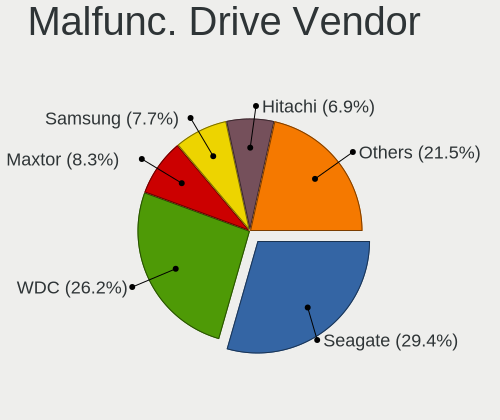
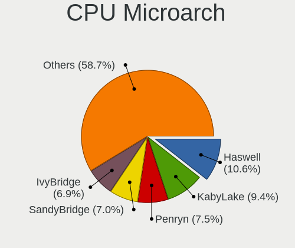
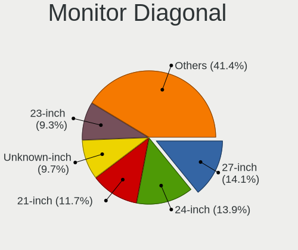
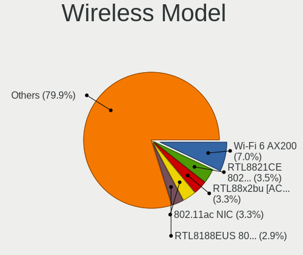
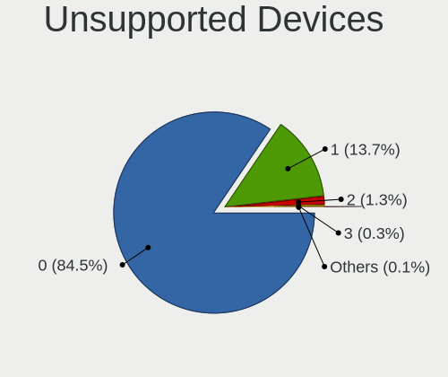

Linux in Italy - Tested Hardware & Statistics (Desktops)
--------------------------------------------------------

A project to collect tested hardware configurations for Linux in Italy.

Anyone can contribute to this report by the [hw-probe](https://github.com/linuxhw/hw-probe) tool:

    sudo -E hw-probe -all -upload

Please contribute! Especially if your hardware is rare.

Contents
--------

* [ Test Cases ](#test-cases)

* [ System ](#system)
  - [ OS                       ](#os)
  - [ OS Family                ](#os-family)
  - [ Kernel                   ](#kernel)
  - [ Kernel Family            ](#kernel-family)
  - [ Kernel Major Ver.        ](#kernel-major-ver)
  - [ Arch                     ](#arch)
  - [ DE                       ](#de)
  - [ Display Server           ](#display-server)
  - [ Display Manager          ](#display-manager)
  - [ OS Lang                  ](#os-lang)
  - [ Boot Mode                ](#boot-mode)
  - [ Filesystem               ](#filesystem)
  - [ Part. scheme             ](#part-scheme)
  - [ Dual Boot with Linux/BSD ](#dual-boot-with-linuxbsd)
  - [ Dual Boot (Win)          ](#dual-boot-win)

* [ Board ](#board)
  - [ Vendor                   ](#vendor)
  - [ Model                    ](#model)
  - [ Model Family             ](#model-family)
  - [ MFG Year                 ](#mfg-year)
  - [ Form Factor              ](#form-factor)
  - [ Secure Boot              ](#secure-boot)
  - [ Coreboot                 ](#coreboot)
  - [ RAM Size                 ](#ram-size)
  - [ RAM Used                 ](#ram-used)
  - [ Total Drives             ](#total-drives)
  - [ Has CD-ROM               ](#has-cd-rom)
  - [ Has Ethernet             ](#has-ethernet)
  - [ Has WiFi                 ](#has-wifi)
  - [ Has Bluetooth            ](#has-bluetooth)

* [ Location ](#location)
  - [ Country                  ](#country)
  - [ City                     ](#city)

* [ Drives ](#drives)
  - [ Drive Vendor             ](#drive-vendor)
  - [ Drive Model              ](#drive-model)
  - [ HDD Vendor               ](#hdd-vendor)
  - [ SSD Vendor               ](#ssd-vendor)
  - [ Drive Kind               ](#drive-kind)
  - [ Drive Connector          ](#drive-connector)
  - [ Drive Size               ](#drive-size)
  - [ Space Total              ](#space-total)
  - [ Space Used               ](#space-used)
  - [ Malfunc. Drives          ](#malfunc-drives)
  - [ Malfunc. Drive Vendor    ](#malfunc-drive-vendor)
  - [ Malfunc. HDD Vendor      ](#malfunc-hdd-vendor)
  - [ Malfunc. Drive Kind      ](#malfunc-drive-kind)
  - [ Failed Drives            ](#failed-drives)
  - [ Failed Drive Vendor      ](#failed-drive-vendor)
  - [ Drive Status             ](#drive-status)

* [ Storage controller ](#storage-controller)
  - [ Storage Vendor           ](#storage-vendor)
  - [ Storage Model            ](#storage-model)
  - [ Storage Kind             ](#storage-kind)

* [ Processor ](#processor)
  - [ CPU Vendor               ](#cpu-vendor)
  - [ CPU Model                ](#cpu-model)
  - [ CPU Model Family         ](#cpu-model-family)
  - [ CPU Cores                ](#cpu-cores)
  - [ CPU Sockets              ](#cpu-sockets)
  - [ CPU Threads              ](#cpu-threads)
  - [ CPU Op-Modes             ](#cpu-op-modes)
  - [ CPU Microcode            ](#cpu-microcode)
  - [ CPU Microarch            ](#cpu-microarch)

* [ Graphics ](#graphics)
  - [ GPU Vendor               ](#gpu-vendor)
  - [ GPU Model                ](#gpu-model)
  - [ GPU Combo                ](#gpu-combo)
  - [ GPU Driver               ](#gpu-driver)
  - [ GPU Memory               ](#gpu-memory)

* [ Monitor ](#monitor)
  - [ Monitor Vendor           ](#monitor-vendor)
  - [ Monitor Model            ](#monitor-model)
  - [ Monitor Resolution       ](#monitor-resolution)
  - [ Monitor Diagonal         ](#monitor-diagonal)
  - [ Monitor Width            ](#monitor-width)
  - [ Aspect Ratio             ](#aspect-ratio)
  - [ Monitor Area             ](#monitor-area)
  - [ Pixel Density            ](#pixel-density)
  - [ Multiple Monitors        ](#multiple-monitors)

* [ Network ](#network)
  - [ Net Controller Vendor    ](#net-controller-vendor)
  - [ Net Controller Model     ](#net-controller-model)
  - [ Wireless Vendor          ](#wireless-vendor)
  - [ Wireless Model           ](#wireless-model)
  - [ Ethernet Vendor          ](#ethernet-vendor)
  - [ Ethernet Model           ](#ethernet-model)
  - [ Net Controller Kind      ](#net-controller-kind)
  - [ Used Controller          ](#used-controller)
  - [ NICs                     ](#nics)
  - [ IPv6                     ](#ipv6)

* [ Bluetooth ](#bluetooth)
  - [ Bluetooth Vendor         ](#bluetooth-vendor)
  - [ Bluetooth Model          ](#bluetooth-model)

* [ Sound ](#sound)
  - [ Sound Vendor             ](#sound-vendor)
  - [ Sound Model              ](#sound-model)

* [ Memory ](#memory)
  - [ Memory Vendor            ](#memory-vendor)
  - [ Memory Model             ](#memory-model)
  - [ Memory Kind              ](#memory-kind)
  - [ Memory Form Factor       ](#memory-form-factor)
  - [ Memory Size              ](#memory-size)
  - [ Memory Speed             ](#memory-speed)

* [ Printers & scanners ](#printers--scanners)
  - [ Printer Vendor           ](#printer-vendor)
  - [ Printer Model            ](#printer-model)
  - [ Scanner Vendor           ](#scanner-vendor)
  - [ Scanner Model            ](#scanner-model)

* [ Camera ](#camera)
  - [ Camera Vendor            ](#camera-vendor)
  - [ Camera Model             ](#camera-model)

* [ Security ](#security)
  - [ Fingerprint Vendor       ](#fingerprint-vendor)
  - [ Fingerprint Model        ](#fingerprint-model)
  - [ Chipcard Vendor          ](#chipcard-vendor)
  - [ Chipcard Model           ](#chipcard-model)

* [ Unsupported ](#unsupported)
  - [ Unsupported Devices      ](#unsupported-devices)
  - [ Unsupported Device Types ](#unsupported-device-types)

Test Cases
----------

Total: 3170

| Vendor        | Model                       | Probe                                                      | Date         |
|---------------|-----------------------------|------------------------------------------------------------|--------------|
| ASUSTek       | H81T                        | [7598a634e6](https://linux-hardware.org/?probe=7598a634e6) | Nov 02, 2022 |
| MSI           | MAG X570S TOMAHAWK MAX W... | [c9041d22be](https://linux-hardware.org/?probe=c9041d22be) | Nov 02, 2022 |
| ASUSTek       | B85-PLUS                    | [dd24c26ffa](https://linux-hardware.org/?probe=dd24c26ffa) | Nov 02, 2022 |
| Dell          | 0GWHMW A01                  | [732eaeede7](https://linux-hardware.org/?probe=732eaeede7) | Nov 02, 2022 |
| MSI           | B75A-IE35                   | [57b74e4ca2](https://linux-hardware.org/?probe=57b74e4ca2) | Nov 01, 2022 |
| MSI           | Z370 GAMING PLUS            | [527c779cfb](https://linux-hardware.org/?probe=527c779cfb) | Nov 01, 2022 |
| ASUSTek       | BM2AD_D510MT_D310MT         | [8f2b0bc926](https://linux-hardware.org/?probe=8f2b0bc926) | Nov 01, 2022 |
| Intel         | DH61DL AAG14066-205         | [0f62f6f3b1](https://linux-hardware.org/?probe=0f62f6f3b1) | Nov 01, 2022 |
| MSI           | H81M-E33                    | [ee4c33d7b1](https://linux-hardware.org/?probe=ee4c33d7b1) | Nov 01, 2022 |
| ASUSTek       | PRIME A320M-K               | [a14fa00a56](https://linux-hardware.org/?probe=a14fa00a56) | Nov 01, 2022 |
| ASUSTek       | PRIME A320M-K               | [bfa1db2eb1](https://linux-hardware.org/?probe=bfa1db2eb1) | Nov 01, 2022 |
| ASUSTek       | H61M-K                      | [ca5a47c66a](https://linux-hardware.org/?probe=ca5a47c66a) | Nov 01, 2022 |
| ASUSTek       | SABERTOOTH Z87              | [d39c952932](https://linux-hardware.org/?probe=d39c952932) | Nov 01, 2022 |
| MSI           | X570-A PRO                  | [c60d9aa72d](https://linux-hardware.org/?probe=c60d9aa72d) | Oct 31, 2022 |
| ASUSTek       | CG8480                      | [0f7c1dc1cf](https://linux-hardware.org/?probe=0f7c1dc1cf) | Oct 31, 2022 |
| MSI           | H110M PRO-VD PLUS           | [ced3229025](https://linux-hardware.org/?probe=ced3229025) | Oct 31, 2022 |
| HP            | 3397                        | [942cfa2a25](https://linux-hardware.org/?probe=942cfa2a25) | Oct 31, 2022 |
| Gigabyte      | Z270-HD3P-CF                | [e309413fea](https://linux-hardware.org/?probe=e309413fea) | Oct 31, 2022 |
| Gigabyte      | B450 AORUS M                | [13741c554f](https://linux-hardware.org/?probe=13741c554f) | Oct 31, 2022 |
| Gigabyte      | B450 AORUS M                | [e6e466cd8f](https://linux-hardware.org/?probe=e6e466cd8f) | Oct 31, 2022 |
| MSI           | 990FXA-GD80                 | [baaa1111ec](https://linux-hardware.org/?probe=baaa1111ec) | Oct 31, 2022 |
| Gigabyte      | X570S AERO G                | [600587e66a](https://linux-hardware.org/?probe=600587e66a) | Oct 31, 2022 |
| ASUSTek       | PRIME X570-PRO              | [3fbcca75d5](https://linux-hardware.org/?probe=3fbcca75d5) | Oct 30, 2022 |
| ASRock        | FM2A88X-ITX+                | [08cf9e2ccd](https://linux-hardware.org/?probe=08cf9e2ccd) | Oct 30, 2022 |
| Gigabyte      | G1.Sniper B5-CF             | [c128f85cdc](https://linux-hardware.org/?probe=c128f85cdc) | Oct 30, 2022 |
| ASUSTek       | A88XM-PLUS                  | [10aa435a0b](https://linux-hardware.org/?probe=10aa435a0b) | Oct 30, 2022 |
| ASRock        | FM2A88X-ITX+                | [e28a25b18a](https://linux-hardware.org/?probe=e28a25b18a) | Oct 30, 2022 |
| MSI           | MPG B550 GAMING PLUS        | [1f7df5159e](https://linux-hardware.org/?probe=1f7df5159e) | Oct 30, 2022 |
| ASUSTek       | P6TD DELUXE                 | [faa61ea635](https://linux-hardware.org/?probe=faa61ea635) | Oct 30, 2022 |
| MSI           | Z77A-G45 Thunderbolt        | [fa189cf50b](https://linux-hardware.org/?probe=fa189cf50b) | Oct 30, 2022 |
| HP            | 1495                        | [b62f9d83b9](https://linux-hardware.org/?probe=b62f9d83b9) | Oct 30, 2022 |
| MSI           | A320M-A PRO MAX             | [80d6d99bcf](https://linux-hardware.org/?probe=80d6d99bcf) | Oct 30, 2022 |
| HP            | 18E7                        | [d4a4ad62cb](https://linux-hardware.org/?probe=d4a4ad62cb) | Oct 29, 2022 |
| MSI           | B450M PRO-M2 MAX            | [6549416d9d](https://linux-hardware.org/?probe=6549416d9d) | Oct 29, 2022 |
| ASRock        | B450M Pro4                  | [0616272661](https://linux-hardware.org/?probe=0616272661) | Oct 29, 2022 |
| ASUSTek       | PRIME A320M-K               | [25caeb6d9e](https://linux-hardware.org/?probe=25caeb6d9e) | Oct 29, 2022 |
| ASRock        | 890GX Extreme3              | [ff1af2eaf0](https://linux-hardware.org/?probe=ff1af2eaf0) | Oct 29, 2022 |
| ASUSTek       | LEUCITE3                    | [f51161d005](https://linux-hardware.org/?probe=f51161d005) | Oct 29, 2022 |
| ASUSTek       | LEUCITE3                    | [4c4e1b6871](https://linux-hardware.org/?probe=4c4e1b6871) | Oct 29, 2022 |
| ASUSTek       | P5KPL-AM SE                 | [95af9b0439](https://linux-hardware.org/?probe=95af9b0439) | Oct 29, 2022 |
| Gigabyte      | EX58-UD3R                   | [0d76cc7e31](https://linux-hardware.org/?probe=0d76cc7e31) | Oct 29, 2022 |
| ASUSTek       | PRIME A320M-K               | [5876a2f3d6](https://linux-hardware.org/?probe=5876a2f3d6) | Oct 28, 2022 |
| Acer          | MCP7A                       | [c14a31f6ab](https://linux-hardware.org/?probe=c14a31f6ab) | Oct 28, 2022 |
| Unknown       | 775V88+                     | [f1a685b497](https://linux-hardware.org/?probe=f1a685b497) | Oct 28, 2022 |
| Lenovo        | 317E SDK0J40700 WIN 3258... | [8c85b7ec2e](https://linux-hardware.org/?probe=8c85b7ec2e) | Oct 28, 2022 |
| Gigabyte      | H310M S2H x.x               | [acdf2a172f](https://linux-hardware.org/?probe=acdf2a172f) | Oct 28, 2022 |
| MSI           | H81M-P33                    | [16a78334cd](https://linux-hardware.org/?probe=16a78334cd) | Oct 28, 2022 |
| MSI           | Z370 KRAIT GAMING           | [cbf597cec1](https://linux-hardware.org/?probe=cbf597cec1) | Oct 28, 2022 |
| ASUSTek       | P9X79-WS-SYS                | [8b10d380a5](https://linux-hardware.org/?probe=8b10d380a5) | Oct 28, 2022 |
| ASUSTek       | ROG CROSSHAIR VII HERO      | [1759cbebe1](https://linux-hardware.org/?probe=1759cbebe1) | Oct 28, 2022 |
| ASUSTek       | ROG CROSSHAIR VII HERO      | [ac3b0eaf36](https://linux-hardware.org/?probe=ac3b0eaf36) | Oct 28, 2022 |
| Intel         | DH61DL AAG14066-205         | [9031f7b82b](https://linux-hardware.org/?probe=9031f7b82b) | Oct 27, 2022 |
| Lenovo        | 0B98401 PRO                 | [99f9bbd5ad](https://linux-hardware.org/?probe=99f9bbd5ad) | Oct 27, 2022 |
| MSI           | H110M PRO-VD PLUS           | [d3c4092754](https://linux-hardware.org/?probe=d3c4092754) | Oct 27, 2022 |
| Gigabyte      | Z77X-UP7                    | [c33d6de923](https://linux-hardware.org/?probe=c33d6de923) | Oct 27, 2022 |
| Packard Be... | IMEDIA S3810                | [f492fb9369](https://linux-hardware.org/?probe=f492fb9369) | Oct 27, 2022 |
| MSI           | H81M-E33                    | [f0613bfce8](https://linux-hardware.org/?probe=f0613bfce8) | Oct 27, 2022 |
| MSI           | X58 Pro                     | [6c449246c8](https://linux-hardware.org/?probe=6c449246c8) | Oct 27, 2022 |
| MSI           | B450 TOMAHAWK MAX           | [b682a38061](https://linux-hardware.org/?probe=b682a38061) | Oct 27, 2022 |
| HP            | 1589                        | [4a15b6de0f](https://linux-hardware.org/?probe=4a15b6de0f) | Oct 27, 2022 |
| ASUSTek       | TUF Gaming B460M-PLUS       | [d2debd1dab](https://linux-hardware.org/?probe=d2debd1dab) | Oct 26, 2022 |
| MSI           | MPG Z390 GAMING PRO CARB... | [97d2bacb5d](https://linux-hardware.org/?probe=97d2bacb5d) | Oct 26, 2022 |
| Gigabyte      | X570 AORUS ELITE            | [82fcc1ecc7](https://linux-hardware.org/?probe=82fcc1ecc7) | Oct 26, 2022 |
| Intel         | H55                         | [f634aefb9a](https://linux-hardware.org/?probe=f634aefb9a) | Oct 26, 2022 |
| MSI           | ZH77A-G43                   | [ff43c876e9](https://linux-hardware.org/?probe=ff43c876e9) | Oct 26, 2022 |
| ASUSTek       | TUF B450M-PLUS GAMING       | [469345600b](https://linux-hardware.org/?probe=469345600b) | Oct 26, 2022 |
| Fujitsu       | D3161-A1 S26361-D3161-A1    | [06f33f301b](https://linux-hardware.org/?probe=06f33f301b) | Oct 26, 2022 |
| Gigabyte      | X570 AORUS ELITE            | [8a718e0ade](https://linux-hardware.org/?probe=8a718e0ade) | Oct 26, 2022 |
| ASRock        | H77 Pro4/MVP                | [94d8bc13bb](https://linux-hardware.org/?probe=94d8bc13bb) | Oct 26, 2022 |
| Lenovo        | 1048 SDK0Q40104 WIN 3915... | [2bed8fe9b1](https://linux-hardware.org/?probe=2bed8fe9b1) | Oct 26, 2022 |
| HP            | 1494                        | [fa63090109](https://linux-hardware.org/?probe=fa63090109) | Oct 26, 2022 |
| HP            | 8509                        | [81bfb5a782](https://linux-hardware.org/?probe=81bfb5a782) | Oct 26, 2022 |
| ASUSTek       | P8H67-M PRO                 | [b50585b578](https://linux-hardware.org/?probe=b50585b578) | Oct 26, 2022 |
| Gigabyte      | B450 AORUS M                | [1603f6064b](https://linux-hardware.org/?probe=1603f6064b) | Oct 26, 2022 |
| ASUSTek       | ROG STRIX B550-F GAMING     | [705e51d33e](https://linux-hardware.org/?probe=705e51d33e) | Oct 25, 2022 |
| MSI           | MPG B550 GAMING EDGE WIF... | [50c68d9bb4](https://linux-hardware.org/?probe=50c68d9bb4) | Oct 25, 2022 |
| ASUSTek       | Z87-PRO                     | [a48316f550](https://linux-hardware.org/?probe=a48316f550) | Oct 25, 2022 |
| ASUSTek       | ROG STRIX B550-F GAMING     | [824eb583d8](https://linux-hardware.org/?probe=824eb583d8) | Oct 25, 2022 |
| ASUSTek       | SABERTOOTH 990FX R2.0       | [6ffc032b64](https://linux-hardware.org/?probe=6ffc032b64) | Oct 25, 2022 |
| ASUSTek       | ROG STRIX B550-F GAMING     | [2227bb9824](https://linux-hardware.org/?probe=2227bb9824) | Oct 25, 2022 |
| Lenovo        | 102F SDK0J40705 WIN 3425... | [958c0a2ae7](https://linux-hardware.org/?probe=958c0a2ae7) | Oct 25, 2022 |
| Gigabyte      | H370 AORUS GAMING 3 WIFI... | [1f3561258a](https://linux-hardware.org/?probe=1f3561258a) | Oct 25, 2022 |
| Gigabyte      | H97M-D3H                    | [72532e08fe](https://linux-hardware.org/?probe=72532e08fe) | Oct 25, 2022 |
| Dell          | 040DDP A01                  | [cc0b502ddf](https://linux-hardware.org/?probe=cc0b502ddf) | Oct 25, 2022 |
| ASUSTek       | H110M-K                     | [06c00dc8d5](https://linux-hardware.org/?probe=06c00dc8d5) | Oct 25, 2022 |
| Lenovo        | SHARKBAY 31900058 STD       | [bd3a8063b3](https://linux-hardware.org/?probe=bd3a8063b3) | Oct 25, 2022 |
| ASRock        | AB350 Pro4                  | [82ee095168](https://linux-hardware.org/?probe=82ee095168) | Oct 25, 2022 |
| ASRock        | G41C-GS                     | [a38f9baa55](https://linux-hardware.org/?probe=a38f9baa55) | Oct 25, 2022 |
| MSI           | Z170A GAMING M5             | [b5dcdb6844](https://linux-hardware.org/?probe=b5dcdb6844) | Oct 25, 2022 |
| ASRock        | 4Core1600-GLAN/M            | [33bf20761f](https://linux-hardware.org/?probe=33bf20761f) | Oct 25, 2022 |
| Unknown       | 1.0                         | [cf3a9de207](https://linux-hardware.org/?probe=cf3a9de207) | Oct 25, 2022 |
| ASUSTek       | PRIME Z490-P                | [0eb9c3ebff](https://linux-hardware.org/?probe=0eb9c3ebff) | Oct 25, 2022 |
| Pegatron      | Benicia                     | [3735dca311](https://linux-hardware.org/?probe=3735dca311) | Oct 25, 2022 |
| HP            | 805F                        | [eaa3994f86](https://linux-hardware.org/?probe=eaa3994f86) | Oct 25, 2022 |
| ASUSTek       | TUF Gaming B450M-PRO II     | [ab5d5a6170](https://linux-hardware.org/?probe=ab5d5a6170) | Oct 25, 2022 |
| MSI           | X470 GAMING PLUS MAX        | [040714e135](https://linux-hardware.org/?probe=040714e135) | Oct 25, 2022 |
| ASUSTek       | M5A78L-M/USB3               | [6a9d81591f](https://linux-hardware.org/?probe=6a9d81591f) | Oct 25, 2022 |
| Lenovo        | 318E NOK                    | [6b190bfb4f](https://linux-hardware.org/?probe=6b190bfb4f) | Oct 25, 2022 |
| ASUSTek       | PRIME H370-PLUS             | [ef9fdf5dcd](https://linux-hardware.org/?probe=ef9fdf5dcd) | Oct 25, 2022 |
| ASUSTek       | PRIME B450-PLUS             | [0c63b974e1](https://linux-hardware.org/?probe=0c63b974e1) | Oct 25, 2022 |
| ASUSTek       | M3N78-VM                    | [1c68e176b6](https://linux-hardware.org/?probe=1c68e176b6) | Oct 25, 2022 |
| MSI           | H97 PC Mate                 | [1916f5c048](https://linux-hardware.org/?probe=1916f5c048) | Oct 25, 2022 |
| Gigabyte      | F2A78M-HD2                  | [6cffc39cfc](https://linux-hardware.org/?probe=6cffc39cfc) | Oct 25, 2022 |
| Gigabyte      | Z690 UD DDR4                | [c838769296](https://linux-hardware.org/?probe=c838769296) | Oct 25, 2022 |
| MSI           | B450 TOMAHAWK MAX           | [7b59865f68](https://linux-hardware.org/?probe=7b59865f68) | Oct 25, 2022 |
| ASUSTek       | K30AD_M31AD_M51AD_M32AD     | [7027921568](https://linux-hardware.org/?probe=7027921568) | Oct 25, 2022 |
| MSI           | H61M-P31/W8                 | [7ba2ecf5f0](https://linux-hardware.org/?probe=7ba2ecf5f0) | Oct 25, 2022 |
| Acer          | Veriton M2631 V:1.0         | [1d5e3aa9f0](https://linux-hardware.org/?probe=1d5e3aa9f0) | Oct 25, 2022 |
| MSI           | Z97-G55 SLI                 | [25ddd5274f](https://linux-hardware.org/?probe=25ddd5274f) | Oct 25, 2022 |
| ASUSTek       | TUF Gaming B550-PLUS        | [74ca211759](https://linux-hardware.org/?probe=74ca211759) | Oct 25, 2022 |
| MSI           | MAG Z490 TOMAHAWK           | [aa4a86445a](https://linux-hardware.org/?probe=aa4a86445a) | Oct 25, 2022 |
| ASRock        | B450 Gaming K4              | [122a54b0c2](https://linux-hardware.org/?probe=122a54b0c2) | Oct 25, 2022 |
| ASUSTek       | PRIME B550M-A               | [a55a6ef774](https://linux-hardware.org/?probe=a55a6ef774) | Oct 25, 2022 |
| ASUSTek       | Pro WS X570-ACE             | [52a4b91a1e](https://linux-hardware.org/?probe=52a4b91a1e) | Oct 25, 2022 |
| MSI           | MAG X570S TORPEDO MAX       | [c77d3dfeba](https://linux-hardware.org/?probe=c77d3dfeba) | Oct 25, 2022 |
| Gigabyte      | Z87-HD3                     | [da7fe35832](https://linux-hardware.org/?probe=da7fe35832) | Oct 25, 2022 |
| MSI           | Z170A GAMING M7             | [3326f67ecf](https://linux-hardware.org/?probe=3326f67ecf) | Oct 25, 2022 |
| Intel         | DH61AG AAG23736-507         | [7fa3b3bc6a](https://linux-hardware.org/?probe=7fa3b3bc6a) | Oct 25, 2022 |
| ASUSTek       | PRIME B350-PLUS             | [65c39a9702](https://linux-hardware.org/?probe=65c39a9702) | Oct 24, 2022 |
| Gigabyte      | GA-MA78GM-S2H               | [a0e0f661af](https://linux-hardware.org/?probe=a0e0f661af) | Oct 24, 2022 |
| ASRock        | H370M-ITX/ac                | [fa925dcefb](https://linux-hardware.org/?probe=fa925dcefb) | Oct 24, 2022 |
| MSI           | H510M-A PRO                 | [02e8dbe21d](https://linux-hardware.org/?probe=02e8dbe21d) | Oct 24, 2022 |
| ASUSTek       | PRIME Z390-P                | [261e670072](https://linux-hardware.org/?probe=261e670072) | Oct 24, 2022 |
| ASRock        | Z170 Gaming K4              | [184139e7bc](https://linux-hardware.org/?probe=184139e7bc) | Oct 24, 2022 |
| ASUSTek       | H81M-C                      | [1deed99314](https://linux-hardware.org/?probe=1deed99314) | Oct 24, 2022 |
| ASUSTek       | M4A78T-E                    | [ee86cdac2a](https://linux-hardware.org/?probe=ee86cdac2a) | Oct 24, 2022 |
| Lenovo        | 3708 SDK0J40700 WIN 3258... | [df05c11ff4](https://linux-hardware.org/?probe=df05c11ff4) | Oct 24, 2022 |
| Gigabyte      | X570 AORUS ELITE            | [581fb21345](https://linux-hardware.org/?probe=581fb21345) | Oct 24, 2022 |
| Fujitsu       | D3162-A1 S26361-D3162-A1    | [aa82a1f3c9](https://linux-hardware.org/?probe=aa82a1f3c9) | Oct 24, 2022 |
| ASRock        | B450 Gaming-ITX/ac          | [c76c6f0a0e](https://linux-hardware.org/?probe=c76c6f0a0e) | Oct 24, 2022 |
| Gigabyte      | B365M D2V                   | [c852b8f3f7](https://linux-hardware.org/?probe=c852b8f3f7) | Oct 24, 2022 |
| ASUSTek       | ROG STRIX Z390-E GAMING     | [f42213926f](https://linux-hardware.org/?probe=f42213926f) | Oct 24, 2022 |
| Dell          | 0M5WNK A00                  | [fad0f2f50e](https://linux-hardware.org/?probe=fad0f2f50e) | Oct 24, 2022 |
| ASUSTek       | Maximus VI EXTREME          | [e5264df501](https://linux-hardware.org/?probe=e5264df501) | Oct 24, 2022 |
| ASUSTek       | TUF Gaming B560M-PLUS       | [91bf754e64](https://linux-hardware.org/?probe=91bf754e64) | Oct 24, 2022 |
| MSI           | MPG B550 GAMING PLUS        | [b63ff47508](https://linux-hardware.org/?probe=b63ff47508) | Oct 24, 2022 |
| ASUSTek       | H97-PLUS                    | [aaf3b72437](https://linux-hardware.org/?probe=aaf3b72437) | Oct 24, 2022 |
| ASUSTek       | H170 PRO GAMING             | [905f41afd6](https://linux-hardware.org/?probe=905f41afd6) | Oct 24, 2022 |
| Acer          | Aspire MC605 v1.0           | [9544ff7787](https://linux-hardware.org/?probe=9544ff7787) | Oct 24, 2022 |
| HP            | 3048h                       | [3c3f7eda5e](https://linux-hardware.org/?probe=3c3f7eda5e) | Oct 24, 2022 |
| ASRock        | X370 Gaming K4              | [5658dbff1b](https://linux-hardware.org/?probe=5658dbff1b) | Oct 24, 2022 |
| ASUSTek       | TUF B450-PLUS GAMING        | [1dea808353](https://linux-hardware.org/?probe=1dea808353) | Oct 24, 2022 |
| Gigabyte      | B85M-D3H                    | [f4182ec2e9](https://linux-hardware.org/?probe=f4182ec2e9) | Oct 24, 2022 |
| Gigabyte      | H310M H                     | [3a8627fb53](https://linux-hardware.org/?probe=3a8627fb53) | Oct 24, 2022 |
| MSI           | B350M PRO-VD PLUS           | [93068b4cf8](https://linux-hardware.org/?probe=93068b4cf8) | Oct 24, 2022 |
| ASUSTek       | PRIME B360M-A               | [19ccd70ee8](https://linux-hardware.org/?probe=19ccd70ee8) | Oct 24, 2022 |
| MSI           | MPG Z490 GAMING EDGE WIF... | [01c09a61ae](https://linux-hardware.org/?probe=01c09a61ae) | Oct 24, 2022 |
| ASUSTek       | ROG STRIX B550-I GAMING     | [638c72b105](https://linux-hardware.org/?probe=638c72b105) | Oct 24, 2022 |
| ASUSTek       | PRIME B450M-A               | [fb3feaef06](https://linux-hardware.org/?probe=fb3feaef06) | Oct 24, 2022 |
| MSI           | MAG X570S TORPEDO MAX       | [a8ab16a5c5](https://linux-hardware.org/?probe=a8ab16a5c5) | Oct 24, 2022 |
| ASUSTek       | P8Z77-V LE PLUS             | [164b8dd0d8](https://linux-hardware.org/?probe=164b8dd0d8) | Oct 24, 2022 |
| Dell          | 042P49 A02                  | [d9590e8d45](https://linux-hardware.org/?probe=d9590e8d45) | Oct 24, 2022 |
| MSI           | MPG X570 GAMING PLUS        | [5010a8ef47](https://linux-hardware.org/?probe=5010a8ef47) | Oct 24, 2022 |
| Dell          | 0RW199                      | [dc99b64e62](https://linux-hardware.org/?probe=dc99b64e62) | Oct 24, 2022 |
| MSI           | B450M MORTAR TITANIUM       | [37a0403fc9](https://linux-hardware.org/?probe=37a0403fc9) | Oct 24, 2022 |
| MSI           | Z390-A PRO                  | [40f916420e](https://linux-hardware.org/?probe=40f916420e) | Oct 23, 2022 |
| HP            | 3397                        | [6f58590d3d](https://linux-hardware.org/?probe=6f58590d3d) | Oct 23, 2022 |
| ASUSTek       | TUF Gaming B550-PLUS        | [22ea226b97](https://linux-hardware.org/?probe=22ea226b97) | Oct 23, 2022 |
| Dell          | 0WR7PY A02                  | [07fb028e18](https://linux-hardware.org/?probe=07fb028e18) | Oct 22, 2022 |
| MSI           | X58 Pro                     | [96db21189e](https://linux-hardware.org/?probe=96db21189e) | Oct 22, 2022 |
| MSI           | PRO Z690-A                  | [9ea661d3b9](https://linux-hardware.org/?probe=9ea661d3b9) | Oct 22, 2022 |
| MSI           | MAG B460M BAZOOKA           | [9cfe9f3c51](https://linux-hardware.org/?probe=9cfe9f3c51) | Oct 22, 2022 |
| ASUSTek       | H110M-A                     | [7bd1ee25b3](https://linux-hardware.org/?probe=7bd1ee25b3) | Oct 21, 2022 |
| HP            | 87D6 SMVB                   | [86740d9460](https://linux-hardware.org/?probe=86740d9460) | Oct 21, 2022 |
| ASUSTek       | P7P55-M                     | [3ff254b938](https://linux-hardware.org/?probe=3ff254b938) | Oct 20, 2022 |
| ASUSTek       | Leonite2                    | [7640c7a49f](https://linux-hardware.org/?probe=7640c7a49f) | Oct 20, 2022 |
| Gigabyte      | X570 I AORUS PRO WIFI       | [e455bef105](https://linux-hardware.org/?probe=e455bef105) | Oct 20, 2022 |
| Dell          | 0HY175 A03                  | [86950688ac](https://linux-hardware.org/?probe=86950688ac) | Oct 20, 2022 |
| Dell          | 0HY175 A03                  | [ede27fb1d0](https://linux-hardware.org/?probe=ede27fb1d0) | Oct 19, 2022 |
| HP            | 805D                        | [a70ef30fce](https://linux-hardware.org/?probe=a70ef30fce) | Oct 19, 2022 |
| ASUSTek       | PRIME B660M-A WIFI D4       | [116fff483b](https://linux-hardware.org/?probe=116fff483b) | Oct 19, 2022 |
| Dell          | 0C522T A03                  | [20703ba8b3](https://linux-hardware.org/?probe=20703ba8b3) | Oct 18, 2022 |
| HP            | 3048h                       | [624ad8a33c](https://linux-hardware.org/?probe=624ad8a33c) | Oct 17, 2022 |
| HP            | 3048h                       | [1b3d31f720](https://linux-hardware.org/?probe=1b3d31f720) | Oct 17, 2022 |
| MSI           | MS-B1711                    | [231d1c3373](https://linux-hardware.org/?probe=231d1c3373) | Oct 16, 2022 |
| MSI           | MS-B1711                    | [964bad6988](https://linux-hardware.org/?probe=964bad6988) | Oct 16, 2022 |
| ASUSTek       | PRIME H270-PRO              | [3c2eef945d](https://linux-hardware.org/?probe=3c2eef945d) | Oct 16, 2022 |
| MSI           | MS-7309                     | [9d4f0daf60](https://linux-hardware.org/?probe=9d4f0daf60) | Oct 16, 2022 |
| Packard Be... | IMEDIA S3712                | [d9aa81c4c3](https://linux-hardware.org/?probe=d9aa81c4c3) | Oct 15, 2022 |
| ASUSTek       | H87M-PRO                    | [4f1304fbdd](https://linux-hardware.org/?probe=4f1304fbdd) | Oct 15, 2022 |
| HP            | 198E                        | [47439edd0e](https://linux-hardware.org/?probe=47439edd0e) | Oct 15, 2022 |
| ASUSTek       | P5KPL-CM                    | [d00f5feebf](https://linux-hardware.org/?probe=d00f5feebf) | Oct 15, 2022 |
| Gigabyte      | X570 I AORUS PRO WIFI       | [b1eab51bd7](https://linux-hardware.org/?probe=b1eab51bd7) | Oct 15, 2022 |
| Gigabyte      | X570 I AORUS PRO WIFI       | [8557c8b501](https://linux-hardware.org/?probe=8557c8b501) | Oct 15, 2022 |
| Gigabyte      | G33M-DS2R                   | [a14ced18eb](https://linux-hardware.org/?probe=a14ced18eb) | Oct 15, 2022 |
| ASUSTek       | P8H77-V                     | [d6af5204e6](https://linux-hardware.org/?probe=d6af5204e6) | Oct 14, 2022 |
| Intel         | STK2MV64CC H89290-502       | [85670dc1fe](https://linux-hardware.org/?probe=85670dc1fe) | Oct 14, 2022 |
| Supermicro    | C7P67                       | [70613229ac](https://linux-hardware.org/?probe=70613229ac) | Oct 12, 2022 |
| ASUSTek       | ROG STRIX B550-F GAMING     | [d0d2949fd3](https://linux-hardware.org/?probe=d0d2949fd3) | Oct 12, 2022 |
| ASUSTek       | M5A97 R2.0                  | [71970edbae](https://linux-hardware.org/?probe=71970edbae) | Oct 11, 2022 |
| ASUSTek       | PRIME B660M-A WIFI D4       | [0e8d79a9a9](https://linux-hardware.org/?probe=0e8d79a9a9) | Oct 11, 2022 |
| ASUSTek       | Maximus VIII HERO ALPHA     | [c8ee640a4d](https://linux-hardware.org/?probe=c8ee640a4d) | Oct 09, 2022 |
| ASUSTek       | PRIME Z270-A                | [0f4a711f6a](https://linux-hardware.org/?probe=0f4a711f6a) | Oct 08, 2022 |
| ASRock        | H77M                        | [4ce05e4d0a](https://linux-hardware.org/?probe=4ce05e4d0a) | Oct 07, 2022 |
| Packard Be... | IMEDIA S3712                | [a528de7c22](https://linux-hardware.org/?probe=a528de7c22) | Oct 06, 2022 |
| ASUSTek       | PRIME H270-PRO              | [bbf95bf34d](https://linux-hardware.org/?probe=bbf95bf34d) | Oct 06, 2022 |
| ASUSTek       | ET1612I                     | [91fea00cbf](https://linux-hardware.org/?probe=91fea00cbf) | Oct 06, 2022 |
| HP            | 3398                        | [7dd62dded1](https://linux-hardware.org/?probe=7dd62dded1) | Oct 05, 2022 |
| HP            | 1906                        | [a6f705f119](https://linux-hardware.org/?probe=a6f705f119) | Oct 03, 2022 |
| Lenovo        | 3098 SDK0E50510 WIN         | [f6a6361e08](https://linux-hardware.org/?probe=f6a6361e08) | Oct 03, 2022 |
| ASUSTek       | ROG CROSSHAIR VIII DARK ... | [10e3123558](https://linux-hardware.org/?probe=10e3123558) | Oct 03, 2022 |
| ASUSTek       | P8Z68-V LX                  | [42b887e821](https://linux-hardware.org/?probe=42b887e821) | Oct 03, 2022 |
| Pegatron      | 2AC3                        | [0ea51f0746](https://linux-hardware.org/?probe=0ea51f0746) | Oct 03, 2022 |
| AZW           | Gemini X45                  | [721b4545a2](https://linux-hardware.org/?probe=721b4545a2) | Oct 02, 2022 |
| Packard Be... | IMEDIA S3712                | [1fd820d1d0](https://linux-hardware.org/?probe=1fd820d1d0) | Oct 01, 2022 |
| ASRock        | 970 Pro3 R2.0               | [592adc6c9b](https://linux-hardware.org/?probe=592adc6c9b) | Oct 01, 2022 |
| Dell          | 0YXT71 A02                  | [f36bc1d24e](https://linux-hardware.org/?probe=f36bc1d24e) | Sep 29, 2022 |
| ASRock        | J3160DC-ITX                 | [7e1818288f](https://linux-hardware.org/?probe=7e1818288f) | Sep 29, 2022 |
| Gigabyte      | F2A55M-DS2                  | [c17c689217](https://linux-hardware.org/?probe=c17c689217) | Sep 28, 2022 |
| Gigabyte      | Z390 AORUS PRO-CF           | [960c35d712](https://linux-hardware.org/?probe=960c35d712) | Sep 28, 2022 |
| Dell          | 09M8Y8 A01                  | [f129c4da4a](https://linux-hardware.org/?probe=f129c4da4a) | Sep 28, 2022 |
| Packard Be... | IMEDIA L4875 v1.0           | [bb57b80866](https://linux-hardware.org/?probe=bb57b80866) | Sep 27, 2022 |
| HP            | 8433 11                     | [a1d424bced](https://linux-hardware.org/?probe=a1d424bced) | Sep 27, 2022 |
| ASRock        | AB350 Gaming K4             | [184070d232](https://linux-hardware.org/?probe=184070d232) | Sep 26, 2022 |
| ASRock        | 775Dual-VSTA                | [9509fb65dd](https://linux-hardware.org/?probe=9509fb65dd) | Sep 26, 2022 |
| ASUSTek       | H81M-K                      | [badc988393](https://linux-hardware.org/?probe=badc988393) | Sep 26, 2022 |
| Packard Be... | IMEDIA L4875 v1.0           | [4ed673ff1a](https://linux-hardware.org/?probe=4ed673ff1a) | Sep 25, 2022 |
| ASUSTek       | ROG STRIX B550-F GAMING     | [65d54e7273](https://linux-hardware.org/?probe=65d54e7273) | Sep 25, 2022 |
| ASUSTek       | P8H61-M LX                  | [164f5bfea2](https://linux-hardware.org/?probe=164f5bfea2) | Sep 25, 2022 |
| HP            | 8433 11                     | [dffc61c155](https://linux-hardware.org/?probe=dffc61c155) | Sep 24, 2022 |
| ASRock        | 4CoreDual-SATA2             | [eb0e992df7](https://linux-hardware.org/?probe=eb0e992df7) | Sep 24, 2022 |
| ASUSTek       | P8B75-M LE                  | [8975676700](https://linux-hardware.org/?probe=8975676700) | Sep 24, 2022 |
| MSI           | MPG X570 GAMING PLUS        | [fd43d92335](https://linux-hardware.org/?probe=fd43d92335) | Sep 23, 2022 |
| ASUSTek       | ROG STRIX B450-F GAMING ... | [a4ce7c179e](https://linux-hardware.org/?probe=a4ce7c179e) | Sep 23, 2022 |
| Fujitsu Si... | P5LD2-FM-DH-VP              | [0c6cbcc99d](https://linux-hardware.org/?probe=0c6cbcc99d) | Sep 22, 2022 |
| ASUSTek       | M3N78-VM                    | [edaab96cde](https://linux-hardware.org/?probe=edaab96cde) | Sep 21, 2022 |
| Dell          | 09M8Y8 A01                  | [07dd388834](https://linux-hardware.org/?probe=07dd388834) | Sep 21, 2022 |
| Dell          | 0GM819                      | [951ce34bb2](https://linux-hardware.org/?probe=951ce34bb2) | Sep 21, 2022 |
| Lenovo        | ThinkCentre M57 6072WMD     | [eb8221088f](https://linux-hardware.org/?probe=eb8221088f) | Sep 21, 2022 |
| Dell          | 09M8Y8 A01                  | [2c7466119d](https://linux-hardware.org/?probe=2c7466119d) | Sep 21, 2022 |
| Intel         | H55                         | [6de435d14c](https://linux-hardware.org/?probe=6de435d14c) | Sep 20, 2022 |
| ASUSTek       | G20CB                       | [34f4d43b97](https://linux-hardware.org/?probe=34f4d43b97) | Sep 20, 2022 |
| MSI           | X470 GAMING PLUS MAX        | [9c483616f6](https://linux-hardware.org/?probe=9c483616f6) | Sep 20, 2022 |
| Acer          | Aspire M3970                | [d135989361](https://linux-hardware.org/?probe=d135989361) | Sep 19, 2022 |
| Supermicro    | C7P67                       | [16bff71d62](https://linux-hardware.org/?probe=16bff71d62) | Sep 19, 2022 |
| ASRock        | X570 Phantom Gaming 4       | [75be2db65c](https://linux-hardware.org/?probe=75be2db65c) | Sep 19, 2022 |
| HP            | 2B29                        | [391e407d29](https://linux-hardware.org/?probe=391e407d29) | Sep 18, 2022 |
| ASRock        | 960GC-GS FX                 | [2432fca2f8](https://linux-hardware.org/?probe=2432fca2f8) | Sep 18, 2022 |
| ASRock        | 960GC-GS FX                 | [3e40742ff0](https://linux-hardware.org/?probe=3e40742ff0) | Sep 18, 2022 |
| MSI           | Boston                      | [b884bd8c03](https://linux-hardware.org/?probe=b884bd8c03) | Sep 17, 2022 |
| ASUSTek       | P5K                         | [4cf17a7b6f](https://linux-hardware.org/?probe=4cf17a7b6f) | Sep 17, 2022 |
| Lenovo        | 3100 SDK0J40700 WIN 3258... | [3ba3a4becf](https://linux-hardware.org/?probe=3ba3a4becf) | Sep 16, 2022 |
| Lenovo        | 3708 SDK0J40700 WIN 3258... | [e6fe8aa148](https://linux-hardware.org/?probe=e6fe8aa148) | Sep 16, 2022 |
| ASUSTek       | ET1612I                     | [0ddd9554cc](https://linux-hardware.org/?probe=0ddd9554cc) | Sep 16, 2022 |
| ASRock        | X370 Gaming K4              | [0858e80da7](https://linux-hardware.org/?probe=0858e80da7) | Sep 15, 2022 |
| ASUSTek       | PRIME H410M-E               | [91f1fdc978](https://linux-hardware.org/?probe=91f1fdc978) | Sep 14, 2022 |
| Dell          | 0WR7PY A02                  | [0a587d6fee](https://linux-hardware.org/?probe=0a587d6fee) | Sep 14, 2022 |
| ASRock        | H61M-DGS                    | [aeac7cfb74](https://linux-hardware.org/?probe=aeac7cfb74) | Sep 14, 2022 |
| ASUSTek       | Z170 PRO GAMING             | [d3f957e34a](https://linux-hardware.org/?probe=d3f957e34a) | Sep 13, 2022 |
| ASUSTek       | G20CB                       | [a52ff97f3b](https://linux-hardware.org/?probe=a52ff97f3b) | Sep 12, 2022 |
| ASUSTek       | G20CB                       | [2d737743f4](https://linux-hardware.org/?probe=2d737743f4) | Sep 12, 2022 |
| ASRock        | B450 Gaming K4              | [2391f4673a](https://linux-hardware.org/?probe=2391f4673a) | Sep 12, 2022 |
| ASRock        | B450 Gaming K4              | [89963f6bf1](https://linux-hardware.org/?probe=89963f6bf1) | Sep 12, 2022 |
| MSI           | X58 Pro                     | [60406c82e8](https://linux-hardware.org/?probe=60406c82e8) | Sep 12, 2022 |
| Acer          | E415SM                      | [bc9ef15cab](https://linux-hardware.org/?probe=bc9ef15cab) | Sep 11, 2022 |
| Acer          | E415SM                      | [4f8a53c667](https://linux-hardware.org/?probe=4f8a53c667) | Sep 11, 2022 |
| ASUSTek       | PRIME H310M-E R2.0          | [b76fc41706](https://linux-hardware.org/?probe=b76fc41706) | Sep 11, 2022 |
| Fujitsu Si... | P5LD2-FM-DH-VP              | [ad6a16f658](https://linux-hardware.org/?probe=ad6a16f658) | Sep 11, 2022 |
| Gigabyte      | A320M-S2H V2-CF             | [4df5d0194d](https://linux-hardware.org/?probe=4df5d0194d) | Sep 11, 2022 |
| Gigabyte      | Z77X-UP7                    | [1634db2e78](https://linux-hardware.org/?probe=1634db2e78) | Sep 11, 2022 |
| ASUSTek       | TUF Gaming B550-PLUS        | [ee06685499](https://linux-hardware.org/?probe=ee06685499) | Sep 11, 2022 |
| Dell          | 09M8Y8 A01                  | [c719d7f544](https://linux-hardware.org/?probe=c719d7f544) | Sep 11, 2022 |
| Dell          | 03NVJ6 A01                  | [3f51b6da48](https://linux-hardware.org/?probe=3f51b6da48) | Sep 10, 2022 |
| ASRock        | J3160DC-ITX                 | [e854b82ab9](https://linux-hardware.org/?probe=e854b82ab9) | Sep 10, 2022 |
| ASUSTek       | TUF Gaming B550-PLUS        | [174c263499](https://linux-hardware.org/?probe=174c263499) | Sep 08, 2022 |
| Gigabyte      | Z97-HD3                     | [aeb2bae778](https://linux-hardware.org/?probe=aeb2bae778) | Sep 08, 2022 |
| Intel         | DH77DF AAG40293-300         | [217971d572](https://linux-hardware.org/?probe=217971d572) | Sep 08, 2022 |
| ASRock        | N3700-ITX                   | [5af515a1f9](https://linux-hardware.org/?probe=5af515a1f9) | Sep 08, 2022 |
| Gigabyte      | Z97-HD3                     | [d5040ffbda](https://linux-hardware.org/?probe=d5040ffbda) | Sep 08, 2022 |
| MSI           | H61M-P31                    | [56a8b0b2a7](https://linux-hardware.org/?probe=56a8b0b2a7) | Sep 08, 2022 |
| Pegatron      | 2A9Eh                       | [2c7b59f70b](https://linux-hardware.org/?probe=2c7b59f70b) | Sep 08, 2022 |
| HP            | 3397                        | [0ebeef29bf](https://linux-hardware.org/?probe=0ebeef29bf) | Sep 07, 2022 |
| Lenovo        | MAHOBAY                     | [2619e261d1](https://linux-hardware.org/?probe=2619e261d1) | Sep 07, 2022 |
| Pegatron      | Narra6                      | [b2a70f42a0](https://linux-hardware.org/?probe=b2a70f42a0) | Sep 07, 2022 |
| ASRock        | Q1900M                      | [05cf506f57](https://linux-hardware.org/?probe=05cf506f57) | Sep 06, 2022 |
| ASUSTek       | STRIKER II EXTREME          | [42e666abe1](https://linux-hardware.org/?probe=42e666abe1) | Sep 06, 2022 |
| ASUSTek       | P8H77-V LE                  | [8a1c5532d6](https://linux-hardware.org/?probe=8a1c5532d6) | Sep 06, 2022 |
| ASUSTek       | P8H77-V LE                  | [cc631912bf](https://linux-hardware.org/?probe=cc631912bf) | Sep 06, 2022 |
| ASUSTek       | P9X79 PRO                   | [7e53f87cc4](https://linux-hardware.org/?probe=7e53f87cc4) | Sep 06, 2022 |
| ASUSTek       | H81M-PLUS                   | [826b486f77](https://linux-hardware.org/?probe=826b486f77) | Sep 05, 2022 |
| HP            | 0B4Ch D                     | [87c4023810](https://linux-hardware.org/?probe=87c4023810) | Sep 05, 2022 |
| ASRock        | Q1900M                      | [6b53538e90](https://linux-hardware.org/?probe=6b53538e90) | Sep 05, 2022 |
| ASUSTek       | PRIME X370-PRO              | [312e33b434](https://linux-hardware.org/?probe=312e33b434) | Sep 05, 2022 |
| Dell          | 0MWYPT A01                  | [57b81c35c1](https://linux-hardware.org/?probe=57b81c35c1) | Sep 05, 2022 |
| MSI           | MPG B550 GAMING EDGE WIF... | [e83fa739c9](https://linux-hardware.org/?probe=e83fa739c9) | Sep 05, 2022 |
| ASUSTek       | STRIKER II EXTREME          | [502995e6f3](https://linux-hardware.org/?probe=502995e6f3) | Sep 05, 2022 |
| MSI           | B550-A PRO                  | [950b2a8eb5](https://linux-hardware.org/?probe=950b2a8eb5) | Sep 05, 2022 |
| ASUSTek       | P9X79 DELUXE                | [2aa7ada396](https://linux-hardware.org/?probe=2aa7ada396) | Sep 05, 2022 |
| ASUSTek       | ROG STRIX X570-E GAMING     | [127c2f5f75](https://linux-hardware.org/?probe=127c2f5f75) | Sep 05, 2022 |
| Gigabyte      | Z390 GAMING X-CF            | [26e63d2357](https://linux-hardware.org/?probe=26e63d2357) | Sep 05, 2022 |
| Dell          | 0HY9JP A02                  | [7cbf141461](https://linux-hardware.org/?probe=7cbf141461) | Sep 05, 2022 |
| Lenovo        | 367D 31900003 STD           | [c145bac65a](https://linux-hardware.org/?probe=c145bac65a) | Sep 05, 2022 |
| MSI           | MAG B550 TOMAHAWK           | [7c87d1ad42](https://linux-hardware.org/?probe=7c87d1ad42) | Sep 05, 2022 |
| ASUSTek       | TUF B450M-PLUS GAMING       | [43267285d4](https://linux-hardware.org/?probe=43267285d4) | Sep 04, 2022 |
| Gigabyte      | B450M DS3H-CF               | [008133bf59](https://linux-hardware.org/?probe=008133bf59) | Sep 04, 2022 |
| MSI           | B450 GAMING PLUS MAX        | [9cd2bcff37](https://linux-hardware.org/?probe=9cd2bcff37) | Sep 04, 2022 |
| Gigabyte      | B360 AORUS GAMING 3 WIFI... | [4a27f8b033](https://linux-hardware.org/?probe=4a27f8b033) | Sep 04, 2022 |
| ASRock        | Q1900M                      | [55a86f60b9](https://linux-hardware.org/?probe=55a86f60b9) | Sep 04, 2022 |
| ASUSTek       | P5P43TD                     | [cca9e79d90](https://linux-hardware.org/?probe=cca9e79d90) | Sep 04, 2022 |
| ASUSTek       | TUF Gaming B550-PLUS        | [2cf13f4045](https://linux-hardware.org/?probe=2cf13f4045) | Sep 04, 2022 |
| Lenovo        | SKYBAY SDK0J40709 WIN 32... | [ed16086671](https://linux-hardware.org/?probe=ed16086671) | Sep 04, 2022 |
| ASUSTek       | UN45                        | [87eca02296](https://linux-hardware.org/?probe=87eca02296) | Sep 04, 2022 |
| ASUSTek       | ROG STRIX Z370-E GAMING     | [bf4936f3bc](https://linux-hardware.org/?probe=bf4936f3bc) | Sep 04, 2022 |
| ASRock        | H370M-ITX/ac                | [1a577be107](https://linux-hardware.org/?probe=1a577be107) | Sep 04, 2022 |
| ASUSTek       | PRIME A320M-K               | [878661705c](https://linux-hardware.org/?probe=878661705c) | Sep 04, 2022 |
| Dell          | 0T1D10 A01                  | [3064d08dc1](https://linux-hardware.org/?probe=3064d08dc1) | Sep 03, 2022 |
| ASUSTek       | PRIME H470-PLUS             | [e80ac4d271](https://linux-hardware.org/?probe=e80ac4d271) | Sep 03, 2022 |
| Gigabyte      | X470 AORUS ULTRA GAMING-... | [312013ef36](https://linux-hardware.org/?probe=312013ef36) | Sep 03, 2022 |
| Dell          | 0HMF7C A01                  | [292123f83b](https://linux-hardware.org/?probe=292123f83b) | Sep 03, 2022 |
| MSI           | MPG B550 GAMING PLUS        | [6de688d21a](https://linux-hardware.org/?probe=6de688d21a) | Sep 03, 2022 |
| MSI           | B450 GAMING PLUS MAX        | [159c1dcd33](https://linux-hardware.org/?probe=159c1dcd33) | Sep 03, 2022 |
| ASUSTek       | P5KC                        | [602e22310b](https://linux-hardware.org/?probe=602e22310b) | Sep 03, 2022 |
| MSI           | B450-A PRO MAX              | [0c89daf254](https://linux-hardware.org/?probe=0c89daf254) | Sep 03, 2022 |
| MSI           | X570-A PRO                  | [e20b509508](https://linux-hardware.org/?probe=e20b509508) | Sep 03, 2022 |
| ASUSTek       | P7P55D                      | [ad2b0a0a89](https://linux-hardware.org/?probe=ad2b0a0a89) | Sep 03, 2022 |
| ASUSTek       | ROG STRIX Z390-F GAMING     | [b9f43af7d0](https://linux-hardware.org/?probe=b9f43af7d0) | Sep 03, 2022 |
| ASRock        | H310CM-HDV                  | [df5d5f2e7f](https://linux-hardware.org/?probe=df5d5f2e7f) | Sep 03, 2022 |
| Gigabyte      | Z97X-UD5H-BK                | [97a21d48e0](https://linux-hardware.org/?probe=97a21d48e0) | Sep 03, 2022 |
| ASUSTek       | TUF Gaming B460M-PLUS       | [5dcc9cd8c8](https://linux-hardware.org/?probe=5dcc9cd8c8) | Sep 03, 2022 |
| ASUSTek       | ROG STRIX Z390-F GAMING     | [9cab157472](https://linux-hardware.org/?probe=9cab157472) | Sep 03, 2022 |
| ASUSTek       | Z170-K                      | [d47c5fe35c](https://linux-hardware.org/?probe=d47c5fe35c) | Sep 03, 2022 |
| MSI           | B450 TOMAHAWK MAX           | [9b8eef74b8](https://linux-hardware.org/?probe=9b8eef74b8) | Sep 03, 2022 |
| ASRock        | A320M-HDV                   | [5a9342d8e9](https://linux-hardware.org/?probe=5a9342d8e9) | Sep 03, 2022 |
| Gigabyte      | B450 AORUS PRO-CF           | [982df83fdf](https://linux-hardware.org/?probe=982df83fdf) | Sep 03, 2022 |
| Dell          | 02YYK5 A00                  | [742579c33d](https://linux-hardware.org/?probe=742579c33d) | Sep 03, 2022 |
| MSI           | MPG B550 GAMING PLUS        | [32d39c8b65](https://linux-hardware.org/?probe=32d39c8b65) | Sep 03, 2022 |
| Gigabyte      | X470 AORUS ULTRA GAMING-... | [709825bde3](https://linux-hardware.org/?probe=709825bde3) | Sep 03, 2022 |
| ASUSTek       | PRIME H270-PRO              | [5c0b32f572](https://linux-hardware.org/?probe=5c0b32f572) | Sep 03, 2022 |
| MSI           | H170 GAMING M3              | [b0d669cf4b](https://linux-hardware.org/?probe=b0d669cf4b) | Sep 03, 2022 |
| Lenovo        | 30D2 SDK0J40705 WIN 3425... | [c13f075f83](https://linux-hardware.org/?probe=c13f075f83) | Sep 03, 2022 |
| ASRock        | 4CoreDual-SATA2             | [c64d84d331](https://linux-hardware.org/?probe=c64d84d331) | Sep 03, 2022 |
| ASRock        | X470 Taichi                 | [0a6ff089f1](https://linux-hardware.org/?probe=0a6ff089f1) | Sep 03, 2022 |
| MSI           | X470 GAMING PRO MAX         | [7f10b8002b](https://linux-hardware.org/?probe=7f10b8002b) | Sep 03, 2022 |
| Gigabyte      | B360 AORUS GAMING 3 WIFI... | [65562b09e0](https://linux-hardware.org/?probe=65562b09e0) | Sep 03, 2022 |
| Fujitsu       | D3162-A1 S26361-D3162-A1    | [a591a1fecf](https://linux-hardware.org/?probe=a591a1fecf) | Sep 03, 2022 |
| ASRock        | FM2A88X-ITX+                | [9c22b70a4f](https://linux-hardware.org/?probe=9c22b70a4f) | Sep 03, 2022 |
| MSI           | B550-A PRO                  | [65bfdaa6ea](https://linux-hardware.org/?probe=65bfdaa6ea) | Sep 03, 2022 |
| Gigabyte      | B560M DS3H V2               | [4d9025cf5c](https://linux-hardware.org/?probe=4d9025cf5c) | Sep 03, 2022 |
| BESSTAR Te... | UM350                       | [02423b61e0](https://linux-hardware.org/?probe=02423b61e0) | Sep 03, 2022 |
| ASUSTek       | PRIME A320M-K               | [acfa42b951](https://linux-hardware.org/?probe=acfa42b951) | Sep 03, 2022 |
| Dell          | 0F6X5P A00                  | [71ff7749aa](https://linux-hardware.org/?probe=71ff7749aa) | Sep 03, 2022 |
| OEM           | G41 775 ICH7 8712           | [4c9041cf15](https://linux-hardware.org/?probe=4c9041cf15) | Sep 03, 2022 |
| HP            | 3397                        | [5cd2349a9c](https://linux-hardware.org/?probe=5cd2349a9c) | Sep 02, 2022 |
| Gigabyte      | X570 AORUS MASTER           | [7829cfc920](https://linux-hardware.org/?probe=7829cfc920) | Sep 02, 2022 |
| ASUSTek       | STRIKER II EXTREME          | [5485918ea2](https://linux-hardware.org/?probe=5485918ea2) | Sep 02, 2022 |
| ASUSTek       | P8H77-V LE                  | [f77ecfe3bc](https://linux-hardware.org/?probe=f77ecfe3bc) | Sep 02, 2022 |
| Pegatron      | 2AB6                        | [c4ca3989e0](https://linux-hardware.org/?probe=c4ca3989e0) | Aug 31, 2022 |
| HP            | 18E9                        | [2dff78f303](https://linux-hardware.org/?probe=2dff78f303) | Aug 31, 2022 |
| Gigabyte      | B550 AORUS ELITE AX V2      | [98e0a08e65](https://linux-hardware.org/?probe=98e0a08e65) | Aug 30, 2022 |
| ASUSTek       | P5QPL-AM                    | [38e6481a65](https://linux-hardware.org/?probe=38e6481a65) | Aug 30, 2022 |
| OEM           | G41 775 ICH7 8712           | [4225df6517](https://linux-hardware.org/?probe=4225df6517) | Aug 29, 2022 |
| ASUSTek       | Z97-C                       | [9bdae9239f](https://linux-hardware.org/?probe=9bdae9239f) | Aug 29, 2022 |
| ASUSTek       | P5KPL-AM SE                 | [7a2c713719](https://linux-hardware.org/?probe=7a2c713719) | Aug 29, 2022 |
| HP            | 8751                        | [62c8c2f25e](https://linux-hardware.org/?probe=62c8c2f25e) | Aug 29, 2022 |
| ASUSTek       | P5KPL-AM SE                 | [17e8c1560b](https://linux-hardware.org/?probe=17e8c1560b) | Aug 28, 2022 |
| ASRock        | H61M-DGS                    | [023204fa1f](https://linux-hardware.org/?probe=023204fa1f) | Aug 28, 2022 |
| Gigabyte      | H97-HD3                     | [25e4d6c064](https://linux-hardware.org/?probe=25e4d6c064) | Aug 28, 2022 |
| Fujitsu       | D3061-A1 S26361-D3061-A1    | [f74dc71ad8](https://linux-hardware.org/?probe=f74dc71ad8) | Aug 27, 2022 |
| Gigabyte      | Z490 UD                     | [a872472b1c](https://linux-hardware.org/?probe=a872472b1c) | Aug 26, 2022 |
| Intel         | D2550MUD2 AAG81497-700      | [a181512016](https://linux-hardware.org/?probe=a181512016) | Aug 26, 2022 |
| ASUSTek       | M5A78L LE                   | [e4a6425675](https://linux-hardware.org/?probe=e4a6425675) | Aug 26, 2022 |
| ASUSTek       | PRIME A320M-K               | [a096217ea3](https://linux-hardware.org/?probe=a096217ea3) | Aug 24, 2022 |
| ASUSTek       | M4N68T-M-V2                 | [1528da74f6](https://linux-hardware.org/?probe=1528da74f6) | Aug 22, 2022 |
| ASUSTek       | PRIME Z390-P                | [ca7534d4dc](https://linux-hardware.org/?probe=ca7534d4dc) | Aug 22, 2022 |
| ASUSTek       | H110M-A/M.2                 | [dab0f526b0](https://linux-hardware.org/?probe=dab0f526b0) | Aug 22, 2022 |
| MSI           | MPG X570 GAMING PLUS        | [e064c453da](https://linux-hardware.org/?probe=e064c453da) | Aug 21, 2022 |
| Gigabyte      | P35-DS3L                    | [1ee42449ed](https://linux-hardware.org/?probe=1ee42449ed) | Aug 21, 2022 |
| OEM           | G41 775 ICH7 8712           | [71bfa72a22](https://linux-hardware.org/?probe=71bfa72a22) | Aug 21, 2022 |
| MSI           | G31M3                       | [3bb7906f56](https://linux-hardware.org/?probe=3bb7906f56) | Aug 20, 2022 |
| AZW           | MII-V                       | [59698f6b33](https://linux-hardware.org/?probe=59698f6b33) | Aug 20, 2022 |
| MSI           | B450 TOMAHAWK MAX II        | [57f1970999](https://linux-hardware.org/?probe=57f1970999) | Aug 20, 2022 |
| MSI           | Boston                      | [4a10f122a2](https://linux-hardware.org/?probe=4a10f122a2) | Aug 19, 2022 |
| Gigabyte      | Z370 HD3P-CF                | [410c71e7ef](https://linux-hardware.org/?probe=410c71e7ef) | Aug 18, 2022 |
| Acer          | MRS600M                     | [ec4c10d06e](https://linux-hardware.org/?probe=ec4c10d06e) | Aug 17, 2022 |
| ASRock        | 775Dual-VSTA                | [89ac2bb6fe](https://linux-hardware.org/?probe=89ac2bb6fe) | Aug 17, 2022 |
| HP            | 1495                        | [34b69b08b1](https://linux-hardware.org/?probe=34b69b08b1) | Aug 15, 2022 |
| HP            | 1495                        | [6db4307c50](https://linux-hardware.org/?probe=6db4307c50) | Aug 15, 2022 |
| HP            | 1495                        | [c122ce06ab](https://linux-hardware.org/?probe=c122ce06ab) | Aug 15, 2022 |
| ASUSTek       | PRIME B450M-A II            | [4ba26713bc](https://linux-hardware.org/?probe=4ba26713bc) | Aug 15, 2022 |
| ASUSTek       | ROG CROSSHAIR VIII DARK ... | [fd06db829d](https://linux-hardware.org/?probe=fd06db829d) | Aug 14, 2022 |
| Gigabyte      | Z370 HD3P-CF                | [2162cafc91](https://linux-hardware.org/?probe=2162cafc91) | Aug 13, 2022 |
| ASUSTek       | STRIX Z270E GAMING          | [6a0c6ab778](https://linux-hardware.org/?probe=6a0c6ab778) | Aug 13, 2022 |
| AZW           | U59                         | [344d4587f6](https://linux-hardware.org/?probe=344d4587f6) | Aug 12, 2022 |
| Lenovo        | ThinkStation C20 4263BA7    | [e5e5d0d3a3](https://linux-hardware.org/?probe=e5e5d0d3a3) | Aug 11, 2022 |
| Lenovo        | ThinkStation C20 4263BA7    | [93ecf84dcf](https://linux-hardware.org/?probe=93ecf84dcf) | Aug 11, 2022 |
| ASRock        | G41M-VS3                    | [4185ab0f97](https://linux-hardware.org/?probe=4185ab0f97) | Aug 10, 2022 |
| ASUSTek       | PRIME Z690-P WIFI           | [7792f4471e](https://linux-hardware.org/?probe=7792f4471e) | Aug 10, 2022 |
| ASRock        | H55M-LE                     | [841c63de14](https://linux-hardware.org/?probe=841c63de14) | Aug 08, 2022 |
| Gigabyte      | B550 AORUS ELITE AX V2      | [7ca881aae7](https://linux-hardware.org/?probe=7ca881aae7) | Aug 08, 2022 |
| Acer          | Predator PO3-620            | [ff0507688f](https://linux-hardware.org/?probe=ff0507688f) | Aug 02, 2022 |
| Acer          | FIH57                       | [eec3e58c8c](https://linux-hardware.org/?probe=eec3e58c8c) | Aug 02, 2022 |
| Acer          | FIH57                       | [a6b9d91f36](https://linux-hardware.org/?probe=a6b9d91f36) | Jul 30, 2022 |
| MSI           | MPG X570S CARBON MAX WIF... | [bace89cd10](https://linux-hardware.org/?probe=bace89cd10) | Jul 30, 2022 |
| ASUSTek       | P6T DELUXE V2               | [3c18081f88](https://linux-hardware.org/?probe=3c18081f88) | Jul 29, 2022 |
| MSI           | MPG X570S CARBON MAX WIF... | [54d5ee0a3a](https://linux-hardware.org/?probe=54d5ee0a3a) | Jul 28, 2022 |
| MSI           | B250M PRO-VD                | [e58c8fca5a](https://linux-hardware.org/?probe=e58c8fca5a) | Jul 28, 2022 |
| ASUSTek       | Z97-C                       | [e292699b1c](https://linux-hardware.org/?probe=e292699b1c) | Jul 28, 2022 |
| Acer          | EM61SM/EM61PM               | [2de6d95c80](https://linux-hardware.org/?probe=2de6d95c80) | Jul 28, 2022 |
| HP            | 1495                        | [61a8f473e2](https://linux-hardware.org/?probe=61a8f473e2) | Jul 27, 2022 |
| Acer          | FIH57                       | [f351802c52](https://linux-hardware.org/?probe=f351802c52) | Jul 26, 2022 |
| Dell          | 0KH290                      | [74934828fa](https://linux-hardware.org/?probe=74934828fa) | Jul 26, 2022 |
| MSI           | Z490-A PRO                  | [fe48f1e5cd](https://linux-hardware.org/?probe=fe48f1e5cd) | Jul 26, 2022 |
| Acer          | FIH57                       | [df3c42e452](https://linux-hardware.org/?probe=df3c42e452) | Jul 25, 2022 |
| Acer          | EM61SM/EM61PM               | [e470dff38f](https://linux-hardware.org/?probe=e470dff38f) | Jul 25, 2022 |
| AMI           | Cherry Trail CR             | [6463c26211](https://linux-hardware.org/?probe=6463c26211) | Jul 25, 2022 |
| ASRock        | 990FX Extreme3              | [158c8d142b](https://linux-hardware.org/?probe=158c8d142b) | Jul 24, 2022 |
| Gigabyte      | P35-DS3L                    | [4ae76fafc9](https://linux-hardware.org/?probe=4ae76fafc9) | Jul 22, 2022 |
| ASUSTek       | ROG CROSSHAIR VIII DARK ... | [6e4f170da9](https://linux-hardware.org/?probe=6e4f170da9) | Jul 22, 2022 |
| MSI           | B450 TOMAHAWK MAX II        | [dfe6047aa7](https://linux-hardware.org/?probe=dfe6047aa7) | Jul 21, 2022 |
| ASUSTek       | H110M-A/M.2                 | [97f5b09dd2](https://linux-hardware.org/?probe=97f5b09dd2) | Jul 21, 2022 |
| ASUSTek       | ROG CROSSHAIR VIII DARK ... | [6e4fbc6688](https://linux-hardware.org/?probe=6e4fbc6688) | Jul 20, 2022 |
| Gigabyte      | P35-DS3L                    | [cabd591648](https://linux-hardware.org/?probe=cabd591648) | Jul 20, 2022 |
| Foxconn       | 2ABF                        | [765d75028c](https://linux-hardware.org/?probe=765d75028c) | Jul 19, 2022 |
| Dell          | 0F6X5P A00                  | [528f781464](https://linux-hardware.org/?probe=528f781464) | Jul 16, 2022 |
| Acer          | FIH57                       | [ea25a3cc88](https://linux-hardware.org/?probe=ea25a3cc88) | Jul 15, 2022 |
| ASUSTek       | P5QLD PRO                   | [fbf3a31304](https://linux-hardware.org/?probe=fbf3a31304) | Jul 15, 2022 |
| MSI           | B450 TOMAHAWK MAX II        | [8f2f28b1c3](https://linux-hardware.org/?probe=8f2f28b1c3) | Jul 15, 2022 |
| Intel         | DQ77MK AAG39642-500         | [7b6a43a9f1](https://linux-hardware.org/?probe=7b6a43a9f1) | Jul 15, 2022 |
| HP            | 2B4B                        | [6592fe9157](https://linux-hardware.org/?probe=6592fe9157) | Jul 13, 2022 |
| MSI           | Boston                      | [4966d9bfdf](https://linux-hardware.org/?probe=4966d9bfdf) | Jul 12, 2022 |
| ASUSTek       | Maximus VIII HERO           | [491e37bdfb](https://linux-hardware.org/?probe=491e37bdfb) | Jul 12, 2022 |
| Acer          | FIH57                       | [b052eec1d0](https://linux-hardware.org/?probe=b052eec1d0) | Jul 10, 2022 |
| ASRock        | N68C-S UCC                  | [8c5338cc67](https://linux-hardware.org/?probe=8c5338cc67) | Jul 10, 2022 |
| Gigabyte      | GA-MA78GM-S2H               | [6ed805403a](https://linux-hardware.org/?probe=6ed805403a) | Jul 10, 2022 |
| MSI           | Z390-A PRO                  | [f3a1f552c8](https://linux-hardware.org/?probe=f3a1f552c8) | Jul 09, 2022 |
| Unknown       | Unknown                     | [e7dfa60f77](https://linux-hardware.org/?probe=e7dfa60f77) | Jul 09, 2022 |
| MSI           | H110M GAMING                | [92f54d6efd](https://linux-hardware.org/?probe=92f54d6efd) | Jul 09, 2022 |
| HP            | 1495                        | [3e67bd3405](https://linux-hardware.org/?probe=3e67bd3405) | Jul 09, 2022 |
| ASUSTek       | P8H61-M LX R2.0             | [3db9c636d0](https://linux-hardware.org/?probe=3db9c636d0) | Jul 09, 2022 |
| ASUSTek       | TUF Gaming B560-PLUS WIF... | [d66a60be9a](https://linux-hardware.org/?probe=d66a60be9a) | Jul 08, 2022 |
| Gigabyte      | B450M DS3H-CF               | [8b1a622249](https://linux-hardware.org/?probe=8b1a622249) | Jul 07, 2022 |
| MSI           | B250M PRO-VH                | [cab2cbb630](https://linux-hardware.org/?probe=cab2cbb630) | Jul 07, 2022 |
| Acer          | E91M                        | [4e55aacdd7](https://linux-hardware.org/?probe=4e55aacdd7) | Jul 06, 2022 |
| Acer          | FIH57                       | [75895f96b9](https://linux-hardware.org/?probe=75895f96b9) | Jul 05, 2022 |
| Biostar       | P4M90-M7A Ver:1.0           | [0567d5e337](https://linux-hardware.org/?probe=0567d5e337) | Jul 05, 2022 |
| Gigabyte      | B450 AORUS ELITE            | [5c8477b1a3](https://linux-hardware.org/?probe=5c8477b1a3) | Jul 04, 2022 |
| MSI           | MPG B460I GAMING EDGE WI... | [161f8c2665](https://linux-hardware.org/?probe=161f8c2665) | Jul 03, 2022 |
| MSI           | MPG B460I GAMING EDGE WI... | [15118ef9fd](https://linux-hardware.org/?probe=15118ef9fd) | Jul 03, 2022 |
| ASRock        | J4105M                      | [502c01c109](https://linux-hardware.org/?probe=502c01c109) | Jul 03, 2022 |
| Gigabyte      | G31M-S2L                    | [d555145d9f](https://linux-hardware.org/?probe=d555145d9f) | Jul 03, 2022 |
| ASUSTek       | P8H77-M PRO                 | [efc2332724](https://linux-hardware.org/?probe=efc2332724) | Jul 02, 2022 |
| ASRock        | AM1B-M                      | [e0e4a278c9](https://linux-hardware.org/?probe=e0e4a278c9) | Jul 02, 2022 |
| Intel         | D2500CC AAG81477-400        | [c9a6658803](https://linux-hardware.org/?probe=c9a6658803) | Jul 02, 2022 |
| ASRock        | 775Dual-VSTA                | [31825f35da](https://linux-hardware.org/?probe=31825f35da) | Jun 30, 2022 |
| Gigabyte      | B450M DS3H-CF               | [6a2f1d22f1](https://linux-hardware.org/?probe=6a2f1d22f1) | Jun 29, 2022 |
| Gigabyte      | B450M DS3H-CF               | [0a976062da](https://linux-hardware.org/?probe=0a976062da) | Jun 29, 2022 |
| Dell          | 0RF703                      | [7b1a5ddcb6](https://linux-hardware.org/?probe=7b1a5ddcb6) | Jun 27, 2022 |
| MSI           | B250 GAMING M3              | [b294a7b0b1](https://linux-hardware.org/?probe=b294a7b0b1) | Jun 26, 2022 |
| HP            | 3398                        | [4241fd0ba0](https://linux-hardware.org/?probe=4241fd0ba0) | Jun 26, 2022 |
| MSI           | B250 GAMING M3              | [f79c31ad28](https://linux-hardware.org/?probe=f79c31ad28) | Jun 26, 2022 |
| MSI           | MPG B460I GAMING EDGE WI... | [01fcd4495e](https://linux-hardware.org/?probe=01fcd4495e) | Jun 25, 2022 |
| Foxconn       | 945 7MC Series              | [16836e63f5](https://linux-hardware.org/?probe=16836e63f5) | Jun 25, 2022 |
| MSI           | A78M-E45                    | [ca217e0ccb](https://linux-hardware.org/?probe=ca217e0ccb) | Jun 25, 2022 |
| ASRock        | H77 Pro4/MVP                | [f022b1b430](https://linux-hardware.org/?probe=f022b1b430) | Jun 24, 2022 |
| ASRock        | X370 Pro4                   | [df6751dcaa](https://linux-hardware.org/?probe=df6751dcaa) | Jun 22, 2022 |
| Intel         | DX58SO AAE29331-703         | [edb0ff1a68](https://linux-hardware.org/?probe=edb0ff1a68) | Jun 22, 2022 |
| MSI           | B450M-A PRO MAX             | [db4763808b](https://linux-hardware.org/?probe=db4763808b) | Jun 22, 2022 |
| Gigabyte      | H97M-D3H                    | [1529cf29a5](https://linux-hardware.org/?probe=1529cf29a5) | Jun 22, 2022 |
| Gigabyte      | H97M-D3H                    | [4a2493f02c](https://linux-hardware.org/?probe=4a2493f02c) | Jun 22, 2022 |
| ASUSTek       | M4N78-AM                    | [f98db3efe8](https://linux-hardware.org/?probe=f98db3efe8) | Jun 22, 2022 |
| Unknown       | RS780-SB700                 | [a4649c2c4a](https://linux-hardware.org/?probe=a4649c2c4a) | Jun 21, 2022 |
| HP            | 0AA0h                       | [ccc94e1725](https://linux-hardware.org/?probe=ccc94e1725) | Jun 21, 2022 |
| MSI           | B550M-A PRO                 | [1765b91360](https://linux-hardware.org/?probe=1765b91360) | Jun 21, 2022 |
| ASUSTek       | ROG STRIX B560-G GAMING ... | [88a7cd954c](https://linux-hardware.org/?probe=88a7cd954c) | Jun 19, 2022 |
| Dell          | 040DDP A01                  | [a4091a0526](https://linux-hardware.org/?probe=a4091a0526) | Jun 19, 2022 |
| ASUSTek       | ROG STRIX B550-E GAMING     | [7912825604](https://linux-hardware.org/?probe=7912825604) | Jun 19, 2022 |
| ASRock        | B85M DASH/OL R2.0           | [c5763f8865](https://linux-hardware.org/?probe=c5763f8865) | Jun 17, 2022 |
| ASUSTek       | M4N78-AM                    | [d7dddc4270](https://linux-hardware.org/?probe=d7dddc4270) | Jun 16, 2022 |
| ASUSTek       | P5QC                        | [b9a53514e1](https://linux-hardware.org/?probe=b9a53514e1) | Jun 16, 2022 |
| MSI           | Z270 GAMING M5              | [d5f742022e](https://linux-hardware.org/?probe=d5f742022e) | Jun 16, 2022 |
| MSI           | Z270 GAMING M5              | [6c352cf792](https://linux-hardware.org/?probe=6c352cf792) | Jun 16, 2022 |
| ASUSTek       | M5A78L-M/USB3               | [fb36d0a844](https://linux-hardware.org/?probe=fb36d0a844) | Jun 15, 2022 |
| Gigabyte      | GA-MA790FXT-UD5P            | [8852623d3d](https://linux-hardware.org/?probe=8852623d3d) | Jun 15, 2022 |
| ASUSTek       | PRIME A320M-K               | [c8dfb12509](https://linux-hardware.org/?probe=c8dfb12509) | Jun 14, 2022 |
| Gigabyte      | Z390 AORUS PRO-CF           | [d827dcbe06](https://linux-hardware.org/?probe=d827dcbe06) | Jun 13, 2022 |
| ASUSTek       | M5A97 R2.0                  | [1c1f01b85f](https://linux-hardware.org/?probe=1c1f01b85f) | Jun 12, 2022 |
| Foxconn       | Irvine HP P/N               | [551f18d133](https://linux-hardware.org/?probe=551f18d133) | Jun 11, 2022 |
| MSI           | Boston                      | [f44a102ffb](https://linux-hardware.org/?probe=f44a102ffb) | Jun 11, 2022 |
| ASUSTek       | PRIME H270M-PLUS            | [2dd49013ff](https://linux-hardware.org/?probe=2dd49013ff) | Jun 10, 2022 |
| T-bao         | MINI PC V1.0                | [8108463ab7](https://linux-hardware.org/?probe=8108463ab7) | Jun 09, 2022 |
| Lenovo        | SHARKBAY 0B98401 PRO        | [59f197c68d](https://linux-hardware.org/?probe=59f197c68d) | Jun 07, 2022 |
| Gigabyte      | B450 AORUS ELITE            | [9756188040](https://linux-hardware.org/?probe=9756188040) | Jun 07, 2022 |
| ASRock        | 775Dual-VSTA                | [5dca8ae4cb](https://linux-hardware.org/?probe=5dca8ae4cb) | Jun 06, 2022 |
| ASRock        | 775Dual-VSTA                | [b627c94dff](https://linux-hardware.org/?probe=b627c94dff) | Jun 06, 2022 |
| MSI           | B550M PRO-VDH               | [8279a4df3a](https://linux-hardware.org/?probe=8279a4df3a) | Jun 06, 2022 |
| MSI           | Boston                      | [2497abc0c1](https://linux-hardware.org/?probe=2497abc0c1) | Jun 05, 2022 |
| MSI           | X570-A PRO                  | [95af0fa349](https://linux-hardware.org/?probe=95af0fa349) | Jun 04, 2022 |
| ASUSTek       | Z170-A                      | [ed86450031](https://linux-hardware.org/?probe=ed86450031) | Jun 03, 2022 |
| ASUSTek       | TUF Z390-PLUS GAMING        | [61b90c102c](https://linux-hardware.org/?probe=61b90c102c) | Jun 03, 2022 |
| ASUSTek       | H110M-A/M.2                 | [990cfd2d12](https://linux-hardware.org/?probe=990cfd2d12) | May 31, 2022 |
| HP            | 3047h                       | [59affe5430](https://linux-hardware.org/?probe=59affe5430) | May 31, 2022 |
| Pegatron      | 2A73h                       | [c9af41f21f](https://linux-hardware.org/?probe=c9af41f21f) | May 28, 2022 |
| Pegatron      | 2A73h                       | [d09310f985](https://linux-hardware.org/?probe=d09310f985) | May 28, 2022 |
| MSI           | Boston                      | [53510ee8ef](https://linux-hardware.org/?probe=53510ee8ef) | May 28, 2022 |
| Dell          | 04YP6J A02                  | [5c0b3c0e56](https://linux-hardware.org/?probe=5c0b3c0e56) | May 28, 2022 |
| ASUSTek       | PRIME B460M-K               | [a6dafabf0c](https://linux-hardware.org/?probe=a6dafabf0c) | May 27, 2022 |
| ASRock        | AB350M Pro4                 | [dd39f18241](https://linux-hardware.org/?probe=dd39f18241) | May 25, 2022 |
| Dell          | 0RF703                      | [228efad4f1](https://linux-hardware.org/?probe=228efad4f1) | May 25, 2022 |
| ASUSTek       | ROG CROSSHAIR VIII DARK ... | [a22a5ebbff](https://linux-hardware.org/?probe=a22a5ebbff) | May 25, 2022 |
| T-bao         | MINI PC V1.0                | [1715d72a33](https://linux-hardware.org/?probe=1715d72a33) | May 25, 2022 |
| T-bao         | MINI PC V1.0                | [f964c9691e](https://linux-hardware.org/?probe=f964c9691e) | May 25, 2022 |
| Gigabyte      | P55-UD3L                    | [256b5355c3](https://linux-hardware.org/?probe=256b5355c3) | May 24, 2022 |
| HP            | 1495                        | [68ead7bd6a](https://linux-hardware.org/?probe=68ead7bd6a) | May 23, 2022 |
| Foxconn       | 946 7MA Series              | [9f88edf79e](https://linux-hardware.org/?probe=9f88edf79e) | May 19, 2022 |
| MSI           | Z97-G45 GAMING              | [1b02844b0b](https://linux-hardware.org/?probe=1b02844b0b) | May 18, 2022 |
| MSI           | Boston                      | [b49f5c367f](https://linux-hardware.org/?probe=b49f5c367f) | May 16, 2022 |
| ASUSTek       | M3N78 PRO                   | [246f442b9b](https://linux-hardware.org/?probe=246f442b9b) | May 15, 2022 |
| ASUSTek       | ROG STRIX B550-I GAMING     | [0d9d6b919b](https://linux-hardware.org/?probe=0d9d6b919b) | May 15, 2022 |
| ASUSTek       | M3N78 PRO                   | [af5eec886b](https://linux-hardware.org/?probe=af5eec886b) | May 15, 2022 |
| MSI           | 970A-G43 PLUS               | [399deea7b9](https://linux-hardware.org/?probe=399deea7b9) | May 15, 2022 |
| ASUSTek       | M4A785TD-M EVO              | [c84b325929](https://linux-hardware.org/?probe=c84b325929) | May 13, 2022 |
| ASUSTek       | NARRA3                      | [ca524c9e95](https://linux-hardware.org/?probe=ca524c9e95) | May 13, 2022 |
| ASUSTek       | PRIME H370-PLUS             | [df570dd8e0](https://linux-hardware.org/?probe=df570dd8e0) | May 12, 2022 |
| Unknown       | Unknown                     | [7931f8191f](https://linux-hardware.org/?probe=7931f8191f) | May 11, 2022 |
| Unknown       | Unknown                     | [271a8ba23e](https://linux-hardware.org/?probe=271a8ba23e) | May 11, 2022 |
| HP            | 2B4B                        | [868bd14401](https://linux-hardware.org/?probe=868bd14401) | May 11, 2022 |
| ASUSTek       | H61M-K                      | [64f2ed4df2](https://linux-hardware.org/?probe=64f2ed4df2) | May 11, 2022 |
| ASUSTek       | P9X79                       | [694affb24e](https://linux-hardware.org/?probe=694affb24e) | May 10, 2022 |
| MSI           | B450M PRO-VDH MAX           | [feafca0464](https://linux-hardware.org/?probe=feafca0464) | May 10, 2022 |
| Unknown       | HX90                        | [3a7e2628b0](https://linux-hardware.org/?probe=3a7e2628b0) | May 09, 2022 |
| ASRock        | 970 Extreme3 R2.0           | [17e7dcafe2](https://linux-hardware.org/?probe=17e7dcafe2) | May 08, 2022 |
| MSI           | MEG Z590 GODLIKE            | [0b88e8e449](https://linux-hardware.org/?probe=0b88e8e449) | May 06, 2022 |
| ASUSTek       | 2A73h                       | [458bf998ee](https://linux-hardware.org/?probe=458bf998ee) | May 06, 2022 |
| MSI           | MEG Z590 GODLIKE            | [ce253bc962](https://linux-hardware.org/?probe=ce253bc962) | May 05, 2022 |
| HP            | 18E7                        | [57194bb53c](https://linux-hardware.org/?probe=57194bb53c) | May 04, 2022 |
| ASUSTek       | CM6650                      | [d41d1228db](https://linux-hardware.org/?probe=d41d1228db) | May 04, 2022 |
| ASUSTek       | PRIME X370-A                | [4d1f9886c2](https://linux-hardware.org/?probe=4d1f9886c2) | May 03, 2022 |
| ASRock        | AB350M Pro4                 | [1d4a595342](https://linux-hardware.org/?probe=1d4a595342) | May 02, 2022 |
| ASUSTek       | H61M-K                      | [fbbae98a18](https://linux-hardware.org/?probe=fbbae98a18) | May 01, 2022 |
| MSI           | MPG Z490 GAMING PLUS        | [8d3881574d](https://linux-hardware.org/?probe=8d3881574d) | Apr 30, 2022 |
| HP            | 1494                        | [939f3b7987](https://linux-hardware.org/?probe=939f3b7987) | Apr 30, 2022 |
| ASUSTek       | PRIME X470-PRO              | [8c1bf73769](https://linux-hardware.org/?probe=8c1bf73769) | Apr 28, 2022 |
| MSI           | MEG Z590 GODLIKE            | [d0ca0e52ad](https://linux-hardware.org/?probe=d0ca0e52ad) | Apr 28, 2022 |
| MSI           | MEG Z590 GODLIKE            | [a2f86e2fea](https://linux-hardware.org/?probe=a2f86e2fea) | Apr 28, 2022 |
| HP            | 1588h                       | [20624367eb](https://linux-hardware.org/?probe=20624367eb) | Apr 27, 2022 |
| HP            | 1588h                       | [831e4e5993](https://linux-hardware.org/?probe=831e4e5993) | Apr 27, 2022 |
| MSI           | MPG X570 GAMING PLUS        | [80792ef9d7](https://linux-hardware.org/?probe=80792ef9d7) | Apr 27, 2022 |
| HP            | 09F8h                       | [8605181df9](https://linux-hardware.org/?probe=8605181df9) | Apr 26, 2022 |
| Acer          | Aspire TC-780               | [501877dba5](https://linux-hardware.org/?probe=501877dba5) | Apr 25, 2022 |
| ASUSTek       | ROG STRIX B550-F GAMING     | [35975b7d55](https://linux-hardware.org/?probe=35975b7d55) | Apr 25, 2022 |
| ASUSTek       | P8H61-M LX2                 | [a60c0bf48d](https://linux-hardware.org/?probe=a60c0bf48d) | Apr 24, 2022 |
| ASUSTek       | P5KPL-AM SE                 | [d3d995a41b](https://linux-hardware.org/?probe=d3d995a41b) | Apr 24, 2022 |
| ASUSTek       | P5GD1                       | [11b7aa3465](https://linux-hardware.org/?probe=11b7aa3465) | Apr 24, 2022 |
| HP            | 09F8h                       | [5042a34dcd](https://linux-hardware.org/?probe=5042a34dcd) | Apr 23, 2022 |
| Lenovo        | SKYBAY SDK0J40705 WIN 34... | [30f8dbd98c](https://linux-hardware.org/?probe=30f8dbd98c) | Apr 22, 2022 |
| Lenovo        | SKYBAY SDK0J40705 WIN 34... | [179d1e1a0f](https://linux-hardware.org/?probe=179d1e1a0f) | Apr 22, 2022 |
| Acer          | Veriton M2631 V:1.0         | [4f27720e96](https://linux-hardware.org/?probe=4f27720e96) | Apr 21, 2022 |
| Lenovo        | SDK0E50510 WIN              | [3d829a871e](https://linux-hardware.org/?probe=3d829a871e) | Apr 20, 2022 |
| Lenovo        | SHARKBAY 31900058 STD       | [beab5308cb](https://linux-hardware.org/?probe=beab5308cb) | Apr 19, 2022 |
| ASUSTek       | PRIME H510M-A               | [59fb2af2c2](https://linux-hardware.org/?probe=59fb2af2c2) | Apr 18, 2022 |
| ASUSTek       | P8Z68 DELUXE                | [4df90e6250](https://linux-hardware.org/?probe=4df90e6250) | Apr 18, 2022 |
| Acer          | Aspire TC-115               | [16d5411ae8](https://linux-hardware.org/?probe=16d5411ae8) | Apr 18, 2022 |
| ASUSTek       | PRIME B460M-A               | [98637b4cf2](https://linux-hardware.org/?probe=98637b4cf2) | Apr 18, 2022 |
| ASUSTek       | ROG STRIX X470-F GAMING     | [0169381aeb](https://linux-hardware.org/?probe=0169381aeb) | Apr 15, 2022 |
| Lenovo        | MAHOBAY NO DPK              | [c3d8900f58](https://linux-hardware.org/?probe=c3d8900f58) | Apr 15, 2022 |
| Dell          | 0HN7XN A01                  | [5a9ba12201](https://linux-hardware.org/?probe=5a9ba12201) | Apr 15, 2022 |
| Gigabyte      | GA-A55M-S2V                 | [36d5c02824](https://linux-hardware.org/?probe=36d5c02824) | Apr 15, 2022 |
| ASUSTek       | P8Z68 DELUXE                | [7cc9a1bbb7](https://linux-hardware.org/?probe=7cc9a1bbb7) | Apr 15, 2022 |
| Lenovo        | SHARKBAY 0B98401 PRO        | [0e7314b7c9](https://linux-hardware.org/?probe=0e7314b7c9) | Apr 14, 2022 |
| MSI           | A68HM-P33                   | [8c395556de](https://linux-hardware.org/?probe=8c395556de) | Apr 14, 2022 |
| Gigabyte      | B450 AORUS ELITE            | [dff6de5032](https://linux-hardware.org/?probe=dff6de5032) | Apr 14, 2022 |
| Gigabyte      | B450 AORUS ELITE            | [6a2c5f12fd](https://linux-hardware.org/?probe=6a2c5f12fd) | Apr 13, 2022 |
| Gigabyte      | B150M-D3H-CF                | [e3a8701de2](https://linux-hardware.org/?probe=e3a8701de2) | Apr 13, 2022 |
| ASUSTek       | PRIME A520M-K               | [58dab53fb1](https://linux-hardware.org/?probe=58dab53fb1) | Apr 13, 2022 |
| MSI           | MPG X570 GAMING PLUS        | [6ac57575d9](https://linux-hardware.org/?probe=6ac57575d9) | Apr 13, 2022 |
| ASRock        | X570 Phantom Gaming 4       | [dc6799506a](https://linux-hardware.org/?probe=dc6799506a) | Apr 13, 2022 |
| MSI           | MAG X570S TORPEDO MAX       | [8c2362aa24](https://linux-hardware.org/?probe=8c2362aa24) | Apr 11, 2022 |
| ASUSTek       | TUF Gaming B560-PLUS WIF... | [14b70a1c77](https://linux-hardware.org/?probe=14b70a1c77) | Apr 10, 2022 |
| ASUSTek       | M2N8L                       | [dc78c18c3f](https://linux-hardware.org/?probe=dc78c18c3f) | Apr 10, 2022 |
| Gigabyte      | GA-MA78GM-S2H               | [a56209b0c7](https://linux-hardware.org/?probe=a56209b0c7) | Apr 09, 2022 |
| MSI           | X470 GAMING PLUS MAX        | [8d440b5da5](https://linux-hardware.org/?probe=8d440b5da5) | Apr 09, 2022 |
| Gigabyte      | B450 AORUS M                | [1a4b90c894](https://linux-hardware.org/?probe=1a4b90c894) | Apr 08, 2022 |
| ASRock        | H61M-DGS                    | [1d08a53545](https://linux-hardware.org/?probe=1d08a53545) | Apr 08, 2022 |
| HP            | 3397                        | [d22ff33b0e](https://linux-hardware.org/?probe=d22ff33b0e) | Apr 08, 2022 |
| Lenovo        | ThinkStation S20 4157WC1    | [d64502fb70](https://linux-hardware.org/?probe=d64502fb70) | Apr 08, 2022 |
| Intel         | STK2MV64CC H89290-502       | [b2cb31c994](https://linux-hardware.org/?probe=b2cb31c994) | Apr 07, 2022 |
| Gigabyte      | B365 M AORUS ELITE-CF       | [7da8a936ea](https://linux-hardware.org/?probe=7da8a936ea) | Apr 04, 2022 |
| ASRock        | C2750D4I                    | [b328ff82c5](https://linux-hardware.org/?probe=b328ff82c5) | Apr 03, 2022 |
| ASRock        | 970 Extreme4                | [cc65547e82](https://linux-hardware.org/?probe=cc65547e82) | Apr 03, 2022 |
| MSI           | Z590-A PRO                  | [229ed42b3d](https://linux-hardware.org/?probe=229ed42b3d) | Apr 03, 2022 |
| Acer          | Aspire M1920                | [00d3df045a](https://linux-hardware.org/?probe=00d3df045a) | Apr 02, 2022 |
| ASUSTek       | PRIME Z390M-PLUS            | [3807eeb187](https://linux-hardware.org/?probe=3807eeb187) | Apr 02, 2022 |
| ASUSTek       | P5GD1 PRO                   | [9156c67116](https://linux-hardware.org/?probe=9156c67116) | Apr 01, 2022 |
| ASUSTek       | A68HM-K                     | [482d5e9c62](https://linux-hardware.org/?probe=482d5e9c62) | Apr 01, 2022 |
| ASRock        | 775Dual-VSTA                | [f5aea8ce64](https://linux-hardware.org/?probe=f5aea8ce64) | Apr 01, 2022 |
| MSI           | Z590-A PRO                  | [cafa6713f0](https://linux-hardware.org/?probe=cafa6713f0) | Apr 01, 2022 |
| Gigabyte      | G1.Sniper B6-CF             | [17ea484809](https://linux-hardware.org/?probe=17ea484809) | Mar 29, 2022 |
| Gigabyte      | H81M-S2PV                   | [79a7adfb69](https://linux-hardware.org/?probe=79a7adfb69) | Mar 29, 2022 |
| ASUSTek       | M4A785TD-M EVO              | [641cb912c4](https://linux-hardware.org/?probe=641cb912c4) | Mar 29, 2022 |
| Gigabyte      | H81M-S2PV                   | [5a75a3f121](https://linux-hardware.org/?probe=5a75a3f121) | Mar 29, 2022 |
| ASUSTek       | AM1M-A                      | [29e10859da](https://linux-hardware.org/?probe=29e10859da) | Mar 29, 2022 |
| ASUSTek       | Rampage IV GENE             | [c067a4d0e7](https://linux-hardware.org/?probe=c067a4d0e7) | Mar 29, 2022 |
| Intel         | DH55HC AAE70933-505         | [0a58762fd9](https://linux-hardware.org/?probe=0a58762fd9) | Mar 29, 2022 |
| Biostar       | P4M90-M7A Ver:1.0           | [9cd4056356](https://linux-hardware.org/?probe=9cd4056356) | Mar 28, 2022 |
| ASUSTek       | P8H61-M LX R2.0             | [9688bbdb3f](https://linux-hardware.org/?probe=9688bbdb3f) | Mar 28, 2022 |
| ASUSTek       | H110M-K                     | [4e238835bd](https://linux-hardware.org/?probe=4e238835bd) | Mar 28, 2022 |
| ASUSTek       | PRIME X299-DELUXE II        | [6f66a7137f](https://linux-hardware.org/?probe=6f66a7137f) | Mar 28, 2022 |
| ASRock        | AMCP7AION-HT                | [23f929c975](https://linux-hardware.org/?probe=23f929c975) | Mar 27, 2022 |
| ASUSTek       | H110M-K                     | [14f509aa32](https://linux-hardware.org/?probe=14f509aa32) | Mar 26, 2022 |
| ASUSTek       | H110M-K                     | [31098e4c80](https://linux-hardware.org/?probe=31098e4c80) | Mar 26, 2022 |
| MSI           | MAG Z590 TOMAHAWK WIFI      | [e4526228cd](https://linux-hardware.org/?probe=e4526228cd) | Mar 26, 2022 |
| MSI           | MAG Z590 TOMAHAWK WIFI      | [402c4d5758](https://linux-hardware.org/?probe=402c4d5758) | Mar 26, 2022 |
| MSI           | IONA                        | [1a625c0505](https://linux-hardware.org/?probe=1a625c0505) | Mar 25, 2022 |
| Biostar       | P4M90-M7A Ver:1.0           | [fc2b611797](https://linux-hardware.org/?probe=fc2b611797) | Mar 25, 2022 |
| ASUSTek       | P8H61/USB3 R2.0             | [d5a1c13ab1](https://linux-hardware.org/?probe=d5a1c13ab1) | Mar 25, 2022 |
| BESSTAR Te... | UM700                       | [b1ff998755](https://linux-hardware.org/?probe=b1ff998755) | Mar 24, 2022 |
| Gigabyte      | MZBAYAP-D9                  | [2c077e2993](https://linux-hardware.org/?probe=2c077e2993) | Mar 24, 2022 |
| ASUSTek       | ROG CROSSHAIR VIII DARK ... | [58cfc7fbae](https://linux-hardware.org/?probe=58cfc7fbae) | Mar 23, 2022 |
| ASUSTek       | TUF Gaming B550-PLUS        | [481f4ad619](https://linux-hardware.org/?probe=481f4ad619) | Mar 23, 2022 |
| AMI           | Cherry Trail CR             | [bbea34ce64](https://linux-hardware.org/?probe=bbea34ce64) | Mar 22, 2022 |
| AMI           | Cherry Trail CR             | [bc5a34ef7e](https://linux-hardware.org/?probe=bc5a34ef7e) | Mar 20, 2022 |
| MSI           | B550-A PRO                  | [2f713e8db8](https://linux-hardware.org/?probe=2f713e8db8) | Mar 19, 2022 |
| Dell          | 033FF6 A00                  | [8ba917619e](https://linux-hardware.org/?probe=8ba917619e) | Mar 19, 2022 |
| Dell          | 033FF6 A00                  | [48c7f5e6ae](https://linux-hardware.org/?probe=48c7f5e6ae) | Mar 19, 2022 |
| Lenovo        | SHARKBAY 31900058 STD       | [73bf7d8080](https://linux-hardware.org/?probe=73bf7d8080) | Mar 19, 2022 |
| MSI           | B550-A PRO                  | [b4a188ad90](https://linux-hardware.org/?probe=b4a188ad90) | Mar 19, 2022 |
| HP            | 3397                        | [fe1ae429b1](https://linux-hardware.org/?probe=fe1ae429b1) | Mar 18, 2022 |
| ASRock        | G31M-VS2                    | [129721c7ce](https://linux-hardware.org/?probe=129721c7ce) | Mar 17, 2022 |
| Acer          | EM61SM/EM61PM               | [a33e5dfb8e](https://linux-hardware.org/?probe=a33e5dfb8e) | Mar 17, 2022 |
| ASUSTek       | PRIME B460M-A               | [bb8e459621](https://linux-hardware.org/?probe=bb8e459621) | Mar 17, 2022 |
| ASUSTek       | PRIME A320M-K               | [42ce115c70](https://linux-hardware.org/?probe=42ce115c70) | Mar 17, 2022 |
| ASUSTek       | PRIME Z690-A                | [228a532955](https://linux-hardware.org/?probe=228a532955) | Mar 16, 2022 |
| ASUSTek       | Rampage IV GENE             | [7f5053b061](https://linux-hardware.org/?probe=7f5053b061) | Mar 16, 2022 |
| ASUSTek       | Rampage IV GENE             | [7ff55a3ca6](https://linux-hardware.org/?probe=7ff55a3ca6) | Mar 16, 2022 |
| HP            | ProLiant MicroServer Gen... | [9da39d2356](https://linux-hardware.org/?probe=9da39d2356) | Mar 15, 2022 |
| Gigabyte      | Z590 AORUS PRO AX           | [c8809e0561](https://linux-hardware.org/?probe=c8809e0561) | Mar 15, 2022 |
| ASRock        | B85M DASH/OL R2.0           | [162abf1031](https://linux-hardware.org/?probe=162abf1031) | Mar 15, 2022 |
| Packard Be... | P5N-E SLI                   | [7b991e7fe6](https://linux-hardware.org/?probe=7b991e7fe6) | Mar 14, 2022 |
| Dell          | 0GM819                      | [bf94874639](https://linux-hardware.org/?probe=bf94874639) | Mar 13, 2022 |
| MSI           | B360M MORTAR                | [a00a055108](https://linux-hardware.org/?probe=a00a055108) | Mar 13, 2022 |
| Gigabyte      | GA-MA78GM-S2H               | [dfef2d9492](https://linux-hardware.org/?probe=dfef2d9492) | Mar 13, 2022 |
| Dell          | 0GM819                      | [acc1399bb2](https://linux-hardware.org/?probe=acc1399bb2) | Mar 13, 2022 |
| MSI           | MAG X570 TOMAHAWK WIFI      | [0b912c2834](https://linux-hardware.org/?probe=0b912c2834) | Mar 12, 2022 |
| ASUSTek       | X99-A                       | [4c62821984](https://linux-hardware.org/?probe=4c62821984) | Mar 12, 2022 |
| ECS           | Nettle3                     | [7a96fa9c3f](https://linux-hardware.org/?probe=7a96fa9c3f) | Mar 12, 2022 |
| ASRock        | H270 Pro4                   | [ae79ca8557](https://linux-hardware.org/?probe=ae79ca8557) | Mar 12, 2022 |
| ASUSTek       | TUF B450-PRO GAMING         | [798e5f6c43](https://linux-hardware.org/?probe=798e5f6c43) | Mar 09, 2022 |
| Acer          | Veriton X2610G              | [1f5f3ecca1](https://linux-hardware.org/?probe=1f5f3ecca1) | Mar 09, 2022 |
| Gigabyte      | GA-A75-UD4H                 | [7d31af4995](https://linux-hardware.org/?probe=7d31af4995) | Mar 08, 2022 |
| HP            | 1497                        | [f67b96c14e](https://linux-hardware.org/?probe=f67b96c14e) | Mar 07, 2022 |
| Pegatron      | 2AC3                        | [8d0b8e2e12](https://linux-hardware.org/?probe=8d0b8e2e12) | Mar 07, 2022 |
| Pegatron      | 2AC3                        | [ea3781cdac](https://linux-hardware.org/?probe=ea3781cdac) | Mar 07, 2022 |
| ASUSTek       | ROG Maximus XII FORMULA     | [bde9b00de4](https://linux-hardware.org/?probe=bde9b00de4) | Mar 07, 2022 |
| ASUSTek       | PRIME H510M-A               | [4521c22268](https://linux-hardware.org/?probe=4521c22268) | Mar 06, 2022 |
| MSI           | Z590-A PRO                  | [5f37c84d61](https://linux-hardware.org/?probe=5f37c84d61) | Mar 06, 2022 |
| Fujitsu       | D3400-A1 S26361-D3400-A1    | [68250a6d74](https://linux-hardware.org/?probe=68250a6d74) | Mar 06, 2022 |
| ASUSTek       | PRIME H510M-A               | [6381e8c673](https://linux-hardware.org/?probe=6381e8c673) | Mar 06, 2022 |
| Lenovo        | SHARKBAY 31900058 STD       | [a4335990af](https://linux-hardware.org/?probe=a4335990af) | Mar 05, 2022 |
| HP            | 339A                        | [c26acecee2](https://linux-hardware.org/?probe=c26acecee2) | Mar 05, 2022 |
| Lenovo        | SHARKBAY 31900058 STD       | [70405d9cb0](https://linux-hardware.org/?probe=70405d9cb0) | Mar 05, 2022 |
| SiComputer    | Activa Pico                 | [ff99171465](https://linux-hardware.org/?probe=ff99171465) | Mar 05, 2022 |
| Foxconn       | Irvine HP P/N               | [1d37020507](https://linux-hardware.org/?probe=1d37020507) | Mar 03, 2022 |
| Lenovo        | 31900058 STD                | [bc59b862f4](https://linux-hardware.org/?probe=bc59b862f4) | Mar 02, 2022 |
| Intel         | H61 V1.05                   | [51ad5bd7b7](https://linux-hardware.org/?probe=51ad5bd7b7) | Mar 02, 2022 |
| ASRock        | 990FX Extreme9              | [408514b026](https://linux-hardware.org/?probe=408514b026) | Mar 01, 2022 |
| ASUSTek       | TUF Gaming B560-PLUS WIF... | [e40aac52d8](https://linux-hardware.org/?probe=e40aac52d8) | Feb 28, 2022 |
| HP            | 09F8h                       | [19dc89049d](https://linux-hardware.org/?probe=19dc89049d) | Feb 28, 2022 |
| MSI           | Boston                      | [b5bf0fa044](https://linux-hardware.org/?probe=b5bf0fa044) | Feb 26, 2022 |
| Clientron ... | L700                        | [c2cebca02b](https://linux-hardware.org/?probe=c2cebca02b) | Feb 26, 2022 |
| ASRock        | A75 Extreme6                | [8db778fe6e](https://linux-hardware.org/?probe=8db778fe6e) | Feb 26, 2022 |
| Gigabyte      | F2A88X-D3H                  | [bc86e829a1](https://linux-hardware.org/?probe=bc86e829a1) | Feb 26, 2022 |
| Acer          | Aspire XC-830               | [89acf6268c](https://linux-hardware.org/?probe=89acf6268c) | Feb 25, 2022 |
| Clientron ... | L700                        | [0a16915d4f](https://linux-hardware.org/?probe=0a16915d4f) | Feb 23, 2022 |
| Clientron ... | L700                        | [64f361f774](https://linux-hardware.org/?probe=64f361f774) | Feb 23, 2022 |
| ASRock        | H310M-ITX/ac                | [c5a3dacac5](https://linux-hardware.org/?probe=c5a3dacac5) | Feb 23, 2022 |
| MSI           | MPG X570 GAMING PRO CARB... | [db5c30632e](https://linux-hardware.org/?probe=db5c30632e) | Feb 22, 2022 |
| MSI           | MAG B460M MORTAR WIFI       | [50536f1318](https://linux-hardware.org/?probe=50536f1318) | Feb 22, 2022 |
| MSI           | MAG B460M MORTAR WIFI       | [b6a9e09f78](https://linux-hardware.org/?probe=b6a9e09f78) | Feb 22, 2022 |
| ASUSTek       | P6X58D PREMIUM              | [286998a230](https://linux-hardware.org/?probe=286998a230) | Feb 22, 2022 |
| ASRock        | X370 Taichi                 | [d4d5aa3b0a](https://linux-hardware.org/?probe=d4d5aa3b0a) | Feb 21, 2022 |
| ASRock        | ALiveNF6P-VSTA              | [eb361d0491](https://linux-hardware.org/?probe=eb361d0491) | Feb 20, 2022 |
| Lenovo        | 3098 0B98401 PRO            | [709ca2add8](https://linux-hardware.org/?probe=709ca2add8) | Feb 20, 2022 |
| Unknown       | Intel X79                   | [7968affda8](https://linux-hardware.org/?probe=7968affda8) | Feb 19, 2022 |
| Proline       | ProlinePartner              | [df914c13d7](https://linux-hardware.org/?probe=df914c13d7) | Feb 19, 2022 |
| ASRock        | A320M-HDV                   | [6678e3ba4a](https://linux-hardware.org/?probe=6678e3ba4a) | Feb 18, 2022 |
| ASRock        | A320M-HDV                   | [f37110c1d5](https://linux-hardware.org/?probe=f37110c1d5) | Feb 18, 2022 |
| MSI           | MAG B550 TOMAHAWK           | [5a5f32380c](https://linux-hardware.org/?probe=5a5f32380c) | Feb 18, 2022 |
| BESSTAR Te... | UM270 V1.0                  | [3228f18f20](https://linux-hardware.org/?probe=3228f18f20) | Feb 17, 2022 |
| Gigabyte      | H97M-D3H                    | [da5a6a7160](https://linux-hardware.org/?probe=da5a6a7160) | Feb 17, 2022 |
| HP            | 1497                        | [8693cfc8c8](https://linux-hardware.org/?probe=8693cfc8c8) | Feb 17, 2022 |
| MSI           | MPG B550 GAMING PLUS        | [dba2436c5c](https://linux-hardware.org/?probe=dba2436c5c) | Feb 17, 2022 |
| MSI           | A520M-A PRO                 | [dbe8ddd097](https://linux-hardware.org/?probe=dbe8ddd097) | Feb 17, 2022 |
| Pegatron      | 2AB6                        | [4659956809](https://linux-hardware.org/?probe=4659956809) | Feb 17, 2022 |
| HP            | 304Ah                       | [8bbd035899](https://linux-hardware.org/?probe=8bbd035899) | Feb 16, 2022 |
| ASRock        | Q1900B-ITX                  | [b205b32b2a](https://linux-hardware.org/?probe=b205b32b2a) | Feb 16, 2022 |
| ASUSTek       | P5QPL-AM                    | [c42862bbdb](https://linux-hardware.org/?probe=c42862bbdb) | Feb 15, 2022 |
| ASUSTek       | P5QPL-AM                    | [185fed2422](https://linux-hardware.org/?probe=185fed2422) | Feb 15, 2022 |
| ASUSTek       | TUF Z390-PLUS GAMING        | [71ecb0275e](https://linux-hardware.org/?probe=71ecb0275e) | Feb 15, 2022 |
| Gigabyte      | H81M-D2V                    | [283cf4fd8d](https://linux-hardware.org/?probe=283cf4fd8d) | Feb 15, 2022 |
| MSI           | MPG X570S CARBON MAX WIF... | [b11d43558e](https://linux-hardware.org/?probe=b11d43558e) | Feb 15, 2022 |
| BESSTAR Te... | UM270 V1.0                  | [a2ee2f6a38](https://linux-hardware.org/?probe=a2ee2f6a38) | Feb 15, 2022 |
| ASRock        | 880GMH/USB3                 | [2789041a4d](https://linux-hardware.org/?probe=2789041a4d) | Feb 15, 2022 |
| YANYU         | H17SL                       | [0a6638d9c9](https://linux-hardware.org/?probe=0a6638d9c9) | Feb 14, 2022 |
| BESSTAR Te... | UM270 V1.0                  | [1916cd8623](https://linux-hardware.org/?probe=1916cd8623) | Feb 14, 2022 |
| MSI           | MS-7360                     | [9f4470ea28](https://linux-hardware.org/?probe=9f4470ea28) | Feb 13, 2022 |
| ASUSTek       | P8H61-M LX                  | [f1b4a515a3](https://linux-hardware.org/?probe=f1b4a515a3) | Feb 13, 2022 |
| HP            | 339A                        | [05148d7fb4](https://linux-hardware.org/?probe=05148d7fb4) | Feb 13, 2022 |
| Gateway       | SX2865 V1.0                 | [890768bebd](https://linux-hardware.org/?probe=890768bebd) | Feb 12, 2022 |
| HP            | 8767 A                      | [e048574911](https://linux-hardware.org/?probe=e048574911) | Feb 12, 2022 |
| ASUSTek       | ROG Maximus XII FORMULA     | [a63d909e46](https://linux-hardware.org/?probe=a63d909e46) | Feb 12, 2022 |
| HP            | 8767 A                      | [6cb1e6b72f](https://linux-hardware.org/?probe=6cb1e6b72f) | Feb 12, 2022 |
| ASUSTek       | ROG Maximus XII FORMULA     | [885617bdda](https://linux-hardware.org/?probe=885617bdda) | Feb 12, 2022 |
| Dell          | 0KH290                      | [c4684237ef](https://linux-hardware.org/?probe=c4684237ef) | Feb 12, 2022 |
| Unknown       | Unknown                     | [b1ed0635ab](https://linux-hardware.org/?probe=b1ed0635ab) | Feb 12, 2022 |
| Lenovo        | SHARKBAY NOK                | [dec96a3fee](https://linux-hardware.org/?probe=dec96a3fee) | Feb 12, 2022 |
| Foxconn       | nT-iBT18/nT-iBT19/nT-iBT... | [51095189f7](https://linux-hardware.org/?probe=51095189f7) | Feb 12, 2022 |
| Acer          | EM61SM/EM61PM               | [8398f79f2a](https://linux-hardware.org/?probe=8398f79f2a) | Feb 12, 2022 |
| ASRock        | A320M-DVS R4.0              | [5356027467](https://linux-hardware.org/?probe=5356027467) | Feb 12, 2022 |
| MSI           | MS-7345                     | [3412e837ef](https://linux-hardware.org/?probe=3412e837ef) | Feb 12, 2022 |
| MSI           | 0A48                        | [29ea38af38](https://linux-hardware.org/?probe=29ea38af38) | Feb 12, 2022 |
| HP            | 304Bh                       | [ee8368a314](https://linux-hardware.org/?probe=ee8368a314) | Feb 11, 2022 |
| Gigabyte      | H170M-HD3 DDR3-CF           | [5503a29249](https://linux-hardware.org/?probe=5503a29249) | Feb 11, 2022 |
| Gigabyte      | B450 AORUS ELITE            | [a8c18662ff](https://linux-hardware.org/?probe=a8c18662ff) | Feb 10, 2022 |
| HP            | 2B34                        | [1281e2e4dd](https://linux-hardware.org/?probe=1281e2e4dd) | Feb 10, 2022 |
| Packard Be... | FIH57                       | [d0d43c4388](https://linux-hardware.org/?probe=d0d43c4388) | Feb 10, 2022 |
| HP            | 83E0                        | [12a6ad4f59](https://linux-hardware.org/?probe=12a6ad4f59) | Feb 10, 2022 |
| Fujitsu       | D3171-A1 S26361-D3171-A1    | [421e056029](https://linux-hardware.org/?probe=421e056029) | Feb 10, 2022 |
| Gigabyte      | Z370 HD3P-CF                | [5afe97188b](https://linux-hardware.org/?probe=5afe97188b) | Feb 10, 2022 |
| ASUSTek       | B150M-K D3                  | [2f698f5683](https://linux-hardware.org/?probe=2f698f5683) | Feb 10, 2022 |
| ASRock        | 970 Extreme3 R2.0           | [0094ddce46](https://linux-hardware.org/?probe=0094ddce46) | Feb 10, 2022 |
| Dell          | 0C27VV A00                  | [4ce2b5c0b9](https://linux-hardware.org/?probe=4ce2b5c0b9) | Feb 09, 2022 |
| ASUSTek       | M4A77TD                     | [7c3ac4c29f](https://linux-hardware.org/?probe=7c3ac4c29f) | Feb 09, 2022 |
| Dell          | 0773VG A00                  | [e81f82fd5e](https://linux-hardware.org/?probe=e81f82fd5e) | Feb 09, 2022 |
| ASUSTek       | Rampage Formula             | [2cf0349fbe](https://linux-hardware.org/?probe=2cf0349fbe) | Feb 08, 2022 |
| ASUSTek       | TUF Z390-PRO GAMING         | [de476d2b5a](https://linux-hardware.org/?probe=de476d2b5a) | Feb 08, 2022 |
| Gigabyte      | Z390 UD                     | [523ae21d77](https://linux-hardware.org/?probe=523ae21d77) | Feb 08, 2022 |
| Gigabyte      | Z370 HD3P-CF                | [73da97a50b](https://linux-hardware.org/?probe=73da97a50b) | Feb 07, 2022 |
| YANYU         | H17SL                       | [cd763ca612](https://linux-hardware.org/?probe=cd763ca612) | Feb 06, 2022 |
| ASRock        | 970 Extreme3 R2.0           | [4664ace096](https://linux-hardware.org/?probe=4664ace096) | Feb 05, 2022 |
| Acer          | Aspire TC-115               | [03188d20fc](https://linux-hardware.org/?probe=03188d20fc) | Feb 05, 2022 |
| ASRock        | J4105M                      | [2f9baf0de0](https://linux-hardware.org/?probe=2f9baf0de0) | Feb 05, 2022 |
| Dell          | 0N826N A03                  | [87c3ec3dac](https://linux-hardware.org/?probe=87c3ec3dac) | Feb 04, 2022 |
| ASUSTek       | Puffer                      | [a0a948ecf5](https://linux-hardware.org/?probe=a0a948ecf5) | Feb 04, 2022 |
| Gigabyte      | P35-DS3L                    | [20541a0b3c](https://linux-hardware.org/?probe=20541a0b3c) | Feb 02, 2022 |
| ASUSTek       | H87M-PRO                    | [0f96c91905](https://linux-hardware.org/?probe=0f96c91905) | Feb 01, 2022 |
| ASUSTek       | CM6870                      | [f217244fb2](https://linux-hardware.org/?probe=f217244fb2) | Jan 31, 2022 |
| ASRock        | 890GX Extreme3              | [30d08c4c1f](https://linux-hardware.org/?probe=30d08c4c1f) | Jan 31, 2022 |
| Chuwi         | RZBOX                       | [bea5e134d8](https://linux-hardware.org/?probe=bea5e134d8) | Jan 30, 2022 |
| Gigabyte      | H110M-S2H-CF                | [fe5bd0b5ed](https://linux-hardware.org/?probe=fe5bd0b5ed) | Jan 29, 2022 |
| ASUSTek       | Z170-K                      | [33d0a3b270](https://linux-hardware.org/?probe=33d0a3b270) | Jan 29, 2022 |
| ASUSTek       | P5Q PRO TURBO               | [83ca29c9c8](https://linux-hardware.org/?probe=83ca29c9c8) | Jan 28, 2022 |
| ASUSTek       | Z97-PRO                     | [256f789c6d](https://linux-hardware.org/?probe=256f789c6d) | Jan 27, 2022 |
| Fujitsu Si... | D2824-A1 S26361-D2824-A1    | [044e014d11](https://linux-hardware.org/?probe=044e014d11) | Jan 26, 2022 |
| ASUSTek       | H97M-E                      | [5e3573c525](https://linux-hardware.org/?probe=5e3573c525) | Jan 26, 2022 |
| HP            | 1905                        | [d0ef619547](https://linux-hardware.org/?probe=d0ef619547) | Jan 25, 2022 |
| ASUSTek       | TUF Gaming X570-PLUS        | [7f69220928](https://linux-hardware.org/?probe=7f69220928) | Jan 24, 2022 |
| ASUSTek       | H81M-K                      | [6b834ecf57](https://linux-hardware.org/?probe=6b834ecf57) | Jan 24, 2022 |
| ASRock        | AB350M Pro4                 | [cae6b39683](https://linux-hardware.org/?probe=cae6b39683) | Jan 24, 2022 |
| ASRock        | AB350M Pro4                 | [75e0b58fa2](https://linux-hardware.org/?probe=75e0b58fa2) | Jan 24, 2022 |
| ASUSTek       | P5KPL-AM SE                 | [868c5fe3a4](https://linux-hardware.org/?probe=868c5fe3a4) | Jan 24, 2022 |
| ASRock        | AM1B-ITX                    | [5f089eb5bf](https://linux-hardware.org/?probe=5f089eb5bf) | Jan 24, 2022 |
| Acer          | FIH57                       | [af79e42583](https://linux-hardware.org/?probe=af79e42583) | Jan 23, 2022 |
| ASRock        | B550 Phantom Gaming 4/ac    | [ada27693c4](https://linux-hardware.org/?probe=ada27693c4) | Jan 21, 2022 |
| ASRock        | H510 Pro BTC+               | [ff2dd45add](https://linux-hardware.org/?probe=ff2dd45add) | Jan 21, 2022 |
| ASRock        | H510 Pro BTC+               | [234acd7143](https://linux-hardware.org/?probe=234acd7143) | Jan 21, 2022 |
| Gigabyte      | Z390 UD                     | [cf1efe764d](https://linux-hardware.org/?probe=cf1efe764d) | Jan 21, 2022 |
| ASUSTek       | TUF Gaming B560-PLUS WIF... | [3b7c230363](https://linux-hardware.org/?probe=3b7c230363) | Jan 21, 2022 |
| Unknown       | HX90                        | [43efcb00a2](https://linux-hardware.org/?probe=43efcb00a2) | Jan 20, 2022 |
| Gigabyte      | B460M D3H                   | [d64f06fd5a](https://linux-hardware.org/?probe=d64f06fd5a) | Jan 20, 2022 |
| Unknown       | HX90                        | [d12701e394](https://linux-hardware.org/?probe=d12701e394) | Jan 19, 2022 |
| MSI           | B550M PRO-VDH WIFI          | [993543545b](https://linux-hardware.org/?probe=993543545b) | Jan 18, 2022 |
| MSI           | B550M PRO-VDH WIFI          | [7e0c6ebfc9](https://linux-hardware.org/?probe=7e0c6ebfc9) | Jan 18, 2022 |
| MSI           | B550M PRO-VDH WIFI          | [d531de56b2](https://linux-hardware.org/?probe=d531de56b2) | Jan 18, 2022 |
| Gigabyte      | MZBSWBP-00                  | [a8699a0a00](https://linux-hardware.org/?probe=a8699a0a00) | Jan 18, 2022 |
| ASRock        | H61M-HVS                    | [95bbde94a9](https://linux-hardware.org/?probe=95bbde94a9) | Jan 18, 2022 |
| HP            | 1495                        | [f67a5913e3](https://linux-hardware.org/?probe=f67a5913e3) | Jan 17, 2022 |
| ASRock        | B450M Pro4-F                | [f55512e3bc](https://linux-hardware.org/?probe=f55512e3bc) | Jan 17, 2022 |
| Gigabyte      | Z97M-D3H                    | [dfbc85bafe](https://linux-hardware.org/?probe=dfbc85bafe) | Jan 17, 2022 |
| ASUSTek       | Z87-A                       | [b6d5a58347](https://linux-hardware.org/?probe=b6d5a58347) | Jan 17, 2022 |
| Dell          | 0PP150 A00                  | [554774c3c8](https://linux-hardware.org/?probe=554774c3c8) | Jan 16, 2022 |
| Unknown       | K8Upgrade-1689              | [d2e29b9e82](https://linux-hardware.org/?probe=d2e29b9e82) | Jan 15, 2022 |
| ASUSTek       | H110-PLUS                   | [baea3e1d59](https://linux-hardware.org/?probe=baea3e1d59) | Jan 13, 2022 |
| Unknown       | T3 MRD                      | [33392a90ce](https://linux-hardware.org/?probe=33392a90ce) | Jan 13, 2022 |
| ASRock        | FM2A88M-HD+                 | [2d834a40f5](https://linux-hardware.org/?probe=2d834a40f5) | Jan 10, 2022 |
| Unknown       | RS780-SB700                 | [b5bd3c5c5d](https://linux-hardware.org/?probe=b5bd3c5c5d) | Jan 10, 2022 |
| HP            | 09F8h                       | [b17a2aef1b](https://linux-hardware.org/?probe=b17a2aef1b) | Jan 10, 2022 |
| ASUSTek       | ROG CROSSHAIR VIII DARK ... | [b431bed91e](https://linux-hardware.org/?probe=b431bed91e) | Jan 10, 2022 |
| ASUSTek       | ROG STRIX B450-F GAMING     | [1ef1dec7bc](https://linux-hardware.org/?probe=1ef1dec7bc) | Jan 09, 2022 |
| Gigabyte      | B450 AORUS PRO-CF           | [cba57c7cfe](https://linux-hardware.org/?probe=cba57c7cfe) | Jan 09, 2022 |
| ASUSTek       | PRIME H310M-K               | [3b4d6e5abd](https://linux-hardware.org/?probe=3b4d6e5abd) | Jan 08, 2022 |
| ASUSTek       | P5K-E                       | [f3ebd22f2f](https://linux-hardware.org/?probe=f3ebd22f2f) | Jan 08, 2022 |
| ASUSTek       | P8P67 DELUXE                | [9bd6fe4b7c](https://linux-hardware.org/?probe=9bd6fe4b7c) | Jan 08, 2022 |
| ASUSTek       | H110-PLUS                   | [c3fd3de501](https://linux-hardware.org/?probe=c3fd3de501) | Jan 08, 2022 |
| HP            | 3397                        | [38a4d731fe](https://linux-hardware.org/?probe=38a4d731fe) | Jan 08, 2022 |
| ASRock        | N68-S3 UCC                  | [bfcf287c09](https://linux-hardware.org/?probe=bfcf287c09) | Jan 08, 2022 |
| MSI           | X570-A PRO                  | [8319fcd2fe](https://linux-hardware.org/?probe=8319fcd2fe) | Jan 07, 2022 |
| ASUSTek       | PRIME J4005I-C              | [b73988a1c9](https://linux-hardware.org/?probe=b73988a1c9) | Jan 07, 2022 |
| ASUSTek       | M5A99FX PRO R2.0            | [be76fa91bc](https://linux-hardware.org/?probe=be76fa91bc) | Jan 05, 2022 |
| Gigabyte      | GA-970A-D3                  | [98280b3f37](https://linux-hardware.org/?probe=98280b3f37) | Jan 04, 2022 |
| Dell          | 0MM599                      | [82532cb19f](https://linux-hardware.org/?probe=82532cb19f) | Jan 03, 2022 |
| ASRock        | G41C-GS                     | [841dc47501](https://linux-hardware.org/?probe=841dc47501) | Jan 01, 2022 |
| ABIT          | AW9D-MAX                    | [104f0e6fde](https://linux-hardware.org/?probe=104f0e6fde) | Jan 01, 2022 |
| HP            | 0AA0h                       | [bf7b3e968e](https://linux-hardware.org/?probe=bf7b3e968e) | Jan 01, 2022 |
| MSI           | 760GM-P23                   | [96ce7a909b](https://linux-hardware.org/?probe=96ce7a909b) | Jan 01, 2022 |
| ASRock        | 970 Pro3 R2.0               | [398a0cf729](https://linux-hardware.org/?probe=398a0cf729) | Dec 30, 2021 |
| ASUSTek       | P8H61                       | [682efb70d7](https://linux-hardware.org/?probe=682efb70d7) | Dec 29, 2021 |
| ASRock        | Z87 Pro4                    | [2a8588f61e](https://linux-hardware.org/?probe=2a8588f61e) | Dec 29, 2021 |
| HP            | 2AF7                        | [646ae9f001](https://linux-hardware.org/?probe=646ae9f001) | Dec 29, 2021 |
| Gigabyte      | P35-DS3L                    | [e13fea24e4](https://linux-hardware.org/?probe=e13fea24e4) | Dec 27, 2021 |
| ASUSTek       | CM6870                      | [0a24371b49](https://linux-hardware.org/?probe=0a24371b49) | Dec 27, 2021 |
| MSI           | B450 GAMING PLUS MAX        | [d139e4cfa0](https://linux-hardware.org/?probe=d139e4cfa0) | Dec 27, 2021 |
| MSI           | B450M MORTAR MAX            | [82cd3a640e](https://linux-hardware.org/?probe=82cd3a640e) | Dec 26, 2021 |
| MSI           | B450M MORTAR MAX            | [bcfc2dd514](https://linux-hardware.org/?probe=bcfc2dd514) | Dec 25, 2021 |
| Dell          | 0VNP2H A00                  | [e64f51e52a](https://linux-hardware.org/?probe=e64f51e52a) | Dec 24, 2021 |
| Lenovo        | SHARKBAY 31900058 STD       | [fa1d026542](https://linux-hardware.org/?probe=fa1d026542) | Dec 23, 2021 |
| ASRock        | 970 Extreme4                | [1fbef2b76c](https://linux-hardware.org/?probe=1fbef2b76c) | Dec 23, 2021 |
| MSI           | A68HM-P33 V2                | [4b36ec9c1a](https://linux-hardware.org/?probe=4b36ec9c1a) | Dec 23, 2021 |
| ASUSTek       | P5P43TD PRO                 | [6019461793](https://linux-hardware.org/?probe=6019461793) | Dec 22, 2021 |
| ASUSTek       | TUF Gaming X570-PRO         | [c66f391530](https://linux-hardware.org/?probe=c66f391530) | Dec 22, 2021 |
| ASUSTek       | H97M-PLUS                   | [d81c8e7d01](https://linux-hardware.org/?probe=d81c8e7d01) | Dec 18, 2021 |
| Unknown       | Intel X79                   | [767fb84ac9](https://linux-hardware.org/?probe=767fb84ac9) | Dec 17, 2021 |
| ASUSTek       | TUF Gaming X570-PLUS        | [92f0b24884](https://linux-hardware.org/?probe=92f0b24884) | Dec 16, 2021 |
| Dell          | 0WR7PY A02                  | [459b162eab](https://linux-hardware.org/?probe=459b162eab) | Dec 16, 2021 |
| ASRock        | X58 Extreme                 | [ac26e59e63](https://linux-hardware.org/?probe=ac26e59e63) | Dec 15, 2021 |
| MSI           | Z97 GUARD-PRO               | [dcc4b73b5c](https://linux-hardware.org/?probe=dcc4b73b5c) | Dec 14, 2021 |
| ASUSTek       | ProArt X570-CREATOR WIFI    | [bdfec258d5](https://linux-hardware.org/?probe=bdfec258d5) | Dec 12, 2021 |
| HP            | 1495                        | [05cbcf49b8](https://linux-hardware.org/?probe=05cbcf49b8) | Dec 12, 2021 |
| ASUSTek       | M4A88TD-M EVO               | [815ae34e1d](https://linux-hardware.org/?probe=815ae34e1d) | Dec 11, 2021 |
| ASUSTek       | P6T DELUXE V2               | [def7aa454b](https://linux-hardware.org/?probe=def7aa454b) | Dec 11, 2021 |
| Acer          | Aspire X5950                | [26b0d257ef](https://linux-hardware.org/?probe=26b0d257ef) | Dec 10, 2021 |
| ASRock        | H170A-X1                    | [9e5931fa7d](https://linux-hardware.org/?probe=9e5931fa7d) | Dec 10, 2021 |
| ASUSTek       | Z170M-PLUS                  | [730046deb9](https://linux-hardware.org/?probe=730046deb9) | Dec 09, 2021 |
| Dell          | 040DDP A01                  | [b8e92a4957](https://linux-hardware.org/?probe=b8e92a4957) | Dec 09, 2021 |
| Gigabyte      | H77-DS3H                    | [5754691e4b](https://linux-hardware.org/?probe=5754691e4b) | Dec 08, 2021 |
| ASUSTek       | M4A89GTD-PRO/USB3           | [160b6097cd](https://linux-hardware.org/?probe=160b6097cd) | Dec 08, 2021 |
| HP            | 8184 X4                     | [3a2d5e3c77](https://linux-hardware.org/?probe=3a2d5e3c77) | Dec 08, 2021 |
| HP            | 8184 X4                     | [e225665abc](https://linux-hardware.org/?probe=e225665abc) | Dec 08, 2021 |
| Acer          | Veriton E430 v1.0           | [5c857f1bb6](https://linux-hardware.org/?probe=5c857f1bb6) | Dec 08, 2021 |
| ASRock        | M3A770DE                    | [f0f197bdf8](https://linux-hardware.org/?probe=f0f197bdf8) | Dec 07, 2021 |
| MSI           | Z390-A PRO                  | [f67e3e407c](https://linux-hardware.org/?probe=f67e3e407c) | Dec 06, 2021 |
| ASUSTek       | ROG STRIX Z490-I GAMING     | [4c55363bc2](https://linux-hardware.org/?probe=4c55363bc2) | Dec 04, 2021 |
| Gigabyte      | H310N x.x                   | [57267d12ff](https://linux-hardware.org/?probe=57267d12ff) | Dec 03, 2021 |
| ASRock        | X58 Extreme                 | [1a9d6547f0](https://linux-hardware.org/?probe=1a9d6547f0) | Dec 03, 2021 |
| ASUSTek       | LEONITE                     | [704345be69](https://linux-hardware.org/?probe=704345be69) | Dec 03, 2021 |
| Unknown       | Intel X79                   | [e1ef0e8dc9](https://linux-hardware.org/?probe=e1ef0e8dc9) | Dec 02, 2021 |
| Dell          | 040DDP A01                  | [b108ae97c2](https://linux-hardware.org/?probe=b108ae97c2) | Dec 02, 2021 |
| Lenovo        | ThinkCentre A52 8381W7G     | [3439a0acde](https://linux-hardware.org/?probe=3439a0acde) | Dec 02, 2021 |
| Gigabyte      | P35-DS3L                    | [2e5a8410bc](https://linux-hardware.org/?probe=2e5a8410bc) | Dec 01, 2021 |
| ASRock        | G41M-VS3                    | [e2d4b12fef](https://linux-hardware.org/?probe=e2d4b12fef) | Dec 01, 2021 |
| MSI           | X470 GAMING PLUS MAX        | [1d6ece4240](https://linux-hardware.org/?probe=1d6ece4240) | Dec 01, 2021 |
| ASRock        | Q1900-ITX                   | [878cd074fb](https://linux-hardware.org/?probe=878cd074fb) | Nov 30, 2021 |
| ASRock        | Q1900-ITX                   | [3468f76ee4](https://linux-hardware.org/?probe=3468f76ee4) | Nov 30, 2021 |
| ASUSTek       | P8Z77-V LE PLUS             | [fe3d4f5bc1](https://linux-hardware.org/?probe=fe3d4f5bc1) | Nov 30, 2021 |
| LattePanda    | Delta CDJQ-BI-7-S70GR200... | [25d7f6e054](https://linux-hardware.org/?probe=25d7f6e054) | Nov 30, 2021 |
| ASUSTek       | P5QL                        | [70e9ac5d75](https://linux-hardware.org/?probe=70e9ac5d75) | Nov 29, 2021 |
| Dell          | 0XPDFK A00                  | [50d479c71e](https://linux-hardware.org/?probe=50d479c71e) | Nov 29, 2021 |
| Unknown       | Unknown                     | [08926b737d](https://linux-hardware.org/?probe=08926b737d) | Nov 28, 2021 |
| HP            | 8299                        | [105c1751dc](https://linux-hardware.org/?probe=105c1751dc) | Nov 28, 2021 |
| Lenovo        | SHARKBAY SDK0E50510 WIN     | [8ffbfad5e8](https://linux-hardware.org/?probe=8ffbfad5e8) | Nov 27, 2021 |
| Dell          | 0VNP2H A00                  | [803e55fd86](https://linux-hardware.org/?probe=803e55fd86) | Nov 27, 2021 |
| ASRock        | H61M-VS                     | [4aefcd6dd3](https://linux-hardware.org/?probe=4aefcd6dd3) | Nov 27, 2021 |
| ASRock        | ALiveNF6G-DVI               | [2761f434e8](https://linux-hardware.org/?probe=2761f434e8) | Nov 26, 2021 |
| ASRock        | 970M Pro3                   | [3c1b7aba70](https://linux-hardware.org/?probe=3c1b7aba70) | Nov 26, 2021 |
| Gigabyte      | H77M-D3H                    | [a2606aebd8](https://linux-hardware.org/?probe=a2606aebd8) | Nov 26, 2021 |
| MSI           | B450M-A PRO MAX             | [602d5d0655](https://linux-hardware.org/?probe=602d5d0655) | Nov 26, 2021 |
| Dell          | 0VNP2H A00                  | [fe9de9a896](https://linux-hardware.org/?probe=fe9de9a896) | Nov 25, 2021 |
| Acer          | EG43M                       | [328e16606e](https://linux-hardware.org/?probe=328e16606e) | Nov 25, 2021 |
| HP            | 8054                        | [28cdc58146](https://linux-hardware.org/?probe=28cdc58146) | Nov 25, 2021 |
| Lenovo        | ThinkCentre A52 8381W7G     | [6a0e22157b](https://linux-hardware.org/?probe=6a0e22157b) | Nov 24, 2021 |
| HP            | 339A                        | [1a13b170eb](https://linux-hardware.org/?probe=1a13b170eb) | Nov 23, 2021 |
| ASRock        | H81M-DGS R2.0               | [138f5b0109](https://linux-hardware.org/?probe=138f5b0109) | Nov 23, 2021 |
| HP            | 1495                        | [6be5bb9489](https://linux-hardware.org/?probe=6be5bb9489) | Nov 22, 2021 |
| ASRock        | P67 Extreme6                | [54cd91039c](https://linux-hardware.org/?probe=54cd91039c) | Nov 22, 2021 |
| ASRock        | ALiveNF6G-DVI               | [23a839f917](https://linux-hardware.org/?probe=23a839f917) | Nov 21, 2021 |
| HP            | 1495                        | [f52ded8998](https://linux-hardware.org/?probe=f52ded8998) | Nov 20, 2021 |
| Lenovo        | ThinkServer TS140           | [da5af2478e](https://linux-hardware.org/?probe=da5af2478e) | Nov 20, 2021 |
| ASUSTek       | PRIME H510M-K               | [dc3ffc2288](https://linux-hardware.org/?probe=dc3ffc2288) | Nov 20, 2021 |
| HP            | 3047h                       | [a8b27aa212](https://linux-hardware.org/?probe=a8b27aa212) | Nov 20, 2021 |
| HP            | 304Ah                       | [988e1e374a](https://linux-hardware.org/?probe=988e1e374a) | Nov 18, 2021 |
| HP            | 1494                        | [a1e8628159](https://linux-hardware.org/?probe=a1e8628159) | Nov 17, 2021 |
| ASRock        | Z68 Extreme4 Gen3           | [246e62e738](https://linux-hardware.org/?probe=246e62e738) | Nov 16, 2021 |
| ASUSTek       | ROG STRIX B450-F GAMING     | [9404dfb1fe](https://linux-hardware.org/?probe=9404dfb1fe) | Nov 16, 2021 |
| ASRock        | B450M Pro4                  | [2cdd151d75](https://linux-hardware.org/?probe=2cdd151d75) | Nov 14, 2021 |
| Gigabyte      | GA-78LMT-USB3 R2 sex        | [71342b9603](https://linux-hardware.org/?probe=71342b9603) | Nov 14, 2021 |
| ASUSTek       | M4A77TD PRO                 | [fadecb8927](https://linux-hardware.org/?probe=fadecb8927) | Nov 14, 2021 |
| HP            | 1495                        | [5fd0d39362](https://linux-hardware.org/?probe=5fd0d39362) | Nov 13, 2021 |
| ASUSTek       | PRIME A320M-K               | [7ae75212ce](https://linux-hardware.org/?probe=7ae75212ce) | Nov 13, 2021 |
| ASRock        | Z68 Extreme4 Gen3           | [5d283e7da8](https://linux-hardware.org/?probe=5d283e7da8) | Nov 13, 2021 |
| ASUSTek       | TUF Gaming B560M-PLUS WI... | [f609e8c701](https://linux-hardware.org/?probe=f609e8c701) | Nov 12, 2021 |
| ASUSTek       | TUF Gaming B550-PLUS        | [a13e2b71e5](https://linux-hardware.org/?probe=a13e2b71e5) | Nov 12, 2021 |
| ASUSTek       | M4N78-AM                    | [33e5f6918d](https://linux-hardware.org/?probe=33e5f6918d) | Nov 11, 2021 |
| ASUSTek       | P5KPL-CM                    | [e89b41000d](https://linux-hardware.org/?probe=e89b41000d) | Nov 09, 2021 |
| Dell          | 040DDP A01                  | [3587a95d63](https://linux-hardware.org/?probe=3587a95d63) | Nov 09, 2021 |
| ASUSTek       | Maximus V EXTREME           | [c0aa47a4a3](https://linux-hardware.org/?probe=c0aa47a4a3) | Nov 09, 2021 |
| ASUSTek       | H81M-K                      | [e2c43ab9cf](https://linux-hardware.org/?probe=e2c43ab9cf) | Nov 08, 2021 |
| Gigabyte      | Z77X-UD5H                   | [85d8ecd997](https://linux-hardware.org/?probe=85d8ecd997) | Nov 08, 2021 |
| MSI           | X570-A PRO                  | [0e47ec7819](https://linux-hardware.org/?probe=0e47ec7819) | Nov 08, 2021 |
| ASUSTek       | H81M-C                      | [09306240c7](https://linux-hardware.org/?probe=09306240c7) | Nov 07, 2021 |
| ASUSTek       | H81M-C                      | [707a5aa817](https://linux-hardware.org/?probe=707a5aa817) | Nov 07, 2021 |
| Gigabyte      | Z97X-UD3H-CF                | [914d585adc](https://linux-hardware.org/?probe=914d585adc) | Nov 07, 2021 |
| ASUSTek       | ROG STRIX B450-F GAMING     | [6cce11439f](https://linux-hardware.org/?probe=6cce11439f) | Nov 06, 2021 |
| ASUSTek       | P5LD2                       | [7fd427c196](https://linux-hardware.org/?probe=7fd427c196) | Nov 06, 2021 |
| ASUSTek       | P9X79                       | [062b1aa83d](https://linux-hardware.org/?probe=062b1aa83d) | Nov 04, 2021 |
| Gigabyte      | 945GZM-S2                   | [df920d0ad1](https://linux-hardware.org/?probe=df920d0ad1) | Nov 04, 2021 |
| ASUSTek       | ROG CROSSHAIR VIII DARK ... | [f8baadef0e](https://linux-hardware.org/?probe=f8baadef0e) | Nov 03, 2021 |
| MSI           | Z97 GAMING 3                | [75a7ea92de](https://linux-hardware.org/?probe=75a7ea92de) | Nov 03, 2021 |
| ASRock        | H81M-VG4 R2.0               | [57bd551a7e](https://linux-hardware.org/?probe=57bd551a7e) | Nov 02, 2021 |
| Lenovo        | MAHOBAY                     | [75dba94995](https://linux-hardware.org/?probe=75dba94995) | Nov 01, 2021 |
| MSI           | X58 Pro                     | [e37a1a6dd3](https://linux-hardware.org/?probe=e37a1a6dd3) | Nov 01, 2021 |
| ASUSTek       | ROG STRIX Z390-H GAMING     | [74ac661b7e](https://linux-hardware.org/?probe=74ac661b7e) | Nov 01, 2021 |
| ASUSTek       | ROG STRIX Z390-H GAMING     | [63d574bb8a](https://linux-hardware.org/?probe=63d574bb8a) | Nov 01, 2021 |
| ASUSTek       | ROG STRIX Z390-H GAMING     | [3067e726ce](https://linux-hardware.org/?probe=3067e726ce) | Nov 01, 2021 |
| ASUSTek       | ROG STRIX Z390-H GAMING     | [d8d613566e](https://linux-hardware.org/?probe=d8d613566e) | Nov 01, 2021 |
| ASUSTek       | H81M-PLUS                   | [ce74345bf7](https://linux-hardware.org/?probe=ce74345bf7) | Nov 01, 2021 |
| HP            | 339A                        | [8dc56deebb](https://linux-hardware.org/?probe=8dc56deebb) | Nov 01, 2021 |
| MSI           | H310M PRO-VDH PLUS          | [f8a7da7b89](https://linux-hardware.org/?probe=f8a7da7b89) | Nov 01, 2021 |
| ASRock        | B450M Pro4                  | [60ffb9d428](https://linux-hardware.org/?probe=60ffb9d428) | Oct 31, 2021 |
| ASRock        | B85M-HDS                    | [111e98ddef](https://linux-hardware.org/?probe=111e98ddef) | Oct 31, 2021 |
| Gigabyte      | G31M-ES2L                   | [23b6458508](https://linux-hardware.org/?probe=23b6458508) | Oct 30, 2021 |
| ASUSTek       | SABERTOOTH X79              | [0c14ffd402](https://linux-hardware.org/?probe=0c14ffd402) | Oct 30, 2021 |
| ASRock        | B85M-HDS                    | [69dd0cf598](https://linux-hardware.org/?probe=69dd0cf598) | Oct 30, 2021 |
| ASUSTek       | ROG CROSSHAIR VIII DARK ... | [89c1a7f472](https://linux-hardware.org/?probe=89c1a7f472) | Oct 28, 2021 |
| Unknown       | T3 MRD                      | [033fe23df1](https://linux-hardware.org/?probe=033fe23df1) | Oct 28, 2021 |
| ASUSTek       | CM6870                      | [1575e2c682](https://linux-hardware.org/?probe=1575e2c682) | Oct 28, 2021 |
| ASRock        | H110 Pro BTC+               | [6b4c3f811b](https://linux-hardware.org/?probe=6b4c3f811b) | Oct 27, 2021 |
| MSI           | GF615M-P33                  | [79851e843c](https://linux-hardware.org/?probe=79851e843c) | Oct 27, 2021 |
| MSI           | X570-A PRO                  | [6ce1beb282](https://linux-hardware.org/?probe=6ce1beb282) | Oct 26, 2021 |
| ASUSTek       | M4A89GTD-PRO/USB3           | [c7b95d7362](https://linux-hardware.org/?probe=c7b95d7362) | Oct 26, 2021 |
| ASUSTek       | PRIME Z370-A                | [b87a3ed6f4](https://linux-hardware.org/?probe=b87a3ed6f4) | Oct 25, 2021 |
| MSI           | B450M-A PRO MAX             | [b7df25ba5d](https://linux-hardware.org/?probe=b7df25ba5d) | Oct 25, 2021 |
| ASUSTek       | Leonite2                    | [6c12f8eadc](https://linux-hardware.org/?probe=6c12f8eadc) | Oct 23, 2021 |
| Acer          | Aspire TC-281               | [5114976821](https://linux-hardware.org/?probe=5114976821) | Oct 23, 2021 |
| ASRock        | N3150DC-ITX                 | [6e3084cf7f](https://linux-hardware.org/?probe=6e3084cf7f) | Oct 23, 2021 |
| ASRock        | N3150DC-ITX                 | [c1808f5d2f](https://linux-hardware.org/?probe=c1808f5d2f) | Oct 23, 2021 |
| ASUSTek       | P5Q                         | [3291b34601](https://linux-hardware.org/?probe=3291b34601) | Oct 23, 2021 |
| ASRock        | B365M Pro4                  | [ec939fb289](https://linux-hardware.org/?probe=ec939fb289) | Oct 20, 2021 |
| Lenovo        | ThinkCentre M58p 6137A1G    | [ed1d55e70a](https://linux-hardware.org/?probe=ed1d55e70a) | Oct 19, 2021 |
| MSI           | Boston                      | [16b390163e](https://linux-hardware.org/?probe=16b390163e) | Oct 18, 2021 |
| Gigabyte      | H310M H                     | [c8106b6a92](https://linux-hardware.org/?probe=c8106b6a92) | Oct 18, 2021 |
| Lenovo        | ThinkCentre M58p 6137A1G    | [7d9fb13a94](https://linux-hardware.org/?probe=7d9fb13a94) | Oct 18, 2021 |
| Gigabyte      | Z77X-UD5H                   | [dd8ce106ae](https://linux-hardware.org/?probe=dd8ce106ae) | Oct 17, 2021 |
| MSI           | Z77A-G45                    | [3d516c23c5](https://linux-hardware.org/?probe=3d516c23c5) | Oct 17, 2021 |
| ASUSTek       | PRIME H270-PRO              | [4e41f87995](https://linux-hardware.org/?probe=4e41f87995) | Oct 16, 2021 |
| ASUSTek       | Z170-A                      | [d3e0e0f937](https://linux-hardware.org/?probe=d3e0e0f937) | Oct 16, 2021 |
| Lenovo        | SHARKBAY 31900058 STD       | [8b50d81590](https://linux-hardware.org/?probe=8b50d81590) | Oct 16, 2021 |
| Lenovo        | SHARKBAY 31900058 STD       | [6e15fcad52](https://linux-hardware.org/?probe=6e15fcad52) | Oct 15, 2021 |
| ASRock        | FM2A68M-HD+                 | [3f95ddf15a](https://linux-hardware.org/?probe=3f95ddf15a) | Oct 15, 2021 |
| ASUSTek       | P5K PRO                     | [77b7d82f05](https://linux-hardware.org/?probe=77b7d82f05) | Oct 15, 2021 |
| ASRock        | G41C-GS                     | [7b91f52e83](https://linux-hardware.org/?probe=7b91f52e83) | Oct 14, 2021 |
| Pegatron      | 2AB6                        | [903bb1752e](https://linux-hardware.org/?probe=903bb1752e) | Oct 14, 2021 |
| ASRock        | FM2A68M-HD+                 | [f192680213](https://linux-hardware.org/?probe=f192680213) | Oct 14, 2021 |
| Dell          | 0MN1TX A02                  | [f107638d6e](https://linux-hardware.org/?probe=f107638d6e) | Oct 14, 2021 |
| ASUSTek       | Basswood                    | [eab83905be](https://linux-hardware.org/?probe=eab83905be) | Oct 13, 2021 |
| Gigabyte      | X570 AORUS MASTER           | [294d1f6a89](https://linux-hardware.org/?probe=294d1f6a89) | Oct 13, 2021 |
| ASUSTek       | Basswood                    | [509df39bec](https://linux-hardware.org/?probe=509df39bec) | Oct 13, 2021 |
| Fujitsu       | D3230-A1 S26361-D3230-A1    | [5964c48c2c](https://linux-hardware.org/?probe=5964c48c2c) | Oct 12, 2021 |
| MSI           | B450M-A PRO MAX             | [17d37c5316](https://linux-hardware.org/?probe=17d37c5316) | Oct 12, 2021 |
| ASRock        | P4VM8                       | [5797c27ef8](https://linux-hardware.org/?probe=5797c27ef8) | Oct 10, 2021 |
| MSI           | MEG X570 UNIFY              | [4d49755fc4](https://linux-hardware.org/?probe=4d49755fc4) | Oct 10, 2021 |
| ASRock        | P4VM8                       | [84c50aca4b](https://linux-hardware.org/?probe=84c50aca4b) | Oct 10, 2021 |
| Packard Be... | IMEDIA S3712                | [769a6a4900](https://linux-hardware.org/?probe=769a6a4900) | Oct 09, 2021 |
| ASUSTek       | M4N78-AM                    | [9005621271](https://linux-hardware.org/?probe=9005621271) | Oct 08, 2021 |
| Unknown       | Unknown                     | [54642e6ee3](https://linux-hardware.org/?probe=54642e6ee3) | Oct 07, 2021 |
| Gigabyte      | X570 AORUS MASTER           | [990facb027](https://linux-hardware.org/?probe=990facb027) | Oct 06, 2021 |
| ASRock        | 775Dual-VSTA                | [6df28d7ea1](https://linux-hardware.org/?probe=6df28d7ea1) | Oct 06, 2021 |
| Gigabyte      | X570 AORUS MASTER           | [182591a045](https://linux-hardware.org/?probe=182591a045) | Oct 05, 2021 |
| Gigabyte      | B450M DS3H-CF               | [323303e8a2](https://linux-hardware.org/?probe=323303e8a2) | Oct 04, 2021 |
| Intel         | DQ57TM AAE70931-403         | [bf6d27f32d](https://linux-hardware.org/?probe=bf6d27f32d) | Oct 04, 2021 |
| ASUSTek       | Pro WS X570-ACE             | [f89ce83c89](https://linux-hardware.org/?probe=f89ce83c89) | Oct 04, 2021 |
| ASUSTek       | PRIME B360M-K               | [163b47753d](https://linux-hardware.org/?probe=163b47753d) | Oct 03, 2021 |
| ASUSTek       | TUF Gaming Z590-PLUS WIF... | [f72bc27861](https://linux-hardware.org/?probe=f72bc27861) | Oct 03, 2021 |
| ASUSTek       | TUF Gaming Z590-PLUS WIF... | [5904ce7230](https://linux-hardware.org/?probe=5904ce7230) | Oct 03, 2021 |
| ASUSTek       | P5K-VM                      | [04c2c920fe](https://linux-hardware.org/?probe=04c2c920fe) | Oct 02, 2021 |
| Gigabyte      | P35-DS3L                    | [2f7c2f51f8](https://linux-hardware.org/?probe=2f7c2f51f8) | Oct 01, 2021 |
| Gigabyte      | Z370 AORUS ULTRA GAMING-... | [2f27c4c6f0](https://linux-hardware.org/?probe=2f27c4c6f0) | Sep 29, 2021 |
| ASRock        | FM2A55M-HD+                 | [ebdbd50dcb](https://linux-hardware.org/?probe=ebdbd50dcb) | Sep 28, 2021 |
| Dell          | 0D24M8 A01                  | [f1f58938d1](https://linux-hardware.org/?probe=f1f58938d1) | Sep 27, 2021 |
| ASRock        | X300M-STX                   | [800d0584ad](https://linux-hardware.org/?probe=800d0584ad) | Sep 27, 2021 |
| ASUSTek       | PRIME X470-PRO              | [85925128ef](https://linux-hardware.org/?probe=85925128ef) | Sep 27, 2021 |
| ASUSTek       | Pro WS X570-ACE             | [fcb09a46a1](https://linux-hardware.org/?probe=fcb09a46a1) | Sep 27, 2021 |
| Gigabyte      | Z97X-UD5H                   | [86a2ff019c](https://linux-hardware.org/?probe=86a2ff019c) | Sep 26, 2021 |
| ASUSTek       | TUF Gaming H570-PRO         | [97c090583f](https://linux-hardware.org/?probe=97c090583f) | Sep 26, 2021 |
| Foxconn       | 2ABF                        | [c18c7a80c7](https://linux-hardware.org/?probe=c18c7a80c7) | Sep 26, 2021 |
| ASUSTek       | P5K SE/EPU                  | [df44856137](https://linux-hardware.org/?probe=df44856137) | Sep 26, 2021 |
| MSI           | MAG X570 TOMAHAWK WIFI      | [469a7b17fa](https://linux-hardware.org/?probe=469a7b17fa) | Sep 25, 2021 |
| ASRock        | 775VM800                    | [e07158e4ab](https://linux-hardware.org/?probe=e07158e4ab) | Sep 24, 2021 |
| Acer          | H57M01                      | [6e58f49020](https://linux-hardware.org/?probe=6e58f49020) | Sep 24, 2021 |
| Gigabyte      | Z77-DS3H                    | [40468f1cff](https://linux-hardware.org/?probe=40468f1cff) | Sep 23, 2021 |
| HP            | 0AA8h                       | [b702f1c3a2](https://linux-hardware.org/?probe=b702f1c3a2) | Sep 23, 2021 |
| ASUSTek       | SABERTOOTH X58              | [5947903d48](https://linux-hardware.org/?probe=5947903d48) | Sep 23, 2021 |
| HP            | 21F5                        | [d6613e1901](https://linux-hardware.org/?probe=d6613e1901) | Sep 22, 2021 |
| ASUSTek       | Z87-C                       | [2ca018510e](https://linux-hardware.org/?probe=2ca018510e) | Sep 22, 2021 |
| ASUSTek       | TUF Gaming B550-PLUS        | [5172a1a665](https://linux-hardware.org/?probe=5172a1a665) | Sep 22, 2021 |
| HP            | 0AA8h                       | [27262b41aa](https://linux-hardware.org/?probe=27262b41aa) | Sep 22, 2021 |
| ASUSTek       | TUF Gaming B550M-PLUS       | [b44b19f051](https://linux-hardware.org/?probe=b44b19f051) | Sep 21, 2021 |
| ASUSTek       | TUF Gaming B550M-PLUS       | [a5211dc1bb](https://linux-hardware.org/?probe=a5211dc1bb) | Sep 21, 2021 |
| Gigabyte      | B450M DS3H-CF               | [35cbc8e5b5](https://linux-hardware.org/?probe=35cbc8e5b5) | Sep 19, 2021 |
| Gigabyte      | B450M DS3H-CF               | [860fb3dc8c](https://linux-hardware.org/?probe=860fb3dc8c) | Sep 19, 2021 |
| Acer          | FIH57                       | [af740ea4c9](https://linux-hardware.org/?probe=af740ea4c9) | Sep 18, 2021 |
| Acer          | FIH57                       | [1f486783b8](https://linux-hardware.org/?probe=1f486783b8) | Sep 18, 2021 |
| ASUSTek       | PRIME X570-P                | [3ef71721e0](https://linux-hardware.org/?probe=3ef71721e0) | Sep 16, 2021 |
| ASRock        | N68C-S UCC                  | [a44caf0bdc](https://linux-hardware.org/?probe=a44caf0bdc) | Sep 13, 2021 |
| MSI           | Z170A GAMING M7             | [7e104e0d59](https://linux-hardware.org/?probe=7e104e0d59) | Sep 12, 2021 |
| Lenovo        | 370A SDK0J40700 WIN 3258... | [1b82d2d167](https://linux-hardware.org/?probe=1b82d2d167) | Sep 12, 2021 |
| ASRock        | H87 Pro4                    | [2dc902069e](https://linux-hardware.org/?probe=2dc902069e) | Sep 11, 2021 |
| ASRock        | Z77 Extreme4                | [4e164a0a47](https://linux-hardware.org/?probe=4e164a0a47) | Sep 11, 2021 |
| ASUSTek       | P8Z68 DELUXE                | [4e38c7976d](https://linux-hardware.org/?probe=4e38c7976d) | Sep 11, 2021 |
| MSI           | MPG X570 GAMING PLUS        | [bbfc6ac323](https://linux-hardware.org/?probe=bbfc6ac323) | Sep 10, 2021 |
| ASRock        | A75M-HVS                    | [865936d9fc](https://linux-hardware.org/?probe=865936d9fc) | Sep 09, 2021 |
| Gigabyte      | B450M DS3H-CF               | [5ccce57d3f](https://linux-hardware.org/?probe=5ccce57d3f) | Sep 09, 2021 |
| Gigabyte      | B450M DS3H-CF               | [4b7b87adc3](https://linux-hardware.org/?probe=4b7b87adc3) | Sep 08, 2021 |

...

See full list of test cases in the file [Test_Cases.md](</Location/Italy/Desktop/Test_Cases.md>).

System
------

OS
--

Installed operating systems

| Name             | Desktops | Percent |
|------------------|----------|---------|
| Ubuntu 20.04     | 366      | 16.04%  |
| Ubuntu 18.04     | 240      | 10.52%  |
| OpenMandriva 4.2 | 100      | 4.38%   |
| Ubuntu 22.04     | 76       | 3.33%   |
| OpenMandriva 4.3 | 63       | 2.76%   |
| Ubuntu 20.10     | 51       | 2.23%   |
| Ubuntu 19.04     | 47       | 2.06%   |
| Ubuntu 19.10     | 42       | 1.84%   |
| KDE neon 20.04   | 42       | 1.84%   |
| Debian 11        | 40       | 1.75%   |
| Arch Rolling     | 39       | 1.71%   |
| Fedora 36        | 37       | 1.62%   |
| Arch             | 36       | 1.58%   |
| Xubuntu 20.04    | 35       | 1.53%   |
| Xubuntu 18.04    | 33       | 1.45%   |
| ROSA R10         | 32       | 1.4%    |
| Ubuntu 21.10     | 31       | 1.36%   |
| Ubuntu 21.04     | 31       | 1.36%   |
| Debian 10        | 29       | 1.27%   |
| Linux Mint 20.3  | 28       | 1.23%   |
| Manjaro          | 27       | 1.18%   |
| Linux Mint 19.3  | 25       | 1.1%    |
| Kubuntu 20.04    | 25       | 1.1%    |
| Zorin 16         | 24       | 1.05%   |
| Ubuntu 18.10     | 24       | 1.05%   |
| Linux Mint 21    | 24       | 1.05%   |
| Linux Mint 20.1  | 22       | 0.96%   |
| Linux Mint 20.2  | 21       | 0.92%   |
| Linux Mint 20    | 21       | 0.92%   |
| ROSA R11         | 20       | 0.88%   |
| ROSA R9          | 19       | 0.83%   |
| Pop!_OS 20.10    | 18       | 0.79%   |
| Zorin 15         | 17       | 0.74%   |
| Pop!_OS 22.04    | 17       | 0.74%   |
| Fedora 35        | 17       | 0.74%   |
| Ubuntu 16.04     | 15       | 0.66%   |
| Fedora 33        | 15       | 0.66%   |
| Fedora 32        | 15       | 0.66%   |
| ROSA R11.1       | 14       | 0.61%   |
| Debian Testing   | 14       | 0.61%   |

OS Family
---------

OS without a version

| Name          | Desktops | Percent |
|---------------|----------|---------|
| Ubuntu        | 887      | 40.84%  |
| OpenMandriva  | 180      | 8.29%   |
| Linux Mint    | 152      | 7%      |
| Fedora        | 102      | 4.7%    |
| Xubuntu       | 101      | 4.65%   |
| Debian        | 92       | 4.24%   |
| ROSA          | 90       | 4.14%   |
| Arch          | 74       | 3.41%   |
| Manjaro       | 65       | 2.99%   |
| Pop!_OS       | 64       | 2.95%   |
| Kubuntu       | 54       | 2.49%   |
| KDE neon      | 54       | 2.49%   |
| Zorin         | 45       | 2.07%   |
| Lubuntu       | 23       | 1.06%   |
| Ubuntu MATE   | 20       | 0.92%   |
| Ubuntu Unity  | 16       | 0.74%   |
| EndeavourOS   | 15       | 0.69%   |
| BlackPanther  | 13       | 0.6%    |
| openSUSE      | 12       | 0.55%   |
| Clear Linux   | 12       | 0.55%   |
| Endless       | 10       | 0.46%   |
| Peppermint    | 9        | 0.41%   |
| LMDE          | 8        | 0.37%   |
| Gentoo        | 8        | 0.37%   |
| Elementary    | 8        | 0.37%   |
| ArcoLinux     | 6        | 0.28%   |
| Ubuntu Studio | 5        | 0.23%   |
| Garuda Linux  | 5        | 0.23%   |
| Slackware     | 4        | 0.18%   |
| MX            | 4        | 0.18%   |
| LinuxFX       | 4        | 0.18%   |
| CentOS        | 4        | 0.18%   |
| Ubuntu Budgie | 2        | 0.09%   |
| RHEL          | 2        | 0.09%   |
| Puppy         | 2        | 0.09%   |
| Parrot        | 2        | 0.09%   |
| Kali          | 2        | 0.09%   |
| Chrome OS     | 2        | 0.09%   |
| Xero          | 1        | 0.05%   |
| UbuntuDDE     | 1        | 0.05%   |

Kernel
------

Version of the Linux kernel

| Version                         | Desktops | Percent |
|---------------------------------|----------|---------|
| 5.10.14-desktop-1omv4002        | 98       | 3.86%   |
| 5.16.7-desktop-1omv4003         | 62       | 2.44%   |
| 5.4.0-42-generic                | 52       | 2.05%   |
| 5.15.0-52-generic               | 46       | 1.81%   |
| 5.4.0-52-generic                | 43       | 1.69%   |
| 5.15.0-47-generic               | 33       | 1.3%    |
| 5.4.0-58-generic                | 24       | 0.94%   |
| 5.4.0-48-generic                | 24       | 0.94%   |
| 5.3.0-46-generic                | 23       | 0.91%   |
| 5.3.0-40-generic                | 23       | 0.91%   |
| 5.4.0-56-generic                | 22       | 0.87%   |
| 5.4.0-29-generic                | 21       | 0.83%   |
| 5.4.0-26-generic                | 21       | 0.83%   |
| 5.4.0-54-generic                | 20       | 0.79%   |
| 5.15.0-46-generic               | 20       | 0.79%   |
| 5.4.0-40-generic                | 19       | 0.75%   |
| 5.4.0-28-generic                | 18       | 0.71%   |
| 5.11.0-38-generic               | 18       | 0.71%   |
| 5.0.0-32-generic                | 18       | 0.71%   |
| 5.8.0-59-generic                | 16       | 0.63%   |
| 5.4.0-37-generic                | 16       | 0.63%   |
| 5.8.0-41-generic                | 15       | 0.59%   |
| 5.4.0-65-generic                | 15       | 0.59%   |
| 5.4.0-33-generic                | 15       | 0.59%   |
| 5.3.0-42-generic                | 15       | 0.59%   |
| 5.4.0-47-generic                | 14       | 0.55%   |
| 5.4.0-31-generic                | 14       | 0.55%   |
| 4.9.60-nrj-desktop-1rosa-x86_64 | 14       | 0.55%   |
| 4.18.0-25-generic               | 14       | 0.55%   |
| 5.8.0-48-generic                | 13       | 0.51%   |
| 5.13.0-39-generic               | 13       | 0.51%   |
| 5.11.0-27-generic               | 13       | 0.51%   |
| 4.18.16-desktop-1bP             | 13       | 0.51%   |
| 4.15.0-29-generic               | 13       | 0.51%   |
| 5.11.0-41-generic               | 12       | 0.47%   |
| 5.0.0-27-generic                | 12       | 0.47%   |
| 5.0.0-23-generic                | 12       | 0.47%   |
| 5.0.0-13-generic                | 12       | 0.47%   |
| 4.9.20-nrj-desktop-1rosa-x86_64 | 12       | 0.47%   |
| 5.8.0-50-generic                | 11       | 0.43%   |

Kernel Family
-------------

Linux kernel without a distro release

| Version | Desktops | Percent |
|---------|----------|---------|
| 5.4.0   | 489      | 20.83%  |
| 4.15.0  | 207      | 8.82%   |
| 5.8.0   | 162      | 6.9%    |
| 5.15.0  | 155      | 6.6%    |
| 5.3.0   | 140      | 5.96%   |
| 5.11.0  | 115      | 4.9%    |
| 5.10.14 | 99       | 4.22%   |
| 5.0.0   | 99       | 4.22%   |
| 5.13.0  | 83       | 3.53%   |
| 4.18.0  | 64       | 2.73%   |
| 5.16.7  | 63       | 2.68%   |
| 5.10.0  | 44       | 1.87%   |
| 4.19.0  | 27       | 1.15%   |
| 6.0.2   | 26       | 1.11%   |
| 5.19.0  | 21       | 0.89%   |
| 4.9.60  | 18       | 0.77%   |
| 4.9.20  | 17       | 0.72%   |
| 5.19.6  | 15       | 0.64%   |
| 4.18.16 | 14       | 0.6%    |
| 5.19.16 | 12       | 0.51%   |
| 4.4.0   | 9        | 0.38%   |
| 5.17.5  | 8        | 0.34%   |
| 5.12.4  | 8        | 0.34%   |
| 5.19.4  | 7        | 0.3%    |
| 5.16.11 | 7        | 0.3%    |
| 6.0.5   | 6        | 0.26%   |
| 5.9.16  | 6        | 0.26%   |
| 5.4.32  | 6        | 0.26%   |
| 5.18.12 | 6        | 0.26%   |
| 5.15.15 | 6        | 0.26%   |
| 4.1.34  | 6        | 0.26%   |
| 5.9.1   | 5        | 0.21%   |
| 5.8.18  | 5        | 0.21%   |
| 5.15.7  | 5        | 0.21%   |
| 4.9.155 | 5        | 0.21%   |
| 5.9.14  | 4        | 0.17%   |
| 5.9.0   | 4        | 0.17%   |
| 5.7.0   | 4        | 0.17%   |
| 5.16.18 | 4        | 0.17%   |
| 5.16.0  | 4        | 0.17%   |

Kernel Major Ver.
-----------------

Linux kernel major version

| Version | Desktops | Percent |
|---------|----------|---------|
| 5.4     | 515      | 22.17%  |
| 4.15    | 208      | 8.95%   |
| 5.15    | 199      | 8.57%   |
| 5.8     | 186      | 8.01%   |
| 5.10    | 170      | 7.32%   |
| 5.3     | 145      | 6.24%   |
| 5.11    | 134      | 5.77%   |
| 5.0     | 102      | 4.39%   |
| 5.13    | 91       | 3.92%   |
| 5.16    | 89       | 3.83%   |
| 4.18    | 82       | 3.53%   |
| 5.19    | 76       | 3.27%   |
| 4.9     | 54       | 2.32%   |
| 6.0     | 37       | 1.59%   |
| 4.19    | 37       | 1.59%   |
| 5.9     | 32       | 1.38%   |
| 5.17    | 26       | 1.12%   |
| 5.18    | 23       | 0.99%   |
| 5.6     | 20       | 0.86%   |
| 5.12    | 20       | 0.86%   |
| 5.7     | 18       | 0.77%   |
| 5.14    | 14       | 0.6%    |
| 4.1     | 10       | 0.43%   |
| 5.5     | 9        | 0.39%   |
| 4.4     | 9        | 0.39%   |
| 4.13    | 4        | 0.17%   |
| 5.1     | 2        | 0.09%   |
| 4.20    | 2        | 0.09%   |
| 5.2     | 1        | 0.04%   |
| 4.8     | 1        | 0.04%   |
| 4.7     | 1        | 0.04%   |
| 4.17    | 1        | 0.04%   |
| 4.14    | 1        | 0.04%   |
| 4.12    | 1        | 0.04%   |
| 3.14    | 1        | 0.04%   |
| 3.10    | 1        | 0.04%   |
| 2.6.35  | 1        | 0.04%   |

Arch
----

OS architecture (x86_64, i586, etc.)

| Name   | Desktops | Percent |
|--------|----------|---------|
| x86_64 | 2009     | 95.21%  |
| i686   | 101      | 4.79%   |

DE
--

Desktop Environment

| Name             | Desktops | Percent |
|------------------|----------|---------|
| GNOME            | 867      | 39.41%  |
| KDE5             | 381      | 17.32%  |
| Unknown          | 350      | 15.91%  |
| XFCE             | 176      | 8%      |
| X-Cinnamon       | 120      | 5.45%   |
| MATE             | 62       | 2.82%   |
| KDE              | 60       | 2.73%   |
| KDE4             | 57       | 2.59%   |
| LXQt             | 30       | 1.36%   |
| LXDE             | 19       | 0.86%   |
| Cinnamon         | 18       | 0.82%   |
| Unity            | 16       | 0.73%   |
| GNOME Flashback  | 10       | 0.45%   |
| Pantheon         | 7        | 0.32%   |
| GNOME Classic    | 6        | 0.27%   |
| Deepin           | 5        | 0.23%   |
| i3               | 4        | 0.18%   |
| lightdm-xsession | 3        | 0.14%   |
| Budgie           | 3        | 0.14%   |
| Openbox          | 2        | 0.09%   |
| Lubuntu          | 1        | 0.05%   |
| herbstluftwm     | 1        | 0.05%   |
| FVWM             | 1        | 0.05%   |
| bspwm            | 1        | 0.05%   |

Display Server
--------------

X11 or Wayland

| Name    | Desktops | Percent |
|---------|----------|---------|
| X11     | 1756     | 81.26%  |
| Wayland | 193      | 8.93%   |
| Unknown | 182      | 8.42%   |
| Tty     | 30       | 1.39%   |

Display Manager
---------------

SDDM, LightDM, etc.

| Name    | Desktops | Percent |
|---------|----------|---------|
| Unknown | 1197     | 54.56%  |
| SDDM    | 362      | 16.5%   |
| GDM     | 176      | 8.02%   |
| GDM3    | 174      | 7.93%   |
| LightDM | 162      | 7.38%   |
| KDM     | 59       | 2.69%   |
| TDM     | 58       | 2.64%   |
| XDM     | 3        | 0.14%   |
| NODM    | 1        | 0.05%   |
| LXDM    | 1        | 0.05%   |
| GREETD  | 1        | 0.05%   |

OS Lang
-------

Language

| Lang        | Desktops | Percent |
|-------------|----------|---------|
| it_IT       | 1366     | 63.3%   |
| Unknown     | 381      | 17.66%  |
| en_US       | 317      | 14.69%  |
| en_GB       | 40       | 1.85%   |
| C           | 30       | 1.39%   |
| it_CH       | 4        | 0.19%   |
| ru_RU       | 3        | 0.14%   |
| de_DE       | 3        | 0.14%   |
| de_AT       | 3        | 0.14%   |
| fr_FR       | 2        | 0.09%   |
| en_IE       | 2        | 0.09%   |
| hu_HU       | 1        | 0.05%   |
| es_MX       | 1        | 0.05%   |
| es_ES       | 1        | 0.05%   |
| en_US.ASCII | 1        | 0.05%   |
| en_AG       | 1        | 0.05%   |
| de_IT       | 1        | 0.05%   |
| Default     | 1        | 0.05%   |

Boot Mode
---------

EFI or BIOS

| Mode | Desktops | Percent |
|------|----------|---------|
| BIOS | 1403     | 65.2%   |
| EFI  | 749      | 34.8%   |

Filesystem
----------

Type of filesystem

| Type    | Desktops | Percent |
|---------|----------|---------|
| Ext4    | 1661     | 77.22%  |
| Overlay | 210      | 9.76%   |
| Unknown | 117      | 5.44%   |
| Btrfs   | 107      | 4.97%   |
| Xfs     | 25       | 1.16%   |
| Ext3    | 9        | 0.42%   |
| Zfs     | 8        | 0.37%   |
| Ext2    | 7        | 0.33%   |
| Tmpfs   | 3        | 0.14%   |
| Aufs    | 2        | 0.09%   |
| XXXX    | 1        | 0.05%   |
| F2fs    | 1        | 0.05%   |

Part. scheme
------------

Scheme of partitioning

| Type    | Desktops | Percent |
|---------|----------|---------|
| Unknown | 1293     | 60.03%  |
| GPT     | 557      | 25.86%  |
| MBR     | 304      | 14.11%  |

Dual Boot with Linux/BSD
------------------------

Hosting more than one Linux/BSD

| Dual boot | Desktops | Percent |
|-----------|----------|---------|
| No        | 1691     | 78.18%  |
| Yes       | 472      | 21.82%  |

Dual Boot (Win)
---------------

Hosting Linux and Windows

| Dual boot | Desktops | Percent |
|-----------|----------|---------|
| No        | 1251     | 58%     |
| Yes       | 906      | 42%     |

Board
-----

Vendor
------

Motherboard manufacturer

| Name                | Desktops | Percent |
|---------------------|----------|---------|
| ASUSTek Computer    | 688      | 32.64%  |
| ASRock              | 268      | 12.71%  |
| MSI                 | 249      | 11.81%  |
| Gigabyte Technology | 198      | 9.39%   |
| Hewlett-Packard     | 160      | 7.59%   |
| Dell                | 102      | 4.84%   |
| Acer                | 85       | 4.03%   |
| Lenovo              | 64       | 3.04%   |
| Intel               | 48       | 2.28%   |
| Pegatron            | 32       | 1.52%   |
| Unknown             | 27       | 1.28%   |
| Packard Bell        | 24       | 1.14%   |
| Fujitsu             | 23       | 1.09%   |
| Foxconn             | 20       | 0.95%   |
| Fujitsu Siemens     | 12       | 0.57%   |
| Supermicro          | 9        | 0.43%   |
| Biostar             | 8        | 0.38%   |
| BESSTAR Tech        | 6        | 0.28%   |
| AZW                 | 6        | 0.28%   |
| AMI                 | 6        | 0.28%   |
| ABIT                | 6        | 0.28%   |
| TYAN Computer       | 5        | 0.24%   |
| Sapphire            | 5        | 0.24%   |
| Wistron             | 4        | 0.19%   |
| NEC Computers       | 4        | 0.19%   |
| IBM                 | 4        | 0.19%   |
| Apple               | 4        | 0.19%   |
| Gateway             | 3        | 0.14%   |
| ECS                 | 3        | 0.14%   |
| Alienware           | 3        | 0.14%   |
| YANYU               | 2        | 0.09%   |
| Shuttle             | 2        | 0.09%   |
| Proline             | 2        | 0.09%   |
| OEM                 | 2        | 0.09%   |
| LattePanda          | 2        | 0.09%   |
| eMachines           | 2        | 0.09%   |
| American Megatrends | 2        | 0.09%   |
| AAEON               | 2        | 0.09%   |
| ZOTAC               | 1        | 0.05%   |
| Wincor Nixdorf      | 1        | 0.05%   |

Model
-----

Motherboard model

| Name                             | Desktops | Percent |
|----------------------------------|----------|---------|
| ASUS All Series                  | 66       | 3.13%   |
| Unknown                          | 28       | 1.33%   |
| ASUS PRIME A320M-K               | 14       | 0.66%   |
| MSI MS-7C37                      | 13       | 0.62%   |
| MSI MS-7B86                      | 12       | 0.57%   |
| Dell OptiPlex 7010               | 12       | 0.57%   |
| MSI MS-7C56                      | 10       | 0.47%   |
| Supermicro H8DM8-2               | 7        | 0.33%   |
| HP Compaq Elite 8300 SFF         | 7        | 0.33%   |
| HP Compaq 8200 Elite SFF PC      | 7        | 0.33%   |
| Gigabyte B450M DS3H              | 7        | 0.33%   |
| ASUS TUF Gaming B550-PLUS        | 7        | 0.33%   |
| ASUS P5KPL-SE                    | 7        | 0.33%   |
| ASRock Q1900M                    | 7        | 0.33%   |
| Dell OptiPlex 390                | 6        | 0.28%   |
| ASUS TUF Gaming X570-PLUS        | 6        | 0.28%   |
| ASRock N68C-S UCC                | 6        | 0.28%   |
| MSI MS-7C52                      | 5        | 0.24%   |
| MSI MS-7C02                      | 5        | 0.24%   |
| MSI MS-7817                      | 5        | 0.24%   |
| MSI MS-7758                      | 5        | 0.24%   |
| Gigabyte X570 AORUS ELITE        | 5        | 0.24%   |
| Gigabyte X470 AORUS ULTRA GAMING | 5        | 0.24%   |
| Dell OptiPlex 990                | 5        | 0.24%   |
| Dell OptiPlex 780                | 5        | 0.24%   |
| Dell OptiPlex 760                | 5        | 0.24%   |
| Dell OptiPlex 3020               | 5        | 0.24%   |
| ASUS ROG STRIX B550-F GAMING     | 5        | 0.24%   |
| ASUS ROG STRIX B450-F GAMING     | 5        | 0.24%   |
| ASUS P6T DELUXE V2               | 5        | 0.24%   |
| ASUS P5KPL-AM SE                 | 5        | 0.24%   |
| ASRock G31M-GS                   | 5        | 0.24%   |
| ASRock B450M-HDV R4.0            | 5        | 0.24%   |
| Acer Aspire T180                 | 5        | 0.24%   |
| MSI MS-7C91                      | 4        | 0.19%   |
| MSI MS-7C75                      | 4        | 0.19%   |
| MSI MS-7B79                      | 4        | 0.19%   |
| MSI MS-7A38                      | 4        | 0.19%   |
| MSI MS-7A32                      | 4        | 0.19%   |
| MSI MS-7996                      | 4        | 0.19%   |

Model Family
------------

Motherboard model prefix

| Name                | Desktops | Percent |
|---------------------|----------|---------|
| ASUS PRIME          | 97       | 4.6%    |
| HP Compaq           | 74       | 3.51%   |
| ASUS All            | 66       | 3.13%   |
| Dell OptiPlex       | 63       | 2.99%   |
| Acer Aspire         | 50       | 2.37%   |
| ASUS ROG            | 41       | 1.94%   |
| ASUS TUF            | 40       | 1.9%    |
| Lenovo ThinkCentre  | 35       | 1.66%   |
| Unknown             | 28       | 1.33%   |
| Acer Veriton        | 24       | 1.14%   |
| Fujitsu ESPRIMO     | 20       | 0.95%   |
| Dell Precision      | 18       | 0.85%   |
| ASUS P8H61-M        | 18       | 0.85%   |
| Packard Bell IMEDIA | 17       | 0.81%   |
| Gigabyte X570       | 15       | 0.71%   |
| HP ProDesk          | 14       | 0.66%   |
| HP Pavilion         | 14       | 0.66%   |
| MSI MS-7C37         | 13       | 0.62%   |
| MSI MS-7B86         | 12       | 0.57%   |
| Gigabyte B450       | 12       | 0.57%   |
| HP EliteDesk        | 11       | 0.52%   |
| ASUS P5KPL-AM       | 11       | 0.52%   |
| MSI MS-7C56         | 10       | 0.47%   |
| ASUS P5Q            | 10       | 0.47%   |
| ASUS P5K            | 10       | 0.47%   |
| ASUS M5A97          | 10       | 0.47%   |
| Lenovo IdeaCentre   | 9        | 0.43%   |
| Gigabyte B450M      | 9        | 0.43%   |
| ASUS P6T            | 9        | 0.43%   |
| ASUS M5A78L-M       | 9        | 0.43%   |
| Lenovo ThinkStation | 8        | 0.38%   |
| Supermicro H8DM8-2  | 7        | 0.33%   |
| MSI Compaq          | 7        | 0.33%   |
| ASUS SABERTOOTH     | 7        | 0.33%   |
| ASUS P8Z77-V        | 7        | 0.33%   |
| ASUS P8P67          | 7        | 0.33%   |
| ASUS P7H55-M        | 7        | 0.33%   |
| ASUS P5KPL-SE       | 7        | 0.33%   |
| ASUS P5G41T-M       | 7        | 0.33%   |
| ASRock Q1900M       | 7        | 0.33%   |

MFG Year
--------

Motherboard manufacture year

| Year    | Desktops | Percent |
|---------|----------|---------|
| 2018    | 187      | 8.87%   |
| 2009    | 182      | 8.63%   |
| 2013    | 167      | 7.92%   |
| 2012    | 165      | 7.83%   |
| 2008    | 160      | 7.59%   |
| 2011    | 154      | 7.31%   |
| 2019    | 136      | 6.45%   |
| 2014    | 134      | 6.36%   |
| 2010    | 131      | 6.21%   |
| 2007    | 119      | 5.65%   |
| 2020    | 116      | 5.5%    |
| 2017    | 107      | 5.08%   |
| 2015    | 94       | 4.46%   |
| 2016    | 76       | 3.61%   |
| 2006    | 66       | 3.13%   |
| 2021    | 52       | 2.47%   |
| 2005    | 37       | 1.76%   |
| 2004    | 11       | 0.52%   |
| 2022    | 5        | 0.24%   |
| 2003    | 4        | 0.19%   |
| 2001    | 2        | 0.09%   |
| Unknown | 2        | 0.09%   |
| 2002    | 1        | 0.05%   |

Form Factor
-----------

Physical design of the computer

| Name    | Desktops | Percent |
|---------|----------|---------|
| Desktop | 2108     | 100%    |

Secure Boot
-----------

Enabled or disabled

| State    | Desktops | Percent |
|----------|----------|---------|
| Disabled | 2064     | 97.73%  |
| Enabled  | 48       | 2.27%   |

Coreboot
--------

Have coreboot on board

| Used | Desktops | Percent |
|------|----------|---------|
| No   | 2108     | 100%    |

RAM Size
--------

Total RAM memory

| Size in GB      | Desktops | Percent |
|-----------------|----------|---------|
| 8.01-16.0       | 463      | 21.64%  |
| 3.01-4.0        | 451      | 21.07%  |
| 16.01-24.0      | 429      | 20.05%  |
| 4.01-8.0        | 319      | 14.91%  |
| 32.01-64.0      | 197      | 9.21%   |
| 1.01-2.0        | 130      | 6.07%   |
| 64.01-256.0     | 54       | 2.52%   |
| 24.01-32.0      | 36       | 1.68%   |
| 2.01-3.0        | 36       | 1.68%   |
| 0.51-1.0        | 21       | 0.98%   |
| More than 256.0 | 2        | 0.09%   |
| 0.01-0.5        | 2        | 0.09%   |

RAM Used
--------

Used RAM memory

| Used GB    | Desktops | Percent |
|------------|----------|---------|
| 1.01-2.0   | 994      | 42.75%  |
| 2.01-3.0   | 502      | 21.59%  |
| 0.51-1.0   | 251      | 10.8%   |
| 3.01-4.0   | 240      | 10.32%  |
| 4.01-8.0   | 228      | 9.81%   |
| 8.01-16.0  | 63       | 2.71%   |
| 0.01-0.5   | 31       | 1.33%   |
| 16.01-24.0 | 10       | 0.43%   |
| 24.01-32.0 | 4        | 0.17%   |
| 32.01-64.0 | 1        | 0.04%   |
| Unknown    | 1        | 0.04%   |

Total Drives
------------

Number of drives on board

| Drives  | Desktops | Percent |
|---------|----------|---------|
| 1       | 826      | 37.58%  |
| 2       | 689      | 31.35%  |
| 3       | 344      | 15.65%  |
| 4       | 168      | 7.64%   |
| 5       | 80       | 3.64%   |
| 6       | 33       | 1.5%    |
| 0       | 27       | 1.23%   |
| 7       | 12       | 0.55%   |
| 8       | 9        | 0.41%   |
| 10      | 4        | 0.18%   |
| 9       | 3        | 0.14%   |
| 13      | 1        | 0.05%   |
| 12      | 1        | 0.05%   |
| Unknown | 1        | 0.05%   |

Has CD-ROM
----------

Has CD-ROM on board

| Presented | Desktops | Percent |
|-----------|----------|---------|
| Yes       | 1329     | 62.28%  |
| No        | 805      | 37.72%  |

Has Ethernet
------------

Has Ethernet on board

| Presented | Desktops | Percent |
|-----------|----------|---------|
| Yes       | 2093     | 99.29%  |
| No        | 15       | 0.71%   |

Has WiFi
--------

Has WiFi module

| Presented | Desktops | Percent |
|-----------|----------|---------|
| No        | 1249     | 58.64%  |
| Yes       | 881      | 41.36%  |

Has Bluetooth
-------------

Has Bluetooth module

| Presented | Desktops | Percent |
|-----------|----------|---------|
| No        | 1635     | 76.22%  |
| Yes       | 510      | 23.78%  |

Location
--------

Country
-------

Geographic location (country)

| Country | Desktops | Percent |
|---------|----------|---------|
| Italy   | 2108     | 100%    |

City
----

Geographic location (city)

| City                  | Desktops | Percent |
|-----------------------|----------|---------|
| Milan                 | 249      | 10.55%  |
| Rome                  | 237      | 10.04%  |
| Turin                 | 78       | 3.3%    |
| Bologna               | 65       | 2.75%   |
| Naples                | 51       | 2.16%   |
| Florence              | 45       | 1.91%   |
| Genoa                 | 43       | 1.82%   |
| Palermo               | 28       | 1.19%   |
| Padova                | 28       | 1.19%   |
| Rho                   | 23       | 0.97%   |
| Verona                | 20       | 0.85%   |
| Venice                | 17       | 0.72%   |
| Trieste               | 16       | 0.68%   |
| Catania               | 16       | 0.68%   |
| Capriate San Gervasio | 16       | 0.68%   |
| Reggio Emilia         | 15       | 0.64%   |
| Brescia               | 15       | 0.64%   |
| Pescara               | 14       | 0.59%   |
| Cagliari              | 14       | 0.59%   |
| Pisa                  | 12       | 0.51%   |
| Trento                | 11       | 0.47%   |
| Sesto San Giovanni    | 11       | 0.47%   |
| Parma                 | 11       | 0.47%   |
| Bergamo               | 11       | 0.47%   |
| Bari                  | 11       | 0.47%   |
| Taranto               | 10       | 0.42%   |
| Monza                 | 10       | 0.42%   |
| Perugia               | 9        | 0.38%   |
| Modena                | 9        | 0.38%   |
| Lucca                 | 9        | 0.38%   |
| Treviso               | 8        | 0.34%   |
| Vicenza               | 7        | 0.3%    |
| Mestre                | 7        | 0.3%    |
| Casalecchio di Reno   | 7        | 0.3%    |
| Capannori             | 7        | 0.3%    |
| Bolzano               | 7        | 0.3%    |
| Udine                 | 6        | 0.25%   |
| Rozzano               | 6        | 0.25%   |
| Paladina              | 6        | 0.25%   |
| Legnano               | 6        | 0.25%   |

Drives
------

Drive Vendor
------------

Hard drive vendors

| Vendor                    | Desktops | Drives | Percent |
|---------------------------|----------|--------|---------|
| Seagate                   | 785      | 1296   | 20.97%  |
| WDC                       | 723      | 1171   | 19.32%  |
| Samsung Electronics       | 541      | 822    | 14.45%  |
| Kingston                  | 273      | 384    | 7.29%   |
| Crucial                   | 222      | 290    | 5.93%   |
| Toshiba                   | 182      | 284    | 4.86%   |
| Maxtor                    | 163      | 220    | 4.35%   |
| Hitachi                   | 136      | 183    | 3.63%   |
| SanDisk                   | 123      | 178    | 3.29%   |
| Unknown                   | 49       | 69     | 1.31%   |
| Phison                    | 49       | 69     | 1.31%   |
| China                     | 29       | 32     | 0.77%   |
| Intel                     | 26       | 32     | 0.69%   |
| Corsair                   | 26       | 38     | 0.69%   |
| HGST                      | 25       | 39     | 0.67%   |
| SPCC                      | 24       | 28     | 0.64%   |
| Intenso                   | 22       | 29     | 0.59%   |
| Micron/Crucial Technology | 20       | 25     | 0.53%   |
| A-DATA Technology         | 20       | 29     | 0.53%   |
| Micron Technology         | 16       | 17     | 0.43%   |
| Transcend                 | 15       | 21     | 0.4%    |
| OCZ                       | 15       | 17     | 0.4%    |
| PNY                       | 13       | 18     | 0.35%   |
| KingDian                  | 13       | 14     | 0.35%   |
| Patriot                   | 11       | 14     | 0.29%   |
| SK hynix                  | 10       | 11     | 0.27%   |
| Silicon Motion            | 9        | 12     | 0.24%   |
| GOODRAM                   | 9        | 12     | 0.24%   |
| Fujitsu                   | 9        | 10     | 0.24%   |
| Drevo                     | 9        | 10     | 0.24%   |
| TCSUNBOW                  | 8        | 9      | 0.21%   |
| XPG                       | 7        | 7      | 0.19%   |
| Team                      | 7        | 10     | 0.19%   |
| Phison Electronics        | 7        | 8      | 0.19%   |
| JMicron Technology        | 6        | 6      | 0.16%   |
| Dogfish                   | 6        | 9      | 0.16%   |
| Lexar                     | 5        | 5      | 0.13%   |
| LaCie                     | 5        | 7      | 0.13%   |
| ASMT                      | 5        | 5      | 0.13%   |
| Verbatim                  | 4        | 4      | 0.11%   |

Drive Model
-----------

Hard drive models

| Model                            | Desktops | Percent |
|----------------------------------|----------|---------|
| Seagate ST500DM002-1BD142 500GB  | 85       | 1.96%   |
| Kingston SA400S37240G 240GB SSD  | 71       | 1.64%   |
| Samsung SSD 860 EVO 500GB        | 64       | 1.48%   |
| Seagate ST1000DM010-2EP102 1TB   | 57       | 1.32%   |
| Samsung SSD 850 EVO 250GB        | 56       | 1.29%   |
| Toshiba DT01ACA100 1TB           | 50       | 1.16%   |
| Crucial CT500MX500SSD1 500GB     | 50       | 1.16%   |
| Kingston SA400S37480G 480GB SSD  | 46       | 1.06%   |
| Seagate ST3500418AS 500GB        | 41       | 0.95%   |
| Seagate ST2000DM008-2FR102 2TB   | 41       | 0.95%   |
| Samsung SSD 850 EVO 500GB        | 40       | 0.92%   |
| Samsung SSD 860 EVO 250GB        | 38       | 0.88%   |
| Seagate ST31000528AS 1TB         | 35       | 0.81%   |
| Seagate ST1000DM003-1CH162 1TB   | 33       | 0.76%   |
| Crucial CT240BX500SSD1 240GB     | 31       | 0.72%   |
| WDC WD10EZEX-08WN4A0 1TB         | 30       | 0.69%   |
| Seagate ST2000DM001-1ER164 2TB   | 28       | 0.65%   |
| Kingston SV300S37A120G 120GB SSD | 28       | 0.65%   |
| Kingston SA400S37120G 120GB SSD  | 28       | 0.65%   |
| Samsung NVMe SSD Drive 500GB     | 26       | 0.6%    |
| Seagate ST1000DM003-1ER162 1TB   | 25       | 0.58%   |
| Crucial CT1000MX500SSD1 1TB      | 25       | 0.58%   |
| Seagate ST1000DM003-1SB10C 1TB   | 23       | 0.53%   |
| Toshiba DT01ACA050 500GB         | 22       | 0.51%   |
| Samsung SSD 840 EVO 250GB        | 22       | 0.51%   |
| Seagate ST3500413AS 500GB        | 21       | 0.49%   |
| Crucial CT480BX500SSD1 480GB     | 20       | 0.46%   |
| Seagate ST2000DM006-2DM164 2TB   | 19       | 0.44%   |
| Seagate ST1000DM003-9YN162 1TB   | 19       | 0.44%   |
| Seagate M3 Portable 2TB          | 19       | 0.44%   |
| Maxtor STM3250310AS 250GB        | 19       | 0.44%   |
| Phison Sabrent 512GB             | 18       | 0.42%   |
| WDC WD30EFRX-68EUZN0 3TB         | 17       | 0.39%   |
| WDC WD20EZRZ-00Z5HB0 2TB         | 17       | 0.39%   |
| Toshiba DT01ACA200 2TB           | 17       | 0.39%   |
| SanDisk SSD PLUS 240GB           | 16       | 0.37%   |
| Samsung SSD 850 PRO 256GB        | 16       | 0.37%   |
| Samsung NVMe SSD Drive 1TB       | 16       | 0.37%   |
| Seagate STM3500418AS 500GB       | 15       | 0.35%   |
| Seagate ST2000DM001-1CH164 2TB   | 15       | 0.35%   |

HDD Vendor
----------

Hard disk drive vendors

| Vendor              | Desktops | Drives | Percent |
|---------------------|----------|--------|---------|
| Seagate             | 771      | 1263   | 37.25%  |
| WDC                 | 669      | 1066   | 32.32%  |
| Maxtor              | 163      | 220    | 7.87%   |
| Toshiba             | 159      | 251    | 7.68%   |
| Hitachi             | 136      | 183    | 6.57%   |
| Samsung Electronics | 88       | 111    | 4.25%   |
| HGST                | 25       | 39     | 1.21%   |
| Unknown             | 21       | 28     | 1.01%   |
| Fujitsu             | 9        | 10     | 0.43%   |
| USB3.0              | 3        | 3      | 0.14%   |
| SABRENT             | 3        | 3      | 0.14%   |
| WD MediaMax         | 2        | 2      | 0.1%    |
| Inateck             | 2        | 2      | 0.1%    |
| IBM/Hitachi         | 2        | 2      | 0.1%    |
| HGST HTS            | 2        | 2      | 0.1%    |
| ASMT                | 2        | 2      | 0.1%    |
| Apple               | 2        | 2      | 0.1%    |
| USB 3.0             | 1        | 2      | 0.05%   |
| USB                 | 1        | 1      | 0.05%   |
| Promise             | 1        | 1      | 0.05%   |
| PI-041              | 1        | 1      | 0.05%   |
| MARVELL             | 1        | 2      | 0.05%   |
| Intenso             | 1        | 3      | 0.05%   |
| Initio              | 1        | 1      | 0.05%   |
| Hewlett-Packard     | 1        | 1      | 0.05%   |
| FC-1307             | 1        | 2      | 0.05%   |
| Config              | 1        | 1      | 0.05%   |
| ASMT109x            | 1        | 1      | 0.05%   |

SSD Vendor
----------

Solid state drive vendors

| Vendor              | Desktops | Drives | Percent |
|---------------------|----------|--------|---------|
| Samsung Electronics | 353      | 511    | 27.49%  |
| Kingston            | 258      | 361    | 20.09%  |
| Crucial             | 199      | 263    | 15.5%   |
| SanDisk             | 104      | 151    | 8.1%    |
| WDC                 | 52       | 76     | 4.05%   |
| China               | 29       | 32     | 2.26%   |
| Toshiba             | 23       | 29     | 1.79%   |
| SPCC                | 20       | 24     | 1.56%   |
| Corsair             | 20       | 31     | 1.56%   |
| Intenso             | 19       | 23     | 1.48%   |
| A-DATA Technology   | 17       | 26     | 1.32%   |
| OCZ                 | 14       | 16     | 1.09%   |
| Transcend           | 13       | 19     | 1.01%   |
| PNY                 | 13       | 18     | 1.01%   |
| KingDian            | 13       | 14     | 1.01%   |
| Intel               | 12       | 17     | 0.93%   |
| Patriot             | 11       | 14     | 0.86%   |
| GOODRAM             | 9        | 12     | 0.7%    |
| TCSUNBOW            | 8        | 9      | 0.62%   |
| Micron Technology   | 8        | 9      | 0.62%   |
| Team                | 6        | 9      | 0.47%   |
| Dogfish             | 6        | 9      | 0.47%   |
| Unknown             | 5        | 6      | 0.39%   |
| Drevo               | 5        | 5      | 0.39%   |
| Verbatim            | 4        | 4      | 0.31%   |
| Lexar               | 4        | 4      | 0.31%   |
| BAITITON            | 4        | 4      | 0.31%   |
| Plextor             | 3        | 7      | 0.23%   |
| LITEONIT            | 3        | 3      | 0.23%   |
| LITEON              | 3        | 4      | 0.23%   |
| KIOXIA-EXCERIA      | 3        | 3      | 0.23%   |
| Gigabyte Technology | 3        | 7      | 0.23%   |
| ASMT                | 3        | 3      | 0.23%   |
| Apacer              | 3        | 3      | 0.23%   |
| TO Exter            | 2        | 2      | 0.16%   |
| SK hynix            | 2        | 2      | 0.16%   |
| S3+                 | 2        | 4      | 0.16%   |
| Netac               | 2        | 2      | 0.16%   |
| KingSpec            | 2        | 3      | 0.16%   |
| Hoodisk             | 2        | 3      | 0.16%   |

Drive Kind
----------

HDD or SSD

| Kind    | Desktops | Drives | Percent |
|---------|----------|--------|---------|
| HDD     | 1591     | 3205   | 51.27%  |
| SSD     | 1075     | 1766   | 34.64%  |
| NVMe    | 355      | 502    | 11.44%  |
| Unknown | 65       | 89     | 2.09%   |
| MMC     | 17       | 21     | 0.55%   |

Drive Connector
---------------

SATA, SAS, NVMe, etc.

| Type | Desktops | Drives | Percent |
|------|----------|--------|---------|
| SATA | 1981     | 4892   | 80.01%  |
| NVMe | 351      | 496    | 14.18%  |
| SAS  | 127      | 174    | 5.13%   |
| MMC  | 17       | 21     | 0.69%   |

Drive Size
----------

Size of hard drive

| Size in TB | Desktops | Drives | Percent |
|------------|----------|--------|---------|
| 0.01-0.5   | 1626     | 3025   | 58.13%  |
| 0.51-1.0   | 714      | 1138   | 25.53%  |
| 1.01-2.0   | 255      | 442    | 9.12%   |
| 2.01-3.0   | 81       | 138    | 2.9%    |
| 3.01-4.0   | 80       | 137    | 2.86%   |
| 4.01-10.0  | 36       | 82     | 1.29%   |
| 10.01-20.0 | 5        | 9      | 0.18%   |

Space Total
-----------

Amount of disk space available on the file system

| Size in GB     | Desktops | Percent |
|----------------|----------|---------|
| 101-250        | 543      | 24.01%  |
| 251-500        | 392      | 17.33%  |
| 501-1000       | 299      | 13.22%  |
| 1001-2000      | 235      | 10.39%  |
| 1-20           | 183      | 8.09%   |
| 51-100         | 171      | 7.56%   |
| More than 3000 | 169      | 7.47%   |
| 2001-3000      | 110      | 4.86%   |
| Unknown        | 84       | 3.71%   |
| 21-50          | 76       | 3.36%   |

Space Used
----------

Amount of used disk space

| Used GB        | Desktops | Percent |
|----------------|----------|---------|
| 1-20           | 867      | 37.31%  |
| 21-50          | 319      | 13.73%  |
| 101-250        | 231      | 9.94%   |
| 51-100         | 219      | 9.42%   |
| 251-500        | 185      | 7.96%   |
| 501-1000       | 182      | 7.83%   |
| 1001-2000      | 113      | 4.86%   |
| Unknown        | 84       | 3.61%   |
| More than 3000 | 77       | 3.31%   |
| 2001-3000      | 47       | 2.02%   |

Malfunc. Drives
---------------

Drive models with a malfunction

| Model                                 | Desktops | Drives | Percent |
|---------------------------------------|----------|--------|---------|
| Seagate ST500DM002-1BD142 500GB       | 13       | 15     | 4.8%    |
| Seagate ST3500418AS 500GB             | 8        | 12     | 2.95%   |
| Unknown MM0500EANCR 500GB             | 4        | 9      | 1.48%   |
| Seagate ST31500341AS 1TB              | 4        | 4      | 1.48%   |
| Seagate ST31000528AS 1TB              | 4        | 7      | 1.48%   |
| Maxtor STM3320820AS 320GB             | 4        | 4      | 1.48%   |
| Maxtor STM3250310AS 250GB             | 4        | 4      | 1.48%   |
| WDC WD40EFRX-68N32N0 4TB              | 3        | 4      | 1.11%   |
| WDC WD20EFRX-68EUZN0 2TB              | 3        | 4      | 1.11%   |
| Seagate ST3500320AS 500GB             | 3        | 3      | 1.11%   |
| Samsung Electronics HD103UJ 1TB       | 3        | 3      | 1.11%   |
| Maxtor 6Y080L0 81GB                   | 3        | 3      | 1.11%   |
| WDC WD5000LPCX-24C6HT0 500GB          | 2        | 2      | 0.74%   |
| WDC WD40PURZ-85TTDY0 4TB              | 2        | 2      | 0.74%   |
| WDC WD30EFRX-68EUZN0 3TB              | 2        | 2      | 0.74%   |
| WDC WD10EADS-00M2B0 1TB               | 2        | 2      | 0.74%   |
| WDC WD1002FAEX-00Z3A0 1TB             | 2        | 2      | 0.74%   |
| Toshiba DT01ACA100 1TB                | 2        | 2      | 0.74%   |
| Toshiba DT01ACA050 500GB              | 2        | 2      | 0.74%   |
| Seagate ST9500530NS 500GB             | 2        | 3      | 0.74%   |
| Seagate ST9500325AS 500GB             | 2        | 2      | 0.74%   |
| Seagate ST3500620AS 500GB             | 2        | 2      | 0.74%   |
| Seagate ST3500413AS 500GB             | 2        | 3      | 0.74%   |
| Seagate ST3320620AS 320GB             | 2        | 3      | 0.74%   |
| Seagate ST3250820AS 250GB             | 2        | 3      | 0.74%   |
| Seagate ST3250318AS 250GB             | 2        | 2      | 0.74%   |
| Seagate ST3250310AS 250GB             | 2        | 2      | 0.74%   |
| Seagate ST2000DM006-2DM164 2TB        | 2        | 2      | 0.74%   |
| Seagate ST2000DM001-1ER164 2TB        | 2        | 6      | 0.74%   |
| Seagate ST1000DM003-9YN162 1TB        | 2        | 2      | 0.74%   |
| Seagate ST1000DM003-1CH162 1TB        | 2        | 2      | 0.74%   |
| SanDisk SSD PLUS 480GB                | 2        | 2      | 0.74%   |
| Samsung Electronics SSD 860 EVO 500GB | 2        | 3      | 0.74%   |
| Maxtor STM3500320AS 500GB             | 2        | 2      | 0.74%   |
| Maxtor STM3160815AS 160GB             | 2        | 2      | 0.74%   |
| Maxtor STM3160215AS 160GB             | 2        | 2      | 0.74%   |
| Kingston SA400S37480G 480GB SSD       | 2        | 2      | 0.74%   |
| Kingston SA400S37240G 240GB SSD       | 2        | 2      | 0.74%   |
| Kingston SA400S37120G 120GB SSD       | 2        | 2      | 0.74%   |
| Hitachi HTS725050A9A364 500GB         | 2        | 2      | 0.74%   |

Malfunc. Drive Vendor
---------------------

Vendors of faulty drives

| Vendor              | Desktops | Drives | Percent |
|---------------------|----------|--------|---------|
| Seagate             | 84       | 117    | 32.31%  |
| WDC                 | 64       | 76     | 24.62%  |
| Maxtor              | 29       | 32     | 11.15%  |
| Hitachi             | 22       | 25     | 8.46%   |
| Samsung Electronics | 18       | 21     | 6.92%   |
| Kingston            | 11       | 11     | 4.23%   |
| Toshiba             | 7        | 7      | 2.69%   |
| Crucial             | 5        | 5      | 1.92%   |
| Unknown             | 4        | 9      | 1.54%   |
| HGST                | 3        | 4      | 1.15%   |
| SanDisk             | 2        | 2      | 0.77%   |
| Intenso             | 2        | 2      | 0.77%   |
| WD MediaMax         | 1        | 1      | 0.38%   |
| TCSUNBOW            | 1        | 1      | 0.38%   |
| OCZ                 | 1        | 1      | 0.38%   |
| Micron Technology   | 1        | 1      | 0.38%   |
| Fujitsu             | 1        | 1      | 0.38%   |
| Drevo               | 1        | 1      | 0.38%   |
| Corsair             | 1        | 2      | 0.38%   |
| BAITITON            | 1        | 1      | 0.38%   |
| ASMT                | 1        | 1      | 0.38%   |

Malfunc. HDD Vendor
-------------------

Vendors of faulty HDD drives

| Vendor              | Desktops | Drives | Percent |
|---------------------|----------|--------|---------|
| Seagate             | 84       | 117    | 36.84%  |
| WDC                 | 63       | 75     | 27.63%  |
| Maxtor              | 29       | 32     | 12.72%  |
| Hitachi             | 22       | 25     | 9.65%   |
| Samsung Electronics | 13       | 14     | 5.7%    |
| Toshiba             | 7        | 7      | 3.07%   |
| Unknown             | 4        | 9      | 1.75%   |
| HGST                | 3        | 4      | 1.32%   |
| WD MediaMax         | 1        | 1      | 0.44%   |
| Fujitsu             | 1        | 1      | 0.44%   |
| ASMT                | 1        | 1      | 0.44%   |

Malfunc. Drive Kind
-------------------

Kinds of faulty drives

| Kind | Desktops | Drives | Percent |
|------|----------|--------|---------|
| HDD  | 204      | 286    | 86.81%  |
| SSD  | 28       | 32     | 11.91%  |
| NVMe | 3        | 3      | 1.28%   |

Failed Drives
-------------

Failed drive models

| Model                           | Desktops | Drives | Percent |
|---------------------------------|----------|--------|---------|
| Seagate ST500DM002-1BD142 500GB | 2        | 2      | 33.33%  |
| Seagate STM3250318AS 250GB      | 1        | 1      | 16.67%  |
| Seagate ST9500420AS 500GB       | 1        | 1      | 16.67%  |
| Hitachi HTS725050A7E630 500GB   | 1        | 1      | 16.67%  |
| Hitachi HTS543216L9A300 160GB   | 1        | 1      | 16.67%  |

Failed Drive Vendor
-------------------

Failed drive vendors

| Vendor  | Desktops | Drives | Percent |
|---------|----------|--------|---------|
| Seagate | 4        | 4      | 66.67%  |
| Hitachi | 2        | 2      | 33.33%  |

Drive Status
------------

Number of failed and malfunc. drives

| Status   | Desktops | Drives | Percent |
|----------|----------|--------|---------|
| Detected | 1352     | 3466   | 57.75%  |
| Works    | 756      | 1790   | 32.29%  |
| Malfunc  | 227      | 321    | 9.7%    |
| Failed   | 6        | 6      | 0.26%   |

Storage controller
------------------

Storage Vendor
--------------

Storage controller vendors

| Vendor                           | Desktops | Percent |
|----------------------------------|----------|---------|
| Intel                            | 1382     | 48.54%  |
| AMD                              | 549      | 19.28%  |
| Samsung Electronics              | 156      | 5.48%   |
| Nvidia                           | 117      | 4.11%   |
| JMicron Technology               | 113      | 3.97%   |
| Marvell Technology Group         | 105      | 3.69%   |
| ASMedia Technology               | 96       | 3.37%   |
| Phison Electronics               | 66       | 2.32%   |
| VIA Technologies                 | 46       | 1.62%   |
| Micron/Crucial Technology        | 43       | 1.51%   |
| SanDisk                          | 38       | 1.33%   |
| Kingston Technology Company      | 22       | 0.77%   |
| Silicon Motion                   | 15       | 0.53%   |
| Adaptec                          | 14       | 0.49%   |
| Micron Technology                | 10       | 0.35%   |
| ADATA Technology                 | 9        | 0.32%   |
| SK hynix                         | 8        | 0.28%   |
| Silicon Integrated Systems [SiS] | 8        | 0.28%   |
| Silicon Image                    | 8        | 0.28%   |
| Toshiba America Info Systems     | 7        | 0.25%   |
| Broadcom / LSI                   | 7        | 0.25%   |
| LSI Logic / Symbios Logic        | 5        | 0.18%   |
| Realtek Semiconductor            | 4        | 0.14%   |
| Promise Technology               | 3        | 0.11%   |
| Broadcom                         | 3        | 0.11%   |
| Unknown                          | 2        | 0.07%   |
| ULi Electronics                  | 2        | 0.07%   |
| Integrated Technology Express    | 2        | 0.07%   |
| HighPoint Technologies           | 2        | 0.07%   |
| Seagate Technology               | 1        | 0.04%   |
| OCZ Technology Group             | 1        | 0.04%   |
| MAXIO Technology (Hangzhou)      | 1        | 0.04%   |
| Lite-On IT Corp. / Plextor       | 1        | 0.04%   |
| Initio                           | 1        | 0.04%   |

Storage Model
-------------

Storage controller models

| Model                                                                                   | Desktops | Percent |
|-----------------------------------------------------------------------------------------|----------|---------|
| AMD FCH SATA Controller [AHCI mode]                                                     | 300      | 7.94%   |
| Intel 8 Series/C220 Series Chipset Family 6-port SATA Controller 1 [AHCI mode]          | 143      | 3.79%   |
| Intel NM10/ICH7 Family SATA Controller [IDE mode]                                       | 138      | 3.65%   |
| AMD 400 Series Chipset SATA Controller                                                  | 117      | 3.1%    |
| Intel 82801G (ICH7 Family) IDE Controller                                               | 116      | 3.07%   |
| Intel 6 Series/C200 Series Chipset Family 6 port Desktop SATA AHCI Controller           | 106      | 2.81%   |
| AMD SB7x0/SB8x0/SB9x0 IDE Controller                                                    | 103      | 2.73%   |
| Intel Q170/Q150/B150/H170/H110/Z170/CM236 Chipset SATA Controller [AHCI Mode]           | 95       | 2.52%   |
| ASMedia ASM1062 Serial ATA Controller                                                   | 93       | 2.46%   |
| Intel SATA Controller [RAID mode]                                                       | 88       | 2.33%   |
| Samsung NVMe SSD Controller SM981/PM981/PM983                                           | 87       | 2.3%    |
| Intel 7 Series/C210 Series Chipset Family 6-port SATA Controller [AHCI mode]            | 86       | 2.28%   |
| Intel 200 Series PCH SATA controller [AHCI mode]                                        | 78       | 2.07%   |
| AMD SB7x0/SB8x0/SB9x0 SATA Controller [AHCI mode]                                       | 74       | 1.96%   |
| AMD SB7x0/SB8x0/SB9x0 SATA Controller [IDE mode]                                        | 68       | 1.8%    |
| JMicron JMB363 SATA/IDE Controller                                                      | 62       | 1.64%   |
| Intel Cannon Lake PCH SATA AHCI Controller                                              | 57       | 1.51%   |
| Intel 82801I (ICH9 Family) 2 port SATA Controller [IDE mode]                            | 55       | 1.46%   |
| Intel 6 Series/C200 Series Chipset Family Desktop SATA Controller (IDE mode, ports 4-5) | 47       | 1.24%   |
| Intel 6 Series/C200 Series Chipset Family Desktop SATA Controller (IDE mode, ports 0-3) | 47       | 1.24%   |
| Nvidia MCP61 SATA Controller                                                            | 46       | 1.22%   |
| Phison E12 NVMe Controller                                                              | 45       | 1.19%   |
| Intel 82801JI (ICH10 Family) 4 port SATA IDE Controller #1                              | 44       | 1.16%   |
| AMD 500 Series Chipset SATA Controller                                                  | 44       | 1.16%   |
| Intel 82801JI (ICH10 Family) 2 port SATA IDE Controller #2                              | 42       | 1.11%   |
| Intel 9 Series Chipset Family SATA Controller [AHCI Mode]                               | 41       | 1.09%   |
| Nvidia MCP61 IDE                                                                        | 39       | 1.03%   |
| Intel 82801IR/IO/IH (ICH9R/DO/DH) 4 port SATA Controller [IDE mode]                     | 36       | 0.95%   |
| JMicron JMB368 IDE controller                                                           | 33       | 0.87%   |
| Intel 82801JI (ICH10 Family) SATA AHCI Controller                                       | 32       | 0.85%   |
| Intel 5 Series/3400 Series Chipset 4 port SATA IDE Controller                           | 32       | 0.85%   |
| Intel 5 Series/3400 Series Chipset 2 port SATA IDE Controller                           | 31       | 0.82%   |
| VIA VT82C586A/B/VT82C686/A/B/VT823x/A/C PIPC Bus Master IDE                             | 30       | 0.79%   |
| Samsung NVMe SSD Controller 980                                                         | 30       | 0.79%   |
| Intel 4 Series Chipset PT IDER Controller                                               | 30       | 0.79%   |
| Intel 5 Series/3400 Series Chipset 6 port SATA AHCI Controller                          | 28       | 0.74%   |
| Marvell Group 88SE6111/6121 SATA II / PATA Controller                                   | 27       | 0.71%   |
| AMD FCH SATA Controller D                                                               | 26       | 0.69%   |
| Samsung NVMe SSD Controller PM9A1/PM9A3/980PRO                                          | 24       | 0.64%   |
| AMD FCH IDE Controller                                                                  | 23       | 0.61%   |

Storage Kind
------------

Kind of storage controller (IDE, SATA, NVMe, SAS, ...)

| Kind | Desktops | Percent |
|------|----------|---------|
| SATA | 1456     | 51.98%  |
| IDE  | 803      | 28.67%  |
| NVMe | 357      | 12.75%  |
| RAID | 169      | 6.03%   |
| SCSI | 9        | 0.32%   |
| SAS  | 7        | 0.25%   |

Processor
---------

CPU Vendor
----------

Processor vendors

| Vendor       | Desktops | Percent |
|--------------|----------|---------|
| Intel        | 1461     | 69.31%  |
| AMD          | 646      | 30.65%  |
| CentaurHauls | 1        | 0.05%   |

CPU Model
---------

Processor models

| Model                                       | Desktops | Percent |
|---------------------------------------------|----------|---------|
| AMD Ryzen 5 3600 6-Core Processor           | 37       | 1.75%   |
| Intel Core i5-3470 CPU @ 3.20GHz            | 33       | 1.56%   |
| Intel Core 2 Quad CPU Q6600 @ 2.40GHz       | 33       | 1.56%   |
| AMD Ryzen 7 3700X 8-Core Processor          | 28       | 1.32%   |
| Intel Core i5-2400 CPU @ 3.10GHz            | 27       | 1.28%   |
| Intel Core 2 Duo CPU E8400 @ 3.00GHz        | 25       | 1.18%   |
| Intel Core i7-4790 CPU @ 3.60GHz            | 22       | 1.04%   |
| Intel Pentium 4 CPU 3.00GHz                 | 21       | 0.99%   |
| Intel Core i7-3770 CPU @ 3.40GHz            | 21       | 0.99%   |
| AMD FX-8350 Eight-Core Processor            | 20       | 0.95%   |
| Intel Core i7-2600 CPU @ 3.40GHz            | 19       | 0.9%    |
| Intel Core i5-4460 CPU @ 3.20GHz            | 19       | 0.9%    |
| Intel Pentium Dual-Core CPU E5300 @ 2.60GHz | 18       | 0.85%   |
| Intel Pentium Dual-Core CPU E5200 @ 2.50GHz | 18       | 0.85%   |
| Intel Core i3-2100 CPU @ 3.10GHz            | 18       | 0.85%   |
| Intel Core i5-4590 CPU @ 3.30GHz            | 16       | 0.76%   |
| Intel Core i3-2120 CPU @ 3.30GHz            | 16       | 0.76%   |
| Intel Core i3-4130 CPU @ 3.40GHz            | 15       | 0.71%   |
| Intel Core 2 Quad CPU Q8200 @ 2.33GHz       | 15       | 0.71%   |
| Intel Core i7-7700 CPU @ 3.60GHz            | 14       | 0.66%   |
| Intel Core i7-6700K CPU @ 4.00GHz           | 14       | 0.66%   |
| Intel Core i5-7400 CPU @ 3.00GHz            | 14       | 0.66%   |
| Intel Core i5 CPU 650 @ 3.20GHz             | 14       | 0.66%   |
| Intel Core 2 Duo CPU E7500 @ 2.93GHz        | 14       | 0.66%   |
| Intel Celeron CPU J1900 @ 1.99GHz           | 14       | 0.66%   |
| AMD Ryzen 7 5800X 8-Core Processor          | 14       | 0.66%   |
| AMD Ryzen 5 2600X Six-Core Processor        | 14       | 0.66%   |
| Intel Core i7 CPU 920 @ 2.67GHz             | 13       | 0.61%   |
| Intel Core i5-9400F CPU @ 2.90GHz           | 13       | 0.61%   |
| Intel Core i5-6600K CPU @ 3.50GHz           | 13       | 0.61%   |
| AMD Ryzen 5 1600 Six-Core Processor         | 13       | 0.61%   |
| Intel Core i7-9700K CPU @ 3.60GHz           | 12       | 0.57%   |
| Intel Core i7-4770 CPU @ 3.40GHz            | 12       | 0.57%   |
| Intel Core i5-2500 CPU @ 3.30GHz            | 12       | 0.57%   |
| Intel Core i3-8100 CPU @ 3.60GHz            | 12       | 0.57%   |
| AMD Ryzen 5 2600 Six-Core Processor         | 12       | 0.57%   |
| AMD Phenom II X4 955 Processor              | 12       | 0.57%   |
| AMD FX-8320 Eight-Core Processor            | 12       | 0.57%   |
| AMD Athlon 64 X2 Dual Core Processor 5000+  | 12       | 0.57%   |
| Intel Core i5-8400 CPU @ 2.80GHz            | 11       | 0.52%   |

CPU Model Family
----------------

Processor model prefix

| Model                   | Desktops | Percent |
|-------------------------|----------|---------|
| Intel Core i5           | 376      | 17.79%  |
| Intel Core i7           | 271      | 12.82%  |
| Intel Core i3           | 148      | 7%      |
| AMD Ryzen 5             | 132      | 6.24%   |
| Intel Core 2 Quad       | 96       | 4.54%   |
| Intel Core 2 Duo        | 95       | 4.49%   |
| AMD Ryzen 7             | 91       | 4.3%    |
| Intel Celeron           | 74       | 3.5%    |
| Intel Xeon              | 72       | 3.41%   |
| Intel Pentium Dual-Core | 69       | 3.26%   |
| Intel Pentium           | 56       | 2.65%   |
| AMD FX                  | 56       | 2.65%   |
| Intel Pentium 4         | 55       | 2.6%    |
| AMD Athlon 64 X2        | 46       | 2.18%   |
| AMD Ryzen 9             | 37       | 1.75%   |
| Intel Core 2            | 35       | 1.66%   |
| AMD Ryzen 3             | 31       | 1.47%   |
| Intel Pentium Dual      | 28       | 1.32%   |
| AMD Phenom II X4        | 26       | 1.23%   |
| AMD A8                  | 25       | 1.18%   |
| Intel Atom              | 24       | 1.14%   |
| Intel Pentium D         | 22       | 1.04%   |
| Other                   | 19       | 0.9%    |
| AMD Sempron             | 19       | 0.9%    |
| AMD Phenom II X6        | 19       | 0.9%    |
| Intel Core i9           | 18       | 0.85%   |
| AMD Athlon II X2        | 17       | 0.8%    |
| AMD Phenom              | 14       | 0.66%   |
| AMD Athlon II X4        | 14       | 0.66%   |
| AMD A10                 | 14       | 0.66%   |
| AMD Athlon 64           | 12       | 0.57%   |
| AMD Six-Core Opteron    | 11       | 0.52%   |
| AMD A4                  | 11       | 0.52%   |
| AMD Athlon              | 10       | 0.47%   |
| AMD A6                  | 10       | 0.47%   |
| AMD Athlon II X3        | 9        | 0.43%   |
| AMD Athlon X4           | 6        | 0.28%   |
| AMD Ryzen Threadripper  | 5        | 0.24%   |
| AMD Quad-Core Opteron   | 4        | 0.19%   |
| AMD Ryzen 5 PRO         | 3        | 0.14%   |

CPU Cores
---------

Number of processor cores

| Number  | Desktops | Percent |
|---------|----------|---------|
| 4       | 874      | 41.36%  |
| 2       | 628      | 29.72%  |
| 6       | 237      | 11.22%  |
| 8       | 155      | 7.34%   |
| 1       | 118      | 5.58%   |
| 12      | 37       | 1.75%   |
| 3       | 27       | 1.28%   |
| 16      | 18       | 0.85%   |
| 10      | 13       | 0.62%   |
| 24      | 3        | 0.14%   |
| 64      | 1        | 0.05%   |
| 5       | 1        | 0.05%   |
| Unknown | 1        | 0.05%   |

CPU Sockets
-----------

Number of sockets

| Number | Desktops | Percent |
|--------|----------|---------|
| 1      | 2075     | 98.43%  |
| 2      | 33       | 1.57%   |

CPU Threads
-----------

Threads per core (Hyper-Threading)

| Number  | Desktops | Percent |
|---------|----------|---------|
| 1       | 1176     | 55.71%  |
| 2       | 934      | 44.24%  |
| Unknown | 1        | 0.05%   |

CPU Op-Modes
------------

CPU Operation Modes (32-bit, 64-bit)

| Op mode        | Desktops | Percent |
|----------------|----------|---------|
| 32-bit, 64-bit | 2069     | 97.87%  |
| Unknown        | 25       | 1.18%   |
| 32-bit         | 20       | 0.95%   |

CPU Microcode
-------------

Microcode number

| Number     | Desktops | Percent |
|------------|----------|---------|
| Unknown    | 417      | 19.11%  |
| 0x306c3    | 173      | 7.93%   |
| 0x206a7    | 132      | 6.05%   |
| 0x1067a    | 132      | 6.05%   |
| 0x306a9    | 105      | 4.81%   |
| 0x08701021 | 75       | 3.44%   |
| 0x506e3    | 71       | 3.25%   |
| 0x906e9    | 55       | 2.52%   |
| 0x6fb      | 54       | 2.47%   |
| 0x906ea    | 44       | 2.02%   |
| 0x0800820d | 36       | 1.65%   |
| 0x6fd      | 34       | 1.56%   |
| 0x010000c8 | 32       | 1.47%   |
| 0x06000852 | 31       | 1.42%   |
| 0x10676    | 26       | 1.19%   |
| 0x906ed    | 24       | 1.1%    |
| 0x6f6      | 24       | 1.1%    |
| 0x106e5    | 24       | 1.1%    |
| 0x08108109 | 23       | 1.05%   |
| 0x06001119 | 23       | 1.05%   |
| 0x08701013 | 22       | 1.01%   |
| 0x106a5    | 21       | 0.96%   |
| 0x10677    | 19       | 0.87%   |
| 0xa0655    | 18       | 0.82%   |
| 0xa0653    | 18       | 0.82%   |
| 0x20655    | 18       | 0.82%   |
| 0x0a201016 | 18       | 0.82%   |
| 0x08001138 | 16       | 0.73%   |
| 0xf43      | 15       | 0.69%   |
| 0x20652    | 15       | 0.69%   |
| 0x0a50000c | 15       | 0.69%   |
| 0x010000dc | 15       | 0.69%   |
| 0x30678    | 14       | 0.64%   |
| 0xf49      | 13       | 0.6%    |
| 0x306f2    | 13       | 0.6%    |
| 0x06003106 | 13       | 0.6%    |
| 0x03000027 | 13       | 0.6%    |
| 0x706a1    | 12       | 0.55%   |
| 0x906eb    | 11       | 0.5%    |
| 0x6f2      | 11       | 0.5%    |

CPU Microarch
-------------

Microarchitecture

| Name             | Desktops | Percent |
|------------------|----------|---------|
| Haswell          | 215      | 10.18%  |
| Penryn           | 202      | 9.56%   |
| KabyLake         | 173      | 8.19%   |
| SandyBridge      | 170      | 8.05%   |
| Core             | 141      | 6.67%   |
| K10              | 128      | 6.06%   |
| IvyBridge        | 127      | 6.01%   |
| Zen 2            | 111      | 5.25%   |
| Skylake          | 90       | 4.26%   |
| NetBurst         | 83       | 3.93%   |
| Zen+             | 72       | 3.41%   |
| Piledriver       | 72       | 3.41%   |
| K8 Hammer        | 72       | 3.41%   |
| Zen              | 62       | 2.93%   |
| Zen 3            | 60       | 2.84%   |
| Nehalem          | 60       | 2.84%   |
| Westmere         | 53       | 2.51%   |
| CometLake        | 50       | 2.37%   |
| Silvermont       | 41       | 1.94%   |
| Steamroller      | 16       | 0.76%   |
| K10 Llano        | 16       | 0.76%   |
| Goldmont plus    | 16       | 0.76%   |
| Bonnell          | 14       | 0.66%   |
| Excavator        | 12       | 0.57%   |
| Goldmont         | 11       | 0.52%   |
| Bulldozer        | 9        | 0.43%   |
| Icelake          | 8        | 0.38%   |
| Jaguar           | 7        | 0.33%   |
| Unknown          | 6        | 0.28%   |
| Puma             | 5        | 0.24%   |
| Bobcat           | 5        | 0.24%   |
| Alderlake Hybrid | 4        | 0.19%   |
| K6               | 1        | 0.05%   |
| Broadwell        | 1        | 0.05%   |

Graphics
--------

GPU Vendor
----------

Vendors of graphics cards

| Vendor                                       | Desktops | Percent |
|----------------------------------------------|----------|---------|
| Nvidia                                       | 928      | 42.26%  |
| AMD                                          | 654      | 29.78%  |
| Intel                                        | 586      | 26.68%  |
| VIA Technologies                             | 10       | 0.46%   |
| Matrox Electronics Systems                   | 7        | 0.32%   |
| Silicon Integrated Systems [SiS]             | 5        | 0.23%   |
| XGI Technology (eXtreme Graphics Innovation) | 3        | 0.14%   |
| ASPEED Technology                            | 3        | 0.14%   |

GPU Model
---------

Graphics card models

| Model                                                                                    | Desktops | Percent |
|------------------------------------------------------------------------------------------|----------|---------|
| Intel Xeon E3-1200 v3/4th Gen Core Processor Integrated Graphics Controller              | 80       | 3.55%   |
| AMD Ellesmere [Radeon RX 470/480/570/570X/580/580X/590]                                  | 79       | 3.51%   |
| Intel 2nd Generation Core Processor Family Integrated Graphics Controller                | 76       | 3.37%   |
| Nvidia GK208B [GeForce GT 710]                                                           | 59       | 2.62%   |
| Nvidia GP107 [GeForce GTX 1050 Ti]                                                       | 56       | 2.49%   |
| Nvidia GT218 [GeForce 210]                                                               | 54       | 2.4%    |
| Intel 4 Series Chipset Integrated Graphics Controller                                    | 53       | 2.35%   |
| Intel Xeon E3-1200 v2/3rd Gen Core processor Graphics Controller                         | 44       | 1.95%   |
| AMD Caicos [Radeon HD 6450/7450/8450 / R5 230 OEM]                                       | 31       | 1.38%   |
| AMD Cedar [Radeon HD 5000/6000/7350/8350 Series]                                         | 30       | 1.33%   |
| Nvidia GM107 [GeForce GTX 750 Ti]                                                        | 29       | 1.29%   |
| Nvidia GP106 [GeForce GTX 1060 6GB]                                                      | 28       | 1.24%   |
| Nvidia GF119 [GeForce GT 610]                                                            | 27       | 1.2%    |
| Intel CoffeeLake-S GT2 [UHD Graphics 630]                                                | 26       | 1.15%   |
| Nvidia GP108 [GeForce GT 1030]                                                           | 25       | 1.11%   |
| Intel 82G33/G31 Express Integrated Graphics Controller                                   | 24       | 1.07%   |
| AMD Picasso/Raven 2 [Radeon Vega Series / Radeon Vega Mobile Series]                     | 24       | 1.07%   |
| Intel HD Graphics 530                                                                    | 23       | 1.02%   |
| Nvidia GK208B [GeForce GT 730]                                                           | 22       | 0.98%   |
| Intel HD Graphics 630                                                                    | 22       | 0.98%   |
| Intel CometLake-S GT2 [UHD Graphics 630]                                                 | 22       | 0.98%   |
| AMD Raven Ridge [Radeon Vega Series / Radeon Vega Mobile Series]                         | 22       | 0.98%   |
| Nvidia G96C [GeForce 9500 GT]                                                            | 21       | 0.93%   |
| Intel Atom/Celeron/Pentium Processor x5-E8000/J3xxx/N3xxx Integrated Graphics Controller | 21       | 0.93%   |
| Intel 82945G/GZ Integrated Graphics Controller                                           | 21       | 0.93%   |
| AMD Navi 10 [Radeon RX 5600 OEM/5600 XT / 5700/5700 XT]                                  | 21       | 0.93%   |
| Nvidia G98 [GeForce 8400 GS Rev. 2]                                                      | 18       | 0.8%    |
| Intel Atom Processor Z36xxx/Z37xxx Series Graphics & Display                             | 18       | 0.8%    |
| Nvidia GP106 [GeForce GTX 1060 3GB]                                                      | 17       | 0.75%   |
| Nvidia GM204 [GeForce GTX 970]                                                           | 17       | 0.75%   |
| Intel 4th Generation Core Processor Family Integrated Graphics Controller                | 17       | 0.75%   |
| Intel Core Processor Integrated Graphics Controller                                      | 16       | 0.71%   |
| AMD Cezanne                                                                              | 16       | 0.71%   |
| AMD Lexa PRO [Radeon 540/540X/550/550X / RX 540X/550/550X]                               | 15       | 0.67%   |
| Nvidia TU117 [GeForce GTX 1650]                                                          | 14       | 0.62%   |
| Nvidia GP107 [GeForce GTX 1050]                                                          | 14       | 0.62%   |
| Nvidia GM206 [GeForce GTX 960]                                                           | 14       | 0.62%   |
| Nvidia GK208B [GeForce GT 720]                                                           | 14       | 0.62%   |
| Nvidia GF108 [GeForce GT 730]                                                            | 14       | 0.62%   |
| Intel GeminiLake [UHD Graphics 600]                                                      | 14       | 0.62%   |

GPU Combo
---------

Combinations of graphics cards

| Name                 | Desktops | Percent |
|----------------------|----------|---------|
| 1 x Nvidia           | 893      | 42.06%  |
| 1 x AMD              | 589      | 27.74%  |
| 1 x Intel            | 528      | 24.87%  |
| 2 x AMD              | 41       | 1.93%   |
| Intel + Nvidia       | 17       | 0.8%    |
| AMD + Nvidia         | 12       | 0.57%   |
| 1 x VIA              | 10       | 0.47%   |
| Intel + AMD          | 7        | 0.33%   |
| 1 x SiS              | 5        | 0.24%   |
| 2 x Nvidia           | 3        | 0.14%   |
| 1 x XGI              | 3        | 0.14%   |
| Nvidia + Matrox      | 3        | 0.14%   |
| 1 x Matrox           | 3        | 0.14%   |
| 1 x ASPEED           | 3        | 0.14%   |
| Other                | 2        | 0.09%   |
| 3 x AMD              | 1        | 0.05%   |
| 2 x AMD + 1 x Nvidia | 1        | 0.05%   |
| Intel + 2 x AMD      | 1        | 0.05%   |
| AMD + Matrox         | 1        | 0.05%   |

GPU Driver
----------

Free vs proprietary

| Driver      | Desktops | Percent |
|-------------|----------|---------|
| Free        | 1601     | 74.29%  |
| Proprietary | 480      | 22.27%  |
| Unknown     | 74       | 3.43%   |

GPU Memory
----------

Total video memory

| Size in GB | Desktops | Percent |
|------------|----------|---------|
| Unknown    | 783      | 35.92%  |
| 1.01-2.0   | 347      | 15.92%  |
| 0.01-0.5   | 332      | 15.23%  |
| 0.51-1.0   | 311      | 14.27%  |
| 3.01-4.0   | 155      | 7.11%   |
| 7.01-8.0   | 121      | 5.55%   |
| 5.01-6.0   | 75       | 3.44%   |
| 2.01-3.0   | 31       | 1.42%   |
| 8.01-16.0  | 23       | 1.06%   |
| 4.01-5.0   | 1        | 0.05%   |
| 16.01-24.0 | 1        | 0.05%   |

Monitor
-------

Monitor Vendor
--------------

Monitor vendors

| Vendor                  | Desktops | Percent |
|-------------------------|----------|---------|
| Samsung Electronics     | 444      | 20.64%  |
| Goldstar                | 209      | 9.72%   |
| Philips                 | 208      | 9.67%   |
| Hewlett-Packard         | 208      | 9.67%   |
| Ancor Communications    | 189      | 8.79%   |
| Acer                    | 156      | 7.25%   |
| BenQ                    | 101      | 4.7%    |
| Dell                    | 99       | 4.6%    |
| AOC                     | 83       | 3.86%   |
| LG Electronics          | 33       | 1.53%   |
| HannStar                | 33       | 1.53%   |
| Unknown                 | 32       | 1.49%   |
| Lenovo                  | 32       | 1.49%   |
| Sony                    | 27       | 1.26%   |
| ASUSTek Computer        | 20       | 0.93%   |
| Fujitsu Siemens         | 15       | 0.7%    |
| Eizo                    | 13       | 0.6%    |
| MSI                     | 10       | 0.46%   |
| Packard Bell            | 9        | 0.42%   |
| Sharp                   | 8        | 0.37%   |
| NEC Computers           | 8        | 0.37%   |
| HPN                     | 8        | 0.37%   |
| Belinea                 | 8        | 0.37%   |
| Vestel Elektronik       | 7        | 0.33%   |
| CVT                     | 7        | 0.33%   |
| OEM                     | 6        | 0.28%   |
| MiTAC                   | 6        | 0.28%   |
| ViewSonic               | 5        | 0.23%   |
| Panasonic               | 5        | 0.23%   |
| Microstep               | 5        | 0.23%   |
| Mi                      | 5        | 0.23%   |
| Lenovo Group Limited    | 5        | 0.23%   |
| Hyundai ImageQuest      | 5        | 0.23%   |
| HannStar Display        | 5        | 0.23%   |
| Chi Mei Optoelectronics | 5        | 0.23%   |
| RTK                     | 4        | 0.19%   |
| QBell                   | 4        | 0.19%   |
| Iiyama                  | 4        | 0.19%   |
| FUS                     | 4        | 0.19%   |
| Compaq Computer         | 4        | 0.19%   |

Monitor Model
-------------

Monitor models

| Model                                                                  | Desktops | Percent |
|------------------------------------------------------------------------|----------|---------|
| Samsung Electronics C27F390 SAM0D32 1920x1080 598x336mm 27.0-inch      | 15       | 0.66%   |
| Goldstar FULL HD GSM5B55 1920x1080 480x270mm 21.7-inch                 | 15       | 0.66%   |
| Ancor Communications ASUS VS228 ACI22FD 1920x1080 476x268mm 21.5-inch  | 13       | 0.57%   |
| Goldstar LG HDR 4K GSM7707 3840x2160 600x340mm 27.2-inch               | 12       | 0.53%   |
| Samsung Electronics S24D330 SAM0D92 1920x1080 531x299mm 24.0-inch      | 11       | 0.48%   |
| Philips PHL 243V5 PHLC0D1 1920x1080 520x290mm 23.4-inch                | 11       | 0.48%   |
| Philips PHL 223V5 PHLC0CF 1920x1080 477x268mm 21.5-inch                | 11       | 0.48%   |
| Philips 226V4 PHLC0B1 1920x1080 477x268mm 21.5-inch                    | 11       | 0.48%   |
| Samsung Electronics S22B150 SAM08A3 1920x1080 477x268mm 21.5-inch      | 8        | 0.35%   |
| Philips PHL 246V5 PHLC0C5 1920x1080 531x299mm 24.0-inch                | 8        | 0.35%   |
| Goldstar FULL HD GSM5B54 1920x1080 480x270mm 21.7-inch                 | 8        | 0.35%   |
| AOC 2270W AOC2270 1920x1080 477x268mm 21.5-inch                        | 8        | 0.35%   |
| Vestel Elektronik 50UHD_LCD_TV VES3700 3840x2160 1872x1053mm 84.6-inch | 7        | 0.31%   |
| Samsung Electronics S24F350 SAM0D20 1920x1080 521x293mm 23.5-inch      | 7        | 0.31%   |
| Samsung Electronics LCD Monitor SyncMaster 1680x1050                   | 7        | 0.31%   |
| Samsung Electronics C27F390 SAM0D33 1920x1080 598x336mm 27.0-inch      | 7        | 0.31%   |
| Philips PHL 243V7 PHLC155 1920x1080 530x300mm 24.0-inch                | 7        | 0.31%   |
| Dell 2009W DEL4042 1680x1050 433x270mm 20.1-inch                       | 7        | 0.31%   |
| AOC 27G2G3 AOC2702 1920x1080 598x336mm 27.0-inch                       | 7        | 0.31%   |
| Ancor Communications VE228 ACI22FA 1920x1080 477x268mm 21.5-inch       | 7        | 0.31%   |
| Ancor Communications ASUS VW193D ACI19D5 1440x900 408x255mm 18.9-inch  | 7        | 0.31%   |
| Acer X223W ACR000D 1680x1050 470x300mm 22.0-inch                       | 7        | 0.31%   |
| Acer K222HQL ACR03E1 1920x1080 480x270mm 21.7-inch                     | 7        | 0.31%   |
| Samsung Electronics SyncMaster SAM011E 1280x1024 338x270mm 17.0-inch   | 6        | 0.26%   |
| Samsung Electronics C24F390 SAM0D2C 1920x1080 520x290mm 23.4-inch      | 6        | 0.26%   |
| Philips 190SW PHL086D 1440x900 408x255mm 18.9-inch                     | 6        | 0.26%   |
| Hewlett-Packard w1907 HWP26A2 1440x900 408x255mm 18.9-inch             | 6        | 0.26%   |
| Hewlett-Packard 27f HPN354C 1920x1080 598x336mm 27.0-inch              | 6        | 0.26%   |
| Goldstar ULTRAWIDE GSM59F1 2560x1080 798x334mm 34.1-inch               | 6        | 0.26%   |
| Goldstar Ultra HD GSM5B09 3840x2160 600x340mm 27.2-inch                | 6        | 0.26%   |
| AOC 2460G4 AOC2460 1920x1080 531x299mm 24.0-inch                       | 6        | 0.26%   |
| Ancor Communications ASUS VW193S ACI19D4 1440x900 408x255mm 18.9-inch  | 6        | 0.26%   |
| Unknown LCD Monitor SAMSUNG 1920x1080                                  | 5        | 0.22%   |
| Samsung Electronics U28E590 SAM0C4D 3840x2160 607x345mm 27.5-inch      | 5        | 0.22%   |
| Samsung Electronics SyncMaster SAM010B 1280x1024 340x270mm 17.1-inch   | 5        | 0.22%   |
| Samsung Electronics S22F350 SAM0D1A 1920x1080 480x270mm 21.7-inch      | 5        | 0.22%   |
| Samsung Electronics LCD Monitor SyncMaster                             | 5        | 0.22%   |
| Samsung Electronics LCD Monitor SAM04FB 1920x1080                      | 5        | 0.22%   |
| Philips LCD Monitor PHLC081 1920x1080 480x270mm 21.7-inch              | 5        | 0.22%   |
| Philips 196VL PHLC07F 1366x768 409x230mm 18.5-inch                     | 5        | 0.22%   |

Monitor Resolution
------------------

Monitor screen resolution

| Resolution         | Desktops | Percent |
|--------------------|----------|---------|
| 1920x1080 (FHD)    | 1007     | 47.52%  |
| 1280x1024 (SXGA)   | 248      | 11.7%   |
| 1680x1050 (WSXGA+) | 138      | 6.51%   |
| 3840x2160 (4K)     | 133      | 6.28%   |
| 1440x900 (WXGA+)   | 129      | 6.09%   |
| 2560x1440 (QHD)    | 89       | 4.2%    |
| 1366x768 (WXGA)    | 52       | 2.45%   |
| Unknown            | 49       | 2.31%   |
| 1360x768           | 46       | 2.17%   |
| 1920x1200 (WUXGA)  | 33       | 1.56%   |
| 1600x900 (HD+)     | 31       | 1.46%   |
| 1024x768 (XGA)     | 28       | 1.32%   |
| 2560x1080          | 25       | 1.18%   |
| 3840x1080          | 21       | 0.99%   |
| 3440x1440          | 14       | 0.66%   |
| 1600x1200          | 12       | 0.57%   |
| 1920x540           | 8        | 0.38%   |
| 1280x720 (HD)      | 8        | 0.38%   |
| 2560x1600          | 4        | 0.19%   |
| 3200x1080          | 3        | 0.14%   |
| 2288x1287          | 3        | 0.14%   |
| 8960x2160          | 2        | 0.09%   |
| 5120x1440          | 2        | 0.09%   |
| 4480x1440          | 2        | 0.09%   |
| 3840x1600          | 2        | 0.09%   |
| 2640x1024          | 2        | 0.09%   |
| 2304x1024          | 2        | 0.09%   |
| 1818x1022          | 2        | 0.09%   |
| 1280x768           | 2        | 0.09%   |
| 6784x2160          | 1        | 0.05%   |
| 5760x2160          | 1        | 0.05%   |
| 5760x1080          | 1        | 0.05%   |
| 5520x2160          | 1        | 0.05%   |
| 4480x1080          | 1        | 0.05%   |
| 3968x1152          | 1        | 0.05%   |
| 3840x1920          | 1        | 0.05%   |
| 3840x1200          | 1        | 0.05%   |
| 3520x1080          | 1        | 0.05%   |
| 3360x1080          | 1        | 0.05%   |
| 3280x1080          | 1        | 0.05%   |

Monitor Diagonal
----------------

Diagonal size in inches

| Inches  | Desktops | Percent |
|---------|----------|---------|
| 21      | 281      | 13.03%  |
| 27      | 277      | 12.85%  |
| Unknown | 275      | 12.76%  |
| 24      | 269      | 12.48%  |
| 19      | 207      | 9.6%    |
| 23      | 205      | 9.51%   |
| 17      | 117      | 5.43%   |
| 18      | 99       | 4.59%   |
| 22      | 77       | 3.57%   |
| 20      | 72       | 3.34%   |
| 31      | 44       | 2.04%   |
| 34      | 39       | 1.81%   |
| 15      | 39       | 1.81%   |
| 84      | 20       | 0.93%   |
| 54      | 18       | 0.83%   |
| 72      | 14       | 0.65%   |
| 40      | 11       | 0.51%   |
| 25      | 11       | 0.51%   |
| 32      | 10       | 0.46%   |
| 42      | 6        | 0.28%   |
| 28      | 6        | 0.28%   |
| 52      | 5        | 0.23%   |
| 48      | 5        | 0.23%   |
| 37      | 5        | 0.23%   |
| 47      | 4        | 0.19%   |
| 39      | 4        | 0.19%   |
| 142     | 3        | 0.14%   |
| 60      | 3        | 0.14%   |
| 50      | 3        | 0.14%   |
| 46      | 3        | 0.14%   |
| 33      | 3        | 0.14%   |
| 26      | 3        | 0.14%   |
| 43      | 2        | 0.09%   |
| 29      | 2        | 0.09%   |
| 16      | 2        | 0.09%   |
| 14      | 2        | 0.09%   |
| 12      | 2        | 0.09%   |
| 75      | 1        | 0.05%   |
| 74      | 1        | 0.05%   |
| 65      | 1        | 0.05%   |

Monitor Width
-------------

Physical width

| Width in mm    | Desktops | Percent |
|----------------|----------|---------|
| 501-600        | 694      | 32.95%  |
| 401-500        | 607      | 28.82%  |
| Unknown        | 275      | 13.06%  |
| 301-350        | 151      | 7.17%   |
| 351-400        | 133      | 6.32%   |
| 601-700        | 79       | 3.75%   |
| 701-800        | 52       | 2.47%   |
| 1001-1500      | 44       | 2.09%   |
| 1501-2000      | 36       | 1.71%   |
| 801-900        | 21       | 1%      |
| 901-1000       | 7        | 0.33%   |
| More than 2000 | 3        | 0.14%   |
| 201-300        | 3        | 0.14%   |
| 101-200        | 1        | 0.05%   |

Aspect Ratio
------------

Proportional relationship between the width and the height

| Ratio   | Desktops | Percent |
|---------|----------|---------|
| 16/9    | 1173     | 57.11%  |
| 16/10   | 296      | 14.41%  |
| Unknown | 237      | 11.54%  |
| 5/4     | 232      | 11.3%   |
| 4/3     | 52       | 2.53%   |
| 21/9    | 39       | 1.9%    |
| 6/5     | 9        | 0.44%   |
| 3/2     | 9        | 0.44%   |
| 32/9    | 4        | 0.19%   |
| 1.00    | 3        | 0.15%   |

Monitor Area
------------

Area in inch

| Area in inch | Desktops | Percent |
|----------------|----------|---------|
| 201-250        | 660      | 31.19%  |
| 151-200        | 392      | 18.53%  |
| 301-350        | 280      | 13.23%  |
| Unknown        | 275      | 13%     |
| 141-150        | 167      | 7.89%   |
| 351-500        | 96       | 4.54%   |
| 251-300        | 85       | 4.02%   |
| More than 1000 | 73       | 3.45%   |
| 501-1000       | 41       | 1.94%   |
| 101-110        | 36       | 1.7%    |
| 131-140        | 4        | 0.19%   |
| 71-80          | 2        | 0.09%   |
| 91-100         | 2        | 0.09%   |
| 81-90          | 1        | 0.05%   |
| 1-40           | 1        | 0.05%   |
| 111-120        | 1        | 0.05%   |

Pixel Density
-------------

Pixels per inch

| Density       | Desktops | Percent |
|---------------|----------|---------|
| 51-100        | 1287     | 62.17%  |
| 101-120       | 362      | 17.49%  |
| Unknown       | 275      | 13.29%  |
| 1-50          | 69       | 3.33%   |
| 121-160       | 47       | 2.27%   |
| 161-240       | 29       | 1.4%    |
| More than 240 | 1        | 0.05%   |

Multiple Monitors
-----------------

Total monitors connected

| Total | Desktops | Percent |
|-------|----------|---------|
| 1     | 1798     | 84.14%  |
| 2     | 232      | 10.86%  |
| 0     | 85       | 3.98%   |
| 3     | 22       | 1.03%   |

Network
-------

Net Controller Vendor
---------------------

Controller vendors

| Vendor                           | Desktops | Percent |
|----------------------------------|----------|---------|
| Realtek Semiconductor            | 1260     | 42.3%   |
| Intel                            | 734      | 24.64%  |
| Qualcomm Atheros                 | 209      | 7.02%   |
| Nvidia                           | 94       | 3.16%   |
| Broadcom                         | 92       | 3.09%   |
| Ralink Technology                | 73       | 2.45%   |
| TP-Link                          | 66       | 2.22%   |
| Marvell Technology Group         | 56       | 1.88%   |
| Ralink                           | 36       | 1.21%   |
| Qualcomm Atheros Communications  | 35       | 1.17%   |
| D-Link System                    | 31       | 1.04%   |
| Broadcom Limited                 | 30       | 1.01%   |
| VIA Technologies                 | 27       | 0.91%   |
| Huawei Technologies              | 23       | 0.77%   |
| D-Link                           | 21       | 0.7%    |
| Sitecom Europe                   | 19       | 0.64%   |
| NetGear                          | 17       | 0.57%   |
| Samsung Electronics              | 15       | 0.5%    |
| ASUSTek Computer                 | 15       | 0.5%    |
| Xiaomi                           | 14       | 0.47%   |
| Microsoft                        | 9        | 0.3%    |
| MediaTek                         | 9        | 0.3%    |
| Gemtek                           | 8        | 0.27%   |
| Belkin Components                | 7        | 0.23%   |
| Aquantia                         | 7        | 0.23%   |
| Silicon Integrated Systems [SiS] | 6        | 0.2%    |
| Linksys                          | 5        | 0.17%   |
| ASIX Electronics                 | 5        | 0.17%   |
| 3Com                             | 5        | 0.17%   |
| DisplayLink                      | 4        | 0.13%   |
| AVM                              | 4        | 0.13%   |
| OPPO Electronics                 | 3        | 0.1%    |
| Motorola                         | 3        | 0.1%    |
| Microchip Technology             | 3        | 0.1%    |
| ZTE WCDMA Technologies MSM       | 2        | 0.07%   |
| Smart Link                       | 2        | 0.07%   |
| Qualcomm                         | 2        | 0.07%   |
| Exar                             | 2        | 0.07%   |
| ZyXEL Communications             | 1        | 0.03%   |
| ZyDAS                            | 1        | 0.03%   |

Net Controller Model
--------------------

Controller models

| Model                                                             | Desktops | Percent |
|-------------------------------------------------------------------|----------|---------|
| Realtek RTL8111/8168/8411 PCI Express Gigabit Ethernet Controller | 1004     | 30.36%  |
| Intel Ethernet Connection (2) I219-V                              | 92       | 2.78%   |
| Intel I211 Gigabit Network Connection                             | 89       | 2.69%   |
| Intel 82579LM Gigabit Network Connection (Lewisville)             | 80       | 2.42%   |
| Intel Wi-Fi 6 AX200                                               | 70       | 2.12%   |
| Intel 82579V Gigabit Network Connection                           | 53       | 1.6%    |
| Realtek RTL8125 2.5GbE Controller                                 | 52       | 1.57%   |
| Realtek RTL810xE PCI Express Fast Ethernet controller             | 43       | 1.3%    |
| Realtek RTL-8100/8101L/8139 PCI Fast Ethernet Adapter             | 40       | 1.21%   |
| Nvidia MCP61 Ethernet                                             | 37       | 1.12%   |
| Marvell Group 88E8056 PCI-E Gigabit Ethernet Controller           | 36       | 1.09%   |
| Qualcomm Atheros AR9271 802.11n                                   | 34       | 1.03%   |
| Realtek RTL8188EUS 802.11n Wireless Network Adapter               | 33       | 1%      |
| Qualcomm Atheros AR8121/AR8113/AR8114 Gigabit or Fast Ethernet    | 32       | 0.97%   |
| Intel Ethernet Controller I225-V                                  | 32       | 0.97%   |
| Intel Ethernet Connection I217-LM                                 | 30       | 0.91%   |
| Intel Ethernet Connection (7) I219-V                              | 29       | 0.88%   |
| Realtek RTL88x2bu [AC1200 Techkey]                                | 28       | 0.85%   |
| Realtek RTL8169 PCI Gigabit Ethernet Controller                   | 28       | 0.85%   |
| Intel 82567LM-3 Gigabit Network Connection                        | 28       | 0.85%   |
| Intel Ethernet Connection I217-V                                  | 27       | 0.82%   |
| VIA VT6102/VT6103 [Rhine-II]                                      | 24       | 0.73%   |
| Intel Wireless 7265                                               | 24       | 0.73%   |
| Realtek 802.11ac NIC                                              | 22       | 0.67%   |
| Realtek RTL8192CU 802.11n WLAN Adapter                            | 21       | 0.64%   |
| TP-Link TL-WN823N v2/v3 [Realtek RTL8192EU]                       | 20       | 0.6%    |
| Qualcomm Atheros Attansic L1 Gigabit Ethernet                     | 20       | 0.6%    |
| Realtek RTL8821CE 802.11ac PCIe Wireless Network Adapter          | 19       | 0.57%   |
| Realtek RTL8192EE PCIe Wireless Network Adapter                   | 19       | 0.57%   |
| Ralink MT7601U Wireless Adapter                                   | 19       | 0.57%   |
| Realtek RTL8192EU 802.11b/g/n WLAN Adapter                        | 17       | 0.51%   |
| Intel Dual Band Wireless-AC 3168NGW [Stone Peak]                  | 17       | 0.51%   |
| Nvidia MCP77 Ethernet                                             | 16       | 0.48%   |
| Intel Ethernet Connection (2) I218-V                              | 16       | 0.48%   |
| Broadcom BCM4352 802.11ac Wireless Network Adapter                | 16       | 0.48%   |
| Ralink RT2501/RT2573 Wireless Adapter                             | 15       | 0.45%   |
| Qualcomm Atheros AR9287 Wireless Network Adapter (PCI-Express)    | 15       | 0.45%   |
| Intel Wireless-AC 9260                                            | 15       | 0.45%   |
| Xiaomi Mi/Redmi series (RNDIS)                                    | 14       | 0.42%   |
| Nvidia MCP73 Ethernet                                             | 14       | 0.42%   |

Wireless Vendor
---------------

Wireless vendors

| Vendor                          | Desktops | Percent |
|---------------------------------|----------|---------|
| Realtek Semiconductor           | 252      | 26.78%  |
| Intel                           | 198      | 21.04%  |
| Qualcomm Atheros                | 108      | 11.48%  |
| Ralink Technology               | 73       | 7.76%   |
| TP-Link                         | 64       | 6.8%    |
| Ralink                          | 36       | 3.83%   |
| Qualcomm Atheros Communications | 35       | 3.72%   |
| Broadcom                        | 35       | 3.72%   |
| D-Link System                   | 23       | 2.44%   |
| D-Link                          | 21       | 2.23%   |
| Sitecom Europe                  | 19       | 2.02%   |
| NetGear                         | 17       | 1.81%   |
| ASUSTek Computer                | 14       | 1.49%   |
| Microsoft                       | 8        | 0.85%   |
| Gemtek                          | 8        | 0.85%   |
| Belkin Components               | 7        | 0.74%   |
| Linksys                         | 5        | 0.53%   |
| Broadcom Limited                | 5        | 0.53%   |
| AVM                             | 4        | 0.43%   |
| MediaTek                        | 2        | 0.21%   |
| ZyXEL Communications            | 1        | 0.11%   |
| ZyDAS                           | 1        | 0.11%   |
| Wacom                           | 1        | 0.11%   |
| Samsung Electronics             | 1        | 0.11%   |
| Fiberline                       | 1        | 0.11%   |
| Edimax Technology               | 1        | 0.11%   |
| AboCom Systems                  | 1        | 0.11%   |

Wireless Model
--------------

Wireless models

| Model                                                                         | Desktops | Percent |
|-------------------------------------------------------------------------------|----------|---------|
| Intel Wi-Fi 6 AX200                                                           | 70       | 7.35%   |
| Qualcomm Atheros AR9271 802.11n                                               | 34       | 3.57%   |
| Realtek RTL8188EUS 802.11n Wireless Network Adapter                           | 33       | 3.46%   |
| Realtek RTL88x2bu [AC1200 Techkey]                                            | 28       | 2.94%   |
| Intel Wireless 7265                                                           | 24       | 2.52%   |
| Realtek 802.11ac NIC                                                          | 22       | 2.31%   |
| Realtek RTL8192CU 802.11n WLAN Adapter                                        | 21       | 2.2%    |
| TP-Link TL-WN823N v2/v3 [Realtek RTL8192EU]                                   | 20       | 2.1%    |
| Realtek RTL8821CE 802.11ac PCIe Wireless Network Adapter                      | 19       | 1.99%   |
| Realtek RTL8192EE PCIe Wireless Network Adapter                               | 19       | 1.99%   |
| Ralink MT7601U Wireless Adapter                                               | 19       | 1.99%   |
| Realtek RTL8192EU 802.11b/g/n WLAN Adapter                                    | 17       | 1.78%   |
| Intel Dual Band Wireless-AC 3168NGW [Stone Peak]                              | 17       | 1.78%   |
| Broadcom BCM4352 802.11ac Wireless Network Adapter                            | 16       | 1.68%   |
| Ralink RT2501/RT2573 Wireless Adapter                                         | 15       | 1.57%   |
| Qualcomm Atheros AR9287 Wireless Network Adapter (PCI-Express)                | 15       | 1.57%   |
| Intel Wireless-AC 9260                                                        | 15       | 1.57%   |
| Ralink RT5370 Wireless Adapter                                                | 13       | 1.36%   |
| Realtek RTL8812AE 802.11ac PCIe Wireless Network Adapter                      | 11       | 1.15%   |
| Qualcomm Atheros AR9485 Wireless Network Adapter                              | 11       | 1.15%   |
| Qualcomm Atheros AR93xx Wireless Network Adapter                              | 11       | 1.15%   |
| Qualcomm Atheros AR9227 Wireless Network Adapter                              | 11       | 1.15%   |
| Intel Wireless 3165                                                           | 11       | 1.15%   |
| D-Link System AirPlus G DWL-G122 Wireless Adapter(rev.C1) [Ralink RT2571W]    | 11       | 1.15%   |
| TP-Link TL-WN821N v5/v6 [RTL8192EU]                                           | 10       | 1.05%   |
| Intel Wireless 7260                                                           | 10       | 1.05%   |
| Realtek RTL8187B Wireless 802.11g 54Mbps Network Adapter                      | 9        | 0.94%   |
| Ralink RT2870/RT3070 Wireless Adapter                                         | 9        | 0.94%   |
| Ralink RT3090 Wireless 802.11n 1T/1R PCIe                                     | 9        | 0.94%   |
| Qualcomm Atheros AR9285 Wireless Network Adapter (PCI-Express)                | 9        | 0.94%   |
| Broadcom BCM4360 802.11ac Wireless Network Adapter                            | 9        | 0.94%   |
| ASUS USB-N13 802.11n Network Adapter (rev. B1) [Realtek RTL8192CU]            | 9        | 0.94%   |
| Realtek RTL8187 Wireless Adapter                                              | 8        | 0.84%   |
| Ralink RT2790 Wireless 802.11n 1T/2R PCIe                                     | 8        | 0.84%   |
| Qualcomm Atheros AR5212/5213/2414 Wireless Network Adapter                    | 8        | 0.84%   |
| Qualcomm Atheros AR2413/AR2414 Wireless Network Adapter [AR5005G(S) 802.11bg] | 8        | 0.84%   |
| Intel Wi-Fi 6 AX210/AX211/AX411 160MHz                                        | 8        | 0.84%   |
| Intel Cannon Lake PCH CNVi WiFi                                               | 8        | 0.84%   |
| Gemtek WUBR-177G [Ralink RT2571W]                                             | 8        | 0.84%   |
| Realtek RTL8192CE PCIe Wireless Network Adapter                               | 7        | 0.73%   |

Ethernet Vendor
---------------

Ethernet vendors

| Vendor                            | Desktops | Percent |
|-----------------------------------|----------|---------|
| Realtek Semiconductor             | 1167     | 51.25%  |
| Intel                             | 621      | 27.27%  |
| Qualcomm Atheros                  | 119      | 5.23%   |
| Nvidia                            | 94       | 4.13%   |
| Broadcom                          | 59       | 2.59%   |
| Marvell Technology Group          | 56       | 2.46%   |
| VIA Technologies                  | 26       | 1.14%   |
| Broadcom Limited                  | 25       | 1.1%    |
| Huawei Technologies               | 21       | 0.92%   |
| Xiaomi                            | 14       | 0.61%   |
| Samsung Electronics               | 14       | 0.61%   |
| D-Link System                     | 8        | 0.35%   |
| MediaTek                          | 7        | 0.31%   |
| Aquantia                          | 7        | 0.31%   |
| Silicon Integrated Systems [SiS]  | 6        | 0.26%   |
| ASIX Electronics                  | 5        | 0.22%   |
| 3Com                              | 5        | 0.22%   |
| DisplayLink                       | 4        | 0.18%   |
| OPPO Electronics                  | 3        | 0.13%   |
| ZTE WCDMA Technologies MSM        | 2        | 0.09%   |
| TP-Link                           | 2        | 0.09%   |
| Qualcomm                          | 2        | 0.09%   |
| ULi Electronics                   | 1        | 0.04%   |
| Sundance Technology Inc / IC Plus | 1        | 0.04%   |
| OnePlus                           | 1        | 0.04%   |
| Motorola PCS                      | 1        | 0.04%   |
| LG Electronics                    | 1        | 0.04%   |
| JMicron Technology                | 1        | 0.04%   |
| HTC (High Tech Computer)          | 1        | 0.04%   |
| HMD Global                        | 1        | 0.04%   |
| Google                            | 1        | 0.04%   |
| ASUSTek Computer                  | 1        | 0.04%   |

Ethernet Model
--------------

Ethernet models

| Model                                                             | Desktops | Percent |
|-------------------------------------------------------------------|----------|---------|
| Realtek RTL8111/8168/8411 PCI Express Gigabit Ethernet Controller | 1004     | 43.16%  |
| Intel Ethernet Connection (2) I219-V                              | 92       | 3.96%   |
| Intel I211 Gigabit Network Connection                             | 89       | 3.83%   |
| Intel 82579LM Gigabit Network Connection (Lewisville)             | 80       | 3.44%   |
| Intel 82579V Gigabit Network Connection                           | 53       | 2.28%   |
| Realtek RTL8125 2.5GbE Controller                                 | 52       | 2.24%   |
| Realtek RTL810xE PCI Express Fast Ethernet controller             | 43       | 1.85%   |
| Realtek RTL-8100/8101L/8139 PCI Fast Ethernet Adapter             | 40       | 1.72%   |
| Nvidia MCP61 Ethernet                                             | 37       | 1.59%   |
| Marvell Group 88E8056 PCI-E Gigabit Ethernet Controller           | 36       | 1.55%   |
| Qualcomm Atheros AR8121/AR8113/AR8114 Gigabit or Fast Ethernet    | 32       | 1.38%   |
| Intel Ethernet Controller I225-V                                  | 32       | 1.38%   |
| Intel Ethernet Connection I217-LM                                 | 30       | 1.29%   |
| Intel Ethernet Connection (7) I219-V                              | 29       | 1.25%   |
| Realtek RTL8169 PCI Gigabit Ethernet Controller                   | 28       | 1.2%    |
| Intel 82567LM-3 Gigabit Network Connection                        | 28       | 1.2%    |
| Intel Ethernet Connection I217-V                                  | 27       | 1.16%   |
| VIA VT6102/VT6103 [Rhine-II]                                      | 24       | 1.03%   |
| Qualcomm Atheros Attansic L1 Gigabit Ethernet                     | 20       | 0.86%   |
| Nvidia MCP77 Ethernet                                             | 16       | 0.69%   |
| Intel Ethernet Connection (2) I218-V                              | 16       | 0.69%   |
| Xiaomi Mi/Redmi series (RNDIS)                                    | 14       | 0.6%    |
| Nvidia MCP73 Ethernet                                             | 14       | 0.6%    |
| Qualcomm Atheros Killer E220x Gigabit Ethernet Controller         | 13       | 0.56%   |
| Intel 82578DC Gigabit Network Connection                          | 13       | 0.56%   |
| Intel 82574L Gigabit Network Connection                           | 13       | 0.56%   |
| Intel 82566DM-2 Gigabit Network Connection                        | 13       | 0.56%   |
| Realtek RTL-8110SC/8169SC Gigabit Ethernet                        | 12       | 0.52%   |
| Intel 82578DM Gigabit Network Connection                          | 12       | 0.52%   |
| Samsung Galaxy series, misc. (tethering mode)                     | 11       | 0.47%   |
| Qualcomm Atheros AR8161 Gigabit Ethernet                          | 11       | 0.47%   |
| Intel NM10/ICH7 Family LAN Controller                             | 11       | 0.47%   |
| Qualcomm Atheros AR8151 v2.0 Gigabit Ethernet                     | 10       | 0.43%   |
| Qualcomm Atheros AR8131 Gigabit Ethernet                          | 10       | 0.43%   |
| Huawei LYA-L09                                                    | 10       | 0.43%   |
| Qualcomm Atheros Killer E2400 Gigabit Ethernet Controller         | 9        | 0.39%   |
| Nvidia MCP55 Ethernet                                             | 9        | 0.39%   |
| Broadcom NetXtreme BCM5761 Gigabit Ethernet PCIe                  | 9        | 0.39%   |
| Intel I210 Gigabit Network Connection                             | 8        | 0.34%   |
| Intel 82567V-2 Gigabit Network Connection                         | 8        | 0.34%   |

Net Controller Kind
-------------------

Ethernet, WiFi or modem

| Kind     | Desktops | Percent |
|----------|----------|---------|
| Ethernet | 2092     | 69.78%  |
| WiFi     | 879      | 29.32%  |
| Modem    | 24       | 0.8%    |
| Unknown  | 3        | 0.1%    |

Used Controller
---------------

Currently used network controller

| Kind     | Desktops | Percent |
|----------|----------|---------|
| Ethernet | 1618     | 74.94%  |
| WiFi     | 540      | 25.01%  |
| Unknown  | 1        | 0.05%   |

NICs
----

Total network controllers on board

| Total | Desktops | Percent |
|-------|----------|---------|
| 1     | 1468     | 69.25%  |
| 2     | 572      | 26.98%  |
| 3     | 62       | 2.92%   |
| 0     | 12       | 0.57%   |
| 4     | 3        | 0.14%   |
| 12    | 1        | 0.05%   |
| 6     | 1        | 0.05%   |
| 5     | 1        | 0.05%   |

IPv6
----

IPv6 vs IPv4

| Used | Desktops | Percent |
|------|----------|---------|
| No   | 2030     | 95.75%  |
| Yes  | 90       | 4.25%   |

Bluetooth
---------

Bluetooth Vendor
----------------

Controller vendors

| Vendor                          | Desktops | Percent |
|---------------------------------|----------|---------|
| Intel                           | 174      | 33.4%   |
| Cambridge Silicon Radio         | 164      | 31.48%  |
| Realtek Semiconductor           | 47       | 9.02%   |
| Broadcom                        | 39       | 7.49%   |
| ASUSTek Computer                | 33       | 6.33%   |
| Qualcomm Atheros Communications | 16       | 3.07%   |
| IMC Networks                    | 11       | 2.11%   |
| Apple                           | 9        | 1.73%   |
| Integrated System Solution      | 7        | 1.34%   |
| Belkin Components               | 3        | 0.58%   |
| TP-Link                         | 2        | 0.38%   |
| Sitecom Europe                  | 2        | 0.38%   |
| Lite-On Technology              | 2        | 0.38%   |
| D-Link System                   | 2        | 0.38%   |
| Unknown                         | 1        | 0.19%   |
| MediaTek                        | 1        | 0.19%   |
| Logitech                        | 1        | 0.19%   |
| HTC (High Tech Computer)        | 1        | 0.19%   |
| Hewlett-Packard                 | 1        | 0.19%   |
| Fujitsu Siemens Computers       | 1        | 0.19%   |
| Fujitsu                         | 1        | 0.19%   |
| Foxconn / Hon Hai               | 1        | 0.19%   |
| Dell                            | 1        | 0.19%   |
| Conwise Technology              | 1        | 0.19%   |

Bluetooth Model
---------------

Controller models

| Model                                                     | Desktops | Percent |
|-----------------------------------------------------------|----------|---------|
| Cambridge Silicon Radio Bluetooth Dongle (HCI mode)       | 164      | 31.42%  |
| Intel AX200 Bluetooth                                     | 61       | 11.69%  |
| Intel Bluetooth wireless interface                        | 50       | 9.58%   |
| Realtek Bluetooth Radio                                   | 30       | 5.75%   |
| Intel Wireless-AC 3168 Bluetooth                          | 17       | 3.26%   |
| Intel AX201 Bluetooth                                     | 16       | 3.07%   |
| Broadcom BCM20702A0 Bluetooth 4.0                         | 16       | 3.07%   |
| Realtek  Bluetooth 4.2 Adapter                            | 15       | 2.87%   |
| Intel Wireless-AC 9260 Bluetooth Adapter                  | 13       | 2.49%   |
| Qualcomm Atheros AR3011 Bluetooth                         | 12       | 2.3%    |
| Broadcom BCM2045 Bluetooth                                | 11       | 2.11%   |
| ASUS Broadcom BCM20702A0 Bluetooth                        | 10       | 1.92%   |
| Intel Bluetooth 9460/9560 Jefferson Peak (JfP)            | 9        | 1.72%   |
| Intel AX210 Bluetooth                                     | 8        | 1.53%   |
| IMC Networks Bluetooth Device                             | 6        | 1.15%   |
| ASUS Bluetooth Radio                                      | 6        | 1.15%   |
| ASUS BCM20702A0                                           | 6        | 1.15%   |
| Apple Bluetooth USB Host Controller                       | 6        | 1.15%   |
| ASUS Qualcomm Bluetooth 4.1                               | 5        | 0.96%   |
| Integrated System Solution Bluetooth Device               | 4        | 0.77%   |
| IMC Networks Bluetooth Radio                              | 4        | 0.77%   |
| Integrated System Solution KY-BT100 Bluetooth Adapter     | 3        | 0.57%   |
| Broadcom BCM2035 Bluetooth dongle                         | 3        | 0.57%   |
| ASUS Bluetooth Adapter                                    | 3        | 0.57%   |
| TP-Link TPuLink UB500 Adapter                             | 2        | 0.38%   |
| Realtek RTL8821A Bluetooth                                | 2        | 0.38%   |
| Qualcomm Atheros  Bluetooth Device                        | 2        | 0.38%   |
| Lite-On Bluetooth Device                                  | 2        | 0.38%   |
| D-Link System DBT-122 Bluetooth                           | 2        | 0.38%   |
| Broadcom BCM92046DG-CL1ROM Bluetooth 2.1 Adapter          | 2        | 0.38%   |
| Belkin Components F8T012 Bluetooth Adapter                | 2        | 0.38%   |
| ASUS Bluetooth Device                                     | 2        | 0.38%   |
| Apple Bluetooth HCI                                       | 2        | 0.38%   |
| Unknown Bluetooth Device                                  | 1        | 0.19%   |
| Sitecom Europe Sitecom bluetooth2.0 class 2 dongle CN-512 | 1        | 0.19%   |
| Sitecom Europe Sitecom bluetooth2.0 class 1 dongle CN-521 | 1        | 0.19%   |
| Qualcomm Atheros Bluetooth USB Host Controller            | 1        | 0.19%   |
| Qualcomm Atheros AR3012 Bluetooth 4.0                     | 1        | 0.19%   |
| MediaTek Wireless_Device                                  | 1        | 0.19%   |
| Logitech BT Mini-Receiver (HCI mode)                      | 1        | 0.19%   |

Sound
-----

Sound Vendor
------------

Sound card vendors

| Vendor                               | Desktops | Percent |
|--------------------------------------|----------|---------|
| Intel                                | 1349     | 39.57%  |
| Nvidia                               | 831      | 24.38%  |
| AMD                                  | 797      | 23.38%  |
| C-Media Electronics                  | 93       | 2.73%   |
| Creative Labs                        | 39       | 1.14%   |
| VIA Technologies                     | 32       | 0.94%   |
| Logitech                             | 28       | 0.82%   |
| Texas Instruments                    | 12       | 0.35%   |
| Razer USA                            | 12       | 0.35%   |
| Focusrite-Novation                   | 12       | 0.35%   |
| Creative Technology                  | 12       | 0.35%   |
| M-Audio                              | 11       | 0.32%   |
| JMTek                                | 11       | 0.32%   |
| Kingston Technology                  | 9        | 0.26%   |
| Tenx Technology                      | 8        | 0.23%   |
| Silicon Integrated Systems [SiS]     | 8        | 0.23%   |
| Trust                                | 7        | 0.21%   |
| Micro Star International             | 6        | 0.18%   |
| GN Netcom                            | 6        | 0.18%   |
| Generalplus Technology               | 6        | 0.18%   |
| Ensoniq                              | 6        | 0.18%   |
| BEHRINGER International              | 6        | 0.18%   |
| ASUSTek Computer                     | 6        | 0.18%   |
| Thesycon Systemsoftware & Consulting | 5        | 0.15%   |
| Microsoft                            | 5        | 0.15%   |
| Dell                                 | 5        | 0.15%   |
| Yamaha                               | 4        | 0.12%   |
| SAVITECH                             | 4        | 0.12%   |
| Samson Technologies                  | 4        | 0.12%   |
| Plantronics                          | 4        | 0.12%   |
| XMOS                                 | 3        | 0.09%   |
| Sennheiser Communications            | 3        | 0.09%   |
| Corsair                              | 3        | 0.09%   |
| Cambridge Silicon Radio              | 3        | 0.09%   |
| Astro Gaming                         | 3        | 0.09%   |
| ZOOM                                 | 2        | 0.06%   |
| ULi Electronics                      | 2        | 0.06%   |
| Studiologic                          | 2        | 0.06%   |
| SteelSeries ApS                      | 2        | 0.06%   |
| RODE Microphones                     | 2        | 0.06%   |

Sound Model
-----------

Sound card models

| Model                                                                             | Desktops | Percent |
|-----------------------------------------------------------------------------------|----------|---------|
| Intel 6 Series/C200 Series Chipset Family High Definition Audio Controller        | 161      | 4.2%    |
| Intel 8 Series/C220 Series Chipset High Definition Audio Controller               | 151      | 3.94%   |
| Intel NM10/ICH7 Family High Definition Audio Controller                           | 148      | 3.86%   |
| AMD SBx00 Azalia (Intel HDA)                                                      | 148      | 3.86%   |
| AMD Starship/Matisse HD Audio Controller                                          | 145      | 3.78%   |
| Intel 7 Series/C216 Chipset Family High Definition Audio Controller               | 108      | 2.81%   |
| Intel 100 Series/C230 Series Chipset Family HD Audio Controller                   | 100      | 2.61%   |
| Nvidia GK208 HDMI/DP Audio Controller                                             | 95       | 2.48%   |
| Intel 200 Series PCH HD Audio                                                     | 85       | 2.22%   |
| Intel 82801JI (ICH10 Family) HD Audio Controller                                  | 84       | 2.19%   |
| Intel Xeon E3-1200 v3/4th Gen Core Processor HD Audio Controller                  | 83       | 2.16%   |
| Intel 82801I (ICH9 Family) HD Audio Controller                                    | 81       | 2.11%   |
| AMD Family 17h (Models 00h-0fh) HD Audio Controller                               | 81       | 2.11%   |
| AMD Ellesmere HDMI Audio [Radeon RX 470/480 / 570/580/590]                        | 81       | 2.11%   |
| Nvidia High Definition Audio Controller                                           | 77       | 2.01%   |
| AMD Family 17h/19h HD Audio Controller                                            | 73       | 1.9%    |
| Nvidia GP107GL High Definition Audio Controller                                   | 69       | 1.8%    |
| Intel 5 Series/3400 Series Chipset High Definition Audio                          | 69       | 1.8%    |
| AMD FCH Azalia Controller                                                         | 69       | 1.8%    |
| Intel Cannon Lake PCH cAVS                                                        | 62       | 1.62%   |
| Nvidia GF108 High Definition Audio Controller                                     | 50       | 1.3%    |
| Nvidia GM107 High Definition Audio Controller [GeForce 940MX]                     | 49       | 1.28%   |
| Nvidia GP106 High Definition Audio Controller                                     | 48       | 1.25%   |
| Nvidia GF119 HDMI Audio Controller                                                | 47       | 1.22%   |
| AMD Raven/Raven2/Fenghuang HDMI/DP Audio Controller                               | 46       | 1.2%    |
| AMD Oland/Hainan/Cape Verde/Pitcairn HDMI Audio [Radeon HD 7000 Series]           | 46       | 1.2%    |
| Nvidia MCP61 High Definition Audio                                                | 44       | 1.15%   |
| AMD Caicos HDMI Audio [Radeon HD 6450 / 7450/8450/8490 OEM / R5 230/235/235X OEM] | 44       | 1.15%   |
| Intel 9 Series Chipset Family HD Audio Controller                                 | 43       | 1.12%   |
| AMD Cedar HDMI Audio [Radeon HD 5400/6300/7300 Series]                            | 39       | 1.02%   |
| Nvidia TU116 High Definition Audio Controller                                     | 37       | 0.96%   |
| AMD Baffin HDMI/DP Audio [Radeon RX 550 640SP / RX 560/560X]                      | 35       | 0.91%   |
| Intel 82801JD/DO (ICH10 Family) HD Audio Controller                               | 32       | 0.83%   |
| AMD RV710/730 HDMI Audio [Radeon HD 4000 series]                                  | 29       | 0.76%   |
| Nvidia GK107 HDMI Audio Controller                                                | 28       | 0.73%   |
| AMD Navi 10 HDMI Audio                                                            | 27       | 0.7%    |
| Nvidia GP108 High Definition Audio Controller                                     | 25       | 0.65%   |
| Nvidia GP104 High Definition Audio Controller                                     | 25       | 0.65%   |
| Nvidia TU106 High Definition Audio Controller                                     | 23       | 0.6%    |
| C-Media Electronics Audio Adapter (Unitek Y-247A)                                 | 23       | 0.6%    |

Memory
------

Memory Vendor
-------------

Memory module vendors

| Vendor                       | Desktops | Percent |
|------------------------------|----------|---------|
| Kingston                     | 220      | 19.26%  |
| Unknown                      | 213      | 18.65%  |
| Corsair                      | 166      | 14.54%  |
| Crucial                      | 117      | 10.25%  |
| Samsung Electronics          | 97       | 8.49%   |
| SK hynix                     | 76       | 6.65%   |
| G.Skill                      | 64       | 5.6%    |
| Micron Technology            | 53       | 4.64%   |
| Team                         | 21       | 1.84%   |
| Patriot                      | 17       | 1.49%   |
| A-DATA Technology            | 14       | 1.23%   |
| Nanya Technology             | 13       | 1.14%   |
| Unknown (ABCD)               | 9        | 0.79%   |
| Elpida                       | 9        | 0.79%   |
| Ramaxel Technology           | 8        | 0.7%    |
| Unknown                      | 6        | 0.53%   |
| Unifosa                      | 5        | 0.44%   |
| Transcend                    | 5        | 0.44%   |
| ASint Technology             | 4        | 0.35%   |
| Unknown (AB)                 | 2        | 0.18%   |
| Qimonda                      | 2        | 0.18%   |
| PLEXHD                       | 2        | 0.18%   |
| Hewlett-Packard              | 2        | 0.18%   |
| GeIL                         | 2        | 0.18%   |
| A Force                      | 2        | 0.18%   |
| V-Color                      | 1        | 0.09%   |
| TwinMOS                      | 1        | 0.09%   |
| Toshiba                      | 1        | 0.09%   |
| Thermaltake                  | 1        | 0.09%   |
| Silicon Power                | 1        | 0.09%   |
| PUSKILL                      | 1        | 0.09%   |
| Patriot Memory (PDP Systems) | 1        | 0.09%   |
| Netac                        | 1        | 0.09%   |
| KomputerBay                  | 1        | 0.09%   |
| Kingmax                      | 1        | 0.09%   |
| Goodram                      | 1        | 0.09%   |
| Goldkey                      | 1        | 0.09%   |
| CSX                          | 1        | 0.09%   |

Memory Model
------------

Memory module models

| Model                                                        | Desktops | Percent |
|--------------------------------------------------------------|----------|---------|
| Corsair RAM CMK16GX4M2B3200C16 8192MB DIMM DDR4 3600MT/s     | 21       | 1.65%   |
| Corsair RAM CMK16GX4M2B3000C15 8GB DIMM DDR4 3200MT/s        | 17       | 1.34%   |
| Unknown RAM Module 4096MB DIMM DDR2 266MT/s                  | 13       | 1.02%   |
| Unknown RAM Module 2GB DIMM DDR2 800MT/s                     | 13       | 1.02%   |
| Unknown RAM Module 2048MB DIMM SDRAM                         | 13       | 1.02%   |
| Kingston RAM KHX3200C16D4/8GX 8GB DIMM DDR4 3600MT/s         | 12       | 0.94%   |
| Corsair RAM CMK16GX4M2D3600C18 8GB DIMM DDR4 3600MT/s        | 11       | 0.87%   |
| Unknown RAM Module 2048MB DIMM DDR2 800MT/s                  | 9        | 0.71%   |
| Unknown (ABCD) RAM 123456789012345678 8GB DIMM DDR4 2400MT/s | 9        | 0.71%   |
| Crucial RAM BL8G36C16U4B.M8FE1 8GB DIMM DDR4 3733MT/s        | 8        | 0.63%   |
| Unknown RAM Module 2GB DIMM SDRAM                            | 7        | 0.55%   |
| Kingston RAM 99U5471-020.A00LF 4GB DIMM DDR3 1600MT/s        | 7        | 0.55%   |
| G.Skill RAM F4-3200C16-8GIS 8GB DIMM DDR4 3200MT/s           | 7        | 0.55%   |
| Unknown RAM Module 512MB DIMM SDRAM                          | 6        | 0.47%   |
| Unknown RAM Module 1024MB DIMM DDR2 800MT/s                  | 6        | 0.47%   |
| Unknown RAM Module 1024MB DIMM                               | 6        | 0.47%   |
| Samsung RAM M378B5773CH0-CH9 2GB DIMM DDR3 1867MT/s          | 6        | 0.47%   |
| Kingston RAM KHX2133C14D4/8G 8GB DIMM 2667MT/s               | 6        | 0.47%   |
| Kingston RAM KHX2133C14/8G 8GB DIMM DDR4 2400MT/s            | 6        | 0.47%   |
| G.Skill RAM F4-3000C16-8GISB 8GB DIMM DDR4 3200MT/s          | 6        | 0.47%   |
| Corsair RAM CMZ8GX3M2A1600C9 4GB DIMM DDR3 1600MT/s          | 6        | 0.47%   |
| Corsair RAM CMK32GX4M2B3200C16 16GB DIMM DDR4 3400MT/s       | 6        | 0.47%   |
| Unknown                                                      | 6        | 0.47%   |
| Unknown RAM Module 2048MB DIMM DDR2 667MT/s                  | 5        | 0.39%   |
| Unknown RAM Module 2048MB DIMM 1333MT/s                      | 5        | 0.39%   |
| Unknown RAM Module 1024MB DIMM SDRAM                         | 5        | 0.39%   |
| Team RAM TEAMGROUP-UD4-3200 8GB DIMM DDR4 3800MT/s           | 5        | 0.39%   |
| Team RAM TEAMGROUP-UD4-2400 16GB DIMM DDR4 2400MT/s          | 5        | 0.39%   |
| SK hynix RAM Module 2GB DIMM DDR3 1333MT/s                   | 5        | 0.39%   |
| SK hynix RAM HMT351U6CFR8C-PB 4096MB DIMM DDR3 1800MT/s      | 5        | 0.39%   |
| Samsung RAM M378B5773DH0-CH9 2GB DIMM DDR3 1333MT/s          | 5        | 0.39%   |
| Samsung RAM M378B5273DH0-CH9 4096MB DIMM DDR3 2133MT/s       | 5        | 0.39%   |
| Kingston RAM KHX3200C16D4/16GX 16GB DIMM DDR4 3600MT/s       | 5        | 0.39%   |
| Kingston RAM KHX1600C9D3/4GX 4GB DIMM DDR3 2400MT/s          | 5        | 0.39%   |
| Kingston RAM KHX1600C10D3/8G 8GB DIMM DDR3 1600MT/s          | 5        | 0.39%   |
| G.Skill RAM F4-3600C16-16GTZNC 16GB DIMM DDR4 3600MT/s       | 5        | 0.39%   |
| G.Skill RAM F4-3200C16-8GTZB 8GB DIMM DDR4 3200MT/s          | 5        | 0.39%   |
| Unknown RAM Module 8GB DIMM DDR3 1600MT/s                    | 4        | 0.31%   |
| Unknown RAM Module 4GB DIMM DDR3 1333MT/s                    | 4        | 0.31%   |
| Unknown RAM Module 4096MB DIMM 1333MT/s                      | 4        | 0.31%   |

Memory Kind
-----------

Memory module kinds

| Kind    | Desktops | Percent |
|---------|----------|---------|
| DDR4    | 413      | 39.86%  |
| DDR3    | 348      | 33.59%  |
| DDR2    | 114      | 11%     |
| SDRAM   | 70       | 6.76%   |
| Unknown | 56       | 5.41%   |
| DDR     | 19       | 1.83%   |
| LPDDR4  | 10       | 0.97%   |
| LPDDR3  | 4        | 0.39%   |
| DDR5    | 2        | 0.19%   |

Memory Form Factor
------------------

Physical design of the memory module

| Name    | Desktops | Percent |
|---------|----------|---------|
| DIMM    | 959      | 95.61%  |
| SODIMM  | 41       | 4.09%   |
| FB-DIMM | 3        | 0.3%    |

Memory Size
-----------

Memory module size

| Size  | Desktops | Percent |
|-------|----------|---------|
| 8192  | 387      | 34.43%  |
| 4096  | 260      | 23.13%  |
| 2048  | 221      | 19.66%  |
| 16384 | 126      | 11.21%  |
| 1024  | 81       | 7.21%   |
| 32768 | 23       | 2.05%   |
| 512   | 19       | 1.69%   |
| 256   | 4        | 0.36%   |
| 3072  | 2        | 0.18%   |
| 32    | 1        | 0.09%   |

Memory Speed
------------

Memory module speed

| Speed   | Desktops | Percent |
|---------|----------|---------|
| 1600    | 196      | 17.53%  |
| 1333    | 128      | 11.45%  |
| 3200    | 96       | 8.59%   |
| 3600    | 93       | 8.32%   |
| 800     | 66       | 5.9%    |
| 2400    | 61       | 5.46%   |
| 2667    | 45       | 4.03%   |
| 667     | 42       | 3.76%   |
| Unknown | 41       | 3.67%   |
| 2133    | 36       | 3.22%   |
| 1867    | 30       | 2.68%   |
| 3466    | 21       | 1.88%   |
| 3000    | 20       | 1.79%   |
| 2933    | 18       | 1.61%   |
| 1066    | 17       | 1.52%   |
| 3400    | 16       | 1.43%   |
| 1866    | 16       | 1.43%   |
| 266     | 15       | 1.34%   |
| 1800    | 14       | 1.25%   |
| 3733    | 13       | 1.16%   |
| 400     | 11       | 0.98%   |
| 2666    | 10       | 0.89%   |
| 3800    | 9        | 0.81%   |
| 1334    | 9        | 0.81%   |
| 533     | 7        | 0.63%   |
| 333     | 7        | 0.63%   |
| 2000    | 6        | 0.54%   |
| 2800    | 5        | 0.45%   |
| 2048    | 5        | 0.45%   |
| 49926   | 4        | 0.36%   |
| 2472    | 4        | 0.36%   |
| 1639    | 4        | 0.36%   |
| 1400    | 4        | 0.36%   |
| 1067    | 4        | 0.36%   |
| 4800    | 3        | 0.27%   |
| 3866    | 3        | 0.27%   |
| 3333    | 3        | 0.27%   |
| 3100    | 3        | 0.27%   |
| 2747    | 3        | 0.27%   |
| 4133    | 2        | 0.18%   |

Printers & scanners
-------------------

Printer Vendor
--------------

Printer device vendors

| Vendor                | Desktops | Percent |
|-----------------------|----------|---------|
| Hewlett-Packard       | 72       | 40.68%  |
| Samsung Electronics   | 25       | 14.12%  |
| Brother Industries    | 22       | 12.43%  |
| Canon                 | 21       | 11.86%  |
| Seiko Epson           | 20       | 11.3%   |
| Lexmark International | 3        | 1.69%   |
| Xerox                 | 2        | 1.13%   |
| Prolific Technology   | 2        | 1.13%   |
| Oki Data              | 2        | 1.13%   |
| Dymo-CoStar           | 2        | 1.13%   |
| Toshiba TEC           | 1        | 0.56%   |
| Sato                  | 1        | 0.56%   |
| Ricoh                 | 1        | 0.56%   |
| QinHeng Electronics   | 1        | 0.56%   |
| Pantum                | 1        | 0.56%   |
| Kyocera               | 1        | 0.56%   |

Printer Model
-------------

Printer device models

| Model                                                                 | Desktops | Percent |
|-----------------------------------------------------------------------|----------|---------|
| Seiko Epson WF-2510 Series                                            | 7        | 3.95%   |
| Samsung M2020 Series                                                  | 7        | 3.95%   |
| HP OfficeJet 6950                                                     | 7        | 3.95%   |
| HP LaserJet 1018                                                      | 4        | 2.26%   |
| HP ENVY 4520 series                                                   | 4        | 2.26%   |
| HP Deskjet 2050 J510                                                  | 4        | 2.26%   |
| Canon PIXMA MG3600 Series                                             | 4        | 2.26%   |
| Seiko Epson Printer                                                   | 3        | 1.69%   |
| Seiko Epson ME OFFICE 620F Series/Stylus Office BX305F/BX305FW/TX320F | 3        | 1.69%   |
| Samsung ML-216x Series Laser Printer                                  | 3        | 1.69%   |
| Samsung M267x 287x Series                                             | 3        | 1.69%   |
| Samsung Composite Device                                              | 3        | 1.69%   |
| HP LaserJet Professional P 1102w                                      | 3        | 1.69%   |
| HP LaserJet P1005                                                     | 3        | 1.69%   |
| HP Deskjet F4500 series                                               | 3        | 1.69%   |
| Canon LiDE 400                                                        | 3        | 1.69%   |
| Brother MFC-L2700DW                                                   | 3        | 1.69%   |
| Brother DCP-1610W                                                     | 3        | 1.69%   |
| Samsung ML-1660 Series                                                | 2        | 1.13%   |
| Prolific PL2305 Parallel Port                                         | 2        | 1.13%   |
| Oki Data USB Device                                                   | 2        | 1.13%   |
| Lexmark International InkJet Color Printer                            | 2        | 1.13%   |
| HP OfficeJet 5200 series                                              | 2        | 1.13%   |
| HP Officejet 4500 G510n-z                                             | 2        | 1.13%   |
| HP Officejet 2620 series                                              | 2        | 1.13%   |
| HP LaserJet P1102                                                     | 2        | 1.13%   |
| HP LaserJet 1200                                                      | 2        | 1.13%   |
| HP ENVY 5000 series                                                   | 2        | 1.13%   |
| HP DeskJet F4200 series                                               | 2        | 1.13%   |
| HP Deskjet 3050A                                                      | 2        | 1.13%   |
| HP DeskJet 2130 series                                                | 2        | 1.13%   |
| Canon PIXMA MX920 Series                                              | 2        | 1.13%   |
| Canon CanoScan LiDE 300                                               | 2        | 1.13%   |
| Brother MFC-1810                                                      | 2        | 1.13%   |
| Brother HL-3140CW series                                              | 2        | 1.13%   |
| Brother DCP-1510                                                      | 2        | 1.13%   |
| Xerox Phaser 6121MFP Scan                                             | 1        | 0.56%   |
| Xerox Phaser 6010N                                                    | 1        | 0.56%   |
| Toshiba TEC e-STD120 USB                                              | 1        | 0.56%   |
| Seiko Epson XP-3150 Series                                            | 1        | 0.56%   |

Scanner Vendor
--------------

Scanner device vendors

| Vendor             | Desktops | Percent |
|--------------------|----------|---------|
| Canon              | 28       | 51.85%  |
| Seiko Epson        | 13       | 24.07%  |
| Hewlett-Packard    | 7        | 12.96%  |
| Mustek Systems     | 4        | 7.41%   |
| Ultima Electronics | 1        | 1.85%   |
| Plustek            | 1        | 1.85%   |

Scanner Model
-------------

Scanner device models

| Model                                                                                 | Desktops | Percent |
|---------------------------------------------------------------------------------------|----------|---------|
| Canon CanoScan LiDE 110                                                               | 6        | 11.11%  |
| Canon CanoScan LiDE 210                                                               | 5        | 9.26%   |
| Canon CanoScan N670U/N676U/LiDE 20                                                    | 3        | 5.56%   |
| Canon CanoScan LiDE 120                                                               | 3        | 5.56%   |
| Seiko Epson GT-F520/GT-F570 [Perfection 3590 PHOTO]                                   | 2        | 3.7%    |
| Seiko Epson GT-F500/GT-F550 [Perfection 2480/2580 PHOTO]                              | 2        | 3.7%    |
| Seiko Epson GT-7700U [Perfection 1240U]                                               | 2        | 3.7%    |
| Mustek Systems BearPaw 1200 CU Plus                                                   | 2        | 3.7%    |
| HP Scanjet 200                                                                        | 2        | 3.7%    |
| Canon CanoScan N1240U/LiDE 30                                                         | 2        | 3.7%    |
| Canon CanoScan LiDE 100                                                               | 2        | 3.7%    |
| Ultima Artec Ultima 2000 (GT6801 based)/Lifetec LT9385/ScanMagic 1200 UB Plus Scanner | 1        | 1.85%   |
| Seiko Epson GT-X750 [Perfection 4490 Photo]                                           | 1        | 1.85%   |
| Seiko Epson GT-F730 [GT-S630/Perfection V33/V330 Photo]                               | 1        | 1.85%   |
| Seiko Epson GT-F700 [Perfection V350]                                                 | 1        | 1.85%   |
| Seiko Epson GT-9700F [Perfection 2450 PHOTO]                                          | 1        | 1.85%   |
| Seiko Epson GT-9300UF [Perfection 2400 PHOTO]                                         | 1        | 1.85%   |
| Seiko Epson GT-8400UF [Perfection 1670/1670 PHOTO]                                    | 1        | 1.85%   |
| Seiko Epson GT-6600U [Perfection 610]                                                 | 1        | 1.85%   |
| Plustek 600DPI USB Scanner                                                            | 1        | 1.85%   |
| Mustek Systems SNAPSCAN e22                                                           | 1        | 1.85%   |
| Mustek Systems ScanExpress A3 USB 1200 PRO                                            | 1        | 1.85%   |
| HP ScanJet 3800c                                                                      | 1        | 1.85%   |
| HP ScanJet 3400cse                                                                    | 1        | 1.85%   |
| HP ScanJet 2400c                                                                      | 1        | 1.85%   |
| HP PSC 1200                                                                           | 1        | 1.85%   |
| HP HP4470C                                                                            | 1        | 1.85%   |
| Canon CanoScan LiDE 90                                                                | 1        | 1.85%   |
| Canon CanoScan LiDE 700F                                                              | 1        | 1.85%   |
| Canon CanoScan LiDE 600F                                                              | 1        | 1.85%   |
| Canon CanoScan LiDE 60                                                                | 1        | 1.85%   |
| Canon CanoScan LIDE 25                                                                | 1        | 1.85%   |
| Canon CanoScan LiDE 220                                                               | 1        | 1.85%   |
| Canon CanoScan 4200F                                                                  | 1        | 1.85%   |

Camera
------

Camera Vendor
-------------

Camera device vendors

| Vendor                                            | Desktops | Percent |
|---------------------------------------------------|----------|---------|
| Logitech                                          | 146      | 35.35%  |
| Microsoft                                         | 45       | 10.9%   |
| Microdia                                          | 41       | 9.93%   |
| Sunplus Innovation Technology                     | 20       | 4.84%   |
| ARC International                                 | 12       | 2.91%   |
| Trust                                             | 11       | 2.66%   |
| Samsung Electronics                               | 11       | 2.66%   |
| Chicony Electronics                               | 10       | 2.42%   |
| Generalplus Technology                            | 9        | 2.18%   |
| Cubeternet                                        | 9        | 2.18%   |
| KYE Systems (Mouse Systems)                       | 7        | 1.69%   |
| Realtek Semiconductor                             | 6        | 1.45%   |
| Huawei Technologies                               | 6        | 1.45%   |
| GEMBIRD                                           | 6        | 1.45%   |
| Z-Star Microelectronics                           | 5        | 1.21%   |
| Sunplus IT                                        | 5        | 1.21%   |
| Apple                                             | 5        | 1.21%   |
| 2M UVC CAMERA                                     | 5        | 1.21%   |
| WaveRider Communications                          | 4        | 0.97%   |
| IMC Networks                                      | 4        | 0.97%   |
| MacroSilicon                                      | 3        | 0.73%   |
| Genesys Logic                                     | 3        | 0.73%   |
| Aveo Technology                                   | 3        | 0.73%   |
| Arkmicro Technologies                             | 3        | 0.73%   |
| Xiongmai                                          | 2        | 0.48%   |
| SunplusIT                                         | 2        | 0.48%   |
| LG Electronics                                    | 2        | 0.48%   |
| Jieli Technology                                  | 2        | 0.48%   |
| Hewlett-Packard                                   | 2        | 0.48%   |
| Creative Technology                               | 2        | 0.48%   |
| Unknown                                           | 1        | 0.24%   |
| TerraTec Electronic                               | 1        | 0.24%   |
| Syntek                                            | 1        | 0.24%   |
| Suyin                                             | 1        | 0.24%   |
| Sunplus Technology                                | 1        | 0.24%   |
| STMicroelectronics Imaging Division (VLSI Vision) | 1        | 0.24%   |
| Sonix Technology                                  | 1        | 0.24%   |
| SiGma Micro                                       | 1        | 0.24%   |
| Razer USA                                         | 1        | 0.24%   |
| Quanta                                            | 1        | 0.24%   |

Camera Model
------------

Camera device models

| Model                                      | Desktops | Percent |
|--------------------------------------------|----------|---------|
| Logitech Webcam C270                       | 43       | 10.36%  |
| Microsoft LifeCam HD-3000                  | 22       | 5.3%    |
| Logitech Webcam C170                       | 21       | 5.06%   |
| Logitech HD Pro Webcam C920                | 18       | 4.34%   |
| ARC International Camera                   | 12       | 2.89%   |
| Samsung Galaxy series, misc. (MTP mode)    | 11       | 2.65%   |
| Microdia Webcam Vitade AF                  | 9        | 2.17%   |
| Sunplus Aukey-PC-LM1E Camera               | 8        | 1.93%   |
| Logitech Webcam C310                       | 8        | 1.93%   |
| Microdia Sonix USB 2.0 Camera              | 7        | 1.69%   |
| Microdia Camera                            | 7        | 1.69%   |
| Microsoft LifeCam VX-2000                  | 6        | 1.45%   |
| Microdia USB 2.0 Camera                    | 6        | 1.45%   |
| Microdia Integrated Camera                 | 6        | 1.45%   |
| Logitech QuickCam Pro 9000                 | 6        | 1.45%   |
| Huawei HiCamera                            | 6        | 1.45%   |
| Generalplus GENERAL WEBCAM                 | 6        | 1.45%   |
| Sunplus IT AUKEY PC-LM1 USB Camera         | 5        | 1.2%    |
| Logitech HD Webcam C910                    | 5        | 1.2%    |
| Logitech HD Webcam C525                    | 5        | 1.2%    |
| 2M UVC CAMERA NexiGo N60 FHD Webcam        | 5        | 1.2%    |
| WaveRider USB Live camera                  | 4        | 0.96%   |
| Trust WB-6250X Webcam                      | 4        | 0.96%   |
| Trust 17676 Webcam                         | 4        | 0.96%   |
| Microsoft LifeCam VX-5000                  | 4        | 0.96%   |
| Logitech Webcam C200                       | 4        | 0.96%   |
| Logitech QuickCam E 3500                   | 4        | 0.96%   |
| Logitech C922 Pro Stream Webcam            | 4        | 0.96%   |
| KYE Systems (Mouse Systems) PC-LM1E Camera | 4        | 0.96%   |
| GEMBIRD USB2.0 PC CAMERA                   | 4        | 0.96%   |
| Apple iPhone 5/5C/5S/6/SE                  | 4        | 0.96%   |
| Trust Webcam                               | 3        | 0.72%   |
| Sunplus HD 720P webcam                     | 3        | 0.72%   |
| Sunplus FHD Camera Microphone              | 3        | 0.72%   |
| Microdia USB Live camera                   | 3        | 0.72%   |
| Logitech BRIO Ultra HD Webcam              | 3        | 0.72%   |
| Generalplus 808 Camera                     | 3        | 0.72%   |
| Cubeternet USB2.0 Camera                   | 3        | 0.72%   |
| Cubeternet GL-UPC822 UVC WebCam            | 3        | 0.72%   |
| Z-Star Sirius USB2.0 Camera                | 2        | 0.48%   |

Security
--------

Fingerprint Vendor
------------------

Fingerprint sensor vendors

Zero info for selected period =(

Fingerprint Model
-----------------

Fingerprint sensor models

Zero info for selected period =(

Chipcard Vendor
---------------

Chipcard module vendors

| Vendor                    | Desktops | Percent |
|---------------------------|----------|---------|
| Advanced Card Systems     | 16       | 36.36%  |
| BIT4ID                    | 6        | 13.64%  |
| Realtek Semiconductor     | 5        | 11.36%  |
| Gemalto (was Gemplus)     | 4        | 9.09%   |
| Clay Logic                | 3        | 6.82%   |
| Alcor Micro               | 3        | 6.82%   |
| SCM Microsystems          | 2        | 4.55%   |
| OmniKey                   | 2        | 4.55%   |
| Reiner SCT Kartensysteme  | 1        | 2.27%   |
| Microchip Technology      | 1        | 2.27%   |
| Fujitsu Siemens Computers | 1        | 2.27%   |

Chipcard Model
--------------

Chipcard module models

| Model                                                                      | Desktops | Percent |
|----------------------------------------------------------------------------|----------|---------|
| Advanced Card Systems ACR38 SmartCard Reader                               | 13       | 28.89%  |
| BIT4ID miniLector EVO                                                      | 6        | 13.33%  |
| Realtek Semiconductor Smart Card Reader Interface                          | 5        | 11.11%  |
| Gemalto (was Gemplus) GemPC Twin SmartCard Reader                          | 4        | 8.89%   |
| Clay Logic Nitrokey Pro                                                    | 3        | 6.67%   |
| Advanced Card Systems ACR122U                                              | 3        | 6.67%   |
| Alcor Micro Watchdata W 1981                                               | 2        | 4.44%   |
| SCM Microsystems SCR35xx Smart Card Reader                                 | 1        | 2.22%   |
| SCM Microsystems SCR335 SmartCard Reader                                   | 1        | 2.22%   |
| Reiner SCT Kartensysteme cyberJack RFID basis contactless smartcard reader | 1        | 2.22%   |
| OmniKey CardMan 3021 / 3121                                                | 1        | 2.22%   |
| OmniKey 3x21 Smart Card Reader                                             | 1        | 2.22%   |
| Microchip Technology SMSC USX101x Reader                                   | 1        | 2.22%   |
| Fujitsu Siemens Computers SmartCard Reader 2A                              | 1        | 2.22%   |
| Alcor Micro AU9540 Smartcard Reader                                        | 1        | 2.22%   |
| Advanced Card Systems ACR1281 1S Dual Reader                               | 1        | 2.22%   |

Unsupported
-----------

Unsupported Devices
-------------------

Total unsupported devices on board

| Total | Desktops | Percent |
|-------|----------|---------|
| 0     | 1862     | 86.81%  |
| 1     | 245      | 11.42%  |
| 2     | 28       | 1.31%   |
| 3     | 5        | 0.23%   |
| 5     | 3        | 0.14%   |
| 4     | 2        | 0.09%   |

Unsupported Device Types
------------------------

Types of unsupported devices

| Type                     | Desktops | Percent |
|--------------------------|----------|---------|
| Graphics card            | 94       | 29.47%  |
| Net/wireless             | 81       | 25.39%  |
| Communication controller | 31       | 9.72%   |
| Chipcard                 | 27       | 8.46%   |
| Unassigned class         | 22       | 6.9%    |
| Sound                    | 12       | 3.76%   |
| Multimedia controller    | 9        | 2.82%   |
| Card reader              | 9        | 2.82%   |
| Camera                   | 7        | 2.19%   |
| Modem                    | 6        | 1.88%   |
| Storage/raid             | 4        | 1.25%   |
| Firewire controller      | 4        | 1.25%   |
| Dvb card                 | 3        | 0.94%   |
| Bluetooth                | 3        | 0.94%   |
| Video                    | 2        | 0.63%   |
| Tv card                  | 2        | 0.63%   |
| Storage/ide              | 1        | 0.31%   |
| Network                  | 1        | 0.31%   |
| Net/ethernet             | 1        | 0.31%   |

