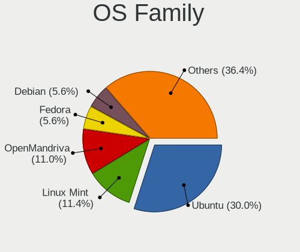
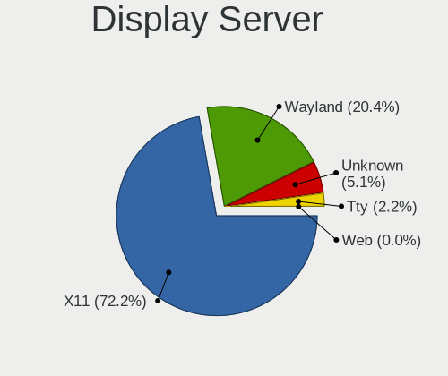
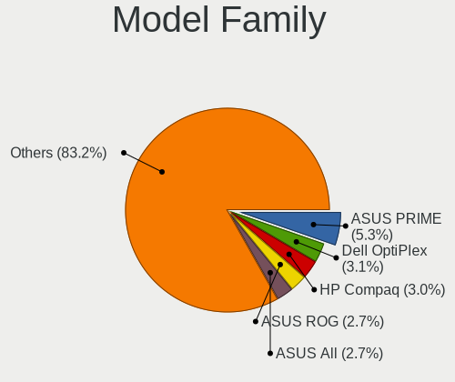
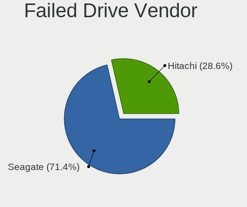
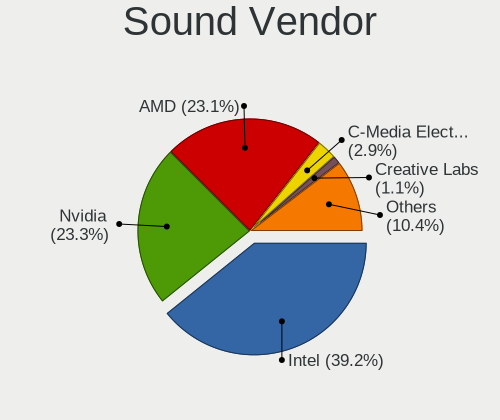
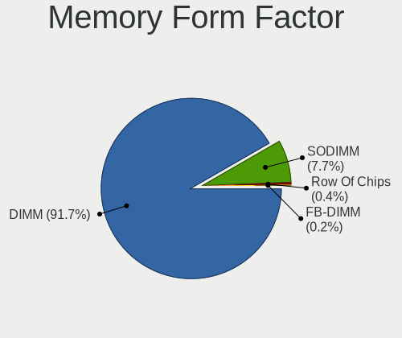
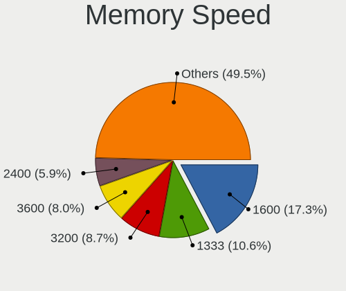
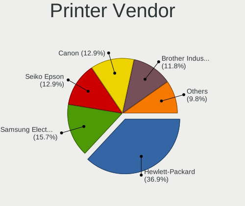
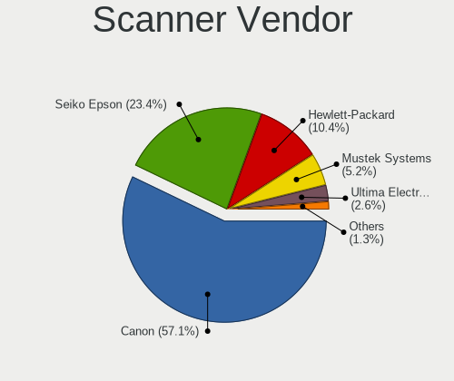
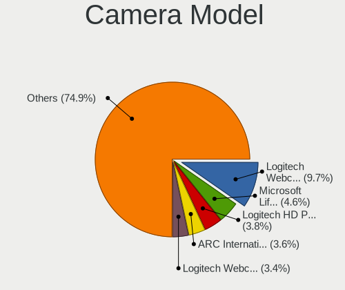

Linux in Italy - Tested Hardware & Statistics (Desktops)
--------------------------------------------------------

A project to collect tested hardware configurations for Linux in Italy.

Anyone can contribute to this report by the [hw-probe](https://github.com/linuxhw/hw-probe) tool:

    sudo -E hw-probe -all -upload

Please contribute! Especially if your hardware is rare.

Contents
--------

* [ Test Cases ](#test-cases)

* [ System ](#system)
  - [ OS                       ](#os)
  - [ OS Family                ](#os-family)
  - [ Kernel                   ](#kernel)
  - [ Kernel Family            ](#kernel-family)
  - [ Kernel Major Ver.        ](#kernel-major-ver)
  - [ Arch                     ](#arch)
  - [ DE                       ](#de)
  - [ Display Server           ](#display-server)
  - [ Display Manager          ](#display-manager)
  - [ OS Lang                  ](#os-lang)
  - [ Boot Mode                ](#boot-mode)
  - [ Filesystem               ](#filesystem)
  - [ Part. scheme             ](#part-scheme)
  - [ Dual Boot with Linux/BSD ](#dual-boot-with-linuxbsd)
  - [ Dual Boot (Win)          ](#dual-boot-win)

* [ Board ](#board)
  - [ Vendor                   ](#vendor)
  - [ Model                    ](#model)
  - [ Model Family             ](#model-family)
  - [ MFG Year                 ](#mfg-year)
  - [ Form Factor              ](#form-factor)
  - [ Secure Boot              ](#secure-boot)
  - [ Coreboot                 ](#coreboot)
  - [ RAM Size                 ](#ram-size)
  - [ RAM Used                 ](#ram-used)
  - [ Total Drives             ](#total-drives)
  - [ Has CD-ROM               ](#has-cd-rom)
  - [ Has Ethernet             ](#has-ethernet)
  - [ Has WiFi                 ](#has-wifi)
  - [ Has Bluetooth            ](#has-bluetooth)

* [ Location ](#location)
  - [ Country                  ](#country)
  - [ City                     ](#city)

* [ Drives ](#drives)
  - [ Drive Vendor             ](#drive-vendor)
  - [ Drive Model              ](#drive-model)
  - [ HDD Vendor               ](#hdd-vendor)
  - [ SSD Vendor               ](#ssd-vendor)
  - [ Drive Kind               ](#drive-kind)
  - [ Drive Connector          ](#drive-connector)
  - [ Drive Size               ](#drive-size)
  - [ Space Total              ](#space-total)
  - [ Space Used               ](#space-used)
  - [ Malfunc. Drives          ](#malfunc-drives)
  - [ Malfunc. Drive Vendor    ](#malfunc-drive-vendor)
  - [ Malfunc. HDD Vendor      ](#malfunc-hdd-vendor)
  - [ Malfunc. Drive Kind      ](#malfunc-drive-kind)
  - [ Failed Drives            ](#failed-drives)
  - [ Failed Drive Vendor      ](#failed-drive-vendor)
  - [ Drive Status             ](#drive-status)

* [ Storage controller ](#storage-controller)
  - [ Storage Vendor           ](#storage-vendor)
  - [ Storage Model            ](#storage-model)
  - [ Storage Kind             ](#storage-kind)

* [ Processor ](#processor)
  - [ CPU Vendor               ](#cpu-vendor)
  - [ CPU Model                ](#cpu-model)
  - [ CPU Model Family         ](#cpu-model-family)
  - [ CPU Cores                ](#cpu-cores)
  - [ CPU Sockets              ](#cpu-sockets)
  - [ CPU Threads              ](#cpu-threads)
  - [ CPU Op-Modes             ](#cpu-op-modes)
  - [ CPU Microcode            ](#cpu-microcode)
  - [ CPU Microarch            ](#cpu-microarch)

* [ Graphics ](#graphics)
  - [ GPU Vendor               ](#gpu-vendor)
  - [ GPU Model                ](#gpu-model)
  - [ GPU Combo                ](#gpu-combo)
  - [ GPU Driver               ](#gpu-driver)
  - [ GPU Memory               ](#gpu-memory)

* [ Monitor ](#monitor)
  - [ Monitor Vendor           ](#monitor-vendor)
  - [ Monitor Model            ](#monitor-model)
  - [ Monitor Resolution       ](#monitor-resolution)
  - [ Monitor Diagonal         ](#monitor-diagonal)
  - [ Monitor Width            ](#monitor-width)
  - [ Aspect Ratio             ](#aspect-ratio)
  - [ Monitor Area             ](#monitor-area)
  - [ Pixel Density            ](#pixel-density)
  - [ Multiple Monitors        ](#multiple-monitors)

* [ Network ](#network)
  - [ Net Controller Vendor    ](#net-controller-vendor)
  - [ Net Controller Model     ](#net-controller-model)
  - [ Wireless Vendor          ](#wireless-vendor)
  - [ Wireless Model           ](#wireless-model)
  - [ Ethernet Vendor          ](#ethernet-vendor)
  - [ Ethernet Model           ](#ethernet-model)
  - [ Net Controller Kind      ](#net-controller-kind)
  - [ Used Controller          ](#used-controller)
  - [ NICs                     ](#nics)
  - [ IPv6                     ](#ipv6)

* [ Bluetooth ](#bluetooth)
  - [ Bluetooth Vendor         ](#bluetooth-vendor)
  - [ Bluetooth Model          ](#bluetooth-model)

* [ Sound ](#sound)
  - [ Sound Vendor             ](#sound-vendor)
  - [ Sound Model              ](#sound-model)

* [ Memory ](#memory)
  - [ Memory Vendor            ](#memory-vendor)
  - [ Memory Model             ](#memory-model)
  - [ Memory Kind              ](#memory-kind)
  - [ Memory Form Factor       ](#memory-form-factor)
  - [ Memory Size              ](#memory-size)
  - [ Memory Speed             ](#memory-speed)

* [ Printers & scanners ](#printers--scanners)
  - [ Printer Vendor           ](#printer-vendor)
  - [ Printer Model            ](#printer-model)
  - [ Scanner Vendor           ](#scanner-vendor)
  - [ Scanner Model            ](#scanner-model)

* [ Camera ](#camera)
  - [ Camera Vendor            ](#camera-vendor)
  - [ Camera Model             ](#camera-model)

* [ Security ](#security)
  - [ Fingerprint Vendor       ](#fingerprint-vendor)
  - [ Fingerprint Model        ](#fingerprint-model)
  - [ Chipcard Vendor          ](#chipcard-vendor)
  - [ Chipcard Model           ](#chipcard-model)

* [ Unsupported ](#unsupported)
  - [ Unsupported Devices      ](#unsupported-devices)
  - [ Unsupported Device Types ](#unsupported-device-types)

Test Cases
----------

Total: 4792

| Vendor        | Model                       | Probe                                                      | Date         |
|---------------|-----------------------------|------------------------------------------------------------|--------------|
| XDO.AI        | Pantera Pico PC             | [f5069feac3](https://linux-hardware.org/?probe=f5069feac3) | Feb 02, 2024 |
| ASUSTek       | Z170 PRO GAMING             | [b43380d687](https://linux-hardware.org/?probe=b43380d687) | Feb 02, 2024 |
| ASUSTek       | F2A85-M LE                  | [680ba020e2](https://linux-hardware.org/?probe=680ba020e2) | Feb 02, 2024 |
| ASUSTek       | PRIME B760-PLUS D4          | [d9355c6146](https://linux-hardware.org/?probe=d9355c6146) | Feb 01, 2024 |
| Dell          | 0YJPT1 A00                  | [014e8534ab](https://linux-hardware.org/?probe=014e8534ab) | Jan 31, 2024 |
| Intel         | DG41AN AAE92991-401         | [5e520c92ca](https://linux-hardware.org/?probe=5e520c92ca) | Jan 31, 2024 |
| Fujitsu       | D3233-A1 S26361-D3233-A1    | [2a526e4632](https://linux-hardware.org/?probe=2a526e4632) | Jan 30, 2024 |
| MSI           | Z97 GAMING 7                | [4d77613083](https://linux-hardware.org/?probe=4d77613083) | Jan 30, 2024 |
| HP            | 2AA7 H                      | [4dbc7b0fe9](https://linux-hardware.org/?probe=4dbc7b0fe9) | Jan 30, 2024 |
| HP            | 1495                        | [06ca3d46b1](https://linux-hardware.org/?probe=06ca3d46b1) | Jan 29, 2024 |
| ASUSTek       | ROG Maximus XI HERO         | [5af523a874](https://linux-hardware.org/?probe=5af523a874) | Jan 29, 2024 |
| ASUSTek       | TUF Gaming X570-PLUS        | [c9d5d0fa7b](https://linux-hardware.org/?probe=c9d5d0fa7b) | Jan 29, 2024 |
| MSI           | Z790 GAMING PRO WIFI        | [3e946efe3c](https://linux-hardware.org/?probe=3e946efe3c) | Jan 29, 2024 |
| MSI           | MPG B560I GAMING EDGE WI... | [d4492753b4](https://linux-hardware.org/?probe=d4492753b4) | Jan 28, 2024 |
| ASUSTek       | PRIME A320M-K               | [c5777be509](https://linux-hardware.org/?probe=c5777be509) | Jan 28, 2024 |
| ASUSTek       | PRIME A320M-K               | [4fa63d205f](https://linux-hardware.org/?probe=4fa63d205f) | Jan 28, 2024 |
| ASUSTek       | M5A97 PLUS                  | [f06a700136](https://linux-hardware.org/?probe=f06a700136) | Jan 27, 2024 |
| Gigabyte      | B450M DS3H-CF               | [2d860764f7](https://linux-hardware.org/?probe=2d860764f7) | Jan 27, 2024 |
| ASRock        | AB350M Pro4                 | [ab39d263d5](https://linux-hardware.org/?probe=ab39d263d5) | Jan 27, 2024 |
| ASUSTek       | CM6870                      | [1abc8128a3](https://linux-hardware.org/?probe=1abc8128a3) | Jan 26, 2024 |
| Unknown       | Unknown                     | [ca9dd04b16](https://linux-hardware.org/?probe=ca9dd04b16) | Jan 26, 2024 |
| GEEKOM        | A5                          | [2408e3a6dc](https://linux-hardware.org/?probe=2408e3a6dc) | Jan 26, 2024 |
| Dell          | 04Y8V0 A02                  | [34289f06cd](https://linux-hardware.org/?probe=34289f06cd) | Jan 26, 2024 |
| GEEKOM        | A5                          | [4818316c00](https://linux-hardware.org/?probe=4818316c00) | Jan 26, 2024 |
| ASRock        | 775Dual-VSTA                | [76da6861f1](https://linux-hardware.org/?probe=76da6861f1) | Jan 25, 2024 |
| Intel         | JSL MRD                     | [17cea243b5](https://linux-hardware.org/?probe=17cea243b5) | Jan 24, 2024 |
| ASRock        | Z370 Extreme4               | [1f8f4bbd8a](https://linux-hardware.org/?probe=1f8f4bbd8a) | Jan 24, 2024 |
| Gigabyte      | H110M-S2H-CF                | [81f34fc65a](https://linux-hardware.org/?probe=81f34fc65a) | Jan 23, 2024 |
| AOpen         | D2644 S26361-D2644          | [f45673bd59](https://linux-hardware.org/?probe=f45673bd59) | Jan 22, 2024 |
| ASUSTek       | P5Q PRO TURBO               | [93762ed6a5](https://linux-hardware.org/?probe=93762ed6a5) | Jan 22, 2024 |
| ASUSTek       | TUF Gaming X570-PLUS        | [369e56d5f6](https://linux-hardware.org/?probe=369e56d5f6) | Jan 22, 2024 |
| ASUSTek       | M5A97 R2.0                  | [de6fb94ac8](https://linux-hardware.org/?probe=de6fb94ac8) | Jan 21, 2024 |
| MSI           | Z790 GAMING PRO WIFI        | [bdcd287661](https://linux-hardware.org/?probe=bdcd287661) | Jan 20, 2024 |
| Gigabyte      | H110M-S2H-CF                | [d57cdb4371](https://linux-hardware.org/?probe=d57cdb4371) | Jan 20, 2024 |
| Gigabyte      | B450M DS3H-CF               | [30d4375ab2](https://linux-hardware.org/?probe=30d4375ab2) | Jan 20, 2024 |
| Unknown       | Unknown                     | [bcded7aa47](https://linux-hardware.org/?probe=bcded7aa47) | Jan 20, 2024 |
| MSI           | MAG B550 TOMAHAWK           | [5ecdfd3d3c](https://linux-hardware.org/?probe=5ecdfd3d3c) | Jan 17, 2024 |
| Sapphire      | PE-AM2RS690V2               | [c01394270c](https://linux-hardware.org/?probe=c01394270c) | Jan 16, 2024 |
| ASUSTek       | H81M-K                      | [c1f78ee398](https://linux-hardware.org/?probe=c1f78ee398) | Jan 16, 2024 |
| MSI           | Z170A GAMING M7             | [eeb7e9a203](https://linux-hardware.org/?probe=eeb7e9a203) | Jan 16, 2024 |
| ASUSTek       | Z87-PLUS                    | [8636e544df](https://linux-hardware.org/?probe=8636e544df) | Jan 15, 2024 |
| ASRock        | FM2A68M-HD+                 | [cad806dfff](https://linux-hardware.org/?probe=cad806dfff) | Jan 15, 2024 |
| ASRock        | FM2A68M-HD+                 | [66adaa98ac](https://linux-hardware.org/?probe=66adaa98ac) | Jan 15, 2024 |
| Unknown       | Unknown                     | [b9a545ad1c](https://linux-hardware.org/?probe=b9a545ad1c) | Jan 14, 2024 |
| Huanan        | X99-F8 V2.0                 | [a8b182fa35](https://linux-hardware.org/?probe=a8b182fa35) | Jan 14, 2024 |
| Gigabyte      | B550 AORUS ELITE AX V2      | [a2ec3f504c](https://linux-hardware.org/?probe=a2ec3f504c) | Jan 14, 2024 |
| Gigabyte      | B550 AORUS ELITE AX V2      | [167fddc449](https://linux-hardware.org/?probe=167fddc449) | Jan 14, 2024 |
| Gigabyte      | H410M S2H V3                | [d8f3909453](https://linux-hardware.org/?probe=d8f3909453) | Jan 14, 2024 |
| AMI           | Intel                       | [8cea24270b](https://linux-hardware.org/?probe=8cea24270b) | Jan 14, 2024 |
| ASUSTek       | H81M-K                      | [f28965133b](https://linux-hardware.org/?probe=f28965133b) | Jan 13, 2024 |
| ASRock        | H110M-HDV                   | [5f7f485a15](https://linux-hardware.org/?probe=5f7f485a15) | Jan 12, 2024 |
| HP            | 339A                        | [75faedbb21](https://linux-hardware.org/?probe=75faedbb21) | Jan 12, 2024 |
| Dell          | 0F6X5P A00                  | [bf6a022632](https://linux-hardware.org/?probe=bf6a022632) | Jan 12, 2024 |
| Dell          | 0F6X5P A00                  | [8d2b313d2a](https://linux-hardware.org/?probe=8d2b313d2a) | Jan 12, 2024 |
| Dell          | 0F6X5P A00                  | [6f7cf4ae8d](https://linux-hardware.org/?probe=6f7cf4ae8d) | Jan 12, 2024 |
| ASUSTek       | PRIME B350M-A               | [7eabdfe5d0](https://linux-hardware.org/?probe=7eabdfe5d0) | Jan 12, 2024 |
| HP            | 0B4Ch D                     | [d04339c0dc](https://linux-hardware.org/?probe=d04339c0dc) | Jan 12, 2024 |
| MSI           | B450M-A PRO MAX             | [15d413beb6](https://linux-hardware.org/?probe=15d413beb6) | Jan 12, 2024 |
| MSI           | B450M-A PRO MAX             | [50ca06fa28](https://linux-hardware.org/?probe=50ca06fa28) | Jan 11, 2024 |
| Dell          | 0K1D6X A00                  | [a47ccd2cfe](https://linux-hardware.org/?probe=a47ccd2cfe) | Jan 11, 2024 |
| Dell          | 0K1D6X A00                  | [5fc28b03c2](https://linux-hardware.org/?probe=5fc28b03c2) | Jan 11, 2024 |
| Pegatron      | 2ACF                        | [eadd385333](https://linux-hardware.org/?probe=eadd385333) | Jan 11, 2024 |
| ASUSTek       | M5A78L-M LX3                | [6b0c1cd101](https://linux-hardware.org/?probe=6b0c1cd101) | Jan 10, 2024 |
| Shenzhen M... | F7BFD                       | [870cb76e60](https://linux-hardware.org/?probe=870cb76e60) | Jan 09, 2024 |
| MSI           | Z170A GAMING M7             | [5b17acbc6b](https://linux-hardware.org/?probe=5b17acbc6b) | Jan 09, 2024 |
| Unknown       | Unknown                     | [11b9f14d03](https://linux-hardware.org/?probe=11b9f14d03) | Jan 09, 2024 |
| MSI           | MPG X570 GAMING PRO CARB... | [a97d9690ff](https://linux-hardware.org/?probe=a97d9690ff) | Jan 09, 2024 |
| ASUSTek       | P8P67 EVO                   | [d54cf27190](https://linux-hardware.org/?probe=d54cf27190) | Jan 09, 2024 |
| ASRock        | B150M-HDV                   | [01698aac7f](https://linux-hardware.org/?probe=01698aac7f) | Jan 09, 2024 |
| ASUSTek       | M5A97 PLUS                  | [d22d465f0f](https://linux-hardware.org/?probe=d22d465f0f) | Jan 09, 2024 |
| ASUSTek       | Z87-PRO                     | [35ec3dca89](https://linux-hardware.org/?probe=35ec3dca89) | Jan 09, 2024 |
| ASUSTek       | ROG CROSSHAIR VIII DARK ... | [e72b2cebd3](https://linux-hardware.org/?probe=e72b2cebd3) | Jan 08, 2024 |
| Lenovo        | ThinkCentre M72e 0896A2G    | [b77ad754ae](https://linux-hardware.org/?probe=b77ad754ae) | Jan 08, 2024 |
| Gigabyte      | Z87N-WIFI                   | [bc0c6ef206](https://linux-hardware.org/?probe=bc0c6ef206) | Jan 08, 2024 |
| ASRock        | Z170 Pro4S                  | [1c355ea1f8](https://linux-hardware.org/?probe=1c355ea1f8) | Jan 08, 2024 |
| ASRock        | Z170 Pro4S                  | [535f68cf7b](https://linux-hardware.org/?probe=535f68cf7b) | Jan 08, 2024 |
| MSI           | X470 GAMING PLUS MAX        | [ac3aa9697a](https://linux-hardware.org/?probe=ac3aa9697a) | Jan 07, 2024 |
| Lenovo        | ThinkCentre M81 5049RA9     | [a443bef1bf](https://linux-hardware.org/?probe=a443bef1bf) | Jan 07, 2024 |
| AMD           | A88                         | [f614fcb81f](https://linux-hardware.org/?probe=f614fcb81f) | Jan 06, 2024 |
| ASUSTek       | H81M-K                      | [e73865e1e0](https://linux-hardware.org/?probe=e73865e1e0) | Jan 06, 2024 |
| AMD           | A88                         | [04e378da84](https://linux-hardware.org/?probe=04e378da84) | Jan 06, 2024 |
| HP            | 2B35                        | [440fa90f6f](https://linux-hardware.org/?probe=440fa90f6f) | Jan 05, 2024 |
| HP            | 2B35                        | [e6337403f7](https://linux-hardware.org/?probe=e6337403f7) | Jan 05, 2024 |
| Gigabyte      | H410M S2H V3                | [85b99222c1](https://linux-hardware.org/?probe=85b99222c1) | Jan 05, 2024 |
| Shenzhen M... | F7BFC                       | [59d6a69f30](https://linux-hardware.org/?probe=59d6a69f30) | Jan 05, 2024 |
| ASRock        | Z370 Extreme4               | [0726856482](https://linux-hardware.org/?probe=0726856482) | Jan 05, 2024 |
| Shenzhen M... | F7BFC                       | [d8ed7241cb](https://linux-hardware.org/?probe=d8ed7241cb) | Jan 05, 2024 |
| ASUSTek       | M5A97 LE R2.0               | [f8471bbcf4](https://linux-hardware.org/?probe=f8471bbcf4) | Jan 04, 2024 |
| ASUSTek       | M5A97 LE R2.0               | [3290e9841e](https://linux-hardware.org/?probe=3290e9841e) | Jan 04, 2024 |
| HP            | 339A                        | [3c4dcb2e52](https://linux-hardware.org/?probe=3c4dcb2e52) | Jan 04, 2024 |
| Acer          | Nitro N50-610               | [612f4f165a](https://linux-hardware.org/?probe=612f4f165a) | Jan 04, 2024 |
| Lenovo        | MAHOBAY NO DPK              | [9a18a450f2](https://linux-hardware.org/?probe=9a18a450f2) | Jan 04, 2024 |
| HP            | 339A                        | [1b50e2401a](https://linux-hardware.org/?probe=1b50e2401a) | Jan 04, 2024 |
| HP            | 339A                        | [b86795707e](https://linux-hardware.org/?probe=b86795707e) | Jan 04, 2024 |
| ASRock        | B650E PG Riptide WiFi       | [71bf3eba70](https://linux-hardware.org/?probe=71bf3eba70) | Jan 04, 2024 |
| HP            | 339A                        | [a1901b8bcf](https://linux-hardware.org/?probe=a1901b8bcf) | Jan 04, 2024 |
| Gigabyte      | GA-K8NF9 Ultra              | [bbc0256984](https://linux-hardware.org/?probe=bbc0256984) | Jan 03, 2024 |
| MSI           | X99A GAMING 7               | [1d4efc3026](https://linux-hardware.org/?probe=1d4efc3026) | Jan 03, 2024 |
| Koloe         | X58                         | [2a3e4788ed](https://linux-hardware.org/?probe=2a3e4788ed) | Jan 03, 2024 |
| ASRock        | Z77 Performance             | [7f44640341](https://linux-hardware.org/?probe=7f44640341) | Jan 03, 2024 |
| Biostar       | A320MH                      | [fde80defce](https://linux-hardware.org/?probe=fde80defce) | Jan 02, 2024 |
| ASUSTek       | ROG STRIX B650E-E GAMING... | [57a12c9041](https://linux-hardware.org/?probe=57a12c9041) | Jan 02, 2024 |
| MSI           | MS-B9181                    | [56b0ad4a01](https://linux-hardware.org/?probe=56b0ad4a01) | Jan 02, 2024 |
| Unknown       | Unknown                     | [b101d94fff](https://linux-hardware.org/?probe=b101d94fff) | Jan 01, 2024 |
| Dell          | 0F6X5P A00                  | [750a1d90dd](https://linux-hardware.org/?probe=750a1d90dd) | Jan 01, 2024 |
| Dell          | 0F6X5P A00                  | [b4f1a69ca3](https://linux-hardware.org/?probe=b4f1a69ca3) | Jan 01, 2024 |
| Dell          | 0F6X5P A00                  | [b5efb44fe4](https://linux-hardware.org/?probe=b5efb44fe4) | Jan 01, 2024 |
| HP            | 18E7                        | [cf9a9bbe99](https://linux-hardware.org/?probe=cf9a9bbe99) | Jan 01, 2024 |
| Shenzhen M... | F7BFD                       | [a55f5157bc](https://linux-hardware.org/?probe=a55f5157bc) | Dec 31, 2023 |
| ASUSTek       | H110M-A/M.2                 | [9e622b4006](https://linux-hardware.org/?probe=9e622b4006) | Dec 31, 2023 |
| ASUSTek       | M5A97 LE R2.0               | [210fa8e369](https://linux-hardware.org/?probe=210fa8e369) | Dec 31, 2023 |
| HP            | 18E9                        | [298cd92eb1](https://linux-hardware.org/?probe=298cd92eb1) | Dec 31, 2023 |
| ASUSTek       | CM6870                      | [bdc19328ef](https://linux-hardware.org/?probe=bdc19328ef) | Dec 31, 2023 |
| ASUSTek       | PRIME B660M-A WIFI D4       | [7caa5da564](https://linux-hardware.org/?probe=7caa5da564) | Dec 31, 2023 |
| ASUSTek       | M5A97 R2.0                  | [674f54c42c](https://linux-hardware.org/?probe=674f54c42c) | Dec 30, 2023 |
| HP            | 8053                        | [26cb660757](https://linux-hardware.org/?probe=26cb660757) | Dec 30, 2023 |
| ASUSTek       | H81M-C                      | [a9a91f6c49](https://linux-hardware.org/?probe=a9a91f6c49) | Dec 30, 2023 |
| ASRock        | H310CM-HDV                  | [df518ecaf1](https://linux-hardware.org/?probe=df518ecaf1) | Dec 29, 2023 |
| Foxconn       | Irvine HP P/N               | [cd125aca3c](https://linux-hardware.org/?probe=cd125aca3c) | Dec 29, 2023 |
| MSI           | H310M PRO-VD PLUS           | [d7083ded0a](https://linux-hardware.org/?probe=d7083ded0a) | Dec 29, 2023 |
| ASUSTek       | P5QL-E                      | [fb478f78b1](https://linux-hardware.org/?probe=fb478f78b1) | Dec 29, 2023 |
| ASRock        | Z370 Extreme4               | [97e413d4b8](https://linux-hardware.org/?probe=97e413d4b8) | Dec 29, 2023 |
| T-bao         | MINI PC                     | [ad89280fd6](https://linux-hardware.org/?probe=ad89280fd6) | Dec 29, 2023 |
| Unknown       | Alviso                      | [fe4096f520](https://linux-hardware.org/?probe=fe4096f520) | Dec 29, 2023 |
| Foxconn       | H67MP-S/-V/H67MP            | [17473d28e3](https://linux-hardware.org/?probe=17473d28e3) | Dec 28, 2023 |
| HP            | 830C                        | [2f602f34b2](https://linux-hardware.org/?probe=2f602f34b2) | Dec 28, 2023 |
| ASRock        | H61M-S                      | [2321baa69b](https://linux-hardware.org/?probe=2321baa69b) | Dec 28, 2023 |
| ASRock        | H61M-S                      | [466863e657](https://linux-hardware.org/?probe=466863e657) | Dec 28, 2023 |
| HP            | 830C                        | [2256355ca5](https://linux-hardware.org/?probe=2256355ca5) | Dec 28, 2023 |
| MSI           | Z77 MPower                  | [54a4a451c1](https://linux-hardware.org/?probe=54a4a451c1) | Dec 28, 2023 |
| ASRock        | G41M-VS3                    | [96266413d3](https://linux-hardware.org/?probe=96266413d3) | Dec 28, 2023 |
| HP            | 876C SMVB                   | [7082e52b57](https://linux-hardware.org/?probe=7082e52b57) | Dec 27, 2023 |
| HP            | 3397                        | [de93e38762](https://linux-hardware.org/?probe=de93e38762) | Dec 27, 2023 |
| ASUSTek       | PRIME X570-PRO              | [4e5179b4d1](https://linux-hardware.org/?probe=4e5179b4d1) | Dec 26, 2023 |
| ASUSTek       | PRIME B450M-A               | [b93ec9563c](https://linux-hardware.org/?probe=b93ec9563c) | Dec 26, 2023 |
| ASUSTek       | M5A78L-M LE/USB3            | [fd68915b97](https://linux-hardware.org/?probe=fd68915b97) | Dec 26, 2023 |
| ASUSTek       | ROG STRIX Z790-H GAMING ... | [a5a641b111](https://linux-hardware.org/?probe=a5a641b111) | Dec 25, 2023 |
| Dell          | 0F6X5P A00                  | [8b6cbdd646](https://linux-hardware.org/?probe=8b6cbdd646) | Dec 24, 2023 |
| Lenovo        | 317E SDK0J40700 WIN 3258... | [2bf8854e33](https://linux-hardware.org/?probe=2bf8854e33) | Dec 24, 2023 |
| Foxconn       | 2ADA                        | [f30aec24c2](https://linux-hardware.org/?probe=f30aec24c2) | Dec 23, 2023 |
| Lenovo        | SHARKBAY SDK0E50510 WIN     | [ab3cc8a89c](https://linux-hardware.org/?probe=ab3cc8a89c) | Dec 23, 2023 |
| AZW           | MINI S 10                   | [59d6fa667d](https://linux-hardware.org/?probe=59d6fa667d) | Dec 22, 2023 |
| ASRock        | FM2A68M-HD+                 | [83fd663b68](https://linux-hardware.org/?probe=83fd663b68) | Dec 22, 2023 |
| HP            | 876C SMVB                   | [c13f4eb91b](https://linux-hardware.org/?probe=c13f4eb91b) | Dec 21, 2023 |
| Dell          | 0F6X5P A00                  | [fb2877e727](https://linux-hardware.org/?probe=fb2877e727) | Dec 21, 2023 |
| HP            | 18E7                        | [ad6cf02d18](https://linux-hardware.org/?probe=ad6cf02d18) | Dec 21, 2023 |
| ASUSTek       | PRIME H610M-R D4            | [5e7428fc75](https://linux-hardware.org/?probe=5e7428fc75) | Dec 21, 2023 |
| HP            | 18E7                        | [fdb8b2d229](https://linux-hardware.org/?probe=fdb8b2d229) | Dec 21, 2023 |
| Lenovo        | 317C NOK                    | [87064e6d98](https://linux-hardware.org/?probe=87064e6d98) | Dec 20, 2023 |
| MSI           | PRO Z690-A WIFI             | [d6a5b20ac6](https://linux-hardware.org/?probe=d6a5b20ac6) | Dec 20, 2023 |
| Gigabyte      | X570 AORUS MASTER           | [8dac564efb](https://linux-hardware.org/?probe=8dac564efb) | Dec 19, 2023 |
| Gigabyte      | X570 AORUS MASTER           | [6184376b69](https://linux-hardware.org/?probe=6184376b69) | Dec 19, 2023 |
| ASUSTek       | ROG STRIX X470-F GAMING     | [2501635862](https://linux-hardware.org/?probe=2501635862) | Dec 18, 2023 |
| HP            | 18E7                        | [20a3bd6bee](https://linux-hardware.org/?probe=20a3bd6bee) | Dec 17, 2023 |
| ASUSTek       | PRIME B350-PLUS             | [448a2dec7d](https://linux-hardware.org/?probe=448a2dec7d) | Dec 17, 2023 |
| ASUSTek       | PRIME B350-PLUS             | [ebfec06632](https://linux-hardware.org/?probe=ebfec06632) | Dec 17, 2023 |
| ASUSTek       | CROSSHAIR VI HERO           | [b595a47be1](https://linux-hardware.org/?probe=b595a47be1) | Dec 17, 2023 |
| ASUSTek       | PRIME H510M-A WIFI          | [2335d46852](https://linux-hardware.org/?probe=2335d46852) | Dec 17, 2023 |
| HP            | 1790                        | [2d8c859110](https://linux-hardware.org/?probe=2d8c859110) | Dec 17, 2023 |
| ASUSTek       | M4A89GTD-PRO/USB3           | [8adfc82dc5](https://linux-hardware.org/?probe=8adfc82dc5) | Dec 17, 2023 |
| Acer          | FIH57                       | [0edb232edf](https://linux-hardware.org/?probe=0edb232edf) | Dec 16, 2023 |
| Dell          | 0GXM1W A00                  | [476c368866](https://linux-hardware.org/?probe=476c368866) | Dec 16, 2023 |
| MSI           | MPG X570 GAMING PLUS        | [57a64ca85e](https://linux-hardware.org/?probe=57a64ca85e) | Dec 16, 2023 |
| ASUSTek       | PRIME H510M-A WIFI          | [e97f16f34e](https://linux-hardware.org/?probe=e97f16f34e) | Dec 16, 2023 |
| HP            | 1790                        | [9bb2d6fcb4](https://linux-hardware.org/?probe=9bb2d6fcb4) | Dec 16, 2023 |
| HP            | 8653 A                      | [186fc771e8](https://linux-hardware.org/?probe=186fc771e8) | Dec 16, 2023 |
| Unknown       | Unknown                     | [678b41c4e7](https://linux-hardware.org/?probe=678b41c4e7) | Dec 16, 2023 |
| Gigabyte      | B550M DS3H                  | [50ad2630fb](https://linux-hardware.org/?probe=50ad2630fb) | Dec 16, 2023 |
| Dell          | 0M5WNK A02                  | [f47a8fcf1f](https://linux-hardware.org/?probe=f47a8fcf1f) | Dec 15, 2023 |
| Dell          | 0C27VV A02                  | [94560c4ce8](https://linux-hardware.org/?probe=94560c4ce8) | Dec 15, 2023 |
| ASRock        | H310CM-HDV/M.2              | [c3604a3f0d](https://linux-hardware.org/?probe=c3604a3f0d) | Dec 15, 2023 |
| HP            | 18E7                        | [5923f47c4b](https://linux-hardware.org/?probe=5923f47c4b) | Dec 15, 2023 |
| Gigabyte      | B250M-D2V-CF                | [e0e94706d7](https://linux-hardware.org/?probe=e0e94706d7) | Dec 15, 2023 |
| Acer          | MCP7A                       | [12708a342e](https://linux-hardware.org/?probe=12708a342e) | Dec 14, 2023 |
| Gigabyte      | H410M H V3                  | [048f7ace00](https://linux-hardware.org/?probe=048f7ace00) | Dec 14, 2023 |
| ASUSTek       | P8H61                       | [00f636bb09](https://linux-hardware.org/?probe=00f636bb09) | Dec 14, 2023 |
| ASUSTek       | TUF Gaming B650-PLUS WIF... | [efe4c56706](https://linux-hardware.org/?probe=efe4c56706) | Dec 13, 2023 |
| Apple         | Mac-F60DEB81FF30ACF6 Mac... | [5435277f12](https://linux-hardware.org/?probe=5435277f12) | Dec 13, 2023 |
| HP            | 2AA7 H                      | [5e9703dff5](https://linux-hardware.org/?probe=5e9703dff5) | Dec 13, 2023 |
| HP            | 8169                        | [4f4439a6fb](https://linux-hardware.org/?probe=4f4439a6fb) | Dec 13, 2023 |
| ASRock        | G41M-VS3                    | [894c4cf9fb](https://linux-hardware.org/?probe=894c4cf9fb) | Dec 12, 2023 |
| Gigabyte      | H510M H                     | [5d637d06a3](https://linux-hardware.org/?probe=5d637d06a3) | Dec 12, 2023 |
| Gigabyte      | Z390 GAMING X-CF            | [34c5aec887](https://linux-hardware.org/?probe=34c5aec887) | Dec 12, 2023 |
| ASUSTek       | PRIME B450-PLUS             | [7e201ea559](https://linux-hardware.org/?probe=7e201ea559) | Dec 11, 2023 |
| Dell          | 0GXM1W A00                  | [1b4243a8d7](https://linux-hardware.org/?probe=1b4243a8d7) | Dec 11, 2023 |
| Unknown       | Unknown                     | [2c6a120dd2](https://linux-hardware.org/?probe=2c6a120dd2) | Dec 10, 2023 |
| HP            | 3032h                       | [ca8902be00](https://linux-hardware.org/?probe=ca8902be00) | Dec 10, 2023 |
| ASRock        | H310M-STX                   | [205a5c1696](https://linux-hardware.org/?probe=205a5c1696) | Dec 10, 2023 |
| MSI           | MAG B550 TOMAHAWK           | [dc0acbdb23](https://linux-hardware.org/?probe=dc0acbdb23) | Dec 10, 2023 |
| MSI           | 970A-G46                    | [86bd084c44](https://linux-hardware.org/?probe=86bd084c44) | Dec 10, 2023 |
| ASRock        | H81M-HDS                    | [6e718e8473](https://linux-hardware.org/?probe=6e718e8473) | Dec 10, 2023 |
| ASUSTek       | TUF Gaming X570-PLUS        | [241c795a70](https://linux-hardware.org/?probe=241c795a70) | Dec 10, 2023 |
| ASUSTek       | ROG CROSSHAIR VIII DARK ... | [31821d09d8](https://linux-hardware.org/?probe=31821d09d8) | Dec 09, 2023 |
| Gigabyte      | Z170XP-SLI-CF               | [a51f4ce5e5](https://linux-hardware.org/?probe=a51f4ce5e5) | Dec 09, 2023 |
| ASUSTek       | ROG STRIX B450-F GAMING     | [7a0919a7fc](https://linux-hardware.org/?probe=7a0919a7fc) | Dec 09, 2023 |
| ASUSTek       | F1A55-M LE R2.0             | [83885aa02c](https://linux-hardware.org/?probe=83885aa02c) | Dec 09, 2023 |
| ASUSTek       | PRIME Z270M-PLUS            | [5c1ffcfbe3](https://linux-hardware.org/?probe=5c1ffcfbe3) | Dec 09, 2023 |
| Dell          | 0F373D A00                  | [cf693d5429](https://linux-hardware.org/?probe=cf693d5429) | Dec 09, 2023 |
| ASUSTek       | PRIME H510M-A               | [40fae6bc6c](https://linux-hardware.org/?probe=40fae6bc6c) | Dec 08, 2023 |
| Lenovo        | 32E9 SDK0T76465 WIN 3422... | [a4eb4e410e](https://linux-hardware.org/?probe=a4eb4e410e) | Dec 08, 2023 |
| HP            | ProLiant MicroServer        | [5451582602](https://linux-hardware.org/?probe=5451582602) | Dec 08, 2023 |
| Dell          | 04YP6J A01                  | [186bb25f07](https://linux-hardware.org/?probe=186bb25f07) | Dec 08, 2023 |
| Shenzhen M... | F7BFD                       | [9a042578ee](https://linux-hardware.org/?probe=9a042578ee) | Dec 07, 2023 |
| Unknown       | Unknown                     | [7144bda606](https://linux-hardware.org/?probe=7144bda606) | Dec 07, 2023 |
| MSI           | B450 GAMING PLUS MAX        | [bd9d40cd17](https://linux-hardware.org/?probe=bd9d40cd17) | Dec 06, 2023 |
| MSI           | B450 GAMING PLUS MAX        | [6aaaa355d3](https://linux-hardware.org/?probe=6aaaa355d3) | Dec 06, 2023 |
| HP            | 802E                        | [0f4d573a9b](https://linux-hardware.org/?probe=0f4d573a9b) | Dec 06, 2023 |
| ASUSTek       | P8H61-M LE/USB3             | [26ab67528e](https://linux-hardware.org/?probe=26ab67528e) | Dec 06, 2023 |
| AMI           | Intel                       | [8649d088c6](https://linux-hardware.org/?probe=8649d088c6) | Dec 06, 2023 |
| HP            | 802E                        | [9b58aa9c3a](https://linux-hardware.org/?probe=9b58aa9c3a) | Dec 05, 2023 |
| ASUSTek       | TUF Gaming X670E-PLUS WI... | [f42e951aa3](https://linux-hardware.org/?probe=f42e951aa3) | Dec 05, 2023 |
| Intel         | Unknown                     | [3ae9554945](https://linux-hardware.org/?probe=3ae9554945) | Dec 05, 2023 |
| MSI           | B450 TOMAHAWK MAX           | [044e8ae8d6](https://linux-hardware.org/?probe=044e8ae8d6) | Dec 05, 2023 |
| Unknown       | Unknown                     | [56dab5d412](https://linux-hardware.org/?probe=56dab5d412) | Dec 04, 2023 |
| ASUSTek       | H81M-K                      | [8fd5e3b166](https://linux-hardware.org/?probe=8fd5e3b166) | Dec 04, 2023 |
| MSI           | B450 TOMAHAWK               | [001185a53f](https://linux-hardware.org/?probe=001185a53f) | Dec 04, 2023 |
| Fujitsu       | D3233-A1 S26361-D3233-A1    | [ace4fe2fd9](https://linux-hardware.org/?probe=ace4fe2fd9) | Dec 03, 2023 |
| HP            | ProLiant MicroServer Gen... | [47222bf19c](https://linux-hardware.org/?probe=47222bf19c) | Dec 03, 2023 |
| HP            | ProLiant MicroServer Gen... | [5a5296e72f](https://linux-hardware.org/?probe=5a5296e72f) | Dec 03, 2023 |
| MSI           | MAG Z790 TOMAHAWK WIFI      | [a28372598e](https://linux-hardware.org/?probe=a28372598e) | Dec 03, 2023 |
| ASUSTek       | M4A77T/USB3                 | [706e9636ca](https://linux-hardware.org/?probe=706e9636ca) | Dec 02, 2023 |
| ASUSTek       | P8H67-M PRO                 | [5923988290](https://linux-hardware.org/?probe=5923988290) | Dec 02, 2023 |
| ASUSTek       | H97M-E                      | [9e60faee5f](https://linux-hardware.org/?probe=9e60faee5f) | Dec 01, 2023 |
| Dell          | 0VRWRC A00                  | [13e072ec20](https://linux-hardware.org/?probe=13e072ec20) | Dec 01, 2023 |
| Dell          | 0NW73C A00                  | [380639dd58](https://linux-hardware.org/?probe=380639dd58) | Dec 01, 2023 |
| Gigabyte      | B550 AORUS ELITE V2         | [cba20469ce](https://linux-hardware.org/?probe=cba20469ce) | Nov 30, 2023 |
| Acer          | Nitro N50-610               | [78a6b232e3](https://linux-hardware.org/?probe=78a6b232e3) | Nov 30, 2023 |
| ASUSTek       | PRIME B450M-A               | [9fee8c35c3](https://linux-hardware.org/?probe=9fee8c35c3) | Nov 30, 2023 |
| HP            | 2AF7                        | [78514a9009](https://linux-hardware.org/?probe=78514a9009) | Nov 30, 2023 |
| AZW           | U59                         | [eccee157da](https://linux-hardware.org/?probe=eccee157da) | Nov 30, 2023 |
| ASUSTek       | PRIME B450M-A               | [a27577cb3a](https://linux-hardware.org/?probe=a27577cb3a) | Nov 30, 2023 |
| MSI           | B250M PRO-VD                | [e0dead14ab](https://linux-hardware.org/?probe=e0dead14ab) | Nov 29, 2023 |
| HP            | 1905                        | [8d1dfc94c1](https://linux-hardware.org/?probe=8d1dfc94c1) | Nov 29, 2023 |
| HC Technol... | HCAR5000-MI                 | [7ff2232073](https://linux-hardware.org/?probe=7ff2232073) | Nov 29, 2023 |
| ASUSTek       | TUF Gaming B550M-PLUS       | [a326b802a3](https://linux-hardware.org/?probe=a326b802a3) | Nov 29, 2023 |
| Fujitsu       | D2924-A1 S26361-D2924-A1    | [a06c08c462](https://linux-hardware.org/?probe=a06c08c462) | Nov 28, 2023 |
| Gigabyte      | Z790 AERO G                 | [f0bd1c9fa9](https://linux-hardware.org/?probe=f0bd1c9fa9) | Nov 28, 2023 |
| Fujitsu       | D3227-A1 S26361-D3227-A1    | [9e6c582721](https://linux-hardware.org/?probe=9e6c582721) | Nov 28, 2023 |
| ASUSTek       | PRIME B650M-A WIFI II       | [f502294656](https://linux-hardware.org/?probe=f502294656) | Nov 28, 2023 |
| ASRock        | H310CM-HDV/M.2              | [72f7a18db5](https://linux-hardware.org/?probe=72f7a18db5) | Nov 28, 2023 |
| ASUSTek       | P8Z68-V PRO GEN3            | [b2deb81c19](https://linux-hardware.org/?probe=b2deb81c19) | Nov 27, 2023 |
| Gigabyte      | Z690M AORUS ELITE AX DDR... | [532f8ccb97](https://linux-hardware.org/?probe=532f8ccb97) | Nov 27, 2023 |
| Dell          | 0F3KHR A00                  | [c744967be3](https://linux-hardware.org/?probe=c744967be3) | Nov 27, 2023 |
| ASUSTek       | X79-DELUXE                  | [b89bce359a](https://linux-hardware.org/?probe=b89bce359a) | Nov 27, 2023 |
| ASUSTek       | PRIME Z490-P                | [b25d830579](https://linux-hardware.org/?probe=b25d830579) | Nov 26, 2023 |
| ASUSTek       | ROG Maximus XI HERO         | [e7d72eaf1d](https://linux-hardware.org/?probe=e7d72eaf1d) | Nov 25, 2023 |
| ASUSTek       | TUF B450M-PLUS GAMING       | [ab26a80bc5](https://linux-hardware.org/?probe=ab26a80bc5) | Nov 25, 2023 |
| ASUSTek       | M32CD_A_F_K20CD_K31CD       | [a76eab064b](https://linux-hardware.org/?probe=a76eab064b) | Nov 25, 2023 |
| ASUSTek       | TUF B450M-PLUS GAMING       | [3730101bfb](https://linux-hardware.org/?probe=3730101bfb) | Nov 24, 2023 |
| MSI           | B550M PRO                   | [e834bc66b9](https://linux-hardware.org/?probe=e834bc66b9) | Nov 24, 2023 |
| ASRock        | 970 Extreme3 R2.0           | [502e296060](https://linux-hardware.org/?probe=502e296060) | Nov 23, 2023 |
| Acer          | Veriton K8-680G V:1.0       | [415b88184f](https://linux-hardware.org/?probe=415b88184f) | Nov 23, 2023 |
| HP            | 2B2C                        | [406c00d62a](https://linux-hardware.org/?probe=406c00d62a) | Nov 23, 2023 |
| Gigabyte      | Z370 AORUS Gaming 3         | [1097230d3f](https://linux-hardware.org/?probe=1097230d3f) | Nov 23, 2023 |
| ASUSTek       | P5KPL-AM EPU                | [1a8702d13b](https://linux-hardware.org/?probe=1a8702d13b) | Nov 22, 2023 |
| BESSTAR Te... | TH50                        | [39c4acf035](https://linux-hardware.org/?probe=39c4acf035) | Nov 22, 2023 |
| ASUSTek       | BM2AD_D510MT_D310MT         | [03140aee39](https://linux-hardware.org/?probe=03140aee39) | Nov 22, 2023 |
| Gigabyte      | Z690M AORUS ELITE AX DDR... | [887bb8aabe](https://linux-hardware.org/?probe=887bb8aabe) | Nov 21, 2023 |
| HP            | 18E7                        | [594059fee8](https://linux-hardware.org/?probe=594059fee8) | Nov 21, 2023 |
| ASRock        | G41C-GS                     | [de97cb0d6f](https://linux-hardware.org/?probe=de97cb0d6f) | Nov 21, 2023 |
| HP            | 2AA7 H                      | [c98041f477](https://linux-hardware.org/?probe=c98041f477) | Nov 21, 2023 |
| MSI           | MAG X670E TOMAHAWK WIFI     | [84df454a40](https://linux-hardware.org/?probe=84df454a40) | Nov 21, 2023 |
| HP            | 1905                        | [7f22b93c4b](https://linux-hardware.org/?probe=7f22b93c4b) | Nov 20, 2023 |
| Gigabyte      | Z690M AORUS ELITE AX DDR... | [e723e12a01](https://linux-hardware.org/?probe=e723e12a01) | Nov 19, 2023 |
| Gigabyte      | B450 AORUS PRO-CF           | [8f389f95a6](https://linux-hardware.org/?probe=8f389f95a6) | Nov 19, 2023 |
| Gigabyte      | B450 AORUS PRO-CF           | [8f99d241f8](https://linux-hardware.org/?probe=8f99d241f8) | Nov 19, 2023 |
| HP            | 1905                        | [19cc0187db](https://linux-hardware.org/?probe=19cc0187db) | Nov 19, 2023 |
| ASUSTek       | P7H55                       | [cd5e7b0924](https://linux-hardware.org/?probe=cd5e7b0924) | Nov 18, 2023 |
| ASUSTek       | H110M-K                     | [850a7f4e8e](https://linux-hardware.org/?probe=850a7f4e8e) | Nov 18, 2023 |
| MSI           | B75MA-E33                   | [87132187f5](https://linux-hardware.org/?probe=87132187f5) | Nov 18, 2023 |
| MSI           | B75MA-E33                   | [ed47d2c01d](https://linux-hardware.org/?probe=ed47d2c01d) | Nov 18, 2023 |
| ASUSTek       | M32CD_A_F_K20CD_K31CD       | [76c00a164a](https://linux-hardware.org/?probe=76c00a164a) | Nov 18, 2023 |
| ASRock        | 970 Performance             | [7b106f5305](https://linux-hardware.org/?probe=7b106f5305) | Nov 18, 2023 |
| ASUSTek       | ROG CROSSHAIR VII HERO      | [756a8e0f19](https://linux-hardware.org/?probe=756a8e0f19) | Nov 17, 2023 |
| Fujitsu       | D3400-A1 S26361-D3400-A1    | [e52328d89f](https://linux-hardware.org/?probe=e52328d89f) | Nov 17, 2023 |
| Dell          | 0KWVT8 A03                  | [0619c3b255](https://linux-hardware.org/?probe=0619c3b255) | Nov 17, 2023 |
| ASUSTek       | TUF Gaming X570-PLUS        | [ff84b6e035](https://linux-hardware.org/?probe=ff84b6e035) | Nov 17, 2023 |
| ASUSTek       | P8H67-M                     | [5a6066ab8c](https://linux-hardware.org/?probe=5a6066ab8c) | Nov 17, 2023 |
| ASUSTek       | TUF Gaming X570-PLUS        | [3204f2ad9f](https://linux-hardware.org/?probe=3204f2ad9f) | Nov 17, 2023 |
| ASUSTek       | H170 PRO GAMING             | [8274f1048a](https://linux-hardware.org/?probe=8274f1048a) | Nov 16, 2023 |
| ASUSTek       | P8H67-M                     | [663c18d823](https://linux-hardware.org/?probe=663c18d823) | Nov 16, 2023 |
| Dell          | 08WKV3 A00                  | [ded5bb92bd](https://linux-hardware.org/?probe=ded5bb92bd) | Nov 16, 2023 |
| HC Technol... | HCAR5000-MI                 | [e4ac0f919f](https://linux-hardware.org/?probe=e4ac0f919f) | Nov 16, 2023 |
| MSI           | H110M PRO-VD PLUS           | [07a1bedd9b](https://linux-hardware.org/?probe=07a1bedd9b) | Nov 15, 2023 |
| ASUSTek       | P5KPL-AM SE                 | [90b6757607](https://linux-hardware.org/?probe=90b6757607) | Nov 15, 2023 |
| HP            | 3031h                       | [41814a3ce4](https://linux-hardware.org/?probe=41814a3ce4) | Nov 15, 2023 |
| Gigabyte      | 990FXA-UD3                  | [e6e07a90bf](https://linux-hardware.org/?probe=e6e07a90bf) | Nov 15, 2023 |
| Dell          | 0HX555                      | [ca73b21791](https://linux-hardware.org/?probe=ca73b21791) | Nov 15, 2023 |
| Gigabyte      | X570 UD                     | [4d7c838629](https://linux-hardware.org/?probe=4d7c838629) | Nov 14, 2023 |
| ASUSTek       | TUF Gaming X570-PLUS        | [ec3e7b63cb](https://linux-hardware.org/?probe=ec3e7b63cb) | Nov 14, 2023 |
| ASUSTek       | P8P67-M PRO                 | [9d1c329ebb](https://linux-hardware.org/?probe=9d1c329ebb) | Nov 14, 2023 |
| ASRock        | A320M-HDV R4.0              | [a09eca53d5](https://linux-hardware.org/?probe=a09eca53d5) | Nov 14, 2023 |
| Fujitsu       | D3400-A1 S26361-D3400-A1    | [c4b486ecb1](https://linux-hardware.org/?probe=c4b486ecb1) | Nov 13, 2023 |
| AZW           | Speed S                     | [d855e4476a](https://linux-hardware.org/?probe=d855e4476a) | Nov 13, 2023 |
| AMI           | Intel                       | [7c96434a18](https://linux-hardware.org/?probe=7c96434a18) | Nov 13, 2023 |
| HP            | 198E                        | [ea1760ddb6](https://linux-hardware.org/?probe=ea1760ddb6) | Nov 13, 2023 |
| Gigabyte      | H610M S2H DDR4              | [ec1ca3afc1](https://linux-hardware.org/?probe=ec1ca3afc1) | Nov 12, 2023 |
| Gigabyte      | X570 UD                     | [7c3fc962ca](https://linux-hardware.org/?probe=7c3fc962ca) | Nov 12, 2023 |
| ASUSTek       | ROG STRIX X670E-E GAMING... | [b0bf1f1ac1](https://linux-hardware.org/?probe=b0bf1f1ac1) | Nov 11, 2023 |
| Gigabyte      | H97M-D3H                    | [9c77400bbf](https://linux-hardware.org/?probe=9c77400bbf) | Nov 11, 2023 |
| Unknown       | Unknown                     | [e4a09ae9d2](https://linux-hardware.org/?probe=e4a09ae9d2) | Nov 10, 2023 |
| HP            | 1998                        | [3843c1d8d9](https://linux-hardware.org/?probe=3843c1d8d9) | Nov 10, 2023 |
| Acer          | Veriton X2611G V1.0         | [dd73474667](https://linux-hardware.org/?probe=dd73474667) | Nov 10, 2023 |
| ASUSTek       | PRIME H310M-E R2.0          | [2788382d20](https://linux-hardware.org/?probe=2788382d20) | Nov 10, 2023 |
| Gigabyte      | 990FXA-UD3                  | [89b0efe7ed](https://linux-hardware.org/?probe=89b0efe7ed) | Nov 10, 2023 |
| Acer          | Veriton X2611G V1.0         | [aaca941b62](https://linux-hardware.org/?probe=aaca941b62) | Nov 10, 2023 |
| HP            | 3397                        | [83e88e81bf](https://linux-hardware.org/?probe=83e88e81bf) | Nov 10, 2023 |
| ASUSTek       | M5A97 R2.0                  | [2c6f89c817](https://linux-hardware.org/?probe=2c6f89c817) | Nov 09, 2023 |
| ASUSTek       | ROG CROSSHAIR VII HERO      | [5c243dae6b](https://linux-hardware.org/?probe=5c243dae6b) | Nov 09, 2023 |
| ASUSTek       | Z170 PRO GAMING             | [27571092d5](https://linux-hardware.org/?probe=27571092d5) | Nov 09, 2023 |
| Gigabyte      | H610M S2H DDR4              | [3f45bd8f8d](https://linux-hardware.org/?probe=3f45bd8f8d) | Nov 08, 2023 |
| ASUSTek       | PRIME B365M-K               | [a26aceca7f](https://linux-hardware.org/?probe=a26aceca7f) | Nov 08, 2023 |
| ASUSTek       | Z170-K                      | [e83f07f0c3](https://linux-hardware.org/?probe=e83f07f0c3) | Nov 08, 2023 |
| ASUSTek       | Z170 PRO GAMING             | [47bd2b5230](https://linux-hardware.org/?probe=47bd2b5230) | Nov 08, 2023 |
| ASRock        | A320M-HDV R4.0              | [8ba89e650a](https://linux-hardware.org/?probe=8ba89e650a) | Nov 08, 2023 |
| MSI           | Z790 GAMING PRO WIFI        | [44fcbf488b](https://linux-hardware.org/?probe=44fcbf488b) | Nov 08, 2023 |
| ASUSTek       | Z170-K                      | [4f31a7817f](https://linux-hardware.org/?probe=4f31a7817f) | Nov 07, 2023 |
| ASUSTek       | PRIME X570-PRO              | [a599d9b486](https://linux-hardware.org/?probe=a599d9b486) | Nov 07, 2023 |
| HP            | 8437                        | [818f52c6f0](https://linux-hardware.org/?probe=818f52c6f0) | Nov 07, 2023 |
| ASRock        | B450 Gaming K4              | [166a9aee87](https://linux-hardware.org/?probe=166a9aee87) | Nov 06, 2023 |
| HP            | 1495                        | [9bc696067b](https://linux-hardware.org/?probe=9bc696067b) | Nov 06, 2023 |
| NZXT          | N7 B550                     | [082ee28ba2](https://linux-hardware.org/?probe=082ee28ba2) | Nov 06, 2023 |
| Gigabyte      | B450 GAMING X               | [83e5c381b2](https://linux-hardware.org/?probe=83e5c381b2) | Nov 06, 2023 |
| ASUSTek       | TUF Gaming B550M-PLUS       | [df52b675c8](https://linux-hardware.org/?probe=df52b675c8) | Nov 06, 2023 |
| ASRock        | H110M-ITX                   | [c384352141](https://linux-hardware.org/?probe=c384352141) | Nov 06, 2023 |
| Dell          | 08WKV3 A00                  | [e16dbbaf8b](https://linux-hardware.org/?probe=e16dbbaf8b) | Nov 05, 2023 |
| ASUSTek       | P5Q-PRO                     | [a1500e2e9c](https://linux-hardware.org/?probe=a1500e2e9c) | Nov 05, 2023 |
| ASUSTek       | PRIME B460M-A               | [034b113ac8](https://linux-hardware.org/?probe=034b113ac8) | Nov 05, 2023 |
| HP            | 1998                        | [d454314b77](https://linux-hardware.org/?probe=d454314b77) | Nov 05, 2023 |
| ASRockRack    | EPC602D8A                   | [c1b6c06dc5](https://linux-hardware.org/?probe=c1b6c06dc5) | Nov 05, 2023 |
| Gigabyte      | M5NM1AI-GB                  | [99e2275a93](https://linux-hardware.org/?probe=99e2275a93) | Nov 05, 2023 |
| Gigabyte      | H410M S2H V2                | [8bbce8a378](https://linux-hardware.org/?probe=8bbce8a378) | Nov 04, 2023 |
| Gigabyte      | B450 AORUS M                | [62798aa8cf](https://linux-hardware.org/?probe=62798aa8cf) | Nov 04, 2023 |
| Acer          | Aspire M1920                | [f6ffcb0c41](https://linux-hardware.org/?probe=f6ffcb0c41) | Nov 04, 2023 |
| ASRock        | FM2A68M-HD+                 | [2b5c984cd8](https://linux-hardware.org/?probe=2b5c984cd8) | Nov 04, 2023 |
| Lenovo        | 103D SDK0Q40112 WIN 3305... | [76acaae6cc](https://linux-hardware.org/?probe=76acaae6cc) | Nov 04, 2023 |
| MSI           | B650 GAMING PLUS WIFI       | [8edaffcccb](https://linux-hardware.org/?probe=8edaffcccb) | Nov 04, 2023 |
| ASUSTek       | M5A97 R2.0                  | [798cba826c](https://linux-hardware.org/?probe=798cba826c) | Nov 04, 2023 |
| ASUSTek       | M5A97 R2.0                  | [2c601304f7](https://linux-hardware.org/?probe=2c601304f7) | Nov 04, 2023 |
| ASUSTek       | TUF Gaming Z490-PLUS        | [c9e7b12e63](https://linux-hardware.org/?probe=c9e7b12e63) | Nov 03, 2023 |
| HP            | 0B54h D                     | [574e5fd946](https://linux-hardware.org/?probe=574e5fd946) | Nov 03, 2023 |
| Dell          | 09WH54 A01                  | [4eae8e67db](https://linux-hardware.org/?probe=4eae8e67db) | Nov 03, 2023 |
| ASRock        | A320M-HDV R4.0              | [44890192a1](https://linux-hardware.org/?probe=44890192a1) | Nov 03, 2023 |
| MSI           | B350 PC MATE                | [9c089ed10c](https://linux-hardware.org/?probe=9c089ed10c) | Nov 03, 2023 |
| ASUSTek       | P7P55D-E                    | [f16aeca403](https://linux-hardware.org/?probe=f16aeca403) | Nov 03, 2023 |
| Gigabyte      | P35-DS3L                    | [c2df6f267b](https://linux-hardware.org/?probe=c2df6f267b) | Nov 03, 2023 |
| Gigabyte      | Z390 AORUS ELITE-CF         | [7aa3982cb4](https://linux-hardware.org/?probe=7aa3982cb4) | Nov 03, 2023 |
| ASUSTek       | P5KPL-AM SE                 | [ea92d94742](https://linux-hardware.org/?probe=ea92d94742) | Nov 02, 2023 |
| Gigabyte      | X570 AORUS ELITE            | [0631c3ec84](https://linux-hardware.org/?probe=0631c3ec84) | Nov 02, 2023 |
| MSI           | MAG B550 TOMAHAWK           | [bbe345cd5d](https://linux-hardware.org/?probe=bbe345cd5d) | Nov 02, 2023 |
| ASRock        | P67 Professional            | [c998340fa9](https://linux-hardware.org/?probe=c998340fa9) | Nov 02, 2023 |
| ASRock        | Z77 WS                      | [73b9354a1a](https://linux-hardware.org/?probe=73b9354a1a) | Nov 02, 2023 |
| ASUSTek       | ROG STRIX B360-F GAMING     | [72a5b8f06a](https://linux-hardware.org/?probe=72a5b8f06a) | Nov 02, 2023 |
| ASUSTek       | B150M-A/M.2                 | [dad897d3c4](https://linux-hardware.org/?probe=dad897d3c4) | Nov 02, 2023 |
| ASRock        | 990FX Extreme3              | [ad8e4a9dae](https://linux-hardware.org/?probe=ad8e4a9dae) | Nov 02, 2023 |
| Unknown       | 1.0                         | [6265787d93](https://linux-hardware.org/?probe=6265787d93) | Nov 01, 2023 |
| MSI           | A320M-A PRO MAX             | [f1e35faa1a](https://linux-hardware.org/?probe=f1e35faa1a) | Nov 01, 2023 |
| HP            | 822A                        | [59c055e360](https://linux-hardware.org/?probe=59c055e360) | Nov 01, 2023 |
| ASUSTek       | CM6870                      | [ae34108b69](https://linux-hardware.org/?probe=ae34108b69) | Nov 01, 2023 |
| ASUSTek       | CROSSHAIR VI HERO           | [4fc590fe55](https://linux-hardware.org/?probe=4fc590fe55) | Nov 01, 2023 |
| Pegatron      | Benicia                     | [b253f40dc7](https://linux-hardware.org/?probe=b253f40dc7) | Nov 01, 2023 |
| Pegatron      | Benicia                     | [a3378fce47](https://linux-hardware.org/?probe=a3378fce47) | Nov 01, 2023 |
| Gigabyte      | Z370N WIFI-CF               | [1ab426a7ed](https://linux-hardware.org/?probe=1ab426a7ed) | Nov 01, 2023 |
| HP            | 1497                        | [0fd6a908fe](https://linux-hardware.org/?probe=0fd6a908fe) | Nov 01, 2023 |
| ASRock        | B85M Pro4                   | [0ea7f00b4e](https://linux-hardware.org/?probe=0ea7f00b4e) | Nov 01, 2023 |
| ASUSTek       | Z170-A                      | [50a30d4ebd](https://linux-hardware.org/?probe=50a30d4ebd) | Nov 01, 2023 |
| Sapphire      | PE-AM2RS690V2               | [2b2de28f02](https://linux-hardware.org/?probe=2b2de28f02) | Nov 01, 2023 |
| Fujitsu       | D3233-A1 S26361-D3233-A1    | [0026b681e2](https://linux-hardware.org/?probe=0026b681e2) | Nov 01, 2023 |
| MSI           | MPG B550 GAMING PLUS        | [301a117426](https://linux-hardware.org/?probe=301a117426) | Nov 01, 2023 |
| ASRock        | B250M Pro4                  | [399fe59760](https://linux-hardware.org/?probe=399fe59760) | Nov 01, 2023 |
| ASRock        | H310CM-HDV                  | [b24b974555](https://linux-hardware.org/?probe=b24b974555) | Oct 31, 2023 |
| Gigabyte      | B450M S2H                   | [d099ae69e8](https://linux-hardware.org/?probe=d099ae69e8) | Oct 31, 2023 |
| MSI           | MPG B550 GAMING EDGE WIF... | [3b79851103](https://linux-hardware.org/?probe=3b79851103) | Oct 31, 2023 |
| Unknown       | Unknown                     | [4aa5e757eb](https://linux-hardware.org/?probe=4aa5e757eb) | Oct 31, 2023 |
| Fujitsu       | D3313-B1 S26361-D3313-B1    | [2d90a96dfb](https://linux-hardware.org/?probe=2d90a96dfb) | Oct 31, 2023 |
| Gigabyte      | Z370 AORUS Gaming 3         | [d2072a9949](https://linux-hardware.org/?probe=d2072a9949) | Oct 31, 2023 |
| ASUSTek       | PRIME B350-PLUS             | [7b71031ba1](https://linux-hardware.org/?probe=7b71031ba1) | Oct 31, 2023 |
| ASUSTek       | PRIME B350-PLUS             | [3ab77e3324](https://linux-hardware.org/?probe=3ab77e3324) | Oct 31, 2023 |
| ASUSTek       | H170M-PLUS                  | [90b5515582](https://linux-hardware.org/?probe=90b5515582) | Oct 31, 2023 |
| ASUSTek       | PRIME Z590-A                | [40f30de33b](https://linux-hardware.org/?probe=40f30de33b) | Oct 31, 2023 |
| ASRock        | Z370 Pro4                   | [55f20f6750](https://linux-hardware.org/?probe=55f20f6750) | Oct 31, 2023 |
| ASUSTek       | BT1AD                       | [133784e5ee](https://linux-hardware.org/?probe=133784e5ee) | Oct 31, 2023 |
| HP            | 18EB                        | [83596ab9d9](https://linux-hardware.org/?probe=83596ab9d9) | Oct 31, 2023 |
| Gigabyte      | 970-GAMING                  | [2b4315885f](https://linux-hardware.org/?probe=2b4315885f) | Oct 31, 2023 |
| Gigabyte      | X570 AORUS ELITE            | [90172d9cef](https://linux-hardware.org/?probe=90172d9cef) | Oct 31, 2023 |
| ASRock        | X670E Steel Legend          | [d802042506](https://linux-hardware.org/?probe=d802042506) | Oct 31, 2023 |
| Gigabyte      | Z97-D3H-CF                  | [56e4a560bc](https://linux-hardware.org/?probe=56e4a560bc) | Oct 31, 2023 |
| MSI           | Z270 GAMING M5              | [fb56165b30](https://linux-hardware.org/?probe=fb56165b30) | Oct 31, 2023 |
| MSI           | Z270-A PRO                  | [b4e85014cc](https://linux-hardware.org/?probe=b4e85014cc) | Oct 31, 2023 |
| ASRock        | A320M-HDV R4.0              | [7941dfd8cf](https://linux-hardware.org/?probe=7941dfd8cf) | Oct 31, 2023 |
| ASUSTek       | P8H61-M LE                  | [86dd25c85a](https://linux-hardware.org/?probe=86dd25c85a) | Oct 31, 2023 |
| Dell          | 0P01GV A03                  | [c77bed1e18](https://linux-hardware.org/?probe=c77bed1e18) | Oct 31, 2023 |
| ASUSTek       | ROG STRIX X670E-E GAMING... | [d1e473a77b](https://linux-hardware.org/?probe=d1e473a77b) | Oct 31, 2023 |
| ASUSTek       | P7P55D LE                   | [26533c338a](https://linux-hardware.org/?probe=26533c338a) | Oct 31, 2023 |
| ASUSTek       | B150M-A/M.2                 | [e150519e40](https://linux-hardware.org/?probe=e150519e40) | Oct 31, 2023 |
| Gigabyte      | X570 GAMING X               | [85cb35fdc6](https://linux-hardware.org/?probe=85cb35fdc6) | Oct 31, 2023 |
| Gigabyte      | X570 AORUS ELITE            | [f6e8c279ef](https://linux-hardware.org/?probe=f6e8c279ef) | Oct 31, 2023 |
| Gigabyte      | B550M DS3H                  | [6ee7bce3de](https://linux-hardware.org/?probe=6ee7bce3de) | Oct 31, 2023 |
| ASUSTek       | STRIX Z270I GAMING          | [62adc05f6a](https://linux-hardware.org/?probe=62adc05f6a) | Oct 31, 2023 |
| ASUSTek       | ROG STRIX B760-F GAMING ... | [e0971c3b56](https://linux-hardware.org/?probe=e0971c3b56) | Oct 31, 2023 |
| ASUSTek       | PRIME B360M-A               | [ef307df799](https://linux-hardware.org/?probe=ef307df799) | Oct 31, 2023 |
| Gigabyte      | X570S AORUS ELITE AX        | [01ce498c44](https://linux-hardware.org/?probe=01ce498c44) | Oct 30, 2023 |
| ASUSTek       | PRIME X570-PRO              | [0251ada092](https://linux-hardware.org/?probe=0251ada092) | Oct 30, 2023 |
| MSI           | PRO B550M-P GEN3            | [413254deb3](https://linux-hardware.org/?probe=413254deb3) | Oct 30, 2023 |
| Fujitsu       | D3430-U1 S26361-D3430-U1    | [0b62ec2df6](https://linux-hardware.org/?probe=0b62ec2df6) | Oct 30, 2023 |
| Unknown       | Unknown                     | [4bd69e46d1](https://linux-hardware.org/?probe=4bd69e46d1) | Oct 30, 2023 |
| Dell          | 0WR7PY A02                  | [d63ccd5259](https://linux-hardware.org/?probe=d63ccd5259) | Oct 30, 2023 |
| Cincoze       | DX-1000.01.001              | [fb33e90b93](https://linux-hardware.org/?probe=fb33e90b93) | Oct 30, 2023 |
| ASUSTek       | ROG STRIX B560-G GAMING ... | [4e5ba58b35](https://linux-hardware.org/?probe=4e5ba58b35) | Oct 30, 2023 |
| MSI           | B560M PRO-VDH WIFI          | [a2faa2b06a](https://linux-hardware.org/?probe=a2faa2b06a) | Oct 30, 2023 |
| ASUSTek       | TUF Gaming B550M-PLUS       | [28ddca3b76](https://linux-hardware.org/?probe=28ddca3b76) | Oct 30, 2023 |
| MSI           | Z87-G45 GAMING              | [731cb3b152](https://linux-hardware.org/?probe=731cb3b152) | Oct 30, 2023 |
| ASRock        | H77 Pro4-M                  | [83aeda3c64](https://linux-hardware.org/?probe=83aeda3c64) | Oct 30, 2023 |
| MSI           | H97 GAMING 3                | [f59457f708](https://linux-hardware.org/?probe=f59457f708) | Oct 30, 2023 |
| Intel         | X99                         | [8f60418655](https://linux-hardware.org/?probe=8f60418655) | Oct 30, 2023 |
| MSI           | X570-A PRO                  | [a198e0f9c2](https://linux-hardware.org/?probe=a198e0f9c2) | Oct 30, 2023 |
| ASUSTek       | PRIME H310M-K R2.0          | [fe3816864f](https://linux-hardware.org/?probe=fe3816864f) | Oct 30, 2023 |
| HP            | 21F5 0A                     | [097ce56daf](https://linux-hardware.org/?probe=097ce56daf) | Oct 30, 2023 |
| ASUSTek       | PRIME A320M-K               | [64bc9621da](https://linux-hardware.org/?probe=64bc9621da) | Oct 30, 2023 |
| ASUSTek       | TUF Gaming B550M-PLUS       | [daffd3cd06](https://linux-hardware.org/?probe=daffd3cd06) | Oct 30, 2023 |
| Gigabyte      | X570 AORUS MASTER           | [3f0259e17b](https://linux-hardware.org/?probe=3f0259e17b) | Oct 30, 2023 |
| Pegatron      | 2AB6                        | [7bcf41bb9f](https://linux-hardware.org/?probe=7bcf41bb9f) | Oct 30, 2023 |
| ASUSTek       | ROG CROSSHAIR VIII DARK ... | [e06f6c5888](https://linux-hardware.org/?probe=e06f6c5888) | Oct 30, 2023 |
| ASUSTek       | M4A89GTD-PRO                | [b160015184](https://linux-hardware.org/?probe=b160015184) | Oct 29, 2023 |
| ASUSTek       | PRIME B550-PLUS             | [59f0a72f7b](https://linux-hardware.org/?probe=59f0a72f7b) | Oct 29, 2023 |
| HP            | 802E                        | [a57f8d5afa](https://linux-hardware.org/?probe=a57f8d5afa) | Oct 29, 2023 |
| Acer          | Nitro N50-610               | [b83310ffb8](https://linux-hardware.org/?probe=b83310ffb8) | Oct 29, 2023 |
| ASUSTek       | M5A97 PLUS                  | [484d866dc6](https://linux-hardware.org/?probe=484d866dc6) | Oct 27, 2023 |
| ASUSTek       | M5A97 PLUS                  | [a619c8a955](https://linux-hardware.org/?probe=a619c8a955) | Oct 27, 2023 |
| Foxconn       | 17A0                        | [ce8f3561ee](https://linux-hardware.org/?probe=ce8f3561ee) | Oct 27, 2023 |
| Dell          | 0VD5HY A07                  | [3db7e99c4a](https://linux-hardware.org/?probe=3db7e99c4a) | Oct 27, 2023 |
| Dell          | 0GTK4K A02                  | [df85a996c9](https://linux-hardware.org/?probe=df85a996c9) | Oct 27, 2023 |
| Lenovo        | 376D SDK0T76465 WIN 3422... | [2a97bb6c00](https://linux-hardware.org/?probe=2a97bb6c00) | Oct 27, 2023 |
| ASUSTek       | ROG STRIX X370-F GAMING     | [50b77f9f9e](https://linux-hardware.org/?probe=50b77f9f9e) | Oct 26, 2023 |
| ASUSTek       | TUF Gaming B760M-PLUS       | [a576bfd0b1](https://linux-hardware.org/?probe=a576bfd0b1) | Oct 26, 2023 |
| Unknown       | P4M800CE-8237               | [bf22b887f8](https://linux-hardware.org/?probe=bf22b887f8) | Oct 26, 2023 |
| HP            | 8653 A                      | [07aae59bf1](https://linux-hardware.org/?probe=07aae59bf1) | Oct 26, 2023 |
| Dell          | 0C27VV A02                  | [7a88945a88](https://linux-hardware.org/?probe=7a88945a88) | Oct 25, 2023 |
| Lenovo        | SHARKBAY 0B98401 WIN        | [b38766677c](https://linux-hardware.org/?probe=b38766677c) | Oct 25, 2023 |
| Dell          | 0VD5HY A04                  | [36249c99ec](https://linux-hardware.org/?probe=36249c99ec) | Oct 25, 2023 |
| ASUSTek       | H81M-PLUS                   | [f1ee66826b](https://linux-hardware.org/?probe=f1ee66826b) | Oct 24, 2023 |
| ASUSTek       | H81M-PLUS                   | [0f58ce148b](https://linux-hardware.org/?probe=0f58ce148b) | Oct 24, 2023 |
| ASUSTek       | PRIME A320M-K               | [36f77e9a81](https://linux-hardware.org/?probe=36f77e9a81) | Oct 24, 2023 |
| ASUSTek       | P5Q3                        | [660547e520](https://linux-hardware.org/?probe=660547e520) | Oct 24, 2023 |
| ASRock        | 880GMH/USB3                 | [4d3fcc56ec](https://linux-hardware.org/?probe=4d3fcc56ec) | Oct 24, 2023 |
| ASUSTek       | PRIME H510M-A               | [1be0a39692](https://linux-hardware.org/?probe=1be0a39692) | Oct 23, 2023 |
| HP            | 3397                        | [1344d9d38b](https://linux-hardware.org/?probe=1344d9d38b) | Oct 23, 2023 |
| ASRock        | H81M-DG4                    | [3c73dc5daa](https://linux-hardware.org/?probe=3c73dc5daa) | Oct 23, 2023 |
| Dell          | 0WMJ54 A01                  | [6adb6574e7](https://linux-hardware.org/?probe=6adb6574e7) | Oct 22, 2023 |
| Acer          | Veriton S2680G              | [da6ff1f2f3](https://linux-hardware.org/?probe=da6ff1f2f3) | Oct 22, 2023 |
| Gigabyte      | B450M DS3H-CF               | [428cf5b8dc](https://linux-hardware.org/?probe=428cf5b8dc) | Oct 21, 2023 |
| MSI           | X570-A PRO                  | [78df342ad3](https://linux-hardware.org/?probe=78df342ad3) | Oct 21, 2023 |
| ASRock        | H61M-HVS                    | [cd365d2e35](https://linux-hardware.org/?probe=cd365d2e35) | Oct 21, 2023 |
| ASUSTek       | PRIME H270-PRO              | [3b1d62c873](https://linux-hardware.org/?probe=3b1d62c873) | Oct 21, 2023 |
| ASRock        | 870 Extreme3 R2.0           | [a625868a25](https://linux-hardware.org/?probe=a625868a25) | Oct 21, 2023 |
| ASUSTek       | SABERTOOTH P67              | [5536078e9f](https://linux-hardware.org/?probe=5536078e9f) | Oct 21, 2023 |
| ASRock        | FM2A68M-HD+                 | [aed5514f95](https://linux-hardware.org/?probe=aed5514f95) | Oct 21, 2023 |
| ASRock        | FM2A68M-HD+                 | [4aa0e3a887](https://linux-hardware.org/?probe=4aa0e3a887) | Oct 21, 2023 |
| MSI           | X470 GAMING PLUS MAX        | [aad7482915](https://linux-hardware.org/?probe=aad7482915) | Oct 19, 2023 |
| Gigabyte      | B450M DS3H-CF               | [b73212b85e](https://linux-hardware.org/?probe=b73212b85e) | Oct 18, 2023 |
| Gigabyte      | Z370N WIFI-CF               | [df8d309418](https://linux-hardware.org/?probe=df8d309418) | Oct 18, 2023 |
| MSI           | MAG B650 TOMAHAWK WIFI      | [1748fce718](https://linux-hardware.org/?probe=1748fce718) | Oct 18, 2023 |
| Dell          | 0MNPJ9 A03                  | [36e7a1e261](https://linux-hardware.org/?probe=36e7a1e261) | Oct 18, 2023 |
| HP            | 18E7                        | [3beee97f8b](https://linux-hardware.org/?probe=3beee97f8b) | Oct 18, 2023 |
| ASRock        | 970 Pro3 R2.0               | [dbb30ccac0](https://linux-hardware.org/?probe=dbb30ccac0) | Oct 18, 2023 |
| Lenovo        | SHARKBAY NOK                | [084e18e78d](https://linux-hardware.org/?probe=084e18e78d) | Oct 15, 2023 |
| Lenovo        | MAHOBAY Win8 Pro DPK TPG    | [6b4ccf6ef7](https://linux-hardware.org/?probe=6b4ccf6ef7) | Oct 15, 2023 |
| MSI           | A320M-A PRO MAX             | [3c6ab62b00](https://linux-hardware.org/?probe=3c6ab62b00) | Oct 15, 2023 |
| MSI           | B450 GAMING PLUS MAX        | [bc33324b0d](https://linux-hardware.org/?probe=bc33324b0d) | Oct 15, 2023 |
| MSI           | B560M PRO                   | [1dba250310](https://linux-hardware.org/?probe=1dba250310) | Oct 14, 2023 |
| ASRock        | H310M-STX                   | [b0bc91de7a](https://linux-hardware.org/?probe=b0bc91de7a) | Oct 14, 2023 |
| ASUSTek       | P8Z77-V LX                  | [09a90189ec](https://linux-hardware.org/?probe=09a90189ec) | Oct 14, 2023 |
| ASRockRack    | EPC602D8A                   | [a47c7098c0](https://linux-hardware.org/?probe=a47c7098c0) | Oct 13, 2023 |
| MSI           | B350 GAMING PRO CARBON      | [f164204da9](https://linux-hardware.org/?probe=f164204da9) | Oct 12, 2023 |
| MSI           | MAG Z690 TOMAHAWK WIFI D... | [8845aff9cd](https://linux-hardware.org/?probe=8845aff9cd) | Oct 12, 2023 |
| MSI           | MAG Z690 TOMAHAWK WIFI D... | [ee17b03d04](https://linux-hardware.org/?probe=ee17b03d04) | Oct 12, 2023 |
| HP            | 3048h                       | [79350e657a](https://linux-hardware.org/?probe=79350e657a) | Oct 12, 2023 |
| MSI           | Boston                      | [9558e2f4d6](https://linux-hardware.org/?probe=9558e2f4d6) | Oct 09, 2023 |
| ASUSTek       | PRIME B450M-K II            | [a3401cc125](https://linux-hardware.org/?probe=a3401cc125) | Oct 09, 2023 |
| ASUSTek       | TUF Gaming B550-PLUS WIF... | [49d0e884bb](https://linux-hardware.org/?probe=49d0e884bb) | Oct 08, 2023 |
| HP            | 18E7                        | [ec69c74dde](https://linux-hardware.org/?probe=ec69c74dde) | Oct 08, 2023 |
| ASUSTek       | P5Q3 DELUXE                 | [7dbdce995b](https://linux-hardware.org/?probe=7dbdce995b) | Oct 07, 2023 |
| MSI           | X470 GAMING PLUS MAX        | [f347154767](https://linux-hardware.org/?probe=f347154767) | Oct 07, 2023 |
| Unknown       | 1.0                         | [f0cef2eaac](https://linux-hardware.org/?probe=f0cef2eaac) | Oct 06, 2023 |
| ASUSTek       | ROG STRIX B550-F GAMING     | [c35ab8ae2e](https://linux-hardware.org/?probe=c35ab8ae2e) | Oct 05, 2023 |
| HP            | 18E7                        | [4b6af4b657](https://linux-hardware.org/?probe=4b6af4b657) | Oct 05, 2023 |
| ASUSTek       | ROG STRIX B550-E GAMING     | [947c66cb1f](https://linux-hardware.org/?probe=947c66cb1f) | Oct 05, 2023 |
| Gigabyte      | A520 AORUS ELITE            | [60c7927b3f](https://linux-hardware.org/?probe=60c7927b3f) | Oct 05, 2023 |
| AZW           | SEi                         | [84632f00e7](https://linux-hardware.org/?probe=84632f00e7) | Oct 04, 2023 |
| ASUSTek       | PRIME H610M-R D4            | [9272efa028](https://linux-hardware.org/?probe=9272efa028) | Oct 04, 2023 |
| HP            | 18E7                        | [13028106c6](https://linux-hardware.org/?probe=13028106c6) | Oct 04, 2023 |
| MSI           | B450M MORTAR MAX            | [a3f55874e2](https://linux-hardware.org/?probe=a3f55874e2) | Oct 03, 2023 |
| ASUSTek       | PRIME B550-PLUS             | [9e62c6ffa3](https://linux-hardware.org/?probe=9e62c6ffa3) | Oct 03, 2023 |
| Dell          | 088DT1 A00                  | [4e85b8e145](https://linux-hardware.org/?probe=4e85b8e145) | Oct 03, 2023 |
| MSI           | Boston                      | [bcd0c19145](https://linux-hardware.org/?probe=bcd0c19145) | Oct 02, 2023 |
| ASUSTek       | VM40B                       | [461b7d03fb](https://linux-hardware.org/?probe=461b7d03fb) | Oct 02, 2023 |
| HP            | 09F8h                       | [996f1179ba](https://linux-hardware.org/?probe=996f1179ba) | Oct 02, 2023 |
| Intel         | H110                        | [eaf6f0f81c](https://linux-hardware.org/?probe=eaf6f0f81c) | Oct 02, 2023 |
| Intel         | X79M-S                      | [dfa1322112](https://linux-hardware.org/?probe=dfa1322112) | Oct 01, 2023 |
| ASUSTek       | PRIME H610M-E D4            | [fc7c58ab80](https://linux-hardware.org/?probe=fc7c58ab80) | Oct 01, 2023 |
| ASUSTek       | PRIME H610M-E D4            | [cfbd11fee1](https://linux-hardware.org/?probe=cfbd11fee1) | Oct 01, 2023 |
| ASUSTek       | PRIME H610M-E D4            | [8985b86479](https://linux-hardware.org/?probe=8985b86479) | Oct 01, 2023 |
| MSI           | B450-A PRO MAX              | [6ee0910511](https://linux-hardware.org/?probe=6ee0910511) | Sep 30, 2023 |
| Lenovo        | 3106 SDK0J40697 WIN 3305... | [c93af00811](https://linux-hardware.org/?probe=c93af00811) | Sep 30, 2023 |
| ASUSTek       | CG8480                      | [dc174e8f73](https://linux-hardware.org/?probe=dc174e8f73) | Sep 30, 2023 |
| MSI           | P67A-C43                    | [22492f6d47](https://linux-hardware.org/?probe=22492f6d47) | Sep 30, 2023 |
| ASRock        | 4Core1600-GLAN              | [aefbc14017](https://linux-hardware.org/?probe=aefbc14017) | Sep 30, 2023 |
| Acer          | Nitro N50-610               | [a91f602e4a](https://linux-hardware.org/?probe=a91f602e4a) | Sep 29, 2023 |
| GEEKOM        | Mini IT 8                   | [fc5d6092da](https://linux-hardware.org/?probe=fc5d6092da) | Sep 29, 2023 |
| MSI           | A320M-A PRO MAX             | [4aa521a31f](https://linux-hardware.org/?probe=4aa521a31f) | Sep 29, 2023 |
| ASUSTek       | H81M-E                      | [0137140cae](https://linux-hardware.org/?probe=0137140cae) | Sep 28, 2023 |
| ASUSTek       | PRIME B450M-A               | [6bce0e41d9](https://linux-hardware.org/?probe=6bce0e41d9) | Sep 28, 2023 |
| MSI           | MPG B550 GAMING PLUS        | [8f35ffb248](https://linux-hardware.org/?probe=8f35ffb248) | Sep 28, 2023 |
| MSI           | H310M PRO-VD                | [67e14c1b2d](https://linux-hardware.org/?probe=67e14c1b2d) | Sep 28, 2023 |
| HP            | 0AA8h                       | [7c8c8fbb40](https://linux-hardware.org/?probe=7c8c8fbb40) | Sep 28, 2023 |
| HP            | 843C                        | [4af4a9e798](https://linux-hardware.org/?probe=4af4a9e798) | Sep 28, 2023 |
| Intel         | H61                         | [f41171114f](https://linux-hardware.org/?probe=f41171114f) | Sep 28, 2023 |
| MSI           | MPG Z490M GAMING EDGE WI... | [23150c5bd3](https://linux-hardware.org/?probe=23150c5bd3) | Sep 27, 2023 |
| Unknown       | Unknown                     | [2bf5f64c14](https://linux-hardware.org/?probe=2bf5f64c14) | Sep 27, 2023 |
| MSI           | A320M-A PRO MAX             | [f6c6bfc3fe](https://linux-hardware.org/?probe=f6c6bfc3fe) | Sep 27, 2023 |
| Gigabyte      | B450M DS3H-CF               | [812b06784e](https://linux-hardware.org/?probe=812b06784e) | Sep 27, 2023 |
| YANYU         | H17SL                       | [5966ae64d0](https://linux-hardware.org/?probe=5966ae64d0) | Sep 26, 2023 |
| ASUSTek       | Z97-PRO GAMER               | [0a5cc18946](https://linux-hardware.org/?probe=0a5cc18946) | Sep 26, 2023 |
| ASUSTek       | M5A97 R2.0                  | [275018a17e](https://linux-hardware.org/?probe=275018a17e) | Sep 26, 2023 |
| Foxconn       | 2ABF                        | [2be1547618](https://linux-hardware.org/?probe=2be1547618) | Sep 26, 2023 |
| ASUSTek       | P9D WS                      | [fd2133400d](https://linux-hardware.org/?probe=fd2133400d) | Sep 25, 2023 |
| MSI           | MPG Z490M GAMING EDGE WI... | [a6ef2b5028](https://linux-hardware.org/?probe=a6ef2b5028) | Sep 25, 2023 |
| Dell          | 0200DY A02                  | [0ecd2d60b4](https://linux-hardware.org/?probe=0ecd2d60b4) | Sep 25, 2023 |
| Dell          | 0773VG A02                  | [83390c3986](https://linux-hardware.org/?probe=83390c3986) | Sep 25, 2023 |
| Acer          | H11H4-AI V:1.0              | [971f03180e](https://linux-hardware.org/?probe=971f03180e) | Sep 24, 2023 |
| ASUSTek       | H81M-E                      | [6d3f4579cd](https://linux-hardware.org/?probe=6d3f4579cd) | Sep 24, 2023 |
| Gigabyte      | GA-78LMT-USB3 R2 sex        | [c80ba0c0f7](https://linux-hardware.org/?probe=c80ba0c0f7) | Sep 24, 2023 |
| Foxconn       | H67MP-S/-V/H67MP            | [67b0050938](https://linux-hardware.org/?probe=67b0050938) | Sep 24, 2023 |
| HP            | 18E7                        | [6257920a37](https://linux-hardware.org/?probe=6257920a37) | Sep 24, 2023 |
| Dell          | 0WR7PY A01                  | [64e4102978](https://linux-hardware.org/?probe=64e4102978) | Sep 23, 2023 |
| Shuttle       | XS36V                       | [dbcb5658e4](https://linux-hardware.org/?probe=dbcb5658e4) | Sep 23, 2023 |
| ASUSTek       | PRIME Z370-P                | [fb3ade25c0](https://linux-hardware.org/?probe=fb3ade25c0) | Sep 22, 2023 |
| MSI           | Boston                      | [a9fe9241ec](https://linux-hardware.org/?probe=a9fe9241ec) | Sep 21, 2023 |
| MSI           | A88XM-E45                   | [99b5c7c976](https://linux-hardware.org/?probe=99b5c7c976) | Sep 21, 2023 |
| ASRock        | H310M-HDV                   | [0ac59e2ff6](https://linux-hardware.org/?probe=0ac59e2ff6) | Sep 21, 2023 |
| HP            | 2ADC                        | [b4794f247b](https://linux-hardware.org/?probe=b4794f247b) | Sep 21, 2023 |
| HP            | 2ADC                        | [7e9eb06b31](https://linux-hardware.org/?probe=7e9eb06b31) | Sep 21, 2023 |
| Gigabyte      | B450M DS3H-CF               | [f65b051dc9](https://linux-hardware.org/?probe=f65b051dc9) | Sep 20, 2023 |
| Acer          | EG43M                       | [77e78183b9](https://linux-hardware.org/?probe=77e78183b9) | Sep 20, 2023 |
| Huanan        | X99-F8 V2.0                 | [f832424d90](https://linux-hardware.org/?probe=f832424d90) | Sep 19, 2023 |
| ASUSTek       | P5KPL-AM SE                 | [7273c8eb2e](https://linux-hardware.org/?probe=7273c8eb2e) | Sep 19, 2023 |
| ASRock        | B450 Steel Legend           | [b294855348](https://linux-hardware.org/?probe=b294855348) | Sep 19, 2023 |
| ASUSTek       | PRIME B365M-A               | [8922ced8ec](https://linux-hardware.org/?probe=8922ced8ec) | Sep 18, 2023 |
| ASUSTek       | P5KPL-AM SE                 | [9a7a68b69f](https://linux-hardware.org/?probe=9a7a68b69f) | Sep 18, 2023 |
| Dell          | 0PTTT9 A01                  | [35248efbaf](https://linux-hardware.org/?probe=35248efbaf) | Sep 18, 2023 |
| Unknown       | Unknown                     | [faa59f7ab3](https://linux-hardware.org/?probe=faa59f7ab3) | Sep 18, 2023 |
| MSI           | MPG Z590 GAMING FORCE       | [0ac4289831](https://linux-hardware.org/?probe=0ac4289831) | Sep 18, 2023 |
| HC Technol... | HCAR5000-MI                 | [eb9e6551ac](https://linux-hardware.org/?probe=eb9e6551ac) | Sep 17, 2023 |
| HC Technol... | HCAR5000-MI                 | [f3a4ce70fb](https://linux-hardware.org/?probe=f3a4ce70fb) | Sep 17, 2023 |
| ASUSTek       | CM1740                      | [96b9168216](https://linux-hardware.org/?probe=96b9168216) | Sep 16, 2023 |
| ASUSTek       | ROG Maximus Z790 APEX       | [76d354fede](https://linux-hardware.org/?probe=76d354fede) | Sep 16, 2023 |
| ASUSTek       | ROG Maximus Z790 APEX       | [ae35c7426c](https://linux-hardware.org/?probe=ae35c7426c) | Sep 16, 2023 |
| Gigabyte      | B450M DS3H-CF               | [27d7589428](https://linux-hardware.org/?probe=27d7589428) | Sep 15, 2023 |
| Foxconn       | H67MP-S/-V/H67MP            | [9df835f343](https://linux-hardware.org/?probe=9df835f343) | Sep 14, 2023 |
| ASUSTek       | P8Z77-V LX                  | [103e7031fe](https://linux-hardware.org/?probe=103e7031fe) | Sep 14, 2023 |
| Intel         | DH67CL AAG10212-210         | [21932b1004](https://linux-hardware.org/?probe=21932b1004) | Sep 14, 2023 |
| ASUSTek       | P8P67-M PRO                 | [799a135aca](https://linux-hardware.org/?probe=799a135aca) | Sep 14, 2023 |
| Unknown       | Unknown                     | [be3cf24114](https://linux-hardware.org/?probe=be3cf24114) | Sep 13, 2023 |
| ASUSTek       | P8Z77-V LX                  | [7cea54ec70](https://linux-hardware.org/?probe=7cea54ec70) | Sep 13, 2023 |
| Intel         | X79                         | [e9a4f4dc51](https://linux-hardware.org/?probe=e9a4f4dc51) | Sep 13, 2023 |
| ASRock        | H97 Anniversary             | [37014ea895](https://linux-hardware.org/?probe=37014ea895) | Sep 13, 2023 |
| Gigabyte      | AB350M-Gaming 3-CF          | [4dcd4e8234](https://linux-hardware.org/?probe=4dcd4e8234) | Sep 13, 2023 |
| Gigabyte      | AB350M-Gaming 3-CF          | [cbfa4c2641](https://linux-hardware.org/?probe=cbfa4c2641) | Sep 13, 2023 |
| ASUSTek       | P8H61-M LX2 R2.0            | [8b55f7f82a](https://linux-hardware.org/?probe=8b55f7f82a) | Sep 13, 2023 |
| ASRock        | H410M-HVS                   | [483bbfcc92](https://linux-hardware.org/?probe=483bbfcc92) | Sep 13, 2023 |
| AZW           | MINI S 10                   | [5cd0efea8b](https://linux-hardware.org/?probe=5cd0efea8b) | Sep 12, 2023 |
| Dell          | 0G254H A00                  | [b41d69b7e2](https://linux-hardware.org/?probe=b41d69b7e2) | Sep 12, 2023 |
| HP            | 18E7                        | [a553a173be](https://linux-hardware.org/?probe=a553a173be) | Sep 11, 2023 |
| Cincoze       | DX-1000.01.001              | [561f581c95](https://linux-hardware.org/?probe=561f581c95) | Sep 11, 2023 |
| ASUSTek       | H110M-A/M.2                 | [e186172ee4](https://linux-hardware.org/?probe=e186172ee4) | Sep 10, 2023 |
| Acer          | Veriton M2631 V:1.0         | [ec947814d1](https://linux-hardware.org/?probe=ec947814d1) | Sep 10, 2023 |
| MSI           | B450M GAMING PLUS           | [5bf280924d](https://linux-hardware.org/?probe=5bf280924d) | Sep 09, 2023 |
| ASUSTek       | P8B75-M                     | [d64063efa5](https://linux-hardware.org/?probe=d64063efa5) | Sep 09, 2023 |
| MSI           | Boston                      | [865959d898](https://linux-hardware.org/?probe=865959d898) | Sep 08, 2023 |
| ASUSTek       | P8P67-M PRO                 | [6ec67cd2f1](https://linux-hardware.org/?probe=6ec67cd2f1) | Sep 08, 2023 |
| Acer          | Veriton M2632G V:1.0        | [a0363f72e3](https://linux-hardware.org/?probe=a0363f72e3) | Sep 08, 2023 |
| Gigabyte      | X570 I AORUS PRO WIFI       | [c06ee9858a](https://linux-hardware.org/?probe=c06ee9858a) | Sep 08, 2023 |
| ASUSTek       | P5K-VM                      | [9b8cb6e3f6](https://linux-hardware.org/?probe=9b8cb6e3f6) | Sep 07, 2023 |
| MSI           | B450 TOMAHAWK MAX           | [36a4c33de8](https://linux-hardware.org/?probe=36a4c33de8) | Sep 07, 2023 |
| Unknown       | Unknown                     | [b0fccd6eb5](https://linux-hardware.org/?probe=b0fccd6eb5) | Sep 07, 2023 |
| ASRock        | 775Dual-VSTA                | [05af667eb0](https://linux-hardware.org/?probe=05af667eb0) | Sep 07, 2023 |
| ASUSTek       | SABERTOOTH P67              | [002bdcd34d](https://linux-hardware.org/?probe=002bdcd34d) | Sep 07, 2023 |
| ASRock        | Z97M OC Formula             | [1f2c20e8cf](https://linux-hardware.org/?probe=1f2c20e8cf) | Sep 06, 2023 |
| Unknown       | Unknown                     | [7fd153d869](https://linux-hardware.org/?probe=7fd153d869) | Sep 06, 2023 |
| Unknown       | Unknown                     | [6508e8eeb8](https://linux-hardware.org/?probe=6508e8eeb8) | Sep 06, 2023 |
| ASUSTek       | ROG CROSSHAIR VIII DARK ... | [c404211007](https://linux-hardware.org/?probe=c404211007) | Sep 05, 2023 |
| Dell          | 0PTTT9 A01                  | [2c7accd18e](https://linux-hardware.org/?probe=2c7accd18e) | Sep 05, 2023 |
| ASRock        | 970 Extreme4                | [4196acbe15](https://linux-hardware.org/?probe=4196acbe15) | Sep 05, 2023 |
| MSI           | Boston                      | [5e1b8aa70b](https://linux-hardware.org/?probe=5e1b8aa70b) | Sep 04, 2023 |
| Gigabyte      | Z390 AORUS PRO-CF           | [a9321ea88e](https://linux-hardware.org/?probe=a9321ea88e) | Sep 04, 2023 |
| MSI           | Boston                      | [5ad763345c](https://linux-hardware.org/?probe=5ad763345c) | Sep 04, 2023 |
| Intel         | DG41RQ AAE54511-203         | [46aeab1365](https://linux-hardware.org/?probe=46aeab1365) | Sep 04, 2023 |
| Dell          | 0773VG A00                  | [426a2f4142](https://linux-hardware.org/?probe=426a2f4142) | Sep 04, 2023 |
| AZW           | MINI S 10                   | [54967a6b36](https://linux-hardware.org/?probe=54967a6b36) | Sep 04, 2023 |
| ASRock        | Z790 Taichi Carrara         | [80f9f3915b](https://linux-hardware.org/?probe=80f9f3915b) | Sep 04, 2023 |
| HP            | 1825                        | [ea5da3d446](https://linux-hardware.org/?probe=ea5da3d446) | Sep 03, 2023 |
| ASUSTek       | PRIME B450-PLUS             | [5590e2e8d6](https://linux-hardware.org/?probe=5590e2e8d6) | Sep 02, 2023 |
| Shenzhen M... | F6BFC                       | [4b8aead223](https://linux-hardware.org/?probe=4b8aead223) | Sep 01, 2023 |
| Intel         | DP67DE AAG10217-300         | [4d0db0b964](https://linux-hardware.org/?probe=4d0db0b964) | Sep 01, 2023 |
| HP            | 89B5 A                      | [3b6a46c308](https://linux-hardware.org/?probe=3b6a46c308) | Sep 01, 2023 |
| Gigabyte      | B450M DS3H-CF               | [7940f23184](https://linux-hardware.org/?probe=7940f23184) | Sep 01, 2023 |
| HP            | 1632                        | [a36b07aeda](https://linux-hardware.org/?probe=a36b07aeda) | Sep 01, 2023 |
| ASUSTek       | P5Q SE                      | [288078e39e](https://linux-hardware.org/?probe=288078e39e) | Sep 01, 2023 |
| Intel         | X79M-S                      | [a6952c68e4](https://linux-hardware.org/?probe=a6952c68e4) | Sep 01, 2023 |
| Gigabyte      | M5NM1AI-GB                  | [2b2efe00dd](https://linux-hardware.org/?probe=2b2efe00dd) | Sep 01, 2023 |
| HP            | 1632                        | [13de11f1ff](https://linux-hardware.org/?probe=13de11f1ff) | Sep 01, 2023 |
| ASUSTek       | M4A87TD EVO                 | [32a123fc5d](https://linux-hardware.org/?probe=32a123fc5d) | Aug 31, 2023 |
| ASUSTek       | M4A88TD-V EVO/USB3          | [578f5e581e](https://linux-hardware.org/?probe=578f5e581e) | Aug 31, 2023 |
| MSI           | A88X-G41 PC Mate            | [13724b9cc2](https://linux-hardware.org/?probe=13724b9cc2) | Aug 31, 2023 |
| MSI           | A320M PRO-E                 | [92c4032614](https://linux-hardware.org/?probe=92c4032614) | Aug 31, 2023 |
| ASRock        | Q1900B-ITX                  | [875427cd72](https://linux-hardware.org/?probe=875427cd72) | Aug 31, 2023 |
| ASUSTek       | P8B75-M                     | [4f8c86072b](https://linux-hardware.org/?probe=4f8c86072b) | Aug 31, 2023 |
| Gigabyte      | X570S AERO G                | [f367356391](https://linux-hardware.org/?probe=f367356391) | Aug 30, 2023 |
| HP            | 82B4                        | [28155e6336](https://linux-hardware.org/?probe=28155e6336) | Aug 30, 2023 |
| ASUSTek       | A8N32-SLI-Deluxe            | [26c288c533](https://linux-hardware.org/?probe=26c288c533) | Aug 30, 2023 |
| Lenovo        | SHARKBAY SDK0E50510 WIN     | [f040a85f2f](https://linux-hardware.org/?probe=f040a85f2f) | Aug 30, 2023 |
| Gigabyte      | AB350-Gaming 3-CF           | [1fd98a124f](https://linux-hardware.org/?probe=1fd98a124f) | Aug 29, 2023 |
| ASRock        | X570 Phantom Gaming 4       | [7674d12aa5](https://linux-hardware.org/?probe=7674d12aa5) | Aug 28, 2023 |
| HP            | 21D0                        | [8978dfd3bf](https://linux-hardware.org/?probe=8978dfd3bf) | Aug 28, 2023 |
| ASUSTek       | ROG STRIX Z390-F GAMING     | [17136ed242](https://linux-hardware.org/?probe=17136ed242) | Aug 28, 2023 |
| Gigabyte      | H410M S2H V3                | [c772f3df30](https://linux-hardware.org/?probe=c772f3df30) | Aug 28, 2023 |
| ASUSTek       | PRIME B450M-A               | [b4411a9169](https://linux-hardware.org/?probe=b4411a9169) | Aug 27, 2023 |
| ASRock        | Z490M-ITX/ac                | [d3a4f92f62](https://linux-hardware.org/?probe=d3a4f92f62) | Aug 27, 2023 |
| Gigabyte      | B650 AORUS ELITE AX         | [b7020427e0](https://linux-hardware.org/?probe=b7020427e0) | Aug 27, 2023 |
| ASUSTek       | PRIME X370-PRO              | [95d23ba555](https://linux-hardware.org/?probe=95d23ba555) | Aug 27, 2023 |
| MSI           | H310M PRO-VD PLUS           | [2a25ad0be2](https://linux-hardware.org/?probe=2a25ad0be2) | Aug 27, 2023 |
| ASUSTek       | H110M-K                     | [9cf3912874](https://linux-hardware.org/?probe=9cf3912874) | Aug 26, 2023 |
| ASRock        | 775Dual-VSTA                | [8d36dd0fbb](https://linux-hardware.org/?probe=8d36dd0fbb) | Aug 25, 2023 |
| HP            | 21F5 0A                     | [812718f3e7](https://linux-hardware.org/?probe=812718f3e7) | Aug 25, 2023 |
| Pegatron      | EVANS                       | [1b32c5d271](https://linux-hardware.org/?probe=1b32c5d271) | Aug 24, 2023 |
| Lenovo        | 3141 SDK0J40697 WIN 3305... | [088ba21947](https://linux-hardware.org/?probe=088ba21947) | Aug 24, 2023 |
| MSI           | MAG Z390M MORTAR            | [91de6baf4d](https://linux-hardware.org/?probe=91de6baf4d) | Aug 24, 2023 |
| Pegatron      | 2AD5                        | [fcb0ac31fe](https://linux-hardware.org/?probe=fcb0ac31fe) | Aug 23, 2023 |
| Acer          | Predator G3610              | [04153b05c7](https://linux-hardware.org/?probe=04153b05c7) | Aug 22, 2023 |
| ASUSTek       | PRIME B550M-A               | [df5037fab5](https://linux-hardware.org/?probe=df5037fab5) | Aug 22, 2023 |
| Acer          | Predator PO3-630            | [b7c9c3e0c4](https://linux-hardware.org/?probe=b7c9c3e0c4) | Aug 22, 2023 |
| HP            | 3048h                       | [959637abde](https://linux-hardware.org/?probe=959637abde) | Aug 21, 2023 |
| ASUSTek       | P8H61-M LE/USB3             | [49289df595](https://linux-hardware.org/?probe=49289df595) | Aug 20, 2023 |
| HP            | 2B52                        | [ed7526d18f](https://linux-hardware.org/?probe=ed7526d18f) | Aug 20, 2023 |
| ASUSTek       | ROG STRIX B550-I GAMING     | [04efd4ddec](https://linux-hardware.org/?probe=04efd4ddec) | Aug 20, 2023 |
| ASRock        | 970 Extreme4                | [4cec633c85](https://linux-hardware.org/?probe=4cec633c85) | Aug 20, 2023 |
| ASUSTek       | CM6870                      | [05507d2151](https://linux-hardware.org/?probe=05507d2151) | Aug 20, 2023 |
| ASUSTek       | CM6870                      | [b91ffcb2be](https://linux-hardware.org/?probe=b91ffcb2be) | Aug 20, 2023 |
| Gigabyte      | B75M-D2V                    | [8c805fa379](https://linux-hardware.org/?probe=8c805fa379) | Aug 20, 2023 |
| ASUSTek       | ROG STRIX B550-I GAMING     | [825225e1c4](https://linux-hardware.org/?probe=825225e1c4) | Aug 19, 2023 |
| Dell          | 0P03DX A04                  | [be211c5305](https://linux-hardware.org/?probe=be211c5305) | Aug 18, 2023 |
| Intel         | X79M-S                      | [d79895d82c](https://linux-hardware.org/?probe=d79895d82c) | Aug 17, 2023 |
| MSI           | Z87 MPOWER MAX              | [6bda9908df](https://linux-hardware.org/?probe=6bda9908df) | Aug 16, 2023 |
| MSI           | Z170A GAMING M9 ACK         | [1ff9bff198](https://linux-hardware.org/?probe=1ff9bff198) | Aug 15, 2023 |
| Pegatron      | Benicia                     | [0ab394fa9e](https://linux-hardware.org/?probe=0ab394fa9e) | Aug 15, 2023 |
| ASUSTek       | TUF Gaming Z790-PLUS WIF... | [780b9a9e3a](https://linux-hardware.org/?probe=780b9a9e3a) | Aug 15, 2023 |
| ASUSTek       | CROSSHAIR VI HERO           | [bf753b0310](https://linux-hardware.org/?probe=bf753b0310) | Aug 14, 2023 |
| ASUSTek       | CROSSHAIR VI HERO           | [0be611b499](https://linux-hardware.org/?probe=0be611b499) | Aug 14, 2023 |
| ASUSTek       | PRO B460M-C                 | [a4a49de960](https://linux-hardware.org/?probe=a4a49de960) | Aug 13, 2023 |
| HP            | 8055                        | [a4c4208546](https://linux-hardware.org/?probe=a4c4208546) | Aug 13, 2023 |
| HP            | 3031h                       | [2f9084013a](https://linux-hardware.org/?probe=2f9084013a) | Aug 13, 2023 |
| Gigabyte      | B450M DS3H-CF               | [b232e62577](https://linux-hardware.org/?probe=b232e62577) | Aug 13, 2023 |
| ASUSTek       | PRIME A520M-E               | [92f4e14369](https://linux-hardware.org/?probe=92f4e14369) | Aug 11, 2023 |
| MSI           | Boston                      | [62ad275a7d](https://linux-hardware.org/?probe=62ad275a7d) | Aug 11, 2023 |
| MSI           | Boston                      | [a34a89c083](https://linux-hardware.org/?probe=a34a89c083) | Aug 11, 2023 |
| MSI           | MAG B650M MORTAR WIFI       | [d4b93affe2](https://linux-hardware.org/?probe=d4b93affe2) | Aug 11, 2023 |
| MSI           | MAG B650M MORTAR WIFI       | [7a8e32eb89](https://linux-hardware.org/?probe=7a8e32eb89) | Aug 11, 2023 |
| Gigabyte      | B250-HD3P-CF                | [b347883be2](https://linux-hardware.org/?probe=b347883be2) | Aug 11, 2023 |
| Fujitsu Si... | G31T-M2 V3.02               | [1c32da7aed](https://linux-hardware.org/?probe=1c32da7aed) | Aug 10, 2023 |
| Dell          | 0JP3NX A01                  | [a9c4812d66](https://linux-hardware.org/?probe=a9c4812d66) | Aug 09, 2023 |
| ASUSTek       | M5A97 PLUS                  | [0c755e3349](https://linux-hardware.org/?probe=0c755e3349) | Aug 09, 2023 |
| ASUSTek       | ROG STRIX B550-F GAMING     | [6abad99081](https://linux-hardware.org/?probe=6abad99081) | Aug 08, 2023 |
| Intel         | X79M-S                      | [8250cad3d6](https://linux-hardware.org/?probe=8250cad3d6) | Aug 08, 2023 |
| Gigabyte      | Z370P D3-CF                 | [ed5ccc8efb](https://linux-hardware.org/?probe=ed5ccc8efb) | Aug 08, 2023 |
| MSI           | Z170A GAMING M9 ACK         | [8839aa58c4](https://linux-hardware.org/?probe=8839aa58c4) | Aug 08, 2023 |
| AZW           | U59                         | [d7b7b7641b](https://linux-hardware.org/?probe=d7b7b7641b) | Aug 07, 2023 |
| MSI           | B450 TOMAHAWK MAX           | [31c3da5150](https://linux-hardware.org/?probe=31c3da5150) | Aug 07, 2023 |
| ASUSTek       | P5GDC                       | [82fefe395d](https://linux-hardware.org/?probe=82fefe395d) | Aug 06, 2023 |
| MSI           | PRO H610M-B DDR4            | [1b3c788790](https://linux-hardware.org/?probe=1b3c788790) | Aug 06, 2023 |
| Pegatron      | IPMMB-MQ1                   | [70c450c395](https://linux-hardware.org/?probe=70c450c395) | Aug 06, 2023 |
| ASUSTek       | Z97-K                       | [5ca4ca286b](https://linux-hardware.org/?probe=5ca4ca286b) | Aug 05, 2023 |
| Acer          | Veriton M2632G V:1.0        | [b66051af86](https://linux-hardware.org/?probe=b66051af86) | Aug 04, 2023 |
| Pegatron      | 2A94h                       | [9d5490fb82](https://linux-hardware.org/?probe=9d5490fb82) | Aug 04, 2023 |
| ASUSTek       | H81M-K                      | [d946977ec8](https://linux-hardware.org/?probe=d946977ec8) | Aug 04, 2023 |
| Gigabyte      | B450 AORUS ELITE            | [e0b5eb8809](https://linux-hardware.org/?probe=e0b5eb8809) | Aug 04, 2023 |
| MSI           | PRO Z790-P WIFI             | [8f3eaca764](https://linux-hardware.org/?probe=8f3eaca764) | Aug 03, 2023 |
| ASUSTek       | TUF Gaming Z690-PLUS WIF... | [986cf08dc9](https://linux-hardware.org/?probe=986cf08dc9) | Aug 03, 2023 |
| ASUSTek       | TUF Gaming Z690-PLUS WIF... | [da8d764a97](https://linux-hardware.org/?probe=da8d764a97) | Aug 03, 2023 |
| Intel         | X79M-S                      | [5a4d94f325](https://linux-hardware.org/?probe=5a4d94f325) | Aug 02, 2023 |
| ASRock        | Z170 Gaming K4              | [2c10cb0378](https://linux-hardware.org/?probe=2c10cb0378) | Aug 02, 2023 |
| ASRock        | 775Dual-VSTA                | [7241233996](https://linux-hardware.org/?probe=7241233996) | Aug 02, 2023 |
| ASRock        | B365M-HDV                   | [994853ef26](https://linux-hardware.org/?probe=994853ef26) | Aug 01, 2023 |
| Intel         | X79                         | [051316466a](https://linux-hardware.org/?probe=051316466a) | Aug 01, 2023 |
| ASUSTek       | Z87-A                       | [603bee8812](https://linux-hardware.org/?probe=603bee8812) | Aug 01, 2023 |
| ASUSTek       | Z87-A                       | [64bc1caf41](https://linux-hardware.org/?probe=64bc1caf41) | Aug 01, 2023 |
| MSI           | PRO Z690-A                  | [19f4cb0c69](https://linux-hardware.org/?probe=19f4cb0c69) | Jul 31, 2023 |
| Gigabyte      | B85M-D3H                    | [9ddb5c2ea3](https://linux-hardware.org/?probe=9ddb5c2ea3) | Jul 31, 2023 |
| ASUSTek       | Z170-PRO                    | [ac4682042f](https://linux-hardware.org/?probe=ac4682042f) | Jul 30, 2023 |
| Gigabyte      | GA-MA78GM-S2H               | [37e282ff80](https://linux-hardware.org/?probe=37e282ff80) | Jul 30, 2023 |
| HP            | 3048h                       | [cd83e4a73a](https://linux-hardware.org/?probe=cd83e4a73a) | Jul 29, 2023 |
| HP            | 3048h                       | [56918c8bad](https://linux-hardware.org/?probe=56918c8bad) | Jul 29, 2023 |
| ASRock        | A620M-HDV/M.2+              | [ea91ff9db6](https://linux-hardware.org/?probe=ea91ff9db6) | Jul 28, 2023 |
| MSI           | PRO Z690-A                  | [f1a5d69727](https://linux-hardware.org/?probe=f1a5d69727) | Jul 28, 2023 |
| MSI           | MS-B1831                    | [35f0e625f1](https://linux-hardware.org/?probe=35f0e625f1) | Jul 27, 2023 |
| ASUSTek       | ROG STRIX B560-G GAMING ... | [d32fa8840b](https://linux-hardware.org/?probe=d32fa8840b) | Jul 27, 2023 |
| ASUSTek       | LEUCITE3                    | [bb2046286f](https://linux-hardware.org/?probe=bb2046286f) | Jul 26, 2023 |
| ASUSTek       | LEUCITE3                    | [6ced09890f](https://linux-hardware.org/?probe=6ced09890f) | Jul 26, 2023 |
| ASUSTek       | P6X58D PREMIUM              | [0a84eeb8e2](https://linux-hardware.org/?probe=0a84eeb8e2) | Jul 26, 2023 |
| Phoenix Co... | PSB514 A11                  | [9791c84b0d](https://linux-hardware.org/?probe=9791c84b0d) | Jul 25, 2023 |
| Phoenix Co... | PSB514 A11                  | [8e271c334d](https://linux-hardware.org/?probe=8e271c334d) | Jul 24, 2023 |
| Intel         | X79                         | [8037a9fc0e](https://linux-hardware.org/?probe=8037a9fc0e) | Jul 24, 2023 |
| MSI           | B450M-A PRO MAX             | [5d16b13584](https://linux-hardware.org/?probe=5d16b13584) | Jul 24, 2023 |
| Gigabyte      | X570 AORUS ELITE            | [ae4343c245](https://linux-hardware.org/?probe=ae4343c245) | Jul 23, 2023 |
| Gigabyte      | B550M DS3H                  | [04982390e0](https://linux-hardware.org/?probe=04982390e0) | Jul 23, 2023 |
| Gigabyte      | B550M DS3H                  | [b13bb2310f](https://linux-hardware.org/?probe=b13bb2310f) | Jul 23, 2023 |
| ASUSTek       | CG8480                      | [2b839ca54f](https://linux-hardware.org/?probe=2b839ca54f) | Jul 23, 2023 |
| ASRock        | B250M Pro4                  | [9ce9a989dd](https://linux-hardware.org/?probe=9ce9a989dd) | Jul 23, 2023 |
| MSI           | MPG X570 GAMING EDGE WIF... | [0e830a2330](https://linux-hardware.org/?probe=0e830a2330) | Jul 23, 2023 |
| ASRock        | B250M Pro4                  | [23d73ededd](https://linux-hardware.org/?probe=23d73ededd) | Jul 23, 2023 |
| MSI           | B450 TOMAHAWK               | [bda4392623](https://linux-hardware.org/?probe=bda4392623) | Jul 22, 2023 |
| ASUSTek       | ROG STRIX Z790-I GAMING ... | [625e829a7e](https://linux-hardware.org/?probe=625e829a7e) | Jul 22, 2023 |
| ASUSTek       | PRIME Z590-P                | [02903e0210](https://linux-hardware.org/?probe=02903e0210) | Jul 22, 2023 |
| ASRock        | 960GC-GS FX                 | [187cbf1010](https://linux-hardware.org/?probe=187cbf1010) | Jul 21, 2023 |
| Acer          | MCP7A                       | [06afe36113](https://linux-hardware.org/?probe=06afe36113) | Jul 18, 2023 |
| Dell          | 0WMJ54 A01                  | [032a11c2a5](https://linux-hardware.org/?probe=032a11c2a5) | Jul 18, 2023 |
| HP            | 18E7                        | [bddd22fb18](https://linux-hardware.org/?probe=bddd22fb18) | Jul 18, 2023 |
| AMI           | Intel                       | [fb562a8b94](https://linux-hardware.org/?probe=fb562a8b94) | Jul 18, 2023 |
| AMI           | Intel                       | [52cb51f3c6](https://linux-hardware.org/?probe=52cb51f3c6) | Jul 18, 2023 |
| MSI           | B450M-A PRO MAX             | [4c8b8b5a8a](https://linux-hardware.org/?probe=4c8b8b5a8a) | Jul 18, 2023 |
| HP            | 3048h                       | [ad7b0d8c8d](https://linux-hardware.org/?probe=ad7b0d8c8d) | Jul 17, 2023 |
| MSI           | PRO B650-P WIFI             | [65afe9f74b](https://linux-hardware.org/?probe=65afe9f74b) | Jul 16, 2023 |
| Gigabyte      | B550 AORUS ELITE AX V2      | [6087b16809](https://linux-hardware.org/?probe=6087b16809) | Jul 15, 2023 |
| Gigabyte      | B550 AORUS ELITE AX V2      | [dd63c138ad](https://linux-hardware.org/?probe=dd63c138ad) | Jul 15, 2023 |
| ASRock        | A320M-HDV R4.0              | [8df4f1a098](https://linux-hardware.org/?probe=8df4f1a098) | Jul 14, 2023 |
| MSI           | B450M-A PRO MAX             | [9ec51bc7eb](https://linux-hardware.org/?probe=9ec51bc7eb) | Jul 14, 2023 |
| Acer          | Aspire TC-380               | [94f5f10ff2](https://linux-hardware.org/?probe=94f5f10ff2) | Jul 14, 2023 |
| MSI           | H510I PRO WIFI              | [23fef6418b](https://linux-hardware.org/?probe=23fef6418b) | Jul 13, 2023 |
| Fujitsu       | D3233-A1 S26361-D3233-A1    | [6c08fefa24](https://linux-hardware.org/?probe=6c08fefa24) | Jul 13, 2023 |
| ASUSTek       | K8V-X                       | [7562568efe](https://linux-hardware.org/?probe=7562568efe) | Jul 13, 2023 |
| ASUSTek       | PRIME B450-PLUS             | [cd3de89b97](https://linux-hardware.org/?probe=cd3de89b97) | Jul 12, 2023 |
| Fujitsu       | D3061-A1 S26361-D3061-A1    | [40281279ab](https://linux-hardware.org/?probe=40281279ab) | Jul 12, 2023 |
| ASUSTek       | PRIME H610M-R D4            | [f7e7c29964](https://linux-hardware.org/?probe=f7e7c29964) | Jul 12, 2023 |
| Acer          | EG31M R01-B1                | [dbc5e1d5db](https://linux-hardware.org/?probe=dbc5e1d5db) | Jul 11, 2023 |
| Acer          | EG31M R01-B1                | [12f533494b](https://linux-hardware.org/?probe=12f533494b) | Jul 11, 2023 |
| HP            | 89D8 SMVB                   | [68ee3dff51](https://linux-hardware.org/?probe=68ee3dff51) | Jul 11, 2023 |
| MSI           | A320M-A PRO                 | [1a540134de](https://linux-hardware.org/?probe=1a540134de) | Jul 11, 2023 |
| ASRock        | A75 Extreme6                | [1c0eb1b3ea](https://linux-hardware.org/?probe=1c0eb1b3ea) | Jul 10, 2023 |
| ASUSTek       | P8H61-M LX3 PLUS R2.0       | [b7d5b7b224](https://linux-hardware.org/?probe=b7d5b7b224) | Jul 10, 2023 |
| Shenzhen M... | F7BAA                       | [29c15fc4d2](https://linux-hardware.org/?probe=29c15fc4d2) | Jul 10, 2023 |
| MSI           | B550-A PRO                  | [483109bdd9](https://linux-hardware.org/?probe=483109bdd9) | Jul 09, 2023 |
| MSI           | PRO B650-P WIFI             | [7d98a62bcc](https://linux-hardware.org/?probe=7d98a62bcc) | Jul 09, 2023 |
| ASUSTek       | ROG STRIX Z790-I GAMING ... | [a1b896bd04](https://linux-hardware.org/?probe=a1b896bd04) | Jul 09, 2023 |
| HP            | 82A1                        | [2db1718d8f](https://linux-hardware.org/?probe=2db1718d8f) | Jul 08, 2023 |
| ASUSTek       | PRIME Z390-P                | [018447554a](https://linux-hardware.org/?probe=018447554a) | Jul 08, 2023 |
| Shenzhen M... | F7BAA                       | [aa3a981cb3](https://linux-hardware.org/?probe=aa3a981cb3) | Jul 08, 2023 |
| HP            | 82A1                        | [1bab189e8d](https://linux-hardware.org/?probe=1bab189e8d) | Jul 08, 2023 |
| MSI           | B550-A PRO                  | [9c6ce21357](https://linux-hardware.org/?probe=9c6ce21357) | Jul 07, 2023 |
| Gigabyte      | H170-HD3-CF                 | [f2203ae88e](https://linux-hardware.org/?probe=f2203ae88e) | Jul 07, 2023 |
| Gigabyte      | H170-HD3-CF                 | [e2adf09ecf](https://linux-hardware.org/?probe=e2adf09ecf) | Jul 07, 2023 |
| Acer          | Aspire TC-885 V:1.1         | [a2dc9efa21](https://linux-hardware.org/?probe=a2dc9efa21) | Jul 06, 2023 |
| HP            | 82FE 11                     | [fcac934bde](https://linux-hardware.org/?probe=fcac934bde) | Jul 06, 2023 |
| ASRock        | H510M-HDV R2.0              | [2cb98a7961](https://linux-hardware.org/?probe=2cb98a7961) | Jul 06, 2023 |
| Gigabyte      | Z390 AORUS PRO-CF           | [79bd04036c](https://linux-hardware.org/?probe=79bd04036c) | Jul 05, 2023 |
| MSI           | MAG B650 TOMAHAWK WIFI      | [44140c28bb](https://linux-hardware.org/?probe=44140c28bb) | Jul 05, 2023 |
| Gigabyte      | B450 AORUS ELITE            | [a4b93f17c2](https://linux-hardware.org/?probe=a4b93f17c2) | Jul 05, 2023 |
| Gigabyte      | B450 AORUS ELITE            | [5699e37170](https://linux-hardware.org/?probe=5699e37170) | Jul 04, 2023 |
| ADLINK Tec... | ABX-5600 A1                 | [db376a9857](https://linux-hardware.org/?probe=db376a9857) | Jul 04, 2023 |
| Chuwi         | RZBOX                       | [78bdc20fe8](https://linux-hardware.org/?probe=78bdc20fe8) | Jul 03, 2023 |
| ADLINK Tec... | ABX-5600 A1                 | [46dbe425b5](https://linux-hardware.org/?probe=46dbe425b5) | Jul 03, 2023 |
| Dell          | 0D24M8 A01                  | [8ad2509708](https://linux-hardware.org/?probe=8ad2509708) | Jul 03, 2023 |
| MSI           | Z170A KRAIT GAMING          | [4bede9ff31](https://linux-hardware.org/?probe=4bede9ff31) | Jul 03, 2023 |
| ASUSTek       | ROG CROSSHAIR VIII DARK ... | [349ff94e9f](https://linux-hardware.org/?probe=349ff94e9f) | Jul 02, 2023 |
| ASRock        | B450 Pro4                   | [304cab93f1](https://linux-hardware.org/?probe=304cab93f1) | Jul 02, 2023 |
| Cincoze       | DX-1000.01.001              | [696453bbab](https://linux-hardware.org/?probe=696453bbab) | Jul 02, 2023 |
| MSI           | Boston                      | [39a458d562](https://linux-hardware.org/?probe=39a458d562) | Jul 01, 2023 |
| Unknown       | Unknown                     | [1b8105097a](https://linux-hardware.org/?probe=1b8105097a) | Jul 01, 2023 |
| ASUSTek       | PRIME Z590-P                | [fb7e164f62](https://linux-hardware.org/?probe=fb7e164f62) | Jul 01, 2023 |
| ASUSTek       | PRIME Z590-P                | [2774be84e6](https://linux-hardware.org/?probe=2774be84e6) | Jul 01, 2023 |
| Gigabyte      | Z490 VISION D               | [97ebc05877](https://linux-hardware.org/?probe=97ebc05877) | Jul 01, 2023 |
| Unknown       | Unknown                     | [53eedfaac9](https://linux-hardware.org/?probe=53eedfaac9) | Jul 01, 2023 |
| Gigabyte      | Z490 VISION D               | [06d9033522](https://linux-hardware.org/?probe=06d9033522) | Jul 01, 2023 |
| ASUSTek       | ROG CROSSHAIR VII HERO      | [d42cdc8551](https://linux-hardware.org/?probe=d42cdc8551) | Jun 30, 2023 |
| ASRock        | 775Dual-VSTA                | [7ddc95bb2f](https://linux-hardware.org/?probe=7ddc95bb2f) | Jun 30, 2023 |
| Fujitsu       | D3400-A1 S26361-D3400-A1    | [4ad54ee28d](https://linux-hardware.org/?probe=4ad54ee28d) | Jun 29, 2023 |
| ASUSTek       | F2A85-M PRO                 | [a7617c12c5](https://linux-hardware.org/?probe=a7617c12c5) | Jun 28, 2023 |
| Dell          | 0XJ5V0 A03                  | [a1595a590c](https://linux-hardware.org/?probe=a1595a590c) | Jun 28, 2023 |
| ASUSTek       | PRIME Z370M-PLUS II         | [1114cf7328](https://linux-hardware.org/?probe=1114cf7328) | Jun 28, 2023 |
| Gigabyte      | B450 I AORUS PRO WIFI-CF    | [0251f7e1ab](https://linux-hardware.org/?probe=0251f7e1ab) | Jun 27, 2023 |
| MSI           | B250M PRO-VH                | [cb47380993](https://linux-hardware.org/?probe=cb47380993) | Jun 27, 2023 |
| MSI           | X570-A PRO                  | [f664b455eb](https://linux-hardware.org/?probe=f664b455eb) | Jun 26, 2023 |
| ASUSTek       | B85M-G                      | [5a9f85740e](https://linux-hardware.org/?probe=5a9f85740e) | Jun 26, 2023 |
| ASUSTek       | H110M-K                     | [8a0a603eef](https://linux-hardware.org/?probe=8a0a603eef) | Jun 26, 2023 |
| ASUSTek       | PRIME H310M-A R2.0          | [aab1616d0e](https://linux-hardware.org/?probe=aab1616d0e) | Jun 25, 2023 |
| HP            | 8437                        | [477b6d5623](https://linux-hardware.org/?probe=477b6d5623) | Jun 24, 2023 |
| ASUSTek       | P5SD2-VM                    | [d91441b98b](https://linux-hardware.org/?probe=d91441b98b) | Jun 24, 2023 |
| MSI           | MS-7360                     | [9a0d46b069](https://linux-hardware.org/?probe=9a0d46b069) | Jun 23, 2023 |
| MSI           | B550M PRO-VDH WIFI          | [2fb45a65c8](https://linux-hardware.org/?probe=2fb45a65c8) | Jun 23, 2023 |
| MSI           | B550M PRO-VDH WIFI          | [ae8e0ef85b](https://linux-hardware.org/?probe=ae8e0ef85b) | Jun 23, 2023 |
| Intel         | X79                         | [8c50d3b5e8](https://linux-hardware.org/?probe=8c50d3b5e8) | Jun 20, 2023 |
| AMI           | Intel                       | [94c1b63cc6](https://linux-hardware.org/?probe=94c1b63cc6) | Jun 20, 2023 |
| ASUSTek       | P8H61-M LX                  | [35de204113](https://linux-hardware.org/?probe=35de204113) | Jun 19, 2023 |
| Acer          | Aspire TC-780               | [7412881615](https://linux-hardware.org/?probe=7412881615) | Jun 18, 2023 |
| ASUSTek       | P8H61-M LX                  | [fe3b7abf1d](https://linux-hardware.org/?probe=fe3b7abf1d) | Jun 17, 2023 |
| MSI           | Boston                      | [8bc41737a5](https://linux-hardware.org/?probe=8bc41737a5) | Jun 17, 2023 |
| ASUSTek       | P8H61-M LX                  | [23b64edd39](https://linux-hardware.org/?probe=23b64edd39) | Jun 17, 2023 |
| ASUSTek       | P5B-Deluxe                  | [4dae4ff7c6](https://linux-hardware.org/?probe=4dae4ff7c6) | Jun 16, 2023 |
| Unknown       | Unknown                     | [e6ac28ac73](https://linux-hardware.org/?probe=e6ac28ac73) | Jun 14, 2023 |
| Unknown       | Unknown                     | [ca27fe4c19](https://linux-hardware.org/?probe=ca27fe4c19) | Jun 14, 2023 |
| Chuwi         | RZBOX                       | [11bb40ef32](https://linux-hardware.org/?probe=11bb40ef32) | Jun 13, 2023 |
| HP            | 18E7                        | [1be1b42bb4](https://linux-hardware.org/?probe=1be1b42bb4) | Jun 13, 2023 |
| HP            | 18E7                        | [cbf4019da2](https://linux-hardware.org/?probe=cbf4019da2) | Jun 13, 2023 |
| ASUSTek       | H110M-A                     | [d9cd48b67d](https://linux-hardware.org/?probe=d9cd48b67d) | Jun 12, 2023 |
| Lenovo        | 103D SDK0Q40112 WIN 3305... | [5c2eef3678](https://linux-hardware.org/?probe=5c2eef3678) | Jun 12, 2023 |
| MSI           | MPG B550 GAMING EDGE WIF... | [373e36422d](https://linux-hardware.org/?probe=373e36422d) | Jun 12, 2023 |
| ASUSTek       | PRIME H270-PLUS             | [017c7fd564](https://linux-hardware.org/?probe=017c7fd564) | Jun 11, 2023 |
| Chuwi         | RZBOX                       | [e31b33ae5e](https://linux-hardware.org/?probe=e31b33ae5e) | Jun 11, 2023 |
| MSI           | H81I                        | [c7c19346a2](https://linux-hardware.org/?probe=c7c19346a2) | Jun 09, 2023 |
| HP            | 09E0h                       | [b6bb01441c](https://linux-hardware.org/?probe=b6bb01441c) | Jun 09, 2023 |
| HP            | 2B35                        | [5921b94b60](https://linux-hardware.org/?probe=5921b94b60) | Jun 09, 2023 |
| MSI           | X470 GAMING PLUS            | [eea4cea0e0](https://linux-hardware.org/?probe=eea4cea0e0) | Jun 08, 2023 |
| MSI           | MAG B650 TOMAHAWK WIFI      | [35c7fcb130](https://linux-hardware.org/?probe=35c7fcb130) | Jun 08, 2023 |
| MSI           | MAG B650 TOMAHAWK WIFI      | [f4e1a7a712](https://linux-hardware.org/?probe=f4e1a7a712) | Jun 08, 2023 |
| Lenovo        | 317C SDK0J40700 WIN 3258... | [d5d7ffe9df](https://linux-hardware.org/?probe=d5d7ffe9df) | Jun 08, 2023 |
| HP            | 1905                        | [0617f4e698](https://linux-hardware.org/?probe=0617f4e698) | Jun 07, 2023 |
| Lenovo        | 317C SDK0J40700 WIN 3258... | [23b41d16db](https://linux-hardware.org/?probe=23b41d16db) | Jun 06, 2023 |
| Chuwi         | RZBOX                       | [f395c0f429](https://linux-hardware.org/?probe=f395c0f429) | Jun 06, 2023 |
| ASUSTek       | ROG STRIX X570-E GAMING     | [d288737b23](https://linux-hardware.org/?probe=d288737b23) | Jun 05, 2023 |
| MSI           | B360M PRO-VH                | [8d150fb2b0](https://linux-hardware.org/?probe=8d150fb2b0) | Jun 05, 2023 |
| Fujitsu       | D3061-A1 S26361-D3061-A1    | [cc575f0073](https://linux-hardware.org/?probe=cc575f0073) | Jun 05, 2023 |
| Unknown       | Unknown                     | [292269611c](https://linux-hardware.org/?probe=292269611c) | Jun 05, 2023 |
| MSI           | Boston                      | [9f5efc29ad](https://linux-hardware.org/?probe=9f5efc29ad) | Jun 04, 2023 |
| ASUSTek       | ROG STRIX B450-F GAMING ... | [3af6e03b1c](https://linux-hardware.org/?probe=3af6e03b1c) | Jun 04, 2023 |
| Gigabyte      | B450M DS3H-CF               | [4b162cac99](https://linux-hardware.org/?probe=4b162cac99) | Jun 04, 2023 |
| MSI           | MPG X570 GAMING PLUS        | [70e5950511](https://linux-hardware.org/?probe=70e5950511) | Jun 04, 2023 |
| ASRock        | A320M-HDV R4.0              | [f472cba5a6](https://linux-hardware.org/?probe=f472cba5a6) | Jun 04, 2023 |
| MSI           | MAG B550M MORTAR            | [3d911ac9c9](https://linux-hardware.org/?probe=3d911ac9c9) | Jun 03, 2023 |
| ASRock        | B365 Pro4                   | [35fff15a30](https://linux-hardware.org/?probe=35fff15a30) | Jun 02, 2023 |
| ASRock        | B365 Pro4                   | [54fcb811b8](https://linux-hardware.org/?probe=54fcb811b8) | Jun 02, 2023 |
| Gigabyte      | B550M DS3H                  | [a8f8239e40](https://linux-hardware.org/?probe=a8f8239e40) | Jun 02, 2023 |
| MSI           | X470 GAMING PLUS MAX        | [5430a83fca](https://linux-hardware.org/?probe=5430a83fca) | Jun 01, 2023 |
| HP            | 18E7                        | [a3f557389e](https://linux-hardware.org/?probe=a3f557389e) | Jun 01, 2023 |
| ASRock        | H310M-HDV                   | [3dc5138ecd](https://linux-hardware.org/?probe=3dc5138ecd) | Jun 01, 2023 |
| Fujitsu Si... | D2740-A2 S26361-D2740-A2    | [165491db1f](https://linux-hardware.org/?probe=165491db1f) | Jun 01, 2023 |
| Gigabyte      | B550M DS3H                  | [df7287f2c8](https://linux-hardware.org/?probe=df7287f2c8) | Jun 01, 2023 |
| ASRock        | X370 Pro4                   | [aaeac4c226](https://linux-hardware.org/?probe=aaeac4c226) | Jun 01, 2023 |
| MSI           | H110M PRO-VH PLUS           | [cfabc605f7](https://linux-hardware.org/?probe=cfabc605f7) | Jun 01, 2023 |
| Acer          | WG43M                       | [cdd78e1cac](https://linux-hardware.org/?probe=cdd78e1cac) | May 31, 2023 |
| ASRock        | H81M-HDS R2.0               | [810f6b35ea](https://linux-hardware.org/?probe=810f6b35ea) | May 31, 2023 |
| ASUSTek       | P9X79                       | [c677ff5b2d](https://linux-hardware.org/?probe=c677ff5b2d) | May 31, 2023 |
| Fujitsu       | D3233-A1 S26361-D3233-A1    | [de30e713bf](https://linux-hardware.org/?probe=de30e713bf) | May 30, 2023 |
| ASUSTek       | P5KPL-AM                    | [48359795cc](https://linux-hardware.org/?probe=48359795cc) | May 30, 2023 |
| Fujitsu       | D3233-A1 S26361-D3233-A1    | [4679a6e565](https://linux-hardware.org/?probe=4679a6e565) | May 29, 2023 |
| Fujitsu       | D3233-A1 S26361-D3233-A1    | [ec89dcb694](https://linux-hardware.org/?probe=ec89dcb694) | May 29, 2023 |
| Gigabyte      | B450M DS3H-CF               | [cc8e36e75a](https://linux-hardware.org/?probe=cc8e36e75a) | May 26, 2023 |
| ASRock        | 990FX Extreme4              | [8c61dd5381](https://linux-hardware.org/?probe=8c61dd5381) | May 26, 2023 |
| ASUSTek       | P7P55-M                     | [a8fd95ce79](https://linux-hardware.org/?probe=a8fd95ce79) | May 25, 2023 |
| ASUSTek       | PRIME H270-PRO              | [2a14c05edc](https://linux-hardware.org/?probe=2a14c05edc) | May 25, 2023 |
| HPE           | ProLiant MicroServer Gen... | [530b841978](https://linux-hardware.org/?probe=530b841978) | May 25, 2023 |
| MSI           | X99A GAMING PRO CARBON      | [4c9595e6ea](https://linux-hardware.org/?probe=4c9595e6ea) | May 24, 2023 |
| ASUSTek       | PRIME B350M-A               | [174a3139c4](https://linux-hardware.org/?probe=174a3139c4) | May 24, 2023 |
| ASRock        | AB350M Pro4                 | [9f7d80df58](https://linux-hardware.org/?probe=9f7d80df58) | May 23, 2023 |
| BESSTAR Te... | UM350                       | [e177bb8db5](https://linux-hardware.org/?probe=e177bb8db5) | May 23, 2023 |
| MSI           | B550-A PRO                  | [1ec3710265](https://linux-hardware.org/?probe=1ec3710265) | May 23, 2023 |
| MSI           | X99A GAMING PRO CARBON      | [d0312b1a56](https://linux-hardware.org/?probe=d0312b1a56) | May 23, 2023 |
| HP            | 2AF3                        | [e70a1c12fb](https://linux-hardware.org/?probe=e70a1c12fb) | May 22, 2023 |
| Unknown       | Unknown                     | [9cc7b8d0a8](https://linux-hardware.org/?probe=9cc7b8d0a8) | May 22, 2023 |
| MSI           | MAG B650 TOMAHAWK WIFI      | [a8e6f277e2](https://linux-hardware.org/?probe=a8e6f277e2) | May 22, 2023 |
| ASRock        | 775Dual-VSTA                | [2eb8cdff34](https://linux-hardware.org/?probe=2eb8cdff34) | May 21, 2023 |
| MSI           | PRO B760-P WIFI DDR4        | [c8c091e2d8](https://linux-hardware.org/?probe=c8c091e2d8) | May 21, 2023 |
| HP            | 8437                        | [d41a0c8439](https://linux-hardware.org/?probe=d41a0c8439) | May 20, 2023 |
| HP            | 8437                        | [ceacc79bf6](https://linux-hardware.org/?probe=ceacc79bf6) | May 19, 2023 |
| Fujitsu       | D3161-A1 S26361-D3161-A1    | [76a17acffb](https://linux-hardware.org/?probe=76a17acffb) | May 19, 2023 |
| Dell          | 0D881F A06                  | [2d5184956b](https://linux-hardware.org/?probe=2d5184956b) | May 18, 2023 |
| ASUSTek       | P5B                         | [9d815bcd44](https://linux-hardware.org/?probe=9d815bcd44) | May 18, 2023 |
| ASUSTek       | P5B                         | [70be41e795](https://linux-hardware.org/?probe=70be41e795) | May 18, 2023 |
| ASUSTek       | PRIME Z270-A                | [790c5137ba](https://linux-hardware.org/?probe=790c5137ba) | May 18, 2023 |
| ASUSTek       | CROSSHAIR VI HERO           | [bb4c9d6b4c](https://linux-hardware.org/?probe=bb4c9d6b4c) | May 17, 2023 |
| HP            | 3048h                       | [9e65995057](https://linux-hardware.org/?probe=9e65995057) | May 17, 2023 |
| ASUSTek       | ROG STRIX B560-G GAMING ... | [7f3487434e](https://linux-hardware.org/?probe=7f3487434e) | May 17, 2023 |
| HP            | 09F8h                       | [380bbcda71](https://linux-hardware.org/?probe=380bbcda71) | May 17, 2023 |
| Lenovo        | 317E SDK0J40700 WIN 3258... | [281042ebf0](https://linux-hardware.org/?probe=281042ebf0) | May 17, 2023 |
| HP            | 18E5                        | [5e25e2156a](https://linux-hardware.org/?probe=5e25e2156a) | May 16, 2023 |
| Dell          | 0D24M8 A01                  | [4dcf0cf794](https://linux-hardware.org/?probe=4dcf0cf794) | May 16, 2023 |
| ASUSTek       | PRIME B650-PLUS             | [212936564d](https://linux-hardware.org/?probe=212936564d) | May 16, 2023 |
| MSI           | MS-7369                     | [4a083f89af](https://linux-hardware.org/?probe=4a083f89af) | May 16, 2023 |
| Lenovo        | SHARKBAY NOK                | [16308738b3](https://linux-hardware.org/?probe=16308738b3) | May 15, 2023 |
| BESSTAR Te... | UM350                       | [fafdf532fb](https://linux-hardware.org/?probe=fafdf532fb) | May 15, 2023 |
| Gigabyte      | AB350M-DS3H V2-CF           | [0495c4f485](https://linux-hardware.org/?probe=0495c4f485) | May 14, 2023 |
| Gigabyte      | A520M DS3H                  | [e053d0d304](https://linux-hardware.org/?probe=e053d0d304) | May 13, 2023 |
| ASRock        | 775Dual-VSTA                | [4e603c1756](https://linux-hardware.org/?probe=4e603c1756) | May 12, 2023 |
| ASRock        | 775Dual-VSTA                | [5379481e09](https://linux-hardware.org/?probe=5379481e09) | May 12, 2023 |
| HP            | 1998                        | [b806151d9f](https://linux-hardware.org/?probe=b806151d9f) | May 12, 2023 |
| Gigabyte      | Z87X-OC-CF                  | [068ef24174](https://linux-hardware.org/?probe=068ef24174) | May 12, 2023 |
| ASUSTek       | PRO B460M-C                 | [80892a273c](https://linux-hardware.org/?probe=80892a273c) | May 11, 2023 |
| MSI           | B150M PRO-VDH               | [59efd46e1c](https://linux-hardware.org/?probe=59efd46e1c) | May 11, 2023 |
| ASRock        | Z370 Extreme4               | [bdd9bcedf5](https://linux-hardware.org/?probe=bdd9bcedf5) | May 11, 2023 |
| Gigabyte      | B550 GAMING X V2            | [4d4946eec9](https://linux-hardware.org/?probe=4d4946eec9) | May 11, 2023 |
| HP            | 2ADE                        | [ef4aa64bd5](https://linux-hardware.org/?probe=ef4aa64bd5) | May 10, 2023 |
| Gigabyte      | B550 GAMING X V2            | [666c071a8b](https://linux-hardware.org/?probe=666c071a8b) | May 09, 2023 |
| ASRock        | H61M-DGS                    | [0b1518261e](https://linux-hardware.org/?probe=0b1518261e) | May 09, 2023 |
| ASUSTek       | M32CD4-K                    | [0bca52bcc5](https://linux-hardware.org/?probe=0bca52bcc5) | May 09, 2023 |
| HP            | 2ADE                        | [bb8ee11580](https://linux-hardware.org/?probe=bb8ee11580) | May 08, 2023 |
| ASUSTek       | Z170 PRO GAMING             | [3b4eb54186](https://linux-hardware.org/?probe=3b4eb54186) | May 08, 2023 |
| ASUSTek       | TUF Gaming B650-PLUS WIF... | [ecfcb0cab6](https://linux-hardware.org/?probe=ecfcb0cab6) | May 07, 2023 |
| ASRock        | H61M-DGS                    | [96cfd64792](https://linux-hardware.org/?probe=96cfd64792) | May 07, 2023 |
| MSI           | X570-A PRO                  | [46894747b1](https://linux-hardware.org/?probe=46894747b1) | May 05, 2023 |
| MSI           | X570-A PRO                  | [2723e21a6e](https://linux-hardware.org/?probe=2723e21a6e) | May 05, 2023 |
| MSI           | MPG X570 GAMING PRO CARB... | [f8d80b7cf0](https://linux-hardware.org/?probe=f8d80b7cf0) | May 03, 2023 |
| Gigabyte      | Z170X-Gaming 3              | [50f922927f](https://linux-hardware.org/?probe=50f922927f) | May 03, 2023 |
| Unknown       | 1.0                         | [5f99ebeed7](https://linux-hardware.org/?probe=5f99ebeed7) | May 02, 2023 |
| ASUSTek       | ROG STRIX X299-E GAMING     | [553a101cf8](https://linux-hardware.org/?probe=553a101cf8) | May 02, 2023 |
| Acer          | H11H4-AI V:1.0              | [12d9338aba](https://linux-hardware.org/?probe=12d9338aba) | May 02, 2023 |
| Acer          | H11H4-AI V:1.0              | [eaa909b055](https://linux-hardware.org/?probe=eaa909b055) | May 02, 2023 |
| ASRock        | G41M-GS                     | [0824a9c571](https://linux-hardware.org/?probe=0824a9c571) | May 01, 2023 |
| Dell          | 0WR7PY A01                  | [dfe07c7749](https://linux-hardware.org/?probe=dfe07c7749) | May 01, 2023 |
| ASRock        | H61M-DGS                    | [f395109c45](https://linux-hardware.org/?probe=f395109c45) | May 01, 2023 |
| Pegatron      | 2A94                        | [7dcdfa9b9f](https://linux-hardware.org/?probe=7dcdfa9b9f) | May 01, 2023 |
| MSI           | MPG X570 GAMING PRO CARB... | [d02d21f47a](https://linux-hardware.org/?probe=d02d21f47a) | May 01, 2023 |
| ASRock        | 970 Pro3 R2.0               | [26681d2879](https://linux-hardware.org/?probe=26681d2879) | May 01, 2023 |
| ASRock        | 970 Pro3 R2.0               | [577b5e8f51](https://linux-hardware.org/?probe=577b5e8f51) | May 01, 2023 |
| MSI           | 760GM-P23                   | [4ac55a6bbe](https://linux-hardware.org/?probe=4ac55a6bbe) | Apr 30, 2023 |
| Dell          | 0GXM1W A02                  | [7dcb847a6c](https://linux-hardware.org/?probe=7dcb847a6c) | Apr 30, 2023 |
| ASRock        | H61M-HVS                    | [77f87da085](https://linux-hardware.org/?probe=77f87da085) | Apr 29, 2023 |
| Dell          | 0WR7PY A01                  | [e585f66f17](https://linux-hardware.org/?probe=e585f66f17) | Apr 29, 2023 |
| ASUSTek       | SABERTOOTH 990FX            | [4801547d54](https://linux-hardware.org/?probe=4801547d54) | Apr 29, 2023 |
| ASUSTek       | Z97-P                       | [8ea78b28f1](https://linux-hardware.org/?probe=8ea78b28f1) | Apr 29, 2023 |
| HP            | 1998                        | [6f816ac95a](https://linux-hardware.org/?probe=6f816ac95a) | Apr 29, 2023 |
| HP            | 339A                        | [4f9a0b2661](https://linux-hardware.org/?probe=4f9a0b2661) | Apr 28, 2023 |
| Unknown       | RS780-SB700                 | [94f2408a63](https://linux-hardware.org/?probe=94f2408a63) | Apr 28, 2023 |
| Unknown       | RS780-SB700                 | [76c36882d9](https://linux-hardware.org/?probe=76c36882d9) | Apr 28, 2023 |
| MSI           | X470 GAMING PLUS            | [a5d42a7b78](https://linux-hardware.org/?probe=a5d42a7b78) | Apr 26, 2023 |
| ASUSTek       | ROG CROSSHAIR VIII DARK ... | [98ed5e9a2e](https://linux-hardware.org/?probe=98ed5e9a2e) | Apr 25, 2023 |
| Gigabyte      | 945GCM-S2L                  | [405bcbb43c](https://linux-hardware.org/?probe=405bcbb43c) | Apr 25, 2023 |
| ASUSTek       | TUF Gaming Z490-PLUS        | [b144f1aa54](https://linux-hardware.org/?probe=b144f1aa54) | Apr 24, 2023 |
| Dell          | 0R790T A00                  | [7ca2bb8871](https://linux-hardware.org/?probe=7ca2bb8871) | Apr 24, 2023 |
| ASUSTek       | PRIME B350-PLUS             | [34278ef67e](https://linux-hardware.org/?probe=34278ef67e) | Apr 24, 2023 |
| ASUSTek       | PRO B460M-C                 | [2ea3950e19](https://linux-hardware.org/?probe=2ea3950e19) | Apr 24, 2023 |
| ASRock        | H61M-DGS                    | [154380c27c](https://linux-hardware.org/?probe=154380c27c) | Apr 24, 2023 |
| MSI           | B460M PRO-VDH               | [f7709c23a1](https://linux-hardware.org/?probe=f7709c23a1) | Apr 24, 2023 |
| MSI           | Z390-A PRO                  | [74cf7ef6e5](https://linux-hardware.org/?probe=74cf7ef6e5) | Apr 23, 2023 |
| AMI           | Intel                       | [62d06b215e](https://linux-hardware.org/?probe=62d06b215e) | Apr 23, 2023 |
| ASRock        | Z77 Pro3                    | [2f4b412834](https://linux-hardware.org/?probe=2f4b412834) | Apr 22, 2023 |
| ASUSTek       | ET1602                      | [637fb8c9ce](https://linux-hardware.org/?probe=637fb8c9ce) | Apr 22, 2023 |
| MSI           | B360M BAZOOKA               | [46516c6f3a](https://linux-hardware.org/?probe=46516c6f3a) | Apr 22, 2023 |
| ASRock        | H61M/U3S3                   | [8fd7aea5ea](https://linux-hardware.org/?probe=8fd7aea5ea) | Apr 22, 2023 |
| HP            | 82F2 A01                    | [fbcf679bae](https://linux-hardware.org/?probe=fbcf679bae) | Apr 21, 2023 |
| ELSKY         | M219F-6C                    | [5f41223856](https://linux-hardware.org/?probe=5f41223856) | Apr 21, 2023 |
| ASUSTek       | TUF Gaming Z690-PLUS WIF... | [f7ca0a552d](https://linux-hardware.org/?probe=f7ca0a552d) | Apr 20, 2023 |
| ASUSTek       | CG8270                      | [3f390ff38e](https://linux-hardware.org/?probe=3f390ff38e) | Apr 20, 2023 |
| ASUSTek       | CG8270                      | [a4f54ca55b](https://linux-hardware.org/?probe=a4f54ca55b) | Apr 20, 2023 |
| ASUSTek       | P5G41T-M LX                 | [b830d8001e](https://linux-hardware.org/?probe=b830d8001e) | Apr 19, 2023 |
| Gigabyte      | Z68X-UD7-B3                 | [175cfb374b](https://linux-hardware.org/?probe=175cfb374b) | Apr 18, 2023 |
| HP            | 18E9                        | [8c36235f13](https://linux-hardware.org/?probe=8c36235f13) | Apr 18, 2023 |
| MSI           | Z87M GAMING                 | [9552ef2174](https://linux-hardware.org/?probe=9552ef2174) | Apr 17, 2023 |
| MSI           | PRO B660-A DDR4             | [b274726abd](https://linux-hardware.org/?probe=b274726abd) | Apr 17, 2023 |
| ASRock        | N3700-ITX                   | [849679b442](https://linux-hardware.org/?probe=849679b442) | Apr 17, 2023 |
| ASUSTek       | TUF B450M-PLUS GAMING       | [9df377aaf2](https://linux-hardware.org/?probe=9df377aaf2) | Apr 17, 2023 |
| ASUSTek       | PRIME H370M-PLUS            | [0a544df503](https://linux-hardware.org/?probe=0a544df503) | Apr 17, 2023 |
| MSI           | MAG B650 TOMAHAWK WIFI      | [5109f5c8d9](https://linux-hardware.org/?probe=5109f5c8d9) | Apr 17, 2023 |
| ASUSTek       | CROSSHAIR VI HERO           | [67ce5b3ab1](https://linux-hardware.org/?probe=67ce5b3ab1) | Apr 16, 2023 |
| MSI           | H310M PRO-VD PLUS           | [bff38bc725](https://linux-hardware.org/?probe=bff38bc725) | Apr 16, 2023 |
| ASRock        | N68-GS4 FX                  | [19a6cddfe0](https://linux-hardware.org/?probe=19a6cddfe0) | Apr 16, 2023 |
| ASUSTek       | ROG STRIX X570-E GAMING     | [4375bd0fb6](https://linux-hardware.org/?probe=4375bd0fb6) | Apr 16, 2023 |
| ASUSTek       | P5E Deluxe                  | [ce0a1adc22](https://linux-hardware.org/?probe=ce0a1adc22) | Apr 16, 2023 |
| ASUSTek       | PRIME A320M-K               | [2eb96e4d6e](https://linux-hardware.org/?probe=2eb96e4d6e) | Apr 16, 2023 |
| ASUSTek       | PRIME A320M-K               | [7d34909c86](https://linux-hardware.org/?probe=7d34909c86) | Apr 16, 2023 |
| ASUSTek       | Z87-A                       | [3e96076874](https://linux-hardware.org/?probe=3e96076874) | Apr 15, 2023 |
| ASRock        | H61M-DGS                    | [506ba2605a](https://linux-hardware.org/?probe=506ba2605a) | Apr 15, 2023 |
| Acidanther... | Mac-27AD2F918AE68F61 Mac... | [e17175b9ac](https://linux-hardware.org/?probe=e17175b9ac) | Apr 15, 2023 |
| MSI           | 970A-G45                    | [8f62fd1fb1](https://linux-hardware.org/?probe=8f62fd1fb1) | Apr 15, 2023 |
| MSI           | H310M PRO-VD PLUS           | [9f6209111c](https://linux-hardware.org/?probe=9f6209111c) | Apr 14, 2023 |
| Cincoze       | DX-1000.01.001              | [fa2c48478a](https://linux-hardware.org/?probe=fa2c48478a) | Apr 13, 2023 |
| ASUSTek       | PRIME A320M-K               | [bbc081e43e](https://linux-hardware.org/?probe=bbc081e43e) | Apr 13, 2023 |
| ASUSTek       | PRIME A320M-K               | [a59a28162e](https://linux-hardware.org/?probe=a59a28162e) | Apr 13, 2023 |
| Acer          | Veriton K8-680G V:1.0       | [9ab3fc183a](https://linux-hardware.org/?probe=9ab3fc183a) | Apr 13, 2023 |
| Lenovo        | 36F7 SDK0J40700 WIN 3258... | [ea50bc5d28](https://linux-hardware.org/?probe=ea50bc5d28) | Apr 13, 2023 |
| Lenovo        | 36F7 SDK0J40700 WIN 3258... | [8e05a5e529](https://linux-hardware.org/?probe=8e05a5e529) | Apr 13, 2023 |
| ASRock        | H410M-HVS                   | [23371691ec](https://linux-hardware.org/?probe=23371691ec) | Apr 12, 2023 |
| Acer          | Veriton K8-680G V:1.0       | [214038993e](https://linux-hardware.org/?probe=214038993e) | Apr 12, 2023 |
| ASUSTek       | M4A87TD EVO                 | [695de52123](https://linux-hardware.org/?probe=695de52123) | Apr 12, 2023 |
| ASUSTek       | B85M-G                      | [27bfaf568a](https://linux-hardware.org/?probe=27bfaf568a) | Apr 12, 2023 |
| MSI           | X470 GAMING PLUS MAX        | [46eba03bed](https://linux-hardware.org/?probe=46eba03bed) | Apr 12, 2023 |
| MSI           | B450M-A PRO MAX             | [07353da9f6](https://linux-hardware.org/?probe=07353da9f6) | Apr 11, 2023 |
| Acer          | H57M01                      | [c62231ca98](https://linux-hardware.org/?probe=c62231ca98) | Apr 11, 2023 |
| MSI           | MEG X570 UNIFY              | [02d670e0db](https://linux-hardware.org/?probe=02d670e0db) | Apr 11, 2023 |
| Acer          | Aspire TC-780               | [ce8b386e5b](https://linux-hardware.org/?probe=ce8b386e5b) | Apr 11, 2023 |
| MSI           | H310M PRO-VD                | [498c52e62e](https://linux-hardware.org/?probe=498c52e62e) | Apr 10, 2023 |
| ASRock        | Q1900M                      | [6ff7177033](https://linux-hardware.org/?probe=6ff7177033) | Apr 09, 2023 |
| ASUSTek       | P7P55D-E                    | [1f8dc6aa3d](https://linux-hardware.org/?probe=1f8dc6aa3d) | Apr 09, 2023 |
| ASUSTek       | P7P55D-E                    | [ff595db737](https://linux-hardware.org/?probe=ff595db737) | Apr 09, 2023 |
| ASUSTek       | PRIME B350-PLUS             | [621eb9522f](https://linux-hardware.org/?probe=621eb9522f) | Apr 09, 2023 |
| ASUSTek       | PRIME B350-PLUS             | [6aae769b7a](https://linux-hardware.org/?probe=6aae769b7a) | Apr 09, 2023 |
| MSI           | B450M GAMING PLUS           | [cb57237789](https://linux-hardware.org/?probe=cb57237789) | Apr 08, 2023 |
| MSI           | B450 TOMAHAWK MAX           | [e657bedde3](https://linux-hardware.org/?probe=e657bedde3) | Apr 08, 2023 |
| ASUSTek       | PRIME B350-PLUS             | [bd1dc31213](https://linux-hardware.org/?probe=bd1dc31213) | Apr 07, 2023 |
| Gigabyte      | B75M-D3H                    | [bf0c0bb982](https://linux-hardware.org/?probe=bf0c0bb982) | Apr 07, 2023 |
| Dell          | 096JG8 A01                  | [9f5a3611b8](https://linux-hardware.org/?probe=9f5a3611b8) | Apr 07, 2023 |
| ASUSTek       | P8Z77-V LX                  | [241572fcea](https://linux-hardware.org/?probe=241572fcea) | Apr 07, 2023 |
| MSI           | B450M GAMING PLUS           | [51d2c2c17d](https://linux-hardware.org/?probe=51d2c2c17d) | Apr 06, 2023 |
| Dell          | 0GXM1W A02                  | [3fae5e4d5c](https://linux-hardware.org/?probe=3fae5e4d5c) | Apr 05, 2023 |
| Gigabyte      | H97-HD3                     | [caf5563d44](https://linux-hardware.org/?probe=caf5563d44) | Apr 05, 2023 |

...

See full list of test cases in the file [Test_Cases.md](</Location/Italy/Desktop/Test_Cases.md>).

System
------

OS
--

Installed operating systems

| Name                         | Desktops | Percent |
|------------------------------|----------|---------|
| Ubuntu 20.04                 | 387      | 11.26%  |
| Ubuntu 18.04                 | 247      | 7.18%   |
| Ubuntu 22.04                 | 190      | 5.53%   |
| OpenMandriva 4.2             | 106      | 3.08%   |
| Arch Rolling                 | 100      | 2.91%   |
| OpenMandriva 4.3             | 85       | 2.47%   |
| Debian 11                    | 72       | 2.09%   |
| Linux Mint 21.1              | 65       | 1.89%   |
| Ubuntu 20.10                 | 51       | 1.48%   |
| Linux Mint 21.2              | 50       | 1.45%   |
| Linux Mint 20.3              | 48       | 1.4%    |
| Zorin 16                     | 47       | 1.37%   |
| Ubuntu 22.10                 | 47       | 1.37%   |
| Ubuntu 19.04                 | 47       | 1.37%   |
| OpenMandriva 23.01           | 46       | 1.34%   |
| Pop!_OS 22.04                | 43       | 1.25%   |
| KDE neon 20.04               | 43       | 1.25%   |
| Fedora 36                    | 43       | 1.25%   |
| Ubuntu 19.10                 | 42       | 1.22%   |
| Manjaro                      | 41       | 1.19%   |
| Xubuntu 20.04                | 37       | 1.08%   |
| EndeavourOS Rolling          | 37       | 1.08%   |
| Linux Mint 21                | 36       | 1.05%   |
| Arch                         | 36       | 1.05%   |
| Xubuntu 18.04                | 35       | 1.02%   |
| Fedora 38                    | 35       | 1.02%   |
| OpenMandriva 23.08           | 34       | 0.99%   |
| OpenMandriva 23.03           | 34       | 0.99%   |
| Debian 10                    | 33       | 0.96%   |
| ROSA R10                     | 32       | 0.93%   |
| Ubuntu 21.10                 | 31       | 0.9%    |
| Ubuntu 21.04                 | 31       | 0.9%    |
| Kubuntu 22.04                | 30       | 0.87%   |
| Debian 12                    | 27       | 0.79%   |
| Linux Mint 19.3              | 26       | 0.76%   |
| Kubuntu 20.04                | 26       | 0.76%   |
| Ubuntu 18.10                 | 24       | 0.7%    |
| Linux Mint 20.2              | 24       | 0.7%    |
| Ubuntu 23.04                 | 23       | 0.67%   |
| openSUSE Tumbleweed-XXXXXXXX | 23       | 0.67%   |

OS Family
---------

OS without a version

| Name          | Desktops | Percent |
|---------------|----------|---------|
| Ubuntu        | 1081     | 33.71%  |
| OpenMandriva  | 343      | 10.7%   |
| Linux Mint    | 297      | 9.26%   |
| Fedora        | 164      | 5.11%   |
| Debian        | 162      | 5.05%   |
| Arch          | 133      | 4.15%   |
| Xubuntu       | 114      | 3.55%   |
| ROSA          | 94       | 2.93%   |
| Manjaro       | 93       | 2.9%    |
| Kubuntu       | 90       | 2.81%   |
| Pop!_OS       | 87       | 2.71%   |
| Zorin         | 72       | 2.25%   |
| KDE neon      | 69       | 2.15%   |
| EndeavourOS   | 41       | 1.28%   |
| Ubuntu MATE   | 36       | 1.12%   |
| Lubuntu       | 32       | 1%      |
| openSUSE      | 31       | 0.97%   |
| Ubuntu Unity  | 20       | 0.62%   |
| LMDE          | 20       | 0.62%   |
| ArcoLinux     | 20       | 0.62%   |
| Elementary    | 17       | 0.53%   |
| Gentoo        | 15       | 0.47%   |
| BlackPanther  | 15       | 0.47%   |
| Garuda Linux  | 14       | 0.44%   |
| Clear Linux   | 14       | 0.44%   |
| MX            | 11       | 0.34%   |
| Peppermint    | 10       | 0.31%   |
| Endless       | 10       | 0.31%   |
| Ubuntu Studio | 8        | 0.25%   |
| Nobara        | 8        | 0.25%   |
| Slackware     | 6        | 0.19%   |
| Kali          | 6        | 0.19%   |
| Xero          | 5        | 0.16%   |
| CentOS        | 5        | 0.16%   |
| Q4OS          | 4        | 0.12%   |
| LinuxFX       | 4        | 0.12%   |
| TUXEDO OS     | 3        | 0.09%   |
| SteamOS       | 3        | 0.09%   |
| Rocky Linux   | 3        | 0.09%   |
| Parrot        | 3        | 0.09%   |

Kernel
------

Version of the Linux kernel

| Version                  | Desktops | Percent |
|--------------------------|----------|---------|
| 5.10.14-desktop-1omv4002 | 104      | 2.7%    |
| 5.16.7-desktop-1omv4003  | 82       | 2.13%   |
| 5.15.0-52-generic        | 58       | 1.5%    |
| 5.4.0-42-generic         | 52       | 1.35%   |
| 5.15.0-56-generic        | 46       | 1.19%   |
| 5.4.0-52-generic         | 43       | 1.11%   |
| 6.1.1-desktop-1omv2290   | 38       | 0.99%   |
| 6.2.6-desktop-1omv2390   | 35       | 0.91%   |
| 6.4.11-desktop-1omv2390  | 33       | 0.86%   |
| 5.15.0-47-generic        | 33       | 0.86%   |
| 5.15.0-58-generic        | 27       | 0.7%    |
| 5.4.0-58-generic         | 25       | 0.65%   |
| 5.4.0-48-generic         | 24       | 0.62%   |
| 5.3.0-46-generic         | 23       | 0.6%    |
| 5.3.0-40-generic         | 23       | 0.6%    |
| 5.4.0-56-generic         | 22       | 0.57%   |
| 5.4.0-29-generic         | 21       | 0.54%   |
| 5.4.0-26-generic         | 21       | 0.54%   |
| 5.15.0-46-generic        | 21       | 0.54%   |
| 5.4.0-54-generic         | 20       | 0.52%   |
| 5.15.0-91-generic        | 20       | 0.52%   |
| 6.6.2-desktop-1omv2390   | 19       | 0.49%   |
| 5.4.0-40-generic         | 19       | 0.49%   |
| 6.2.0-36-generic         | 18       | 0.47%   |
| 5.4.0-28-generic         | 18       | 0.47%   |
| 5.15.0-88-generic        | 18       | 0.47%   |
| 5.11.0-38-generic        | 18       | 0.47%   |
| 5.0.0-32-generic         | 18       | 0.47%   |
| 6.5.9-arch2-1            | 17       | 0.44%   |
| 6.2.0-39-generic         | 17       | 0.44%   |
| 5.15.0-76-generic        | 17       | 0.44%   |
| 6.2.0-26-generic         | 16       | 0.41%   |
| 5.8.0-59-generic         | 16       | 0.41%   |
| 5.4.0-37-generic         | 16       | 0.41%   |
| 5.15.0-60-generic        | 16       | 0.41%   |
| 5.15.0-43-generic        | 16       | 0.41%   |
| 5.8.0-41-generic         | 15       | 0.39%   |
| 5.4.0-65-generic         | 15       | 0.39%   |
| 5.4.0-33-generic         | 15       | 0.39%   |
| 5.3.0-42-generic         | 15       | 0.39%   |

Kernel Family
-------------

Linux kernel without a distro release

| Version | Desktops | Percent |
|---------|----------|---------|
| 5.4.0   | 533      | 14.95%  |
| 5.15.0  | 391      | 10.96%  |
| 4.15.0  | 212      | 5.95%   |
| 5.8.0   | 162      | 4.54%   |
| 5.3.0   | 141      | 3.95%   |
| 5.11.0  | 115      | 3.22%   |
| 5.19.0  | 114      | 3.2%    |
| 5.10.14 | 105      | 2.94%   |
| 6.2.0   | 99       | 2.78%   |
| 5.0.0   | 99       | 2.78%   |
| 5.13.0  | 84       | 2.36%   |
| 5.16.7  | 83       | 2.33%   |
| 5.10.0  | 83       | 2.33%   |
| 4.18.0  | 66       | 1.85%   |
| 6.5.0   | 47       | 1.32%   |
| 6.2.6   | 43       | 1.21%   |
| 6.1.1   | 43       | 1.21%   |
| 6.4.11  | 40       | 1.12%   |
| 6.1.0   | 40       | 1.12%   |
| 4.19.0  | 31       | 0.87%   |
| 6.0.2   | 27       | 0.76%   |
| 6.5.9   | 23       | 0.64%   |
| 6.6.2   | 21       | 0.59%   |
| 4.9.60  | 18       | 0.5%    |
| 4.9.20  | 17       | 0.48%   |
| 4.18.16 | 16       | 0.45%   |
| 5.19.6  | 15       | 0.42%   |
| 6.0.6   | 14       | 0.39%   |
| 6.5.6   | 13       | 0.36%   |
| 5.19.16 | 13       | 0.36%   |
| 6.0.10  | 12       | 0.34%   |
| 4.4.0   | 11       | 0.31%   |
| 6.6.8   | 10       | 0.28%   |
| 6.5.5   | 10       | 0.28%   |
| 6.0.12  | 10       | 0.28%   |
| 5.17.5  | 10       | 0.28%   |
| 6.2.9   | 9        | 0.25%   |
| 5.18.12 | 9        | 0.25%   |
| 6.5.7   | 8        | 0.22%   |
| 6.4.12  | 8        | 0.22%   |

Kernel Major Ver.
-----------------

Linux kernel major version

| Version | Desktops | Percent |
|---------|----------|---------|
| 5.4     | 560      | 15.91%  |
| 5.15    | 452      | 12.84%  |
| 5.10    | 218      | 6.19%   |
| 4.15    | 213      | 6.05%   |
| 5.8     | 186      | 5.28%   |
| 6.2     | 185      | 5.26%   |
| 5.19    | 174      | 4.94%   |
| 5.3     | 146      | 4.15%   |
| 6.1     | 144      | 4.09%   |
| 5.11    | 134      | 3.81%   |
| 6.5     | 118      | 3.35%   |
| 5.16    | 113      | 3.21%   |
| 6.0     | 103      | 2.93%   |
| 5.0     | 102      | 2.9%    |
| 5.13    | 93       | 2.64%   |
| 6.4     | 87       | 2.47%   |
| 4.18    | 86       | 2.44%   |
| 6.6     | 57       | 1.62%   |
| 4.9     | 55       | 1.56%   |
| 4.19    | 41       | 1.16%   |
| 6.3     | 33       | 0.94%   |
| 5.9     | 32       | 0.91%   |
| 5.17    | 29       | 0.82%   |
| 5.18    | 28       | 0.8%    |
| 5.6     | 20       | 0.57%   |
| 5.12    | 20       | 0.57%   |
| 5.14    | 19       | 0.54%   |
| 5.7     | 18       | 0.51%   |
| 4.4     | 11       | 0.31%   |
| 4.1     | 10       | 0.28%   |
| 5.5     | 9        | 0.26%   |
| 6.7     | 5        | 0.14%   |
| 4.13    | 5        | 0.14%   |
| 5.1     | 2        | 0.06%   |
| 4.20    | 2        | 0.06%   |
| 5.2     | 1        | 0.03%   |
| 4.8     | 1        | 0.03%   |
| 4.7     | 1        | 0.03%   |
| 4.17    | 1        | 0.03%   |
| 4.14    | 1        | 0.03%   |

Arch
----

OS architecture (x86_64, i586, etc.)

| Name    | Desktops | Percent |
|---------|----------|---------|
| x86_64  | 2962     | 96.39%  |
| i686    | 110      | 3.58%   |
| ppc64le | 1        | 0.03%   |

DE
--

Desktop Environment

| Name             | Desktops | Percent |
|------------------|----------|---------|
| GNOME            | 1243     | 38.51%  |
| KDE5             | 682      | 21.13%  |
| Unknown          | 385      | 11.93%  |
| X-Cinnamon       | 252      | 7.81%   |
| XFCE             | 239      | 7.4%    |
| MATE             | 112      | 3.47%   |
| KDE              | 62       | 1.92%   |
| KDE4             | 57       | 1.77%   |
| LXQt             | 48       | 1.49%   |
| Cinnamon         | 27       | 0.84%   |
| LXDE             | 23       | 0.71%   |
| Unity            | 19       | 0.59%   |
| Pantheon         | 16       | 0.5%    |
| GNOME Flashback  | 12       | 0.37%   |
| GNOME Classic    | 9        | 0.28%   |
| i3               | 7        | 0.22%   |
| Hyprland         | 5        | 0.15%   |
| Deepin           | 5        | 0.15%   |
| Budgie           | 5        | 0.15%   |
| Trinity          | 4        | 0.12%   |
| lightdm-xsession | 4        | 0.12%   |
| sway             | 3        | 0.09%   |
| openbox          | 2        | 0.06%   |
| icewm            | 2        | 0.06%   |
| onyx:GNOME       | 1        | 0.03%   |
| Lubuntu          | 1        | 0.03%   |
| herbstluftwm     | 1        | 0.03%   |
| FVWM             | 1        | 0.03%   |
| bspwm            | 1        | 0.03%   |

Display Server
--------------

X11 or Wayland

| Name    | Desktops | Percent |
|---------|----------|---------|
| X11     | 2446     | 76.61%  |
| Wayland | 493      | 15.44%  |
| Unknown | 192      | 6.01%   |
| Tty     | 62       | 1.94%   |

Display Manager
---------------

SDDM, LightDM, etc.

| Name    | Desktops | Percent |
|---------|----------|---------|
| Unknown | 1460     | 45.17%  |
| SDDM    | 637      | 19.71%  |
| GDM3    | 390      | 12.07%  |
| LightDM | 348      | 10.77%  |
| GDM     | 261      | 8.08%   |
| TDM     | 62       | 1.92%   |
| KDM     | 60       | 1.86%   |
| XDM     | 7        | 0.22%   |
| GREETD  | 3        | 0.09%   |
| LXDM    | 2        | 0.06%   |
| SLIMSKI | 1        | 0.03%   |
| NODM    | 1        | 0.03%   |

OS Lang
-------

Language

| Lang              | Desktops | Percent |
|-------------------|----------|---------|
| it_IT             | 2060     | 65.03%  |
| en_US             | 555      | 17.52%  |
| Unknown           | 395      | 12.47%  |
| C                 | 62       | 1.96%   |
| en_GB             | 54       | 1.7%    |
| it_CH             | 5        | 0.16%   |
| fr_FR             | 5        | 0.16%   |
| de_DE             | 5        | 0.16%   |
| en_IE             | 4        | 0.13%   |
| ru_RU             | 3        | 0.09%   |
| de_AT             | 3        | 0.09%   |
| POSIX             | 2        | 0.06%   |
| it_IT@euro        | 2        | 0.06%   |
| de_IT             | 2        | 0.06%   |
| sc_IT             | 1        | 0.03%   |
| it_ITutf8         | 1        | 0.03%   |
| it                | 1        | 0.03%   |
| hu_HU             | 1        | 0.03%   |
| fr_CH             | 1        | 0.03%   |
| es_MX             | 1        | 0.03%   |
| es_ES             | 1        | 0.03%   |
| en_US.ISO-8859-15 | 1        | 0.03%   |
| en_US.ASCII       | 1        | 0.03%   |
| en_AG             | 1        | 0.03%   |
| Default           | 1        | 0.03%   |

Boot Mode
---------

EFI or BIOS

| Mode | Desktops | Percent |
|------|----------|---------|
| BIOS | 1897     | 60.05%  |
| EFI  | 1262     | 39.95%  |

Filesystem
----------

Type of filesystem

| Type    | Desktops | Percent |
|---------|----------|---------|
| Ext4    | 2320     | 72.59%  |
| Overlay | 355      | 11.11%  |
| Btrfs   | 221      | 6.91%   |
| Unknown | 117      | 3.66%   |
| Tmpfs   | 103      | 3.22%   |
| Xfs     | 42       | 1.31%   |
| Zfs     | 11       | 0.34%   |
| Ext3    | 11       | 0.34%   |
| Ext2    | 7        | 0.22%   |
| F2fs    | 5        | 0.16%   |
| Aufs    | 3        | 0.09%   |
| XXXX    | 1        | 0.03%   |

Part. scheme
------------

Scheme of partitioning

| Type    | Desktops | Percent |
|---------|----------|---------|
| Unknown | 1531     | 47.99%  |
| GPT     | 1193     | 37.4%   |
| MBR     | 466      | 14.61%  |

Dual Boot with Linux/BSD
------------------------

Hosting more than one Linux/BSD

| Dual boot | Desktops | Percent |
|-----------|----------|---------|
| No        | 2468     | 77.68%  |
| Yes       | 709      | 22.32%  |

Dual Boot (Win)
---------------

Hosting Linux and Windows

| Dual boot | Desktops | Percent |
|-----------|----------|---------|
| No        | 1835     | 58.09%  |
| Yes       | 1324     | 41.91%  |

Board
-----

Vendor
------

Motherboard manufacturer

| Name                                 | Desktops | Percent |
|--------------------------------------|----------|---------|
| ASUSTek Computer                     | 958      | 31.21%  |
| MSI                                  | 381      | 12.41%  |
| ASRock                               | 363      | 11.82%  |
| Gigabyte Technology                  | 296      | 9.64%   |
| Hewlett-Packard                      | 249      | 8.11%   |
| Dell                                 | 155      | 5.05%   |
| Acer                                 | 117      | 3.81%   |
| Lenovo                               | 95       | 3.09%   |
| Intel                                | 65       | 2.12%   |
| Unknown                              | 54       | 1.76%   |
| Fujitsu                              | 48       | 1.56%   |
| Pegatron                             | 47       | 1.53%   |
| Foxconn                              | 28       | 0.91%   |
| Packard Bell                         | 26       | 0.85%   |
| AZW                                  | 15       | 0.49%   |
| Fujitsu Siemens                      | 14       | 0.46%   |
| AMI                                  | 14       | 0.46%   |
| BESSTAR Tech                         | 11       | 0.36%   |
| Supermicro                           | 10       | 0.33%   |
| Biostar                              | 9        | 0.29%   |
| Shenzhen Meigao Electronic Equipment | 7        | 0.23%   |
| Sapphire                             | 6        | 0.2%    |
| Apple                                | 6        | 0.2%    |
| ABIT                                 | 6        | 0.2%    |
| TYAN Computer                        | 5        | 0.16%   |
| IBM                                  | 5        | 0.16%   |
| Wistron                              | 4        | 0.13%   |
| NEC Computers                        | 4        | 0.13%   |
| Chuwi                                | 4        | 0.13%   |
| YANYU                                | 3        | 0.1%    |
| Shuttle                              | 3        | 0.1%    |
| Huanan                               | 3        | 0.1%    |
| HC Technology.                       | 3        | 0.1%    |
| Gateway                              | 3        | 0.1%    |
| ECS                                  | 3        | 0.1%    |
| Alienware                            | 3        | 0.1%    |
| T-bao                                | 2        | 0.07%   |
| Proline                              | 2        | 0.07%   |
| OEM                                  | 2        | 0.07%   |
| LattePanda                           | 2        | 0.07%   |

Model
-----

Motherboard model

| Name                         | Desktops | Percent |
|------------------------------|----------|---------|
| ASUS All Series              | 86       | 2.8%    |
| Unknown                      | 56       | 1.82%   |
| Dell OptiPlex 7010           | 19       | 0.62%   |
| MSI MS-7C37                  | 18       | 0.59%   |
| ASUS PRIME A320M-K           | 18       | 0.59%   |
| MSI MS-7B86                  | 16       | 0.52%   |
| MSI MS-7C56                  | 15       | 0.49%   |
| HP Compaq Elite 8300 SFF     | 13       | 0.42%   |
| ASUS TUF Gaming X570-PLUS    | 13       | 0.42%   |
| MSI MS-7B79                  | 12       | 0.39%   |
| Gigabyte B450M DS3H          | 11       | 0.36%   |
| MSI MS-7C52                  | 10       | 0.33%   |
| Gigabyte X570 AORUS ELITE    | 10       | 0.33%   |
| MSI MS-7C02                  | 9        | 0.29%   |
| HP ProDesk 600 G1 SFF        | 9        | 0.29%   |
| HP Compaq 8200 Elite SFF PC  | 9        | 0.29%   |
| ASUS ROG STRIX B550-F GAMING | 9        | 0.29%   |
| ASUS M5A97 R2.0              | 9        | 0.29%   |
| ASRock Q1900M                | 9        | 0.29%   |
| MSI MS-7C91                  | 8        | 0.26%   |
| Dell OptiPlex 780            | 8        | 0.26%   |
| Dell OptiPlex 3020           | 8        | 0.26%   |
| ASUS PRIME B450-PLUS         | 8        | 0.26%   |
| Supermicro H8DM8-2           | 7        | 0.23%   |
| Dell OptiPlex 390            | 7        | 0.23%   |
| ASUS TUF Gaming B550-PLUS    | 7        | 0.23%   |
| ASUS P5KPL-SE                | 7        | 0.23%   |
| ASUS P5KPL-AM SE             | 7        | 0.23%   |
| ASUS H110M-K                 | 7        | 0.23%   |
| ASRock N68C-S UCC            | 7        | 0.23%   |
| MSI MS-7758                  | 6        | 0.2%    |
| Fujitsu ESPRIMO Q920         | 6        | 0.2%    |
| Dell OptiPlex 760            | 6        | 0.2%    |
| ASUS Z170 PRO GAMING         | 6        | 0.2%    |
| ASUS P7P55D-E                | 6        | 0.2%    |
| ASUS P5K                     | 6        | 0.2%    |
| ASUS M5A97 LE R2.0           | 6        | 0.2%    |
| ASUS CM6870                  | 6        | 0.2%    |
| ASRock G41M-VS3              | 6        | 0.2%    |
| ASRock G41C-GS               | 6        | 0.2%    |

Model Family
------------

Motherboard model prefix

| Name                | Desktops | Percent |
|---------------------|----------|---------|
| ASUS PRIME          | 153      | 4.98%   |
| HP Compaq           | 99       | 3.22%   |
| Dell OptiPlex       | 96       | 3.13%   |
| ASUS All            | 86       | 2.8%    |
| ASUS ROG            | 71       | 2.31%   |
| ASUS TUF            | 67       | 2.18%   |
| Acer Aspire         | 60       | 1.95%   |
| Unknown             | 56       | 1.82%   |
| Lenovo ThinkCentre  | 54       | 1.76%   |
| Fujitsu ESPRIMO     | 42       | 1.37%   |
| Acer Veriton        | 40       | 1.3%    |
| HP ProDesk          | 29       | 0.94%   |
| Gigabyte X570       | 25       | 0.81%   |
| ASUS P8H61-M        | 25       | 0.81%   |
| Dell Precision      | 24       | 0.78%   |
| HP Pavilion         | 21       | 0.68%   |
| HP EliteDesk        | 20       | 0.65%   |
| ASUS M5A97          | 19       | 0.62%   |
| Packard Bell IMEDIA | 18       | 0.59%   |
| MSI MS-7C37         | 18       | 0.59%   |
| MSI MS-7B86         | 16       | 0.52%   |
| ASUS P5KPL-AM       | 16       | 0.52%   |
| MSI MS-7C56         | 15       | 0.49%   |
| Lenovo IdeaCentre   | 15       | 0.49%   |
| Gigabyte B450M      | 14       | 0.46%   |
| Gigabyte B450       | 14       | 0.46%   |
| ASUS P8Z77-V        | 13       | 0.42%   |
| ASUS P5Q            | 13       | 0.42%   |
| MSI MS-7B79         | 12       | 0.39%   |
| Gigabyte Z390       | 12       | 0.39%   |
| ASUS P5K            | 12       | 0.39%   |
| ASUS M5A78L-M       | 12       | 0.39%   |
| ASRock 970          | 12       | 0.39%   |
| Lenovo ThinkStation | 11       | 0.36%   |
| ASRock B450         | 11       | 0.36%   |
| MSI MS-7C52         | 10       | 0.33%   |
| Dell Vostro         | 10       | 0.33%   |
| ASUS P8P67          | 10       | 0.33%   |
| Pegatron Pro        | 9        | 0.29%   |
| MSI MS-7C02         | 9        | 0.29%   |

MFG Year
--------

Motherboard manufacture year

| Year    | Desktops | Percent |
|---------|----------|---------|
| 2018    | 270      | 8.79%   |
| 2012    | 256      | 8.34%   |
| 2013    | 243      | 7.92%   |
| 2009    | 217      | 7.07%   |
| 2019    | 216      | 7.04%   |
| 2011    | 206      | 6.71%   |
| 2014    | 194      | 6.32%   |
| 2008    | 194      | 6.32%   |
| 2020    | 187      | 6.09%   |
| 2010    | 165      | 5.37%   |
| 2017    | 159      | 5.18%   |
| 2015    | 143      | 4.66%   |
| 2007    | 129      | 4.2%    |
| 2016    | 125      | 4.07%   |
| 2021    | 124      | 4.04%   |
| 2006    | 74       | 2.41%   |
| 2022    | 69       | 2.25%   |
| 2005    | 44       | 1.43%   |
| 2023    | 34       | 1.11%   |
| 2004    | 11       | 0.36%   |
| 2003    | 4        | 0.13%   |
| Unknown | 3        | 0.1%    |
| 2001    | 2        | 0.07%   |
| 2002    | 1        | 0.03%   |

Form Factor
-----------

Physical design of the computer

| Name    | Desktops | Percent |
|---------|----------|---------|
| Desktop | 3070     | 100%    |

Secure Boot
-----------

Enabled or disabled

| State    | Desktops | Percent |
|----------|----------|---------|
| Disabled | 2996     | 97.27%  |
| Enabled  | 84       | 2.73%   |

Coreboot
--------

Have coreboot on board

| Used | Desktops | Percent |
|------|----------|---------|
| No   | 3070     | 100%    |

RAM Size
--------

Total RAM memory

| Size in GB      | Desktops | Percent |
|-----------------|----------|---------|
| 16.01-24.0      | 704      | 22.46%  |
| 8.01-16.0       | 652      | 20.8%   |
| 3.01-4.0        | 566      | 18.05%  |
| 4.01-8.0        | 488      | 15.57%  |
| 32.01-64.0      | 345      | 11%     |
| 1.01-2.0        | 139      | 4.43%   |
| 64.01-256.0     | 95       | 3.03%   |
| 24.01-32.0      | 74       | 2.36%   |
| 2.01-3.0        | 43       | 1.37%   |
| 0.51-1.0        | 25       | 0.8%    |
| More than 256.0 | 2        | 0.06%   |
| 0.01-0.5        | 2        | 0.06%   |

RAM Used
--------

Used RAM memory

| Used GB    | Desktops | Percent |
|------------|----------|---------|
| 1.01-2.0   | 1340     | 38.77%  |
| 2.01-3.0   | 817      | 23.64%  |
| 3.01-4.0   | 414      | 11.98%  |
| 4.01-8.0   | 411      | 11.89%  |
| 0.51-1.0   | 293      | 8.48%   |
| 8.01-16.0  | 116      | 3.36%   |
| 0.01-0.5   | 40       | 1.16%   |
| 16.01-24.0 | 17       | 0.49%   |
| 24.01-32.0 | 5        | 0.14%   |
| 32.01-64.0 | 2        | 0.06%   |
| Unknown    | 1        | 0.03%   |

Total Drives
------------

Number of drives on board

| Drives  | Desktops | Percent |
|---------|----------|---------|
| 1       | 1202     | 37.23%  |
| 2       | 960      | 29.73%  |
| 3       | 548      | 16.97%  |
| 4       | 261      | 8.08%   |
| 5       | 120      | 3.72%   |
| 6       | 58       | 1.8%    |
| 0       | 32       | 0.99%   |
| 7       | 20       | 0.62%   |
| 8       | 11       | 0.34%   |
| 9       | 7        | 0.22%   |
| 10      | 4        | 0.12%   |
| 12      | 3        | 0.09%   |
| 14      | 1        | 0.03%   |
| 13      | 1        | 0.03%   |
| Unknown | 1        | 0.03%   |

Has CD-ROM
----------

Has CD-ROM on board

| Presented | Desktops | Percent |
|-----------|----------|---------|
| Yes       | 1791     | 57.46%  |
| No        | 1326     | 42.54%  |

Has Ethernet
------------

Has Ethernet on board

| Presented | Desktops | Percent |
|-----------|----------|---------|
| Yes       | 3048     | 99.28%  |
| No        | 22       | 0.72%   |

Has WiFi
--------

Has WiFi module

| Presented | Desktops | Percent |
|-----------|----------|---------|
| No        | 1727     | 55.32%  |
| Yes       | 1395     | 44.68%  |

Has Bluetooth
-------------

Has Bluetooth module

| Presented | Desktops | Percent |
|-----------|----------|---------|
| No        | 2207     | 70.38%  |
| Yes       | 929      | 29.62%  |

Location
--------

Country
-------

Geographic location (country)

| Country | Desktops | Percent |
|---------|----------|---------|
| Italy   | 3070     | 100%    |

City
----

Geographic location (city)

| City                  | Desktops | Percent |
|-----------------------|----------|---------|
| Milan                 | 371      | 10.4%   |
| Rome                  | 358      | 10.03%  |
| Turin                 | 115      | 3.22%   |
| Bologna               | 91       | 2.55%   |
| Naples                | 70       | 1.96%   |
| Florence              | 68       | 1.91%   |
| Genoa                 | 63       | 1.77%   |
| Milano                | 44       | 1.23%   |
| Rho                   | 41       | 1.15%   |
| Padova                | 40       | 1.12%   |
| Palermo               | 36       | 1.01%   |
| Verona                | 31       | 0.87%   |
| Venice                | 27       | 0.76%   |
| Catania               | 24       | 0.67%   |
| Trieste               | 23       | 0.64%   |
| Brescia               | 23       | 0.64%   |
| Pescara               | 21       | 0.59%   |
| Pisa                  | 20       | 0.56%   |
| Parma                 | 20       | 0.56%   |
| Reggio Emilia         | 19       | 0.53%   |
| Cagliari              | 19       | 0.53%   |
| Bari                  | 18       | 0.5%    |
| Monza                 | 17       | 0.48%   |
| Bergamo               | 17       | 0.48%   |
| Capriate San Gervasio | 16       | 0.45%   |
| Vicenza               | 15       | 0.42%   |
| Trento                | 15       | 0.42%   |
| Taranto               | 14       | 0.39%   |
| Casalecchio di Reno   | 14       | 0.39%   |
| Sesto San Giovanni    | 13       | 0.36%   |
| Modena                | 13       | 0.36%   |
| Perugia               | 12       | 0.34%   |
| Udine                 | 11       | 0.31%   |
| Lucca                 | 11       | 0.31%   |
| Livorno               | 11       | 0.31%   |
| Como                  | 11       | 0.31%   |
| Treviso               | 10       | 0.28%   |
| Ancona                | 10       | 0.28%   |
| Mestre                | 9        | 0.25%   |
| Campobasso            | 9        | 0.25%   |

Drives
------

Drive Vendor
------------

Hard drive vendors

| Vendor                      | Desktops | Drives | Percent |
|-----------------------------|----------|--------|---------|
| Seagate                     | 1095     | 1865   | 19.34%  |
| WDC                         | 987      | 1705   | 17.43%  |
| Samsung Electronics         | 823      | 1351   | 14.53%  |
| Kingston                    | 427      | 612    | 7.54%   |
| Crucial                     | 386      | 529    | 6.82%   |
| Toshiba                     | 274      | 434    | 4.84%   |
| SanDisk                     | 201      | 297    | 3.55%   |
| Maxtor                      | 196      | 267    | 3.46%   |
| Hitachi                     | 184      | 244    | 3.25%   |
| Unknown                     | 76       | 118    | 1.34%   |
| Phison                      | 66       | 110    | 1.17%   |
| China                       | 60       | 72     | 1.06%   |
| Micron/Crucial Technology   | 56       | 72     | 0.99%   |
| SPCC                        | 46       | 57     | 0.81%   |
| HGST                        | 46       | 70     | 0.81%   |
| Phison Electronics          | 38       | 48     | 0.67%   |
| Intenso                     | 35       | 48     | 0.62%   |
| Intel                       | 33       | 47     | 0.58%   |
| Micron Technology           | 31       | 37     | 0.55%   |
| Corsair                     | 31       | 48     | 0.55%   |
| A-DATA Technology           | 29       | 41     | 0.51%   |
| OCZ                         | 24       | 29     | 0.42%   |
| PNY                         | 23       | 32     | 0.41%   |
| Transcend                   | 22       | 29     | 0.39%   |
| SK hynix                    | 21       | 22     | 0.37%   |
| Silicon Motion              | 21       | 32     | 0.37%   |
| Lexar                       | 19       | 23     | 0.34%   |
| KingDian                    | 19       | 21     | 0.34%   |
| Patriot                     | 18       | 24     | 0.32%   |
| Kingston Technology Company | 18       | 26     | 0.32%   |
| Fanxiang                    | 16       | 18     | 0.28%   |
| JMicron Technology          | 14       | 15     | 0.25%   |
| Drevo                       | 14       | 15     | 0.25%   |
| GOODRAM                     | 12       | 19     | 0.21%   |
| Unknown                     | 11       | 16     | 0.19%   |
| Team                        | 10       | 25     | 0.18%   |
| SABRENT                     | 10       | 10     | 0.18%   |
| Fujitsu                     | 10       | 12     | 0.18%   |
| TCSUNBOW                    | 9        | 10     | 0.16%   |
| Dogfish                     | 9        | 12     | 0.16%   |

Drive Model
-----------

Hard drive models

| Model                                              | Desktops | Percent |
|----------------------------------------------------|----------|---------|
| Seagate ST500DM002-1BD142 500GB                    | 124      | 1.89%   |
| Kingston SA400S37240G 240GB SSD                    | 123      | 1.87%   |
| Samsung SSD 860 EVO 500GB                          | 90       | 1.37%   |
| Crucial CT500MX500SSD1 500GB                       | 88       | 1.34%   |
| Seagate ST1000DM010-2EP102 1TB                     | 86       | 1.31%   |
| Samsung SSD 850 EVO 250GB                          | 81       | 1.23%   |
| Toshiba DT01ACA100 1TB                             | 77       | 1.17%   |
| Kingston SA400S37480G 480GB SSD                    | 66       | 1.01%   |
| Seagate ST2000DM008-2FR102 2TB                     | 65       | 0.99%   |
| Seagate ST3500418AS 500GB                          | 54       | 0.82%   |
| Samsung SSD 850 EVO 500GB                          | 54       | 0.82%   |
| Samsung SSD 860 EVO 250GB                          | 49       | 0.75%   |
| Crucial CT1000MX500SSD1 1TB                        | 49       | 0.75%   |
| WDC WD10EZEX-08WN4A0 1TB                           | 46       | 0.7%    |
| Kingston SA400S37120G 120GB SSD                    | 46       | 0.7%    |
| Crucial CT240BX500SSD1 240GB                       | 45       | 0.69%   |
| Seagate ST1000DM003-1ER162 1TB                     | 43       | 0.66%   |
| Samsung NVMe SSD Controller SM981/PM981/PM983 1TB  | 42       | 0.64%   |
| Seagate ST31000528AS 1TB                           | 41       | 0.62%   |
| Crucial CT480BX500SSD1 480GB                       | 40       | 0.61%   |
| Seagate ST1000DM003-1CH162 1TB                     | 39       | 0.59%   |
| Seagate ST2000DM001-1ER164 2TB                     | 35       | 0.53%   |
| Toshiba DT01ACA050 500GB                           | 34       | 0.52%   |
| Kingston SV300S37A120G 120GB SSD                   | 34       | 0.52%   |
| Unknown SD/MMC/MS PRO 256GB                        | 28       | 0.43%   |
| Seagate ST1000DM003-1SB10C 1TB                     | 28       | 0.43%   |
| Phison Sabrent 2TB                                 | 28       | 0.43%   |
| WDC WD10EZEX-00BN5A0 1TB                           | 27       | 0.41%   |
| Seagate ST3500413AS 500GB                          | 27       | 0.41%   |
| Seagate ST2000DM006-2DM164 2TB                     | 26       | 0.4%    |
| Samsung NVMe SSD Drive 500GB                       | 26       | 0.4%    |
| Samsung NVMe SSD Controller PM9A1/PM9A3/980PRO 2TB | 26       | 0.4%    |
| Maxtor STM3250310AS 250GB                          | 26       | 0.4%    |
| Micron/Crucial P2 NVMe PCIe SSD 1TB                | 25       | 0.38%   |
| Seagate ST1000DM003-9YN162 1TB                     | 24       | 0.37%   |
| Seagate M3 Portable 4TB                            | 24       | 0.37%   |
| Samsung SSD 870 QVO 1TB                            | 24       | 0.37%   |
| Samsung SSD 840 EVO 250GB                          | 24       | 0.37%   |
| WDC WD20EZRZ-00Z5HB0 2TB                           | 23       | 0.35%   |
| Toshiba DT01ACA200 2TB                             | 23       | 0.35%   |

HDD Vendor
----------

Hard disk drive vendors

| Vendor              | Desktops | Drives | Percent |
|---------------------|----------|--------|---------|
| Seagate             | 1075     | 1815   | 37.73%  |
| WDC                 | 906      | 1551   | 31.8%   |
| Toshiba             | 237      | 377    | 8.32%   |
| Maxtor              | 196      | 267    | 6.88%   |
| Hitachi             | 184      | 244    | 6.46%   |
| Samsung Electronics | 108      | 139    | 3.79%   |
| HGST                | 46       | 70     | 1.61%   |
| Unknown             | 35       | 44     | 1.23%   |
| Fujitsu             | 10       | 12     | 0.35%   |
| JMicron Technology  | 6        | 7      | 0.21%   |
| TO Exter            | 5        | 5      | 0.18%   |
| Apple               | 5        | 5      | 0.18%   |
| IBM/Hitachi         | 3        | 3      | 0.11%   |
| Hewlett-Packard     | 3        | 6      | 0.11%   |
| External            | 3        | 3      | 0.11%   |
| WD MediaMax         | 2        | 2      | 0.07%   |
| Initio              | 2        | 2      | 0.07%   |
| Inateck             | 2        | 2      | 0.07%   |
| HGST HTS            | 2        | 2      | 0.07%   |
| ASMT                | 2        | 2      | 0.07%   |
| USB3.0              | 1        | 1      | 0.04%   |
| USB 3.0             | 1        | 2      | 0.04%   |
| USB                 | 1        | 1      | 0.04%   |
| StoreJet            | 1        | 1      | 0.04%   |
| SSK                 | 1        | 1      | 0.04%   |
| SABRENT             | 1        | 1      | 0.04%   |
| QUANTUM             | 1        | 1      | 0.04%   |
| Promise             | 1        | 1      | 0.04%   |
| PI-041              | 1        | 1      | 0.04%   |
| MARVELL             | 1        | 2      | 0.04%   |
| LaCie               | 1        | 2      | 0.04%   |
| Intenso             | 1        | 3      | 0.04%   |
| HPE                 | 1        | 1      | 0.04%   |
| FC-1307             | 1        | 2      | 0.04%   |
| Config              | 1        | 1      | 0.04%   |
| China               | 1        | 1      | 0.04%   |
| ASMT109x            | 1        | 1      | 0.04%   |

SSD Vendor
----------

Solid state drive vendors

| Vendor              | Desktops | Drives | Percent |
|---------------------|----------|--------|---------|
| Samsung Electronics | 532      | 816    | 26.25%  |
| Kingston            | 384      | 555    | 18.94%  |
| Crucial             | 343      | 466    | 16.92%  |
| SanDisk             | 144      | 225    | 7.1%    |
| WDC                 | 76       | 105    | 3.75%   |
| China               | 59       | 70     | 2.91%   |
| SPCC                | 40       | 51     | 1.97%   |
| Intenso             | 32       | 42     | 1.58%   |
| Toshiba             | 30       | 41     | 1.48%   |
| Corsair             | 25       | 40     | 1.23%   |
| OCZ                 | 23       | 28     | 1.13%   |
| A-DATA Technology   | 23       | 35     | 1.13%   |
| PNY                 | 22       | 31     | 1.09%   |
| Transcend           | 20       | 27     | 0.99%   |
| KingDian            | 19       | 21     | 0.94%   |
| Patriot             | 17       | 23     | 0.84%   |
| Micron Technology   | 14       | 17     | 0.69%   |
| Intel               | 13       | 20     | 0.64%   |
| GOODRAM             | 12       | 19     | 0.59%   |
| Drevo               | 12       | 12     | 0.59%   |
| Team                | 9        | 24     | 0.44%   |
| TCSUNBOW            | 9        | 10     | 0.44%   |
| SABRENT             | 9        | 9      | 0.44%   |
| Lexar               | 9        | 12     | 0.44%   |
| Fanxiang            | 9        | 11     | 0.44%   |
| Dogfish             | 9        | 12     | 0.44%   |
| Unknown             | 7        | 7      | 0.35%   |
| Unknown             | 6        | 7      | 0.3%    |
| LITEONIT            | 6        | 7      | 0.3%    |
| ASMT                | 6        | 6      | 0.3%    |
| Verbatim            | 5        | 5      | 0.25%   |
| SK hynix            | 5        | 5      | 0.25%   |
| Netac               | 5        | 5      | 0.25%   |
| Emtec               | 5        | 5      | 0.25%   |
| BAITITON            | 5        | 7      | 0.25%   |
| Plextor             | 4        | 8      | 0.2%    |
| LITEON              | 4        | 5      | 0.2%    |
| Kimtigo             | 4        | 4      | 0.2%    |
| Apacer              | 4        | 4      | 0.2%    |
| X12                 | 3        | 3      | 0.15%   |

Drive Kind
----------

HDD or SSD

| Kind    | Desktops | Drives | Percent |
|---------|----------|--------|---------|
| HDD     | 2175     | 4581   | 46.7%   |
| SSD     | 1671     | 2888   | 35.88%  |
| NVMe    | 692      | 1118   | 14.86%  |
| Unknown | 92       | 145    | 1.98%   |
| MMC     | 27       | 34     | 0.58%   |

Drive Connector
---------------

SATA, SAS, NVMe, etc.

| Type | Desktops | Drives | Percent |
|------|----------|--------|---------|
| SATA | 2821     | 7304   | 75.15%  |
| NVMe | 691      | 1107   | 18.41%  |
| SAS  | 215      | 321    | 5.73%   |
| MMC  | 27       | 34     | 0.72%   |

Drive Size
----------

Size of hard drive

| Size in TB      | Desktops | Drives | Percent |
|-----------------|----------|--------|---------|
| 0.01-0.5        | 2281     | 4382   | 56.27%  |
| 0.51-1.0        | 1090     | 1834   | 26.89%  |
| 1.01-2.0        | 386      | 682    | 9.52%   |
| 3.01-4.0        | 118      | 215    | 2.91%   |
| 2.01-3.0        | 110      | 192    | 2.71%   |
| 4.01-10.0       | 59       | 144    | 1.46%   |
| 10.01-20.0      | 9        | 19     | 0.22%   |
| More than 100.0 | 1        | 1      | 0.02%   |

Space Total
-----------

Amount of disk space available on the file system

| Size in GB     | Desktops | Percent |
|----------------|----------|---------|
| 101-250        | 756      | 22.45%  |
| 251-500        | 556      | 16.51%  |
| 501-1000       | 460      | 13.66%  |
| 1001-2000      | 381      | 11.32%  |
| 1-20           | 301      | 8.94%   |
| More than 3000 | 269      | 7.99%   |
| 51-100         | 231      | 6.86%   |
| 2001-3000      | 182      | 5.41%   |
| 21-50          | 123      | 3.65%   |
| Unknown        | 107      | 3.18%   |
| 0              | 1        | 0.03%   |

Space Used
----------

Amount of used disk space

| Used GB        | Desktops | Percent |
|----------------|----------|---------|
| 1-20           | 1235     | 35.66%  |
| 21-50          | 470      | 13.57%  |
| 101-250        | 373      | 10.77%  |
| 51-100         | 336      | 9.7%    |
| 501-1000       | 292      | 8.43%   |
| 251-500        | 282      | 8.14%   |
| 1001-2000      | 189      | 5.46%   |
| More than 3000 | 107      | 3.09%   |
| Unknown        | 107      | 3.09%   |
| 2001-3000      | 71       | 2.05%   |
| 0              | 1        | 0.03%   |

Malfunc. Drives
---------------

Drive models with a malfunction

| Model                                 | Desktops | Drives | Percent |
|---------------------------------------|----------|--------|---------|
| Seagate ST500DM002-1BD142 500GB       | 25       | 28     | 5.27%   |
| Seagate ST3500418AS 500GB             | 13       | 18     | 2.74%   |
| Maxtor STM3250310AS 250GB             | 8        | 9      | 1.69%   |
| Maxtor STM3320820AS 320GB             | 6        | 6      | 1.27%   |
| WDC WD40EFRX-68N32N0 4TB              | 5        | 6      | 1.05%   |
| Toshiba DT01ACA100 1TB                | 5        | 5      | 1.05%   |
| SanDisk SSD PLUS 480GB                | 5        | 8      | 1.05%   |
| WDC WD30EFRX-68EUZN0 3TB              | 4        | 4      | 0.84%   |
| Unknown MM0500EANCR 500GB             | 4        | 9      | 0.84%   |
| Seagate ST31500341AS 1TB              | 4        | 4      | 0.84%   |
| Seagate ST31000528AS 1TB              | 4        | 7      | 0.84%   |
| Samsung Electronics SSD 860 EVO 500GB | 4        | 5      | 0.84%   |
| Samsung Electronics HD103UJ 1TB       | 4        | 4      | 0.84%   |
| HGST HTS545050A7E680 500GB            | 4        | 4      | 0.84%   |
| WDC WD20EFRX-68EUZN0 2TB              | 3        | 4      | 0.63%   |
| Toshiba DT01ACA050 500GB              | 3        | 3      | 0.63%   |
| Seagate ST9500325AS 500GB             | 3        | 3      | 0.63%   |
| Seagate ST3500413AS 500GB             | 3        | 5      | 0.63%   |
| Seagate ST3500320AS 500GB             | 3        | 3      | 0.63%   |
| Seagate ST3250310AS 250GB             | 3        | 4      | 0.63%   |
| Seagate ST2000DM006-2DM164 2TB        | 3        | 4      | 0.63%   |
| Seagate ST2000DM001-1ER164 2TB        | 3        | 7      | 0.63%   |
| Seagate ST1000DM003-9YN162 1TB        | 3        | 3      | 0.63%   |
| Seagate ST1000DM003-1ER162 1TB        | 3        | 3      | 0.63%   |
| Maxtor STM380215AS 80GB               | 3        | 3      | 0.63%   |
| Maxtor STM3500320AS 500GB             | 3        | 3      | 0.63%   |
| Maxtor 6Y080L0 82GB                   | 3        | 3      | 0.63%   |
| Kingston SA400S37240G 240GB SSD       | 3        | 4      | 0.63%   |
| Kingston SA400S37120G 120GB SSD       | 3        | 4      | 0.63%   |
| Hitachi HDS721010CLA332 1TB           | 3        | 3      | 0.63%   |
| Hitachi HDP725050GLA360 500GB         | 3        | 3      | 0.63%   |
| Crucial CT275MX300SSD1 275GB          | 3        | 5      | 0.63%   |
| WDC WDS240G2G0A-00JH30 240GB SSD      | 2        | 2      | 0.42%   |
| WDC WD5000LPCX-24C6HT0 500GB          | 2        | 2      | 0.42%   |
| WDC WD5000AAKX-001CA0 500GB           | 2        | 3      | 0.42%   |
| WDC WD5000AADS-00S9B0 500GB           | 2        | 2      | 0.42%   |
| WDC WD40PURZ-85TTDY0 4TB              | 2        | 2      | 0.42%   |
| WDC WD3200AAJS-56M0A0 320GB           | 2        | 2      | 0.42%   |
| WDC WD20EARS-60MVWB0 2TB              | 2        | 2      | 0.42%   |
| WDC WD20EARS-00MVWB0 2TB              | 2        | 2      | 0.42%   |

Malfunc. Drive Vendor
---------------------

Vendors of faulty drives

| Vendor                    | Desktops | Drives | Percent |
|---------------------------|----------|--------|---------|
| Seagate                   | 134      | 183    | 29.58%  |
| WDC                       | 111      | 137    | 24.5%   |
| Maxtor                    | 42       | 51     | 9.27%   |
| Samsung Electronics       | 36       | 42     | 7.95%   |
| Hitachi                   | 35       | 40     | 7.73%   |
| Toshiba                   | 17       | 17     | 3.75%   |
| Kingston                  | 13       | 16     | 2.87%   |
| Crucial                   | 13       | 15     | 2.87%   |
| HGST                      | 9        | 10     | 1.99%   |
| SanDisk                   | 6        | 9      | 1.32%   |
| Unknown                   | 4        | 9      | 0.88%   |
| OCZ                       | 4        | 4      | 0.88%   |
| Intenso                   | 3        | 4      | 0.66%   |
| Corsair                   | 3        | 4      | 0.66%   |
| Micron Technology         | 2        | 2      | 0.44%   |
| China                     | 2        | 2      | 0.44%   |
| ASMT                      | 2        | 2      | 0.44%   |
| WD MediaMax               | 1        | 1      | 0.22%   |
| USB3.0                    | 1        | 1      | 0.22%   |
| TCSUNBOW                  | 1        | 1      | 0.22%   |
| SK hynix                  | 1        | 1      | 0.22%   |
| Realtek Semiconductor     | 1        | 1      | 0.22%   |
| QUANTUM                   | 1        | 1      | 0.22%   |
| Micron/Crucial Technology | 1        | 1      | 0.22%   |
| LITEONIT                  | 1        | 1      | 0.22%   |
| IBM/Hitachi               | 1        | 1      | 0.22%   |
| GSemi                     | 1        | 1      | 0.22%   |
| Fujitsu                   | 1        | 2      | 0.22%   |
| Emtec                     | 1        | 1      | 0.22%   |
| Drevo                     | 1        | 1      | 0.22%   |
| CT1000P1                  | 1        | 2      | 0.22%   |
| BAITITON                  | 1        | 1      | 0.22%   |
| Apacer                    | 1        | 1      | 0.22%   |
| A-DATA Technology         | 1        | 1      | 0.22%   |

Malfunc. HDD Vendor
-------------------

Vendors of faulty HDD drives

| Vendor              | Desktops | Drives | Percent |
|---------------------|----------|--------|---------|
| Seagate             | 134      | 183    | 36.12%  |
| WDC                 | 107      | 130    | 28.84%  |
| Maxtor              | 42       | 51     | 11.32%  |
| Hitachi             | 35       | 40     | 9.43%   |
| Samsung Electronics | 18       | 20     | 4.85%   |
| Toshiba             | 17       | 17     | 4.58%   |
| HGST                | 9        | 10     | 2.43%   |
| Unknown             | 4        | 9      | 1.08%   |
| WD MediaMax         | 1        | 1      | 0.27%   |
| QUANTUM             | 1        | 1      | 0.27%   |
| IBM/Hitachi         | 1        | 1      | 0.27%   |
| Fujitsu             | 1        | 2      | 0.27%   |
| ASMT                | 1        | 1      | 0.27%   |

Malfunc. Drive Kind
-------------------

Kinds of faulty drives

| Kind | Desktops | Drives | Percent |
|------|----------|--------|---------|
| HDD  | 334      | 466    | 80.1%   |
| SSD  | 72       | 87     | 17.27%  |
| NVMe | 11       | 13     | 2.64%   |

Failed Drives
-------------

Failed drive models

| Model                           | Desktops | Drives | Percent |
|---------------------------------|----------|--------|---------|
| Seagate ST500DM002-1BD142 500GB | 2        | 3      | 28.57%  |
| Seagate STM3250318AS 250GB      | 1        | 1      | 14.29%  |
| Seagate ST9500420AS 500GB       | 1        | 1      | 14.29%  |
| Seagate ST3500418AS 500GB       | 1        | 1      | 14.29%  |
| Hitachi HTS725050A7E630 500GB   | 1        | 1      | 14.29%  |
| Hitachi HTS543216L9A300 160GB   | 1        | 1      | 14.29%  |

Failed Drive Vendor
-------------------

Failed drive vendors

| Vendor  | Desktops | Drives | Percent |
|---------|----------|--------|---------|
| Seagate | 5        | 6      | 71.43%  |
| Hitachi | 2        | 2      | 28.57%  |

Drive Status
------------

Number of failed and malfunc. drives

| Status   | Desktops | Drives | Percent |
|----------|----------|--------|---------|
| Detected | 1796     | 4860   | 51.1%   |
| Works    | 1318     | 3332   | 37.5%   |
| Malfunc  | 394      | 566    | 11.21%  |
| Failed   | 7        | 8      | 0.2%    |

Storage controller
------------------

Storage Vendor
--------------

Storage controller vendors

| Vendor                           | Desktops | Percent |
|----------------------------------|----------|---------|
| Intel                            | 2028     | 46.76%  |
| AMD                              | 840      | 19.37%  |
| Samsung Electronics              | 273      | 6.29%   |
| ASMedia Technology               | 157      | 3.62%   |
| JMicron Technology               | 144      | 3.32%   |
| Marvell Technology Group         | 135      | 3.11%   |
| Nvidia                           | 125      | 2.88%   |
| Phison Electronics               | 111      | 2.56%   |
| Micron/Crucial Technology        | 101      | 2.33%   |
| SanDisk                          | 90       | 2.08%   |
| Kingston Technology Company      | 65       | 1.5%    |
| VIA Technologies                 | 57       | 1.31%   |
| Silicon Motion                   | 28       | 0.65%   |
| Micron Technology                | 19       | 0.44%   |
| MAXIO Technology (Hangzhou)      | 19       | 0.44%   |
| Adaptec                          | 17       | 0.39%   |
| Toshiba America Info Systems     | 15       | 0.35%   |
| ADATA Technology                 | 15       | 0.35%   |
| SK hynix                         | 14       | 0.32%   |
| Silicon Image                    | 11       | 0.25%   |
| Silicon Integrated Systems [SiS] | 9        | 0.21%   |
| Broadcom / LSI                   | 9        | 0.21%   |
| LSI Logic / Symbios Logic        | 8        | 0.18%   |
| Shenzhen Longsys Electronics     | 7        | 0.16%   |
| Realtek Semiconductor            | 7        | 0.16%   |
| INNOGRIT                         | 5        | 0.12%   |
| KIOXIA                           | 4        | 0.09%   |
| Seagate Technology               | 3        | 0.07%   |
| Promise Technology               | 3        | 0.07%   |
| Integrated Technology Express    | 3        | 0.07%   |
| HighPoint Technologies           | 3        | 0.07%   |
| Broadcom                         | 3        | 0.07%   |
| ULi Electronics                  | 2        | 0.05%   |
| Biwin Storage Technology         | 2        | 0.05%   |
| Swissbit                         | 1        | 0.02%   |
| Solid State Storage Technology   | 1        | 0.02%   |
| OCZ Technology Group             | 1        | 0.02%   |
| Lite-On IT Corp. / Plextor       | 1        | 0.02%   |
| Initio                           | 1        | 0.02%   |

Storage Model
-------------

Storage controller models

| Model                                                                                   | Desktops | Percent |
|-----------------------------------------------------------------------------------------|----------|---------|
| AMD FCH SATA Controller [AHCI mode]                                                     | 451      | 8.13%   |
| Intel 8 Series/C220 Series Chipset Family 6-port SATA Controller 1 [AHCI mode]          | 222      | 4%      |
| AMD 400 Series Chipset SATA Controller                                                  | 176      | 3.17%   |
| Intel Q170/Q150/B150/H170/H110/Z170/CM236 Chipset SATA Controller [AHCI Mode]           | 163      | 2.94%   |
| Intel NM10/ICH7 Family SATA Controller [IDE mode]                                       | 162      | 2.92%   |
| Samsung NVMe SSD Controller SM981/PM981/PM983                                           | 147      | 2.65%   |
| ASMedia ASM1061/ASM1062 Serial ATA Controller                                           | 147      | 2.65%   |
| Intel 6 Series/C200 Series Chipset Family 6 port Desktop SATA AHCI Controller           | 145      | 2.61%   |
| Intel 82801G (ICH7 Family) IDE Controller                                               | 137      | 2.47%   |
| Intel 7 Series/C210 Series Chipset Family 6-port SATA Controller [AHCI mode]            | 137      | 2.47%   |
| Intel SATA Controller [RAID mode]                                                       | 136      | 2.45%   |
| AMD SB7x0/SB8x0/SB9x0 IDE Controller                                                    | 134      | 2.42%   |
| Intel 200 Series PCH SATA controller [AHCI mode]                                        | 123      | 2.22%   |
| AMD SB7x0/SB8x0/SB9x0 SATA Controller [AHCI mode]                                       | 102      | 1.84%   |
| Intel Cannon Lake PCH SATA AHCI Controller                                              | 91       | 1.64%   |
| AMD 500 Series Chipset SATA Controller                                                  | 91       | 1.64%   |
| AMD SB7x0/SB8x0/SB9x0 SATA Controller [IDE mode]                                        | 85       | 1.53%   |
| JMicron JMB363 SATA/IDE Controller                                                      | 74       | 1.33%   |
| Phison E12 NVMe Controller                                                              | 73       | 1.32%   |
| Intel 6 Series/C200 Series Chipset Family Desktop SATA Controller (IDE mode, ports 4-5) | 70       | 1.26%   |
| Intel 6 Series/C200 Series Chipset Family Desktop SATA Controller (IDE mode, ports 0-3) | 70       | 1.26%   |
| Intel 82801I (ICH9 Family) 2 port SATA Controller [IDE mode]                            | 61       | 1.1%    |
| Micron/Crucial P2 [Nick P2] / P3 / P3 Plus NVMe PCIe SSD (DRAM-less)                    | 58       | 1.05%   |
| Intel 82801JI (ICH10 Family) 4 port SATA IDE Controller #1                              | 57       | 1.03%   |
| Intel 9 Series Chipset Family SATA Controller [AHCI Mode]                               | 55       | 0.99%   |
| Intel 82801JI (ICH10 Family) 2 port SATA IDE Controller #2                              | 54       | 0.97%   |
| Samsung NVMe SSD Controller PM9A1/PM9A3/980PRO                                          | 51       | 0.92%   |
| Nvidia MCP61 SATA Controller                                                            | 49       | 0.88%   |
| Intel 500 Series Chipset Family SATA AHCI Controller                                    | 48       | 0.87%   |
| Samsung NVMe SSD Controller 980 (DRAM-less)                                             | 47       | 0.85%   |
| Nvidia MCP61 IDE                                                                        | 42       | 0.76%   |
| Intel 5 Series/3400 Series Chipset 4 port SATA IDE Controller                           | 41       | 0.74%   |
| AMD FCH SATA Controller D                                                               | 41       | 0.74%   |
| Intel 5 Series/3400 Series Chipset 2 port SATA IDE Controller                           | 40       | 0.72%   |
| JMicron JMB368 IDE controller                                                           | 38       | 0.68%   |
| Intel 82801IR/IO/IH (ICH9R/DO/DH) 4 port SATA Controller [IDE mode]                     | 38       | 0.68%   |
| Intel 5 Series/3400 Series Chipset 6 port SATA AHCI Controller                          | 38       | 0.68%   |
| Intel 4 Series Chipset PT IDER Controller                                               | 38       | 0.68%   |
| AMD 300 Series Chipset SATA Controller                                                  | 38       | 0.68%   |
| Intel 82801JI (ICH10 Family) SATA AHCI Controller                                       | 35       | 0.63%   |

Storage Kind
------------

Kind of storage controller (IDE, SATA, NVMe, SAS, ...)

| Kind | Desktops | Percent |
|------|----------|---------|
| SATA | 2269     | 53.91%  |
| IDE  | 969      | 23.02%  |
| NVMe | 697      | 16.56%  |
| RAID | 251      | 5.96%   |
| SCSI | 12       | 0.29%   |
| SAS  | 11       | 0.26%   |

Processor
---------

CPU Vendor
----------

Processor vendors

| Vendor                   | Desktops | Percent |
|--------------------------|----------|---------|
| Intel                    | 2119     | 69.02%  |
| AMD                      | 948      | 30.88%  |
| CentaurHauls             | 2        | 0.07%   |
| PowerNV C1P9S01 REV 1.01 | 1        | 0.03%   |

CPU Model
---------

Processor models

| Model                                       | Desktops | Percent |
|---------------------------------------------|----------|---------|
| AMD Ryzen 5 3600 6-Core Processor           | 54       | 1.75%   |
| Intel Core i5-3470 CPU @ 3.20GHz            | 51       | 1.65%   |
| AMD Ryzen 7 3700X 8-Core Processor          | 49       | 1.59%   |
| Intel Core i7-3770 CPU @ 3.40GHz            | 39       | 1.26%   |
| Intel Core 2 Quad CPU Q6600 @ 2.40GHz       | 38       | 1.23%   |
| Intel Core i5-2400 CPU @ 3.10GHz            | 35       | 1.13%   |
| Intel Core 2 Duo CPU E8400 @ 3.00GHz        | 34       | 1.1%    |
| Intel Core i7-4790 CPU @ 3.60GHz            | 29       | 0.94%   |
| Intel Core i7-2600 CPU @ 3.40GHz            | 28       | 0.91%   |
| AMD FX-8350 Eight-Core Processor            | 26       | 0.84%   |
| AMD Ryzen 5 5600X 6-Core Processor          | 25       | 0.81%   |
| Intel Core i7-7700 CPU @ 3.60GHz            | 24       | 0.78%   |
| Intel Core i5-4460 CPU @ 3.20GHz            | 24       | 0.78%   |
| Intel Pentium 4 CPU 3.00GHz                 | 23       | 0.74%   |
| Intel Core i7-6700 CPU @ 3.40GHz            | 23       | 0.74%   |
| Intel Core i3-2100 CPU @ 3.10GHz            | 23       | 0.74%   |
| Intel Core i7-6700K CPU @ 4.00GHz           | 22       | 0.71%   |
| Intel Core i3-4130 CPU @ 3.40GHz            | 22       | 0.71%   |
| AMD Ryzen 5 5600G with Radeon Graphics      | 22       | 0.71%   |
| Intel Pentium Dual-Core CPU E5300 @ 2.60GHz | 21       | 0.68%   |
| Intel Core i5-7400 CPU @ 3.00GHz            | 21       | 0.68%   |
| AMD Ryzen 7 5800X 8-Core Processor          | 21       | 0.68%   |
| Intel Core i3-2120 CPU @ 3.30GHz            | 20       | 0.65%   |
| Intel Pentium Dual-Core CPU E5200 @ 2.50GHz | 19       | 0.62%   |
| Intel Core i7-4770 CPU @ 3.40GHz            | 19       | 0.62%   |
| Intel Core i5-9400F CPU @ 2.90GHz           | 19       | 0.62%   |
| Intel Core i5-6500 CPU @ 3.20GHz            | 19       | 0.62%   |
| Intel Core i5 CPU 650 @ 3.20GHz             | 19       | 0.62%   |
| AMD Ryzen 5 2600 Six-Core Processor         | 19       | 0.62%   |
| Intel Core i7-4790K CPU @ 4.00GHz           | 18       | 0.58%   |
| Intel Core i5-8400 CPU @ 2.80GHz            | 18       | 0.58%   |
| Intel Core i5-7500 CPU @ 3.40GHz            | 18       | 0.58%   |
| Intel Core i5-4590 CPU @ 3.30GHz            | 18       | 0.58%   |
| Intel Core 2 Duo CPU E7500 @ 2.93GHz        | 18       | 0.58%   |
| Intel Celeron CPU J1900 @ 1.99GHz           | 18       | 0.58%   |
| AMD Ryzen 9 3900X 12-Core Processor         | 18       | 0.58%   |
| Intel Core 2 Quad CPU Q8200 @ 2.33GHz       | 17       | 0.55%   |
| AMD Ryzen 7 5700G with Radeon Graphics      | 17       | 0.55%   |
| AMD Ryzen 7 2700X Eight-Core Processor      | 17       | 0.55%   |
| AMD Ryzen 5 1600 Six-Core Processor         | 17       | 0.55%   |

CPU Model Family
----------------

Processor model prefix

| Model                   | Desktops | Percent |
|-------------------------|----------|---------|
| Intel Core i5           | 552      | 17.91%  |
| Intel Core i7           | 421      | 13.66%  |
| Intel Core i3           | 223      | 7.24%   |
| AMD Ryzen 5             | 220      | 7.14%   |
| AMD Ryzen 7             | 170      | 5.52%   |
| Intel Core 2 Duo        | 119      | 3.86%   |
| Intel Core 2 Quad       | 115      | 3.73%   |
| Intel Celeron           | 110      | 3.57%   |
| Intel Xeon              | 102      | 3.31%   |
| Other                   | 88       | 2.86%   |
| Intel Pentium           | 82       | 2.66%   |
| AMD FX                  | 82       | 2.66%   |
| Intel Pentium Dual-Core | 79       | 2.56%   |
| AMD Ryzen 9             | 70       | 2.27%   |
| Intel Pentium 4         | 62       | 2.01%   |
| AMD Athlon 64 X2        | 48       | 1.56%   |
| AMD Ryzen 3             | 44       | 1.43%   |
| Intel Core 2            | 41       | 1.33%   |
| Intel Pentium Dual      | 35       | 1.14%   |
| AMD Phenom II X4        | 35       | 1.14%   |
| Intel Atom              | 33       | 1.07%   |
| Intel Core i9           | 30       | 0.97%   |
| AMD A8                  | 28       | 0.91%   |
| Intel Pentium D         | 24       | 0.78%   |
| AMD A10                 | 23       | 0.75%   |
| AMD Phenom II X6        | 22       | 0.71%   |
| AMD Sempron             | 20       | 0.65%   |
| AMD Athlon II X2        | 20       | 0.65%   |
| AMD Phenom              | 16       | 0.52%   |
| AMD Athlon II X4        | 16       | 0.52%   |
| AMD Athlon              | 15       | 0.49%   |
| AMD A6                  | 15       | 0.49%   |
| AMD A4                  | 15       | 0.49%   |
| AMD Athlon 64           | 14       | 0.45%   |
| AMD Six-Core Opteron    | 11       | 0.36%   |
| AMD Athlon II X3        | 11       | 0.36%   |
| AMD Athlon X4           | 8        | 0.26%   |
| AMD Ryzen Threadripper  | 6        | 0.19%   |
| AMD Ryzen 5 PRO         | 5        | 0.16%   |
| Intel Pentium Gold      | 4        | 0.13%   |

CPU Cores
---------

Number of processor cores

| Number  | Desktops | Percent |
|---------|----------|---------|
| 4       | 1267     | 41.12%  |
| 2       | 827      | 26.84%  |
| 6       | 385      | 12.5%   |
| 8       | 283      | 9.19%   |
| 1       | 138      | 4.48%   |
| 12      | 73       | 2.37%   |
| 3       | 38       | 1.23%   |
| 16      | 31       | 1.01%   |
| 10      | 19       | 0.62%   |
| 24      | 10       | 0.32%   |
| 14      | 5        | 0.16%   |
| 5       | 2        | 0.06%   |
| 64      | 1        | 0.03%   |
| 28      | 1        | 0.03%   |
| Unknown | 1        | 0.03%   |

CPU Sockets
-----------

Number of sockets

| Number | Desktops | Percent |
|--------|----------|---------|
| 1      | 3031     | 98.73%  |
| 2      | 39       | 1.27%   |

CPU Threads
-----------

Threads per core (Hyper-Threading)

| Number  | Desktops | Percent |
|---------|----------|---------|
| 1       | 1557     | 50.6%   |
| 2       | 1515     | 49.24%  |
| 4       | 2        | 0.06%   |
| 12      | 1        | 0.03%   |
| 8       | 1        | 0.03%   |
| Unknown | 1        | 0.03%   |

CPU Op-Modes
------------

CPU Operation Modes (32-bit, 64-bit)

| Op mode        | Desktops | Percent |
|----------------|----------|---------|
| 32-bit, 64-bit | 3026     | 98.37%  |
| Unknown        | 26       | 0.85%   |
| 32-bit         | 24       | 0.78%   |

CPU Microcode
-------------

Microcode number

| Number     | Desktops | Percent |
|------------|----------|---------|
| Unknown    | 883      | 27.17%  |
| 0x306c3    | 223      | 6.86%   |
| 0x206a7    | 157      | 4.83%   |
| 0x1067a    | 152      | 4.68%   |
| 0x306a9    | 150      | 4.62%   |
| 0x506e3    | 104      | 3.2%    |
| 0x08701021 | 102      | 3.14%   |
| 0x906e9    | 76       | 2.34%   |
| 0x906ea    | 59       | 1.82%   |
| 0x6fb      | 56       | 1.72%   |
| 0x0800820d | 46       | 1.42%   |
| 0x06000852 | 43       | 1.32%   |
| 0x010000c8 | 42       | 1.29%   |
| 0x6fd      | 38       | 1.17%   |
| 0x08108109 | 36       | 1.11%   |
| 0x906ed    | 33       | 1.02%   |
| 0x106e5    | 30       | 0.92%   |
| 0x10676    | 30       | 0.92%   |
| 0x08701013 | 29       | 0.89%   |
| 0x6f6      | 27       | 0.83%   |
| 0x06001119 | 27       | 0.83%   |
| 0xa0655    | 26       | 0.8%    |
| 0x0a201016 | 26       | 0.8%    |
| 0x08001138 | 25       | 0.77%   |
| 0xa0653    | 24       | 0.74%   |
| 0x0a50000c | 24       | 0.74%   |
| 0x20655    | 23       | 0.71%   |
| 0x106a5    | 23       | 0.71%   |
| 0x0a50000d | 22       | 0.68%   |
| 0xa0671    | 21       | 0.65%   |
| 0x20652    | 21       | 0.65%   |
| 0x10677    | 20       | 0.62%   |
| 0x03000027 | 18       | 0.55%   |
| 0xf43      | 17       | 0.52%   |
| 0x010000dc | 17       | 0.52%   |
| 0x30678    | 16       | 0.49%   |
| 0x08101016 | 16       | 0.49%   |
| 0x906eb    | 15       | 0.46%   |
| 0x306f2    | 15       | 0.46%   |
| 0x0a20120a | 15       | 0.46%   |

CPU Microarch
-------------

Microarchitecture

| Name             | Desktops | Percent |
|------------------|----------|---------|
| Haswell          | 318      | 10.3%   |
| KabyLake         | 281      | 9.1%    |
| Penryn           | 249      | 8.07%   |
| SandyBridge      | 223      | 7.22%   |
| IvyBridge        | 210      | 6.8%    |
| Zen 2            | 172      | 5.57%   |
| Core             | 162      | 5.25%   |
| K10              | 154      | 4.99%   |
| Skylake          | 153      | 4.96%   |
| Zen 3            | 129      | 4.18%   |
| Zen+             | 105      | 3.4%    |
| Piledriver       | 103      | 3.34%   |
| Zen              | 95       | 3.08%   |
| NetBurst         | 94       | 3.05%   |
| CometLake        | 84       | 2.72%   |
| K8 Hammer        | 76       | 2.46%   |
| Nehalem          | 74       | 2.4%    |
| Westmere         | 69       | 2.24%   |
| Unknown          | 54       | 1.75%   |
| Silvermont       | 51       | 1.65%   |
| Alderlake Hybrid | 35       | 1.13%   |
| Icelake          | 23       | 0.75%   |
| Goldmont plus    | 23       | 0.75%   |
| K10 Llano        | 22       | 0.71%   |
| Goldmont         | 21       | 0.68%   |
| Steamroller      | 20       | 0.65%   |
| Bonnell          | 18       | 0.58%   |
| Excavator        | 17       | 0.55%   |
| Bulldozer        | 13       | 0.42%   |
| Jaguar           | 9        | 0.29%   |
| Tremont          | 7        | 0.23%   |
| Puma             | 6        | 0.19%   |
| Gracemont        | 6        | 0.19%   |
| Bobcat           | 5        | 0.16%   |
| Broadwell        | 3        | 0.1%    |
| TigerLake        | 1        | 0.03%   |
| P6               | 1        | 0.03%   |
| K6               | 1        | 0.03%   |

Graphics
--------

GPU Vendor
----------

Vendors of graphics cards

| Vendor                                       | Desktops | Percent |
|----------------------------------------------|----------|---------|
| Nvidia                                       | 1312     | 40.58%  |
| AMD                                          | 961      | 29.72%  |
| Intel                                        | 926      | 28.64%  |
| VIA Technologies                             | 11       | 0.34%   |
| Matrox Electronics Systems                   | 7        | 0.22%   |
| Silicon Integrated Systems [SiS]             | 6        | 0.19%   |
| ASPEED Technology                            | 5        | 0.15%   |
| XGI Technology (eXtreme Graphics Innovation) | 3        | 0.09%   |
| S3 Graphics                                  | 1        | 0.03%   |
| ATI Technologies                             | 1        | 0.03%   |

GPU Model
---------

Graphics card models

| Model                                                                                    | Desktops | Percent |
|------------------------------------------------------------------------------------------|----------|---------|
| Intel Xeon E3-1200 v3/4th Gen Core Processor Integrated Graphics Controller              | 125      | 3.73%   |
| AMD Ellesmere [Radeon RX 470/480/570/570X/580/580X/590]                                  | 109      | 3.25%   |
| Intel 2nd Generation Core Processor Family Integrated Graphics Controller                | 103      | 3.07%   |
| Nvidia GK208B [GeForce GT 710]                                                           | 92       | 2.74%   |
| Nvidia GP107 [GeForce GTX 1050 Ti]                                                       | 76       | 2.27%   |
| Intel Xeon E3-1200 v2/3rd Gen Core processor Graphics Controller                         | 69       | 2.06%   |
| Nvidia GT218 [GeForce 210]                                                               | 66       | 1.97%   |
| Intel 4 Series Chipset Integrated Graphics Controller                                    | 66       | 1.97%   |
| Intel HD Graphics 530                                                                    | 50       | 1.49%   |
| Nvidia GP108 [GeForce GT 1030]                                                           | 47       | 1.4%    |
| AMD Caicos [Radeon HD 6450/7450/8450 / R5 230 OEM]                                       | 46       | 1.37%   |
| Intel CoffeeLake-S GT2 [UHD Graphics 630]                                                | 44       | 1.31%   |
| Nvidia GP106 [GeForce GTX 1060 6GB]                                                      | 43       | 1.28%   |
| AMD Cezanne [Radeon Vega Series / Radeon Vega Mobile Series]                             | 43       | 1.28%   |
| Intel HD Graphics 630                                                                    | 41       | 1.22%   |
| AMD Cedar [Radeon HD 5000/6000/7350/8350 Series]                                         | 41       | 1.22%   |
| Nvidia GM107 [GeForce GTX 750 Ti]                                                        | 39       | 1.16%   |
| AMD Navi 10 [Radeon RX 5600 OEM/5600 XT / 5700/5700 XT]                                  | 39       | 1.16%   |
| AMD Picasso/Raven 2 [Radeon Vega Series / Radeon Vega Mobile Series]                     | 38       | 1.13%   |
| Nvidia GF119 [GeForce GT 610]                                                            | 35       | 1.04%   |
| Intel 4th Generation Core Processor Family Integrated Graphics Controller                | 34       | 1.01%   |
| Nvidia GK208B [GeForce GT 730]                                                           | 33       | 0.98%   |
| Intel CometLake-S GT2 [UHD Graphics 630]                                                 | 33       | 0.98%   |
| Intel 82G33/G31 Express Integrated Graphics Controller                                   | 31       | 0.92%   |
| AMD Raven Ridge [Radeon Vega Series / Radeon Vega Mobile Series]                         | 30       | 0.89%   |
| Nvidia GM204 [GeForce GTX 970]                                                           | 29       | 0.86%   |
| Intel Atom/Celeron/Pentium Processor x5-E8000/J3xxx/N3xxx Integrated Graphics Controller | 26       | 0.77%   |
| Nvidia TU117 [GeForce GTX 1650]                                                          | 23       | 0.69%   |
| Nvidia GP106 [GeForce GTX 1060 3GB]                                                      | 23       | 0.69%   |
| Intel IvyBridge GT2 [HD Graphics 4000]                                                   | 23       | 0.69%   |
| Intel Atom Processor Z36xxx/Z37xxx Series Graphics & Display                             | 23       | 0.69%   |
| Intel 82945G/GZ Integrated Graphics Controller                                           | 23       | 0.69%   |
| Nvidia GP107 [GeForce GTX 1050]                                                          | 22       | 0.66%   |
| Nvidia G96C [GeForce 9500 GT]                                                            | 22       | 0.66%   |
| Intel Core Processor Integrated Graphics Controller                                      | 22       | 0.66%   |
| AMD Lexa PRO [Radeon 540/540X/550/550X / RX 540X/550/550X]                               | 22       | 0.66%   |
| Nvidia TU116 [GeForce GTX 1660 SUPER]                                                    | 21       | 0.63%   |
| Intel GeminiLake [UHD Graphics 600]                                                      | 21       | 0.63%   |
| AMD Navi 22 [Radeon RX 6700/6700 XT/6750 XT / 6800M/6850M XT]                            | 21       | 0.63%   |
| Nvidia GM206 [GeForce GTX 960]                                                           | 20       | 0.6%    |

GPU Combo
---------

Combinations of graphics cards

| Name                 | Desktops | Percent |
|----------------------|----------|---------|
| 1 x Nvidia           | 1238     | 39.92%  |
| 1 x AMD              | 843      | 27.18%  |
| 1 x Intel            | 821      | 26.48%  |
| 2 x AMD              | 70       | 2.26%   |
| Intel + Nvidia       | 33       | 1.06%   |
| AMD + Nvidia         | 30       | 0.97%   |
| Intel + AMD          | 15       | 0.48%   |
| 1 x VIA              | 11       | 0.35%   |
| 2 x Nvidia           | 8        | 0.26%   |
| 1 x SiS              | 6        | 0.19%   |
| 2 x Intel            | 4        | 0.13%   |
| 1 x ASPEED           | 4        | 0.13%   |
| Other                | 3        | 0.1%    |
| 1 x XGI              | 3        | 0.1%    |
| Nvidia + Matrox      | 3        | 0.1%    |
| 1 x Matrox           | 3        | 0.1%    |
| 3 x AMD              | 1        | 0.03%   |
| 2 x AMD + 1 x Nvidia | 1        | 0.03%   |
| 1 x S3 Graphics      | 1        | 0.03%   |
| Nvidia + ASPEED      | 1        | 0.03%   |
| Intel + 2 x AMD      | 1        | 0.03%   |
| AMD + Matrox         | 1        | 0.03%   |

GPU Driver
----------

Free vs proprietary

| Driver      | Desktops | Percent |
|-------------|----------|---------|
| Free        | 2334     | 74.05%  |
| Proprietary | 712      | 22.59%  |
| Unknown     | 106      | 3.36%   |

GPU Memory
----------

Total video memory

| Size in GB | Desktops | Percent |
|------------|----------|---------|
| Unknown    | 1254     | 39.09%  |
| 1.01-2.0   | 478      | 14.9%   |
| 0.01-0.5   | 406      | 12.66%  |
| 0.51-1.0   | 399      | 12.44%  |
| 3.01-4.0   | 238      | 7.42%   |
| 7.01-8.0   | 204      | 6.36%   |
| 5.01-6.0   | 116      | 3.62%   |
| 8.01-16.0  | 62       | 1.93%   |
| 2.01-3.0   | 44       | 1.37%   |
| 16.01-24.0 | 6        | 0.19%   |
| 4.01-5.0   | 1        | 0.03%   |

Monitor
-------

Monitor Vendor
--------------

Monitor vendors

| Vendor               | Desktops | Percent |
|----------------------|----------|---------|
| Samsung Electronics  | 655      | 20.53%  |
| Hewlett-Packard      | 332      | 10.41%  |
| Philips              | 304      | 9.53%   |
| Goldstar             | 299      | 9.37%   |
| Ancor Communications | 258      | 8.09%   |
| Acer                 | 224      | 7.02%   |
| Dell                 | 144      | 4.51%   |
| BenQ                 | 141      | 4.42%   |
| AOC                  | 117      | 3.67%   |
| Lenovo               | 52       | 1.63%   |
| Sony                 | 44       | 1.38%   |
| HannStar             | 42       | 1.32%   |
| ASUSTek Computer     | 42       | 1.32%   |
| Unknown              | 41       | 1.29%   |
| LG Electronics       | 39       | 1.22%   |
| MSI                  | 30       | 0.94%   |
| Fujitsu Siemens      | 21       | 0.66%   |
| Eizo                 | 21       | 0.66%   |
| NEC Computers        | 14       | 0.44%   |
| Packard Bell         | 13       | 0.41%   |
| Mi                   | 12       | 0.38%   |
| ViewSonic            | 10       | 0.31%   |
| RTK                  | 10       | 0.31%   |
| HKC                  | 10       | 0.31%   |
| Belinea              | 10       | 0.31%   |
| Vestel Elektronik    | 9        | 0.28%   |
| Sharp                | 9        | 0.28%   |
| Panasonic            | 9        | 0.28%   |
| Iiyama               | 9        | 0.28%   |
| HPN                  | 9        | 0.28%   |
| QBell                | 8        | 0.25%   |
| MiTAC                | 8        | 0.25%   |
| CVT                  | 8        | 0.25%   |
| OEM                  | 7        | 0.22%   |
| Lenovo Group Limited | 7        | 0.22%   |
| HUAWEI               | 7        | 0.22%   |
| GreenWood            | 7        | 0.22%   |
| ___                  | 6        | 0.19%   |
| Hyundai ImageQuest   | 6        | 0.19%   |
| HannStar Display     | 6        | 0.19%   |

Monitor Model
-------------

Monitor models

| Model                                                                 | Desktops | Percent |
|-----------------------------------------------------------------------|----------|---------|
| Goldstar FULL HD GSM5B55 1920x1080 480x270mm 21.7-inch                | 32       | 0.94%   |
| Samsung Electronics C27F390 SAM0D32 1920x1080 598x336mm 27.0-inch     | 23       | 0.68%   |
| Ancor Communications ASUS VS228 ACI22FD 1920x1080 476x268mm 21.5-inch | 22       | 0.65%   |
| Samsung Electronics S24D330 SAM0D92 1920x1080 531x299mm 24.0-inch     | 17       | 0.5%    |
| Samsung Electronics S24F350 SAM0D20 1920x1080 521x293mm 23.5-inch     | 16       | 0.47%   |
| Hewlett-Packard 24fw HPN3545 1920x1080 527x296mm 23.8-inch            | 15       | 0.44%   |
| Philips PHL 223V5 PHLC0CF 1920x1080 477x268mm 21.5-inch               | 14       | 0.41%   |
| Philips 226V4 PHLC0B1 1920x1080 477x268mm 21.5-inch                   | 14       | 0.41%   |
| Philips PHL 243V5 PHLC0D1 1920x1080 521x293mm 23.5-inch               | 13       | 0.38%   |
| AOC 2270W AOC2270 1920x1080 477x268mm 21.5-inch                       | 13       | 0.38%   |
| Philips PHL 243V7 PHLC155 1920x1080 527x296mm 23.8-inch               | 12       | 0.35%   |
| Samsung Electronics S22B150 SAM08A3 1920x1080 477x268mm 21.5-inch     | 11       | 0.32%   |
| Samsung Electronics C24F390 SAM0D2C 1920x1080 521x293mm 23.5-inch     | 11       | 0.32%   |
| Hewlett-Packard 27f HPN354A 1920x1080 598x336mm 27.0-inch             | 11       | 0.32%   |
| Goldstar Ultra HD GSM5B09 3840x2160 600x340mm 27.2-inch               | 11       | 0.32%   |
| Hewlett-Packard w1907 HWP26A2 1440x900 408x255mm 18.9-inch            | 10       | 0.3%    |
| Hewlett-Packard 27f HPN354B 1920x1080 598x336mm 27.0-inch             | 10       | 0.3%    |
| Goldstar ULTRAWIDE GSM59F1 2560x1080 673x284mm 28.8-inch              | 10       | 0.3%    |
| AOC 27G2G8 AOC2702 1920x1080 598x336mm 27.0-inch                      | 10       | 0.3%    |
| Acer X223W ACR000D 1680x1050 474x296mm 22.0-inch                      | 10       | 0.3%    |
| Vestel Elektronik 32FHD_LCD_TV VES3700 1920x1080 700x400mm 31.7-inch  | 9        | 0.27%   |
| Philips PHL 246V5 PHLC0C5 1920x1080 531x299mm 24.0-inch               | 9        | 0.27%   |
| Hewlett-Packard 22w HPN342E 1920x1080 476x268mm 21.5-inch             | 9        | 0.27%   |
| Goldstar HDR WFHD GSM7714 2560x1080 798x334mm 34.1-inch               | 9        | 0.27%   |
| Ancor Communications VE247 ACI2493 1920x1080 531x299mm 24.0-inch      | 9        | 0.27%   |
| Ancor Communications VE228 ACI22FA 1920x1080 531x299mm 24.0-inch      | 9        | 0.27%   |
| Ancor Communications ASUS VW193D ACI19D5 1440x900 408x255mm 18.9-inch | 9        | 0.27%   |
| Samsung Electronics SyncMaster SAM011E 1280x1024 338x270mm 17.0-inch  | 8        | 0.24%   |
| Samsung Electronics C27F390 SAM0D33 1920x1080 598x336mm 27.0-inch     | 8        | 0.24%   |
| Hewlett-Packard 24w HPN3431 1920x1080 527x296mm 23.8-inch             | 8        | 0.24%   |
| Goldstar FULL HD GSM5B54 1920x1080 480x270mm 21.7-inch                | 8        | 0.24%   |
| BenQ GW2280 BNQ78E8 1920x1080 476x268mm 21.5-inch                     | 8        | 0.24%   |
| BenQ GW2270 BNQ78DB 1920x1080 480x270mm 21.7-inch                     | 8        | 0.24%   |
| Acer K222HQL ACR03E1 1920x1080 477x268mm 21.5-inch                    | 8        | 0.24%   |
| Samsung Electronics U28E590 SAM0C4D 3840x2160 607x345mm 27.5-inch     | 7        | 0.21%   |
| Samsung Electronics S24D300 SAM0B43 1920x1080 531x299mm 24.0-inch     | 7        | 0.21%   |
| Samsung Electronics LCD Monitor SyncMaster 1680x1050                  | 7        | 0.21%   |
| Samsung Electronics LCD Monitor SAM0C39 1920x1080 885x498mm 40.0-inch | 7        | 0.21%   |
| Samsung Electronics C27R50x SAM0F9D 1920x1080 598x336mm 27.0-inch     | 7        | 0.21%   |
| Philips 196VL PHLC07F 1366x768 409x230mm 18.5-inch                    | 7        | 0.21%   |

Monitor Resolution
------------------

Monitor screen resolution

| Resolution         | Desktops | Percent |
|--------------------|----------|---------|
| 1920x1080 (FHD)    | 1513     | 48.39%  |
| 1280x1024 (SXGA)   | 319      | 10.2%   |
| 3840x2160 (4K)     | 216      | 6.91%   |
| 1680x1050 (WSXGA+) | 189      | 6.04%   |
| 1440x900 (WXGA+)   | 175      | 5.6%    |
| 2560x1440 (QHD)    | 171      | 5.47%   |
| 1366x768 (WXGA)    | 76       | 2.43%   |
| 1360x768           | 64       | 2.05%   |
| Unknown            | 57       | 1.82%   |
| 1920x1200 (WUXGA)  | 55       | 1.76%   |
| 1600x900 (HD+)     | 51       | 1.63%   |
| 2560x1080          | 42       | 1.34%   |
| 1024x768 (XGA)     | 34       | 1.09%   |
| 3440x1440          | 33       | 1.06%   |
| 3840x1080          | 30       | 0.96%   |
| 1920x540           | 13       | 0.42%   |
| 1600x1200          | 13       | 0.42%   |
| 1280x720 (HD)      | 11       | 0.35%   |
| 2560x1600          | 5        | 0.16%   |
| 1280x768           | 5        | 0.16%   |
| 4480x1440          | 4        | 0.13%   |
| 3840x1600          | 4        | 0.13%   |
| 2288x1287          | 4        | 0.13%   |
| 5120x1440          | 3        | 0.1%    |
| 3200x1080          | 3        | 0.1%    |
| 8960x2160          | 2        | 0.06%   |
| 5760x1080          | 2        | 0.06%   |
| 2640x1024          | 2        | 0.06%   |
| 2304x1024          | 2        | 0.06%   |
| 2160x1200          | 2        | 0.06%   |
| 2048x1152          | 2        | 0.06%   |
| 1818x1022          | 2        | 0.06%   |
| 800x600            | 1        | 0.03%   |
| 6784x2160          | 1        | 0.03%   |
| 5760x2160          | 1        | 0.03%   |
| 5520x2160          | 1        | 0.03%   |
| 4480x1080          | 1        | 0.03%   |
| 4093x4093          | 1        | 0.03%   |
| 3968x1152          | 1        | 0.03%   |
| 3840x1920          | 1        | 0.03%   |

Monitor Diagonal
----------------

Diagonal size in inches

| Inches  | Desktops | Percent |
|---------|----------|---------|
| 21      | 425      | 13.24%  |
| 24      | 421      | 13.11%  |
| 27      | 417      | 12.99%  |
| Unknown | 346      | 10.78%  |
| 23      | 310      | 9.65%   |
| 19      | 272      | 8.47%   |
| 17      | 154      | 4.8%    |
| 18      | 135      | 4.2%    |
| 20      | 106      | 3.3%    |
| 22      | 104      | 3.24%   |
| 31      | 90       | 2.8%    |
| 34      | 73       | 2.27%   |
| 15      | 56       | 1.74%   |
| 40      | 41       | 1.28%   |
| 72      | 31       | 0.97%   |
| 54      | 30       | 0.93%   |
| 84      | 26       | 0.81%   |
| 25      | 19       | 0.59%   |
| 32      | 16       | 0.5%    |
| 28      | 16       | 0.5%    |
| 52      | 9        | 0.28%   |
| 48      | 9        | 0.28%   |
| 42      | 9        | 0.28%   |
| 65      | 8        | 0.25%   |
| 46      | 8        | 0.25%   |
| 26      | 8        | 0.25%   |
| 37      | 6        | 0.19%   |
| 36      | 6        | 0.19%   |
| 29      | 6        | 0.19%   |
| 39      | 5        | 0.16%   |
| 12      | 5        | 0.16%   |
| 142     | 4        | 0.12%   |
| 33      | 4        | 0.12%   |
| 16      | 4        | 0.12%   |
| 85      | 3        | 0.09%   |
| 60      | 3        | 0.09%   |
| 50      | 3        | 0.09%   |
| 43      | 3        | 0.09%   |
| 14      | 3        | 0.09%   |
| 59      | 2        | 0.06%   |

Monitor Width
-------------

Physical width

| Width in mm    | Desktops | Percent |
|----------------|----------|---------|
| 501-600        | 1072     | 34.22%  |
| 401-500        | 870      | 27.77%  |
| Unknown        | 346      | 11.04%  |
| 301-350        | 206      | 6.58%   |
| 351-400        | 174      | 5.55%   |
| 601-700        | 146      | 4.66%   |
| 701-800        | 98       | 3.13%   |
| 1001-1500      | 79       | 2.52%   |
| 1501-2000      | 62       | 1.98%   |
| 801-900        | 54       | 1.72%   |
| 901-1000       | 12       | 0.38%   |
| 201-300        | 9        | 0.29%   |
| More than 2000 | 4        | 0.13%   |
| 101-200        | 1        | 0.03%   |

Aspect Ratio
------------

Proportional relationship between the width and the height

| Ratio   | Desktops | Percent |
|---------|----------|---------|
| 16/9    | 1832     | 60.54%  |
| 16/10   | 412      | 13.62%  |
| 5/4     | 306      | 10.11%  |
| Unknown | 292      | 9.65%   |
| 21/9    | 76       | 2.51%   |
| 4/3     | 72       | 2.38%   |
| 6/5     | 12       | 0.4%    |
| 3/2     | 11       | 0.36%   |
| 32/9    | 8        | 0.26%   |
| 1.00    | 4        | 0.13%   |
| 2.65    | 1        | 0.03%   |

Monitor Area
------------

Area in inch

| Area in inch | Desktops | Percent |
|----------------|----------|---------|
| 201-250        | 1017     | 32.23%  |
| 151-200        | 529      | 16.77%  |
| 301-350        | 426      | 13.5%   |
| Unknown        | 346      | 10.97%  |
| 141-150        | 225      | 7.13%   |
| 351-500        | 191      | 6.05%   |
| 251-300        | 131      | 4.15%   |
| More than 1000 | 127      | 4.03%   |
| 501-1000       | 92       | 2.92%   |
| 101-110        | 55       | 1.74%   |
| 71-80          | 7        | 0.22%   |
| 131-140        | 4        | 0.13%   |
| 91-100         | 2        | 0.06%   |
| 81-90          | 1        | 0.03%   |
| 1-40           | 1        | 0.03%   |
| 111-120        | 1        | 0.03%   |

Pixel Density
-------------

Pixels per inch

| Density       | Desktops | Percent |
|---------------|----------|---------|
| 51-100        | 1898     | 62.17%  |
| 101-120       | 565      | 18.51%  |
| Unknown       | 346      | 11.33%  |
| 1-50          | 119      | 3.9%    |
| 121-160       | 92       | 3.01%   |
| 161-240       | 32       | 1.05%   |
| More than 240 | 1        | 0.03%   |

Multiple Monitors
-----------------

Total monitors connected

| Total | Desktops | Percent |
|-------|----------|---------|
| 1     | 2587     | 82.68%  |
| 2     | 378      | 12.08%  |
| 0     | 121      | 3.87%   |
| 3     | 43       | 1.37%   |

Network
-------

Net Controller Vendor
---------------------

Controller vendors

| Vendor                                | Desktops | Percent |
|---------------------------------------|----------|---------|
| Realtek Semiconductor                 | 1889     | 42.98%  |
| Intel                                 | 1154     | 26.26%  |
| Qualcomm Atheros                      | 279      | 6.35%   |
| Broadcom                              | 119      | 2.71%   |
| TP-Link                               | 109      | 2.48%   |
| Nvidia                                | 100      | 2.28%   |
| Ralink Technology                     | 92       | 2.09%   |
| Marvell Technology Group              | 68       | 1.55%   |
| Ralink                                | 47       | 1.07%   |
| Qualcomm Atheros Communications       | 45       | 1.02%   |
| D-Link System                         | 43       | 0.98%   |
| MediaTek                              | 40       | 0.91%   |
| Broadcom Limited                      | 36       | 0.82%   |
| D-Link                                | 35       | 0.8%    |
| VIA Technologies                      | 30       | 0.68%   |
| Huawei Technologies                   | 28       | 0.64%   |
| Sitecom Europe                        | 25       | 0.57%   |
| Samsung Electronics                   | 25       | 0.57%   |
| Xiaomi                                | 22       | 0.5%    |
| NetGear                               | 22       | 0.5%    |
| Microsoft                             | 22       | 0.5%    |
| ASUSTek Computer                      | 21       | 0.48%   |
| ASIX Electronics                      | 15       | 0.34%   |
| Gemtek                                | 10       | 0.23%   |
| Aquantia                              | 9        | 0.2%    |
| Belkin Components                     | 8        | 0.18%   |
| Silicon Integrated Systems [SiS]      | 7        | 0.16%   |
| 3Com                                  | 7        | 0.16%   |
| OPPO Electronics                      | 6        | 0.14%   |
| DisplayLink                           | 6        | 0.14%   |
| AVM                                   | 6        | 0.14%   |
| ZTE WCDMA Technologies MSM            | 5        | 0.11%   |
| Linksys                               | 5        | 0.11%   |
| Qualcomm                              | 3        | 0.07%   |
| OnePlus Technology (Shenzhen)         | 3        | 0.07%   |
| Motorola                              | 3        | 0.07%   |
| Microchip Technology                  | 3        | 0.07%   |
| Google                                | 3        | 0.07%   |
| Edimax Technology                     | 3        | 0.07%   |
| 802.11g Adapter [Linksys WUSB54GC v3] | 3        | 0.07%   |

Net Controller Model
--------------------

Controller models

| Model                                                                  | Desktops | Percent |
|------------------------------------------------------------------------|----------|---------|
| Realtek RTL8111/8168/8211/8411 PCI Express Gigabit Ethernet Controller | 1497     | 30.18%  |
| Intel Ethernet Connection (2) I219-V                                   | 131      | 2.64%   |
| Intel I211 Gigabit Network Connection                                  | 126      | 2.54%   |
| Intel Wi-Fi 6 AX200                                                    | 117      | 2.36%   |
| Intel 82579LM Gigabit Network Connection (Lewisville)                  | 117      | 2.36%   |
| Realtek RTL8125 2.5GbE Controller                                      | 115      | 2.32%   |
| Intel 82579V Gigabit Network Connection                                | 73       | 1.47%   |
| Intel Ethernet Controller I225-V                                       | 71       | 1.43%   |
| Intel Ethernet Connection I217-LM                                      | 60       | 1.21%   |
| Realtek RTL810xE PCI Express Fast Ethernet controller                  | 59       | 1.19%   |
| Realtek RTL88x2bu [AC1200 Techkey]                                     | 50       | 1.01%   |
| Realtek RTL8821CE 802.11ac PCIe Wireless Network Adapter               | 50       | 1.01%   |
| Realtek 802.11ac NIC                                                   | 47       | 0.95%   |
| Intel Ethernet Connection (7) I219-V                                   | 47       | 0.95%   |
| Realtek RTL8188EUS 802.11n Wireless Network Adapter                    | 45       | 0.91%   |
| Realtek RTL-8100/8101L/8139 PCI Fast Ethernet Adapter                  | 45       | 0.91%   |
| Marvell Group 88E8056 PCI-E Gigabit Ethernet Controller                | 44       | 0.89%   |
| Qualcomm Atheros AR9271 802.11n                                        | 42       | 0.85%   |
| Qualcomm Atheros AR8121/AR8113/AR8114 Gigabit or Fast Ethernet         | 41       | 0.83%   |
| Intel Wireless 7265                                                    | 41       | 0.83%   |
| Nvidia MCP61 Ethernet                                                  | 39       | 0.79%   |
| Intel Ethernet Connection I217-V                                       | 37       | 0.75%   |
| Intel 82567LM-3 Gigabit Network Connection                             | 37       | 0.75%   |
| TP-Link TL-WN823N v2/v3 [Realtek RTL8192EU]                            | 33       | 0.67%   |
| Realtek RTL8169 PCI Gigabit Ethernet Controller                        | 32       | 0.65%   |
| Intel Wi-Fi 6E(802.11ax) AX210/AX1675* 2x2 [Typhoon Peak]              | 29       | 0.58%   |
| Ralink MT7601U Wireless Adapter                                        | 28       | 0.56%   |
| Realtek RTL8192CU 802.11n WLAN Adapter                                 | 27       | 0.54%   |
| Intel Wi-Fi 5(802.11ac) Wireless-AC 9x6x [Thunder Peak]                | 27       | 0.54%   |
| Intel Dual Band Wireless-AC 3168NGW [Stone Peak]                       | 27       | 0.54%   |
| VIA VT6102/VT6103 [Rhine-II]                                           | 26       | 0.52%   |
| Realtek RTL8192EE PCIe Wireless Network Adapter                        | 26       | 0.52%   |
| Qualcomm Atheros Killer E220x Gigabit Ethernet Controller              | 23       | 0.46%   |
| Qualcomm Atheros Attansic L1 Gigabit Ethernet                          | 23       | 0.46%   |
| Samsung Galaxy series, misc. (tethering mode)                          | 21       | 0.42%   |
| Qualcomm Atheros AR9485 Wireless Network Adapter                       | 21       | 0.42%   |
| Xiaomi Mi/Redmi series (RNDIS)                                         | 20       | 0.4%    |
| Realtek RTL8192EU 802.11b/g/n WLAN Adapter                             | 19       | 0.38%   |
| Intel Wireless 3165                                                    | 19       | 0.38%   |
| Intel Ethernet Connection (2) I219-LM                                  | 19       | 0.38%   |

Wireless Vendor
---------------

Wireless vendors

| Vendor                                | Desktops | Percent |
|---------------------------------------|----------|---------|
| Realtek Semiconductor                 | 404      | 27.01%  |
| Intel                                 | 375      | 25.07%  |
| Qualcomm Atheros                      | 142      | 9.49%   |
| TP-Link                               | 104      | 6.95%   |
| Ralink Technology                     | 92       | 6.15%   |
| Broadcom                              | 48       | 3.21%   |
| Ralink                                | 47       | 3.14%   |
| Qualcomm Atheros Communications       | 45       | 3.01%   |
| D-Link                                | 35       | 2.34%   |
| MediaTek                              | 33       | 2.21%   |
| D-Link System                         | 33       | 2.21%   |
| Sitecom Europe                        | 25       | 1.67%   |
| NetGear                               | 21       | 1.4%    |
| Microsoft                             | 21       | 1.4%    |
| ASUSTek Computer                      | 20       | 1.34%   |
| Gemtek                                | 10       | 0.67%   |
| Belkin Components                     | 8        | 0.53%   |
| Broadcom Limited                      | 6        | 0.4%    |
| AVM                                   | 6        | 0.4%    |
| Linksys                               | 5        | 0.33%   |
| Edimax Technology                     | 3        | 0.2%    |
| 802.11g Adapter [Linksys WUSB54GC v3] | 3        | 0.2%    |
| ZyDAS                                 | 2        | 0.13%   |
| ZyXEL Communications                  | 1        | 0.07%   |
| Wilocity                              | 1        | 0.07%   |
| Wacom                                 | 1        | 0.07%   |
| Sierra Wireless                       | 1        | 0.07%   |
| Samsung Electronics                   | 1        | 0.07%   |
| Fiberline                             | 1        | 0.07%   |
| Accton Technology                     | 1        | 0.07%   |
| AboCom Systems                        | 1        | 0.07%   |

Wireless Model
--------------

Wireless models

| Model                                                                      | Desktops | Percent |
|----------------------------------------------------------------------------|----------|---------|
| Intel Wi-Fi 6 AX200                                                        | 117      | 7.71%   |
| Realtek RTL88x2bu [AC1200 Techkey]                                         | 50       | 3.29%   |
| Realtek RTL8821CE 802.11ac PCIe Wireless Network Adapter                   | 50       | 3.29%   |
| Realtek 802.11ac NIC                                                       | 47       | 3.1%    |
| Realtek RTL8188EUS 802.11n Wireless Network Adapter                        | 45       | 2.96%   |
| Qualcomm Atheros AR9271 802.11n                                            | 42       | 2.77%   |
| Intel Wireless 7265                                                        | 41       | 2.7%    |
| TP-Link TL-WN823N v2/v3 [Realtek RTL8192EU]                                | 33       | 2.17%   |
| Intel Wi-Fi 6E(802.11ax) AX210/AX1675* 2x2 [Typhoon Peak]                  | 29       | 1.91%   |
| Ralink MT7601U Wireless Adapter                                            | 28       | 1.84%   |
| Realtek RTL8192CU 802.11n WLAN Adapter                                     | 27       | 1.78%   |
| Intel Wi-Fi 5(802.11ac) Wireless-AC 9x6x [Thunder Peak]                    | 27       | 1.78%   |
| Intel Dual Band Wireless-AC 3168NGW [Stone Peak]                           | 27       | 1.78%   |
| Realtek RTL8192EE PCIe Wireless Network Adapter                            | 26       | 1.71%   |
| Qualcomm Atheros AR9485 Wireless Network Adapter                           | 21       | 1.38%   |
| Realtek RTL8192EU 802.11b/g/n WLAN Adapter                                 | 19       | 1.25%   |
| Intel Wireless 3165                                                        | 19       | 1.25%   |
| Qualcomm Atheros AR93xx Wireless Network Adapter                           | 17       | 1.12%   |
| Qualcomm Atheros AR9287 Wireless Network Adapter (PCI-Express)             | 17       | 1.12%   |
| MediaTek MT7921K (RZ608) Wi-Fi 6E 80MHz                                    | 17       | 1.12%   |
| Broadcom BCM4360 802.11ac Dual Band Wireless Network Adapter               | 17       | 1.12%   |
| Broadcom BCM4352 802.11ac Dual Band Wireless Network Adapter               | 17       | 1.12%   |
| Intel Comet Lake PCH CNVi WiFi                                             | 16       | 1.05%   |
| Ralink RT5370 Wireless Adapter                                             | 15       | 0.99%   |
| Ralink RT2501/RT2573 Wireless Adapter                                      | 15       | 0.99%   |
| Intel Tiger Lake PCH CNVi WiFi                                             | 15       | 0.99%   |
| Realtek RTL8812AE 802.11ac PCIe Wireless Network Adapter                   | 14       | 0.92%   |
| Intel Wireless 7260                                                        | 14       | 0.92%   |
| TP-Link TL-WN821N v5/v6 [RTL8192EU]                                        | 13       | 0.86%   |
| Ralink RT2870/RT3070 Wireless Adapter                                      | 13       | 0.86%   |
| Intel Cannon Lake PCH CNVi WiFi                                            | 13       | 0.86%   |
| D-Link System AirPlus G DWL-G122 Wireless Adapter(rev.C1) [Ralink RT2571W] | 13       | 0.86%   |
| TP-Link 802.11ac WLAN Adapter                                              | 12       | 0.79%   |
| Qualcomm Atheros AR9227 Wireless Network Adapter                           | 12       | 0.79%   |
| Intel Raptor Lake-S PCH CNVi WiFi                                          | 12       | 0.79%   |
| Intel Alder Lake-S PCH CNVi WiFi                                           | 12       | 0.79%   |
| ASUS USB-N13 802.11n Network Adapter (rev. B1) [Realtek RTL8192CU]         | 12       | 0.79%   |
| Realtek RTL8821AE 802.11ac PCIe Wireless Network Adapter                   | 11       | 0.72%   |
| Realtek RTL8187 Wireless Adapter                                           | 11       | 0.72%   |
| Ralink RT2790 Wireless 802.11n 1T/2R PCIe                                  | 11       | 0.72%   |

Ethernet Vendor
---------------

Ethernet vendors

| Vendor                            | Desktops | Percent |
|-----------------------------------|----------|---------|
| Realtek Semiconductor             | 1750     | 52.66%  |
| Intel                             | 945      | 28.44%  |
| Qualcomm Atheros                  | 158      | 4.75%   |
| Nvidia                            | 100      | 3.01%   |
| Broadcom                          | 74       | 2.23%   |
| Marvell Technology Group          | 68       | 2.05%   |
| Broadcom Limited                  | 30       | 0.9%    |
| VIA Technologies                  | 28       | 0.84%   |
| Huawei Technologies               | 26       | 0.78%   |
| Samsung Electronics               | 24       | 0.72%   |
| Xiaomi                            | 22       | 0.66%   |
| ASIX Electronics                  | 15       | 0.45%   |
| D-Link System                     | 10       | 0.3%    |
| Aquantia                          | 9        | 0.27%   |
| Silicon Integrated Systems [SiS]  | 7        | 0.21%   |
| MediaTek                          | 7        | 0.21%   |
| 3Com                              | 7        | 0.21%   |
| OPPO Electronics                  | 6        | 0.18%   |
| DisplayLink                       | 6        | 0.18%   |
| ZTE WCDMA Technologies MSM        | 5        | 0.15%   |
| TP-Link                           | 5        | 0.15%   |
| Qualcomm                          | 3        | 0.09%   |
| Google                            | 3        | 0.09%   |
| OnePlus Technology (Shenzhen)     | 2        | 0.06%   |
| Motorola PCS                      | 2        | 0.06%   |
| ULi Electronics                   | 1        | 0.03%   |
| Tehuti Networks                   | 1        | 0.03%   |
| SysKonnect                        | 1        | 0.03%   |
| Sundance Technology Inc / IC Plus | 1        | 0.03%   |
| NetGear                           | 1        | 0.03%   |
| LG Electronics                    | 1        | 0.03%   |
| JMicron Technology                | 1        | 0.03%   |
| HTC (High Tech Computer)          | 1        | 0.03%   |
| HMD Global                        | 1        | 0.03%   |
| Compal Electronics                | 1        | 0.03%   |
| ASUSTek Computer                  | 1        | 0.03%   |

Ethernet Model
--------------

Ethernet models

| Model                                                                  | Desktops | Percent |
|------------------------------------------------------------------------|----------|---------|
| Realtek RTL8111/8168/8211/8411 PCI Express Gigabit Ethernet Controller | 1497     | 43.91%  |
| Intel Ethernet Connection (2) I219-V                                   | 131      | 3.84%   |
| Intel I211 Gigabit Network Connection                                  | 126      | 3.7%    |
| Intel 82579LM Gigabit Network Connection (Lewisville)                  | 117      | 3.43%   |
| Realtek RTL8125 2.5GbE Controller                                      | 115      | 3.37%   |
| Intel 82579V Gigabit Network Connection                                | 73       | 2.14%   |
| Intel Ethernet Controller I225-V                                       | 71       | 2.08%   |
| Intel Ethernet Connection I217-LM                                      | 60       | 1.76%   |
| Realtek RTL810xE PCI Express Fast Ethernet controller                  | 59       | 1.73%   |
| Intel Ethernet Connection (7) I219-V                                   | 47       | 1.38%   |
| Realtek RTL-8100/8101L/8139 PCI Fast Ethernet Adapter                  | 45       | 1.32%   |
| Marvell Group 88E8056 PCI-E Gigabit Ethernet Controller                | 44       | 1.29%   |
| Qualcomm Atheros AR8121/AR8113/AR8114 Gigabit or Fast Ethernet         | 41       | 1.2%    |
| Nvidia MCP61 Ethernet                                                  | 39       | 1.14%   |
| Intel Ethernet Connection I217-V                                       | 37       | 1.09%   |
| Intel 82567LM-3 Gigabit Network Connection                             | 37       | 1.09%   |
| Realtek RTL8169 PCI Gigabit Ethernet Controller                        | 32       | 0.94%   |
| VIA VT6102/VT6103 [Rhine-II]                                           | 26       | 0.76%   |
| Qualcomm Atheros Killer E220x Gigabit Ethernet Controller              | 23       | 0.67%   |
| Qualcomm Atheros Attansic L1 Gigabit Ethernet                          | 23       | 0.67%   |
| Samsung Galaxy series, misc. (tethering mode)                          | 21       | 0.62%   |
| Xiaomi Mi/Redmi series (RNDIS)                                         | 20       | 0.59%   |
| Intel Ethernet Connection (2) I219-LM                                  | 19       | 0.56%   |
| Intel Ethernet Connection (2) I218-V                                   | 19       | 0.56%   |
| Nvidia MCP77 Ethernet                                                  | 17       | 0.5%    |
| Intel 82566DM-2 Gigabit Network Connection                             | 17       | 0.5%    |
| Nvidia MCP73 Ethernet                                                  | 16       | 0.47%   |
| Intel 82578DM Gigabit Network Connection                               | 16       | 0.47%   |
| Intel 82578DC Gigabit Network Connection                               | 16       | 0.47%   |
| Qualcomm Atheros AR8151 v2.0 Gigabit Ethernet                          | 15       | 0.44%   |
| Intel 82574L Gigabit Network Connection                                | 15       | 0.44%   |
| Huawei STG-LX1                                                         | 15       | 0.44%   |
| Realtek RTL8153 Gigabit Ethernet Adapter                               | 14       | 0.41%   |
| Realtek RTL-8110SC/8169SC Gigabit Ethernet                             | 13       | 0.38%   |
| Qualcomm Atheros Killer E2400 Gigabit Ethernet Controller              | 13       | 0.38%   |
| Qualcomm Atheros AR8161 Gigabit Ethernet                               | 13       | 0.38%   |
| Intel NM10/ICH7 Family LAN Controller                                  | 13       | 0.38%   |
| Intel I210 Gigabit Network Connection                                  | 12       | 0.35%   |
| Qualcomm Atheros AR8131 Gigabit Ethernet                               | 11       | 0.32%   |
| Intel Ethernet Controller I226-V                                       | 11       | 0.32%   |

Net Controller Kind
-------------------

Ethernet, WiFi or modem

| Kind     | Desktops | Percent |
|----------|----------|---------|
| Ethernet | 3047     | 68.14%  |
| WiFi     | 1392     | 31.13%  |
| Modem    | 29       | 0.65%   |
| Unknown  | 4        | 0.09%   |

Used Controller
---------------

Currently used network controller

| Kind     | Desktops | Percent |
|----------|----------|---------|
| Ethernet | 2335     | 74.24%  |
| WiFi     | 809      | 25.72%  |
| Unknown  | 1        | 0.03%   |

NICs
----

Total network controllers on board

| Total | Desktops | Percent |
|-------|----------|---------|
| 1     | 2057     | 66.48%  |
| 2     | 899      | 29.06%  |
| 3     | 106      | 3.43%   |
| 0     | 17       | 0.55%   |
| 4     | 7        | 0.23%   |
| 5     | 4        | 0.13%   |
| 12    | 2        | 0.06%   |
| 6     | 2        | 0.06%   |

IPv6
----

IPv6 vs IPv4

| Used | Desktops | Percent |
|------|----------|---------|
| No   | 2899     | 93.28%  |
| Yes  | 209      | 6.72%   |

Bluetooth
---------

Bluetooth Vendor
----------------

Controller vendors

| Vendor                          | Desktops | Percent |
|---------------------------------|----------|---------|
| Intel                           | 339      | 35.61%  |
| Cambridge Silicon Radio         | 236      | 24.79%  |
| Realtek Semiconductor           | 116      | 12.18%  |
| Broadcom                        | 55       | 5.78%   |
| ASUSTek Computer                | 55       | 5.78%   |
| Qualcomm Atheros Communications | 28       | 2.94%   |
| MediaTek                        | 25       | 2.63%   |
| IMC Networks                    | 20       | 2.1%    |
| Apple                           | 15       | 1.58%   |
| TP-Link                         | 14       | 1.47%   |
| Integrated System Solution      | 9        | 0.95%   |
| Belkin Components               | 7        | 0.74%   |
| Lite-On Technology              | 5        | 0.53%   |
| Foxconn / Hon Hai               | 4        | 0.42%   |
| Sitecom Europe                  | 3        | 0.32%   |
| Realtek                         | 3        | 0.32%   |
| SINO WEALTH                     | 2        | 0.21%   |
| HTC (High Tech Computer)        | 2        | 0.21%   |
| D-Link System                   | 2        | 0.21%   |
| Conwise Technology              | 2        | 0.21%   |
| Accel Semiconductor             | 2        | 0.21%   |
| Logitech                        | 1        | 0.11%   |
| Hewlett-Packard                 | 1        | 0.11%   |
| Fujitsu Siemens Computers       | 1        | 0.11%   |
| Fujitsu                         | 1        | 0.11%   |
| Edimax Technology               | 1        | 0.11%   |
| Dell                            | 1        | 0.11%   |
| D-Link                          | 1        | 0.11%   |
| 3Com                            | 1        | 0.11%   |

Bluetooth Model
---------------

Controller models

| Model                                                                | Desktops | Percent |
|----------------------------------------------------------------------|----------|---------|
| Cambridge Silicon Radio Bluetooth Dongle (HCI mode)                  | 236      | 24.74%  |
| Intel AX200 Bluetooth                                                | 104      | 10.9%   |
| Realtek Bluetooth Radio                                              | 93       | 9.75%   |
| Intel Bluetooth wireless interface                                   | 77       | 8.07%   |
| Intel AX201 Bluetooth                                                | 47       | 4.93%   |
| Intel Wireless-AC 3168 Bluetooth                                     | 28       | 2.94%   |
| Intel AX210 Bluetooth                                                | 26       | 2.73%   |
| MediaTek Wireless_Device                                             | 25       | 2.62%   |
| Intel Wireless-AC 9260 Bluetooth Adapter                             | 25       | 2.62%   |
| Realtek  Bluetooth 4.2 Adapter                                       | 23       | 2.41%   |
| Intel Bluetooth 9460/9560 Jefferson Peak (JfP)                       | 19       | 1.99%   |
| Broadcom BCM20702A0 Bluetooth 4.0                                    | 19       | 1.99%   |
| ASUS Broadcom BCM20702A0 Bluetooth                                   | 19       | 1.99%   |
| Broadcom BCM2045 Bluetooth                                           | 17       | 1.78%   |
| Qualcomm Atheros AR3011 Bluetooth                                    | 16       | 1.68%   |
| TP-Link UB500 Adapter                                                | 14       | 1.47%   |
| Intel Bluetooth Device                                               | 12       | 1.26%   |
| Apple Bluetooth Host Controller                                      | 12       | 1.26%   |
| IMC Networks Bluetooth Radio                                         | 10       | 1.05%   |
| ASUS Bluetooth Radio                                                 | 8        | 0.84%   |
| IMC Networks Bluetooth Device                                        | 7        | 0.73%   |
| ASUS Bluetooth Adapter                                               | 7        | 0.73%   |
| ASUS BCM20702A0                                                      | 7        | 0.73%   |
| Qualcomm Atheros  Bluetooth Device                                   | 6        | 0.63%   |
| ASUS Qualcomm Bluetooth 4.1                                          | 6        | 0.63%   |
| Integrated System Solution Bluetooth Device                          | 5        | 0.52%   |
| Broadcom BCM92046DG-CL1ROM Bluetooth 2.1 Adapter                     | 5        | 0.52%   |
| Lite-On Bluetooth Device                                             | 4        | 0.42%   |
| Integrated System Solution KY-BT100 Bluetooth Adapter                | 4        | 0.42%   |
| Belkin Components F8T012 Bluetooth Adapter                           | 4        | 0.42%   |
| Realtek Bluetooth Radio                                              | 3        | 0.31%   |
| Qualcomm Atheros Bluetooth USB Host Controller                       | 3        | 0.31%   |
| Intel Centrino Bluetooth Wireless Transceiver                        | 3        | 0.31%   |
| Foxconn / Hon Hai Wireless_Device                                    | 3        | 0.31%   |
| Broadcom BCM2035 Bluetooth dongle                                    | 3        | 0.31%   |
| ASUS Bluetooth Device                                                | 3        | 0.31%   |
| ASUS ASUS USB-BT500                                                  | 3        | 0.31%   |
| SINO WEALTH RK Bluetooth Keyboard                                    | 2        | 0.21%   |
| IMC Networks Wireless_Device                                         | 2        | 0.21%   |
| HTC (High Tech Computer) Vive Hub Bluetooth 4.1 (Broadcom BCM920703) | 2        | 0.21%   |

Sound
-----

Sound Vendor
------------

Sound card vendors

| Vendor                                       | Desktops | Percent |
|----------------------------------------------|----------|---------|
| Intel                                        | 1982     | 38.99%  |
| Nvidia                                       | 1192     | 23.45%  |
| AMD                                          | 1190     | 23.41%  |
| C-Media Electronics                          | 155      | 3.05%   |
| Creative Labs                                | 62       | 1.22%   |
| Logitech                                     | 49       | 0.96%   |
| VIA Technologies                             | 37       | 0.73%   |
| Razer USA                                    | 22       | 0.43%   |
| Texas Instruments                            | 20       | 0.39%   |
| JMTek                                        | 19       | 0.37%   |
| Focusrite-Novation                           | 19       | 0.37%   |
| Micro Star International                     | 16       | 0.31%   |
| Creative Technology                          | 16       | 0.31%   |
| ASUSTek Computer                             | 16       | 0.31%   |
| Generalplus Technology                       | 14       | 0.28%   |
| Kingston Technology                          | 13       | 0.26%   |
| M-Audio                                      | 12       | 0.24%   |
| Thesycon Systemsoftware & Consulting         | 11       | 0.22%   |
| Tenx Technology                              | 10       | 0.2%    |
| Samson Technologies                          | 10       | 0.2%    |
| Silicon Integrated Systems [SiS]             | 9        | 0.18%   |
| GN Netcom                                    | 9        | 0.18%   |
| Corsair                                      | 9        | 0.18%   |
| BEHRINGER International                      | 9        | 0.18%   |
| Zoran Co. Personal Media Division (Nogatech) | 8        | 0.16%   |
| Trust                                        | 7        | 0.14%   |
| Realtek Semiconductor                        | 7        | 0.14%   |
| Hewlett-Packard                              | 7        | 0.14%   |
| Ensoniq                                      | 7        | 0.14%   |
| Dell                                         | 7        | 0.14%   |
| Plantronics                                  | 6        | 0.12%   |
| Microsoft                                    | 6        | 0.12%   |
| KTMicro                                      | 6        | 0.12%   |
| BR23                                         | 6        | 0.12%   |
| Yamaha                                       | 5        | 0.1%    |
| SAVITECH                                     | 5        | 0.1%    |
| SteelSeries ApS                              | 4        | 0.08%   |
| Sony                                         | 4        | 0.08%   |
| Cambridge Silicon Radio                      | 4        | 0.08%   |
| Blue Microphones                             | 4        | 0.08%   |

Sound Model
-----------

Sound card models

| Model                                                                             | Desktops | Percent |
|-----------------------------------------------------------------------------------|----------|---------|
| Intel 8 Series/C220 Series Chipset High Definition Audio Controller               | 233      | 4.02%   |
| AMD Starship/Matisse HD Audio Controller                                          | 232      | 4%      |
| Intel 6 Series/C200 Series Chipset Family High Definition Audio Controller        | 225      | 3.88%   |
| AMD SBx00 Azalia (Intel HDA)                                                      | 191      | 3.29%   |
| Intel NM10/ICH7 Family High Definition Audio Controller                           | 175      | 3.02%   |
| Intel 100 Series/C230 Series Chipset Family HD Audio Controller                   | 170      | 2.93%   |
| Intel 7 Series/C216 Chipset Family High Definition Audio Controller               | 168      | 2.9%    |
| AMD Family 17h/19h HD Audio Controller                                            | 162      | 2.79%   |
| Nvidia GK208 HDMI/DP Audio Controller                                             | 144      | 2.48%   |
| Intel Xeon E3-1200 v3/4th Gen Core Processor HD Audio Controller                  | 137      | 2.36%   |
| Intel 200 Series PCH HD Audio                                                     | 137      | 2.36%   |
| AMD Family 17h (Models 00h-0fh) HD Audio Controller                               | 119      | 2.05%   |
| AMD Ellesmere HDMI Audio [Radeon RX 470/480 / 570/580/590]                        | 114      | 1.97%   |
| Intel 82801JI (ICH10 Family) HD Audio Controller                                  | 106      | 1.83%   |
| Nvidia GP107GL High Definition Audio Controller                                   | 99       | 1.71%   |
| Intel Cannon Lake PCH cAVS                                                        | 99       | 1.71%   |
| Nvidia High Definition Audio Controller                                           | 94       | 1.62%   |
| Intel 82801I (ICH9 Family) HD Audio Controller                                    | 94       | 1.62%   |
| Intel 5 Series/3400 Series Chipset High Definition Audio                          | 92       | 1.59%   |
| AMD FCH Azalia Controller                                                         | 90       | 1.55%   |
| Nvidia GP106 High Definition Audio Controller                                     | 69       | 1.19%   |
| Nvidia GM107 High Definition Audio Controller [GeForce 940MX]                     | 69       | 1.19%   |
| AMD Raven/Raven2/Fenghuang HDMI/DP Audio Controller                               | 68       | 1.17%   |
| Nvidia GF108 High Definition Audio Controller                                     | 63       | 1.09%   |
| AMD Renoir Radeon High Definition Audio Controller                                | 62       | 1.07%   |
| AMD Navi 21/23 HDMI/DP Audio Controller                                           | 62       | 1.07%   |
| AMD Caicos HDMI Audio [Radeon HD 6450 / 7450/8450/8490 OEM / R5 230/235/235X OEM] | 61       | 1.05%   |
| Nvidia GF119 HDMI Audio Controller                                                | 59       | 1.02%   |
| AMD Oland/Hainan/Cape Verde/Pitcairn HDMI Audio [Radeon HD 7000 Series]           | 58       | 1%      |
| AMD Baffin HDMI/DP Audio [Radeon RX 550 640SP / RX 560/560X]                      | 57       | 0.98%   |
| Intel 9 Series Chipset Family HD Audio Controller                                 | 56       | 0.97%   |
| Nvidia TU116 High Definition Audio Controller                                     | 55       | 0.95%   |
| AMD Cedar HDMI Audio [Radeon HD 5400/6300/7300 Series]                            | 55       | 0.95%   |
| C-Media Electronics Audio Adapter (Unitek Y-247A)                                 | 51       | 0.88%   |
| AMD Navi 10 HDMI Audio                                                            | 48       | 0.83%   |
| Nvidia MCP61 High Definition Audio                                                | 47       | 0.81%   |
| Nvidia GP108 High Definition Audio Controller                                     | 46       | 0.79%   |
| Intel 82801JD/DO (ICH10 Family) HD Audio Controller                               | 41       | 0.71%   |
| Nvidia GP104 High Definition Audio Controller                                     | 39       | 0.67%   |
| Nvidia TU106 High Definition Audio Controller                                     | 38       | 0.66%   |

Memory
------

Memory Vendor
-------------

Memory module vendors

| Vendor                       | Desktops | Percent |
|------------------------------|----------|---------|
| Kingston                     | 373      | 19.34%  |
| Corsair                      | 295      | 15.29%  |
| Unknown                      | 285      | 14.77%  |
| Crucial                      | 202      | 10.47%  |
| Samsung Electronics          | 179      | 9.28%   |
| SK hynix                     | 142      | 7.36%   |
| G.Skill                      | 101      | 5.24%   |
| Micron Technology            | 87       | 4.51%   |
| Team                         | 32       | 1.66%   |
| A-DATA Technology            | 32       | 1.66%   |
| Patriot                      | 27       | 1.4%    |
| Unknown                      | 22       | 1.14%   |
| Unknown (ABCD)               | 20       | 1.04%   |
| Ramaxel Technology           | 19       | 0.98%   |
| Nanya Technology             | 18       | 0.93%   |
| Elpida                       | 13       | 0.67%   |
| Transcend                    | 11       | 0.57%   |
| ASint Technology             | 8        | 0.41%   |
| Unifosa                      | 7        | 0.36%   |
| Patriot Memory (PDP Systems) | 4        | 0.21%   |
| GOODRAM                      | 4        | 0.21%   |
| GeIL                         | 4        | 0.21%   |
| Unknown (AB)                 | 3        | 0.16%   |
| Silicon Power                | 3        | 0.16%   |
| Hewlett-Packard              | 3        | 0.16%   |
| Wodposit                     | 2        | 0.1%    |
| Unknown (0x0E9D)             | 2        | 0.1%    |
| Qimonda                      | 2        | 0.1%    |
| PUSKILL                      | 2        | 0.1%    |
| PLEXHD                       | 2        | 0.1%    |
| Netac                        | 2        | 0.1%    |
| CSX                          | 2        | 0.1%    |
| A Force                      | 2        | 0.1%    |
| V-Color                      | 1        | 0.05%   |
| Unknown (07FB)               | 1        | 0.05%   |
| TwinMOS                      | 1        | 0.05%   |
| Toshiba                      | 1        | 0.05%   |
| Thermaltake                  | 1        | 0.05%   |
| PNY                          | 1        | 0.05%   |
| Patriot Memory               | 1        | 0.05%   |

Memory Model
------------

Memory module models

| Model                                                          | Desktops | Percent |
|----------------------------------------------------------------|----------|---------|
| Corsair RAM CMK16GX4M2B3200C16 8GB DIMM DDR4 3600MT/s          | 42       | 1.95%   |
| Corsair RAM CMK16GX4M2B3000C15 8GB DIMM DDR4 3533MT/s          | 26       | 1.21%   |
| Unknown RAM Module 2GB DIMM DDR2 800MT/s                       | 22       | 1.02%   |
| Unknown                                                        | 22       | 1.02%   |
| Unknown (ABCD) RAM 123456789012345678 2GB DIMM LPDDR4 2400MT/s | 20       | 0.93%   |
| Kingston RAM KHX3200C16D4/8GX 8GB DIMM DDR4 3733MT/s           | 15       | 0.7%    |
| Corsair RAM CMK16GX4M2D3600C18 8GB DIMM DDR4 3600MT/s          | 15       | 0.7%    |
| Unknown RAM Module 4096MB DIMM DDR2 266MT/s                    | 13       | 0.6%    |
| Unknown RAM Module 2048MB DIMM SDRAM                           | 13       | 0.6%    |
| G.Skill RAM F4-3200C16-8GIS 8GB DIMM DDR4 3200MT/s             | 13       | 0.6%    |
| Unknown RAM Module 2GB DIMM SDRAM                              | 12       | 0.56%   |
| SK hynix RAM HMT351U6CFR8C-PB 4GB DIMM DDR3 1800MT/s           | 12       | 0.56%   |
| Kingston RAM KHX1600C10D3/8G 8GB DIMM DDR3 1648MT/s            | 12       | 0.56%   |
| Samsung RAM M378B5773CH0-CH9 2GB DIMM DDR3 1867MT/s            | 11       | 0.51%   |
| G.Skill RAM F4-3000C16-8GISB 8192MB DIMM DDR4 3200MT/s         | 11       | 0.51%   |
| Crucial RAM BL8G36C16U4B.M8FE1 8GB DIMM DDR4 3733MT/s          | 10       | 0.46%   |
| Unknown RAM Module 4GB DIMM DDR3 1333MT/s                      | 9        | 0.42%   |
| Unknown RAM Module 2048MB DIMM DDR2 800MT/s                    | 9        | 0.42%   |
| Samsung RAM M378B5273DH0-CH9 4096MB DIMM DDR2 2133MT/s         | 9        | 0.42%   |
| Samsung RAM M378B5173QH0-CK0 4GB DIMM DDR3 1600MT/s            | 9        | 0.42%   |
| Kingston RAM KHX2133C14D4/8G 8GB DIMM DDR4 2667MT/s            | 9        | 0.42%   |
| Corsair RAM CMZ8GX3M2A1600C9 4GB DIMM DDR3 1800MT/s            | 9        | 0.42%   |
| Corsair RAM CMK32GX4M2B3200C16 16GB DIMM DDR4 3800MT/s         | 9        | 0.42%   |
| Samsung RAM M378B5673FH0-CH9 2GB DIMM DDR3 1600MT/s            | 8        | 0.37%   |
| Kingston RAM KHX3200C16D4/16GX 16GB DIMM DDR4 3600MT/s         | 8        | 0.37%   |
| Kingston RAM KHX2133C14/8G 8GB DIMM DDR4 2666MT/s              | 8        | 0.37%   |
| Kingston RAM 99U5471-020.A00LF 4GB DIMM DDR3 1600MT/s          | 8        | 0.37%   |
| Unknown RAM Module 8GB DIMM DDR3 1600MT/s                      | 7        | 0.33%   |
| Unknown RAM Module 512MB DIMM SDRAM                            | 7        | 0.33%   |
| Team RAM TEAMGROUP-UD4-3200 16GB DIMM DDR4 3800MT/s            | 7        | 0.33%   |
| Team RAM TEAMGROUP-UD4-2400 16GB DIMM DDR4 2400MT/s            | 7        | 0.33%   |
| SK hynix RAM HYMP125U64CP8-S6 2GB DIMM DDR2 49926MT/s          | 7        | 0.33%   |
| Samsung RAM M378B5773DH0-CH9 2GB DIMM DDR3 1333MT/s            | 7        | 0.33%   |
| Samsung RAM M378A1K43CB2-CRC 8GB DIMM DDR4 3500MT/s            | 7        | 0.33%   |
| Patriot RAM 3200 C16 Series 16GB DIMM DDR4 3600MT/s            | 7        | 0.33%   |
| Micron RAM 8JTF51264AZ-1G6E1 4GB DIMM DDR3 1600MT/s            | 7        | 0.33%   |
| Kingston RAM KHX2400C15/8G 8GB DIMM DDR4 3400MT/s              | 7        | 0.33%   |
| Kingston RAM 99U5474-028.A00LF 4GB DIMM DDR3 1333MT/s          | 7        | 0.33%   |
| Crucial RAM CT8G4DFS824A.M8FE 8GB DIMM DDR4 2933MT/s           | 7        | 0.33%   |
| Corsair RAM CML8GX3M2A1600C9 4GB DIMM DDR3 1867MT/s            | 7        | 0.33%   |

Memory Kind
-----------

Memory module kinds

| Kind    | Desktops | Percent |
|---------|----------|---------|
| DDR4    | 744      | 43.18%  |
| DDR3    | 563      | 32.68%  |
| DDR2    | 141      | 8.18%   |
| SDRAM   | 108      | 6.27%   |
| Unknown | 73       | 4.24%   |
| DDR5    | 33       | 1.92%   |
| DDR     | 29       | 1.68%   |
| LPDDR4  | 25       | 1.45%   |
| LPDDR3  | 5        | 0.29%   |
| LPDDR5  | 1        | 0.06%   |
| DRAM    | 1        | 0.06%   |

Memory Form Factor
------------------

Physical design of the memory module

| Name         | Desktops | Percent |
|--------------|----------|---------|
| DIMM         | 1550     | 93.04%  |
| SODIMM       | 107      | 6.42%   |
| Row Of Chips | 5        | 0.3%    |
| FB-DIMM      | 4        | 0.24%   |

Memory Size
-----------

Memory module size

| Size  | Desktops | Percent |
|-------|----------|---------|
| 8192  | 668      | 35.7%   |
| 4096  | 450      | 24.05%  |
| 2048  | 308      | 16.46%  |
| 16384 | 251      | 13.42%  |
| 1024  | 99       | 5.29%   |
| 32768 | 65       | 3.47%   |
| 512   | 22       | 1.18%   |
| 256   | 4        | 0.21%   |
| 3072  | 2        | 0.11%   |
| 6144  | 1        | 0.05%   |
| 32    | 1        | 0.05%   |

Memory Speed
------------

Memory module speed

| Speed   | Desktops | Percent |
|---------|----------|---------|
| 1600    | 325      | 17.03%  |
| 1333    | 204      | 10.69%  |
| 3200    | 156      | 8.18%   |
| 3600    | 136      | 7.13%   |
| 2400    | 106      | 5.56%   |
| 2667    | 89       | 4.66%   |
| 800     | 87       | 4.56%   |
| 2133    | 64       | 3.35%   |
| Unknown | 54       | 2.83%   |
| 1867    | 52       | 2.73%   |
| 667     | 45       | 2.36%   |
| 3733    | 44       | 2.31%   |
| 1800    | 35       | 1.83%   |
| 3000    | 34       | 1.78%   |
| 3400    | 33       | 1.73%   |
| 2666    | 31       | 1.62%   |
| 2933    | 30       | 1.57%   |
| 3800    | 29       | 1.52%   |
| 3533    | 27       | 1.42%   |
| 1866    | 26       | 1.36%   |
| 3666    | 24       | 1.26%   |
| 1066    | 22       | 1.15%   |
| 4800    | 17       | 0.89%   |
| 266     | 15       | 0.79%   |
| 400     | 14       | 0.73%   |
| 1334    | 13       | 0.68%   |
| 533     | 11       | 0.58%   |
| 2800    | 10       | 0.52%   |
| 2000    | 9        | 0.47%   |
| 49926   | 7        | 0.37%   |
| 3534    | 7        | 0.37%   |
| 3500    | 7        | 0.37%   |
| 3466    | 7        | 0.37%   |
| 333     | 7        | 0.37%   |
| 6000    | 6        | 0.31%   |
| 3866    | 6        | 0.31%   |
| 2048    | 6        | 0.31%   |
| 1400    | 6        | 0.31%   |
| 3151    | 5        | 0.26%   |
| 3066    | 5        | 0.26%   |

Printers & scanners
-------------------

Printer Vendor
--------------

Printer device vendors

| Vendor                | Desktops | Percent |
|-----------------------|----------|---------|
| Hewlett-Packard       | 95       | 39.26%  |
| Samsung Electronics   | 37       | 15.29%  |
| Canon                 | 33       | 13.64%  |
| Seiko Epson           | 29       | 11.98%  |
| Brother Industries    | 25       | 10.33%  |
| Lexmark International | 4        | 1.65%   |
| Dymo-CoStar           | 4        | 1.65%   |
| Xerox                 | 3        | 1.24%   |
| Prolific Technology   | 2        | 0.83%   |
| Oki Data              | 2        | 0.83%   |
| Toshiba TEC           | 1        | 0.41%   |
| STMicroelectronics    | 1        | 0.41%   |
| Sato                  | 1        | 0.41%   |
| Ricoh                 | 1        | 0.41%   |
| QinHeng Electronics   | 1        | 0.41%   |
| Pantum                | 1        | 0.41%   |
| Kyocera               | 1        | 0.41%   |
| Apple                 | 1        | 0.41%   |

Printer Model
-------------

Printer device models

| Model                                                                 | Desktops | Percent |
|-----------------------------------------------------------------------|----------|---------|
| Samsung M2020 Series                                                  | 10       | 4.13%   |
| Seiko Epson WF-2510 Series                                            | 7        | 2.89%   |
| HP OfficeJet 6950                                                     | 7        | 2.89%   |
| HP Deskjet 2050 J510                                                  | 6        | 2.48%   |
| Canon LiDE 400                                                        | 5        | 2.07%   |
| Seiko Epson Printer                                                   | 4        | 1.65%   |
| Samsung ML-216x Series Laser Printer                                  | 4        | 1.65%   |
| Samsung M267x 287x Series                                             | 4        | 1.65%   |
| HP LaserJet 1018                                                      | 4        | 1.65%   |
| HP ENVY 5000 series                                                   | 4        | 1.65%   |
| HP ENVY 4520 series                                                   | 4        | 1.65%   |
| Canon PIXMA MG3600 Series                                             | 4        | 1.65%   |
| Seiko Epson ME OFFICE 620F Series/Stylus Office BX305F/BX305FW/TX320F | 3        | 1.24%   |
| Samsung M2070 Series                                                  | 3        | 1.24%   |
| Samsung Composite Device                                              | 3        | 1.24%   |
| HP LaserJet Professional P 1102w                                      | 3        | 1.24%   |
| HP LaserJet P1102                                                     | 3        | 1.24%   |
| HP LaserJet P1005                                                     | 3        | 1.24%   |
| HP Deskjet F4500 series                                               | 3        | 1.24%   |
| HP Deskjet 3050A                                                      | 3        | 1.24%   |
| Brother MFC-L2700DW                                                   | 3        | 1.24%   |
| Brother DCP-1610W                                                     | 3        | 1.24%   |
| Seiko Epson WF-2870 Series                                            | 2        | 0.83%   |
| Seiko Epson ET-2820 Series                                            | 2        | 0.83%   |
| Samsung ML-1660 Series                                                | 2        | 0.83%   |
| Samsung ML-1640 Series Laser Printer                                  | 2        | 0.83%   |
| Prolific PL2305 Parallel Port                                         | 2        | 0.83%   |
| Lexmark International InkJet Color Printer                            | 2        | 0.83%   |
| HP OfficeJet 5200 series                                              | 2        | 0.83%   |
| HP Officejet 4630 series                                              | 2        | 0.83%   |
| HP Officejet 4500 G510n-z                                             | 2        | 0.83%   |
| HP Officejet 2620 series                                              | 2        | 0.83%   |
| HP LaserJet Pro M12a                                                  | 2        | 0.83%   |
| HP LaserJet 1200                                                      | 2        | 0.83%   |
| HP HP LaserJet M14-M17                                                | 2        | 0.83%   |
| HP DeskJet F4200 series                                               | 2        | 0.83%   |
| HP DeskJet 3700 series                                                | 2        | 0.83%   |
| HP Deskjet 3520 series                                                | 2        | 0.83%   |
| HP DeskJet 2130 series                                                | 2        | 0.83%   |
| Dymo-CoStar LabelWriter 400                                           | 2        | 0.83%   |

Scanner Vendor
--------------

Scanner device vendors

| Vendor             | Desktops | Percent |
|--------------------|----------|---------|
| Canon              | 39       | 57.35%  |
| Seiko Epson        | 16       | 23.53%  |
| Hewlett-Packard    | 7        | 10.29%  |
| Mustek Systems     | 4        | 5.88%   |
| Ultima Electronics | 1        | 1.47%   |
| Plustek            | 1        | 1.47%   |

Scanner Model
-------------

Scanner device models

| Model                                                                                 | Desktops | Percent |
|---------------------------------------------------------------------------------------|----------|---------|
| Canon CanoScan LiDE 210                                                               | 7        | 10.29%  |
| Canon CanoScan LiDE 110                                                               | 7        | 10.29%  |
| Canon CanoScan N670U/N676U/LiDE 20                                                    | 5        | 7.35%   |
| Seiko Epson GT-F520/GT-F570 [Perfection 3590 PHOTO]                                   | 3        | 4.41%   |
| Canon CanoScan LiDE 60                                                                | 3        | 4.41%   |
| Canon CanoScan LiDE 120                                                               | 3        | 4.41%   |
| Canon CanoScan LiDE 100                                                               | 3        | 4.41%   |
| Seiko Epson GT-F500/GT-F550 [Perfection 2480/2580 PHOTO]                              | 2        | 2.94%   |
| Seiko Epson GT-7700U [Perfection 1240U]                                               | 2        | 2.94%   |
| Mustek Systems BearPaw 1200 CU Plus                                                   | 2        | 2.94%   |
| HP Scanjet 200                                                                        | 2        | 2.94%   |
| Canon CanoScan N1240U/LiDE 30                                                         | 2        | 2.94%   |
| Canon CanoScan LiDE 700F                                                              | 2        | 2.94%   |
| Canon CanoScan LiDE 220                                                               | 2        | 2.94%   |
| Ultima Artec Ultima 2000 (GT6801 based)/Lifetec LT9385/ScanMagic 1200 UB Plus Scanner | 1        | 1.47%   |
| Seiko Epson GT-X800 [Perfection 4990 PHOTO]                                           | 1        | 1.47%   |
| Seiko Epson GT-X750 [Perfection 4490 Photo]                                           | 1        | 1.47%   |
| Seiko Epson GT-F730 [GT-S630/Perfection V33/V330 Photo]                               | 1        | 1.47%   |
| Seiko Epson GT-F700 [Perfection V350]                                                 | 1        | 1.47%   |
| Seiko Epson GT-9700F [Perfection 2450 PHOTO]                                          | 1        | 1.47%   |
| Seiko Epson GT-9300UF [Perfection 2400 PHOTO]                                         | 1        | 1.47%   |
| Seiko Epson GT-8400UF [Perfection 1670/1670 PHOTO]                                    | 1        | 1.47%   |
| Seiko Epson GT-7600UF [Perfection 1200U/1200U Photo]                                  | 1        | 1.47%   |
| Seiko Epson GT-6600U [Perfection 610]                                                 | 1        | 1.47%   |
| Plustek 600DPI USB Scanner                                                            | 1        | 1.47%   |
| Mustek Systems SNAPSCAN e22                                                           | 1        | 1.47%   |
| Mustek Systems ScanExpress A3 USB 1200 PRO                                            | 1        | 1.47%   |
| HP ScanJet 3800c                                                                      | 1        | 1.47%   |
| HP ScanJet 3400cse                                                                    | 1        | 1.47%   |
| HP ScanJet 2400c                                                                      | 1        | 1.47%   |
| HP PSC 1200                                                                           | 1        | 1.47%   |
| HP HP4470C                                                                            | 1        | 1.47%   |
| Canon CanoScan LiDE 90                                                                | 1        | 1.47%   |
| Canon CanoScan LiDE 600F                                                              | 1        | 1.47%   |
| Canon CanoScan LIDE 25                                                                | 1        | 1.47%   |
| Canon CanoScan 4200F                                                                  | 1        | 1.47%   |
| Canon CanoScan 3000/3000F/3000ex                                                      | 1        | 1.47%   |

Camera
------

Camera Vendor
-------------

Camera device vendors

| Vendor                        | Desktops | Percent |
|-------------------------------|----------|---------|
| Logitech                      | 210      | 33.07%  |
| Microdia                      | 74       | 11.65%  |
| Microsoft                     | 66       | 10.39%  |
| Sunplus Innovation Technology | 34       | 5.35%   |
| Trust                         | 23       | 3.62%   |
| ARC International             | 22       | 3.46%   |
| Chicony Electronics           | 16       | 2.52%   |
| Samsung Electronics           | 13       | 2.05%   |
| Realtek Semiconductor         | 13       | 2.05%   |
| Generalplus Technology        | 13       | 2.05%   |
| Apple                         | 11       | 1.73%   |
| KYE Systems (Mouse Systems)   | 10       | 1.57%   |
| Cubeternet                    | 10       | 1.57%   |
| webcamvendor                  | 8        | 1.26%   |
| Z-Star Microelectronics       | 7        | 1.1%    |
| GEMBIRD                       | 7        | 1.1%    |
| WaveRider Communications      | 6        | 0.94%   |
| Sunplus IT                    | 6        | 0.94%   |
| Huawei Technologies           | 6        | 0.94%   |
| MacroSilicon                  | 5        | 0.79%   |
| Genesys Logic                 | 5        | 0.79%   |
| Sonix Technology              | 4        | 0.63%   |
| IMC Networks                  | 4        | 0.63%   |
| Aveo Technology               | 4        | 0.63%   |
| Arkmicro Technologies         | 4        | 0.63%   |
| Xiongmai                      | 3        | 0.47%   |
| Silicon Motion                | 3        | 0.47%   |
| Jieli Technology              | 3        | 0.47%   |
| Hopewin Electronic Material   | 3        | 0.47%   |
| Hewlett-Packard               | 3        | 0.47%   |
| Creative Technology           | 3        | 0.47%   |
| Unknown                       | 2        | 0.31%   |
| SunplusIT                     | 2        | 0.31%   |
| Novatel Wireless              | 2        | 0.31%   |
| LG Electronics                | 2        | 0.31%   |
| Alcorlink                     | 2        | 0.31%   |
| TerraTec Electronic           | 1        | 0.16%   |
| Syntek                        | 1        | 0.16%   |
| Suyin                         | 1        | 0.16%   |
| Sunplus Technology            | 1        | 0.16%   |

Camera Model
------------

Camera device models

| Model                                     | Desktops | Percent |
|-------------------------------------------|----------|---------|
| Logitech Webcam C270                      | 61       | 9.55%   |
| Microsoft LifeCam HD-3000                 | 31       | 4.85%   |
| Logitech Webcam C170                      | 26       | 4.07%   |
| Logitech HD Pro Webcam C920               | 24       | 3.76%   |
| ARC International Camera                  | 22       | 3.44%   |
| Microdia Webcam Vitade AF                 | 18       | 2.82%   |
| Microdia USB 2.0 Camera                   | 14       | 2.19%   |
| Microdia Camera                           | 14       | 2.19%   |
| Samsung Galaxy series, misc. (MTP mode)   | 13       | 2.03%   |
| Logitech Webcam C310                      | 13       | 2.03%   |
| Microdia Sonix USB 2.0 Camera             | 12       | 1.88%   |
| Sunplus USB Camera                        | 10       | 1.56%   |
| Generalplus GENERAL WEBCAM                | 10       | 1.56%   |
| Apple iPhone 5/5C/5S/6/SE/7/8/X/XR        | 10       | 1.56%   |
| Logitech HD Webcam C525                   | 9        | 1.41%   |
| webcamvendor webcamproduct                | 8        | 1.25%   |
| Sunplus FHD Camera Microphone             | 8        | 1.25%   |
| Microdia Integrated Camera                | 7        | 1.1%    |
| Logitech QuickCam Pro 9000                | 7        | 1.1%    |
| Logitech HD Webcam C910                   | 7        | 1.1%    |
| WaveRider USB Live camera                 | 6        | 0.94%   |
| Trust WB-6250X Webcam                     | 6        | 0.94%   |
| Sunplus IT AUKEY PC-LM1 USB Camera        | 6        | 0.94%   |
| Microsoft LifeCam VX-2000                 | 6        | 0.94%   |
| KYE Systems (Mouse Systems) Genius Webcam | 6        | 0.94%   |
| Huawei HiCamera                           | 6        | 0.94%   |
| Trust 17676 Webcam                        | 5        | 0.78%   |
| Microsoft LifeCam VX-800                  | 5        | 0.78%   |
| Microsoft LifeCam VX-5000                 | 5        | 0.78%   |
| Microsoft LifeCam HD-5000                 | 5        | 0.78%   |
| Logitech StreamCam                        | 5        | 0.78%   |
| Logitech QuickCam E 3500                  | 5        | 0.78%   |
| Logitech C922 Pro Stream Webcam           | 5        | 0.78%   |
| GEMBIRD USB2.0 PC CAMERA                  | 5        | 0.78%   |
| Trust Webcam                              | 4        | 0.63%   |
| Sunplus SPCA2281 Web Camera               | 4        | 0.63%   |
| Sunplus HD 720P webcam                    | 4        | 0.63%   |
| Microsoft LifeCam Cinema                  | 4        | 0.63%   |
| MacroSilicon USB3. 0 capture              | 4        | 0.63%   |
| Logitech Webcam C200                      | 4        | 0.63%   |

Security
--------

Fingerprint Vendor
------------------

Fingerprint sensor vendors

| Vendor    | Desktops | Percent |
|-----------|----------|---------|
| Dell      | 1        | 50%     |
| AuthenTec | 1        | 50%     |

Fingerprint Model
-----------------

Fingerprint sensor models

| Model                                          | Desktops | Percent |
|------------------------------------------------|----------|---------|
| Dell MS819 Wired Mouse With Fingerprint Reader | 1        | 50%     |
| AuthenTec Fingerprint Sensor                   | 1        | 50%     |

Chipcard Vendor
---------------

Chipcard module vendors

| Vendor                    | Desktops | Percent |
|---------------------------|----------|---------|
| Advanced Card Systems     | 20       | 36.36%  |
| Bit4id                    | 9        | 16.36%  |
| Realtek Semiconductor     | 6        | 10.91%  |
| SCM Microsystems          | 5        | 9.09%   |
| Gemalto (was Gemplus)     | 4        | 7.27%   |
| Clay Logic                | 3        | 5.45%   |
| Alcor Micro               | 3        | 5.45%   |
| OmniKey                   | 2        | 3.64%   |
| Reiner SCT Kartensysteme  | 1        | 1.82%   |
| Microchip Technology      | 1        | 1.82%   |
| Fujitsu Siemens Computers | 1        | 1.82%   |

Chipcard Model
--------------

Chipcard module models

| Model                                                                      | Desktops | Percent |
|----------------------------------------------------------------------------|----------|---------|
| Advanced Card Systems ACR38 SmartCard Reader                               | 16       | 28.57%  |
| Bit4id miniLector EVO                                                      | 7        | 12.5%   |
| Realtek Semiconductor Smart Card Reader Interface                          | 6        | 10.71%  |
| Gemalto (was Gemplus) GemPC Twin SmartCard Reader                          | 4        | 7.14%   |
| Advanced Card Systems ACR122U                                              | 4        | 7.14%   |
| Clay Logic Nitrokey Pro                                                    | 3        | 5.36%   |
| SCM Microsystems Identiv SmartOS Reader                                    | 2        | 3.57%   |
| Alcor Micro Watchdata W 1981                                               | 2        | 3.57%   |
| SCM Microsystems uTrust 3700 F CL Reader                                   | 1        | 1.79%   |
| SCM Microsystems SCR35xx Smart Card Reader                                 | 1        | 1.79%   |
| SCM Microsystems SCR335 SmartCard Reader                                   | 1        | 1.79%   |
| Reiner SCT Kartensysteme cyberJack RFID basis contactless smartcard reader | 1        | 1.79%   |
| OmniKey CardMan 3021 / 3121                                                | 1        | 1.79%   |
| OmniKey 3x21 Smart Card Reader                                             | 1        | 1.79%   |
| Microchip Technology SMSC USX101x Reader                                   | 1        | 1.79%   |
| Fujitsu Siemens Computers SmartCard Reader 2A                              | 1        | 1.79%   |
| Bit4id miniLector-s                                                        | 1        | 1.79%   |
| BIT4ID miniLector AIR NFC v3                                               | 1        | 1.79%   |
| Alcor Micro AU9540 Smartcard Reader                                        | 1        | 1.79%   |
| Advanced Card Systems ACR1281 1S Dual Reader                               | 1        | 1.79%   |

Unsupported
-----------

Unsupported Devices
-------------------

Total unsupported devices on board

| Total | Desktops | Percent |
|-------|----------|---------|
| 0     | 2688     | 85.47%  |
| 1     | 404      | 12.85%  |
| 2     | 41       | 1.3%    |
| 3     | 7        | 0.22%   |
| 5     | 3        | 0.1%    |
| 4     | 2        | 0.06%   |

Unsupported Device Types
------------------------

Types of unsupported devices

| Type                     | Desktops | Percent |
|--------------------------|----------|---------|
| Graphics card            | 164      | 32.6%   |
| Net/wireless             | 131      | 26.04%  |
| Communication controller | 49       | 9.74%   |
| Chipcard                 | 38       | 7.55%   |
| Unassigned class         | 29       | 5.77%   |
| Sound                    | 15       | 2.98%   |
| Camera                   | 12       | 2.39%   |
| Multimedia controller    | 11       | 2.19%   |
| Card reader              | 10       | 1.99%   |
| Storage/raid             | 8        | 1.59%   |
| Net/ethernet             | 6        | 1.19%   |
| Modem                    | 6        | 1.19%   |
| Network                  | 5        | 0.99%   |
| Firewire controller      | 5        | 0.99%   |
| Bluetooth                | 4        | 0.8%    |
| Dvb card                 | 3        | 0.6%    |
| Video                    | 2        | 0.4%    |
| Tv card                  | 2        | 0.4%    |
| Storage/ide              | 2        | 0.4%    |
| Fingerprint reader       | 1        | 0.2%    |

