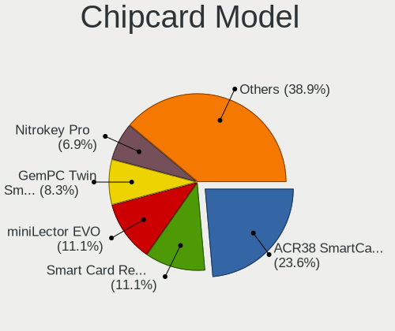

Linux in Italy - Tested Hardware & Statistics (Desktops)
--------------------------------------------------------

A project to collect tested hardware configurations for Linux in Italy.

Anyone can contribute to this report by the [hw-probe](https://github.com/linuxhw/hw-probe) tool:

    sudo -E hw-probe -all -upload

Please contribute! Especially if your hardware is rare.

Contents
--------

* [ Test Cases ](#test-cases)

* [ System ](#system)
  - [ OS                       ](#os)
  - [ OS Family                ](#os-family)
  - [ Kernel                   ](#kernel)
  - [ Kernel Family            ](#kernel-family)
  - [ Kernel Major Ver.        ](#kernel-major-ver)
  - [ Arch                     ](#arch)
  - [ DE                       ](#de)
  - [ Display Server           ](#display-server)
  - [ Display Manager          ](#display-manager)
  - [ OS Lang                  ](#os-lang)
  - [ Boot Mode                ](#boot-mode)
  - [ Filesystem               ](#filesystem)
  - [ Part. scheme             ](#part-scheme)
  - [ Dual Boot with Linux/BSD ](#dual-boot-with-linuxbsd)
  - [ Dual Boot (Win)          ](#dual-boot-win)

* [ Board ](#board)
  - [ Vendor                   ](#vendor)
  - [ Model                    ](#model)
  - [ Model Family             ](#model-family)
  - [ MFG Year                 ](#mfg-year)
  - [ Form Factor              ](#form-factor)
  - [ Secure Boot              ](#secure-boot)
  - [ Coreboot                 ](#coreboot)
  - [ RAM Size                 ](#ram-size)
  - [ RAM Used                 ](#ram-used)
  - [ Total Drives             ](#total-drives)
  - [ Has CD-ROM               ](#has-cd-rom)
  - [ Has Ethernet             ](#has-ethernet)
  - [ Has WiFi                 ](#has-wifi)
  - [ Has Bluetooth            ](#has-bluetooth)

* [ Location ](#location)
  - [ Country                  ](#country)
  - [ City                     ](#city)

* [ Drives ](#drives)
  - [ Drive Vendor             ](#drive-vendor)
  - [ Drive Model              ](#drive-model)
  - [ HDD Vendor               ](#hdd-vendor)
  - [ SSD Vendor               ](#ssd-vendor)
  - [ Drive Kind               ](#drive-kind)
  - [ Drive Connector          ](#drive-connector)
  - [ Drive Size               ](#drive-size)
  - [ Space Total              ](#space-total)
  - [ Space Used               ](#space-used)
  - [ Malfunc. Drives          ](#malfunc-drives)
  - [ Malfunc. Drive Vendor    ](#malfunc-drive-vendor)
  - [ Malfunc. HDD Vendor      ](#malfunc-hdd-vendor)
  - [ Malfunc. Drive Kind      ](#malfunc-drive-kind)
  - [ Failed Drives            ](#failed-drives)
  - [ Failed Drive Vendor      ](#failed-drive-vendor)
  - [ Drive Status             ](#drive-status)

* [ Storage controller ](#storage-controller)
  - [ Storage Vendor           ](#storage-vendor)
  - [ Storage Model            ](#storage-model)
  - [ Storage Kind             ](#storage-kind)

* [ Processor ](#processor)
  - [ CPU Vendor               ](#cpu-vendor)
  - [ CPU Model                ](#cpu-model)
  - [ CPU Model Family         ](#cpu-model-family)
  - [ CPU Cores                ](#cpu-cores)
  - [ CPU Sockets              ](#cpu-sockets)
  - [ CPU Threads              ](#cpu-threads)
  - [ CPU Op-Modes             ](#cpu-op-modes)
  - [ CPU Microcode            ](#cpu-microcode)
  - [ CPU Microarch            ](#cpu-microarch)

* [ Graphics ](#graphics)
  - [ GPU Vendor               ](#gpu-vendor)
  - [ GPU Model                ](#gpu-model)
  - [ GPU Combo                ](#gpu-combo)
  - [ GPU Driver               ](#gpu-driver)
  - [ GPU Memory               ](#gpu-memory)

* [ Monitor ](#monitor)
  - [ Monitor Vendor           ](#monitor-vendor)
  - [ Monitor Model            ](#monitor-model)
  - [ Monitor Resolution       ](#monitor-resolution)
  - [ Monitor Diagonal         ](#monitor-diagonal)
  - [ Monitor Width            ](#monitor-width)
  - [ Aspect Ratio             ](#aspect-ratio)
  - [ Monitor Area             ](#monitor-area)
  - [ Pixel Density            ](#pixel-density)
  - [ Multiple Monitors        ](#multiple-monitors)

* [ Network ](#network)
  - [ Net Controller Vendor    ](#net-controller-vendor)
  - [ Net Controller Model     ](#net-controller-model)
  - [ Wireless Vendor          ](#wireless-vendor)
  - [ Wireless Model           ](#wireless-model)
  - [ Ethernet Vendor          ](#ethernet-vendor)
  - [ Ethernet Model           ](#ethernet-model)
  - [ Net Controller Kind      ](#net-controller-kind)
  - [ Used Controller          ](#used-controller)
  - [ NICs                     ](#nics)
  - [ IPv6                     ](#ipv6)

* [ Bluetooth ](#bluetooth)
  - [ Bluetooth Vendor         ](#bluetooth-vendor)
  - [ Bluetooth Model          ](#bluetooth-model)

* [ Sound ](#sound)
  - [ Sound Vendor             ](#sound-vendor)
  - [ Sound Model              ](#sound-model)

* [ Memory ](#memory)
  - [ Memory Vendor            ](#memory-vendor)
  - [ Memory Model             ](#memory-model)
  - [ Memory Kind              ](#memory-kind)
  - [ Memory Form Factor       ](#memory-form-factor)
  - [ Memory Size              ](#memory-size)
  - [ Memory Speed             ](#memory-speed)

* [ Printers & scanners ](#printers--scanners)
  - [ Printer Vendor           ](#printer-vendor)
  - [ Printer Model            ](#printer-model)
  - [ Scanner Vendor           ](#scanner-vendor)
  - [ Scanner Model            ](#scanner-model)

* [ Camera ](#camera)
  - [ Camera Vendor            ](#camera-vendor)
  - [ Camera Model             ](#camera-model)

* [ Security ](#security)
  - [ Fingerprint Vendor       ](#fingerprint-vendor)
  - [ Fingerprint Model        ](#fingerprint-model)
  - [ Chipcard Vendor          ](#chipcard-vendor)
  - [ Chipcard Model           ](#chipcard-model)

* [ Unsupported ](#unsupported)
  - [ Unsupported Devices      ](#unsupported-devices)
  - [ Unsupported Device Types ](#unsupported-device-types)

Test Cases
----------

Total: 2973

| Vendor        | Model                       | Probe                                                      | Date         |
|---------------|-----------------------------|------------------------------------------------------------|--------------|
| ASRock        | 970 Pro3 R2.0               | [592adc6c9b](https://linux-hardware.org/?probe=592adc6c9b) | Oct 01, 2022 |
| Dell          | 0YXT71 A02                  | [f36bc1d24e](https://linux-hardware.org/?probe=f36bc1d24e) | Sep 29, 2022 |
| ASRock        | J3160DC-ITX                 | [7e1818288f](https://linux-hardware.org/?probe=7e1818288f) | Sep 29, 2022 |
| Gigabyte      | F2A55M-DS2                  | [c17c689217](https://linux-hardware.org/?probe=c17c689217) | Sep 28, 2022 |
| Gigabyte      | Z390 AORUS PRO-CF           | [960c35d712](https://linux-hardware.org/?probe=960c35d712) | Sep 28, 2022 |
| Dell          | 09M8Y8 A01                  | [f129c4da4a](https://linux-hardware.org/?probe=f129c4da4a) | Sep 28, 2022 |
| Packard Be... | IMEDIA L4875 v1.0           | [bb57b80866](https://linux-hardware.org/?probe=bb57b80866) | Sep 27, 2022 |
| HP            | 8433 11                     | [a1d424bced](https://linux-hardware.org/?probe=a1d424bced) | Sep 27, 2022 |
| ASRock        | AB350 Gaming K4             | [184070d232](https://linux-hardware.org/?probe=184070d232) | Sep 26, 2022 |
| ASRock        | 775Dual-VSTA                | [9509fb65dd](https://linux-hardware.org/?probe=9509fb65dd) | Sep 26, 2022 |
| ASUSTek       | H81M-K                      | [badc988393](https://linux-hardware.org/?probe=badc988393) | Sep 26, 2022 |
| Packard Be... | IMEDIA L4875 v1.0           | [4ed673ff1a](https://linux-hardware.org/?probe=4ed673ff1a) | Sep 25, 2022 |
| ASUSTek       | ROG STRIX B550-F GAMING     | [65d54e7273](https://linux-hardware.org/?probe=65d54e7273) | Sep 25, 2022 |
| ASUSTek       | P8H61-M LX                  | [164f5bfea2](https://linux-hardware.org/?probe=164f5bfea2) | Sep 25, 2022 |
| HP            | 8433 11                     | [dffc61c155](https://linux-hardware.org/?probe=dffc61c155) | Sep 24, 2022 |
| ASRock        | 4CoreDual-SATA2             | [eb0e992df7](https://linux-hardware.org/?probe=eb0e992df7) | Sep 24, 2022 |
| ASUSTek       | P8B75-M LE                  | [8975676700](https://linux-hardware.org/?probe=8975676700) | Sep 24, 2022 |
| MSI           | MPG X570 GAMING PLUS        | [fd43d92335](https://linux-hardware.org/?probe=fd43d92335) | Sep 23, 2022 |
| ASUSTek       | ROG STRIX B450-F GAMING ... | [a4ce7c179e](https://linux-hardware.org/?probe=a4ce7c179e) | Sep 23, 2022 |
| Fujitsu Si... | P5LD2-FM-DH-VP              | [0c6cbcc99d](https://linux-hardware.org/?probe=0c6cbcc99d) | Sep 22, 2022 |
| ASUSTek       | M3N78-VM                    | [edaab96cde](https://linux-hardware.org/?probe=edaab96cde) | Sep 21, 2022 |
| Dell          | 09M8Y8 A01                  | [07dd388834](https://linux-hardware.org/?probe=07dd388834) | Sep 21, 2022 |
| Dell          | 0GM819                      | [951ce34bb2](https://linux-hardware.org/?probe=951ce34bb2) | Sep 21, 2022 |
| Lenovo        | ThinkCentre M57 6072WMD     | [eb8221088f](https://linux-hardware.org/?probe=eb8221088f) | Sep 21, 2022 |
| Dell          | 09M8Y8 A01                  | [2c7466119d](https://linux-hardware.org/?probe=2c7466119d) | Sep 21, 2022 |
| Intel         | H55                         | [6de435d14c](https://linux-hardware.org/?probe=6de435d14c) | Sep 20, 2022 |
| ASUSTek       | G20CB                       | [34f4d43b97](https://linux-hardware.org/?probe=34f4d43b97) | Sep 20, 2022 |
| MSI           | X470 GAMING PLUS MAX        | [9c483616f6](https://linux-hardware.org/?probe=9c483616f6) | Sep 20, 2022 |
| Acer          | Aspire M3970                | [d135989361](https://linux-hardware.org/?probe=d135989361) | Sep 19, 2022 |
| Supermicro    | C7P67                       | [16bff71d62](https://linux-hardware.org/?probe=16bff71d62) | Sep 19, 2022 |
| ASRock        | X570 Phantom Gaming 4       | [75be2db65c](https://linux-hardware.org/?probe=75be2db65c) | Sep 19, 2022 |
| HP            | 2B29                        | [391e407d29](https://linux-hardware.org/?probe=391e407d29) | Sep 18, 2022 |
| ASRock        | 960GC-GS FX                 | [2432fca2f8](https://linux-hardware.org/?probe=2432fca2f8) | Sep 18, 2022 |
| ASRock        | 960GC-GS FX                 | [3e40742ff0](https://linux-hardware.org/?probe=3e40742ff0) | Sep 18, 2022 |
| MSI           | Boston                      | [b884bd8c03](https://linux-hardware.org/?probe=b884bd8c03) | Sep 17, 2022 |
| ASUSTek       | P5K                         | [4cf17a7b6f](https://linux-hardware.org/?probe=4cf17a7b6f) | Sep 17, 2022 |
| Lenovo        | 3100 SDK0J40700 WIN 3258... | [3ba3a4becf](https://linux-hardware.org/?probe=3ba3a4becf) | Sep 16, 2022 |
| Lenovo        | 3708 SDK0J40700 WIN 3258... | [e6fe8aa148](https://linux-hardware.org/?probe=e6fe8aa148) | Sep 16, 2022 |
| ASUSTek       | ET1612I                     | [0ddd9554cc](https://linux-hardware.org/?probe=0ddd9554cc) | Sep 16, 2022 |
| ASRock        | X370 Gaming K4              | [0858e80da7](https://linux-hardware.org/?probe=0858e80da7) | Sep 15, 2022 |
| ASUSTek       | PRIME H410M-E               | [91f1fdc978](https://linux-hardware.org/?probe=91f1fdc978) | Sep 14, 2022 |
| Dell          | 0WR7PY A02                  | [0a587d6fee](https://linux-hardware.org/?probe=0a587d6fee) | Sep 14, 2022 |
| ASRock        | H61M-DGS                    | [aeac7cfb74](https://linux-hardware.org/?probe=aeac7cfb74) | Sep 14, 2022 |
| ASUSTek       | Z170 PRO GAMING             | [d3f957e34a](https://linux-hardware.org/?probe=d3f957e34a) | Sep 13, 2022 |
| ASUSTek       | G20CB                       | [a52ff97f3b](https://linux-hardware.org/?probe=a52ff97f3b) | Sep 12, 2022 |
| ASUSTek       | G20CB                       | [2d737743f4](https://linux-hardware.org/?probe=2d737743f4) | Sep 12, 2022 |
| ASRock        | B450 Gaming K4              | [2391f4673a](https://linux-hardware.org/?probe=2391f4673a) | Sep 12, 2022 |
| ASRock        | B450 Gaming K4              | [89963f6bf1](https://linux-hardware.org/?probe=89963f6bf1) | Sep 12, 2022 |
| MSI           | X58 Pro                     | [60406c82e8](https://linux-hardware.org/?probe=60406c82e8) | Sep 12, 2022 |
| Acer          | E415SM                      | [bc9ef15cab](https://linux-hardware.org/?probe=bc9ef15cab) | Sep 11, 2022 |
| Acer          | E415SM                      | [4f8a53c667](https://linux-hardware.org/?probe=4f8a53c667) | Sep 11, 2022 |
| ASUSTek       | PRIME H310M-E R2.0          | [b76fc41706](https://linux-hardware.org/?probe=b76fc41706) | Sep 11, 2022 |
| Fujitsu Si... | P5LD2-FM-DH-VP              | [ad6a16f658](https://linux-hardware.org/?probe=ad6a16f658) | Sep 11, 2022 |
| Gigabyte      | A320M-S2H V2-CF             | [4df5d0194d](https://linux-hardware.org/?probe=4df5d0194d) | Sep 11, 2022 |
| Gigabyte      | Z77X-UP7                    | [1634db2e78](https://linux-hardware.org/?probe=1634db2e78) | Sep 11, 2022 |
| ASUSTek       | TUF Gaming B550-PLUS        | [ee06685499](https://linux-hardware.org/?probe=ee06685499) | Sep 11, 2022 |
| Dell          | 09M8Y8 A01                  | [c719d7f544](https://linux-hardware.org/?probe=c719d7f544) | Sep 11, 2022 |
| Dell          | 03NVJ6 A01                  | [3f51b6da48](https://linux-hardware.org/?probe=3f51b6da48) | Sep 10, 2022 |
| ASRock        | J3160DC-ITX                 | [e854b82ab9](https://linux-hardware.org/?probe=e854b82ab9) | Sep 10, 2022 |
| ASUSTek       | TUF Gaming B550-PLUS        | [174c263499](https://linux-hardware.org/?probe=174c263499) | Sep 08, 2022 |
| Gigabyte      | Z97-HD3                     | [aeb2bae778](https://linux-hardware.org/?probe=aeb2bae778) | Sep 08, 2022 |
| Intel         | DH77DF AAG40293-300         | [217971d572](https://linux-hardware.org/?probe=217971d572) | Sep 08, 2022 |
| ASRock        | N3700-ITX                   | [5af515a1f9](https://linux-hardware.org/?probe=5af515a1f9) | Sep 08, 2022 |
| Gigabyte      | Z97-HD3                     | [d5040ffbda](https://linux-hardware.org/?probe=d5040ffbda) | Sep 08, 2022 |
| MSI           | H61M-P31                    | [56a8b0b2a7](https://linux-hardware.org/?probe=56a8b0b2a7) | Sep 08, 2022 |
| Pegatron      | 2A9Eh                       | [2c7b59f70b](https://linux-hardware.org/?probe=2c7b59f70b) | Sep 08, 2022 |
| HP            | 3397                        | [0ebeef29bf](https://linux-hardware.org/?probe=0ebeef29bf) | Sep 07, 2022 |
| Lenovo        | MAHOBAY                     | [2619e261d1](https://linux-hardware.org/?probe=2619e261d1) | Sep 07, 2022 |
| Pegatron      | Narra6                      | [b2a70f42a0](https://linux-hardware.org/?probe=b2a70f42a0) | Sep 07, 2022 |
| ASRock        | Q1900M                      | [05cf506f57](https://linux-hardware.org/?probe=05cf506f57) | Sep 06, 2022 |
| ASUSTek       | STRIKER II EXTREME          | [42e666abe1](https://linux-hardware.org/?probe=42e666abe1) | Sep 06, 2022 |
| ASUSTek       | P8H77-V LE                  | [8a1c5532d6](https://linux-hardware.org/?probe=8a1c5532d6) | Sep 06, 2022 |
| ASUSTek       | P8H77-V LE                  | [cc631912bf](https://linux-hardware.org/?probe=cc631912bf) | Sep 06, 2022 |
| ASUSTek       | P9X79 PRO                   | [7e53f87cc4](https://linux-hardware.org/?probe=7e53f87cc4) | Sep 06, 2022 |
| ASUSTek       | H81M-PLUS                   | [826b486f77](https://linux-hardware.org/?probe=826b486f77) | Sep 05, 2022 |
| HP            | 0B4Ch D                     | [87c4023810](https://linux-hardware.org/?probe=87c4023810) | Sep 05, 2022 |
| ASRock        | Q1900M                      | [6b53538e90](https://linux-hardware.org/?probe=6b53538e90) | Sep 05, 2022 |
| ASUSTek       | PRIME X370-PRO              | [312e33b434](https://linux-hardware.org/?probe=312e33b434) | Sep 05, 2022 |
| Dell          | 0MWYPT A01                  | [57b81c35c1](https://linux-hardware.org/?probe=57b81c35c1) | Sep 05, 2022 |
| MSI           | MPG B550 GAMING EDGE WIF... | [e83fa739c9](https://linux-hardware.org/?probe=e83fa739c9) | Sep 05, 2022 |
| ASUSTek       | STRIKER II EXTREME          | [502995e6f3](https://linux-hardware.org/?probe=502995e6f3) | Sep 05, 2022 |
| MSI           | B550-A PRO                  | [950b2a8eb5](https://linux-hardware.org/?probe=950b2a8eb5) | Sep 05, 2022 |
| ASUSTek       | P9X79 DELUXE                | [2aa7ada396](https://linux-hardware.org/?probe=2aa7ada396) | Sep 05, 2022 |
| ASUSTek       | ROG STRIX X570-E GAMING     | [127c2f5f75](https://linux-hardware.org/?probe=127c2f5f75) | Sep 05, 2022 |
| Gigabyte      | Z390 GAMING X-CF            | [26e63d2357](https://linux-hardware.org/?probe=26e63d2357) | Sep 05, 2022 |
| Dell          | 0HY9JP A02                  | [7cbf141461](https://linux-hardware.org/?probe=7cbf141461) | Sep 05, 2022 |
| Lenovo        | 367D 31900003 STD           | [c145bac65a](https://linux-hardware.org/?probe=c145bac65a) | Sep 05, 2022 |
| MSI           | MAG B550 TOMAHAWK           | [7c87d1ad42](https://linux-hardware.org/?probe=7c87d1ad42) | Sep 05, 2022 |
| ASUSTek       | TUF B450M-PLUS GAMING       | [43267285d4](https://linux-hardware.org/?probe=43267285d4) | Sep 04, 2022 |
| Gigabyte      | B450M DS3H-CF               | [008133bf59](https://linux-hardware.org/?probe=008133bf59) | Sep 04, 2022 |
| MSI           | B450 GAMING PLUS MAX        | [9cd2bcff37](https://linux-hardware.org/?probe=9cd2bcff37) | Sep 04, 2022 |
| Gigabyte      | B360 AORUS GAMING 3 WIFI... | [4a27f8b033](https://linux-hardware.org/?probe=4a27f8b033) | Sep 04, 2022 |
| ASRock        | Q1900M                      | [55a86f60b9](https://linux-hardware.org/?probe=55a86f60b9) | Sep 04, 2022 |
| ASUSTek       | P5P43TD                     | [cca9e79d90](https://linux-hardware.org/?probe=cca9e79d90) | Sep 04, 2022 |
| ASUSTek       | TUF Gaming B550-PLUS        | [2cf13f4045](https://linux-hardware.org/?probe=2cf13f4045) | Sep 04, 2022 |
| Lenovo        | SKYBAY SDK0J40709 WIN 32... | [ed16086671](https://linux-hardware.org/?probe=ed16086671) | Sep 04, 2022 |
| ASUSTek       | UN45                        | [87eca02296](https://linux-hardware.org/?probe=87eca02296) | Sep 04, 2022 |
| ASUSTek       | ROG STRIX Z370-E GAMING     | [bf4936f3bc](https://linux-hardware.org/?probe=bf4936f3bc) | Sep 04, 2022 |
| ASRock        | H370M-ITX/ac                | [1a577be107](https://linux-hardware.org/?probe=1a577be107) | Sep 04, 2022 |
| ASUSTek       | PRIME A320M-K               | [878661705c](https://linux-hardware.org/?probe=878661705c) | Sep 04, 2022 |
| Dell          | 0T1D10 A01                  | [3064d08dc1](https://linux-hardware.org/?probe=3064d08dc1) | Sep 03, 2022 |
| ASUSTek       | PRIME H470-PLUS             | [e80ac4d271](https://linux-hardware.org/?probe=e80ac4d271) | Sep 03, 2022 |
| Gigabyte      | X470 AORUS ULTRA GAMING-... | [312013ef36](https://linux-hardware.org/?probe=312013ef36) | Sep 03, 2022 |
| Dell          | 0HMF7C A01                  | [292123f83b](https://linux-hardware.org/?probe=292123f83b) | Sep 03, 2022 |
| MSI           | MPG B550 GAMING PLUS        | [6de688d21a](https://linux-hardware.org/?probe=6de688d21a) | Sep 03, 2022 |
| MSI           | B450 GAMING PLUS MAX        | [159c1dcd33](https://linux-hardware.org/?probe=159c1dcd33) | Sep 03, 2022 |
| ASUSTek       | P5KC                        | [602e22310b](https://linux-hardware.org/?probe=602e22310b) | Sep 03, 2022 |
| MSI           | B450-A PRO MAX              | [0c89daf254](https://linux-hardware.org/?probe=0c89daf254) | Sep 03, 2022 |
| MSI           | X570-A PRO                  | [e20b509508](https://linux-hardware.org/?probe=e20b509508) | Sep 03, 2022 |
| ASUSTek       | P7P55D                      | [ad2b0a0a89](https://linux-hardware.org/?probe=ad2b0a0a89) | Sep 03, 2022 |
| ASUSTek       | ROG STRIX Z390-F GAMING     | [b9f43af7d0](https://linux-hardware.org/?probe=b9f43af7d0) | Sep 03, 2022 |
| ASRock        | H310CM-HDV                  | [df5d5f2e7f](https://linux-hardware.org/?probe=df5d5f2e7f) | Sep 03, 2022 |
| Gigabyte      | Z97X-UD5H-BK                | [97a21d48e0](https://linux-hardware.org/?probe=97a21d48e0) | Sep 03, 2022 |
| ASUSTek       | TUF Gaming B460M-PLUS       | [5dcc9cd8c8](https://linux-hardware.org/?probe=5dcc9cd8c8) | Sep 03, 2022 |
| ASUSTek       | ROG STRIX Z390-F GAMING     | [9cab157472](https://linux-hardware.org/?probe=9cab157472) | Sep 03, 2022 |
| ASUSTek       | Z170-K                      | [d47c5fe35c](https://linux-hardware.org/?probe=d47c5fe35c) | Sep 03, 2022 |
| MSI           | B450 TOMAHAWK MAX           | [9b8eef74b8](https://linux-hardware.org/?probe=9b8eef74b8) | Sep 03, 2022 |
| ASRock        | A320M-HDV                   | [5a9342d8e9](https://linux-hardware.org/?probe=5a9342d8e9) | Sep 03, 2022 |
| Gigabyte      | B450 AORUS PRO-CF           | [982df83fdf](https://linux-hardware.org/?probe=982df83fdf) | Sep 03, 2022 |
| Dell          | 02YYK5 A00                  | [742579c33d](https://linux-hardware.org/?probe=742579c33d) | Sep 03, 2022 |
| MSI           | MPG B550 GAMING PLUS        | [32d39c8b65](https://linux-hardware.org/?probe=32d39c8b65) | Sep 03, 2022 |
| Gigabyte      | X470 AORUS ULTRA GAMING-... | [709825bde3](https://linux-hardware.org/?probe=709825bde3) | Sep 03, 2022 |
| ASUSTek       | PRIME H270-PRO              | [5c0b32f572](https://linux-hardware.org/?probe=5c0b32f572) | Sep 03, 2022 |
| MSI           | H170 GAMING M3              | [b0d669cf4b](https://linux-hardware.org/?probe=b0d669cf4b) | Sep 03, 2022 |
| Lenovo        | 30D2 SDK0J40705 WIN 3425... | [c13f075f83](https://linux-hardware.org/?probe=c13f075f83) | Sep 03, 2022 |
| ASRock        | 4CoreDual-SATA2             | [c64d84d331](https://linux-hardware.org/?probe=c64d84d331) | Sep 03, 2022 |
| ASRock        | X470 Taichi                 | [0a6ff089f1](https://linux-hardware.org/?probe=0a6ff089f1) | Sep 03, 2022 |
| MSI           | X470 GAMING PRO MAX         | [7f10b8002b](https://linux-hardware.org/?probe=7f10b8002b) | Sep 03, 2022 |
| Gigabyte      | B360 AORUS GAMING 3 WIFI... | [65562b09e0](https://linux-hardware.org/?probe=65562b09e0) | Sep 03, 2022 |
| Fujitsu       | D3162-A1 S26361-D3162-A1    | [a591a1fecf](https://linux-hardware.org/?probe=a591a1fecf) | Sep 03, 2022 |
| ASRock        | FM2A88X-ITX+                | [9c22b70a4f](https://linux-hardware.org/?probe=9c22b70a4f) | Sep 03, 2022 |
| MSI           | B550-A PRO                  | [65bfdaa6ea](https://linux-hardware.org/?probe=65bfdaa6ea) | Sep 03, 2022 |
| Gigabyte      | B560M DS3H V2               | [4d9025cf5c](https://linux-hardware.org/?probe=4d9025cf5c) | Sep 03, 2022 |
| BESSTAR Te... | UM350                       | [02423b61e0](https://linux-hardware.org/?probe=02423b61e0) | Sep 03, 2022 |
| ASUSTek       | PRIME A320M-K               | [acfa42b951](https://linux-hardware.org/?probe=acfa42b951) | Sep 03, 2022 |
| Dell          | 0F6X5P A00                  | [71ff7749aa](https://linux-hardware.org/?probe=71ff7749aa) | Sep 03, 2022 |
| OEM           | G41 775 ICH7 8712           | [4c9041cf15](https://linux-hardware.org/?probe=4c9041cf15) | Sep 03, 2022 |
| HP            | 3397                        | [5cd2349a9c](https://linux-hardware.org/?probe=5cd2349a9c) | Sep 02, 2022 |
| ASRock        | H61M-DGS                    | [8b36704183](https://linux-hardware.org/?probe=8b36704183) | Sep 02, 2022 |
| ASUSTek       | STRIKER II EXTREME          | [97b982b909](https://linux-hardware.org/?probe=97b982b909) | Sep 02, 2022 |
| Gigabyte      | X570 AORUS MASTER           | [7829cfc920](https://linux-hardware.org/?probe=7829cfc920) | Sep 02, 2022 |
| ASUSTek       | STRIKER II EXTREME          | [5485918ea2](https://linux-hardware.org/?probe=5485918ea2) | Sep 02, 2022 |
| ASUSTek       | P8H77-V LE                  | [f77ecfe3bc](https://linux-hardware.org/?probe=f77ecfe3bc) | Sep 02, 2022 |
| Pegatron      | 2AB6                        | [c4ca3989e0](https://linux-hardware.org/?probe=c4ca3989e0) | Aug 31, 2022 |
| HP            | 18E9                        | [2dff78f303](https://linux-hardware.org/?probe=2dff78f303) | Aug 31, 2022 |
| Gigabyte      | B550 AORUS ELITE AX V2      | [98e0a08e65](https://linux-hardware.org/?probe=98e0a08e65) | Aug 30, 2022 |
| ASUSTek       | P5QPL-AM                    | [38e6481a65](https://linux-hardware.org/?probe=38e6481a65) | Aug 30, 2022 |
| OEM           | G41 775 ICH7 8712           | [4225df6517](https://linux-hardware.org/?probe=4225df6517) | Aug 29, 2022 |
| ASUSTek       | Z97-C                       | [9bdae9239f](https://linux-hardware.org/?probe=9bdae9239f) | Aug 29, 2022 |
| ASUSTek       | P5KPL-AM SE                 | [7a2c713719](https://linux-hardware.org/?probe=7a2c713719) | Aug 29, 2022 |
| HP            | 8751                        | [62c8c2f25e](https://linux-hardware.org/?probe=62c8c2f25e) | Aug 29, 2022 |
| ASUSTek       | P5KPL-AM SE                 | [17e8c1560b](https://linux-hardware.org/?probe=17e8c1560b) | Aug 28, 2022 |
| ASRock        | H61M-DGS                    | [023204fa1f](https://linux-hardware.org/?probe=023204fa1f) | Aug 28, 2022 |
| Gigabyte      | H97-HD3                     | [25e4d6c064](https://linux-hardware.org/?probe=25e4d6c064) | Aug 28, 2022 |
| Fujitsu       | D3061-A1 S26361-D3061-A1    | [f74dc71ad8](https://linux-hardware.org/?probe=f74dc71ad8) | Aug 27, 2022 |
| Gigabyte      | Z490 UD                     | [a872472b1c](https://linux-hardware.org/?probe=a872472b1c) | Aug 26, 2022 |
| Intel         | D2550MUD2 AAG81497-700      | [a181512016](https://linux-hardware.org/?probe=a181512016) | Aug 26, 2022 |
| ASUSTek       | M5A78L LE                   | [e4a6425675](https://linux-hardware.org/?probe=e4a6425675) | Aug 26, 2022 |
| ASUSTek       | PRIME A320M-K               | [a096217ea3](https://linux-hardware.org/?probe=a096217ea3) | Aug 24, 2022 |
| ASUSTek       | M4N68T-M-V2                 | [1528da74f6](https://linux-hardware.org/?probe=1528da74f6) | Aug 22, 2022 |
| ASUSTek       | PRIME Z390-P                | [ca7534d4dc](https://linux-hardware.org/?probe=ca7534d4dc) | Aug 22, 2022 |
| ASUSTek       | H110M-A/M.2                 | [dab0f526b0](https://linux-hardware.org/?probe=dab0f526b0) | Aug 22, 2022 |
| MSI           | MPG X570 GAMING PLUS        | [e064c453da](https://linux-hardware.org/?probe=e064c453da) | Aug 21, 2022 |
| Gigabyte      | P35-DS3L                    | [1ee42449ed](https://linux-hardware.org/?probe=1ee42449ed) | Aug 21, 2022 |
| OEM           | G41 775 ICH7 8712           | [71bfa72a22](https://linux-hardware.org/?probe=71bfa72a22) | Aug 21, 2022 |
| MSI           | G31M3                       | [3bb7906f56](https://linux-hardware.org/?probe=3bb7906f56) | Aug 20, 2022 |
| AZW           | MII-V                       | [59698f6b33](https://linux-hardware.org/?probe=59698f6b33) | Aug 20, 2022 |
| MSI           | B450 TOMAHAWK MAX II        | [57f1970999](https://linux-hardware.org/?probe=57f1970999) | Aug 20, 2022 |
| MSI           | Boston                      | [4a10f122a2](https://linux-hardware.org/?probe=4a10f122a2) | Aug 19, 2022 |
| Gigabyte      | Z370 HD3P-CF                | [410c71e7ef](https://linux-hardware.org/?probe=410c71e7ef) | Aug 18, 2022 |
| ASRock        | H61M-DGS                    | [ffb9dcb065](https://linux-hardware.org/?probe=ffb9dcb065) | Aug 18, 2022 |
| Acer          | MRS600M                     | [ec4c10d06e](https://linux-hardware.org/?probe=ec4c10d06e) | Aug 17, 2022 |
| ASRock        | 775Dual-VSTA                | [89ac2bb6fe](https://linux-hardware.org/?probe=89ac2bb6fe) | Aug 17, 2022 |
| HP            | 1495                        | [34b69b08b1](https://linux-hardware.org/?probe=34b69b08b1) | Aug 15, 2022 |
| HP            | 1495                        | [1ace6c9868](https://linux-hardware.org/?probe=1ace6c9868) | Aug 15, 2022 |
| HP            | 1495                        | [af820eee7e](https://linux-hardware.org/?probe=af820eee7e) | Aug 15, 2022 |
| HP            | 1495                        | [6db4307c50](https://linux-hardware.org/?probe=6db4307c50) | Aug 15, 2022 |
| HP            | 1495                        | [c122ce06ab](https://linux-hardware.org/?probe=c122ce06ab) | Aug 15, 2022 |
| ASUSTek       | PRIME B450M-A II            | [4ba26713bc](https://linux-hardware.org/?probe=4ba26713bc) | Aug 15, 2022 |
| ASUSTek       | ROG CROSSHAIR VIII DARK ... | [fd06db829d](https://linux-hardware.org/?probe=fd06db829d) | Aug 14, 2022 |
| Gigabyte      | Z370 HD3P-CF                | [2162cafc91](https://linux-hardware.org/?probe=2162cafc91) | Aug 13, 2022 |
| ASUSTek       | STRIX Z270E GAMING          | [6a0c6ab778](https://linux-hardware.org/?probe=6a0c6ab778) | Aug 13, 2022 |
| AZW           | U59                         | [344d4587f6](https://linux-hardware.org/?probe=344d4587f6) | Aug 12, 2022 |
| Lenovo        | ThinkStation C20 4263BA7    | [e5e5d0d3a3](https://linux-hardware.org/?probe=e5e5d0d3a3) | Aug 11, 2022 |
| Lenovo        | ThinkStation C20 4263BA7    | [93ecf84dcf](https://linux-hardware.org/?probe=93ecf84dcf) | Aug 11, 2022 |
| ASRock        | G41M-VS3                    | [4185ab0f97](https://linux-hardware.org/?probe=4185ab0f97) | Aug 10, 2022 |
| ASUSTek       | PRIME Z690-P WIFI           | [7792f4471e](https://linux-hardware.org/?probe=7792f4471e) | Aug 10, 2022 |
| ASRock        | H61M-DGS                    | [7005dd1f5f](https://linux-hardware.org/?probe=7005dd1f5f) | Aug 09, 2022 |
| ASRock        | H55M-LE                     | [841c63de14](https://linux-hardware.org/?probe=841c63de14) | Aug 08, 2022 |
| Gigabyte      | B550 AORUS ELITE AX V2      | [7ca881aae7](https://linux-hardware.org/?probe=7ca881aae7) | Aug 08, 2022 |
| Acer          | Predator PO3-620            | [ff0507688f](https://linux-hardware.org/?probe=ff0507688f) | Aug 02, 2022 |
| Acer          | FIH57                       | [eec3e58c8c](https://linux-hardware.org/?probe=eec3e58c8c) | Aug 02, 2022 |
| Acer          | FIH57                       | [a6b9d91f36](https://linux-hardware.org/?probe=a6b9d91f36) | Jul 30, 2022 |
| MSI           | MPG X570S CARBON MAX WIF... | [bace89cd10](https://linux-hardware.org/?probe=bace89cd10) | Jul 30, 2022 |
| ASUSTek       | P6T DELUXE V2               | [3c18081f88](https://linux-hardware.org/?probe=3c18081f88) | Jul 29, 2022 |
| MSI           | MPG X570S CARBON MAX WIF... | [54d5ee0a3a](https://linux-hardware.org/?probe=54d5ee0a3a) | Jul 28, 2022 |
| MSI           | B250M PRO-VD                | [e58c8fca5a](https://linux-hardware.org/?probe=e58c8fca5a) | Jul 28, 2022 |
| ASUSTek       | Z97-C                       | [e292699b1c](https://linux-hardware.org/?probe=e292699b1c) | Jul 28, 2022 |
| Acer          | EM61SM/EM61PM               | [2de6d95c80](https://linux-hardware.org/?probe=2de6d95c80) | Jul 28, 2022 |
| HP            | 1495                        | [61a8f473e2](https://linux-hardware.org/?probe=61a8f473e2) | Jul 27, 2022 |
| Acer          | FIH57                       | [f351802c52](https://linux-hardware.org/?probe=f351802c52) | Jul 26, 2022 |
| Dell          | 0KH290                      | [74934828fa](https://linux-hardware.org/?probe=74934828fa) | Jul 26, 2022 |
| MSI           | Z490-A PRO                  | [fe48f1e5cd](https://linux-hardware.org/?probe=fe48f1e5cd) | Jul 26, 2022 |
| Acer          | FIH57                       | [df3c42e452](https://linux-hardware.org/?probe=df3c42e452) | Jul 25, 2022 |
| Acer          | EM61SM/EM61PM               | [e470dff38f](https://linux-hardware.org/?probe=e470dff38f) | Jul 25, 2022 |
| AMI           | Cherry Trail CR             | [6463c26211](https://linux-hardware.org/?probe=6463c26211) | Jul 25, 2022 |
| ASRock        | 990FX Extreme3              | [158c8d142b](https://linux-hardware.org/?probe=158c8d142b) | Jul 24, 2022 |
| Gigabyte      | P35-DS3L                    | [4ae76fafc9](https://linux-hardware.org/?probe=4ae76fafc9) | Jul 22, 2022 |
| ASUSTek       | ROG CROSSHAIR VIII DARK ... | [6e4f170da9](https://linux-hardware.org/?probe=6e4f170da9) | Jul 22, 2022 |
| MSI           | B450 TOMAHAWK MAX II        | [dfe6047aa7](https://linux-hardware.org/?probe=dfe6047aa7) | Jul 21, 2022 |
| ASUSTek       | H110M-A/M.2                 | [97f5b09dd2](https://linux-hardware.org/?probe=97f5b09dd2) | Jul 21, 2022 |
| ASUSTek       | ROG CROSSHAIR VIII DARK ... | [6e4fbc6688](https://linux-hardware.org/?probe=6e4fbc6688) | Jul 20, 2022 |
| Gigabyte      | P35-DS3L                    | [cabd591648](https://linux-hardware.org/?probe=cabd591648) | Jul 20, 2022 |
| Foxconn       | 2ABF                        | [765d75028c](https://linux-hardware.org/?probe=765d75028c) | Jul 19, 2022 |
| Dell          | 0F6X5P A00                  | [528f781464](https://linux-hardware.org/?probe=528f781464) | Jul 16, 2022 |
| Acer          | FIH57                       | [ea25a3cc88](https://linux-hardware.org/?probe=ea25a3cc88) | Jul 15, 2022 |
| ASUSTek       | P5QLD PRO                   | [fbf3a31304](https://linux-hardware.org/?probe=fbf3a31304) | Jul 15, 2022 |
| MSI           | B450 TOMAHAWK MAX II        | [8f2f28b1c3](https://linux-hardware.org/?probe=8f2f28b1c3) | Jul 15, 2022 |
| Intel         | DQ77MK AAG39642-500         | [7b6a43a9f1](https://linux-hardware.org/?probe=7b6a43a9f1) | Jul 15, 2022 |
| HP            | 2B4B                        | [6592fe9157](https://linux-hardware.org/?probe=6592fe9157) | Jul 13, 2022 |
| MSI           | Boston                      | [4966d9bfdf](https://linux-hardware.org/?probe=4966d9bfdf) | Jul 12, 2022 |
| ASUSTek       | Maximus VIII HERO           | [491e37bdfb](https://linux-hardware.org/?probe=491e37bdfb) | Jul 12, 2022 |
| Acer          | FIH57                       | [b052eec1d0](https://linux-hardware.org/?probe=b052eec1d0) | Jul 10, 2022 |
| ASRock        | N68C-S UCC                  | [8c5338cc67](https://linux-hardware.org/?probe=8c5338cc67) | Jul 10, 2022 |
| Gigabyte      | GA-MA78GM-S2H               | [6ed805403a](https://linux-hardware.org/?probe=6ed805403a) | Jul 10, 2022 |
| MSI           | Z390-A PRO                  | [f3a1f552c8](https://linux-hardware.org/?probe=f3a1f552c8) | Jul 09, 2022 |
| Unknown       | Unknown                     | [e7dfa60f77](https://linux-hardware.org/?probe=e7dfa60f77) | Jul 09, 2022 |
| MSI           | H110M GAMING                | [92f54d6efd](https://linux-hardware.org/?probe=92f54d6efd) | Jul 09, 2022 |
| HP            | 1495                        | [3e67bd3405](https://linux-hardware.org/?probe=3e67bd3405) | Jul 09, 2022 |
| ASUSTek       | P8H61-M LX R2.0             | [3db9c636d0](https://linux-hardware.org/?probe=3db9c636d0) | Jul 09, 2022 |
| ASUSTek       | TUF Gaming B560-PLUS WIF... | [d66a60be9a](https://linux-hardware.org/?probe=d66a60be9a) | Jul 08, 2022 |
| Gigabyte      | B450M DS3H-CF               | [8b1a622249](https://linux-hardware.org/?probe=8b1a622249) | Jul 07, 2022 |
| MSI           | B250M PRO-VH                | [cab2cbb630](https://linux-hardware.org/?probe=cab2cbb630) | Jul 07, 2022 |
| Acer          | E91M                        | [4e55aacdd7](https://linux-hardware.org/?probe=4e55aacdd7) | Jul 06, 2022 |
| Acer          | FIH57                       | [75895f96b9](https://linux-hardware.org/?probe=75895f96b9) | Jul 05, 2022 |
| Biostar       | P4M90-M7A Ver:1.0           | [0567d5e337](https://linux-hardware.org/?probe=0567d5e337) | Jul 05, 2022 |
| Gigabyte      | B450 AORUS ELITE            | [5c8477b1a3](https://linux-hardware.org/?probe=5c8477b1a3) | Jul 04, 2022 |
| MSI           | MPG B460I GAMING EDGE WI... | [161f8c2665](https://linux-hardware.org/?probe=161f8c2665) | Jul 03, 2022 |
| MSI           | MPG B460I GAMING EDGE WI... | [15118ef9fd](https://linux-hardware.org/?probe=15118ef9fd) | Jul 03, 2022 |
| ASRock        | J4105M                      | [502c01c109](https://linux-hardware.org/?probe=502c01c109) | Jul 03, 2022 |
| Gigabyte      | G31M-S2L                    | [d555145d9f](https://linux-hardware.org/?probe=d555145d9f) | Jul 03, 2022 |
| ASUSTek       | P8H77-M PRO                 | [efc2332724](https://linux-hardware.org/?probe=efc2332724) | Jul 02, 2022 |
| ASRock        | AM1B-M                      | [e0e4a278c9](https://linux-hardware.org/?probe=e0e4a278c9) | Jul 02, 2022 |
| Intel         | D2500CC AAG81477-400        | [c9a6658803](https://linux-hardware.org/?probe=c9a6658803) | Jul 02, 2022 |
| ASRock        | 775Dual-VSTA                | [31825f35da](https://linux-hardware.org/?probe=31825f35da) | Jun 30, 2022 |
| Gigabyte      | B450M DS3H-CF               | [6a2f1d22f1](https://linux-hardware.org/?probe=6a2f1d22f1) | Jun 29, 2022 |
| Gigabyte      | B450M DS3H-CF               | [0a976062da](https://linux-hardware.org/?probe=0a976062da) | Jun 29, 2022 |
| Dell          | 0RF703                      | [7b1a5ddcb6](https://linux-hardware.org/?probe=7b1a5ddcb6) | Jun 27, 2022 |
| MSI           | B250 GAMING M3              | [b294a7b0b1](https://linux-hardware.org/?probe=b294a7b0b1) | Jun 26, 2022 |
| HP            | 3398                        | [4241fd0ba0](https://linux-hardware.org/?probe=4241fd0ba0) | Jun 26, 2022 |
| MSI           | B250 GAMING M3              | [f79c31ad28](https://linux-hardware.org/?probe=f79c31ad28) | Jun 26, 2022 |
| MSI           | MPG B460I GAMING EDGE WI... | [6580b51e30](https://linux-hardware.org/?probe=6580b51e30) | Jun 25, 2022 |
| MSI           | MPG B460I GAMING EDGE WI... | [01fcd4495e](https://linux-hardware.org/?probe=01fcd4495e) | Jun 25, 2022 |
| Foxconn       | 945 7MC Series              | [16836e63f5](https://linux-hardware.org/?probe=16836e63f5) | Jun 25, 2022 |
| MSI           | A78M-E45                    | [ca217e0ccb](https://linux-hardware.org/?probe=ca217e0ccb) | Jun 25, 2022 |
| ASRock        | H77 Pro4/MVP                | [f022b1b430](https://linux-hardware.org/?probe=f022b1b430) | Jun 24, 2022 |
| ASRock        | X370 Pro4                   | [df6751dcaa](https://linux-hardware.org/?probe=df6751dcaa) | Jun 22, 2022 |
| Intel         | DX58SO AAE29331-703         | [edb0ff1a68](https://linux-hardware.org/?probe=edb0ff1a68) | Jun 22, 2022 |
| MSI           | B450M-A PRO MAX             | [db4763808b](https://linux-hardware.org/?probe=db4763808b) | Jun 22, 2022 |
| Gigabyte      | H97M-D3H                    | [1529cf29a5](https://linux-hardware.org/?probe=1529cf29a5) | Jun 22, 2022 |
| Gigabyte      | H97M-D3H                    | [4a2493f02c](https://linux-hardware.org/?probe=4a2493f02c) | Jun 22, 2022 |
| ASUSTek       | M4N78-AM                    | [f98db3efe8](https://linux-hardware.org/?probe=f98db3efe8) | Jun 22, 2022 |
| Unknown       | RS780-SB700                 | [a4649c2c4a](https://linux-hardware.org/?probe=a4649c2c4a) | Jun 21, 2022 |
| HP            | 0AA0h                       | [ccc94e1725](https://linux-hardware.org/?probe=ccc94e1725) | Jun 21, 2022 |
| MSI           | B550M-A PRO                 | [1765b91360](https://linux-hardware.org/?probe=1765b91360) | Jun 21, 2022 |
| ASUSTek       | ROG STRIX B560-G GAMING ... | [88a7cd954c](https://linux-hardware.org/?probe=88a7cd954c) | Jun 19, 2022 |
| Dell          | 040DDP A01                  | [a4091a0526](https://linux-hardware.org/?probe=a4091a0526) | Jun 19, 2022 |
| ASUSTek       | ROG STRIX B550-E GAMING     | [7912825604](https://linux-hardware.org/?probe=7912825604) | Jun 19, 2022 |
| ASRock        | B85M DASH/OL R2.0           | [c5763f8865](https://linux-hardware.org/?probe=c5763f8865) | Jun 17, 2022 |
| ASUSTek       | M4N78-AM                    | [8522c93ea3](https://linux-hardware.org/?probe=8522c93ea3) | Jun 16, 2022 |
| ASUSTek       | M4N78-AM                    | [d7dddc4270](https://linux-hardware.org/?probe=d7dddc4270) | Jun 16, 2022 |
| ASUSTek       | P5QC                        | [b9a53514e1](https://linux-hardware.org/?probe=b9a53514e1) | Jun 16, 2022 |
| MSI           | Z270 GAMING M5              | [d5f742022e](https://linux-hardware.org/?probe=d5f742022e) | Jun 16, 2022 |
| MSI           | Z270 GAMING M5              | [6c352cf792](https://linux-hardware.org/?probe=6c352cf792) | Jun 16, 2022 |
| ASUSTek       | M5A78L-M/USB3               | [fb36d0a844](https://linux-hardware.org/?probe=fb36d0a844) | Jun 15, 2022 |
| Gigabyte      | GA-MA790FXT-UD5P            | [8852623d3d](https://linux-hardware.org/?probe=8852623d3d) | Jun 15, 2022 |
| ASUSTek       | PRIME A320M-K               | [c8dfb12509](https://linux-hardware.org/?probe=c8dfb12509) | Jun 14, 2022 |
| Gigabyte      | Z390 AORUS PRO-CF           | [d827dcbe06](https://linux-hardware.org/?probe=d827dcbe06) | Jun 13, 2022 |
| ASUSTek       | M5A97 R2.0                  | [1c1f01b85f](https://linux-hardware.org/?probe=1c1f01b85f) | Jun 12, 2022 |
| Foxconn       | Irvine HP P/N               | [551f18d133](https://linux-hardware.org/?probe=551f18d133) | Jun 11, 2022 |
| MSI           | Boston                      | [f44a102ffb](https://linux-hardware.org/?probe=f44a102ffb) | Jun 11, 2022 |
| ASUSTek       | PRIME H270M-PLUS            | [2dd49013ff](https://linux-hardware.org/?probe=2dd49013ff) | Jun 10, 2022 |
| T-bao         | MINI PC V1.0                | [8108463ab7](https://linux-hardware.org/?probe=8108463ab7) | Jun 09, 2022 |
| Lenovo        | SHARKBAY 0B98401 PRO        | [59f197c68d](https://linux-hardware.org/?probe=59f197c68d) | Jun 07, 2022 |
| Gigabyte      | B450 AORUS ELITE            | [9756188040](https://linux-hardware.org/?probe=9756188040) | Jun 07, 2022 |
| ASRock        | 775Dual-VSTA                | [5dca8ae4cb](https://linux-hardware.org/?probe=5dca8ae4cb) | Jun 06, 2022 |
| ASRock        | 775Dual-VSTA                | [b627c94dff](https://linux-hardware.org/?probe=b627c94dff) | Jun 06, 2022 |
| MSI           | B550M PRO-VDH               | [8279a4df3a](https://linux-hardware.org/?probe=8279a4df3a) | Jun 06, 2022 |
| MSI           | Boston                      | [2497abc0c1](https://linux-hardware.org/?probe=2497abc0c1) | Jun 05, 2022 |
| MSI           | X570-A PRO                  | [95af0fa349](https://linux-hardware.org/?probe=95af0fa349) | Jun 04, 2022 |
| ASUSTek       | Z170-A                      | [ed86450031](https://linux-hardware.org/?probe=ed86450031) | Jun 03, 2022 |
| ASUSTek       | TUF Z390-PLUS GAMING        | [61b90c102c](https://linux-hardware.org/?probe=61b90c102c) | Jun 03, 2022 |
| ASUSTek       | H110M-A/M.2                 | [990cfd2d12](https://linux-hardware.org/?probe=990cfd2d12) | May 31, 2022 |
| HP            | 3047h                       | [59affe5430](https://linux-hardware.org/?probe=59affe5430) | May 31, 2022 |
| Pegatron      | 2A73h                       | [c9af41f21f](https://linux-hardware.org/?probe=c9af41f21f) | May 28, 2022 |
| Pegatron      | 2A73h                       | [d09310f985](https://linux-hardware.org/?probe=d09310f985) | May 28, 2022 |
| MSI           | Boston                      | [53510ee8ef](https://linux-hardware.org/?probe=53510ee8ef) | May 28, 2022 |
| Dell          | 04YP6J A02                  | [5c0b3c0e56](https://linux-hardware.org/?probe=5c0b3c0e56) | May 28, 2022 |
| ASUSTek       | PRIME B460M-K               | [a6dafabf0c](https://linux-hardware.org/?probe=a6dafabf0c) | May 27, 2022 |
| ASRock        | AB350M Pro4                 | [dd39f18241](https://linux-hardware.org/?probe=dd39f18241) | May 25, 2022 |
| Dell          | 0RF703                      | [228efad4f1](https://linux-hardware.org/?probe=228efad4f1) | May 25, 2022 |
| ASUSTek       | ROG CROSSHAIR VIII DARK ... | [a22a5ebbff](https://linux-hardware.org/?probe=a22a5ebbff) | May 25, 2022 |
| T-bao         | MINI PC V1.0                | [1715d72a33](https://linux-hardware.org/?probe=1715d72a33) | May 25, 2022 |
| T-bao         | MINI PC V1.0                | [f964c9691e](https://linux-hardware.org/?probe=f964c9691e) | May 25, 2022 |
| Gigabyte      | P55-UD3L                    | [256b5355c3](https://linux-hardware.org/?probe=256b5355c3) | May 24, 2022 |
| HP            | 1495                        | [68ead7bd6a](https://linux-hardware.org/?probe=68ead7bd6a) | May 23, 2022 |
| Foxconn       | 946 7MA Series              | [9f88edf79e](https://linux-hardware.org/?probe=9f88edf79e) | May 19, 2022 |
| MSI           | Z97-G45 GAMING              | [1b02844b0b](https://linux-hardware.org/?probe=1b02844b0b) | May 18, 2022 |
| MSI           | Boston                      | [b49f5c367f](https://linux-hardware.org/?probe=b49f5c367f) | May 16, 2022 |
| ASUSTek       | M3N78 PRO                   | [246f442b9b](https://linux-hardware.org/?probe=246f442b9b) | May 15, 2022 |
| ASUSTek       | ROG STRIX B550-I GAMING     | [0d9d6b919b](https://linux-hardware.org/?probe=0d9d6b919b) | May 15, 2022 |
| ASUSTek       | M3N78 PRO                   | [af5eec886b](https://linux-hardware.org/?probe=af5eec886b) | May 15, 2022 |
| MSI           | 970A-G43 PLUS               | [399deea7b9](https://linux-hardware.org/?probe=399deea7b9) | May 15, 2022 |
| ASUSTek       | M4A785TD-M EVO              | [c84b325929](https://linux-hardware.org/?probe=c84b325929) | May 13, 2022 |
| ASUSTek       | NARRA3                      | [ca524c9e95](https://linux-hardware.org/?probe=ca524c9e95) | May 13, 2022 |
| ASUSTek       | PRIME H370-PLUS             | [df570dd8e0](https://linux-hardware.org/?probe=df570dd8e0) | May 12, 2022 |
| Unknown       | Unknown                     | [7931f8191f](https://linux-hardware.org/?probe=7931f8191f) | May 11, 2022 |
| Unknown       | Unknown                     | [271a8ba23e](https://linux-hardware.org/?probe=271a8ba23e) | May 11, 2022 |
| HP            | 2B4B                        | [868bd14401](https://linux-hardware.org/?probe=868bd14401) | May 11, 2022 |
| ASUSTek       | H61M-K                      | [64f2ed4df2](https://linux-hardware.org/?probe=64f2ed4df2) | May 11, 2022 |
| ASUSTek       | P9X79                       | [694affb24e](https://linux-hardware.org/?probe=694affb24e) | May 10, 2022 |
| MSI           | B450M PRO-VDH MAX           | [feafca0464](https://linux-hardware.org/?probe=feafca0464) | May 10, 2022 |
| Unknown       | HX90                        | [3a7e2628b0](https://linux-hardware.org/?probe=3a7e2628b0) | May 09, 2022 |
| ASRock        | 970 Extreme3 R2.0           | [17e7dcafe2](https://linux-hardware.org/?probe=17e7dcafe2) | May 08, 2022 |
| MSI           | MEG Z590 GODLIKE            | [0b88e8e449](https://linux-hardware.org/?probe=0b88e8e449) | May 06, 2022 |
| ASUSTek       | 2A73h                       | [458bf998ee](https://linux-hardware.org/?probe=458bf998ee) | May 06, 2022 |
| MSI           | MEG Z590 GODLIKE            | [ce253bc962](https://linux-hardware.org/?probe=ce253bc962) | May 05, 2022 |
| HP            | 18E7                        | [57194bb53c](https://linux-hardware.org/?probe=57194bb53c) | May 04, 2022 |
| ASUSTek       | CM6650                      | [d41d1228db](https://linux-hardware.org/?probe=d41d1228db) | May 04, 2022 |
| ASUSTek       | PRIME X370-A                | [4d1f9886c2](https://linux-hardware.org/?probe=4d1f9886c2) | May 03, 2022 |
| ASRock        | AB350M Pro4                 | [1d4a595342](https://linux-hardware.org/?probe=1d4a595342) | May 02, 2022 |
| ASUSTek       | H61M-K                      | [fbbae98a18](https://linux-hardware.org/?probe=fbbae98a18) | May 01, 2022 |
| MSI           | MPG Z490 GAMING PLUS        | [8d3881574d](https://linux-hardware.org/?probe=8d3881574d) | Apr 30, 2022 |
| HP            | 1494                        | [939f3b7987](https://linux-hardware.org/?probe=939f3b7987) | Apr 30, 2022 |
| ASUSTek       | PRIME X470-PRO              | [8c1bf73769](https://linux-hardware.org/?probe=8c1bf73769) | Apr 28, 2022 |
| MSI           | MEG Z590 GODLIKE            | [d0ca0e52ad](https://linux-hardware.org/?probe=d0ca0e52ad) | Apr 28, 2022 |
| MSI           | MEG Z590 GODLIKE            | [a2f86e2fea](https://linux-hardware.org/?probe=a2f86e2fea) | Apr 28, 2022 |
| HP            | 1588h                       | [20624367eb](https://linux-hardware.org/?probe=20624367eb) | Apr 27, 2022 |
| HP            | 1588h                       | [831e4e5993](https://linux-hardware.org/?probe=831e4e5993) | Apr 27, 2022 |
| MSI           | MPG X570 GAMING PLUS        | [80792ef9d7](https://linux-hardware.org/?probe=80792ef9d7) | Apr 27, 2022 |
| HP            | 09F8h                       | [8605181df9](https://linux-hardware.org/?probe=8605181df9) | Apr 26, 2022 |
| Acer          | Aspire TC-780               | [501877dba5](https://linux-hardware.org/?probe=501877dba5) | Apr 25, 2022 |
| ASUSTek       | ROG STRIX B550-F GAMING     | [35975b7d55](https://linux-hardware.org/?probe=35975b7d55) | Apr 25, 2022 |
| ASUSTek       | P8H61-M LX2                 | [a60c0bf48d](https://linux-hardware.org/?probe=a60c0bf48d) | Apr 24, 2022 |
| ASUSTek       | P5KPL-AM SE                 | [d3d995a41b](https://linux-hardware.org/?probe=d3d995a41b) | Apr 24, 2022 |
| ASUSTek       | P5GD1                       | [11b7aa3465](https://linux-hardware.org/?probe=11b7aa3465) | Apr 24, 2022 |
| HP            | 09F8h                       | [5042a34dcd](https://linux-hardware.org/?probe=5042a34dcd) | Apr 23, 2022 |
| Lenovo        | SKYBAY SDK0J40705 WIN 34... | [30f8dbd98c](https://linux-hardware.org/?probe=30f8dbd98c) | Apr 22, 2022 |
| Lenovo        | SKYBAY SDK0J40705 WIN 34... | [179d1e1a0f](https://linux-hardware.org/?probe=179d1e1a0f) | Apr 22, 2022 |
| Acer          | Veriton M2631 V:1.0         | [4f27720e96](https://linux-hardware.org/?probe=4f27720e96) | Apr 21, 2022 |
| Lenovo        | SDK0E50510 WIN              | [3d829a871e](https://linux-hardware.org/?probe=3d829a871e) | Apr 20, 2022 |
| Lenovo        | SHARKBAY 31900058 STD       | [beab5308cb](https://linux-hardware.org/?probe=beab5308cb) | Apr 19, 2022 |
| ASUSTek       | PRIME H510M-A               | [59fb2af2c2](https://linux-hardware.org/?probe=59fb2af2c2) | Apr 18, 2022 |
| ASUSTek       | P8Z68 DELUXE                | [4df90e6250](https://linux-hardware.org/?probe=4df90e6250) | Apr 18, 2022 |
| Acer          | Aspire TC-115               | [16d5411ae8](https://linux-hardware.org/?probe=16d5411ae8) | Apr 18, 2022 |
| ASUSTek       | PRIME B460M-A               | [98637b4cf2](https://linux-hardware.org/?probe=98637b4cf2) | Apr 18, 2022 |
| ASUSTek       | ROG STRIX X470-F GAMING     | [0169381aeb](https://linux-hardware.org/?probe=0169381aeb) | Apr 15, 2022 |
| Lenovo        | MAHOBAY NO DPK              | [c3d8900f58](https://linux-hardware.org/?probe=c3d8900f58) | Apr 15, 2022 |
| Dell          | 0HN7XN A01                  | [5a9ba12201](https://linux-hardware.org/?probe=5a9ba12201) | Apr 15, 2022 |
| Gigabyte      | GA-A55M-S2V                 | [36d5c02824](https://linux-hardware.org/?probe=36d5c02824) | Apr 15, 2022 |
| ASUSTek       | P8Z68 DELUXE                | [7cc9a1bbb7](https://linux-hardware.org/?probe=7cc9a1bbb7) | Apr 15, 2022 |
| Lenovo        | SHARKBAY 0B98401 PRO        | [0e7314b7c9](https://linux-hardware.org/?probe=0e7314b7c9) | Apr 14, 2022 |
| MSI           | A68HM-P33                   | [8c395556de](https://linux-hardware.org/?probe=8c395556de) | Apr 14, 2022 |
| Gigabyte      | B450 AORUS ELITE            | [dff6de5032](https://linux-hardware.org/?probe=dff6de5032) | Apr 14, 2022 |
| Gigabyte      | B450 AORUS ELITE            | [6a2c5f12fd](https://linux-hardware.org/?probe=6a2c5f12fd) | Apr 13, 2022 |
| Gigabyte      | B150M-D3H-CF                | [e3a8701de2](https://linux-hardware.org/?probe=e3a8701de2) | Apr 13, 2022 |
| ASUSTek       | PRIME A520M-K               | [58dab53fb1](https://linux-hardware.org/?probe=58dab53fb1) | Apr 13, 2022 |
| MSI           | MPG X570 GAMING PLUS        | [6ac57575d9](https://linux-hardware.org/?probe=6ac57575d9) | Apr 13, 2022 |
| ASRock        | X570 Phantom Gaming 4       | [dc6799506a](https://linux-hardware.org/?probe=dc6799506a) | Apr 13, 2022 |
| MSI           | MAG X570S TORPEDO MAX       | [8c2362aa24](https://linux-hardware.org/?probe=8c2362aa24) | Apr 11, 2022 |
| ASUSTek       | TUF Gaming B560-PLUS WIF... | [14b70a1c77](https://linux-hardware.org/?probe=14b70a1c77) | Apr 10, 2022 |
| ASUSTek       | M2N8L                       | [dc78c18c3f](https://linux-hardware.org/?probe=dc78c18c3f) | Apr 10, 2022 |
| Gigabyte      | GA-MA78GM-S2H               | [a56209b0c7](https://linux-hardware.org/?probe=a56209b0c7) | Apr 09, 2022 |
| MSI           | X470 GAMING PLUS MAX        | [8d440b5da5](https://linux-hardware.org/?probe=8d440b5da5) | Apr 09, 2022 |
| Gigabyte      | B450 AORUS M                | [1a4b90c894](https://linux-hardware.org/?probe=1a4b90c894) | Apr 08, 2022 |
| ASRock        | H61M-DGS                    | [1d08a53545](https://linux-hardware.org/?probe=1d08a53545) | Apr 08, 2022 |
| HP            | 3397                        | [d22ff33b0e](https://linux-hardware.org/?probe=d22ff33b0e) | Apr 08, 2022 |
| Lenovo        | ThinkStation S20 4157WC1    | [d64502fb70](https://linux-hardware.org/?probe=d64502fb70) | Apr 08, 2022 |
| Intel         | STK2MV64CC H89290-502       | [b2cb31c994](https://linux-hardware.org/?probe=b2cb31c994) | Apr 07, 2022 |
| Gigabyte      | B365 M AORUS ELITE-CF       | [7da8a936ea](https://linux-hardware.org/?probe=7da8a936ea) | Apr 04, 2022 |
| ASRock        | C2750D4I                    | [b328ff82c5](https://linux-hardware.org/?probe=b328ff82c5) | Apr 03, 2022 |
| ASRock        | 970 Extreme4                | [cc65547e82](https://linux-hardware.org/?probe=cc65547e82) | Apr 03, 2022 |
| MSI           | Z590-A PRO                  | [229ed42b3d](https://linux-hardware.org/?probe=229ed42b3d) | Apr 03, 2022 |
| Acer          | Aspire M1920                | [00d3df045a](https://linux-hardware.org/?probe=00d3df045a) | Apr 02, 2022 |
| ASUSTek       | PRIME Z390M-PLUS            | [3807eeb187](https://linux-hardware.org/?probe=3807eeb187) | Apr 02, 2022 |
| ASUSTek       | P5GD1 PRO                   | [9156c67116](https://linux-hardware.org/?probe=9156c67116) | Apr 01, 2022 |
| ASUSTek       | A68HM-K                     | [482d5e9c62](https://linux-hardware.org/?probe=482d5e9c62) | Apr 01, 2022 |
| ASRock        | 775Dual-VSTA                | [f5aea8ce64](https://linux-hardware.org/?probe=f5aea8ce64) | Apr 01, 2022 |
| MSI           | Z590-A PRO                  | [cafa6713f0](https://linux-hardware.org/?probe=cafa6713f0) | Apr 01, 2022 |
| Gigabyte      | G1.Sniper B6-CF             | [17ea484809](https://linux-hardware.org/?probe=17ea484809) | Mar 29, 2022 |
| Gigabyte      | H81M-S2PV                   | [79a7adfb69](https://linux-hardware.org/?probe=79a7adfb69) | Mar 29, 2022 |
| ASUSTek       | M4A785TD-M EVO              | [641cb912c4](https://linux-hardware.org/?probe=641cb912c4) | Mar 29, 2022 |
| Gigabyte      | H81M-S2PV                   | [5a75a3f121](https://linux-hardware.org/?probe=5a75a3f121) | Mar 29, 2022 |
| ASUSTek       | AM1M-A                      | [29e10859da](https://linux-hardware.org/?probe=29e10859da) | Mar 29, 2022 |
| ASUSTek       | Rampage IV GENE             | [c067a4d0e7](https://linux-hardware.org/?probe=c067a4d0e7) | Mar 29, 2022 |
| Intel         | DH55HC AAE70933-505         | [0a58762fd9](https://linux-hardware.org/?probe=0a58762fd9) | Mar 29, 2022 |
| Biostar       | P4M90-M7A Ver:1.0           | [9cd4056356](https://linux-hardware.org/?probe=9cd4056356) | Mar 28, 2022 |
| ASUSTek       | P8H61-M LX R2.0             | [9688bbdb3f](https://linux-hardware.org/?probe=9688bbdb3f) | Mar 28, 2022 |
| ASUSTek       | H110M-K                     | [4e238835bd](https://linux-hardware.org/?probe=4e238835bd) | Mar 28, 2022 |
| ASUSTek       | PRIME X299-DELUXE II        | [6f66a7137f](https://linux-hardware.org/?probe=6f66a7137f) | Mar 28, 2022 |
| ASRock        | AMCP7AION-HT                | [23f929c975](https://linux-hardware.org/?probe=23f929c975) | Mar 27, 2022 |
| ASUSTek       | H110M-K                     | [14f509aa32](https://linux-hardware.org/?probe=14f509aa32) | Mar 26, 2022 |
| ASUSTek       | H110M-K                     | [31098e4c80](https://linux-hardware.org/?probe=31098e4c80) | Mar 26, 2022 |
| MSI           | MAG Z590 TOMAHAWK WIFI      | [e4526228cd](https://linux-hardware.org/?probe=e4526228cd) | Mar 26, 2022 |
| MSI           | MAG Z590 TOMAHAWK WIFI      | [402c4d5758](https://linux-hardware.org/?probe=402c4d5758) | Mar 26, 2022 |
| MSI           | IONA                        | [1a625c0505](https://linux-hardware.org/?probe=1a625c0505) | Mar 25, 2022 |
| Biostar       | P4M90-M7A Ver:1.0           | [fc2b611797](https://linux-hardware.org/?probe=fc2b611797) | Mar 25, 2022 |
| ASUSTek       | P8H61/USB3 R2.0             | [d5a1c13ab1](https://linux-hardware.org/?probe=d5a1c13ab1) | Mar 25, 2022 |
| BESSTAR Te... | UM700                       | [b1ff998755](https://linux-hardware.org/?probe=b1ff998755) | Mar 24, 2022 |
| Gigabyte      | MZBAYAP-D9                  | [2c077e2993](https://linux-hardware.org/?probe=2c077e2993) | Mar 24, 2022 |
| ASUSTek       | ROG CROSSHAIR VIII DARK ... | [58cfc7fbae](https://linux-hardware.org/?probe=58cfc7fbae) | Mar 23, 2022 |
| ASUSTek       | TUF Gaming B550-PLUS        | [481f4ad619](https://linux-hardware.org/?probe=481f4ad619) | Mar 23, 2022 |
| AMI           | Cherry Trail CR             | [bbea34ce64](https://linux-hardware.org/?probe=bbea34ce64) | Mar 22, 2022 |
| AMI           | Cherry Trail CR             | [bc5a34ef7e](https://linux-hardware.org/?probe=bc5a34ef7e) | Mar 20, 2022 |
| MSI           | B550-A PRO                  | [2f713e8db8](https://linux-hardware.org/?probe=2f713e8db8) | Mar 19, 2022 |
| Dell          | 033FF6 A00                  | [8ba917619e](https://linux-hardware.org/?probe=8ba917619e) | Mar 19, 2022 |
| Dell          | 033FF6 A00                  | [48c7f5e6ae](https://linux-hardware.org/?probe=48c7f5e6ae) | Mar 19, 2022 |
| Lenovo        | SHARKBAY 31900058 STD       | [73bf7d8080](https://linux-hardware.org/?probe=73bf7d8080) | Mar 19, 2022 |
| MSI           | B550-A PRO                  | [b4a188ad90](https://linux-hardware.org/?probe=b4a188ad90) | Mar 19, 2022 |
| HP            | 3397                        | [fe1ae429b1](https://linux-hardware.org/?probe=fe1ae429b1) | Mar 18, 2022 |
| ASRock        | G31M-VS2                    | [129721c7ce](https://linux-hardware.org/?probe=129721c7ce) | Mar 17, 2022 |
| Acer          | EM61SM/EM61PM               | [a33e5dfb8e](https://linux-hardware.org/?probe=a33e5dfb8e) | Mar 17, 2022 |
| ASUSTek       | PRIME B460M-A               | [bb8e459621](https://linux-hardware.org/?probe=bb8e459621) | Mar 17, 2022 |
| ASUSTek       | PRIME A320M-K               | [42ce115c70](https://linux-hardware.org/?probe=42ce115c70) | Mar 17, 2022 |
| ASUSTek       | PRIME Z690-A                | [228a532955](https://linux-hardware.org/?probe=228a532955) | Mar 16, 2022 |
| ASUSTek       | Rampage IV GENE             | [7f5053b061](https://linux-hardware.org/?probe=7f5053b061) | Mar 16, 2022 |
| ASUSTek       | Rampage IV GENE             | [7ff55a3ca6](https://linux-hardware.org/?probe=7ff55a3ca6) | Mar 16, 2022 |
| HP            | ProLiant MicroServer Gen... | [9da39d2356](https://linux-hardware.org/?probe=9da39d2356) | Mar 15, 2022 |
| Gigabyte      | Z590 AORUS PRO AX           | [c8809e0561](https://linux-hardware.org/?probe=c8809e0561) | Mar 15, 2022 |
| ASRock        | B85M DASH/OL R2.0           | [162abf1031](https://linux-hardware.org/?probe=162abf1031) | Mar 15, 2022 |
| Packard Be... | P5N-E SLI                   | [7b991e7fe6](https://linux-hardware.org/?probe=7b991e7fe6) | Mar 14, 2022 |
| Dell          | 0GM819                      | [bf94874639](https://linux-hardware.org/?probe=bf94874639) | Mar 13, 2022 |
| MSI           | B360M MORTAR                | [a00a055108](https://linux-hardware.org/?probe=a00a055108) | Mar 13, 2022 |
| Gigabyte      | GA-MA78GM-S2H               | [dfef2d9492](https://linux-hardware.org/?probe=dfef2d9492) | Mar 13, 2022 |
| Dell          | 0GM819                      | [acc1399bb2](https://linux-hardware.org/?probe=acc1399bb2) | Mar 13, 2022 |
| MSI           | MAG X570 TOMAHAWK WIFI      | [0b912c2834](https://linux-hardware.org/?probe=0b912c2834) | Mar 12, 2022 |
| ASUSTek       | X99-A                       | [4c62821984](https://linux-hardware.org/?probe=4c62821984) | Mar 12, 2022 |
| ECS           | Nettle3                     | [7a96fa9c3f](https://linux-hardware.org/?probe=7a96fa9c3f) | Mar 12, 2022 |
| ASRock        | H270 Pro4                   | [ae79ca8557](https://linux-hardware.org/?probe=ae79ca8557) | Mar 12, 2022 |
| ASUSTek       | TUF B450-PRO GAMING         | [798e5f6c43](https://linux-hardware.org/?probe=798e5f6c43) | Mar 09, 2022 |
| Acer          | Veriton X2610G              | [1f5f3ecca1](https://linux-hardware.org/?probe=1f5f3ecca1) | Mar 09, 2022 |
| Gigabyte      | GA-A75-UD4H                 | [7d31af4995](https://linux-hardware.org/?probe=7d31af4995) | Mar 08, 2022 |
| HP            | 1497                        | [f67b96c14e](https://linux-hardware.org/?probe=f67b96c14e) | Mar 07, 2022 |
| Pegatron      | 2AC3                        | [8d0b8e2e12](https://linux-hardware.org/?probe=8d0b8e2e12) | Mar 07, 2022 |
| Pegatron      | 2AC3                        | [ea3781cdac](https://linux-hardware.org/?probe=ea3781cdac) | Mar 07, 2022 |
| ASUSTek       | ROG Maximus XII FORMULA     | [bde9b00de4](https://linux-hardware.org/?probe=bde9b00de4) | Mar 07, 2022 |
| ASUSTek       | PRIME H510M-A               | [4521c22268](https://linux-hardware.org/?probe=4521c22268) | Mar 06, 2022 |
| MSI           | Z590-A PRO                  | [5f37c84d61](https://linux-hardware.org/?probe=5f37c84d61) | Mar 06, 2022 |
| Fujitsu       | D3400-A1 S26361-D3400-A1    | [68250a6d74](https://linux-hardware.org/?probe=68250a6d74) | Mar 06, 2022 |
| ASUSTek       | PRIME H510M-A               | [6381e8c673](https://linux-hardware.org/?probe=6381e8c673) | Mar 06, 2022 |
| Lenovo        | SHARKBAY 31900058 STD       | [a4335990af](https://linux-hardware.org/?probe=a4335990af) | Mar 05, 2022 |
| HP            | 339A                        | [c26acecee2](https://linux-hardware.org/?probe=c26acecee2) | Mar 05, 2022 |
| Lenovo        | SHARKBAY 31900058 STD       | [70405d9cb0](https://linux-hardware.org/?probe=70405d9cb0) | Mar 05, 2022 |
| SiComputer    | Activa Pico                 | [ff99171465](https://linux-hardware.org/?probe=ff99171465) | Mar 05, 2022 |
| Foxconn       | Irvine HP P/N               | [1d37020507](https://linux-hardware.org/?probe=1d37020507) | Mar 03, 2022 |
| Lenovo        | 31900058 STD                | [bc59b862f4](https://linux-hardware.org/?probe=bc59b862f4) | Mar 02, 2022 |
| Intel         | H61 V1.05                   | [51ad5bd7b7](https://linux-hardware.org/?probe=51ad5bd7b7) | Mar 02, 2022 |
| ASRock        | 990FX Extreme9              | [408514b026](https://linux-hardware.org/?probe=408514b026) | Mar 01, 2022 |
| ASUSTek       | TUF Gaming B560-PLUS WIF... | [e40aac52d8](https://linux-hardware.org/?probe=e40aac52d8) | Feb 28, 2022 |
| HP            | 09F8h                       | [19dc89049d](https://linux-hardware.org/?probe=19dc89049d) | Feb 28, 2022 |
| MSI           | Boston                      | [b5bf0fa044](https://linux-hardware.org/?probe=b5bf0fa044) | Feb 26, 2022 |
| Clientron ... | L700                        | [c2cebca02b](https://linux-hardware.org/?probe=c2cebca02b) | Feb 26, 2022 |
| ASRock        | A75 Extreme6                | [8db778fe6e](https://linux-hardware.org/?probe=8db778fe6e) | Feb 26, 2022 |
| Gigabyte      | F2A88X-D3H                  | [bc86e829a1](https://linux-hardware.org/?probe=bc86e829a1) | Feb 26, 2022 |
| Acer          | Aspire XC-830               | [89acf6268c](https://linux-hardware.org/?probe=89acf6268c) | Feb 25, 2022 |
| Clientron ... | L700                        | [0a16915d4f](https://linux-hardware.org/?probe=0a16915d4f) | Feb 23, 2022 |
| Clientron ... | L700                        | [64f361f774](https://linux-hardware.org/?probe=64f361f774) | Feb 23, 2022 |
| ASRock        | H310M-ITX/ac                | [c5a3dacac5](https://linux-hardware.org/?probe=c5a3dacac5) | Feb 23, 2022 |
| MSI           | MPG X570 GAMING PRO CARB... | [db5c30632e](https://linux-hardware.org/?probe=db5c30632e) | Feb 22, 2022 |
| MSI           | MAG B460M MORTAR WIFI       | [50536f1318](https://linux-hardware.org/?probe=50536f1318) | Feb 22, 2022 |
| MSI           | MAG B460M MORTAR WIFI       | [b6a9e09f78](https://linux-hardware.org/?probe=b6a9e09f78) | Feb 22, 2022 |
| ASUSTek       | P6X58D PREMIUM              | [286998a230](https://linux-hardware.org/?probe=286998a230) | Feb 22, 2022 |
| ASRock        | X370 Taichi                 | [d4d5aa3b0a](https://linux-hardware.org/?probe=d4d5aa3b0a) | Feb 21, 2022 |
| ASRock        | ALiveNF6P-VSTA              | [eb361d0491](https://linux-hardware.org/?probe=eb361d0491) | Feb 20, 2022 |
| Lenovo        | 3098 0B98401 PRO            | [709ca2add8](https://linux-hardware.org/?probe=709ca2add8) | Feb 20, 2022 |
| Unknown       | Intel X79                   | [7968affda8](https://linux-hardware.org/?probe=7968affda8) | Feb 19, 2022 |
| Proline       | ProlinePartner              | [df914c13d7](https://linux-hardware.org/?probe=df914c13d7) | Feb 19, 2022 |
| ASRock        | A320M-HDV                   | [6678e3ba4a](https://linux-hardware.org/?probe=6678e3ba4a) | Feb 18, 2022 |
| ASRock        | A320M-HDV                   | [f37110c1d5](https://linux-hardware.org/?probe=f37110c1d5) | Feb 18, 2022 |
| MSI           | MAG B550 TOMAHAWK           | [5a5f32380c](https://linux-hardware.org/?probe=5a5f32380c) | Feb 18, 2022 |
| BESSTAR Te... | UM270 V1.0                  | [3228f18f20](https://linux-hardware.org/?probe=3228f18f20) | Feb 17, 2022 |
| Gigabyte      | H97M-D3H                    | [da5a6a7160](https://linux-hardware.org/?probe=da5a6a7160) | Feb 17, 2022 |
| HP            | 1497                        | [8693cfc8c8](https://linux-hardware.org/?probe=8693cfc8c8) | Feb 17, 2022 |
| MSI           | MPG B550 GAMING PLUS        | [dba2436c5c](https://linux-hardware.org/?probe=dba2436c5c) | Feb 17, 2022 |
| MSI           | A520M-A PRO                 | [dbe8ddd097](https://linux-hardware.org/?probe=dbe8ddd097) | Feb 17, 2022 |
| Pegatron      | 2AB6                        | [4659956809](https://linux-hardware.org/?probe=4659956809) | Feb 17, 2022 |
| HP            | 304Ah                       | [8bbd035899](https://linux-hardware.org/?probe=8bbd035899) | Feb 16, 2022 |
| ASRock        | Q1900B-ITX                  | [b205b32b2a](https://linux-hardware.org/?probe=b205b32b2a) | Feb 16, 2022 |
| ASUSTek       | P5QPL-AM                    | [c42862bbdb](https://linux-hardware.org/?probe=c42862bbdb) | Feb 15, 2022 |
| ASUSTek       | P5QPL-AM                    | [185fed2422](https://linux-hardware.org/?probe=185fed2422) | Feb 15, 2022 |
| ASUSTek       | TUF Z390-PLUS GAMING        | [71ecb0275e](https://linux-hardware.org/?probe=71ecb0275e) | Feb 15, 2022 |
| Gigabyte      | H81M-D2V                    | [283cf4fd8d](https://linux-hardware.org/?probe=283cf4fd8d) | Feb 15, 2022 |
| MSI           | MPG X570S CARBON MAX WIF... | [b11d43558e](https://linux-hardware.org/?probe=b11d43558e) | Feb 15, 2022 |
| BESSTAR Te... | UM270 V1.0                  | [a2ee2f6a38](https://linux-hardware.org/?probe=a2ee2f6a38) | Feb 15, 2022 |
| ASRock        | 880GMH/USB3                 | [2789041a4d](https://linux-hardware.org/?probe=2789041a4d) | Feb 15, 2022 |
| YANYU         | H17SL                       | [0a6638d9c9](https://linux-hardware.org/?probe=0a6638d9c9) | Feb 14, 2022 |
| BESSTAR Te... | UM270 V1.0                  | [1916cd8623](https://linux-hardware.org/?probe=1916cd8623) | Feb 14, 2022 |
| MSI           | MS-7360                     | [9f4470ea28](https://linux-hardware.org/?probe=9f4470ea28) | Feb 13, 2022 |
| ASUSTek       | P8H61-M LX                  | [f1b4a515a3](https://linux-hardware.org/?probe=f1b4a515a3) | Feb 13, 2022 |
| HP            | 339A                        | [05148d7fb4](https://linux-hardware.org/?probe=05148d7fb4) | Feb 13, 2022 |
| Gateway       | SX2865 V1.0                 | [890768bebd](https://linux-hardware.org/?probe=890768bebd) | Feb 12, 2022 |
| HP            | 8767 A                      | [e048574911](https://linux-hardware.org/?probe=e048574911) | Feb 12, 2022 |
| ASUSTek       | ROG Maximus XII FORMULA     | [a63d909e46](https://linux-hardware.org/?probe=a63d909e46) | Feb 12, 2022 |
| HP            | 8767 A                      | [6cb1e6b72f](https://linux-hardware.org/?probe=6cb1e6b72f) | Feb 12, 2022 |
| ASUSTek       | ROG Maximus XII FORMULA     | [885617bdda](https://linux-hardware.org/?probe=885617bdda) | Feb 12, 2022 |
| Dell          | 0KH290                      | [c4684237ef](https://linux-hardware.org/?probe=c4684237ef) | Feb 12, 2022 |
| Unknown       | Unknown                     | [b1ed0635ab](https://linux-hardware.org/?probe=b1ed0635ab) | Feb 12, 2022 |
| Lenovo        | SHARKBAY NOK                | [dec96a3fee](https://linux-hardware.org/?probe=dec96a3fee) | Feb 12, 2022 |
| Foxconn       | nT-iBT18/nT-iBT19/nT-iBT... | [51095189f7](https://linux-hardware.org/?probe=51095189f7) | Feb 12, 2022 |
| Acer          | EM61SM/EM61PM               | [8398f79f2a](https://linux-hardware.org/?probe=8398f79f2a) | Feb 12, 2022 |
| ASRock        | A320M-DVS R4.0              | [5356027467](https://linux-hardware.org/?probe=5356027467) | Feb 12, 2022 |
| MSI           | MS-7345                     | [3412e837ef](https://linux-hardware.org/?probe=3412e837ef) | Feb 12, 2022 |
| MSI           | 0A48                        | [29ea38af38](https://linux-hardware.org/?probe=29ea38af38) | Feb 12, 2022 |
| HP            | 304Bh                       | [ee8368a314](https://linux-hardware.org/?probe=ee8368a314) | Feb 11, 2022 |
| Gigabyte      | H170M-HD3 DDR3-CF           | [5503a29249](https://linux-hardware.org/?probe=5503a29249) | Feb 11, 2022 |
| Gigabyte      | B450 AORUS ELITE            | [a8c18662ff](https://linux-hardware.org/?probe=a8c18662ff) | Feb 10, 2022 |
| HP            | 2B34                        | [1281e2e4dd](https://linux-hardware.org/?probe=1281e2e4dd) | Feb 10, 2022 |
| Packard Be... | FIH57                       | [d0d43c4388](https://linux-hardware.org/?probe=d0d43c4388) | Feb 10, 2022 |
| HP            | 83E0                        | [12a6ad4f59](https://linux-hardware.org/?probe=12a6ad4f59) | Feb 10, 2022 |
| Fujitsu       | D3171-A1 S26361-D3171-A1    | [421e056029](https://linux-hardware.org/?probe=421e056029) | Feb 10, 2022 |
| Gigabyte      | Z370 HD3P-CF                | [5afe97188b](https://linux-hardware.org/?probe=5afe97188b) | Feb 10, 2022 |
| ASUSTek       | B150M-K D3                  | [2f698f5683](https://linux-hardware.org/?probe=2f698f5683) | Feb 10, 2022 |
| ASRock        | 970 Extreme3 R2.0           | [0094ddce46](https://linux-hardware.org/?probe=0094ddce46) | Feb 10, 2022 |
| Dell          | 0C27VV A00                  | [4ce2b5c0b9](https://linux-hardware.org/?probe=4ce2b5c0b9) | Feb 09, 2022 |
| ASUSTek       | M4A77TD                     | [7c3ac4c29f](https://linux-hardware.org/?probe=7c3ac4c29f) | Feb 09, 2022 |
| Dell          | 0773VG A00                  | [e81f82fd5e](https://linux-hardware.org/?probe=e81f82fd5e) | Feb 09, 2022 |
| ASUSTek       | Rampage Formula             | [2cf0349fbe](https://linux-hardware.org/?probe=2cf0349fbe) | Feb 08, 2022 |
| ASUSTek       | TUF Z390-PRO GAMING         | [de476d2b5a](https://linux-hardware.org/?probe=de476d2b5a) | Feb 08, 2022 |
| Gigabyte      | Z390 UD                     | [523ae21d77](https://linux-hardware.org/?probe=523ae21d77) | Feb 08, 2022 |
| Gigabyte      | Z370 HD3P-CF                | [73da97a50b](https://linux-hardware.org/?probe=73da97a50b) | Feb 07, 2022 |
| YANYU         | H17SL                       | [cd763ca612](https://linux-hardware.org/?probe=cd763ca612) | Feb 06, 2022 |
| ASRock        | 970 Extreme3 R2.0           | [4664ace096](https://linux-hardware.org/?probe=4664ace096) | Feb 05, 2022 |
| Acer          | Aspire TC-115               | [03188d20fc](https://linux-hardware.org/?probe=03188d20fc) | Feb 05, 2022 |
| ASRock        | J4105M                      | [2f9baf0de0](https://linux-hardware.org/?probe=2f9baf0de0) | Feb 05, 2022 |
| Dell          | 0N826N A03                  | [87c3ec3dac](https://linux-hardware.org/?probe=87c3ec3dac) | Feb 04, 2022 |
| ASUSTek       | Puffer                      | [a0a948ecf5](https://linux-hardware.org/?probe=a0a948ecf5) | Feb 04, 2022 |
| Gigabyte      | P35-DS3L                    | [20541a0b3c](https://linux-hardware.org/?probe=20541a0b3c) | Feb 02, 2022 |
| ASUSTek       | H87M-PRO                    | [0f96c91905](https://linux-hardware.org/?probe=0f96c91905) | Feb 01, 2022 |
| ASUSTek       | CM6870                      | [f217244fb2](https://linux-hardware.org/?probe=f217244fb2) | Jan 31, 2022 |
| ASRock        | 890GX Extreme3              | [30d08c4c1f](https://linux-hardware.org/?probe=30d08c4c1f) | Jan 31, 2022 |
| Chuwi         | RZBOX                       | [bea5e134d8](https://linux-hardware.org/?probe=bea5e134d8) | Jan 30, 2022 |
| Gigabyte      | H110M-S2H-CF                | [fe5bd0b5ed](https://linux-hardware.org/?probe=fe5bd0b5ed) | Jan 29, 2022 |
| ASUSTek       | Z170-K                      | [33d0a3b270](https://linux-hardware.org/?probe=33d0a3b270) | Jan 29, 2022 |
| ASUSTek       | P5Q PRO TURBO               | [83ca29c9c8](https://linux-hardware.org/?probe=83ca29c9c8) | Jan 28, 2022 |
| ASUSTek       | Z97-PRO                     | [256f789c6d](https://linux-hardware.org/?probe=256f789c6d) | Jan 27, 2022 |
| Fujitsu Si... | D2824-A1 S26361-D2824-A1    | [044e014d11](https://linux-hardware.org/?probe=044e014d11) | Jan 26, 2022 |
| ASUSTek       | H97M-E                      | [5e3573c525](https://linux-hardware.org/?probe=5e3573c525) | Jan 26, 2022 |
| HP            | 1905                        | [d0ef619547](https://linux-hardware.org/?probe=d0ef619547) | Jan 25, 2022 |
| ASUSTek       | TUF Gaming X570-PLUS        | [7f69220928](https://linux-hardware.org/?probe=7f69220928) | Jan 24, 2022 |
| ASUSTek       | H81M-K                      | [6b834ecf57](https://linux-hardware.org/?probe=6b834ecf57) | Jan 24, 2022 |
| ASRock        | AB350M Pro4                 | [cae6b39683](https://linux-hardware.org/?probe=cae6b39683) | Jan 24, 2022 |
| ASRock        | AB350M Pro4                 | [75e0b58fa2](https://linux-hardware.org/?probe=75e0b58fa2) | Jan 24, 2022 |
| ASUSTek       | P5KPL-AM SE                 | [868c5fe3a4](https://linux-hardware.org/?probe=868c5fe3a4) | Jan 24, 2022 |
| ASRock        | AM1B-ITX                    | [5f089eb5bf](https://linux-hardware.org/?probe=5f089eb5bf) | Jan 24, 2022 |
| Acer          | FIH57                       | [af79e42583](https://linux-hardware.org/?probe=af79e42583) | Jan 23, 2022 |
| ASRock        | B550 Phantom Gaming 4/ac    | [ada27693c4](https://linux-hardware.org/?probe=ada27693c4) | Jan 21, 2022 |
| ASRock        | H510 Pro BTC+               | [ff2dd45add](https://linux-hardware.org/?probe=ff2dd45add) | Jan 21, 2022 |
| ASRock        | H510 Pro BTC+               | [234acd7143](https://linux-hardware.org/?probe=234acd7143) | Jan 21, 2022 |
| Gigabyte      | Z390 UD                     | [cf1efe764d](https://linux-hardware.org/?probe=cf1efe764d) | Jan 21, 2022 |
| ASUSTek       | TUF Gaming B560-PLUS WIF... | [3b7c230363](https://linux-hardware.org/?probe=3b7c230363) | Jan 21, 2022 |
| Unknown       | HX90                        | [43efcb00a2](https://linux-hardware.org/?probe=43efcb00a2) | Jan 20, 2022 |
| Gigabyte      | B460M D3H                   | [d64f06fd5a](https://linux-hardware.org/?probe=d64f06fd5a) | Jan 20, 2022 |
| Unknown       | HX90                        | [d12701e394](https://linux-hardware.org/?probe=d12701e394) | Jan 19, 2022 |
| MSI           | B550M PRO-VDH WIFI          | [993543545b](https://linux-hardware.org/?probe=993543545b) | Jan 18, 2022 |
| MSI           | B550M PRO-VDH WIFI          | [7e0c6ebfc9](https://linux-hardware.org/?probe=7e0c6ebfc9) | Jan 18, 2022 |
| MSI           | B550M PRO-VDH WIFI          | [d531de56b2](https://linux-hardware.org/?probe=d531de56b2) | Jan 18, 2022 |
| Gigabyte      | MZBSWBP-00                  | [a8699a0a00](https://linux-hardware.org/?probe=a8699a0a00) | Jan 18, 2022 |
| ASRock        | H61M-HVS                    | [95bbde94a9](https://linux-hardware.org/?probe=95bbde94a9) | Jan 18, 2022 |
| HP            | 1495                        | [f67a5913e3](https://linux-hardware.org/?probe=f67a5913e3) | Jan 17, 2022 |
| ASRock        | B450M Pro4-F                | [f55512e3bc](https://linux-hardware.org/?probe=f55512e3bc) | Jan 17, 2022 |
| Gigabyte      | Z97M-D3H                    | [dfbc85bafe](https://linux-hardware.org/?probe=dfbc85bafe) | Jan 17, 2022 |
| ASUSTek       | Z87-A                       | [b6d5a58347](https://linux-hardware.org/?probe=b6d5a58347) | Jan 17, 2022 |
| Dell          | 0PP150 A00                  | [554774c3c8](https://linux-hardware.org/?probe=554774c3c8) | Jan 16, 2022 |
| Unknown       | K8Upgrade-1689              | [d2e29b9e82](https://linux-hardware.org/?probe=d2e29b9e82) | Jan 15, 2022 |
| ASUSTek       | H110-PLUS                   | [baea3e1d59](https://linux-hardware.org/?probe=baea3e1d59) | Jan 13, 2022 |
| Unknown       | T3 MRD                      | [33392a90ce](https://linux-hardware.org/?probe=33392a90ce) | Jan 13, 2022 |
| ASRock        | FM2A88M-HD+                 | [2d834a40f5](https://linux-hardware.org/?probe=2d834a40f5) | Jan 10, 2022 |
| Unknown       | RS780-SB700                 | [b5bd3c5c5d](https://linux-hardware.org/?probe=b5bd3c5c5d) | Jan 10, 2022 |
| HP            | 09F8h                       | [b17a2aef1b](https://linux-hardware.org/?probe=b17a2aef1b) | Jan 10, 2022 |
| ASUSTek       | ROG CROSSHAIR VIII DARK ... | [b431bed91e](https://linux-hardware.org/?probe=b431bed91e) | Jan 10, 2022 |
| ASUSTek       | ROG STRIX B450-F GAMING     | [1ef1dec7bc](https://linux-hardware.org/?probe=1ef1dec7bc) | Jan 09, 2022 |
| Gigabyte      | B450 AORUS PRO-CF           | [cba57c7cfe](https://linux-hardware.org/?probe=cba57c7cfe) | Jan 09, 2022 |
| ASUSTek       | PRIME H310M-K               | [3b4d6e5abd](https://linux-hardware.org/?probe=3b4d6e5abd) | Jan 08, 2022 |
| ASUSTek       | P5K-E                       | [f3ebd22f2f](https://linux-hardware.org/?probe=f3ebd22f2f) | Jan 08, 2022 |
| ASUSTek       | P8P67 DELUXE                | [9bd6fe4b7c](https://linux-hardware.org/?probe=9bd6fe4b7c) | Jan 08, 2022 |
| ASUSTek       | H110-PLUS                   | [c3fd3de501](https://linux-hardware.org/?probe=c3fd3de501) | Jan 08, 2022 |
| HP            | 3397                        | [38a4d731fe](https://linux-hardware.org/?probe=38a4d731fe) | Jan 08, 2022 |
| ASRock        | N68-S3 UCC                  | [bfcf287c09](https://linux-hardware.org/?probe=bfcf287c09) | Jan 08, 2022 |
| MSI           | X570-A PRO                  | [8319fcd2fe](https://linux-hardware.org/?probe=8319fcd2fe) | Jan 07, 2022 |
| ASUSTek       | PRIME J4005I-C              | [b73988a1c9](https://linux-hardware.org/?probe=b73988a1c9) | Jan 07, 2022 |
| ASUSTek       | M5A99FX PRO R2.0            | [be76fa91bc](https://linux-hardware.org/?probe=be76fa91bc) | Jan 05, 2022 |
| Gigabyte      | GA-970A-D3                  | [98280b3f37](https://linux-hardware.org/?probe=98280b3f37) | Jan 04, 2022 |
| Dell          | 0MM599                      | [82532cb19f](https://linux-hardware.org/?probe=82532cb19f) | Jan 03, 2022 |
| ASRock        | G41C-GS                     | [841dc47501](https://linux-hardware.org/?probe=841dc47501) | Jan 01, 2022 |
| ABIT          | AW9D-MAX                    | [104f0e6fde](https://linux-hardware.org/?probe=104f0e6fde) | Jan 01, 2022 |
| HP            | 0AA0h                       | [bf7b3e968e](https://linux-hardware.org/?probe=bf7b3e968e) | Jan 01, 2022 |
| MSI           | 760GM-P23                   | [96ce7a909b](https://linux-hardware.org/?probe=96ce7a909b) | Jan 01, 2022 |
| ASRock        | 970 Pro3 R2.0               | [398a0cf729](https://linux-hardware.org/?probe=398a0cf729) | Dec 30, 2021 |
| ASUSTek       | P8H61                       | [682efb70d7](https://linux-hardware.org/?probe=682efb70d7) | Dec 29, 2021 |
| ASRock        | Z87 Pro4                    | [2a8588f61e](https://linux-hardware.org/?probe=2a8588f61e) | Dec 29, 2021 |
| HP            | 2AF7                        | [646ae9f001](https://linux-hardware.org/?probe=646ae9f001) | Dec 29, 2021 |
| Gigabyte      | P35-DS3L                    | [e13fea24e4](https://linux-hardware.org/?probe=e13fea24e4) | Dec 27, 2021 |
| ASUSTek       | CM6870                      | [0a24371b49](https://linux-hardware.org/?probe=0a24371b49) | Dec 27, 2021 |
| MSI           | B450 GAMING PLUS MAX        | [d139e4cfa0](https://linux-hardware.org/?probe=d139e4cfa0) | Dec 27, 2021 |
| MSI           | B450M MORTAR MAX            | [82cd3a640e](https://linux-hardware.org/?probe=82cd3a640e) | Dec 26, 2021 |
| MSI           | B450M MORTAR MAX            | [bcfc2dd514](https://linux-hardware.org/?probe=bcfc2dd514) | Dec 25, 2021 |
| Dell          | 0VNP2H A00                  | [e64f51e52a](https://linux-hardware.org/?probe=e64f51e52a) | Dec 24, 2021 |
| Lenovo        | SHARKBAY 31900058 STD       | [fa1d026542](https://linux-hardware.org/?probe=fa1d026542) | Dec 23, 2021 |
| ASRock        | 970 Extreme4                | [1fbef2b76c](https://linux-hardware.org/?probe=1fbef2b76c) | Dec 23, 2021 |
| MSI           | A68HM-P33 V2                | [4b36ec9c1a](https://linux-hardware.org/?probe=4b36ec9c1a) | Dec 23, 2021 |
| ASUSTek       | P5P43TD PRO                 | [6019461793](https://linux-hardware.org/?probe=6019461793) | Dec 22, 2021 |
| ASUSTek       | TUF Gaming X570-PRO         | [c66f391530](https://linux-hardware.org/?probe=c66f391530) | Dec 22, 2021 |
| ASUSTek       | H97M-PLUS                   | [d81c8e7d01](https://linux-hardware.org/?probe=d81c8e7d01) | Dec 18, 2021 |
| Unknown       | Intel X79                   | [767fb84ac9](https://linux-hardware.org/?probe=767fb84ac9) | Dec 17, 2021 |
| ASUSTek       | TUF Gaming X570-PLUS        | [92f0b24884](https://linux-hardware.org/?probe=92f0b24884) | Dec 16, 2021 |
| Dell          | 0WR7PY A02                  | [459b162eab](https://linux-hardware.org/?probe=459b162eab) | Dec 16, 2021 |
| ASRock        | X58 Extreme                 | [ac26e59e63](https://linux-hardware.org/?probe=ac26e59e63) | Dec 15, 2021 |
| MSI           | Z97 GUARD-PRO               | [dcc4b73b5c](https://linux-hardware.org/?probe=dcc4b73b5c) | Dec 14, 2021 |
| ASUSTek       | ProArt X570-CREATOR WIFI    | [bdfec258d5](https://linux-hardware.org/?probe=bdfec258d5) | Dec 12, 2021 |
| HP            | 1495                        | [05cbcf49b8](https://linux-hardware.org/?probe=05cbcf49b8) | Dec 12, 2021 |
| ASUSTek       | M4A88TD-M EVO               | [815ae34e1d](https://linux-hardware.org/?probe=815ae34e1d) | Dec 11, 2021 |
| ASUSTek       | P6T DELUXE V2               | [def7aa454b](https://linux-hardware.org/?probe=def7aa454b) | Dec 11, 2021 |
| Acer          | Aspire X5950                | [26b0d257ef](https://linux-hardware.org/?probe=26b0d257ef) | Dec 10, 2021 |
| ASRock        | H170A-X1                    | [9e5931fa7d](https://linux-hardware.org/?probe=9e5931fa7d) | Dec 10, 2021 |
| ASUSTek       | Z170M-PLUS                  | [730046deb9](https://linux-hardware.org/?probe=730046deb9) | Dec 09, 2021 |
| Dell          | 040DDP A01                  | [b8e92a4957](https://linux-hardware.org/?probe=b8e92a4957) | Dec 09, 2021 |
| Gigabyte      | H77-DS3H                    | [5754691e4b](https://linux-hardware.org/?probe=5754691e4b) | Dec 08, 2021 |
| ASUSTek       | M4A89GTD-PRO/USB3           | [160b6097cd](https://linux-hardware.org/?probe=160b6097cd) | Dec 08, 2021 |
| HP            | 8184 X4                     | [3a2d5e3c77](https://linux-hardware.org/?probe=3a2d5e3c77) | Dec 08, 2021 |
| HP            | 8184 X4                     | [e225665abc](https://linux-hardware.org/?probe=e225665abc) | Dec 08, 2021 |
| Acer          | Veriton E430 v1.0           | [5c857f1bb6](https://linux-hardware.org/?probe=5c857f1bb6) | Dec 08, 2021 |
| ASRock        | M3A770DE                    | [f0f197bdf8](https://linux-hardware.org/?probe=f0f197bdf8) | Dec 07, 2021 |
| MSI           | Z390-A PRO                  | [f67e3e407c](https://linux-hardware.org/?probe=f67e3e407c) | Dec 06, 2021 |
| ASUSTek       | ROG STRIX Z490-I GAMING     | [4c55363bc2](https://linux-hardware.org/?probe=4c55363bc2) | Dec 04, 2021 |
| Gigabyte      | H310N x.x                   | [57267d12ff](https://linux-hardware.org/?probe=57267d12ff) | Dec 03, 2021 |
| ASRock        | X58 Extreme                 | [1a9d6547f0](https://linux-hardware.org/?probe=1a9d6547f0) | Dec 03, 2021 |
| ASUSTek       | LEONITE                     | [704345be69](https://linux-hardware.org/?probe=704345be69) | Dec 03, 2021 |
| Unknown       | Intel X79                   | [e1ef0e8dc9](https://linux-hardware.org/?probe=e1ef0e8dc9) | Dec 02, 2021 |
| Dell          | 040DDP A01                  | [b108ae97c2](https://linux-hardware.org/?probe=b108ae97c2) | Dec 02, 2021 |
| Lenovo        | ThinkCentre A52 8381W7G     | [3439a0acde](https://linux-hardware.org/?probe=3439a0acde) | Dec 02, 2021 |
| Gigabyte      | P35-DS3L                    | [2e5a8410bc](https://linux-hardware.org/?probe=2e5a8410bc) | Dec 01, 2021 |
| ASRock        | G41M-VS3                    | [e2d4b12fef](https://linux-hardware.org/?probe=e2d4b12fef) | Dec 01, 2021 |
| MSI           | X470 GAMING PLUS MAX        | [1d6ece4240](https://linux-hardware.org/?probe=1d6ece4240) | Dec 01, 2021 |
| ASRock        | Q1900-ITX                   | [878cd074fb](https://linux-hardware.org/?probe=878cd074fb) | Nov 30, 2021 |
| ASRock        | Q1900-ITX                   | [3468f76ee4](https://linux-hardware.org/?probe=3468f76ee4) | Nov 30, 2021 |
| ASUSTek       | P8Z77-V LE PLUS             | [fe3d4f5bc1](https://linux-hardware.org/?probe=fe3d4f5bc1) | Nov 30, 2021 |
| LattePanda    | Delta CDJQ-BI-7-S70GR200... | [25d7f6e054](https://linux-hardware.org/?probe=25d7f6e054) | Nov 30, 2021 |
| ASUSTek       | P5QL                        | [70e9ac5d75](https://linux-hardware.org/?probe=70e9ac5d75) | Nov 29, 2021 |
| Dell          | 0XPDFK A00                  | [50d479c71e](https://linux-hardware.org/?probe=50d479c71e) | Nov 29, 2021 |
| Unknown       | Unknown                     | [08926b737d](https://linux-hardware.org/?probe=08926b737d) | Nov 28, 2021 |
| HP            | 8299                        | [105c1751dc](https://linux-hardware.org/?probe=105c1751dc) | Nov 28, 2021 |
| Lenovo        | SHARKBAY SDK0E50510 WIN     | [8ffbfad5e8](https://linux-hardware.org/?probe=8ffbfad5e8) | Nov 27, 2021 |
| Dell          | 0VNP2H A00                  | [803e55fd86](https://linux-hardware.org/?probe=803e55fd86) | Nov 27, 2021 |
| ASRock        | H61M-VS                     | [4aefcd6dd3](https://linux-hardware.org/?probe=4aefcd6dd3) | Nov 27, 2021 |
| ASRock        | ALiveNF6G-DVI               | [2761f434e8](https://linux-hardware.org/?probe=2761f434e8) | Nov 26, 2021 |
| ASRock        | 970M Pro3                   | [3c1b7aba70](https://linux-hardware.org/?probe=3c1b7aba70) | Nov 26, 2021 |
| Gigabyte      | H77M-D3H                    | [a2606aebd8](https://linux-hardware.org/?probe=a2606aebd8) | Nov 26, 2021 |
| MSI           | B450M-A PRO MAX             | [602d5d0655](https://linux-hardware.org/?probe=602d5d0655) | Nov 26, 2021 |
| Dell          | 0VNP2H A00                  | [fe9de9a896](https://linux-hardware.org/?probe=fe9de9a896) | Nov 25, 2021 |
| Acer          | EG43M                       | [328e16606e](https://linux-hardware.org/?probe=328e16606e) | Nov 25, 2021 |
| HP            | 8054                        | [28cdc58146](https://linux-hardware.org/?probe=28cdc58146) | Nov 25, 2021 |
| Lenovo        | ThinkCentre A52 8381W7G     | [6a0e22157b](https://linux-hardware.org/?probe=6a0e22157b) | Nov 24, 2021 |
| HP            | 339A                        | [1a13b170eb](https://linux-hardware.org/?probe=1a13b170eb) | Nov 23, 2021 |
| ASRock        | H81M-DGS R2.0               | [138f5b0109](https://linux-hardware.org/?probe=138f5b0109) | Nov 23, 2021 |
| HP            | 1495                        | [6be5bb9489](https://linux-hardware.org/?probe=6be5bb9489) | Nov 22, 2021 |
| ASRock        | P67 Extreme6                | [54cd91039c](https://linux-hardware.org/?probe=54cd91039c) | Nov 22, 2021 |
| ASRock        | ALiveNF6G-DVI               | [23a839f917](https://linux-hardware.org/?probe=23a839f917) | Nov 21, 2021 |
| HP            | 1495                        | [f52ded8998](https://linux-hardware.org/?probe=f52ded8998) | Nov 20, 2021 |
| Lenovo        | ThinkServer TS140           | [da5af2478e](https://linux-hardware.org/?probe=da5af2478e) | Nov 20, 2021 |
| ASUSTek       | PRIME H510M-K               | [dc3ffc2288](https://linux-hardware.org/?probe=dc3ffc2288) | Nov 20, 2021 |
| HP            | 3047h                       | [a8b27aa212](https://linux-hardware.org/?probe=a8b27aa212) | Nov 20, 2021 |
| HP            | 304Ah                       | [988e1e374a](https://linux-hardware.org/?probe=988e1e374a) | Nov 18, 2021 |
| HP            | 1494                        | [a1e8628159](https://linux-hardware.org/?probe=a1e8628159) | Nov 17, 2021 |
| ASRock        | Z68 Extreme4 Gen3           | [246e62e738](https://linux-hardware.org/?probe=246e62e738) | Nov 16, 2021 |
| ASUSTek       | ROG STRIX B450-F GAMING     | [9404dfb1fe](https://linux-hardware.org/?probe=9404dfb1fe) | Nov 16, 2021 |
| ASRock        | B450M Pro4                  | [2cdd151d75](https://linux-hardware.org/?probe=2cdd151d75) | Nov 14, 2021 |
| Gigabyte      | GA-78LMT-USB3 R2 sex        | [71342b9603](https://linux-hardware.org/?probe=71342b9603) | Nov 14, 2021 |
| ASUSTek       | M4A77TD PRO                 | [fadecb8927](https://linux-hardware.org/?probe=fadecb8927) | Nov 14, 2021 |
| HP            | 1495                        | [5fd0d39362](https://linux-hardware.org/?probe=5fd0d39362) | Nov 13, 2021 |
| ASUSTek       | PRIME A320M-K               | [7ae75212ce](https://linux-hardware.org/?probe=7ae75212ce) | Nov 13, 2021 |
| ASRock        | Z68 Extreme4 Gen3           | [5d283e7da8](https://linux-hardware.org/?probe=5d283e7da8) | Nov 13, 2021 |
| ASUSTek       | TUF Gaming B560M-PLUS WI... | [f609e8c701](https://linux-hardware.org/?probe=f609e8c701) | Nov 12, 2021 |
| ASUSTek       | TUF Gaming B550-PLUS        | [a13e2b71e5](https://linux-hardware.org/?probe=a13e2b71e5) | Nov 12, 2021 |
| ASUSTek       | M4N78-AM                    | [33e5f6918d](https://linux-hardware.org/?probe=33e5f6918d) | Nov 11, 2021 |
| ASUSTek       | P5KPL-CM                    | [e89b41000d](https://linux-hardware.org/?probe=e89b41000d) | Nov 09, 2021 |
| Dell          | 040DDP A01                  | [3587a95d63](https://linux-hardware.org/?probe=3587a95d63) | Nov 09, 2021 |
| ASUSTek       | Maximus V EXTREME           | [c0aa47a4a3](https://linux-hardware.org/?probe=c0aa47a4a3) | Nov 09, 2021 |
| ASUSTek       | H81M-K                      | [e2c43ab9cf](https://linux-hardware.org/?probe=e2c43ab9cf) | Nov 08, 2021 |
| Gigabyte      | Z77X-UD5H                   | [85d8ecd997](https://linux-hardware.org/?probe=85d8ecd997) | Nov 08, 2021 |
| MSI           | X570-A PRO                  | [0e47ec7819](https://linux-hardware.org/?probe=0e47ec7819) | Nov 08, 2021 |
| ASUSTek       | H81M-C                      | [09306240c7](https://linux-hardware.org/?probe=09306240c7) | Nov 07, 2021 |
| ASUSTek       | H81M-C                      | [707a5aa817](https://linux-hardware.org/?probe=707a5aa817) | Nov 07, 2021 |
| Gigabyte      | Z97X-UD3H-CF                | [914d585adc](https://linux-hardware.org/?probe=914d585adc) | Nov 07, 2021 |
| ASUSTek       | ROG STRIX B450-F GAMING     | [6cce11439f](https://linux-hardware.org/?probe=6cce11439f) | Nov 06, 2021 |
| ASUSTek       | P5LD2                       | [7fd427c196](https://linux-hardware.org/?probe=7fd427c196) | Nov 06, 2021 |
| ASUSTek       | P9X79                       | [062b1aa83d](https://linux-hardware.org/?probe=062b1aa83d) | Nov 04, 2021 |
| Gigabyte      | 945GZM-S2                   | [df920d0ad1](https://linux-hardware.org/?probe=df920d0ad1) | Nov 04, 2021 |
| ASUSTek       | ROG CROSSHAIR VIII DARK ... | [f8baadef0e](https://linux-hardware.org/?probe=f8baadef0e) | Nov 03, 2021 |
| MSI           | Z97 GAMING 3                | [75a7ea92de](https://linux-hardware.org/?probe=75a7ea92de) | Nov 03, 2021 |
| ASRock        | H81M-VG4 R2.0               | [57bd551a7e](https://linux-hardware.org/?probe=57bd551a7e) | Nov 02, 2021 |
| Lenovo        | MAHOBAY                     | [75dba94995](https://linux-hardware.org/?probe=75dba94995) | Nov 01, 2021 |
| MSI           | X58 Pro                     | [e37a1a6dd3](https://linux-hardware.org/?probe=e37a1a6dd3) | Nov 01, 2021 |
| ASUSTek       | ROG STRIX Z390-H GAMING     | [74ac661b7e](https://linux-hardware.org/?probe=74ac661b7e) | Nov 01, 2021 |
| ASUSTek       | ROG STRIX Z390-H GAMING     | [63d574bb8a](https://linux-hardware.org/?probe=63d574bb8a) | Nov 01, 2021 |
| ASUSTek       | ROG STRIX Z390-H GAMING     | [3067e726ce](https://linux-hardware.org/?probe=3067e726ce) | Nov 01, 2021 |
| ASUSTek       | ROG STRIX Z390-H GAMING     | [d8d613566e](https://linux-hardware.org/?probe=d8d613566e) | Nov 01, 2021 |
| ASUSTek       | H81M-PLUS                   | [ce74345bf7](https://linux-hardware.org/?probe=ce74345bf7) | Nov 01, 2021 |
| HP            | 339A                        | [8dc56deebb](https://linux-hardware.org/?probe=8dc56deebb) | Nov 01, 2021 |
| MSI           | H310M PRO-VDH PLUS          | [f8a7da7b89](https://linux-hardware.org/?probe=f8a7da7b89) | Nov 01, 2021 |
| ASRock        | B450M Pro4                  | [60ffb9d428](https://linux-hardware.org/?probe=60ffb9d428) | Oct 31, 2021 |
| ASRock        | B85M-HDS                    | [111e98ddef](https://linux-hardware.org/?probe=111e98ddef) | Oct 31, 2021 |
| Gigabyte      | G31M-ES2L                   | [23b6458508](https://linux-hardware.org/?probe=23b6458508) | Oct 30, 2021 |
| ASUSTek       | SABERTOOTH X79              | [0c14ffd402](https://linux-hardware.org/?probe=0c14ffd402) | Oct 30, 2021 |
| ASRock        | B85M-HDS                    | [69dd0cf598](https://linux-hardware.org/?probe=69dd0cf598) | Oct 30, 2021 |
| ASUSTek       | ROG CROSSHAIR VIII DARK ... | [89c1a7f472](https://linux-hardware.org/?probe=89c1a7f472) | Oct 28, 2021 |
| Unknown       | T3 MRD                      | [033fe23df1](https://linux-hardware.org/?probe=033fe23df1) | Oct 28, 2021 |
| ASUSTek       | CM6870                      | [1575e2c682](https://linux-hardware.org/?probe=1575e2c682) | Oct 28, 2021 |
| ASRock        | H110 Pro BTC+               | [6b4c3f811b](https://linux-hardware.org/?probe=6b4c3f811b) | Oct 27, 2021 |
| MSI           | GF615M-P33                  | [79851e843c](https://linux-hardware.org/?probe=79851e843c) | Oct 27, 2021 |
| MSI           | X570-A PRO                  | [6ce1beb282](https://linux-hardware.org/?probe=6ce1beb282) | Oct 26, 2021 |
| ASUSTek       | M4A89GTD-PRO/USB3           | [c7b95d7362](https://linux-hardware.org/?probe=c7b95d7362) | Oct 26, 2021 |
| ASUSTek       | PRIME Z370-A                | [b87a3ed6f4](https://linux-hardware.org/?probe=b87a3ed6f4) | Oct 25, 2021 |
| MSI           | B450M-A PRO MAX             | [b7df25ba5d](https://linux-hardware.org/?probe=b7df25ba5d) | Oct 25, 2021 |
| ASUSTek       | Leonite2                    | [6c12f8eadc](https://linux-hardware.org/?probe=6c12f8eadc) | Oct 23, 2021 |
| Acer          | Aspire TC-281               | [5114976821](https://linux-hardware.org/?probe=5114976821) | Oct 23, 2021 |
| ASRock        | N3150DC-ITX                 | [6e3084cf7f](https://linux-hardware.org/?probe=6e3084cf7f) | Oct 23, 2021 |
| ASRock        | N3150DC-ITX                 | [c1808f5d2f](https://linux-hardware.org/?probe=c1808f5d2f) | Oct 23, 2021 |
| ASUSTek       | P5Q                         | [3291b34601](https://linux-hardware.org/?probe=3291b34601) | Oct 23, 2021 |
| ASRock        | B365M Pro4                  | [ec939fb289](https://linux-hardware.org/?probe=ec939fb289) | Oct 20, 2021 |
| Lenovo        | ThinkCentre M58p 6137A1G    | [ed1d55e70a](https://linux-hardware.org/?probe=ed1d55e70a) | Oct 19, 2021 |
| MSI           | Boston                      | [16b390163e](https://linux-hardware.org/?probe=16b390163e) | Oct 18, 2021 |
| Gigabyte      | H310M H                     | [c8106b6a92](https://linux-hardware.org/?probe=c8106b6a92) | Oct 18, 2021 |
| Lenovo        | ThinkCentre M58p 6137A1G    | [7d9fb13a94](https://linux-hardware.org/?probe=7d9fb13a94) | Oct 18, 2021 |
| Gigabyte      | Z77X-UD5H                   | [dd8ce106ae](https://linux-hardware.org/?probe=dd8ce106ae) | Oct 17, 2021 |
| MSI           | Z77A-G45                    | [3d516c23c5](https://linux-hardware.org/?probe=3d516c23c5) | Oct 17, 2021 |
| ASUSTek       | PRIME H270-PRO              | [4e41f87995](https://linux-hardware.org/?probe=4e41f87995) | Oct 16, 2021 |
| ASUSTek       | Z170-A                      | [d3e0e0f937](https://linux-hardware.org/?probe=d3e0e0f937) | Oct 16, 2021 |
| Lenovo        | SHARKBAY 31900058 STD       | [8b50d81590](https://linux-hardware.org/?probe=8b50d81590) | Oct 16, 2021 |
| Lenovo        | SHARKBAY 31900058 STD       | [6e15fcad52](https://linux-hardware.org/?probe=6e15fcad52) | Oct 15, 2021 |
| ASRock        | FM2A68M-HD+                 | [3f95ddf15a](https://linux-hardware.org/?probe=3f95ddf15a) | Oct 15, 2021 |
| ASUSTek       | P5K PRO                     | [77b7d82f05](https://linux-hardware.org/?probe=77b7d82f05) | Oct 15, 2021 |
| ASRock        | G41C-GS                     | [7b91f52e83](https://linux-hardware.org/?probe=7b91f52e83) | Oct 14, 2021 |
| Pegatron      | 2AB6                        | [903bb1752e](https://linux-hardware.org/?probe=903bb1752e) | Oct 14, 2021 |
| ASRock        | FM2A68M-HD+                 | [f192680213](https://linux-hardware.org/?probe=f192680213) | Oct 14, 2021 |
| Dell          | 0MN1TX A02                  | [f107638d6e](https://linux-hardware.org/?probe=f107638d6e) | Oct 14, 2021 |
| ASUSTek       | Basswood                    | [eab83905be](https://linux-hardware.org/?probe=eab83905be) | Oct 13, 2021 |
| Gigabyte      | X570 AORUS MASTER           | [294d1f6a89](https://linux-hardware.org/?probe=294d1f6a89) | Oct 13, 2021 |
| ASUSTek       | Basswood                    | [509df39bec](https://linux-hardware.org/?probe=509df39bec) | Oct 13, 2021 |
| Fujitsu       | D3230-A1 S26361-D3230-A1    | [5964c48c2c](https://linux-hardware.org/?probe=5964c48c2c) | Oct 12, 2021 |
| MSI           | B450M-A PRO MAX             | [17d37c5316](https://linux-hardware.org/?probe=17d37c5316) | Oct 12, 2021 |
| ASRock        | P4VM8                       | [5797c27ef8](https://linux-hardware.org/?probe=5797c27ef8) | Oct 10, 2021 |
| MSI           | MEG X570 UNIFY              | [4d49755fc4](https://linux-hardware.org/?probe=4d49755fc4) | Oct 10, 2021 |
| ASRock        | P4VM8                       | [84c50aca4b](https://linux-hardware.org/?probe=84c50aca4b) | Oct 10, 2021 |
| Packard Be... | IMEDIA S3712                | [769a6a4900](https://linux-hardware.org/?probe=769a6a4900) | Oct 09, 2021 |
| ASUSTek       | M4N78-AM                    | [9005621271](https://linux-hardware.org/?probe=9005621271) | Oct 08, 2021 |
| Unknown       | Unknown                     | [54642e6ee3](https://linux-hardware.org/?probe=54642e6ee3) | Oct 07, 2021 |
| Gigabyte      | X570 AORUS MASTER           | [990facb027](https://linux-hardware.org/?probe=990facb027) | Oct 06, 2021 |
| ASRock        | 775Dual-VSTA                | [6df28d7ea1](https://linux-hardware.org/?probe=6df28d7ea1) | Oct 06, 2021 |
| Gigabyte      | X570 AORUS MASTER           | [182591a045](https://linux-hardware.org/?probe=182591a045) | Oct 05, 2021 |
| Gigabyte      | B450M DS3H-CF               | [323303e8a2](https://linux-hardware.org/?probe=323303e8a2) | Oct 04, 2021 |
| Intel         | DQ57TM AAE70931-403         | [bf6d27f32d](https://linux-hardware.org/?probe=bf6d27f32d) | Oct 04, 2021 |
| ASUSTek       | Pro WS X570-ACE             | [f89ce83c89](https://linux-hardware.org/?probe=f89ce83c89) | Oct 04, 2021 |
| ASUSTek       | PRIME B360M-K               | [163b47753d](https://linux-hardware.org/?probe=163b47753d) | Oct 03, 2021 |
| ASUSTek       | TUF Gaming Z590-PLUS WIF... | [f72bc27861](https://linux-hardware.org/?probe=f72bc27861) | Oct 03, 2021 |
| ASUSTek       | TUF Gaming Z590-PLUS WIF... | [5904ce7230](https://linux-hardware.org/?probe=5904ce7230) | Oct 03, 2021 |
| ASUSTek       | P5K-VM                      | [04c2c920fe](https://linux-hardware.org/?probe=04c2c920fe) | Oct 02, 2021 |
| Gigabyte      | P35-DS3L                    | [2f7c2f51f8](https://linux-hardware.org/?probe=2f7c2f51f8) | Oct 01, 2021 |
| Gigabyte      | Z370 AORUS ULTRA GAMING-... | [2f27c4c6f0](https://linux-hardware.org/?probe=2f27c4c6f0) | Sep 29, 2021 |
| ASRock        | FM2A55M-HD+                 | [ebdbd50dcb](https://linux-hardware.org/?probe=ebdbd50dcb) | Sep 28, 2021 |
| Dell          | 0D24M8 A01                  | [f1f58938d1](https://linux-hardware.org/?probe=f1f58938d1) | Sep 27, 2021 |
| ASRock        | X300M-STX                   | [800d0584ad](https://linux-hardware.org/?probe=800d0584ad) | Sep 27, 2021 |
| ASUSTek       | PRIME X470-PRO              | [85925128ef](https://linux-hardware.org/?probe=85925128ef) | Sep 27, 2021 |
| ASUSTek       | Pro WS X570-ACE             | [fcb09a46a1](https://linux-hardware.org/?probe=fcb09a46a1) | Sep 27, 2021 |
| Gigabyte      | Z97X-UD5H                   | [86a2ff019c](https://linux-hardware.org/?probe=86a2ff019c) | Sep 26, 2021 |
| ASUSTek       | TUF Gaming H570-PRO         | [97c090583f](https://linux-hardware.org/?probe=97c090583f) | Sep 26, 2021 |
| Foxconn       | 2ABF                        | [c18c7a80c7](https://linux-hardware.org/?probe=c18c7a80c7) | Sep 26, 2021 |
| ASUSTek       | P5K SE/EPU                  | [df44856137](https://linux-hardware.org/?probe=df44856137) | Sep 26, 2021 |
| MSI           | MAG X570 TOMAHAWK WIFI      | [469a7b17fa](https://linux-hardware.org/?probe=469a7b17fa) | Sep 25, 2021 |
| ASRock        | 775VM800                    | [e07158e4ab](https://linux-hardware.org/?probe=e07158e4ab) | Sep 24, 2021 |
| Acer          | H57M01                      | [6e58f49020](https://linux-hardware.org/?probe=6e58f49020) | Sep 24, 2021 |
| Gigabyte      | Z77-DS3H                    | [40468f1cff](https://linux-hardware.org/?probe=40468f1cff) | Sep 23, 2021 |
| HP            | 0AA8h                       | [b702f1c3a2](https://linux-hardware.org/?probe=b702f1c3a2) | Sep 23, 2021 |
| ASUSTek       | SABERTOOTH X58              | [5947903d48](https://linux-hardware.org/?probe=5947903d48) | Sep 23, 2021 |
| HP            | 21F5                        | [d6613e1901](https://linux-hardware.org/?probe=d6613e1901) | Sep 22, 2021 |
| ASUSTek       | Z87-C                       | [2ca018510e](https://linux-hardware.org/?probe=2ca018510e) | Sep 22, 2021 |
| ASUSTek       | TUF Gaming B550-PLUS        | [5172a1a665](https://linux-hardware.org/?probe=5172a1a665) | Sep 22, 2021 |
| HP            | 0AA8h                       | [27262b41aa](https://linux-hardware.org/?probe=27262b41aa) | Sep 22, 2021 |
| ASUSTek       | TUF Gaming B550M-PLUS       | [b44b19f051](https://linux-hardware.org/?probe=b44b19f051) | Sep 21, 2021 |
| ASUSTek       | TUF Gaming B550M-PLUS       | [a5211dc1bb](https://linux-hardware.org/?probe=a5211dc1bb) | Sep 21, 2021 |
| Gigabyte      | B450M DS3H-CF               | [35cbc8e5b5](https://linux-hardware.org/?probe=35cbc8e5b5) | Sep 19, 2021 |
| Gigabyte      | B450M DS3H-CF               | [860fb3dc8c](https://linux-hardware.org/?probe=860fb3dc8c) | Sep 19, 2021 |
| Acer          | FIH57                       | [af740ea4c9](https://linux-hardware.org/?probe=af740ea4c9) | Sep 18, 2021 |
| Acer          | FIH57                       | [1f486783b8](https://linux-hardware.org/?probe=1f486783b8) | Sep 18, 2021 |
| ASUSTek       | PRIME X570-P                | [3ef71721e0](https://linux-hardware.org/?probe=3ef71721e0) | Sep 16, 2021 |
| ASRock        | N68C-S UCC                  | [a44caf0bdc](https://linux-hardware.org/?probe=a44caf0bdc) | Sep 13, 2021 |
| MSI           | Z170A GAMING M7             | [7e104e0d59](https://linux-hardware.org/?probe=7e104e0d59) | Sep 12, 2021 |
| Lenovo        | 370A SDK0J40700 WIN 3258... | [1b82d2d167](https://linux-hardware.org/?probe=1b82d2d167) | Sep 12, 2021 |
| ASRock        | H87 Pro4                    | [2dc902069e](https://linux-hardware.org/?probe=2dc902069e) | Sep 11, 2021 |
| ASRock        | Z77 Extreme4                | [4e164a0a47](https://linux-hardware.org/?probe=4e164a0a47) | Sep 11, 2021 |
| ASUSTek       | P8Z68 DELUXE                | [4e38c7976d](https://linux-hardware.org/?probe=4e38c7976d) | Sep 11, 2021 |
| MSI           | MPG X570 GAMING PLUS        | [bbfc6ac323](https://linux-hardware.org/?probe=bbfc6ac323) | Sep 10, 2021 |
| ASRock        | A75M-HVS                    | [865936d9fc](https://linux-hardware.org/?probe=865936d9fc) | Sep 09, 2021 |
| Gigabyte      | B450M DS3H-CF               | [5ccce57d3f](https://linux-hardware.org/?probe=5ccce57d3f) | Sep 09, 2021 |
| Gigabyte      | B450M DS3H-CF               | [4b7b87adc3](https://linux-hardware.org/?probe=4b7b87adc3) | Sep 08, 2021 |
| Intel         | DQ57TM AAE70931-403         | [6add940021](https://linux-hardware.org/?probe=6add940021) | Sep 07, 2021 |
| Dell          | 033FF6 A00                  | [9b0b45b6fb](https://linux-hardware.org/?probe=9b0b45b6fb) | Sep 06, 2021 |
| ASUSTek       | Z87-C                       | [d12600995f](https://linux-hardware.org/?probe=d12600995f) | Sep 06, 2021 |
| ASRock        | H170 Pro4                   | [9f587f8b51](https://linux-hardware.org/?probe=9f587f8b51) | Sep 06, 2021 |
| ASUSTek       | SABERTOOTH 990FX            | [10f34cd263](https://linux-hardware.org/?probe=10f34cd263) | Sep 05, 2021 |
| Dell          | 08HPGT A01                  | [eea1f6e691](https://linux-hardware.org/?probe=eea1f6e691) | Sep 04, 2021 |
| ASUSTek       | Z170I PRO GAMING            | [9e6ccaa1f3](https://linux-hardware.org/?probe=9e6ccaa1f3) | Sep 04, 2021 |
| Pegatron      | Maureen                     | [c5ab105ead](https://linux-hardware.org/?probe=c5ab105ead) | Sep 04, 2021 |
| Gigabyte      | AX370M-Gaming 3-CF          | [393846cf6c](https://linux-hardware.org/?probe=393846cf6c) | Sep 03, 2021 |
| Gigabyte      | AX370M-Gaming 3-CF          | [02edd5f25e](https://linux-hardware.org/?probe=02edd5f25e) | Sep 03, 2021 |
| Pegatron      | Maureen                     | [8591d54048](https://linux-hardware.org/?probe=8591d54048) | Sep 03, 2021 |
| ASRock        | 970M Pro3                   | [3931271e02](https://linux-hardware.org/?probe=3931271e02) | Sep 02, 2021 |
| ASRock        | 970M Pro3                   | [a3e28f8cc9](https://linux-hardware.org/?probe=a3e28f8cc9) | Sep 02, 2021 |
| MSI           | A75A-G55                    | [eb17249857](https://linux-hardware.org/?probe=eb17249857) | Sep 02, 2021 |
| Gigabyte      | B450M DS3H-CF               | [c3354f8b3d](https://linux-hardware.org/?probe=c3354f8b3d) | Sep 02, 2021 |
| ASUSTek       | Puffer                      | [5019322121](https://linux-hardware.org/?probe=5019322121) | Sep 01, 2021 |
| ASUSTek       | Puffer                      | [b4ab7c9946](https://linux-hardware.org/?probe=b4ab7c9946) | Sep 01, 2021 |
| ASUSTek       | Z87-K                       | [286d6314d1](https://linux-hardware.org/?probe=286d6314d1) | Sep 01, 2021 |
| ASUSTek       | P5N-MX                      | [f748ee1490](https://linux-hardware.org/?probe=f748ee1490) | Aug 31, 2021 |
| MSI           | MPG X570 GAMING PLUS        | [3ccd4032a1](https://linux-hardware.org/?probe=3ccd4032a1) | Aug 31, 2021 |
| Dell          | 0TDG4V A01                  | [d41deb84bf](https://linux-hardware.org/?probe=d41deb84bf) | Aug 30, 2021 |
| MSI           | 2A78h                       | [2fbe95f312](https://linux-hardware.org/?probe=2fbe95f312) | Aug 29, 2021 |
| MSI           | 2A78h                       | [b39690d456](https://linux-hardware.org/?probe=b39690d456) | Aug 29, 2021 |
| ASUSTek       | P8Z77-V                     | [b763e20e1f](https://linux-hardware.org/?probe=b763e20e1f) | Aug 27, 2021 |
| Intel         | DH67BL AAG10189-206         | [cf6543044c](https://linux-hardware.org/?probe=cf6543044c) | Aug 25, 2021 |
| Intel         | DH67BL AAG10189-206         | [67f7ee5fde](https://linux-hardware.org/?probe=67f7ee5fde) | Aug 25, 2021 |
| MSI           | B550-A PRO                  | [f06e43a572](https://linux-hardware.org/?probe=f06e43a572) | Aug 25, 2021 |
| ASRock        | FM2A88X-ITX+                | [3fc477b58a](https://linux-hardware.org/?probe=3fc477b58a) | Aug 24, 2021 |
| Gigabyte      | H77-DS3H                    | [de1a6ba085](https://linux-hardware.org/?probe=de1a6ba085) | Aug 24, 2021 |
| Dell          | 0D28YY A01                  | [343f1e9cf8](https://linux-hardware.org/?probe=343f1e9cf8) | Aug 24, 2021 |
| ASRock        | Q77M vPro                   | [f53a9f288f](https://linux-hardware.org/?probe=f53a9f288f) | Aug 24, 2021 |
| MSI           | MS-7142                     | [2700c74bd9](https://linux-hardware.org/?probe=2700c74bd9) | Aug 21, 2021 |
| MSI           | MS-7142                     | [18ae0c1bb3](https://linux-hardware.org/?probe=18ae0c1bb3) | Aug 21, 2021 |
| ASUSTek       | M2N-E SLI                   | [149d762d08](https://linux-hardware.org/?probe=149d762d08) | Aug 20, 2021 |
| Dell          | 0KV62T A00                  | [d7fd97ec39](https://linux-hardware.org/?probe=d7fd97ec39) | Aug 20, 2021 |
| Pegatron      | 2A94                        | [89f32c6f1d](https://linux-hardware.org/?probe=89f32c6f1d) | Aug 19, 2021 |
| ASUSTek       | M2N-E SLI                   | [4c1a100ab1](https://linux-hardware.org/?probe=4c1a100ab1) | Aug 19, 2021 |
| ASUSTek       | M2N-E SLI                   | [810f986c77](https://linux-hardware.org/?probe=810f986c77) | Aug 19, 2021 |
| NEC Comput... | GA-8TRC410M-NF              | [e2215fc750](https://linux-hardware.org/?probe=e2215fc750) | Aug 18, 2021 |
| NEC Comput... | GA-8TRC410M-NF              | [552abea580](https://linux-hardware.org/?probe=552abea580) | Aug 18, 2021 |
| ASUSTek       | P7P55D-E                    | [14baafdcc0](https://linux-hardware.org/?probe=14baafdcc0) | Aug 18, 2021 |
| Foxconn       | 946 7MA Series              | [09da5fab45](https://linux-hardware.org/?probe=09da5fab45) | Aug 17, 2021 |
| MSI           | 2AE0                        | [ee9bcaef5f](https://linux-hardware.org/?probe=ee9bcaef5f) | Aug 17, 2021 |
| ASUSTek       | PRIME B360M-K               | [8a77b11785](https://linux-hardware.org/?probe=8a77b11785) | Aug 15, 2021 |
| ASUSTek       | PRIME B365M-A               | [0aabfbb3fd](https://linux-hardware.org/?probe=0aabfbb3fd) | Aug 14, 2021 |
| HP            | 8653 A                      | [7ba975c504](https://linux-hardware.org/?probe=7ba975c504) | Aug 13, 2021 |
| Dell          | 0WR7PY A02                  | [3e13aec14c](https://linux-hardware.org/?probe=3e13aec14c) | Aug 12, 2021 |
| Gigabyte      | GA-78LMT-USB3 R2 sex        | [02f3303081](https://linux-hardware.org/?probe=02f3303081) | Aug 12, 2021 |
| Intel         | DX38BT AAD85848-503         | [d9ea2aa414](https://linux-hardware.org/?probe=d9ea2aa414) | Aug 12, 2021 |
| Dell          | 0C27VV A01                  | [4a0484868d](https://linux-hardware.org/?probe=4a0484868d) | Aug 11, 2021 |
| Intel         | DX38BT AAD85848-503         | [9495ca3432](https://linux-hardware.org/?probe=9495ca3432) | Aug 09, 2021 |
| ASUSTek       | H97-PLUS                    | [e37b36a31b](https://linux-hardware.org/?probe=e37b36a31b) | Aug 06, 2021 |
| Alienware     | 046MHW A00                  | [15eb46f84e](https://linux-hardware.org/?probe=15eb46f84e) | Aug 06, 2021 |
| Foxconn       | 2ABF                        | [5407e26d8d](https://linux-hardware.org/?probe=5407e26d8d) | Aug 05, 2021 |
| Unknown       | Intel X79                   | [fc0dedbb3c](https://linux-hardware.org/?probe=fc0dedbb3c) | Aug 05, 2021 |
| ASUSTek       | P5Q SE PLUS                 | [4bde9c26aa](https://linux-hardware.org/?probe=4bde9c26aa) | Aug 04, 2021 |
| Pegatron      | 2A94                        | [02959528ba](https://linux-hardware.org/?probe=02959528ba) | Aug 04, 2021 |
| MSI           | Z170A KRAIT GAMING          | [58edc5351f](https://linux-hardware.org/?probe=58edc5351f) | Aug 04, 2021 |
| Gigabyte      | A320M-S2H-CF                | [95bc356b41](https://linux-hardware.org/?probe=95bc356b41) | Aug 03, 2021 |
| Pegatron      | 2A94                        | [f8aa38fd3c](https://linux-hardware.org/?probe=f8aa38fd3c) | Aug 03, 2021 |
| Acer          | FQ965M                      | [3b458ed3ee](https://linux-hardware.org/?probe=3b458ed3ee) | Aug 01, 2021 |
| ASUSTek       | H81M-PLUS                   | [02f7a21c31](https://linux-hardware.org/?probe=02f7a21c31) | Jul 29, 2021 |
| Intel         | DP67DE AAG10217-300         | [e5f06ddd1f](https://linux-hardware.org/?probe=e5f06ddd1f) | Jul 29, 2021 |
| ASUSTek       | H170-PRO                    | [39486efb08](https://linux-hardware.org/?probe=39486efb08) | Jul 29, 2021 |
| ASUSTek       | P8H61-M LX2                 | [678c76b2b6](https://linux-hardware.org/?probe=678c76b2b6) | Jul 27, 2021 |
| Shuttle       | FDX30                       | [4032fc8496](https://linux-hardware.org/?probe=4032fc8496) | Jul 27, 2021 |
| Shuttle       | FL10J                       | [0f9fb196fb](https://linux-hardware.org/?probe=0f9fb196fb) | Jul 27, 2021 |
| ASUSTek       | Z87-C                       | [02864b35ef](https://linux-hardware.org/?probe=02864b35ef) | Jul 25, 2021 |
| ASUSTek       | ROG CROSSHAIR VIII DARK ... | [02dad54406](https://linux-hardware.org/?probe=02dad54406) | Jul 25, 2021 |
| ASUSTek       | PRIME Z390M-PLUS            | [deeb6b1a2f](https://linux-hardware.org/?probe=deeb6b1a2f) | Jul 25, 2021 |
| MSI           | Z490-A PRO                  | [740f322568](https://linux-hardware.org/?probe=740f322568) | Jul 25, 2021 |
| ASUSTek       | PRIME H310T2 R2.0           | [0ea7ca0a7e](https://linux-hardware.org/?probe=0ea7ca0a7e) | Jul 24, 2021 |
| Dell          | 0D24M8 A01                  | [2080a71bc0](https://linux-hardware.org/?probe=2080a71bc0) | Jul 24, 2021 |
| YANYU         | ITX-M51_D2L baytrail        | [92dcf334a1](https://linux-hardware.org/?probe=92dcf334a1) | Jul 21, 2021 |
| HP            | 0A1Ch E                     | [6d6f2ce899](https://linux-hardware.org/?probe=6d6f2ce899) | Jul 21, 2021 |
| ASUSTek       | K30AD_M31AD_M51AD           | [0f6b60cc29](https://linux-hardware.org/?probe=0f6b60cc29) | Jul 19, 2021 |
| ASUSTek       | K30AD_M31AD_M51AD           | [704aa27146](https://linux-hardware.org/?probe=704aa27146) | Jul 19, 2021 |
| ASUSTek       | P8H61-M LE R2.0             | [788a713bdd](https://linux-hardware.org/?probe=788a713bdd) | Jul 18, 2021 |
| ASUSTek       | ROG STRIX Z490-F GAMING     | [d2f11dc136](https://linux-hardware.org/?probe=d2f11dc136) | Jul 18, 2021 |
| Huanan        | Unknown                     | [d7a6661942](https://linux-hardware.org/?probe=d7a6661942) | Jul 17, 2021 |
| Huanan        | Unknown                     | [2c4a829d6f](https://linux-hardware.org/?probe=2c4a829d6f) | Jul 17, 2021 |
| ASUSTek       | Z97-PRO                     | [20baa30b1c](https://linux-hardware.org/?probe=20baa30b1c) | Jul 16, 2021 |
| HP            | 8653 A                      | [0871d86f09](https://linux-hardware.org/?probe=0871d86f09) | Jul 16, 2021 |
| HP            | 8653 A                      | [458b24e30d](https://linux-hardware.org/?probe=458b24e30d) | Jul 15, 2021 |
| ASUSTek       | P7P55D PREMIUM              | [fdc5878250](https://linux-hardware.org/?probe=fdc5878250) | Jul 14, 2021 |
| MSI           | Z170A GAMING M7             | [6efd63dc8b](https://linux-hardware.org/?probe=6efd63dc8b) | Jul 13, 2021 |
| SYWZ          | S200 Series                 | [842ae5d4a3](https://linux-hardware.org/?probe=842ae5d4a3) | Jul 12, 2021 |
| Gigabyte      | X570 AORUS PRO              | [4108591a0b](https://linux-hardware.org/?probe=4108591a0b) | Jul 11, 2021 |
| Gigabyte      | X570 AORUS ULTRA            | [ff86957404](https://linux-hardware.org/?probe=ff86957404) | Jul 09, 2021 |
| Gigabyte      | F2A88XM-DS2                 | [ff3d4c04a4](https://linux-hardware.org/?probe=ff3d4c04a4) | Jul 08, 2021 |
| HP            | 3646h                       | [fb103b4efb](https://linux-hardware.org/?probe=fb103b4efb) | Jul 08, 2021 |
| ASUSTek       | M5A78L-M LX                 | [2762e93602](https://linux-hardware.org/?probe=2762e93602) | Jul 07, 2021 |
| Gigabyte      | X299 UD4 Pro-CF             | [d68d953aae](https://linux-hardware.org/?probe=d68d953aae) | Jul 07, 2021 |
| MSI           | Z490-A PRO                  | [9a7f6c3cc6](https://linux-hardware.org/?probe=9a7f6c3cc6) | Jul 06, 2021 |
| Intel         | DQ57TM AAE70931-402         | [cde4ef6ebf](https://linux-hardware.org/?probe=cde4ef6ebf) | Jul 05, 2021 |
| MSI           | B360M BAZOOKA               | [383e335ebb](https://linux-hardware.org/?probe=383e335ebb) | Jul 05, 2021 |
| MSI           | X370 GAMING PRO CARBON      | [b37f10ecef](https://linux-hardware.org/?probe=b37f10ecef) | Jul 05, 2021 |
| Intel         | DQ77MK AAG39642-500         | [4b6753e3b4](https://linux-hardware.org/?probe=4b6753e3b4) | Jul 04, 2021 |
| ASUSTek       | Berkeley                    | [339fe7d7de](https://linux-hardware.org/?probe=339fe7d7de) | Jul 04, 2021 |
| ASUSTek       | Berkeley                    | [d777062dd1](https://linux-hardware.org/?probe=d777062dd1) | Jul 04, 2021 |
| MSI           | G41M-P33                    | [8bc3bbf743](https://linux-hardware.org/?probe=8bc3bbf743) | Jul 04, 2021 |
| ASUSTek       | P5K                         | [11fed8f8ae](https://linux-hardware.org/?probe=11fed8f8ae) | Jul 03, 2021 |
| ASUSTek       | P7H55D-M EVO                | [62f256e36e](https://linux-hardware.org/?probe=62f256e36e) | Jul 03, 2021 |
| MSI           | B450M PRO-VDH PLUS          | [2cbbf71a66](https://linux-hardware.org/?probe=2cbbf71a66) | Jul 02, 2021 |
| MSI           | MEG X570 ACE                | [ad5fb0116a](https://linux-hardware.org/?probe=ad5fb0116a) | Jul 02, 2021 |
| Pegatron      | VIOLET                      | [3a69706315](https://linux-hardware.org/?probe=3a69706315) | Jul 02, 2021 |
| ASUSTek       | M5A97 EVO R2.0              | [ac7bf0575f](https://linux-hardware.org/?probe=ac7bf0575f) | Jul 01, 2021 |
| ASUSTek       | P8H61-M LE/USB3             | [9a6e18e56a](https://linux-hardware.org/?probe=9a6e18e56a) | Jul 01, 2021 |
| ASUSTek       | P8B75-M LX                  | [887c8ea2af](https://linux-hardware.org/?probe=887c8ea2af) | Jul 01, 2021 |
| Acer          | MCP73VE NVIDIA MCP73        | [d56325b68b](https://linux-hardware.org/?probe=d56325b68b) | Jun 30, 2021 |
| Acer          | MCP73VE NVIDIA MCP73        | [01a3fb2374](https://linux-hardware.org/?probe=01a3fb2374) | Jun 30, 2021 |
| MSI           | Z77A-G43                    | [072048636a](https://linux-hardware.org/?probe=072048636a) | Jun 29, 2021 |
| ASUSTek       | P8H61/USB3 R2.0             | [a2398ab2d4](https://linux-hardware.org/?probe=a2398ab2d4) | Jun 29, 2021 |
| ASUSTek       | PRIME B460M-A               | [2edcde427c](https://linux-hardware.org/?probe=2edcde427c) | Jun 28, 2021 |
| SYWZ          | S200 Series                 | [a848b9e433](https://linux-hardware.org/?probe=a848b9e433) | Jun 28, 2021 |
| HP            | 8750                        | [86cf510b70](https://linux-hardware.org/?probe=86cf510b70) | Jun 25, 2021 |
| ASUSTek       | P4P800                      | [34311a4871](https://linux-hardware.org/?probe=34311a4871) | Jun 24, 2021 |
| MSI           | X370 GAMING PRO CARBON      | [9ead1e1bb5](https://linux-hardware.org/?probe=9ead1e1bb5) | Jun 22, 2021 |
| ASUSTek       | P5K SE/EPU                  | [2ac4f62ee0](https://linux-hardware.org/?probe=2ac4f62ee0) | Jun 22, 2021 |
| HP            | 09F0h                       | [87e8574f22](https://linux-hardware.org/?probe=87e8574f22) | Jun 21, 2021 |
| ASRock        | H87 Pro4                    | [700a3a261f](https://linux-hardware.org/?probe=700a3a261f) | Jun 20, 2021 |
| ASRock        | B450M Pro4                  | [c71b41c7a8](https://linux-hardware.org/?probe=c71b41c7a8) | Jun 20, 2021 |
| ASRock        | B450M Pro4                  | [f39e5005bd](https://linux-hardware.org/?probe=f39e5005bd) | Jun 20, 2021 |
| ASRock        | H310CM-HDV                  | [3291e5d2de](https://linux-hardware.org/?probe=3291e5d2de) | Jun 19, 2021 |
| IBM           | 8183V6D                     | [d5c4e8c76b](https://linux-hardware.org/?probe=d5c4e8c76b) | Jun 18, 2021 |
| Dell          | 06JWJY A01                  | [c89316e492](https://linux-hardware.org/?probe=c89316e492) | Jun 17, 2021 |
| ASUSTek       | H87-PRO                     | [acd35c74b5](https://linux-hardware.org/?probe=acd35c74b5) | Jun 17, 2021 |
| ASUSTek       | H110M-R                     | [00bac228a5](https://linux-hardware.org/?probe=00bac228a5) | Jun 15, 2021 |
| ASUSTek       | PRIME B450M-K               | [6ba9397454](https://linux-hardware.org/?probe=6ba9397454) | Jun 15, 2021 |
| ASUSTek       | PRIME Z590-A                | [ad883d60a1](https://linux-hardware.org/?probe=ad883d60a1) | Jun 14, 2021 |
| HP            | 198E                        | [4d38d777c3](https://linux-hardware.org/?probe=4d38d777c3) | Jun 13, 2021 |
| ASUSTek       | PRIME B450M-A               | [9640e0c3b6](https://linux-hardware.org/?probe=9640e0c3b6) | Jun 13, 2021 |
| ASUSTek       | PRIME B365M-A               | [bc646daae3](https://linux-hardware.org/?probe=bc646daae3) | Jun 13, 2021 |
| ASUSTek       | ROG CROSSHAIR VII HERO      | [0a78275a12](https://linux-hardware.org/?probe=0a78275a12) | Jun 12, 2021 |
| ASUSTek       | STRIX Z270F GAMING          | [92f48178fc](https://linux-hardware.org/?probe=92f48178fc) | Jun 12, 2021 |
| Gigabyte      | G41MT-USB3                  | [df62a2a7e0](https://linux-hardware.org/?probe=df62a2a7e0) | Jun 11, 2021 |
| Pegatron      | Narra6                      | [50ed53f75c](https://linux-hardware.org/?probe=50ed53f75c) | Jun 11, 2021 |
| ASUSTek       | P7P55 LX                    | [ab33816373](https://linux-hardware.org/?probe=ab33816373) | Jun 10, 2021 |
| ASUSTek       | P7P55 LX                    | [fe68f058d6](https://linux-hardware.org/?probe=fe68f058d6) | Jun 10, 2021 |
| HP            | 198E                        | [683e970f55](https://linux-hardware.org/?probe=683e970f55) | Jun 10, 2021 |
| Pegatron      | Narra6                      | [1d703f0683](https://linux-hardware.org/?probe=1d703f0683) | Jun 10, 2021 |
| Packard Be... | IPOWER G5800                | [6978d14549](https://linux-hardware.org/?probe=6978d14549) | Jun 10, 2021 |
| HP            | 8436                        | [f8cefa0267](https://linux-hardware.org/?probe=f8cefa0267) | Jun 09, 2021 |
| ASUSTek       | H81M-P PLUS                 | [832c44928a](https://linux-hardware.org/?probe=832c44928a) | Jun 08, 2021 |
| ASUSTek       | H61M-K                      | [ff3298a573](https://linux-hardware.org/?probe=ff3298a573) | Jun 08, 2021 |
| Lenovo        | ThinkCentre M58 7638CH6     | [17a54739fd](https://linux-hardware.org/?probe=17a54739fd) | Jun 08, 2021 |
| Dell          | 0VD5HY A04                  | [504f3bb1bf](https://linux-hardware.org/?probe=504f3bb1bf) | Jun 08, 2021 |
| ASUSTek       | ROG STRIX B450-F GAMING     | [2c66c12e1b](https://linux-hardware.org/?probe=2c66c12e1b) | Jun 07, 2021 |
| HP            | 3396                        | [0cb8ca8887](https://linux-hardware.org/?probe=0cb8ca8887) | Jun 07, 2021 |
| HP            | ProLiant Micro Server       | [789d7d0e90](https://linux-hardware.org/?probe=789d7d0e90) | Jun 06, 2021 |
| Dell          | 0GXM1W A00                  | [78f74c7eeb](https://linux-hardware.org/?probe=78f74c7eeb) | Jun 06, 2021 |
| ASUSTek       | P8B75-M LX                  | [f08258e247](https://linux-hardware.org/?probe=f08258e247) | Jun 06, 2021 |
| ASUSTek       | Z87M-PLUS                   | [6416e75d0f](https://linux-hardware.org/?probe=6416e75d0f) | Jun 05, 2021 |
| ASUSTek       | Z87M-PLUS                   | [92afe18e55](https://linux-hardware.org/?probe=92afe18e55) | Jun 05, 2021 |
| ASRock        | FM2A68M-DG3+                | [81fee2b563](https://linux-hardware.org/?probe=81fee2b563) | Jun 04, 2021 |
| ASRock        | A320M-DVS R4.0              | [4ce3673d2d](https://linux-hardware.org/?probe=4ce3673d2d) | Jun 04, 2021 |
| ASUSTek       | M4A88T-M/USB3               | [7483847993](https://linux-hardware.org/?probe=7483847993) | Jun 03, 2021 |
| MSI           | H81M-P33                    | [40cf3439db](https://linux-hardware.org/?probe=40cf3439db) | Jun 02, 2021 |
| ASUSTek       | PRIME B350-PLUS             | [d80338f3e9](https://linux-hardware.org/?probe=d80338f3e9) | Jun 02, 2021 |
| ASUSTek       | PRIME B350-PLUS             | [93670ccf22](https://linux-hardware.org/?probe=93670ccf22) | Jun 02, 2021 |
| ASUSTek       | PRIME Z370-A II             | [5cbd925314](https://linux-hardware.org/?probe=5cbd925314) | Jun 02, 2021 |
| MSI           | B450M GAMING PLUS           | [cdbf3bb107](https://linux-hardware.org/?probe=cdbf3bb107) | Jun 02, 2021 |
| MSI           | B450 GAMING PRO CARBON A... | [b8d0e81636](https://linux-hardware.org/?probe=b8d0e81636) | Jun 01, 2021 |
| ASUSTek       | ROG CROSSHAIR VIII DARK ... | [a133667e3c](https://linux-hardware.org/?probe=a133667e3c) | May 31, 2021 |
| MSI           | Z390-A PRO                  | [995ef5ecd6](https://linux-hardware.org/?probe=995ef5ecd6) | May 30, 2021 |
| MSI           | Z390-A PRO                  | [821ef6c770](https://linux-hardware.org/?probe=821ef6c770) | May 30, 2021 |
| Acer          | Veriton X270                | [d6cb41706d](https://linux-hardware.org/?probe=d6cb41706d) | May 30, 2021 |
| ASRock        | 890FX Deluxe3               | [2b9cbc3fac](https://linux-hardware.org/?probe=2b9cbc3fac) | May 30, 2021 |
| ASUSTek       | P5QPL-AM                    | [5101982911](https://linux-hardware.org/?probe=5101982911) | May 30, 2021 |
| HP            | 3048h                       | [39204d22ae](https://linux-hardware.org/?probe=39204d22ae) | May 29, 2021 |
| Acer          | F672CR R01-B1               | [652ed79c86](https://linux-hardware.org/?probe=652ed79c86) | May 29, 2021 |
| ASUSTek       | M3N18L T-M3N8200            | [4b4d8aa09f](https://linux-hardware.org/?probe=4b4d8aa09f) | May 28, 2021 |
| ASRock        | Q1900M                      | [cfca765670](https://linux-hardware.org/?probe=cfca765670) | May 27, 2021 |
| ASRock        | G41C-GS                     | [3b3b30bf78](https://linux-hardware.org/?probe=3b3b30bf78) | May 27, 2021 |
| ASUSTek       | P8Z77-V LX                  | [330b8b499b](https://linux-hardware.org/?probe=330b8b499b) | May 27, 2021 |
| MSI           | H110M PRO-VD                | [21eb602a48](https://linux-hardware.org/?probe=21eb602a48) | May 26, 2021 |
| ASUSTek       | Rampage Formula             | [4f6defb975](https://linux-hardware.org/?probe=4f6defb975) | May 26, 2021 |
| Gigabyte      | F2A88XM-DS2                 | [78392163bc](https://linux-hardware.org/?probe=78392163bc) | May 26, 2021 |
| Acer          | F672CR R01-B1               | [0c35af28cc](https://linux-hardware.org/?probe=0c35af28cc) | May 26, 2021 |
| HP            | 821D                        | [b67ebd33a8](https://linux-hardware.org/?probe=b67ebd33a8) | May 26, 2021 |
| ASUSTek       | TUF Gaming Z590-PLUS WIF... | [3b8ddca28e](https://linux-hardware.org/?probe=3b8ddca28e) | May 26, 2021 |
| Foxconn       | 2ABF                        | [57ffe115ac](https://linux-hardware.org/?probe=57ffe115ac) | May 26, 2021 |
| MSI           | B450M GAMING PLUS           | [9b8f51b1d4](https://linux-hardware.org/?probe=9b8f51b1d4) | May 26, 2021 |
| ASUSTek       | P8H61-M LE R2.0             | [e6f55faad0](https://linux-hardware.org/?probe=e6f55faad0) | May 25, 2021 |
| ASRock        | X370 Pro4                   | [838ce3fb95](https://linux-hardware.org/?probe=838ce3fb95) | May 25, 2021 |
| MSI           | MPG X570 GAMING PRO CARB... | [1db1dcbb2c](https://linux-hardware.org/?probe=1db1dcbb2c) | May 25, 2021 |
| Foxconn       | ETON                        | [e00899cc83](https://linux-hardware.org/?probe=e00899cc83) | May 25, 2021 |
| ASUSTek       | P8Z77-V LX                  | [57dddd9077](https://linux-hardware.org/?probe=57dddd9077) | May 25, 2021 |
| Unknown       | 1.0                         | [704db88794](https://linux-hardware.org/?probe=704db88794) | May 25, 2021 |
| ASUSTek       | PRIME B360-PLUS             | [f0606e05ac](https://linux-hardware.org/?probe=f0606e05ac) | May 24, 2021 |
| ASUSTek       | M4A88TD-M EVO               | [23198e478a](https://linux-hardware.org/?probe=23198e478a) | May 24, 2021 |
| Gigabyte      | B450 AORUS M                | [a9539e0359](https://linux-hardware.org/?probe=a9539e0359) | May 24, 2021 |
| ASUSTek       | TUF B360-PRO GAMING         | [46d8de81b9](https://linux-hardware.org/?probe=46d8de81b9) | May 24, 2021 |
| Intel         | DH67CL AAG10212-210         | [e513453d87](https://linux-hardware.org/?probe=e513453d87) | May 23, 2021 |
| Gigabyte      | F2A78M-DS2                  | [da126fa410](https://linux-hardware.org/?probe=da126fa410) | May 23, 2021 |
| ASUSTek       | ET2700I                     | [a3edd93ada](https://linux-hardware.org/?probe=a3edd93ada) | May 23, 2021 |
| MSI           | B450-A PRO MAX              | [a42f5b4313](https://linux-hardware.org/?probe=a42f5b4313) | May 22, 2021 |

...

See full list of test cases in the file [Test_Cases.md](</Location/Italy/Desktop/Test_Cases.md>).

System
------

OS
--

Installed operating systems

| Name              | Desktops | Percent |
|-------------------|----------|---------|
| Ubuntu 20.04      | 361      | 17.1%   |
| Ubuntu 18.04      | 240      | 11.37%  |
| OpenMandriva 4.2  | 99       | 4.69%   |
| OpenMandriva 4.3  | 60       | 2.84%   |
| Ubuntu 20.10      | 51       | 2.42%   |
| Ubuntu 22.04      | 48       | 2.27%   |
| Ubuntu 19.04      | 47       | 2.23%   |
| Ubuntu 19.10      | 42       | 1.99%   |
| KDE neon 20.04    | 40       | 1.89%   |
| Arch              | 36       | 1.71%   |
| Xubuntu 20.04     | 35       | 1.66%   |
| Xubuntu 18.04     | 32       | 1.52%   |
| ROSA R10          | 32       | 1.52%   |
| Debian 11         | 32       | 1.52%   |
| Ubuntu 21.10      | 31       | 1.47%   |
| Ubuntu 21.04      | 31       | 1.47%   |
| Debian 10         | 28       | 1.33%   |
| Manjaro           | 26       | 1.23%   |
| Linux Mint 19.3   | 25       | 1.18%   |
| Ubuntu 18.10      | 24       | 1.14%   |
| Zorin 16          | 23       | 1.09%   |
| Fedora 36         | 23       | 1.09%   |
| Arch Rolling      | 23       | 1.09%   |
| Linux Mint 20.1   | 22       | 1.04%   |
| Kubuntu 20.04     | 22       | 1.04%   |
| Linux Mint 20.2   | 21       | 0.99%   |
| Linux Mint 20     | 21       | 0.99%   |
| ROSA R11          | 20       | 0.95%   |
| Linux Mint 20.3   | 20       | 0.95%   |
| ROSA R9           | 19       | 0.9%    |
| Pop!_OS 20.10     | 18       | 0.85%   |
| Zorin 15          | 17       | 0.81%   |
| Fedora 35         | 16       | 0.76%   |
| Ubuntu 16.04      | 15       | 0.71%   |
| Fedora 33         | 15       | 0.71%   |
| Fedora 32         | 15       | 0.71%   |
| ROSA R11.1        | 14       | 0.66%   |
| Xubuntu 19.10     | 13       | 0.62%   |
| BlackPanther 18.1 | 13       | 0.62%   |
| Fedora 34         | 12       | 0.57%   |

OS Family
---------

OS without a version

| Name          | Desktops | Percent |
|---------------|----------|---------|
| Ubuntu        | 851      | 42.32%  |
| OpenMandriva  | 174      | 8.65%   |
| Linux Mint    | 133      | 6.61%   |
| Xubuntu       | 95       | 4.72%   |
| ROSA          | 90       | 4.48%   |
| Fedora        | 88       | 4.38%   |
| Debian        | 80       | 3.98%   |
| Arch          | 58       | 2.88%   |
| Manjaro       | 56       | 2.78%   |
| Pop!_OS       | 52       | 2.59%   |
| KDE neon      | 50       | 2.49%   |
| Kubuntu       | 45       | 2.24%   |
| Zorin         | 44       | 2.19%   |
| Lubuntu       | 23       | 1.14%   |
| Ubuntu Unity  | 16       | 0.8%    |
| Ubuntu MATE   | 16       | 0.8%    |
| BlackPanther  | 13       | 0.65%   |
| EndeavourOS   | 12       | 0.6%    |
| Clear Linux   | 12       | 0.6%    |
| openSUSE      | 11       | 0.55%   |
| Endless       | 10       | 0.5%    |
| LMDE          | 8        | 0.4%    |
| Gentoo        | 8        | 0.4%    |
| Elementary    | 8        | 0.4%    |
| Peppermint    | 7        | 0.35%   |
| ArcoLinux     | 6        | 0.3%    |
| Garuda Linux  | 5        | 0.25%   |
| Ubuntu Studio | 4        | 0.2%    |
| Slackware     | 4        | 0.2%    |
| LinuxFX       | 3        | 0.15%   |
| CentOS        | 3        | 0.15%   |
| Ubuntu Budgie | 2        | 0.1%    |
| RHEL          | 2        | 0.1%    |
| Puppy         | 2        | 0.1%    |
| Parrot        | 2        | 0.1%    |
| MX            | 2        | 0.1%    |
| Kali          | 2        | 0.1%    |
| Chrome OS     | 2        | 0.1%    |
| Xero          | 1        | 0.05%   |
| UbuntuDDE     | 1        | 0.05%   |

Kernel
------

Version of the Linux kernel

| Version                         | Desktops | Percent |
|---------------------------------|----------|---------|
| 5.10.14-desktop-1omv4002        | 97       | 4.12%   |
| 5.16.7-desktop-1omv4003         | 59       | 2.51%   |
| 5.4.0-42-generic                | 52       | 2.21%   |
| 5.4.0-52-generic                | 43       | 1.83%   |
| 5.15.0-47-generic               | 32       | 1.36%   |
| 5.4.0-58-generic                | 24       | 1.02%   |
| 5.4.0-48-generic                | 24       | 1.02%   |
| 5.3.0-46-generic                | 23       | 0.98%   |
| 5.3.0-40-generic                | 23       | 0.98%   |
| 5.4.0-56-generic                | 22       | 0.93%   |
| 5.4.0-29-generic                | 21       | 0.89%   |
| 5.4.0-26-generic                | 21       | 0.89%   |
| 5.4.0-54-generic                | 20       | 0.85%   |
| 5.4.0-40-generic                | 19       | 0.81%   |
| 5.15.0-46-generic               | 19       | 0.81%   |
| 5.4.0-28-generic                | 18       | 0.76%   |
| 5.11.0-38-generic               | 18       | 0.76%   |
| 5.0.0-32-generic                | 18       | 0.76%   |
| 5.8.0-59-generic                | 16       | 0.68%   |
| 5.4.0-37-generic                | 16       | 0.68%   |
| 5.8.0-41-generic                | 15       | 0.64%   |
| 5.4.0-65-generic                | 15       | 0.64%   |
| 5.4.0-33-generic                | 15       | 0.64%   |
| 5.3.0-42-generic                | 15       | 0.64%   |
| 5.4.0-47-generic                | 14       | 0.59%   |
| 5.4.0-31-generic                | 14       | 0.59%   |
| 4.9.60-nrj-desktop-1rosa-x86_64 | 14       | 0.59%   |
| 4.18.0-25-generic               | 14       | 0.59%   |
| 5.8.0-48-generic                | 13       | 0.55%   |
| 5.13.0-39-generic               | 13       | 0.55%   |
| 5.11.0-27-generic               | 13       | 0.55%   |
| 4.18.16-desktop-1bP             | 13       | 0.55%   |
| 4.15.0-29-generic               | 13       | 0.55%   |
| 5.11.0-41-generic               | 12       | 0.51%   |
| 5.0.0-27-generic                | 12       | 0.51%   |
| 5.0.0-23-generic                | 12       | 0.51%   |
| 5.0.0-13-generic                | 12       | 0.51%   |
| 4.9.20-nrj-desktop-1rosa-x86_64 | 12       | 0.51%   |
| 5.8.0-50-generic                | 11       | 0.47%   |
| 5.8.0-44-generic                | 11       | 0.47%   |

Kernel Family
-------------

Linux kernel without a distro release

| Version | Desktops | Percent |
|---------|----------|---------|
| 5.4.0   | 480      | 22.11%  |
| 4.15.0  | 206      | 9.49%   |
| 5.8.0   | 162      | 7.46%   |
| 5.3.0   | 140      | 6.45%   |
| 5.11.0  | 115      | 5.3%    |
| 5.0.0   | 99       | 4.56%   |
| 5.10.14 | 98       | 4.51%   |
| 5.15.0  | 92       | 4.24%   |
| 5.13.0  | 83       | 3.82%   |
| 4.18.0  | 63       | 2.9%    |
| 5.16.7  | 60       | 2.76%   |
| 5.10.0  | 34       | 1.57%   |
| 4.19.0  | 26       | 1.2%    |
| 4.9.60  | 18       | 0.83%   |
| 4.9.20  | 17       | 0.78%   |
| 5.19.6  | 15       | 0.69%   |
| 4.18.16 | 14       | 0.64%   |
| 4.4.0   | 9        | 0.41%   |
| 5.12.4  | 8        | 0.37%   |
| 5.19.4  | 7        | 0.32%   |
| 5.17.5  | 7        | 0.32%   |
| 5.16.11 | 7        | 0.32%   |
| 5.9.16  | 6        | 0.28%   |
| 5.4.32  | 6        | 0.28%   |
| 5.18.12 | 6        | 0.28%   |
| 5.15.15 | 6        | 0.28%   |
| 4.1.34  | 6        | 0.28%   |
| 5.9.1   | 5        | 0.23%   |
| 5.8.18  | 5        | 0.23%   |
| 5.15.7  | 5        | 0.23%   |
| 4.9.155 | 5        | 0.23%   |
| 5.9.14  | 4        | 0.18%   |
| 5.9.0   | 4        | 0.18%   |
| 5.7.0   | 4        | 0.18%   |
| 5.16.18 | 4        | 0.18%   |
| 5.16.0  | 4        | 0.18%   |
| 5.13.19 | 4        | 0.18%   |
| 5.11.11 | 4        | 0.18%   |
| 4.9.76  | 4        | 0.18%   |
| 4.9.124 | 4        | 0.18%   |

Kernel Major Ver.
-----------------

Linux kernel major version

| Version | Desktops | Percent |
|---------|----------|---------|
| 5.4     | 506      | 23.56%  |
| 4.15    | 207      | 9.64%   |
| 5.8     | 186      | 8.66%   |
| 5.10    | 159      | 7.4%    |
| 5.3     | 145      | 6.75%   |
| 5.11    | 134      | 6.24%   |
| 5.15    | 130      | 6.05%   |
| 5.0     | 102      | 4.75%   |
| 5.13    | 91       | 4.24%   |
| 5.16    | 86       | 4%      |
| 4.18    | 81       | 3.77%   |
| 4.9     | 54       | 2.51%   |
| 5.19    | 39       | 1.82%   |
| 4.19    | 36       | 1.68%   |
| 5.9     | 32       | 1.49%   |
| 5.17    | 23       | 1.07%   |
| 5.18    | 21       | 0.98%   |
| 5.6     | 20       | 0.93%   |
| 5.12    | 20       | 0.93%   |
| 5.7     | 18       | 0.84%   |
| 5.14    | 14       | 0.65%   |
| 4.1     | 10       | 0.47%   |
| 5.5     | 9        | 0.42%   |
| 4.4     | 9        | 0.42%   |
| 4.13    | 4        | 0.19%   |
| 5.1     | 2        | 0.09%   |
| 4.20    | 2        | 0.09%   |
| 5.2     | 1        | 0.05%   |
| 4.8     | 1        | 0.05%   |
| 4.7     | 1        | 0.05%   |
| 4.17    | 1        | 0.05%   |
| 4.14    | 1        | 0.05%   |
| 4.12    | 1        | 0.05%   |
| 3.14    | 1        | 0.05%   |
| 2.6.35  | 1        | 0.05%   |

Arch
----

OS architecture (x86_64, i586, etc.)

| Name   | Desktops | Percent |
|--------|----------|---------|
| x86_64 | 1850     | 94.82%  |
| i686   | 101      | 5.18%   |

DE
--

Desktop Environment

| Name             | Desktops | Percent |
|------------------|----------|---------|
| GNOME            | 795      | 39.01%  |
| Unknown          | 349      | 17.12%  |
| KDE5             | 337      | 16.54%  |
| XFCE             | 160      | 7.85%   |
| X-Cinnamon       | 104      | 5.1%    |
| KDE              | 60       | 2.94%   |
| KDE4             | 57       | 2.8%    |
| MATE             | 54       | 2.65%   |
| LXQt             | 29       | 1.42%   |
| LXDE             | 19       | 0.93%   |
| Cinnamon         | 17       | 0.83%   |
| Unity            | 16       | 0.79%   |
| GNOME Flashback  | 9        | 0.44%   |
| Pantheon         | 7        | 0.34%   |
| GNOME Classic    | 6        | 0.29%   |
| Deepin           | 5        | 0.25%   |
| i3               | 4        | 0.2%    |
| lightdm-xsession | 3        | 0.15%   |
| Budgie           | 3        | 0.15%   |
| Lubuntu          | 1        | 0.05%   |
| herbstluftwm     | 1        | 0.05%   |
| FVWM             | 1        | 0.05%   |
| bspwm            | 1        | 0.05%   |

Display Server
--------------

X11 or Wayland

| Name    | Desktops | Percent |
|---------|----------|---------|
| X11     | 1634     | 81.78%  |
| Unknown | 182      | 9.11%   |
| Wayland | 154      | 7.71%   |
| Tty     | 28       | 1.4%    |

Display Manager
---------------

SDDM, LightDM, etc.

| Name    | Desktops | Percent |
|---------|----------|---------|
| Unknown | 1178     | 58.09%  |
| SDDM    | 324      | 15.98%  |
| GDM     | 152      | 7.5%    |
| GDM3    | 129      | 6.36%   |
| LightDM | 123      | 6.07%   |
| KDM     | 59       | 2.91%   |
| TDM     | 58       | 2.86%   |
| XDM     | 3        | 0.15%   |
| NODM    | 1        | 0.05%   |
| GREETD  | 1        | 0.05%   |

OS Lang
-------

Language

| Lang        | Desktops | Percent |
|-------------|----------|---------|
| it_IT       | 1248     | 62.43%  |
| Unknown     | 380      | 19.01%  |
| en_US       | 288      | 14.41%  |
| en_GB       | 39       | 1.95%   |
| C           | 21       | 1.05%   |
| it_CH       | 4        | 0.2%    |
| ru_RU       | 3        | 0.15%   |
| de_DE       | 3        | 0.15%   |
| de_AT       | 3        | 0.15%   |
| fr_FR       | 2        | 0.1%    |
| en_IE       | 2        | 0.1%    |
| hu_HU       | 1        | 0.05%   |
| es_MX       | 1        | 0.05%   |
| es_ES       | 1        | 0.05%   |
| en_US.ASCII | 1        | 0.05%   |
| de_IT       | 1        | 0.05%   |
| Default     | 1        | 0.05%   |

Boot Mode
---------

EFI or BIOS

| Mode | Desktops | Percent |
|------|----------|---------|
| BIOS | 1340     | 67.37%  |
| EFI  | 649      | 32.63%  |

Filesystem
----------

Type of filesystem

| Type    | Desktops | Percent |
|---------|----------|---------|
| Ext4    | 1545     | 77.6%   |
| Overlay | 195      | 9.79%   |
| Unknown | 117      | 5.88%   |
| Btrfs   | 83       | 4.17%   |
| Xfs     | 23       | 1.16%   |
| Ext3    | 9        | 0.45%   |
| Zfs     | 7        | 0.35%   |
| Ext2    | 7        | 0.35%   |
| Tmpfs   | 3        | 0.15%   |
| Aufs    | 2        | 0.1%    |

Part. scheme
------------

Scheme of partitioning

| Type    | Desktops | Percent |
|---------|----------|---------|
| Unknown | 1278     | 64.45%  |
| GPT     | 438      | 22.09%  |
| MBR     | 267      | 13.46%  |

Dual Boot with Linux/BSD
------------------------

Hosting more than one Linux/BSD

| Dual boot | Desktops | Percent |
|-----------|----------|---------|
| No        | 1570     | 78.46%  |
| Yes       | 431      | 21.54%  |

Dual Boot (Win)
---------------

Hosting Linux and Windows

| Dual boot | Desktops | Percent |
|-----------|----------|---------|
| No        | 1175     | 58.9%   |
| Yes       | 820      | 41.1%   |

Board
-----

Vendor
------

Motherboard manufacturer

| Name                | Desktops | Percent |
|---------------------|----------|---------|
| ASUSTek Computer    | 630      | 32.32%  |
| ASRock              | 258      | 13.24%  |
| MSI                 | 215      | 11.03%  |
| Gigabyte Technology | 181      | 9.29%   |
| Hewlett-Packard     | 146      | 7.49%   |
| Dell                | 96       | 4.93%   |
| Acer                | 83       | 4.26%   |
| Lenovo              | 56       | 2.87%   |
| Intel               | 45       | 2.31%   |
| Pegatron            | 30       | 1.54%   |
| Unknown             | 25       | 1.28%   |
| Packard Bell        | 23       | 1.18%   |
| Fujitsu             | 22       | 1.13%   |
| Foxconn             | 20       | 1.03%   |
| Fujitsu Siemens     | 12       | 0.62%   |
| Supermicro          | 9        | 0.46%   |
| Biostar             | 8        | 0.41%   |
| BESSTAR Tech        | 6        | 0.31%   |
| AMI                 | 6        | 0.31%   |
| ABIT                | 6        | 0.31%   |
| TYAN Computer       | 5        | 0.26%   |
| Sapphire            | 5        | 0.26%   |
| AZW                 | 5        | 0.26%   |
| Wistron             | 4        | 0.21%   |
| NEC Computers       | 4        | 0.21%   |
| IBM                 | 4        | 0.21%   |
| Apple               | 4        | 0.21%   |
| Gateway             | 3        | 0.15%   |
| ECS                 | 3        | 0.15%   |
| Alienware           | 3        | 0.15%   |
| YANYU               | 2        | 0.1%    |
| Shuttle             | 2        | 0.1%    |
| Proline             | 2        | 0.1%    |
| OEM                 | 2        | 0.1%    |
| LattePanda          | 2        | 0.1%    |
| eMachines           | 2        | 0.1%    |
| American Megatrends | 2        | 0.1%    |
| AAEON               | 2        | 0.1%    |
| ZOTAC               | 1        | 0.05%   |
| Wincor Nixdorf      | 1        | 0.05%   |

Model
-----

Motherboard model

| Name                               | Desktops | Percent |
|------------------------------------|----------|---------|
| ASUS All Series                    | 59       | 3.03%   |
| Unknown                            | 26       | 1.33%   |
| MSI MS-7B86                        | 12       | 0.62%   |
| Dell OptiPlex 7010                 | 12       | 0.62%   |
| ASUS PRIME A320M-K                 | 12       | 0.62%   |
| MSI MS-7C37                        | 11       | 0.56%   |
| MSI MS-7C56                        | 9        | 0.46%   |
| Supermicro H8DM8-2                 | 7        | 0.36%   |
| Gigabyte B450M DS3H                | 7        | 0.36%   |
| ASUS P5KPL-SE                      | 7        | 0.36%   |
| ASRock Q1900M                      | 7        | 0.36%   |
| HP Compaq Elite 8300 SFF           | 6        | 0.31%   |
| HP Compaq 8200 Elite SFF PC        | 6        | 0.31%   |
| Dell OptiPlex 390                  | 6        | 0.31%   |
| ASUS TUF Gaming X570-PLUS          | 6        | 0.31%   |
| ASRock N68C-S UCC                  | 6        | 0.31%   |
| Gigabyte X470 AORUS ULTRA GAMING   | 5        | 0.26%   |
| Dell OptiPlex 990                  | 5        | 0.26%   |
| Dell OptiPlex 780                  | 5        | 0.26%   |
| Dell OptiPlex 760                  | 5        | 0.26%   |
| Dell OptiPlex 3020                 | 5        | 0.26%   |
| ASUS TUF Gaming B550-PLUS          | 5        | 0.26%   |
| ASUS ROG STRIX B450-F GAMING       | 5        | 0.26%   |
| ASUS P6T DELUXE V2                 | 5        | 0.26%   |
| ASRock G31M-GS                     | 5        | 0.26%   |
| ASRock B450M-HDV R4.0              | 5        | 0.26%   |
| Acer Aspire T180                   | 5        | 0.26%   |
| MSI MS-7C75                        | 4        | 0.21%   |
| MSI MS-7C52                        | 4        | 0.21%   |
| MSI MS-7C02                        | 4        | 0.21%   |
| MSI MS-7A38                        | 4        | 0.21%   |
| MSI MS-7A32                        | 4        | 0.21%   |
| MSI MS-7996                        | 4        | 0.21%   |
| MSI MS-7721                        | 4        | 0.21%   |
| HP Pavilion Desktop TP01-0xxx      | 4        | 0.21%   |
| HP Compaq dc7800 Small Form Factor | 4        | 0.21%   |
| HP Compaq dc7600 Small Form Factor | 4        | 0.21%   |
| HP Compaq 6200 Pro SFF PC          | 4        | 0.21%   |
| Gigabyte X570 AORUS PRO            | 4        | 0.21%   |
| Gigabyte G31M-ES2L                 | 4        | 0.21%   |

Model Family
------------

Motherboard model prefix

| Name                | Desktops | Percent |
|---------------------|----------|---------|
| ASUS PRIME          | 84       | 4.31%   |
| HP Compaq           | 68       | 3.49%   |
| Dell OptiPlex       | 60       | 3.08%   |
| ASUS All            | 59       | 3.03%   |
| Acer Aspire         | 48       | 2.46%   |
| ASUS ROG            | 35       | 1.8%    |
| ASUS TUF            | 34       | 1.74%   |
| Lenovo ThinkCentre  | 33       | 1.69%   |
| Unknown             | 26       | 1.33%   |
| Acer Veriton        | 24       | 1.23%   |
| Fujitsu ESPRIMO     | 19       | 0.97%   |
| ASUS P8H61-M        | 18       | 0.92%   |
| Packard Bell IMEDIA | 16       | 0.82%   |
| Dell Precision      | 16       | 0.82%   |
| HP Pavilion         | 14       | 0.72%   |
| MSI MS-7B86         | 12       | 0.62%   |
| Gigabyte X570       | 12       | 0.62%   |
| MSI MS-7C37         | 11       | 0.56%   |
| HP EliteDesk        | 11       | 0.56%   |
| Gigabyte B450       | 11       | 0.56%   |
| HP ProDesk          | 10       | 0.51%   |
| ASUS P5Q            | 10       | 0.51%   |
| ASUS P5KPL-AM       | 10       | 0.51%   |
| ASUS P5K            | 10       | 0.51%   |
| MSI MS-7C56         | 9        | 0.46%   |
| Gigabyte B450M      | 9        | 0.46%   |
| ASUS P6T            | 9        | 0.46%   |
| ASUS M5A97          | 9        | 0.46%   |
| ASUS M5A78L-M       | 8        | 0.41%   |
| Supermicro H8DM8-2  | 7        | 0.36%   |
| MSI Compaq          | 7        | 0.36%   |
| Lenovo IdeaCentre   | 7        | 0.36%   |
| ASUS P8P67          | 7        | 0.36%   |
| ASUS P7H55-M        | 7        | 0.36%   |
| ASUS P5KPL-SE       | 7        | 0.36%   |
| ASUS P5G41T-M       | 7        | 0.36%   |
| ASRock Q1900M       | 7        | 0.36%   |
| ASRock 970          | 7        | 0.36%   |
| Lenovo ThinkStation | 6        | 0.31%   |
| Gigabyte X470       | 6        | 0.31%   |

MFG Year
--------

Motherboard manufacture year

| Year    | Desktops | Percent |
|---------|----------|---------|
| 2009    | 175      | 8.98%   |
| 2018    | 168      | 8.62%   |
| 2008    | 154      | 7.9%    |
| 2013    | 153      | 7.85%   |
| 2011    | 149      | 7.64%   |
| 2012    | 147      | 7.54%   |
| 2010    | 126      | 6.46%   |
| 2019    | 124      | 6.36%   |
| 2014    | 124      | 6.36%   |
| 2007    | 115      | 5.9%    |
| 2017    | 103      | 5.28%   |
| 2020    | 97       | 4.98%   |
| 2015    | 85       | 4.36%   |
| 2016    | 67       | 3.44%   |
| 2006    | 63       | 3.23%   |
| 2021    | 40       | 2.05%   |
| 2005    | 37       | 1.9%    |
| 2004    | 11       | 0.56%   |
| 2003    | 4        | 0.21%   |
| 2022    | 2        | 0.1%    |
| 2001    | 2        | 0.1%    |
| Unknown | 2        | 0.1%    |
| 2002    | 1        | 0.05%   |

Form Factor
-----------

Physical design of the computer

| Name    | Desktops | Percent |
|---------|----------|---------|
| Desktop | 1949     | 100%    |

Secure Boot
-----------

Enabled or disabled

| State    | Desktops | Percent |
|----------|----------|---------|
| Disabled | 1912     | 97.9%   |
| Enabled  | 41       | 2.1%    |

Coreboot
--------

Have coreboot on board

| Used | Desktops | Percent |
|------|----------|---------|
| No   | 1949     | 100%    |

RAM Size
--------

Total RAM memory

| Size in GB      | Desktops | Percent |
|-----------------|----------|---------|
| 3.01-4.0        | 438      | 22.12%  |
| 8.01-16.0       | 430      | 21.72%  |
| 16.01-24.0      | 379      | 19.14%  |
| 4.01-8.0        | 299      | 15.1%   |
| 32.01-64.0      | 170      | 8.59%   |
| 1.01-2.0        | 127      | 6.41%   |
| 64.01-256.0     | 47       | 2.37%   |
| 2.01-3.0        | 35       | 1.77%   |
| 24.01-32.0      | 31       | 1.57%   |
| 0.51-1.0        | 20       | 1.01%   |
| More than 256.0 | 2        | 0.1%    |
| 0.01-0.5        | 2        | 0.1%    |

RAM Used
--------

Used RAM memory

| Used GB    | Desktops | Percent |
|------------|----------|---------|
| 1.01-2.0   | 962      | 44.64%  |
| 2.01-3.0   | 460      | 21.35%  |
| 0.51-1.0   | 246      | 11.42%  |
| 3.01-4.0   | 198      | 9.19%   |
| 4.01-8.0   | 191      | 8.86%   |
| 8.01-16.0  | 52       | 2.41%   |
| 0.01-0.5   | 31       | 1.44%   |
| 16.01-24.0 | 9        | 0.42%   |
| 24.01-32.0 | 4        | 0.19%   |
| 32.01-64.0 | 1        | 0.05%   |
| Unknown    | 1        | 0.05%   |

Total Drives
------------

Number of drives on board

| Drives  | Desktops | Percent |
|---------|----------|---------|
| 1       | 779      | 38.26%  |
| 2       | 637      | 31.29%  |
| 3       | 312      | 15.32%  |
| 4       | 157      | 7.71%   |
| 5       | 70       | 3.44%   |
| 6       | 28       | 1.38%   |
| 0       | 27       | 1.33%   |
| 8       | 8        | 0.39%   |
| 7       | 8        | 0.39%   |
| 10      | 4        | 0.2%    |
| 9       | 3        | 0.15%   |
| 13      | 1        | 0.05%   |
| 12      | 1        | 0.05%   |
| Unknown | 1        | 0.05%   |

Has CD-ROM
----------

Has CD-ROM on board

| Presented | Desktops | Percent |
|-----------|----------|---------|
| Yes       | 1243     | 63%     |
| No        | 730      | 37%     |

Has Ethernet
------------

Has Ethernet on board

| Presented | Desktops | Percent |
|-----------|----------|---------|
| Yes       | 1934     | 99.23%  |
| No        | 15       | 0.77%   |

Has WiFi
--------

Has WiFi module

| Presented | Desktops | Percent |
|-----------|----------|---------|
| No        | 1159     | 58.8%   |
| Yes       | 812      | 41.2%   |

Has Bluetooth
-------------

Has Bluetooth module

| Presented | Desktops | Percent |
|-----------|----------|---------|
| No        | 1543     | 77.81%  |
| Yes       | 440      | 22.19%  |

Location
--------

Country
-------

Geographic location (country)

| Country | Desktops | Percent |
|---------|----------|---------|
| Italy   | 1949     | 100%    |

City
----

Geographic location (city)

| City                  | Desktops | Percent |
|-----------------------|----------|---------|
| Milan                 | 229      | 10.46%  |
| Rome                  | 226      | 10.32%  |
| Turin                 | 68       | 3.11%   |
| Bologna               | 62       | 2.83%   |
| Naples                | 46       | 2.1%    |
| Florence              | 42       | 1.92%   |
| Genoa                 | 37       | 1.69%   |
| Padova                | 26       | 1.19%   |
| Palermo               | 25       | 1.14%   |
| Rho                   | 20       | 0.91%   |
| Verona                | 19       | 0.87%   |
| Venice                | 16       | 0.73%   |
| Capriate San Gervasio | 16       | 0.73%   |
| Reggio Emilia         | 15       | 0.68%   |
| Trieste               | 14       | 0.64%   |
| Catania               | 14       | 0.64%   |
| Cagliari              | 14       | 0.64%   |
| Pescara               | 13       | 0.59%   |
| Brescia               | 13       | 0.59%   |
| Sesto San Giovanni    | 11       | 0.5%    |
| Trento                | 10       | 0.46%   |
| Pisa                  | 10       | 0.46%   |
| Taranto               | 9        | 0.41%   |
| Perugia               | 9        | 0.41%   |
| Parma                 | 9        | 0.41%   |
| Monza                 | 9        | 0.41%   |
| Modena                | 9        | 0.41%   |
| Bergamo               | 9        | 0.41%   |
| Bari                  | 9        | 0.41%   |
| Treviso               | 8        | 0.37%   |
| Lucca                 | 8        | 0.37%   |
| Vicenza               | 7        | 0.32%   |
| Mestre                | 7        | 0.32%   |
| Capannori             | 7        | 0.32%   |
| Udine                 | 6        | 0.27%   |
| Rozzano               | 6        | 0.27%   |
| Legnano               | 6        | 0.27%   |
| Como                  | 6        | 0.27%   |
| Casalecchio di Reno   | 6        | 0.27%   |
| Bolzano               | 6        | 0.27%   |

Drives
------

Drive Vendor
------------

Hard drive vendors

| Vendor                    | Desktops | Drives | Percent |
|---------------------------|----------|--------|---------|
| Seagate                   | 730      | 1202   | 21.4%   |
| WDC                       | 669      | 1090   | 19.61%  |
| Samsung Electronics       | 466      | 714    | 13.66%  |
| Kingston                  | 253      | 355    | 7.42%   |
| Crucial                   | 189      | 249    | 5.54%   |
| Toshiba                   | 168      | 265    | 4.93%   |
| Maxtor                    | 156      | 212    | 4.57%   |
| Hitachi                   | 131      | 178    | 3.84%   |
| SanDisk                   | 115      | 168    | 3.37%   |
| Unknown                   | 46       | 63     | 1.35%   |
| Phison                    | 42       | 58     | 1.23%   |
| China                     | 27       | 30     | 0.79%   |
| Intel                     | 24       | 30     | 0.7%    |
| Corsair                   | 23       | 32     | 0.67%   |
| SPCC                      | 22       | 26     | 0.64%   |
| Intenso                   | 20       | 27     | 0.59%   |
| HGST                      | 20       | 32     | 0.59%   |
| A-DATA Technology         | 19       | 28     | 0.56%   |
| Micron/Crucial Technology | 18       | 23     | 0.53%   |
| Transcend                 | 14       | 20     | 0.41%   |
| PNY                       | 13       | 18     | 0.38%   |
| Micron Technology         | 13       | 14     | 0.38%   |
| KingDian                  | 13       | 14     | 0.38%   |
| OCZ                       | 12       | 14     | 0.35%   |
| Patriot                   | 10       | 13     | 0.29%   |
| SK hynix                  | 9        | 10     | 0.26%   |
| Silicon Motion            | 9        | 12     | 0.26%   |
| Fujitsu                   | 9        | 10     | 0.26%   |
| Drevo                     | 9        | 10     | 0.26%   |
| TCSUNBOW                  | 8        | 9      | 0.23%   |
| GOODRAM                   | 8        | 11     | 0.23%   |
| Team                      | 6        | 8      | 0.18%   |
| Dogfish                   | 6        | 9      | 0.18%   |
| XPG                       | 5        | 5      | 0.15%   |
| LaCie                     | 5        | 7      | 0.15%   |
| JMicron Technology        | 5        | 5      | 0.15%   |
| ASMT                      | 5        | 5      | 0.15%   |
| Verbatim                  | 4        | 4      | 0.12%   |
| Netac                     | 4        | 4      | 0.12%   |
| Lexar                     | 4        | 4      | 0.12%   |

Drive Model
-----------

Hard drive models

| Model                            | Desktops | Percent |
|----------------------------------|----------|---------|
| Seagate ST500DM002-1BD142 500GB  | 81       | 2.06%   |
| Kingston SA400S37240G 240GB SSD  | 67       | 1.7%    |
| Samsung SSD 860 EVO 500GB        | 53       | 1.35%   |
| Seagate ST1000DM010-2EP102 1TB   | 52       | 1.32%   |
| Toshiba DT01ACA100 1TB           | 49       | 1.24%   |
| Samsung SSD 850 EVO 250GB        | 46       | 1.17%   |
| Kingston SA400S37480G 480GB SSD  | 40       | 1.02%   |
| Seagate ST3500418AS 500GB        | 39       | 0.99%   |
| Crucial CT500MX500SSD1 500GB     | 39       | 0.99%   |
| Seagate ST2000DM008-2FR102 2TB   | 37       | 0.94%   |
| Samsung SSD 850 EVO 500GB        | 36       | 0.91%   |
| Samsung SSD 860 EVO 250GB        | 32       | 0.81%   |
| Seagate ST31000528AS 1TB         | 31       | 0.79%   |
| Seagate ST1000DM003-1CH162 1TB   | 28       | 0.71%   |
| Crucial CT240BX500SSD1 240GB     | 28       | 0.71%   |
| WDC WD10EZEX-08WN4A0 1TB         | 27       | 0.69%   |
| Kingston SA400S37120G 120GB SSD  | 27       | 0.69%   |
| Seagate ST2000DM001-1ER164 2TB   | 26       | 0.66%   |
| Samsung NVMe SSD Drive 500GB     | 26       | 0.66%   |
| Kingston SV300S37A120G 120GB SSD | 24       | 0.61%   |
| Seagate ST1000DM003-1ER162 1TB   | 23       | 0.58%   |
| Seagate ST3500413AS 500GB        | 21       | 0.53%   |
| Seagate ST1000DM003-1SB10C 1TB   | 21       | 0.53%   |
| Samsung SSD 840 EVO 250GB        | 21       | 0.53%   |
| Crucial CT1000MX500SSD1 1TB      | 21       | 0.53%   |
| Toshiba DT01ACA050 500GB         | 20       | 0.51%   |
| Seagate ST1000DM003-9YN162 1TB   | 18       | 0.46%   |
| Maxtor STM3250310AS 250GB        | 17       | 0.43%   |
| Toshiba DT01ACA200 2TB           | 16       | 0.41%   |
| Seagate ST2000DM006-2DM164 2TB   | 16       | 0.41%   |
| Seagate M3 Portable 2TB          | 16       | 0.41%   |
| SanDisk SSD PLUS 240GB           | 16       | 0.41%   |
| Samsung NVMe SSD Drive 1TB       | 16       | 0.41%   |
| Crucial CT480BX500SSD1 480GB     | 16       | 0.41%   |
| Seagate STM3500418AS 500GB       | 15       | 0.38%   |
| Samsung SSD 850 PRO 256GB        | 15       | 0.38%   |
| Samsung NVMe SSD Drive 250GB     | 15       | 0.38%   |
| Kingston SV300S37A240G 240GB SSD | 15       | 0.38%   |
| WDC WD30EFRX-68EUZN0 3TB         | 14       | 0.36%   |
| WDC WD20EZRZ-00Z5HB0 2TB         | 14       | 0.36%   |

HDD Vendor
----------

Hard disk drive vendors

| Vendor              | Desktops | Drives | Percent |
|---------------------|----------|--------|---------|
| Seagate             | 718      | 1175   | 37.22%  |
| WDC                 | 622      | 995    | 32.24%  |
| Maxtor              | 156      | 212    | 8.09%   |
| Toshiba             | 146      | 234    | 7.57%   |
| Hitachi             | 131      | 178    | 6.79%   |
| Samsung Electronics | 82       | 104    | 4.25%   |
| Unknown             | 21       | 28     | 1.09%   |
| HGST                | 20       | 32     | 1.04%   |
| Fujitsu             | 9        | 10     | 0.47%   |
| USB3.0              | 3        | 3      | 0.16%   |
| ASMT                | 3        | 3      | 0.16%   |
| WD MediaMax         | 2        | 2      | 0.1%    |
| Inateck             | 2        | 2      | 0.1%    |
| Apple               | 2        | 2      | 0.1%    |
| USB 3.0             | 1        | 2      | 0.05%   |
| USB                 | 1        | 1      | 0.05%   |
| Promise             | 1        | 1      | 0.05%   |
| PI-041              | 1        | 1      | 0.05%   |
| MARVELL             | 1        | 2      | 0.05%   |
| Intenso             | 1        | 3      | 0.05%   |
| IBM/Hitachi         | 1        | 1      | 0.05%   |
| HGST HTS            | 1        | 1      | 0.05%   |
| Hewlett-Packard     | 1        | 1      | 0.05%   |
| FC-1307             | 1        | 2      | 0.05%   |
| Config              | 1        | 1      | 0.05%   |
| ASMT109x            | 1        | 1      | 0.05%   |

SSD Vendor
----------

Solid state drive vendors

| Vendor              | Desktops | Drives | Percent |
|---------------------|----------|--------|---------|
| Samsung Electronics | 308      | 452    | 26.78%  |
| Kingston            | 238      | 332    | 20.7%   |
| Crucial             | 168      | 226    | 14.61%  |
| SanDisk             | 97       | 142    | 8.43%   |
| WDC                 | 51       | 75     | 4.43%   |
| China               | 27       | 30     | 2.35%   |
| Toshiba             | 22       | 28     | 1.91%   |
| Corsair             | 19       | 27     | 1.65%   |
| SPCC                | 18       | 22     | 1.57%   |
| Intenso             | 17       | 21     | 1.48%   |
| A-DATA Technology   | 16       | 25     | 1.39%   |
| PNY                 | 13       | 18     | 1.13%   |
| KingDian            | 13       | 14     | 1.13%   |
| Transcend           | 12       | 18     | 1.04%   |
| Intel               | 12       | 17     | 1.04%   |
| OCZ                 | 11       | 13     | 0.96%   |
| Patriot             | 10       | 13     | 0.87%   |
| TCSUNBOW            | 8        | 9      | 0.7%    |
| GOODRAM             | 8        | 11     | 0.7%    |
| Micron Technology   | 7        | 8      | 0.61%   |
| Dogfish             | 6        | 9      | 0.52%   |
| Team                | 5        | 7      | 0.43%   |
| Drevo               | 5        | 5      | 0.43%   |
| Verbatim            | 4        | 4      | 0.35%   |
| Unknown             | 3        | 4      | 0.26%   |
| Plextor             | 3        | 6      | 0.26%   |
| LITEONIT            | 3        | 3      | 0.26%   |
| Lexar               | 3        | 3      | 0.26%   |
| KIOXIA-EXCERIA      | 3        | 3      | 0.26%   |
| Gigabyte Technology | 3        | 7      | 0.26%   |
| BAITITON            | 3        | 3      | 0.26%   |
| Apacer              | 3        | 3      | 0.26%   |
| TO Exter            | 2        | 2      | 0.17%   |
| S3+                 | 2        | 4      | 0.17%   |
| Netac               | 2        | 2      | 0.17%   |
| KingSpec            | 2        | 3      | 0.17%   |
| ASMT                | 2        | 2      | 0.17%   |
| AS25                | 2        | 2      | 0.17%   |
| Vaseky              | 1        | 1      | 0.09%   |
| Teclast             | 1        | 1      | 0.09%   |

Drive Kind
----------

HDD or SSD

| Kind    | Desktops | Drives | Percent |
|---------|----------|--------|---------|
| HDD     | 1484     | 2997   | 52.48%  |
| SSD     | 973      | 1596   | 34.41%  |
| NVMe    | 296      | 422    | 10.47%  |
| Unknown | 59       | 79     | 2.09%   |
| MMC     | 16       | 19     | 0.57%   |

Drive Connector
---------------

SATA, SAS, NVMe, etc.

| Type | Desktops | Drives | Percent |
|------|----------|--------|---------|
| SATA | 1836     | 4529   | 81.46%  |
| NVMe | 290      | 413    | 12.87%  |
| SAS  | 112      | 152    | 4.97%   |
| MMC  | 16       | 19     | 0.71%   |

Drive Size
----------

Size of hard drive

| Size in TB | Desktops | Drives | Percent |
|------------|----------|--------|---------|
| 0.01-0.5   | 1521     | 2829   | 59%     |
| 0.51-1.0   | 654      | 1043   | 25.37%  |
| 1.01-2.0   | 221      | 387    | 8.57%   |
| 2.01-3.0   | 74       | 127    | 2.87%   |
| 3.01-4.0   | 69       | 121    | 2.68%   |
| 4.01-10.0  | 35       | 78     | 1.36%   |
| 10.01-20.0 | 4        | 8      | 0.16%   |

Space Total
-----------

Amount of disk space available on the file system

| Size in GB     | Desktops | Percent |
|----------------|----------|---------|
| 101-250        | 512      | 24.43%  |
| 251-500        | 363      | 17.32%  |
| 501-1000       | 272      | 12.98%  |
| 1001-2000      | 212      | 10.11%  |
| 1-20           | 170      | 8.11%   |
| 51-100         | 168      | 8.02%   |
| More than 3000 | 149      | 7.11%   |
| 2001-3000      | 97       | 4.63%   |
| Unknown        | 81       | 3.86%   |
| 21-50          | 72       | 3.44%   |

Space Used
----------

Amount of used disk space

| Used GB        | Desktops | Percent |
|----------------|----------|---------|
| 1-20           | 835      | 38.78%  |
| 21-50          | 303      | 14.07%  |
| 101-250        | 205      | 9.52%   |
| 51-100         | 198      | 9.2%    |
| 501-1000       | 165      | 7.66%   |
| 251-500        | 157      | 7.29%   |
| 1001-2000      | 103      | 4.78%   |
| Unknown        | 81       | 3.76%   |
| More than 3000 | 69       | 3.2%    |
| 2001-3000      | 37       | 1.72%   |

Malfunc. Drives
---------------

Drive models with a malfunction

| Model                                 | Desktops | Drives | Percent |
|---------------------------------------|----------|--------|---------|
| Seagate ST500DM002-1BD142 500GB       | 11       | 13     | 4.72%   |
| Seagate ST3500418AS 500GB             | 8        | 12     | 3.43%   |
| Unknown MM0500EANCR 500GB             | 4        | 9      | 1.72%   |
| Seagate ST31500341AS 1TB              | 4        | 4      | 1.72%   |
| Seagate ST31000528AS 1TB              | 4        | 7      | 1.72%   |
| Maxtor STM3320820AS 320GB             | 4        | 4      | 1.72%   |
| Maxtor STM3250310AS 250GB             | 3        | 3      | 1.29%   |
| Maxtor 6Y080L0 81GB                   | 3        | 3      | 1.29%   |
| WDC WD5000LPCX-24C6HT0 500GB          | 2        | 2      | 0.86%   |
| WDC WD40PURZ-85TTDY0 4TB              | 2        | 2      | 0.86%   |
| WDC WD40EFRX-68N32N0 4TB              | 2        | 3      | 0.86%   |
| WDC WD30EFRX-68EUZN0 3TB              | 2        | 2      | 0.86%   |
| WDC WD20EFRX-68EUZN0 2TB              | 2        | 3      | 0.86%   |
| WDC WD1002FAEX-00Z3A0 1TB             | 2        | 2      | 0.86%   |
| Toshiba DT01ACA100 1TB                | 2        | 2      | 0.86%   |
| Toshiba DT01ACA050 500GB              | 2        | 2      | 0.86%   |
| Seagate ST9500530NS 500GB             | 2        | 3      | 0.86%   |
| Seagate ST3500413AS 500GB             | 2        | 3      | 0.86%   |
| Seagate ST3500320AS 500GB             | 2        | 2      | 0.86%   |
| Seagate ST3250820AS 250GB             | 2        | 3      | 0.86%   |
| Seagate ST3250318AS 250GB             | 2        | 2      | 0.86%   |
| Seagate ST3250310AS 250GB             | 2        | 2      | 0.86%   |
| Seagate ST2000DM001-1ER164 2TB        | 2        | 6      | 0.86%   |
| Samsung Electronics SSD 860 EVO 500GB | 2        | 3      | 0.86%   |
| Maxtor STM3160815AS 160GB             | 2        | 2      | 0.86%   |
| Maxtor STM3160215AS 160GB             | 2        | 2      | 0.86%   |
| Kingston SA400S37480G 480GB SSD       | 2        | 2      | 0.86%   |
| Kingston SA400S37120G 120GB SSD       | 2        | 2      | 0.86%   |
| Hitachi HTS725050A9A364 500GB         | 2        | 2      | 0.86%   |
| Hitachi HDS721010CLA332 1TB           | 2        | 2      | 0.86%   |
| Hitachi HDP725050GLA360 500GB         | 2        | 2      | 0.86%   |
| WDC WDS240G2G0B-00EPW0 240GB SSD      | 1        | 1      | 0.43%   |
| WDC WD7501AAES-60Z2A0 752GB           | 1        | 1      | 0.43%   |
| WDC WD75 00BPVT-16HXZ 752GB           | 1        | 1      | 0.43%   |
| WDC WD6400AAKS-22A7B2 640GB           | 1        | 1      | 0.43%   |
| WDC WD6400AAKS-22A7B0 640GB           | 1        | 1      | 0.43%   |
| WDC WD6003FFBX-68MU3N0 6TB            | 1        | 2      | 0.43%   |
| WDC WD5001AALS-00L3B2 500GB           | 1        | 1      | 0.43%   |
| WDC WD5000LPVX-28V0TT1 500GB          | 1        | 2      | 0.43%   |
| WDC WD5000AAVS-00ZTB0 500GB           | 1        | 1      | 0.43%   |

Malfunc. Drive Vendor
---------------------

Vendors of faulty drives

| Vendor              | Desktops | Drives | Percent |
|---------------------|----------|--------|---------|
| Seagate             | 71       | 103    | 31.84%  |
| WDC                 | 56       | 66     | 25.11%  |
| Maxtor              | 25       | 28     | 11.21%  |
| Hitachi             | 21       | 24     | 9.42%   |
| Samsung Electronics | 16       | 19     | 7.17%   |
| Kingston            | 10       | 10     | 4.48%   |
| Toshiba             | 5        | 5      | 2.24%   |
| Unknown             | 4        | 9      | 1.79%   |
| Crucial             | 4        | 4      | 1.79%   |
| HGST                | 2        | 3      | 0.9%    |
| WD MediaMax         | 1        | 1      | 0.45%   |
| TCSUNBOW            | 1        | 1      | 0.45%   |
| SanDisk             | 1        | 1      | 0.45%   |
| Micron Technology   | 1        | 1      | 0.45%   |
| Intenso             | 1        | 1      | 0.45%   |
| Fujitsu             | 1        | 1      | 0.45%   |
| Drevo               | 1        | 1      | 0.45%   |
| Corsair             | 1        | 2      | 0.45%   |
| ASMT                | 1        | 1      | 0.45%   |

Malfunc. HDD Vendor
-------------------

Vendors of faulty HDD drives

| Vendor              | Desktops | Drives | Percent |
|---------------------|----------|--------|---------|
| Seagate             | 71       | 103    | 36.04%  |
| WDC                 | 55       | 65     | 27.92%  |
| Maxtor              | 25       | 28     | 12.69%  |
| Hitachi             | 21       | 24     | 10.66%  |
| Samsung Electronics | 11       | 12     | 5.58%   |
| Toshiba             | 5        | 5      | 2.54%   |
| Unknown             | 4        | 9      | 2.03%   |
| HGST                | 2        | 3      | 1.02%   |
| WD MediaMax         | 1        | 1      | 0.51%   |
| Fujitsu             | 1        | 1      | 0.51%   |
| ASMT                | 1        | 1      | 0.51%   |

Malfunc. Drive Kind
-------------------

Kinds of faulty drives

| Kind | Desktops | Drives | Percent |
|------|----------|--------|---------|
| HDD  | 174      | 252    | 87.44%  |
| SSD  | 22       | 26     | 11.06%  |
| NVMe | 3        | 3      | 1.51%   |

Failed Drives
-------------

Failed drive models

| Model                           | Desktops | Drives | Percent |
|---------------------------------|----------|--------|---------|
| Seagate STM3250318AS 250GB      | 1        | 1      | 25%     |
| Seagate ST500DM002-1BD142 500GB | 1        | 1      | 25%     |
| Hitachi HTS725050A7E630 500GB   | 1        | 1      | 25%     |
| Hitachi HTS543216L9A300 160GB   | 1        | 1      | 25%     |

Failed Drive Vendor
-------------------

Failed drive vendors

| Vendor  | Desktops | Drives | Percent |
|---------|----------|--------|---------|
| Seagate | 2        | 2      | 50%     |
| Hitachi | 2        | 2      | 50%     |

Drive Status
------------

Number of failed and malfunc. drives

| Status   | Desktops | Drives | Percent |
|----------|----------|--------|---------|
| Detected | 1308     | 3332   | 61.21%  |
| Works    | 634      | 1496   | 29.67%  |
| Malfunc  | 191      | 281    | 8.94%   |
| Failed   | 4        | 4      | 0.19%   |

Storage controller
------------------

Storage Vendor
--------------

Storage controller vendors

| Vendor                           | Desktops | Percent |
|----------------------------------|----------|---------|
| Intel                            | 1279     | 49.15%  |
| AMD                              | 499      | 19.18%  |
| Samsung Electronics              | 123      | 4.73%   |
| Nvidia                           | 113      | 4.34%   |
| JMicron Technology               | 110      | 4.23%   |
| Marvell Technology Group         | 104      | 4%      |
| ASMedia Technology               | 84       | 3.23%   |
| Phison Electronics               | 53       | 2.04%   |
| VIA Technologies                 | 42       | 1.61%   |
| Micron/Crucial Technology        | 37       | 1.42%   |
| SanDisk                          | 29       | 1.11%   |
| Kingston Technology Company      | 21       | 0.81%   |
| Silicon Motion                   | 15       | 0.58%   |
| Adaptec                          | 14       | 0.54%   |
| SK hynix                         | 8        | 0.31%   |
| Silicon Integrated Systems [SiS] | 8        | 0.31%   |
| Silicon Image                    | 8        | 0.31%   |
| Micron Technology                | 8        | 0.31%   |
| Broadcom / LSI                   | 7        | 0.27%   |
| ADATA Technology                 | 7        | 0.27%   |
| Toshiba America Info Systems     | 6        | 0.23%   |
| LSI Logic / Symbios Logic        | 5        | 0.19%   |
| Realtek Semiconductor            | 4        | 0.15%   |
| Promise Technology               | 3        | 0.12%   |
| Broadcom                         | 3        | 0.12%   |
| ULi Electronics                  | 2        | 0.08%   |
| Integrated Technology Express    | 2        | 0.08%   |
| HighPoint Technologies           | 2        | 0.08%   |
| Unknown                          | 1        | 0.04%   |
| Seagate Technology               | 1        | 0.04%   |
| OCZ Technology Group             | 1        | 0.04%   |
| MAXIO Technology (Hangzhou)      | 1        | 0.04%   |
| Lite-On IT Corp. / Plextor       | 1        | 0.04%   |
| Initio                           | 1        | 0.04%   |

Storage Model
-------------

Storage controller models

| Model                                                                                   | Desktops | Percent |
|-----------------------------------------------------------------------------------------|----------|---------|
| AMD FCH SATA Controller [AHCI mode]                                                     | 273      | 7.83%   |
| Intel NM10/ICH7 Family SATA Controller [IDE mode]                                       | 134      | 3.84%   |
| Intel 8 Series/C220 Series Chipset Family 6-port SATA Controller 1 [AHCI mode]          | 127      | 3.64%   |
| Intel 82801G (ICH7 Family) IDE Controller                                               | 110      | 3.15%   |
| AMD 400 Series Chipset SATA Controller                                                  | 102      | 2.93%   |
| AMD SB7x0/SB8x0/SB9x0 IDE Controller                                                    | 100      | 2.87%   |
| Intel 6 Series/C200 Series Chipset Family 6 port Desktop SATA AHCI Controller           | 97       | 2.78%   |
| Intel Q170/Q150/B150/H170/H110/Z170/CM236 Chipset SATA Controller [AHCI Mode]           | 86       | 2.47%   |
| Intel SATA Controller [RAID mode]                                                       | 84       | 2.41%   |
| ASMedia ASM1062 Serial ATA Controller                                                   | 82       | 2.35%   |
| Intel 7 Series/C210 Series Chipset Family 6-port SATA Controller [AHCI mode]            | 78       | 2.24%   |
| Samsung NVMe SSD Controller SM981/PM981/PM983                                           | 71       | 2.04%   |
| Intel 200 Series PCH SATA controller [AHCI mode]                                        | 71       | 2.04%   |
| AMD SB7x0/SB8x0/SB9x0 SATA Controller [AHCI mode]                                       | 71       | 2.04%   |
| AMD SB7x0/SB8x0/SB9x0 SATA Controller [IDE mode]                                        | 66       | 1.89%   |
| JMicron JMB363 SATA/IDE Controller                                                      | 60       | 1.72%   |
| Intel 82801I (ICH9 Family) 2 port SATA Controller [IDE mode]                            | 54       | 1.55%   |
| Intel Cannon Lake PCH SATA AHCI Controller                                              | 50       | 1.43%   |
| Nvidia MCP61 SATA Controller                                                            | 45       | 1.29%   |
| Intel 6 Series/C200 Series Chipset Family Desktop SATA Controller (IDE mode, ports 4-5) | 45       | 1.29%   |
| Intel 6 Series/C200 Series Chipset Family Desktop SATA Controller (IDE mode, ports 0-3) | 45       | 1.29%   |
| Intel 82801JI (ICH10 Family) 4 port SATA IDE Controller #1                              | 44       | 1.26%   |
| Intel 82801JI (ICH10 Family) 2 port SATA IDE Controller #2                              | 42       | 1.2%    |
| Nvidia MCP61 IDE                                                                        | 38       | 1.09%   |
| Intel 9 Series Chipset Family SATA Controller [AHCI Mode]                               | 38       | 1.09%   |
| Phison E12 NVMe Controller                                                              | 35       | 1%      |
| Intel 82801IR/IO/IH (ICH9R/DO/DH) 4 port SATA Controller [IDE mode]                     | 35       | 1%      |
| AMD 500 Series Chipset SATA Controller                                                  | 34       | 0.98%   |
| JMicron JMB368 IDE controller                                                           | 32       | 0.92%   |
| Intel 5 Series/3400 Series Chipset 4 port SATA IDE Controller                           | 31       | 0.89%   |
| Intel 5 Series/3400 Series Chipset 2 port SATA IDE Controller                           | 30       | 0.86%   |
| VIA VT82C586A/B/VT82C686/A/B/VT823x/A/C PIPC Bus Master IDE                             | 29       | 0.83%   |
| Intel 82801JI (ICH10 Family) SATA AHCI Controller                                       | 29       | 0.83%   |
| Intel 4 Series Chipset PT IDER Controller                                               | 29       | 0.83%   |
| Marvell Group 88SE6111/6121 SATA II / PATA Controller                                   | 27       | 0.77%   |
| Intel 5 Series/3400 Series Chipset 6 port SATA AHCI Controller                          | 27       | 0.77%   |
| AMD FCH SATA Controller D                                                               | 23       | 0.66%   |
| AMD FCH IDE Controller                                                                  | 22       | 0.63%   |
| Samsung NVMe SSD Controller 980                                                         | 19       | 0.54%   |
| Intel 82801IB (ICH9) 2 port SATA Controller [IDE mode]                                  | 19       | 0.54%   |

Storage Kind
------------

Kind of storage controller (IDE, SATA, NVMe, SAS, ...)

| Kind | Desktops | Percent |
|------|----------|---------|
| SATA | 1321     | 51.72%  |
| IDE  | 772      | 30.23%  |
| NVMe | 296      | 11.59%  |
| RAID | 150      | 5.87%   |
| SCSI | 9        | 0.35%   |
| SAS  | 6        | 0.23%   |

Processor
---------

CPU Vendor
----------

Processor vendors

| Vendor       | Desktops | Percent |
|--------------|----------|---------|
| Intel        | 1355     | 69.52%  |
| AMD          | 593      | 30.43%  |
| CentaurHauls | 1        | 0.05%   |

CPU Model
---------

Processor models

| Model                                       | Desktops | Percent |
|---------------------------------------------|----------|---------|
| AMD Ryzen 5 3600 6-Core Processor           | 35       | 1.79%   |
| Intel Core i5-3470 CPU @ 3.20GHz            | 32       | 1.64%   |
| Intel Core 2 Quad CPU Q6600 @ 2.40GHz       | 31       | 1.58%   |
| Intel Core i5-2400 CPU @ 3.10GHz            | 27       | 1.38%   |
| AMD Ryzen 7 3700X 8-Core Processor          | 26       | 1.33%   |
| Intel Core 2 Duo CPU E8400 @ 3.00GHz        | 24       | 1.23%   |
| Intel Pentium 4 CPU 3.00GHz                 | 21       | 1.07%   |
| Intel Core i7-4790 CPU @ 3.60GHz            | 19       | 0.97%   |
| AMD FX-8350 Eight-Core Processor            | 19       | 0.97%   |
| Intel Pentium Dual-Core CPU E5300 @ 2.60GHz | 18       | 0.92%   |
| Intel Core i7-2600 CPU @ 3.40GHz            | 18       | 0.92%   |
| Intel Core i5-4460 CPU @ 3.20GHz            | 18       | 0.92%   |
| Intel Core i3-2100 CPU @ 3.10GHz            | 18       | 0.92%   |
| Intel Pentium Dual-Core CPU E5200 @ 2.50GHz | 17       | 0.87%   |
| Intel Core i7-3770 CPU @ 3.40GHz            | 17       | 0.87%   |
| Intel Core i5-7400 CPU @ 3.00GHz            | 14       | 0.72%   |
| Intel Core i3-4130 CPU @ 3.40GHz            | 14       | 0.72%   |
| Intel Core i3-2120 CPU @ 3.30GHz            | 14       | 0.72%   |
| Intel Core 2 Quad CPU Q8200 @ 2.33GHz       | 14       | 0.72%   |
| Intel Celeron CPU J1900 @ 1.99GHz           | 14       | 0.72%   |
| Intel Core i5-6600K CPU @ 3.50GHz           | 13       | 0.66%   |
| Intel Core i5-4590 CPU @ 3.30GHz            | 13       | 0.66%   |
| Intel Core i5 CPU 650 @ 3.20GHz             | 13       | 0.66%   |
| Intel Core 2 Duo CPU E7500 @ 2.93GHz        | 13       | 0.66%   |
| Intel Core i7-7700 CPU @ 3.60GHz            | 12       | 0.61%   |
| AMD Ryzen 5 1600 Six-Core Processor         | 12       | 0.61%   |
| AMD Athlon 64 X2 Dual Core Processor 5000+  | 12       | 0.61%   |
| Intel Core i7-6700K CPU @ 4.00GHz           | 11       | 0.56%   |
| Intel Core i7 CPU 920 @ 2.67GHz             | 11       | 0.56%   |
| Intel Core i5-9400F CPU @ 2.90GHz           | 11       | 0.56%   |
| Intel Core i5-8400 CPU @ 2.80GHz            | 11       | 0.56%   |
| Intel Core i3-8100 CPU @ 3.60GHz            | 11       | 0.56%   |
| Intel Core 2 Quad CPU Q9550 @ 2.83GHz       | 11       | 0.56%   |
| Intel Core 2 Duo CPU E6550 @ 2.33GHz        | 11       | 0.56%   |
| AMD Six-Core Opteron Processor 8435         | 11       | 0.56%   |
| AMD Ryzen 5 2600X Six-Core Processor        | 11       | 0.56%   |
| AMD Ryzen 5 2600 Six-Core Processor         | 11       | 0.56%   |
| AMD Phenom II X4 955 Processor              | 11       | 0.56%   |
| Intel Pentium Dual-Core CPU E5400 @ 2.70GHz | 10       | 0.51%   |
| Intel Pentium 4 CPU 3.20GHz                 | 10       | 0.51%   |

CPU Model Family
----------------

Processor model prefix

| Model                   | Desktops | Percent |
|-------------------------|----------|---------|
| Intel Core i5           | 344      | 17.6%   |
| Intel Core i7           | 239      | 12.23%  |
| Intel Core i3           | 136      | 6.96%   |
| AMD Ryzen 5             | 110      | 5.63%   |
| Intel Core 2 Quad       | 92       | 4.71%   |
| Intel Core 2 Duo        | 91       | 4.65%   |
| AMD Ryzen 7             | 80       | 4.09%   |
| Intel Celeron           | 72       | 3.68%   |
| Intel Pentium Dual-Core | 68       | 3.48%   |
| Intel Xeon              | 66       | 3.38%   |
| Intel Pentium 4         | 54       | 2.76%   |
| Intel Pentium           | 53       | 2.71%   |
| AMD FX                  | 53       | 2.71%   |
| AMD Athlon 64 X2        | 45       | 2.3%    |
| Intel Core 2            | 35       | 1.79%   |
| AMD Ryzen 9             | 31       | 1.59%   |
| Intel Pentium Dual      | 28       | 1.43%   |
| AMD Ryzen 3             | 28       | 1.43%   |
| AMD Phenom II X4        | 25       | 1.28%   |
| AMD A8                  | 24       | 1.23%   |
| Intel Atom              | 23       | 1.18%   |
| Intel Pentium D         | 21       | 1.07%   |
| AMD Sempron             | 19       | 0.97%   |
| Intel Core i9           | 17       | 0.87%   |
| AMD Phenom II X6        | 17       | 0.87%   |
| AMD Athlon II X2        | 17       | 0.87%   |
| Other                   | 15       | 0.77%   |
| AMD Phenom              | 14       | 0.72%   |
| AMD Athlon II X4        | 14       | 0.72%   |
| AMD A10                 | 13       | 0.66%   |
| AMD Six-Core Opteron    | 11       | 0.56%   |
| AMD Athlon 64           | 11       | 0.56%   |
| AMD A4                  | 11       | 0.56%   |
| AMD Athlon              | 10       | 0.51%   |
| AMD A6                  | 10       | 0.51%   |
| AMD Athlon II X3        | 9        | 0.46%   |
| AMD Athlon X4           | 6        | 0.31%   |
| AMD Ryzen Threadripper  | 5        | 0.26%   |
| AMD Quad-Core Opteron   | 4        | 0.2%    |
| AMD Phenom II X2        | 3        | 0.15%   |

CPU Cores
---------

Number of processor cores

| Number  | Desktops | Percent |
|---------|----------|---------|
| 4       | 799      | 40.89%  |
| 2       | 605      | 30.96%  |
| 6       | 207      | 10.59%  |
| 8       | 135      | 6.91%   |
| 1       | 115      | 5.89%   |
| 12      | 33       | 1.69%   |
| 3       | 27       | 1.38%   |
| 16      | 14       | 0.72%   |
| 10      | 13       | 0.67%   |
| 24      | 3        | 0.15%   |
| 64      | 1        | 0.05%   |
| 5       | 1        | 0.05%   |
| Unknown | 1        | 0.05%   |

CPU Sockets
-----------

Number of sockets

| Number | Desktops | Percent |
|--------|----------|---------|
| 1      | 1917     | 98.36%  |
| 2      | 32       | 1.64%   |

CPU Threads
-----------

Threads per core (Hyper-Threading)

| Number  | Desktops | Percent |
|---------|----------|---------|
| 1       | 1117     | 57.22%  |
| 2       | 834      | 42.73%  |
| Unknown | 1        | 0.05%   |

CPU Op-Modes
------------

CPU Operation Modes (32-bit, 64-bit)

| Op mode        | Desktops | Percent |
|----------------|----------|---------|
| 32-bit, 64-bit | 1910     | 97.7%   |
| Unknown        | 25       | 1.28%   |
| 32-bit         | 20       | 1.02%   |

CPU Microcode
-------------

Microcode number

| Number     | Desktops | Percent |
|------------|----------|---------|
| Unknown    | 393      | 19.47%  |
| 0x306c3    | 156      | 7.73%   |
| 0x1067a    | 130      | 6.44%   |
| 0x206a7    | 125      | 6.19%   |
| 0x306a9    | 94       | 4.66%   |
| 0x08701021 | 63       | 3.12%   |
| 0x506e3    | 61       | 3.02%   |
| 0x906e9    | 52       | 2.58%   |
| 0x6fb      | 52       | 2.58%   |
| 0x906ea    | 41       | 2.03%   |
| 0x6fd      | 34       | 1.68%   |
| 0x0800820d | 33       | 1.63%   |
| 0x010000c8 | 32       | 1.58%   |
| 0x06000852 | 28       | 1.39%   |
| 0x6f6      | 24       | 1.19%   |
| 0x10676    | 24       | 1.19%   |
| 0x106e5    | 23       | 1.14%   |
| 0x08701013 | 22       | 1.09%   |
| 0x06001119 | 22       | 1.09%   |
| 0x906ed    | 20       | 0.99%   |
| 0x106a5    | 20       | 0.99%   |
| 0x20655    | 18       | 0.89%   |
| 0x10677    | 18       | 0.89%   |
| 0x08108109 | 18       | 0.89%   |
| 0xa0655    | 16       | 0.79%   |
| 0x20652    | 15       | 0.74%   |
| 0xf43      | 14       | 0.69%   |
| 0xa0653    | 14       | 0.69%   |
| 0x30678    | 14       | 0.69%   |
| 0x0a201016 | 14       | 0.69%   |
| 0x08001138 | 14       | 0.69%   |
| 0xf49      | 13       | 0.64%   |
| 0x03000027 | 13       | 0.64%   |
| 0x010000dc | 13       | 0.64%   |
| 0x06003106 | 12       | 0.59%   |
| 0x6f2      | 11       | 0.54%   |
| 0x306f2    | 11       | 0.54%   |
| 0x0a50000c | 11       | 0.54%   |
| 0x01000083 | 11       | 0.54%   |
| 0xf64      | 10       | 0.5%    |

CPU Microarch
-------------

Microarchitecture

| Name             | Desktops | Percent |
|------------------|----------|---------|
| Penryn           | 195      | 9.98%   |
| Haswell          | 192      | 9.83%   |
| SandyBridge      | 160      | 8.19%   |
| KabyLake         | 159      | 8.14%   |
| Core             | 138      | 7.06%   |
| K10              | 125      | 6.4%    |
| IvyBridge        | 113      | 5.78%   |
| Zen 2            | 98       | 5.02%   |
| NetBurst         | 81       | 4.15%   |
| Skylake          | 79       | 4.04%   |
| K8 Hammer        | 70       | 3.58%   |
| Piledriver       | 68       | 3.48%   |
| Zen+             | 63       | 3.22%   |
| Zen              | 57       | 2.92%   |
| Nehalem          | 57       | 2.92%   |
| Westmere         | 50       | 2.56%   |
| Zen 3            | 44       | 2.25%   |
| CometLake        | 42       | 2.15%   |
| Silvermont       | 41       | 2.1%    |
| K10 Llano        | 16       | 0.82%   |
| Steamroller      | 15       | 0.77%   |
| Goldmont plus    | 14       | 0.72%   |
| Bonnell          | 13       | 0.67%   |
| Excavator        | 12       | 0.61%   |
| Goldmont         | 10       | 0.51%   |
| Bulldozer        | 9        | 0.46%   |
| Jaguar           | 7        | 0.36%   |
| Icelake          | 7        | 0.36%   |
| Puma             | 5        | 0.26%   |
| Bobcat           | 5        | 0.26%   |
| Unknown          | 5        | 0.26%   |
| Alderlake Hybrid | 2        | 0.1%    |
| K6               | 1        | 0.05%   |
| Broadwell        | 1        | 0.05%   |

Graphics
--------

GPU Vendor
----------

Vendors of graphics cards

| Vendor                                       | Desktops | Percent |
|----------------------------------------------|----------|---------|
| Nvidia                                       | 852      | 41.95%  |
| AMD                                          | 602      | 29.64%  |
| Intel                                        | 549      | 27.03%  |
| VIA Technologies                             | 10       | 0.49%   |
| Matrox Electronics Systems                   | 7        | 0.34%   |
| Silicon Integrated Systems [SiS]             | 5        | 0.25%   |
| XGI Technology (eXtreme Graphics Innovation) | 3        | 0.15%   |
| ASPEED Technology                            | 3        | 0.15%   |

GPU Model
---------

Graphics card models

| Model                                                                                    | Desktops | Percent |
|------------------------------------------------------------------------------------------|----------|---------|
| AMD Ellesmere [Radeon RX 470/480/570/570X/580/580X/590]                                  | 73       | 3.5%    |
| Intel Xeon E3-1200 v3/4th Gen Core Processor Integrated Graphics Controller              | 71       | 3.41%   |
| Intel 2nd Generation Core Processor Family Integrated Graphics Controller                | 70       | 3.36%   |
| Nvidia GK208B [GeForce GT 710]                                                           | 56       | 2.69%   |
| Nvidia GT218 [GeForce 210]                                                               | 52       | 2.49%   |
| Intel 4 Series Chipset Integrated Graphics Controller                                    | 51       | 2.45%   |
| Nvidia GP107 [GeForce GTX 1050 Ti]                                                       | 50       | 2.4%    |
| Intel Xeon E3-1200 v2/3rd Gen Core processor Graphics Controller                         | 42       | 2.01%   |
| AMD Caicos [Radeon HD 6450/7450/8450 / R5 230 OEM]                                       | 30       | 1.44%   |
| AMD Cedar [Radeon HD 5000/6000/7350/8350 Series]                                         | 27       | 1.29%   |
| Nvidia GM107 [GeForce GTX 750 Ti]                                                        | 26       | 1.25%   |
| Intel CoffeeLake-S GT2 [UHD Graphics 630]                                                | 26       | 1.25%   |
| Nvidia GP106 [GeForce GTX 1060 6GB]                                                      | 24       | 1.15%   |
| Nvidia GF119 [GeForce GT 610]                                                            | 24       | 1.15%   |
| Intel 82G33/G31 Express Integrated Graphics Controller                                   | 24       | 1.15%   |
| Nvidia GP108 [GeForce GT 1030]                                                           | 23       | 1.1%    |
| Nvidia GK208B [GeForce GT 730]                                                           | 21       | 1.01%   |
| Intel HD Graphics 630                                                                    | 21       | 1.01%   |
| Intel HD Graphics 530                                                                    | 21       | 1.01%   |
| Intel Atom/Celeron/Pentium Processor x5-E8000/J3xxx/N3xxx Integrated Graphics Controller | 21       | 1.01%   |
| Nvidia G96C [GeForce 9500 GT]                                                            | 20       | 0.96%   |
| Intel 82945G/GZ Integrated Graphics Controller                                           | 20       | 0.96%   |
| AMD Raven Ridge [Radeon Vega Series / Radeon Vega Mobile Series]                         | 20       | 0.96%   |
| AMD Picasso/Raven 2 [Radeon Vega Series / Radeon Vega Mobile Series]                     | 19       | 0.91%   |
| Intel CometLake-S GT2 [UHD Graphics 630]                                                 | 18       | 0.86%   |
| Intel Atom Processor Z36xxx/Z37xxx Series Graphics & Display                             | 18       | 0.86%   |
| AMD Navi 10 [Radeon RX 5600 OEM/5600 XT / 5700/5700 XT]                                  | 18       | 0.86%   |
| Nvidia G98 [GeForce 8400 GS Rev. 2]                                                      | 17       | 0.82%   |
| Intel 4th Generation Core Processor Family Integrated Graphics Controller                | 17       | 0.82%   |
| Nvidia GP106 [GeForce GTX 1060 3GB]                                                      | 16       | 0.77%   |
| Intel Core Processor Integrated Graphics Controller                                      | 15       | 0.72%   |
| Nvidia TU117 [GeForce GTX 1650]                                                          | 14       | 0.67%   |
| Nvidia GM204 [GeForce GTX 970]                                                           | 14       | 0.67%   |
| Nvidia GK208B [GeForce GT 720]                                                           | 14       | 0.67%   |
| Nvidia GF108 [GeForce GT 730]                                                            | 14       | 0.67%   |
| Nvidia GP107 [GeForce GTX 1050]                                                          | 13       | 0.62%   |
| Nvidia GM206 [GeForce GTX 960]                                                           | 13       | 0.62%   |
| Intel GeminiLake [UHD Graphics 600]                                                      | 13       | 0.62%   |
| AMD Lexa PRO [Radeon 540/540X/550/550X / RX 540X/550/550X]                               | 13       | 0.62%   |
| AMD Cezanne                                                                              | 13       | 0.62%   |

GPU Combo
---------

Combinations of graphics cards

| Name                 | Desktops | Percent |
|----------------------|----------|---------|
| 1 x Nvidia           | 818      | 41.67%  |
| 1 x AMD              | 542      | 27.61%  |
| 1 x Intel            | 495      | 25.22%  |
| 2 x AMD              | 38       | 1.94%   |
| Intel + Nvidia       | 17       | 0.87%   |
| AMD + Nvidia         | 11       | 0.56%   |
| 1 x VIA              | 10       | 0.51%   |
| Intel + AMD          | 6        | 0.31%   |
| 1 x SiS              | 5        | 0.25%   |
| 2 x Nvidia           | 3        | 0.15%   |
| 1 x XGI              | 3        | 0.15%   |
| Nvidia + Matrox      | 3        | 0.15%   |
| 1 x Matrox           | 3        | 0.15%   |
| 1 x ASPEED           | 3        | 0.15%   |
| Other                | 2        | 0.1%    |
| 3 x AMD              | 1        | 0.05%   |
| 2 x AMD + 1 x Nvidia | 1        | 0.05%   |
| Intel + 2 x AMD      | 1        | 0.05%   |
| AMD + Matrox         | 1        | 0.05%   |

GPU Driver
----------

Free vs proprietary

| Driver      | Desktops | Percent |
|-------------|----------|---------|
| Free        | 1493     | 74.87%  |
| Proprietary | 430      | 21.56%  |
| Unknown     | 71       | 3.56%   |

GPU Memory
----------

Total video memory

| Size in GB | Desktops | Percent |
|------------|----------|---------|
| Unknown    | 729      | 36.11%  |
| 0.01-0.5   | 319      | 15.8%   |
| 1.01-2.0   | 316      | 15.65%  |
| 0.51-1.0   | 297      | 14.71%  |
| 3.01-4.0   | 144      | 7.13%   |
| 7.01-8.0   | 99       | 4.9%    |
| 5.01-6.0   | 67       | 3.32%   |
| 2.01-3.0   | 29       | 1.44%   |
| 8.01-16.0  | 17       | 0.84%   |
| 4.01-5.0   | 1        | 0.05%   |
| 16.01-24.0 | 1        | 0.05%   |

Monitor
-------

Monitor Vendor
--------------

Monitor vendors

| Vendor                  | Desktops | Percent |
|-------------------------|----------|---------|
| Samsung Electronics     | 409      | 20.8%   |
| Philips                 | 195      | 9.92%   |
| Hewlett-Packard         | 194      | 9.87%   |
| Goldstar                | 180      | 9.16%   |
| Ancor Communications    | 170      | 8.65%   |
| Acer                    | 148      | 7.53%   |
| Dell                    | 92       | 4.68%   |
| BenQ                    | 88       | 4.48%   |
| AOC                     | 79       | 4.02%   |
| LG Electronics          | 32       | 1.63%   |
| Unknown                 | 30       | 1.53%   |
| HannStar                | 30       | 1.53%   |
| Sony                    | 26       | 1.32%   |
| Lenovo                  | 26       | 1.32%   |
| ASUSTek Computer        | 18       | 0.92%   |
| Fujitsu Siemens         | 15       | 0.76%   |
| Eizo                    | 13       | 0.66%   |
| Packard Bell            | 9        | 0.46%   |
| Sharp                   | 8        | 0.41%   |
| Belinea                 | 8        | 0.41%   |
| NEC Computers           | 7        | 0.36%   |
| CVT                     | 7        | 0.36%   |
| Vestel Elektronik       | 6        | 0.31%   |
| OEM                     | 6        | 0.31%   |
| MSI                     | 6        | 0.31%   |
| HPN                     | 6        | 0.31%   |
| Panasonic               | 5        | 0.25%   |
| MiTAC                   | 5        | 0.25%   |
| Lenovo Group Limited    | 5        | 0.25%   |
| Hyundai ImageQuest      | 5        | 0.25%   |
| HannStar Display        | 5        | 0.25%   |
| Chi Mei Optoelectronics | 5        | 0.25%   |
| ViewSonic               | 4        | 0.2%    |
| RTK                     | 4        | 0.2%    |
| QBell                   | 4        | 0.2%    |
| Microstep               | 4        | 0.2%    |
| FUS                     | 4        | 0.2%    |
| Compaq Computer         | 4        | 0.2%    |
| Arnos Instruments       | 4        | 0.2%    |
| Vestel                  | 3        | 0.15%   |

Monitor Model
-------------

Monitor models

| Model                                                                 | Desktops | Percent |
|-----------------------------------------------------------------------|----------|---------|
| Samsung Electronics C27F390 SAM0D32 1920x1080 600x340mm 27.2-inch     | 13       | 0.62%   |
| Ancor Communications ASUS VS228 ACI22FD 1920x1080 476x268mm 21.5-inch | 12       | 0.57%   |
| Goldstar FULL HD GSM5B55 1920x1080 480x270mm 21.7-inch                | 11       | 0.53%   |
| Philips PHL 223V5 PHLC0CF 1920x1080 477x268mm 21.5-inch               | 10       | 0.48%   |
| Philips 226V4 PHLC0B1 1920x1080 477x268mm 21.5-inch                   | 10       | 0.48%   |
| Samsung Electronics S24D330 SAM0D92 1920x1080 531x299mm 24.0-inch     | 9        | 0.43%   |
| Philips PHL 243V5 PHLC0D1 1920x1080 521x293mm 23.5-inch               | 9        | 0.43%   |
| Philips PHL 246V5 PHLC0C5 1920x1080 531x299mm 24.0-inch               | 8        | 0.38%   |
| AOC 2270W AOC2270 1920x1080 477x268mm 21.5-inch                       | 8        | 0.38%   |
| Samsung Electronics S22B150 SAM08A3 1920x1080 480x270mm 21.7-inch     | 7        | 0.33%   |
| Samsung Electronics LCD Monitor SyncMaster 1680x1050                  | 7        | 0.33%   |
| Samsung Electronics C27F390 SAM0D33 1920x1080 598x336mm 27.0-inch     | 7        | 0.33%   |
| Goldstar HDR 4K GSM7707 3840x2160 600x340mm 27.2-inch                 | 7        | 0.33%   |
| AOC 27G2G3 AOC2702 1920x1080 598x336mm 27.0-inch                      | 7        | 0.33%   |
| Ancor Communications ASUS VW193D ACI19D5 1440x900 408x255mm 18.9-inch | 7        | 0.33%   |
| Acer K222HQL ACR03E1 1920x1080 477x268mm 21.5-inch                    | 7        | 0.33%   |
| Vestel Elektronik 24W_LCD_TV VES3700 1920x1080 706x398mm 31.9-inch    | 6        | 0.29%   |
| Samsung Electronics SyncMaster SAM011E 1280x1024 338x270mm 17.0-inch  | 6        | 0.29%   |
| Philips 190SW PHL086D 1440x900 408x255mm 18.9-inch                    | 6        | 0.29%   |
| Hewlett-Packard 27f HPN354C 1920x1080 598x336mm 27.0-inch             | 6        | 0.29%   |
| Goldstar ULTRAWIDE GSM59F1 2560x1080 673x284mm 28.8-inch              | 6        | 0.29%   |
| Goldstar FULL HD GSM5B54 1920x1080 480x270mm 21.7-inch                | 6        | 0.29%   |
| AOC 2460G5 AOC2460 1920x1080 531x299mm 24.0-inch                      | 6        | 0.29%   |
| Ancor Communications VE228 ACI22FA 1920x1080 477x268mm 21.5-inch      | 6        | 0.29%   |
| Acer X223W ACR000D 1680x1050 474x296mm 22.0-inch                      | 6        | 0.29%   |
| Unknown LCD Monitor SAMSUNG 1920x1080                                 | 5        | 0.24%   |
| Samsung Electronics U28E590 SAM0C4D 3840x2160 607x345mm 27.5-inch     | 5        | 0.24%   |
| Samsung Electronics SyncMaster SAM010B 1280x1024 340x270mm 17.1-inch  | 5        | 0.24%   |
| Samsung Electronics S24F350 SAM0D20 1920x1080 521x293mm 23.5-inch     | 5        | 0.24%   |
| Samsung Electronics LCD Monitor SyncMaster                            | 5        | 0.24%   |
| Samsung Electronics C24F390 SAM0D2C 1920x1080 521x293mm 23.5-inch     | 5        | 0.24%   |
| Philips PHL 243V7 PHLC155 1920x1080 527x296mm 23.8-inch               | 5        | 0.24%   |
| Philips 226VL PHLC081 1920x1080 480x268mm 21.6-inch                   | 5        | 0.24%   |
| Philips 196VL PHLC07F 1366x768 409x230mm 18.5-inch                    | 5        | 0.24%   |
| Hewlett-Packard w1907 HWP26A2 1440x900 408x255mm 18.9-inch            | 5        | 0.24%   |
| Hewlett-Packard 27f HPN354B 1920x1080 598x336mm 27.0-inch             | 5        | 0.24%   |
| Hewlett-Packard 24w HPN3431 1920x1080 527x296mm 23.8-inch             | 5        | 0.24%   |
| Hewlett-Packard 22cwa HWP3183 1920x1080 476x268mm 21.5-inch           | 5        | 0.24%   |
| Goldstar Ultra HD GSM5B09 3840x2160 600x340mm 27.2-inch               | 5        | 0.24%   |
| Goldstar M2280D GSM57B9 1920x1080 598x336mm 27.0-inch                 | 5        | 0.24%   |

Monitor Resolution
------------------

Monitor screen resolution

| Resolution         | Desktops | Percent |
|--------------------|----------|---------|
| 1920x1080 (FHD)    | 916      | 47.1%   |
| 1280x1024 (SXGA)   | 239      | 12.29%  |
| 1680x1050 (WSXGA+) | 130      | 6.68%   |
| 1440x900 (WXGA+)   | 123      | 6.32%   |
| 3840x2160 (4K)     | 114      | 5.86%   |
| 2560x1440 (QHD)    | 75       | 3.86%   |
| 1366x768 (WXGA)    | 51       | 2.62%   |
| Unknown            | 46       | 2.37%   |
| 1360x768           | 44       | 2.26%   |
| 1600x900 (HD+)     | 30       | 1.54%   |
| 1920x1200 (WUXGA)  | 29       | 1.49%   |
| 1024x768 (XGA)     | 26       | 1.34%   |
| 2560x1080          | 21       | 1.08%   |
| 3840x1080          | 18       | 0.93%   |
| 3440x1440          | 13       | 0.67%   |
| 1600x1200          | 12       | 0.62%   |
| 1920x540           | 7        | 0.36%   |
| 1280x720 (HD)      | 7        | 0.36%   |
| 2560x1600          | 4        | 0.21%   |
| 3200x1080          | 3        | 0.15%   |
| 8960x2160          | 2        | 0.1%    |
| 5120x1440          | 2        | 0.1%    |
| 4480x1440          | 2        | 0.1%    |
| 2640x1024          | 2        | 0.1%    |
| 2304x1024          | 2        | 0.1%    |
| 2288x1287          | 2        | 0.1%    |
| 1818x1022          | 2        | 0.1%    |
| 1280x768           | 2        | 0.1%    |
| 6784x2160          | 1        | 0.05%   |
| 5760x2160          | 1        | 0.05%   |
| 5760x1080          | 1        | 0.05%   |
| 5520x2160          | 1        | 0.05%   |
| 4480x1080          | 1        | 0.05%   |
| 3968x1152          | 1        | 0.05%   |
| 3840x1920          | 1        | 0.05%   |
| 3840x1200          | 1        | 0.05%   |
| 3360x1080          | 1        | 0.05%   |
| 3280x1080          | 1        | 0.05%   |
| 3040x900           | 1        | 0.05%   |
| 2944x1080          | 1        | 0.05%   |

Monitor Diagonal
----------------

Diagonal size in inches

| Inches  | Desktops | Percent |
|---------|----------|---------|
| Unknown | 265      | 13.44%  |
| 21      | 260      | 13.19%  |
| 27      | 246      | 12.48%  |
| 24      | 231      | 11.72%  |
| 19      | 199      | 10.1%   |
| 23      | 182      | 9.23%   |
| 17      | 110      | 5.58%   |
| 18      | 98       | 4.97%   |
| 22      | 70       | 3.55%   |
| 20      | 67       | 3.4%    |
| 31      | 37       | 1.88%   |
| 15      | 37       | 1.88%   |
| 34      | 34       | 1.73%   |
| 84      | 18       | 0.91%   |
| 54      | 16       | 0.81%   |
| 72      | 12       | 0.61%   |
| 40      | 11       | 0.56%   |
| 32      | 10       | 0.51%   |
| 25      | 9        | 0.46%   |
| 52      | 5        | 0.25%   |
| 42      | 5        | 0.25%   |
| 28      | 5        | 0.25%   |
| 48      | 4        | 0.2%    |
| 47      | 4        | 0.2%    |
| 60      | 3        | 0.15%   |
| 46      | 3        | 0.15%   |
| 39      | 3        | 0.15%   |
| 37      | 3        | 0.15%   |
| 33      | 3        | 0.15%   |
| 142     | 2        | 0.1%    |
| 50      | 2        | 0.1%    |
| 43      | 2        | 0.1%    |
| 29      | 2        | 0.1%    |
| 26      | 2        | 0.1%    |
| 16      | 2        | 0.1%    |
| 14      | 2        | 0.1%    |
| 75      | 1        | 0.05%   |
| 74      | 1        | 0.05%   |
| 65      | 1        | 0.05%   |
| 57      | 1        | 0.05%   |

Monitor Width
-------------

Physical width

| Width in mm    | Desktops | Percent |
|----------------|----------|---------|
| 501-600        | 610      | 31.56%  |
| 401-500        | 570      | 29.49%  |
| Unknown        | 265      | 13.71%  |
| 301-350        | 142      | 7.35%   |
| 351-400        | 130      | 6.73%   |
| 601-700        | 70       | 3.62%   |
| 701-800        | 46       | 2.38%   |
| 1001-1500      | 40       | 2.07%   |
| 1501-2000      | 32       | 1.66%   |
| 801-900        | 18       | 0.93%   |
| 901-1000       | 6        | 0.31%   |
| More than 2000 | 2        | 0.1%    |
| 201-300        | 2        | 0.1%    |

Aspect Ratio
------------

Proportional relationship between the width and the height

| Ratio   | Desktops | Percent |
|---------|----------|---------|
| 16/9    | 1058     | 55.98%  |
| 16/10   | 276      | 14.6%   |
| Unknown | 231      | 12.22%  |
| 5/4     | 222      | 11.75%  |
| 4/3     | 48       | 2.54%   |
| 21/9    | 32       | 1.69%   |
| 6/5     | 9        | 0.48%   |
| 3/2     | 9        | 0.48%   |
| 32/9    | 3        | 0.16%   |
| 1.00    | 2        | 0.11%   |

Monitor Area
------------

Area in inch

| Area in inch | Desktops | Percent |
|----------------|----------|---------|
| 201-250        | 594      | 30.54%  |
| 151-200        | 377      | 19.38%  |
| Unknown        | 265      | 13.62%  |
| 301-350        | 247      | 12.7%   |
| 141-150        | 159      | 8.17%   |
| 351-500        | 85       | 4.37%   |
| 251-300        | 74       | 3.8%    |
| More than 1000 | 65       | 3.34%   |
| 501-1000       | 36       | 1.85%   |
| 101-110        | 34       | 1.75%   |
| 131-140        | 4        | 0.21%   |
| 91-100         | 2        | 0.1%    |
| 81-90          | 1        | 0.05%   |
| 71-80          | 1        | 0.05%   |
| 111-120        | 1        | 0.05%   |

Pixel Density
-------------

Pixels per inch

| Density | Desktops | Percent |
|---------|----------|---------|
| 51-100  | 1180     | 62.11%  |
| 101-120 | 328      | 17.26%  |
| Unknown | 265      | 13.95%  |
| 1-50    | 63       | 3.32%   |
| 121-160 | 41       | 2.16%   |
| 161-240 | 23       | 1.21%   |

Multiple Monitors
-----------------

Total monitors connected

| Total | Desktops | Percent |
|-------|----------|---------|
| 1     | 1677     | 84.83%  |
| 2     | 197      | 9.96%   |
| 0     | 84       | 4.25%   |
| 3     | 19       | 0.96%   |

Network
-------

Net Controller Vendor
---------------------

Controller vendors

| Vendor                           | Desktops | Percent |
|----------------------------------|----------|---------|
| Realtek Semiconductor            | 1160     | 42.06%  |
| Intel                            | 662      | 24%     |
| Qualcomm Atheros                 | 195      | 7.07%   |
| Nvidia                           | 91       | 3.3%    |
| Broadcom                         | 86       | 3.12%   |
| Ralink Technology                | 70       | 2.54%   |
| TP-Link                          | 64       | 2.32%   |
| Marvell Technology Group         | 55       | 1.99%   |
| Qualcomm Atheros Communications  | 35       | 1.27%   |
| Ralink                           | 34       | 1.23%   |
| Broadcom Limited                 | 30       | 1.09%   |
| D-Link System                    | 29       | 1.05%   |
| VIA Technologies                 | 26       | 0.94%   |
| Huawei Technologies              | 22       | 0.8%    |
| D-Link                           | 21       | 0.76%   |
| Sitecom Europe                   | 17       | 0.62%   |
| NetGear                          | 16       | 0.58%   |
| Xiaomi                           | 14       | 0.51%   |
| Samsung Electronics              | 14       | 0.51%   |
| ASUSTek Computer                 | 14       | 0.51%   |
| MediaTek                         | 8        | 0.29%   |
| Gemtek                           | 7        | 0.25%   |
| Belkin Components                | 7        | 0.25%   |
| Aquantia                         | 7        | 0.25%   |
| Silicon Integrated Systems [SiS] | 6        | 0.22%   |
| Microsoft                        | 6        | 0.22%   |
| Linksys                          | 5        | 0.18%   |
| 3Com                             | 5        | 0.18%   |
| DisplayLink                      | 4        | 0.15%   |
| AVM                              | 4        | 0.15%   |
| ASIX Electronics                 | 4        | 0.15%   |
| OPPO Electronics                 | 3        | 0.11%   |
| Motorola                         | 3        | 0.11%   |
| Microchip Technology             | 3        | 0.11%   |
| ZTE WCDMA Technologies MSM       | 2        | 0.07%   |
| Smart Link                       | 2        | 0.07%   |
| Qualcomm                         | 2        | 0.07%   |
| OnePlus Technology (Shenzhen)    | 2        | 0.07%   |
| Exar                             | 2        | 0.07%   |
| ZyXEL Communications             | 1        | 0.04%   |

Net Controller Model
--------------------

Controller models

| Model                                                             | Desktops | Percent |
|-------------------------------------------------------------------|----------|---------|
| Realtek RTL8111/8168/8411 PCI Express Gigabit Ethernet Controller | 916      | 29.98%  |
| Intel Ethernet Connection (2) I219-V                              | 85       | 2.78%   |
| Intel I211 Gigabit Network Connection                             | 81       | 2.65%   |
| Intel 82579LM Gigabit Network Connection (Lewisville)             | 75       | 2.45%   |
| Intel Wi-Fi 6 AX200                                               | 58       | 1.9%    |
| Intel 82579V Gigabit Network Connection                           | 49       | 1.6%    |
| Realtek RTL8125 2.5GbE Controller                                 | 43       | 1.41%   |
| Realtek 802.11ac NIC                                              | 43       | 1.41%   |
| Realtek RTL810xE PCI Express Fast Ethernet controller             | 42       | 1.37%   |
| Realtek RTL-8100/8101L/8139 PCI Fast Ethernet Adapter             | 39       | 1.28%   |
| Nvidia MCP61 Ethernet                                             | 36       | 1.18%   |
| Marvell Group 88E8056 PCI-E Gigabit Ethernet Controller           | 35       | 1.15%   |
| Qualcomm Atheros AR9271 802.11n                                   | 34       | 1.11%   |
| Realtek RTL8188EUS 802.11n Wireless Network Adapter               | 32       | 1.05%   |
| Qualcomm Atheros AR8121/AR8113/AR8114 Gigabit or Fast Ethernet    | 30       | 0.98%   |
| Intel Ethernet Connection I217-LM                                 | 27       | 0.88%   |
| Realtek RTL8169 PCI Gigabit Ethernet Controller                   | 26       | 0.85%   |
| Intel Ethernet Controller I225-V                                  | 26       | 0.85%   |
| Intel 82567LM-3 Gigabit Network Connection                        | 26       | 0.85%   |
| Intel Ethernet Connection (7) I219-V                              | 25       | 0.82%   |
| VIA VT6102/VT6103 [Rhine-II]                                      | 23       | 0.75%   |
| Intel Ethernet Connection I217-V                                  | 22       | 0.72%   |
| Realtek RTL8192CU 802.11n WLAN Adapter                            | 20       | 0.65%   |
| Qualcomm Atheros Attansic L1 Gigabit Ethernet                     | 20       | 0.65%   |
| TP-Link TL-WN823N v2/v3 [Realtek RTL8192EU]                       | 19       | 0.62%   |
| Realtek RTL8821CE 802.11ac PCIe Wireless Network Adapter          | 18       | 0.59%   |
| Realtek RTL8192EE PCIe Wireless Network Adapter                   | 18       | 0.59%   |
| Ralink MT7601U Wireless Adapter                                   | 18       | 0.59%   |
| Intel Wireless 7265                                               | 18       | 0.59%   |
| Realtek RTL8192EU 802.11b/g/n WLAN Adapter                        | 17       | 0.56%   |
| Intel Ethernet Connection (2) I218-V                              | 16       | 0.52%   |
| Nvidia MCP77 Ethernet                                             | 15       | 0.49%   |
| Intel Dual Band Wireless-AC 3168NGW [Stone Peak]                  | 15       | 0.49%   |
| Xiaomi Mi/Redmi series (RNDIS)                                    | 14       | 0.46%   |
| Ralink RT2501/RT2573 Wireless Adapter                             | 14       | 0.46%   |
| Nvidia MCP73 Ethernet                                             | 14       | 0.46%   |
| Intel Wireless-AC 9260                                            | 14       | 0.46%   |
| Broadcom BCM4352 802.11ac Wireless Network Adapter                | 14       | 0.46%   |
| Qualcomm Atheros Killer E220x Gigabit Ethernet Controller         | 13       | 0.43%   |
| Qualcomm Atheros AR9287 Wireless Network Adapter (PCI-Express)    | 13       | 0.43%   |

Wireless Vendor
---------------

Wireless vendors

| Vendor                          | Desktops | Percent |
|---------------------------------|----------|---------|
| Realtek Semiconductor           | 237      | 27.34%  |
| Intel                           | 169      | 19.49%  |
| Qualcomm Atheros                | 99       | 11.42%  |
| Ralink Technology               | 70       | 8.07%   |
| TP-Link                         | 62       | 7.15%   |
| Qualcomm Atheros Communications | 35       | 4.04%   |
| Ralink                          | 34       | 3.92%   |
| Broadcom                        | 32       | 3.69%   |
| D-Link System                   | 21       | 2.42%   |
| D-Link                          | 21       | 2.42%   |
| Sitecom Europe                  | 17       | 1.96%   |
| NetGear                         | 16       | 1.85%   |
| ASUSTek Computer                | 13       | 1.5%    |
| Gemtek                          | 7        | 0.81%   |
| Belkin Components               | 7        | 0.81%   |
| Microsoft                       | 5        | 0.58%   |
| Linksys                         | 5        | 0.58%   |
| Broadcom Limited                | 5        | 0.58%   |
| AVM                             | 4        | 0.46%   |
| MediaTek                        | 2        | 0.23%   |
| ZyXEL Communications            | 1        | 0.12%   |
| ZyDAS                           | 1        | 0.12%   |
| Samsung Electronics             | 1        | 0.12%   |
| Fiberline                       | 1        | 0.12%   |
| Edimax Technology               | 1        | 0.12%   |
| AboCom Systems                  | 1        | 0.12%   |

Wireless Model
--------------

Wireless models

| Model                                                                         | Desktops | Percent |
|-------------------------------------------------------------------------------|----------|---------|
| Intel Wi-Fi 6 AX200                                                           | 58       | 6.61%   |
| Realtek 802.11ac NIC                                                          | 43       | 4.9%    |
| Qualcomm Atheros AR9271 802.11n                                               | 34       | 3.88%   |
| Realtek RTL8188EUS 802.11n Wireless Network Adapter                           | 32       | 3.65%   |
| Realtek RTL8192CU 802.11n WLAN Adapter                                        | 20       | 2.28%   |
| TP-Link TL-WN823N v2/v3 [Realtek RTL8192EU]                                   | 19       | 2.17%   |
| Realtek RTL8821CE 802.11ac PCIe Wireless Network Adapter                      | 18       | 2.05%   |
| Realtek RTL8192EE PCIe Wireless Network Adapter                               | 18       | 2.05%   |
| Ralink MT7601U Wireless Adapter                                               | 18       | 2.05%   |
| Intel Wireless 7265                                                           | 18       | 2.05%   |
| Realtek RTL8192EU 802.11b/g/n WLAN Adapter                                    | 17       | 1.94%   |
| Intel Dual Band Wireless-AC 3168NGW [Stone Peak]                              | 15       | 1.71%   |
| Ralink RT2501/RT2573 Wireless Adapter                                         | 14       | 1.6%    |
| Intel Wireless-AC 9260                                                        | 14       | 1.6%    |
| Broadcom BCM4352 802.11ac Wireless Network Adapter                            | 14       | 1.6%    |
| Qualcomm Atheros AR9287 Wireless Network Adapter (PCI-Express)                | 13       | 1.48%   |
| Ralink RT5370 Wireless Adapter                                                | 12       | 1.37%   |
| Realtek RTL8812AE 802.11ac PCIe Wireless Network Adapter                      | 11       | 1.25%   |
| Qualcomm Atheros AR9485 Wireless Network Adapter                              | 11       | 1.25%   |
| Qualcomm Atheros AR9227 Wireless Network Adapter                              | 11       | 1.25%   |
| TP-Link TL-WN821N v5/v6 [RTL8192EU]                                           | 10       | 1.14%   |
| Qualcomm Atheros AR93xx Wireless Network Adapter                              | 10       | 1.14%   |
| Intel Wireless 7260                                                           | 10       | 1.14%   |
| Intel Wireless 3165                                                           | 10       | 1.14%   |
| D-Link System AirPlus G DWL-G122 Wireless Adapter(rev.C1) [Ralink RT2571W]    | 10       | 1.14%   |
| Realtek RTL8187B Wireless 802.11g 54Mbps Network Adapter                      | 9        | 1.03%   |
| Ralink RT2870/RT3070 Wireless Adapter                                         | 9        | 1.03%   |
| Qualcomm Atheros AR9285 Wireless Network Adapter (PCI-Express)                | 9        | 1.03%   |
| Realtek RTL8187 Wireless Adapter                                              | 8        | 0.91%   |
| Ralink RT3090 Wireless 802.11n 1T/1R PCIe                                     | 8        | 0.91%   |
| Ralink RT2790 Wireless 802.11n 1T/2R PCIe                                     | 8        | 0.91%   |
| Qualcomm Atheros AR5212/5213/2414 Wireless Network Adapter                    | 8        | 0.91%   |
| Qualcomm Atheros AR2413/AR2414 Wireless Network Adapter [AR5005G(S) 802.11bg] | 8        | 0.91%   |
| Broadcom BCM4360 802.11ac Wireless Network Adapter                            | 8        | 0.91%   |
| ASUS USB-N13 802.11n Network Adapter (rev. B1) [Realtek RTL8192CU]            | 8        | 0.91%   |
| Intel Tiger Lake PCH CNVi WiFi                                                | 7        | 0.8%    |
| Intel Cannon Lake PCH CNVi WiFi                                               | 7        | 0.8%    |
| Gemtek WUBR-177G [Ralink RT2571W]                                             | 7        | 0.8%    |
| TP-Link Archer T2U PLUS [RTL8821AU]                                           | 6        | 0.68%   |
| Realtek RTL8821AE 802.11ac PCIe Wireless Network Adapter                      | 6        | 0.68%   |

Ethernet Vendor
---------------

Ethernet vendors

| Vendor                            | Desktops | Percent |
|-----------------------------------|----------|---------|
| Realtek Semiconductor             | 1069     | 50.76%  |
| Intel                             | 567      | 26.92%  |
| Qualcomm Atheros                  | 113      | 5.37%   |
| Nvidia                            | 91       | 4.32%   |
| Broadcom                          | 56       | 2.66%   |
| Marvell Technology Group          | 55       | 2.61%   |
| VIA Technologies                  | 25       | 1.19%   |
| Broadcom Limited                  | 25       | 1.19%   |
| Huawei Technologies               | 20       | 0.95%   |
| Xiaomi                            | 14       | 0.66%   |
| Samsung Electronics               | 13       | 0.62%   |
| D-Link System                     | 8        | 0.38%   |
| Aquantia                          | 7        | 0.33%   |
| Silicon Integrated Systems [SiS]  | 6        | 0.28%   |
| MediaTek                          | 6        | 0.28%   |
| 3Com                              | 5        | 0.24%   |
| DisplayLink                       | 4        | 0.19%   |
| ASIX Electronics                  | 4        | 0.19%   |
| OPPO Electronics                  | 3        | 0.14%   |
| ZTE WCDMA Technologies MSM        | 2        | 0.09%   |
| TP-Link                           | 2        | 0.09%   |
| Qualcomm                          | 2        | 0.09%   |
| ULi Electronics                   | 1        | 0.05%   |
| Sundance Technology Inc / IC Plus | 1        | 0.05%   |
| OnePlus Technology (Shenzhen)     | 1        | 0.05%   |
| Motorola PCS                      | 1        | 0.05%   |
| LG Electronics                    | 1        | 0.05%   |
| JMicron Technology                | 1        | 0.05%   |
| HTC (High Tech Computer)          | 1        | 0.05%   |
| HMD Global                        | 1        | 0.05%   |
| ASUSTek Computer                  | 1        | 0.05%   |

Ethernet Model
--------------

Ethernet models

| Model                                                             | Desktops | Percent |
|-------------------------------------------------------------------|----------|---------|
| Realtek RTL8111/8168/8411 PCI Express Gigabit Ethernet Controller | 916      | 42.58%  |
| Intel Ethernet Connection (2) I219-V                              | 85       | 3.95%   |
| Intel I211 Gigabit Network Connection                             | 81       | 3.77%   |
| Intel 82579LM Gigabit Network Connection (Lewisville)             | 75       | 3.49%   |
| Intel 82579V Gigabit Network Connection                           | 49       | 2.28%   |
| Realtek RTL8125 2.5GbE Controller                                 | 43       | 2%      |
| Realtek RTL810xE PCI Express Fast Ethernet controller             | 42       | 1.95%   |
| Realtek RTL-8100/8101L/8139 PCI Fast Ethernet Adapter             | 39       | 1.81%   |
| Nvidia MCP61 Ethernet                                             | 36       | 1.67%   |
| Marvell Group 88E8056 PCI-E Gigabit Ethernet Controller           | 35       | 1.63%   |
| Qualcomm Atheros AR8121/AR8113/AR8114 Gigabit or Fast Ethernet    | 30       | 1.39%   |
| Intel Ethernet Connection I217-LM                                 | 27       | 1.26%   |
| Realtek RTL8169 PCI Gigabit Ethernet Controller                   | 26       | 1.21%   |
| Intel Ethernet Controller I225-V                                  | 26       | 1.21%   |
| Intel 82567LM-3 Gigabit Network Connection                        | 26       | 1.21%   |
| Intel Ethernet Connection (7) I219-V                              | 25       | 1.16%   |
| VIA VT6102/VT6103 [Rhine-II]                                      | 23       | 1.07%   |
| Intel Ethernet Connection I217-V                                  | 22       | 1.02%   |
| Qualcomm Atheros Attansic L1 Gigabit Ethernet                     | 20       | 0.93%   |
| Intel Ethernet Connection (2) I218-V                              | 16       | 0.74%   |
| Nvidia MCP77 Ethernet                                             | 15       | 0.7%    |
| Xiaomi Mi/Redmi series (RNDIS)                                    | 14       | 0.65%   |
| Nvidia MCP73 Ethernet                                             | 14       | 0.65%   |
| Qualcomm Atheros Killer E220x Gigabit Ethernet Controller         | 13       | 0.6%    |
| Intel 82578DC Gigabit Network Connection                          | 13       | 0.6%    |
| Intel 82566DM-2 Gigabit Network Connection                        | 13       | 0.6%    |
| Realtek RTL-8110SC/8169SC Gigabit Ethernet                        | 12       | 0.56%   |
| Intel 82578DM Gigabit Network Connection                          | 11       | 0.51%   |
| Intel 82574L Gigabit Network Connection                           | 11       | 0.51%   |
| Samsung Galaxy series, misc. (tethering mode)                     | 10       | 0.46%   |
| Qualcomm Atheros AR8161 Gigabit Ethernet                          | 10       | 0.46%   |
| Qualcomm Atheros AR8151 v2.0 Gigabit Ethernet                     | 10       | 0.46%   |
| Qualcomm Atheros AR8131 Gigabit Ethernet                          | 10       | 0.46%   |
| Nvidia MCP55 Ethernet                                             | 9        | 0.42%   |
| Intel NM10/ICH7 Family LAN Controller                             | 9        | 0.42%   |
| Huawei YAL-L21                                                    | 9        | 0.42%   |
| Intel I210 Gigabit Network Connection                             | 8        | 0.37%   |
| Intel 82567V-2 Gigabit Network Connection                         | 8        | 0.37%   |
| Broadcom NetXtreme BCM5761 Gigabit Ethernet PCIe                  | 8        | 0.37%   |
| Broadcom NetLink BCM57781 Gigabit Ethernet PCIe                   | 8        | 0.37%   |

Net Controller Kind
-------------------

Ethernet, WiFi or modem

| Kind     | Desktops | Percent |
|----------|----------|---------|
| Ethernet | 1933     | 69.81%  |
| WiFi     | 810      | 29.25%  |
| Modem    | 23       | 0.83%   |
| Unknown  | 3        | 0.11%   |

Used Controller
---------------

Currently used network controller

| Kind     | Desktops | Percent |
|----------|----------|---------|
| Ethernet | 1497     | 74.96%  |
| WiFi     | 499      | 24.99%  |
| Unknown  | 1        | 0.05%   |

NICs
----

Total network controllers on board

| Total | Desktops | Percent |
|-------|----------|---------|
| 1     | 1370     | 69.9%   |
| 2     | 514      | 26.22%  |
| 3     | 58       | 2.96%   |
| 0     | 12       | 0.61%   |
| 4     | 3        | 0.15%   |
| 12    | 1        | 0.05%   |
| 6     | 1        | 0.05%   |
| 5     | 1        | 0.05%   |

IPv6
----

IPv6 vs IPv4

| Used | Desktops | Percent |
|------|----------|---------|
| No   | 1884     | 96.17%  |
| Yes  | 75       | 3.83%   |

Bluetooth
---------

Bluetooth Vendor
----------------

Controller vendors

| Vendor                          | Desktops | Percent |
|---------------------------------|----------|---------|
| Intel                           | 148      | 32.96%  |
| Cambridge Silicon Radio         | 137      | 30.51%  |
| Realtek Semiconductor           | 39       | 8.69%   |
| Broadcom                        | 37       | 8.24%   |
| ASUSTek Computer                | 29       | 6.46%   |
| Qualcomm Atheros Communications | 16       | 3.56%   |
| IMC Networks                    | 11       | 2.45%   |
| Apple                           | 8        | 1.78%   |
| Integrated System Solution      | 7        | 1.56%   |
| Belkin Components               | 3        | 0.67%   |
| Sitecom Europe                  | 2        | 0.45%   |
| Lite-On Technology              | 2        | 0.45%   |
| TP-Link                         | 1        | 0.22%   |
| MediaTek                        | 1        | 0.22%   |
| Logitech                        | 1        | 0.22%   |
| HTC (High Tech Computer)        | 1        | 0.22%   |
| Hewlett-Packard                 | 1        | 0.22%   |
| Fujitsu Siemens Computers       | 1        | 0.22%   |
| Foxconn / Hon Hai               | 1        | 0.22%   |
| Dell                            | 1        | 0.22%   |
| D-Link System                   | 1        | 0.22%   |
| Conwise Technology              | 1        | 0.22%   |

Bluetooth Model
---------------

Controller models

| Model                                                                | Desktops | Percent |
|----------------------------------------------------------------------|----------|---------|
| Cambridge Silicon Radio Bluetooth Dongle (HCI mode)                  | 137      | 30.44%  |
| Intel AX200 Bluetooth                                                | 51       | 11.33%  |
| Intel Bluetooth wireless interface                                   | 43       | 9.56%   |
| Realtek Bluetooth Radio                                              | 25       | 5.56%   |
| Intel Wireless-AC 3168 Bluetooth                                     | 15       | 3.33%   |
| Broadcom BCM20702A0 Bluetooth 4.0                                    | 15       | 3.33%   |
| Realtek  Bluetooth 4.2 Adapter                                       | 14       | 3.11%   |
| Intel AX201 Bluetooth                                                | 14       | 3.11%   |
| Qualcomm Atheros AR3011 Bluetooth                                    | 12       | 2.67%   |
| Intel Wireless-AC 9260 Bluetooth Adapter                             | 12       | 2.67%   |
| Broadcom BCM2045 Bluetooth                                           | 10       | 2.22%   |
| ASUS Broadcom BCM20702A0 Bluetooth                                   | 9        | 2%      |
| Intel Bluetooth 9460/9560 Jefferson Peak (JfP)                       | 8        | 1.78%   |
| IMC Networks Bluetooth Device                                        | 6        | 1.33%   |
| ASUS Bluetooth Radio                                                 | 6        | 1.33%   |
| Intel AX210 Bluetooth                                                | 5        | 1.11%   |
| ASUS BCM20702A0                                                      | 5        | 1.11%   |
| Apple Bluetooth USB Host Controller                                  | 5        | 1.11%   |
| Integrated System Solution Bluetooth Device                          | 4        | 0.89%   |
| IMC Networks Bluetooth Radio                                         | 4        | 0.89%   |
| ASUS Qualcomm Bluetooth 4.1                                          | 4        | 0.89%   |
| Integrated System Solution KY-BT100 Bluetooth Adapter                | 3        | 0.67%   |
| Broadcom BCM2035 Bluetooth dongle                                    | 3        | 0.67%   |
| ASUS Bluetooth Adapter                                               | 3        | 0.67%   |
| Qualcomm Atheros  Bluetooth Device                                   | 2        | 0.44%   |
| Lite-On Bluetooth Device                                             | 2        | 0.44%   |
| Broadcom BCM92046DG-CL1ROM Bluetooth 2.1 Adapter                     | 2        | 0.44%   |
| Belkin Components F8T012 Bluetooth Adapter                           | 2        | 0.44%   |
| Apple Bluetooth HCI                                                  | 2        | 0.44%   |
| TP-Link UB500 Adapter                                                | 1        | 0.22%   |
| Sitecom Europe Sitecom bluetooth2.0 class 2 dongle CN-512            | 1        | 0.22%   |
| Sitecom Europe Sitecom bluetooth2.0 class 1 dongle CN-521            | 1        | 0.22%   |
| Qualcomm Atheros Bluetooth USB Host Controller                       | 1        | 0.22%   |
| Qualcomm Atheros AR3012 Bluetooth 4.0                                | 1        | 0.22%   |
| MediaTek Wireless_Device                                             | 1        | 0.22%   |
| Logitech BT Mini-Receiver (HCI mode)                                 | 1        | 0.22%   |
| Intel Centrino Bluetooth Wireless Transceiver                        | 1        | 0.22%   |
| IMC Networks BCM20702A0                                              | 1        | 0.22%   |
| HTC (High Tech Computer) Vive Hub Bluetooth 4.1 (Broadcom BCM920703) | 1        | 0.22%   |
| HP Bluetooth 2.0 Interface [Broadcom BCM2045]                        | 1        | 0.22%   |

Sound
-----

Sound Vendor
------------

Sound card vendors

| Vendor                               | Desktops | Percent |
|--------------------------------------|----------|---------|
| Intel                                | 1246     | 39.91%  |
| Nvidia                               | 761      | 24.38%  |
| AMD                                  | 731      | 23.41%  |
| C-Media Electronics                  | 85       | 2.72%   |
| Creative Labs                        | 36       | 1.15%   |
| VIA Technologies                     | 30       | 0.96%   |
| Logitech                             | 23       | 0.74%   |
| M-Audio                              | 11       | 0.35%   |
| Creative Technology                  | 11       | 0.35%   |
| Texas Instruments                    | 9        | 0.29%   |
| Razer USA                            | 9        | 0.29%   |
| JMTek                                | 9        | 0.29%   |
| Tenx Technology                      | 8        | 0.26%   |
| Silicon Integrated Systems [SiS]     | 8        | 0.26%   |
| Focusrite-Novation                   | 8        | 0.26%   |
| Kingston Technology                  | 6        | 0.19%   |
| GN Netcom                            | 6        | 0.19%   |
| Generalplus Technology               | 6        | 0.19%   |
| Ensoniq                              | 6        | 0.19%   |
| BEHRINGER International              | 6        | 0.19%   |
| ASUSTek Computer                     | 6        | 0.19%   |
| Thesycon Systemsoftware & Consulting | 5        | 0.16%   |
| Microsoft                            | 5        | 0.16%   |
| Dell                                 | 5        | 0.16%   |
| Trust                                | 4        | 0.13%   |
| SAVITECH                             | 4        | 0.13%   |
| Samson Technologies                  | 4        | 0.13%   |
| Plantronics                          | 4        | 0.13%   |
| Micro Star International             | 4        | 0.13%   |
| XMOS                                 | 3        | 0.1%    |
| Corsair                              | 3        | 0.1%    |
| Cambridge Silicon Radio              | 3        | 0.1%    |
| ZOOM                                 | 2        | 0.06%   |
| Yamaha                               | 2        | 0.06%   |
| ULi Electronics                      | 2        | 0.06%   |
| Studiologic                          | 2        | 0.06%   |
| RODE Microphones                     | 2        | 0.06%   |
| DSEA A/S                             | 2        | 0.06%   |
| Cooler Master                        | 2        | 0.06%   |
| Bose                                 | 2        | 0.06%   |

Sound Model
-----------

Sound card models

| Model                                                                             | Desktops | Percent |
|-----------------------------------------------------------------------------------|----------|---------|
| Intel 6 Series/C200 Series Chipset Family High Definition Audio Controller        | 150      | 4.27%   |
| AMD SBx00 Azalia (Intel HDA)                                                      | 143      | 4.08%   |
| Intel NM10/ICH7 Family High Definition Audio Controller                           | 142      | 4.05%   |
| Intel 8 Series/C220 Series Chipset High Definition Audio Controller               | 133      | 3.79%   |
| AMD Starship/Matisse HD Audio Controller                                          | 121      | 3.45%   |
| Intel 7 Series/C216 Chipset Family High Definition Audio Controller               | 97       | 2.76%   |
| Nvidia GK208 HDMI/DP Audio Controller                                             | 91       | 2.59%   |
| Intel 100 Series/C230 Series Chipset Family HD Audio Controller                   | 90       | 2.56%   |
| Intel 82801JI (ICH10 Family) HD Audio Controller                                  | 81       | 2.31%   |
| Intel 82801I (ICH9 Family) HD Audio Controller                                    | 79       | 2.25%   |
| Intel 200 Series PCH HD Audio                                                     | 78       | 2.22%   |
| Intel Xeon E3-1200 v3/4th Gen Core Processor HD Audio Controller                  | 76       | 2.17%   |
| Nvidia High Definition Audio Controller                                           | 75       | 2.14%   |
| AMD Ellesmere HDMI Audio [Radeon RX 470/480 / 570/580/590]                        | 75       | 2.14%   |
| AMD Family 17h (Models 00h-0fh) HD Audio Controller                               | 74       | 2.11%   |
| AMD FCH Azalia Controller                                                         | 67       | 1.91%   |
| Intel 5 Series/3400 Series Chipset High Definition Audio                          | 66       | 1.88%   |
| Nvidia GP107GL High Definition Audio Controller                                   | 62       | 1.77%   |
| AMD Family 17h/19h HD Audio Controller                                            | 61       | 1.74%   |
| Intel Cannon Lake PCH cAVS                                                        | 55       | 1.57%   |
| Nvidia GF108 High Definition Audio Controller                                     | 49       | 1.4%    |
| Nvidia MCP61 High Definition Audio                                                | 43       | 1.23%   |
| Nvidia GP106 High Definition Audio Controller                                     | 43       | 1.23%   |
| Nvidia GM107 High Definition Audio Controller [GeForce 940MX]                     | 43       | 1.23%   |
| Nvidia GF119 HDMI Audio Controller                                                | 42       | 1.2%    |
| AMD Caicos HDMI Audio [Radeon HD 6450 / 7450/8450/8490 OEM / R5 230/235/235X OEM] | 42       | 1.2%    |
| AMD Oland/Hainan/Cape Verde/Pitcairn HDMI Audio [Radeon HD 7000 Series]           | 41       | 1.17%   |
| Intel 9 Series Chipset Family HD Audio Controller                                 | 40       | 1.14%   |
| AMD Raven/Raven2/Fenghuang HDMI/DP Audio Controller                               | 39       | 1.11%   |
| AMD Cedar HDMI Audio [Radeon HD 5400/6300/7300 Series]                            | 36       | 1.03%   |
| Nvidia TU116 High Definition Audio Controller                                     | 35       | 1%      |
| Intel 82801JD/DO (ICH10 Family) HD Audio Controller                               | 30       | 0.85%   |
| AMD Baffin HDMI/DP Audio [Radeon RX 550 640SP / RX 560/560X]                      | 30       | 0.85%   |
| AMD RV710/730 HDMI Audio [Radeon HD 4000 series]                                  | 28       | 0.8%    |
| Nvidia GK107 HDMI Audio Controller                                                | 27       | 0.77%   |
| AMD Navi 10 HDMI Audio                                                            | 24       | 0.68%   |
| Nvidia GP108 High Definition Audio Controller                                     | 23       | 0.66%   |
| Nvidia GP104 High Definition Audio Controller                                     | 21       | 0.6%    |
| C-Media Electronics Audio Adapter (Unitek Y-247A)                                 | 21       | 0.6%    |
| Nvidia GM206 High Definition Audio Controller                                     | 20       | 0.57%   |

Memory
------

Memory Vendor
-------------

Memory module vendors

| Vendor                       | Desktops | Percent |
|------------------------------|----------|---------|
| Unknown                      | 195      | 19.74%  |
| Kingston                     | 188      | 19.03%  |
| Corsair                      | 139      | 14.07%  |
| Crucial                      | 96       | 9.72%   |
| Samsung Electronics          | 87       | 8.81%   |
| SK hynix                     | 69       | 6.98%   |
| G.Skill                      | 53       | 5.36%   |
| Micron Technology            | 43       | 4.35%   |
| Team                         | 18       | 1.82%   |
| A-DATA Technology            | 14       | 1.42%   |
| Patriot                      | 13       | 1.32%   |
| Nanya Technology             | 12       | 1.21%   |
| Elpida                       | 8        | 0.81%   |
| Unknown (ABCD)               | 7        | 0.71%   |
| Ramaxel Technology           | 6        | 0.61%   |
| Unifosa                      | 5        | 0.51%   |
| Transcend                    | 5        | 0.51%   |
| Unknown                      | 5        | 0.51%   |
| Qimonda                      | 2        | 0.2%    |
| PLEXHD                       | 2        | 0.2%    |
| Hewlett-Packard              | 2        | 0.2%    |
| GeIL                         | 2        | 0.2%    |
| ASint Technology             | 2        | 0.2%    |
| A Force                      | 2        | 0.2%    |
| V-Color                      | 1        | 0.1%    |
| Unknown (AB)                 | 1        | 0.1%    |
| TwinMOS                      | 1        | 0.1%    |
| Toshiba                      | 1        | 0.1%    |
| Thermaltake                  | 1        | 0.1%    |
| Silicon Power                | 1        | 0.1%    |
| PUSKILL                      | 1        | 0.1%    |
| Patriot Memory (PDP Systems) | 1        | 0.1%    |
| Netac                        | 1        | 0.1%    |
| KomputerBay                  | 1        | 0.1%    |
| Kingmax                      | 1        | 0.1%    |
| Goodram                      | 1        | 0.1%    |
| CSX                          | 1        | 0.1%    |

Memory Model
------------

Memory module models

| Model                                                           | Desktops | Percent |
|-----------------------------------------------------------------|----------|---------|
| Corsair RAM CMK16GX4M2B3200C16 8GB DIMM DDR4 3600MT/s           | 17       | 1.53%   |
| Corsair RAM CMK16GX4M2B3000C15 8GB DIMM DDR4 3200MT/s           | 14       | 1.26%   |
| Unknown RAM Module 4096MB DIMM DDR2 266MT/s                     | 13       | 1.17%   |
| Unknown RAM Module 2GB DIMM DDR2 800MT/s                        | 11       | 0.99%   |
| Unknown RAM Module 2048MB DIMM SDRAM                            | 11       | 0.99%   |
| Kingston RAM KHX3200C16D4/8GX 8GB DIMM DDR4 3600MT/s            | 10       | 0.9%    |
| Unknown RAM Module 2048MB DIMM DDR2 800MT/s                     | 9        | 0.81%   |
| Unknown RAM Module 2GB DIMM SDRAM                               | 7        | 0.63%   |
| Unknown (ABCD) RAM 123456789012345678 2048MB DIMM DDR3 2133MT/s | 7        | 0.63%   |
| Corsair RAM CMK16GX4M2D3600C18 8GB DIMM DDR4 3600MT/s           | 7        | 0.63%   |
| Unknown RAM Module 512MB DIMM SDRAM                             | 6        | 0.54%   |
| Unknown RAM Module 1024MB DIMM DDR2 800MT/s                     | 6        | 0.54%   |
| Unknown RAM Module 1024MB DIMM                                  | 6        | 0.54%   |
| Samsung RAM M378B5773CH0-CH9 2GB DIMM DDR3 1867MT/s             | 6        | 0.54%   |
| Kingston RAM KHX2133C14D4/8G 8GB DIMM DDR4 2667MT/s             | 6        | 0.54%   |
| Kingston RAM 99U5471-020.A00LF 4GB DIMM DDR3 1600MT/s           | 6        | 0.54%   |
| G.Skill RAM F4-3000C16-8GISB 8GB DIMM DDR4 3200MT/s             | 6        | 0.54%   |
| Corsair RAM CMZ8GX3M2A1600C9 4096MB DIMM DDR3 1600MT/s          | 6        | 0.54%   |
| Unknown RAM Module 2048MB DIMM DDR2 667MT/s                     | 5        | 0.45%   |
| Unknown RAM Module 2048MB DIMM 1333MT/s                         | 5        | 0.45%   |
| Unknown RAM Module 1024MB DIMM SDRAM                            | 5        | 0.45%   |
| Team RAM TEAMGROUP-UD4-3200 8GB DIMM DDR4 3200MT/s              | 5        | 0.45%   |
| Samsung RAM M378B5773DH0-CH9 2GB DIMM DDR3 1333MT/s             | 5        | 0.45%   |
| Samsung RAM M378B5273DH0-CH9 4GB DIMM DDR3 2133MT/s             | 5        | 0.45%   |
| Kingston RAM KHX1600C10D3/8G 8GB DIMM DDR3 1600MT/s             | 5        | 0.45%   |
| G.Skill RAM F4-3200C16-8GIS 8192MB DIMM DDR4 3200MT/s           | 5        | 0.45%   |
| Corsair RAM CMK32GX4M2B3200C16 16GB DIMM DDR4 3400MT/s          | 5        | 0.45%   |
| Unknown                                                         | 5        | 0.45%   |
| Unknown RAM Module 8GB DIMM DDR3 1600MT/s                       | 4        | 0.36%   |
| Unknown RAM Module 4096MB DIMM 1333MT/s                         | 4        | 0.36%   |
| Team RAM TEAMGROUP-UD3-1600 8GB DIMM DDR3 1600MT/s              | 4        | 0.36%   |
| SK hynix RAM Module 2GB DIMM DDR3 1333MT/s                      | 4        | 0.36%   |
| SK hynix RAM HYMP125U64CP8-S6 2GB DIMM DDR2 49926MT/s           | 4        | 0.36%   |
| SK hynix RAM HMT351U6EFR8C-PB 4GB DIMM DDR3 1800MT/s            | 4        | 0.36%   |
| SK hynix RAM HMT351U6CFR8C-PB 4GB DIMM DDR3 1800MT/s            | 4        | 0.36%   |
| SK hynix RAM HMT125U6TFR8C-H9 2GB DIMM DDR3 1333MT/s            | 4        | 0.36%   |
| Samsung RAM M378B5673FH0-CH9 2GB DIMM DDR3 1600MT/s             | 4        | 0.36%   |
| Samsung RAM M3 78T5663QZ3-CF7 2048MB DIMM SDRAM                 | 4        | 0.36%   |
| Nanya RAM NT4GC64B8HG0NF-CG 4096MB DIMM DDR3 1333MT/s           | 4        | 0.36%   |
| Kingston RAM KHX2666C15D4/4G 4096MB DIMM DDR4 3200MT/s          | 4        | 0.36%   |

Memory Kind
-----------

Memory module kinds

| Kind    | Desktops | Percent |
|---------|----------|---------|
| DDR4    | 336      | 37.54%  |
| DDR3    | 309      | 34.53%  |
| DDR2    | 106      | 11.84%  |
| SDRAM   | 65       | 7.26%   |
| Unknown | 51       | 5.7%    |
| DDR     | 17       | 1.9%    |
| LPDDR4  | 8        | 0.89%   |
| LPDDR3  | 2        | 0.22%   |
| DDR5    | 1        | 0.11%   |

Memory Form Factor
------------------

Physical design of the memory module

| Name    | Desktops | Percent |
|---------|----------|---------|
| DIMM    | 827      | 95.61%  |
| SODIMM  | 36       | 4.16%   |
| FB-DIMM | 2        | 0.23%   |

Memory Size
-----------

Memory module size

| Size  | Desktops | Percent |
|-------|----------|---------|
| 8192  | 319      | 32.68%  |
| 4096  | 231      | 23.67%  |
| 2048  | 206      | 21.11%  |
| 16384 | 100      | 10.25%  |
| 1024  | 76       | 7.79%   |
| 32768 | 19       | 1.95%   |
| 512   | 19       | 1.95%   |
| 256   | 4        | 0.41%   |
| 3072  | 1        | 0.1%    |
| 32    | 1        | 0.1%    |

Memory Speed
------------

Memory module speed

| Speed   | Desktops | Percent |
|---------|----------|---------|
| 1600    | 172      | 17.73%  |
| 1333    | 114      | 11.75%  |
| 3200    | 79       | 8.14%   |
| 3600    | 73       | 7.53%   |
| 800     | 58       | 5.98%   |
| 2400    | 49       | 5.05%   |
| 2667    | 42       | 4.33%   |
| 667     | 39       | 4.02%   |
| Unknown | 39       | 4.02%   |
| 2133    | 29       | 2.99%   |
| 1867    | 27       | 2.78%   |
| 3000    | 20       | 2.06%   |
| 3466    | 19       | 1.96%   |
| 2933    | 19       | 1.96%   |
| 1066    | 16       | 1.65%   |
| 1866    | 15       | 1.55%   |
| 266     | 15       | 1.55%   |
| 1800    | 13       | 1.34%   |
| 400     | 11       | 1.13%   |
| 3400    | 9        | 0.93%   |
| 3733    | 8        | 0.82%   |
| 2666    | 8        | 0.82%   |
| 1334    | 8        | 0.82%   |
| 333     | 7        | 0.72%   |
| 533     | 6        | 0.62%   |
| 2000    | 5        | 0.52%   |
| 49926   | 4        | 0.41%   |
| 3333    | 4        | 0.41%   |
| 2800    | 4        | 0.41%   |
| 2472    | 4        | 0.41%   |
| 2048    | 4        | 0.41%   |
| 1639    | 4        | 0.41%   |
| 1400    | 4        | 0.41%   |
| 1067    | 4        | 0.41%   |
| 3100    | 3        | 0.31%   |
| 4800    | 2        | 0.21%   |
| 4133    | 2        | 0.21%   |
| 3866    | 2        | 0.21%   |
| 3800    | 2        | 0.21%   |
| 3500    | 2        | 0.21%   |

Printers & scanners
-------------------

Printer Vendor
--------------

Printer device vendors

| Vendor                | Desktops | Percent |
|-----------------------|----------|---------|
| Hewlett-Packard       | 68       | 40.72%  |
| Samsung Electronics   | 25       | 14.97%  |
| Canon                 | 20       | 11.98%  |
| Seiko Epson           | 19       | 11.38%  |
| Brother Industries    | 19       | 11.38%  |
| Lexmark International | 3        | 1.8%    |
| Xerox                 | 2        | 1.2%    |
| Prolific Technology   | 2        | 1.2%    |
| Oki Data              | 2        | 1.2%    |
| Toshiba TEC           | 1        | 0.6%    |
| Sato                  | 1        | 0.6%    |
| Ricoh                 | 1        | 0.6%    |
| QinHeng Electronics   | 1        | 0.6%    |
| Pantum                | 1        | 0.6%    |
| Kyocera               | 1        | 0.6%    |
| Dymo-CoStar           | 1        | 0.6%    |

Printer Model
-------------

Printer device models

| Model                                                                 | Desktops | Percent |
|-----------------------------------------------------------------------|----------|---------|
| Samsung M2020 Series                                                  | 7        | 4.19%   |
| HP OfficeJet 6950                                                     | 7        | 4.19%   |
| Seiko Epson WF-2510 Series                                            | 6        | 3.59%   |
| HP LaserJet 1018                                                      | 4        | 2.4%    |
| HP ENVY 4520 series                                                   | 4        | 2.4%    |
| HP Deskjet 2050 J510                                                  | 4        | 2.4%    |
| Canon PIXMA MG3600 Series                                             | 4        | 2.4%    |
| Seiko Epson Printer                                                   | 3        | 1.8%    |
| Seiko Epson ME OFFICE 620F Series/Stylus Office BX305F/BX305FW/TX320F | 3        | 1.8%    |
| Samsung ML-216x Series Laser Printer                                  | 3        | 1.8%    |
| Samsung M267x 287x Series                                             | 3        | 1.8%    |
| Samsung Composite Device                                              | 3        | 1.8%    |
| HP LaserJet Professional P 1102w                                      | 3        | 1.8%    |
| HP LaserJet P1005                                                     | 3        | 1.8%    |
| HP Deskjet F4500 series                                               | 3        | 1.8%    |
| Canon LiDE 400                                                        | 3        | 1.8%    |
| Brother DCP-1610W                                                     | 3        | 1.8%    |
| Samsung ML-1660 Series                                                | 2        | 1.2%    |
| Prolific PL2305 Parallel Port                                         | 2        | 1.2%    |
| Oki Data USB Device                                                   | 2        | 1.2%    |
| Lexmark International InkJet Color Printer                            | 2        | 1.2%    |
| HP OfficeJet 5200 series                                              | 2        | 1.2%    |
| HP Officejet 4500 G510n-z                                             | 2        | 1.2%    |
| HP Officejet 2620 series                                              | 2        | 1.2%    |
| HP LaserJet P1102                                                     | 2        | 1.2%    |
| HP DeskJet F4200 series                                               | 2        | 1.2%    |
| HP Deskjet 3050A                                                      | 2        | 1.2%    |
| HP DeskJet 2130 series                                                | 2        | 1.2%    |
| Canon PIXMA MX920 Series                                              | 2        | 1.2%    |
| Canon LiDE 300                                                        | 2        | 1.2%    |
| Brother MFC-L2700DW                                                   | 2        | 1.2%    |
| Brother MFC-1810                                                      | 2        | 1.2%    |
| Brother DCP-1510                                                      | 2        | 1.2%    |
| Xerox Phaser 6121MFP Scan                                             | 1        | 0.6%    |
| Xerox Phaser 6010N                                                    | 1        | 0.6%    |
| Toshiba TEC e-STD120 USB                                              | 1        | 0.6%    |
| Seiko Epson XP-3150 Series                                            | 1        | 0.6%    |
| Seiko Epson WF-7830 Series                                            | 1        | 0.6%    |
| Seiko Epson WF-3520 Series                                            | 1        | 0.6%    |
| Seiko Epson ME Office 600F/Stylus Office BX300F/TX300F                | 1        | 0.6%    |

Scanner Vendor
--------------

Scanner device vendors

| Vendor             | Desktops | Percent |
|--------------------|----------|---------|
| Canon              | 28       | 52.83%  |
| Seiko Epson        | 13       | 24.53%  |
| Hewlett-Packard    | 7        | 13.21%  |
| Mustek Systems     | 3        | 5.66%   |
| Ultima Electronics | 1        | 1.89%   |
| Plustek            | 1        | 1.89%   |

Scanner Model
-------------

Scanner device models

| Model                                                                                 | Desktops | Percent |
|---------------------------------------------------------------------------------------|----------|---------|
| Canon CanoScan LiDE 110                                                               | 6        | 11.32%  |
| Canon CanoScan LiDE 210                                                               | 5        | 9.43%   |
| Canon CanoScan N670U/N676U/LiDE 20                                                    | 3        | 5.66%   |
| Canon CanoScan LiDE 120                                                               | 3        | 5.66%   |
| Seiko Epson GT-F520/GT-F570 [Perfection 3590 PHOTO]                                   | 2        | 3.77%   |
| Seiko Epson GT-F500/GT-F550 [Perfection 2480/2580 PHOTO]                              | 2        | 3.77%   |
| Seiko Epson GT-7700U [Perfection 1240U]                                               | 2        | 3.77%   |
| Mustek Systems BearPaw 1200 CU Plus                                                   | 2        | 3.77%   |
| HP Scanjet 200                                                                        | 2        | 3.77%   |
| Canon CanoScan N1240U/LiDE 30                                                         | 2        | 3.77%   |
| Canon CanoScan LiDE 100                                                               | 2        | 3.77%   |
| Ultima Artec Ultima 2000 (GT6801 based)/Lifetec LT9385/ScanMagic 1200 UB Plus Scanner | 1        | 1.89%   |
| Seiko Epson GT-X750 [Perfection 4490 Photo]                                           | 1        | 1.89%   |
| Seiko Epson GT-F730 [GT-S630/Perfection V33/V330 Photo]                               | 1        | 1.89%   |
| Seiko Epson GT-F700 [Perfection V350]                                                 | 1        | 1.89%   |
| Seiko Epson GT-9700F [Perfection 2450 PHOTO]                                          | 1        | 1.89%   |
| Seiko Epson GT-9300UF [Perfection 2400 PHOTO]                                         | 1        | 1.89%   |
| Seiko Epson GT-8400UF [Perfection 1670/1670 PHOTO]                                    | 1        | 1.89%   |
| Seiko Epson GT-6600U [Perfection 610]                                                 | 1        | 1.89%   |
| Plustek 600DPI USB Scanner                                                            | 1        | 1.89%   |
| Mustek Systems SNAPSCAN e22                                                           | 1        | 1.89%   |
| HP ScanJet 3800c                                                                      | 1        | 1.89%   |
| HP ScanJet 3400cse                                                                    | 1        | 1.89%   |
| HP ScanJet 2400c                                                                      | 1        | 1.89%   |
| HP PSC 1200                                                                           | 1        | 1.89%   |
| HP HP4470C                                                                            | 1        | 1.89%   |
| Canon CanoScan LiDE 90                                                                | 1        | 1.89%   |
| Canon CanoScan LiDE 700F                                                              | 1        | 1.89%   |
| Canon CanoScan LiDE 600F                                                              | 1        | 1.89%   |
| Canon CanoScan LiDE 60                                                                | 1        | 1.89%   |
| Canon CanoScan LIDE 25                                                                | 1        | 1.89%   |
| Canon CanoScan LiDE 220                                                               | 1        | 1.89%   |
| Canon CanoScan 4200F                                                                  | 1        | 1.89%   |

Camera
------

Camera Vendor
-------------

Camera device vendors

| Vendor                                            | Desktops | Percent |
|---------------------------------------------------|----------|---------|
| Logitech                                          | 129      | 34.68%  |
| Microsoft                                         | 41       | 11.02%  |
| Microdia                                          | 37       | 9.95%   |
| Sunplus Innovation Technology                     | 14       | 3.76%   |
| ARC International                                 | 12       | 3.23%   |
| Trust                                             | 11       | 2.96%   |
| Samsung Electronics                               | 11       | 2.96%   |
| Chicony Electronics                               | 10       | 2.69%   |
| Generalplus Technology                            | 9        | 2.42%   |
| Cubeternet                                        | 8        | 2.15%   |
| Realtek Semiconductor                             | 6        | 1.61%   |
| KYE Systems (Mouse Systems)                       | 6        | 1.61%   |
| Huawei Technologies                               | 6        | 1.61%   |
| Z-Star Microelectronics                           | 5        | 1.34%   |
| GEMBIRD                                           | 5        | 1.34%   |
| 2M UVC CAMERA                                     | 5        | 1.34%   |
| Sunplus IT                                        | 4        | 1.08%   |
| IMC Networks                                      | 4        | 1.08%   |
| Apple                                             | 4        | 1.08%   |
| WaveRider Communications                          | 3        | 0.81%   |
| MacroSilicon                                      | 3        | 0.81%   |
| Genesys Logic                                     | 3        | 0.81%   |
| Aveo Technology                                   | 3        | 0.81%   |
| Xiongmai                                          | 2        | 0.54%   |
| SunplusIT                                         | 2        | 0.54%   |
| LG Electronics                                    | 2        | 0.54%   |
| Jieli Technology                                  | 2        | 0.54%   |
| Hewlett-Packard                                   | 2        | 0.54%   |
| Arkmicro Technologies                             | 2        | 0.54%   |
| Unknown                                           | 1        | 0.27%   |
| TerraTec Electronic                               | 1        | 0.27%   |
| Syntek                                            | 1        | 0.27%   |
| Suyin                                             | 1        | 0.27%   |
| Sunplus Technology                                | 1        | 0.27%   |
| STMicroelectronics Imaging Division (VLSI Vision) | 1        | 0.27%   |
| Sonix Technology                                  | 1        | 0.27%   |
| SiGma Micro                                       | 1        | 0.27%   |
| Razer USA                                         | 1        | 0.27%   |
| Quanta                                            | 1        | 0.27%   |
| OmniVision Technologies                           | 1        | 0.27%   |

Camera Model
------------

Camera device models

| Model                                      | Desktops | Percent |
|--------------------------------------------|----------|---------|
| Logitech Webcam C270                       | 38       | 10.13%  |
| Microsoft LifeCam HD-3000                  | 19       | 5.07%   |
| Logitech HD Pro Webcam C920                | 18       | 4.8%    |
| Logitech Webcam C170                       | 17       | 4.53%   |
| ARC International Camera                   | 12       | 3.2%    |
| Samsung Galaxy A5 (MTP)                    | 11       | 2.93%   |
| Microdia Webcam Vitade AF                  | 9        | 2.4%    |
| Sunplus Aukey-PC-LM1E Camera               | 8        | 2.13%   |
| Logitech Webcam C310                       | 8        | 2.13%   |
| Microdia Camera                            | 7        | 1.87%   |
| Microsoft LifeCam VX-2000                  | 6        | 1.6%    |
| Microdia Sonix USB 2.0 Camera              | 6        | 1.6%    |
| Microdia Integrated Camera                 | 6        | 1.6%    |
| Logitech QuickCam Pro 9000                 | 6        | 1.6%    |
| Huawei HiCamera                            | 6        | 1.6%    |
| Generalplus GENERAL WEBCAM                 | 6        | 1.6%    |
| Logitech HD Webcam C910                    | 5        | 1.33%   |
| 2M UVC CAMERA NexiGo N60 FHD Webcam        | 5        | 1.33%   |
| Trust WB-6250X Webcam                      | 4        | 1.07%   |
| Trust 17676 Webcam                         | 4        | 1.07%   |
| Sunplus IT AUKEY PC-LM1 USB Camera         | 4        | 1.07%   |
| Microsoft LifeCam VX-5000                  | 4        | 1.07%   |
| Logitech Webcam C200                       | 4        | 1.07%   |
| Logitech HD Webcam C525                    | 4        | 1.07%   |
| Logitech C922 Pro Stream Webcam            | 4        | 1.07%   |
| WaveRider USB Live camera                  | 3        | 0.8%    |
| Trust Webcam                               | 3        | 0.8%    |
| Microdia USB 2.0 Camera                    | 3        | 0.8%    |
| Microdia CameraA                           | 3        | 0.8%    |
| Logitech QuickCam E 3500                   | 3        | 0.8%    |
| KYE Systems (Mouse Systems) PC-LM1E Camera | 3        | 0.8%    |
| Generalplus 808 Camera #9 (web-cam mode)   | 3        | 0.8%    |
| GEMBIRD USB2.0 PC CAMERA                   | 3        | 0.8%    |
| Cubeternet USB2.0 Camera                   | 3        | 0.8%    |
| Apple iPhone5/5C/5S/6                      | 3        | 0.8%    |
| Z-Star Sirius USB2.0 Camera                | 2        | 0.53%   |
| Xiongmai web camera                        | 2        | 0.53%   |
| SunplusIT USB camera                       | 2        | 0.53%   |
| Sunplus HD 720P webcam                     | 2        | 0.53%   |
| Microsoft LifeCam VX-800                   | 2        | 0.53%   |

Security
--------

Fingerprint Vendor
------------------

Fingerprint sensor vendors

Zero info for selected period =(

Fingerprint Model
-----------------

Fingerprint sensor models

Zero info for selected period =(

Chipcard Vendor
---------------

Chipcard module vendors

| Vendor                    | Desktops | Percent |
|---------------------------|----------|---------|
| Advanced Card Systems     | 16       | 38.1%   |
| Realtek Semiconductor     | 5        | 11.9%   |
| Bit4id                    | 5        | 11.9%   |
| Gemalto (was Gemplus)     | 3        | 7.14%   |
| Clay Logic                | 3        | 7.14%   |
| Alcor Micro               | 3        | 7.14%   |
| SCM Microsystems          | 2        | 4.76%   |
| OmniKey                   | 2        | 4.76%   |
| Reiner SCT Kartensysteme  | 1        | 2.38%   |
| Microchip Technology      | 1        | 2.38%   |
| Fujitsu Siemens Computers | 1        | 2.38%   |

Chipcard Model
--------------

Chipcard module models

| Model                                                                      | Desktops | Percent |
|----------------------------------------------------------------------------|----------|---------|
| Advanced Card Systems ACR38 SmartCard Reader                               | 13       | 30.23%  |
| Realtek Semiconductor Smart Card Reader Interface                          | 5        | 11.63%  |
| Bit4id miniLector EVO                                                      | 5        | 11.63%  |
| Gemalto (was Gemplus) GemPC Twin SmartCard Reader                          | 3        | 6.98%   |
| Clay Logic Nitrokey Pro                                                    | 3        | 6.98%   |
| Advanced Card Systems ACR122U                                              | 3        | 6.98%   |
| Alcor Micro Watchdata W 1981                                               | 2        | 4.65%   |
| SCM Microsystems SCR35xx Smart Card Reader                                 | 1        | 2.33%   |
| SCM Microsystems SCR335 SmartCard Reader                                   | 1        | 2.33%   |
| Reiner SCT Kartensysteme cyberJack RFID basis contactless smartcard reader | 1        | 2.33%   |
| OmniKey CardMan 3021 / 3121                                                | 1        | 2.33%   |
| OmniKey 3x21 Smart Card Reader                                             | 1        | 2.33%   |
| Microchip Technology SMSC USX101x Reader                                   | 1        | 2.33%   |
| Fujitsu Siemens Computers SmartCard Reader 2A                              | 1        | 2.33%   |
| Alcor Micro AU9540 Smartcard Reader                                        | 1        | 2.33%   |
| Advanced Card Systems ACR1281 1S Dual Reader                               | 1        | 2.33%   |

Unsupported
-----------

Unsupported Devices
-------------------

Total unsupported devices on board

| Total | Desktops | Percent |
|-------|----------|---------|
| 0     | 1714     | 86.35%  |
| 1     | 236      | 11.89%  |
| 2     | 26       | 1.31%   |
| 3     | 5        | 0.25%   |
| 5     | 3        | 0.15%   |
| 4     | 1        | 0.05%   |

Unsupported Device Types
------------------------

Types of unsupported devices

| Type                     | Desktops | Percent |
|--------------------------|----------|---------|
| Graphics card            | 91       | 30.03%  |
| Net/wireless             | 78       | 25.74%  |
| Communication controller | 28       | 9.24%   |
| Chipcard                 | 26       | 8.58%   |
| Unassigned class         | 19       | 6.27%   |
| Sound                    | 12       | 3.96%   |
| Multimedia controller    | 9        | 2.97%   |
| Card reader              | 9        | 2.97%   |
| Camera                   | 7        | 2.31%   |
| Modem                    | 6        | 1.98%   |
| Firewire controller      | 3        | 0.99%   |
| Dvb card                 | 3        | 0.99%   |
| Bluetooth                | 3        | 0.99%   |
| Video                    | 2        | 0.66%   |
| Tv card                  | 2        | 0.66%   |
| Storage/raid             | 2        | 0.66%   |
| Storage/ide              | 1        | 0.33%   |
| Network                  | 1        | 0.33%   |
| Net/ethernet             | 1        | 0.33%   |

