Linux in Italy - Tested Hardware & Statistics (Notebooks)
---------------------------------------------------------

A project to collect tested hardware configurations for Linux in Italy.

Anyone can contribute to this report by the [hw-probe](https://github.com/linuxhw/hw-probe) tool:

    sudo -E hw-probe -all -upload

Please contribute! Especially if your hardware is rare.

Contents
--------

* [ Test Cases ](#test-cases)

* [ System ](#system)
  - [ OS                       ](#os)
  - [ OS Family                ](#os-family)
  - [ Kernel                   ](#kernel)
  - [ Kernel Family            ](#kernel-family)
  - [ Kernel Major Ver.        ](#kernel-major-ver)
  - [ Arch                     ](#arch)
  - [ DE                       ](#de)
  - [ Display Server           ](#display-server)
  - [ Display Manager          ](#display-manager)
  - [ OS Lang                  ](#os-lang)
  - [ Boot Mode                ](#boot-mode)
  - [ Filesystem               ](#filesystem)
  - [ Part. scheme             ](#part-scheme)
  - [ Dual Boot with Linux/BSD ](#dual-boot-with-linuxbsd)
  - [ Dual Boot (Win)          ](#dual-boot-win)

* [ Board ](#board)
  - [ Vendor                   ](#vendor)
  - [ Model                    ](#model)
  - [ Model Family             ](#model-family)
  - [ MFG Year                 ](#mfg-year)
  - [ Form Factor              ](#form-factor)
  - [ Secure Boot              ](#secure-boot)
  - [ Coreboot                 ](#coreboot)
  - [ RAM Size                 ](#ram-size)
  - [ RAM Used                 ](#ram-used)
  - [ Total Drives             ](#total-drives)
  - [ Has CD-ROM               ](#has-cd-rom)
  - [ Has Ethernet             ](#has-ethernet)
  - [ Has WiFi                 ](#has-wifi)
  - [ Has Bluetooth            ](#has-bluetooth)

* [ Location ](#location)
  - [ Country                  ](#country)
  - [ City                     ](#city)

* [ Drives ](#drives)
  - [ Drive Vendor             ](#drive-vendor)
  - [ Drive Model              ](#drive-model)
  - [ HDD Vendor               ](#hdd-vendor)
  - [ SSD Vendor               ](#ssd-vendor)
  - [ Drive Kind               ](#drive-kind)
  - [ Drive Connector          ](#drive-connector)
  - [ Drive Size               ](#drive-size)
  - [ Space Total              ](#space-total)
  - [ Space Used               ](#space-used)
  - [ Malfunc. Drives          ](#malfunc-drives)
  - [ Malfunc. Drive Vendor    ](#malfunc-drive-vendor)
  - [ Malfunc. HDD Vendor      ](#malfunc-hdd-vendor)
  - [ Malfunc. Drive Kind      ](#malfunc-drive-kind)
  - [ Failed Drives            ](#failed-drives)
  - [ Failed Drive Vendor      ](#failed-drive-vendor)
  - [ Drive Status             ](#drive-status)

* [ Storage controller ](#storage-controller)
  - [ Storage Vendor           ](#storage-vendor)
  - [ Storage Model            ](#storage-model)
  - [ Storage Kind             ](#storage-kind)

* [ Processor ](#processor)
  - [ CPU Vendor               ](#cpu-vendor)
  - [ CPU Model                ](#cpu-model)
  - [ CPU Model Family         ](#cpu-model-family)
  - [ CPU Cores                ](#cpu-cores)
  - [ CPU Sockets              ](#cpu-sockets)
  - [ CPU Threads              ](#cpu-threads)
  - [ CPU Op-Modes             ](#cpu-op-modes)
  - [ CPU Microcode            ](#cpu-microcode)
  - [ CPU Microarch            ](#cpu-microarch)

* [ Graphics ](#graphics)
  - [ GPU Vendor               ](#gpu-vendor)
  - [ GPU Model                ](#gpu-model)
  - [ GPU Combo                ](#gpu-combo)
  - [ GPU Driver               ](#gpu-driver)
  - [ GPU Memory               ](#gpu-memory)

* [ Monitor ](#monitor)
  - [ Monitor Vendor           ](#monitor-vendor)
  - [ Monitor Model            ](#monitor-model)
  - [ Monitor Resolution       ](#monitor-resolution)
  - [ Monitor Diagonal         ](#monitor-diagonal)
  - [ Monitor Width            ](#monitor-width)
  - [ Aspect Ratio             ](#aspect-ratio)
  - [ Monitor Area             ](#monitor-area)
  - [ Pixel Density            ](#pixel-density)
  - [ Multiple Monitors        ](#multiple-monitors)

* [ Network ](#network)
  - [ Net Controller Vendor    ](#net-controller-vendor)
  - [ Net Controller Model     ](#net-controller-model)
  - [ Wireless Vendor          ](#wireless-vendor)
  - [ Wireless Model           ](#wireless-model)
  - [ Ethernet Vendor          ](#ethernet-vendor)
  - [ Ethernet Model           ](#ethernet-model)
  - [ Net Controller Kind      ](#net-controller-kind)
  - [ Used Controller          ](#used-controller)
  - [ NICs                     ](#nics)
  - [ IPv6                     ](#ipv6)

* [ Bluetooth ](#bluetooth)
  - [ Bluetooth Vendor         ](#bluetooth-vendor)
  - [ Bluetooth Model          ](#bluetooth-model)

* [ Sound ](#sound)
  - [ Sound Vendor             ](#sound-vendor)
  - [ Sound Model              ](#sound-model)

* [ Memory ](#memory)
  - [ Memory Vendor            ](#memory-vendor)
  - [ Memory Model             ](#memory-model)
  - [ Memory Kind              ](#memory-kind)
  - [ Memory Form Factor       ](#memory-form-factor)
  - [ Memory Size              ](#memory-size)
  - [ Memory Speed             ](#memory-speed)

* [ Printers & scanners ](#printers--scanners)
  - [ Printer Vendor           ](#printer-vendor)
  - [ Printer Model            ](#printer-model)
  - [ Scanner Vendor           ](#scanner-vendor)
  - [ Scanner Model            ](#scanner-model)

* [ Camera ](#camera)
  - [ Camera Vendor            ](#camera-vendor)
  - [ Camera Model             ](#camera-model)

* [ Security ](#security)
  - [ Fingerprint Vendor       ](#fingerprint-vendor)
  - [ Fingerprint Model        ](#fingerprint-model)
  - [ Chipcard Vendor          ](#chipcard-vendor)
  - [ Chipcard Model           ](#chipcard-model)

* [ Unsupported ](#unsupported)
  - [ Unsupported Devices      ](#unsupported-devices)
  - [ Unsupported Device Types ](#unsupported-device-types)

Test Cases
----------

Total: 11696

| Vendor        | Model                       | Probe                                                      | Date         |
|---------------|-----------------------------|------------------------------------------------------------|--------------|
| ASUSTek       | ROG Zephyrus G14 GA402RJ... | [85618a8644](https://linux-hardware.org/?probe=85618a8644) | Jan 03, 2026 |
| Dell          | XPS 15 7590                 | [45baf5cfda](https://linux-hardware.org/?probe=45baf5cfda) | Jan 03, 2026 |
| HP            | Pavilion Laptop 15-cs0xx... | [525e798c63](https://linux-hardware.org/?probe=525e798c63) | Jan 03, 2026 |
| HUAWEI        | BOHK-WAX9X                  | [ebdf349ead](https://linux-hardware.org/?probe=ebdf349ead) | Jan 03, 2026 |
| HUAWEI        | BOHK-WAX9X                  | [30854b7414](https://linux-hardware.org/?probe=30854b7414) | Jan 03, 2026 |
| MSI           | MPG B650I EDGE WIFI         | [e9c3182fd2](https://linux-hardware.org/?probe=e9c3182fd2) | Jan 03, 2026 |
| ASUSTek       | X540SA                      | [cf33eb74e3](https://linux-hardware.org/?probe=cf33eb74e3) | Jan 03, 2026 |
| Acer          | Aspire A315-58G             | [60a98fdab8](https://linux-hardware.org/?probe=60a98fdab8) | Jan 02, 2026 |
| Medion        | E15433                      | [3e51a24706](https://linux-hardware.org/?probe=3e51a24706) | Jan 02, 2026 |
| Lenovo        | ThinkPad T14s Gen 1 20UJ... | [8ad3b3b827](https://linux-hardware.org/?probe=8ad3b3b827) | Jan 01, 2026 |
| Samsung       | R540/SA41/E452              | [46b3f83b4e](https://linux-hardware.org/?probe=46b3f83b4e) | Dec 31, 2025 |
| ASUSTek       | N550JV                      | [938353e80e](https://linux-hardware.org/?probe=938353e80e) | Dec 31, 2025 |
| Lenovo        | ThinkPad P53 20QQS6BR01     | [106eff98cb](https://linux-hardware.org/?probe=106eff98cb) | Dec 31, 2025 |
| Lenovo        | ThinkPad X230 2333AZ2       | [d0563f5f99](https://linux-hardware.org/?probe=d0563f5f99) | Dec 30, 2025 |
| Medion        | E11201                      | [7fdafac742](https://linux-hardware.org/?probe=7fdafac742) | Dec 30, 2025 |
| Acer          | Aspire AG15-42P             | [286eb07b15](https://linux-hardware.org/?probe=286eb07b15) | Dec 30, 2025 |
| Fujitsu       | LIFEBOOK A514               | [e2a3c805a5](https://linux-hardware.org/?probe=e2a3c805a5) | Dec 30, 2025 |
| ASUSTek       | N552VW                      | [2c4a622175](https://linux-hardware.org/?probe=2c4a622175) | Dec 30, 2025 |
| Acer          | Extensa 5635Z               | [6072e75059](https://linux-hardware.org/?probe=6072e75059) | Dec 30, 2025 |
| HP            | EliteBook 2560p             | [a747a895ec](https://linux-hardware.org/?probe=a747a895ec) | Dec 30, 2025 |
| HP            | G62                         | [2d1e058098](https://linux-hardware.org/?probe=2d1e058098) | Dec 29, 2025 |
| HP            | Notebook                    | [43c59b63fd](https://linux-hardware.org/?probe=43c59b63fd) | Dec 29, 2025 |
| Apple         | MacBookAir5,2               | [f1e12362de](https://linux-hardware.org/?probe=f1e12362de) | Dec 29, 2025 |
| ASUSTek       | K52JT                       | [707aef0cc5](https://linux-hardware.org/?probe=707aef0cc5) | Dec 29, 2025 |
| Acer          | Aspire ES1-411              | [6d55dc4b0b](https://linux-hardware.org/?probe=6d55dc4b0b) | Dec 29, 2025 |
| ASUSTek       | VivoBook_ASUSLaptop X515... | [2aa89c0038](https://linux-hardware.org/?probe=2aa89c0038) | Dec 29, 2025 |
| ASUSTek       | VivoBook_ASUSLaptop X515... | [81b18e2732](https://linux-hardware.org/?probe=81b18e2732) | Dec 29, 2025 |
| Dell          | Latitude 5400               | [02cbf3ff21](https://linux-hardware.org/?probe=02cbf3ff21) | Dec 28, 2025 |
| Acer          | Aspire A315-59              | [7ca2a433d0](https://linux-hardware.org/?probe=7ca2a433d0) | Dec 28, 2025 |
| Dell          | Latitude 5400               | [71b8b07f05](https://linux-hardware.org/?probe=71b8b07f05) | Dec 28, 2025 |
| HP            | ProBook 4 G1iR 16 inch N... | [39dd8c7be1](https://linux-hardware.org/?probe=39dd8c7be1) | Dec 28, 2025 |
| Lenovo        | ThinkPad T14 Gen 4 21K3C... | [3578d7ba51](https://linux-hardware.org/?probe=3578d7ba51) | Dec 28, 2025 |
| HP            | Compaq 6710b                | [f79af1b495](https://linux-hardware.org/?probe=f79af1b495) | Dec 28, 2025 |
| HP            | Pavilion dv7                | [b8195766ab](https://linux-hardware.org/?probe=b8195766ab) | Dec 28, 2025 |
| ASUSTek       | G750JH                      | [fcc2a3ed70](https://linux-hardware.org/?probe=fcc2a3ed70) | Dec 27, 2025 |
| ASUSTek       | X555LA                      | [1d40254aa7](https://linux-hardware.org/?probe=1d40254aa7) | Dec 27, 2025 |
| ASUSTek       | X555LA                      | [5e4fc8a531](https://linux-hardware.org/?probe=5e4fc8a531) | Dec 27, 2025 |
| HP            | Victus by Gaming Laptop ... | [592d88204d](https://linux-hardware.org/?probe=592d88204d) | Dec 27, 2025 |
| Lenovo        | ThinkPad X230 2333AZ2       | [efe2902e42](https://linux-hardware.org/?probe=efe2902e42) | Dec 27, 2025 |
| Lenovo        | ThinkPad X230 23252FG       | [e148e0dea7](https://linux-hardware.org/?probe=e148e0dea7) | Dec 27, 2025 |
| Lenovo        | IdeaPad 300-15ISK 80Q7      | [e39dcf06eb](https://linux-hardware.org/?probe=e39dcf06eb) | Dec 27, 2025 |
| ASUSTek       | ROG Strix G16 G614PP_G61... | [0e5f4dff50](https://linux-hardware.org/?probe=0e5f4dff50) | Dec 27, 2025 |
| Apple         | MacBookAir6,2               | [c7e30d2ca9](https://linux-hardware.org/?probe=c7e30d2ca9) | Dec 26, 2025 |
| Packard Be... | EasyNote ML65               | [dd117fc69d](https://linux-hardware.org/?probe=dd117fc69d) | Dec 26, 2025 |
| ASUSTek       | X550LD                      | [caa4f88110](https://linux-hardware.org/?probe=caa4f88110) | Dec 26, 2025 |
| Packard Be... | EasyNote ML65               | [a318f46686](https://linux-hardware.org/?probe=a318f46686) | Dec 26, 2025 |
| Dell          | Latitude 7290               | [2ab1b03b53](https://linux-hardware.org/?probe=2ab1b03b53) | Dec 26, 2025 |
| HP            | Pavilion Laptop 15-eg2xx... | [2b330ff2a3](https://linux-hardware.org/?probe=2b330ff2a3) | Dec 26, 2025 |
| Lenovo        | ThinkPad E595 20NFCTO1WW    | [5446798fde](https://linux-hardware.org/?probe=5446798fde) | Dec 26, 2025 |
| Lenovo        | Yoga Slim 7 14ILL10 83JX    | [77d066aeb7](https://linux-hardware.org/?probe=77d066aeb7) | Dec 26, 2025 |
| Apple         | MacBook5,2                  | [af68a4c625](https://linux-hardware.org/?probe=af68a4c625) | Dec 25, 2025 |
| Apple         | MacBookPro11,3              | [f2b2f765f0](https://linux-hardware.org/?probe=f2b2f765f0) | Dec 25, 2025 |
| Lenovo        | Yoga Slim 6 14IAP8 82WU     | [c6bf04735c](https://linux-hardware.org/?probe=c6bf04735c) | Dec 25, 2025 |
| ASUSTek       | X510UNR                     | [25e9969a2a](https://linux-hardware.org/?probe=25e9969a2a) | Dec 25, 2025 |
| Lenovo        | ThinkPad P16s Gen 4 AMD ... | [9e6fb0b9e0](https://linux-hardware.org/?probe=9e6fb0b9e0) | Dec 25, 2025 |
| Lenovo        | Yoga Slim 6 14IAP8 82WU     | [9ca214ebcc](https://linux-hardware.org/?probe=9ca214ebcc) | Dec 25, 2025 |
| Lenovo        | ThinkPad T490s 20NYS1Q90... | [395dee2f27](https://linux-hardware.org/?probe=395dee2f27) | Dec 25, 2025 |
| ASUSTek       | G750JH                      | [a3f02354eb](https://linux-hardware.org/?probe=a3f02354eb) | Dec 25, 2025 |
| Lenovo        | G500 20236                  | [404ebf223e](https://linux-hardware.org/?probe=404ebf223e) | Dec 25, 2025 |
| HP            | Pavilion Gaming Laptop 1... | [299c80951a](https://linux-hardware.org/?probe=299c80951a) | Dec 24, 2025 |
| MSI           | GF65 Thin 10UE              | [21a7e20026](https://linux-hardware.org/?probe=21a7e20026) | Dec 24, 2025 |
| ASUSTek       | X550LD                      | [791465405c](https://linux-hardware.org/?probe=791465405c) | Dec 24, 2025 |
| HP            | Pavilion 15                 | [7a0754f69a](https://linux-hardware.org/?probe=7a0754f69a) | Dec 23, 2025 |
| Lenovo        | IdeaPad S340-15API 81NC     | [070d54439e](https://linux-hardware.org/?probe=070d54439e) | Dec 23, 2025 |
| Lenovo        | ThinkPad X1 Extreme Gen ... | [d3b2469843](https://linux-hardware.org/?probe=d3b2469843) | Dec 23, 2025 |
| Lenovo        | LOQ 15IAX9E 83LK            | [00e187d641](https://linux-hardware.org/?probe=00e187d641) | Dec 23, 2025 |
| Unknown       | RX16                        | [fc0af65f24](https://linux-hardware.org/?probe=fc0af65f24) | Dec 22, 2025 |
| Lenovo        | Legion S7 15IMH5 82BC       | [7ff5062f27](https://linux-hardware.org/?probe=7ff5062f27) | Dec 22, 2025 |
| HP            | ZBook 15 G6                 | [d632610ba4](https://linux-hardware.org/?probe=d632610ba4) | Dec 22, 2025 |
| HP            | ZBook Power 16 inch G11 ... | [e9dc3a9223](https://linux-hardware.org/?probe=e9dc3a9223) | Dec 21, 2025 |
| HP            | Pavilion dv7                | [2c19c5d034](https://linux-hardware.org/?probe=2c19c5d034) | Dec 21, 2025 |
| Dell          | Latitude 3500               | [5b3060fa2e](https://linux-hardware.org/?probe=5b3060fa2e) | Dec 21, 2025 |
| Dell          | XPS 13 9360                 | [d6cab5950f](https://linux-hardware.org/?probe=d6cab5950f) | Dec 21, 2025 |
| MSI           | GF65 Thin 10SDR             | [f61e89f7ec](https://linux-hardware.org/?probe=f61e89f7ec) | Dec 21, 2025 |
| MSI           | GF65 Thin 10SDR             | [3487dcb674](https://linux-hardware.org/?probe=3487dcb674) | Dec 21, 2025 |
| HP            | Pavilion dv6                | [f45f0dcdda](https://linux-hardware.org/?probe=f45f0dcdda) | Dec 20, 2025 |
| PC Special... | X6AR558Y                    | [61d457afc8](https://linux-hardware.org/?probe=61d457afc8) | Dec 20, 2025 |
| Dell          | Latitude 5300               | [4c9115523b](https://linux-hardware.org/?probe=4c9115523b) | Dec 20, 2025 |
| Timi          | TM1701                      | [e791021e4c](https://linux-hardware.org/?probe=e791021e4c) | Dec 20, 2025 |
| HP            | Pavilion dv7                | [18eda031c2](https://linux-hardware.org/?probe=18eda031c2) | Dec 20, 2025 |
| Fujitsu       | LIFEBOOK E754               | [6cad29e696](https://linux-hardware.org/?probe=6cad29e696) | Dec 20, 2025 |
| Lenovo        | ThinkPad T520 42404CG       | [b074073ee3](https://linux-hardware.org/?probe=b074073ee3) | Dec 20, 2025 |
| Acer          | Nitro AN515-58              | [bd5a1f93c3](https://linux-hardware.org/?probe=bd5a1f93c3) | Dec 20, 2025 |
| ASUSTek       | X555LD                      | [1741636281](https://linux-hardware.org/?probe=1741636281) | Dec 20, 2025 |
| Acer          | Aspire E5-553               | [7d30225b40](https://linux-hardware.org/?probe=7d30225b40) | Dec 19, 2025 |
| Lenovo        | ThinkPad L390 20NSS0JC00    | [713775037a](https://linux-hardware.org/?probe=713775037a) | Dec 19, 2025 |
| Samsung       | 750XDA                      | [aecc7ae2fb](https://linux-hardware.org/?probe=aecc7ae2fb) | Dec 19, 2025 |
| Dell          | XPS 15 9560                 | [948a8a4c3a](https://linux-hardware.org/?probe=948a8a4c3a) | Dec 19, 2025 |
| Apple         | MacBook5,1                  | [e6139ae662](https://linux-hardware.org/?probe=e6139ae662) | Dec 19, 2025 |
| Toshiba       | Satellite C660              | [c4fdfd68c0](https://linux-hardware.org/?probe=c4fdfd68c0) | Dec 19, 2025 |
| Toshiba       | Satellite C660              | [3a225edf00](https://linux-hardware.org/?probe=3a225edf00) | Dec 19, 2025 |
| HP            | Notebook                    | [d5fa61bdd5](https://linux-hardware.org/?probe=d5fa61bdd5) | Dec 19, 2025 |
| HP            | Victus by Gaming Laptop ... | [70f2ab3a99](https://linux-hardware.org/?probe=70f2ab3a99) | Dec 18, 2025 |
| Apple         | MacBook5,1                  | [5ac3eb62ce](https://linux-hardware.org/?probe=5ac3eb62ce) | Dec 18, 2025 |
| Apple         | MacBookPro8,1               | [68c7d0358e](https://linux-hardware.org/?probe=68c7d0358e) | Dec 17, 2025 |
| HP            | OMEN by Laptop 15-dc1xxx    | [c673b77a51](https://linux-hardware.org/?probe=c673b77a51) | Dec 17, 2025 |
| Lenovo        | V15 G4 AMN 82YU             | [0f48018cad](https://linux-hardware.org/?probe=0f48018cad) | Dec 17, 2025 |
| HP            | Laptop 15-bs1xx             | [80552dfaf1](https://linux-hardware.org/?probe=80552dfaf1) | Dec 17, 2025 |
| ASUSTek       | VivoBook 15_ASUS Laptop ... | [7deb4cf4e8](https://linux-hardware.org/?probe=7deb4cf4e8) | Dec 17, 2025 |
| ASUSTek       | VivoBook 15_ASUS Laptop ... | [2cb256ba7e](https://linux-hardware.org/?probe=2cb256ba7e) | Dec 17, 2025 |
| Lenovo        | ThinkPad X270 W10DG 20K5... | [9b5512422d](https://linux-hardware.org/?probe=9b5512422d) | Dec 16, 2025 |
| Lenovo        | ThinkPad T580 20LAS24800    | [ff9c1d1d5c](https://linux-hardware.org/?probe=ff9c1d1d5c) | Dec 16, 2025 |
| HP            | Laptop 15-bs1xx             | [0ee4317c48](https://linux-hardware.org/?probe=0ee4317c48) | Dec 16, 2025 |
| HP            | Notebook                    | [1ac0ad352f](https://linux-hardware.org/?probe=1ac0ad352f) | Dec 16, 2025 |
| HUAWEI        | NBLK-WAX9X                  | [ecdb08d637](https://linux-hardware.org/?probe=ecdb08d637) | Dec 16, 2025 |
| Panasonic     | CF-C2AHCLHMG                | [c0270008e1](https://linux-hardware.org/?probe=c0270008e1) | Dec 16, 2025 |
| HP            | EliteBook 8770w             | [a22f4deef0](https://linux-hardware.org/?probe=a22f4deef0) | Dec 15, 2025 |
| Dell          | Vostro1710                  | [c89e03644c](https://linux-hardware.org/?probe=c89e03644c) | Dec 15, 2025 |
| Apple         | MacBookPro5,1               | [40f41d8ef6](https://linux-hardware.org/?probe=40f41d8ef6) | Dec 15, 2025 |
| HUAWEI        | BOHK-WAX9X                  | [6cf0709e6f](https://linux-hardware.org/?probe=6cf0709e6f) | Dec 15, 2025 |
| HP            | Pavilion Laptop 15-eg3xx... | [464ba510fe](https://linux-hardware.org/?probe=464ba510fe) | Dec 14, 2025 |
| Dell          | Inspiron N5110              | [9952488891](https://linux-hardware.org/?probe=9952488891) | Dec 14, 2025 |
| Dell          | Inspiron N5110              | [a2df512f6a](https://linux-hardware.org/?probe=a2df512f6a) | Dec 14, 2025 |
| ASUSTek       | X555LD                      | [f5d2ca5de1](https://linux-hardware.org/?probe=f5d2ca5de1) | Dec 14, 2025 |
| Panasonic     | CF-C2AHCLHMG                | [f99086daff](https://linux-hardware.org/?probe=f99086daff) | Dec 13, 2025 |
| Lenovo        | IdeaPad Slim 3 14AHP10 8... | [8c54f2f414](https://linux-hardware.org/?probe=8c54f2f414) | Dec 13, 2025 |
| Dell          | Latitude E6440              | [e165db147f](https://linux-hardware.org/?probe=e165db147f) | Dec 13, 2025 |
| Acer          | Aspire AG15-71P             | [494878dec0](https://linux-hardware.org/?probe=494878dec0) | Dec 13, 2025 |
| Dell          | Inspiron 15 3520            | [598acdb1ed](https://linux-hardware.org/?probe=598acdb1ed) | Dec 13, 2025 |
| Lenovo        | ThinkPad T495 20NKS2BD00    | [00c3164fb9](https://linux-hardware.org/?probe=00c3164fb9) | Dec 13, 2025 |
| Acer          | Aspire 5738                 | [2e366bef83](https://linux-hardware.org/?probe=2e366bef83) | Dec 13, 2025 |
| HP            | 250 G3                      | [6fa7cf56e2](https://linux-hardware.org/?probe=6fa7cf56e2) | Dec 13, 2025 |
| Lenovo        | IdeaPad 100-15IBD 80QQ      | [76c49f6157](https://linux-hardware.org/?probe=76c49f6157) | Dec 12, 2025 |
| ASUSTek       | X555UJ                      | [da57824006](https://linux-hardware.org/?probe=da57824006) | Dec 12, 2025 |
| Acer          | Predator PT314-51s          | [01a4c6ad4b](https://linux-hardware.org/?probe=01a4c6ad4b) | Dec 12, 2025 |
| ASUSTek       | TUF Gaming FX505DU_FX505... | [cd8074fe62](https://linux-hardware.org/?probe=cd8074fe62) | Dec 12, 2025 |
| Dell          | XPS 9315                    | [4465e96249](https://linux-hardware.org/?probe=4465e96249) | Dec 12, 2025 |
| HP            | Notebook                    | [f503a2d628](https://linux-hardware.org/?probe=f503a2d628) | Dec 12, 2025 |
| Acer          | Extensa 215-55              | [99a81f12a8](https://linux-hardware.org/?probe=99a81f12a8) | Dec 12, 2025 |
| TUXEDO        | Stellaris 17 Intel Gen6     | [c309300b2b](https://linux-hardware.org/?probe=c309300b2b) | Dec 12, 2025 |
| Lenovo        | Yoga Slim 7 14ILL10 83JX    | [ada5743b7b](https://linux-hardware.org/?probe=ada5743b7b) | Dec 11, 2025 |
| Samsung       | RV420/RV520/RV720/E3530/... | [07fe9c458e](https://linux-hardware.org/?probe=07fe9c458e) | Dec 11, 2025 |
| Fujitsu       | LIFEBOOK E754               | [53219c5a81](https://linux-hardware.org/?probe=53219c5a81) | Dec 11, 2025 |
| Dell          | Latitude 7390               | [617b3eec33](https://linux-hardware.org/?probe=617b3eec33) | Dec 11, 2025 |
| ASUSTek       | N501JW                      | [ad066e9ff5](https://linux-hardware.org/?probe=ad066e9ff5) | Dec 11, 2025 |
| HP            | Laptop 15-bs0xx             | [975beba4f7](https://linux-hardware.org/?probe=975beba4f7) | Dec 11, 2025 |
| Samsung       | 700T1C                      | [3edd57c4c2](https://linux-hardware.org/?probe=3edd57c4c2) | Dec 11, 2025 |
| Fujitsu       | LIFEBOOK E754               | [10a2682006](https://linux-hardware.org/?probe=10a2682006) | Dec 11, 2025 |
| ASUSTek       | ASUS Adolbook 14 X1404VA... | [0fab2fb307](https://linux-hardware.org/?probe=0fab2fb307) | Dec 11, 2025 |
| HP            | OMEN by Laptop 15-dc1xxx    | [2590ab7421](https://linux-hardware.org/?probe=2590ab7421) | Dec 10, 2025 |
| ASUSTek       | X200MA                      | [aa5a97dba8](https://linux-hardware.org/?probe=aa5a97dba8) | Dec 10, 2025 |
| HP            | ZBook Power 15.6 inch G1... | [1957b55163](https://linux-hardware.org/?probe=1957b55163) | Dec 10, 2025 |
| HP            | Laptop 14-bs0xx             | [f7acedfd75](https://linux-hardware.org/?probe=f7acedfd75) | Dec 10, 2025 |
| HP            | Laptop 14-bs0xx             | [efe95229e2](https://linux-hardware.org/?probe=efe95229e2) | Dec 10, 2025 |
| HP            | 340S G7 Notebook PC         | [dc5f33a501](https://linux-hardware.org/?probe=dc5f33a501) | Dec 10, 2025 |
| Lenovo        | ThinkPad T470 20HD000EUK    | [9f1ad17755](https://linux-hardware.org/?probe=9f1ad17755) | Dec 09, 2025 |
| HP            | Laptop 15-fd0xxx            | [d2f36bfddb](https://linux-hardware.org/?probe=d2f36bfddb) | Dec 09, 2025 |
| ASUSTek       | ASUS Adolbook 14 X1404VA... | [7ef0f50690](https://linux-hardware.org/?probe=7ef0f50690) | Dec 09, 2025 |
| ASUSTek       | VivoBook S15 X510UF         | [6c490fcc68](https://linux-hardware.org/?probe=6c490fcc68) | Dec 09, 2025 |
| Lenovo        | IdeaPad Slim 3 15IRH10R ... | [c877580b4b](https://linux-hardware.org/?probe=c877580b4b) | Dec 09, 2025 |
| Lenovo        | Y520-15IKBN 80WK            | [0c5a47a1f3](https://linux-hardware.org/?probe=0c5a47a1f3) | Dec 09, 2025 |
| ASUSTek       | ROG Zephyrus G16 GU603VI... | [39ddbe5930](https://linux-hardware.org/?probe=39ddbe5930) | Dec 09, 2025 |
| Dell          | Inspiron 13-5368            | [b352ce78a1](https://linux-hardware.org/?probe=b352ce78a1) | Dec 08, 2025 |
| Hampoo        | Unknown                     | [e7c040e435](https://linux-hardware.org/?probe=e7c040e435) | Dec 08, 2025 |
| Lenovo        | Y520-15IKBN 80WK            | [893e9db0a4](https://linux-hardware.org/?probe=893e9db0a4) | Dec 08, 2025 |
| ASUSTek       | K52N                        | [4638cead7c](https://linux-hardware.org/?probe=4638cead7c) | Dec 08, 2025 |
| ASUSTek       | K52N                        | [f5bf255419](https://linux-hardware.org/?probe=f5bf255419) | Dec 08, 2025 |
| ASUSTek       | K52N                        | [5851285ae9](https://linux-hardware.org/?probe=5851285ae9) | Dec 08, 2025 |
| Dell          | Latitude E5470              | [b30723f24c](https://linux-hardware.org/?probe=b30723f24c) | Dec 08, 2025 |
| MSI           | Prestige 16 AI Evo B1MG     | [62f89b5a13](https://linux-hardware.org/?probe=62f89b5a13) | Dec 08, 2025 |
| HP            | 550                         | [ec3c9ae52d](https://linux-hardware.org/?probe=ec3c9ae52d) | Dec 07, 2025 |
| GPD           | G1628-04-L                  | [f2d2d29876](https://linux-hardware.org/?probe=f2d2d29876) | Dec 07, 2025 |
| GPD           | G1628-04-L                  | [f164db84d8](https://linux-hardware.org/?probe=f164db84d8) | Dec 07, 2025 |
| HP            | Pavilion 15                 | [bff83f3732](https://linux-hardware.org/?probe=bff83f3732) | Dec 06, 2025 |
| Lenovo        | ThinkPad X1 Carbon 3rd 2... | [7d87455dc0](https://linux-hardware.org/?probe=7d87455dc0) | Dec 06, 2025 |
| Dell          | Latitude 5500               | [b5f9c9ebe4](https://linux-hardware.org/?probe=b5f9c9ebe4) | Dec 06, 2025 |
| Lenovo        | ThinkPad X280 20KES18800    | [694d1556e5](https://linux-hardware.org/?probe=694d1556e5) | Dec 06, 2025 |
| Lenovo        | ThinkPad T14 Gen 1 20UD0... | [c638aabe2d](https://linux-hardware.org/?probe=c638aabe2d) | Dec 06, 2025 |
| Lenovo        | IdeaPad Slim 3 15IRH10R ... | [c6c9c0b870](https://linux-hardware.org/?probe=c6c9c0b870) | Dec 06, 2025 |
| ASUSTek       | VivoBook_ASUSLaptop X515... | [3842d4e0ef](https://linux-hardware.org/?probe=3842d4e0ef) | Dec 05, 2025 |
| Acer          | Aspire A315-23              | [6628408ea3](https://linux-hardware.org/?probe=6628408ea3) | Dec 05, 2025 |
| HP            | ProBook 445 14 inch G10 ... | [f24ed84a5f](https://linux-hardware.org/?probe=f24ed84a5f) | Dec 04, 2025 |
| Lenovo        | ThinkPad T470 20HES20M0A    | [c5321db2f1](https://linux-hardware.org/?probe=c5321db2f1) | Dec 04, 2025 |
| Lenovo        | ThinkPad L15 Gen 2 20X30... | [790db002e9](https://linux-hardware.org/?probe=790db002e9) | Dec 04, 2025 |
| Samsung       | 750XDA                      | [d7e9e71d1b](https://linux-hardware.org/?probe=d7e9e71d1b) | Dec 04, 2025 |
| ASUSTek       | 1011PX                      | [708d2993b7](https://linux-hardware.org/?probe=708d2993b7) | Dec 03, 2025 |
| Lenovo        | ThinkPad T14 Gen 6 21QJC... | [1729e819b8](https://linux-hardware.org/?probe=1729e819b8) | Dec 03, 2025 |
| ASUSTek       | N56VB                       | [814a08c9d5](https://linux-hardware.org/?probe=814a08c9d5) | Dec 03, 2025 |
| Acer          | Aspire A515-57              | [136c398f20](https://linux-hardware.org/?probe=136c398f20) | Dec 03, 2025 |
| AB8139        | LX15PRO                     | [f2b9dd04c9](https://linux-hardware.org/?probe=f2b9dd04c9) | Dec 03, 2025 |
| HP            | 15                          | [0322173c14](https://linux-hardware.org/?probe=0322173c14) | Dec 02, 2025 |
| Acer          | Aspire A515-57              | [1cc7a007ae](https://linux-hardware.org/?probe=1cc7a007ae) | Dec 02, 2025 |
| AB8139        | LX15PRO                     | [30c7eb218b](https://linux-hardware.org/?probe=30c7eb218b) | Dec 02, 2025 |
| Unknown       | RX16                        | [057105d6c7](https://linux-hardware.org/?probe=057105d6c7) | Dec 02, 2025 |
| HP            | 15                          | [da5232ce02](https://linux-hardware.org/?probe=da5232ce02) | Dec 02, 2025 |
| Dell          | Vostro1710                  | [03fd0bc5e8](https://linux-hardware.org/?probe=03fd0bc5e8) | Dec 02, 2025 |
| HP            | ProBook 650 G1              | [058c9e0fe0](https://linux-hardware.org/?probe=058c9e0fe0) | Dec 02, 2025 |
| ASUSTek       | X550LD                      | [340bb09b21](https://linux-hardware.org/?probe=340bb09b21) | Dec 02, 2025 |
| HP            | Pavilion g6                 | [3988736eef](https://linux-hardware.org/?probe=3988736eef) | Dec 01, 2025 |
| IBM           | ThinkPad X40 2372CTO        | [a832f7a219](https://linux-hardware.org/?probe=a832f7a219) | Dec 01, 2025 |
| Medion        | E11201                      | [6dc5739c8d](https://linux-hardware.org/?probe=6dc5739c8d) | Dec 01, 2025 |
| ASUSTek       | X550LD                      | [f37de81dd7](https://linux-hardware.org/?probe=f37de81dd7) | Nov 30, 2025 |
| Dell          | XPS 15 9500                 | [a2bf61d881](https://linux-hardware.org/?probe=a2bf61d881) | Nov 30, 2025 |
| Acer          | Aspire V3-571G              | [5bf19ee308](https://linux-hardware.org/?probe=5bf19ee308) | Nov 29, 2025 |
| Acer          | Aspire V3-571G              | [e5464d1add](https://linux-hardware.org/?probe=e5464d1add) | Nov 29, 2025 |
| Apple         | MacBookPro5,5               | [05f99f1496](https://linux-hardware.org/?probe=05f99f1496) | Nov 29, 2025 |
| Apple         | MacBookPro5,5               | [4019c62f63](https://linux-hardware.org/?probe=4019c62f63) | Nov 29, 2025 |
| Lenovo        | ThinkPad T470 W10DG 20JN... | [49089debd6](https://linux-hardware.org/?probe=49089debd6) | Nov 29, 2025 |
| Lenovo        | ThinkPad T470 W10DG 20JN... | [ed577c33e2](https://linux-hardware.org/?probe=ed577c33e2) | Nov 29, 2025 |
| MSI           | GF63 Thin 11UC              | [834103e3b4](https://linux-hardware.org/?probe=834103e3b4) | Nov 29, 2025 |
| Lenovo        | IdeaPad Z500 5931           | [3ff16fcc22](https://linux-hardware.org/?probe=3ff16fcc22) | Nov 29, 2025 |
| Lenovo        | ThinkPad T480s 20L8SF6G0... | [180beb8151](https://linux-hardware.org/?probe=180beb8151) | Nov 29, 2025 |
| HP            | Laptop 15-fd0xxx            | [d6eea9a6bd](https://linux-hardware.org/?probe=d6eea9a6bd) | Nov 29, 2025 |
| Samsung       | 750XGK                      | [b01be60d2f](https://linux-hardware.org/?probe=b01be60d2f) | Nov 29, 2025 |
| HP            | Pavilion dv6                | [f31346cd3d](https://linux-hardware.org/?probe=f31346cd3d) | Nov 29, 2025 |
| Acer          | Aspire ES1-520              | [594363d37f](https://linux-hardware.org/?probe=594363d37f) | Nov 29, 2025 |
| HP            | Victus by Gaming Laptop ... | [8f6d179756](https://linux-hardware.org/?probe=8f6d179756) | Nov 28, 2025 |
| Lenovo        | ThinkPad E550 20DF0054IX    | [063a57bb7f](https://linux-hardware.org/?probe=063a57bb7f) | Nov 28, 2025 |
| HP            | Pavilion Gaming Laptop 1... | [ad35ccf049](https://linux-hardware.org/?probe=ad35ccf049) | Nov 28, 2025 |
| Dell          | Inspiron 3501               | [18702c493d](https://linux-hardware.org/?probe=18702c493d) | Nov 28, 2025 |
| Lenovo        | ThinkPad T14 Gen 4 21K4S... | [65368986d0](https://linux-hardware.org/?probe=65368986d0) | Nov 28, 2025 |
| MSI           | GF63 Thin 11UC              | [fea61c184e](https://linux-hardware.org/?probe=fea61c184e) | Nov 28, 2025 |
| Samsung       | 750XDA                      | [7555eabe0a](https://linux-hardware.org/?probe=7555eabe0a) | Nov 28, 2025 |
| Lenovo        | V15-ADA 82C7                | [66d7c6ec11](https://linux-hardware.org/?probe=66d7c6ec11) | Nov 28, 2025 |
| ASUSTek       | ZenBook UX535LH_UX535LH     | [c6d9b618c8](https://linux-hardware.org/?probe=c6d9b618c8) | Nov 27, 2025 |
| Acer          | Aspire A315-55G             | [d21c3846f3](https://linux-hardware.org/?probe=d21c3846f3) | Nov 27, 2025 |
| Lenovo        | IdeaPad 3 15ITL6 82H8       | [4e48d303f7](https://linux-hardware.org/?probe=4e48d303f7) | Nov 27, 2025 |
| HP            | 250 G1                      | [92bbfd7b98](https://linux-hardware.org/?probe=92bbfd7b98) | Nov 27, 2025 |
| Chuwi         | GemiBook XPro               | [7f54cebad5](https://linux-hardware.org/?probe=7f54cebad5) | Nov 27, 2025 |
| Acer          | Nitro AN515-58              | [dea7895bdb](https://linux-hardware.org/?probe=dea7895bdb) | Nov 26, 2025 |
| Samsung       | 305V4A/305V5A/3415VA        | [c68a4421c1](https://linux-hardware.org/?probe=c68a4421c1) | Nov 26, 2025 |
| MSI           | Stealth 16 AI Studio A1V... | [e3fe359fe5](https://linux-hardware.org/?probe=e3fe359fe5) | Nov 26, 2025 |
| Dell          | XPS 15 9570                 | [e70d5180c8](https://linux-hardware.org/?probe=e70d5180c8) | Nov 26, 2025 |
| HP            | Pavilion Laptop 14-ce2xx... | [5eeb1ce520](https://linux-hardware.org/?probe=5eeb1ce520) | Nov 26, 2025 |
| Lenovo        | Yoga Slim 7 14ILL10 83JX    | [47a3c26a56](https://linux-hardware.org/?probe=47a3c26a56) | Nov 26, 2025 |
| Lenovo        | Yoga Slim 7 14ILL10 83JX    | [0a494f294a](https://linux-hardware.org/?probe=0a494f294a) | Nov 26, 2025 |
| HP            | Notebook                    | [ea0d179421](https://linux-hardware.org/?probe=ea0d179421) | Nov 26, 2025 |
| HP            | EliteBook 820 G2            | [eff013f720](https://linux-hardware.org/?probe=eff013f720) | Nov 25, 2025 |
| ASUSTek       | P52F                        | [58172882e1](https://linux-hardware.org/?probe=58172882e1) | Nov 25, 2025 |
| HP            | 340S G7 Notebook PC         | [b7bf249b33](https://linux-hardware.org/?probe=b7bf249b33) | Nov 25, 2025 |
| Acer          | Aspire AG15-71P             | [9a7f396d3e](https://linux-hardware.org/?probe=9a7f396d3e) | Nov 25, 2025 |
| Apple         | MacBook8,1                  | [f854d8f093](https://linux-hardware.org/?probe=f854d8f093) | Nov 25, 2025 |
| ASUSTek       | VivoBook_ASUSLaptop X515... | [40d7751762](https://linux-hardware.org/?probe=40d7751762) | Nov 25, 2025 |
| TongFang      | GX5MRXL                     | [ea88de111d](https://linux-hardware.org/?probe=ea88de111d) | Nov 24, 2025 |
| LG Electro... | 17Z90Q-G.AP78D              | [4aa77f5e94](https://linux-hardware.org/?probe=4aa77f5e94) | Nov 24, 2025 |
| Samsung       | 940XFG                      | [fab55452af](https://linux-hardware.org/?probe=fab55452af) | Nov 24, 2025 |
| Acer          | Aspire E1-522               | [2c6e1c7536](https://linux-hardware.org/?probe=2c6e1c7536) | Nov 24, 2025 |
| Samsung       | RC530/RC730                 | [cb7902a3a1](https://linux-hardware.org/?probe=cb7902a3a1) | Nov 24, 2025 |
| Apple         | MacBook8,1                  | [325384dc32](https://linux-hardware.org/?probe=325384dc32) | Nov 24, 2025 |
| Toshiba       | Satellite Pro C660          | [54b404d510](https://linux-hardware.org/?probe=54b404d510) | Nov 23, 2025 |
| Dell          | Latitude E7240              | [5c951ffd46](https://linux-hardware.org/?probe=5c951ffd46) | Nov 23, 2025 |
| Acer          | Aspire E1-522               | [7b58df2191](https://linux-hardware.org/?probe=7b58df2191) | Nov 23, 2025 |
| HP            | EliteBook 8770w             | [b1743ae37b](https://linux-hardware.org/?probe=b1743ae37b) | Nov 23, 2025 |
| HP            | Pavilion Laptop 15-eg3xx... | [fa579803cd](https://linux-hardware.org/?probe=fa579803cd) | Nov 23, 2025 |
| HP            | Laptop 15-bs0xx             | [b441b41b34](https://linux-hardware.org/?probe=b441b41b34) | Nov 22, 2025 |
| HP            | Pavilion Laptop 15-eg3xx... | [56c89f56d6](https://linux-hardware.org/?probe=56c89f56d6) | Nov 22, 2025 |
| Dell          | Latitude 5500               | [da824eeb52](https://linux-hardware.org/?probe=da824eeb52) | Nov 22, 2025 |
| Timi          | TM1701                      | [9298267905](https://linux-hardware.org/?probe=9298267905) | Nov 22, 2025 |
| ASUSTek       | S551LN                      | [54ca866cc1](https://linux-hardware.org/?probe=54ca866cc1) | Nov 22, 2025 |
| ASUSTek       | S551LN                      | [f5e8adcb34](https://linux-hardware.org/?probe=f5e8adcb34) | Nov 22, 2025 |
| Lenovo        | Legion Y530-15ICH 81FV      | [43cb991203](https://linux-hardware.org/?probe=43cb991203) | Nov 22, 2025 |
| Microtech     | CoreBook                    | [a1477e9883](https://linux-hardware.org/?probe=a1477e9883) | Nov 22, 2025 |
| ASUSTek       | K50C                        | [536e53db1d](https://linux-hardware.org/?probe=536e53db1d) | Nov 21, 2025 |
| HP            | EliteBook 8770w             | [70c518d414](https://linux-hardware.org/?probe=70c518d414) | Nov 21, 2025 |
| Samsung       | 750XGK                      | [c8bf76ad20](https://linux-hardware.org/?probe=c8bf76ad20) | Nov 20, 2025 |
| Samsung       | 750XGK                      | [c2f61a4a8f](https://linux-hardware.org/?probe=c2f61a4a8f) | Nov 20, 2025 |
| Dell          | Latitude 5310               | [e9888c4faf](https://linux-hardware.org/?probe=e9888c4faf) | Nov 20, 2025 |
| Lenovo        | Z50-75 80EC                 | [6ba3d4a548](https://linux-hardware.org/?probe=6ba3d4a548) | Nov 20, 2025 |
| Lenovo        | ThinkPad T16 Gen 2 21HH0... | [157ec20d9e](https://linux-hardware.org/?probe=157ec20d9e) | Nov 20, 2025 |
| ASUSTek       | K52JU                       | [ba13d9ecf1](https://linux-hardware.org/?probe=ba13d9ecf1) | Nov 20, 2025 |
| HP            | Laptop 15-dw3xxx            | [8e381a37d4](https://linux-hardware.org/?probe=8e381a37d4) | Nov 19, 2025 |
| Lenovo        | ThinkPad X260 20F5S5E200    | [1bee0e8895](https://linux-hardware.org/?probe=1bee0e8895) | Nov 19, 2025 |
| Unknown       | Unknown                     | [182d7cd173](https://linux-hardware.org/?probe=182d7cd173) | Nov 19, 2025 |
| HP            | Laptop 15-bw0xx             | [0e6859ff82](https://linux-hardware.org/?probe=0e6859ff82) | Nov 19, 2025 |
| Acer          | Aspire 5750                 | [2fa3022341](https://linux-hardware.org/?probe=2fa3022341) | Nov 19, 2025 |
| Samsung       | 530U3C/530U4C/532U3C        | [55815c4eb2](https://linux-hardware.org/?probe=55815c4eb2) | Nov 19, 2025 |
| Lenovo        | IdeaPad 3 15ITL6 82H8       | [2ef5832ca3](https://linux-hardware.org/?probe=2ef5832ca3) | Nov 18, 2025 |
| ASUSTek       | K55VD                       | [c66b36eb38](https://linux-hardware.org/?probe=c66b36eb38) | Nov 18, 2025 |
| Lenovo        | ThinkPad T490 20N2000LIX    | [b648b2973e](https://linux-hardware.org/?probe=b648b2973e) | Nov 18, 2025 |
| Lenovo        | ThinkPad X201 3323A3G       | [1e2045a193](https://linux-hardware.org/?probe=1e2045a193) | Nov 18, 2025 |
| Acer          | Extensa 5230                | [51fa5a4373](https://linux-hardware.org/?probe=51fa5a4373) | Nov 17, 2025 |
| HP            | 15                          | [b2d326116d](https://linux-hardware.org/?probe=b2d326116d) | Nov 17, 2025 |
| Lenovo        | ThinkPad E14 Gen 4 21E3C... | [7229df3f9d](https://linux-hardware.org/?probe=7229df3f9d) | Nov 17, 2025 |
| HP            | Notebook                    | [a4d8f8a4c4](https://linux-hardware.org/?probe=a4d8f8a4c4) | Nov 17, 2025 |
| Acer          | AOD257                      | [3a7d82ee7f](https://linux-hardware.org/?probe=3a7d82ee7f) | Nov 17, 2025 |
| Acer          | AOD257                      | [ec6c2f7666](https://linux-hardware.org/?probe=ec6c2f7666) | Nov 17, 2025 |
| HP            | Laptop 17-cp3xxx            | [fe20cbdcb8](https://linux-hardware.org/?probe=fe20cbdcb8) | Nov 17, 2025 |
| Dell          | Precision 3551              | [e049748353](https://linux-hardware.org/?probe=e049748353) | Nov 17, 2025 |
| ASUSTek       | X55C                        | [f0ea150cbd](https://linux-hardware.org/?probe=f0ea150cbd) | Nov 17, 2025 |
| Dell          | Inspiron 13-5378            | [7e1d16cad4](https://linux-hardware.org/?probe=7e1d16cad4) | Nov 17, 2025 |
| Chuwi         | CoreBook X                  | [dd2189fec8](https://linux-hardware.org/?probe=dd2189fec8) | Nov 17, 2025 |
| HP            | Pavilion Power Laptop 15... | [7fc36996ad](https://linux-hardware.org/?probe=7fc36996ad) | Nov 17, 2025 |
| Acer          | Nitro ANV15-51              | [eef709e5ab](https://linux-hardware.org/?probe=eef709e5ab) | Nov 17, 2025 |
| Sony          | VPCF12C4E                   | [46e3c3fc6e](https://linux-hardware.org/?probe=46e3c3fc6e) | Nov 16, 2025 |
| HP            | Pavilion dv7                | [d3aa1e0fed](https://linux-hardware.org/?probe=d3aa1e0fed) | Nov 16, 2025 |
| ASUSTek       | K56CM                       | [308e7b21a6](https://linux-hardware.org/?probe=308e7b21a6) | Nov 16, 2025 |
| HP            | ZBook Power 15.6 inch G1... | [3c7f3f1532](https://linux-hardware.org/?probe=3c7f3f1532) | Nov 16, 2025 |
| HP            | Victus by Gaming Laptop ... | [fe233591a7](https://linux-hardware.org/?probe=fe233591a7) | Nov 16, 2025 |
| HP            | EliteBook 8470p             | [d72bc59315](https://linux-hardware.org/?probe=d72bc59315) | Nov 16, 2025 |
| TUXEDO        | InfinityBook Pro AMD Gen... | [4953217eed](https://linux-hardware.org/?probe=4953217eed) | Nov 16, 2025 |
| HP            | EliteBook 845 G8 Noteboo... | [581ad99ef9](https://linux-hardware.org/?probe=581ad99ef9) | Nov 16, 2025 |
| Sony          | VPCF12C4E                   | [e92d280c83](https://linux-hardware.org/?probe=e92d280c83) | Nov 16, 2025 |
| HP            | 250 G2                      | [bcdae6c7a8](https://linux-hardware.org/?probe=bcdae6c7a8) | Nov 16, 2025 |
| Timi          | TM1701                      | [bc38ca3830](https://linux-hardware.org/?probe=bc38ca3830) | Nov 15, 2025 |
| Dell          | Latitude E6220              | [277b7af02d](https://linux-hardware.org/?probe=277b7af02d) | Nov 14, 2025 |
| Mediacom      | WinPad 11,6 FullHD- WPU1... | [9a9fd2a326](https://linux-hardware.org/?probe=9a9fd2a326) | Nov 14, 2025 |
| Acer          | Aspire 5755G                | [8d8cc34d14](https://linux-hardware.org/?probe=8d8cc34d14) | Nov 14, 2025 |
| Acer          | Aspire 5755G                | [8be97d9327](https://linux-hardware.org/?probe=8be97d9327) | Nov 14, 2025 |
| Apple         | MacBookPro5,1               | [7443e73d63](https://linux-hardware.org/?probe=7443e73d63) | Nov 14, 2025 |
| ASUSTek       | X555LD                      | [cccf6426ee](https://linux-hardware.org/?probe=cccf6426ee) | Nov 13, 2025 |
| ASUSTek       | X555LD                      | [1a2d538a11](https://linux-hardware.org/?probe=1a2d538a11) | Nov 13, 2025 |
| HUAWEI        | BOD-WXX9                    | [555e00beb9](https://linux-hardware.org/?probe=555e00beb9) | Nov 12, 2025 |
| Lenovo        | IdeaPad 1 14IGL05 81VU      | [744e038fa8](https://linux-hardware.org/?probe=744e038fa8) | Nov 12, 2025 |
| Lenovo        | IdeaPad 1 14IGL05 81VU      | [9b29e3d85a](https://linux-hardware.org/?probe=9b29e3d85a) | Nov 12, 2025 |
| HP            | Pavilion Aero Laptop 13-... | [876bdbcb5b](https://linux-hardware.org/?probe=876bdbcb5b) | Nov 12, 2025 |
| Lenovo        | ThinkPad T470 W10DG 20JN... | [cfe2e17587](https://linux-hardware.org/?probe=cfe2e17587) | Nov 12, 2025 |
| ASUSTek       | ASUS TUF Gaming A16 FA60... | [eb20e28600](https://linux-hardware.org/?probe=eb20e28600) | Nov 12, 2025 |
| HUAWEI        | BOHK-WAX9X                  | [3041b3e78f](https://linux-hardware.org/?probe=3041b3e78f) | Nov 12, 2025 |
| HP            | EliteBook 845 G7 Noteboo... | [16eb8c1420](https://linux-hardware.org/?probe=16eb8c1420) | Nov 12, 2025 |
| HP            | Pavilion dv5                | [abe745d63e](https://linux-hardware.org/?probe=abe745d63e) | Nov 11, 2025 |
| Acer          | TravelMate P253             | [ba8d4435de](https://linux-hardware.org/?probe=ba8d4435de) | Nov 11, 2025 |
| ASUSTek       | K55VD                       | [634cbe3817](https://linux-hardware.org/?probe=634cbe3817) | Nov 11, 2025 |
| HP            | ProBook 450 G7              | [9ef4db1c66](https://linux-hardware.org/?probe=9ef4db1c66) | Nov 11, 2025 |
| Lenovo        | ThinkPad T14 Gen 5 21MCC... | [58d8bb48ac](https://linux-hardware.org/?probe=58d8bb48ac) | Nov 11, 2025 |
| ASUSTek       | F5N                         | [d430f23dcc](https://linux-hardware.org/?probe=d430f23dcc) | Nov 11, 2025 |
| Lenovo        | ThinkPad P16s Gen 4 AMD ... | [3d377c9d16](https://linux-hardware.org/?probe=3d377c9d16) | Nov 11, 2025 |
| ASUSTek       | VivoBook_ASUSLaptop M350... | [c26d48c1d2](https://linux-hardware.org/?probe=c26d48c1d2) | Nov 11, 2025 |
| Apple         | MacBookAir9,1               | [ad20c9de30](https://linux-hardware.org/?probe=ad20c9de30) | Nov 10, 2025 |
| Lenovo        | ThinkPad T495 20NKS0Q703    | [c2d9759423](https://linux-hardware.org/?probe=c2d9759423) | Nov 10, 2025 |
| HUAWEI        | BOHK-WAX9X                  | [a3e40e4e1a](https://linux-hardware.org/?probe=a3e40e4e1a) | Nov 10, 2025 |
| PC Special... | Lafite Pro 16 AMD           | [6caccf9e62](https://linux-hardware.org/?probe=6caccf9e62) | Nov 10, 2025 |
| PC Special... | Lafite Pro 16 AMD           | [92d24de72a](https://linux-hardware.org/?probe=92d24de72a) | Nov 10, 2025 |
| GPD           | G1628-04-L                  | [bed88b3e35](https://linux-hardware.org/?probe=bed88b3e35) | Nov 10, 2025 |
| HP            | Pavilion dv6                | [abc3154458](https://linux-hardware.org/?probe=abc3154458) | Nov 10, 2025 |
| Lenovo        | ThinkPad T495 20NKS0Q703    | [2c1e7544e0](https://linux-hardware.org/?probe=2c1e7544e0) | Nov 10, 2025 |
| Lenovo        | ThinkBook 15 G2 ITL 20VE    | [f405de2d69](https://linux-hardware.org/?probe=f405de2d69) | Nov 10, 2025 |
| HP            | Compaq nc6320 (EY479ES#A... | [c10a17adc2](https://linux-hardware.org/?probe=c10a17adc2) | Nov 09, 2025 |
| HP            | Compaq nc6320 (EY479ES#A... | [3febc6bc56](https://linux-hardware.org/?probe=3febc6bc56) | Nov 09, 2025 |
| Dell          | Latitude E7470              | [7df4db32c9](https://linux-hardware.org/?probe=7df4db32c9) | Nov 09, 2025 |
| MSI           | Prestige 16 AI Evo B1MG     | [e04ac03c76](https://linux-hardware.org/?probe=e04ac03c76) | Nov 09, 2025 |
| ASUSTek       | Zenbook UX3402ZA_UX3402Z... | [b7753cac7a](https://linux-hardware.org/?probe=b7753cac7a) | Nov 09, 2025 |
| Packard Be... | EasyNote_MX37-T-070IT       | [6f599e93fd](https://linux-hardware.org/?probe=6f599e93fd) | Nov 09, 2025 |
| HP            | Pavilion dv9500             | [7af78c78a2](https://linux-hardware.org/?probe=7af78c78a2) | Nov 09, 2025 |
| Lenovo        | ThinkPad P16s Gen 2 21K9... | [ca3a3b242e](https://linux-hardware.org/?probe=ca3a3b242e) | Nov 09, 2025 |
| ASUSTek       | ROG Strix G513RS_G513RS     | [e41b160d80](https://linux-hardware.org/?probe=e41b160d80) | Nov 09, 2025 |
| Lenovo        | Yoga Slim 7 14ILL10 83JX    | [e628740be0](https://linux-hardware.org/?probe=e628740be0) | Nov 09, 2025 |
| Olivetti      | Olipad Graphos W811         | [eca2c5936d](https://linux-hardware.org/?probe=eca2c5936d) | Nov 09, 2025 |
| Olivetti      | Olipad Graphos W811         | [1a41134591](https://linux-hardware.org/?probe=1a41134591) | Nov 09, 2025 |
| Framework     | Laptop 16 (AMD Ryzen 704... | [78eb45a7c3](https://linux-hardware.org/?probe=78eb45a7c3) | Nov 09, 2025 |
| Framework     | Laptop 16 (AMD Ryzen 704... | [e489e5a27d](https://linux-hardware.org/?probe=e489e5a27d) | Nov 09, 2025 |
| Lenovo        | ThinkBook 15 G2 ITL 20VE    | [2c74b5bc1d](https://linux-hardware.org/?probe=2c74b5bc1d) | Nov 09, 2025 |
| Chuwi         | GemiBook XPro               | [91a5035671](https://linux-hardware.org/?probe=91a5035671) | Nov 09, 2025 |
| ASUSTek       | 1215B                       | [d9e6ee0eb7](https://linux-hardware.org/?probe=d9e6ee0eb7) | Nov 09, 2025 |
| ASUSTek       | X202EP                      | [2770896fa7](https://linux-hardware.org/?probe=2770896fa7) | Nov 08, 2025 |
| HP            | ProBook 450 G1              | [e87cc318d5](https://linux-hardware.org/?probe=e87cc318d5) | Nov 08, 2025 |
| HP            | EliteBook 820 G1            | [528dfd8393](https://linux-hardware.org/?probe=528dfd8393) | Nov 08, 2025 |
| Acer          | Aspire F5-572G              | [31a83aafad](https://linux-hardware.org/?probe=31a83aafad) | Nov 08, 2025 |
| Dell          | Inspiron 15 5510            | [dd98b7dca5](https://linux-hardware.org/?probe=dd98b7dca5) | Nov 08, 2025 |
| ASUSTek       | K55VD                       | [0c450d360c](https://linux-hardware.org/?probe=0c450d360c) | Nov 08, 2025 |
| ASUSTek       | 1215B                       | [aa9f82bdf5](https://linux-hardware.org/?probe=aa9f82bdf5) | Nov 07, 2025 |
| HP            | EliteBook 845 G7 Noteboo... | [74feac6e9d](https://linux-hardware.org/?probe=74feac6e9d) | Nov 07, 2025 |
| Lenovo        | IdeaPad 100-15IBD 80QQ      | [bd168979d3](https://linux-hardware.org/?probe=bd168979d3) | Nov 07, 2025 |
| Lenovo        | IdeaPad 100-15IBD 80QQ      | [1debdf91d4](https://linux-hardware.org/?probe=1debdf91d4) | Nov 07, 2025 |
| HP            | OMEN by Laptop              | [aa0e64785f](https://linux-hardware.org/?probe=aa0e64785f) | Nov 06, 2025 |
| Samsung       | 750XDA                      | [cbbc657590](https://linux-hardware.org/?probe=cbbc657590) | Nov 06, 2025 |
| Samsung       | Q210/P210                   | [f7635041fe](https://linux-hardware.org/?probe=f7635041fe) | Nov 06, 2025 |
| Samsung       | Q210/P210                   | [b6090f0b48](https://linux-hardware.org/?probe=b6090f0b48) | Nov 06, 2025 |
| Apple         | MacBook7,1                  | [3cb9acffcf](https://linux-hardware.org/?probe=3cb9acffcf) | Nov 06, 2025 |
| HP            | Laptop 15s-eq3xxx           | [9df87180a4](https://linux-hardware.org/?probe=9df87180a4) | Nov 06, 2025 |
| ASUSTek       | X550CC                      | [820c96e7c0](https://linux-hardware.org/?probe=820c96e7c0) | Nov 06, 2025 |
| ASUSTek       | X550CC                      | [d4375bbcd0](https://linux-hardware.org/?probe=d4375bbcd0) | Nov 06, 2025 |
| Lenovo        | Y50-70 20378                | [a99d3c5ecf](https://linux-hardware.org/?probe=a99d3c5ecf) | Nov 05, 2025 |
| XIAOMI        | Redmi Book 14 2024          | [d5846b7698](https://linux-hardware.org/?probe=d5846b7698) | Nov 05, 2025 |
| Acer          | TravelMate 6593             | [2528b6a326](https://linux-hardware.org/?probe=2528b6a326) | Nov 05, 2025 |
| Apple         | MacBookPro4,1               | [14bb68a74d](https://linux-hardware.org/?probe=14bb68a74d) | Nov 05, 2025 |
| HP            | Pavilion dv6                | [d770439cca](https://linux-hardware.org/?probe=d770439cca) | Nov 05, 2025 |
| Apple         | MacBookPro9,2               | [711674bf50](https://linux-hardware.org/?probe=711674bf50) | Nov 05, 2025 |
| ASUSTek       | X550WE                      | [6f53b56eda](https://linux-hardware.org/?probe=6f53b56eda) | Nov 04, 2025 |
| Apple         | MacBookAir9,1               | [442ff49a6e](https://linux-hardware.org/?probe=442ff49a6e) | Nov 04, 2025 |
| Apple         | MacBook5,1                  | [c1dcf47bab](https://linux-hardware.org/?probe=c1dcf47bab) | Nov 04, 2025 |
| Lenovo        | ThinkPad X1C 5th W10DG 2... | [3b31019228](https://linux-hardware.org/?probe=3b31019228) | Nov 04, 2025 |
| Acer          | Swift SF314-43              | [dc5aaf3952](https://linux-hardware.org/?probe=dc5aaf3952) | Nov 04, 2025 |
| Lenovo        | IdeaPad 310-15IKB 80TV      | [bca8c16d4a](https://linux-hardware.org/?probe=bca8c16d4a) | Nov 04, 2025 |
| Apple         | MacBookPro9,2               | [f454fbffa6](https://linux-hardware.org/?probe=f454fbffa6) | Nov 04, 2025 |
| Acer          | Aspire A515-51G             | [c01982f449](https://linux-hardware.org/?probe=c01982f449) | Nov 03, 2025 |
| Acer          | Aspire A515-51G             | [3db202745f](https://linux-hardware.org/?probe=3db202745f) | Nov 03, 2025 |
| Lenovo        | ThinkPad T14s Gen 1 20T1... | [768c3eaffe](https://linux-hardware.org/?probe=768c3eaffe) | Nov 03, 2025 |
| Dell          | Latitude 9430               | [4103afd533](https://linux-hardware.org/?probe=4103afd533) | Nov 03, 2025 |
| MSI           | Prestige 13 AI Evo A1MG     | [0debdc6d37](https://linux-hardware.org/?probe=0debdc6d37) | Nov 03, 2025 |
| Lenovo        | ThinkPad P16s Gen 4 AMD ... | [fcc443a4a3](https://linux-hardware.org/?probe=fcc443a4a3) | Nov 03, 2025 |
| HP            | ProBook 465 16 inch G11 ... | [19ae78c27e](https://linux-hardware.org/?probe=19ae78c27e) | Nov 03, 2025 |
| Dell          | XPS 13 9310                 | [7ce93634f2](https://linux-hardware.org/?probe=7ce93634f2) | Nov 02, 2025 |
| Packard Be... | EasyNote TS44HR             | [e53e5077f8](https://linux-hardware.org/?probe=e53e5077f8) | Nov 02, 2025 |
| ASUSTek       | ROG Strix G713PI_G713PI     | [273072a9ea](https://linux-hardware.org/?probe=273072a9ea) | Nov 02, 2025 |
| Dell          | Inspiron N4050              | [4396e954d0](https://linux-hardware.org/?probe=4396e954d0) | Nov 02, 2025 |
| Lenovo        | V15 G4 AMN 82YU             | [6463c7b07f](https://linux-hardware.org/?probe=6463c7b07f) | Nov 02, 2025 |
| Lenovo        | IdeaPad 3 14ITL6 82H7       | [de79854f9e](https://linux-hardware.org/?probe=de79854f9e) | Nov 02, 2025 |
| Notebook      | V5xxKU                      | [17b6fdf34e](https://linux-hardware.org/?probe=17b6fdf34e) | Nov 01, 2025 |
| ASUSTek       | Vivobook Go E1504FA_E150... | [3f75482584](https://linux-hardware.org/?probe=3f75482584) | Nov 01, 2025 |
| ASUSTek       | X553MA                      | [ba31af9194](https://linux-hardware.org/?probe=ba31af9194) | Nov 01, 2025 |
| Dynabook      | Satellite Pro C50-H         | [dffb62da75](https://linux-hardware.org/?probe=dffb62da75) | Nov 01, 2025 |
| ASUSTek       | ROG Strix G513RS_G513RS     | [88cc9a13be](https://linux-hardware.org/?probe=88cc9a13be) | Oct 31, 2025 |
| Lenovo        | G50-45 80E3                 | [bf68c93d4c](https://linux-hardware.org/?probe=bf68c93d4c) | Oct 31, 2025 |
| Acer          | Aspire 7741                 | [93bd3098fb](https://linux-hardware.org/?probe=93bd3098fb) | Oct 31, 2025 |
| MSI           | Prestige 15 A12SC           | [c608a0c791](https://linux-hardware.org/?probe=c608a0c791) | Oct 31, 2025 |
| Lenovo        | IdeaPad Y700-15ISK 80NV     | [aa164b5db8](https://linux-hardware.org/?probe=aa164b5db8) | Oct 30, 2025 |
| Fujitsu Si... | ESPRIMO Mobile V6545        | [4e2fe028e1](https://linux-hardware.org/?probe=4e2fe028e1) | Oct 30, 2025 |
| HP            | ProBook 450 G3              | [3915f37064](https://linux-hardware.org/?probe=3915f37064) | Oct 30, 2025 |
| Lenovo        | ThinkPad T14 Gen 5 21MCC... | [ddb8ce3b21](https://linux-hardware.org/?probe=ddb8ce3b21) | Oct 30, 2025 |
| Lenovo        | G70-70 80HW000LIX           | [7f4b5be1c6](https://linux-hardware.org/?probe=7f4b5be1c6) | Oct 30, 2025 |
| HP            | Pavilion Notebook           | [a6df034401](https://linux-hardware.org/?probe=a6df034401) | Oct 30, 2025 |
| HP            | 250 G5 Notebook PC          | [e70b773182](https://linux-hardware.org/?probe=e70b773182) | Oct 30, 2025 |
| HP            | Notebook                    | [e0fd23f357](https://linux-hardware.org/?probe=e0fd23f357) | Oct 30, 2025 |
| HP            | Victus by Laptop 16-e1xx... | [b3ae3c01ee](https://linux-hardware.org/?probe=b3ae3c01ee) | Oct 30, 2025 |
| MSI           | Prestige 16 AI Evo B1MG     | [ef8843ca98](https://linux-hardware.org/?probe=ef8843ca98) | Oct 30, 2025 |
| Apple         | MacBookPro11,2              | [1964c5abd8](https://linux-hardware.org/?probe=1964c5abd8) | Oct 28, 2025 |
| Lenovo        | ThinkPad X220 429137G       | [57bd3cc321](https://linux-hardware.org/?probe=57bd3cc321) | Oct 28, 2025 |
| ASUSTek       | X555DG                      | [28632336e5](https://linux-hardware.org/?probe=28632336e5) | Oct 28, 2025 |
| Acer          | Aspire A715-51G             | [734bdb9d72](https://linux-hardware.org/?probe=734bdb9d72) | Oct 28, 2025 |
| Acer          | Aspire A715-51G             | [20eac7116e](https://linux-hardware.org/?probe=20eac7116e) | Oct 28, 2025 |
| Sony          | VPCEH3L1E                   | [be2e1a3bb9](https://linux-hardware.org/?probe=be2e1a3bb9) | Oct 28, 2025 |
| Sony          | VPCEH3L1E                   | [4761077faa](https://linux-hardware.org/?probe=4761077faa) | Oct 27, 2025 |
| Mediacom      | SmartBook 14 FullHD - SB... | [cd07b3cc99](https://linux-hardware.org/?probe=cd07b3cc99) | Oct 27, 2025 |
| Dell          | Latitude 5580               | [21d41af438](https://linux-hardware.org/?probe=21d41af438) | Oct 27, 2025 |
| HUAWEI        | BOHK-WAX9X                  | [825fb929ab](https://linux-hardware.org/?probe=825fb929ab) | Oct 27, 2025 |
| ASUSTek       | ASUS Zenbook 14 UM3406HA... | [0b400e7ba0](https://linux-hardware.org/?probe=0b400e7ba0) | Oct 27, 2025 |
| HP            | Compaq Presario CQ60        | [220379430d](https://linux-hardware.org/?probe=220379430d) | Oct 27, 2025 |
| HP            | Compaq Presario CQ60        | [7ae0985d2e](https://linux-hardware.org/?probe=7ae0985d2e) | Oct 27, 2025 |
| HP            | EliteBook 755 G5            | [3673f2f471](https://linux-hardware.org/?probe=3673f2f471) | Oct 27, 2025 |
| Lenovo        | Yoga Slim 7 Pro 16IAH7 8... | [cb5f77e634](https://linux-hardware.org/?probe=cb5f77e634) | Oct 27, 2025 |
| MSI           | MPG B650I EDGE WIFI         | [5a56b1be8c](https://linux-hardware.org/?probe=5a56b1be8c) | Oct 27, 2025 |
| HP            | EliteBook 8570p             | [e19bcf73e3](https://linux-hardware.org/?probe=e19bcf73e3) | Oct 26, 2025 |
| Acer          | Aspire E1-531               | [aac522a1f5](https://linux-hardware.org/?probe=aac522a1f5) | Oct 26, 2025 |
| Acer          | Aspire E1-522               | [cb15a01c29](https://linux-hardware.org/?probe=cb15a01c29) | Oct 26, 2025 |
| Dell          | Inspiron 7559               | [eccf8c914f](https://linux-hardware.org/?probe=eccf8c914f) | Oct 26, 2025 |
| Lenovo        | ThinkPad T480 20L6SAS400    | [bb9ebb9f34](https://linux-hardware.org/?probe=bb9ebb9f34) | Oct 26, 2025 |
| Lenovo        | ThinkPad T480 20L6SAS400    | [c696a964fa](https://linux-hardware.org/?probe=c696a964fa) | Oct 26, 2025 |
| Lenovo        | IdeaPad 3 15ADA05 81W1      | [7043ac28ef](https://linux-hardware.org/?probe=7043ac28ef) | Oct 26, 2025 |
| Dell          | Inspiron 5391               | [850af6caf7](https://linux-hardware.org/?probe=850af6caf7) | Oct 26, 2025 |
| HP            | Pavilion Aero Laptop 13-... | [11ece2842c](https://linux-hardware.org/?probe=11ece2842c) | Oct 26, 2025 |
| PC Special... | Lafite Pro V 14M            | [8003b52537](https://linux-hardware.org/?probe=8003b52537) | Oct 25, 2025 |
| ASUSTek       | 1215B                       | [a8c2c00083](https://linux-hardware.org/?probe=a8c2c00083) | Oct 25, 2025 |
| Lenovo        | ThinkPad T495 20NKS0Q703    | [27510448c2](https://linux-hardware.org/?probe=27510448c2) | Oct 25, 2025 |
| ASUSTek       | K52F                        | [88556bdbfa](https://linux-hardware.org/?probe=88556bdbfa) | Oct 25, 2025 |
| Acer          | Swift SF314-43              | [b7cbdb0be7](https://linux-hardware.org/?probe=b7cbdb0be7) | Oct 25, 2025 |
| HP            | Pavilion dv6                | [3fea530335](https://linux-hardware.org/?probe=3fea530335) | Oct 25, 2025 |
| Acer          | Aspire V5-551               | [9d8814090e](https://linux-hardware.org/?probe=9d8814090e) | Oct 25, 2025 |
| Samsung       | 300E4C/300E5C/300E7C        | [db64c778fd](https://linux-hardware.org/?probe=db64c778fd) | Oct 25, 2025 |
| Google        | Omnigul                     | [8fdc5d7435](https://linux-hardware.org/?probe=8fdc5d7435) | Oct 25, 2025 |
| ASUSTek       | UX430UNR                    | [ab8d9f345b](https://linux-hardware.org/?probe=ab8d9f345b) | Oct 25, 2025 |
| Acer          | TravelMate P658-M           | [fe02150074](https://linux-hardware.org/?probe=fe02150074) | Oct 25, 2025 |
| Lenovo        | ThinkPad X250 20CM002WUS    | [0c2e7ef657](https://linux-hardware.org/?probe=0c2e7ef657) | Oct 25, 2025 |
| HP            | ProBook 440 G6              | [a1f7b0d2f3](https://linux-hardware.org/?probe=a1f7b0d2f3) | Oct 25, 2025 |
| Lenovo        | G50-80 80E5                 | [43b34ee3cb](https://linux-hardware.org/?probe=43b34ee3cb) | Oct 25, 2025 |
| ASUSTek       | UX430UNR                    | [65ae1316ae](https://linux-hardware.org/?probe=65ae1316ae) | Oct 24, 2025 |
| Intel         | X99H                        | [e114888649](https://linux-hardware.org/?probe=e114888649) | Oct 24, 2025 |
| ASUSTek       | N550JX                      | [3ad356d6f4](https://linux-hardware.org/?probe=3ad356d6f4) | Oct 24, 2025 |
| Apple         | MacBookPro5,1               | [209008bb64](https://linux-hardware.org/?probe=209008bb64) | Oct 24, 2025 |
| Apple         | MacBookPro5,1               | [4bc19563eb](https://linux-hardware.org/?probe=4bc19563eb) | Oct 24, 2025 |
| Lenovo        | IdeaPad 5 15ARE05 81YQ      | [394cad0e86](https://linux-hardware.org/?probe=394cad0e86) | Oct 24, 2025 |
| Apple         | MacBookPro9,2               | [2a7b855039](https://linux-hardware.org/?probe=2a7b855039) | Oct 24, 2025 |
| ASUSTek       | X553MA                      | [1dbb850718](https://linux-hardware.org/?probe=1dbb850718) | Oct 23, 2025 |
| HP            | Pavilion Gaming Laptop 1... | [81680b5e27](https://linux-hardware.org/?probe=81680b5e27) | Oct 23, 2025 |
| Lenovo        | V15-ADA 82C7                | [b420074fcf](https://linux-hardware.org/?probe=b420074fcf) | Oct 23, 2025 |
| Lenovo        | ThinkPad T16 Gen 4 21QE0... | [bcd54fef68](https://linux-hardware.org/?probe=bcd54fef68) | Oct 22, 2025 |
| HP            | EliteBook 650 15.6 inch ... | [5416470867](https://linux-hardware.org/?probe=5416470867) | Oct 22, 2025 |
| ASUSTek       | VivoBook_ASUSLaptop K360... | [76487299f0](https://linux-hardware.org/?probe=76487299f0) | Oct 22, 2025 |
| Unknown       | Unknown                     | [e74deba63b](https://linux-hardware.org/?probe=e74deba63b) | Oct 22, 2025 |
| HP            | ProBook 4530s               | [9fa03b0f35](https://linux-hardware.org/?probe=9fa03b0f35) | Oct 22, 2025 |
| ASUSTek       | ASUS TUF Gaming A15 FA50... | [43ca5cbe66](https://linux-hardware.org/?probe=43ca5cbe66) | Oct 22, 2025 |
| Apple         | MacBookAir6,2               | [fa8ff83d30](https://linux-hardware.org/?probe=fa8ff83d30) | Oct 22, 2025 |
| Acer          | TravelMate P414-51          | [1762c03d72](https://linux-hardware.org/?probe=1762c03d72) | Oct 22, 2025 |
| Lenovo        | Yoga Slim 7 14ILL10 83JX    | [a3c04b45f1](https://linux-hardware.org/?probe=a3c04b45f1) | Oct 21, 2025 |
| ASUSTek       | K53SV                       | [3111d7b739](https://linux-hardware.org/?probe=3111d7b739) | Oct 21, 2025 |
| ASUSTek       | ASUS TUF Gaming F16 FX60... | [17f7c91e50](https://linux-hardware.org/?probe=17f7c91e50) | Oct 21, 2025 |
| ASUSTek       | K53SV                       | [2789809712](https://linux-hardware.org/?probe=2789809712) | Oct 21, 2025 |
| HP            | Presario CQ57               | [8f2433616b](https://linux-hardware.org/?probe=8f2433616b) | Oct 21, 2025 |
| HP            | Presario CQ57               | [457e16f57d](https://linux-hardware.org/?probe=457e16f57d) | Oct 21, 2025 |
| Lenovo        | IdeaPad 320S-15IKB 81BQ     | [a51685ccd1](https://linux-hardware.org/?probe=a51685ccd1) | Oct 21, 2025 |
| HP            | Notebook                    | [b1b14f097a](https://linux-hardware.org/?probe=b1b14f097a) | Oct 20, 2025 |
| Acer          | Aspire ES1-520              | [ec550c4995](https://linux-hardware.org/?probe=ec550c4995) | Oct 20, 2025 |
| Dell          | XPS 15 7590                 | [fb7c8934ff](https://linux-hardware.org/?probe=fb7c8934ff) | Oct 20, 2025 |
| Acer          | Aspire ES1-520              | [cf4de4bd8d](https://linux-hardware.org/?probe=cf4de4bd8d) | Oct 20, 2025 |
| HUAWEI        | KPL-W0X                     | [4b40421bfa](https://linux-hardware.org/?probe=4b40421bfa) | Oct 20, 2025 |
| Dell          | XPS 13 9305                 | [fdc9e7c704](https://linux-hardware.org/?probe=fdc9e7c704) | Oct 20, 2025 |
| ASUSTek       | ASUS Vivobook S 16 S5606... | [1a71fa8c04](https://linux-hardware.org/?probe=1a71fa8c04) | Oct 20, 2025 |
| HP            | Laptop 15s-fq2xxx           | [e57ca82b0d](https://linux-hardware.org/?probe=e57ca82b0d) | Oct 20, 2025 |
| Dell          | XPS 13 9300                 | [110aa421f7](https://linux-hardware.org/?probe=110aa421f7) | Oct 20, 2025 |
| GPD           | G1628-04-L                  | [78663dec67](https://linux-hardware.org/?probe=78663dec67) | Oct 20, 2025 |
| MSI           | Cyborg 15 AI A1VFK          | [5e9c51abf7](https://linux-hardware.org/?probe=5e9c51abf7) | Oct 19, 2025 |
| ASUSTek       | ROG Flow X13 GV301QC_GV3... | [ae124dbdce](https://linux-hardware.org/?probe=ae124dbdce) | Oct 19, 2025 |
| Dell          | XPS 13 9333                 | [d1651220e7](https://linux-hardware.org/?probe=d1651220e7) | Oct 19, 2025 |
| HP            | EliteBook 840 G2            | [13f086ce6b](https://linux-hardware.org/?probe=13f086ce6b) | Oct 19, 2025 |
| HP            | 250 15.6 inch G10 Notebo... | [34f33172a9](https://linux-hardware.org/?probe=34f33172a9) | Oct 18, 2025 |
| Lenovo        | IdeaPad 320S-15IKB 81BQ     | [ce437c012e](https://linux-hardware.org/?probe=ce437c012e) | Oct 18, 2025 |
| HP            | Pavilion Aero Laptop 13-... | [25d7c11215](https://linux-hardware.org/?probe=25d7c11215) | Oct 18, 2025 |
| Samsung       | 960XHA                      | [d0bee5dbe0](https://linux-hardware.org/?probe=d0bee5dbe0) | Oct 18, 2025 |
| HP            | Victus by Laptop 16-e0xx... | [4c256e220f](https://linux-hardware.org/?probe=4c256e220f) | Oct 18, 2025 |
| Samsung       | RV411/RV511/E3511/S3511/... | [434db75d02](https://linux-hardware.org/?probe=434db75d02) | Oct 18, 2025 |
| Acer          | Aspire 6930G                | [c978aeeb3f](https://linux-hardware.org/?probe=c978aeeb3f) | Oct 18, 2025 |
| ASUSTek       | X551CA                      | [32d3f175db](https://linux-hardware.org/?probe=32d3f175db) | Oct 18, 2025 |
| Toshiba       | Satellite C650              | [abcbd4cff4](https://linux-hardware.org/?probe=abcbd4cff4) | Oct 17, 2025 |
| ASUSTek       | X553MA                      | [7885ed62f4](https://linux-hardware.org/?probe=7885ed62f4) | Oct 17, 2025 |
| Azeyou        | Unknown                     | [ca9faea67b](https://linux-hardware.org/?probe=ca9faea67b) | Oct 17, 2025 |
| Sony          | VGN-FZ21M                   | [a43edc8123](https://linux-hardware.org/?probe=a43edc8123) | Oct 17, 2025 |
| Sony          | VGN-FZ21M                   | [c08287d821](https://linux-hardware.org/?probe=c08287d821) | Oct 17, 2025 |
| HP            | ENVY Laptop 17-bw0xxx       | [b6f2e17efb](https://linux-hardware.org/?probe=b6f2e17efb) | Oct 17, 2025 |
| HP            | Laptop 15s-eq0xxx           | [1c446e4707](https://linux-hardware.org/?probe=1c446e4707) | Oct 17, 2025 |
| HP            | Laptop 15s-eq0xxx           | [47c4d2adf0](https://linux-hardware.org/?probe=47c4d2adf0) | Oct 17, 2025 |
| HP            | Laptop 15-bw0xx             | [e9baaf07f0](https://linux-hardware.org/?probe=e9baaf07f0) | Oct 17, 2025 |
| HP            | Pavilion g6                 | [2c0b45ae2b](https://linux-hardware.org/?probe=2c0b45ae2b) | Oct 16, 2025 |
| Acer          | Aspire E5-574G              | [2a099d8223](https://linux-hardware.org/?probe=2a099d8223) | Oct 16, 2025 |
| Lenovo        | Legion Pro 5 16ADR10 83L... | [d8fd0c5623](https://linux-hardware.org/?probe=d8fd0c5623) | Oct 16, 2025 |
| Samsung       | 750XGK                      | [4ed2ca21af](https://linux-hardware.org/?probe=4ed2ca21af) | Oct 16, 2025 |
| Valve         | Galileo                     | [5df8c159f3](https://linux-hardware.org/?probe=5df8c159f3) | Oct 15, 2025 |
| Teclast       | F16Air (F2M2)               | [a4ba622e99](https://linux-hardware.org/?probe=a4ba622e99) | Oct 15, 2025 |
| Notebook      | P65_P67RGRERA               | [702e63d9b4](https://linux-hardware.org/?probe=702e63d9b4) | Oct 15, 2025 |
| ASUSTek       | VivoBook_ASUSLaptop X160... | [1998e573c9](https://linux-hardware.org/?probe=1998e573c9) | Oct 15, 2025 |
| Apple         | MacBookAir7,2               | [5b1c3dd71b](https://linux-hardware.org/?probe=5b1c3dd71b) | Oct 15, 2025 |
| HP            | Notebook                    | [e4f156976b](https://linux-hardware.org/?probe=e4f156976b) | Oct 15, 2025 |
| Lenovo        | IdeaPad 3 15ITL6 82H8       | [7581d5681d](https://linux-hardware.org/?probe=7581d5681d) | Oct 15, 2025 |
| ASUSTek       | X556UV                      | [a9c6175b07](https://linux-hardware.org/?probe=a9c6175b07) | Oct 15, 2025 |
| Lenovo        | ThinkPad P14s Gen 6 21QT... | [970b473cac](https://linux-hardware.org/?probe=970b473cac) | Oct 14, 2025 |
| Samsung       | 750XGK                      | [305d57370b](https://linux-hardware.org/?probe=305d57370b) | Oct 14, 2025 |
| Apple         | MacBookAir7,2               | [f3acdfe084](https://linux-hardware.org/?probe=f3acdfe084) | Oct 14, 2025 |
| WOZIFAN       | W6                          | [4c84546d04](https://linux-hardware.org/?probe=4c84546d04) | Oct 14, 2025 |
| HP            | EliteBook 840 14 inch G9... | [0aedeaf01c](https://linux-hardware.org/?probe=0aedeaf01c) | Oct 13, 2025 |
| HP            | Laptop 15s-fq2xxx           | [6ea88a5ee5](https://linux-hardware.org/?probe=6ea88a5ee5) | Oct 13, 2025 |
| Acer          | Extensa 5635G               | [e0bba8271a](https://linux-hardware.org/?probe=e0bba8271a) | Oct 13, 2025 |
| Notebook      | P65_P67RGRERA               | [0df56eea3c](https://linux-hardware.org/?probe=0df56eea3c) | Oct 13, 2025 |
| ASUSTek       | GX501VIK                    | [c9782e3080](https://linux-hardware.org/?probe=c9782e3080) | Oct 13, 2025 |
| Acer          | Aspire A515-57              | [4c13ea32d5](https://linux-hardware.org/?probe=4c13ea32d5) | Oct 13, 2025 |
| Lenovo        | ThinkPad X1 Carbon 7th 2... | [6e1f195f33](https://linux-hardware.org/?probe=6e1f195f33) | Oct 12, 2025 |
| Lenovo        | ThinkPad T14 Gen 5 21MCC... | [f87bd3b676](https://linux-hardware.org/?probe=f87bd3b676) | Oct 12, 2025 |
| ASUSTek       | ROG Strix G513RS_G513RS     | [4bfcd70fd4](https://linux-hardware.org/?probe=4bfcd70fd4) | Oct 12, 2025 |
| HP            | Notebook                    | [131259ee12](https://linux-hardware.org/?probe=131259ee12) | Oct 12, 2025 |
| Lenovo        | ThinkPad E14 Gen 2 20TA0... | [b464657756](https://linux-hardware.org/?probe=b464657756) | Oct 12, 2025 |
| Toshiba       | Satellite C850-1G3          | [29059e38a2](https://linux-hardware.org/?probe=29059e38a2) | Oct 12, 2025 |
| Lenovo        | ThinkPad T14 Gen 2i 20W0... | [ab13cf4f42](https://linux-hardware.org/?probe=ab13cf4f42) | Oct 12, 2025 |
| Unknown       | RX16                        | [511825ea1f](https://linux-hardware.org/?probe=511825ea1f) | Oct 12, 2025 |
| HP            | ZBook 15 G3                 | [24e0a1defa](https://linux-hardware.org/?probe=24e0a1defa) | Oct 12, 2025 |
| TUXEDO        | InfinityBook Pro Gen8 (M... | [0e90ef1d4e](https://linux-hardware.org/?probe=0e90ef1d4e) | Oct 12, 2025 |
| Dell          | Vostro 15-3568              | [67ade6fe56](https://linux-hardware.org/?probe=67ade6fe56) | Oct 12, 2025 |
| HP            | Notebook                    | [f62c526bc9](https://linux-hardware.org/?probe=f62c526bc9) | Oct 12, 2025 |
| MSI           | Thin GF63 12UDX             | [4bb5f92349](https://linux-hardware.org/?probe=4bb5f92349) | Oct 11, 2025 |
| Acer          | TravelMate 5760             | [08484240d1](https://linux-hardware.org/?probe=08484240d1) | Oct 11, 2025 |
| Acer          | TravelMate 5760             | [655aabcff6](https://linux-hardware.org/?probe=655aabcff6) | Oct 11, 2025 |
| Dell          | Inspiron 5521               | [c6ce972316](https://linux-hardware.org/?probe=c6ce972316) | Oct 11, 2025 |
| Dell          | Inspiron 5521               | [a28abf3ef8](https://linux-hardware.org/?probe=a28abf3ef8) | Oct 11, 2025 |
| Lenovo        | ThinkPad T580 20LAS24800    | [cbd473507c](https://linux-hardware.org/?probe=cbd473507c) | Oct 11, 2025 |
| Samsung       | RC530/RC730                 | [d25b7ad716](https://linux-hardware.org/?probe=d25b7ad716) | Oct 10, 2025 |
| Google        | Jelboz360                   | [002229834f](https://linux-hardware.org/?probe=002229834f) | Oct 10, 2025 |
| Lenovo        | ThinkPad E590 20NB0029IX    | [f44464c35a](https://linux-hardware.org/?probe=f44464c35a) | Oct 10, 2025 |
| Apple         | MacBookPro11,1              | [3ce15722a7](https://linux-hardware.org/?probe=3ce15722a7) | Oct 10, 2025 |
| Lenovo        | ThinkPad T440p 20AWS2010... | [dd727653e3](https://linux-hardware.org/?probe=dd727653e3) | Oct 09, 2025 |
| Lenovo        | ThinkPad P16s Gen 4 AMD ... | [6ec01af932](https://linux-hardware.org/?probe=6ec01af932) | Oct 09, 2025 |
| Apple         | MacBookPro12,1              | [f834fb2d8f](https://linux-hardware.org/?probe=f834fb2d8f) | Oct 09, 2025 |
| ASUSTek       | T100TAS                     | [79bd6963c1](https://linux-hardware.org/?probe=79bd6963c1) | Oct 09, 2025 |
| Apple         | MacBookPro12,1              | [6ee581322f](https://linux-hardware.org/?probe=6ee581322f) | Oct 09, 2025 |
| GPD           | G1628-04-L                  | [e177cdd24a](https://linux-hardware.org/?probe=e177cdd24a) | Oct 09, 2025 |
| Acer          | TravelMate P414-51          | [b0b6d090e2](https://linux-hardware.org/?probe=b0b6d090e2) | Oct 09, 2025 |
| Acer          | Nitro AN515-54              | [c2fb492f97](https://linux-hardware.org/?probe=c2fb492f97) | Oct 09, 2025 |
| Lenovo        | ThinkPad T14 Gen 1 20S00... | [0a56c0b2ee](https://linux-hardware.org/?probe=0a56c0b2ee) | Oct 08, 2025 |
| ASUSTek       | ASUS TUF Gaming A15 FA50... | [4396887a71](https://linux-hardware.org/?probe=4396887a71) | Oct 08, 2025 |
| ASUSTek       | ASUS TUF Gaming A15 FA50... | [5bf3f219eb](https://linux-hardware.org/?probe=5bf3f219eb) | Oct 08, 2025 |
| HP            | EliteBook 8570p             | [0293a537fe](https://linux-hardware.org/?probe=0293a537fe) | Oct 08, 2025 |
| Acer          | Aspire A315-58              | [cd1d4f4327](https://linux-hardware.org/?probe=cd1d4f4327) | Oct 08, 2025 |
| ASUSTek       | ASUS EXPERTBOOK B9400CEA... | [10f0604fff](https://linux-hardware.org/?probe=10f0604fff) | Oct 08, 2025 |
| Dell          | Pro 14 Plus PB14250         | [d548c4ec11](https://linux-hardware.org/?probe=d548c4ec11) | Oct 07, 2025 |
| Dell          | Pro 14 Plus PB14250         | [d036bf9e49](https://linux-hardware.org/?probe=d036bf9e49) | Oct 07, 2025 |
| ASUSTek       | 1215N                       | [566dbe08e0](https://linux-hardware.org/?probe=566dbe08e0) | Oct 07, 2025 |
| HP            | Laptop 15-fd0xxx            | [66c724994e](https://linux-hardware.org/?probe=66c724994e) | Oct 07, 2025 |
| TUXEDO        | Stellaris 17 Intel Gen6     | [1ed2810420](https://linux-hardware.org/?probe=1ed2810420) | Oct 06, 2025 |
| HP            | Pavilion Laptop 15-eg2xx... | [9d2142ff4f](https://linux-hardware.org/?probe=9d2142ff4f) | Oct 06, 2025 |
| HP            | Pavilion dv6500             | [b47a51ec4b](https://linux-hardware.org/?probe=b47a51ec4b) | Oct 06, 2025 |
| Acer          | Nitro AN16S-61              | [36a485e462](https://linux-hardware.org/?probe=36a485e462) | Oct 06, 2025 |
| ASUSTek       | UX410UQK                    | [ebb2f63d3b](https://linux-hardware.org/?probe=ebb2f63d3b) | Oct 06, 2025 |
| HP            | 255 G5                      | [aae1899966](https://linux-hardware.org/?probe=aae1899966) | Oct 06, 2025 |
| Notebook      | PC5x_7xHP_HR_HS             | [4acd40a6c7](https://linux-hardware.org/?probe=4acd40a6c7) | Oct 06, 2025 |
| HP            | EliteBook 850 G2            | [ab26bded85](https://linux-hardware.org/?probe=ab26bded85) | Oct 06, 2025 |
| Apple         | MacBookAir7,2               | [5dd7bf6155](https://linux-hardware.org/?probe=5dd7bf6155) | Oct 05, 2025 |
| Apple         | MacBookAir5,2               | [242d1c2fda](https://linux-hardware.org/?probe=242d1c2fda) | Oct 05, 2025 |
| HP            | 255 G5                      | [ffe8cc11d6](https://linux-hardware.org/?probe=ffe8cc11d6) | Oct 05, 2025 |
| Dell          | Vostro 3500                 | [5f911b8a9f](https://linux-hardware.org/?probe=5f911b8a9f) | Oct 05, 2025 |
| Lenovo        | ThinkPad X395 20NMS0YF00    | [315670b99a](https://linux-hardware.org/?probe=315670b99a) | Oct 05, 2025 |
| HP            | EliteBook 850 G2            | [b253442711](https://linux-hardware.org/?probe=b253442711) | Oct 05, 2025 |
| ASUSTek       | X550VX                      | [b27ce36357](https://linux-hardware.org/?probe=b27ce36357) | Oct 05, 2025 |
| ASUSTek       | X550VX                      | [8a14db1a38](https://linux-hardware.org/?probe=8a14db1a38) | Oct 05, 2025 |
| Acer          | Aspire ES1-521              | [2ca313dfa2](https://linux-hardware.org/?probe=2ca313dfa2) | Oct 04, 2025 |
| Dell          | Latitude E7250              | [cc480a5340](https://linux-hardware.org/?probe=cc480a5340) | Oct 04, 2025 |
| HP            | 550                         | [3b53a1ed74](https://linux-hardware.org/?probe=3b53a1ed74) | Oct 04, 2025 |
| Lenovo        | IdeaPad 3 15ITL6 82H8       | [b46485604d](https://linux-hardware.org/?probe=b46485604d) | Oct 03, 2025 |
| Acer          | Aspire E5-574G              | [d2f214d1b6](https://linux-hardware.org/?probe=d2f214d1b6) | Oct 03, 2025 |
| Dell          | Pro Max 16 Premium MA162... | [6bf027565d](https://linux-hardware.org/?probe=6bf027565d) | Oct 03, 2025 |
| HP            | Pavilion dv6                | [f6423812ee](https://linux-hardware.org/?probe=f6423812ee) | Oct 03, 2025 |
| Apple         | MacBookAir6,2               | [cdfad52711](https://linux-hardware.org/?probe=cdfad52711) | Oct 03, 2025 |
| Apple         | MacBookAir6,2               | [6dd0299553](https://linux-hardware.org/?probe=6dd0299553) | Oct 03, 2025 |
| ASUSTek       | Strix GL703GM_GL703GM       | [226fbd3cdd](https://linux-hardware.org/?probe=226fbd3cdd) | Oct 03, 2025 |
| ASUSTek       | X550WE                      | [61a2cb759d](https://linux-hardware.org/?probe=61a2cb759d) | Oct 03, 2025 |
| HP            | OmniBook 7 Laptop 14-fr0... | [0207b26007](https://linux-hardware.org/?probe=0207b26007) | Oct 02, 2025 |
| ASUSTek       | 1215N                       | [185931f4e2](https://linux-hardware.org/?probe=185931f4e2) | Oct 02, 2025 |
| Acer          | Aspire V5-571G              | [db3269d8e7](https://linux-hardware.org/?probe=db3269d8e7) | Oct 02, 2025 |
| Lenovo        | IdeaPad Pro 5 14IAH10 83... | [c03a59af48](https://linux-hardware.org/?probe=c03a59af48) | Oct 02, 2025 |
| Valve         | Galileo                     | [d7b946fe8b](https://linux-hardware.org/?probe=d7b946fe8b) | Oct 02, 2025 |
| ASUSTek       | K56CB                       | [c226567150](https://linux-hardware.org/?probe=c226567150) | Oct 01, 2025 |
| Dell          | XPS 13 9310                 | [804a5541ac](https://linux-hardware.org/?probe=804a5541ac) | Oct 01, 2025 |
| Toshiba       | Satellite Pro A300          | [c18e081f8f](https://linux-hardware.org/?probe=c18e081f8f) | Oct 01, 2025 |
| Lenovo        | ThinkPad L14 Gen 1 20U6S... | [62c2798bb3](https://linux-hardware.org/?probe=62c2798bb3) | Sep 30, 2025 |
| ASUSTek       | K50IN                       | [9216e24571](https://linux-hardware.org/?probe=9216e24571) | Sep 30, 2025 |
| HP            | Pavilion Power Laptop 15... | [d883af4704](https://linux-hardware.org/?probe=d883af4704) | Sep 30, 2025 |
| Sony          | VPCEB4J1E                   | [099dca4187](https://linux-hardware.org/?probe=099dca4187) | Sep 29, 2025 |
| Lenovo        | ThinkPad T470 W10DG 20JN... | [b37aa34c00](https://linux-hardware.org/?probe=b37aa34c00) | Sep 29, 2025 |
| PC Special... | Recoil VIII 17              | [f70fb10ba2](https://linux-hardware.org/?probe=f70fb10ba2) | Sep 29, 2025 |
| Acer          | Aspire one                  | [9b25a25862](https://linux-hardware.org/?probe=9b25a25862) | Sep 29, 2025 |
| ASUSTek       | K60IJ                       | [4a371278ed](https://linux-hardware.org/?probe=4a371278ed) | Sep 29, 2025 |
| ASUSTek       | F50SL                       | [cf6f12e9f1](https://linux-hardware.org/?probe=cf6f12e9f1) | Sep 28, 2025 |
| Lenovo        | B50-30 80ES                 | [be8d653f8b](https://linux-hardware.org/?probe=be8d653f8b) | Sep 28, 2025 |
| Acer          | Aspire A515-57              | [2b1c450964](https://linux-hardware.org/?probe=2b1c450964) | Sep 28, 2025 |
| ASUSTek       | ZenBook UX433FN_UX433FN     | [f89858a87b](https://linux-hardware.org/?probe=f89858a87b) | Sep 28, 2025 |
| HP            | 250 G3                      | [bde1f8b5ff](https://linux-hardware.org/?probe=bde1f8b5ff) | Sep 28, 2025 |
| HP            | 250 G3                      | [547b485646](https://linux-hardware.org/?probe=547b485646) | Sep 28, 2025 |
| Lenovo        | IdeaPad 310-15ISK 80SM      | [72a7752fe1](https://linux-hardware.org/?probe=72a7752fe1) | Sep 28, 2025 |
| ASUSTek       | K56CM                       | [79b8537fef](https://linux-hardware.org/?probe=79b8537fef) | Sep 27, 2025 |
| ASUSTek       | T102HA                      | [1606bbad81](https://linux-hardware.org/?probe=1606bbad81) | Sep 27, 2025 |
| ASUSTek       | K56CM                       | [1ea52daf1f](https://linux-hardware.org/?probe=1ea52daf1f) | Sep 27, 2025 |
| Insyde        | Braswell                    | [0b68a92efc](https://linux-hardware.org/?probe=0b68a92efc) | Sep 27, 2025 |
| Dell          | Inspiron 5584               | [4c022d562c](https://linux-hardware.org/?probe=4c022d562c) | Sep 26, 2025 |
| PC Special... | X6FR57TY                    | [42d3235252](https://linux-hardware.org/?probe=42d3235252) | Sep 26, 2025 |
| HP            | Notebook                    | [8d6c885271](https://linux-hardware.org/?probe=8d6c885271) | Sep 26, 2025 |
| Lenovo        | Yoga Slim 7 13ITL5 82CU     | [aca9926bd9](https://linux-hardware.org/?probe=aca9926bd9) | Sep 26, 2025 |
| Dell          | Inspiron 5584               | [3e7ccd53b0](https://linux-hardware.org/?probe=3e7ccd53b0) | Sep 26, 2025 |
| Dell          | Latitude 5450               | [ff18b288c1](https://linux-hardware.org/?probe=ff18b288c1) | Sep 26, 2025 |
| Acer          | Aspire 5738                 | [901ebde97b](https://linux-hardware.org/?probe=901ebde97b) | Sep 26, 2025 |
| ASUSTek       | VivoBook_ASUSLaptop X150... | [dfe90442cd](https://linux-hardware.org/?probe=dfe90442cd) | Sep 25, 2025 |
| MSI           | Stealth 16 AI Studio A1V... | [6f9ec3f2a9](https://linux-hardware.org/?probe=6f9ec3f2a9) | Sep 25, 2025 |
| HP            | Pavilion Laptop 15-cc0xx    | [b49eff65a5](https://linux-hardware.org/?probe=b49eff65a5) | Sep 25, 2025 |
| Acer          | Aspire E5-574G              | [7a07fbc9b6](https://linux-hardware.org/?probe=7a07fbc9b6) | Sep 25, 2025 |
| HP            | OMEN by Laptop 15-dc0xxx    | [697078a907](https://linux-hardware.org/?probe=697078a907) | Sep 25, 2025 |
| HP            | OMEN by Laptop 15-dc0xxx    | [3d69eba5d8](https://linux-hardware.org/?probe=3d69eba5d8) | Sep 25, 2025 |
| Acer          | Aspire E1-522               | [6f583fb954](https://linux-hardware.org/?probe=6f583fb954) | Sep 25, 2025 |
| Acer          | Aspire E1-522               | [dee9f53301](https://linux-hardware.org/?probe=dee9f53301) | Sep 25, 2025 |
| Acer          | Aspire A315-53G             | [462d24ff56](https://linux-hardware.org/?probe=462d24ff56) | Sep 25, 2025 |
| MSI           | Prestige 16 AI Evo B1MG     | [6a18aa0908](https://linux-hardware.org/?probe=6a18aa0908) | Sep 24, 2025 |
| Lenovo        | Yoga Pro 7 14IRH8 82Y7      | [4340ab7616](https://linux-hardware.org/?probe=4340ab7616) | Sep 24, 2025 |
| Lenovo        | ThinkPad X1 Carbon 7th 2... | [f8d1132303](https://linux-hardware.org/?probe=f8d1132303) | Sep 24, 2025 |
| HP            | ProBook 465 16 inch G11 ... | [8af5978804](https://linux-hardware.org/?probe=8af5978804) | Sep 24, 2025 |
| Acer          | TravelMate P414-51          | [73282d7405](https://linux-hardware.org/?probe=73282d7405) | Sep 24, 2025 |
| Acer          | Aspire V5-571G              | [02d0288b73](https://linux-hardware.org/?probe=02d0288b73) | Sep 23, 2025 |
| Lenovo        | IdeaPad Slim 3 15IAH8 83... | [8cb6e2b166](https://linux-hardware.org/?probe=8cb6e2b166) | Sep 23, 2025 |
| Lenovo        | ThinkPad T14 Gen 5 21MCC... | [be240cf665](https://linux-hardware.org/?probe=be240cf665) | Sep 23, 2025 |
| ASUSTek       | N550JX                      | [8850528033](https://linux-hardware.org/?probe=8850528033) | Sep 23, 2025 |
| Lenovo        | ThinkPad X1 Carbon 7th 2... | [5d346e31a9](https://linux-hardware.org/?probe=5d346e31a9) | Sep 23, 2025 |
| ASUSTek       | X550CC                      | [0dcf269226](https://linux-hardware.org/?probe=0dcf269226) | Sep 23, 2025 |
| ASUSTek       | X550CC                      | [5d1dd0a36d](https://linux-hardware.org/?probe=5d1dd0a36d) | Sep 23, 2025 |
| HP            | EliteBook 8460p             | [e97e8b6f83](https://linux-hardware.org/?probe=e97e8b6f83) | Sep 23, 2025 |
| Acer          | Aspire E5-574G              | [83b7ca95f2](https://linux-hardware.org/?probe=83b7ca95f2) | Sep 22, 2025 |
| Olivetti      | OLIBOOK PX5-XXXAES          | [6d0c89d221](https://linux-hardware.org/?probe=6d0c89d221) | Sep 22, 2025 |
| Olivetti      | OLIBOOK PX5-XXXAES          | [9e697e976d](https://linux-hardware.org/?probe=9e697e976d) | Sep 22, 2025 |
| PC Special... | GK7NP5R                     | [66e9b06e8a](https://linux-hardware.org/?probe=66e9b06e8a) | Sep 22, 2025 |
| Apple         | MacBookPro5,1               | [924643daa8](https://linux-hardware.org/?probe=924643daa8) | Sep 22, 2025 |
| Apple         | MacBookPro5,1               | [8085f1eaac](https://linux-hardware.org/?probe=8085f1eaac) | Sep 22, 2025 |
| Acer          | Aspire one                  | [8a24f5fbdc](https://linux-hardware.org/?probe=8a24f5fbdc) | Sep 22, 2025 |
| GPD           | G1628-04-L                  | [c00a3bfc90](https://linux-hardware.org/?probe=c00a3bfc90) | Sep 22, 2025 |
| ASUSTek       | N550JX                      | [d74aa5b866](https://linux-hardware.org/?probe=d74aa5b866) | Sep 21, 2025 |
| Toshiba       | Satellite M70               | [54d441b3fa](https://linux-hardware.org/?probe=54d441b3fa) | Sep 21, 2025 |
| Lenovo        | ThinkPad T14 Gen 6 21QGC... | [22515b093b](https://linux-hardware.org/?probe=22515b093b) | Sep 21, 2025 |
| Microtech     | e-tab Pro                   | [ba6f7b4ade](https://linux-hardware.org/?probe=ba6f7b4ade) | Sep 21, 2025 |
| HP            | 255 G4                      | [d449ddf925](https://linux-hardware.org/?probe=d449ddf925) | Sep 21, 2025 |
| Toshiba       | Satellite M70               | [9cf9562359](https://linux-hardware.org/?probe=9cf9562359) | Sep 21, 2025 |
| Google        | Galtic                      | [adf31443f7](https://linux-hardware.org/?probe=adf31443f7) | Sep 21, 2025 |
| Lenovo        | ThinkPad T480 20L6S41E0L    | [b03662d954](https://linux-hardware.org/?probe=b03662d954) | Sep 21, 2025 |
| HP            | Laptop 14s-fq0xxx           | [20cbfd54a5](https://linux-hardware.org/?probe=20cbfd54a5) | Sep 21, 2025 |
| Lenovo        | ThinkPad T480 20L6SBY101    | [d2f763a943](https://linux-hardware.org/?probe=d2f763a943) | Sep 21, 2025 |
| MSI           | Prestige 15 A12SC           | [8f47086e54](https://linux-hardware.org/?probe=8f47086e54) | Sep 20, 2025 |
| Dell          | Vostro 15-3568              | [20b821c740](https://linux-hardware.org/?probe=20b821c740) | Sep 20, 2025 |
| ASUSTek       | K56CB                       | [5d4e6f340b](https://linux-hardware.org/?probe=5d4e6f340b) | Sep 20, 2025 |
| Intel         | X99H                        | [206b300d0f](https://linux-hardware.org/?probe=206b300d0f) | Sep 20, 2025 |
| Intel         | X99H                        | [37173c5139](https://linux-hardware.org/?probe=37173c5139) | Sep 20, 2025 |
| Dell          | Studio 1555                 | [833c7ec9a1](https://linux-hardware.org/?probe=833c7ec9a1) | Sep 19, 2025 |
| Acer          | Aspire 5738                 | [cbd960f9db](https://linux-hardware.org/?probe=cbd960f9db) | Sep 19, 2025 |
| Dell          | XPS 15 9530                 | [4bd660ca2d](https://linux-hardware.org/?probe=4bd660ca2d) | Sep 19, 2025 |
| Acer          | Aspire A315-21              | [41cfc10c44](https://linux-hardware.org/?probe=41cfc10c44) | Sep 19, 2025 |
| Dell          | Pro Max 16 MC16250          | [db6d79ceb2](https://linux-hardware.org/?probe=db6d79ceb2) | Sep 19, 2025 |
| ONE-NETBOO... | ONE XPLAYER 1002-C          | [d79ca65f3e](https://linux-hardware.org/?probe=d79ca65f3e) | Sep 19, 2025 |
| Lenovo        | ThinkPad T14 Gen 5 21MCC... | [4f9c5fd4ce](https://linux-hardware.org/?probe=4f9c5fd4ce) | Sep 19, 2025 |
| HP            | Pavilion Gaming Laptop 1... | [1e4b5219a8](https://linux-hardware.org/?probe=1e4b5219a8) | Sep 19, 2025 |
| Lenovo        | V15-IIL 82C5                | [5fb128359b](https://linux-hardware.org/?probe=5fb128359b) | Sep 19, 2025 |
| Dell          | Precision M4500             | [02284965fa](https://linux-hardware.org/?probe=02284965fa) | Sep 18, 2025 |
| Dell          | Latitude E7440              | [52b2da816d](https://linux-hardware.org/?probe=52b2da816d) | Sep 18, 2025 |
| Lenovo        | Y520-15IKBM 80YY            | [73147d8fe6](https://linux-hardware.org/?probe=73147d8fe6) | Sep 17, 2025 |
| Acer          | Aspire A515-56G             | [2142fb3cb2](https://linux-hardware.org/?probe=2142fb3cb2) | Sep 17, 2025 |
| Lenovo        | Y520-15IKBM 80YY            | [b4b05c7ceb](https://linux-hardware.org/?probe=b4b05c7ceb) | Sep 17, 2025 |
| Lenovo        | ThinkPad T14 Gen 5 21MLS... | [f91192def3](https://linux-hardware.org/?probe=f91192def3) | Sep 17, 2025 |
| Lenovo        | Yoga Pro 7 14IRH8 82Y7      | [fa33f260c2](https://linux-hardware.org/?probe=fa33f260c2) | Sep 16, 2025 |
| Lenovo        | Yoga Pro 7 14IRH8 82Y7      | [a300b78ec4](https://linux-hardware.org/?probe=a300b78ec4) | Sep 16, 2025 |
| ASUSTek       | N552VW                      | [969b5e5083](https://linux-hardware.org/?probe=969b5e5083) | Sep 16, 2025 |
| Apple         | MacBookPro11,1              | [5696a27cd1](https://linux-hardware.org/?probe=5696a27cd1) | Sep 16, 2025 |
| Apple         | MacBookPro11,1              | [0cf12a96e2](https://linux-hardware.org/?probe=0cf12a96e2) | Sep 16, 2025 |
| Lenovo        | ThinkPad T460s 20FAS0Q90... | [938ecf0134](https://linux-hardware.org/?probe=938ecf0134) | Sep 16, 2025 |
| Acer          | TravelMate P253             | [6ac3e8c1e3](https://linux-hardware.org/?probe=6ac3e8c1e3) | Sep 16, 2025 |
| PC Special... | GK7NP5R                     | [ae596065b0](https://linux-hardware.org/?probe=ae596065b0) | Sep 16, 2025 |
| Lenovo        | ThinkPad T480s 20L8SF6G0... | [cc1f1cd820](https://linux-hardware.org/?probe=cc1f1cd820) | Sep 15, 2025 |
| Dell          | Precision M4400             | [9ae5e0aefd](https://linux-hardware.org/?probe=9ae5e0aefd) | Sep 15, 2025 |
| ASUSTek       | X580VD                      | [e92836f7b9](https://linux-hardware.org/?probe=e92836f7b9) | Sep 14, 2025 |
| Packard Be... | EasyNote TE69KB             | [1f89b09cbe](https://linux-hardware.org/?probe=1f89b09cbe) | Sep 14, 2025 |
| MSI           | Prestige 15 A12SC           | [c088081144](https://linux-hardware.org/?probe=c088081144) | Sep 14, 2025 |
| TUXEDO        | Stellaris 17 Intel Gen6     | [a5c14aeed3](https://linux-hardware.org/?probe=a5c14aeed3) | Sep 14, 2025 |
| Lenovo        | Y50-70 20378                | [877ad7092a](https://linux-hardware.org/?probe=877ad7092a) | Sep 14, 2025 |
| Dell          | G7 7790                     | [58e784e6e7](https://linux-hardware.org/?probe=58e784e6e7) | Sep 14, 2025 |
| Acer          | Aspire A515-45              | [202a7f2f0b](https://linux-hardware.org/?probe=202a7f2f0b) | Sep 13, 2025 |
| Intel         | H81U                        | [6241d6cb5f](https://linux-hardware.org/?probe=6241d6cb5f) | Sep 13, 2025 |
| Medion        | P6667 MD60306               | [b031c2578a](https://linux-hardware.org/?probe=b031c2578a) | Sep 13, 2025 |
| Valve         | Galileo                     | [77a1990704](https://linux-hardware.org/?probe=77a1990704) | Sep 12, 2025 |
| Toshiba       | TECRA A50-A                 | [a4afe1b0c8](https://linux-hardware.org/?probe=a4afe1b0c8) | Sep 12, 2025 |
| MSI           | Thin GF63 12UDX             | [3a82a507b5](https://linux-hardware.org/?probe=3a82a507b5) | Sep 12, 2025 |
| ASUSTek       | ASUS Zenbook 14 UM3406KA... | [c21cfd5dfa](https://linux-hardware.org/?probe=c21cfd5dfa) | Sep 11, 2025 |
| Acer          | TravelMate P253             | [b188623013](https://linux-hardware.org/?probe=b188623013) | Sep 11, 2025 |
| Acer          | Nitro AN517-41              | [f601816551](https://linux-hardware.org/?probe=f601816551) | Sep 11, 2025 |
| Fujitsu       | LIFEBOOK U759               | [9f64589fd7](https://linux-hardware.org/?probe=9f64589fd7) | Sep 11, 2025 |
| HP            | Laptop 15-bw0xx             | [5ab3a8825e](https://linux-hardware.org/?probe=5ab3a8825e) | Sep 11, 2025 |
| HP            | ProBook 440 G7              | [d79e2b9c9e](https://linux-hardware.org/?probe=d79e2b9c9e) | Sep 11, 2025 |
| Lenovo        | ThinkBook 15-IML 20RW       | [ae7100f892](https://linux-hardware.org/?probe=ae7100f892) | Sep 11, 2025 |
| Medion        | P6667 MD60306               | [29c44fe41e](https://linux-hardware.org/?probe=29c44fe41e) | Sep 10, 2025 |
| Acer          | Aspire A315-53G             | [eb59468c62](https://linux-hardware.org/?probe=eb59468c62) | Sep 10, 2025 |
| PC Special... | X5SP4NAG                    | [ca456750b2](https://linux-hardware.org/?probe=ca456750b2) | Sep 10, 2025 |
| Lenovo        | ThinkPad E14 Gen 7 21SXC... | [1f4569c869](https://linux-hardware.org/?probe=1f4569c869) | Sep 10, 2025 |
| Samsung       | 305V4A/305V5A               | [84a4be74af](https://linux-hardware.org/?probe=84a4be74af) | Sep 09, 2025 |
| Lenovo        | IdeaPad 5 14ITL05 82FE      | [3948978749](https://linux-hardware.org/?probe=3948978749) | Sep 09, 2025 |
| Acer          | Swift SF314-41              | [93b4dd4bde](https://linux-hardware.org/?probe=93b4dd4bde) | Sep 09, 2025 |
| HP            | 630                         | [4c8e6c6353](https://linux-hardware.org/?probe=4c8e6c6353) | Sep 08, 2025 |
| Lenovo        | ThinkPad T580 20LAS24800    | [f914be01a7](https://linux-hardware.org/?probe=f914be01a7) | Sep 08, 2025 |
| Google        | Galtic                      | [786f525269](https://linux-hardware.org/?probe=786f525269) | Sep 08, 2025 |
| Lenovo        | ThinkPad T580 20LAS24800    | [8df96a5e94](https://linux-hardware.org/?probe=8df96a5e94) | Sep 08, 2025 |
| YASHI         | MONZA GT                    | [c5b7e3ed74](https://linux-hardware.org/?probe=c5b7e3ed74) | Sep 08, 2025 |
| YASHI         | MONZA GT                    | [2fb910b851](https://linux-hardware.org/?probe=2fb910b851) | Sep 08, 2025 |
| Sony          | VPCEB1J8E                   | [91cff4b126](https://linux-hardware.org/?probe=91cff4b126) | Sep 08, 2025 |
| Acer          | Predator PT314-51s          | [662ce9b54b](https://linux-hardware.org/?probe=662ce9b54b) | Sep 07, 2025 |
| Apple         | MacBookAir7,2               | [8beef960fd](https://linux-hardware.org/?probe=8beef960fd) | Sep 07, 2025 |
| Sony          | VPCEB1J8E                   | [18d5af26f4](https://linux-hardware.org/?probe=18d5af26f4) | Sep 07, 2025 |
| Fujitsu Si... | AMILO Li3710                | [ee11059377](https://linux-hardware.org/?probe=ee11059377) | Sep 07, 2025 |
| TUXEDO        | Stellaris 17 Intel Gen6     | [40292d2efa](https://linux-hardware.org/?probe=40292d2efa) | Sep 07, 2025 |
| Acer          | Aspire A315-59              | [baf5eabd79](https://linux-hardware.org/?probe=baf5eabd79) | Sep 06, 2025 |
| HP            | 630                         | [0d2a2dc65d](https://linux-hardware.org/?probe=0d2a2dc65d) | Sep 06, 2025 |
| Sony          | VPCEB1J8E                   | [224bba3840](https://linux-hardware.org/?probe=224bba3840) | Sep 06, 2025 |
| Dell          | XPS 13 9350                 | [b8be581efb](https://linux-hardware.org/?probe=b8be581efb) | Sep 06, 2025 |
| Lenovo        | Legion 5 15ITH6H 82JH       | [c9c9e27029](https://linux-hardware.org/?probe=c9c9e27029) | Sep 06, 2025 |
| Microtech     | e-tab Pro                   | [b5b1478006](https://linux-hardware.org/?probe=b5b1478006) | Sep 06, 2025 |
| Lenovo        | ThinkPad T15 Gen 1 20S7S... | [5a3332c3cc](https://linux-hardware.org/?probe=5a3332c3cc) | Sep 05, 2025 |
| Lenovo        | ThinkPad X230 23242L4       | [052edd38c3](https://linux-hardware.org/?probe=052edd38c3) | Sep 05, 2025 |
| Lenovo        | IdeaPad 3 15ADA05 81W1      | [669d4a2267](https://linux-hardware.org/?probe=669d4a2267) | Sep 05, 2025 |
| ASUSTek       | ZenBook UX434FLC_UX434FL    | [7db1f59a59](https://linux-hardware.org/?probe=7db1f59a59) | Sep 05, 2025 |
| Acer          | Extensa 5635G               | [d06ce5211c](https://linux-hardware.org/?probe=d06ce5211c) | Sep 05, 2025 |
| HP            | Victus by Laptop 16-e0xx... | [14b3b34dd2](https://linux-hardware.org/?probe=14b3b34dd2) | Sep 05, 2025 |
| Valve         | Jupiter                     | [3d8e895568](https://linux-hardware.org/?probe=3d8e895568) | Sep 05, 2025 |
| Unknown       | Unknown                     | [e3428b9101](https://linux-hardware.org/?probe=e3428b9101) | Sep 04, 2025 |
| ASUSTek       | Zenbook UX3402VA_UX3402V... | [2de0ef959e](https://linux-hardware.org/?probe=2de0ef959e) | Sep 04, 2025 |
| Unknown       | Unknown                     | [7b08416763](https://linux-hardware.org/?probe=7b08416763) | Sep 04, 2025 |
| ASUSTek       | Vivobook Go E1504FA_E150... | [660befa812](https://linux-hardware.org/?probe=660befa812) | Sep 04, 2025 |
| ASUSTek       | X550CL                      | [554adc1f3e](https://linux-hardware.org/?probe=554adc1f3e) | Sep 04, 2025 |
| HP            | Laptop 15-fd0xxx            | [a1965d90e1](https://linux-hardware.org/?probe=a1965d90e1) | Sep 04, 2025 |
| HP            | Laptop 15-fd0xxx            | [f089d6368f](https://linux-hardware.org/?probe=f089d6368f) | Sep 04, 2025 |
| ASUSTek       | VivoBook_ASUS Laptop X50... | [f5db9f21a3](https://linux-hardware.org/?probe=f5db9f21a3) | Sep 04, 2025 |
| HP            | Laptop 15-fc0xxx            | [79bfe188d6](https://linux-hardware.org/?probe=79bfe188d6) | Sep 03, 2025 |
| Lenovo        | Yoga Slim 7 14ILL10 83JX    | [2aef77d220](https://linux-hardware.org/?probe=2aef77d220) | Sep 03, 2025 |
| Schenker      | XMG EVO (M24)               | [b1008794c2](https://linux-hardware.org/?probe=b1008794c2) | Sep 03, 2025 |
| Lenovo        | IdeaPad Slim 5 14IRL8 82... | [0e9e685c17](https://linux-hardware.org/?probe=0e9e685c17) | Sep 03, 2025 |
| Acer          | Aspire A317-53              | [2c07c70438](https://linux-hardware.org/?probe=2c07c70438) | Sep 03, 2025 |
| Lenovo        | IdeaPad 5 14ITL05 82FE      | [e4a5659b87](https://linux-hardware.org/?probe=e4a5659b87) | Sep 03, 2025 |
| Dell          | Latitude E5420              | [622d7ea264](https://linux-hardware.org/?probe=622d7ea264) | Sep 02, 2025 |
| HUAWEI        | KLVL-WXX9                   | [fd090fee60](https://linux-hardware.org/?probe=fd090fee60) | Sep 02, 2025 |
| ASUSTek       | VivoBook_ASUSLaptop X515... | [f4b0c5cd69](https://linux-hardware.org/?probe=f4b0c5cd69) | Sep 02, 2025 |
| Lenovo        | ThinkPad T14 Gen 5 21MMS... | [1c71a3ed29](https://linux-hardware.org/?probe=1c71a3ed29) | Sep 02, 2025 |
| Lenovo        | ThinkPad T14 Gen 5 21MCC... | [4d3a2c4cc8](https://linux-hardware.org/?probe=4d3a2c4cc8) | Aug 31, 2025 |
| HP            | Stream Laptop 14-ax0XX      | [ca404e9c3b](https://linux-hardware.org/?probe=ca404e9c3b) | Aug 31, 2025 |
| HP            | Pavilion g6                 | [0bbcb738aa](https://linux-hardware.org/?probe=0bbcb738aa) | Aug 31, 2025 |
| HP            | Pavilion dv6700             | [dbac8c5fa4](https://linux-hardware.org/?probe=dbac8c5fa4) | Aug 31, 2025 |
| ASUSTek       | X550CL                      | [995b5f56e3](https://linux-hardware.org/?probe=995b5f56e3) | Aug 31, 2025 |
| Sony          | VPCEB1J8E                   | [aa25cc4ce1](https://linux-hardware.org/?probe=aa25cc4ce1) | Aug 31, 2025 |
| Acer          | Swift SF314-54              | [91f62b65ea](https://linux-hardware.org/?probe=91f62b65ea) | Aug 31, 2025 |
| Acer          | Aspire 5745G                | [e0147b29ec](https://linux-hardware.org/?probe=e0147b29ec) | Aug 30, 2025 |
| Acer          | Aspire 5745G                | [73b8b32d39](https://linux-hardware.org/?probe=73b8b32d39) | Aug 30, 2025 |
| HP            | Notebook                    | [4114b70ae7](https://linux-hardware.org/?probe=4114b70ae7) | Aug 30, 2025 |
| Lenovo        | ThinkPad T480 20L6SADD00    | [e2183bb70f](https://linux-hardware.org/?probe=e2183bb70f) | Aug 30, 2025 |
| Lenovo        | V15 G4 AMN 82YU             | [71dc131233](https://linux-hardware.org/?probe=71dc131233) | Aug 30, 2025 |
| HP            | 255 G8 Notebook PC          | [92b7dba0b4](https://linux-hardware.org/?probe=92b7dba0b4) | Aug 30, 2025 |
| ASUSTek       | ZenBook UX433FN_UX433FN     | [c6eb0b885b](https://linux-hardware.org/?probe=c6eb0b885b) | Aug 29, 2025 |
| HP            | Victus by Laptop 16-e0xx... | [095c69cbc5](https://linux-hardware.org/?probe=095c69cbc5) | Aug 29, 2025 |
| ASUSTek       | ASUS EXPERTBOOK B3302CEA... | [eb21be1112](https://linux-hardware.org/?probe=eb21be1112) | Aug 29, 2025 |
| HP            | 15                          | [43e585cf60](https://linux-hardware.org/?probe=43e585cf60) | Aug 29, 2025 |
| Dell          | Latitude E6230              | [2e2255e0f4](https://linux-hardware.org/?probe=2e2255e0f4) | Aug 29, 2025 |
| Apple         | MacBookAir7,2               | [732677a76f](https://linux-hardware.org/?probe=732677a76f) | Aug 29, 2025 |
| Dell          | Inspiron 16 5625            | [7567bef22a](https://linux-hardware.org/?probe=7567bef22a) | Aug 29, 2025 |
| Lenovo        | ThinkPad T14 Gen 1 20UD0... | [45bbc0b1da](https://linux-hardware.org/?probe=45bbc0b1da) | Aug 28, 2025 |
| Lenovo        | ThinkPad T14 Gen 1 20UD0... | [e039e560db](https://linux-hardware.org/?probe=e039e560db) | Aug 28, 2025 |
| Lenovo        | ThinkPad X1 Carbon 3444C... | [2b070af58c](https://linux-hardware.org/?probe=2b070af58c) | Aug 28, 2025 |
| TongFang      | GX5MRXL                     | [e60a77d23d](https://linux-hardware.org/?probe=e60a77d23d) | Aug 27, 2025 |
| HP            | Stream Laptop 14-ax0XX      | [7906bf0df5](https://linux-hardware.org/?probe=7906bf0df5) | Aug 27, 2025 |
| Lenovo        | IdeaPad 320-15AST 80XV      | [fe36d2b568](https://linux-hardware.org/?probe=fe36d2b568) | Aug 27, 2025 |
| Framework     | Laptop 13 (AMD Ryzen 704... | [aabb572570](https://linux-hardware.org/?probe=aabb572570) | Aug 27, 2025 |
| Dell          | Vostro 3520                 | [3348304703](https://linux-hardware.org/?probe=3348304703) | Aug 27, 2025 |
| Acer          | Aspire A315-53G             | [db0c798239](https://linux-hardware.org/?probe=db0c798239) | Aug 27, 2025 |
| Toshiba       | Satellite Pro R50-B         | [2d955b2e54](https://linux-hardware.org/?probe=2d955b2e54) | Aug 27, 2025 |
| Acer          | Aspire A315-21              | [dfdc25a7fb](https://linux-hardware.org/?probe=dfdc25a7fb) | Aug 27, 2025 |
| Acer          | Aspire A315-21              | [344fb2c6f9](https://linux-hardware.org/?probe=344fb2c6f9) | Aug 27, 2025 |
| Apple         | MacBookAir6,2               | [caf39c1efc](https://linux-hardware.org/?probe=caf39c1efc) | Aug 27, 2025 |
| Dell          | Precision M6800             | [ad0b2c2391](https://linux-hardware.org/?probe=ad0b2c2391) | Aug 27, 2025 |
| Lenovo        | ThinkPad P50 20EQS2AU0H     | [0f108c4e6b](https://linux-hardware.org/?probe=0f108c4e6b) | Aug 27, 2025 |
| Acer          | Swift SF114-32              | [b255141652](https://linux-hardware.org/?probe=b255141652) | Aug 26, 2025 |
| Lenovo        | ThinkPad E580 20KS001JIX    | [066653a9e6](https://linux-hardware.org/?probe=066653a9e6) | Aug 26, 2025 |
| Apple         | MacBookPro11,1              | [9bc70e68f0](https://linux-hardware.org/?probe=9bc70e68f0) | Aug 25, 2025 |
| HP            | Pavilion x2 Detachable      | [723c158354](https://linux-hardware.org/?probe=723c158354) | Aug 25, 2025 |
| HP            | Pavilion x2 Detachable      | [8a14bee9ab](https://linux-hardware.org/?probe=8a14bee9ab) | Aug 25, 2025 |
| Lenovo        | ThinkPad T580 20LAS1KA0N    | [31943d9999](https://linux-hardware.org/?probe=31943d9999) | Aug 24, 2025 |
| Acer          | TravelMate P214-55-TCO      | [148367d877](https://linux-hardware.org/?probe=148367d877) | Aug 24, 2025 |
| ASUSTek       | ASUS EXPERTBOOK P5405CSA    | [d4842c928a](https://linux-hardware.org/?probe=d4842c928a) | Aug 24, 2025 |
| Lenovo        | Z50-70 20354                | [7e39030d28](https://linux-hardware.org/?probe=7e39030d28) | Aug 24, 2025 |
| Acer          | Aspire A317-54              | [7f8bb90057](https://linux-hardware.org/?probe=7f8bb90057) | Aug 23, 2025 |
| Lenovo        | ThinkPad L14 Gen 2a 20X6... | [bdb1147b1a](https://linux-hardware.org/?probe=bdb1147b1a) | Aug 23, 2025 |
| Lenovo        | ThinkPad T480s 20L8S2340... | [2062ecb643](https://linux-hardware.org/?probe=2062ecb643) | Aug 23, 2025 |
| HP            | 255 G8 Notebook PC          | [3c035849bd](https://linux-hardware.org/?probe=3c035849bd) | Aug 22, 2025 |
| Lenovo        | ThinkPad T14 Gen 5 21MLC... | [96974eeac4](https://linux-hardware.org/?probe=96974eeac4) | Aug 22, 2025 |
| Lenovo        | ThinkPad T14 Gen 5 21MLC... | [bd8ecf569c](https://linux-hardware.org/?probe=bd8ecf569c) | Aug 22, 2025 |
| Sony          | SVF1521E6EW                 | [79f72926d2](https://linux-hardware.org/?probe=79f72926d2) | Aug 21, 2025 |
| Lenovo        | ThinkPad T480s 20L7001VU... | [129290c47c](https://linux-hardware.org/?probe=129290c47c) | Aug 21, 2025 |
| Acer          | Aspire ES1-520              | [1f6b6666b7](https://linux-hardware.org/?probe=1f6b6666b7) | Aug 21, 2025 |
| ASUSTek       | X553SA                      | [f2a0e8c853](https://linux-hardware.org/?probe=f2a0e8c853) | Aug 21, 2025 |
| HP            | Pavilion 17                 | [68515ed528](https://linux-hardware.org/?probe=68515ed528) | Aug 21, 2025 |
| Apple         | MacBookAir6,2               | [e701852807](https://linux-hardware.org/?probe=e701852807) | Aug 21, 2025 |
| HP            | Pavilion 17                 | [93d9b17dfa](https://linux-hardware.org/?probe=93d9b17dfa) | Aug 21, 2025 |
| Dell          | Inspiron 16 5625            | [1125a0f1c3](https://linux-hardware.org/?probe=1125a0f1c3) | Aug 20, 2025 |
| Apple         | MacBookPro8,1               | [d932ad5888](https://linux-hardware.org/?probe=d932ad5888) | Aug 20, 2025 |
| HP            | ProBook 650 G8 Notebook ... | [00f56bc6da](https://linux-hardware.org/?probe=00f56bc6da) | Aug 20, 2025 |
| Dell          | Pro Max 16 MC16250          | [e3b75703e8](https://linux-hardware.org/?probe=e3b75703e8) | Aug 20, 2025 |
| Dell          | Pro Max 16 MC16250          | [c5f738039a](https://linux-hardware.org/?probe=c5f738039a) | Aug 20, 2025 |
| Lenovo        | IdeaPad 3 15ADA05 81W1      | [f70741e25a](https://linux-hardware.org/?probe=f70741e25a) | Aug 19, 2025 |
| Dell          | Precision 3490              | [e65ce68b41](https://linux-hardware.org/?probe=e65ce68b41) | Aug 19, 2025 |
| Dell          | Precision 3490              | [c3d97acad6](https://linux-hardware.org/?probe=c3d97acad6) | Aug 19, 2025 |
| Acer          | Aspire A315-44P             | [f9caca816f](https://linux-hardware.org/?probe=f9caca816f) | Aug 19, 2025 |
| Acer          | Aspire A315-44P             | [12814b87d1](https://linux-hardware.org/?probe=12814b87d1) | Aug 18, 2025 |
| HP            | Pavilion g6                 | [764daeb882](https://linux-hardware.org/?probe=764daeb882) | Aug 18, 2025 |
| Unknown       | Unknown                     | [237351638e](https://linux-hardware.org/?probe=237351638e) | Aug 18, 2025 |
| ASUSTek       | X540SAA                     | [e725fad698](https://linux-hardware.org/?probe=e725fad698) | Aug 18, 2025 |
| ASUSTek       | 1005PE                      | [998f306138](https://linux-hardware.org/?probe=998f306138) | Aug 17, 2025 |
| Unknown       | Unknown                     | [b4a7dc6dea](https://linux-hardware.org/?probe=b4a7dc6dea) | Aug 17, 2025 |
| HP            | Pavilion g6                 | [82047be85e](https://linux-hardware.org/?probe=82047be85e) | Aug 17, 2025 |
| ASUSTek       | ASUS Vivobook S 15 M5506... | [8cd7151a3b](https://linux-hardware.org/?probe=8cd7151a3b) | Aug 17, 2025 |
| HP            | Stream Laptop 14-ds0xxx     | [2892624b31](https://linux-hardware.org/?probe=2892624b31) | Aug 17, 2025 |
| Dell          | Latitude 5400               | [852c4abadf](https://linux-hardware.org/?probe=852c4abadf) | Aug 17, 2025 |
| HP            | 250 G5 Notebook PC          | [f0972229e8](https://linux-hardware.org/?probe=f0972229e8) | Aug 17, 2025 |
| HP            | Pavilion 15                 | [d4b3dad9b2](https://linux-hardware.org/?probe=d4b3dad9b2) | Aug 16, 2025 |
| Acer          | Nitro AN515-58              | [591ac6dab5](https://linux-hardware.org/?probe=591ac6dab5) | Aug 15, 2025 |
| Unknown       | ECOBOOK                     | [8857aee640](https://linux-hardware.org/?probe=8857aee640) | Aug 15, 2025 |
| Acer          | Aspire 5750G                | [aeafed088c](https://linux-hardware.org/?probe=aeafed088c) | Aug 15, 2025 |
| HP            | Pavilion dv6                | [48c5cbecb3](https://linux-hardware.org/?probe=48c5cbecb3) | Aug 15, 2025 |
| Apple         | MacBookPro11,5              | [d7f210ef67](https://linux-hardware.org/?probe=d7f210ef67) | Aug 15, 2025 |
| Dell          | Inspiron 3520               | [18da1c823c](https://linux-hardware.org/?probe=18da1c823c) | Aug 14, 2025 |
| BESSTAR Te... | X300                        | [a3dbde1fb8](https://linux-hardware.org/?probe=a3dbde1fb8) | Aug 14, 2025 |
| Acer          | Aspire V5-561G              | [c0506d1d7c](https://linux-hardware.org/?probe=c0506d1d7c) | Aug 14, 2025 |
| Dell          | Precision M4400             | [b7ae06399c](https://linux-hardware.org/?probe=b7ae06399c) | Aug 14, 2025 |
| Dell          | Precision M4400             | [658da6d707](https://linux-hardware.org/?probe=658da6d707) | Aug 14, 2025 |
| MSI           | Cyborg 15 A13VE             | [649a1b00a6](https://linux-hardware.org/?probe=649a1b00a6) | Aug 13, 2025 |
| HP            | ProBook 645 G1              | [772baaf6da](https://linux-hardware.org/?probe=772baaf6da) | Aug 13, 2025 |
| Samsung       | 750XGK                      | [192e022fc9](https://linux-hardware.org/?probe=192e022fc9) | Aug 13, 2025 |
| Dell          | Latitude 5490               | [303da0630f](https://linux-hardware.org/?probe=303da0630f) | Aug 13, 2025 |
| Apple         | MacBookPro12,1              | [4931fcc832](https://linux-hardware.org/?probe=4931fcc832) | Aug 13, 2025 |
| ASUSTek       | ASUS Vivobook S 14 S5406... | [d7a466c069](https://linux-hardware.org/?probe=d7a466c069) | Aug 12, 2025 |
| ASUSTek       | K53SD                       | [eedfb204bf](https://linux-hardware.org/?probe=eedfb204bf) | Aug 12, 2025 |
| ASUSTek       | ROG Strix G513RC_G513RC     | [2415c2a372](https://linux-hardware.org/?probe=2415c2a372) | Aug 12, 2025 |
| Lenovo        | E31-80 80MX                 | [6781ab26c6](https://linux-hardware.org/?probe=6781ab26c6) | Aug 12, 2025 |
| ASUSTek       | ROG Strix G513RC_G513RC     | [e32f5dabfa](https://linux-hardware.org/?probe=e32f5dabfa) | Aug 12, 2025 |
| eMachines     | E525                        | [37b24ad355](https://linux-hardware.org/?probe=37b24ad355) | Aug 12, 2025 |
| ASUSTek       | X556URK                     | [a82ca0d380](https://linux-hardware.org/?probe=a82ca0d380) | Aug 12, 2025 |
| ASUSTek       | S551LN                      | [e32597d632](https://linux-hardware.org/?probe=e32597d632) | Aug 12, 2025 |
| ASUSTek       | ASUS Zenbook 14 UM3406HA... | [240e6ab41f](https://linux-hardware.org/?probe=240e6ab41f) | Aug 12, 2025 |
| ASUSTek       | ZenBook UX425JA_UX425JA     | [ed1f8ebc2d](https://linux-hardware.org/?probe=ed1f8ebc2d) | Aug 11, 2025 |
| Acer          | Aspire A114-32              | [afc1947310](https://linux-hardware.org/?probe=afc1947310) | Aug 11, 2025 |
| Acer          | TravelMate 5760             | [9868a85c7c](https://linux-hardware.org/?probe=9868a85c7c) | Aug 11, 2025 |
| Lenovo        | IdeaPad 120S-14IAP 81A5     | [fd894fd213](https://linux-hardware.org/?probe=fd894fd213) | Aug 11, 2025 |
| Dell          | Inspiron 7559               | [95c39dcf50](https://linux-hardware.org/?probe=95c39dcf50) | Aug 11, 2025 |
| Acer          | Aspire A515-57              | [9e207f2a10](https://linux-hardware.org/?probe=9e207f2a10) | Aug 10, 2025 |
| Dell          | Latitude 7390               | [202fd58a5e](https://linux-hardware.org/?probe=202fd58a5e) | Aug 10, 2025 |
| ASUSTek       | X55VD                       | [f84ea6dcb7](https://linux-hardware.org/?probe=f84ea6dcb7) | Aug 10, 2025 |
| ASUSTek       | P552LA                      | [df1e37b187](https://linux-hardware.org/?probe=df1e37b187) | Aug 10, 2025 |
| Acer          | TravelMate 5760             | [24ba9a0656](https://linux-hardware.org/?probe=24ba9a0656) | Aug 10, 2025 |
| ASUSTek       | X102BA                      | [487a2bc64c](https://linux-hardware.org/?probe=487a2bc64c) | Aug 09, 2025 |
| Dell          | Inspiron 14 5435            | [9b3a76d82a](https://linux-hardware.org/?probe=9b3a76d82a) | Aug 09, 2025 |
| HP            | ProBook 6470b               | [163c985e8d](https://linux-hardware.org/?probe=163c985e8d) | Aug 09, 2025 |
| ASUSTek       | X555LJ                      | [88ce9afc01](https://linux-hardware.org/?probe=88ce9afc01) | Aug 09, 2025 |
| ASUSTek       | X202E                       | [224f9800a0](https://linux-hardware.org/?probe=224f9800a0) | Aug 09, 2025 |
| ASUSTek       | X202E                       | [54719df93e](https://linux-hardware.org/?probe=54719df93e) | Aug 09, 2025 |
| ASUSTek       | GL753VD                     | [7d891609a3](https://linux-hardware.org/?probe=7d891609a3) | Aug 08, 2025 |
| HP            | ProBook 450 G0              | [da8ec7bd52](https://linux-hardware.org/?probe=da8ec7bd52) | Aug 08, 2025 |
| HUAWEI        | HKD-WXX                     | [034799ddf7](https://linux-hardware.org/?probe=034799ddf7) | Aug 08, 2025 |
| ASUSTek       | S551LN                      | [beacd6b524](https://linux-hardware.org/?probe=beacd6b524) | Aug 08, 2025 |
| HP            | EliteBook 840 G3            | [1b02ef31d5](https://linux-hardware.org/?probe=1b02ef31d5) | Aug 07, 2025 |
| MSI           | Katana GF66 11UC            | [6033176751](https://linux-hardware.org/?probe=6033176751) | Aug 07, 2025 |
| Apple         | MacBookPro11,3              | [57ad39b8d6](https://linux-hardware.org/?probe=57ad39b8d6) | Aug 06, 2025 |
| HP            | Victus by Gaming Laptop ... | [8d77cd2073](https://linux-hardware.org/?probe=8d77cd2073) | Aug 06, 2025 |
| ASUSTek       | ZenBook UX325EA_UX325EA     | [7b2f45b7fc](https://linux-hardware.org/?probe=7b2f45b7fc) | Aug 06, 2025 |
| Lenovo        | ThinkPad X1 Carbon 3rd 2... | [46c8d3542a](https://linux-hardware.org/?probe=46c8d3542a) | Aug 06, 2025 |
| Lenovo        | ThinkPad X1 Carbon 3rd 2... | [f7b236db6e](https://linux-hardware.org/?probe=f7b236db6e) | Aug 06, 2025 |
| Sony          | SVF15A1C5E                  | [30d75c8fa6](https://linux-hardware.org/?probe=30d75c8fa6) | Aug 06, 2025 |
| HP            | Pavilion dv7                | [c86e28251a](https://linux-hardware.org/?probe=c86e28251a) | Aug 06, 2025 |
| Dell          | Inspiron 7559               | [77a55ecd6b](https://linux-hardware.org/?probe=77a55ecd6b) | Aug 06, 2025 |
| ASUSTek       | ASUS TUF Gaming A14 FA40... | [5e6f51f800](https://linux-hardware.org/?probe=5e6f51f800) | Aug 05, 2025 |
| Acer          | Aspire 5745G                | [d037f91545](https://linux-hardware.org/?probe=d037f91545) | Aug 05, 2025 |
| Lenovo        | IdeaPad 3 15ITL6 82H8       | [cd4580ca14](https://linux-hardware.org/?probe=cd4580ca14) | Aug 05, 2025 |
| Lenovo        | ThinkPad T460s 20F90058M... | [acdd2a8164](https://linux-hardware.org/?probe=acdd2a8164) | Aug 04, 2025 |
| Lenovo        | ThinkPad T460s 20F90058M... | [06753a5d36](https://linux-hardware.org/?probe=06753a5d36) | Aug 04, 2025 |
| Lenovo        | ThinkPad T480s 20L8SF6G0... | [d4ccaa3149](https://linux-hardware.org/?probe=d4ccaa3149) | Aug 04, 2025 |
| ASUSTek       | N501VW                      | [082033b0ac](https://linux-hardware.org/?probe=082033b0ac) | Aug 04, 2025 |
| Dell          | Latitude 7490               | [40d06b88be](https://linux-hardware.org/?probe=40d06b88be) | Aug 04, 2025 |
| HP            | Laptop 15q-bu0xx            | [3ee056fc89](https://linux-hardware.org/?probe=3ee056fc89) | Aug 03, 2025 |
| Google        | Phaser360                   | [46870ba222](https://linux-hardware.org/?probe=46870ba222) | Aug 03, 2025 |
| HP            | Laptop 15q-bu0xx            | [22d08ee46c](https://linux-hardware.org/?probe=22d08ee46c) | Aug 03, 2025 |
| Samsung       | RV420/RV520/RV720/E3530/... | [3fd9a6641e](https://linux-hardware.org/?probe=3fd9a6641e) | Aug 03, 2025 |
| HP            | Laptop 15-bs0xx             | [44dea442a5](https://linux-hardware.org/?probe=44dea442a5) | Aug 03, 2025 |
| Dell          | Precision M4800             | [677ad06378](https://linux-hardware.org/?probe=677ad06378) | Aug 03, 2025 |
| Acer          | Aspire A315-59              | [56e718243a](https://linux-hardware.org/?probe=56e718243a) | Aug 02, 2025 |
| Unknown       | Unknown                     | [f2d320a5a2](https://linux-hardware.org/?probe=f2d320a5a2) | Aug 02, 2025 |
| Lenovo        | ThinkPad T470 20HES07C1T    | [ff0696ffa9](https://linux-hardware.org/?probe=ff0696ffa9) | Aug 02, 2025 |
| PC Special... | Lafite Pro 16 AMD           | [8a7ae84748](https://linux-hardware.org/?probe=8a7ae84748) | Aug 02, 2025 |
| ASUSTek       | K55DR                       | [c361309929](https://linux-hardware.org/?probe=c361309929) | Aug 02, 2025 |
| Lenovo        | ThinkPad T470p 20J7S1V80... | [010ac4b049](https://linux-hardware.org/?probe=010ac4b049) | Aug 01, 2025 |
| MSI           | Modern 14 A10M              | [b3323d296c](https://linux-hardware.org/?probe=b3323d296c) | Aug 01, 2025 |
| TUXEDO        | Stellaris 17 Intel Gen6     | [a361845348](https://linux-hardware.org/?probe=a361845348) | Aug 01, 2025 |
| ASUSTek       | K55DR                       | [314fedee8c](https://linux-hardware.org/?probe=314fedee8c) | Aug 01, 2025 |
| TUXEDO        | Stellaris 17 Intel Gen6     | [e0ccebfe95](https://linux-hardware.org/?probe=e0ccebfe95) | Aug 01, 2025 |
| ASUSTek       | X555QG                      | [525931bf9d](https://linux-hardware.org/?probe=525931bf9d) | Jul 31, 2025 |
| Acer          | TravelMate P215-53          | [6f2159a6ff](https://linux-hardware.org/?probe=6f2159a6ff) | Jul 31, 2025 |
| Apple         | MacBookPro11,1              | [4813918094](https://linux-hardware.org/?probe=4813918094) | Jul 30, 2025 |
| Acer          | Nitro AN515-55              | [f169be682d](https://linux-hardware.org/?probe=f169be682d) | Jul 30, 2025 |
| ASUSTek       | X555LD                      | [3dab8e4bf3](https://linux-hardware.org/?probe=3dab8e4bf3) | Jul 30, 2025 |
| ASUSTek       | X555LD                      | [0386ea7dc0](https://linux-hardware.org/?probe=0386ea7dc0) | Jul 30, 2025 |
| Dell          | Latitude 5400               | [5be654e778](https://linux-hardware.org/?probe=5be654e778) | Jul 30, 2025 |
| ASUSTek       | K56CB                       | [444ae2e842](https://linux-hardware.org/?probe=444ae2e842) | Jul 30, 2025 |
| ASUSTek       | K50IJ                       | [640adf5ba1](https://linux-hardware.org/?probe=640adf5ba1) | Jul 30, 2025 |
| Lenovo        | IdeaPad 3 15IML05 81WB      | [894a4bf037](https://linux-hardware.org/?probe=894a4bf037) | Jul 30, 2025 |
| Acer          | Nitro AN515-45              | [70ef8f6a66](https://linux-hardware.org/?probe=70ef8f6a66) | Jul 29, 2025 |
| Lenovo        | V15-IIL 82C5                | [fe19ddaacd](https://linux-hardware.org/?probe=fe19ddaacd) | Jul 29, 2025 |
| HP            | Presario CQ56               | [b67985629e](https://linux-hardware.org/?probe=b67985629e) | Jul 29, 2025 |
| ASUSTek       | K50IJ                       | [b7cdb22236](https://linux-hardware.org/?probe=b7cdb22236) | Jul 29, 2025 |
| Samsung       | RC530/RC730                 | [243793aeb7](https://linux-hardware.org/?probe=243793aeb7) | Jul 29, 2025 |
| Samsung       | RC530/RC730                 | [2571a622be](https://linux-hardware.org/?probe=2571a622be) | Jul 29, 2025 |
| Lenovo        | IdeaPad 3 15IML05 81WB      | [6fc1ca49db](https://linux-hardware.org/?probe=6fc1ca49db) | Jul 29, 2025 |
| ASUSTek       | X555QG                      | [7beca400cb](https://linux-hardware.org/?probe=7beca400cb) | Jul 29, 2025 |
| Lenovo        | ThinkBook 16 G8 IAL 21SK    | [fc74d7c7a5](https://linux-hardware.org/?probe=fc74d7c7a5) | Jul 29, 2025 |
| Lenovo        | ThinkBook 16 G8 IAL 21SK    | [19699d2e10](https://linux-hardware.org/?probe=19699d2e10) | Jul 29, 2025 |
| Dell          | Inspiron 5767               | [e31117e688](https://linux-hardware.org/?probe=e31117e688) | Jul 28, 2025 |
| Unknown       | Unknown                     | [0fadeea92f](https://linux-hardware.org/?probe=0fadeea92f) | Jul 28, 2025 |
| Lenovo        | IdeaPad S145-15IWL 81MV     | [42ea267d0a](https://linux-hardware.org/?probe=42ea267d0a) | Jul 28, 2025 |
| Lenovo        | IdeaPad S145-15IWL 81MV     | [b926db9b4a](https://linux-hardware.org/?probe=b926db9b4a) | Jul 28, 2025 |
| Acer          | Aspire 1700                 | [111cc0786f](https://linux-hardware.org/?probe=111cc0786f) | Jul 28, 2025 |
| Acer          | Aspire 1700                 | [8f5b28722d](https://linux-hardware.org/?probe=8f5b28722d) | Jul 28, 2025 |
| Unknown       | Unknown                     | [0e3d98d888](https://linux-hardware.org/?probe=0e3d98d888) | Jul 28, 2025 |
| HP            | ENVY 15                     | [3c92ff66b1](https://linux-hardware.org/?probe=3c92ff66b1) | Jul 27, 2025 |
| HP            | ENVY 15                     | [cc871a7f3a](https://linux-hardware.org/?probe=cc871a7f3a) | Jul 27, 2025 |
| HP            | ProBook 650 G1              | [f5972bb167](https://linux-hardware.org/?probe=f5972bb167) | Jul 27, 2025 |
| Lenovo        | IdeaPad Slim 5 14IMH9 83... | [63a39165fa](https://linux-hardware.org/?probe=63a39165fa) | Jul 27, 2025 |
| Dell          | Latitude 5500               | [336f89abdd](https://linux-hardware.org/?probe=336f89abdd) | Jul 27, 2025 |
| HP            | Pavilion dv6                | [f1651a6a0f](https://linux-hardware.org/?probe=f1651a6a0f) | Jul 27, 2025 |
| ASUSTek       | X580VD                      | [7f7cf86121](https://linux-hardware.org/?probe=7f7cf86121) | Jul 24, 2025 |
| HUAWEI        | KPL-W0X                     | [40ce6cde03](https://linux-hardware.org/?probe=40ce6cde03) | Jul 24, 2025 |
| Lenovo        | Z50-75 80EC                 | [95e07d903b](https://linux-hardware.org/?probe=95e07d903b) | Jul 23, 2025 |
| ASUSTek       | VivoBook_ASUSLaptop X580... | [74284ce144](https://linux-hardware.org/?probe=74284ce144) | Jul 23, 2025 |
| Lenovo        | IdeaPad Slim 5 14IMH9 83... | [7d309bd324](https://linux-hardware.org/?probe=7d309bd324) | Jul 23, 2025 |
| ASUSTek       | N551JW                      | [a109c986a8](https://linux-hardware.org/?probe=a109c986a8) | Jul 23, 2025 |
| HP            | 250 G5 Notebook PC          | [6fcc1d8686](https://linux-hardware.org/?probe=6fcc1d8686) | Jul 23, 2025 |
| HP            | 250 G5 Notebook PC          | [4eaa7639eb](https://linux-hardware.org/?probe=4eaa7639eb) | Jul 23, 2025 |
| HP            | Pavilion dv6                | [26e3289390](https://linux-hardware.org/?probe=26e3289390) | Jul 22, 2025 |
| ASUSTek       | K56CM                       | [e332661545](https://linux-hardware.org/?probe=e332661545) | Jul 22, 2025 |
| ASUSTek       | G752VSK                     | [f46116317d](https://linux-hardware.org/?probe=f46116317d) | Jul 22, 2025 |
| HP            | Victus by Laptop 16-d0xx... | [fec0d03b43](https://linux-hardware.org/?probe=fec0d03b43) | Jul 22, 2025 |
| Lenovo        | Yoga Slim 7 14Q8X9 83ED     | [95ad99ad9f](https://linux-hardware.org/?probe=95ad99ad9f) | Jul 22, 2025 |
| Nbook SE      | Unknown                     | [2ffbc70a1f](https://linux-hardware.org/?probe=2ffbc70a1f) | Jul 21, 2025 |
| ASUSTek       | X556UJ                      | [74ebebee84](https://linux-hardware.org/?probe=74ebebee84) | Jul 21, 2025 |
| ASUSTek       | K56CM                       | [566551188d](https://linux-hardware.org/?probe=566551188d) | Jul 21, 2025 |
| Dell          | Inspiron 5593               | [2efab2b0a9](https://linux-hardware.org/?probe=2efab2b0a9) | Jul 21, 2025 |
| Lenovo        | ThinkPad T14 Gen 5 21MCC... | [569de110f8](https://linux-hardware.org/?probe=569de110f8) | Jul 21, 2025 |
| Lenovo        | IdeaPad 3 15ADA05 81W1      | [7e12b5d704](https://linux-hardware.org/?probe=7e12b5d704) | Jul 21, 2025 |
| HP            | Laptop 15-bw0xx             | [07629e649b](https://linux-hardware.org/?probe=07629e649b) | Jul 20, 2025 |
| HP            | Laptop 15-bw0xx             | [e24fd2da14](https://linux-hardware.org/?probe=e24fd2da14) | Jul 20, 2025 |
| ASUSTek       | 1011PX                      | [c751bc5013](https://linux-hardware.org/?probe=c751bc5013) | Jul 20, 2025 |
| ASUSTek       | K70IC                       | [f6500b64b1](https://linux-hardware.org/?probe=f6500b64b1) | Jul 20, 2025 |
| MSI           | Katana GF66 12UG            | [8e7369d365](https://linux-hardware.org/?probe=8e7369d365) | Jul 20, 2025 |
| Acer          | Aspire V3-571G              | [89d1fc58e3](https://linux-hardware.org/?probe=89d1fc58e3) | Jul 20, 2025 |
| HP            | Pavilion dv7                | [fc038c0177](https://linux-hardware.org/?probe=fc038c0177) | Jul 19, 2025 |
| Lenovo        | IdeaPad Gaming 3 15ACH6 ... | [a72bee1744](https://linux-hardware.org/?probe=a72bee1744) | Jul 18, 2025 |
| Acer          | Swift SF114-33              | [d94c19d0e9](https://linux-hardware.org/?probe=d94c19d0e9) | Jul 17, 2025 |
| Acer          | Swift SF114-33              | [2a3a57961f](https://linux-hardware.org/?probe=2a3a57961f) | Jul 17, 2025 |
| Lenovo        | ThinkPad P16v Gen 1 21FE... | [916279aad2](https://linux-hardware.org/?probe=916279aad2) | Jul 17, 2025 |
| ASUSTek       | UX510UXK                    | [ca075ae988](https://linux-hardware.org/?probe=ca075ae988) | Jul 17, 2025 |
| Samsung       | 940XFG                      | [df9db5abcc](https://linux-hardware.org/?probe=df9db5abcc) | Jul 17, 2025 |
| Lenovo        | ThinkPad R61/R61i 77321F... | [e40352bb26](https://linux-hardware.org/?probe=e40352bb26) | Jul 17, 2025 |
| Lenovo        | IdeaPad Gaming 3 15ACH6 ... | [c12abdbc1d](https://linux-hardware.org/?probe=c12abdbc1d) | Jul 16, 2025 |
| ASUSTek       | ASUS TUF Gaming A15 FA50... | [1d9a3bd7a1](https://linux-hardware.org/?probe=1d9a3bd7a1) | Jul 16, 2025 |
| Acer          | Aspire 5951G                | [e4469b599a](https://linux-hardware.org/?probe=e4469b599a) | Jul 16, 2025 |
| Sony          | SVF1521E6EW                 | [b332a2e785](https://linux-hardware.org/?probe=b332a2e785) | Jul 16, 2025 |
| HP            | ZBook 14u G5                | [99306179f1](https://linux-hardware.org/?probe=99306179f1) | Jul 16, 2025 |
| Dell          | XPS 13 9350                 | [f8b216b086](https://linux-hardware.org/?probe=f8b216b086) | Jul 15, 2025 |
| ASUSTek       | VivoBook_ASUSLaptop K360... | [f19364cf20](https://linux-hardware.org/?probe=f19364cf20) | Jul 15, 2025 |
| Apple         | MacBookPro7,1               | [647e63d412](https://linux-hardware.org/?probe=647e63d412) | Jul 15, 2025 |
| HP            | Laptop 15-db0xxx            | [d4f69930b6](https://linux-hardware.org/?probe=d4f69930b6) | Jul 14, 2025 |
| ASUSTek       | 1011PX                      | [1973921f9b](https://linux-hardware.org/?probe=1973921f9b) | Jul 14, 2025 |
| HP            | Laptop 15-db0xxx            | [5b3cf794db](https://linux-hardware.org/?probe=5b3cf794db) | Jul 14, 2025 |
| Unknown       | Unknown                     | [7f84394151](https://linux-hardware.org/?probe=7f84394151) | Jul 14, 2025 |
| Dell          | Latitude E6400              | [709dbc710d](https://linux-hardware.org/?probe=709dbc710d) | Jul 14, 2025 |
| Acer          | Aspire VX5-591G             | [baf69d7c9a](https://linux-hardware.org/?probe=baf69d7c9a) | Jul 13, 2025 |
| Sony          | VGN-BX397XP                 | [2be86de053](https://linux-hardware.org/?probe=2be86de053) | Jul 13, 2025 |
| HP            | Pavilion Laptop 15-ck0xx    | [a46284121b](https://linux-hardware.org/?probe=a46284121b) | Jul 13, 2025 |
| Eii           | Hampoo Reserved             | [9ef935d4b3](https://linux-hardware.org/?probe=9ef935d4b3) | Jul 13, 2025 |

...

See full list of test cases in the file [Test_Cases.md](</Location/Italy/Notebook/Test_Cases.md>).

System
------

OS
--

Installed operating systems

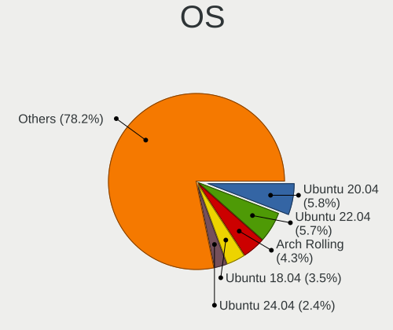

| Name                         | Notebooks | Percent |
|------------------------------|-----------|---------|
| Ubuntu 20.04                 | 492       | 5.85%   |
| Ubuntu 22.04                 | 480       | 5.7%    |
| Arch Rolling                 | 361       | 4.29%   |
| Ubuntu 18.04                 | 298       | 3.54%   |
| Ubuntu 24.04                 | 202       | 2.4%    |
| Debian 12                    | 190       | 2.26%   |
| Linux Mint 22.1              | 184       | 2.19%   |
| Pop!_OS 22.04                | 157       | 1.87%   |
| Linux Mint 21.3              | 146       | 1.73%   |
| EndeavourOS Rolling          | 140       | 1.66%   |
| Fedora 42                    | 137       | 1.63%   |
| Debian 11                    | 126       | 1.5%    |
| Zorin 17                     | 121       | 1.44%   |
| Linux Mint 22                | 115       | 1.37%   |
| Fedora 40                    | 111       | 1.32%   |
| OpenMandriva 4.2             | 110       | 1.31%   |
| OpenMandriva 4.3             | 105       | 1.25%   |
| Fedora 41                    | 105       | 1.25%   |
| Fedora 39                    | 101       | 1.2%    |
| Linux Mint 21.2              | 99        | 1.18%   |
| Linux Mint 22.2              | 96        | 1.14%   |
| Fedora 36                    | 94        | 1.12%   |
| Linux Mint 21.1              | 91        | 1.08%   |
| Zorin 16                     | 86        | 1.02%   |
| Fedora 38                    | 85        | 1.01%   |
| Arch                         | 75        | 0.89%   |
| Xubuntu 18.04                | 73        | 0.87%   |
| LMDE 6                       | 73        | 0.87%   |
| Ubuntu 22.10                 | 72        | 0.86%   |
| Fedora 37                    | 72        | 0.86%   |
| Linux Mint 20.3              | 70        | 0.83%   |
| Ubuntu 19.10                 | 69        | 0.82%   |
| Manjaro                      | 69        | 0.82%   |
| openSUSE Tumbleweed-XXXXXXXX | 68        | 0.81%   |
| Xubuntu 20.04                | 65        | 0.77%   |
| Kubuntu 22.04                | 64        | 0.76%   |
| OpenMandriva 23.03           | 63        | 0.75%   |
| Ubuntu 20.10                 | 62        | 0.74%   |
| OpenMandriva 24.12           | 61        | 0.72%   |
| Linux Mint 21                | 61        | 0.72%   |

OS Family
---------

OS without a version

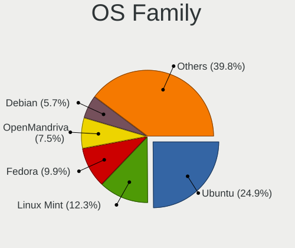

| Name          | Notebooks | Percent |
|---------------|-----------|---------|
| Ubuntu        | 1952      | 24.89%  |
| Linux Mint    | 961       | 12.25%  |
| Fedora        | 779       | 9.93%   |
| OpenMandriva  | 588       | 7.5%    |
| Debian        | 444       | 5.66%   |
| Arch          | 428       | 5.46%   |
| Zorin         | 300       | 3.83%   |
| Pop!_OS       | 260       | 3.32%   |
| Xubuntu       | 238       | 3.03%   |
| Kubuntu       | 225       | 2.87%   |
| Manjaro       | 206       | 2.63%   |
| EndeavourOS   | 142       | 1.81%   |
| ROSA          | 113       | 1.44%   |
| LMDE          | 106       | 1.35%   |
| Lubuntu       | 101       | 1.29%   |
| openSUSE      | 96        | 1.22%   |
| KDE neon      | 96        | 1.22%   |
| Elementary    | 73        | 0.93%   |
| Ubuntu MATE   | 52        | 0.66%   |
| MX            | 52        | 0.66%   |
| Kali          | 45        | 0.57%   |
| ArcoLinux     | 44        | 0.56%   |
| Endless       | 43        | 0.55%   |
| Gentoo        | 32        | 0.41%   |
| Garuda Linux  | 27        | 0.34%   |
| CachyOS       | 27        | 0.34%   |
| Ubuntu Unity  | 25        | 0.32%   |
| Ubuntu Budgie | 25        | 0.32%   |
| SteamOS       | 25        | 0.32%   |
| Clear Linux   | 22        | 0.28%   |
| BlackPanther  | 22        | 0.28%   |
| Nobara        | 20        | 0.26%   |
| Bazzite       | 20        | 0.26%   |
| Parrot        | 19        | 0.24%   |
| NixOS         | 17        | 0.22%   |
| TUXEDO OS     | 16        | 0.2%    |
| Peppermint    | 14        | 0.18%   |
| Xero          | 8         | 0.1%    |
| Void Linux    | 8         | 0.1%    |
| Q4OS          | 8         | 0.1%    |

Kernel
------

Version of the Linux kernel

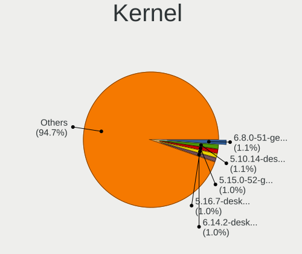

| Version                  | Notebooks | Percent |
|--------------------------|-----------|---------|
| 6.8.0-51-generic         | 105       | 1.12%   |
| 5.10.14-desktop-1omv4002 | 105       | 1.12%   |
| 5.15.0-52-generic        | 98        | 1.05%   |
| 5.16.7-desktop-1omv4003  | 97        | 1.04%   |
| 6.14.2-desktop-3omv2590  | 90        | 0.96%   |
| 5.4.0-42-generic         | 69        | 0.74%   |
| 6.2.6-desktop-1omv2390   | 62        | 0.66%   |
| 5.15.0-56-generic        | 61        | 0.65%   |
| 6.8.0-45-generic         | 54        | 0.58%   |
| 6.12.1-desktop-1omv2490  | 52        | 0.56%   |
| 5.15.0-91-generic        | 46        | 0.49%   |
| 5.4.0-26-generic         | 44        | 0.47%   |
| 5.15.0-58-generic        | 43        | 0.46%   |
| 6.8.0-40-generic         | 42        | 0.45%   |
| 6.14.0-33-generic        | 42        | 0.45%   |
| 5.15.0-46-generic        | 41        | 0.44%   |
| 6.8.0-52-generic         | 40        | 0.43%   |
| 5.3.0-46-generic         | 40        | 0.43%   |
| 6.6.2-desktop-1omv2390   | 39        | 0.42%   |
| 6.14.0-29-generic        | 39        | 0.42%   |
| 6.4.11-desktop-1omv2390  | 38        | 0.41%   |
| 5.4.0-52-generic         | 36        | 0.38%   |
| 5.4.0-29-generic         | 36        | 0.38%   |
| 6.2.0-39-generic         | 35        | 0.37%   |
| 5.15.0-47-generic        | 35        | 0.37%   |
| 5.15.0-43-generic        | 35        | 0.37%   |
| 6.8.0-49-generic         | 34        | 0.36%   |
| 6.5.0-28-generic         | 34        | 0.36%   |
| 6.1.1-desktop-1omv2290   | 34        | 0.36%   |
| 6.5.0-35-generic         | 33        | 0.35%   |
| 5.4.0-58-generic         | 33        | 0.35%   |
| 5.3.0-40-generic         | 32        | 0.34%   |
| 5.19.0-32-generic        | 32        | 0.34%   |
| 6.9.3-76060903-generic   | 31        | 0.33%   |
| 5.3.0-42-generic         | 31        | 0.33%   |
| 5.15.0-41-generic        | 31        | 0.33%   |
| 6.5.0-14-generic         | 30        | 0.32%   |
| 6.2.0-26-generic         | 30        | 0.32%   |
| 5.4.0-48-generic         | 30        | 0.32%   |
| 6.8.0-41-generic         | 29        | 0.31%   |

Kernel Family
-------------

Linux kernel without a distro release

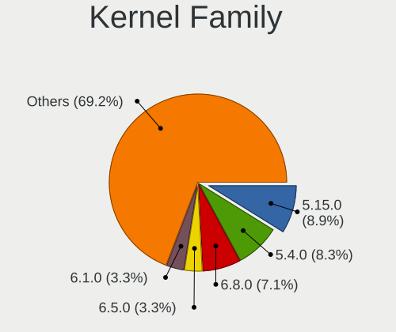

| Version | Notebooks | Percent |
|---------|-----------|---------|
| 5.15.0  | 778       | 8.87%   |
| 5.4.0   | 725       | 8.26%   |
| 6.8.0   | 619       | 7.05%   |
| 6.5.0   | 292       | 3.33%   |
| 6.1.0   | 289       | 3.29%   |
| 4.15.0  | 248       | 2.83%   |
| 6.14.0  | 246       | 2.8%    |
| 5.19.0  | 241       | 2.75%   |
| 5.3.0   | 225       | 2.56%   |
| 6.2.0   | 218       | 2.48%   |
| 5.8.0   | 200       | 2.28%   |
| 5.13.0  | 199       | 2.27%   |
| 5.11.0  | 170       | 1.94%   |
| 5.10.0  | 169       | 1.93%   |
| 6.11.0  | 129       | 1.47%   |
| 6.14.2  | 122       | 1.39%   |
| 5.0.0   | 113       | 1.29%   |
| 5.10.14 | 105       | 1.2%    |
| 5.16.7  | 98        | 1.12%   |
| 4.18.0  | 88        | 1%      |
| 6.2.6   | 80        | 0.91%   |
| 6.12.1  | 65        | 0.74%   |
| 6.0.2   | 53        | 0.6%    |
| 6.6.2   | 51        | 0.58%   |
| 6.4.11  | 48        | 0.55%   |
| 4.19.0  | 45        | 0.51%   |
| 6.1.1   | 41        | 0.47%   |
| 6.9.3   | 38        | 0.43%   |
| 6.5.9   | 35        | 0.4%    |
| 6.12.10 | 35        | 0.4%    |
| 5.19.16 | 29        | 0.33%   |
| 6.5.6   | 28        | 0.32%   |
| 6.5.5   | 28        | 0.32%   |
| 6.14.6  | 27        | 0.31%   |
| 6.0.0   | 27        | 0.31%   |
| 6.17.0  | 24        | 0.27%   |
| 6.10.0  | 24        | 0.27%   |
| 5.14.0  | 23        | 0.26%   |
| 6.0.12  | 22        | 0.25%   |
| 6.5.8   | 21        | 0.24%   |

Kernel Major Ver.
-----------------

Linux kernel major version

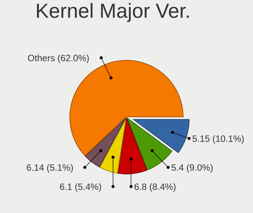

| Version | Notebooks | Percent |
|---------|-----------|---------|
| 5.15    | 873       | 10.12%  |
| 5.4     | 773       | 8.96%   |
| 6.8     | 726       | 8.42%   |
| 6.1     | 464       | 5.38%   |
| 6.14    | 444       | 5.15%   |
| 6.5     | 442       | 5.12%   |
| 6.2     | 375       | 4.35%   |
| 5.19    | 346       | 4.01%   |
| 5.10    | 333       | 3.86%   |
| 6.12    | 280       | 3.25%   |
| 5.3     | 250       | 2.9%    |
| 4.15    | 249       | 2.89%   |
| 5.8     | 240       | 2.78%   |
| 6.11    | 225       | 2.61%   |
| 5.13    | 221       | 2.56%   |
| 6.0     | 207       | 2.4%    |
| 5.11    | 207       | 2.4%    |
| 6.6     | 201       | 2.33%   |
| 5.16    | 154       | 1.79%   |
| 6.4     | 120       | 1.39%   |
| 6.10    | 120       | 1.39%   |
| 5.0     | 116       | 1.34%   |
| 4.18    | 112       | 1.3%    |
| 6.17    | 110       | 1.28%   |
| 6.9     | 108       | 1.25%   |
| 6.13    | 87        | 1.01%   |
| 5.14    | 74        | 0.86%   |
| 6.7     | 73        | 0.85%   |
| 6.16    | 71        | 0.82%   |
| 6.15    | 69        | 0.8%    |
| 5.17    | 68        | 0.79%   |
| 4.9     | 63        | 0.73%   |
| 6.3     | 60        | 0.7%    |
| 4.19    | 59        | 0.68%   |
| 5.18    | 54        | 0.63%   |
| 5.9     | 46        | 0.53%   |
| 5.12    | 37        | 0.43%   |
| 5.6     | 35        | 0.41%   |
| 5.5     | 34        | 0.39%   |
| 5.7     | 23        | 0.27%   |

Arch
----

OS architecture (x86_64, i586, etc.)

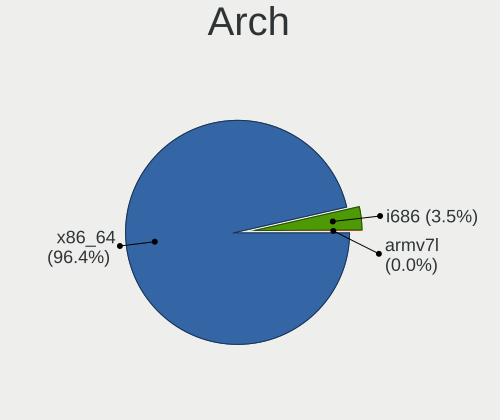

| Name    | Notebooks | Percent |
|---------|-----------|---------|
| x86_64  | 7085      | 96.43%  |
| i686    | 256       | 3.48%   |
| aarch64 | 5         | 0.07%   |
| armv7l  | 1         | 0.01%   |

DE
--

Desktop Environment

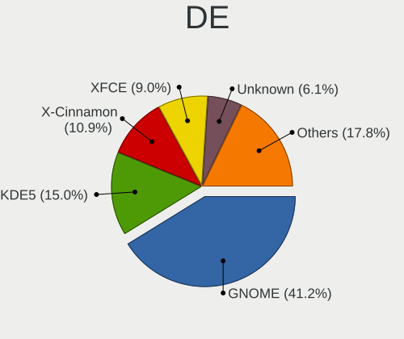

| Name                | Notebooks | Percent |
|---------------------|-----------|---------|
| GNOME               | 3237      | 41.2%   |
| KDE5                | 1177      | 14.98%  |
| X-Cinnamon          | 856       | 10.89%  |
| XFCE                | 704       | 8.96%   |
| Unknown             | 482       | 6.13%   |
| KDE6                | 441       | 5.61%   |
| MATE                | 191       | 2.43%   |
| LXQt                | 171       | 2.18%   |
| KDE                 | 113       | 1.44%   |
| Pantheon            | 73        | 0.93%   |
| KDE4                | 64        | 0.81%   |
| Cinnamon            | 39        | 0.5%    |
| Budgie              | 39        | 0.5%    |
| Hyprland            | 37        | 0.47%   |
| i3                  | 33        | 0.42%   |
| LXDE                | 30        | 0.38%   |
| Unity               | 27        | 0.34%   |
| Sway                | 21        | 0.27%   |
| GNOME Flashback     | 20        | 0.25%   |
| COSMIC              | 20        | 0.25%   |
| GNOME Classic       | 14        | 0.18%   |
| Trinity             | 7         | 0.09%   |
| Enlightenment       | 7         | 0.09%   |
| Deepin              | 7         | 0.09%   |
| bspwm               | 5         | 0.06%   |
| icewm               | 4         | 0.05%   |
| DWM                 | 4         | 0.05%   |
| qtile               | 3         | 0.04%   |
| Openbox             | 3         | 0.04%   |
| none+i3             | 3         | 0.04%   |
| Endless:GNOME       | 3         | 0.04%   |
| xubuntu             | 2         | 0.03%   |
| Unicorn:XFCE        | 2         | 0.03%   |
| niri                | 2         | 0.03%   |
| lightdm-xsession    | 2         | 0.03%   |
| BunsenLabs:XFCE     | 2         | 0.03%   |
| awesome             | 2         | 0.03%   |
| ubuntu:pika:GNOME   | 1         | 0.01%   |
| ubuntu              | 1         | 0.01%   |
| sway:wlroots:swayfx | 1         | 0.01%   |

Display Server
--------------

X11 or Wayland

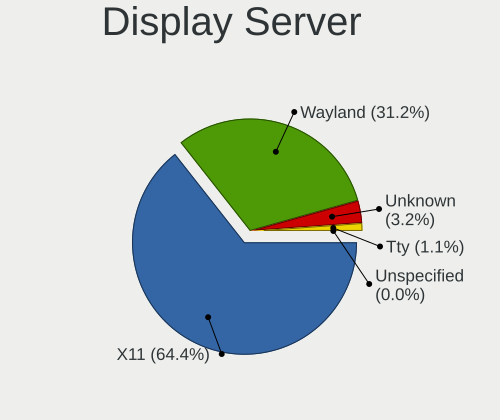

| Name        | Notebooks | Percent |
|-------------|-----------|---------|
| X11         | 4973      | 64.39%  |
| Wayland     | 2413      | 31.24%  |
| Unknown     | 249       | 3.22%   |
| Tty         | 87        | 1.13%   |
| Unspecified | 1         | 0.01%   |

Display Manager
---------------

SDDM, LightDM, etc.

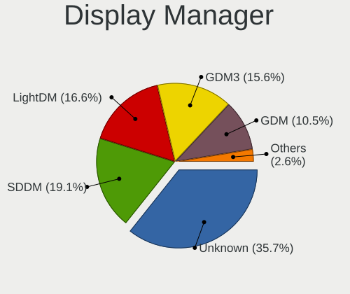

| Name           | Notebooks | Percent |
|----------------|-----------|---------|
| Unknown        | 2791      | 35.71%  |
| SDDM           | 1493      | 19.1%   |
| LightDM        | 1294      | 16.56%  |
| GDM3           | 1219      | 15.6%   |
| GDM            | 817       | 10.45%  |
| TDM            | 99        | 1.27%   |
| KDM            | 53        | 0.68%   |
| GREETD         | 13        | 0.17%   |
| SLiM           | 10        | 0.13%   |
| XDM            | 7         | 0.09%   |
| SLIMSKI        | 4         | 0.05%   |
| LY-DM          | 4         | 0.05%   |
| LXDM           | 3         | 0.04%   |
| COSMIC-GREETER | 3         | 0.04%   |
| Ly             | 2         | 0.03%   |
| WDM            | 1         | 0.01%   |
| MDM            | 1         | 0.01%   |
| EMPTTY         | 1         | 0.01%   |

OS Lang
-------

Language

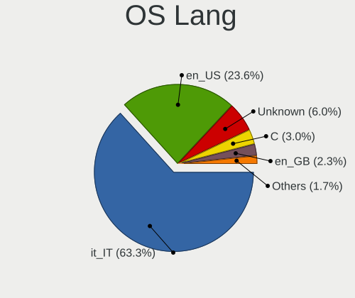

| Lang                 | Notebooks | Percent |
|----------------------|-----------|---------|
| it_IT                | 4809      | 63.31%  |
| en_US                | 1796      | 23.64%  |
| Unknown              | 453       | 5.96%   |
| C                    | 231       | 3.04%   |
| en_GB                | 178       | 2.34%   |
| de_DE                | 24        | 0.32%   |
| fr_FR                | 13        | 0.17%   |
| es_ES                | 12        | 0.16%   |
| de_IT                | 10        | 0.13%   |
| ru_RU                | 7         | 0.09%   |
| POSIX                | 7         | 0.09%   |
| it_IT@euro           | 4         | 0.05%   |
| fur_IT               | 4         | 0.05%   |
| en_US.UTF8           | 4         | 0.05%   |
| en_IE                | 4         | 0.05%   |
| en_AU                | 4         | 0.05%   |
| en_AG                | 4         | 0.05%   |
| it_CH                | 3         | 0.04%   |
| IT                   | 2         | 0.03%   |
| es_PY                | 2         | 0.03%   |
| en_NZ                | 2         | 0.03%   |
| en_DK                | 2         | 0.03%   |
| en_BW                | 2         | 0.03%   |
| C.UTF8               | 2         | 0.03%   |
| ro_RO                | 1         | 0.01%   |
| pt_BR                | 1         | 0.01%   |
| pl_PL                | 1         | 0.01%   |
| it_IT.UTF -8         | 1         | 0.01%   |
| it_IT.iso885915@euro | 1         | 0.01%   |
| it_IT.iso88591       | 1         | 0.01%   |
| fr_BE                | 1         | 0.01%   |
| es_US                | 1         | 0.01%   |
| en_US@euro           | 1         | 0.01%   |
| en_US.utf-8          | 1         | 0.01%   |
| en_IN                | 1         | 0.01%   |
| en_CA                | 1         | 0.01%   |
| de_CH                | 1         | 0.01%   |
| de_AT                | 1         | 0.01%   |
| cs_CZ                | 1         | 0.01%   |
| bg_BG                | 1         | 0.01%   |

Boot Mode
---------

EFI or BIOS

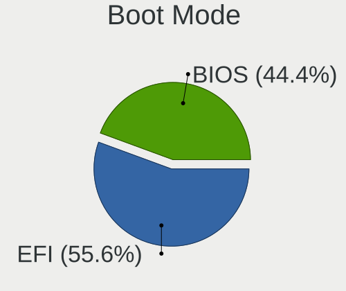

| Mode | Notebooks | Percent |
|------|-----------|---------|
| EFI  | 4203      | 55.6%   |
| BIOS | 3357      | 44.4%   |

Filesystem
----------

Type of filesystem

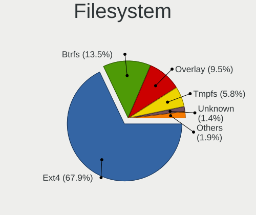

| Type     | Notebooks | Percent |
|----------|-----------|---------|
| Ext4     | 5238      | 67.91%  |
| Btrfs    | 1044      | 13.54%  |
| Overlay  | 734       | 9.52%   |
| Tmpfs    | 444       | 5.76%   |
| Unknown  | 107       | 1.39%   |
| Xfs      | 67        | 0.87%   |
| Zfs      | 36        | 0.47%   |
| Ext2     | 15        | 0.19%   |
| F2fs     | 12        | 0.16%   |
| Ext3     | 7         | 0.09%   |
| XXX4     | 2         | 0.03%   |
| Bcachefs | 2         | 0.03%   |
| Aufs     | 2         | 0.03%   |
| Rootfs   | 1         | 0.01%   |
| Reiserfs | 1         | 0.01%   |
| Jfs      | 1         | 0.01%   |

Part. scheme
------------

Scheme of partitioning

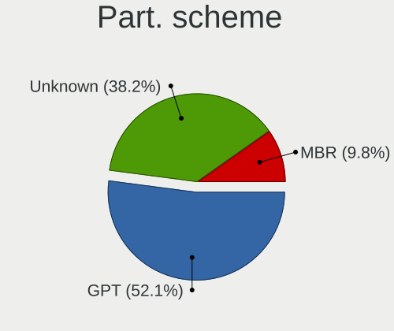

| Type    | Notebooks | Percent |
|---------|-----------|---------|
| GPT     | 3973      | 52.07%  |
| Unknown | 2912      | 38.17%  |
| MBR     | 745       | 9.76%   |

Dual Boot with Linux/BSD
------------------------

Hosting more than one Linux/BSD

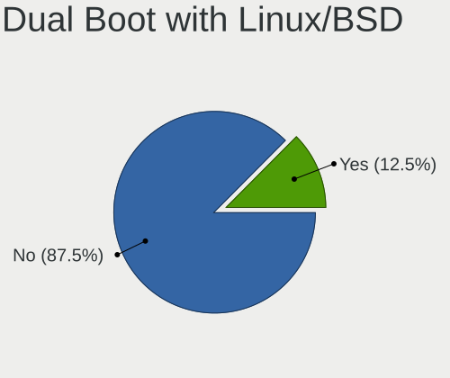

| Dual boot | Notebooks | Percent |
|-----------|-----------|---------|
| No        | 6592      | 87.45%  |
| Yes       | 946       | 12.55%  |

Dual Boot (Win)
---------------

Hosting Linux and Windows

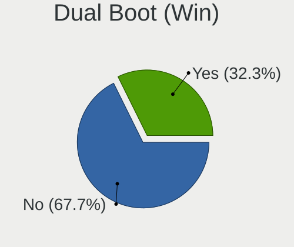

| Dual boot | Notebooks | Percent |
|-----------|-----------|---------|
| No        | 5114      | 67.67%  |
| Yes       | 2443      | 32.33%  |

Board
-----

Vendor
------

Motherboard manufacturer

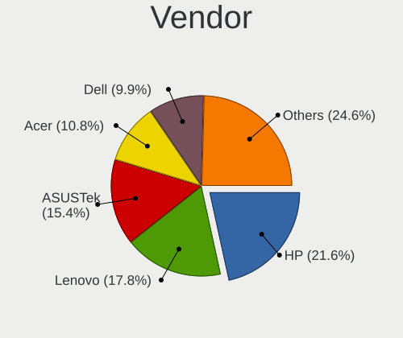

| Name                | Notebooks | Percent |
|---------------------|-----------|---------|
| Hewlett-Packard     | 1583      | 21.57%  |
| Lenovo              | 1303      | 17.75%  |
| ASUSTek Computer    | 1130      | 15.4%   |
| Acer                | 790       | 10.76%  |
| Dell                | 728       | 9.92%   |
| Apple               | 233       | 3.17%   |
| HUAWEI              | 186       | 2.53%   |
| MSI                 | 177       | 2.41%   |
| Toshiba             | 138       | 1.88%   |
| Samsung Electronics | 137       | 1.87%   |
| Sony                | 131       | 1.78%   |
| Unknown             | 76        | 1.04%   |
| Fujitsu             | 66        | 0.9%    |
| Mediacom            | 58        | 0.79%   |
| Packard Bell        | 49        | 0.67%   |
| Notebook            | 41        | 0.56%   |
| Chuwi               | 41        | 0.56%   |
| TUXEDO              | 30        | 0.41%   |
| PC Specialist       | 29        | 0.4%    |
| Fujitsu Siemens     | 27        | 0.37%   |
| Teclast             | 26        | 0.35%   |
| Microtech           | 25        | 0.34%   |
| Timi                | 23        | 0.31%   |
| Google              | 23        | 0.31%   |
| Valve               | 22        | 0.3%    |
| LG Electronics      | 16        | 0.22%   |
| Medion              | 13        | 0.18%   |
| eMachines           | 13        | 0.18%   |
| Olivetti            | 12        | 0.16%   |
| Jumper              | 12        | 0.16%   |
| Alienware           | 11        | 0.15%   |
| Framework           | 10        | 0.14%   |
| SANTECH             | 9         | 0.12%   |
| SLIMBOOK            | 8         | 0.11%   |
| TrekStor            | 7         | 0.1%    |
| SiComputer          | 7         | 0.1%    |
| Panasonic           | 6         | 0.08%   |
| Intel               | 6         | 0.08%   |
| HONOR               | 6         | 0.08%   |
| AMI                 | 6         | 0.08%   |

Model
-----

Motherboard model

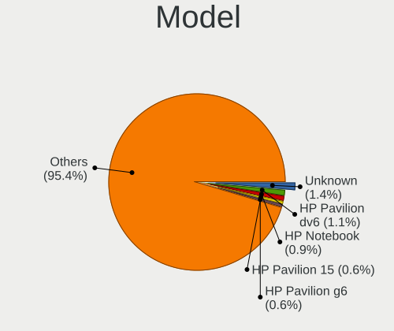

| Name                                  | Notebooks | Percent |
|---------------------------------------|-----------|---------|
| Unknown                               | 103       | 1.4%    |
| HP Pavilion dv6                       | 81        | 1.1%    |
| HP Notebook                           | 69        | 0.94%   |
| HP Pavilion 15                        | 43        | 0.59%   |
| HP Pavilion g6                        | 41        | 0.56%   |
| HP 255 G8 Notebook PC                 | 30        | 0.41%   |
| Mediacom SmartBook 14 FullHD - SB14UC | 26        | 0.35%   |
| HP 15                                 | 26        | 0.35%   |
| HUAWEI NBLK-WAX9X                     | 25        | 0.34%   |
| Apple MacBookAir7,2                   | 25        | 0.34%   |
| Lenovo IdeaPad 3 15ADA05 81W1         | 21        | 0.29%   |
| HUAWEI KLVL-WXX9                      | 20        | 0.27%   |
| HP ENVY 15                            | 20        | 0.27%   |
| HP Laptop 15s-eq2xxx                  | 19        | 0.26%   |
| HP 250 G3                             | 19        | 0.26%   |
| Dell XPS 15 9570                      | 19        | 0.26%   |
| Valve Jupiter                         | 18        | 0.25%   |
| HUAWEI BOD-WXX9                       | 18        | 0.25%   |
| Dell XPS 15 7590                      | 18        | 0.25%   |
| HP Pavilion dv7                       | 17        | 0.23%   |
| HP 255 G7 Notebook PC                 | 17        | 0.23%   |
| Acer Aspire 5750G                     | 17        | 0.23%   |
| HP G62                                | 15        | 0.2%    |
| HP 250 G6 Notebook PC                 | 15        | 0.2%    |
| Lenovo IdeaPad Gaming 3 15ARH05 82EY  | 14        | 0.19%   |
| HP Pavilion x2 Detachable             | 14        | 0.19%   |
| HP Pavilion Notebook                  | 14        | 0.19%   |
| HP Compaq 6730s                       | 14        | 0.19%   |
| ASUS X550LD                           | 14        | 0.19%   |
| Samsung RC530/RC730                   | 13        | 0.18%   |
| Lenovo V145-15AST 81MT                | 13        | 0.18%   |
| Lenovo ThinkBook 15 G2 ITL 20VE       | 13        | 0.18%   |
| HUAWEI KLVD-WXX9                      | 13        | 0.18%   |
| HP Pavilion Laptop 15-cs3xxx          | 13        | 0.18%   |
| HP Laptop 15s-eq3xxx                  | 13        | 0.18%   |
| HP Compaq Presario CQ60               | 13        | 0.18%   |
| HP 255 G6 Notebook PC                 | 13        | 0.18%   |
| HP 250 G7 Notebook PC                 | 13        | 0.18%   |
| Apple MacBook4,1                      | 13        | 0.18%   |
| Acer Swift SF314-43                   | 13        | 0.18%   |

Model Family
------------

Motherboard model prefix

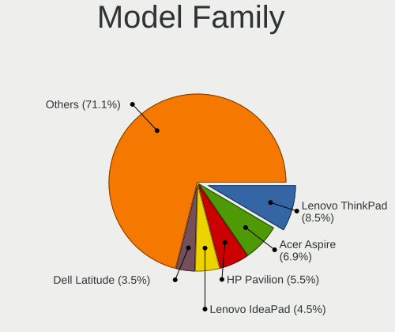

| Name                  | Notebooks | Percent |
|-----------------------|-----------|---------|
| Lenovo ThinkPad       | 622       | 8.48%   |
| Acer Aspire           | 510       | 6.95%   |
| HP Pavilion           | 403       | 5.49%   |
| Lenovo IdeaPad        | 333       | 4.54%   |
| Dell Latitude         | 256       | 3.49%   |
| ASUS VivoBook         | 194       | 2.64%   |
| HP EliteBook          | 184       | 2.51%   |
| Dell XPS              | 172       | 2.34%   |
| HP Laptop             | 170       | 2.32%   |
| HP ProBook            | 151       | 2.06%   |
| Dell Inspiron         | 137       | 1.87%   |
| Toshiba Satellite     | 116       | 1.58%   |
| Unknown               | 103       | 1.4%    |
| HP Compaq             | 102       | 1.39%   |
| HP 250                | 100       | 1.36%   |
| HP 255                | 87        | 1.19%   |
| HP Notebook           | 69        | 0.94%   |
| Acer Swift            | 68        | 0.93%   |
| Fujitsu LIFEBOOK      | 64        | 0.87%   |
| Acer TravelMate       | 64        | 0.87%   |
| Dell Precision        | 62        | 0.84%   |
| Dell Vostro           | 59        | 0.8%    |
| Lenovo ThinkBook      | 57        | 0.78%   |
| ASUS ASUS             | 56        | 0.76%   |
| Acer Extensa          | 50        | 0.68%   |
| ASUS ROG              | 45        | 0.61%   |
| Lenovo Yoga           | 44        | 0.6%    |
| ASUS ZenBook          | 43        | 0.59%   |
| HP ENVY               | 42        | 0.57%   |
| Packard Bell EasyNote | 41        | 0.56%   |
| Apple MacBookPro11    | 40        | 0.55%   |
| Acer Nitro            | 40        | 0.55%   |
| Mediacom SmartBook    | 35        | 0.48%   |
| HP OMEN               | 34        | 0.46%   |
| Lenovo Legion         | 33        | 0.45%   |
| HP ZBook              | 33        | 0.45%   |
| MSI Prestige          | 29        | 0.4%    |
| HP Victus             | 27        | 0.37%   |
| MSI Modern            | 26        | 0.35%   |
| HP 15                 | 26        | 0.35%   |

MFG Year
--------

Motherboard manufacture year

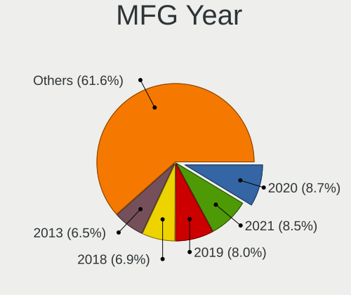

| Year    | Notebooks | Percent |
|---------|-----------|---------|
| 2020    | 635       | 8.65%   |
| 2021    | 622       | 8.48%   |
| 2019    | 584       | 7.96%   |
| 2018    | 506       | 6.89%   |
| 2013    | 474       | 6.46%   |
| 2017    | 452       | 6.16%   |
| 2012    | 412       | 5.61%   |
| 2015    | 406       | 5.53%   |
| 2016    | 402       | 5.48%   |
| 2011    | 385       | 5.25%   |
| 2008    | 370       | 5.04%   |
| 2014    | 365       | 4.97%   |
| 2010    | 349       | 4.76%   |
| 2022    | 315       | 4.29%   |
| 2009    | 284       | 3.87%   |
| 2023    | 233       | 3.17%   |
| 2024    | 171       | 2.33%   |
| 2007    | 171       | 2.33%   |
| 2006    | 107       | 1.46%   |
| 2025    | 56        | 0.76%   |
| 2005    | 26        | 0.35%   |
| Unknown | 9         | 0.12%   |
| 2004    | 3         | 0.04%   |
| 2003    | 2         | 0.03%   |

Form Factor
-----------

Physical design of the computer

| Name     | Notebooks | Percent |
|----------|-----------|---------|
| Notebook | 7339      | 100%    |

Secure Boot
-----------

Enabled or disabled

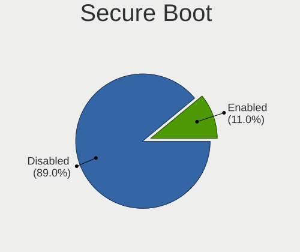

| State    | Notebooks | Percent |
|----------|-----------|---------|
| Disabled | 6643      | 89.02%  |
| Enabled  | 819       | 10.98%  |

Coreboot
--------

Have coreboot on board

| Used | Notebooks | Percent |
|------|-----------|---------|
| No   | 7306      | 99.55%  |
| Yes  | 33        | 0.45%   |

RAM Size
--------

Total RAM memory

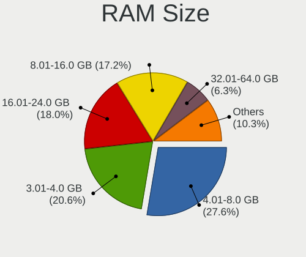

| Size in GB  | Notebooks | Percent |
|-------------|-----------|---------|
| 4.01-8.0    | 2066      | 27.65%  |
| 3.01-4.0    | 1540      | 20.61%  |
| 16.01-24.0  | 1343      | 17.97%  |
| 8.01-16.0   | 1282      | 17.16%  |
| 32.01-64.0  | 474       | 6.34%   |
| 1.01-2.0    | 380       | 5.08%   |
| 2.01-3.0    | 146       | 1.95%   |
| 24.01-32.0  | 118       | 1.58%   |
| 64.01-256.0 | 70        | 0.94%   |
| 0.51-1.0    | 50        | 0.67%   |
| 0.01-0.5    | 4         | 0.05%   |

RAM Used
--------

Used RAM memory

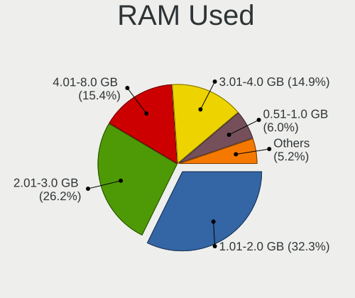

| Used GB    | Notebooks | Percent |
|------------|-----------|---------|
| 1.01-2.0   | 2697      | 32.29%  |
| 2.01-3.0   | 2192      | 26.24%  |
| 4.01-8.0   | 1283      | 15.36%  |
| 3.01-4.0   | 1247      | 14.93%  |
| 0.51-1.0   | 499       | 5.97%   |
| 8.01-16.0  | 332       | 3.97%   |
| 0.01-0.5   | 62        | 0.74%   |
| 16.01-24.0 | 26        | 0.31%   |
| 24.01-32.0 | 9         | 0.11%   |
| 32.01-64.0 | 4         | 0.05%   |
| 0          | 1         | 0.01%   |
| Unknown    | 1         | 0.01%   |

Total Drives
------------

Number of drives on board

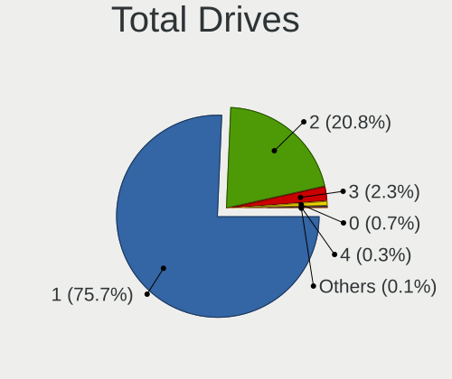

| Drives | Notebooks | Percent |
|--------|-----------|---------|
| 1      | 5689      | 75.68%  |
| 2      | 1564      | 20.81%  |
| 3      | 175       | 2.33%   |
| 0      | 56        | 0.74%   |
| 4      | 26        | 0.35%   |
| 5      | 4         | 0.05%   |
| 6      | 3         | 0.04%   |

Has CD-ROM
----------

Has CD-ROM on board

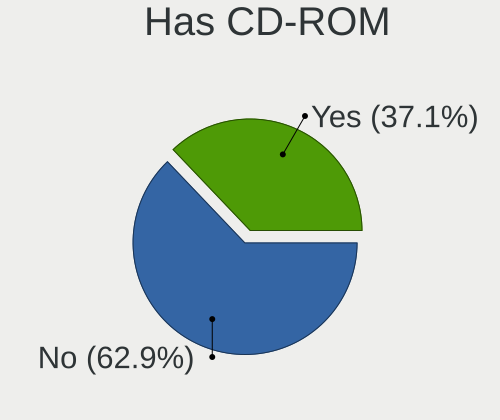

| Presented | Notebooks | Percent |
|-----------|-----------|---------|
| No        | 4639      | 62.88%  |
| Yes       | 2738      | 37.12%  |

Has Ethernet
------------

Has Ethernet on board

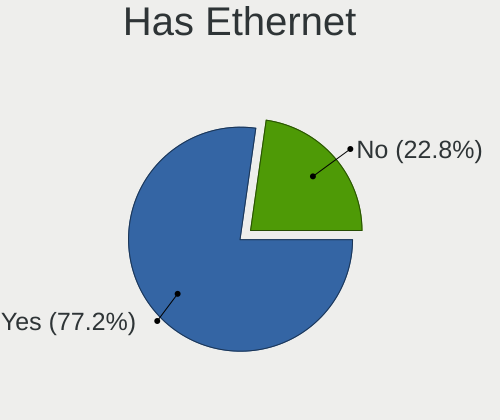

| Presented | Notebooks | Percent |
|-----------|-----------|---------|
| Yes       | 5712      | 77.24%  |
| No        | 1683      | 22.76%  |

Has WiFi
--------

Has WiFi module

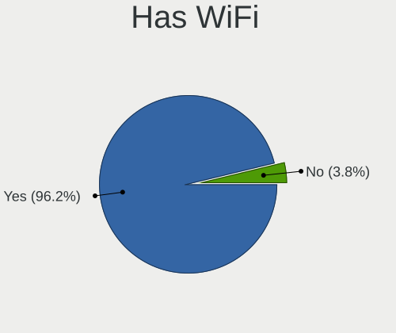

| Presented | Notebooks | Percent |
|-----------|-----------|---------|
| Yes       | 7070      | 96.22%  |
| No        | 278       | 3.78%   |

Has Bluetooth
-------------

Has Bluetooth module

| Presented | Notebooks | Percent |
|-----------|-----------|---------|
| Yes       | 5705      | 76.77%  |
| No        | 1726      | 23.23%  |

Location
--------

Country
-------

Geographic location (country)

| Country | Notebooks | Percent |
|---------|-----------|---------|
| Italy   | 7339      | 100%    |

City
----

Geographic location (city)

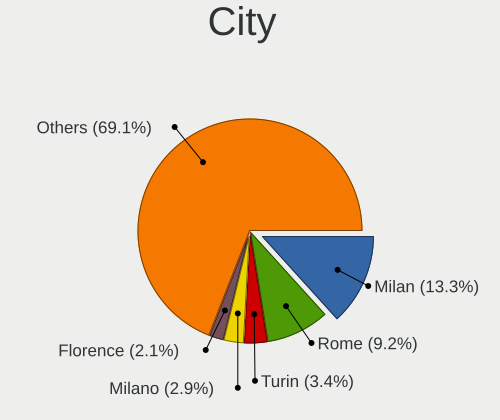

| City                | Notebooks | Percent |
|---------------------|-----------|---------|
| Milan               | 1145      | 13.29%  |
| Rome                | 793       | 9.2%    |
| Turin               | 292       | 3.39%   |
| Milano              | 252       | 2.92%   |
| Florence            | 183       | 2.12%   |
| Bologna             | 177       | 2.05%   |
| Naples              | 159       | 1.84%   |
| Genoa               | 119       | 1.38%   |
| Rho                 | 115       | 1.33%   |
| Palermo             | 104       | 1.21%   |
| Padova              | 104       | 1.21%   |
| Bari                | 88        | 1.02%   |
| Verona              | 81        | 0.94%   |
| Catania             | 75        | 0.87%   |
| Brescia             | 67        | 0.78%   |
| Trieste             | 62        | 0.72%   |
| Venice              | 60        | 0.7%    |
| Parma               | 59        | 0.68%   |
| Bergamo             | 51        | 0.59%   |
| Pisa                | 41        | 0.48%   |
| Perugia             | 40        | 0.46%   |
| Monza               | 39        | 0.45%   |
| Casalecchio di Reno | 39        | 0.45%   |
| Trento              | 38        | 0.44%   |
| Salerno             | 38        | 0.44%   |
| Cagliari            | 38        | 0.44%   |
| Modena              | 37        | 0.43%   |
| Reggio Emilia       | 35        | 0.41%   |
| Legnano             | 34        | 0.39%   |
| Taranto             | 33        | 0.38%   |
| Bolzano             | 32        | 0.37%   |
| Pescara             | 28        | 0.32%   |
| Novara              | 28        | 0.32%   |
| Vicenza             | 25        | 0.29%   |
| Udine               | 25        | 0.29%   |
| Livorno             | 25        | 0.29%   |
| Reggio Calabria     | 24        | 0.28%   |
| Rimini              | 23        | 0.27%   |
| Sesto San Giovanni  | 21        | 0.24%   |
| Seregno             | 21        | 0.24%   |

Drives
------

Drive Vendor
------------

Hard drive vendors

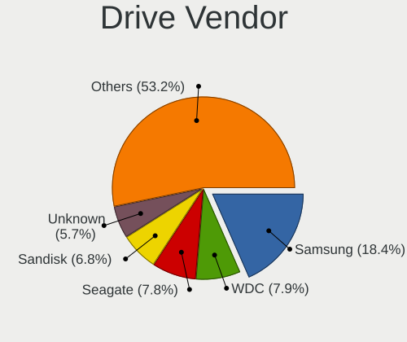

| Vendor                       | Notebooks | Drives | Percent |
|------------------------------|-----------|--------|---------|
| Samsung Electronics          | 1663      | 2379   | 18.42%  |
| WDC                          | 717       | 941    | 7.94%   |
| Seagate                      | 708       | 885    | 7.84%   |
| Sandisk                      | 615       | 857    | 6.81%   |
| Unknown                      | 518       | 711    | 5.74%   |
| Kingston                     | 516       | 682    | 5.72%   |
| Toshiba                      | 502       | 667    | 5.56%   |
| Crucial                      | 491       | 614    | 5.44%   |
| SK hynix                     | 392       | 522    | 4.34%   |
| Micron Technology            | 341       | 465    | 3.78%   |
| Hitachi                      | 304       | 379    | 3.37%   |
| HGST                         | 258       | 339    | 2.86%   |
| Intel                        | 250       | 340    | 2.77%   |
| KIOXIA                       | 146       | 206    | 1.62%   |
| Apple                        | 110       | 144    | 1.22%   |
| China                        | 88        | 107    | 0.97%   |
| SPCC                         | 73        | 88     | 0.81%   |
| Fujitsu                      | 71        | 82     | 0.79%   |
| Phison Electronics           | 59        | 82     | 0.65%   |
| Intenso                      | 58        | 67     | 0.64%   |
| Phison                       | 54        | 66     | 0.6%    |
| Unknown                      | 54        | 69     | 0.6%    |
| Micron/Crucial Technology    | 48        | 61     | 0.53%   |
| Kingston Technology Company  | 48        | 66     | 0.53%   |
| Transcend                    | 44        | 64     | 0.49%   |
| JMicron Technology           | 40        | 48     | 0.44%   |
| MAXIO Technology (Hangzhou)  | 38        | 46     | 0.42%   |
| LITEON                       | 34        | 46     | 0.38%   |
| PNY                          | 33        | 37     | 0.37%   |
| Lexar                        | 33        | 38     | 0.37%   |
| Netac                        | 31        | 36     | 0.34%   |
| Silicon Motion               | 30        | 38     | 0.33%   |
| Teclast                      | 26        | 32     | 0.29%   |
| A-DATA Technology            | 24        | 30     | 0.27%   |
| Shenzhen Longsys Electronics | 21        | 30     | 0.23%   |
| KingSpec                     | 21        | 25     | 0.23%   |
| KingDian                     | 21        | 27     | 0.23%   |
| SSSTC                        | 19        | 22     | 0.21%   |
| SABRENT                      | 19        | 19     | 0.21%   |
| Fanxiang                     | 19        | 27     | 0.21%   |

Drive Model
-----------

Hard drive models

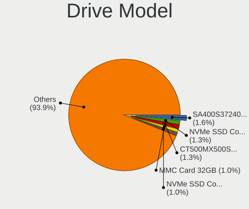

| Model                                              | Notebooks | Percent |
|----------------------------------------------------|-----------|---------|
| Kingston SA400S37240G 240GB SSD                    | 148       | 1.57%   |
| Samsung NVMe SSD Controller SM981/PM981/PM983 1TB  | 119       | 1.26%   |
| Crucial CT500MX500SSD1 500GB                       | 118       | 1.25%   |
| Unknown MMC Card  32GB                             | 95        | 1.01%   |
| Samsung NVMe SSD Controller PM9A1/PM9A3/980PRO 1TB | 93        | 0.99%   |
| Samsung SSD 860 EVO 500GB                          | 86        | 0.91%   |
| HGST HTS545050A7E680 500GB                         | 81        | 0.86%   |
| Toshiba MQ01ABF050 500GB                           | 80        | 0.85%   |
| Seagate ST500LT012-1DG142 500GB                    | 77        | 0.82%   |
| Seagate ST1000LM035-1RK172 1TB                     | 77        | 0.82%   |
| Kingston SA400S37480G 480GB SSD                    | 71        | 0.75%   |
| Samsung SSD 850 EVO 250GB                          | 70        | 0.74%   |
| Seagate ST1000LM024 HN-M101MBB 1TB                 | 66        | 0.7%    |
| Samsung SSD 850 EVO 500GB                          | 64        | 0.68%   |
| HGST HTS721010A9E630 1TB                           | 64        | 0.68%   |
| Unknown MMC Card  64GB                             | 63        | 0.67%   |
| Crucial CT240BX500SSD1 240GB                       | 62        | 0.66%   |
| Unknown                                            | 54        | 0.57%   |
| Sandisk WD Blue SN550 NVMe SSD 1024GB              | 50        | 0.53%   |
| Toshiba MQ04ABF100 1TB                             | 49        | 0.52%   |
| Toshiba MQ01ABD100 1TB                             | 47        | 0.5%    |
| Seagate ST9500325AS 500GB                          | 43        | 0.46%   |
| Crucial CT480BX500SSD1 480GB                       | 43        | 0.46%   |
| Unknown MMC Card  128GB                            | 42        | 0.45%   |
| Crucial CT1000MX500SSD1 1TB                        | 41        | 0.43%   |
| SanDisk SSD PLUS 240GB                             | 39        | 0.41%   |
| Kingston SA400S37120G 120GB SSD                    | 38        | 0.4%    |
| Samsung SSD 860 EVO 250GB                          | 37        | 0.39%   |
| SanDisk NVMe SSD Drive 512GB                       | 36        | 0.38%   |
| Samsung SSD 860 EVO 1TB                            | 34        | 0.36%   |
| Samsung NVMe SSD Drive 512GB                       | 33        | 0.35%   |
| HGST HTS541010A9E680 1TB                           | 33        | 0.35%   |
| Sandisk WD Black SN750 / PC SN730 NVMe SSD 500GB   | 32        | 0.34%   |
| Intel SSDPEKNU512GZ 512GB                          | 32        | 0.34%   |
| Unknown SD/MMC/MS PRO 2GB                          | 31        | 0.33%   |
| Unknown NCard  32GB                                | 31        | 0.33%   |
| Micron/Crucial P2 NVMe PCIe SSD 2TB                | 31        | 0.33%   |
| Intel SSD 660P Series 512GB                        | 31        | 0.33%   |
| Samsung MZALQ512HALU-000L2 512GB                   | 29        | 0.31%   |
| Samsung SSD 870 EVO 500GB                          | 28        | 0.3%    |

HDD Vendor
----------

Hard disk drive vendors

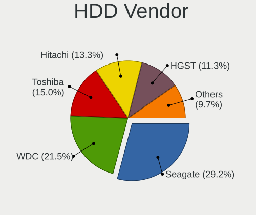

| Vendor              | Notebooks | Drives | Percent |
|---------------------|-----------|--------|---------|
| Seagate             | 665       | 829    | 29.17%  |
| WDC                 | 490       | 637    | 21.49%  |
| Toshiba             | 341       | 422    | 14.96%  |
| Hitachi             | 304       | 379    | 13.33%  |
| HGST                | 258       | 339    | 11.32%  |
| Fujitsu             | 71        | 82     | 3.11%   |
| Samsung Electronics | 56        | 70     | 2.46%   |
| Unknown             | 36        | 46     | 1.58%   |
| JMicron Technology  | 18        | 19     | 0.79%   |
| External            | 6         | 7      | 0.26%   |
| TO Exter            | 5         | 5      | 0.22%   |
| ASMT                | 4         | 4      | 0.18%   |
| Apple               | 4         | 4      | 0.18%   |
| HGST HTS            | 3         | 3      | 0.13%   |
| USB3.0              | 2         | 2      | 0.09%   |
| SSK                 | 2         | 2      | 0.09%   |
| Intenso             | 2         | 2      | 0.09%   |
| IBM/Hitachi         | 2         | 3      | 0.09%   |
| Unknown             | 2         | 2      | 0.09%   |
| StoreJet            | 1         | 1      | 0.04%   |
| SAGE                | 1         | 1      | 0.04%   |
| JetFlash            | 1         | 1      | 0.04%   |
| Inateck             | 1         | 1      | 0.04%   |
| Generic-            | 1         | 1      | 0.04%   |
| FC-1307             | 1         | 1      | 0.04%   |
| DAS                 | 1         | 4      | 0.04%   |
| BR                  | 1         | 1      | 0.04%   |
| ASMedia             | 1         | 1      | 0.04%   |

SSD Vendor
----------

Solid state drive vendors

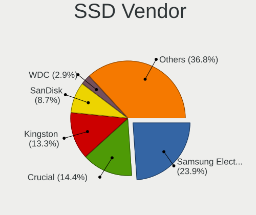

| Vendor              | Notebooks | Drives | Percent |
|---------------------|-----------|--------|---------|
| Samsung Electronics | 728       | 996    | 23.9%   |
| Crucial             | 438       | 553    | 14.38%  |
| Kingston            | 405       | 533    | 13.3%   |
| SanDisk             | 266       | 357    | 8.73%   |
| WDC                 | 87        | 125    | 2.86%   |
| Micron Technology   | 87        | 120    | 2.86%   |
| China               | 86        | 105    | 2.82%   |
| Apple               | 83        | 95     | 2.72%   |
| SK hynix            | 69        | 85     | 2.27%   |
| SPCC                | 66        | 79     | 2.17%   |
| Intenso             | 53        | 61     | 1.74%   |
| Toshiba             | 47        | 70     | 1.54%   |
| Transcend           | 42        | 61     | 1.38%   |
| Intel               | 39        | 56     | 1.28%   |
| PNY                 | 32        | 35     | 1.05%   |
| LITEON              | 30        | 37     | 0.98%   |
| Netac               | 28        | 31     | 0.92%   |
| Lexar               | 27        | 29     | 0.89%   |
| Teclast             | 26        | 32     | 0.85%   |
| Unknown             | 22        | 32     | 0.72%   |
| KingSpec            | 21        | 25     | 0.69%   |
| KingDian            | 21        | 27     | 0.69%   |
| SABRENT             | 19        | 19     | 0.62%   |
| A-DATA Technology   | 18        | 20     | 0.59%   |
| Patriot             | 16        | 21     | 0.53%   |
| Fanxiang            | 15        | 17     | 0.49%   |
| Drevo               | 14        | 17     | 0.46%   |
| Verbatim            | 13        | 22     | 0.43%   |
| Dogfish             | 12        | 13     | 0.39%   |
| BAITITON            | 12        | 23     | 0.39%   |
| Team                | 11        | 15     | 0.36%   |
| LITEONIT            | 11        | 22     | 0.36%   |
| Corsair             | 10        | 11     | 0.33%   |
| OCZ                 | 8         | 8      | 0.26%   |
| Microtech           | 8         | 18     | 0.26%   |
| GOODRAM             | 8         | 9      | 0.26%   |
| Emtec               | 8         | 9      | 0.26%   |
| S3+                 | 7         | 8      | 0.23%   |
| FORESEE             | 6         | 8      | 0.2%    |
| BHT                 | 6         | 6      | 0.2%    |

Drive Kind
----------

HDD or SSD

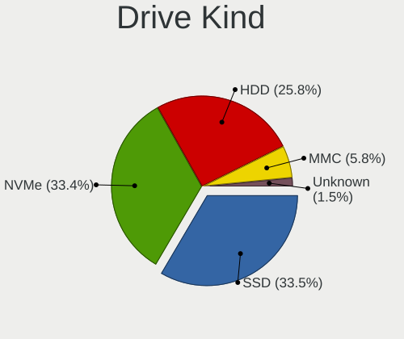

| Kind    | Notebooks | Drives | Percent |
|---------|-----------|--------|---------|
| SSD     | 2851      | 3972   | 33.46%  |
| NVMe    | 2846      | 4294   | 33.4%   |
| HDD     | 2199      | 2869   | 25.81%  |
| MMC     | 492       | 702    | 5.77%   |
| Unknown | 132       | 157    | 1.55%   |

Drive Connector
---------------

SATA, SAS, NVMe, etc.

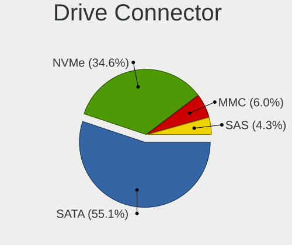

| Type | Notebooks | Drives | Percent |
|------|-----------|--------|---------|
| SATA | 4538      | 6578   | 55.13%  |
| NVMe | 2844      | 4263   | 34.55%  |
| MMC  | 492       | 702    | 5.98%   |
| SAS  | 357       | 451    | 4.34%   |

Drive Size
----------

Size of hard drive

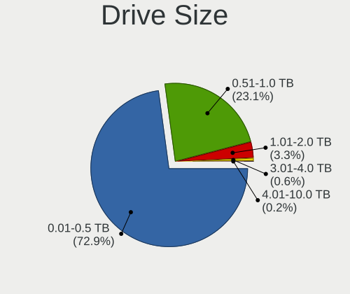

| Size in TB | Notebooks | Drives | Percent |
|------------|-----------|--------|---------|
| 0.01-0.5   | 3626      | 5025   | 72.87%  |
| 0.51-1.0   | 1147      | 1552   | 23.05%  |
| 1.01-2.0   | 164       | 218    | 3.3%    |
| 3.01-4.0   | 31        | 34     | 0.62%   |
| 4.01-10.0  | 8         | 12     | 0.16%   |

Space Total
-----------

Amount of disk space available on the file system

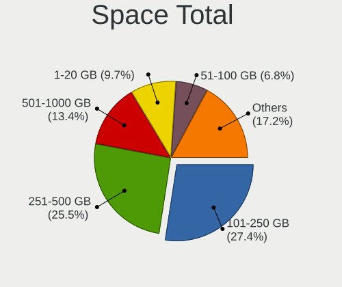

| Size in GB     | Notebooks | Percent |
|----------------|-----------|---------|
| 101-250        | 2182      | 27.44%  |
| 251-500        | 2031      | 25.54%  |
| 501-1000       | 1066      | 13.4%   |
| 1-20           | 769       | 9.67%   |
| 51-100         | 537       | 6.75%   |
| 1001-2000      | 484       | 6.09%   |
| 21-50          | 344       | 4.33%   |
| Unknown        | 223       | 2.8%    |
| More than 3000 | 180       | 2.26%   |
| 2001-3000      | 137       | 1.72%   |

Space Used
----------

Amount of used disk space

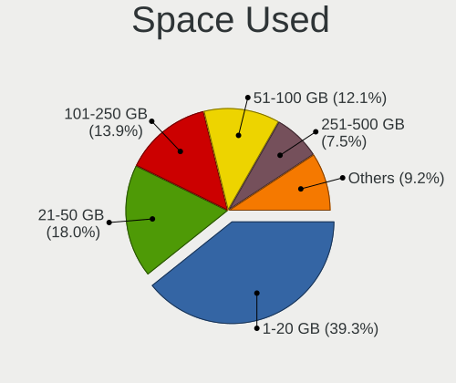

| Used GB        | Notebooks | Percent |
|----------------|-----------|---------|
| 1-20           | 3256      | 39.28%  |
| 21-50          | 1490      | 17.97%  |
| 101-250        | 1154      | 13.92%  |
| 51-100         | 1002      | 12.09%  |
| 251-500        | 622       | 7.5%    |
| 501-1000       | 329       | 3.97%   |
| Unknown        | 223       | 2.69%   |
| 1001-2000      | 137       | 1.65%   |
| More than 3000 | 37        | 0.45%   |
| 2001-3000      | 34        | 0.41%   |
| 0              | 6         | 0.07%   |

Malfunc. Drives
---------------

Drive models with a malfunction

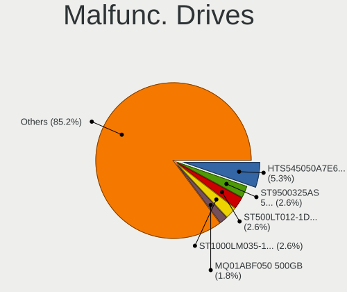

| Model                                          | Notebooks | Drives | Percent |
|------------------------------------------------|-----------|--------|---------|
| HGST HTS545050A7E680 500GB                     | 27        | 33     | 5.31%   |
| Seagate ST9500325AS 500GB                      | 13        | 16     | 2.56%   |
| Seagate ST500LT012-1DG142 500GB                | 13        | 13     | 2.56%   |
| Seagate ST1000LM035-1RK172 1TB                 | 13        | 15     | 2.56%   |
| Toshiba MQ01ABF050 500GB                       | 9         | 10     | 1.77%   |
| Seagate ST1000LM024 HN-M101MBB 1TB             | 9         | 11     | 1.77%   |
| HGST HTS721010A9E630 1TB                       | 9         | 9      | 1.77%   |
| Hitachi HTS545050A7E380 500GB                  | 8         | 8      | 1.57%   |
| Seagate ST500LM021-1KJ152 500GB                | 7         | 7      | 1.38%   |
| Hitachi HTS725050A9A364 500GB                  | 7         | 8      | 1.38%   |
| HGST HTS725050A7E630 500GB                     | 7         | 9      | 1.38%   |
| Seagate ST9320325AS 320GB                      | 6         | 6      | 1.18%   |
| HGST HTS541010A9E680 1TB                       | 6         | 7      | 1.18%   |
| WDC WD3200BEVT-60A23T0 320GB                   | 5         | 5      | 0.98%   |
| SK hynix BC711 HFM512GD3JX013N 512GB           | 5         | 10     | 0.98%   |
| Seagate ST9500420AS 500GB                      | 5         | 5      | 0.98%   |
| Seagate ST9250315AS 250GB                      | 5         | 5      | 0.98%   |
| Seagate ST500LM012 HN-M500MBB 500GB            | 5         | 6      | 0.98%   |
| Seagate ST1000LM014-1EJ164 1TB                 | 5         | 6      | 0.98%   |
| Micron Technology 1100_MTFDDAV512TBN 512GB SSD | 5         | 7      | 0.98%   |
| Hitachi HTS547550A9E384 500GB                  | 5         | 5      | 0.98%   |
| WDC WD5000LPCX-24C6HT0 500GB                   | 4         | 5      | 0.79%   |
| Toshiba MQ01ABD100 1TB                         | 4         | 6      | 0.79%   |
| Toshiba MK5065GSX 500GB                        | 4         | 6      | 0.79%   |
| SK hynix HFS512G39TND-N210A 512GB SSD          | 4         | 4      | 0.79%   |
| Seagate ST500LT012-9WS142 500GB                | 4         | 4      | 0.79%   |
| Hitachi HTS545032B9A300 320GB                  | 4         | 5      | 0.79%   |
| HGST HTS545050A7E380 500GB                     | 4         | 4      | 0.79%   |
| Toshiba MQ04ABF100 1TB                         | 3         | 3      | 0.59%   |
| SK hynix HFS128G39TND-N210A 128GB SSD          | 3         | 3      | 0.59%   |
| Seagate ST320LT012-9WS14C 320GB                | 3         | 4      | 0.59%   |
| SanDisk SSD PLUS 240GB                         | 3         | 3      | 0.59%   |
| Micron Technology 1100_MTFDDAV256TBN 256GB SSD | 3         | 3      | 0.59%   |
| Kingston SA400S37240G 240GB SSD                | 3         | 3      | 0.59%   |
| Hitachi HTS543232A7A384 320GB                  | 3         | 4      | 0.59%   |
| Hitachi HTS543225L9A300 250GB                  | 3         | 3      | 0.59%   |
| HGST HTS541075A9E680 752GB                     | 3         | 6      | 0.59%   |
| Fujitsu MHZ2320BH G2 320GB                     | 3         | 3      | 0.59%   |
| Crucial CT525MX300SSD1 528GB                   | 3         | 3      | 0.59%   |
| WDC WDS240G2G0A-00JH30 240GB SSD               | 2         | 2      | 0.39%   |

Malfunc. Drive Vendor
---------------------

Vendors of faulty drives

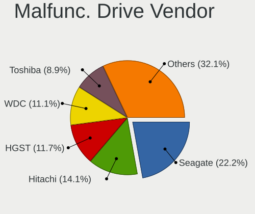

| Vendor                      | Notebooks | Drives | Percent |
|-----------------------------|-----------|--------|---------|
| Seagate                     | 112       | 126    | 22.18%  |
| Hitachi                     | 71        | 75     | 14.06%  |
| HGST                        | 59        | 71     | 11.68%  |
| WDC                         | 56        | 69     | 11.09%  |
| Toshiba                     | 45        | 52     | 8.91%   |
| SK hynix                    | 23        | 29     | 4.55%   |
| Samsung Electronics         | 23        | 24     | 4.55%   |
| Crucial                     | 16        | 16     | 3.17%   |
| Micron Technology           | 15        | 17     | 2.97%   |
| Fujitsu                     | 13        | 15     | 2.57%   |
| Kingston                    | 11        | 12     | 2.18%   |
| SanDisk                     | 9         | 9      | 1.78%   |
| Intel                       | 9         | 23     | 1.78%   |
| SSSTC                       | 4         | 5      | 0.79%   |
| KingDian                    | 3         | 3      | 0.59%   |
| Drevo                       | 3         | 3      | 0.59%   |
| China                       | 3         | 3      | 0.59%   |
| Verbatim                    | 2         | 2      | 0.4%    |
| Transcend                   | 2         | 3      | 0.4%    |
| S3+                         | 2         | 2      | 0.4%    |
| Intenso                     | 2         | 2      | 0.4%    |
| Dogfish                     | 2         | 2      | 0.4%    |
| Yangtze Memory Technologies | 1         | 1      | 0.2%    |
| WINTEC                      | 1         | 1      | 0.2%    |
| WDC WDS2                    | 1         | 1      | 0.2%    |
| Unknown                     | 1         | 1      | 0.2%    |
| Teclast                     | 1         | 1      | 0.2%    |
| Team                        | 1         | 1      | 0.2%    |
| TCSUNBOW                    | 1         | 1      | 0.2%    |
| SPCC                        | 1         | 1      | 0.2%    |
| NGFF                        | 1         | 1      | 0.2%    |
| Netac                       | 1         | 1      | 0.2%    |
| LITEON                      | 1         | 1      | 0.2%    |
| KUU                         | 1         | 1      | 0.2%    |
| KingSpec                    | 1         | 1      | 0.2%    |
| KingFast                    | 1         | 1      | 0.2%    |
| EDILOCA                     | 1         | 1      | 0.2%    |
| BIWIN                       | 1         | 1      | 0.2%    |
| BAITITON                    | 1         | 3      | 0.2%    |
| ASMT                        | 1         | 1      | 0.2%    |

Malfunc. HDD Vendor
-------------------

Vendors of faulty HDD drives

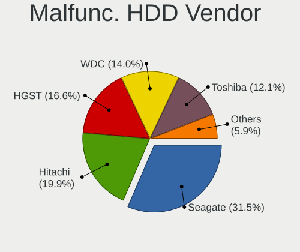

| Vendor              | Notebooks | Drives | Percent |
|---------------------|-----------|--------|---------|
| Seagate             | 112       | 126    | 31.46%  |
| Hitachi             | 71        | 75     | 19.94%  |
| HGST                | 59        | 71     | 16.57%  |
| WDC                 | 50        | 61     | 14.04%  |
| Toshiba             | 43        | 50     | 12.08%  |
| Fujitsu             | 13        | 15     | 3.65%   |
| Samsung Electronics | 7         | 7      | 1.97%   |
| Unknown             | 1         | 1      | 0.28%   |

Malfunc. Drive Kind
-------------------

Kinds of faulty drives

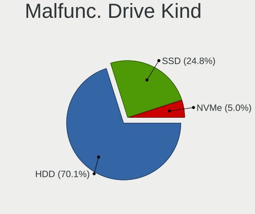

| Kind | Notebooks | Drives | Percent |
|------|-----------|--------|---------|
| HDD  | 350       | 406    | 70.14%  |
| SSD  | 124       | 145    | 24.85%  |
| NVMe | 25        | 34     | 5.01%   |

Failed Drives
-------------

Failed drive models

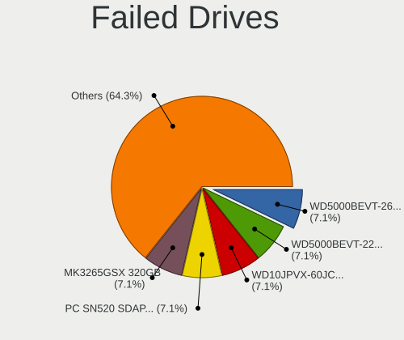

| Model                                            | Notebooks | Drives | Percent |
|--------------------------------------------------|-----------|--------|---------|
| WDC WD5000BEVT-26A0RT0 500GB                     | 1         | 1      | 7.14%   |
| WDC WD5000BEVT-22A0RT0 500GB                     | 1         | 1      | 7.14%   |
| WDC WD10JPVX-60JC3T0 1TB                         | 1         | 1      | 7.14%   |
| WDC PC SN520 SDAPNUW-256G-1102 256GB             | 1         | 1      | 7.14%   |
| Toshiba MK3265GSX 320GB                          | 1         | 1      | 7.14%   |
| Seagate ST9500420AS 500GB                        | 1         | 3      | 7.14%   |
| Seagate ST2000LX001-1RG174 2TB                   | 1         | 1      | 7.14%   |
| Samsung Electronics MZNTY128HDHP-00000 128GB SSD | 1         | 1      | 7.14%   |
| LITEON IT LCS-128L9S-11 2.5 7mm 128GB SSD        | 1         | 1      | 7.14%   |
| JMicron Technology Tech 250GB                    | 1         | 1      | 7.14%   |
| JMicron Technology Generic 320GB                 | 1         | 1      | 7.14%   |
| Hitachi HTS723232A7A364 320GB                    | 1         | 1      | 7.14%   |
| Hitachi HTS545050A7E380 500GB                    | 1         | 1      | 7.14%   |
| HGST HTS541010A9E680 1TB                         | 1         | 1      | 7.14%   |

Failed Drive Vendor
-------------------

Failed drive vendors

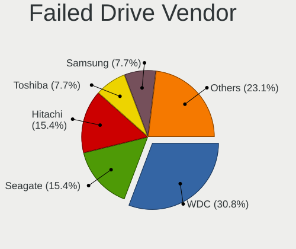

| Vendor              | Notebooks | Drives | Percent |
|---------------------|-----------|--------|---------|
| WDC                 | 4         | 4      | 30.77%  |
| Seagate             | 2         | 4      | 15.38%  |
| Hitachi             | 2         | 2      | 15.38%  |
| Toshiba             | 1         | 1      | 7.69%   |
| Samsung Electronics | 1         | 1      | 7.69%   |
| LITEON              | 1         | 1      | 7.69%   |
| JMicron Technology  | 1         | 2      | 7.69%   |
| HGST                | 1         | 1      | 7.69%   |

Drive Status
------------

Number of failed and malfunc. drives

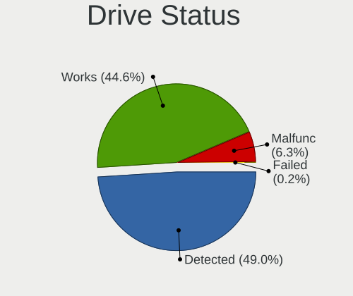

| Status   | Notebooks | Drives | Percent |
|----------|-----------|--------|---------|
| Detected | 3868      | 6271   | 48.99%  |
| Works    | 3520      | 5122   | 44.59%  |
| Malfunc  | 494       | 585    | 6.26%   |
| Failed   | 13        | 16     | 0.16%   |

Storage controller
------------------

Storage Vendor
--------------

Storage controller vendors

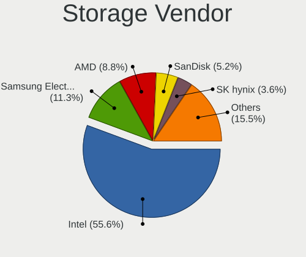

| Vendor                                  | Notebooks | Percent |
|-----------------------------------------|-----------|---------|
| Intel                                   | 4808      | 55.64%  |
| Samsung Electronics                     | 976       | 11.29%  |
| AMD                                     | 761       | 8.81%   |
| SanDisk                                 | 450       | 5.21%   |
| SK hynix                                | 308       | 3.56%   |
| Micron Technology                       | 263       | 3.04%   |
| Kingston Technology Company             | 156       | 1.81%   |
| KIOXIA                                  | 152       | 1.76%   |
| Phison Electronics                      | 116       | 1.34%   |
| Toshiba America Info Systems            | 115       | 1.33%   |
| Nvidia                                  | 93        | 1.08%   |
| Micron/Crucial Technology               | 91        | 1.05%   |
| MAXIO Technology (Hangzhou)             | 50        | 0.58%   |
| Silicon Motion                          | 40        | 0.46%   |
| Silicon Integrated Systems [SiS]        | 32        | 0.37%   |
| Solid State Storage Technology          | 30        | 0.35%   |
| Solidigm                                | 26        | 0.3%    |
| Shenzhen Longsys Electronics            | 24        | 0.28%   |
| Apple                                   | 20        | 0.23%   |
| Union Memory (Shenzhen)                 | 19        | 0.22%   |
| ADATA Technology                        | 14        | 0.16%   |
| Realtek Semiconductor                   | 12        | 0.14%   |
| Marvell Technology Group                | 11        | 0.13%   |
| Lite-On Technology                      | 10        | 0.12%   |
| Lenovo                                  | 8         | 0.09%   |
| VIA Technologies                        | 7         | 0.08%   |
| Yangtze Memory Technologies             | 6         | 0.07%   |
| Seagate Technology                      | 6         | 0.07%   |
| INNOGRIT                                | 6         | 0.07%   |
| Silicon Image                           | 5         | 0.06%   |
| JMicron Technology                      | 5         | 0.06%   |
| ASMedia Technology                      | 5         | 0.06%   |
| Shenzhen Unionmemory Information System | 4         | 0.05%   |
| Unknown                                 | 4         | 0.05%   |
| O2 Micro                                | 3         | 0.03%   |
| Netac Technology                        | 2         | 0.02%   |
| TenaFe                                  | 1         | 0.01%   |
| Shenzhen Shichuangyi Electronics        | 1         | 0.01%   |
| Biwin Storage Technology                | 1         | 0.01%   |
| Beijing Starblaze Technology            | 1         | 0.01%   |

Storage Model
-------------

Storage controller models

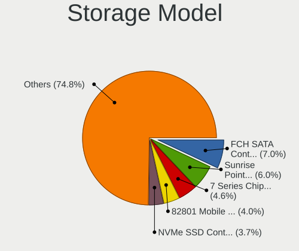

| Model                                                                            | Notebooks | Percent |
|----------------------------------------------------------------------------------|-----------|---------|
| AMD FCH SATA Controller [AHCI mode]                                              | 651       | 6.98%   |
| Intel Sunrise Point-LP SATA Controller [AHCI mode]                               | 557       | 5.98%   |
| Intel 7 Series Chipset Family 6-port SATA Controller [AHCI mode]                 | 433       | 4.65%   |
| Intel 82801 Mobile SATA Controller [RAID mode]                                   | 369       | 3.96%   |
| Samsung NVMe SSD Controller SM981/PM981/PM983                                    | 342       | 3.67%   |
| Intel 6 Series/C200 Series Chipset Family 6 port Mobile SATA AHCI Controller     | 330       | 3.54%   |
| Intel 82801IBM/IEM (ICH9M/ICH9M-E) 4 port SATA Controller [AHCI mode]            | 307       | 3.29%   |
| Intel Volume Management Device NVMe RAID Controller                              | 284       | 3.05%   |
| Samsung NVMe SSD Controller 980 (DRAM-less)                                      | 257       | 2.76%   |
| Intel 8 Series SATA Controller 1 [AHCI mode]                                     | 256       | 2.75%   |
| Intel Wildcat Point-LP SATA Controller [AHCI Mode]                               | 183       | 1.96%   |
| Intel 82801HM/HEM (ICH8M/ICH8M-E) IDE Controller                                 | 179       | 1.92%   |
| Intel 5 Series/3400 Series Chipset 4 port SATA AHCI Controller                   | 177       | 1.9%    |
| Intel 8 Series/C220 Series Chipset Family 6-port SATA Controller 1 [AHCI mode]   | 167       | 1.79%   |
| Samsung NVMe SSD Controller PM9A1/PM9A3/980PRO                                   | 160       | 1.72%   |
| Intel Celeron/Pentium Silver Processor SATA Controller                           | 157       | 1.68%   |
| Intel 82801HM/HEM (ICH8M/ICH8M-E) SATA Controller [AHCI mode]                    | 152       | 1.63%   |
| Intel Cannon Lake Mobile PCH SATA AHCI Controller                                | 129       | 1.38%   |
| Intel HM170/QM170 Chipset SATA Controller [AHCI Mode]                            | 128       | 1.37%   |
| Intel Comet Lake SATA AHCI Controller                                            | 104       | 1.12%   |
| Intel Tiger Lake-LP SATA Controller                                              | 103       | 1.11%   |
| SK hynix Gold P31/BC711/PC711 NVMe Solid State Drive                             | 95        | 1.02%   |
| KIOXIA NVMe SSD Controller BG4 (DRAM-less)                                       | 92        | 0.99%   |
| Intel SSD 660P Series                                                            | 92        | 0.99%   |
| SanDisk Ultra 3D / WD PC SN530, IX SN530, Blue SN550 NVMe SSD (DRAM-less)        | 90        | 0.97%   |
| Intel 5 Series/3400 Series Chipset 6 port SATA AHCI Controller                   | 85        | 0.91%   |
| Intel Alder Lake-P SATA AHCI Controller                                          | 79        | 0.85%   |
| SanDisk Extreme Pro / WD Black SN750 / PC SN730 / Red SN700 NVMe SSD             | 72        | 0.77%   |
| Intel NM10/ICH7 Family SATA Controller [AHCI mode]                               | 70        | 0.75%   |
| Intel Celeron N3350/Pentium N4200/Atom E3900 Series SATA AHCI Controller         | 69        | 0.74%   |
| Intel Atom Processor E3800 Series SATA AHCI Controller                           | 67        | 0.72%   |
| Intel Cannon Point-LP SATA Controller [AHCI Mode]                                | 66        | 0.71%   |
| AMD SB7x0/SB8x0/SB9x0 SATA Controller [AHCI mode]                                | 65        | 0.7%    |
| SanDisk WD Blue SN500 / PC SN520 x2 M.2 2280 NVMe SSD                            | 63        | 0.68%   |
| Intel SSD 670p Series [Keystone Harbor]                                          | 63        | 0.68%   |
| Intel Atom/Celeron/Pentium Processor x5-E8000/J3xxx/N3xxx Series SATA Controller | 62        | 0.67%   |
| Intel 82801G (ICH7 Family) IDE Controller                                        | 60        | 0.64%   |
| SK hynix BC511 NVMe SSD                                                          | 59        | 0.63%   |
| Samsung NVMe SSD Controller SM961/PM961/SM963                                    | 58        | 0.62%   |
| Intel RST Volume Management Device Controller                                    | 58        | 0.62%   |

Storage Kind
------------

Kind of storage controller (IDE, SATA, NVMe, SAS, ...)

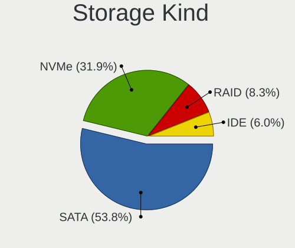

| Kind | Notebooks | Percent |
|------|-----------|---------|
| SATA | 4803      | 53.78%  |
| NVMe | 2852      | 31.93%  |
| RAID | 737       | 8.25%   |
| IDE  | 539       | 6.04%   |

Processor
---------

CPU Vendor
----------

Processor vendors

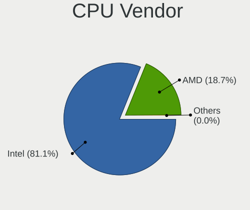

| Vendor       | Notebooks | Percent |
|--------------|-----------|---------|
| Intel        | 5954      | 81.13%  |
| AMD          | 1376      | 18.75%  |
| Unknown      | 4         | 0.05%   |
| Qualcomm     | 2         | 0.03%   |
| CentaurHauls | 2         | 0.03%   |
| ARM          | 1         | 0.01%   |

CPU Model
---------

Processor models

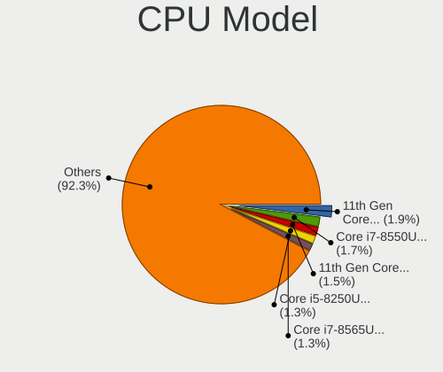

| Model                                         | Notebooks | Percent |
|-----------------------------------------------|-----------|---------|
| Intel 11th Gen Core i7-1165G7 @ 2.80GHz       | 143       | 1.95%   |
| Intel Core i7-8550U CPU @ 1.80GHz             | 123       | 1.67%   |
| Intel 11th Gen Core i5-1135G7 @ 2.40GHz       | 109       | 1.48%   |
| Intel Core i5-8250U CPU @ 1.60GHz             | 98        | 1.33%   |
| Intel Core i7-8565U CPU @ 1.80GHz             | 92        | 1.25%   |
| AMD Ryzen 5 3500U with Radeon Vega Mobile Gfx | 87        | 1.18%   |
| Intel Core i5-6200U CPU @ 2.30GHz             | 84        | 1.14%   |
| Intel Core i7-10510U CPU @ 1.80GHz            | 82        | 1.12%   |
| Intel Core i7-7700HQ CPU @ 2.80GHz            | 80        | 1.09%   |
| Intel Core i7-7500U CPU @ 2.70GHz             | 79        | 1.08%   |
| Intel Core i5-7200U CPU @ 2.50GHz             | 78        | 1.06%   |
| Intel Core i5-10210U CPU @ 1.60GHz            | 76        | 1.03%   |
| Intel Core i7-8750H CPU @ 2.20GHz             | 72        | 0.98%   |
| AMD Ryzen 7 5700U with Radeon Graphics        | 68        | 0.93%   |
| Intel Core i7-6500U CPU @ 2.50GHz             | 66        | 0.9%    |
| Intel Atom x5-Z8300 CPU @ 1.44GHz             | 61        | 0.83%   |
| Intel Core i7-6700HQ CPU @ 2.60GHz            | 60        | 0.82%   |
| Intel Core i7-9750H CPU @ 2.60GHz             | 57        | 0.78%   |
| Intel Core i5-8265U CPU @ 1.60GHz             | 55        | 0.75%   |
| Intel Core i7-2670QM CPU @ 2.20GHz            | 53        | 0.72%   |
| AMD Ryzen 5 5500U with Radeon Graphics        | 53        | 0.72%   |
| Intel Core i5-6300U CPU @ 2.40GHz             | 51        | 0.69%   |
| Intel Core i5-1035G1 CPU @ 1.00GHz            | 49        | 0.67%   |
| Intel Core i7-4510U CPU @ 2.00GHz             | 48        | 0.65%   |
| Intel Celeron N4020 CPU @ 1.10GHz             | 48        | 0.65%   |
| Intel 12th Gen Core i7-12700H                 | 48        | 0.65%   |
| Intel Core i7-10750H CPU @ 2.60GHz            | 46        | 0.63%   |
| Intel Core i5-2410M CPU @ 2.30GHz             | 46        | 0.63%   |
| Intel Core 2 Duo CPU P8600 @ 2.40GHz          | 46        | 0.63%   |
| AMD Ryzen 7 4800H with Radeon Graphics        | 45        | 0.61%   |
| Intel Core i7-1065G7 CPU @ 1.30GHz            | 44        | 0.6%    |
| Intel Core i5-5200U CPU @ 2.20GHz             | 44        | 0.6%    |
| Intel Core i5-3320M CPU @ 2.60GHz             | 44        | 0.6%    |
| Intel Core i7-5500U CPU @ 2.40GHz             | 43        | 0.59%   |
| Intel Core i5-4210U CPU @ 1.70GHz             | 42        | 0.57%   |
| Intel Core i3-5005U CPU @ 2.00GHz             | 40        | 0.54%   |
| Intel Celeron CPU N2840 @ 2.16GHz             | 40        | 0.54%   |
| Intel Core i5-8350U CPU @ 1.70GHz             | 39        | 0.53%   |
| Intel Core i5-2520M CPU @ 2.50GHz             | 39        | 0.53%   |
| Intel Core i3-4005U CPU @ 1.70GHz             | 39        | 0.53%   |

CPU Model Family
----------------

Processor model prefix

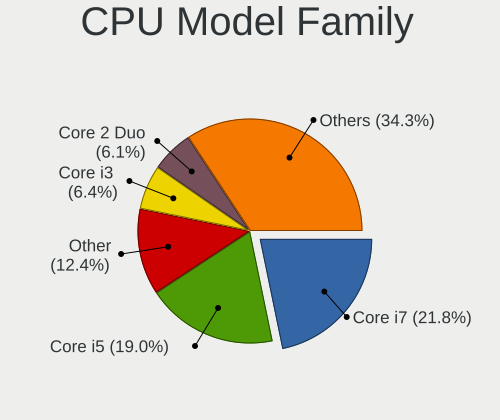

| Model                   | Notebooks | Percent |
|-------------------------|-----------|---------|
| Intel Core i7           | 1598      | 21.77%  |
| Intel Core i5           | 1394      | 18.99%  |
| Other                   | 914       | 12.45%  |
| Intel Core i3           | 472       | 6.43%   |
| Intel Core 2 Duo        | 447       | 6.09%   |
| Intel Celeron           | 435       | 5.92%   |
| AMD Ryzen 7             | 340       | 4.63%   |
| AMD Ryzen 5             | 302       | 4.11%   |
| Intel Atom              | 244       | 3.32%   |
| Intel Pentium           | 91        | 1.24%   |
| Intel Core              | 89        | 1.21%   |
| AMD E1                  | 70        | 0.95%   |
| Intel Pentium Dual-Core | 67        | 0.91%   |
| AMD A4                  | 55        | 0.75%   |
| AMD A10                 | 54        | 0.74%   |
| AMD A8                  | 52        | 0.71%   |
| AMD Ryzen 7 PRO         | 51        | 0.69%   |
| AMD Ryzen 3             | 50        | 0.68%   |
| AMD Ryzen 9             | 49        | 0.67%   |
| Intel Genuine           | 47        | 0.64%   |
| Intel Pentium Dual      | 44        | 0.6%    |
| Intel Core 2            | 42        | 0.57%   |
| AMD A6                  | 42        | 0.57%   |
| Intel Core i9           | 39        | 0.53%   |
| AMD Ryzen 5 PRO         | 33        | 0.45%   |
| AMD E2                  | 32        | 0.44%   |
| Intel Pentium Silver    | 23        | 0.31%   |
| Intel Pentium M         | 19        | 0.26%   |
| Intel Celeron M         | 19        | 0.26%   |
| AMD Turion 64 X2 Mobile | 19        | 0.26%   |
| AMD E                   | 19        | 0.26%   |
| Intel Celeron Dual-Core | 18        | 0.25%   |
| AMD Sempron             | 15        | 0.2%    |
| AMD Athlon              | 15        | 0.2%    |
| AMD A12                 | 12        | 0.16%   |
| Intel Core m3           | 11        | 0.15%   |
| AMD Mobile Sempron      | 11        | 0.15%   |
| AMD Athlon II           | 10        | 0.14%   |
| Intel Core M            | 8         | 0.11%   |
| AMD C-60                | 8         | 0.11%   |

CPU Cores
---------

Number of processor cores

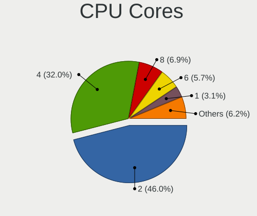

| Number  | Notebooks | Percent |
|---------|-----------|---------|
| 2       | 3381      | 45.99%  |
| 4       | 2353      | 32.01%  |
| 8       | 508       | 6.91%   |
| 6       | 421       | 5.73%   |
| 1       | 230       | 3.13%   |
| 10      | 169       | 2.3%    |
| 14      | 132       | 1.8%    |
| 12      | 81        | 1.1%    |
| 16      | 47        | 0.64%   |
| 24      | 24        | 0.33%   |
| 20      | 2         | 0.03%   |
| 5       | 2         | 0.03%   |
| Unknown | 1         | 0.01%   |

CPU Sockets
-----------

Number of sockets

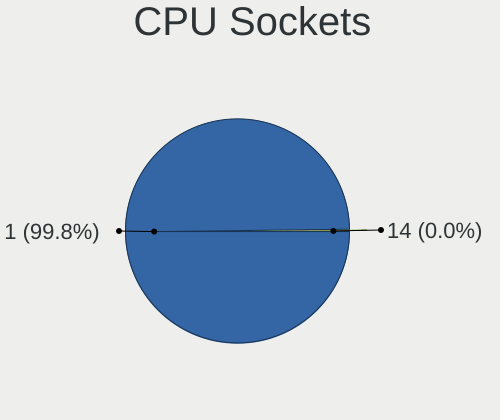

| Number | Notebooks | Percent |
|--------|-----------|---------|
| 1      | 7327      | 99.81%  |
| 2      | 10        | 0.14%   |
| 24     | 2         | 0.03%   |
| 16     | 1         | 0.01%   |
| 14     | 1         | 0.01%   |

CPU Threads
-----------

Threads per core (Hyper-Threading)

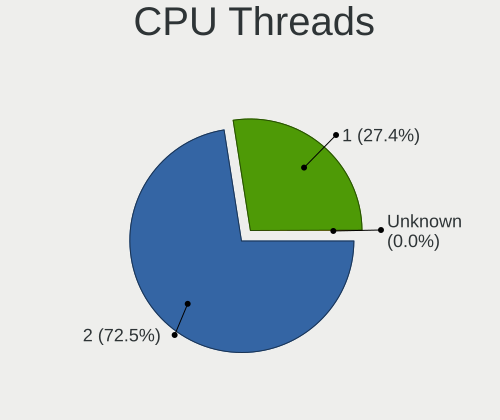

| Number  | Notebooks | Percent |
|---------|-----------|---------|
| 2       | 5338      | 72.53%  |
| 1       | 2018      | 27.42%  |
| 4       | 2         | 0.03%   |
| 8       | 1         | 0.01%   |
| Unknown | 1         | 0.01%   |

CPU Op-Modes
------------

CPU Operation Modes (32-bit, 64-bit)

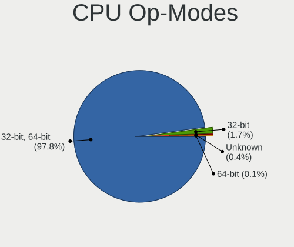

| Op mode        | Notebooks | Percent |
|----------------|-----------|---------|
| 32-bit, 64-bit | 7186      | 97.84%  |
| 32-bit         | 123       | 1.67%   |
| Unknown        | 31        | 0.42%   |
| 64-bit         | 5         | 0.07%   |

CPU Microcode
-------------

Microcode number

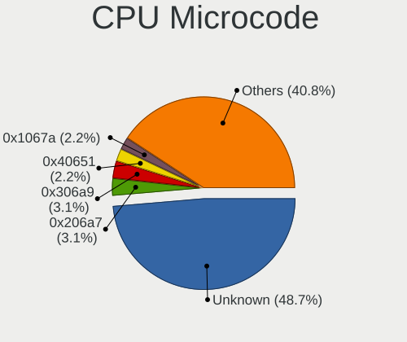

| Number     | Notebooks | Percent |
|------------|-----------|---------|
| Unknown    | 3763      | 48.66%  |
| 0x206a7    | 239       | 3.09%   |
| 0x306a9    | 238       | 3.08%   |
| 0x40651    | 173       | 2.24%   |
| 0x1067a    | 168       | 2.17%   |
| 0x806ea    | 157       | 2.03%   |
| 0x806ec    | 155       | 2%      |
| 0x806c1    | 155       | 2%      |
| 0x406e3    | 140       | 1.81%   |
| 0x806e9    | 121       | 1.56%   |
| 0x6fd      | 114       | 1.47%   |
| 0x306d4    | 104       | 1.34%   |
| 0x20655    | 102       | 1.32%   |
| 0x306c3    | 99        | 1.28%   |
| 0x906ea    | 97        | 1.25%   |
| 0x08108109 | 92        | 1.19%   |
| 0x10676    | 83        | 1.07%   |
| 0x406c3    | 68        | 0.88%   |
| 0x08608103 | 63        | 0.81%   |
| 0x706e5    | 61        | 0.79%   |
| 0x0a50000c | 61        | 0.79%   |
| 0x30678    | 58        | 0.75%   |
| 0x906e9    | 53        | 0.69%   |
| 0x20652    | 52        | 0.67%   |
| 0xa0652    | 51        | 0.66%   |
| 0x806eb    | 50        | 0.65%   |
| 0x706a8    | 50        | 0.65%   |
| 0x106ca    | 49        | 0.63%   |
| 0x06006705 | 49        | 0.63%   |
| 0x706a1    | 44        | 0.57%   |
| 0x406c4    | 43        | 0.56%   |
| 0x506e3    | 40        | 0.52%   |
| 0x506c9    | 39        | 0.5%    |
| 0x906a3    | 38        | 0.49%   |
| 0x08600106 | 38        | 0.49%   |
| 0x08600104 | 36        | 0.47%   |
| 0x07030105 | 36        | 0.47%   |
| 0x0700010f | 34        | 0.44%   |
| 0x08108102 | 32        | 0.41%   |
| 0x6e8      | 31        | 0.4%    |

CPU Microarch
-------------

Microarchitecture

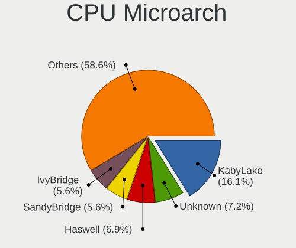

| Name               | Notebooks | Percent |
|--------------------|-----------|---------|
| KabyLake           | 1187      | 16.11%  |
| Unknown            | 527       | 7.15%   |
| Haswell            | 505       | 6.85%   |
| SandyBridge        | 416       | 5.65%   |
| IvyBridge          | 416       | 5.65%   |
| Penryn             | 410       | 5.56%   |
| TigerLake          | 374       | 5.08%   |
| Skylake            | 359       | 4.87%   |
| Alderlake Hybrid   | 288       | 3.91%   |
| Silvermont         | 285       | 3.87%   |
| Core               | 274       | 3.72%   |
| Westmere           | 253       | 3.43%   |
| Broadwell          | 228       | 3.09%   |
| Zen+               | 189       | 2.56%   |
| Zen 3              | 179       | 2.43%   |
| Goldmont plus      | 168       | 2.28%   |
| IceLake            | 155       | 2.1%    |
| Excavator          | 144       | 1.95%   |
| Zen 2              | 140       | 1.9%    |
| Bonnell            | 110       | 1.49%   |
| CometLake          | 102       | 1.38%   |
| P6                 | 74        | 1%      |
| Jaguar             | 73        | 0.99%   |
| Puma               | 71        | 0.96%   |
| Goldmont           | 71        | 0.96%   |
| Zen                | 51        | 0.69%   |
| Bobcat             | 51        | 0.69%   |
| K8 Hammer          | 47        | 0.64%   |
| Meteorlake Hybrid  | 36        | 0.49%   |
| Nehalem            | 30        | 0.41%   |
| K10                | 28        | 0.38%   |
| K8 & K10 hybrid    | 24        | 0.33%   |
| K10 Llano          | 21        | 0.28%   |
| Steamroller        | 17        | 0.23%   |
| Lunarlake Hybrid   | 17        | 0.23%   |
| Piledriver         | 16        | 0.22%   |
| Tremont            | 15        | 0.2%    |
| Gracemont          | 7         | 0.09%   |
| ArrowLake-H Hybrid | 6         | 0.08%   |
| NetBurst           | 5         | 0.07%   |

Graphics
--------

GPU Vendor
----------

Vendors of graphics cards

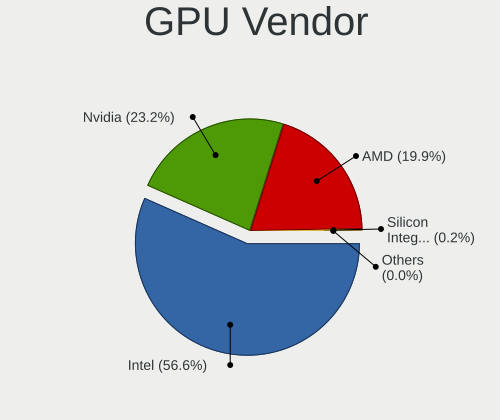

| Vendor                           | Notebooks | Percent |
|----------------------------------|-----------|---------|
| Intel                            | 5299      | 56.62%  |
| Nvidia                           | 2172      | 23.21%  |
| AMD                              | 1862      | 19.9%   |
| Silicon Integrated Systems [SiS] | 20        | 0.21%   |
| VIA Technologies                 | 5         | 0.05%   |
| S3 Graphics                      | 1         | 0.01%   |

GPU Model
---------

Graphics card models

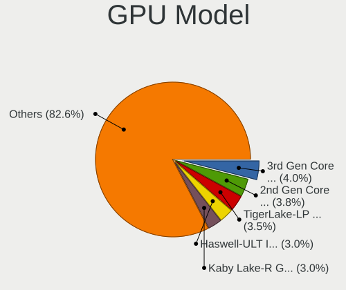

| Model                                                                                    | Notebooks | Percent |
|------------------------------------------------------------------------------------------|-----------|---------|
| Intel 3rd Gen Core processor Graphics Controller                                         | 393       | 4.04%   |
| Intel 2nd Generation Core Processor Family Integrated Graphics Controller                | 373       | 3.83%   |
| Intel TigerLake-LP GT2 [Iris Xe Graphics]                                                | 342       | 3.52%   |
| Intel Haswell-ULT Integrated Graphics Controller                                         | 294       | 3.02%   |
| Intel Kaby Lake-R GT2 [UHD Graphics 620]                                                 | 293       | 3.01%   |
| Intel Skylake-U GT2 [HD Graphics 520]                                                    | 248       | 2.55%   |
| Intel Mobile 4 Series Chipset Integrated Graphics Controller                             | 207       | 2.13%   |
| AMD Picasso/Raven 2 [Radeon Vega Series / Radeon Vega Mobile Series]                     | 200       | 2.06%   |
| Intel Kaby Lake-U GT2 [HD Graphics 620]                                                  | 198       | 2.04%   |
| Intel WhiskeyLake-U GT2 [UHD Graphics 620]                                               | 188       | 1.93%   |
| Intel CometLake-U GT2 [UHD Graphics]                                                     | 188       | 1.93%   |
| Intel Broadwell-U GT2 [HD Graphics 5500]                                                 | 178       | 1.83%   |
| Intel Atom/Celeron/Pentium Processor x5-E8000/J3xxx/N3xxx Integrated Graphics Controller | 178       | 1.83%   |
| Intel CoffeeLake-H GT2 [UHD Graphics 630]                                                | 170       | 1.75%   |
| Intel 4th Gen Core Processor Integrated Graphics Controller                              | 167       | 1.72%   |
| Intel GeminiLake [UHD Graphics 600]                                                      | 146       | 1.5%    |
| Intel Core Processor Integrated Graphics Controller                                      | 142       | 1.46%   |
| AMD Renoir [Radeon Vega Series / Radeon Vega Mobile Series]                              | 137       | 1.41%   |
| AMD Lucienne                                                                             | 135       | 1.39%   |
| Intel Atom Processor Z36xxx/Z37xxx Series Graphics & Display                             | 107       | 1.1%    |
| Intel Mobile GM965/GL960 Integrated Graphics Controller (secondary)                      | 106       | 1.09%   |
| Intel Mobile GM965/GL960 Integrated Graphics Controller (primary)                        | 106       | 1.09%   |
| AMD Cezanne [Radeon Vega Series / Radeon Vega Mobile Series]                             | 104       | 1.07%   |
| Nvidia TU117M [GeForce GTX 1650 Mobile / Max-Q]                                          | 102       | 1.05%   |
| Nvidia GF117M [GeForce 610M/710M/810M/820M / GT 620M/625M/630M/720M]                     | 96        | 0.99%   |
| Intel Alder Lake-P GT2 [Iris Xe Graphics]                                                | 93        | 0.96%   |
| AMD Stoney [Radeon R2/R3/R4/R5 Graphics]                                                 | 92        | 0.95%   |
| Intel Mobile 945GM/GMS/GME, 943/940GML Express Integrated Graphics Controller            | 90        | 0.93%   |
| Intel CometLake-H GT2 [UHD Graphics]                                                     | 85        | 0.87%   |
| AMD Topaz XT [Radeon R7 M260/M265 / M340/M360 / M440/M445 / 530/535 / 620/625 Mobile]    | 85        | 0.87%   |
| Intel Raptor Lake-P [Iris Xe Graphics]                                                   | 83        | 0.85%   |
| AMD Sun XT [Radeon HD 8670A/8670M/8690M / R5 M330 / M430 / Radeon 520 Mobile]            | 83        | 0.85%   |
| Nvidia GP107M [GeForce GTX 1050 Mobile]                                                  | 81        | 0.83%   |
| Intel Skylake-H GT2 [HD Graphics 530]                                                    | 73        | 0.75%   |
| Intel Kaby Lake-H GT2 [HD Graphics 630]                                                  | 72        | 0.74%   |
| AMD Seymour [Radeon HD 6400M/7400M Series]                                               | 71        | 0.73%   |
| Nvidia GA106M [GeForce RTX 3060 Mobile / Max-Q]                                          | 69        | 0.71%   |
| AMD Barcelo                                                                              | 69        | 0.71%   |
| Intel Iris Plus Graphics G1 (Ice Lake)                                                   | 67        | 0.69%   |
| Intel Mobile 945GM/GMS, 943/940GML Express Integrated Graphics Controller                | 62        | 0.64%   |

GPU Combo
---------

Combinations of graphics cards

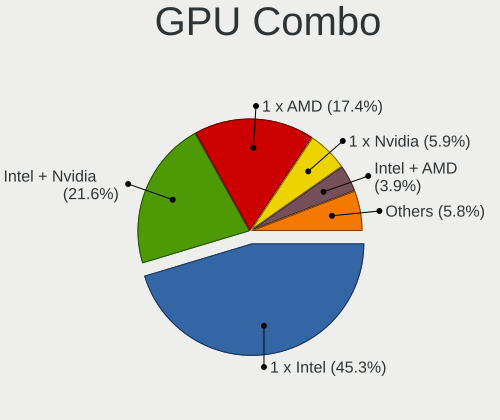

| Name                   | Notebooks | Percent |
|------------------------|-----------|---------|
| 1 x Intel              | 3341      | 45.34%  |
| Intel + Nvidia         | 1589      | 21.57%  |
| 1 x AMD                | 1285      | 17.44%  |
| 1 x Nvidia             | 436       | 5.92%   |
| Intel + AMD            | 286       | 3.88%   |
| 2 x AMD                | 160       | 2.17%   |
| AMD + Nvidia           | 138       | 1.87%   |
| 2 x Intel              | 84        | 1.14%   |
| 1 x SiS                | 20        | 0.27%   |
| Other                  | 12        | 0.16%   |
| 2 x Nvidia             | 9         | 0.12%   |
| 1 x VIA                | 5         | 0.07%   |
| 2 x Intel + 1 x Nvidia | 1         | 0.01%   |
| 1 x S3 Graphics        | 1         | 0.01%   |
| Intel + 2 x Nvidia     | 1         | 0.01%   |

GPU Driver
----------

Free vs proprietary

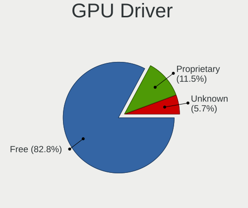

| Driver      | Notebooks | Percent |
|-------------|-----------|---------|
| Free        | 6210      | 82.84%  |
| Proprietary | 861       | 11.49%  |
| Unknown     | 425       | 5.67%   |

GPU Memory
----------

Total video memory

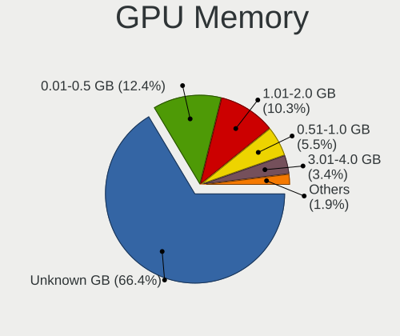

| Size in GB | Notebooks | Percent |
|------------|-----------|---------|
| Unknown    | 5039      | 66.42%  |
| 0.01-0.5   | 943       | 12.43%  |
| 1.01-2.0   | 783       | 10.32%  |
| 0.51-1.0   | 416       | 5.48%   |
| 3.01-4.0   | 258       | 3.4%    |
| 5.01-6.0   | 72        | 0.95%   |
| 7.01-8.0   | 55        | 0.73%   |
| 2.01-3.0   | 12        | 0.16%   |
| 8.01-16.0  | 8         | 0.11%   |

Monitor
-------

Monitor Vendor
--------------

Monitor vendors

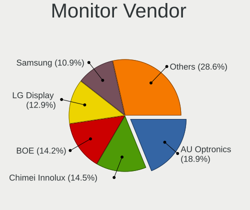

| Vendor                  | Notebooks | Percent |
|-------------------------|-----------|---------|
| AU Optronics            | 1528      | 18.85%  |
| Chimei Innolux          | 1179      | 14.55%  |
| BOE                     | 1154      | 14.24%  |
| LG Display              | 1046      | 12.91%  |
| Samsung Electronics     | 883       | 10.9%   |
| Apple                   | 234       | 2.89%   |
| Chi Mei Optoelectronics | 202       | 2.49%   |
| Sharp                   | 185       | 2.28%   |
| Goldstar                | 159       | 1.96%   |
| Hewlett-Packard         | 134       | 1.65%   |
| Lenovo                  | 133       | 1.64%   |
| Philips                 | 120       | 1.48%   |
| PANDA                   | 98        | 1.21%   |
| LG Philips              | 93        | 1.15%   |
| Dell                    | 88        | 1.09%   |
| Acer                    | 69        | 0.85%   |
| Ancor Communications    | 68        | 0.84%   |
| BenQ                    | 62        | 0.77%   |
| InfoVision              | 60        | 0.74%   |
| HannStar                | 49        | 0.6%    |
| AOC                     | 43        | 0.53%   |
| CSO                     | 42        | 0.52%   |
| Sony                    | 35        | 0.43%   |
| CPT                     | 31        | 0.38%   |
| CSOT                    | 26        | 0.32%   |
| ASUSTek Computer        | 26        | 0.32%   |
| Valve                   | 20        | 0.25%   |
| MSI                     | 19        | 0.23%   |
| Toshiba                 | 18        | 0.22%   |
| Quanta Display          | 16        | 0.2%    |
| TMX                     | 15        | 0.19%   |
| LGD                     | 14        | 0.17%   |
| CSW                     | 14        | 0.17%   |
| Panasonic               | 12        | 0.15%   |
| Unknown                 | 10        | 0.12%   |
| InnoLux Display         | 10        | 0.12%   |
| HKC                     | 10        | 0.12%   |
| Seiko/Epson             | 9         | 0.11%   |
| STA                     | 7         | 0.09%   |
| GreenWood               | 7         | 0.09%   |

Monitor Model
-------------

Monitor models

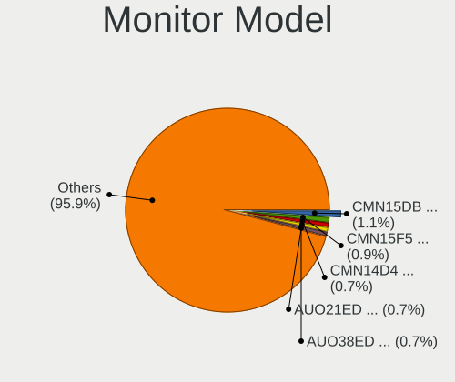

| Model                                                                    | Notebooks | Percent |
|--------------------------------------------------------------------------|-----------|---------|
| Chimei Innolux LCD Monitor CMN15DB 1366x768 344x193mm 15.5-inch          | 89        | 1.09%   |
| Chimei Innolux LCD Monitor CMN15F5 1920x1080 344x193mm 15.5-inch         | 72        | 0.88%   |
| Chimei Innolux LCD Monitor CMN14D4 1920x1080 309x173mm 13.9-inch         | 60        | 0.73%   |
| AU Optronics LCD Monitor AUO21ED 1920x1080 344x193mm 15.5-inch           | 59        | 0.72%   |
| AU Optronics LCD Monitor AUO38ED 1920x1080 344x193mm 15.5-inch           | 58        | 0.71%   |
| AU Optronics LCD Monitor AUO71EC 1366x768 344x193mm 15.5-inch            | 52        | 0.64%   |
| LG Display LCD Monitor LGD02DC 1366x768 344x194mm 15.5-inch              | 50        | 0.61%   |
| Chimei Innolux LCD Monitor CMN15E7 1920x1080 344x193mm 15.5-inch         | 50        | 0.61%   |
| BOE LCD Monitor BOE0872 1920x1080 344x194mm 15.5-inch                    | 49        | 0.6%    |
| Chimei Innolux LCD Monitor CMN15C9 1366x768 344x193mm 15.5-inch          | 46        | 0.56%   |
| AU Optronics LCD Monitor AUO22EC 1366x768 344x193mm 15.5-inch            | 46        | 0.56%   |
| BOE LCD Monitor BOE06A5 1366x768 344x194mm 15.5-inch                     | 45        | 0.55%   |
| AU Optronics LCD Monitor AUO26EC 1366x768 344x193mm 15.5-inch            | 45        | 0.55%   |
| Chi Mei Optoelectronics LCD Monitor CMO15A7 1366x768 344x193mm 15.5-inch | 39        | 0.48%   |
| AU Optronics LCD Monitor AUO45EC 1366x768 344x193mm 15.5-inch            | 38        | 0.46%   |
| BOE LCD Monitor BOE06A4 1366x768 344x194mm 15.5-inch                     | 35        | 0.43%   |
| AU Optronics LCD Monitor AUO403D 1920x1080 309x174mm 14.0-inch           | 34        | 0.42%   |
| Chimei Innolux LCD Monitor CMN15E6 1366x768 344x193mm 15.5-inch          | 33        | 0.4%    |
| Samsung Electronics LCD Monitor SEC5441 1280x800 331x207mm 15.4-inch     | 32        | 0.39%   |
| LG Display LCD Monitor LGD039F 1366x768 345x194mm 15.6-inch              | 32        | 0.39%   |
| AU Optronics LCD Monitor AUO23EC 1366x768 344x193mm 15.5-inch            | 32        | 0.39%   |
| Chimei Innolux LCD Monitor CMN1521 1920x1080 344x193mm 15.5-inch         | 31        | 0.38%   |
| LG Display LCD Monitor LGD046F 1920x1080 344x194mm 15.5-inch             | 30        | 0.37%   |
| Chimei Innolux LCD Monitor CMN15CA 1366x768 344x193mm 15.5-inch          | 30        | 0.37%   |
| AU Optronics LCD Monitor AUO61ED 1920x1080 344x194mm 15.5-inch           | 30        | 0.37%   |
| AU Optronics LCD Monitor AUO499F 1920x1080 344x194mm 15.5-inch           | 29        | 0.35%   |
| BOE LCD Monitor BOE0877 1920x1080 309x173mm 13.9-inch                    | 28        | 0.34%   |
| BOE LCD Monitor BOE0893 2160x1440 296x197mm 14.0-inch                    | 27        | 0.33%   |
| AU Optronics LCD Monitor AUO46EC 1366x768 344x193mm 15.5-inch            | 27        | 0.33%   |
| AU Optronics LCD Monitor AUO106C 1366x768 276x155mm 12.5-inch            | 26        | 0.32%   |
| Chimei Innolux LCD Monitor CMN15AB 1366x768 344x193mm 15.5-inch          | 25        | 0.31%   |
| BOE LCD Monitor BOE0812 1920x1080 344x194mm 15.5-inch                    | 25        | 0.31%   |
| Goldstar FULL HD GSM5B55 1920x1080 480x270mm 21.7-inch                   | 24        | 0.29%   |
| AU Optronics LCD Monitor AUOAF90 1920x1080 344x193mm 15.5-inch           | 24        | 0.29%   |
| AU Optronics LCD Monitor AUO20EC 1366x768 344x193mm 15.5-inch            | 24        | 0.29%   |
| Samsung Electronics LCD Monitor SEC3245 1366x768 340x190mm 15.3-inch     | 22        | 0.27%   |
| BOE LCD Monitor BOE07CB 1920x1080 344x193mm 15.5-inch                    | 22        | 0.27%   |
| LG Display LCD Monitor LGD062E 1920x1080 344x194mm 15.5-inch             | 21        | 0.26%   |
| LG Display LCD Monitor LGD0563 1920x1080 344x194mm 15.5-inch             | 21        | 0.26%   |
| LG Display LCD Monitor LGD045C 1366x768 345x194mm 15.6-inch              | 21        | 0.26%   |

Monitor Resolution
------------------

Monitor screen resolution

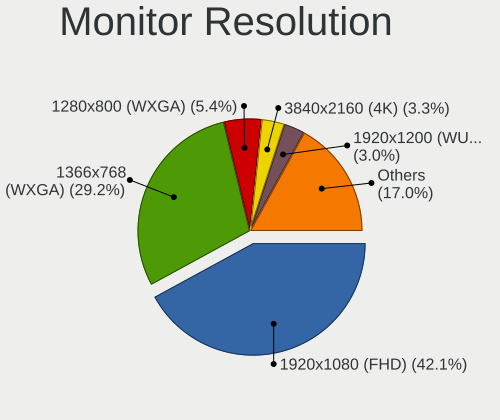

| Resolution         | Notebooks | Percent |
|--------------------|-----------|---------|
| 1920x1080 (FHD)    | 3224      | 42.06%  |
| 1366x768 (WXGA)    | 2238      | 29.19%  |
| 1280x800 (WXGA)    | 416       | 5.43%   |
| 3840x2160 (4K)     | 253       | 3.3%    |
| 1920x1200 (WUXGA)  | 232       | 3.03%   |
| 1600x900 (HD+)     | 220       | 2.87%   |
| 2560x1440 (QHD)    | 157       | 2.05%   |
| 1440x900 (WXGA+)   | 137       | 1.79%   |
| 2560x1600          | 127       | 1.66%   |
| 2880x1800          | 102       | 1.33%   |
| 1024x600           | 81        | 1.06%   |
| 2160x1440          | 64        | 0.83%   |
| 1680x1050 (WSXGA+) | 56        | 0.73%   |
| 1280x1024 (SXGA)   | 35        | 0.46%   |
| 3840x2400          | 28        | 0.37%   |
| 3440x1440          | 26        | 0.34%   |
| 2560x1080          | 24        | 0.31%   |
| 800x1280           | 20        | 0.26%   |
| Unknown            | 20        | 0.26%   |
| 1360x768           | 18        | 0.23%   |
| 3200x1800 (QHD+)   | 15        | 0.2%    |
| 2520x1680          | 14        | 0.18%   |
| 2240x1400          | 14        | 0.18%   |
| 2880x1620          | 13        | 0.17%   |
| 3200x2000          | 11        | 0.14%   |
| 3072x1920          | 11        | 0.14%   |
| 2288x1287          | 11        | 0.14%   |
| 1024x768 (XGA)     | 11        | 0.14%   |
| 3000x2000          | 10        | 0.13%   |
| 1920x1280          | 8         | 0.1%    |
| 3456x2160          | 7         | 0.09%   |
| 2256x1504          | 7         | 0.09%   |
| 1920x540           | 6         | 0.08%   |
| 3840x1080          | 5         | 0.07%   |
| 2304x1440          | 5         | 0.07%   |
| 1680x945           | 4         | 0.05%   |
| 1400x1050          | 4         | 0.05%   |
| 1280x720 (HD)      | 4         | 0.05%   |
| 3840x1600          | 3         | 0.04%   |
| 3840x1100          | 3         | 0.04%   |

Monitor Diagonal
----------------

Diagonal size in inches

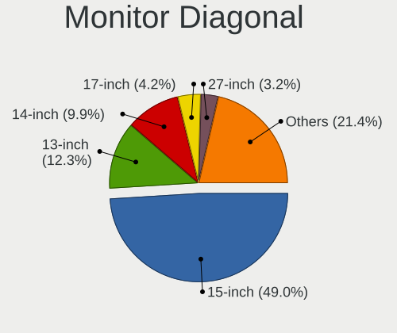

| Inches  | Notebooks | Percent |
|---------|-----------|---------|
| 15      | 3963      | 49.02%  |
| 13      | 996       | 12.32%  |
| 14      | 798       | 9.87%   |
| 17      | 340       | 4.21%   |
| 27      | 255       | 3.15%   |
| 24      | 245       | 3.03%   |
| 16      | 230       | 2.85%   |
| 12      | 194       | 2.4%    |
| 23      | 171       | 2.12%   |
| 21      | 151       | 1.87%   |
| 11      | 96        | 1.19%   |
| 10      | 92        | 1.14%   |
| Unknown | 83        | 1.03%   |
| 31      | 75        | 0.93%   |
| 19      | 44        | 0.54%   |
| 18      | 41        | 0.51%   |
| 34      | 39        | 0.48%   |
| 22      | 29        | 0.36%   |
| 40      | 26        | 0.32%   |
| 54      | 25        | 0.31%   |
| 20      | 21        | 0.26%   |
| 7       | 20        | 0.25%   |
| 32      | 18        | 0.22%   |
| 84      | 15        | 0.19%   |
| 25      | 11        | 0.14%   |
| 142     | 9         | 0.11%   |
| 52      | 9         | 0.11%   |
| 26      | 9         | 0.11%   |
| 8       | 8         | 0.1%    |
| 63      | 7         | 0.09%   |
| 48      | 7         | 0.09%   |
| 72      | 6         | 0.07%   |
| 28      | 6         | 0.07%   |
| 35      | 5         | 0.06%   |
| 86      | 4         | 0.05%   |
| 65      | 4         | 0.05%   |
| 58      | 4         | 0.05%   |
| 37      | 4         | 0.05%   |
| 49      | 3         | 0.04%   |
| 46      | 3         | 0.04%   |

Monitor Width
-------------

Physical width

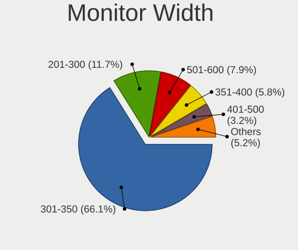

| Width in mm    | Notebooks | Percent |
|----------------|-----------|---------|
| 301-350        | 5313      | 66.12%  |
| 201-300        | 943       | 11.74%  |
| 501-600        | 633       | 7.88%   |
| 351-400        | 466       | 5.8%    |
| 401-500        | 260       | 3.24%   |
| 601-700        | 108       | 1.34%   |
| Unknown        | 83        | 1.03%   |
| 1001-1500      | 67        | 0.83%   |
| 701-800        | 59        | 0.73%   |
| 801-900        | 36        | 0.45%   |
| 1501-2000      | 26        | 0.32%   |
| 1-100          | 20        | 0.25%   |
| More than 2000 | 9         | 0.11%   |
| 101-200        | 9         | 0.11%   |
| 901-1000       | 3         | 0.04%   |

Aspect Ratio
------------

Proportional relationship between the width and the height

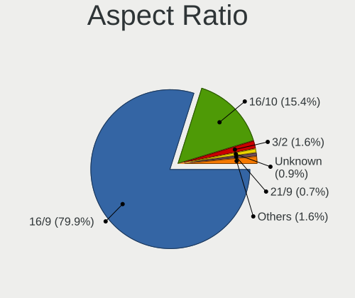

| Ratio   | Notebooks | Percent |
|---------|-----------|---------|
| 16/9    | 5822      | 79.86%  |
| 16/10   | 1124      | 15.42%  |
| 3/2     | 118       | 1.62%   |
| Unknown | 63        | 0.86%   |
| 21/9    | 49        | 0.67%   |
| 5/4     | 39        | 0.53%   |
| 4/3     | 22        | 0.3%    |
| 0.67    | 16        | 0.22%   |
| 32/9    | 9         | 0.12%   |
| 1.00    | 9         | 0.12%   |
| 6/5     | 5         | 0.07%   |
| 0.62    | 4         | 0.05%   |
| 0.56    | 4         | 0.05%   |
| 3.40    | 2         | 0.03%   |
| 0.63    | 2         | 0.03%   |
| 2.21    | 1         | 0.01%   |
| 2.07    | 1         | 0.01%   |

Monitor Area
------------

Area in inch²

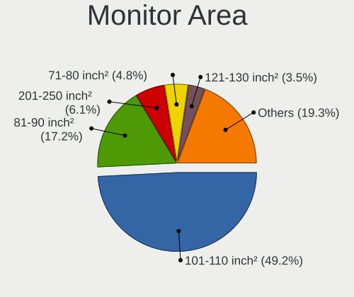

| Area in inch² | Notebooks | Percent |
|----------------|-----------|---------|
| 101-110        | 3967      | 49.21%  |
| 81-90          | 1387      | 17.2%   |
| 201-250        | 488       | 6.05%   |
| 71-80          | 388       | 4.81%   |
| 121-130        | 280       | 3.47%   |
| 301-350        | 261       | 3.24%   |
| 111-120        | 203       | 2.52%   |
| 61-70          | 186       | 2.31%   |
| 351-500        | 143       | 1.77%   |
| 51-60          | 98        | 1.22%   |
| 41-50          | 93        | 1.15%   |
| 151-200        | 93        | 1.15%   |
| More than 1000 | 91        | 1.13%   |
| 251-300        | 84        | 1.04%   |
| Unknown        | 83        | 1.03%   |
| 141-150        | 55        | 0.68%   |
| 131-140        | 49        | 0.61%   |
| 501-1000       | 46        | 0.57%   |
| 91-100         | 39        | 0.48%   |
| 1-40           | 28        | 0.35%   |

Pixel Density
-------------

Pixels per inch

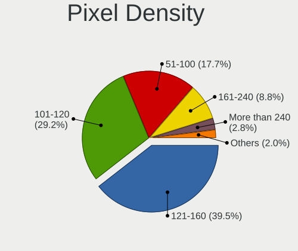

| Density       | Notebooks | Percent |
|---------------|-----------|---------|
| 121-160       | 3137      | 39.5%   |
| 101-120       | 2319      | 29.2%   |
| 51-100        | 1404      | 17.68%  |
| 161-240       | 700       | 8.82%   |
| More than 240 | 221       | 2.78%   |
| Unknown       | 83        | 1.05%   |
| 1-50          | 77        | 0.97%   |

Multiple Monitors
-----------------

Total monitors connected

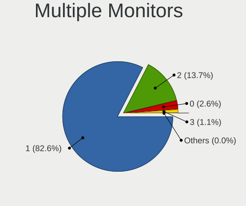

| Total | Notebooks | Percent |
|-------|-----------|---------|
| 1     | 6239      | 82.56%  |
| 2     | 1035      | 13.7%   |
| 0     | 193       | 2.55%   |
| 3     | 80        | 1.06%   |
| 4     | 9         | 0.12%   |
| 5     | 1         | 0.01%   |

Network
-------

Net Controller Vendor
---------------------

Controller vendors

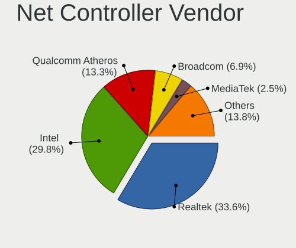

| Vendor                                 | Notebooks | Percent |
|----------------------------------------|-----------|---------|
| Realtek Semiconductor                  | 3947      | 33.59%  |
| Intel                                  | 3507      | 29.85%  |
| Qualcomm Atheros                       | 1564      | 13.31%  |
| Broadcom                               | 811       | 6.9%    |
| MediaTek                               | 295       | 2.51%   |
| Broadcom Limited                       | 208       | 1.77%   |
| Marvell Technology Group               | 181       | 1.54%   |
| TP-Link                                | 120       | 1.02%   |
| Ralink                                 | 119       | 1.01%   |
| ASIX Electronics                       | 74        | 0.63%   |
| Nvidia                                 | 65        | 0.55%   |
| Ralink Technology                      | 64        | 0.54%   |
| Samsung Electronics                    | 58        | 0.49%   |
| Shenzhen Goodix Technology             | 57        | 0.49%   |
| Qualcomm                               | 50        | 0.43%   |
| Dell                                   | 47        | 0.4%    |
| Xiaomi                                 | 46        | 0.39%   |
| Sierra Wireless                        | 44        | 0.37%   |
| Huawei Technologies                    | 38        | 0.32%   |
| Ericsson Business Mobile Networks      | 33        | 0.28%   |
| JMicron Technology                     | 31        | 0.26%   |
| OPPO Electronics                       | 27        | 0.23%   |
| Hewlett-Packard                        | 24        | 0.2%    |
| Silicon Integrated Systems [SiS]       | 23        | 0.2%    |
| Attansic Technology                    | 23        | 0.2%    |
| Lenovo                                 | 22        | 0.19%   |
| Fibocom                                | 19        | 0.16%   |
| DisplayLink                            | 19        | 0.16%   |
| D-Link                                 | 18        | 0.15%   |
| Qualcomm Atheros Communications        | 17        | 0.14%   |
| Sitecom Europe                         | 12        | 0.1%    |
| D-Link System                          | 11        | 0.09%   |
| Apple                                  | 11        | 0.09%   |
| Suzhou Motorcomm Electronic Technology | 10        | 0.09%   |
| NetGear                                | 10        | 0.09%   |
| Google                                 | 10        | 0.09%   |
| Motorola PCS                           | 9         | 0.08%   |
| T & A Mobile Phones                    | 8         | 0.07%   |
| Microsoft                              | 8         | 0.07%   |
| ICS Advent                             | 8         | 0.07%   |

Net Controller Model
--------------------

Controller models

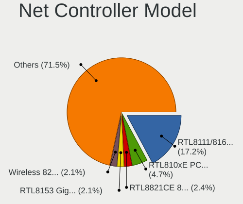

| Model                                                                   | Notebooks | Percent |
|-------------------------------------------------------------------------|-----------|---------|
| Realtek RTL8111/8168/8211/8411 PCI Express Gigabit Ethernet Controller  | 2370      | 17.16%  |
| Realtek RTL810xE PCI Express Fast Ethernet controller                   | 648       | 4.69%   |
| Realtek RTL8821CE 802.11ac PCIe Wireless Network Adapter                | 328       | 2.37%   |
| Realtek RTL8153 Gigabit Ethernet Adapter                                | 293       | 2.12%   |
| Intel Wireless 8265 / 8275                                              | 291       | 2.11%   |
| Qualcomm Atheros QCA9565 / AR9565 Wireless Network Adapter              | 275       | 1.99%   |
| Realtek RTL8822CE 802.11ac PCIe Wireless Network Adapter                | 266       | 1.93%   |
| Intel Wi-Fi 6 AX201                                                     | 266       | 1.93%   |
| Qualcomm Atheros AR9285 Wireless Network Adapter (PCI-Express)          | 261       | 1.89%   |
| Qualcomm Atheros QCA9377 802.11ac Wireless Network Adapter              | 248       | 1.8%    |
| Intel Wi-Fi 6 AX200                                                     | 224       | 1.62%   |
| Qualcomm Atheros AR9485 Wireless Network Adapter                        | 216       | 1.56%   |
| Intel Wireless 7265                                                     | 208       | 1.51%   |
| Intel 82579LM Gigabit Network Connection (Lewisville)                   | 164       | 1.19%   |
| Intel Wireless 3165                                                     | 157       | 1.14%   |
| Intel Alder Lake-P PCH CNVi WiFi                                        | 153       | 1.11%   |
| MediaTek MT7921 802.11ax PCIe Wireless Network Adapter [Filogic 330]    | 150       | 1.09%   |
| Intel Comet Lake PCH-LP CNVi WiFi                                       | 149       | 1.08%   |
| Intel Wireless 7260                                                     | 146       | 1.06%   |
| Realtek RTL8723BE PCIe Wireless Network Adapter                         | 140       | 1.01%   |
| Intel Wireless 8260                                                     | 130       | 0.94%   |
| Broadcom BCM4313 802.11bgn Wireless Network Adapter                     | 123       | 0.89%   |
| Qualcomm Atheros QCA6174 802.11ac Wireless Network Adapter              | 117       | 0.85%   |
| Intel PRO/Wireless 3945ABG [Golan] Network Connection                   | 117       | 0.85%   |
| Intel Cannon Point-LP CNVi [Wireless-AC]                                | 114       | 0.83%   |
| Broadcom BCM43142 802.11b/g/n                                           | 109       | 0.79%   |
| Intel WiFi Link 5100                                                    | 106       | 0.77%   |
| Intel Centrino Advanced-N 6205 [Taylor Peak]                            | 106       | 0.77%   |
| Intel Ethernet Connection (4) I219-LM                                   | 101       | 0.73%   |
| Intel Cannon Lake PCH CNVi WiFi                                         | 98        | 0.71%   |
| Intel Raptor Lake PCH CNVi WiFi                                         | 95        | 0.69%   |
| Qualcomm Atheros AR242x / AR542x Wireless Network Adapter (PCI-Express) | 89        | 0.64%   |
| Qualcomm Atheros AR928X Wireless Network Adapter (PCI-Express)          | 86        | 0.62%   |
| Intel Comet Lake PCH CNVi WiFi                                          | 74        | 0.54%   |
| Intel Dual Band Wireless-AC 3168NGW [Stone Peak]                        | 72        | 0.52%   |
| Intel Wi-Fi 6E(802.11ax) AX210/AX1675* 2x2 [Typhoon Peak]               | 68        | 0.49%   |
| Intel Ice Lake-LP PCH CNVi WiFi                                         | 68        | 0.49%   |
| MediaTek MT7922 802.11ax PCI Express Wireless Network Adapter           | 67        | 0.49%   |
| ASIX AX88179 Gigabit Ethernet                                           | 65        | 0.47%   |
| Broadcom NetLink BCM57785 Gigabit Ethernet PCIe                         | 64        | 0.46%   |

Wireless Vendor
---------------

Wireless vendors

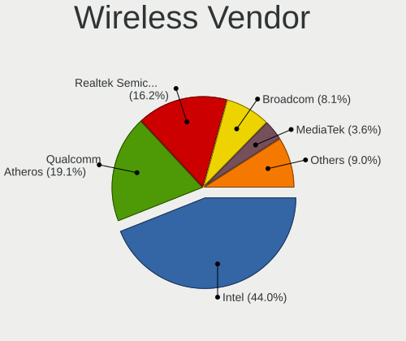

| Vendor                                | Notebooks | Percent |
|---------------------------------------|-----------|---------|
| Intel                                 | 3291      | 43.99%  |
| Qualcomm Atheros                      | 1427      | 19.07%  |
| Realtek Semiconductor                 | 1211      | 16.19%  |
| Broadcom                              | 605       | 8.09%   |
| MediaTek                              | 271       | 3.62%   |
| Broadcom Limited                      | 150       | 2.01%   |
| Ralink                                | 119       | 1.59%   |
| TP-Link                               | 99        | 1.32%   |
| Ralink Technology                     | 64        | 0.86%   |
| Sierra Wireless                       | 44        | 0.59%   |
| Qualcomm                              | 36        | 0.48%   |
| Dell                                  | 32        | 0.43%   |
| Fibocom                               | 19        | 0.25%   |
| Qualcomm Atheros Communications       | 17        | 0.23%   |
| D-Link                                | 16        | 0.21%   |
| Sitecom Europe                        | 11        | 0.15%   |
| D-Link System                         | 11        | 0.15%   |
| NetGear                               | 10        | 0.13%   |
| Microsoft                             | 8         | 0.11%   |
| Belkin Components                     | 7         | 0.09%   |
| ASUSTek Computer                      | 5         | 0.07%   |
| ZyDAS                                 | 4         | 0.05%   |
| Hewlett-Packard                       | 4         | 0.05%   |
| Realtek                               | 3         | 0.04%   |
| Mercucys                              | 3         | 0.04%   |
| Edimax Technology                     | 3         | 0.04%   |
| ZyXEL Communications                  | 2         | 0.03%   |
| U.S. Robotics                         | 2         | 0.03%   |
| Qcom                                  | 2         | 0.03%   |
| Qualcomm Technologies                 | 1         | 0.01%   |
| Micro Star International              | 1         | 0.01%   |
| Ericsson Business Mobile Networks     | 1         | 0.01%   |
| AVM                                   | 1         | 0.01%   |
| 802.11g Adapter [Linksys WUSB54GC v3] | 1         | 0.01%   |

Wireless Model
--------------

Wireless models

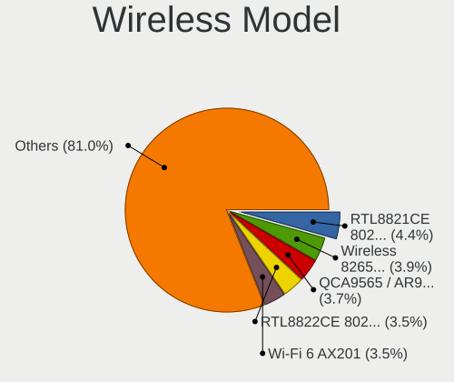

| Model                                                                   | Notebooks | Percent |
|-------------------------------------------------------------------------|-----------|---------|
| Realtek RTL8821CE 802.11ac PCIe Wireless Network Adapter                | 328       | 4.36%   |
| Intel Wireless 8265 / 8275                                              | 291       | 3.87%   |
| Qualcomm Atheros QCA9565 / AR9565 Wireless Network Adapter              | 275       | 3.66%   |
| Realtek RTL8822CE 802.11ac PCIe Wireless Network Adapter                | 266       | 3.54%   |
| Intel Wi-Fi 6 AX201                                                     | 266       | 3.54%   |
| Qualcomm Atheros AR9285 Wireless Network Adapter (PCI-Express)          | 261       | 3.47%   |
| Qualcomm Atheros QCA9377 802.11ac Wireless Network Adapter              | 248       | 3.3%    |
| Intel Wi-Fi 6 AX200                                                     | 224       | 2.98%   |
| Qualcomm Atheros AR9485 Wireless Network Adapter                        | 216       | 2.87%   |
| Intel Wireless 7265                                                     | 208       | 2.77%   |
| Intel Wireless 3165                                                     | 157       | 2.09%   |
| MediaTek MT7921 802.11ax PCIe Wireless Network Adapter [Filogic 330]    | 150       | 2%      |
| Intel Comet Lake PCH-LP CNVi WiFi                                       | 149       | 1.98%   |
| Intel Wireless 7260                                                     | 146       | 1.94%   |
| Realtek RTL8723BE PCIe Wireless Network Adapter                         | 140       | 1.86%   |
| Intel Wireless 8260                                                     | 130       | 1.73%   |
| Broadcom BCM4313 802.11bgn Wireless Network Adapter                     | 123       | 1.64%   |
| Qualcomm Atheros QCA6174 802.11ac Wireless Network Adapter              | 117       | 1.56%   |
| Intel PRO/Wireless 3945ABG [Golan] Network Connection                   | 117       | 1.56%   |
| Intel Cannon Point-LP CNVi [Wireless-AC]                                | 114       | 1.52%   |
| Broadcom BCM43142 802.11b/g/n                                           | 109       | 1.45%   |
| Intel WiFi Link 5100                                                    | 106       | 1.41%   |
| Intel Centrino Advanced-N 6205 [Taylor Peak]                            | 106       | 1.41%   |
| Intel Alder Lake-P PCH CNVi WiFi                                        | 101       | 1.34%   |
| Intel Cannon Lake PCH CNVi WiFi                                         | 98        | 1.3%    |
| Qualcomm Atheros AR242x / AR542x Wireless Network Adapter (PCI-Express) | 89        | 1.18%   |
| Qualcomm Atheros AR928X Wireless Network Adapter (PCI-Express)          | 86        | 1.14%   |
| Intel Raptor Lake PCH CNVi WiFi                                         | 84        | 1.12%   |
| Intel Comet Lake PCH CNVi WiFi                                          | 74        | 0.98%   |
| Intel Dual Band Wireless-AC 3168NGW [Stone Peak]                        | 72        | 0.96%   |
| Intel Wi-Fi 6E(802.11ax) AX210/AX1675* 2x2 [Typhoon Peak]               | 68        | 0.9%    |
| Intel Ice Lake-LP PCH CNVi WiFi                                         | 68        | 0.9%    |
| Broadcom BCM4312 802.11b/g LP-PHY                                       | 62        | 0.82%   |
| Realtek RTL8852AE 802.11ax PCIe Wireless Network Adapter                | 58        | 0.77%   |
| Qualcomm Atheros AR9462 Wireless Network Adapter                        | 58        | 0.77%   |
| Ralink RT3290 Wireless 802.11n 1T/1R PCIe                               | 56        | 0.74%   |
| MediaTek MT7922 802.11ax PCI Express Wireless Network Adapter           | 52        | 0.69%   |
| Intel Wireless 3160                                                     | 51        | 0.68%   |
| Broadcom Limited BCM4360 802.11ac Dual Band Wireless Network Adapter    | 51        | 0.68%   |
| Intel Centrino Advanced-N 6200                                          | 50        | 0.67%   |

Ethernet Vendor
---------------

Ethernet vendors

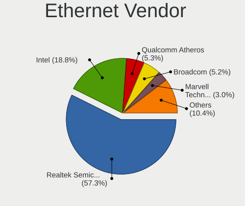

| Vendor                                 | Notebooks | Percent |
|----------------------------------------|-----------|---------|
| Realtek Semiconductor                  | 3440      | 57.33%  |
| Intel                                  | 1130      | 18.83%  |
| Qualcomm Atheros                       | 316       | 5.27%   |
| Broadcom                               | 310       | 5.17%   |
| Marvell Technology Group               | 181       | 3.02%   |
| ASIX Electronics                       | 74        | 1.23%   |
| Nvidia                                 | 64        | 1.07%   |
| Broadcom Limited                       | 59        | 0.98%   |
| Samsung Electronics                    | 57        | 0.95%   |
| Xiaomi                                 | 46        | 0.77%   |
| JMicron Technology                     | 31        | 0.52%   |
| OPPO Electronics                       | 27        | 0.45%   |
| MediaTek                               | 24        | 0.4%    |
| Huawei Technologies                    | 24        | 0.4%    |
| Attansic Technology                    | 23        | 0.38%   |
| Lenovo                                 | 22        | 0.37%   |
| TP-Link                                | 21        | 0.35%   |
| Silicon Integrated Systems [SiS]       | 21        | 0.35%   |
| DisplayLink                            | 19        | 0.32%   |
| Qualcomm                               | 14        | 0.23%   |
| Apple                                  | 11        | 0.18%   |
| Suzhou Motorcomm Electronic Technology | 10        | 0.17%   |
| Google                                 | 10        | 0.17%   |
| Motorola PCS                           | 9         | 0.15%   |
| ICS Advent                             | 8         | 0.13%   |
| Hewlett-Packard                        | 8         | 0.13%   |
| OnePlus Technology (Shenzhen)          | 7         | 0.12%   |
| T & A Mobile Phones                    | 5         | 0.08%   |
| HMD Global                             | 4         | 0.07%   |
| ZTE WCDMA Technologies MSM             | 3         | 0.05%   |
| VIA Technologies                       | 3         | 0.05%   |
| Spreadtrum Communications              | 3         | 0.05%   |
| Sony Ericsson Mobile Communications AB | 2         | 0.03%   |
| Motorcomm Microelectronics.            | 2         | 0.03%   |
| LG Electronics                         | 2         | 0.03%   |
| D-Link                                 | 2         | 0.03%   |
| Sitecom Europe                         | 1         | 0.02%   |
| Qualcomm Technologies                  | 1         | 0.02%   |
| MosChip Semiconductor                  | 1         | 0.02%   |
| Microchip Technology                   | 1         | 0.02%   |

Ethernet Model
--------------

Ethernet models

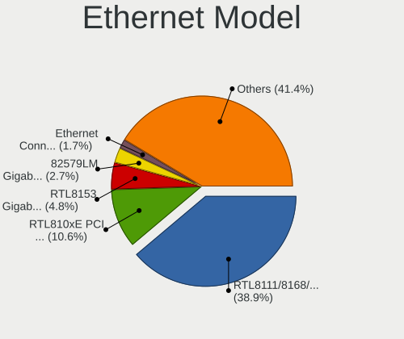

| Model                                                                          | Notebooks | Percent |
|--------------------------------------------------------------------------------|-----------|---------|
| Realtek RTL8111/8168/8211/8411 PCI Express Gigabit Ethernet Controller         | 2370      | 38.85%  |
| Realtek RTL810xE PCI Express Fast Ethernet controller                          | 648       | 10.62%  |
| Realtek RTL8153 Gigabit Ethernet Adapter                                       | 293       | 4.8%    |
| Intel 82579LM Gigabit Network Connection (Lewisville)                          | 164       | 2.69%   |
| Intel Ethernet Connection (4) I219-LM                                          | 101       | 1.66%   |
| ASIX AX88179 Gigabit Ethernet                                                  | 65        | 1.07%   |
| Broadcom NetLink BCM57785 Gigabit Ethernet PCIe                                | 64        | 1.05%   |
| Intel Ethernet Connection I219-LM                                              | 60        | 0.98%   |
| Intel Ethernet Connection I218-LM                                              | 54        | 0.89%   |
| Realtek RTL-8100/8101L/8139 PCI Fast Ethernet Adapter                          | 52        | 0.85%   |
| Intel Alder Lake-P PCH CNVi WiFi                                               | 52        | 0.85%   |
| Qualcomm Atheros AR8151 v2.0 Gigabit Ethernet                                  | 51        | 0.84%   |
| Intel Ethernet Connection (3) I218-LM                                          | 49        | 0.8%    |
| Intel 82577LM Gigabit Network Connection                                       | 48        | 0.79%   |
| Intel Ethernet Connection I217-LM                                              | 44        | 0.72%   |
| Intel Ethernet Connection (4) I219-V                                           | 44        | 0.72%   |
| Intel 82567LM Gigabit Network Connection                                       | 44        | 0.72%   |
| Broadcom NetLink BCM5787M Gigabit Ethernet PCI Express                         | 44        | 0.72%   |
| Samsung Galaxy series, misc. (tethering mode)                                  | 42        | 0.69%   |
| Qualcomm Atheros AR8131 Gigabit Ethernet                                       | 41        | 0.67%   |
| Qualcomm Atheros AR8132 Fast Ethernet                                          | 39        | 0.64%   |
| Nvidia MCP79 Ethernet                                                          | 39        | 0.64%   |
| Xiaomi Mi/Redmi series (RNDIS)                                                 | 37        | 0.61%   |
| Realtek RTL8125 2.5GbE Controller                                              | 37        | 0.61%   |
| Qualcomm Atheros QCA8171 Gigabit Ethernet                                      | 36        | 0.59%   |
| Marvell Group 88E8055 PCI-E Gigabit Ethernet Controller                        | 36        | 0.59%   |
| Intel Ethernet Connection I219-V                                               | 34        | 0.56%   |
| Intel Ethernet Connection (6) I219-LM                                          | 33        | 0.54%   |
| Broadcom NetXtreme BCM57765 Gigabit Ethernet PCIe                              | 33        | 0.54%   |
| Broadcom NetXtreme BCM5764M Gigabit Ethernet PCIe                              | 33        | 0.54%   |
| Realtek Killer E2600 GbE Controller                                            | 32        | 0.52%   |
| Marvell Group 88E8040 PCI-E Fast Ethernet Controller                           | 31        | 0.51%   |
| Broadcom NetLink BCM57780 Gigabit Ethernet PCIe                                | 31        | 0.51%   |
| Realtek RTL8152 Fast Ethernet Adapter                                          | 30        | 0.49%   |
| JMicron JMC250 PCI Express Gigabit Ethernet Controller                         | 30        | 0.49%   |
| Qualcomm Atheros AR8121/AR8113/AR8114 Gigabit or Fast Ethernet                 | 29        | 0.48%   |
| Broadcom NetLink BCM5784M Gigabit Ethernet PCIe                                | 26        | 0.43%   |
| Marvell Group Yukon Optima 88E8059 [PCIe Gigabit Ethernet Controller with AVB] | 25        | 0.41%   |
| Intel Ethernet Connection (6) I219-V                                           | 25        | 0.41%   |
| Intel Ethernet Connection (13) I219-V                                          | 25        | 0.41%   |

Net Controller Kind
-------------------

Ethernet, WiFi or modem

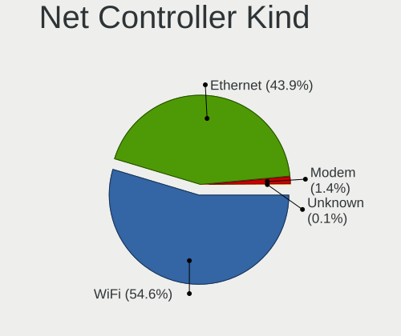

| Kind     | Notebooks | Percent |
|----------|-----------|---------|
| WiFi     | 7070      | 54.63%  |
| Ethernet | 5679      | 43.88%  |
| Modem    | 182       | 1.41%   |
| Unknown  | 11        | 0.08%   |

Used Controller
---------------

Currently used network controller

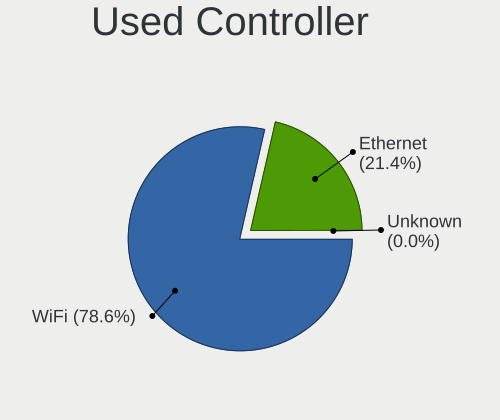

| Kind     | Notebooks | Percent |
|----------|-----------|---------|
| WiFi     | 5983      | 78.57%  |
| Ethernet | 1630      | 21.41%  |
| Modem    | 1         | 0.01%   |
| Unknown  | 1         | 0.01%   |

NICs
----

Total network controllers on board

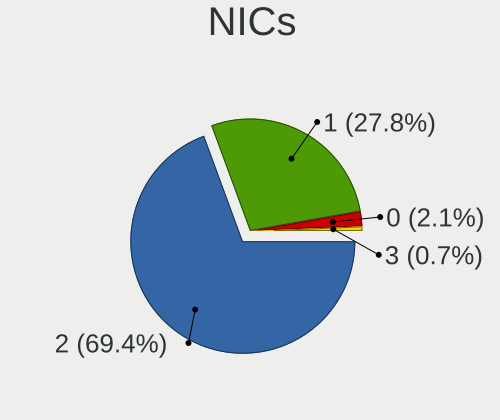

| Total | Notebooks | Percent |
|-------|-----------|---------|
| 2     | 5099      | 69.39%  |
| 1     | 2043      | 27.8%   |
| 0     | 157       | 2.14%   |
| 3     | 49        | 0.67%   |

IPv6
----

IPv6 vs IPv4

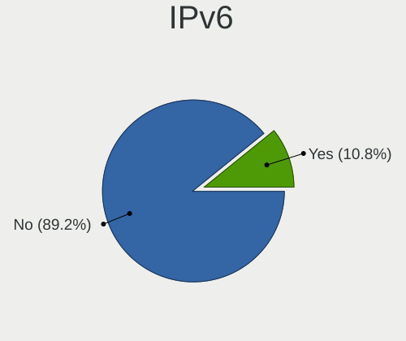

| Used | Notebooks | Percent |
|------|-----------|---------|
| No   | 6668      | 89.17%  |
| Yes  | 810       | 10.83%  |

Bluetooth
---------

Bluetooth Vendor
----------------

Controller vendors

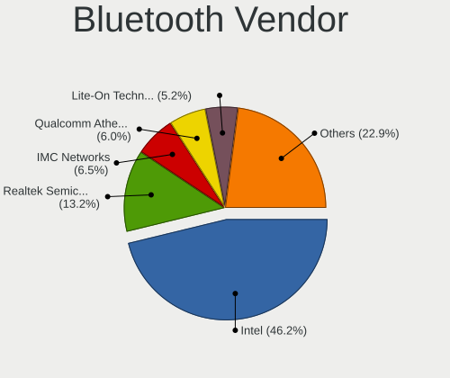

| Vendor                          | Notebooks | Percent |
|---------------------------------|-----------|---------|
| Intel                           | 2663      | 46.2%   |
| Realtek Semiconductor           | 759       | 13.17%  |
| IMC Networks                    | 377       | 6.54%   |
| Qualcomm Atheros Communications | 344       | 5.97%   |
| Lite-On Technology              | 299       | 5.19%   |
| Foxconn / Hon Hai               | 277       | 4.81%   |
| Broadcom                        | 256       | 4.44%   |
| Apple                           | 207       | 3.59%   |
| Realtek                         | 98        | 1.7%    |
| Hewlett-Packard                 | 95        | 1.65%   |
| Dell                            | 61        | 1.06%   |
| Cambridge Silicon Radio         | 57        | 0.99%   |
| Ralink                          | 56        | 0.97%   |
| Toshiba                         | 48        | 0.83%   |
| MediaTek                        | 36        | 0.62%   |
| ASUSTek Computer                | 25        | 0.43%   |
| Alps Electric                   | 25        | 0.43%   |
| USI                             | 19        | 0.33%   |
| Ralink Technology               | 11        | 0.19%   |
| Foxconn International           | 9         | 0.16%   |
| TP-Link                         | 8         | 0.14%   |
| Askey Computer                  | 6         | 0.1%    |
| Fujitsu                         | 5         | 0.09%   |
| Chicony Electronics             | 5         | 0.09%   |
| Taiyo Yuden                     | 4         | 0.07%   |
| Integrated System Solution      | 2         | 0.03%   |
| Actions                         | 2         | 0.03%   |
| Unknown                         | 1         | 0.02%   |
| SiW                             | 1         | 0.02%   |
| Sitecom Europe                  | 1         | 0.02%   |
| Opticis                         | 1         | 0.02%   |
| D-Link                          | 1         | 0.02%   |
| Corsair                         | 1         | 0.02%   |
| Conwise Technology              | 1         | 0.02%   |
| Belkin Components               | 1         | 0.02%   |
| AICSemi                         | 1         | 0.02%   |
| Unknown                         | 1         | 0.02%   |

Bluetooth Model
---------------

Controller models

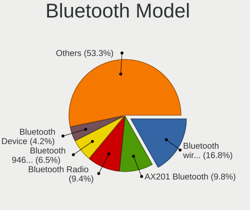

| Model                                                                               | Notebooks | Percent |
|-------------------------------------------------------------------------------------|-----------|---------|
| Intel Bluetooth wireless interface                                                  | 971       | 16.83%  |
| Intel AX201 Bluetooth                                                               | 564       | 9.78%   |
| Realtek Bluetooth Radio                                                             | 545       | 9.45%   |
| Intel Bluetooth 9460/9560 Jefferson Peak (JfP)                                      | 374       | 6.48%   |
| Intel Bluetooth Device                                                              | 241       | 4.18%   |
| Intel AX200 Bluetooth                                                               | 219       | 3.8%    |
| Realtek  Bluetooth 4.2 Adapter                                                      | 160       | 2.77%   |
| Qualcomm Atheros  Bluetooth Device                                                  | 136       | 2.36%   |
| Apple Bluetooth Host Controller                                                     | 113       | 1.96%   |
| IMC Networks Bluetooth Device                                                       | 111       | 1.92%   |
| IMC Networks Wireless_Device                                                        | 106       | 1.84%   |
| Realtek Bluetooth Radio                                                             | 98        | 1.7%    |
| IMC Networks Bluetooth Radio                                                        | 92        | 1.6%    |
| Lite-On Qualcomm Atheros QCA9377 Bluetooth                                          | 91        | 1.58%   |
| Intel Centrino Bluetooth Wireless Transceiver                                       | 80        | 1.39%   |
| Intel Wireless-AC 3168 Bluetooth                                                    | 71        | 1.23%   |
| Foxconn / Hon Hai Bluetooth Device                                                  | 71        | 1.23%   |
| Qualcomm Atheros QCA61x4 Bluetooth 4.0                                              | 70        | 1.21%   |
| Lite-On Bluetooth Device                                                            | 69        | 1.2%    |
| Qualcomm Atheros AR3012 Bluetooth 4.0                                               | 67        | 1.16%   |
| Intel AX210 Bluetooth                                                               | 64        | 1.11%   |
| Qualcomm Atheros AR3011 Bluetooth                                                   | 61        | 1.06%   |
| Lite-On Atheros AR3012 Bluetooth                                                    | 59        | 1.02%   |
| Apple Bluetooth USB Host Controller                                                 | 59        | 1.02%   |
| Cambridge Silicon Radio Bluetooth Dongle (HCI mode)                                 | 57        | 0.99%   |
| Ralink RT3290 Bluetooth                                                             | 56        | 0.97%   |
| Foxconn / Hon Hai MediaTek Bluetooth Adapter                                        | 51        | 0.88%   |
| HP Bluetooth 2.0 Interface [Broadcom BCM2045]                                       | 47        | 0.81%   |
| Intel Wireless-AC 9260 Bluetooth Adapter                                            | 45        | 0.78%   |
| HP Broadcom 2070 Bluetooth Combo                                                    | 44        | 0.76%   |
| Foxconn / Hon Hai Wireless_Device                                                   | 40        | 0.69%   |
| Lite-On Wireless_Device                                                             | 36        | 0.62%   |
| IMC Networks Atheros AR3012 Bluetooth 4.0 Adapter                                   | 34        | 0.59%   |
| Broadcom BCM43142A0 Bluetooth Device                                                | 33        | 0.57%   |
| Broadcom BCM2045 Bluetooth                                                          | 33        | 0.57%   |
| Foxconn / Hon Hai Foxconn T77H114 BCM2070 [Single-Chip Bluetooth 2.1 + EDR Adapter] | 32        | 0.55%   |
| MediaTek Wireless_Device                                                            | 31        | 0.54%   |
| Intel Centrino Advanced-N 6230 Bluetooth adapter                                    | 31        | 0.54%   |
| Lite-On Broadcom BCM43142A0 Bluetooth Device                                        | 29        | 0.5%    |
| Realtek RTL8723B Bluetooth                                                          | 26        | 0.45%   |

Sound
-----

Sound Vendor
------------

Sound card vendors

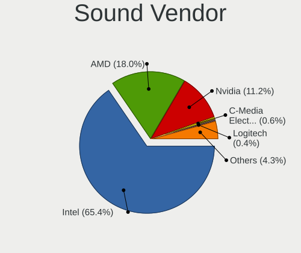

| Vendor                                       | Notebooks | Percent |
|----------------------------------------------|-----------|---------|
| Intel                                        | 5720      | 65.44%  |
| AMD                                          | 1573      | 18%     |
| Nvidia                                       | 980       | 11.21%  |
| C-Media Electronics                          | 53        | 0.61%   |
| Logitech                                     | 35        | 0.4%    |
| Silicon Integrated Systems [SiS]             | 32        | 0.37%   |
| GN Netcom                                    | 32        | 0.37%   |
| Realtek Semiconductor                        | 25        | 0.29%   |
| JMTek                                        | 25        | 0.29%   |
| Generalplus Technology                       | 16        | 0.18%   |
| Lenovo                                       | 15        | 0.17%   |
| Hewlett-Packard                              | 15        | 0.17%   |
| Texas Instruments                            | 13        | 0.15%   |
| Apple                                        | 12        | 0.14%   |
| CMX Systems                                  | 10        | 0.11%   |
| Focusrite-Novation                           | 9         | 0.1%    |
| Creative Technology                          | 9         | 0.1%    |
| Sony                                         | 8         | 0.09%   |
| VIA Technologies                             | 7         | 0.08%   |
| Plantronics                                  | 7         | 0.08%   |
| M-Audio                                      | 7         | 0.08%   |
| BEHRINGER International                      | 7         | 0.08%   |
| Razer USA                                    | 6         | 0.07%   |
| Jieli Technology                             | 6         | 0.07%   |
| Huawei Technologies                          | 5         | 0.06%   |
| Fujitsu                                      | 5         | 0.06%   |
| ASUSTek Computer                             | 5         | 0.06%   |
| Samson Technologies                          | 4         | 0.05%   |
| Medeli Electronics                           | 4         | 0.05%   |
| Zoran Co. Personal Media Division (Nogatech) | 3         | 0.03%   |
| Syntek                                       | 3         | 0.03%   |
| Micro Star International                     | 3         | 0.03%   |
| Framework                                    | 3         | 0.03%   |
| Dell                                         | 3         | 0.03%   |
| Walmart                                      | 2         | 0.02%   |
| Trust                                        | 2         | 0.02%   |
| SteelSeries ApS                              | 2         | 0.02%   |
| Sennheiser Communications                    | 2         | 0.02%   |
| RODE Microphones                             | 2         | 0.02%   |
| OnePlus Technology (Shenzhen)                | 2         | 0.02%   |

Sound Model
-----------

Sound card models

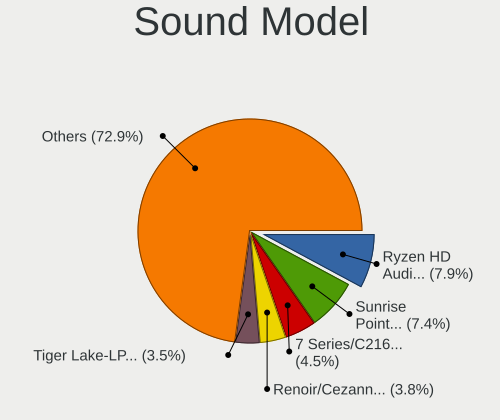

| Model                                                                                             | Notebooks | Percent |
|---------------------------------------------------------------------------------------------------|-----------|---------|
| AMD Ryzen HD Audio Controller                                                                     | 838       | 7.86%   |
| Intel Sunrise Point-LP HD Audio                                                                   | 791       | 7.42%   |
| Intel 7 Series/C216 Chipset Family High Definition Audio Controller                               | 483       | 4.53%   |
| AMD Renoir/Cezanne HDMI/DP Audio Controller                                                       | 406       | 3.81%   |
| Intel Tiger Lake-LP Smart Sound Technology Audio Controller                                       | 375       | 3.52%   |
| Intel 82801I (ICH9 Family) HD Audio Controller                                                    | 353       | 3.31%   |
| Intel 6 Series/C200 Series Chipset Family High Definition Audio Controller                        | 348       | 3.26%   |
| Intel Haswell-ULT HD Audio Controller                                                             | 296       | 2.78%   |
| Intel 8 Series HD Audio Controller                                                                | 295       | 2.77%   |
| Intel 5 Series/3400 Series Chipset High Definition Audio                                          | 283       | 2.65%   |
| Intel Broadwell-U Audio Controller                                                                | 228       | 2.14%   |
| AMD Raven/Raven2/Fenghuang HDMI/DP Audio Controller                                               | 228       | 2.14%   |
| AMD FCH Azalia Controller                                                                         | 224       | 2.1%    |
| Intel Wildcat Point-LP High Definition Audio Controller                                           | 223       | 2.09%   |
| Intel Alder Lake PCH-P High Definition Audio Controller                                           | 219       | 2.05%   |
| Intel 8 Series/C220 Series Chipset High Definition Audio Controller                               | 211       | 1.98%   |
| Intel Comet Lake PCH-LP cAVS                                                                      | 197       | 1.85%   |
| AMD Kabini HDMI/DP Audio                                                                          | 196       | 1.84%   |
| Intel NM10/ICH7 Family High Definition Audio Controller                                           | 193       | 1.81%   |
| Intel Cannon Lake PCH cAVS                                                                        | 193       | 1.81%   |
| Intel Cannon Point-LP High Definition Audio Controller                                            | 191       | 1.79%   |
| Intel 82801H (ICH8 Family) HD Audio Controller                                                    | 185       | 1.73%   |
| Intel Celeron/Pentium Silver Processor High Definition Audio                                      | 167       | 1.57%   |
| AMD Radeon High Definition Audio Controller                                                       | 167       | 1.57%   |
| Intel Xeon E3-1200 v3/4th Gen Core Processor HD Audio Controller                                  | 165       | 1.55%   |
| AMD Family 15h (Models 60h-6fh) Audio Controller                                                  | 143       | 1.34%   |
| Intel Raptor Lake-P/U/H cAVS                                                                      | 132       | 1.24%   |
| Intel Ice Lake-LP Smart Sound Technology Audio Controller                                         | 120       | 1.13%   |
| Nvidia GF108 High Definition Audio Controller                                                     | 111       | 1.04%   |
| Intel CM238 HD Audio Controller                                                                   | 97        | 0.91%   |
| Intel Comet Lake PCH cAVS                                                                         | 93        | 0.87%   |
| AMD High Definition Audio Controller                                                              | 92        | 0.86%   |
| Intel Atom/Celeron/Pentium Processor x5-E8000/J3xxx/N3xxx Series High Definition Audio Controller | 86        | 0.81%   |
| Intel 100 Series/C230 Series Chipset Family HD Audio Controller                                   | 81        | 0.76%   |
| AMD SBx00 Azalia (Intel HDA)                                                                      | 80        | 0.75%   |
| Intel Atom Processor Z36xxx/Z37xxx Series High Definition Audio Controller                        | 74        | 0.69%   |
| Nvidia TU107 GeForce GTX 1650 High Definition Audio Controller                                    | 71        | 0.67%   |
| Intel Celeron N3350/Pentium N4200/Atom E3900 Series Audio Cluster                                 | 71        | 0.67%   |
| Nvidia GA106 High Definition Audio Controller                                                     | 64        | 0.6%    |
| AMD Cedar HDMI Audio [Radeon HD 5400/6300/7300 Series]                                            | 60        | 0.56%   |

Memory
------

Memory Vendor
-------------

Memory module vendors

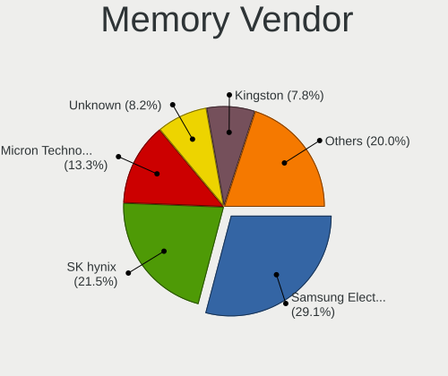

| Vendor                                  | Notebooks | Percent |
|-----------------------------------------|-----------|---------|
| Samsung Electronics                     | 1569      | 29.08%  |
| SK hynix                                | 1162      | 21.54%  |
| Micron Technology                       | 719       | 13.33%  |
| Unknown                                 | 445       | 8.25%   |
| Kingston                                | 421       | 7.8%    |
| Crucial                                 | 257       | 4.76%   |
| Elpida                                  | 128       | 2.37%   |
| Ramaxel Technology                      | 111       | 2.06%   |
| Unknown (ABCD)                          | 100       | 1.85%   |
| A-DATA Technology                       | 76        | 1.41%   |
| Corsair                                 | 74        | 1.37%   |
| Unknown                                 | 69        | 1.28%   |
| Nanya Technology                        | 58        | 1.08%   |
| Transcend                               | 22        | 0.41%   |
| Team                                    | 22        | 0.41%   |
| Timetec                                 | 18        | 0.33%   |
| ASint Technology                        | 12        | 0.22%   |
| Lexar                                   | 11        | 0.2%    |
| Patriot                                 | 9         | 0.17%   |
| 48spaces                                | 9         | 0.17%   |
| G.Skill                                 | 8         | 0.15%   |
| Silicon Power                           | 7         | 0.13%   |
| Qimonda                                 | 7         | 0.13%   |
| Apacer                                  | 7         | 0.13%   |
| Toshiba                                 | 6         | 0.11%   |
| Lexar Co Limited                        | 4         | 0.07%   |
| Teclast                                 | 3         | 0.06%   |
| Silicon Power Computer & Communications | 3         | 0.06%   |
| Infineon                                | 3         | 0.06%   |
| ChangXin Memory                         | 3         | 0.06%   |
| 4ea5                                    | 3         | 0.06%   |
| Unknown (0x0EB9)                        | 2         | 0.04%   |
| Smart                                   | 2         | 0.04%   |
| SHARETRONIC                             | 2         | 0.04%   |
| Hikvision                               | 2         | 0.04%   |
| Heoriady                                | 2         | 0.04%   |
| ff                                      | 2         | 0.04%   |
| Essencore Limited                       | 2         | 0.04%   |
| CSX                                     | 2         | 0.04%   |
| Wilk                                    | 1         | 0.02%   |

Memory Model
------------

Memory module models

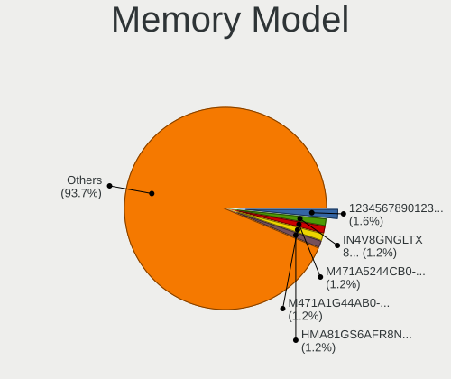

| Model                                                            | Notebooks | Percent |
|------------------------------------------------------------------|-----------|---------|
| Unknown (ABCD) RAM 123456789012345678 2GB SODIMM LPDDR4 2400MT/s | 90        | 1.58%   |
| Unknown                                                          | 69        | 1.21%   |
| Samsung RAM M471A5244CB0-CTD 4GB SODIMM DDR4 3266MT/s            | 68        | 1.2%    |
| Samsung RAM M471A1G44AB0-CWE 8GiB SODIMM DDR4 3200MT/s           | 68        | 1.2%    |
| SK hynix RAM HMA81GS6AFR8N-UH 8GB SODIMM DDR4 2667MT/s           | 66        | 1.16%   |
| SK hynix RAM HMT451S6BFR8A-PB 4GB SODIMM DDR3 1600MT/s           | 54        | 0.95%   |
| Samsung RAM M471B5173EB0-YK0 4GB SODIMM DDR3 1600MT/s            | 51        | 0.9%    |
| Samsung RAM M471A1K43CB1-CRC 8GB SODIMM DDR4 8400MT/s            | 51        | 0.9%    |
| Samsung RAM M471B5173QH0-YK0 4GB SODIMM DDR3 1600MT/s            | 50        | 0.88%   |
| Samsung RAM M471A1K43EB1-CWE 8GB SODIMM DDR4 3200MT/s            | 48        | 0.84%   |
| Unknown RAM Module 2GB SODIMM DDR2 667MT/s                       | 45        | 0.79%   |
| Micron RAM 4ATF51264HZ-2G6E1 4GB SODIMM DDR4 2667MT/s            | 43        | 0.76%   |
| SK hynix RAM HMAA1GS6CJR6N-XN 8GB SODIMM DDR4 3200MT/s           | 42        | 0.74%   |
| SK hynix RAM HMA81GS6DJR8N-XN 8GB SODIMM DDR4 3200MT/s           | 42        | 0.74%   |
| Samsung RAM M471B1G73DB0-YK0 8GB SODIMM DDR3 1600MT/s            | 42        | 0.74%   |
| Samsung RAM M471B5173DB0-YK0 4GB SODIMM DDR3 1600MT/s            | 41        | 0.72%   |
| Samsung RAM M471A5244CB0-CWE 4GB SODIMM DDR4 3200MT/s            | 40        | 0.7%    |
| Samsung RAM M471A1K43CB1-CTD 8GB SODIMM DDR4 3200MT/s            | 40        | 0.7%    |
| Samsung RAM M471B5273DH0-CH9 4GB SODIMM DDR3 1600MT/s            | 39        | 0.69%   |
| Samsung RAM M471A1K43DB1-CWE 8GB SODIMM DDR4 3200MT/s            | 35        | 0.62%   |
| Samsung RAM M471A1K43BB1-CRC 8GB SODIMM DDR4 2667MT/s            | 35        | 0.62%   |
| Samsung RAM M471A1G44AB0-CWE 8GB Row Of Chips DDR4 3200MT/s      | 35        | 0.62%   |
| Samsung RAM M471A5244CB0-CRC 4GB SODIMM DDR4 2667MT/s            | 33        | 0.58%   |
| SK hynix RAM HMA851S6AFR6N-UH 4GB SODIMM DDR4 2667MT/s           | 31        | 0.55%   |
| Samsung RAM M471B1G73QH0-YK0 8GB SODIMM DDR3 1600MT/s            | 31        | 0.55%   |
| Unknown RAM Module 2GB SODIMM DDR3 1066MT/s                      | 29        | 0.51%   |
| Samsung RAM M471A2K43DB1-CWE 16GB SODIMM DDR4 3200MT/s           | 29        | 0.51%   |
| Samsung RAM M471A2K43CB1-CRC 16GB SODIMM DDR4 2667MT/s           | 29        | 0.51%   |
| Samsung RAM M471A5244CB0-CTD 4GB Row Of Chips DDR4 2667MT/s      | 28        | 0.49%   |
| Samsung RAM M471A1K43DB1-CTD 8GB SODIMM DDR4 2667MT/s            | 28        | 0.49%   |
| Micron RAM 8ATF1G64HZ-3G2R1 8GB SODIMM DDR4 3200MT/s             | 28        | 0.49%   |
| Unknown RAM Module 4GB SODIMM DDR3                               | 27        | 0.47%   |
| SK hynix RAM HMT351S6BFR8C-H9 4GB SODIMM DDR3 1333MT/s           | 27        | 0.47%   |
| Samsung RAM M471B5273CH0-CH9 4GB SODIMM DDR3 1334MT/s            | 27        | 0.47%   |
| Samsung RAM M471A1K43BB0-CPB 8GiB SODIMM DDR4 2133MT/s           | 27        | 0.47%   |
| Micron RAM 4ATF1G64HZ-3G2E1 8GB SODIMM DDR4 3200MT/s             | 26        | 0.46%   |
| SK hynix RAM HMA81GS6JJR8N-VK 8GB SODIMM DDR4 2667MT/s           | 25        | 0.44%   |
| Samsung RAM M471A2K43CB1-CTD 16GB SODIMM DDR4 8400MT/s           | 25        | 0.44%   |
| SK hynix RAM HMT41GS6BFR8A-PB 8GB SODIMM DDR3 2667MT/s           | 24        | 0.42%   |
| SK hynix RAM HMA851S6CJR6N-VK 4GB SODIMM DDR4 2667MT/s           | 24        | 0.42%   |

Memory Kind
-----------

Memory module kinds

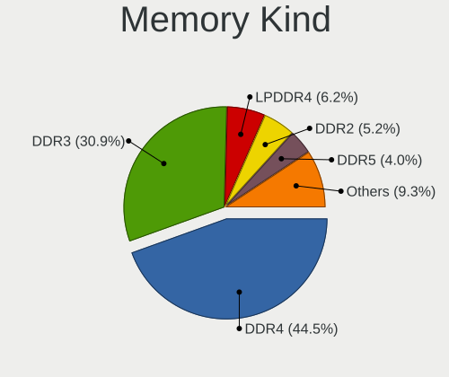

| Kind    | Notebooks | Percent |
|---------|-----------|---------|
| DDR4    | 2061      | 44.5%   |
| DDR3    | 1431      | 30.9%   |
| LPDDR4  | 285       | 6.15%   |
| DDR2    | 241       | 5.2%    |
| DDR5    | 183       | 3.95%   |
| LPDDR5  | 156       | 3.37%   |
| LPDDR3  | 112       | 2.42%   |
| SDRAM   | 99        | 2.14%   |
| Unknown | 33        | 0.71%   |
| DRAM    | 17        | 0.37%   |
| DDR     | 13        | 0.28%   |

Memory Form Factor
------------------

Physical design of the memory module

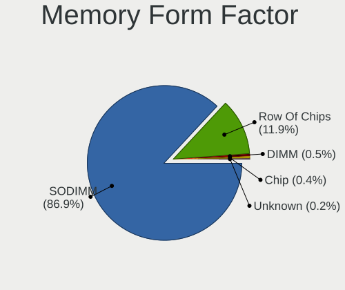

| Name         | Notebooks | Percent |
|--------------|-----------|---------|
| SODIMM       | 4055      | 86.94%  |
| Row Of Chips | 555       | 11.9%   |
| DIMM         | 23        | 0.49%   |
| Chip         | 20        | 0.43%   |
| Unknown      | 11        | 0.24%   |

Memory Size
-----------

Memory module size

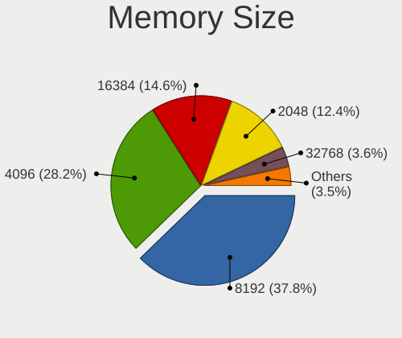

| Size  | Notebooks | Percent |
|-------|-----------|---------|
| 8192  | 1922      | 37.77%  |
| 4096  | 1435      | 28.2%   |
| 16384 | 741       | 14.56%  |
| 2048  | 631       | 12.4%   |
| 32768 | 184       | 3.62%   |
| 1024  | 139       | 2.73%   |
| 512   | 21        | 0.41%   |
| 49152 | 5         | 0.1%    |
| 6144  | 3         | 0.06%   |
| 3072  | 3         | 0.06%   |
| 256   | 3         | 0.06%   |
| 12288 | 2         | 0.04%   |

Memory Speed
------------

Memory module speed

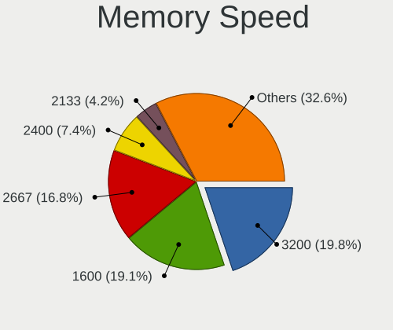

| Speed   | Notebooks | Percent |
|---------|-----------|---------|
| 3200    | 992       | 19.84%  |
| 1600    | 955       | 19.1%   |
| 2667    | 842       | 16.84%  |
| 2400    | 369       | 7.38%   |
| 2133    | 212       | 4.24%   |
| 1334    | 160       | 3.2%    |
| 1333    | 157       | 3.14%   |
| 667     | 144       | 2.88%   |
| Unknown | 125       | 2.5%    |
| 4267    | 112       | 2.24%   |
| 5600    | 111       | 2.22%   |
| 6400    | 87        | 1.74%   |
| 8400    | 77        | 1.54%   |
| 4800    | 74        | 1.48%   |
| 1067    | 73        | 1.46%   |
| 3266    | 68        | 1.36%   |
| 1066    | 68        | 1.36%   |
| 800     | 66        | 1.32%   |
| 1867    | 53        | 1.06%   |
| 4199    | 42        | 0.84%   |
| 2048    | 31        | 0.62%   |
| 7500    | 28        | 0.56%   |
| 533     | 24        | 0.48%   |
| 8533    | 23        | 0.46%   |
| 4266    | 18        | 0.36%   |
| 975     | 15        | 0.3%    |
| 3733    | 11        | 0.22%   |
| 7467    | 10        | 0.2%    |
| 2933    | 9         | 0.18%   |
| 1639    | 7         | 0.14%   |
| 333     | 6         | 0.12%   |
| 400     | 3         | 0.06%   |
| 7400    | 2         | 0.04%   |
| 5500    | 2         | 0.04%   |
| 5200    | 2         | 0.04%   |
| 3600    | 2         | 0.04%   |
| 3000    | 2         | 0.04%   |
| 2800    | 2         | 0.04%   |
| 2267    | 2         | 0.04%   |
| 1866    | 2         | 0.04%   |

Printers & scanners
-------------------

Printer Vendor
--------------

Printer device vendors

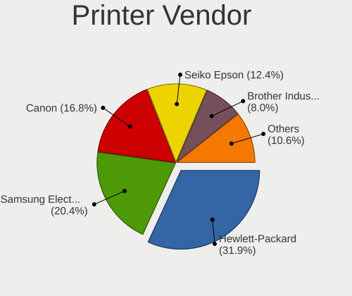

| Vendor                             | Notebooks | Percent |
|------------------------------------|-----------|---------|
| Hewlett-Packard                    | 36        | 31.86%  |
| Samsung Electronics                | 23        | 20.35%  |
| Canon                              | 19        | 16.81%  |
| Seiko Epson                        | 14        | 12.39%  |
| Brother Industries                 | 9         | 7.96%   |
| Ricoh                              | 2         | 1.77%   |
| Pantum                             | 2         | 1.77%   |
| Lexmark International              | 2         | 1.77%   |
| Xerox                              | 1         | 0.88%   |
| Sagem                              | 1         | 0.88%   |
| Panasonic (Matsushita)             | 1         | 0.88%   |
| Omnidirectional Control Technology | 1         | 0.88%   |
| ICS Advent                         | 1         | 0.88%   |
| Apple                              | 1         | 0.88%   |

Printer Model
-------------

Printer device models

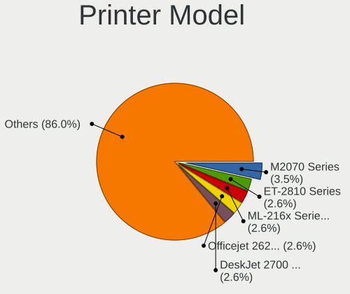

| Model                                       | Notebooks | Percent |
|---------------------------------------------|-----------|---------|
| Samsung M2070 Series                        | 4         | 3.51%   |
| Seiko Epson ET-2810 Series                  | 3         | 2.63%   |
| Samsung ML-216x Series Laser Printer        | 3         | 2.63%   |
| HP Officejet 2620 series                    | 3         | 2.63%   |
| HP DeskJet 2700 series                      | 3         | 2.63%   |
| Seiko Epson WF-2930 Series                  | 2         | 1.75%   |
| Seiko Epson Printer                         | 2         | 1.75%   |
| Seiko Epson ET-2850 Series                  | 2         | 1.75%   |
| Samsung SCX-4623 Series                     | 2         | 1.75%   |
| Samsung M267x 287x Series                   | 2         | 1.75%   |
| HP OfficeJet 3830 series                    | 2         | 1.75%   |
| HP LaserJet P1102                           | 2         | 1.75%   |
| HP LaserJet P1005                           | 2         | 1.75%   |
| HP LaserJet 1020                            | 2         | 1.75%   |
| Canon PIXMA MG2500 Series                   | 2         | 1.75%   |
| Xerox B215                                  | 1         | 0.88%   |
| Seiko Epson XP-2100 Series                  | 1         | 0.88%   |
| Seiko Epson L355 Series                     | 1         | 0.88%   |
| Seiko Epson EPSON XP-205 207 Series         | 1         | 0.88%   |
| Seiko Epson EPSON WF-2510 Series            | 1         | 0.88%   |
| Seiko Epson AcuLaser CX21                   | 1         | 0.88%   |
| Samsung SCX-483x 5x3x Series                | 1         | 0.88%   |
| Samsung SCX-4300 Series                     | 1         | 0.88%   |
| Samsung SCX-4216F Scanner                   | 1         | 0.88%   |
| Samsung ML-331x Series Laser Printer        | 1         | 0.88%   |
| Samsung ML-2010P Mono Laser Printer         | 1         | 0.88%   |
| Samsung ML-1865W Series                     | 1         | 0.88%   |
| Samsung ML-1640 Series Laser Printer        | 1         | 0.88%   |
| Samsung M2020 Series                        | 1         | 0.88%   |
| Samsung Composite Device                    | 1         | 0.88%   |
| Samsung CLP-325 Color Laser Printer         | 1         | 0.88%   |
| Samsung C43x Series                         | 1         | 0.88%   |
| Samsung C3060 Series                        | 1         | 0.88%   |
| Sagem Laser Pro LL                          | 1         | 0.88%   |
| Ricoh SP 204SF                              | 1         | 0.88%   |
| Ricoh SP 150SUw                             | 1         | 0.88%   |
| Pantum P2500W series                        | 1         | 0.88%   |
| Pantum M6500W series                        | 1         | 0.88%   |
| Panasonic (Matsushita) KX-MB2545JT_B        | 1         | 0.88%   |
| Omnidirectional Control USB-Parallel Bridge | 1         | 0.88%   |

Scanner Vendor
--------------

Scanner device vendors

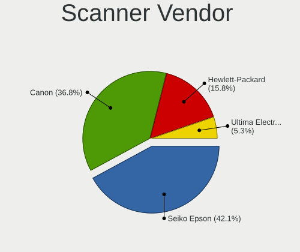

| Vendor             | Notebooks | Percent |
|--------------------|-----------|---------|
| Seiko Epson        | 8         | 42.11%  |
| Canon              | 7         | 36.84%  |
| Hewlett-Packard    | 3         | 15.79%  |
| Ultima Electronics | 1         | 5.26%   |

Scanner Model
-------------

Scanner device models

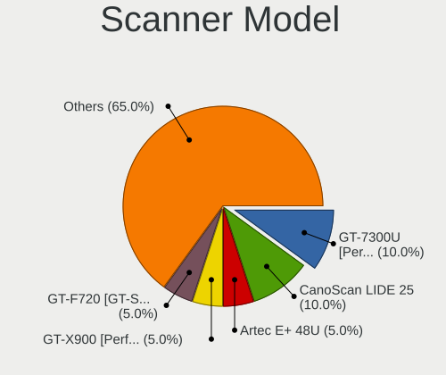

| Model                                                    | Notebooks | Percent |
|----------------------------------------------------------|-----------|---------|
| Seiko Epson GT-7300U [Perfection 1260/1260 PHOTO]        | 2         | 10%     |
| Canon CanoScan LIDE 25                                   | 2         | 10%     |
| Ultima Artec E+ 48U                                      | 1         | 5%      |
| Seiko Epson GT-X900 [Perfection V700/V750 Photo]         | 1         | 5%      |
| Seiko Epson GT-F720 [GT-S620/Perfection V30/V300 Photo]  | 1         | 5%      |
| Seiko Epson GT-F520/GT-F570 [Perfection 3590 PHOTO]      | 1         | 5%      |
| Seiko Epson GT-F500/GT-F550 [Perfection 2480/2580 PHOTO] | 1         | 5%      |
| Seiko Epson ES-D400 [GT-S80]                             | 1         | 5%      |
| Seiko Epson CC-570L [Stylus CX3100/CX3200]               | 1         | 5%      |
| HP Scanjet G2710                                         | 1         | 5%      |
| HP ScanJet 3570c                                         | 1         | 5%      |
| HP ScanJet 2200c                                         | 1         | 5%      |
| Canon CanoScan LiDE 220                                  | 1         | 5%      |
| Canon CanoScan LiDE 120                                  | 1         | 5%      |
| Canon CanoScan LiDE 110                                  | 1         | 5%      |
| Canon CanoScan LiDE 100                                  | 1         | 5%      |
| Canon CanoScan 4400F                                     | 1         | 5%      |
| Canon CanoScan 1220U                                     | 1         | 5%      |

Camera
------

Camera Vendor
-------------

Camera device vendors

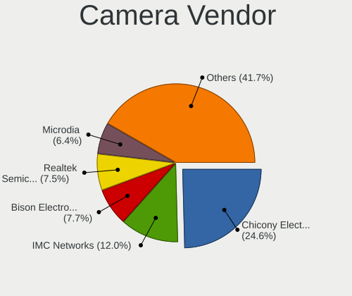

| Vendor                                 | Notebooks | Percent |
|----------------------------------------|-----------|---------|
| Chicony Electronics                    | 1634      | 24.59%  |
| IMC Networks                           | 800       | 12.04%  |
| Bison Electronics                      | 513       | 7.72%   |
| Realtek Semiconductor                  | 498       | 7.49%   |
| Microdia                               | 428       | 6.44%   |
| Quanta                                 | 400       | 6.02%   |
| Cheng Uei Precision Industry (Foxlink) | 284       | 4.27%   |
| Suyin                                  | 281       | 4.23%   |
| Sunplus Innovation Technology          | 269       | 4.05%   |
| Luxvisions Innotech Limited            | 198       | 2.98%   |
| Syntek                                 | 188       | 2.83%   |
| Apple                                  | 162       | 2.44%   |
| Alcor Micro                            | 153       | 2.3%    |
| Lite-On Technology                     | 151       | 2.27%   |
| Silicon Motion                         | 76        | 1.14%   |
| Ricoh                                  | 71        | 1.07%   |
| Logitech                               | 60        | 0.9%    |
| Sonix Technology                       | 40        | 0.6%    |
| ShineTech                              | 33        | 0.5%    |
| Z-Star Microelectronics                | 28        | 0.42%   |
| Acer                                   | 28        | 0.42%   |
| icSpring                               | 26        | 0.39%   |
| Samsung Electronics                    | 24        | 0.36%   |
| Primax Electronics                     | 22        | 0.33%   |
| ALi                                    | 22        | 0.33%   |
| SunplusIT                              | 21        | 0.32%   |
| kingcome                               | 21        | 0.32%   |
| Importek                               | 17        | 0.26%   |
| Sunplus Technology                     | 13        | 0.2%    |
| Lenovo                                 | 13        | 0.2%    |
| DigiTech                               | 12        | 0.18%   |
| BillionPixels                          | 11        | 0.17%   |
| Microsoft                              | 8         | 0.12%   |
| Genesys Logic                          | 8         | 0.12%   |
| Generalplus Technology                 | 8         | 0.12%   |
| Jiangxi Shinetech Optical              | 7         | 0.11%   |
| ARC International                      | 7         | 0.11%   |
| OYT Tech                               | 6         | 0.09%   |
| GEMBIRD                                | 6         | 0.09%   |
| Shine-optics                           | 5         | 0.08%   |

Camera Model
------------

Camera device models

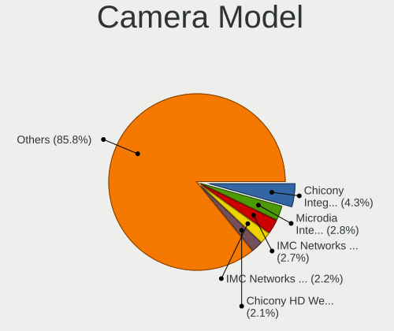

| Model                                                   | Notebooks | Percent |
|---------------------------------------------------------|-----------|---------|
| Chicony Integrated Camera                               | 290       | 4.34%   |
| Microdia Integrated_Webcam_HD                           | 184       | 2.76%   |
| IMC Networks USB2.0 HD UVC WebCam                       | 182       | 2.73%   |
| IMC Networks Integrated Camera                          | 147       | 2.2%    |
| Chicony HD WebCam                                       | 143       | 2.14%   |
| Bison Integrated Camera                                 | 124       | 1.86%   |
| Syntek Integrated Camera                                | 113       | 1.69%   |
| Realtek Integrated_Webcam_HD                            | 110       | 1.65%   |
| IMC Networks USB2.0 VGA UVC WebCam                      | 101       | 1.51%   |
| Realtek USB Camera                                      | 76        | 1.14%   |
| Luxvisions Innotech Limited HP TrueVision HD Camera     | 74        | 1.11%   |
| Chicony USB2.0 VGA UVC WebCam                           | 74        | 1.11%   |
| Alcor Micro USB 2.0 Camera                              | 73        | 1.09%   |
| Chicony USB2.0 HD UVC WebCam                            | 70        | 1.05%   |
| Chicony HP Truevision HD                                | 68        | 1.02%   |
| IMC Networks HD Camera                                  | 64        | 0.96%   |
| Chicony HP TrueVision HD Camera                         | 64        | 0.96%   |
| Sunplus Integrated_Webcam_HD                            | 62        | 0.93%   |
| Bison HD Webcam                                         | 62        | 0.93%   |
| Quanta HD User Facing                                   | 61        | 0.91%   |
| Quanta HP TrueVision HD Camera                          | 59        | 0.88%   |
| Apple Built-in iSight                                   | 55        | 0.82%   |
| Apple iPhone 5/5C/5S/6/SE/7/8/X                         | 53        | 0.79%   |
| Bison Lenovo EasyCamera                                 | 51        | 0.76%   |
| Chicony FJ Camera                                       | 48        | 0.72%   |
| Chicony HP Webcam                                       | 47        | 0.7%    |
| Sunplus HD WebCam                                       | 46        | 0.69%   |
| Cheng Uei Precision Industry (Foxlink) HP TrueVision HD | 45        | 0.67%   |
| Realtek USB2.0 VGA UVC WebCam                           | 44        | 0.66%   |
| Lite-On Integrated Camera                               | 43        | 0.64%   |
| Chicony HP HD Camera                                    | 43        | 0.64%   |
| Suyin Acer/HP Integrated Webcam [CN0314]                | 42        | 0.63%   |
| Quanta HP Webcam                                        | 42        | 0.63%   |
| Lite-On HP HD Camera                                    | 41        | 0.61%   |
| Bison SunplusIT Integrated Camera                       | 41        | 0.61%   |
| IMC Networks ov9734_azurewave_camera                    | 40        | 0.6%    |
| Chicony HP Wide Vision HD Camera                        | 39        | 0.58%   |
| Chicony HD User Facing                                  | 39        | 0.58%   |
| Quanta HP HD Camera                                     | 38        | 0.57%   |
| Suyin HP Truevision HD                                  | 37        | 0.55%   |

Security
--------

Fingerprint Vendor
------------------

Fingerprint sensor vendors

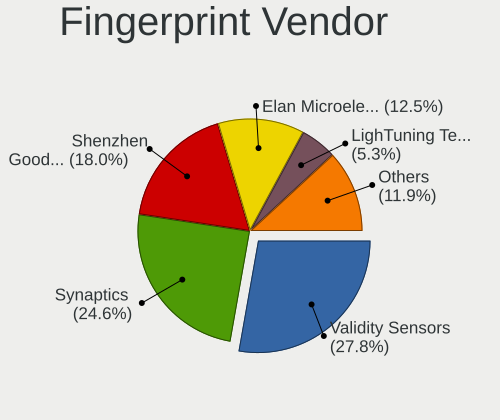

| Vendor                             | Notebooks | Percent |
|------------------------------------|-----------|---------|
| Validity Sensors                   | 349       | 27.79%  |
| Synaptics                          | 309       | 24.6%   |
| Shenzhen Goodix Technology         | 226       | 17.99%  |
| Elan Microelectronics              | 157       | 12.5%   |
| LighTuning Technology              | 66        | 5.25%   |
| AuthenTec                          | 63        | 5.02%   |
| Upek                               | 55        | 4.38%   |
| STMicroelectronics                 | 11        | 0.88%   |
| HOLTEK                             | 8         | 0.64%   |
| Focal-systems.Corp                 | 7         | 0.56%   |
| Realtek USB2.0 Finger Print Bridge | 4         | 0.32%   |
| Microsoft                          | 1         | 0.08%   |

Fingerprint Model
-----------------

Fingerprint sensor models

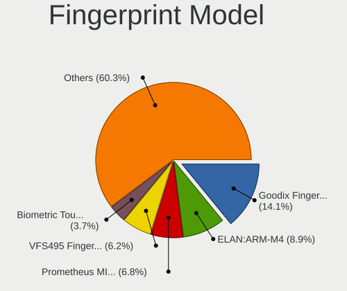

| Model                                                                      | Notebooks | Percent |
|----------------------------------------------------------------------------|-----------|---------|
| Shenzhen Goodix  Fingerprint Device                                        | 177       | 14.09%  |
| Elan ELAN:ARM-M4                                                           | 112       | 8.92%   |
| Synaptics Prometheus MIS Touch Fingerprint Reader                          | 85        | 6.77%   |
| Validity Sensors VFS495 Fingerprint Reader                                 | 78        | 6.21%   |
| Upek Biometric Touchchip/Touchstrip Fingerprint Sensor                     | 47        | 3.74%   |
| Elan ELAN:Fingerprint                                                      | 45        | 3.58%   |
| Synaptics Metallica MIS Touch Fingerprint Reader                           | 44        | 3.5%    |
| LighTuning EgisTec Touch Fingerprint Sensor                                | 42        | 3.34%   |
| Synaptics WBDI Fingerprint Reader USB 086                                  | 35        | 2.79%   |
| Validity Sensors VFS 5011 fingerprint sensor                               | 34        | 2.71%   |
| Validity Sensors Swipe Fingerprint Sensor                                  | 34        | 2.71%   |
| Synaptics UWP WBDI Device                                                  | 30        | 2.39%   |
| Validity Sensors VFS5011 Fingerprint Reader                                | 29        | 2.31%   |
| Shenzhen Goodix Fingerprint Reader                                         | 28        | 2.23%   |
| Validity Sensors Fingerprint scanner                                       | 24        | 1.91%   |
| Validity Sensors VFS451 Fingerprint Reader                                 | 23        | 1.83%   |
| AuthenTec AES2501 Fingerprint Sensor                                       | 23        | 1.83%   |
| Validity Sensors Synaptics WBDI                                            | 22        | 1.75%   |
| Validity Sensors Synaptics VFS7552 Touch Fingerprint Sensor with PurePrint | 21        | 1.67%   |
| Synaptics  FS7604 Touch Fingerprint Sensor with PurePrint                  | 21        | 1.67%   |
| Shenzhen Goodix FingerPrint                                                | 21        | 1.67%   |
| Validity Sensors VFS471 Fingerprint Reader                                 | 20        | 1.59%   |
| Synaptics FS7604 Touch Fingerprint Sensor with PurePrint                   | 20        | 1.59%   |
| Synaptics Prometheus Fingerprint Reader                                    | 17        | 1.35%   |
| Validity Sensors VFS491                                                    | 16        | 1.27%   |
| Validity Sensors VFS Fingerprint sensor                                    | 15        | 1.19%   |
| Synaptics Fingerprint reader [HP G6]                                       | 13        | 1.04%   |
| LighTuning ES603 Swipe Fingerprint Sensor                                  | 13        | 1.04%   |
| AuthenTec AES1600                                                          | 13        | 1.04%   |
| Unknown                                                                    | 12        | 0.96%   |
| Validity Sensors VFS101 Fingerprint Reader                                 | 11        | 0.88%   |
| STMicroelectronics Fingerprint Reader                                      | 11        | 0.88%   |
| AuthenTec AES2810                                                          | 11        | 0.88%   |
| Validity Sensors VFS7500 Touch Fingerprint Sensor                          | 10        | 0.8%    |
| Synaptics Metallica MOH Touch Fingerprint Reader                           | 10        | 0.8%    |
| LighTuning Fingerprint Reader                                              | 10        | 0.8%    |
| Synaptics  WBDI                                                            | 9         | 0.72%   |
| Upek TCS5B Fingerprint sensor                                              | 8         | 0.64%   |
| HOLTEK FocalTech Fingerprint Device                                        | 8         | 0.64%   |
| AuthenTec Fingerprint Sensor                                               | 8         | 0.64%   |

Chipcard Vendor
---------------

Chipcard module vendors

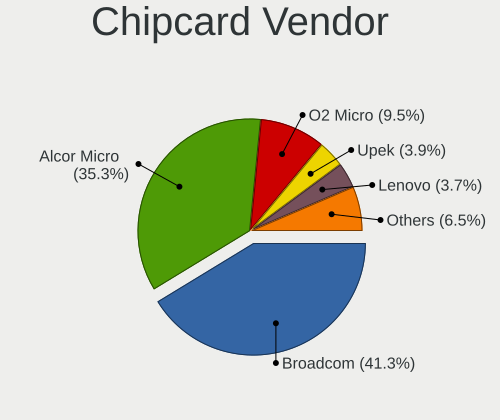

| Vendor                   | Notebooks | Percent |
|--------------------------|-----------|---------|
| Broadcom                 | 192       | 41.29%  |
| Alcor Micro              | 164       | 35.27%  |
| O2 Micro                 | 44        | 9.46%   |
| Upek                     | 18        | 3.87%   |
| Lenovo                   | 17        | 3.66%   |
| Bit4id                   | 7         | 1.51%   |
| Advanced Card Systems    | 7         | 1.51%   |
| Gemalto (was Gemplus)    | 4         | 0.86%   |
| Realtek Semiconductor    | 3         | 0.65%   |
| Yubico.com               | 2         | 0.43%   |
| OmniKey                  | 2         | 0.43%   |
| Thetis                   | 1         | 0.22%   |
| SCM Microsystems         | 1         | 0.22%   |
| Reiner SCT Kartensysteme | 1         | 0.22%   |
| In Focus Systems         | 1         | 0.22%   |
| Cherry                   | 1         | 0.22%   |

Chipcard Model
--------------

Chipcard module models

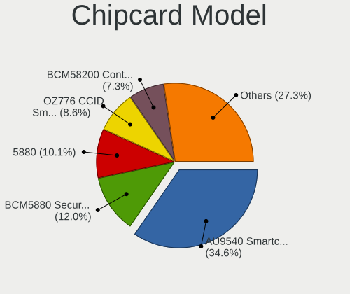

| Model                                                                        | Notebooks | Percent |
|------------------------------------------------------------------------------|-----------|---------|
| Alcor Micro AU9540 Smartcard Reader                                          | 161       | 34.62%  |
| Broadcom BCM5880 Secure Applications Processor                               | 56        | 12.04%  |
| Broadcom 5880                                                                | 47        | 10.11%  |
| O2 Micro OZ776 CCID Smartcard Reader                                         | 40        | 8.6%    |
| Broadcom BCM58200 ControlVault 3 (FingerPrint sensor + Contacted SmartCard)  | 34        | 7.31%   |
| Broadcom 58200                                                               | 27        | 5.81%   |
| Broadcom BCM5880 Secure Applications Processor with fingerprint swipe sensor | 25        | 5.38%   |
| Upek TouchChip Fingerprint Coprocessor (WBF advanced mode)                   | 18        | 3.87%   |
| Lenovo Integrated Smart Card Reader                                          | 17        | 3.66%   |
| Bit4id miniLector EVO                                                        | 5         | 1.08%   |
| O2 Micro Oz776 SmartCard Reader                                              | 4         | 0.86%   |
| Advanced Card Systems ACR122U                                                | 4         | 0.86%   |
| Realtek Semiconductor Smart Card Reader Interface                            | 3         | 0.65%   |
| Gemalto (was Gemplus) Compact Smart Card Reader Writer                       | 3         | 0.65%   |
| Broadcom BCM5880 Secure Applications Processor with fingerprint touch sensor | 3         | 0.65%   |
| Alcor Micro Watchdata W 1981                                                 | 3         | 0.65%   |
| Advanced Card Systems ACR38 SmartCard Reader                                 | 3         | 0.65%   |
| Yubico.com Yubikey 4/5 U2F+CCID                                              | 2         | 0.43%   |
| Thetis Security Key(FE25)                                                    | 1         | 0.22%   |
| SCM Microsystems uTrust 3700 F CL Reader                                     | 1         | 0.22%   |
| Reiner SCT Kartensysteme cyberJack RFID basis contactless smartcard reader   | 1         | 0.22%   |
| OmniKey CardMan Smart@Link                                                   | 1         | 0.22%   |
| OmniKey CardMan 5022                                                         | 1         | 0.22%   |
| In Focus Systems EMV Smartcard Reader                                        | 1         | 0.22%   |
| Gemalto (was Gemplus) GemPC Twin SmartCard Reader                            | 1         | 0.22%   |
| Cherry SmartCard Reader Keyboard KC 1000 SC                                  | 1         | 0.22%   |
| Bit4id miniLector-s                                                          | 1         | 0.22%   |
| BIT4ID miniLector AIR NFC v3                                                 | 1         | 0.22%   |

Unsupported
-----------

Unsupported Devices
-------------------

Total unsupported devices on board

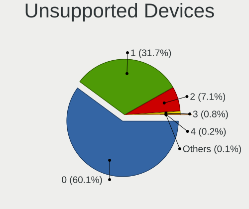

| Total | Notebooks | Percent |
|-------|-----------|---------|
| 0     | 4581      | 60.11%  |
| 1     | 2415      | 31.69%  |
| 2     | 539       | 7.07%   |
| 3     | 60        | 0.79%   |
| 4     | 17        | 0.22%   |
| 5     | 6         | 0.08%   |
| 10    | 1         | 0.01%   |
| 7     | 1         | 0.01%   |
| 6     | 1         | 0.01%   |

Unsupported Device Types
------------------------

Types of unsupported devices

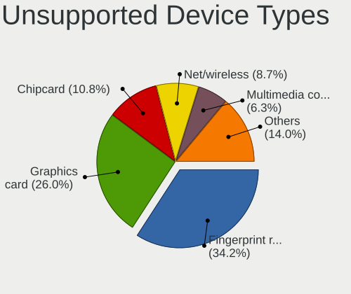

| Type                     | Notebooks | Percent |
|--------------------------|-----------|---------|
| Fingerprint reader       | 1239      | 34.15%  |
| Graphics card            | 945       | 26.05%  |
| Chipcard                 | 393       | 10.83%  |
| Net/wireless             | 317       | 8.74%   |
| Multimedia controller    | 227       | 6.26%   |
| Camera                   | 117       | 3.22%   |
| Bluetooth                | 103       | 2.84%   |
| Communication controller | 68        | 1.87%   |
| Storage                  | 49        | 1.35%   |
| Sound                    | 33        | 0.91%   |
| Card reader              | 30        | 0.83%   |
| Net/ethernet             | 26        | 0.72%   |
| Flash memory             | 24        | 0.66%   |
| Modem                    | 23        | 0.63%   |
| Network                  | 18        | 0.5%    |
| Dvb card                 | 5         | 0.14%   |
| Unassigned class         | 4         | 0.11%   |
| Wireless                 | 2         | 0.06%   |
| Storage/ide              | 2         | 0.06%   |
| Tv card                  | 1         | 0.03%   |
| Storage/raid             | 1         | 0.03%   |
| Storage/nvme             | 1         | 0.03%   |

