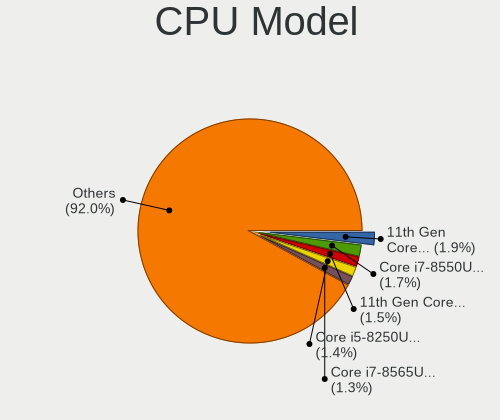

Linux in Italy - Tested Hardware & Statistics (Notebooks)
---------------------------------------------------------

A project to collect tested hardware configurations for Linux in Italy.

Anyone can contribute to this report by the [hw-probe](https://github.com/linuxhw/hw-probe) tool:

    sudo -E hw-probe -all -upload

Please contribute! Especially if your hardware is rare.

Contents
--------

* [ Test Cases ](#test-cases)

* [ System ](#system)
  - [ OS                       ](#os)
  - [ OS Family                ](#os-family)
  - [ Kernel                   ](#kernel)
  - [ Kernel Family            ](#kernel-family)
  - [ Kernel Major Ver.        ](#kernel-major-ver)
  - [ Arch                     ](#arch)
  - [ DE                       ](#de)
  - [ Display Server           ](#display-server)
  - [ Display Manager          ](#display-manager)
  - [ OS Lang                  ](#os-lang)
  - [ Boot Mode                ](#boot-mode)
  - [ Filesystem               ](#filesystem)
  - [ Part. scheme             ](#part-scheme)
  - [ Dual Boot with Linux/BSD ](#dual-boot-with-linuxbsd)
  - [ Dual Boot (Win)          ](#dual-boot-win)

* [ Board ](#board)
  - [ Vendor                   ](#vendor)
  - [ Model                    ](#model)
  - [ Model Family             ](#model-family)
  - [ MFG Year                 ](#mfg-year)
  - [ Form Factor              ](#form-factor)
  - [ Secure Boot              ](#secure-boot)
  - [ Coreboot                 ](#coreboot)
  - [ RAM Size                 ](#ram-size)
  - [ RAM Used                 ](#ram-used)
  - [ Total Drives             ](#total-drives)
  - [ Has CD-ROM               ](#has-cd-rom)
  - [ Has Ethernet             ](#has-ethernet)
  - [ Has WiFi                 ](#has-wifi)
  - [ Has Bluetooth            ](#has-bluetooth)

* [ Location ](#location)
  - [ Country                  ](#country)
  - [ City                     ](#city)

* [ Drives ](#drives)
  - [ Drive Vendor             ](#drive-vendor)
  - [ Drive Model              ](#drive-model)
  - [ HDD Vendor               ](#hdd-vendor)
  - [ SSD Vendor               ](#ssd-vendor)
  - [ Drive Kind               ](#drive-kind)
  - [ Drive Connector          ](#drive-connector)
  - [ Drive Size               ](#drive-size)
  - [ Space Total              ](#space-total)
  - [ Space Used               ](#space-used)
  - [ Malfunc. Drives          ](#malfunc-drives)
  - [ Malfunc. Drive Vendor    ](#malfunc-drive-vendor)
  - [ Malfunc. HDD Vendor      ](#malfunc-hdd-vendor)
  - [ Malfunc. Drive Kind      ](#malfunc-drive-kind)
  - [ Failed Drives            ](#failed-drives)
  - [ Failed Drive Vendor      ](#failed-drive-vendor)
  - [ Drive Status             ](#drive-status)

* [ Storage controller ](#storage-controller)
  - [ Storage Vendor           ](#storage-vendor)
  - [ Storage Model            ](#storage-model)
  - [ Storage Kind             ](#storage-kind)

* [ Processor ](#processor)
  - [ CPU Vendor               ](#cpu-vendor)
  - [ CPU Model                ](#cpu-model)
  - [ CPU Model Family         ](#cpu-model-family)
  - [ CPU Cores                ](#cpu-cores)
  - [ CPU Sockets              ](#cpu-sockets)
  - [ CPU Threads              ](#cpu-threads)
  - [ CPU Op-Modes             ](#cpu-op-modes)
  - [ CPU Microcode            ](#cpu-microcode)
  - [ CPU Microarch            ](#cpu-microarch)

* [ Graphics ](#graphics)
  - [ GPU Vendor               ](#gpu-vendor)
  - [ GPU Model                ](#gpu-model)
  - [ GPU Combo                ](#gpu-combo)
  - [ GPU Driver               ](#gpu-driver)
  - [ GPU Memory               ](#gpu-memory)

* [ Monitor ](#monitor)
  - [ Monitor Vendor           ](#monitor-vendor)
  - [ Monitor Model            ](#monitor-model)
  - [ Monitor Resolution       ](#monitor-resolution)
  - [ Monitor Diagonal         ](#monitor-diagonal)
  - [ Monitor Width            ](#monitor-width)
  - [ Aspect Ratio             ](#aspect-ratio)
  - [ Monitor Area             ](#monitor-area)
  - [ Pixel Density            ](#pixel-density)
  - [ Multiple Monitors        ](#multiple-monitors)

* [ Network ](#network)
  - [ Net Controller Vendor    ](#net-controller-vendor)
  - [ Net Controller Model     ](#net-controller-model)
  - [ Wireless Vendor          ](#wireless-vendor)
  - [ Wireless Model           ](#wireless-model)
  - [ Ethernet Vendor          ](#ethernet-vendor)
  - [ Ethernet Model           ](#ethernet-model)
  - [ Net Controller Kind      ](#net-controller-kind)
  - [ Used Controller          ](#used-controller)
  - [ NICs                     ](#nics)
  - [ IPv6                     ](#ipv6)

* [ Bluetooth ](#bluetooth)
  - [ Bluetooth Vendor         ](#bluetooth-vendor)
  - [ Bluetooth Model          ](#bluetooth-model)

* [ Sound ](#sound)
  - [ Sound Vendor             ](#sound-vendor)
  - [ Sound Model              ](#sound-model)

* [ Memory ](#memory)
  - [ Memory Vendor            ](#memory-vendor)
  - [ Memory Model             ](#memory-model)
  - [ Memory Kind              ](#memory-kind)
  - [ Memory Form Factor       ](#memory-form-factor)
  - [ Memory Size              ](#memory-size)
  - [ Memory Speed             ](#memory-speed)

* [ Printers & scanners ](#printers--scanners)
  - [ Printer Vendor           ](#printer-vendor)
  - [ Printer Model            ](#printer-model)
  - [ Scanner Vendor           ](#scanner-vendor)
  - [ Scanner Model            ](#scanner-model)

* [ Camera ](#camera)
  - [ Camera Vendor            ](#camera-vendor)
  - [ Camera Model             ](#camera-model)

* [ Security ](#security)
  - [ Fingerprint Vendor       ](#fingerprint-vendor)
  - [ Fingerprint Model        ](#fingerprint-model)
  - [ Chipcard Vendor          ](#chipcard-vendor)
  - [ Chipcard Model           ](#chipcard-model)

* [ Unsupported ](#unsupported)
  - [ Unsupported Devices      ](#unsupported-devices)
  - [ Unsupported Device Types ](#unsupported-device-types)

Test Cases
----------

Total: 4657

| Vendor        | Model                       | Probe                                                      | Date         |
|---------------|-----------------------------|------------------------------------------------------------|--------------|
| ASUSTek       | ASUS TUF Gaming F17 FX70... | [eeb167d869](https://linux-hardware.org/?probe=eeb167d869) | Nov 02, 2022 |
| HP            | Pavilion Gaming Laptop      | [695b3d82a7](https://linux-hardware.org/?probe=695b3d82a7) | Nov 02, 2022 |
| HP            | Pavilion Gaming Laptop      | [9b9e55c471](https://linux-hardware.org/?probe=9b9e55c471) | Nov 02, 2022 |
| ASUSTek       | X540SAA                     | [ccaedd7155](https://linux-hardware.org/?probe=ccaedd7155) | Nov 02, 2022 |
| Lenovo        | ThinkPad E15 Gen 3 20YHS... | [a3b1926b7e](https://linux-hardware.org/?probe=a3b1926b7e) | Nov 02, 2022 |
| MSI           | Prestige 15 A11SCX          | [973b498b3f](https://linux-hardware.org/?probe=973b498b3f) | Nov 02, 2022 |
| HP            | Laptop                      | [e1cd3de91a](https://linux-hardware.org/?probe=e1cd3de91a) | Nov 02, 2022 |
| Lenovo        | ThinkPad X1 Extreme 20MF... | [9819da96f2](https://linux-hardware.org/?probe=9819da96f2) | Nov 02, 2022 |
| ASUSTek       | ASUS TUF Gaming F15 FX50... | [2d931f9e99](https://linux-hardware.org/?probe=2d931f9e99) | Nov 02, 2022 |
| Lenovo        | ThinkBook 15 G3 ACL 21A4    | [335af8b89b](https://linux-hardware.org/?probe=335af8b89b) | Nov 02, 2022 |
| HUAWEI        | BOD-WXX9                    | [d4ac3a5f04](https://linux-hardware.org/?probe=d4ac3a5f04) | Nov 02, 2022 |
| HP            | G42                         | [18c487d99d](https://linux-hardware.org/?probe=18c487d99d) | Nov 02, 2022 |
| Jumper        | EZbook                      | [08ec434199](https://linux-hardware.org/?probe=08ec434199) | Nov 02, 2022 |
| Notebook      | P65_P67SE                   | [9b99df1e15](https://linux-hardware.org/?probe=9b99df1e15) | Nov 02, 2022 |
| HUAWEI        | NBLK-WAX9X                  | [d3beec5427](https://linux-hardware.org/?probe=d3beec5427) | Nov 02, 2022 |
| Apple         | MacBookPro11,5              | [f22ebdf694](https://linux-hardware.org/?probe=f22ebdf694) | Nov 01, 2022 |
| Apple         | MacBookPro11,5              | [a27142d25c](https://linux-hardware.org/?probe=a27142d25c) | Nov 01, 2022 |
| Lenovo        | ThinkPad X201 3680BR4       | [eeeeb33766](https://linux-hardware.org/?probe=eeeeb33766) | Nov 01, 2022 |
| Dell          | Precision 7530              | [b1b5f7678c](https://linux-hardware.org/?probe=b1b5f7678c) | Nov 01, 2022 |
| HP            | ProBook 4530s               | [34682f3bfe](https://linux-hardware.org/?probe=34682f3bfe) | Nov 01, 2022 |
| HP            | EliteBook 830 G5            | [379443a5d6](https://linux-hardware.org/?probe=379443a5d6) | Nov 01, 2022 |
| Lenovo        | ThinkPad T420 4236PG6       | [49d423bc50](https://linux-hardware.org/?probe=49d423bc50) | Nov 01, 2022 |
| HP            | EliteBook 830 G5            | [5e099af04c](https://linux-hardware.org/?probe=5e099af04c) | Nov 01, 2022 |
| Lenovo        | ThinkPad L590 20Q7001KIX    | [c8e545615f](https://linux-hardware.org/?probe=c8e545615f) | Nov 01, 2022 |
| Toshiba       | Satellite L50-B             | [c242c45dbe](https://linux-hardware.org/?probe=c242c45dbe) | Nov 01, 2022 |
| Acer          | Swift SF314-41              | [921b1a7ebf](https://linux-hardware.org/?probe=921b1a7ebf) | Nov 01, 2022 |
| Lenovo        | IdeaPad 3 15ADA05 81W1      | [6db184e152](https://linux-hardware.org/?probe=6db184e152) | Nov 01, 2022 |
| Lenovo        | IdeaPad 3 15ADA05 81W1      | [60cfb7dcc6](https://linux-hardware.org/?probe=60cfb7dcc6) | Nov 01, 2022 |
| SANTECH       | X170KM-G                    | [073f9a1d24](https://linux-hardware.org/?probe=073f9a1d24) | Nov 01, 2022 |
| Apple         | MacBookAir7,2               | [2532d13f74](https://linux-hardware.org/?probe=2532d13f74) | Nov 01, 2022 |
| Dell          | Precision 3510              | [a87bb1e8dd](https://linux-hardware.org/?probe=a87bb1e8dd) | Nov 01, 2022 |
| Acer          | Aspire one                  | [bfb9f97d74](https://linux-hardware.org/?probe=bfb9f97d74) | Oct 31, 2022 |
| Packard Be... | EasyNote TE11BZ             | [0301f1ddf1](https://linux-hardware.org/?probe=0301f1ddf1) | Oct 31, 2022 |
| Acer          | Aspire V5-561G              | [ea7f8f381b](https://linux-hardware.org/?probe=ea7f8f381b) | Oct 31, 2022 |
| SANTECH       | NL5xRU                      | [63e1b4298d](https://linux-hardware.org/?probe=63e1b4298d) | Oct 31, 2022 |
| ASUSTek       | X510UNR                     | [6a28e2929d](https://linux-hardware.org/?probe=6a28e2929d) | Oct 31, 2022 |
| ASUSTek       | VivoBook 15_ASUS Laptop ... | [027cfb43c4](https://linux-hardware.org/?probe=027cfb43c4) | Oct 31, 2022 |
| ASUSTek       | VivoBook 15_ASUS Laptop ... | [113930496e](https://linux-hardware.org/?probe=113930496e) | Oct 31, 2022 |
| Acer          | Aspire one                  | [82b34552f6](https://linux-hardware.org/?probe=82b34552f6) | Oct 31, 2022 |
| HP            | Victus by Laptop 16-d1xx... | [f141a6cddf](https://linux-hardware.org/?probe=f141a6cddf) | Oct 31, 2022 |
| HP            | Victus by Laptop 16-d1xx... | [b9890126af](https://linux-hardware.org/?probe=b9890126af) | Oct 31, 2022 |
| ASUSTek       | ROG Strix G713RW_G713RW     | [5355a5547a](https://linux-hardware.org/?probe=5355a5547a) | Oct 31, 2022 |
| ASUSTek       | VivoBook 15_ASUS Laptop ... | [2934bab108](https://linux-hardware.org/?probe=2934bab108) | Oct 31, 2022 |
| HP            | ProBook 450 G8 Notebook ... | [34727cd696](https://linux-hardware.org/?probe=34727cd696) | Oct 31, 2022 |
| Lenovo        | ThinkPad Edge E530 3259M... | [aa1f78db58](https://linux-hardware.org/?probe=aa1f78db58) | Oct 31, 2022 |
| Lenovo        | ThinkPad Edge E530 3259M... | [26b5f59993](https://linux-hardware.org/?probe=26b5f59993) | Oct 31, 2022 |
| Acer          | Nitro AN517-55              | [9653f093e1](https://linux-hardware.org/?probe=9653f093e1) | Oct 31, 2022 |
| Lenovo        | V15 G2 ITL 82KB             | [209fa66bb9](https://linux-hardware.org/?probe=209fa66bb9) | Oct 30, 2022 |
| Acer          | Aspire 5732Z                | [df73e0ca67](https://linux-hardware.org/?probe=df73e0ca67) | Oct 30, 2022 |
| HP            | x2 210                      | [8ed0a97ee9](https://linux-hardware.org/?probe=8ed0a97ee9) | Oct 30, 2022 |
| HP            | EliteBook 840 G5            | [f8c58b7061](https://linux-hardware.org/?probe=f8c58b7061) | Oct 30, 2022 |
| ASUSTek       | N751JK                      | [eea92055f3](https://linux-hardware.org/?probe=eea92055f3) | Oct 30, 2022 |
| ASUSTek       | X510UNR                     | [41a0a441d3](https://linux-hardware.org/?probe=41a0a441d3) | Oct 30, 2022 |
| Lenovo        | V15 G2 ITL 82KB             | [89595b2fa9](https://linux-hardware.org/?probe=89595b2fa9) | Oct 30, 2022 |
| HP            | ProBook 6560b               | [89feda4b09](https://linux-hardware.org/?probe=89feda4b09) | Oct 30, 2022 |
| HUAWEI        | KLVL-WXX9                   | [4e4e0ac802](https://linux-hardware.org/?probe=4e4e0ac802) | Oct 30, 2022 |
| HUAWEI        | KLVL-WXX9                   | [8887bce606](https://linux-hardware.org/?probe=8887bce606) | Oct 30, 2022 |
| Lenovo        | ThinkPad X1 Extreme 20MF... | [423ad57e72](https://linux-hardware.org/?probe=423ad57e72) | Oct 29, 2022 |
| Lenovo        | ThinkPad X1 Extreme 20MF... | [f8b4ce6c3f](https://linux-hardware.org/?probe=f8b4ce6c3f) | Oct 29, 2022 |
| ASUSTek       | ZenBook UX325EA_UX325EA     | [69198e503e](https://linux-hardware.org/?probe=69198e503e) | Oct 29, 2022 |
| HP            | Laptop 15-dw0xxx            | [f6b00cb10f](https://linux-hardware.org/?probe=f6b00cb10f) | Oct 29, 2022 |
| Toshiba       | Satellite L50-A-1D6         | [77f308d89c](https://linux-hardware.org/?probe=77f308d89c) | Oct 29, 2022 |
| Dell          | Precision 7520              | [f54f6d6354](https://linux-hardware.org/?probe=f54f6d6354) | Oct 29, 2022 |
| SANTECH       | PCx0Dx                      | [24462321e8](https://linux-hardware.org/?probe=24462321e8) | Oct 29, 2022 |
| Dell          | Precision 3570              | [fb016d8d01](https://linux-hardware.org/?probe=fb016d8d01) | Oct 29, 2022 |
| HUAWEI        | NBLB-WAX9N                  | [1925c8ce1f](https://linux-hardware.org/?probe=1925c8ce1f) | Oct 29, 2022 |
| Dell          | Precision 3510              | [bc9324156f](https://linux-hardware.org/?probe=bc9324156f) | Oct 29, 2022 |
| HP            | OMEN by Laptop 15-dc1xxx    | [20d95ce78c](https://linux-hardware.org/?probe=20d95ce78c) | Oct 29, 2022 |
| HP            | Pavilion dv5                | [8bd42e12c3](https://linux-hardware.org/?probe=8bd42e12c3) | Oct 29, 2022 |
| Dell          | Inspiron 5570               | [6555e01443](https://linux-hardware.org/?probe=6555e01443) | Oct 29, 2022 |
| Dell          | Inspiron 1525               | [ffb4369f83](https://linux-hardware.org/?probe=ffb4369f83) | Oct 29, 2022 |
| Lenovo        | ThinkBook 15 G2 ITL 20VE    | [be41a03a4d](https://linux-hardware.org/?probe=be41a03a4d) | Oct 29, 2022 |
| Acer          | Predator PH315-53           | [b3dd383a83](https://linux-hardware.org/?probe=b3dd383a83) | Oct 29, 2022 |
| Teclast       | F7 Plus                     | [f416278476](https://linux-hardware.org/?probe=f416278476) | Oct 29, 2022 |
| Insyde        | Braswell                    | [d98b2d9661](https://linux-hardware.org/?probe=d98b2d9661) | Oct 29, 2022 |
| HUAWEI        | VLT-WX0                     | [e3662dc3bd](https://linux-hardware.org/?probe=e3662dc3bd) | Oct 29, 2022 |
| HUAWEI        | VLT-WX0                     | [7b414a3c7c](https://linux-hardware.org/?probe=7b414a3c7c) | Oct 29, 2022 |
| HP            | Pavilion dv6                | [6406b8b769](https://linux-hardware.org/?probe=6406b8b769) | Oct 29, 2022 |
| HP            | Pavilion dv6                | [7873dfb4cf](https://linux-hardware.org/?probe=7873dfb4cf) | Oct 29, 2022 |
| Acer          | Aspire E5-571G              | [cc0f34a2fa](https://linux-hardware.org/?probe=cc0f34a2fa) | Oct 29, 2022 |
| HUAWEI        | BOD-WXX9                    | [880d3ba9c9](https://linux-hardware.org/?probe=880d3ba9c9) | Oct 29, 2022 |
| Dell          | Latitude 5531               | [cdea65fd5c](https://linux-hardware.org/?probe=cdea65fd5c) | Oct 29, 2022 |
| ASUSTek       | K53SV                       | [4ead64f80f](https://linux-hardware.org/?probe=4ead64f80f) | Oct 28, 2022 |
| Apple         | MacBookPro14,3              | [6383143b5b](https://linux-hardware.org/?probe=6383143b5b) | Oct 28, 2022 |
| ASUSTek       | K53SV                       | [d3043c50ae](https://linux-hardware.org/?probe=d3043c50ae) | Oct 28, 2022 |
| Chuwi         | LapBook Pro                 | [d362ed14bf](https://linux-hardware.org/?probe=d362ed14bf) | Oct 28, 2022 |
| MSI           | Prestige 15 A12UC           | [3d4c4364f1](https://linux-hardware.org/?probe=3d4c4364f1) | Oct 28, 2022 |
| MSI           | Prestige 14Evo A12M         | [5e32f7b38b](https://linux-hardware.org/?probe=5e32f7b38b) | Oct 28, 2022 |
| HP            | Laptop 15s-eq2xxx           | [9dcb685f5e](https://linux-hardware.org/?probe=9dcb685f5e) | Oct 28, 2022 |
| Dell          | XPS 13 9310                 | [7205cfe7b4](https://linux-hardware.org/?probe=7205cfe7b4) | Oct 28, 2022 |
| Toshiba       | Satellite C650D             | [0696abd43c](https://linux-hardware.org/?probe=0696abd43c) | Oct 28, 2022 |
| Lenovo        | ThinkPad X1 Carbon 4th 2... | [cfa027a9e2](https://linux-hardware.org/?probe=cfa027a9e2) | Oct 28, 2022 |
| Lenovo        | ThinkPad T14 Gen 2i 20W0... | [df9ef8c115](https://linux-hardware.org/?probe=df9ef8c115) | Oct 28, 2022 |
| Toshiba       | Satellite C650D             | [d42867d201](https://linux-hardware.org/?probe=d42867d201) | Oct 28, 2022 |
| Dell          | Precision 3510              | [b1f2e24e41](https://linux-hardware.org/?probe=b1f2e24e41) | Oct 28, 2022 |
| Dell          | Precision 3510              | [bb81eb9627](https://linux-hardware.org/?probe=bb81eb9627) | Oct 28, 2022 |
| Lenovo        | ThinkPad P52 20M9S1EM00     | [40de74c5c5](https://linux-hardware.org/?probe=40de74c5c5) | Oct 28, 2022 |
| HP            | Laptop 15s-fq4xxx           | [e06398e1bc](https://linux-hardware.org/?probe=e06398e1bc) | Oct 28, 2022 |
| Lenovo        | ThinkPad X1 Carbon 4th 2... | [83179a6cea](https://linux-hardware.org/?probe=83179a6cea) | Oct 28, 2022 |
| Dell          | Latitude 5521               | [460057b367](https://linux-hardware.org/?probe=460057b367) | Oct 28, 2022 |
| Lenovo        | IdeaPad Gaming 3 15ARH05... | [7d99f01f0e](https://linux-hardware.org/?probe=7d99f01f0e) | Oct 28, 2022 |
| Lenovo        | ThinkPad W540 20BHS0730D    | [f24dc12e06](https://linux-hardware.org/?probe=f24dc12e06) | Oct 28, 2022 |
| MSI           | Stealth GS66 12UGS          | [98b47019d1](https://linux-hardware.org/?probe=98b47019d1) | Oct 28, 2022 |
| Samsung       | 950XDB/951XDB/950XDY        | [2fdc53f0f3](https://linux-hardware.org/?probe=2fdc53f0f3) | Oct 28, 2022 |
| MSI           | Modern 14 B10RBSW           | [9c3c17a82e](https://linux-hardware.org/?probe=9c3c17a82e) | Oct 28, 2022 |
| Lenovo        | ThinkPad X1 Carbon Gen 1... | [6314ec0dd1](https://linux-hardware.org/?probe=6314ec0dd1) | Oct 28, 2022 |
| Lenovo        | ThinkPad X1 Carbon Gen 1... | [dcd40f9f78](https://linux-hardware.org/?probe=dcd40f9f78) | Oct 28, 2022 |
| Acer          | Aspire E5-573G              | [f575803f23](https://linux-hardware.org/?probe=f575803f23) | Oct 28, 2022 |
| Apple         | MacBookPro11,5              | [fc35e765fd](https://linux-hardware.org/?probe=fc35e765fd) | Oct 28, 2022 |
| MSI           | Katana GF66 11UC            | [83088617d3](https://linux-hardware.org/?probe=83088617d3) | Oct 28, 2022 |
| SANTECH       | NHx0DB,DE                   | [db8c0489f4](https://linux-hardware.org/?probe=db8c0489f4) | Oct 28, 2022 |
| ASUSTek       | VivoBook_ASUSLaptop X509... | [033cc83715](https://linux-hardware.org/?probe=033cc83715) | Oct 28, 2022 |
| HUAWEI        | KLVL-WXX9                   | [176fa68922](https://linux-hardware.org/?probe=176fa68922) | Oct 28, 2022 |
| HP            | Pavilion Gaming Laptop 1... | [1d64fb48e7](https://linux-hardware.org/?probe=1d64fb48e7) | Oct 27, 2022 |
| Timi          | TM1701                      | [f246345845](https://linux-hardware.org/?probe=f246345845) | Oct 27, 2022 |
| HP            | Victus by Laptop 16-e0xx... | [53832f0517](https://linux-hardware.org/?probe=53832f0517) | Oct 27, 2022 |
| ASUSTek       | S551LN                      | [30d97ad99e](https://linux-hardware.org/?probe=30d97ad99e) | Oct 27, 2022 |
| Unknown       | Unknown                     | [a03935aadd](https://linux-hardware.org/?probe=a03935aadd) | Oct 27, 2022 |
| Samsung       | 950XDB/951XDB/950XDY        | [f27c4e1041](https://linux-hardware.org/?probe=f27c4e1041) | Oct 27, 2022 |
| HP            | 255 G7 Notebook PC          | [8cf00ceef5](https://linux-hardware.org/?probe=8cf00ceef5) | Oct 27, 2022 |
| ASUSTek       | TUF Gaming FX505DT_FX505... | [639503102e](https://linux-hardware.org/?probe=639503102e) | Oct 27, 2022 |
| HP            | 255 G8 Notebook PC          | [ba5aec702a](https://linux-hardware.org/?probe=ba5aec702a) | Oct 27, 2022 |
| HP            | ProBook 640 G1              | [3a9f97607d](https://linux-hardware.org/?probe=3a9f97607d) | Oct 27, 2022 |
| Unknown       | Unknown                     | [069ce9d405](https://linux-hardware.org/?probe=069ce9d405) | Oct 27, 2022 |
| MSI           | PS63 Modern 8RC             | [36b663cec7](https://linux-hardware.org/?probe=36b663cec7) | Oct 27, 2022 |
| MSI           | PS63 Modern 8RC             | [e00fd51503](https://linux-hardware.org/?probe=e00fd51503) | Oct 27, 2022 |
| HP            | ProBook 450 G5              | [664bf1184f](https://linux-hardware.org/?probe=664bf1184f) | Oct 27, 2022 |
| Lenovo        | IdeaPad 330S-15IKB 81F5     | [264d164669](https://linux-hardware.org/?probe=264d164669) | Oct 27, 2022 |
| Dell          | Latitude 9420               | [a601281b46](https://linux-hardware.org/?probe=a601281b46) | Oct 27, 2022 |
| Dell          | Latitude E5530 non-vPro     | [a5c5f0ec1e](https://linux-hardware.org/?probe=a5c5f0ec1e) | Oct 27, 2022 |
| HP            | Pavilion dv6                | [ed392a140d](https://linux-hardware.org/?probe=ed392a140d) | Oct 27, 2022 |
| HP            | Pavilion dv6                | [1e14922876](https://linux-hardware.org/?probe=1e14922876) | Oct 27, 2022 |
| HUAWEI        | BOHK-WAX9X                  | [0c037323d9](https://linux-hardware.org/?probe=0c037323d9) | Oct 27, 2022 |
| Lenovo        | ThinkPad X1 Carbon Gen 9... | [24da197a3a](https://linux-hardware.org/?probe=24da197a3a) | Oct 27, 2022 |
| Dell          | Inspiron 5515               | [74ad4c8c59](https://linux-hardware.org/?probe=74ad4c8c59) | Oct 27, 2022 |
| HP            | ProBook 6560b               | [222a5c2dbe](https://linux-hardware.org/?probe=222a5c2dbe) | Oct 27, 2022 |
| Lenovo        | IdeaPad 5 14ITL05 82FE      | [670823778e](https://linux-hardware.org/?probe=670823778e) | Oct 27, 2022 |
| Lenovo        | IdeaPad 3 15ADA05 81W1      | [a308f68bce](https://linux-hardware.org/?probe=a308f68bce) | Oct 27, 2022 |
| Acer          | Aspire 5750G                | [b51a20d480](https://linux-hardware.org/?probe=b51a20d480) | Oct 27, 2022 |
| MSI           | Katana GF66 12UC            | [9b8f917e6b](https://linux-hardware.org/?probe=9b8f917e6b) | Oct 27, 2022 |
| Dell          | Inspiron 5590               | [f1a5637218](https://linux-hardware.org/?probe=f1a5637218) | Oct 27, 2022 |
| Lenovo        | ThinkPad X260 20F5S2WX05    | [710f95eab8](https://linux-hardware.org/?probe=710f95eab8) | Oct 27, 2022 |
| Lenovo        | ThinkPad T480s 20L8S5YM0... | [c348de09bf](https://linux-hardware.org/?probe=c348de09bf) | Oct 26, 2022 |
| HP            | Pavilion Laptop 15-eh1xx... | [0d705b0971](https://linux-hardware.org/?probe=0d705b0971) | Oct 26, 2022 |
| HP            | ProBook 450 G3              | [4aa258716b](https://linux-hardware.org/?probe=4aa258716b) | Oct 26, 2022 |
| HP            | ProBook 450 G3              | [26d1b8b2b2](https://linux-hardware.org/?probe=26d1b8b2b2) | Oct 26, 2022 |
| Lenovo        | IdeaPad 3 15IIL05 81WE      | [022cfe6707](https://linux-hardware.org/?probe=022cfe6707) | Oct 26, 2022 |
| ASUSTek       | X555LAB                     | [44d47f5024](https://linux-hardware.org/?probe=44d47f5024) | Oct 26, 2022 |
| ASUSTek       | VivoBook S15 X510UF         | [85b4bc70fa](https://linux-hardware.org/?probe=85b4bc70fa) | Oct 26, 2022 |
| HP            | 240 G8 Notebook PC          | [25765f4a76](https://linux-hardware.org/?probe=25765f4a76) | Oct 26, 2022 |
| HP            | Pavilion Laptop 14-ce0xx... | [7e1a95e569](https://linux-hardware.org/?probe=7e1a95e569) | Oct 26, 2022 |
| Lenovo        | ThinkPad T480 20L50000IX    | [bcb1b11c50](https://linux-hardware.org/?probe=bcb1b11c50) | Oct 26, 2022 |
| HP            | 250 G8 Notebook PC          | [d4ebaa71a2](https://linux-hardware.org/?probe=d4ebaa71a2) | Oct 26, 2022 |
| Acer          | Extensa 2540                | [367660309f](https://linux-hardware.org/?probe=367660309f) | Oct 26, 2022 |
| Lenovo        | ThinkPad E470 20H1006JIX    | [8bc8778497](https://linux-hardware.org/?probe=8bc8778497) | Oct 26, 2022 |
| Timi          | A7S                         | [004df6b9a1](https://linux-hardware.org/?probe=004df6b9a1) | Oct 26, 2022 |
| HP            | Laptop 17-cp0xxx            | [60d57edbfb](https://linux-hardware.org/?probe=60d57edbfb) | Oct 26, 2022 |
| Dell          | XPS 15 9520                 | [1ede815931](https://linux-hardware.org/?probe=1ede815931) | Oct 26, 2022 |
| Lenovo        | ThinkPad T450 20BUS0S902    | [1115da2433](https://linux-hardware.org/?probe=1115da2433) | Oct 26, 2022 |
| MSI           | Stealth GS66 12UH           | [3c985bb814](https://linux-hardware.org/?probe=3c985bb814) | Oct 26, 2022 |
| MSI           | Stealth GS66 12UH           | [336132b016](https://linux-hardware.org/?probe=336132b016) | Oct 26, 2022 |
| ASUSTek       | 1005HA                      | [118fed891f](https://linux-hardware.org/?probe=118fed891f) | Oct 26, 2022 |
| Dell          | Latitude E5570              | [2d59f069b4](https://linux-hardware.org/?probe=2d59f069b4) | Oct 26, 2022 |
| Dell          | XPS 15 7590                 | [5265f4d89f](https://linux-hardware.org/?probe=5265f4d89f) | Oct 26, 2022 |
| HP            | EliteBook 840 G5            | [4b28c73302](https://linux-hardware.org/?probe=4b28c73302) | Oct 26, 2022 |
| HUAWEI        | HN-WX9X                     | [042ffc026d](https://linux-hardware.org/?probe=042ffc026d) | Oct 26, 2022 |
| MSI           | Modern 15 A11M              | [0a658be9fc](https://linux-hardware.org/?probe=0a658be9fc) | Oct 26, 2022 |
| Timi          | A7S                         | [77a87009dd](https://linux-hardware.org/?probe=77a87009dd) | Oct 26, 2022 |
| HP            | Spectre Laptop 13-af0xx     | [1ded224c69](https://linux-hardware.org/?probe=1ded224c69) | Oct 26, 2022 |
| Google        | Apel                        | [f3bf9850dd](https://linux-hardware.org/?probe=f3bf9850dd) | Oct 26, 2022 |
| Lenovo        | ThinkPad X1 Carbon 3rd 2... | [53e6b23ebf](https://linux-hardware.org/?probe=53e6b23ebf) | Oct 26, 2022 |
| Acer          | Aspire E5-571               | [2920658e38](https://linux-hardware.org/?probe=2920658e38) | Oct 25, 2022 |
| Samsung       | 767XCL                      | [17bd1b4506](https://linux-hardware.org/?probe=17bd1b4506) | Oct 25, 2022 |
| Dell          | Latitude E6430              | [f196a9762f](https://linux-hardware.org/?probe=f196a9762f) | Oct 25, 2022 |
| Dell          | Latitude E6430              | [8062ec17fd](https://linux-hardware.org/?probe=8062ec17fd) | Oct 25, 2022 |
| Lenovo        | IdeaPad 3 15ADA05 81W1      | [2d7fa062e3](https://linux-hardware.org/?probe=2d7fa062e3) | Oct 25, 2022 |
| ASUSTek       | N751JK                      | [f6f0ff5048](https://linux-hardware.org/?probe=f6f0ff5048) | Oct 25, 2022 |
| ASUSTek       | VivoBook_ASUSLaptop X571... | [7bf16d5a25](https://linux-hardware.org/?probe=7bf16d5a25) | Oct 25, 2022 |
| Lenovo        | ThinkBook 14-IIL 20SL       | [94fa6196b8](https://linux-hardware.org/?probe=94fa6196b8) | Oct 25, 2022 |
| HP            | Pavilion dv6                | [03e2594419](https://linux-hardware.org/?probe=03e2594419) | Oct 25, 2022 |
| Apple         | MacBook5,1                  | [da04330684](https://linux-hardware.org/?probe=da04330684) | Oct 25, 2022 |
| Dell          | XPS 15 9570                 | [5f9de95e9c](https://linux-hardware.org/?probe=5f9de95e9c) | Oct 25, 2022 |
| Lenovo        | V15-IGL 82C3                | [264fcfd9f1](https://linux-hardware.org/?probe=264fcfd9f1) | Oct 25, 2022 |
| Dell          | Precision M6800             | [6c15780d7a](https://linux-hardware.org/?probe=6c15780d7a) | Oct 25, 2022 |
| HP            | ENVY 15                     | [faf3ff2256](https://linux-hardware.org/?probe=faf3ff2256) | Oct 25, 2022 |
| Lenovo        | ThinkPad T14s Gen 1 20UH... | [cca91f3fe8](https://linux-hardware.org/?probe=cca91f3fe8) | Oct 25, 2022 |
| Dell          | Latitude E7270              | [7f2c8b9e9c](https://linux-hardware.org/?probe=7f2c8b9e9c) | Oct 25, 2022 |
| Lenovo        | ThinkPad T14s Gen 1 20UH... | [8f34a9c24c](https://linux-hardware.org/?probe=8f34a9c24c) | Oct 25, 2022 |
| Lenovo        | ThinkPad E15 Gen 3 20YG0... | [a8c29545e6](https://linux-hardware.org/?probe=a8c29545e6) | Oct 25, 2022 |
| Dell          | Inspiron 3501               | [6764a6860f](https://linux-hardware.org/?probe=6764a6860f) | Oct 25, 2022 |
| Lenovo        | ThinkPad T470 20HES0FW00    | [1f939e0414](https://linux-hardware.org/?probe=1f939e0414) | Oct 25, 2022 |
| Dell          | Latitude 5500               | [6e1b321740](https://linux-hardware.org/?probe=6e1b321740) | Oct 25, 2022 |
| HP            | Laptop 15s-fq1xxx           | [badb0d5aee](https://linux-hardware.org/?probe=badb0d5aee) | Oct 25, 2022 |
| HP            | Laptop 15s-fq1xxx           | [f4174b55a2](https://linux-hardware.org/?probe=f4174b55a2) | Oct 25, 2022 |
| Lenovo        | Z50-70 20354                | [08b673e57b](https://linux-hardware.org/?probe=08b673e57b) | Oct 25, 2022 |
| LG Electro... | 17Z90N-V.AA55D              | [bf40de3f5a](https://linux-hardware.org/?probe=bf40de3f5a) | Oct 25, 2022 |
| Acer          | Aspire A715-42G             | [72b73a6552](https://linux-hardware.org/?probe=72b73a6552) | Oct 25, 2022 |
| ASUSTek       | VivoBook_ASUSLaptop X512... | [b2bb88f27f](https://linux-hardware.org/?probe=b2bb88f27f) | Oct 25, 2022 |
| Lenovo        | ThinkPad T14s Gen 2a 20X... | [26415e4b74](https://linux-hardware.org/?probe=26415e4b74) | Oct 25, 2022 |
| Apple         | MacBookAir6,1               | [4785b7f6f6](https://linux-hardware.org/?probe=4785b7f6f6) | Oct 25, 2022 |
| HP            | 650                         | [d7b73bebc7](https://linux-hardware.org/?probe=d7b73bebc7) | Oct 25, 2022 |
| Lenovo        | ThinkPad T460 20FMS08H00    | [13422369f7](https://linux-hardware.org/?probe=13422369f7) | Oct 25, 2022 |
| Dell          | Inspiron 7559               | [2a1b8eb060](https://linux-hardware.org/?probe=2a1b8eb060) | Oct 25, 2022 |
| Dell          | Vostro 15 5501              | [3338297022](https://linux-hardware.org/?probe=3338297022) | Oct 25, 2022 |
| Dell          | Precision 3530              | [8d806f9e53](https://linux-hardware.org/?probe=8d806f9e53) | Oct 25, 2022 |
| Lenovo        | IdeaPad S340-15API 81NC     | [f8aa3a7277](https://linux-hardware.org/?probe=f8aa3a7277) | Oct 25, 2022 |
| HP            | 255 G8 Notebook PC          | [30c305f07c](https://linux-hardware.org/?probe=30c305f07c) | Oct 25, 2022 |
| HP            | Laptop 15s-eq2xxx           | [3146a3d644](https://linux-hardware.org/?probe=3146a3d644) | Oct 25, 2022 |
| ASUSTek       | GL502VMK                    | [9a18ff1b13](https://linux-hardware.org/?probe=9a18ff1b13) | Oct 25, 2022 |
| Lenovo        | Yoga 900S-12ISK 80ML        | [0c13fbf129](https://linux-hardware.org/?probe=0c13fbf129) | Oct 25, 2022 |
| PC Special... | N13xWU                      | [4d728f13c9](https://linux-hardware.org/?probe=4d728f13c9) | Oct 25, 2022 |
| Dell          | XPS 15 7590                 | [7f9028d036](https://linux-hardware.org/?probe=7f9028d036) | Oct 25, 2022 |
| PC Special... | N13xWU                      | [58b775c64c](https://linux-hardware.org/?probe=58b775c64c) | Oct 25, 2022 |
| Lenovo        | IdeaPad S340-15API 81NC     | [86b8ce83b2](https://linux-hardware.org/?probe=86b8ce83b2) | Oct 25, 2022 |
| Toshiba       | Satellite Pro S500          | [a26efdcfb5](https://linux-hardware.org/?probe=a26efdcfb5) | Oct 25, 2022 |
| Dell          | XPS 15 7590                 | [811985183a](https://linux-hardware.org/?probe=811985183a) | Oct 25, 2022 |
| HP            | Laptop 15-dw0xxx            | [4e87fd9438](https://linux-hardware.org/?probe=4e87fd9438) | Oct 25, 2022 |
| HP            | ProBook 640 G1              | [cfb2e32cea](https://linux-hardware.org/?probe=cfb2e32cea) | Oct 25, 2022 |
| ASUSTek       | X555YI                      | [5d6562117a](https://linux-hardware.org/?probe=5d6562117a) | Oct 25, 2022 |
| HP            | EliteBook 820 G2            | [b31fec75e1](https://linux-hardware.org/?probe=b31fec75e1) | Oct 25, 2022 |
| Timi          | Mi Laptop Pro 15            | [4474edfd79](https://linux-hardware.org/?probe=4474edfd79) | Oct 25, 2022 |
| Dell          | G15 5511                    | [0f47c64bab](https://linux-hardware.org/?probe=0f47c64bab) | Oct 25, 2022 |
| ASUSTek       | GL553VD                     | [20278229cd](https://linux-hardware.org/?probe=20278229cd) | Oct 25, 2022 |
| HUAWEI        | BOHB-WAX9                   | [fe222419ec](https://linux-hardware.org/?probe=fe222419ec) | Oct 25, 2022 |
| Acer          | Aspire A515-45              | [4584821ae6](https://linux-hardware.org/?probe=4584821ae6) | Oct 25, 2022 |
| HP            | 340S G7 Notebook PC         | [95707c7cd5](https://linux-hardware.org/?probe=95707c7cd5) | Oct 25, 2022 |
| Lenovo        | ThinkPad T495 20NJ000XIX    | [169601c723](https://linux-hardware.org/?probe=169601c723) | Oct 25, 2022 |
| Lenovo        | ThinkPad T495 20NJ000XIX    | [efb9c3d448](https://linux-hardware.org/?probe=efb9c3d448) | Oct 25, 2022 |
| Lenovo        | B51-80 80LM                 | [aaed1997fd](https://linux-hardware.org/?probe=aaed1997fd) | Oct 25, 2022 |
| HP            | Spectre Laptop 13-af0xx     | [7e6d814d87](https://linux-hardware.org/?probe=7e6d814d87) | Oct 25, 2022 |
| Dell          | XPS 15 9500                 | [f827f47265](https://linux-hardware.org/?probe=f827f47265) | Oct 25, 2022 |
| Lenovo        | IdeaPad 3 15ITL6 82H8       | [42647c28ba](https://linux-hardware.org/?probe=42647c28ba) | Oct 25, 2022 |
| Lenovo        | IdeaPad 5 15IIL05 81YK      | [18931ec5f6](https://linux-hardware.org/?probe=18931ec5f6) | Oct 25, 2022 |
| Fujitsu       | LIFEBOOK A532               | [e176b2ac7c](https://linux-hardware.org/?probe=e176b2ac7c) | Oct 25, 2022 |
| ASUSTek       | X555LI                      | [fe6b4aa2a6](https://linux-hardware.org/?probe=fe6b4aa2a6) | Oct 25, 2022 |
| HP            | Pavilion Notebook           | [35cf015c33](https://linux-hardware.org/?probe=35cf015c33) | Oct 25, 2022 |
| Dell          | Inspiron 13-7359            | [5a6d4ce6e7](https://linux-hardware.org/?probe=5a6d4ce6e7) | Oct 25, 2022 |
| ASUSTek       | VivoBook_ASUSLaptop X515... | [dc70e52da3](https://linux-hardware.org/?probe=dc70e52da3) | Oct 25, 2022 |
| MSI           | Prestige 14Evo A11M         | [7c4edd1a6d](https://linux-hardware.org/?probe=7c4edd1a6d) | Oct 24, 2022 |
| Sony          | SVE1712Z1EB                 | [23b6ac5cde](https://linux-hardware.org/?probe=23b6ac5cde) | Oct 24, 2022 |
| HP            | 470 G8 Notebook PC          | [1cae6fb5ac](https://linux-hardware.org/?probe=1cae6fb5ac) | Oct 24, 2022 |
| Dell          | Latitude E6430              | [3fbd9c277d](https://linux-hardware.org/?probe=3fbd9c277d) | Oct 24, 2022 |
| HUAWEI        | KLVD-WXX9                   | [1bbbcd4843](https://linux-hardware.org/?probe=1bbbcd4843) | Oct 24, 2022 |
| Dell          | Inspiron 16 7610            | [96ae3c2941](https://linux-hardware.org/?probe=96ae3c2941) | Oct 24, 2022 |
| HP            | Pavilion Gaming Laptop 1... | [15ced71b20](https://linux-hardware.org/?probe=15ced71b20) | Oct 24, 2022 |
| Lenovo        | ThinkPad P14s Gen 1 20Y1... | [c6134bcca2](https://linux-hardware.org/?probe=c6134bcca2) | Oct 24, 2022 |
| HP            | 470 G8 Notebook PC          | [4c3e8196af](https://linux-hardware.org/?probe=4c3e8196af) | Oct 24, 2022 |
| ASUSTek       | GL553VD                     | [a9235eda91](https://linux-hardware.org/?probe=a9235eda91) | Oct 24, 2022 |
| Acer          | Aspire A515-52G             | [f569841512](https://linux-hardware.org/?probe=f569841512) | Oct 24, 2022 |
| HUAWEI        | KLVL-WXX9                   | [8994af98ff](https://linux-hardware.org/?probe=8994af98ff) | Oct 24, 2022 |
| Acer          | Aspire ES1-520              | [44375f0b06](https://linux-hardware.org/?probe=44375f0b06) | Oct 24, 2022 |
| Lenovo        | Yoga Slim 7 14ITL05 82A3    | [4948eb3b16](https://linux-hardware.org/?probe=4948eb3b16) | Oct 24, 2022 |
| Acer          | Nitro AN517-51              | [7fed0ea2a9](https://linux-hardware.org/?probe=7fed0ea2a9) | Oct 24, 2022 |
| Dell          | Inspiron 5570               | [aeae483e35](https://linux-hardware.org/?probe=aeae483e35) | Oct 24, 2022 |
| Lenovo        | ThinkPad X230 Tablet 343... | [eae727e6a0](https://linux-hardware.org/?probe=eae727e6a0) | Oct 24, 2022 |
| Notebook      | PCX0DX                      | [e29790dc3c](https://linux-hardware.org/?probe=e29790dc3c) | Oct 24, 2022 |
| HUAWEI        | KLVL-WXX9                   | [fc7326f81b](https://linux-hardware.org/?probe=fc7326f81b) | Oct 24, 2022 |
| HP            | Laptop 15s-fq0xxx           | [2510215a0b](https://linux-hardware.org/?probe=2510215a0b) | Oct 24, 2022 |
| MSI           | GE62 7RE                    | [bd5b8943f4](https://linux-hardware.org/?probe=bd5b8943f4) | Oct 24, 2022 |
| Dell          | XPS 15 9560                 | [37fc32cacd](https://linux-hardware.org/?probe=37fc32cacd) | Oct 24, 2022 |
| ASUSTek       | VivoBook_ASUSLaptop X513... | [95ad909dc8](https://linux-hardware.org/?probe=95ad909dc8) | Oct 24, 2022 |
| ASUSTek       | VivoBook_ASUS Laptop E21... | [9b7ac9b23e](https://linux-hardware.org/?probe=9b7ac9b23e) | Oct 24, 2022 |
| HP            | Pavilion Notebook           | [d953ededc3](https://linux-hardware.org/?probe=d953ededc3) | Oct 24, 2022 |
| Olivetti      | Olibook P75B                | [a1b4023949](https://linux-hardware.org/?probe=a1b4023949) | Oct 24, 2022 |
| HP            | 340S G7 Notebook PC         | [dc8eab937b](https://linux-hardware.org/?probe=dc8eab937b) | Oct 24, 2022 |
| Lenovo        | ThinkPad T480 20L5000AIX    | [43650773c9](https://linux-hardware.org/?probe=43650773c9) | Oct 24, 2022 |
| HUAWEI        | KPL-W0X                     | [aea737fcab](https://linux-hardware.org/?probe=aea737fcab) | Oct 24, 2022 |
| Dell          | Latitude E5500              | [10cb5545fd](https://linux-hardware.org/?probe=10cb5545fd) | Oct 24, 2022 |
| ASUSTek       | VivoBook_ASUSLaptop X571... | [e198c305e4](https://linux-hardware.org/?probe=e198c305e4) | Oct 24, 2022 |
| Lenovo        | ThinkBook 13s G3 ACN 20Y... | [d663683611](https://linux-hardware.org/?probe=d663683611) | Oct 24, 2022 |
| ASUSTek       | X555LAB                     | [506468af47](https://linux-hardware.org/?probe=506468af47) | Oct 24, 2022 |
| Lenovo        | ThinkPad T14 Gen 1 20S00... | [417beae8e5](https://linux-hardware.org/?probe=417beae8e5) | Oct 24, 2022 |
| Packard Be... | DOT S                       | [f280a6ccbc](https://linux-hardware.org/?probe=f280a6ccbc) | Oct 24, 2022 |
| ASUSTek       | X555LAB                     | [a1e654c422](https://linux-hardware.org/?probe=a1e654c422) | Oct 24, 2022 |
| HP            | EliteBook 8440p             | [0ffbef18a5](https://linux-hardware.org/?probe=0ffbef18a5) | Oct 24, 2022 |
| Lenovo        | ThinkPad X230 232465G       | [4cfe90552b](https://linux-hardware.org/?probe=4cfe90552b) | Oct 24, 2022 |
| MSI           | Stealth 15M B12UE           | [a6190e6271](https://linux-hardware.org/?probe=a6190e6271) | Oct 24, 2022 |
| Lenovo        | ThinkPad T470 20HES4VB00    | [f7b39d371a](https://linux-hardware.org/?probe=f7b39d371a) | Oct 24, 2022 |
| Acer          | Aspire A315-42              | [20dcade848](https://linux-hardware.org/?probe=20dcade848) | Oct 24, 2022 |
| HUAWEI        | NBLK-WAX9X                  | [22a138a507](https://linux-hardware.org/?probe=22a138a507) | Oct 24, 2022 |
| HUAWEI        | MateBook D                  | [b219f88756](https://linux-hardware.org/?probe=b219f88756) | Oct 24, 2022 |
| Dell          | Latitude 7490               | [96759bdb49](https://linux-hardware.org/?probe=96759bdb49) | Oct 24, 2022 |
| Dell          | Inspiron 5590               | [802e0f0c61](https://linux-hardware.org/?probe=802e0f0c61) | Oct 24, 2022 |
| ASUSTek       | UX310UQ                     | [5a928ace3b](https://linux-hardware.org/?probe=5a928ace3b) | Oct 24, 2022 |
| Dell          | Latitude E7240              | [33c37015df](https://linux-hardware.org/?probe=33c37015df) | Oct 24, 2022 |
| HUAWEI        | MACHD-WXX9                  | [9e56111afe](https://linux-hardware.org/?probe=9e56111afe) | Oct 24, 2022 |
| Acer          | Aspire A515-45              | [b39d63f4f2](https://linux-hardware.org/?probe=b39d63f4f2) | Oct 24, 2022 |
| Lenovo        | G50-45 80MQ                 | [2628815c23](https://linux-hardware.org/?probe=2628815c23) | Oct 24, 2022 |
| Chuwi         | HeroBook Air                | [055a6c2be8](https://linux-hardware.org/?probe=055a6c2be8) | Oct 23, 2022 |
| Chuwi         | HeroBook Air                | [cb299f8f1b](https://linux-hardware.org/?probe=cb299f8f1b) | Oct 23, 2022 |
| Chuwi         | HeroBook Air                | [753874362e](https://linux-hardware.org/?probe=753874362e) | Oct 23, 2022 |
| ASUSTek       | K53SJ                       | [8c85e545f2](https://linux-hardware.org/?probe=8c85e545f2) | Oct 23, 2022 |
| HP            | 340S G7 Notebook PC         | [406538a0de](https://linux-hardware.org/?probe=406538a0de) | Oct 23, 2022 |
| Dell          | XPS 13 9305                 | [8fec9e2536](https://linux-hardware.org/?probe=8fec9e2536) | Oct 22, 2022 |
| Acer          | Aspire V3-772G              | [7361aed7f9](https://linux-hardware.org/?probe=7361aed7f9) | Oct 22, 2022 |
| Acer          | Aspire 5733                 | [ef561df926](https://linux-hardware.org/?probe=ef561df926) | Oct 22, 2022 |
| Dell          | Latitude E6440              | [030896045a](https://linux-hardware.org/?probe=030896045a) | Oct 22, 2022 |
| HUAWEI        | MACHD-WXX9                  | [74c290e909](https://linux-hardware.org/?probe=74c290e909) | Oct 22, 2022 |
| Lenovo        | ThinkPad L470 W10DG 20JV... | [f460f8dc4e](https://linux-hardware.org/?probe=f460f8dc4e) | Oct 22, 2022 |
| HP            | Laptop 17-cp0xxx            | [d0a1d2c4f5](https://linux-hardware.org/?probe=d0a1d2c4f5) | Oct 22, 2022 |
| ASUSTek       | VivoBook_ASUSLaptop X571... | [66418dda52](https://linux-hardware.org/?probe=66418dda52) | Oct 22, 2022 |
| Dell          | Latitude E5530 non-vPro     | [20f991643f](https://linux-hardware.org/?probe=20f991643f) | Oct 21, 2022 |
| MSI           | Prestige 14Evo A11M         | [c63a7ccdeb](https://linux-hardware.org/?probe=c63a7ccdeb) | Oct 21, 2022 |
| LG Electro... | 16Z90P-G.AP75D              | [1e1526e9d8](https://linux-hardware.org/?probe=1e1526e9d8) | Oct 21, 2022 |
| Lenovo        | ThinkPad E550 20DFCTO1WW    | [0249022aca](https://linux-hardware.org/?probe=0249022aca) | Oct 20, 2022 |
| Lenovo        | V110-15IAP 80TG             | [68a04f2544](https://linux-hardware.org/?probe=68a04f2544) | Oct 20, 2022 |
| HP            | Laptop 15s-eq2xxx           | [f966d5d584](https://linux-hardware.org/?probe=f966d5d584) | Oct 20, 2022 |
| Lenovo        | IdeaPad 700-15ISK 80RU      | [d042d922e5](https://linux-hardware.org/?probe=d042d922e5) | Oct 20, 2022 |
| ASUSTek       | T200TAC                     | [0aad9d8ecd](https://linux-hardware.org/?probe=0aad9d8ecd) | Oct 20, 2022 |
| ASUSTek       | X540SAA                     | [e3fef524ee](https://linux-hardware.org/?probe=e3fef524ee) | Oct 20, 2022 |
| Sony          | SVE1513B1EW                 | [77ef0b542b](https://linux-hardware.org/?probe=77ef0b542b) | Oct 20, 2022 |
| Microtech     | CoreBook                    | [0592b30e41](https://linux-hardware.org/?probe=0592b30e41) | Oct 19, 2022 |
| Microtech     | CoreBook                    | [536451ed8a](https://linux-hardware.org/?probe=536451ed8a) | Oct 19, 2022 |
| Dell          | Inspiron 7590               | [43ec5b2df8](https://linux-hardware.org/?probe=43ec5b2df8) | Oct 19, 2022 |
| Acer          | Aspire ES1-331              | [f5ace96d5d](https://linux-hardware.org/?probe=f5ace96d5d) | Oct 19, 2022 |
| ASUSTek       | T200TAC                     | [c33c750766](https://linux-hardware.org/?probe=c33c750766) | Oct 18, 2022 |
| Fujitsu       | LIFEBOOK E753               | [1fbb05ae6b](https://linux-hardware.org/?probe=1fbb05ae6b) | Oct 18, 2022 |
| HP            | ProBook 450 G8 Notebook ... | [08327d561d](https://linux-hardware.org/?probe=08327d561d) | Oct 18, 2022 |
| HP            | Pavilion Laptop 15-eg0xx... | [2c47736da1](https://linux-hardware.org/?probe=2c47736da1) | Oct 18, 2022 |
| MSI           | Summit E16Flip A11UCT       | [f1ec40e34d](https://linux-hardware.org/?probe=f1ec40e34d) | Oct 17, 2022 |
| Lenovo        | G50-70 20351                | [a1e9be5323](https://linux-hardware.org/?probe=a1e9be5323) | Oct 17, 2022 |
| Lenovo        | ThinkPad T60 1952CTO        | [f84f14587b](https://linux-hardware.org/?probe=f84f14587b) | Oct 17, 2022 |
| Samsung       | R509                        | [ce3166845f](https://linux-hardware.org/?probe=ce3166845f) | Oct 17, 2022 |
| HP            | 255 G3                      | [a6ef9f4649](https://linux-hardware.org/?probe=a6ef9f4649) | Oct 17, 2022 |
| Dell          | Latitude 3380               | [76a82ca1e6](https://linux-hardware.org/?probe=76a82ca1e6) | Oct 17, 2022 |
| HUAWEI        | BOM-WXX9                    | [594b141136](https://linux-hardware.org/?probe=594b141136) | Oct 17, 2022 |
| HP            | Laptop 15s-eq2xxx           | [57436f7d31](https://linux-hardware.org/?probe=57436f7d31) | Oct 17, 2022 |
| Notebook      | W230SS                      | [abb5e7fda8](https://linux-hardware.org/?probe=abb5e7fda8) | Oct 16, 2022 |
| Lenovo        | Legion S7 16ARHA7 82UG      | [5c38639fff](https://linux-hardware.org/?probe=5c38639fff) | Oct 16, 2022 |
| ASUSTek       | VivoBook_ASUSLaptop X509... | [0cceedcb07](https://linux-hardware.org/?probe=0cceedcb07) | Oct 16, 2022 |
| Lenovo        | Legion S7 16ARHA7 82UG      | [eae5ab7d9c](https://linux-hardware.org/?probe=eae5ab7d9c) | Oct 16, 2022 |
| Acer          | Aspire E5-575G              | [4aff854065](https://linux-hardware.org/?probe=4aff854065) | Oct 16, 2022 |
| Acer          | Aspire A515-45              | [7a8b3b953d](https://linux-hardware.org/?probe=7a8b3b953d) | Oct 15, 2022 |
| ASUSTek       | X555UA                      | [f0adae0aba](https://linux-hardware.org/?probe=f0adae0aba) | Oct 14, 2022 |
| HP            | Pavilion g6                 | [4fbce46637](https://linux-hardware.org/?probe=4fbce46637) | Oct 14, 2022 |
| Chuwi         | HeroBook Pro                | [4fe76d84fd](https://linux-hardware.org/?probe=4fe76d84fd) | Oct 13, 2022 |
| Dell          | Studio 1555                 | [52104abe69](https://linux-hardware.org/?probe=52104abe69) | Oct 13, 2022 |
| ASUSTek       | ROG Zephyrus G14 GA401IV... | [e2db064195](https://linux-hardware.org/?probe=e2db064195) | Oct 13, 2022 |
| Dell          | Vostro 3558                 | [855e0d050c](https://linux-hardware.org/?probe=855e0d050c) | Oct 13, 2022 |
| HP            | 340S G7 Notebook PC         | [1927ae6949](https://linux-hardware.org/?probe=1927ae6949) | Oct 12, 2022 |
| Acer          | Aspire 5740                 | [273721cef2](https://linux-hardware.org/?probe=273721cef2) | Oct 12, 2022 |
| ASUSTek       | N550JK                      | [457bef52a9](https://linux-hardware.org/?probe=457bef52a9) | Oct 12, 2022 |
| Dell          | Inspiron 7520               | [df55c5c266](https://linux-hardware.org/?probe=df55c5c266) | Oct 12, 2022 |
| Lenovo        | ThinkBook 15 G2 ITL 20VE    | [00d174fcf4](https://linux-hardware.org/?probe=00d174fcf4) | Oct 12, 2022 |
| ASUSTek       | E402MA                      | [807cf84523](https://linux-hardware.org/?probe=807cf84523) | Oct 11, 2022 |
| Lenovo        | ThinkPad T470 20JNS08H00    | [8926251d64](https://linux-hardware.org/?probe=8926251d64) | Oct 11, 2022 |
| Lenovo        | ThinkPad X1 Carbon Gen 8... | [e060b11754](https://linux-hardware.org/?probe=e060b11754) | Oct 11, 2022 |
| HP            | Presario CQ57               | [b67f538b81](https://linux-hardware.org/?probe=b67f538b81) | Oct 10, 2022 |
| Dell          | Inspiron 7520               | [aa8415aa98](https://linux-hardware.org/?probe=aa8415aa98) | Oct 10, 2022 |
| Lenovo        | IdeaPad S510p 20298         | [f3a23a25c6](https://linux-hardware.org/?probe=f3a23a25c6) | Oct 10, 2022 |
| Unknown       | Unknown                     | [d00832c27c](https://linux-hardware.org/?probe=d00832c27c) | Oct 09, 2022 |
| ASUSTek       | P552LA                      | [6985e4f01e](https://linux-hardware.org/?probe=6985e4f01e) | Oct 09, 2022 |
| HUAWEI        | KLVL-WXX9                   | [fda26adf83](https://linux-hardware.org/?probe=fda26adf83) | Oct 09, 2022 |
| HUAWEI        | KLVL-WXX9                   | [a5511bd426](https://linux-hardware.org/?probe=a5511bd426) | Oct 09, 2022 |
| Fujitsu Si... | AMILO Pa 1538               | [11d843f241](https://linux-hardware.org/?probe=11d843f241) | Oct 08, 2022 |
| HP            | 255 G1                      | [fc9f63bfb6](https://linux-hardware.org/?probe=fc9f63bfb6) | Oct 08, 2022 |
| ASUSTek       | K50ID                       | [05e82f0dd5](https://linux-hardware.org/?probe=05e82f0dd5) | Oct 08, 2022 |
| Acer          | Aspire 5739G                | [9a380f66ea](https://linux-hardware.org/?probe=9a380f66ea) | Oct 08, 2022 |
| Dell          | Latitude 5580               | [77173e171f](https://linux-hardware.org/?probe=77173e171f) | Oct 08, 2022 |
| Lenovo        | IdeaPad Z500 5931           | [76791672ad](https://linux-hardware.org/?probe=76791672ad) | Oct 08, 2022 |
| HP            | Laptop 15-dw0xxx            | [3427421197](https://linux-hardware.org/?probe=3427421197) | Oct 08, 2022 |
| AZW           | GT-R                        | [d6abb5cc99](https://linux-hardware.org/?probe=d6abb5cc99) | Oct 07, 2022 |
| MSI           | Prestige 14Evo A11M         | [68137e0e8d](https://linux-hardware.org/?probe=68137e0e8d) | Oct 07, 2022 |
| HP            | Pavilion Laptop 15-eg0xx... | [9e3105f47c](https://linux-hardware.org/?probe=9e3105f47c) | Oct 07, 2022 |
| HP            | Pavilion Laptop 15-cw0xx... | [2105a7b1c9](https://linux-hardware.org/?probe=2105a7b1c9) | Oct 07, 2022 |
| Packard Be... | EasyNote TJ65               | [bb815f037b](https://linux-hardware.org/?probe=bb815f037b) | Oct 06, 2022 |
| ASUSTek       | X580VD                      | [16d2a296c8](https://linux-hardware.org/?probe=16d2a296c8) | Oct 06, 2022 |
| Lenovo        | LEGIONC7 82EH               | [880c4773fd](https://linux-hardware.org/?probe=880c4773fd) | Oct 06, 2022 |
| Lenovo        | G510 20238                  | [18a7e32e6d](https://linux-hardware.org/?probe=18a7e32e6d) | Oct 06, 2022 |
| HP            | Pavilion Laptop 15-cw0xx... | [eaafe4ad36](https://linux-hardware.org/?probe=eaafe4ad36) | Oct 05, 2022 |
| HP            | 250 G5 Notebook PC          | [614d8b9df8](https://linux-hardware.org/?probe=614d8b9df8) | Oct 05, 2022 |
| HP            | EliteBook 8470p             | [4ba28bc3a8](https://linux-hardware.org/?probe=4ba28bc3a8) | Oct 05, 2022 |
| HP            | Pavilion Gaming Laptop 1... | [72a5f6b03c](https://linux-hardware.org/?probe=72a5f6b03c) | Oct 05, 2022 |
| HP            | Pavilion Gaming Laptop 1... | [a51c98849b](https://linux-hardware.org/?probe=a51c98849b) | Oct 05, 2022 |
| Dell          | XPS 15 9570                 | [0edf82b5be](https://linux-hardware.org/?probe=0edf82b5be) | Oct 05, 2022 |
| Microtech     | EBL14                       | [8420051a94](https://linux-hardware.org/?probe=8420051a94) | Oct 05, 2022 |
| HP            | Laptop 15s-eq3xxx           | [2bd986670e](https://linux-hardware.org/?probe=2bd986670e) | Oct 04, 2022 |
| AZW           | GT-R                        | [781d42cdb2](https://linux-hardware.org/?probe=781d42cdb2) | Oct 04, 2022 |
| Dell          | Latitude 5420               | [e4d629b41b](https://linux-hardware.org/?probe=e4d629b41b) | Oct 04, 2022 |
| ASUSTek       | ROG Strix G713RW_G713RW     | [ca89628082](https://linux-hardware.org/?probe=ca89628082) | Oct 03, 2022 |
| Dell          | Latitude E5540              | [9804fbe4c4](https://linux-hardware.org/?probe=9804fbe4c4) | Oct 03, 2022 |
| HP            | 250 G4                      | [7c892fab7a](https://linux-hardware.org/?probe=7c892fab7a) | Oct 03, 2022 |
| ASUSTek       | ROG Strix G713RW_G713RW     | [9c3f9bb60e](https://linux-hardware.org/?probe=9c3f9bb60e) | Oct 03, 2022 |
| HP            | 255 G8 Notebook PC          | [1a2e047ca1](https://linux-hardware.org/?probe=1a2e047ca1) | Oct 03, 2022 |
| Apple         | MacBook7,1                  | [49595ef8f4](https://linux-hardware.org/?probe=49595ef8f4) | Oct 02, 2022 |
| ASUSTek       | VivoBook_ASUSLaptop X421... | [cd9376ae2c](https://linux-hardware.org/?probe=cd9376ae2c) | Oct 02, 2022 |
| Lenovo        | ThinkPad L540 20AUA13S00    | [04ffca5382](https://linux-hardware.org/?probe=04ffca5382) | Oct 01, 2022 |
| HP            | 250 G3                      | [753ef53a5a](https://linux-hardware.org/?probe=753ef53a5a) | Oct 01, 2022 |
| Lenovo        | V130-15IKB 81HN             | [44a4ed90e1](https://linux-hardware.org/?probe=44a4ed90e1) | Oct 01, 2022 |
| Fujitsu       | LIFEBOOK S904               | [c9c83f0112](https://linux-hardware.org/?probe=c9c83f0112) | Oct 01, 2022 |
| ASUSTek       | ASUS EXPERTBOOK B1500CEA... | [5bfc8f0a7d](https://linux-hardware.org/?probe=5bfc8f0a7d) | Sep 30, 2022 |
| SANTECH       | NHx0EH_EJ_EK                | [01366bbeb7](https://linux-hardware.org/?probe=01366bbeb7) | Sep 30, 2022 |
| HP            | Laptop 15s-eq3xxx           | [b15bae8e77](https://linux-hardware.org/?probe=b15bae8e77) | Sep 30, 2022 |
| HP            | Laptop 15s-eq3xxx           | [126b8dd3ec](https://linux-hardware.org/?probe=126b8dd3ec) | Sep 30, 2022 |
| Lenovo        | ThinkPad X1 Carbon Gen 1... | [2c6b161d0f](https://linux-hardware.org/?probe=2c6b161d0f) | Sep 29, 2022 |
| HP            | ProBook 440 G7              | [99f729e814](https://linux-hardware.org/?probe=99f729e814) | Sep 29, 2022 |
| ASUSTek       | ROG Strix G713RW_G713RW     | [f5ddf4a2b4](https://linux-hardware.org/?probe=f5ddf4a2b4) | Sep 29, 2022 |
| ASUSTek       | VivoBook_ASUSLaptop X515... | [cd08dccca4](https://linux-hardware.org/?probe=cd08dccca4) | Sep 28, 2022 |
| Lenovo        | IdeaPad Z510 20287          | [78badcba3c](https://linux-hardware.org/?probe=78badcba3c) | Sep 28, 2022 |
| HP            | Pavilion Laptop 14-ce2xx... | [6eab6db53b](https://linux-hardware.org/?probe=6eab6db53b) | Sep 27, 2022 |
| ASUSTek       | VivoBook_ASUSLaptop X521... | [47acb38827](https://linux-hardware.org/?probe=47acb38827) | Sep 27, 2022 |
| Acer          | TravelMate 5730             | [88b501ffbe](https://linux-hardware.org/?probe=88b501ffbe) | Sep 27, 2022 |
| Lenovo        | V15-ADA 82C7                | [e53b87c0fd](https://linux-hardware.org/?probe=e53b87c0fd) | Sep 26, 2022 |
| Fujitsu       | LIFEBOOK A544               | [6e4694775c](https://linux-hardware.org/?probe=6e4694775c) | Sep 26, 2022 |
| Lenovo        | ThinkPad T480s 20L7001PI... | [31235a45b5](https://linux-hardware.org/?probe=31235a45b5) | Sep 26, 2022 |
| Acer          | Aspire E1-570G              | [ed657bfbb6](https://linux-hardware.org/?probe=ed657bfbb6) | Sep 26, 2022 |
| Razer         | Blade 15 Base Model (Ear... | [1b4db0c30c](https://linux-hardware.org/?probe=1b4db0c30c) | Sep 26, 2022 |
| Acer          | Aspire A515-51G             | [c45069d56d](https://linux-hardware.org/?probe=c45069d56d) | Sep 26, 2022 |
| Acer          | Aspire A515-51G             | [3441e0cac3](https://linux-hardware.org/?probe=3441e0cac3) | Sep 26, 2022 |
| Razer         | Blade 14 - RZ09-0370        | [a5e00e04bd](https://linux-hardware.org/?probe=a5e00e04bd) | Sep 25, 2022 |
| Unknown       | A116C1_1                    | [470cd9917c](https://linux-hardware.org/?probe=470cd9917c) | Sep 25, 2022 |
| ASUSTek       | VivoBook_ASUSLaptop X340... | [7be473c3c6](https://linux-hardware.org/?probe=7be473c3c6) | Sep 25, 2022 |
| Lenovo        | IdeaPad3-15ADA05 81W1       | [d2192ee6f0](https://linux-hardware.org/?probe=d2192ee6f0) | Sep 25, 2022 |
| Lenovo        | ThinkPad X270 W10DG 20K5... | [d277bf47ec](https://linux-hardware.org/?probe=d277bf47ec) | Sep 25, 2022 |
| Lenovo        | ThinkPad T440p              | [270cf10219](https://linux-hardware.org/?probe=270cf10219) | Sep 25, 2022 |
| Apple         | MacBookPro16,1              | [6e7d310781](https://linux-hardware.org/?probe=6e7d310781) | Sep 25, 2022 |
| Lenovo        | ThinkBook 13s G3 ACN 20Y... | [96f4499ec5](https://linux-hardware.org/?probe=96f4499ec5) | Sep 25, 2022 |
| HP            | 255 G5                      | [2a8f595510](https://linux-hardware.org/?probe=2a8f595510) | Sep 24, 2022 |
| Razer         | Blade 15 Base Model (Ear... | [029c059963](https://linux-hardware.org/?probe=029c059963) | Sep 24, 2022 |
| Dell          | Vostro V131                 | [809655978a](https://linux-hardware.org/?probe=809655978a) | Sep 24, 2022 |
| HUAWEI        | BOHB-WAX9                   | [18a4d2bb72](https://linux-hardware.org/?probe=18a4d2bb72) | Sep 23, 2022 |
| HP            | 250 G4                      | [5d4c56fe14](https://linux-hardware.org/?probe=5d4c56fe14) | Sep 23, 2022 |
| Fujitsu       | LIFEBOOK A544               | [648fb5c63e](https://linux-hardware.org/?probe=648fb5c63e) | Sep 22, 2022 |
| Dell          | Latitude 5501               | [f40716377a](https://linux-hardware.org/?probe=f40716377a) | Sep 22, 2022 |
| Lenovo        | G50-45 80E3                 | [41af175db4](https://linux-hardware.org/?probe=41af175db4) | Sep 21, 2022 |
| Unknown       | Unknown                     | [af65739ccc](https://linux-hardware.org/?probe=af65739ccc) | Sep 21, 2022 |
| Dell          | Latitude E5530 non-vPro     | [6352f6fb82](https://linux-hardware.org/?probe=6352f6fb82) | Sep 21, 2022 |
| Lenovo        | ThinkPad P1 Gen 4i 20Y3C... | [8c6fcedcd5](https://linux-hardware.org/?probe=8c6fcedcd5) | Sep 21, 2022 |
| ASUSTek       | GL553VD                     | [e6cb381fd2](https://linux-hardware.org/?probe=e6cb381fd2) | Sep 21, 2022 |
| HP            | Pavilion 15                 | [56a10ce74c](https://linux-hardware.org/?probe=56a10ce74c) | Sep 21, 2022 |
| Timi          | A35S                        | [a57a688f31](https://linux-hardware.org/?probe=a57a688f31) | Sep 21, 2022 |
| Intel         | Kabylake Platform           | [8b1c5eb5bf](https://linux-hardware.org/?probe=8b1c5eb5bf) | Sep 21, 2022 |
| HP            | Folio 13                    | [eafa8204e9](https://linux-hardware.org/?probe=eafa8204e9) | Sep 20, 2022 |
| ASUSTek       | X541UAK                     | [b5a6e3ca5e](https://linux-hardware.org/?probe=b5a6e3ca5e) | Sep 20, 2022 |
| HP            | Pavilion Power Laptop 15... | [360e860fb1](https://linux-hardware.org/?probe=360e860fb1) | Sep 20, 2022 |
| HP            | EliteBook 840 14 inch G9... | [450a86c900](https://linux-hardware.org/?probe=450a86c900) | Sep 20, 2022 |
| Lenovo        | ThinkPad P1 Gen 3 20TJS2... | [32120dfcd4](https://linux-hardware.org/?probe=32120dfcd4) | Sep 20, 2022 |
| HP            | Pavilion Gaming Laptop 1... | [8003baae8c](https://linux-hardware.org/?probe=8003baae8c) | Sep 19, 2022 |
| HUAWEI        | BOM-WXX9                    | [f2906f8b8d](https://linux-hardware.org/?probe=f2906f8b8d) | Sep 19, 2022 |
| Lenovo        | IdeaPad 3 15IML05 81WB      | [9b14ec4438](https://linux-hardware.org/?probe=9b14ec4438) | Sep 19, 2022 |
| MSI           | Prestige 14Evo A11M         | [4b412dd569](https://linux-hardware.org/?probe=4b412dd569) | Sep 19, 2022 |
| HP            | G42                         | [3f584eb1af](https://linux-hardware.org/?probe=3f584eb1af) | Sep 19, 2022 |
| Dell          | Latitude 5420               | [2d9d6512bc](https://linux-hardware.org/?probe=2d9d6512bc) | Sep 19, 2022 |
| Acer          | Aspire A515-51G             | [3f987553d9](https://linux-hardware.org/?probe=3f987553d9) | Sep 18, 2022 |
| Microtech     | CoreBook                    | [6b1a53d2c2](https://linux-hardware.org/?probe=6b1a53d2c2) | Sep 18, 2022 |
| HP            | EliteBook 850 G3            | [6a2f2c9841](https://linux-hardware.org/?probe=6a2f2c9841) | Sep 18, 2022 |
| Lenovo        | ThinkPad T440p              | [bf397424f3](https://linux-hardware.org/?probe=bf397424f3) | Sep 18, 2022 |
| Lenovo        | ThinkBook 14 G2 ITL 20VD    | [f40cc0db8a](https://linux-hardware.org/?probe=f40cc0db8a) | Sep 18, 2022 |
| Lenovo        | IdeaPad 3 15IML05 81WB      | [751df30316](https://linux-hardware.org/?probe=751df30316) | Sep 18, 2022 |
| HP            | ProBook 450 G8 Notebook ... | [87c3b99589](https://linux-hardware.org/?probe=87c3b99589) | Sep 18, 2022 |
| MSI           | Prestige 15 A12UC           | [48437ccf94](https://linux-hardware.org/?probe=48437ccf94) | Sep 17, 2022 |
| NEC Comput... | PC-VY21AEZ75                | [a24d79ffc2](https://linux-hardware.org/?probe=a24d79ffc2) | Sep 17, 2022 |
| MSI           | Prestige 14Evo A11M         | [f474823b5a](https://linux-hardware.org/?probe=f474823b5a) | Sep 17, 2022 |
| Lenovo        | G50-45 80E3                 | [6c5b0c0659](https://linux-hardware.org/?probe=6c5b0c0659) | Sep 17, 2022 |
| HP            | 250 G8 Notebook PC          | [6dd18a5a96](https://linux-hardware.org/?probe=6dd18a5a96) | Sep 17, 2022 |
| MSI           | Delta 15 A5EFK              | [382e0f70a3](https://linux-hardware.org/?probe=382e0f70a3) | Sep 17, 2022 |
| Lenovo        | G50-45 80E3                 | [8c355ea88e](https://linux-hardware.org/?probe=8c355ea88e) | Sep 17, 2022 |
| Dell          | XPS 15 9560                 | [4a903b438f](https://linux-hardware.org/?probe=4a903b438f) | Sep 17, 2022 |
| HP            | Unknown                     | [e87c925eb0](https://linux-hardware.org/?probe=e87c925eb0) | Sep 16, 2022 |
| HP            | Laptop 15s-fq2xxx           | [e7bb3017fb](https://linux-hardware.org/?probe=e7bb3017fb) | Sep 16, 2022 |
| HP            | Laptop 15s-fq2xxx           | [c81727b775](https://linux-hardware.org/?probe=c81727b775) | Sep 16, 2022 |
| Lenovo        | G50-45 80E3                 | [59c06bcd6f](https://linux-hardware.org/?probe=59c06bcd6f) | Sep 16, 2022 |
| Dell          | Inspiron 15-3552            | [583d7c550e](https://linux-hardware.org/?probe=583d7c550e) | Sep 16, 2022 |
| Acer          | Swift SF314-54              | [c3b076c416](https://linux-hardware.org/?probe=c3b076c416) | Sep 15, 2022 |
| Chuwi         | CoreBook X                  | [e59a625390](https://linux-hardware.org/?probe=e59a625390) | Sep 15, 2022 |
| Lenovo        | ThinkPad L15 Gen 1 20U4S... | [b7ed5c7f4a](https://linux-hardware.org/?probe=b7ed5c7f4a) | Sep 14, 2022 |
| MSI           | Prestige 14Evo A11M         | [5a69611620](https://linux-hardware.org/?probe=5a69611620) | Sep 13, 2022 |
| MSI           | Prestige 14Evo A11M         | [4c5dc2ec7d](https://linux-hardware.org/?probe=4c5dc2ec7d) | Sep 13, 2022 |
| ASUSTek       | X541UJ                      | [9745e99a08](https://linux-hardware.org/?probe=9745e99a08) | Sep 13, 2022 |
| Dell          | Venue 11 Pro 7140           | [d6fed8866c](https://linux-hardware.org/?probe=d6fed8866c) | Sep 13, 2022 |
| Dell          | XPS 17 9700                 | [24eaecfdd8](https://linux-hardware.org/?probe=24eaecfdd8) | Sep 13, 2022 |
| Apple         | MacBook5,1                  | [8bdaf4361b](https://linux-hardware.org/?probe=8bdaf4361b) | Sep 12, 2022 |
| Toshiba       | PORTEGE Z30-B               | [6b1829aad1](https://linux-hardware.org/?probe=6b1829aad1) | Sep 12, 2022 |
| Toshiba       | PORTEGE Z30-B               | [9ef29f2258](https://linux-hardware.org/?probe=9ef29f2258) | Sep 12, 2022 |
| Apple         | MacBook5,1                  | [be66df4eb9](https://linux-hardware.org/?probe=be66df4eb9) | Sep 12, 2022 |
| Sony          | SVE1512J6EW                 | [69e2400606](https://linux-hardware.org/?probe=69e2400606) | Sep 11, 2022 |
| HP            | ProBook 645 G3              | [0bd9070bee](https://linux-hardware.org/?probe=0bd9070bee) | Sep 11, 2022 |
| Valve         | Jupiter                     | [694e9a60ad](https://linux-hardware.org/?probe=694e9a60ad) | Sep 11, 2022 |
| HP            | G42                         | [092b9e2c38](https://linux-hardware.org/?probe=092b9e2c38) | Sep 11, 2022 |
| HP            | 255 G8 Notebook PC          | [d2c057ed6e](https://linux-hardware.org/?probe=d2c057ed6e) | Sep 11, 2022 |
| HP            | Presario CQ56               | [ccc7d97678](https://linux-hardware.org/?probe=ccc7d97678) | Sep 11, 2022 |
| HP            | 255 G8 Notebook PC          | [cca78f4488](https://linux-hardware.org/?probe=cca78f4488) | Sep 11, 2022 |
| HP            | Pavilion dv6000 (RP986EA... | [f20de20683](https://linux-hardware.org/?probe=f20de20683) | Sep 11, 2022 |
| Apple         | MacBookPro12,1              | [4bb5badf61](https://linux-hardware.org/?probe=4bb5badf61) | Sep 10, 2022 |
| Lenovo        | ThinkPad L380 20M6S48000    | [74102b95cb](https://linux-hardware.org/?probe=74102b95cb) | Sep 10, 2022 |
| ASUSTek       | UX310UQK                    | [dc650f1d77](https://linux-hardware.org/?probe=dc650f1d77) | Sep 10, 2022 |
| Dell          | Inspiron 16 5625            | [5ae1f0d923](https://linux-hardware.org/?probe=5ae1f0d923) | Sep 10, 2022 |
| Dell          | Venue 11 Pro 7140           | [08aadcd875](https://linux-hardware.org/?probe=08aadcd875) | Sep 10, 2022 |
| ASUSTek       | ZenBook UX333FN_UX333FN     | [498a2244e4](https://linux-hardware.org/?probe=498a2244e4) | Sep 09, 2022 |
| Apple         | MacBookPro11,2              | [47708e7772](https://linux-hardware.org/?probe=47708e7772) | Sep 09, 2022 |
| Apple         | MacBookPro11,4              | [c5d5b88740](https://linux-hardware.org/?probe=c5d5b88740) | Sep 09, 2022 |
| Dell          | Latitude 7490               | [189b1d9ab2](https://linux-hardware.org/?probe=189b1d9ab2) | Sep 09, 2022 |
| Dell          | Latitude E6230              | [30d4c452fe](https://linux-hardware.org/?probe=30d4c452fe) | Sep 09, 2022 |
| Dell          | System XPS L702X            | [fa770ba044](https://linux-hardware.org/?probe=fa770ba044) | Sep 09, 2022 |
| Lenovo        | ThinkPad X1 Carbon Gen 9... | [cada1ee58d](https://linux-hardware.org/?probe=cada1ee58d) | Sep 09, 2022 |
| Acer          | Aspire 5715Z                | [614ae0addd](https://linux-hardware.org/?probe=614ae0addd) | Sep 09, 2022 |
| Notebook      | W230SS                      | [9ea483f3dd](https://linux-hardware.org/?probe=9ea483f3dd) | Sep 09, 2022 |
| Notebook      | PD5x_7xPNP_PNN_PNT          | [b4e36a92c7](https://linux-hardware.org/?probe=b4e36a92c7) | Sep 08, 2022 |
| Dell          | XPS 15 7590                 | [57cbaefc6e](https://linux-hardware.org/?probe=57cbaefc6e) | Sep 08, 2022 |
| Acer          | Aspire 5736Z                | [820b817bff](https://linux-hardware.org/?probe=820b817bff) | Sep 08, 2022 |
| Dell          | Latitude E5450              | [305ef21301](https://linux-hardware.org/?probe=305ef21301) | Sep 08, 2022 |
| Lenovo        | ThinkPad Edge E540 20C60... | [7cf6479781](https://linux-hardware.org/?probe=7cf6479781) | Sep 08, 2022 |
| LG Electro... | 17Z90P-G.AA86D              | [1f304e9792](https://linux-hardware.org/?probe=1f304e9792) | Sep 07, 2022 |
| Notebook      | PD5x_7xPNP_PNN_PNT          | [ac71ea732f](https://linux-hardware.org/?probe=ac71ea732f) | Sep 07, 2022 |
| HP            | Pavilion dv7                | [4a39ae67d5](https://linux-hardware.org/?probe=4a39ae67d5) | Sep 07, 2022 |
| Dell          | XPS 13 9305                 | [bc21b4b2a8](https://linux-hardware.org/?probe=bc21b4b2a8) | Sep 07, 2022 |
| ASUSTek       | X541UJ                      | [84b26ca406](https://linux-hardware.org/?probe=84b26ca406) | Sep 07, 2022 |
| Dell          | Inspiron 5584               | [3691775658](https://linux-hardware.org/?probe=3691775658) | Sep 07, 2022 |
| Toshiba       | Satellite C660              | [e7ad5166eb](https://linux-hardware.org/?probe=e7ad5166eb) | Sep 07, 2022 |
| Lenovo        | ThinkBook 15-IIL 20SM       | [72ba31c33a](https://linux-hardware.org/?probe=72ba31c33a) | Sep 07, 2022 |
| Lenovo        | ThinkPad Edge E531 6885D... | [673c26165e](https://linux-hardware.org/?probe=673c26165e) | Sep 07, 2022 |
| MSI           | Modern 14 B11MOL            | [1ce0bfd512](https://linux-hardware.org/?probe=1ce0bfd512) | Sep 06, 2022 |
| HP            | Pavilion Laptop 15-cs3xx... | [ff127ee255](https://linux-hardware.org/?probe=ff127ee255) | Sep 06, 2022 |
| ASUSTek       | P751JF                      | [6f3898fe12](https://linux-hardware.org/?probe=6f3898fe12) | Sep 06, 2022 |
| Lenovo        | ThinkPad Edge E530c 3366... | [d20b550fd6](https://linux-hardware.org/?probe=d20b550fd6) | Sep 06, 2022 |
| HP            | Pavilion Laptop 15-eg0xx... | [76c716061a](https://linux-hardware.org/?probe=76c716061a) | Sep 06, 2022 |
| Lenovo        | ThinkPad T480s 20L8SC160... | [b860019cf4](https://linux-hardware.org/?probe=b860019cf4) | Sep 06, 2022 |
| HP            | 255 G8 Notebook PC          | [5c53e30fe6](https://linux-hardware.org/?probe=5c53e30fe6) | Sep 06, 2022 |
| ASUSTek       | X555LAB                     | [b10937286d](https://linux-hardware.org/?probe=b10937286d) | Sep 06, 2022 |
| Acer          | Aspire 5920G                | [af0e5553e9](https://linux-hardware.org/?probe=af0e5553e9) | Sep 05, 2022 |
| Lenovo        | ThinkPad X1 Carbon 6th 2... | [dd3b771e55](https://linux-hardware.org/?probe=dd3b771e55) | Sep 05, 2022 |
| Gateway       | NS30                        | [2ade42aacf](https://linux-hardware.org/?probe=2ade42aacf) | Sep 05, 2022 |
| ASUSTek       | VivoBook_ASUSLaptop X580... | [ef9be6aaac](https://linux-hardware.org/?probe=ef9be6aaac) | Sep 05, 2022 |
| Dell          | Inspiron 16 5625            | [d38282759b](https://linux-hardware.org/?probe=d38282759b) | Sep 05, 2022 |
| Dell          | Latitude E6520              | [e37ba07a92](https://linux-hardware.org/?probe=e37ba07a92) | Sep 05, 2022 |
| HP            | 250 G8 Notebook PC          | [312e65fd07](https://linux-hardware.org/?probe=312e65fd07) | Sep 05, 2022 |
| Samsung       | 270E5G/270E5U               | [0300dd1a2d](https://linux-hardware.org/?probe=0300dd1a2d) | Sep 05, 2022 |
| HP            | Laptop 15s-eq2xxx           | [92b56566ae](https://linux-hardware.org/?probe=92b56566ae) | Sep 05, 2022 |
| Lenovo        | IdeaPad 3 15ARE05 81W4      | [999dde8580](https://linux-hardware.org/?probe=999dde8580) | Sep 05, 2022 |
| HP            | Laptop 15s-eq2xxx           | [11eddd9f6d](https://linux-hardware.org/?probe=11eddd9f6d) | Sep 05, 2022 |
| Lenovo        | Yoga Slim 7 14ARE05 82A2    | [11bdade1e5](https://linux-hardware.org/?probe=11bdade1e5) | Sep 05, 2022 |
| Lenovo        | ThinkPad T14s Gen 2a 20X... | [92d04feeca](https://linux-hardware.org/?probe=92d04feeca) | Sep 05, 2022 |
| Toshiba       | Satellite Pro L450          | [8cc36d7338](https://linux-hardware.org/?probe=8cc36d7338) | Sep 05, 2022 |
| HP            | G62                         | [a3f84f3bf8](https://linux-hardware.org/?probe=a3f84f3bf8) | Sep 05, 2022 |
| HP            | 255 G7 Notebook PC          | [dd775ffe8f](https://linux-hardware.org/?probe=dd775ffe8f) | Sep 05, 2022 |
| Acer          | Aspire A515-45              | [89baeb107f](https://linux-hardware.org/?probe=89baeb107f) | Sep 04, 2022 |
| Toshiba       | Satellite L50-B             | [1aedf1fdc1](https://linux-hardware.org/?probe=1aedf1fdc1) | Sep 04, 2022 |
| Samsung       | X420/X520                   | [a8ca7bb005](https://linux-hardware.org/?probe=a8ca7bb005) | Sep 04, 2022 |
| HP            | Pavilion 15                 | [194bb33f3d](https://linux-hardware.org/?probe=194bb33f3d) | Sep 04, 2022 |
| Lenovo        | IdeaPad S540-14IML 81NF     | [57f8a4e96b](https://linux-hardware.org/?probe=57f8a4e96b) | Sep 04, 2022 |
| Lenovo        | IdeaPad Z510 20287          | [f0bcadac2f](https://linux-hardware.org/?probe=f0bcadac2f) | Sep 04, 2022 |
| Acer          | Swift SF314-41              | [aa90cb0d30](https://linux-hardware.org/?probe=aa90cb0d30) | Sep 04, 2022 |
| HUAWEI        | KLVD-WXX9                   | [cc383de755](https://linux-hardware.org/?probe=cc383de755) | Sep 04, 2022 |
| HUAWEI        | NBLB-WAX9N                  | [0e4f12b377](https://linux-hardware.org/?probe=0e4f12b377) | Sep 04, 2022 |
| Dell          | XPS 15 9500                 | [ea5f9662d7](https://linux-hardware.org/?probe=ea5f9662d7) | Sep 04, 2022 |
| Dell          | Latitude 5420               | [b236b791c1](https://linux-hardware.org/?probe=b236b791c1) | Sep 04, 2022 |
| TUXEDO        | Book XP14 Gen12             | [cfb0fb9451](https://linux-hardware.org/?probe=cfb0fb9451) | Sep 04, 2022 |
| Acer          | TravelMate P253             | [828da93c00](https://linux-hardware.org/?probe=828da93c00) | Sep 04, 2022 |
| ASUSTek       | ASUSPRO P3540FA_P3540FA     | [f8f2a6263a](https://linux-hardware.org/?probe=f8f2a6263a) | Sep 04, 2022 |
| Timi          | TM1701                      | [e766bf8915](https://linux-hardware.org/?probe=e766bf8915) | Sep 04, 2022 |
| Lenovo        | ThinkPad E14 Gen 2 20TAC... | [6bfcf13e01](https://linux-hardware.org/?probe=6bfcf13e01) | Sep 04, 2022 |
| Toshiba       | Satellite Pro C660          | [4e2e6fe4ea](https://linux-hardware.org/?probe=4e2e6fe4ea) | Sep 03, 2022 |
| Timi          | TM1701                      | [f23c551375](https://linux-hardware.org/?probe=f23c551375) | Sep 03, 2022 |
| Lenovo        | ThinkPad T460s 20FAS30D0... | [b75636bf8b](https://linux-hardware.org/?probe=b75636bf8b) | Sep 03, 2022 |
| ASUSTek       | K61IC                       | [d85b0c9b4f](https://linux-hardware.org/?probe=d85b0c9b4f) | Sep 03, 2022 |
| Dell          | XPS 15 9520                 | [39e1d43301](https://linux-hardware.org/?probe=39e1d43301) | Sep 03, 2022 |
| ASUSTek       | X551MA                      | [84339ff991](https://linux-hardware.org/?probe=84339ff991) | Sep 03, 2022 |
| Acer          | Swift SF314-52              | [dfcde87ea3](https://linux-hardware.org/?probe=dfcde87ea3) | Sep 03, 2022 |
| Dell          | Vostro 1320                 | [e66853cc37](https://linux-hardware.org/?probe=e66853cc37) | Sep 03, 2022 |
| Dell          | XPS 15 9570                 | [b313706909](https://linux-hardware.org/?probe=b313706909) | Sep 03, 2022 |
| Lenovo        | IdeaPad 5 14ARE05 81YM      | [05221c6c18](https://linux-hardware.org/?probe=05221c6c18) | Sep 03, 2022 |
| ASUSTek       | UX310UQK                    | [ed392e6b79](https://linux-hardware.org/?probe=ed392e6b79) | Sep 03, 2022 |
| HUAWEI        | VLT-WX0                     | [f9881e0b9b](https://linux-hardware.org/?probe=f9881e0b9b) | Sep 03, 2022 |
| PC Special... | 14 Fusion IV                | [dd9ed93b55](https://linux-hardware.org/?probe=dd9ed93b55) | Sep 03, 2022 |
| HP            | Laptop 15-da0xxx            | [5c11f5477e](https://linux-hardware.org/?probe=5c11f5477e) | Sep 03, 2022 |
| Schenker      | XMG NEO (CZN/E21)           | [0b6cccf796](https://linux-hardware.org/?probe=0b6cccf796) | Sep 03, 2022 |
| Apple         | MacBook5,1                  | [0f5aab705f](https://linux-hardware.org/?probe=0f5aab705f) | Sep 03, 2022 |
| ASUSTek       | GL503VM                     | [43cbef1764](https://linux-hardware.org/?probe=43cbef1764) | Sep 03, 2022 |
| Acer          | Aspire 5930                 | [db2b212059](https://linux-hardware.org/?probe=db2b212059) | Sep 03, 2022 |
| Acer          | Aspire V5-561G              | [eddf0455cb](https://linux-hardware.org/?probe=eddf0455cb) | Sep 03, 2022 |
| Acer          | Aspire V5-561G              | [83c69a491a](https://linux-hardware.org/?probe=83c69a491a) | Sep 03, 2022 |
| MSI           | GP72MVR 7RFX                | [f370d7bbc3](https://linux-hardware.org/?probe=f370d7bbc3) | Sep 03, 2022 |
| Google        | Reks                        | [d88eecb32d](https://linux-hardware.org/?probe=d88eecb32d) | Sep 03, 2022 |
| Dell          | XPS 15 9570                 | [b73e153667](https://linux-hardware.org/?probe=b73e153667) | Sep 03, 2022 |
| Timi          | RedmiBook Pro 15S           | [74c07405db](https://linux-hardware.org/?probe=74c07405db) | Sep 03, 2022 |
| HP            | Stream Notebook PC 13       | [d6c9e33a55](https://linux-hardware.org/?probe=d6c9e33a55) | Sep 03, 2022 |
| MSI           | Modern 14 B11MOL            | [92d3e81be7](https://linux-hardware.org/?probe=92d3e81be7) | Sep 03, 2022 |
| Dell          | XPS 15 9510                 | [3e057c7bbb](https://linux-hardware.org/?probe=3e057c7bbb) | Sep 03, 2022 |
| ASUSTek       | ROG Zephyrus G15 GA503QS... | [cec0b91aa9](https://linux-hardware.org/?probe=cec0b91aa9) | Sep 03, 2022 |
| Dell          | XPS 13 9350                 | [eb732461f4](https://linux-hardware.org/?probe=eb732461f4) | Sep 03, 2022 |
| Dell          | Precision M6800             | [67d98f2139](https://linux-hardware.org/?probe=67d98f2139) | Sep 03, 2022 |
| Dell          | XPS 13 9350                 | [72ae2ba843](https://linux-hardware.org/?probe=72ae2ba843) | Sep 03, 2022 |
| HP            | Notebook                    | [a3b180cbb5](https://linux-hardware.org/?probe=a3b180cbb5) | Sep 03, 2022 |
| Dell          | Inspiron 7720               | [0749c352d0](https://linux-hardware.org/?probe=0749c352d0) | Sep 03, 2022 |
| Dell          | Inspiron 5570               | [6ab0a9ea7e](https://linux-hardware.org/?probe=6ab0a9ea7e) | Sep 03, 2022 |
| Lenovo        | ThinkPad E14 20RA001JIX     | [30eb9dcb39](https://linux-hardware.org/?probe=30eb9dcb39) | Sep 03, 2022 |
| ASUSTek       | X550CL                      | [6e45ea1408](https://linux-hardware.org/?probe=6e45ea1408) | Sep 03, 2022 |
| HP            | EliteBook 2570p             | [506f9da93b](https://linux-hardware.org/?probe=506f9da93b) | Sep 03, 2022 |
| Acer          | Aspire E5-573G              | [cfb1abc54b](https://linux-hardware.org/?probe=cfb1abc54b) | Sep 03, 2022 |
| HP            | 15                          | [48493c0282](https://linux-hardware.org/?probe=48493c0282) | Sep 03, 2022 |
| ASUSTek       | X580VN                      | [fe8f1a7e6f](https://linux-hardware.org/?probe=fe8f1a7e6f) | Sep 03, 2022 |
| HP            | ProBook 6460b               | [6dead72b3a](https://linux-hardware.org/?probe=6dead72b3a) | Sep 03, 2022 |
| Acer          | Extensa 2520                | [842de450ec](https://linux-hardware.org/?probe=842de450ec) | Sep 03, 2022 |
| ASUSTek       | X510UNR                     | [ca761f1ee7](https://linux-hardware.org/?probe=ca761f1ee7) | Sep 03, 2022 |
| HP            | Laptop 15s-eq0xxx           | [da3adfc2ce](https://linux-hardware.org/?probe=da3adfc2ce) | Sep 02, 2022 |
| ASUSTek       | N552VX                      | [a54e425409](https://linux-hardware.org/?probe=a54e425409) | Sep 02, 2022 |
| Lenovo        | G50-45 80E3                 | [a8e1884f32](https://linux-hardware.org/?probe=a8e1884f32) | Sep 02, 2022 |
| HP            | Victus by Laptop 16-d0xx... | [5730a9015f](https://linux-hardware.org/?probe=5730a9015f) | Sep 02, 2022 |
| Lenovo        | G50-45 80E3                 | [8e05735fc7](https://linux-hardware.org/?probe=8e05735fc7) | Sep 02, 2022 |
| HP            | Laptop 17-by4xxx            | [b9502cc4a9](https://linux-hardware.org/?probe=b9502cc4a9) | Sep 02, 2022 |
| HP            | ENVY Laptop 15-ep0xxx       | [93ff04a07b](https://linux-hardware.org/?probe=93ff04a07b) | Sep 01, 2022 |
| Unknown       | Unknown                     | [cba954794c](https://linux-hardware.org/?probe=cba954794c) | Aug 31, 2022 |
| Microtech     | CoreBook                    | [08c3ccbce4](https://linux-hardware.org/?probe=08c3ccbce4) | Aug 29, 2022 |
| ASUSTek       | VivoBook_ASUSLaptop X512... | [fc5f863965](https://linux-hardware.org/?probe=fc5f863965) | Aug 29, 2022 |
| Lenovo        | V15-IGL 82C3                | [9efc7bc8ee](https://linux-hardware.org/?probe=9efc7bc8ee) | Aug 28, 2022 |
| Microtech     | CoreBook                    | [7507a104b7](https://linux-hardware.org/?probe=7507a104b7) | Aug 28, 2022 |
| HP            | 620                         | [b16c60f4cf](https://linux-hardware.org/?probe=b16c60f4cf) | Aug 28, 2022 |
| ASUSTek       | N552VX                      | [b464c050cc](https://linux-hardware.org/?probe=b464c050cc) | Aug 28, 2022 |
| Acer          | AO722                       | [377ad8686f](https://linux-hardware.org/?probe=377ad8686f) | Aug 28, 2022 |
| ASUSTek       | VivoBook_ASUSLaptop X515... | [82fa6fbefa](https://linux-hardware.org/?probe=82fa6fbefa) | Aug 27, 2022 |
| Dell          | Latitude 3150               | [09f1514148](https://linux-hardware.org/?probe=09f1514148) | Aug 27, 2022 |
| Apple         | MacBook4,1                  | [fdb7c715b3](https://linux-hardware.org/?probe=fdb7c715b3) | Aug 26, 2022 |
| HP            | ProBook 430 G5              | [6a7db587c7](https://linux-hardware.org/?probe=6a7db587c7) | Aug 25, 2022 |
| HP            | Laptop 15-dw0xxx            | [8bb62c2062](https://linux-hardware.org/?probe=8bb62c2062) | Aug 24, 2022 |
| HP            | 255 G6 Notebook PC          | [a476ba5a83](https://linux-hardware.org/?probe=a476ba5a83) | Aug 24, 2022 |
| Lenovo        | Legion S7 15IMH5 82BC       | [594d5d4209](https://linux-hardware.org/?probe=594d5d4209) | Aug 24, 2022 |
| Lenovo        | Legion S7 15IMH5 82BC       | [f50f2a36d5](https://linux-hardware.org/?probe=f50f2a36d5) | Aug 24, 2022 |
| Lenovo        | IdeaPad 3 15ADA6 82KR       | [f20e68e820](https://linux-hardware.org/?probe=f20e68e820) | Aug 24, 2022 |
| HP            | Laptop 15s-eq0xxx           | [29db41fc1b](https://linux-hardware.org/?probe=29db41fc1b) | Aug 23, 2022 |
| Microtech     | CoreBook                    | [91f9a78c00](https://linux-hardware.org/?probe=91f9a78c00) | Aug 22, 2022 |
| Microtech     | CoreBook                    | [e6924626bb](https://linux-hardware.org/?probe=e6924626bb) | Aug 22, 2022 |
| Acer          | Aspire E1-522               | [f4f0162d9a](https://linux-hardware.org/?probe=f4f0162d9a) | Aug 21, 2022 |
| Toshiba       | Satellite P70-B             | [4e04d56e06](https://linux-hardware.org/?probe=4e04d56e06) | Aug 21, 2022 |
| Toshiba       | Satellite P70-B             | [402017a7ea](https://linux-hardware.org/?probe=402017a7ea) | Aug 21, 2022 |
| HP            | Pavilion dv6                | [5d8ca491cf](https://linux-hardware.org/?probe=5d8ca491cf) | Aug 20, 2022 |
| HP            | EliteBook 850 G3            | [bb313c5b5e](https://linux-hardware.org/?probe=bb313c5b5e) | Aug 19, 2022 |
| HP            | EliteBook 850 G3            | [a81d513d7c](https://linux-hardware.org/?probe=a81d513d7c) | Aug 19, 2022 |
| Framework     | Laptop                      | [a8988f1665](https://linux-hardware.org/?probe=a8988f1665) | Aug 18, 2022 |
| MSI           | Katana GF66 11UG            | [74da710e26](https://linux-hardware.org/?probe=74da710e26) | Aug 18, 2022 |
| Microtech     | ebookPro                    | [b6c6859a02](https://linux-hardware.org/?probe=b6c6859a02) | Aug 18, 2022 |
| Dynabook      | Satellite Pro C50-G-10M     | [92acf22491](https://linux-hardware.org/?probe=92acf22491) | Aug 18, 2022 |
| Dynabook      | Satellite Pro C50-G-10M     | [f1c882f6f9](https://linux-hardware.org/?probe=f1c882f6f9) | Aug 18, 2022 |
| Lenovo        | ThinkPad T450 20BUS0EW1F    | [88ad38d9f7](https://linux-hardware.org/?probe=88ad38d9f7) | Aug 17, 2022 |
| Lenovo        | ThinkPad T450 20BUS0EW1F    | [73b611ea50](https://linux-hardware.org/?probe=73b611ea50) | Aug 17, 2022 |
| MSI           | Modern 14 B11SBL            | [ad56f2a352](https://linux-hardware.org/?probe=ad56f2a352) | Aug 17, 2022 |
| Chuwi         | LarkBook X                  | [b3c5eba91b](https://linux-hardware.org/?probe=b3c5eba91b) | Aug 17, 2022 |
| Dell          | Precision M6600             | [2e1eaedbc4](https://linux-hardware.org/?probe=2e1eaedbc4) | Aug 17, 2022 |
| HP            | Laptop 15-dw0xxx            | [73dbd54bc5](https://linux-hardware.org/?probe=73dbd54bc5) | Aug 16, 2022 |
| HP            | OMEN by Laptop 15-dc1xxx    | [364ebb944a](https://linux-hardware.org/?probe=364ebb944a) | Aug 16, 2022 |
| HP            | 630                         | [5f438aea36](https://linux-hardware.org/?probe=5f438aea36) | Aug 16, 2022 |
| Lenovo        | ThinkPad T14 Gen 1 20UD0... | [d9f8a6ea69](https://linux-hardware.org/?probe=d9f8a6ea69) | Aug 15, 2022 |
| HP            | Notebook                    | [975f3e38e3](https://linux-hardware.org/?probe=975f3e38e3) | Aug 15, 2022 |
| HP            | ProBook 450 G3              | [b359d6e711](https://linux-hardware.org/?probe=b359d6e711) | Aug 15, 2022 |
| ASUSTek       | N551VW                      | [b84ee36534](https://linux-hardware.org/?probe=b84ee36534) | Aug 15, 2022 |
| ASUSTek       | N551VW                      | [b4daacb47f](https://linux-hardware.org/?probe=b4daacb47f) | Aug 15, 2022 |
| HP            | Victus by Laptop 16-e0xx... | [fd64b105a4](https://linux-hardware.org/?probe=fd64b105a4) | Aug 14, 2022 |
| HP            | Victus by Laptop 16-e0xx... | [73f2db9159](https://linux-hardware.org/?probe=73f2db9159) | Aug 14, 2022 |
| Lenovo        | ThinkPad T460s 20FAS0Q90... | [644c7518e9](https://linux-hardware.org/?probe=644c7518e9) | Aug 14, 2022 |
| ASUSTek       | X540LA                      | [15ffff65c0](https://linux-hardware.org/?probe=15ffff65c0) | Aug 14, 2022 |
| Dell          | XPS 15 9550                 | [ad3ad84c75](https://linux-hardware.org/?probe=ad3ad84c75) | Aug 14, 2022 |
| Lenovo        | V130-15IKB 81HN             | [b479c93d90](https://linux-hardware.org/?probe=b479c93d90) | Aug 14, 2022 |
| Acer          | Aspire A114-33              | [471a1ec71e](https://linux-hardware.org/?probe=471a1ec71e) | Aug 12, 2022 |
| HP            | ProBook 440 G7              | [ee57cf772f](https://linux-hardware.org/?probe=ee57cf772f) | Aug 12, 2022 |
| Fujitsu       | LIFEBOOK S904               | [0e3107a650](https://linux-hardware.org/?probe=0e3107a650) | Aug 12, 2022 |
| ASUSTek       | T100HAN                     | [4159616818](https://linux-hardware.org/?probe=4159616818) | Aug 12, 2022 |
| Valve         | Jupiter                     | [b63f9aedab](https://linux-hardware.org/?probe=b63f9aedab) | Aug 12, 2022 |
| HP            | Pavilion Gaming Notebook    | [673ef8a276](https://linux-hardware.org/?probe=673ef8a276) | Aug 11, 2022 |
| Mediacom      | SmartBook 14 FullHD - SB... | [5bb07e1a28](https://linux-hardware.org/?probe=5bb07e1a28) | Aug 11, 2022 |
| HP            | Laptop 15-dw0xxx            | [75322a996d](https://linux-hardware.org/?probe=75322a996d) | Aug 11, 2022 |
| Dell          | Latitude 5590               | [a00272df56](https://linux-hardware.org/?probe=a00272df56) | Aug 11, 2022 |
| Notebook      | PD5x_7xPNP_PNN_PNT          | [4a34f7697a](https://linux-hardware.org/?probe=4a34f7697a) | Aug 11, 2022 |
| HP            | Pavilion g6                 | [5b3f1dcc95](https://linux-hardware.org/?probe=5b3f1dcc95) | Aug 10, 2022 |
| MSI           | Prestige 15 A10SC           | [9471547f71](https://linux-hardware.org/?probe=9471547f71) | Aug 09, 2022 |
| HUAWEI        | CREM-WXX9                   | [1a95dd7974](https://linux-hardware.org/?probe=1a95dd7974) | Aug 09, 2022 |
| HP            | 630                         | [fc9bc69e9a](https://linux-hardware.org/?probe=fc9bc69e9a) | Aug 09, 2022 |
| Fujitsu       | LIFEBOOK A544               | [e5785106f1](https://linux-hardware.org/?probe=e5785106f1) | Aug 09, 2022 |
| ASUSTek       | X200MA                      | [f5a57fdc48](https://linux-hardware.org/?probe=f5a57fdc48) | Aug 08, 2022 |
| Dell          | XPS 15 9520                 | [50420ea12f](https://linux-hardware.org/?probe=50420ea12f) | Aug 08, 2022 |
| Dell          | Inspiron 5515               | [6f3674f2b9](https://linux-hardware.org/?probe=6f3674f2b9) | Aug 08, 2022 |
| Dell          | Latitude 5420               | [824404ee24](https://linux-hardware.org/?probe=824404ee24) | Aug 08, 2022 |
| HP            | 15                          | [0dc4269577](https://linux-hardware.org/?probe=0dc4269577) | Aug 08, 2022 |
| HP            | ProBook 455 G7              | [b2e805c687](https://linux-hardware.org/?probe=b2e805c687) | Aug 07, 2022 |
| HP            | Pavilion 17                 | [f06bb8d9ab](https://linux-hardware.org/?probe=f06bb8d9ab) | Aug 07, 2022 |
| HP            | Pavilion 17                 | [9c47c2e4f4](https://linux-hardware.org/?probe=9c47c2e4f4) | Aug 07, 2022 |
| ASUSTek       | K53SC                       | [15522c32d7](https://linux-hardware.org/?probe=15522c32d7) | Aug 06, 2022 |
| SANTECH       | NHx0DB,DE                   | [1eba623e90](https://linux-hardware.org/?probe=1eba623e90) | Aug 06, 2022 |
| MSI           | GL63 8SD                    | [2034714c18](https://linux-hardware.org/?probe=2034714c18) | Aug 06, 2022 |
| TrekStor      | Notebook Slim S130          | [ba73d094e7](https://linux-hardware.org/?probe=ba73d094e7) | Aug 06, 2022 |
| TrekStor      | Notebook Slim S130          | [d2c7e85bf4](https://linux-hardware.org/?probe=d2c7e85bf4) | Aug 06, 2022 |
| Acer          | E1-510                      | [05ea3ff386](https://linux-hardware.org/?probe=05ea3ff386) | Aug 05, 2022 |
| Lenovo        | ThinkPad X230 2325U9T       | [0f0e8ec24f](https://linux-hardware.org/?probe=0f0e8ec24f) | Aug 04, 2022 |
| MSI           | Modern 14 A10M              | [f8a0b1d6e6](https://linux-hardware.org/?probe=f8a0b1d6e6) | Aug 04, 2022 |
| Dell          | Latitude 5590               | [52f059849a](https://linux-hardware.org/?probe=52f059849a) | Aug 04, 2022 |
| Dell          | Latitude 5590               | [47292ecf57](https://linux-hardware.org/?probe=47292ecf57) | Aug 04, 2022 |
| HP            | ProBook 440 G7              | [830c827eb0](https://linux-hardware.org/?probe=830c827eb0) | Aug 04, 2022 |
| Teclast       | F15 Plus                    | [c816a74a84](https://linux-hardware.org/?probe=c816a74a84) | Aug 03, 2022 |
| Lenovo        | ThinkBook 15 G2 ITL 20VE    | [900f1d3f01](https://linux-hardware.org/?probe=900f1d3f01) | Aug 03, 2022 |
| HP            | 255 G3                      | [46ad188006](https://linux-hardware.org/?probe=46ad188006) | Aug 02, 2022 |
| Dell          | Latitude E6430              | [15e26c7cc5](https://linux-hardware.org/?probe=15e26c7cc5) | Aug 02, 2022 |
| HUAWEI        | BOD-WXX9                    | [7fdd86e71f](https://linux-hardware.org/?probe=7fdd86e71f) | Aug 01, 2022 |
| Fujitsu       | LIFEBOOK E754               | [7875967525](https://linux-hardware.org/?probe=7875967525) | Jul 31, 2022 |
| Fujitsu       | LIFEBOOK E754               | [14be18819f](https://linux-hardware.org/?probe=14be18819f) | Jul 31, 2022 |
| ASUSTek       | K53E                        | [3ca340212e](https://linux-hardware.org/?probe=3ca340212e) | Jul 30, 2022 |
| ASUSTek       | K53U                        | [7db28a1538](https://linux-hardware.org/?probe=7db28a1538) | Jul 28, 2022 |
| Acer          | Aspire 3100                 | [26c6af2a55](https://linux-hardware.org/?probe=26c6af2a55) | Jul 28, 2022 |
| HP            | 250 G2                      | [5650fd3dd6](https://linux-hardware.org/?probe=5650fd3dd6) | Jul 28, 2022 |
| Dell          | Latitude 5590               | [7fa93449bd](https://linux-hardware.org/?probe=7fa93449bd) | Jul 28, 2022 |
| MSI           | Prestige 15 A10SC           | [0fe8633425](https://linux-hardware.org/?probe=0fe8633425) | Jul 27, 2022 |
| MSI           | Prestige 15 A10SC           | [36001f3112](https://linux-hardware.org/?probe=36001f3112) | Jul 27, 2022 |
| ASUSTek       | VivoBook_ASUSLaptop X509... | [94a6b79798](https://linux-hardware.org/?probe=94a6b79798) | Jul 27, 2022 |
| Dell          | Inspiron 5567               | [059231751f](https://linux-hardware.org/?probe=059231751f) | Jul 27, 2022 |
| Microtech     | ebookPro                    | [12215b6984](https://linux-hardware.org/?probe=12215b6984) | Jul 27, 2022 |
| HP            | 250 G4 Notebook PC          | [fbe3850683](https://linux-hardware.org/?probe=fbe3850683) | Jul 27, 2022 |
| Lenovo        | IdeaPad 5 Pro 14ACN6 82L... | [f062c9d4c7](https://linux-hardware.org/?probe=f062c9d4c7) | Jul 27, 2022 |
| ASUSTek       | P552LA                      | [b47b03db47](https://linux-hardware.org/?probe=b47b03db47) | Jul 27, 2022 |
| Lenovo        | IdeaPad 5 Pro 14ACN6 82L... | [e3fff7dcf4](https://linux-hardware.org/?probe=e3fff7dcf4) | Jul 27, 2022 |
| HUAWEI        | BOM-WXX9                    | [d748013457](https://linux-hardware.org/?probe=d748013457) | Jul 26, 2022 |
| Acer          | Ferrari One 200             | [023ff9a691](https://linux-hardware.org/?probe=023ff9a691) | Jul 25, 2022 |
| Acer          | Ferrari One 200             | [447f8a06ea](https://linux-hardware.org/?probe=447f8a06ea) | Jul 25, 2022 |
| Dell          | Latitude E6430              | [c6f235793c](https://linux-hardware.org/?probe=c6f235793c) | Jul 25, 2022 |
| Lenovo        | G50-45 80E3                 | [e6b9106560](https://linux-hardware.org/?probe=e6b9106560) | Jul 24, 2022 |
| HUAWEI        | BOM-WXX9                    | [2c2ddc37dd](https://linux-hardware.org/?probe=2c2ddc37dd) | Jul 23, 2022 |
| ASUSTek       | BU201LA                     | [0b78bea31f](https://linux-hardware.org/?probe=0b78bea31f) | Jul 22, 2022 |
| Dell          | Latitude E4200              | [6cc0415a8a](https://linux-hardware.org/?probe=6cc0415a8a) | Jul 21, 2022 |
| HP            | Notebook                    | [e859de5718](https://linux-hardware.org/?probe=e859de5718) | Jul 21, 2022 |
| Lenovo        | ThinkPad T490 20N2000FIX    | [a68ebe9c0c](https://linux-hardware.org/?probe=a68ebe9c0c) | Jul 21, 2022 |
| Teclast       | F15 Plus                    | [d77f56c032](https://linux-hardware.org/?probe=d77f56c032) | Jul 20, 2022 |
| ASUSTek       | VivoBook_ASUSLaptop X513... | [75b4088788](https://linux-hardware.org/?probe=75b4088788) | Jul 20, 2022 |
| ASUSTek       | VivoBook_ASUSLaptop X513... | [3c2afd2b5e](https://linux-hardware.org/?probe=3c2afd2b5e) | Jul 20, 2022 |
| Acer          | Aspire E5-573               | [d5f490187d](https://linux-hardware.org/?probe=d5f490187d) | Jul 19, 2022 |
| HP            | Notebook                    | [79c0f60f74](https://linux-hardware.org/?probe=79c0f60f74) | Jul 19, 2022 |
| Apple         | MacBookPro8,1               | [d5b50db42e](https://linux-hardware.org/?probe=d5b50db42e) | Jul 19, 2022 |
| Teclast       | F15 Plus                    | [6201934176](https://linux-hardware.org/?probe=6201934176) | Jul 17, 2022 |
| Apple         | MacBookPro8,1               | [21c49763f5](https://linux-hardware.org/?probe=21c49763f5) | Jul 17, 2022 |
| Acer          | Aspire E1-532               | [13d38a6632](https://linux-hardware.org/?probe=13d38a6632) | Jul 16, 2022 |
| Dell          | Inspiron 5584               | [b6d23c8307](https://linux-hardware.org/?probe=b6d23c8307) | Jul 16, 2022 |
| Dell          | Inspiron 5584               | [d40f956c16](https://linux-hardware.org/?probe=d40f956c16) | Jul 16, 2022 |
| ASUSTek       | G752VY                      | [c6ec6114a4](https://linux-hardware.org/?probe=c6ec6114a4) | Jul 16, 2022 |
| Dell          | Inspiron 15-3552            | [d0bd509f9f](https://linux-hardware.org/?probe=d0bd509f9f) | Jul 15, 2022 |
| Dell          | Inspiron 15-3552            | [8366fa0fe6](https://linux-hardware.org/?probe=8366fa0fe6) | Jul 15, 2022 |
| ASUSTek       | K53SC                       | [dd45175b9d](https://linux-hardware.org/?probe=dd45175b9d) | Jul 15, 2022 |
| HP            | Unknown                     | [e4ccba30f8](https://linux-hardware.org/?probe=e4ccba30f8) | Jul 15, 2022 |
| Dell          | XPS 15 9570                 | [e157e6d524](https://linux-hardware.org/?probe=e157e6d524) | Jul 14, 2022 |
| Schenker      | XMG APEX (Mid 2021)         | [41136553b2](https://linux-hardware.org/?probe=41136553b2) | Jul 13, 2022 |
| HP            | EliteBook 2560p             | [444a7e921c](https://linux-hardware.org/?probe=444a7e921c) | Jul 13, 2022 |
| Lenovo        | IdeaPad 3 15ADA05 81W1      | [896226e566](https://linux-hardware.org/?probe=896226e566) | Jul 13, 2022 |
| ASUSTek       | X555LD                      | [afcccf6436](https://linux-hardware.org/?probe=afcccf6436) | Jul 13, 2022 |
| Toshiba       | TECRA R940                  | [ae9720d59b](https://linux-hardware.org/?probe=ae9720d59b) | Jul 12, 2022 |
| Acer          | Aspire ES1-523              | [109bec9fa8](https://linux-hardware.org/?probe=109bec9fa8) | Jul 12, 2022 |
| HP            | Notebook                    | [afaaed48c7](https://linux-hardware.org/?probe=afaaed48c7) | Jul 10, 2022 |
| Dell          | Latitude E7440              | [f9e4c6639d](https://linux-hardware.org/?probe=f9e4c6639d) | Jul 09, 2022 |
| HUAWEI        | WRTB-WXX9                   | [b7efa7907b](https://linux-hardware.org/?probe=b7efa7907b) | Jul 09, 2022 |
| Samsung       | 750XDA                      | [ea175c3e28](https://linux-hardware.org/?probe=ea175c3e28) | Jul 09, 2022 |
| HP            | Pavilion 15                 | [1fbb699502](https://linux-hardware.org/?probe=1fbb699502) | Jul 09, 2022 |
| HP            | Pavilion 15                 | [c74f3711f3](https://linux-hardware.org/?probe=c74f3711f3) | Jul 09, 2022 |
| Lenovo        | ThinkBook 13s G3 ACN 20Y... | [c3c73948f5](https://linux-hardware.org/?probe=c3c73948f5) | Jul 08, 2022 |
| Timi          | RedmiBook 16                | [f0965eac08](https://linux-hardware.org/?probe=f0965eac08) | Jul 08, 2022 |
| ASUSTek       | U36SG                       | [878e0283d9](https://linux-hardware.org/?probe=878e0283d9) | Jul 08, 2022 |
| MicroByte     | ezbook                      | [0f08faf963](https://linux-hardware.org/?probe=0f08faf963) | Jul 08, 2022 |
| Timi          | RedmiBook 16                | [7e2193bae0](https://linux-hardware.org/?probe=7e2193bae0) | Jul 07, 2022 |
| Toshiba       | Satellite Pro S500          | [cb61224ec8](https://linux-hardware.org/?probe=cb61224ec8) | Jul 06, 2022 |
| ASUSTek       | Zephyrus M GU502GU_GU502... | [1773a0941f](https://linux-hardware.org/?probe=1773a0941f) | Jul 05, 2022 |
| HUAWEI        | NBLK-WAX9X                  | [8999ce3eca](https://linux-hardware.org/?probe=8999ce3eca) | Jul 03, 2022 |
| HUAWEI        | NBLK-WAX9X                  | [6e6839a1d0](https://linux-hardware.org/?probe=6e6839a1d0) | Jul 03, 2022 |
| ASUSTek       | K53SC                       | [ef75149636](https://linux-hardware.org/?probe=ef75149636) | Jul 03, 2022 |
| Lenovo        | B590 37612ZG                | [fd6668e0e7](https://linux-hardware.org/?probe=fd6668e0e7) | Jul 02, 2022 |
| HP            | EliteBook 830 G5            | [01ca4e5726](https://linux-hardware.org/?probe=01ca4e5726) | Jul 02, 2022 |
| Unknown       | Unknown                     | [72833df63f](https://linux-hardware.org/?probe=72833df63f) | Jul 02, 2022 |
| ASUSTek       | X555YI                      | [762b96a2de](https://linux-hardware.org/?probe=762b96a2de) | Jul 02, 2022 |
| Lenovo        | IdeaPad S145-15IGM 81MX     | [de35c60b5f](https://linux-hardware.org/?probe=de35c60b5f) | Jul 01, 2022 |
| HP            | Pavilion 15                 | [82bc7e7316](https://linux-hardware.org/?probe=82bc7e7316) | Jun 30, 2022 |
| MSI           | Stealth GS66 12UGS          | [8c8ad7136d](https://linux-hardware.org/?probe=8c8ad7136d) | Jun 29, 2022 |
| MicroByte     | ezbook                      | [91b1fc169b](https://linux-hardware.org/?probe=91b1fc169b) | Jun 28, 2022 |
| ASUSTek       | P552LA                      | [4e4b2838e7](https://linux-hardware.org/?probe=4e4b2838e7) | Jun 27, 2022 |
| HP            | Pavilion dv6                | [ff3ebff8ff](https://linux-hardware.org/?probe=ff3ebff8ff) | Jun 27, 2022 |
| Toshiba       | Satellite C660D             | [fc25883979](https://linux-hardware.org/?probe=fc25883979) | Jun 25, 2022 |
| Acer          | Aspire V5-551               | [d792c36a43](https://linux-hardware.org/?probe=d792c36a43) | Jun 25, 2022 |
| Acer          | Aspire V5-551               | [b2a4a606b0](https://linux-hardware.org/?probe=b2a4a606b0) | Jun 25, 2022 |
| HP            | OMEN by Laptop 15-dc1xxx    | [6902fe8b8a](https://linux-hardware.org/?probe=6902fe8b8a) | Jun 25, 2022 |
| Lenovo        | ThinkPad Edge 0301GXG       | [19ccbec274](https://linux-hardware.org/?probe=19ccbec274) | Jun 25, 2022 |
| HP            | ProBook 4520s               | [eb9033a7c1](https://linux-hardware.org/?probe=eb9033a7c1) | Jun 24, 2022 |
| HP            | Pavilion 15                 | [cc5c87a20e](https://linux-hardware.org/?probe=cc5c87a20e) | Jun 24, 2022 |
| HUAWEI        | KLVD-WXX9                   | [a8c98b76b4](https://linux-hardware.org/?probe=a8c98b76b4) | Jun 24, 2022 |
| Dell          | XPS 13 9370                 | [b1447080a3](https://linux-hardware.org/?probe=b1447080a3) | Jun 24, 2022 |
| HP            | EliteBook 830 G5            | [91feaf70cc](https://linux-hardware.org/?probe=91feaf70cc) | Jun 23, 2022 |
| Lenovo        | IdeaPad Gaming 3 15ARH05... | [926d4055f7](https://linux-hardware.org/?probe=926d4055f7) | Jun 23, 2022 |
| Dell          | Inspiron 5579               | [139199cbc7](https://linux-hardware.org/?probe=139199cbc7) | Jun 23, 2022 |
| Dell          | Latitude 5590               | [aa45d97e0b](https://linux-hardware.org/?probe=aa45d97e0b) | Jun 23, 2022 |
| Dell          | Latitude 5590               | [3745dfcae3](https://linux-hardware.org/?probe=3745dfcae3) | Jun 23, 2022 |
| Lenovo        | ThinkPad P1 Gen 3 20TJS2... | [f002062377](https://linux-hardware.org/?probe=f002062377) | Jun 22, 2022 |
| eMachines     | E527                        | [a987a6cac2](https://linux-hardware.org/?probe=a987a6cac2) | Jun 22, 2022 |
| Fujitsu       | LIFEBOOK E744               | [093dfd12e4](https://linux-hardware.org/?probe=093dfd12e4) | Jun 21, 2022 |
| Fujitsu       | LIFEBOOK E744               | [b741aac903](https://linux-hardware.org/?probe=b741aac903) | Jun 21, 2022 |
| PC Special... | Standard                    | [ab0d32b043](https://linux-hardware.org/?probe=ab0d32b043) | Jun 20, 2022 |
| HP            | 255 G8 Notebook PC          | [2b7b8e778a](https://linux-hardware.org/?probe=2b7b8e778a) | Jun 20, 2022 |
| HP            | ProBook 4520s               | [b34f97ddb3](https://linux-hardware.org/?probe=b34f97ddb3) | Jun 19, 2022 |
| ASUSTek       | X550JF                      | [be77e811e2](https://linux-hardware.org/?probe=be77e811e2) | Jun 18, 2022 |
| TUXEDO        | InfinityBook S 15 Gen6      | [1dbf6320bc](https://linux-hardware.org/?probe=1dbf6320bc) | Jun 18, 2022 |
| Dell          | Inspiron 7437               | [2ac68c5d39](https://linux-hardware.org/?probe=2ac68c5d39) | Jun 18, 2022 |
| Apple         | MacBook5,1                  | [e601e834f2](https://linux-hardware.org/?probe=e601e834f2) | Jun 18, 2022 |
| ASUSTek       | N53SV                       | [444af845ca](https://linux-hardware.org/?probe=444af845ca) | Jun 18, 2022 |
| HP            | ProBook 430 G8 Notebook ... | [e9494c5d21](https://linux-hardware.org/?probe=e9494c5d21) | Jun 17, 2022 |
| Acer          | Aspire A515-45              | [5b5ff140df](https://linux-hardware.org/?probe=5b5ff140df) | Jun 17, 2022 |
| Acer          | Aspire A515-45              | [ab9c602be3](https://linux-hardware.org/?probe=ab9c602be3) | Jun 17, 2022 |
| Acer          | Aspire E5-575G              | [aa390f3eaa](https://linux-hardware.org/?probe=aa390f3eaa) | Jun 15, 2022 |
| Lenovo        | IdeaPad 5 14ARE05 81YM      | [322a8b0f1b](https://linux-hardware.org/?probe=322a8b0f1b) | Jun 15, 2022 |
| Dell          | Precision M4700             | [3d10ec3c17](https://linux-hardware.org/?probe=3d10ec3c17) | Jun 15, 2022 |
| HUAWEI        | BOHB-WAX9                   | [850d5001c5](https://linux-hardware.org/?probe=850d5001c5) | Jun 14, 2022 |
| Dell          | Precision 3551              | [3499839fd0](https://linux-hardware.org/?probe=3499839fd0) | Jun 14, 2022 |
| HP            | Notebook                    | [390f55db2e](https://linux-hardware.org/?probe=390f55db2e) | Jun 14, 2022 |
| ASUSTek       | U36SG                       | [d5c67322d4](https://linux-hardware.org/?probe=d5c67322d4) | Jun 14, 2022 |
| Dell          | Latitude E5450              | [b8d806d8a4](https://linux-hardware.org/?probe=b8d806d8a4) | Jun 13, 2022 |
| HP            | EliteBook 2570p             | [8b6f8e8952](https://linux-hardware.org/?probe=8b6f8e8952) | Jun 13, 2022 |
| ASUSTek       | VivoBook_ASUSLaptop X515... | [7ade21daba](https://linux-hardware.org/?probe=7ade21daba) | Jun 12, 2022 |
| HP            | Pavilion dv6                | [0bf35c5293](https://linux-hardware.org/?probe=0bf35c5293) | Jun 11, 2022 |
| Acer          | Aspire A315-55G             | [54d5f67813](https://linux-hardware.org/?probe=54d5f67813) | Jun 11, 2022 |
| Sony          | SVE1711C5E                  | [2123c26290](https://linux-hardware.org/?probe=2123c26290) | Jun 11, 2022 |
| ASUSTek       | K52F                        | [cce08db024](https://linux-hardware.org/?probe=cce08db024) | Jun 11, 2022 |
| ASUSTek       | K52F                        | [c0f08a9b2a](https://linux-hardware.org/?probe=c0f08a9b2a) | Jun 11, 2022 |
| Acer          | Swift SF114-32              | [63f76026b7](https://linux-hardware.org/?probe=63f76026b7) | Jun 10, 2022 |
| ASUSTek       | X556UAK                     | [a6a1a232ac](https://linux-hardware.org/?probe=a6a1a232ac) | Jun 10, 2022 |
| Razer         | Blade                       | [2d8524dc81](https://linux-hardware.org/?probe=2d8524dc81) | Jun 10, 2022 |
| HP            | Victus by Laptop 16-e0xx... | [31ff60ed5a](https://linux-hardware.org/?probe=31ff60ed5a) | Jun 09, 2022 |
| Lenovo        | ThinkBook 15 G2 ITL 20VE    | [dcfb1c33aa](https://linux-hardware.org/?probe=dcfb1c33aa) | Jun 09, 2022 |
| Dell          | Latitude 5590               | [befc14c3db](https://linux-hardware.org/?probe=befc14c3db) | Jun 09, 2022 |
| Dell          | Latitude 5590               | [0c8e1f9f23](https://linux-hardware.org/?probe=0c8e1f9f23) | Jun 09, 2022 |
| Toshiba       | Satellite A200              | [9719a84d3e](https://linux-hardware.org/?probe=9719a84d3e) | Jun 08, 2022 |
| Dell          | Latitude E6530              | [f155f4f9a3](https://linux-hardware.org/?probe=f155f4f9a3) | Jun 08, 2022 |
| Lenovo        | ThinkPad X1 Carbon Gen 9... | [14a3f31e7d](https://linux-hardware.org/?probe=14a3f31e7d) | Jun 07, 2022 |
| HP            | Notebook                    | [f07183fab5](https://linux-hardware.org/?probe=f07183fab5) | Jun 06, 2022 |
| Intel         | Kabylake Platform           | [074fd90c6a](https://linux-hardware.org/?probe=074fd90c6a) | Jun 06, 2022 |
| Dell          | Latitude 5511               | [5d9a12a88d](https://linux-hardware.org/?probe=5d9a12a88d) | Jun 06, 2022 |
| ASUSTek       | X556URK                     | [d6da70c8bd](https://linux-hardware.org/?probe=d6da70c8bd) | Jun 05, 2022 |
| Dell          | Latitude 5590               | [be30c04869](https://linux-hardware.org/?probe=be30c04869) | Jun 05, 2022 |
| Dell          | Latitude 5590               | [cc94c06259](https://linux-hardware.org/?probe=cc94c06259) | Jun 04, 2022 |
| Fujitsu       | LIFEBOOK U937               | [44d3d1edad](https://linux-hardware.org/?probe=44d3d1edad) | Jun 04, 2022 |
| Acer          | Aspire E5-573G              | [31de2e546e](https://linux-hardware.org/?probe=31de2e546e) | Jun 04, 2022 |
| Chuwi         | GemiBook Pro                | [a0fd3260c3](https://linux-hardware.org/?probe=a0fd3260c3) | Jun 03, 2022 |
| ASUSTek       | N53SV                       | [d793b451f6](https://linux-hardware.org/?probe=d793b451f6) | Jun 02, 2022 |
| HP            | 255 G6 Notebook PC          | [6e67a29156](https://linux-hardware.org/?probe=6e67a29156) | Jun 02, 2022 |
| ASUSTek       | ASUS EXPERTBOOK B3302CEA... | [ad66932f23](https://linux-hardware.org/?probe=ad66932f23) | Jun 02, 2022 |
| HUAWEI        | BOHB-WAX9                   | [0a458659f6](https://linux-hardware.org/?probe=0a458659f6) | Jun 01, 2022 |
| Toshiba       | Satellite L50-A-1D6         | [0436371728](https://linux-hardware.org/?probe=0436371728) | Jun 01, 2022 |
| Toshiba       | Satellite L50-A-1D6         | [20d1a7e37b](https://linux-hardware.org/?probe=20d1a7e37b) | Jun 01, 2022 |
| Dynabook      | Satellite Pro C50-G-10G     | [a4d02be05d](https://linux-hardware.org/?probe=a4d02be05d) | Jun 01, 2022 |
| Dell          | Latitude D820               | [8c2336469f](https://linux-hardware.org/?probe=8c2336469f) | Jun 01, 2022 |
| Dell          | Latitude 5511               | [ef262c4020](https://linux-hardware.org/?probe=ef262c4020) | May 31, 2022 |
| SANTECH       | NHx0DB,DE                   | [4fbdcfe44b](https://linux-hardware.org/?probe=4fbdcfe44b) | May 30, 2022 |
| Dell          | Latitude 5511               | [33b796acff](https://linux-hardware.org/?probe=33b796acff) | May 30, 2022 |
| ASUSTek       | VivoBook_ASUSLaptop X580... | [aa1cb34c55](https://linux-hardware.org/?probe=aa1cb34c55) | May 30, 2022 |
| Acer          | Aspire E5-573G              | [bd9b967f9b](https://linux-hardware.org/?probe=bd9b967f9b) | May 29, 2022 |
| Notebook      | W65_67SJ                    | [2f6d77befb](https://linux-hardware.org/?probe=2f6d77befb) | May 29, 2022 |
| HP            | 255 G6 Notebook PC          | [8746b1aa23](https://linux-hardware.org/?probe=8746b1aa23) | May 27, 2022 |
| ASUSTek       | X550CA                      | [6789d8dad5](https://linux-hardware.org/?probe=6789d8dad5) | May 26, 2022 |
| HP            | ProBook 450 G6              | [3f78a19968](https://linux-hardware.org/?probe=3f78a19968) | May 25, 2022 |
| ASUSTek       | K52F                        | [601b1c4857](https://linux-hardware.org/?probe=601b1c4857) | May 25, 2022 |
| HP            | 255 G3                      | [a6e7ea804b](https://linux-hardware.org/?probe=a6e7ea804b) | May 24, 2022 |
| PC Special... | NH5x_NH7x_HHx_HJx_HKx       | [edbc299690](https://linux-hardware.org/?probe=edbc299690) | May 24, 2022 |
| HP            | ProBook 6460b               | [7af90825ff](https://linux-hardware.org/?probe=7af90825ff) | May 23, 2022 |
| HP            | ProBook 6460b               | [e3819153ed](https://linux-hardware.org/?probe=e3819153ed) | May 23, 2022 |
| HP            | Compaq 15                   | [262d99131a](https://linux-hardware.org/?probe=262d99131a) | May 23, 2022 |
| ASUSTek       | X550CL                      | [49ebd9e68d](https://linux-hardware.org/?probe=49ebd9e68d) | May 23, 2022 |
| Mediacom      | WinPad 11,6 FullHD- WPU1... | [0d13155508](https://linux-hardware.org/?probe=0d13155508) | May 23, 2022 |
| Acer          | Swift SF114-32              | [601f82b2dd](https://linux-hardware.org/?probe=601f82b2dd) | May 23, 2022 |
| MSI           | Prestige 14Evo A11M         | [166b6b7ac3](https://linux-hardware.org/?probe=166b6b7ac3) | May 23, 2022 |
| SANTECH       | NHx0EH_EJ_EK                | [72b5c6d06b](https://linux-hardware.org/?probe=72b5c6d06b) | May 23, 2022 |
| ASUSTek       | F50SL                       | [7d588b102d](https://linux-hardware.org/?probe=7d588b102d) | May 23, 2022 |
| HP            | Compaq 6720s                | [b7ea743814](https://linux-hardware.org/?probe=b7ea743814) | May 22, 2022 |
| HP            | Compaq 6720s                | [c0b723e185](https://linux-hardware.org/?probe=c0b723e185) | May 22, 2022 |
| HP            | EliteBook 8470p             | [ba9a4dd332](https://linux-hardware.org/?probe=ba9a4dd332) | May 22, 2022 |
| Sony          | VGN-NS21S_S                 | [0c972ad98b](https://linux-hardware.org/?probe=0c972ad98b) | May 21, 2022 |
| HP            | Pavilion dv6000 (RR374EA... | [926749e311](https://linux-hardware.org/?probe=926749e311) | May 21, 2022 |
| Mediacom      | WinPad 11,6 FullHD- WPU1... | [f52f5b7be2](https://linux-hardware.org/?probe=f52f5b7be2) | May 21, 2022 |
| Lenovo        | ThinkPad E15 Gen 3 20YG0... | [20309ca84a](https://linux-hardware.org/?probe=20309ca84a) | May 20, 2022 |
| Lenovo        | V15-ADA 82C7                | [b42178398a](https://linux-hardware.org/?probe=b42178398a) | May 19, 2022 |
| Apple         | MacBookPro5,5               | [af3a0c021a](https://linux-hardware.org/?probe=af3a0c021a) | May 19, 2022 |
| Dell          | XPS 15 9570                 | [ba19473e18](https://linux-hardware.org/?probe=ba19473e18) | May 19, 2022 |
| Lenovo        | ThinkPad X1 Carbon Gen 8... | [592a32a1af](https://linux-hardware.org/?probe=592a32a1af) | May 18, 2022 |
| HP            | ProBook 430 G1              | [5fee96836d](https://linux-hardware.org/?probe=5fee96836d) | May 17, 2022 |
| HP            | EliteBook 8570p             | [703787dd00](https://linux-hardware.org/?probe=703787dd00) | May 17, 2022 |
| Dell          | Studio 1555                 | [2f84ca8885](https://linux-hardware.org/?probe=2f84ca8885) | May 17, 2022 |
| Lenovo        | ThinkBook 15 G2 ITL 20VE    | [f86ea538c8](https://linux-hardware.org/?probe=f86ea538c8) | May 17, 2022 |
| HUAWEI        | HN-WX9X                     | [f5ade437dc](https://linux-hardware.org/?probe=f5ade437dc) | May 17, 2022 |
| HP            | Laptop 15s-eq3xxx           | [2298d45b84](https://linux-hardware.org/?probe=2298d45b84) | May 16, 2022 |
| HP            | Pavilion g6                 | [a81310b255](https://linux-hardware.org/?probe=a81310b255) | May 16, 2022 |
| Teclast       | F15 Plus                    | [1163da6e09](https://linux-hardware.org/?probe=1163da6e09) | May 16, 2022 |
| MSI           | Summit E13FlipEvo A11MT     | [2b5c24c068](https://linux-hardware.org/?probe=2b5c24c068) | May 16, 2022 |
| Dell          | XPS 13 9350                 | [cf7f597752](https://linux-hardware.org/?probe=cf7f597752) | May 16, 2022 |
| Lenovo        | ThinkPad T440p 20AW000KU... | [66fc91a0d0](https://linux-hardware.org/?probe=66fc91a0d0) | May 16, 2022 |
| Lenovo        | IdeaPad S340-15API 81NC     | [3ecda9477c](https://linux-hardware.org/?probe=3ecda9477c) | May 16, 2022 |
| Dell          | Precision M4400             | [d0d09df553](https://linux-hardware.org/?probe=d0d09df553) | May 15, 2022 |
| ASUSTek       | X550VX                      | [ff41e5356a](https://linux-hardware.org/?probe=ff41e5356a) | May 15, 2022 |
| HP            | 250 G7 Notebook PC          | [4e824e7eac](https://linux-hardware.org/?probe=4e824e7eac) | May 15, 2022 |
| Dell          | Precision M4400             | [96af5a9104](https://linux-hardware.org/?probe=96af5a9104) | May 15, 2022 |
| Lenovo        | G500 20236                  | [5f97d51402](https://linux-hardware.org/?probe=5f97d51402) | May 14, 2022 |
| Lenovo        | ThinkPad E560 20EV000YIX    | [d4bcf0bed9](https://linux-hardware.org/?probe=d4bcf0bed9) | May 14, 2022 |
| Packard Be... | EasyNote MH35               | [f3180b0817](https://linux-hardware.org/?probe=f3180b0817) | May 13, 2022 |
| Lenovo        | ThinkPad T61 7661V72        | [3d40fb11e8](https://linux-hardware.org/?probe=3d40fb11e8) | May 13, 2022 |
| Lenovo        | ThinkPad T14 Gen 1 20S1S... | [8866f1fd7c](https://linux-hardware.org/?probe=8866f1fd7c) | May 13, 2022 |
| Lenovo        | ThinkPad T14 Gen 1 20S1S... | [76a04f4e4e](https://linux-hardware.org/?probe=76a04f4e4e) | May 13, 2022 |
| Dell          | XPS 15 9500                 | [da0e4e32b4](https://linux-hardware.org/?probe=da0e4e32b4) | May 12, 2022 |
| Toshiba       | Satellite P20               | [923779da79](https://linux-hardware.org/?probe=923779da79) | May 11, 2022 |
| HUAWEI        | KLVL-WXX9                   | [62c6121a76](https://linux-hardware.org/?probe=62c6121a76) | May 11, 2022 |
| Chuwi         | HeroBook Air                | [7a535f9f30](https://linux-hardware.org/?probe=7a535f9f30) | May 11, 2022 |
| Lenovo        | ThinkBook 16p Gen 2 20YM    | [a8c09f53de](https://linux-hardware.org/?probe=a8c09f53de) | May 10, 2022 |
| Lenovo        | G500 20236                  | [844405420f](https://linux-hardware.org/?probe=844405420f) | May 10, 2022 |
| HP            | OMEN by Laptop 15-dh1xxx    | [3314cd39d7](https://linux-hardware.org/?probe=3314cd39d7) | May 10, 2022 |
| Lenovo        | G500 20236                  | [84c21454ef](https://linux-hardware.org/?probe=84c21454ef) | May 10, 2022 |
| Lenovo        | IdeaPad S510p 20298         | [3780dc0fe5](https://linux-hardware.org/?probe=3780dc0fe5) | May 10, 2022 |
| Lenovo        | IdeaPad S510p 20298         | [09d0c5a57c](https://linux-hardware.org/?probe=09d0c5a57c) | May 10, 2022 |
| Lenovo        | ThinkPad E555 20DH000WGE    | [75920152df](https://linux-hardware.org/?probe=75920152df) | May 10, 2022 |
| HP            | Laptop 15s-eq0xxx           | [474578814d](https://linux-hardware.org/?probe=474578814d) | May 10, 2022 |
| HP            | 255 G8 Notebook PC          | [d45bb1569a](https://linux-hardware.org/?probe=d45bb1569a) | May 10, 2022 |
| Standard      | Unknown                     | [3d9f8907fd](https://linux-hardware.org/?probe=3d9f8907fd) | May 09, 2022 |
| Lenovo        | ThinkPad T520 4243WS4       | [5b9d7ac2d4](https://linux-hardware.org/?probe=5b9d7ac2d4) | May 09, 2022 |
| HP            | G62                         | [51ef1487fb](https://linux-hardware.org/?probe=51ef1487fb) | May 09, 2022 |
| HP            | G62                         | [e6f78066c8](https://linux-hardware.org/?probe=e6f78066c8) | May 09, 2022 |
| Valve         | Jupiter                     | [79f6db1d69](https://linux-hardware.org/?probe=79f6db1d69) | May 08, 2022 |
| ASUSTek       | ZenBook UX425JA_UX425JA     | [ba03e5bb90](https://linux-hardware.org/?probe=ba03e5bb90) | May 08, 2022 |
| Acer          | Aspire 5755G                | [634471ce19](https://linux-hardware.org/?probe=634471ce19) | May 08, 2022 |
| Lenovo        | ThinkPad T14s Gen 1 20T1... | [d5348dedec](https://linux-hardware.org/?probe=d5348dedec) | May 08, 2022 |
| Lenovo        | ThinkPad T14s Gen 1 20T1... | [ddded0e6c3](https://linux-hardware.org/?probe=ddded0e6c3) | May 08, 2022 |
| HP            | Compaq 6820s                | [1ba74fc299](https://linux-hardware.org/?probe=1ba74fc299) | May 07, 2022 |
| HP            | Compaq 6820s                | [5b027deec0](https://linux-hardware.org/?probe=5b027deec0) | May 07, 2022 |
| Apple         | MacBookPro11,1              | [08cbb5e9f7](https://linux-hardware.org/?probe=08cbb5e9f7) | May 07, 2022 |
| MSI           | Prestige 14Evo A11M         | [5de20a7cb4](https://linux-hardware.org/?probe=5de20a7cb4) | May 06, 2022 |
| Toshiba       | Satellite C70-C-11L         | [32fd52cba1](https://linux-hardware.org/?probe=32fd52cba1) | May 06, 2022 |
| Toshiba       | Satellite C70-C-11L         | [bda878ed3a](https://linux-hardware.org/?probe=bda878ed3a) | May 06, 2022 |
| Lenovo        | B590 37613LG                | [b0226c712c](https://linux-hardware.org/?probe=b0226c712c) | May 06, 2022 |
| ASUSTek       | GL552VW                     | [e1ece84cc1](https://linux-hardware.org/?probe=e1ece84cc1) | May 05, 2022 |
| Lenovo        | IdeaPad Gaming 3 15ARH05... | [a49301cdaf](https://linux-hardware.org/?probe=a49301cdaf) | May 05, 2022 |
| HUAWEI        | BOM-WXX9                    | [6a3b618bb9](https://linux-hardware.org/?probe=6a3b618bb9) | May 05, 2022 |
| Lenovo        | V110-15ISK 80TL             | [d9436bb9f5](https://linux-hardware.org/?probe=d9436bb9f5) | May 05, 2022 |
| Samsung       | 270E5G/270E5U               | [01d1669345](https://linux-hardware.org/?probe=01d1669345) | May 04, 2022 |
| HP            | 635                         | [66305e8923](https://linux-hardware.org/?probe=66305e8923) | May 04, 2022 |
| Sony          | VGN-FW56J                   | [92f7897c3c](https://linux-hardware.org/?probe=92f7897c3c) | May 04, 2022 |
| ASUSTek       | T300FA                      | [af1316bab5](https://linux-hardware.org/?probe=af1316bab5) | May 04, 2022 |
| Lenovo        | ThinkPad P14s Gen 2a 21A... | [155ac0a54c](https://linux-hardware.org/?probe=155ac0a54c) | May 04, 2022 |
| Lenovo        | ThinkPad X230 2325H50       | [5bd84d8490](https://linux-hardware.org/?probe=5bd84d8490) | May 03, 2022 |
| Samsung       | 270E5G/270E5U               | [883bcc5a52](https://linux-hardware.org/?probe=883bcc5a52) | May 03, 2022 |
| HP            | Compaq CQ58                 | [e42824ac37](https://linux-hardware.org/?probe=e42824ac37) | May 03, 2022 |
| HP            | Compaq 15                   | [201778c9ef](https://linux-hardware.org/?probe=201778c9ef) | May 03, 2022 |
| Microtech     | CoreBookLite                | [5e4647a5c4](https://linux-hardware.org/?probe=5e4647a5c4) | May 03, 2022 |
| Lenovo        | IdeaPad 320S-14IKB 81BN     | [5c929eea1c](https://linux-hardware.org/?probe=5c929eea1c) | May 03, 2022 |
| Toshiba       | Satellite Pro L500          | [5b72ea9a47](https://linux-hardware.org/?probe=5b72ea9a47) | May 02, 2022 |
| MSI           | MS-16Y1                     | [7a8ff17e6c](https://linux-hardware.org/?probe=7a8ff17e6c) | May 02, 2022 |
| ASUSTek       | K53SC                       | [1533323fbf](https://linux-hardware.org/?probe=1533323fbf) | May 02, 2022 |
| Toshiba       | Satellite Pro S500          | [09eded1793](https://linux-hardware.org/?probe=09eded1793) | May 02, 2022 |
| HP            | EliteBook 8470p             | [990f36a507](https://linux-hardware.org/?probe=990f36a507) | May 02, 2022 |
| Acer          | Nitro AN517-54              | [de2960b350](https://linux-hardware.org/?probe=de2960b350) | May 01, 2022 |
| YASHI         | MYBOOK 360                  | [c206790d1e](https://linux-hardware.org/?probe=c206790d1e) | May 01, 2022 |
| ASUSTek       | PU551LA                     | [19e1b6041b](https://linux-hardware.org/?probe=19e1b6041b) | May 01, 2022 |
| Dell          | Latitude 9420               | [4ba28afe84](https://linux-hardware.org/?probe=4ba28afe84) | Apr 30, 2022 |
| Lenovo        | ThinkBook 15 G2 ITL 20VE    | [1abef3591b](https://linux-hardware.org/?probe=1abef3591b) | Apr 30, 2022 |
| Acer          | TM4750                      | [b515682692](https://linux-hardware.org/?probe=b515682692) | Apr 30, 2022 |
| ASUSTek       | ZenBook UX450FDX_UX480FD    | [9f7923bcd2](https://linux-hardware.org/?probe=9f7923bcd2) | Apr 29, 2022 |
| Lenovo        | Yoga S740-14IIL 81RS        | [6affdcee0f](https://linux-hardware.org/?probe=6affdcee0f) | Apr 29, 2022 |
| YASHI         | MYBOOK 360                  | [d44c4fd567](https://linux-hardware.org/?probe=d44c4fd567) | Apr 29, 2022 |
| ASUSTek       | K53SC                       | [f2605ba739](https://linux-hardware.org/?probe=f2605ba739) | Apr 29, 2022 |
| Teclast       | F7 Plus                     | [8096cf3295](https://linux-hardware.org/?probe=8096cf3295) | Apr 29, 2022 |
| Unknown       | X133                        | [b90d940d9e](https://linux-hardware.org/?probe=b90d940d9e) | Apr 29, 2022 |
| Sony          | VGN-FW56J                   | [45c6c458bc](https://linux-hardware.org/?probe=45c6c458bc) | Apr 28, 2022 |
| Toshiba       | Satellite Pro S500          | [eb4ae51e74](https://linux-hardware.org/?probe=eb4ae51e74) | Apr 27, 2022 |
| HP            | 255 G8 Notebook PC          | [782eef0bbe](https://linux-hardware.org/?probe=782eef0bbe) | Apr 27, 2022 |
| Acer          | TM4750                      | [8254e2b47d](https://linux-hardware.org/?probe=8254e2b47d) | Apr 27, 2022 |
| Lenovo        | ThinkPad R61 7735WRF        | [81c8577ab7](https://linux-hardware.org/?probe=81c8577ab7) | Apr 27, 2022 |
| SANTECH       | NHx0EH_EJ_EK                | [f10828c0a8](https://linux-hardware.org/?probe=f10828c0a8) | Apr 27, 2022 |
| HP            | 250 G5 Notebook PC          | [e4ecdec958](https://linux-hardware.org/?probe=e4ecdec958) | Apr 27, 2022 |
| Acer          | Aspire 3810TZ               | [cba19ea352](https://linux-hardware.org/?probe=cba19ea352) | Apr 27, 2022 |
| HP            | 255 G8 Notebook PC          | [17ccf19b71](https://linux-hardware.org/?probe=17ccf19b71) | Apr 26, 2022 |
| Lenovo        | ThinkPad X230 2333BF6       | [f5e57e219b](https://linux-hardware.org/?probe=f5e57e219b) | Apr 26, 2022 |
| Dell          | Latitude E6410              | [bc9515e4a7](https://linux-hardware.org/?probe=bc9515e4a7) | Apr 25, 2022 |
| HP            | EliteBook 850 G5            | [f147e21cb9](https://linux-hardware.org/?probe=f147e21cb9) | Apr 25, 2022 |
| HP            | EliteBook 850 G5            | [5ec9af6708](https://linux-hardware.org/?probe=5ec9af6708) | Apr 25, 2022 |
| Toshiba       | Satellite A200              | [f940bea00c](https://linux-hardware.org/?probe=f940bea00c) | Apr 25, 2022 |
| Toshiba       | Satellite A200              | [b1594df62f](https://linux-hardware.org/?probe=b1594df62f) | Apr 25, 2022 |
| HP            | 255 G6 Notebook PC          | [ad390bd7b7](https://linux-hardware.org/?probe=ad390bd7b7) | Apr 24, 2022 |
| SANTECH       | NHx0EH_EJ_EK                | [2e51ffc9e7](https://linux-hardware.org/?probe=2e51ffc9e7) | Apr 24, 2022 |
| Acer          | Aspire V5-571G              | [e76a1e5467](https://linux-hardware.org/?probe=e76a1e5467) | Apr 23, 2022 |
| PC Special... | N8xEJEK                     | [344f872508](https://linux-hardware.org/?probe=344f872508) | Apr 23, 2022 |
| Toshiba       | Satellite L50D-B            | [f283519d44](https://linux-hardware.org/?probe=f283519d44) | Apr 22, 2022 |
| HP            | Pavilion 15                 | [a1b094c360](https://linux-hardware.org/?probe=a1b094c360) | Apr 22, 2022 |
| Apple         | MacBookPro9,2               | [2ceab75e03](https://linux-hardware.org/?probe=2ceab75e03) | Apr 22, 2022 |
| ASUSTek       | ROG Zephyrus M16 GU603HE... | [2c48c81559](https://linux-hardware.org/?probe=2c48c81559) | Apr 22, 2022 |
| Lenovo        | ThinkBook 15-IML 20RW       | [28690580aa](https://linux-hardware.org/?probe=28690580aa) | Apr 22, 2022 |
| HP            | Compaq nx7300 (RU608ES#A... | [8910c29183](https://linux-hardware.org/?probe=8910c29183) | Apr 22, 2022 |
| Lenovo        | IdeaPad 500-15ISK 80NT      | [3b670f415f](https://linux-hardware.org/?probe=3b670f415f) | Apr 21, 2022 |
| Razer         | Blade 14 - RZ09-0370        | [51eac6f63f](https://linux-hardware.org/?probe=51eac6f63f) | Apr 21, 2022 |
| Lenovo        | Legion Y530-15ICH 81FV      | [7f31ce6194](https://linux-hardware.org/?probe=7f31ce6194) | Apr 21, 2022 |
| Lenovo        | G50-70 20351                | [270da8f08a](https://linux-hardware.org/?probe=270da8f08a) | Apr 20, 2022 |
| HP            | OMEN by Laptop 16-c0xxx     | [d277143404](https://linux-hardware.org/?probe=d277143404) | Apr 20, 2022 |
| Microtech     | ebookPro                    | [78932bce82](https://linux-hardware.org/?probe=78932bce82) | Apr 19, 2022 |
| Toshiba       | Satellite Pro S500          | [ab247646c8](https://linux-hardware.org/?probe=ab247646c8) | Apr 19, 2022 |
| Dell          | Latitude E5470              | [da9241c331](https://linux-hardware.org/?probe=da9241c331) | Apr 19, 2022 |
| HP            | Compaq 6720s                | [23c39d626c](https://linux-hardware.org/?probe=23c39d626c) | Apr 19, 2022 |
| ASUSTek       | 1101HA                      | [fc482cbbe1](https://linux-hardware.org/?probe=fc482cbbe1) | Apr 18, 2022 |
| ASUSTek       | UL30VT                      | [faad37ee2e](https://linux-hardware.org/?probe=faad37ee2e) | Apr 18, 2022 |
| ASUSTek       | ROG Zephyrus G14 GA401QH... | [5a58c1f799](https://linux-hardware.org/?probe=5a58c1f799) | Apr 18, 2022 |
| Acer          | Aspire E5-571G              | [f37cea6c6f](https://linux-hardware.org/?probe=f37cea6c6f) | Apr 18, 2022 |
| Acer          | Nitro AN515-55              | [6d20f56bba](https://linux-hardware.org/?probe=6d20f56bba) | Apr 17, 2022 |
| Toshiba       | Satellite Pro S500          | [61158a707c](https://linux-hardware.org/?probe=61158a707c) | Apr 16, 2022 |
| Acer          | Nitro AN517-41              | [e955d40057](https://linux-hardware.org/?probe=e955d40057) | Apr 16, 2022 |
| ASUSTek       | X541UAK                     | [811e032c61](https://linux-hardware.org/?probe=811e032c61) | Apr 16, 2022 |
| Apple         | MacBookPro9,2               | [144971e364](https://linux-hardware.org/?probe=144971e364) | Apr 16, 2022 |
| HP            | Compaq 6730s                | [4902d2bf25](https://linux-hardware.org/?probe=4902d2bf25) | Apr 16, 2022 |
| ASUSTek       | X556UB                      | [7174b543f1](https://linux-hardware.org/?probe=7174b543f1) | Apr 15, 2022 |
| ASUSTek       | ROG Zephyrus G14 GA401QM... | [c1273dfd07](https://linux-hardware.org/?probe=c1273dfd07) | Apr 15, 2022 |
| Acer          | Swift SF314-43              | [ac4a3ad35c](https://linux-hardware.org/?probe=ac4a3ad35c) | Apr 15, 2022 |
| HP            | Compaq 6730s                | [755dcc7629](https://linux-hardware.org/?probe=755dcc7629) | Apr 15, 2022 |
| Lenovo        | ThinkPad T15g Gen 1 20UR... | [c60feffffb](https://linux-hardware.org/?probe=c60feffffb) | Apr 14, 2022 |
| Lenovo        | Legion 5 15IMH05H 81Y6      | [68d7627d20](https://linux-hardware.org/?probe=68d7627d20) | Apr 14, 2022 |

...

See full list of test cases in the file [Test_Cases.md](</Location/Italy/Notebook/Test_Cases.md>).

System
------

OS
--

Installed operating systems

| Name                | Notebooks | Percent |
|---------------------|-----------|---------|
| Ubuntu 20.04        | 457       | 13.33%  |
| Ubuntu 18.04        | 286       | 8.34%   |
| Ubuntu 22.04        | 139       | 4.05%   |
| OpenMandriva 4.2    | 104       | 3.03%   |
| Fedora 36           | 84        | 2.45%   |
| OpenMandriva 4.3    | 83        | 2.42%   |
| Arch                | 75        | 2.19%   |
| Ubuntu 19.10        | 68        | 1.98%   |
| Arch Rolling        | 68        | 1.98%   |
| Xubuntu 18.04       | 67        | 1.95%   |
| Debian 11           | 65        | 1.9%    |
| Ubuntu 20.10        | 61        | 1.78%   |
| Xubuntu 20.04       | 59        | 1.72%   |
| Ubuntu 21.10        | 58        | 1.69%   |
| Ubuntu 19.04        | 56        | 1.63%   |
| KDE neon 20.04      | 54        | 1.58%   |
| Linux Mint 20.3     | 50        | 1.46%   |
| Zorin 15            | 48        | 1.4%    |
| Debian 10           | 45        | 1.31%   |
| Fedora 35           | 41        | 1.2%    |
| Ubuntu 18.10        | 40        | 1.17%   |
| Ubuntu 21.04        | 39        | 1.14%   |
| Pop!_OS 22.04       | 39        | 1.14%   |
| Linux Mint 20.1     | 36        | 1.05%   |
| Pop!_OS 20.10       | 35        | 1.02%   |
| Fedora 33           | 35        | 1.02%   |
| Linux Mint 20.2     | 34        | 0.99%   |
| Linux Mint 19.3     | 34        | 0.99%   |
| Zorin 16            | 33        | 0.96%   |
| Kubuntu 20.04       | 33        | 0.96%   |
| Linux Mint 20       | 31        | 0.9%    |
| ROSA R10            | 29        | 0.85%   |
| Fedora 34           | 27        | 0.79%   |
| Fedora 32           | 26        | 0.76%   |
| Manjaro             | 25        | 0.73%   |
| Fedora 31           | 25        | 0.73%   |
| EndeavourOS Rolling | 25        | 0.73%   |
| Pop!_OS 21.04       | 23        | 0.67%   |
| Linux Mint 21       | 23        | 0.67%   |
| Kubuntu 22.04       | 23        | 0.67%   |

OS Family
---------

OS without a version

| Name          | Notebooks | Percent |
|---------------|-----------|---------|
| Ubuntu        | 1181      | 36.03%  |
| Fedora        | 233       | 7.11%   |
| Linux Mint    | 215       | 6.56%   |
| OpenMandriva  | 205       | 6.25%   |
| Xubuntu       | 166       | 5.06%   |
| Arch          | 140       | 4.27%   |
| Debian        | 135       | 4.12%   |
| Pop!_OS       | 131       | 4%      |
| Manjaro       | 102       | 3.11%   |
| Kubuntu       | 89        | 2.72%   |
| Zorin         | 87        | 2.65%   |
| ROSA          | 84        | 2.56%   |
| KDE neon      | 62        | 1.89%   |
| Lubuntu       | 47        | 1.43%   |
| Ubuntu MATE   | 35        | 1.07%   |
| Endless       | 35        | 1.07%   |
| openSUSE      | 34        | 1.04%   |
| Elementary    | 34        | 1.04%   |
| EndeavourOS   | 27        | 0.82%   |
| BlackPanther  | 20        | 0.61%   |
| Ubuntu Unity  | 19        | 0.58%   |
| ArcoLinux     | 19        | 0.58%   |
| Gentoo        | 17        | 0.52%   |
| Clear Linux   | 14        | 0.43%   |
| MX            | 13        | 0.4%    |
| LMDE          | 13        | 0.4%    |
| Kali          | 13        | 0.4%    |
| Ubuntu Budgie | 11        | 0.34%   |
| Peppermint    | 11        | 0.34%   |
| Garuda Linux  | 10        | 0.31%   |
| Parrot        | 7         | 0.21%   |
| LinuxFX       | 6         | 0.18%   |
| Chrome OS     | 5         | 0.15%   |
| SteamOS       | 4         | 0.12%   |
| CentOS        | 4         | 0.12%   |
| Xero          | 3         | 0.09%   |
| Ubuntu Studio | 3         | 0.09%   |
| Mageia        | 3         | 0.09%   |
| Linux Lite    | 3         | 0.09%   |
| Deepin        | 3         | 0.09%   |

Kernel
------

Version of the Linux kernel

| Version                  | Notebooks | Percent |
|--------------------------|-----------|---------|
| 5.10.14-desktop-1omv4002 | 99        | 2.64%   |
| 5.16.7-desktop-1omv4003  | 81        | 2.16%   |
| 5.4.0-42-generic         | 68        | 1.81%   |
| 5.15.0-52-generic        | 61        | 1.63%   |
| 5.4.0-26-generic         | 40        | 1.07%   |
| 5.3.0-46-generic         | 40        | 1.07%   |
| 5.15.0-46-generic        | 39        | 1.04%   |
| 5.4.0-52-generic         | 36        | 0.96%   |
| 5.4.0-29-generic         | 36        | 0.96%   |
| 5.15.0-47-generic        | 34        | 0.91%   |
| 5.4.0-58-generic         | 33        | 0.88%   |
| 5.3.0-40-generic         | 32        | 0.85%   |
| 5.3.0-42-generic         | 31        | 0.83%   |
| 5.4.0-48-generic         | 30        | 0.8%    |
| 6.0.2-arch1-1            | 27        | 0.72%   |
| 5.13.0-28-generic        | 27        | 0.72%   |
| 5.0.0-37-generic         | 27        | 0.72%   |
| 5.15.0-48-generic        | 25        | 0.67%   |
| 5.3.0-51-generic         | 23        | 0.61%   |
| 5.4.0-54-generic         | 22        | 0.59%   |
| 5.4.0-47-generic         | 22        | 0.59%   |
| 5.4.0-28-generic         | 22        | 0.59%   |
| 5.15.0-50-generic        | 21        | 0.56%   |
| 5.15.0-43-generic        | 21        | 0.56%   |
| 4.18.0-15-generic        | 21        | 0.56%   |
| 5.4.0-33-generic         | 20        | 0.53%   |
| 5.4.0-37-generic         | 19        | 0.51%   |
| 5.19.16-200.fc36.x86_64  | 19        | 0.51%   |
| 5.15.0-41-generic        | 19        | 0.51%   |
| 5.11.0-38-generic        | 19        | 0.51%   |
| 5.19.0-76051900-generic  | 18        | 0.48%   |
| 5.13.0-30-generic        | 18        | 0.48%   |
| 5.11.0-37-generic        | 18        | 0.48%   |
| 4.18.16-desktop-1bP      | 18        | 0.48%   |
| 5.4.0-91-generic         | 17        | 0.45%   |
| 5.4.0-53-generic         | 17        | 0.45%   |
| 5.3.0-28-generic         | 17        | 0.45%   |
| 5.13.0-40-generic        | 17        | 0.45%   |
| 5.13.0-39-generic        | 17        | 0.45%   |
| 5.13.0-27-generic        | 17        | 0.45%   |

Kernel Family
-------------

Linux kernel without a distro release

| Version | Notebooks | Percent |
|---------|-----------|---------|
| 5.4.0   | 662       | 18.81%  |
| 5.15.0  | 258       | 7.33%   |
| 4.15.0  | 234       | 6.65%   |
| 5.3.0   | 223       | 6.34%   |
| 5.8.0   | 201       | 5.71%   |
| 5.13.0  | 186       | 5.29%   |
| 5.11.0  | 165       | 4.69%   |
| 5.0.0   | 113       | 3.21%   |
| 5.10.14 | 99        | 2.81%   |
| 5.10.0  | 87        | 2.47%   |
| 4.18.0  | 86        | 2.44%   |
| 5.16.7  | 83        | 2.36%   |
| 5.19.0  | 48        | 1.36%   |
| 6.0.2   | 47        | 1.34%   |
| 4.19.0  | 44        | 1.25%   |
| 5.19.16 | 28        | 0.8%    |
| 5.17.5  | 20        | 0.57%   |
| 4.18.16 | 19        | 0.54%   |
| 4.9.60  | 18        | 0.51%   |
| 4.9.20  | 17        | 0.48%   |
| 4.4.0   | 15        | 0.43%   |
| 5.17.1  | 14        | 0.4%    |
| 6.0.0   | 11        | 0.31%   |
| 5.19.6  | 10        | 0.28%   |
| 5.18.0  | 10        | 0.28%   |
| 5.16.11 | 10        | 0.28%   |
| 5.14.14 | 10        | 0.28%   |
| 5.9.8   | 9         | 0.26%   |
| 5.19.4  | 9         | 0.26%   |
| 5.16.0  | 9         | 0.26%   |
| 5.14.0  | 9         | 0.26%   |
| 5.9.0   | 8         | 0.23%   |
| 5.8.18  | 8         | 0.23%   |
| 5.19.13 | 8         | 0.23%   |
| 5.15.74 | 8         | 0.23%   |
| 5.11.12 | 8         | 0.23%   |
| 4.9.155 | 8         | 0.23%   |
| 6.0.5   | 7         | 0.2%    |
| 5.9.10  | 7         | 0.2%    |
| 5.6.0   | 7         | 0.2%    |

Kernel Major Ver.
-----------------

Linux kernel major version

| Version | Notebooks | Percent |
|---------|-----------|---------|
| 5.4     | 708       | 20.29%  |
| 5.15    | 330       | 9.46%   |
| 5.3     | 248       | 7.11%   |
| 5.8     | 241       | 6.91%   |
| 5.10    | 240       | 6.88%   |
| 4.15    | 235       | 6.73%   |
| 5.13    | 207       | 5.93%   |
| 5.11    | 202       | 5.79%   |
| 5.19    | 140       | 4.01%   |
| 5.16    | 132       | 3.78%   |
| 5.0     | 116       | 3.32%   |
| 4.18    | 108       | 3.09%   |
| 6.0     | 72        | 2.06%   |
| 5.17    | 62        | 1.78%   |
| 4.9     | 60        | 1.72%   |
| 4.19    | 57        | 1.63%   |
| 5.14    | 52        | 1.49%   |
| 5.18    | 50        | 1.43%   |
| 5.9     | 46        | 1.32%   |
| 5.12    | 37        | 1.06%   |
| 5.6     | 34        | 0.97%   |
| 5.5     | 34        | 0.97%   |
| 5.7     | 23        | 0.66%   |
| 4.4     | 16        | 0.46%   |
| 5.2     | 9         | 0.26%   |
| 4.13    | 6         | 0.17%   |
| 4.1     | 6         | 0.17%   |
| 5.1     | 4         | 0.11%   |
| 4.12    | 4         | 0.11%   |
| 4.20    | 3         | 0.09%   |
| 4.17    | 3         | 0.09%   |
| 4.16    | 2         | 0.06%   |
| 3.10    | 2         | 0.06%   |
| 4.14    | 1         | 0.03%   |

Arch
----

OS architecture (x86_64, i586, etc.)

| Name   | Notebooks | Percent |
|--------|-----------|---------|
| x86_64 | 2976      | 93.7%   |
| i686   | 199       | 6.27%   |
| armv7l | 1         | 0.03%   |

DE
--

Desktop Environment

| Name             | Notebooks | Percent |
|------------------|-----------|---------|
| GNOME            | 1460      | 44.04%  |
| KDE5             | 561       | 16.92%  |
| Unknown          | 391       | 11.79%  |
| XFCE             | 298       | 8.99%   |
| X-Cinnamon       | 167       | 5.04%   |
| MATE             | 92        | 2.78%   |
| KDE              | 66        | 1.99%   |
| LXQt             | 50        | 1.51%   |
| KDE4             | 50        | 1.51%   |
| Pantheon         | 33        | 1%      |
| LXDE             | 23        | 0.69%   |
| Cinnamon         | 23        | 0.69%   |
| Unity            | 20        | 0.6%    |
| Budgie           | 18        | 0.54%   |
| i3               | 13        | 0.39%   |
| GNOME Flashback  | 12        | 0.36%   |
| Deepin           | 5         | 0.15%   |
| sway             | 4         | 0.12%   |
| GNOME Classic    | 4         | 0.12%   |
| DWM              | 4         | 0.12%   |
| Hyprland         | 3         | 0.09%   |
| bspwm            | 3         | 0.09%   |
| xubuntu          | 2         | 0.06%   |
| qtile            | 2         | 0.06%   |
| openbox          | 2         | 0.06%   |
| Enlightenment    | 2         | 0.06%   |
| ubuntu           | 1         | 0.03%   |
| Trinity          | 1         | 0.03%   |
| none+i3          | 1         | 0.03%   |
| lightdm-xsession | 1         | 0.03%   |
| gamescope        | 1         | 0.03%   |
| Cutefish         | 1         | 0.03%   |
| awesome          | 1         | 0.03%   |

Display Server
--------------

X11 or Wayland

| Name    | Notebooks | Percent |
|---------|-----------|---------|
| X11     | 2547      | 77.84%  |
| Wayland | 500       | 15.28%  |
| Unknown | 196       | 5.99%   |
| Tty     | 29        | 0.89%   |

Display Manager
---------------

SDDM, LightDM, etc.

| Name    | Notebooks | Percent |
|---------|-----------|---------|
| Unknown | 1621      | 49.36%  |
| SDDM    | 532       | 16.2%   |
| GDM     | 399       | 12.15%  |
| GDM3    | 309       | 9.41%   |
| LightDM | 261       | 7.95%   |
| TDM     | 95        | 2.89%   |
| KDM     | 51        | 1.55%   |
| XDM     | 6         | 0.18%   |
| SLiM    | 3         | 0.09%   |
| LXDM    | 3         | 0.09%   |
| WDM     | 1         | 0.03%   |
| MDM     | 1         | 0.03%   |
| Ly      | 1         | 0.03%   |
| GREETD  | 1         | 0.03%   |

OS Lang
-------

Language

| Lang         | Notebooks | Percent |
|--------------|-----------|---------|
| it_IT        | 2006      | 61.5%   |
| en_US        | 665       | 20.39%  |
| Unknown      | 428       | 13.12%  |
| en_GB        | 64        | 1.96%   |
| C            | 38        | 1.16%   |
| de_DE        | 10        | 0.31%   |
| fr_FR        | 8         | 0.25%   |
| es_ES        | 8         | 0.25%   |
| de_IT        | 6         | 0.18%   |
| ru_RU        | 5         | 0.15%   |
| POSIX        | 3         | 0.09%   |
| en_AU        | 3         | 0.09%   |
| en_US.UTF8   | 2         | 0.06%   |
| ro_RO        | 1         | 0.03%   |
| pt_BR        | 1         | 0.03%   |
| pl_PL        | 1         | 0.03%   |
| it_IT@euro   | 1         | 0.03%   |
| it_IT.UTF -8 | 1         | 0.03%   |
| it_CH        | 1         | 0.03%   |
| fr_BE        | 1         | 0.03%   |
| es_US        | 1         | 0.03%   |
| en_US@euro   | 1         | 0.03%   |
| en_US.utf-8  | 1         | 0.03%   |
| en_IN        | 1         | 0.03%   |
| en_IE        | 1         | 0.03%   |
| en_AG        | 1         | 0.03%   |
| de_AT        | 1         | 0.03%   |
| C.UTF8       | 1         | 0.03%   |
| bg_BG        | 1         | 0.03%   |

Boot Mode
---------

EFI or BIOS

| Mode | Notebooks | Percent |
|------|-----------|---------|
| EFI  | 1636      | 50.79%  |
| BIOS | 1585      | 49.21%  |

Filesystem
----------

Type of filesystem

| Type     | Notebooks | Percent |
|----------|-----------|---------|
| Ext4     | 2537      | 78.54%  |
| Overlay  | 272       | 8.42%   |
| Btrfs    | 247       | 7.65%   |
| Unknown  | 103       | 3.19%   |
| Xfs      | 26        | 0.8%    |
| Zfs      | 15        | 0.46%   |
| Ext2     | 11        | 0.34%   |
| F2fs     | 7         | 0.22%   |
| Ext3     | 5         | 0.15%   |
| Tmpfs    | 3         | 0.09%   |
| XXX4     | 2         | 0.06%   |
| Reiserfs | 1         | 0.03%   |
| Jfs      | 1         | 0.03%   |

Part. scheme
------------

Scheme of partitioning

| Type    | Notebooks | Percent |
|---------|-----------|---------|
| Unknown | 1794      | 55.58%  |
| GPT     | 1094      | 33.89%  |
| MBR     | 340       | 10.53%  |

Dual Boot with Linux/BSD
------------------------

Hosting more than one Linux/BSD

| Dual boot | Notebooks | Percent |
|-----------|-----------|---------|
| No        | 2840      | 88.17%  |
| Yes       | 381       | 11.83%  |

Dual Boot (Win)
---------------

Hosting Linux and Windows

| Dual boot | Notebooks | Percent |
|-----------|-----------|---------|
| No        | 2145      | 66.39%  |
| Yes       | 1086      | 33.61%  |

Board
-----

Vendor
------

Motherboard manufacturer

| Name                | Notebooks | Percent |
|---------------------|-----------|---------|
| Hewlett-Packard     | 710       | 22.38%  |
| ASUSTek Computer    | 520       | 16.39%  |
| Lenovo              | 492       | 15.51%  |
| Acer                | 373       | 11.76%  |
| Dell                | 338       | 10.65%  |
| Toshiba             | 92        | 2.9%    |
| Sony                | 76        | 2.4%    |
| Apple               | 76        | 2.4%    |
| HUAWEI              | 66        | 2.08%   |
| Samsung Electronics | 59        | 1.86%   |
| MSI                 | 59        | 1.86%   |
| Fujitsu             | 34        | 1.07%   |
| Packard Bell        | 27        | 0.85%   |
| Unknown             | 23        | 0.72%   |
| Mediacom            | 21        | 0.66%   |
| Chuwi               | 19        | 0.6%    |
| Fujitsu Siemens     | 18        | 0.57%   |
| Teclast             | 16        | 0.5%    |
| Notebook            | 16        | 0.5%    |
| Timi                | 13        | 0.41%   |
| Microtech           | 12        | 0.38%   |
| PC Specialist       | 10        | 0.32%   |
| TUXEDO              | 9         | 0.28%   |
| SANTECH             | 8         | 0.25%   |
| eMachines           | 7         | 0.22%   |
| TrekStor            | 6         | 0.19%   |
| Jumper              | 6         | 0.19%   |
| LG Electronics      | 5         | 0.16%   |
| Alienware           | 5         | 0.16%   |
| YASHI               | 3         | 0.09%   |
| Razer               | 3         | 0.09%   |
| Olivetti            | 3         | 0.09%   |
| Valve               | 2         | 0.06%   |
| TELECOMITALIA       | 2         | 0.06%   |
| SiComputer          | 2         | 0.06%   |
| Schenker            | 2         | 0.06%   |
| MicroByte           | 2         | 0.06%   |
| Intel               | 2         | 0.06%   |
| Hampoo              | 2         | 0.06%   |
| Google              | 2         | 0.06%   |

Model
-----

Motherboard model

| Name                                   | Notebooks | Percent |
|----------------------------------------|-----------|---------|
| HP Pavilion dv6                        | 48        | 1.51%   |
| Unknown                                | 35        | 1.1%    |
| HP Notebook                            | 29        | 0.91%   |
| HP Pavilion 15                         | 20        | 0.63%   |
| HP Pavilion g6                         | 19        | 0.6%    |
| HP 255 G8 Notebook PC                  | 13        | 0.41%   |
| HP 255 G7 Notebook PC                  | 12        | 0.38%   |
| Dell XPS 15 7590                       | 12        | 0.38%   |
| HUAWEI NBLK-WAX9X                      | 11        | 0.35%   |
| HP G62                                 | 11        | 0.35%   |
| HP 255 G6 Notebook PC                  | 11        | 0.35%   |
| HP 15                                  | 11        | 0.35%   |
| HP 250 G6 Notebook PC                  | 10        | 0.32%   |
| Apple MacBook4,1                       | 10        | 0.32%   |
| Mediacom SmartBook 14 FullHD - SB14UC  | 9         | 0.28%   |
| HUAWEI KLVL-WXX9                       | 9         | 0.28%   |
| Lenovo IdeaPad 3 15ADA05 81W1          | 8         | 0.25%   |
| HP ProBook 450 G5                      | 8         | 0.25%   |
| HP Pavilion x2 Detachable              | 8         | 0.25%   |
| Dell XPS 15 9560                       | 8         | 0.25%   |
| ASUS K53SC                             | 8         | 0.25%   |
| Microtech ebookPro                     | 7         | 0.22%   |
| Lenovo V145-15AST 81MT                 | 7         | 0.22%   |
| Lenovo G50-45 80E3                     | 7         | 0.22%   |
| HP Laptop 15s-fq1xxx                   | 7         | 0.22%   |
| HP Laptop 15s-eq2xxx                   | 7         | 0.22%   |
| HP ENVY 15                             | 7         | 0.22%   |
| HP EliteBook 2570p                     | 7         | 0.22%   |
| HP 620                                 | 7         | 0.22%   |
| Dell XPS 15 9570                       | 7         | 0.22%   |
| Dell Latitude E7440                    | 7         | 0.22%   |
| ASUS X550CL                            | 7         | 0.22%   |
| ASUS X550CC                            | 7         | 0.22%   |
| ASUS VivoBook_ASUSLaptop X580GD_N580GD | 7         | 0.22%   |
| ASUS N53SV                             | 7         | 0.22%   |
| Acer Aspire E5-573G                    | 7         | 0.22%   |
| Acer Aspire E5-571G                    | 7         | 0.22%   |
| Acer Aspire E1-522                     | 7         | 0.22%   |
| Acer Aspire A515-51G                   | 7         | 0.22%   |
| Acer Aspire 5920G                      | 7         | 0.22%   |

Model Family
------------

Motherboard model prefix

| Name                  | Notebooks | Percent |
|-----------------------|-----------|---------|
| Acer Aspire           | 245       | 7.72%   |
| Lenovo ThinkPad       | 239       | 7.53%   |
| HP Pavilion           | 192       | 6.05%   |
| Dell Latitude         | 129       | 4.07%   |
| Lenovo IdeaPad        | 111       | 3.5%    |
| HP EliteBook          | 82        | 2.58%   |
| Toshiba Satellite     | 80        | 2.52%   |
| ASUS VivoBook         | 79        | 2.49%   |
| Dell XPS              | 72        | 2.27%   |
| HP ProBook            | 67        | 2.11%   |
| Dell Inspiron         | 65        | 2.05%   |
| HP Laptop             | 62        | 1.95%   |
| HP Compaq             | 54        | 1.7%    |
| HP 255                | 50        | 1.58%   |
| HP 250                | 38        | 1.2%    |
| Unknown               | 35        | 1.1%    |
| Fujitsu LIFEBOOK      | 32        | 1.01%   |
| HP Notebook           | 29        | 0.91%   |
| Acer Swift            | 29        | 0.91%   |
| Acer Extensa          | 29        | 0.91%   |
| Dell Vostro           | 28        | 0.88%   |
| Dell Precision        | 26        | 0.82%   |
| Acer TravelMate       | 26        | 0.82%   |
| Lenovo ThinkBook      | 25        | 0.79%   |
| Packard Bell EasyNote | 21        | 0.66%   |
| Apple MacBookPro11    | 15        | 0.47%   |
| HP ENVY               | 14        | 0.44%   |
| HP Presario           | 13        | 0.41%   |
| ASUS ROG              | 13        | 0.41%   |
| HP ZBook              | 12        | 0.38%   |
| Mediacom SmartBook    | 11        | 0.35%   |
| HUAWEI NBLK-WAX9X     | 11        | 0.35%   |
| HP G62                | 11        | 0.35%   |
| HP 15                 | 11        | 0.35%   |
| Fujitsu Siemens AMILO | 11        | 0.35%   |
| ASUS ZenBook          | 11        | 0.35%   |
| Acer Nitro            | 11        | 0.35%   |
| MSI Modern            | 10        | 0.32%   |
| Lenovo G50-45         | 10        | 0.32%   |
| Apple MacBook4        | 10        | 0.32%   |

MFG Year
--------

Motherboard manufacture year

| Year    | Notebooks | Percent |
|---------|-----------|---------|
| 2020    | 271       | 8.54%   |
| 2019    | 267       | 8.41%   |
| 2018    | 254       | 8.01%   |
| 2013    | 218       | 6.87%   |
| 2017    | 217       | 6.84%   |
| 2011    | 203       | 6.4%    |
| 2021    | 201       | 6.33%   |
| 2008    | 201       | 6.33%   |
| 2016    | 200       | 6.3%    |
| 2010    | 199       | 6.27%   |
| 2012    | 187       | 5.89%   |
| 2015    | 185       | 5.83%   |
| 2014    | 180       | 5.67%   |
| 2009    | 159       | 5.01%   |
| 2007    | 110       | 3.47%   |
| 2006    | 59        | 1.86%   |
| 2022    | 31        | 0.98%   |
| 2005    | 22        | 0.69%   |
| Unknown | 5         | 0.16%   |
| 2004    | 3         | 0.09%   |
| 2003    | 1         | 0.03%   |

Form Factor
-----------

Physical design of the computer

| Name     | Notebooks | Percent |
|----------|-----------|---------|
| Notebook | 3173      | 100%    |

Secure Boot
-----------

Enabled or disabled

| State    | Notebooks | Percent |
|----------|-----------|---------|
| Disabled | 2890      | 90.37%  |
| Enabled  | 308       | 9.63%   |

Coreboot
--------

Have coreboot on board

| Used | Notebooks | Percent |
|------|-----------|---------|
| No   | 3166      | 99.78%  |
| Yes  | 7         | 0.22%   |

RAM Size
--------

Total RAM memory

| Size in GB  | Notebooks | Percent |
|-------------|-----------|---------|
| 3.01-4.0    | 860       | 26.77%  |
| 4.01-8.0    | 850       | 26.46%  |
| 16.01-24.0  | 495       | 15.41%  |
| 8.01-16.0   | 488       | 15.19%  |
| 1.01-2.0    | 232       | 7.22%   |
| 32.01-64.0  | 133       | 4.14%   |
| 2.01-3.0    | 76        | 2.37%   |
| 0.51-1.0    | 43        | 1.34%   |
| 24.01-32.0  | 19        | 0.59%   |
| 64.01-256.0 | 14        | 0.44%   |
| 0.01-0.5    | 3         | 0.09%   |

RAM Used
--------

Used RAM memory

| Used GB    | Notebooks | Percent |
|------------|-----------|---------|
| 1.01-2.0   | 1398      | 40.31%  |
| 2.01-3.0   | 808       | 23.3%   |
| 4.01-8.0   | 397       | 11.45%  |
| 3.01-4.0   | 389       | 11.22%  |
| 0.51-1.0   | 328       | 9.46%   |
| 8.01-16.0  | 99        | 2.85%   |
| 0.01-0.5   | 41        | 1.18%   |
| 16.01-24.0 | 6         | 0.17%   |
| 24.01-32.0 | 1         | 0.03%   |
| Unknown    | 1         | 0.03%   |

Total Drives
------------

Number of drives on board

| Drives | Notebooks | Percent |
|--------|-----------|---------|
| 1      | 2424      | 75.28%  |
| 2      | 684       | 21.24%  |
| 3      | 75        | 2.33%   |
| 0      | 22        | 0.68%   |
| 4      | 11        | 0.34%   |
| 6      | 2         | 0.06%   |
| 5      | 2         | 0.06%   |

Has CD-ROM
----------

Has CD-ROM on board

| Presented | Notebooks | Percent |
|-----------|-----------|---------|
| No        | 1735      | 54.41%  |
| Yes       | 1454      | 45.59%  |

Has Ethernet
------------

Has Ethernet on board

| Presented | Notebooks | Percent |
|-----------|-----------|---------|
| Yes       | 2571      | 80.67%  |
| No        | 616       | 19.33%  |

Has WiFi
--------

Has WiFi module

| Presented | Notebooks | Percent |
|-----------|-----------|---------|
| Yes       | 3109      | 97.86%  |
| No        | 68        | 2.14%   |

Has Bluetooth
-------------

Has Bluetooth module

| Presented | Notebooks | Percent |
|-----------|-----------|---------|
| Yes       | 2270      | 70.61%  |
| No        | 945       | 29.39%  |

Location
--------

Country
-------

Geographic location (country)

| Country | Notebooks | Percent |
|---------|-----------|---------|
| Italy   | 3173      | 100%    |

City
----

Geographic location (city)

| City                | Notebooks | Percent |
|---------------------|-----------|---------|
| Milan               | 470       | 13.35%  |
| Rome                | 373       | 10.6%   |
| Turin               | 127       | 3.61%   |
| Naples              | 65        | 1.85%   |
| Florence            | 63        | 1.79%   |
| Bologna             | 63        | 1.79%   |
| Rho                 | 54        | 1.53%   |
| Genoa               | 53        | 1.51%   |
| Padova              | 47        | 1.34%   |
| Palermo             | 40        | 1.14%   |
| Verona              | 37        | 1.05%   |
| Bari                | 31        | 0.88%   |
| Brescia             | 30        | 0.85%   |
| Trieste             | 25        | 0.71%   |
| Catania             | 25        | 0.71%   |
| Parma               | 24        | 0.68%   |
| Bolzano             | 19        | 0.54%   |
| Bergamo             | 19        | 0.54%   |
| Casalecchio di Reno | 18        | 0.51%   |
| Trento              | 16        | 0.45%   |
| Pisa                | 16        | 0.45%   |
| Reggio Emilia       | 15        | 0.43%   |
| Modena              | 15        | 0.43%   |
| Cagliari            | 15        | 0.43%   |
| Venice              | 14        | 0.4%    |
| Seregno             | 14        | 0.4%    |
| Udine               | 13        | 0.37%   |
| Perugia             | 13        | 0.37%   |
| Monza               | 13        | 0.37%   |
| Taranto             | 12        | 0.34%   |
| Sesto San Giovanni  | 12        | 0.34%   |
| Salerno             | 12        | 0.34%   |
| Forl              | 12        | 0.34%   |
| Reggio Calabria     | 11        | 0.31%   |
| Vicenza             | 10        | 0.28%   |
| Spinetoli           | 10        | 0.28%   |
| Novara              | 10        | 0.28%   |
| Mestre              | 10        | 0.28%   |
| Legnano             | 10        | 0.28%   |
| Cesena              | 10        | 0.28%   |

Drives
------

Drive Vendor
------------

Hard drive vendors

| Vendor              | Notebooks | Drives | Percent |
|---------------------|-----------|--------|---------|
| Samsung Electronics | 676       | 875    | 17.47%  |
| WDC                 | 410       | 493    | 10.59%  |
| Seagate             | 390       | 470    | 10.08%  |
| Toshiba             | 280       | 351    | 7.24%   |
| SanDisk             | 241       | 312    | 6.23%   |
| Unknown             | 231       | 304    | 5.97%   |
| Kingston            | 221       | 261    | 5.71%   |
| Crucial             | 213       | 242    | 5.5%    |
| Hitachi             | 195       | 228    | 5.04%   |
| HGST                | 151       | 190    | 3.9%    |
| SK hynix            | 140       | 167    | 3.62%   |
| Micron Technology   | 95        | 111    | 2.45%   |
| Intel               | 80        | 96     | 2.07%   |
| Fujitsu             | 40        | 47     | 1.03%   |
| KIOXIA              | 39        | 47     | 1.01%   |
| Phison              | 32        | 38     | 0.83%   |
| China               | 27        | 30     | 0.7%    |
| Apple               | 25        | 26     | 0.65%   |
| Transcend           | 19        | 23     | 0.49%   |
| SPCC                | 19        | 23     | 0.49%   |
| LITEON              | 19        | 22     | 0.49%   |
| JMicron Technology  | 19        | 21     | 0.49%   |
| Intenso             | 17        | 17     | 0.44%   |
| Netac               | 15        | 16     | 0.39%   |
| KingDian            | 14        | 19     | 0.36%   |
| A-DATA Technology   | 13        | 15     | 0.34%   |
| Unknown             | 11        | 15     | 0.28%   |
| Teclast             | 10        | 14     | 0.26%   |
| PNY                 | 10        | 12     | 0.26%   |
| Drevo               | 10        | 11     | 0.26%   |
| SABRENT             | 9         | 9      | 0.23%   |
| LITEONIT            | 9         | 17     | 0.23%   |
| Silicon Motion      | 8         | 10     | 0.21%   |
| Corsair             | 8         | 9      | 0.21%   |
| Patriot             | 7         | 9      | 0.18%   |
| TCSUNBOW            | 6         | 7      | 0.16%   |
| Phison Electronics  | 6         | 6      | 0.16%   |
| Microtech           | 6         | 15     | 0.16%   |
| Lenovo              | 6         | 6      | 0.16%   |
| GOODRAM             | 6         | 6      | 0.16%   |

Drive Model
-----------

Hard drive models

| Model                                               | Notebooks | Percent |
|-----------------------------------------------------|-----------|---------|
| Kingston SA400S37240G 240GB SSD                     | 57        | 1.43%   |
| Unknown MMC Card  32GB                              | 55        | 1.38%   |
| Crucial CT500MX500SSD1 500GB                        | 54        | 1.35%   |
| Toshiba MQ01ABF050 500GB                            | 51        | 1.28%   |
| Samsung SSD 860 EVO 500GB                           | 51        | 1.28%   |
| Seagate ST500LT012-1DG142 500GB                     | 43        | 1.08%   |
| HGST HTS545050A7E680 500GB                          | 43        | 1.08%   |
| Samsung SSD 850 EVO 250GB                           | 42        | 1.05%   |
| HGST HTS721010A9E630 1TB                            | 42        | 1.05%   |
| Seagate ST1000LM035-1RK172 1TB                      | 38        | 0.95%   |
| Samsung SSD 850 EVO 500GB                           | 37        | 0.93%   |
| Seagate ST1000LM024 HN-M101MBB 1TB                  | 36        | 0.9%    |
| Samsung NVMe SSD Drive 512GB                        | 32        | 0.8%    |
| Kingston SA400S37480G 480GB SSD                     | 30        | 0.75%   |
| Toshiba MQ01ABD100 1TB                              | 28        | 0.7%    |
| Unknown MMC Card  64GB                              | 26        | 0.65%   |
| SanDisk NVMe SSD Drive 512GB                        | 26        | 0.65%   |
| Crucial CT240BX500SSD1 240GB                        | 26        | 0.65%   |
| Seagate ST9500325AS 500GB                           | 25        | 0.63%   |
| Toshiba MQ04ABF100 1TB                              | 22        | 0.55%   |
| SanDisk SSD PLUS 240GB                              | 22        | 0.55%   |
| Samsung SM963 2.5" NVMe PCIe SSD 256GB              | 22        | 0.55%   |
| SanDisk NVMe SSD Drive 256GB                        | 20        | 0.5%    |
| Samsung SSD 860 EVO 250GB                           | 20        | 0.5%    |
| Samsung SSD 860 EVO 1TB                             | 20        | 0.5%    |
| SK hynix NVMe SSD Drive 512GB                       | 19        | 0.48%   |
| Crucial CT480BX500SSD1 480GB                        | 18        | 0.45%   |
| WDC WD5000LPVX-22V0TT0 500GB                        | 17        | 0.43%   |
| Seagate M3 Portable 2TB                             | 17        | 0.43%   |
| Samsung NVMe SSD Controller SM981/PM981/PM983 500GB | 17        | 0.43%   |
| Hitachi HTS545050A7E380 500GB                       | 17        | 0.43%   |
| Kingston SA400S37120G 120GB SSD                     | 16        | 0.4%    |
| Crucial CT1000MX500SSD1 1TB                         | 16        | 0.4%    |
| Toshiba NVMe SSD Drive 512GB                        | 15        | 0.38%   |
| Seagate ST9320325AS 320GB                           | 15        | 0.38%   |
| Kingston SV300S37A120G 120GB SSD                    | 15        | 0.38%   |
| Intel NVMe SSD Drive 512GB                          | 15        | 0.38%   |
| HGST HTS541010A9E680 1TB                            | 15        | 0.38%   |
| WDC WD1600BEVT-22ZCT0 160GB                         | 14        | 0.35%   |
| Samsung SSD 840 EVO 250GB                           | 14        | 0.35%   |

HDD Vendor
----------

Hard disk drive vendors

| Vendor              | Notebooks | Drives | Percent |
|---------------------|-----------|--------|---------|
| Seagate             | 373       | 445    | 28.05%  |
| WDC                 | 301       | 359    | 22.63%  |
| Toshiba             | 200       | 233    | 15.04%  |
| Hitachi             | 195       | 228    | 14.66%  |
| HGST                | 151       | 190    | 11.35%  |
| Fujitsu             | 40        | 47     | 3.01%   |
| Samsung Electronics | 37        | 47     | 2.78%   |
| Unknown             | 14        | 15     | 1.05%   |
| SABRENT             | 9         | 9      | 0.68%   |
| IBM/Hitachi         | 2         | 3      | 0.15%   |
| USB3.0              | 1         | 1      | 0.08%   |
| StoreJet            | 1         | 1      | 0.08%   |
| Intenso             | 1         | 1      | 0.08%   |
| HGST HTS            | 1         | 1      | 0.08%   |
| Generic-            | 1         | 1      | 0.08%   |
| DAS                 | 1         | 4      | 0.08%   |
| ASMT                | 1         | 1      | 0.08%   |
| Apple               | 1         | 1      | 0.08%   |

SSD Vendor
----------

Solid state drive vendors

| Vendor              | Notebooks | Drives | Percent |
|---------------------|-----------|--------|---------|
| Samsung Electronics | 365       | 465    | 27.51%  |
| Crucial             | 201       | 230    | 15.15%  |
| Kingston            | 170       | 197    | 12.81%  |
| SanDisk             | 138       | 170    | 10.4%   |
| Micron Technology   | 49        | 61     | 3.69%   |
| WDC                 | 38        | 46     | 2.86%   |
| SK hynix            | 36        | 40     | 2.71%   |
| China               | 26        | 29     | 1.96%   |
| Toshiba             | 20        | 33     | 1.51%   |
| Transcend           | 19        | 23     | 1.43%   |
| Intel               | 18        | 22     | 1.36%   |
| Apple               | 18        | 18     | 1.36%   |
| LITEON              | 17        | 18     | 1.28%   |
| SPCC                | 15        | 18     | 1.13%   |
| Netac               | 15        | 16     | 1.13%   |
| KingDian            | 14        | 19     | 1.06%   |
| Intenso             | 13        | 13     | 0.98%   |
| Teclast             | 10        | 14     | 0.75%   |
| A-DATA Technology   | 10        | 11     | 0.75%   |
| PNY                 | 9         | 10     | 0.68%   |
| LITEONIT            | 9         | 17     | 0.68%   |
| Drevo               | 9         | 10     | 0.68%   |
| Corsair             | 8         | 9      | 0.6%    |
| Unknown             | 8         | 12     | 0.6%    |
| Patriot             | 7         | 9      | 0.53%   |
| Microtech           | 6         | 15     | 0.45%   |
| GOODRAM             | 6         | 6      | 0.45%   |
| TCSUNBOW            | 5         | 5      | 0.38%   |
| FORESEE             | 5         | 5      | 0.38%   |
| Verbatim            | 4         | 9      | 0.3%    |
| KingSpec            | 4         | 5      | 0.3%    |
| Dogfish             | 4         | 5      | 0.3%    |
| ASMT                | 4         | 5      | 0.3%    |
| Team                | 3         | 3      | 0.23%   |
| OCZ                 | 3         | 3      | 0.23%   |
| Hewlett-Packard     | 3         | 4      | 0.23%   |
| BHT                 | 3         | 3      | 0.23%   |
| BAITITON            | 3         | 3      | 0.23%   |
| TrekStor            | 2         | 2      | 0.15%   |
| TO Exter            | 2         | 2      | 0.15%   |

Drive Kind
----------

HDD or SSD

| Kind    | Notebooks | Drives | Percent |
|---------|-----------|--------|---------|
| HDD     | 1285      | 1587   | 34.72%  |
| SSD     | 1255      | 1616   | 33.91%  |
| NVMe    | 872       | 1167   | 23.56%  |
| MMC     | 226       | 308    | 6.11%   |
| Unknown | 63        | 74     | 1.7%    |

Drive Connector
---------------

SATA, SAS, NVMe, etc.

| Type | Notebooks | Drives | Percent |
|------|-----------|--------|---------|
| SATA | 2310      | 3131   | 65.35%  |
| NVMe | 862       | 1149   | 24.38%  |
| MMC  | 226       | 308    | 6.39%   |
| SAS  | 137       | 164    | 3.88%   |

Drive Size
----------

Size of hard drive

| Size in TB | Notebooks | Drives | Percent |
|------------|-----------|--------|---------|
| 0.01-0.5   | 1914      | 2469   | 76.74%  |
| 0.51-1.0   | 531       | 676    | 21.29%  |
| 1.01-2.0   | 45        | 54     | 1.8%    |
| 3.01-4.0   | 4         | 4      | 0.16%   |

Space Total
-----------

Amount of disk space available on the file system

| Size in GB     | Notebooks | Percent |
|----------------|-----------|---------|
| 101-250        | 1006      | 30.27%  |
| 251-500        | 869       | 26.15%  |
| 501-1000       | 363       | 10.92%  |
| 1-20           | 300       | 9.03%   |
| 51-100         | 288       | 8.67%   |
| 21-50          | 185       | 5.57%   |
| 1001-2000      | 150       | 4.51%   |
| Unknown        | 69        | 2.08%   |
| 2001-3000      | 47        | 1.41%   |
| More than 3000 | 46        | 1.38%   |

Space Used
----------

Amount of used disk space

| Used GB        | Notebooks | Percent |
|----------------|-----------|---------|
| 1-20           | 1535      | 44.57%  |
| 21-50          | 533       | 15.48%  |
| 101-250        | 457       | 13.27%  |
| 51-100         | 422       | 12.25%  |
| 251-500        | 241       | 7%      |
| 501-1000       | 122       | 3.54%   |
| Unknown        | 69        | 2%      |
| 1001-2000      | 38        | 1.1%    |
| 2001-3000      | 14        | 0.41%   |
| More than 3000 | 13        | 0.38%   |

Malfunc. Drives
---------------

Drive models with a malfunction

| Model                                          | Notebooks | Drives | Percent |
|------------------------------------------------|-----------|--------|---------|
| HGST HTS545050A7E680 500GB                     | 10        | 11     | 5.21%   |
| Seagate ST9500325AS 500GB                      | 6         | 6      | 3.13%   |
| WDC WD3200BEVT-60A23T0 320GB                   | 5         | 5      | 2.6%    |
| Seagate ST500LT012-1DG142 500GB                | 5         | 5      | 2.6%    |
| Seagate ST1000LM035-1RK172 1TB                 | 5         | 5      | 2.6%    |
| Hitachi HTS725050A9A364 500GB                  | 4         | 4      | 2.08%   |
| Hitachi HTS545050A7E380 500GB                  | 4         | 4      | 2.08%   |
| HGST HTS725050A7E630 500GB                     | 4         | 4      | 2.08%   |
| Toshiba MQ01ABF050 500GB                       | 3         | 3      | 1.56%   |
| SK hynix HFS512G39TND-N210A 512GB SSD          | 3         | 3      | 1.56%   |
| Seagate ST1000LM024 HN-M101MBB 1TB             | 3         | 3      | 1.56%   |
| Hitachi HTS547550A9E384 500GB                  | 3         | 3      | 1.56%   |
| HGST HTS721010A9E630 1TB                       | 3         | 3      | 1.56%   |
| WDC WD5000LPCX-24C6HT0 500GB                   | 2         | 2      | 1.04%   |
| WDC WD5000BEVT-22ZAT0 500GB                    | 2         | 2      | 1.04%   |
| WDC WD10JPVX-22JC3T0 1TB                       | 2         | 3      | 1.04%   |
| Toshiba MQ01ABD100 1TB                         | 2         | 2      | 1.04%   |
| Toshiba MK5065GSX 500GB                        | 2         | 2      | 1.04%   |
| SK hynix HFS128G39TND-N210A 128GB SSD          | 2         | 2      | 1.04%   |
| Seagate ST9320423AS 320GB                      | 2         | 2      | 1.04%   |
| Seagate ST9320325AS 320GB                      | 2         | 2      | 1.04%   |
| Seagate ST9250315AS 250GB                      | 2         | 2      | 1.04%   |
| Seagate ST9160310AS 160GB                      | 2         | 3      | 1.04%   |
| Seagate ST500LT012-9WS142 500GB                | 2         | 2      | 1.04%   |
| Seagate ST500LM021-1KJ152 500GB                | 2         | 2      | 1.04%   |
| Seagate ST320LT020-9YG142 320GB                | 2         | 2      | 1.04%   |
| Seagate ST1000LM014-1EJ164 1TB                 | 2         | 2      | 1.04%   |
| Micron Technology 1100_MTFDDAV512TBN 512GB SSD | 2         | 2      | 1.04%   |
| Hitachi HTS543232A7A384 320GB                  | 2         | 3      | 1.04%   |
| Hitachi HTS543225L9A300 250GB                  | 2         | 2      | 1.04%   |
| Hitachi HTS542516K9SA00 160GB                  | 2         | 2      | 1.04%   |
| HGST HTS541075A9E680 752GB                     | 2         | 2      | 1.04%   |
| Crucial CT525MX300SSD1 528GB                   | 2         | 2      | 1.04%   |
| WDC WDS240G2G0B-00EPW0 240GB SSD               | 1         | 1      | 0.52%   |
| WDC WDS2 40G2G0A-00JH30 240GB SSD              | 1         | 1      | 0.52%   |
| WDC WD7500BPVT-80HXZT3 752GB                   | 1         | 2      | 0.52%   |
| WDC WD7500BPVT-80HXZT1 752GB                   | 1         | 1      | 0.52%   |
| WDC WD5000LPVX-22V0TT0 500GB                   | 1         | 1      | 0.52%   |
| WDC WD5000LPLX-00ZNTT0 500GB                   | 1         | 1      | 0.52%   |
| WDC WD5000BPKT-60PK4T0 500GB                   | 1         | 1      | 0.52%   |

Malfunc. Drive Vendor
---------------------

Vendors of faulty drives

| Vendor              | Notebooks | Drives | Percent |
|---------------------|-----------|--------|---------|
| Seagate             | 42        | 43     | 21.88%  |
| Hitachi             | 35        | 36     | 18.23%  |
| WDC                 | 26        | 30     | 13.54%  |
| Toshiba             | 23        | 23     | 11.98%  |
| HGST                | 21        | 22     | 10.94%  |
| SK hynix            | 7         | 7      | 3.65%   |
| Crucial             | 7         | 7      | 3.65%   |
| Micron Technology   | 6         | 6      | 3.13%   |
| Samsung Electronics | 5         | 5      | 2.6%    |
| SanDisk             | 3         | 3      | 1.56%   |
| Intel               | 3         | 4      | 1.56%   |
| Fujitsu             | 3         | 3      | 1.56%   |
| Kingston            | 2         | 2      | 1.04%   |
| Drevo               | 2         | 2      | 1.04%   |
| WDC WDS2            | 1         | 1      | 0.52%   |
| Unknown             | 1         | 1      | 0.52%   |
| Transcend           | 1         | 2      | 0.52%   |
| TCSUNBOW            | 1         | 1      | 0.52%   |
| KingSpec            | 1         | 1      | 0.52%   |
| KingDian            | 1         | 1      | 0.52%   |
| BAITITON            | 1         | 1      | 0.52%   |

Malfunc. HDD Vendor
-------------------

Vendors of faulty HDD drives

| Vendor              | Notebooks | Drives | Percent |
|---------------------|-----------|--------|---------|
| Seagate             | 42        | 43     | 28%     |
| Hitachi             | 35        | 36     | 23.33%  |
| WDC                 | 25        | 29     | 16.67%  |
| Toshiba             | 22        | 22     | 14.67%  |
| HGST                | 21        | 22     | 14%     |
| Fujitsu             | 3         | 3      | 2%      |
| Unknown             | 1         | 1      | 0.67%   |
| Samsung Electronics | 1         | 1      | 0.67%   |

Malfunc. Drive Kind
-------------------

Kinds of faulty drives

| Kind | Notebooks | Drives | Percent |
|------|-----------|--------|---------|
| HDD  | 149       | 157    | 78.01%  |
| SSD  | 38        | 39     | 19.9%   |
| NVMe | 4         | 5      | 2.09%   |

Failed Drives
-------------

Failed drive models

| Model                                | Notebooks | Drives | Percent |
|--------------------------------------|-----------|--------|---------|
| WDC WD5000BEVT-26A0RT0 500GB         | 1         | 1      | 14.29%  |
| WDC WD10JPVX-60JC3T0 1TB             | 1         | 1      | 14.29%  |
| WDC PC SN520 SDAPNUW-256G-1102 256GB | 1         | 1      | 14.29%  |
| Toshiba MK3265GSX 320GB              | 1         | 1      | 14.29%  |
| Seagate ST9500420AS 500GB            | 1         | 3      | 14.29%  |
| Seagate ST2000LX001-1RG174 2TB       | 1         | 1      | 14.29%  |
| Hitachi HTS545050A7E380 500GB        | 1         | 1      | 14.29%  |

Failed Drive Vendor
-------------------

Failed drive vendors

| Vendor  | Notebooks | Drives | Percent |
|---------|-----------|--------|---------|
| WDC     | 3         | 3      | 42.86%  |
| Seagate | 2         | 4      | 28.57%  |
| Toshiba | 1         | 1      | 14.29%  |
| Hitachi | 1         | 1      | 14.29%  |

Drive Status
------------

Number of failed and malfunc. drives

| Status   | Notebooks | Drives | Percent |
|----------|-----------|--------|---------|
| Detected | 1973      | 2961   | 58.83%  |
| Works    | 1183      | 1581   | 35.27%  |
| Malfunc  | 191       | 201    | 5.69%   |
| Failed   | 7         | 9      | 0.21%   |

Storage controller
------------------

Storage Vendor
--------------

Storage controller vendors

| Vendor                           | Notebooks | Percent |
|----------------------------------|-----------|---------|
| Intel                            | 2286      | 63.45%  |
| AMD                              | 365       | 10.13%  |
| Samsung Electronics              | 307       | 8.52%   |
| SanDisk                          | 156       | 4.33%   |
| SK hynix                         | 96        | 2.66%   |
| Toshiba America Info Systems     | 60        | 1.67%   |
| Kingston Technology Company      | 52        | 1.44%   |
| Micron Technology                | 47        | 1.3%    |
| Nvidia                           | 43        | 1.19%   |
| KIOXIA                           | 43        | 1.19%   |
| Phison Electronics               | 39        | 1.08%   |
| Silicon Integrated Systems [SiS] | 23        | 0.64%   |
| Micron/Crucial Technology        | 16        | 0.44%   |
| Union Memory (Shenzhen)          | 9         | 0.25%   |
| Solid State Storage Technology   | 8         | 0.22%   |
| Silicon Motion                   | 8         | 0.22%   |
| VIA Technologies                 | 7         | 0.19%   |
| Apple                            | 6         | 0.17%   |
| Lenovo                           | 5         | 0.14%   |
| Lite-On Technology               | 4         | 0.11%   |
| ADATA Technology                 | 4         | 0.11%   |
| Silicon Image                    | 3         | 0.08%   |
| ASMedia Technology               | 3         | 0.08%   |
| Yangtze Memory Technologies      | 2         | 0.06%   |
| Shenzhen Longsys Electronics     | 2         | 0.06%   |
| Seagate Technology               | 2         | 0.06%   |
| MAXIO Technology (Hangzhou)      | 2         | 0.06%   |
| JMicron Technology               | 2         | 0.06%   |
| Realtek Semiconductor            | 1         | 0.03%   |
| O2 Micro                         | 1         | 0.03%   |
| Marvell Technology Group         | 1         | 0.03%   |

Storage Model
-------------

Storage controller models

| Model                                                                            | Notebooks | Percent |
|----------------------------------------------------------------------------------|-----------|---------|
| AMD FCH SATA Controller [AHCI mode]                                              | 291       | 7.43%   |
| Intel Sunrise Point-LP SATA Controller [AHCI mode]                               | 270       | 6.89%   |
| Intel 7 Series Chipset Family 6-port SATA Controller [AHCI mode]                 | 215       | 5.49%   |
| Intel 6 Series/C200 Series Chipset Family 6 port Mobile SATA AHCI Controller     | 190       | 4.85%   |
| Intel 82801 Mobile SATA Controller [RAID mode]                                   | 186       | 4.75%   |
| Samsung NVMe SSD Controller SM981/PM981/PM983                                    | 166       | 4.24%   |
| Intel 82801IBM/IEM (ICH9M/ICH9M-E) 4 port SATA Controller [AHCI mode]            | 158       | 4.03%   |
| Intel 8 Series SATA Controller 1 [AHCI mode]                                     | 123       | 3.14%   |
| Intel 82801HM/HEM (ICH8M/ICH8M-E) IDE Controller                                 | 113       | 2.88%   |
| Intel 82801HM/HEM (ICH8M/ICH8M-E) SATA Controller [AHCI mode]                    | 95        | 2.42%   |
| Intel 5 Series/3400 Series Chipset 4 port SATA AHCI Controller                   | 95        | 2.42%   |
| Samsung NVMe SSD Controller 980                                                  | 82        | 2.09%   |
| Intel 8 Series/C220 Series Chipset Family 6-port SATA Controller 1 [AHCI mode]   | 80        | 2.04%   |
| Intel Wildcat Point-LP SATA Controller [AHCI Mode]                               | 75        | 1.91%   |
| Intel Celeron/Pentium Silver Processor SATA Controller                           | 71        | 1.81%   |
| Intel Cannon Lake Mobile PCH SATA AHCI Controller                                | 69        | 1.76%   |
| Intel Volume Management Device NVMe RAID Controller                              | 67        | 1.71%   |
| Intel HM170/QM170 Chipset SATA Controller [AHCI Mode]                            | 64        | 1.63%   |
| Micron Non-Volatile memory controller                                            | 47        | 1.2%    |
| Intel 5 Series/3400 Series Chipset 6 port SATA AHCI Controller                   | 46        | 1.17%   |
| Intel NM10/ICH7 Family SATA Controller [AHCI mode]                               | 44        | 1.12%   |
| Intel Comet Lake SATA AHCI Controller                                            | 43        | 1.1%    |
| Intel 82801GBM/GHM (ICH7-M Family) SATA Controller [IDE mode]                    | 43        | 1.1%    |
| KIOXIA NVMe SSD Controller BG4                                                   | 42        | 1.07%   |
| Intel SSD 660P Series                                                            | 39        | 1%      |
| SanDisk WD Blue SN550 NVMe SSD                                                   | 38        | 0.97%   |
| AMD SB7x0/SB8x0/SB9x0 SATA Controller [AHCI mode]                                | 38        | 0.97%   |
| Intel 82801G (ICH7 Family) IDE Controller                                        | 36        | 0.92%   |
| SanDisk WD Blue SN500 / PC SN520 NVMe SSD                                        | 35        | 0.89%   |
| Intel 82801GBM/GHM (ICH7-M Family) SATA Controller [AHCI mode]                   | 35        | 0.89%   |
| Intel Celeron N3350/Pentium N4200/Atom E3900 Series SATA AHCI Controller         | 34        | 0.87%   |
| SK hynix Gold P31 SSD                                                            | 31        | 0.79%   |
| Intel Atom/Celeron/Pentium Processor x5-E8000/J3xxx/N3xxx Series SATA Controller | 31        | 0.79%   |
| Intel Atom Processor E3800 Series SATA AHCI Controller                           | 30        | 0.77%   |
| Intel Ice Lake-LP SATA Controller [AHCI mode]                                    | 29        | 0.74%   |
| Intel Cannon Point-LP SATA Controller [AHCI Mode]                                | 27        | 0.69%   |
| SanDisk WD Black SN750 / PC SN730 NVMe SSD                                       | 25        | 0.64%   |
| SanDisk Non-Volatile memory controller                                           | 24        | 0.61%   |
| Samsung NVMe SSD Controller SM961/PM961/SM963                                    | 24        | 0.61%   |
| Phison E12 NVMe Controller                                                       | 24        | 0.61%   |

Storage Kind
------------

Kind of storage controller (IDE, SATA, NVMe, SAS, ...)

| Kind | Notebooks | Percent |
|------|-----------|---------|
| SATA | 2283      | 60.56%  |
| NVMe | 868       | 23.02%  |
| IDE  | 359       | 9.52%   |
| RAID | 260       | 6.9%    |

Processor
---------

CPU Vendor
----------

Processor vendors

| Vendor       | Notebooks | Percent |
|--------------|-----------|---------|
| Intel        | 2652      | 83.58%  |
| AMD          | 517       | 16.29%  |
| CentaurHauls | 2         | 0.06%   |
| ARM          | 1         | 0.03%   |
| Unknown      | 1         | 0.03%   |

CPU Model
---------

Processor models

| Model                                         | Notebooks | Percent |
|-----------------------------------------------|-----------|---------|
| Intel Core i7-8550U CPU @ 1.80GHz             | 65        | 2.05%   |
| Intel Core i7-8565U CPU @ 1.80GHz             | 50        | 1.58%   |
| Intel Core i5-8250U CPU @ 1.60GHz             | 49        | 1.54%   |
| Intel 11th Gen Core i7-1165G7 @ 2.80GHz       | 46        | 1.45%   |
| Intel Core i7-10510U CPU @ 1.80GHz            | 43        | 1.35%   |
| Intel Core i7-7700HQ CPU @ 2.80GHz            | 42        | 1.32%   |
| Intel Core i5-6200U CPU @ 2.30GHz             | 42        | 1.32%   |
| AMD Ryzen 5 3500U with Radeon Vega Mobile Gfx | 42        | 1.32%   |
| Intel Core i7-8750H CPU @ 2.20GHz             | 41        | 1.29%   |
| Intel Core i7-7500U CPU @ 2.70GHz             | 37        | 1.17%   |
| Intel Core i7-6500U CPU @ 2.50GHz             | 37        | 1.17%   |
| Intel Core i5-7200U CPU @ 2.50GHz             | 35        | 1.1%    |
| Intel Core i7-2670QM CPU @ 2.20GHz            | 34        | 1.07%   |
| Intel Core i7-9750H CPU @ 2.60GHz             | 31        | 0.98%   |
| Intel Core i5-10210U CPU @ 1.60GHz            | 31        | 0.98%   |
| Intel 11th Gen Core i5-1135G7 @ 2.40GHz       | 31        | 0.98%   |
| Intel Core i7-6700HQ CPU @ 2.60GHz            | 29        | 0.91%   |
| Intel Core i5-8265U CPU @ 1.60GHz             | 29        | 0.91%   |
| Intel Atom x5-Z8300 CPU @ 1.44GHz             | 27        | 0.85%   |
| Intel Core i5-2520M CPU @ 2.50GHz             | 26        | 0.82%   |
| Intel Core i5-3320M CPU @ 2.60GHz             | 24        | 0.76%   |
| Intel Core i5-1035G1 CPU @ 1.00GHz            | 24        | 0.76%   |
| Intel Core i7-10750H CPU @ 2.60GHz            | 23        | 0.72%   |
| Intel Core i5-4210U CPU @ 1.70GHz             | 23        | 0.72%   |
| Intel Core i7-1065G7 CPU @ 1.30GHz            | 22        | 0.69%   |
| AMD Ryzen 7 5700U with Radeon Graphics        | 22        | 0.69%   |
| AMD Ryzen 5 5500U with Radeon Graphics        | 22        | 0.69%   |
| Intel Core i5-2410M CPU @ 2.30GHz             | 21        | 0.66%   |
| Intel Core i7-2630QM CPU @ 2.00GHz            | 20        | 0.63%   |
| Intel Core i5-3230M CPU @ 2.60GHz             | 20        | 0.63%   |
| Intel Core i3-6006U CPU @ 2.00GHz             | 20        | 0.63%   |
| Intel Core 2 Duo CPU P8600 @ 2.40GHz          | 20        | 0.63%   |
| Intel Core i3-5005U CPU @ 2.00GHz             | 19        | 0.6%    |
| Intel Core i3-3110M CPU @ 2.40GHz             | 19        | 0.6%    |
| Intel Celeron N4020 CPU @ 1.10GHz             | 19        | 0.6%    |
| Intel Core i7-3632QM CPU @ 2.20GHz            | 18        | 0.57%   |
| Intel Core i5-4300U CPU @ 1.90GHz             | 18        | 0.57%   |
| Intel Core i3-4005U CPU @ 1.70GHz             | 18        | 0.57%   |
| Intel Celeron N4000 CPU @ 1.10GHz             | 18        | 0.57%   |
| AMD A4-9125 RADEON R3, 4 COMPUTE CORES 2C+2G  | 18        | 0.57%   |

CPU Model Family
----------------

Processor model prefix

| Model                   | Notebooks | Percent |
|-------------------------|-----------|---------|
| Intel Core i7           | 801       | 25.24%  |
| Intel Core i5           | 618       | 19.47%  |
| Intel Core 2 Duo        | 244       | 7.69%   |
| Intel Core i3           | 238       | 7.5%    |
| Intel Celeron           | 197       | 6.21%   |
| Other                   | 169       | 5.32%   |
| Intel Atom              | 144       | 4.54%   |
| AMD Ryzen 5             | 105       | 3.31%   |
| AMD Ryzen 7             | 88        | 2.77%   |
| Intel Pentium           | 42        | 1.32%   |
| AMD E1                  | 37        | 1.17%   |
| Intel Pentium Dual      | 35        | 1.1%    |
| Intel Genuine           | 34        | 1.07%   |
| Intel Pentium Dual-Core | 33        | 1.04%   |
| Intel Core 2            | 28        | 0.88%   |
| AMD A8                  | 28        | 0.88%   |
| AMD A4                  | 28        | 0.88%   |
| AMD A6                  | 24        | 0.76%   |
| AMD A10                 | 22        | 0.69%   |
| AMD E2                  | 21        | 0.66%   |
| AMD Ryzen 3             | 20        | 0.63%   |
| Intel Core i9           | 16        | 0.5%    |
| AMD Turion 64 X2 Mobile | 15        | 0.47%   |
| Intel Pentium Silver    | 14        | 0.44%   |
| Intel Pentium M         | 14        | 0.44%   |
| AMD Ryzen 9             | 13        | 0.41%   |
| Intel Celeron M         | 12        | 0.38%   |
| AMD Sempron             | 11        | 0.35%   |
| AMD Ryzen 7 PRO         | 10        | 0.32%   |
| AMD Mobile Sempron      | 9         | 0.28%   |
| AMD E                   | 8         | 0.25%   |
| Intel Celeron Dual-Core | 7         | 0.22%   |
| AMD Ryzen 5 PRO         | 7         | 0.22%   |
| Intel Core m3           | 6         | 0.19%   |
| AMD Athlon II           | 5         | 0.16%   |
| AMD A12                 | 5         | 0.16%   |
| Intel Core M            | 4         | 0.13%   |
| AMD Turion 64 Mobile    | 4         | 0.13%   |
| AMD Athlon X2           | 4         | 0.13%   |
| AMD Athlon              | 4         | 0.13%   |

CPU Cores
---------

Number of processor cores

| Number  | Notebooks | Percent |
|---------|-----------|---------|
| 2       | 1674      | 52.71%  |
| 4       | 1023      | 32.21%  |
| 6       | 167       | 5.26%   |
| 1       | 157       | 4.94%   |
| 8       | 132       | 4.16%   |
| 14      | 15        | 0.47%   |
| 12      | 3         | 0.09%   |
| 10      | 3         | 0.09%   |
| 5       | 1         | 0.03%   |
| Unknown | 1         | 0.03%   |

CPU Sockets
-----------

Number of sockets

| Number | Notebooks | Percent |
|--------|-----------|---------|
| 1      | 3173      | 100%    |

CPU Threads
-----------

Threads per core (Hyper-Threading)

| Number  | Notebooks | Percent |
|---------|-----------|---------|
| 2       | 2158      | 67.88%  |
| 1       | 1020      | 32.09%  |
| Unknown | 1         | 0.03%   |

CPU Op-Modes
------------

CPU Operation Modes (32-bit, 64-bit)

| Op mode        | Notebooks | Percent |
|----------------|-----------|---------|
| 32-bit, 64-bit | 3056      | 96.16%  |
| 32-bit         | 94        | 2.96%   |
| Unknown        | 28        | 0.88%   |

CPU Microcode
-------------

Microcode number

| Number     | Notebooks | Percent |
|------------|-----------|---------|
| Unknown    | 586       | 18%     |
| 0x206a7    | 190       | 5.84%   |
| 0x306a9    | 177       | 5.44%   |
| 0x1067a    | 124       | 3.81%   |
| 0x40651    | 116       | 3.56%   |
| 0x806ea    | 113       | 3.47%   |
| 0x406e3    | 107       | 3.29%   |
| 0x806ec    | 103       | 3.16%   |
| 0x806c1    | 90        | 2.76%   |
| 0x806e9    | 87        | 2.67%   |
| 0x6fd      | 87        | 2.67%   |
| 0x20655    | 86        | 2.64%   |
| 0x906ea    | 76        | 2.33%   |
| 0x306d4    | 67        | 2.06%   |
| 0x306c3    | 67        | 2.06%   |
| 0x10676    | 63        | 1.94%   |
| 0x706e5    | 49        | 1.51%   |
| 0x08108109 | 47        | 1.44%   |
| 0x406c3    | 43        | 1.32%   |
| 0x906e9    | 39        | 1.2%    |
| 0x806eb    | 38        | 1.17%   |
| 0x30678    | 38        | 1.17%   |
| 0xa0652    | 36        | 1.11%   |
| 0x106ca    | 36        | 1.11%   |
| 0x06006705 | 36        | 1.11%   |
| 0x406c4    | 35        | 1.08%   |
| 0x20652    | 35        | 1.08%   |
| 0x706a1    | 33        | 1.01%   |
| 0x08608103 | 32        | 0.98%   |
| 0x706a8    | 30        | 0.92%   |
| 0x506e3    | 28        | 0.86%   |
| 0x506c9    | 28        | 0.86%   |
| 0x07030105 | 27        | 0.83%   |
| 0x106c2    | 25        | 0.77%   |
| 0x0a50000c | 25        | 0.77%   |
| 0x08108102 | 24        | 0.74%   |
| 0x6e8      | 23        | 0.71%   |
| 0x6f6      | 20        | 0.61%   |
| 0x08600104 | 20        | 0.61%   |
| 0x0700010f | 20        | 0.61%   |

CPU Microarch
-------------

Microarchitecture

| Name             | Notebooks | Percent |
|------------------|-----------|---------|
| KabyLake         | 554       | 17.45%  |
| Haswell          | 234       | 7.37%   |
| SandyBridge      | 218       | 6.87%   |
| Penryn           | 217       | 6.83%   |
| IvyBridge        | 217       | 6.83%   |
| Skylake          | 169       | 5.32%   |
| Core             | 169       | 5.32%   |
| Silvermont       | 139       | 4.38%   |
| Westmere         | 137       | 4.31%   |
| TigerLake        | 110       | 3.46%   |
| Zen+             | 83        | 2.61%   |
| Broadwell        | 82        | 2.58%   |
| Bonnell          | 76        | 2.39%   |
| Excavator        | 74        | 2.33%   |
| Goldmont plus    | 72        | 2.27%   |
| Unknown          | 72        | 2.27%   |
| IceLake          | 71        | 2.24%   |
| Zen 2            | 54        | 1.7%    |
| P6               | 54        | 1.7%    |
| CometLake        | 49        | 1.54%   |
| Zen 3            | 38        | 1.2%    |
| K8 Hammer        | 38        | 1.2%    |
| Puma             | 36        | 1.13%   |
| Goldmont         | 34        | 1.07%   |
| Jaguar           | 33        | 1.04%   |
| Bobcat           | 24        | 0.76%   |
| Zen              | 20        | 0.63%   |
| Nehalem          | 19        | 0.6%    |
| K10              | 19        | 0.6%    |
| K8 & K10 hybrid  | 15        | 0.47%   |
| Alderlake Hybrid | 14        | 0.44%   |
| K10 Llano        | 11        | 0.35%   |
| Steamroller      | 10        | 0.31%   |
| Piledriver       | 9         | 0.28%   |
| NetBurst         | 3         | 0.09%   |
| Tremont          | 1         | 0.03%   |

Graphics
--------

GPU Vendor
----------

Vendors of graphics cards

| Vendor                           | Notebooks | Percent |
|----------------------------------|-----------|---------|
| Intel                            | 2310      | 57.25%  |
| Nvidia                           | 931       | 23.07%  |
| AMD                              | 775       | 19.21%  |
| Silicon Integrated Systems [SiS] | 13        | 0.32%   |
| VIA Technologies                 | 5         | 0.12%   |
| S3 Graphics                      | 1         | 0.02%   |

GPU Model
---------

Graphics card models

| Model                                                                                    | Notebooks | Percent |
|------------------------------------------------------------------------------------------|-----------|---------|
| Intel 3rd Gen Core processor Graphics Controller                                         | 207       | 4.88%   |
| Intel 2nd Generation Core Processor Family Integrated Graphics Controller                | 190       | 4.48%   |
| Intel Haswell-ULT Integrated Graphics Controller                                         | 138       | 3.26%   |
| Intel UHD Graphics 620                                                                   | 131       | 3.09%   |
| Intel Mobile 4 Series Chipset Integrated Graphics Controller                             | 121       | 2.85%   |
| Intel Skylake GT2 [HD Graphics 520]                                                      | 119       | 2.81%   |
| Intel TigerLake-LP GT2 [Iris Xe Graphics]                                                | 105       | 2.48%   |
| Intel CoffeeLake-H GT2 [UHD Graphics 630]                                                | 90        | 2.12%   |
| Intel Atom/Celeron/Pentium Processor x5-E8000/J3xxx/N3xxx Integrated Graphics Controller | 90        | 2.12%   |
| Intel WhiskeyLake-U GT2 [UHD Graphics 620]                                               | 88        | 2.08%   |
| Intel HD Graphics 620                                                                    | 88        | 2.08%   |
| AMD Picasso/Raven 2 [Radeon Vega Series / Radeon Vega Mobile Series]                     | 84        | 1.98%   |
| Intel Core Processor Integrated Graphics Controller                                      | 83        | 1.96%   |
| Intel CometLake-U GT2 [UHD Graphics]                                                     | 83        | 1.96%   |
| Intel 4th Gen Core Processor Integrated Graphics Controller                              | 81        | 1.91%   |
| Intel HD Graphics 5500                                                                   | 70        | 1.65%   |
| Intel Mobile GM965/GL960 Integrated Graphics Controller (secondary)                      | 67        | 1.58%   |
| Intel Mobile GM965/GL960 Integrated Graphics Controller (primary)                        | 67        | 1.58%   |
| Intel Mobile 945GM/GMS/GME, 943/940GML Express Integrated Graphics Controller            | 62        | 1.46%   |
| Intel GeminiLake [UHD Graphics 600]                                                      | 58        | 1.37%   |
| AMD Stoney [Radeon R2/R3/R4/R5 Graphics]                                                 | 54        | 1.27%   |
| AMD Renoir                                                                               | 53        | 1.25%   |
| Nvidia GP107M [GeForce GTX 1050 Mobile]                                                  | 51        | 1.2%    |
| Nvidia GF117M [GeForce 610M/710M/810M/820M / GT 620M/625M/630M/720M]                     | 49        | 1.16%   |
| Intel Atom Processor Z36xxx/Z37xxx Series Graphics & Display                             | 49        | 1.16%   |
| AMD Lucienne                                                                             | 49        | 1.16%   |
| AMD Seymour [Radeon HD 6400M/7400M Series]                                               | 44        | 1.04%   |
| Intel CometLake-H GT2 [UHD Graphics]                                                     | 43        | 1.01%   |
| Intel Mobile 945GM/GMS, 943/940GML Express Integrated Graphics Controller                | 41        | 0.97%   |
| Intel HD Graphics 630                                                                    | 37        | 0.87%   |
| AMD Sun XT [Radeon HD 8670A/8670M/8690M / R5 M330 / M430 / Radeon 520 Mobile]            | 37        | 0.87%   |
| Nvidia TU117M [GeForce GTX 1650 Mobile / Max-Q]                                          | 36        | 0.85%   |
| Nvidia GP108M [GeForce MX150]                                                            | 36        | 0.85%   |
| Intel Atom Processor D4xx/D5xx/N4xx/N5xx Integrated Graphics Controller                  | 36        | 0.85%   |
| AMD Topaz XT [Radeon R7 M260/M265 / M340/M360 / M440/M445 / 530/535 / 620/625 Mobile]    | 36        | 0.85%   |
| Intel HD Graphics 530                                                                    | 33        | 0.78%   |
| AMD Cezanne                                                                              | 33        | 0.78%   |
| Intel Iris Plus Graphics G1 (Ice Lake)                                                   | 32        | 0.75%   |
| Intel HD Graphics 500                                                                    | 29        | 0.68%   |
| AMD Park [Mobility Radeon HD 5430/5450/5470]                                             | 27        | 0.64%   |

GPU Combo
---------

Combinations of graphics cards

| Name            | Notebooks | Percent |
|-----------------|-----------|---------|
| 1 x Intel       | 1479      | 46.57%  |
| Intel + Nvidia  | 682       | 21.47%  |
| 1 x AMD         | 524       | 16.5%   |
| 1 x Nvidia      | 213       | 6.71%   |
| Intel + AMD     | 146       | 4.6%    |
| 2 x AMD         | 71        | 2.24%   |
| AMD + Nvidia    | 34        | 1.07%   |
| 1 x SiS         | 13        | 0.41%   |
| 1 x VIA         | 5         | 0.16%   |
| Other           | 3         | 0.09%   |
| 2 x Nvidia      | 3         | 0.09%   |
| 2 x Intel       | 2         | 0.06%   |
| 1 x S3 Graphics | 1         | 0.03%   |

GPU Driver
----------

Free vs proprietary

| Driver      | Notebooks | Percent |
|-------------|-----------|---------|
| Free        | 2703      | 84.28%  |
| Proprietary | 417       | 13%     |
| Unknown     | 87        | 2.71%   |

GPU Memory
----------

Total video memory

| Size in GB | Notebooks | Percent |
|------------|-----------|---------|
| Unknown    | 1915      | 59.03%  |
| 0.01-0.5   | 475       | 14.64%  |
| 1.01-2.0   | 440       | 13.56%  |
| 0.51-1.0   | 228       | 7.03%   |
| 3.01-4.0   | 135       | 4.16%   |
| 5.01-6.0   | 29        | 0.89%   |
| 7.01-8.0   | 12        | 0.37%   |
| 2.01-3.0   | 9         | 0.28%   |
| 8.01-16.0  | 1         | 0.03%   |

Monitor
-------

Monitor Vendor
--------------

Monitor vendors

| Vendor                  | Notebooks | Percent |
|-------------------------|-----------|---------|
| AU Optronics            | 682       | 19.8%   |
| LG Display              | 479       | 13.91%  |
| Chimei Innolux          | 478       | 13.88%  |
| BOE                     | 419       | 12.17%  |
| Samsung Electronics     | 409       | 11.88%  |
| Chi Mei Optoelectronics | 119       | 3.46%   |
| Sharp                   | 84        | 2.44%   |
| Apple                   | 74        | 2.15%   |
| Philips                 | 57        | 1.66%   |
| LG Philips              | 57        | 1.66%   |
| Goldstar                | 56        | 1.63%   |
| Hewlett-Packard         | 53        | 1.54%   |
| Lenovo                  | 47        | 1.36%   |
| PANDA                   | 40        | 1.16%   |
| Ancor Communications    | 39        | 1.13%   |
| Dell                    | 36        | 1.05%   |
| HannStar                | 30        | 0.87%   |
| Sony                    | 25        | 0.73%   |
| Acer                    | 25        | 0.73%   |
| BenQ                    | 24        | 0.7%    |
| InfoVision              | 21        | 0.61%   |
| CPT                     | 18        | 0.52%   |
| AOC                     | 16        | 0.46%   |
| CSO                     | 14        | 0.41%   |
| Quanta Display          | 13        | 0.38%   |
| LGD                     | 13        | 0.38%   |
| Toshiba                 | 12        | 0.35%   |
| Seiko/Epson             | 8         | 0.23%   |
| ASUSTek Computer        | 7         | 0.2%    |
| MSI                     | 6         | 0.17%   |
| Vestel Elektronik       | 5         | 0.15%   |
| TMX                     | 5         | 0.15%   |
| InnoLux Display         | 5         | 0.15%   |
| Eizo                    | 4         | 0.12%   |
| Nvidia                  | 3         | 0.09%   |
| LPL                     | 3         | 0.09%   |
| Iiyama                  | 3         | 0.09%   |
| Unknown                 | 2         | 0.06%   |
| Tianma XM               | 2         | 0.06%   |
| Panasonic               | 2         | 0.06%   |

Monitor Model
-------------

Monitor models

| Model                                                                    | Notebooks | Percent |
|--------------------------------------------------------------------------|-----------|---------|
| Chimei Innolux LCD Monitor CMN15DB 1366x768 344x193mm 15.5-inch          | 57        | 1.64%   |
| AU Optronics LCD Monitor AUO61ED 1920x1080 344x194mm 15.5-inch           | 33        | 0.95%   |
| BOE LCD Monitor BOE06A5 1366x768 344x194mm 15.5-inch                     | 31        | 0.89%   |
| LG Display LCD Monitor LGD02DC 1366x768 344x194mm 15.5-inch              | 30        | 0.86%   |
| Chimei Innolux LCD Monitor CMN15C9 1366x768 344x193mm 15.5-inch          | 26        | 0.75%   |
| AU Optronics LCD Monitor AUO71EC 1366x768 344x193mm 15.5-inch            | 26        | 0.75%   |
| Chimei Innolux LCD Monitor CMN15F5 1920x1080 344x193mm 15.5-inch         | 23        | 0.66%   |
| Chi Mei Optoelectronics LCD Monitor CMO15A7 1366x768 344x193mm 15.5-inch | 23        | 0.66%   |
| AU Optronics LCD Monitor AUO38ED 1920x1080 344x193mm 15.5-inch           | 23        | 0.66%   |
| AU Optronics LCD Monitor AUO26EC 1366x768 344x193mm 15.5-inch            | 22        | 0.63%   |
| Chimei Innolux LCD Monitor CMN14D4 1920x1080 309x173mm 13.9-inch         | 21        | 0.6%    |
| AU Optronics LCD Monitor AUO21ED 1920x1080 344x193mm 15.5-inch           | 21        | 0.6%    |
| AU Optronics LCD Monitor AUO23EC 1366x768 344x193mm 15.5-inch            | 20        | 0.58%   |
| AU Optronics LCD Monitor AUO22EC 1366x768 344x193mm 15.5-inch            | 20        | 0.58%   |
| Samsung Electronics LCD Monitor SEC5441 1366x768 344x194mm 15.5-inch     | 18        | 0.52%   |
| LG Display LCD Monitor LGD039F 1366x768 345x194mm 15.6-inch              | 18        | 0.52%   |
| Chimei Innolux LCD Monitor CMN15E6 1366x768 344x193mm 15.5-inch          | 18        | 0.52%   |
| AU Optronics LCD Monitor AUO45EC 1366x768 344x193mm 15.5-inch            | 18        | 0.52%   |
| LG Display LCD Monitor LGD046F 1920x1080 345x194mm 15.6-inch             | 15        | 0.43%   |
| Chimei Innolux LCD Monitor CMN15CA 1366x768 344x193mm 15.5-inch          | 15        | 0.43%   |
| AU Optronics LCD Monitor AUO46EC 1366x768 344x193mm 15.5-inch            | 14        | 0.4%    |
| Samsung Electronics LCD Monitor SEC3245 1366x768 344x194mm 15.5-inch     | 13        | 0.37%   |
| LG Display LCD Monitor LGD045C 1366x768 345x194mm 15.6-inch              | 13        | 0.37%   |
| HannStar LCD Monitor HSD03E9 1024x600 220x129mm 10.0-inch                | 13        | 0.37%   |
| Chi Mei Optoelectronics LCD Monitor CMO15A2 1366x768 344x193mm 15.5-inch | 13        | 0.37%   |
| BOE LCD Monitor BOE0872 1920x1080 344x194mm 15.5-inch                    | 13        | 0.37%   |
| AU Optronics LCD Monitor AUO106C 1366x768 276x155mm 12.5-inch            | 13        | 0.37%   |
| Samsung Electronics LCD Monitor SEC4251 1366x768 344x194mm 15.5-inch     | 12        | 0.35%   |
| Chi Mei Optoelectronics LCD Monitor CMO15A3 1366x768 344x193mm 15.5-inch | 12        | 0.35%   |
| BOE LCD Monitor BOE0812 1920x1080 344x194mm 15.5-inch                    | 12        | 0.35%   |
| AU Optronics LCD Monitor AUO403D 1920x1080 309x173mm 13.9-inch           | 12        | 0.35%   |
| Samsung Electronics S24F350 SAM0D20 1920x1080 521x293mm 23.5-inch        | 11        | 0.32%   |
| LG Display LCD Monitor LGD0563 1920x1080 344x194mm 15.5-inch             | 11        | 0.32%   |
| Chimei Innolux LCD Monitor CMN15BF 1366x768 344x193mm 15.5-inch          | 11        | 0.32%   |
| BOE LCD Monitor BOE0893 2160x1440 296x197mm 14.0-inch                    | 11        | 0.32%   |
| BOE LCD Monitor BOE06DF 1920x1080 309x173mm 13.9-inch                    | 11        | 0.32%   |
| BOE LCD Monitor BOE06A4 1366x768 344x194mm 15.5-inch                     | 11        | 0.32%   |
| Samsung Electronics LCD Monitor SEC324A 1366x768 344x194mm 15.5-inch     | 10        | 0.29%   |
| Chimei Innolux LCD Monitor CMN15E7 1920x1080 344x193mm 15.5-inch         | 10        | 0.29%   |
| Chimei Innolux LCD Monitor CMN14D5 1920x1080 309x173mm 13.9-inch         | 10        | 0.29%   |

Monitor Resolution
------------------

Monitor screen resolution

| Resolution         | Notebooks | Percent |
|--------------------|-----------|---------|
| 1920x1080 (FHD)    | 1238      | 37.88%  |
| 1366x768 (WXGA)    | 1148      | 35.13%  |
| 1280x800 (WXGA)    | 253       | 7.74%   |
| 1600x900 (HD+)     | 118       | 3.61%   |
| 3840x2160 (4K)     | 97        | 2.97%   |
| 1440x900 (WXGA+)   | 56        | 1.71%   |
| 1024x600           | 53        | 1.62%   |
| 2560x1440 (QHD)    | 51        | 1.56%   |
| 1920x1200 (WUXGA)  | 47        | 1.44%   |
| 1680x1050 (WSXGA+) | 26        | 0.8%    |
| 2160x1440          | 25        | 0.76%   |
| 2560x1600          | 23        | 0.7%    |
| 2880x1800          | 18        | 0.55%   |
| 1280x1024 (SXGA)   | 18        | 0.55%   |
| 1360x768           | 11        | 0.34%   |
| 3840x2400          | 10        | 0.31%   |
| 3440x1440          | 7         | 0.21%   |
| 3200x1800 (QHD+)   | 7         | 0.21%   |
| 2560x1080          | 7         | 0.21%   |
| 1024x768 (XGA)     | 7         | 0.21%   |
| 3000x2000          | 5         | 0.15%   |
| 3072x1920          | 4         | 0.12%   |
| 1920x1280          | 4         | 0.12%   |
| Unknown            | 3         | 0.09%   |
| 800x1280           | 2         | 0.06%   |
| 3840x1080          | 2         | 0.06%   |
| 3456x2160          | 2         | 0.06%   |
| 2520x1680          | 2         | 0.06%   |
| 2240x1400          | 2         | 0.06%   |
| 1920x540           | 2         | 0.06%   |
| 1600x1200          | 2         | 0.06%   |
| 1400x1050          | 2         | 0.06%   |
| 1280x960           | 2         | 0.06%   |
| 1280x720 (HD)      | 2         | 0.06%   |
| 3840x1600          | 1         | 0.03%   |
| 3200x2000          | 1         | 0.03%   |
| 2880x1920          | 1         | 0.03%   |
| 2736x1824          | 1         | 0.03%   |
| 2732x768           | 1         | 0.03%   |
| 2304x1440          | 1         | 0.03%   |

Monitor Diagonal
----------------

Diagonal size in inches

| Inches  | Notebooks | Percent |
|---------|-----------|---------|
| 15      | 1792      | 52.06%  |
| 13      | 412       | 11.97%  |
| 14      | 293       | 8.51%   |
| 17      | 167       | 4.85%   |
| 24      | 100       | 2.91%   |
| 27      | 98        | 2.85%   |
| 12      | 90        | 2.61%   |
| 23      | 79        | 2.3%    |
| 21      | 64        | 1.86%   |
| 10      | 58        | 1.69%   |
| Unknown | 55        | 1.6%    |
| 11      | 53        | 1.54%   |
| 16      | 26        | 0.76%   |
| 18      | 23        | 0.67%   |
| 19      | 22        | 0.64%   |
| 22      | 13        | 0.38%   |
| 31      | 11        | 0.32%   |
| 20      | 11        | 0.32%   |
| 84      | 9         | 0.26%   |
| 34      | 9         | 0.26%   |
| 54      | 7         | 0.2%    |
| 32      | 6         | 0.17%   |
| 25      | 6         | 0.17%   |
| 40      | 5         | 0.15%   |
| 8       | 5         | 0.15%   |
| 72      | 4         | 0.12%   |
| 65      | 3         | 0.09%   |
| 26      | 3         | 0.09%   |
| 52      | 2         | 0.06%   |
| 48      | 2         | 0.06%   |
| 47      | 2         | 0.06%   |
| 46      | 2         | 0.06%   |
| 35      | 2         | 0.06%   |
| 142     | 1         | 0.03%   |
| 49      | 1         | 0.03%   |
| 42      | 1         | 0.03%   |
| 39      | 1         | 0.03%   |
| 37      | 1         | 0.03%   |
| 29      | 1         | 0.03%   |
| 28      | 1         | 0.03%   |

Monitor Width
-------------

Physical width

| Width in mm    | Notebooks | Percent |
|----------------|-----------|---------|
| 301-350        | 2250      | 65.77%  |
| 201-300        | 431       | 12.6%   |
| 501-600        | 262       | 7.66%   |
| 351-400        | 215       | 6.28%   |
| 401-500        | 121       | 3.54%   |
| Unknown        | 55        | 1.61%   |
| 601-700        | 24        | 0.7%    |
| 1001-1500      | 18        | 0.53%   |
| 701-800        | 15        | 0.44%   |
| 1501-2000      | 13        | 0.38%   |
| 801-900        | 9         | 0.26%   |
| 101-200        | 6         | 0.18%   |
| More than 2000 | 1         | 0.03%   |
| 901-1000       | 1         | 0.03%   |

Aspect Ratio
------------

Proportional relationship between the width and the height

| Ratio   | Notebooks | Percent |
|---------|-----------|---------|
| 16/9    | 2535      | 81.67%  |
| 16/10   | 428       | 13.79%  |
| 3/2     | 44        | 1.42%   |
| Unknown | 42        | 1.35%   |
| 5/4     | 19        | 0.61%   |
| 4/3     | 14        | 0.45%   |
| 21/9    | 14        | 0.45%   |
| 6/5     | 2         | 0.06%   |
| 32/9    | 2         | 0.06%   |
| 0.62    | 2         | 0.06%   |
| 2.21    | 1         | 0.03%   |
| 1.00    | 1         | 0.03%   |

Monitor Area
------------

Area in inch

| Area in inch | Notebooks | Percent |
|----------------|-----------|---------|
| 101-110        | 1790      | 52.14%  |
| 81-90          | 530       | 15.44%  |
| 201-250        | 214       | 6.23%   |
| 71-80          | 174       | 5.07%   |
| 121-130        | 133       | 3.87%   |
| 301-350        | 101       | 2.94%   |
| 61-70          | 87        | 2.53%   |
| 41-50          | 59        | 1.72%   |
| Unknown        | 55        | 1.6%    |
| 51-60          | 53        | 1.54%   |
| 151-200        | 44        | 1.28%   |
| 251-300        | 34        | 0.99%   |
| 141-150        | 32        | 0.93%   |
| 351-500        | 28        | 0.82%   |
| More than 1000 | 26        | 0.76%   |
| 131-140        | 23        | 0.67%   |
| 111-120        | 19        | 0.55%   |
| 501-1000       | 14        | 0.41%   |
| 91-100         | 12        | 0.35%   |
| 1-40           | 5         | 0.15%   |

Pixel Density
-------------

Pixels per inch

| Density       | Notebooks | Percent |
|---------------|-----------|---------|
| 121-160       | 1197      | 35.37%  |
| 101-120       | 1145      | 33.84%  |
| 51-100        | 687       | 20.3%   |
| 161-240       | 204       | 6.03%   |
| More than 240 | 74        | 2.19%   |
| Unknown       | 55        | 1.63%   |
| 1-50          | 22        | 0.65%   |

Multiple Monitors
-----------------

Total monitors connected

| Total | Notebooks | Percent |
|-------|-----------|---------|
| 1     | 2674      | 82.51%  |
| 2     | 433       | 13.36%  |
| 0     | 99        | 3.05%   |
| 3     | 33        | 1.02%   |
| 4     | 2         | 0.06%   |

Network
-------

Net Controller Vendor
---------------------

Controller vendors

| Vendor                            | Notebooks | Percent |
|-----------------------------------|-----------|---------|
| Realtek Semiconductor             | 1692      | 32.93%  |
| Intel                             | 1504      | 29.27%  |
| Qualcomm Atheros                  | 830       | 16.15%  |
| Broadcom                          | 403       | 7.84%   |
| Marvell Technology Group          | 107       | 2.08%   |
| Broadcom Limited                  | 85        | 1.65%   |
| Ralink                            | 57        | 1.11%   |
| MediaTek                          | 45        | 0.88%   |
| TP-Link                           | 43        | 0.84%   |
| Ralink Technology                 | 39        | 0.76%   |
| Nvidia                            | 29        | 0.56%   |
| Dell                              | 23        | 0.45%   |
| ASIX Electronics                  | 21        | 0.41%   |
| Huawei Technologies               | 19        | 0.37%   |
| Silicon Integrated Systems [SiS]  | 17        | 0.33%   |
| Samsung Electronics               | 17        | 0.33%   |
| Ericsson Business Mobile Networks | 16        | 0.31%   |
| Sierra Wireless                   | 15        | 0.29%   |
| JMicron Technology                | 15        | 0.29%   |
| Attansic Technology               | 15        | 0.29%   |
| Qualcomm Atheros Communications   | 12        | 0.23%   |
| Xiaomi                            | 11        | 0.21%   |
| Hewlett-Packard                   | 9         | 0.18%   |
| Sitecom Europe                    | 7         | 0.14%   |
| Qualcomm                          | 7         | 0.14%   |
| Lenovo                            | 7         | 0.14%   |
| Apple                             | 7         | 0.14%   |
| D-Link System                     | 6         | 0.12%   |
| AMD                               | 6         | 0.12%   |
| T & A Mobile Phones               | 5         | 0.1%    |
| Fibocom                           | 5         | 0.1%    |
| DisplayLink                       | 5         | 0.1%    |
| OnePlus                           | 4         | 0.08%   |
| ZyDAS                             | 3         | 0.06%   |
| ZTE WCDMA Technologies MSM        | 3         | 0.06%   |
| VIA Technologies                  | 3         | 0.06%   |
| Motorola PCS                      | 3         | 0.06%   |
| ICS Advent                        | 3         | 0.06%   |
| HMD Global                        | 3         | 0.06%   |
| D-Link                            | 3         | 0.06%   |

Net Controller Model
--------------------

Controller models

| Model                                                                   | Notebooks | Percent |
|-------------------------------------------------------------------------|-----------|---------|
| Realtek RTL8111/8168/8411 PCI Express Gigabit Ethernet Controller       | 1019      | 16.92%  |
| Realtek RTL810xE PCI Express Fast Ethernet controller                   | 333       | 5.53%   |
| Qualcomm Atheros AR9285 Wireless Network Adapter (PCI-Express)          | 161       | 2.67%   |
| Qualcomm Atheros QCA9565 / AR9565 Wireless Network Adapter              | 139       | 2.31%   |
| Realtek RTL8821CE 802.11ac PCIe Wireless Network Adapter                | 131       | 2.17%   |
| Qualcomm Atheros QCA9377 802.11ac Wireless Network Adapter              | 124       | 2.06%   |
| Intel Wireless 8265 / 8275                                              | 115       | 1.91%   |
| Realtek RTL8153 Gigabit Ethernet Adapter                                | 106       | 1.76%   |
| Intel Wi-Fi 6 AX200                                                     | 106       | 1.76%   |
| Intel 82579LM Gigabit Network Connection (Lewisville)                   | 102       | 1.69%   |
| Qualcomm Atheros AR9485 Wireless Network Adapter                        | 99        | 1.64%   |
| Intel Wireless 7265                                                     | 90        | 1.49%   |
| Intel Wireless 3165                                                     | 87        | 1.44%   |
| Realtek RTL8822CE 802.11ac PCIe Wireless Network Adapter                | 80        | 1.33%   |
| Intel Wi-Fi 6 AX201                                                     | 77        | 1.28%   |
| Intel Wireless 7260                                                     | 75        | 1.25%   |
| Broadcom BCM4313 802.11bgn Wireless Network Adapter                     | 72        | 1.2%    |
| Intel PRO/Wireless 3945ABG [Golan] Network Connection                   | 71        | 1.18%   |
| Qualcomm Atheros AR242x / AR542x Wireless Network Adapter (PCI-Express) | 67        | 1.11%   |
| Intel Comet Lake PCH-LP CNVi WiFi                                       | 66        | 1.1%    |
| Realtek RTL8723BE PCIe Wireless Network Adapter                         | 65        | 1.08%   |
| Intel Centrino Advanced-N 6205 [Taylor Peak]                            | 65        | 1.08%   |
| Intel WiFi Link 5100                                                    | 61        | 1.01%   |
| Intel Wireless 8260                                                     | 55        | 0.91%   |
| Intel Cannon Point-LP CNVi [Wireless-AC]                                | 55        | 0.91%   |
| Qualcomm Atheros QCA6174 802.11ac Wireless Network Adapter              | 54        | 0.9%    |
| Broadcom BCM43142 802.11b/g/n                                           | 49        | 0.81%   |
| Intel Cannon Lake PCH CNVi WiFi                                         | 48        | 0.8%    |
| Qualcomm Atheros AR928X Wireless Network Adapter (PCI-Express)          | 41        | 0.68%   |
| Intel Dual Band Wireless-AC 3168NGW [Stone Peak]                        | 40        | 0.66%   |
| Realtek RTL-8100/8101L/8139 PCI Fast Ethernet Adapter                   | 38        | 0.63%   |
| Intel Comet Lake PCH CNVi WiFi                                          | 35        | 0.58%   |
| Intel Centrino Advanced-N 6200                                          | 32        | 0.53%   |
| Intel Ethernet Connection I218-LM                                       | 31        | 0.51%   |
| Intel Ice Lake-LP PCH CNVi WiFi                                         | 30        | 0.5%    |
| Intel 82567LM Gigabit Network Connection                                | 30        | 0.5%    |
| Broadcom BCM4312 802.11b/g LP-PHY                                       | 30        | 0.5%    |
| Intel 82577LM Gigabit Network Connection                                | 29        | 0.48%   |
| Broadcom NetLink BCM5787M Gigabit Ethernet PCI Express                  | 29        | 0.48%   |
| Broadcom NetLink BCM57785 Gigabit Ethernet PCIe                         | 29        | 0.48%   |

Wireless Vendor
---------------

Wireless vendors

| Vendor                                | Notebooks | Percent |
|---------------------------------------|-----------|---------|
| Intel                                 | 1441      | 44.04%  |
| Qualcomm Atheros                      | 756       | 23.11%  |
| Realtek Semiconductor                 | 471       | 14.39%  |
| Broadcom                              | 289       | 8.83%   |
| Broadcom Limited                      | 58        | 1.77%   |
| Ralink                                | 57        | 1.74%   |
| MediaTek                              | 43        | 1.31%   |
| Ralink Technology                     | 39        | 1.19%   |
| TP-Link                               | 36        | 1.1%    |
| Sierra Wireless                       | 15        | 0.46%   |
| Dell                                  | 14        | 0.43%   |
| Qualcomm Atheros Communications       | 12        | 0.37%   |
| Sitecom Europe                        | 6         | 0.18%   |
| D-Link System                         | 6         | 0.18%   |
| Fibocom                               | 5         | 0.15%   |
| ZyDAS                                 | 3         | 0.09%   |
| Belkin Components                     | 3         | 0.09%   |
| ASUSTek Computer                      | 3         | 0.09%   |
| U.S. Robotics                         | 2         | 0.06%   |
| Qualcomm                              | 2         | 0.06%   |
| Qcom                                  | 2         | 0.06%   |
| NetGear                               | 2         | 0.06%   |
| Microsoft                             | 2         | 0.06%   |
| D-Link                                | 2         | 0.06%   |
| ZyXEL Communications                  | 1         | 0.03%   |
| AVM                                   | 1         | 0.03%   |
| 802.11g Adapter [Linksys WUSB54GC v3] | 1         | 0.03%   |

Wireless Model
--------------

Wireless models

| Model                                                                   | Notebooks | Percent |
|-------------------------------------------------------------------------|-----------|---------|
| Qualcomm Atheros AR9285 Wireless Network Adapter (PCI-Express)          | 161       | 4.9%    |
| Qualcomm Atheros QCA9565 / AR9565 Wireless Network Adapter              | 139       | 4.23%   |
| Realtek RTL8821CE 802.11ac PCIe Wireless Network Adapter                | 131       | 3.99%   |
| Qualcomm Atheros QCA9377 802.11ac Wireless Network Adapter              | 124       | 3.77%   |
| Intel Wireless 8265 / 8275                                              | 115       | 3.5%    |
| Intel Wi-Fi 6 AX200                                                     | 106       | 3.23%   |
| Qualcomm Atheros AR9485 Wireless Network Adapter                        | 99        | 3.01%   |
| Intel Wireless 7265                                                     | 90        | 2.74%   |
| Intel Wireless 3165                                                     | 87        | 2.65%   |
| Realtek RTL8822CE 802.11ac PCIe Wireless Network Adapter                | 80        | 2.43%   |
| Intel Wi-Fi 6 AX201                                                     | 77        | 2.34%   |
| Intel Wireless 7260                                                     | 75        | 2.28%   |
| Broadcom BCM4313 802.11bgn Wireless Network Adapter                     | 72        | 2.19%   |
| Intel PRO/Wireless 3945ABG [Golan] Network Connection                   | 71        | 2.16%   |
| Qualcomm Atheros AR242x / AR542x Wireless Network Adapter (PCI-Express) | 67        | 2.04%   |
| Intel Comet Lake PCH-LP CNVi WiFi                                       | 66        | 2.01%   |
| Realtek RTL8723BE PCIe Wireless Network Adapter                         | 65        | 1.98%   |
| Intel Centrino Advanced-N 6205 [Taylor Peak]                            | 65        | 1.98%   |
| Intel WiFi Link 5100                                                    | 61        | 1.86%   |
| Intel Wireless 8260                                                     | 55        | 1.67%   |
| Intel Cannon Point-LP CNVi [Wireless-AC]                                | 55        | 1.67%   |
| Qualcomm Atheros QCA6174 802.11ac Wireless Network Adapter              | 54        | 1.64%   |
| Broadcom BCM43142 802.11b/g/n                                           | 49        | 1.49%   |
| Intel Cannon Lake PCH CNVi WiFi                                         | 48        | 1.46%   |
| Qualcomm Atheros AR928X Wireless Network Adapter (PCI-Express)          | 41        | 1.25%   |
| Intel Dual Band Wireless-AC 3168NGW [Stone Peak]                        | 40        | 1.22%   |
| Intel Comet Lake PCH CNVi WiFi                                          | 35        | 1.07%   |
| Intel Centrino Advanced-N 6200                                          | 32        | 0.97%   |
| Intel Ice Lake-LP PCH CNVi WiFi                                         | 30        | 0.91%   |
| Broadcom BCM4312 802.11b/g LP-PHY                                       | 30        | 0.91%   |
| Intel Centrino Wireless-N 2230                                          | 28        | 0.85%   |
| Qualcomm Atheros AR9462 Wireless Network Adapter                        | 27        | 0.82%   |
| MediaTek MT7921 802.11ax PCI Express Wireless Network Adapter           | 27        | 0.82%   |
| Ralink RT3290 Wireless 802.11n 1T/1R PCIe                               | 26        | 0.79%   |
| Intel Centrino Ultimate-N 6300                                          | 26        | 0.79%   |
| Realtek RTL8822BE 802.11a/b/g/n/ac WiFi adapter                         | 25        | 0.76%   |
| Intel Wireless 3160                                                     | 25        | 0.76%   |
| Intel Dual Band Wireless-AC 3165 Plus Bluetooth                         | 25        | 0.76%   |
| Intel Centrino Wireless-N 100                                           | 24        | 0.73%   |
| Broadcom BCM4311 802.11b/g WLAN                                         | 24        | 0.73%   |

Ethernet Vendor
---------------

Ethernet vendors

| Vendor                           | Notebooks | Percent |
|----------------------------------|-----------|---------|
| Realtek Semiconductor            | 1523      | 57.45%  |
| Intel                            | 460       | 17.35%  |
| Qualcomm Atheros                 | 165       | 6.22%   |
| Broadcom                         | 164       | 6.19%   |
| Marvell Technology Group         | 107       | 4.04%   |
| Nvidia                           | 28        | 1.06%   |
| Broadcom Limited                 | 28        | 1.06%   |
| ASIX Electronics                 | 21        | 0.79%   |
| Samsung Electronics              | 16        | 0.6%    |
| Silicon Integrated Systems [SiS] | 15        | 0.57%   |
| JMicron Technology               | 15        | 0.57%   |
| Huawei Technologies              | 15        | 0.57%   |
| Attansic Technology              | 15        | 0.57%   |
| Xiaomi                           | 11        | 0.41%   |
| TP-Link                          | 7         | 0.26%   |
| Lenovo                           | 7         | 0.26%   |
| Apple                            | 7         | 0.26%   |
| Qualcomm                         | 5         | 0.19%   |
| DisplayLink                      | 5         | 0.19%   |
| T & A Mobile Phones              | 4         | 0.15%   |
| OnePlus                          | 4         | 0.15%   |
| ZTE WCDMA Technologies MSM       | 3         | 0.11%   |
| VIA Technologies                 | 3         | 0.11%   |
| Motorola PCS                     | 3         | 0.11%   |
| ICS Advent                       | 3         | 0.11%   |
| HMD Global                       | 3         | 0.11%   |
| OPPO Electronics                 | 2         | 0.08%   |
| MediaTek                         | 2         | 0.08%   |
| LG Electronics                   | 2         | 0.08%   |
| Hewlett-Packard                  | 2         | 0.08%   |
| Spreadtrum Communications        | 1         | 0.04%   |
| Sitecom Europe                   | 1         | 0.04%   |
| MosChip Semiconductor            | 1         | 0.04%   |
| Microchip Technology             | 1         | 0.04%   |
| D-Link                           | 1         | 0.04%   |
| Accton Technology                | 1         | 0.04%   |

Ethernet Model
--------------

Ethernet models

| Model                                                                          | Notebooks | Percent |
|--------------------------------------------------------------------------------|-----------|---------|
| Realtek RTL8111/8168/8411 PCI Express Gigabit Ethernet Controller              | 1019      | 38.18%  |
| Realtek RTL810xE PCI Express Fast Ethernet controller                          | 333       | 12.48%  |
| Realtek RTL8153 Gigabit Ethernet Adapter                                       | 106       | 3.97%   |
| Intel 82579LM Gigabit Network Connection (Lewisville)                          | 102       | 3.82%   |
| Realtek RTL-8100/8101L/8139 PCI Fast Ethernet Adapter                          | 38        | 1.42%   |
| Intel Ethernet Connection I218-LM                                              | 31        | 1.16%   |
| Intel 82567LM Gigabit Network Connection                                       | 30        | 1.12%   |
| Intel 82577LM Gigabit Network Connection                                       | 29        | 1.09%   |
| Broadcom NetLink BCM5787M Gigabit Ethernet PCI Express                         | 29        | 1.09%   |
| Broadcom NetLink BCM57785 Gigabit Ethernet PCIe                                | 29        | 1.09%   |
| Qualcomm Atheros AR8151 v2.0 Gigabit Ethernet                                  | 27        | 1.01%   |
| Intel Ethernet Connection (4) I219-LM                                          | 26        | 0.97%   |
| Qualcomm Atheros AR8132 Fast Ethernet                                          | 24        | 0.9%    |
| Qualcomm Atheros AR8131 Gigabit Ethernet                                       | 23        | 0.86%   |
| Qualcomm Atheros QCA8171 Gigabit Ethernet                                      | 20        | 0.75%   |
| Intel Ethernet Connection I219-LM                                              | 20        | 0.75%   |
| Intel Ethernet Connection I217-LM                                              | 20        | 0.75%   |
| Marvell Group 88E8055 PCI-E Gigabit Ethernet Controller                        | 19        | 0.71%   |
| Marvell Group 88E8040 PCI-E Fast Ethernet Controller                           | 19        | 0.71%   |
| Intel Ethernet Connection (3) I218-LM                                          | 18        | 0.67%   |
| Intel Ethernet Connection I219-V                                               | 17        | 0.64%   |
| ASIX AX88179 Gigabit Ethernet                                                  | 17        | 0.64%   |
| Qualcomm Atheros AR8121/AR8113/AR8114 Gigabit or Fast Ethernet                 | 16        | 0.6%    |
| Marvell Group Yukon Optima 88E8059 [PCIe Gigabit Ethernet Controller with AVB] | 16        | 0.6%    |
| Intel Ethernet Connection (4) I219-V                                           | 16        | 0.6%    |
| JMicron JMC250 PCI Express Gigabit Ethernet Controller                         | 15        | 0.56%   |
| Intel Ethernet Connection (6) I219-V                                           | 15        | 0.56%   |
| Broadcom NetXtreme BCM5764M Gigabit Ethernet PCIe                              | 15        | 0.56%   |
| Broadcom NetLink BCM57780 Gigabit Ethernet PCIe                                | 15        | 0.56%   |
| Attansic AR8152 v2.0 Fast Ethernet                                             | 15        | 0.56%   |
| Silicon Integrated Systems [SiS] 191 Gigabit Ethernet Adapter                  | 14        | 0.52%   |
| Realtek RTL8152 Fast Ethernet Adapter                                          | 14        | 0.52%   |
| Nvidia MCP79 Ethernet                                                          | 14        | 0.52%   |
| Qualcomm Atheros QCA8172 Fast Ethernet                                         | 13        | 0.49%   |
| Marvell Group 88E8058 PCI-E Gigabit Ethernet Controller                        | 13        | 0.49%   |
| Broadcom NetLink BCM5784M Gigabit Ethernet PCIe                                | 13        | 0.49%   |
| Broadcom BCM4401-B0 100Base-TX                                                 | 13        | 0.49%   |
| Intel Ethernet Connection (10) I219-V                                          | 12        | 0.45%   |
| Intel 82573L Gigabit Ethernet Controller                                       | 12        | 0.45%   |
| Intel 82562GT 10/100 Network Connection                                        | 12        | 0.45%   |

Net Controller Kind
-------------------

Ethernet, WiFi or modem

| Kind     | Notebooks | Percent |
|----------|-----------|---------|
| WiFi     | 3109      | 54.17%  |
| Ethernet | 2562      | 44.64%  |
| Modem    | 62        | 1.08%   |
| Unknown  | 6         | 0.1%    |

Used Controller
---------------

Currently used network controller

| Kind     | Notebooks | Percent |
|----------|-----------|---------|
| WiFi     | 2603      | 79.29%  |
| Ethernet | 677       | 20.62%  |
| Unknown  | 2         | 0.06%   |
| Modem    | 1         | 0.03%   |

NICs
----

Total network controllers on board

| Total | Notebooks | Percent |
|-------|-----------|---------|
| 2     | 2361      | 74.27%  |
| 1     | 726       | 22.84%  |
| 0     | 76        | 2.39%   |
| 3     | 16        | 0.5%    |

IPv6
----

IPv6 vs IPv4

| Used | Notebooks | Percent |
|------|-----------|---------|
| No   | 3022      | 94.61%  |
| Yes  | 172       | 5.39%   |

Bluetooth
---------

Bluetooth Vendor
----------------

Controller vendors

| Vendor                          | Notebooks | Percent |
|---------------------------------|-----------|---------|
| Intel                           | 1021      | 44.51%  |
| Realtek Semiconductor           | 262       | 11.42%  |
| Qualcomm Atheros Communications | 168       | 7.32%   |
| Lite-On Technology              | 135       | 5.88%   |
| Broadcom                        | 133       | 5.8%    |
| IMC Networks                    | 127       | 5.54%   |
| Foxconn / Hon Hai               | 104       | 4.53%   |
| Apple                           | 67        | 2.92%   |
| Hewlett-Packard                 | 54        | 2.35%   |
| Realtek                         | 41        | 1.79%   |
| Dell                            | 38        | 1.66%   |
| Cambridge Silicon Radio         | 36        | 1.57%   |
| Toshiba                         | 28        | 1.22%   |
| Ralink                          | 26        | 1.13%   |
| ASUSTek Computer                | 13        | 0.57%   |
| Alps Electric                   | 11        | 0.48%   |
| Ralink Technology               | 7         | 0.31%   |
| MediaTek                        | 4         | 0.17%   |
| Foxconn International           | 4         | 0.17%   |
| Askey Computer                  | 4         | 0.17%   |
| Chicony Electronics             | 3         | 0.13%   |
| Taiyo Yuden                     | 2         | 0.09%   |
| Integrated System Solution      | 2         | 0.09%   |
| Unknown                         | 1         | 0.04%   |
| Sitecom Europe                  | 1         | 0.04%   |
| Opticis                         | 1         | 0.04%   |
| Conwise Technology              | 1         | 0.04%   |

Bluetooth Model
---------------

Controller models

| Model                                                                               | Notebooks | Percent |
|-------------------------------------------------------------------------------------|-----------|---------|
| Intel Bluetooth wireless interface                                                  | 450       | 19.62%  |
| Intel AX201 Bluetooth                                                               | 165       | 7.19%   |
| Realtek Bluetooth Radio                                                             | 164       | 7.15%   |
| Intel Bluetooth 9460/9560 Jefferson Peak (JfP)                                      | 158       | 6.89%   |
| Intel AX200 Bluetooth                                                               | 100       | 4.36%   |
| Realtek  Bluetooth 4.2 Adapter                                                      | 76        | 3.31%   |
| Qualcomm Atheros  Bluetooth Device                                                  | 66        | 2.88%   |
| IMC Networks Bluetooth Device                                                       | 62        | 2.7%    |
| Lite-On Qualcomm Atheros QCA9377 Bluetooth                                          | 46        | 2.01%   |
| Intel Centrino Bluetooth Wireless Transceiver                                       | 44        | 1.92%   |
| Realtek Bluetooth Radio                                                             | 41        | 1.79%   |
| Intel Wireless-AC 3168 Bluetooth                                                    | 39        | 1.7%    |
| Qualcomm Atheros AR3012 Bluetooth 4.0                                               | 36        | 1.57%   |
| Cambridge Silicon Radio Bluetooth Dongle (HCI mode)                                 | 36        | 1.57%   |
| Apple Bluetooth Host Controller                                                     | 35        | 1.53%   |
| Qualcomm Atheros AR3011 Bluetooth                                                   | 34        | 1.48%   |
| Lite-On Bluetooth Device                                                            | 33        | 1.44%   |
| Foxconn / Hon Hai Bluetooth Device                                                  | 33        | 1.44%   |
| Qualcomm Atheros QCA61x4 Bluetooth 4.0                                              | 30        | 1.31%   |
| IMC Networks Bluetooth Radio                                                        | 30        | 1.31%   |
| Lite-On Atheros AR3012 Bluetooth                                                    | 27        | 1.18%   |
| HP Broadcom 2070 Bluetooth Combo                                                    | 27        | 1.18%   |
| Ralink RT3290 Bluetooth                                                             | 26        | 1.13%   |
| HP Bluetooth 2.0 Interface [Broadcom BCM2045]                                       | 24        | 1.05%   |
| Broadcom BCM2045 Bluetooth                                                          | 24        | 1.05%   |
| Intel Wireless-AC 9260 Bluetooth Adapter                                            | 22        | 0.96%   |
| Foxconn / Hon Hai Foxconn T77H114 BCM2070 [Single-Chip Bluetooth 2.1 + EDR Adapter] | 20        | 0.87%   |
| Apple Bluetooth HCI                                                                 | 17        | 0.74%   |
| Intel Centrino Advanced-N 6230 Bluetooth adapter                                    | 15        | 0.65%   |
| Intel AX210 Bluetooth                                                               | 15        | 0.65%   |
| IMC Networks Atheros AR3012 Bluetooth 4.0 Adapter                                   | 15        | 0.65%   |
| Dell BCM20702A0 Bluetooth Module                                                    | 14        | 0.61%   |
| Realtek RTL8723B Bluetooth                                                          | 13        | 0.57%   |
| Lite-On Broadcom BCM43142A0 Bluetooth Device                                        | 13        | 0.57%   |
| Intel Bluetooth Device                                                              | 13        | 0.57%   |
| Broadcom BCM43142A0 Bluetooth Device                                                | 13        | 0.57%   |
| Broadcom BCM2045B (BDC-2.1)                                                         | 13        | 0.57%   |
| Apple Bluetooth USB Host Controller                                                 | 13        | 0.57%   |
| Toshiba Integrated Bluetooth HCI                                                    | 12        | 0.52%   |
| Foxconn / Hon Hai Bluetooth USB Host Controller                                     | 11        | 0.48%   |

Sound
-----

Sound Vendor
------------

Sound card vendors

| Vendor                                          | Notebooks | Percent |
|-------------------------------------------------|-----------|---------|
| Intel                                           | 2531      | 68.17%  |
| AMD                                             | 617       | 16.62%  |
| Nvidia                                          | 364       | 9.8%    |
| Silicon Integrated Systems [SiS]                | 23        | 0.62%   |
| C-Media Electronics                             | 20        | 0.54%   |
| GN Netcom                                       | 15        | 0.4%    |
| Logitech                                        | 14        | 0.38%   |
| JMTek                                           | 12        | 0.32%   |
| Realtek Semiconductor                           | 11        | 0.3%    |
| Generalplus Technology                          | 8         | 0.22%   |
| Lenovo                                          | 7         | 0.19%   |
| VIA Technologies                                | 6         | 0.16%   |
| Texas Instruments                               | 6         | 0.16%   |
| CMX Systems                                     | 6         | 0.16%   |
| Plantronics                                     | 4         | 0.11%   |
| Huawei Technologies                             | 4         | 0.11%   |
| Hewlett-Packard                                 | 4         | 0.11%   |
| BEHRINGER International                         | 4         | 0.11%   |
| Apple                                           | 4         | 0.11%   |
| M-Audio                                         | 3         | 0.08%   |
| Fujitsu                                         | 3         | 0.08%   |
| Creative Technology                             | 3         | 0.08%   |
| Sony                                            | 2         | 0.05%   |
| Samson Technologies                             | 2         | 0.05%   |
| Razer USA                                       | 2         | 0.05%   |
| Medeli Electronics                              | 2         | 0.05%   |
| Focusrite-Novation                              | 2         | 0.05%   |
| Dell                                            | 2         | 0.05%   |
| Cambridge Silicon Radio                         | 2         | 0.05%   |
| XMOS                                            | 1         | 0.03%   |
| TEAC                                            | 1         | 0.03%   |
| Syntek                                          | 1         | 0.03%   |
| SmartlinkTechnology                             | 1         | 0.03%   |
| Schiit Audio                                    | 1         | 0.03%   |
| RODE Microphones                                | 1         | 0.03%   |
| Numark                                          | 1         | 0.03%   |
| Microsoft                                       | 1         | 0.03%   |
| Micro Star International                        | 1         | 0.03%   |
| Mark of the Unicorn                             | 1         | 0.03%   |
| Licensed by Sony Computer Entertainment America | 1         | 0.03%   |

Sound Model
-----------

Sound card models

| Model                                                                                             | Notebooks | Percent |
|---------------------------------------------------------------------------------------------------|-----------|---------|
| Intel Sunrise Point-LP HD Audio                                                                   | 363       | 8.13%   |
| Intel 7 Series/C216 Chipset Family High Definition Audio Controller                               | 241       | 5.4%    |
| AMD Family 17h/19h HD Audio Controller                                                            | 238       | 5.33%   |
| Intel 6 Series/C200 Series Chipset Family High Definition Audio Controller                        | 194       | 4.34%   |
| Intel 82801I (ICH9 Family) HD Audio Controller                                                    | 192       | 4.3%    |
| Intel 5 Series/3400 Series Chipset High Definition Audio                                          | 156       | 3.49%   |
| Intel Haswell-ULT HD Audio Controller                                                             | 139       | 3.11%   |
| Intel 8 Series HD Audio Controller                                                                | 139       | 3.11%   |
| Intel NM10/ICH7 Family High Definition Audio Controller                                           | 130       | 2.91%   |
| AMD Renoir Radeon High Definition Audio Controller                                                | 125       | 2.8%    |
| Intel 82801H (ICH8 Family) HD Audio Controller                                                    | 115       | 2.58%   |
| AMD FCH Azalia Controller                                                                         | 112       | 2.51%   |
| Intel Tiger Lake-LP Smart Sound Technology Audio Controller                                       | 110       | 2.46%   |
| Intel Cannon Lake PCH cAVS                                                                        | 100       | 2.24%   |
| Intel 8 Series/C220 Series Chipset High Definition Audio Controller                               | 97        | 2.17%   |
| AMD Raven/Raven2/Fenghuang HDMI/DP Audio Controller                                               | 97        | 2.17%   |
| Intel Cannon Point-LP High Definition Audio Controller                                            | 89        | 1.99%   |
| AMD Kabini HDMI/DP Audio                                                                          | 89        | 1.99%   |
| Intel Comet Lake PCH-LP cAVS                                                                      | 86        | 1.93%   |
| Intel Broadwell-U Audio Controller                                                                | 82        | 1.84%   |
| Intel Xeon E3-1200 v3/4th Gen Core Processor HD Audio Controller                                  | 81        | 1.81%   |
| Intel Wildcat Point-LP High Definition Audio Controller                                           | 78        | 1.75%   |
| AMD Family 15h (Models 60h-6fh) Audio Controller                                                  | 74        | 1.66%   |
| Intel Celeron/Pentium Silver Processor High Definition Audio                                      | 71        | 1.59%   |
| Intel Ice Lake-LP Smart Sound Technology Audio Controller                                         | 56        | 1.25%   |
| AMD High Definition Audio Controller                                                              | 54        | 1.21%   |
| Nvidia GF108 High Definition Audio Controller                                                     | 51        | 1.14%   |
| AMD SBx00 Azalia (Intel HDA)                                                                      | 50        | 1.12%   |
| Intel Comet Lake PCH cAVS                                                                         | 46        | 1.03%   |
| Intel CM238 HD Audio Controller                                                                   | 46        | 1.03%   |
| Intel Atom/Celeron/Pentium Processor x5-E8000/J3xxx/N3xxx Series High Definition Audio Controller | 42        | 0.94%   |
| Intel 100 Series/C230 Series Chipset Family HD Audio Controller                                   | 38        | 0.85%   |
| Intel Celeron N3350/Pentium N4200/Atom E3900 Series Audio Cluster                                 | 34        | 0.76%   |
| Intel Atom Processor Z36xxx/Z37xxx Series High Definition Audio Controller                        | 33        | 0.74%   |
| AMD Cedar HDMI Audio [Radeon HD 5400/6300/7300 Series]                                            | 31        | 0.69%   |
| Nvidia GT216 HDMI Audio Controller                                                                | 29        | 0.65%   |
| Nvidia GP107GL High Definition Audio Controller                                                   | 29        | 0.65%   |
| AMD RV710/730 HDMI Audio [Radeon HD 4000 series]                                                  | 28        | 0.63%   |
| Nvidia GA106 High Definition Audio Controller                                                     | 25        | 0.56%   |
| Nvidia TU106 High Definition Audio Controller                                                     | 23        | 0.52%   |

Memory
------

Memory Vendor
-------------

Memory module vendors

| Vendor                       | Notebooks | Percent |
|------------------------------|-----------|---------|
| Samsung Electronics          | 575       | 29.52%  |
| SK hynix                     | 420       | 21.56%  |
| Micron Technology            | 237       | 12.17%  |
| Unknown                      | 177       | 9.09%   |
| Kingston                     | 174       | 8.93%   |
| Crucial                      | 86        | 4.41%   |
| Ramaxel Technology           | 53        | 2.72%   |
| Elpida                       | 42        | 2.16%   |
| Unknown (ABCD)               | 41        | 2.1%    |
| A-DATA Technology            | 35        | 1.8%    |
| Corsair                      | 28        | 1.44%   |
| Nanya Technology             | 25        | 1.28%   |
| Team                         | 6         | 0.31%   |
| ASint Technology             | 6         | 0.31%   |
| Transcend                    | 5         | 0.26%   |
| Unknown                      | 5         | 0.26%   |
| Toshiba                      | 4         | 0.21%   |
| Qimonda                      | 4         | 0.21%   |
| G.Skill                      | 4         | 0.21%   |
| 48spaces                     | 4         | 0.21%   |
| Timetec                      | 3         | 0.15%   |
| Patriot                      | 2         | 0.1%    |
| Unknown (8A02)               | 1         | 0.05%   |
| Unknown (7F7F7F7F7F7F6B00)   | 1         | 0.05%   |
| Unknown (0x08A4FFFFFFFFFFFF) | 1         | 0.05%   |
| Unigen                       | 1         | 0.05%   |
| Unifosa                      | 1         | 0.05%   |
| Smart Brazil                 | 1         | 0.05%   |
| SHARETRONIC                  | 1         | 0.05%   |
| Sesame                       | 1         | 0.05%   |
| Infineon                     | 1         | 0.05%   |
| Goldkey                      | 1         | 0.05%   |
| ChangXin Memory              | 1         | 0.05%   |
| Avant                        | 1         | 0.05%   |

Memory Model
------------

Memory module models

| Model                                                            | Notebooks | Percent |
|------------------------------------------------------------------|-----------|---------|
| Unknown (ABCD) RAM 123456789012345678 2GB SODIMM LPDDR4 2400MT/s | 37        | 1.79%   |
| Samsung RAM M471A1K43CB1-CRC 8GB SODIMM DDR4 2667MT/s            | 31        | 1.5%    |
| Samsung RAM M471A5244CB0-CTD 4GB SODIMM DDR4 3266MT/s            | 26        | 1.26%   |
| SK hynix RAM HMA81GS6AFR8N-UH 8GB SODIMM DDR4 2667MT/s           | 24        | 1.16%   |
| Samsung RAM M471B5273DH0-CH9 4GB SODIMM DDR3 1334MT/s            | 24        | 1.16%   |
| Samsung RAM M471A1G44AB0-CWE 8GB SODIMM DDR4 3200MT/s            | 24        | 1.16%   |
| Samsung RAM M471B5173EB0-YK0 4GB SODIMM DDR3 1600MT/s            | 21        | 1.02%   |
| Samsung RAM M471A1K43CB1-CTD 8GB SODIMM DDR4 2667MT/s            | 21        | 1.02%   |
| Samsung RAM M471B1G73QH0-YK0 8GB SODIMM DDR3 1600MT/s            | 19        | 0.92%   |
| Samsung RAM M471B5173QH0-YK0 4GB SODIMM DDR3 1600MT/s            | 18        | 0.87%   |
| Micron RAM 4ATF51264HZ-2G6E1 4GB SODIMM DDR4 2667MT/s            | 18        | 0.87%   |
| SK hynix RAM HMT451S6BFR8A-PB 4GB SODIMM DDR3 1600MT/s           | 17        | 0.82%   |
| SK hynix RAM HMA851S6AFR6N-UH 4GB SODIMM DDR4 2667MT/s           | 17        | 0.82%   |
| SK hynix RAM HMT41GS6BFR8A-PB 8GB SODIMM DDR3 1600MT/s           | 16        | 0.77%   |
| SK hynix RAM HMA81GS6JJR8N-VK 8GB SODIMM DDR4 2667MT/s           | 16        | 0.77%   |
| Samsung RAM M471B1G73DB0-YK0 8GB SODIMM DDR3 1600MT/s            | 16        | 0.77%   |
| Samsung RAM M471A1K43DB1-CWE 8GB SODIMM DDR4 3200MT/s            | 16        | 0.77%   |
| Samsung RAM M471A2K43DB1-CWE 16GB SODIMM DDR4 3200MT/s           | 15        | 0.73%   |
| SK hynix RAM HMT351S6BFR8C-H9 4GB SODIMM DDR3 1333MT/s           | 14        | 0.68%   |
| Samsung RAM M471A2K43CB1-CTD 16GB SODIMM DDR4 8400MT/s           | 14        | 0.68%   |
| Samsung RAM M471A1G44AB0-CWE 8GB Row Of Chips DDR4 3200MT/s      | 14        | 0.68%   |
| Unknown RAM Module 4GB SODIMM DDR3                               | 13        | 0.63%   |
| SK hynix RAM HMA81GS6DJR8N-XN 8GB SODIMM DDR4 3200MT/s           | 13        | 0.63%   |
| Samsung RAM M471B5173DB0-YK0 4GB SODIMM DDR3 1600MT/s            | 13        | 0.63%   |
| Samsung RAM M471A5244CB0-CWE 4GB SODIMM DDR4 3200MT/s            | 13        | 0.63%   |
| SK hynix RAM HMA851S6CJR6N-VK 4GB SODIMM DDR4 2667MT/s           | 12        | 0.58%   |
| Samsung RAM M471B5673FH0-CH9 2GB SODIMM DDR3 1334MT/s            | 12        | 0.58%   |
| Samsung RAM M471A5244CB0-CTD 4GB Row Of Chips DDR4 2667MT/s      | 12        | 0.58%   |
| Samsung RAM M471A2K43CB1-CRC 16GB SODIMM DDR4 2667MT/s           | 12        | 0.58%   |
| Samsung RAM M471A1K43EB1-CWE 8GB SODIMM DDR4 3200MT/s            | 12        | 0.58%   |
| Samsung RAM M471A5244CB0-CRC 4GB SODIMM DDR4 2667MT/s            | 11        | 0.53%   |
| Unknown RAM Module 4096MB SODIMM DDR3                            | 10        | 0.48%   |
| SK hynix RAM HMT325S6BFR8C-H9 2GB SODIMM DDR3 1333MT/s           | 10        | 0.48%   |
| Samsung RAM M471B5773DH0-CH9 2GB SODIMM DDR3 1600MT/s            | 10        | 0.48%   |
| Samsung RAM M471A1K43DB1-CTD 8GB SODIMM DDR4 2667MT/s            | 10        | 0.48%   |
| Samsung RAM M471A1K43BB1-CRC 8GB SODIMM DDR4 2667MT/s            | 10        | 0.48%   |
| Samsung RAM M471A1K43BB0-CPB 8GB SODIMM DDR4 2133MT/s            | 10        | 0.48%   |
| Unknown RAM Module 2GB SODIMM DDR2 667MT/s                       | 9         | 0.44%   |
| Unknown RAM Module 2048MB SODIMM DDR2                            | 9         | 0.44%   |
| SK hynix RAM HCNNNFAMMLXR-NEE 4GB Row Of Chips LPDDR4 4267MT/s   | 9         | 0.44%   |

Memory Kind
-----------

Memory module kinds

| Kind    | Notebooks | Percent |
|---------|-----------|---------|
| DDR4    | 747       | 44.68%  |
| DDR3    | 598       | 35.77%  |
| LPDDR4  | 101       | 6.04%   |
| DDR2    | 98        | 5.86%   |
| LPDDR3  | 49        | 2.93%   |
| SDRAM   | 38        | 2.27%   |
| Unknown | 13        | 0.78%   |
| DRAM    | 10        | 0.6%    |
| DDR5    | 8         | 0.48%   |
| DDR     | 8         | 0.48%   |
| LPDDR5  | 2         | 0.12%   |

Memory Form Factor
------------------

Physical design of the memory module

| Name         | Notebooks | Percent |
|--------------|-----------|---------|
| SODIMM       | 1502      | 89.4%   |
| Row Of Chips | 160       | 9.52%   |
| DIMM         | 9         | 0.54%   |
| Chip         | 8         | 0.48%   |
| Unknown      | 1         | 0.06%   |

Memory Size
-----------

Memory module size

| Size  | Notebooks | Percent |
|-------|-----------|---------|
| 4096  | 644       | 35.66%  |
| 8192  | 619       | 34.27%  |
| 2048  | 254       | 14.06%  |
| 16384 | 203       | 11.24%  |
| 1024  | 52        | 2.88%   |
| 32768 | 19        | 1.05%   |
| 512   | 14        | 0.78%   |
| 256   | 1         | 0.06%   |

Memory Speed
------------

Memory module speed

| Speed   | Notebooks | Percent |
|---------|-----------|---------|
| 1600    | 375       | 20.75%  |
| 2667    | 374       | 20.7%   |
| 3200    | 256       | 14.17%  |
| 2400    | 163       | 9.02%   |
| 1334    | 107       | 5.92%   |
| 2133    | 94        | 5.2%    |
| 1333    | 75        | 4.15%   |
| Unknown | 65        | 3.6%    |
| 667     | 56        | 3.1%    |
| 4267    | 33        | 1.83%   |
| 1066    | 30        | 1.66%   |
| 3266    | 26        | 1.44%   |
| 800     | 23        | 1.27%   |
| 1867    | 18        | 1%      |
| 1067    | 18        | 1%      |
| 4199    | 15        | 0.83%   |
| 8400    | 14        | 0.77%   |
| 533     | 14        | 0.77%   |
| 2048    | 11        | 0.61%   |
| 4800    | 9         | 0.5%    |
| 975     | 9         | 0.5%    |
| 4266    | 5         | 0.28%   |
| 2933    | 3         | 0.17%   |
| 6400    | 2         | 0.11%   |
| 3733    | 2         | 0.11%   |
| 333     | 2         | 0.11%   |
| 3400    | 1         | 0.06%   |
| 2267    | 1         | 0.06%   |
| 2000    | 1         | 0.06%   |
| 1866    | 1         | 0.06%   |
| 1776    | 1         | 0.06%   |
| 1639    | 1         | 0.06%   |
| 1200    | 1         | 0.06%   |
| 400     | 1         | 0.06%   |

Printers & scanners
-------------------

Printer Vendor
--------------

Printer device vendors

| Vendor              | Notebooks | Percent |
|---------------------|-----------|---------|
| Hewlett-Packard     | 19        | 35.85%  |
| Samsung Electronics | 13        | 24.53%  |
| Canon               | 9         | 16.98%  |
| Brother Industries  | 4         | 7.55%   |
| Seiko Epson         | 3         | 5.66%   |
| Pantum              | 2         | 3.77%   |
| Sagem               | 1         | 1.89%   |
| ICS Advent          | 1         | 1.89%   |
| Apple               | 1         | 1.89%   |

Printer Model
-------------

Printer device models

| Model                                | Notebooks | Percent |
|--------------------------------------|-----------|---------|
| Samsung ML-216x Series Laser Printer | 2         | 3.7%    |
| Samsung M2070 Series                 | 2         | 3.7%    |
| HP OfficeJet 3830 series             | 2         | 3.7%    |
| Seiko Epson WF-2510 Series           | 1         | 1.85%   |
| Seiko Epson Printer                  | 1         | 1.85%   |
| Seiko Epson L355 Series              | 1         | 1.85%   |
| Samsung SCX-483x 5x3x Series         | 1         | 1.85%   |
| Samsung SCX-4623 Series              | 1         | 1.85%   |
| Samsung SCX-4300 Series              | 1         | 1.85%   |
| Samsung ML-331x Series Laser Printer | 1         | 1.85%   |
| Samsung ML-1865W Series              | 1         | 1.85%   |
| Samsung ML-1640 Series Laser Printer | 1         | 1.85%   |
| Samsung M267x 287x Series            | 1         | 1.85%   |
| Samsung CLP-325 Color Laser Printer  | 1         | 1.85%   |
| Samsung C3060 Series                 | 1         | 1.85%   |
| Sagem Laser Pro LL                   | 1         | 1.85%   |
| Pantum P2500W series                 | 1         | 1.85%   |
| Pantum M6500W series                 | 1         | 1.85%   |
| ICS Advent Parallel Adapter          | 1         | 1.85%   |
| HP Officejet Pro 6230                | 1         | 1.85%   |
| HP OfficeJet 5600 (USBHUB)           | 1         | 1.85%   |
| HP Officejet 2620 series             | 1         | 1.85%   |
| HP LaserJet P3005                    | 1         | 1.85%   |
| HP LaserJet P2055 series             | 1         | 1.85%   |
| HP LaserJet P1102                    | 1         | 1.85%   |
| HP LaserJet 1200                     | 1         | 1.85%   |
| HP LaserJet 1020                     | 1         | 1.85%   |
| HP LaserJet 1015                     | 1         | 1.85%   |
| HP LaserJet 1010                     | 1         | 1.85%   |
| HP ENVY 5000 series                  | 1         | 1.85%   |
| HP ENVY 4520 series                  | 1         | 1.85%   |
| HP DeskJet 940c                      | 1         | 1.85%   |
| HP DeskJet 840c                      | 1         | 1.85%   |
| HP Deskjet 3520 series               | 1         | 1.85%   |
| HP DeskJet 2700 series               | 1         | 1.85%   |
| HP Deskjet 2050 J510                 | 1         | 1.85%   |
| HP Deskjet 1510                      | 1         | 1.85%   |
| Canon TS6100 series                  | 1         | 1.85%   |
| Canon TR4500 series                  | 1         | 1.85%   |
| Canon PIXMA MX490 Series             | 1         | 1.85%   |

Scanner Vendor
--------------

Scanner device vendors

| Vendor          | Notebooks | Percent |
|-----------------|-----------|---------|
| Seiko Epson     | 5         | 45.45%  |
| Canon           | 4         | 36.36%  |
| Hewlett-Packard | 2         | 18.18%  |

Scanner Model
-------------

Scanner device models

| Model                                                    | Notebooks | Percent |
|----------------------------------------------------------|-----------|---------|
| Seiko Epson GT-7300U [Perfection 1260/1260 PHOTO]        | 2         | 16.67%  |
| Seiko Epson GT-F500/GT-F550 [Perfection 2480/2580 PHOTO] | 1         | 8.33%   |
| Seiko Epson ES-D400 [GT-S80]                             | 1         | 8.33%   |
| Seiko Epson CC-570L [Stylus CX3100/CX3200]               | 1         | 8.33%   |
| HP Scanjet G2710                                         | 1         | 8.33%   |
| HP ScanJet 3570c                                         | 1         | 8.33%   |
| Canon CanoScan LiDE 220                                  | 1         | 8.33%   |
| Canon CanoScan LiDE 120                                  | 1         | 8.33%   |
| Canon CanoScan LiDE 100                                  | 1         | 8.33%   |
| Canon CanoScan 4400F                                     | 1         | 8.33%   |
| Canon CanoScan 1220U                                     | 1         | 8.33%   |

Camera
------

Camera Vendor
-------------

Camera device vendors

| Vendor                                 | Notebooks | Percent |
|----------------------------------------|-----------|---------|
| Chicony Electronics                    | 746       | 26.53%  |
| IMC Networks                           | 351       | 12.48%  |
| Realtek Semiconductor                  | 220       | 7.82%   |
| Acer                                   | 214       | 7.61%   |
| Microdia                               | 203       | 7.22%   |
| Suyin                                  | 154       | 5.48%   |
| Quanta                                 | 144       | 5.12%   |
| Sunplus Innovation Technology          | 121       | 4.3%    |
| Cheng Uei Precision Industry (Foxlink) | 116       | 4.13%   |
| Alcor Micro                            | 77        | 2.74%   |
| Lite-On Technology                     | 67        | 2.38%   |
| Syntek                                 | 61        | 2.17%   |
| Apple                                  | 61        | 2.17%   |
| Luxvisions Innotech Limited            | 44        | 1.56%   |
| Silicon Motion                         | 37        | 1.32%   |
| Ricoh                                  | 37        | 1.32%   |
| Z-Star Microelectronics                | 17        | 0.6%    |
| Logitech                               | 17        | 0.6%    |
| ALi                                    | 14        | 0.5%    |
| Primax Electronics                     | 13        | 0.46%   |
| Samsung Electronics                    | 9         | 0.32%   |
| icSpring                               | 8         | 0.28%   |
| Lenovo                                 | 7         | 0.25%   |
| Importek                               | 6         | 0.21%   |
| DigiTech                               | 6         | 0.21%   |
| Sunplus Technology                     | 5         | 0.18%   |
| Genesys Logic                          | 5         | 0.18%   |
| ARC International                      | 5         | 0.18%   |
| GEMBIRD                                | 4         | 0.14%   |
| Generalplus Technology                 | 3         | 0.11%   |
| WaveRider Communications               | 2         | 0.07%   |
| SunplusIT                              | 2         | 0.07%   |
| Sonix Technology                       | 2         | 0.07%   |
| OmniVision Technologies                | 2         | 0.07%   |
| Nebraska Furniture Mart                | 2         | 0.07%   |
| Mustek Systems                         | 2         | 0.07%   |
| Microsoft                              | 2         | 0.07%   |
| LG Electronics                         | 2         | 0.07%   |
| YSD-2053--200409                       | 1         | 0.04%   |
| USB3.0 HD Audio Capture                | 1         | 0.04%   |

Camera Model
------------

Camera device models

| Model                                                   | Notebooks | Percent |
|---------------------------------------------------------|-----------|---------|
| Chicony Integrated Camera                               | 109       | 3.86%   |
| Microdia Integrated_Webcam_HD                           | 79        | 2.8%    |
| Chicony HD WebCam                                       | 75        | 2.66%   |
| IMC Networks USB2.0 VGA UVC WebCam                      | 67        | 2.38%   |
| IMC Networks USB2.0 HD UVC WebCam                       | 61        | 2.16%   |
| IMC Networks Integrated Camera                          | 52        | 1.84%   |
| Realtek Integrated_Webcam_HD                            | 50        | 1.77%   |
| Acer Integrated Camera                                  | 42        | 1.49%   |
| Chicony USB2.0 VGA UVC WebCam                           | 37        | 1.31%   |
| Chicony USB2.0 HD UVC WebCam                            | 37        | 1.31%   |
| Realtek USB Camera                                      | 36        | 1.28%   |
| Alcor Micro USB 2.0 WebCamera                           | 36        | 1.28%   |
| Sunplus Integrated_Webcam_HD                            | 32        | 1.13%   |
| Syntek Integrated Camera                                | 30        | 1.06%   |
| Chicony HP Truevision HD                                | 30        | 1.06%   |
| Quanta HP TrueVision HD Camera                          | 28        | 0.99%   |
| Chicony HP Webcam                                       | 27        | 0.96%   |
| Acer Lenovo EasyCamera                                  | 27        | 0.96%   |
| Quanta HP Webcam                                        | 25        | 0.89%   |
| Chicony FJ Camera                                       | 25        | 0.89%   |
| Luxvisions Innotech Limited HP TrueVision HD Camera     | 24        | 0.85%   |
| Apple iPhone 5/5C/5S/6/SE                               | 23        | 0.82%   |
| Sunplus HD WebCam                                       | 22        | 0.78%   |
| IMC Networks HD Camera                                  | 22        | 0.78%   |
| Chicony HP HD Camera                                    | 22        | 0.78%   |
| Realtek USB2.0 VGA UVC WebCam                           | 21        | 0.74%   |
| Chicony HP TrueVision HD Camera                         | 21        | 0.74%   |
| Alcor Micro Asus Integrated Webcam                      | 21        | 0.74%   |
| Acer HD Webcam                                          | 20        | 0.71%   |
| Suyin Acer/HP Integrated Webcam [CN0314]                | 19        | 0.67%   |
| IMC Networks UVC VGA Webcam                             | 19        | 0.67%   |
| Chicony USB2.0 Camera                                   | 19        | 0.67%   |
| Acer SunplusIT Integrated Camera                        | 19        | 0.67%   |
| Quanta HD User Facing                                   | 18        | 0.64%   |
| Cheng Uei Precision Industry (Foxlink) HP Truevision HD | 18        | 0.64%   |
| Suyin HP TrueVision HD                                  | 17        | 0.6%    |
| Suyin Acer CrystalEye Webcam                            | 17        | 0.6%    |
| Microdia Integrated Webcam                              | 17        | 0.6%    |
| Cheng Uei Precision Industry (Foxlink) Webcam           | 17        | 0.6%    |
| Apple Built-in iSight                                   | 17        | 0.6%    |

Security
--------

Fingerprint Vendor
------------------

Fingerprint sensor vendors

| Vendor                     | Notebooks | Percent |
|----------------------------|-----------|---------|
| Validity Sensors           | 165       | 31.67%  |
| Synaptics                  | 111       | 21.31%  |
| Shenzhen Goodix Technology | 86        | 16.51%  |
| Elan Microelectronics      | 54        | 10.36%  |
| AuthenTec                  | 33        | 6.33%   |
| Upek                       | 32        | 6.14%   |
| LighTuning Technology      | 32        | 6.14%   |
| STMicroelectronics         | 4         | 0.77%   |
| Focal-systems.Corp         | 4         | 0.77%   |

Fingerprint Model
-----------------

Fingerprint sensor models

| Model                                                                      | Notebooks | Percent |
|----------------------------------------------------------------------------|-----------|---------|
| Shenzhen Goodix  Fingerprint Device                                        | 62        | 11.9%   |
| Synaptics Prometheus MIS Touch Fingerprint Reader                          | 35        | 6.72%   |
| Elan ELAN:ARM-M4                                                           | 34        | 6.53%   |
| Validity Sensors VFS495 Fingerprint Reader                                 | 33        | 6.33%   |
| Unknown                                                                    | 32        | 6.14%   |
| Upek Biometric Touchchip/Touchstrip Fingerprint Sensor                     | 27        | 5.18%   |
| LighTuning EgisTec Touch Fingerprint Sensor                                | 22        | 4.22%   |
| Elan ELAN:Fingerprint                                                      | 20        | 3.84%   |
| Validity Sensors Swipe Fingerprint Sensor                                  | 18        | 3.45%   |
| Validity Sensors VFS5011 Fingerprint Reader                                | 17        | 3.26%   |
| Synaptics Metallica MIS Touch Fingerprint Reader                           | 16        | 3.07%   |
| Shenzhen Goodix Fingerprint Reader                                         | 14        | 2.69%   |
| Validity Sensors VFS471 Fingerprint Reader                                 | 13        | 2.5%    |
| Validity Sensors VFS 5011 fingerprint sensor                               | 13        | 2.5%    |
| Validity Sensors Fingerprint scanner                                       | 13        | 2.5%    |
| Validity Sensors VFS451 Fingerprint Reader                                 | 11        | 2.11%   |
| AuthenTec AES2501 Fingerprint Sensor                                       | 11        | 2.11%   |
| Validity Sensors Synaptics VFS7552 Touch Fingerprint Sensor with PurePrint | 10        | 1.92%   |
| Shenzhen Goodix FingerPrint                                                | 10        | 1.92%   |
| Validity Sensors VFS491                                                    | 9         | 1.73%   |
| Synaptics  WBDI                                                            | 9         | 1.73%   |
| Validity Sensors VFS101 Fingerprint Reader                                 | 8         | 1.54%   |
| Validity Sensors VFS Fingerprint sensor                                    | 7         | 1.34%   |
| Synaptics  VFS7552 Touch Fingerprint Sensor with PurePrint                 | 7         | 1.34%   |
| Synaptics  FS7604 Touch Fingerprint Sensor with PurePrint                  | 7         | 1.34%   |
| AuthenTec Fingerprint Sensor                                               | 7         | 1.34%   |
| AuthenTec AES1600                                                          | 6         | 1.15%   |
| Upek TCS5B Fingerprint sensor                                              | 5         | 0.96%   |
| LighTuning Fingerprint Reader                                              | 5         | 0.96%   |
| LighTuning EgisTec_ES603                                                   | 5         | 0.96%   |
| Validity Sensors VFS301 Fingerprint Reader                                 | 4         | 0.77%   |
| Synaptics Metallica MOH Touch Fingerprint Reader                           | 4         | 0.77%   |
| STMicroelectronics Fingerprint Reader                                      | 4         | 0.77%   |
| Focal-systems.Corp FT9201Fingerprint.                                      | 4         | 0.77%   |
| Validity Sensors VFS7500 Touch Fingerprint Sensor                          | 3         | 0.58%   |
| Validity Sensors Synaptics WBDI                                            | 3         | 0.58%   |
| AuthenTec AES2810                                                          | 3         | 0.58%   |
| AuthenTec AES2550 Fingerprint Sensor                                       | 3         | 0.58%   |
| Validity Sensors VFS300 Fingerprint Reader                                 | 2         | 0.38%   |
| AuthenTec AES1660 Fingerprint Sensor                                       | 2         | 0.38%   |

Chipcard Vendor
---------------

Chipcard module vendors

| Vendor                   | Notebooks | Percent |
|--------------------------|-----------|---------|
| Broadcom                 | 89        | 41.78%  |
| Alcor Micro              | 61        | 28.64%  |
| O2 Micro                 | 27        | 12.68%  |
| Lenovo                   | 13        | 6.1%    |
| Upek                     | 8         | 3.76%   |
| Gemalto (was Gemplus)    | 4         | 1.88%   |
| BIT4ID                   | 3         | 1.41%   |
| Realtek Semiconductor    | 2         | 0.94%   |
| Advanced Card Systems    | 2         | 0.94%   |
| SCM Microsystems         | 1         | 0.47%   |
| Reiner SCT Kartensysteme | 1         | 0.47%   |
| OmniKey                  | 1         | 0.47%   |
| In Focus Systems         | 1         | 0.47%   |

Chipcard Model
--------------

Chipcard module models

| Model                                                                        | Notebooks | Percent |
|------------------------------------------------------------------------------|-----------|---------|
| Alcor Micro AU9540 Smartcard Reader                                          | 59        | 27.7%   |
| Broadcom BCM5880 Secure Applications Processor                               | 30        | 14.08%  |
| O2 Micro OZ776 CCID Smartcard Reader                                         | 23        | 10.8%   |
| Broadcom 58200                                                               | 23        | 10.8%   |
| Broadcom BCM5880 Secure Applications Processor with fingerprint swipe sensor | 18        | 8.45%   |
| Broadcom 5880                                                                | 16        | 7.51%   |
| Lenovo Integrated Smart Card Reader                                          | 13        | 6.1%    |
| Upek TouchChip Fingerprint Coprocessor (WBF advanced mode)                   | 8         | 3.76%   |
| O2 Micro Oz776 SmartCard Reader                                              | 4         | 1.88%   |
| Gemalto (was Gemplus) Compact Smart Card Reader Writer                       | 3         | 1.41%   |
| BIT4ID miniLector EVO                                                        | 3         | 1.41%   |
| Realtek Semiconductor Smart Card Reader Interface                            | 2         | 0.94%   |
| Broadcom BCM5880 Secure Applications Processor with fingerprint touch sensor | 2         | 0.94%   |
| Alcor Micro Watchdata W 1981                                                 | 2         | 0.94%   |
| Advanced Card Systems ACR38 SmartCard Reader                                 | 2         | 0.94%   |
| SCM Microsystems uTrust 3700 F CL Reader                                     | 1         | 0.47%   |
| Reiner SCT Kartensysteme cyberJack RFID basis contactless smartcard reader   | 1         | 0.47%   |
| OmniKey CardMan Smart@Link                                                   | 1         | 0.47%   |
| In Focus Systems EMV Smartcard Reader                                        | 1         | 0.47%   |
| Gemalto (was Gemplus) GemPC Twin SmartCard Reader                            | 1         | 0.47%   |

Unsupported
-----------

Unsupported Devices
-------------------

Total unsupported devices on board

| Total | Notebooks | Percent |
|-------|-----------|---------|
| 0     | 2031      | 62.55%  |
| 1     | 963       | 29.66%  |
| 2     | 223       | 6.87%   |
| 3     | 19        | 0.59%   |
| 4     | 9         | 0.28%   |
| 6     | 1         | 0.03%   |
| 5     | 1         | 0.03%   |

Unsupported Device Types
------------------------

Types of unsupported devices

| Type                     | Notebooks | Percent |
|--------------------------|-----------|---------|
| Fingerprint reader       | 517       | 35.53%  |
| Graphics card            | 315       | 21.65%  |
| Chipcard                 | 188       | 12.92%  |
| Net/wireless             | 144       | 9.9%    |
| Multimedia controller    | 65        | 4.47%   |
| Camera                   | 52        | 3.57%   |
| Bluetooth                | 48        | 3.3%    |
| Storage                  | 28        | 1.92%   |
| Communication controller | 24        | 1.65%   |
| Flash memory             | 18        | 1.24%   |
| Modem                    | 15        | 1.03%   |
| Sound                    | 14        | 0.96%   |
| Net/ethernet             | 10        | 0.69%   |
| Card reader              | 10        | 0.69%   |
| Network                  | 3         | 0.21%   |
| Storage/raid             | 1         | 0.07%   |
| Storage/nvme             | 1         | 0.07%   |
| Storage/ide              | 1         | 0.07%   |
| Dvb card                 | 1         | 0.07%   |

