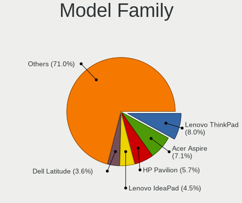
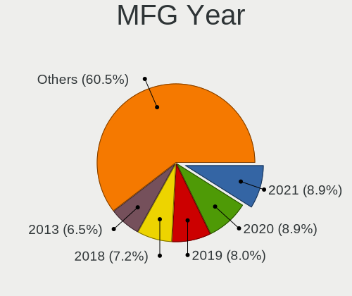
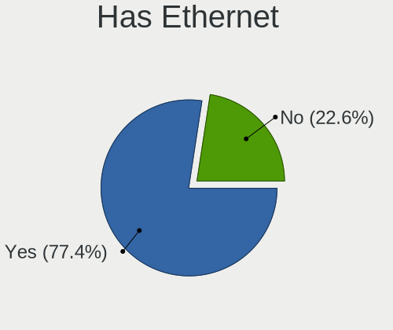
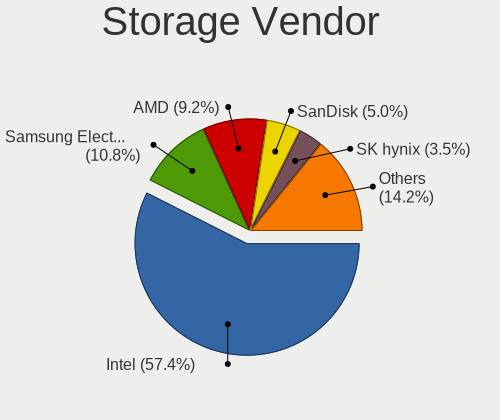
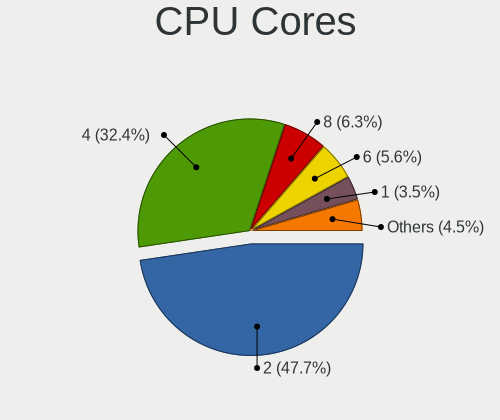
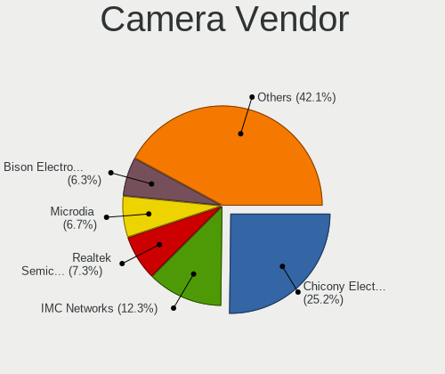

Linux in Italy - Tested Hardware & Statistics (Notebooks)
---------------------------------------------------------

A project to collect tested hardware configurations for Linux in Italy.

Anyone can contribute to this report by the [hw-probe](https://github.com/linuxhw/hw-probe) tool:

    sudo -E hw-probe -all -upload

Please contribute! Especially if your hardware is rare.

Contents
--------

* [ Test Cases ](#test-cases)

* [ System ](#system)
  - [ OS                       ](#os)
  - [ OS Family                ](#os-family)
  - [ Kernel                   ](#kernel)
  - [ Kernel Family            ](#kernel-family)
  - [ Kernel Major Ver.        ](#kernel-major-ver)
  - [ Arch                     ](#arch)
  - [ DE                       ](#de)
  - [ Display Server           ](#display-server)
  - [ Display Manager          ](#display-manager)
  - [ OS Lang                  ](#os-lang)
  - [ Boot Mode                ](#boot-mode)
  - [ Filesystem               ](#filesystem)
  - [ Part. scheme             ](#part-scheme)
  - [ Dual Boot with Linux/BSD ](#dual-boot-with-linuxbsd)
  - [ Dual Boot (Win)          ](#dual-boot-win)

* [ Board ](#board)
  - [ Vendor                   ](#vendor)
  - [ Model                    ](#model)
  - [ Model Family             ](#model-family)
  - [ MFG Year                 ](#mfg-year)
  - [ Form Factor              ](#form-factor)
  - [ Secure Boot              ](#secure-boot)
  - [ Coreboot                 ](#coreboot)
  - [ RAM Size                 ](#ram-size)
  - [ RAM Used                 ](#ram-used)
  - [ Total Drives             ](#total-drives)
  - [ Has CD-ROM               ](#has-cd-rom)
  - [ Has Ethernet             ](#has-ethernet)
  - [ Has WiFi                 ](#has-wifi)
  - [ Has Bluetooth            ](#has-bluetooth)

* [ Location ](#location)
  - [ Country                  ](#country)
  - [ City                     ](#city)

* [ Drives ](#drives)
  - [ Drive Vendor             ](#drive-vendor)
  - [ Drive Model              ](#drive-model)
  - [ HDD Vendor               ](#hdd-vendor)
  - [ SSD Vendor               ](#ssd-vendor)
  - [ Drive Kind               ](#drive-kind)
  - [ Drive Connector          ](#drive-connector)
  - [ Drive Size               ](#drive-size)
  - [ Space Total              ](#space-total)
  - [ Space Used               ](#space-used)
  - [ Malfunc. Drives          ](#malfunc-drives)
  - [ Malfunc. Drive Vendor    ](#malfunc-drive-vendor)
  - [ Malfunc. HDD Vendor      ](#malfunc-hdd-vendor)
  - [ Malfunc. Drive Kind      ](#malfunc-drive-kind)
  - [ Failed Drives            ](#failed-drives)
  - [ Failed Drive Vendor      ](#failed-drive-vendor)
  - [ Drive Status             ](#drive-status)

* [ Storage controller ](#storage-controller)
  - [ Storage Vendor           ](#storage-vendor)
  - [ Storage Model            ](#storage-model)
  - [ Storage Kind             ](#storage-kind)

* [ Processor ](#processor)
  - [ CPU Vendor               ](#cpu-vendor)
  - [ CPU Model                ](#cpu-model)
  - [ CPU Model Family         ](#cpu-model-family)
  - [ CPU Cores                ](#cpu-cores)
  - [ CPU Sockets              ](#cpu-sockets)
  - [ CPU Threads              ](#cpu-threads)
  - [ CPU Op-Modes             ](#cpu-op-modes)
  - [ CPU Microcode            ](#cpu-microcode)
  - [ CPU Microarch            ](#cpu-microarch)

* [ Graphics ](#graphics)
  - [ GPU Vendor               ](#gpu-vendor)
  - [ GPU Model                ](#gpu-model)
  - [ GPU Combo                ](#gpu-combo)
  - [ GPU Driver               ](#gpu-driver)
  - [ GPU Memory               ](#gpu-memory)

* [ Monitor ](#monitor)
  - [ Monitor Vendor           ](#monitor-vendor)
  - [ Monitor Model            ](#monitor-model)
  - [ Monitor Resolution       ](#monitor-resolution)
  - [ Monitor Diagonal         ](#monitor-diagonal)
  - [ Monitor Width            ](#monitor-width)
  - [ Aspect Ratio             ](#aspect-ratio)
  - [ Monitor Area             ](#monitor-area)
  - [ Pixel Density            ](#pixel-density)
  - [ Multiple Monitors        ](#multiple-monitors)

* [ Network ](#network)
  - [ Net Controller Vendor    ](#net-controller-vendor)
  - [ Net Controller Model     ](#net-controller-model)
  - [ Wireless Vendor          ](#wireless-vendor)
  - [ Wireless Model           ](#wireless-model)
  - [ Ethernet Vendor          ](#ethernet-vendor)
  - [ Ethernet Model           ](#ethernet-model)
  - [ Net Controller Kind      ](#net-controller-kind)
  - [ Used Controller          ](#used-controller)
  - [ NICs                     ](#nics)
  - [ IPv6                     ](#ipv6)

* [ Bluetooth ](#bluetooth)
  - [ Bluetooth Vendor         ](#bluetooth-vendor)
  - [ Bluetooth Model          ](#bluetooth-model)

* [ Sound ](#sound)
  - [ Sound Vendor             ](#sound-vendor)
  - [ Sound Model              ](#sound-model)

* [ Memory ](#memory)
  - [ Memory Vendor            ](#memory-vendor)
  - [ Memory Model             ](#memory-model)
  - [ Memory Kind              ](#memory-kind)
  - [ Memory Form Factor       ](#memory-form-factor)
  - [ Memory Size              ](#memory-size)
  - [ Memory Speed             ](#memory-speed)

* [ Printers & scanners ](#printers--scanners)
  - [ Printer Vendor           ](#printer-vendor)
  - [ Printer Model            ](#printer-model)
  - [ Scanner Vendor           ](#scanner-vendor)
  - [ Scanner Model            ](#scanner-model)

* [ Camera ](#camera)
  - [ Camera Vendor            ](#camera-vendor)
  - [ Camera Model             ](#camera-model)

* [ Security ](#security)
  - [ Fingerprint Vendor       ](#fingerprint-vendor)
  - [ Fingerprint Model        ](#fingerprint-model)
  - [ Chipcard Vendor          ](#chipcard-vendor)
  - [ Chipcard Model           ](#chipcard-model)

* [ Unsupported ](#unsupported)
  - [ Unsupported Devices      ](#unsupported-devices)
  - [ Unsupported Device Types ](#unsupported-device-types)

Test Cases
----------

Total: 4086

| Vendor        | Model                       | Probe                                                      | Date         |
|---------------|-----------------------------|------------------------------------------------------------|--------------|
| MSI           | Prestige 14Evo A11M         | [5de20a7cb4](https://linux-hardware.org/?probe=5de20a7cb4) | May 06, 2022 |
| Toshiba       | Satellite C70-C-11L         | [32fd52cba1](https://linux-hardware.org/?probe=32fd52cba1) | May 06, 2022 |
| Toshiba       | Satellite C70-C-11L         | [bda878ed3a](https://linux-hardware.org/?probe=bda878ed3a) | May 06, 2022 |
| Lenovo        | B590 37613LG                | [b0226c712c](https://linux-hardware.org/?probe=b0226c712c) | May 06, 2022 |
| ASUSTek       | GL552VW                     | [e1ece84cc1](https://linux-hardware.org/?probe=e1ece84cc1) | May 05, 2022 |
| Lenovo        | IdeaPad Gaming 3 15ARH05... | [a49301cdaf](https://linux-hardware.org/?probe=a49301cdaf) | May 05, 2022 |
| HUAWEI        | BOM-WXX9                    | [6a3b618bb9](https://linux-hardware.org/?probe=6a3b618bb9) | May 05, 2022 |
| Lenovo        | V110-15ISK 80TL             | [d9436bb9f5](https://linux-hardware.org/?probe=d9436bb9f5) | May 05, 2022 |
| Samsung       | 270E5G/270E5U               | [01d1669345](https://linux-hardware.org/?probe=01d1669345) | May 04, 2022 |
| HP            | 635                         | [66305e8923](https://linux-hardware.org/?probe=66305e8923) | May 04, 2022 |
| Sony          | VGN-FW56J                   | [92f7897c3c](https://linux-hardware.org/?probe=92f7897c3c) | May 04, 2022 |
| ASUSTek       | T300FA                      | [af1316bab5](https://linux-hardware.org/?probe=af1316bab5) | May 04, 2022 |
| Lenovo        | ThinkPad P14s Gen 2a 21A... | [155ac0a54c](https://linux-hardware.org/?probe=155ac0a54c) | May 04, 2022 |
| Lenovo        | ThinkPad X230 2325H50       | [5bd84d8490](https://linux-hardware.org/?probe=5bd84d8490) | May 03, 2022 |
| Samsung       | 270E5G/270E5U               | [883bcc5a52](https://linux-hardware.org/?probe=883bcc5a52) | May 03, 2022 |
| HP            | Compaq CQ58                 | [e42824ac37](https://linux-hardware.org/?probe=e42824ac37) | May 03, 2022 |
| HP            | Compaq 15                   | [201778c9ef](https://linux-hardware.org/?probe=201778c9ef) | May 03, 2022 |
| Microtech     | CoreBookLite                | [5e4647a5c4](https://linux-hardware.org/?probe=5e4647a5c4) | May 03, 2022 |
| Lenovo        | IdeaPad 320S-14IKB 81BN     | [5c929eea1c](https://linux-hardware.org/?probe=5c929eea1c) | May 03, 2022 |
| Toshiba       | Satellite Pro L500          | [5b72ea9a47](https://linux-hardware.org/?probe=5b72ea9a47) | May 02, 2022 |
| MSI           | MS-16Y1                     | [7a8ff17e6c](https://linux-hardware.org/?probe=7a8ff17e6c) | May 02, 2022 |
| ASUSTek       | K53SC                       | [1533323fbf](https://linux-hardware.org/?probe=1533323fbf) | May 02, 2022 |
| Toshiba       | Satellite Pro S500          | [09eded1793](https://linux-hardware.org/?probe=09eded1793) | May 02, 2022 |
| HP            | EliteBook 8470p             | [990f36a507](https://linux-hardware.org/?probe=990f36a507) | May 02, 2022 |
| Acer          | Nitro AN517-54              | [de2960b350](https://linux-hardware.org/?probe=de2960b350) | May 01, 2022 |
| YASHI         | MYBOOK 360                  | [c206790d1e](https://linux-hardware.org/?probe=c206790d1e) | May 01, 2022 |
| ASUSTek       | PU551LA                     | [19e1b6041b](https://linux-hardware.org/?probe=19e1b6041b) | May 01, 2022 |
| Dell          | Latitude 9420               | [4ba28afe84](https://linux-hardware.org/?probe=4ba28afe84) | Apr 30, 2022 |
| Lenovo        | ThinkBook 15 G2 ITL 20VE    | [1abef3591b](https://linux-hardware.org/?probe=1abef3591b) | Apr 30, 2022 |
| Acer          | TM4750                      | [b515682692](https://linux-hardware.org/?probe=b515682692) | Apr 30, 2022 |
| ASUSTek       | ZenBook UX450FDX_UX480FD    | [9f7923bcd2](https://linux-hardware.org/?probe=9f7923bcd2) | Apr 29, 2022 |
| Lenovo        | Yoga S740-14IIL 81RS        | [6affdcee0f](https://linux-hardware.org/?probe=6affdcee0f) | Apr 29, 2022 |
| YASHI         | MYBOOK 360                  | [d44c4fd567](https://linux-hardware.org/?probe=d44c4fd567) | Apr 29, 2022 |
| ASUSTek       | K53SC                       | [f2605ba739](https://linux-hardware.org/?probe=f2605ba739) | Apr 29, 2022 |
| Teclast       | F7 Plus                     | [8096cf3295](https://linux-hardware.org/?probe=8096cf3295) | Apr 29, 2022 |
| Unknown       | X133                        | [b90d940d9e](https://linux-hardware.org/?probe=b90d940d9e) | Apr 29, 2022 |
| Sony          | VGN-FW56J                   | [45c6c458bc](https://linux-hardware.org/?probe=45c6c458bc) | Apr 28, 2022 |
| Toshiba       | Satellite Pro S500          | [eb4ae51e74](https://linux-hardware.org/?probe=eb4ae51e74) | Apr 27, 2022 |
| HP            | 255 G8 Notebook PC          | [782eef0bbe](https://linux-hardware.org/?probe=782eef0bbe) | Apr 27, 2022 |
| Acer          | TM4750                      | [8254e2b47d](https://linux-hardware.org/?probe=8254e2b47d) | Apr 27, 2022 |
| Lenovo        | ThinkPad R61 7735WRF        | [81c8577ab7](https://linux-hardware.org/?probe=81c8577ab7) | Apr 27, 2022 |
| SANTECH       | NHx0EH_EJ_EK                | [f10828c0a8](https://linux-hardware.org/?probe=f10828c0a8) | Apr 27, 2022 |
| HP            | 250 G5 Notebook PC          | [e4ecdec958](https://linux-hardware.org/?probe=e4ecdec958) | Apr 27, 2022 |
| Acer          | Aspire 3810TZ               | [cba19ea352](https://linux-hardware.org/?probe=cba19ea352) | Apr 27, 2022 |
| HP            | 255 G8 Notebook PC          | [17ccf19b71](https://linux-hardware.org/?probe=17ccf19b71) | Apr 26, 2022 |
| ASUSTek       | K53SC                       | [66e086eeaf](https://linux-hardware.org/?probe=66e086eeaf) | Apr 26, 2022 |
| Lenovo        | ThinkPad X230 2333BF6       | [f5e57e219b](https://linux-hardware.org/?probe=f5e57e219b) | Apr 26, 2022 |
| ASUSTek       | K53SC                       | [6676db7948](https://linux-hardware.org/?probe=6676db7948) | Apr 25, 2022 |
| Dell          | Latitude E6410              | [bc9515e4a7](https://linux-hardware.org/?probe=bc9515e4a7) | Apr 25, 2022 |
| HP            | EliteBook 850 G5            | [f147e21cb9](https://linux-hardware.org/?probe=f147e21cb9) | Apr 25, 2022 |
| HP            | EliteBook 850 G5            | [5ec9af6708](https://linux-hardware.org/?probe=5ec9af6708) | Apr 25, 2022 |
| Toshiba       | Satellite A200              | [f940bea00c](https://linux-hardware.org/?probe=f940bea00c) | Apr 25, 2022 |
| Toshiba       | Satellite A200              | [b1594df62f](https://linux-hardware.org/?probe=b1594df62f) | Apr 25, 2022 |
| HP            | 255 G6 Notebook PC          | [ad390bd7b7](https://linux-hardware.org/?probe=ad390bd7b7) | Apr 24, 2022 |
| SANTECH       | NHx0EH_EJ_EK                | [2e51ffc9e7](https://linux-hardware.org/?probe=2e51ffc9e7) | Apr 24, 2022 |
| Acer          | Aspire V5-571G              | [e76a1e5467](https://linux-hardware.org/?probe=e76a1e5467) | Apr 23, 2022 |
| PC Special... | N8xEJEK                     | [344f872508](https://linux-hardware.org/?probe=344f872508) | Apr 23, 2022 |
| Toshiba       | Satellite L50D-B            | [f283519d44](https://linux-hardware.org/?probe=f283519d44) | Apr 22, 2022 |
| HP            | Pavilion 15                 | [a1b094c360](https://linux-hardware.org/?probe=a1b094c360) | Apr 22, 2022 |
| Apple         | MacBookPro9,2               | [2ceab75e03](https://linux-hardware.org/?probe=2ceab75e03) | Apr 22, 2022 |
| ASUSTek       | ROG Zephyrus M16 GU603HE... | [2c48c81559](https://linux-hardware.org/?probe=2c48c81559) | Apr 22, 2022 |
| Lenovo        | ThinkBook 15-IML 20RW       | [28690580aa](https://linux-hardware.org/?probe=28690580aa) | Apr 22, 2022 |
| HP            | Compaq nx7300 (RU608ES#A... | [8910c29183](https://linux-hardware.org/?probe=8910c29183) | Apr 22, 2022 |
| Lenovo        | IdeaPad 500-15ISK 80NT      | [3b670f415f](https://linux-hardware.org/?probe=3b670f415f) | Apr 21, 2022 |
| Razer         | Blade 14 - RZ09-0370        | [51eac6f63f](https://linux-hardware.org/?probe=51eac6f63f) | Apr 21, 2022 |
| Lenovo        | Legion Y530-15ICH 81FV      | [7f31ce6194](https://linux-hardware.org/?probe=7f31ce6194) | Apr 21, 2022 |
| Lenovo        | G50-70 20351                | [270da8f08a](https://linux-hardware.org/?probe=270da8f08a) | Apr 20, 2022 |
| HP            | OMEN by Laptop 16-c0xxx     | [d277143404](https://linux-hardware.org/?probe=d277143404) | Apr 20, 2022 |
| Microtech     | ebookPro                    | [78932bce82](https://linux-hardware.org/?probe=78932bce82) | Apr 19, 2022 |
| Toshiba       | Satellite Pro S500          | [ab247646c8](https://linux-hardware.org/?probe=ab247646c8) | Apr 19, 2022 |
| Toshiba       | Satellite Pro S500          | [5c95055668](https://linux-hardware.org/?probe=5c95055668) | Apr 19, 2022 |
| Dell          | Latitude E5470              | [da9241c331](https://linux-hardware.org/?probe=da9241c331) | Apr 19, 2022 |
| HP            | Compaq 6720s                | [23c39d626c](https://linux-hardware.org/?probe=23c39d626c) | Apr 19, 2022 |
| ASUSTek       | 1101HA                      | [fc482cbbe1](https://linux-hardware.org/?probe=fc482cbbe1) | Apr 18, 2022 |
| ASUSTek       | UL30VT                      | [faad37ee2e](https://linux-hardware.org/?probe=faad37ee2e) | Apr 18, 2022 |
| ASUSTek       | ROG Zephyrus G14 GA401QH... | [5a58c1f799](https://linux-hardware.org/?probe=5a58c1f799) | Apr 18, 2022 |
| Acer          | Aspire E5-571G              | [f37cea6c6f](https://linux-hardware.org/?probe=f37cea6c6f) | Apr 18, 2022 |
| Acer          | Nitro AN515-55              | [6d20f56bba](https://linux-hardware.org/?probe=6d20f56bba) | Apr 17, 2022 |
| Toshiba       | Satellite Pro S500          | [61158a707c](https://linux-hardware.org/?probe=61158a707c) | Apr 16, 2022 |
| Acer          | Nitro AN517-41              | [e955d40057](https://linux-hardware.org/?probe=e955d40057) | Apr 16, 2022 |
| ASUSTek       | X541UAK                     | [811e032c61](https://linux-hardware.org/?probe=811e032c61) | Apr 16, 2022 |
| Apple         | MacBookPro9,2               | [144971e364](https://linux-hardware.org/?probe=144971e364) | Apr 16, 2022 |
| HP            | Compaq 6730s                | [4902d2bf25](https://linux-hardware.org/?probe=4902d2bf25) | Apr 16, 2022 |
| ASUSTek       | X556UB                      | [7174b543f1](https://linux-hardware.org/?probe=7174b543f1) | Apr 15, 2022 |
| ASUSTek       | ROG Zephyrus G14 GA401QM... | [c1273dfd07](https://linux-hardware.org/?probe=c1273dfd07) | Apr 15, 2022 |
| Acer          | Swift SF314-43              | [ac4a3ad35c](https://linux-hardware.org/?probe=ac4a3ad35c) | Apr 15, 2022 |
| HP            | Compaq 6730s                | [755dcc7629](https://linux-hardware.org/?probe=755dcc7629) | Apr 15, 2022 |
| Lenovo        | ThinkPad T15g Gen 1 20UR... | [c60feffffb](https://linux-hardware.org/?probe=c60feffffb) | Apr 14, 2022 |
| Lenovo        | Legion 5 15IMH05H 81Y6      | [68d7627d20](https://linux-hardware.org/?probe=68d7627d20) | Apr 14, 2022 |
| HP            | OMEN Laptop 15-en0xxx       | [7025b1689c](https://linux-hardware.org/?probe=7025b1689c) | Apr 14, 2022 |
| Sony          | SVE1712S1EB                 | [546692479d](https://linux-hardware.org/?probe=546692479d) | Apr 14, 2022 |
| Apple         | MacBookPro10,1              | [471a8b1d51](https://linux-hardware.org/?probe=471a8b1d51) | Apr 14, 2022 |
| Dell          | Latitude E6500              | [d88c77328a](https://linux-hardware.org/?probe=d88c77328a) | Apr 13, 2022 |
| ASUSTek       | N56VV                       | [8ae8e89c42](https://linux-hardware.org/?probe=8ae8e89c42) | Apr 13, 2022 |
| PC Special... | PCx0Dx                      | [6b0f05bf07](https://linux-hardware.org/?probe=6b0f05bf07) | Apr 13, 2022 |
| Notebook      | NL40_50CU                   | [2220d70361](https://linux-hardware.org/?probe=2220d70361) | Apr 13, 2022 |
| MSI           | Modern 15 A11M              | [c3202f68fc](https://linux-hardware.org/?probe=c3202f68fc) | Apr 13, 2022 |
| Lenovo        | Legion S7 15IMH5 82BC       | [96fc2ced60](https://linux-hardware.org/?probe=96fc2ced60) | Apr 13, 2022 |
| HP            | Pavilion Laptop 15-cs0xx... | [7eb23b5a43](https://linux-hardware.org/?probe=7eb23b5a43) | Apr 13, 2022 |
| Acer          | Extensa 5635Z               | [641be7bf1b](https://linux-hardware.org/?probe=641be7bf1b) | Apr 12, 2022 |
| Lenovo        | IdeaPad 320-15ABR 80XS      | [c1180f07e0](https://linux-hardware.org/?probe=c1180f07e0) | Apr 12, 2022 |
| Lenovo        | IdeaPad 700-15ISK 80RU      | [7c4eb57bca](https://linux-hardware.org/?probe=7c4eb57bca) | Apr 12, 2022 |
| ASUSTek       | S551LN                      | [8795a49142](https://linux-hardware.org/?probe=8795a49142) | Apr 12, 2022 |
| ASUSTek       | S551LN                      | [4999fb1eff](https://linux-hardware.org/?probe=4999fb1eff) | Apr 12, 2022 |
| Lenovo        | ThinkPad W541 20EGS24J00    | [6fbd04d8fd](https://linux-hardware.org/?probe=6fbd04d8fd) | Apr 11, 2022 |
| Lenovo        | ThinkPad E570 20H500B5IX    | [28ab9096ba](https://linux-hardware.org/?probe=28ab9096ba) | Apr 11, 2022 |
| Dell          | Vostro 15 5510              | [62fcced15f](https://linux-hardware.org/?probe=62fcced15f) | Apr 11, 2022 |
| Dell          | Vostro 15 5510              | [2a88d30c9b](https://linux-hardware.org/?probe=2a88d30c9b) | Apr 11, 2022 |
| HP            | Laptop 15s-eq2xxx           | [542c9c6703](https://linux-hardware.org/?probe=542c9c6703) | Apr 11, 2022 |
| HP            | ProBook 440 G7              | [f0aa16927c](https://linux-hardware.org/?probe=f0aa16927c) | Apr 11, 2022 |
| Dell          | Vostro 15 3515              | [848a486145](https://linux-hardware.org/?probe=848a486145) | Apr 10, 2022 |
| HP            | EliteBook Folio 9470m       | [c42f3e3b5b](https://linux-hardware.org/?probe=c42f3e3b5b) | Apr 10, 2022 |
| Microtech     | CoreBook                    | [97f07fc56c](https://linux-hardware.org/?probe=97f07fc56c) | Apr 09, 2022 |
| MSI           | Prestige 14Evo A11M         | [831111c8b5](https://linux-hardware.org/?probe=831111c8b5) | Apr 09, 2022 |
| ASUSTek       | K53SC                       | [8b6bb16303](https://linux-hardware.org/?probe=8b6bb16303) | Apr 08, 2022 |
| Acer          | Aspire 7720G                | [8cdee656da](https://linux-hardware.org/?probe=8cdee656da) | Apr 08, 2022 |
| Lenovo        | ThinkPad T430 2349AK5       | [57e3c5731e](https://linux-hardware.org/?probe=57e3c5731e) | Apr 08, 2022 |
| Dell          | Inspiron 3793               | [f39ad72be3](https://linux-hardware.org/?probe=f39ad72be3) | Apr 07, 2022 |
| Lenovo        | ThinkPad T495 20NJ000XIX    | [f00fb05977](https://linux-hardware.org/?probe=f00fb05977) | Apr 07, 2022 |
| HP            | 15                          | [8f4d0a0db7](https://linux-hardware.org/?probe=8f4d0a0db7) | Apr 07, 2022 |
| ASUSTek       | N75SF                       | [e3f8003fb7](https://linux-hardware.org/?probe=e3f8003fb7) | Apr 07, 2022 |
| MSI           | Prestige 14Evo A11M         | [c711343703](https://linux-hardware.org/?probe=c711343703) | Apr 07, 2022 |
| Toshiba       | Satellite A350D             | [ea021d7947](https://linux-hardware.org/?probe=ea021d7947) | Apr 06, 2022 |
| HP            | Pavilion dv6                | [209dbfbea6](https://linux-hardware.org/?probe=209dbfbea6) | Apr 06, 2022 |
| TrekStor      | Notebook Slim S130          | [febbb5b9a2](https://linux-hardware.org/?probe=febbb5b9a2) | Apr 06, 2022 |
| TrekStor      | Notebook Slim S130          | [e941163105](https://linux-hardware.org/?probe=e941163105) | Apr 06, 2022 |
| Chuwi         | HeroBook Pro                | [8fe1e95f48](https://linux-hardware.org/?probe=8fe1e95f48) | Apr 05, 2022 |
| Chuwi         | HeroBook Pro                | [38c91b1b9d](https://linux-hardware.org/?probe=38c91b1b9d) | Apr 05, 2022 |
| Lenovo        | ThinkPad P1 Gen 3 20TJS2... | [00da75f071](https://linux-hardware.org/?probe=00da75f071) | Apr 05, 2022 |
| Dell          | Latitude E7440              | [4c136cb9b6](https://linux-hardware.org/?probe=4c136cb9b6) | Apr 05, 2022 |
| Acer          | E1-510                      | [bdcc9d59ad](https://linux-hardware.org/?probe=bdcc9d59ad) | Apr 05, 2022 |
| HP            | Pavilion dv6500             | [2f18112668](https://linux-hardware.org/?probe=2f18112668) | Apr 04, 2022 |
| Lenovo        | B50-30 80ES                 | [1f107c9bf8](https://linux-hardware.org/?probe=1f107c9bf8) | Apr 04, 2022 |
| Lenovo        | ThinkPad T495 20NJ000XIX    | [bdd5a36f62](https://linux-hardware.org/?probe=bdd5a36f62) | Apr 04, 2022 |
| Dell          | Inspiron 5770               | [6ce105eda2](https://linux-hardware.org/?probe=6ce105eda2) | Apr 04, 2022 |
| Lenovo        | ThinkPad X1 Carbon 6th 2... | [8c1841d2d0](https://linux-hardware.org/?probe=8c1841d2d0) | Apr 03, 2022 |
| Lenovo        | ThinkPad X100e 0022CTO      | [ad4b7e6509](https://linux-hardware.org/?probe=ad4b7e6509) | Apr 03, 2022 |
| Acer          | Aspire E5-573G              | [8c6db85346](https://linux-hardware.org/?probe=8c6db85346) | Apr 03, 2022 |
| Lenovo        | ThinkBook 13s G3 ACN 20Y... | [ba4863a7bb](https://linux-hardware.org/?probe=ba4863a7bb) | Apr 02, 2022 |
| Fujitsu       | LIFEBOOK P701               | [5789c0842c](https://linux-hardware.org/?probe=5789c0842c) | Apr 02, 2022 |
| Acer          | Aspire E5-575G              | [6915f5f706](https://linux-hardware.org/?probe=6915f5f706) | Apr 02, 2022 |
| HP            | EliteBook 840 G5            | [30573f4db5](https://linux-hardware.org/?probe=30573f4db5) | Apr 02, 2022 |
| HP            | Laptop 15-da0xxx            | [b73099e091](https://linux-hardware.org/?probe=b73099e091) | Apr 01, 2022 |
| Microtech     | ebookPro                    | [8f16156037](https://linux-hardware.org/?probe=8f16156037) | Mar 31, 2022 |
| MSI           | Alpha15 A3DD                | [f65aacae8e](https://linux-hardware.org/?probe=f65aacae8e) | Mar 31, 2022 |
| Lenovo        | ThinkBook 15 G2 ITL 20VE    | [8e7fc0aef9](https://linux-hardware.org/?probe=8e7fc0aef9) | Mar 31, 2022 |
| MSI           | Alpha15 A3DD                | [92d79067a7](https://linux-hardware.org/?probe=92d79067a7) | Mar 31, 2022 |
| HUAWEI        | KLVL-WXX9                   | [9a18c2ac1c](https://linux-hardware.org/?probe=9a18c2ac1c) | Mar 31, 2022 |
| Razer         | Blade 15 Base Model (Ear... | [e983db3f40](https://linux-hardware.org/?probe=e983db3f40) | Mar 31, 2022 |
| HUAWEI        | KLVL-WXX9                   | [ceae86aef1](https://linux-hardware.org/?probe=ceae86aef1) | Mar 30, 2022 |
| Acer          | Aspire A315-55G             | [d5e0c99be3](https://linux-hardware.org/?probe=d5e0c99be3) | Mar 30, 2022 |
| HP            | 255 G5                      | [a90f8842e7](https://linux-hardware.org/?probe=a90f8842e7) | Mar 30, 2022 |
| Toshiba       | TECRA Z50-A                 | [cd333e5720](https://linux-hardware.org/?probe=cd333e5720) | Mar 30, 2022 |
| HP            | ProBook 640 G1              | [0834bd783c](https://linux-hardware.org/?probe=0834bd783c) | Mar 30, 2022 |
| HP            | Laptop 14-dq1xxx            | [9a1238141d](https://linux-hardware.org/?probe=9a1238141d) | Mar 30, 2022 |
| Dell          | Latitude 5285               | [162d3bef44](https://linux-hardware.org/?probe=162d3bef44) | Mar 29, 2022 |
| MSI           | GP76 Leopard 11UG           | [93a6b587c2](https://linux-hardware.org/?probe=93a6b587c2) | Mar 29, 2022 |
| SANTECH       | NHx0EH_EJ_EK                | [58ffa7ef4f](https://linux-hardware.org/?probe=58ffa7ef4f) | Mar 29, 2022 |
| Packard Be... | DOT S                       | [85e7386152](https://linux-hardware.org/?probe=85e7386152) | Mar 28, 2022 |
| Acer          | Aspire ES1-520              | [95df1e3190](https://linux-hardware.org/?probe=95df1e3190) | Mar 28, 2022 |
| Packard Be... | DOT S                       | [edef12b9d5](https://linux-hardware.org/?probe=edef12b9d5) | Mar 28, 2022 |
| Lenovo        | ThinkPad E14 Gen 2 20T60... | [9554184dcd](https://linux-hardware.org/?probe=9554184dcd) | Mar 28, 2022 |
| Dell          | XPS 15 9500                 | [26c61ab42f](https://linux-hardware.org/?probe=26c61ab42f) | Mar 27, 2022 |
| Acer          | Aspire E5-573G              | [6aa00c9a30](https://linux-hardware.org/?probe=6aa00c9a30) | Mar 27, 2022 |
| Acer          | Aspire E5-573G              | [91bcc1e69c](https://linux-hardware.org/?probe=91bcc1e69c) | Mar 27, 2022 |
| Dell          | Latitude 5285               | [d5a93ff0d5](https://linux-hardware.org/?probe=d5a93ff0d5) | Mar 26, 2022 |
| ASUSTek       | 1101HA                      | [2c4815fb69](https://linux-hardware.org/?probe=2c4815fb69) | Mar 26, 2022 |
| MSI           | Prestige 14Evo A11M         | [5f0a0a6f31](https://linux-hardware.org/?probe=5f0a0a6f31) | Mar 26, 2022 |
| HP            | Pavilion g6                 | [4a6403215e](https://linux-hardware.org/?probe=4a6403215e) | Mar 26, 2022 |
| HP            | 255 G6 Notebook PC          | [2e45272bc9](https://linux-hardware.org/?probe=2e45272bc9) | Mar 26, 2022 |
| Acer          | E1-510                      | [acfbdcfffc](https://linux-hardware.org/?probe=acfbdcfffc) | Mar 25, 2022 |
| Dell          | Inspiron 5379               | [85c7a99f91](https://linux-hardware.org/?probe=85c7a99f91) | Mar 25, 2022 |
| HUAWEI        | BOHK-WAX9X                  | [da358bbf5c](https://linux-hardware.org/?probe=da358bbf5c) | Mar 25, 2022 |
| Sony          | VGN-FW56J                   | [79349dfa9f](https://linux-hardware.org/?probe=79349dfa9f) | Mar 25, 2022 |
| Acer          | Aspire 5755G                | [89fc7544dc](https://linux-hardware.org/?probe=89fc7544dc) | Mar 25, 2022 |
| Acer          | Aspire 5755G                | [5cf1cbb4b2](https://linux-hardware.org/?probe=5cf1cbb4b2) | Mar 25, 2022 |
| HP            | 255 G8 Notebook PC          | [d51166d2be](https://linux-hardware.org/?probe=d51166d2be) | Mar 25, 2022 |
| HP            | 255 G8 Notebook PC          | [496d2fd146](https://linux-hardware.org/?probe=496d2fd146) | Mar 25, 2022 |
| Lenovo        | ThinkPad SL500 274677G      | [1fcd4e44f1](https://linux-hardware.org/?probe=1fcd4e44f1) | Mar 25, 2022 |
| Dell          | XPS 15 9500                 | [911fd95d9f](https://linux-hardware.org/?probe=911fd95d9f) | Mar 25, 2022 |
| Dell          | XPS 17 9710                 | [4f862c8b5e](https://linux-hardware.org/?probe=4f862c8b5e) | Mar 25, 2022 |
| HP            | ProBook 455 G8 Notebook ... | [6796eb3981](https://linux-hardware.org/?probe=6796eb3981) | Mar 24, 2022 |
| Dell          | Latitude 9420               | [bee4bccd5f](https://linux-hardware.org/?probe=bee4bccd5f) | Mar 24, 2022 |
| Lenovo        | V145-15AST 81MT             | [10ea2311cc](https://linux-hardware.org/?probe=10ea2311cc) | Mar 24, 2022 |
| ASUSTek       | VivoBook S15 X510UF         | [10bc700e9b](https://linux-hardware.org/?probe=10bc700e9b) | Mar 23, 2022 |
| HUAWEI        | BOHK-WAX9X                  | [912cb19656](https://linux-hardware.org/?probe=912cb19656) | Mar 23, 2022 |
| HUAWEI        | BOHK-WAX9X                  | [55730a4af8](https://linux-hardware.org/?probe=55730a4af8) | Mar 23, 2022 |
| Toshiba       | Satellite Pro S500          | [911b18f8d4](https://linux-hardware.org/?probe=911b18f8d4) | Mar 23, 2022 |
| ASUSTek       | X405UA                      | [1895364071](https://linux-hardware.org/?probe=1895364071) | Mar 22, 2022 |
| HP            | Pavilion x2 Detachable      | [a82a2739a8](https://linux-hardware.org/?probe=a82a2739a8) | Mar 22, 2022 |
| Lenovo        | Legion S7 15IMH5 82BC       | [5a5b9bfbe4](https://linux-hardware.org/?probe=5a5b9bfbe4) | Mar 22, 2022 |
| HP            | 255 G8 Notebook PC          | [5adc6f4d6b](https://linux-hardware.org/?probe=5adc6f4d6b) | Mar 21, 2022 |
| HP            | EliteBook 745 G6            | [a3f94c2957](https://linux-hardware.org/?probe=a3f94c2957) | Mar 20, 2022 |
| Acer          | Nitro AN515-55              | [4354802bd6](https://linux-hardware.org/?probe=4354802bd6) | Mar 20, 2022 |
| Lenovo        | V145-15AST 81MT             | [92126b1954](https://linux-hardware.org/?probe=92126b1954) | Mar 20, 2022 |
| Dell          | Latitude E5530 non-vPro     | [30d244eb42](https://linux-hardware.org/?probe=30d244eb42) | Mar 20, 2022 |
| Lenovo        | Legion S7 15IMH5 82BC       | [afeb6102a1](https://linux-hardware.org/?probe=afeb6102a1) | Mar 20, 2022 |
| Lenovo        | Legion S7 15IMH5 82BC       | [6f0abc624a](https://linux-hardware.org/?probe=6f0abc624a) | Mar 20, 2022 |
| Lenovo        | G50-45 80E3                 | [9ffca5e95b](https://linux-hardware.org/?probe=9ffca5e95b) | Mar 20, 2022 |
| Fujitsu Si... | LIFEBOOK E8410              | [1b9131d30f](https://linux-hardware.org/?probe=1b9131d30f) | Mar 19, 2022 |
| Fujitsu Si... | LIFEBOOK E8410              | [e5e77babce](https://linux-hardware.org/?probe=e5e77babce) | Mar 19, 2022 |
| Sony          | VPCEB1S1E                   | [4b9ad8654e](https://linux-hardware.org/?probe=4b9ad8654e) | Mar 19, 2022 |
| Samsung       | R510/P510                   | [5ec1b197a4](https://linux-hardware.org/?probe=5ec1b197a4) | Mar 19, 2022 |
| HP            | Pavilion Gaming Laptop 1... | [ff8b4a174d](https://linux-hardware.org/?probe=ff8b4a174d) | Mar 19, 2022 |
| Lenovo        | ThinkPad X1 Carbon 3rd 2... | [38a582ce12](https://linux-hardware.org/?probe=38a582ce12) | Mar 19, 2022 |
| Dell          | Vostro 15 3515              | [6806f47a62](https://linux-hardware.org/?probe=6806f47a62) | Mar 19, 2022 |
| Lenovo        | ThinkPad X1 Carbon 3rd 2... | [6f2b0728d0](https://linux-hardware.org/?probe=6f2b0728d0) | Mar 19, 2022 |
| Sony          | VPCEB4E1E                   | [51c7b5aa1a](https://linux-hardware.org/?probe=51c7b5aa1a) | Mar 18, 2022 |
| HP            | Pavilion 15                 | [efb1a65f52](https://linux-hardware.org/?probe=efb1a65f52) | Mar 18, 2022 |
| HP            | Pavilion 15                 | [a2c3aac64f](https://linux-hardware.org/?probe=a2c3aac64f) | Mar 18, 2022 |
| HP            | Pavilion g6                 | [0762474e5f](https://linux-hardware.org/?probe=0762474e5f) | Mar 18, 2022 |
| ASUSTek       | VivoBook_ASUSLaptop X512... | [f3ce1536e5](https://linux-hardware.org/?probe=f3ce1536e5) | Mar 17, 2022 |
| Dell          | Inspiron 16 7610            | [50e24fc89b](https://linux-hardware.org/?probe=50e24fc89b) | Mar 17, 2022 |
| Lenovo        | G50-70 20351                | [16ced37ed8](https://linux-hardware.org/?probe=16ced37ed8) | Mar 17, 2022 |
| Teclast       | F15 Plus                    | [9d3b8151f2](https://linux-hardware.org/?probe=9d3b8151f2) | Mar 16, 2022 |
| Lenovo        | ThinkBook 15-IIL 20SM       | [147ab6c35e](https://linux-hardware.org/?probe=147ab6c35e) | Mar 16, 2022 |
| Lenovo        | IdeaPad 3 15IIL05 81WE      | [c019034627](https://linux-hardware.org/?probe=c019034627) | Mar 16, 2022 |
| Lenovo        | IdeaPad 3 15IIL05 81WE      | [e21f056afe](https://linux-hardware.org/?probe=e21f056afe) | Mar 16, 2022 |
| Acer          | Aspire 5935                 | [69cae65bf4](https://linux-hardware.org/?probe=69cae65bf4) | Mar 16, 2022 |
| Acer          | Aspire 5935                 | [67a1970f50](https://linux-hardware.org/?probe=67a1970f50) | Mar 16, 2022 |
| Dell          | Latitude E6220              | [e2c9477eb3](https://linux-hardware.org/?probe=e2c9477eb3) | Mar 15, 2022 |
| Acer          | Aspire A515-52G             | [13775d028d](https://linux-hardware.org/?probe=13775d028d) | Mar 15, 2022 |
| HP            | Laptop 15s-eq2xxx           | [189e272099](https://linux-hardware.org/?probe=189e272099) | Mar 13, 2022 |
| Samsung       | Q210/P210                   | [9c189ebc8d](https://linux-hardware.org/?probe=9c189ebc8d) | Mar 13, 2022 |
| Acer          | Aspire A315-41              | [704438d05e](https://linux-hardware.org/?probe=704438d05e) | Mar 13, 2022 |
| Acer          | Aspire A315-41              | [571547ee1d](https://linux-hardware.org/?probe=571547ee1d) | Mar 13, 2022 |
| Toshiba       | Satellite Pro S500          | [9976a7321c](https://linux-hardware.org/?probe=9976a7321c) | Mar 13, 2022 |
| Lenovo        | IdeaPad 320S-15IKB 81BQ     | [088d2bf23b](https://linux-hardware.org/?probe=088d2bf23b) | Mar 13, 2022 |
| Toshiba       | Satellite Pro C660          | [2a2400c148](https://linux-hardware.org/?probe=2a2400c148) | Mar 13, 2022 |
| ASUSTek       | X550LA                      | [eb7071ed13](https://linux-hardware.org/?probe=eb7071ed13) | Mar 12, 2022 |
| Lenovo        | ThinkPad R400 7440CL2       | [04ddfc86f6](https://linux-hardware.org/?probe=04ddfc86f6) | Mar 12, 2022 |
| ASUSTek       | VivoBook_ASUS Laptop X50... | [0ec42d934b](https://linux-hardware.org/?probe=0ec42d934b) | Mar 12, 2022 |
| Microtech     | ebookPro                    | [153f9c3d37](https://linux-hardware.org/?probe=153f9c3d37) | Mar 11, 2022 |
| Acer          | TravelMate P253             | [809073b4d7](https://linux-hardware.org/?probe=809073b4d7) | Mar 10, 2022 |
| Samsung       | RC530/RC730                 | [859b5c10cd](https://linux-hardware.org/?probe=859b5c10cd) | Mar 10, 2022 |
| HP            | Stream Laptop 14-ax0XX      | [f4a2cbf25a](https://linux-hardware.org/?probe=f4a2cbf25a) | Mar 10, 2022 |
| HP            | Pavilion dv6                | [5ee398dbbd](https://linux-hardware.org/?probe=5ee398dbbd) | Mar 10, 2022 |
| Acer          | Aspire 5750G                | [066fecf595](https://linux-hardware.org/?probe=066fecf595) | Mar 10, 2022 |
| Lenovo        | IdeaPad 3 15ALC6 82KU       | [8f01a08655](https://linux-hardware.org/?probe=8f01a08655) | Mar 10, 2022 |
| Acer          | Aspire 5750G                | [a308e376c2](https://linux-hardware.org/?probe=a308e376c2) | Mar 09, 2022 |
| HP            | ProBook 6560b               | [42020405ab](https://linux-hardware.org/?probe=42020405ab) | Mar 08, 2022 |
| Razer         | Blade 15 Base Model (Ear... | [41cf1e13aa](https://linux-hardware.org/?probe=41cf1e13aa) | Mar 08, 2022 |
| Razer         | Blade 15 Base Model (Ear... | [35c65c10b0](https://linux-hardware.org/?probe=35c65c10b0) | Mar 08, 2022 |
| ASUSTek       | K53SC                       | [117876c3aa](https://linux-hardware.org/?probe=117876c3aa) | Mar 07, 2022 |
| Toshiba       | Satellite Pro S500          | [07c8fb9565](https://linux-hardware.org/?probe=07c8fb9565) | Mar 07, 2022 |
| ASUSTek       | X555LAB                     | [4f9b339dd5](https://linux-hardware.org/?probe=4f9b339dd5) | Mar 07, 2022 |
| Fujitsu Si... | AMILO Li 2732               | [0bdeea54a6](https://linux-hardware.org/?probe=0bdeea54a6) | Mar 07, 2022 |
| Fujitsu Si... | AMILO Li 2732               | [9f61c70952](https://linux-hardware.org/?probe=9f61c70952) | Mar 07, 2022 |
| ASUSTek       | K53SC                       | [7eba0c2355](https://linux-hardware.org/?probe=7eba0c2355) | Mar 07, 2022 |
| Fujitsu       | LIFEBOOK E751               | [c46fa05c07](https://linux-hardware.org/?probe=c46fa05c07) | Mar 07, 2022 |
| ASUSTek       | K52JT                       | [d8a321aae3](https://linux-hardware.org/?probe=d8a321aae3) | Mar 06, 2022 |
| Acer          | Aspire A315-55G             | [2dd27496c9](https://linux-hardware.org/?probe=2dd27496c9) | Mar 06, 2022 |
| ASUSTek       | UX331UN                     | [f1cf640532](https://linux-hardware.org/?probe=f1cf640532) | Mar 06, 2022 |
| Lenovo        | Z50-75 80EC                 | [ff0b74c0b7](https://linux-hardware.org/?probe=ff0b74c0b7) | Mar 06, 2022 |
| HUAWEI        | BOHB-WAX9                   | [915ca09de4](https://linux-hardware.org/?probe=915ca09de4) | Mar 05, 2022 |
| ASUSTek       | X580VN                      | [b942413aa7](https://linux-hardware.org/?probe=b942413aa7) | Mar 05, 2022 |
| Lenovo        | G50-70 20351                | [0f4e501d1f](https://linux-hardware.org/?probe=0f4e501d1f) | Mar 05, 2022 |
| Acer          | Nitro AN517-52              | [4576110ce4](https://linux-hardware.org/?probe=4576110ce4) | Mar 05, 2022 |
| ASUSTek       | X555DG                      | [74e5474a84](https://linux-hardware.org/?probe=74e5474a84) | Mar 05, 2022 |
| ASUSTek       | T100HAN                     | [22e9c0f37c](https://linux-hardware.org/?probe=22e9c0f37c) | Mar 05, 2022 |
| ASUSTek       | X405UA                      | [1e2f63c24b](https://linux-hardware.org/?probe=1e2f63c24b) | Mar 05, 2022 |
| Dell          | Venue 11 Pro 7130 vPro      | [57b302b119](https://linux-hardware.org/?probe=57b302b119) | Mar 05, 2022 |
| Lenovo        | IdeaPadFlex 10 20324        | [9f925455e8](https://linux-hardware.org/?probe=9f925455e8) | Mar 04, 2022 |
| Lenovo        | G500 20236                  | [9a400ff743](https://linux-hardware.org/?probe=9a400ff743) | Mar 04, 2022 |
| ASUSTek       | K53SC                       | [8b1f9a1f9c](https://linux-hardware.org/?probe=8b1f9a1f9c) | Mar 04, 2022 |
| ASUSTek       | K53SC                       | [d8687f064f](https://linux-hardware.org/?probe=d8687f064f) | Mar 04, 2022 |
| ASUSTek       | X102BA                      | [dd03a06a21](https://linux-hardware.org/?probe=dd03a06a21) | Mar 03, 2022 |
| ASUSTek       | UX331UN                     | [463899cdb7](https://linux-hardware.org/?probe=463899cdb7) | Mar 02, 2022 |
| Samsung       | RC530/RC730                 | [5a235f718e](https://linux-hardware.org/?probe=5a235f718e) | Mar 01, 2022 |
| Lenovo        | ThinkPad X1 Carbon 2nd 2... | [27797bf55a](https://linux-hardware.org/?probe=27797bf55a) | Mar 01, 2022 |
| HP            | ProBook 4520s               | [05dc6c2114](https://linux-hardware.org/?probe=05dc6c2114) | Feb 28, 2022 |
| Lenovo        | U310                        | [856a65502e](https://linux-hardware.org/?probe=856a65502e) | Feb 28, 2022 |
| Dell          | Latitude 5591               | [0bc1368ac5](https://linux-hardware.org/?probe=0bc1368ac5) | Feb 28, 2022 |
| ASUSTek       | X202E                       | [a8ceeefa2d](https://linux-hardware.org/?probe=a8ceeefa2d) | Feb 28, 2022 |
| Sony          | VPCEH2E0E                   | [8f42776e23](https://linux-hardware.org/?probe=8f42776e23) | Feb 28, 2022 |
| Lenovo        | Z50-75 80EC                 | [7b706624c6](https://linux-hardware.org/?probe=7b706624c6) | Feb 27, 2022 |
| Lenovo        | Z50-75 80EC                 | [edf65ba872](https://linux-hardware.org/?probe=edf65ba872) | Feb 27, 2022 |
| Dell          | Latitude E4300              | [3efd166e47](https://linux-hardware.org/?probe=3efd166e47) | Feb 27, 2022 |
| ASUSTek       | K50IJ                       | [8f931f7385](https://linux-hardware.org/?probe=8f931f7385) | Feb 25, 2022 |
| HP            | 255 G7 Notebook PC          | [cdcea77db0](https://linux-hardware.org/?probe=cdcea77db0) | Feb 25, 2022 |
| Lenovo        | ThinkPad E15 Gen 3 20YGC... | [279a26d7e5](https://linux-hardware.org/?probe=279a26d7e5) | Feb 25, 2022 |
| HP            | Notebook                    | [acdbd7eaaf](https://linux-hardware.org/?probe=acdbd7eaaf) | Feb 24, 2022 |
| Fujitsu       | LIFEBOOK A514               | [59306c1b61](https://linux-hardware.org/?probe=59306c1b61) | Feb 23, 2022 |
| Samsung       | 750XDA                      | [ad6823c08e](https://linux-hardware.org/?probe=ad6823c08e) | Feb 23, 2022 |
| Fujitsu       | LIFEBOOK A514               | [32503c1847](https://linux-hardware.org/?probe=32503c1847) | Feb 23, 2022 |
| Dell          | Latitude 7480               | [fbd2d9b5c7](https://linux-hardware.org/?probe=fbd2d9b5c7) | Feb 23, 2022 |
| Dell          | Latitude E4300              | [ff42bce998](https://linux-hardware.org/?probe=ff42bce998) | Feb 23, 2022 |
| Dell          | Latitude E4300              | [ce00b44454](https://linux-hardware.org/?probe=ce00b44454) | Feb 23, 2022 |
| Alienware     | Area-51m R2                 | [65a1979bb3](https://linux-hardware.org/?probe=65a1979bb3) | Feb 22, 2022 |
| Lenovo        | ThinkPad X1 Carbon 2nd 2... | [4327d37f2d](https://linux-hardware.org/?probe=4327d37f2d) | Feb 22, 2022 |
| Acer          | Swift SF314-52              | [d5d23d1841](https://linux-hardware.org/?probe=d5d23d1841) | Feb 22, 2022 |
| HP            | EliteBook 820 G1            | [f7beb95ac9](https://linux-hardware.org/?probe=f7beb95ac9) | Feb 22, 2022 |
| HP            | Pavilion dv5                | [38d3a28768](https://linux-hardware.org/?probe=38d3a28768) | Feb 22, 2022 |
| Sony          | VPCEH3L1E                   | [4fa6aebb55](https://linux-hardware.org/?probe=4fa6aebb55) | Feb 21, 2022 |
| ASUSTek       | VivoBook 15_ASUS Laptop ... | [41b5d73df1](https://linux-hardware.org/?probe=41b5d73df1) | Feb 21, 2022 |
| ASUSTek       | E402SA                      | [b9796e46de](https://linux-hardware.org/?probe=b9796e46de) | Feb 20, 2022 |
| HP            | 255 G4                      | [631246447d](https://linux-hardware.org/?probe=631246447d) | Feb 20, 2022 |
| HP            | Notebook                    | [6d501d45fd](https://linux-hardware.org/?probe=6d501d45fd) | Feb 20, 2022 |
| Mediacom      | SmartBook 14 FullHD - SB... | [bf747a6763](https://linux-hardware.org/?probe=bf747a6763) | Feb 19, 2022 |
| Acer          | Aspire A515-51G             | [c11057eac9](https://linux-hardware.org/?probe=c11057eac9) | Feb 19, 2022 |
| HP            | Compaq CQ58                 | [fc3b92e02f](https://linux-hardware.org/?probe=fc3b92e02f) | Feb 19, 2022 |
| Acer          | Aspire E5-575G              | [52f178c230](https://linux-hardware.org/?probe=52f178c230) | Feb 19, 2022 |
| HP            | Laptop 15-bw0xx             | [fa638b506a](https://linux-hardware.org/?probe=fa638b506a) | Feb 19, 2022 |
| Acer          | Aspire 5935                 | [db6f479fdd](https://linux-hardware.org/?probe=db6f479fdd) | Feb 18, 2022 |
| HP            | 620                         | [9824e767d3](https://linux-hardware.org/?probe=9824e767d3) | Feb 18, 2022 |
| Lenovo        | ThinkPad W541 20EGS24J00    | [e2ab1c19df](https://linux-hardware.org/?probe=e2ab1c19df) | Feb 18, 2022 |
| HP            | Pavilion Gaming Laptop 1... | [499191c566](https://linux-hardware.org/?probe=499191c566) | Feb 18, 2022 |
| ASUSTek       | X555YI                      | [8bc0136607](https://linux-hardware.org/?probe=8bc0136607) | Feb 18, 2022 |
| HP            | Presario CQ61               | [92054824d8](https://linux-hardware.org/?probe=92054824d8) | Feb 18, 2022 |
| HP            | Presario CQ61               | [bb314dee54](https://linux-hardware.org/?probe=bb314dee54) | Feb 18, 2022 |
| HP            | Notebook                    | [a3d5180134](https://linux-hardware.org/?probe=a3d5180134) | Feb 17, 2022 |
| HP            | Pavilion Laptop 14-ce0xx... | [ffb9eb537e](https://linux-hardware.org/?probe=ffb9eb537e) | Feb 17, 2022 |
| Microtech     | ebookPro                    | [a124ffb211](https://linux-hardware.org/?probe=a124ffb211) | Feb 17, 2022 |
| Acer          | TravelMate 7730G            | [14146a65af](https://linux-hardware.org/?probe=14146a65af) | Feb 17, 2022 |
| AZW           | GT-R                        | [d7e250a9b8](https://linux-hardware.org/?probe=d7e250a9b8) | Feb 17, 2022 |
| ASUSTek       | T200TAC                     | [20834c0dba](https://linux-hardware.org/?probe=20834c0dba) | Feb 17, 2022 |
| ASUSTek       | T200TAC                     | [ffd9891203](https://linux-hardware.org/?probe=ffd9891203) | Feb 17, 2022 |
| HP            | Compaq 6730b                | [bd5616251e](https://linux-hardware.org/?probe=bd5616251e) | Feb 17, 2022 |
| Dell          | Latitude 9420               | [80a2f3e508](https://linux-hardware.org/?probe=80a2f3e508) | Feb 17, 2022 |
| ASUSTek       | K53SD                       | [d0ecebab71](https://linux-hardware.org/?probe=d0ecebab71) | Feb 16, 2022 |
| Lenovo        | XiaoXinPro 16ACH 2021 82... | [354434e81d](https://linux-hardware.org/?probe=354434e81d) | Feb 16, 2022 |
| HP            | ProBook 4520s               | [04fd51b48e](https://linux-hardware.org/?probe=04fd51b48e) | Feb 16, 2022 |
| Lenovo        | IdeaPad S206 2638           | [d646606f2b](https://linux-hardware.org/?probe=d646606f2b) | Feb 16, 2022 |
| Lenovo        | B50-30 80ES                 | [d9b49b400b](https://linux-hardware.org/?probe=d9b49b400b) | Feb 16, 2022 |
| Lenovo        | ThinkPad T470 20JNS08H00    | [f97643f94c](https://linux-hardware.org/?probe=f97643f94c) | Feb 16, 2022 |
| HP            | OMEN by Laptop 15-dc1xxx    | [bc0bb93209](https://linux-hardware.org/?probe=bc0bb93209) | Feb 15, 2022 |
| HP            | Pavilion 15                 | [3bd713bd35](https://linux-hardware.org/?probe=3bd713bd35) | Feb 15, 2022 |
| HP            | 250 G7 Notebook PC          | [00251b219f](https://linux-hardware.org/?probe=00251b219f) | Feb 14, 2022 |
| HP            | Pavilion Laptop 15-eg0xx... | [95e3f94065](https://linux-hardware.org/?probe=95e3f94065) | Feb 14, 2022 |
| ASUSTek       | X550WE                      | [beed529fc3](https://linux-hardware.org/?probe=beed529fc3) | Feb 14, 2022 |
| Packard Be... | EasyNote TJ65               | [8a31f29547](https://linux-hardware.org/?probe=8a31f29547) | Feb 14, 2022 |
| Lenovo        | IdeaPad S145-15API 81UT     | [d9b970a3f2](https://linux-hardware.org/?probe=d9b970a3f2) | Feb 14, 2022 |
| ASUSTek       | E402NA                      | [ec217b7bd1](https://linux-hardware.org/?probe=ec217b7bd1) | Feb 13, 2022 |
| Razer         | Blade 14 - RZ09-0370        | [e3fd65aa29](https://linux-hardware.org/?probe=e3fd65aa29) | Feb 13, 2022 |
| Packard Be... | EasyNote TE11HC             | [e7c108139b](https://linux-hardware.org/?probe=e7c108139b) | Feb 12, 2022 |
| Packard Be... | EasyNote TE11HC             | [9bf695f39f](https://linux-hardware.org/?probe=9bf695f39f) | Feb 12, 2022 |
| ASUSTek       | VivoBook_ASUSLaptop X530... | [9110a471ac](https://linux-hardware.org/?probe=9110a471ac) | Feb 12, 2022 |
| Microtech     | CoreBook                    | [a44b1610bc](https://linux-hardware.org/?probe=a44b1610bc) | Feb 12, 2022 |
| Dell          | Vostro 3559                 | [02bc6c4a34](https://linux-hardware.org/?probe=02bc6c4a34) | Feb 12, 2022 |
| Lenovo        | G50-70 20351                | [c3671feac6](https://linux-hardware.org/?probe=c3671feac6) | Feb 12, 2022 |
| Lenovo        | G50-70 20351                | [3ea53e359a](https://linux-hardware.org/?probe=3ea53e359a) | Feb 12, 2022 |
| HP            | 255 G7 Notebook PC          | [3dd53bfe23](https://linux-hardware.org/?probe=3dd53bfe23) | Feb 12, 2022 |
| ASUSTek       | TAICHI31                    | [760fdd8fdd](https://linux-hardware.org/?probe=760fdd8fdd) | Feb 12, 2022 |
| HP            | EliteBook 8570p             | [9db0010267](https://linux-hardware.org/?probe=9db0010267) | Feb 11, 2022 |
| Acer          | TravelMate 7730G            | [bb7eb08ebb](https://linux-hardware.org/?probe=bb7eb08ebb) | Feb 11, 2022 |
| Sony          | VPCZ11X9E                   | [41f76e701c](https://linux-hardware.org/?probe=41f76e701c) | Feb 11, 2022 |
| Lenovo        | ThinkPad T14 Gen 1 20S00... | [39dbce5e49](https://linux-hardware.org/?probe=39dbce5e49) | Feb 11, 2022 |
| Acer          | Aspire 5750G                | [0f7da36e7e](https://linux-hardware.org/?probe=0f7da36e7e) | Feb 11, 2022 |
| Acer          | Aspire 5750G                | [11d24586e8](https://linux-hardware.org/?probe=11d24586e8) | Feb 11, 2022 |
| Acer          | Swift SF314-43              | [2a2573e162](https://linux-hardware.org/?probe=2a2573e162) | Feb 11, 2022 |
| Acer          | TravelMate B117-M           | [148a39d164](https://linux-hardware.org/?probe=148a39d164) | Feb 10, 2022 |
| Toshiba       | Satellite Pro S500          | [fc4ab4d1dc](https://linux-hardware.org/?probe=fc4ab4d1dc) | Feb 10, 2022 |
| Acer          | Aspire E5-571               | [c9317e5bc5](https://linux-hardware.org/?probe=c9317e5bc5) | Feb 10, 2022 |
| ASUSTek       | X555LAB                     | [4c0c519cde](https://linux-hardware.org/?probe=4c0c519cde) | Feb 10, 2022 |
| Acer          | Aspire F5-573G              | [de6408497a](https://linux-hardware.org/?probe=de6408497a) | Feb 10, 2022 |
| Dell          | Latitude E6230              | [9a78278ecc](https://linux-hardware.org/?probe=9a78278ecc) | Feb 10, 2022 |
| ASUSTek       | K52N                        | [840d632adf](https://linux-hardware.org/?probe=840d632adf) | Feb 10, 2022 |
| Samsung       | 305V4A/305V5A               | [07233a144c](https://linux-hardware.org/?probe=07233a144c) | Feb 09, 2022 |
| HP            | EliteBook 850 G7 Noteboo... | [9dea900c40](https://linux-hardware.org/?probe=9dea900c40) | Feb 09, 2022 |
| HP            | ProBook 430 G7              | [91a9c529f1](https://linux-hardware.org/?probe=91a9c529f1) | Feb 09, 2022 |
| Lenovo        | ThinkPad X240 20AMA18CIX    | [d1a32f6e9e](https://linux-hardware.org/?probe=d1a32f6e9e) | Feb 09, 2022 |
| HP            | 15                          | [e2d83073ec](https://linux-hardware.org/?probe=e2d83073ec) | Feb 09, 2022 |
| Toshiba       | Satellite Pro S500          | [5b814e0d6e](https://linux-hardware.org/?probe=5b814e0d6e) | Feb 09, 2022 |
| MSI           | GE62 7RE                    | [dba21298d0](https://linux-hardware.org/?probe=dba21298d0) | Feb 09, 2022 |
| AZW           | GT-R                        | [7d67299afc](https://linux-hardware.org/?probe=7d67299afc) | Feb 08, 2022 |
| HP            | ProBook 450 G6              | [a632707345](https://linux-hardware.org/?probe=a632707345) | Feb 08, 2022 |
| Dell          | Precision 5530              | [4bb426e493](https://linux-hardware.org/?probe=4bb426e493) | Feb 08, 2022 |
| HP            | ProBook 430 G7              | [7cc0d251ea](https://linux-hardware.org/?probe=7cc0d251ea) | Feb 08, 2022 |
| ASUSTek       | VivoBook_ASUSLaptop X512... | [6ee082de04](https://linux-hardware.org/?probe=6ee082de04) | Feb 08, 2022 |
| HP            | Pavilion Gaming Laptop 1... | [af4419f6e4](https://linux-hardware.org/?probe=af4419f6e4) | Feb 08, 2022 |
| ASUSTek       | VivoBook_ASUSLaptop X512... | [534c935b15](https://linux-hardware.org/?probe=534c935b15) | Feb 08, 2022 |
| HP            | Pavilion Gaming Laptop 1... | [b14fd9654f](https://linux-hardware.org/?probe=b14fd9654f) | Feb 08, 2022 |
| Lenovo        | Flex 2-15D 20377            | [6825bda258](https://linux-hardware.org/?probe=6825bda258) | Feb 08, 2022 |
| Acer          | Swift SF114-33              | [3a0c2e30ff](https://linux-hardware.org/?probe=3a0c2e30ff) | Feb 08, 2022 |
| Sony          | SVE1513Q1ESI                | [77e599ef9f](https://linux-hardware.org/?probe=77e599ef9f) | Feb 08, 2022 |
| Acer          | Aspire F5-573G              | [e1f58e9713](https://linux-hardware.org/?probe=e1f58e9713) | Feb 08, 2022 |
| HP            | Laptop 15s-fq1xxx           | [d6f9a9112f](https://linux-hardware.org/?probe=d6f9a9112f) | Feb 07, 2022 |
| Acer          | TravelMate 7730G            | [a6447fe4bd](https://linux-hardware.org/?probe=a6447fe4bd) | Feb 07, 2022 |
| ASUSTek       | X200MA                      | [535688daec](https://linux-hardware.org/?probe=535688daec) | Feb 07, 2022 |
| HP            | Laptop 15s-fq1xxx           | [24186d3b9e](https://linux-hardware.org/?probe=24186d3b9e) | Feb 07, 2022 |
| Samsung       | N150P/N210P/N220P           | [b654dcd163](https://linux-hardware.org/?probe=b654dcd163) | Feb 07, 2022 |
| HP            | 250 G3                      | [c54f59d942](https://linux-hardware.org/?probe=c54f59d942) | Feb 06, 2022 |
| ASUSTek       | T101HA                      | [3ec67a3424](https://linux-hardware.org/?probe=3ec67a3424) | Feb 06, 2022 |
| Acer          | Aspire 5100                 | [191eb6224a](https://linux-hardware.org/?probe=191eb6224a) | Feb 06, 2022 |
| Lenovo        | Ducati 5 82ES               | [3364f4de6b](https://linux-hardware.org/?probe=3364f4de6b) | Feb 06, 2022 |
| Timi          | TM1701                      | [64527262f8](https://linux-hardware.org/?probe=64527262f8) | Feb 06, 2022 |
| Dell          | XPS 13 9333                 | [cf69920d91](https://linux-hardware.org/?probe=cf69920d91) | Feb 06, 2022 |
| Chuwi         | Hero Book                   | [b5dbc15bbf](https://linux-hardware.org/?probe=b5dbc15bbf) | Feb 06, 2022 |
| Chuwi         | Hero Book                   | [38baa140b0](https://linux-hardware.org/?probe=38baa140b0) | Feb 06, 2022 |
| HP            | 255 G6 Notebook PC          | [9c5efed237](https://linux-hardware.org/?probe=9c5efed237) | Feb 06, 2022 |
| HP            | OMEN Laptop 15-en0xxx       | [7ac4ed97e7](https://linux-hardware.org/?probe=7ac4ed97e7) | Feb 06, 2022 |
| Lenovo        | 3000 N200 0769ALU           | [695855f143](https://linux-hardware.org/?probe=695855f143) | Feb 05, 2022 |
| Lenovo        | 3000 N200 0769ALU           | [661ffedd80](https://linux-hardware.org/?probe=661ffedd80) | Feb 05, 2022 |
| HP            | 255 G6 Notebook PC          | [4c355aa7c2](https://linux-hardware.org/?probe=4c355aa7c2) | Feb 05, 2022 |
| HP            | 255 G6 Notebook PC          | [61fc6b2cb0](https://linux-hardware.org/?probe=61fc6b2cb0) | Feb 05, 2022 |
| ASUSTek       | K52Dr                       | [fef25611fb](https://linux-hardware.org/?probe=fef25611fb) | Feb 05, 2022 |
| ASUSTek       | X405UA                      | [bf196d4470](https://linux-hardware.org/?probe=bf196d4470) | Feb 05, 2022 |
| Acer          | Aspire VN7-792G             | [20e910e73b](https://linux-hardware.org/?probe=20e910e73b) | Feb 05, 2022 |
| Dell          | Latitude 9420               | [987feed95d](https://linux-hardware.org/?probe=987feed95d) | Feb 04, 2022 |
| HP            | Pavilion dv6                | [a30b2daa0f](https://linux-hardware.org/?probe=a30b2daa0f) | Feb 03, 2022 |
| Dell          | Latitude 9420               | [8ba5ead5e5](https://linux-hardware.org/?probe=8ba5ead5e5) | Feb 03, 2022 |
| Chuwi         | GemiBook                    | [8a892ea268](https://linux-hardware.org/?probe=8a892ea268) | Feb 03, 2022 |
| Acer          | AOA110                      | [3290f1de93](https://linux-hardware.org/?probe=3290f1de93) | Feb 02, 2022 |
| Acer          | Aspire S3-391               | [87788239d2](https://linux-hardware.org/?probe=87788239d2) | Feb 02, 2022 |
| ASUSTek       | VivoBook_ASUSLaptop X515... | [1a682734eb](https://linux-hardware.org/?probe=1a682734eb) | Feb 02, 2022 |
| ASUSTek       | VivoBook_ASUSLaptop X515... | [e0138c9f63](https://linux-hardware.org/?probe=e0138c9f63) | Feb 02, 2022 |
| Acer          | Aspire 3820                 | [e6091c93a9](https://linux-hardware.org/?probe=e6091c93a9) | Feb 02, 2022 |
| Samsung       | RC530/RC730                 | [d541cf4375](https://linux-hardware.org/?probe=d541cf4375) | Feb 01, 2022 |
| Lenovo        | ThinkPad Edge E530c 3366... | [b69439c244](https://linux-hardware.org/?probe=b69439c244) | Feb 01, 2022 |
| Dell          | XPS 15 9560                 | [2a3b959f49](https://linux-hardware.org/?probe=2a3b959f49) | Feb 01, 2022 |
| Samsung       | RC530/RC730                 | [c4651bdbc6](https://linux-hardware.org/?probe=c4651bdbc6) | Jan 31, 2022 |
| HP            | 255 G8 Notebook PC          | [d6a1e99ba7](https://linux-hardware.org/?probe=d6a1e99ba7) | Jan 31, 2022 |
| HP            | Pavilion Laptop 15-eh0xx... | [dccef6f0ca](https://linux-hardware.org/?probe=dccef6f0ca) | Jan 30, 2022 |
| Toshiba       | TECRA R940                  | [c326f16d07](https://linux-hardware.org/?probe=c326f16d07) | Jan 30, 2022 |
| Lenovo        | ThinkPad T420 4180F65       | [23a97a1da0](https://linux-hardware.org/?probe=23a97a1da0) | Jan 30, 2022 |
| Teclast       | F15S                        | [f3161d72b0](https://linux-hardware.org/?probe=f3161d72b0) | Jan 30, 2022 |
| Dell          | XPS 13 9360                 | [0053294310](https://linux-hardware.org/?probe=0053294310) | Jan 30, 2022 |
| ASUSTek       | E200HA                      | [b3248d656d](https://linux-hardware.org/?probe=b3248d656d) | Jan 29, 2022 |
| ASUSTek       | E200HA                      | [34c256bce3](https://linux-hardware.org/?probe=34c256bce3) | Jan 29, 2022 |
| Lenovo        | IdeaPad S145-15IIL 81W8     | [2efb15ce38](https://linux-hardware.org/?probe=2efb15ce38) | Jan 29, 2022 |
| Unknown       | Unknown                     | [1b3b692899](https://linux-hardware.org/?probe=1b3b692899) | Jan 29, 2022 |
| Unknown       | Unknown                     | [3187a241c0](https://linux-hardware.org/?probe=3187a241c0) | Jan 29, 2022 |
| HP            | 250 G5 Notebook PC          | [b864987207](https://linux-hardware.org/?probe=b864987207) | Jan 29, 2022 |
| Acer          | AOD257                      | [4d8476adb1](https://linux-hardware.org/?probe=4d8476adb1) | Jan 29, 2022 |
| Acer          | Aspire 8942G                | [97a7a92547](https://linux-hardware.org/?probe=97a7a92547) | Jan 28, 2022 |
| Dell          | G5 5500                     | [4917524046](https://linux-hardware.org/?probe=4917524046) | Jan 28, 2022 |
| Samsung       | N150P/N210P/N220P           | [b7b95978f9](https://linux-hardware.org/?probe=b7b95978f9) | Jan 27, 2022 |
| Lenovo        | IdeaPad 320-15AST 80XV      | [a43e7fdfa8](https://linux-hardware.org/?probe=a43e7fdfa8) | Jan 26, 2022 |
| HP            | 255 G6 Notebook PC          | [39624646b6](https://linux-hardware.org/?probe=39624646b6) | Jan 26, 2022 |
| ASUSTek       | VivoBook_ASUSLaptop X509... | [992ccf1855](https://linux-hardware.org/?probe=992ccf1855) | Jan 26, 2022 |
| ASUSTek       | ROG Zephyrus G15 GA503QM... | [a4172550fa](https://linux-hardware.org/?probe=a4172550fa) | Jan 26, 2022 |
| ASUSTek       | VivoBook_ASUSLaptop X509... | [eed0593d0a](https://linux-hardware.org/?probe=eed0593d0a) | Jan 25, 2022 |
| GTZS          | Unknown                     | [a95df49476](https://linux-hardware.org/?probe=a95df49476) | Jan 25, 2022 |
| Dell          | Inspiron 7437               | [eb390d4f76](https://linux-hardware.org/?probe=eb390d4f76) | Jan 25, 2022 |
| Sony          | VPCEH2Q1E                   | [60b1c9da3d](https://linux-hardware.org/?probe=60b1c9da3d) | Jan 25, 2022 |
| Acer          | V5-131                      | [ac6664dce9](https://linux-hardware.org/?probe=ac6664dce9) | Jan 25, 2022 |
| Getac         | V200-G2                     | [6d9b456d5f](https://linux-hardware.org/?probe=6d9b456d5f) | Jan 24, 2022 |
| Lenovo        | ThinkPad E560 20EV002UIX    | [5df655624a](https://linux-hardware.org/?probe=5df655624a) | Jan 24, 2022 |
| HP            | EliteBook 820 G1            | [5eec7ca4eb](https://linux-hardware.org/?probe=5eec7ca4eb) | Jan 23, 2022 |
| Acer          | Aspire 3000                 | [743815e34a](https://linux-hardware.org/?probe=743815e34a) | Jan 23, 2022 |
| Acer          | Aspire 3000                 | [d9989e0ab6](https://linux-hardware.org/?probe=d9989e0ab6) | Jan 23, 2022 |
| Sony          | VPCF11M1E                   | [ef13dd6491](https://linux-hardware.org/?probe=ef13dd6491) | Jan 23, 2022 |
| ASUSTek       | T100TAS                     | [a37b7c51fd](https://linux-hardware.org/?probe=a37b7c51fd) | Jan 22, 2022 |
| Sony          | VPCEH2N1E                   | [17a4bc1847](https://linux-hardware.org/?probe=17a4bc1847) | Jan 22, 2022 |
| Fujitsu Si... | AMILO Li 2732               | [9f638e184f](https://linux-hardware.org/?probe=9f638e184f) | Jan 22, 2022 |
| HP            | EliteBook 820 G1            | [d1b7b2f8ac](https://linux-hardware.org/?probe=d1b7b2f8ac) | Jan 22, 2022 |
| HP            | ENVY Laptop 15-ep0xxx       | [2c0f007811](https://linux-hardware.org/?probe=2c0f007811) | Jan 22, 2022 |
| Lenovo        | ThinkPad T470 20JNS08H00    | [5007cce576](https://linux-hardware.org/?probe=5007cce576) | Jan 21, 2022 |
| Lenovo        | ThinkPad T520 4243K86       | [5ccce1fb71](https://linux-hardware.org/?probe=5ccce1fb71) | Jan 21, 2022 |
| Lenovo        | ThinkPad T520 4243K86       | [91adda5a0e](https://linux-hardware.org/?probe=91adda5a0e) | Jan 21, 2022 |
| HUAWEI        | HKD-WXX                     | [170a3c500e](https://linux-hardware.org/?probe=170a3c500e) | Jan 21, 2022 |
| HUAWEI        | HKD-WXX                     | [a8eefb04f1](https://linux-hardware.org/?probe=a8eefb04f1) | Jan 21, 2022 |
| Microtech     | ebookPro                    | [a89d17d11c](https://linux-hardware.org/?probe=a89d17d11c) | Jan 21, 2022 |
| HP            | EliteBook 8470p             | [e1fc2fd20e](https://linux-hardware.org/?probe=e1fc2fd20e) | Jan 21, 2022 |
| HP            | Pavilion Laptop 14-ce0xx... | [bdf7199e93](https://linux-hardware.org/?probe=bdf7199e93) | Jan 21, 2022 |
| ASUSTek       | UX331UN                     | [86146ae08b](https://linux-hardware.org/?probe=86146ae08b) | Jan 21, 2022 |
| Acer          | Nitro AN515-55              | [822b247272](https://linux-hardware.org/?probe=822b247272) | Jan 20, 2022 |
| ASUSTek       | GL752VW                     | [50310aa439](https://linux-hardware.org/?probe=50310aa439) | Jan 20, 2022 |
| Acer          | Aspire V5-571PG             | [19c732cd05](https://linux-hardware.org/?probe=19c732cd05) | Jan 20, 2022 |
| Acer          | Aspire E5-573G              | [30829ce42e](https://linux-hardware.org/?probe=30829ce42e) | Jan 19, 2022 |
| Acer          | Nitro AN515-55              | [be5ef45fee](https://linux-hardware.org/?probe=be5ef45fee) | Jan 19, 2022 |
| Dell          | Latitude 5521               | [a155d3249c](https://linux-hardware.org/?probe=a155d3249c) | Jan 18, 2022 |
| MSI           | P65 Creator 9SE             | [da7b942050](https://linux-hardware.org/?probe=da7b942050) | Jan 18, 2022 |
| ASUSTek       | T100TAS                     | [86df8cdba1](https://linux-hardware.org/?probe=86df8cdba1) | Jan 18, 2022 |
| HP            | EliteBook 8540w             | [7293c4a8a3](https://linux-hardware.org/?probe=7293c4a8a3) | Jan 17, 2022 |
| MSI           | GP75 Leopard 9SD            | [6935c7fc83](https://linux-hardware.org/?probe=6935c7fc83) | Jan 17, 2022 |
| HUAWEI        | KLVL-WXX9                   | [877ef4a50a](https://linux-hardware.org/?probe=877ef4a50a) | Jan 17, 2022 |
| Dell          | Vostro 15 3515              | [a0fdaf761c](https://linux-hardware.org/?probe=a0fdaf761c) | Jan 17, 2022 |
| Dell          | Latitude E5420              | [cc0c3b60d6](https://linux-hardware.org/?probe=cc0c3b60d6) | Jan 17, 2022 |
| Dell          | Vostro 1000                 | [bb0c9696ea](https://linux-hardware.org/?probe=bb0c9696ea) | Jan 17, 2022 |
| Toshiba       | TECRA Z50-A                 | [229902d68f](https://linux-hardware.org/?probe=229902d68f) | Jan 17, 2022 |
| HUAWEI        | BOHK-WAX9X                  | [2d411179d3](https://linux-hardware.org/?probe=2d411179d3) | Jan 17, 2022 |
| ASUSTek       | 1001PX                      | [5343777492](https://linux-hardware.org/?probe=5343777492) | Jan 16, 2022 |
| ASUSTek       | X751LB                      | [c9d01095cd](https://linux-hardware.org/?probe=c9d01095cd) | Jan 16, 2022 |
| HP            | Compaq 6730s                | [0b2b8e165b](https://linux-hardware.org/?probe=0b2b8e165b) | Jan 15, 2022 |
| Lenovo        | Ducati 5 82ES               | [e136a4d332](https://linux-hardware.org/?probe=e136a4d332) | Jan 15, 2022 |
| HP            | Mini 110-1100               | [10271759b0](https://linux-hardware.org/?probe=10271759b0) | Jan 14, 2022 |
| ASUSTek       | 1015CX                      | [e682cee335](https://linux-hardware.org/?probe=e682cee335) | Jan 13, 2022 |
| Acer          | Swift SF114-32              | [f45f5dc35b](https://linux-hardware.org/?probe=f45f5dc35b) | Jan 13, 2022 |
| Lenovo        | IdeaPad C340-14API 81N6     | [06fe87b641](https://linux-hardware.org/?probe=06fe87b641) | Jan 13, 2022 |
| Microtech     | ebookPro                    | [8312a78bd0](https://linux-hardware.org/?probe=8312a78bd0) | Jan 13, 2022 |
| Acer          | TravelMate P253             | [5df152b902](https://linux-hardware.org/?probe=5df152b902) | Jan 13, 2022 |
| Acer          | TravelMate P253             | [7e27cc82a9](https://linux-hardware.org/?probe=7e27cc82a9) | Jan 13, 2022 |
| HP            | Pavilion dv6500             | [15838ae11b](https://linux-hardware.org/?probe=15838ae11b) | Jan 12, 2022 |
| Lenovo        | ThinkPad T14 Gen 2i 20W0... | [45d63385d2](https://linux-hardware.org/?probe=45d63385d2) | Jan 12, 2022 |
| Lenovo        | ThinkBook 15 G2 ARE 20VG    | [8da79f41e0](https://linux-hardware.org/?probe=8da79f41e0) | Jan 12, 2022 |
| HP            | 250 G5 Notebook PC          | [a4054331dc](https://linux-hardware.org/?probe=a4054331dc) | Jan 12, 2022 |
| ASUSTek       | K53SC                       | [b01004055c](https://linux-hardware.org/?probe=b01004055c) | Jan 11, 2022 |
| MOTION        | KEX00                       | [8e36590e72](https://linux-hardware.org/?probe=8e36590e72) | Jan 10, 2022 |
| HP            | 250 G7 Notebook PC          | [0bd99eab19](https://linux-hardware.org/?probe=0bd99eab19) | Jan 10, 2022 |
| Lenovo        | ThinkPad T460s 20FAS1NF0... | [b6b9155c53](https://linux-hardware.org/?probe=b6b9155c53) | Jan 10, 2022 |
| MOTION        | KEX00                       | [8ff3554d7d](https://linux-hardware.org/?probe=8ff3554d7d) | Jan 10, 2022 |
| Dell          | Vostro 1000                 | [bb174ea7b8](https://linux-hardware.org/?probe=bb174ea7b8) | Jan 10, 2022 |
| Sony          | VPCEH1S1E                   | [854163fb58](https://linux-hardware.org/?probe=854163fb58) | Jan 10, 2022 |
| Sony          | VPCS13V9E                   | [609e1c504a](https://linux-hardware.org/?probe=609e1c504a) | Jan 09, 2022 |
| HP            | EliteBook 820 G1            | [03c6f51322](https://linux-hardware.org/?probe=03c6f51322) | Jan 09, 2022 |
| Acer          | Aspire 5755G                | [2bb43fbbb1](https://linux-hardware.org/?probe=2bb43fbbb1) | Jan 09, 2022 |
| Dell          | Latitude E5420              | [28c33b9e71](https://linux-hardware.org/?probe=28c33b9e71) | Jan 09, 2022 |
| HP            | Notebook                    | [4e0916b606](https://linux-hardware.org/?probe=4e0916b606) | Jan 08, 2022 |
| Acer          | Extensa 5620                | [41a1c7001c](https://linux-hardware.org/?probe=41a1c7001c) | Jan 08, 2022 |
| Acer          | Extensa 5620                | [a10369e225](https://linux-hardware.org/?probe=a10369e225) | Jan 08, 2022 |
| Sony          | VPCEB2B4E                   | [4d3b6ede0c](https://linux-hardware.org/?probe=4d3b6ede0c) | Jan 08, 2022 |
| Acer          | Aspire 5755G                | [e96ad6257b](https://linux-hardware.org/?probe=e96ad6257b) | Jan 08, 2022 |
| Acer          | Aspire 7720G                | [61e120f622](https://linux-hardware.org/?probe=61e120f622) | Jan 07, 2022 |
| Dell          | Latitude E5420              | [89617aa917](https://linux-hardware.org/?probe=89617aa917) | Jan 07, 2022 |
| Lenovo        | IdeaPad 330-15AST 81D6      | [53e9ec174a](https://linux-hardware.org/?probe=53e9ec174a) | Jan 06, 2022 |
| HP            | EliteBook 840 G3            | [58cff543b5](https://linux-hardware.org/?probe=58cff543b5) | Jan 06, 2022 |
| ASUSTek       | X542BP                      | [1f13c19485](https://linux-hardware.org/?probe=1f13c19485) | Jan 06, 2022 |
| HUAWEI        | NBLK-WAX9X                  | [c6e9b909bf](https://linux-hardware.org/?probe=c6e9b909bf) | Jan 05, 2022 |
| HP            | 250 G5 Notebook PC          | [46ac9baf07](https://linux-hardware.org/?probe=46ac9baf07) | Jan 05, 2022 |
| Lenovo        | ThinkPad T470 W10DG 20JN... | [fbb0e6d1d5](https://linux-hardware.org/?probe=fbb0e6d1d5) | Jan 05, 2022 |
| ASUSTek       | ASUS EXPERTBOOK B3302CEA... | [270443c029](https://linux-hardware.org/?probe=270443c029) | Jan 05, 2022 |
| Acer          | Swift SF314-51              | [ee3a998ce5](https://linux-hardware.org/?probe=ee3a998ce5) | Jan 04, 2022 |
| ASUSTek       | P552LA                      | [e063e1e680](https://linux-hardware.org/?probe=e063e1e680) | Jan 04, 2022 |
| HP            | Pavilion Laptop 15-eh1xx... | [78e7c5cf2b](https://linux-hardware.org/?probe=78e7c5cf2b) | Jan 03, 2022 |
| Dell          | Inspiron 3501               | [a7a9ddc621](https://linux-hardware.org/?probe=a7a9ddc621) | Jan 02, 2022 |
| Packard Be... | EasyNote_MX37-U-062IT       | [8a49321f63](https://linux-hardware.org/?probe=8a49321f63) | Jan 02, 2022 |
| Dell          | Inspiron 3501               | [e071d4f83a](https://linux-hardware.org/?probe=e071d4f83a) | Jan 02, 2022 |
| Acer          | Aspire A514-54              | [24799c3c30](https://linux-hardware.org/?probe=24799c3c30) | Jan 02, 2022 |
| Lenovo        | ThinkPad T470 W10DG 20JN... | [440d6a1b59](https://linux-hardware.org/?probe=440d6a1b59) | Jan 02, 2022 |
| Teclast       | F15 Plus                    | [48888c4e5a](https://linux-hardware.org/?probe=48888c4e5a) | Jan 02, 2022 |
| Samsung       | 750XDA                      | [86824eb8ff](https://linux-hardware.org/?probe=86824eb8ff) | Jan 02, 2022 |
| Dell          | Vostro 15 3515              | [45b6bf0410](https://linux-hardware.org/?probe=45b6bf0410) | Jan 01, 2022 |
| Jumper        | EZbook                      | [2a9ea409b3](https://linux-hardware.org/?probe=2a9ea409b3) | Jan 01, 2022 |
| ASUSTek       | K52F                        | [3d895c327a](https://linux-hardware.org/?probe=3d895c327a) | Jan 01, 2022 |
| Samsung       | 750XDA                      | [2b99263c43](https://linux-hardware.org/?probe=2b99263c43) | Jan 01, 2022 |
| Acer          | Aspire A514-54              | [5c6f9966f6](https://linux-hardware.org/?probe=5c6f9966f6) | Jan 01, 2022 |
| Dell          | Vostro 3560                 | [de8eb0c2de](https://linux-hardware.org/?probe=de8eb0c2de) | Jan 01, 2022 |
| Toshiba       | Satellite P850              | [757fbcaab1](https://linux-hardware.org/?probe=757fbcaab1) | Dec 31, 2021 |
| Teclast       | F7                          | [44bba02dee](https://linux-hardware.org/?probe=44bba02dee) | Dec 31, 2021 |
| Mediacom      | M-SB151                     | [ebfc37b77e](https://linux-hardware.org/?probe=ebfc37b77e) | Dec 30, 2021 |
| Dell          | Latitude E5450              | [4c54e7694d](https://linux-hardware.org/?probe=4c54e7694d) | Dec 30, 2021 |
| Dell          | Latitude E5450              | [c66d2c2c3f](https://linux-hardware.org/?probe=c66d2c2c3f) | Dec 30, 2021 |
| Dell          | XPS 17 9710                 | [cf5002d9df](https://linux-hardware.org/?probe=cf5002d9df) | Dec 29, 2021 |
| Lenovo        | ThinkPad E595 20NF0005IX    | [33b1bcf72f](https://linux-hardware.org/?probe=33b1bcf72f) | Dec 29, 2021 |
| Lenovo        | ThinkPad X1 Nano Gen 1 2... | [c539559392](https://linux-hardware.org/?probe=c539559392) | Dec 29, 2021 |
| Lenovo        | Ducati 5 82ES               | [646ce5947c](https://linux-hardware.org/?probe=646ce5947c) | Dec 28, 2021 |
| Lenovo        | Ducati 5 82ES               | [f53e88bfa4](https://linux-hardware.org/?probe=f53e88bfa4) | Dec 28, 2021 |
| Dell          | Latitude 5410               | [0e38439f9e](https://linux-hardware.org/?probe=0e38439f9e) | Dec 28, 2021 |
| ASUSTek       | ZenBook UX431FN_UX431FN     | [3dcb9b67ae](https://linux-hardware.org/?probe=3dcb9b67ae) | Dec 27, 2021 |
| HP            | Pavilion Gaming Laptop 1... | [d14a949e3d](https://linux-hardware.org/?probe=d14a949e3d) | Dec 27, 2021 |
| Acer          | TravelMate 7730G            | [ffeb09863d](https://linux-hardware.org/?probe=ffeb09863d) | Dec 27, 2021 |
| Dell          | Latitude E5420              | [fa12c0d177](https://linux-hardware.org/?probe=fa12c0d177) | Dec 27, 2021 |
| Lenovo        | Ducati 5 82ES               | [61dd257cc7](https://linux-hardware.org/?probe=61dd257cc7) | Dec 26, 2021 |
| HP            | Notebook                    | [d496159ad3](https://linux-hardware.org/?probe=d496159ad3) | Dec 26, 2021 |
| ASUSTek       | X550CL                      | [4eb9e6a01b](https://linux-hardware.org/?probe=4eb9e6a01b) | Dec 25, 2021 |
| HP            | Pavilion Gaming Laptop 1... | [913bb7bf0b](https://linux-hardware.org/?probe=913bb7bf0b) | Dec 25, 2021 |
| Dell          | Latitude E4300              | [97309f78ad](https://linux-hardware.org/?probe=97309f78ad) | Dec 25, 2021 |
| HP            | Pavilion Gaming Laptop 1... | [b6b4df52d0](https://linux-hardware.org/?probe=b6b4df52d0) | Dec 25, 2021 |
| Lenovo        | U310                        | [fa57a69141](https://linux-hardware.org/?probe=fa57a69141) | Dec 24, 2021 |
| Microtech     | ebookPro                    | [3c55dc5833](https://linux-hardware.org/?probe=3c55dc5833) | Dec 24, 2021 |
| Microtech     | ebookPro                    | [6f13d15aaf](https://linux-hardware.org/?probe=6f13d15aaf) | Dec 24, 2021 |
| MSI           | GL62 6QC                    | [6f94b1e700](https://linux-hardware.org/?probe=6f94b1e700) | Dec 24, 2021 |
| Microtech     | ebookPro                    | [4d9fd45acc](https://linux-hardware.org/?probe=4d9fd45acc) | Dec 24, 2021 |
| Microtech     | ebookPro                    | [2af0231827](https://linux-hardware.org/?probe=2af0231827) | Dec 24, 2021 |
| HP            | 250 G5 Notebook PC          | [286b87e3ee](https://linux-hardware.org/?probe=286b87e3ee) | Dec 23, 2021 |
| HP            | ENVY 17                     | [1601038695](https://linux-hardware.org/?probe=1601038695) | Dec 23, 2021 |
| Acer          | Aspire 5745G                | [3a4e9e9188](https://linux-hardware.org/?probe=3a4e9e9188) | Dec 23, 2021 |
| HP            | 250 G1                      | [da8e31b740](https://linux-hardware.org/?probe=da8e31b740) | Dec 23, 2021 |
| ASUSTek       | TP300LD                     | [b6a5dd1c92](https://linux-hardware.org/?probe=b6a5dd1c92) | Dec 22, 2021 |
| ASUSTek       | TP300LD                     | [7c11fdeeeb](https://linux-hardware.org/?probe=7c11fdeeeb) | Dec 22, 2021 |
| HP            | G61                         | [d3f48fd2b2](https://linux-hardware.org/?probe=d3f48fd2b2) | Dec 22, 2021 |
| HP            | Laptop 15-bw0xx             | [95a7b55ac1](https://linux-hardware.org/?probe=95a7b55ac1) | Dec 22, 2021 |
| HP            | Laptop 15-bw0xx             | [3abb105d88](https://linux-hardware.org/?probe=3abb105d88) | Dec 22, 2021 |
| ASUSTek       | K53E                        | [da767b0719](https://linux-hardware.org/?probe=da767b0719) | Dec 21, 2021 |
| Lenovo        | G580 2189                   | [843f8c04fe](https://linux-hardware.org/?probe=843f8c04fe) | Dec 21, 2021 |
| Microtech     | ebookPro                    | [40e37abb4f](https://linux-hardware.org/?probe=40e37abb4f) | Dec 20, 2021 |
| Microtech     | ebookPro                    | [cc50f8ba54](https://linux-hardware.org/?probe=cc50f8ba54) | Dec 20, 2021 |
| HP            | EliteBook 850 G7 Noteboo... | [a0bd0bf4cf](https://linux-hardware.org/?probe=a0bd0bf4cf) | Dec 19, 2021 |
| ASUSTek       | K60IJ                       | [63d2e73104](https://linux-hardware.org/?probe=63d2e73104) | Dec 19, 2021 |
| HP            | Pavilion dv6500             | [978ee4328d](https://linux-hardware.org/?probe=978ee4328d) | Dec 19, 2021 |
| HUAWEI        | KLVD-WXX9                   | [96661cdf6b](https://linux-hardware.org/?probe=96661cdf6b) | Dec 19, 2021 |
| ASUSTek       | VivoBook_ASUSLaptop X515... | [bc183b3d0b](https://linux-hardware.org/?probe=bc183b3d0b) | Dec 19, 2021 |
| HP            | 530                         | [0de0ec8994](https://linux-hardware.org/?probe=0de0ec8994) | Dec 19, 2021 |
| Dell          | Latitude 5420               | [f8313f07c4](https://linux-hardware.org/?probe=f8313f07c4) | Dec 18, 2021 |
| Acer          | Aspire F5-573G              | [55e4486324](https://linux-hardware.org/?probe=55e4486324) | Dec 18, 2021 |
| Dell          | Latitude E5530 non-vPro     | [f68d8e194a](https://linux-hardware.org/?probe=f68d8e194a) | Dec 18, 2021 |
| Dell          | Latitude 9420               | [a5eeb38a83](https://linux-hardware.org/?probe=a5eeb38a83) | Dec 18, 2021 |
| Dell          | Latitude E6410              | [afc1ab2fee](https://linux-hardware.org/?probe=afc1ab2fee) | Dec 18, 2021 |
| HP            | Laptop 15-db1xxx            | [20f9c7a4ef](https://linux-hardware.org/?probe=20f9c7a4ef) | Dec 18, 2021 |
| HP            | 250 G8 Notebook PC          | [fda86b8b4a](https://linux-hardware.org/?probe=fda86b8b4a) | Dec 18, 2021 |
| HP            | Pavilion dv6                | [bb01b911cd](https://linux-hardware.org/?probe=bb01b911cd) | Dec 17, 2021 |
| Acer          | Aspire 5741G                | [702be0b615](https://linux-hardware.org/?probe=702be0b615) | Dec 17, 2021 |
| Acer          | Aspire 5741G                | [60d68b4c13](https://linux-hardware.org/?probe=60d68b4c13) | Dec 17, 2021 |
| ASUSTek       | VivoBook 15_ASUS Laptop ... | [baac720c6c](https://linux-hardware.org/?probe=baac720c6c) | Dec 16, 2021 |
| ASUSTek       | K53SJ                       | [1ffcc2cfda](https://linux-hardware.org/?probe=1ffcc2cfda) | Dec 16, 2021 |
| Dell          | Latitude 5590               | [db16174d3a](https://linux-hardware.org/?probe=db16174d3a) | Dec 16, 2021 |
| Lenovo        | ThinkPad L380 20M6S4E000    | [745c4f6a79](https://linux-hardware.org/?probe=745c4f6a79) | Dec 16, 2021 |
| HP            | Notebook                    | [28a73cd53a](https://linux-hardware.org/?probe=28a73cd53a) | Dec 15, 2021 |
| Acer          | Aspire 3820                 | [b2f24124da](https://linux-hardware.org/?probe=b2f24124da) | Dec 14, 2021 |
| Acer          | Aspire 3820                 | [c4ed088328](https://linux-hardware.org/?probe=c4ed088328) | Dec 14, 2021 |
| HP            | 255 G7 Notebook PC          | [a34aa5357b](https://linux-hardware.org/?probe=a34aa5357b) | Dec 14, 2021 |
| Acer          | Swift SF314-43              | [fd53be96e6](https://linux-hardware.org/?probe=fd53be96e6) | Dec 13, 2021 |
| Razer         | Blade 14 - RZ09-0370        | [c3144c3e22](https://linux-hardware.org/?probe=c3144c3e22) | Dec 13, 2021 |
| ASUSTek       | VivoBook 15_ASUS Laptop ... | [e40a285a7e](https://linux-hardware.org/?probe=e40a285a7e) | Dec 13, 2021 |
| ASUSTek       | VivoBook 15_ASUS Laptop ... | [b2dc5e9741](https://linux-hardware.org/?probe=b2dc5e9741) | Dec 13, 2021 |
| HP            | 530                         | [a4ef71fdef](https://linux-hardware.org/?probe=a4ef71fdef) | Dec 12, 2021 |
| HP            | ZBook 15 G6                 | [b241f46e61](https://linux-hardware.org/?probe=b241f46e61) | Dec 12, 2021 |
| Samsung       | 300E5EV/300E4EV/270E5EV/... | [a5528e8f98](https://linux-hardware.org/?probe=a5528e8f98) | Dec 11, 2021 |
| ASUSTek       | UX331UN                     | [e72e95f8de](https://linux-hardware.org/?probe=e72e95f8de) | Dec 11, 2021 |
| Lenovo        | ThinkPad T14 Gen 1 20UD0... | [54058ac7e2](https://linux-hardware.org/?probe=54058ac7e2) | Dec 11, 2021 |
| Apple         | MacBookPro3,1               | [4577eaf68d](https://linux-hardware.org/?probe=4577eaf68d) | Dec 11, 2021 |
| Lenovo        | ThinkPad T14 Gen 1 20UD0... | [f3d37d4574](https://linux-hardware.org/?probe=f3d37d4574) | Dec 10, 2021 |
| Acer          | Extensa 5220                | [5ae6473f1a](https://linux-hardware.org/?probe=5ae6473f1a) | Dec 10, 2021 |
| Lenovo        | ThinkPad T61 64669YG        | [f0c57ccd03](https://linux-hardware.org/?probe=f0c57ccd03) | Dec 10, 2021 |
| HP            | ProBook 450 G4              | [9fb3716320](https://linux-hardware.org/?probe=9fb3716320) | Dec 10, 2021 |
| Dell          | Latitude 9420               | [5e00e700d4](https://linux-hardware.org/?probe=5e00e700d4) | Dec 10, 2021 |
| Lenovo        | ThinkPad E14 Gen 3 20Y7C... | [195283a93a](https://linux-hardware.org/?probe=195283a93a) | Dec 09, 2021 |
| Lenovo        | Legion Y540-15IRH-PG0 81... | [9e41ceb42d](https://linux-hardware.org/?probe=9e41ceb42d) | Dec 09, 2021 |
| Dell          | Latitude E5530 non-vPro     | [6ad7a31369](https://linux-hardware.org/?probe=6ad7a31369) | Dec 08, 2021 |
| Dell          | Latitude 5590               | [91d343a4d2](https://linux-hardware.org/?probe=91d343a4d2) | Dec 08, 2021 |
| Dell          | Precision 5560              | [3344954818](https://linux-hardware.org/?probe=3344954818) | Dec 08, 2021 |
| ASUSTek       | X550CL                      | [319b95b99d](https://linux-hardware.org/?probe=319b95b99d) | Dec 07, 2021 |
| Acer          | Aspire F5-573G              | [a49a5a129c](https://linux-hardware.org/?probe=a49a5a129c) | Dec 07, 2021 |
| Chuwi         | HeroBook Air                | [12438bddad](https://linux-hardware.org/?probe=12438bddad) | Dec 07, 2021 |
| Chuwi         | LapBook Pro                 | [ad5d162393](https://linux-hardware.org/?probe=ad5d162393) | Dec 06, 2021 |
| Toshiba       | Satellite P850              | [e9d0c6b6fa](https://linux-hardware.org/?probe=e9d0c6b6fa) | Dec 06, 2021 |
| Acer          | Swift SF314-43              | [ed43af14cf](https://linux-hardware.org/?probe=ed43af14cf) | Dec 06, 2021 |
| Dell          | Venue 11 Pro 7140           | [2cda03e17b](https://linux-hardware.org/?probe=2cda03e17b) | Dec 06, 2021 |
| HUAWEI        | KLVD-WXX9                   | [4e6e60b6b1](https://linux-hardware.org/?probe=4e6e60b6b1) | Dec 06, 2021 |
| Apple         | MacBookPro9,2               | [c41080ef38](https://linux-hardware.org/?probe=c41080ef38) | Dec 05, 2021 |
| Acer          | Aspire E1-572G              | [0ec4596d55](https://linux-hardware.org/?probe=0ec4596d55) | Dec 05, 2021 |
| ASUSTek       | E200HA                      | [ef6d21504e](https://linux-hardware.org/?probe=ef6d21504e) | Dec 05, 2021 |
| Samsung       | RC530/RC730                 | [6105853b97](https://linux-hardware.org/?probe=6105853b97) | Dec 04, 2021 |
| Lenovo        | IdeaPad 100-15IBY 80MJ      | [6882bbb1fb](https://linux-hardware.org/?probe=6882bbb1fb) | Dec 04, 2021 |
| Lenovo        | ThinkPad T14 Gen 1 20UD0... | [f90f047538](https://linux-hardware.org/?probe=f90f047538) | Dec 03, 2021 |
| Acer          | Aspire 5755G                | [13138046a6](https://linux-hardware.org/?probe=13138046a6) | Dec 03, 2021 |
| Dixonsxp      | Unknown                     | [9f1502866b](https://linux-hardware.org/?probe=9f1502866b) | Dec 03, 2021 |
| Dixonsxp      | Unknown                     | [093fef7eaa](https://linux-hardware.org/?probe=093fef7eaa) | Dec 03, 2021 |
| Lenovo        | IdeaPad 110-15ISK 80UD      | [b71a9c285d](https://linux-hardware.org/?probe=b71a9c285d) | Dec 03, 2021 |
| ASUSTek       | X555LF                      | [071c862c89](https://linux-hardware.org/?probe=071c862c89) | Dec 03, 2021 |
| Lenovo        | ThinkPad T410 2537W2L       | [92068cb097](https://linux-hardware.org/?probe=92068cb097) | Dec 02, 2021 |
| HUAWEI        | BOHB-WAX9                   | [c7b4e4cc3c](https://linux-hardware.org/?probe=c7b4e4cc3c) | Dec 02, 2021 |
| Dell          | XPS 17 9710                 | [e34c5d610c](https://linux-hardware.org/?probe=e34c5d610c) | Dec 02, 2021 |
| Lenovo        | B575e 36852BG               | [3e096f868d](https://linux-hardware.org/?probe=3e096f868d) | Dec 02, 2021 |
| Acer          | Aspire 5750G                | [0131556200](https://linux-hardware.org/?probe=0131556200) | Dec 01, 2021 |
| MSI           | GF63 Thin 10SC              | [5f908f227a](https://linux-hardware.org/?probe=5f908f227a) | Nov 30, 2021 |
| Dell          | Latitude 5300               | [fe3eafba1f](https://linux-hardware.org/?probe=fe3eafba1f) | Nov 30, 2021 |
| Lenovo        | ThinkPad T14 Gen 1 20UD0... | [b2d55bd445](https://linux-hardware.org/?probe=b2d55bd445) | Nov 30, 2021 |
| Dell          | Latitude 5420               | [b0f561b8a8](https://linux-hardware.org/?probe=b0f561b8a8) | Nov 30, 2021 |
| Lenovo        | V15-ADA 82C7                | [589a741415](https://linux-hardware.org/?probe=589a741415) | Nov 30, 2021 |
| HP            | Pavilion dv6                | [e4f34aeabf](https://linux-hardware.org/?probe=e4f34aeabf) | Nov 30, 2021 |
| HP            | Laptop 15s-eq0xxx           | [e06c73ada9](https://linux-hardware.org/?probe=e06c73ada9) | Nov 29, 2021 |
| Lenovo        | ThinkBook 13s G2 ITL 20V... | [c81c74d820](https://linux-hardware.org/?probe=c81c74d820) | Nov 29, 2021 |
| HUAWEI        | KLVD-WXX9                   | [7c6665cafa](https://linux-hardware.org/?probe=7c6665cafa) | Nov 29, 2021 |
| Acer          | TravelMate P253             | [cc535c766a](https://linux-hardware.org/?probe=cc535c766a) | Nov 29, 2021 |
| Lenovo        | IdeaPad 330-15AST 81D6      | [4aa9def017](https://linux-hardware.org/?probe=4aa9def017) | Nov 29, 2021 |
| HP            | EliteBook 845 G8 Noteboo... | [8d962864f8](https://linux-hardware.org/?probe=8d962864f8) | Nov 28, 2021 |
| Notebook      | NHx0DB,DE                   | [90806839ac](https://linux-hardware.org/?probe=90806839ac) | Nov 28, 2021 |
| Lenovo        | ThinkPad T14 Gen 1 20S00... | [4fa0a94620](https://linux-hardware.org/?probe=4fa0a94620) | Nov 28, 2021 |
| HP            | Laptop 15s-fq0xxx           | [8b1d090289](https://linux-hardware.org/?probe=8b1d090289) | Nov 28, 2021 |
| Dell          | Inspiron 15 5510            | [e59e8f144e](https://linux-hardware.org/?probe=e59e8f144e) | Nov 27, 2021 |
| ASUSTek       | X541UAK                     | [bb138385d2](https://linux-hardware.org/?probe=bb138385d2) | Nov 27, 2021 |
| HP            | ProBook 450 G5              | [dd2b422dd8](https://linux-hardware.org/?probe=dd2b422dd8) | Nov 27, 2021 |
| Lenovo        | ThinkPad T400 6474B84       | [67f32be00d](https://linux-hardware.org/?probe=67f32be00d) | Nov 27, 2021 |
| Lenovo        | ThinkPad T460s 20F9S08Y0... | [c2437b4887](https://linux-hardware.org/?probe=c2437b4887) | Nov 27, 2021 |
| Lenovo        | ThinkPad T460s 20F9S08Y0... | [a339e0ba96](https://linux-hardware.org/?probe=a339e0ba96) | Nov 27, 2021 |
| HUAWEI        | BOD-WXX9                    | [c21782d496](https://linux-hardware.org/?probe=c21782d496) | Nov 27, 2021 |
| Lenovo        | IdeaPad 500S-14ISK 80Q3     | [6ea0cdba08](https://linux-hardware.org/?probe=6ea0cdba08) | Nov 27, 2021 |
| Lenovo        | ThinkPad T14 Gen 1 20S00... | [f08b8241b0](https://linux-hardware.org/?probe=f08b8241b0) | Nov 26, 2021 |
| Acer          | Aspire A315-55G             | [448bb6c3ec](https://linux-hardware.org/?probe=448bb6c3ec) | Nov 26, 2021 |
| Dell          | XPS 13 9360                 | [4e9a979bca](https://linux-hardware.org/?probe=4e9a979bca) | Nov 26, 2021 |
| ASUSTek       | X556URK                     | [dcb4c56719](https://linux-hardware.org/?probe=dcb4c56719) | Nov 26, 2021 |
| Lenovo        | ThinkBook 14 G2 ARE 20VF    | [ab87a28736](https://linux-hardware.org/?probe=ab87a28736) | Nov 26, 2021 |
| Dell          | Inspiron 5567               | [e73341feab](https://linux-hardware.org/?probe=e73341feab) | Nov 26, 2021 |
| Acer          | Aspire 4810T                | [2f0aa07be8](https://linux-hardware.org/?probe=2f0aa07be8) | Nov 26, 2021 |
| Lenovo        | ThinkBook 15-IML 20RW       | [a000027ce6](https://linux-hardware.org/?probe=a000027ce6) | Nov 26, 2021 |
| Toshiba       | Satellite L750              | [836cf1ca10](https://linux-hardware.org/?probe=836cf1ca10) | Nov 25, 2021 |
| Lenovo        | ThinkPad E15 Gen 3 20YGC... | [5f3cfbdd91](https://linux-hardware.org/?probe=5f3cfbdd91) | Nov 25, 2021 |
| Sony          | VGN-NS21M_W                 | [fba2060cbd](https://linux-hardware.org/?probe=fba2060cbd) | Nov 25, 2021 |
| HP            | 255 G6 Notebook PC          | [a0a3c23fb7](https://linux-hardware.org/?probe=a0a3c23fb7) | Nov 25, 2021 |
| Toshiba       | Satellite L750              | [827e07a075](https://linux-hardware.org/?probe=827e07a075) | Nov 24, 2021 |
| Dell          | Latitude 7420               | [648247b3cc](https://linux-hardware.org/?probe=648247b3cc) | Nov 24, 2021 |
| Toshiba       | Satellite Pro C850-1GU      | [46a6f52122](https://linux-hardware.org/?probe=46a6f52122) | Nov 24, 2021 |
| Lenovo        | Legion Y530-15ICH 81FV      | [2fc0deb231](https://linux-hardware.org/?probe=2fc0deb231) | Nov 24, 2021 |
| HP            | Pavilion Laptop 15-eg0xx... | [7da9e011ad](https://linux-hardware.org/?probe=7da9e011ad) | Nov 23, 2021 |
| HP            | Pavilion Laptop 15-eg0xx... | [ea392c29f2](https://linux-hardware.org/?probe=ea392c29f2) | Nov 23, 2021 |
| Toshiba       | TECRA R940                  | [778fe1dfcc](https://linux-hardware.org/?probe=778fe1dfcc) | Nov 23, 2021 |
| Toshiba       | Satellite C855-1JD          | [9ead13671d](https://linux-hardware.org/?probe=9ead13671d) | Nov 22, 2021 |
| Dell          | XPS 13 9333                 | [0414decf9b](https://linux-hardware.org/?probe=0414decf9b) | Nov 22, 2021 |
| Apple         | MacBookPro11,4              | [7b9225653f](https://linux-hardware.org/?probe=7b9225653f) | Nov 22, 2021 |
| Fujitsu       | LIFEBOOK U747               | [ece0600e5d](https://linux-hardware.org/?probe=ece0600e5d) | Nov 22, 2021 |
| Lenovo        | IdeaPad 330S-15IKB 81F5     | [860506d6bd](https://linux-hardware.org/?probe=860506d6bd) | Nov 22, 2021 |
| ASUSTek       | VivoBook_ASUSLaptop X580... | [63fca17ae1](https://linux-hardware.org/?probe=63fca17ae1) | Nov 21, 2021 |
| Dell          | XPS 15 9510                 | [c89373bfad](https://linux-hardware.org/?probe=c89373bfad) | Nov 21, 2021 |
| Lenovo        | ThinkPad T400 6474B84       | [f779165258](https://linux-hardware.org/?probe=f779165258) | Nov 21, 2021 |
| HP            | ProBook 450 G6              | [549ab62c90](https://linux-hardware.org/?probe=549ab62c90) | Nov 21, 2021 |
| Dell          | XPS 15 9570                 | [09557621d2](https://linux-hardware.org/?probe=09557621d2) | Nov 21, 2021 |
| HP            | G62                         | [7659359d92](https://linux-hardware.org/?probe=7659359d92) | Nov 20, 2021 |
| Apple         | MacBookPro5,2               | [216f1d2d13](https://linux-hardware.org/?probe=216f1d2d13) | Nov 20, 2021 |
| ASUSTek       | X510UNR                     | [26d39481b2](https://linux-hardware.org/?probe=26d39481b2) | Nov 20, 2021 |
| HP            | G62                         | [5e62f156d2](https://linux-hardware.org/?probe=5e62f156d2) | Nov 20, 2021 |
| HP            | Pavilion dv6                | [5e2a9d6535](https://linux-hardware.org/?probe=5e2a9d6535) | Nov 20, 2021 |
| HUAWEI        | KLVL-WXX9                   | [0bccbf892a](https://linux-hardware.org/?probe=0bccbf892a) | Nov 19, 2021 |
| HUAWEI        | KLVL-WXX9                   | [7a4c2319fa](https://linux-hardware.org/?probe=7a4c2319fa) | Nov 19, 2021 |
| Dell          | Latitude E4300              | [7bb479a55e](https://linux-hardware.org/?probe=7bb479a55e) | Nov 19, 2021 |
| Acer          | Aspire E5-551               | [7ae0f74c7d](https://linux-hardware.org/?probe=7ae0f74c7d) | Nov 19, 2021 |
| HP            | Notebook                    | [47fbe7c4ce](https://linux-hardware.org/?probe=47fbe7c4ce) | Nov 19, 2021 |
| Lenovo        | Legion 5 Pro 16ACH6H 82J... | [d7a5775f61](https://linux-hardware.org/?probe=d7a5775f61) | Nov 19, 2021 |
| Sony          | VGN-NS21M_W                 | [a03986ce4e](https://linux-hardware.org/?probe=a03986ce4e) | Nov 18, 2021 |
| Dell          | XPS 13 9350                 | [ec54ffae7a](https://linux-hardware.org/?probe=ec54ffae7a) | Nov 18, 2021 |
| Lenovo        | ThinkPad X260 20F5S3H000    | [14fd8f5878](https://linux-hardware.org/?probe=14fd8f5878) | Nov 18, 2021 |
| HP            | ZBook Fury 17.3 inch G8 ... | [63f392ea8b](https://linux-hardware.org/?probe=63f392ea8b) | Nov 18, 2021 |
| Lenovo        | ThinkPad T14 Gen 2i 20W0... | [05879919b0](https://linux-hardware.org/?probe=05879919b0) | Nov 17, 2021 |
| Acer          | TravelMate 6292             | [2cec3b7547](https://linux-hardware.org/?probe=2cec3b7547) | Nov 17, 2021 |
| ASUSTek       | X705UNR                     | [8c7b7fb0cf](https://linux-hardware.org/?probe=8c7b7fb0cf) | Nov 17, 2021 |
| Dell          | Latitude 7420               | [6ce80ade47](https://linux-hardware.org/?probe=6ce80ade47) | Nov 17, 2021 |
| Acer          | TravelMate 6292             | [0acf22106c](https://linux-hardware.org/?probe=0acf22106c) | Nov 17, 2021 |
| ASUSTek       | ASUS TUF Dash F15 FX516P... | [dfba89a8f0](https://linux-hardware.org/?probe=dfba89a8f0) | Nov 17, 2021 |
| Acer          | Extensa 5635Z               | [dac5f9f46b](https://linux-hardware.org/?probe=dac5f9f46b) | Nov 16, 2021 |
| Apple         | MacBookPro5,5               | [706587b8f3](https://linux-hardware.org/?probe=706587b8f3) | Nov 16, 2021 |
| HP            | EliteBook 8460p             | [ccf6d8f04b](https://linux-hardware.org/?probe=ccf6d8f04b) | Nov 16, 2021 |
| Lenovo        | ThinkPad T14 Gen 2i 20W0... | [5f0f191f13](https://linux-hardware.org/?probe=5f0f191f13) | Nov 16, 2021 |
| MSI           | Modern 15 A11M              | [6398858488](https://linux-hardware.org/?probe=6398858488) | Nov 16, 2021 |
| Dell          | Inspiron 5593               | [a88cbbb773](https://linux-hardware.org/?probe=a88cbbb773) | Nov 16, 2021 |
| ASUSTek       | X540NA                      | [4266da9531](https://linux-hardware.org/?probe=4266da9531) | Nov 16, 2021 |
| Lenovo        | IdeaPad 3 15ADA05 81W1      | [ad427f77d7](https://linux-hardware.org/?probe=ad427f77d7) | Nov 15, 2021 |
| Dell          | Inspiron 15 5510            | [07c1bf63e8](https://linux-hardware.org/?probe=07c1bf63e8) | Nov 15, 2021 |
| HP            | Pavilion dv9500             | [bef50ae82a](https://linux-hardware.org/?probe=bef50ae82a) | Nov 15, 2021 |
| Dell          | Latitude 9420               | [fcb749e4d0](https://linux-hardware.org/?probe=fcb749e4d0) | Nov 15, 2021 |
| Dell          | Latitude E5400              | [cbe746a421](https://linux-hardware.org/?probe=cbe746a421) | Nov 14, 2021 |
| MSI           | Modern 15 A11M              | [8b02ecc2b6](https://linux-hardware.org/?probe=8b02ecc2b6) | Nov 14, 2021 |
| HP            | Pavilion dv6                | [591f986631](https://linux-hardware.org/?probe=591f986631) | Nov 14, 2021 |
| SiComputer    | Nauta 01W PRO               | [70b84217bd](https://linux-hardware.org/?probe=70b84217bd) | Nov 14, 2021 |
| HP            | Compaq nx8220 (PG801ET#A... | [60c7204131](https://linux-hardware.org/?probe=60c7204131) | Nov 14, 2021 |
| HP            | Pavilion dv6                | [bd95885a92](https://linux-hardware.org/?probe=bd95885a92) | Nov 14, 2021 |
| SiComputer    | Nauta 01W PRO               | [d88aea84ef](https://linux-hardware.org/?probe=d88aea84ef) | Nov 14, 2021 |
| HP            | Pavilion g6                 | [084a162b81](https://linux-hardware.org/?probe=084a162b81) | Nov 13, 2021 |
| HP            | ProBook 450 G5              | [984b162f45](https://linux-hardware.org/?probe=984b162f45) | Nov 12, 2021 |
| Acer          | Aspire F5-573G              | [768c187f40](https://linux-hardware.org/?probe=768c187f40) | Nov 12, 2021 |
| Acer          | Aspire 5740                 | [0c661cb2d6](https://linux-hardware.org/?probe=0c661cb2d6) | Nov 12, 2021 |
| Lenovo        | G500 20236                  | [1b36195063](https://linux-hardware.org/?probe=1b36195063) | Nov 11, 2021 |
| Apple         | MacBookPro8,3               | [55d8436f66](https://linux-hardware.org/?probe=55d8436f66) | Nov 11, 2021 |
| Fujitsu Si... | AMILO Pro Edition V3505     | [f168acafa4](https://linux-hardware.org/?probe=f168acafa4) | Nov 10, 2021 |
| Lenovo        | ThinkPad T14 Gen 1 20S1S... | [b8a4220821](https://linux-hardware.org/?probe=b8a4220821) | Nov 10, 2021 |
| Lenovo        | ThinkPad T14 Gen 1 20S1S... | [6a04985dbe](https://linux-hardware.org/?probe=6a04985dbe) | Nov 10, 2021 |
| Acer          | AO751h                      | [71eac887d5](https://linux-hardware.org/?probe=71eac887d5) | Nov 09, 2021 |
| Lenovo        | ThinkPad W530 24474KG       | [6584d17e10](https://linux-hardware.org/?probe=6584d17e10) | Nov 09, 2021 |
| Lenovo        | V145-15AST 81MT             | [7575d10e18](https://linux-hardware.org/?probe=7575d10e18) | Nov 09, 2021 |
| HUAWEI        | HLYL-WXX9                   | [1c63b3b4ce](https://linux-hardware.org/?probe=1c63b3b4ce) | Nov 09, 2021 |
| ASUSTek       | K54C                        | [5cbd0eaa65](https://linux-hardware.org/?probe=5cbd0eaa65) | Nov 09, 2021 |
| Sony          | VPCS12L9E                   | [e2f57652b2](https://linux-hardware.org/?probe=e2f57652b2) | Nov 08, 2021 |
| HP            | Pavilion dv6                | [605479abf7](https://linux-hardware.org/?probe=605479abf7) | Nov 08, 2021 |
| HP            | Pavilion dv6                | [b7a410c2e6](https://linux-hardware.org/?probe=b7a410c2e6) | Nov 08, 2021 |
| HP            | Pavilion Laptop 15-eg0xx... | [8f2e244a54](https://linux-hardware.org/?probe=8f2e244a54) | Nov 08, 2021 |
| HP            | Pavilion Laptop 15-eg0xx... | [70d5814db3](https://linux-hardware.org/?probe=70d5814db3) | Nov 08, 2021 |
| Lenovo        | Ducati 5 82ES               | [6269149643](https://linux-hardware.org/?probe=6269149643) | Nov 07, 2021 |
| Mediacom      | SmartBook 130 FullHD - M... | [dd9ee343ea](https://linux-hardware.org/?probe=dd9ee343ea) | Nov 07, 2021 |
| HP            | Pavilion g6                 | [ed14748445](https://linux-hardware.org/?probe=ed14748445) | Nov 07, 2021 |
| HP            | Pavilion Laptop 15-ck0xx    | [b4d29007be](https://linux-hardware.org/?probe=b4d29007be) | Nov 07, 2021 |
| Dell          | Inspiron 14 5410            | [cdd5141f5b](https://linux-hardware.org/?probe=cdd5141f5b) | Nov 06, 2021 |
| HP            | 250 G1                      | [1c52b861c7](https://linux-hardware.org/?probe=1c52b861c7) | Nov 06, 2021 |
| Acer          | Aspire R3-131T              | [d512426792](https://linux-hardware.org/?probe=d512426792) | Nov 06, 2021 |
| Lenovo        | ThinkPad E14 20RA001XIX     | [98d8c0fbdb](https://linux-hardware.org/?probe=98d8c0fbdb) | Nov 06, 2021 |
| Acer          | Aspire 5755G                | [cf6731a30a](https://linux-hardware.org/?probe=cf6731a30a) | Nov 06, 2021 |
| HP            | EliteBook 850 G3            | [cd26ab6e8f](https://linux-hardware.org/?probe=cd26ab6e8f) | Nov 05, 2021 |
| Dell          | Latitude E7440              | [96a92b3d98](https://linux-hardware.org/?probe=96a92b3d98) | Nov 04, 2021 |
| Apple         | MacBookPro11,1              | [4245dd96fd](https://linux-hardware.org/?probe=4245dd96fd) | Nov 04, 2021 |
| HP            | EliteBook 8460p             | [4ffad1793f](https://linux-hardware.org/?probe=4ffad1793f) | Nov 04, 2021 |
| Lenovo        | ThinkPad E14 20RA001JIX     | [c04e027495](https://linux-hardware.org/?probe=c04e027495) | Nov 04, 2021 |
| ASUSTek       | K61IC                       | [e54a7ecfe1](https://linux-hardware.org/?probe=e54a7ecfe1) | Nov 03, 2021 |
| ASUSTek       | K61IC                       | [f6346cca36](https://linux-hardware.org/?probe=f6346cca36) | Nov 03, 2021 |
| Dell          | Inspiron 5502               | [c68c3a5c3b](https://linux-hardware.org/?probe=c68c3a5c3b) | Nov 03, 2021 |
| Toshiba       | TECRA Z50-A                 | [4aae9bdc03](https://linux-hardware.org/?probe=4aae9bdc03) | Nov 03, 2021 |
| Samsung       | RC530/RC730                 | [a4d9d06231](https://linux-hardware.org/?probe=a4d9d06231) | Nov 02, 2021 |
| Lenovo        | IdeaPad S540-14API 81NH     | [0f52e985a4](https://linux-hardware.org/?probe=0f52e985a4) | Nov 02, 2021 |
| Acer          | Aspire E5-573G              | [606c8d7a59](https://linux-hardware.org/?probe=606c8d7a59) | Nov 02, 2021 |
| Lenovo        | IdeaPad 330S-15IKB 81F5     | [33b288d9d0](https://linux-hardware.org/?probe=33b288d9d0) | Nov 01, 2021 |
| Acer          | Aspire E5-573G              | [20e08af002](https://linux-hardware.org/?probe=20e08af002) | Nov 01, 2021 |
| HP            | 250 G1                      | [87613ac669](https://linux-hardware.org/?probe=87613ac669) | Nov 01, 2021 |
| ASUSTek       | K52F                        | [34a9f3b662](https://linux-hardware.org/?probe=34a9f3b662) | Nov 01, 2021 |
| Dell          | Inspiron 5515               | [35d04dc3b9](https://linux-hardware.org/?probe=35d04dc3b9) | Nov 01, 2021 |
| HP            | ProBook 4540s               | [fca622f4c4](https://linux-hardware.org/?probe=fca622f4c4) | Nov 01, 2021 |
| ASUSTek       | X540NA                      | [4a93747ed1](https://linux-hardware.org/?probe=4a93747ed1) | Nov 01, 2021 |
| Dell          | Inspiron 5502               | [da5e2f59cc](https://linux-hardware.org/?probe=da5e2f59cc) | Nov 01, 2021 |
| Samsung       | 300E5EV/300E4EV/270E5EV/... | [83d642714b](https://linux-hardware.org/?probe=83d642714b) | Oct 31, 2021 |
| Dell          | XPS 13 9333                 | [78f7e6328a](https://linux-hardware.org/?probe=78f7e6328a) | Oct 31, 2021 |
| Dell          | XPS 15 7590                 | [58e43f0514](https://linux-hardware.org/?probe=58e43f0514) | Oct 31, 2021 |
| Toshiba       | Satellite Pro C850-1HD      | [e9faa1a00b](https://linux-hardware.org/?probe=e9faa1a00b) | Oct 31, 2021 |
| Toshiba       | Satellite Pro C850-1HD      | [a89e2c43f9](https://linux-hardware.org/?probe=a89e2c43f9) | Oct 31, 2021 |
| HP            | ProBook 4540s               | [e12d7e47e6](https://linux-hardware.org/?probe=e12d7e47e6) | Oct 31, 2021 |
| HP            | ProBook 4540s               | [e565d7befe](https://linux-hardware.org/?probe=e565d7befe) | Oct 31, 2021 |
| Dell          | Inspiron 14 5410            | [6a3d844d87](https://linux-hardware.org/?probe=6a3d844d87) | Oct 30, 2021 |
| Dell          | Inspiron 14 5410            | [2a7532fb18](https://linux-hardware.org/?probe=2a7532fb18) | Oct 30, 2021 |
| ASUSTek       | VivoBook_ASUSLaptop X515... | [4fe54b07a9](https://linux-hardware.org/?probe=4fe54b07a9) | Oct 30, 2021 |
| Dell          | Precision 3551              | [f4b1efa60f](https://linux-hardware.org/?probe=f4b1efa60f) | Oct 29, 2021 |
| Dell          | Vostro 5568                 | [8894639b19](https://linux-hardware.org/?probe=8894639b19) | Oct 29, 2021 |
| ASUSTek       | Strix 17 GL703GE            | [085ef9e58d](https://linux-hardware.org/?probe=085ef9e58d) | Oct 28, 2021 |
| Fujitsu       | LIFEBOOK E5510              | [54fb1101f1](https://linux-hardware.org/?probe=54fb1101f1) | Oct 28, 2021 |
| Lenovo        | B50-30 80ES                 | [07d05077af](https://linux-hardware.org/?probe=07d05077af) | Oct 28, 2021 |
| HP            | Compaq Presario CQ60        | [b9b0c35db8](https://linux-hardware.org/?probe=b9b0c35db8) | Oct 28, 2021 |
| Lenovo        | ThinkPad T470s 20HGS3AX0... | [f82b6569d1](https://linux-hardware.org/?probe=f82b6569d1) | Oct 27, 2021 |
| Lenovo        | B50-30 80ES                 | [8c4669be5c](https://linux-hardware.org/?probe=8c4669be5c) | Oct 27, 2021 |
| Dell          | XPS 15 9510                 | [27f4b2412f](https://linux-hardware.org/?probe=27f4b2412f) | Oct 27, 2021 |
| HUAWEI        | HN-WX9X                     | [c62bb4adc9](https://linux-hardware.org/?probe=c62bb4adc9) | Oct 27, 2021 |
| HP            | Compaq 6730s                | [8bc4483616](https://linux-hardware.org/?probe=8bc4483616) | Oct 27, 2021 |
| HP            | Laptop 15s-eq0xxx           | [5bb4e443f9](https://linux-hardware.org/?probe=5bb4e443f9) | Oct 26, 2021 |
| Lenovo        | ThinkPad X1 Carbon Gen 9... | [67ab68b5f3](https://linux-hardware.org/?probe=67ab68b5f3) | Oct 26, 2021 |
| MSI           | Modern 14 A10M              | [7218db94a0](https://linux-hardware.org/?probe=7218db94a0) | Oct 26, 2021 |
| HP            | Pavilion dv6                | [976aa3e9e2](https://linux-hardware.org/?probe=976aa3e9e2) | Oct 26, 2021 |
| HP            | ZBook 15 G3                 | [a82e488ac1](https://linux-hardware.org/?probe=a82e488ac1) | Oct 26, 2021 |
| HP            | Pavilion dv6                | [609150d606](https://linux-hardware.org/?probe=609150d606) | Oct 26, 2021 |
| Sony          | VPCEC3S1E                   | [2af79ba873](https://linux-hardware.org/?probe=2af79ba873) | Oct 25, 2021 |
| TUXEDO        | Book XP15 / XP17 Gen12      | [4a518a759f](https://linux-hardware.org/?probe=4a518a759f) | Oct 25, 2021 |
| Lenovo        | IdeaPad 3 15IIL05 81WE      | [338ddd258e](https://linux-hardware.org/?probe=338ddd258e) | Oct 24, 2021 |
| HP            | Compaq 6730s                | [587b440ce4](https://linux-hardware.org/?probe=587b440ce4) | Oct 24, 2021 |
| Lenovo        | IdeaPad Z500 20202          | [52a7bba547](https://linux-hardware.org/?probe=52a7bba547) | Oct 24, 2021 |
| Dell          | Precision 7750              | [4b2c0dddeb](https://linux-hardware.org/?probe=4b2c0dddeb) | Oct 23, 2021 |
| Lenovo        | ThinkPad X121e 3051RT2      | [29fef13a3a](https://linux-hardware.org/?probe=29fef13a3a) | Oct 22, 2021 |
| HP            | ProBook 450 G5              | [5909be5c82](https://linux-hardware.org/?probe=5909be5c82) | Oct 22, 2021 |
| Lenovo        | ThinkPad T15g Gen 1 20UR... | [55de21b8b0](https://linux-hardware.org/?probe=55de21b8b0) | Oct 21, 2021 |
| Acer          | Swift SF114-32              | [faa49a332b](https://linux-hardware.org/?probe=faa49a332b) | Oct 20, 2021 |
| HP            | 250 G1                      | [1336112f11](https://linux-hardware.org/?probe=1336112f11) | Oct 20, 2021 |
| HP            | Compaq Presario CQ60        | [82be0be59c](https://linux-hardware.org/?probe=82be0be59c) | Oct 20, 2021 |
| Dell          | Inspiron 14 5410            | [528acb162c](https://linux-hardware.org/?probe=528acb162c) | Oct 19, 2021 |
| Dell          | Latitude E4300              | [127b65224f](https://linux-hardware.org/?probe=127b65224f) | Oct 18, 2021 |
| Lenovo        | ThinkPad T480 20L5000AMC    | [ea23d24f90](https://linux-hardware.org/?probe=ea23d24f90) | Oct 18, 2021 |
| Dell          | XPS 15 7590                 | [c61bb65266](https://linux-hardware.org/?probe=c61bb65266) | Oct 18, 2021 |
| Dell          | Latitude 9420               | [e37216cfa8](https://linux-hardware.org/?probe=e37216cfa8) | Oct 17, 2021 |
| HP            | Elite x2 1012 G1            | [89e5ab8846](https://linux-hardware.org/?probe=89e5ab8846) | Oct 17, 2021 |
| Dell          | Latitude E6400              | [fbc4bfa1b0](https://linux-hardware.org/?probe=fbc4bfa1b0) | Oct 16, 2021 |
| HP            | Stream Laptop 14-ax0XX      | [ff6de8e062](https://linux-hardware.org/?probe=ff6de8e062) | Oct 16, 2021 |
| HP            | EliteBook 8460p             | [9aaccaf459](https://linux-hardware.org/?probe=9aaccaf459) | Oct 16, 2021 |
| HP            | EliteBook 8460p             | [8dcfeeb86a](https://linux-hardware.org/?probe=8dcfeeb86a) | Oct 16, 2021 |
| HUAWEI        | KLVL-WXX9                   | [ff0e6377ee](https://linux-hardware.org/?probe=ff0e6377ee) | Oct 16, 2021 |
| Lenovo        | G50-45 80E3                 | [5e79417ff5](https://linux-hardware.org/?probe=5e79417ff5) | Oct 16, 2021 |
| HP            | Pavilion g6                 | [cd78947861](https://linux-hardware.org/?probe=cd78947861) | Oct 16, 2021 |
| Lenovo        | IdeaPad 5 14ALC05 82LM      | [a376d9680f](https://linux-hardware.org/?probe=a376d9680f) | Oct 16, 2021 |
| Dell          | G5 5587                     | [cfa2dd7e7c](https://linux-hardware.org/?probe=cfa2dd7e7c) | Oct 16, 2021 |
| HP            | Pavilion g6                 | [603173c8b3](https://linux-hardware.org/?probe=603173c8b3) | Oct 16, 2021 |
| HP            | Elite x2 1012 G1            | [ef69897bb6](https://linux-hardware.org/?probe=ef69897bb6) | Oct 16, 2021 |
| Dell          | Latitude E4300              | [81efc2581c](https://linux-hardware.org/?probe=81efc2581c) | Oct 15, 2021 |
| ASUSTek       | PU551JD                     | [1e77763341](https://linux-hardware.org/?probe=1e77763341) | Oct 15, 2021 |
| Lenovo        | ThinkPad E15 Gen 3 20YGC... | [9005e4d86d](https://linux-hardware.org/?probe=9005e4d86d) | Oct 15, 2021 |
| Acer          | Aspire A315-56              | [f30ecd32c2](https://linux-hardware.org/?probe=f30ecd32c2) | Oct 15, 2021 |
| HUAWEI        | NBLK-WAX9X                  | [233ebafa95](https://linux-hardware.org/?probe=233ebafa95) | Oct 14, 2021 |
| Acer          | Swift SF314-59              | [2cd9b13bb1](https://linux-hardware.org/?probe=2cd9b13bb1) | Oct 14, 2021 |
| ASUSTek       | VivoBook_ASUSLaptop X415... | [13085adae8](https://linux-hardware.org/?probe=13085adae8) | Oct 12, 2021 |
| Toshiba       | Satellite Pro C850-1HD      | [f7995e92f1](https://linux-hardware.org/?probe=f7995e92f1) | Oct 12, 2021 |
| Toshiba       | Satellite Pro C850-1HD      | [4d84e3b3c3](https://linux-hardware.org/?probe=4d84e3b3c3) | Oct 12, 2021 |
| Lenovo        | ThinkPad E15 Gen 3 20YGC... | [dce9cc60d3](https://linux-hardware.org/?probe=dce9cc60d3) | Oct 11, 2021 |
| HP            | EliteBook 8440p             | [b3bd1860ac](https://linux-hardware.org/?probe=b3bd1860ac) | Oct 11, 2021 |
| ASUSTek       | X550CL                      | [15e808f714](https://linux-hardware.org/?probe=15e808f714) | Oct 10, 2021 |
| HP            | ProBook 430 G2              | [7f05b30b2d](https://linux-hardware.org/?probe=7f05b30b2d) | Oct 10, 2021 |
| HP            | Compaq 6730s                | [9b21d843cd](https://linux-hardware.org/?probe=9b21d843cd) | Oct 10, 2021 |
| ASUSTek       | K52Dr                       | [a26c94316c](https://linux-hardware.org/?probe=a26c94316c) | Oct 10, 2021 |
| ASUSTek       | K52Dr                       | [21a712cd53](https://linux-hardware.org/?probe=21a712cd53) | Oct 10, 2021 |
| HP            | ProBook 430 G2              | [eb1bac0769](https://linux-hardware.org/?probe=eb1bac0769) | Oct 09, 2021 |
| Acer          | Aspire E5-551               | [264e09233b](https://linux-hardware.org/?probe=264e09233b) | Oct 09, 2021 |
| ASUSTek       | X555DG                      | [a7e80c532d](https://linux-hardware.org/?probe=a7e80c532d) | Oct 09, 2021 |
| Sony          | VGN-N11M_W                  | [7a0e2dfd11](https://linux-hardware.org/?probe=7a0e2dfd11) | Oct 09, 2021 |
| Lenovo        | ThinkPad X1 Carbon Gen 9... | [04d8d207df](https://linux-hardware.org/?probe=04d8d207df) | Oct 08, 2021 |
| Lenovo        | ThinkPad X1 Carbon Gen 9... | [d0d578ae42](https://linux-hardware.org/?probe=d0d578ae42) | Oct 08, 2021 |
| ASUSTek       | K52N                        | [9a58e1e8dc](https://linux-hardware.org/?probe=9a58e1e8dc) | Oct 08, 2021 |
| Lenovo        | IdeaPad 310-15ABR 80ST      | [b2d192f2f2](https://linux-hardware.org/?probe=b2d192f2f2) | Oct 08, 2021 |
| HP            | 250 G1                      | [59b18b163e](https://linux-hardware.org/?probe=59b18b163e) | Oct 08, 2021 |
| ASUSTek       | K52N                        | [bd51f8a0ae](https://linux-hardware.org/?probe=bd51f8a0ae) | Oct 06, 2021 |
| Lenovo        | ThinkBook 15 G2 ITL 20VE    | [977ee63f28](https://linux-hardware.org/?probe=977ee63f28) | Oct 06, 2021 |
| Lenovo        | ThinkBook 14-IIL 20SL       | [abda3bd166](https://linux-hardware.org/?probe=abda3bd166) | Oct 05, 2021 |
| ASUSTek       | 1005HA                      | [c420fc556e](https://linux-hardware.org/?probe=c420fc556e) | Oct 05, 2021 |
| Acer          | Swift SF514-52TP            | [8e7472b07b](https://linux-hardware.org/?probe=8e7472b07b) | Oct 05, 2021 |
| HP            | EliteBook 2570p             | [dfbc51210d](https://linux-hardware.org/?probe=dfbc51210d) | Oct 04, 2021 |
| Samsung       | RC530/RC730                 | [931664ed89](https://linux-hardware.org/?probe=931664ed89) | Oct 04, 2021 |
| ASUSTek       | X450LD                      | [84565148d2](https://linux-hardware.org/?probe=84565148d2) | Oct 04, 2021 |
| HP            | EliteBook 830 G6            | [ccc383c91f](https://linux-hardware.org/?probe=ccc383c91f) | Oct 03, 2021 |
| HP            | EliteBook 830 G6            | [8a9c0fa053](https://linux-hardware.org/?probe=8a9c0fa053) | Oct 03, 2021 |
| Lenovo        | ThinkPad T15g Gen 1 20UR... | [08a44500da](https://linux-hardware.org/?probe=08a44500da) | Oct 03, 2021 |
| HP            | G61                         | [98ef6e48b5](https://linux-hardware.org/?probe=98ef6e48b5) | Oct 03, 2021 |
| Lenovo        | Y520-15IKBN 80WK            | [e804a59920](https://linux-hardware.org/?probe=e804a59920) | Oct 02, 2021 |
| Lenovo        | ThinkBook 14-IIL 20SL       | [83897aeb9c](https://linux-hardware.org/?probe=83897aeb9c) | Oct 02, 2021 |
| ASUSTek       | K75VM                       | [d9976e30e3](https://linux-hardware.org/?probe=d9976e30e3) | Oct 02, 2021 |
| HP            | Compaq 6730s                | [ba51913963](https://linux-hardware.org/?probe=ba51913963) | Oct 02, 2021 |
| HP            | Pavilion Laptop 13-bb0xx... | [5a6c7b98c0](https://linux-hardware.org/?probe=5a6c7b98c0) | Oct 02, 2021 |
| Microtech     | CoreBook                    | [3992a9d7ab](https://linux-hardware.org/?probe=3992a9d7ab) | Oct 01, 2021 |
| Microtech     | CoreBook                    | [5dadcd20fc](https://linux-hardware.org/?probe=5dadcd20fc) | Oct 01, 2021 |
| ASUSTek       | X450LD                      | [1fb155805b](https://linux-hardware.org/?probe=1fb155805b) | Oct 01, 2021 |
| Lenovo        | ThinkPad T15g Gen 1 20UR... | [1b81ca9e7a](https://linux-hardware.org/?probe=1b81ca9e7a) | Sep 29, 2021 |
| Acer          | Aspire 5715Z                | [042172343a](https://linux-hardware.org/?probe=042172343a) | Sep 29, 2021 |
| Sony          | VGN-NS31M_P                 | [766d73adb0](https://linux-hardware.org/?probe=766d73adb0) | Sep 28, 2021 |
| Lenovo        | IdeaPad S206 2638           | [7b045a5f19](https://linux-hardware.org/?probe=7b045a5f19) | Sep 28, 2021 |
| Lenovo        | IdeaPad S206 2638           | [c74659131f](https://linux-hardware.org/?probe=c74659131f) | Sep 28, 2021 |
| Acer          | Aspire A515-52G             | [5627f9a45d](https://linux-hardware.org/?probe=5627f9a45d) | Sep 28, 2021 |
| HP            | ProBook 450 G8 Notebook ... | [e4fc5031c4](https://linux-hardware.org/?probe=e4fc5031c4) | Sep 27, 2021 |
| HP            | ProBook 450 G8 Notebook ... | [d330837f85](https://linux-hardware.org/?probe=d330837f85) | Sep 27, 2021 |
| Acer          | Swift SF314-59              | [d4a045dda2](https://linux-hardware.org/?probe=d4a045dda2) | Sep 27, 2021 |
| Lenovo        | G50-45 80E3                 | [a01dd88bfb](https://linux-hardware.org/?probe=a01dd88bfb) | Sep 27, 2021 |
| HP            | G61                         | [348bab0a1b](https://linux-hardware.org/?probe=348bab0a1b) | Sep 27, 2021 |
| Lenovo        | ThinkPad T15 Gen 1 20S60... | [3095cda8c3](https://linux-hardware.org/?probe=3095cda8c3) | Sep 27, 2021 |
| Lenovo        | ThinkPad T15 Gen 1 20S60... | [299d4edf8d](https://linux-hardware.org/?probe=299d4edf8d) | Sep 27, 2021 |
| ASUSTek       | X405UA                      | [3a78f7edf5](https://linux-hardware.org/?probe=3a78f7edf5) | Sep 26, 2021 |
| Packard Be... | EasyNote TS11HR             | [abf2c60d3f](https://linux-hardware.org/?probe=abf2c60d3f) | Sep 26, 2021 |
| Acer          | Aspire F5-573G              | [97a2a90138](https://linux-hardware.org/?probe=97a2a90138) | Sep 26, 2021 |
| Lenovo        | ThinkPad E590 20NB001AIX    | [436614e885](https://linux-hardware.org/?probe=436614e885) | Sep 26, 2021 |
| Dell          | Latitude E5400              | [e9769262e8](https://linux-hardware.org/?probe=e9769262e8) | Sep 25, 2021 |
| Toshiba       | Satellite Pro C850-1HD      | [16f282f39d](https://linux-hardware.org/?probe=16f282f39d) | Sep 25, 2021 |
| Lenovo        | ThinkPad T440p 20AWS2LU0... | [ee96e617ab](https://linux-hardware.org/?probe=ee96e617ab) | Sep 23, 2021 |
| HP            | G72                         | [5e97b4aba2](https://linux-hardware.org/?probe=5e97b4aba2) | Sep 23, 2021 |
| Lenovo        | ThinkPad E495 20NECTO1WW    | [0064d74421](https://linux-hardware.org/?probe=0064d74421) | Sep 23, 2021 |
| Lenovo        | IdeaPad 5 14ALC05 82LM      | [f3704d3fee](https://linux-hardware.org/?probe=f3704d3fee) | Sep 23, 2021 |
| HP            | EliteBook 2570p             | [109188cc8f](https://linux-hardware.org/?probe=109188cc8f) | Sep 23, 2021 |
| Lenovo        | IdeaPad 3 15ADA05 81W1      | [597b7ebb09](https://linux-hardware.org/?probe=597b7ebb09) | Sep 23, 2021 |
| Samsung       | RC530/RC730                 | [4aa6a34c0c](https://linux-hardware.org/?probe=4aa6a34c0c) | Sep 23, 2021 |
| HP            | Laptop 14s-dq1xxx           | [1260542a5e](https://linux-hardware.org/?probe=1260542a5e) | Sep 23, 2021 |
| Lenovo        | ThinkPad T520 42406AG       | [ca498dc06d](https://linux-hardware.org/?probe=ca498dc06d) | Sep 22, 2021 |
| HP            | EliteBook 2570p             | [289ef53c29](https://linux-hardware.org/?probe=289ef53c29) | Sep 22, 2021 |
| Timi          | A35S                        | [c10b3fac0b](https://linux-hardware.org/?probe=c10b3fac0b) | Sep 22, 2021 |
| Lenovo        | Z50-75 80EC                 | [aed87e2fdb](https://linux-hardware.org/?probe=aed87e2fdb) | Sep 21, 2021 |
| Lenovo        | ThinkPad E15 Gen 3 20YG0... | [1a5fe3b0cf](https://linux-hardware.org/?probe=1a5fe3b0cf) | Sep 20, 2021 |
| Apple         | MacBookPro5,5               | [22262e98a5](https://linux-hardware.org/?probe=22262e98a5) | Sep 20, 2021 |
| Apple         | MacBookPro5,5               | [c266841471](https://linux-hardware.org/?probe=c266841471) | Sep 20, 2021 |
| Lenovo        | ThinkPad T440p 20AWS3DD0... | [6b9183c184](https://linux-hardware.org/?probe=6b9183c184) | Sep 20, 2021 |
| Lenovo        | ThinkPad E14 Gen 2 20T60... | [e106c35284](https://linux-hardware.org/?probe=e106c35284) | Sep 20, 2021 |
| Dell          | Latitude E5420              | [4e68ffab50](https://linux-hardware.org/?probe=4e68ffab50) | Sep 19, 2021 |
| Dell          | Latitude 7424 Rugged Ext... | [362307c0b1](https://linux-hardware.org/?probe=362307c0b1) | Sep 19, 2021 |
| HP            | ProBook 450 G5              | [fc7ea9d020](https://linux-hardware.org/?probe=fc7ea9d020) | Sep 19, 2021 |
| Acer          | TravelMate 6593             | [9098a95664](https://linux-hardware.org/?probe=9098a95664) | Sep 19, 2021 |
| HP            | ENVY 15                     | [ba9a8e1d7a](https://linux-hardware.org/?probe=ba9a8e1d7a) | Sep 19, 2021 |
| Dell          | Latitude 7424 Rugged Ext... | [5083b0993b](https://linux-hardware.org/?probe=5083b0993b) | Sep 19, 2021 |
| Dell          | Latitude E5420              | [58be5075be](https://linux-hardware.org/?probe=58be5075be) | Sep 19, 2021 |
| ASUSTek       | X555LD                      | [da1cc479ff](https://linux-hardware.org/?probe=da1cc479ff) | Sep 18, 2021 |
| HP            | ENVY 15                     | [d2d607895f](https://linux-hardware.org/?probe=d2d607895f) | Sep 18, 2021 |
| System76      | Oryx Pro                    | [9a185f41ac](https://linux-hardware.org/?probe=9a185f41ac) | Sep 18, 2021 |
| Intel         | Kabylake Platform           | [5c69886f68](https://linux-hardware.org/?probe=5c69886f68) | Sep 18, 2021 |
| HP            | 550                         | [19817702a0](https://linux-hardware.org/?probe=19817702a0) | Sep 17, 2021 |
| HP            | Pavilion 15                 | [ac08722c91](https://linux-hardware.org/?probe=ac08722c91) | Sep 17, 2021 |
| Notebook      | NL40_50CU                   | [68c14531f0](https://linux-hardware.org/?probe=68c14531f0) | Sep 17, 2021 |
| Fujitsu Si... | ESPRIMO Mobile V5535        | [9583110b21](https://linux-hardware.org/?probe=9583110b21) | Sep 16, 2021 |
| Dell          | Latitude E7250              | [f22656907f](https://linux-hardware.org/?probe=f22656907f) | Sep 16, 2021 |
| Dell          | XPS 15 9570                 | [388f014c63](https://linux-hardware.org/?probe=388f014c63) | Sep 16, 2021 |
| MSI           | GP76 Leopard 10UE           | [547ee4e1ea](https://linux-hardware.org/?probe=547ee4e1ea) | Sep 16, 2021 |
| MSI           | GP76 Leopard 10UE           | [90168ebbeb](https://linux-hardware.org/?probe=90168ebbeb) | Sep 16, 2021 |
| HP            | Pavilion dv6500             | [acbb9cba5f](https://linux-hardware.org/?probe=acbb9cba5f) | Sep 16, 2021 |
| HP            | Pavilion dv6500             | [2281c359fc](https://linux-hardware.org/?probe=2281c359fc) | Sep 16, 2021 |
| Fujitsu       | LIFEBOOK U747               | [acd19e81c0](https://linux-hardware.org/?probe=acd19e81c0) | Sep 16, 2021 |
| Chuwi         | GemiBook Pro                | [b01c27ab07](https://linux-hardware.org/?probe=b01c27ab07) | Sep 15, 2021 |
| ASUSTek       | X555LD                      | [a7013201dc](https://linux-hardware.org/?probe=a7013201dc) | Sep 14, 2021 |
| HP            | 550                         | [5b79123b1c](https://linux-hardware.org/?probe=5b79123b1c) | Sep 14, 2021 |
| Chuwi         | GemiBook Pro                | [463b1c68ed](https://linux-hardware.org/?probe=463b1c68ed) | Sep 14, 2021 |
| LG Electro... | 17Z90P-G.AD88B              | [06d20d0816](https://linux-hardware.org/?probe=06d20d0816) | Sep 13, 2021 |
| Lenovo        | G50-45 80E3                 | [51cf32f87c](https://linux-hardware.org/?probe=51cf32f87c) | Sep 12, 2021 |
| Dell          | XPS 13 9380                 | [a032929888](https://linux-hardware.org/?probe=a032929888) | Sep 12, 2021 |
| Acer          | Aspire 6935                 | [a54da4db51](https://linux-hardware.org/?probe=a54da4db51) | Sep 11, 2021 |
| HP            | Compaq nx8220 (PG801ET#A... | [bf69b6646d](https://linux-hardware.org/?probe=bf69b6646d) | Sep 11, 2021 |
| HP            | Compaq nx8220 (PG801ET#A... | [796e5b8b43](https://linux-hardware.org/?probe=796e5b8b43) | Sep 11, 2021 |
| Toshiba       | Satellite Pro C850-1HD      | [19d630a352](https://linux-hardware.org/?probe=19d630a352) | Sep 10, 2021 |
| Toshiba       | Satellite Pro C850-1HD      | [1342183f44](https://linux-hardware.org/?probe=1342183f44) | Sep 10, 2021 |
| Toshiba       | QOSMIO X70-B                | [f13562105a](https://linux-hardware.org/?probe=f13562105a) | Sep 10, 2021 |
| Toshiba       | QOSMIO X70-B                | [674d752eeb](https://linux-hardware.org/?probe=674d752eeb) | Sep 10, 2021 |
| Toshiba       | Satellite C850-1CP          | [8cec9884a8](https://linux-hardware.org/?probe=8cec9884a8) | Sep 10, 2021 |
| Fujitsu Si... | AMILO Li 2732               | [e1daaa37f5](https://linux-hardware.org/?probe=e1daaa37f5) | Sep 09, 2021 |
| Fujitsu Si... | AMILO Li 2732               | [9417af23c4](https://linux-hardware.org/?probe=9417af23c4) | Sep 09, 2021 |
| Fujitsu Si... | AMILO Li 2732               | [e48457cbee](https://linux-hardware.org/?probe=e48457cbee) | Sep 09, 2021 |
| Pendo Indu... | PNDFWXUFD11BLK6             | [06d0750e6e](https://linux-hardware.org/?probe=06d0750e6e) | Sep 08, 2021 |
| Acer          | Swift SF314-55              | [312fb76f1d](https://linux-hardware.org/?probe=312fb76f1d) | Sep 07, 2021 |
| Lenovo        | IdeaPad S540-14API 81NH     | [05dfd1b85e](https://linux-hardware.org/?probe=05dfd1b85e) | Sep 07, 2021 |
| Lenovo        | IdeaPad S540-14API 81NH     | [9fe8b2d7e5](https://linux-hardware.org/?probe=9fe8b2d7e5) | Sep 07, 2021 |
| Apple         | MacBook4,1                  | [fc88f454a5](https://linux-hardware.org/?probe=fc88f454a5) | Sep 05, 2021 |
| Apple         | MacBookPro3,1               | [8e5dae94e9](https://linux-hardware.org/?probe=8e5dae94e9) | Sep 05, 2021 |
| Unknown       | T3 MRD                      | [0687d6609d](https://linux-hardware.org/?probe=0687d6609d) | Sep 03, 2021 |
| Acer          | Aspire 6935                 | [74aaff6c7a](https://linux-hardware.org/?probe=74aaff6c7a) | Sep 02, 2021 |
| Dell          | XPS 13 9360                 | [77a32d2048](https://linux-hardware.org/?probe=77a32d2048) | Sep 02, 2021 |
| Dell          | Vostro 3500                 | [53cf388c21](https://linux-hardware.org/?probe=53cf388c21) | Sep 02, 2021 |
| Acer          | Aspire E5-521G              | [d1aa71f003](https://linux-hardware.org/?probe=d1aa71f003) | Sep 02, 2021 |
| Acer          | Aspire 6935                 | [ed7db1ed07](https://linux-hardware.org/?probe=ed7db1ed07) | Sep 01, 2021 |
| ASUSTek       | X405UA                      | [9bf230ee3f](https://linux-hardware.org/?probe=9bf230ee3f) | Aug 31, 2021 |
| ASUSTek       | ROG Flow X13 GV301QH_GV3... | [1f13431849](https://linux-hardware.org/?probe=1f13431849) | Aug 31, 2021 |
| Acer          | Aspire 5100                 | [86dfc89e4a](https://linux-hardware.org/?probe=86dfc89e4a) | Aug 29, 2021 |
| HP            | Compaq Presario C700        | [6de0905808](https://linux-hardware.org/?probe=6de0905808) | Aug 28, 2021 |
| Acer          | Aspire A515-44              | [4530370c28](https://linux-hardware.org/?probe=4530370c28) | Aug 28, 2021 |
| Dell          | XPS 17 9710                 | [d46f0b24a4](https://linux-hardware.org/?probe=d46f0b24a4) | Aug 28, 2021 |
| Toshiba       | Satellite P200              | [9c5e106c1d](https://linux-hardware.org/?probe=9c5e106c1d) | Aug 26, 2021 |
| Lenovo        | G500 20236                  | [fb90bc01bc](https://linux-hardware.org/?probe=fb90bc01bc) | Aug 25, 2021 |
| ASUSTek       | ROG Zephyrus G14 GA401QM... | [48121667a9](https://linux-hardware.org/?probe=48121667a9) | Aug 25, 2021 |
| ASUSTek       | VivoBook_ASUSLaptop X580... | [31b0b9087e](https://linux-hardware.org/?probe=31b0b9087e) | Aug 25, 2021 |
| Acer          | Aspire A315-55G             | [3b94c6f7ae](https://linux-hardware.org/?probe=3b94c6f7ae) | Aug 23, 2021 |
| ASUSTek       | P552LA                      | [80719f4d8f](https://linux-hardware.org/?probe=80719f4d8f) | Aug 22, 2021 |
| ASUSTek       | VivoBook_ASUSLaptop X580... | [e15c710bf8](https://linux-hardware.org/?probe=e15c710bf8) | Aug 22, 2021 |
| Lenovo        | ThinkPad P14s Gen 1 20Y1... | [3d417f197c](https://linux-hardware.org/?probe=3d417f197c) | Aug 22, 2021 |
| Lenovo        | G500 20236                  | [37294c9129](https://linux-hardware.org/?probe=37294c9129) | Aug 21, 2021 |
| Lenovo        | IdeaPad 3 15ALC6 82KU       | [c5c5a463ab](https://linux-hardware.org/?probe=c5c5a463ab) | Aug 21, 2021 |
| Lenovo        | ThinkPad T570 20JXS1S900    | [dec9f41914](https://linux-hardware.org/?probe=dec9f41914) | Aug 21, 2021 |
| ASUSTek       | K75VM                       | [21b58d5364](https://linux-hardware.org/?probe=21b58d5364) | Aug 19, 2021 |
| Dell          | Vostro 3360                 | [03074a36b2](https://linux-hardware.org/?probe=03074a36b2) | Aug 19, 2021 |
| Lenovo        | ThinkPad W540 20BHS04T0P    | [24f73e707a](https://linux-hardware.org/?probe=24f73e707a) | Aug 18, 2021 |
| Apple         | MacBookPro11,1              | [7731a3a1da](https://linux-hardware.org/?probe=7731a3a1da) | Aug 18, 2021 |
| Apple         | MacBookPro11,1              | [64adb81ad2](https://linux-hardware.org/?probe=64adb81ad2) | Aug 18, 2021 |
| Dell          | Precision M6800             | [f601d92efe](https://linux-hardware.org/?probe=f601d92efe) | Aug 18, 2021 |
| ASUSTek       | X550VX                      | [08cf117d80](https://linux-hardware.org/?probe=08cf117d80) | Aug 18, 2021 |
| ASUSTek       | X580VD                      | [bcaeda71f9](https://linux-hardware.org/?probe=bcaeda71f9) | Aug 17, 2021 |
| Acer          | Aspire 5733                 | [7d63c49cee](https://linux-hardware.org/?probe=7d63c49cee) | Aug 16, 2021 |
| Acer          | Aspire A315-42              | [d94f741f99](https://linux-hardware.org/?probe=d94f741f99) | Aug 16, 2021 |
| ASUSTek       | ROG Zephyrus G14 GA401QM... | [4e946ccb36](https://linux-hardware.org/?probe=4e946ccb36) | Aug 15, 2021 |
| HP            | ProBook 6470b               | [f42e212309](https://linux-hardware.org/?probe=f42e212309) | Aug 14, 2021 |
| HP            | Pavilion dv6                | [85137e0eb5](https://linux-hardware.org/?probe=85137e0eb5) | Aug 14, 2021 |
| Dell          | Latitude E5410              | [a2e097afe4](https://linux-hardware.org/?probe=a2e097afe4) | Aug 13, 2021 |
| HP            | 630                         | [97a34d2f5f](https://linux-hardware.org/?probe=97a34d2f5f) | Aug 12, 2021 |
| HP            | 630                         | [2a6623dd17](https://linux-hardware.org/?probe=2a6623dd17) | Aug 12, 2021 |
| HP            | 620                         | [233df2ee68](https://linux-hardware.org/?probe=233df2ee68) | Aug 11, 2021 |
| HP            | Laptop 15-dw2xxx            | [2a41f49238](https://linux-hardware.org/?probe=2a41f49238) | Aug 10, 2021 |
| Lenovo        | B51-35 80LH                 | [5f87168a65](https://linux-hardware.org/?probe=5f87168a65) | Aug 10, 2021 |
| HP            | ProBook 450 G5              | [f8bbb08a59](https://linux-hardware.org/?probe=f8bbb08a59) | Aug 09, 2021 |
| HP            | ProBook 450 G5              | [8e62a52f33](https://linux-hardware.org/?probe=8e62a52f33) | Aug 09, 2021 |
| Fujitsu Si... | AMILO Li 2732               | [4ea55b1973](https://linux-hardware.org/?probe=4ea55b1973) | Aug 09, 2021 |
| HP            | Laptop 15-bw0xx             | [204794347c](https://linux-hardware.org/?probe=204794347c) | Aug 08, 2021 |
| Samsung       | N150P/N210P/N220P           | [0a9b2f9147](https://linux-hardware.org/?probe=0a9b2f9147) | Aug 08, 2021 |
| ASUSTek       | E402SA                      | [790033a704](https://linux-hardware.org/?probe=790033a704) | Aug 07, 2021 |
| Toshiba       | TECRA Z50-A                 | [e04191385a](https://linux-hardware.org/?probe=e04191385a) | Aug 07, 2021 |
| Toshiba       | Satellite A100              | [7d3f237f02](https://linux-hardware.org/?probe=7d3f237f02) | Aug 07, 2021 |
| Toshiba       | Satellite Pro L450          | [3eb3ad0e80](https://linux-hardware.org/?probe=3eb3ad0e80) | Aug 06, 2021 |
| Notebook      | P65_P67RGRERA               | [07d63d9efc](https://linux-hardware.org/?probe=07d63d9efc) | Aug 06, 2021 |
| Toshiba       | TECRA Z50-A                 | [6a9e7d18fc](https://linux-hardware.org/?probe=6a9e7d18fc) | Aug 06, 2021 |
| Dell          | Latitude 7400               | [46a2ce10b5](https://linux-hardware.org/?probe=46a2ce10b5) | Aug 05, 2021 |
| TUXEDO        | InfinityBook S 14 Gen6      | [07f8448d85](https://linux-hardware.org/?probe=07f8448d85) | Aug 05, 2021 |
| HP            | Laptop 15-dw0xxx            | [74a72e42e7](https://linux-hardware.org/?probe=74a72e42e7) | Aug 05, 2021 |
| ASUSTek       | X555QA                      | [9ea78fd6b8](https://linux-hardware.org/?probe=9ea78fd6b8) | Aug 04, 2021 |
| TUXEDO        | Book_XA1510                 | [f4f777ed12](https://linux-hardware.org/?probe=f4f777ed12) | Aug 03, 2021 |
| Mediacom      | SmartBook 14 FullHD - SB... | [0719538c6e](https://linux-hardware.org/?probe=0719538c6e) | Aug 02, 2021 |
| PC Special... | P9XXEN_EF_ED                | [3235fd7f87](https://linux-hardware.org/?probe=3235fd7f87) | Aug 02, 2021 |
| TUXEDO        | InfinityBook S 14 Gen6      | [e2a1aaff91](https://linux-hardware.org/?probe=e2a1aaff91) | Aug 02, 2021 |
| ASUSTek       | X555QA                      | [77f9efc15b](https://linux-hardware.org/?probe=77f9efc15b) | Aug 02, 2021 |
| HP            | Presario CQ61               | [3496f82684](https://linux-hardware.org/?probe=3496f82684) | Aug 01, 2021 |
| Toshiba       | Satellite C50-A-19U         | [49eb4cdc57](https://linux-hardware.org/?probe=49eb4cdc57) | Aug 01, 2021 |
| Dell          | XPS 15 9570                 | [75228088e0](https://linux-hardware.org/?probe=75228088e0) | Jul 30, 2021 |
| Lenovo        | ThinkPad X1 Carbon Gen 8... | [e07e2a7ec0](https://linux-hardware.org/?probe=e07e2a7ec0) | Jul 30, 2021 |
| HP            | Notebook                    | [dcf6a089f5](https://linux-hardware.org/?probe=dcf6a089f5) | Jul 30, 2021 |
| HP            | Notebook                    | [79da18091b](https://linux-hardware.org/?probe=79da18091b) | Jul 30, 2021 |
| HP            | ProBook 450 G3              | [eeb7b874f8](https://linux-hardware.org/?probe=eeb7b874f8) | Jul 29, 2021 |
| TUXEDO        | InfinityBook S 14 Gen6      | [7ac3b73ffd](https://linux-hardware.org/?probe=7ac3b73ffd) | Jul 28, 2021 |
| TUXEDO        | InfinityBook S 14 Gen6      | [75ff3dac2c](https://linux-hardware.org/?probe=75ff3dac2c) | Jul 28, 2021 |
| HP            | 255 G2                      | [04b5be2a91](https://linux-hardware.org/?probe=04b5be2a91) | Jul 28, 2021 |
| Lenovo        | ThinkPad E14 Gen 2 20T60... | [19b3b1a4ee](https://linux-hardware.org/?probe=19b3b1a4ee) | Jul 27, 2021 |
| ASUSTek       | X205TA                      | [37efd6fc5e](https://linux-hardware.org/?probe=37efd6fc5e) | Jul 26, 2021 |
| ASUSTek       | UX303LB                     | [b94606a53c](https://linux-hardware.org/?probe=b94606a53c) | Jul 26, 2021 |
| Lenovo        | B51-35 80LH                 | [662fffc9d2](https://linux-hardware.org/?probe=662fffc9d2) | Jul 25, 2021 |
| Lenovo        | B51-35 80LH                 | [bdaceebba4](https://linux-hardware.org/?probe=bdaceebba4) | Jul 25, 2021 |
| HP            | 250 G1                      | [61d592b754](https://linux-hardware.org/?probe=61d592b754) | Jul 24, 2021 |
| Lenovo        | IdeaPad Z510 20287          | [818166936a](https://linux-hardware.org/?probe=818166936a) | Jul 24, 2021 |
| Samsung       | 350V5C/351V5C/3540VC/344... | [49be4c6d59](https://linux-hardware.org/?probe=49be4c6d59) | Jul 23, 2021 |
| Lenovo        | ThinkPad E595 20NF0005IX    | [dd220c0bdb](https://linux-hardware.org/?probe=dd220c0bdb) | Jul 23, 2021 |
| ASUSTek       | X550ZE                      | [e436ae3019](https://linux-hardware.org/?probe=e436ae3019) | Jul 23, 2021 |
| ASUSTek       | X550ZE                      | [49cd19882f](https://linux-hardware.org/?probe=49cd19882f) | Jul 23, 2021 |
| Dell          | Latitude E7440              | [6e60b85b4a](https://linux-hardware.org/?probe=6e60b85b4a) | Jul 23, 2021 |
| HP            | EliteBook Folio 1040 G1     | [9f6a9339fa](https://linux-hardware.org/?probe=9f6a9339fa) | Jul 22, 2021 |
| Lenovo        | IdeaPad 3 15ALC6 82KU       | [cbf8408cf2](https://linux-hardware.org/?probe=cbf8408cf2) | Jul 22, 2021 |
| Lenovo        | IdeaPad 3 15ALC6 82KU       | [dc45834087](https://linux-hardware.org/?probe=dc45834087) | Jul 22, 2021 |
| Lenovo        | IdeaPad 3 15ALC6 82KU       | [9159e1df5f](https://linux-hardware.org/?probe=9159e1df5f) | Jul 22, 2021 |
| Lenovo        | IdeaPad S145-15IWL 81S9     | [ecd10ec3a7](https://linux-hardware.org/?probe=ecd10ec3a7) | Jul 22, 2021 |
| Dell          | Inspiron 15-3552            | [cf485a4d14](https://linux-hardware.org/?probe=cf485a4d14) | Jul 20, 2021 |
| Acer          | Aspire E1-522               | [a67424b17c](https://linux-hardware.org/?probe=a67424b17c) | Jul 19, 2021 |
| Lenovo        | Flex 2-15 20405             | [177ef60eeb](https://linux-hardware.org/?probe=177ef60eeb) | Jul 18, 2021 |
| Lenovo        | IdeaPad 3 15IML05 81WB      | [9325c953a8](https://linux-hardware.org/?probe=9325c953a8) | Jul 18, 2021 |
| Lenovo        | G500 20236                  | [e9ecd52e2c](https://linux-hardware.org/?probe=e9ecd52e2c) | Jul 18, 2021 |
| Apple         | MacBook8,1                  | [f7cabbb5fe](https://linux-hardware.org/?probe=f7cabbb5fe) | Jul 18, 2021 |
| HP            | Compaq nx7300 (RU389ES#A... | [d678be8583](https://linux-hardware.org/?probe=d678be8583) | Jul 17, 2021 |
| Acer          | Aspire A315-23              | [f608273dd1](https://linux-hardware.org/?probe=f608273dd1) | Jul 16, 2021 |
| Toshiba       | Satellite C55-A-1P6         | [9c3f3bd6a9](https://linux-hardware.org/?probe=9c3f3bd6a9) | Jul 16, 2021 |
| Sony          | SVE1113M1EW                 | [b01beadd52](https://linux-hardware.org/?probe=b01beadd52) | Jul 16, 2021 |
| Lenovo        | Yoga 510-14ISK 80S7         | [cffb8fc405](https://linux-hardware.org/?probe=cffb8fc405) | Jul 16, 2021 |
| Lenovo        | ThinkPad T460 20FN004CMX    | [2bf20785e9](https://linux-hardware.org/?probe=2bf20785e9) | Jul 16, 2021 |
| Dell          | Inspiron 3793               | [a87acc7896](https://linux-hardware.org/?probe=a87acc7896) | Jul 15, 2021 |
| Lenovo        | IdeaPad 5 14ARE05 81YM      | [0d3018fd1c](https://linux-hardware.org/?probe=0d3018fd1c) | Jul 15, 2021 |
| Lenovo        | ThinkPad X230 23245J8       | [ca741fd5ba](https://linux-hardware.org/?probe=ca741fd5ba) | Jul 14, 2021 |
| ASUSTek       | X550CL                      | [5f38d7af14](https://linux-hardware.org/?probe=5f38d7af14) | Jul 14, 2021 |
| Dell          | Latitude 5300               | [c1bf5424e4](https://linux-hardware.org/?probe=c1bf5424e4) | Jul 14, 2021 |
| Apple         | MacBookPro7,1               | [0ff6c3f65d](https://linux-hardware.org/?probe=0ff6c3f65d) | Jul 14, 2021 |
| HP            | EliteBook 2570p             | [d176f8f865](https://linux-hardware.org/?probe=d176f8f865) | Jul 13, 2021 |
| Sony          | SVE1713N9EB                 | [2347a5075a](https://linux-hardware.org/?probe=2347a5075a) | Jul 13, 2021 |
| Sony          | SVE1713N9EB                 | [61986259ee](https://linux-hardware.org/?probe=61986259ee) | Jul 13, 2021 |
| Sony          | SVE1713N9EB                 | [a6f0c9b485](https://linux-hardware.org/?probe=a6f0c9b485) | Jul 13, 2021 |
| Lenovo        | IdeaPad 5 15IIL05 81YK      | [6b11ceaab4](https://linux-hardware.org/?probe=6b11ceaab4) | Jul 13, 2021 |
| PC Special... | Fusion IV                   | [b972aa6131](https://linux-hardware.org/?probe=b972aa6131) | Jul 13, 2021 |
| Acer          | AS5750G                     | [5059f64428](https://linux-hardware.org/?probe=5059f64428) | Jul 13, 2021 |
| Fujitsu       | LIFEBOOK A556               | [076bf0f706](https://linux-hardware.org/?probe=076bf0f706) | Jul 11, 2021 |
| ASUSTek       | M6Ne                        | [ae1c7d3df6](https://linux-hardware.org/?probe=ae1c7d3df6) | Jul 11, 2021 |
| HP            | ProBook 450 G5              | [d800f52701](https://linux-hardware.org/?probe=d800f52701) | Jul 10, 2021 |
| TUXEDO        | InfinityBook Pro 14 Gen6    | [24854101eb](https://linux-hardware.org/?probe=24854101eb) | Jul 08, 2021 |
| Fujitsu       | LIFEBOOK U747               | [68be809f45](https://linux-hardware.org/?probe=68be809f45) | Jul 08, 2021 |
| HP            | ENVY Laptop 15-ep0xxx       | [ec0db39d7a](https://linux-hardware.org/?probe=ec0db39d7a) | Jul 07, 2021 |
| HP            | ENVY Laptop 15-ep0xxx       | [86fdf9dc69](https://linux-hardware.org/?probe=86fdf9dc69) | Jul 07, 2021 |
| HP            | Pavilion dv6                | [089a39fe70](https://linux-hardware.org/?probe=089a39fe70) | Jul 07, 2021 |
| ASUSTek       | N53SV                       | [e36e6ba4b8](https://linux-hardware.org/?probe=e36e6ba4b8) | Jul 06, 2021 |
| Acer          | AO751h                      | [bdc360e4e1](https://linux-hardware.org/?probe=bdc360e4e1) | Jul 04, 2021 |
| ASUSTek       | X550CL                      | [dab518f39c](https://linux-hardware.org/?probe=dab518f39c) | Jul 04, 2021 |
| HUAWEI        | HLYL-WXX9                   | [5aa1cef5bb](https://linux-hardware.org/?probe=5aa1cef5bb) | Jul 03, 2021 |
| Lenovo        | IdeaPad 330-15AST 81D6      | [e84643a2e5](https://linux-hardware.org/?probe=e84643a2e5) | Jul 03, 2021 |
| HP            | OMEN by Laptop 15-dh0xxx    | [3452e90866](https://linux-hardware.org/?probe=3452e90866) | Jul 03, 2021 |
| SANTECH       | PCX0DX                      | [fee2d7443a](https://linux-hardware.org/?probe=fee2d7443a) | Jul 03, 2021 |
| Lenovo        | ThinkPad X260 20F5S3H000    | [50b4c57b0b](https://linux-hardware.org/?probe=50b4c57b0b) | Jul 02, 2021 |
| HP            | 620                         | [a1ca12ac2c](https://linux-hardware.org/?probe=a1ca12ac2c) | Jul 01, 2021 |
| Lenovo        | IdeaPad 310-15ABR 80ST      | [faa5456455](https://linux-hardware.org/?probe=faa5456455) | Jul 01, 2021 |
| Unknown       | Unknown                     | [5d1737bfa5](https://linux-hardware.org/?probe=5d1737bfa5) | Jul 01, 2021 |
| Unknown       | Unknown                     | [ab5cbd2ea7](https://linux-hardware.org/?probe=ab5cbd2ea7) | Jul 01, 2021 |
| Packard Be... | DOTS E2                     | [0414f513ca](https://linux-hardware.org/?probe=0414f513ca) | Jun 30, 2021 |
| Dell          | XPS 15 9560                 | [2d009670bb](https://linux-hardware.org/?probe=2d009670bb) | Jun 30, 2021 |
| Dell          | XPS 15 9560                 | [bcf70cbabe](https://linux-hardware.org/?probe=bcf70cbabe) | Jun 30, 2021 |
| PC Special... | NH5x_NH7x_HHx_HJx_HKx       | [4cf1a31c14](https://linux-hardware.org/?probe=4cf1a31c14) | Jun 30, 2021 |
| PC Special... | NH5x_NH7x_HHx_HJx_HKx       | [dbb4cc79dc](https://linux-hardware.org/?probe=dbb4cc79dc) | Jun 30, 2021 |
| HUAWEI        | HLYL-WXX9                   | [132edccbe5](https://linux-hardware.org/?probe=132edccbe5) | Jun 30, 2021 |
| ASUSTek       | VivoBook_ASUS Laptop E41... | [70b7ae3529](https://linux-hardware.org/?probe=70b7ae3529) | Jun 29, 2021 |
| ASUSTek       | G53JW                       | [68fb3cee64](https://linux-hardware.org/?probe=68fb3cee64) | Jun 28, 2021 |
| HP            | Pavilion dv6                | [c0e15bcf06](https://linux-hardware.org/?probe=c0e15bcf06) | Jun 27, 2021 |
| Acer          | Aspire 7530G                | [7053d3c84f](https://linux-hardware.org/?probe=7053d3c84f) | Jun 27, 2021 |
| Acer          | Nitro AN515-52              | [ea190d7d5b](https://linux-hardware.org/?probe=ea190d7d5b) | Jun 27, 2021 |
| Lenovo        | XiaoXinPro 16ACH 2021 82... | [fa17f630fc](https://linux-hardware.org/?probe=fa17f630fc) | Jun 26, 2021 |
| HP            | Pavilion g6                 | [3cfb1f50dc](https://linux-hardware.org/?probe=3cfb1f50dc) | Jun 26, 2021 |
| ASUSTek       | K54HR                       | [8fcbeb49c1](https://linux-hardware.org/?probe=8fcbeb49c1) | Jun 26, 2021 |
| HP            | Pavilion Gaming Laptop 1... | [cc5fd0194e](https://linux-hardware.org/?probe=cc5fd0194e) | Jun 26, 2021 |
| Lenovo        | IdeaPad 3 15ADA05 81W1      | [f1088ef024](https://linux-hardware.org/?probe=f1088ef024) | Jun 25, 2021 |
| HP            | ZBook 17 G3                 | [bb110af1eb](https://linux-hardware.org/?probe=bb110af1eb) | Jun 24, 2021 |
| HP            | ZBook 17 G3                 | [e118524a10](https://linux-hardware.org/?probe=e118524a10) | Jun 24, 2021 |
| ASUSTek       | E402SA                      | [6e79fb94aa](https://linux-hardware.org/?probe=6e79fb94aa) | Jun 24, 2021 |
| HP            | Pavilion dv6700             | [c72481003a](https://linux-hardware.org/?probe=c72481003a) | Jun 24, 2021 |
| Lenovo        | B590 62743PG                | [83bdc57e22](https://linux-hardware.org/?probe=83bdc57e22) | Jun 24, 2021 |
| Acer          | Nitro AN515-52              | [63d7af3f6c](https://linux-hardware.org/?probe=63d7af3f6c) | Jun 23, 2021 |
| Lenovo        | IdeaPad Gaming 3 15ARH05... | [edbc0b05ab](https://linux-hardware.org/?probe=edbc0b05ab) | Jun 23, 2021 |
| HP            | Pavilion dv6700             | [f1d9fcd165](https://linux-hardware.org/?probe=f1d9fcd165) | Jun 23, 2021 |
| Acer          | Extensa 5635Z               | [8c9260d570](https://linux-hardware.org/?probe=8c9260d570) | Jun 23, 2021 |
| Acer          | Aspire A515-45              | [26fb2233aa](https://linux-hardware.org/?probe=26fb2233aa) | Jun 23, 2021 |
| HP            | EliteBook 830 G7 Noteboo... | [0240acc863](https://linux-hardware.org/?probe=0240acc863) | Jun 22, 2021 |
| HP            | EliteBook 830 G7 Noteboo... | [f64428c049](https://linux-hardware.org/?probe=f64428c049) | Jun 22, 2021 |
| HP            | EliteBook 840 G4            | [1155abf435](https://linux-hardware.org/?probe=1155abf435) | Jun 22, 2021 |
| Acer          | Aspire A515-45              | [028284f368](https://linux-hardware.org/?probe=028284f368) | Jun 21, 2021 |
| Notebook      | W740SU                      | [874b5c706a](https://linux-hardware.org/?probe=874b5c706a) | Jun 20, 2021 |
| Packard Be... | EasyNote TH36               | [5f558a4204](https://linux-hardware.org/?probe=5f558a4204) | Jun 19, 2021 |
| HP            | ProBook 450 G5              | [441ef616f8](https://linux-hardware.org/?probe=441ef616f8) | Jun 19, 2021 |
| HP            | Pavilion dv5000 (EZ149EA... | [54e16f7626](https://linux-hardware.org/?probe=54e16f7626) | Jun 19, 2021 |
| ASUSTek       | X542UAR                     | [25f528f9dc](https://linux-hardware.org/?probe=25f528f9dc) | Jun 19, 2021 |
| HP            | ProBook 430 G5              | [0c8eb719f7](https://linux-hardware.org/?probe=0c8eb719f7) | Jun 17, 2021 |
| HP            | TouchSmart tm2              | [3f4b9a191a](https://linux-hardware.org/?probe=3f4b9a191a) | Jun 17, 2021 |
| HP            | ZBook 15u G6                | [9a2cc24fbd](https://linux-hardware.org/?probe=9a2cc24fbd) | Jun 17, 2021 |
| Acer          | Aspire V3-572G              | [cbc87ff256](https://linux-hardware.org/?probe=cbc87ff256) | Jun 15, 2021 |
| Lenovo        | IdeaPad 520-15IKB 81BF      | [9045745027](https://linux-hardware.org/?probe=9045745027) | Jun 15, 2021 |
| Dell          | Precision M6700             | [bc845286be](https://linux-hardware.org/?probe=bc845286be) | Jun 15, 2021 |
| Acer          | Extensa 2540                | [59c8bbdafa](https://linux-hardware.org/?probe=59c8bbdafa) | Jun 14, 2021 |
| Acer          | Extensa 2540                | [505cc98c20](https://linux-hardware.org/?probe=505cc98c20) | Jun 14, 2021 |
| ASUSTek       | GL502VMK                    | [eab2eb4115](https://linux-hardware.org/?probe=eab2eb4115) | Jun 14, 2021 |
| HP            | 255 G7 Notebook PC          | [2762be36c4](https://linux-hardware.org/?probe=2762be36c4) | Jun 14, 2021 |
| SANTECH       | PCX0DX                      | [d900b00344](https://linux-hardware.org/?probe=d900b00344) | Jun 13, 2021 |
| Dell          | XPS 15 9560                 | [a747b7cad9](https://linux-hardware.org/?probe=a747b7cad9) | Jun 13, 2021 |
| Acer          | Aspire A315-42              | [efab65cf1d](https://linux-hardware.org/?probe=efab65cf1d) | Jun 12, 2021 |
| Dell          | Inspiron 5502               | [791fcb9720](https://linux-hardware.org/?probe=791fcb9720) | Jun 10, 2021 |
| Acer          | AS5750G                     | [29a60b38c7](https://linux-hardware.org/?probe=29a60b38c7) | Jun 10, 2021 |
| HUAWEI        | HLYL-WXX9                   | [cf5a4ceda4](https://linux-hardware.org/?probe=cf5a4ceda4) | Jun 10, 2021 |
| HUAWEI        | HLYL-WXX9                   | [43b8801add](https://linux-hardware.org/?probe=43b8801add) | Jun 10, 2021 |
| HP            | Compaq 6730s                | [c2207a656d](https://linux-hardware.org/?probe=c2207a656d) | Jun 10, 2021 |
| Sony          | VPCEA1S1E                   | [87b88092c7](https://linux-hardware.org/?probe=87b88092c7) | Jun 09, 2021 |
| Apple         | MacBookAir6,2               | [100060fffa](https://linux-hardware.org/?probe=100060fffa) | Jun 09, 2021 |
| Acer          | Swift SF314-52              | [af097bb3da](https://linux-hardware.org/?probe=af097bb3da) | Jun 09, 2021 |
| HP            | ProBook 450 G6              | [e081b13666](https://linux-hardware.org/?probe=e081b13666) | Jun 09, 2021 |
| HP            | ProBook 450 G6              | [e3efe71b23](https://linux-hardware.org/?probe=e3efe71b23) | Jun 09, 2021 |
| HP            | Pavilion Gaming Laptop 1... | [631db93ce1](https://linux-hardware.org/?probe=631db93ce1) | Jun 08, 2021 |
| HP            | EliteBook 830 G7 Noteboo... | [5217278060](https://linux-hardware.org/?probe=5217278060) | Jun 08, 2021 |
| Lenovo        | ThinkPad X220 4290LT8       | [281446b9b1](https://linux-hardware.org/?probe=281446b9b1) | Jun 07, 2021 |
| HP            | ProBook 450 G5              | [3f5df2365c](https://linux-hardware.org/?probe=3f5df2365c) | Jun 07, 2021 |
| Mediacom      | SmartBook Pro i5            | [336786814c](https://linux-hardware.org/?probe=336786814c) | Jun 06, 2021 |
| HP            | 250 G6 Notebook PC          | [9da7a2a7e4](https://linux-hardware.org/?probe=9da7a2a7e4) | Jun 06, 2021 |
| HP            | Pavilion Gaming Laptop 1... | [de5f0d967b](https://linux-hardware.org/?probe=de5f0d967b) | Jun 05, 2021 |
| ASUSTek       | X550LA                      | [84b10eaccc](https://linux-hardware.org/?probe=84b10eaccc) | Jun 05, 2021 |
| Lenovo        | ThinkPad L14 Gen 1 20U6S... | [8cbe8c75f8](https://linux-hardware.org/?probe=8cbe8c75f8) | Jun 04, 2021 |
| ASUSTek       | X550CA                      | [5b11088438](https://linux-hardware.org/?probe=5b11088438) | Jun 04, 2021 |
| ASUSTek       | X550CA                      | [8251d1ed73](https://linux-hardware.org/?probe=8251d1ed73) | Jun 04, 2021 |
| HUAWEI        | KPL-W0X                     | [880cd11d89](https://linux-hardware.org/?probe=880cd11d89) | Jun 03, 2021 |
| Apple         | MacBookAir6,2               | [57385ac440](https://linux-hardware.org/?probe=57385ac440) | Jun 03, 2021 |
| Dell          | Latitude E6420              | [3b2cf29e19](https://linux-hardware.org/?probe=3b2cf29e19) | Jun 03, 2021 |
| Apple         | MacBookAir6,2               | [1ce8c5e2c7](https://linux-hardware.org/?probe=1ce8c5e2c7) | Jun 03, 2021 |
| Teclast       | F7S                         | [045469ee83](https://linux-hardware.org/?probe=045469ee83) | Jun 03, 2021 |
| Toshiba       | Satellite C660              | [60d052c05d](https://linux-hardware.org/?probe=60d052c05d) | Jun 02, 2021 |
| Samsung       | 450R4E/450R5E/450R4V/450... | [5846d60e48](https://linux-hardware.org/?probe=5846d60e48) | Jun 02, 2021 |
| ASUSTek       | VivoBook_ASUS Laptop E41... | [6188310c3b](https://linux-hardware.org/?probe=6188310c3b) | Jun 02, 2021 |
| Unknown       | Unknown                     | [3ce5819b57](https://linux-hardware.org/?probe=3ce5819b57) | Jun 02, 2021 |
| HP            | 250 G6 Notebook PC          | [f569a1ada7](https://linux-hardware.org/?probe=f569a1ada7) | Jun 01, 2021 |
| Lenovo        | ThinkPad T15 Gen 1 20S60... | [1505924642](https://linux-hardware.org/?probe=1505924642) | Jun 01, 2021 |
| Lenovo        | IdeaPad 3 15IML05 81WB      | [57e683258c](https://linux-hardware.org/?probe=57e683258c) | Jun 01, 2021 |
| ASUSTek       | K52Jr                       | [11f1cdc49a](https://linux-hardware.org/?probe=11f1cdc49a) | May 31, 2021 |
| Lenovo        | G50-80 80E5                 | [09cc2aed35](https://linux-hardware.org/?probe=09cc2aed35) | May 31, 2021 |
| HP            | Mini 210-1000               | [82b7fc749d](https://linux-hardware.org/?probe=82b7fc749d) | May 31, 2021 |
| HP            | Compaq 6735s                | [2ceb6921c6](https://linux-hardware.org/?probe=2ceb6921c6) | May 31, 2021 |
| ASUSTek       | T100HAN                     | [866c75d8e6](https://linux-hardware.org/?probe=866c75d8e6) | May 31, 2021 |
| HP            | EliteBook 830 G7 Noteboo... | [b7ec4606a3](https://linux-hardware.org/?probe=b7ec4606a3) | May 31, 2021 |
| ASUSTek       | VivoBook_ASUS Laptop E41... | [bbd93f8e6d](https://linux-hardware.org/?probe=bbd93f8e6d) | May 30, 2021 |
| Dell          | Inspiron 5737               | [f226786c1b](https://linux-hardware.org/?probe=f226786c1b) | May 30, 2021 |
| Teclast       | F7S                         | [71a92492e3](https://linux-hardware.org/?probe=71a92492e3) | May 30, 2021 |
| ASUSTek       | E200HA                      | [c323a8132a](https://linux-hardware.org/?probe=c323a8132a) | May 29, 2021 |
| ASUSTek       | X550LA                      | [1416ba31a9](https://linux-hardware.org/?probe=1416ba31a9) | May 28, 2021 |
| ASUSTek       | X550LA                      | [01349dc324](https://linux-hardware.org/?probe=01349dc324) | May 28, 2021 |
| Unknown       | Unknown                     | [ce72c3ed0d](https://linux-hardware.org/?probe=ce72c3ed0d) | May 28, 2021 |
| HP            | Laptop 15-dy1xxx            | [b40784d2c7](https://linux-hardware.org/?probe=b40784d2c7) | May 28, 2021 |
| Toshiba       | Satellite P100              | [3752763dd2](https://linux-hardware.org/?probe=3752763dd2) | May 28, 2021 |
| Acer          | Aspire A315-21              | [cdc742cd03](https://linux-hardware.org/?probe=cdc742cd03) | May 28, 2021 |
| HP            | EliteBook 8460p             | [701e56a49f](https://linux-hardware.org/?probe=701e56a49f) | May 27, 2021 |
| Dell          | Inspiron 5567               | [904017303b](https://linux-hardware.org/?probe=904017303b) | May 26, 2021 |
| HP            | Laptop 15s-fq1xxx           | [15275ded56](https://linux-hardware.org/?probe=15275ded56) | May 26, 2021 |
| Lenovo        | IdeaPad 3 15ADA05 81W1      | [e7fda6091a](https://linux-hardware.org/?probe=e7fda6091a) | May 26, 2021 |
| Lenovo        | IdeaPad 3 15ADA05 81W1      | [d2a26e0f30](https://linux-hardware.org/?probe=d2a26e0f30) | May 26, 2021 |
| Lenovo        | IdeaPad Z580                | [466576f64f](https://linux-hardware.org/?probe=466576f64f) | May 25, 2021 |
| ASUSTek       | E402NA                      | [5e42886fed](https://linux-hardware.org/?probe=5e42886fed) | May 25, 2021 |
| HP            | Pavilion dv6                | [08c9c4c3f9](https://linux-hardware.org/?probe=08c9c4c3f9) | May 25, 2021 |
| Lenovo        | ThinkPad T410 2537Z2J       | [d86d3e8984](https://linux-hardware.org/?probe=d86d3e8984) | May 25, 2021 |
| HP            | 255 G7 Notebook PC          | [d22a5e8410](https://linux-hardware.org/?probe=d22a5e8410) | May 25, 2021 |
| Dell          | Latitude D630               | [e26afa7597](https://linux-hardware.org/?probe=e26afa7597) | May 24, 2021 |
| Dell          | Latitude D630               | [0dae2244cc](https://linux-hardware.org/?probe=0dae2244cc) | May 24, 2021 |
| Lenovo        | IdeaPad 520-15IKB 81BF      | [2bbea8f317](https://linux-hardware.org/?probe=2bbea8f317) | May 24, 2021 |
| Dell          | Inspiron 15-3552            | [1ea1c9f3fe](https://linux-hardware.org/?probe=1ea1c9f3fe) | May 23, 2021 |
| HP            | EliteBook 2570p             | [bf8f2c3cb2](https://linux-hardware.org/?probe=bf8f2c3cb2) | May 23, 2021 |
| Lenovo        | ThinkPad T410 2537W2L       | [14eb0d132d](https://linux-hardware.org/?probe=14eb0d132d) | May 23, 2021 |
| Dell          | Inspiron 15-3552            | [43fdbfbc89](https://linux-hardware.org/?probe=43fdbfbc89) | May 23, 2021 |
| Samsung       | 300E4A/300E5A/300E7A/343... | [30ffaaaad4](https://linux-hardware.org/?probe=30ffaaaad4) | May 22, 2021 |
| Dell          | XPS 13 9333                 | [fb94dac420](https://linux-hardware.org/?probe=fb94dac420) | May 22, 2021 |
| Teclast       | F15                         | [00ae2dc227](https://linux-hardware.org/?probe=00ae2dc227) | May 22, 2021 |
| MSI           | GE62 7RE                    | [9d064bcc8d](https://linux-hardware.org/?probe=9d064bcc8d) | May 21, 2021 |
| Lenovo        | ThinkPad T590 20N5S84300    | [3f74a71c6e](https://linux-hardware.org/?probe=3f74a71c6e) | May 21, 2021 |
| Sony          | VGN-NS21Z_S                 | [4c412bd16f](https://linux-hardware.org/?probe=4c412bd16f) | May 21, 2021 |
| MSI           | GE62 7RE                    | [d560e067d4](https://linux-hardware.org/?probe=d560e067d4) | May 21, 2021 |
| ASUSTek       | VivoBook_ASUSLaptop X509... | [f94e0d5abc](https://linux-hardware.org/?probe=f94e0d5abc) | May 21, 2021 |
| ASUSTek       | ROG Zephyrus G15 GA503QM... | [0ab74390ed](https://linux-hardware.org/?probe=0ab74390ed) | May 21, 2021 |
| Acer          | AOA150                      | [19783e7af3](https://linux-hardware.org/?probe=19783e7af3) | May 21, 2021 |
| Samsung       | 300E4A/300E5A/300E7A/343... | [91b9340ed6](https://linux-hardware.org/?probe=91b9340ed6) | May 20, 2021 |
| Acer          | Aspire E1-570G              | [98166600fa](https://linux-hardware.org/?probe=98166600fa) | May 20, 2021 |
| ASUSTek       | ROG Zephyrus G14 GA401IV... | [558f4b75e9](https://linux-hardware.org/?probe=558f4b75e9) | May 20, 2021 |
| Acer          | Extensa 2519                | [3f648818a8](https://linux-hardware.org/?probe=3f648818a8) | May 19, 2021 |
| Lenovo        | ThinkPad L380 20M50013UK    | [65dc1ecf31](https://linux-hardware.org/?probe=65dc1ecf31) | May 19, 2021 |
| ASUSTek       | GL502VSK                    | [577af42985](https://linux-hardware.org/?probe=577af42985) | May 19, 2021 |
| TongFang      | GK7CP6S                     | [6a28a7c1dc](https://linux-hardware.org/?probe=6a28a7c1dc) | May 19, 2021 |
| 51nb          | X210                        | [1805d2ed4d](https://linux-hardware.org/?probe=1805d2ed4d) | May 19, 2021 |
| ASUSTek       | N53SM                       | [fb4667be90](https://linux-hardware.org/?probe=fb4667be90) | May 19, 2021 |
| Alienware     | m15 R2                      | [edbc78b196](https://linux-hardware.org/?probe=edbc78b196) | May 19, 2021 |
| HP            | Laptop 15-bs0xx             | [e17ff8a9e4](https://linux-hardware.org/?probe=e17ff8a9e4) | May 19, 2021 |
| Dell          | XPS 15 9570                 | [c836825ea8](https://linux-hardware.org/?probe=c836825ea8) | May 18, 2021 |
| HP            | Pavilion dv6700             | [fbb5b15389](https://linux-hardware.org/?probe=fbb5b15389) | May 18, 2021 |
| Alienware     | m15 R2                      | [4ad510a9f4](https://linux-hardware.org/?probe=4ad510a9f4) | May 18, 2021 |
| Alienware     | m15 R2                      | [d01a501e34](https://linux-hardware.org/?probe=d01a501e34) | May 18, 2021 |
| HP            | Compaq 6730s                | [8255d1d542](https://linux-hardware.org/?probe=8255d1d542) | May 18, 2021 |
| Lenovo        | IdeaPad 3 15ADA05 81W1      | [5632d74722](https://linux-hardware.org/?probe=5632d74722) | May 18, 2021 |
| Dell          | Inspiron 7490               | [621336abaf](https://linux-hardware.org/?probe=621336abaf) | May 17, 2021 |
| Dell          | XPS 13 9350                 | [42eddedfb8](https://linux-hardware.org/?probe=42eddedfb8) | May 17, 2021 |
| Acer          | Aspire E1-522               | [212881fbeb](https://linux-hardware.org/?probe=212881fbeb) | May 16, 2021 |
| Toshiba       | Satellite L850-1C9          | [1c040e75dd](https://linux-hardware.org/?probe=1c040e75dd) | May 16, 2021 |
| HP            | Pavilion dv5                | [14f176409d](https://linux-hardware.org/?probe=14f176409d) | May 15, 2021 |
| Samsung       | RC530/RC730                 | [1da22350d7](https://linux-hardware.org/?probe=1da22350d7) | May 15, 2021 |
| Samsung       | RC530/RC730                 | [f79cbc4e24](https://linux-hardware.org/?probe=f79cbc4e24) | May 15, 2021 |
| Sony          | VGN-AR51SU                  | [6d72715029](https://linux-hardware.org/?probe=6d72715029) | May 13, 2021 |
| Acer          | LuganoII                    | [c26e330dae](https://linux-hardware.org/?probe=c26e330dae) | May 13, 2021 |
| Dell          | Latitude 5590               | [9b726ce28d](https://linux-hardware.org/?probe=9b726ce28d) | May 13, 2021 |
| Lenovo        | Y50-70 20378                | [3aa52efc73](https://linux-hardware.org/?probe=3aa52efc73) | May 13, 2021 |
| Dell          | Latitude 5590               | [8ee7e45cd4](https://linux-hardware.org/?probe=8ee7e45cd4) | May 13, 2021 |
| HP            | 255 G7 Notebook PC          | [1ed3419726](https://linux-hardware.org/?probe=1ed3419726) | May 13, 2021 |
| Dell          | Latitude E6220              | [41e38ae50a](https://linux-hardware.org/?probe=41e38ae50a) | May 12, 2021 |
| ASUSTek       | X551CAP                     | [ae8c5d52f8](https://linux-hardware.org/?probe=ae8c5d52f8) | May 12, 2021 |
| HP            | Compaq 610                  | [d7fba18a92](https://linux-hardware.org/?probe=d7fba18a92) | May 12, 2021 |
| Acer          | LuganoII                    | [3a87a5cef9](https://linux-hardware.org/?probe=3a87a5cef9) | May 12, 2021 |
| HP            | 255 G7 Notebook PC          | [e57ab59850](https://linux-hardware.org/?probe=e57ab59850) | May 12, 2021 |
| Lenovo        | IdeaPad 330S-14IKB 81F4     | [744242646f](https://linux-hardware.org/?probe=744242646f) | May 12, 2021 |
| Lenovo        | IdeaPad 330S-14IKB 81F4     | [c5e4ff103f](https://linux-hardware.org/?probe=c5e4ff103f) | May 11, 2021 |
| Apple         | MacBookPro11,5              | [3ec3ae2845](https://linux-hardware.org/?probe=3ec3ae2845) | May 11, 2021 |
| Dell          | Precision M4500             | [784b8e3db4](https://linux-hardware.org/?probe=784b8e3db4) | May 11, 2021 |
| ASUSTek       | K55VD                       | [87c1f4a491](https://linux-hardware.org/?probe=87c1f4a491) | May 11, 2021 |
| ASUSTek       | N501JW                      | [db19b78eb8](https://linux-hardware.org/?probe=db19b78eb8) | May 10, 2021 |
| HP            | Compaq 6730s                | [3592dd32d6](https://linux-hardware.org/?probe=3592dd32d6) | May 10, 2021 |
| HP            | ENVY 17                     | [4aaade426e](https://linux-hardware.org/?probe=4aaade426e) | May 09, 2021 |
| HP            | Laptop 15-db1xxx            | [d03bdbf1da](https://linux-hardware.org/?probe=d03bdbf1da) | May 09, 2021 |
| Dell          | XPS 13 9333                 | [ae230fded8](https://linux-hardware.org/?probe=ae230fded8) | May 08, 2021 |
| YJKC          | vBOOK Plus RVP7             | [b62a6c9162](https://linux-hardware.org/?probe=b62a6c9162) | May 08, 2021 |
| Cube          | i18-L                       | [77cd23575f](https://linux-hardware.org/?probe=77cd23575f) | May 07, 2021 |
| Lenovo        | G50-45 80E3                 | [651a94ef46](https://linux-hardware.org/?probe=651a94ef46) | May 07, 2021 |
| Apple         | MacBook4,1                  | [8cf75d42b3](https://linux-hardware.org/?probe=8cf75d42b3) | May 07, 2021 |
| Lenovo        | ThinkPad X260 20F5S3H000    | [ff72a34439](https://linux-hardware.org/?probe=ff72a34439) | May 07, 2021 |
| Apple         | MacBook4,1                  | [2acedc97b8](https://linux-hardware.org/?probe=2acedc97b8) | May 06, 2021 |
| ASUSTek       | K52F                        | [871f4c23c5](https://linux-hardware.org/?probe=871f4c23c5) | May 06, 2021 |
| Apple         | MacBookPro11,1              | [ce9091f8ae](https://linux-hardware.org/?probe=ce9091f8ae) | May 05, 2021 |
| ASUSTek       | ROG Zephyrus G14 GA401IV... | [091c929d67](https://linux-hardware.org/?probe=091c929d67) | May 05, 2021 |
| HP            | ProBook 430 G1              | [818bb34eae](https://linux-hardware.org/?probe=818bb34eae) | May 04, 2021 |
| ASUSTek       | E402SA                      | [1bd16bb71e](https://linux-hardware.org/?probe=1bd16bb71e) | May 04, 2021 |
| ASUSTek       | E402SA                      | [383a86e3a8](https://linux-hardware.org/?probe=383a86e3a8) | May 04, 2021 |
| Fujitsu       | LIFEBOOK E780               | [79dc3442b5](https://linux-hardware.org/?probe=79dc3442b5) | May 04, 2021 |
| HP            | Unknown                     | [c14c5325a7](https://linux-hardware.org/?probe=c14c5325a7) | May 03, 2021 |
| Lenovo        | V145-15AST 81MT             | [785deb7625](https://linux-hardware.org/?probe=785deb7625) | May 03, 2021 |
| Fujitsu       | LIFEBOOK UH572              | [47eae809a0](https://linux-hardware.org/?probe=47eae809a0) | May 03, 2021 |
| Dell          | XPS 15 7590                 | [857f281985](https://linux-hardware.org/?probe=857f281985) | May 03, 2021 |
| HP            | EliteBook 840 G2            | [d5d59ee354](https://linux-hardware.org/?probe=d5d59ee354) | May 03, 2021 |
| HP            | Pavilion dv5                | [5bb8ef6423](https://linux-hardware.org/?probe=5bb8ef6423) | May 02, 2021 |
| HP            | Pavilion dv5                | [837f43749f](https://linux-hardware.org/?probe=837f43749f) | May 02, 2021 |
| Acer          | Aspire 5538                 | [b01066567a](https://linux-hardware.org/?probe=b01066567a) | May 02, 2021 |
| Acer          | Aspire 5538                 | [39c929202c](https://linux-hardware.org/?probe=39c929202c) | May 02, 2021 |
| ASUSTek       | K53BR                       | [841e53b659](https://linux-hardware.org/?probe=841e53b659) | May 02, 2021 |
| ASUSTek       | T100HAN                     | [12e1b01848](https://linux-hardware.org/?probe=12e1b01848) | May 02, 2021 |
| Lenovo        | ThinkPad T470 W10DG 20JN... | [dee09340de](https://linux-hardware.org/?probe=dee09340de) | May 01, 2021 |
| Acer          | Nitro AN515-55              | [092736d168](https://linux-hardware.org/?probe=092736d168) | May 01, 2021 |
| HP            | 255 G4                      | [9070448ace](https://linux-hardware.org/?probe=9070448ace) | May 01, 2021 |
| ASUSTek       | K501UX                      | [a940987f89](https://linux-hardware.org/?probe=a940987f89) | May 01, 2021 |
| ASUSTek       | K501UX                      | [c37b2264b2](https://linux-hardware.org/?probe=c37b2264b2) | May 01, 2021 |
| TrekStor      | Notebook Slim S130          | [3ee0251799](https://linux-hardware.org/?probe=3ee0251799) | May 01, 2021 |
| Sony          | SVE14A1V1EB                 | [e61b623334](https://linux-hardware.org/?probe=e61b623334) | May 01, 2021 |
| Acer          | TravelMate 5735Z            | [c693260a6b](https://linux-hardware.org/?probe=c693260a6b) | May 01, 2021 |
| Lenovo        | V145-15AST 81MT             | [7f63dc3cdc](https://linux-hardware.org/?probe=7f63dc3cdc) | May 01, 2021 |
| Dell          | Precision 5540              | [6c482a49f8](https://linux-hardware.org/?probe=6c482a49f8) | Apr 30, 2021 |
| HUAWEI        | NBLK-WAX9X                  | [cc6bef7fe5](https://linux-hardware.org/?probe=cc6bef7fe5) | Apr 30, 2021 |
| Acer          | Aspire V5-571G              | [89cb767ad1](https://linux-hardware.org/?probe=89cb767ad1) | Apr 29, 2021 |
| Dell          | XPS 13 7390                 | [c7d9657c4c](https://linux-hardware.org/?probe=c7d9657c4c) | Apr 29, 2021 |
| Lenovo        | V145-15AST 81MT             | [b2890bdf2f](https://linux-hardware.org/?probe=b2890bdf2f) | Apr 29, 2021 |
| Acer          | Aspire E1-522               | [8fbdb754ae](https://linux-hardware.org/?probe=8fbdb754ae) | Apr 28, 2021 |
| HP            | EliteBook 2570p             | [e7b5a45a81](https://linux-hardware.org/?probe=e7b5a45a81) | Apr 28, 2021 |
| Lenovo        | ThinkPad X60 1706AA7        | [34a54e1198](https://linux-hardware.org/?probe=34a54e1198) | Apr 27, 2021 |
| ASUSTek       | ROG Flow X13 GV301QH_GV3... | [c1a5d52c30](https://linux-hardware.org/?probe=c1a5d52c30) | Apr 27, 2021 |
| Acer          | Aspire A515-51G             | [bbd69fd1b9](https://linux-hardware.org/?probe=bbd69fd1b9) | Apr 27, 2021 |
| ASUSTek       | ZenBook UX333FN_UX333FN     | [a042fd63c6](https://linux-hardware.org/?probe=a042fd63c6) | Apr 27, 2021 |
| HUAWEI        | KLVL-WXX9                   | [d7318b3c30](https://linux-hardware.org/?probe=d7318b3c30) | Apr 26, 2021 |
| HUAWEI        | KLVL-WXX9                   | [ceee3d709c](https://linux-hardware.org/?probe=ceee3d709c) | Apr 26, 2021 |
| ASUSTek       | X555YI                      | [66780ed1f3](https://linux-hardware.org/?probe=66780ed1f3) | Apr 25, 2021 |
| Lenovo        | ThinkPad E14 Gen 2 20T60... | [401dd4a3df](https://linux-hardware.org/?probe=401dd4a3df) | Apr 25, 2021 |
| Acer          | Extensa 2510                | [1f257d3f4e](https://linux-hardware.org/?probe=1f257d3f4e) | Apr 25, 2021 |
| HP            | OMEN by Laptop 15-dh0xxx    | [f2bf2f91f9](https://linux-hardware.org/?probe=f2bf2f91f9) | Apr 25, 2021 |
| Dell          | Inspiron 15-3567            | [fb5a9f4800](https://linux-hardware.org/?probe=fb5a9f4800) | Apr 24, 2021 |
| Lenovo        | ThinkPad T410 2537W2L       | [102621d082](https://linux-hardware.org/?probe=102621d082) | Apr 24, 2021 |
| Acer          | Extensa 5510                | [8e9e536486](https://linux-hardware.org/?probe=8e9e536486) | Apr 24, 2021 |
| ASUSTek       | K73SD                       | [7196de2988](https://linux-hardware.org/?probe=7196de2988) | Apr 23, 2021 |
| ASUSTek       | K73SD                       | [790b052c88](https://linux-hardware.org/?probe=790b052c88) | Apr 23, 2021 |
| Dell          | Precision M6800             | [f802c6ac36](https://linux-hardware.org/?probe=f802c6ac36) | Apr 23, 2021 |
| Dell          | Precision M6800             | [05650cf9de](https://linux-hardware.org/?probe=05650cf9de) | Apr 23, 2021 |
| ASUSTek       | K50IN                       | [7a84f17bdb](https://linux-hardware.org/?probe=7a84f17bdb) | Apr 23, 2021 |
| HP            | Unknown                     | [3dd52a6acf](https://linux-hardware.org/?probe=3dd52a6acf) | Apr 23, 2021 |
| HP            | Unknown                     | [49c7da4fad](https://linux-hardware.org/?probe=49c7da4fad) | Apr 23, 2021 |
| HP            | Mini 210-2000               | [c8d0ec2001](https://linux-hardware.org/?probe=c8d0ec2001) | Apr 22, 2021 |
| HP            | Pavilion g6                 | [e22e43c0b5](https://linux-hardware.org/?probe=e22e43c0b5) | Apr 22, 2021 |
| Acer          | Aspire 6530G                | [fe7a0a65d1](https://linux-hardware.org/?probe=fe7a0a65d1) | Apr 22, 2021 |
| Dell          | Latitude 5590               | [ae217762e2](https://linux-hardware.org/?probe=ae217762e2) | Apr 21, 2021 |
| Dell          | Latitude 5590               | [30a547c92d](https://linux-hardware.org/?probe=30a547c92d) | Apr 21, 2021 |
| HP            | ProBook 640 G2              | [cc4b216807](https://linux-hardware.org/?probe=cc4b216807) | Apr 21, 2021 |
| Lenovo        | IdeaPad 720S-13IKB 81BV     | [18475c8361](https://linux-hardware.org/?probe=18475c8361) | Apr 21, 2021 |
| Lenovo        | IdeaPad 5 14ITL05 82FE      | [0d2bc4189d](https://linux-hardware.org/?probe=0d2bc4189d) | Apr 20, 2021 |
| HP            | Pavilion Laptop 15-cs3xx... | [e70ae3b8a9](https://linux-hardware.org/?probe=e70ae3b8a9) | Apr 20, 2021 |
| HP            | Pavilion dv7                | [a87c66370a](https://linux-hardware.org/?probe=a87c66370a) | Apr 20, 2021 |
| HP            | ProBook 640 G2              | [9b79c42f94](https://linux-hardware.org/?probe=9b79c42f94) | Apr 19, 2021 |
| Dell          | Latitude 7410               | [d2a62b6afb](https://linux-hardware.org/?probe=d2a62b6afb) | Apr 19, 2021 |
| HP            | EliteBook 8460p             | [dc1e0bf320](https://linux-hardware.org/?probe=dc1e0bf320) | Apr 19, 2021 |
| Acer          | Aspire E1-572G              | [43b1a35ea2](https://linux-hardware.org/?probe=43b1a35ea2) | Apr 18, 2021 |
| HP            | 250 G1                      | [bb7bd4844b](https://linux-hardware.org/?probe=bb7bd4844b) | Apr 18, 2021 |
| Sony          | VGN-FE41M                   | [82bd19c032](https://linux-hardware.org/?probe=82bd19c032) | Apr 18, 2021 |
| Lenovo        | IdeaPad 330-15AST 81D6      | [4c7a397037](https://linux-hardware.org/?probe=4c7a397037) | Apr 18, 2021 |
| Lenovo        | ThinkPad T440 20B7S05Y00    | [b503f4c4ef](https://linux-hardware.org/?probe=b503f4c4ef) | Apr 18, 2021 |
| Acer          | Aspire E5-573G              | [757d6acfca](https://linux-hardware.org/?probe=757d6acfca) | Apr 18, 2021 |
| Dell          | Latitude 5310               | [c308a5a20b](https://linux-hardware.org/?probe=c308a5a20b) | Apr 17, 2021 |
| Lenovo        | Flex 2-15 20405             | [bd075d1778](https://linux-hardware.org/?probe=bd075d1778) | Apr 17, 2021 |
| Lenovo        | ThinkPad T430 2349OB6       | [7a6f541470](https://linux-hardware.org/?probe=7a6f541470) | Apr 16, 2021 |
| Dell          | Latitude E7440              | [926cab109f](https://linux-hardware.org/?probe=926cab109f) | Apr 16, 2021 |
| Lenovo        | ThinkPad T430 2349OB6       | [e22d3efcdd](https://linux-hardware.org/?probe=e22d3efcdd) | Apr 16, 2021 |
| Dell          | Latitude 5310               | [2eab1c1ad2](https://linux-hardware.org/?probe=2eab1c1ad2) | Apr 16, 2021 |
| Dell          | Precision 7530              | [0cbb50cf63](https://linux-hardware.org/?probe=0cbb50cf63) | Apr 16, 2021 |
| Lenovo        | Z50-75 80EC                 | [bfb316042f](https://linux-hardware.org/?probe=bfb316042f) | Apr 16, 2021 |
| Acer          | Aspire 5732Z                | [4c148f2101](https://linux-hardware.org/?probe=4c148f2101) | Apr 16, 2021 |
| HP            | Laptop 15-bs0xx             | [c86810e4d8](https://linux-hardware.org/?probe=c86810e4d8) | Apr 15, 2021 |
| ASUSTek       | T100HAN                     | [0751d8f0d6](https://linux-hardware.org/?probe=0751d8f0d6) | Apr 15, 2021 |
| Toshiba       | Satellite C850D-13F         | [9c84b6372e](https://linux-hardware.org/?probe=9c84b6372e) | Apr 15, 2021 |
| HP            | Pavilion Power Laptop 15... | [ee91b5329e](https://linux-hardware.org/?probe=ee91b5329e) | Apr 15, 2021 |
| SANTECH       | X170SM                      | [ffd8b268d5](https://linux-hardware.org/?probe=ffd8b268d5) | Apr 14, 2021 |
| ASUSTek       | N53SV                       | [fa885b5df7](https://linux-hardware.org/?probe=fa885b5df7) | Apr 14, 2021 |
| Lenovo        | ThinkPad T410 2537W2L       | [79e627b98f](https://linux-hardware.org/?probe=79e627b98f) | Apr 14, 2021 |
| Lenovo        | ThinkPad R61e/R61i 76508... | [e3b2bd3e3a](https://linux-hardware.org/?probe=e3b2bd3e3a) | Apr 14, 2021 |
| Samsung       | NC10/N110                   | [3bbc21313b](https://linux-hardware.org/?probe=3bbc21313b) | Apr 14, 2021 |
| ASUSTek       | T100HAN                     | [e24c5b97f6](https://linux-hardware.org/?probe=e24c5b97f6) | Apr 14, 2021 |
| ASUSTek       | X505BA                      | [f8877c3a3b](https://linux-hardware.org/?probe=f8877c3a3b) | Apr 14, 2021 |
| Samsung       | 300E4A/300E5A/300E7A/343... | [c1b93578d2](https://linux-hardware.org/?probe=c1b93578d2) | Apr 14, 2021 |
| ASUSTek       | K55VD                       | [b9086bf814](https://linux-hardware.org/?probe=b9086bf814) | Apr 14, 2021 |
| MSI           | Modern 14 A10M              | [7e0ea56c00](https://linux-hardware.org/?probe=7e0ea56c00) | Apr 14, 2021 |
| Lenovo        | ThinkPad X230 2325OR2       | [7b8ac4cb2f](https://linux-hardware.org/?probe=7b8ac4cb2f) | Apr 14, 2021 |
| Acer          | Aspire S3                   | [2d96e9c861](https://linux-hardware.org/?probe=2d96e9c861) | Apr 13, 2021 |
| ASUSTek       | K55VD                       | [10987a7dec](https://linux-hardware.org/?probe=10987a7dec) | Apr 13, 2021 |
| ASUSTek       | N71Jq                       | [84e694ae88](https://linux-hardware.org/?probe=84e694ae88) | Apr 13, 2021 |
| ASUSTek       | K54C                        | [6fa5c7e8d7](https://linux-hardware.org/?probe=6fa5c7e8d7) | Apr 12, 2021 |
| HP            | EliteBook 845 G7 Noteboo... | [163f6d6042](https://linux-hardware.org/?probe=163f6d6042) | Apr 12, 2021 |
| Lenovo        | IdeaPad 330-15AST 81D6      | [9749184629](https://linux-hardware.org/?probe=9749184629) | Apr 12, 2021 |
| TUXEDO        | N24_25BU                    | [32cc7aa6c2](https://linux-hardware.org/?probe=32cc7aa6c2) | Apr 12, 2021 |
| SANTECH       | X170SM                      | [08967057a2](https://linux-hardware.org/?probe=08967057a2) | Apr 12, 2021 |
| Acer          | Aspire 9300                 | [56639aca29](https://linux-hardware.org/?probe=56639aca29) | Apr 11, 2021 |
| Dell          | XPS 15 7590                 | [b7de9b1f0c](https://linux-hardware.org/?probe=b7de9b1f0c) | Apr 11, 2021 |
| Acer          | Aspire 5600                 | [a59e16433a](https://linux-hardware.org/?probe=a59e16433a) | Apr 11, 2021 |
| HP            | Laptop 15-dw1xxx            | [83e9963b1b](https://linux-hardware.org/?probe=83e9963b1b) | Apr 11, 2021 |
| Dell          | G5 5500                     | [86d2c22097](https://linux-hardware.org/?probe=86d2c22097) | Apr 10, 2021 |
| Acer          | Aspire V3-771               | [5c83df4fe6](https://linux-hardware.org/?probe=5c83df4fe6) | Apr 10, 2021 |
| ASUSTek       | X553MA                      | [490f8dfe24](https://linux-hardware.org/?probe=490f8dfe24) | Apr 09, 2021 |
| HP            | 255 G2                      | [c3d4e77462](https://linux-hardware.org/?probe=c3d4e77462) | Apr 09, 2021 |
| HP            | 15                          | [acc9ccddfa](https://linux-hardware.org/?probe=acc9ccddfa) | Apr 08, 2021 |
| Apple         | MacBookPro7,1               | [71eb63b8e6](https://linux-hardware.org/?probe=71eb63b8e6) | Apr 08, 2021 |
| ASUSTek       | X550CL                      | [98450d99ea](https://linux-hardware.org/?probe=98450d99ea) | Apr 08, 2021 |
| ASUSTek       | VivoBook_ASUSLaptop X530... | [2926c6ad2e](https://linux-hardware.org/?probe=2926c6ad2e) | Apr 07, 2021 |
| HUAWEI        | NBLK-WAX9X                  | [969b2e9724](https://linux-hardware.org/?probe=969b2e9724) | Apr 07, 2021 |
| Timi          | TM1701                      | [01a1a7f2d9](https://linux-hardware.org/?probe=01a1a7f2d9) | Apr 07, 2021 |
| Timi          | TM1701                      | [704dfaedb2](https://linux-hardware.org/?probe=704dfaedb2) | Apr 07, 2021 |
| ASUSTek       | K52JT                       | [a9bfd57427](https://linux-hardware.org/?probe=a9bfd57427) | Apr 07, 2021 |
| ASUSTek       | K52JT                       | [41ae3db6e7](https://linux-hardware.org/?probe=41ae3db6e7) | Apr 07, 2021 |
| Acer          | Aspire V5-561G              | [19b6ae8ca9](https://linux-hardware.org/?probe=19b6ae8ca9) | Apr 07, 2021 |
| Fujitsu Si... | AMILO Li1705                | [56c5cc70d1](https://linux-hardware.org/?probe=56c5cc70d1) | Apr 07, 2021 |
| Acer          | Aspire V5-561G              | [78a3925de0](https://linux-hardware.org/?probe=78a3925de0) | Apr 07, 2021 |
| HP            | Pavilion dv6                | [8b9cd8bac1](https://linux-hardware.org/?probe=8b9cd8bac1) | Apr 07, 2021 |
| Fujitsu Si... | AMILO Li1705                | [71e906faa3](https://linux-hardware.org/?probe=71e906faa3) | Apr 07, 2021 |
| Apple         | MacBookPro7,1               | [0643749734](https://linux-hardware.org/?probe=0643749734) | Apr 06, 2021 |
| Fujitsu       | LIFEBOOK A555               | [1c32478380](https://linux-hardware.org/?probe=1c32478380) | Apr 06, 2021 |
| HP            | Laptop 15-dw1xxx            | [02477f2a36](https://linux-hardware.org/?probe=02477f2a36) | Apr 05, 2021 |
| HP            | ProBook 450 G5              | [461ebe62c8](https://linux-hardware.org/?probe=461ebe62c8) | Apr 05, 2021 |
| Lenovo        | ThinkPad T430 2349DD5       | [3cf8173314](https://linux-hardware.org/?probe=3cf8173314) | Apr 05, 2021 |
| Acer          | Aspire 5935                 | [eb8f15b14d](https://linux-hardware.org/?probe=eb8f15b14d) | Apr 04, 2021 |
| Jumper        | EZbook                      | [b532c0faab](https://linux-hardware.org/?probe=b532c0faab) | Apr 04, 2021 |
| ASUSTek       | K52JT                       | [0fe9288a77](https://linux-hardware.org/?probe=0fe9288a77) | Apr 03, 2021 |
| Toshiba       | Satellite A350              | [84882bd057](https://linux-hardware.org/?probe=84882bd057) | Apr 03, 2021 |
| MSI           | GF65 Thin 10UE              | [0325e4d095](https://linux-hardware.org/?probe=0325e4d095) | Apr 03, 2021 |
| HP            | ProBook 6550b               | [31baa47389](https://linux-hardware.org/?probe=31baa47389) | Apr 03, 2021 |
| HP            | Notebook                    | [e11b01ba52](https://linux-hardware.org/?probe=e11b01ba52) | Apr 02, 2021 |
| ASUSTek       | K52JT                       | [22355311ad](https://linux-hardware.org/?probe=22355311ad) | Apr 02, 2021 |
| Lenovo        | G500 20236                  | [fd36613a3c](https://linux-hardware.org/?probe=fd36613a3c) | Apr 02, 2021 |
| Samsung       | 300E4C/300E5C/300E7C        | [17b131245a](https://linux-hardware.org/?probe=17b131245a) | Apr 02, 2021 |
| Acer          | Aspire A315-21G             | [7df2e9b0a4](https://linux-hardware.org/?probe=7df2e9b0a4) | Apr 02, 2021 |
| Acer          | Aspire E1-522               | [d7eeb6e45b](https://linux-hardware.org/?probe=d7eeb6e45b) | Apr 02, 2021 |
| ASUSTek       | VivoBook_ASUSLaptop X530... | [11a0cd56e5](https://linux-hardware.org/?probe=11a0cd56e5) | Apr 02, 2021 |
| Acer          | Aspire V5-571PG             | [e499ac500b](https://linux-hardware.org/?probe=e499ac500b) | Apr 01, 2021 |
| Dell          | Latitude 7400               | [ad09754015](https://linux-hardware.org/?probe=ad09754015) | Apr 01, 2021 |
| Toshiba       | Satellite A350              | [b0b7decab2](https://linux-hardware.org/?probe=b0b7decab2) | Apr 01, 2021 |
| ASUSTek       | VivoBook_ASUSLaptop X512... | [50129e69a1](https://linux-hardware.org/?probe=50129e69a1) | Mar 30, 2021 |
| ASUSTek       | 1005PE                      | [d75411e5b3](https://linux-hardware.org/?probe=d75411e5b3) | Mar 30, 2021 |
| HP            | Pavilion 15                 | [52dd1e21f9](https://linux-hardware.org/?probe=52dd1e21f9) | Mar 30, 2021 |
| HP            | Pavilion dv7                | [b443d3f45a](https://linux-hardware.org/?probe=b443d3f45a) | Mar 28, 2021 |
| ASUSTek       | VivoBook_ASUSLaptop X509... | [4716b771e5](https://linux-hardware.org/?probe=4716b771e5) | Mar 28, 2021 |
| Dell          | Latitude E7440              | [48c4ed2641](https://linux-hardware.org/?probe=48c4ed2641) | Mar 28, 2021 |
| ASUSTek       | X550WE                      | [4db9710d78](https://linux-hardware.org/?probe=4db9710d78) | Mar 28, 2021 |
| HP            | G62                         | [8c9a21b41e](https://linux-hardware.org/?probe=8c9a21b41e) | Mar 28, 2021 |
| Acer          | Aspire 5520                 | [b79b98d390](https://linux-hardware.org/?probe=b79b98d390) | Mar 28, 2021 |
| Samsung       | 300E4A/300E5A/300E7A/343... | [c1b634df6e](https://linux-hardware.org/?probe=c1b634df6e) | Mar 28, 2021 |
| Acer          | Aspire 5520                 | [2f37d03d68](https://linux-hardware.org/?probe=2f37d03d68) | Mar 28, 2021 |
| HP            | Pavilion TS Sleekbook 15    | [96c62cf4db](https://linux-hardware.org/?probe=96c62cf4db) | Mar 27, 2021 |
| HP            | Laptop 15-dw1xxx            | [f05e00c42a](https://linux-hardware.org/?probe=f05e00c42a) | Mar 27, 2021 |
| Acer          | Ferrari IV                  | [60873d0a0e](https://linux-hardware.org/?probe=60873d0a0e) | Mar 27, 2021 |
| Sony          | SVE14A1V1EB                 | [2ee3501d12](https://linux-hardware.org/?probe=2ee3501d12) | Mar 27, 2021 |
| ASUSTek       | X550LD                      | [ed77da0a7f](https://linux-hardware.org/?probe=ed77da0a7f) | Mar 27, 2021 |
| ASUSTek       | X510UQR                     | [30c8adce97](https://linux-hardware.org/?probe=30c8adce97) | Mar 25, 2021 |
| ASUSTek       | X556URK                     | [625fa47a89](https://linux-hardware.org/?probe=625fa47a89) | Mar 25, 2021 |
| Dell          | XPS 13 9333                 | [4cf198d4c8](https://linux-hardware.org/?probe=4cf198d4c8) | Mar 25, 2021 |
| ASUSTek       | X556URK                     | [c0ba6eda73](https://linux-hardware.org/?probe=c0ba6eda73) | Mar 25, 2021 |
| Dell          | Latitude 5590               | [68c7d0b5f9](https://linux-hardware.org/?probe=68c7d0b5f9) | Mar 25, 2021 |
| ASUSTek       | X556URK                     | [ca47aa9df4](https://linux-hardware.org/?probe=ca47aa9df4) | Mar 24, 2021 |
| HP            | Laptop 15-dw1xxx            | [1a0b79e449](https://linux-hardware.org/?probe=1a0b79e449) | Mar 23, 2021 |
| Dell          | Latitude 5590               | [65a8093ecc](https://linux-hardware.org/?probe=65a8093ecc) | Mar 23, 2021 |
| TUXEDO        | InfinityBook S 14 v5        | [70e3bf6814](https://linux-hardware.org/?probe=70e3bf6814) | Mar 23, 2021 |
| Lenovo        | IdeaPad 530S-14ARR 81H1     | [022e223e70](https://linux-hardware.org/?probe=022e223e70) | Mar 23, 2021 |
| Acer          | Aspire A515-56              | [2b3e5e5172](https://linux-hardware.org/?probe=2b3e5e5172) | Mar 22, 2021 |
| Acer          | Chapala                     | [627c6b040a](https://linux-hardware.org/?probe=627c6b040a) | Mar 22, 2021 |
| HP            | EliteBook 840 G3            | [34172d3d0f](https://linux-hardware.org/?probe=34172d3d0f) | Mar 21, 2021 |
| Dell          | Latitude E4200              | [cad17f5f44](https://linux-hardware.org/?probe=cad17f5f44) | Mar 21, 2021 |
| HP            | Pavilion g6                 | [663694b02d](https://linux-hardware.org/?probe=663694b02d) | Mar 21, 2021 |
| MSI           | GF63 Thin 9RCX              | [a7d83229d8](https://linux-hardware.org/?probe=a7d83229d8) | Mar 21, 2021 |
| Dell          | Latitude E6410              | [63f64023f3](https://linux-hardware.org/?probe=63f64023f3) | Mar 21, 2021 |
| Mediacom      | M11W                        | [b0946a2081](https://linux-hardware.org/?probe=b0946a2081) | Mar 20, 2021 |
| ASUSTek       | X550CL                      | [8ff51bb8d7](https://linux-hardware.org/?probe=8ff51bb8d7) | Mar 20, 2021 |
| ASUSTek       | X556URK                     | [4904d2c78e](https://linux-hardware.org/?probe=4904d2c78e) | Mar 18, 2021 |
| ASUSTek       | X550LD                      | [dcdaabae85](https://linux-hardware.org/?probe=dcdaabae85) | Mar 18, 2021 |
| Mediacom      | Unknown                     | [5dbde592d4](https://linux-hardware.org/?probe=5dbde592d4) | Mar 18, 2021 |
| Acer          | Aspire one 1-431            | [ed6f77168b](https://linux-hardware.org/?probe=ed6f77168b) | Mar 18, 2021 |
| Dell          | Latitude E6410              | [044f4a3f1d](https://linux-hardware.org/?probe=044f4a3f1d) | Mar 17, 2021 |
| Dell          | Latitude E6410              | [71d191a783](https://linux-hardware.org/?probe=71d191a783) | Mar 17, 2021 |
| ASUSTek       | X553MA                      | [a5b05052b5](https://linux-hardware.org/?probe=a5b05052b5) | Mar 17, 2021 |
| TUXEDO        | Pulse 15 Gen1               | [e8653a3ff8](https://linux-hardware.org/?probe=e8653a3ff8) | Mar 17, 2021 |
| Lenovo        | ThinkPad X250 20CM003WMS    | [28fa77d271](https://linux-hardware.org/?probe=28fa77d271) | Mar 17, 2021 |
| Acer          | Aspire A315-57G             | [4235b59b38](https://linux-hardware.org/?probe=4235b59b38) | Mar 17, 2021 |
| Acer          | Aspire A315-57G             | [4b3b196273](https://linux-hardware.org/?probe=4b3b196273) | Mar 17, 2021 |
| Lenovo        | ThinkPad E14 Gen 2 20T60... | [2d79aa5932](https://linux-hardware.org/?probe=2d79aa5932) | Mar 17, 2021 |
| Lenovo        | V15-IIL 82C5                | [d0d09bf087](https://linux-hardware.org/?probe=d0d09bf087) | Mar 17, 2021 |
| HP            | ProBook 450 G6              | [2b11aa7f90](https://linux-hardware.org/?probe=2b11aa7f90) | Mar 15, 2021 |
| HP            | Pavilion Gaming Laptop 1... | [3e4d9c8191](https://linux-hardware.org/?probe=3e4d9c8191) | Mar 15, 2021 |
| HP            | Pavilion Gaming Laptop 1... | [bb103b5e4c](https://linux-hardware.org/?probe=bb103b5e4c) | Mar 15, 2021 |
| Acer          | Extensa 5635                | [5bf0144cd3](https://linux-hardware.org/?probe=5bf0144cd3) | Mar 15, 2021 |
| Acer          | Aspire A515-56              | [05509e20e5](https://linux-hardware.org/?probe=05509e20e5) | Mar 15, 2021 |
| Acer          | Aspire A515-56              | [cad62c6ea8](https://linux-hardware.org/?probe=cad62c6ea8) | Mar 15, 2021 |
| HP            | Pavilion dv6                | [4a453f1ebe](https://linux-hardware.org/?probe=4a453f1ebe) | Mar 14, 2021 |
| Acer          | Aspire 5745G                | [12c86dba61](https://linux-hardware.org/?probe=12c86dba61) | Mar 14, 2021 |
| HP            | Laptop 17-bs0xx             | [17587aee25](https://linux-hardware.org/?probe=17587aee25) | Mar 14, 2021 |
| Toshiba       | PORTEGE Z30-C               | [765466f6ab](https://linux-hardware.org/?probe=765466f6ab) | Mar 14, 2021 |
| HP            | EliteBook 2570p             | [f07f1b7a54](https://linux-hardware.org/?probe=f07f1b7a54) | Mar 14, 2021 |
| HP            | EliteBook 2570p             | [1dc9ffae28](https://linux-hardware.org/?probe=1dc9ffae28) | Mar 14, 2021 |
| ASUSTek       | K54C                        | [aa9b811213](https://linux-hardware.org/?probe=aa9b811213) | Mar 14, 2021 |
| Lenovo        | IdeaPad 5 15IIL05 81YK      | [352ea8eb69](https://linux-hardware.org/?probe=352ea8eb69) | Mar 14, 2021 |
| ASUSTek       | A6VC                        | [ab746bb033](https://linux-hardware.org/?probe=ab746bb033) | Mar 14, 2021 |
| HP            | 255 G7 Notebook PC          | [1f135e90c7](https://linux-hardware.org/?probe=1f135e90c7) | Mar 13, 2021 |
| HP            | Pavilion tx1000             | [bad7484c1a](https://linux-hardware.org/?probe=bad7484c1a) | Mar 13, 2021 |
| HP            | Pavilion tx1000             | [d5330fedad](https://linux-hardware.org/?probe=d5330fedad) | Mar 13, 2021 |
| ASUSTek       | A6VC                        | [d7f52205f7](https://linux-hardware.org/?probe=d7f52205f7) | Mar 13, 2021 |
| Acer          | AO751h                      | [f2338daa68](https://linux-hardware.org/?probe=f2338daa68) | Mar 13, 2021 |
| ASUSTek       | K52F                        | [b1669197d5](https://linux-hardware.org/?probe=b1669197d5) | Mar 12, 2021 |
| Dell          | Vostro 1540                 | [4fa9a0a396](https://linux-hardware.org/?probe=4fa9a0a396) | Mar 12, 2021 |
| HP            | ProBook 450 G5              | [ebc3f02b2f](https://linux-hardware.org/?probe=ebc3f02b2f) | Mar 12, 2021 |
| HP            | Laptop 15s-eq0xxx           | [ed79695034](https://linux-hardware.org/?probe=ed79695034) | Mar 12, 2021 |
| HP            | Laptop 15-db1xxx            | [e6b2f520c1](https://linux-hardware.org/?probe=e6b2f520c1) | Mar 11, 2021 |
| Acer          | Aspire E1-522               | [afba225f96](https://linux-hardware.org/?probe=afba225f96) | Mar 11, 2021 |
| HP            | 255 G7 Notebook PC          | [59745ac4ab](https://linux-hardware.org/?probe=59745ac4ab) | Mar 11, 2021 |
| HP            | Laptop 14s-dq0xxx           | [a6d47cbf26](https://linux-hardware.org/?probe=a6d47cbf26) | Mar 11, 2021 |
| Dell          | Latitude 5590               | [85ab1b4349](https://linux-hardware.org/?probe=85ab1b4349) | Mar 11, 2021 |
| Dell          | Latitude 5590               | [d2b562137b](https://linux-hardware.org/?probe=d2b562137b) | Mar 11, 2021 |
| Lenovo        | IdeaPad 5 15ARE05 81YQ      | [51b6de7335](https://linux-hardware.org/?probe=51b6de7335) | Mar 11, 2021 |
| HP            | Laptop 17-bs0xx             | [6310209fbc](https://linux-hardware.org/?probe=6310209fbc) | Mar 10, 2021 |
| Lenovo        | IdeaPad S130-14IGM 81J2     | [78eacf5922](https://linux-hardware.org/?probe=78eacf5922) | Mar 10, 2021 |
| HP            | Laptop 15-db1xxx            | [1975e07b81](https://linux-hardware.org/?probe=1975e07b81) | Mar 10, 2021 |
| Lenovo        | IdeaPad 530S-14IKB 81EU     | [093fbce294](https://linux-hardware.org/?probe=093fbce294) | Mar 10, 2021 |
| ASUSTek       | A8He                        | [2466df7773](https://linux-hardware.org/?probe=2466df7773) | Mar 10, 2021 |
| ASUSTek       | 1201N                       | [07474931c9](https://linux-hardware.org/?probe=07474931c9) | Mar 09, 2021 |
| HP            | Pavilion dv6                | [ae96cae151](https://linux-hardware.org/?probe=ae96cae151) | Mar 09, 2021 |
| ASUSTek       | A8He                        | [60c82dafe7](https://linux-hardware.org/?probe=60c82dafe7) | Mar 09, 2021 |
| HP            | EliteBook 8440p             | [f3dc1a6b83](https://linux-hardware.org/?probe=f3dc1a6b83) | Mar 09, 2021 |
| HP            | EliteBook 8460p             | [821bcfc074](https://linux-hardware.org/?probe=821bcfc074) | Mar 09, 2021 |
| Toshiba       | Satellite P300-17Q          | [72b5282501](https://linux-hardware.org/?probe=72b5282501) | Mar 08, 2021 |
| Acer          | Swift SF314-52              | [3464256d62](https://linux-hardware.org/?probe=3464256d62) | Mar 08, 2021 |
| Acer          | Aspire A315-57G             | [f088cd5cf8](https://linux-hardware.org/?probe=f088cd5cf8) | Mar 08, 2021 |
| HP            | EliteBook 8460p             | [47a0bdcb00](https://linux-hardware.org/?probe=47a0bdcb00) | Mar 08, 2021 |
| ASUSTek       | GL553VD                     | [a590a174be](https://linux-hardware.org/?probe=a590a174be) | Mar 07, 2021 |
| Lenovo        | ThinkPad X1 Carbon Gen 8... | [a2b13da25d](https://linux-hardware.org/?probe=a2b13da25d) | Mar 07, 2021 |
| Dell          | G3 3779                     | [ebd5609573](https://linux-hardware.org/?probe=ebd5609573) | Mar 07, 2021 |
| HP            | 250 G1                      | [ef016331aa](https://linux-hardware.org/?probe=ef016331aa) | Mar 07, 2021 |
| HUAWEI        | KPL-W0X                     | [e2b13b80dd](https://linux-hardware.org/?probe=e2b13b80dd) | Mar 07, 2021 |
| HP            | EliteBook 840 G7 Noteboo... | [b2e998bcde](https://linux-hardware.org/?probe=b2e998bcde) | Mar 07, 2021 |
| HP            | EliteBook 840 G7 Noteboo... | [ac9d946c3d](https://linux-hardware.org/?probe=ac9d946c3d) | Mar 07, 2021 |
| Sony          | VPCF11M1E                   | [87af430f42](https://linux-hardware.org/?probe=87af430f42) | Mar 07, 2021 |
| HP            | ENVY 17                     | [c8a4335f4c](https://linux-hardware.org/?probe=c8a4335f4c) | Mar 07, 2021 |
| HP            | Laptop 15-db1xxx            | [0cb5471898](https://linux-hardware.org/?probe=0cb5471898) | Mar 06, 2021 |
| Acer          | Aspire A315-31              | [419b6043f6](https://linux-hardware.org/?probe=419b6043f6) | Mar 06, 2021 |
| Lenovo        | ThinkPad T450 20BUS0X10N    | [481ce72fa3](https://linux-hardware.org/?probe=481ce72fa3) | Mar 06, 2021 |
| Lenovo        | ThinkPad T450 20BUS0X10N    | [07af36897d](https://linux-hardware.org/?probe=07af36897d) | Mar 06, 2021 |
| Lenovo        | XiaoXin Air 13 Pro 80W0     | [588ac16c28](https://linux-hardware.org/?probe=588ac16c28) | Mar 05, 2021 |
| ASUSTek       | X540LJ                      | [918bc8f68c](https://linux-hardware.org/?probe=918bc8f68c) | Mar 05, 2021 |
| ASUSTek       | X550LA                      | [8fa83b9605](https://linux-hardware.org/?probe=8fa83b9605) | Mar 05, 2021 |
| Toshiba       | Satellite Pro L450          | [55e86ceaf1](https://linux-hardware.org/?probe=55e86ceaf1) | Mar 05, 2021 |
| HP            | Pavilion dv6                | [827d185513](https://linux-hardware.org/?probe=827d185513) | Mar 05, 2021 |
| Sony          | VPCSB21FD                   | [a7e6825441](https://linux-hardware.org/?probe=a7e6825441) | Mar 05, 2021 |
| HP            | ProBook 455 G2              | [f8777fdd8c](https://linux-hardware.org/?probe=f8777fdd8c) | Mar 05, 2021 |
| Dell          | Vostro 3700                 | [0b9b8232f9](https://linux-hardware.org/?probe=0b9b8232f9) | Mar 05, 2021 |
| Packard Be... | EasyNote TE11HC             | [53a440907b](https://linux-hardware.org/?probe=53a440907b) | Mar 04, 2021 |
| Dell          | Vostro 5490                 | [52c067d237](https://linux-hardware.org/?probe=52c067d237) | Mar 04, 2021 |
| Lenovo        | Z50-70 20354                | [057b4c9586](https://linux-hardware.org/?probe=057b4c9586) | Mar 04, 2021 |
| Lenovo        | ThinkPad T495 20NJ000XIX    | [ed12853996](https://linux-hardware.org/?probe=ed12853996) | Mar 04, 2021 |
| HP            | 255 G6 Notebook PC          | [7935ceaf6b](https://linux-hardware.org/?probe=7935ceaf6b) | Mar 03, 2021 |
| HP            | ProBook 450 G5              | [ea8530ffe4](https://linux-hardware.org/?probe=ea8530ffe4) | Mar 03, 2021 |
| Lenovo        | ThinkPad L480 20LTS71D00    | [401982acb2](https://linux-hardware.org/?probe=401982acb2) | Mar 03, 2021 |
| Lenovo        | IdeaPad 110-15ACL 80TJ      | [de610a167a](https://linux-hardware.org/?probe=de610a167a) | Mar 02, 2021 |
| Toshiba       | Satellite L500              | [743bee3248](https://linux-hardware.org/?probe=743bee3248) | Mar 02, 2021 |
| HP            | 250 G1                      | [9390ce8083](https://linux-hardware.org/?probe=9390ce8083) | Mar 02, 2021 |
| Lenovo        | V130-15IKB 81HN             | [4c5ad71afd](https://linux-hardware.org/?probe=4c5ad71afd) | Mar 02, 2021 |
| HUAWEI        | NBLK-WAX9X                  | [175b1599ff](https://linux-hardware.org/?probe=175b1599ff) | Mar 01, 2021 |
| HP            | Compaq CQ58                 | [eae8c61010](https://linux-hardware.org/?probe=eae8c61010) | Mar 01, 2021 |
| HP            | EliteBook 2570p             | [6c10fdb7eb](https://linux-hardware.org/?probe=6c10fdb7eb) | Feb 28, 2021 |
| Dell          | Latitude E6430              | [53088ff77e](https://linux-hardware.org/?probe=53088ff77e) | Feb 28, 2021 |
| HUAWEI        | NBLK-WAX9X                  | [278d0e98b2](https://linux-hardware.org/?probe=278d0e98b2) | Feb 28, 2021 |
| Dell          | Precision M6300             | [be19d19f40](https://linux-hardware.org/?probe=be19d19f40) | Feb 27, 2021 |
| Lenovo        | ThinkPad T450s 20BWS0EL0... | [597ba15c92](https://linux-hardware.org/?probe=597ba15c92) | Feb 27, 2021 |
| Lenovo        | ThinkPad T450s 20BWS0EL0... | [6a3cdfe40b](https://linux-hardware.org/?probe=6a3cdfe40b) | Feb 27, 2021 |
| Acer          | Aspire A515-52G             | [b36a5467df](https://linux-hardware.org/?probe=b36a5467df) | Feb 27, 2021 |
| ASUSTek       | 1201N                       | [aa71b72900](https://linux-hardware.org/?probe=aa71b72900) | Feb 27, 2021 |
| Samsung       | NC10                        | [968b0bf5ba](https://linux-hardware.org/?probe=968b0bf5ba) | Feb 26, 2021 |
| HP            | ProBook 450 G5              | [7eb28a4732](https://linux-hardware.org/?probe=7eb28a4732) | Feb 26, 2021 |
| Lenovo        | V15-ADA 82C7                | [776713730d](https://linux-hardware.org/?probe=776713730d) | Feb 26, 2021 |
| HP            | ProBook 450 G5              | [cf1f5f9e74](https://linux-hardware.org/?probe=cf1f5f9e74) | Feb 25, 2021 |
| Dell          | G5 5500                     | [786bdf5cec](https://linux-hardware.org/?probe=786bdf5cec) | Feb 25, 2021 |
| Toshiba       | Satellite C55-B             | [2231e36f7f](https://linux-hardware.org/?probe=2231e36f7f) | Feb 25, 2021 |
| ASUSTek       | N53SV                       | [a1a3410561](https://linux-hardware.org/?probe=a1a3410561) | Feb 25, 2021 |
| ASUSTek       | N53SV                       | [a88b3d417b](https://linux-hardware.org/?probe=a88b3d417b) | Feb 25, 2021 |
| HP            | OMEN by Laptop 15-dc1xxx    | [32b20c843d](https://linux-hardware.org/?probe=32b20c843d) | Feb 24, 2021 |
| HP            | 250 G1                      | [f4386d1138](https://linux-hardware.org/?probe=f4386d1138) | Feb 23, 2021 |
| Samsung       | 300V3A/300V4A/300V5A/200... | [f1fa3059bc](https://linux-hardware.org/?probe=f1fa3059bc) | Feb 23, 2021 |
| Dell          | Precision 5510              | [2d4aed7f6c](https://linux-hardware.org/?probe=2d4aed7f6c) | Feb 22, 2021 |
| Lenovo        | V110-15AST 80TD             | [d957314d2b](https://linux-hardware.org/?probe=d957314d2b) | Feb 22, 2021 |
| ASUSTek       | X502CA                      | [6d275cd9c1](https://linux-hardware.org/?probe=6d275cd9c1) | Feb 22, 2021 |
| ASUSTek       | VivoBook_ASUSLaptop X512... | [85c6fb8933](https://linux-hardware.org/?probe=85c6fb8933) | Feb 21, 2021 |
| Toshiba       | PORTEGE Z30-A               | [a882768f72](https://linux-hardware.org/?probe=a882768f72) | Feb 21, 2021 |
| Timi          | TM1701                      | [5b111b9525](https://linux-hardware.org/?probe=5b111b9525) | Feb 21, 2021 |
| Dell          | Vostro 3700                 | [1063468eed](https://linux-hardware.org/?probe=1063468eed) | Feb 21, 2021 |
| Dell          | Vostro 3700                 | [234fac5997](https://linux-hardware.org/?probe=234fac5997) | Feb 21, 2021 |
| Sony          | VGN-AR51SU                  | [9a911e2732](https://linux-hardware.org/?probe=9a911e2732) | Feb 21, 2021 |
| Acer          | Aspire ES1-523              | [51209cbbc1](https://linux-hardware.org/?probe=51209cbbc1) | Feb 20, 2021 |
| Apple         | MacBook4,1                  | [65ff2731d9](https://linux-hardware.org/?probe=65ff2731d9) | Feb 19, 2021 |
| ASUSTek       | K52F                        | [5097150202](https://linux-hardware.org/?probe=5097150202) | Feb 19, 2021 |
| Acer          | Aspire 7730G                | [24acf4298c](https://linux-hardware.org/?probe=24acf4298c) | Feb 19, 2021 |
| Acer          | TravelMate 5720             | [9769ac725b](https://linux-hardware.org/?probe=9769ac725b) | Feb 19, 2021 |
| Lenovo        | IdeaPad 3 15IML05 81WB      | [eee7083853](https://linux-hardware.org/?probe=eee7083853) | Feb 19, 2021 |
| ASUSTek       | K50C                        | [d6ac6b2de1](https://linux-hardware.org/?probe=d6ac6b2de1) | Feb 18, 2021 |
| ASUSTek       | K50C                        | [a899af5e96](https://linux-hardware.org/?probe=a899af5e96) | Feb 18, 2021 |
| Lenovo        | V110-15AST 80TD             | [a750092195](https://linux-hardware.org/?probe=a750092195) | Feb 18, 2021 |
| ASUSTek       | PU551LD                     | [9dd53a0998](https://linux-hardware.org/?probe=9dd53a0998) | Feb 18, 2021 |
| Acer          | TravelMate 6593             | [9eee1e10b8](https://linux-hardware.org/?probe=9eee1e10b8) | Feb 18, 2021 |
| Lenovo        | IdeaPad 320-15IAP 80XR      | [3b3da4323e](https://linux-hardware.org/?probe=3b3da4323e) | Feb 16, 2021 |
| HP            | 550                         | [69d2dc3381](https://linux-hardware.org/?probe=69d2dc3381) | Feb 16, 2021 |
| ASUSTek       | VivoBook_ASUSLaptop X510... | [997708c72d](https://linux-hardware.org/?probe=997708c72d) | Feb 16, 2021 |
| ASUSTek       | 1215B                       | [ebfa2d4192](https://linux-hardware.org/?probe=ebfa2d4192) | Feb 16, 2021 |
| HP            | Pavilion g6                 | [7c3e73f811](https://linux-hardware.org/?probe=7c3e73f811) | Feb 16, 2021 |
| Dell          | G5 5587                     | [5bcde50545](https://linux-hardware.org/?probe=5bcde50545) | Feb 16, 2021 |
| Sony          | VPCSB21FD                   | [c2393452ba](https://linux-hardware.org/?probe=c2393452ba) | Feb 15, 2021 |
| HP            | 250 G3                      | [e808cdf197](https://linux-hardware.org/?probe=e808cdf197) | Feb 15, 2021 |
| HP            | EliteBook 8440p (VV954AV... | [b7194062aa](https://linux-hardware.org/?probe=b7194062aa) | Feb 15, 2021 |
| Acer          | TravelMate 5740             | [2e37a83892](https://linux-hardware.org/?probe=2e37a83892) | Feb 15, 2021 |
| ASUSTek       | K54HR                       | [a1f313431a](https://linux-hardware.org/?probe=a1f313431a) | Feb 15, 2021 |
| HP            | 15                          | [64a6fb025e](https://linux-hardware.org/?probe=64a6fb025e) | Feb 14, 2021 |
| Dell          | Latitude E6440              | [f5239c378b](https://linux-hardware.org/?probe=f5239c378b) | Feb 14, 2021 |
| ASUSTek       | N75SF                       | [fb0a0887a3](https://linux-hardware.org/?probe=fb0a0887a3) | Feb 14, 2021 |
| ASUSTek       | X556UQK                     | [790cc674fe](https://linux-hardware.org/?probe=790cc674fe) | Feb 14, 2021 |
| ASUSTek       | X510URR                     | [e6658d16a2](https://linux-hardware.org/?probe=e6658d16a2) | Feb 13, 2021 |
| HP            | Pavilion HDX9200            | [e3fba97efd](https://linux-hardware.org/?probe=e3fba97efd) | Feb 13, 2021 |
| HP            | 250 G1                      | [db0bcd837b](https://linux-hardware.org/?probe=db0bcd837b) | Feb 13, 2021 |
| HP            | Pavilion g6                 | [cb22d05188](https://linux-hardware.org/?probe=cb22d05188) | Feb 13, 2021 |
| Microtech     | ebookPro                    | [ed4dda5740](https://linux-hardware.org/?probe=ed4dda5740) | Feb 13, 2021 |
| ASUSTek       | N56JN                       | [4a25424f56](https://linux-hardware.org/?probe=4a25424f56) | Feb 13, 2021 |
| HP            | Pavilion Sleekbook 15 PC    | [36935c9da4](https://linux-hardware.org/?probe=36935c9da4) | Feb 13, 2021 |
| HP            | Laptop 15s-fq1xxx           | [0ca5d74a3d](https://linux-hardware.org/?probe=0ca5d74a3d) | Feb 13, 2021 |
| Lenovo        | ThinkPad T420 4236BD5       | [5575e4dcc5](https://linux-hardware.org/?probe=5575e4dcc5) | Feb 13, 2021 |
| HP            | Compaq Presario CQ61        | [8f2bc58707](https://linux-hardware.org/?probe=8f2bc58707) | Feb 13, 2021 |
| HP            | Laptop 15s-fq1xxx           | [afefb618be](https://linux-hardware.org/?probe=afefb618be) | Feb 13, 2021 |
| Sony          | VPCEC4C5E                   | [e180ac23c6](https://linux-hardware.org/?probe=e180ac23c6) | Feb 13, 2021 |
| Acer          | Aspire M3-581TG             | [d8eb0219a8](https://linux-hardware.org/?probe=d8eb0219a8) | Feb 13, 2021 |
| Dell          | Studio XPS 1640             | [59a4e204df](https://linux-hardware.org/?probe=59a4e204df) | Feb 13, 2021 |
| Dell          | Inspiron 5570               | [75561fa634](https://linux-hardware.org/?probe=75561fa634) | Feb 12, 2021 |
| ASUSTek       | X553MA                      | [ece454e8ce](https://linux-hardware.org/?probe=ece454e8ce) | Feb 12, 2021 |
| Dell          | Latitude E6500              | [75d199bcfd](https://linux-hardware.org/?probe=75d199bcfd) | Feb 12, 2021 |
| ASUSTek       | X510UNR                     | [4ed49408fd](https://linux-hardware.org/?probe=4ed49408fd) | Feb 11, 2021 |
| Lenovo        | IdeaPad 310-15ABR 80ST      | [43ad54f418](https://linux-hardware.org/?probe=43ad54f418) | Feb 11, 2021 |
| HP            | 255 G4                      | [993fde7e08](https://linux-hardware.org/?probe=993fde7e08) | Feb 10, 2021 |
| HP            | Laptop 15-dw1xxx            | [d495fd4461](https://linux-hardware.org/?probe=d495fd4461) | Feb 10, 2021 |
| ASUSTek       | X502CA                      | [d180e4c8a5](https://linux-hardware.org/?probe=d180e4c8a5) | Feb 10, 2021 |
| HP            | Pavilion dv6                | [16f4387833](https://linux-hardware.org/?probe=16f4387833) | Feb 09, 2021 |
| HP            | Pavilion dv6                | [17924e781c](https://linux-hardware.org/?probe=17924e781c) | Feb 09, 2021 |
| HP            | 250 G1                      | [87e9bfaeb0](https://linux-hardware.org/?probe=87e9bfaeb0) | Feb 09, 2021 |
| ASUSTek       | X510UNR                     | [95913eb8d3](https://linux-hardware.org/?probe=95913eb8d3) | Feb 09, 2021 |
| ASUSTek       | N552VW                      | [dc6ec39ea9](https://linux-hardware.org/?probe=dc6ec39ea9) | Feb 08, 2021 |
| Apple         | MacBookPro2,2               | [5afc5aefcc](https://linux-hardware.org/?probe=5afc5aefcc) | Feb 08, 2021 |
| HP            | Laptop 15s-fq2xxx           | [5cf2242282](https://linux-hardware.org/?probe=5cf2242282) | Feb 08, 2021 |
| HUAWEI        | MACH-WX9                    | [15b24b24a3](https://linux-hardware.org/?probe=15b24b24a3) | Feb 08, 2021 |
| HP            | Laptop 15s-fq2xxx           | [ea7fe506df](https://linux-hardware.org/?probe=ea7fe506df) | Feb 08, 2021 |
| Lenovo        | U310                        | [8e7c82ea87](https://linux-hardware.org/?probe=8e7c82ea87) | Feb 08, 2021 |
| Alienware     | 15                          | [4c25029b9b](https://linux-hardware.org/?probe=4c25029b9b) | Feb 08, 2021 |
| Acer          | Swift SF314-56              | [6c5412fae2](https://linux-hardware.org/?probe=6c5412fae2) | Feb 07, 2021 |
| Chuwi         | Hero Book                   | [72521fb2db](https://linux-hardware.org/?probe=72521fb2db) | Feb 07, 2021 |
| Chuwi         | Hero Book                   | [27523faba8](https://linux-hardware.org/?probe=27523faba8) | Feb 07, 2021 |
| HP            | 250 G1                      | [9614eb7681](https://linux-hardware.org/?probe=9614eb7681) | Feb 06, 2021 |
| ASUSTek       | X553MA                      | [8e154528b8](https://linux-hardware.org/?probe=8e154528b8) | Feb 06, 2021 |
| ASUSTek       | X553MA                      | [725e3e1903](https://linux-hardware.org/?probe=725e3e1903) | Feb 06, 2021 |
| Acer          | AO751h                      | [20884ce23f](https://linux-hardware.org/?probe=20884ce23f) | Feb 06, 2021 |
| Jumper        | EZbook                      | [084a3c40f3](https://linux-hardware.org/?probe=084a3c40f3) | Feb 05, 2021 |
| Samsung       | 300E4A/300E5A/300E7A/343... | [e2562499d9](https://linux-hardware.org/?probe=e2562499d9) | Feb 05, 2021 |
| HP            | Pavilion dv6                | [e6fa73a162](https://linux-hardware.org/?probe=e6fa73a162) | Feb 05, 2021 |
| Apple         | MacBookPro2,2               | [82fb78dc12](https://linux-hardware.org/?probe=82fb78dc12) | Feb 04, 2021 |
| Sony          | SVF1521L6EW                 | [3321f8dabe](https://linux-hardware.org/?probe=3321f8dabe) | Feb 04, 2021 |
| Dell          | Latitude E5570              | [bd6382243c](https://linux-hardware.org/?probe=bd6382243c) | Feb 03, 2021 |
| HP            | EliteBook 840 G7 Noteboo... | [2536a72a05](https://linux-hardware.org/?probe=2536a72a05) | Feb 03, 2021 |
| HP            | Compaq nx7400 (RU425EA#A... | [3f73f0864f](https://linux-hardware.org/?probe=3f73f0864f) | Feb 03, 2021 |
| Lenovo        | IdeaPad 310-15ABR 80ST      | [3ff3fa1b77](https://linux-hardware.org/?probe=3ff3fa1b77) | Feb 03, 2021 |
| HP            | Laptop 15s-eq0xxx           | [552a1ab8f4](https://linux-hardware.org/?probe=552a1ab8f4) | Feb 03, 2021 |
| Sony          | VPCF11J1E                   | [a4c36618e9](https://linux-hardware.org/?probe=a4c36618e9) | Feb 03, 2021 |
| ASUSTek       | N53SM                       | [e4689416a8](https://linux-hardware.org/?probe=e4689416a8) | Feb 02, 2021 |
| Lenovo        | ThinkPad E14 Gen 2 20T60... | [50f82f6bd6](https://linux-hardware.org/?probe=50f82f6bd6) | Feb 02, 2021 |
| HP            | ProBook 650 G8 Notebook ... | [287fabb528](https://linux-hardware.org/?probe=287fabb528) | Feb 02, 2021 |
| HP            | Pavilion dv7                | [4e7bbd3823](https://linux-hardware.org/?probe=4e7bbd3823) | Jan 31, 2021 |
| HP            | Pavilion g6                 | [3c2b770eef](https://linux-hardware.org/?probe=3c2b770eef) | Jan 31, 2021 |
| Lenovo        | G500s 20245                 | [68cd2bf232](https://linux-hardware.org/?probe=68cd2bf232) | Jan 31, 2021 |
| Timi          | TM1707                      | [2221530a7e](https://linux-hardware.org/?probe=2221530a7e) | Jan 31, 2021 |
| HP            | Pavilion g6                 | [6b9a8bc310](https://linux-hardware.org/?probe=6b9a8bc310) | Jan 31, 2021 |
| Panasonic     | CF-30K3PAZN2                | [9a9c09f250](https://linux-hardware.org/?probe=9a9c09f250) | Jan 30, 2021 |
| Panasonic     | CF-30K3PAZN2                | [a1b4116c85](https://linux-hardware.org/?probe=a1b4116c85) | Jan 30, 2021 |
| ASUSTek       | X553MA                      | [d6262a1230](https://linux-hardware.org/?probe=d6262a1230) | Jan 30, 2021 |
| Acer          | Aspire 6920                 | [56955464f0](https://linux-hardware.org/?probe=56955464f0) | Jan 29, 2021 |
| Packard Be... | EasyNote TM86               | [049a58f1bd](https://linux-hardware.org/?probe=049a58f1bd) | Jan 29, 2021 |
| HP            | ProBook 4510s               | [90108b85c2](https://linux-hardware.org/?probe=90108b85c2) | Jan 28, 2021 |
| ASUSTek       | UX331UA                     | [6360711ded](https://linux-hardware.org/?probe=6360711ded) | Jan 28, 2021 |
| ASUSTek       | VivoBook_ASUSLaptop X403... | [e2fdb97a29](https://linux-hardware.org/?probe=e2fdb97a29) | Jan 28, 2021 |
| Acer          | Aspire 5920G                | [c6055722ab](https://linux-hardware.org/?probe=c6055722ab) | Jan 28, 2021 |
| ASUSTek       | K55VD                       | [c3f5898da1](https://linux-hardware.org/?probe=c3f5898da1) | Jan 28, 2021 |
| Toshiba       | TECRA A8                    | [f1bd71a0f2](https://linux-hardware.org/?probe=f1bd71a0f2) | Jan 27, 2021 |
| ASUSTek       | K53SV                       | [a9378fc8b8](https://linux-hardware.org/?probe=a9378fc8b8) | Jan 26, 2021 |
| Chuwi         | UBook Pro                   | [d82fb9fdaf](https://linux-hardware.org/?probe=d82fb9fdaf) | Jan 26, 2021 |
| HUAWEI        | KLVC-WXX9                   | [f519b82ae5](https://linux-hardware.org/?probe=f519b82ae5) | Jan 26, 2021 |
| Apple         | MacBookPro16,1              | [1e39b8a641](https://linux-hardware.org/?probe=1e39b8a641) | Jan 25, 2021 |
| Apple         | MacBookPro16,1              | [4b90ad5191](https://linux-hardware.org/?probe=4b90ad5191) | Jan 25, 2021 |
| HP            | EliteBook Folio 9470m       | [1ea9a52b3f](https://linux-hardware.org/?probe=1ea9a52b3f) | Jan 25, 2021 |
| ASUSTek       | VivoBook S14 X430UA         | [7853e837bb](https://linux-hardware.org/?probe=7853e837bb) | Jan 25, 2021 |
| Dell          | Latitude E6420              | [07800c7ab9](https://linux-hardware.org/?probe=07800c7ab9) | Jan 24, 2021 |
| Acer          | Aspire 5750G                | [af5ad6ebf7](https://linux-hardware.org/?probe=af5ad6ebf7) | Jan 24, 2021 |
| ASUSTek       | VivoBook S14 X430UA         | [347c3d432c](https://linux-hardware.org/?probe=347c3d432c) | Jan 24, 2021 |
| Dell          | Inspiron 15-5578            | [18bcc47d9b](https://linux-hardware.org/?probe=18bcc47d9b) | Jan 23, 2021 |
| Apple         | MacBookPro5,5               | [59bbe75918](https://linux-hardware.org/?probe=59bbe75918) | Jan 23, 2021 |
| Apple         | MacBookPro5,5               | [ec1d4cbd31](https://linux-hardware.org/?probe=ec1d4cbd31) | Jan 23, 2021 |
| Lenovo        | IdeaPad 720S-13IKB 81BV     | [8877548d8e](https://linux-hardware.org/?probe=8877548d8e) | Jan 23, 2021 |
| Apple         | MacBook4,1                  | [4417dfc23c](https://linux-hardware.org/?probe=4417dfc23c) | Jan 23, 2021 |
| Apple         | MacBookPro5,5               | [9fba9764d3](https://linux-hardware.org/?probe=9fba9764d3) | Jan 22, 2021 |
| Lenovo        | ThinkPad X230 2325FG0       | [58a836c03b](https://linux-hardware.org/?probe=58a836c03b) | Jan 21, 2021 |
| Lenovo        | ThinkPad P1 Gen 2 20QT00... | [db16047c5f](https://linux-hardware.org/?probe=db16047c5f) | Jan 21, 2021 |
| Lenovo        | ThinkPad E580 20KS007QIX    | [3289ec35ea](https://linux-hardware.org/?probe=3289ec35ea) | Jan 21, 2021 |
| Microtech     | ebookPro                    | [80622958bb](https://linux-hardware.org/?probe=80622958bb) | Jan 20, 2021 |
| HP            | ProBook 4510s               | [249c4254b8](https://linux-hardware.org/?probe=249c4254b8) | Jan 20, 2021 |
| HP            | 255 G7 Notebook PC          | [569aae3841](https://linux-hardware.org/?probe=569aae3841) | Jan 20, 2021 |
| ASUSTek       | X550CC                      | [47394ea94e](https://linux-hardware.org/?probe=47394ea94e) | Jan 20, 2021 |
| Acer          | Aspire 5920G                | [810cbc145a](https://linux-hardware.org/?probe=810cbc145a) | Jan 20, 2021 |
| HP            | 255 G7 Notebook PC          | [2635a833e7](https://linux-hardware.org/?probe=2635a833e7) | Jan 20, 2021 |
| Dell          | Latitude E6330              | [1b405e3de5](https://linux-hardware.org/?probe=1b405e3de5) | Jan 20, 2021 |
| Apple         | MacBookPro9,2               | [bd1160626f](https://linux-hardware.org/?probe=bd1160626f) | Jan 20, 2021 |
| Dell          | Inspiron 17 7000 Series ... | [ceb7c92919](https://linux-hardware.org/?probe=ceb7c92919) | Jan 19, 2021 |
| Acer          | Aspire 5920G                | [855ddb257b](https://linux-hardware.org/?probe=855ddb257b) | Jan 19, 2021 |
| Dell          | Inspiron 5502               | [0748338246](https://linux-hardware.org/?probe=0748338246) | Jan 19, 2021 |
| Samsung       | R530/R730                   | [41231d508b](https://linux-hardware.org/?probe=41231d508b) | Jan 18, 2021 |
| Fujitsu       | LIFEBOOK A544               | [a9fa4b4a47](https://linux-hardware.org/?probe=a9fa4b4a47) | Jan 18, 2021 |
| Lenovo        | ThinkPad X230 2325FG0       | [92cc14e71c](https://linux-hardware.org/?probe=92cc14e71c) | Jan 18, 2021 |
| Apple         | MacBookPro16,1              | [ac732848e3](https://linux-hardware.org/?probe=ac732848e3) | Jan 18, 2021 |
| Acer          | Aspire 5741                 | [15311207d3](https://linux-hardware.org/?probe=15311207d3) | Jan 17, 2021 |
| Apple         | MacBookPro16,1              | [d9f91f7139](https://linux-hardware.org/?probe=d9f91f7139) | Jan 17, 2021 |
| Acer          | Eiger                       | [7e721cd55a](https://linux-hardware.org/?probe=7e721cd55a) | Jan 17, 2021 |
| HP            | Pavilion Sleekbook 15 PC    | [3cbd0f0cda](https://linux-hardware.org/?probe=3cbd0f0cda) | Jan 17, 2021 |
| Dell          | XPS 15 9500                 | [77f175983a](https://linux-hardware.org/?probe=77f175983a) | Jan 17, 2021 |
| Dell          | XPS 15 9500                 | [b87ffe7d0b](https://linux-hardware.org/?probe=b87ffe7d0b) | Jan 17, 2021 |
| Lenovo        | ThinkPad X201 Tablet 311... | [7101e3c523](https://linux-hardware.org/?probe=7101e3c523) | Jan 17, 2021 |
| HP            | ENVY 15                     | [51ccee699b](https://linux-hardware.org/?probe=51ccee699b) | Jan 17, 2021 |
| HP            | Laptop 15s-eq0xxx           | [bea6c2935b](https://linux-hardware.org/?probe=bea6c2935b) | Jan 17, 2021 |
| Lenovo        | ThinkPad X201 3626FBG       | [cc8b0c559e](https://linux-hardware.org/?probe=cc8b0c559e) | Jan 17, 2021 |
| Unknown       | Unknown                     | [d6ebcf3393](https://linux-hardware.org/?probe=d6ebcf3393) | Jan 17, 2021 |
| Dell          | XPS 13 7390                 | [f2bc6fc0fb](https://linux-hardware.org/?probe=f2bc6fc0fb) | Jan 15, 2021 |
| Acer          | Aspire E5-575G              | [d2979580c5](https://linux-hardware.org/?probe=d2979580c5) | Jan 15, 2021 |
| Apple         | MacBook4,1                  | [f4bbab57c1](https://linux-hardware.org/?probe=f4bbab57c1) | Jan 15, 2021 |
| Lenovo        | IdeaPad 320-15AST 80XV      | [8fd5cff88d](https://linux-hardware.org/?probe=8fd5cff88d) | Jan 15, 2021 |
| Toshiba       | Satellite P50-B-11M         | [6df881e141](https://linux-hardware.org/?probe=6df881e141) | Jan 14, 2021 |
| Lenovo        | V145-15AST 81MT             | [ecaaa0fccb](https://linux-hardware.org/?probe=ecaaa0fccb) | Jan 14, 2021 |
| Acer          | Aspire 5920G                | [0369228801](https://linux-hardware.org/?probe=0369228801) | Jan 14, 2021 |
| HP            | Compaq CQ58                 | [6dbcd57af3](https://linux-hardware.org/?probe=6dbcd57af3) | Jan 14, 2021 |
| HP            | Pavilion x2 Detachable      | [92be7fa2d2](https://linux-hardware.org/?probe=92be7fa2d2) | Jan 14, 2021 |
| Dell          | XPS 15 7590                 | [344ec04faf](https://linux-hardware.org/?probe=344ec04faf) | Jan 14, 2021 |
| Dell          | XPS 15 7590                 | [5030586c1f](https://linux-hardware.org/?probe=5030586c1f) | Jan 14, 2021 |
| ASUSTek       | N551JM                      | [963df46b35](https://linux-hardware.org/?probe=963df46b35) | Jan 13, 2021 |
| Acer          | Aspire 5500                 | [0c32c44824](https://linux-hardware.org/?probe=0c32c44824) | Jan 13, 2021 |
| ASUSTek       | N53SM                       | [41bf2f638a](https://linux-hardware.org/?probe=41bf2f638a) | Jan 13, 2021 |
| Lenovo        | ThinkPad R400 7440CL2       | [d9662809ae](https://linux-hardware.org/?probe=d9662809ae) | Jan 13, 2021 |
| Lenovo        | ThinkPad R400 7440CL2       | [2b357b7a62](https://linux-hardware.org/?probe=2b357b7a62) | Jan 13, 2021 |
| Lenovo        | ThinkPad E14 Gen 2 20T60... | [fb098f7071](https://linux-hardware.org/?probe=fb098f7071) | Jan 13, 2021 |
| HP            | Pavilion Laptop 15-cs2xx... | [d305b1c8f6](https://linux-hardware.org/?probe=d305b1c8f6) | Jan 13, 2021 |
| ASUSTek       | X510UNR                     | [93b0b3d38b](https://linux-hardware.org/?probe=93b0b3d38b) | Jan 13, 2021 |
| Acer          | AOD270                      | [0d2892bb63](https://linux-hardware.org/?probe=0d2892bb63) | Jan 12, 2021 |
| Dell          | Latitude 5510               | [a919166b39](https://linux-hardware.org/?probe=a919166b39) | Jan 12, 2021 |
| Dell          | Latitude 5510               | [6b75fa1651](https://linux-hardware.org/?probe=6b75fa1651) | Jan 12, 2021 |
| Acer          | Extensa 2519                | [bddf6b85c0](https://linux-hardware.org/?probe=bddf6b85c0) | Jan 12, 2021 |
| HP            | ProBook 4520s               | [46240490b5](https://linux-hardware.org/?probe=46240490b5) | Jan 12, 2021 |
| ASUSTek       | P552LA                      | [ae4cbc3d4e](https://linux-hardware.org/?probe=ae4cbc3d4e) | Jan 12, 2021 |
| ASUSTek       | N550JV                      | [a1701cb21f](https://linux-hardware.org/?probe=a1701cb21f) | Jan 12, 2021 |
| HUAWEI        | KLVL-WXX9                   | [49e7904b04](https://linux-hardware.org/?probe=49e7904b04) | Jan 11, 2021 |
| Sony          | VPCEB4C4E                   | [1227d96313](https://linux-hardware.org/?probe=1227d96313) | Jan 11, 2021 |
| ASUSTek       | X555LI                      | [13a13d5916](https://linux-hardware.org/?probe=13a13d5916) | Jan 10, 2021 |
| HP            | Laptop 15-dw0xxx            | [c0fc70d084](https://linux-hardware.org/?probe=c0fc70d084) | Jan 10, 2021 |
| Acer          | Aspire 5715Z                | [936132c9c5](https://linux-hardware.org/?probe=936132c9c5) | Jan 10, 2021 |
| HP            | Compaq 6730s                | [648543ac90](https://linux-hardware.org/?probe=648543ac90) | Jan 10, 2021 |
| Dell          | Inspiron 3501               | [637a676507](https://linux-hardware.org/?probe=637a676507) | Jan 10, 2021 |
| Dell          | Inspiron 3501               | [850e802a9a](https://linux-hardware.org/?probe=850e802a9a) | Jan 10, 2021 |
| HP            | Pavilion Laptop 15-cs2xx... | [97c604ef8e](https://linux-hardware.org/?probe=97c604ef8e) | Jan 10, 2021 |
| ASUSTek       | X550LA                      | [642f70d7cf](https://linux-hardware.org/?probe=642f70d7cf) | Jan 10, 2021 |
| Samsung       | R540/R580/R780/SA41/E452... | [17dee41b9f](https://linux-hardware.org/?probe=17dee41b9f) | Jan 10, 2021 |
| HP            | ZBook 15                    | [b3006d9f04](https://linux-hardware.org/?probe=b3006d9f04) | Jan 10, 2021 |
| Acer          | Aspire E5-573               | [9171472341](https://linux-hardware.org/?probe=9171472341) | Jan 09, 2021 |
| HP            | Pavilion dv7                | [6a11b007e7](https://linux-hardware.org/?probe=6a11b007e7) | Jan 09, 2021 |
| Acer          | Aspire 5920G                | [7cf5d7b04a](https://linux-hardware.org/?probe=7cf5d7b04a) | Jan 08, 2021 |
| ASUSTek       | K50C                        | [74aa850d91](https://linux-hardware.org/?probe=74aa850d91) | Jan 08, 2021 |
| HP            | ProBook 450 G5              | [64d6bacec9](https://linux-hardware.org/?probe=64d6bacec9) | Jan 08, 2021 |
| HP            | OMEN by Laptop 15-dc1xxx    | [d6a584be54](https://linux-hardware.org/?probe=d6a584be54) | Jan 08, 2021 |
| Acer          | Aspire 5741                 | [c900517d44](https://linux-hardware.org/?probe=c900517d44) | Jan 08, 2021 |
| Acer          | Aspire 5741                 | [f43ea9d9d4](https://linux-hardware.org/?probe=f43ea9d9d4) | Jan 08, 2021 |
| Acer          | Aspire V5-571G              | [d4f3d9a0b0](https://linux-hardware.org/?probe=d4f3d9a0b0) | Jan 08, 2021 |
| HP            | OMEN by Laptop 15-dc1xxx    | [bcf5844023](https://linux-hardware.org/?probe=bcf5844023) | Jan 08, 2021 |
| TrekStor      | Notebook Slim S130          | [0a86a09610](https://linux-hardware.org/?probe=0a86a09610) | Jan 08, 2021 |
| HP            | ProBook 450 G5              | [71ed7c7a79](https://linux-hardware.org/?probe=71ed7c7a79) | Jan 07, 2021 |
| HP            | ProBook 450 G5              | [1d06bfe495](https://linux-hardware.org/?probe=1d06bfe495) | Jan 07, 2021 |
| Acer          | Aspire 5741                 | [c8e0d8cca4](https://linux-hardware.org/?probe=c8e0d8cca4) | Jan 07, 2021 |
| Acer          | Aspire 5741                 | [f21359b6ab](https://linux-hardware.org/?probe=f21359b6ab) | Jan 07, 2021 |
| Dell          | Inspiron 3501               | [073ca42f09](https://linux-hardware.org/?probe=073ca42f09) | Jan 07, 2021 |
| ASUSTek       | F5SR                        | [a13580724b](https://linux-hardware.org/?probe=a13580724b) | Jan 07, 2021 |
| Dell          | Inspiron 3501               | [84b300d969](https://linux-hardware.org/?probe=84b300d969) | Jan 06, 2021 |
| Lenovo        | IdeaPad 720-15IKB 81C7      | [a3e2f2ea48](https://linux-hardware.org/?probe=a3e2f2ea48) | Jan 06, 2021 |
| HP            | Pavilion dv6                | [47e8eccd73](https://linux-hardware.org/?probe=47e8eccd73) | Jan 06, 2021 |
| Dell          | Inspiron 3501               | [dcc3b1005e](https://linux-hardware.org/?probe=dcc3b1005e) | Jan 06, 2021 |
| HP            | Pavilion dv6                | [cd519bb1be](https://linux-hardware.org/?probe=cd519bb1be) | Jan 06, 2021 |
| Dell          | Precision M6300             | [2030de32cf](https://linux-hardware.org/?probe=2030de32cf) | Jan 06, 2021 |
| Lenovo        | ThinkPad T460 20FN003LIX    | [cf73d8b4ec](https://linux-hardware.org/?probe=cf73d8b4ec) | Jan 06, 2021 |
| Lenovo        | ThinkPad T460 20FN003LIX    | [eb6db2426b](https://linux-hardware.org/?probe=eb6db2426b) | Jan 06, 2021 |
| ASUSTek       | S550CB                      | [470da07a5e](https://linux-hardware.org/?probe=470da07a5e) | Jan 05, 2021 |
| Lenovo        | ThinkPad E14 Gen 2 20T60... | [29a080c56a](https://linux-hardware.org/?probe=29a080c56a) | Jan 05, 2021 |
| HP            | EliteBook 2570p             | [f64341661e](https://linux-hardware.org/?probe=f64341661e) | Jan 05, 2021 |
| HP            | Pavilion Gaming Laptop 1... | [206d3ce4a3](https://linux-hardware.org/?probe=206d3ce4a3) | Jan 05, 2021 |
| HP            | Pavilion Laptop 15-cs2xx... | [2e44c7f346](https://linux-hardware.org/?probe=2e44c7f346) | Jan 05, 2021 |
| Toshiba       | Satellite P855              | [a85790f6f3](https://linux-hardware.org/?probe=a85790f6f3) | Jan 05, 2021 |
| Acer          | Aspire 5100                 | [a009c7e619](https://linux-hardware.org/?probe=a009c7e619) | Jan 05, 2021 |
| HP            | Pavilion Gaming Laptop 1... | [d567e6c494](https://linux-hardware.org/?probe=d567e6c494) | Jan 05, 2021 |
| HP            | ZBook 15u G2                | [2b2563988a](https://linux-hardware.org/?probe=2b2563988a) | Jan 04, 2021 |
| ASUSTek       | S550CB                      | [d1230817e4](https://linux-hardware.org/?probe=d1230817e4) | Jan 04, 2021 |
| HUAWEI        | KLVL-WXX9                   | [1394b7fb3a](https://linux-hardware.org/?probe=1394b7fb3a) | Jan 04, 2021 |
| Acer          | Aspire 5750G                | [01be3ea8eb](https://linux-hardware.org/?probe=01be3ea8eb) | Jan 04, 2021 |
| Dell          | XPS 13 9333                 | [6a537c8a5a](https://linux-hardware.org/?probe=6a537c8a5a) | Jan 03, 2021 |
| HP            | 255 G7 Notebook PC          | [4f385a65db](https://linux-hardware.org/?probe=4f385a65db) | Jan 03, 2021 |
| HP            | 250 G5 Notebook PC          | [a79116f681](https://linux-hardware.org/?probe=a79116f681) | Jan 03, 2021 |
| HP            | Pavilion dv7                | [4ffa22f459](https://linux-hardware.org/?probe=4ffa22f459) | Jan 02, 2021 |
| Acer          | Aspire A515-51G             | [8aebf104e9](https://linux-hardware.org/?probe=8aebf104e9) | Jan 02, 2021 |
| Acer          | Aspire V3-772G              | [babecd66a1](https://linux-hardware.org/?probe=babecd66a1) | Jan 02, 2021 |
| Samsung       | R540/R580/R780/SA41/E452... | [873c84fa62](https://linux-hardware.org/?probe=873c84fa62) | Jan 02, 2021 |
| ASUSTek       | UX430UQ                     | [0cfaf221e1](https://linux-hardware.org/?probe=0cfaf221e1) | Jan 01, 2021 |
| eMachines     | eM350                       | [3134e24f54](https://linux-hardware.org/?probe=3134e24f54) | Jan 01, 2021 |
| Dell          | XPS L701X                   | [1989f5bcf8](https://linux-hardware.org/?probe=1989f5bcf8) | Jan 01, 2021 |
| HP            | 250 G5 Notebook PC          | [393c8ee706](https://linux-hardware.org/?probe=393c8ee706) | Jan 01, 2021 |
| Chuwi         | UBook Pro                   | [ae3077af50](https://linux-hardware.org/?probe=ae3077af50) | Jan 01, 2021 |
| Sony          | VPCEB1Z1E                   | [0fb3c4b21a](https://linux-hardware.org/?probe=0fb3c4b21a) | Jan 01, 2021 |
| Sony          | VPCZ13V9E                   | [5d8ca427c2](https://linux-hardware.org/?probe=5d8ca427c2) | Jan 01, 2021 |
| ASUSTek       | UX305UA                     | [3f77dca189](https://linux-hardware.org/?probe=3f77dca189) | Jan 01, 2021 |
| HP            | 635                         | [c10d849858](https://linux-hardware.org/?probe=c10d849858) | Dec 31, 2020 |
| Acer          | Nitro AN515-52              | [65a4c488b5](https://linux-hardware.org/?probe=65a4c488b5) | Dec 31, 2020 |
| Acer          | Aspire 5738                 | [c8147e99d7](https://linux-hardware.org/?probe=c8147e99d7) | Dec 31, 2020 |
| Dell          | XPS 15Z                     | [5bcd793d64](https://linux-hardware.org/?probe=5bcd793d64) | Dec 31, 2020 |
| HP            | Pavilion x2 Detachable      | [0083bc9797](https://linux-hardware.org/?probe=0083bc9797) | Dec 30, 2020 |
| HP            | Pavilion x2 Detachable      | [62de2c10ce](https://linux-hardware.org/?probe=62de2c10ce) | Dec 30, 2020 |
| HUAWEI        | KLVL-WXX9                   | [ee31e00fab](https://linux-hardware.org/?probe=ee31e00fab) | Dec 30, 2020 |
| Clevo         | W860CU                      | [5a38cbdd84](https://linux-hardware.org/?probe=5a38cbdd84) | Dec 30, 2020 |
| ASUSTek       | VivoBook 15_ASUS Laptop ... | [01aa1a7b95](https://linux-hardware.org/?probe=01aa1a7b95) | Dec 30, 2020 |
| Dell          | XPS 13 9310                 | [daf4b81e6c](https://linux-hardware.org/?probe=daf4b81e6c) | Dec 29, 2020 |
| Acer          | Extensa 5510                | [efd4fce381](https://linux-hardware.org/?probe=efd4fce381) | Dec 29, 2020 |
| HP            | 255 G5                      | [9cf8398432](https://linux-hardware.org/?probe=9cf8398432) | Dec 29, 2020 |
| Dell          | Inspiron 7720               | [956899697f](https://linux-hardware.org/?probe=956899697f) | Dec 29, 2020 |
| HP            | Compaq Presario CQ61        | [82c51cc214](https://linux-hardware.org/?probe=82c51cc214) | Dec 29, 2020 |
| HP            | Compaq Presario CQ61        | [a28099fd90](https://linux-hardware.org/?probe=a28099fd90) | Dec 29, 2020 |
| Acer          | Aspire 5738                 | [7c115e6942](https://linux-hardware.org/?probe=7c115e6942) | Dec 29, 2020 |
| ASUSTek       | X405UA                      | [810d6793ae](https://linux-hardware.org/?probe=810d6793ae) | Dec 28, 2020 |
| HP            | Pavilion Sleekbook 15 PC    | [b5761576fc](https://linux-hardware.org/?probe=b5761576fc) | Dec 27, 2020 |
| Dell          | XPS 13 9380                 | [021a0a73f4](https://linux-hardware.org/?probe=021a0a73f4) | Dec 27, 2020 |
| Dell          | Latitude E7240              | [17308a75c0](https://linux-hardware.org/?probe=17308a75c0) | Dec 27, 2020 |
| Dell          | Precision M4800             | [10bfd0b228](https://linux-hardware.org/?probe=10bfd0b228) | Dec 27, 2020 |
| HP            | Pavilion dv6700             | [e499978bc7](https://linux-hardware.org/?probe=e499978bc7) | Dec 27, 2020 |
| Acer          | Aspire 4935G                | [4bed599277](https://linux-hardware.org/?probe=4bed599277) | Dec 26, 2020 |
| Acer          | Swift SF315-41              | [3f21e7f5a0](https://linux-hardware.org/?probe=3f21e7f5a0) | Dec 26, 2020 |
| Acer          | Swift SF315-41              | [95a82f9f4b](https://linux-hardware.org/?probe=95a82f9f4b) | Dec 26, 2020 |
| ASUSTek       | X302LA                      | [f5dde37fb9](https://linux-hardware.org/?probe=f5dde37fb9) | Dec 26, 2020 |
| Pegatron      | Spring Peak                 | [c6d7e14fa8](https://linux-hardware.org/?probe=c6d7e14fa8) | Dec 26, 2020 |
| Unknown       | Unknown                     | [62790cbdae](https://linux-hardware.org/?probe=62790cbdae) | Dec 26, 2020 |
| Unknown       | Unknown                     | [8454591bac](https://linux-hardware.org/?probe=8454591bac) | Dec 26, 2020 |
| Sony          | SVE1512X1ESI                | [8373cfe492](https://linux-hardware.org/?probe=8373cfe492) | Dec 26, 2020 |
| HP            | Pavilion x2 Detachable      | [a62c1f87ac](https://linux-hardware.org/?probe=a62c1f87ac) | Dec 26, 2020 |
| HP            | Mini 110-3100               | [f716ec84db](https://linux-hardware.org/?probe=f716ec84db) | Dec 26, 2020 |
| Dell          | XPS 15 9500                 | [d006e086a8](https://linux-hardware.org/?probe=d006e086a8) | Dec 26, 2020 |
| HUAWEI        | KLVL-WXX9                   | [ffeaeb9e4b](https://linux-hardware.org/?probe=ffeaeb9e4b) | Dec 26, 2020 |
| ASUSTek       | X302LA                      | [a35e9f4b28](https://linux-hardware.org/?probe=a35e9f4b28) | Dec 25, 2020 |
| Dell          | Inspiron 7720               | [ee02dc6b69](https://linux-hardware.org/?probe=ee02dc6b69) | Dec 25, 2020 |
| Dell          | Inspiron 7720               | [330e23a8e1](https://linux-hardware.org/?probe=330e23a8e1) | Dec 25, 2020 |
| ASUSTek       | K52F                        | [64fc1c132b](https://linux-hardware.org/?probe=64fc1c132b) | Dec 25, 2020 |
| Toshiba       | Satellite A300              | [133be85832](https://linux-hardware.org/?probe=133be85832) | Dec 25, 2020 |
| Dell          | XPS 15 9500                 | [b6e4663e4f](https://linux-hardware.org/?probe=b6e4663e4f) | Dec 24, 2020 |
| Hannspree     | SN10E100                    | [68af65ef96](https://linux-hardware.org/?probe=68af65ef96) | Dec 24, 2020 |
| Acer          | Extensa 5235                | [3ddcc1fd9e](https://linux-hardware.org/?probe=3ddcc1fd9e) | Dec 24, 2020 |
| Acer          | Extensa 5235                | [4b5b00203c](https://linux-hardware.org/?probe=4b5b00203c) | Dec 24, 2020 |
| Acer          | Extensa 5235                | [847b5cf2ab](https://linux-hardware.org/?probe=847b5cf2ab) | Dec 24, 2020 |
| Acer          | Swift SF314-52              | [ce3ca7b896](https://linux-hardware.org/?probe=ce3ca7b896) | Dec 23, 2020 |
| HP            | 255 G5                      | [27d48810f8](https://linux-hardware.org/?probe=27d48810f8) | Dec 23, 2020 |
| HP            | 255 G5                      | [ddb9908d95](https://linux-hardware.org/?probe=ddb9908d95) | Dec 23, 2020 |
| ASUSTek       | X550ZE                      | [8cf715c40b](https://linux-hardware.org/?probe=8cf715c40b) | Dec 23, 2020 |
| ASUSTek       | X550ZE                      | [e3e9f32f6d](https://linux-hardware.org/?probe=e3e9f32f6d) | Dec 23, 2020 |
| Acer          | Aspire V5-571PG             | [78f7e2d7a8](https://linux-hardware.org/?probe=78f7e2d7a8) | Dec 22, 2020 |
| HP            | 15                          | [fb0dc2a746](https://linux-hardware.org/?probe=fb0dc2a746) | Dec 22, 2020 |
| Chuwi         | UBook Pro                   | [e908ef1b8f](https://linux-hardware.org/?probe=e908ef1b8f) | Dec 22, 2020 |
| Chuwi         | UBook Pro                   | [022d7e1d0d](https://linux-hardware.org/?probe=022d7e1d0d) | Dec 22, 2020 |
| Teclast       | F6 Pro                      | [83698a56f3](https://linux-hardware.org/?probe=83698a56f3) | Dec 22, 2020 |
| Teclast       | F6 Pro                      | [2a978acb06](https://linux-hardware.org/?probe=2a978acb06) | Dec 22, 2020 |
| Acer          | Aspire 5750G                | [e9414ff523](https://linux-hardware.org/?probe=e9414ff523) | Dec 21, 2020 |
| Acer          | Aspire 5750G                | [67de11a9ce](https://linux-hardware.org/?probe=67de11a9ce) | Dec 21, 2020 |
| Dell          | Latitude 120L               | [7eb6160f21](https://linux-hardware.org/?probe=7eb6160f21) | Dec 20, 2020 |
| ASUSTek       | VivoBook_ASUSLaptop X571... | [676c937813](https://linux-hardware.org/?probe=676c937813) | Dec 20, 2020 |
| Lenovo        | B50-80 80LT                 | [0484403ec9](https://linux-hardware.org/?probe=0484403ec9) | Dec 20, 2020 |
| Dell          | Inspiron 5759               | [783095b0e4](https://linux-hardware.org/?probe=783095b0e4) | Dec 20, 2020 |
| HP            | Presario CQ58               | [a9826c6a3b](https://linux-hardware.org/?probe=a9826c6a3b) | Dec 19, 2020 |
| ASUSTek       | K52Jr                       | [92133b807d](https://linux-hardware.org/?probe=92133b807d) | Dec 17, 2020 |
| ASUSTek       | K52Jr                       | [e93853f1c1](https://linux-hardware.org/?probe=e93853f1c1) | Dec 17, 2020 |
| ASUSTek       | E402SA                      | [4c9548542e](https://linux-hardware.org/?probe=4c9548542e) | Dec 17, 2020 |
| ASUSTek       | E402SA                      | [001ece7df9](https://linux-hardware.org/?probe=001ece7df9) | Dec 17, 2020 |
| HP            | Laptop 15-dw1xxx            | [04766051e4](https://linux-hardware.org/?probe=04766051e4) | Dec 17, 2020 |
| Apple         | MacBookPro11,3              | [9ca53a84dd](https://linux-hardware.org/?probe=9ca53a84dd) | Dec 17, 2020 |
| Apple         | MacBookPro11,3              | [85628a2681](https://linux-hardware.org/?probe=85628a2681) | Dec 17, 2020 |
| Sony          | SVE1512X1ESI                | [fecfeb5773](https://linux-hardware.org/?probe=fecfeb5773) | Dec 16, 2020 |
| HP            | 550                         | [a7df6ad364](https://linux-hardware.org/?probe=a7df6ad364) | Dec 16, 2020 |
| HP            | 550                         | [399dcad1e3](https://linux-hardware.org/?probe=399dcad1e3) | Dec 16, 2020 |
| HP            | Pavilion x2 Detachable      | [473407f363](https://linux-hardware.org/?probe=473407f363) | Dec 16, 2020 |
| Unknown       | TravelMate 6493             | [e3c4e48e57](https://linux-hardware.org/?probe=e3c4e48e57) | Dec 16, 2020 |
| ASUSTek       | VivoBook_ASUSLaptop X509... | [dbc4f5698b](https://linux-hardware.org/?probe=dbc4f5698b) | Dec 16, 2020 |
| ASUSTek       | VivoBook_ASUSLaptop X509... | [94adbeda3f](https://linux-hardware.org/?probe=94adbeda3f) | Dec 16, 2020 |
| Unknown       | TravelMate 6493             | [0539c0af83](https://linux-hardware.org/?probe=0539c0af83) | Dec 16, 2020 |
| HP            | Pavilion Laptop 15-cs2xx... | [0ff696c0d4](https://linux-hardware.org/?probe=0ff696c0d4) | Dec 16, 2020 |
| Acer          | Swift SF114-32              | [c539fbdcdb](https://linux-hardware.org/?probe=c539fbdcdb) | Dec 15, 2020 |
| ASUSTek       | P552LA                      | [34fa368a4b](https://linux-hardware.org/?probe=34fa368a4b) | Dec 15, 2020 |
| Sony          | VGN-S5XP_B                  | [50c6c9d78a](https://linux-hardware.org/?probe=50c6c9d78a) | Dec 15, 2020 |
| FUJITSU CL... | LIFEBOOK U9310              | [c7d521d345](https://linux-hardware.org/?probe=c7d521d345) | Dec 14, 2020 |
| FUJITSU CL... | LIFEBOOK U9310              | [0d33725a20](https://linux-hardware.org/?probe=0d33725a20) | Dec 14, 2020 |
| HP            | Pavilion Laptop 15-cw1xx... | [9483475a5a](https://linux-hardware.org/?probe=9483475a5a) | Dec 14, 2020 |
| ASUSTek       | ZenBook UX434FLC_UX434FL    | [0986e6ec00](https://linux-hardware.org/?probe=0986e6ec00) | Dec 14, 2020 |
| HUAWEI        | NBLK-WAX9X                  | [40db30ed00](https://linux-hardware.org/?probe=40db30ed00) | Dec 14, 2020 |
| Dell          | XPS 15 9560                 | [0f5f29c95b](https://linux-hardware.org/?probe=0f5f29c95b) | Dec 14, 2020 |
| Lenovo        | IdeaPad 330-15AST 81D6      | [09f245a861](https://linux-hardware.org/?probe=09f245a861) | Dec 14, 2020 |
| Toshiba       | Satellite L40               | [1ec0f32bdf](https://linux-hardware.org/?probe=1ec0f32bdf) | Dec 14, 2020 |
| Fujitsu       | LIFEBOOK U747               | [11d7cb11b9](https://linux-hardware.org/?probe=11d7cb11b9) | Dec 13, 2020 |
| ASUSTek       | X510UNR                     | [5cc86793ed](https://linux-hardware.org/?probe=5cc86793ed) | Dec 13, 2020 |
| Toshiba       | Satellite L50-A-158         | [3dbd6b039d](https://linux-hardware.org/?probe=3dbd6b039d) | Dec 13, 2020 |
| ASUSTek       | F9E                         | [0070b5eda7](https://linux-hardware.org/?probe=0070b5eda7) | Dec 12, 2020 |
| ASUSTek       | N552VW                      | [110df1ea0a](https://linux-hardware.org/?probe=110df1ea0a) | Dec 12, 2020 |
| Teclast       | F6 Plus                     | [1a03b1bf9d](https://linux-hardware.org/?probe=1a03b1bf9d) | Dec 12, 2020 |
| Teclast       | F6 Plus                     | [12a62692d4](https://linux-hardware.org/?probe=12a62692d4) | Dec 12, 2020 |
| Sony          | VGN-FZ18M                   | [4eaa4e0e4f](https://linux-hardware.org/?probe=4eaa4e0e4f) | Dec 12, 2020 |
| HP            | Presario C500 (GF867EA#A... | [c98de8d498](https://linux-hardware.org/?probe=c98de8d498) | Dec 11, 2020 |
| Timi          | Mi Laptop Pro 15            | [e87b8fa941](https://linux-hardware.org/?probe=e87b8fa941) | Dec 11, 2020 |
| Lenovo        | IdeaPad 300-17ISK 80QH      | [459867d4e6](https://linux-hardware.org/?probe=459867d4e6) | Dec 11, 2020 |
| Apple         | MacBookPro8,1               | [ddb6c3f94b](https://linux-hardware.org/?probe=ddb6c3f94b) | Dec 11, 2020 |
| Lenovo        | IdeaPad 3 15ADA05 81W1      | [512f2abfd9](https://linux-hardware.org/?probe=512f2abfd9) | Dec 11, 2020 |
| Lenovo        | IdeaPad 3 15ADA05 81W1      | [7878d2536b](https://linux-hardware.org/?probe=7878d2536b) | Dec 11, 2020 |
| HP            | Pavilion dv6                | [78e65f7cec](https://linux-hardware.org/?probe=78e65f7cec) | Dec 10, 2020 |
| HP            | 15                          | [ea033fe174](https://linux-hardware.org/?probe=ea033fe174) | Dec 10, 2020 |
| Lenovo        | ThinkPad E14 Gen 2 20T60... | [84c876d970](https://linux-hardware.org/?probe=84c876d970) | Dec 10, 2020 |
| ASUSTek       | X541UAK                     | [7c3bafdb03](https://linux-hardware.org/?probe=7c3bafdb03) | Dec 09, 2020 |
| Samsung       | RC530/RC730                 | [69c8fa5fee](https://linux-hardware.org/?probe=69c8fa5fee) | Dec 09, 2020 |
| Acer          | Aspire A515-44              | [5c5750eef2](https://linux-hardware.org/?probe=5c5750eef2) | Dec 09, 2020 |
| Acer          | Extensa 2519                | [b2ccfa56ae](https://linux-hardware.org/?probe=b2ccfa56ae) | Dec 08, 2020 |
| Acer          | Extensa 2519                | [2e71470fef](https://linux-hardware.org/?probe=2e71470fef) | Dec 08, 2020 |
| Lenovo        | ThinkPad T490 20N2000FIX    | [ddb7050747](https://linux-hardware.org/?probe=ddb7050747) | Dec 08, 2020 |
| ASUSTek       | X58L                        | [a7fd194aaa](https://linux-hardware.org/?probe=a7fd194aaa) | Dec 07, 2020 |
| HP            | Pavilion Notebook           | [171d1ef173](https://linux-hardware.org/?probe=171d1ef173) | Dec 07, 2020 |
| ASUSTek       | N552VW                      | [91c53d1d39](https://linux-hardware.org/?probe=91c53d1d39) | Dec 07, 2020 |
| HP            | ProBook 650 G1              | [cb173c4cc9](https://linux-hardware.org/?probe=cb173c4cc9) | Dec 07, 2020 |
| Sony          | SVE1512X1ESI                | [db72fda664](https://linux-hardware.org/?probe=db72fda664) | Dec 07, 2020 |
| HUAWEI        | KLVL-WXX9                   | [0db5b997da](https://linux-hardware.org/?probe=0db5b997da) | Dec 06, 2020 |
| HUAWEI        | KLVL-WXX9                   | [89fcced62a](https://linux-hardware.org/?probe=89fcced62a) | Dec 06, 2020 |
| Fujitsu       | LIFEBOOK E743               | [f98ecde8cb](https://linux-hardware.org/?probe=f98ecde8cb) | Dec 06, 2020 |
| ASUSTek       | VivoBook_ASUS Laptop X50... | [7906d91acf](https://linux-hardware.org/?probe=7906d91acf) | Dec 06, 2020 |
| MSI           | GF63 Thin 9SC               | [5a23e8cfc4](https://linux-hardware.org/?probe=5a23e8cfc4) | Dec 06, 2020 |
| HP            | 255 G7 Notebook PC          | [75384533dc](https://linux-hardware.org/?probe=75384533dc) | Dec 06, 2020 |
| Sony          | VGN-FZ18M                   | [bda05879e3](https://linux-hardware.org/?probe=bda05879e3) | Dec 06, 2020 |
| Sony          | VGN-FZ18M                   | [21aad61817](https://linux-hardware.org/?probe=21aad61817) | Dec 06, 2020 |
| HP            | Laptop 15-dw1xxx            | [bfb2f3e541](https://linux-hardware.org/?probe=bfb2f3e541) | Dec 06, 2020 |
| HP            | ZBook 15                    | [3a112424b3](https://linux-hardware.org/?probe=3a112424b3) | Dec 05, 2020 |
| HP            | Pavilion Gaming Laptop 1... | [fc1b7d94dc](https://linux-hardware.org/?probe=fc1b7d94dc) | Dec 05, 2020 |
| Acer          | Aspire V5-571PG             | [b3c802396d](https://linux-hardware.org/?probe=b3c802396d) | Dec 05, 2020 |
| Lenovo        | ThinkPad X200 7459Z3U       | [9b3c404e29](https://linux-hardware.org/?probe=9b3c404e29) | Dec 05, 2020 |
| Apple         | MacBookPro2,2               | [f52473e66c](https://linux-hardware.org/?probe=f52473e66c) | Dec 05, 2020 |
| Lenovo        | IdeaPad Gaming 3 15ARH05... | [ab33f2f647](https://linux-hardware.org/?probe=ab33f2f647) | Dec 05, 2020 |
| ASUSTek       | X555UJ                      | [188414bc01](https://linux-hardware.org/?probe=188414bc01) | Dec 05, 2020 |
| Lenovo        | V145-15AST 81MT             | [63ecdee517](https://linux-hardware.org/?probe=63ecdee517) | Dec 05, 2020 |
| Lenovo        | V145-15AST 81MT             | [82139756d8](https://linux-hardware.org/?probe=82139756d8) | Dec 05, 2020 |
| Acer          | Aspire V5-571PG             | [ec6cf9c92d](https://linux-hardware.org/?probe=ec6cf9c92d) | Dec 04, 2020 |
| Dell          | Inspiron 7577               | [51a1bc3d18](https://linux-hardware.org/?probe=51a1bc3d18) | Dec 04, 2020 |
| HP            | Laptop 15s-eq0xxx           | [31f7a22aab](https://linux-hardware.org/?probe=31f7a22aab) | Dec 04, 2020 |
| HP            | Laptop 15s-eq0xxx           | [411cb199ce](https://linux-hardware.org/?probe=411cb199ce) | Dec 04, 2020 |
| Acer          | Extensa 5635Z               | [e236cf5d70](https://linux-hardware.org/?probe=e236cf5d70) | Dec 04, 2020 |
| XMG           | N85_N87,HJ,HJ1,HK1          | [e21d52cede](https://linux-hardware.org/?probe=e21d52cede) | Dec 03, 2020 |
| Samsung       | 300E4A/300E5A/300E7A/343... | [cca70e4c82](https://linux-hardware.org/?probe=cca70e4c82) | Dec 03, 2020 |
| PC Special... | N85_N870HL                  | [69aeb1f90d](https://linux-hardware.org/?probe=69aeb1f90d) | Dec 03, 2020 |
| PC Special... | N85_N870HL                  | [dee7275316](https://linux-hardware.org/?probe=dee7275316) | Dec 03, 2020 |
| HP            | Pavilion ZV6100 (EK857EA... | [07c5d7ba93](https://linux-hardware.org/?probe=07c5d7ba93) | Dec 03, 2020 |
| Acer          | Aspire E5-551               | [3044ac2fde](https://linux-hardware.org/?probe=3044ac2fde) | Dec 02, 2020 |
| Acer          | Aspire E5-551               | [b8118169fc](https://linux-hardware.org/?probe=b8118169fc) | Dec 02, 2020 |
| ASUSTek       | N53SV                       | [89be906d22](https://linux-hardware.org/?probe=89be906d22) | Dec 02, 2020 |
| ASUSTek       | K53SC                       | [85c96856c2](https://linux-hardware.org/?probe=85c96856c2) | Dec 02, 2020 |
| HP            | 15                          | [786a423df7](https://linux-hardware.org/?probe=786a423df7) | Dec 02, 2020 |
| Unknown       | T3 MRD                      | [131b51007d](https://linux-hardware.org/?probe=131b51007d) | Dec 01, 2020 |
| ASUSTek       | X541UAK                     | [2257ee2f39](https://linux-hardware.org/?probe=2257ee2f39) | Dec 01, 2020 |
| Packard Be... | EasyNote TM86               | [3c2fd25dc5](https://linux-hardware.org/?probe=3c2fd25dc5) | Dec 01, 2020 |
| Acer          | Aspire ES1-531              | [20ee77111f](https://linux-hardware.org/?probe=20ee77111f) | Dec 01, 2020 |
| Packard Be... | EasyNote TM86               | [2793facf58](https://linux-hardware.org/?probe=2793facf58) | Dec 01, 2020 |
| HP            | Compaq 15                   | [233e5c6c4e](https://linux-hardware.org/?probe=233e5c6c4e) | Dec 01, 2020 |
| HP            | 255 G7 Notebook PC          | [7e7ad00d75](https://linux-hardware.org/?probe=7e7ad00d75) | Dec 01, 2020 |
| HP            | 255 G7 Notebook PC          | [7e75c8dc00](https://linux-hardware.org/?probe=7e75c8dc00) | Dec 01, 2020 |
| Lenovo        | ThinkPad X201 3626FBG       | [bafae79498](https://linux-hardware.org/?probe=bafae79498) | Nov 30, 2020 |
| Toshiba       | TECRA A8                    | [b34b7bbeb8](https://linux-hardware.org/?probe=b34b7bbeb8) | Nov 30, 2020 |
| Lenovo        | ThinkPad X1 Carbon 6th 2... | [91dfb33633](https://linux-hardware.org/?probe=91dfb33633) | Nov 30, 2020 |
| ASUSTek       | X541UAK                     | [eb03062bc0](https://linux-hardware.org/?probe=eb03062bc0) | Nov 30, 2020 |
| ASUSTek       | X541UAK                     | [313e7118cc](https://linux-hardware.org/?probe=313e7118cc) | Nov 30, 2020 |
| HP            | 255 G7 Notebook PC          | [2381ec1bad](https://linux-hardware.org/?probe=2381ec1bad) | Nov 30, 2020 |
| ASUSTek       | K54C                        | [b5208093b4](https://linux-hardware.org/?probe=b5208093b4) | Nov 30, 2020 |
| Acer          | Aspire V5-571PG             | [b574774eff](https://linux-hardware.org/?probe=b574774eff) | Nov 29, 2020 |
| Acer          | Iconia W700                 | [d248dd19af](https://linux-hardware.org/?probe=d248dd19af) | Nov 29, 2020 |
| Dell          | Inspiron 5567               | [bc632e8b32](https://linux-hardware.org/?probe=bc632e8b32) | Nov 29, 2020 |
| Acer          | Aspire V3-772G              | [9cea525570](https://linux-hardware.org/?probe=9cea525570) | Nov 28, 2020 |
| ASUSTek       | X510URR                     | [a3dd9f864c](https://linux-hardware.org/?probe=a3dd9f864c) | Nov 28, 2020 |
| HP            | 255 G4                      | [1dfd164cce](https://linux-hardware.org/?probe=1dfd164cce) | Nov 28, 2020 |
| HP            | Pavilion ZV6100 (EK857EA... | [93b1f4cfd7](https://linux-hardware.org/?probe=93b1f4cfd7) | Nov 28, 2020 |
| Lenovo        | Y520-15IKBN 80WK            | [ff604472e2](https://linux-hardware.org/?probe=ff604472e2) | Nov 28, 2020 |
| Lenovo        | Y520-15IKBN 80WK            | [86cee675ba](https://linux-hardware.org/?probe=86cee675ba) | Nov 28, 2020 |
| ASUSTek       | UX490UA                     | [7b0770cb82](https://linux-hardware.org/?probe=7b0770cb82) | Nov 28, 2020 |
| MSI           | GT80S 6QE                   | [a938950688](https://linux-hardware.org/?probe=a938950688) | Nov 28, 2020 |
| MSI           | GT80S 6QE                   | [a07d34dcff](https://linux-hardware.org/?probe=a07d34dcff) | Nov 28, 2020 |
| Apple         | MacBookPro2,2               | [ee09280c25](https://linux-hardware.org/?probe=ee09280c25) | Nov 28, 2020 |
| ASUSTek       | X510URR                     | [a72d856adc](https://linux-hardware.org/?probe=a72d856adc) | Nov 28, 2020 |
| ASUSTek       | S551LN                      | [0ecda2cfde](https://linux-hardware.org/?probe=0ecda2cfde) | Nov 28, 2020 |
| Samsung       | N150P/N210P                 | [0c58a0472f](https://linux-hardware.org/?probe=0c58a0472f) | Nov 28, 2020 |
| HP            | 530                         | [8f3bc43ec5](https://linux-hardware.org/?probe=8f3bc43ec5) | Nov 27, 2020 |
| HP            | 530                         | [b062349456](https://linux-hardware.org/?probe=b062349456) | Nov 27, 2020 |
| ASUSTek       | TUF Gaming FX505GE_FX505... | [53fe4c4772](https://linux-hardware.org/?probe=53fe4c4772) | Nov 27, 2020 |
| ASUSTek       | TUF Gaming FX505GE_FX505... | [d4de7fb23f](https://linux-hardware.org/?probe=d4de7fb23f) | Nov 27, 2020 |
| Fujitsu       | LIFEBOOK E743               | [900cfe4e86](https://linux-hardware.org/?probe=900cfe4e86) | Nov 27, 2020 |
| ASUSTek       | X555LPB                     | [676e0612f2](https://linux-hardware.org/?probe=676e0612f2) | Nov 27, 2020 |
| ASUSTek       | X555LPB                     | [bae1b85e70](https://linux-hardware.org/?probe=bae1b85e70) | Nov 27, 2020 |
| Lenovo        | ThinkPad T470 20HE0055IT    | [8b24f7ba55](https://linux-hardware.org/?probe=8b24f7ba55) | Nov 27, 2020 |
| ASUSTek       | X550CC                      | [cbb06a1983](https://linux-hardware.org/?probe=cbb06a1983) | Nov 27, 2020 |
| ASUSTek       | X550CC                      | [f1cfc6f31e](https://linux-hardware.org/?probe=f1cfc6f31e) | Nov 27, 2020 |
| HP            | 530                         | [4d719de8d0](https://linux-hardware.org/?probe=4d719de8d0) | Nov 26, 2020 |
| Lenovo        | ThinkPad X220 42912XG       | [ce89f09531](https://linux-hardware.org/?probe=ce89f09531) | Nov 26, 2020 |
| Toshiba       | Satellite A200              | [b907457300](https://linux-hardware.org/?probe=b907457300) | Nov 26, 2020 |
| Lenovo        | ThinkPad E14 Gen 2 20T60... | [d85447b387](https://linux-hardware.org/?probe=d85447b387) | Nov 26, 2020 |
| HP            | Compaq 610                  | [57380413d9](https://linux-hardware.org/?probe=57380413d9) | Nov 25, 2020 |
| Acer          | Aspire 5750G                | [69b0efe85b](https://linux-hardware.org/?probe=69b0efe85b) | Nov 25, 2020 |
| Fujitsu       | LIFEBOOK E743               | [51c20d9e45](https://linux-hardware.org/?probe=51c20d9e45) | Nov 24, 2020 |
| ASUSTek       | K54C                        | [4baab1df6e](https://linux-hardware.org/?probe=4baab1df6e) | Nov 24, 2020 |
| ASUSTek       | K70IO                       | [ad025b52f0](https://linux-hardware.org/?probe=ad025b52f0) | Nov 24, 2020 |
| Acer          | Aspire A315-55G             | [8bfbc44f2f](https://linux-hardware.org/?probe=8bfbc44f2f) | Nov 24, 2020 |
| Acer          | Swift SF315-41              | [f5235ca11f](https://linux-hardware.org/?probe=f5235ca11f) | Nov 24, 2020 |
| ASUSTek       | S551LN                      | [c059520c33](https://linux-hardware.org/?probe=c059520c33) | Nov 23, 2020 |
| Samsung       | N145P/N250P/N260P           | [02b86dbe26](https://linux-hardware.org/?probe=02b86dbe26) | Nov 23, 2020 |
| HP            | Presario F700 (KA698EA#A... | [19fd9647b4](https://linux-hardware.org/?probe=19fd9647b4) | Nov 23, 2020 |
| HP            | Presario F700 (KA698EA#A... | [b46ffd3c2e](https://linux-hardware.org/?probe=b46ffd3c2e) | Nov 23, 2020 |
| Lenovo        | ThinkPad E14 Gen 2 20T60... | [8a3c6c6a87](https://linux-hardware.org/?probe=8a3c6c6a87) | Nov 23, 2020 |
| ASUSTek       | P552LA                      | [71721c9d11](https://linux-hardware.org/?probe=71721c9d11) | Nov 23, 2020 |
| Dell          | Latitude E7270              | [bd99a0a889](https://linux-hardware.org/?probe=bd99a0a889) | Nov 23, 2020 |
| Dell          | Latitude E7270              | [8352753e5c](https://linux-hardware.org/?probe=8352753e5c) | Nov 23, 2020 |
| Dell          | Latitude D620               | [81d6df8a72](https://linux-hardware.org/?probe=81d6df8a72) | Nov 22, 2020 |
| ASUSTek       | X550CL                      | [d54fd9f77c](https://linux-hardware.org/?probe=d54fd9f77c) | Nov 22, 2020 |
| HP            | Pavilion g6                 | [45ff3b75ec](https://linux-hardware.org/?probe=45ff3b75ec) | Nov 22, 2020 |
| SiComputer    | Nauta 02                    | [19724a90a2](https://linux-hardware.org/?probe=19724a90a2) | Nov 22, 2020 |
| HP            | Pavilion g6                 | [f659b4242e](https://linux-hardware.org/?probe=f659b4242e) | Nov 22, 2020 |
| Dell          | Vostro1710                  | [a359187c45](https://linux-hardware.org/?probe=a359187c45) | Nov 22, 2020 |
| Dell          | Vostro1710                  | [748c9cec43](https://linux-hardware.org/?probe=748c9cec43) | Nov 22, 2020 |
| Acer          | Aspire 5738                 | [30f65ac99d](https://linux-hardware.org/?probe=30f65ac99d) | Nov 21, 2020 |
| Acer          | Aspire E3-111               | [4d3a6bbf1f](https://linux-hardware.org/?probe=4d3a6bbf1f) | Nov 21, 2020 |
| Lenovo        | Legion Y530-15ICH 81FV      | [2a4a52111f](https://linux-hardware.org/?probe=2a4a52111f) | Nov 21, 2020 |
| HP            | Pavilion Sleekbook 15 PC    | [3c4541bbf8](https://linux-hardware.org/?probe=3c4541bbf8) | Nov 21, 2020 |
| Samsung       | N145P/N250P/N260P           | [49ff22ee16](https://linux-hardware.org/?probe=49ff22ee16) | Nov 20, 2020 |
| ASUSTek       | K501UX                      | [e84dfbdc3c](https://linux-hardware.org/?probe=e84dfbdc3c) | Nov 20, 2020 |
| Samsung       | N145P/N250P/N260P           | [24700fe6f2](https://linux-hardware.org/?probe=24700fe6f2) | Nov 20, 2020 |
| Samsung       | 770Z5E/780Z5E               | [31172c79c7](https://linux-hardware.org/?probe=31172c79c7) | Nov 20, 2020 |
| ASUSTek       | VivoBook_ASUSLaptop X512... | [833a22d4ee](https://linux-hardware.org/?probe=833a22d4ee) | Nov 20, 2020 |
| Lenovo        | ThinkPad X220 42904D1       | [851cccaff8](https://linux-hardware.org/?probe=851cccaff8) | Nov 20, 2020 |
| Fujitsu       | LIFEBOOK A544               | [e3a615c2e3](https://linux-hardware.org/?probe=e3a615c2e3) | Nov 20, 2020 |
| Lenovo        | ThinkPad E15 Gen 2 20T80... | [41991db053](https://linux-hardware.org/?probe=41991db053) | Nov 20, 2020 |
| HP            | 250 G3                      | [5f7b1f863f](https://linux-hardware.org/?probe=5f7b1f863f) | Nov 20, 2020 |
| Dell          | Latitude E5420              | [dd15ed0da0](https://linux-hardware.org/?probe=dd15ed0da0) | Nov 19, 2020 |
| Acer          | TravelMate X314-51-M        | [414555f595](https://linux-hardware.org/?probe=414555f595) | Nov 19, 2020 |
| ASUSTek       | Strix 17 GL703GE            | [3b9cfa3841](https://linux-hardware.org/?probe=3b9cfa3841) | Nov 19, 2020 |
| Lenovo        | ThinkPad X201 3626FBG       | [f270f5d7d6](https://linux-hardware.org/?probe=f270f5d7d6) | Nov 19, 2020 |
| Dell          | Latitude E5420              | [816b9060e4](https://linux-hardware.org/?probe=816b9060e4) | Nov 19, 2020 |
| ASUSTek       | K54C                        | [6f07ab8dda](https://linux-hardware.org/?probe=6f07ab8dda) | Nov 18, 2020 |
| Lenovo        | IdeaPad 320-15IKB 81BT      | [593582635f](https://linux-hardware.org/?probe=593582635f) | Nov 18, 2020 |
| Lenovo        | IdeaPad 320-15IKB 81BT      | [00b467e625](https://linux-hardware.org/?probe=00b467e625) | Nov 18, 2020 |
| Lenovo        | ThinkPad S2 20GJCTO1WW      | [694b94a933](https://linux-hardware.org/?probe=694b94a933) | Nov 18, 2020 |
| MSI           | GS65 Stealth Thin 8RF       | [b4c7410d62](https://linux-hardware.org/?probe=b4c7410d62) | Nov 18, 2020 |
| Acer          | Aspire E5-571G              | [78b94d1aa0](https://linux-hardware.org/?probe=78b94d1aa0) | Nov 18, 2020 |
| ASUSTek       | UX305UA                     | [f6e53adad1](https://linux-hardware.org/?probe=f6e53adad1) | Nov 18, 2020 |
| Lenovo        | ThinkPad E14 Gen 2 20T60... | [71c0cb8b22](https://linux-hardware.org/?probe=71c0cb8b22) | Nov 18, 2020 |
| HP            | Pavilion Gaming Laptop 1... | [872e6f3105](https://linux-hardware.org/?probe=872e6f3105) | Nov 17, 2020 |
| HP            | Pavilion Gaming Laptop 1... | [55f3fab813](https://linux-hardware.org/?probe=55f3fab813) | Nov 17, 2020 |
| HP            | ZBook 15 G2                 | [d380231eae](https://linux-hardware.org/?probe=d380231eae) | Nov 17, 2020 |
| HP            | Compaq 6730s                | [8342ba5c93](https://linux-hardware.org/?probe=8342ba5c93) | Nov 17, 2020 |
| Acer          | Aspire 7720G                | [cd8960bbf9](https://linux-hardware.org/?probe=cd8960bbf9) | Nov 17, 2020 |
| Sony          | SVF1521C2EW                 | [cae4826b9a](https://linux-hardware.org/?probe=cae4826b9a) | Nov 16, 2020 |
| Acer          | Aspire A114-32              | [b2dcb01f89](https://linux-hardware.org/?probe=b2dcb01f89) | Nov 16, 2020 |
| HP            | Pavilion 15                 | [70609fd2c4](https://linux-hardware.org/?probe=70609fd2c4) | Nov 16, 2020 |
| HP            | Pavilion 15                 | [10a4cfbe78](https://linux-hardware.org/?probe=10a4cfbe78) | Nov 16, 2020 |
| Toshiba       | Satellite A300              | [309a3f69e8](https://linux-hardware.org/?probe=309a3f69e8) | Nov 16, 2020 |
| PC Special... | N7x0WU                      | [b5a277e340](https://linux-hardware.org/?probe=b5a277e340) | Nov 16, 2020 |
| Lenovo        | IdeaPad 5 14IIL05 81YH      | [0eb6e11ff0](https://linux-hardware.org/?probe=0eb6e11ff0) | Nov 15, 2020 |
| HP            | Pavilion dv6                | [b9e6c75b90](https://linux-hardware.org/?probe=b9e6c75b90) | Nov 15, 2020 |
| Dell          | Latitude E5440              | [b010db49f4](https://linux-hardware.org/?probe=b010db49f4) | Nov 15, 2020 |
| Acer          | Aspire 5630                 | [7479658951](https://linux-hardware.org/?probe=7479658951) | Nov 15, 2020 |
| Lenovo        | ThinkPad T430s 23563F0      | [90579f68ce](https://linux-hardware.org/?probe=90579f68ce) | Nov 14, 2020 |
| Acer          | Aspire 5734Z                | [ab1a15d3b5](https://linux-hardware.org/?probe=ab1a15d3b5) | Nov 14, 2020 |
| U Leader D... | Altro                       | [018275b0aa](https://linux-hardware.org/?probe=018275b0aa) | Nov 14, 2020 |
| U Leader D... | Altro                       | [8f460be9ff](https://linux-hardware.org/?probe=8f460be9ff) | Nov 14, 2020 |
| HP            | Pavilion Laptop 14-bf1xx    | [f9edc64844](https://linux-hardware.org/?probe=f9edc64844) | Nov 14, 2020 |
| ASUSTek       | VivoBook_ASUSLaptop X409... | [1c4acf9887](https://linux-hardware.org/?probe=1c4acf9887) | Nov 14, 2020 |
| Acer          | Aspire 5920G                | [92f64a57a5](https://linux-hardware.org/?probe=92f64a57a5) | Nov 14, 2020 |
| Lenovo        | ThinkPad X200 7459Z3U       | [bc798c0cc8](https://linux-hardware.org/?probe=bc798c0cc8) | Nov 14, 2020 |
| HP            | 255 G7 Notebook PC          | [153a36bfa0](https://linux-hardware.org/?probe=153a36bfa0) | Nov 14, 2020 |
| Fujitsu       | FMVA0803F                   | [c9a2921775](https://linux-hardware.org/?probe=c9a2921775) | Nov 14, 2020 |
| Lenovo        | ThinkPad T430s 23571A3      | [9724440b38](https://linux-hardware.org/?probe=9724440b38) | Nov 12, 2020 |
| Acer          | Aspire 5755G                | [b028a13a67](https://linux-hardware.org/?probe=b028a13a67) | Nov 12, 2020 |
| Toshiba       | Satellite A200              | [1ed81a99db](https://linux-hardware.org/?probe=1ed81a99db) | Nov 12, 2020 |
| ASUSTek       | X405UA                      | [6293253a3d](https://linux-hardware.org/?probe=6293253a3d) | Nov 12, 2020 |
| Samsung       | R59P/R60P/R61P              | [a0f0618980](https://linux-hardware.org/?probe=a0f0618980) | Nov 12, 2020 |
| Lenovo        | IdeaPad L340-17IRH Gamin... | [53a1586791](https://linux-hardware.org/?probe=53a1586791) | Nov 12, 2020 |
| Acer          | Aspire A515-51G             | [a974b51962](https://linux-hardware.org/?probe=a974b51962) | Nov 11, 2020 |
| ASUSTek       | X553MA                      | [eb0d54fde8](https://linux-hardware.org/?probe=eb0d54fde8) | Nov 11, 2020 |
| ASUSTek       | X553MA                      | [3d3ef75ca1](https://linux-hardware.org/?probe=3d3ef75ca1) | Nov 11, 2020 |
| ASUSTek       | S551LN                      | [ca0818047f](https://linux-hardware.org/?probe=ca0818047f) | Nov 11, 2020 |
| ASUSTek       | T100TAS                     | [f735e14462](https://linux-hardware.org/?probe=f735e14462) | Nov 11, 2020 |
| Acer          | Ferrari IV                  | [88cfdbff04](https://linux-hardware.org/?probe=88cfdbff04) | Nov 11, 2020 |
| ASUSTek       | X580VD                      | [53ba44732d](https://linux-hardware.org/?probe=53ba44732d) | Nov 10, 2020 |
| Samsung       | 770Z5E/780Z5E               | [3583c0d587](https://linux-hardware.org/?probe=3583c0d587) | Nov 10, 2020 |
| HP            | Compaq Presario CQ60        | [ffa5bdf6a1](https://linux-hardware.org/?probe=ffa5bdf6a1) | Nov 10, 2020 |
| Dell          | XPS 13 7390                 | [ced525d868](https://linux-hardware.org/?probe=ced525d868) | Nov 10, 2020 |
| Unknown       | Unknown                     | [5ecd7c84ac](https://linux-hardware.org/?probe=5ecd7c84ac) | Nov 09, 2020 |
| Unknown       | Unknown                     | [abc04e2dfd](https://linux-hardware.org/?probe=abc04e2dfd) | Nov 09, 2020 |
| HP            | Compaq 6720s                | [bb5c1bec1f](https://linux-hardware.org/?probe=bb5c1bec1f) | Nov 09, 2020 |
| HP            | Compaq 6720s                | [d9265c081c](https://linux-hardware.org/?probe=d9265c081c) | Nov 09, 2020 |
| HUAWEI        | NBLK-WAX9X                  | [95aaf41cfc](https://linux-hardware.org/?probe=95aaf41cfc) | Nov 09, 2020 |
| Apple         | MacBookPro15,1              | [3239360239](https://linux-hardware.org/?probe=3239360239) | Nov 09, 2020 |
| Mediacom      | SmartBook 14 FullHD - SB... | [22f1aa2292](https://linux-hardware.org/?probe=22f1aa2292) | Nov 09, 2020 |
| Apple         | MacBookPro11,2              | [aaa025e278](https://linux-hardware.org/?probe=aaa025e278) | Nov 09, 2020 |
| ASUSTek       | GL502VT                     | [9bdf60a66a](https://linux-hardware.org/?probe=9bdf60a66a) | Nov 08, 2020 |
| HP            | ENVY 15                     | [1fc6315caf](https://linux-hardware.org/?probe=1fc6315caf) | Nov 08, 2020 |
| Lenovo        | ThinkPad X200 7459Z3U       | [6618733ad6](https://linux-hardware.org/?probe=6618733ad6) | Nov 08, 2020 |
| Lenovo        | ThinkPad X1 Carbon 6th 2... | [ec98c44a5c](https://linux-hardware.org/?probe=ec98c44a5c) | Nov 08, 2020 |
| Lenovo        | ThinkBook 15-IIL 20SM       | [425cd8a959](https://linux-hardware.org/?probe=425cd8a959) | Nov 08, 2020 |
| HP            | ENVY 15                     | [996ca9b894](https://linux-hardware.org/?probe=996ca9b894) | Nov 08, 2020 |
| Lenovo        | ThinkPad T14s Gen 1 20UJ... | [3b6f28f584](https://linux-hardware.org/?probe=3b6f28f584) | Nov 07, 2020 |
| Lenovo        | ThinkPad X1 Carbon 6th 2... | [9e38489a43](https://linux-hardware.org/?probe=9e38489a43) | Nov 07, 2020 |
| Lenovo        | ThinkBook 15-IIL 20SM       | [c75845e78c](https://linux-hardware.org/?probe=c75845e78c) | Nov 07, 2020 |
| Sony          | VGN-S5XP_B                  | [62453951ca](https://linux-hardware.org/?probe=62453951ca) | Nov 06, 2020 |
| Toshiba       | NB250                       | [ae2cd5e027](https://linux-hardware.org/?probe=ae2cd5e027) | Nov 06, 2020 |
| Samsung       | N150/N210/N220              | [fd176dd130](https://linux-hardware.org/?probe=fd176dd130) | Nov 05, 2020 |
| ASUSTek       | X51L                        | [67ece4e135](https://linux-hardware.org/?probe=67ece4e135) | Nov 05, 2020 |
| Apple         | MacBookPro11,2              | [c9674438eb](https://linux-hardware.org/?probe=c9674438eb) | Nov 04, 2020 |
| Dell          | Inspiron 15-3552            | [58610c86a8](https://linux-hardware.org/?probe=58610c86a8) | Nov 04, 2020 |
| HP            | 650                         | [d1e41ec5c0](https://linux-hardware.org/?probe=d1e41ec5c0) | Nov 03, 2020 |
| Lenovo        | ThinkPad T480s 20L8S1QM0... | [d360c92207](https://linux-hardware.org/?probe=d360c92207) | Nov 03, 2020 |
| Dell          | Latitude E5530 non-vPro     | [08eb612579](https://linux-hardware.org/?probe=08eb612579) | Nov 03, 2020 |
| Lenovo        | ThinkPad T480s 20L8S1QM0... | [8c61dfa575](https://linux-hardware.org/?probe=8c61dfa575) | Nov 02, 2020 |
| HP            | Pavilion Laptop 15-cs3xx... | [ecab36a4c9](https://linux-hardware.org/?probe=ecab36a4c9) | Nov 02, 2020 |
| ASUSTek       | X510UNR                     | [7a608f217a](https://linux-hardware.org/?probe=7a608f217a) | Nov 02, 2020 |
| Lenovo        | ThinkPad X1 Carbon 6th 2... | [d62ad23f9d](https://linux-hardware.org/?probe=d62ad23f9d) | Nov 01, 2020 |
| Dell          | XPS 13 7390                 | [41a11e1cac](https://linux-hardware.org/?probe=41a11e1cac) | Nov 01, 2020 |
| Dell          | XPS 13 7390                 | [ff02fff1ba](https://linux-hardware.org/?probe=ff02fff1ba) | Nov 01, 2020 |
| Acer          | Aspire SW5-012              | [91da6e26db](https://linux-hardware.org/?probe=91da6e26db) | Oct 31, 2020 |
| Lenovo        | V15-IIL 82C5                | [8502cac0ce](https://linux-hardware.org/?probe=8502cac0ce) | Oct 31, 2020 |
| Acer          | Nitro AN515-52              | [f544801a4f](https://linux-hardware.org/?probe=f544801a4f) | Oct 31, 2020 |
| Packard Be... | EasyNote TE11HC             | [ed0818d3b2](https://linux-hardware.org/?probe=ed0818d3b2) | Oct 30, 2020 |
| Samsung       | N150P/N210P/N220P           | [808224d57c](https://linux-hardware.org/?probe=808224d57c) | Oct 30, 2020 |
| Samsung       | N150P/N210P/N220P           | [986ac8d550](https://linux-hardware.org/?probe=986ac8d550) | Oct 30, 2020 |
| Lenovo        | V15-IIL 82C5                | [6547218bbc](https://linux-hardware.org/?probe=6547218bbc) | Oct 30, 2020 |
| Fujitsu Si... | AMILO Li 2732               | [8c1f99bb34](https://linux-hardware.org/?probe=8c1f99bb34) | Oct 30, 2020 |
| Lenovo        | ThinkPad E14 Gen 2 20T60... | [1ce286d53b](https://linux-hardware.org/?probe=1ce286d53b) | Oct 30, 2020 |
| Timi          | TM1604                      | [e1106c1a68](https://linux-hardware.org/?probe=e1106c1a68) | Oct 30, 2020 |
| HUAWEI        | HN-WX9X                     | [d6ae4a57ab](https://linux-hardware.org/?probe=d6ae4a57ab) | Oct 30, 2020 |
| Dell          | Inspiron 7520               | [a91074b57a](https://linux-hardware.org/?probe=a91074b57a) | Oct 29, 2020 |
| HP            | OMEN by Laptop 15-dc1xxx    | [a2b19dfd80](https://linux-hardware.org/?probe=a2b19dfd80) | Oct 29, 2020 |
| Packard Be... | EasyNote ML65               | [7817bf7259](https://linux-hardware.org/?probe=7817bf7259) | Oct 29, 2020 |
| Dell          | Inspiron 5759               | [a9f65003ad](https://linux-hardware.org/?probe=a9f65003ad) | Oct 29, 2020 |
| HP            | Pavilion Laptop 14-ce0xx... | [866d376e85](https://linux-hardware.org/?probe=866d376e85) | Oct 29, 2020 |
| Apple         | MacBook2,1                  | [30b5fb75c5](https://linux-hardware.org/?probe=30b5fb75c5) | Oct 28, 2020 |
| HP            | ZBook Studio G5             | [c6b914e557](https://linux-hardware.org/?probe=c6b914e557) | Oct 28, 2020 |
| Lenovo        | ThinkPad T440p 20AWS3RH0... | [03f33fb1bf](https://linux-hardware.org/?probe=03f33fb1bf) | Oct 28, 2020 |
| Dell          | Precision 5510              | [d403fa5702](https://linux-hardware.org/?probe=d403fa5702) | Oct 28, 2020 |
| HP            | 620                         | [aab5303421](https://linux-hardware.org/?probe=aab5303421) | Oct 28, 2020 |
| HP            | 255 G6 Notebook PC          | [efa11d9a26](https://linux-hardware.org/?probe=efa11d9a26) | Oct 28, 2020 |
| HP            | 250 G5 Notebook PC          | [de06f8a8d1](https://linux-hardware.org/?probe=de06f8a8d1) | Oct 27, 2020 |
| Acer          | Extensa 5620                | [6260c4f583](https://linux-hardware.org/?probe=6260c4f583) | Oct 27, 2020 |
| Toshiba       | Satellite L50-B             | [6e4b575a83](https://linux-hardware.org/?probe=6e4b575a83) | Oct 27, 2020 |
| ASUSTek       | UX51VZA                     | [436d013127](https://linux-hardware.org/?probe=436d013127) | Oct 27, 2020 |
| Unknown       | TravelMate 6493             | [cec365dd68](https://linux-hardware.org/?probe=cec365dd68) | Oct 26, 2020 |
| Dell          | Latitude E6230              | [24ab33d83a](https://linux-hardware.org/?probe=24ab33d83a) | Oct 26, 2020 |
| Packard Be... | EasyNote TS11HR             | [4a9c6cd2af](https://linux-hardware.org/?probe=4a9c6cd2af) | Oct 26, 2020 |
| Lenovo        | ThinkPad E14 Gen 2 20T60... | [7c8087d2fb](https://linux-hardware.org/?probe=7c8087d2fb) | Oct 25, 2020 |
| HP            | 255 G7 Notebook PC          | [fd598f0888](https://linux-hardware.org/?probe=fd598f0888) | Oct 25, 2020 |
| HP            | 255 G7 Notebook PC          | [07f3bdda40](https://linux-hardware.org/?probe=07f3bdda40) | Oct 25, 2020 |
| Lenovo        | ThinkBook 14-IIL 20SL       | [1cb4ff1b1f](https://linux-hardware.org/?probe=1cb4ff1b1f) | Oct 25, 2020 |
| Teclast       | F7S                         | [4d2b7ce806](https://linux-hardware.org/?probe=4d2b7ce806) | Oct 25, 2020 |
| Teclast       | F7S                         | [8874e7dd1e](https://linux-hardware.org/?probe=8874e7dd1e) | Oct 25, 2020 |
| HP            | EliteBook 8460p             | [71029063a4](https://linux-hardware.org/?probe=71029063a4) | Oct 24, 2020 |
| HP            | EliteBook 8460p             | [2ea14bb7f9](https://linux-hardware.org/?probe=2ea14bb7f9) | Oct 24, 2020 |
| Gigabyte      | X5X7                        | [dfa8f6988d](https://linux-hardware.org/?probe=dfa8f6988d) | Oct 24, 2020 |
| Lenovo        | ThinkPad E14 Gen 2 20T60... | [e8b5c9cb6b](https://linux-hardware.org/?probe=e8b5c9cb6b) | Oct 24, 2020 |
| Apple         | MacBookPro1,1               | [2a6c327452](https://linux-hardware.org/?probe=2a6c327452) | Oct 23, 2020 |
| Apple         | MacBookPro1,1               | [0b27eb7c5e](https://linux-hardware.org/?probe=0b27eb7c5e) | Oct 23, 2020 |
| Lenovo        | B50-50 80S2                 | [098d0c417d](https://linux-hardware.org/?probe=098d0c417d) | Oct 23, 2020 |
| Lenovo        | ThinkPad P15v Gen 1 20TQ... | [1de140a829](https://linux-hardware.org/?probe=1de140a829) | Oct 22, 2020 |
| HP            | G62                         | [798e94eb62](https://linux-hardware.org/?probe=798e94eb62) | Oct 22, 2020 |
| Lenovo        | ThinkPad T14 Gen 1 20UD0... | [efcdd2238a](https://linux-hardware.org/?probe=efcdd2238a) | Oct 21, 2020 |
| Lenovo        | ThinkPad T580 20L9002GIX    | [89d198d106](https://linux-hardware.org/?probe=89d198d106) | Oct 20, 2020 |
| HP            | EliteBook 2560p             | [5328be06b1](https://linux-hardware.org/?probe=5328be06b1) | Oct 20, 2020 |
| HP            | ZBook 15v G5                | [3a1df06343](https://linux-hardware.org/?probe=3a1df06343) | Oct 20, 2020 |
| HP            | Presario V5000 (RE317EA#... | [87b9f12d09](https://linux-hardware.org/?probe=87b9f12d09) | Oct 19, 2020 |
| HP            | Presario V5000 (RE317EA#... | [e09f71e34f](https://linux-hardware.org/?probe=e09f71e34f) | Oct 19, 2020 |
| HP            | EliteBook 2560p             | [b2b6582c1f](https://linux-hardware.org/?probe=b2b6582c1f) | Oct 18, 2020 |
| ASUSTek       | VivoBook_ASUSLaptop X512... | [c2c8ae0ff5](https://linux-hardware.org/?probe=c2c8ae0ff5) | Oct 18, 2020 |
| HP            | Pavilion g6                 | [4ece84f7b5](https://linux-hardware.org/?probe=4ece84f7b5) | Oct 18, 2020 |
| ASUSTek       | K53BR                       | [11d1b669d5](https://linux-hardware.org/?probe=11d1b669d5) | Oct 17, 2020 |
| Apple         | MacBook4,1                  | [edbb3b115c](https://linux-hardware.org/?probe=edbb3b115c) | Oct 17, 2020 |
| Apple         | MacBook4,1                  | [1ca6b1faaf](https://linux-hardware.org/?probe=1ca6b1faaf) | Oct 17, 2020 |
| Lenovo        | ThinkPad T440 20B7S1MW0B    | [884c83c109](https://linux-hardware.org/?probe=884c83c109) | Oct 17, 2020 |
| ASUSTek       | K53SJ                       | [5635f2d532](https://linux-hardware.org/?probe=5635f2d532) | Oct 16, 2020 |
| Acer          | Aspire 5733                 | [933ffcfc7e](https://linux-hardware.org/?probe=933ffcfc7e) | Oct 15, 2020 |
| Lenovo        | ThinkPad T400 64752C3       | [1729f0708e](https://linux-hardware.org/?probe=1729f0708e) | Oct 15, 2020 |
| 51nb          | X210                        | [431ebffab8](https://linux-hardware.org/?probe=431ebffab8) | Oct 15, 2020 |
| ASUSTek       | VivoBook_ASUSLaptop X580... | [4b96d5d405](https://linux-hardware.org/?probe=4b96d5d405) | Oct 13, 2020 |
| Toshiba       | Satellite L50-B             | [775dd1601d](https://linux-hardware.org/?probe=775dd1601d) | Oct 13, 2020 |
| HP            | ProBook 430 G6              | [4a64ca75eb](https://linux-hardware.org/?probe=4a64ca75eb) | Oct 13, 2020 |
| Samsung       | R530/R730/P530              | [d97751a237](https://linux-hardware.org/?probe=d97751a237) | Oct 13, 2020 |
| HP            | Pavilion Laptop 15-cs0xx... | [6c015911fb](https://linux-hardware.org/?probe=6c015911fb) | Oct 12, 2020 |
| ASUSTek       | S551LN                      | [e5096beea3](https://linux-hardware.org/?probe=e5096beea3) | Oct 11, 2020 |
| HP            | Laptop 15-dw1xxx            | [c24d727493](https://linux-hardware.org/?probe=c24d727493) | Oct 11, 2020 |
| ASUSTek       | X540LJ                      | [da868c4605](https://linux-hardware.org/?probe=da868c4605) | Oct 10, 2020 |
| ASUSTek       | X540LJ                      | [c38beb6ae0](https://linux-hardware.org/?probe=c38beb6ae0) | Oct 10, 2020 |
| Microtech     | ebookPro                    | [2f1ff6265a](https://linux-hardware.org/?probe=2f1ff6265a) | Oct 10, 2020 |
| Sony          | SVE1512X1ESI                | [7faf855d0f](https://linux-hardware.org/?probe=7faf855d0f) | Oct 10, 2020 |
| ASUSTek       | VivoBook_ASUSLaptop X509... | [c69eafb008](https://linux-hardware.org/?probe=c69eafb008) | Oct 10, 2020 |
| Apple         | MacBook5,2                  | [743c634d73](https://linux-hardware.org/?probe=743c634d73) | Oct 10, 2020 |
| Acer          | Extensa 5620                | [647105d1e3](https://linux-hardware.org/?probe=647105d1e3) | Oct 09, 2020 |
| ASUSTek       | VivoBook_ASUSLaptop X509... | [d1fec2d04a](https://linux-hardware.org/?probe=d1fec2d04a) | Oct 09, 2020 |
| Acer          | Aspire E1-570G              | [045c46db62](https://linux-hardware.org/?probe=045c46db62) | Oct 09, 2020 |
| HUAWEI        | NBLK-WAX9X                  | [06d59a49d8](https://linux-hardware.org/?probe=06d59a49d8) | Oct 08, 2020 |
| HUAWEI        | NBLK-WAX9X                  | [eaa77a1c0b](https://linux-hardware.org/?probe=eaa77a1c0b) | Oct 08, 2020 |
| Lenovo        | V14-IIL 82C4                | [bf5bd3c103](https://linux-hardware.org/?probe=bf5bd3c103) | Oct 08, 2020 |
| Acer          | Aspire V5-531               | [48f7d7f5b3](https://linux-hardware.org/?probe=48f7d7f5b3) | Oct 08, 2020 |
| Lenovo        | V14-IIL 82C4                | [2f47e212d7](https://linux-hardware.org/?probe=2f47e212d7) | Oct 08, 2020 |
| ASUSTek       | VivoBook 15_ASUS Laptop ... | [01e3d6d6f8](https://linux-hardware.org/?probe=01e3d6d6f8) | Oct 08, 2020 |
| HP            | Pavilion zx5000 (DS416E#... | [5171d8bc33](https://linux-hardware.org/?probe=5171d8bc33) | Oct 08, 2020 |
| Lenovo        | B50-80 80EW                 | [4e32ad2a6d](https://linux-hardware.org/?probe=4e32ad2a6d) | Oct 07, 2020 |
| HP            | 15                          | [286eb2e2d2](https://linux-hardware.org/?probe=286eb2e2d2) | Oct 07, 2020 |
| HP            | 15                          | [17f02b34b0](https://linux-hardware.org/?probe=17f02b34b0) | Oct 07, 2020 |
| HP            | Pavilion zx5000 (DS416E#... | [5e75a35a7d](https://linux-hardware.org/?probe=5e75a35a7d) | Oct 07, 2020 |
| Acer          | TravelMate X314-51-M        | [2faf34b7cf](https://linux-hardware.org/?probe=2faf34b7cf) | Oct 07, 2020 |
| HP            | Pavilion dv6                | [3bda44744f](https://linux-hardware.org/?probe=3bda44744f) | Oct 06, 2020 |
| Acer          | Aspire A515-52G             | [2af627d7bb](https://linux-hardware.org/?probe=2af627d7bb) | Oct 06, 2020 |
| Dell          | Latitude D620               | [0cd1c9a42f](https://linux-hardware.org/?probe=0cd1c9a42f) | Oct 05, 2020 |
| LG Electro... | 17Z90N-V.AA85D              | [4cfc3f24ed](https://linux-hardware.org/?probe=4cfc3f24ed) | Oct 05, 2020 |
| HP            | ProBook 450 G4              | [cf0e73081e](https://linux-hardware.org/?probe=cf0e73081e) | Oct 05, 2020 |
| Olidata       | T7700                       | [4d7eedb72e](https://linux-hardware.org/?probe=4d7eedb72e) | Oct 05, 2020 |
| HP            | Pavilion dv5                | [9bbeef69a8](https://linux-hardware.org/?probe=9bbeef69a8) | Oct 04, 2020 |
| Lenovo        | B50-10 80QR                 | [c791c31419](https://linux-hardware.org/?probe=c791c31419) | Oct 04, 2020 |
| HP            | ZBook 15 G2                 | [e42e4f32a0](https://linux-hardware.org/?probe=e42e4f32a0) | Oct 03, 2020 |
| Lenovo        | V145-15AST 81MT             | [db56d33cac](https://linux-hardware.org/?probe=db56d33cac) | Oct 03, 2020 |
| Lenovo        | V145-15AST 81MT             | [23346ac0e6](https://linux-hardware.org/?probe=23346ac0e6) | Oct 03, 2020 |
| Toshiba       | Satellite A100              | [05371b4921](https://linux-hardware.org/?probe=05371b4921) | Oct 02, 2020 |
| ASUSTek       | K53SM                       | [fcf698450a](https://linux-hardware.org/?probe=fcf698450a) | Oct 02, 2020 |
| ASUSTek       | TUF Gaming FA706IU_FX706... | [1212468256](https://linux-hardware.org/?probe=1212468256) | Oct 02, 2020 |
| Lenovo        | B50-10 80QR                 | [c81b530d73](https://linux-hardware.org/?probe=c81b530d73) | Oct 02, 2020 |
| Lenovo        | IdeaPad 330-15IKB 81DE      | [7cacde6830](https://linux-hardware.org/?probe=7cacde6830) | Oct 01, 2020 |
| Microtech     | ebookPro                    | [394cf368f9](https://linux-hardware.org/?probe=394cf368f9) | Sep 30, 2020 |
| Olidata       | T7700                       | [744132e4a3](https://linux-hardware.org/?probe=744132e4a3) | Sep 30, 2020 |
| Sony          | SVF1532J1EW                 | [61319d248b](https://linux-hardware.org/?probe=61319d248b) | Sep 29, 2020 |
| HP            | Pavilion Gaming Laptop 1... | [09b1fa69f4](https://linux-hardware.org/?probe=09b1fa69f4) | Sep 29, 2020 |
| Sony          | SVF1532J1EW                 | [22186ef369](https://linux-hardware.org/?probe=22186ef369) | Sep 29, 2020 |
| Lenovo        | ThinkPad T440p 20AWS1HE0... | [cda2001ea0](https://linux-hardware.org/?probe=cda2001ea0) | Sep 29, 2020 |
| Lenovo        | IdeaPad 3 15ADA05 81W1      | [ab3bdfbb48](https://linux-hardware.org/?probe=ab3bdfbb48) | Sep 29, 2020 |
| Lenovo        | ThinkPad E15 Gen 2 20T80... | [d5e07240af](https://linux-hardware.org/?probe=d5e07240af) | Sep 29, 2020 |
| MSI           | P75 Creator 9SE             | [04dcd4f186](https://linux-hardware.org/?probe=04dcd4f186) | Sep 28, 2020 |
| Dell          | XPS 15 7590                 | [67ec8799a3](https://linux-hardware.org/?probe=67ec8799a3) | Sep 28, 2020 |
| HP            | Pavilion 14                 | [b7ad284c72](https://linux-hardware.org/?probe=b7ad284c72) | Sep 28, 2020 |
| Dell          | Inspiron 5567               | [7aa5b3ca83](https://linux-hardware.org/?probe=7aa5b3ca83) | Sep 28, 2020 |
| ASUSTek       | K55VD                       | [42170c6ff1](https://linux-hardware.org/?probe=42170c6ff1) | Sep 28, 2020 |
| HP            | Pavilion zx5000 (DS416E#... | [adb08b74c2](https://linux-hardware.org/?probe=adb08b74c2) | Sep 28, 2020 |
| ASUSTek       | T100TAM                     | [13d88e92cc](https://linux-hardware.org/?probe=13d88e92cc) | Sep 28, 2020 |
| Lenovo        | V110-15ISK 80TL             | [6730e4cc2d](https://linux-hardware.org/?probe=6730e4cc2d) | Sep 28, 2020 |
| Acer          | Aspire A515-52G             | [1fe76a6ca1](https://linux-hardware.org/?probe=1fe76a6ca1) | Sep 28, 2020 |
| Acer          | Aspire SW3-013              | [40c00a9cd5](https://linux-hardware.org/?probe=40c00a9cd5) | Sep 27, 2020 |
| Acer          | Aspire SW3-013              | [2f3245e837](https://linux-hardware.org/?probe=2f3245e837) | Sep 27, 2020 |
| Acer          | Aspire SW3-013              | [271ab121ee](https://linux-hardware.org/?probe=271ab121ee) | Sep 27, 2020 |
| HP            | Pavilion 15                 | [31de52aa2a](https://linux-hardware.org/?probe=31de52aa2a) | Sep 27, 2020 |
| LG Electro... | 17Z90N-V.AA85D              | [cfa1561aff](https://linux-hardware.org/?probe=cfa1561aff) | Sep 27, 2020 |
| Sony          | SVE1512X1ESI                | [be2f20fe91](https://linux-hardware.org/?probe=be2f20fe91) | Sep 26, 2020 |
| HP            | Presario R4100 (EF004EA#... | [1ef40c5f42](https://linux-hardware.org/?probe=1ef40c5f42) | Sep 26, 2020 |
| ASUSTek       | P50IJ                       | [0c954fa3cc](https://linux-hardware.org/?probe=0c954fa3cc) | Sep 26, 2020 |
| HP            | ProBook 450 G7              | [688ee4d2f1](https://linux-hardware.org/?probe=688ee4d2f1) | Sep 26, 2020 |
| Lenovo        | IdeaPad 330-15IKB 81DE      | [ab8e67ec67](https://linux-hardware.org/?probe=ab8e67ec67) | Sep 25, 2020 |
| Dell          | Inspiron 5593               | [ec334c606d](https://linux-hardware.org/?probe=ec334c606d) | Sep 24, 2020 |
| Lenovo        | B50-10 80QR                 | [b27ace2d68](https://linux-hardware.org/?probe=b27ace2d68) | Sep 24, 2020 |
| Acer          | Extensa 5630                | [c405a4cab9](https://linux-hardware.org/?probe=c405a4cab9) | Sep 24, 2020 |
| Acer          | Extensa 5630                | [12b2e9cf4f](https://linux-hardware.org/?probe=12b2e9cf4f) | Sep 24, 2020 |
| HP            | EliteBook 840 G6            | [33083f64b3](https://linux-hardware.org/?probe=33083f64b3) | Sep 24, 2020 |
| Microtech     | ebookPro                    | [23f84b8a5c](https://linux-hardware.org/?probe=23f84b8a5c) | Sep 24, 2020 |
| Fujitsu       | LIFEBOOK P702               | [4f2bb45d77](https://linux-hardware.org/?probe=4f2bb45d77) | Sep 23, 2020 |
| ASUSTek       | S551LN                      | [422ea2594e](https://linux-hardware.org/?probe=422ea2594e) | Sep 23, 2020 |
| Lenovo        | B50-10 80QR                 | [a48a80c590](https://linux-hardware.org/?probe=a48a80c590) | Sep 23, 2020 |
| HP            | 630                         | [93b9122bde](https://linux-hardware.org/?probe=93b9122bde) | Sep 23, 2020 |
| HP            | 630                         | [a8d65b0185](https://linux-hardware.org/?probe=a8d65b0185) | Sep 23, 2020 |
| Lenovo        | ThinkPad E15 Gen 2 20T80... | [21c296dde3](https://linux-hardware.org/?probe=21c296dde3) | Sep 22, 2020 |
| HP            | EliteBook 8440p             | [b94a0159d2](https://linux-hardware.org/?probe=b94a0159d2) | Sep 22, 2020 |
| Lenovo        | ThinkPad E14 Gen 2 20T60... | [862805dbd1](https://linux-hardware.org/?probe=862805dbd1) | Sep 22, 2020 |
| Dell          | Latitude E6500              | [4eadc82a19](https://linux-hardware.org/?probe=4eadc82a19) | Sep 22, 2020 |
| Sony          | VPCEB3J1E                   | [6abc2b3445](https://linux-hardware.org/?probe=6abc2b3445) | Sep 22, 2020 |
| Samsung       | R519/R719                   | [8e87fe4011](https://linux-hardware.org/?probe=8e87fe4011) | Sep 22, 2020 |
| HP            | Pavilion x2 Detachable      | [6bef9b4408](https://linux-hardware.org/?probe=6bef9b4408) | Sep 21, 2020 |
| Teclast       | F7S                         | [53b34e37cf](https://linux-hardware.org/?probe=53b34e37cf) | Sep 21, 2020 |
| Dell          | Latitude E6430              | [5910cfa60a](https://linux-hardware.org/?probe=5910cfa60a) | Sep 20, 2020 |
| Lenovo        | V15-IIL 82C5                | [69c7b645f0](https://linux-hardware.org/?probe=69c7b645f0) | Sep 20, 2020 |
| ASUSTek       | F5VL                        | [f385221573](https://linux-hardware.org/?probe=f385221573) | Sep 20, 2020 |
| Lenovo        | V15-IIL 82C5                | [da6e444e64](https://linux-hardware.org/?probe=da6e444e64) | Sep 20, 2020 |
| Apple         | MacBook4,1                  | [91c2f7bfb9](https://linux-hardware.org/?probe=91c2f7bfb9) | Sep 20, 2020 |
| Lenovo        | IdeaPad 100-14IBY 80MH      | [66d1e7ec35](https://linux-hardware.org/?probe=66d1e7ec35) | Sep 20, 2020 |
| HP            | Compaq Presario CQ60        | [f68d59efce](https://linux-hardware.org/?probe=f68d59efce) | Sep 19, 2020 |
| MSI           | Modern 14 A10M              | [f9c520c005](https://linux-hardware.org/?probe=f9c520c005) | Sep 19, 2020 |
| MSI           | Modern 14 A10M              | [27665bda0e](https://linux-hardware.org/?probe=27665bda0e) | Sep 19, 2020 |
| HP            | Pavilion x2 Detachable      | [fd26b0980f](https://linux-hardware.org/?probe=fd26b0980f) | Sep 19, 2020 |
| Lenovo        | ThinkPad X1 Carbon Gen 8... | [3ed2499ebe](https://linux-hardware.org/?probe=3ed2499ebe) | Sep 19, 2020 |
| Lenovo        | ThinkPad X1 Carbon Gen 8... | [8b767236d2](https://linux-hardware.org/?probe=8b767236d2) | Sep 18, 2020 |
| HUAWEI        | NBLK-WAX9X                  | [0bdb1c03a9](https://linux-hardware.org/?probe=0bdb1c03a9) | Sep 18, 2020 |
| Acer          | Aspire 9410                 | [b780b8d998](https://linux-hardware.org/?probe=b780b8d998) | Sep 18, 2020 |
| Lenovo        | ThinkPad T14 Gen 1 20UDC... | [c634df93d1](https://linux-hardware.org/?probe=c634df93d1) | Sep 17, 2020 |
| HP            | Pavilion ZV6000 (PZ987EA... | [1b21bd3742](https://linux-hardware.org/?probe=1b21bd3742) | Sep 17, 2020 |
| Lenovo        | 3000 N200 0769ALU           | [16fb38706f](https://linux-hardware.org/?probe=16fb38706f) | Sep 17, 2020 |
| Apple         | MacBookPro9,2               | [1eb0e797a7](https://linux-hardware.org/?probe=1eb0e797a7) | Sep 17, 2020 |
| Toshiba       | Satellite C850-1C0          | [c8bf5f3ce9](https://linux-hardware.org/?probe=c8bf5f3ce9) | Sep 16, 2020 |
| Lenovo        | ThinkPad T490 20N2S13700    | [1818c8c46e](https://linux-hardware.org/?probe=1818c8c46e) | Sep 16, 2020 |
| Microtech     | ebookPro                    | [bcd26a4ac6](https://linux-hardware.org/?probe=bcd26a4ac6) | Sep 16, 2020 |
| MSI           | PS63 Modern 8RC             | [f57be3c391](https://linux-hardware.org/?probe=f57be3c391) | Sep 16, 2020 |
| HP            | OMEN by Laptop 15-dc1xxx    | [c76b0b01b1](https://linux-hardware.org/?probe=c76b0b01b1) | Sep 16, 2020 |
| ASUSTek       | T101HA                      | [036f4f2304](https://linux-hardware.org/?probe=036f4f2304) | Sep 15, 2020 |
| Apple         | MacBook4,1                  | [092f9a6491](https://linux-hardware.org/?probe=092f9a6491) | Sep 15, 2020 |
| HP            | Notebook                    | [92835ecb0c](https://linux-hardware.org/?probe=92835ecb0c) | Sep 15, 2020 |
| HP            | Laptop 14s-dq0xxx           | [3f3cfaec58](https://linux-hardware.org/?probe=3f3cfaec58) | Sep 14, 2020 |
| ASUSTek       | F7L                         | [0190224dc8](https://linux-hardware.org/?probe=0190224dc8) | Sep 12, 2020 |
| Lenovo        | IdeaPad L340-15IRH Gamin... | [51176eb348](https://linux-hardware.org/?probe=51176eb348) | Sep 11, 2020 |
| ASUSTek       | Strix 17 GL703GE            | [84dd8ff25b](https://linux-hardware.org/?probe=84dd8ff25b) | Sep 11, 2020 |
| HP            | Compaq 6715s (GR656EA#AB... | [c654e5d5b6](https://linux-hardware.org/?probe=c654e5d5b6) | Sep 10, 2020 |
| HP            | Notebook                    | [7acc883bc7](https://linux-hardware.org/?probe=7acc883bc7) | Sep 09, 2020 |
| ASUSTek       | GL553VW                     | [58c900fd10](https://linux-hardware.org/?probe=58c900fd10) | Sep 09, 2020 |
| HP            | Laptop 15-bs1xx             | [a5c1890c17](https://linux-hardware.org/?probe=a5c1890c17) | Sep 09, 2020 |
| Lenovo        | ThinkPad E15 Gen 2 20T80... | [0adf167b3c](https://linux-hardware.org/?probe=0adf167b3c) | Sep 09, 2020 |
| HP            | Laptop 15-bs1xx             | [3a3951ee3f](https://linux-hardware.org/?probe=3a3951ee3f) | Sep 09, 2020 |
| Apple         | MacBookAir4,1               | [76391606d6](https://linux-hardware.org/?probe=76391606d6) | Sep 09, 2020 |
| HUAWEI        | KPR-WX9                     | [71ee83371b](https://linux-hardware.org/?probe=71ee83371b) | Sep 09, 2020 |
| HUAWEI        | KPR-WX9                     | [27eb5b47fa](https://linux-hardware.org/?probe=27eb5b47fa) | Sep 09, 2020 |
| Dell          | Latitude E7240              | [4834754ce2](https://linux-hardware.org/?probe=4834754ce2) | Sep 09, 2020 |
| HP            | ENVY 17                     | [76cfcf60c6](https://linux-hardware.org/?probe=76cfcf60c6) | Sep 08, 2020 |
| HP            | ENVY 17                     | [4559e86df3](https://linux-hardware.org/?probe=4559e86df3) | Sep 08, 2020 |
| ASUSTek       | 1001PX                      | [67bd513f03](https://linux-hardware.org/?probe=67bd513f03) | Sep 07, 2020 |
| ASUSTek       | 1001PX                      | [74d60f7104](https://linux-hardware.org/?probe=74d60f7104) | Sep 07, 2020 |
| HUAWEI        | KPR-WX9                     | [473a4debac](https://linux-hardware.org/?probe=473a4debac) | Sep 07, 2020 |
| ASUSTek       | X555LPB                     | [0daa04ca36](https://linux-hardware.org/?probe=0daa04ca36) | Sep 07, 2020 |
| HP            | G62                         | [42ff5d6dab](https://linux-hardware.org/?probe=42ff5d6dab) | Sep 06, 2020 |
| Apple         | MacBookPro11,3              | [db5ed9c7cc](https://linux-hardware.org/?probe=db5ed9c7cc) | Sep 06, 2020 |
| Apple         | MacBookPro11,3              | [2301ba312c](https://linux-hardware.org/?probe=2301ba312c) | Sep 06, 2020 |
| HP            | Notebook                    | [1ae1e5b94e](https://linux-hardware.org/?probe=1ae1e5b94e) | Sep 06, 2020 |
| Acer          | Aspire ES1-520              | [95d37fef6d](https://linux-hardware.org/?probe=95d37fef6d) | Sep 05, 2020 |
| HUAWEI        | NBLK-WAX9X                  | [df915fd8b0](https://linux-hardware.org/?probe=df915fd8b0) | Sep 05, 2020 |
| HUAWEI        | KPR-WX9                     | [ae45116b34](https://linux-hardware.org/?probe=ae45116b34) | Sep 05, 2020 |
| HP            | EliteBook 8440p             | [4ce1a57f02](https://linux-hardware.org/?probe=4ce1a57f02) | Sep 04, 2020 |
| HP            | Pavilion dv6                | [021a94f63e](https://linux-hardware.org/?probe=021a94f63e) | Sep 03, 2020 |
| ASUSTek       | UX310UA                     | [90e38ace34](https://linux-hardware.org/?probe=90e38ace34) | Sep 03, 2020 |
| ASUSTek       | P553UA                      | [2e0f093df1](https://linux-hardware.org/?probe=2e0f093df1) | Sep 03, 2020 |
| HP            | Notebook                    | [e735affc83](https://linux-hardware.org/?probe=e735affc83) | Sep 03, 2020 |
| ASUSTek       | N71Jv                       | [b4d1cce99c](https://linux-hardware.org/?probe=b4d1cce99c) | Sep 02, 2020 |
| ASUSTek       | X555QG                      | [9073d3f989](https://linux-hardware.org/?probe=9073d3f989) | Sep 02, 2020 |
| HP            | OMEN by Laptop 15-dh0xxx    | [2153033d3a](https://linux-hardware.org/?probe=2153033d3a) | Sep 02, 2020 |
| Dell          | Latitude D630               | [caef6e69c6](https://linux-hardware.org/?probe=caef6e69c6) | Sep 02, 2020 |
| ASUSTek       | K53SJ                       | [1f4790b6b3](https://linux-hardware.org/?probe=1f4790b6b3) | Sep 02, 2020 |
| ASUSTek       | ZenBook UX333FN_UX333FN     | [08cf061344](https://linux-hardware.org/?probe=08cf061344) | Sep 02, 2020 |
| Acer          | Aspire ES1-522              | [c5e6143bbd](https://linux-hardware.org/?probe=c5e6143bbd) | Sep 02, 2020 |
| Acer          | Aspire F5-572G              | [639f85312b](https://linux-hardware.org/?probe=639f85312b) | Sep 01, 2020 |
| Lenovo        | ThinkPad T440p 20AWS1DA0... | [1637913a3f](https://linux-hardware.org/?probe=1637913a3f) | Sep 01, 2020 |
| Lenovo        | ThinkPad T440p 20AWS1DA0... | [f698298e4d](https://linux-hardware.org/?probe=f698298e4d) | Sep 01, 2020 |
| Dell          | XPS 13 7390                 | [a6b876446c](https://linux-hardware.org/?probe=a6b876446c) | Aug 30, 2020 |
| HP            | G62                         | [0e6bf9b51e](https://linux-hardware.org/?probe=0e6bf9b51e) | Aug 30, 2020 |
| HP            | G62                         | [68cb7bc0c8](https://linux-hardware.org/?probe=68cb7bc0c8) | Aug 30, 2020 |
| Mediacom      | K147                        | [bf2819850e](https://linux-hardware.org/?probe=bf2819850e) | Aug 30, 2020 |
| ASUSTek       | GL553VE                     | [024fd95ac7](https://linux-hardware.org/?probe=024fd95ac7) | Aug 30, 2020 |
| ASUSTek       | GL553VE                     | [e83b2180cb](https://linux-hardware.org/?probe=e83b2180cb) | Aug 30, 2020 |
| Acer          | Aspire 6930G                | [7e32ffe51a](https://linux-hardware.org/?probe=7e32ffe51a) | Aug 29, 2020 |
| Lenovo        | ThinkPad L390 20NR001HIX    | [fde4a7e442](https://linux-hardware.org/?probe=fde4a7e442) | Aug 27, 2020 |
| ASUSTek       | UX32VD                      | [1e62acc689](https://linux-hardware.org/?probe=1e62acc689) | Aug 26, 2020 |
| ASUSTek       | N53Jf                       | [419ce2505b](https://linux-hardware.org/?probe=419ce2505b) | Aug 26, 2020 |
| ASUSTek       | X510UNR                     | [bce0862bc8](https://linux-hardware.org/?probe=bce0862bc8) | Aug 26, 2020 |
| Acer          | AOA150                      | [63b2840155](https://linux-hardware.org/?probe=63b2840155) | Aug 24, 2020 |
| Acer          | AOA150                      | [caff9feda4](https://linux-hardware.org/?probe=caff9feda4) | Aug 24, 2020 |
| HP            | 15                          | [7296654078](https://linux-hardware.org/?probe=7296654078) | Aug 24, 2020 |
| Olivetti      | P55-AEU-323-4G320           | [c08737d73c](https://linux-hardware.org/?probe=c08737d73c) | Aug 23, 2020 |
| HP            | HDX 18                      | [14f2f4a2e9](https://linux-hardware.org/?probe=14f2f4a2e9) | Aug 23, 2020 |
| ASUSTek       | X501U                       | [11b77977b4](https://linux-hardware.org/?probe=11b77977b4) | Aug 23, 2020 |
| Lenovo        | G505 20240                  | [aa6a5c7462](https://linux-hardware.org/?probe=aa6a5c7462) | Aug 22, 2020 |
| HP            | 250 G4 Notebook PC          | [97eeff2c12](https://linux-hardware.org/?probe=97eeff2c12) | Aug 22, 2020 |
| HP            | G62                         | [1c7144a38f](https://linux-hardware.org/?probe=1c7144a38f) | Aug 22, 2020 |
| HUAWEI        | NBLK-WAX9X                  | [894f23c664](https://linux-hardware.org/?probe=894f23c664) | Aug 22, 2020 |
| HP            | G62                         | [441d313dde](https://linux-hardware.org/?probe=441d313dde) | Aug 22, 2020 |
| Acer          | Aspire 2920                 | [a6e4cf0707](https://linux-hardware.org/?probe=a6e4cf0707) | Aug 20, 2020 |
| HP            | Pavilion dv9700             | [c19da794b9](https://linux-hardware.org/?probe=c19da794b9) | Aug 19, 2020 |
| HP            | Pavilion Power Laptop 15... | [145a76c946](https://linux-hardware.org/?probe=145a76c946) | Aug 19, 2020 |
| Dell          | Inspiron 7580               | [2a8b55bdd2](https://linux-hardware.org/?probe=2a8b55bdd2) | Aug 19, 2020 |
| Dell          | Inspiron 7580               | [d9c58fcae8](https://linux-hardware.org/?probe=d9c58fcae8) | Aug 19, 2020 |
| Apple         | MacBookPro13,2              | [dc00e06c33](https://linux-hardware.org/?probe=dc00e06c33) | Aug 19, 2020 |
| ASUSTek       | X555UA                      | [82c082b726](https://linux-hardware.org/?probe=82c082b726) | Aug 19, 2020 |
| HP            | Pavilion Power Laptop 15... | [52b0c98507](https://linux-hardware.org/?probe=52b0c98507) | Aug 19, 2020 |
| Dell          | Precision M6300             | [37f47a93f5](https://linux-hardware.org/?probe=37f47a93f5) | Aug 18, 2020 |
| Apple         | MacBookPro1,1               | [c07ccea74c](https://linux-hardware.org/?probe=c07ccea74c) | Aug 17, 2020 |
| ASUSTek       | X555QG                      | [b30e0e62be](https://linux-hardware.org/?probe=b30e0e62be) | Aug 17, 2020 |
| Sony          | VPCF13Z1E                   | [9996ee4da6](https://linux-hardware.org/?probe=9996ee4da6) | Aug 16, 2020 |
| HP            | Pavilion dv6                | [db143ff5dd](https://linux-hardware.org/?probe=db143ff5dd) | Aug 16, 2020 |
| Lenovo        | IdeaPad 300-15ISK 80Q7      | [0e5c1277ea](https://linux-hardware.org/?probe=0e5c1277ea) | Aug 15, 2020 |
| Acer          | Aspire V5-571G              | [8f9bfc801b](https://linux-hardware.org/?probe=8f9bfc801b) | Aug 14, 2020 |
| HP            | 255 G6 Notebook PC          | [d5cf0aa08e](https://linux-hardware.org/?probe=d5cf0aa08e) | Aug 13, 2020 |
| ASUSTek       | F5SR                        | [cb9cd9a250](https://linux-hardware.org/?probe=cb9cd9a250) | Aug 12, 2020 |
| ASUSTek       | VivoBook 15_ASUS Laptop ... | [b5da9463da](https://linux-hardware.org/?probe=b5da9463da) | Aug 12, 2020 |
| ASUSTek       | VivoBook 15_ASUS Laptop ... | [0048514cec](https://linux-hardware.org/?probe=0048514cec) | Aug 11, 2020 |
| ASUSTek       | VivoBook 15_ASUS Laptop ... | [d1994ace38](https://linux-hardware.org/?probe=d1994ace38) | Aug 11, 2020 |
| HP            | Pavilion dv6                | [b4c92d1b3b](https://linux-hardware.org/?probe=b4c92d1b3b) | Aug 10, 2020 |
| HP            | Pavilion dv6                | [5c5b1e3252](https://linux-hardware.org/?probe=5c5b1e3252) | Aug 10, 2020 |
| HP            | Pavilion dv6                | [a292bb6233](https://linux-hardware.org/?probe=a292bb6233) | Aug 10, 2020 |
| ASUSTek       | VivoBook_ASUSLaptop X530... | [8967d54471](https://linux-hardware.org/?probe=8967d54471) | Aug 10, 2020 |
| Apple         | MacBook6,1                  | [8ae138eceb](https://linux-hardware.org/?probe=8ae138eceb) | Aug 10, 2020 |
| HP            | Compaq 6830s                | [fd1327616a](https://linux-hardware.org/?probe=fd1327616a) | Aug 09, 2020 |
| Dell          | XPS 13 7390                 | [93ab526480](https://linux-hardware.org/?probe=93ab526480) | Aug 09, 2020 |
| Mediacom      | SmartBook 14 FullHD - SB... | [eb339b2c39](https://linux-hardware.org/?probe=eb339b2c39) | Aug 07, 2020 |
| Lenovo        | ThinkPad E570 20H50070IX    | [be328f1909](https://linux-hardware.org/?probe=be328f1909) | Aug 07, 2020 |
| Lenovo        | ThinkPad E570 20H50070IX    | [5faf3a72e0](https://linux-hardware.org/?probe=5faf3a72e0) | Aug 07, 2020 |
| Lenovo        | V130-15IKB 81HN             | [16adf9f022](https://linux-hardware.org/?probe=16adf9f022) | Aug 07, 2020 |
| Samsung       | 300E4A/300E5A/300E7A/343... | [1851769f09](https://linux-hardware.org/?probe=1851769f09) | Aug 06, 2020 |
| eMachines     | eM355                       | [bd1b09f252](https://linux-hardware.org/?probe=bd1b09f252) | Aug 05, 2020 |
| eMachines     | eM355                       | [5c4a585544](https://linux-hardware.org/?probe=5c4a585544) | Aug 05, 2020 |
| HP            | HDX 16                      | [656dbdd5aa](https://linux-hardware.org/?probe=656dbdd5aa) | Aug 04, 2020 |
| HP            | HDX 16                      | [6870c3084d](https://linux-hardware.org/?probe=6870c3084d) | Aug 04, 2020 |
| Dell          | XPS 13 9333                 | [8c1454cec7](https://linux-hardware.org/?probe=8c1454cec7) | Aug 04, 2020 |
| HP            | ProBook 650 G1              | [d1013e3829](https://linux-hardware.org/?probe=d1013e3829) | Aug 04, 2020 |
| Sony          | SVF1521P1EW                 | [706209a5c7](https://linux-hardware.org/?probe=706209a5c7) | Aug 04, 2020 |
| HP            | Pavilion 17                 | [38a465ec17](https://linux-hardware.org/?probe=38a465ec17) | Aug 03, 2020 |
| Microtech     | ebookPro                    | [73ef1fdda6](https://linux-hardware.org/?probe=73ef1fdda6) | Aug 03, 2020 |
| Sony          | SVF1521P1EW                 | [2f7e96a9ca](https://linux-hardware.org/?probe=2f7e96a9ca) | Aug 03, 2020 |
| Samsung       | N150/N210/N220              | [304d7ac49d](https://linux-hardware.org/?probe=304d7ac49d) | Aug 02, 2020 |
| Samsung       | N150/N210/N220              | [e15da00326](https://linux-hardware.org/?probe=e15da00326) | Aug 02, 2020 |
| Acer          | TravelMate P253             | [126412146c](https://linux-hardware.org/?probe=126412146c) | Aug 02, 2020 |
| HP            | Laptop 15-bs0xx             | [21b1c13171](https://linux-hardware.org/?probe=21b1c13171) | Aug 02, 2020 |
| HP            | Pavilion Notebook           | [eb7d265427](https://linux-hardware.org/?probe=eb7d265427) | Aug 02, 2020 |
| Acer          | Aspire 5715Z                | [c365b73545](https://linux-hardware.org/?probe=c365b73545) | Aug 01, 2020 |
| Acer          | Aspire 5715Z                | [973ef30c2a](https://linux-hardware.org/?probe=973ef30c2a) | Aug 01, 2020 |
| Apple         | MacBookPro13,2              | [45b4f88f53](https://linux-hardware.org/?probe=45b4f88f53) | Aug 01, 2020 |
| HP            | OMEN by Laptop 15-dc1xxx    | [daf2b209cd](https://linux-hardware.org/?probe=daf2b209cd) | Aug 01, 2020 |
| Samsung       | 300E4A/300E5A/300E7A/343... | [641c31766e](https://linux-hardware.org/?probe=641c31766e) | Aug 01, 2020 |
| Lenovo        | G70-80 80FF                 | [ea2b934752](https://linux-hardware.org/?probe=ea2b934752) | Aug 01, 2020 |
| Lenovo        | G70-80 80FF                 | [2154fefe00](https://linux-hardware.org/?probe=2154fefe00) | Aug 01, 2020 |
| Dell          | Latitude E7440              | [9f2adcf4cc](https://linux-hardware.org/?probe=9f2adcf4cc) | Jul 31, 2020 |
| Samsung       | 350V5C/351V5C/3540VC/344... | [cde144782b](https://linux-hardware.org/?probe=cde144782b) | Jul 30, 2020 |
| HP            | Pavilion 15                 | [11185207db](https://linux-hardware.org/?probe=11185207db) | Jul 30, 2020 |
| Lenovo        | IdeaPad Z560 0914           | [65ba3602b5](https://linux-hardware.org/?probe=65ba3602b5) | Jul 29, 2020 |
| Lenovo        | IdeaPad Z560 0914           | [de33801f9b](https://linux-hardware.org/?probe=de33801f9b) | Jul 29, 2020 |
| ASUSTek       | X555QG                      | [ee71209450](https://linux-hardware.org/?probe=ee71209450) | Jul 29, 2020 |
| ASUSTek       | K52Je                       | [5e4fd0731b](https://linux-hardware.org/?probe=5e4fd0731b) | Jul 29, 2020 |
| Acer          | Aspire 5715Z                | [be02d6fb1e](https://linux-hardware.org/?probe=be02d6fb1e) | Jul 29, 2020 |
| Acer          | Aspire 5715Z                | [6ce896e24b](https://linux-hardware.org/?probe=6ce896e24b) | Jul 28, 2020 |
| Dell          | Vostro 5590                 | [8232cfcfe5](https://linux-hardware.org/?probe=8232cfcfe5) | Jul 28, 2020 |
| ASUSTek       | 1101HA                      | [64f7e52a9d](https://linux-hardware.org/?probe=64f7e52a9d) | Jul 27, 2020 |
| HP            | EliteBook 2560p             | [5ab1a6e9e2](https://linux-hardware.org/?probe=5ab1a6e9e2) | Jul 27, 2020 |
| ASUSTek       | 1101HA                      | [7d761b8773](https://linux-hardware.org/?probe=7d761b8773) | Jul 27, 2020 |
| Dell          | Latitude E7440              | [31453b2306](https://linux-hardware.org/?probe=31453b2306) | Jul 26, 2020 |
| Dell          | Latitude E7440              | [a8ed8a33dd](https://linux-hardware.org/?probe=a8ed8a33dd) | Jul 26, 2020 |
| HP            | 250 G1                      | [bd4a713d8d](https://linux-hardware.org/?probe=bd4a713d8d) | Jul 26, 2020 |
| HP            | EliteBook 2560p             | [1c20e62b43](https://linux-hardware.org/?probe=1c20e62b43) | Jul 25, 2020 |
| Dell          | Vostro 1500                 | [db1f7b2ca1](https://linux-hardware.org/?probe=db1f7b2ca1) | Jul 24, 2020 |
| Lenovo        | ThinkPad T480 20L5CTO1WW    | [d123128722](https://linux-hardware.org/?probe=d123128722) | Jul 24, 2020 |
| MSI           | GS40 6QE Phantom            | [056a510b50](https://linux-hardware.org/?probe=056a510b50) | Jul 24, 2020 |
| Lenovo        | ThinkPad X1 Yoga 3rd 20L... | [7550150fb5](https://linux-hardware.org/?probe=7550150fb5) | Jul 24, 2020 |
| Lenovo        | ThinkPad X1 Yoga 3rd 20L... | [099acaaccb](https://linux-hardware.org/?probe=099acaaccb) | Jul 24, 2020 |
| HP            | Notebook                    | [9df2a3dfca](https://linux-hardware.org/?probe=9df2a3dfca) | Jul 24, 2020 |
| HP            | 250 G6 Notebook PC          | [60cc3cdbc3](https://linux-hardware.org/?probe=60cc3cdbc3) | Jul 23, 2020 |
| Acer          | Swift SF314-52              | [f4a716ae95](https://linux-hardware.org/?probe=f4a716ae95) | Jul 23, 2020 |
| Acer          | Swift SF314-52              | [eae8451411](https://linux-hardware.org/?probe=eae8451411) | Jul 23, 2020 |
| Dell          | XPS 13 7390                 | [169d288102](https://linux-hardware.org/?probe=169d288102) | Jul 23, 2020 |
| HP            | Pavilion dv6000 (RP985EA... | [e21f7822a2](https://linux-hardware.org/?probe=e21f7822a2) | Jul 23, 2020 |
| ASUSTek       | X555UA                      | [67f2805008](https://linux-hardware.org/?probe=67f2805008) | Jul 23, 2020 |
| HP            | ProBook 450 G5              | [9ac1a8fa0f](https://linux-hardware.org/?probe=9ac1a8fa0f) | Jul 22, 2020 |
| Packard Be... | EasyNote TJ71               | [7740caedf4](https://linux-hardware.org/?probe=7740caedf4) | Jul 22, 2020 |
| Dell          | Latitude E7250              | [40f6a58fbf](https://linux-hardware.org/?probe=40f6a58fbf) | Jul 22, 2020 |
| Dell          | Latitude E7250              | [9607191949](https://linux-hardware.org/?probe=9607191949) | Jul 22, 2020 |
| Lenovo        | IdeaPad L340-15API 81LW     | [f8dfac2817](https://linux-hardware.org/?probe=f8dfac2817) | Jul 22, 2020 |
| ASUSTek       | GL502VMK                    | [7556ef6b87](https://linux-hardware.org/?probe=7556ef6b87) | Jul 22, 2020 |
| Lenovo        | IdeaPad C340-14API 81N6     | [ddfadcc7f0](https://linux-hardware.org/?probe=ddfadcc7f0) | Jul 21, 2020 |
| Acer          | Aspire 5100                 | [a9466fceed](https://linux-hardware.org/?probe=a9466fceed) | Jul 21, 2020 |
| ASUSTek       | X556UJ                      | [ded64c4612](https://linux-hardware.org/?probe=ded64c4612) | Jul 21, 2020 |
| HP            | EliteBook Folio 9470m       | [18078fc73e](https://linux-hardware.org/?probe=18078fc73e) | Jul 20, 2020 |
| HP            | G62                         | [c7e4c1e48b](https://linux-hardware.org/?probe=c7e4c1e48b) | Jul 20, 2020 |
| Samsung       | N150P/N210P/N220P           | [59871cb887](https://linux-hardware.org/?probe=59871cb887) | Jul 20, 2020 |
| HP            | G62                         | [ee8466f018](https://linux-hardware.org/?probe=ee8466f018) | Jul 20, 2020 |
| Toshiba       | Satellite Pro S500          | [8dd3a59a88](https://linux-hardware.org/?probe=8dd3a59a88) | Jul 20, 2020 |
| Toshiba       | Satellite Pro L450          | [27d691ccd3](https://linux-hardware.org/?probe=27d691ccd3) | Jul 19, 2020 |
| ASUSTek       | X555UA                      | [db84f608bc](https://linux-hardware.org/?probe=db84f608bc) | Jul 18, 2020 |
| HP            | G62                         | [591a05f32a](https://linux-hardware.org/?probe=591a05f32a) | Jul 18, 2020 |
| HP            | 250 G4 Notebook PC          | [d6b3aebb34](https://linux-hardware.org/?probe=d6b3aebb34) | Jul 17, 2020 |
| HP            | 250 G4 Notebook PC          | [4bec15efa4](https://linux-hardware.org/?probe=4bec15efa4) | Jul 17, 2020 |
| HP            | EliteBook 2560p             | [5d6447a466](https://linux-hardware.org/?probe=5d6447a466) | Jul 17, 2020 |
| HP            | Laptop 15s-eq0xxx           | [675ca2908e](https://linux-hardware.org/?probe=675ca2908e) | Jul 17, 2020 |
| ASUSTek       | X555UA                      | [ffe9d7d18d](https://linux-hardware.org/?probe=ffe9d7d18d) | Jul 16, 2020 |
| Olivetti      | Spring Peak                 | [f47d25db11](https://linux-hardware.org/?probe=f47d25db11) | Jul 15, 2020 |
| HP            | Pavilion g6                 | [eb23d17143](https://linux-hardware.org/?probe=eb23d17143) | Jul 15, 2020 |
| Olivetti      | Spring Peak                 | [3bf0bfa56c](https://linux-hardware.org/?probe=3bf0bfa56c) | Jul 15, 2020 |
| HP            | Pavilion 15                 | [c175e8a7df](https://linux-hardware.org/?probe=c175e8a7df) | Jul 15, 2020 |
| HP            | ProBook 440 G7              | [f1c4eab574](https://linux-hardware.org/?probe=f1c4eab574) | Jul 15, 2020 |
| HP            | ProBook 450 G5              | [3a718f1505](https://linux-hardware.org/?probe=3a718f1505) | Jul 15, 2020 |
| ASUSTek       | ZenBook UX534FTC_UX534FT    | [bb203496f5](https://linux-hardware.org/?probe=bb203496f5) | Jul 15, 2020 |
| HP            | 255 G4                      | [e22e118fea](https://linux-hardware.org/?probe=e22e118fea) | Jul 14, 2020 |
| ASUSTek       | X555UA                      | [65124eaf18](https://linux-hardware.org/?probe=65124eaf18) | Jul 14, 2020 |
| ASUSTek       | GL553VW                     | [80b6760767](https://linux-hardware.org/?probe=80b6760767) | Jul 14, 2020 |
| Acer          | Aspire E1-522               | [7ff40fb055](https://linux-hardware.org/?probe=7ff40fb055) | Jul 13, 2020 |
| Sony          | VGN-FS115S                  | [e4a7829436](https://linux-hardware.org/?probe=e4a7829436) | Jul 12, 2020 |
| Sony          | VGN-FS115S                  | [983dfd8b6e](https://linux-hardware.org/?probe=983dfd8b6e) | Jul 12, 2020 |
| HP            | Notebook                    | [b4098e43c2](https://linux-hardware.org/?probe=b4098e43c2) | Jul 12, 2020 |
| Acer          | AOD257                      | [eb1b54bd86](https://linux-hardware.org/?probe=eb1b54bd86) | Jul 12, 2020 |
| ASUSTek       | 1005PE                      | [0f179f8719](https://linux-hardware.org/?probe=0f179f8719) | Jul 12, 2020 |
| Unknown       | Unknown                     | [36dde76f28](https://linux-hardware.org/?probe=36dde76f28) | Jul 11, 2020 |
| Unknown       | Unknown                     | [12060abd04](https://linux-hardware.org/?probe=12060abd04) | Jul 10, 2020 |
| HP            | OmniBook PC                 | [5e33febbc1](https://linux-hardware.org/?probe=5e33febbc1) | Jul 10, 2020 |
| HP            | ProBook 450 G5              | [5d98022ec4](https://linux-hardware.org/?probe=5d98022ec4) | Jul 10, 2020 |
| HP            | ProBook 450 G5              | [12245f9370](https://linux-hardware.org/?probe=12245f9370) | Jul 10, 2020 |
| HP            | Pavilion x2 Detachable      | [3d309d3fe4](https://linux-hardware.org/?probe=3d309d3fe4) | Jul 09, 2020 |
| HP            | 255 G7 Notebook PC          | [0bbe69352b](https://linux-hardware.org/?probe=0bbe69352b) | Jul 08, 2020 |
| Acer          | Aspire V5-531               | [a68b44d720](https://linux-hardware.org/?probe=a68b44d720) | Jul 08, 2020 |
| Acer          | Aspire 5745G                | [1c2ea6e485](https://linux-hardware.org/?probe=1c2ea6e485) | Jul 08, 2020 |
| HP            | Pavilion x2 Detachable      | [9de3f44577](https://linux-hardware.org/?probe=9de3f44577) | Jul 07, 2020 |
| Toshiba       | Satellite A100              | [6c87fe867b](https://linux-hardware.org/?probe=6c87fe867b) | Jul 07, 2020 |
| Lenovo        | IdeaPad 730S-13IWL 81JB     | [a3a3c49fcd](https://linux-hardware.org/?probe=a3a3c49fcd) | Jul 07, 2020 |
| Packard Be... | EasyNote TJ71               | [8236f3780e](https://linux-hardware.org/?probe=8236f3780e) | Jul 06, 2020 |
| Lenovo        | IdeaPad 730S-13IWL 81JB     | [11a08b133c](https://linux-hardware.org/?probe=11a08b133c) | Jul 06, 2020 |
| Unknown       | Unknown                     | [8f32d3c3bc](https://linux-hardware.org/?probe=8f32d3c3bc) | Jul 06, 2020 |
| Fujitsu Si... | AMILO Pi 2530               | [67b046f39c](https://linux-hardware.org/?probe=67b046f39c) | Jul 05, 2020 |
| HP            | 250 G6 Notebook PC          | [4e7c532c73](https://linux-hardware.org/?probe=4e7c532c73) | Jul 04, 2020 |
| HP            | 250 G6 Notebook PC          | [b7b5367edf](https://linux-hardware.org/?probe=b7b5367edf) | Jul 04, 2020 |
| ASUSTek       | N752VX                      | [598d5122cb](https://linux-hardware.org/?probe=598d5122cb) | Jul 04, 2020 |
| HP            | Compaq 6730s                | [1979a457ba](https://linux-hardware.org/?probe=1979a457ba) | Jul 04, 2020 |
| HP            | Pavilion HDX9200            | [1daeb9128e](https://linux-hardware.org/?probe=1daeb9128e) | Jul 04, 2020 |
| HP            | Pavilion dv6                | [395ec799e8](https://linux-hardware.org/?probe=395ec799e8) | Jul 02, 2020 |
| Microtech     | ebookPro                    | [c380ba0d5d](https://linux-hardware.org/?probe=c380ba0d5d) | Jul 02, 2020 |
| Microtech     | ebookPro                    | [b7c3cbab2b](https://linux-hardware.org/?probe=b7c3cbab2b) | Jul 02, 2020 |
| Acer          | Aspire A315-55G             | [d2e124e8c5](https://linux-hardware.org/?probe=d2e124e8c5) | Jul 01, 2020 |
| HP            | ProBook 450 G5              | [b9778c5101](https://linux-hardware.org/?probe=b9778c5101) | Jul 01, 2020 |
| HP            | 255 G6 Notebook PC          | [7488e51169](https://linux-hardware.org/?probe=7488e51169) | Jul 01, 2020 |
| HP            | ProBook 450 G6              | [193cbfc862](https://linux-hardware.org/?probe=193cbfc862) | Jun 30, 2020 |
| ASUSTek       | K61IC                       | [e8725d9c7c](https://linux-hardware.org/?probe=e8725d9c7c) | Jun 30, 2020 |
| ASUSTek       | K61IC                       | [c35daba964](https://linux-hardware.org/?probe=c35daba964) | Jun 30, 2020 |
| Apple         | MacBook4,1                  | [f5c8c65d72](https://linux-hardware.org/?probe=f5c8c65d72) | Jun 29, 2020 |
| HP            | ProBook 450 G5              | [0ae9716145](https://linux-hardware.org/?probe=0ae9716145) | Jun 29, 2020 |
| Apple         | MacBookPro8,1               | [15df8a4a4b](https://linux-hardware.org/?probe=15df8a4a4b) | Jun 29, 2020 |
| Toshiba       | Satellite Pro L300          | [b2ed0276d4](https://linux-hardware.org/?probe=b2ed0276d4) | Jun 28, 2020 |
| HP            | ProBook 450 G5              | [11458e3b1e](https://linux-hardware.org/?probe=11458e3b1e) | Jun 28, 2020 |
| HP            | ProBook 450 G5              | [4f2bb80bc1](https://linux-hardware.org/?probe=4f2bb80bc1) | Jun 28, 2020 |
| Lenovo        | V130-15IKB 81HN             | [e6bf9c4619](https://linux-hardware.org/?probe=e6bf9c4619) | Jun 28, 2020 |
| Dell          | Latitude 5501               | [94ec8d2a1d](https://linux-hardware.org/?probe=94ec8d2a1d) | Jun 28, 2020 |
| Notebook      | NL40_50CU                   | [941073da73](https://linux-hardware.org/?probe=941073da73) | Jun 27, 2020 |
| Sony          | SVE1112M1EW                 | [7943936d84](https://linux-hardware.org/?probe=7943936d84) | Jun 27, 2020 |
| HP            | ProBook 450 G3              | [ee74bc0db4](https://linux-hardware.org/?probe=ee74bc0db4) | Jun 25, 2020 |
| HP            | G62                         | [79f08553a1](https://linux-hardware.org/?probe=79f08553a1) | Jun 25, 2020 |
| ASUSTek       | GL502VMK                    | [45e4ef6c32](https://linux-hardware.org/?probe=45e4ef6c32) | Jun 25, 2020 |
| Apple         | MacBookPro8,1               | [836431430a](https://linux-hardware.org/?probe=836431430a) | Jun 24, 2020 |
| Dell          | Latitude E7440              | [94319f302c](https://linux-hardware.org/?probe=94319f302c) | Jun 24, 2020 |
| ASUSTek       | P751JF                      | [8f0a113f35](https://linux-hardware.org/?probe=8f0a113f35) | Jun 24, 2020 |
| Acer          | Aspire E5-571G              | [9c0807648a](https://linux-hardware.org/?probe=9c0807648a) | Jun 24, 2020 |
| Lenovo        | ThinkPad T520 4243RS6       | [881175c7ec](https://linux-hardware.org/?probe=881175c7ec) | Jun 23, 2020 |
| ASUSTek       | N752VX                      | [b1743526e3](https://linux-hardware.org/?probe=b1743526e3) | Jun 23, 2020 |
| LIVEFAN       | Unknown                     | [e2374d060c](https://linux-hardware.org/?probe=e2374d060c) | Jun 23, 2020 |
| Sony          | VGN-NR21E_S                 | [70f38e7611](https://linux-hardware.org/?probe=70f38e7611) | Jun 21, 2020 |
| ASUSTek       | K52Je                       | [401a42e02d](https://linux-hardware.org/?probe=401a42e02d) | Jun 21, 2020 |
| Sony          | VGN-NR21E_S                 | [f7898ac3f0](https://linux-hardware.org/?probe=f7898ac3f0) | Jun 21, 2020 |
| Unknown       | Unknown                     | [91eb07ba3d](https://linux-hardware.org/?probe=91eb07ba3d) | Jun 20, 2020 |
| Dell          | Vostro 5568                 | [79d322c379](https://linux-hardware.org/?probe=79d322c379) | Jun 19, 2020 |
| Acer          | Aspire 5750G                | [f36d6ae162](https://linux-hardware.org/?probe=f36d6ae162) | Jun 19, 2020 |
| Lenovo        | ThinkPad X250 20CLS00201    | [f59685133b](https://linux-hardware.org/?probe=f59685133b) | Jun 19, 2020 |
| Dell          | Latitude E7440              | [8b0f975569](https://linux-hardware.org/?probe=8b0f975569) | Jun 19, 2020 |
| ASUSTek       | VivoBook_ASUSLaptop X509... | [cdf10eb46d](https://linux-hardware.org/?probe=cdf10eb46d) | Jun 19, 2020 |
| ASUSTek       | X205TAW                     | [70884ad078](https://linux-hardware.org/?probe=70884ad078) | Jun 18, 2020 |
| Acer          | Aspire 5750G                | [093175d9d0](https://linux-hardware.org/?probe=093175d9d0) | Jun 18, 2020 |
| Lenovo        | IdeaPad 530S-14ARR 81H1     | [2f5249c78a](https://linux-hardware.org/?probe=2f5249c78a) | Jun 18, 2020 |
| ASUSTek       | N53SV                       | [8d6e14788a](https://linux-hardware.org/?probe=8d6e14788a) | Jun 18, 2020 |
| ASUSTek       | 1015CX                      | [bca2250456](https://linux-hardware.org/?probe=bca2250456) | Jun 18, 2020 |
| Toshiba       | Satellite P850              | [031c9edfc2](https://linux-hardware.org/?probe=031c9edfc2) | Jun 17, 2020 |
| ASUSTek       | F5RL                        | [cd639c0859](https://linux-hardware.org/?probe=cd639c0859) | Jun 17, 2020 |
| Microtech     | ebookPro                    | [180cb64ab9](https://linux-hardware.org/?probe=180cb64ab9) | Jun 17, 2020 |
| HP            | 530 Notebook PC(KD085AA#... | [aad31f52a3](https://linux-hardware.org/?probe=aad31f52a3) | Jun 16, 2020 |
| HP            | Pavilion dv7                | [28d1971a03](https://linux-hardware.org/?probe=28d1971a03) | Jun 16, 2020 |
| ASUSTek       | K50C                        | [1d98006287](https://linux-hardware.org/?probe=1d98006287) | Jun 15, 2020 |
| ASUSTek       | K50C                        | [141d18f0ca](https://linux-hardware.org/?probe=141d18f0ca) | Jun 15, 2020 |
| Toshiba       | Satellite C50-A-12K         | [53584dfa91](https://linux-hardware.org/?probe=53584dfa91) | Jun 15, 2020 |
| ASUSTek       | GL553VD                     | [f5f89ed78e](https://linux-hardware.org/?probe=f5f89ed78e) | Jun 15, 2020 |
| Dell          | Inspiron 7590               | [1e4d9a97b8](https://linux-hardware.org/?probe=1e4d9a97b8) | Jun 15, 2020 |
| Unknown       | Unknown                     | [c4034ccc90](https://linux-hardware.org/?probe=c4034ccc90) | Jun 14, 2020 |
| Apple         | MacBook4,1                  | [5464d1bf71](https://linux-hardware.org/?probe=5464d1bf71) | Jun 14, 2020 |
| Apple         | MacBook4,1                  | [c1c2ea4d05](https://linux-hardware.org/?probe=c1c2ea4d05) | Jun 14, 2020 |
| Unknown       | Unknown                     | [1540ce75dc](https://linux-hardware.org/?probe=1540ce75dc) | Jun 14, 2020 |
| ASUSTek       | X541UAK                     | [9b14125916](https://linux-hardware.org/?probe=9b14125916) | Jun 14, 2020 |
| ASUSTek       | X541UAK                     | [d11f0a75f2](https://linux-hardware.org/?probe=d11f0a75f2) | Jun 14, 2020 |
| Lenovo        | ThinkBook 15-IIL 20SM       | [95d783e125](https://linux-hardware.org/?probe=95d783e125) | Jun 14, 2020 |
| HP            | Notebook                    | [cd1ce51a6b](https://linux-hardware.org/?probe=cd1ce51a6b) | Jun 14, 2020 |
| ASUSTek       | 1015CX                      | [03528cfeaa](https://linux-hardware.org/?probe=03528cfeaa) | Jun 13, 2020 |
| ASUSTek       | 1015CX                      | [ad3136a30e](https://linux-hardware.org/?probe=ad3136a30e) | Jun 13, 2020 |
| HP            | 255 G6 Notebook PC          | [d5f369d9c7](https://linux-hardware.org/?probe=d5f369d9c7) | Jun 13, 2020 |
| HP            | Pavilion Sleekbook 15       | [e14e7dcee9](https://linux-hardware.org/?probe=e14e7dcee9) | Jun 13, 2020 |
| ASUSTek       | K53SJ                       | [9773bf114a](https://linux-hardware.org/?probe=9773bf114a) | Jun 13, 2020 |
| Samsung       | RV420/RV520/RV720/E3530/... | [29b34bf791](https://linux-hardware.org/?probe=29b34bf791) | Jun 13, 2020 |
| HP            | Notebook                    | [089e3c3241](https://linux-hardware.org/?probe=089e3c3241) | Jun 12, 2020 |
| Acer          | Aspire E5-573G              | [62d4908468](https://linux-hardware.org/?probe=62d4908468) | Jun 12, 2020 |
| Lenovo        | ThinkPad T430 23501B3       | [cc98d3efc1](https://linux-hardware.org/?probe=cc98d3efc1) | Jun 12, 2020 |
| Dell          | Latitude 5400               | [7053968ef4](https://linux-hardware.org/?probe=7053968ef4) | Jun 12, 2020 |
| Dell          | Latitude 5400               | [7049ccbbb9](https://linux-hardware.org/?probe=7049ccbbb9) | Jun 12, 2020 |
| HP            | OMEN by Laptop 15-dc1xxx    | [47682a587f](https://linux-hardware.org/?probe=47682a587f) | Jun 12, 2020 |
| Dell          | Latitude D620               | [7795c243b4](https://linux-hardware.org/?probe=7795c243b4) | Jun 12, 2020 |
| ASUSTek       | P553UA                      | [3c9d487c1e](https://linux-hardware.org/?probe=3c9d487c1e) | Jun 11, 2020 |
| Packard Be... | EasyNote MH36               | [f21dcd075f](https://linux-hardware.org/?probe=f21dcd075f) | Jun 11, 2020 |
| HP            | EliteBook 850 G4            | [aa2d17b312](https://linux-hardware.org/?probe=aa2d17b312) | Jun 11, 2020 |
| HP            | Unknown                     | [4f724b9fce](https://linux-hardware.org/?probe=4f724b9fce) | Jun 09, 2020 |
| Lenovo        | G510 20238                  | [90ecbd0ec1](https://linux-hardware.org/?probe=90ecbd0ec1) | Jun 08, 2020 |
| Acer          | Aspire 5920G                | [e5e42cf598](https://linux-hardware.org/?probe=e5e42cf598) | Jun 08, 2020 |
| HP            | Pavilion Laptop 14-ce0xx... | [13cce7c4a0](https://linux-hardware.org/?probe=13cce7c4a0) | Jun 07, 2020 |
| Dell          | Latitude E6230              | [56dd0ce6b8](https://linux-hardware.org/?probe=56dd0ce6b8) | Jun 07, 2020 |
| HP            | OMEN by Laptop 15-dc1xxx    | [c09d8416f3](https://linux-hardware.org/?probe=c09d8416f3) | Jun 06, 2020 |
| Acer          | Aspire 5715Z                | [427be51c08](https://linux-hardware.org/?probe=427be51c08) | Jun 05, 2020 |
| HP            | Pavilion dv6                | [25a4aa2e96](https://linux-hardware.org/?probe=25a4aa2e96) | Jun 05, 2020 |
| ASUSTek       | P552LA                      | [8879a3252c](https://linux-hardware.org/?probe=8879a3252c) | Jun 05, 2020 |
| ASUSTek       | K52JT                       | [7725ddaf99](https://linux-hardware.org/?probe=7725ddaf99) | Jun 05, 2020 |
| ASUSTek       | P552LA                      | [f8d08a39dd](https://linux-hardware.org/?probe=f8d08a39dd) | Jun 05, 2020 |
| HP            | ProBook 6550b               | [6293b416bd](https://linux-hardware.org/?probe=6293b416bd) | Jun 05, 2020 |
| Dell          | Latitude E6500              | [12e50024e4](https://linux-hardware.org/?probe=12e50024e4) | Jun 05, 2020 |
| ASUSTek       | 1011PX                      | [2db55f1fde](https://linux-hardware.org/?probe=2db55f1fde) | Jun 05, 2020 |
| ASUSTek       | 1011PX                      | [d27bc5f60a](https://linux-hardware.org/?probe=d27bc5f60a) | Jun 05, 2020 |
| Acer          | Aspire 5745G                | [35fa0d6df4](https://linux-hardware.org/?probe=35fa0d6df4) | Jun 05, 2020 |
| Dell          | Latitude E6400              | [5e1e738d70](https://linux-hardware.org/?probe=5e1e738d70) | Jun 04, 2020 |
| Acer          | Extensa 5630                | [b7a7340c3d](https://linux-hardware.org/?probe=b7a7340c3d) | Jun 04, 2020 |
| HP            | EliteBook 8460p             | [5e1d67c3a4](https://linux-hardware.org/?probe=5e1d67c3a4) | Jun 04, 2020 |
| HP            | EliteBook 8560p             | [867a7d511c](https://linux-hardware.org/?probe=867a7d511c) | Jun 04, 2020 |
| Acer          | Extensa 5220                | [355c030bd6](https://linux-hardware.org/?probe=355c030bd6) | Jun 03, 2020 |
| HP            | EliteBook 8560p             | [fdffe7ecc3](https://linux-hardware.org/?probe=fdffe7ecc3) | Jun 03, 2020 |
| HP            | Unknown                     | [6e86ebc954](https://linux-hardware.org/?probe=6e86ebc954) | Jun 03, 2020 |
| HP            | Unknown                     | [10939b57fa](https://linux-hardware.org/?probe=10939b57fa) | Jun 03, 2020 |
| HP            | Unknown                     | [74d473a7c2](https://linux-hardware.org/?probe=74d473a7c2) | Jun 03, 2020 |
| HP            | Unknown                     | [e3c6f1de54](https://linux-hardware.org/?probe=e3c6f1de54) | Jun 03, 2020 |
| ASUSTek       | P552LA                      | [f6a6d0beba](https://linux-hardware.org/?probe=f6a6d0beba) | Jun 03, 2020 |
| HP            | Stream Laptop 14-ax0XX      | [1bab39dd34](https://linux-hardware.org/?probe=1bab39dd34) | Jun 03, 2020 |
| ASUSTek       | X550VX                      | [a651714cc1](https://linux-hardware.org/?probe=a651714cc1) | Jun 03, 2020 |
| HP            | OMEN by Laptop 15-dc1xxx    | [4044897cd5](https://linux-hardware.org/?probe=4044897cd5) | Jun 02, 2020 |
| Dell          | Vostro 1500                 | [fa9a807af0](https://linux-hardware.org/?probe=fa9a807af0) | Jun 02, 2020 |
| ASUSTek       | F5SL                        | [b8a07151ff](https://linux-hardware.org/?probe=b8a07151ff) | Jun 02, 2020 |
| ASUSTek       | VivoBook 14_ASUS Laptop ... | [94c73a3bdf](https://linux-hardware.org/?probe=94c73a3bdf) | Jun 01, 2020 |
| ASUSTek       | P552LA                      | [68ad787311](https://linux-hardware.org/?probe=68ad787311) | Jun 01, 2020 |
| ASUSTek       | VivoBook 15_ASUS Laptop ... | [93a181e326](https://linux-hardware.org/?probe=93a181e326) | Jun 01, 2020 |
| ASUSTek       | X101CH                      | [49c0b8e81b](https://linux-hardware.org/?probe=49c0b8e81b) | May 31, 2020 |
| ASUSTek       | P4_L3S                      | [1e7da431af](https://linux-hardware.org/?probe=1e7da431af) | May 31, 2020 |
| ASUSTek       | P4_L3S                      | [5e90268c37](https://linux-hardware.org/?probe=5e90268c37) | May 31, 2020 |
| Samsung       | RV420/RV520/RV720/E3530/... | [3fc82945dc](https://linux-hardware.org/?probe=3fc82945dc) | May 31, 2020 |
| Samsung       | RV420/RV520/RV720/E3530/... | [a1d16ac8db](https://linux-hardware.org/?probe=a1d16ac8db) | May 31, 2020 |
| HP            | Pavilion 15                 | [606e83309a](https://linux-hardware.org/?probe=606e83309a) | May 31, 2020 |
| HP            | Pavilion dv6000 (RP986EA... | [1e4d134edf](https://linux-hardware.org/?probe=1e4d134edf) | May 30, 2020 |
| ASUSTek       | A6K                         | [aa92b168c5](https://linux-hardware.org/?probe=aa92b168c5) | May 30, 2020 |
| Sony          | VPCEH2Q1E                   | [4c2f66cd32](https://linux-hardware.org/?probe=4c2f66cd32) | May 30, 2020 |
| HP            | OMEN by Laptop 15-dc1xxx    | [378dfbe08a](https://linux-hardware.org/?probe=378dfbe08a) | May 29, 2020 |
| LIVEFAN       | Unknown                     | [529dcde0bb](https://linux-hardware.org/?probe=529dcde0bb) | May 29, 2020 |
| ASUSTek       | UX32LA                      | [286d6e84a6](https://linux-hardware.org/?probe=286d6e84a6) | May 29, 2020 |
| HP            | ProBook 450 G7              | [2d528cdc0b](https://linux-hardware.org/?probe=2d528cdc0b) | May 29, 2020 |
| HP            | EliteBook 8460p             | [165411f43b](https://linux-hardware.org/?probe=165411f43b) | May 28, 2020 |
| ASUSTek       | X553MA                      | [19baa36d77](https://linux-hardware.org/?probe=19baa36d77) | May 28, 2020 |
| Dell          | Vostro 5568                 | [ee479b0979](https://linux-hardware.org/?probe=ee479b0979) | May 27, 2020 |
| Fujitsu Si... | ESPRIMO Mobile V6555        | [e6a298846b](https://linux-hardware.org/?probe=e6a298846b) | May 27, 2020 |
| Apple         | MacBookPro8,2               | [92badc70b3](https://linux-hardware.org/?probe=92badc70b3) | May 27, 2020 |
| Lenovo        | IdeaPad L340-15API 81LW     | [b759b7afdb](https://linux-hardware.org/?probe=b759b7afdb) | May 26, 2020 |
| Timi          | TM1613                      | [23991466b4](https://linux-hardware.org/?probe=23991466b4) | May 26, 2020 |
| Microtech     | ebookPro                    | [4c94e488c0](https://linux-hardware.org/?probe=4c94e488c0) | May 26, 2020 |
| Fujitsu Si... | ESPRIMO Mobile V6505        | [c948f4d81b](https://linux-hardware.org/?probe=c948f4d81b) | May 26, 2020 |
| ASUSTek       | X556URK                     | [a4fc886f10](https://linux-hardware.org/?probe=a4fc886f10) | May 26, 2020 |
| ASUSTek       | VivoBook_ASUSLaptop X580... | [c0ad1a7ab7](https://linux-hardware.org/?probe=c0ad1a7ab7) | May 26, 2020 |
| HP            | EliteBook 2560p             | [23df3bdb36](https://linux-hardware.org/?probe=23df3bdb36) | May 25, 2020 |
| Lenovo        | ThinkPad T520 4243RS6       | [b5b4c33057](https://linux-hardware.org/?probe=b5b4c33057) | May 25, 2020 |
| HP            | EliteBook 2560p             | [de33f0381a](https://linux-hardware.org/?probe=de33f0381a) | May 25, 2020 |
| Dell          | Inspiron 13-5378            | [76fdf58a82](https://linux-hardware.org/?probe=76fdf58a82) | May 25, 2020 |
| HP            | EliteBook 8540p             | [c0fbffb320](https://linux-hardware.org/?probe=c0fbffb320) | May 25, 2020 |
| Dell          | Latitude E5450              | [c417a81a5e](https://linux-hardware.org/?probe=c417a81a5e) | May 25, 2020 |
| Dell          | Inspiron 13-5378            | [4a149f7897](https://linux-hardware.org/?probe=4a149f7897) | May 25, 2020 |
| Acer          | TravelMate 6594e            | [defbcb9f08](https://linux-hardware.org/?probe=defbcb9f08) | May 24, 2020 |
| HP            | Pavilion Laptop 14-ce0xx... | [b94985d0f2](https://linux-hardware.org/?probe=b94985d0f2) | May 23, 2020 |
| ASUSTek       | P552SA                      | [cd07bb014c](https://linux-hardware.org/?probe=cd07bb014c) | May 23, 2020 |
| ASUSTek       | VivoBook 15_ASUS Laptop ... | [a12fb2cc03](https://linux-hardware.org/?probe=a12fb2cc03) | May 23, 2020 |
| ASUSTek       | VivoBook 15_ASUS Laptop ... | [f1cd1237c8](https://linux-hardware.org/?probe=f1cd1237c8) | May 23, 2020 |
| ASUSTek       | A6Km                        | [f68c00b849](https://linux-hardware.org/?probe=f68c00b849) | May 23, 2020 |
| Apple         | MacBookPro11,3              | [73c797ec11](https://linux-hardware.org/?probe=73c797ec11) | May 22, 2020 |
| HP            | Compaq 6730s                | [898d72adb7](https://linux-hardware.org/?probe=898d72adb7) | May 21, 2020 |
| Mediacom      | WinPad 10,1 HD 3G Educat... | [dcc186dc08](https://linux-hardware.org/?probe=dcc186dc08) | May 21, 2020 |
| Lenovo        | IdeaPad L340-15API 81LW     | [aebaa567c8](https://linux-hardware.org/?probe=aebaa567c8) | May 21, 2020 |
| Apple         | MacBookAir6,2               | [dd49cd0b6c](https://linux-hardware.org/?probe=dd49cd0b6c) | May 21, 2020 |
| Fujitsu Si... | AMILO Pi 1505               | [f231ceaf4a](https://linux-hardware.org/?probe=f231ceaf4a) | May 21, 2020 |
| ASUSTek       | N53Jf                       | [14e757d8ff](https://linux-hardware.org/?probe=14e757d8ff) | May 21, 2020 |
| Apple         | MacBookPro11,1              | [a673a56796](https://linux-hardware.org/?probe=a673a56796) | May 21, 2020 |
| Toshiba       | Satellite L450              | [267b35025e](https://linux-hardware.org/?probe=267b35025e) | May 20, 2020 |
| Fujitsu       | LIFEBOOK U747               | [05cfb7cf28](https://linux-hardware.org/?probe=05cfb7cf28) | May 20, 2020 |
| HP            | 255 G4                      | [ee6cfefe72](https://linux-hardware.org/?probe=ee6cfefe72) | May 20, 2020 |
| Fujitsu Si... | AMILO Pi 1505               | [4010948e4f](https://linux-hardware.org/?probe=4010948e4f) | May 20, 2020 |
| Dell          | XPS 15 7590                 | [3c53effccc](https://linux-hardware.org/?probe=3c53effccc) | May 19, 2020 |
| Dell          | Latitude E5530 non-vPro     | [8a90f48b68](https://linux-hardware.org/?probe=8a90f48b68) | May 19, 2020 |
| Dell          | XPS 13 9300                 | [574b8ef8dc](https://linux-hardware.org/?probe=574b8ef8dc) | May 19, 2020 |
| Lenovo        | G50-70 20351                | [cf47f460a0](https://linux-hardware.org/?probe=cf47f460a0) | May 19, 2020 |
| Dell          | Vostro 1540                 | [70a304801a](https://linux-hardware.org/?probe=70a304801a) | May 19, 2020 |
| Dell          | Inspiron 5490               | [7b3a084ba1](https://linux-hardware.org/?probe=7b3a084ba1) | May 19, 2020 |
| Acer          | AO751h                      | [9bbbf4fa90](https://linux-hardware.org/?probe=9bbbf4fa90) | May 19, 2020 |
| Lenovo        | ThinkPad T490 20N2CTO1WW    | [ca52d12f38](https://linux-hardware.org/?probe=ca52d12f38) | May 18, 2020 |
| Acer          | AO751h                      | [5e1ef407be](https://linux-hardware.org/?probe=5e1ef407be) | May 18, 2020 |
| HP            | 255 G4                      | [219f15c37c](https://linux-hardware.org/?probe=219f15c37c) | May 18, 2020 |
| HP            | 255 G4                      | [53450112a6](https://linux-hardware.org/?probe=53450112a6) | May 18, 2020 |
| Acer          | V5-131                      | [40af4f50f8](https://linux-hardware.org/?probe=40af4f50f8) | May 18, 2020 |
| HP            | ProBook 6550b               | [118d12cb4c](https://linux-hardware.org/?probe=118d12cb4c) | May 18, 2020 |
| HP            | EliteBook 2560p             | [36b4c03c9c](https://linux-hardware.org/?probe=36b4c03c9c) | May 18, 2020 |
| ASUSTek       | X71SL                       | [14a8b8317c](https://linux-hardware.org/?probe=14a8b8317c) | May 17, 2020 |
| HP            | OMEN by Laptop 15-dc1xxx    | [db17f8ab31](https://linux-hardware.org/?probe=db17f8ab31) | May 17, 2020 |
| ASUSTek       | A7D                         | [a85f0700d9](https://linux-hardware.org/?probe=a85f0700d9) | May 17, 2020 |
| ASUSTek       | A7D                         | [ac89537fb0](https://linux-hardware.org/?probe=ac89537fb0) | May 17, 2020 |
| ASUSTek       | 1001HA                      | [973de18bf0](https://linux-hardware.org/?probe=973de18bf0) | May 17, 2020 |
| ASUSTek       | 1001HA                      | [ec49101a42](https://linux-hardware.org/?probe=ec49101a42) | May 17, 2020 |
| ASUSTek       | GL553VD                     | [43df07b1bf](https://linux-hardware.org/?probe=43df07b1bf) | May 17, 2020 |
| Lenovo        | IdeaPad L340-15IRH Gamin... | [c2a1d252a2](https://linux-hardware.org/?probe=c2a1d252a2) | May 17, 2020 |
| Fujitsu Si... | ESPRIMO Mobile V6555        | [97b8fc8686](https://linux-hardware.org/?probe=97b8fc8686) | May 17, 2020 |
| Fujitsu Si... | ESPRIMO Mobile V6555        | [ccaf6537a8](https://linux-hardware.org/?probe=ccaf6537a8) | May 17, 2020 |
| Toshiba       | Satellite A200              | [031b91d20e](https://linux-hardware.org/?probe=031b91d20e) | May 17, 2020 |
| Toshiba       | Satellite A200              | [684c116b08](https://linux-hardware.org/?probe=684c116b08) | May 17, 2020 |
| Toshiba       | Satellite A200              | [93b040c2b4](https://linux-hardware.org/?probe=93b040c2b4) | May 17, 2020 |
| Toshiba       | Satellite A200              | [23d300364f](https://linux-hardware.org/?probe=23d300364f) | May 17, 2020 |
| Packard Be... | EN Butterfly s              | [587286fd1b](https://linux-hardware.org/?probe=587286fd1b) | May 17, 2020 |
| HP            | Pavilion Laptop 14-ce0xx... | [8112543ed1](https://linux-hardware.org/?probe=8112543ed1) | May 16, 2020 |
| ASUSTek       | 1215N                       | [4eefdd419c](https://linux-hardware.org/?probe=4eefdd419c) | May 16, 2020 |
| HP            | EliteBook 2560p             | [d3cb95cca6](https://linux-hardware.org/?probe=d3cb95cca6) | May 16, 2020 |
| HP            | EliteBook 2560p             | [ef746d2ae9](https://linux-hardware.org/?probe=ef746d2ae9) | May 16, 2020 |
| HP            | Pavilion Laptop 14-ce0xx... | [c5954be7e9](https://linux-hardware.org/?probe=c5954be7e9) | May 16, 2020 |
| HP            | EliteBook 2560p             | [7577d65cb8](https://linux-hardware.org/?probe=7577d65cb8) | May 16, 2020 |
| Fujitsu Si... | ESPRIMO Mobile V6555        | [3784b38e25](https://linux-hardware.org/?probe=3784b38e25) | May 16, 2020 |
| Fujitsu Si... | ESPRIMO Mobile V6555        | [abf8542459](https://linux-hardware.org/?probe=abf8542459) | May 16, 2020 |
| Lenovo        | IdeaPad 330S-15IKB 81F5     | [bccec7c3d1](https://linux-hardware.org/?probe=bccec7c3d1) | May 16, 2020 |
| Dell          | Latitude E6230              | [e73fcb3eb0](https://linux-hardware.org/?probe=e73fcb3eb0) | May 16, 2020 |
| Lenovo        | ThinkPad T450 20BUS4PT00    | [2aca9111ce](https://linux-hardware.org/?probe=2aca9111ce) | May 16, 2020 |
| Dell          | Inspiron 7520               | [c97212ec4d](https://linux-hardware.org/?probe=c97212ec4d) | May 16, 2020 |
| Apple         | MacBookAir1,1               | [90d4b67805](https://linux-hardware.org/?probe=90d4b67805) | May 16, 2020 |
| HP            | Pavilion 15                 | [5d47157728](https://linux-hardware.org/?probe=5d47157728) | May 16, 2020 |
| HP            | EliteBook 830 G5            | [5570800f48](https://linux-hardware.org/?probe=5570800f48) | May 16, 2020 |
| Apple         | MacBookAir1,1               | [639d199122](https://linux-hardware.org/?probe=639d199122) | May 16, 2020 |
| HP            | Pavilion 15                 | [f99eb59177](https://linux-hardware.org/?probe=f99eb59177) | May 16, 2020 |
| Acer          | Swift SF314-52              | [182e9c3c36](https://linux-hardware.org/?probe=182e9c3c36) | May 16, 2020 |
| Lenovo        | ThinkPad T520 4243K86       | [5bcea9b780](https://linux-hardware.org/?probe=5bcea9b780) | May 16, 2020 |
| Dell          | Inspiron 7520               | [aaf3d4432e](https://linux-hardware.org/?probe=aaf3d4432e) | May 16, 2020 |
| HP            | 250 G1                      | [bc48855d22](https://linux-hardware.org/?probe=bc48855d22) | May 16, 2020 |
| Lenovo        | ThinkPad T440 20B7S1MW0B    | [24101425b1](https://linux-hardware.org/?probe=24101425b1) | May 16, 2020 |
| Samsung       | RC530/RC730                 | [0e0621770e](https://linux-hardware.org/?probe=0e0621770e) | May 16, 2020 |
| ASUSTek       | VivoBook_ASUSLaptop X705... | [6b0f510db2](https://linux-hardware.org/?probe=6b0f510db2) | May 16, 2020 |
| ASUSTek       | VivoBook_ASUSLaptop X705... | [015549d599](https://linux-hardware.org/?probe=015549d599) | May 16, 2020 |
| Samsung       | RC530/RC730                 | [17c8b6ef4e](https://linux-hardware.org/?probe=17c8b6ef4e) | May 15, 2020 |
| ASUSTek       | K53SJ                       | [f805534cfd](https://linux-hardware.org/?probe=f805534cfd) | May 15, 2020 |
| Sony          | VPCEB1S1E                   | [a6d833a3b2](https://linux-hardware.org/?probe=a6d833a3b2) | May 15, 2020 |
| Lenovo        | G505 20240                  | [3ec63bc9bf](https://linux-hardware.org/?probe=3ec63bc9bf) | May 15, 2020 |
| ASUSTek       | VivoBook_ASUSLaptop X512... | [9695f77e0a](https://linux-hardware.org/?probe=9695f77e0a) | May 15, 2020 |
| Sony          | VPCEB1S1E                   | [543654f566](https://linux-hardware.org/?probe=543654f566) | May 15, 2020 |
| Acer          | Extensa 5630                | [6131a1471a](https://linux-hardware.org/?probe=6131a1471a) | May 15, 2020 |
| HP            | EliteBook 850 G4            | [b36b58bb45](https://linux-hardware.org/?probe=b36b58bb45) | May 15, 2020 |
| Lenovo        | ThinkPad T440p 20AWS0A90... | [8df9ad5236](https://linux-hardware.org/?probe=8df9ad5236) | May 15, 2020 |
| Acer          | Aspire 5715Z                | [41db3d00ea](https://linux-hardware.org/?probe=41db3d00ea) | May 15, 2020 |
| Lenovo        | G50-70 20351                | [b709d501e9](https://linux-hardware.org/?probe=b709d501e9) | May 14, 2020 |
| Lenovo        | G50-70 20351                | [40aa3be5d8](https://linux-hardware.org/?probe=40aa3be5d8) | May 14, 2020 |
| Dell          | Latitude E4310              | [622f26f83e](https://linux-hardware.org/?probe=622f26f83e) | May 14, 2020 |
| Lenovo        | IdeaPad L340-17IRH Gamin... | [0efeb1e15a](https://linux-hardware.org/?probe=0efeb1e15a) | May 14, 2020 |
| Dell          | Latitude E4310              | [3cc5479fc3](https://linux-hardware.org/?probe=3cc5479fc3) | May 14, 2020 |
| HP            | Pavilion dv5                | [5de992a496](https://linux-hardware.org/?probe=5de992a496) | May 14, 2020 |
| HUAWEI        | MACHR-WX9                   | [1fb7e19d62](https://linux-hardware.org/?probe=1fb7e19d62) | May 13, 2020 |
| Dell          | Inspiron 13-5368            | [85ef2b41a2](https://linux-hardware.org/?probe=85ef2b41a2) | May 13, 2020 |
| ASUSTek       | F3Ka                        | [13582c898a](https://linux-hardware.org/?probe=13582c898a) | May 13, 2020 |
| Acer          | Aspire V5-551               | [76b4dbbde1](https://linux-hardware.org/?probe=76b4dbbde1) | May 13, 2020 |
| ASUSTek       | 1005P                       | [fbc5060bc8](https://linux-hardware.org/?probe=fbc5060bc8) | May 13, 2020 |
| HP            | ProBook 6550b               | [1e405e433d](https://linux-hardware.org/?probe=1e405e433d) | May 13, 2020 |
| ASUSTek       | N53SV                       | [c6db9de8dd](https://linux-hardware.org/?probe=c6db9de8dd) | May 12, 2020 |
| ASUSTek       | N53SV                       | [3538ae9f12](https://linux-hardware.org/?probe=3538ae9f12) | May 12, 2020 |
| Lenovo        | G50-45 80E3                 | [18edcf9cc0](https://linux-hardware.org/?probe=18edcf9cc0) | May 12, 2020 |
| ASUSTek       | N53SV                       | [e33c2edbf1](https://linux-hardware.org/?probe=e33c2edbf1) | May 12, 2020 |
| ASUSTek       | N53SV                       | [fa459ea414](https://linux-hardware.org/?probe=fa459ea414) | May 12, 2020 |
| Samsung       | X125                        | [54a1cc5217](https://linux-hardware.org/?probe=54a1cc5217) | May 12, 2020 |
| Chuwi         | AeroBook                    | [bf97a7b120](https://linux-hardware.org/?probe=bf97a7b120) | May 12, 2020 |
| Chuwi         | AeroBook                    | [7f5d4b6c9e](https://linux-hardware.org/?probe=7f5d4b6c9e) | May 12, 2020 |
| Chuwi         | AeroBook                    | [1eacfd643c](https://linux-hardware.org/?probe=1eacfd643c) | May 12, 2020 |
| Lenovo        | ThinkPad X240 20AMS0B400    | [2df726cfbe](https://linux-hardware.org/?probe=2df726cfbe) | May 12, 2020 |
| Chuwi         | AeroBook                    | [6e681a0feb](https://linux-hardware.org/?probe=6e681a0feb) | May 12, 2020 |
| Dell          | Latitude E6330              | [7f58dd399d](https://linux-hardware.org/?probe=7f58dd399d) | May 12, 2020 |
| Toshiba       | Satellite A300              | [f35f34c340](https://linux-hardware.org/?probe=f35f34c340) | May 12, 2020 |
| Dell          | Latitude E6330              | [1e167b4d43](https://linux-hardware.org/?probe=1e167b4d43) | May 12, 2020 |
| Fujitsu Si... | LIFEBOOK S7110              | [be3c86d091](https://linux-hardware.org/?probe=be3c86d091) | May 12, 2020 |
| Dell          | XPS 15 7590                 | [f8c51c58df](https://linux-hardware.org/?probe=f8c51c58df) | May 12, 2020 |
| Acer          | Aspire E1-522               | [4356bfe8a5](https://linux-hardware.org/?probe=4356bfe8a5) | May 12, 2020 |
| HP            | 620                         | [36b0e36bb9](https://linux-hardware.org/?probe=36b0e36bb9) | May 11, 2020 |
| HP            | 620                         | [997378aa9e](https://linux-hardware.org/?probe=997378aa9e) | May 11, 2020 |
| Acer          | Aspire ES1-411              | [a61dacd27b](https://linux-hardware.org/?probe=a61dacd27b) | May 11, 2020 |
| ASUSTek       | P552LA                      | [f816a7d0c7](https://linux-hardware.org/?probe=f816a7d0c7) | May 11, 2020 |
| Toshiba       | TECRA A8                    | [3b7cb60bc4](https://linux-hardware.org/?probe=3b7cb60bc4) | May 11, 2020 |
| Acer          | Aspire E1-522               | [494bd46e2f](https://linux-hardware.org/?probe=494bd46e2f) | May 11, 2020 |
| Toshiba       | Satellite L50-A-16G         | [dea54eb8a1](https://linux-hardware.org/?probe=dea54eb8a1) | May 11, 2020 |
| HP            | G61                         | [7393752623](https://linux-hardware.org/?probe=7393752623) | May 11, 2020 |
| ASUSTek       | VivoBook_ASUSLaptop X509... | [ac3a34c4c0](https://linux-hardware.org/?probe=ac3a34c4c0) | May 11, 2020 |
| Acer          | Extensa 5630                | [fdeefe8947](https://linux-hardware.org/?probe=fdeefe8947) | May 10, 2020 |
| HUAWEI        | MateBook D                  | [a2d2b013bb](https://linux-hardware.org/?probe=a2d2b013bb) | May 10, 2020 |
| HUAWEI        | MateBook D                  | [98b63df7d9](https://linux-hardware.org/?probe=98b63df7d9) | May 10, 2020 |
| HUAWEI        | MateBook D                  | [9a1ec332c5](https://linux-hardware.org/?probe=9a1ec332c5) | May 10, 2020 |
| HUAWEI        | MateBook D                  | [17a450bdc2](https://linux-hardware.org/?probe=17a450bdc2) | May 10, 2020 |
| Dell          | Latitude E6230              | [a26abe013e](https://linux-hardware.org/?probe=a26abe013e) | May 10, 2020 |
| Packard Be... | EasyNote MH35               | [2065a34613](https://linux-hardware.org/?probe=2065a34613) | May 10, 2020 |
| HP            | ENVY Notebook               | [05affb0b67](https://linux-hardware.org/?probe=05affb0b67) | May 10, 2020 |
| Mediacom      | SmartBook 14 FullHD - SB... | [a35532389b](https://linux-hardware.org/?probe=a35532389b) | May 10, 2020 |
| Mediacom      | WinPad 11,6 FullHD- WPU1... | [a5fd789088](https://linux-hardware.org/?probe=a5fd789088) | May 10, 2020 |
| Acer          | Aspire 5742G                | [0e50f534db](https://linux-hardware.org/?probe=0e50f534db) | May 10, 2020 |
| HP            | Notebook                    | [bb50e65820](https://linux-hardware.org/?probe=bb50e65820) | May 09, 2020 |
| Dell          | G5 5587                     | [cc4981c259](https://linux-hardware.org/?probe=cc4981c259) | May 09, 2020 |
| Apple         | MacBookAir1,1               | [779a5f09e3](https://linux-hardware.org/?probe=779a5f09e3) | May 09, 2020 |
| Apple         | MacBookAir1,1               | [506802bbae](https://linux-hardware.org/?probe=506802bbae) | May 09, 2020 |
| HUAWEI        | MACH-WX9                    | [38d36446d0](https://linux-hardware.org/?probe=38d36446d0) | May 09, 2020 |
| MSI           | MS-163A                     | [df24ae7647](https://linux-hardware.org/?probe=df24ae7647) | May 09, 2020 |
| MSI           | MS-163A                     | [51738b7f87](https://linux-hardware.org/?probe=51738b7f87) | May 09, 2020 |
| HP            | Unknown                     | [aded3748da](https://linux-hardware.org/?probe=aded3748da) | May 09, 2020 |
| ASUSTek       | X556UJ                      | [bf3ab2d51c](https://linux-hardware.org/?probe=bf3ab2d51c) | May 09, 2020 |
| Apple         | MacBook4,1                  | [729533feb5](https://linux-hardware.org/?probe=729533feb5) | May 09, 2020 |
| Lenovo        | ThinkPad T450 20BUS4PT00    | [503379c81a](https://linux-hardware.org/?probe=503379c81a) | May 08, 2020 |
| Toshiba       | Satellite L300              | [a6a00849d2](https://linux-hardware.org/?probe=a6a00849d2) | May 08, 2020 |
| Dell          | Latitude E6230              | [993ea2f7ae](https://linux-hardware.org/?probe=993ea2f7ae) | May 08, 2020 |
| Dell          | Inspiron 7520               | [97026e9f4c](https://linux-hardware.org/?probe=97026e9f4c) | May 08, 2020 |
| Packard Be... | EasyNote MH35               | [5458b5a493](https://linux-hardware.org/?probe=5458b5a493) | May 08, 2020 |
| Lenovo        | ThinkPad T495s 20QJCTO1W... | [3fd4bc3339](https://linux-hardware.org/?probe=3fd4bc3339) | May 07, 2020 |
| HP            | Pavilion x2 Detachable      | [6dd14bc2c7](https://linux-hardware.org/?probe=6dd14bc2c7) | May 07, 2020 |
| HP            | Notebook                    | [0cab8a6d17](https://linux-hardware.org/?probe=0cab8a6d17) | May 07, 2020 |
| Toshiba       | Satellite A300              | [2c5507fb81](https://linux-hardware.org/?probe=2c5507fb81) | May 07, 2020 |
| Dell          | Latitude E5530 non-vPro     | [31e8b5e4cf](https://linux-hardware.org/?probe=31e8b5e4cf) | May 07, 2020 |
| Dell          | Latitude E5530 non-vPro     | [45408f0c76](https://linux-hardware.org/?probe=45408f0c76) | May 07, 2020 |
| HP            | ProBook 4530s               | [651325c180](https://linux-hardware.org/?probe=651325c180) | May 07, 2020 |
| Toshiba       | Satellite L500              | [521a2f58dd](https://linux-hardware.org/?probe=521a2f58dd) | May 07, 2020 |
| ASUSTek       | VivoBook 15_ASUS Laptop ... | [8e31f45bf5](https://linux-hardware.org/?probe=8e31f45bf5) | May 07, 2020 |
| ASUSTek       | VivoBook 15_ASUS Laptop ... | [db83d53491](https://linux-hardware.org/?probe=db83d53491) | May 07, 2020 |
| Apple         | MacBookPro5,1               | [6eabcc57e5](https://linux-hardware.org/?probe=6eabcc57e5) | May 07, 2020 |
| HP            | Compaq 6735s                | [d5aff5abe3](https://linux-hardware.org/?probe=d5aff5abe3) | May 07, 2020 |
| MSI           | GE72 6QF                    | [57b3f0e129](https://linux-hardware.org/?probe=57b3f0e129) | May 06, 2020 |
| Toshiba       | Satellite A300              | [c3cd2329ec](https://linux-hardware.org/?probe=c3cd2329ec) | May 06, 2020 |
| ASUSTek       | VivoBook_ASUSLaptop X412... | [7c754a6b48](https://linux-hardware.org/?probe=7c754a6b48) | May 06, 2020 |
| Acer          | Aspire 5720                 | [17f412aab9](https://linux-hardware.org/?probe=17f412aab9) | May 06, 2020 |
| Dell          | Latitude E7450              | [0ef3b48e93](https://linux-hardware.org/?probe=0ef3b48e93) | May 06, 2020 |
| Dell          | Latitude E7450              | [922ebc79e4](https://linux-hardware.org/?probe=922ebc79e4) | May 05, 2020 |
| Lenovo        | ThinkPad T495 20NJ000XIX    | [1f1afb68f1](https://linux-hardware.org/?probe=1f1afb68f1) | May 05, 2020 |
| Lenovo        | ThinkPad T495 20NJ000XIX    | [af7bc674ec](https://linux-hardware.org/?probe=af7bc674ec) | May 05, 2020 |
| Lenovo        | ThinkPad T495 20NJ000XIX    | [e363273031](https://linux-hardware.org/?probe=e363273031) | May 05, 2020 |
| ASUSTek       | F3Ka                        | [f7493e8124](https://linux-hardware.org/?probe=f7493e8124) | May 05, 2020 |
| Lenovo        | V330-14IKB 81B0             | [8229b2b987](https://linux-hardware.org/?probe=8229b2b987) | May 05, 2020 |
| Lenovo        | V330-14IKB 81B0             | [e9b7fd6d49](https://linux-hardware.org/?probe=e9b7fd6d49) | May 05, 2020 |
| Acer          | TravelMate P256-M           | [1576a134a0](https://linux-hardware.org/?probe=1576a134a0) | May 05, 2020 |
| HP            | EliteBook 820 G3            | [ee0c00f904](https://linux-hardware.org/?probe=ee0c00f904) | May 04, 2020 |
| Dell          | Inspiron 7520               | [80bd383bba](https://linux-hardware.org/?probe=80bd383bba) | May 04, 2020 |
| ASUSTek       | VivoBook 15_ASUS Laptop ... | [4b71b90312](https://linux-hardware.org/?probe=4b71b90312) | May 04, 2020 |
| Toshiba       | Satellite L500              | [06c98b0d31](https://linux-hardware.org/?probe=06c98b0d31) | May 04, 2020 |
| Lenovo        | ThinkPad T440p 20AWS0A90... | [6b89ea3574](https://linux-hardware.org/?probe=6b89ea3574) | May 04, 2020 |
| Lenovo        | ThinkPad T440p 20AWS0A90... | [2c69229735](https://linux-hardware.org/?probe=2c69229735) | May 04, 2020 |
| Acer          | Aspire 5920G                | [ba9d67f7a7](https://linux-hardware.org/?probe=ba9d67f7a7) | May 04, 2020 |
| ASUSTek       | K53TK                       | [adc5e2e931](https://linux-hardware.org/?probe=adc5e2e931) | May 03, 2020 |
| Notebook      | P7xxTM1                     | [8346e150ad](https://linux-hardware.org/?probe=8346e150ad) | May 03, 2020 |
| Dell          | Latitude E6230              | [f1b85458ef](https://linux-hardware.org/?probe=f1b85458ef) | May 03, 2020 |
| Lenovo        | ThinkPad T520 4243K86       | [ad05f1bbbf](https://linux-hardware.org/?probe=ad05f1bbbf) | May 03, 2020 |
| Lenovo        | ThinkPad X260 20F5003KPG    | [29736cd5ce](https://linux-hardware.org/?probe=29736cd5ce) | May 03, 2020 |
| ASUSTek       | X541UJ                      | [e4e3919a20](https://linux-hardware.org/?probe=e4e3919a20) | May 03, 2020 |
| HP            | G56                         | [db77d7adbf](https://linux-hardware.org/?probe=db77d7adbf) | May 03, 2020 |
| Lenovo        | V110-15AST 80TD             | [5459f27c72](https://linux-hardware.org/?probe=5459f27c72) | May 03, 2020 |
| Acer          | Aspire V5-551               | [56a6f2bfe2](https://linux-hardware.org/?probe=56a6f2bfe2) | May 03, 2020 |
| Apple         | MacBookPro8,2               | [a508e59296](https://linux-hardware.org/?probe=a508e59296) | May 03, 2020 |
| Lenovo        | ThinkPad X201 Tablet 311... | [bf81c27ebb](https://linux-hardware.org/?probe=bf81c27ebb) | May 02, 2020 |
| Sony          | SVE1512X1ESI                | [3ab911a090](https://linux-hardware.org/?probe=3ab911a090) | May 02, 2020 |
| HP            | Compaq Presario CQ50        | [5a69a26570](https://linux-hardware.org/?probe=5a69a26570) | May 02, 2020 |
| Apple         | MacBook4,1                  | [5044d087ca](https://linux-hardware.org/?probe=5044d087ca) | May 02, 2020 |
| Apple         | MacBook4,1                  | [32c1260cc4](https://linux-hardware.org/?probe=32c1260cc4) | May 02, 2020 |
| HP            | ProBook 4720s               | [3cba838460](https://linux-hardware.org/?probe=3cba838460) | May 02, 2020 |
| HP            | Notebook                    | [412361b40f](https://linux-hardware.org/?probe=412361b40f) | May 02, 2020 |
| HP            | 15                          | [b242368cab](https://linux-hardware.org/?probe=b242368cab) | May 02, 2020 |
| HP            | 255 G7 Notebook PC          | [015ef81b51](https://linux-hardware.org/?probe=015ef81b51) | May 02, 2020 |
| Sony          | SVE1512X1ESI                | [b73e0f8afc](https://linux-hardware.org/?probe=b73e0f8afc) | May 01, 2020 |
| Sony          | SVE1512X1ESI                | [3a4b9900aa](https://linux-hardware.org/?probe=3a4b9900aa) | May 01, 2020 |
| Sony          | SVE1512X1ESI                | [de45247aa2](https://linux-hardware.org/?probe=de45247aa2) | May 01, 2020 |
| HP            | EliteBook 2540p             | [aa7153bba3](https://linux-hardware.org/?probe=aa7153bba3) | May 01, 2020 |
| Lenovo        | ThinkPad T440 20B7S11W0L    | [fae2f97b69](https://linux-hardware.org/?probe=fae2f97b69) | May 01, 2020 |
| HP            | EliteBook 830 G5            | [60aac7debe](https://linux-hardware.org/?probe=60aac7debe) | May 01, 2020 |
| Apple         | MacBook4,1                  | [0c11400777](https://linux-hardware.org/?probe=0c11400777) | May 01, 2020 |
| Acer          | Swift SF113-31              | [02dae2e83a](https://linux-hardware.org/?probe=02dae2e83a) | May 01, 2020 |
| Lenovo        | IdeaPad S145-15IIL 81W8     | [342c86c1a4](https://linux-hardware.org/?probe=342c86c1a4) | May 01, 2020 |
| Lenovo        | IdeaPad S400u 6312          | [f1792f793f](https://linux-hardware.org/?probe=f1792f793f) | May 01, 2020 |
| Acer          | Extensa 5630                | [2040fe8553](https://linux-hardware.org/?probe=2040fe8553) | Apr 30, 2020 |
| ASUSTek       | K50IE                       | [e3f749b087](https://linux-hardware.org/?probe=e3f749b087) | Apr 30, 2020 |
| Acer          | Aspire 5750G                | [d5810cd722](https://linux-hardware.org/?probe=d5810cd722) | Apr 30, 2020 |
| HP            | Pavilion dv6                | [43b2da97bf](https://linux-hardware.org/?probe=43b2da97bf) | Apr 30, 2020 |
| Chuwi         | X14                         | [1c16c1c9c5](https://linux-hardware.org/?probe=1c16c1c9c5) | Apr 30, 2020 |
| Chuwi         | X14                         | [2ee5844ff4](https://linux-hardware.org/?probe=2ee5844ff4) | Apr 30, 2020 |
| HP            | Pavilion g6                 | [a110282315](https://linux-hardware.org/?probe=a110282315) | Apr 30, 2020 |
| Dell          | Precision M6300             | [25253b9d67](https://linux-hardware.org/?probe=25253b9d67) | Apr 29, 2020 |
| Acer          | TMP255-M                    | [61cdbeba9a](https://linux-hardware.org/?probe=61cdbeba9a) | Apr 29, 2020 |
| Dell          | Precision M4500             | [a7fd99cc0b](https://linux-hardware.org/?probe=a7fd99cc0b) | Apr 29, 2020 |
| HP            | Pavilion dv6500             | [89ac20de75](https://linux-hardware.org/?probe=89ac20de75) | Apr 29, 2020 |
| Microtech     | ebookPro                    | [1d0bf4b1b3](https://linux-hardware.org/?probe=1d0bf4b1b3) | Apr 29, 2020 |
| Sony          | VGN-AW31M_H                 | [10ecac1e99](https://linux-hardware.org/?probe=10ecac1e99) | Apr 29, 2020 |
| Toshiba       | Satellite A210              | [376c579741](https://linux-hardware.org/?probe=376c579741) | Apr 29, 2020 |
| Toshiba       | Satellite A210              | [bb1eee77c3](https://linux-hardware.org/?probe=bb1eee77c3) | Apr 29, 2020 |
| Dell          | XPS 15 9560                 | [fb2ea67333](https://linux-hardware.org/?probe=fb2ea67333) | Apr 29, 2020 |
| ASUSTek       | X550ZE                      | [7f218844f2](https://linux-hardware.org/?probe=7f218844f2) | Apr 29, 2020 |
| ASUSTek       | X205TA                      | [78415a9613](https://linux-hardware.org/?probe=78415a9613) | Apr 28, 2020 |
| HP            | Pavilion g6                 | [4ed68f4d47](https://linux-hardware.org/?probe=4ed68f4d47) | Apr 28, 2020 |
| Acer          | Swift SF314-52              | [28dbbb9254](https://linux-hardware.org/?probe=28dbbb9254) | Apr 28, 2020 |
| HP            | Compaq Presario CQ60        | [2539260c46](https://linux-hardware.org/?probe=2539260c46) | Apr 28, 2020 |
| Mediacom      | SmartBook 14 FullHD - SB... | [29ff18d6f2](https://linux-hardware.org/?probe=29ff18d6f2) | Apr 28, 2020 |
| Toshiba       | Satellite L755              | [dde9c1acac](https://linux-hardware.org/?probe=dde9c1acac) | Apr 28, 2020 |
| Toshiba       | TECRA A8                    | [6110d010ad](https://linux-hardware.org/?probe=6110d010ad) | Apr 28, 2020 |
| HUAWEI        | MateBook D                  | [3d9721fb5d](https://linux-hardware.org/?probe=3d9721fb5d) | Apr 28, 2020 |
| HP            | ProBook 4530s               | [d5c89810e4](https://linux-hardware.org/?probe=d5c89810e4) | Apr 28, 2020 |
| Dell          | Inspiron 1545               | [0fc9a3fc11](https://linux-hardware.org/?probe=0fc9a3fc11) | Apr 28, 2020 |
| Lenovo        | ThinkPad T440p 20AWS0A90... | [c8dc9c6c0a](https://linux-hardware.org/?probe=c8dc9c6c0a) | Apr 28, 2020 |
| Hampoo        | Cherry Trail CR             | [425ddf2a54](https://linux-hardware.org/?probe=425ddf2a54) | Apr 28, 2020 |
| Hampoo        | Cherry Trail CR             | [7c01eb72c8](https://linux-hardware.org/?probe=7c01eb72c8) | Apr 28, 2020 |
| Unknown       | Unknown                     | [725d1bb86f](https://linux-hardware.org/?probe=725d1bb86f) | Apr 27, 2020 |
| Sony          | VPCEH1S1E                   | [2921cfeba9](https://linux-hardware.org/?probe=2921cfeba9) | Apr 27, 2020 |
| Dell          | Latitude E7470              | [8922387223](https://linux-hardware.org/?probe=8922387223) | Apr 27, 2020 |
| Samsung       | RC530/RC730                 | [574c7bc074](https://linux-hardware.org/?probe=574c7bc074) | Apr 27, 2020 |
| Lenovo        | ThinkPad T520 4243BF7       | [cd2c18579b](https://linux-hardware.org/?probe=cd2c18579b) | Apr 27, 2020 |
| Lenovo        | ThinkPad Edge E530 62722... | [2c1b1b1e4f](https://linux-hardware.org/?probe=2c1b1b1e4f) | Apr 27, 2020 |
| HP            | Compaq 6445b                | [7ab10a9ce6](https://linux-hardware.org/?probe=7ab10a9ce6) | Apr 26, 2020 |
| ASUSTek       | K50IE                       | [1515ec092f](https://linux-hardware.org/?probe=1515ec092f) | Apr 26, 2020 |
| Dell          | Precision M6300             | [e77756ae9a](https://linux-hardware.org/?probe=e77756ae9a) | Apr 26, 2020 |
| Sony          | VPCF12M1E                   | [5810f1a351](https://linux-hardware.org/?probe=5810f1a351) | Apr 26, 2020 |
| Notebook      | N8xxEZ                      | [11febfe0bc](https://linux-hardware.org/?probe=11febfe0bc) | Apr 26, 2020 |
| Lenovo        | ThinkPad T440p 20AWS0A90... | [7cf6173701](https://linux-hardware.org/?probe=7cf6173701) | Apr 26, 2020 |
| HP            | Pavilion dv6                | [d3d0878ff2](https://linux-hardware.org/?probe=d3d0878ff2) | Apr 26, 2020 |
| HP            | 630                         | [2845a3cd80](https://linux-hardware.org/?probe=2845a3cd80) | Apr 26, 2020 |
| Samsung       | 700Z3A/700Z4A/700Z5A/700... | [202c9ea065](https://linux-hardware.org/?probe=202c9ea065) | Apr 26, 2020 |
| Samsung       | RC530/RC730                 | [d6f8dd0faf](https://linux-hardware.org/?probe=d6f8dd0faf) | Apr 26, 2020 |
| Lenovo        | ThinkPad T440p 20AWS0A90... | [5984f8b181](https://linux-hardware.org/?probe=5984f8b181) | Apr 26, 2020 |
| Samsung       | RC530/RC730                 | [233d425675](https://linux-hardware.org/?probe=233d425675) | Apr 26, 2020 |
| HP            | EliteBook 8770w             | [ed204ba8ba](https://linux-hardware.org/?probe=ed204ba8ba) | Apr 25, 2020 |
| Dell          | Vostro 3750                 | [829be11cda](https://linux-hardware.org/?probe=829be11cda) | Apr 25, 2020 |
| Acer          | Aspire 5920G                | [eeea3ae5aa](https://linux-hardware.org/?probe=eeea3ae5aa) | Apr 25, 2020 |
| Lenovo        | ThinkPad X230 2325CP0       | [cdcc04cd73](https://linux-hardware.org/?probe=cdcc04cd73) | Apr 25, 2020 |
| Lenovo        | ThinkPad X230 2325CP0       | [1d96b34cd3](https://linux-hardware.org/?probe=1d96b34cd3) | Apr 25, 2020 |
| HP            | 250 G6 Notebook PC          | [db7f268e61](https://linux-hardware.org/?probe=db7f268e61) | Apr 24, 2020 |
| ASUSTek       | A6Rp                        | [83aeae2b96](https://linux-hardware.org/?probe=83aeae2b96) | Apr 24, 2020 |
| HP            | Compaq 6445b                | [0539b82b09](https://linux-hardware.org/?probe=0539b82b09) | Apr 23, 2020 |
| ASUSTek       | K55VD                       | [da5bc73d38](https://linux-hardware.org/?probe=da5bc73d38) | Apr 23, 2020 |
| HP            | Pavilion DV2000             | [f88f4b086e](https://linux-hardware.org/?probe=f88f4b086e) | Apr 23, 2020 |
| HP            | Pavilion DV2000             | [3bfbd5ed18](https://linux-hardware.org/?probe=3bfbd5ed18) | Apr 23, 2020 |
| Acer          | Extensa 5235                | [b7739ceed9](https://linux-hardware.org/?probe=b7739ceed9) | Apr 23, 2020 |
| ASUSTek       | VivoBook 15_ASUS Laptop ... | [2f07b0860d](https://linux-hardware.org/?probe=2f07b0860d) | Apr 23, 2020 |
| ASUSTek       | UX51VZA                     | [a12a75f33c](https://linux-hardware.org/?probe=a12a75f33c) | Apr 23, 2020 |
| ASUSTek       | UX51VZA                     | [7b985303a5](https://linux-hardware.org/?probe=7b985303a5) | Apr 22, 2020 |
| ASUSTek       | VivoBook 15_ASUS Laptop ... | [a6c4fe7cde](https://linux-hardware.org/?probe=a6c4fe7cde) | Apr 22, 2020 |
| Acer          | Aspire 5630                 | [3af1a16ecc](https://linux-hardware.org/?probe=3af1a16ecc) | Apr 22, 2020 |
| Toshiba       | Satellite M100              | [507fa92f88](https://linux-hardware.org/?probe=507fa92f88) | Apr 22, 2020 |
| Chuwi         | Hero Book                   | [28953f815e](https://linux-hardware.org/?probe=28953f815e) | Apr 22, 2020 |
| ASUSTek       | F5RL                        | [87f8ec5ab5](https://linux-hardware.org/?probe=87f8ec5ab5) | Apr 22, 2020 |
| Acer          | Extensa 5635Z               | [1e6ec15658](https://linux-hardware.org/?probe=1e6ec15658) | Apr 22, 2020 |
| MSI           | MS-1058                     | [4aabd8afff](https://linux-hardware.org/?probe=4aabd8afff) | Apr 22, 2020 |
| HP            | Compaq 610                  | [832a0a880c](https://linux-hardware.org/?probe=832a0a880c) | Apr 21, 2020 |
| Lenovo        | ThinkPad E595 20NFCTO1WW    | [6bf9d537a8](https://linux-hardware.org/?probe=6bf9d537a8) | Apr 21, 2020 |
| Dell          | Latitude E6500              | [709fb4c43f](https://linux-hardware.org/?probe=709fb4c43f) | Apr 21, 2020 |
| Lenovo        | ThinkPad E595 20NFCTO1WW    | [f2d1a111dc](https://linux-hardware.org/?probe=f2d1a111dc) | Apr 21, 2020 |
| Acer          | Aspire 5750G                | [f19c96cec7](https://linux-hardware.org/?probe=f19c96cec7) | Apr 21, 2020 |
| Acer          | Aspire 3100                 | [0a3518909b](https://linux-hardware.org/?probe=0a3518909b) | Apr 21, 2020 |
| Apple         | MacBook3,1                  | [a8de9465c3](https://linux-hardware.org/?probe=a8de9465c3) | Apr 20, 2020 |
| Apple         | MacBook3,1                  | [d04c0e76fd](https://linux-hardware.org/?probe=d04c0e76fd) | Apr 20, 2020 |
| Acer          | Aspire 5630                 | [534b9d7872](https://linux-hardware.org/?probe=534b9d7872) | Apr 20, 2020 |
| Lenovo        | ThinkPad E595 20NFCTO1WW    | [d38f2758d2](https://linux-hardware.org/?probe=d38f2758d2) | Apr 20, 2020 |
| Lenovo        | ThinkPad E595 20NFCTO1WW    | [708e576475](https://linux-hardware.org/?probe=708e576475) | Apr 20, 2020 |
| Toshiba       | Satellite Pro S500          | [2acae4110c](https://linux-hardware.org/?probe=2acae4110c) | Apr 20, 2020 |
| Toshiba       | Satellite Pro S500          | [01b278ea81](https://linux-hardware.org/?probe=01b278ea81) | Apr 20, 2020 |
| Packard Be... | EasyNote TJ65               | [54a3b510d3](https://linux-hardware.org/?probe=54a3b510d3) | Apr 20, 2020 |
| Lenovo        | V110-15AST 80TD             | [716cf1b7d0](https://linux-hardware.org/?probe=716cf1b7d0) | Apr 20, 2020 |
| Lenovo        | V110-15AST 80TD             | [8708d4fc10](https://linux-hardware.org/?probe=8708d4fc10) | Apr 20, 2020 |
| Acer          | Chapala                     | [25564ee13d](https://linux-hardware.org/?probe=25564ee13d) | Apr 20, 2020 |
| Acer          | Aspire 9300                 | [ed0262b132](https://linux-hardware.org/?probe=ed0262b132) | Apr 19, 2020 |
| Acer          | Aspire 9300                 | [6e80c54890](https://linux-hardware.org/?probe=6e80c54890) | Apr 19, 2020 |
| Unknown       | Unknown                     | [b6f7fe6c1f](https://linux-hardware.org/?probe=b6f7fe6c1f) | Apr 19, 2020 |
| Unknown       | Unknown                     | [5ae0018f09](https://linux-hardware.org/?probe=5ae0018f09) | Apr 19, 2020 |
| ASUSTek       | UX303LB                     | [881b9b0bbc](https://linux-hardware.org/?probe=881b9b0bbc) | Apr 19, 2020 |
| HP            | 250 G6 Notebook PC          | [603fee3265](https://linux-hardware.org/?probe=603fee3265) | Apr 19, 2020 |
| HP            | 250 G6 Notebook PC          | [f78fbccf61](https://linux-hardware.org/?probe=f78fbccf61) | Apr 19, 2020 |
| Dell          | Latitude E6440              | [2a84642ea8](https://linux-hardware.org/?probe=2a84642ea8) | Apr 19, 2020 |
| ASUSTek       | K50C                        | [5ee28e5ccc](https://linux-hardware.org/?probe=5ee28e5ccc) | Apr 19, 2020 |
| HP            | Pavilion dv6                | [26098586ce](https://linux-hardware.org/?probe=26098586ce) | Apr 19, 2020 |
| ASUSTek       | K50C                        | [a726950b70](https://linux-hardware.org/?probe=a726950b70) | Apr 19, 2020 |
| Sony          | VPCEB3M1E                   | [de0457eba6](https://linux-hardware.org/?probe=de0457eba6) | Apr 19, 2020 |
| HP            | 2133 (FU338EA)              | [d9b0c55ac8](https://linux-hardware.org/?probe=d9b0c55ac8) | Apr 18, 2020 |
| HP            | 2133 (FU338EA)              | [47933a37d6](https://linux-hardware.org/?probe=47933a37d6) | Apr 18, 2020 |
| Lenovo        | ThinkPad Edge E530 32597... | [b7608f9517](https://linux-hardware.org/?probe=b7608f9517) | Apr 18, 2020 |
| Acer          | Aspire 5630                 | [99e46845c1](https://linux-hardware.org/?probe=99e46845c1) | Apr 18, 2020 |
| Acer          | Aspire 5630                 | [e075f97ad5](https://linux-hardware.org/?probe=e075f97ad5) | Apr 18, 2020 |
| Acer          | Aspire 5630                 | [4add63a6ce](https://linux-hardware.org/?probe=4add63a6ce) | Apr 18, 2020 |
| ASUSTek       | VivoBook 15_ASUS Laptop ... | [427eb0ced1](https://linux-hardware.org/?probe=427eb0ced1) | Apr 18, 2020 |
| Acer          | Aspire 5630                 | [01aee6dbaa](https://linux-hardware.org/?probe=01aee6dbaa) | Apr 18, 2020 |
| ASUSTek       | K53SC                       | [05e8fdb358](https://linux-hardware.org/?probe=05e8fdb358) | Apr 18, 2020 |
| Lenovo        | IdeaPad S540-14API 81NH     | [de3a5da83e](https://linux-hardware.org/?probe=de3a5da83e) | Apr 17, 2020 |
| Dell          | Vostro 3558                 | [7e7dfaa257](https://linux-hardware.org/?probe=7e7dfaa257) | Apr 17, 2020 |
| Dell          | Inspiron 15-3552            | [2c8c6a6c8f](https://linux-hardware.org/?probe=2c8c6a6c8f) | Apr 17, 2020 |
| Lenovo        | B590 62743PG                | [c21bdafc39](https://linux-hardware.org/?probe=c21bdafc39) | Apr 17, 2020 |
| ASUSTek       | K52Je                       | [2954b09134](https://linux-hardware.org/?probe=2954b09134) | Apr 17, 2020 |
| ASUSTek       | K52Je                       | [bd4175ea08](https://linux-hardware.org/?probe=bd4175ea08) | Apr 17, 2020 |
| HP            | Pavilion dv6                | [3cb6e4111b](https://linux-hardware.org/?probe=3cb6e4111b) | Apr 17, 2020 |
| TELECOMITA... | M7x0S                       | [f6edc85d25](https://linux-hardware.org/?probe=f6edc85d25) | Apr 17, 2020 |
| Acer          | Extensa 5230                | [4da7624f64](https://linux-hardware.org/?probe=4da7624f64) | Apr 17, 2020 |
| Acer          | Extensa 5230                | [d60f2e202c](https://linux-hardware.org/?probe=d60f2e202c) | Apr 17, 2020 |
| HUAWEI        | KPL-W0X                     | [bf08a664a5](https://linux-hardware.org/?probe=bf08a664a5) | Apr 17, 2020 |
| HP            | 550                         | [13824a2872](https://linux-hardware.org/?probe=13824a2872) | Apr 17, 2020 |
| YASHI         | MYBOOK 360                  | [de214de29c](https://linux-hardware.org/?probe=de214de29c) | Apr 16, 2020 |
| HP            | 550                         | [3a5eba2e1e](https://linux-hardware.org/?probe=3a5eba2e1e) | Apr 16, 2020 |
| Samsung       | RV410/RV510/S3510/E3510     | [a63c3876d5](https://linux-hardware.org/?probe=a63c3876d5) | Apr 16, 2020 |
| YASHI         | MYBOOK 360                  | [8739fb9c96](https://linux-hardware.org/?probe=8739fb9c96) | Apr 16, 2020 |
| HP            | Gaming PC                   | [472ccadaa3](https://linux-hardware.org/?probe=472ccadaa3) | Apr 16, 2020 |
| Acer          | Aspire 5935                 | [432c7b7b63](https://linux-hardware.org/?probe=432c7b7b63) | Apr 15, 2020 |
| HP            | 2133 (FU338EA)              | [029ce5169b](https://linux-hardware.org/?probe=029ce5169b) | Apr 15, 2020 |
| Sony          | SVE1712Z1EB                 | [7eb0869f34](https://linux-hardware.org/?probe=7eb0869f34) | Apr 15, 2020 |
| HP            | Pavilion DV2000             | [564b2289cc](https://linux-hardware.org/?probe=564b2289cc) | Apr 15, 2020 |
| HP            | Pavilion DV2000             | [109caef651](https://linux-hardware.org/?probe=109caef651) | Apr 15, 2020 |
| HP            | Pavilion DV2000             | [0660c10965](https://linux-hardware.org/?probe=0660c10965) | Apr 15, 2020 |
| Lenovo        | IdeaPad S145-15API 81UT     | [3b3d7f356c](https://linux-hardware.org/?probe=3b3d7f356c) | Apr 14, 2020 |
| Lenovo        | ThinkPad Edge 031948G       | [c674a755dd](https://linux-hardware.org/?probe=c674a755dd) | Apr 14, 2020 |
| Acer          | Aspire E1-571G              | [c9b0c2fa1d](https://linux-hardware.org/?probe=c9b0c2fa1d) | Apr 14, 2020 |
| Lenovo        | IdeaPad Flex 15 20309       | [c1454d9699](https://linux-hardware.org/?probe=c1454d9699) | Apr 14, 2020 |
| Apple         | MacBook5,1                  | [553036228b](https://linux-hardware.org/?probe=553036228b) | Apr 14, 2020 |
| HP            | InsydeH2O EFI BIOS          | [5d7a0b7cd9](https://linux-hardware.org/?probe=5d7a0b7cd9) | Apr 14, 2020 |
| Fujitsu       | LIFEBOOK A530               | [b6a3c76b7e](https://linux-hardware.org/?probe=b6a3c76b7e) | Apr 14, 2020 |
| HP            | 250 G7 Notebook PC          | [cd58fc2f72](https://linux-hardware.org/?probe=cd58fc2f72) | Apr 13, 2020 |
| HP            | 250 G7 Notebook PC          | [e140c6f0bf](https://linux-hardware.org/?probe=e140c6f0bf) | Apr 13, 2020 |
| HP            | 250 G7 Notebook PC          | [f633c29fd3](https://linux-hardware.org/?probe=f633c29fd3) | Apr 13, 2020 |
| Acer          | Aspire 5735                 | [a3cd93e55c](https://linux-hardware.org/?probe=a3cd93e55c) | Apr 13, 2020 |
| Acer          | Aspire 5735                 | [ba27bfef0e](https://linux-hardware.org/?probe=ba27bfef0e) | Apr 13, 2020 |
| Acer          | Aspire 5735                 | [630e9989f0](https://linux-hardware.org/?probe=630e9989f0) | Apr 13, 2020 |
| Acer          | Aspire 5735                 | [61ea559994](https://linux-hardware.org/?probe=61ea559994) | Apr 13, 2020 |
| HP            | Compaq 8510p                | [4dcf7732c5](https://linux-hardware.org/?probe=4dcf7732c5) | Apr 13, 2020 |
| HP            | Compaq 8510p                | [1beb605926](https://linux-hardware.org/?probe=1beb605926) | Apr 12, 2020 |
| HP            | Compaq 8510p                | [e866a9a7b5](https://linux-hardware.org/?probe=e866a9a7b5) | Apr 12, 2020 |
| HP            | Pavilion x2 Detachable      | [a1f85067da](https://linux-hardware.org/?probe=a1f85067da) | Apr 12, 2020 |
| HP            | Pavilion dv6                | [cb2042307f](https://linux-hardware.org/?probe=cb2042307f) | Apr 12, 2020 |
| HP            | Pavilion x2 Detachable      | [b9da8c0c00](https://linux-hardware.org/?probe=b9da8c0c00) | Apr 12, 2020 |

...

See full list of test cases in the file [Test_Cases.md](</Location/Italy/Notebook/Test_Cases.md>).

System
------

OS
--

Installed operating systems

| Name                | Notebooks | Percent |
|---------------------|-----------|---------|
| Ubuntu 20.04        | 435       | 16.06%  |
| Ubuntu 18.04        | 284       | 10.49%  |
| OpenMandriva 4.2    | 102       | 3.77%   |
| Ubuntu 19.10        | 69        | 2.55%   |
| Xubuntu 18.04       | 67        | 2.47%   |
| Arch                | 64        | 2.36%   |
| Ubuntu 20.10        | 61        | 2.25%   |
| Ubuntu 21.10        | 56        | 2.07%   |
| Ubuntu 19.04        | 56        | 2.07%   |
| OpenMandriva 4.3    | 53        | 1.96%   |
| Xubuntu 20.04       | 50        | 1.85%   |
| Zorin 15            | 47        | 1.74%   |
| Debian 10           | 42        | 1.55%   |
| KDE neon 20.04      | 41        | 1.51%   |
| Ubuntu 21.04        | 40        | 1.48%   |
| Ubuntu 18.10        | 40        | 1.48%   |
| Fedora 35           | 36        | 1.33%   |
| Debian 11           | 36        | 1.33%   |
| Pop!_OS 20.10       | 35        | 1.29%   |
| Linux Mint 20.1     | 35        | 1.29%   |
| Fedora 33           | 35        | 1.29%   |
| Ubuntu 16.04        | 34        | 1.26%   |
| Linux Mint 19.3     | 34        | 1.26%   |
| Linux Mint 20       | 31        | 1.14%   |
| Linux Mint 20.2     | 29        | 1.07%   |
| ROSA R10            | 28        | 1.03%   |
| Kubuntu 20.04       | 27        | 1%      |
| Fedora 34           | 27        | 1%      |
| Fedora 32           | 26        | 0.96%   |
| Fedora 31           | 25        | 0.92%   |
| Arch Rolling        | 24        | 0.89%   |
| Pop!_OS 21.04       | 23        | 0.85%   |
| Pop!_OS 20.04       | 22        | 0.81%   |
| Linux Mint 20.3     | 22        | 0.81%   |
| Zorin 16            | 19        | 0.7%    |
| Manjaro             | 19        | 0.7%    |
| BlackPanther 18.1   | 19        | 0.7%    |
| ROSA R9             | 18        | 0.66%   |
| Lubuntu 20.04       | 18        | 0.66%   |
| Xubuntu 19.10       | 17        | 0.63%   |
| ROSA R11            | 17        | 0.63%   |
| Pop!_OS 21.10       | 16        | 0.59%   |
| Ubuntu 22.04        | 14        | 0.52%   |
| ROSA R11.1          | 14        | 0.52%   |
| ArcoLinux Rolling   | 14        | 0.52%   |
| Ubuntu MATE 20.04   | 13        | 0.48%   |
| OpenMandriva 4.50   | 13        | 0.48%   |
| Ubuntu MATE 18.04   | 11        | 0.41%   |
| Kubuntu 20.10       | 11        | 0.41%   |
| Debian Testing      | 11        | 0.41%   |
| Gentoo 2.7          | 10        | 0.37%   |
| EndeavourOS Rolling | 10        | 0.37%   |
| Elementary 6.1      | 10        | 0.37%   |
| Lubuntu 18.04       | 9         | 0.33%   |
| Zorin 12            | 8         | 0.3%    |
| ROSA R8.1           | 8         | 0.3%    |
| Peppermint 10       | 8         | 0.3%    |
| Manjaro 20.2.1      | 8         | 0.3%    |
| Manjaro 20.1        | 8         | 0.3%    |
| LMDE 4              | 8         | 0.3%    |

OS Family
---------

OS without a version

| Name          | Notebooks | Percent |
|---------------|-----------|---------|
| Ubuntu        | 1040      | 40.06%  |
| OpenMandriva  | 167       | 6.43%   |
| Linux Mint    | 161       | 6.2%    |
| Xubuntu       | 146       | 5.62%   |
| Fedora        | 146       | 5.62%   |
| Pop!_OS       | 93        | 3.58%   |
| Debian        | 93        | 3.58%   |
| Arch          | 88        | 3.39%   |
| Manjaro       | 82        | 3.16%   |
| ROSA          | 81        | 3.12%   |
| Zorin         | 72        | 2.77%   |
| Kubuntu       | 57        | 2.2%    |
| KDE neon      | 46        | 1.77%   |
| Lubuntu       | 40        | 1.54%   |
| Endless       | 34        | 1.31%   |
| Ubuntu MATE   | 28        | 1.08%   |
| openSUSE      | 26        | 1%      |
| Elementary    | 24        | 0.92%   |
| BlackPanther  | 20        | 0.77%   |
| Gentoo        | 15        | 0.58%   |
| ArcoLinux     | 14        | 0.54%   |
| EndeavourOS   | 12        | 0.46%   |
| Ubuntu Budgie | 11        | 0.42%   |
| Kali          | 11        | 0.42%   |
| Clear Linux   | 10        | 0.39%   |
| LMDE          | 9         | 0.35%   |
| Peppermint    | 8         | 0.31%   |
| Garuda Linux  | 8         | 0.31%   |
| MX            | 7         | 0.27%   |
| LinuxFX       | 6         | 0.23%   |
| Chrome OS     | 5         | 0.19%   |
| CentOS        | 4         | 0.15%   |
| Mageia        | 3         | 0.12%   |
| Xero          | 2         | 0.08%   |
| RHEL          | 2         | 0.08%   |
| Q4OS          | 2         | 0.08%   |
| Parrot        | 2         | 0.08%   |
| Makulu        | 2         | 0.08%   |
| Deepin        | 2         | 0.08%   |
| Ubuntu Studio | 1         | 0.04%   |
| Solus         | 1         | 0.04%   |
| Slackware     | 1         | 0.04%   |
| Siduction     | 1         | 0.04%   |
| Salient OS    | 1         | 0.04%   |
| Sabayon       | 1         | 0.04%   |
| Rocky Linux   | 1         | 0.04%   |
| PureOS        | 1         | 0.04%   |
| Pearl         | 1         | 0.04%   |
| PCLinuxOS     | 1         | 0.04%   |
| Linux Lite    | 1         | 0.04%   |
| Devuan        | 1         | 0.04%   |
| BunsenLabs    | 1         | 0.04%   |
| Artix         | 1         | 0.04%   |
| antiX         | 1         | 0.04%   |
| antergos      | 1         | 0.04%   |
| Alpine        | 1         | 0.04%   |

Kernel
------

Version of the Linux kernel

| Version                         | Notebooks | Percent |
|---------------------------------|-----------|---------|
| 5.10.14-desktop-1omv4002        | 97        | 3.21%   |
| 5.4.0-42-generic                | 69        | 2.29%   |
| 5.16.7-desktop-1omv4003         | 52        | 1.72%   |
| 5.4.0-26-generic                | 40        | 1.33%   |
| 5.3.0-46-generic                | 40        | 1.33%   |
| 5.4.0-52-generic                | 37        | 1.23%   |
| 5.4.0-29-generic                | 35        | 1.16%   |
| 5.4.0-58-generic                | 33        | 1.09%   |
| 5.3.0-42-generic                | 32        | 1.06%   |
| 5.3.0-40-generic                | 32        | 1.06%   |
| 5.4.0-48-generic                | 30        | 0.99%   |
| 5.13.0-28-generic               | 28        | 0.93%   |
| 5.0.0-37-generic                | 28        | 0.93%   |
| 5.4.0-54-generic                | 23        | 0.76%   |
| 5.3.0-51-generic                | 23        | 0.76%   |
| 5.4.0-33-generic                | 22        | 0.73%   |
| 5.4.0-28-generic                | 22        | 0.73%   |
| 5.4.0-47-generic                | 21        | 0.7%    |
| 5.4.0-37-generic                | 21        | 0.7%    |
| 4.18.0-15-generic               | 21        | 0.7%    |
| 5.3.0-28-generic                | 19        | 0.63%   |
| 5.11.0-38-generic               | 19        | 0.63%   |
| 4.18.16-desktop-1bP             | 19        | 0.63%   |
| 5.13.0-30-generic               | 18        | 0.6%    |
| 5.11.0-37-generic               | 18        | 0.6%    |
| 5.4.0-56-generic                | 17        | 0.56%   |
| 5.4.0-53-generic                | 17        | 0.56%   |
| 5.8.0-50-generic                | 16        | 0.53%   |
| 5.8.0-48-generic                | 16        | 0.53%   |
| 5.4.0-66-generic                | 16        | 0.53%   |
| 5.4.0-31-generic                | 16        | 0.53%   |
| 5.13.0-39-generic               | 16        | 0.53%   |
| 5.13.0-22-generic               | 16        | 0.53%   |
| 5.11.0-27-generic               | 16        | 0.53%   |
| 5.0.0-25-generic                | 16        | 0.53%   |
| 5.0.0-13-generic                | 16        | 0.53%   |
| 5.8.0-43-generic                | 15        | 0.5%    |
| 5.4.0-73-generic                | 15        | 0.5%    |
| 5.4.0-40-generic                | 15        | 0.5%    |
| 5.3.0-45-generic                | 15        | 0.5%    |
| 5.3.0-24-generic                | 15        | 0.5%    |
| 5.11.0-43-generic               | 15        | 0.5%    |
| 4.9.60-nrj-desktop-1rosa-x86_64 | 15        | 0.5%    |
| 5.8.0-7630-generic              | 14        | 0.46%   |
| 5.4.0-91-generic                | 14        | 0.46%   |
| 5.3.0-26-generic                | 14        | 0.46%   |
| 5.13.0-40-generic               | 14        | 0.46%   |
| 5.13.0-35-generic               | 14        | 0.46%   |
| 5.13.0-27-generic               | 14        | 0.46%   |
| 4.9.20-nrj-desktop-1rosa-x86_64 | 14        | 0.46%   |
| 5.8.0-33-generic                | 13        | 0.43%   |
| 5.4.0-65-generic                | 12        | 0.4%    |
| 4.18.0-17-generic               | 12        | 0.4%    |
| 5.8.0-49-generic                | 11        | 0.36%   |
| 5.11.0-40-generic               | 11        | 0.36%   |
| 5.8.0-53-generic                | 10        | 0.33%   |
| 5.8.0-44-generic                | 10        | 0.33%   |
| 5.4.0-77-generic                | 10        | 0.33%   |
| 5.4.0-74-generic                | 10        | 0.33%   |
| 5.4.0-51-generic                | 10        | 0.33%   |

Kernel Family
-------------

Linux kernel without a distro release

| Version | Notebooks | Percent |
|---------|-----------|---------|
| 5.4.0   | 622       | 22.33%  |
| 4.15.0  | 229       | 8.22%   |
| 5.3.0   | 223       | 8.01%   |
| 5.8.0   | 201       | 7.22%   |
| 5.11.0  | 161       | 5.78%   |
| 5.13.0  | 157       | 5.64%   |
| 5.0.0   | 114       | 4.09%   |
| 5.10.14 | 97        | 3.48%   |
| 4.18.0  | 86        | 3.09%   |
| 5.16.7  | 54        | 1.94%   |
| 5.10.0  | 50        | 1.8%    |
| 4.19.0  | 40        | 1.44%   |
| 5.15.0  | 20        | 0.72%   |
| 4.18.16 | 20        | 0.72%   |
| 4.9.60  | 18        | 0.65%   |
| 4.9.20  | 18        | 0.65%   |
| 4.4.0   | 14        | 0.5%    |
| 5.17.1  | 13        | 0.47%   |
| 5.9.8   | 10        | 0.36%   |
| 5.14.14 | 10        | 0.36%   |
| 5.16.11 | 9         | 0.32%   |
| 5.9.0   | 8         | 0.29%   |
| 5.8.18  | 8         | 0.29%   |
| 5.11.12 | 8         | 0.29%   |
| 4.9.155 | 8         | 0.29%   |
| 5.9.10  | 7         | 0.25%   |
| 5.6.0   | 7         | 0.25%   |
| 5.5.0   | 7         | 0.25%   |
| 5.4.32  | 7         | 0.25%   |
| 5.15.5  | 7         | 0.25%   |
| 5.15.10 | 7         | 0.25%   |
| 5.14.18 | 7         | 0.25%   |
| 5.12.4  | 7         | 0.25%   |
| 5.8.16  | 6         | 0.22%   |
| 5.14.0  | 6         | 0.22%   |
| 4.13.0  | 6         | 0.22%   |
| 5.9.16  | 5         | 0.18%   |
| 5.8.6   | 5         | 0.18%   |
| 5.6.16  | 5         | 0.18%   |
| 5.5.8   | 5         | 0.18%   |
| 5.5.13  | 5         | 0.18%   |
| 5.4.18  | 5         | 0.18%   |
| 5.3.18  | 5         | 0.18%   |
| 5.17.4  | 5         | 0.18%   |
| 5.16.0  | 5         | 0.18%   |
| 5.15.7  | 5         | 0.18%   |
| 5.15.2  | 5         | 0.18%   |
| 5.15.12 | 5         | 0.18%   |
| 5.10.7  | 5         | 0.18%   |
| 5.10.19 | 5         | 0.18%   |
| 4.9.76  | 5         | 0.18%   |
| 5.9.11  | 4         | 0.14%   |
| 5.8.5   | 4         | 0.14%   |
| 5.8.12  | 4         | 0.14%   |
| 5.7.0   | 4         | 0.14%   |
| 5.4.13  | 4         | 0.14%   |
| 5.3.8   | 4         | 0.14%   |
| 5.16.9  | 4         | 0.14%   |
| 5.16.16 | 4         | 0.14%   |
| 5.16.15 | 4         | 0.14%   |

Kernel Major Ver.
-----------------

Linux kernel major version

| Version | Notebooks | Percent |
|---------|-----------|---------|
| 5.4     | 668       | 24.22%  |
| 5.3     | 247       | 8.96%   |
| 5.8     | 240       | 8.7%    |
| 4.15    | 230       | 8.34%   |
| 5.11    | 199       | 7.22%   |
| 5.10    | 199       | 7.22%   |
| 5.13    | 178       | 6.45%   |
| 5.0     | 117       | 4.24%   |
| 4.18    | 109       | 3.95%   |
| 5.16    | 93        | 3.37%   |
| 5.15    | 70        | 2.54%   |
| 4.9     | 59        | 2.14%   |
| 4.19    | 52        | 1.89%   |
| 5.9     | 46        | 1.67%   |
| 5.14    | 46        | 1.67%   |
| 5.12    | 37        | 1.34%   |
| 5.5     | 34        | 1.23%   |
| 5.6     | 32        | 1.16%   |
| 5.17    | 24        | 0.87%   |
| 5.7     | 23        | 0.83%   |
| 4.4     | 15        | 0.54%   |
| 5.2     | 9         | 0.33%   |
| 4.13    | 6         | 0.22%   |
| 4.1     | 6         | 0.22%   |
| 5.1     | 4         | 0.15%   |
| 4.12    | 4         | 0.15%   |
| 4.20    | 3         | 0.11%   |
| 4.17    | 3         | 0.11%   |
| 4.16    | 2         | 0.07%   |
| 3.10    | 2         | 0.07%   |
| 4.14    | 1         | 0.04%   |

Arch
----

OS architecture (x86_64, i586, etc.)

| Name   | Notebooks | Percent |
|--------|-----------|---------|
| x86_64 | 2321      | 92.32%  |
| i686   | 192       | 7.64%   |
| armv7l | 1         | 0.04%   |

DE
--

Desktop Environment

| Name            | Notebooks | Percent |
|-----------------|-----------|---------|
| GNOME           | 1145      | 43.47%  |
| KDE5            | 392       | 14.88%  |
| Unknown         | 378       | 14.35%  |
| XFCE            | 240       | 9.11%   |
| X-Cinnamon      | 120       | 4.56%   |
| MATE            | 69        | 2.62%   |
| KDE             | 66        | 2.51%   |
| KDE4            | 48        | 1.82%   |
| LXQt            | 42        | 1.59%   |
| Pantheon        | 23        | 0.87%   |
| Cinnamon        | 20        | 0.76%   |
| Unity           | 19        | 0.72%   |
| LXDE            | 19        | 0.72%   |
| Budgie          | 16        | 0.61%   |
| GNOME Flashback | 9         | 0.34%   |
| i3              | 7         | 0.27%   |
| GNOME Classic   | 4         | 0.15%   |
| dwm             | 3         | 0.11%   |
| Deepin          | 3         | 0.11%   |
| xubuntu         | 2         | 0.08%   |
| openbox         | 2         | 0.08%   |
| bspwm           | 2         | 0.08%   |
| ubuntu          | 1         | 0.04%   |
| Trinity         | 1         | 0.04%   |
| Sway            | 1         | 0.04%   |
| enlightenment   | 1         | 0.04%   |
| Cutefish        | 1         | 0.04%   |

Display Server
--------------

X11 or Wayland

| Name    | Notebooks | Percent |
|---------|-----------|---------|
| X11     | 2097      | 81.09%  |
| Wayland | 279       | 10.79%  |
| Unknown | 191       | 7.39%   |
| Tty     | 19        | 0.73%   |

Display Manager
---------------

SDDM, LightDM, etc.

| Name    | Notebooks | Percent |
|---------|-----------|---------|
| Unknown | 1478      | 57.02%  |
| SDDM    | 386       | 14.89%  |
| GDM     | 309       | 11.92%  |
| LightDM | 131       | 5.05%   |
| GDM3    | 130       | 5.02%   |
| TDM     | 95        | 3.67%   |
| KDM     | 49        | 1.89%   |
| XDM     | 6         | 0.23%   |
| LXDM    | 3         | 0.12%   |
| SLiM    | 2         | 0.08%   |
| WDM     | 1         | 0.04%   |
| MDM     | 1         | 0.04%   |
| Ly      | 1         | 0.04%   |

OS Lang
-------

Language

| Lang         | Notebooks | Percent |
|--------------|-----------|---------|
| it_IT        | 1592      | 61.61%  |
| en_US        | 451       | 17.45%  |
| Unknown      | 424       | 16.41%  |
| en_GB        | 46        | 1.78%   |
| C            | 24        | 0.93%   |
| de_DE        | 9         | 0.35%   |
| es_ES        | 7         | 0.27%   |
| fr_FR        | 5         | 0.19%   |
| de_IT        | 5         | 0.19%   |
| ru_RU        | 4         | 0.15%   |
| POSIX        | 2         | 0.08%   |
| en_US.UTF8   | 2         | 0.08%   |
| ro_RO        | 1         | 0.04%   |
| pt_BR        | 1         | 0.04%   |
| pl_PL        | 1         | 0.04%   |
| it_IT.UTF -8 | 1         | 0.04%   |
| it_CH        | 1         | 0.04%   |
| fr_BE        | 1         | 0.04%   |
| es_US        | 1         | 0.04%   |
| en_US@euro   | 1         | 0.04%   |
| en_US.utf-8  | 1         | 0.04%   |
| en_IN        | 1         | 0.04%   |
| en_IE        | 1         | 0.04%   |
| C.UTF8       | 1         | 0.04%   |
| bg_BG        | 1         | 0.04%   |

Boot Mode
---------

EFI or BIOS

| Mode | Notebooks | Percent |
|------|-----------|---------|
| BIOS | 1343      | 52.79%  |
| EFI  | 1201      | 47.21%  |

Filesystem
----------

Type of filesystem

| Type     | Notebooks | Percent |
|----------|-----------|---------|
| Ext4     | 2062      | 80.48%  |
| Overlay  | 212       | 8.27%   |
| Btrfs    | 134       | 5.23%   |
| Unknown  | 101       | 3.94%   |
| Xfs      | 19        | 0.74%   |
| Ext2     | 11        | 0.43%   |
| Zfs      | 8         | 0.31%   |
| F2fs     | 6         | 0.23%   |
| Ext3     | 4         | 0.16%   |
| Tmpfs    | 3         | 0.12%   |
| XXX4     | 1         | 0.04%   |
| Reiserfs | 1         | 0.04%   |

Part. scheme
------------

Scheme of partitioning

| Type    | Notebooks | Percent |
|---------|-----------|---------|
| Unknown | 1606      | 62.98%  |
| GPT     | 674       | 26.43%  |
| MBR     | 270       | 10.59%  |

Dual Boot with Linux/BSD
------------------------

Hosting more than one Linux/BSD

| Dual boot | Notebooks | Percent |
|-----------|-----------|---------|
| No        | 2260      | 88.63%  |
| Yes       | 290       | 11.37%  |

Dual Boot (Win)
---------------

Hosting Linux and Windows

| Dual boot | Notebooks | Percent |
|-----------|-----------|---------|
| No        | 1723      | 67.23%  |
| Yes       | 840       | 32.77%  |

Board
-----

Vendor
------

Motherboard manufacturer

| Name                             | Notebooks | Percent |
|----------------------------------|-----------|---------|
| Hewlett-Packard                  | 570       | 22.7%   |
| ASUSTek Computer                 | 428       | 17.05%  |
| Lenovo                           | 372       | 14.81%  |
| Acer                             | 320       | 12.74%  |
| Dell                             | 250       | 9.96%   |
| Toshiba                          | 80        | 3.19%   |
| Sony                             | 71        | 2.83%   |
| Apple                            | 60        | 2.39%   |
| Samsung Electronics              | 53        | 2.11%   |
| HUAWEI                           | 37        | 1.47%   |
| MSI                              | 34        | 1.35%   |
| Fujitsu                          | 24        | 0.96%   |
| Packard Bell                     | 23        | 0.92%   |
| Unknown                          | 20        | 0.8%    |
| Mediacom                         | 18        | 0.72%   |
| Fujitsu Siemens                  | 17        | 0.68%   |
| Teclast                          | 15        | 0.6%    |
| Chuwi                            | 12        | 0.48%   |
| Notebook                         | 10        | 0.4%    |
| Microtech                        | 9         | 0.36%   |
| TUXEDO                           | 7         | 0.28%   |
| Timi                             | 7         | 0.28%   |
| PC Specialist                    | 7         | 0.28%   |
| eMachines                        | 6         | 0.24%   |
| Jumper                           | 5         | 0.2%    |
| Alienware                        | 5         | 0.2%    |
| TrekStor                         | 4         | 0.16%   |
| SANTECH                          | 4         | 0.16%   |
| YASHI                            | 3         | 0.12%   |
| TELECOMITALIA                    | 2         | 0.08%   |
| SiComputer                       | 2         | 0.08%   |
| Razer                            | 2         | 0.08%   |
| Olivetti                         | 2         | 0.08%   |
| LG Electronics                   | 2         | 0.08%   |
| Hampoo                           | 2         | 0.08%   |
| FUJITSU CLIENT COMPUTING LIMITED | 2         | 0.08%   |
| Clevo                            | 2         | 0.08%   |
| YJKC                             | 1         | 0.04%   |
| XMG                              | 1         | 0.04%   |
| U Leader Design                  | 1         | 0.04%   |
| TongFang                         | 1         | 0.04%   |
| System76                         | 1         | 0.04%   |
| SIEMENS                          | 1         | 0.04%   |
| Pendo Industries                 | 1         | 0.04%   |
| Pegatron                         | 1         | 0.04%   |
| Panasonic                        | 1         | 0.04%   |
| Olidata                          | 1         | 0.04%   |
| MOTION                           | 1         | 0.04%   |
| LIVEFAN                          | 1         | 0.04%   |
| Intel                            | 1         | 0.04%   |
| IGEL Technology                  | 1         | 0.04%   |
| IBM                              | 1         | 0.04%   |
| Hannspree                        | 1         | 0.04%   |
| GTZS                             | 1         | 0.04%   |
| Gigabyte Technology              | 1         | 0.04%   |
| Getac                            | 1         | 0.04%   |
| FIC                              | 1         | 0.04%   |
| Dixonsxp                         | 1         | 0.04%   |
| Cube                             | 1         | 0.04%   |
| AZW                              | 1         | 0.04%   |

Model
-----

Motherboard model

| Name                                       | Notebooks | Percent |
|--------------------------------------------|-----------|---------|
| HP Pavilion dv6                            | 41        | 1.63%   |
| Unknown                                    | 30        | 1.19%   |
| HP Notebook                                | 24        | 0.96%   |
| HP Pavilion 15                             | 17        | 0.68%   |
| HP Pavilion g6                             | 16        | 0.64%   |
| HP 255 G7 Notebook PC                      | 12        | 0.48%   |
| HP 255 G6 Notebook PC                      | 10        | 0.4%    |
| HP 250 G6 Notebook PC                      | 10        | 0.4%    |
| Apple MacBook4,1                           | 10        | 0.4%    |
| HP G62                                     | 9         | 0.36%   |
| HP 15                                      | 9         | 0.36%   |
| Mediacom SmartBook 14 FullHD - SB14UC      | 8         | 0.32%   |
| HUAWEI NBLK-WAX9X                          | 8         | 0.32%   |
| HP Pavilion x2 Detachable                  | 8         | 0.32%   |
| Dell XPS 15 7590                           | 8         | 0.32%   |
| Microtech ebookPro                         | 7         | 0.28%   |
| Lenovo V145-15AST 81MT                     | 7         | 0.28%   |
| HP ProBook 450 G5                          | 7         | 0.28%   |
| Dell XPS 15 9560                           | 7         | 0.28%   |
| ASUS X550CC                                | 7         | 0.28%   |
| Acer Aspire 5750G                          | 7         | 0.28%   |
| Samsung RC530/RC730                        | 6         | 0.24%   |
| Samsung 300E4A/300E5A/300E7A/3430EA/3530EA | 6         | 0.24%   |
| Lenovo IdeaPad 3 15ADA05 81W1              | 6         | 0.24%   |
| Lenovo G50-45 80E3                         | 6         | 0.24%   |
| HUAWEI KLVL-WXX9                           | 6         | 0.24%   |
| HP Pavilion Gaming Laptop 15-dk0xxx        | 6         | 0.24%   |
| HP Pavilion dv6500                         | 6         | 0.24%   |
| HP Laptop 15s-fq1xxx                       | 6         | 0.24%   |
| HP Laptop 15-bw0xx                         | 6         | 0.24%   |
| HP ENVY 15                                 | 6         | 0.24%   |
| HP EliteBook 8460p                         | 6         | 0.24%   |
| HP Compaq Presario CQ60                    | 6         | 0.24%   |
| HP Compaq 6730s                            | 6         | 0.24%   |
| HP 620                                     | 6         | 0.24%   |
| Dell Latitude E7440                        | 6         | 0.24%   |
| ASUS E200HA                                | 6         | 0.24%   |
| Apple MacBookPro9,2                        | 6         | 0.24%   |
| Acer Swift SF314-52                        | 6         | 0.24%   |
| Acer Extensa 5620                          | 6         | 0.24%   |
| Acer Aspire E5-571G                        | 6         | 0.24%   |
| Acer Aspire E1-522                         | 6         | 0.24%   |
| Acer Aspire 5920G                          | 6         | 0.24%   |
| Acer Aspire 5755G                          | 6         | 0.24%   |
| Lenovo IdeaPad 330-15AST 81D6              | 5         | 0.2%    |
| Jumper EZbook                              | 5         | 0.2%    |
| HP ProBook 450 G6                          | 5         | 0.2%    |
| HP Pavilion dv7                            | 5         | 0.2%    |
| HP Pavilion dv5                            | 5         | 0.2%    |
| HP Laptop 15-dw1xxx                        | 5         | 0.2%    |
| HP EliteBook 8440p                         | 5         | 0.2%    |
| HP EliteBook 2570p                         | 5         | 0.2%    |
| HP Compaq CQ58                             | 5         | 0.2%    |
| HP 255 G8 Notebook PC                      | 5         | 0.2%    |
| HP 250 G7 Notebook PC                      | 5         | 0.2%    |
| Dell XPS 13 7390                           | 5         | 0.2%    |
| Dell Latitude E6500                        | 5         | 0.2%    |
| Dell Latitude 9420                         | 5         | 0.2%    |
| ASUS X550CL                                | 5         | 0.2%    |
| ASUS X540NA                                | 5         | 0.2%    |

Model Family
------------

Motherboard model prefix

| Name                    | Notebooks | Percent |
|-------------------------|-----------|---------|
| Acer Aspire             | 208       | 8.28%   |
| Lenovo ThinkPad         | 173       | 6.89%   |
| HP Pavilion             | 160       | 6.37%   |
| Dell Latitude           | 100       | 3.98%   |
| Lenovo IdeaPad          | 88        | 3.5%    |
| Toshiba Satellite       | 69        | 2.75%   |
| HP EliteBook            | 69        | 2.75%   |
| ASUS VivoBook           | 56        | 2.23%   |
| HP Compaq               | 51        | 2.03%   |
| Dell XPS                | 51        | 2.03%   |
| Dell Inspiron           | 47        | 1.87%   |
| HP ProBook              | 46        | 1.83%   |
| HP Laptop               | 44        | 1.75%   |
| HP 255                  | 36        | 1.43%   |
| Unknown                 | 30        | 1.19%   |
| HP 250                  | 29        | 1.15%   |
| Acer Extensa            | 27        | 1.08%   |
| Dell Vostro             | 25        | 1%      |
| HP Notebook             | 24        | 0.96%   |
| Acer TravelMate         | 24        | 0.96%   |
| Acer Swift              | 24        | 0.96%   |
| Fujitsu LIFEBOOK        | 22        | 0.88%   |
| Packard Bell EasyNote   | 18        | 0.72%   |
| Dell Precision          | 16        | 0.64%   |
| Lenovo ThinkBook        | 15        | 0.6%    |
| HP ZBook                | 12        | 0.48%   |
| HP Presario             | 12        | 0.48%   |
| HP ENVY                 | 12        | 0.48%   |
| Mediacom SmartBook      | 10        | 0.4%    |
| Fujitsu Siemens AMILO   | 10        | 0.4%    |
| ASUS ROG                | 10        | 0.4%    |
| Apple MacBookPro11      | 10        | 0.4%    |
| Apple MacBook4          | 10        | 0.4%    |
| HP G62                  | 9         | 0.36%   |
| HP 15                   | 9         | 0.36%   |
| Acer Nitro              | 9         | 0.36%   |
| Lenovo G50-45           | 8         | 0.32%   |
| HUAWEI NBLK-WAX9X       | 8         | 0.32%   |
| ASUS ZenBook            | 8         | 0.32%   |
| Samsung 300E4A          | 7         | 0.28%   |
| Microtech ebookPro      | 7         | 0.28%   |
| Lenovo V145-15AST       | 7         | 0.28%   |
| Lenovo Legion           | 7         | 0.28%   |
| ASUS X550CC             | 7         | 0.28%   |
| Toshiba TECRA           | 6         | 0.24%   |
| Samsung RC530           | 6         | 0.24%   |
| HUAWEI KLVL-WXX9        | 6         | 0.24%   |
| HP Stream               | 6         | 0.24%   |
| HP OMEN                 | 6         | 0.24%   |
| HP 620                  | 6         | 0.24%   |
| ASUS E200HA             | 6         | 0.24%   |
| Apple MacBookPro9       | 6         | 0.24%   |
| Samsung N150P           | 5         | 0.2%    |
| MSI Modern              | 5         | 0.2%    |
| Jumper EZbook           | 5         | 0.2%    |
| HP Mini                 | 5         | 0.2%    |
| Fujitsu Siemens ESPRIMO | 5         | 0.2%    |
| Dell G5                 | 5         | 0.2%    |
| ASUS X550CL             | 5         | 0.2%    |
| ASUS X540NA             | 5         | 0.2%    |

MFG Year
--------

Motherboard manufacture year

| Year    | Notebooks | Percent |
|---------|-----------|---------|
| 2018    | 212       | 8.44%   |
| 2019    | 209       | 8.32%   |
| 2008    | 184       | 7.33%   |
| 2017    | 181       | 7.21%   |
| 2011    | 177       | 7.05%   |
| 2010    | 176       | 7.01%   |
| 2020    | 168       | 6.69%   |
| 2013    | 167       | 6.65%   |
| 2016    | 166       | 6.61%   |
| 2012    | 162       | 6.45%   |
| 2014    | 149       | 5.93%   |
| 2015    | 143       | 5.69%   |
| 2009    | 134       | 5.34%   |
| 2007    | 104       | 4.14%   |
| 2021    | 95        | 3.78%   |
| 2006    | 54        | 2.15%   |
| 2005    | 22        | 0.88%   |
| Unknown | 4         | 0.16%   |
| 2004    | 3         | 0.12%   |
| 2003    | 1         | 0.04%   |

Form Factor
-----------

Physical design of the computer

| Name     | Notebooks | Percent |
|----------|-----------|---------|
| Notebook | 2511      | 100%    |

Secure Boot
-----------

Enabled or disabled

| State    | Notebooks | Percent |
|----------|-----------|---------|
| Disabled | 2301      | 90.81%  |
| Enabled  | 233       | 9.19%   |

Coreboot
--------

Have coreboot on board

| Used | Notebooks | Percent |
|------|-----------|---------|
| No   | 2508      | 99.88%  |
| Yes  | 3         | 0.12%   |

RAM Size
--------

Total RAM memory

| Size in GB  | Notebooks | Percent |
|-------------|-----------|---------|
| 3.01-4.0    | 747       | 29.32%  |
| 4.01-8.0    | 655       | 25.71%  |
| 8.01-16.0   | 362       | 14.21%  |
| 16.01-24.0  | 342       | 13.42%  |
| 1.01-2.0    | 222       | 8.71%   |
| 32.01-64.0  | 86        | 3.38%   |
| 2.01-3.0    | 70        | 2.75%   |
| 0.51-1.0    | 42        | 1.65%   |
| 24.01-32.0  | 11        | 0.43%   |
| 64.01-256.0 | 8         | 0.31%   |
| 0.01-0.5    | 3         | 0.12%   |

RAM Used
--------

Used RAM memory

| Used GB    | Notebooks | Percent |
|------------|-----------|---------|
| 1.01-2.0   | 1206      | 43.6%   |
| 2.01-3.0   | 642       | 23.21%  |
| 0.51-1.0   | 306       | 11.06%  |
| 3.01-4.0   | 263       | 9.51%   |
| 4.01-8.0   | 252       | 9.11%   |
| 8.01-16.0  | 55        | 1.99%   |
| 0.01-0.5   | 39        | 1.41%   |
| 16.01-24.0 | 2         | 0.07%   |
| Unknown    | 1         | 0.04%   |

Total Drives
------------

Number of drives on board

| Drives | Notebooks | Percent |
|--------|-----------|---------|
| 1      | 1932      | 75.71%  |
| 2      | 528       | 20.69%  |
| 3      | 62        | 2.43%   |
| 0      | 17        | 0.67%   |
| 4      | 9         | 0.35%   |
| 6      | 2         | 0.08%   |
| 5      | 2         | 0.08%   |

Has CD-ROM
----------

Has CD-ROM on board

| Presented | Notebooks | Percent |
|-----------|-----------|---------|
| No        | 1276      | 50.57%  |
| Yes       | 1247      | 49.43%  |

Has Ethernet
------------

Has Ethernet on board

| Presented | Notebooks | Percent |
|-----------|-----------|---------|
| Yes       | 2086      | 82.71%  |
| No        | 436       | 17.29%  |

Has WiFi
--------

Has WiFi module

| Presented | Notebooks | Percent |
|-----------|-----------|---------|
| Yes       | 2454      | 97.61%  |
| No        | 60        | 2.39%   |

Has Bluetooth
-------------

Has Bluetooth module

| Presented | Notebooks | Percent |
|-----------|-----------|---------|
| Yes       | 1714      | 67.29%  |
| No        | 833       | 32.71%  |

Location
--------

Country
-------

Geographic location (country)

| Country | Notebooks | Percent |
|---------|-----------|---------|
| Italy   | 2511      | 100%    |

City
----

Geographic location (city)

| City                 | Notebooks | Percent |
|----------------------|-----------|---------|
| Rome                 | 343       | 12.12%  |
| Milan                | 338       | 11.94%  |
| Turin                | 94        | 3.32%   |
| Florence             | 60        | 2.12%   |
| Naples               | 59        | 2.08%   |
| Bologna              | 56        | 1.98%   |
| Genoa                | 46        | 1.62%   |
| Rho                  | 39        | 1.38%   |
| Palermo              | 34        | 1.2%    |
| Trieste              | 33        | 1.17%   |
| Padova               | 33        | 1.17%   |
| Verona               | 26        | 0.92%   |
| Brescia              | 26        | 0.92%   |
| Bari                 | 26        | 0.92%   |
| Perugia              | 21        | 0.74%   |
| Modena               | 20        | 0.71%   |
| Cagliari             | 18        | 0.64%   |
| Desio                | 17        | 0.6%    |
| Bolzano              | 17        | 0.6%    |
| Reggio Emilia        | 15        | 0.53%   |
| Mestre               | 15        | 0.53%   |
| Taranto              | 14        | 0.49%   |
| Monza                | 14        | 0.49%   |
| Catania              | 14        | 0.49%   |
| Venice               | 13        | 0.46%   |
| Udine                | 13        | 0.46%   |
| Bergamo              | 12        | 0.42%   |
| Vicenza              | 11        | 0.39%   |
| Pisa                 | 11        | 0.39%   |
| Trento               | 10        | 0.35%   |
| Pescara              | 10        | 0.35%   |
| Livorno              | 10        | 0.35%   |
| Busto Arsizio        | 9         | 0.32%   |
| Treviso              | 8         | 0.28%   |
| Sesto San Giovanni   | 8         | 0.28%   |
| Salerno              | 8         | 0.28%   |
| Prato                | 8         | 0.28%   |
| Parma                | 8         | 0.28%   |
| Cesena               | 8         | 0.28%   |
| Lissone              | 7         | 0.25%   |
| Cosenza              | 7         | 0.25%   |
| Reggio Calabria      | 6         | 0.21%   |
| Ravenna              | 6         | 0.21%   |
| Paderno Dugnano      | 6         | 0.21%   |
| Novara               | 6         | 0.21%   |
| Legnano              | 6         | 0.21%   |
| Lecce                | 6         | 0.21%   |
| Cinisello Balsamo    | 6         | 0.21%   |
| Casalecchio di Reno  | 6         | 0.21%   |
| Bollate              | 6         | 0.21%   |
| Biella               | 6         | 0.21%   |
| Aprilia              | 6         | 0.21%   |
| Terni                | 5         | 0.18%   |
| Seregno              | 5         | 0.18%   |
| Scandicci            | 5         | 0.18%   |
| Sassari              | 5         | 0.18%   |
| Paderno Franciacorta | 5         | 0.18%   |
| Molfetta             | 5         | 0.18%   |
| Messina              | 5         | 0.18%   |
| Foggia               | 5         | 0.18%   |

Drives
------

Drive Vendor
------------

Hard drive vendors

| Vendor                      | Notebooks | Drives | Percent |
|-----------------------------|-----------|--------|---------|
| Samsung Electronics         | 497       | 658    | 16.31%  |
| Seagate                     | 349       | 435    | 11.45%  |
| WDC                         | 346       | 420    | 11.35%  |
| Toshiba                     | 240       | 297    | 7.87%   |
| Unknown                     | 187       | 254    | 6.14%   |
| Kingston                    | 177       | 212    | 5.81%   |
| Hitachi                     | 174       | 211    | 5.71%   |
| SanDisk                     | 172       | 231    | 5.64%   |
| Crucial                     | 159       | 187    | 5.22%   |
| HGST                        | 129       | 168    | 4.23%   |
| SK Hynix                    | 106       | 131    | 3.48%   |
| Micron Technology           | 59        | 72     | 1.94%   |
| Intel                       | 56        | 72     | 1.84%   |
| Fujitsu                     | 36        | 45     | 1.18%   |
| KIOXIA                      | 24        | 27     | 0.79%   |
| China                       | 21        | 24     | 0.69%   |
| Transcend                   | 17        | 21     | 0.56%   |
| Phison                      | 17        | 21     | 0.56%   |
| JMicron                     | 16        | 18     | 0.52%   |
| Apple                       | 16        | 17     | 0.52%   |
| SPCC                        | 15        | 20     | 0.49%   |
| LITEON                      | 13        | 15     | 0.43%   |
| KingDian                    | 12        | 16     | 0.39%   |
| A-DATA Technology           | 11        | 13     | 0.36%   |
| Intenso                     | 10        | 10     | 0.33%   |
| Teclast                     | 9         | 9      | 0.3%    |
| SABRENT                     | 9         | 9      | 0.3%    |
| Netac                       | 9         | 10     | 0.3%    |
| DREVO                       | 8         | 9      | 0.26%   |
| LITEONIT                    | 7         | 22     | 0.23%   |
| TCSUNBOW                    | 6         | 7      | 0.2%    |
| Silicon Motion              | 6         | 7      | 0.2%    |
| PNY                         | 6         | 7      | 0.2%    |
| Microtech                   | 6         | 16     | 0.2%    |
| Corsair                     | 6         | 6      | 0.2%    |
| Patriot                     | 5         | 6      | 0.16%   |
| Lenovo                      | 5         | 5      | 0.16%   |
| Unknown                     | 5         | 7      | 0.16%   |
| Verbatim                    | 4         | 9      | 0.13%   |
| GOODRAM                     | 4         | 4      | 0.13%   |
| External                    | 4         | 5      | 0.13%   |
| ASMT                        | 4         | 5      | 0.13%   |
| HUAWEI                      | 3         | 3      | 0.1%    |
| Hewlett-Packard             | 3         | 4      | 0.1%    |
| FORESEE                     | 3         | 3      | 0.1%    |
| Dogfish                     | 3         | 5      | 0.1%    |
| BHT                         | 3         | 3      | 0.1%    |
| AS25                        | 3         | 3      | 0.1%    |
| Union Memory (Shenzhen)     | 2         | 2      | 0.07%   |
| Union Memory                | 2         | 3      | 0.07%   |
| SSSTC                       | 2         | 2      | 0.07%   |
| sobetter                    | 2         | 2      | 0.07%   |
| ShanDianZhe                 | 2         | 3      | 0.07%   |
| S3+                         | 2         | 2      | 0.07%   |
| OCZ                         | 2         | 2      | 0.07%   |
| Micron/Crucial Technology   | 2         | 3      | 0.07%   |
| MAXIO Technology (Hangzhou) | 2         | 2      | 0.07%   |
| Leven                       | 2         | 2      | 0.07%   |
| KingSpec                    | 2         | 2      | 0.07%   |
| inateck                     | 2         | 2      | 0.07%   |

Drive Model
-----------

Hard drive models

| Model                               | Notebooks | Percent |
|-------------------------------------|-----------|---------|
| Unknown MMC Card  32GB              | 50        | 1.59%   |
| Kingston SA400S37240G 240GB SSD     | 44        | 1.4%    |
| Toshiba MQ01ABF050 500GB            | 43        | 1.37%   |
| Samsung SSD 860 EVO 500GB           | 40        | 1.27%   |
| Crucial CT500MX500SSD1 500GB        | 40        | 1.27%   |
| Seagate ST500LT012-1DG142 500GB     | 39        | 1.24%   |
| HGST HTS721010A9E630 1TB            | 36        | 1.15%   |
| Seagate ST1000LM024 HN-M101MBB 1TB  | 35        | 1.11%   |
| HGST HTS545050A7E680 500GB          | 35        | 1.11%   |
| Seagate ST1000LM035-1RK172 1TB      | 34        | 1.08%   |
| Samsung SSD 850 EVO 250GB           | 34        | 1.08%   |
| Samsung SSD 850 EVO 500GB           | 27        | 0.86%   |
| Toshiba MQ01ABD100 1TB              | 24        | 0.76%   |
| Seagate ST9500325AS 500GB           | 24        | 0.76%   |
| Samsung NVMe SSD Drive 512GB        | 24        | 0.76%   |
| Crucial CT240BX500SSD1 240GB        | 24        | 0.76%   |
| Unknown MMC Card  64GB              | 23        | 0.73%   |
| Kingston SA400S37480G 480GB SSD     | 23        | 0.73%   |
| Sandisk NVMe SSD Drive 512GB        | 21        | 0.67%   |
| Samsung NVMe SSD Drive 256GB        | 21        | 0.67%   |
| Toshiba MQ04ABF100 1TB              | 20        | 0.64%   |
| SanDisk SSD PLUS 240GB              | 19        | 0.6%    |
| SK Hynix NVMe SSD Drive 512GB       | 17        | 0.54%   |
| Seagate M3 Portable 4TB             | 17        | 0.54%   |
| Samsung SSD 860 EVO 250GB           | 17        | 0.54%   |
| Hitachi HTS545050A7E380 500GB       | 17        | 0.54%   |
| Sandisk NVMe SSD Drive 256GB        | 16        | 0.51%   |
| Seagate ST9320325AS 320GB           | 15        | 0.48%   |
| Samsung SSD 860 EVO 1TB             | 15        | 0.48%   |
| Kingston SA400S37120G 120GB SSD     | 14        | 0.45%   |
| WDC WD5000LPVX-22V0TT0 500GB        | 13        | 0.41%   |
| WDC WD1600BEVT-22ZCT0 160GB         | 13        | 0.41%   |
| Toshiba NVMe SSD Drive 512GB        | 13        | 0.41%   |
| Micron 1100_MTFDDAV256TBN 256GB SSD | 13        | 0.41%   |
| Kingston SV300S37A120G 120GB SSD    | 13        | 0.41%   |
| Intel NVMe SSD Drive 512GB          | 13        | 0.41%   |
| Hitachi HTS545050B9A300 500GB       | 13        | 0.41%   |
| Hitachi HTS545032B9A300 320GB       | 13        | 0.41%   |
| Crucial CT1000MX500SSD1 1TB         | 13        | 0.41%   |
| Micron 1100_MTFDDAV512TBN 512GB SSD | 12        | 0.38%   |
| HGST HTS545050A7E380 500GB          | 12        | 0.38%   |
| HGST HTS541010A9E680 1TB            | 12        | 0.38%   |
| Crucial CT480BX500SSD1 480GB        | 12        | 0.38%   |
| WDC WD3200BEVT-22ZCT0 320GB         | 11        | 0.35%   |
| Unknown MMC Card  16GB              | 11        | 0.35%   |
| SanDisk SSD PLUS 480GB              | 11        | 0.35%   |
| Samsung SSD 840 EVO 250GB           | 11        | 0.35%   |
| Samsung NVMe SSD Drive 1024GB       | 11        | 0.35%   |
| WDC WD10JPVX-22JC3T0 1TB            | 10        | 0.32%   |
| Unknown MMC Card  128GB             | 10        | 0.32%   |
| Seagate ST500LT012-9WS142 500GB     | 10        | 0.32%   |
| Seagate ST500LM012 HN-M500MBB 500GB | 10        | 0.32%   |
| Seagate Expansion+ 2TB              | 10        | 0.32%   |
| Samsung SSD 970 EVO Plus 500GB      | 10        | 0.32%   |
| Hitachi HTS547550A9E384 500GB       | 10        | 0.32%   |
| Crucial CT525MX300SSD1 528GB        | 10        | 0.32%   |
| Crucial CT250MX500SSD1 250GB        | 10        | 0.32%   |
| WDC WD5000LPCX-24C6HT0 500GB        | 9         | 0.29%   |
| WDC WD10SPZX-21Z10T0 1TB            | 9         | 0.29%   |
| Unknown SD/MMC/MS PRO 128GB         | 9         | 0.29%   |

HDD Vendor
----------

Hard disk drive vendors

| Vendor              | Notebooks | Drives | Percent |
|---------------------|-----------|--------|---------|
| Seagate             | 335       | 414    | 28.22%  |
| WDC                 | 268       | 323    | 22.58%  |
| Toshiba             | 180       | 207    | 15.16%  |
| Hitachi             | 174       | 211    | 14.66%  |
| HGST                | 129       | 168    | 10.87%  |
| Samsung Electronics | 36        | 48     | 3.03%   |
| Fujitsu             | 36        | 45     | 3.03%   |
| Unknown             | 12        | 12     | 1.01%   |
| SABRENT             | 9         | 9      | 0.76%   |
| IBM/Hitachi         | 2         | 2      | 0.17%   |
| ASMT                | 2         | 3      | 0.17%   |
| StoreJet            | 1         | 1      | 0.08%   |
| Intenso             | 1         | 1      | 0.08%   |
| DAS                 | 1         | 4      | 0.08%   |
| Apple               | 1         | 1      | 0.08%   |

SSD Vendor
----------

Solid state drive vendors

| Vendor              | Notebooks | Drives | Percent |
|---------------------|-----------|--------|---------|
| Samsung Electronics | 286       | 374    | 27.29%  |
| Crucial             | 153       | 181    | 14.6%   |
| Kingston            | 141       | 167    | 13.45%  |
| SanDisk             | 113       | 139    | 10.78%  |
| Micron Technology   | 41        | 52     | 3.91%   |
| SK Hynix            | 28        | 32     | 2.67%   |
| WDC                 | 27        | 34     | 2.58%   |
| China               | 20        | 23     | 1.91%   |
| Toshiba             | 18        | 26     | 1.72%   |
| Transcend           | 17        | 21     | 1.62%   |
| Intel               | 16        | 22     | 1.53%   |
| KingDian            | 12        | 16     | 1.15%   |
| SPCC                | 11        | 15     | 1.05%   |
| LITEON              | 11        | 11     | 1.05%   |
| Apple               | 11        | 11     | 1.05%   |
| Teclast             | 9         | 9      | 0.86%   |
| Netac               | 9         | 10     | 0.86%   |
| JMicron             | 9         | 10     | 0.86%   |
| A-DATA Technology   | 9         | 10     | 0.86%   |
| LITEONIT            | 7         | 22     | 0.67%   |
| Drevo               | 7         | 8      | 0.67%   |
| Microtech           | 6         | 16     | 0.57%   |
| Intenso             | 6         | 6      | 0.57%   |
| Corsair             | 6         | 6      | 0.57%   |
| TCSUNBOW            | 5         | 5      | 0.48%   |
| PNY                 | 5         | 6      | 0.48%   |
| Patriot             | 5         | 6      | 0.48%   |
| Verbatim            | 4         | 9      | 0.38%   |
| GOODRAM             | 4         | 4      | 0.38%   |
| External            | 4         | 5      | 0.38%   |
| Hewlett-Packard     | 3         | 4      | 0.29%   |
| FORESEE             | 3         | 3      | 0.29%   |
| Dogfish             | 3         | 5      | 0.29%   |
| BHT                 | 3         | 3      | 0.29%   |
| Unknown             | 3         | 5      | 0.29%   |
| S3+                 | 2         | 2      | 0.19%   |
| Phison              | 2         | 3      | 0.19%   |
| OCZ                 | 2         | 2      | 0.19%   |
| Leven               | 2         | 2      | 0.19%   |
| KingSpec            | 2         | 2      | 0.19%   |
| ZOTAC               | 1         | 1      | 0.1%    |
| WDC WDS2            | 1         | 1      | 0.1%    |
| Vaseky              | 1         | 1      | 0.1%    |
| TUSUNBOW            | 1         | 1      | 0.1%    |
| TrekStor            | 1         | 1      | 0.1%    |
| TO Exter            | 1         | 1      | 0.1%    |
| Team                | 1         | 1      | 0.1%    |
| ShanDianZhe         | 1         | 1      | 0.1%    |
| S3                  | 1         | 1      | 0.1%    |
| Qunion              | 1         | 1      | 0.1%    |
| OWC                 | 1         | 1      | 0.1%    |
| OCZ-VERTEX3         | 1         | 1      | 0.1%    |
| GN256               | 1         | 1      | 0.1%    |
| Freecom             | 1         | 1      | 0.1%    |
| DRVEO               | 1         | 2      | 0.1%    |
| CT250MX5            | 1         | 1      | 0.1%    |
| CT2000MX            | 1         | 1      | 0.1%    |
| BIWIN               | 1         | 1      | 0.1%    |
| BAITITON            | 1         | 1      | 0.1%    |
| ASMT                | 1         | 1      | 0.1%    |

Drive Kind
----------

HDD or SSD

| Kind    | Notebooks | Drives | Percent |
|---------|-----------|--------|---------|
| HDD     | 1146      | 1449   | 39.13%  |
| SSD     | 991       | 1311   | 33.83%  |
| NVMe    | 552       | 754    | 18.85%  |
| MMC     | 183       | 258    | 6.25%   |
| Unknown | 57        | 68     | 1.95%   |

Drive Connector
---------------

SATA, SAS, NVMe, etc.

| Type | Notebooks | Drives | Percent |
|------|-----------|--------|---------|
| SATA | 1944      | 2690   | 69.55%  |
| NVMe | 552       | 752    | 19.75%  |
| MMC  | 183       | 258    | 6.55%   |
| SAS  | 116       | 140    | 4.15%   |

Drive Size
----------

Size of hard drive

| Size in TB | Notebooks | Drives | Percent |
|------------|-----------|--------|---------|
| 0.01-0.5   | 1614      | 2157   | 77.41%  |
| 0.51-1.0   | 435       | 557    | 20.86%  |
| 1.01-2.0   | 32        | 39     | 1.53%   |
| 3.01-4.0   | 3         | 6      | 0.14%   |
| 4.01-10.0  | 1         | 1      | 0.05%   |

Space Total
-----------

Amount of disk space available on the file system

| Size in GB     | Notebooks | Percent |
|----------------|-----------|---------|
| 101-250        | 825       | 31.3%   |
| 251-500        | 685       | 25.99%  |
| 501-1000       | 264       | 10.02%  |
| 51-100         | 246       | 9.33%   |
| 1-20           | 222       | 8.42%   |
| 21-50          | 162       | 6.15%   |
| 1001-2000      | 108       | 4.1%    |
| Unknown        | 58        | 2.2%    |
| More than 3000 | 35        | 1.33%   |
| 2001-3000      | 31        | 1.18%   |

Space Used
----------

Amount of used disk space

| Used GB        | Notebooks | Percent |
|----------------|-----------|---------|
| 1-20           | 1290      | 47.01%  |
| 21-50          | 430       | 15.67%  |
| 101-250        | 341       | 12.43%  |
| 51-100         | 316       | 11.52%  |
| 251-500        | 181       | 6.6%    |
| 501-1000       | 77        | 2.81%   |
| Unknown        | 58        | 2.11%   |
| 1001-2000      | 29        | 1.06%   |
| More than 3000 | 11        | 0.4%    |
| 2001-3000      | 11        | 0.4%    |

Malfunc. Drives
---------------

Drive models with a malfunction

| Model                                          | Notebooks | Drives | Percent |
|------------------------------------------------|-----------|--------|---------|
| HGST HTS545050A7E680 500GB                     | 6         | 6      | 4.03%   |
| Seagate ST9500325AS 500GB                      | 5         | 5      | 3.36%   |
| WDC WD3200BEVT-60A23T0 320GB                   | 4         | 4      | 2.68%   |
| Seagate ST500LT012-1DG142 500GB                | 4         | 4      | 2.68%   |
| Seagate ST1000LM035-1RK172 1TB                 | 4         | 4      | 2.68%   |
| Hitachi HTS545050A7E380 500GB                  | 4         | 4      | 2.68%   |
| Seagate ST1000LM024 HN-M101MBB 1TB             | 3         | 3      | 2.01%   |
| Hitachi HTS725050A9A364 500GB                  | 3         | 3      | 2.01%   |
| Hitachi HTS547550A9E384 500GB                  | 3         | 3      | 2.01%   |
| WDC WD5000LPCX-24C6HT0 500GB                   | 2         | 2      | 1.34%   |
| WDC WD5000BEVT-22ZAT0 500GB                    | 2         | 2      | 1.34%   |
| Toshiba MQ01ABD100 1TB                         | 2         | 2      | 1.34%   |
| Toshiba MK5065GSX 500GB                        | 2         | 2      | 1.34%   |
| SK Hynix HFS512G39TND-N210A 512GB SSD          | 2         | 2      | 1.34%   |
| Seagate ST9320325AS 320GB                      | 2         | 2      | 1.34%   |
| Seagate ST9250315AS 250GB                      | 2         | 2      | 1.34%   |
| Seagate ST9160310AS 160GB                      | 2         | 3      | 1.34%   |
| Seagate ST320LT020-9YG142 320GB                | 2         | 2      | 1.34%   |
| Micron Technology 1100_MTFDDAV512TBN 512GB SSD | 2         | 2      | 1.34%   |
| Hitachi HTS543232A7A384 320GB                  | 2         | 2      | 1.34%   |
| Hitachi HTS542516K9SA00 160GB                  | 2         | 2      | 1.34%   |
| HGST HTS725050A7E630 500GB                     | 2         | 2      | 1.34%   |
| HGST HTS541075A9E680 752GB                     | 2         | 2      | 1.34%   |
| WDC WDS2 40G2G0A-00JH30 240GB SSD              | 1         | 1      | 0.67%   |
| WDC WD7500BPVT-80HXZT3 752GB                   | 1         | 2      | 0.67%   |
| WDC WD7500BPVT-80HXZT1 752GB                   | 1         | 1      | 0.67%   |
| WDC WD5000LPVX-22V0TT0 500GB                   | 1         | 1      | 0.67%   |
| WDC WD5000LPLX-00ZNTT0 500GB                   | 1         | 1      | 0.67%   |
| WDC WD5000BPKT-60PK4T0 500GB                   | 1         | 1      | 0.67%   |
| WDC WD3200BPVT-55ZEST0 320GB                   | 1         | 1      | 0.67%   |
| WDC WD3200BPVT-16JJ5T0 320GB                   | 1         | 2      | 0.67%   |
| WDC WD3200BEVT-60ZCT1 320GB                    | 1         | 1      | 0.67%   |
| WDC WD3200BEVT-60ZCT0 320GB                    | 1         | 1      | 0.67%   |
| WDC WD2500BEVS-00UST0 250GB                    | 1         | 2      | 0.67%   |
| WDC WD1600BEVT-60ZCT1 160GB                    | 1         | 1      | 0.67%   |
| WDC WD10JPVX-22JC3T0 1TB                       | 1         | 1      | 0.67%   |
| WDC WD10JPCX-24UE4T0 1TB                       | 1         | 1      | 0.67%   |
| Unknown External 1TB                           | 1         | 1      | 0.67%   |
| Transcend TS256GSSD320 256GB                   | 1         | 2      | 0.67%   |
| Toshiba MQ01ACF050 500GB                       | 1         | 1      | 0.67%   |
| Toshiba MQ01ABF050 500GB                       | 1         | 1      | 0.67%   |
| Toshiba MQ01ABD032 320GB                       | 1         | 1      | 0.67%   |
| Toshiba MK8052GSX 80GB                         | 1         | 1      | 0.67%   |
| Toshiba MK6465GSX 640GB                        | 1         | 1      | 0.67%   |
| Toshiba MK3263GSXN 320GB                       | 1         | 1      | 0.67%   |
| Toshiba MK3252GSX 320GB                        | 1         | 1      | 0.67%   |
| Toshiba MK2555GSX 250GB                        | 1         | 1      | 0.67%   |
| Toshiba MK1237GSX 120GB                        | 1         | 1      | 0.67%   |
| Toshiba MK1234GSX 120GB                        | 1         | 1      | 0.67%   |
| Toshiba MK1214GAH 120GB                        | 1         | 1      | 0.67%   |
| Toshiba MK1032GAX 99GB                         | 1         | 1      | 0.67%   |
| Toshiba KSG60ZSE512G SATA 512GB SSD            | 1         | 1      | 0.67%   |
| Toshiba HDWJ110 1TB                            | 1         | 1      | 0.67%   |
| TCSUNBOW X1 32GB SSD                           | 1         | 1      | 0.67%   |
| SK Hynix HFS256G39TND-N210A 256GB SSD          | 1         | 1      | 0.67%   |
| SK Hynix HFS128G39TND-N210A 128GB SSD          | 1         | 1      | 0.67%   |
| Seagate ST980811AS 80GB                        | 1         | 1      | 0.67%   |
| Seagate ST9500420AS 500GB                      | 1         | 1      | 0.67%   |
| Seagate ST9320423AS 320GB                      | 1         | 1      | 0.67%   |
| Seagate ST9250320AS 250GB                      | 1         | 1      | 0.67%   |

Malfunc. Drive Vendor
---------------------

Vendors of faulty drives

| Vendor              | Notebooks | Drives | Percent |
|---------------------|-----------|--------|---------|
| Seagate             | 34        | 35     | 22.82%  |
| Hitachi             | 30        | 31     | 20.13%  |
| WDC                 | 21        | 24     | 14.09%  |
| Toshiba             | 18        | 18     | 12.08%  |
| HGST                | 12        | 12     | 8.05%   |
| Micron Technology   | 6         | 6      | 4.03%   |
| Samsung Electronics | 5         | 5      | 3.36%   |
| SK Hynix            | 4         | 4      | 2.68%   |
| SanDisk             | 3         | 3      | 2.01%   |
| Crucial             | 3         | 3      | 2.01%   |
| Kingston            | 2         | 2      | 1.34%   |
| Intel               | 2         | 2      | 1.34%   |
| Fujitsu             | 2         | 2      | 1.34%   |
| Drevo               | 2         | 2      | 1.34%   |
| WDC WDS2            | 1         | 1      | 0.67%   |
| Unknown             | 1         | 1      | 0.67%   |
| Transcend           | 1         | 2      | 0.67%   |
| TCSUNBOW            | 1         | 1      | 0.67%   |
| KingDian            | 1         | 1      | 0.67%   |

Malfunc. HDD Vendor
-------------------

Vendors of faulty HDD drives

| Vendor              | Notebooks | Drives | Percent |
|---------------------|-----------|--------|---------|
| Seagate             | 34        | 35     | 28.81%  |
| Hitachi             | 30        | 31     | 25.42%  |
| WDC                 | 21        | 24     | 17.8%   |
| Toshiba             | 17        | 17     | 14.41%  |
| HGST                | 12        | 12     | 10.17%  |
| Fujitsu             | 2         | 2      | 1.69%   |
| Unknown             | 1         | 1      | 0.85%   |
| Samsung Electronics | 1         | 1      | 0.85%   |

Malfunc. Drive Kind
-------------------

Kinds of faulty drives

| Kind | Notebooks | Drives | Percent |
|------|-----------|--------|---------|
| HDD  | 117       | 123    | 79.05%  |
| SSD  | 29        | 30     | 19.59%  |
| NVMe | 2         | 2      | 1.35%   |

Failed Drives
-------------

Failed drive models

| Model                                | Notebooks | Drives | Percent |
|--------------------------------------|-----------|--------|---------|
| WDC WD5000BEVT-26A0RT0 500GB         | 1         | 1      | 16.67%  |
| WDC WD10JPVX-60JC3T0 1TB             | 1         | 1      | 16.67%  |
| WDC PC SN520 SDAPNUW-256G-1102 256GB | 1         | 1      | 16.67%  |
| Toshiba MK3265GSX 320GB              | 1         | 1      | 16.67%  |
| Seagate ST9500420AS 500GB            | 1         | 3      | 16.67%  |
| Hitachi HTS545050A7E380 500GB        | 1         | 1      | 16.67%  |

Failed Drive Vendor
-------------------

Failed drive vendors

| Vendor  | Notebooks | Drives | Percent |
|---------|-----------|--------|---------|
| WDC     | 3         | 3      | 50%     |
| Toshiba | 1         | 1      | 16.67%  |
| Seagate | 1         | 3      | 16.67%  |
| Hitachi | 1         | 1      | 16.67%  |

Drive Status
------------

Number of failed and malfunc. drives

| Status   | Notebooks | Drives | Percent |
|----------|-----------|--------|---------|
| Detected | 1692      | 2614   | 64.14%  |
| Works    | 792       | 1063   | 30.02%  |
| Malfunc  | 148       | 155    | 5.61%   |
| Failed   | 6         | 8      | 0.23%   |

Storage controller
------------------

Storage Vendor
--------------

Storage controller vendors

| Vendor                           | Notebooks | Percent |
|----------------------------------|-----------|---------|
| Intel                            | 1854      | 66.81%  |
| AMD                              | 296       | 10.67%  |
| Samsung Electronics              | 196       | 7.06%   |
| Sandisk                          | 96        | 3.46%   |
| SK Hynix                         | 71        | 2.56%   |
| Toshiba America Info Systems     | 44        | 1.59%   |
| Nvidia                           | 36        | 1.3%    |
| Kingston Technology Company      | 36        | 1.3%    |
| KIOXIA                           | 26        | 0.94%   |
| Silicon Integrated Systems [SiS] | 21        | 0.76%   |
| Phison Electronics               | 21        | 0.76%   |
| Micron Technology                | 19        | 0.68%   |
| VIA Technologies                 | 7         | 0.25%   |
| Union Memory (Shenzhen)          | 7         | 0.25%   |
| Micron/Crucial Technology        | 7         | 0.25%   |
| Silicon Motion                   | 6         | 0.22%   |
| Lenovo                           | 5         | 0.18%   |
| Apple                            | 5         | 0.18%   |
| Solid State Storage Technology   | 3         | 0.11%   |
| Silicon Image                    | 3         | 0.11%   |
| Lite-On Technology               | 3         | 0.11%   |
| ASMedia Technology               | 3         | 0.11%   |
| ADATA Technology                 | 3         | 0.11%   |
| MAXIO Technology (Hangzhou)      | 2         | 0.07%   |
| JMicron Technology               | 2         | 0.07%   |
| Yangtze Memory Technologies      | 1         | 0.04%   |
| Realtek Semiconductor            | 1         | 0.04%   |
| Marvell Technology Group         | 1         | 0.04%   |

Storage Model
-------------

Storage controller models

| Model                                                                            | Notebooks | Percent |
|----------------------------------------------------------------------------------|-----------|---------|
| AMD FCH SATA Controller [AHCI mode]                                              | 230       | 7.56%   |
| Intel Sunrise Point-LP SATA Controller [AHCI mode]                               | 220       | 7.23%   |
| Intel 7 Series Chipset Family 6-port SATA Controller [AHCI mode]                 | 186       | 6.12%   |
| Intel 6 Series/C200 Series Chipset Family 6 port Mobile SATA AHCI Controller     | 159       | 5.23%   |
| Intel 82801 Mobile SATA Controller [RAID mode]                                   | 146       | 4.8%    |
| Intel 82801IBM/IEM (ICH9M/ICH9M-E) 4 port SATA Controller [AHCI mode]            | 143       | 4.7%    |
| Samsung NVMe SSD Controller SM981/PM981/PM983                                    | 117       | 3.85%   |
| Intel 82801HM/HEM (ICH8M/ICH8M-E) IDE Controller                                 | 106       | 3.49%   |
| Intel 8 Series SATA Controller 1 [AHCI mode]                                     | 102       | 3.35%   |
| Intel 82801HM/HEM (ICH8M/ICH8M-E) SATA Controller [AHCI mode]                    | 88        | 2.89%   |
| Intel 5 Series/3400 Series Chipset 4 port SATA AHCI Controller                   | 82        | 2.7%    |
| Intel Wildcat Point-LP SATA Controller [AHCI Mode]                               | 55        | 1.81%   |
| Intel Cannon Lake Mobile PCH SATA AHCI Controller                                | 53        | 1.74%   |
| Intel 8 Series/C220 Series Chipset Family 6-port SATA Controller 1 [AHCI mode]   | 52        | 1.71%   |
| Intel Celeron/Pentium Silver Processor SATA Controller                           | 51        | 1.68%   |
| Intel HM170/QM170 Chipset SATA Controller [AHCI Mode]                            | 48        | 1.58%   |
| Samsung NVMe SSD Controller 980                                                  | 44        | 1.45%   |
| Intel NM10/ICH7 Family SATA Controller [AHCI mode]                               | 43        | 1.41%   |
| Intel 5 Series/3400 Series Chipset 6 port SATA AHCI Controller                   | 42        | 1.38%   |
| Intel 82801GBM/GHM (ICH7-M Family) SATA Controller [IDE mode]                    | 41        | 1.35%   |
| Intel 82801G (ICH7 Family) IDE Controller                                        | 34        | 1.12%   |
| AMD SB7x0/SB8x0/SB9x0 SATA Controller [AHCI mode]                                | 32        | 1.05%   |
| Intel 82801GBM/GHM (ICH7-M Family) SATA Controller [AHCI mode]                   | 31        | 1.02%   |
| Intel Volume Management Device NVMe RAID Controller                              | 30        | 0.99%   |
| Intel Comet Lake SATA AHCI Controller                                            | 30        | 0.99%   |
| Intel Celeron N3350/Pentium N4200/Atom E3900 Series SATA AHCI Controller         | 30        | 0.99%   |
| KIOXIA Non-Volatile memory controller                                            | 26        | 0.85%   |
| Intel Atom/Celeron/Pentium Processor x5-E8000/J3xxx/N3xxx Series SATA Controller | 26        | 0.85%   |
| Sandisk WD Blue SN500 / PC SN520 NVMe SSD                                        | 25        | 0.82%   |
| Intel SSD 660P Series                                                            | 24        | 0.79%   |
| Intel Atom Processor E3800 Series SATA AHCI Controller                           | 24        | 0.79%   |
| Sandisk WD Blue SN550 NVMe SSD                                                   | 22        | 0.72%   |
| Silicon Integrated Systems [SiS] 5513 IDE Controller                             | 21        | 0.69%   |
| Intel Ice Lake-LP SATA Controller [AHCI mode]                                    | 21        | 0.69%   |
| SK Hynix Gold P31 SSD                                                            | 20        | 0.66%   |
| Intel Cannon Point-LP SATA Controller [AHCI Mode]                                | 20        | 0.66%   |
| Micron Non-Volatile memory controller                                            | 19        | 0.62%   |
| Intel 82801IBM/IEM (ICH9M/ICH9M-E) 2 port SATA Controller [IDE mode]             | 19        | 0.62%   |
| Samsung NVMe SSD Controller SM961/PM961/SM963                                    | 18        | 0.59%   |
| Intel 82801HM/HEM (ICH8M/ICH8M-E) SATA Controller [IDE mode]                     | 18        | 0.59%   |
| Phison E12 NVMe Controller                                                       | 17        | 0.56%   |
| SK Hynix BC511                                                                   | 16        | 0.53%   |
| Silicon Integrated Systems [SiS] SATA Controller / IDE mode                      | 16        | 0.53%   |
| Sandisk Non-Volatile memory controller                                           | 16        | 0.53%   |
| AMD IXP SB4x0 IDE Controller                                                     | 16        | 0.53%   |
| Sandisk WD Black SN750 / PC SN730 NVMe SSD                                       | 15        | 0.49%   |
| Nvidia MCP79 AHCI Controller                                                     | 15        | 0.49%   |
| SK Hynix BC501 NVMe Solid State Drive                                            | 14        | 0.46%   |
| Toshiba America Info Systems Toshiba America Info Non-Volatile memory controller | 13        | 0.43%   |
| Toshiba America Info Systems BG3 NVMe SSD Controller                             | 13        | 0.43%   |
| SK Hynix Non-Volatile memory controller                                          | 13        | 0.43%   |
| Kingston Company U-SNS8154P3 NVMe SSD                                            | 13        | 0.43%   |
| Sandisk PC SN520 NVMe SSD                                                        | 11        | 0.36%   |
| Kingston Company Company Non-Volatile memory controller                          | 11        | 0.36%   |
| Intel 82801FB/FBM/FR/FW/FRW (ICH6 Family) IDE Controller                         | 11        | 0.36%   |
| Intel 400 Series Chipset Family SATA AHCI Controller                             | 11        | 0.36%   |
| Toshiba America Info Systems XG6 NVMe SSD Controller                             | 10        | 0.33%   |
| Samsung NVMe SSD Controller PM9A1/PM9A3/980PRO                                   | 9         | 0.3%    |
| AMD SB600 Non-Raid-5 SATA                                                        | 9         | 0.3%    |
| AMD SB600 IDE                                                                    | 9         | 0.3%    |

Storage Kind
------------

Kind of storage controller (IDE, SATA, NVMe, SAS, ...)

| Kind | Notebooks | Percent |
|------|-----------|---------|
| SATA | 1849      | 63.24%  |
| NVMe | 557       | 19.05%  |
| IDE  | 336       | 11.49%  |
| RAID | 182       | 6.22%   |

Processor
---------

CPU Vendor
----------

Processor vendors

| Vendor       | Notebooks | Percent |
|--------------|-----------|---------|
| Intel        | 2115      | 84.23%  |
| AMD          | 392       | 15.61%  |
| CentaurHauls | 2         | 0.08%   |
| ARM          | 1         | 0.04%   |
| Unknown      | 1         | 0.04%   |

CPU Model
---------

Processor models

| Model                                         | Notebooks | Percent |
|-----------------------------------------------|-----------|---------|
| Intel Core i7-8550U CPU @ 1.80GHz             | 53        | 2.11%   |
| Intel Core i7-8565U CPU @ 1.80GHz             | 42        | 1.67%   |
| Intel Core i5-8250U CPU @ 1.60GHz             | 38        | 1.51%   |
| Intel Core i7-10510U CPU @ 1.80GHz            | 37        | 1.47%   |
| Intel Core i7-6500U CPU @ 2.50GHz             | 33        | 1.31%   |
| Intel Core i7-7700HQ CPU @ 2.80GHz            | 32        | 1.27%   |
| Intel Core i5-6200U CPU @ 2.30GHz             | 32        | 1.27%   |
| Intel Core i7-7500U CPU @ 2.70GHz             | 31        | 1.23%   |
| Intel Core i7-8750H CPU @ 2.20GHz             | 30        | 1.19%   |
| Intel Core i7-2670QM CPU @ 2.20GHz            | 30        | 1.19%   |
| AMD Ryzen 5 3500U with Radeon Vega Mobile Gfx | 30        | 1.19%   |
| Intel Core i5-7200U CPU @ 2.50GHz             | 26        | 1.04%   |
| Intel Core i7-9750H CPU @ 2.60GHz             | 24        | 0.96%   |
| Intel Atom x5-Z8300 CPU @ 1.44GHz             | 23        | 0.92%   |
| Intel Core i5-8265U CPU @ 1.60GHz             | 22        | 0.88%   |
| Intel Core i7-6700HQ CPU @ 2.60GHz            | 21        | 0.84%   |
| Intel Core i5-2520M CPU @ 2.50GHz             | 21        | 0.84%   |
| Intel Core i5-4210U CPU @ 1.70GHz             | 20        | 0.8%    |
| Intel Core i5-3230M CPU @ 2.60GHz             | 20        | 0.8%    |
| Intel Core i5-3320M CPU @ 2.60GHz             | 19        | 0.76%   |
| Intel Core i5-2410M CPU @ 2.30GHz             | 19        | 0.76%   |
| Intel Core i5-10210U CPU @ 1.60GHz            | 19        | 0.76%   |
| Intel Core i5-1035G1 CPU @ 1.00GHz            | 18        | 0.72%   |
| Intel Core i3-6006U CPU @ 2.00GHz             | 18        | 0.72%   |
| AMD A4-9125 RADEON R3, 4 COMPUTE CORES 2C+2G  | 18        | 0.72%   |
| Intel Core i7-2630QM CPU @ 2.00GHz            | 17        | 0.68%   |
| Intel Core i5-4300U CPU @ 1.90GHz             | 17        | 0.68%   |
| Intel Core i3-3110M CPU @ 2.40GHz             | 17        | 0.68%   |
| Intel Atom x5-Z8350 CPU @ 1.44GHz             | 17        | 0.68%   |
| Intel Core 2 Duo CPU P8600 @ 2.40GHz          | 16        | 0.64%   |
| Intel Atom CPU N270 @ 1.60GHz                 | 16        | 0.64%   |
| Intel 11th Gen Core i7-1165G7 @ 2.80GHz       | 16        | 0.64%   |
| Intel Core i7-1065G7 CPU @ 1.30GHz            | 15        | 0.6%    |
| Intel Atom CPU N450 @ 1.66GHz                 | 15        | 0.6%    |
| Intel 11th Gen Core i5-1135G7 @ 2.40GHz       | 15        | 0.6%    |
| AMD Ryzen 5 5500U with Radeon Graphics        | 15        | 0.6%    |
| Intel Core i5-5200U CPU @ 2.20GHz             | 14        | 0.56%   |
| Intel Core i5-3210M CPU @ 2.50GHz             | 14        | 0.56%   |
| Intel Core i5-2430M CPU @ 2.40GHz             | 14        | 0.56%   |
| Intel Core i3-5005U CPU @ 2.00GHz             | 14        | 0.56%   |
| Intel Core i3-4005U CPU @ 1.70GHz             | 14        | 0.56%   |
| Intel Celeron N4000 CPU @ 1.10GHz             | 14        | 0.56%   |
| Intel Celeron CPU N3350 @ 1.10GHz             | 14        | 0.56%   |
| Intel Core i7-4510U CPU @ 2.00GHz             | 13        | 0.52%   |
| Intel Core i7-3632QM CPU @ 2.20GHz            | 13        | 0.52%   |
| Intel Core i7-10750H CPU @ 2.60GHz            | 13        | 0.52%   |
| Intel Core i3-7020U CPU @ 2.30GHz             | 13        | 0.52%   |
| Intel Core i3-2310M CPU @ 2.10GHz             | 13        | 0.52%   |
| Intel Core i3 CPU M 370 @ 2.40GHz             | 13        | 0.52%   |
| Intel Core 2 Duo CPU T8100 @ 2.10GHz          | 13        | 0.52%   |
| Intel Core 2 Duo CPU T7500 @ 2.20GHz          | 13        | 0.52%   |
| Intel Celeron CPU N3060 @ 1.60GHz             | 13        | 0.52%   |
| Intel Celeron CPU N2840 @ 2.16GHz             | 13        | 0.52%   |
| Intel Core i5-3337U CPU @ 1.80GHz             | 12        | 0.48%   |
| Intel Core i5-2450M CPU @ 2.50GHz             | 12        | 0.48%   |
| Intel Core i5 CPU M 520 @ 2.40GHz             | 12        | 0.48%   |
| Intel Core 2 Duo CPU P8700 @ 2.53GHz          | 12        | 0.48%   |
| Intel Core 2 Duo CPU P8400 @ 2.26GHz          | 12        | 0.48%   |
| Intel Core 2 CPU T5500 @ 1.66GHz              | 12        | 0.48%   |
| Intel Celeron CPU N3050 @ 1.60GHz             | 12        | 0.48%   |

CPU Model Family
----------------

Processor model prefix

| Model                                | Notebooks | Percent |
|--------------------------------------|-----------|---------|
| Intel Core i7                        | 618       | 24.6%   |
| Intel Core i5                        | 490       | 19.51%  |
| Intel Core 2 Duo                     | 220       | 8.76%   |
| Intel Core i3                        | 207       | 8.24%   |
| Intel Celeron                        | 156       | 6.21%   |
| Intel Atom                           | 135       | 5.37%   |
| Other                                | 76        | 3.03%   |
| AMD Ryzen 5                          | 70        | 2.79%   |
| AMD Ryzen 7                          | 49        | 1.95%   |
| Intel Pentium                        | 34        | 1.35%   |
| Intel Pentium Dual                   | 32        | 1.27%   |
| Intel Genuine                        | 31        | 1.23%   |
| AMD E1                               | 29        | 1.15%   |
| Intel Pentium Dual-Core              | 28        | 1.11%   |
| AMD A4                               | 27        | 1.07%   |
| Intel Core 2                         | 26        | 1.04%   |
| AMD A8                               | 24        | 0.96%   |
| AMD A6                               | 22        | 0.88%   |
| AMD A10                              | 21        | 0.84%   |
| AMD E2                               | 19        | 0.76%   |
| Intel Pentium M                      | 14        | 0.56%   |
| AMD Turion 64 X2 Mobile              | 14        | 0.56%   |
| Intel Core i9                        | 13        | 0.52%   |
| AMD Ryzen 3                          | 13        | 0.52%   |
| Intel Celeron M                      | 12        | 0.48%   |
| Intel Pentium Silver                 | 11        | 0.44%   |
| AMD Sempron                          | 11        | 0.44%   |
| AMD Mobile Sempron                   | 8         | 0.32%   |
| AMD Ryzen 7 PRO                      | 7         | 0.28%   |
| AMD E                                | 7         | 0.28%   |
| Intel Core m3                        | 6         | 0.24%   |
| AMD Ryzen 5 PRO                      | 6         | 0.24%   |
| Intel Celeron Dual-Core              | 5         | 0.2%    |
| AMD Ryzen 9                          | 5         | 0.2%    |
| AMD A12                              | 5         | 0.2%    |
| AMD Turion 64 Mobile                 | 4         | 0.16%   |
| AMD Athlon II                        | 4         | 0.16%   |
| Intel Pentium 4                      | 3         | 0.12%   |
| Intel Core M                         | 3         | 0.12%   |
| Intel Core Duo                       | 3         | 0.12%   |
| AMD Turion X2 Ultra Dual-Core Mobile | 3         | 0.12%   |
| AMD Athlon X2                        | 3         | 0.12%   |
| AMD Athlon II Dual-Core              | 3         | 0.12%   |
| AMD Athlon                           | 3         | 0.12%   |
| Intel Core 2 Solo                    | 2         | 0.08%   |
| AMD Turion X2 Dual-Core Mobile       | 2         | 0.08%   |
| AMD Turion II Dual-Core              | 2         | 0.08%   |
| AMD Turion II                        | 2         | 0.08%   |
| AMD QC                               | 2         | 0.08%   |
| AMD Phenom II                        | 2         | 0.08%   |
| AMD FX                               | 2         | 0.08%   |
| AMD Athlon 64 X2                     | 2         | 0.08%   |
| Intel Xeon                           | 1         | 0.04%   |
| Intel Pentium III                    | 1         | 0.04%   |
| Intel Core m5                        | 1         | 0.04%   |
| Intel Core 2 Quad                    | 1         | 0.04%   |
| Intel Celeron D                      | 1         | 0.04%   |
| CentaurHauls VIA Eden                | 1         | 0.04%   |
| CentaurHauls VIA C7                  | 1         | 0.04%   |
| ARM ARMv7                            | 1         | 0.04%   |

CPU Cores
---------

Number of processor cores

| Number  | Notebooks | Percent |
|---------|-----------|---------|
| 2       | 1415      | 56.31%  |
| 4       | 762       | 30.32%  |
| 1       | 151       | 6.01%   |
| 6       | 109       | 4.34%   |
| 8       | 73        | 2.9%    |
| 12      | 1         | 0.04%   |
| 10      | 1         | 0.04%   |
| Unknown | 1         | 0.04%   |

CPU Sockets
-----------

Number of sockets

| Number | Notebooks | Percent |
|--------|-----------|---------|
| 1      | 2511      | 100%    |

CPU Threads
-----------

Threads per core (Hyper-Threading)

| Number  | Notebooks | Percent |
|---------|-----------|---------|
| 2       | 1637      | 65.14%  |
| 1       | 875       | 34.82%  |
| Unknown | 1         | 0.04%   |

CPU Op-Modes
------------

CPU Operation Modes (32-bit, 64-bit)

| Op mode        | Notebooks | Percent |
|----------------|-----------|---------|
| 32-bit, 64-bit | 2398      | 95.31%  |
| 32-bit         | 90        | 3.58%   |
| Unknown        | 28        | 1.11%   |

CPU Microcode
-------------

Microcode number

| Number     | Notebooks | Percent |
|------------|-----------|---------|
| Unknown    | 439       | 17.08%  |
| 0x206a7    | 167       | 6.5%    |
| 0x306a9    | 150       | 5.84%   |
| 0x1067a    | 112       | 4.36%   |
| 0x40651    | 95        | 3.7%    |
| 0x806ea    | 90        | 3.5%    |
| 0x406e3    | 86        | 3.35%   |
| 0x6fd      | 79        | 3.07%   |
| 0x806ec    | 78        | 3.04%   |
| 0x20655    | 76        | 2.96%   |
| 0x806e9    | 73        | 2.84%   |
| 0x906ea    | 60        | 2.33%   |
| 0x10676    | 58        | 2.26%   |
| 0x306d4    | 48        | 1.87%   |
| 0x306c3    | 45        | 1.75%   |
| 0x806c1    | 41        | 1.6%    |
| 0x406c3    | 36        | 1.4%    |
| 0x106ca    | 36        | 1.4%    |
| 0x706e5    | 34        | 1.32%   |
| 0x30678    | 34        | 1.32%   |
| 0x06006705 | 34        | 1.32%   |
| 0x806eb    | 33        | 1.28%   |
| 0x406c4    | 32        | 1.25%   |
| 0x08108109 | 32        | 1.25%   |
| 0x20652    | 30        | 1.17%   |
| 0x906e9    | 27        | 1.05%   |
| 0x706a1    | 26        | 1.01%   |
| 0x506c9    | 26        | 1.01%   |
| 0x106c2    | 23        | 0.89%   |
| 0x6e8      | 22        | 0.86%   |
| 0x07030105 | 22        | 0.86%   |
| 0x506e3    | 21        | 0.82%   |
| 0xa0652    | 20        | 0.78%   |
| 0x706a8    | 19        | 0.74%   |
| 0x6f6      | 18        | 0.7%    |
| 0x08108102 | 18        | 0.7%    |
| 0x0700010f | 18        | 0.7%    |
| 0x6fb      | 17        | 0.66%   |
| 0x10661    | 16        | 0.62%   |
| 0x106e5    | 15        | 0.58%   |
| 0x6d8      | 14        | 0.54%   |
| 0x0a50000c | 14        | 0.54%   |
| 0x08600104 | 14        | 0.54%   |
| 0x08608103 | 13        | 0.51%   |
| 0x6ec      | 12        | 0.47%   |
| 0x08600106 | 11        | 0.43%   |
| 0x05000119 | 11        | 0.43%   |
| 0x30661    | 10        | 0.39%   |
| 0x906ed    | 9         | 0.35%   |
| 0x06006704 | 9         | 0.35%   |
| 0x010000c8 | 9         | 0.35%   |
| 0x806d1    | 8         | 0.31%   |
| 0x0600611a | 8         | 0.31%   |
| 0x06006118 | 8         | 0.31%   |
| 0x03000027 | 8         | 0.31%   |
| 0x02000057 | 8         | 0.31%   |
| 0x08600103 | 7         | 0.27%   |
| 0x0810100b | 7         | 0.27%   |
| 0x08101007 | 7         | 0.27%   |
| 0x06003106 | 7         | 0.27%   |

CPU Microarch
-------------

Microarchitecture

| Name            | Notebooks | Percent |
|-----------------|-----------|---------|
| KabyLake        | 429       | 17.08%  |
| Penryn          | 192       | 7.64%   |
| SandyBridge     | 187       | 7.44%   |
| IvyBridge       | 184       | 7.32%   |
| Haswell         | 177       | 7.05%   |
| Core            | 157       | 6.25%   |
| Skylake         | 134       | 5.33%   |
| Westmere        | 120       | 4.78%   |
| Silvermont      | 120       | 4.78%   |
| Bonnell         | 73        | 2.91%   |
| Excavator       | 71        | 2.83%   |
| Broadwell       | 59        | 2.35%   |
| Zen+            | 58        | 2.31%   |
| P6              | 52        | 2.07%   |
| TigerLake       | 51        | 2.03%   |
| Goldmont plus   | 51        | 2.03%   |
| Icelake         | 48        | 1.91%   |
| Zen 2           | 36        | 1.43%   |
| K8 Hammer       | 35        | 1.39%   |
| Puma            | 30        | 1.19%   |
| Goldmont        | 30        | 1.19%   |
| CometLake       | 29        | 1.15%   |
| Unknown         | 28        | 1.11%   |
| Jaguar          | 26        | 1.04%   |
| Zen 3           | 20        | 0.8%    |
| Bobcat          | 18        | 0.72%   |
| Nehalem         | 17        | 0.68%   |
| K10             | 17        | 0.68%   |
| Zen             | 16        | 0.64%   |
| K8 & K10 hybrid | 15        | 0.6%    |
| K10 Llano       | 11        | 0.44%   |
| Steamroller     | 9         | 0.36%   |
| Piledriver      | 9         | 0.36%   |
| NetBurst        | 3         | 0.12%   |

Graphics
--------

GPU Vendor
----------

Vendors of graphics cards

| Vendor                           | Notebooks | Percent |
|----------------------------------|-----------|---------|
| Intel                            | 1816      | 57.29%  |
| Nvidia                           | 729       | 23%     |
| AMD                              | 607       | 19.15%  |
| Silicon Integrated Systems [SiS] | 12        | 0.38%   |
| VIA Technologies                 | 5         | 0.16%   |
| S3 Graphics                      | 1         | 0.03%   |

GPU Model
---------

Graphics card models

| Model                                                                                    | Notebooks | Percent |
|------------------------------------------------------------------------------------------|-----------|---------|
| Intel 3rd Gen Core processor Graphics Controller                                         | 177       | 5.27%   |
| Intel 2nd Generation Core Processor Family Integrated Graphics Controller                | 162       | 4.82%   |
| Intel Haswell-ULT Integrated Graphics Controller                                         | 114       | 3.39%   |
| Intel Mobile 4 Series Chipset Integrated Graphics Controller                             | 109       | 3.25%   |
| Intel UHD Graphics 620                                                                   | 100       | 2.98%   |
| Intel Skylake GT2 [HD Graphics 520]                                                      | 95        | 2.83%   |
| Intel Atom/Celeron/Pentium Processor x5-E8000/J3xxx/N3xxx Integrated Graphics Controller | 78        | 2.32%   |
| Intel WhiskeyLake-U GT2 [UHD Graphics 620]                                               | 72        | 2.14%   |
| Intel Core Processor Integrated Graphics Controller                                      | 72        | 2.14%   |
| Intel HD Graphics 620                                                                    | 70        | 2.08%   |
| Intel CoffeeLake-H GT2 [UHD Graphics 630]                                                | 68        | 2.03%   |
| Intel Mobile GM965/GL960 Integrated Graphics Controller (secondary)                      | 62        | 1.85%   |
| Intel Mobile GM965/GL960 Integrated Graphics Controller (primary)                        | 62        | 1.85%   |
| Intel CometLake-U GT2 [UHD Graphics]                                                     | 62        | 1.85%   |
| Intel Mobile 945GM/GMS/GME, 943/940GML Express Integrated Graphics Controller            | 58        | 1.73%   |
| AMD Picasso/Raven 2 [Radeon Vega Series / Radeon Vega Mobile Series]                     | 58        | 1.73%   |
| AMD Stoney [Radeon R2/R3/R4/R5 Graphics]                                                 | 53        | 1.58%   |
| Intel 4th Gen Core Processor Integrated Graphics Controller                              | 52        | 1.55%   |
| Intel HD Graphics 5500                                                                   | 51        | 1.52%   |
| Intel TigerLake-LP GT2 [Iris Xe Graphics]                                                | 48        | 1.43%   |
| Nvidia GF117M [GeForce 610M/710M/810M/820M / GT 620M/625M/630M/720M]                     | 43        | 1.28%   |
| Intel Atom Processor Z36xxx/Z37xxx Series Graphics & Display                             | 42        | 1.25%   |
| Nvidia GP107M [GeForce GTX 1050 Mobile]                                                  | 41        | 1.22%   |
| Intel GeminiLake [UHD Graphics 600]                                                      | 40        | 1.19%   |
| AMD Seymour [Radeon HD 6400M/7400M Series]                                               | 40        | 1.19%   |
| Intel Mobile 945GM/GMS, 943/940GML Express Integrated Graphics Controller                | 39        | 1.16%   |
| Intel Atom Processor D4xx/D5xx/N4xx/N5xx Integrated Graphics Controller                  | 36        | 1.07%   |
| AMD Renoir                                                                               | 35        | 1.04%   |
| AMD Sun XT [Radeon HD 8670A/8670M/8690M / R5 M330 / M430 / Radeon 520 Mobile]            | 33        | 0.98%   |
| Nvidia GP108M [GeForce MX150]                                                            | 31        | 0.92%   |
| AMD Topaz XT [Radeon R7 M260/M265 / M340/M360 / M440/M445 / 530/535 / 620/625 Mobile]    | 29        | 0.86%   |
| Intel HD Graphics 630                                                                    | 27        | 0.8%    |
| Intel CometLake-H GT2 [UHD Graphics]                                                     | 27        | 0.8%    |
| Intel HD Graphics 500                                                                    | 26        | 0.77%   |
| Intel Iris Plus Graphics G1 (Ice Lake)                                                   | 25        | 0.74%   |
| Nvidia TU117M [GeForce GTX 1650 Mobile / Max-Q]                                          | 24        | 0.71%   |
| Intel HD Graphics 530                                                                    | 24        | 0.71%   |
| Nvidia GF108M [GeForce GT 540M]                                                          | 23        | 0.68%   |
| AMD Park [Mobility Radeon HD 5430/5450/5470]                                             | 23        | 0.68%   |
| AMD Lucienne                                                                             | 21        | 0.63%   |
| AMD Mullins [Radeon R4/R5 Graphics]                                                      | 20        | 0.6%    |
| Nvidia GM108M [GeForce 840M]                                                             | 19        | 0.57%   |
| Nvidia GM107M [GeForce GTX 950M]                                                         | 19        | 0.57%   |
| Intel Mobile 945GSE Express Integrated Graphics Controller                               | 19        | 0.57%   |
| AMD Cezanne                                                                              | 19        | 0.57%   |
| Nvidia GM108M [GeForce MX130]                                                            | 18        | 0.54%   |
| AMD Wani [Radeon R5/R6/R7 Graphics]                                                      | 18        | 0.54%   |
| Nvidia GK208M [GeForce GT 740M]                                                          | 17        | 0.51%   |
| Nvidia GK208BM [GeForce 920M]                                                            | 17        | 0.51%   |
| Nvidia G96CM [GeForce 9600M GT]                                                          | 17        | 0.51%   |
| AMD Raven Ridge [Radeon Vega Series / Radeon Vega Mobile Series]                         | 16        | 0.48%   |
| Intel Iris Plus Graphics G7                                                              | 15        | 0.45%   |
| AMD Madison [Mobility Radeon HD 5650/5750 / 6530M/6550M]                                 | 15        | 0.45%   |
| Nvidia GP107M [GeForce GTX 1050 Ti Mobile]                                               | 14        | 0.42%   |
| Nvidia GM108M [GeForce 940MX]                                                            | 14        | 0.42%   |
| Nvidia GA106M [GeForce RTX 3060 Mobile / Max-Q]                                          | 14        | 0.42%   |
| AMD RV710/M92 [Mobility Radeon HD 4530/4570/545v]                                        | 14        | 0.42%   |
| Nvidia GP108M [GeForce MX250]                                                            | 13        | 0.39%   |
| AMD Thames [Radeon HD 7500M/7600M Series]                                                | 13        | 0.39%   |
| AMD RV620/M82 [Mobility Radeon HD 3450/3470]                                             | 13        | 0.39%   |

GPU Combo
---------

Combinations of graphics cards

| Name            | Notebooks | Percent |
|-----------------|-----------|---------|
| 1 x Intel       | 1178      | 46.89%  |
| Intel + Nvidia  | 519       | 20.66%  |
| 1 x AMD         | 403       | 16.04%  |
| 1 x Nvidia      | 185       | 7.36%   |
| Intel + AMD     | 118       | 4.7%    |
| 2 x AMD         | 64        | 2.55%   |
| AMD + Nvidia    | 22        | 0.88%   |
| 1 x SiS         | 12        | 0.48%   |
| 1 x VIA         | 5         | 0.2%    |
| 2 x Nvidia      | 3         | 0.12%   |
| Other           | 2         | 0.08%   |
| 1 x S3 Graphics | 1         | 0.04%   |

GPU Driver
----------

Free vs proprietary

| Driver      | Notebooks | Percent |
|-------------|-----------|---------|
| Free        | 2159      | 85.07%  |
| Proprietary | 303       | 11.94%  |
| Unknown     | 76        | 2.99%   |

GPU Memory
----------

Total video memory

| Size in GB | Notebooks | Percent |
|------------|-----------|---------|
| Unknown    | 1444      | 56.19%  |
| 0.01-0.5   | 402       | 15.64%  |
| 1.01-2.0   | 378       | 14.71%  |
| 0.51-1.0   | 196       | 7.63%   |
| 3.01-4.0   | 113       | 4.4%    |
| 5.01-6.0   | 22        | 0.86%   |
| 7.01-8.0   | 8         | 0.31%   |
| 2.01-3.0   | 7         | 0.27%   |

Monitor
-------

Monitor Vendor
--------------

Monitor vendors

| Vendor                  | Notebooks | Percent |
|-------------------------|-----------|---------|
| AU Optronics            | 548       | 20.59%  |
| LG Display              | 372       | 13.97%  |
| Chimei Innolux          | 362       | 13.6%   |
| Samsung Electronics     | 330       | 12.4%   |
| BOE                     | 292       | 10.97%  |
| Chi Mei Optoelectronics | 109       | 4.09%   |
| Apple                   | 58        | 2.18%   |
| Sharp                   | 54        | 2.03%   |
| LG Philips              | 52        | 1.95%   |
| Goldstar                | 43        | 1.62%   |
| Philips                 | 42        | 1.58%   |
| Hewlett-Packard         | 42        | 1.58%   |
| Lenovo                  | 39        | 1.47%   |
| Ancor Communications    | 32        | 1.2%    |
| HannStar                | 29        | 1.09%   |
| Dell                    | 25        | 0.94%   |
| PANDA                   | 23        | 0.86%   |
| Sony                    | 22        | 0.83%   |
| InfoVision              | 19        | 0.71%   |
| BenQ                    | 18        | 0.68%   |
| Acer                    | 16        | 0.6%    |
| CPT                     | 15        | 0.56%   |
| Quanta Display          | 12        | 0.45%   |
| LGD                     | 12        | 0.45%   |
| Toshiba                 | 10        | 0.38%   |
| AOC                     | 9         | 0.34%   |
| Seiko/Epson             | 8         | 0.3%    |
| CSO                     | 8         | 0.3%    |
| TMX                     | 4         | 0.15%   |
| ASUSTek Computer        | 4         | 0.15%   |
| Vestel Elektronik       | 3         | 0.11%   |
| Nvidia                  | 3         | 0.11%   |
| LPL                     | 3         | 0.11%   |
| InnoLux Display         | 3         | 0.11%   |
| Iiyama                  | 3         | 0.11%   |
| Unknown                 | 2         | 0.08%   |
| Panasonic               | 2         | 0.08%   |
| JDI                     | 2         | 0.08%   |
| Hitachi                 | 2         | 0.08%   |
| Fujitsu Siemens         | 2         | 0.08%   |
| Eizo                    | 2         | 0.08%   |
| ViewSonic               | 1         | 0.04%   |
| VFV                     | 1         | 0.04%   |
| UPD                     | 1         | 0.04%   |
| TVT                     | 1         | 0.04%   |
| TIANMA XM               | 1         | 0.04%   |
| Sanyo                   | 1         | 0.04%   |
| QBell                   | 1         | 0.04%   |
| Pixio                   | 1         | 0.04%   |
| OLT                     | 1         | 0.04%   |
| NSO                     | 1         | 0.04%   |
| NECCI                   | 1         | 0.04%   |
| MStar                   | 1         | 0.04%   |
| MSI                     | 1         | 0.04%   |
| MiTAC                   | 1         | 0.04%   |
| Mi                      | 1         | 0.04%   |
| LNG                     | 1         | 0.04%   |
| KEB                     | 1         | 0.04%   |
| INX                     | 1         | 0.04%   |
| IBM                     | 1         | 0.04%   |

Monitor Model
-------------

Monitor models

| Model                                                                    | Notebooks | Percent |
|--------------------------------------------------------------------------|-----------|---------|
| Chimei Innolux LCD Monitor CMN15DB 1366x768 344x193mm 15.5-inch          | 55        | 2.04%   |
| BOE LCD Monitor BOE06A5 1366x768 344x194mm 15.5-inch                     | 27        | 1%      |
| AU Optronics LCD Monitor AUO61ED 1920x1080 344x194mm 15.5-inch           | 26        | 0.97%   |
| LG Display LCD Monitor LGD02DC 1366x768 344x194mm 15.5-inch              | 24        | 0.89%   |
| Chimei Innolux LCD Monitor CMN15C9 1366x768 344x193mm 15.5-inch          | 23        | 0.85%   |
| AU Optronics LCD Monitor AUO71EC 1366x768 344x193mm 15.5-inch            | 22        | 0.82%   |
| Chi Mei Optoelectronics LCD Monitor CMO15A7 1366x768 344x193mm 15.5-inch | 20        | 0.74%   |
| AU Optronics LCD Monitor AUO38ED 1920x1080 344x193mm 15.5-inch           | 20        | 0.74%   |
| AU Optronics LCD Monitor AUO26EC 1366x768 344x193mm 15.5-inch            | 19        | 0.71%   |
| Chimei Innolux LCD Monitor CMN15F5 1920x1080 344x193mm 15.5-inch         | 18        | 0.67%   |
| AU Optronics LCD Monitor AUO23EC 1366x768 344x193mm 15.5-inch            | 18        | 0.67%   |
| AU Optronics LCD Monitor AUO22EC 1366x768 344x193mm 15.5-inch            | 18        | 0.67%   |
| Chimei Innolux LCD Monitor CMN14D4 1920x1080 309x173mm 13.9-inch         | 17        | 0.63%   |
| Samsung Electronics LCD Monitor SEC5441 1366x768 309x174mm 14.0-inch     | 16        | 0.59%   |
| AU Optronics LCD Monitor AUO45EC 1366x768 344x193mm 15.5-inch            | 16        | 0.59%   |
| AU Optronics LCD Monitor AUO21ED 1920x1080 344x193mm 15.5-inch           | 15        | 0.56%   |
| LG Display LCD Monitor LGD039F 1366x768 345x194mm 15.6-inch              | 14        | 0.52%   |
| Chimei Innolux LCD Monitor CMN15E6 1366x768 344x193mm 15.5-inch          | 14        | 0.52%   |
| Samsung Electronics LCD Monitor SEC3245 1366x768 344x194mm 15.5-inch     | 13        | 0.48%   |
| HannStar HSD100IFW1 HSD03E9 1024x600 220x129mm 10.0-inch                 | 12        | 0.45%   |
| Chi Mei Optoelectronics LCD Monitor CMO15A2 1366x768 344x193mm 15.5-inch | 12        | 0.45%   |
| Samsung Electronics LCD Monitor SEC4251 1366x768 344x194mm 15.5-inch     | 11        | 0.41%   |
| LG Display LCD Monitor LGD046F 1920x1080 344x194mm 15.5-inch             | 11        | 0.41%   |
| LG Display LCD Monitor LGD045C 1366x768 345x194mm 15.6-inch              | 10        | 0.37%   |
| Chi Mei Optoelectronics LCD Monitor CMO15A3 1366x768 344x193mm 15.5-inch | 10        | 0.37%   |
| BOE LCD Monitor BOE0812 1920x1080 344x194mm 15.5-inch                    | 10        | 0.37%   |
| BOE LCD Monitor BOE06DF 1920x1080 309x173mm 13.9-inch                    | 10        | 0.37%   |
| BOE LCD Monitor BOE06A4 1366x768 344x194mm 15.5-inch                     | 10        | 0.37%   |
| AU Optronics LCD Monitor AUO46EC 1366x768 344x193mm 15.5-inch            | 10        | 0.37%   |
| Samsung Electronics LCD Monitor SEC324A 1366x768 344x194mm 15.5-inch     | 9         | 0.33%   |
| Philips PHL 243V5 PHLC0D1 1920x1080 521x293mm 23.5-inch                  | 9         | 0.33%   |
| Chimei Innolux LCD Monitor CMN15CA 1366x768 344x193mm 15.5-inch          | 9         | 0.33%   |
| Chimei Innolux LCD Monitor CMN15BF 1366x768 344x194mm 15.5-inch          | 9         | 0.33%   |
| AU Optronics LCD Monitor AUO21EC 1366x768 344x194mm 15.5-inch            | 9         | 0.33%   |
| AU Optronics LCD Monitor AUO106C 1366x768 277x156mm 12.5-inch            | 9         | 0.33%   |
| Sony Nvidia Defaul t Flat Panel MS_0025 1920x1080 360x200mm 16.2-inch    | 8         | 0.3%    |
| Samsung Electronics S24F350 SAM0D20 1920x1080 520x290mm 23.4-inch        | 8         | 0.3%    |
| Samsung Electronics LCD Monitor SEC3052 1366x768 256x144mm 11.6-inch     | 8         | 0.3%    |
| LG Display LCD Monitor LGD046D 1920x1080 309x174mm 14.0-inch             | 8         | 0.3%    |
| LG Display LCD Monitor LGD033A 1366x768 344x194mm 15.5-inch              | 8         | 0.3%    |
| Chimei Innolux LCD Monitor CMN14D6 1366x768 309x173mm 13.9-inch          | 8         | 0.3%    |
| Chimei Innolux LCD Monitor CMN14D5 1920x1080 309x173mm 13.9-inch         | 8         | 0.3%    |
| Chi Mei Optoelectronics LCD Monitor CMO1526 1280x800 331x207mm 15.4-inch | 8         | 0.3%    |
| AU Optronics LCD Monitor AUO403D 1920x1080 309x173mm 13.9-inch           | 8         | 0.3%    |
| AU Optronics LCD Monitor AUO305C 1366x768 256x144mm 11.6-inch            | 8         | 0.3%    |
| Sony Nvidia Defaul t Flat Panel SNY06FA 1600x900 360x200mm 16.2-inch     | 7         | 0.26%   |
| Samsung Electronics LCD Monitor SEC3945 1280x800 331x207mm 15.4-inch     | 7         | 0.26%   |
| Samsung Electronics LCD Monitor SEC304C 1366x768 353x198mm 15.9-inch     | 7         | 0.26%   |
| BOE LCD Monitor BOE0852 1920x1080 344x194mm 15.5-inch                    | 7         | 0.26%   |
| BOE LCD Monitor BOE0675 1366x768 344x194mm 15.5-inch                     | 7         | 0.26%   |
| BOE LCD Monitor BOE061D 1366x768 309x173mm 13.9-inch                     | 7         | 0.26%   |
| AU Optronics LCD Monitor AUO2774 1280x800 331x207mm 15.4-inch            | 7         | 0.26%   |
| AU Optronics LCD Monitor AUO23ED 1920x1080 344x194mm 15.5-inch           | 7         | 0.26%   |
| AU Optronics LCD Monitor AUO20EC 1366x768 344x193mm 15.5-inch            | 7         | 0.26%   |
| Sony NvidiaDefault SNY05FA 1366x768 290x170mm 13.2-inch                  | 6         | 0.22%   |
| Sharp LCD Monitor SHP14BA 1920x1080 344x194mm 15.5-inch                  | 6         | 0.22%   |
| Samsung Electronics LCD Monitor SEC3651 1366x768 344x194mm 15.5-inch     | 6         | 0.22%   |
| Samsung Electronics LCD Monitor SDC4C51 1366x768 344x194mm 15.5-inch     | 6         | 0.22%   |
| Samsung Electronics LCD Monitor SDC4951 1366x768 344x194mm 15.5-inch     | 6         | 0.22%   |
| Samsung Electronics C27F390 SAM0D32 1920x1080 600x340mm 27.2-inch        | 6         | 0.22%   |

Monitor Resolution
------------------

Monitor screen resolution

| Resolution         | Notebooks | Percent |
|--------------------|-----------|---------|
| 1366x768 (WXGA)    | 958       | 37.81%  |
| 1920x1080 (FHD)    | 874       | 34.49%  |
| 1280x800 (WXGA)    | 231       | 9.12%   |
| 1600x900 (HD+)     | 106       | 4.18%   |
| 3840x2160 (4K)     | 66        | 2.6%    |
| 1024x600           | 50        | 1.97%   |
| 1440x900 (WXGA+)   | 48        | 1.89%   |
| 1920x1200 (WUXGA)  | 32        | 1.26%   |
| 2560x1440 (QHD)    | 30        | 1.18%   |
| 1680x1050 (WSXGA+) | 20        | 0.79%   |
| 1280x1024 (SXGA)   | 17        | 0.67%   |
| 2160x1440          | 14        | 0.55%   |
| 2560x1600          | 12        | 0.47%   |
| 2880x1800          | 10        | 0.39%   |
| 1360x768           | 10        | 0.39%   |
| 3840x2400          | 6         | 0.24%   |
| 3200x1800 (QHD+)   | 6         | 0.24%   |
| 1024x768 (XGA)     | 6         | 0.24%   |
| 3440x1440          | 4         | 0.16%   |
| 3000x2000          | 4         | 0.16%   |
| 2560x1080          | 4         | 0.16%   |
| 1920x1280          | 4         | 0.16%   |
| 3072x1920          | 2         | 0.08%   |
| 1600x1200          | 2         | 0.08%   |
| 1280x960           | 2         | 0.08%   |
| 1280x720 (HD)      | 2         | 0.08%   |
| 3840x1600          | 1         | 0.04%   |
| 3456x2160          | 1         | 0.04%   |
| 2880x1920          | 1         | 0.04%   |
| 2736x1824          | 1         | 0.04%   |
| 2520x1680          | 1         | 0.04%   |
| 2304x1440          | 1         | 0.04%   |
| 2288x1287          | 1         | 0.04%   |
| 2160x1350          | 1         | 0.04%   |
| 2048x1536          | 1         | 0.04%   |
| 1920x540           | 1         | 0.04%   |
| 1680x945           | 1         | 0.04%   |
| 1400x1050          | 1         | 0.04%   |
| 1360x765           | 1         | 0.04%   |
| Unknown            | 1         | 0.04%   |

Monitor Diagonal
----------------

Diagonal size in inches

| Inches  | Notebooks | Percent |
|---------|-----------|---------|
| 15      | 1406      | 52.82%  |
| 13      | 316       | 11.87%  |
| 14      | 216       | 8.11%   |
| 17      | 134       | 5.03%   |
| 12      | 76        | 2.85%   |
| 24      | 68        | 2.55%   |
| 27      | 60        | 2.25%   |
| 23      | 59        | 2.22%   |
| 10      | 55        | 2.07%   |
| 21      | 53        | 1.99%   |
| Unknown | 47        | 1.77%   |
| 11      | 43        | 1.62%   |
| 19      | 20        | 0.75%   |
| 18      | 17        | 0.64%   |
| 16      | 12        | 0.45%   |
| 22      | 10        | 0.38%   |
| 20      | 8         | 0.3%    |
| 31      | 7         | 0.26%   |
| 84      | 6         | 0.23%   |
| 34      | 6         | 0.23%   |
| 32      | 6         | 0.23%   |
| 25      | 6         | 0.23%   |
| 54      | 5         | 0.19%   |
| 40      | 5         | 0.19%   |
| 8       | 5         | 0.19%   |
| 52      | 2         | 0.08%   |
| 47      | 2         | 0.08%   |
| 26      | 2         | 0.08%   |
| 142     | 1         | 0.04%   |
| 72      | 1         | 0.04%   |
| 65      | 1         | 0.04%   |
| 48      | 1         | 0.04%   |
| 42      | 1         | 0.04%   |
| 39      | 1         | 0.04%   |
| 37      | 1         | 0.04%   |
| 35      | 1         | 0.04%   |
| 28      | 1         | 0.04%   |
| 9       | 1         | 0.04%   |

Monitor Width
-------------

Physical width

| Width in mm    | Notebooks | Percent |
|----------------|-----------|---------|
| 301-350        | 1742      | 65.81%  |
| 201-300        | 348       | 13.15%  |
| 501-600        | 177       | 6.69%   |
| 351-400        | 172       | 6.5%    |
| 401-500        | 99        | 3.74%   |
| Unknown        | 47        | 1.78%   |
| 601-700        | 17        | 0.64%   |
| 701-800        | 12        | 0.45%   |
| 1001-1500      | 10        | 0.38%   |
| 801-900        | 8         | 0.3%    |
| 1501-2000      | 7         | 0.26%   |
| 101-200        | 6         | 0.23%   |
| More than 2000 | 1         | 0.04%   |
| 901-1000       | 1         | 0.04%   |

Aspect Ratio
------------

Proportional relationship between the width and the height

| Ratio   | Notebooks | Percent |
|---------|-----------|---------|
| 16/9    | 1965      | 81.1%   |
| 16/10   | 347       | 14.32%  |
| Unknown | 40        | 1.65%   |
| 3/2     | 29        | 1.2%    |
| 5/4     | 18        | 0.74%   |
| 4/3     | 12        | 0.5%    |
| 21/9    | 9         | 0.37%   |
| 6/5     | 1         | 0.04%   |
| 2.21    | 1         | 0.04%   |
| 1.00    | 1         | 0.04%   |

Monitor Area
------------

Area in inch

| Area in inch | Notebooks | Percent |
|----------------|-----------|---------|
| 101-110        | 1401      | 52.73%  |
| 81-90          | 398       | 14.98%  |
| 201-250        | 164       | 6.17%   |
| 71-80          | 135       | 5.08%   |
| 121-130        | 103       | 3.88%   |
| 61-70          | 73        | 2.75%   |
| 301-350        | 62        | 2.33%   |
| 41-50          | 56        | 2.11%   |
| Unknown        | 47        | 1.77%   |
| 51-60          | 43        | 1.62%   |
| 151-200        | 36        | 1.35%   |
| 141-150        | 27        | 1.02%   |
| 251-300        | 21        | 0.79%   |
| 131-140        | 21        | 0.79%   |
| 351-500        | 20        | 0.75%   |
| More than 1000 | 16        | 0.6%    |
| 91-100         | 11        | 0.41%   |
| 501-1000       | 10        | 0.38%   |
| 111-120        | 8         | 0.3%    |
| 1-40           | 5         | 0.19%   |

Pixel Density
-------------

Pixels per inch

| Density       | Notebooks | Percent |
|---------------|-----------|---------|
| 101-120       | 966       | 36.9%   |
| 121-160       | 849       | 32.43%  |
| 51-100        | 548       | 20.93%  |
| 161-240       | 137       | 5.23%   |
| More than 240 | 55        | 2.1%    |
| Unknown       | 47        | 1.8%    |
| 1-50          | 16        | 0.61%   |

Multiple Monitors
-----------------

Total monitors connected

| Total | Notebooks | Percent |
|-------|-----------|---------|
| 1     | 2144      | 83.68%  |
| 2     | 304       | 11.87%  |
| 0     | 88        | 3.43%   |
| 3     | 24        | 0.94%   |
| 4     | 2         | 0.08%   |

Network
-------

Net Controller Vendor
---------------------

Controller vendors

| Vendor                                 | Notebooks | Percent |
|----------------------------------------|-----------|---------|
| Realtek Semiconductor                  | 1325      | 32.29%  |
| Intel                                  | 1137      | 27.7%   |
| Qualcomm Atheros                       | 714       | 17.4%   |
| Broadcom                               | 353       | 8.6%    |
| Marvell Technology Group               | 103       | 2.51%   |
| Broadcom Limited                       | 72        | 1.75%   |
| Ralink                                 | 50        | 1.22%   |
| TP-Link                                | 36        | 0.88%   |
| Ralink Technology                      | 34        | 0.83%   |
| MEDIATEK                               | 26        | 0.63%   |
| Nvidia                                 | 23        | 0.56%   |
| Huawei Technologies                    | 17        | 0.41%   |
| Dell                                   | 17        | 0.41%   |
| Silicon Integrated Systems [SiS]       | 15        | 0.37%   |
| Attansic Technology                    | 15        | 0.37%   |
| Ericsson Business Mobile Networks      | 14        | 0.34%   |
| JMicron Technology                     | 13        | 0.32%   |
| Qualcomm Atheros Communications        | 11        | 0.27%   |
| ASIX Electronics                       | 11        | 0.27%   |
| Xiaomi                                 | 10        | 0.24%   |
| Samsung Electronics                    | 10        | 0.24%   |
| Sierra Wireless                        | 9         | 0.22%   |
| Hewlett-Packard                        | 9         | 0.22%   |
| Sitecom Europe                         | 7         | 0.17%   |
| AMD                                    | 6         | 0.15%   |
| T & A Mobile Phones                    | 5         | 0.12%   |
| Apple                                  | 5         | 0.12%   |
| Qualcomm                               | 4         | 0.1%    |
| Fibocom                                | 4         | 0.1%    |
| ZyDAS                                  | 3         | 0.07%   |
| ZTE WCDMA Technologies MSM             | 3         | 0.07%   |
| VIA Technologies                       | 3         | 0.07%   |
| HMD Global                             | 3         | 0.07%   |
| D-Link System                          | 3         | 0.07%   |
| D-Link                                 | 3         | 0.07%   |
| U.S. Robotics                          | 2         | 0.05%   |
| Motorola PCS                           | 2         | 0.05%   |
| Lenovo                                 | 2         | 0.05%   |
| ICS Advent                             | 2         | 0.05%   |
| Belkin Components                      | 2         | 0.05%   |
| ASUSTek Computer                       | 2         | 0.05%   |
| Arduino SA                             | 2         | 0.05%   |
| ZyXEL Communications                   | 1         | 0.02%   |
| Toshiba                                | 1         | 0.02%   |
| Spreadtrum Communications              | 1         | 0.02%   |
| Sony Ericsson Mobile Communications AB | 1         | 0.02%   |
| Qcom                                   | 1         | 0.02%   |
| OPPO Electronics                       | 1         | 0.02%   |
| OnePlus Technology (Shenzhen)          | 1         | 0.02%   |
| Nokia Mobile Phones                    | 1         | 0.02%   |
| NetGear                                | 1         | 0.02%   |
| MosChip Semiconductor                  | 1         | 0.02%   |
| Microsoft                              | 1         | 0.02%   |
| LG Electronics                         | 1         | 0.02%   |
| DisplayLink                            | 1         | 0.02%   |
| AVM                                    | 1         | 0.02%   |
| Allwinner Technology                   | 1         | 0.02%   |
| Accton Technology                      | 1         | 0.02%   |
| 802.11g Adapter [Linksys WUSB54GC v3]  | 1         | 0.02%   |

Net Controller Model
--------------------

Controller models

| Model                                                                   | Notebooks | Percent |
|-------------------------------------------------------------------------|-----------|---------|
| Realtek RTL8111/8168/8411 PCI Express Gigabit Ethernet Controller       | 807       | 16.78%  |
| Realtek RTL810xE PCI Express Fast Ethernet controller                   | 279       | 5.8%    |
| Qualcomm Atheros AR9285 Wireless Network Adapter (PCI-Express)          | 136       | 2.83%   |
| Qualcomm Atheros QCA9565 / AR9565 Wireless Network Adapter              | 111       | 2.31%   |
| Qualcomm Atheros QCA9377 802.11ac Wireless Network Adapter              | 105       | 2.18%   |
| Realtek RTL8821CE 802.11ac PCIe Wireless Network Adapter                | 94        | 1.96%   |
| Qualcomm Atheros AR9485 Wireless Network Adapter                        | 88        | 1.83%   |
| Intel 82579LM Gigabit Network Connection (Lewisville)                   | 82        | 1.71%   |
| Intel Wireless 8265 / 8275                                              | 80        | 1.66%   |
| Intel Wireless 3165                                                     | 70        | 1.46%   |
| Realtek RTL8153 Gigabit Ethernet Adapter                                | 69        | 1.44%   |
| Intel Wireless 7265                                                     | 67        | 1.39%   |
| Intel PRO/Wireless 3945ABG [Golan] Network Connection                   | 66        | 1.37%   |
| Intel Wi-Fi 6 AX200                                                     | 64        | 1.33%   |
| Broadcom BCM4313 802.11bgn Wireless Network Adapter                     | 64        | 1.33%   |
| Qualcomm Atheros AR242x / AR542x Wireless Network Adapter (PCI-Express) | 63        | 1.31%   |
| Intel Wireless 7260                                                     | 58        | 1.21%   |
| Realtek RTL8723BE PCIe Wireless Network Adapter                         | 54        | 1.12%   |
| Intel Centrino Advanced-N 6205 [Taylor Peak]                            | 53        | 1.1%    |
| Intel WiFi Link 5100                                                    | 52        | 1.08%   |
| Realtek RTL8822CE 802.11ac PCIe Wireless Network Adapter                | 48        | 1%      |
| Intel Cannon Point-LP CNVi [Wireless-AC]                                | 47        | 0.98%   |
| Intel Comet Lake PCH-LP CNVi WiFi                                       | 45        | 0.94%   |
| Qualcomm Atheros QCA6174 802.11ac Wireless Network Adapter              | 41        | 0.85%   |
| Broadcom BCM43142 802.11b/g/n                                           | 41        | 0.85%   |
| Intel Wireless 8260                                                     | 40        | 0.83%   |
| Realtek RTL-8100/8101L/8139 PCI Fast Ethernet Adapter                   | 37        | 0.77%   |
| Qualcomm Atheros AR928X Wireless Network Adapter (PCI-Express)          | 37        | 0.77%   |
| Intel Cannon Lake PCH CNVi WiFi                                         | 37        | 0.77%   |
| Intel Wi-Fi 6 AX201                                                     | 36        | 0.75%   |
| Intel Dual Band Wireless-AC 3168NGW [Stone Peak]                        | 35        | 0.73%   |
| Intel Centrino Advanced-N 6200                                          | 30        | 0.62%   |
| Broadcom NetLink BCM57785 Gigabit Ethernet PCIe                         | 29        | 0.6%    |
| Intel 82567LM Gigabit Network Connection                                | 28        | 0.58%   |
| Broadcom BCM4312 802.11b/g LP-PHY                                       | 28        | 0.58%   |
| Intel Ethernet Connection I218-LM                                       | 27        | 0.56%   |
| Intel 82577LM Gigabit Network Connection                                | 27        | 0.56%   |
| Broadcom NetLink BCM5787M Gigabit Ethernet PCI Express                  | 27        | 0.56%   |
| Qualcomm Atheros AR8151 v2.0 Gigabit Ethernet                           | 24        | 0.5%    |
| Realtek RTL8822BE 802.11a/b/g/n/ac WiFi adapter                         | 23        | 0.48%   |
| Qualcomm Atheros AR9462 Wireless Network Adapter                        | 23        | 0.48%   |
| Intel Dual Band Wireless-AC 3165 Plus Bluetooth                         | 23        | 0.48%   |
| Broadcom BCM4311 802.11b/g WLAN                                         | 23        | 0.48%   |
| Ralink RT3290 Wireless 802.11n 1T/1R PCIe                               | 22        | 0.46%   |
| Intel Centrino Wireless-N 2230                                          | 22        | 0.46%   |
| Qualcomm Atheros AR8131 Gigabit Ethernet                                | 21        | 0.44%   |
| Intel PRO/Wireless 5100 AGN [Shiloh] Network Connection                 | 21        | 0.44%   |
| Intel PRO/Wireless 4965 AG or AGN [Kedron] Network Connection           | 21        | 0.44%   |
| Intel Comet Lake PCH CNVi WiFi                                          | 21        | 0.44%   |
| Intel Centrino Ultimate-N 6300                                          | 21        | 0.44%   |
| Qualcomm Atheros AR8132 Fast Ethernet                                   | 20        | 0.42%   |
| Intel Wireless-AC 9260                                                  | 20        | 0.42%   |
| Intel Wireless 3160                                                     | 20        | 0.42%   |
| Intel Centrino Wireless-N 100                                           | 20        | 0.42%   |
| Intel Ice Lake-LP PCH CNVi WiFi                                         | 19        | 0.4%    |
| Marvell Group 88E8040 PCI-E Fast Ethernet Controller                    | 18        | 0.37%   |
| Realtek RTL8188CE 802.11b/g/n WiFi Adapter                              | 17        | 0.35%   |
| Ralink RT2870/RT3070 Wireless Adapter                                   | 17        | 0.35%   |
| Qualcomm Atheros QCA8171 Gigabit Ethernet                               | 17        | 0.35%   |
| Qualcomm Atheros AR9287 Wireless Network Adapter (PCI-Express)          | 17        | 0.35%   |

Wireless Vendor
---------------

Wireless vendors

| Vendor                                | Notebooks | Percent |
|---------------------------------------|-----------|---------|
| Intel                                 | 1086      | 42.04%  |
| Qualcomm Atheros                      | 645       | 24.97%  |
| Realtek Semiconductor                 | 357       | 13.82%  |
| Broadcom                              | 250       | 9.68%   |
| Ralink                                | 50        | 1.94%   |
| Broadcom Limited                      | 50        | 1.94%   |
| Ralink Technology                     | 34        | 1.32%   |
| TP-Link                               | 31        | 1.2%    |
| MEDIATEK                              | 24        | 0.93%   |
| Qualcomm Atheros Communications       | 11        | 0.43%   |
| Dell                                  | 10        | 0.39%   |
| Sierra Wireless                       | 7         | 0.27%   |
| Sitecom Europe                        | 6         | 0.23%   |
| ZyDAS                                 | 3         | 0.12%   |
| D-Link System                         | 3         | 0.12%   |
| U.S. Robotics                         | 2         | 0.08%   |
| D-Link                                | 2         | 0.08%   |
| Belkin Components                     | 2         | 0.08%   |
| ASUSTek Computer                      | 2         | 0.08%   |
| ZyXEL Communications                  | 1         | 0.04%   |
| Qualcomm                              | 1         | 0.04%   |
| Qcom                                  | 1         | 0.04%   |
| NetGear                               | 1         | 0.04%   |
| Microsoft                             | 1         | 0.04%   |
| Fibocom                               | 1         | 0.04%   |
| AVM                                   | 1         | 0.04%   |
| 802.11g Adapter [Linksys WUSB54GC v3] | 1         | 0.04%   |

Wireless Model
--------------

Wireless models

| Model                                                                   | Notebooks | Percent |
|-------------------------------------------------------------------------|-----------|---------|
| Qualcomm Atheros AR9285 Wireless Network Adapter (PCI-Express)          | 136       | 5.24%   |
| Qualcomm Atheros QCA9565 / AR9565 Wireless Network Adapter              | 111       | 4.28%   |
| Qualcomm Atheros QCA9377 802.11ac Wireless Network Adapter              | 105       | 4.05%   |
| Realtek RTL8821CE 802.11ac PCIe Wireless Network Adapter                | 94        | 3.62%   |
| Qualcomm Atheros AR9485 Wireless Network Adapter                        | 88        | 3.39%   |
| Intel Wireless 8265 / 8275                                              | 80        | 3.08%   |
| Intel Wireless 3165                                                     | 70        | 2.7%    |
| Intel Wireless 7265                                                     | 67        | 2.58%   |
| Intel PRO/Wireless 3945ABG [Golan] Network Connection                   | 66        | 2.54%   |
| Intel Wi-Fi 6 AX200                                                     | 64        | 2.47%   |
| Broadcom BCM4313 802.11bgn Wireless Network Adapter                     | 64        | 2.47%   |
| Qualcomm Atheros AR242x / AR542x Wireless Network Adapter (PCI-Express) | 63        | 2.43%   |
| Intel Wireless 7260                                                     | 58        | 2.24%   |
| Realtek RTL8723BE PCIe Wireless Network Adapter                         | 54        | 2.08%   |
| Intel Centrino Advanced-N 6205 [Taylor Peak]                            | 53        | 2.04%   |
| Intel WiFi Link 5100                                                    | 52        | 2%      |
| Realtek RTL8822CE 802.11ac PCIe Wireless Network Adapter                | 48        | 1.85%   |
| Intel Cannon Point-LP CNVi [Wireless-AC]                                | 47        | 1.81%   |
| Intel Comet Lake PCH-LP CNVi WiFi                                       | 45        | 1.73%   |
| Qualcomm Atheros QCA6174 802.11ac Wireless Network Adapter              | 41        | 1.58%   |
| Broadcom BCM43142 802.11b/g/n                                           | 41        | 1.58%   |
| Intel Wireless 8260                                                     | 40        | 1.54%   |
| Qualcomm Atheros AR928X Wireless Network Adapter (PCI-Express)          | 37        | 1.43%   |
| Intel Cannon Lake PCH CNVi WiFi                                         | 37        | 1.43%   |
| Intel Wi-Fi 6 AX201                                                     | 36        | 1.39%   |
| Intel Dual Band Wireless-AC 3168NGW [Stone Peak]                        | 35        | 1.35%   |
| Intel Centrino Advanced-N 6200                                          | 30        | 1.16%   |
| Broadcom BCM4312 802.11b/g LP-PHY                                       | 28        | 1.08%   |
| Realtek RTL8822BE 802.11a/b/g/n/ac WiFi adapter                         | 23        | 0.89%   |
| Qualcomm Atheros AR9462 Wireless Network Adapter                        | 23        | 0.89%   |
| Intel Dual Band Wireless-AC 3165 Plus Bluetooth                         | 23        | 0.89%   |
| Broadcom BCM4311 802.11b/g WLAN                                         | 23        | 0.89%   |
| Ralink RT3290 Wireless 802.11n 1T/1R PCIe                               | 22        | 0.85%   |
| Intel Centrino Wireless-N 2230                                          | 22        | 0.85%   |
| Intel PRO/Wireless 5100 AGN [Shiloh] Network Connection                 | 21        | 0.81%   |
| Intel PRO/Wireless 4965 AG or AGN [Kedron] Network Connection           | 21        | 0.81%   |
| Intel Comet Lake PCH CNVi WiFi                                          | 21        | 0.81%   |
| Intel Centrino Ultimate-N 6300                                          | 21        | 0.81%   |
| Intel Wireless-AC 9260                                                  | 20        | 0.77%   |
| Intel Wireless 3160                                                     | 20        | 0.77%   |
| Intel Centrino Wireless-N 100                                           | 20        | 0.77%   |
| Intel Ice Lake-LP PCH CNVi WiFi                                         | 19        | 0.73%   |
| Realtek RTL8188CE 802.11b/g/n WiFi Adapter                              | 17        | 0.66%   |
| Ralink RT2870/RT3070 Wireless Adapter                                   | 17        | 0.66%   |
| Qualcomm Atheros AR9287 Wireless Network Adapter (PCI-Express)          | 17        | 0.66%   |
| Intel Centrino Advanced-N 6235                                          | 17        | 0.66%   |
| Realtek RTL8821AE 802.11ac PCIe Wireless Network Adapter                | 16        | 0.62%   |
| TP-Link TL-WN823N v2/v3 [Realtek RTL8192EU]                             | 15        | 0.58%   |
| Realtek RTL8188EE Wireless Network Adapter                              | 15        | 0.58%   |
| MEDIATEK MT7921 802.11ax PCI Express Wireless Network Adapter           | 14        | 0.54%   |
| Intel Centrino Wireless-N 1000 [Condor Peak]                            | 14        | 0.54%   |
| Broadcom BCM4321 802.11a/b/g/n                                          | 13        | 0.5%    |
| Ralink RT5390 Wireless 802.11n 1T/1R PCIe                               | 12        | 0.46%   |
| Intel PRO/Wireless 2200BG [Calexico2] Network Connection                | 12        | 0.46%   |
| Broadcom Limited BCM4312 802.11b/g LP-PHY                               | 12        | 0.46%   |
| Broadcom BCM43228 802.11a/b/g/n                                         | 12        | 0.46%   |
| Broadcom BCM4322 802.11a/b/g/n Wireless LAN Controller                  | 12        | 0.46%   |
| Realtek RTL88x2bu [AC1200 Techkey]                                      | 11        | 0.42%   |
| Broadcom BCM4331 802.11a/b/g/n                                          | 11        | 0.42%   |
| Realtek RTL8852AE 802.11ax PCIe Wireless Network Adapter                | 10        | 0.39%   |

Ethernet Vendor
---------------

Ethernet vendors

| Vendor                           | Notebooks | Percent |
|----------------------------------|-----------|---------|
| Realtek Semiconductor            | 1212      | 56.61%  |
| Intel                            | 351       | 16.39%  |
| Broadcom                         | 151       | 7.05%   |
| Qualcomm Atheros                 | 145       | 6.77%   |
| Marvell Technology Group         | 103       | 4.81%   |
| Broadcom Limited                 | 23        | 1.07%   |
| Nvidia                           | 22        | 1.03%   |
| Attansic Technology              | 15        | 0.7%    |
| Silicon Integrated Systems [SiS] | 13        | 0.61%   |
| JMicron Technology               | 13        | 0.61%   |
| Huawei Technologies              | 13        | 0.61%   |
| ASIX Electronics                 | 11        | 0.51%   |
| Xiaomi                           | 10        | 0.47%   |
| Samsung Electronics              | 9         | 0.42%   |
| TP-Link                          | 5         | 0.23%   |
| Apple                            | 5         | 0.23%   |
| T & A Mobile Phones              | 4         | 0.19%   |
| ZTE WCDMA Technologies MSM       | 3         | 0.14%   |
| VIA Technologies                 | 3         | 0.14%   |
| Qualcomm                         | 3         | 0.14%   |
| HMD Global                       | 3         | 0.14%   |
| Fibocom                          | 3         | 0.14%   |
| Sierra Wireless                  | 2         | 0.09%   |
| Motorola PCS                     | 2         | 0.09%   |
| MediaTek                         | 2         | 0.09%   |
| Lenovo                           | 2         | 0.09%   |
| ICS Advent                       | 2         | 0.09%   |
| Hewlett-Packard                  | 2         | 0.09%   |
| Spreadtrum Communications        | 1         | 0.05%   |
| Sitecom Europe                   | 1         | 0.05%   |
| OPPO Electronics                 | 1         | 0.05%   |
| OnePlus Technology (Shenzhen)    | 1         | 0.05%   |
| MosChip Semiconductor            | 1         | 0.05%   |
| LG Electronics                   | 1         | 0.05%   |
| DisplayLink                      | 1         | 0.05%   |
| D-Link                           | 1         | 0.05%   |
| Accton Technology                | 1         | 0.05%   |

Ethernet Model
--------------

Ethernet models

| Model                                                                          | Notebooks | Percent |
|--------------------------------------------------------------------------------|-----------|---------|
| Realtek RTL8111/8168/8411 PCI Express Gigabit Ethernet Controller              | 807       | 37.5%   |
| Realtek RTL810xE PCI Express Fast Ethernet controller                          | 279       | 12.96%  |
| Intel 82579LM Gigabit Network Connection (Lewisville)                          | 82        | 3.81%   |
| Realtek RTL8153 Gigabit Ethernet Adapter                                       | 69        | 3.21%   |
| Realtek RTL-8100/8101L/8139 PCI Fast Ethernet Adapter                          | 37        | 1.72%   |
| Broadcom NetLink BCM57785 Gigabit Ethernet PCIe                                | 29        | 1.35%   |
| Intel 82567LM Gigabit Network Connection                                       | 28        | 1.3%    |
| Intel Ethernet Connection I218-LM                                              | 27        | 1.25%   |
| Intel 82577LM Gigabit Network Connection                                       | 27        | 1.25%   |
| Broadcom NetLink BCM5787M Gigabit Ethernet PCI Express                         | 27        | 1.25%   |
| Qualcomm Atheros AR8151 v2.0 Gigabit Ethernet                                  | 24        | 1.12%   |
| Qualcomm Atheros AR8131 Gigabit Ethernet                                       | 21        | 0.98%   |
| Qualcomm Atheros AR8132 Fast Ethernet                                          | 20        | 0.93%   |
| Marvell Group 88E8040 PCI-E Fast Ethernet Controller                           | 18        | 0.84%   |
| Qualcomm Atheros QCA8171 Gigabit Ethernet                                      | 17        | 0.79%   |
| Marvell Group 88E8055 PCI-E Gigabit Ethernet Controller                        | 17        | 0.79%   |
| Qualcomm Atheros AR8121/AR8113/AR8114 Gigabit or Fast Ethernet                 | 16        | 0.74%   |
| Marvell Group Yukon Optima 88E8059 [PCIe Gigabit Ethernet Controller with AVB] | 16        | 0.74%   |
| Intel Ethernet Connection I217-LM                                              | 15        | 0.7%    |
| Intel Ethernet Connection (4) I219-LM                                          | 15        | 0.7%    |
| Attansic AR8152 v2.0 Fast Ethernet                                             | 15        | 0.7%    |
| Intel Ethernet Connection (6) I219-V                                           | 14        | 0.65%   |
| Broadcom NetXtreme BCM5764M Gigabit Ethernet PCIe                              | 14        | 0.65%   |
| Marvell Group 88E8058 PCI-E Gigabit Ethernet Controller                        | 13        | 0.6%    |
| JMicron JMC250 PCI Express Gigabit Ethernet Controller                         | 13        | 0.6%    |
| Intel Ethernet Connection I219-V                                               | 13        | 0.6%    |
| Intel Ethernet Connection I219-LM                                              | 13        | 0.6%    |
| Broadcom NetLink BCM57780 Gigabit Ethernet PCIe                                | 13        | 0.6%    |
| Broadcom BCM4401-B0 100Base-TX                                                 | 13        | 0.6%    |
| Silicon Integrated Systems [SiS] 191 Gigabit Ethernet Adapter                  | 12        | 0.56%   |
| Broadcom NetLink BCM5784M Gigabit Ethernet PCIe                                | 12        | 0.56%   |
| Qualcomm Atheros QCA8172 Fast Ethernet                                         | 11        | 0.51%   |
| Intel Ethernet Connection (4) I219-V                                           | 11        | 0.51%   |
| Intel Ethernet Connection (3) I218-LM                                          | 11        | 0.51%   |
| Xiaomi Mi/Redmi series (RNDIS)                                                 | 10        | 0.46%   |
| Realtek RTL8152 Fast Ethernet Adapter                                          | 10        | 0.46%   |
| Nvidia MCP79 Ethernet                                                          | 10        | 0.46%   |
| Marvell Group 88E8042 PCI-E Fast Ethernet Controller                           | 10        | 0.46%   |
| Intel 82562GT 10/100 Network Connection                                        | 10        | 0.46%   |
| Broadcom NetXtreme BCM57765 Gigabit Ethernet PCIe                              | 10        | 0.46%   |
| Qualcomm Atheros Killer E2500 Gigabit Ethernet Controller                      | 9         | 0.42%   |
| Intel 82573L Gigabit Ethernet Controller                                       | 9         | 0.42%   |
| Huawei JNY-LX1                                                                 | 9         | 0.42%   |
| ASIX AX88179 Gigabit Ethernet                                                  | 9         | 0.42%   |
| Broadcom NetXtreme BCM57786 Gigabit Ethernet PCIe                              | 8         | 0.37%   |
| Samsung Galaxy series, misc. (tethering mode)                                  | 7         | 0.33%   |
| Realtek Killer E2600 Gigabit Ethernet Controller                               | 7         | 0.33%   |
| Qualcomm Atheros Killer E2400 Gigabit Ethernet Controller                      | 7         | 0.33%   |
| Marvell Group 88E8057 PCI-E Gigabit Ethernet Controller                        | 7         | 0.33%   |
| Intel Ethernet Connection (10) I219-V                                          | 7         | 0.33%   |
| Intel 82577LC Gigabit Network Connection                                       | 7         | 0.33%   |
| Qualcomm Atheros AR8161 Gigabit Ethernet                                       | 6         | 0.28%   |
| Nvidia MCP77 Ethernet                                                          | 6         | 0.28%   |
| Intel PRO/100 VE Network Connection                                            | 6         | 0.28%   |
| Intel Ethernet Connection (7) I219-LM                                          | 6         | 0.28%   |
| Intel 82579V Gigabit Network Connection                                        | 6         | 0.28%   |
| Intel 82566MM Gigabit Network Connection                                       | 6         | 0.28%   |
| Broadcom Limited NetLink BCM57780 Gigabit Ethernet PCIe                        | 6         | 0.28%   |
| Broadcom Limited BCM4401-B0 100Base-TX                                         | 6         | 0.28%   |
| TP-Link UE300 10/100/1000 LAN (ethernet mode) [Realtek RTL8153]                | 5         | 0.23%   |

Net Controller Kind
-------------------

Ethernet, WiFi or modem

| Kind     | Notebooks | Percent |
|----------|-----------|---------|
| WiFi     | 2454      | 53.43%  |
| Ethernet | 2078      | 45.24%  |
| Modem    | 56        | 1.22%   |
| Unknown  | 5         | 0.11%   |

Used Controller
---------------

Currently used network controller

| Kind     | Notebooks | Percent |
|----------|-----------|---------|
| WiFi     | 2127      | 68.64%  |
| Ethernet | 963       | 31.07%  |
| Modem    | 6         | 0.19%   |
| Unknown  | 3         | 0.1%    |

NICs
----

Total network controllers on board

| Total | Notebooks | Percent |
|-------|-----------|---------|
| 2     | 1932      | 76.79%  |
| 1     | 503       | 19.99%  |
| 0     | 66        | 2.62%   |
| 3     | 15        | 0.6%    |

IPv6
----

IPv6 vs IPv4

| Used | Notebooks | Percent |
|------|-----------|---------|
| No   | 2428      | 96.16%  |
| Yes  | 97        | 3.84%   |

Bluetooth
---------

Bluetooth Vendor
----------------

Controller vendors

| Vendor                          | Notebooks | Percent |
|---------------------------------|-----------|---------|
| Intel                           | 722       | 41.76%  |
| Realtek Semiconductor           | 191       | 11.05%  |
| Qualcomm Atheros Communications | 130       | 7.52%   |
| Lite-On Technology              | 109       | 6.3%    |
| Broadcom                        | 109       | 6.3%    |
| IMC Networks                    | 99        | 5.73%   |
| Foxconn / Hon Hai               | 85        | 4.92%   |
| Apple                           | 54        | 3.12%   |
| Hewlett-Packard                 | 46        | 2.66%   |
| Cambridge Silicon Radio         | 31        | 1.79%   |
| Dell                            | 29        | 1.68%   |
| Realtek                         | 27        | 1.56%   |
| Toshiba                         | 26        | 1.5%    |
| Ralink                          | 22        | 1.27%   |
| ASUSTek Computer                | 11        | 0.64%   |
| Alps Electric                   | 11        | 0.64%   |
| Ralink Technology               | 6         | 0.35%   |
| MediaTek                        | 4         | 0.23%   |
| Foxconn International           | 4         | 0.23%   |
| Askey Computer                  | 4         | 0.23%   |
| Chicony Electronics             | 3         | 0.17%   |
| Taiyo Yuden                     | 2         | 0.12%   |
| Unknown                         | 1         | 0.06%   |
| Sitecom Europe                  | 1         | 0.06%   |
| Integrated System Solution      | 1         | 0.06%   |
| Conwise Technology              | 1         | 0.06%   |

Bluetooth Model
---------------

Controller models

| Model                                                                               | Notebooks | Percent |
|-------------------------------------------------------------------------------------|-----------|---------|
| Intel Bluetooth wireless interface                                                  | 341       | 19.72%  |
| Intel Bluetooth 9460/9560 Jefferson Peak (JfP)                                      | 114       | 6.59%   |
| Realtek Bluetooth Radio                                                             | 112       | 6.48%   |
| Intel AX201 Bluetooth                                                               | 97        | 5.61%   |
| Intel AX200 Bluetooth                                                               | 60        | 3.47%   |
| Realtek  Bluetooth 4.2 Adapter                                                      | 58        | 3.35%   |
| Qualcomm Atheros  Bluetooth Device                                                  | 53        | 3.07%   |
| IMC Networks Bluetooth Device                                                       | 51        | 2.95%   |
| Lite-On Qualcomm Atheros QCA9377 Bluetooth                                          | 38        | 2.2%    |
| Intel Centrino Bluetooth Wireless Transceiver                                       | 37        | 2.14%   |
| Intel Wireless-AC 3168 Bluetooth                                                    | 34        | 1.97%   |
| Cambridge Silicon Radio Bluetooth Dongle (HCI mode)                                 | 31        | 1.79%   |
| Lite-On Bluetooth Device                                                            | 29        | 1.68%   |
| Qualcomm Atheros AR3012 Bluetooth 4.0                                               | 28        | 1.62%   |
| Foxconn / Hon Hai Bluetooth Device                                                  | 28        | 1.62%   |
| Realtek Bluetooth Radio                                                             | 27        | 1.56%   |
| Qualcomm Atheros AR3011 Bluetooth                                                   | 25        | 1.45%   |
| Apple Bluetooth Host Controller                                                     | 24        | 1.39%   |
| HP Bluetooth 2.0 Interface [Broadcom BCM2045]                                       | 23        | 1.33%   |
| Broadcom BCM2045 Bluetooth                                                          | 23        | 1.33%   |
| Ralink RT3290 Bluetooth                                                             | 22        | 1.27%   |
| Qualcomm Atheros QCA61x4 Bluetooth 4.0                                              | 22        | 1.27%   |
| Lite-On Atheros AR3012 Bluetooth                                                    | 22        | 1.27%   |
| IMC Networks Bluetooth Radio                                                        | 21        | 1.21%   |
| HP Broadcom 2070 Bluetooth Combo                                                    | 20        | 1.16%   |
| Foxconn / Hon Hai Foxconn T77H114 BCM2070 [Single-Chip Bluetooth 2.1 + EDR Adapter] | 20        | 1.16%   |
| Intel Wireless-AC 9260 Bluetooth Adapter                                            | 19        | 1.1%    |
| Apple Bluetooth HCI                                                                 | 17        | 0.98%   |
| IMC Networks Atheros AR3012 Bluetooth 4.0 Adapter                                   | 13        | 0.75%   |
| Toshiba Integrated Bluetooth HCI                                                    | 12        | 0.69%   |
| Intel Bluetooth Device                                                              | 12        | 0.69%   |
| Apple Bluetooth USB Host Controller                                                 | 11        | 0.64%   |
| Dell BCM20702A0 Bluetooth Module                                                    | 10        | 0.58%   |
| Broadcom BCM2045B (BDC-2.1)                                                         | 10        | 0.58%   |
| Realtek RTL8723B Bluetooth                                                          | 9         | 0.52%   |
| Lite-On Broadcom BCM43142A0 Bluetooth Device                                        | 9         | 0.52%   |
| Broadcom BCM43142A0 Bluetooth Device                                                | 9         | 0.52%   |
| Broadcom BCM43142A0 Bluetooth 4.0                                                   | 9         | 0.52%   |
| Intel AX210 Bluetooth                                                               | 8         | 0.46%   |
| Foxconn / Hon Hai Bluetooth USB Host Controller                                     | 8         | 0.46%   |
| Dell DW375 Bluetooth Module                                                         | 8         | 0.46%   |
| Broadcom BCM2070 Bluetooth 2.1 + EDR                                                | 8         | 0.46%   |
| Realtek 802.11n WLAN Adapter                                                        | 7         | 0.4%    |
| Foxconn / Hon Hai BCM43142A0 broadcom bluetooth                                     | 7         | 0.4%    |
| Broadcom HP Portable SoftSailing                                                    | 7         | 0.4%    |
| Broadcom BCM2070 Bluetooth Device                                                   | 7         | 0.4%    |
| Ralink Motorola BC4 Bluetooth 3.0+HS Adapter                                        | 6         | 0.35%   |
| Lite-On Wireless_Device                                                             | 6         | 0.35%   |
| Broadcom BCM20702 Bluetooth 4.0 [ThinkPad]                                          | 6         | 0.35%   |
| Alps Electric BCM2046 Bluetooth Device                                              | 6         | 0.35%   |
| Realtek RTL8821A Bluetooth                                                          | 5         | 0.29%   |
| IMC Networks Wireless_Device                                                        | 5         | 0.29%   |
| IMC Networks Bluetooth USB Host Controller                                          | 5         | 0.29%   |
| Foxconn / Hon Hai BT                                                                | 5         | 0.29%   |
| Foxconn / Hon Hai BCM43142A0                                                        | 5         | 0.29%   |
| Broadcom BCM2045B (BDC-2.1) [Bluetooth Controller]                                  | 5         | 0.29%   |
| Toshiba Bluetooth Device                                                            | 4         | 0.23%   |
| MediaTek BT                                                                         | 4         | 0.23%   |
| Foxconn International BCM43142A0 Bluetooth module                                   | 4         | 0.23%   |
| Foxconn / Hon Hai BCM20702A0                                                        | 4         | 0.23%   |

Sound
-----

Sound Vendor
------------

Sound card vendors

| Vendor                                          | Notebooks | Percent |
|-------------------------------------------------|-----------|---------|
| Intel                                           | 2008      | 69.27%  |
| AMD                                             | 476       | 16.42%  |
| Nvidia                                          | 280       | 9.66%   |
| Silicon Integrated Systems [SiS]                | 21        | 0.72%   |
| C-Media Electronics                             | 13        | 0.45%   |
| Logitech                                        | 10        | 0.34%   |
| GN Netcom                                       | 8         | 0.28%   |
| Realtek Semiconductor                           | 7         | 0.24%   |
| Generalplus Technology                          | 7         | 0.24%   |
| VIA Technologies                                | 6         | 0.21%   |
| JMTek                                           | 6         | 0.21%   |
| Texas Instruments                               | 5         | 0.17%   |
| Plantronics                                     | 3         | 0.1%    |
| Fujitsu                                         | 3         | 0.1%    |
| CMX Systems                                     | 3         | 0.1%    |
| Apple                                           | 3         | 0.1%    |
| M-Audio                                         | 2         | 0.07%   |
| Lenovo                                          | 2         | 0.07%   |
| Huawei Technologies                             | 2         | 0.07%   |
| Hewlett-Packard                                 | 2         | 0.07%   |
| Focusrite-Novation                              | 2         | 0.07%   |
| Creative Technology                             | 2         | 0.07%   |
| Cambridge Silicon Radio                         | 2         | 0.07%   |
| BEHRINGER International                         | 2         | 0.07%   |
| XMOS                                            | 1         | 0.03%   |
| TEAC                                            | 1         | 0.03%   |
| Syntek                                          | 1         | 0.03%   |
| SmartlinkTechnology                             | 1         | 0.03%   |
| Samson Technologies                             | 1         | 0.03%   |
| RODE Microphones                                | 1         | 0.03%   |
| Numark                                          | 1         | 0.03%   |
| Microsoft                                       | 1         | 0.03%   |
| Micro Star International                        | 1         | 0.03%   |
| Mark of the Unicorn                             | 1         | 0.03%   |
| Licensed by Sony Computer Entertainment America | 1         | 0.03%   |
| KORG                                            | 1         | 0.03%   |
| Ketron                                          | 1         | 0.03%   |
| iSoft Silicon                                   | 1         | 0.03%   |
| GYROCOM C&C                                     | 1         | 0.03%   |
| Google                                          | 1         | 0.03%   |
| FiiO Electronics Technology                     | 1         | 0.03%   |
| ESS Technology                                  | 1         | 0.03%   |
| Earth Computer Technologies                     | 1         | 0.03%   |
| Dell                                            | 1         | 0.03%   |
| Cooler Master                                   | 1         | 0.03%   |
| Conrad Electronic SE                            | 1         | 0.03%   |
| Audio-Technica                                  | 1         | 0.03%   |
| ASUSTek Computer                                | 1         | 0.03%   |

Sound Model
-----------

Sound card models

| Model                                                                                             | Notebooks | Percent |
|---------------------------------------------------------------------------------------------------|-----------|---------|
| Intel Sunrise Point-LP HD Audio                                                                   | 288       | 8.32%   |
| Intel 7 Series/C216 Chipset Family High Definition Audio Controller                               | 208       | 6.01%   |
| Intel 82801I (ICH9 Family) HD Audio Controller                                                    | 172       | 4.97%   |
| Intel 6 Series/C200 Series Chipset Family High Definition Audio Controller                        | 163       | 4.71%   |
| AMD Family 17h/19h HD Audio Controller                                                            | 146       | 4.22%   |
| Intel 5 Series/3400 Series Chipset High Definition Audio                                          | 137       | 3.96%   |
| Intel NM10/ICH7 Family High Definition Audio Controller                                           | 123       | 3.55%   |
| Intel Haswell-ULT HD Audio Controller                                                             | 115       | 3.32%   |
| Intel 8 Series HD Audio Controller                                                                | 115       | 3.32%   |
| Intel 82801H (ICH8 Family) HD Audio Controller                                                    | 108       | 3.12%   |
| AMD FCH Azalia Controller                                                                         | 95        | 2.74%   |
| Intel Cannon Lake PCH cAVS                                                                        | 76        | 2.2%    |
| AMD Kabini HDMI/DP Audio                                                                          | 74        | 2.14%   |
| Intel Cannon Point-LP High Definition Audio Controller                                            | 73        | 2.11%   |
| AMD Raven/Raven2/Fenghuang HDMI/DP Audio Controller                                               | 71        | 2.05%   |
| AMD Family 15h (Models 60h-6fh) Audio Controller                                                  | 71        | 2.05%   |
| AMD Renoir Radeon High Definition Audio Controller                                                | 67        | 1.94%   |
| Intel 8 Series/C220 Series Chipset High Definition Audio Controller                               | 64        | 1.85%   |
| Intel Comet Lake PCH-LP cAVS                                                                      | 62        | 1.79%   |
| Intel Broadwell-U Audio Controller                                                                | 59        | 1.7%    |
| Intel Wildcat Point-LP High Definition Audio Controller                                           | 56        | 1.62%   |
| AMD High Definition Audio Controller                                                              | 53        | 1.53%   |
| Intel Xeon E3-1200 v3/4th Gen Core Processor HD Audio Controller                                  | 52        | 1.5%    |
| Intel Tiger Lake-LP Smart Sound Technology Audio Controller                                       | 51        | 1.47%   |
| Intel Celeron/Pentium Silver Processor High Definition Audio                                      | 50        | 1.44%   |
| Nvidia GF108 High Definition Audio Controller                                                     | 45        | 1.3%    |
| AMD SBx00 Azalia (Intel HDA)                                                                      | 44        | 1.27%   |
| Intel Ice Lake-LP Smart Sound Technology Audio Controller                                         | 40        | 1.16%   |
| Intel Atom/Celeron/Pentium Processor x5-E8000/J3xxx/N3xxx Series High Definition Audio Controller | 34        | 0.98%   |
| Intel CM238 HD Audio Controller                                                                   | 33        | 0.95%   |
| Intel Celeron N3350/Pentium N4200/Atom E3900 Series Audio Cluster                                 | 30        | 0.87%   |
| Intel Comet Lake PCH cAVS                                                                         | 29        | 0.84%   |
| Intel 100 Series/C230 Series Chipset Family HD Audio Controller                                   | 28        | 0.81%   |
| Intel Atom Processor Z36xxx/Z37xxx Series High Definition Audio Controller                        | 27        | 0.78%   |
| AMD Cedar HDMI Audio [Radeon HD 5400/6300/7300 Series]                                            | 27        | 0.78%   |
| Nvidia GT216 HDMI Audio Controller                                                                | 25        | 0.72%   |
| AMD RV710/730 HDMI Audio [Radeon HD 4000 series]                                                  | 24        | 0.69%   |
| Nvidia GP107GL High Definition Audio Controller                                                   | 23        | 0.66%   |
| Silicon Integrated Systems [SiS] Azalia Audio Controller                                          | 18        | 0.52%   |
| Nvidia MCP79 High Definition Audio                                                                | 18        | 0.52%   |
| Nvidia Audio device                                                                               | 18        | 0.52%   |
| Nvidia TU106 High Definition Audio Controller                                                     | 17        | 0.49%   |
| AMD Wrestler HDMI Audio                                                                           | 17        | 0.49%   |
| Nvidia GK208 HDMI/DP Audio Controller                                                             | 16        | 0.46%   |
| AMD Redwood HDMI Audio [Radeon HD 5000 Series]                                                    | 16        | 0.46%   |
| Nvidia TU107 GeForce GTX 1650 High Definition Audio Controller                                    | 15        | 0.43%   |
| Nvidia High Definition Audio Controller                                                           | 15        | 0.43%   |
| Nvidia GF119 HDMI Audio Controller                                                                | 13        | 0.38%   |
| Nvidia GK107 HDMI Audio Controller                                                                | 12        | 0.35%   |
| Intel Tiger Lake-H HD Audio Controller                                                            | 11        | 0.32%   |
| AMD IXP SB4x0 High Definition Audio Controller                                                    | 11        | 0.32%   |
| AMD BeaverCreek HDMI Audio [Radeon HD 6500D and 6400G-6600G series]                               | 11        | 0.32%   |
| AMD Turks HDMI Audio [Radeon HD 6500/6600 / 6700M Series]                                         | 10        | 0.29%   |
| AMD Trinity HDMI Audio Controller                                                                 | 9         | 0.26%   |
| AMD RS880 HDMI Audio [Radeon HD 4200 Series]                                                      | 9         | 0.26%   |
| AMD Kaveri HDMI/DP Audio Controller                                                               | 9         | 0.26%   |
| Intel US15W/US15X/US15L/UL11L SCH [Poulsbo] HD Audio Controller                                   | 8         | 0.23%   |
| Intel 82801FB/FBM/FR/FW/FRW (ICH6 Family) High Definition Audio Controller                        | 8         | 0.23%   |
| AMD RV635 HDMI Audio [Radeon HD 3650/3730/3750]                                                   | 8         | 0.23%   |
| AMD RV620 HDMI Audio [Radeon HD 3450/3470/3550/3570]                                              | 8         | 0.23%   |

Memory
------

Memory Vendor
-------------

Memory module vendors

| Vendor                       | Notebooks | Percent |
|------------------------------|-----------|---------|
| Samsung Electronics          | 377       | 27.66%  |
| SK Hynix                     | 291       | 21.35%  |
| Micron Technology            | 170       | 12.47%  |
| Unknown                      | 139       | 10.2%   |
| Kingston                     | 126       | 9.24%   |
| Crucial                      | 49        | 3.6%    |
| Ramaxel Technology           | 40        | 2.93%   |
| Unknown (ABCD)               | 30        | 2.2%    |
| Elpida                       | 30        | 2.2%    |
| A-DATA Technology            | 30        | 2.2%    |
| Corsair                      | 23        | 1.69%   |
| Nanya Technology             | 19        | 1.39%   |
| ASint Technology             | 5         | 0.37%   |
| Transcend                    | 4         | 0.29%   |
| Qimonda                      | 4         | 0.29%   |
| G.Skill                      | 4         | 0.29%   |
| 48spaces                     | 4         | 0.29%   |
| Toshiba                      | 3         | 0.22%   |
| TIMETEC                      | 3         | 0.22%   |
| Team                         | 2         | 0.15%   |
| Unknown (8A02)               | 1         | 0.07%   |
| Unknown (0x08A4FFFFFFFFFFFF) | 1         | 0.07%   |
| Unigen                       | 1         | 0.07%   |
| SMART Brazil                 | 1         | 0.07%   |
| Patriot                      | 1         | 0.07%   |
| Infineon                     | 1         | 0.07%   |
| Goldkey                      | 1         | 0.07%   |
| ChangXin Memory              | 1         | 0.07%   |
| Avant                        | 1         | 0.07%   |
| Unknown                      | 1         | 0.07%   |

Memory Model
------------

Memory module models

| Model                                                               | Notebooks | Percent |
|---------------------------------------------------------------------|-----------|---------|
| Unknown (ABCD) RAM 123456789012345678 2048MB SODIMM LPDDR4 2400MT/s | 26        | 1.79%   |
| Samsung RAM M471B5273DH0-CH9 4GB SODIMM DDR3 1334MT/s               | 20        | 1.37%   |
| Samsung RAM M471A1K43CB1-CRC 8GB SODIMM DDR4 2667MT/s               | 20        | 1.37%   |
| Samsung RAM M471A5244CB0-CTD 4GB SODIMM DDR4 3266MT/s               | 18        | 1.24%   |
| SK Hynix RAM HMA81GS6AFR8N-UH 8GB SODIMM DDR4 2667MT/s              | 16        | 1.1%    |
| Samsung RAM M471B5173EB0-YK0 4GB SODIMM DDR3 1600MT/s               | 16        | 1.1%    |
| Samsung RAM M471B5173QH0-YK0 4GB SODIMM DDR3 1600MT/s               | 15        | 1.03%   |
| Micron RAM 4ATF51264HZ-2G6E1 4096MB SODIMM DDR4 2667MT/s            | 15        | 1.03%   |
| SK Hynix RAM HMT41GS6BFR8A-PB 8GB SODIMM DDR3 1600MT/s              | 14        | 0.96%   |
| Samsung RAM M471A1K43CB1-CTD 8GB SODIMM DDR4 2667MT/s               | 14        | 0.96%   |
| Samsung RAM M471A1G44AB0-CWE 8GB SODIMM DDR4 3200MT/s               | 14        | 0.96%   |
| Samsung RAM M471B1G73QH0-YK0 8GB SODIMM DDR3 1600MT/s               | 12        | 0.82%   |
| Unknown RAM Module 4GB SODIMM DDR3                                  | 11        | 0.76%   |
| SK Hynix RAM HMA851S6AFR6N-UH 4GB SODIMM DDR4 2667MT/s              | 11        | 0.76%   |
| Unknown RAM Module 4096MB SODIMM DDR3                               | 10        | 0.69%   |
| SK Hynix RAM HMT451S6BFR8A-PB 4GB SODIMM DDR3 1600MT/s              | 10        | 0.69%   |
| SK Hynix RAM HMA851S6CJR6N-VK 4GB SODIMM DDR4 2667MT/s              | 10        | 0.69%   |
| SK Hynix RAM HMA81GS6JJR8N-VK 8GB SODIMM DDR4 2667MT/s              | 10        | 0.69%   |
| Samsung RAM M471B5173DB0-YK0 4096MB SODIMM DDR3 1600MT/s            | 10        | 0.69%   |
| Samsung RAM M471A2K43DB1-CWE 16GB SODIMM DDR4 3200MT/s              | 10        | 0.69%   |
| Unknown RAM Module 2048MB SODIMM DDR2                               | 9         | 0.62%   |
| SK Hynix RAM HMT351S6BFR8C-H9 4096MB SODIMM DDR3 1333MT/s           | 9         | 0.62%   |
| Samsung RAM M471A2K43CB1-CTD 16GB SODIMM DDR4 2667MT/s              | 9         | 0.62%   |
| Unknown RAM Module 2048MB SODIMM DDR2 667MT/s                       | 8         | 0.55%   |
| SK Hynix RAM HMA851S6JJR6N-VK 4GB SODIMM DDR4 2667MT/s              | 8         | 0.55%   |
| SK Hynix RAM HMA81GS6DJR8N-XN 8GB SODIMM DDR4 3200MT/s              | 8         | 0.55%   |
| Samsung RAM M471A5244CB0-CWE 4GB SODIMM DDR4 3200MT/s               | 8         | 0.55%   |
| Samsung RAM M471A5244CB0-CRC 4096MB SODIMM DDR4 2667MT/s            | 8         | 0.55%   |
| Samsung RAM M471A2K43CB1-CRC 16GB SODIMM DDR4 2667MT/s              | 8         | 0.55%   |
| Samsung RAM M471A1K43DB1-CTD 8GB SODIMM DDR4 2667MT/s               | 8         | 0.55%   |
| Unknown RAM Module 2048MB SODIMM DDR3 1066MT/s                      | 7         | 0.48%   |
| SK Hynix RAM HMT351S6CFR8C-PB 4GB SODIMM DDR3 1600MT/s              | 7         | 0.48%   |
| SK Hynix RAM HMT325S6BFR8C-H9 2048MB SODIMM DDR3 1333MT/s           | 7         | 0.48%   |
| Samsung RAM M471B1G73DB0-YK0 8GB SODIMM DDR3 1600MT/s               | 7         | 0.48%   |
| Samsung RAM M471A5244CB0-CTD 4GB Row Of Chips DDR4 2667MT/s         | 7         | 0.48%   |
| Samsung RAM M471A1K43DB1-CWE 8GB SODIMM DDR4 3200MT/s               | 7         | 0.48%   |
| Ramaxel RAM RMSA3260NA78HAF-2666 8GB SODIMM DDR4 2667MT/s           | 7         | 0.48%   |
| Micron RAM 8ATF1G64HZ-2G3E1 8GB SODIMM DDR4 2400MT/s                | 7         | 0.48%   |
| Micron RAM 4ATF51264HZ-2G3B1 4GB SODIMM DDR4 2400MT/s               | 7         | 0.48%   |
| Micron RAM 4ATF1G64HZ-3G2E1 8GB SODIMM DDR4 3200MT/s                | 7         | 0.48%   |
| Elpida RAM EBJ41UF8BCS0-DJ-F 4096MB SODIMM DDR3 1334MT/s            | 7         | 0.48%   |
| Unknown RAM Module 2GB SODIMM DDR2 667MT/s                          | 6         | 0.41%   |
| SK Hynix RAM HMT451S6BFR8A-PB 4096MB SODIMM DDR3 1600MT/s           | 6         | 0.41%   |
| SK Hynix RAM HMT351S6EFR8A-PB 4GB SODIMM DDR3 1600MT/s              | 6         | 0.41%   |
| SK Hynix RAM HMAA1GS6CJR6N-XN 8GB SODIMM DDR4 3200MT/s              | 6         | 0.41%   |
| Samsung RAM M471B5773DH0-CH9 2GB SODIMM DDR3 1600MT/s               | 6         | 0.41%   |
| Samsung RAM M471B5673FH0-CH9 2048MB SODIMM DDR3 1334MT/s            | 6         | 0.41%   |
| Samsung RAM M471A1K43BB0-CPB 8GB SODIMM DDR4 2133MT/s               | 6         | 0.41%   |
| Samsung RAM M471A1G44AB0-CWE 8GB Row Of Chips DDR4 3200MT/s         | 6         | 0.41%   |
| Micron RAM 8KTF51264HZ-1G6E1 4GB SODIMM DDR3 1600MT/s               | 6         | 0.41%   |
| Micron RAM 16KTF51264HZ-1G6M1 4096MB SODIMM DDR3 1600MT/s           | 6         | 0.41%   |
| Kingston RAM 99U5428-018.A00LF 8192MB SODIMM DDR3 1600MT/s          | 6         | 0.41%   |
| Unknown RAM Module 8192MB SODIMM DDR3 1600MT/s                      | 5         | 0.34%   |
| SK Hynix RAM Module 16384MB SODIMM DDR4 2667MT/s                    | 5         | 0.34%   |
| SK Hynix RAM HMT351S6CFR8C-H9 4GB SODIMM DDR3 1333MT/s              | 5         | 0.34%   |
| SK Hynix RAM HMA851S6CJR6N-VK 4GB Row Of Chips DDR4 2667MT/s        | 5         | 0.34%   |
| SK Hynix RAM HMA81GS6DJR8N-VK 8GB SODIMM DDR4 2667MT/s              | 5         | 0.34%   |
| SK Hynix RAM HMA81GS6CJR8N-VK 8GB SODIMM DDR4 2667MT/s              | 5         | 0.34%   |
| SK Hynix RAM HMA451S6AFR8N-TF 4GB SODIMM DDR4 2133MT/s              | 5         | 0.34%   |
| Samsung RAM M471B5673EH1-CF8 2048MB SODIMM DDR3 4199MT/s            | 5         | 0.34%   |

Memory Kind
-----------

Memory module kinds

| Kind    | Notebooks | Percent |
|---------|-----------|---------|
| DDR4    | 493       | 41.82%  |
| DDR3    | 449       | 38.08%  |
| DDR2    | 83        | 7.04%   |
| LPDDR4  | 61        | 5.17%   |
| LPDDR3  | 37        | 3.14%   |
| SDRAM   | 32        | 2.71%   |
| DRAM    | 9         | 0.76%   |
| Unknown | 9         | 0.76%   |
| DDR     | 6         | 0.51%   |

Memory Form Factor
------------------

Physical design of the memory module

| Name         | Notebooks | Percent |
|--------------|-----------|---------|
| SODIMM       | 1072      | 91.08%  |
| Row Of Chips | 95        | 8.07%   |
| DIMM         | 7         | 0.59%   |
| Chip         | 3         | 0.25%   |

Memory Size
-----------

Memory module size

| Size  | Notebooks | Percent |
|-------|-----------|---------|
| 4096  | 476       | 37.19%  |
| 8192  | 397       | 31.02%  |
| 2048  | 211       | 16.48%  |
| 16384 | 125       | 9.77%   |
| 1024  | 45        | 3.52%   |
| 512   | 14        | 1.09%   |
| 32768 | 11        | 0.86%   |
| 256   | 1         | 0.08%   |

Memory Speed
------------

Memory module speed

| Speed   | Notebooks | Percent |
|---------|-----------|---------|
| 2667    | 274       | 21.52%  |
| 1600    | 272       | 21.37%  |
| 3200    | 137       | 10.76%  |
| 2400    | 114       | 8.96%   |
| 1334    | 84        | 6.6%    |
| 2133    | 74        | 5.81%   |
| Unknown | 57        | 4.48%   |
| 1333    | 56        | 4.4%    |
| 667     | 50        | 3.93%   |
| 1066    | 24        | 1.89%   |
| 3266    | 18        | 1.41%   |
| 800     | 18        | 1.41%   |
| 1067    | 15        | 1.18%   |
| 4267    | 14        | 1.1%    |
| 4199    | 13        | 1.02%   |
| 1867    | 12        | 0.94%   |
| 533     | 12        | 0.94%   |
| 2048    | 9         | 0.71%   |
| 975     | 6         | 0.47%   |
| 4266    | 3         | 0.24%   |
| 2933    | 2         | 0.16%   |
| 333     | 2         | 0.16%   |
| 3733    | 1         | 0.08%   |
| 2267    | 1         | 0.08%   |
| 2000    | 1         | 0.08%   |
| 1866    | 1         | 0.08%   |
| 1639    | 1         | 0.08%   |
| 1200    | 1         | 0.08%   |
| 400     | 1         | 0.08%   |

Printers & scanners
-------------------

Printer Vendor
--------------

Printer device vendors

| Vendor              | Notebooks | Percent |
|---------------------|-----------|---------|
| Hewlett-Packard     | 17        | 36.17%  |
| Samsung Electronics | 12        | 25.53%  |
| Canon               | 8         | 17.02%  |
| Brother Industries  | 4         | 8.51%   |
| Seiko Epson         | 3         | 6.38%   |
| Sagem               | 1         | 2.13%   |
| Pantum              | 1         | 2.13%   |
| Apple               | 1         | 2.13%   |

Printer Model
-------------

Printer device models

| Model                                | Notebooks | Percent |
|--------------------------------------|-----------|---------|
| Samsung ML-216x Series Laser Printer | 2         | 4.17%   |
| Samsung M2070 Series                 | 2         | 4.17%   |
| HP OfficeJet 3830 series             | 2         | 4.17%   |
| Seiko Epson WF-2510 Series           | 1         | 2.08%   |
| Seiko Epson Printer                  | 1         | 2.08%   |
| Seiko Epson L355 Series              | 1         | 2.08%   |
| Samsung SCX-483x 5x3x Series         | 1         | 2.08%   |
| Samsung SCX-4623 Series              | 1         | 2.08%   |
| Samsung SCX-4300 Series              | 1         | 2.08%   |
| Samsung ML-331x Series Laser Printer | 1         | 2.08%   |
| Samsung ML-1865W Series              | 1         | 2.08%   |
| Samsung ML-1640 Series Laser Printer | 1         | 2.08%   |
| Samsung M267x 287x Series            | 1         | 2.08%   |
| Samsung CLP-325 Color Laser Printer  | 1         | 2.08%   |
| Sagem Laser Pro LL                   | 1         | 2.08%   |
| Pantum M6500W series                 | 1         | 2.08%   |
| HP Officejet Pro 6230                | 1         | 2.08%   |
| HP OfficeJet 5600 (USBHUB)           | 1         | 2.08%   |
| HP Officejet 2620 series             | 1         | 2.08%   |
| HP LaserJet P3005                    | 1         | 2.08%   |
| HP LaserJet P1102                    | 1         | 2.08%   |
| HP LaserJet 1200                     | 1         | 2.08%   |
| HP LaserJet 1020                     | 1         | 2.08%   |
| HP LaserJet 1015                     | 1         | 2.08%   |
| HP LaserJet 1010                     | 1         | 2.08%   |
| HP ENVY 5000 series                  | 1         | 2.08%   |
| HP ENVY 4520 series                  | 1         | 2.08%   |
| HP DeskJet 940c                      | 1         | 2.08%   |
| HP DeskJet 840c                      | 1         | 2.08%   |
| HP Deskjet 3520 series               | 1         | 2.08%   |
| HP DeskJet 2700 series               | 1         | 2.08%   |
| HP Deskjet 1510                      | 1         | 2.08%   |
| Canon TS6100 series                  | 1         | 2.08%   |
| Canon TR4500 series                  | 1         | 2.08%   |
| Canon PIXMA MX490 Series             | 1         | 2.08%   |
| Canon PIXMA MX320 series             | 1         | 2.08%   |
| Canon PIXMA MG2500 Series            | 1         | 2.08%   |
| Canon MP160                          | 1         | 2.08%   |
| Canon MF3110                         | 1         | 2.08%   |
| Canon LBP6020                        | 1         | 2.08%   |
| Brother QL-500 label printer         | 1         | 2.08%   |
| Brother MFC-L2710DW series           | 1         | 2.08%   |
| Brother MFC-J470DW                   | 1         | 2.08%   |
| Brother HL-3140CW series             | 1         | 2.08%   |
| Apple Gamesir-G3v 1.00               | 1         | 2.08%   |

Scanner Vendor
--------------

Scanner device vendors

| Vendor          | Notebooks | Percent |
|-----------------|-----------|---------|
| Seiko Epson     | 5         | 50%     |
| Canon           | 3         | 30%     |
| Hewlett-Packard | 2         | 20%     |

Scanner Model
-------------

Scanner device models

| Model                                                    | Notebooks | Percent |
|----------------------------------------------------------|-----------|---------|
| Seiko Epson GT-7300U [Perfection 1260/1260 PHOTO]        | 2         | 18.18%  |
| Seiko Epson GT-F500/GT-F550 [Perfection 2480/2580 PHOTO] | 1         | 9.09%   |
| Seiko Epson ES-D400 [GT-S80]                             | 1         | 9.09%   |
| Seiko Epson CC-570L [Stylus CX3100/CX3200]               | 1         | 9.09%   |
| HP Scanjet G2710                                         | 1         | 9.09%   |
| HP ScanJet 3570c                                         | 1         | 9.09%   |
| Canon CanoScan LiDE 220                                  | 1         | 9.09%   |
| Canon CanoScan LiDE 100                                  | 1         | 9.09%   |
| Canon CanoScan 4400F                                     | 1         | 9.09%   |
| Canon CanoScan 1220U                                     | 1         | 9.09%   |

Camera
------

Camera Vendor
-------------

Camera device vendors

| Vendor                                 | Notebooks | Percent |
|----------------------------------------|-----------|---------|
| Chicony Electronics                    | 599       | 27.35%  |
| IMC Networks                           | 274       | 12.51%  |
| Realtek Semiconductor                  | 164       | 7.49%   |
| Microdia                               | 153       | 6.99%   |
| Acer                                   | 152       | 6.94%   |
| Suyin                                  | 134       | 6.12%   |
| Quanta                                 | 100       | 4.57%   |
| Sunplus Innovation Technology          | 95        | 4.34%   |
| Cheng Uei Precision Industry (Foxlink) | 91        | 4.16%   |
| Alcor Micro                            | 68        | 3.11%   |
| Lite-On Technology                     | 55        | 2.51%   |
| Apple                                  | 52        | 2.37%   |
| Syntek                                 | 41        | 1.87%   |
| Silicon Motion                         | 36        | 1.64%   |
| Ricoh                                  | 34        | 1.55%   |
| Luxvisions Innotech Limited            | 18        | 0.82%   |
| Z-Star Microelectronics                | 15        | 0.68%   |
| Logitech                               | 12        | 0.55%   |
| Primax Electronics                     | 11        | 0.5%    |
| ALi                                    | 10        | 0.46%   |
| Samsung Electronics                    | 7         | 0.32%   |
| DigiTech                               | 6         | 0.27%   |
| USB Camera                             | 5         | 0.23%   |
| Sunplus Technology                     | 5         | 0.23%   |
| Lenovo                                 | 5         | 0.23%   |
| Genesys Logic                          | 5         | 0.23%   |
| DJJHFA1BIF5CB0                         | 5         | 0.23%   |
| Importek                               | 4         | 0.18%   |
| GEMBIRD                                | 4         | 0.18%   |
| Generalplus Technology                 | 3         | 0.14%   |
| WaveRider Communications               | 2         | 0.09%   |
| Mustek Systems                         | 2         | 0.09%   |
| Microsoft                              | 2         | 0.09%   |
| ARC International                      | 2         | 0.09%   |
| webcam                                 | 1         | 0.05%   |
| USB3.0 HD Audio Capture                | 1         | 0.05%   |
| Unknown (3730304231393931305153)       | 1         | 0.05%   |
| Toshiba                                | 1         | 0.05%   |
| Tobii Technology AB                    | 1         | 0.05%   |
| SunplusIT                              | 1         | 0.05%   |
| SJ-180517-N                            | 1         | 0.05%   |
| Pixart Imaging                         | 1         | 0.05%   |
| OmniVision Technologies                | 1         | 0.05%   |
| Nintendo                               | 1         | 0.05%   |
| Motorola PCS                           | 1         | 0.05%   |
| LG Electronics                         | 1         | 0.05%   |
| KYE Systems (Mouse Systems)            | 1         | 0.05%   |
| kingcome                               | 1         | 0.05%   |
| Jieli Technology                       | 1         | 0.05%   |
| Holitech                               | 1         | 0.05%   |
| Foxconn / Hon Hai                      | 1         | 0.05%   |
| Elecom                                 | 1         | 0.05%   |
| Alpha Imaging Technology               | 1         | 0.05%   |

Camera Model
------------

Camera device models

| Model                                                   | Notebooks | Percent |
|---------------------------------------------------------|-----------|---------|
| Chicony Integrated Camera                               | 78        | 3.55%   |
| Chicony HD WebCam                                       | 63        | 2.87%   |
| IMC Networks USB2.0 VGA UVC WebCam                      | 58        | 2.64%   |
| Microdia Integrated_Webcam_HD                           | 50        | 2.28%   |
| IMC Networks USB2.0 HD UVC WebCam                       | 41        | 1.87%   |
| Realtek Integrated_Webcam_HD                            | 36        | 1.64%   |
| IMC Networks Integrated Camera                          | 36        | 1.64%   |
| Realtek USB Camera                                      | 35        | 1.59%   |
| Alcor Micro USB 2.0 Camera                              | 35        | 1.59%   |
| Acer Integrated Camera                                  | 33        | 1.5%    |
| Chicony USB2.0 HD UVC WebCam                            | 32        | 1.46%   |
| Chicony USB2.0 VGA UVC WebCam                           | 30        | 1.37%   |
| Sunplus Integrated_Webcam_HD                            | 28        | 1.27%   |
| Chicony HP TrueVision HD                                | 24        | 1.09%   |
| Quanta HP Webcam                                        | 22        | 1%      |
| Chicony HP Webcam                                       | 21        | 0.96%   |
| Realtek USB2.0 VGA UVC WebCam                           | 20        | 0.91%   |
| Sunplus HD Webcam                                       | 19        | 0.86%   |
| Chicony HP HD Camera                                    | 19        | 0.86%   |
| Chicony FJ Camera                                       | 19        | 0.86%   |
| Apple iPhone 5/5C/5S/6/SE                               | 19        | 0.86%   |
| Suyin Acer/HP Integrated Webcam [CN0314]                | 18        | 0.82%   |
| IMC Networks UVC VGA Webcam                             | 18        | 0.82%   |
| Acer Lenovo EasyCamera                                  | 18        | 0.82%   |
| Quanta HP TrueVision HD Camera                          | 17        | 0.77%   |
| Alcor Micro Asus Integrated Webcam                      | 17        | 0.77%   |
| Suyin Acer CrystalEye Webcam                            | 16        | 0.73%   |
| Chicony EasyCamera                                      | 16        | 0.73%   |
| Suyin HP Truevision HD                                  | 15        | 0.68%   |
| IMC Networks Integrated Webcam                          | 15        | 0.68%   |
| Chicony USB 2.0 Camera                                  | 15        | 0.68%   |
| Cheng Uei Precision Industry (Foxlink) HP TrueVision HD | 15        | 0.68%   |
| IMC Networks USB2.0 UVC HD Webcam                       | 14        | 0.64%   |
| Chicony USB2.0 Camera                                   | 14        | 0.64%   |
| Chicony TOSHIBA Web Camera - HD                         | 14        | 0.64%   |
| Acer SunplusIT Integrated Camera                        | 14        | 0.64%   |
| Syntek Lenovo EasyCamera                                | 13        | 0.59%   |
| Quanta HD User Facing                                   | 13        | 0.59%   |
| Microdia Integrated Webcam                              | 13        | 0.59%   |
| Lite-On HP HD Camera                                    | 13        | 0.59%   |
| IMC Networks HD Camera                                  | 13        | 0.59%   |
| Chicony WebCam                                          | 13        | 0.59%   |
| Chicony HP TrueVision HD Camera                         | 13        | 0.59%   |
| Apple Built-in iSight                                   | 13        | 0.59%   |
| Syntek Integrated Camera                                | 12        | 0.55%   |
| Suyin HP TrueVision HD Integrated Webcam                | 12        | 0.55%   |
| Microdia Sonix USB 2.0 Camera                           | 12        | 0.55%   |
| Chicony Acer CrystalEye Webcam                          | 12        | 0.55%   |
| Cheng Uei Precision Industry (Foxlink) Webcam           | 12        | 0.55%   |
| Quanta VGA WebCam                                       | 11        | 0.5%    |
| Realtek USB2.0 HD UVC WebCam                            | 10        | 0.46%   |
| Realtek HP Truevision HD                                | 10        | 0.46%   |
| Quanta HD Webcam                                        | 10        | 0.46%   |
| Luxvisions Innotech Limited HP TrueVision HD Camera     | 10        | 0.46%   |
| IMC Networks VGA UVC WebCam                             | 10        | 0.46%   |
| IMC Networks HP TrueVision HD Camera                    | 10        | 0.46%   |
| Chicony VGA WebCam                                      | 10        | 0.46%   |
| Chicony HP Webcam [2 MP Macro]                          | 10        | 0.46%   |
| Cheng Uei Precision Industry (Foxlink) HP Webcam        | 10        | 0.46%   |
| Apple FaceTime HD Camera                                | 10        | 0.46%   |

Security
--------

Fingerprint Vendor
------------------

Fingerprint sensor vendors

| Vendor                     | Notebooks | Percent |
|----------------------------|-----------|---------|
| Validity Sensors           | 131       | 33.33%  |
| Synaptics                  | 77        | 19.59%  |
| Shenzhen Goodix Technology | 55        | 13.99%  |
| Elan Microelectronics      | 35        | 8.91%   |
| AuthenTec                  | 32        | 8.14%   |
| Upek                       | 29        | 7.38%   |
| LighTuning Technology      | 26        | 6.62%   |
| STMicroelectronics         | 4         | 1.02%   |
| Focal-systems.Corp         | 4         | 1.02%   |

Fingerprint Model
-----------------

Fingerprint sensor models

| Model                                                                      | Notebooks | Percent |
|----------------------------------------------------------------------------|-----------|---------|
| Shenzhen Goodix  Fingerprint Device                                        | 38        | 9.67%   |
| Validity Sensors VFS495 Fingerprint Reader                                 | 27        | 6.87%   |
| Synaptics Prometheus MIS Touch Fingerprint Reader                          | 26        | 6.62%   |
| Upek Biometric Touchchip/Touchstrip Fingerprint Sensor                     | 24        | 6.11%   |
| Elan ELAN:ARM-M4                                                           | 20        | 5.09%   |
| LighTuning EgisTec Touch Fingerprint Sensor                                | 18        | 4.58%   |
| Unknown                                                                    | 16        | 4.07%   |
| Elan ELAN:Fingerprint                                                      | 15        | 3.82%   |
| Validity Sensors Swipe Fingerprint Sensor                                  | 14        | 3.56%   |
| Validity Sensors VFS5011 Fingerprint Reader                                | 13        | 3.31%   |
| Validity Sensors Fingerprint scanner                                       | 11        | 2.8%    |
| Shenzhen Goodix Fingerprint Reader                                         | 11        | 2.8%    |
| AuthenTec AES2501 Fingerprint Sensor                                       | 11        | 2.8%    |
| Validity Sensors VFS471 Fingerprint Reader                                 | 10        | 2.54%   |
| Validity Sensors VFS451 Fingerprint Reader                                 | 10        | 2.54%   |
| Synaptics  WBDI                                                            | 9         | 2.29%   |
| Synaptics Metallica MIS Touch Fingerprint Reader                           | 9         | 2.29%   |
| Validity Sensors VFS101 Fingerprint Reader                                 | 8         | 2.04%   |
| Validity Sensors VFS 5011 fingerprint sensor                               | 8         | 2.04%   |
| Validity Sensors Synaptics VFS7552 Touch Fingerprint Sensor with PurePrint | 8         | 2.04%   |
| Validity Sensors VFS491                                                    | 7         | 1.78%   |
| AuthenTec Fingerprint Sensor                                               | 7         | 1.78%   |
| Synaptics  VFS7552 Touch Fingerprint Sensor with PurePrint                 | 6         | 1.53%   |
| Synaptics  FS7604 Touch Fingerprint Sensor with PurePrint                  | 6         | 1.53%   |
| Shenzhen Goodix FingerPrint                                                | 6         | 1.53%   |
| Validity Sensors VFS Fingerprint sensor                                    | 5         | 1.27%   |
| Upek TCS5B Fingerprint sensor                                              | 5         | 1.27%   |
| AuthenTec AES1600                                                          | 5         | 1.27%   |
| Synaptics Metallica MOH Touch Fingerprint Reader                           | 4         | 1.02%   |
| STMicroelectronics Fingerprint Reader                                      | 4         | 1.02%   |
| LighTuning Fingerprint Reader                                              | 4         | 1.02%   |
| LighTuning ES603 Swipe Fingerprint Sensor                                  | 4         | 1.02%   |
| Focal-systems.Corp FT9201Fingerprint.                                      | 4         | 1.02%   |
| Validity Sensors VFS301 Fingerprint Reader                                 | 3         | 0.76%   |
| Validity Sensors Synaptics WBDI                                            | 3         | 0.76%   |
| AuthenTec AES2810                                                          | 3         | 0.76%   |
| AuthenTec AES2550 Fingerprint Sensor                                       | 3         | 0.76%   |
| Validity Sensors VFS300 Fingerprint Reader                                 | 2         | 0.51%   |
| AuthenTec AES1660 Fingerprint Sensor                                       | 2         | 0.51%   |
| Validity Sensors VFS7552 Touch Fingerprint Sensor                          | 1         | 0.25%   |
| Validity Sensors VFS7500 Touch Fingerprint Sensor                          | 1         | 0.25%   |
| Synaptics WBDI Device                                                      | 1         | 0.25%   |
| AuthenTec AES3500 TruePrint Sensor                                         | 1         | 0.25%   |

Chipcard Vendor
---------------

Chipcard module vendors

| Vendor                   | Notebooks | Percent |
|--------------------------|-----------|---------|
| Broadcom                 | 69        | 40.35%  |
| Alcor Micro              | 48        | 28.07%  |
| O2 Micro                 | 23        | 13.45%  |
| Lenovo                   | 12        | 7.02%   |
| Upek                     | 5         | 2.92%   |
| Gemalto (was Gemplus)    | 4         | 2.34%   |
| Realtek Semiconductor    | 2         | 1.17%   |
| BIT4ID                   | 2         | 1.17%   |
| Advanced Card Systems    | 2         | 1.17%   |
| SCM Microsystems         | 1         | 0.58%   |
| Reiner SCT Kartensysteme | 1         | 0.58%   |
| OmniKey                  | 1         | 0.58%   |
| In Focus Systems         | 1         | 0.58%   |

Chipcard Model
--------------

Chipcard module models

| Model                                                                        | Notebooks | Percent |
|------------------------------------------------------------------------------|-----------|---------|
| Alcor Micro AU9540 Smartcard Reader                                          | 46        | 26.9%   |
| Broadcom BCM5880 Secure Applications Processor                               | 26        | 15.2%   |
| O2 Micro OZ776 CCID Smartcard Reader                                         | 20        | 11.7%   |
| Broadcom BCM5880 Secure Applications Processor with fingerprint swipe sensor | 16        | 9.36%   |
| Broadcom 58200                                                               | 16        | 9.36%   |
| Lenovo Integrated Smart Card Reader                                          | 12        | 7.02%   |
| Broadcom 5880                                                                | 10        | 5.85%   |
| Upek TouchChip Fingerprint Coprocessor (WBF advanced mode)                   | 5         | 2.92%   |
| O2 Micro Oz776 SmartCard Reader                                              | 3         | 1.75%   |
| Gemalto (was Gemplus) Compact Smart Card Reader Writer                       | 3         | 1.75%   |
| Realtek Semiconductor Smart Card Reader Interface                            | 2         | 1.17%   |
| BIT4ID miniLector EVO                                                        | 2         | 1.17%   |
| Alcor Micro Watchdata W 1981                                                 | 2         | 1.17%   |
| Advanced Card Systems ACR38 SmartCard Reader                                 | 2         | 1.17%   |
| SCM Microsystems uTrust 3700 F CL Reader                                     | 1         | 0.58%   |
| Reiner SCT Kartensysteme cyberJack RFID basis contactless smartcard reader   | 1         | 0.58%   |
| OmniKey CardMan Smart@Link                                                   | 1         | 0.58%   |
| In Focus Systems EMV Smartcard Reader                                        | 1         | 0.58%   |
| Gemalto (was Gemplus) GemPC Twin SmartCard Reader                            | 1         | 0.58%   |
| Broadcom BCM5880 Secure Applications Processor with fingerprint touch sensor | 1         | 0.58%   |

Unsupported
-----------

Unsupported Devices
-------------------

Total unsupported devices on board

| Total | Notebooks | Percent |
|-------|-----------|---------|
| 0     | 1646      | 64.02%  |
| 1     | 728       | 28.32%  |
| 2     | 176       | 6.85%   |
| 3     | 14        | 0.54%   |
| 4     | 5         | 0.19%   |
| 6     | 1         | 0.04%   |
| 5     | 1         | 0.04%   |

Unsupported Device Types
------------------------

Types of unsupported devices

| Type                     | Notebooks | Percent |
|--------------------------|-----------|---------|
| Fingerprint reader       | 392       | 35.48%  |
| Graphics card            | 222       | 20.09%  |
| Chipcard                 | 149       | 13.48%  |
| Net/wireless             | 124       | 11.22%  |
| Multimedia controller    | 47        | 4.25%   |
| Bluetooth                | 35        | 3.17%   |
| Camera                   | 30        | 2.71%   |
| Storage                  | 24        | 2.17%   |
| Flash memory             | 17        | 1.54%   |
| Communication controller | 15        | 1.36%   |
| Sound                    | 13        | 1.18%   |
| Modem                    | 12        | 1.09%   |
| Net/ethernet             | 10        | 0.9%    |
| Card reader              | 10        | 0.9%    |
| Storage/raid             | 1         | 0.09%   |
| Storage/nvme             | 1         | 0.09%   |
| Storage/ide              | 1         | 0.09%   |
| Network                  | 1         | 0.09%   |
| Dvb card                 | 1         | 0.09%   |

