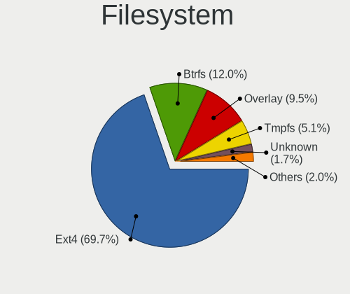
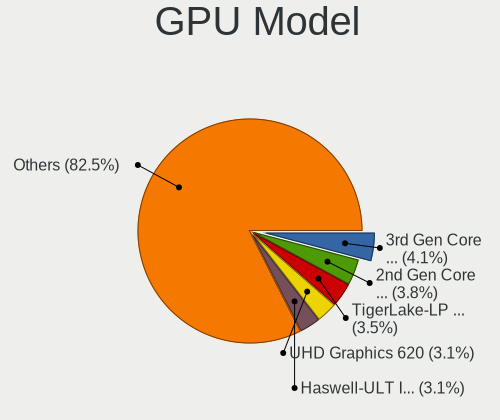
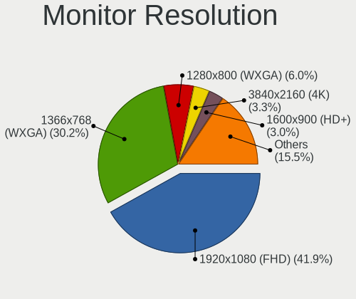
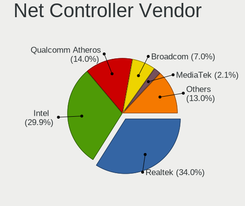
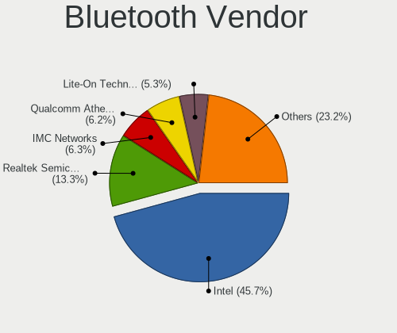
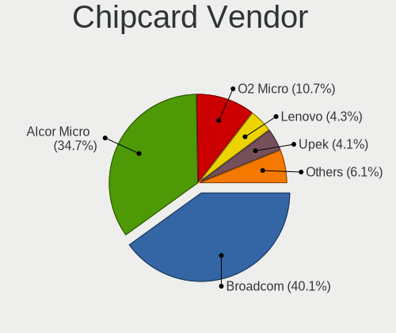

Linux in Italy - Tested Hardware & Statistics (Notebooks)
---------------------------------------------------------

A project to collect tested hardware configurations for Linux in Italy.

Anyone can contribute to this report by the [hw-probe](https://github.com/linuxhw/hw-probe) tool:

    sudo -E hw-probe -all -upload

Please contribute! Especially if your hardware is rare.

Contents
--------

* [ Test Cases ](#test-cases)

* [ System ](#system)
  - [ OS                       ](#os)
  - [ OS Family                ](#os-family)
  - [ Kernel                   ](#kernel)
  - [ Kernel Family            ](#kernel-family)
  - [ Kernel Major Ver.        ](#kernel-major-ver)
  - [ Arch                     ](#arch)
  - [ DE                       ](#de)
  - [ Display Server           ](#display-server)
  - [ Display Manager          ](#display-manager)
  - [ OS Lang                  ](#os-lang)
  - [ Boot Mode                ](#boot-mode)
  - [ Filesystem               ](#filesystem)
  - [ Part. scheme             ](#part-scheme)
  - [ Dual Boot with Linux/BSD ](#dual-boot-with-linuxbsd)
  - [ Dual Boot (Win)          ](#dual-boot-win)

* [ Board ](#board)
  - [ Vendor                   ](#vendor)
  - [ Model                    ](#model)
  - [ Model Family             ](#model-family)
  - [ MFG Year                 ](#mfg-year)
  - [ Form Factor              ](#form-factor)
  - [ Secure Boot              ](#secure-boot)
  - [ Coreboot                 ](#coreboot)
  - [ RAM Size                 ](#ram-size)
  - [ RAM Used                 ](#ram-used)
  - [ Total Drives             ](#total-drives)
  - [ Has CD-ROM               ](#has-cd-rom)
  - [ Has Ethernet             ](#has-ethernet)
  - [ Has WiFi                 ](#has-wifi)
  - [ Has Bluetooth            ](#has-bluetooth)

* [ Location ](#location)
  - [ Country                  ](#country)
  - [ City                     ](#city)

* [ Drives ](#drives)
  - [ Drive Vendor             ](#drive-vendor)
  - [ Drive Model              ](#drive-model)
  - [ HDD Vendor               ](#hdd-vendor)
  - [ SSD Vendor               ](#ssd-vendor)
  - [ Drive Kind               ](#drive-kind)
  - [ Drive Connector          ](#drive-connector)
  - [ Drive Size               ](#drive-size)
  - [ Space Total              ](#space-total)
  - [ Space Used               ](#space-used)
  - [ Malfunc. Drives          ](#malfunc-drives)
  - [ Malfunc. Drive Vendor    ](#malfunc-drive-vendor)
  - [ Malfunc. HDD Vendor      ](#malfunc-hdd-vendor)
  - [ Malfunc. Drive Kind      ](#malfunc-drive-kind)
  - [ Failed Drives            ](#failed-drives)
  - [ Failed Drive Vendor      ](#failed-drive-vendor)
  - [ Drive Status             ](#drive-status)

* [ Storage controller ](#storage-controller)
  - [ Storage Vendor           ](#storage-vendor)
  - [ Storage Model            ](#storage-model)
  - [ Storage Kind             ](#storage-kind)

* [ Processor ](#processor)
  - [ CPU Vendor               ](#cpu-vendor)
  - [ CPU Model                ](#cpu-model)
  - [ CPU Model Family         ](#cpu-model-family)
  - [ CPU Cores                ](#cpu-cores)
  - [ CPU Sockets              ](#cpu-sockets)
  - [ CPU Threads              ](#cpu-threads)
  - [ CPU Op-Modes             ](#cpu-op-modes)
  - [ CPU Microcode            ](#cpu-microcode)
  - [ CPU Microarch            ](#cpu-microarch)

* [ Graphics ](#graphics)
  - [ GPU Vendor               ](#gpu-vendor)
  - [ GPU Model                ](#gpu-model)
  - [ GPU Combo                ](#gpu-combo)
  - [ GPU Driver               ](#gpu-driver)
  - [ GPU Memory               ](#gpu-memory)

* [ Monitor ](#monitor)
  - [ Monitor Vendor           ](#monitor-vendor)
  - [ Monitor Model            ](#monitor-model)
  - [ Monitor Resolution       ](#monitor-resolution)
  - [ Monitor Diagonal         ](#monitor-diagonal)
  - [ Monitor Width            ](#monitor-width)
  - [ Aspect Ratio             ](#aspect-ratio)
  - [ Monitor Area             ](#monitor-area)
  - [ Pixel Density            ](#pixel-density)
  - [ Multiple Monitors        ](#multiple-monitors)

* [ Network ](#network)
  - [ Net Controller Vendor    ](#net-controller-vendor)
  - [ Net Controller Model     ](#net-controller-model)
  - [ Wireless Vendor          ](#wireless-vendor)
  - [ Wireless Model           ](#wireless-model)
  - [ Ethernet Vendor          ](#ethernet-vendor)
  - [ Ethernet Model           ](#ethernet-model)
  - [ Net Controller Kind      ](#net-controller-kind)
  - [ Used Controller          ](#used-controller)
  - [ NICs                     ](#nics)
  - [ IPv6                     ](#ipv6)

* [ Bluetooth ](#bluetooth)
  - [ Bluetooth Vendor         ](#bluetooth-vendor)
  - [ Bluetooth Model          ](#bluetooth-model)

* [ Sound ](#sound)
  - [ Sound Vendor             ](#sound-vendor)
  - [ Sound Model              ](#sound-model)

* [ Memory ](#memory)
  - [ Memory Vendor            ](#memory-vendor)
  - [ Memory Model             ](#memory-model)
  - [ Memory Kind              ](#memory-kind)
  - [ Memory Form Factor       ](#memory-form-factor)
  - [ Memory Size              ](#memory-size)
  - [ Memory Speed             ](#memory-speed)

* [ Printers & scanners ](#printers--scanners)
  - [ Printer Vendor           ](#printer-vendor)
  - [ Printer Model            ](#printer-model)
  - [ Scanner Vendor           ](#scanner-vendor)
  - [ Scanner Model            ](#scanner-model)

* [ Camera ](#camera)
  - [ Camera Vendor            ](#camera-vendor)
  - [ Camera Model             ](#camera-model)

* [ Security ](#security)
  - [ Fingerprint Vendor       ](#fingerprint-vendor)
  - [ Fingerprint Model        ](#fingerprint-model)
  - [ Chipcard Vendor          ](#chipcard-vendor)
  - [ Chipcard Model           ](#chipcard-model)

* [ Unsupported ](#unsupported)
  - [ Unsupported Devices      ](#unsupported-devices)
  - [ Unsupported Device Types ](#unsupported-device-types)

Test Cases
----------

Total: 5359

| Vendor        | Model                       | Probe                                                      | Date         |
|---------------|-----------------------------|------------------------------------------------------------|--------------|
| Acer          | Aspire 5750G                | [a8a3f37ad8](https://linux-hardware.org/?probe=a8a3f37ad8) | Feb 01, 2023 |
| HP            | Laptop 15s-fq5xxx           | [bd22f26ad1](https://linux-hardware.org/?probe=bd22f26ad1) | Jan 31, 2023 |
| HP            | Laptop 15s-fq5xxx           | [28ea3cafe8](https://linux-hardware.org/?probe=28ea3cafe8) | Jan 31, 2023 |
| HP            | ENVY 15                     | [c688eb85bb](https://linux-hardware.org/?probe=c688eb85bb) | Jan 31, 2023 |
| HP            | Notebook                    | [f352309997](https://linux-hardware.org/?probe=f352309997) | Jan 31, 2023 |
| ASUSTek       | VivoBook_ASUSLaptop X530... | [78bd5ea99c](https://linux-hardware.org/?probe=78bd5ea99c) | Jan 31, 2023 |
| Acer          | Swift SF114-32              | [8e8ae85d60](https://linux-hardware.org/?probe=8e8ae85d60) | Jan 31, 2023 |
| Dell          | XPS 15 9570                 | [ee60c1c921](https://linux-hardware.org/?probe=ee60c1c921) | Jan 31, 2023 |
| Lenovo        | ThinkPad X270 W10DG 20K5... | [5e5231a159](https://linux-hardware.org/?probe=5e5231a159) | Jan 31, 2023 |
| Acer          | Aspire ES1-512              | [0d254e85dd](https://linux-hardware.org/?probe=0d254e85dd) | Jan 30, 2023 |
| Acer          | Aspire E1-522               | [88de348bef](https://linux-hardware.org/?probe=88de348bef) | Jan 30, 2023 |
| Dell          | Precision 3560              | [3d5432deef](https://linux-hardware.org/?probe=3d5432deef) | Jan 30, 2023 |
| Dell          | Precision 3560              | [c250c935bd](https://linux-hardware.org/?probe=c250c935bd) | Jan 30, 2023 |
| Dell          | Precision 3571              | [55f371f4ef](https://linux-hardware.org/?probe=55f371f4ef) | Jan 30, 2023 |
| Acer          | Aspire 5552                 | [f1168775a7](https://linux-hardware.org/?probe=f1168775a7) | Jan 30, 2023 |
| HUAWEI        | NBLB-WAX9N                  | [519a211655](https://linux-hardware.org/?probe=519a211655) | Jan 30, 2023 |
| HP            | Laptop 15s-eq1xxx           | [9f093d7cff](https://linux-hardware.org/?probe=9f093d7cff) | Jan 30, 2023 |
| Acer          | Aspire E5-553               | [8200b57a5b](https://linux-hardware.org/?probe=8200b57a5b) | Jan 29, 2023 |
| Acer          | Aspire E5-553               | [3ac195a476](https://linux-hardware.org/?probe=3ac195a476) | Jan 29, 2023 |
| Acer          | Aspire A315-41              | [f8ef554d85](https://linux-hardware.org/?probe=f8ef554d85) | Jan 29, 2023 |
| Lenovo        | ThinkPad X220 42915CG       | [d058eeaad5](https://linux-hardware.org/?probe=d058eeaad5) | Jan 29, 2023 |
| Apple         | MacBookPro7,1               | [615e9f22e4](https://linux-hardware.org/?probe=615e9f22e4) | Jan 29, 2023 |
| Valve         | Jupiter                     | [5ea763da5f](https://linux-hardware.org/?probe=5ea763da5f) | Jan 28, 2023 |
| Dell          | Inspiron 5570               | [17a8246044](https://linux-hardware.org/?probe=17a8246044) | Jan 28, 2023 |
| HUAWEI        | NBLB-WAX9N                  | [edd571ba94](https://linux-hardware.org/?probe=edd571ba94) | Jan 28, 2023 |
| Acer          | Aspire A315-41              | [bbe5b30c42](https://linux-hardware.org/?probe=bbe5b30c42) | Jan 28, 2023 |
| Lenovo        | ThinkPad T14 Gen 3 21AH0... | [844e4e4b2a](https://linux-hardware.org/?probe=844e4e4b2a) | Jan 28, 2023 |
| Acer          | Swift SF314-511             | [eeaf26e835](https://linux-hardware.org/?probe=eeaf26e835) | Jan 28, 2023 |
| Sony          | SVE1711C5E                  | [73977968f5](https://linux-hardware.org/?probe=73977968f5) | Jan 27, 2023 |
| Sony          | SVE1711C5E                  | [d526ae42aa](https://linux-hardware.org/?probe=d526ae42aa) | Jan 27, 2023 |
| HP            | 255 G8 Notebook PC          | [23a84c76b8](https://linux-hardware.org/?probe=23a84c76b8) | Jan 27, 2023 |
| Apple         | MacBook4,1                  | [e00443a9cc](https://linux-hardware.org/?probe=e00443a9cc) | Jan 27, 2023 |
| HUAWEI        | VLT-WX0                     | [270e8da18d](https://linux-hardware.org/?probe=270e8da18d) | Jan 27, 2023 |
| Lenovo        | ThinkPad E590 20NB001AMX    | [4bf7b18ab1](https://linux-hardware.org/?probe=4bf7b18ab1) | Jan 27, 2023 |
| HUAWEI        | KLVC-WXX9                   | [8fa82c8684](https://linux-hardware.org/?probe=8fa82c8684) | Jan 26, 2023 |
| Toshiba       | Satellite Pro C50-A-1FD     | [7f7198cdcb](https://linux-hardware.org/?probe=7f7198cdcb) | Jan 26, 2023 |
| HP            | Pavilion Laptop 15-cs3xx... | [8725d530e5](https://linux-hardware.org/?probe=8725d530e5) | Jan 26, 2023 |
| Dell          | XPS 17 9700                 | [759ae65214](https://linux-hardware.org/?probe=759ae65214) | Jan 26, 2023 |
| Chuwi         | GemiBook Pro                | [bea1d8a9ce](https://linux-hardware.org/?probe=bea1d8a9ce) | Jan 25, 2023 |
| HUAWEI        | KLVL-WXX9                   | [f04915614f](https://linux-hardware.org/?probe=f04915614f) | Jan 25, 2023 |
| Sony          | SVE1513C5E                  | [48ee443aef](https://linux-hardware.org/?probe=48ee443aef) | Jan 25, 2023 |
| ASUSTek       | N551JW                      | [9694a30eff](https://linux-hardware.org/?probe=9694a30eff) | Jan 25, 2023 |
| HP            | EliteBook 820 G2            | [7b93d7477b](https://linux-hardware.org/?probe=7b93d7477b) | Jan 25, 2023 |
| HP            | ProBook 6440b               | [25c4dbbe9c](https://linux-hardware.org/?probe=25c4dbbe9c) | Jan 24, 2023 |
| HP            | Laptop 15s-eq2xxx           | [cb29f724a0](https://linux-hardware.org/?probe=cb29f724a0) | Jan 24, 2023 |
| Lenovo        | IdeaPad 310-15IKB 80TV      | [cfd65f9e9e](https://linux-hardware.org/?probe=cfd65f9e9e) | Jan 24, 2023 |
| TUXEDO        | Aura 15 Gen1                | [51d8d1eb34](https://linux-hardware.org/?probe=51d8d1eb34) | Jan 24, 2023 |
| Lenovo        | IdeaPad S340-15IWL 81N8     | [5df97c3eb1](https://linux-hardware.org/?probe=5df97c3eb1) | Jan 24, 2023 |
| Toshiba       | Satellite Pro S500          | [d529b5d578](https://linux-hardware.org/?probe=d529b5d578) | Jan 24, 2023 |
| Dell          | XPS 9320                    | [e6a308392c](https://linux-hardware.org/?probe=e6a308392c) | Jan 23, 2023 |
| Lenovo        | ThinkPad Edge E540 20C60... | [cbd812094c](https://linux-hardware.org/?probe=cbd812094c) | Jan 23, 2023 |
| Lenovo        | IdeaPad 330S-15IKB 81F5     | [a05bb7e519](https://linux-hardware.org/?probe=a05bb7e519) | Jan 23, 2023 |
| Toshiba       | Satellite Pro S500          | [118cda5e06](https://linux-hardware.org/?probe=118cda5e06) | Jan 23, 2023 |
| ASUSTek       | G75VW                       | [917f63e659](https://linux-hardware.org/?probe=917f63e659) | Jan 23, 2023 |
| Fujitsu       | LIFEBOOK A544               | [972194ff6e](https://linux-hardware.org/?probe=972194ff6e) | Jan 23, 2023 |
| HUAWEI        | KLVL-WXX9                   | [5cd697d63d](https://linux-hardware.org/?probe=5cd697d63d) | Jan 23, 2023 |
| Fujitsu       | LIFEBOOK U9311A             | [6bdcfeae43](https://linux-hardware.org/?probe=6bdcfeae43) | Jan 23, 2023 |
| Sony          | SVE1513C5E                  | [bff960bae2](https://linux-hardware.org/?probe=bff960bae2) | Jan 23, 2023 |
| HP            | Pavilion Laptop 15-eg2xx... | [adcd91409c](https://linux-hardware.org/?probe=adcd91409c) | Jan 23, 2023 |
| HP            | Pavilion Laptop 15-eg2xx... | [e2fd85407d](https://linux-hardware.org/?probe=e2fd85407d) | Jan 23, 2023 |
| HP            | Laptop 15-dw0xxx            | [8460e3552a](https://linux-hardware.org/?probe=8460e3552a) | Jan 22, 2023 |
| HUAWEI        | NBLK-WAX9X                  | [8941c8857e](https://linux-hardware.org/?probe=8941c8857e) | Jan 22, 2023 |
| Lenovo        | IdeaPad 330S-15IKB 81F5     | [89c37ebdfa](https://linux-hardware.org/?probe=89c37ebdfa) | Jan 22, 2023 |
| ASUSTek       | VivoBook_ASUSLaptop X435... | [b1ced07f7b](https://linux-hardware.org/?probe=b1ced07f7b) | Jan 22, 2023 |
| HP            | ProBook 450 G3              | [a3ce3d4a23](https://linux-hardware.org/?probe=a3ce3d4a23) | Jan 22, 2023 |
| Lenovo        | ThinkPad E15 Gen 3 20YGC... | [09650cf189](https://linux-hardware.org/?probe=09650cf189) | Jan 22, 2023 |
| Dell          | Vostro 15 3515              | [51234f64dd](https://linux-hardware.org/?probe=51234f64dd) | Jan 21, 2023 |
| HP            | ProBook 4520s               | [ab9f74eb2c](https://linux-hardware.org/?probe=ab9f74eb2c) | Jan 21, 2023 |
| Acer          | Aspire F5-573G              | [68847eb1e6](https://linux-hardware.org/?probe=68847eb1e6) | Jan 21, 2023 |
| Toshiba       | Satellite Pro C850-10L      | [c1de4d0e2b](https://linux-hardware.org/?probe=c1de4d0e2b) | Jan 21, 2023 |
| Acer          | Aspire E5-575G              | [d020dd93e4](https://linux-hardware.org/?probe=d020dd93e4) | Jan 21, 2023 |
| MSI           | Prestige 15 A12SC           | [b368e80a36](https://linux-hardware.org/?probe=b368e80a36) | Jan 21, 2023 |
| Acer          | Aspire 7745G                | [98d6ab791c](https://linux-hardware.org/?probe=98d6ab791c) | Jan 21, 2023 |
| Acer          | Aspire A315-55G             | [b8660798ec](https://linux-hardware.org/?probe=b8660798ec) | Jan 20, 2023 |
| Toshiba       | Satellite Pro S500          | [f1e995c40b](https://linux-hardware.org/?probe=f1e995c40b) | Jan 20, 2023 |
| Toshiba       | Satellite Pro S500          | [16708a6471](https://linux-hardware.org/?probe=16708a6471) | Jan 20, 2023 |
| Acer          | Aspire E5-573G              | [c87740267f](https://linux-hardware.org/?probe=c87740267f) | Jan 20, 2023 |
| HP            | Pavilion dv7                | [0a4700fc75](https://linux-hardware.org/?probe=0a4700fc75) | Jan 20, 2023 |
| HUAWEI        | BOM-WXX9                    | [77ac7a6fc3](https://linux-hardware.org/?probe=77ac7a6fc3) | Jan 20, 2023 |
| Toshiba       | Satellite Pro S500          | [194f5676bd](https://linux-hardware.org/?probe=194f5676bd) | Jan 20, 2023 |
| ASUSTek       | VivoBook_ASUSLaptop X515... | [76ab21d17b](https://linux-hardware.org/?probe=76ab21d17b) | Jan 20, 2023 |
| Acer          | TravelMate 5735Z            | [712fdb1fa7](https://linux-hardware.org/?probe=712fdb1fa7) | Jan 20, 2023 |
| Acer          | TravelMate 5735Z            | [5b1b812b6e](https://linux-hardware.org/?probe=5b1b812b6e) | Jan 20, 2023 |
| Lenovo        | V15-IIL 82C5                | [8fc05186e7](https://linux-hardware.org/?probe=8fc05186e7) | Jan 20, 2023 |
| Dell          | XPS 13 9305                 | [5175eeeff4](https://linux-hardware.org/?probe=5175eeeff4) | Jan 20, 2023 |
| Lenovo        | Legion 5 15ARH05H 82B1      | [c1169d55de](https://linux-hardware.org/?probe=c1169d55de) | Jan 19, 2023 |
| HP            | Pavilion Laptop 15-eg0xx... | [2f712e8614](https://linux-hardware.org/?probe=2f712e8614) | Jan 19, 2023 |
| HP            | Laptop 15s-eq2xxx           | [bbc2c32eee](https://linux-hardware.org/?probe=bbc2c32eee) | Jan 19, 2023 |
| HP            | Pavilion x2 Detachable      | [8a13d31503](https://linux-hardware.org/?probe=8a13d31503) | Jan 19, 2023 |
| Apple         | MacBookPro11,1              | [67e4dd8f10](https://linux-hardware.org/?probe=67e4dd8f10) | Jan 19, 2023 |
| Insyde        | Braswell                    | [18526fdbe2](https://linux-hardware.org/?probe=18526fdbe2) | Jan 19, 2023 |
| Lenovo        | IdeaPad 3 15ALC6 82KU       | [79ad95dada](https://linux-hardware.org/?probe=79ad95dada) | Jan 18, 2023 |
| HP            | Pavilion g6                 | [d1d3fadd60](https://linux-hardware.org/?probe=d1d3fadd60) | Jan 18, 2023 |
| ASUSTek       | ASUS TUF Gaming F15 FX50... | [5a1bee99ee](https://linux-hardware.org/?probe=5a1bee99ee) | Jan 18, 2023 |
| ASUSTek       | TP301UJ                     | [4ee30e82ab](https://linux-hardware.org/?probe=4ee30e82ab) | Jan 18, 2023 |
| ASUSTek       | E200HA                      | [f17b69afa1](https://linux-hardware.org/?probe=f17b69afa1) | Jan 18, 2023 |
| ASUSTek       | X505BP                      | [ec4d653e2f](https://linux-hardware.org/?probe=ec4d653e2f) | Jan 17, 2023 |
| HP            | Laptop 15s-fq2xxx           | [133972f199](https://linux-hardware.org/?probe=133972f199) | Jan 17, 2023 |
| HP            | Pavilion Laptop 15-eh1xx... | [44bf2e2ced](https://linux-hardware.org/?probe=44bf2e2ced) | Jan 17, 2023 |
| Acer          | Aspire E5-573G              | [9dba648ced](https://linux-hardware.org/?probe=9dba648ced) | Jan 17, 2023 |
| HUAWEI        | BOHB-WAX9                   | [b39c4fc9b7](https://linux-hardware.org/?probe=b39c4fc9b7) | Jan 16, 2023 |
| Lenovo        | IdeaPad 5 Pro 14ARH7 82S... | [1c81e8c322](https://linux-hardware.org/?probe=1c81e8c322) | Jan 16, 2023 |
| Lenovo        | IdeaPad 3 15ADA6 82KR       | [5b56cf615b](https://linux-hardware.org/?probe=5b56cf615b) | Jan 16, 2023 |
| HP            | 15                          | [ae082994e2](https://linux-hardware.org/?probe=ae082994e2) | Jan 16, 2023 |
| Lenovo        | ThinkPad T14 Gen 2i 20W0... | [3891575263](https://linux-hardware.org/?probe=3891575263) | Jan 16, 2023 |
| Sony          | SVT1312M1ES                 | [9244e6ad96](https://linux-hardware.org/?probe=9244e6ad96) | Jan 16, 2023 |
| ASUSTek       | Zenbook UM3402YA_UM3402Y... | [b36eb94e80](https://linux-hardware.org/?probe=b36eb94e80) | Jan 16, 2023 |
| HP            | Pavilion Laptop 15-ck0xx    | [360173820c](https://linux-hardware.org/?probe=360173820c) | Jan 16, 2023 |
| ASUSTek       | VivoBook_ASUSLaptop X515... | [8fb168e741](https://linux-hardware.org/?probe=8fb168e741) | Jan 16, 2023 |
| Acer          | TravelMate P253             | [8f2246679e](https://linux-hardware.org/?probe=8f2246679e) | Jan 15, 2023 |
| HP            | Pavilion x2 Detachable      | [aa28cfacc3](https://linux-hardware.org/?probe=aa28cfacc3) | Jan 15, 2023 |
| HP            | Notebook                    | [be5a441ca6](https://linux-hardware.org/?probe=be5a441ca6) | Jan 15, 2023 |
| HP            | Pavilion x2 Detachable      | [5f9aaa4add](https://linux-hardware.org/?probe=5f9aaa4add) | Jan 15, 2023 |
| HP            | 15                          | [3faa6c9265](https://linux-hardware.org/?probe=3faa6c9265) | Jan 15, 2023 |
| HP            | Pavilion dv7                | [b3cbaccd13](https://linux-hardware.org/?probe=b3cbaccd13) | Jan 15, 2023 |
| HP            | Pavilion dv7                | [08bbff061e](https://linux-hardware.org/?probe=08bbff061e) | Jan 15, 2023 |
| ASUSTek       | Zenbook UM3402YA_UM3402Y... | [57d99b139f](https://linux-hardware.org/?probe=57d99b139f) | Jan 15, 2023 |
| Apple         | MacBook5,1                  | [51581940b0](https://linux-hardware.org/?probe=51581940b0) | Jan 15, 2023 |
| Acer          | TravelMate P253             | [15c26878b5](https://linux-hardware.org/?probe=15c26878b5) | Jan 15, 2023 |
| Dell          | Vostro 15 3515              | [fdf3113afb](https://linux-hardware.org/?probe=fdf3113afb) | Jan 15, 2023 |
| Kiano         | SlimNote 14,2               | [7596dc87b3](https://linux-hardware.org/?probe=7596dc87b3) | Jan 14, 2023 |
| ASUSTek       | N501VW                      | [5f9c2eebd4](https://linux-hardware.org/?probe=5f9c2eebd4) | Jan 14, 2023 |
| Samsung       | RV411/RV511/E3511/S3511/... | [e5c76bef74](https://linux-hardware.org/?probe=e5c76bef74) | Jan 14, 2023 |
| Samsung       | RV411/RV511/E3511/S3511/... | [2a08ec8e9e](https://linux-hardware.org/?probe=2a08ec8e9e) | Jan 14, 2023 |
| Olivetti      | Olibook P55-431W850-8G50... | [fe5c9c2425](https://linux-hardware.org/?probe=fe5c9c2425) | Jan 14, 2023 |
| Olivetti      | Olibook P55-431W850-8G50... | [649546bc61](https://linux-hardware.org/?probe=649546bc61) | Jan 14, 2023 |
| HP            | Notebook                    | [4c9b4e3b67](https://linux-hardware.org/?probe=4c9b4e3b67) | Jan 14, 2023 |
| HP            | Stream Notebook PC 13       | [b31d60976b](https://linux-hardware.org/?probe=b31d60976b) | Jan 14, 2023 |
| Toshiba       | Satellite Pro C850-1HD      | [d9ecac6816](https://linux-hardware.org/?probe=d9ecac6816) | Jan 14, 2023 |
| Lenovo        | IdeaPad 330-15IKB 81DE      | [86fff559f5](https://linux-hardware.org/?probe=86fff559f5) | Jan 14, 2023 |
| MSI           | PS63 Modern 8RC             | [e55e0d9d0a](https://linux-hardware.org/?probe=e55e0d9d0a) | Jan 14, 2023 |
| ASUSTek       | VivoBook_ASUSLaptop K650... | [1b50127412](https://linux-hardware.org/?probe=1b50127412) | Jan 14, 2023 |
| HUAWEI        | KPL-W0X                     | [d1175d8dba](https://linux-hardware.org/?probe=d1175d8dba) | Jan 14, 2023 |
| HP            | 250 G4 Notebook PC          | [dda4a9ae38](https://linux-hardware.org/?probe=dda4a9ae38) | Jan 14, 2023 |
| ASUSTek       | X550LD                      | [60b21ee22f](https://linux-hardware.org/?probe=60b21ee22f) | Jan 14, 2023 |
| Acer          | Swift SF314-511             | [8a4bbb603e](https://linux-hardware.org/?probe=8a4bbb603e) | Jan 14, 2023 |
| Acer          | Aspire E1-572G              | [360a177e77](https://linux-hardware.org/?probe=360a177e77) | Jan 14, 2023 |
| Dell          | XPS 9320                    | [b8de11c93d](https://linux-hardware.org/?probe=b8de11c93d) | Jan 13, 2023 |
| Acer          | Swift SF314-511             | [baa87ed4e0](https://linux-hardware.org/?probe=baa87ed4e0) | Jan 13, 2023 |
| Acer          | Swift SF314-511             | [cb94045e18](https://linux-hardware.org/?probe=cb94045e18) | Jan 13, 2023 |
| HP            | Pavilion Laptop 15-cs2xx... | [e7bab74a13](https://linux-hardware.org/?probe=e7bab74a13) | Jan 13, 2023 |
| Lenovo        | ThinkPad T16 Gen 1 21CHC... | [b3fed0d61d](https://linux-hardware.org/?probe=b3fed0d61d) | Jan 13, 2023 |
| Unknown       | Unknown                     | [d0391da5d8](https://linux-hardware.org/?probe=d0391da5d8) | Jan 13, 2023 |
| Dell          | Precision 3551              | [66d483ea58](https://linux-hardware.org/?probe=66d483ea58) | Jan 13, 2023 |
| Acer          | Swift SF514-52T             | [feb261f5f5](https://linux-hardware.org/?probe=feb261f5f5) | Jan 13, 2023 |
| ASUSTek       | G56JR                       | [3665659d26](https://linux-hardware.org/?probe=3665659d26) | Jan 13, 2023 |
| TUXEDO        | Pulse 15 Gen1               | [033a92981f](https://linux-hardware.org/?probe=033a92981f) | Jan 13, 2023 |
| HP            | EliteBook 840 G6            | [0559975d13](https://linux-hardware.org/?probe=0559975d13) | Jan 13, 2023 |
| ASUSTek       | N501VW                      | [176a3488df](https://linux-hardware.org/?probe=176a3488df) | Jan 12, 2023 |
| Google        | Sasuke                      | [7241244512](https://linux-hardware.org/?probe=7241244512) | Jan 12, 2023 |
| Lenovo        | IdeaPad Slim 9 14ITL5 82... | [a8d6ad51af](https://linux-hardware.org/?probe=a8d6ad51af) | Jan 12, 2023 |
| Lenovo        | IdeaPad Gaming 3 15ARH05... | [fb5857252b](https://linux-hardware.org/?probe=fb5857252b) | Jan 12, 2023 |
| Acer          | Aspire V5-561G              | [1551c2b90c](https://linux-hardware.org/?probe=1551c2b90c) | Jan 12, 2023 |
| HP            | Pavilion dv6                | [43e7923f04](https://linux-hardware.org/?probe=43e7923f04) | Jan 11, 2023 |
| ASUSTek       | E200HA                      | [828a42310a](https://linux-hardware.org/?probe=828a42310a) | Jan 11, 2023 |
| HP            | ProBook 430 G5              | [6403930d67](https://linux-hardware.org/?probe=6403930d67) | Jan 11, 2023 |
| Google        | Sasuke                      | [99ba2827e0](https://linux-hardware.org/?probe=99ba2827e0) | Jan 10, 2023 |
| Lenovo        | ThinkBook 15 G2 ITL 20VE    | [c82f19c656](https://linux-hardware.org/?probe=c82f19c656) | Jan 10, 2023 |
| Toshiba       | Satellite Pro S500          | [2549187c34](https://linux-hardware.org/?probe=2549187c34) | Jan 10, 2023 |
| ASUSTek       | N501VW                      | [07d13b3b0b](https://linux-hardware.org/?probe=07d13b3b0b) | Jan 10, 2023 |
| ASUSTek       | X555YI                      | [4968e51e0b](https://linux-hardware.org/?probe=4968e51e0b) | Jan 10, 2023 |
| MSI           | Modern 15 A11M              | [5b55647c95](https://linux-hardware.org/?probe=5b55647c95) | Jan 10, 2023 |
| HP            | 15                          | [f6b287dae1](https://linux-hardware.org/?probe=f6b287dae1) | Jan 10, 2023 |
| HP            | Pavilion dv6                | [8f65765701](https://linux-hardware.org/?probe=8f65765701) | Jan 09, 2023 |
| Lenovo        | IdeaPad Gaming 3 15ACH6 ... | [d6cac381fd](https://linux-hardware.org/?probe=d6cac381fd) | Jan 09, 2023 |
| ASUSTek       | ASUS TUF Dash F15 FX516P... | [9f1f002f51](https://linux-hardware.org/?probe=9f1f002f51) | Jan 09, 2023 |
| Dell          | Precision 7540              | [77b35e556c](https://linux-hardware.org/?probe=77b35e556c) | Jan 09, 2023 |
| ASUSTek       | K50IJ                       | [9d476dfade](https://linux-hardware.org/?probe=9d476dfade) | Jan 09, 2023 |
| HP            | Pavilion Power Laptop 15... | [4d7677f391](https://linux-hardware.org/?probe=4d7677f391) | Jan 09, 2023 |
| HP            | Pavilion dv7                | [d3177dc8b3](https://linux-hardware.org/?probe=d3177dc8b3) | Jan 09, 2023 |
| HP            | Pavilion dv7                | [77590fdff4](https://linux-hardware.org/?probe=77590fdff4) | Jan 09, 2023 |
| Dell          | XPS 9320                    | [a58b8a72b7](https://linux-hardware.org/?probe=a58b8a72b7) | Jan 09, 2023 |
| HP            | Notebook                    | [c4cc7fb9f6](https://linux-hardware.org/?probe=c4cc7fb9f6) | Jan 09, 2023 |
| Apple         | MacBookPro8,2               | [0a7899316d](https://linux-hardware.org/?probe=0a7899316d) | Jan 08, 2023 |
| Dell          | Latitude E6440              | [faeb2d5372](https://linux-hardware.org/?probe=faeb2d5372) | Jan 08, 2023 |
| Dell          | Latitude 3450               | [e4e8bee1cb](https://linux-hardware.org/?probe=e4e8bee1cb) | Jan 08, 2023 |
| Notebook      | PCX0DX                      | [7e17526b20](https://linux-hardware.org/?probe=7e17526b20) | Jan 08, 2023 |
| Notebook      | PCX0DX                      | [698649c9ae](https://linux-hardware.org/?probe=698649c9ae) | Jan 08, 2023 |
| HP            | Notebook                    | [1174de12fc](https://linux-hardware.org/?probe=1174de12fc) | Jan 08, 2023 |
| Toshiba       | Satellite Pro S500          | [da62202546](https://linux-hardware.org/?probe=da62202546) | Jan 08, 2023 |
| Notebook      | NL40_50CU                   | [953d771250](https://linux-hardware.org/?probe=953d771250) | Jan 08, 2023 |
| ASUSTek       | S500CA                      | [d742870a51](https://linux-hardware.org/?probe=d742870a51) | Jan 07, 2023 |
| Timi          | TM1701                      | [c011ef538e](https://linux-hardware.org/?probe=c011ef538e) | Jan 07, 2023 |
| HP            | Pavilion dv6                | [7e1ac76fc9](https://linux-hardware.org/?probe=7e1ac76fc9) | Jan 07, 2023 |
| HP            | Compaq CQ58                 | [fae1531801](https://linux-hardware.org/?probe=fae1531801) | Jan 07, 2023 |
| Dell          | Latitude E6230              | [7a7cd04af0](https://linux-hardware.org/?probe=7a7cd04af0) | Jan 07, 2023 |
| HP            | Stream Notebook PC 13       | [d39ec5e414](https://linux-hardware.org/?probe=d39ec5e414) | Jan 07, 2023 |
| HP            | 250 G3                      | [227b44bf7c](https://linux-hardware.org/?probe=227b44bf7c) | Jan 06, 2023 |
| Dell          | Latitude 7520               | [f4f253a52b](https://linux-hardware.org/?probe=f4f253a52b) | Jan 06, 2023 |
| Lenovo        | ThinkPad T430 2349KB4       | [4546ecbe85](https://linux-hardware.org/?probe=4546ecbe85) | Jan 06, 2023 |
| Lenovo        | ThinkPad P14s Gen 1 20S4... | [2227400f4c](https://linux-hardware.org/?probe=2227400f4c) | Jan 05, 2023 |
| HP            | 350 G1                      | [09f234d211](https://linux-hardware.org/?probe=09f234d211) | Jan 05, 2023 |
| Valve         | Jupiter                     | [3ce1a1d086](https://linux-hardware.org/?probe=3ce1a1d086) | Jan 05, 2023 |
| ASUSTek       | VivoBook_ASUSLaptop K650... | [4900ec9966](https://linux-hardware.org/?probe=4900ec9966) | Jan 05, 2023 |
| Lenovo        | ThinkPad T14 Gen 2i 20W0... | [e4a7ff414a](https://linux-hardware.org/?probe=e4a7ff414a) | Jan 05, 2023 |
| Timi          | RedmiBook 16                | [dca6d06bf4](https://linux-hardware.org/?probe=dca6d06bf4) | Jan 05, 2023 |
| HUAWEI        | KPL-W0X                     | [591d1b0ea9](https://linux-hardware.org/?probe=591d1b0ea9) | Jan 04, 2023 |
| Dell          | XPS 9320                    | [8684c6d86b](https://linux-hardware.org/?probe=8684c6d86b) | Jan 04, 2023 |
| ASUSTek       | 1005P                       | [7ccbcf9b28](https://linux-hardware.org/?probe=7ccbcf9b28) | Jan 04, 2023 |
| HP            | 15                          | [d0aae7c4b7](https://linux-hardware.org/?probe=d0aae7c4b7) | Jan 04, 2023 |
| MSI           | Prestige 15 A11SCX          | [86850a5925](https://linux-hardware.org/?probe=86850a5925) | Jan 04, 2023 |
| Dell          | XPS 15 9550                 | [72f8edfe5b](https://linux-hardware.org/?probe=72f8edfe5b) | Jan 04, 2023 |
| Acer          | Aspire E5-573               | [bd9e90dca3](https://linux-hardware.org/?probe=bd9e90dca3) | Jan 04, 2023 |
| Notebook      | NP5x_NP6x_NP7xPNK_PNH_PN... | [ace1cd7d4d](https://linux-hardware.org/?probe=ace1cd7d4d) | Jan 04, 2023 |
| Unknown       | Unknown                     | [b363093f89](https://linux-hardware.org/?probe=b363093f89) | Jan 04, 2023 |
| HP            | ProBook 650 G1              | [9aadf12194](https://linux-hardware.org/?probe=9aadf12194) | Jan 04, 2023 |
| Lenovo        | ThinkPad W541 20EFCTO1WW    | [a10abfb25a](https://linux-hardware.org/?probe=a10abfb25a) | Jan 03, 2023 |
| Lenovo        | ThinkPad W541 20EGS24J00    | [fa19ac7348](https://linux-hardware.org/?probe=fa19ac7348) | Jan 03, 2023 |
| HP            | 255 G8 Notebook PC          | [b876c5797a](https://linux-hardware.org/?probe=b876c5797a) | Jan 03, 2023 |
| HP            | 350 G1                      | [0929eec44b](https://linux-hardware.org/?probe=0929eec44b) | Jan 03, 2023 |
| HP            | 250 G8 Notebook PC          | [42e877ed10](https://linux-hardware.org/?probe=42e877ed10) | Jan 02, 2023 |
| Lenovo        | G510 20238                  | [90c0016c38](https://linux-hardware.org/?probe=90c0016c38) | Jan 02, 2023 |
| HP            | Victus by Laptop 16-e0xx... | [287840d797](https://linux-hardware.org/?probe=287840d797) | Jan 02, 2023 |
| Lenovo        | IdeaPad 5 15IIL05 81YK      | [0fb41a5066](https://linux-hardware.org/?probe=0fb41a5066) | Jan 02, 2023 |
| Dell          | Latitude 7410               | [acb8ce902e](https://linux-hardware.org/?probe=acb8ce902e) | Jan 01, 2023 |
| HP            | EliteBook 850 G3            | [64c803c589](https://linux-hardware.org/?probe=64c803c589) | Jan 01, 2023 |
| Acer          | TravelMate P253             | [a90b917fbe](https://linux-hardware.org/?probe=a90b917fbe) | Jan 01, 2023 |
| Acer          | TravelMate 5735Z            | [9fa5978af4](https://linux-hardware.org/?probe=9fa5978af4) | Jan 01, 2023 |
| Dell          | XPS 9320                    | [08626b8d57](https://linux-hardware.org/?probe=08626b8d57) | Jan 01, 2023 |
| Google        | Blooglet                    | [711ca24e79](https://linux-hardware.org/?probe=711ca24e79) | Jan 01, 2023 |
| HP            | Laptop 15s-fq5xxx           | [a8ce1c44a8](https://linux-hardware.org/?probe=a8ce1c44a8) | Jan 01, 2023 |
| Acer          | Aspire E5-573G              | [527a92f562](https://linux-hardware.org/?probe=527a92f562) | Dec 31, 2022 |
| HP            | Notebook                    | [d25df9daf4](https://linux-hardware.org/?probe=d25df9daf4) | Dec 31, 2022 |
| ASUSTek       | ProArt StudioBook H5600Q... | [07ca2ed63d](https://linux-hardware.org/?probe=07ca2ed63d) | Dec 31, 2022 |
| Dell          | XPS 9320                    | [c98fd80f29](https://linux-hardware.org/?probe=c98fd80f29) | Dec 31, 2022 |
| HP            | Victus by Laptop 16-e0xx... | [60989ad0c4](https://linux-hardware.org/?probe=60989ad0c4) | Dec 31, 2022 |
| HP            | Compaq 6710b (KE207ES#AB... | [d7d0be3872](https://linux-hardware.org/?probe=d7d0be3872) | Dec 30, 2022 |
| Chuwi         | HeroBook                    | [1664994b07](https://linux-hardware.org/?probe=1664994b07) | Dec 30, 2022 |
| ASUSTek       | K55VD                       | [e4c90250df](https://linux-hardware.org/?probe=e4c90250df) | Dec 30, 2022 |
| MSI           | GP72MVR 7RFX                | [cefedef93c](https://linux-hardware.org/?probe=cefedef93c) | Dec 30, 2022 |
| Lenovo        | ThinkPad W541 20EF0011IX    | [a2f6a6831a](https://linux-hardware.org/?probe=a2f6a6831a) | Dec 30, 2022 |
| Lenovo        | ThinkPad W541 20EF0011IX    | [3f5a2c6ea1](https://linux-hardware.org/?probe=3f5a2c6ea1) | Dec 30, 2022 |
| ASUSTek       | X556UQK                     | [42a9dc760d](https://linux-hardware.org/?probe=42a9dc760d) | Dec 30, 2022 |
| Dell          | Inspiron 5593               | [bf0f36d69a](https://linux-hardware.org/?probe=bf0f36d69a) | Dec 30, 2022 |
| HP            | 255 G3                      | [89d6bd459c](https://linux-hardware.org/?probe=89d6bd459c) | Dec 30, 2022 |
| Dell          | Latitude E6410              | [0ee655e2cc](https://linux-hardware.org/?probe=0ee655e2cc) | Dec 29, 2022 |
| Lenovo        | IdeaPad 110-15ISK 80UD      | [2d653884d9](https://linux-hardware.org/?probe=2d653884d9) | Dec 29, 2022 |
| HP            | Pavilion Laptop 15-cs2xx... | [587aa5f819](https://linux-hardware.org/?probe=587aa5f819) | Dec 29, 2022 |
| Lenovo        | ThinkPad E580 20KS001RIX    | [4ca01731b4](https://linux-hardware.org/?probe=4ca01731b4) | Dec 29, 2022 |
| HP            | Compaq 6730s                | [9294bf57da](https://linux-hardware.org/?probe=9294bf57da) | Dec 28, 2022 |
| Lenovo        | ThinkPad E480 20KQS13M00    | [fb7e2874d3](https://linux-hardware.org/?probe=fb7e2874d3) | Dec 28, 2022 |
| Apple         | MacBookPro8,1               | [7b03f438db](https://linux-hardware.org/?probe=7b03f438db) | Dec 28, 2022 |
| Fujitsu       | LIFEBOOK A544               | [efdc6bb5cb](https://linux-hardware.org/?probe=efdc6bb5cb) | Dec 28, 2022 |
| Acer          | Aspire A315-55G             | [92155ba882](https://linux-hardware.org/?probe=92155ba882) | Dec 28, 2022 |
| HP            | ProBook 440 G6              | [6240bc3677](https://linux-hardware.org/?probe=6240bc3677) | Dec 28, 2022 |
| HP            | ProBook 440 G6              | [f5689c6edc](https://linux-hardware.org/?probe=f5689c6edc) | Dec 28, 2022 |
| HP            | EliteBook 850 G3            | [0dede5b37a](https://linux-hardware.org/?probe=0dede5b37a) | Dec 28, 2022 |
| System76      | Darter Pro                  | [a46000c111](https://linux-hardware.org/?probe=a46000c111) | Dec 28, 2022 |
| HP            | 250 G8 Notebook PC          | [7d79eadc7d](https://linux-hardware.org/?probe=7d79eadc7d) | Dec 28, 2022 |
| Teclast       | F15Plus 2                   | [71564a5900](https://linux-hardware.org/?probe=71564a5900) | Dec 27, 2022 |
| Teclast       | F15Plus 2                   | [4d10c4922e](https://linux-hardware.org/?probe=4d10c4922e) | Dec 27, 2022 |
| Packard Be... | EasyNote TJ65               | [57bfe7c99d](https://linux-hardware.org/?probe=57bfe7c99d) | Dec 27, 2022 |
| ASUSTek       | X550VXK                     | [301db79821](https://linux-hardware.org/?probe=301db79821) | Dec 27, 2022 |
| ASUSTek       | X550VXK                     | [039600625a](https://linux-hardware.org/?probe=039600625a) | Dec 27, 2022 |
| Dell          | XPS 9320                    | [7a2537eba2](https://linux-hardware.org/?probe=7a2537eba2) | Dec 27, 2022 |
| Dell          | Inspiron 15 3525            | [64a70af984](https://linux-hardware.org/?probe=64a70af984) | Dec 27, 2022 |
| System76      | Darter Pro                  | [c5aebaaece](https://linux-hardware.org/?probe=c5aebaaece) | Dec 27, 2022 |
| HP            | Pavilion Laptop 15-cs0xx... | [d75dbe1e39](https://linux-hardware.org/?probe=d75dbe1e39) | Dec 27, 2022 |
| ASUSTek       | VivoBook_ASUSLaptop K650... | [1cf2ac2b8b](https://linux-hardware.org/?probe=1cf2ac2b8b) | Dec 27, 2022 |
| HP            | Pavilion 15                 | [9843ba5174](https://linux-hardware.org/?probe=9843ba5174) | Dec 26, 2022 |
| Notebook      | NP5x_NP6x_NP7xPNK_PNH_PN... | [792a203576](https://linux-hardware.org/?probe=792a203576) | Dec 26, 2022 |
| MSI           | GS76 Stealth 11UG           | [10e22b317f](https://linux-hardware.org/?probe=10e22b317f) | Dec 26, 2022 |
| Lenovo        | ThinkPad E590 20NB001AMX    | [047944fa9f](https://linux-hardware.org/?probe=047944fa9f) | Dec 26, 2022 |
| HP            | Laptop 15-da0xxx            | [96a4f739b8](https://linux-hardware.org/?probe=96a4f739b8) | Dec 26, 2022 |
| HP            | Laptop 15-da0xxx            | [19af161114](https://linux-hardware.org/?probe=19af161114) | Dec 26, 2022 |
| HP            | EliteBook 840 G4            | [1c5b59d2e4](https://linux-hardware.org/?probe=1c5b59d2e4) | Dec 26, 2022 |
| HP            | EliteBook 840 G4            | [730469b496](https://linux-hardware.org/?probe=730469b496) | Dec 26, 2022 |
| HP            | EliteBook 820 G1            | [6a2c20cb74](https://linux-hardware.org/?probe=6a2c20cb74) | Dec 26, 2022 |
| HP            | 255 G8 Notebook PC          | [2df8b7768a](https://linux-hardware.org/?probe=2df8b7768a) | Dec 26, 2022 |
| HP            | Compaq 6730s                | [ac1ae104e8](https://linux-hardware.org/?probe=ac1ae104e8) | Dec 26, 2022 |
| HP            | Pavilion Laptop 15-cs0xx... | [38a87e716e](https://linux-hardware.org/?probe=38a87e716e) | Dec 26, 2022 |
| HP            | Compaq 6730s                | [0cc88159aa](https://linux-hardware.org/?probe=0cc88159aa) | Dec 26, 2022 |
| Lenovo        | ThinkPad X1 Carbon 34604... | [dfb555f802](https://linux-hardware.org/?probe=dfb555f802) | Dec 26, 2022 |
| Samsung       | RV420/RV520/RV720/E3530/... | [4665d79293](https://linux-hardware.org/?probe=4665d79293) | Dec 25, 2022 |
| SANTECH       | NHx0DB,DE                   | [a0996d42bd](https://linux-hardware.org/?probe=a0996d42bd) | Dec 25, 2022 |
| Toshiba       | Satellite Pro S500          | [cd547b04a1](https://linux-hardware.org/?probe=cd547b04a1) | Dec 25, 2022 |
| Lenovo        | IdeaPad 3 15ADA05 81W1      | [ff90a6a029](https://linux-hardware.org/?probe=ff90a6a029) | Dec 25, 2022 |
| Lenovo        | ThinkPad X1 Carbon 5th 2... | [faba7b00c6](https://linux-hardware.org/?probe=faba7b00c6) | Dec 25, 2022 |
| WYSE          | XM CLASS                    | [948bfb388d](https://linux-hardware.org/?probe=948bfb388d) | Dec 25, 2022 |
| HP            | EliteBook 8440p             | [571afe8b70](https://linux-hardware.org/?probe=571afe8b70) | Dec 24, 2022 |
| Dell          | XPS 9320                    | [f55956cac2](https://linux-hardware.org/?probe=f55956cac2) | Dec 24, 2022 |
| Dell          | Latitude 5590               | [f7011844b5](https://linux-hardware.org/?probe=f7011844b5) | Dec 24, 2022 |
| Dell          | Latitude 5590               | [3f1acac04f](https://linux-hardware.org/?probe=3f1acac04f) | Dec 24, 2022 |
| HP            | 255 G8 Notebook PC          | [3f72d88324](https://linux-hardware.org/?probe=3f72d88324) | Dec 24, 2022 |
| Dell          | Latitude 5590               | [e439eb94d4](https://linux-hardware.org/?probe=e439eb94d4) | Dec 24, 2022 |
| Dell          | Latitude 5590               | [816056e28e](https://linux-hardware.org/?probe=816056e28e) | Dec 24, 2022 |
| HUAWEI        | KPR-WX9                     | [e2b01c4a0f](https://linux-hardware.org/?probe=e2b01c4a0f) | Dec 23, 2022 |
| Dell          | Inspiron 15 5510            | [d53469cd41](https://linux-hardware.org/?probe=d53469cd41) | Dec 23, 2022 |
| Dell          | Inspiron 15 5510            | [9ddf91aa1b](https://linux-hardware.org/?probe=9ddf91aa1b) | Dec 23, 2022 |
| HUAWEI        | NBLK-WAX9X                  | [f114731a78](https://linux-hardware.org/?probe=f114731a78) | Dec 23, 2022 |
| Acer          | Aspire A515-52G             | [586dd36eed](https://linux-hardware.org/?probe=586dd36eed) | Dec 23, 2022 |
| Lenovo        | ThinkPad T14 Gen 1 20UD0... | [214b2a3235](https://linux-hardware.org/?probe=214b2a3235) | Dec 23, 2022 |
| ASUSTek       | ASUS EXPERTBOOK B3302CEA... | [756390ae0c](https://linux-hardware.org/?probe=756390ae0c) | Dec 23, 2022 |
| ASUSTek       | ASUS EXPERTBOOK B3302CEA... | [c2dd56664a](https://linux-hardware.org/?probe=c2dd56664a) | Dec 23, 2022 |
| Timi          | TM1701                      | [2f28d7e2dc](https://linux-hardware.org/?probe=2f28d7e2dc) | Dec 23, 2022 |
| Timi          | TM1701                      | [dfb4f8774f](https://linux-hardware.org/?probe=dfb4f8774f) | Dec 23, 2022 |
| Dell          | XPS 9320                    | [7bb7ba7202](https://linux-hardware.org/?probe=7bb7ba7202) | Dec 23, 2022 |
| Medion        | X6816                       | [bafbf1ea90](https://linux-hardware.org/?probe=bafbf1ea90) | Dec 23, 2022 |
| Medion        | X6816                       | [ac9627e5d4](https://linux-hardware.org/?probe=ac9627e5d4) | Dec 23, 2022 |
| Lenovo        | Legion 5 15ARH05H 82B1      | [db7dc4fa25](https://linux-hardware.org/?probe=db7dc4fa25) | Dec 22, 2022 |
| Lenovo        | Legion 5 15ARH05H 82B1      | [e8ac233c29](https://linux-hardware.org/?probe=e8ac233c29) | Dec 22, 2022 |
| HP            | Compaq 6730b (GW687AV)      | [8c936284b0](https://linux-hardware.org/?probe=8c936284b0) | Dec 22, 2022 |
| Monster       | TULPAR T5 V20.1             | [23cb6e06f8](https://linux-hardware.org/?probe=23cb6e06f8) | Dec 22, 2022 |
| HP            | Pavilion dv9000 (RR329EA... | [6fc7281f2f](https://linux-hardware.org/?probe=6fc7281f2f) | Dec 22, 2022 |
| HP            | Pavilion Laptop 15-cs3xx... | [a62d8c781d](https://linux-hardware.org/?probe=a62d8c781d) | Dec 22, 2022 |
| HUAWEI        | VLT-WX0                     | [6f2d542a6e](https://linux-hardware.org/?probe=6f2d542a6e) | Dec 22, 2022 |
| Packard Be... | DOT S                       | [c26f1d77e6](https://linux-hardware.org/?probe=c26f1d77e6) | Dec 22, 2022 |
| HP            | Victus by Laptop 16-e0xx... | [54273f1267](https://linux-hardware.org/?probe=54273f1267) | Dec 22, 2022 |
| ASUSTek       | 1215P                       | [a39ca1c22f](https://linux-hardware.org/?probe=a39ca1c22f) | Dec 21, 2022 |
| ASUSTek       | 1215P                       | [ed3dc80f1b](https://linux-hardware.org/?probe=ed3dc80f1b) | Dec 21, 2022 |
| Lenovo        | IdeaPad 320-15IKB 81BT      | [543b6fc9db](https://linux-hardware.org/?probe=543b6fc9db) | Dec 21, 2022 |
| HP            | Pavilion Laptop 15-cs2xx... | [5ea57fb331](https://linux-hardware.org/?probe=5ea57fb331) | Dec 21, 2022 |
| HP            | Pavilion Laptop 15-cs2xx... | [c4f6f99d36](https://linux-hardware.org/?probe=c4f6f99d36) | Dec 21, 2022 |
| Dell          | Latitude E7470              | [e171eea812](https://linux-hardware.org/?probe=e171eea812) | Dec 21, 2022 |
| ASUSTek       | S551LB                      | [5e48f71064](https://linux-hardware.org/?probe=5e48f71064) | Dec 20, 2022 |
| HP            | Sona                        | [85c88dea70](https://linux-hardware.org/?probe=85c88dea70) | Dec 20, 2022 |
| HP            | Pavilion Laptop 15-cs2xx... | [a4549398af](https://linux-hardware.org/?probe=a4549398af) | Dec 20, 2022 |
| HUAWEI        | NBLB-WAX9N                  | [2b8c2f06eb](https://linux-hardware.org/?probe=2b8c2f06eb) | Dec 20, 2022 |
| Notebook      | PCX0DX                      | [83c28a3013](https://linux-hardware.org/?probe=83c28a3013) | Dec 20, 2022 |
| HP            | OMEN by Laptop 16-c0xxx     | [9f5a91c628](https://linux-hardware.org/?probe=9f5a91c628) | Dec 19, 2022 |
| Sony          | VGN-FW11E                   | [2d57afaa38](https://linux-hardware.org/?probe=2d57afaa38) | Dec 19, 2022 |
| HUAWEI        | NBLK-WAX9X                  | [686a93a02a](https://linux-hardware.org/?probe=686a93a02a) | Dec 19, 2022 |
| Lenovo        | IdeaPad 120S-14IAP 81A5     | [8e10fc1464](https://linux-hardware.org/?probe=8e10fc1464) | Dec 18, 2022 |
| ASUSTek       | 900SD                       | [43d2c88062](https://linux-hardware.org/?probe=43d2c88062) | Dec 18, 2022 |
| Lenovo        | ThinkPad R61 77324TG        | [90c300a51c](https://linux-hardware.org/?probe=90c300a51c) | Dec 18, 2022 |
| Lenovo        | IdeaPad 3 15ALC6 82KU       | [7dc7a80819](https://linux-hardware.org/?probe=7dc7a80819) | Dec 18, 2022 |
| Acer          | TravelMate P253             | [97d650e93f](https://linux-hardware.org/?probe=97d650e93f) | Dec 18, 2022 |
| Dell          | Latitude E7470              | [262849f0f6](https://linux-hardware.org/?probe=262849f0f6) | Dec 18, 2022 |
| HP            | Laptop 15s-fq2xxx           | [ab6fd91b71](https://linux-hardware.org/?probe=ab6fd91b71) | Dec 17, 2022 |
| HP            | Laptop 15s-fq2xxx           | [1a23b502b9](https://linux-hardware.org/?probe=1a23b502b9) | Dec 17, 2022 |
| Lenovo        | ThinkPad E15 Gen 3 20YGC... | [75126bccca](https://linux-hardware.org/?probe=75126bccca) | Dec 17, 2022 |
| ASUSTek       | ASUS EXPERTBOOK B1500CEA... | [a54756ab6f](https://linux-hardware.org/?probe=a54756ab6f) | Dec 17, 2022 |
| Lenovo        | ThinkBook 15 G2 ITL 20VE    | [fc473cc90f](https://linux-hardware.org/?probe=fc473cc90f) | Dec 17, 2022 |
| WYSE          | XM CLASS                    | [8aac2f31cb](https://linux-hardware.org/?probe=8aac2f31cb) | Dec 17, 2022 |
| HP            | EliteBook 820 G3            | [5e5909e93f](https://linux-hardware.org/?probe=5e5909e93f) | Dec 17, 2022 |
| ASUSTek       | ROG Strix G513RC_G513RC     | [feb5e321dc](https://linux-hardware.org/?probe=feb5e321dc) | Dec 16, 2022 |
| Acer          | TravelMate P253             | [80188fd5bf](https://linux-hardware.org/?probe=80188fd5bf) | Dec 16, 2022 |
| Toshiba       | Satellite M70               | [9415a97254](https://linux-hardware.org/?probe=9415a97254) | Dec 16, 2022 |
| Dell          | XPS 15 9520                 | [dcf616e068](https://linux-hardware.org/?probe=dcf616e068) | Dec 16, 2022 |
| HP            | Pavilion Laptop 15-cs2xx... | [665bd04471](https://linux-hardware.org/?probe=665bd04471) | Dec 16, 2022 |
| Alienware     | 15                          | [6da8e1748a](https://linux-hardware.org/?probe=6da8e1748a) | Dec 16, 2022 |
| Lenovo        | IdeaPad Gaming 3 15ARH05... | [30fda215a5](https://linux-hardware.org/?probe=30fda215a5) | Dec 16, 2022 |
| Lenovo        | ThinkPad X1 Extreme Gen ... | [d5cf351351](https://linux-hardware.org/?probe=d5cf351351) | Dec 16, 2022 |
| Lenovo        | ThinkPad X1 Extreme Gen ... | [e2056deb8a](https://linux-hardware.org/?probe=e2056deb8a) | Dec 16, 2022 |
| HUAWEI        | BOM-WXX9                    | [dd664077fe](https://linux-hardware.org/?probe=dd664077fe) | Dec 16, 2022 |
| HP            | Laptop 15s-fq2xxx           | [d9c3d0a5cd](https://linux-hardware.org/?probe=d9c3d0a5cd) | Dec 16, 2022 |
| HP            | Laptop 15-da0xxx            | [d871acfe36](https://linux-hardware.org/?probe=d871acfe36) | Dec 16, 2022 |
| Toshiba       | Satellite M70               | [79506873c1](https://linux-hardware.org/?probe=79506873c1) | Dec 15, 2022 |
| Samsung       | 350V5C/351V5C/3540VC/344... | [18d67ba2ab](https://linux-hardware.org/?probe=18d67ba2ab) | Dec 15, 2022 |
| Packard Be... | EasyNote TJ71               | [f722162e15](https://linux-hardware.org/?probe=f722162e15) | Dec 15, 2022 |
| HP            | OMEN by Laptop 16-c0xxx     | [5e8318b8b8](https://linux-hardware.org/?probe=5e8318b8b8) | Dec 15, 2022 |
| HP            | Pavilion Gaming Laptop 1... | [57ecebdc0f](https://linux-hardware.org/?probe=57ecebdc0f) | Dec 15, 2022 |
| HP            | OMEN by Laptop 16-c0xxx     | [d5c9abda1e](https://linux-hardware.org/?probe=d5c9abda1e) | Dec 15, 2022 |
| HP            | Pavilion Laptop 15-cs2xx... | [1d57f3ab30](https://linux-hardware.org/?probe=1d57f3ab30) | Dec 15, 2022 |
| HP            | Pavilion Laptop 15-cs2xx... | [a1d6879fab](https://linux-hardware.org/?probe=a1d6879fab) | Dec 15, 2022 |
| HP            | Compaq 6735s                | [72d29aa11f](https://linux-hardware.org/?probe=72d29aa11f) | Dec 14, 2022 |
| Samsung       | 750XDA                      | [0120054e9f](https://linux-hardware.org/?probe=0120054e9f) | Dec 14, 2022 |
| ASUSTek       | X302LA                      | [8404a0b0c6](https://linux-hardware.org/?probe=8404a0b0c6) | Dec 14, 2022 |
| PC Special... | Elimina Iv 17               | [66a5d6dd6a](https://linux-hardware.org/?probe=66a5d6dd6a) | Dec 13, 2022 |
| ASUSTek       | ROG Zephyrus G15 GA503QM... | [6fc042d213](https://linux-hardware.org/?probe=6fc042d213) | Dec 13, 2022 |
| HP            | EliteBook 820 G3            | [ff5b82cee3](https://linux-hardware.org/?probe=ff5b82cee3) | Dec 13, 2022 |
| Lenovo        | G505 20240                  | [e6777c2fbc](https://linux-hardware.org/?probe=e6777c2fbc) | Dec 13, 2022 |
| Lenovo        | ThinkPad T480s 20L8002WM... | [d742af8997](https://linux-hardware.org/?probe=d742af8997) | Dec 13, 2022 |
| ASUSTek       | ROG CROSSHAIR VIII DARK ... | [c62c8e69b0](https://linux-hardware.org/?probe=c62c8e69b0) | Dec 12, 2022 |
| MSI           | GS65 Stealth Thin 8RF       | [074195107c](https://linux-hardware.org/?probe=074195107c) | Dec 12, 2022 |
| Packard Be... | EasyNote TJ71               | [45630329df](https://linux-hardware.org/?probe=45630329df) | Dec 12, 2022 |
| Lenovo        | ThinkPad X1 Carbon Gen 8... | [a9505fa3e4](https://linux-hardware.org/?probe=a9505fa3e4) | Dec 12, 2022 |
| HP            | EliteBook 820 G3            | [1e0eec72b2](https://linux-hardware.org/?probe=1e0eec72b2) | Dec 12, 2022 |
| Apple         | MacBookPro14,3              | [7cefe54b56](https://linux-hardware.org/?probe=7cefe54b56) | Dec 12, 2022 |
| HP            | EliteBook 8570w             | [367579550b](https://linux-hardware.org/?probe=367579550b) | Dec 11, 2022 |
| SGIN          | laptop                      | [8f650d00dd](https://linux-hardware.org/?probe=8f650d00dd) | Dec 11, 2022 |
| Toshiba       | Satellite L455              | [e92985332e](https://linux-hardware.org/?probe=e92985332e) | Dec 11, 2022 |
| Lenovo        | G50-45 80E3                 | [754e028997](https://linux-hardware.org/?probe=754e028997) | Dec 11, 2022 |
| Lenovo        | G50-45 80E3                 | [fb2f97325d](https://linux-hardware.org/?probe=fb2f97325d) | Dec 11, 2022 |
| HP            | Laptop 15s-fq2xxx           | [129c077e02](https://linux-hardware.org/?probe=129c077e02) | Dec 11, 2022 |
| ASUSTek       | K50C                        | [6cf2037e0f](https://linux-hardware.org/?probe=6cf2037e0f) | Dec 11, 2022 |
| ASUSTek       | S551LN                      | [9aabc2d159](https://linux-hardware.org/?probe=9aabc2d159) | Dec 11, 2022 |
| Google        | Blooglet                    | [a9d65d2144](https://linux-hardware.org/?probe=a9d65d2144) | Dec 11, 2022 |
| Valve         | Jupiter                     | [26c1e67dff](https://linux-hardware.org/?probe=26c1e67dff) | Dec 11, 2022 |
| Valve         | Jupiter                     | [e143b181a1](https://linux-hardware.org/?probe=e143b181a1) | Dec 11, 2022 |
| HP            | Pavilion dv6000 (RY649EA... | [9deecc89f5](https://linux-hardware.org/?probe=9deecc89f5) | Dec 10, 2022 |
| Acer          | TravelMate 4070             | [8f9e4c0e26](https://linux-hardware.org/?probe=8f9e4c0e26) | Dec 10, 2022 |
| HUAWEI        | CREM-WXX9                   | [1b6dee1e4a](https://linux-hardware.org/?probe=1b6dee1e4a) | Dec 10, 2022 |
| HUAWEI        | NBLB-WAX9N                  | [61b2bab886](https://linux-hardware.org/?probe=61b2bab886) | Dec 10, 2022 |
| ASUSTek       | VivoBook S15 X510UF         | [5f72ad2758](https://linux-hardware.org/?probe=5f72ad2758) | Dec 10, 2022 |
| HUAWEI        | CREM-WXX9                   | [fdda7ba30e](https://linux-hardware.org/?probe=fdda7ba30e) | Dec 10, 2022 |
| Acer          | Aspire ES1-512              | [c9313e3820](https://linux-hardware.org/?probe=c9313e3820) | Dec 10, 2022 |
| SANTECH       | NHx0DB,DE                   | [89e8d0f23e](https://linux-hardware.org/?probe=89e8d0f23e) | Dec 10, 2022 |
| Dell          | Inspiron 5570               | [4d78d14f00](https://linux-hardware.org/?probe=4d78d14f00) | Dec 10, 2022 |
| Toshiba       | Satellite C70-C-11L         | [8de407e526](https://linux-hardware.org/?probe=8de407e526) | Dec 09, 2022 |
| HP            | 250 G3                      | [7e7b65bb5f](https://linux-hardware.org/?probe=7e7b65bb5f) | Dec 09, 2022 |
| HP            | 250 G3                      | [170a8b35c6](https://linux-hardware.org/?probe=170a8b35c6) | Dec 09, 2022 |
| Packard Be... | EasyNote TJ71               | [4c0af21017](https://linux-hardware.org/?probe=4c0af21017) | Dec 09, 2022 |
| Lenovo        | IdeaPad 3 15ADA05 81W1      | [d28d2da00b](https://linux-hardware.org/?probe=d28d2da00b) | Dec 09, 2022 |
| Google        | Blooglet                    | [241c0f4331](https://linux-hardware.org/?probe=241c0f4331) | Dec 09, 2022 |
| HP            | EliteBook 830 G8 Noteboo... | [5d96a0484a](https://linux-hardware.org/?probe=5d96a0484a) | Dec 08, 2022 |
| HP            | EliteBook 840 G5            | [946807e266](https://linux-hardware.org/?probe=946807e266) | Dec 08, 2022 |
| HP            | Pavilion Laptop 15-eg1xx... | [970f8e990b](https://linux-hardware.org/?probe=970f8e990b) | Dec 08, 2022 |
| HP            | Pavilion Laptop 15-eg1xx... | [0e7da55713](https://linux-hardware.org/?probe=0e7da55713) | Dec 08, 2022 |
| Toshiba       | Satellite C850-1LJ          | [4af2ab112f](https://linux-hardware.org/?probe=4af2ab112f) | Dec 08, 2022 |
| Lenovo        | ThinkPad P52 20M9001KIX     | [f470667df1](https://linux-hardware.org/?probe=f470667df1) | Dec 08, 2022 |
| Lenovo        | ThinkPad P52 20M9001KIX     | [2562e31e5a](https://linux-hardware.org/?probe=2562e31e5a) | Dec 08, 2022 |
| Lenovo        | ThinkPad P1 Gen 3 20THCT... | [182678a056](https://linux-hardware.org/?probe=182678a056) | Dec 08, 2022 |
| Packard Be... | EasyNote TJ71               | [f4bf9ede5b](https://linux-hardware.org/?probe=f4bf9ede5b) | Dec 08, 2022 |
| HP            | ProBook 640 G1              | [c3bf44d032](https://linux-hardware.org/?probe=c3bf44d032) | Dec 08, 2022 |
| Lenovo        | ThinkPad P1 Gen 3 20THCT... | [c66f0c0c8d](https://linux-hardware.org/?probe=c66f0c0c8d) | Dec 08, 2022 |
| Lenovo        | V15 G2 ITL 82KB             | [ca25d43c56](https://linux-hardware.org/?probe=ca25d43c56) | Dec 08, 2022 |
| Lenovo        | V15 G2 ITL 82KB             | [104e0e02d1](https://linux-hardware.org/?probe=104e0e02d1) | Dec 08, 2022 |
| Acer          | TravelMate 4070             | [ec589662a2](https://linux-hardware.org/?probe=ec589662a2) | Dec 08, 2022 |
| Toshiba       | Satellite Pro S500          | [bcf1460e47](https://linux-hardware.org/?probe=bcf1460e47) | Dec 08, 2022 |
| HP            | EliteBook 840 G5            | [bb11ec4f3f](https://linux-hardware.org/?probe=bb11ec4f3f) | Dec 08, 2022 |
| Google        | Sasuke                      | [527f49b0ae](https://linux-hardware.org/?probe=527f49b0ae) | Dec 07, 2022 |
| Dell          | Inspiron 5505               | [183c4593a7](https://linux-hardware.org/?probe=183c4593a7) | Dec 07, 2022 |
| Google        | Sasuke                      | [5bd0b833cb](https://linux-hardware.org/?probe=5bd0b833cb) | Dec 07, 2022 |
| Acer          | Aspire 5935                 | [01da97dae6](https://linux-hardware.org/?probe=01da97dae6) | Dec 07, 2022 |
| Dell          | Studio 1558                 | [ce0c8ffe20](https://linux-hardware.org/?probe=ce0c8ffe20) | Dec 06, 2022 |
| ASUSTek       | ZenBook UX533FD_UX533FD     | [799ba39d5e](https://linux-hardware.org/?probe=799ba39d5e) | Dec 06, 2022 |
| Lenovo        | ThinkBook 15 G3 ACL 21A4    | [10fea00e5a](https://linux-hardware.org/?probe=10fea00e5a) | Dec 06, 2022 |
| Teclast       | F7 Plus                     | [5e155a318e](https://linux-hardware.org/?probe=5e155a318e) | Dec 06, 2022 |
| Acer          | Aspire 5935                 | [44895b82f9](https://linux-hardware.org/?probe=44895b82f9) | Dec 05, 2022 |
| HP            | Pavilion Laptop 15-cs0xx... | [dd7a026e5e](https://linux-hardware.org/?probe=dd7a026e5e) | Dec 05, 2022 |
| MSI           | Creator 15M A9SD            | [f8e6206ba6](https://linux-hardware.org/?probe=f8e6206ba6) | Dec 05, 2022 |
| Toshiba       | Satellite L50-B             | [6d92129c25](https://linux-hardware.org/?probe=6d92129c25) | Dec 05, 2022 |
| ASUSTek       | K53SC                       | [57e7bb2427](https://linux-hardware.org/?probe=57e7bb2427) | Dec 05, 2022 |
| Lenovo        | IdeaPad 100-15IBD 80QQ      | [fd9114a304](https://linux-hardware.org/?probe=fd9114a304) | Dec 04, 2022 |
| ASUSTek       | X750JN                      | [af27460f17](https://linux-hardware.org/?probe=af27460f17) | Dec 04, 2022 |
| Lenovo        | IdeaPad Gaming 3 15ARH05... | [888ec24e9d](https://linux-hardware.org/?probe=888ec24e9d) | Dec 04, 2022 |
| Lenovo        | ThinkPad T14s Gen 2i 20W... | [ac92442dbc](https://linux-hardware.org/?probe=ac92442dbc) | Dec 04, 2022 |
| Schenker      | XMG APEX (Mid 2021)         | [41824c584f](https://linux-hardware.org/?probe=41824c584f) | Dec 03, 2022 |
| Acer          | Aspire A315-23              | [8c3beba1e1](https://linux-hardware.org/?probe=8c3beba1e1) | Dec 03, 2022 |
| Acer          | Aspire A315-21              | [91eb1913d7](https://linux-hardware.org/?probe=91eb1913d7) | Dec 03, 2022 |
| HUAWEI        | BOHK-WAX9X                  | [f34caf87d5](https://linux-hardware.org/?probe=f34caf87d5) | Dec 03, 2022 |
| Lenovo        | ThinkPad T14 Gen 1 20UD0... | [c00aab388c](https://linux-hardware.org/?probe=c00aab388c) | Dec 03, 2022 |
| Lenovo        | XiaoXinPro 16ACH 2021 82... | [2085f260e1](https://linux-hardware.org/?probe=2085f260e1) | Dec 03, 2022 |
| HP            | Pavilion 15                 | [87de142ecd](https://linux-hardware.org/?probe=87de142ecd) | Dec 03, 2022 |
| Google        | Blooglet                    | [045f75ab43](https://linux-hardware.org/?probe=045f75ab43) | Dec 03, 2022 |
| HUAWEI        | MACHC-WAX9                  | [958e17ffc9](https://linux-hardware.org/?probe=958e17ffc9) | Dec 03, 2022 |
| Lenovo        | G580 2189                   | [80fe3f7171](https://linux-hardware.org/?probe=80fe3f7171) | Dec 03, 2022 |
| Samsung       | 530U3C/530U4C/532U3C        | [91edd3827d](https://linux-hardware.org/?probe=91edd3827d) | Dec 02, 2022 |
| Dell          | XPS 15 9570                 | [867e3d70f0](https://linux-hardware.org/?probe=867e3d70f0) | Dec 02, 2022 |
| HP            | Unknown                     | [741029c3af](https://linux-hardware.org/?probe=741029c3af) | Dec 02, 2022 |
| HP            | Notebook                    | [4184c8fa06](https://linux-hardware.org/?probe=4184c8fa06) | Dec 02, 2022 |
| Lenovo        | ThinkBook 15 G3 ACL 21A4    | [9d27bb4f90](https://linux-hardware.org/?probe=9d27bb4f90) | Dec 01, 2022 |
| Mediacom      | SmartBook 14 FullHD - SB... | [1df1f552ff](https://linux-hardware.org/?probe=1df1f552ff) | Dec 01, 2022 |
| Acer          | Aspire 5750G                | [a8236e24a5](https://linux-hardware.org/?probe=a8236e24a5) | Dec 01, 2022 |
| HP            | ProBook 440 G7              | [a54a325001](https://linux-hardware.org/?probe=a54a325001) | Dec 01, 2022 |
| Acer          | Aspire 5750G                | [198d7f2534](https://linux-hardware.org/?probe=198d7f2534) | Dec 01, 2022 |
| ASUSTek       | K52F                        | [63c08600c3](https://linux-hardware.org/?probe=63c08600c3) | Dec 01, 2022 |
| ASUSTek       | K52F                        | [4276cc2cb9](https://linux-hardware.org/?probe=4276cc2cb9) | Dec 01, 2022 |
| Dell          | Studio 1558                 | [cf40788ef8](https://linux-hardware.org/?probe=cf40788ef8) | Nov 30, 2022 |
| ASUSTek       | K53SC                       | [6d21dd6cea](https://linux-hardware.org/?probe=6d21dd6cea) | Nov 30, 2022 |
| HP            | Pavilion g6                 | [c552ca011c](https://linux-hardware.org/?probe=c552ca011c) | Nov 30, 2022 |
| Apple         | MacBook4,1                  | [0866a64897](https://linux-hardware.org/?probe=0866a64897) | Nov 30, 2022 |
| Apple         | MacBookAir8,1               | [7581ef0e85](https://linux-hardware.org/?probe=7581ef0e85) | Nov 29, 2022 |
| HUAWEI        | BOD-WXX9                    | [a2b8deb4e3](https://linux-hardware.org/?probe=a2b8deb4e3) | Nov 29, 2022 |
| Lenovo        | IdeaPad 110-15AST 80TR      | [cbb0c1dca7](https://linux-hardware.org/?probe=cbb0c1dca7) | Nov 29, 2022 |
| HP            | Compaq nc6320 (GB940ES#A... | [bb417133ee](https://linux-hardware.org/?probe=bb417133ee) | Nov 29, 2022 |
| HP            | Compaq nc6320 (GB940ES#A... | [ddb2f42bcc](https://linux-hardware.org/?probe=ddb2f42bcc) | Nov 29, 2022 |
| Acer          | Aspire 5738                 | [a9697f1e7a](https://linux-hardware.org/?probe=a9697f1e7a) | Nov 28, 2022 |
| MSI           | Prestige 15 A12SC           | [af2a404105](https://linux-hardware.org/?probe=af2a404105) | Nov 28, 2022 |
| Lenovo        | IdeaPad 5 15IIL05 81YK      | [ab9b95babe](https://linux-hardware.org/?probe=ab9b95babe) | Nov 28, 2022 |
| HP            | OMEN by Laptop 16-c0xxx     | [1620a1a2cb](https://linux-hardware.org/?probe=1620a1a2cb) | Nov 28, 2022 |
| Lenovo        | Yoga Slim 7 ProX 14ARH7 ... | [0d99651537](https://linux-hardware.org/?probe=0d99651537) | Nov 28, 2022 |
| Lenovo        | Yoga Slim 7 ProX 14ARH7 ... | [3f660318ea](https://linux-hardware.org/?probe=3f660318ea) | Nov 28, 2022 |
| Unknown       | Unknown                     | [4f73de3788](https://linux-hardware.org/?probe=4f73de3788) | Nov 27, 2022 |
| Dell          | XPS 13 9305                 | [c306dcfa4f](https://linux-hardware.org/?probe=c306dcfa4f) | Nov 27, 2022 |
| Samsung       | 300E4A/300E5A/300E7A/343... | [44a305db4d](https://linux-hardware.org/?probe=44a305db4d) | Nov 27, 2022 |
| ASUSTek       | VivoBook S15 X510UF         | [7bd68a8bb1](https://linux-hardware.org/?probe=7bd68a8bb1) | Nov 27, 2022 |
| Lenovo        | S20-30 Touch 20434          | [63d2134051](https://linux-hardware.org/?probe=63d2134051) | Nov 27, 2022 |
| Lenovo        | B50-30 80ES                 | [ced4c1f563](https://linux-hardware.org/?probe=ced4c1f563) | Nov 27, 2022 |
| Dell          | G5 5587                     | [689db41249](https://linux-hardware.org/?probe=689db41249) | Nov 27, 2022 |
| Lenovo        | IdeaPad 330S-14IKB 81F4     | [f397d89e9b](https://linux-hardware.org/?probe=f397d89e9b) | Nov 27, 2022 |
| Lenovo        | ThinkPad X280 20KES2DD0D    | [394b24459c](https://linux-hardware.org/?probe=394b24459c) | Nov 27, 2022 |
| Lenovo        | ThinkPad T440p 20AWS0XX0... | [f91c391079](https://linux-hardware.org/?probe=f91c391079) | Nov 26, 2022 |
| MSI           | Creator 15M A9SD            | [8b47bbf475](https://linux-hardware.org/?probe=8b47bbf475) | Nov 26, 2022 |
| Lenovo        | Y50-70 20378                | [57e4892065](https://linux-hardware.org/?probe=57e4892065) | Nov 26, 2022 |
| HUAWEI        | KLVL-WXX9                   | [ce7815f106](https://linux-hardware.org/?probe=ce7815f106) | Nov 26, 2022 |
| Lenovo        | ThinkPad T495 20NJS0L100    | [1e9e7f34df](https://linux-hardware.org/?probe=1e9e7f34df) | Nov 26, 2022 |
| Sony          | SVP1121X9EB                 | [78df785a47](https://linux-hardware.org/?probe=78df785a47) | Nov 26, 2022 |
| Lenovo        | ThinkPad E14 Gen 2 20T60... | [123efdf4df](https://linux-hardware.org/?probe=123efdf4df) | Nov 26, 2022 |
| ASUSTek       | X202E                       | [24a8811d77](https://linux-hardware.org/?probe=24a8811d77) | Nov 25, 2022 |
| ASUSTek       | X202E                       | [69a3fa54c1](https://linux-hardware.org/?probe=69a3fa54c1) | Nov 25, 2022 |
| Lenovo        | ThinkPad T430 2349IF8       | [4d8bd1760a](https://linux-hardware.org/?probe=4d8bd1760a) | Nov 25, 2022 |
| MSI           | Creator 15M A9SD            | [a15ef33296](https://linux-hardware.org/?probe=a15ef33296) | Nov 25, 2022 |
| Acer          | Nitro AN515-45              | [10186425ec](https://linux-hardware.org/?probe=10186425ec) | Nov 25, 2022 |
| HP            | ProBook 450 G6              | [d044aabfec](https://linux-hardware.org/?probe=d044aabfec) | Nov 25, 2022 |
| Acer          | Nitro AN515-45              | [5a7b57dae6](https://linux-hardware.org/?probe=5a7b57dae6) | Nov 25, 2022 |
| Dell          | Latitude 3450               | [d7af694917](https://linux-hardware.org/?probe=d7af694917) | Nov 25, 2022 |
| ASUSTek       | X551CAP                     | [f40e3110d0](https://linux-hardware.org/?probe=f40e3110d0) | Nov 24, 2022 |
| Alienware     | 15                          | [3423725ae2](https://linux-hardware.org/?probe=3423725ae2) | Nov 24, 2022 |
| Lenovo        | ThinkPad T14s Gen 2a 20X... | [2d1c8c7ea5](https://linux-hardware.org/?probe=2d1c8c7ea5) | Nov 24, 2022 |
| ASUSTek       | X510UQ                      | [5972ededc2](https://linux-hardware.org/?probe=5972ededc2) | Nov 24, 2022 |
| HP            | Pavilion 15                 | [b0d1e2e0ba](https://linux-hardware.org/?probe=b0d1e2e0ba) | Nov 24, 2022 |
| HP            | Laptop 15-dw0xxx            | [894c4e9ebf](https://linux-hardware.org/?probe=894c4e9ebf) | Nov 24, 2022 |
| Acer          | Aspire V3-772G              | [7ce85c6de5](https://linux-hardware.org/?probe=7ce85c6de5) | Nov 23, 2022 |
| Lenovo        | G500 20236                  | [2bfa796e90](https://linux-hardware.org/?probe=2bfa796e90) | Nov 23, 2022 |
| Lenovo        | G500 20236                  | [afcb386e71](https://linux-hardware.org/?probe=afcb386e71) | Nov 23, 2022 |
| Unknown       | Unknown                     | [f40545f0d5](https://linux-hardware.org/?probe=f40545f0d5) | Nov 23, 2022 |
| HUAWEI        | NBLK-WAX9X                  | [fd8121fecd](https://linux-hardware.org/?probe=fd8121fecd) | Nov 22, 2022 |
| HP            | 250 G7 Notebook PC          | [242d685287](https://linux-hardware.org/?probe=242d685287) | Nov 22, 2022 |
| Lenovo        | ThinkPad T14s Gen 1 20UH... | [923ccf8b76](https://linux-hardware.org/?probe=923ccf8b76) | Nov 22, 2022 |
| TUXEDO        | Pulse 15 Gen1               | [e9ba2ff234](https://linux-hardware.org/?probe=e9ba2ff234) | Nov 22, 2022 |
| Toshiba       | Satellite Pro S500          | [a9d392c0c3](https://linux-hardware.org/?probe=a9d392c0c3) | Nov 22, 2022 |
| ASUSTek       | GL503VS                     | [18fa411a6d](https://linux-hardware.org/?probe=18fa411a6d) | Nov 22, 2022 |
| Lenovo        | Legion 5 Pro 16ARH7H 82R... | [bdf1794487](https://linux-hardware.org/?probe=bdf1794487) | Nov 22, 2022 |
| HUAWEI        | BOHB-WAX9                   | [b0d3226df4](https://linux-hardware.org/?probe=b0d3226df4) | Nov 21, 2022 |
| Acer          | Aspire A515-45              | [b0b972f8ef](https://linux-hardware.org/?probe=b0b972f8ef) | Nov 21, 2022 |
| Dell          | Latitude 9420               | [ddf8c8749c](https://linux-hardware.org/?probe=ddf8c8749c) | Nov 21, 2022 |
| MSI           | Creator 15M A9SD            | [e6d5440b09](https://linux-hardware.org/?probe=e6d5440b09) | Nov 21, 2022 |
| HP            | Laptop 14s-fq0xxx           | [a94bd1fd5a](https://linux-hardware.org/?probe=a94bd1fd5a) | Nov 21, 2022 |
| HP            | Laptop 14s-fq0xxx           | [cc9c76c85c](https://linux-hardware.org/?probe=cc9c76c85c) | Nov 21, 2022 |
| HP            | Laptop 15-db0xxx            | [f634446cde](https://linux-hardware.org/?probe=f634446cde) | Nov 21, 2022 |
| Google        | Sasuke                      | [35330e59ad](https://linux-hardware.org/?probe=35330e59ad) | Nov 20, 2022 |
| Lenovo        | ThinkPad X1 Extreme Gen ... | [aaa2d66240](https://linux-hardware.org/?probe=aaa2d66240) | Nov 20, 2022 |
| HUAWEI        | NBLK-WAX9X                  | [3ecbc7acb4](https://linux-hardware.org/?probe=3ecbc7acb4) | Nov 20, 2022 |
| HP            | Pavilion Laptop 14-ce2xx... | [cd2b457ffb](https://linux-hardware.org/?probe=cd2b457ffb) | Nov 20, 2022 |
| HP            | Notebook                    | [1278403b39](https://linux-hardware.org/?probe=1278403b39) | Nov 20, 2022 |
| Lenovo        | ThinkPad L380 20M6S4E000    | [4f65299a92](https://linux-hardware.org/?probe=4f65299a92) | Nov 20, 2022 |
| Sony          | VPCEB2M1E                   | [eeefed51e4](https://linux-hardware.org/?probe=eeefed51e4) | Nov 20, 2022 |
| Acer          | Nitro AN515-54              | [b9d2b8c218](https://linux-hardware.org/?probe=b9d2b8c218) | Nov 20, 2022 |
| Dell          | XPS 13 7390                 | [9f6c38b4ee](https://linux-hardware.org/?probe=9f6c38b4ee) | Nov 20, 2022 |
| Acer          | aspire5740                  | [6cdc4f5cfc](https://linux-hardware.org/?probe=6cdc4f5cfc) | Nov 20, 2022 |
| Acer          | Aspire ES1-521              | [6af4249f1a](https://linux-hardware.org/?probe=6af4249f1a) | Nov 20, 2022 |
| Apple         | MacBookPro5,1               | [4f04b7d627](https://linux-hardware.org/?probe=4f04b7d627) | Nov 19, 2022 |
| Acer          | Aspire ES1-111M             | [3b15bcfd88](https://linux-hardware.org/?probe=3b15bcfd88) | Nov 19, 2022 |
| HUAWEI        | BOHB-WAX9                   | [8ffb460b9e](https://linux-hardware.org/?probe=8ffb460b9e) | Nov 19, 2022 |
| Olidata       | T7700                       | [d8220596fc](https://linux-hardware.org/?probe=d8220596fc) | Nov 19, 2022 |
| Apple         | MacBook4,1                  | [c2d79be90d](https://linux-hardware.org/?probe=c2d79be90d) | Nov 19, 2022 |
| Lenovo        | IdeaPad 3 15ADA05 81W1      | [36bc4b545f](https://linux-hardware.org/?probe=36bc4b545f) | Nov 19, 2022 |
| HP            | Presario CQ58               | [fc1d1892ef](https://linux-hardware.org/?probe=fc1d1892ef) | Nov 19, 2022 |
| Apple         | MacBookAir4,2               | [c11ad764af](https://linux-hardware.org/?probe=c11ad764af) | Nov 19, 2022 |
| HP            | Pavilion Gaming Laptop 1... | [0b0d1f6427](https://linux-hardware.org/?probe=0b0d1f6427) | Nov 19, 2022 |
| HP            | Pavilion Laptop 15-cs0xx... | [865fa07274](https://linux-hardware.org/?probe=865fa07274) | Nov 19, 2022 |
| HP            | Pavilion Laptop 15-cs0xx... | [68d651f36b](https://linux-hardware.org/?probe=68d651f36b) | Nov 19, 2022 |
| Sony          | VPCYA1C5E                   | [416067b991](https://linux-hardware.org/?probe=416067b991) | Nov 18, 2022 |
| ASUSTek       | VivoBook_ASUSLaptop X580... | [6e0f255eeb](https://linux-hardware.org/?probe=6e0f255eeb) | Nov 18, 2022 |
| Fujitsu       | LIFEBOOK U759               | [945910eb8a](https://linux-hardware.org/?probe=945910eb8a) | Nov 18, 2022 |
| Acer          | Aspire V5-573G              | [f58db71272](https://linux-hardware.org/?probe=f58db71272) | Nov 18, 2022 |
| HP            | Laptop 17-cp0xxx            | [e18aef24ac](https://linux-hardware.org/?probe=e18aef24ac) | Nov 17, 2022 |
| Lenovo        | ThinkPad E14 Gen 4 21E3C... | [dee1a4e29e](https://linux-hardware.org/?probe=dee1a4e29e) | Nov 17, 2022 |
| Dell          | XPS 13 7390                 | [19d18ac52c](https://linux-hardware.org/?probe=19d18ac52c) | Nov 17, 2022 |
| Mediacom      | FlexBook_edge13-M-FBE13     | [aa7f8583b6](https://linux-hardware.org/?probe=aa7f8583b6) | Nov 17, 2022 |
| Mediacom      | FlexBook_edge13-M-FBE13     | [c15d4ee015](https://linux-hardware.org/?probe=c15d4ee015) | Nov 17, 2022 |
| Mediacom      | FlexBook_edge13-M-FBE13     | [b5106cb728](https://linux-hardware.org/?probe=b5106cb728) | Nov 17, 2022 |
| ASUSTek       | X541UV                      | [74aca760f1](https://linux-hardware.org/?probe=74aca760f1) | Nov 17, 2022 |
| HP            | Laptop 15-dw0xxx            | [b81771eed0](https://linux-hardware.org/?probe=b81771eed0) | Nov 17, 2022 |
| MSI           | Creator 15M A9SD            | [f1fdc384f9](https://linux-hardware.org/?probe=f1fdc384f9) | Nov 17, 2022 |
| HP            | Laptop 15-db0xxx            | [5aa50e7f6c](https://linux-hardware.org/?probe=5aa50e7f6c) | Nov 17, 2022 |
| HP            | OMEN by Laptop 15-dh0xxx    | [523e8a1c6b](https://linux-hardware.org/?probe=523e8a1c6b) | Nov 17, 2022 |
| HP            | 250 G4                      | [3f2660a101](https://linux-hardware.org/?probe=3f2660a101) | Nov 16, 2022 |
| HP            | 250 G4                      | [cc4a368fd3](https://linux-hardware.org/?probe=cc4a368fd3) | Nov 16, 2022 |
| ASUSTek       | N53Jf                       | [61f5cf6214](https://linux-hardware.org/?probe=61f5cf6214) | Nov 16, 2022 |
| HP            | Laptop 15-db0xxx            | [f6202bb6fa](https://linux-hardware.org/?probe=f6202bb6fa) | Nov 16, 2022 |
| MSI           | Prestige 14Evo A11M         | [78601d078c](https://linux-hardware.org/?probe=78601d078c) | Nov 16, 2022 |
| Lenovo        | ThinkBook 13s G2 ITL 20V... | [922ce95539](https://linux-hardware.org/?probe=922ce95539) | Nov 16, 2022 |
| Dell          | XPS 15 9570                 | [d62ee2298d](https://linux-hardware.org/?probe=d62ee2298d) | Nov 16, 2022 |
| Toshiba       | Satellite Pro S500          | [f528238460](https://linux-hardware.org/?probe=f528238460) | Nov 16, 2022 |
| Toshiba       | Satellite Pro S500          | [97ccc55f03](https://linux-hardware.org/?probe=97ccc55f03) | Nov 16, 2022 |
| Fujitsu       | LIFEBOOK E554               | [df8344d098](https://linux-hardware.org/?probe=df8344d098) | Nov 16, 2022 |
| Samsung       | 350V5C/351V5C/3540VC/344... | [809e86d562](https://linux-hardware.org/?probe=809e86d562) | Nov 15, 2022 |
| HP            | ProBook 450 G7              | [612006bada](https://linux-hardware.org/?probe=612006bada) | Nov 15, 2022 |
| HP            | ProBook 450 G7              | [2e122b28c4](https://linux-hardware.org/?probe=2e122b28c4) | Nov 15, 2022 |
| Fujitsu       | LIFEBOOK E557               | [a57972523b](https://linux-hardware.org/?probe=a57972523b) | Nov 15, 2022 |
| MSI           | PS63 Modern 8RC             | [699ea2cc17](https://linux-hardware.org/?probe=699ea2cc17) | Nov 15, 2022 |
| System76      | Oryx Pro                    | [3ea0d459e1](https://linux-hardware.org/?probe=3ea0d459e1) | Nov 15, 2022 |
| Acer          | Aspire A715-42G             | [403bc1b6b5](https://linux-hardware.org/?probe=403bc1b6b5) | Nov 14, 2022 |
| Acer          | Aspire A715-42G             | [6209796b42](https://linux-hardware.org/?probe=6209796b42) | Nov 14, 2022 |
| Lenovo        | ThinkPad T430 2349IF8       | [b6e353af2b](https://linux-hardware.org/?probe=b6e353af2b) | Nov 14, 2022 |
| Lenovo        | ThinkPad T430 2349IF8       | [c642a76e3e](https://linux-hardware.org/?probe=c642a76e3e) | Nov 14, 2022 |
| ASUSTek       | N751JX                      | [cea52af467](https://linux-hardware.org/?probe=cea52af467) | Nov 14, 2022 |
| Olidata       | T7700                       | [488f74cf4b](https://linux-hardware.org/?probe=488f74cf4b) | Nov 14, 2022 |
| Lenovo        | IdeaPad 3 15ADA6 82KR       | [d28a778811](https://linux-hardware.org/?probe=d28a778811) | Nov 14, 2022 |
| Microtech     | ebookLite                   | [471a1a6ac7](https://linux-hardware.org/?probe=471a1a6ac7) | Nov 14, 2022 |
| MSI           | Prestige 15 A12SC           | [211fdda09b](https://linux-hardware.org/?probe=211fdda09b) | Nov 14, 2022 |
| Lenovo        | ThinkBook 14 G2 ARE 20VF    | [0d39dde901](https://linux-hardware.org/?probe=0d39dde901) | Nov 14, 2022 |
| Acer          | Aspire 5600                 | [9fe2a7d245](https://linux-hardware.org/?probe=9fe2a7d245) | Nov 14, 2022 |
| Acer          | TravelMate P259-G2-MG       | [27d3da0f8a](https://linux-hardware.org/?probe=27d3da0f8a) | Nov 14, 2022 |
| Sony          | VGN-NS21M_W                 | [b3f4aef7a4](https://linux-hardware.org/?probe=b3f4aef7a4) | Nov 14, 2022 |
| Packard Be... | DOT S                       | [4e6d343f5c](https://linux-hardware.org/?probe=4e6d343f5c) | Nov 14, 2022 |
| Lenovo        | G510 20238                  | [99c1eee67d](https://linux-hardware.org/?probe=99c1eee67d) | Nov 14, 2022 |
| HP            | Laptop 15s-eq2xxx           | [36df61fb32](https://linux-hardware.org/?probe=36df61fb32) | Nov 13, 2022 |
| HUAWEI        | CREM-WXX9                   | [b33f7744b5](https://linux-hardware.org/?probe=b33f7744b5) | Nov 13, 2022 |
| HUAWEI        | CREM-WXX9                   | [9d7853c05b](https://linux-hardware.org/?probe=9d7853c05b) | Nov 13, 2022 |
| Lenovo        | ThinkPad L450 20DSS1GD00    | [b0ea02b16c](https://linux-hardware.org/?probe=b0ea02b16c) | Nov 13, 2022 |
| Lenovo        | ThinkPad T430 2349P25       | [ba76ce6af6](https://linux-hardware.org/?probe=ba76ce6af6) | Nov 13, 2022 |
| Lenovo        | ThinkPad X1 Extreme 20MF... | [48e0868598](https://linux-hardware.org/?probe=48e0868598) | Nov 13, 2022 |
| HP            | 250 G4                      | [58f7b77f39](https://linux-hardware.org/?probe=58f7b77f39) | Nov 12, 2022 |
| HP            | 250 G4                      | [f700001da4](https://linux-hardware.org/?probe=f700001da4) | Nov 12, 2022 |
| Acer          | aspire5740                  | [5218638790](https://linux-hardware.org/?probe=5218638790) | Nov 12, 2022 |
| Microtech     | ebookLite                   | [9c3039fa75](https://linux-hardware.org/?probe=9c3039fa75) | Nov 12, 2022 |
| Unknown       | Unknown                     | [0dff6ba2e2](https://linux-hardware.org/?probe=0dff6ba2e2) | Nov 12, 2022 |
| Acer          | aspire5740                  | [ba3ea314f0](https://linux-hardware.org/?probe=ba3ea314f0) | Nov 12, 2022 |
| HP            | 15                          | [bebef9206b](https://linux-hardware.org/?probe=bebef9206b) | Nov 12, 2022 |
| Dell          | Inspiron 15 3511            | [361f37b08d](https://linux-hardware.org/?probe=361f37b08d) | Nov 11, 2022 |
| Dell          | Latitude E6440              | [7d35b21aae](https://linux-hardware.org/?probe=7d35b21aae) | Nov 11, 2022 |
| ASUSTek       | X550JD                      | [9c88cc6c32](https://linux-hardware.org/?probe=9c88cc6c32) | Nov 11, 2022 |
| HP            | EliteBook 855 G7 Noteboo... | [969fa6c183](https://linux-hardware.org/?probe=969fa6c183) | Nov 11, 2022 |
| Dell          | Latitude 12 Rugged Extre... | [d5b955a7b3](https://linux-hardware.org/?probe=d5b955a7b3) | Nov 11, 2022 |
| HP            | OMEN by Laptop 15-ce0xx     | [08963a61fb](https://linux-hardware.org/?probe=08963a61fb) | Nov 10, 2022 |
| Dell          | Venue 11 Pro 7140           | [78a6cdf739](https://linux-hardware.org/?probe=78a6cdf739) | Nov 10, 2022 |
| ASUSTek       | N550JK                      | [befb8455f0](https://linux-hardware.org/?probe=befb8455f0) | Nov 10, 2022 |
| ASUSTek       | VivoBook_ASUSLaptop X509... | [fc22f217b3](https://linux-hardware.org/?probe=fc22f217b3) | Nov 10, 2022 |
| Lenovo        | IdeaPad L3 15IML05 81Y3     | [89839b84cb](https://linux-hardware.org/?probe=89839b84cb) | Nov 10, 2022 |
| ASUSTek       | ASUS TUF Gaming F17 FX70... | [31e940a232](https://linux-hardware.org/?probe=31e940a232) | Nov 10, 2022 |
| Microtech     | ebookLite                   | [63f80f900a](https://linux-hardware.org/?probe=63f80f900a) | Nov 10, 2022 |
| Timi          | TM1701                      | [917ec43bd1](https://linux-hardware.org/?probe=917ec43bd1) | Nov 09, 2022 |
| HP            | Pavilion Notebook           | [150409691d](https://linux-hardware.org/?probe=150409691d) | Nov 09, 2022 |
| HP            | 15                          | [c301aa00eb](https://linux-hardware.org/?probe=c301aa00eb) | Nov 09, 2022 |
| MSI           | GL63 8RD                    | [e10069a2f8](https://linux-hardware.org/?probe=e10069a2f8) | Nov 09, 2022 |
| Lenovo        | ThinkPad X250 20CLS3AJ00    | [ec16a4b3c5](https://linux-hardware.org/?probe=ec16a4b3c5) | Nov 09, 2022 |
| Toshiba       | Satellite L50-B             | [8939445388](https://linux-hardware.org/?probe=8939445388) | Nov 09, 2022 |
| ASUSTek       | VivoBook S15 X510UF         | [a2e9b34d94](https://linux-hardware.org/?probe=a2e9b34d94) | Nov 09, 2022 |
| Dell          | XPS 15 9560                 | [439ec3a470](https://linux-hardware.org/?probe=439ec3a470) | Nov 09, 2022 |
| Toshiba       | Satellite L50-B             | [420aaf8ede](https://linux-hardware.org/?probe=420aaf8ede) | Nov 09, 2022 |
| ASUSTek       | UX305FA                     | [4bdd2e5e51](https://linux-hardware.org/?probe=4bdd2e5e51) | Nov 08, 2022 |
| Sony          | VGN-CS11Z_R                 | [865efadfee](https://linux-hardware.org/?probe=865efadfee) | Nov 08, 2022 |
| Mediacom      | SmartBook 14 FullHD - SB... | [2e0a3f4943](https://linux-hardware.org/?probe=2e0a3f4943) | Nov 08, 2022 |
| ASUSTek       | UL30A                       | [a7ede6f17c](https://linux-hardware.org/?probe=a7ede6f17c) | Nov 08, 2022 |
| HP            | Pavilion Notebook           | [656885b89d](https://linux-hardware.org/?probe=656885b89d) | Nov 08, 2022 |
| Apple         | MacBookPro11,4              | [9b54aae918](https://linux-hardware.org/?probe=9b54aae918) | Nov 08, 2022 |
| Apple         | MacBookPro11,4              | [46e5fff8cf](https://linux-hardware.org/?probe=46e5fff8cf) | Nov 08, 2022 |
| HP            | EliteBook 8540w             | [b373db743a](https://linux-hardware.org/?probe=b373db743a) | Nov 08, 2022 |
| HP            | EliteBook 8540w             | [6d246a753e](https://linux-hardware.org/?probe=6d246a753e) | Nov 08, 2022 |
| Lenovo        | G50-45 80E3                 | [70940de14e](https://linux-hardware.org/?probe=70940de14e) | Nov 08, 2022 |
| Dell          | XPS 13 9360                 | [a35aee6ec2](https://linux-hardware.org/?probe=a35aee6ec2) | Nov 08, 2022 |
| ASUSTek       | VivoBook_ASUSLaptop X760... | [b8f810cd9e](https://linux-hardware.org/?probe=b8f810cd9e) | Nov 07, 2022 |
| Dell          | Venue 11 Pro 7140           | [da4eb1c67f](https://linux-hardware.org/?probe=da4eb1c67f) | Nov 07, 2022 |
| HP            | ZBook 15 G6                 | [3339953a1e](https://linux-hardware.org/?probe=3339953a1e) | Nov 07, 2022 |
| Dell          | Precision M4500             | [0ace37e277](https://linux-hardware.org/?probe=0ace37e277) | Nov 06, 2022 |
| HP            | Laptop 15-db0xxx            | [32b59c7a7d](https://linux-hardware.org/?probe=32b59c7a7d) | Nov 06, 2022 |
| HP            | Notebook                    | [59b70f4c7c](https://linux-hardware.org/?probe=59b70f4c7c) | Nov 06, 2022 |
| HP            | Laptop 15-db0xxx            | [f0c8aff40f](https://linux-hardware.org/?probe=f0c8aff40f) | Nov 06, 2022 |
| Dell          | Latitude E6440              | [68593d9a9d](https://linux-hardware.org/?probe=68593d9a9d) | Nov 06, 2022 |
| HP            | EliteBook 2570p             | [2ac38253fa](https://linux-hardware.org/?probe=2ac38253fa) | Nov 06, 2022 |
| Teclast       | F6 Pro                      | [bfba140f45](https://linux-hardware.org/?probe=bfba140f45) | Nov 06, 2022 |
| HUAWEI        | HN-WX9X                     | [4777921b9b](https://linux-hardware.org/?probe=4777921b9b) | Nov 06, 2022 |
| HP            | Pavilion Laptop 15-cs2xx... | [912bfcc57e](https://linux-hardware.org/?probe=912bfcc57e) | Nov 06, 2022 |
| HP            | Laptop 15-dw1xxx            | [a2d210c1c5](https://linux-hardware.org/?probe=a2d210c1c5) | Nov 06, 2022 |
| Lenovo        | IdeaPad 3 15ADA6 82KR       | [8090894691](https://linux-hardware.org/?probe=8090894691) | Nov 06, 2022 |
| Sony          | VGN-FW21E                   | [8be58df3e0](https://linux-hardware.org/?probe=8be58df3e0) | Nov 06, 2022 |
| Lenovo        | ThinkPad T520 42406AG       | [1038487513](https://linux-hardware.org/?probe=1038487513) | Nov 06, 2022 |
| Lenovo        | G50-45 80E3                 | [7818a033c6](https://linux-hardware.org/?probe=7818a033c6) | Nov 06, 2022 |
| HP            | Pavilion dv6                | [f13b221630](https://linux-hardware.org/?probe=f13b221630) | Nov 06, 2022 |
| ASUSTek       | VivoBook_ASUSLaptop X531... | [55d115647e](https://linux-hardware.org/?probe=55d115647e) | Nov 06, 2022 |
| HP            | Laptop 15s-eq0xxx           | [ec4fd96563](https://linux-hardware.org/?probe=ec4fd96563) | Nov 06, 2022 |
| HP            | Laptop 15s-eq0xxx           | [4c9e9f49aa](https://linux-hardware.org/?probe=4c9e9f49aa) | Nov 06, 2022 |
| HP            | Laptop 15-dw0xxx            | [46c9baf82c](https://linux-hardware.org/?probe=46c9baf82c) | Nov 05, 2022 |
| HP            | Laptop 15-dw0xxx            | [5783283bd4](https://linux-hardware.org/?probe=5783283bd4) | Nov 05, 2022 |
| HP            | Stream Laptop 14-ax0XX      | [578079d456](https://linux-hardware.org/?probe=578079d456) | Nov 05, 2022 |
| Acer          | Aspire 5741G                | [10c1cb72e2](https://linux-hardware.org/?probe=10c1cb72e2) | Nov 05, 2022 |
| Google        | Sasuke                      | [216a160b84](https://linux-hardware.org/?probe=216a160b84) | Nov 05, 2022 |
| ASUSTek       | T200TAC                     | [e14cb334c4](https://linux-hardware.org/?probe=e14cb334c4) | Nov 05, 2022 |
| Lenovo        | Z50-70 20354                | [0c65bd2797](https://linux-hardware.org/?probe=0c65bd2797) | Nov 05, 2022 |
| ASUSTek       | X200CA                      | [91d85f8376](https://linux-hardware.org/?probe=91d85f8376) | Nov 05, 2022 |
| Dell          | Inspiron 7570               | [158f7b0bcd](https://linux-hardware.org/?probe=158f7b0bcd) | Nov 05, 2022 |
| Lenovo        | IdeaPad 3 15ADA6 82KR       | [f1117abc19](https://linux-hardware.org/?probe=f1117abc19) | Nov 05, 2022 |
| HP            | Pro x2 410 G1 PC            | [9ac029fa2c](https://linux-hardware.org/?probe=9ac029fa2c) | Nov 05, 2022 |
| HP            | Pro x2 410 G1 PC            | [6b6622e981](https://linux-hardware.org/?probe=6b6622e981) | Nov 05, 2022 |
| Dell          | Inspiron 5502               | [204c296466](https://linux-hardware.org/?probe=204c296466) | Nov 04, 2022 |
| ASUSTek       | K53SD                       | [809577d2bb](https://linux-hardware.org/?probe=809577d2bb) | Nov 04, 2022 |
| Lenovo        | ThinkPad P51 20HH0014IX     | [e519495581](https://linux-hardware.org/?probe=e519495581) | Nov 04, 2022 |
| Dell          | Inspiron 7577               | [78b49e6f73](https://linux-hardware.org/?probe=78b49e6f73) | Nov 04, 2022 |
| Acer          | Aspire E1-570G              | [3614ee4149](https://linux-hardware.org/?probe=3614ee4149) | Nov 04, 2022 |
| ASUSTek       | E200HA                      | [6a9cb1ae1d](https://linux-hardware.org/?probe=6a9cb1ae1d) | Nov 04, 2022 |
| Acer          | Aspire E1-570G              | [c58816cb3d](https://linux-hardware.org/?probe=c58816cb3d) | Nov 04, 2022 |
| Lenovo        | B50-45 80F0                 | [2d36803ec6](https://linux-hardware.org/?probe=2d36803ec6) | Nov 04, 2022 |
| Lenovo        | IdeaPad Creator 5 15IMH0... | [72b1a49ec9](https://linux-hardware.org/?probe=72b1a49ec9) | Nov 04, 2022 |
| HP            | Pavilion Laptop 15-cs2xx... | [99e32a37ff](https://linux-hardware.org/?probe=99e32a37ff) | Nov 04, 2022 |
| ASUSTek       | ROG Strix G513IE_G513IE     | [1d1783ca36](https://linux-hardware.org/?probe=1d1783ca36) | Nov 04, 2022 |
| Apple         | MacBookPro11,5              | [2101c9063a](https://linux-hardware.org/?probe=2101c9063a) | Nov 04, 2022 |
| ASUSTek       | ROG Strix G513IE_G513IE     | [1333104aae](https://linux-hardware.org/?probe=1333104aae) | Nov 04, 2022 |
| ASUSTek       | Unknown                     | [f1a58eaa87](https://linux-hardware.org/?probe=f1a58eaa87) | Nov 04, 2022 |
| Toshiba       | Satellite L350              | [17157970ee](https://linux-hardware.org/?probe=17157970ee) | Nov 04, 2022 |
| Toshiba       | Satellite L350              | [7479ad8a79](https://linux-hardware.org/?probe=7479ad8a79) | Nov 04, 2022 |
| HP            | EliteBook 840 G7 Noteboo... | [d04fddb1cc](https://linux-hardware.org/?probe=d04fddb1cc) | Nov 04, 2022 |
| HP            | EliteBook 840 G7 Noteboo... | [9cb27611ff](https://linux-hardware.org/?probe=9cb27611ff) | Nov 04, 2022 |
| ASUSTek       | X555LJ                      | [b46456d0c2](https://linux-hardware.org/?probe=b46456d0c2) | Nov 04, 2022 |
| ASUSTek       | X555LJ                      | [e57ec28998](https://linux-hardware.org/?probe=e57ec28998) | Nov 03, 2022 |
| Acer          | Aspire 7720                 | [4599565d35](https://linux-hardware.org/?probe=4599565d35) | Nov 03, 2022 |
| Lenovo        | V145-15AST 81MT             | [077d7d4379](https://linux-hardware.org/?probe=077d7d4379) | Nov 03, 2022 |
| HP            | EliteBook 2570p             | [2c28f25521](https://linux-hardware.org/?probe=2c28f25521) | Nov 03, 2022 |
| Lenovo        | ThinkPad E15 Gen 3 20YG0... | [c796c2f9ee](https://linux-hardware.org/?probe=c796c2f9ee) | Nov 03, 2022 |
| ASUSTek       | X550LD                      | [0847d7c7e6](https://linux-hardware.org/?probe=0847d7c7e6) | Nov 03, 2022 |
| Acer          | Aspire 5732Z                | [7c6f7aa3e8](https://linux-hardware.org/?probe=7c6f7aa3e8) | Nov 03, 2022 |
| Dell          | Inspiron 5570               | [33d3e9ce22](https://linux-hardware.org/?probe=33d3e9ce22) | Nov 03, 2022 |
| Dell          | Latitude 7280               | [ec1ac4ec28](https://linux-hardware.org/?probe=ec1ac4ec28) | Nov 03, 2022 |
| Lenovo        | ThinkPad T430 23501B6       | [f059837f31](https://linux-hardware.org/?probe=f059837f31) | Nov 03, 2022 |
| ASUSTek       | ROG Zephyrus G15 GA502IU    | [9e1b981f01](https://linux-hardware.org/?probe=9e1b981f01) | Nov 03, 2022 |
| Lenovo        | ThinkPad P14s Gen 2a 21A... | [e2f82d9c90](https://linux-hardware.org/?probe=e2f82d9c90) | Nov 03, 2022 |
| Microtech     | CoreBook                    | [1276c24890](https://linux-hardware.org/?probe=1276c24890) | Nov 03, 2022 |
| HUAWEI        | NBLK-WAX9X                  | [ec7425c123](https://linux-hardware.org/?probe=ec7425c123) | Nov 03, 2022 |
| Acer          | Aspire V5-573G              | [2bab719066](https://linux-hardware.org/?probe=2bab719066) | Nov 03, 2022 |
| Lenovo        | ThinkPad Edge E530 3259M... | [2bca9d747b](https://linux-hardware.org/?probe=2bca9d747b) | Nov 03, 2022 |
| ASUSTek       | ASUS TUF Gaming F17 FX70... | [eeb167d869](https://linux-hardware.org/?probe=eeb167d869) | Nov 02, 2022 |
| HP            | Pavilion Gaming Laptop      | [695b3d82a7](https://linux-hardware.org/?probe=695b3d82a7) | Nov 02, 2022 |
| HP            | Pavilion Gaming Laptop      | [9b9e55c471](https://linux-hardware.org/?probe=9b9e55c471) | Nov 02, 2022 |
| ASUSTek       | X540SAA                     | [ccaedd7155](https://linux-hardware.org/?probe=ccaedd7155) | Nov 02, 2022 |
| Lenovo        | ThinkPad E15 Gen 3 20YHS... | [a3b1926b7e](https://linux-hardware.org/?probe=a3b1926b7e) | Nov 02, 2022 |
| MSI           | Prestige 15 A11SCX          | [973b498b3f](https://linux-hardware.org/?probe=973b498b3f) | Nov 02, 2022 |
| HP            | Laptop                      | [e1cd3de91a](https://linux-hardware.org/?probe=e1cd3de91a) | Nov 02, 2022 |
| Lenovo        | ThinkPad X1 Extreme 20MF... | [9819da96f2](https://linux-hardware.org/?probe=9819da96f2) | Nov 02, 2022 |
| ASUSTek       | ASUS TUF Gaming F15 FX50... | [2d931f9e99](https://linux-hardware.org/?probe=2d931f9e99) | Nov 02, 2022 |
| Lenovo        | ThinkBook 15 G3 ACL 21A4    | [335af8b89b](https://linux-hardware.org/?probe=335af8b89b) | Nov 02, 2022 |
| HUAWEI        | BOD-WXX9                    | [d4ac3a5f04](https://linux-hardware.org/?probe=d4ac3a5f04) | Nov 02, 2022 |
| HP            | G42                         | [18c487d99d](https://linux-hardware.org/?probe=18c487d99d) | Nov 02, 2022 |
| Jumper        | EZbook                      | [08ec434199](https://linux-hardware.org/?probe=08ec434199) | Nov 02, 2022 |
| Notebook      | P65_P67SE                   | [9b99df1e15](https://linux-hardware.org/?probe=9b99df1e15) | Nov 02, 2022 |
| HUAWEI        | NBLK-WAX9X                  | [d3beec5427](https://linux-hardware.org/?probe=d3beec5427) | Nov 02, 2022 |
| Apple         | MacBookPro11,5              | [f22ebdf694](https://linux-hardware.org/?probe=f22ebdf694) | Nov 01, 2022 |
| Apple         | MacBookPro11,5              | [a27142d25c](https://linux-hardware.org/?probe=a27142d25c) | Nov 01, 2022 |
| Lenovo        | ThinkPad X201 3680BR4       | [eeeeb33766](https://linux-hardware.org/?probe=eeeeb33766) | Nov 01, 2022 |
| Dell          | Precision 7530              | [b1b5f7678c](https://linux-hardware.org/?probe=b1b5f7678c) | Nov 01, 2022 |
| HP            | ProBook 4530s               | [34682f3bfe](https://linux-hardware.org/?probe=34682f3bfe) | Nov 01, 2022 |
| HP            | EliteBook 830 G5            | [379443a5d6](https://linux-hardware.org/?probe=379443a5d6) | Nov 01, 2022 |
| Lenovo        | ThinkPad T420 4236PG6       | [49d423bc50](https://linux-hardware.org/?probe=49d423bc50) | Nov 01, 2022 |
| HP            | EliteBook 830 G5            | [5e099af04c](https://linux-hardware.org/?probe=5e099af04c) | Nov 01, 2022 |
| Lenovo        | ThinkPad L590 20Q7001KIX    | [c8e545615f](https://linux-hardware.org/?probe=c8e545615f) | Nov 01, 2022 |
| Toshiba       | Satellite L50-B             | [c242c45dbe](https://linux-hardware.org/?probe=c242c45dbe) | Nov 01, 2022 |
| Acer          | Swift SF314-41              | [921b1a7ebf](https://linux-hardware.org/?probe=921b1a7ebf) | Nov 01, 2022 |
| Lenovo        | IdeaPad 3 15ADA05 81W1      | [6db184e152](https://linux-hardware.org/?probe=6db184e152) | Nov 01, 2022 |
| Lenovo        | IdeaPad 3 15ADA05 81W1      | [60cfb7dcc6](https://linux-hardware.org/?probe=60cfb7dcc6) | Nov 01, 2022 |
| SANTECH       | X170KM-G                    | [073f9a1d24](https://linux-hardware.org/?probe=073f9a1d24) | Nov 01, 2022 |
| Apple         | MacBookAir7,2               | [2532d13f74](https://linux-hardware.org/?probe=2532d13f74) | Nov 01, 2022 |
| Dell          | Precision 3510              | [a87bb1e8dd](https://linux-hardware.org/?probe=a87bb1e8dd) | Nov 01, 2022 |
| Acer          | Aspire one                  | [bfb9f97d74](https://linux-hardware.org/?probe=bfb9f97d74) | Oct 31, 2022 |
| Packard Be... | EasyNote TE11BZ             | [0301f1ddf1](https://linux-hardware.org/?probe=0301f1ddf1) | Oct 31, 2022 |
| Acer          | Aspire V5-561G              | [ea7f8f381b](https://linux-hardware.org/?probe=ea7f8f381b) | Oct 31, 2022 |
| SANTECH       | NL5xRU                      | [63e1b4298d](https://linux-hardware.org/?probe=63e1b4298d) | Oct 31, 2022 |
| ASUSTek       | X510UNR                     | [6a28e2929d](https://linux-hardware.org/?probe=6a28e2929d) | Oct 31, 2022 |
| ASUSTek       | VivoBook 15_ASUS Laptop ... | [027cfb43c4](https://linux-hardware.org/?probe=027cfb43c4) | Oct 31, 2022 |
| ASUSTek       | VivoBook 15_ASUS Laptop ... | [113930496e](https://linux-hardware.org/?probe=113930496e) | Oct 31, 2022 |
| Acer          | Aspire one                  | [82b34552f6](https://linux-hardware.org/?probe=82b34552f6) | Oct 31, 2022 |
| HP            | Victus by Laptop 16-d1xx... | [f141a6cddf](https://linux-hardware.org/?probe=f141a6cddf) | Oct 31, 2022 |
| HP            | Victus by Laptop 16-d1xx... | [b9890126af](https://linux-hardware.org/?probe=b9890126af) | Oct 31, 2022 |
| ASUSTek       | ROG Strix G713RW_G713RW     | [5355a5547a](https://linux-hardware.org/?probe=5355a5547a) | Oct 31, 2022 |
| ASUSTek       | VivoBook 15_ASUS Laptop ... | [2934bab108](https://linux-hardware.org/?probe=2934bab108) | Oct 31, 2022 |
| HP            | ProBook 450 G8 Notebook ... | [34727cd696](https://linux-hardware.org/?probe=34727cd696) | Oct 31, 2022 |
| Lenovo        | ThinkPad Edge E530 3259M... | [aa1f78db58](https://linux-hardware.org/?probe=aa1f78db58) | Oct 31, 2022 |
| Lenovo        | ThinkPad Edge E530 3259M... | [26b5f59993](https://linux-hardware.org/?probe=26b5f59993) | Oct 31, 2022 |
| Acer          | Nitro AN517-55              | [9653f093e1](https://linux-hardware.org/?probe=9653f093e1) | Oct 31, 2022 |
| Lenovo        | V15 G2 ITL 82KB             | [209fa66bb9](https://linux-hardware.org/?probe=209fa66bb9) | Oct 30, 2022 |
| Acer          | Aspire 5732Z                | [df73e0ca67](https://linux-hardware.org/?probe=df73e0ca67) | Oct 30, 2022 |
| HP            | x2 210                      | [8ed0a97ee9](https://linux-hardware.org/?probe=8ed0a97ee9) | Oct 30, 2022 |
| HP            | EliteBook 840 G5            | [f8c58b7061](https://linux-hardware.org/?probe=f8c58b7061) | Oct 30, 2022 |
| ASUSTek       | N751JK                      | [eea92055f3](https://linux-hardware.org/?probe=eea92055f3) | Oct 30, 2022 |
| ASUSTek       | X510UNR                     | [41a0a441d3](https://linux-hardware.org/?probe=41a0a441d3) | Oct 30, 2022 |
| Lenovo        | V15 G2 ITL 82KB             | [89595b2fa9](https://linux-hardware.org/?probe=89595b2fa9) | Oct 30, 2022 |
| HP            | ProBook 6560b               | [89feda4b09](https://linux-hardware.org/?probe=89feda4b09) | Oct 30, 2022 |
| HUAWEI        | KLVL-WXX9                   | [4e4e0ac802](https://linux-hardware.org/?probe=4e4e0ac802) | Oct 30, 2022 |
| HUAWEI        | KLVL-WXX9                   | [8887bce606](https://linux-hardware.org/?probe=8887bce606) | Oct 30, 2022 |
| Lenovo        | ThinkPad X1 Extreme 20MF... | [423ad57e72](https://linux-hardware.org/?probe=423ad57e72) | Oct 29, 2022 |
| Lenovo        | ThinkPad X1 Extreme 20MF... | [f8b4ce6c3f](https://linux-hardware.org/?probe=f8b4ce6c3f) | Oct 29, 2022 |
| ASUSTek       | ZenBook UX325EA_UX325EA     | [69198e503e](https://linux-hardware.org/?probe=69198e503e) | Oct 29, 2022 |
| HP            | Laptop 15-dw0xxx            | [f6b00cb10f](https://linux-hardware.org/?probe=f6b00cb10f) | Oct 29, 2022 |
| Toshiba       | Satellite L50-A-1D6         | [77f308d89c](https://linux-hardware.org/?probe=77f308d89c) | Oct 29, 2022 |
| Dell          | Precision 7520              | [f54f6d6354](https://linux-hardware.org/?probe=f54f6d6354) | Oct 29, 2022 |
| SANTECH       | PCx0Dx                      | [24462321e8](https://linux-hardware.org/?probe=24462321e8) | Oct 29, 2022 |
| Dell          | Precision 3570              | [fb016d8d01](https://linux-hardware.org/?probe=fb016d8d01) | Oct 29, 2022 |
| HUAWEI        | NBLB-WAX9N                  | [1925c8ce1f](https://linux-hardware.org/?probe=1925c8ce1f) | Oct 29, 2022 |
| Dell          | Precision 3510              | [bc9324156f](https://linux-hardware.org/?probe=bc9324156f) | Oct 29, 2022 |
| HP            | OMEN by Laptop 15-dc1xxx    | [20d95ce78c](https://linux-hardware.org/?probe=20d95ce78c) | Oct 29, 2022 |
| HP            | Pavilion dv5                | [8bd42e12c3](https://linux-hardware.org/?probe=8bd42e12c3) | Oct 29, 2022 |
| Dell          | Inspiron 5570               | [6555e01443](https://linux-hardware.org/?probe=6555e01443) | Oct 29, 2022 |
| Dell          | Inspiron 1525               | [ffb4369f83](https://linux-hardware.org/?probe=ffb4369f83) | Oct 29, 2022 |
| Lenovo        | ThinkBook 15 G2 ITL 20VE    | [be41a03a4d](https://linux-hardware.org/?probe=be41a03a4d) | Oct 29, 2022 |
| Acer          | Predator PH315-53           | [b3dd383a83](https://linux-hardware.org/?probe=b3dd383a83) | Oct 29, 2022 |
| Teclast       | F7 Plus                     | [f416278476](https://linux-hardware.org/?probe=f416278476) | Oct 29, 2022 |
| Insyde        | Braswell                    | [d98b2d9661](https://linux-hardware.org/?probe=d98b2d9661) | Oct 29, 2022 |
| HUAWEI        | VLT-WX0                     | [e3662dc3bd](https://linux-hardware.org/?probe=e3662dc3bd) | Oct 29, 2022 |
| HUAWEI        | VLT-WX0                     | [7b414a3c7c](https://linux-hardware.org/?probe=7b414a3c7c) | Oct 29, 2022 |
| HP            | Pavilion dv6                | [6406b8b769](https://linux-hardware.org/?probe=6406b8b769) | Oct 29, 2022 |
| HP            | Pavilion dv6                | [7873dfb4cf](https://linux-hardware.org/?probe=7873dfb4cf) | Oct 29, 2022 |
| Acer          | Aspire E5-571G              | [cc0f34a2fa](https://linux-hardware.org/?probe=cc0f34a2fa) | Oct 29, 2022 |
| HUAWEI        | BOD-WXX9                    | [880d3ba9c9](https://linux-hardware.org/?probe=880d3ba9c9) | Oct 29, 2022 |
| Dell          | Latitude 5531               | [cdea65fd5c](https://linux-hardware.org/?probe=cdea65fd5c) | Oct 29, 2022 |
| ASUSTek       | K53SV                       | [4ead64f80f](https://linux-hardware.org/?probe=4ead64f80f) | Oct 28, 2022 |
| Apple         | MacBookPro14,3              | [6383143b5b](https://linux-hardware.org/?probe=6383143b5b) | Oct 28, 2022 |
| ASUSTek       | K53SV                       | [d3043c50ae](https://linux-hardware.org/?probe=d3043c50ae) | Oct 28, 2022 |
| Chuwi         | LapBook Pro                 | [d362ed14bf](https://linux-hardware.org/?probe=d362ed14bf) | Oct 28, 2022 |
| MSI           | Prestige 15 A12UC           | [3d4c4364f1](https://linux-hardware.org/?probe=3d4c4364f1) | Oct 28, 2022 |
| MSI           | Prestige 14Evo A12M         | [5e32f7b38b](https://linux-hardware.org/?probe=5e32f7b38b) | Oct 28, 2022 |
| HP            | Laptop 15s-eq2xxx           | [9dcb685f5e](https://linux-hardware.org/?probe=9dcb685f5e) | Oct 28, 2022 |
| Dell          | XPS 13 9310                 | [7205cfe7b4](https://linux-hardware.org/?probe=7205cfe7b4) | Oct 28, 2022 |
| Toshiba       | Satellite C650D             | [0696abd43c](https://linux-hardware.org/?probe=0696abd43c) | Oct 28, 2022 |
| Lenovo        | ThinkPad X1 Carbon 4th 2... | [cfa027a9e2](https://linux-hardware.org/?probe=cfa027a9e2) | Oct 28, 2022 |
| Lenovo        | ThinkPad T14 Gen 2i 20W0... | [df9ef8c115](https://linux-hardware.org/?probe=df9ef8c115) | Oct 28, 2022 |
| Toshiba       | Satellite C650D             | [d42867d201](https://linux-hardware.org/?probe=d42867d201) | Oct 28, 2022 |
| Dell          | Precision 3510              | [b1f2e24e41](https://linux-hardware.org/?probe=b1f2e24e41) | Oct 28, 2022 |
| Dell          | Precision 3510              | [bb81eb9627](https://linux-hardware.org/?probe=bb81eb9627) | Oct 28, 2022 |
| Lenovo        | ThinkPad P52 20M9S1EM00     | [40de74c5c5](https://linux-hardware.org/?probe=40de74c5c5) | Oct 28, 2022 |
| HP            | Laptop 15s-fq4xxx           | [e06398e1bc](https://linux-hardware.org/?probe=e06398e1bc) | Oct 28, 2022 |
| Lenovo        | ThinkPad X1 Carbon 4th 2... | [83179a6cea](https://linux-hardware.org/?probe=83179a6cea) | Oct 28, 2022 |
| Dell          | Latitude 5521               | [460057b367](https://linux-hardware.org/?probe=460057b367) | Oct 28, 2022 |
| Lenovo        | IdeaPad Gaming 3 15ARH05... | [7d99f01f0e](https://linux-hardware.org/?probe=7d99f01f0e) | Oct 28, 2022 |
| Lenovo        | ThinkPad W540 20BHS0730D    | [f24dc12e06](https://linux-hardware.org/?probe=f24dc12e06) | Oct 28, 2022 |
| MSI           | Stealth GS66 12UGS          | [98b47019d1](https://linux-hardware.org/?probe=98b47019d1) | Oct 28, 2022 |
| Samsung       | 950XDB/951XDB/950XDY        | [2fdc53f0f3](https://linux-hardware.org/?probe=2fdc53f0f3) | Oct 28, 2022 |
| MSI           | Modern 14 B10RBSW           | [9c3c17a82e](https://linux-hardware.org/?probe=9c3c17a82e) | Oct 28, 2022 |
| Lenovo        | ThinkPad X1 Carbon Gen 1... | [6314ec0dd1](https://linux-hardware.org/?probe=6314ec0dd1) | Oct 28, 2022 |
| Lenovo        | ThinkPad X1 Carbon Gen 1... | [dcd40f9f78](https://linux-hardware.org/?probe=dcd40f9f78) | Oct 28, 2022 |
| Acer          | Aspire E5-573G              | [f575803f23](https://linux-hardware.org/?probe=f575803f23) | Oct 28, 2022 |
| Apple         | MacBookPro11,5              | [fc35e765fd](https://linux-hardware.org/?probe=fc35e765fd) | Oct 28, 2022 |
| MSI           | Katana GF66 11UC            | [83088617d3](https://linux-hardware.org/?probe=83088617d3) | Oct 28, 2022 |
| SANTECH       | NHx0DB,DE                   | [db8c0489f4](https://linux-hardware.org/?probe=db8c0489f4) | Oct 28, 2022 |
| ASUSTek       | VivoBook_ASUSLaptop X509... | [033cc83715](https://linux-hardware.org/?probe=033cc83715) | Oct 28, 2022 |
| HUAWEI        | KLVL-WXX9                   | [176fa68922](https://linux-hardware.org/?probe=176fa68922) | Oct 28, 2022 |
| HP            | Pavilion Gaming Laptop 1... | [1d64fb48e7](https://linux-hardware.org/?probe=1d64fb48e7) | Oct 27, 2022 |
| Timi          | TM1701                      | [f246345845](https://linux-hardware.org/?probe=f246345845) | Oct 27, 2022 |
| HP            | Victus by Laptop 16-e0xx... | [53832f0517](https://linux-hardware.org/?probe=53832f0517) | Oct 27, 2022 |
| ASUSTek       | S551LN                      | [30d97ad99e](https://linux-hardware.org/?probe=30d97ad99e) | Oct 27, 2022 |
| Unknown       | Unknown                     | [a03935aadd](https://linux-hardware.org/?probe=a03935aadd) | Oct 27, 2022 |
| Samsung       | 950XDB/951XDB/950XDY        | [f27c4e1041](https://linux-hardware.org/?probe=f27c4e1041) | Oct 27, 2022 |
| HP            | 255 G7 Notebook PC          | [8cf00ceef5](https://linux-hardware.org/?probe=8cf00ceef5) | Oct 27, 2022 |
| ASUSTek       | TUF Gaming FX505DT_FX505... | [639503102e](https://linux-hardware.org/?probe=639503102e) | Oct 27, 2022 |
| HP            | 255 G8 Notebook PC          | [ba5aec702a](https://linux-hardware.org/?probe=ba5aec702a) | Oct 27, 2022 |
| HP            | ProBook 640 G1              | [3a9f97607d](https://linux-hardware.org/?probe=3a9f97607d) | Oct 27, 2022 |
| Unknown       | Unknown                     | [069ce9d405](https://linux-hardware.org/?probe=069ce9d405) | Oct 27, 2022 |
| MSI           | PS63 Modern 8RC             | [36b663cec7](https://linux-hardware.org/?probe=36b663cec7) | Oct 27, 2022 |
| MSI           | PS63 Modern 8RC             | [e00fd51503](https://linux-hardware.org/?probe=e00fd51503) | Oct 27, 2022 |
| HP            | ProBook 450 G5              | [664bf1184f](https://linux-hardware.org/?probe=664bf1184f) | Oct 27, 2022 |
| Lenovo        | IdeaPad 330S-15IKB 81F5     | [264d164669](https://linux-hardware.org/?probe=264d164669) | Oct 27, 2022 |
| Dell          | Latitude 9420               | [a601281b46](https://linux-hardware.org/?probe=a601281b46) | Oct 27, 2022 |
| Dell          | Latitude E5530 non-vPro     | [a5c5f0ec1e](https://linux-hardware.org/?probe=a5c5f0ec1e) | Oct 27, 2022 |
| HP            | Pavilion dv6                | [ed392a140d](https://linux-hardware.org/?probe=ed392a140d) | Oct 27, 2022 |
| HP            | Pavilion dv6                | [1e14922876](https://linux-hardware.org/?probe=1e14922876) | Oct 27, 2022 |
| HUAWEI        | BOHK-WAX9X                  | [0c037323d9](https://linux-hardware.org/?probe=0c037323d9) | Oct 27, 2022 |
| Lenovo        | ThinkPad X1 Carbon Gen 9... | [24da197a3a](https://linux-hardware.org/?probe=24da197a3a) | Oct 27, 2022 |
| Dell          | Inspiron 5515               | [74ad4c8c59](https://linux-hardware.org/?probe=74ad4c8c59) | Oct 27, 2022 |
| HP            | ProBook 6560b               | [222a5c2dbe](https://linux-hardware.org/?probe=222a5c2dbe) | Oct 27, 2022 |
| Lenovo        | IdeaPad 5 14ITL05 82FE      | [670823778e](https://linux-hardware.org/?probe=670823778e) | Oct 27, 2022 |
| Lenovo        | IdeaPad 3 15ADA05 81W1      | [a308f68bce](https://linux-hardware.org/?probe=a308f68bce) | Oct 27, 2022 |
| Acer          | Aspire 5750G                | [b51a20d480](https://linux-hardware.org/?probe=b51a20d480) | Oct 27, 2022 |
| MSI           | Katana GF66 12UC            | [9b8f917e6b](https://linux-hardware.org/?probe=9b8f917e6b) | Oct 27, 2022 |
| Dell          | Inspiron 5590               | [f1a5637218](https://linux-hardware.org/?probe=f1a5637218) | Oct 27, 2022 |
| Lenovo        | ThinkPad X260 20F5S2WX05    | [710f95eab8](https://linux-hardware.org/?probe=710f95eab8) | Oct 27, 2022 |
| Lenovo        | ThinkPad T480s 20L8S5YM0... | [c348de09bf](https://linux-hardware.org/?probe=c348de09bf) | Oct 26, 2022 |
| HP            | Pavilion Laptop 15-eh1xx... | [0d705b0971](https://linux-hardware.org/?probe=0d705b0971) | Oct 26, 2022 |
| HP            | ProBook 450 G3              | [4aa258716b](https://linux-hardware.org/?probe=4aa258716b) | Oct 26, 2022 |
| HP            | ProBook 450 G3              | [26d1b8b2b2](https://linux-hardware.org/?probe=26d1b8b2b2) | Oct 26, 2022 |
| Lenovo        | IdeaPad 3 15IIL05 81WE      | [022cfe6707](https://linux-hardware.org/?probe=022cfe6707) | Oct 26, 2022 |
| ASUSTek       | X555LAB                     | [44d47f5024](https://linux-hardware.org/?probe=44d47f5024) | Oct 26, 2022 |
| ASUSTek       | VivoBook S15 X510UF         | [85b4bc70fa](https://linux-hardware.org/?probe=85b4bc70fa) | Oct 26, 2022 |
| HP            | 240 G8 Notebook PC          | [25765f4a76](https://linux-hardware.org/?probe=25765f4a76) | Oct 26, 2022 |
| HP            | Pavilion Laptop 14-ce0xx... | [7e1a95e569](https://linux-hardware.org/?probe=7e1a95e569) | Oct 26, 2022 |
| Lenovo        | ThinkPad T480 20L50000IX    | [bcb1b11c50](https://linux-hardware.org/?probe=bcb1b11c50) | Oct 26, 2022 |
| HP            | 250 G8 Notebook PC          | [d4ebaa71a2](https://linux-hardware.org/?probe=d4ebaa71a2) | Oct 26, 2022 |
| Acer          | Extensa 2540                | [367660309f](https://linux-hardware.org/?probe=367660309f) | Oct 26, 2022 |
| Lenovo        | ThinkPad E470 20H1006JIX    | [8bc8778497](https://linux-hardware.org/?probe=8bc8778497) | Oct 26, 2022 |
| Timi          | A7S                         | [004df6b9a1](https://linux-hardware.org/?probe=004df6b9a1) | Oct 26, 2022 |
| HP            | Laptop 17-cp0xxx            | [60d57edbfb](https://linux-hardware.org/?probe=60d57edbfb) | Oct 26, 2022 |
| Dell          | XPS 15 9520                 | [1ede815931](https://linux-hardware.org/?probe=1ede815931) | Oct 26, 2022 |
| Lenovo        | ThinkPad T450 20BUS0S902    | [1115da2433](https://linux-hardware.org/?probe=1115da2433) | Oct 26, 2022 |
| MSI           | Stealth GS66 12UH           | [3c985bb814](https://linux-hardware.org/?probe=3c985bb814) | Oct 26, 2022 |
| MSI           | Stealth GS66 12UH           | [336132b016](https://linux-hardware.org/?probe=336132b016) | Oct 26, 2022 |
| ASUSTek       | 1005HA                      | [118fed891f](https://linux-hardware.org/?probe=118fed891f) | Oct 26, 2022 |
| Dell          | Latitude E5570              | [2d59f069b4](https://linux-hardware.org/?probe=2d59f069b4) | Oct 26, 2022 |
| Dell          | XPS 15 7590                 | [5265f4d89f](https://linux-hardware.org/?probe=5265f4d89f) | Oct 26, 2022 |
| HP            | EliteBook 840 G5            | [4b28c73302](https://linux-hardware.org/?probe=4b28c73302) | Oct 26, 2022 |
| HUAWEI        | HN-WX9X                     | [042ffc026d](https://linux-hardware.org/?probe=042ffc026d) | Oct 26, 2022 |
| MSI           | Modern 15 A11M              | [0a658be9fc](https://linux-hardware.org/?probe=0a658be9fc) | Oct 26, 2022 |
| Timi          | A7S                         | [77a87009dd](https://linux-hardware.org/?probe=77a87009dd) | Oct 26, 2022 |
| HP            | Spectre Laptop 13-af0xx     | [1ded224c69](https://linux-hardware.org/?probe=1ded224c69) | Oct 26, 2022 |
| Google        | Apel                        | [f3bf9850dd](https://linux-hardware.org/?probe=f3bf9850dd) | Oct 26, 2022 |
| Lenovo        | ThinkPad X1 Carbon 3rd 2... | [53e6b23ebf](https://linux-hardware.org/?probe=53e6b23ebf) | Oct 26, 2022 |
| Acer          | Aspire E5-571               | [2920658e38](https://linux-hardware.org/?probe=2920658e38) | Oct 25, 2022 |
| Samsung       | 767XCL                      | [17bd1b4506](https://linux-hardware.org/?probe=17bd1b4506) | Oct 25, 2022 |
| Dell          | Latitude E6430              | [f196a9762f](https://linux-hardware.org/?probe=f196a9762f) | Oct 25, 2022 |
| Dell          | Latitude E6430              | [8062ec17fd](https://linux-hardware.org/?probe=8062ec17fd) | Oct 25, 2022 |
| Lenovo        | IdeaPad 3 15ADA05 81W1      | [2d7fa062e3](https://linux-hardware.org/?probe=2d7fa062e3) | Oct 25, 2022 |
| ASUSTek       | N751JK                      | [f6f0ff5048](https://linux-hardware.org/?probe=f6f0ff5048) | Oct 25, 2022 |
| ASUSTek       | VivoBook_ASUSLaptop X571... | [7bf16d5a25](https://linux-hardware.org/?probe=7bf16d5a25) | Oct 25, 2022 |
| Lenovo        | ThinkBook 14-IIL 20SL       | [94fa6196b8](https://linux-hardware.org/?probe=94fa6196b8) | Oct 25, 2022 |
| HP            | Pavilion dv6                | [03e2594419](https://linux-hardware.org/?probe=03e2594419) | Oct 25, 2022 |
| Apple         | MacBook5,1                  | [da04330684](https://linux-hardware.org/?probe=da04330684) | Oct 25, 2022 |
| Dell          | XPS 15 9570                 | [5f9de95e9c](https://linux-hardware.org/?probe=5f9de95e9c) | Oct 25, 2022 |
| Lenovo        | V15-IGL 82C3                | [264fcfd9f1](https://linux-hardware.org/?probe=264fcfd9f1) | Oct 25, 2022 |
| Dell          | Precision M6800             | [6c15780d7a](https://linux-hardware.org/?probe=6c15780d7a) | Oct 25, 2022 |
| HP            | ENVY 15                     | [faf3ff2256](https://linux-hardware.org/?probe=faf3ff2256) | Oct 25, 2022 |
| Lenovo        | ThinkPad T14s Gen 1 20UH... | [cca91f3fe8](https://linux-hardware.org/?probe=cca91f3fe8) | Oct 25, 2022 |
| Dell          | Latitude E7270              | [7f2c8b9e9c](https://linux-hardware.org/?probe=7f2c8b9e9c) | Oct 25, 2022 |
| Lenovo        | ThinkPad T14s Gen 1 20UH... | [8f34a9c24c](https://linux-hardware.org/?probe=8f34a9c24c) | Oct 25, 2022 |
| Lenovo        | ThinkPad E15 Gen 3 20YG0... | [a8c29545e6](https://linux-hardware.org/?probe=a8c29545e6) | Oct 25, 2022 |
| Dell          | Inspiron 3501               | [6764a6860f](https://linux-hardware.org/?probe=6764a6860f) | Oct 25, 2022 |
| Lenovo        | ThinkPad T470 20HES0FW00    | [1f939e0414](https://linux-hardware.org/?probe=1f939e0414) | Oct 25, 2022 |
| Dell          | Latitude 5500               | [6e1b321740](https://linux-hardware.org/?probe=6e1b321740) | Oct 25, 2022 |
| HP            | Laptop 15s-fq1xxx           | [badb0d5aee](https://linux-hardware.org/?probe=badb0d5aee) | Oct 25, 2022 |
| HP            | Laptop 15s-fq1xxx           | [f4174b55a2](https://linux-hardware.org/?probe=f4174b55a2) | Oct 25, 2022 |
| Lenovo        | Z50-70 20354                | [08b673e57b](https://linux-hardware.org/?probe=08b673e57b) | Oct 25, 2022 |
| LG Electro... | 17Z90N-V.AA55D              | [bf40de3f5a](https://linux-hardware.org/?probe=bf40de3f5a) | Oct 25, 2022 |
| Acer          | Aspire A715-42G             | [72b73a6552](https://linux-hardware.org/?probe=72b73a6552) | Oct 25, 2022 |
| ASUSTek       | VivoBook_ASUSLaptop X512... | [b2bb88f27f](https://linux-hardware.org/?probe=b2bb88f27f) | Oct 25, 2022 |
| Lenovo        | ThinkPad T14s Gen 2a 20X... | [26415e4b74](https://linux-hardware.org/?probe=26415e4b74) | Oct 25, 2022 |
| Apple         | MacBookAir6,1               | [4785b7f6f6](https://linux-hardware.org/?probe=4785b7f6f6) | Oct 25, 2022 |
| HP            | 650                         | [d7b73bebc7](https://linux-hardware.org/?probe=d7b73bebc7) | Oct 25, 2022 |
| Lenovo        | ThinkPad T460 20FMS08H00    | [13422369f7](https://linux-hardware.org/?probe=13422369f7) | Oct 25, 2022 |
| Dell          | Inspiron 7559               | [2a1b8eb060](https://linux-hardware.org/?probe=2a1b8eb060) | Oct 25, 2022 |
| Dell          | Vostro 15 5501              | [3338297022](https://linux-hardware.org/?probe=3338297022) | Oct 25, 2022 |
| Dell          | Precision 3530              | [8d806f9e53](https://linux-hardware.org/?probe=8d806f9e53) | Oct 25, 2022 |
| Lenovo        | IdeaPad S340-15API 81NC     | [f8aa3a7277](https://linux-hardware.org/?probe=f8aa3a7277) | Oct 25, 2022 |
| HP            | 255 G8 Notebook PC          | [30c305f07c](https://linux-hardware.org/?probe=30c305f07c) | Oct 25, 2022 |
| HP            | Laptop 15s-eq2xxx           | [3146a3d644](https://linux-hardware.org/?probe=3146a3d644) | Oct 25, 2022 |
| ASUSTek       | GL502VMK                    | [9a18ff1b13](https://linux-hardware.org/?probe=9a18ff1b13) | Oct 25, 2022 |
| Lenovo        | Yoga 900S-12ISK 80ML        | [0c13fbf129](https://linux-hardware.org/?probe=0c13fbf129) | Oct 25, 2022 |
| PC Special... | N13xWU                      | [4d728f13c9](https://linux-hardware.org/?probe=4d728f13c9) | Oct 25, 2022 |
| Dell          | XPS 15 7590                 | [7f9028d036](https://linux-hardware.org/?probe=7f9028d036) | Oct 25, 2022 |
| PC Special... | N13xWU                      | [58b775c64c](https://linux-hardware.org/?probe=58b775c64c) | Oct 25, 2022 |
| Lenovo        | IdeaPad S340-15API 81NC     | [86b8ce83b2](https://linux-hardware.org/?probe=86b8ce83b2) | Oct 25, 2022 |
| Toshiba       | Satellite Pro S500          | [a26efdcfb5](https://linux-hardware.org/?probe=a26efdcfb5) | Oct 25, 2022 |
| Dell          | XPS 15 7590                 | [811985183a](https://linux-hardware.org/?probe=811985183a) | Oct 25, 2022 |
| HP            | Laptop 15-dw0xxx            | [4e87fd9438](https://linux-hardware.org/?probe=4e87fd9438) | Oct 25, 2022 |
| HP            | ProBook 640 G1              | [cfb2e32cea](https://linux-hardware.org/?probe=cfb2e32cea) | Oct 25, 2022 |
| ASUSTek       | X555YI                      | [5d6562117a](https://linux-hardware.org/?probe=5d6562117a) | Oct 25, 2022 |
| HP            | EliteBook 820 G2            | [b31fec75e1](https://linux-hardware.org/?probe=b31fec75e1) | Oct 25, 2022 |
| Timi          | Mi Laptop Pro 15            | [4474edfd79](https://linux-hardware.org/?probe=4474edfd79) | Oct 25, 2022 |
| Dell          | G15 5511                    | [0f47c64bab](https://linux-hardware.org/?probe=0f47c64bab) | Oct 25, 2022 |
| ASUSTek       | GL553VD                     | [20278229cd](https://linux-hardware.org/?probe=20278229cd) | Oct 25, 2022 |
| HUAWEI        | BOHB-WAX9                   | [fe222419ec](https://linux-hardware.org/?probe=fe222419ec) | Oct 25, 2022 |
| Acer          | Aspire A515-45              | [4584821ae6](https://linux-hardware.org/?probe=4584821ae6) | Oct 25, 2022 |
| HP            | 340S G7 Notebook PC         | [95707c7cd5](https://linux-hardware.org/?probe=95707c7cd5) | Oct 25, 2022 |
| Lenovo        | ThinkPad T495 20NJ000XIX    | [169601c723](https://linux-hardware.org/?probe=169601c723) | Oct 25, 2022 |
| Lenovo        | ThinkPad T495 20NJ000XIX    | [efb9c3d448](https://linux-hardware.org/?probe=efb9c3d448) | Oct 25, 2022 |
| Lenovo        | B51-80 80LM                 | [aaed1997fd](https://linux-hardware.org/?probe=aaed1997fd) | Oct 25, 2022 |
| HP            | Spectre Laptop 13-af0xx     | [7e6d814d87](https://linux-hardware.org/?probe=7e6d814d87) | Oct 25, 2022 |
| Dell          | XPS 15 9500                 | [f827f47265](https://linux-hardware.org/?probe=f827f47265) | Oct 25, 2022 |
| Lenovo        | IdeaPad 3 15ITL6 82H8       | [42647c28ba](https://linux-hardware.org/?probe=42647c28ba) | Oct 25, 2022 |
| Lenovo        | IdeaPad 5 15IIL05 81YK      | [18931ec5f6](https://linux-hardware.org/?probe=18931ec5f6) | Oct 25, 2022 |
| Fujitsu       | LIFEBOOK A532               | [e176b2ac7c](https://linux-hardware.org/?probe=e176b2ac7c) | Oct 25, 2022 |
| ASUSTek       | X555LI                      | [fe6b4aa2a6](https://linux-hardware.org/?probe=fe6b4aa2a6) | Oct 25, 2022 |
| HP            | Pavilion Notebook           | [35cf015c33](https://linux-hardware.org/?probe=35cf015c33) | Oct 25, 2022 |
| Dell          | Inspiron 13-7359            | [5a6d4ce6e7](https://linux-hardware.org/?probe=5a6d4ce6e7) | Oct 25, 2022 |
| ASUSTek       | VivoBook_ASUSLaptop X515... | [dc70e52da3](https://linux-hardware.org/?probe=dc70e52da3) | Oct 25, 2022 |
| MSI           | Prestige 14Evo A11M         | [7c4edd1a6d](https://linux-hardware.org/?probe=7c4edd1a6d) | Oct 24, 2022 |
| Sony          | SVE1712Z1EB                 | [23b6ac5cde](https://linux-hardware.org/?probe=23b6ac5cde) | Oct 24, 2022 |
| HP            | 470 G8 Notebook PC          | [1cae6fb5ac](https://linux-hardware.org/?probe=1cae6fb5ac) | Oct 24, 2022 |
| Dell          | Latitude E6430              | [3fbd9c277d](https://linux-hardware.org/?probe=3fbd9c277d) | Oct 24, 2022 |
| HUAWEI        | KLVD-WXX9                   | [1bbbcd4843](https://linux-hardware.org/?probe=1bbbcd4843) | Oct 24, 2022 |
| Dell          | Inspiron 16 7610            | [96ae3c2941](https://linux-hardware.org/?probe=96ae3c2941) | Oct 24, 2022 |
| HP            | Pavilion Gaming Laptop 1... | [15ced71b20](https://linux-hardware.org/?probe=15ced71b20) | Oct 24, 2022 |
| Lenovo        | ThinkPad P14s Gen 1 20Y1... | [c6134bcca2](https://linux-hardware.org/?probe=c6134bcca2) | Oct 24, 2022 |
| HP            | 470 G8 Notebook PC          | [4c3e8196af](https://linux-hardware.org/?probe=4c3e8196af) | Oct 24, 2022 |
| ASUSTek       | GL553VD                     | [a9235eda91](https://linux-hardware.org/?probe=a9235eda91) | Oct 24, 2022 |
| Acer          | Aspire A515-52G             | [f569841512](https://linux-hardware.org/?probe=f569841512) | Oct 24, 2022 |
| HUAWEI        | KLVL-WXX9                   | [8994af98ff](https://linux-hardware.org/?probe=8994af98ff) | Oct 24, 2022 |
| Acer          | Aspire ES1-520              | [44375f0b06](https://linux-hardware.org/?probe=44375f0b06) | Oct 24, 2022 |
| Lenovo        | Yoga Slim 7 14ITL05 82A3    | [4948eb3b16](https://linux-hardware.org/?probe=4948eb3b16) | Oct 24, 2022 |
| Acer          | Nitro AN517-51              | [7fed0ea2a9](https://linux-hardware.org/?probe=7fed0ea2a9) | Oct 24, 2022 |
| Dell          | Inspiron 5570               | [aeae483e35](https://linux-hardware.org/?probe=aeae483e35) | Oct 24, 2022 |
| Lenovo        | ThinkPad X230 Tablet 343... | [eae727e6a0](https://linux-hardware.org/?probe=eae727e6a0) | Oct 24, 2022 |
| Notebook      | PCX0DX                      | [e29790dc3c](https://linux-hardware.org/?probe=e29790dc3c) | Oct 24, 2022 |
| HUAWEI        | KLVL-WXX9                   | [fc7326f81b](https://linux-hardware.org/?probe=fc7326f81b) | Oct 24, 2022 |
| HP            | Laptop 15s-fq0xxx           | [2510215a0b](https://linux-hardware.org/?probe=2510215a0b) | Oct 24, 2022 |
| MSI           | GE62 7RE                    | [bd5b8943f4](https://linux-hardware.org/?probe=bd5b8943f4) | Oct 24, 2022 |
| Dell          | XPS 15 9560                 | [37fc32cacd](https://linux-hardware.org/?probe=37fc32cacd) | Oct 24, 2022 |
| ASUSTek       | VivoBook_ASUSLaptop X513... | [95ad909dc8](https://linux-hardware.org/?probe=95ad909dc8) | Oct 24, 2022 |
| ASUSTek       | VivoBook_ASUS Laptop E21... | [9b7ac9b23e](https://linux-hardware.org/?probe=9b7ac9b23e) | Oct 24, 2022 |
| HP            | Pavilion Notebook           | [d953ededc3](https://linux-hardware.org/?probe=d953ededc3) | Oct 24, 2022 |
| Olivetti      | Olibook P75B                | [a1b4023949](https://linux-hardware.org/?probe=a1b4023949) | Oct 24, 2022 |
| HP            | 340S G7 Notebook PC         | [dc8eab937b](https://linux-hardware.org/?probe=dc8eab937b) | Oct 24, 2022 |
| Lenovo        | ThinkPad T480 20L5000AIX    | [43650773c9](https://linux-hardware.org/?probe=43650773c9) | Oct 24, 2022 |
| HUAWEI        | KPL-W0X                     | [aea737fcab](https://linux-hardware.org/?probe=aea737fcab) | Oct 24, 2022 |
| Dell          | Latitude E5500              | [10cb5545fd](https://linux-hardware.org/?probe=10cb5545fd) | Oct 24, 2022 |
| ASUSTek       | VivoBook_ASUSLaptop X571... | [e198c305e4](https://linux-hardware.org/?probe=e198c305e4) | Oct 24, 2022 |
| Lenovo        | ThinkBook 13s G3 ACN 20Y... | [d663683611](https://linux-hardware.org/?probe=d663683611) | Oct 24, 2022 |
| ASUSTek       | X555LAB                     | [506468af47](https://linux-hardware.org/?probe=506468af47) | Oct 24, 2022 |
| Lenovo        | ThinkPad T14 Gen 1 20S00... | [417beae8e5](https://linux-hardware.org/?probe=417beae8e5) | Oct 24, 2022 |
| Packard Be... | DOT S                       | [f280a6ccbc](https://linux-hardware.org/?probe=f280a6ccbc) | Oct 24, 2022 |
| ASUSTek       | X555LAB                     | [a1e654c422](https://linux-hardware.org/?probe=a1e654c422) | Oct 24, 2022 |
| HP            | EliteBook 8440p             | [0ffbef18a5](https://linux-hardware.org/?probe=0ffbef18a5) | Oct 24, 2022 |
| Lenovo        | ThinkPad X230 232465G       | [4cfe90552b](https://linux-hardware.org/?probe=4cfe90552b) | Oct 24, 2022 |
| MSI           | Stealth 15M B12UE           | [a6190e6271](https://linux-hardware.org/?probe=a6190e6271) | Oct 24, 2022 |
| Lenovo        | ThinkPad T470 20HES4VB00    | [f7b39d371a](https://linux-hardware.org/?probe=f7b39d371a) | Oct 24, 2022 |
| Acer          | Aspire A315-42              | [20dcade848](https://linux-hardware.org/?probe=20dcade848) | Oct 24, 2022 |
| HUAWEI        | NBLK-WAX9X                  | [22a138a507](https://linux-hardware.org/?probe=22a138a507) | Oct 24, 2022 |
| HUAWEI        | MateBook D                  | [b219f88756](https://linux-hardware.org/?probe=b219f88756) | Oct 24, 2022 |
| Dell          | Latitude 7490               | [96759bdb49](https://linux-hardware.org/?probe=96759bdb49) | Oct 24, 2022 |
| Dell          | Inspiron 5590               | [802e0f0c61](https://linux-hardware.org/?probe=802e0f0c61) | Oct 24, 2022 |
| ASUSTek       | UX310UQ                     | [5a928ace3b](https://linux-hardware.org/?probe=5a928ace3b) | Oct 24, 2022 |
| Dell          | Latitude E7240              | [33c37015df](https://linux-hardware.org/?probe=33c37015df) | Oct 24, 2022 |
| HUAWEI        | MACHD-WXX9                  | [9e56111afe](https://linux-hardware.org/?probe=9e56111afe) | Oct 24, 2022 |
| Acer          | Aspire A515-45              | [b39d63f4f2](https://linux-hardware.org/?probe=b39d63f4f2) | Oct 24, 2022 |
| Lenovo        | G50-45 80MQ                 | [2628815c23](https://linux-hardware.org/?probe=2628815c23) | Oct 24, 2022 |
| Chuwi         | HeroBook Air                | [055a6c2be8](https://linux-hardware.org/?probe=055a6c2be8) | Oct 23, 2022 |
| Chuwi         | HeroBook Air                | [cb299f8f1b](https://linux-hardware.org/?probe=cb299f8f1b) | Oct 23, 2022 |
| Chuwi         | HeroBook Air                | [753874362e](https://linux-hardware.org/?probe=753874362e) | Oct 23, 2022 |
| ASUSTek       | K53SJ                       | [8c85e545f2](https://linux-hardware.org/?probe=8c85e545f2) | Oct 23, 2022 |
| HP            | 340S G7 Notebook PC         | [406538a0de](https://linux-hardware.org/?probe=406538a0de) | Oct 23, 2022 |
| Dell          | XPS 13 9305                 | [8fec9e2536](https://linux-hardware.org/?probe=8fec9e2536) | Oct 22, 2022 |
| Acer          | Aspire V3-772G              | [7361aed7f9](https://linux-hardware.org/?probe=7361aed7f9) | Oct 22, 2022 |
| Acer          | Aspire 5733                 | [ef561df926](https://linux-hardware.org/?probe=ef561df926) | Oct 22, 2022 |
| Dell          | Latitude E6440              | [030896045a](https://linux-hardware.org/?probe=030896045a) | Oct 22, 2022 |
| HUAWEI        | MACHD-WXX9                  | [74c290e909](https://linux-hardware.org/?probe=74c290e909) | Oct 22, 2022 |
| Lenovo        | ThinkPad L470 W10DG 20JV... | [f460f8dc4e](https://linux-hardware.org/?probe=f460f8dc4e) | Oct 22, 2022 |
| HP            | Laptop 17-cp0xxx            | [d0a1d2c4f5](https://linux-hardware.org/?probe=d0a1d2c4f5) | Oct 22, 2022 |
| ASUSTek       | VivoBook_ASUSLaptop X571... | [66418dda52](https://linux-hardware.org/?probe=66418dda52) | Oct 22, 2022 |
| Dell          | Latitude E5530 non-vPro     | [20f991643f](https://linux-hardware.org/?probe=20f991643f) | Oct 21, 2022 |
| MSI           | Prestige 14Evo A11M         | [c63a7ccdeb](https://linux-hardware.org/?probe=c63a7ccdeb) | Oct 21, 2022 |
| LG Electro... | 16Z90P-G.AP75D              | [1e1526e9d8](https://linux-hardware.org/?probe=1e1526e9d8) | Oct 21, 2022 |
| Lenovo        | ThinkPad E550 20DFCTO1WW    | [0249022aca](https://linux-hardware.org/?probe=0249022aca) | Oct 20, 2022 |
| Lenovo        | V110-15IAP 80TG             | [68a04f2544](https://linux-hardware.org/?probe=68a04f2544) | Oct 20, 2022 |
| HP            | Laptop 15s-eq2xxx           | [f966d5d584](https://linux-hardware.org/?probe=f966d5d584) | Oct 20, 2022 |
| Lenovo        | IdeaPad 700-15ISK 80RU      | [d042d922e5](https://linux-hardware.org/?probe=d042d922e5) | Oct 20, 2022 |

...

See full list of test cases in the file [Test_Cases.md](</Location/Italy/Notebook/Test_Cases.md>).

System
------

OS
--

Installed operating systems

| Name                         | Notebooks | Percent |
|------------------------------|-----------|---------|
| Ubuntu 20.04                 | 467       | 11.97%  |
| Ubuntu 18.04                 | 288       | 7.38%   |
| Ubuntu 22.04                 | 197       | 5.05%   |
| Arch Rolling                 | 107       | 2.74%   |
| OpenMandriva 4.2             | 105       | 2.69%   |
| OpenMandriva 4.3             | 95        | 2.43%   |
| Fedora 36                    | 88        | 2.25%   |
| Debian 11                    | 84        | 2.15%   |
| Arch                         | 75        | 1.92%   |
| Xubuntu 18.04                | 69        | 1.77%   |
| Ubuntu 19.10                 | 68        | 1.74%   |
| Ubuntu 20.10                 | 61        | 1.56%   |
| Xubuntu 20.04                | 59        | 1.51%   |
| Ubuntu 21.10                 | 59        | 1.51%   |
| Ubuntu 19.04                 | 56        | 1.43%   |
| Pop!_OS 22.04                | 56        | 1.43%   |
| Linux Mint 20.3              | 55        | 1.41%   |
| KDE neon 20.04               | 54        | 1.38%   |
| Ubuntu 22.10                 | 50        | 1.28%   |
| Zorin 15                     | 49        | 1.26%   |
| Zorin 16                     | 47        | 1.2%    |
| Debian 10                    | 46        | 1.18%   |
| Linux Mint 21                | 44        | 1.13%   |
| Fedora 35                    | 42        | 1.08%   |
| Ubuntu 21.04                 | 40        | 1.02%   |
| Ubuntu 18.10                 | 40        | 1.02%   |
| Fedora 37                    | 39        | 1%      |
| Linux Mint 21.1              | 38        | 0.97%   |
| EndeavourOS Rolling          | 37        | 0.95%   |
| Linux Mint 20.1              | 36        | 0.92%   |
| Pop!_OS 20.10                | 35        | 0.9%    |
| Linux Mint 19.3              | 35        | 0.9%    |
| Kubuntu 20.04                | 35        | 0.9%    |
| Fedora 33                    | 35        | 0.9%    |
| Linux Mint 20.2              | 34        | 0.87%   |
| Linux Mint 20                | 34        | 0.87%   |
| Kubuntu 22.04                | 33        | 0.85%   |
| ROSA R10                     | 29        | 0.74%   |
| openSUSE Tumbleweed-XXXXXXXX | 28        | 0.72%   |
| Manjaro                      | 27        | 0.69%   |

OS Family
---------

OS without a version

| Name          | Notebooks | Percent |
|---------------|-----------|---------|
| Ubuntu        | 1273      | 34.39%  |
| Linux Mint    | 272       | 7.35%   |
| Fedora        | 262       | 7.08%   |
| OpenMandriva  | 247       | 6.67%   |
| Arch          | 177       | 4.78%   |
| Xubuntu       | 173       | 4.67%   |
| Debian        | 162       | 4.38%   |
| Pop!_OS       | 148       | 4%      |
| Manjaro       | 112       | 3.03%   |
| Kubuntu       | 107       | 2.89%   |
| Zorin         | 102       | 2.76%   |
| ROSA          | 85        | 2.3%    |
| KDE neon      | 68        | 1.84%   |
| Lubuntu       | 56        | 1.51%   |
| openSUSE      | 43        | 1.16%   |
| EndeavourOS   | 39        | 1.05%   |
| Elementary    | 39        | 1.05%   |
| Endless       | 37        | 1%      |
| Ubuntu MATE   | 36        | 0.97%   |
| ArcoLinux     | 21        | 0.57%   |
| BlackPanther  | 20        | 0.54%   |
| Ubuntu Unity  | 19        | 0.51%   |
| Gentoo        | 18        | 0.49%   |
| LMDE          | 17        | 0.46%   |
| MX            | 16        | 0.43%   |
| Kali          | 15        | 0.41%   |
| Clear Linux   | 15        | 0.41%   |
| Ubuntu Budgie | 12        | 0.32%   |
| Peppermint    | 11        | 0.3%    |
| Garuda Linux  | 11        | 0.3%    |
| SteamOS       | 7         | 0.19%   |
| Parrot        | 7         | 0.19%   |
| LinuxFX       | 6         | 0.16%   |
| Chrome OS     | 5         | 0.14%   |
| Slackware     | 4         | 0.11%   |
| Linux Lite    | 4         | 0.11%   |
| CentOS        | 4         | 0.11%   |
| Xero          | 3         | 0.08%   |
| Ubuntu Studio | 3         | 0.08%   |
| Nobara        | 3         | 0.08%   |

Kernel
------

Version of the Linux kernel

| Version                  | Notebooks | Percent |
|--------------------------|-----------|---------|
| 5.10.14-desktop-1omv4002 | 100       | 2.34%   |
| 5.15.0-52-generic        | 95        | 2.22%   |
| 5.16.7-desktop-1omv4003  | 93        | 2.17%   |
| 5.4.0-42-generic         | 68        | 1.59%   |
| 5.15.0-56-generic        | 55        | 1.29%   |
| 5.4.0-26-generic         | 41        | 0.96%   |
| 5.15.0-46-generic        | 41        | 0.96%   |
| 5.3.0-46-generic         | 40        | 0.94%   |
| 5.4.0-52-generic         | 36        | 0.84%   |
| 5.4.0-29-generic         | 36        | 0.84%   |
| 5.15.0-47-generic        | 34        | 0.79%   |
| 5.4.0-58-generic         | 33        | 0.77%   |
| 5.3.0-40-generic         | 32        | 0.75%   |
| 5.15.0-43-generic        | 32        | 0.75%   |
| 5.3.0-42-generic         | 31        | 0.72%   |
| 5.4.0-48-generic         | 30        | 0.7%    |
| 5.15.0-58-generic        | 29        | 0.68%   |
| 6.0.2-arch1-1            | 28        | 0.65%   |
| 5.15.0-53-generic        | 27        | 0.63%   |
| 5.13.0-28-generic        | 27        | 0.63%   |
| 5.0.0-37-generic         | 27        | 0.63%   |
| 5.15.0-48-generic        | 25        | 0.58%   |
| 5.15.0-41-generic        | 25        | 0.58%   |
| 5.10.0-19-amd64          | 24        | 0.56%   |
| 5.3.0-51-generic         | 23        | 0.54%   |
| 5.19.0-23-generic        | 23        | 0.54%   |
| 5.4.0-54-generic         | 22        | 0.51%   |
| 5.4.0-47-generic         | 22        | 0.51%   |
| 5.4.0-28-generic         | 22        | 0.51%   |
| 5.15.0-50-generic        | 21        | 0.49%   |
| 4.18.0-15-generic        | 21        | 0.49%   |
| 5.4.0-33-generic         | 20        | 0.47%   |
| 5.4.0-37-generic         | 19        | 0.44%   |
| 5.19.16-200.fc36.x86_64  | 19        | 0.44%   |
| 5.19.0-76051900-generic  | 19        | 0.44%   |
| 5.13.0-30-generic        | 19        | 0.44%   |
| 5.11.0-38-generic        | 19        | 0.44%   |
| 5.4.0-91-generic         | 18        | 0.42%   |
| 5.11.0-37-generic        | 18        | 0.42%   |
| 4.18.16-desktop-1bP      | 18        | 0.42%   |

Kernel Family
-------------

Linux kernel without a distro release

| Version | Notebooks | Percent |
|---------|-----------|---------|
| 5.4.0   | 679       | 16.92%  |
| 5.15.0  | 418       | 10.42%  |
| 4.15.0  | 236       | 5.88%   |
| 5.3.0   | 223       | 5.56%   |
| 5.8.0   | 201       | 5.01%   |
| 5.13.0  | 191       | 4.76%   |
| 5.11.0  | 167       | 4.16%   |
| 5.10.0  | 114       | 2.84%   |
| 5.0.0   | 113       | 2.82%   |
| 5.10.14 | 100       | 2.49%   |
| 5.16.7  | 95        | 2.37%   |
| 5.19.0  | 90        | 2.24%   |
| 4.18.0  | 87        | 2.17%   |
| 6.0.2   | 53        | 1.32%   |
| 4.19.0  | 45        | 1.12%   |
| 5.19.16 | 29        | 0.72%   |
| 6.1.1   | 24        | 0.6%    |
| 6.0.0   | 24        | 0.6%    |
| 5.17.5  | 20        | 0.5%    |
| 4.18.16 | 19        | 0.47%   |
| 4.9.60  | 18        | 0.45%   |
| 6.0.6   | 17        | 0.42%   |
| 4.9.20  | 17        | 0.42%   |
| 6.0.12  | 16        | 0.4%    |
| 4.4.0   | 15        | 0.37%   |
| 5.17.1  | 14        | 0.35%   |
| 6.0.7   | 13        | 0.32%   |
| 6.0.5   | 13        | 0.32%   |
| 5.18.0  | 13        | 0.32%   |
| 6.0.9   | 12        | 0.3%    |
| 5.19.12 | 11        | 0.27%   |
| 5.14.0  | 11        | 0.27%   |
| 6.0.11  | 10        | 0.25%   |
| 6.0.10  | 10        | 0.25%   |
| 5.19.6  | 10        | 0.25%   |
| 5.17.0  | 10        | 0.25%   |
| 5.16.11 | 10        | 0.25%   |
| 5.16.0  | 10        | 0.25%   |
| 5.14.14 | 10        | 0.25%   |
| 5.9.8   | 9         | 0.22%   |

Kernel Major Ver.
-----------------

Linux kernel major version

| Version | Notebooks | Percent |
|---------|-----------|---------|
| 5.4     | 725       | 18.26%  |
| 5.15    | 501       | 12.62%  |
| 5.10    | 268       | 6.75%   |
| 5.3     | 248       | 6.25%   |
| 5.8     | 241       | 6.07%   |
| 4.15    | 237       | 5.97%   |
| 5.13    | 213       | 5.36%   |
| 5.11    | 204       | 5.14%   |
| 5.19    | 195       | 4.91%   |
| 6.0     | 190       | 4.78%   |
| 5.16    | 145       | 3.65%   |
| 5.0     | 116       | 2.92%   |
| 4.18    | 109       | 2.74%   |
| 5.17    | 65        | 1.64%   |
| 4.9     | 60        | 1.51%   |
| 4.19    | 58        | 1.46%   |
| 5.14    | 56        | 1.41%   |
| 5.18    | 55        | 1.39%   |
| 6.1     | 53        | 1.33%   |
| 5.9     | 46        | 1.16%   |
| 5.12    | 38        | 0.96%   |
| 5.6     | 34        | 0.86%   |
| 5.5     | 34        | 0.86%   |
| 5.7     | 23        | 0.58%   |
| 4.4     | 16        | 0.4%    |
| 5.2     | 9         | 0.23%   |
| 4.13    | 6         | 0.15%   |
| 4.1     | 6         | 0.15%   |
| 5.1     | 4         | 0.1%    |
| 4.12    | 4         | 0.1%    |
| 4.20    | 3         | 0.08%   |
| 4.17    | 3         | 0.08%   |
| 4.16    | 2         | 0.05%   |
| 3.10    | 2         | 0.05%   |
| 4.14    | 1         | 0.03%   |
| 4.10    | 1         | 0.03%   |

Arch
----

OS architecture (x86_64, i586, etc.)

| Name   | Notebooks | Percent |
|--------|-----------|---------|
| x86_64 | 3374      | 94.25%  |
| i686   | 205       | 5.73%   |
| armv7l | 1         | 0.03%   |

DE
--

Desktop Environment

| Name             | Notebooks | Percent |
|------------------|-----------|---------|
| GNOME            | 1643      | 43.95%  |
| KDE5             | 673       | 18%     |
| Unknown          | 396       | 10.59%  |
| XFCE             | 334       | 8.94%   |
| X-Cinnamon       | 216       | 5.78%   |
| MATE             | 97        | 2.59%   |
| KDE              | 67        | 1.79%   |
| LXQt             | 59        | 1.58%   |
| KDE4             | 50        | 1.34%   |
| Pantheon         | 39        | 1.04%   |
| Cinnamon         | 27        | 0.72%   |
| LXDE             | 25        | 0.67%   |
| Unity            | 21        | 0.56%   |
| Budgie           | 18        | 0.48%   |
| i3               | 16        | 0.43%   |
| GNOME Flashback  | 15        | 0.4%    |
| sway             | 5         | 0.13%   |
| Deepin           | 5         | 0.13%   |
| bspwm            | 5         | 0.13%   |
| GNOME Classic    | 4         | 0.11%   |
| DWM              | 4         | 0.11%   |
| Hyprland         | 3         | 0.08%   |
| xubuntu          | 2         | 0.05%   |
| qtile            | 2         | 0.05%   |
| openbox          | 2         | 0.05%   |
| Enlightenment    | 2         | 0.05%   |
| ubuntu           | 1         | 0.03%   |
| Trinity          | 1         | 0.03%   |
| none+i3          | 1         | 0.03%   |
| none+bspwm       | 1         | 0.03%   |
| lightdm-xsession | 1         | 0.03%   |
| gamescope        | 1         | 0.03%   |
| Cutefish         | 1         | 0.03%   |
| awesome          | 1         | 0.03%   |

Display Server
--------------

X11 or Wayland

| Name    | Notebooks | Percent |
|---------|-----------|---------|
| X11     | 2834      | 76.66%  |
| Wayland | 624       | 16.88%  |
| Unknown | 206       | 5.57%   |
| Tty     | 33        | 0.89%   |

Display Manager
---------------

SDDM, LightDM, etc.

| Name    | Notebooks | Percent |
|---------|-----------|---------|
| Unknown | 1703      | 45.8%   |
| SDDM    | 633       | 17.03%  |
| GDM     | 456       | 12.26%  |
| GDM3    | 417       | 11.22%  |
| LightDM | 344       | 9.25%   |
| TDM     | 96        | 2.58%   |
| KDM     | 51        | 1.37%   |
| XDM     | 6         | 0.16%   |
| SLiM    | 5         | 0.13%   |
| LXDM    | 3         | 0.08%   |
| WDM     | 1         | 0.03%   |
| MDM     | 1         | 0.03%   |
| Ly      | 1         | 0.03%   |
| GREETD  | 1         | 0.03%   |

OS Lang
-------

Language

| Lang         | Notebooks | Percent |
|--------------|-----------|---------|
| it_IT        | 2255      | 61.34%  |
| en_US        | 788       | 21.44%  |
| Unknown      | 430       | 11.7%   |
| en_GB        | 80        | 2.18%   |
| C            | 53        | 1.44%   |
| de_DE        | 12        | 0.33%   |
| fr_FR        | 9         | 0.24%   |
| es_ES        | 8         | 0.22%   |
| de_IT        | 7         | 0.19%   |
| ru_RU        | 5         | 0.14%   |
| POSIX        | 4         | 0.11%   |
| en_AU        | 3         | 0.08%   |
| it_IT@euro   | 2         | 0.05%   |
| en_US.UTF8   | 2         | 0.05%   |
| en_AG        | 2         | 0.05%   |
| ro_RO        | 1         | 0.03%   |
| pt_BR        | 1         | 0.03%   |
| pl_PL        | 1         | 0.03%   |
| it_IT.UTF -8 | 1         | 0.03%   |
| it_CH        | 1         | 0.03%   |
| fur_IT       | 1         | 0.03%   |
| fr_BE        | 1         | 0.03%   |
| es_US        | 1         | 0.03%   |
| en_US@euro   | 1         | 0.03%   |
| en_US.utf-8  | 1         | 0.03%   |
| en_IN        | 1         | 0.03%   |
| en_IE        | 1         | 0.03%   |
| de_CH        | 1         | 0.03%   |
| de_AT        | 1         | 0.03%   |
| C.UTF8       | 1         | 0.03%   |
| bg_BG        | 1         | 0.03%   |

Boot Mode
---------

EFI or BIOS

| Mode | Notebooks | Percent |
|------|-----------|---------|
| EFI  | 1910      | 52.52%  |
| BIOS | 1727      | 47.48%  |

Filesystem
----------

Type of filesystem

| Type     | Notebooks | Percent |
|----------|-----------|---------|
| Ext4     | 2836      | 77.89%  |
| Overlay  | 332       | 9.12%   |
| Btrfs    | 292       | 8.02%   |
| Unknown  | 103       | 2.83%   |
| Xfs      | 28        | 0.77%   |
| Zfs      | 19        | 0.52%   |
| Ext2     | 11        | 0.3%    |
| F2fs     | 7         | 0.19%   |
| Ext3     | 5         | 0.14%   |
| Tmpfs    | 4         | 0.11%   |
| XXX4     | 2         | 0.05%   |
| Reiserfs | 1         | 0.03%   |
| Jfs      | 1         | 0.03%   |

Part. scheme
------------

Scheme of partitioning

| Type    | Notebooks | Percent |
|---------|-----------|---------|
| Unknown | 1874      | 51.26%  |
| GPT     | 1404      | 38.4%   |
| MBR     | 378       | 10.34%  |

Dual Boot with Linux/BSD
------------------------

Hosting more than one Linux/BSD

| Dual boot | Notebooks | Percent |
|-----------|-----------|---------|
| No        | 3190      | 87.88%  |
| Yes       | 440       | 12.12%  |

Dual Boot (Win)
---------------

Hosting Linux and Windows

| Dual boot | Notebooks | Percent |
|-----------|-----------|---------|
| No        | 2423      | 66.47%  |
| Yes       | 1222      | 33.53%  |

Board
-----

Vendor
------

Motherboard manufacturer

| Name                | Notebooks | Percent |
|---------------------|-----------|---------|
| Hewlett-Packard     | 815       | 22.79%  |
| ASUSTek Computer    | 573       | 16.02%  |
| Lenovo              | 571       | 15.97%  |
| Acer                | 407       | 11.38%  |
| Dell                | 370       | 10.35%  |
| Toshiba             | 98        | 2.74%   |
| Apple               | 87        | 2.43%   |
| Sony                | 85        | 2.38%   |
| HUAWEI              | 85        | 2.38%   |
| MSI                 | 67        | 1.87%   |
| Samsung Electronics | 65        | 1.82%   |
| Fujitsu             | 38        | 1.06%   |
| Packard Bell        | 29        | 0.81%   |
| Unknown             | 27        | 0.76%   |
| Mediacom            | 23        | 0.64%   |
| Chuwi               | 21        | 0.59%   |
| Teclast             | 19        | 0.53%   |
| Notebook            | 19        | 0.53%   |
| Fujitsu Siemens     | 18        | 0.5%    |
| Timi                | 15        | 0.42%   |
| Microtech           | 13        | 0.36%   |
| TUXEDO              | 12        | 0.34%   |
| PC Specialist       | 11        | 0.31%   |
| SANTECH             | 8         | 0.22%   |
| eMachines           | 7         | 0.2%    |
| TrekStor            | 6         | 0.17%   |
| Jumper              | 6         | 0.17%   |
| Valve               | 5         | 0.14%   |
| LG Electronics      | 5         | 0.14%   |
| Google              | 5         | 0.14%   |
| Alienware           | 5         | 0.14%   |
| Olivetti            | 4         | 0.11%   |
| YASHI               | 3         | 0.08%   |
| System76            | 3         | 0.08%   |
| Razer               | 3         | 0.08%   |
| TELECOMITALIA       | 2         | 0.06%   |
| SiComputer          | 2         | 0.06%   |
| Schenker            | 2         | 0.06%   |
| MicroByte           | 2         | 0.06%   |
| Intel               | 2         | 0.06%   |

Model
-----

Motherboard model

| Name                                       | Notebooks | Percent |
|--------------------------------------------|-----------|---------|
| HP Pavilion dv6                            | 51        | 1.43%   |
| Unknown                                    | 40        | 1.12%   |
| HP Notebook                                | 37        | 1.03%   |
| HP Pavilion 15                             | 23        | 0.64%   |
| HP Pavilion g6                             | 21        | 0.59%   |
| HP 255 G8 Notebook PC                      | 17        | 0.48%   |
| HUAWEI NBLK-WAX9X                          | 16        | 0.45%   |
| HP 15                                      | 15        | 0.42%   |
| HP 255 G7 Notebook PC                      | 12        | 0.34%   |
| Dell XPS 15 7590                           | 12        | 0.34%   |
| Apple MacBook4,1                           | 12        | 0.34%   |
| HUAWEI KLVL-WXX9                           | 11        | 0.31%   |
| HP G62                                     | 11        | 0.31%   |
| HP 255 G6 Notebook PC                      | 11        | 0.31%   |
| Mediacom SmartBook 14 FullHD - SB14UC      | 10        | 0.28%   |
| Lenovo IdeaPad 3 15ADA05 81W1              | 10        | 0.28%   |
| HP Pavilion x2 Detachable                  | 10        | 0.28%   |
| HP 250 G6 Notebook PC                      | 10        | 0.28%   |
| HP Laptop 15s-eq2xxx                       | 9         | 0.25%   |
| Dell XPS 15 9570                           | 9         | 0.25%   |
| Dell XPS 15 9560                           | 9         | 0.25%   |
| Lenovo V145-15AST 81MT                     | 8         | 0.22%   |
| HP ProBook 450 G5                          | 8         | 0.22%   |
| HP Pavilion dv7                            | 8         | 0.22%   |
| HP ENVY 15                                 | 8         | 0.22%   |
| HP Compaq 6730s                            | 8         | 0.22%   |
| Dell Inspiron 5570                         | 8         | 0.22%   |
| ASUS VivoBook_ASUSLaptop X580GD_N580GD     | 8         | 0.22%   |
| ASUS K53SC                                 | 8         | 0.22%   |
| Acer Aspire E5-573G                        | 8         | 0.22%   |
| Acer Aspire E1-522                         | 8         | 0.22%   |
| Samsung 300E4A/300E5A/300E7A/3430EA/3530EA | 7         | 0.2%    |
| Microtech ebookPro                         | 7         | 0.2%    |
| Lenovo IdeaPad 330S-15IKB 81F5             | 7         | 0.2%    |
| Lenovo G50-45 80E3                         | 7         | 0.2%    |
| HP ProBook 450 G6                          | 7         | 0.2%    |
| HP Pavilion Notebook                       | 7         | 0.2%    |
| HP Laptop 15s-fq1xxx                       | 7         | 0.2%    |
| HP Laptop 15-dw0xxx                        | 7         | 0.2%    |
| HP Laptop 15-da0xxx                        | 7         | 0.2%    |

Model Family
------------

Motherboard model prefix

| Name                  | Notebooks | Percent |
|-----------------------|-----------|---------|
| Lenovo ThinkPad       | 279       | 7.8%    |
| Acer Aspire           | 268       | 7.49%   |
| HP Pavilion           | 222       | 6.21%   |
| Dell Latitude         | 136       | 3.8%    |
| Lenovo IdeaPad        | 134       | 3.75%   |
| HP EliteBook          | 95        | 2.66%   |
| ASUS VivoBook         | 87        | 2.43%   |
| Toshiba Satellite     | 86        | 2.4%    |
| Dell XPS              | 82        | 2.29%   |
| HP Laptop             | 79        | 2.21%   |
| HP ProBook            | 73        | 2.04%   |
| Dell Inspiron         | 73        | 2.04%   |
| HP Compaq             | 61        | 1.71%   |
| HP 255                | 54        | 1.51%   |
| HP 250                | 44        | 1.23%   |
| Unknown               | 40        | 1.12%   |
| HP Notebook           | 37        | 1.03%   |
| Fujitsu LIFEBOOK      | 36        | 1.01%   |
| Acer Swift            | 32        | 0.89%   |
| Acer TravelMate       | 31        | 0.87%   |
| Dell Precision        | 30        | 0.84%   |
| Dell Vostro           | 29        | 0.81%   |
| Acer Extensa          | 29        | 0.81%   |
| Lenovo ThinkBook      | 28        | 0.78%   |
| Packard Bell EasyNote | 22        | 0.62%   |
| ASUS ROG              | 17        | 0.48%   |
| Apple MacBookPro11    | 17        | 0.48%   |
| HUAWEI NBLK-WAX9X     | 16        | 0.45%   |
| HP ENVY               | 15        | 0.42%   |
| HP 15                 | 15        | 0.42%   |
| HP Presario           | 14        | 0.39%   |
| ASUS Zenbook          | 13        | 0.36%   |
| Acer Nitro            | 13        | 0.36%   |
| Mediacom SmartBook    | 12        | 0.34%   |
| HP ZBook              | 12        | 0.34%   |
| Apple MacBook4        | 12        | 0.34%   |
| MSI Modern            | 11        | 0.31%   |
| Lenovo Legion         | 11        | 0.31%   |
| HUAWEI KLVL-WXX9      | 11        | 0.31%   |
| HP OMEN               | 11        | 0.31%   |

MFG Year
--------

Motherboard manufacture year

| Year    | Notebooks | Percent |
|---------|-----------|---------|
| 2020    | 318       | 8.89%   |
| 2019    | 311       | 8.7%    |
| 2018    | 288       | 8.05%   |
| 2021    | 254       | 7.1%    |
| 2013    | 248       | 6.94%   |
| 2017    | 240       | 6.71%   |
| 2008    | 217       | 6.07%   |
| 2010    | 216       | 6.04%   |
| 2011    | 214       | 5.98%   |
| 2016    | 213       | 5.96%   |
| 2012    | 210       | 5.87%   |
| 2015    | 208       | 5.82%   |
| 2014    | 201       | 5.62%   |
| 2009    | 170       | 4.75%   |
| 2007    | 113       | 3.16%   |
| 2022    | 62        | 1.73%   |
| 2006    | 61        | 1.71%   |
| 2005    | 23        | 0.64%   |
| Unknown | 5         | 0.14%   |
| 2004    | 3         | 0.08%   |
| 2003    | 1         | 0.03%   |

Form Factor
-----------

Physical design of the computer

| Name     | Notebooks | Percent |
|----------|-----------|---------|
| Notebook | 3576      | 100%    |

Secure Boot
-----------

Enabled or disabled

| State    | Notebooks | Percent |
|----------|-----------|---------|
| Disabled | 3249      | 90.02%  |
| Enabled  | 360       | 9.98%   |

Coreboot
--------

Have coreboot on board

| Used | Notebooks | Percent |
|------|-----------|---------|
| No   | 3563      | 99.64%  |
| Yes  | 13        | 0.36%   |

RAM Size
--------

Total RAM memory

| Size in GB  | Notebooks | Percent |
|-------------|-----------|---------|
| 4.01-8.0    | 994       | 27.47%  |
| 3.01-4.0    | 923       | 25.51%  |
| 16.01-24.0  | 566       | 15.64%  |
| 8.01-16.0   | 556       | 15.37%  |
| 1.01-2.0    | 245       | 6.77%   |
| 32.01-64.0  | 161       | 4.45%   |
| 2.01-3.0    | 83        | 2.29%   |
| 0.51-1.0    | 44        | 1.22%   |
| 24.01-32.0  | 25        | 0.69%   |
| 64.01-256.0 | 18        | 0.5%    |
| 0.01-0.5    | 3         | 0.08%   |

RAM Used
--------

Used RAM memory

| Used GB    | Notebooks | Percent |
|------------|-----------|---------|
| 1.01-2.0   | 1542      | 39.11%  |
| 2.01-3.0   | 940       | 23.84%  |
| 4.01-8.0   | 479       | 12.15%  |
| 3.01-4.0   | 463       | 11.74%  |
| 0.51-1.0   | 345       | 8.75%   |
| 8.01-16.0  | 119       | 3.02%   |
| 0.01-0.5   | 45        | 1.14%   |
| 16.01-24.0 | 7         | 0.18%   |
| 24.01-32.0 | 2         | 0.05%   |
| Unknown    | 1         | 0.03%   |

Total Drives
------------

Number of drives on board

| Drives | Notebooks | Percent |
|--------|-----------|---------|
| 1      | 2733      | 75.21%  |
| 2      | 779       | 21.44%  |
| 3      | 80        | 2.2%    |
| 0      | 27        | 0.74%   |
| 4      | 11        | 0.3%    |
| 6      | 2         | 0.06%   |
| 5      | 2         | 0.06%   |

Has CD-ROM
----------

Has CD-ROM on board

| Presented | Notebooks | Percent |
|-----------|-----------|---------|
| No        | 2007      | 55.86%  |
| Yes       | 1586      | 44.14%  |

Has Ethernet
------------

Has Ethernet on board

| Presented | Notebooks | Percent |
|-----------|-----------|---------|
| Yes       | 2877      | 80.07%  |
| No        | 716       | 19.93%  |

Has WiFi
--------

Has WiFi module

| Presented | Notebooks | Percent |
|-----------|-----------|---------|
| Yes       | 3507      | 97.96%  |
| No        | 73        | 2.04%   |

Has Bluetooth
-------------

Has Bluetooth module

| Presented | Notebooks | Percent |
|-----------|-----------|---------|
| Yes       | 2601      | 71.81%  |
| No        | 1021      | 28.19%  |

Location
--------

Country
-------

Geographic location (country)

| Country | Notebooks | Percent |
|---------|-----------|---------|
| Italy   | 3576      | 100%    |

City
----

Geographic location (city)

| City                | Notebooks | Percent |
|---------------------|-----------|---------|
| Milan               | 534       | 13.34%  |
| Rome                | 421       | 10.52%  |
| Turin               | 137       | 3.42%   |
| Naples              | 76        | 1.9%    |
| Bologna             | 76        | 1.9%    |
| Florence            | 71        | 1.77%   |
| Rho                 | 63        | 1.57%   |
| Genoa               | 56        | 1.4%    |
| Padova              | 51        | 1.27%   |
| Palermo             | 46        | 1.15%   |
| Verona              | 44        | 1.1%    |
| Bari                | 37        | 0.92%   |
| Catania             | 31        | 0.77%   |
| Brescia             | 31        | 0.77%   |
| Trieste             | 27        | 0.67%   |
| Parma               | 25        | 0.62%   |
| Bergamo             | 23        | 0.57%   |
| Pisa                | 21        | 0.52%   |
| Bolzano             | 21        | 0.52%   |
| Venice              | 20        | 0.5%    |
| Casalecchio di Reno | 20        | 0.5%    |
| Trento              | 18        | 0.45%   |
| Modena              | 18        | 0.45%   |
| Sesto San Giovanni  | 17        | 0.42%   |
| Perugia             | 17        | 0.42%   |
| Cagliari            | 17        | 0.42%   |
| Seregno             | 16        | 0.4%    |
| Reggio Emilia       | 15        | 0.37%   |
| Monza               | 15        | 0.37%   |
| Udine               | 14        | 0.35%   |
| Salerno             | 14        | 0.35%   |
| Taranto             | 12        | 0.3%    |
| Reggio Calabria     | 12        | 0.3%    |
| Pescara             | 12        | 0.3%    |
| Mestre              | 12        | 0.3%    |
| Forl              | 12        | 0.3%    |
| Vicenza             | 11        | 0.27%   |
| Novara              | 11        | 0.27%   |
| Legnano             | 11        | 0.27%   |
| Spinetoli           | 10        | 0.25%   |

Drives
------

Drive Vendor
------------

Hard drive vendors

| Vendor                    | Notebooks | Drives | Percent |
|---------------------------|-----------|--------|---------|
| Samsung Electronics       | 787       | 1020   | 17.99%  |
| WDC                       | 443       | 546    | 10.13%  |
| Seagate                   | 419       | 501    | 9.58%   |
| Toshiba                   | 310       | 390    | 7.09%   |
| SanDisk                   | 278       | 365    | 6.35%   |
| Unknown                   | 262       | 350    | 5.99%   |
| Kingston                  | 251       | 292    | 5.74%   |
| Crucial                   | 247       | 283    | 5.65%   |
| Hitachi                   | 209       | 251    | 4.78%   |
| SK hynix                  | 164       | 200    | 3.75%   |
| HGST                      | 160       | 203    | 3.66%   |
| Micron Technology         | 110       | 133    | 2.51%   |
| Intel                     | 97        | 119    | 2.22%   |
| KIOXIA                    | 52        | 62     | 1.19%   |
| Fujitsu                   | 44        | 52     | 1.01%   |
| Phison                    | 36        | 56     | 0.82%   |
| China                     | 35        | 40     | 0.8%    |
| Apple                     | 28        | 30     | 0.64%   |
| SPCC                      | 23        | 29     | 0.53%   |
| LITEON                    | 23        | 28     | 0.53%   |
| Transcend                 | 21        | 26     | 0.48%   |
| JMicron Technology        | 20        | 23     | 0.46%   |
| Intenso                   | 18        | 18     | 0.41%   |
| Netac                     | 16        | 17     | 0.37%   |
| KingDian                  | 14        | 19     | 0.32%   |
| Teclast                   | 13        | 18     | 0.3%    |
| A-DATA Technology         | 13        | 15     | 0.3%    |
| SABRENT                   | 11        | 11     | 0.25%   |
| PNY                       | 11        | 13     | 0.25%   |
| Phison Electronics        | 11        | 12     | 0.25%   |
| Drevo                     | 11        | 12     | 0.25%   |
| Unknown                   | 11        | 16     | 0.25%   |
| Silicon Motion            | 9         | 12     | 0.21%   |
| LITEONIT                  | 9         | 19     | 0.21%   |
| Lenovo                    | 8         | 8      | 0.18%   |
| Corsair                   | 8         | 9      | 0.18%   |
| TCSUNBOW                  | 7         | 8      | 0.16%   |
| Patriot                   | 7         | 10     | 0.16%   |
| Microtech                 | 7         | 16     | 0.16%   |
| Micron/Crucial Technology | 7         | 10     | 0.16%   |

Drive Model
-----------

Hard drive models

| Model                                               | Notebooks | Percent |
|-----------------------------------------------------|-----------|---------|
| Kingston SA400S37240G 240GB SSD                     | 67        | 1.48%   |
| Unknown MMC Card  32GB                              | 59        | 1.3%    |
| Crucial CT500MX500SSD1 500GB                        | 59        | 1.3%    |
| Toshiba MQ01ABF050 500GB                            | 58        | 1.28%   |
| Samsung SSD 860 EVO 500GB                           | 56        | 1.24%   |
| Samsung SSD 850 EVO 250GB                           | 46        | 1.02%   |
| Seagate ST500LT012-1DG142 500GB                     | 45        | 0.99%   |
| Seagate ST1000LM035-1RK172 1TB                      | 44        | 0.97%   |
| HGST HTS545050A7E680 500GB                          | 44        | 0.97%   |
| HGST HTS721010A9E630 1TB                            | 42        | 0.93%   |
| Seagate ST1000LM024 HN-M101MBB 1TB                  | 40        | 0.88%   |
| Samsung SSD 850 EVO 500GB                           | 38        | 0.84%   |
| Samsung NVMe SSD Drive 512GB                        | 32        | 0.71%   |
| Kingston SA400S37480G 480GB SSD                     | 32        | 0.71%   |
| Unknown MMC Card  64GB                              | 31        | 0.68%   |
| Samsung NVMe SSD Controller SM981/PM981/PM983 500GB | 31        | 0.68%   |
| Crucial CT240BX500SSD1 240GB                        | 31        | 0.68%   |
| Toshiba MQ01ABD100 1TB                              | 29        | 0.64%   |
| SanDisk NVMe SSD Drive 512GB                        | 28        | 0.62%   |
| Seagate ST9500325AS 500GB                           | 25        | 0.55%   |
| Toshiba MQ04ABF100 1TB                              | 24        | 0.53%   |
| Samsung SSD 860 EVO 250GB                           | 24        | 0.53%   |
| SanDisk SSD PLUS 240GB                              | 23        | 0.51%   |
| Samsung SM963 2.5" NVMe PCIe SSD 256GB              | 22        | 0.49%   |
| Samsung SSD 860 EVO 1TB                             | 21        | 0.46%   |
| Crucial CT480BX500SSD1 480GB                        | 21        | 0.46%   |
| SanDisk NVMe SSD Drive 256GB                        | 20        | 0.44%   |
| SK hynix NVMe SSD Drive 512GB                       | 19        | 0.42%   |
| Hitachi HTS545050A7E380 500GB                       | 19        | 0.42%   |
| Crucial CT1000MX500SSD1 1TB                         | 19        | 0.42%   |
| WDC WD5000LPVX-22V0TT0 500GB                        | 18        | 0.4%    |
| Seagate M3 Portable 4TB                             | 18        | 0.4%    |
| Kingston SV300S37A120G 120GB SSD                    | 18        | 0.4%    |
| Kingston SA400S37120G 120GB SSD                     | 18        | 0.4%    |
| Samsung SSD 840 EVO 250GB                           | 17        | 0.38%   |
| Samsung MZVLQ512HALU-000H1 512GB                    | 16        | 0.35%   |
| Hitachi HTS545050B9A300 500GB                       | 16        | 0.35%   |
| HGST HTS541010A9E680 1TB                            | 16        | 0.35%   |
| Unknown MMC Card  16GB                              | 15        | 0.33%   |
| Toshiba NVMe SSD Drive 512GB                        | 15        | 0.33%   |

HDD Vendor
----------

Hard disk drive vendors

| Vendor              | Notebooks | Drives | Percent |
|---------------------|-----------|--------|---------|
| Seagate             | 400       | 473    | 28.11%  |
| WDC                 | 313       | 386    | 22%     |
| Toshiba             | 216       | 255    | 15.18%  |
| Hitachi             | 209       | 251    | 14.69%  |
| HGST                | 160       | 203    | 11.24%  |
| Fujitsu             | 44        | 52     | 3.09%   |
| Samsung Electronics | 40        | 51     | 2.81%   |
| Unknown             | 16        | 17     | 1.12%   |
| SABRENT             | 11        | 11     | 0.77%   |
| ASMT                | 3         | 4      | 0.21%   |
| IBM/Hitachi         | 2         | 3      | 0.14%   |
| HGST HTS            | 2         | 2      | 0.14%   |
| USB3.0              | 1         | 1      | 0.07%   |
| StoreJet            | 1         | 1      | 0.07%   |
| Intenso             | 1         | 1      | 0.07%   |
| Generic-            | 1         | 1      | 0.07%   |
| DAS                 | 1         | 4      | 0.07%   |
| ASMedia             | 1         | 1      | 0.07%   |
| Apple               | 1         | 1      | 0.07%   |

SSD Vendor
----------

Solid state drive vendors

| Vendor              | Notebooks | Drives | Percent |
|---------------------|-----------|--------|---------|
| Samsung Electronics | 409       | 520    | 26.96%  |
| Crucial             | 231       | 267    | 15.23%  |
| Kingston            | 196       | 224    | 12.92%  |
| SanDisk             | 156       | 194    | 10.28%  |
| Micron Technology   | 51        | 66     | 3.36%   |
| WDC                 | 45        | 56     | 2.97%   |
| SK hynix            | 41        | 46     | 2.7%    |
| China               | 34        | 39     | 2.24%   |
| Toshiba             | 24        | 39     | 1.58%   |
| Transcend           | 21        | 26     | 1.38%   |
| Apple               | 20        | 21     | 1.32%   |
| SPCC                | 19        | 24     | 1.25%   |
| LITEON              | 19        | 21     | 1.25%   |
| Intel               | 19        | 23     | 1.25%   |
| Netac               | 16        | 17     | 1.05%   |
| KingDian            | 14        | 19     | 0.92%   |
| Intenso             | 14        | 14     | 0.92%   |
| Teclast             | 13        | 18     | 0.86%   |
| PNY                 | 10        | 11     | 0.66%   |
| JMicron Technology  | 10        | 11     | 0.66%   |
| Drevo               | 10        | 11     | 0.66%   |
| A-DATA Technology   | 10        | 11     | 0.66%   |
| LITEONIT            | 9         | 19     | 0.59%   |
| Corsair             | 8         | 9      | 0.53%   |
| Unknown             | 8         | 13     | 0.53%   |
| Patriot             | 7         | 10     | 0.46%   |
| Microtech           | 7         | 16     | 0.46%   |
| Dogfish             | 7         | 8      | 0.46%   |
| GOODRAM             | 6         | 7      | 0.4%    |
| TCSUNBOW            | 5         | 5      | 0.33%   |
| FORESEE             | 5         | 5      | 0.33%   |
| Verbatim            | 4         | 9      | 0.26%   |
| KingSpec            | 4         | 5      | 0.26%   |
| Hewlett-Packard     | 4         | 5      | 0.26%   |
| BAITITON            | 4         | 5      | 0.26%   |
| Team                | 3         | 3      | 0.2%    |
| Phison              | 3         | 4      | 0.2%    |
| OCZ                 | 3         | 3      | 0.2%    |
| Leven               | 3         | 3      | 0.2%    |
| Emtec               | 3         | 3      | 0.2%    |

Drive Kind
----------

HDD or SSD

| Kind    | Notebooks | Drives | Percent |
|---------|-----------|--------|---------|
| SSD     | 1435      | 1854   | 34.33%  |
| HDD     | 1377      | 1718   | 32.94%  |
| NVMe    | 1042      | 1427   | 24.93%  |
| MMC     | 259       | 357    | 6.2%    |
| Unknown | 67        | 80     | 1.6%    |

Drive Connector
---------------

SATA, SAS, NVMe, etc.

| Type | Notebooks | Drives | Percent |
|------|-----------|--------|---------|
| SATA | 2541      | 3475   | 63.62%  |
| NVMe | 1039      | 1418   | 26.01%  |
| MMC  | 259       | 357    | 6.48%   |
| SAS  | 155       | 186    | 3.88%   |

Drive Size
----------

Size of hard drive

| Size in TB | Notebooks | Drives | Percent |
|------------|-----------|--------|---------|
| 0.01-0.5   | 2097      | 2755   | 76.23%  |
| 0.51-1.0   | 599       | 756    | 21.77%  |
| 1.01-2.0   | 38        | 44     | 1.38%   |
| 3.01-4.0   | 14        | 14     | 0.51%   |
| 4.01-10.0  | 3         | 3      | 0.11%   |

Space Total
-----------

Amount of disk space available on the file system

| Size in GB     | Notebooks | Percent |
|----------------|-----------|---------|
| 101-250        | 1131      | 30.14%  |
| 251-500        | 975       | 25.98%  |
| 501-1000       | 413       | 11%     |
| 1-20           | 367       | 9.78%   |
| 51-100         | 315       | 8.39%   |
| 21-50          | 199       | 5.3%    |
| 1001-2000      | 171       | 4.56%   |
| Unknown        | 79        | 2.1%    |
| 2001-3000      | 55        | 1.47%   |
| More than 3000 | 48        | 1.28%   |

Space Used
----------

Amount of used disk space

| Used GB        | Notebooks | Percent |
|----------------|-----------|---------|
| 1-20           | 1713      | 43.82%  |
| 21-50          | 625       | 15.99%  |
| 101-250        | 523       | 13.38%  |
| 51-100         | 479       | 12.25%  |
| 251-500        | 280       | 7.16%   |
| 501-1000       | 138       | 3.53%   |
| Unknown        | 79        | 2.02%   |
| 1001-2000      | 42        | 1.07%   |
| 2001-3000      | 16        | 0.41%   |
| More than 3000 | 14        | 0.36%   |

Malfunc. Drives
---------------

Drive models with a malfunction

| Model                                          | Notebooks | Drives | Percent |
|------------------------------------------------|-----------|--------|---------|
| HGST HTS545050A7E680 500GB                     | 11        | 12     | 5.02%   |
| Seagate ST9500325AS 500GB                      | 6         | 6      | 2.74%   |
| Seagate ST1000LM035-1RK172 1TB                 | 6         | 6      | 2.74%   |
| WDC WD3200BEVT-60A23T0 320GB                   | 5         | 5      | 2.28%   |
| Toshiba MQ01ABF050 500GB                       | 5         | 5      | 2.28%   |
| Seagate ST500LT012-1DG142 500GB                | 5         | 5      | 2.28%   |
| Hitachi HTS725050A9A364 500GB                  | 5         | 5      | 2.28%   |
| Seagate ST1000LM024 HN-M101MBB 1TB             | 4         | 4      | 1.83%   |
| Hitachi HTS545050A7E380 500GB                  | 4         | 4      | 1.83%   |
| HGST HTS725050A7E630 500GB                     | 4         | 4      | 1.83%   |
| Toshiba MQ01ABD100 1TB                         | 3         | 3      | 1.37%   |
| SK hynix HFS512G39TND-N210A 512GB SSD          | 3         | 3      | 1.37%   |
| Seagate ST500LT012-9WS142 500GB                | 3         | 3      | 1.37%   |
| Hitachi HTS547550A9E384 500GB                  | 3         | 3      | 1.37%   |
| HGST HTS721010A9E630 1TB                       | 3         | 3      | 1.37%   |
| HGST HTS541075A9E680 752GB                     | 3         | 3      | 1.37%   |
| WDC WD5000LPCX-24C6HT0 500GB                   | 2         | 2      | 0.91%   |
| WDC WD5000BEVT-22ZAT0 500GB                    | 2         | 2      | 0.91%   |
| WDC WD10JPVX-22JC3T0 1TB                       | 2         | 3      | 0.91%   |
| Toshiba MK5065GSX 500GB                        | 2         | 2      | 0.91%   |
| SK hynix HFS128G39TND-N210A 128GB SSD          | 2         | 2      | 0.91%   |
| Seagate ST9320423AS 320GB                      | 2         | 2      | 0.91%   |
| Seagate ST9320325AS 320GB                      | 2         | 2      | 0.91%   |
| Seagate ST9250315AS 250GB                      | 2         | 2      | 0.91%   |
| Seagate ST9160310AS 160GB                      | 2         | 3      | 0.91%   |
| Seagate ST500LM021-1KJ152 500GB                | 2         | 2      | 0.91%   |
| Seagate ST320LT020-9YG142 320GB                | 2         | 2      | 0.91%   |
| Seagate ST1000LM014-1EJ164 1TB                 | 2         | 2      | 0.91%   |
| Micron Technology 1100_MTFDDAV512TBN 512GB SSD | 2         | 2      | 0.91%   |
| Hitachi HTS547575A9E384 752GB                  | 2         | 2      | 0.91%   |
| Hitachi HTS543232A7A384 320GB                  | 2         | 3      | 0.91%   |
| Hitachi HTS543225L9A300 250GB                  | 2         | 2      | 0.91%   |
| Hitachi HTS542516K9SA00 160GB                  | 2         | 2      | 0.91%   |
| HGST HTS541010A9E680 1TB                       | 2         | 2      | 0.91%   |
| Crucial CT525MX300SSD1 528GB                   | 2         | 2      | 0.91%   |
| WDC WDS240G2G0B-00EPW0 240GB SSD               | 1         | 1      | 0.46%   |
| WDC WDS2 40G2G0A-00JH30 240GB SSD              | 1         | 1      | 0.46%   |
| WDC WD7500BPVT-80HXZT3 752GB                   | 1         | 2      | 0.46%   |
| WDC WD7500BPVT-80HXZT1 752GB                   | 1         | 1      | 0.46%   |
| WDC WD5000LPVX-22V0TT0 500GB                   | 1         | 1      | 0.46%   |

Malfunc. Drive Vendor
---------------------

Vendors of faulty drives

| Vendor              | Notebooks | Drives | Percent |
|---------------------|-----------|--------|---------|
| Seagate             | 45        | 46     | 20.55%  |
| Hitachi             | 39        | 40     | 17.81%  |
| Toshiba             | 28        | 28     | 12.79%  |
| WDC                 | 27        | 31     | 12.33%  |
| HGST                | 25        | 26     | 11.42%  |
| Samsung Electronics | 8         | 8      | 3.65%   |
| Crucial             | 8         | 8      | 3.65%   |
| SK hynix            | 7         | 8      | 3.2%    |
| Micron Technology   | 6         | 6      | 2.74%   |
| Kingston            | 4         | 4      | 1.83%   |
| Intel               | 4         | 6      | 1.83%   |
| Fujitsu             | 4         | 4      | 1.83%   |
| SanDisk             | 3         | 3      | 1.37%   |
| Drevo               | 2         | 2      | 0.91%   |
| WDC WDS2            | 1         | 1      | 0.46%   |
| Unknown             | 1         | 1      | 0.46%   |
| Transcend           | 1         | 2      | 0.46%   |
| TCSUNBOW            | 1         | 1      | 0.46%   |
| NGFF                | 1         | 1      | 0.46%   |
| LITEON              | 1         | 1      | 0.46%   |
| KingSpec            | 1         | 1      | 0.46%   |
| KingDian            | 1         | 1      | 0.46%   |
| BAITITON            | 1         | 2      | 0.46%   |

Malfunc. HDD Vendor
-------------------

Vendors of faulty HDD drives

| Vendor              | Notebooks | Drives | Percent |
|---------------------|-----------|--------|---------|
| Seagate             | 45        | 46     | 26.47%  |
| Hitachi             | 39        | 40     | 22.94%  |
| Toshiba             | 27        | 27     | 15.88%  |
| WDC                 | 26        | 30     | 15.29%  |
| HGST                | 25        | 26     | 14.71%  |
| Fujitsu             | 4         | 4      | 2.35%   |
| Samsung Electronics | 3         | 3      | 1.76%   |
| Unknown             | 1         | 1      | 0.59%   |

Malfunc. Drive Kind
-------------------

Kinds of faulty drives

| Kind | Notebooks | Drives | Percent |
|------|-----------|--------|---------|
| HDD  | 169       | 177    | 77.52%  |
| SSD  | 44        | 46     | 20.18%  |
| NVMe | 5         | 8      | 2.29%   |

Failed Drives
-------------

Failed drive models

| Model                                | Notebooks | Drives | Percent |
|--------------------------------------|-----------|--------|---------|
| WDC WD5000BEVT-26A0RT0 500GB         | 1         | 1      | 12.5%   |
| WDC WD5000BEVT-22A0RT0 500GB         | 1         | 1      | 12.5%   |
| WDC WD10JPVX-60JC3T0 1TB             | 1         | 1      | 12.5%   |
| WDC PC SN520 SDAPNUW-256G-1102 256GB | 1         | 1      | 12.5%   |
| Toshiba MK3265GSX 320GB              | 1         | 1      | 12.5%   |
| Seagate ST9500420AS 500GB            | 1         | 3      | 12.5%   |
| Seagate ST2000LX001-1RG174 2TB       | 1         | 1      | 12.5%   |
| Hitachi HTS545050A7E380 500GB        | 1         | 1      | 12.5%   |

Failed Drive Vendor
-------------------

Failed drive vendors

| Vendor  | Notebooks | Drives | Percent |
|---------|-----------|--------|---------|
| WDC     | 4         | 4      | 50%     |
| Seagate | 2         | 4      | 25%     |
| Toshiba | 1         | 1      | 12.5%   |
| Hitachi | 1         | 1      | 12.5%   |

Drive Status
------------

Number of failed and malfunc. drives

| Status   | Notebooks | Drives | Percent |
|----------|-----------|--------|---------|
| Detected | 2151      | 3272   | 56.75%  |
| Works    | 1413      | 1923   | 37.28%  |
| Malfunc  | 218       | 231    | 5.75%   |
| Failed   | 8         | 10     | 0.21%   |

Storage controller
------------------

Storage Vendor
--------------

Storage controller vendors

| Vendor                           | Notebooks | Percent |
|----------------------------------|-----------|---------|
| Intel                            | 2545      | 62.22%  |
| AMD                              | 413       | 10.1%   |
| Samsung Electronics              | 372       | 9.1%    |
| SanDisk                          | 184       | 4.5%    |
| SK hynix                         | 113       | 2.76%   |
| Toshiba America Info Systems     | 71        | 1.74%   |
| Micron Technology                | 61        | 1.49%   |
| Kingston Technology Company      | 58        | 1.42%   |
| KIOXIA                           | 56        | 1.37%   |
| Nvidia                           | 46        | 1.12%   |
| Phison Electronics               | 45        | 1.1%    |
| Silicon Integrated Systems [SiS] | 24        | 0.59%   |
| Micron/Crucial Technology        | 21        | 0.51%   |
| Union Memory (Shenzhen)          | 11        | 0.27%   |
| Solid State Storage Technology   | 9         | 0.22%   |
| Silicon Motion                   | 9         | 0.22%   |
| VIA Technologies                 | 7         | 0.17%   |
| Lenovo                           | 7         | 0.17%   |
| Apple                            | 7         | 0.17%   |
| Lite-On Technology               | 6         | 0.15%   |
| ADATA Technology                 | 5         | 0.12%   |
| Silicon Image                    | 3         | 0.07%   |
| Seagate Technology               | 3         | 0.07%   |
| ASMedia Technology               | 3         | 0.07%   |
| Yangtze Memory Technologies      | 2         | 0.05%   |
| Shenzhen Longsys Electronics     | 2         | 0.05%   |
| MAXIO Technology (Hangzhou)      | 2         | 0.05%   |
| JMicron Technology               | 2         | 0.05%   |
| Realtek Semiconductor            | 1         | 0.02%   |
| O2 Micro                         | 1         | 0.02%   |
| Marvell Technology Group         | 1         | 0.02%   |

Storage Model
-------------

Storage controller models

| Model                                                                            | Notebooks | Percent |
|----------------------------------------------------------------------------------|-----------|---------|
| AMD FCH SATA Controller [AHCI mode]                                              | 335       | 7.56%   |
| Intel Sunrise Point-LP SATA Controller [AHCI mode]                               | 299       | 6.75%   |
| Intel 7 Series Chipset Family 6-port SATA Controller [AHCI mode]                 | 239       | 5.4%    |
| Intel 82801 Mobile SATA Controller [RAID mode]                                   | 215       | 4.85%   |
| Intel 6 Series/C200 Series Chipset Family 6 port Mobile SATA AHCI Controller     | 198       | 4.47%   |
| Samsung NVMe SSD Controller SM981/PM981/PM983                                    | 193       | 4.36%   |
| Intel 82801IBM/IEM (ICH9M/ICH9M-E) 4 port SATA Controller [AHCI mode]            | 172       | 3.88%   |
| Intel 8 Series SATA Controller 1 [AHCI mode]                                     | 142       | 3.21%   |
| Intel 82801HM/HEM (ICH8M/ICH8M-E) IDE Controller                                 | 117       | 2.64%   |
| Intel 5 Series/3400 Series Chipset 4 port SATA AHCI Controller                   | 104       | 2.35%   |
| Samsung NVMe SSD Controller 980                                                  | 101       | 2.28%   |
| Intel 82801HM/HEM (ICH8M/ICH8M-E) SATA Controller [AHCI mode]                    | 100       | 2.26%   |
| Intel 8 Series/C220 Series Chipset Family 6-port SATA Controller 1 [AHCI mode]   | 97        | 2.19%   |
| Intel Wildcat Point-LP SATA Controller [AHCI Mode]                               | 87        | 1.96%   |
| Intel Volume Management Device NVMe RAID Controller                              | 87        | 1.96%   |
| Intel Celeron/Pentium Silver Processor SATA Controller                           | 78        | 1.76%   |
| Intel Cannon Lake Mobile PCH SATA AHCI Controller                                | 74        | 1.67%   |
| Intel HM170/QM170 Chipset SATA Controller [AHCI Mode]                            | 70        | 1.58%   |
| Micron Non-Volatile memory controller                                            | 61        | 1.38%   |
| KIOXIA NVMe SSD Controller BG4                                                   | 50        | 1.13%   |
| Intel Comet Lake SATA AHCI Controller                                            | 50        | 1.13%   |
| Intel 5 Series/3400 Series Chipset 6 port SATA AHCI Controller                   | 50        | 1.13%   |
| Intel SSD 660P Series                                                            | 48        | 1.08%   |
| Intel NM10/ICH7 Family SATA Controller [AHCI mode]                               | 47        | 1.06%   |
| Intel 82801GBM/GHM (ICH7-M Family) SATA Controller [IDE mode]                    | 44        | 0.99%   |
| SanDisk WD Blue SN550 NVMe SSD                                                   | 42        | 0.95%   |
| AMD SB7x0/SB8x0/SB9x0 SATA Controller [AHCI mode]                                | 41        | 0.93%   |
| SanDisk WD Blue SN500 / PC SN520 NVMe SSD                                        | 38        | 0.86%   |
| Intel 82801G (ICH7 Family) IDE Controller                                        | 38        | 0.86%   |
| SK hynix Gold P31/PC711 NVMe Solid State Drive                                   | 37        | 0.84%   |
| Intel 82801GBM/GHM (ICH7-M Family) SATA Controller [AHCI mode]                   | 37        | 0.84%   |
| Intel Celeron N3350/Pentium N4200/Atom E3900 Series SATA AHCI Controller         | 36        | 0.81%   |
| SanDisk WD Black SN750 / PC SN730 NVMe SSD                                       | 35        | 0.79%   |
| Samsung NVMe SSD Controller PM9A1/PM9A3/980PRO                                   | 34        | 0.77%   |
| Intel Atom/Celeron/Pentium Processor x5-E8000/J3xxx/N3xxx Series SATA Controller | 34        | 0.77%   |
| Intel Atom Processor E3800 Series SATA AHCI Controller                           | 34        | 0.77%   |
| Intel Ice Lake-LP SATA Controller [AHCI mode]                                    | 32        | 0.72%   |
| SanDisk Non-Volatile memory controller                                           | 31        | 0.7%    |
| Intel Cannon Point-LP SATA Controller [AHCI Mode]                                | 31        | 0.7%    |
| Intel Tiger Lake-LP SATA Controller                                              | 28        | 0.63%   |

Storage Kind
------------

Kind of storage controller (IDE, SATA, NVMe, SAS, ...)

| Kind | Notebooks | Percent |
|------|-----------|---------|
| SATA | 2538      | 59.49%  |
| NVMe | 1047      | 24.54%  |
| IDE  | 373       | 8.74%   |
| RAID | 308       | 7.22%   |

Processor
---------

CPU Vendor
----------

Processor vendors

| Vendor       | Notebooks | Percent |
|--------------|-----------|---------|
| Intel        | 2962      | 82.83%  |
| AMD          | 610       | 17.06%  |
| CentaurHauls | 2         | 0.06%   |
| ARM          | 1         | 0.03%   |
| Unknown      | 1         | 0.03%   |

CPU Model
---------

Processor models

| Model                                         | Notebooks | Percent |
|-----------------------------------------------|-----------|---------|
| Intel Core i7-8550U CPU @ 1.80GHz             | 77        | 2.15%   |
| Intel Core i7-8565U CPU @ 1.80GHz             | 60        | 1.68%   |
| Intel 11th Gen Core i7-1165G7 @ 2.80GHz       | 58        | 1.62%   |
| Intel Core i5-8250U CPU @ 1.60GHz             | 55        | 1.54%   |
| AMD Ryzen 5 3500U with Radeon Vega Mobile Gfx | 51        | 1.43%   |
| Intel Core i7-7700HQ CPU @ 2.80GHz            | 47        | 1.31%   |
| Intel Core i7-10510U CPU @ 1.80GHz            | 45        | 1.26%   |
| Intel Core i7-8750H CPU @ 2.20GHz             | 44        | 1.23%   |
| Intel Core i5-6200U CPU @ 2.30GHz             | 43        | 1.2%    |
| Intel Core i7-7500U CPU @ 2.70GHz             | 42        | 1.17%   |
| Intel Core i7-6500U CPU @ 2.50GHz             | 40        | 1.12%   |
| Intel Core i5-10210U CPU @ 1.60GHz            | 40        | 1.12%   |
| Intel 11th Gen Core i5-1135G7 @ 2.40GHz       | 38        | 1.06%   |
| Intel Core i5-7200U CPU @ 2.50GHz             | 37        | 1.03%   |
| Intel Core i7-2670QM CPU @ 2.20GHz            | 36        | 1.01%   |
| Intel Core i7-9750H CPU @ 2.60GHz             | 34        | 0.95%   |
| Intel Core i5-8265U CPU @ 1.60GHz             | 33        | 0.92%   |
| Intel Core i7-6700HQ CPU @ 2.60GHz            | 31        | 0.87%   |
| Intel Atom x5-Z8300 CPU @ 1.44GHz             | 30        | 0.84%   |
| Intel Core i5-3320M CPU @ 2.60GHz             | 28        | 0.78%   |
| AMD Ryzen 7 5700U with Radeon Graphics        | 28        | 0.78%   |
| Intel Core i5-2520M CPU @ 2.50GHz             | 27        | 0.75%   |
| AMD Ryzen 5 5500U with Radeon Graphics        | 27        | 0.75%   |
| Intel Core i5-1035G1 CPU @ 1.00GHz            | 26        | 0.73%   |
| Intel Core i7-10750H CPU @ 2.60GHz            | 25        | 0.7%    |
| Intel Core i7-1065G7 CPU @ 1.30GHz            | 25        | 0.7%    |
| Intel Core i5-4210U CPU @ 1.70GHz             | 25        | 0.7%    |
| Intel Core 2 Duo CPU P8600 @ 2.40GHz          | 23        | 0.64%   |
| Intel Celeron N4020 CPU @ 1.10GHz             | 22        | 0.62%   |
| Intel Core i5-5200U CPU @ 2.20GHz             | 21        | 0.59%   |
| Intel Core i5-3230M CPU @ 2.60GHz             | 21        | 0.59%   |
| Intel Core i5-2410M CPU @ 2.30GHz             | 21        | 0.59%   |
| Intel Core i3-4005U CPU @ 1.70GHz             | 21        | 0.59%   |
| Intel Core i3-3110M CPU @ 2.40GHz             | 21        | 0.59%   |
| Intel Celeron CPU N2840 @ 2.16GHz             | 21        | 0.59%   |
| AMD Ryzen 7 4800H with Radeon Graphics        | 21        | 0.59%   |
| Intel Core i7-5500U CPU @ 2.40GHz             | 20        | 0.56%   |
| Intel Core i7-4510U CPU @ 2.00GHz             | 20        | 0.56%   |
| Intel Core i7-2630QM CPU @ 2.00GHz            | 20        | 0.56%   |
| Intel Core i3-6006U CPU @ 2.00GHz             | 20        | 0.56%   |

CPU Model Family
----------------

Processor model prefix

| Model                   | Notebooks | Percent |
|-------------------------|-----------|---------|
| Intel Core i7           | 898       | 25.1%   |
| Intel Core i5           | 697       | 19.49%  |
| Intel Core 2 Duo        | 262       | 7.32%   |
| Intel Core i3           | 258       | 7.21%   |
| Other                   | 223       | 6.23%   |
| Intel Celeron           | 220       | 6.15%   |
| Intel Atom              | 153       | 4.28%   |
| AMD Ryzen 5             | 128       | 3.58%   |
| AMD Ryzen 7             | 115       | 3.21%   |
| Intel Pentium           | 44        | 1.23%   |
| AMD E1                  | 42        | 1.17%   |
| Intel Pentium Dual-Core | 38        | 1.06%   |
| Intel Pentium Dual      | 35        | 0.98%   |
| Intel Genuine           | 35        | 0.98%   |
| Intel Core 2            | 31        | 0.87%   |
| AMD A4                  | 31        | 0.87%   |
| AMD A8                  | 29        | 0.81%   |
| AMD A10                 | 28        | 0.78%   |
| AMD A6                  | 27        | 0.75%   |
| AMD Ryzen 3             | 23        | 0.64%   |
| AMD E2                  | 21        | 0.59%   |
| Intel Core i9           | 18        | 0.5%    |
| AMD Ryzen 9             | 18        | 0.5%    |
| Intel Pentium M         | 16        | 0.45%   |
| AMD Turion 64 X2 Mobile | 15        | 0.42%   |
| Intel Pentium Silver    | 14        | 0.39%   |
| Intel Celeron M         | 13        | 0.36%   |
| AMD Ryzen 7 PRO         | 13        | 0.36%   |
| AMD Sempron             | 12        | 0.34%   |
| AMD Ryzen 5 PRO         | 10        | 0.28%   |
| AMD Mobile Sempron      | 9         | 0.25%   |
| AMD E                   | 8         | 0.22%   |
| Intel Core m3           | 7         | 0.2%    |
| Intel Celeron Dual-Core | 7         | 0.2%    |
| AMD Athlon II           | 6         | 0.17%   |
| Intel Core M            | 5         | 0.14%   |
| AMD A12                 | 5         | 0.14%   |
| AMD Turion 64 Mobile    | 4         | 0.11%   |
| AMD Athlon X2           | 4         | 0.11%   |
| AMD Athlon              | 4         | 0.11%   |

CPU Cores
---------

Number of processor cores

| Number  | Notebooks | Percent |
|---------|-----------|---------|
| 2       | 1844      | 51.52%  |
| 4       | 1174      | 32.8%   |
| 6       | 193       | 5.39%   |
| 8       | 164       | 4.58%   |
| 1       | 164       | 4.58%   |
| 14      | 25        | 0.7%    |
| 12      | 6         | 0.17%   |
| 10      | 6         | 0.17%   |
| 16      | 1         | 0.03%   |
| 5       | 1         | 0.03%   |
| Unknown | 1         | 0.03%   |

CPU Sockets
-----------

Number of sockets

| Number | Notebooks | Percent |
|--------|-----------|---------|
| 1      | 3576      | 100%    |

CPU Threads
-----------

Threads per core (Hyper-Threading)

| Number  | Notebooks | Percent |
|---------|-----------|---------|
| 2       | 2468      | 68.9%   |
| 1       | 1112      | 31.04%  |
| 4       | 1         | 0.03%   |
| Unknown | 1         | 0.03%   |

CPU Op-Modes
------------

CPU Operation Modes (32-bit, 64-bit)

| Op mode        | Notebooks | Percent |
|----------------|-----------|---------|
| 32-bit, 64-bit | 3456      | 96.51%  |
| 32-bit         | 97        | 2.71%   |
| Unknown        | 28        | 0.78%   |

CPU Microcode
-------------

Microcode number

| Number     | Notebooks | Percent |
|------------|-----------|---------|
| Unknown    | 691       | 18.75%  |
| 0x306a9    | 199       | 5.4%    |
| 0x206a7    | 197       | 5.34%   |
| 0x1067a    | 134       | 3.64%   |
| 0x40651    | 130       | 3.53%   |
| 0x806ea    | 129       | 3.5%    |
| 0x806ec    | 119       | 3.23%   |
| 0x806c1    | 112       | 3.04%   |
| 0x406e3    | 112       | 3.04%   |
| 0x806e9    | 94        | 2.55%   |
| 0x6fd      | 90        | 2.44%   |
| 0x20655    | 90        | 2.44%   |
| 0x906ea    | 84        | 2.28%   |
| 0x306c3    | 81        | 2.2%    |
| 0x306d4    | 79        | 2.14%   |
| 0x10676    | 70        | 1.9%    |
| 0x08108109 | 61        | 1.65%   |
| 0x706e5    | 54        | 1.47%   |
| 0x806eb    | 47        | 1.28%   |
| 0x406c3    | 47        | 1.28%   |
| 0x906e9    | 44        | 1.19%   |
| 0x30678    | 44        | 1.19%   |
| 0x20652    | 43        | 1.17%   |
| 0xa0652    | 41        | 1.11%   |
| 0x06006705 | 41        | 1.11%   |
| 0x106ca    | 39        | 1.06%   |
| 0x08608103 | 39        | 1.06%   |
| 0x406c4    | 38        | 1.03%   |
| 0x706a8    | 35        | 0.95%   |
| 0x706a1    | 34        | 0.92%   |
| 0x0a50000c | 32        | 0.87%   |
| 0x506e3    | 30        | 0.81%   |
| 0x506c9    | 30        | 0.81%   |
| 0x07030105 | 29        | 0.79%   |
| 0x08600106 | 27        | 0.73%   |
| 0x106c2    | 25        | 0.68%   |
| 0x08108102 | 25        | 0.68%   |
| 0x906a3    | 24        | 0.65%   |
| 0x08600104 | 24        | 0.65%   |
| 0x6e8      | 23        | 0.62%   |

CPU Microarch
-------------

Microarchitecture

| Name             | Notebooks | Percent |
|------------------|-----------|---------|
| KabyLake         | 636       | 17.77%  |
| Haswell          | 272       | 7.6%    |
| IvyBridge        | 242       | 6.76%   |
| Penryn           | 237       | 6.62%   |
| SandyBridge      | 228       | 6.37%   |
| Skylake          | 179       | 5%      |
| Core             | 177       | 4.95%   |
| Silvermont       | 153       | 4.27%   |
| Westmere         | 151       | 4.22%   |
| TigerLake        | 139       | 3.88%   |
| Zen+             | 100       | 2.79%   |
| Unknown          | 97        | 2.71%   |
| Broadwell        | 94        | 2.63%   |
| Excavator        | 86        | 2.4%    |
| Goldmont plus    | 81        | 2.26%   |
| Bonnell          | 79        | 2.21%   |
| Icelake          | 77        | 2.15%   |
| Zen 2            | 72        | 2.01%   |
| P6               | 57        | 1.59%   |
| CometLake        | 55        | 1.54%   |
| Zen 3            | 48        | 1.34%   |
| Puma             | 39        | 1.09%   |
| K8 Hammer        | 38        | 1.06%   |
| Jaguar           | 37        | 1.03%   |
| Goldmont         | 36        | 1.01%   |
| Alderlake Hybrid | 27        | 0.75%   |
| Bobcat           | 26        | 0.73%   |
| Zen              | 22        | 0.61%   |
| K10              | 20        | 0.56%   |
| Nehalem          | 19        | 0.53%   |
| K8 & K10 hybrid  | 16        | 0.45%   |
| K10 Llano        | 14        | 0.39%   |
| Steamroller      | 10        | 0.28%   |
| Piledriver       | 9         | 0.25%   |
| Tremont          | 3         | 0.08%   |
| NetBurst         | 3         | 0.08%   |

Graphics
--------

GPU Vendor
----------

Vendors of graphics cards

| Vendor                           | Notebooks | Percent |
|----------------------------------|-----------|---------|
| Intel                            | 2589      | 56.69%  |
| Nvidia                           | 1059      | 23.19%  |
| AMD                              | 899       | 19.68%  |
| Silicon Integrated Systems [SiS] | 14        | 0.31%   |
| VIA Technologies                 | 5         | 0.11%   |
| S3 Graphics                      | 1         | 0.02%   |

GPU Model
---------

Graphics card models

| Model                                                                                    | Notebooks | Percent |
|------------------------------------------------------------------------------------------|-----------|---------|
| Intel 3rd Gen Core processor Graphics Controller                                         | 228       | 4.76%   |
| Intel 2nd Generation Core Processor Family Integrated Graphics Controller                | 199       | 4.15%   |
| Intel Haswell-ULT Integrated Graphics Controller                                         | 157       | 3.28%   |
| Intel UHD Graphics 620                                                                   | 154       | 3.22%   |
| Intel TigerLake-LP GT2 [Iris Xe Graphics]                                                | 131       | 2.73%   |
| Intel Mobile 4 Series Chipset Integrated Graphics Controller                             | 130       | 2.71%   |
| Intel Skylake GT2 [HD Graphics 520]                                                      | 125       | 2.61%   |
| Intel HD Graphics 620                                                                    | 106       | 2.21%   |
| Intel WhiskeyLake-U GT2 [UHD Graphics 620]                                               | 104       | 2.17%   |
| AMD Picasso/Raven 2 [Radeon Vega Series / Radeon Vega Mobile Series]                     | 101       | 2.11%   |
| Intel CoffeeLake-H GT2 [UHD Graphics 630]                                                | 100       | 2.09%   |
| Intel Atom/Celeron/Pentium Processor x5-E8000/J3xxx/N3xxx Integrated Graphics Controller | 98        | 2.05%   |
| Intel CometLake-U GT2 [UHD Graphics]                                                     | 97        | 2.03%   |
| Intel 4th Gen Core Processor Integrated Graphics Controller                              | 97        | 2.03%   |
| Intel Core Processor Integrated Graphics Controller                                      | 89        | 1.86%   |
| Intel HD Graphics 5500                                                                   | 81        | 1.69%   |
| Intel Mobile GM965/GL960 Integrated Graphics Controller (secondary)                      | 71        | 1.48%   |
| Intel Mobile GM965/GL960 Integrated Graphics Controller (primary)                        | 71        | 1.48%   |
| AMD Renoir                                                                               | 70        | 1.46%   |
| Intel GeminiLake [UHD Graphics 600]                                                      | 67        | 1.4%    |
| Intel Mobile 945GM/GMS/GME, 943/940GML Express Integrated Graphics Controller            | 63        | 1.32%   |
| AMD Lucienne                                                                             | 61        | 1.27%   |
| AMD Stoney [Radeon R2/R3/R4/R5 Graphics]                                                 | 60        | 1.25%   |
| Nvidia GF117M [GeForce 610M/710M/810M/820M / GT 620M/625M/630M/720M]                     | 56        | 1.17%   |
| Nvidia GP107M [GeForce GTX 1050 Mobile]                                                  | 55        | 1.15%   |
| Intel Atom Processor Z36xxx/Z37xxx Series Graphics & Display                             | 55        | 1.15%   |
| Intel CometLake-H GT2 [UHD Graphics]                                                     | 49        | 1.02%   |
| AMD Topaz XT [Radeon R7 M260/M265 / M340/M360 / M440/M445 / 530/535 / 620/625 Mobile]    | 48        | 1%      |
| AMD Seymour [Radeon HD 6400M/7400M Series]                                               | 47        | 0.98%   |
| Intel Mobile 945GM/GMS, 943/940GML Express Integrated Graphics Controller                | 42        | 0.88%   |
| AMD Sun XT [Radeon HD 8670A/8670M/8690M / R5 M330 / M430 / Radeon 520 Mobile]            | 41        | 0.86%   |
| Nvidia TU117M [GeForce GTX 1650 Mobile / Max-Q]                                          | 40        | 0.84%   |
| Intel HD Graphics 630                                                                    | 40        | 0.84%   |
| AMD Cezanne [Radeon Vega Series / Radeon Vega Mobile Series]                             | 40        | 0.84%   |
| Nvidia GP108M [GeForce MX150]                                                            | 39        | 0.81%   |
| Intel Atom Processor D4xx/D5xx/N4xx/N5xx Integrated Graphics Controller                  | 39        | 0.81%   |
| Intel Iris Plus Graphics G1 (Ice Lake)                                                   | 35        | 0.73%   |
| Intel HD Graphics 530                                                                    | 35        | 0.73%   |
| AMD Park [Mobility Radeon HD 5430/5450/5470]                                             | 32        | 0.67%   |
| Nvidia GM108M [GeForce MX130]                                                            | 31        | 0.65%   |

GPU Combo
---------

Combinations of graphics cards

| Name            | Notebooks | Percent |
|-----------------|-----------|---------|
| 1 x Intel       | 1635      | 45.66%  |
| Intel + Nvidia  | 784       | 21.89%  |
| 1 x AMD         | 609       | 17.01%  |
| 1 x Nvidia      | 229       | 6.39%   |
| Intel + AMD     | 163       | 4.55%   |
| 2 x AMD         | 84        | 2.35%   |
| AMD + Nvidia    | 44        | 1.23%   |
| 1 x SiS         | 14        | 0.39%   |
| Other           | 5         | 0.14%   |
| 1 x VIA         | 5         | 0.14%   |
| 2 x Nvidia      | 4         | 0.11%   |
| 2 x Intel       | 4         | 0.11%   |
| 1 x S3 Graphics | 1         | 0.03%   |

GPU Driver
----------

Free vs proprietary

| Driver      | Notebooks | Percent |
|-------------|-----------|---------|
| Free        | 3042      | 84.13%  |
| Proprietary | 479       | 13.25%  |
| Unknown     | 95        | 2.63%   |

GPU Memory
----------

Total video memory

| Size in GB | Notebooks | Percent |
|------------|-----------|---------|
| Unknown    | 2184      | 59.56%  |
| 0.01-0.5   | 526       | 14.34%  |
| 1.01-2.0   | 490       | 13.36%  |
| 0.51-1.0   | 251       | 6.84%   |
| 3.01-4.0   | 153       | 4.17%   |
| 5.01-6.0   | 35        | 0.95%   |
| 7.01-8.0   | 17        | 0.46%   |
| 2.01-3.0   | 9         | 0.25%   |
| 8.01-16.0  | 2         | 0.05%   |

Monitor
-------

Monitor Vendor
--------------

Monitor vendors

| Vendor                  | Notebooks | Percent |
|-------------------------|-----------|---------|
| AU Optronics            | 773       | 19.73%  |
| Chimei Innolux          | 557       | 14.22%  |
| LG Display              | 518       | 13.22%  |
| BOE                     | 497       | 12.69%  |
| Samsung Electronics     | 451       | 11.51%  |
| Chi Mei Optoelectronics | 125       | 3.19%   |
| Sharp                   | 96        | 2.45%   |
| Apple                   | 84        | 2.14%   |
| Goldstar                | 71        | 1.81%   |
| Philips                 | 62        | 1.58%   |
| Hewlett-Packard         | 62        | 1.58%   |
| LG Philips              | 60        | 1.53%   |
| PANDA                   | 52        | 1.33%   |
| Lenovo                  | 50        | 1.28%   |
| Ancor Communications    | 45        | 1.15%   |
| Dell                    | 44        | 1.12%   |
| Acer                    | 35        | 0.89%   |
| HannStar                | 32        | 0.82%   |
| BenQ                    | 29        | 0.74%   |
| InfoVision              | 28        | 0.71%   |
| Sony                    | 25        | 0.64%   |
| CPT                     | 20        | 0.51%   |
| AOC                     | 19        | 0.49%   |
| CSO                     | 18        | 0.46%   |
| Toshiba                 | 13        | 0.33%   |
| Quanta Display          | 13        | 0.33%   |
| LGD                     | 13        | 0.33%   |
| ASUSTek Computer        | 9         | 0.23%   |
| Seiko/Epson             | 8         | 0.2%    |
| MSI                     | 8         | 0.2%    |
| TMX                     | 7         | 0.18%   |
| Vestel Elektronik       | 5         | 0.13%   |
| InnoLux Display         | 5         | 0.13%   |
| Nvidia                  | 4         | 0.1%    |
| Iiyama                  | 4         | 0.1%    |
| Eizo                    | 4         | 0.1%    |
| Tianma XM               | 3         | 0.08%   |
| Panasonic               | 3         | 0.08%   |
| LPL                     | 3         | 0.08%   |
| HUAWEI                  | 3         | 0.08%   |

Monitor Model
-------------

Monitor models

| Model                                                                    | Notebooks | Percent |
|--------------------------------------------------------------------------|-----------|---------|
| Chimei Innolux LCD Monitor CMN15DB 1366x768 344x193mm 15.5-inch          | 60        | 1.52%   |
| AU Optronics LCD Monitor AUO61ED 1920x1080 344x194mm 15.5-inch           | 35        | 0.89%   |
| BOE LCD Monitor BOE06A5 1366x768 344x194mm 15.5-inch                     | 33        | 0.83%   |
| LG Display LCD Monitor LGD02DC 1366x768 344x194mm 15.5-inch              | 31        | 0.78%   |
| Chimei Innolux LCD Monitor CMN14D4 1920x1080 309x173mm 13.9-inch         | 28        | 0.71%   |
| AU Optronics LCD Monitor AUO71EC 1366x768 344x193mm 15.5-inch            | 28        | 0.71%   |
| AU Optronics LCD Monitor AUO38ED 1920x1080 344x193mm 15.5-inch           | 28        | 0.71%   |
| Chimei Innolux LCD Monitor CMN15F5 1920x1080 344x193mm 15.5-inch         | 27        | 0.68%   |
| Chimei Innolux LCD Monitor CMN15C9 1366x768 344x193mm 15.5-inch          | 27        | 0.68%   |
| AU Optronics LCD Monitor AUO22EC 1366x768 344x193mm 15.5-inch            | 25        | 0.63%   |
| AU Optronics LCD Monitor AUO26EC 1366x768 344x193mm 15.5-inch            | 24        | 0.61%   |
| Chi Mei Optoelectronics LCD Monitor CMO15A7 1366x768 344x193mm 15.5-inch | 23        | 0.58%   |
| AU Optronics LCD Monitor AUO21ED 1920x1080 344x194mm 15.5-inch           | 23        | 0.58%   |
| AU Optronics LCD Monitor AUO23EC 1366x768 344x193mm 15.5-inch            | 22        | 0.56%   |
| Samsung Electronics LCD Monitor SEC5441 1366x768 344x194mm 15.5-inch     | 21        | 0.53%   |
| Chimei Innolux LCD Monitor CMN15E6 1366x768 344x193mm 15.5-inch          | 21        | 0.53%   |
| LG Display LCD Monitor LGD039F 1366x768 345x194mm 15.6-inch              | 20        | 0.51%   |
| Chimei Innolux LCD Monitor CMN15CA 1366x768 344x193mm 15.5-inch          | 18        | 0.46%   |
| AU Optronics LCD Monitor AUO45EC 1366x768 344x193mm 15.5-inch            | 18        | 0.46%   |
| BOE LCD Monitor BOE06A4 1366x768 344x194mm 15.5-inch                     | 17        | 0.43%   |
| LG Display LCD Monitor LGD046F 1920x1080 344x194mm 15.5-inch             | 16        | 0.4%    |
| BOE LCD Monitor BOE0872 1920x1080 344x194mm 15.5-inch                    | 16        | 0.4%    |
| AU Optronics LCD Monitor AUO46EC 1366x768 344x193mm 15.5-inch            | 15        | 0.38%   |
| AU Optronics LCD Monitor AUO403D 1920x1080 309x173mm 13.9-inch           | 15        | 0.38%   |
| AU Optronics LCD Monitor AUO106C 1366x768 276x155mm 12.5-inch            | 15        | 0.38%   |
| HannStar HSD100IFW1 HSD03E9 1024x600 220x129mm 10.0-inch                 | 14        | 0.35%   |
| Samsung Electronics LCD Monitor SEC3245 1366x768 344x194mm 15.5-inch     | 13        | 0.33%   |
| LG Display LCD Monitor LGD045C 1366x768 345x194mm 15.6-inch              | 13        | 0.33%   |
| Chimei Innolux LCD Monitor CMN15E7 1920x1080 344x193mm 15.5-inch         | 13        | 0.33%   |
| Chi Mei Optoelectronics LCD Monitor CMO15A2 1366x768 344x193mm 15.5-inch | 13        | 0.33%   |
| BOE LCD Monitor BOE0812 1920x1080 344x194mm 15.5-inch                    | 13        | 0.33%   |
| AU Optronics LCD Monitor AUO20EC 1366x768 344x193mm 15.5-inch            | 13        | 0.33%   |
| Samsung Electronics S24F350 SAM0D20 1920x1080 521x293mm 23.5-inch        | 12        | 0.3%    |
| Samsung Electronics LCD Monitor SEC4251 1366x768 344x194mm 15.5-inch     | 12        | 0.3%    |
| Chimei Innolux LCD Monitor CMN15E8 1920x1080 344x193mm 15.5-inch         | 12        | 0.3%    |
| Chimei Innolux LCD Monitor CMN15BF 1366x768 344x194mm 15.5-inch          | 12        | 0.3%    |
| Chi Mei Optoelectronics LCD Monitor CMO15A3 1366x768 344x193mm 15.5-inch | 12        | 0.3%    |
| LG Display LCD Monitor LGD0563 1920x1080 344x194mm 15.5-inch             | 11        | 0.28%   |
| Chimei Innolux LCD Monitor CMN15AB 1366x768 344x194mm 15.5-inch          | 11        | 0.28%   |
| BOE LCD Monitor BOE0893 2160x1440 296x197mm 14.0-inch                    | 11        | 0.28%   |

Monitor Resolution
------------------

Monitor screen resolution

| Resolution         | Notebooks | Percent |
|--------------------|-----------|---------|
| 1920x1080 (FHD)    | 1450      | 39%     |
| 1366x768 (WXGA)    | 1271      | 34.19%  |
| 1280x800 (WXGA)    | 269       | 7.24%   |
| 1600x900 (HD+)     | 128       | 3.44%   |
| 3840x2160 (4K)     | 117       | 3.15%   |
| 1440x900 (WXGA+)   | 63        | 1.69%   |
| 2560x1440 (QHD)    | 60        | 1.61%   |
| 1024x600           | 56        | 1.51%   |
| 1920x1200 (WUXGA)  | 53        | 1.43%   |
| 1680x1050 (WSXGA+) | 32        | 0.86%   |
| 2160x1440          | 30        | 0.81%   |
| 2560x1600          | 29        | 0.78%   |
| 1280x1024 (SXGA)   | 23        | 0.62%   |
| 2880x1800          | 20        | 0.54%   |
| 3840x2400          | 12        | 0.32%   |
| 1360x768           | 12        | 0.32%   |
| 2560x1080          | 11        | 0.3%    |
| 3440x1440          | 7         | 0.19%   |
| 3200x1800 (QHD+)   | 7         | 0.19%   |
| 1024x768 (XGA)     | 7         | 0.19%   |
| 3000x2000          | 6         | 0.16%   |
| 800x1280           | 5         | 0.13%   |
| 3072x1920          | 5         | 0.13%   |
| 1920x1280          | 4         | 0.11%   |
| 2520x1680          | 3         | 0.08%   |
| 2240x1400          | 3         | 0.08%   |
| 1920x540           | 3         | 0.08%   |
| 1600x1200          | 3         | 0.08%   |
| 1400x1050          | 3         | 0.08%   |
| Unknown            | 3         | 0.08%   |
| 3840x1600          | 2         | 0.05%   |
| 3840x1080          | 2         | 0.05%   |
| 3456x2160          | 2         | 0.05%   |
| 2880x1620          | 2         | 0.05%   |
| 1280x960           | 2         | 0.05%   |
| 1280x720 (HD)      | 2         | 0.05%   |
| 3200x2000          | 1         | 0.03%   |
| 2880x1920          | 1         | 0.03%   |
| 2736x1824          | 1         | 0.03%   |
| 2732x768           | 1         | 0.03%   |

Monitor Diagonal
----------------

Diagonal size in inches

| Inches  | Notebooks | Percent |
|---------|-----------|---------|
| 15      | 2029      | 51.83%  |
| 13      | 468       | 11.95%  |
| 14      | 335       | 8.56%   |
| 17      | 182       | 4.65%   |
| 24      | 118       | 3.01%   |
| 27      | 106       | 2.71%   |
| 12      | 102       | 2.61%   |
| 23      | 93        | 2.38%   |
| 21      | 74        | 1.89%   |
| 10      | 62        | 1.58%   |
| 11      | 59        | 1.51%   |
| Unknown | 59        | 1.51%   |
| 16      | 37        | 0.95%   |
| 19      | 26        | 0.66%   |
| 18      | 25        | 0.64%   |
| 22      | 16        | 0.41%   |
| 31      | 13        | 0.33%   |
| 40      | 12        | 0.31%   |
| 34      | 12        | 0.31%   |
| 20      | 12        | 0.31%   |
| 84      | 10        | 0.26%   |
| 54      | 9         | 0.23%   |
| 25      | 7         | 0.18%   |
| 32      | 6         | 0.15%   |
| 8       | 6         | 0.15%   |
| 72      | 5         | 0.13%   |
| 65      | 3         | 0.08%   |
| 35      | 3         | 0.08%   |
| 26      | 3         | 0.08%   |
| 58      | 2         | 0.05%   |
| 52      | 2         | 0.05%   |
| 48      | 2         | 0.05%   |
| 47      | 2         | 0.05%   |
| 46      | 2         | 0.05%   |
| 37      | 2         | 0.05%   |
| 7       | 2         | 0.05%   |
| 142     | 1         | 0.03%   |
| 49      | 1         | 0.03%   |
| 43      | 1         | 0.03%   |
| 42      | 1         | 0.03%   |

Monitor Width
-------------

Physical width

| Width in mm    | Notebooks | Percent |
|----------------|-----------|---------|
| 301-350        | 2559      | 65.78%  |
| 201-300        | 483       | 12.42%  |
| 501-600        | 298       | 7.66%   |
| 351-400        | 239       | 6.14%   |
| 401-500        | 138       | 3.55%   |
| Unknown        | 59        | 1.52%   |
| 601-700        | 29        | 0.75%   |
| 1001-1500      | 22        | 0.57%   |
| 801-900        | 18        | 0.46%   |
| 701-800        | 18        | 0.46%   |
| 1501-2000      | 15        | 0.39%   |
| 101-200        | 7         | 0.18%   |
| 901-1000       | 2         | 0.05%   |
| 1-100          | 2         | 0.05%   |
| More than 2000 | 1         | 0.03%   |

Aspect Ratio
------------

Proportional relationship between the width and the height

| Ratio   | Notebooks | Percent |
|---------|-----------|---------|
| 16/9    | 2884      | 81.79%  |
| 16/10   | 475       | 13.47%  |
| 3/2     | 52        | 1.47%   |
| Unknown | 44        | 1.25%   |
| 5/4     | 24        | 0.68%   |
| 21/9    | 19        | 0.54%   |
| 4/3     | 17        | 0.48%   |
| 0.62    | 3         | 0.09%   |
| 6/5     | 2         | 0.06%   |
| 32/9    | 2         | 0.06%   |
| 0.67    | 2         | 0.06%   |
| 2.21    | 1         | 0.03%   |
| 1.00    | 1         | 0.03%   |

Monitor Area
------------

Area in inch

| Area in inch | Notebooks | Percent |
|----------------|-----------|---------|
| 101-110        | 2029      | 51.97%  |
| 81-90          | 607       | 15.55%  |
| 201-250        | 253       | 6.48%   |
| 71-80          | 193       | 4.94%   |
| 121-130        | 141       | 3.61%   |
| 301-350        | 109       | 2.79%   |
| 61-70          | 99        | 2.54%   |
| 41-50          | 63        | 1.61%   |
| 51-60          | 59        | 1.51%   |
| Unknown        | 59        | 1.51%   |
| 151-200        | 51        | 1.31%   |
| 251-300        | 39        | 1%      |
| 351-500        | 35        | 0.9%    |
| 141-150        | 35        | 0.9%    |
| More than 1000 | 32        | 0.82%   |
| 131-140        | 29        | 0.74%   |
| 111-120        | 27        | 0.69%   |
| 501-1000       | 22        | 0.56%   |
| 91-100         | 14        | 0.36%   |
| 1-40           | 8         | 0.2%    |

Pixel Density
-------------

Pixels per inch

| Density       | Notebooks | Percent |
|---------------|-----------|---------|
| 121-160       | 1396      | 36.3%   |
| 101-120       | 1271      | 33.05%  |
| 51-100        | 767       | 19.94%  |
| 161-240       | 238       | 6.19%   |
| More than 240 | 89        | 2.31%   |
| Unknown       | 59        | 1.53%   |
| 1-50          | 26        | 0.68%   |

Multiple Monitors
-----------------

Total monitors connected

| Total | Notebooks | Percent |
|-------|-----------|---------|
| 1     | 3013      | 82.25%  |
| 2     | 500       | 13.65%  |
| 0     | 107       | 2.92%   |
| 3     | 40        | 1.09%   |
| 4     | 3         | 0.08%   |

Network
-------

Net Controller Vendor
---------------------

Controller vendors

| Vendor                            | Notebooks | Percent |
|-----------------------------------|-----------|---------|
| Realtek Semiconductor             | 1931      | 33.54%  |
| Intel                             | 1685      | 29.26%  |
| Qualcomm Atheros                  | 912       | 15.84%  |
| Broadcom                          | 438       | 7.61%   |
| Marvell Technology Group          | 116       | 2.01%   |
| Broadcom Limited                  | 97        | 1.68%   |
| Ralink                            | 65        | 1.13%   |
| MediaTek                          | 60        | 1.04%   |
| TP-Link                           | 49        | 0.85%   |
| Ralink Technology                 | 42        | 0.73%   |
| Nvidia                            | 31        | 0.54%   |
| ASIX Electronics                  | 26        | 0.45%   |
| Dell                              | 24        | 0.42%   |
| Huawei Technologies               | 22        | 0.38%   |
| Silicon Integrated Systems [SiS]  | 17        | 0.3%    |
| Samsung Electronics               | 17        | 0.3%    |
| Ericsson Business Mobile Networks | 17        | 0.3%    |
| Sierra Wireless                   | 16        | 0.28%   |
| Attansic Technology               | 16        | 0.28%   |
| JMicron Technology                | 15        | 0.26%   |
| Xiaomi                            | 12        | 0.21%   |
| Qualcomm Atheros Communications   | 12        | 0.21%   |
| Hewlett-Packard                   | 11        | 0.19%   |
| Sitecom Europe                    | 8         | 0.14%   |
| Qualcomm                          | 8         | 0.14%   |
| Lenovo                            | 7         | 0.12%   |
| Apple                             | 7         | 0.12%   |
| DisplayLink                       | 6         | 0.1%    |
| D-Link System                     | 6         | 0.1%    |
| AMD                               | 6         | 0.1%    |
| ZTE WCDMA Technologies MSM        | 5         | 0.09%   |
| T & A Mobile Phones               | 5         | 0.09%   |
| OnePlus Technology (Shenzhen)     | 5         | 0.09%   |
| Fibocom                           | 5         | 0.09%   |
| NetGear                           | 4         | 0.07%   |
| ICS Advent                        | 4         | 0.07%   |
| D-Link                            | 4         | 0.07%   |
| Belkin Components                 | 4         | 0.07%   |
| ZyDAS                             | 3         | 0.05%   |
| VIA Technologies                  | 3         | 0.05%   |

Net Controller Model
--------------------

Controller models

| Model                                                                   | Notebooks | Percent |
|-------------------------------------------------------------------------|-----------|---------|
| Realtek RTL8111/8168/8411 PCI Express Gigabit Ethernet Controller       | 1154      | 17.05%  |
| Realtek RTL810xE PCI Express Fast Ethernet controller                   | 370       | 5.47%   |
| Qualcomm Atheros AR9285 Wireless Network Adapter (PCI-Express)          | 168       | 2.48%   |
| Realtek RTL8821CE 802.11ac PCIe Wireless Network Adapter                | 161       | 2.38%   |
| Qualcomm Atheros QCA9565 / AR9565 Wireless Network Adapter              | 155       | 2.29%   |
| Qualcomm Atheros QCA9377 802.11ac Wireless Network Adapter              | 140       | 2.07%   |
| Intel Wireless 8265 / 8275                                              | 134       | 1.98%   |
| Intel Wi-Fi 6 AX200                                                     | 126       | 1.86%   |
| Realtek RTL8153 Gigabit Ethernet Adapter                                | 125       | 1.85%   |
| Qualcomm Atheros AR9485 Wireless Network Adapter                        | 118       | 1.74%   |
| Intel 82579LM Gigabit Network Connection (Lewisville)                   | 109       | 1.61%   |
| Realtek RTL8822CE 802.11ac PCIe Wireless Network Adapter                | 107       | 1.58%   |
| Intel Wireless 7265                                                     | 105       | 1.55%   |
| Intel Wireless 3165                                                     | 99        | 1.46%   |
| Intel Wi-Fi 6 AX201                                                     | 95        | 1.4%    |
| Intel Wireless 7260                                                     | 86        | 1.27%   |
| Broadcom BCM4313 802.11bgn Wireless Network Adapter                     | 77        | 1.14%   |
| Realtek RTL8723BE PCIe Wireless Network Adapter                         | 76        | 1.12%   |
| Intel Comet Lake PCH-LP CNVi WiFi                                       | 76        | 1.12%   |
| Intel PRO/Wireless 3945ABG [Golan] Network Connection                   | 75        | 1.11%   |
| Intel Centrino Advanced-N 6205 [Taylor Peak]                            | 70        | 1.03%   |
| Qualcomm Atheros AR242x / AR542x Wireless Network Adapter (PCI-Express) | 68        | 1%      |
| Intel WiFi Link 5100                                                    | 65        | 0.96%   |
| Intel Cannon Point-LP CNVi [Wireless-AC]                                | 60        | 0.89%   |
| Qualcomm Atheros QCA6174 802.11ac Wireless Network Adapter              | 59        | 0.87%   |
| Intel Wireless 8260                                                     | 57        | 0.84%   |
| Intel Cannon Lake PCH CNVi WiFi                                         | 54        | 0.8%    |
| Broadcom BCM43142 802.11b/g/n                                           | 54        | 0.8%    |
| Qualcomm Atheros AR928X Wireless Network Adapter (PCI-Express)          | 44        | 0.65%   |
| Intel Dual Band Wireless-AC 3168NGW [Stone Peak]                        | 41        | 0.61%   |
| Realtek RTL-8100/8101L/8139 PCI Fast Ethernet Adapter                   | 40        | 0.59%   |
| Intel Comet Lake PCH CNVi WiFi                                          | 40        | 0.59%   |
| MediaTek MT7921 802.11ax PCI Express Wireless Network Adapter           | 36        | 0.53%   |
| Intel Centrino Advanced-N 6200                                          | 34        | 0.5%    |
| Intel Ice Lake-LP PCH CNVi WiFi                                         | 33        | 0.49%   |
| Intel Ethernet Connection I218-LM                                       | 33        | 0.49%   |
| Ralink RT3290 Wireless 802.11n 1T/1R PCIe                               | 32        | 0.47%   |
| Intel Ethernet Connection (4) I219-LM                                   | 32        | 0.47%   |
| Intel 82577LM Gigabit Network Connection                                | 32        | 0.47%   |
| Broadcom NetLink BCM57785 Gigabit Ethernet PCIe                         | 31        | 0.46%   |

Wireless Vendor
---------------

Wireless vendors

| Vendor                                | Notebooks | Percent |
|---------------------------------------|-----------|---------|
| Intel                                 | 1620      | 43.81%  |
| Qualcomm Atheros                      | 828       | 22.39%  |
| Realtek Semiconductor                 | 566       | 15.31%  |
| Broadcom                              | 315       | 8.52%   |
| Ralink                                | 65        | 1.76%   |
| Broadcom Limited                      | 65        | 1.76%   |
| MediaTek                              | 58        | 1.57%   |
| Ralink Technology                     | 42        | 1.14%   |
| TP-Link                               | 41        | 1.11%   |
| Sierra Wireless                       | 16        | 0.43%   |
| Dell                                  | 14        | 0.38%   |
| Qualcomm Atheros Communications       | 12        | 0.32%   |
| Sitecom Europe                        | 7         | 0.19%   |
| Ericsson Business Mobile Networks     | 7         | 0.19%   |
| D-Link System                         | 6         | 0.16%   |
| Fibocom                               | 5         | 0.14%   |
| NetGear                               | 4         | 0.11%   |
| Belkin Components                     | 4         | 0.11%   |
| ZyDAS                                 | 3         | 0.08%   |
| Qualcomm                              | 3         | 0.08%   |
| D-Link                                | 3         | 0.08%   |
| ASUSTek Computer                      | 3         | 0.08%   |
| U.S. Robotics                         | 2         | 0.05%   |
| Qcom                                  | 2         | 0.05%   |
| Microsoft                             | 2         | 0.05%   |
| Hewlett-Packard                       | 2         | 0.05%   |
| ZyXEL Communications                  | 1         | 0.03%   |
| AVM                                   | 1         | 0.03%   |
| 802.11g Adapter [Linksys WUSB54GC v3] | 1         | 0.03%   |

Wireless Model
--------------

Wireless models

| Model                                                                   | Notebooks | Percent |
|-------------------------------------------------------------------------|-----------|---------|
| Qualcomm Atheros AR9285 Wireless Network Adapter (PCI-Express)          | 168       | 4.52%   |
| Realtek RTL8821CE 802.11ac PCIe Wireless Network Adapter                | 161       | 4.33%   |
| Qualcomm Atheros QCA9565 / AR9565 Wireless Network Adapter              | 155       | 4.17%   |
| Qualcomm Atheros QCA9377 802.11ac Wireless Network Adapter              | 140       | 3.77%   |
| Intel Wireless 8265 / 8275                                              | 134       | 3.61%   |
| Intel Wi-Fi 6 AX200                                                     | 126       | 3.39%   |
| Qualcomm Atheros AR9485 Wireless Network Adapter                        | 118       | 3.18%   |
| Realtek RTL8822CE 802.11ac PCIe Wireless Network Adapter                | 107       | 2.88%   |
| Intel Wireless 7265                                                     | 105       | 2.83%   |
| Intel Wireless 3165                                                     | 99        | 2.66%   |
| Intel Wi-Fi 6 AX201                                                     | 95        | 2.56%   |
| Intel Wireless 7260                                                     | 86        | 2.31%   |
| Broadcom BCM4313 802.11bgn Wireless Network Adapter                     | 77        | 2.07%   |
| Realtek RTL8723BE PCIe Wireless Network Adapter                         | 76        | 2.05%   |
| Intel Comet Lake PCH-LP CNVi WiFi                                       | 76        | 2.05%   |
| Intel PRO/Wireless 3945ABG [Golan] Network Connection                   | 75        | 2.02%   |
| Intel Centrino Advanced-N 6205 [Taylor Peak]                            | 70        | 1.88%   |
| Qualcomm Atheros AR242x / AR542x Wireless Network Adapter (PCI-Express) | 68        | 1.83%   |
| Intel WiFi Link 5100                                                    | 65        | 1.75%   |
| Intel Cannon Point-LP CNVi [Wireless-AC]                                | 60        | 1.62%   |
| Qualcomm Atheros QCA6174 802.11ac Wireless Network Adapter              | 59        | 1.59%   |
| Intel Wireless 8260                                                     | 57        | 1.53%   |
| Intel Cannon Lake PCH CNVi WiFi                                         | 54        | 1.45%   |
| Broadcom BCM43142 802.11b/g/n                                           | 54        | 1.45%   |
| Qualcomm Atheros AR928X Wireless Network Adapter (PCI-Express)          | 44        | 1.18%   |
| Intel Dual Band Wireless-AC 3168NGW [Stone Peak]                        | 41        | 1.1%    |
| Intel Comet Lake PCH CNVi WiFi                                          | 40        | 1.08%   |
| MediaTek MT7921 802.11ax PCI Express Wireless Network Adapter           | 36        | 0.97%   |
| Intel Centrino Advanced-N 6200                                          | 34        | 0.92%   |
| Intel Ice Lake-LP PCH CNVi WiFi                                         | 33        | 0.89%   |
| Ralink RT3290 Wireless 802.11n 1T/1R PCIe                               | 32        | 0.86%   |
| Broadcom BCM4312 802.11b/g LP-PHY                                       | 31        | 0.83%   |
| Qualcomm Atheros AR9462 Wireless Network Adapter                        | 30        | 0.81%   |
| Intel Centrino Ultimate-N 6300                                          | 29        | 0.78%   |
| Realtek RTL8852AE 802.11ax PCIe Wireless Network Adapter                | 28        | 0.75%   |
| Intel Dual Band Wireless-AC 3165 Plus Bluetooth                         | 28        | 0.75%   |
| Intel Centrino Wireless-N 2230                                          | 28        | 0.75%   |
| Realtek RTL8822BE 802.11a/b/g/n/ac WiFi adapter                         | 27        | 0.73%   |
| Intel Wireless-AC 9260                                                  | 26        | 0.7%    |
| Intel Wireless 3160                                                     | 26        | 0.7%    |

Ethernet Vendor
---------------

Ethernet vendors

| Vendor                           | Notebooks | Percent |
|----------------------------------|-----------|---------|
| Realtek Semiconductor            | 1720      | 57.93%  |
| Intel                            | 512       | 17.24%  |
| Qualcomm Atheros                 | 186       | 6.26%   |
| Broadcom                         | 178       | 6%      |
| Marvell Technology Group         | 116       | 3.91%   |
| Broadcom Limited                 | 33        | 1.11%   |
| Nvidia                           | 30        | 1.01%   |
| ASIX Electronics                 | 26        | 0.88%   |
| Huawei Technologies              | 18        | 0.61%   |
| Samsung Electronics              | 16        | 0.54%   |
| Attansic Technology              | 16        | 0.54%   |
| Silicon Integrated Systems [SiS] | 15        | 0.51%   |
| JMicron Technology               | 15        | 0.51%   |
| Xiaomi                           | 12        | 0.4%    |
| TP-Link                          | 8         | 0.27%   |
| Lenovo                           | 7         | 0.24%   |
| Apple                            | 7         | 0.24%   |
| DisplayLink                      | 6         | 0.2%    |
| ZTE WCDMA Technologies MSM       | 5         | 0.17%   |
| Qualcomm                         | 5         | 0.17%   |
| OnePlus Technology (Shenzhen)    | 5         | 0.17%   |
| T & A Mobile Phones              | 4         | 0.13%   |
| ICS Advent                       | 4         | 0.13%   |
| VIA Technologies                 | 3         | 0.1%    |
| Motorola PCS                     | 3         | 0.1%    |
| HMD Global                       | 3         | 0.1%    |
| Spreadtrum Communications        | 2         | 0.07%   |
| OPPO Electronics                 | 2         | 0.07%   |
| MediaTek                         | 2         | 0.07%   |
| LG Electronics                   | 2         | 0.07%   |
| Hewlett-Packard                  | 2         | 0.07%   |
| Sitecom Europe                   | 1         | 0.03%   |
| MosChip Semiconductor            | 1         | 0.03%   |
| Microchip Technology             | 1         | 0.03%   |
| D-Link                           | 1         | 0.03%   |
| ADMtek                           | 1         | 0.03%   |
| Accton Technology                | 1         | 0.03%   |

Ethernet Model
--------------

Ethernet models

| Model                                                                          | Notebooks | Percent |
|--------------------------------------------------------------------------------|-----------|---------|
| Realtek RTL8111/8168/8411 PCI Express Gigabit Ethernet Controller              | 1154      | 38.61%  |
| Realtek RTL810xE PCI Express Fast Ethernet controller                          | 370       | 12.38%  |
| Realtek RTL8153 Gigabit Ethernet Adapter                                       | 125       | 4.18%   |
| Intel 82579LM Gigabit Network Connection (Lewisville)                          | 109       | 3.65%   |
| Realtek RTL-8100/8101L/8139 PCI Fast Ethernet Adapter                          | 40        | 1.34%   |
| Intel Ethernet Connection I218-LM                                              | 33        | 1.1%    |
| Intel Ethernet Connection (4) I219-LM                                          | 32        | 1.07%   |
| Intel 82577LM Gigabit Network Connection                                       | 32        | 1.07%   |
| Broadcom NetLink BCM57785 Gigabit Ethernet PCIe                                | 31        | 1.04%   |
| Intel 82567LM Gigabit Network Connection                                       | 30        | 1%      |
| Broadcom NetLink BCM5787M Gigabit Ethernet PCI Express                         | 30        | 1%      |
| Qualcomm Atheros AR8151 v2.0 Gigabit Ethernet                                  | 29        | 0.97%   |
| Qualcomm Atheros AR8132 Fast Ethernet                                          | 27        | 0.9%    |
| Qualcomm Atheros AR8131 Gigabit Ethernet                                       | 25        | 0.84%   |
| Qualcomm Atheros QCA8171 Gigabit Ethernet                                      | 23        | 0.77%   |
| Intel Ethernet Connection I217-LM                                              | 23        | 0.77%   |
| ASIX AX88179 Gigabit Ethernet                                                  | 22        | 0.74%   |
| Marvell Group 88E8055 PCI-E Gigabit Ethernet Controller                        | 21        | 0.7%    |
| Intel Ethernet Connection I219-LM                                              | 21        | 0.7%    |
| Intel Ethernet Connection (3) I218-LM                                          | 21        | 0.7%    |
| Marvell Group 88E8040 PCI-E Fast Ethernet Controller                           | 20        | 0.67%   |
| Intel Ethernet Connection I219-V                                               | 19        | 0.64%   |
| Qualcomm Atheros AR8121/AR8113/AR8114 Gigabit or Fast Ethernet                 | 18        | 0.6%    |
| Intel Ethernet Connection (4) I219-V                                           | 18        | 0.6%    |
| Broadcom NetLink BCM57780 Gigabit Ethernet PCIe                                | 18        | 0.6%    |
| Marvell Group Yukon Optima 88E8059 [PCIe Gigabit Ethernet Controller with AVB] | 17        | 0.57%   |
| Qualcomm Atheros QCA8172 Fast Ethernet                                         | 16        | 0.54%   |
| Nvidia MCP79 Ethernet                                                          | 16        | 0.54%   |
| Broadcom NetXtreme BCM5764M Gigabit Ethernet PCIe                              | 16        | 0.54%   |
| Attansic AR8152 v2.0 Fast Ethernet                                             | 16        | 0.54%   |
| Marvell Group 88E8058 PCI-E Gigabit Ethernet Controller                        | 15        | 0.5%    |
| JMicron JMC250 PCI Express Gigabit Ethernet Controller                         | 15        | 0.5%    |
| Intel Ethernet Connection (6) I219-V                                           | 15        | 0.5%    |
| Broadcom NetLink BCM5784M Gigabit Ethernet PCIe                                | 15        | 0.5%    |
| Silicon Integrated Systems [SiS] 191 Gigabit Ethernet Adapter                  | 14        | 0.47%   |
| Realtek RTL8152 Fast Ethernet Adapter                                          | 14        | 0.47%   |
| Intel 82573L Gigabit Ethernet Controller                                       | 14        | 0.47%   |
| Broadcom NetXtreme BCM57786 Gigabit Ethernet PCIe                              | 14        | 0.47%   |
| Intel Ethernet Connection (10) I219-V                                          | 13        | 0.43%   |
| Broadcom NetXtreme BCM57765 Gigabit Ethernet PCIe                              | 13        | 0.43%   |

Net Controller Kind
-------------------

Ethernet, WiFi or modem

| Kind     | Notebooks | Percent |
|----------|-----------|---------|
| WiFi     | 3507      | 54.47%  |
| Ethernet | 2867      | 44.53%  |
| Modem    | 58        | 0.9%    |
| Unknown  | 6         | 0.09%   |

Used Controller
---------------

Currently used network controller

| Kind     | Notebooks | Percent |
|----------|-----------|---------|
| WiFi     | 2949      | 79.47%  |
| Ethernet | 759       | 20.45%  |
| Unknown  | 2         | 0.05%   |
| Modem    | 1         | 0.03%   |

NICs
----

Total network controllers on board

| Total | Notebooks | Percent |
|-------|-----------|---------|
| 2     | 2634      | 73.53%  |
| 1     | 848       | 23.67%  |
| 0     | 79        | 2.21%   |
| 3     | 21        | 0.59%   |

IPv6
----

IPv6 vs IPv4

| Used | Notebooks | Percent |
|------|-----------|---------|
| No   | 3385      | 93.9%   |
| Yes  | 220       | 6.1%    |

Bluetooth
---------

Bluetooth Vendor
----------------

Controller vendors

| Vendor                          | Notebooks | Percent |
|---------------------------------|-----------|---------|
| Intel                           | 1168      | 44.46%  |
| Realtek Semiconductor           | 322       | 12.26%  |
| Qualcomm Atheros Communications | 187       | 7.12%   |
| Lite-On Technology              | 150       | 5.71%   |
| IMC Networks                    | 150       | 5.71%   |
| Broadcom                        | 144       | 5.48%   |
| Foxconn / Hon Hai               | 121       | 4.61%   |
| Apple                           | 76        | 2.89%   |
| Hewlett-Packard                 | 60        | 2.28%   |
| Realtek                         | 51        | 1.94%   |
| Dell                            | 38        | 1.45%   |
| Cambridge Silicon Radio         | 36        | 1.37%   |
| Ralink                          | 32        | 1.22%   |
| Toshiba                         | 31        | 1.18%   |
| ASUSTek Computer                | 16        | 0.61%   |
| Alps Electric                   | 14        | 0.53%   |
| Ralink Technology               | 7         | 0.27%   |
| Foxconn International           | 5         | 0.19%   |
| MediaTek                        | 4         | 0.15%   |
| Askey Computer                  | 4         | 0.15%   |
| Chicony Electronics             | 3         | 0.11%   |
| Taiyo Yuden                     | 2         | 0.08%   |
| Integrated System Solution      | 2         | 0.08%   |
| Unknown                         | 1         | 0.04%   |
| Sitecom Europe                  | 1         | 0.04%   |
| Opticis                         | 1         | 0.04%   |
| Conwise Technology              | 1         | 0.04%   |

Bluetooth Model
---------------

Controller models

| Model                                                                               | Notebooks | Percent |
|-------------------------------------------------------------------------------------|-----------|---------|
| Intel Bluetooth wireless interface                                                  | 509       | 19.38%  |
| Intel Bluetooth Device                                                              | 216       | 8.22%   |
| Realtek Bluetooth Radio                                                             | 210       | 7.99%   |
| Intel Bluetooth 9460/9560 Jefferson Peak (JfP)                                      | 179       | 6.81%   |
| Intel AX200 Bluetooth                                                               | 121       | 4.61%   |
| Realtek  Bluetooth 4.2 Adapter                                                      | 88        | 3.35%   |
| Lite-On Bluetooth Device                                                            | 86        | 3.27%   |
| Qualcomm Atheros  Bluetooth Device                                                  | 75        | 2.85%   |
| IMC Networks Bluetooth Device                                                       | 67        | 2.55%   |
| Realtek Bluetooth Radio                                                             | 51        | 1.94%   |
| Intel Centrino Bluetooth Wireless Transceiver                                       | 45        | 1.71%   |
| Qualcomm Atheros AR3012 Bluetooth 4.0                                               | 41        | 1.56%   |
| Apple Bluetooth Host Controller                                                     | 41        | 1.56%   |
| Intel Wireless-AC 3168 Bluetooth                                                    | 40        | 1.52%   |
| Foxconn / Hon Hai Bluetooth Device                                                  | 36        | 1.37%   |
| Cambridge Silicon Radio Bluetooth Dongle (HCI mode)                                 | 36        | 1.37%   |
| IMC Networks Bluetooth Radio                                                        | 35        | 1.33%   |
| Qualcomm Atheros QCA61x4 Bluetooth 4.0                                              | 34        | 1.29%   |
| Qualcomm Atheros AR3011 Bluetooth                                                   | 34        | 1.29%   |
| Lite-On Atheros AR3012 Bluetooth                                                    | 33        | 1.26%   |
| Ralink RT3290 Bluetooth                                                             | 32        | 1.22%   |
| HP Broadcom 2070 Bluetooth Combo                                                    | 29        | 1.1%    |
| HP Bluetooth 2.0 Interface [Broadcom BCM2045]                                       | 28        | 1.07%   |
| Intel Wireless-AC 9260 Bluetooth Adapter                                            | 25        | 0.95%   |
| Broadcom BCM2045 Bluetooth                                                          | 24        | 0.91%   |
| Foxconn / Hon Hai Foxconn T77H114 BCM2070 [Single-Chip Bluetooth 2.1 + EDR Adapter] | 22        | 0.84%   |
| Intel AX210 Bluetooth                                                               | 18        | 0.69%   |
| Apple Bluetooth HCI                                                                 | 18        | 0.69%   |
| IMC Networks Wireless_Device                                                        | 17        | 0.65%   |
| IMC Networks Atheros AR3012 Bluetooth 4.0 Adapter                                   | 16        | 0.61%   |
| Foxconn / Hon Hai Wireless_Device                                                   | 16        | 0.61%   |
| Intel Centrino Advanced-N 6230 Bluetooth adapter                                    | 15        | 0.57%   |
| Realtek RTL8723B Bluetooth                                                          | 14        | 0.53%   |
| Lite-On Broadcom BCM43142A0 Bluetooth Device                                        | 14        | 0.53%   |
| Foxconn / Hon Hai Bluetooth USB Host Controller                                     | 14        | 0.53%   |
| Dell BCM20702A0 Bluetooth Module                                                    | 14        | 0.53%   |
| Toshiba Integrated Bluetooth HCI                                                    | 13        | 0.49%   |
| Broadcom BCM43142A0 Bluetooth Device                                                | 13        | 0.49%   |
| Broadcom BCM2045B (BDC-2.1)                                                         | 13        | 0.49%   |
| Apple Bluetooth USB Host Controller                                                 | 13        | 0.49%   |

Sound
-----

Sound Vendor
------------

Sound card vendors

| Vendor                           | Notebooks | Percent |
|----------------------------------|-----------|---------|
| Intel                            | 2832      | 67.56%  |
| AMD                              | 723       | 17.25%  |
| Nvidia                           | 413       | 9.85%   |
| Silicon Integrated Systems [SiS] | 24        | 0.57%   |
| C-Media Electronics              | 24        | 0.57%   |
| Logitech                         | 16        | 0.38%   |
| GN Netcom                        | 16        | 0.38%   |
| JMTek                            | 13        | 0.31%   |
| Realtek Semiconductor            | 12        | 0.29%   |
| Generalplus Technology           | 9         | 0.21%   |
| Lenovo                           | 7         | 0.17%   |
| VIA Technologies                 | 6         | 0.14%   |
| Texas Instruments                | 6         | 0.14%   |
| CMX Systems                      | 6         | 0.14%   |
| Apple                            | 5         | 0.12%   |
| Plantronics                      | 4         | 0.1%    |
| Huawei Technologies              | 4         | 0.1%    |
| Hewlett-Packard                  | 4         | 0.1%    |
| Fujitsu                          | 4         | 0.1%    |
| Creative Technology              | 4         | 0.1%    |
| BEHRINGER International          | 4         | 0.1%    |
| Sony                             | 3         | 0.07%   |
| Samson Technologies              | 3         | 0.07%   |
| M-Audio                          | 3         | 0.07%   |
| Syntek                           | 2         | 0.05%   |
| Razer USA                        | 2         | 0.05%   |
| Medeli Electronics               | 2         | 0.05%   |
| Focusrite-Novation               | 2         | 0.05%   |
| Dell                             | 2         | 0.05%   |
| Cambridge Silicon Radio          | 2         | 0.05%   |
| ASUSTek Computer                 | 2         | 0.05%   |
| XMOS                             | 1         | 0.02%   |
| TEAC                             | 1         | 0.02%   |
| SmartlinkTechnology              | 1         | 0.02%   |
| Schiit Audio                     | 1         | 0.02%   |
| RODE Microphones                 | 1         | 0.02%   |
| OnePlus Technology (Shenzhen)    | 1         | 0.02%   |
| Numark                           | 1         | 0.02%   |
| MosArt Semiconductor             | 1         | 0.02%   |
| Microsoft                        | 1         | 0.02%   |

Sound Model
-----------

Sound card models

| Model                                                                                             | Notebooks | Percent |
|---------------------------------------------------------------------------------------------------|-----------|---------|
| Intel Sunrise Point-LP HD Audio                                                                   | 407       | 8.01%   |
| AMD Family 17h/19h HD Audio Controller                                                            | 299       | 5.89%   |
| Intel 7 Series/C216 Chipset Family High Definition Audio Controller                               | 268       | 5.28%   |
| Intel 82801I (ICH9 Family) HD Audio Controller                                                    | 208       | 4.09%   |
| Intel 6 Series/C200 Series Chipset Family High Definition Audio Controller                        | 202       | 3.98%   |
| Intel 5 Series/3400 Series Chipset High Definition Audio                                          | 170       | 3.35%   |
| Intel Haswell-ULT HD Audio Controller                                                             | 159       | 3.13%   |
| Intel 8 Series HD Audio Controller                                                                | 159       | 3.13%   |
| AMD Renoir Radeon High Definition Audio Controller                                                | 159       | 3.13%   |
| Intel Tiger Lake-LP Smart Sound Technology Audio Controller                                       | 139       | 2.74%   |
| Intel NM10/ICH7 Family High Definition Audio Controller                                           | 136       | 2.68%   |
| AMD FCH Azalia Controller                                                                         | 123       | 2.42%   |
| Intel 82801H (ICH8 Family) HD Audio Controller                                                    | 120       | 2.36%   |
| Intel 8 Series/C220 Series Chipset High Definition Audio Controller                               | 115       | 2.26%   |
| AMD Raven/Raven2/Fenghuang HDMI/DP Audio Controller                                               | 115       | 2.26%   |
| Intel Cannon Lake PCH cAVS                                                                        | 110       | 2.17%   |
| Intel Cannon Point-LP High Definition Audio Controller                                            | 105       | 2.07%   |
| AMD Kabini HDMI/DP Audio                                                                          | 102       | 2.01%   |
| Intel Comet Lake PCH-LP cAVS                                                                      | 100       | 1.97%   |
| Intel Xeon E3-1200 v3/4th Gen Core Processor HD Audio Controller                                  | 97        | 1.91%   |
| Intel Broadwell-U Audio Controller                                                                | 94        | 1.85%   |
| Intel Wildcat Point-LP High Definition Audio Controller                                           | 90        | 1.77%   |
| AMD Family 15h (Models 60h-6fh) Audio Controller                                                  | 86        | 1.69%   |
| Intel Celeron/Pentium Silver Processor High Definition Audio                                      | 80        | 1.57%   |
| Intel Ice Lake-LP Smart Sound Technology Audio Controller                                         | 62        | 1.22%   |
| AMD High Definition Audio Controller                                                              | 60        | 1.18%   |
| AMD SBx00 Azalia (Intel HDA)                                                                      | 53        | 1.04%   |
| Nvidia GF108 High Definition Audio Controller                                                     | 52        | 1.02%   |
| Intel Comet Lake PCH cAVS                                                                         | 52        | 1.02%   |
| Intel CM238 HD Audio Controller                                                                   | 52        | 1.02%   |
| Intel Atom/Celeron/Pentium Processor x5-E8000/J3xxx/N3xxx Series High Definition Audio Controller | 45        | 0.89%   |
| Intel 100 Series/C230 Series Chipset Family HD Audio Controller                                   | 40        | 0.79%   |
| Intel Atom Processor Z36xxx/Z37xxx Series High Definition Audio Controller                        | 39        | 0.77%   |
| Intel Celeron N3350/Pentium N4200/Atom E3900 Series Audio Cluster                                 | 36        | 0.71%   |
| AMD Cedar HDMI Audio [Radeon HD 5400/6300/7300 Series]                                            | 36        | 0.71%   |
| Intel Alder Lake PCH-P High Definition Audio Controller                                           | 34        | 0.67%   |
| Nvidia GT216 HDMI Audio Controller                                                                | 31        | 0.61%   |
| Nvidia GP107GL High Definition Audio Controller                                                   | 30        | 0.59%   |
| AMD RV710/730 HDMI Audio [Radeon HD 4000 series]                                                  | 30        | 0.59%   |
| Nvidia GA106 High Definition Audio Controller                                                     | 29        | 0.57%   |

Memory
------

Memory Vendor
-------------

Memory module vendors

| Vendor                       | Notebooks | Percent |
|------------------------------|-----------|---------|
| Samsung Electronics          | 676       | 29.46%  |
| SK hynix                     | 503       | 21.92%  |
| Micron Technology            | 289       | 12.59%  |
| Kingston                     | 203       | 8.85%   |
| Unknown                      | 202       | 8.8%    |
| Crucial                      | 99        | 4.31%   |
| Ramaxel Technology           | 61        | 2.66%   |
| Elpida                       | 54        | 2.35%   |
| Unknown (ABCD)               | 47        | 2.05%   |
| A-DATA Technology            | 38        | 1.66%   |
| Corsair                      | 31        | 1.35%   |
| Nanya Technology             | 28        | 1.22%   |
| Team                         | 8         | 0.35%   |
| Unknown                      | 7         | 0.31%   |
| Transcend                    | 6         | 0.26%   |
| ASint Technology             | 6         | 0.26%   |
| Toshiba                      | 5         | 0.22%   |
| G.Skill                      | 5         | 0.22%   |
| Qimonda                      | 4         | 0.17%   |
| 48spaces                     | 4         | 0.17%   |
| Timetec                      | 3         | 0.13%   |
| Patriot                      | 2         | 0.09%   |
| Unknown (8A02)               | 1         | 0.04%   |
| Unknown (7F7F7F7F7F7F6B00)   | 1         | 0.04%   |
| Unknown (0x08A4FFFFFFFFFFFF) | 1         | 0.04%   |
| Unigen                       | 1         | 0.04%   |
| Unifosa                      | 1         | 0.04%   |
| Smart Brazil                 | 1         | 0.04%   |
| SHARETRONIC                  | 1         | 0.04%   |
| Sesame                       | 1         | 0.04%   |
| Neo Forza                    | 1         | 0.04%   |
| Infineon                     | 1         | 0.04%   |
| Goldkey                      | 1         | 0.04%   |
| Essencore Limited            | 1         | 0.04%   |
| ChangXin Memory              | 1         | 0.04%   |
| Avant                        | 1         | 0.04%   |

Memory Model
------------

Memory module models

| Model                                                            | Notebooks | Percent |
|------------------------------------------------------------------|-----------|---------|
| Unknown (ABCD) RAM 123456789012345678 2GB SODIMM LPDDR4 2400MT/s | 43        | 1.76%   |
| Samsung RAM M471A5244CB0-CTD 4GB SODIMM DDR4 3266MT/s            | 34        | 1.39%   |
| Samsung RAM M471A1K43CB1-CRC 8GB SODIMM DDR4 2667MT/s            | 34        | 1.39%   |
| Samsung RAM M471A1G44AB0-CWE 8GB SODIMM DDR4 3200MT/s            | 33        | 1.35%   |
| Samsung RAM M471B5273DH0-CH9 4GB SODIMM DDR3 1334MT/s            | 27        | 1.11%   |
| SK hynix RAM HMA81GS6AFR8N-UH 8192MB SODIMM DDR4 2667MT/s        | 25        | 1.02%   |
| Samsung RAM M471B5173QH0-YK0 4GB SODIMM DDR3 1600MT/s            | 23        | 0.94%   |
| Samsung RAM M471A1K43CB1-CTD 8GB SODIMM DDR4 2667MT/s            | 23        | 0.94%   |
| Micron RAM 4ATF51264HZ-2G6E1 4GB SODIMM DDR4 2667MT/s            | 23        | 0.94%   |
| Samsung RAM M471B5173EB0-YK0 4GB SODIMM DDR3 1600MT/s            | 22        | 0.9%    |
| Samsung RAM M471B1G73QH0-YK0 8GB SODIMM DDR3 1867MT/s            | 22        | 0.9%    |
| Samsung RAM M471A2K43DB1-CWE 16GB SODIMM DDR4 3200MT/s           | 20        | 0.82%   |
| SK hynix RAM HMT41GS6BFR8A-PB 8GB SODIMM DDR3 1600MT/s           | 19        | 0.78%   |
| SK hynix RAM HMA851S6AFR6N-UH 4GB SODIMM DDR4 2667MT/s           | 18        | 0.74%   |
| SK hynix RAM HMA81GS6DJR8N-XN 8GB SODIMM DDR4 3200MT/s           | 18        | 0.74%   |
| SK hynix RAM HMT451S6BFR8A-PB 4096MB SODIMM DDR3 1600MT/s        | 17        | 0.7%    |
| Samsung RAM M471B1G73DB0-YK0 8GB SODIMM DDR3 1600MT/s            | 17        | 0.7%    |
| Samsung RAM M471A1K43DB1-CWE 8GB SODIMM DDR4 3200MT/s            | 17        | 0.7%    |
| SK hynix RAM HMAA1GS6CJR6N-XN 8GB SODIMM DDR4 3200MT/s           | 16        | 0.65%   |
| SK hynix RAM HMA81GS6JJR8N-VK 8GB SODIMM DDR4 2667MT/s           | 16        | 0.65%   |
| Samsung RAM M471A5244CB0-CWE 4GB SODIMM DDR4 3200MT/s            | 16        | 0.65%   |
| Samsung RAM M471A1K43BB1-CRC 8GB SODIMM DDR4 2667MT/s            | 16        | 0.65%   |
| Samsung RAM M471B5173DB0-YK0 4GB SODIMM DDR3 1600MT/s            | 15        | 0.61%   |
| Samsung RAM M471A1G44AB0-CWE 8GB Row Of Chips DDR4 3200MT/s      | 15        | 0.61%   |
| Unknown RAM Module 4GB SODIMM DDR3                               | 14        | 0.57%   |
| SK hynix RAM HMT351S6BFR8C-H9 4GB SODIMM DDR3 1333MT/s           | 14        | 0.57%   |
| Samsung RAM M471B5673FH0-CH9 2GB SODIMM DDR3 1334MT/s            | 14        | 0.57%   |
| Samsung RAM M471A5244CB0-CTD 4GB Row Of Chips DDR4 2667MT/s      | 14        | 0.57%   |
| Samsung RAM M471A2K43CB1-CTD 16384MB SODIMM DDR4 8400MT/s        | 14        | 0.57%   |
| Samsung RAM M471A5244CB0-CRC 4GB SODIMM DDR4 2667MT/s            | 13        | 0.53%   |
| Samsung RAM M471A2K43CB1-CRC 16GB SODIMM DDR4 2667MT/s           | 13        | 0.53%   |
| Samsung RAM M471A1K43EB1-CWE 8GB SODIMM DDR4 3200MT/s            | 13        | 0.53%   |
| Samsung RAM M471A1K43DB1-CTD 8GB SODIMM DDR4 2667MT/s            | 13        | 0.53%   |
| Micron RAM 4ATF1G64HZ-3G2E1 8GB SODIMM DDR4 3200MT/s             | 13        | 0.53%   |
| Unknown RAM Module 2GB SODIMM DDR2 667MT/s                       | 12        | 0.49%   |
| Samsung RAM M471A1K43BB0-CPB 8GB SODIMM DDR4 2133MT/s            | 12        | 0.49%   |
| Unknown RAM Module 4096MB SODIMM DDR3                            | 11        | 0.45%   |
| Unknown RAM Module 2048MB SODIMM DDR2                            | 11        | 0.45%   |
| SK hynix RAM HMT451S6BFR8A-PB 4GB SODIMM DDR3 1600MT/s           | 11        | 0.45%   |
| Micron RAM 8KTF51264HZ-1G6E1 4GB SODIMM DDR3 1600MT/s            | 11        | 0.45%   |

Memory Kind
-----------

Memory module kinds

| Kind    | Notebooks | Percent |
|---------|-----------|---------|
| DDR4    | 895       | 45.32%  |
| DDR3    | 693       | 35.09%  |
| LPDDR4  | 122       | 6.18%   |
| DDR2    | 113       | 5.72%   |
| LPDDR3  | 58        | 2.94%   |
| SDRAM   | 43        | 2.18%   |
| DDR5    | 14        | 0.71%   |
| Unknown | 14        | 0.71%   |
| DRAM    | 10        | 0.51%   |
| DDR     | 8         | 0.41%   |
| LPDDR5  | 5         | 0.25%   |

Memory Form Factor
------------------

Physical design of the memory module

| Name         | Notebooks | Percent |
|--------------|-----------|---------|
| SODIMM       | 1769      | 88.94%  |
| Row Of Chips | 198       | 9.95%   |
| DIMM         | 11        | 0.55%   |
| Chip         | 9         | 0.45%   |
| Unknown      | 2         | 0.1%    |

Memory Size
-----------

Memory module size

| Size  | Notebooks | Percent |
|-------|-----------|---------|
| 8192  | 783       | 36.64%  |
| 4096  | 709       | 33.18%  |
| 2048  | 296       | 13.85%  |
| 16384 | 247       | 11.56%  |
| 1024  | 60        | 2.81%   |
| 32768 | 26        | 1.22%   |
| 512   | 15        | 0.7%    |
| 256   | 1         | 0.05%   |

Memory Speed
------------

Memory module speed

| Speed   | Notebooks | Percent |
|---------|-----------|---------|
| 1600    | 437       | 20.47%  |
| 2667    | 431       | 20.19%  |
| 3200    | 324       | 15.18%  |
| 2400    | 193       | 9.04%   |
| 1334    | 126       | 5.9%    |
| 2133    | 107       | 5.01%   |
| 1333    | 81        | 3.79%   |
| Unknown | 73        | 3.42%   |
| 667     | 65        | 3.04%   |
| 4267    | 42        | 1.97%   |
| 3266    | 34        | 1.59%   |
| 1066    | 33        | 1.55%   |
| 800     | 26        | 1.22%   |
| 1067    | 23        | 1.08%   |
| 1867    | 22        | 1.03%   |
| 4199    | 17        | 0.8%    |
| 4800    | 15        | 0.7%    |
| 8400    | 14        | 0.66%   |
| 533     | 14        | 0.66%   |
| 2048    | 12        | 0.56%   |
| 975     | 9         | 0.42%   |
| 4266    | 7         | 0.33%   |
| 2933    | 6         | 0.28%   |
| 6400    | 5         | 0.23%   |
| 3733    | 3         | 0.14%   |
| 3400    | 2         | 0.09%   |
| 1639    | 2         | 0.09%   |
| 1200    | 2         | 0.09%   |
| 400     | 2         | 0.09%   |
| 333     | 2         | 0.09%   |
| 3600    | 1         | 0.05%   |
| 2267    | 1         | 0.05%   |
| 2134    | 1         | 0.05%   |
| 2000    | 1         | 0.05%   |
| 1866    | 1         | 0.05%   |
| 1776    | 1         | 0.05%   |

Printers & scanners
-------------------

Printer Vendor
--------------

Printer device vendors

| Vendor              | Notebooks | Percent |
|---------------------|-----------|---------|
| Hewlett-Packard     | 20        | 34.48%  |
| Samsung Electronics | 14        | 24.14%  |
| Canon               | 10        | 17.24%  |
| Brother Industries  | 5         | 8.62%   |
| Seiko Epson         | 3         | 5.17%   |
| Pantum              | 2         | 3.45%   |
| Xerox               | 1         | 1.72%   |
| Sagem               | 1         | 1.72%   |
| ICS Advent          | 1         | 1.72%   |
| Apple               | 1         | 1.72%   |

Printer Model
-------------

Printer device models

| Model                                | Notebooks | Percent |
|--------------------------------------|-----------|---------|
| Samsung ML-216x Series Laser Printer | 2         | 3.39%   |
| Samsung M267x 287x Series            | 2         | 3.39%   |
| Samsung M2070 Series                 | 2         | 3.39%   |
| HP OfficeJet 3830 series             | 2         | 3.39%   |
| HP Officejet 2620 series             | 2         | 3.39%   |
| Xerox B215                           | 1         | 1.69%   |
| Seiko Epson WF-2510 Series           | 1         | 1.69%   |
| Seiko Epson Printer                  | 1         | 1.69%   |
| Seiko Epson L355 Series              | 1         | 1.69%   |
| Samsung SCX-483x 5x3x Series         | 1         | 1.69%   |
| Samsung SCX-4623 Series              | 1         | 1.69%   |
| Samsung SCX-4300 Series              | 1         | 1.69%   |
| Samsung ML-331x Series Laser Printer | 1         | 1.69%   |
| Samsung ML-1865W Series              | 1         | 1.69%   |
| Samsung ML-1640 Series Laser Printer | 1         | 1.69%   |
| Samsung CLP-325 Color Laser Printer  | 1         | 1.69%   |
| Samsung C3060 Series                 | 1         | 1.69%   |
| Sagem Laser Pro LL                   | 1         | 1.69%   |
| Pantum P2500W series                 | 1         | 1.69%   |
| Pantum M6500W series                 | 1         | 1.69%   |
| ICS Advent Parallel Adapter          | 1         | 1.69%   |
| HP Officejet Pro 6230                | 1         | 1.69%   |
| HP OfficeJet 5600 (USBHUB)           | 1         | 1.69%   |
| HP LaserJet P3005                    | 1         | 1.69%   |
| HP LaserJet P2055 series             | 1         | 1.69%   |
| HP LaserJet P1102                    | 1         | 1.69%   |
| HP LaserJet 1200                     | 1         | 1.69%   |
| HP LaserJet 1020                     | 1         | 1.69%   |
| HP LaserJet 1015                     | 1         | 1.69%   |
| HP LaserJet 1010                     | 1         | 1.69%   |
| HP ENVY 5000 series                  | 1         | 1.69%   |
| HP ENVY 4520 series                  | 1         | 1.69%   |
| HP DeskJet 940c                      | 1         | 1.69%   |
| HP DeskJet 840c                      | 1         | 1.69%   |
| HP Deskjet 3520 series               | 1         | 1.69%   |
| HP DeskJet 2700 series               | 1         | 1.69%   |
| HP Deskjet 2050 J510                 | 1         | 1.69%   |
| HP Deskjet 1510                      | 1         | 1.69%   |
| Canon TS6100 series                  | 1         | 1.69%   |
| Canon TR4500 series                  | 1         | 1.69%   |

Scanner Vendor
--------------

Scanner device vendors

| Vendor          | Notebooks | Percent |
|-----------------|-----------|---------|
| Canon           | 6         | 46.15%  |
| Seiko Epson     | 5         | 38.46%  |
| Hewlett-Packard | 2         | 15.38%  |

Scanner Model
-------------

Scanner device models

| Model                                                    | Notebooks | Percent |
|----------------------------------------------------------|-----------|---------|
| Seiko Epson GT-7300U [Perfection 1260/1260 PHOTO]        | 2         | 14.29%  |
| Seiko Epson GT-F500/GT-F550 [Perfection 2480/2580 PHOTO] | 1         | 7.14%   |
| Seiko Epson ES-D400 [GT-S80]                             | 1         | 7.14%   |
| Seiko Epson CC-570L [Stylus CX3100/CX3200]               | 1         | 7.14%   |
| HP Scanjet G2710                                         | 1         | 7.14%   |
| HP ScanJet 3570c                                         | 1         | 7.14%   |
| Canon CanoScan LIDE 25                                   | 1         | 7.14%   |
| Canon CanoScan LiDE 220                                  | 1         | 7.14%   |
| Canon CanoScan LiDE 120                                  | 1         | 7.14%   |
| Canon CanoScan LiDE 110                                  | 1         | 7.14%   |
| Canon CanoScan LiDE 100                                  | 1         | 7.14%   |
| Canon CanoScan 4400F                                     | 1         | 7.14%   |
| Canon CanoScan 1220U                                     | 1         | 7.14%   |

Camera
------

Camera Vendor
-------------

Camera device vendors

| Vendor                                 | Notebooks | Percent |
|----------------------------------------|-----------|---------|
| Chicony Electronics                    | 849       | 26.67%  |
| IMC Networks                           | 398       | 12.5%   |
| Acer                                   | 251       | 7.89%   |
| Realtek Semiconductor                  | 240       | 7.54%   |
| Microdia                               | 227       | 7.13%   |
| Suyin                                  | 164       | 5.15%   |
| Quanta                                 | 164       | 5.15%   |
| Cheng Uei Precision Industry (Foxlink) | 135       | 4.24%   |
| Sunplus Innovation Technology          | 134       | 4.21%   |
| Alcor Micro                            | 85        | 2.67%   |
| Lite-On Technology                     | 78        | 2.45%   |
| Syntek                                 | 72        | 2.26%   |
| Apple                                  | 70        | 2.2%    |
| Luxvisions Innotech Limited            | 55        | 1.73%   |
| Ricoh                                  | 42        | 1.32%   |
| Silicon Motion                         | 40        | 1.26%   |
| Logitech                               | 21        | 0.66%   |
| Z-Star Microelectronics                | 18        | 0.57%   |
| ALi                                    | 15        | 0.47%   |
| Primax Electronics                     | 13        | 0.41%   |
| Samsung Electronics                    | 11        | 0.35%   |
| icSpring                               | 9         | 0.28%   |
| Lenovo                                 | 7         | 0.22%   |
| Sonix Technology                       | 6         | 0.19%   |
| Importek                               | 6         | 0.19%   |
| DigiTech                               | 6         | 0.19%   |
| ARC International                      | 6         | 0.19%   |
| Sunplus Technology                     | 5         | 0.16%   |
| Genesys Logic                          | 5         | 0.16%   |
| SunplusIT                              | 4         | 0.13%   |
| GEMBIRD                                | 4         | 0.13%   |
| Microsoft                              | 3         | 0.09%   |
| Generalplus Technology                 | 3         | 0.09%   |
| WaveRider Communications               | 2         | 0.06%   |
| USB Camera CS                          | 2         | 0.06%   |
| Pixart Imaging                         | 2         | 0.06%   |
| OmniVision Technologies                | 2         | 0.06%   |
| Nebraska Furniture Mart                | 2         | 0.06%   |
| Mustek Systems                         | 2         | 0.06%   |
| LG Electronics                         | 2         | 0.06%   |

Camera Model
------------

Camera device models

| Model                                                   | Notebooks | Percent |
|---------------------------------------------------------|-----------|---------|
| Chicony Integrated Camera                               | 127       | 3.97%   |
| Microdia Integrated_Webcam_HD                           | 93        | 2.91%   |
| Chicony HD WebCam                                       | 85        | 2.66%   |
| IMC Networks USB2.0 VGA UVC WebCam                      | 69        | 2.16%   |
| IMC Networks USB2.0 HD UVC WebCam                       | 68        | 2.13%   |
| IMC Networks Integrated Camera                          | 62        | 1.94%   |
| Acer Integrated Camera                                  | 52        | 1.63%   |
| Realtek Integrated_Webcam_HD                            | 51        | 1.6%    |
| Realtek USB Camera                                      | 49        | 1.53%   |
| Chicony USB2.0 HD UVC WebCam                            | 40        | 1.25%   |
| Alcor Micro USB Camera                                  | 39        | 1.22%   |
| Chicony USB2.0 VGA UVC WebCam                           | 38        | 1.19%   |
| Sunplus Integrated_Webcam_HD                            | 36        | 1.13%   |
| Chicony HP Truevision HD                                | 36        | 1.13%   |
| Syntek Integrated Camera                                | 35        | 1.1%    |
| Acer Lenovo EasyCamera                                  | 34        | 1.06%   |
| Quanta HP TrueVision HD Camera                          | 33        | 1.03%   |
| Luxvisions Innotech Limited HP TrueVision HD Camera     | 32        | 1%      |
| Chicony FJ Camera                                       | 29        | 0.91%   |
| Chicony HP Webcam                                       | 28        | 0.88%   |
| Chicony HP TrueVision HD Camera                         | 27        | 0.85%   |
| Quanta HP Webcam                                        | 25        | 0.78%   |
| IMC Networks ov9734_azurewave_camera                    | 25        | 0.78%   |
| Apple iPhone 5/5C/5S/6/SE                               | 25        | 0.78%   |
| Sunplus HD WebCam                                       | 24        | 0.75%   |
| Realtek USB2.0 VGA UVC WebCam                           | 23        | 0.72%   |
| Alcor Micro Asus Integrated Webcam                      | 23        | 0.72%   |
| IMC Networks HD Camera                                  | 22        | 0.69%   |
| Chicony HP HD Camera                                    | 22        | 0.69%   |
| Acer HD Webcam                                          | 22        | 0.69%   |
| Suyin HP Truevision HD                                  | 21        | 0.66%   |
| Chicony HP Wide Vision HD Camera                        | 21        | 0.66%   |
| Acer SunplusIT Integrated Camera                        | 21        | 0.66%   |
| Suyin Acer/HP Integrated Webcam [CN0314]                | 20        | 0.63%   |
| Microdia Integrated Webcam                              | 20        | 0.63%   |
| Lite-On HP HD Camera                                    | 20        | 0.63%   |
| IMC Networks UVC VGA Webcam                             | 20        | 0.63%   |
| Chicony USB2.0 Camera                                   | 20        | 0.63%   |
| Cheng Uei Precision Industry (Foxlink) HP TrueVision HD | 20        | 0.63%   |
| Apple Built-in iSight                                   | 20        | 0.63%   |

Security
--------

Fingerprint Vendor
------------------

Fingerprint sensor vendors

| Vendor                             | Notebooks | Percent |
|------------------------------------|-----------|---------|
| Validity Sensors                   | 182       | 30.33%  |
| Synaptics                          | 134       | 22.33%  |
| Shenzhen Goodix Technology         | 103       | 17.17%  |
| Elan Microelectronics              | 67        | 11.17%  |
| Upek                               | 34        | 5.67%   |
| LighTuning Technology              | 34        | 5.67%   |
| AuthenTec                          | 34        | 5.67%   |
| STMicroelectronics                 | 5         | 0.83%   |
| Focal-systems.Corp                 | 4         | 0.67%   |
| Realtek USB2.0 Finger Print Bridge | 2         | 0.33%   |
| Microsoft                          | 1         | 0.17%   |

Fingerprint Model
-----------------

Fingerprint sensor models

| Model                                                                      | Notebooks | Percent |
|----------------------------------------------------------------------------|-----------|---------|
| Shenzhen Goodix  Fingerprint Device                                        | 78        | 13%     |
| Elan ELAN:ARM-M4                                                           | 45        | 7.5%    |
| Unknown                                                                    | 42        | 7%      |
| Synaptics Prometheus MIS Touch Fingerprint Reader                          | 40        | 6.67%   |
| Validity Sensors VFS495 Fingerprint Reader                                 | 35        | 5.83%   |
| Upek Biometric Touchchip/Touchstrip Fingerprint Sensor                     | 29        | 4.83%   |
| LighTuning EgisTec Touch Fingerprint Sensor                                | 24        | 4%      |
| Elan ELAN:Fingerprint                                                      | 22        | 3.67%   |
| Validity Sensors Swipe Fingerprint Sensor                                  | 19        | 3.17%   |
| Synaptics Metallica MIS Touch Fingerprint Reader                           | 19        | 3.17%   |
| Validity Sensors VFS5011 Fingerprint Reader                                | 18        | 3%      |
| Validity Sensors VFS 5011 fingerprint sensor                               | 17        | 2.83%   |
| Validity Sensors Fingerprint scanner                                       | 15        | 2.5%    |
| Shenzhen Goodix Fingerprint Reader                                         | 15        | 2.5%    |
| Validity Sensors VFS451 Fingerprint Reader                                 | 14        | 2.33%   |
| Validity Sensors VFS471 Fingerprint Reader                                 | 13        | 2.17%   |
| AuthenTec AES2501 Fingerprint Sensor                                       | 12        | 2%      |
| Validity Sensors Synaptics VFS7552 Touch Fingerprint Sensor with PurePrint | 11        | 1.83%   |
| Validity Sensors VFS491                                                    | 10        | 1.67%   |
| Shenzhen Goodix FingerPrint                                                | 10        | 1.67%   |
| Synaptics  WBDI                                                            | 9         | 1.5%    |
| Synaptics  FS7604 Touch Fingerprint Sensor with PurePrint                  | 9         | 1.5%    |
| Validity Sensors VFS101 Fingerprint Reader                                 | 8         | 1.33%   |
| Synaptics  VFS7552 Touch Fingerprint Sensor with PurePrint                 | 8         | 1.33%   |
| Validity Sensors VFS Fingerprint sensor                                    | 7         | 1.17%   |
| AuthenTec Fingerprint Sensor                                               | 7         | 1.17%   |
| Synaptics Metallica MOH Touch Fingerprint Reader                           | 6         | 1%      |
| AuthenTec AES1600                                                          | 6         | 1%      |
| Validity Sensors Synaptics WBDI                                            | 5         | 0.83%   |
| Upek TCS5B Fingerprint sensor                                              | 5         | 0.83%   |
| STMicroelectronics Fingerprint Reader                                      | 5         | 0.83%   |
| LighTuning Fingerprint Reader                                              | 5         | 0.83%   |
| LighTuning ES603 Swipe Fingerprint Sensor                                  | 5         | 0.83%   |
| Validity Sensors VFS301 Fingerprint Reader                                 | 4         | 0.67%   |
| Focal-systems.Corp FT9201Fingerprint.                                      | 4         | 0.67%   |
| Validity Sensors VFS7500 Touch Fingerprint Sensor                          | 3         | 0.5%    |
| AuthenTec AES2810                                                          | 3         | 0.5%    |
| AuthenTec AES2550 Fingerprint Sensor                                       | 3         | 0.5%    |
| Validity Sensors VFS300 Fingerprint Reader                                 | 2         | 0.33%   |
| Realtek USB2.0 Finger Print Bridge FocalTech Fingerprint Device            | 2         | 0.33%   |

Chipcard Vendor
---------------

Chipcard module vendors

| Vendor                   | Notebooks | Percent |
|--------------------------|-----------|---------|
| Broadcom                 | 96        | 39.51%  |
| Alcor Micro              | 79        | 32.51%  |
| O2 Micro                 | 27        | 11.11%  |
| Lenovo                   | 15        | 6.17%   |
| Upek                     | 10        | 4.12%   |
| Gemalto (was Gemplus)    | 4         | 1.65%   |
| BIT4ID                   | 3         | 1.23%   |
| Advanced Card Systems    | 3         | 1.23%   |
| Realtek Semiconductor    | 2         | 0.82%   |
| SCM Microsystems         | 1         | 0.41%   |
| Reiner SCT Kartensysteme | 1         | 0.41%   |
| OmniKey                  | 1         | 0.41%   |
| In Focus Systems         | 1         | 0.41%   |

Chipcard Model
--------------

Chipcard module models

| Model                                                                        | Notebooks | Percent |
|------------------------------------------------------------------------------|-----------|---------|
| Alcor Micro AU9540 Smartcard Reader                                          | 77        | 31.69%  |
| Broadcom BCM5880 Secure Applications Processor                               | 30        | 12.35%  |
| Broadcom 58200                                                               | 27        | 11.11%  |
| O2 Micro OZ776 CCID Smartcard Reader                                         | 23        | 9.47%   |
| Broadcom BCM5880 Secure Applications Processor with fingerprint swipe sensor | 20        | 8.23%   |
| Broadcom 5880                                                                | 17        | 7%      |
| Lenovo Integrated Smart Card Reader                                          | 15        | 6.17%   |
| Upek TouchChip Fingerprint Coprocessor (WBF advanced mode)                   | 10        | 4.12%   |
| O2 Micro Oz776 SmartCard Reader                                              | 4         | 1.65%   |
| Gemalto (was Gemplus) Compact Smart Card Reader Writer                       | 3         | 1.23%   |
| BIT4ID miniLector EVO                                                        | 3         | 1.23%   |
| Advanced Card Systems ACR38 SmartCard Reader                                 | 3         | 1.23%   |
| Realtek Semiconductor Smart Card Reader Interface                            | 2         | 0.82%   |
| Broadcom BCM5880 Secure Applications Processor with fingerprint touch sensor | 2         | 0.82%   |
| Alcor Micro Watchdata W 1981                                                 | 2         | 0.82%   |
| SCM Microsystems uTrust 3700 F CL Reader                                     | 1         | 0.41%   |
| Reiner SCT Kartensysteme cyberJack RFID basis contactless smartcard reader   | 1         | 0.41%   |
| OmniKey CardMan Smart@Link                                                   | 1         | 0.41%   |
| In Focus Systems EMV Smartcard Reader                                        | 1         | 0.41%   |
| Gemalto (was Gemplus) GemPC Twin SmartCard Reader                            | 1         | 0.41%   |

Unsupported
-----------

Unsupported Devices
-------------------

Total unsupported devices on board

| Total | Notebooks | Percent |
|-------|-----------|---------|
| 0     | 2278      | 62.07%  |
| 1     | 1093      | 29.78%  |
| 2     | 264       | 7.19%   |
| 3     | 23        | 0.63%   |
| 4     | 9         | 0.25%   |
| 5     | 2         | 0.05%   |
| 6     | 1         | 0.03%   |

Unsupported Device Types
------------------------

Types of unsupported devices

| Type                     | Notebooks | Percent |
|--------------------------|-----------|---------|
| Fingerprint reader       | 593       | 35.28%  |
| Graphics card            | 386       | 22.96%  |
| Chipcard                 | 212       | 12.61%  |
| Net/wireless             | 159       | 9.46%   |
| Multimedia controller    | 76        | 4.52%   |
| Camera                   | 62        | 3.69%   |
| Bluetooth                | 57        | 3.39%   |
| Storage                  | 28        | 1.67%   |
| Communication controller | 26        | 1.55%   |
| Flash memory             | 18        | 1.07%   |
| Modem                    | 17        | 1.01%   |
| Sound                    | 16        | 0.95%   |
| Net/ethernet             | 12        | 0.71%   |
| Card reader              | 12        | 0.71%   |
| Network                  | 3         | 0.18%   |
| Storage/raid             | 1         | 0.06%   |
| Storage/nvme             | 1         | 0.06%   |
| Storage/ide              | 1         | 0.06%   |
| Dvb card                 | 1         | 0.06%   |

