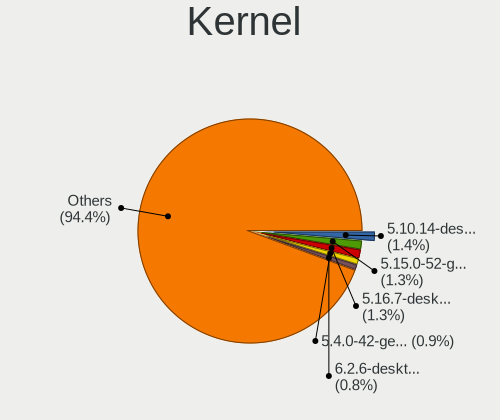
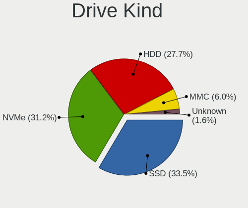
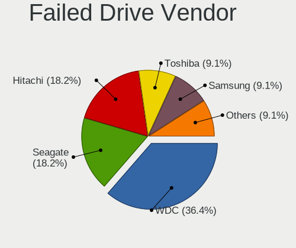
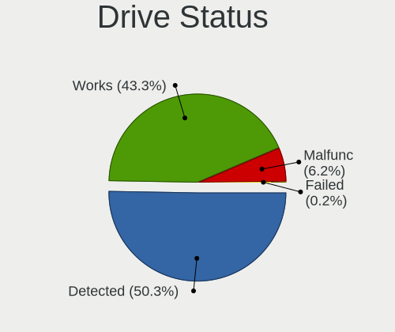
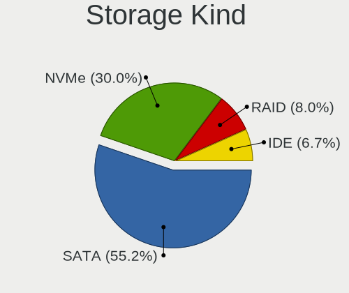

Linux in Italy - Tested Hardware & Statistics (Notebooks)
---------------------------------------------------------

A project to collect tested hardware configurations for Linux in Italy.

Anyone can contribute to this report by the [hw-probe](https://github.com/linuxhw/hw-probe) tool:

    sudo -E hw-probe -all -upload

Please contribute! Especially if your hardware is rare.

Contents
--------

* [ Test Cases ](#test-cases)

* [ System ](#system)
  - [ OS                       ](#os)
  - [ OS Family                ](#os-family)
  - [ Kernel                   ](#kernel)
  - [ Kernel Family            ](#kernel-family)
  - [ Kernel Major Ver.        ](#kernel-major-ver)
  - [ Arch                     ](#arch)
  - [ DE                       ](#de)
  - [ Display Server           ](#display-server)
  - [ Display Manager          ](#display-manager)
  - [ OS Lang                  ](#os-lang)
  - [ Boot Mode                ](#boot-mode)
  - [ Filesystem               ](#filesystem)
  - [ Part. scheme             ](#part-scheme)
  - [ Dual Boot with Linux/BSD ](#dual-boot-with-linuxbsd)
  - [ Dual Boot (Win)          ](#dual-boot-win)

* [ Board ](#board)
  - [ Vendor                   ](#vendor)
  - [ Model                    ](#model)
  - [ Model Family             ](#model-family)
  - [ MFG Year                 ](#mfg-year)
  - [ Form Factor              ](#form-factor)
  - [ Secure Boot              ](#secure-boot)
  - [ Coreboot                 ](#coreboot)
  - [ RAM Size                 ](#ram-size)
  - [ RAM Used                 ](#ram-used)
  - [ Total Drives             ](#total-drives)
  - [ Has CD-ROM               ](#has-cd-rom)
  - [ Has Ethernet             ](#has-ethernet)
  - [ Has WiFi                 ](#has-wifi)
  - [ Has Bluetooth            ](#has-bluetooth)

* [ Location ](#location)
  - [ Country                  ](#country)
  - [ City                     ](#city)

* [ Drives ](#drives)
  - [ Drive Vendor             ](#drive-vendor)
  - [ Drive Model              ](#drive-model)
  - [ HDD Vendor               ](#hdd-vendor)
  - [ SSD Vendor               ](#ssd-vendor)
  - [ Drive Kind               ](#drive-kind)
  - [ Drive Connector          ](#drive-connector)
  - [ Drive Size               ](#drive-size)
  - [ Space Total              ](#space-total)
  - [ Space Used               ](#space-used)
  - [ Malfunc. Drives          ](#malfunc-drives)
  - [ Malfunc. Drive Vendor    ](#malfunc-drive-vendor)
  - [ Malfunc. HDD Vendor      ](#malfunc-hdd-vendor)
  - [ Malfunc. Drive Kind      ](#malfunc-drive-kind)
  - [ Failed Drives            ](#failed-drives)
  - [ Failed Drive Vendor      ](#failed-drive-vendor)
  - [ Drive Status             ](#drive-status)

* [ Storage controller ](#storage-controller)
  - [ Storage Vendor           ](#storage-vendor)
  - [ Storage Model            ](#storage-model)
  - [ Storage Kind             ](#storage-kind)

* [ Processor ](#processor)
  - [ CPU Vendor               ](#cpu-vendor)
  - [ CPU Model                ](#cpu-model)
  - [ CPU Model Family         ](#cpu-model-family)
  - [ CPU Cores                ](#cpu-cores)
  - [ CPU Sockets              ](#cpu-sockets)
  - [ CPU Threads              ](#cpu-threads)
  - [ CPU Op-Modes             ](#cpu-op-modes)
  - [ CPU Microcode            ](#cpu-microcode)
  - [ CPU Microarch            ](#cpu-microarch)

* [ Graphics ](#graphics)
  - [ GPU Vendor               ](#gpu-vendor)
  - [ GPU Model                ](#gpu-model)
  - [ GPU Combo                ](#gpu-combo)
  - [ GPU Driver               ](#gpu-driver)
  - [ GPU Memory               ](#gpu-memory)

* [ Monitor ](#monitor)
  - [ Monitor Vendor           ](#monitor-vendor)
  - [ Monitor Model            ](#monitor-model)
  - [ Monitor Resolution       ](#monitor-resolution)
  - [ Monitor Diagonal         ](#monitor-diagonal)
  - [ Monitor Width            ](#monitor-width)
  - [ Aspect Ratio             ](#aspect-ratio)
  - [ Monitor Area             ](#monitor-area)
  - [ Pixel Density            ](#pixel-density)
  - [ Multiple Monitors        ](#multiple-monitors)

* [ Network ](#network)
  - [ Net Controller Vendor    ](#net-controller-vendor)
  - [ Net Controller Model     ](#net-controller-model)
  - [ Wireless Vendor          ](#wireless-vendor)
  - [ Wireless Model           ](#wireless-model)
  - [ Ethernet Vendor          ](#ethernet-vendor)
  - [ Ethernet Model           ](#ethernet-model)
  - [ Net Controller Kind      ](#net-controller-kind)
  - [ Used Controller          ](#used-controller)
  - [ NICs                     ](#nics)
  - [ IPv6                     ](#ipv6)

* [ Bluetooth ](#bluetooth)
  - [ Bluetooth Vendor         ](#bluetooth-vendor)
  - [ Bluetooth Model          ](#bluetooth-model)

* [ Sound ](#sound)
  - [ Sound Vendor             ](#sound-vendor)
  - [ Sound Model              ](#sound-model)

* [ Memory ](#memory)
  - [ Memory Vendor            ](#memory-vendor)
  - [ Memory Model             ](#memory-model)
  - [ Memory Kind              ](#memory-kind)
  - [ Memory Form Factor       ](#memory-form-factor)
  - [ Memory Size              ](#memory-size)
  - [ Memory Speed             ](#memory-speed)

* [ Printers & scanners ](#printers--scanners)
  - [ Printer Vendor           ](#printer-vendor)
  - [ Printer Model            ](#printer-model)
  - [ Scanner Vendor           ](#scanner-vendor)
  - [ Scanner Model            ](#scanner-model)

* [ Camera ](#camera)
  - [ Camera Vendor            ](#camera-vendor)
  - [ Camera Model             ](#camera-model)

* [ Security ](#security)
  - [ Fingerprint Vendor       ](#fingerprint-vendor)
  - [ Fingerprint Model        ](#fingerprint-model)
  - [ Chipcard Vendor          ](#chipcard-vendor)
  - [ Chipcard Model           ](#chipcard-model)

* [ Unsupported ](#unsupported)
  - [ Unsupported Devices      ](#unsupported-devices)
  - [ Unsupported Device Types ](#unsupported-device-types)

Test Cases
----------

Total: 9529

| Vendor        | Model                       | Probe                                                      | Date         |
|---------------|-----------------------------|------------------------------------------------------------|--------------|
| ASUSTek       | F5N                         | [b04fac9072](https://linux-hardware.org/?probe=b04fac9072) | Jan 06, 2025 |
| Dell          | XPS 13 9305                 | [77f98c4014](https://linux-hardware.org/?probe=77f98c4014) | Jan 06, 2025 |
| Lenovo        | V15-ADA 82C7                | [c5c9a457aa](https://linux-hardware.org/?probe=c5c9a457aa) | Jan 06, 2025 |
| ASUSTek       | K56CM                       | [4bfdbc10e7](https://linux-hardware.org/?probe=4bfdbc10e7) | Jan 05, 2025 |
| Samsung       | 300E4A/300E5A/300E7A/343... | [6bf558bdd0](https://linux-hardware.org/?probe=6bf558bdd0) | Jan 05, 2025 |
| Unknown       | Unknown                     | [b681fbb66c](https://linux-hardware.org/?probe=b681fbb66c) | Jan 04, 2025 |
| Dell          | XPS 16 9640                 | [58d3a3677b](https://linux-hardware.org/?probe=58d3a3677b) | Jan 04, 2025 |
| Dell          | XPS 16 9640                 | [8f38090e9d](https://linux-hardware.org/?probe=8f38090e9d) | Jan 04, 2025 |
| TongFang      | GM5HG0A                     | [7613e29f5b](https://linux-hardware.org/?probe=7613e29f5b) | Jan 04, 2025 |
| Acer          | Aspire 5680                 | [404c14f822](https://linux-hardware.org/?probe=404c14f822) | Jan 04, 2025 |
| TongFang      | GM5HG0A                     | [dd74d3e454](https://linux-hardware.org/?probe=dd74d3e454) | Jan 04, 2025 |
| Lenovo        | IdeaPad Slim 3 15AMN8 82... | [70d641dc76](https://linux-hardware.org/?probe=70d641dc76) | Jan 04, 2025 |
| Lenovo        | IdeaPad Slim 3 15AMN8 82... | [5c063c3aee](https://linux-hardware.org/?probe=5c063c3aee) | Jan 04, 2025 |
| Medion        | E11201                      | [141200df83](https://linux-hardware.org/?probe=141200df83) | Jan 03, 2025 |
| Acer          | Aspire A115-32              | [c3f625776f](https://linux-hardware.org/?probe=c3f625776f) | Jan 03, 2025 |
| Samsung       | RC530/RC730                 | [e7b266b86e](https://linux-hardware.org/?probe=e7b266b86e) | Jan 03, 2025 |
| Acer          | Aspire 5741G                | [3785e1f57b](https://linux-hardware.org/?probe=3785e1f57b) | Jan 03, 2025 |
| Sony          | VGN-CR21S_W                 | [29a2c1f90e](https://linux-hardware.org/?probe=29a2c1f90e) | Jan 03, 2025 |
| ASUSTek       | K55DR                       | [2a17dca919](https://linux-hardware.org/?probe=2a17dca919) | Jan 03, 2025 |
| MSI           | Prestige 15 A12SC           | [5749bc91e9](https://linux-hardware.org/?probe=5749bc91e9) | Jan 03, 2025 |
| Acer          | Aspire A515-52              | [4b5bf879c2](https://linux-hardware.org/?probe=4b5bf879c2) | Jan 03, 2025 |
| Acer          | Aspire E5-571G              | [a4cd37383e](https://linux-hardware.org/?probe=a4cd37383e) | Jan 02, 2025 |
| Lenovo        | IdeaPad 3 15IML05 81WB      | [f5cc6f8958](https://linux-hardware.org/?probe=f5cc6f8958) | Jan 02, 2025 |
| Sony          | SVF1521G6EW                 | [a9d8497c8d](https://linux-hardware.org/?probe=a9d8497c8d) | Jan 02, 2025 |
| HP            | 15                          | [683e4b72b8](https://linux-hardware.org/?probe=683e4b72b8) | Jan 01, 2025 |
| MSI           | Prestige 15 A12SC           | [d177ea6bf3](https://linux-hardware.org/?probe=d177ea6bf3) | Jan 01, 2025 |
| MSI           | Katana GF76 12UC            | [f0ab62b277](https://linux-hardware.org/?probe=f0ab62b277) | Jan 01, 2025 |
| HP            | Unknown                     | [d415ba61b5](https://linux-hardware.org/?probe=d415ba61b5) | Jan 01, 2025 |
| HP            | Unknown                     | [ce24e826ba](https://linux-hardware.org/?probe=ce24e826ba) | Jan 01, 2025 |
| SLIMBOOK      | Executive                   | [026c2a5e39](https://linux-hardware.org/?probe=026c2a5e39) | Jan 01, 2025 |
| SLIMBOOK      | Executive                   | [8fa336f525](https://linux-hardware.org/?probe=8fa336f525) | Jan 01, 2025 |
| Acer          | Aspire E5-573G              | [42555dde71](https://linux-hardware.org/?probe=42555dde71) | Dec 31, 2024 |
| Acer          | Aspire A515-57              | [a91c16b9c4](https://linux-hardware.org/?probe=a91c16b9c4) | Dec 31, 2024 |
| ASUSTek       | X540SA                      | [fffc36417c](https://linux-hardware.org/?probe=fffc36417c) | Dec 31, 2024 |
| Acer          | Aspire A515-45              | [1a20ef9a3c](https://linux-hardware.org/?probe=1a20ef9a3c) | Dec 30, 2024 |
| Lenovo        | ThinkBook 15 G2 ARE 20VG    | [79ccf16681](https://linux-hardware.org/?probe=79ccf16681) | Dec 30, 2024 |
| ASUSTek       | VivoBook_ASUSLaptop X580... | [994b1d92c5](https://linux-hardware.org/?probe=994b1d92c5) | Dec 30, 2024 |
| Unknown       | N20 Pro                     | [4ac833b77e](https://linux-hardware.org/?probe=4ac833b77e) | Dec 30, 2024 |
| HP            | Laptop 17-cp0xxx            | [008153aaec](https://linux-hardware.org/?probe=008153aaec) | Dec 30, 2024 |
| MSI           | Prestige 15 A12SC           | [2a23c371cd](https://linux-hardware.org/?probe=2a23c371cd) | Dec 30, 2024 |
| HUAWEI        | KLVL-WXX9                   | [50d20229d8](https://linux-hardware.org/?probe=50d20229d8) | Dec 30, 2024 |
| Lenovo        | ThinkPad L15 Gen 4 21H7C... | [810f9eeaaa](https://linux-hardware.org/?probe=810f9eeaaa) | Dec 30, 2024 |
| Acer          | Aspire A515-45              | [9a29af74ff](https://linux-hardware.org/?probe=9a29af74ff) | Dec 30, 2024 |
| HP            | 255 G7 Notebook PC          | [14817c7822](https://linux-hardware.org/?probe=14817c7822) | Dec 30, 2024 |
| TUXEDO        | InfinityBook Pro AMD Gen... | [5d3fe59ed7](https://linux-hardware.org/?probe=5d3fe59ed7) | Dec 29, 2024 |
| ASUSTek       | Vivobook Go E1504FA_E150... | [928c92d817](https://linux-hardware.org/?probe=928c92d817) | Dec 29, 2024 |
| Medion        | Defender P40                | [04ff586114](https://linux-hardware.org/?probe=04ff586114) | Dec 29, 2024 |
| ASUSTek       | N56JK                       | [d1c6ca3f72](https://linux-hardware.org/?probe=d1c6ca3f72) | Dec 29, 2024 |
| ASUSTek       | S551LN                      | [ef774595d3](https://linux-hardware.org/?probe=ef774595d3) | Dec 29, 2024 |
| Acer          | Aspire A515-57              | [4bccbc5b01](https://linux-hardware.org/?probe=4bccbc5b01) | Dec 29, 2024 |
| ASUSTek       | N56JK                       | [0114b99957](https://linux-hardware.org/?probe=0114b99957) | Dec 29, 2024 |
| Toshiba       | Satellite L755              | [f4e18a27e3](https://linux-hardware.org/?probe=f4e18a27e3) | Dec 29, 2024 |
| HP            | Laptop 15-bs1xx             | [39fde8f5ca](https://linux-hardware.org/?probe=39fde8f5ca) | Dec 29, 2024 |
| HP            | Notebook                    | [fb6c3eebe1](https://linux-hardware.org/?probe=fb6c3eebe1) | Dec 29, 2024 |
| ASUSTek       | VivoBook_ASUSLaptop X515... | [53cd73700d](https://linux-hardware.org/?probe=53cd73700d) | Dec 29, 2024 |
| MSI           | Katana GF76 12UC            | [81deda659f](https://linux-hardware.org/?probe=81deda659f) | Dec 29, 2024 |
| Acer          | Aspire A715-42G             | [584e951bfb](https://linux-hardware.org/?probe=584e951bfb) | Dec 29, 2024 |
| Chuwi         | GemiBook                    | [28c417a4f8](https://linux-hardware.org/?probe=28c417a4f8) | Dec 29, 2024 |
| Dell          | Inspiron 16 5645            | [254ce49ccb](https://linux-hardware.org/?probe=254ce49ccb) | Dec 28, 2024 |
| Lenovo        | Legion 5 Pro 16IAH7H 82R... | [dd408ca578](https://linux-hardware.org/?probe=dd408ca578) | Dec 28, 2024 |
| Lenovo        | ThinkPad T480 20L6SJUS2J    | [55f0836ea7](https://linux-hardware.org/?probe=55f0836ea7) | Dec 28, 2024 |
| MSI           | GS60 6QE                    | [d2355f1bc6](https://linux-hardware.org/?probe=d2355f1bc6) | Dec 28, 2024 |
| Dell          | Latitude 7450               | [41b698bba3](https://linux-hardware.org/?probe=41b698bba3) | Dec 28, 2024 |
| MSI           | GS60 6QE                    | [335d033bc6](https://linux-hardware.org/?probe=335d033bc6) | Dec 28, 2024 |
| HP            | Compaq Mini 311-1100        | [bb10d0f283](https://linux-hardware.org/?probe=bb10d0f283) | Dec 28, 2024 |
| HP            | ProBook 470 G2              | [ee181df849](https://linux-hardware.org/?probe=ee181df849) | Dec 28, 2024 |
| HP            | EliteBook 845 14 inch G1... | [60ab24f653](https://linux-hardware.org/?probe=60ab24f653) | Dec 28, 2024 |
| ASUSTek       | S300CA                      | [7225fa5b22](https://linux-hardware.org/?probe=7225fa5b22) | Dec 27, 2024 |
| HP            | ZBook 15 G6                 | [40bd2c3025](https://linux-hardware.org/?probe=40bd2c3025) | Dec 27, 2024 |
| Lenovo        | IdeaPad L340-15IRH Gamin... | [234883eac2](https://linux-hardware.org/?probe=234883eac2) | Dec 27, 2024 |
| Lenovo        | ThinkBook 15 G2 ARE 20VG    | [9ca24271a4](https://linux-hardware.org/?probe=9ca24271a4) | Dec 26, 2024 |
| HP            | ProBook 650 G1              | [2e0d9756fe](https://linux-hardware.org/?probe=2e0d9756fe) | Dec 26, 2024 |
| Lenovo        | ThinkPad T14 Gen 2i 20W0... | [369cdd52d8](https://linux-hardware.org/?probe=369cdd52d8) | Dec 26, 2024 |
| ASUSTek       | K53E                        | [33ce8daf57](https://linux-hardware.org/?probe=33ce8daf57) | Dec 26, 2024 |
| Dell          | Precision M6800             | [b805a2c527](https://linux-hardware.org/?probe=b805a2c527) | Dec 26, 2024 |
| ASUSTek       | X510UQR                     | [84503b8cca](https://linux-hardware.org/?probe=84503b8cca) | Dec 26, 2024 |
| Lenovo        | ThinkPad T14 Gen 2i 20W0... | [41e3dac21e](https://linux-hardware.org/?probe=41e3dac21e) | Dec 26, 2024 |
| Unknown       | MX16                        | [45e7d14b5b](https://linux-hardware.org/?probe=45e7d14b5b) | Dec 25, 2024 |
| Samsung       | 750XGK                      | [178e559f24](https://linux-hardware.org/?probe=178e559f24) | Dec 25, 2024 |
| MSI           | Prestige 15 A12SC           | [482d068493](https://linux-hardware.org/?probe=482d068493) | Dec 25, 2024 |
| Dell          | Inspiron 1545               | [c4301467a3](https://linux-hardware.org/?probe=c4301467a3) | Dec 24, 2024 |
| Lenovo        | ThinkPad X1 Carbon Gen 9... | [4b6d9e080e](https://linux-hardware.org/?probe=4b6d9e080e) | Dec 24, 2024 |
| Lenovo        | IdeaPad Slim 3 15ABR8 82... | [3a374eb06f](https://linux-hardware.org/?probe=3a374eb06f) | Dec 24, 2024 |
| HP            | ProBook 450 G5              | [825918c34e](https://linux-hardware.org/?probe=825918c34e) | Dec 24, 2024 |
| Acer          | Swift SF314-59              | [fb10309ad2](https://linux-hardware.org/?probe=fb10309ad2) | Dec 24, 2024 |
| Acer          | Swift SF314-59              | [dc8395bb56](https://linux-hardware.org/?probe=dc8395bb56) | Dec 24, 2024 |
| Lenovo        | ThinkPad E14 Gen 6 21M3C... | [27c22b69a1](https://linux-hardware.org/?probe=27c22b69a1) | Dec 24, 2024 |
| ASUSTek       | N56JN                       | [952d22573d](https://linux-hardware.org/?probe=952d22573d) | Dec 24, 2024 |
| Unknown       | Unknown                     | [5dfb56f742](https://linux-hardware.org/?probe=5dfb56f742) | Dec 23, 2024 |
| Unknown       | Unknown                     | [2a60e915d0](https://linux-hardware.org/?probe=2a60e915d0) | Dec 23, 2024 |
| MSI           | Katana GF66 11UC            | [c287ca2189](https://linux-hardware.org/?probe=c287ca2189) | Dec 23, 2024 |
| Dell          | Latitude 7450               | [43d05fa82d](https://linux-hardware.org/?probe=43d05fa82d) | Dec 23, 2024 |
| ASUSTek       | X510UQR                     | [f0c040e507](https://linux-hardware.org/?probe=f0c040e507) | Dec 22, 2024 |
| HP            | EliteBook 650 15.6 inch ... | [2c77e00968](https://linux-hardware.org/?probe=2c77e00968) | Dec 22, 2024 |
| ASUSTek       | X510UQR                     | [a86cafa832](https://linux-hardware.org/?probe=a86cafa832) | Dec 22, 2024 |
| AZW           | GTi                         | [01e6c282da](https://linux-hardware.org/?probe=01e6c282da) | Dec 21, 2024 |
| Unknown       | MX16                        | [0c0601e23c](https://linux-hardware.org/?probe=0c0601e23c) | Dec 21, 2024 |
| Dell          | Inspiron 1545               | [9cc6330a09](https://linux-hardware.org/?probe=9cc6330a09) | Dec 21, 2024 |
| Fujitsu       | LIFEBOOK S904               | [8817e414d9](https://linux-hardware.org/?probe=8817e414d9) | Dec 21, 2024 |
| HP            | 650                         | [9e305ba57b](https://linux-hardware.org/?probe=9e305ba57b) | Dec 20, 2024 |
| HP            | Stream Laptop 14-cb0XX      | [be162cfbe0](https://linux-hardware.org/?probe=be162cfbe0) | Dec 20, 2024 |
| Lenovo        | ThinkPad T400 6475WKP       | [6d42ae475b](https://linux-hardware.org/?probe=6d42ae475b) | Dec 20, 2024 |
| Lenovo        | ThinkPad T400 6475WKP       | [8d02891009](https://linux-hardware.org/?probe=8d02891009) | Dec 20, 2024 |
| HP            | Pavilion Laptop 14-dv0xx... | [210729b8a3](https://linux-hardware.org/?probe=210729b8a3) | Dec 20, 2024 |
| HUAWEI        | MateBook D                  | [46903b393f](https://linux-hardware.org/?probe=46903b393f) | Dec 20, 2024 |
| Dell          | Latitude 7450               | [5198f3d928](https://linux-hardware.org/?probe=5198f3d928) | Dec 19, 2024 |
| Acer          | Aspire 4820TG               | [d8ed5c82aa](https://linux-hardware.org/?probe=d8ed5c82aa) | Dec 19, 2024 |
| Samsung       | 550P5C/550P7C               | [0f7b61cd39](https://linux-hardware.org/?probe=0f7b61cd39) | Dec 19, 2024 |
| Lenovo        | IdeaPad 330S-15IKB 81F5     | [41b2a0d866](https://linux-hardware.org/?probe=41b2a0d866) | Dec 19, 2024 |
| Toshiba       | Satellite C650              | [ecf24b9aeb](https://linux-hardware.org/?probe=ecf24b9aeb) | Dec 18, 2024 |
| ASUSTek       | UX30                        | [d75f3afdf6](https://linux-hardware.org/?probe=d75f3afdf6) | Dec 18, 2024 |
| Lenovo        | IdeaPad 3 15ADA05 81W1      | [c3479fc1e6](https://linux-hardware.org/?probe=c3479fc1e6) | Dec 18, 2024 |
| ASUSTek       | X556UJ                      | [39a4e3dc48](https://linux-hardware.org/?probe=39a4e3dc48) | Dec 18, 2024 |
| HP            | Presario CQ56               | [aceb2056cb](https://linux-hardware.org/?probe=aceb2056cb) | Dec 18, 2024 |
| Unknown       | Unknown                     | [8013360f66](https://linux-hardware.org/?probe=8013360f66) | Dec 17, 2024 |
| ASUSTek       | X550JF                      | [b2ddf9ed9e](https://linux-hardware.org/?probe=b2ddf9ed9e) | Dec 17, 2024 |
| HP            | Pavilion Gaming Laptop 1... | [e82cfdaf8f](https://linux-hardware.org/?probe=e82cfdaf8f) | Dec 17, 2024 |
| ASUSTek       | X510UAR                     | [758c2eb717](https://linux-hardware.org/?probe=758c2eb717) | Dec 17, 2024 |
| Acer          | Aspire A515-57G             | [58f51347f5](https://linux-hardware.org/?probe=58f51347f5) | Dec 17, 2024 |
| Acer          | Aspire 5738                 | [edb35a4953](https://linux-hardware.org/?probe=edb35a4953) | Dec 17, 2024 |
| Lenovo        | IdeaPad S405 9802           | [10b9693723](https://linux-hardware.org/?probe=10b9693723) | Dec 17, 2024 |
| Lenovo        | IdeaPad S405 9802           | [3a61babe21](https://linux-hardware.org/?probe=3a61babe21) | Dec 17, 2024 |
| ASUSTek       | 1015CX                      | [4ee48f3c78](https://linux-hardware.org/?probe=4ee48f3c78) | Dec 16, 2024 |
| Lenovo        | IdeaPad3 81WE               | [413261ffa3](https://linux-hardware.org/?probe=413261ffa3) | Dec 16, 2024 |
| HUAWEI        | KPL-W0X                     | [d28acee099](https://linux-hardware.org/?probe=d28acee099) | Dec 15, 2024 |
| Framework     | Laptop 16 (AMD Ryzen 704... | [1be6e20939](https://linux-hardware.org/?probe=1be6e20939) | Dec 15, 2024 |
| Lenovo        | G50-45 80E3                 | [6a4cd1b9b7](https://linux-hardware.org/?probe=6a4cd1b9b7) | Dec 15, 2024 |
| Chuwi         | MiniBook X                  | [fd078ebd72](https://linux-hardware.org/?probe=fd078ebd72) | Dec 15, 2024 |
| Acer          | Aspire E1-571G              | [c3c73e6022](https://linux-hardware.org/?probe=c3c73e6022) | Dec 15, 2024 |
| Framework     | Laptop 16 (AMD Ryzen 704... | [d83059ffbd](https://linux-hardware.org/?probe=d83059ffbd) | Dec 14, 2024 |
| HP            | Pavilion g6                 | [ef81588017](https://linux-hardware.org/?probe=ef81588017) | Dec 14, 2024 |
| Lenovo        | ThinkPad P53 20QQS6BR01     | [1fdb59d03d](https://linux-hardware.org/?probe=1fdb59d03d) | Dec 14, 2024 |
| Fujitsu       | LIFEBOOK E756               | [dc1040b8a0](https://linux-hardware.org/?probe=dc1040b8a0) | Dec 14, 2024 |
| Fujitsu       | LIFEBOOK UH552              | [990586c3cf](https://linux-hardware.org/?probe=990586c3cf) | Dec 14, 2024 |
| Lenovo        | IdeaPad Slim 3 15ABR8 82... | [2ff0334ff1](https://linux-hardware.org/?probe=2ff0334ff1) | Dec 14, 2024 |
| Notebook      | NS5x_NS7xPU                 | [3366223c5a](https://linux-hardware.org/?probe=3366223c5a) | Dec 14, 2024 |
| AMI           | Intel                       | [0ea5666f92](https://linux-hardware.org/?probe=0ea5666f92) | Dec 14, 2024 |
| HP            | ProBook 440 14 inch G11 ... | [48e186d227](https://linux-hardware.org/?probe=48e186d227) | Dec 14, 2024 |
| Toshiba       | Satellite Pro A300          | [a83c734bd8](https://linux-hardware.org/?probe=a83c734bd8) | Dec 14, 2024 |
| Acer          | Aspire A515-48M             | [1bd13cf77f](https://linux-hardware.org/?probe=1bd13cf77f) | Dec 14, 2024 |
| Lenovo        | ThinkBook 15p Gen 2 21B1    | [495b663c63](https://linux-hardware.org/?probe=495b663c63) | Dec 13, 2024 |
| Dell          | Latitude E6540              | [1af7d6ebbe](https://linux-hardware.org/?probe=1af7d6ebbe) | Dec 13, 2024 |
| ASUSTek       | ZenBook Pro Duo UX582HS_... | [bb2f76bd02](https://linux-hardware.org/?probe=bb2f76bd02) | Dec 13, 2024 |
| ASUSTek       | N551JK                      | [10b918146d](https://linux-hardware.org/?probe=10b918146d) | Dec 13, 2024 |
| Toshiba       | Satellite C50-A             | [63d5d9e81c](https://linux-hardware.org/?probe=63d5d9e81c) | Dec 13, 2024 |
| Lenovo        | V145-15AST 81MT             | [72b64e8815](https://linux-hardware.org/?probe=72b64e8815) | Dec 13, 2024 |
| ASUSTek       | K52Jr                       | [a19ad8fbd8](https://linux-hardware.org/?probe=a19ad8fbd8) | Dec 13, 2024 |
| Chuwi         | MiniBook X                  | [f873ac8b18](https://linux-hardware.org/?probe=f873ac8b18) | Dec 13, 2024 |
| Fujitsu       | LIFEBOOK E756               | [a30104ce39](https://linux-hardware.org/?probe=a30104ce39) | Dec 13, 2024 |
| Dell          | Inspiron 3482               | [68b2169ef5](https://linux-hardware.org/?probe=68b2169ef5) | Dec 13, 2024 |
| HP            | Pavilion g6                 | [f6edf49c41](https://linux-hardware.org/?probe=f6edf49c41) | Dec 12, 2024 |
| Acer          | Swift SF514-54G             | [d8035002bc](https://linux-hardware.org/?probe=d8035002bc) | Dec 12, 2024 |
| Acer          | Aspire 5755G                | [b0c3abdc3c](https://linux-hardware.org/?probe=b0c3abdc3c) | Dec 12, 2024 |
| Acer          | Aspire 5732Z                | [3328b3d10e](https://linux-hardware.org/?probe=3328b3d10e) | Dec 12, 2024 |
| Fujitsu       | LIFEBOOK E744               | [87de375a5f](https://linux-hardware.org/?probe=87de375a5f) | Dec 11, 2024 |
| Lenovo        | IdeaPad 3 15ITL6 82H8       | [a46ff9c846](https://linux-hardware.org/?probe=a46ff9c846) | Dec 11, 2024 |
| Dell          | XPS 13 9350                 | [8eaebb2950](https://linux-hardware.org/?probe=8eaebb2950) | Dec 11, 2024 |
| ASUSTek       | X556URK                     | [7f87e4f208](https://linux-hardware.org/?probe=7f87e4f208) | Dec 11, 2024 |
| HP            | ProBook 440 14 inch G11 ... | [15602ddcf4](https://linux-hardware.org/?probe=15602ddcf4) | Dec 11, 2024 |
| Microtech     | ebookPro                    | [4e6f89ca56](https://linux-hardware.org/?probe=4e6f89ca56) | Dec 10, 2024 |
| ASUSTek       | X551CA                      | [16fcf7261f](https://linux-hardware.org/?probe=16fcf7261f) | Dec 10, 2024 |
| Acer          | Aspire 7745G                | [ec6388b8ee](https://linux-hardware.org/?probe=ec6388b8ee) | Dec 10, 2024 |
| Acer          | Extensa 5220                | [864e664760](https://linux-hardware.org/?probe=864e664760) | Dec 10, 2024 |
| Fujitsu       | LIFEBOOK E5412              | [5d7f3ba890](https://linux-hardware.org/?probe=5d7f3ba890) | Dec 10, 2024 |
| ASUSTek       | Zenbook UX3402VA_UX3402V... | [73bacd909a](https://linux-hardware.org/?probe=73bacd909a) | Dec 10, 2024 |
| Lenovo        | Yoga Pro 7 14ASP9 83HN      | [a46be93602](https://linux-hardware.org/?probe=a46be93602) | Dec 10, 2024 |
| Lenovo        | Legion Pro 5 16ARX8 82WM    | [4eb63f761a](https://linux-hardware.org/?probe=4eb63f761a) | Dec 10, 2024 |
| ASUSTek       | P553UA                      | [136fda34cf](https://linux-hardware.org/?probe=136fda34cf) | Dec 10, 2024 |
| Lenovo        | Legion 5 Pro 16IAH7H 82R... | [62082eb1f9](https://linux-hardware.org/?probe=62082eb1f9) | Dec 09, 2024 |
| ASUSTek       | F3Sr                        | [5ae3280aa4](https://linux-hardware.org/?probe=5ae3280aa4) | Dec 09, 2024 |
| Apple         | MacBookPro11,1              | [61fbdd12f7](https://linux-hardware.org/?probe=61fbdd12f7) | Dec 08, 2024 |
| Lenovo        | ThinkPad T480 20L6SDF920    | [362e2af4bf](https://linux-hardware.org/?probe=362e2af4bf) | Dec 08, 2024 |
| Lenovo        | ThinkPad T440s 20ARS1EQ0... | [c4f09615ae](https://linux-hardware.org/?probe=c4f09615ae) | Dec 08, 2024 |
| ASUSTek       | ZenBook Pro Duo UX582HS_... | [1771070dd0](https://linux-hardware.org/?probe=1771070dd0) | Dec 07, 2024 |
| Lenovo        | IdeaPad 3 15ADA6 82KR       | [3fe07f468b](https://linux-hardware.org/?probe=3fe07f468b) | Dec 07, 2024 |
| HUAWEI        | BOM-WXX9                    | [931b9d73cc](https://linux-hardware.org/?probe=931b9d73cc) | Dec 07, 2024 |
| Apple         | MacBookPro5,1               | [3ba5637302](https://linux-hardware.org/?probe=3ba5637302) | Dec 07, 2024 |
| Apple         | MacBookPro9,2               | [bd90895fef](https://linux-hardware.org/?probe=bd90895fef) | Dec 07, 2024 |
| Acer          | Aspire 5738                 | [041abf44b0](https://linux-hardware.org/?probe=041abf44b0) | Dec 07, 2024 |
| eMachines     | eME732Z                     | [1c64772130](https://linux-hardware.org/?probe=1c64772130) | Dec 06, 2024 |
| HP            | ProBook 440 G7              | [c3cbf63026](https://linux-hardware.org/?probe=c3cbf63026) | Dec 06, 2024 |
| eMachines     | E525                        | [b178c43fa2](https://linux-hardware.org/?probe=b178c43fa2) | Dec 06, 2024 |
| Dell          | XPS 13 9340                 | [14b4ca4b2c](https://linux-hardware.org/?probe=14b4ca4b2c) | Dec 05, 2024 |
| Lenovo        | ThinkPad W541 20EF0011IX    | [b0508a61eb](https://linux-hardware.org/?probe=b0508a61eb) | Dec 05, 2024 |
| Lenovo        | ThinkPad T430 2349IF8       | [cb9e678fc7](https://linux-hardware.org/?probe=cb9e678fc7) | Dec 05, 2024 |
| HP            | Laptop 15-db0xxx            | [3ceb5935c2](https://linux-hardware.org/?probe=3ceb5935c2) | Dec 04, 2024 |
| HUAWEI        | KLVL-WXX9                   | [e3f8a0e16b](https://linux-hardware.org/?probe=e3f8a0e16b) | Dec 04, 2024 |
| HP            | Laptop 15-db0xxx            | [7ded60c94b](https://linux-hardware.org/?probe=7ded60c94b) | Dec 04, 2024 |
| ASUSTek       | N56JN                       | [d5bb347a9c](https://linux-hardware.org/?probe=d5bb347a9c) | Dec 04, 2024 |
| HP            | Laptop 15-db0xxx            | [cc89356041](https://linux-hardware.org/?probe=cc89356041) | Dec 04, 2024 |
| MSI           | Prestige 14Evo A12M         | [1e27b379e6](https://linux-hardware.org/?probe=1e27b379e6) | Dec 04, 2024 |
| Unknown       | Unknown                     | [a3f6f532b8](https://linux-hardware.org/?probe=a3f6f532b8) | Dec 03, 2024 |
| MSI           | Modern 15 A11MU             | [e338458691](https://linux-hardware.org/?probe=e338458691) | Dec 03, 2024 |
| Acer          | Aspire E1-532               | [eda3548de6](https://linux-hardware.org/?probe=eda3548de6) | Dec 03, 2024 |
| ASUSTek       | P552SA                      | [ef552aa919](https://linux-hardware.org/?probe=ef552aa919) | Dec 03, 2024 |
| Acer          | Aspire A515-51G             | [04c3702ac7](https://linux-hardware.org/?probe=04c3702ac7) | Dec 02, 2024 |
| ASUSTek       | X302LA                      | [772896b9d3](https://linux-hardware.org/?probe=772896b9d3) | Dec 02, 2024 |
| Acer          | Aspire A515-51G             | [9946eff4a3](https://linux-hardware.org/?probe=9946eff4a3) | Dec 02, 2024 |
| Dell          | Latitude 7490               | [004d24d28c](https://linux-hardware.org/?probe=004d24d28c) | Dec 02, 2024 |
| HP            | Spectre Pro x360 G1         | [b6686c286b](https://linux-hardware.org/?probe=b6686c286b) | Dec 02, 2024 |
| ASUSTek       | ASUS TUF Dash F15 FX516P... | [8240d92fbc](https://linux-hardware.org/?probe=8240d92fbc) | Dec 02, 2024 |
| Dell          | Inspiron 7501               | [8403bcdf72](https://linux-hardware.org/?probe=8403bcdf72) | Dec 02, 2024 |
| Dell          | Inspiron 7501               | [5c2e3ea839](https://linux-hardware.org/?probe=5c2e3ea839) | Dec 01, 2024 |
| HP            | 250 G8 Notebook PC          | [20b2aa3eef](https://linux-hardware.org/?probe=20b2aa3eef) | Dec 01, 2024 |
| ASUSTek       | K53SC                       | [60a52cbc6f](https://linux-hardware.org/?probe=60a52cbc6f) | Dec 01, 2024 |
| Unknown       | Unknown                     | [678e33b8ed](https://linux-hardware.org/?probe=678e33b8ed) | Dec 01, 2024 |
| Toshiba       | Satellite L850              | [d7efdeae96](https://linux-hardware.org/?probe=d7efdeae96) | Dec 01, 2024 |
| Toshiba       | Satellite L850              | [510d7773fa](https://linux-hardware.org/?probe=510d7773fa) | Dec 01, 2024 |
| HP            | 250 G6 Notebook PC          | [77fc07b269](https://linux-hardware.org/?probe=77fc07b269) | Nov 30, 2024 |
| ASUSTek       | X555LAB                     | [78dd2bd80f](https://linux-hardware.org/?probe=78dd2bd80f) | Nov 30, 2024 |
| HP            | Pavilion dv6                | [639f2d6bf0](https://linux-hardware.org/?probe=639f2d6bf0) | Nov 29, 2024 |
| HUAWEI        | KPL-W0X                     | [09208f9363](https://linux-hardware.org/?probe=09208f9363) | Nov 29, 2024 |
| Notebook      | W65_67SZ                    | [245be0630e](https://linux-hardware.org/?probe=245be0630e) | Nov 29, 2024 |
| HUAWEI        | BOHK-WAX9X                  | [af19194ca0](https://linux-hardware.org/?probe=af19194ca0) | Nov 28, 2024 |
| Lenovo        | IdeaPad Gaming 3 15ARH05... | [f8c81ccbdb](https://linux-hardware.org/?probe=f8c81ccbdb) | Nov 28, 2024 |
| Lenovo        | IdeaPad Slim 3 15ABR8 82... | [fa44240612](https://linux-hardware.org/?probe=fa44240612) | Nov 28, 2024 |
| MSI           | Prestige 15 A12SC           | [5479ee3a49](https://linux-hardware.org/?probe=5479ee3a49) | Nov 28, 2024 |
| ASUSTek       | K55VD                       | [39ddd87283](https://linux-hardware.org/?probe=39ddd87283) | Nov 28, 2024 |
| Lenovo        | LOQ 16APH8 82XU             | [de092853e8](https://linux-hardware.org/?probe=de092853e8) | Nov 27, 2024 |
| Dell          | Vostro 3400                 | [1a8b5606a7](https://linux-hardware.org/?probe=1a8b5606a7) | Nov 27, 2024 |
| MSI           | MS-N014                     | [8f4f502803](https://linux-hardware.org/?probe=8f4f502803) | Nov 27, 2024 |
| Acer          | Aspire A515-56G             | [0dd2034460](https://linux-hardware.org/?probe=0dd2034460) | Nov 27, 2024 |
| Acer          | Aspire A515-56G             | [f73128061e](https://linux-hardware.org/?probe=f73128061e) | Nov 27, 2024 |
| Lenovo        | ThinkPad T14s Gen 4 21F8... | [41bb4341c5](https://linux-hardware.org/?probe=41bb4341c5) | Nov 27, 2024 |
| Lenovo        | IdeaPad Gaming 3 15IAH7 ... | [ea458812c2](https://linux-hardware.org/?probe=ea458812c2) | Nov 27, 2024 |
| HP            | Pavilion dv7                | [da8b60f935](https://linux-hardware.org/?probe=da8b60f935) | Nov 26, 2024 |
| Lenovo        | ThinkPad P14s Gen 2a 21A... | [33235dec27](https://linux-hardware.org/?probe=33235dec27) | Nov 26, 2024 |
| Acer          | Nitro AN515-57              | [efbde89468](https://linux-hardware.org/?probe=efbde89468) | Nov 26, 2024 |
| Acer          | Nitro AN515-57              | [d0251f8c42](https://linux-hardware.org/?probe=d0251f8c42) | Nov 26, 2024 |
| MSI           | MS-N014                     | [789c4f8e10](https://linux-hardware.org/?probe=789c4f8e10) | Nov 26, 2024 |
| HP            | Pavilion dv7                | [bc3b82dc2d](https://linux-hardware.org/?probe=bc3b82dc2d) | Nov 25, 2024 |
| Apple         | MacBookPro5,1               | [1b2768b378](https://linux-hardware.org/?probe=1b2768b378) | Nov 25, 2024 |
| Acer          | Nitro AN515-58              | [3b7b2ec509](https://linux-hardware.org/?probe=3b7b2ec509) | Nov 25, 2024 |
| Acer          | Nitro AN515-58              | [8f728a5e97](https://linux-hardware.org/?probe=8f728a5e97) | Nov 25, 2024 |
| Notebook      | W65_67SZ                    | [7cf2df4c2d](https://linux-hardware.org/?probe=7cf2df4c2d) | Nov 25, 2024 |
| HP            | Victus by Gaming Laptop ... | [b7f5c28695](https://linux-hardware.org/?probe=b7f5c28695) | Nov 24, 2024 |
| ASUSTek       | N751JK                      | [76172e8cf6](https://linux-hardware.org/?probe=76172e8cf6) | Nov 24, 2024 |
| HP            | Laptop 15s-eq2xxx           | [d8be9ca50f](https://linux-hardware.org/?probe=d8be9ca50f) | Nov 24, 2024 |
| Dell          | Latitude 3500               | [a5237bb18a](https://linux-hardware.org/?probe=a5237bb18a) | Nov 24, 2024 |
| Lenovo        | ThinkBook 15 G2 ITL 20VE    | [066e955a01](https://linux-hardware.org/?probe=066e955a01) | Nov 24, 2024 |
| ASUSTek       | X551CA                      | [582d2b81ab](https://linux-hardware.org/?probe=582d2b81ab) | Nov 24, 2024 |
| HP            | Pavilion Gaming Laptop 1... | [29f3adc75f](https://linux-hardware.org/?probe=29f3adc75f) | Nov 23, 2024 |
| Lenovo        | IdeaPad 3 15ADA05 81W1      | [e591ff3d77](https://linux-hardware.org/?probe=e591ff3d77) | Nov 23, 2024 |
| Acer          | Nitro AN515-58              | [1bf36f7ef2](https://linux-hardware.org/?probe=1bf36f7ef2) | Nov 23, 2024 |
| Sony          | SVF1521E6EW                 | [3f90ff5914](https://linux-hardware.org/?probe=3f90ff5914) | Nov 23, 2024 |
| Sony          | SVF1521E6EW                 | [1b39708b5e](https://linux-hardware.org/?probe=1b39708b5e) | Nov 23, 2024 |
| Packard Be... | EasyNote TS11HR             | [416650beef](https://linux-hardware.org/?probe=416650beef) | Nov 23, 2024 |
| Dell          | XPS 15 9570                 | [3da1cde3bf](https://linux-hardware.org/?probe=3da1cde3bf) | Nov 23, 2024 |
| Toshiba       | Satellite A200              | [11904bdfcd](https://linux-hardware.org/?probe=11904bdfcd) | Nov 22, 2024 |
| Apple         | MacBookPro11,3              | [43150c24ec](https://linux-hardware.org/?probe=43150c24ec) | Nov 22, 2024 |
| HUAWEI        | MACH-WX9                    | [ff5d8bcb47](https://linux-hardware.org/?probe=ff5d8bcb47) | Nov 22, 2024 |
| Lenovo        | ThinkPad X280 20KES5860J    | [e08eed8590](https://linux-hardware.org/?probe=e08eed8590) | Nov 22, 2024 |
| Lenovo        | V15-IGL 82C3                | [152346f838](https://linux-hardware.org/?probe=152346f838) | Nov 22, 2024 |
| ASUSTek       | K53SC                       | [40d3302bb4](https://linux-hardware.org/?probe=40d3302bb4) | Nov 22, 2024 |
| ASUSTek       | K53SC                       | [15401fc9c4](https://linux-hardware.org/?probe=15401fc9c4) | Nov 22, 2024 |
| Lenovo        | IdeaPad Slim 5 14AHP9 83... | [8671b7ff77](https://linux-hardware.org/?probe=8671b7ff77) | Nov 21, 2024 |
| HUAWEI        | HLYL-WXX9                   | [8f540c9b38](https://linux-hardware.org/?probe=8f540c9b38) | Nov 21, 2024 |
| Toshiba       | PORTEGE Z30-C               | [400c49b69f](https://linux-hardware.org/?probe=400c49b69f) | Nov 21, 2024 |
| Lenovo        | V15-ADA 82C7                | [16ef607aec](https://linux-hardware.org/?probe=16ef607aec) | Nov 21, 2024 |
| Dell          | Latitude 7490               | [0c7bf1cfcf](https://linux-hardware.org/?probe=0c7bf1cfcf) | Nov 21, 2024 |
| Apple         | MacBookPro11,3              | [696a65a496](https://linux-hardware.org/?probe=696a65a496) | Nov 20, 2024 |
| HP            | ProBook 450 G7              | [2f8b10b3d0](https://linux-hardware.org/?probe=2f8b10b3d0) | Nov 20, 2024 |
| Notebook      | W65_67SZ                    | [c7eb463249](https://linux-hardware.org/?probe=c7eb463249) | Nov 20, 2024 |
| HP            | Notebook                    | [1f58ba8bd6](https://linux-hardware.org/?probe=1f58ba8bd6) | Nov 20, 2024 |
| Lenovo        | IdeaPad 510S-13ISK 80SJ     | [f82bc92c01](https://linux-hardware.org/?probe=f82bc92c01) | Nov 20, 2024 |
| ASUSTek       | X551CA                      | [9a943d9e04](https://linux-hardware.org/?probe=9a943d9e04) | Nov 20, 2024 |
| ASUSTek       | ASUS EXPERTBOOK B9400CEA... | [b9edf1bd37](https://linux-hardware.org/?probe=b9edf1bd37) | Nov 20, 2024 |
| Lenovo        | IdeaPad Slim 5 14AHP9 83... | [8ef5a175e9](https://linux-hardware.org/?probe=8ef5a175e9) | Nov 20, 2024 |
| HUAWEI        | HLYL-WXX9                   | [5c935e8904](https://linux-hardware.org/?probe=5c935e8904) | Nov 20, 2024 |
| MSI           | Prestige 15 A12SC           | [c6315e741b](https://linux-hardware.org/?probe=c6315e741b) | Nov 20, 2024 |
| Olivetti      | OLIBOOK PX5-XXXAES          | [2b7a1152c0](https://linux-hardware.org/?probe=2b7a1152c0) | Nov 19, 2024 |
| Lenovo        | IdeaPad 510S-13ISK 80SJ     | [3b32c6de06](https://linux-hardware.org/?probe=3b32c6de06) | Nov 19, 2024 |
| ASUSTek       | ROG Flow X13 GV301QC_GV3... | [42bf3485f0](https://linux-hardware.org/?probe=42bf3485f0) | Nov 18, 2024 |
| ASUSTek       | X55VD                       | [fb12478a49](https://linux-hardware.org/?probe=fb12478a49) | Nov 18, 2024 |
| HP            | ZBook Fury 15.6 inch G8 ... | [9ba889ebcc](https://linux-hardware.org/?probe=9ba889ebcc) | Nov 18, 2024 |
| Fujitsu       | LIFEBOOK S782               | [c1c26c2a49](https://linux-hardware.org/?probe=c1c26c2a49) | Nov 18, 2024 |
| ASUSTek       | ROG Flow X13 GV301QC_GV3... | [accb142325](https://linux-hardware.org/?probe=accb142325) | Nov 17, 2024 |
| HP            | ENVY 15                     | [5472e124bb](https://linux-hardware.org/?probe=5472e124bb) | Nov 17, 2024 |
| Lenovo        | Yoga Pro 7 14IMH9 83E2      | [8057e2f08c](https://linux-hardware.org/?probe=8057e2f08c) | Nov 17, 2024 |
| Fujitsu Si... | AMILO Li 2735               | [afbab1e78c](https://linux-hardware.org/?probe=afbab1e78c) | Nov 17, 2024 |
| Lenovo        | IdeaPad 5 14ARE05 81YM      | [9692c7a996](https://linux-hardware.org/?probe=9692c7a996) | Nov 17, 2024 |
| HP            | ENVY 15                     | [56f54e0128](https://linux-hardware.org/?probe=56f54e0128) | Nov 17, 2024 |
| TUXEDO        | InfinityBook Pro 14 Gen6    | [00d2e6e80c](https://linux-hardware.org/?probe=00d2e6e80c) | Nov 17, 2024 |
| HP            | Laptop 15-db0xxx            | [2991c67e5b](https://linux-hardware.org/?probe=2991c67e5b) | Nov 16, 2024 |
| Apple         | MacBookAir7,2               | [32f96f8055](https://linux-hardware.org/?probe=32f96f8055) | Nov 16, 2024 |
| HP            | ENVY 15                     | [79d6a5fd27](https://linux-hardware.org/?probe=79d6a5fd27) | Nov 16, 2024 |
| Lenovo        | ThinkPad T14 Gen 1 20S1S... | [c55bb1e04a](https://linux-hardware.org/?probe=c55bb1e04a) | Nov 16, 2024 |
| HUAWEI        | CREF-XX                     | [7dd6e9e396](https://linux-hardware.org/?probe=7dd6e9e396) | Nov 16, 2024 |
| ASUSTek       | K55VD                       | [3dccf0becb](https://linux-hardware.org/?probe=3dccf0becb) | Nov 15, 2024 |
| Lenovo        | ThinkPad T480s 20L7001VI... | [f078abc42d](https://linux-hardware.org/?probe=f078abc42d) | Nov 15, 2024 |
| Lenovo        | ThinkPad E15 Gen 2 20T80... | [56c26ce540](https://linux-hardware.org/?probe=56c26ce540) | Nov 15, 2024 |
| Dell          | Latitude 5530               | [260bfa0ebf](https://linux-hardware.org/?probe=260bfa0ebf) | Nov 15, 2024 |
| Acer          | Aspire A515-57              | [33615560f0](https://linux-hardware.org/?probe=33615560f0) | Nov 14, 2024 |
| MSI           | Prestige 15 A12SC           | [d1f1746cc1](https://linux-hardware.org/?probe=d1f1746cc1) | Nov 14, 2024 |
| MSI           | Vector GP68HX 13VH          | [8800a447f1](https://linux-hardware.org/?probe=8800a447f1) | Nov 14, 2024 |
| HP            | ProBook 650 G1              | [556af0bd7a](https://linux-hardware.org/?probe=556af0bd7a) | Nov 14, 2024 |
| Dell          | Precision 5540              | [6db2b1cbad](https://linux-hardware.org/?probe=6db2b1cbad) | Nov 14, 2024 |
| Dell          | Inspiron 5521               | [784acebff9](https://linux-hardware.org/?probe=784acebff9) | Nov 14, 2024 |
| ASUSTek       | VivoBook_ASUS Laptop E40... | [ea8909d798](https://linux-hardware.org/?probe=ea8909d798) | Nov 14, 2024 |
| Acer          | Swift SF314-43              | [6b60f8c4bf](https://linux-hardware.org/?probe=6b60f8c4bf) | Nov 13, 2024 |
| HP            | Laptop 15s-eq2xxx           | [447183451b](https://linux-hardware.org/?probe=447183451b) | Nov 13, 2024 |
| HP            | Laptop 15-db0xxx            | [2a24099cf1](https://linux-hardware.org/?probe=2a24099cf1) | Nov 13, 2024 |
| Acer          | Aspire 5742G                | [46d5cbc974](https://linux-hardware.org/?probe=46d5cbc974) | Nov 13, 2024 |
| MSI           | Vector 16 HX A13VHG         | [afef5ca6c4](https://linux-hardware.org/?probe=afef5ca6c4) | Nov 13, 2024 |
| Unknown       | AX16                        | [57bb5777fc](https://linux-hardware.org/?probe=57bb5777fc) | Nov 13, 2024 |
| Lenovo        | ThinkPad P16s Gen 3 21KS... | [21e9dab6ea](https://linux-hardware.org/?probe=21e9dab6ea) | Nov 13, 2024 |
| Lenovo        | ThinkPad P16s Gen 3 21KS... | [03f6531c9e](https://linux-hardware.org/?probe=03f6531c9e) | Nov 13, 2024 |
| Unknown       | AX16                        | [91a36764ea](https://linux-hardware.org/?probe=91a36764ea) | Nov 13, 2024 |
| HP            | Laptop 15s-fq2xxx           | [e3de54db8d](https://linux-hardware.org/?probe=e3de54db8d) | Nov 12, 2024 |
| Valve         | Jupiter                     | [7e2bf5246b](https://linux-hardware.org/?probe=7e2bf5246b) | Nov 12, 2024 |
| Lenovo        | B590 62743PG                | [d736cd38cb](https://linux-hardware.org/?probe=d736cd38cb) | Nov 12, 2024 |
| HP            | Compaq Presario CQ60        | [9a7a4cf8eb](https://linux-hardware.org/?probe=9a7a4cf8eb) | Nov 12, 2024 |
| Lenovo        | Yoga Pro 7 14ASP9 83HN      | [c3249b5c41](https://linux-hardware.org/?probe=c3249b5c41) | Nov 12, 2024 |
| HP            | ENVY 15                     | [6d630249f1](https://linux-hardware.org/?probe=6d630249f1) | Nov 11, 2024 |
| Toshiba       | TECRA M9                    | [c9bf77d72b](https://linux-hardware.org/?probe=c9bf77d72b) | Nov 11, 2024 |
| Lenovo        | IdeaPad Slim 3 15AMN8 82... | [24efeeab44](https://linux-hardware.org/?probe=24efeeab44) | Nov 11, 2024 |
| Lenovo        | ThinkBook 15p Gen 2 21B1    | [67f6d7f5f9](https://linux-hardware.org/?probe=67f6d7f5f9) | Nov 11, 2024 |
| Dell          | Inspiron 14 Plus 7420       | [d40e36b915](https://linux-hardware.org/?probe=d40e36b915) | Nov 11, 2024 |
| HP            | ENVY 15                     | [909857c64c](https://linux-hardware.org/?probe=909857c64c) | Nov 11, 2024 |
| HP            | Laptop 14s-fq0xxx           | [3bd3e36ae6](https://linux-hardware.org/?probe=3bd3e36ae6) | Nov 11, 2024 |
| ASUSTek       | Zenbook UX3402ZA_UX3402Z... | [97617e7ac0](https://linux-hardware.org/?probe=97617e7ac0) | Nov 10, 2024 |
| Unknown       | Unknown                     | [029b61efe8](https://linux-hardware.org/?probe=029b61efe8) | Nov 10, 2024 |
| Apple         | MacBookAir7,2               | [29be37dd2c](https://linux-hardware.org/?probe=29be37dd2c) | Nov 10, 2024 |
| Unknown       | Unknown                     | [f906247244](https://linux-hardware.org/?probe=f906247244) | Nov 10, 2024 |
| ASUSTek       | X541UVK                     | [a8ff031ad5](https://linux-hardware.org/?probe=a8ff031ad5) | Nov 10, 2024 |
| Apple         | MacBookPro6,1               | [24c0858a39](https://linux-hardware.org/?probe=24c0858a39) | Nov 09, 2024 |
| Lenovo        | IdeaPad 3 15IIL05 81WE      | [0a20cf1768](https://linux-hardware.org/?probe=0a20cf1768) | Nov 09, 2024 |
| HP            | Pavilion Notebook           | [d093f2d9a3](https://linux-hardware.org/?probe=d093f2d9a3) | Nov 09, 2024 |
| Lenovo        | ThinkPad P53 20QQS6BR01     | [73680bda72](https://linux-hardware.org/?probe=73680bda72) | Nov 09, 2024 |
| HP            | Pavilion Notebook           | [dfd1998ecb](https://linux-hardware.org/?probe=dfd1998ecb) | Nov 09, 2024 |
| Samsung       | N150/N210/N220              | [3ff57a2986](https://linux-hardware.org/?probe=3ff57a2986) | Nov 09, 2024 |
| Acer          | Aspire ES1-523              | [afe3844e09](https://linux-hardware.org/?probe=afe3844e09) | Nov 08, 2024 |
| ASUSTek       | E402SA                      | [5e4e4b42cb](https://linux-hardware.org/?probe=5e4e4b42cb) | Nov 08, 2024 |
| ASUSTek       | N53SN                       | [bc6d6d125f](https://linux-hardware.org/?probe=bc6d6d125f) | Nov 08, 2024 |
| HP            | EliteBook 840 G8 Noteboo... | [00a4085813](https://linux-hardware.org/?probe=00a4085813) | Nov 08, 2024 |
| Lenovo        | B590 62743PG                | [496fdbb58b](https://linux-hardware.org/?probe=496fdbb58b) | Nov 08, 2024 |
| ASUSTek       | X550ZE                      | [f4bb873e76](https://linux-hardware.org/?probe=f4bb873e76) | Nov 08, 2024 |
| HP            | Laptop 15s-eq2xxx           | [79fe2bcc6c](https://linux-hardware.org/?probe=79fe2bcc6c) | Nov 07, 2024 |
| Acer          | Extensa 5620                | [8b93a69b2b](https://linux-hardware.org/?probe=8b93a69b2b) | Nov 07, 2024 |
| MSI           | Modern 15 A11ML             | [b78b406278](https://linux-hardware.org/?probe=b78b406278) | Nov 07, 2024 |
| MSI           | Modern 15 A11ML             | [7420944998](https://linux-hardware.org/?probe=7420944998) | Nov 07, 2024 |
| Dell          | Precision 7680              | [ea25426ef8](https://linux-hardware.org/?probe=ea25426ef8) | Nov 07, 2024 |
| MSI           | Modern 14 B11MOL            | [cd8894b314](https://linux-hardware.org/?probe=cd8894b314) | Nov 07, 2024 |
| ASUSTek       | VivoBook_ASUSLaptop X150... | [9e05fd3aee](https://linux-hardware.org/?probe=9e05fd3aee) | Nov 07, 2024 |
| HP            | Laptop 15s-fq2xxx           | [40be935ed5](https://linux-hardware.org/?probe=40be935ed5) | Nov 06, 2024 |
| HUAWEI        | HKD-WXX                     | [1fdcf3853d](https://linux-hardware.org/?probe=1fdcf3853d) | Nov 06, 2024 |
| Apple         | MacBookPro8,3               | [86b3f8139b](https://linux-hardware.org/?probe=86b3f8139b) | Nov 06, 2024 |
| HP            | OMEN by Gaming Laptop 16... | [08ee6f62a4](https://linux-hardware.org/?probe=08ee6f62a4) | Nov 06, 2024 |
| HP            | Pavilion Laptop 15-eg0xx... | [4a06e31cc5](https://linux-hardware.org/?probe=4a06e31cc5) | Nov 06, 2024 |
| SiComputer    | Nauta 01C                   | [8b68db0b84](https://linux-hardware.org/?probe=8b68db0b84) | Nov 05, 2024 |
| Dell          | Latitude E7470              | [725aab5aec](https://linux-hardware.org/?probe=725aab5aec) | Nov 05, 2024 |
| Lenovo        | ThinkPad E14 Gen 6 21M3C... | [1d4fa6a2ca](https://linux-hardware.org/?probe=1d4fa6a2ca) | Nov 05, 2024 |
| Lenovo        | IdeaPad S145-15IWL 81MV     | [67b92639b5](https://linux-hardware.org/?probe=67b92639b5) | Nov 05, 2024 |
| Dynabook      | Satellite Pro C50-G-10G     | [9b87023426](https://linux-hardware.org/?probe=9b87023426) | Nov 05, 2024 |
| Dynabook      | Satellite Pro C50-G-10G     | [700ad30964](https://linux-hardware.org/?probe=700ad30964) | Nov 05, 2024 |
| ASUSTek       | X555LAB                     | [dfd0aff2e1](https://linux-hardware.org/?probe=dfd0aff2e1) | Nov 05, 2024 |
| Lenovo        | ThinkPad E14 Gen 6 21M3C... | [90e5dc9cd2](https://linux-hardware.org/?probe=90e5dc9cd2) | Nov 04, 2024 |
| Lenovo        | ThinkPad T490 20N3S8C701    | [b1a80e99a2](https://linux-hardware.org/?probe=b1a80e99a2) | Nov 04, 2024 |
| PC Special... | 14 Fusion IV                | [1ef6e14285](https://linux-hardware.org/?probe=1ef6e14285) | Nov 04, 2024 |
| ASUSTek       | ROG Zephyrus G16 GA605WI... | [30ff08ed99](https://linux-hardware.org/?probe=30ff08ed99) | Nov 04, 2024 |
| Dell          | Latitude E7470              | [1dffd6f0aa](https://linux-hardware.org/?probe=1dffd6f0aa) | Nov 04, 2024 |
| Apple         | MacBookAir7,2               | [7bae0fc172](https://linux-hardware.org/?probe=7bae0fc172) | Nov 03, 2024 |
| Sony          | VPCS13V9E                   | [5f8c9da2ec](https://linux-hardware.org/?probe=5f8c9da2ec) | Nov 03, 2024 |
| Sony          | VPCS13V9E                   | [5f8592eebb](https://linux-hardware.org/?probe=5f8592eebb) | Nov 03, 2024 |
| Mediacom      | WinPad 11,6 FullHD- WPU1... | [d6c08eda47](https://linux-hardware.org/?probe=d6c08eda47) | Nov 03, 2024 |
| Lenovo        | ThinkPad T14 Gen 5 21MCC... | [3fc3c68095](https://linux-hardware.org/?probe=3fc3c68095) | Nov 03, 2024 |
| Notebook      | NS50_70MU                   | [f2c76bba4c](https://linux-hardware.org/?probe=f2c76bba4c) | Nov 03, 2024 |
| MSI           | Prestige 15 A12SC           | [403f475ebb](https://linux-hardware.org/?probe=403f475ebb) | Nov 03, 2024 |
| Fujitsu       | LIFEBOOK E743               | [be7c6d7a43](https://linux-hardware.org/?probe=be7c6d7a43) | Nov 03, 2024 |
| Acer          | Extensa 5635ZG              | [46d4a76e28](https://linux-hardware.org/?probe=46d4a76e28) | Nov 02, 2024 |
| HP            | 15                          | [74ff0ab99f](https://linux-hardware.org/?probe=74ff0ab99f) | Nov 02, 2024 |
| Lenovo        | LOQ 15IRX9 83DV             | [9693bd12e2](https://linux-hardware.org/?probe=9693bd12e2) | Nov 02, 2024 |
| Acer          | Aspire S7-391               | [43522af466](https://linux-hardware.org/?probe=43522af466) | Nov 02, 2024 |
| ASUSTek       | X541UVK                     | [b0ca93148e](https://linux-hardware.org/?probe=b0ca93148e) | Nov 01, 2024 |
| HP            | Pavilion dv6000 (RY645EA... | [a9cb45608f](https://linux-hardware.org/?probe=a9cb45608f) | Nov 01, 2024 |
| Lenovo        | V145-15AST 81MT             | [6153084187](https://linux-hardware.org/?probe=6153084187) | Nov 01, 2024 |
| Notebook      | NJx0PU                      | [1020557bda](https://linux-hardware.org/?probe=1020557bda) | Nov 01, 2024 |
| HP            | Pavilion Laptop 15-eh3xx... | [f26159e727](https://linux-hardware.org/?probe=f26159e727) | Nov 01, 2024 |
| MSI           | Prestige 15 A10SC           | [d1046e89e8](https://linux-hardware.org/?probe=d1046e89e8) | Oct 31, 2024 |
| SGIN          | laptop                      | [27b4f663bc](https://linux-hardware.org/?probe=27b4f663bc) | Oct 31, 2024 |
| HUAWEI        | BOM-WXX9                    | [fc1beb3a10](https://linux-hardware.org/?probe=fc1beb3a10) | Oct 30, 2024 |
| Acer          | Aspire A515-45              | [14cc9b1bd2](https://linux-hardware.org/?probe=14cc9b1bd2) | Oct 30, 2024 |
| Apple         | MacBookPro8,3               | [a6b7ebf718](https://linux-hardware.org/?probe=a6b7ebf718) | Oct 30, 2024 |
| MSI           | Modern 14 B11MOU            | [1347b3862f](https://linux-hardware.org/?probe=1347b3862f) | Oct 29, 2024 |
| Mediacom      | SmartBook 146               | [65219b2865](https://linux-hardware.org/?probe=65219b2865) | Oct 29, 2024 |
| Olivetti      | OLIBOOK PX5-XXXAES          | [a7dee1803e](https://linux-hardware.org/?probe=a7dee1803e) | Oct 29, 2024 |
| Lenovo        | ThinkPad P16s Gen 2 21K9... | [fad0d1d4fb](https://linux-hardware.org/?probe=fad0d1d4fb) | Oct 29, 2024 |
| Acer          | Aspire A515-57              | [fb730abfef](https://linux-hardware.org/?probe=fb730abfef) | Oct 29, 2024 |
| Lenovo        | ThinkPad T14 Gen 3 21AH0... | [63f850cb07](https://linux-hardware.org/?probe=63f850cb07) | Oct 29, 2024 |
| ASUSTek       | UX530UX                     | [b11e1b2e90](https://linux-hardware.org/?probe=b11e1b2e90) | Oct 29, 2024 |
| ASUSTek       | ASUS TUF Gaming A15 FA50... | [f293fc9c85](https://linux-hardware.org/?probe=f293fc9c85) | Oct 29, 2024 |
| HP            | EliteBook Folio 9470m       | [75652d2b07](https://linux-hardware.org/?probe=75652d2b07) | Oct 29, 2024 |
| ASUSTek       | VivoBook_ASUSLaptop X150... | [513b4090c3](https://linux-hardware.org/?probe=513b4090c3) | Oct 29, 2024 |
| Lenovo        | ThinkPad X1 Carbon Gen 1... | [891b128eea](https://linux-hardware.org/?probe=891b128eea) | Oct 28, 2024 |
| HP            | Laptop 15s-eq2xxx           | [a8355c9abf](https://linux-hardware.org/?probe=a8355c9abf) | Oct 28, 2024 |
| HUAWEI        | KPL-W0X                     | [c157b5e147](https://linux-hardware.org/?probe=c157b5e147) | Oct 27, 2024 |
| Dell          | XPS 15 9510                 | [c9c27cec3b](https://linux-hardware.org/?probe=c9c27cec3b) | Oct 26, 2024 |
| HP            | EliteBook 840 G5            | [9c9358857e](https://linux-hardware.org/?probe=9c9358857e) | Oct 26, 2024 |
| Apple         | MacBookAir7,2               | [6b3fb2ce2d](https://linux-hardware.org/?probe=6b3fb2ce2d) | Oct 26, 2024 |
| ASUSTek       | VivoBook_ASUSLaptop X150... | [58a4e760b8](https://linux-hardware.org/?probe=58a4e760b8) | Oct 26, 2024 |
| HP            | Laptop 14-ep0xxx            | [e0c4e36b31](https://linux-hardware.org/?probe=e0c4e36b31) | Oct 26, 2024 |
| ASUSTek       | K55VD                       | [e4f91fbd0e](https://linux-hardware.org/?probe=e4f91fbd0e) | Oct 26, 2024 |
| Acer          | Aspire ES1-531              | [048ad889ce](https://linux-hardware.org/?probe=048ad889ce) | Oct 26, 2024 |
| Fujitsu Si... | ESPRIMO Mobile V6555        | [a31222f7be](https://linux-hardware.org/?probe=a31222f7be) | Oct 25, 2024 |
| MSI           | Modern 14 B11MOU            | [e854e6170d](https://linux-hardware.org/?probe=e854e6170d) | Oct 25, 2024 |
| HP            | EliteBook 840 G8 Noteboo... | [877c130f43](https://linux-hardware.org/?probe=877c130f43) | Oct 25, 2024 |
| HP            | Pavilion g6                 | [b9c9cc3f65](https://linux-hardware.org/?probe=b9c9cc3f65) | Oct 25, 2024 |
| HP            | Pavilion g6                 | [76ff4ae74d](https://linux-hardware.org/?probe=76ff4ae74d) | Oct 25, 2024 |
| Lenovo        | ThinkPad E14 Gen 4 21E3C... | [085e6bccdb](https://linux-hardware.org/?probe=085e6bccdb) | Oct 25, 2024 |
| Acer          | Aspire ES1-531              | [a368de2b33](https://linux-hardware.org/?probe=a368de2b33) | Oct 25, 2024 |
| Dell          | Latitude 5530               | [05ab1c8f51](https://linux-hardware.org/?probe=05ab1c8f51) | Oct 25, 2024 |
| HUAWEI        | BOD-WXX9                    | [c4829d7d0c](https://linux-hardware.org/?probe=c4829d7d0c) | Oct 25, 2024 |
| ASUSTek       | X55U                        | [4abd97fcde](https://linux-hardware.org/?probe=4abd97fcde) | Oct 25, 2024 |
| ASUSTek       | K50C                        | [4da330858c](https://linux-hardware.org/?probe=4da330858c) | Oct 24, 2024 |
| ASUSTek       | ROG Flow X13 GV301QH_GV3... | [f20e803485](https://linux-hardware.org/?probe=f20e803485) | Oct 24, 2024 |
| ASUSTek       | X553MA                      | [4e16b736a4](https://linux-hardware.org/?probe=4e16b736a4) | Oct 24, 2024 |
| Lenovo        | Yoga Pro 7 14IRH8 82Y7      | [4345645852](https://linux-hardware.org/?probe=4345645852) | Oct 24, 2024 |
| ASUSTek       | N56JN                       | [4b1a478a52](https://linux-hardware.org/?probe=4b1a478a52) | Oct 23, 2024 |
| ASUSTek       | P50IJ                       | [2f110840da](https://linux-hardware.org/?probe=2f110840da) | Oct 23, 2024 |
| ASUSTek       | P50IJ                       | [caaa44b0c0](https://linux-hardware.org/?probe=caaa44b0c0) | Oct 23, 2024 |
| HP            | Laptop 15s-eq3xxx           | [7d14ffe3bb](https://linux-hardware.org/?probe=7d14ffe3bb) | Oct 23, 2024 |
| Dell          | XPS 16 9640                 | [2928b6ceb0](https://linux-hardware.org/?probe=2928b6ceb0) | Oct 23, 2024 |
| Acer          | TravelMate 5744Z            | [ef9fc07cd1](https://linux-hardware.org/?probe=ef9fc07cd1) | Oct 23, 2024 |
| Dell          | XPS 16 9640                 | [12d95de734](https://linux-hardware.org/?probe=12d95de734) | Oct 23, 2024 |
| Lenovo        | V15 G2 ITL 82KB             | [7491968d97](https://linux-hardware.org/?probe=7491968d97) | Oct 23, 2024 |
| Jumper        | EZbook                      | [5532770efb](https://linux-hardware.org/?probe=5532770efb) | Oct 23, 2024 |
| ASUSTek       | VivoBook_ASUSLaptop X160... | [071f9330d7](https://linux-hardware.org/?probe=071f9330d7) | Oct 23, 2024 |
| Pegatron      | Spring Peak                 | [be6896811b](https://linux-hardware.org/?probe=be6896811b) | Oct 22, 2024 |
| Lenovo        | IdeaPad Slim 3 15ABR8 82... | [575d7775b2](https://linux-hardware.org/?probe=575d7775b2) | Oct 22, 2024 |
| Lenovo        | IdeaPad S145-15IIL 81W8     | [79407ce2bb](https://linux-hardware.org/?probe=79407ce2bb) | Oct 22, 2024 |
| HP            | Laptop 15s-eq2xxx           | [61f2fb57cf](https://linux-hardware.org/?probe=61f2fb57cf) | Oct 22, 2024 |
| Dell          | XPS 15 9510                 | [c7a7356d98](https://linux-hardware.org/?probe=c7a7356d98) | Oct 22, 2024 |
| HP            | 240 G8 Notebook PC          | [b1cd26787e](https://linux-hardware.org/?probe=b1cd26787e) | Oct 22, 2024 |
| Lenovo        | ThinkPad P16s Gen 2 21K9... | [a4417e3060](https://linux-hardware.org/?probe=a4417e3060) | Oct 22, 2024 |
| Dell          | Precision 7680              | [6deec1fc82](https://linux-hardware.org/?probe=6deec1fc82) | Oct 21, 2024 |
| MSI           | Katana 15 B12UDXK           | [f677dd1e5c](https://linux-hardware.org/?probe=f677dd1e5c) | Oct 21, 2024 |
| HUAWEI        | BOD-WXX9                    | [2f520bc00e](https://linux-hardware.org/?probe=2f520bc00e) | Oct 21, 2024 |
| ASUSTek       | P552SA                      | [242e7447ec](https://linux-hardware.org/?probe=242e7447ec) | Oct 21, 2024 |
| ASUSTek       | P552SA                      | [d65871e3a5](https://linux-hardware.org/?probe=d65871e3a5) | Oct 21, 2024 |
| Lenovo        | Legion 5 Pro 16ACH6H 82J... | [0915e50195](https://linux-hardware.org/?probe=0915e50195) | Oct 21, 2024 |
| ASUSTek       | PU301LA                     | [60b48fa00a](https://linux-hardware.org/?probe=60b48fa00a) | Oct 21, 2024 |
| Acer          | Swift SF514-52TP            | [1114c4713d](https://linux-hardware.org/?probe=1114c4713d) | Oct 20, 2024 |
| Acer          | Swift SF514-52TP            | [90891d2f2a](https://linux-hardware.org/?probe=90891d2f2a) | Oct 20, 2024 |
| Lenovo        | ThinkPad T480 20L5000AIX    | [0013e23e0e](https://linux-hardware.org/?probe=0013e23e0e) | Oct 20, 2024 |
| HP            | ProBook 450 G3              | [2c354565cb](https://linux-hardware.org/?probe=2c354565cb) | Oct 20, 2024 |
| ASUSTek       | X556UV                      | [f4babc89f1](https://linux-hardware.org/?probe=f4babc89f1) | Oct 20, 2024 |
| Notebook      | NLx0AU                      | [ebe93631f0](https://linux-hardware.org/?probe=ebe93631f0) | Oct 19, 2024 |
| HP            | Pavilion HDX9200            | [1098a89014](https://linux-hardware.org/?probe=1098a89014) | Oct 19, 2024 |
| ASUSTek       | ZenBook Pro Duo UX582ZM_... | [b5647e2bbb](https://linux-hardware.org/?probe=b5647e2bbb) | Oct 19, 2024 |
| HP            | ZBook 15 G5                 | [60584277b0](https://linux-hardware.org/?probe=60584277b0) | Oct 19, 2024 |
| Acer          | Aspire 5738                 | [ca83f1cc2d](https://linux-hardware.org/?probe=ca83f1cc2d) | Oct 19, 2024 |
| Acer          | Aspire 5738                 | [d550044553](https://linux-hardware.org/?probe=d550044553) | Oct 19, 2024 |
| HP            | Laptop 17-cp0xxx            | [56aad4a855](https://linux-hardware.org/?probe=56aad4a855) | Oct 19, 2024 |
| TUXEDO        | InfinityBook Pro Gen8 (M... | [789750733d](https://linux-hardware.org/?probe=789750733d) | Oct 18, 2024 |
| MSI           | Creator 17 A10SE            | [e5802f03e9](https://linux-hardware.org/?probe=e5802f03e9) | Oct 18, 2024 |
| HP            | Laptop 17-cp0xxx            | [9274724731](https://linux-hardware.org/?probe=9274724731) | Oct 18, 2024 |
| Apple         | MacBookPro11,3              | [f812a9c7a8](https://linux-hardware.org/?probe=f812a9c7a8) | Oct 18, 2024 |
| ASUSTek       | GL503VS                     | [c2b42dfce0](https://linux-hardware.org/?probe=c2b42dfce0) | Oct 18, 2024 |
| Lenovo        | IdeaPad Gaming 3 15ARH05... | [c1fd80e0f2](https://linux-hardware.org/?probe=c1fd80e0f2) | Oct 18, 2024 |
| Dell          | Inspiron 5567               | [85bcf1f8be](https://linux-hardware.org/?probe=85bcf1f8be) | Oct 18, 2024 |
| Dell          | Inspiron 5567               | [fa53612ac7](https://linux-hardware.org/?probe=fa53612ac7) | Oct 18, 2024 |
| Lenovo        | ThinkPad X1 Carbon 7th 2... | [4b2dfe2b19](https://linux-hardware.org/?probe=4b2dfe2b19) | Oct 18, 2024 |
| ASUSTek       | K55VD                       | [567ffca615](https://linux-hardware.org/?probe=567ffca615) | Oct 18, 2024 |
| ASUSTek       | GL503VS                     | [59987a96a2](https://linux-hardware.org/?probe=59987a96a2) | Oct 17, 2024 |
| Lenovo        | ThinkPad X230 2325BE8       | [90e3c58432](https://linux-hardware.org/?probe=90e3c58432) | Oct 17, 2024 |
| Dell          | Latitude 5490               | [02c3a8a709](https://linux-hardware.org/?probe=02c3a8a709) | Oct 17, 2024 |
| Lenovo        | IdeaPad 3 15IML05 81WB      | [fe6cbc762f](https://linux-hardware.org/?probe=fe6cbc762f) | Oct 17, 2024 |
| LG Electro... | 17Z90N-V.AA55D              | [b07dba136e](https://linux-hardware.org/?probe=b07dba136e) | Oct 17, 2024 |
| Acer          | Nitro AN515-58              | [69cf304d2f](https://linux-hardware.org/?probe=69cf304d2f) | Oct 17, 2024 |
| HP            | EliteBook 8440p             | [f977e8a7ce](https://linux-hardware.org/?probe=f977e8a7ce) | Oct 16, 2024 |
| ASUSTek       | VivoBook_ASUSLaptop X509... | [2dffd335d3](https://linux-hardware.org/?probe=2dffd335d3) | Oct 16, 2024 |
| HP            | EliteBook 840 G5            | [759279a0a5](https://linux-hardware.org/?probe=759279a0a5) | Oct 16, 2024 |
| Framework     | Laptop 16 (AMD Ryzen 704... | [696cf2e579](https://linux-hardware.org/?probe=696cf2e579) | Oct 16, 2024 |
| HP            | InsydeH2O EFI BIOS          | [3d33564930](https://linux-hardware.org/?probe=3d33564930) | Oct 16, 2024 |
| Notebook      | W65_W67RB                   | [69df44fe32](https://linux-hardware.org/?probe=69df44fe32) | Oct 16, 2024 |
| Notebook      | W65_W67RB                   | [a787a5ebbb](https://linux-hardware.org/?probe=a787a5ebbb) | Oct 16, 2024 |
| Lenovo        | ThinkBook 15p Gen 2 21B1    | [fbedf8c14c](https://linux-hardware.org/?probe=fbedf8c14c) | Oct 16, 2024 |
| MSI           | Summit E13FlipEvo A12MT     | [9b12651c67](https://linux-hardware.org/?probe=9b12651c67) | Oct 16, 2024 |
| ASUSTek       | X556URK                     | [e958271560](https://linux-hardware.org/?probe=e958271560) | Oct 16, 2024 |
| HUAWEI        | NBLK-WAX9X                  | [28b01df8ba](https://linux-hardware.org/?probe=28b01df8ba) | Oct 15, 2024 |
| HP            | Laptop 15s-fq2xxx           | [aabcb268e2](https://linux-hardware.org/?probe=aabcb268e2) | Oct 15, 2024 |
| HP            | Pavilion Laptop 15-eh1xx... | [9fe98b508a](https://linux-hardware.org/?probe=9fe98b508a) | Oct 15, 2024 |
| TUXEDO        | InfinityBook Pro Gen8 (M... | [db3b494def](https://linux-hardware.org/?probe=db3b494def) | Oct 15, 2024 |
| HUAWEI        | KLVL-WXX9                   | [09034dd10d](https://linux-hardware.org/?probe=09034dd10d) | Oct 15, 2024 |
| Sony          | VPCF11B4E                   | [47ff0cd908](https://linux-hardware.org/?probe=47ff0cd908) | Oct 15, 2024 |
| Lenovo        | LOQ 15IRX9 83DV             | [70855c067f](https://linux-hardware.org/?probe=70855c067f) | Oct 15, 2024 |
| HP            | Laptop 15s-eq2xxx           | [b5933d6cee](https://linux-hardware.org/?probe=b5933d6cee) | Oct 15, 2024 |
| ASUSTek       | X555LPB                     | [2f3f2073da](https://linux-hardware.org/?probe=2f3f2073da) | Oct 14, 2024 |
| Lenovo        | ThinkPad X1 Carbon 3rd 2... | [fb4909a186](https://linux-hardware.org/?probe=fb4909a186) | Oct 14, 2024 |
| MSI           | Cyborg 15 AI A1VFK          | [ddd66051bb](https://linux-hardware.org/?probe=ddd66051bb) | Oct 14, 2024 |
| PC Special... | GK5NR0O                     | [9d1671ed2b](https://linux-hardware.org/?probe=9d1671ed2b) | Oct 14, 2024 |
| Lenovo        | ThinkPad L390 20NRCTO1WW    | [4ba4d1d00c](https://linux-hardware.org/?probe=4ba4d1d00c) | Oct 14, 2024 |
| ASUSTek       | VivoBook_ASUSLaptop X571... | [7e6947f44f](https://linux-hardware.org/?probe=7e6947f44f) | Oct 14, 2024 |
| Lenovo        | ThinkPad P51 20HJS1770L     | [5f37caa8e8](https://linux-hardware.org/?probe=5f37caa8e8) | Oct 14, 2024 |
| Lenovo        | ThinkPad P51 20HJS1770L     | [7cb17654ad](https://linux-hardware.org/?probe=7cb17654ad) | Oct 14, 2024 |
| ASUSTek       | N551JK                      | [d3c87825cb](https://linux-hardware.org/?probe=d3c87825cb) | Oct 14, 2024 |
| Acer          | Aspire ES1-521              | [152353aceb](https://linux-hardware.org/?probe=152353aceb) | Oct 14, 2024 |
| Dell          | XPS 9320                    | [191e3c8a53](https://linux-hardware.org/?probe=191e3c8a53) | Oct 14, 2024 |
| HP            | Laptop 17-cp3xxx            | [163ce83800](https://linux-hardware.org/?probe=163ce83800) | Oct 14, 2024 |
| Acer          | Aspire V5-551               | [dbe6d36299](https://linux-hardware.org/?probe=dbe6d36299) | Oct 13, 2024 |
| Insyde        | BayTrail                    | [ce5ccd96a1](https://linux-hardware.org/?probe=ce5ccd96a1) | Oct 13, 2024 |
| ASUSTek       | VivoBook_ASUSLaptop X512... | [7aa64c6ce6](https://linux-hardware.org/?probe=7aa64c6ce6) | Oct 13, 2024 |
| Lenovo        | ThinkPad X280 20KES1X314    | [88ac94082a](https://linux-hardware.org/?probe=88ac94082a) | Oct 13, 2024 |
| Acer          | Aspire 5738                 | [eb50a1a3c6](https://linux-hardware.org/?probe=eb50a1a3c6) | Oct 12, 2024 |
| Acer          | Aspire E1-570               | [294929aafa](https://linux-hardware.org/?probe=294929aafa) | Oct 12, 2024 |
| Dell          | XPS 13 9305                 | [db9a96d552](https://linux-hardware.org/?probe=db9a96d552) | Oct 12, 2024 |
| Google        | Reks                        | [7654a0cc4c](https://linux-hardware.org/?probe=7654a0cc4c) | Oct 12, 2024 |
| ASUSTek       | K50C                        | [8618444a5d](https://linux-hardware.org/?probe=8618444a5d) | Oct 12, 2024 |
| Lenovo        | ThinkPad T480 20L6S57T00    | [99e89e3bfb](https://linux-hardware.org/?probe=99e89e3bfb) | Oct 12, 2024 |
| Dell          | Vostro 1510                 | [11a9cb433a](https://linux-hardware.org/?probe=11a9cb433a) | Oct 12, 2024 |
| Dell          | Inspiron 16 5645            | [382d39e4e9](https://linux-hardware.org/?probe=382d39e4e9) | Oct 12, 2024 |
| MSI           | Modern 14 B11MOL            | [620a72c350](https://linux-hardware.org/?probe=620a72c350) | Oct 12, 2024 |
| Lenovo        | ThinkPad X270 W10DG 20K5... | [08d25ef16b](https://linux-hardware.org/?probe=08d25ef16b) | Oct 12, 2024 |
| Lenovo        | ThinkPad X270 W10DG 20K5... | [6c5d0a8a4b](https://linux-hardware.org/?probe=6c5d0a8a4b) | Oct 12, 2024 |
| HP            | Pavilion Laptop 15-eh2xx... | [3f7c7c8742](https://linux-hardware.org/?probe=3f7c7c8742) | Oct 12, 2024 |
| Acer          | Aspire 5738                 | [b7da389696](https://linux-hardware.org/?probe=b7da389696) | Oct 12, 2024 |
| Lenovo        | ThinkPad X270 20HN0012MX    | [19933f2d66](https://linux-hardware.org/?probe=19933f2d66) | Oct 12, 2024 |
| ASUSTek       | VivoBook_ASUSLaptop X513... | [e4750ebdbd](https://linux-hardware.org/?probe=e4750ebdbd) | Oct 11, 2024 |
| ASUSTek       | VivoBook_ASUSLaptop X513... | [514b67b5e4](https://linux-hardware.org/?probe=514b67b5e4) | Oct 11, 2024 |
| Mediacom      | FlexBook 13 FullHD Edu- ... | [efc35c9550](https://linux-hardware.org/?probe=efc35c9550) | Oct 11, 2024 |
| Lenovo        | ThinkPad T440p              | [7c87b8f0f7](https://linux-hardware.org/?probe=7c87b8f0f7) | Oct 11, 2024 |
| Lenovo        | ThinkPad T480 20L6SCYF0P    | [8a616b4498](https://linux-hardware.org/?probe=8a616b4498) | Oct 11, 2024 |
| HP            | Pavilion Sleekbook 15       | [126a65a59e](https://linux-hardware.org/?probe=126a65a59e) | Oct 10, 2024 |
| HP            | Pavilion dv7                | [88d14b96c2](https://linux-hardware.org/?probe=88d14b96c2) | Oct 10, 2024 |
| HP            | Laptop 17-cp0xxx            | [5355839ea9](https://linux-hardware.org/?probe=5355839ea9) | Oct 10, 2024 |
| Lenovo        | IdeaPad S145-15IIL 81W8     | [b94d479256](https://linux-hardware.org/?probe=b94d479256) | Oct 10, 2024 |
| HUAWEI        | BOD-WXX9                    | [6049e27844](https://linux-hardware.org/?probe=6049e27844) | Oct 10, 2024 |
| HP            | ProBook 470 G5              | [632d44430f](https://linux-hardware.org/?probe=632d44430f) | Oct 10, 2024 |
| Acer          | Aspire A515-57              | [6e9fda477a](https://linux-hardware.org/?probe=6e9fda477a) | Oct 10, 2024 |
| Lenovo        | B51-80 80LM                 | [aa39bd173c](https://linux-hardware.org/?probe=aa39bd173c) | Oct 09, 2024 |
| HP            | ProBook 4520s               | [209e3b9aa0](https://linux-hardware.org/?probe=209e3b9aa0) | Oct 09, 2024 |
| MSI           | Prestige 15 A12SC           | [273add1839](https://linux-hardware.org/?probe=273add1839) | Oct 09, 2024 |
| Insyde        | BayTrail                    | [af802807b9](https://linux-hardware.org/?probe=af802807b9) | Oct 09, 2024 |
| MSI           | Modern 14 A10M              | [e17fa96504](https://linux-hardware.org/?probe=e17fa96504) | Oct 08, 2024 |
| ASUSTek       | ROG Zephyrus G16 GU603ZI... | [4a70fc8e54](https://linux-hardware.org/?probe=4a70fc8e54) | Oct 08, 2024 |
| HP            | Notebook                    | [9fe720c73a](https://linux-hardware.org/?probe=9fe720c73a) | Oct 08, 2024 |
| Lenovo        | ThinkPad X1 Carbon 7th 2... | [4d336c2fd3](https://linux-hardware.org/?probe=4d336c2fd3) | Oct 08, 2024 |
| Apple         | MacBook7,1                  | [5c04542f5e](https://linux-hardware.org/?probe=5c04542f5e) | Oct 08, 2024 |
| Acer          | Aspire 5755G                | [adb773c9a0](https://linux-hardware.org/?probe=adb773c9a0) | Oct 08, 2024 |
| Olivetti      | OLIBOOK PX5-XXXAES          | [58e11958a2](https://linux-hardware.org/?probe=58e11958a2) | Oct 07, 2024 |
| ASUSTek       | VivoBook_ASUSLaptop X160... | [b2173cbe0c](https://linux-hardware.org/?probe=b2173cbe0c) | Oct 07, 2024 |
| Jumper        | EZbook                      | [7b2e82cd1f](https://linux-hardware.org/?probe=7b2e82cd1f) | Oct 07, 2024 |
| Jumper        | EZbook                      | [58f1d46c13](https://linux-hardware.org/?probe=58f1d46c13) | Oct 07, 2024 |
| Lenovo        | ThinkPad P14s Gen 4 21K6... | [98df7ce1e0](https://linux-hardware.org/?probe=98df7ce1e0) | Oct 07, 2024 |
| Lenovo        | IdeaPad Slim 3 15IRH8 83... | [94d2e36c7b](https://linux-hardware.org/?probe=94d2e36c7b) | Oct 06, 2024 |
| Acer          | Aspire 5735                 | [4c1559410d](https://linux-hardware.org/?probe=4c1559410d) | Oct 06, 2024 |
| Acer          | Aspire 5735                 | [50e1561f7d](https://linux-hardware.org/?probe=50e1561f7d) | Oct 06, 2024 |
| Acer          | Aspire A515-57              | [eb92b3b8a2](https://linux-hardware.org/?probe=eb92b3b8a2) | Oct 06, 2024 |
| AZW           | GT-R                        | [3b0a09336b](https://linux-hardware.org/?probe=3b0a09336b) | Oct 06, 2024 |
| Lenovo        | ThinkPad T14 Gen 2i 20W0... | [49227f1fdf](https://linux-hardware.org/?probe=49227f1fdf) | Oct 05, 2024 |
| Google        | Rabbid                      | [022398a237](https://linux-hardware.org/?probe=022398a237) | Oct 05, 2024 |
| HP            | Stream Laptop 14-cb1XX      | [e89d3514d4](https://linux-hardware.org/?probe=e89d3514d4) | Oct 05, 2024 |
| Lenovo        | IdeaPad 3 15ADA05 81W1      | [0c7fc35b3a](https://linux-hardware.org/?probe=0c7fc35b3a) | Oct 05, 2024 |
| Acer          | Aspire ES1-521              | [79bffd9a13](https://linux-hardware.org/?probe=79bffd9a13) | Oct 05, 2024 |
| Acer          | Aspire 5755G                | [b8949c6eea](https://linux-hardware.org/?probe=b8949c6eea) | Oct 05, 2024 |
| Timi          | TM1701                      | [414c890b2d](https://linux-hardware.org/?probe=414c890b2d) | Oct 04, 2024 |
| Dell          | Inspiron 15 3520            | [885b0a7e88](https://linux-hardware.org/?probe=885b0a7e88) | Oct 04, 2024 |
| ASUSTek       | ROG Strix G513RC_G513RC     | [c0aad93c0d](https://linux-hardware.org/?probe=c0aad93c0d) | Oct 04, 2024 |
| Dell          | Precision 3480              | [eb91e596d6](https://linux-hardware.org/?probe=eb91e596d6) | Oct 04, 2024 |
| Dell          | Precision 3480              | [725a1d0129](https://linux-hardware.org/?probe=725a1d0129) | Oct 04, 2024 |
| ASUSTek       | VivoBook_ASUSLaptop X160... | [5ff8021cf9](https://linux-hardware.org/?probe=5ff8021cf9) | Oct 04, 2024 |
| Lenovo        | ThinkPad T14 Gen 5 21MLC... | [49bb431bbf](https://linux-hardware.org/?probe=49bb431bbf) | Oct 04, 2024 |
| HP            | EliteBook Folio 9470m       | [34092d7b69](https://linux-hardware.org/?probe=34092d7b69) | Oct 04, 2024 |
| HP            | EliteBook Folio 9470m       | [ce05e67256](https://linux-hardware.org/?probe=ce05e67256) | Oct 04, 2024 |
| HP            | Victus by Gaming Laptop ... | [f2b5bbd4de](https://linux-hardware.org/?probe=f2b5bbd4de) | Oct 04, 2024 |
| Lenovo        | ThinkPad E14 Gen 6 21M3C... | [94b7a0d05d](https://linux-hardware.org/?probe=94b7a0d05d) | Oct 03, 2024 |
| ASUSTek       | Zenbook UX3402ZA_UX3402Z... | [158af06788](https://linux-hardware.org/?probe=158af06788) | Oct 03, 2024 |
| Apple         | MacBookAir7,2               | [e5084d28dd](https://linux-hardware.org/?probe=e5084d28dd) | Oct 03, 2024 |
| MSI           | GP72M 7REX                  | [ed03e0a42a](https://linux-hardware.org/?probe=ed03e0a42a) | Oct 03, 2024 |
| Dell          | XPS 9315                    | [f8c7f5c832](https://linux-hardware.org/?probe=f8c7f5c832) | Oct 03, 2024 |
| ASUSTek       | N552VX                      | [2ef6bdc43a](https://linux-hardware.org/?probe=2ef6bdc43a) | Oct 03, 2024 |
| Dell          | Inspiron 15 3520            | [22c69ef5c9](https://linux-hardware.org/?probe=22c69ef5c9) | Oct 02, 2024 |
| Lenovo        | IdeaPad S145-15IIL 81W8     | [a1110f667e](https://linux-hardware.org/?probe=a1110f667e) | Oct 02, 2024 |
| Lenovo        | ThinkPad E14 Gen 6 21M3C... | [13b54d2a45](https://linux-hardware.org/?probe=13b54d2a45) | Oct 02, 2024 |
| ASUSTek       | VivoBook 15_ASUS Laptop ... | [1e94397b11](https://linux-hardware.org/?probe=1e94397b11) | Oct 02, 2024 |
| Lenovo        | V130-15IKB 81HN             | [ada6d21b48](https://linux-hardware.org/?probe=ada6d21b48) | Oct 02, 2024 |
| HP            | ProBook 650 G1              | [ca529d5234](https://linux-hardware.org/?probe=ca529d5234) | Oct 01, 2024 |
| Lenovo        | V130-15IKB 81HN             | [bfae8f46d4](https://linux-hardware.org/?probe=bfae8f46d4) | Oct 01, 2024 |
| HP            | Laptop 15s-eq3xxx           | [499694b235](https://linux-hardware.org/?probe=499694b235) | Oct 01, 2024 |
| HP            | Laptop 17-cp0xxx            | [f9e6010d6d](https://linux-hardware.org/?probe=f9e6010d6d) | Oct 01, 2024 |
| ASUSTek       | S551LB                      | [98606e2cec](https://linux-hardware.org/?probe=98606e2cec) | Oct 01, 2024 |
| Dell          | Latitude E7440              | [e214523782](https://linux-hardware.org/?probe=e214523782) | Oct 01, 2024 |
| ASUSTek       | X550LD                      | [d6db07e064](https://linux-hardware.org/?probe=d6db07e064) | Oct 01, 2024 |
| Dell          | XPS 13 9360                 | [98867f14a8](https://linux-hardware.org/?probe=98867f14a8) | Oct 01, 2024 |
| ASUSTek       | X550LD                      | [665e5b86d1](https://linux-hardware.org/?probe=665e5b86d1) | Sep 30, 2024 |
| ASUSTek       | N552VX                      | [c79feebc34](https://linux-hardware.org/?probe=c79feebc34) | Sep 30, 2024 |
| Lenovo        | ThinkPad E14 Gen 6 21M3C... | [798fd14550](https://linux-hardware.org/?probe=798fd14550) | Sep 30, 2024 |
| HUAWEI        | BOM-WXX9                    | [2d94aeca06](https://linux-hardware.org/?probe=2d94aeca06) | Sep 30, 2024 |
| ASUSTek       | Zenbook UX3402VA_UX3402V... | [66013c1ff1](https://linux-hardware.org/?probe=66013c1ff1) | Sep 30, 2024 |
| HUAWEI        | BOM-WXX9                    | [958be4ca06](https://linux-hardware.org/?probe=958be4ca06) | Sep 30, 2024 |
| Dell          | XPS 15 9570                 | [ecc075f4d3](https://linux-hardware.org/?probe=ecc075f4d3) | Sep 30, 2024 |
| Lenovo        | ThinkPad X1 Carbon Gen 1... | [4e9df4c8b8](https://linux-hardware.org/?probe=4e9df4c8b8) | Sep 30, 2024 |
| Lenovo        | ThinkPad X1 Carbon Gen 1... | [fa263316e5](https://linux-hardware.org/?probe=fa263316e5) | Sep 30, 2024 |
| Lenovo        | ThinkPad T470 20HDCTO1WW    | [43f1954eac](https://linux-hardware.org/?probe=43f1954eac) | Sep 29, 2024 |
| ASUSTek       | N552VX                      | [ff1d6f2274](https://linux-hardware.org/?probe=ff1d6f2274) | Sep 29, 2024 |
| Lenovo        | ThinkPad T470 20HDCTO1WW    | [811375e3ab](https://linux-hardware.org/?probe=811375e3ab) | Sep 29, 2024 |
| HP            | Pavilion dv6                | [624658c8f6](https://linux-hardware.org/?probe=624658c8f6) | Sep 29, 2024 |
| HP            | Pavilion Laptop 15-cs0xx... | [2e5daca506](https://linux-hardware.org/?probe=2e5daca506) | Sep 29, 2024 |
| HUAWEI        | NBLK-WAX9X                  | [f53de8466b](https://linux-hardware.org/?probe=f53de8466b) | Sep 29, 2024 |
| HP            | 250 15.6 inch G9 Noteboo... | [f2d1df065c](https://linux-hardware.org/?probe=f2d1df065c) | Sep 28, 2024 |
| HP            | Stream Notebook PC 14       | [bf5f7ae790](https://linux-hardware.org/?probe=bf5f7ae790) | Sep 28, 2024 |
| ASUSTek       | VivoBook 15_ASUS Laptop ... | [199ad50888](https://linux-hardware.org/?probe=199ad50888) | Sep 27, 2024 |
| Acer          | TravelMate P414-51          | [83808f9304](https://linux-hardware.org/?probe=83808f9304) | Sep 27, 2024 |
| ASUSTek       | ASUS TUF Gaming A15 FA50... | [661a6c1dbe](https://linux-hardware.org/?probe=661a6c1dbe) | Sep 27, 2024 |
| TrekStor      | Notebook Slim S130          | [d7cd5225f6](https://linux-hardware.org/?probe=d7cd5225f6) | Sep 27, 2024 |
| MSI           | Katana 15 B12UDXK           | [b8762e0a1e](https://linux-hardware.org/?probe=b8762e0a1e) | Sep 26, 2024 |
| Dell          | G7 7790                     | [b118f9066c](https://linux-hardware.org/?probe=b118f9066c) | Sep 26, 2024 |
| Dell          | G7 7790                     | [b9b8f409cf](https://linux-hardware.org/?probe=b9b8f409cf) | Sep 26, 2024 |
| ASUSTek       | X553MA                      | [a96b018191](https://linux-hardware.org/?probe=a96b018191) | Sep 25, 2024 |
| ASUSTek       | X580VD                      | [2af10010e4](https://linux-hardware.org/?probe=2af10010e4) | Sep 25, 2024 |
| Packard Be... | EasyNote TJ65               | [a49aa6c0b8](https://linux-hardware.org/?probe=a49aa6c0b8) | Sep 25, 2024 |
| HP            | EliteBook 840 G7 Noteboo... | [a3d3c6f4bd](https://linux-hardware.org/?probe=a3d3c6f4bd) | Sep 25, 2024 |
| Lenovo        | Yoga Pro 7 14IMH9 83E2      | [eee0df4080](https://linux-hardware.org/?probe=eee0df4080) | Sep 25, 2024 |
| HP            | Pavilion Laptop 15-eg2xx... | [77aec090af](https://linux-hardware.org/?probe=77aec090af) | Sep 24, 2024 |
| Dell          | System XPS L321X            | [461ff95992](https://linux-hardware.org/?probe=461ff95992) | Sep 24, 2024 |
| Mediacom      | SmartBook 14 FullHD - SB... | [1a85153cc1](https://linux-hardware.org/?probe=1a85153cc1) | Sep 24, 2024 |
| HP            | Pavilion g6                 | [e4085b23eb](https://linux-hardware.org/?probe=e4085b23eb) | Sep 24, 2024 |
| Lenovo        | ThinkPad T14s Gen 4 21F9... | [22d916eb1f](https://linux-hardware.org/?probe=22d916eb1f) | Sep 24, 2024 |
| Lenovo        | V15-IIL 82C5                | [7308cf21ba](https://linux-hardware.org/?probe=7308cf21ba) | Sep 24, 2024 |
| HP            | ProBook 430 G8 Notebook ... | [cab80f4b28](https://linux-hardware.org/?probe=cab80f4b28) | Sep 23, 2024 |
| ASUSTek       | X405UA                      | [d9a22e6539](https://linux-hardware.org/?probe=d9a22e6539) | Sep 23, 2024 |
| Lenovo        | ThinkPad T480s 20L8002UM... | [fb843f4c9e](https://linux-hardware.org/?probe=fb843f4c9e) | Sep 23, 2024 |
| Lenovo        | ThinkPad T480s 20L8002WM... | [34bbe4032c](https://linux-hardware.org/?probe=34bbe4032c) | Sep 23, 2024 |
| ASUSTek       | K52N                        | [54febb7cd5](https://linux-hardware.org/?probe=54febb7cd5) | Sep 23, 2024 |
| ASUSTek       | ZenBook UX534FTC_UX533FT... | [18e8157e5c](https://linux-hardware.org/?probe=18e8157e5c) | Sep 22, 2024 |
| Framework     | Laptop 16 (AMD Ryzen 704... | [dc3efeacb0](https://linux-hardware.org/?probe=dc3efeacb0) | Sep 22, 2024 |
| ASUSTek       | X551CA                      | [0b41e1433a](https://linux-hardware.org/?probe=0b41e1433a) | Sep 22, 2024 |
| HP            | ProBook 6570b               | [b123b2108d](https://linux-hardware.org/?probe=b123b2108d) | Sep 22, 2024 |
| ASUSTek       | VivoBook_ASUSLaptop X509... | [0d9d2bad43](https://linux-hardware.org/?probe=0d9d2bad43) | Sep 22, 2024 |
| HP            | Pavilion dv5000 (RG937EA... | [a022208bc5](https://linux-hardware.org/?probe=a022208bc5) | Sep 22, 2024 |
| HP            | Pavilion dv5000 (RG937EA... | [ce20a826eb](https://linux-hardware.org/?probe=ce20a826eb) | Sep 22, 2024 |
| Packard Be... | EasyNote TK11BZ             | [b3c8cdc2b8](https://linux-hardware.org/?probe=b3c8cdc2b8) | Sep 22, 2024 |
| Lenovo        | ThinkPad T480s 20L8SF8H0... | [90d354fcc5](https://linux-hardware.org/?probe=90d354fcc5) | Sep 22, 2024 |
| Packard Be... | EasyNote TK11BZ             | [4bd75a4317](https://linux-hardware.org/?probe=4bd75a4317) | Sep 21, 2024 |
| HP            | ProBook 450 G4              | [0164808aff](https://linux-hardware.org/?probe=0164808aff) | Sep 21, 2024 |
| Acer          | Aspire A315-42              | [2a4a97599e](https://linux-hardware.org/?probe=2a4a97599e) | Sep 21, 2024 |
| ASUSTek       | X556UV                      | [e1cc888fb2](https://linux-hardware.org/?probe=e1cc888fb2) | Sep 20, 2024 |
| Lenovo        | ThinkPad X1 Carbon 7th 2... | [666811b8d7](https://linux-hardware.org/?probe=666811b8d7) | Sep 20, 2024 |
| Lenovo        | IdeaPad S340-15API 81NC     | [a79f300c34](https://linux-hardware.org/?probe=a79f300c34) | Sep 20, 2024 |
| HP            | ZBook 15                    | [0c69053683](https://linux-hardware.org/?probe=0c69053683) | Sep 19, 2024 |
| Samsung       | 750XFG                      | [682904fe09](https://linux-hardware.org/?probe=682904fe09) | Sep 19, 2024 |
| Lenovo        | V145-15AST 81MT             | [4ecf57356a](https://linux-hardware.org/?probe=4ecf57356a) | Sep 19, 2024 |
| HUAWEI        | NBLB-WAX9N                  | [7ba1c81d2e](https://linux-hardware.org/?probe=7ba1c81d2e) | Sep 19, 2024 |
| MSI           | Cyborg 15 AI A1VFK          | [ed2d66e7e2](https://linux-hardware.org/?probe=ed2d66e7e2) | Sep 19, 2024 |
| MSI           | Cyborg 15 AI A1VFK          | [057a833c8a](https://linux-hardware.org/?probe=057a833c8a) | Sep 19, 2024 |
| HUAWEI        | NBLB-WAX9N                  | [7d532c34bd](https://linux-hardware.org/?probe=7d532c34bd) | Sep 19, 2024 |
| HP            | Presario CQ57               | [e83a614323](https://linux-hardware.org/?probe=e83a614323) | Sep 19, 2024 |
| ASUSTek       | VivoBook_ASUSLaptop X150... | [fdc9db8a00](https://linux-hardware.org/?probe=fdc9db8a00) | Sep 19, 2024 |
| Samsung       | 750XFG                      | [dd3f0c8900](https://linux-hardware.org/?probe=dd3f0c8900) | Sep 19, 2024 |
| Lenovo        | ThinkPad X1 Carbon Gen 9... | [50aae83871](https://linux-hardware.org/?probe=50aae83871) | Sep 18, 2024 |
| ASUSTek       | X55VD                       | [423560a623](https://linux-hardware.org/?probe=423560a623) | Sep 17, 2024 |
| Lenovo        | Yoga 3 Pro-1370 80HE        | [d187fec2e1](https://linux-hardware.org/?probe=d187fec2e1) | Sep 17, 2024 |
| HUAWEI        | BOD-WXX9                    | [ebaf736aca](https://linux-hardware.org/?probe=ebaf736aca) | Sep 17, 2024 |
| Lenovo        | ThinkBook 15 G2 ITL 20VE    | [3aa78ced52](https://linux-hardware.org/?probe=3aa78ced52) | Sep 17, 2024 |
| HP            | InsydeH2O EFI BIOS          | [7102de50a6](https://linux-hardware.org/?probe=7102de50a6) | Sep 17, 2024 |
| Lenovo        | IdeaPad L340-15IRH Gamin... | [4406045c59](https://linux-hardware.org/?probe=4406045c59) | Sep 17, 2024 |
| Lenovo        | ThinkPad E14 Gen 4 21EBC... | [f412eebcbc](https://linux-hardware.org/?probe=f412eebcbc) | Sep 17, 2024 |
| ALLDOCUBE     | i35AS                       | [d1b907b6ee](https://linux-hardware.org/?probe=d1b907b6ee) | Sep 17, 2024 |
| Lenovo        | ThinkPad L380 20M6S4E000    | [696670c392](https://linux-hardware.org/?probe=696670c392) | Sep 16, 2024 |
| Lenovo        | IdeaPad 310-15IKB 80TV      | [0db060b1df](https://linux-hardware.org/?probe=0db060b1df) | Sep 16, 2024 |
| HP            | Pavilion g6                 | [a8ccca2f15](https://linux-hardware.org/?probe=a8ccca2f15) | Sep 16, 2024 |
| Lenovo        | ThinkPad E14 Gen 6 21M7C... | [e5b6891ce8](https://linux-hardware.org/?probe=e5b6891ce8) | Sep 16, 2024 |
| Acer          | Aspire A515-47              | [bf14576006](https://linux-hardware.org/?probe=bf14576006) | Sep 16, 2024 |
| PC Special... | Lafite Pro II 15            | [94ee57ec4e](https://linux-hardware.org/?probe=94ee57ec4e) | Sep 16, 2024 |
| Lenovo        | IdeaPad 5 14ITL05 82FE      | [3e1b0ac9d1](https://linux-hardware.org/?probe=3e1b0ac9d1) | Sep 16, 2024 |
| ASUSTek       | VivoBook S15 X510UF         | [3eb02b86bf](https://linux-hardware.org/?probe=3eb02b86bf) | Sep 16, 2024 |
| LincPlus      | LINNCPLUS P1                | [99ca25231b](https://linux-hardware.org/?probe=99ca25231b) | Sep 15, 2024 |
| HUAWEI        | FLMH-XX                     | [9685dbfdc8](https://linux-hardware.org/?probe=9685dbfdc8) | Sep 15, 2024 |
| Sony          | VGN-NS11Z_S                 | [f5b905b1f5](https://linux-hardware.org/?probe=f5b905b1f5) | Sep 15, 2024 |
| Apple         | MacBook5,2                  | [87d210b0ee](https://linux-hardware.org/?probe=87d210b0ee) | Sep 15, 2024 |
| Mediacom      | SmartBook 142 HD - M-SB1... | [ef95db5195](https://linux-hardware.org/?probe=ef95db5195) | Sep 15, 2024 |
| HP            | ProBook 650 G1              | [23bef23ee9](https://linux-hardware.org/?probe=23bef23ee9) | Sep 14, 2024 |
| ASUSTek       | X556UV                      | [7523fabe68](https://linux-hardware.org/?probe=7523fabe68) | Sep 14, 2024 |
| Google        | Lindar                      | [54bae3abd7](https://linux-hardware.org/?probe=54bae3abd7) | Sep 14, 2024 |
| Lenovo        | IdeaPad Slim 5 14IAH8 83... | [45e681b236](https://linux-hardware.org/?probe=45e681b236) | Sep 14, 2024 |
| Toshiba       | PORTEGE X30-D               | [9922eaa769](https://linux-hardware.org/?probe=9922eaa769) | Sep 14, 2024 |
| HONOR         | HYM-WXX                     | [86b75136f1](https://linux-hardware.org/?probe=86b75136f1) | Sep 14, 2024 |
| HP            | 15                          | [58faedb138](https://linux-hardware.org/?probe=58faedb138) | Sep 14, 2024 |
| Lenovo        | IdeaPad 3 15ADA05 81W1      | [34178a7238](https://linux-hardware.org/?probe=34178a7238) | Sep 14, 2024 |
| Apple         | MacBook5,2                  | [d9bf7bf88a](https://linux-hardware.org/?probe=d9bf7bf88a) | Sep 13, 2024 |
| Lenovo        | ThinkPad X1 Carbon Gen 9... | [a540039848](https://linux-hardware.org/?probe=a540039848) | Sep 13, 2024 |
| Lenovo        | ThinkPad P14s Gen 4 21K5... | [eaaa2ce589](https://linux-hardware.org/?probe=eaaa2ce589) | Sep 13, 2024 |
| HP            | 250 G6 Notebook PC          | [0cef9d24bc](https://linux-hardware.org/?probe=0cef9d24bc) | Sep 13, 2024 |
| HP            | Stream Laptop 14-ax0XX      | [b04f566b21](https://linux-hardware.org/?probe=b04f566b21) | Sep 13, 2024 |
| ASUSTek       | K53SC                       | [0cf34f63c5](https://linux-hardware.org/?probe=0cf34f63c5) | Sep 13, 2024 |
| ASUSTek       | N501VW                      | [b12e63a35e](https://linux-hardware.org/?probe=b12e63a35e) | Sep 12, 2024 |
| MSI           | Cyborg 15 A13VE             | [19e101b9fc](https://linux-hardware.org/?probe=19e101b9fc) | Sep 12, 2024 |
| Mediacom      | WinPad 11,6 FullHD- WPU1... | [d402ec19c2](https://linux-hardware.org/?probe=d402ec19c2) | Sep 12, 2024 |
| MSI           | Cyborg 15 A13VE             | [6271d79a8a](https://linux-hardware.org/?probe=6271d79a8a) | Sep 12, 2024 |
| HP            | 255 G8 Notebook PC          | [d0ccb883c8](https://linux-hardware.org/?probe=d0ccb883c8) | Sep 12, 2024 |
| HP            | 255 G8 Notebook PC          | [6c280367e0](https://linux-hardware.org/?probe=6c280367e0) | Sep 12, 2024 |
| Dell          | Precision 5530              | [0b8302bb7d](https://linux-hardware.org/?probe=0b8302bb7d) | Sep 12, 2024 |
| ASUSTek       | X541NA                      | [19201cf285](https://linux-hardware.org/?probe=19201cf285) | Sep 12, 2024 |
| Apple         | MacBookPro9,2               | [1e0c78765a](https://linux-hardware.org/?probe=1e0c78765a) | Sep 12, 2024 |
| ASUSTek       | K53SV                       | [abbacdadec](https://linux-hardware.org/?probe=abbacdadec) | Sep 12, 2024 |
| ASUSTek       | X540SA                      | [f57e71606d](https://linux-hardware.org/?probe=f57e71606d) | Sep 12, 2024 |
| ASUSTek       | VivoBook_ASUSLaptop X160... | [a65cafef3a](https://linux-hardware.org/?probe=a65cafef3a) | Sep 12, 2024 |
| Dell          | Latitude 5490               | [96c384c33e](https://linux-hardware.org/?probe=96c384c33e) | Sep 11, 2024 |
| Dell          | Latitude 5490               | [b4da103241](https://linux-hardware.org/?probe=b4da103241) | Sep 11, 2024 |
| ASUSTek       | K53SC                       | [e6267e83c6](https://linux-hardware.org/?probe=e6267e83c6) | Sep 11, 2024 |
| Lenovo        | Yoga Pro 7 14IRH8 82Y7      | [a7abab3361](https://linux-hardware.org/?probe=a7abab3361) | Sep 11, 2024 |
| Dell          | XPS 15 9570                 | [fd88f71d39](https://linux-hardware.org/?probe=fd88f71d39) | Sep 11, 2024 |
| Lenovo        | Legion 5 15ARH7H 82RD       | [da6201fca5](https://linux-hardware.org/?probe=da6201fca5) | Sep 11, 2024 |
| ASUSTek       | VivoBook S15 X510UF         | [6f1651aa29](https://linux-hardware.org/?probe=6f1651aa29) | Sep 10, 2024 |
| HP            | 255 G4                      | [f26ee7917d](https://linux-hardware.org/?probe=f26ee7917d) | Sep 10, 2024 |
| Acer          | NC-ES1-521-87V7             | [0d39be9bea](https://linux-hardware.org/?probe=0d39be9bea) | Sep 10, 2024 |
| Acer          | NC-ES1-521-87V7             | [425dcc90b9](https://linux-hardware.org/?probe=425dcc90b9) | Sep 10, 2024 |
| Dell          | Latitude 5550               | [ac926796d5](https://linux-hardware.org/?probe=ac926796d5) | Sep 10, 2024 |
| Lenovo        | IdeaPad Slim 5 14IRL8 82... | [63f4d8109d](https://linux-hardware.org/?probe=63f4d8109d) | Sep 10, 2024 |
| ASUSTek       | ASUS Vivobook S 15 M5506... | [405394d8a0](https://linux-hardware.org/?probe=405394d8a0) | Sep 10, 2024 |
| Dell          | G15 5530                    | [44c02e89a4](https://linux-hardware.org/?probe=44c02e89a4) | Sep 09, 2024 |
| HP            | ENVY 15                     | [ed066f75e1](https://linux-hardware.org/?probe=ed066f75e1) | Sep 09, 2024 |
| Samsung       | 900X3G                      | [6cd3890aea](https://linux-hardware.org/?probe=6cd3890aea) | Sep 09, 2024 |
| Google        | Lindar                      | [45089c96cd](https://linux-hardware.org/?probe=45089c96cd) | Sep 09, 2024 |
| Dell          | Latitude 5550               | [b409cdf8ab](https://linux-hardware.org/?probe=b409cdf8ab) | Sep 09, 2024 |
| MSI           | Summit E15 A11SCS           | [0de416afaf](https://linux-hardware.org/?probe=0de416afaf) | Sep 09, 2024 |
| ASUSTek       | ASUS Vivobook S 15 M5506... | [fa5f58a7f1](https://linux-hardware.org/?probe=fa5f58a7f1) | Sep 09, 2024 |
| Dell          | Vostro 5590                 | [ed8fe0784a](https://linux-hardware.org/?probe=ed8fe0784a) | Sep 08, 2024 |
| Lenovo        | ThinkPad T14 Gen 4 21K3C... | [5d86305564](https://linux-hardware.org/?probe=5d86305564) | Sep 08, 2024 |
| MSI           | Summit E13FlipEvo A12MT     | [7cb36d2589](https://linux-hardware.org/?probe=7cb36d2589) | Sep 07, 2024 |
| Lenovo        | IdeaPad Slim 5 14IRL8 82... | [03aaf12035](https://linux-hardware.org/?probe=03aaf12035) | Sep 07, 2024 |
| ASUSTek       | K53SV                       | [72c667fdfe](https://linux-hardware.org/?probe=72c667fdfe) | Sep 07, 2024 |
| Gateway       | NS30                        | [32714978d2](https://linux-hardware.org/?probe=32714978d2) | Sep 07, 2024 |
| HP            | 15                          | [404518b1f0](https://linux-hardware.org/?probe=404518b1f0) | Sep 07, 2024 |
| ASUSTek       | K53SV                       | [669fca7655](https://linux-hardware.org/?probe=669fca7655) | Sep 07, 2024 |
| ASUSTek       | X55VD                       | [93222a7e59](https://linux-hardware.org/?probe=93222a7e59) | Sep 07, 2024 |
| HP            | Notebook                    | [07af724eaa](https://linux-hardware.org/?probe=07af724eaa) | Sep 07, 2024 |
| HUAWEI        | NBLK-WAX9X                  | [f7a7e2c62d](https://linux-hardware.org/?probe=f7a7e2c62d) | Sep 06, 2024 |
| Unknown       | Unknown                     | [8b04896f37](https://linux-hardware.org/?probe=8b04896f37) | Sep 06, 2024 |
| HUAWEI        | FLMH-XX                     | [a56765cba5](https://linux-hardware.org/?probe=a56765cba5) | Sep 06, 2024 |
| ASUSTek       | X555LD                      | [46088cf032](https://linux-hardware.org/?probe=46088cf032) | Sep 06, 2024 |
| ASUSTek       | X555LD                      | [5559ac543b](https://linux-hardware.org/?probe=5559ac543b) | Sep 06, 2024 |
| HUAWEI        | KLVL-WXX9                   | [309e86e09f](https://linux-hardware.org/?probe=309e86e09f) | Sep 06, 2024 |
| PC Special... | Elimina V 17                | [4138c639f6](https://linux-hardware.org/?probe=4138c639f6) | Sep 06, 2024 |
| Lenovo        | V110-15ISK 80TL             | [f5f29f5f34](https://linux-hardware.org/?probe=f5f29f5f34) | Sep 06, 2024 |
| HP            | ProBook 450 15.6 inch G9... | [de45d1c3d6](https://linux-hardware.org/?probe=de45d1c3d6) | Sep 05, 2024 |
| HP            | ProBook 450 15.6 inch G9... | [a67b57b4a1](https://linux-hardware.org/?probe=a67b57b4a1) | Sep 05, 2024 |
| HP            | 15                          | [ff910fe111](https://linux-hardware.org/?probe=ff910fe111) | Sep 05, 2024 |
| ASUSTek       | X555YI                      | [1eb7e6e293](https://linux-hardware.org/?probe=1eb7e6e293) | Sep 05, 2024 |
| HP            | Notebook                    | [03bdb73471](https://linux-hardware.org/?probe=03bdb73471) | Sep 05, 2024 |
| ASUSTek       | VivoBook_ASUSLaptop X412... | [9bba1d7287](https://linux-hardware.org/?probe=9bba1d7287) | Sep 05, 2024 |
| HP            | 635                         | [791fd83191](https://linux-hardware.org/?probe=791fd83191) | Sep 05, 2024 |
| HP            | 635                         | [5688007f52](https://linux-hardware.org/?probe=5688007f52) | Sep 04, 2024 |
| HUAWEI        | KLVD-WXX9                   | [e94b5b899a](https://linux-hardware.org/?probe=e94b5b899a) | Sep 04, 2024 |
| MSI           | Katana GF66 11UC            | [35818f4ff2](https://linux-hardware.org/?probe=35818f4ff2) | Sep 04, 2024 |
| MSI           | Katana GF66 11UC            | [07327ac4bd](https://linux-hardware.org/?probe=07327ac4bd) | Sep 04, 2024 |
| HP            | OMEN by Laptop 15-dc1xxx    | [3f47043131](https://linux-hardware.org/?probe=3f47043131) | Sep 04, 2024 |
| Lenovo        | ThinkPad E15 Gen 2 20T80... | [306a0717dd](https://linux-hardware.org/?probe=306a0717dd) | Sep 03, 2024 |
| Lenovo        | Legion 5 Pro 16ACH6H 82J... | [5fece1ca7d](https://linux-hardware.org/?probe=5fece1ca7d) | Sep 03, 2024 |
| Packard Be... | EasyNote LE69KB             | [4f38fb01c4](https://linux-hardware.org/?probe=4f38fb01c4) | Sep 03, 2024 |
| ASUSTek       | VivoBook_ASUSLaptop X435... | [872003152e](https://linux-hardware.org/?probe=872003152e) | Sep 03, 2024 |
| HP            | Laptop 15-dw2xxx            | [08230cbafb](https://linux-hardware.org/?probe=08230cbafb) | Sep 03, 2024 |
| HP            | Compaq 6735s                | [ef4b082281](https://linux-hardware.org/?probe=ef4b082281) | Sep 02, 2024 |
| Timi          | RedmiBook Pro 15S           | [78e260e550](https://linux-hardware.org/?probe=78e260e550) | Sep 02, 2024 |
| Acer          | TravelMate 5735Z            | [b59bdd3310](https://linux-hardware.org/?probe=b59bdd3310) | Sep 02, 2024 |
| ASUSTek       | N53SN                       | [ebce5d0691](https://linux-hardware.org/?probe=ebce5d0691) | Sep 02, 2024 |
| HP            | Pavilion dv6700             | [d9b6ec66bd](https://linux-hardware.org/?probe=d9b6ec66bd) | Sep 02, 2024 |
| Acer          | Nitro AN515-58              | [5e4d6ee2a9](https://linux-hardware.org/?probe=5e4d6ee2a9) | Sep 02, 2024 |
| Standard      | Unknown                     | [58848a383a](https://linux-hardware.org/?probe=58848a383a) | Sep 02, 2024 |
| Lenovo        | ThinkBook 15p Gen 2 21B1    | [1537eb5784](https://linux-hardware.org/?probe=1537eb5784) | Sep 02, 2024 |
| HP            | Notebook                    | [a269ef9f94](https://linux-hardware.org/?probe=a269ef9f94) | Sep 02, 2024 |
| ASUSTek       | X556UV                      | [9fefac15c5](https://linux-hardware.org/?probe=9fefac15c5) | Sep 02, 2024 |
| Dell          | G15 5515                    | [20093fae28](https://linux-hardware.org/?probe=20093fae28) | Sep 01, 2024 |
| ASUSTek       | GL502VMK                    | [f687da7b56](https://linux-hardware.org/?probe=f687da7b56) | Sep 01, 2024 |
| Apple         | MacBookPro8,1               | [c1c6557769](https://linux-hardware.org/?probe=c1c6557769) | Sep 01, 2024 |
| Lenovo        | IdeaPad Gaming 3 15ARH05... | [2ee8616173](https://linux-hardware.org/?probe=2ee8616173) | Sep 01, 2024 |
| Acer          | Aspire A715-42G             | [c5fcaf8be4](https://linux-hardware.org/?probe=c5fcaf8be4) | Sep 01, 2024 |
| HP            | Notebook                    | [4074a83837](https://linux-hardware.org/?probe=4074a83837) | Sep 01, 2024 |
| Lenovo        | ThinkPad T14s Gen 1 20UJ... | [b8f3f0f546](https://linux-hardware.org/?probe=b8f3f0f546) | Aug 31, 2024 |
| HP            | Compaq 6530b (GW688AV)      | [acf0e79f7a](https://linux-hardware.org/?probe=acf0e79f7a) | Aug 31, 2024 |
| HP            | ENVY 15                     | [0ed23d53d9](https://linux-hardware.org/?probe=0ed23d53d9) | Aug 31, 2024 |
| ASUSTek       | VivoBook S15 X510UF         | [15f7ce06e3](https://linux-hardware.org/?probe=15f7ce06e3) | Aug 31, 2024 |
| HP            | ENVY 15                     | [6689093a97](https://linux-hardware.org/?probe=6689093a97) | Aug 30, 2024 |
| Lenovo        | Legion 5 Pro 16ACH6H 82J... | [7648872630](https://linux-hardware.org/?probe=7648872630) | Aug 30, 2024 |
| Acer          | Aspire 5742G                | [9b2d97f5bc](https://linux-hardware.org/?probe=9b2d97f5bc) | Aug 30, 2024 |
| Maibenben     | MaiBook X series            | [0bbba9b117](https://linux-hardware.org/?probe=0bbba9b117) | Aug 30, 2024 |
| ASUSTek       | K53SC                       | [164f1211c9](https://linux-hardware.org/?probe=164f1211c9) | Aug 30, 2024 |
| ASUSTek       | PU551JA                     | [53f643f10e](https://linux-hardware.org/?probe=53f643f10e) | Aug 29, 2024 |
| HP            | Presario CQ58               | [5ab969b08b](https://linux-hardware.org/?probe=5ab969b08b) | Aug 29, 2024 |
| Lenovo        | ThinkPad T480 20L6S0CG0G    | [8c4c7bf9de](https://linux-hardware.org/?probe=8c4c7bf9de) | Aug 29, 2024 |
| Lenovo        | IdeaPad 110-15ACL 80TJ      | [8962b342ad](https://linux-hardware.org/?probe=8962b342ad) | Aug 29, 2024 |
| Dell          | G15 Special Edition 5521    | [c48740cc71](https://linux-hardware.org/?probe=c48740cc71) | Aug 29, 2024 |
| HP            | Laptop 15s-eq1xxx           | [f380a94381](https://linux-hardware.org/?probe=f380a94381) | Aug 29, 2024 |
| Dell          | Precision M4800             | [a4be7a565a](https://linux-hardware.org/?probe=a4be7a565a) | Aug 29, 2024 |
| Dell          | Precision M4800             | [825bca67dc](https://linux-hardware.org/?probe=825bca67dc) | Aug 29, 2024 |
| ASUSTek       | PU551JA                     | [5f45b0b05c](https://linux-hardware.org/?probe=5f45b0b05c) | Aug 29, 2024 |
| Acer          | Aspire A515-45              | [ccf29e00b4](https://linux-hardware.org/?probe=ccf29e00b4) | Aug 28, 2024 |
| Lenovo        | ThinkBook 16 G6 ABP 21KK    | [66f386246a](https://linux-hardware.org/?probe=66f386246a) | Aug 28, 2024 |
| ASUSTek       | VivoBook_ASUSLaptop X340... | [2af4ad7ef3](https://linux-hardware.org/?probe=2af4ad7ef3) | Aug 28, 2024 |
| Lenovo        | ThinkBook 16 G6 ABP 21KK    | [5818156e32](https://linux-hardware.org/?probe=5818156e32) | Aug 28, 2024 |
| Valve         | Jupiter                     | [2ea4673f0e](https://linux-hardware.org/?probe=2ea4673f0e) | Aug 28, 2024 |
| Lenovo        | ThinkPad T440 20B7S0W602    | [560f1ce1b2](https://linux-hardware.org/?probe=560f1ce1b2) | Aug 28, 2024 |
| Dell          | Precision 5520              | [486662dfcb](https://linux-hardware.org/?probe=486662dfcb) | Aug 28, 2024 |
| HP            | ENVY 15                     | [f3189d905d](https://linux-hardware.org/?probe=f3189d905d) | Aug 28, 2024 |
| HP            | 250 G8 Notebook PC          | [bcdfe0e669](https://linux-hardware.org/?probe=bcdfe0e669) | Aug 28, 2024 |
| Panasonic     | CF-191DYC51M                | [be31a0503c](https://linux-hardware.org/?probe=be31a0503c) | Aug 27, 2024 |
| HP            | ZBook Fury 15.6 inch G8 ... | [7033add9ee](https://linux-hardware.org/?probe=7033add9ee) | Aug 27, 2024 |
| Framework     | Laptop 13 (AMD Ryzen 704... | [016c00e94b](https://linux-hardware.org/?probe=016c00e94b) | Aug 27, 2024 |
| ASUSTek       | X55VD                       | [cec6d2c43f](https://linux-hardware.org/?probe=cec6d2c43f) | Aug 27, 2024 |
| Dell          | Vostro 3520                 | [a58e76e299](https://linux-hardware.org/?probe=a58e76e299) | Aug 27, 2024 |
| Dell          | XPS 15 9500                 | [828eafe37b](https://linux-hardware.org/?probe=828eafe37b) | Aug 27, 2024 |
| Toshiba       | Satellite A200              | [d03a05b58f](https://linux-hardware.org/?probe=d03a05b58f) | Aug 27, 2024 |
| Dell          | Latitude 5285               | [ece411e4e4](https://linux-hardware.org/?probe=ece411e4e4) | Aug 27, 2024 |
| HP            | 250 15.6 inch G9 Noteboo... | [bbc2c88e11](https://linux-hardware.org/?probe=bbc2c88e11) | Aug 27, 2024 |
| Lenovo        | ThinkPad T440 20B7S0W602    | [66c32bca4a](https://linux-hardware.org/?probe=66c32bca4a) | Aug 27, 2024 |
| Dell          | Latitude 7480               | [1883c08982](https://linux-hardware.org/?probe=1883c08982) | Aug 27, 2024 |
| ASUSTek       | N55SL                       | [9e8ec9c149](https://linux-hardware.org/?probe=9e8ec9c149) | Aug 27, 2024 |
| Acer          | Nitro ANV15-51              | [658312a83f](https://linux-hardware.org/?probe=658312a83f) | Aug 27, 2024 |
| Dell          | Latitude 7480               | [395e35f17b](https://linux-hardware.org/?probe=395e35f17b) | Aug 27, 2024 |
| HP            | Pavilion Notebook           | [d1075026d7](https://linux-hardware.org/?probe=d1075026d7) | Aug 27, 2024 |
| Lenovo        | IdeaPad 330-15AST 81D6      | [a0dc16409e](https://linux-hardware.org/?probe=a0dc16409e) | Aug 26, 2024 |
| HP            | Victus by Gaming Laptop ... | [ba32f5b55e](https://linux-hardware.org/?probe=ba32f5b55e) | Aug 26, 2024 |
| ASUSTek       | N552VX                      | [9ddb41a64f](https://linux-hardware.org/?probe=9ddb41a64f) | Aug 26, 2024 |
| Lenovo        | ThinkPad T480 20L6SCH700    | [0478737f63](https://linux-hardware.org/?probe=0478737f63) | Aug 26, 2024 |
| Dell          | XPS 15 9530                 | [b3e354f739](https://linux-hardware.org/?probe=b3e354f739) | Aug 26, 2024 |
| Dell          | XPS 13 9350                 | [864b12c25d](https://linux-hardware.org/?probe=864b12c25d) | Aug 26, 2024 |
| HP            | 250 G8 Notebook PC          | [293d053b9d](https://linux-hardware.org/?probe=293d053b9d) | Aug 26, 2024 |
| Lenovo        | IdeaPad Gaming 3 15ARH05... | [bc4ae8d05c](https://linux-hardware.org/?probe=bc4ae8d05c) | Aug 26, 2024 |
| HP            | Pavilion g6                 | [395dec13df](https://linux-hardware.org/?probe=395dec13df) | Aug 26, 2024 |
| HUAWEI        | NBLB-WAX9N                  | [b28769357e](https://linux-hardware.org/?probe=b28769357e) | Aug 26, 2024 |
| TUXEDO        | InfinityBook S 15/17 Gen... | [ee2af793b2](https://linux-hardware.org/?probe=ee2af793b2) | Aug 26, 2024 |
| Lenovo        | G50-70 20351                | [a7194178fb](https://linux-hardware.org/?probe=a7194178fb) | Aug 26, 2024 |
| Lenovo        | ThinkPad S5 Yoga 15 20DQ... | [e1b26067ab](https://linux-hardware.org/?probe=e1b26067ab) | Aug 26, 2024 |
| Lenovo        | ThinkPad L15 Gen 4 21H7C... | [efe6c30787](https://linux-hardware.org/?probe=efe6c30787) | Aug 25, 2024 |
| HP            | Notebook                    | [51aefbbe02](https://linux-hardware.org/?probe=51aefbbe02) | Aug 24, 2024 |
| Acer          | One S1002                   | [e7fbe039c8](https://linux-hardware.org/?probe=e7fbe039c8) | Aug 24, 2024 |
| Acer          | One S1002                   | [9f00745090](https://linux-hardware.org/?probe=9f00745090) | Aug 24, 2024 |
| HP            | 250 G7 Notebook PC          | [039112a07f](https://linux-hardware.org/?probe=039112a07f) | Aug 24, 2024 |
| HUAWEI        | VLT-WX0                     | [38c3fa484e](https://linux-hardware.org/?probe=38c3fa484e) | Aug 24, 2024 |
| Acer          | Nitro AN515-57              | [88a93dc92a](https://linux-hardware.org/?probe=88a93dc92a) | Aug 23, 2024 |
| Lenovo        | ThinkBook 15 G2 ITL 20VE    | [2a747b08c7](https://linux-hardware.org/?probe=2a747b08c7) | Aug 23, 2024 |
| MSI           | Katana GF66 11UC            | [2d222a09c5](https://linux-hardware.org/?probe=2d222a09c5) | Aug 22, 2024 |
| ASUSTek       | X551CA                      | [64a422154b](https://linux-hardware.org/?probe=64a422154b) | Aug 22, 2024 |
| Google        | Sand                        | [c4d42ab449](https://linux-hardware.org/?probe=c4d42ab449) | Aug 22, 2024 |
| Lenovo        | ThinkPad T430 2349IF8       | [dc0f500aeb](https://linux-hardware.org/?probe=dc0f500aeb) | Aug 22, 2024 |
| Google        | Sand                        | [46ff8107da](https://linux-hardware.org/?probe=46ff8107da) | Aug 21, 2024 |
| Acer          | Predator PH315-53           | [4672e75f16](https://linux-hardware.org/?probe=4672e75f16) | Aug 21, 2024 |
| Fujitsu       | LIFEBOOK S904               | [0d47c1bfbb](https://linux-hardware.org/?probe=0d47c1bfbb) | Aug 21, 2024 |
| Lenovo        | G700 20251                  | [171cf04034](https://linux-hardware.org/?probe=171cf04034) | Aug 21, 2024 |
| Lenovo        | Y50-70 20378                | [25aa249f71](https://linux-hardware.org/?probe=25aa249f71) | Aug 21, 2024 |
| Dell          | Latitude 9430               | [4ac646d0d0](https://linux-hardware.org/?probe=4ac646d0d0) | Aug 21, 2024 |
| ASUSTek       | VivoBook_ASUSLaptop X530... | [571fbd74d5](https://linux-hardware.org/?probe=571fbd74d5) | Aug 21, 2024 |
| HP            | Compaq CQ58                 | [26e954c5fa](https://linux-hardware.org/?probe=26e954c5fa) | Aug 21, 2024 |
| MSI           | Vector 16 HX A13VHG         | [d63070557d](https://linux-hardware.org/?probe=d63070557d) | Aug 20, 2024 |
| HP            | Laptop 15-da0xxx            | [f875f99914](https://linux-hardware.org/?probe=f875f99914) | Aug 20, 2024 |
| HP            | ProBook 650 G1              | [b25190cfb5](https://linux-hardware.org/?probe=b25190cfb5) | Aug 20, 2024 |
| HP            | ProBook 650 G1              | [93df1964c8](https://linux-hardware.org/?probe=93df1964c8) | Aug 20, 2024 |
| Acer          | Aspire 5732Z                | [1782abff4d](https://linux-hardware.org/?probe=1782abff4d) | Aug 20, 2024 |
| Lenovo        | B50-30 80ES                 | [e0122960d3](https://linux-hardware.org/?probe=e0122960d3) | Aug 20, 2024 |
| HP            | ZBook 17 G3                 | [1dc57d5bc7](https://linux-hardware.org/?probe=1dc57d5bc7) | Aug 20, 2024 |
| Dell          | Latitude 5290 2-in-1        | [af21efc1fa](https://linux-hardware.org/?probe=af21efc1fa) | Aug 19, 2024 |
| Olivetti      | OLIBOOK PX5-XXXAES          | [14c7341793](https://linux-hardware.org/?probe=14c7341793) | Aug 19, 2024 |
| Insyde        | BayTrail                    | [6e2a85feb0](https://linux-hardware.org/?probe=6e2a85feb0) | Aug 19, 2024 |
| Acer          | Aspire 5750G                | [3e9e9dd917](https://linux-hardware.org/?probe=3e9e9dd917) | Aug 19, 2024 |
| HP            | 250 G3                      | [d7f83a467a](https://linux-hardware.org/?probe=d7f83a467a) | Aug 18, 2024 |
| HP            | Pavilion Laptop 15-eg2xx... | [b2ad01d5a0](https://linux-hardware.org/?probe=b2ad01d5a0) | Aug 18, 2024 |
| Lenovo        | ThinkPad P16s Gen 3 21KS... | [9936c9aacd](https://linux-hardware.org/?probe=9936c9aacd) | Aug 18, 2024 |
| HP            | OMEN by Laptop 15-dc1xxx    | [82f8ccfecc](https://linux-hardware.org/?probe=82f8ccfecc) | Aug 18, 2024 |
| Lenovo        | ThinkPad T420 4236PRG       | [561cd51ab4](https://linux-hardware.org/?probe=561cd51ab4) | Aug 18, 2024 |
| Fujitsu       | LIFEBOOK S710               | [adf4824035](https://linux-hardware.org/?probe=adf4824035) | Aug 18, 2024 |
| Acer          | Aspire E1-522               | [f9b1bc9007](https://linux-hardware.org/?probe=f9b1bc9007) | Aug 18, 2024 |
| Toshiba       | TECRA A50-A                 | [1bb2e2f16d](https://linux-hardware.org/?probe=1bb2e2f16d) | Aug 17, 2024 |
| Toshiba       | TECRA A50-A                 | [1525dbc9f5](https://linux-hardware.org/?probe=1525dbc9f5) | Aug 17, 2024 |
| HP            | 250 G3                      | [f8db5cefe8](https://linux-hardware.org/?probe=f8db5cefe8) | Aug 17, 2024 |
| Lenovo        | ThinkPad W541 20EF0011IX    | [c478363aa1](https://linux-hardware.org/?probe=c478363aa1) | Aug 17, 2024 |
| Acer          | TravelMate 7730G            | [aaa3932eba](https://linux-hardware.org/?probe=aaa3932eba) | Aug 17, 2024 |
| Lenovo        | IdeaPad Slim 3 15ABR8 82... | [cd6daea481](https://linux-hardware.org/?probe=cd6daea481) | Aug 17, 2024 |
| Acer          | Aspire 5100                 | [d6fed6cefe](https://linux-hardware.org/?probe=d6fed6cefe) | Aug 16, 2024 |
| Acer          | Aspire 5100                 | [e6ff0b7bcf](https://linux-hardware.org/?probe=e6ff0b7bcf) | Aug 16, 2024 |
| HP            | Laptop 15-dw2xxx            | [a57dd0c0f7](https://linux-hardware.org/?probe=a57dd0c0f7) | Aug 16, 2024 |
| Apple         | MacBook10,1                 | [17312f298b](https://linux-hardware.org/?probe=17312f298b) | Aug 15, 2024 |
| Acer          | Aspire 5732Z                | [399dfa9617](https://linux-hardware.org/?probe=399dfa9617) | Aug 15, 2024 |
| Lenovo        | ThinkPad W541 20EF0011IX    | [b4deb0d4f1](https://linux-hardware.org/?probe=b4deb0d4f1) | Aug 15, 2024 |
| HP            | Laptop 15-dw2xxx            | [d7ba4cdf5b](https://linux-hardware.org/?probe=d7ba4cdf5b) | Aug 14, 2024 |
| Dell          | Inspiron 7548               | [eef3bfd008](https://linux-hardware.org/?probe=eef3bfd008) | Aug 14, 2024 |
| Lenovo        | ThinkBook 15-IIL 20SM       | [bd1d99fbca](https://linux-hardware.org/?probe=bd1d99fbca) | Aug 14, 2024 |
| Lenovo        | IdeaPad 320-15AST 80XV      | [63a4fee9d4](https://linux-hardware.org/?probe=63a4fee9d4) | Aug 14, 2024 |
| HP            | Pavilion Gaming Laptop 1... | [6d80717dbe](https://linux-hardware.org/?probe=6d80717dbe) | Aug 14, 2024 |
| Acer          | Aspire A515-56G             | [352a0cd2f6](https://linux-hardware.org/?probe=352a0cd2f6) | Aug 13, 2024 |
| Packard Be... | EasyNote TJ65               | [cd2472601a](https://linux-hardware.org/?probe=cd2472601a) | Aug 13, 2024 |
| Lenovo        | ThinkBook 15-IIL 20SM       | [4bcbeb1791](https://linux-hardware.org/?probe=4bcbeb1791) | Aug 13, 2024 |
| Acer          | Aspire 5738                 | [14393b0b2c](https://linux-hardware.org/?probe=14393b0b2c) | Aug 13, 2024 |
| Acer          | Aspire 5738                 | [3e44011aa5](https://linux-hardware.org/?probe=3e44011aa5) | Aug 13, 2024 |
| ASUSTek       | ASUS TUF Gaming A15 FA50... | [c424cd5dfa](https://linux-hardware.org/?probe=c424cd5dfa) | Aug 13, 2024 |
| Lenovo        | ThinkPad W541 20EF0011IX    | [ba3fa007b2](https://linux-hardware.org/?probe=ba3fa007b2) | Aug 13, 2024 |
| Acer          | Aspire E1-570               | [86f4562930](https://linux-hardware.org/?probe=86f4562930) | Aug 13, 2024 |
| ASUSTek       | GL753VD                     | [f655b0b7d1](https://linux-hardware.org/?probe=f655b0b7d1) | Aug 13, 2024 |
| MSI           | GS70 2OD                    | [eb85cc42f6](https://linux-hardware.org/?probe=eb85cc42f6) | Aug 13, 2024 |
| MSI           | Katana 15 B12UDXK           | [87adfc9bf2](https://linux-hardware.org/?probe=87adfc9bf2) | Aug 13, 2024 |
| Acer          | Extensa 5235                | [6683266d89](https://linux-hardware.org/?probe=6683266d89) | Aug 13, 2024 |
| MSI           | Katana 15 B12UDXK           | [d2a181a8f1](https://linux-hardware.org/?probe=d2a181a8f1) | Aug 13, 2024 |
| Acer          | Aspire A115-32              | [f66950d9a1](https://linux-hardware.org/?probe=f66950d9a1) | Aug 13, 2024 |
| Acer          | Extensa 5220                | [69c707d263](https://linux-hardware.org/?probe=69c707d263) | Aug 13, 2024 |
| Lenovo        | IdeaPad 320-15AST 80XV      | [bfaf8e5f8a](https://linux-hardware.org/?probe=bfaf8e5f8a) | Aug 11, 2024 |
| HUAWEI        | NBLK-WAX9X                  | [83542ba7d5](https://linux-hardware.org/?probe=83542ba7d5) | Aug 11, 2024 |
| Lenovo        | V15-ADA 82C7                | [ea113a580c](https://linux-hardware.org/?probe=ea113a580c) | Aug 11, 2024 |
| Dell          | Latitude E4300              | [5e3477a1b2](https://linux-hardware.org/?probe=5e3477a1b2) | Aug 11, 2024 |
| Lenovo        | V15 G3 IAP 82TT             | [12eca68eb9](https://linux-hardware.org/?probe=12eca68eb9) | Aug 10, 2024 |
| Lenovo        | IdeaPad Slim 5 16AHP9 83... | [ea151147b1](https://linux-hardware.org/?probe=ea151147b1) | Aug 10, 2024 |
| Fujitsu       | LIFEBOOK A512               | [aca5a2c925](https://linux-hardware.org/?probe=aca5a2c925) | Aug 10, 2024 |
| AZW           | GT-R                        | [d487b5ab4b](https://linux-hardware.org/?probe=d487b5ab4b) | Aug 10, 2024 |
| Apple         | MacBookAir6,2               | [4571596659](https://linux-hardware.org/?probe=4571596659) | Aug 10, 2024 |
| Lenovo        | ThinkPad T430 2349IF8       | [adf8284c15](https://linux-hardware.org/?probe=adf8284c15) | Aug 09, 2024 |
| ASUSTek       | UX310UQK                    | [f90f40c4c5](https://linux-hardware.org/?probe=f90f40c4c5) | Aug 08, 2024 |
| HP            | ENVY 15                     | [969779119a](https://linux-hardware.org/?probe=969779119a) | Aug 08, 2024 |
| ASUSTek       | E402SA                      | [d98a550384](https://linux-hardware.org/?probe=d98a550384) | Aug 08, 2024 |
| Sony          | VGN-CR21S_W                 | [807e3b496b](https://linux-hardware.org/?probe=807e3b496b) | Aug 08, 2024 |
| ASUSTek       | UX310UQK                    | [e6bd1ada38](https://linux-hardware.org/?probe=e6bd1ada38) | Aug 08, 2024 |
| Dell          | XPS 9320                    | [4ac31fc145](https://linux-hardware.org/?probe=4ac31fc145) | Aug 07, 2024 |
| Acer          | Aspire E1-572G              | [61b5499ba7](https://linux-hardware.org/?probe=61b5499ba7) | Aug 07, 2024 |
| Acer          | Aspire E5-573G              | [6a38f3c326](https://linux-hardware.org/?probe=6a38f3c326) | Aug 06, 2024 |
| Acer          | Chapala                     | [06e1fcaa92](https://linux-hardware.org/?probe=06e1fcaa92) | Aug 06, 2024 |
| Lenovo        | ACLU12                      | [a3243c5acb](https://linux-hardware.org/?probe=a3243c5acb) | Aug 05, 2024 |
| Lenovo        | ThinkBook 15 G2 ARE 20VG    | [011662378d](https://linux-hardware.org/?probe=011662378d) | Aug 05, 2024 |
| Mediacom      | SmartBook 14 FullHD - SB... | [c43de84b40](https://linux-hardware.org/?probe=c43de84b40) | Aug 05, 2024 |
| Mediacom      | SmartBook 14 FullHD - SB... | [bd3590e616](https://linux-hardware.org/?probe=bd3590e616) | Aug 05, 2024 |
| Lenovo        | ThinkBook 14 G2 ITL 20VD    | [f4270196ed](https://linux-hardware.org/?probe=f4270196ed) | Aug 05, 2024 |
| Framework     | Laptop 13 (AMD Ryzen 704... | [300072e101](https://linux-hardware.org/?probe=300072e101) | Aug 05, 2024 |
| ASUSTek       | ROG Flow X13 GV301QH_GV3... | [5c24f03e40](https://linux-hardware.org/?probe=5c24f03e40) | Aug 04, 2024 |
| Dell          | XPS 15 9500                 | [649daab5ff](https://linux-hardware.org/?probe=649daab5ff) | Aug 04, 2024 |
| HP            | Pavilion Gaming Laptop 1... | [4dc9dc72d1](https://linux-hardware.org/?probe=4dc9dc72d1) | Aug 04, 2024 |
| HP            | Notebook                    | [fb3a1d36c3](https://linux-hardware.org/?probe=fb3a1d36c3) | Aug 04, 2024 |
| Samsung       | 750XDA                      | [b512f28436](https://linux-hardware.org/?probe=b512f28436) | Aug 04, 2024 |
| Samsung       | 750XDA                      | [799b89a1f6](https://linux-hardware.org/?probe=799b89a1f6) | Aug 04, 2024 |
| Lenovo        | ThinkPad T430 2349IF8       | [a8c595d2ef](https://linux-hardware.org/?probe=a8c595d2ef) | Aug 03, 2024 |
| Lenovo        | ThinkPad T420 4236PRG       | [7e4f760ea7](https://linux-hardware.org/?probe=7e4f760ea7) | Aug 03, 2024 |
| Samsung       | 900X3G                      | [6189a14605](https://linux-hardware.org/?probe=6189a14605) | Aug 03, 2024 |
| HP            | Pavilion Gaming Laptop 1... | [8e136e9cbe](https://linux-hardware.org/?probe=8e136e9cbe) | Aug 03, 2024 |
| HP            | ENVY Laptop 17-cr0xxx       | [bc689eded8](https://linux-hardware.org/?probe=bc689eded8) | Aug 03, 2024 |
| Samsung       | 900X3G                      | [b449ae23d8](https://linux-hardware.org/?probe=b449ae23d8) | Aug 03, 2024 |
| HP            | ENVY Laptop 17-cr0xxx       | [8c6d6483ea](https://linux-hardware.org/?probe=8c6d6483ea) | Aug 03, 2024 |
| HP            | Pavilion Laptop 15-eg0xx... | [cebf9d5a87](https://linux-hardware.org/?probe=cebf9d5a87) | Aug 03, 2024 |
| Lenovo        | ThinkPad T470 20HES20M09    | [163ee34e77](https://linux-hardware.org/?probe=163ee34e77) | Aug 03, 2024 |
| Fujitsu Si... | ESPRIMO Mobile V6555        | [9000222a9f](https://linux-hardware.org/?probe=9000222a9f) | Aug 02, 2024 |
| Lenovo        | ThinkPad E14 Gen 6 21M7C... | [5354802f24](https://linux-hardware.org/?probe=5354802f24) | Aug 02, 2024 |
| Jumper        | EZbook                      | [93a7fe3b09](https://linux-hardware.org/?probe=93a7fe3b09) | Aug 02, 2024 |
| HUAWEI        | KLVD-WXX9                   | [ca2053f1f3](https://linux-hardware.org/?probe=ca2053f1f3) | Aug 01, 2024 |
| Jumper        | EZbook                      | [1b6472ac3b](https://linux-hardware.org/?probe=1b6472ac3b) | Aug 01, 2024 |
| HP            | Notebook                    | [de52d867fa](https://linux-hardware.org/?probe=de52d867fa) | Aug 01, 2024 |
| ASUSTek       | N53SV                       | [f8b8da7d99](https://linux-hardware.org/?probe=f8b8da7d99) | Aug 01, 2024 |
| Lenovo        | IdeaPad 310-15ABR 80ST      | [6abf02ed98](https://linux-hardware.org/?probe=6abf02ed98) | Aug 01, 2024 |
| HP            | Laptop 15-dw2xxx            | [3ed9565246](https://linux-hardware.org/?probe=3ed9565246) | Aug 01, 2024 |
| HP            | OMEN by Laptop 15-dc1xxx    | [3ca6d8b517](https://linux-hardware.org/?probe=3ca6d8b517) | Aug 01, 2024 |
| Chuwi         | HeroBook Pro                | [3ab8d5e311](https://linux-hardware.org/?probe=3ab8d5e311) | Jul 31, 2024 |
| Acer          | Aspire E1-572G              | [5479a34e7d](https://linux-hardware.org/?probe=5479a34e7d) | Jul 31, 2024 |
| Acer          | Aspire 5745G                | [06d765643b](https://linux-hardware.org/?probe=06d765643b) | Jul 31, 2024 |
| Lenovo        | ThinkPad P16s Gen 3 21KS... | [6fdbbffff1](https://linux-hardware.org/?probe=6fdbbffff1) | Jul 31, 2024 |
| Alienware     | m15 R6                      | [4b6e8a09ba](https://linux-hardware.org/?probe=4b6e8a09ba) | Jul 31, 2024 |
| Lenovo        | IdeaPad 330-15AST 81D6      | [e6d72ce683](https://linux-hardware.org/?probe=e6d72ce683) | Jul 31, 2024 |
| ASUSTek       | X551CAP                     | [048f1e3350](https://linux-hardware.org/?probe=048f1e3350) | Jul 30, 2024 |
| Dell          | Latitude E4300              | [0f4d8b2b9f](https://linux-hardware.org/?probe=0f4d8b2b9f) | Jul 30, 2024 |
| Acer          | Aspire A515-47              | [7e28f24801](https://linux-hardware.org/?probe=7e28f24801) | Jul 30, 2024 |
| Acer          | Nitro ANV15-51              | [ad408ac1d0](https://linux-hardware.org/?probe=ad408ac1d0) | Jul 30, 2024 |
| ASUSTek       | X580VD                      | [8338f52205](https://linux-hardware.org/?probe=8338f52205) | Jul 30, 2024 |
| HP            | Pavilion Laptop 15-cs3xx... | [f378508c2e](https://linux-hardware.org/?probe=f378508c2e) | Jul 29, 2024 |
| Lenovo        | IdeaPad 5 14ITL05 82FE      | [c9aeaed721](https://linux-hardware.org/?probe=c9aeaed721) | Jul 29, 2024 |
| ASUSTek       | K52F                        | [5abf92bea9](https://linux-hardware.org/?probe=5abf92bea9) | Jul 29, 2024 |
| MSI           | Katana GF66 12UD            | [98198338e4](https://linux-hardware.org/?probe=98198338e4) | Jul 28, 2024 |
| MSI           | GE60 2PE                    | [17fbfae925](https://linux-hardware.org/?probe=17fbfae925) | Jul 28, 2024 |
| Unknown       | Unknown                     | [51f8149bd5](https://linux-hardware.org/?probe=51f8149bd5) | Jul 28, 2024 |
| HUAWEI        | BOHK-WAX9X                  | [ac571d1ed8](https://linux-hardware.org/?probe=ac571d1ed8) | Jul 28, 2024 |
| Toshiba       | Satellite L50-A-1D6         | [50e343f5c7](https://linux-hardware.org/?probe=50e343f5c7) | Jul 28, 2024 |
| HP            | Victus by Gaming Laptop ... | [e1fb379e28](https://linux-hardware.org/?probe=e1fb379e28) | Jul 27, 2024 |
| Lenovo        | ThinkPad E15 20RD0019IX     | [6a9a608cf9](https://linux-hardware.org/?probe=6a9a608cf9) | Jul 27, 2024 |
| ASUSTek       | Zenbook UX3402ZA_UX3402Z... | [7469ced432](https://linux-hardware.org/?probe=7469ced432) | Jul 27, 2024 |
| ASUSTek       | VivoBook_ASUSLaptop X160... | [363be1c9cd](https://linux-hardware.org/?probe=363be1c9cd) | Jul 27, 2024 |
| Lenovo        | IdeaPad Gaming 3 15IHU6 ... | [1c6b17833f](https://linux-hardware.org/?probe=1c6b17833f) | Jul 27, 2024 |
| MSI           | GE60 2PE                    | [8649cea94a](https://linux-hardware.org/?probe=8649cea94a) | Jul 27, 2024 |
| ASUSTek       | X541NA                      | [14ee3f277b](https://linux-hardware.org/?probe=14ee3f277b) | Jul 27, 2024 |
| HP            | Pavilion Laptop 15-cs3xx... | [3af28de055](https://linux-hardware.org/?probe=3af28de055) | Jul 27, 2024 |
| HP            | Pavilion dv5                | [9235b02c7e](https://linux-hardware.org/?probe=9235b02c7e) | Jul 27, 2024 |
| HP            | Pavilion Laptop 15-cs3xx... | [e967de8e2f](https://linux-hardware.org/?probe=e967de8e2f) | Jul 27, 2024 |
| Mediacom      | SmartBook 14 FullHD - SB... | [0e8436e148](https://linux-hardware.org/?probe=0e8436e148) | Jul 26, 2024 |
| Fujitsu       | LIFEBOOK E754               | [33b35025e2](https://linux-hardware.org/?probe=33b35025e2) | Jul 26, 2024 |
| ASUSTek       | Vivobook Go E1504FA_E150... | [26a7600e32](https://linux-hardware.org/?probe=26a7600e32) | Jul 26, 2024 |
| Lenovo        | ThinkPad T14 Gen 5 21MLC... | [6765da588e](https://linux-hardware.org/?probe=6765da588e) | Jul 26, 2024 |
| Lenovo        | ThinkPad E14 Gen 6 21M3C... | [4925b5281d](https://linux-hardware.org/?probe=4925b5281d) | Jul 26, 2024 |
| ASUSTek       | ROG Strix G814JV            | [5710d00280](https://linux-hardware.org/?probe=5710d00280) | Jul 26, 2024 |
| ASUSTek       | ROG Strix G814JV            | [8ac9970715](https://linux-hardware.org/?probe=8ac9970715) | Jul 25, 2024 |
| Alienware     | M17xR4                      | [4464fd207d](https://linux-hardware.org/?probe=4464fd207d) | Jul 25, 2024 |
| Lenovo        | V15 G4 AMN 82YU             | [b03dc5e39e](https://linux-hardware.org/?probe=b03dc5e39e) | Jul 25, 2024 |
| HP            | Compaq 6730s                | [2c89ca2d0d](https://linux-hardware.org/?probe=2c89ca2d0d) | Jul 25, 2024 |
| HP            | Compaq 6730s                | [5724e952f7](https://linux-hardware.org/?probe=5724e952f7) | Jul 25, 2024 |
| HP            | Victus by Laptop 16-e0xx... | [c87721eb94](https://linux-hardware.org/?probe=c87721eb94) | Jul 25, 2024 |
| ASUSTek       | X553MA                      | [8bf3dc59a2](https://linux-hardware.org/?probe=8bf3dc59a2) | Jul 25, 2024 |
| Apple         | MacBookAir6,2               | [a8dd30768e](https://linux-hardware.org/?probe=a8dd30768e) | Jul 25, 2024 |
| Apple         | MacBookPro14,1              | [91712cc2f9](https://linux-hardware.org/?probe=91712cc2f9) | Jul 25, 2024 |
| MSI           | Katana 15 B13VFK            | [d3ef0186aa](https://linux-hardware.org/?probe=d3ef0186aa) | Jul 25, 2024 |
| HP            | Laptop 15-dw1xxx            | [a2b8890ad5](https://linux-hardware.org/?probe=a2b8890ad5) | Jul 25, 2024 |
| Fujitsu       | LIFEBOOK E754               | [68fe5761a4](https://linux-hardware.org/?probe=68fe5761a4) | Jul 25, 2024 |
| HP            | Compaq 8710w (GC125EA#AB... | [a4d0897749](https://linux-hardware.org/?probe=a4d0897749) | Jul 24, 2024 |
| HP            | Compaq 6730s                | [545beb9156](https://linux-hardware.org/?probe=545beb9156) | Jul 24, 2024 |
| ASUSTek       | X540LJ                      | [8dd1566cb2](https://linux-hardware.org/?probe=8dd1566cb2) | Jul 24, 2024 |
| Unknown       | Unknown                     | [4b4c438833](https://linux-hardware.org/?probe=4b4c438833) | Jul 24, 2024 |
| Jumper        | EZbook                      | [e7f9b4d4a1](https://linux-hardware.org/?probe=e7f9b4d4a1) | Jul 24, 2024 |
| HP            | Victus by Gaming Laptop ... | [15bd01bb78](https://linux-hardware.org/?probe=15bd01bb78) | Jul 23, 2024 |
| ASUSTek       | PU301LA                     | [4f9c3ff09f](https://linux-hardware.org/?probe=4f9c3ff09f) | Jul 23, 2024 |
| HP            | ProBook 440 14 inch G10 ... | [11a73bf48c](https://linux-hardware.org/?probe=11a73bf48c) | Jul 23, 2024 |
| Medion        | E11201                      | [603f2caffa](https://linux-hardware.org/?probe=603f2caffa) | Jul 23, 2024 |
| HP            | 655                         | [618a21abd4](https://linux-hardware.org/?probe=618a21abd4) | Jul 23, 2024 |
| Lenovo        | ThinkPad T14 Gen 1 20S00... | [5d2efc60c2](https://linux-hardware.org/?probe=5d2efc60c2) | Jul 23, 2024 |

...

See full list of test cases in the file [Test_Cases.md](</Location/Italy/Notebook/Test_Cases.md>).

System
------

OS
--

Installed operating systems

| Name                         | Notebooks | Percent |
|------------------------------|-----------|---------|
| Ubuntu 20.04                 | 489       | 7.17%   |
| Ubuntu 22.04                 | 456       | 6.69%   |
| Ubuntu 18.04                 | 297       | 4.35%   |
| Arch Rolling                 | 286       | 4.19%   |
| Debian 12                    | 133       | 1.95%   |
| Linux Mint 21.3              | 129       | 1.89%   |
| Pop!_OS 22.04                | 126       | 1.85%   |
| Debian 11                    | 122       | 1.79%   |
| EndeavourOS Rolling          | 112       | 1.64%   |
| Ubuntu 24.04                 | 110       | 1.61%   |
| Fedora 40                    | 109       | 1.6%    |
| OpenMandriva 4.2             | 108       | 1.58%   |
| OpenMandriva 4.3             | 105       | 1.54%   |
| Fedora 39                    | 100       | 1.47%   |
| Fedora 36                    | 94        | 1.38%   |
| Linux Mint 21.2              | 93        | 1.36%   |
| Linux Mint 22                | 90        | 1.32%   |
| Linux Mint 21.1              | 89        | 1.3%    |
| Zorin 16                     | 85        | 1.25%   |
| Fedora 38                    | 84        | 1.23%   |
| Arch                         | 75        | 1.1%    |
| Zorin 17                     | 73        | 1.07%   |
| Xubuntu 18.04                | 72        | 1.06%   |
| Ubuntu 22.10                 | 72        | 1.06%   |
| Fedora 37                    | 72        | 1.06%   |
| Ubuntu 19.10                 | 69        | 1.01%   |
| Linux Mint 20.3              | 67        | 0.98%   |
| Xubuntu 20.04                | 64        | 0.94%   |
| OpenMandriva 23.03           | 62        | 0.91%   |
| Ubuntu 20.10                 | 61        | 0.89%   |
| Kubuntu 22.04                | 61        | 0.89%   |
| openSUSE Tumbleweed-XXXXXXXX | 58        | 0.85%   |
| Manjaro                      | 58        | 0.85%   |
| Linux Mint 21                | 58        | 0.85%   |
| Ubuntu 21.10                 | 57        | 0.84%   |
| Ubuntu 23.10                 | 56        | 0.82%   |
| Ubuntu 19.04                 | 56        | 0.82%   |
| KDE neon 20.04               | 54        | 0.79%   |
| Zorin 15                     | 52        | 0.76%   |
| Ubuntu 23.04                 | 52        | 0.76%   |

OS Family
---------

OS without a version

| Name          | Notebooks | Percent |
|---------------|-----------|---------|
| Ubuntu        | 1769      | 27.76%  |
| Linux Mint    | 649       | 10.19%  |
| Fedora        | 574       | 9.01%   |
| OpenMandriva  | 452       | 7.09%   |
| Arch          | 354       | 5.56%   |
| Debian        | 346       | 5.43%   |
| Xubuntu       | 220       | 3.45%   |
| Pop!_OS       | 217       | 3.41%   |
| Zorin         | 213       | 3.34%   |
| Kubuntu       | 186       | 2.92%   |
| Manjaro       | 184       | 2.89%   |
| EndeavourOS   | 114       | 1.79%   |
| ROSA          | 105       | 1.65%   |
| Lubuntu       | 90        | 1.41%   |
| KDE neon      | 90        | 1.41%   |
| openSUSE      | 86        | 1.35%   |
| LMDE          | 73        | 1.15%   |
| Elementary    | 64        | 1%      |
| Ubuntu MATE   | 50        | 0.78%   |
| ArcoLinux     | 44        | 0.69%   |
| Endless       | 42        | 0.66%   |
| Kali          | 40        | 0.63%   |
| MX            | 38        | 0.6%    |
| Gentoo        | 30        | 0.47%   |
| Ubuntu Unity  | 25        | 0.39%   |
| SteamOS       | 22        | 0.35%   |
| Garuda Linux  | 22        | 0.35%   |
| BlackPanther  | 21        | 0.33%   |
| Ubuntu Budgie | 20        | 0.31%   |
| Clear Linux   | 19        | 0.3%    |
| Parrot        | 16        | 0.25%   |
| Nobara        | 16        | 0.25%   |
| Peppermint    | 13        | 0.2%    |
| NixOS         | 13        | 0.2%    |
| Xero          | 8         | 0.13%   |
| LinuxFX       | 7         | 0.11%   |
| Rocky Linux   | 6         | 0.09%   |
| Linux Lite    | 6         | 0.09%   |
| Void Linux    | 5         | 0.08%   |
| Ubuntu Studio | 5         | 0.08%   |

Kernel
------

Version of the Linux kernel

| Version                  | Notebooks | Percent |
|--------------------------|-----------|---------|
| 5.10.14-desktop-1omv4002 | 103       | 1.36%   |
| 5.15.0-52-generic        | 98        | 1.29%   |
| 5.16.7-desktop-1omv4003  | 97        | 1.28%   |
| 5.4.0-42-generic         | 69        | 0.91%   |
| 6.2.6-desktop-1omv2390   | 61        | 0.8%    |
| 5.15.0-56-generic        | 61        | 0.8%    |
| 6.8.0-45-generic         | 54        | 0.71%   |
| 5.15.0-91-generic        | 46        | 0.61%   |
| 5.4.0-26-generic         | 44        | 0.58%   |
| 5.15.0-58-generic        | 43        | 0.57%   |
| 5.15.0-46-generic        | 41        | 0.54%   |
| 5.3.0-46-generic         | 40        | 0.53%   |
| 6.8.0-40-generic         | 38        | 0.5%    |
| 6.4.11-desktop-1omv2390  | 37        | 0.49%   |
| 5.4.0-52-generic         | 36        | 0.47%   |
| 5.4.0-29-generic         | 36        | 0.47%   |
| 5.15.0-47-generic        | 35        | 0.46%   |
| 6.6.2-desktop-1omv2390   | 34        | 0.45%   |
| 6.5.0-28-generic         | 34        | 0.45%   |
| 6.2.0-39-generic         | 34        | 0.45%   |
| 6.1.1-desktop-1omv2290   | 34        | 0.45%   |
| 5.15.0-43-generic        | 34        | 0.45%   |
| 6.8.0-49-generic         | 33        | 0.43%   |
| 6.5.0-35-generic         | 33        | 0.43%   |
| 5.4.0-58-generic         | 33        | 0.43%   |
| 5.3.0-40-generic         | 32        | 0.42%   |
| 5.19.0-32-generic        | 32        | 0.42%   |
| 5.3.0-42-generic         | 31        | 0.41%   |
| 5.15.0-41-generic        | 31        | 0.41%   |
| 6.5.0-14-generic         | 30        | 0.4%    |
| 5.4.0-48-generic         | 30        | 0.4%    |
| 6.2.0-26-generic         | 28        | 0.37%   |
| 6.1.0-13-amd64           | 28        | 0.37%   |
| 6.0.2-arch1-1            | 28        | 0.37%   |
| 5.13.0-28-generic        | 28        | 0.37%   |
| 6.8.0-41-generic         | 27        | 0.36%   |
| 5.15.0-53-generic        | 27        | 0.36%   |
| 5.0.0-37-generic         | 27        | 0.36%   |
| 6.8.0-51-generic         | 26        | 0.34%   |
| 6.9.3-76060903-generic   | 25        | 0.33%   |

Kernel Family
-------------

Linux kernel without a distro release

| Version | Notebooks | Percent |
|---------|-----------|---------|
| 5.15.0  | 748       | 10.51%  |
| 5.4.0   | 718       | 10.09%  |
| 6.8.0   | 293       | 4.12%   |
| 6.5.0   | 289       | 4.06%   |
| 4.15.0  | 248       | 3.49%   |
| 5.19.0  | 241       | 3.39%   |
| 5.3.0   | 225       | 3.16%   |
| 6.2.0   | 215       | 3.02%   |
| 5.8.0   | 200       | 2.81%   |
| 5.13.0  | 198       | 2.78%   |
| 6.1.0   | 197       | 2.77%   |
| 5.11.0  | 170       | 2.39%   |
| 5.10.0  | 164       | 2.3%    |
| 5.0.0   | 113       | 1.59%   |
| 5.10.14 | 103       | 1.45%   |
| 5.16.7  | 98        | 1.38%   |
| 4.18.0  | 88        | 1.24%   |
| 6.2.6   | 79        | 1.11%   |
| 6.0.2   | 52        | 0.73%   |
| 6.4.11  | 47        | 0.66%   |
| 6.6.2   | 46        | 0.65%   |
| 4.19.0  | 45        | 0.63%   |
| 6.1.1   | 41        | 0.58%   |
| 6.12.1  | 37        | 0.52%   |
| 6.5.9   | 35        | 0.49%   |
| 6.9.3   | 32        | 0.45%   |
| 6.11.0  | 32        | 0.45%   |
| 5.19.16 | 29        | 0.41%   |
| 6.5.6   | 28        | 0.39%   |
| 6.5.5   | 28        | 0.39%   |
| 6.0.0   | 27        | 0.38%   |
| 6.10.0  | 22        | 0.31%   |
| 6.0.12  | 22        | 0.31%   |
| 6.5.8   | 21        | 0.3%    |
| 5.14.0  | 21        | 0.3%    |
| 5.17.5  | 20        | 0.28%   |
| 4.18.16 | 20        | 0.28%   |
| 6.2.9   | 19        | 0.27%   |
| 6.0.6   | 19        | 0.27%   |
| 6.9.7   | 18        | 0.25%   |

Kernel Major Ver.
-----------------

Linux kernel major version

| Version | Notebooks | Percent |
|---------|-----------|---------|
| 5.15    | 843       | 12.04%  |
| 5.4     | 766       | 10.94%  |
| 6.5     | 439       | 6.27%   |
| 6.8     | 399       | 5.7%    |
| 6.2     | 371       | 5.3%    |
| 6.1     | 370       | 5.28%   |
| 5.19    | 346       | 4.94%   |
| 5.10    | 326       | 4.66%   |
| 5.3     | 250       | 3.57%   |
| 4.15    | 249       | 3.56%   |
| 5.8     | 240       | 3.43%   |
| 5.13    | 220       | 3.14%   |
| 5.11    | 207       | 2.96%   |
| 6.0     | 206       | 2.94%   |
| 6.6     | 189       | 2.7%    |
| 5.16    | 154       | 2.2%    |
| 6.10    | 117       | 1.67%   |
| 6.4     | 116       | 1.66%   |
| 5.0     | 116       | 1.66%   |
| 6.11    | 112       | 1.6%    |
| 4.18    | 111       | 1.59%   |
| 6.9     | 102       | 1.46%   |
| 6.7     | 73        | 1.04%   |
| 5.14    | 72        | 1.03%   |
| 5.17    | 68        | 0.97%   |
| 6.12    | 67        | 0.96%   |
| 4.9     | 63        | 0.9%    |
| 6.3     | 60        | 0.86%   |
| 4.19    | 59        | 0.84%   |
| 5.18    | 54        | 0.77%   |
| 5.9     | 46        | 0.66%   |
| 5.12    | 37        | 0.53%   |
| 5.6     | 35        | 0.5%    |
| 5.5     | 34        | 0.49%   |
| 5.7     | 23        | 0.33%   |
| 4.4     | 19        | 0.27%   |
| 5.2     | 9         | 0.13%   |
| 4.13    | 7         | 0.1%    |
| 4.1     | 6         | 0.09%   |
| 5.1     | 4         | 0.06%   |

Arch
----

OS architecture (x86_64, i586, etc.)

| Name    | Notebooks | Percent |
|---------|-----------|---------|
| x86_64  | 5759      | 95.86%  |
| i686    | 245       | 4.08%   |
| aarch64 | 3         | 0.05%   |
| armv7l  | 1         | 0.02%   |

DE
--

Desktop Environment

| Name              | Notebooks | Percent |
|-------------------|-----------|---------|
| GNOME             | 2733      | 42.78%  |
| KDE5              | 1118      | 17.5%   |
| XFCE              | 587       | 9.19%   |
| X-Cinnamon        | 570       | 8.92%   |
| Unknown           | 483       | 7.56%   |
| MATE              | 158       | 2.47%   |
| LXQt              | 142       | 2.22%   |
| KDE6              | 123       | 1.93%   |
| KDE               | 85        | 1.33%   |
| Pantheon          | 64        | 1%      |
| KDE4              | 56        | 0.88%   |
| Cinnamon          | 36        | 0.56%   |
| Budgie            | 31        | 0.49%   |
| LXDE              | 30        | 0.47%   |
| i3                | 29        | 0.45%   |
| Unity             | 27        | 0.42%   |
| Hyprland          | 19        | 0.3%    |
| GNOME Flashback   | 19        | 0.3%    |
| sway              | 14        | 0.22%   |
| GNOME Classic     | 10        | 0.16%   |
| Deepin            | 7         | 0.11%   |
| bspwm             | 5         | 0.08%   |
| icewm             | 4         | 0.06%   |
| enlightenment     | 4         | 0.06%   |
| DWM               | 4         | 0.06%   |
| openbox           | 3         | 0.05%   |
| none+i3           | 3         | 0.05%   |
| xubuntu           | 2         | 0.03%   |
| Unicorn:XFCE      | 2         | 0.03%   |
| Trinity           | 2         | 0.03%   |
| qtile             | 2         | 0.03%   |
| lightdm-xsession  | 2         | 0.03%   |
| Endless:GNOME     | 2         | 0.03%   |
| COSMIC            | 2         | 0.03%   |
| awesome           | 2         | 0.03%   |
| ubuntu:pika:GNOME | 1         | 0.02%   |
| ubuntu            | 1         | 0.02%   |
| pika:GNOME        | 1         | 0.02%   |
| none+bspwm        | 1         | 0.02%   |
| jwm               | 1         | 0.02%   |

Display Server
--------------

X11 or Wayland

| Name        | Notebooks | Percent |
|-------------|-----------|---------|
| X11         | 4272      | 67.84%  |
| Wayland     | 1723      | 27.36%  |
| Unknown     | 230       | 3.65%   |
| Tty         | 71        | 1.13%   |
| Unspecified | 1         | 0.02%   |

Display Manager
---------------

SDDM, LightDM, etc.

| Name    | Notebooks | Percent |
|---------|-----------|---------|
| Unknown | 2337      | 36.68%  |
| SDDM    | 1197      | 18.79%  |
| GDM3    | 993       | 15.58%  |
| LightDM | 953       | 14.96%  |
| GDM     | 708       | 11.11%  |
| TDM     | 95        | 1.49%   |
| KDM     | 53        | 0.83%   |
| SLiM    | 9         | 0.14%   |
| XDM     | 7         | 0.11%   |
| GREETD  | 6         | 0.09%   |
| SLIMSKI | 4         | 0.06%   |
| LXDM    | 3         | 0.05%   |
| LY-DM   | 2         | 0.03%   |
| Ly      | 2         | 0.03%   |
| WDM     | 1         | 0.02%   |
| MDM     | 1         | 0.02%   |
| EMPTTY  | 1         | 0.02%   |

OS Lang
-------

Language

| Lang                 | Notebooks | Percent |
|----------------------|-----------|---------|
| it_IT                | 3895      | 62.73%  |
| en_US                | 1426      | 22.97%  |
| Unknown              | 448       | 7.22%   |
| C                    | 183       | 2.95%   |
| en_GB                | 147       | 2.37%   |
| de_DE                | 21        | 0.34%   |
| fr_FR                | 12        | 0.19%   |
| de_IT                | 10        | 0.16%   |
| es_ES                | 9         | 0.14%   |
| POSIX                | 7         | 0.11%   |
| ru_RU                | 6         | 0.1%    |
| it_IT@euro           | 4         | 0.06%   |
| fur_IT               | 4         | 0.06%   |
| en_IE                | 4         | 0.06%   |
| en_AU                | 4         | 0.06%   |
| en_AG                | 4         | 0.06%   |
| en_US.UTF8           | 3         | 0.05%   |
| it_CH                | 2         | 0.03%   |
| en_BW                | 2         | 0.03%   |
| ro_RO                | 1         | 0.02%   |
| pt_BR                | 1         | 0.02%   |
| pl_PL                | 1         | 0.02%   |
| it_IT.UTF -8         | 1         | 0.02%   |
| it_IT.iso885915@euro | 1         | 0.02%   |
| it_IT.iso88591       | 1         | 0.02%   |
| it                   | 1         | 0.02%   |
| fr_BE                | 1         | 0.02%   |
| es_US                | 1         | 0.02%   |
| en_US@euro           | 1         | 0.02%   |
| en_US.utf-8          | 1         | 0.02%   |
| en_IN                | 1         | 0.02%   |
| en_DK                | 1         | 0.02%   |
| en_CA                | 1         | 0.02%   |
| de_CH                | 1         | 0.02%   |
| de_AT                | 1         | 0.02%   |
| C.UTF8               | 1         | 0.02%   |
| bg_BG                | 1         | 0.02%   |

Boot Mode
---------

EFI or BIOS

| Mode | Notebooks | Percent |
|------|-----------|---------|
| EFI  | 3411      | 55.32%  |
| BIOS | 2755      | 44.68%  |

Filesystem
----------

Type of filesystem

| Type     | Notebooks | Percent |
|----------|-----------|---------|
| Ext4     | 4382      | 69.72%  |
| Btrfs    | 756       | 12.03%  |
| Overlay  | 597       | 9.5%    |
| Tmpfs    | 321       | 5.11%   |
| Unknown  | 105       | 1.67%   |
| Xfs      | 54        | 0.86%   |
| Zfs      | 33        | 0.53%   |
| Ext2     | 12        | 0.19%   |
| F2fs     | 10        | 0.16%   |
| Ext3     | 6         | 0.1%    |
| XXX4     | 2         | 0.03%   |
| Bcachefs | 2         | 0.03%   |
| Aufs     | 2         | 0.03%   |
| Rootfs   | 1         | 0.02%   |
| Reiserfs | 1         | 0.02%   |
| Jfs      | 1         | 0.02%   |

Part. scheme
------------

Scheme of partitioning

| Type    | Notebooks | Percent |
|---------|-----------|---------|
| GPT     | 3096      | 49.75%  |
| Unknown | 2475      | 39.77%  |
| MBR     | 652       | 10.48%  |

Dual Boot with Linux/BSD
------------------------

Hosting more than one Linux/BSD

| Dual boot | Notebooks | Percent |
|-----------|-----------|---------|
| No        | 5366      | 87.21%  |
| Yes       | 787       | 12.79%  |

Dual Boot (Win)
---------------

Hosting Linux and Windows

| Dual boot | Notebooks | Percent |
|-----------|-----------|---------|
| No        | 4117      | 66.76%  |
| Yes       | 2050      | 33.24%  |

Board
-----

Vendor
------

Motherboard manufacturer

| Name                | Notebooks | Percent |
|---------------------|-----------|---------|
| Hewlett-Packard     | 1321      | 22.02%  |
| Lenovo              | 1032      | 17.2%   |
| ASUSTek Computer    | 914       | 15.23%  |
| Acer                | 660       | 11%     |
| Dell                | 601       | 10.02%  |
| Apple               | 169       | 2.82%   |
| HUAWEI              | 163       | 2.72%   |
| MSI                 | 142       | 2.37%   |
| Toshiba             | 125       | 2.08%   |
| Sony                | 114       | 1.9%    |
| Samsung Electronics | 97        | 1.62%   |
| Fujitsu             | 58        | 0.97%   |
| Unknown             | 57        | 0.95%   |
| Mediacom            | 54        | 0.9%    |
| Packard Bell        | 43        | 0.72%   |
| Notebook            | 36        | 0.6%    |
| Chuwi               | 35        | 0.58%   |
| Teclast             | 25        | 0.42%   |
| TUXEDO              | 23        | 0.38%   |
| Microtech           | 23        | 0.38%   |
| Fujitsu Siemens     | 23        | 0.38%   |
| Timi                | 21        | 0.35%   |
| PC Specialist       | 21        | 0.35%   |
| Valve               | 19        | 0.32%   |
| Google              | 14        | 0.23%   |
| LG Electronics      | 12        | 0.2%    |
| Jumper              | 12        | 0.2%    |
| eMachines           | 11        | 0.18%   |
| Olivetti            | 10        | 0.17%   |
| Alienware           | 10        | 0.17%   |
| SANTECH             | 9         | 0.15%   |
| Framework           | 8         | 0.13%   |
| TrekStor            | 7         | 0.12%   |
| Medion              | 7         | 0.12%   |
| SiComputer          | 6         | 0.1%    |
| AMI                 | 6         | 0.1%    |
| SLIMBOOK            | 5         | 0.08%   |
| Panasonic           | 4         | 0.07%   |
| Onda TLC            | 4         | 0.07%   |
| Olidata             | 4         | 0.07%   |

Model
-----

Motherboard model

| Name                                  | Notebooks | Percent |
|---------------------------------------|-----------|---------|
| Unknown                               | 77        | 1.28%   |
| HP Pavilion dv6                       | 67        | 1.12%   |
| HP Notebook                           | 57        | 0.95%   |
| HP Pavilion 15                        | 39        | 0.65%   |
| HP Pavilion g6                        | 34        | 0.57%   |
| HP 255 G8 Notebook PC                 | 28        | 0.47%   |
| Mediacom SmartBook 14 FullHD - SB14UC | 24        | 0.4%    |
| HUAWEI NBLK-WAX9X                     | 22        | 0.37%   |
| HP 15                                 | 21        | 0.35%   |
| Valve Jupiter                         | 17        | 0.28%   |
| Lenovo IdeaPad 3 15ADA05 81W1         | 17        | 0.28%   |
| HUAWEI KLVL-WXX9                      | 17        | 0.28%   |
| Apple MacBookAir7,2                   | 17        | 0.28%   |
| HUAWEI BOD-WXX9                       | 16        | 0.27%   |
| HP ENVY 15                            | 16        | 0.27%   |
| Dell XPS 15 9570                      | 16        | 0.27%   |
| Dell XPS 15 7590                      | 16        | 0.27%   |
| HP Pavilion dv7                       | 15        | 0.25%   |
| HP Laptop 15s-eq2xxx                  | 15        | 0.25%   |
| HP 255 G7 Notebook PC                 | 15        | 0.25%   |
| HP 250 G6 Notebook PC                 | 15        | 0.25%   |
| HP 250 G3                             | 15        | 0.25%   |
| Acer Aspire 5750G                     | 15        | 0.25%   |
| HP G62                                | 14        | 0.23%   |
| Lenovo V145-15AST 81MT                | 13        | 0.22%   |
| Lenovo IdeaPad Gaming 3 15ARH05 82EY  | 13        | 0.22%   |
| HP Pavilion x2 Detachable             | 13        | 0.22%   |
| HP Compaq 6730s                       | 13        | 0.22%   |
| HP 255 G6 Notebook PC                 | 13        | 0.22%   |
| Apple MacBook4,1                      | 13        | 0.22%   |
| Lenovo ThinkBook 15 G2 ITL 20VE       | 12        | 0.2%    |
| HUAWEI KLVD-WXX9                      | 12        | 0.2%    |
| HP Pavilion Notebook                  | 12        | 0.2%    |
| HP EliteBook 8440p                    | 12        | 0.2%    |
| Acer Aspire E5-573G                   | 12        | 0.2%    |
| Mediacom WinPad 11,6 FullHD- WPU11    | 11        | 0.18%   |
| Lenovo IdeaPad 330S-15IKB 81F5        | 11        | 0.18%   |
| Jumper EZbook                         | 11        | 0.18%   |
| HUAWEI BOHB-WAX9                      | 11        | 0.18%   |
| HP ProBook 650 G1                     | 11        | 0.18%   |

Model Family
------------

Motherboard model prefix

| Name                  | Notebooks | Percent |
|-----------------------|-----------|---------|
| Lenovo ThinkPad       | 482       | 8.03%   |
| Acer Aspire           | 428       | 7.13%   |
| HP Pavilion           | 344       | 5.73%   |
| Lenovo IdeaPad        | 270       | 4.5%    |
| Dell Latitude         | 216       | 3.6%    |
| ASUS VivoBook         | 155       | 2.58%   |
| HP EliteBook          | 149       | 2.48%   |
| Dell XPS              | 143       | 2.38%   |
| HP Laptop             | 131       | 2.18%   |
| HP ProBook            | 127       | 2.12%   |
| Dell Inspiron         | 110       | 1.83%   |
| Toshiba Satellite     | 104       | 1.73%   |
| HP Compaq             | 90        | 1.5%    |
| HP 250                | 83        | 1.38%   |
| HP 255                | 78        | 1.3%    |
| Unknown               | 77        | 1.28%   |
| HP Notebook           | 57        | 0.95%   |
| Acer Swift            | 57        | 0.95%   |
| Fujitsu LIFEBOOK      | 56        | 0.93%   |
| Acer TravelMate       | 51        | 0.85%   |
| Dell Vostro           | 50        | 0.83%   |
| Dell Precision        | 50        | 0.83%   |
| Lenovo ThinkBook      | 49        | 0.82%   |
| Acer Extensa          | 44        | 0.73%   |
| Packard Bell EasyNote | 35        | 0.58%   |
| ASUS ROG              | 35        | 0.58%   |
| HP ENVY               | 34        | 0.57%   |
| Mediacom SmartBook    | 32        | 0.53%   |
| ASUS ASUS             | 31        | 0.52%   |
| Acer Nitro            | 31        | 0.52%   |
| Lenovo Yoga           | 28        | 0.47%   |
| ASUS Zenbook          | 28        | 0.47%   |
| Apple MacBookPro11    | 28        | 0.47%   |
| HP ZBook              | 25        | 0.42%   |
| HP OMEN               | 24        | 0.4%    |
| MSI Prestige          | 23        | 0.38%   |
| MSI Modern            | 23        | 0.38%   |
| Lenovo Legion         | 23        | 0.38%   |
| HUAWEI NBLK-WAX9X     | 22        | 0.37%   |
| HP 15                 | 21        | 0.35%   |

MFG Year
--------

Motherboard manufacture year

| Year    | Notebooks | Percent |
|---------|-----------|---------|
| 2021    | 537       | 8.95%   |
| 2020    | 532       | 8.87%   |
| 2019    | 481       | 8.02%   |
| 2018    | 434       | 7.23%   |
| 2013    | 389       | 6.48%   |
| 2017    | 374       | 6.23%   |
| 2012    | 344       | 5.73%   |
| 2016    | 339       | 5.65%   |
| 2008    | 327       | 5.45%   |
| 2015    | 326       | 5.43%   |
| 2011    | 313       | 5.22%   |
| 2010    | 313       | 5.22%   |
| 2014    | 307       | 5.12%   |
| 2022    | 251       | 4.18%   |
| 2009    | 237       | 3.95%   |
| 2007    | 169       | 2.82%   |
| 2023    | 151       | 2.52%   |
| 2006    | 76        | 1.27%   |
| 2024    | 63        | 1.05%   |
| 2005    | 24        | 0.4%    |
| Unknown | 8         | 0.13%   |
| 2004    | 3         | 0.05%   |
| 2003    | 2         | 0.03%   |

Form Factor
-----------

Physical design of the computer

| Name     | Notebooks | Percent |
|----------|-----------|---------|
| Notebook | 6000      | 100%    |

Secure Boot
-----------

Enabled or disabled

| State    | Notebooks | Percent |
|----------|-----------|---------|
| Disabled | 5446      | 89.41%  |
| Enabled  | 645       | 10.59%  |

Coreboot
--------

Have coreboot on board

| Used | Notebooks | Percent |
|------|-----------|---------|
| No   | 5977      | 99.62%  |
| Yes  | 23        | 0.38%   |

RAM Size
--------

Total RAM memory

| Size in GB  | Notebooks | Percent |
|-------------|-----------|---------|
| 4.01-8.0    | 1702      | 27.92%  |
| 3.01-4.0    | 1326      | 21.75%  |
| 16.01-24.0  | 1073      | 17.6%   |
| 8.01-16.0   | 1021      | 16.75%  |
| 32.01-64.0  | 344       | 5.64%   |
| 1.01-2.0    | 343       | 5.63%   |
| 2.01-3.0    | 126       | 2.07%   |
| 24.01-32.0  | 68        | 1.12%   |
| 0.51-1.0    | 47        | 0.77%   |
| 64.01-256.0 | 42        | 0.69%   |
| 0.01-0.5    | 4         | 0.07%   |

RAM Used
--------

Used RAM memory

| Used GB    | Notebooks | Percent |
|------------|-----------|---------|
| 1.01-2.0   | 2310      | 33.99%  |
| 2.01-3.0   | 1740      | 25.6%   |
| 4.01-8.0   | 978       | 14.39%  |
| 3.01-4.0   | 967       | 14.23%  |
| 0.51-1.0   | 461       | 6.78%   |
| 8.01-16.0  | 257       | 3.78%   |
| 0.01-0.5   | 56        | 0.82%   |
| 16.01-24.0 | 20        | 0.29%   |
| 24.01-32.0 | 4         | 0.06%   |
| 32.01-64.0 | 2         | 0.03%   |
| 0          | 1         | 0.01%   |
| Unknown    | 1         | 0.01%   |

Total Drives
------------

Number of drives on board

| Drives | Notebooks | Percent |
|--------|-----------|---------|
| 1      | 4628      | 75.33%  |
| 2      | 1305      | 21.24%  |
| 3      | 143       | 2.33%   |
| 0      | 43        | 0.7%    |
| 4      | 19        | 0.31%   |
| 6      | 3         | 0.05%   |
| 5      | 3         | 0.05%   |

Has CD-ROM
----------

Has CD-ROM on board

| Presented | Notebooks | Percent |
|-----------|-----------|---------|
| No        | 3678      | 60.97%  |
| Yes       | 2354      | 39.03%  |

Has Ethernet
------------

Has Ethernet on board

| Presented | Notebooks | Percent |
|-----------|-----------|---------|
| Yes       | 4675      | 77.41%  |
| No        | 1364      | 22.59%  |

Has WiFi
--------

Has WiFi module

| Presented | Notebooks | Percent |
|-----------|-----------|---------|
| Yes       | 5856      | 97.49%  |
| No        | 151       | 2.51%   |

Has Bluetooth
-------------

Has Bluetooth module

| Presented | Notebooks | Percent |
|-----------|-----------|---------|
| Yes       | 4584      | 75.42%  |
| No        | 1494      | 24.58%  |

Location
--------

Country
-------

Geographic location (country)

| Country | Notebooks | Percent |
|---------|-----------|---------|
| Italy   | 6000      | 100%    |

City
----

Geographic location (city)

| City                | Notebooks | Percent |
|---------------------|-----------|---------|
| Milan               | 932       | 13.3%   |
| Rome                | 659       | 9.41%   |
| Turin               | 224       | 3.2%    |
| Milano              | 170       | 2.43%   |
| Florence            | 141       | 2.01%   |
| Bologna             | 139       | 1.98%   |
| Naples              | 119       | 1.7%    |
| Rho                 | 106       | 1.51%   |
| Genoa               | 94        | 1.34%   |
| Palermo             | 89        | 1.27%   |
| Padova              | 88        | 1.26%   |
| Bari                | 70        | 1%      |
| Verona              | 68        | 0.97%   |
| Catania             | 60        | 0.86%   |
| Brescia             | 54        | 0.77%   |
| Trieste             | 52        | 0.74%   |
| Parma               | 47        | 0.67%   |
| Venice              | 43        | 0.61%   |
| Bergamo             | 42        | 0.6%    |
| Casalecchio di Reno | 38        | 0.54%   |
| Perugia             | 34        | 0.49%   |
| Monza               | 34        | 0.49%   |
| Pisa                | 33        | 0.47%   |
| Salerno             | 32        | 0.46%   |
| Trento              | 29        | 0.41%   |
| Taranto             | 29        | 0.41%   |
| Modena              | 29        | 0.41%   |
| Bolzano             | 29        | 0.41%   |
| Cagliari            | 27        | 0.39%   |
| Reggio Emilia       | 26        | 0.37%   |
| Legnano             | 26        | 0.37%   |
| Udine               | 22        | 0.31%   |
| Rimini              | 22        | 0.31%   |
| Pescara             | 22        | 0.31%   |
| Reggio Calabria     | 21        | 0.3%    |
| Vicenza             | 20        | 0.29%   |
| Sesto San Giovanni  | 20        | 0.29%   |
| Seregno             | 20        | 0.29%   |
| Novara              | 20        | 0.29%   |
| Mestre              | 18        | 0.26%   |

Drives
------

Drive Vendor
------------

Hard drive vendors

| Vendor                      | Notebooks | Drives | Percent |
|-----------------------------|-----------|--------|---------|
| Samsung Electronics         | 1352      | 1912   | 18.28%  |
| WDC                         | 640       | 846    | 8.65%   |
| Seagate                     | 617       | 767    | 8.34%   |
| SanDisk                     | 483       | 668    | 6.53%   |
| Unknown                     | 446       | 614    | 6.03%   |
| Toshiba                     | 432       | 574    | 5.84%   |
| Kingston                    | 430       | 559    | 5.81%   |
| Crucial                     | 408       | 491    | 5.52%   |
| SK hynix                    | 318       | 421    | 4.3%    |
| Hitachi                     | 272       | 337    | 3.68%   |
| Micron Technology           | 245       | 319    | 3.31%   |
| HGST                        | 227       | 304    | 3.07%   |
| Intel                       | 203       | 275    | 2.74%   |
| KIOXIA                      | 108       | 141    | 1.46%   |
| China                       | 73        | 89     | 0.99%   |
| Apple                       | 70        | 86     | 0.95%   |
| Fujitsu                     | 61        | 71     | 0.82%   |
| SPCC                        | 57        | 69     | 0.77%   |
| Phison                      | 51        | 62     | 0.69%   |
| Phison Electronics          | 47        | 60     | 0.64%   |
| Intenso                     | 41        | 48     | 0.55%   |
| Unknown                     | 38        | 47     | 0.51%   |
| Transcend                   | 36        | 50     | 0.49%   |
| Kingston Technology Company | 35        | 45     | 0.47%   |
| JMicron Technology          | 34        | 42     | 0.46%   |
| Micron/Crucial Technology   | 33        | 40     | 0.45%   |
| LITEON                      | 30        | 40     | 0.41%   |
| Teclast                     | 25        | 31     | 0.34%   |
| Netac                       | 25        | 28     | 0.34%   |
| Silicon Motion              | 23        | 28     | 0.31%   |
| Lexar                       | 23        | 25     | 0.31%   |
| MAXIO Technology (Hangzhou) | 22        | 24     | 0.3%    |
| PNY                         | 21        | 23     | 0.28%   |
| A-DATA Technology           | 21        | 26     | 0.28%   |
| KingDian                    | 18        | 24     | 0.24%   |
| SABRENT                     | 15        | 15     | 0.2%    |
| Fanxiang                    | 15        | 20     | 0.2%    |
| SSSTC                       | 14        | 17     | 0.19%   |
| Patriot                     | 13        | 17     | 0.18%   |
| Drevo                       | 13        | 15     | 0.18%   |

Drive Model
-----------

Hard drive models

| Model                                                | Notebooks | Percent |
|------------------------------------------------------|-----------|---------|
| Kingston SA400S37240G 240GB SSD                      | 129       | 1.68%   |
| Crucial CT500MX500SSD1 500GB                         | 101       | 1.31%   |
| Samsung NVMe SSD Controller SM981/PM981/PM983 512GB  | 89        | 1.16%   |
| Unknown MMC Card  32GB                               | 83        | 1.08%   |
| Samsung SSD 860 EVO 500GB                            | 78        | 1.01%   |
| Toshiba MQ01ABF050 500GB                             | 72        | 0.93%   |
| Seagate ST1000LM035-1RK172 1TB                       | 69        | 0.9%    |
| Samsung NVMe SSD Controller PM9A1/PM9A3/980PRO 512GB | 67        | 0.87%   |
| Seagate ST500LT012-1DG142 500GB                      | 65        | 0.84%   |
| HGST HTS545050A7E680 500GB                           | 65        | 0.84%   |
| Samsung SSD 850 EVO 250GB                            | 62        | 0.81%   |
| HGST HTS721010A9E630 1TB                             | 58        | 0.75%   |
| Seagate ST1000LM024 HN-M101MBB 1TB                   | 56        | 0.73%   |
| Kingston SA400S37480G 480GB SSD                      | 55        | 0.71%   |
| Unknown MMC Card  64GB                               | 54        | 0.7%    |
| Samsung SSD 850 EVO 500GB                            | 53        | 0.69%   |
| Crucial CT240BX500SSD1 240GB                         | 50        | 0.65%   |
| Crucial CT480BX500SSD1 480GB                         | 39        | 0.51%   |
| Toshiba MQ04ABF100 1TB                               | 38        | 0.49%   |
| Toshiba MQ01ABD100 1TB                               | 38        | 0.49%   |
| Seagate ST9500325AS 500GB                            | 38        | 0.49%   |
| Sandisk WD Blue SN550 NVMe SSD 256GB                 | 38        | 0.49%   |
| Unknown                                              | 38        | 0.49%   |
| Crucial CT1000MX500SSD1 1TB                          | 34        | 0.44%   |
| Unknown MMC Card  128GB                              | 33        | 0.43%   |
| SanDisk SSD PLUS 240GB                               | 33        | 0.43%   |
| Samsung NVMe SSD Drive 512GB                         | 33        | 0.43%   |
| SanDisk NVMe SSD Drive 512GB                         | 32        | 0.42%   |
| Samsung SSD 860 EVO 250GB                            | 31        | 0.4%    |
| Kingston SA400S37120G 120GB SSD                      | 30        | 0.39%   |
| HGST HTS541010A9E680 1TB                             | 29        | 0.38%   |
| Unknown NCard  32GB                                  | 28        | 0.36%   |
| Samsung SSD 860 EVO 1TB                              | 28        | 0.36%   |
| Intel SSDPEKNU512GZ 512GB                            | 26        | 0.34%   |
| Unknown SD/MMC/MS PRO 128GB                          | 25        | 0.32%   |
| Samsung MZVLQ512HALU-000H1 512GB                     | 25        | 0.32%   |
| Intel SSD 660P Series 1024GB                         | 25        | 0.32%   |
| Crucial CT250MX500SSD1 250GB                         | 25        | 0.32%   |
| Seagate Expansion 1TB                                | 24        | 0.31%   |
| Micron/Crucial P2 NVMe PCIe SSD 500GB                | 24        | 0.31%   |

HDD Vendor
----------

Hard disk drive vendors

| Vendor              | Notebooks | Drives | Percent |
|---------------------|-----------|--------|---------|
| Seagate             | 584       | 723    | 29.03%  |
| WDC                 | 433       | 569    | 21.52%  |
| Toshiba             | 295       | 363    | 14.66%  |
| Hitachi             | 272       | 337    | 13.52%  |
| HGST                | 227       | 304    | 11.28%  |
| Fujitsu             | 61        | 71     | 3.03%   |
| Samsung Electronics | 49        | 61     | 2.44%   |
| Unknown             | 29        | 35     | 1.44%   |
| JMicron Technology  | 16        | 17     | 0.8%    |
| SABRENT             | 15        | 15     | 0.75%   |
| External            | 6         | 7      | 0.3%    |
| ASMT                | 5         | 6      | 0.25%   |
| TO Exter            | 4         | 4      | 0.2%    |
| Intenso             | 2         | 2      | 0.1%    |
| IBM/Hitachi         | 2         | 3      | 0.1%    |
| HGST HTS            | 2         | 2      | 0.1%    |
| Apple               | 2         | 2      | 0.1%    |
| Unknown             | 2         | 2      | 0.1%    |
| StoreJet            | 1         | 1      | 0.05%   |
| Inateck             | 1         | 1      | 0.05%   |
| Generic-            | 1         | 1      | 0.05%   |
| FC-1307             | 1         | 1      | 0.05%   |
| DAS                 | 1         | 4      | 0.05%   |
| ASMedia             | 1         | 1      | 0.05%   |

SSD Vendor
----------

Solid state drive vendors

| Vendor              | Notebooks | Drives | Percent |
|---------------------|-----------|--------|---------|
| Samsung Electronics | 623       | 861    | 24.95%  |
| Crucial             | 371       | 451    | 14.86%  |
| Kingston            | 335       | 430    | 13.42%  |
| SanDisk             | 227       | 303    | 9.09%   |
| WDC                 | 75        | 107    | 3%      |
| Micron Technology   | 75        | 100    | 3%      |
| China               | 73        | 89     | 2.92%   |
| SK hynix            | 60        | 73     | 2.4%    |
| Apple               | 52        | 57     | 2.08%   |
| SPCC                | 51        | 61     | 2.04%   |
| Toshiba             | 38        | 57     | 1.52%   |
| Intenso             | 36        | 42     | 1.44%   |
| Transcend           | 34        | 48     | 1.36%   |
| Intel               | 33        | 49     | 1.32%   |
| LITEON              | 26        | 31     | 1.04%   |
| Teclast             | 25        | 31     | 1%      |
| Netac               | 22        | 25     | 0.88%   |
| PNY                 | 20        | 21     | 0.8%    |
| Lexar               | 19        | 19     | 0.76%   |
| KingDian            | 18        | 24     | 0.72%   |
| A-DATA Technology   | 16        | 18     | 0.64%   |
| Patriot             | 13        | 17     | 0.52%   |
| Drevo               | 13        | 15     | 0.52%   |
| Unknown             | 13        | 19     | 0.52%   |
| Fanxiang            | 12        | 13     | 0.48%   |
| Dogfish             | 11        | 12     | 0.44%   |
| Team                | 10        | 13     | 0.4%    |
| KingSpec            | 10        | 11     | 0.4%    |
| Corsair             | 10        | 11     | 0.4%    |
| Verbatim            | 9         | 16     | 0.36%   |
| LITEONIT            | 9         | 20     | 0.36%   |
| Microtech           | 8         | 18     | 0.32%   |
| GOODRAM             | 8         | 9      | 0.32%   |
| Emtec               | 8         | 9      | 0.32%   |
| BAITITON            | 8         | 15     | 0.32%   |
| OCZ                 | 7         | 7      | 0.28%   |
| FORESEE             | 6         | 8      | 0.24%   |
| TCSUNBOW            | 5         | 5      | 0.2%    |
| sobetter            | 5         | 6      | 0.2%    |
| Leven               | 5         | 6      | 0.2%    |

Drive Kind
----------

HDD or SSD

| Kind    | Notebooks | Drives | Percent |
|---------|-----------|--------|---------|
| SSD     | 2351      | 3236   | 33.51%  |
| NVMe    | 2191      | 3205   | 31.23%  |
| HDD     | 1941      | 2532   | 27.67%  |
| MMC     | 423       | 610    | 6.03%   |
| Unknown | 109       | 134    | 1.55%   |

Drive Connector
---------------

SATA, SAS, NVMe, etc.

| Type | Notebooks | Drives | Percent |
|------|-----------|--------|---------|
| SATA | 3835      | 5549   | 56.88%  |
| NVMe | 2188      | 3192   | 32.45%  |
| MMC  | 423       | 610    | 6.27%   |
| SAS  | 296       | 366    | 4.39%   |

Drive Size
----------

Size of hard drive

| Size in TB | Notebooks | Drives | Percent |
|------------|-----------|--------|---------|
| 0.01-0.5   | 3102      | 4270   | 73.52%  |
| 0.51-1.0   | 976       | 1323   | 23.13%  |
| 1.01-2.0   | 120       | 150    | 2.84%   |
| 3.01-4.0   | 13        | 13     | 0.31%   |
| 4.01-10.0  | 7         | 11     | 0.17%   |
| 10.01-20.0 | 1         | 1      | 0.02%   |

Space Total
-----------

Amount of disk space available on the file system

| Size in GB     | Notebooks | Percent |
|----------------|-----------|---------|
| 101-250        | 1818      | 28.12%  |
| 251-500        | 1658      | 25.64%  |
| 501-1000       | 822       | 12.71%  |
| 1-20           | 658       | 10.18%  |
| 51-100         | 467       | 7.22%   |
| 1001-2000      | 362       | 5.6%    |
| 21-50          | 292       | 4.52%   |
| Unknown        | 157       | 2.43%   |
| More than 3000 | 127       | 1.96%   |
| 2001-3000      | 105       | 1.62%   |

Space Used
----------

Amount of used disk space

| Used GB        | Notebooks | Percent |
|----------------|-----------|---------|
| 1-20           | 2736      | 40.6%   |
| 21-50          | 1179      | 17.5%   |
| 101-250        | 944       | 14.01%  |
| 51-100         | 814       | 12.08%  |
| 251-500        | 500       | 7.42%   |
| 501-1000       | 253       | 3.75%   |
| Unknown        | 157       | 2.33%   |
| 1001-2000      | 97        | 1.44%   |
| More than 3000 | 29        | 0.43%   |
| 2001-3000      | 29        | 0.43%   |
| 0              | 1         | 0.01%   |

Malfunc. Drives
---------------

Drive models with a malfunction

| Model                                          | Notebooks | Drives | Percent |
|------------------------------------------------|-----------|--------|---------|
| HGST HTS545050A7E680 500GB                     | 21        | 27     | 5.12%   |
| Seagate ST1000LM035-1RK172 1TB                 | 12        | 14     | 2.93%   |
| Seagate ST9500325AS 500GB                      | 11        | 12     | 2.68%   |
| Seagate ST500LT012-1DG142 500GB                | 10        | 10     | 2.44%   |
| Toshiba MQ01ABF050 500GB                       | 8         | 9      | 1.95%   |
| Hitachi HTS545050A7E380 500GB                  | 8         | 8      | 1.95%   |
| HGST HTS725050A7E630 500GB                     | 7         | 9      | 1.71%   |
| HGST HTS721010A9E630 1TB                       | 7         | 7      | 1.71%   |
| Hitachi HTS725050A9A364 500GB                  | 6         | 7      | 1.46%   |
| WDC WD3200BEVT-60A23T0 320GB                   | 5         | 5      | 1.22%   |
| Seagate ST9320325AS 320GB                      | 5         | 5      | 1.22%   |
| Seagate ST1000LM024 HN-M101MBB 1TB             | 5         | 5      | 1.22%   |
| HGST HTS541010A9E680 1TB                       | 5         | 6      | 1.22%   |
| WDC WD5000LPCX-24C6HT0 500GB                   | 4         | 5      | 0.98%   |
| Toshiba MQ01ABD100 1TB                         | 4         | 6      | 0.98%   |
| Toshiba MK5065GSX 500GB                        | 4         | 5      | 0.98%   |
| SK hynix HFS512G39TND-N210A 512GB SSD          | 4         | 4      | 0.98%   |
| Seagate ST9500420AS 500GB                      | 4         | 4      | 0.98%   |
| Seagate ST500LT012-9WS142 500GB                | 4         | 4      | 0.98%   |
| Seagate ST500LM021-1KJ152 500GB                | 4         | 4      | 0.98%   |
| Seagate ST500LM012 HN-M500MBB 500GB            | 4         | 5      | 0.98%   |
| Seagate ST1000LM014-1EJ164 1TB                 | 4         | 5      | 0.98%   |
| Micron Technology 1100_MTFDDAV512TBN 512GB SSD | 4         | 6      | 0.98%   |
| Hitachi HTS547550A9E384 500GB                  | 4         | 4      | 0.98%   |
| Toshiba MQ04ABF100 1TB                         | 3         | 3      | 0.73%   |
| SK hynix HFS128G39TND-N210A 128GB SSD          | 3         | 3      | 0.73%   |
| SK hynix BC711 HFM512GD3JX013N 512GB           | 3         | 8      | 0.73%   |
| Seagate ST9250315AS 250GB                      | 3         | 3      | 0.73%   |
| SanDisk SSD PLUS 240GB                         | 3         | 3      | 0.73%   |
| Micron Technology 1100_MTFDDAV256TBN 256GB SSD | 3         | 3      | 0.73%   |
| Hitachi HTS545032B9A300 320GB                  | 3         | 4      | 0.73%   |
| Hitachi HTS543232A7A384 320GB                  | 3         | 4      | 0.73%   |
| HGST HTS545050A7E380 500GB                     | 3         | 3      | 0.73%   |
| HGST HTS541075A9E680 752GB                     | 3         | 6      | 0.73%   |
| Crucial CT525MX300SSD1 528GB                   | 3         | 3      | 0.73%   |
| WDC WD5000BEVT-22ZAT0 500GB                    | 2         | 2      | 0.49%   |
| WDC WD3200BPVT-22ZEST0 320GB                   | 2         | 2      | 0.49%   |
| WDC WD3200BEVT-22A23T0 320GB                   | 2         | 3      | 0.49%   |
| WDC WD10JPVX-22JC3T0 1TB                       | 2         | 3      | 0.49%   |
| WDC WD10JPCX-24UE4T0 1TB                       | 2         | 2      | 0.49%   |

Malfunc. Drive Vendor
---------------------

Vendors of faulty drives

| Vendor                      | Notebooks | Drives | Percent |
|-----------------------------|-----------|--------|---------|
| Seagate                     | 91        | 100    | 22.2%   |
| Hitachi                     | 59        | 63     | 14.39%  |
| WDC                         | 48        | 59     | 11.71%  |
| HGST                        | 48        | 60     | 11.71%  |
| Toshiba                     | 41        | 46     | 10%     |
| SK hynix                    | 19        | 24     | 4.63%   |
| Samsung Electronics         | 17        | 17     | 4.15%   |
| Crucial                     | 13        | 13     | 3.17%   |
| Micron Technology           | 10        | 12     | 2.44%   |
| Fujitsu                     | 10        | 12     | 2.44%   |
| SanDisk                     | 9         | 9      | 2.2%    |
| Kingston                    | 8         | 9      | 1.95%   |
| Intel                       | 7         | 20     | 1.71%   |
| SSSTC                       | 3         | 4      | 0.73%   |
| Drevo                       | 3         | 3      | 0.73%   |
| China                       | 3         | 3      | 0.73%   |
| Transcend                   | 2         | 3      | 0.49%   |
| Yangtze Memory Technologies | 1         | 1      | 0.24%   |
| WINTEC                      | 1         | 1      | 0.24%   |
| WDC WDS2                    | 1         | 1      | 0.24%   |
| Unknown                     | 1         | 1      | 0.24%   |
| Teclast                     | 1         | 1      | 0.24%   |
| Team                        | 1         | 1      | 0.24%   |
| TCSUNBOW                    | 1         | 1      | 0.24%   |
| NGFF                        | 1         | 1      | 0.24%   |
| Netac                       | 1         | 1      | 0.24%   |
| LITEON                      | 1         | 1      | 0.24%   |
| KUU                         | 1         | 1      | 0.24%   |
| KingSpec                    | 1         | 1      | 0.24%   |
| KingFast                    | 1         | 1      | 0.24%   |
| KingDian                    | 1         | 1      | 0.24%   |
| Intenso                     | 1         | 1      | 0.24%   |
| Dogfish                     | 1         | 1      | 0.24%   |
| BIWIN                       | 1         | 1      | 0.24%   |
| BAITITON                    | 1         | 3      | 0.24%   |
| A-DATA Technology           | 1         | 1      | 0.24%   |

Malfunc. HDD Vendor
-------------------

Vendors of faulty HDD drives

| Vendor              | Notebooks | Drives | Percent |
|---------------------|-----------|--------|---------|
| Seagate             | 91        | 100    | 30.64%  |
| Hitachi             | 59        | 63     | 19.87%  |
| HGST                | 48        | 60     | 16.16%  |
| WDC                 | 44        | 54     | 14.81%  |
| Toshiba             | 39        | 44     | 13.13%  |
| Fujitsu             | 10        | 12     | 3.37%   |
| Samsung Electronics | 6         | 6      | 2.02%   |

Malfunc. Drive Kind
-------------------

Kinds of faulty drives

| Kind | Notebooks | Drives | Percent |
|------|-----------|--------|---------|
| HDD  | 293       | 339    | 72.17%  |
| SSD  | 94        | 113    | 23.15%  |
| NVMe | 19        | 26     | 4.68%   |

Failed Drives
-------------

Failed drive models

| Model                                            | Notebooks | Drives | Percent |
|--------------------------------------------------|-----------|--------|---------|
| WDC WD5000BEVT-26A0RT0 500GB                     | 1         | 1      | 8.33%   |
| WDC WD5000BEVT-22A0RT0 500GB                     | 1         | 1      | 8.33%   |
| WDC WD10JPVX-60JC3T0 1TB                         | 1         | 1      | 8.33%   |
| WDC PC SN520 SDAPNUW-256G-1102 256GB             | 1         | 1      | 8.33%   |
| Toshiba MK3265GSX 320GB                          | 1         | 1      | 8.33%   |
| Seagate ST9500420AS 500GB                        | 1         | 3      | 8.33%   |
| Seagate ST2000LX001-1RG174 2TB                   | 1         | 1      | 8.33%   |
| Samsung Electronics MZNTY128HDHP-00000 128GB SSD | 1         | 1      | 8.33%   |
| JMicron Technology Tech 250GB                    | 1         | 1      | 8.33%   |
| JMicron Technology Generic 500GB                 | 1         | 1      | 8.33%   |
| Hitachi HTS723232A7A364 320GB                    | 1         | 1      | 8.33%   |
| Hitachi HTS545050A7E380 500GB                    | 1         | 1      | 8.33%   |

Failed Drive Vendor
-------------------

Failed drive vendors

| Vendor              | Notebooks | Drives | Percent |
|---------------------|-----------|--------|---------|
| WDC                 | 4         | 4      | 36.36%  |
| Seagate             | 2         | 4      | 18.18%  |
| Hitachi             | 2         | 2      | 18.18%  |
| Toshiba             | 1         | 1      | 9.09%   |
| Samsung Electronics | 1         | 1      | 9.09%   |
| JMicron Technology  | 1         | 2      | 9.09%   |

Drive Status
------------

Number of failed and malfunc. drives

| Status   | Notebooks | Drives | Percent |
|----------|-----------|--------|---------|
| Detected | 3243      | 5175   | 50.27%  |
| Works    | 2794      | 4050   | 43.31%  |
| Malfunc  | 403       | 478    | 6.25%   |
| Failed   | 11        | 14     | 0.17%   |

Storage controller
------------------

Storage Vendor
--------------

Storage controller vendors

| Vendor                                  | Notebooks | Percent |
|-----------------------------------------|-----------|---------|
| Intel                                   | 4045      | 57.45%  |
| Samsung Electronics                     | 757       | 10.75%  |
| AMD                                     | 648       | 9.2%    |
| SanDisk                                 | 350       | 4.97%   |
| SK hynix                                | 244       | 3.47%   |
| Micron Technology                       | 177       | 2.51%   |
| Kingston Technology Company             | 128       | 1.82%   |
| KIOXIA                                  | 116       | 1.65%   |
| Phison Electronics                      | 102       | 1.45%   |
| Toshiba America Info Systems            | 97        | 1.38%   |
| Nvidia                                  | 76        | 1.08%   |
| Micron/Crucial Technology               | 63        | 0.89%   |
| Silicon Motion                          | 30        | 0.43%   |
| Silicon Integrated Systems [SiS]        | 28        | 0.4%    |
| MAXIO Technology (Hangzhou)             | 28        | 0.4%    |
| Solid State Storage Technology          | 20        | 0.28%   |
| Solidigm                                | 18        | 0.26%   |
| Union Memory (Shenzhen)                 | 16        | 0.23%   |
| Apple                                   | 14        | 0.2%    |
| Shenzhen Longsys Electronics            | 12        | 0.17%   |
| Lite-On Technology                      | 9         | 0.13%   |
| ADATA Technology                        | 9         | 0.13%   |
| VIA Technologies                        | 7         | 0.1%    |
| Lenovo                                  | 7         | 0.1%    |
| Realtek Semiconductor                   | 6         | 0.09%   |
| Yangtze Memory Technologies             | 5         | 0.07%   |
| Silicon Image                           | 4         | 0.06%   |
| Seagate Technology                      | 4         | 0.06%   |
| Marvell Technology Group                | 4         | 0.06%   |
| ASMedia Technology                      | 4         | 0.06%   |
| O2 Micro                                | 3         | 0.04%   |
| JMicron Technology                      | 3         | 0.04%   |
| Netac Technology                        | 2         | 0.03%   |
| Unknown                                 | 2         | 0.03%   |
| Shenzhen Unionmemory Information System | 1         | 0.01%   |
| INNOGRIT                                | 1         | 0.01%   |
| Beijing Starblaze Technology            | 1         | 0.01%   |

Storage Model
-------------

Storage controller models

| Model                                                                            | Notebooks | Percent |
|----------------------------------------------------------------------------------|-----------|---------|
| AMD FCH SATA Controller [AHCI mode]                                              | 549       | 7.21%   |
| Intel Sunrise Point-LP SATA Controller [AHCI mode]                               | 463       | 6.08%   |
| Intel 7 Series Chipset Family 6-port SATA Controller [AHCI mode]                 | 356       | 4.68%   |
| Intel 82801 Mobile SATA Controller [RAID mode]                                   | 315       | 4.14%   |
| Samsung NVMe SSD Controller SM981/PM981/PM983                                    | 289       | 3.8%    |
| Intel 6 Series/C200 Series Chipset Family 6 port Mobile SATA AHCI Controller     | 276       | 3.63%   |
| Intel 82801IBM/IEM (ICH9M/ICH9M-E) 4 port SATA Controller [AHCI mode]            | 268       | 3.52%   |
| Intel Volume Management Device NVMe RAID Controller                              | 228       | 2.99%   |
| Samsung NVMe SSD Controller 980 (DRAM-less)                                      | 222       | 2.92%   |
| Intel 8 Series SATA Controller 1 [AHCI mode]                                     | 218       | 2.86%   |
| Intel 82801HM/HEM (ICH8M/ICH8M-E) IDE Controller                                 | 160       | 2.1%    |
| Intel 5 Series/3400 Series Chipset 4 port SATA AHCI Controller                   | 151       | 1.98%   |
| Intel Wildcat Point-LP SATA Controller [AHCI Mode]                               | 149       | 1.96%   |
| Intel 8 Series/C220 Series Chipset Family 6-port SATA Controller 1 [AHCI mode]   | 142       | 1.87%   |
| Intel Celeron/Pentium Silver Processor SATA Controller                           | 140       | 1.84%   |
| Intel 82801HM/HEM (ICH8M/ICH8M-E) SATA Controller [AHCI mode]                    | 136       | 1.79%   |
| Samsung NVMe SSD Controller PM9A1/PM9A3/980PRO                                   | 124       | 1.63%   |
| Intel Cannon Lake Mobile PCH SATA AHCI Controller                                | 120       | 1.58%   |
| Intel HM170/QM170 Chipset SATA Controller [AHCI Mode]                            | 105       | 1.38%   |
| Intel Comet Lake SATA AHCI Controller                                            | 93        | 1.22%   |
| SK hynix Gold P31/BC711/PC711 NVMe Solid State Drive                             | 83        | 1.09%   |
| KIOXIA NVMe SSD Controller BG4 (DRAM-less)                                       | 82        | 1.08%   |
| Intel SSD 660P Series                                                            | 81        | 1.06%   |
| SanDisk Ultra 3D / WD PC SN530, IX SN530, Blue SN550 NVMe SSD (DRAM-less)        | 80        | 1.05%   |
| Intel Tiger Lake-LP SATA Controller                                              | 80        | 1.05%   |
| Intel 5 Series/3400 Series Chipset 6 port SATA AHCI Controller                   | 72        | 0.95%   |
| Intel NM10/ICH7 Family SATA Controller [AHCI mode]                               | 63        | 0.83%   |
| Intel Celeron N3350/Pentium N4200/Atom E3900 Series SATA AHCI Controller         | 63        | 0.83%   |
| AMD SB7x0/SB8x0/SB9x0 SATA Controller [AHCI mode]                                | 59        | 0.77%   |
| SanDisk Extreme Pro / WD Black SN750 / PC SN730 / Red SN700 NVMe SSD             | 58        | 0.76%   |
| Intel 82801G (ICH7 Family) IDE Controller                                        | 56        | 0.74%   |
| Intel Atom/Celeron/Pentium Processor x5-E8000/J3xxx/N3xxx Series SATA Controller | 55        | 0.72%   |
| Intel Atom Processor E3800 Series SATA AHCI Controller                           | 55        | 0.72%   |
| SanDisk WD Blue SN500 / PC SN520 x2 M.2 2280 NVMe SSD                            | 54        | 0.71%   |
| Intel 82801GBM/GHM (ICH7-M Family) SATA Controller [AHCI mode]                   | 52        | 0.68%   |
| Intel SSD 670p Series [Keystone Harbor]                                          | 51        | 0.67%   |
| Intel Alder Lake-P SATA AHCI Controller                                          | 51        | 0.67%   |
| Intel Cannon Point-LP SATA Controller [AHCI Mode]                                | 50        | 0.66%   |
| Intel 82801GBM/GHM (ICH7-M Family) SATA Controller [IDE mode]                    | 50        | 0.66%   |
| SK hynix BC511 NVMe SSD                                                          | 49        | 0.64%   |

Storage Kind
------------

Kind of storage controller (IDE, SATA, NVMe, SAS, ...)

| Kind | Notebooks | Percent |
|------|-----------|---------|
| SATA | 4038      | 55.25%  |
| NVMe | 2196      | 30.05%  |
| RAID | 587       | 8.03%   |
| IDE  | 488       | 6.68%   |

Processor
---------

CPU Vendor
----------

Processor vendors

| Vendor       | Notebooks | Percent |
|--------------|-----------|---------|
| Intel        | 4892      | 81.53%  |
| AMD          | 1101      | 18.35%  |
| Unknown      | 3         | 0.05%   |
| CentaurHauls | 2         | 0.03%   |
| Qualcomm     | 1         | 0.02%   |
| ARM          | 1         | 0.02%   |

CPU Model
---------

Processor models

| Model                                         | Notebooks | Percent |
|-----------------------------------------------|-----------|---------|
| Intel 11th Gen Core i7-1165G7 @ 2.80GHz       | 116       | 1.93%   |
| Intel Core i7-8550U CPU @ 1.80GHz             | 105       | 1.75%   |
| Intel 11th Gen Core i5-1135G7 @ 2.40GHz       | 90        | 1.5%    |
| Intel Core i5-8250U CPU @ 1.60GHz             | 87        | 1.45%   |
| Intel Core i7-8565U CPU @ 1.80GHz             | 80        | 1.33%   |
| AMD Ryzen 5 3500U with Radeon Vega Mobile Gfx | 74        | 1.23%   |
| Intel Core i5-6200U CPU @ 2.30GHz             | 72        | 1.2%    |
| Intel Core i7-10510U CPU @ 1.80GHz            | 71        | 1.18%   |
| Intel Core i7-7500U CPU @ 2.70GHz             | 69        | 1.15%   |
| Intel Core i7-7700HQ CPU @ 2.80GHz            | 68        | 1.13%   |
| Intel Core i5-10210U CPU @ 1.60GHz            | 68        | 1.13%   |
| Intel Core i7-8750H CPU @ 2.20GHz             | 64        | 1.07%   |
| Intel Core i5-7200U CPU @ 2.50GHz             | 62        | 1.03%   |
| AMD Ryzen 7 5700U with Radeon Graphics        | 61        | 1.02%   |
| Intel Atom x5-Z8300 CPU @ 1.44GHz             | 56        | 0.93%   |
| Intel Core i7-6500U CPU @ 2.50GHz             | 55        | 0.92%   |
| Intel Core i7-6700HQ CPU @ 2.60GHz            | 51        | 0.85%   |
| Intel Core i7-9750H CPU @ 2.60GHz             | 46        | 0.77%   |
| Intel Core i5-8265U CPU @ 1.60GHz             | 46        | 0.77%   |
| AMD Ryzen 5 5500U with Radeon Graphics        | 46        | 0.77%   |
| Intel Core i7-2670QM CPU @ 2.20GHz            | 45        | 0.75%   |
| Intel Celeron N4020 CPU @ 1.10GHz             | 44        | 0.73%   |
| Intel Core i7-4510U CPU @ 2.00GHz             | 42        | 0.7%    |
| Intel Core i5-1035G1 CPU @ 1.00GHz            | 42        | 0.7%    |
| AMD Ryzen 7 4800H with Radeon Graphics        | 42        | 0.7%    |
| Intel Core i5-5200U CPU @ 2.20GHz             | 40        | 0.67%   |
| Intel 12th Gen Core i7-12700H                 | 40        | 0.67%   |
| Intel Core i5-4210U CPU @ 1.70GHz             | 39        | 0.65%   |
| Intel Core 2 Duo CPU P8600 @ 2.40GHz          | 39        | 0.65%   |
| Intel Core i5-3320M CPU @ 2.60GHz             | 38        | 0.63%   |
| Intel Core i7-10750H CPU @ 2.60GHz            | 37        | 0.62%   |
| Intel Core i7-1065G7 CPU @ 1.30GHz            | 37        | 0.62%   |
| Intel Celeron CPU N2840 @ 2.16GHz             | 35        | 0.58%   |
| Intel 11th Gen Core i7-1185G7 @ 3.00GHz       | 35        | 0.58%   |
| Intel Core i7-5500U CPU @ 2.40GHz             | 34        | 0.57%   |
| Intel Core i5-3230M CPU @ 2.60GHz             | 33        | 0.55%   |
| Intel Core i5-2410M CPU @ 2.30GHz             | 33        | 0.55%   |
| Intel Core i5-6300U CPU @ 2.40GHz             | 32        | 0.53%   |
| Intel Core i3-4005U CPU @ 1.70GHz             | 32        | 0.53%   |
| Intel Core i7-2630QM CPU @ 2.00GHz            | 31        | 0.52%   |

CPU Model Family
----------------

Processor model prefix

| Model                   | Notebooks | Percent |
|-------------------------|-----------|---------|
| Intel Core i7           | 1350      | 22.49%  |
| Intel Core i5           | 1142      | 19.02%  |
| Other                   | 671       | 11.18%  |
| Intel Core i3           | 393       | 6.55%   |
| Intel Core 2 Duo        | 386       | 6.43%   |
| Intel Celeron           | 378       | 6.3%    |
| AMD Ryzen 7             | 269       | 4.48%   |
| AMD Ryzen 5             | 240       | 4%      |
| Intel Atom              | 218       | 3.63%   |
| Intel Pentium           | 72        | 1.2%    |
| Intel Pentium Dual-Core | 60        | 1%      |
| AMD E1                  | 59        | 0.98%   |
| AMD A10                 | 47        | 0.78%   |
| AMD Ryzen 3             | 46        | 0.77%   |
| AMD A4                  | 45        | 0.75%   |
| AMD A8                  | 44        | 0.73%   |
| Intel Genuine           | 43        | 0.72%   |
| Intel Pentium Dual      | 40        | 0.67%   |
| Intel Core 2            | 38        | 0.63%   |
| AMD Ryzen 9             | 36        | 0.6%    |
| AMD A6                  | 36        | 0.6%    |
| AMD Ryzen 7 PRO         | 35        | 0.58%   |
| AMD E2                  | 29        | 0.48%   |
| Intel Core i9           | 28        | 0.47%   |
| Intel Core              | 25        | 0.42%   |
| Intel Pentium Silver    | 20        | 0.33%   |
| Intel Celeron M         | 18        | 0.3%    |
| AMD Turion 64 X2 Mobile | 18        | 0.3%    |
| AMD Ryzen 5 PRO         | 18        | 0.3%    |
| AMD E                   | 18        | 0.3%    |
| Intel Pentium M         | 17        | 0.28%   |
| Intel Celeron Dual-Core | 15        | 0.25%   |
| AMD Sempron             | 15        | 0.25%   |
| AMD Mobile Sempron      | 10        | 0.17%   |
| AMD Athlon              | 10        | 0.17%   |
| AMD A12                 | 10        | 0.17%   |
| Intel Core m3           | 9         | 0.15%   |
| AMD Athlon II           | 9         | 0.15%   |
| AMD C-60                | 7         | 0.12%   |
| Intel Core M            | 6         | 0.1%    |

CPU Cores
---------

Number of processor cores

| Number  | Notebooks | Percent |
|---------|-----------|---------|
| 2       | 2863      | 47.65%  |
| 4       | 1947      | 32.41%  |
| 8       | 380       | 6.32%   |
| 6       | 336       | 5.59%   |
| 1       | 209       | 3.48%   |
| 10      | 96        | 1.6%    |
| 14      | 93        | 1.55%   |
| 12      | 51        | 0.85%   |
| 16      | 20        | 0.33%   |
| 24      | 10        | 0.17%   |
| 20      | 1         | 0.02%   |
| 5       | 1         | 0.02%   |
| Unknown | 1         | 0.02%   |

CPU Sockets
-----------

Number of sockets

| Number | Notebooks | Percent |
|--------|-----------|---------|
| 1      | 5998      | 99.95%  |
| 2      | 3         | 0.05%   |

CPU Threads
-----------

Threads per core (Hyper-Threading)

| Number  | Notebooks | Percent |
|---------|-----------|---------|
| 2       | 4308      | 71.6%   |
| 1       | 1705      | 28.34%  |
| 4       | 2         | 0.03%   |
| 8       | 1         | 0.02%   |
| Unknown | 1         | 0.02%   |

CPU Op-Modes
------------

CPU Operation Modes (32-bit, 64-bit)

| Op mode        | Notebooks | Percent |
|----------------|-----------|---------|
| 32-bit, 64-bit | 5856      | 97.52%  |
| 32-bit         | 116       | 1.93%   |
| Unknown        | 30        | 0.5%    |
| 64-bit         | 3         | 0.05%   |

CPU Microcode
-------------

Microcode number

| Number     | Notebooks | Percent |
|------------|-----------|---------|
| Unknown    | 2479      | 39.08%  |
| 0x206a7    | 235       | 3.7%    |
| 0x306a9    | 233       | 3.67%   |
| 0x40651    | 169       | 2.66%   |
| 0x1067a    | 163       | 2.57%   |
| 0x806ea    | 155       | 2.44%   |
| 0x806c1    | 149       | 2.35%   |
| 0x806ec    | 146       | 2.3%    |
| 0x406e3    | 139       | 2.19%   |
| 0x806e9    | 118       | 1.86%   |
| 0x6fd      | 110       | 1.73%   |
| 0x20655    | 102       | 1.61%   |
| 0x306d4    | 100       | 1.58%   |
| 0x306c3    | 99        | 1.56%   |
| 0x906ea    | 96        | 1.51%   |
| 0x08108109 | 90        | 1.42%   |
| 0x10676    | 80        | 1.26%   |
| 0x406c3    | 65        | 1.02%   |
| 0x08608103 | 63        | 0.99%   |
| 0x706e5    | 61        | 0.96%   |
| 0x0a50000c | 61        | 0.96%   |
| 0x30678    | 55        | 0.87%   |
| 0x20652    | 52        | 0.82%   |
| 0x906e9    | 51        | 0.8%    |
| 0xa0652    | 50        | 0.79%   |
| 0x806eb    | 50        | 0.79%   |
| 0x706a8    | 48        | 0.76%   |
| 0x06006705 | 48        | 0.76%   |
| 0x106ca    | 46        | 0.73%   |
| 0x706a1    | 44        | 0.69%   |
| 0x406c4    | 42        | 0.66%   |
| 0x506e3    | 39        | 0.61%   |
| 0x906a3    | 38        | 0.6%    |
| 0x506c9    | 38        | 0.6%    |
| 0x08600106 | 37        | 0.58%   |
| 0x08600104 | 36        | 0.57%   |
| 0x07030105 | 36        | 0.57%   |
| 0x0700010f | 32        | 0.5%    |
| 0x08108102 | 30        | 0.47%   |
| 0x6f6      | 29        | 0.46%   |

CPU Microarch
-------------

Microarchitecture

| Name              | Notebooks | Percent |
|-------------------|-----------|---------|
| KabyLake          | 1002      | 16.65%  |
| Haswell           | 420       | 6.98%   |
| Unknown           | 357       | 5.93%   |
| Penryn            | 352       | 5.85%   |
| IvyBridge         | 349       | 5.8%    |
| SandyBridge       | 339       | 5.63%   |
| TigerLake         | 310       | 5.15%   |
| Skylake           | 288       | 4.79%   |
| Silvermont        | 247       | 4.11%   |
| Core              | 245       | 4.07%   |
| Westmere          | 223       | 3.71%   |
| Broadwell         | 179       | 2.97%   |
| Alderlake Hybrid  | 178       | 2.96%   |
| Zen+              | 153       | 2.54%   |
| Goldmont plus     | 147       | 2.44%   |
| Zen 3             | 134       | 2.23%   |
| Icelake           | 134       | 2.23%   |
| Excavator         | 125       | 2.08%   |
| Zen 2             | 122       | 2.03%   |
| Bonnell           | 101       | 1.68%   |
| CometLake         | 86        | 1.43%   |
| P6                | 69        | 1.15%   |
| Goldmont          | 65        | 1.08%   |
| Puma              | 62        | 1.03%   |
| Jaguar            | 53        | 0.88%   |
| Bobcat            | 48        | 0.8%    |
| K8 Hammer         | 43        | 0.71%   |
| Zen               | 39        | 0.65%   |
| K10               | 24        | 0.4%    |
| K8 & K10 hybrid   | 22        | 0.37%   |
| Nehalem           | 21        | 0.35%   |
| K10 Llano         | 17        | 0.28%   |
| Steamroller       | 16        | 0.27%   |
| Meteorlake Hybrid | 15        | 0.25%   |
| Piledriver        | 13        | 0.22%   |
| Tremont           | 10        | 0.17%   |
| NetBurst          | 5         | 0.08%   |
| Gracemont         | 3         | 0.05%   |
| Lunarlake Hybrid  | 1         | 0.02%   |

Graphics
--------

GPU Vendor
----------

Vendors of graphics cards

| Vendor                           | Notebooks | Percent |
|----------------------------------|-----------|---------|
| Intel                            | 4348      | 56.74%  |
| Nvidia                           | 1766      | 23.05%  |
| AMD                              | 1526      | 19.91%  |
| Silicon Integrated Systems [SiS] | 17        | 0.22%   |
| VIA Technologies                 | 5         | 0.07%   |
| S3 Graphics                      | 1         | 0.01%   |

GPU Model
---------

Graphics card models

| Model                                                                                    | Notebooks | Percent |
|------------------------------------------------------------------------------------------|-----------|---------|
| Intel 3rd Gen Core processor Graphics Controller                                         | 328       | 4.11%   |
| Intel 2nd Generation Core Processor Family Integrated Graphics Controller                | 302       | 3.78%   |
| Intel TigerLake-LP GT2 [Iris Xe Graphics]                                                | 283       | 3.54%   |
| Intel UHD Graphics 620                                                                   | 244       | 3.06%   |
| Intel Haswell-ULT Integrated Graphics Controller                                         | 244       | 3.06%   |
| Intel Skylake GT2 [HD Graphics 520]                                                      | 195       | 2.44%   |
| Intel Mobile 4 Series Chipset Integrated Graphics Controller                             | 190       | 2.38%   |
| Intel HD Graphics 620                                                                    | 177       | 2.22%   |
| Intel CometLake-U GT2 [UHD Graphics]                                                     | 162       | 2.03%   |
| Intel Atom/Celeron/Pentium Processor x5-E8000/J3xxx/N3xxx Integrated Graphics Controller | 160       | 2%      |
| AMD Picasso/Raven 2 [Radeon Vega Series / Radeon Vega Mobile Series]                     | 159       | 1.99%   |
| Intel WhiskeyLake-U GT2 [UHD Graphics 620]                                               | 153       | 1.92%   |
| Intel CoffeeLake-H GT2 [UHD Graphics 630]                                                | 151       | 1.89%   |
| Intel HD Graphics 5500                                                                   | 144       | 1.8%    |
| Intel 4th Gen Core Processor Integrated Graphics Controller                              | 144       | 1.8%    |
| Intel GeminiLake [UHD Graphics 600]                                                      | 129       | 1.62%   |
| Intel Core Processor Integrated Graphics Controller                                      | 125       | 1.57%   |
| AMD Renoir [Radeon Vega Series / Radeon Vega Mobile Series]                              | 119       | 1.49%   |
| AMD Lucienne                                                                             | 118       | 1.48%   |
| Intel Mobile GM965/GL960 Integrated Graphics Controller (secondary)                      | 98        | 1.23%   |
| Intel Mobile GM965/GL960 Integrated Graphics Controller (primary)                        | 98        | 1.23%   |
| Nvidia TU117M [GeForce GTX 1650 Mobile / Max-Q]                                          | 88        | 1.1%    |
| Intel Atom Processor Z36xxx/Z37xxx Series Graphics & Display                             | 87        | 1.09%   |
| AMD Cezanne [Radeon Vega Series / Radeon Vega Mobile Series]                             | 86        | 1.08%   |
| Intel Mobile 945GM/GMS/GME, 943/940GML Express Integrated Graphics Controller            | 84        | 1.05%   |
| AMD Stoney [Radeon R2/R3/R4/R5 Graphics]                                                 | 81        | 1.01%   |
| Nvidia GF117M [GeForce 610M/710M/810M/820M / GT 620M/625M/630M/720M]                     | 79        | 0.99%   |
| Intel Alder Lake-P GT2 [Iris Xe Graphics]                                                | 75        | 0.94%   |
| AMD Topaz XT [Radeon R7 M260/M265 / M340/M360 / M440/M445 / 530/535 / 620/625 Mobile]    | 75        | 0.94%   |
| Intel CometLake-H GT2 [UHD Graphics]                                                     | 71        | 0.89%   |
| Nvidia GP107M [GeForce GTX 1050 Mobile]                                                  | 69        | 0.86%   |
| AMD Sun XT [Radeon HD 8670A/8670M/8690M / R5 M330 / M430 / Radeon 520 Mobile]            | 67        | 0.84%   |
| Intel HD Graphics 530                                                                    | 60        | 0.75%   |
| Intel Iris Plus Graphics G1 (Ice Lake)                                                   | 59        | 0.74%   |
| Intel HD Graphics 630                                                                    | 59        | 0.74%   |
| AMD Seymour [Radeon HD 6400M/7400M Series]                                               | 58        | 0.73%   |
| Intel Mobile 945GM/GMS, 943/940GML Express Integrated Graphics Controller                | 57        | 0.71%   |
| Nvidia GA106M [GeForce RTX 3060 Mobile / Max-Q]                                          | 55        | 0.69%   |
| Intel HD Graphics 500                                                                    | 55        | 0.69%   |
| Nvidia GP108M [GeForce MX150]                                                            | 50        | 0.63%   |

GPU Combo
---------

Combinations of graphics cards

| Name            | Notebooks | Percent |
|-----------------|-----------|---------|
| 1 x Intel       | 2742      | 45.56%  |
| Intel + Nvidia  | 1299      | 21.58%  |
| 1 x AMD         | 1041      | 17.3%   |
| 1 x Nvidia      | 354       | 5.88%   |
| Intel + AMD     | 250       | 4.15%   |
| 2 x AMD         | 134       | 2.23%   |
| AMD + Nvidia    | 107       | 1.78%   |
| 2 x Intel       | 54        | 0.9%    |
| 1 x SiS         | 17        | 0.28%   |
| Other           | 10        | 0.17%   |
| 2 x Nvidia      | 5         | 0.08%   |
| 1 x VIA         | 5         | 0.08%   |
| 1 x S3 Graphics | 1         | 0.02%   |

GPU Driver
----------

Free vs proprietary

| Driver      | Notebooks | Percent |
|-------------|-----------|---------|
| Free        | 5087      | 83%     |
| Proprietary | 802       | 13.09%  |
| Unknown     | 240       | 3.92%   |

GPU Memory
----------

Total video memory

| Size in GB | Notebooks | Percent |
|------------|-----------|---------|
| Unknown    | 3955      | 63.81%  |
| 0.01-0.5   | 809       | 13.05%  |
| 1.01-2.0   | 707       | 11.41%  |
| 0.51-1.0   | 367       | 5.92%   |
| 3.01-4.0   | 237       | 3.82%   |
| 5.01-6.0   | 62        | 1%      |
| 7.01-8.0   | 43        | 0.69%   |
| 2.01-3.0   | 12        | 0.19%   |
| 8.01-16.0  | 6         | 0.1%    |

Monitor
-------

Monitor Vendor
--------------

Monitor vendors

| Vendor                  | Notebooks | Percent |
|-------------------------|-----------|---------|
| AU Optronics            | 1239      | 18.79%  |
| Chimei Innolux          | 983       | 14.91%  |
| BOE                     | 937       | 14.21%  |
| LG Display              | 864       | 13.1%   |
| Samsung Electronics     | 734       | 11.13%  |
| Chi Mei Optoelectronics | 178       | 2.7%    |
| Apple                   | 169       | 2.56%   |
| Sharp                   | 158       | 2.4%    |
| Goldstar                | 126       | 1.91%   |
| Philips                 | 104       | 1.58%   |
| Hewlett-Packard         | 104       | 1.58%   |
| Lenovo                  | 89        | 1.35%   |
| PANDA                   | 85        | 1.29%   |
| LG Philips              | 84        | 1.27%   |
| Dell                    | 73        | 1.11%   |
| Ancor Communications    | 64        | 0.97%   |
| Acer                    | 58        | 0.88%   |
| BenQ                    | 49        | 0.74%   |
| InfoVision              | 48        | 0.73%   |
| HannStar                | 42        | 0.64%   |
| CSO                     | 42        | 0.64%   |
| Sony                    | 32        | 0.49%   |
| AOC                     | 28        | 0.42%   |
| CPT                     | 27        | 0.41%   |
| ASUSTek Computer        | 21        | 0.32%   |
| Valve                   | 17        | 0.26%   |
| Toshiba                 | 17        | 0.26%   |
| Quanta Display          | 16        | 0.24%   |
| LGD                     | 14        | 0.21%   |
| MSI                     | 13        | 0.2%    |
| TMX                     | 11        | 0.17%   |
| Seiko/Epson             | 9         | 0.14%   |
| Panasonic               | 9         | 0.14%   |
| InnoLux Display         | 8         | 0.12%   |
| Eizo                    | 6         | 0.09%   |
| Vestel Elektronik       | 5         | 0.08%   |
| Unknown                 | 5         | 0.08%   |
| Tianma XM               | 5         | 0.08%   |
| Iiyama                  | 5         | 0.08%   |
| Fujitsu Siemens         | 5         | 0.08%   |

Monitor Model
-------------

Monitor models

| Model                                                                    | Notebooks | Percent |
|--------------------------------------------------------------------------|-----------|---------|
| Chimei Innolux LCD Monitor CMN15DB 1366x768 344x193mm 15.5-inch          | 81        | 1.22%   |
| Chimei Innolux LCD Monitor CMN15F5 1920x1080 344x193mm 15.5-inch         | 53        | 0.8%    |
| AU Optronics LCD Monitor AUO38ED 1920x1080 344x193mm 15.5-inch           | 50        | 0.75%   |
| Chimei Innolux LCD Monitor CMN14D4 1920x1080 309x173mm 13.9-inch         | 49        | 0.74%   |
| AU Optronics LCD Monitor AUO21ED 1920x1080 344x193mm 15.5-inch           | 46        | 0.69%   |
| BOE LCD Monitor BOE0872 1920x1080 344x194mm 15.5-inch                    | 44        | 0.66%   |
| AU Optronics LCD Monitor AUO71EC 1366x768 344x193mm 15.5-inch            | 44        | 0.66%   |
| LG Display LCD Monitor LGD02DC 1366x768 344x194mm 15.5-inch              | 43        | 0.65%   |
| BOE LCD Monitor BOE06A5 1366x768 344x194mm 15.5-inch                     | 43        | 0.65%   |
| Chimei Innolux LCD Monitor CMN15E7 1920x1080 344x193mm 15.5-inch         | 42        | 0.63%   |
| Chimei Innolux LCD Monitor CMN15C9 1366x768 344x193mm 15.5-inch          | 41        | 0.62%   |
| Chi Mei Optoelectronics LCD Monitor CMO15A7 1366x768 344x193mm 15.5-inch | 36        | 0.54%   |
| AU Optronics LCD Monitor AUO26EC 1366x768 344x193mm 15.5-inch            | 36        | 0.54%   |
| AU Optronics LCD Monitor AUO22EC 1366x768 344x193mm 15.5-inch            | 36        | 0.54%   |
| Chimei Innolux LCD Monitor CMN15E6 1366x768 344x193mm 15.5-inch          | 31        | 0.47%   |
| AU Optronics LCD Monitor AUO45EC 1366x768 344x193mm 15.5-inch            | 30        | 0.45%   |
| Samsung Electronics LCD Monitor SEC5441 1280x800 286x179mm 13.3-inch     | 27        | 0.41%   |
| Chimei Innolux LCD Monitor CMN15CA 1366x768 344x193mm 15.5-inch          | 27        | 0.41%   |
| AU Optronics LCD Monitor AUO403D 1920x1080 309x174mm 14.0-inch           | 27        | 0.41%   |
| AU Optronics LCD Monitor AUO23EC 1366x768 344x193mm 15.5-inch            | 27        | 0.41%   |
| LG Display LCD Monitor LGD039F 1366x768 345x194mm 15.6-inch              | 26        | 0.39%   |
| BOE LCD Monitor BOE06A4 1366x768 344x194mm 15.5-inch                     | 25        | 0.38%   |
| LG Display LCD Monitor LGD046F 1920x1080 344x194mm 15.5-inch             | 24        | 0.36%   |
| BOE LCD Monitor BOE0893 2160x1440 296x197mm 14.0-inch                    | 24        | 0.36%   |
| AU Optronics LCD Monitor AUO46EC 1366x768 344x193mm 15.5-inch            | 23        | 0.35%   |
| BOE LCD Monitor BOE0877 1920x1080 309x173mm 13.9-inch                    | 22        | 0.33%   |
| BOE LCD Monitor BOE0812 1920x1080 344x194mm 15.5-inch                    | 22        | 0.33%   |
| Goldstar FULL HD GSM5B55 1920x1080 480x270mm 21.7-inch                   | 20        | 0.3%    |
| Chimei Innolux LCD Monitor CMN15E8 1920x1080 344x193mm 15.5-inch         | 20        | 0.3%    |
| Chimei Innolux LCD Monitor CMN1521 1920x1080 344x193mm 15.5-inch         | 20        | 0.3%    |
| AU Optronics LCD Monitor AUO106C 1366x768 277x156mm 12.5-inch            | 20        | 0.3%    |
| LG Display LCD Monitor LGD0563 1920x1080 344x194mm 15.5-inch             | 19        | 0.29%   |
| LG Display LCD Monitor LGD0250 1366x768 345x194mm 15.6-inch              | 19        | 0.29%   |
| HannStar LCD Monitor HSD03E9 1024x600 220x129mm 10.0-inch                | 19        | 0.29%   |
| BOE LCD Monitor BOE08D7 1920x1080 309x174mm 14.0-inch                    | 19        | 0.29%   |
| AU Optronics LCD Monitor AUO499F 1920x1080 344x194mm 15.5-inch           | 19        | 0.29%   |
| LG Display LCD Monitor LGD045C 1366x768 345x194mm 15.6-inch              | 18        | 0.27%   |
| Chimei Innolux LCD Monitor CMN15AB 1366x768 344x193mm 15.5-inch          | 18        | 0.27%   |
| Samsung Electronics LCD Monitor SEC4251 1366x768 344x194mm 15.5-inch     | 16        | 0.24%   |
| Samsung Electronics LCD Monitor SEC3245 1366x768 344x194mm 15.5-inch     | 16        | 0.24%   |

Monitor Resolution
------------------

Monitor screen resolution

| Resolution         | Notebooks | Percent |
|--------------------|-----------|---------|
| 1920x1080 (FHD)    | 2619      | 41.93%  |
| 1366x768 (WXGA)    | 1886      | 30.2%   |
| 1280x800 (WXGA)    | 377       | 6.04%   |
| 3840x2160 (4K)     | 205       | 3.28%   |
| 1600x900 (HD+)     | 188       | 3.01%   |
| 1920x1200 (WUXGA)  | 148       | 2.37%   |
| 2560x1440 (QHD)    | 120       | 1.92%   |
| 1440x900 (WXGA+)   | 105       | 1.68%   |
| 2560x1600          | 76        | 1.22%   |
| 1024x600           | 74        | 1.18%   |
| 2880x1800          | 61        | 0.98%   |
| 2160x1440          | 55        | 0.88%   |
| 1680x1050 (WSXGA+) | 48        | 0.77%   |
| 1280x1024 (SXGA)   | 32        | 0.51%   |
| 3840x2400          | 22        | 0.35%   |
| 2560x1080          | 21        | 0.34%   |
| 3440x1440          | 20        | 0.32%   |
| 800x1280           | 17        | 0.27%   |
| 1360x768           | 16        | 0.26%   |
| 3200x1800 (QHD+)   | 14        | 0.22%   |
| 2240x1400          | 12        | 0.19%   |
| 2520x1680          | 11        | 0.18%   |
| 3000x2000          | 10        | 0.16%   |
| Unknown            | 10        | 0.16%   |
| 1024x768 (XGA)     | 9         | 0.14%   |
| 3200x2000          | 8         | 0.13%   |
| 3072x1920          | 8         | 0.13%   |
| 1920x1280          | 8         | 0.13%   |
| 3456x2160          | 7         | 0.11%   |
| 2256x1504          | 7         | 0.11%   |
| 2880x1620          | 5         | 0.08%   |
| 2288x1287          | 5         | 0.08%   |
| 1920x540           | 5         | 0.08%   |
| 3840x1080          | 4         | 0.06%   |
| 3840x1600          | 3         | 0.05%   |
| 2304x1440          | 3         | 0.05%   |
| 1680x945           | 3         | 0.05%   |
| 1400x1050          | 3         | 0.05%   |
| 1280x720 (HD)      | 3         | 0.05%   |
| 3840x1100          | 2         | 0.03%   |

Monitor Diagonal
----------------

Diagonal size in inches

| Inches  | Notebooks | Percent |
|---------|-----------|---------|
| 15      | 3283      | 49.87%  |
| 13      | 806       | 12.24%  |
| 14      | 626       | 9.51%   |
| 17      | 295       | 4.48%   |
| 24      | 207       | 3.14%   |
| 27      | 200       | 3.04%   |
| 12      | 158       | 2.4%    |
| 16      | 146       | 2.22%   |
| 23      | 131       | 1.99%   |
| 21      | 120       | 1.82%   |
| 10      | 83        | 1.26%   |
| 11      | 82        | 1.25%   |
| Unknown | 70        | 1.06%   |
| 31      | 57        | 0.87%   |
| 19      | 41        | 0.62%   |
| 18      | 35        | 0.53%   |
| 34      | 33        | 0.5%    |
| 22      | 24        | 0.36%   |
| 54      | 22        | 0.33%   |
| 40      | 20        | 0.3%    |
| 20      | 18        | 0.27%   |
| 7       | 17        | 0.26%   |
| 32      | 13        | 0.2%    |
| 84      | 12        | 0.18%   |
| 25      | 8         | 0.12%   |
| 26      | 7         | 0.11%   |
| 72      | 6         | 0.09%   |
| 8       | 6         | 0.09%   |
| 52      | 5         | 0.08%   |
| 48      | 5         | 0.08%   |
| 35      | 5         | 0.08%   |
| 142     | 4         | 0.06%   |
| 65      | 4         | 0.06%   |
| 58      | 4         | 0.06%   |
| 28      | 4         | 0.06%   |
| 86      | 3         | 0.05%   |
| 46      | 3         | 0.05%   |
| 37      | 3         | 0.05%   |
| 85      | 2         | 0.03%   |
| 49      | 2         | 0.03%   |

Monitor Width
-------------

Physical width

| Width in mm    | Notebooks | Percent |
|----------------|-----------|---------|
| 301-350        | 4318      | 66.02%  |
| 201-300        | 775       | 11.85%  |
| 501-600        | 506       | 7.74%   |
| 351-400        | 397       | 6.07%   |
| 401-500        | 212       | 3.24%   |
| 601-700        | 84        | 1.28%   |
| Unknown        | 70        | 1.07%   |
| 1001-1500      | 49        | 0.75%   |
| 701-800        | 48        | 0.73%   |
| 801-900        | 29        | 0.44%   |
| 1501-2000      | 23        | 0.35%   |
| 1-100          | 17        | 0.26%   |
| 101-200        | 7         | 0.11%   |
| More than 2000 | 4         | 0.06%   |
| 901-1000       | 1         | 0.02%   |

Aspect Ratio
------------

Proportional relationship between the width and the height

| Ratio   | Notebooks | Percent |
|---------|-----------|---------|
| 16/9    | 4793      | 80.73%  |
| 16/10   | 856       | 14.42%  |
| 3/2     | 100       | 1.68%   |
| Unknown | 53        | 0.89%   |
| 21/9    | 43        | 0.72%   |
| 5/4     | 36        | 0.61%   |
| 4/3     | 18        | 0.3%    |
| 0.67    | 15        | 0.25%   |
| 32/9    | 6         | 0.1%    |
| 6/5     | 5         | 0.08%   |
| 1.00    | 4         | 0.07%   |
| 0.56    | 3         | 0.05%   |
| 3.40    | 2         | 0.03%   |
| 0.62    | 2         | 0.03%   |
| 2.21    | 1         | 0.02%   |

Monitor Area
------------

Area in inch

| Area in inch | Notebooks | Percent |
|----------------|-----------|---------|
| 101-110        | 3294      | 50.16%  |
| 81-90          | 1101      | 16.77%  |
| 201-250        | 396       | 6.03%   |
| 71-80          | 321       | 4.89%   |
| 121-130        | 241       | 3.67%   |
| 301-350        | 205       | 3.12%   |
| 61-70          | 150       | 2.28%   |
| 111-120        | 113       | 1.72%   |
| 351-500        | 112       | 1.71%   |
| 51-60          | 84        | 1.28%   |
| 41-50          | 84        | 1.28%   |
| 151-200        | 82        | 1.25%   |
| Unknown        | 70        | 1.07%   |
| More than 1000 | 68        | 1.04%   |
| 251-300        | 64        | 0.97%   |
| 141-150        | 49        | 0.75%   |
| 131-140        | 45        | 0.69%   |
| 501-1000       | 35        | 0.53%   |
| 91-100         | 30        | 0.46%   |
| 1-40           | 23        | 0.35%   |

Pixel Density
-------------

Pixels per inch

| Density       | Notebooks | Percent |
|---------------|-----------|---------|
| 121-160       | 2531      | 39.16%  |
| 101-120       | 1947      | 30.13%  |
| 51-100        | 1176      | 18.2%   |
| 161-240       | 514       | 7.95%   |
| More than 240 | 168       | 2.6%    |
| Unknown       | 70        | 1.08%   |
| 1-50          | 57        | 0.88%   |

Multiple Monitors
-----------------

Total monitors connected

| Total | Notebooks | Percent |
|-------|-----------|---------|
| 1     | 5082      | 82.46%  |
| 2     | 849       | 13.78%  |
| 0     | 160       | 2.6%    |
| 3     | 65        | 1.05%   |
| 4     | 7         | 0.11%   |

Network
-------

Net Controller Vendor
---------------------

Controller vendors

| Vendor                            | Notebooks | Percent |
|-----------------------------------|-----------|---------|
| Realtek Semiconductor             | 3249      | 33.97%  |
| Intel                             | 2861      | 29.91%  |
| Qualcomm Atheros                  | 1341      | 14.02%  |
| Broadcom                          | 667       | 6.97%   |
| MediaTek                          | 200       | 2.09%   |
| Broadcom Limited                  | 165       | 1.73%   |
| Marvell Technology Group          | 154       | 1.61%   |
| Ralink                            | 102       | 1.07%   |
| TP-Link                           | 95        | 0.99%   |
| Nvidia                            | 54        | 0.56%   |
| ASIX Electronics                  | 54        | 0.56%   |
| Ralink Technology                 | 53        | 0.55%   |
| Samsung Electronics               | 38        | 0.4%    |
| Dell                              | 36        | 0.38%   |
| Xiaomi                            | 35        | 0.37%   |
| Qualcomm                          | 35        | 0.37%   |
| Huawei Technologies               | 34        | 0.36%   |
| Sierra Wireless                   | 32        | 0.33%   |
| JMicron Technology                | 27        | 0.28%   |
| Ericsson Business Mobile Networks | 26        | 0.27%   |
| Silicon Integrated Systems [SiS]  | 20        | 0.21%   |
| Attansic Technology               | 19        | 0.2%    |
| OPPO Electronics                  | 18        | 0.19%   |
| Lenovo                            | 18        | 0.19%   |
| DisplayLink                       | 16        | 0.17%   |
| Hewlett-Packard                   | 15        | 0.16%   |
| Qualcomm Atheros Communications   | 14        | 0.15%   |
| D-Link                            | 13        | 0.14%   |
| Fibocom                           | 12        | 0.13%   |
| Sitecom Europe                    | 10        | 0.1%    |
| Google                            | 10        | 0.1%    |
| D-Link System                     | 9         | 0.09%   |
| T & A Mobile Phones               | 8         | 0.08%   |
| NetGear                           | 8         | 0.08%   |
| Microsoft                         | 8         | 0.08%   |
| Apple                             | 8         | 0.08%   |
| ZTE WCDMA Technologies MSM        | 7         | 0.07%   |
| OnePlus Technology (Shenzhen)     | 7         | 0.07%   |
| ICS Advent                        | 7         | 0.07%   |
| Motorola PCS                      | 6         | 0.06%   |

Net Controller Model
--------------------

Controller models

| Model                                                                   | Notebooks | Percent |
|-------------------------------------------------------------------------|-----------|---------|
| Realtek RTL8111/8168/8211/8411 PCI Express Gigabit Ethernet Controller  | 1945      | 17.28%  |
| Realtek RTL810xE PCI Express Fast Ethernet controller                   | 554       | 4.92%   |
| Realtek RTL8821CE 802.11ac PCIe Wireless Network Adapter                | 275       | 2.44%   |
| Intel Wireless 8265 / 8275                                              | 242       | 2.15%   |
| Realtek RTL8153 Gigabit Ethernet Adapter                                | 238       | 2.11%   |
| Qualcomm Atheros QCA9565 / AR9565 Wireless Network Adapter              | 234       | 2.08%   |
| Realtek RTL8822CE 802.11ac PCIe Wireless Network Adapter                | 229       | 2.03%   |
| Qualcomm Atheros AR9285 Wireless Network Adapter (PCI-Express)          | 222       | 1.97%   |
| Intel Wi-Fi 6 AX201                                                     | 220       | 1.95%   |
| Qualcomm Atheros QCA9377 802.11ac Wireless Network Adapter              | 213       | 1.89%   |
| Intel Wi-Fi 6 AX200                                                     | 196       | 1.74%   |
| Qualcomm Atheros AR9485 Wireless Network Adapter                        | 186       | 1.65%   |
| Intel Wireless 7265                                                     | 175       | 1.55%   |
| Intel Wireless 3165                                                     | 141       | 1.25%   |
| Intel 82579LM Gigabit Network Connection (Lewisville)                   | 140       | 1.24%   |
| Intel Comet Lake PCH-LP CNVi WiFi                                       | 130       | 1.15%   |
| Intel Wireless 7260                                                     | 124       | 1.1%    |
| Realtek RTL8723BE PCIe Wireless Network Adapter                         | 117       | 1.04%   |
| Intel Alder Lake-P PCH CNVi WiFi                                        | 117       | 1.04%   |
| MediaTek MT7921 802.11ax PCI Express Wireless Network Adapter           | 115       | 1.02%   |
| Intel PRO/Wireless 3945ABG [Golan] Network Connection                   | 104       | 0.92%   |
| Broadcom BCM4313 802.11bgn Wireless Network Adapter                     | 101       | 0.9%    |
| Qualcomm Atheros QCA6174 802.11ac Wireless Network Adapter              | 100       | 0.89%   |
| Intel Wireless 8260                                                     | 99        | 0.88%   |
| Intel WiFi Link 5100                                                    | 94        | 0.84%   |
| Intel Centrino Advanced-N 6205 [Taylor Peak]                            | 93        | 0.83%   |
| Broadcom BCM43142 802.11b/g/n                                           | 93        | 0.83%   |
| Intel Cannon Point-LP CNVi [Wireless-AC]                                | 89        | 0.79%   |
| Intel Cannon Lake PCH CNVi WiFi                                         | 85        | 0.76%   |
| Qualcomm Atheros AR242x / AR542x Wireless Network Adapter (PCI-Express) | 82        | 0.73%   |
| Intel Ethernet Connection (4) I219-LM                                   | 79        | 0.7%    |
| Qualcomm Atheros AR928X Wireless Network Adapter (PCI-Express)          | 73        | 0.65%   |
| Intel Dual Band Wireless-AC 3168NGW [Stone Peak]                        | 60        | 0.53%   |
| Intel Ice Lake-LP PCH CNVi WiFi                                         | 59        | 0.52%   |
| Intel Comet Lake PCH CNVi WiFi                                          | 59        | 0.52%   |
| Realtek RTL-8100/8101L/8139 PCI Fast Ethernet Adapter                   | 50        | 0.44%   |
| Broadcom NetLink BCM57785 Gigabit Ethernet PCIe                         | 50        | 0.44%   |
| Broadcom BCM4312 802.11b/g LP-PHY                                       | 50        | 0.44%   |
| ASIX AX88179 Gigabit Ethernet                                           | 49        | 0.44%   |
| Realtek RTL8852AE 802.11ax PCIe Wireless Network Adapter                | 48        | 0.43%   |

Wireless Vendor
---------------

Wireless vendors

| Vendor                                | Notebooks | Percent |
|---------------------------------------|-----------|---------|
| Intel                                 | 2753      | 44.53%  |
| Qualcomm Atheros                      | 1223      | 19.78%  |
| Realtek Semiconductor                 | 999       | 16.16%  |
| Broadcom                              | 488       | 7.89%   |
| MediaTek                              | 182       | 2.94%   |
| Broadcom Limited                      | 120       | 1.94%   |
| Ralink                                | 102       | 1.65%   |
| TP-Link                               | 81        | 1.31%   |
| Ralink Technology                     | 53        | 0.86%   |
| Sierra Wireless                       | 32        | 0.52%   |
| Dell                                  | 25        | 0.4%    |
| Qualcomm                              | 23        | 0.37%   |
| Qualcomm Atheros Communications       | 14        | 0.23%   |
| Fibocom                               | 12        | 0.19%   |
| D-Link                                | 12        | 0.19%   |
| Sitecom Europe                        | 9         | 0.15%   |
| D-Link System                         | 9         | 0.15%   |
| NetGear                               | 8         | 0.13%   |
| Microsoft                             | 8         | 0.13%   |
| Belkin Components                     | 6         | 0.1%    |
| ASUSTek Computer                      | 5         | 0.08%   |
| Hewlett-Packard                       | 4         | 0.06%   |
| ZyDAS                                 | 3         | 0.05%   |
| Edimax Technology                     | 3         | 0.05%   |
| U.S. Robotics                         | 2         | 0.03%   |
| Qcom                                  | 2         | 0.03%   |
| ZyXEL Communications                  | 1         | 0.02%   |
| Qualcomm Technologies                 | 1         | 0.02%   |
| Micro Star International              | 1         | 0.02%   |
| AVM                                   | 1         | 0.02%   |
| 802.11g Adapter [Linksys WUSB54GC v3] | 1         | 0.02%   |

Wireless Model
--------------

Wireless models

| Model                                                                   | Notebooks | Percent |
|-------------------------------------------------------------------------|-----------|---------|
| Realtek RTL8821CE 802.11ac PCIe Wireless Network Adapter                | 275       | 4.43%   |
| Intel Wireless 8265 / 8275                                              | 242       | 3.89%   |
| Qualcomm Atheros QCA9565 / AR9565 Wireless Network Adapter              | 234       | 3.77%   |
| Realtek RTL8822CE 802.11ac PCIe Wireless Network Adapter                | 229       | 3.69%   |
| Qualcomm Atheros AR9285 Wireless Network Adapter (PCI-Express)          | 222       | 3.57%   |
| Intel Wi-Fi 6 AX201                                                     | 220       | 3.54%   |
| Qualcomm Atheros QCA9377 802.11ac Wireless Network Adapter              | 213       | 3.43%   |
| Intel Wi-Fi 6 AX200                                                     | 196       | 3.15%   |
| Qualcomm Atheros AR9485 Wireless Network Adapter                        | 186       | 2.99%   |
| Intel Wireless 7265                                                     | 175       | 2.82%   |
| Intel Wireless 3165                                                     | 141       | 2.27%   |
| Intel Comet Lake PCH-LP CNVi WiFi                                       | 130       | 2.09%   |
| Intel Wireless 7260                                                     | 124       | 2%      |
| Realtek RTL8723BE PCIe Wireless Network Adapter                         | 117       | 1.88%   |
| Intel Alder Lake-P PCH CNVi WiFi                                        | 116       | 1.87%   |
| MediaTek MT7921 802.11ax PCI Express Wireless Network Adapter           | 115       | 1.85%   |
| Intel PRO/Wireless 3945ABG [Golan] Network Connection                   | 104       | 1.67%   |
| Broadcom BCM4313 802.11bgn Wireless Network Adapter                     | 101       | 1.63%   |
| Qualcomm Atheros QCA6174 802.11ac Wireless Network Adapter              | 100       | 1.61%   |
| Intel Wireless 8260                                                     | 99        | 1.59%   |
| Intel WiFi Link 5100                                                    | 94        | 1.51%   |
| Intel Centrino Advanced-N 6205 [Taylor Peak]                            | 93        | 1.5%    |
| Broadcom BCM43142 802.11b/g/n                                           | 93        | 1.5%    |
| Intel Cannon Point-LP CNVi [Wireless-AC]                                | 89        | 1.43%   |
| Intel Cannon Lake PCH CNVi WiFi                                         | 85        | 1.37%   |
| Qualcomm Atheros AR242x / AR542x Wireless Network Adapter (PCI-Express) | 82        | 1.32%   |
| Qualcomm Atheros AR928X Wireless Network Adapter (PCI-Express)          | 73        | 1.17%   |
| Intel Dual Band Wireless-AC 3168NGW [Stone Peak]                        | 60        | 0.97%   |
| Intel Ice Lake-LP PCH CNVi WiFi                                         | 59        | 0.95%   |
| Intel Comet Lake PCH CNVi WiFi                                          | 59        | 0.95%   |
| Broadcom BCM4312 802.11b/g LP-PHY                                       | 50        | 0.8%    |
| Realtek RTL8852AE 802.11ax PCIe Wireless Network Adapter                | 48        | 0.77%   |
| Intel Centrino Advanced-N 6200                                          | 47        | 0.76%   |
| Ralink RT3290 Wireless 802.11n 1T/1R PCIe                               | 46        | 0.74%   |
| Intel Wi-Fi 6E(802.11ax) AX210/AX1675* 2x2 [Typhoon Peak]               | 46        | 0.74%   |
| Qualcomm Atheros AR9462 Wireless Network Adapter                        | 44        | 0.71%   |
| Intel Raptor Lake PCH CNVi WiFi                                         | 44        | 0.71%   |
| Intel PRO/Wireless 5100 AGN [Shiloh] Network Connection                 | 43        | 0.69%   |
| Intel Dual Band Wireless-AC 3165 Plus Bluetooth                         | 43        | 0.69%   |
| Intel Centrino Wireless-N 2230                                          | 42        | 0.68%   |

Ethernet Vendor
---------------

Ethernet vendors

| Vendor                                 | Notebooks | Percent |
|----------------------------------------|-----------|---------|
| Realtek Semiconductor                  | 2835      | 58.39%  |
| Intel                                  | 859       | 17.69%  |
| Qualcomm Atheros                       | 274       | 5.64%   |
| Broadcom                               | 261       | 5.38%   |
| Marvell Technology Group               | 154       | 3.17%   |
| ASIX Electronics                       | 54        | 1.11%   |
| Nvidia                                 | 53        | 1.09%   |
| Broadcom Limited                       | 46        | 0.95%   |
| Xiaomi                                 | 35        | 0.72%   |
| Samsung Electronics                    | 27        | 0.56%   |
| JMicron Technology                     | 27        | 0.56%   |
| Huawei Technologies                    | 23        | 0.47%   |
| Attansic Technology                    | 19        | 0.39%   |
| Silicon Integrated Systems [SiS]       | 18        | 0.37%   |
| OPPO Electronics                       | 18        | 0.37%   |
| MediaTek                               | 18        | 0.37%   |
| Lenovo                                 | 18        | 0.37%   |
| DisplayLink                            | 16        | 0.33%   |
| TP-Link                                | 14        | 0.29%   |
| Qualcomm                               | 12        | 0.25%   |
| Google                                 | 9         | 0.19%   |
| Apple                                  | 8         | 0.16%   |
| OnePlus Technology (Shenzhen)          | 7         | 0.14%   |
| ICS Advent                             | 7         | 0.14%   |
| Motorola PCS                           | 6         | 0.12%   |
| T & A Mobile Phones                    | 5         | 0.1%    |
| Hewlett-Packard                        | 5         | 0.1%    |
| HMD Global                             | 4         | 0.08%   |
| ZTE WCDMA Technologies MSM             | 3         | 0.06%   |
| VIA Technologies                       | 3         | 0.06%   |
| Spreadtrum Communications              | 3         | 0.06%   |
| Sony Ericsson Mobile Communications AB | 2         | 0.04%   |
| LG Electronics                         | 2         | 0.04%   |
| TP-Link Corporation Limited.           | 1         | 0.02%   |
| Suzhou Motorcomm Electronic Technology | 1         | 0.02%   |
| Sitecom Europe                         | 1         | 0.02%   |
| MosChip Semiconductor                  | 1         | 0.02%   |
| Microchip Technology                   | 1         | 0.02%   |
| Davicom Semiconductor                  | 1         | 0.02%   |
| D-Link                                 | 1         | 0.02%   |

Ethernet Model
--------------

Ethernet models

| Model                                                                  | Notebooks | Percent |
|------------------------------------------------------------------------|-----------|---------|
| Realtek RTL8111/8168/8211/8411 PCI Express Gigabit Ethernet Controller | 1945      | 39.52%  |
| Realtek RTL810xE PCI Express Fast Ethernet controller                  | 554       | 11.26%  |
| Realtek RTL8153 Gigabit Ethernet Adapter                               | 238       | 4.84%   |
| Intel 82579LM Gigabit Network Connection (Lewisville)                  | 140       | 2.84%   |
| Intel Ethernet Connection (4) I219-LM                                  | 79        | 1.61%   |
| Realtek RTL-8100/8101L/8139 PCI Fast Ethernet Adapter                  | 50        | 1.02%   |
| Broadcom NetLink BCM57785 Gigabit Ethernet PCIe                        | 50        | 1.02%   |
| ASIX AX88179 Gigabit Ethernet                                          | 49        | 1%      |
| Intel Ethernet Connection I218-LM                                      | 45        | 0.91%   |
| Qualcomm Atheros AR8151 v2.0 Gigabit Ethernet                          | 44        | 0.89%   |
| Intel 82577LM Gigabit Network Connection                               | 44        | 0.89%   |
| Intel 82567LM Gigabit Network Connection                               | 43        | 0.87%   |
| Broadcom NetLink BCM5787M Gigabit Ethernet PCI Express                 | 42        | 0.85%   |
| Intel Ethernet Connection (3) I218-LM                                  | 39        | 0.79%   |
| Intel Ethernet Connection I219-LM                                      | 38        | 0.77%   |
| Intel Ethernet Connection I217-LM                                      | 37        | 0.75%   |
| Qualcomm Atheros AR8131 Gigabit Ethernet                               | 36        | 0.73%   |
| Qualcomm Atheros AR8132 Fast Ethernet                                  | 35        | 0.71%   |
| Intel Ethernet Connection (4) I219-V                                   | 33        | 0.67%   |
| Nvidia MCP79 Ethernet                                                  | 31        | 0.63%   |
| Xiaomi Mi/Redmi series (RNDIS)                                         | 30        | 0.61%   |
| Intel Ethernet Connection I219-V                                       | 30        | 0.61%   |
| Qualcomm Atheros QCA8171 Gigabit Ethernet                              | 29        | 0.59%   |
| Marvell Group 88E8055 PCI-E Gigabit Ethernet Controller                | 29        | 0.59%   |
| Broadcom NetXtreme BCM5764M Gigabit Ethernet PCIe                      | 28        | 0.57%   |
| Samsung Galaxy series, misc. (tethering mode)                          | 27        | 0.55%   |
| Realtek Killer E2600 GbE Controller                                    | 27        | 0.55%   |
| Realtek RTL8152 Fast Ethernet Adapter                                  | 26        | 0.53%   |
| Qualcomm Atheros AR8121/AR8113/AR8114 Gigabit or Fast Ethernet         | 26        | 0.53%   |
| Marvell Group 88E8040 PCI-E Fast Ethernet Controller                   | 26        | 0.53%   |
| JMicron JMC250 PCI Express Gigabit Ethernet Controller                 | 26        | 0.53%   |
| Broadcom NetLink BCM57780 Gigabit Ethernet PCIe                        | 26        | 0.53%   |
| Intel Ethernet Connection (7) I219-LM                                  | 24        | 0.49%   |
| Broadcom NetXtreme BCM57765 Gigabit Ethernet PCIe                      | 24        | 0.49%   |
| Intel Ethernet Connection (6) I219-V                                   | 22        | 0.45%   |
| Intel Ethernet Connection (10) I219-V                                  | 22        | 0.45%   |
| Broadcom NetLink BCM5784M Gigabit Ethernet PCIe                        | 22        | 0.45%   |
| Realtek RTL8125 2.5GbE Controller                                      | 20        | 0.41%   |
| Intel Ethernet Connection I217-V                                       | 20        | 0.41%   |
| Intel Ethernet Connection (13) I219-V                                  | 20        | 0.41%   |

Net Controller Kind
-------------------

Ethernet, WiFi or modem

| Kind     | Notebooks | Percent |
|----------|-----------|---------|
| WiFi     | 5858      | 55.12%  |
| Ethernet | 4649      | 43.74%  |
| Modem    | 114       | 1.07%   |
| Unknown  | 7         | 0.07%   |

Used Controller
---------------

Currently used network controller

| Kind     | Notebooks | Percent |
|----------|-----------|---------|
| WiFi     | 4956      | 79.35%  |
| Ethernet | 1288      | 20.62%  |
| Modem    | 1         | 0.02%   |
| Unknown  | 1         | 0.02%   |

NICs
----

Total network controllers on board

| Total | Notebooks | Percent |
|-------|-----------|---------|
| 2     | 4209      | 70.07%  |
| 1     | 1623      | 27.02%  |
| 0     | 135       | 2.25%   |
| 3     | 40        | 0.67%   |

IPv6
----

IPv6 vs IPv4

| Used | Notebooks | Percent |
|------|-----------|---------|
| No   | 5518      | 90.37%  |
| Yes  | 588       | 9.63%   |

Bluetooth
---------

Bluetooth Vendor
----------------

Controller vendors

| Vendor                          | Notebooks | Percent |
|---------------------------------|-----------|---------|
| Intel                           | 2119      | 45.75%  |
| Realtek Semiconductor           | 614       | 13.26%  |
| IMC Networks                    | 292       | 6.3%    |
| Qualcomm Atheros Communications | 288       | 6.22%   |
| Lite-On Technology              | 245       | 5.29%   |
| Broadcom                        | 220       | 4.75%   |
| Foxconn / Hon Hai               | 216       | 4.66%   |
| Apple                           | 150       | 3.24%   |
| Realtek                         | 85        | 1.84%   |
| Hewlett-Packard                 | 85        | 1.84%   |
| Dell                            | 53        | 1.14%   |
| Cambridge Silicon Radio         | 52        | 1.12%   |
| Ralink                          | 46        | 0.99%   |
| Toshiba                         | 44        | 0.95%   |
| ASUSTek Computer                | 24        | 0.52%   |
| Alps Electric                   | 20        | 0.43%   |
| MediaTek                        | 18        | 0.39%   |
| USI                             | 11        | 0.24%   |
| Ralink Technology               | 10        | 0.22%   |
| Foxconn International           | 9         | 0.19%   |
| Askey Computer                  | 6         | 0.13%   |
| TP-Link                         | 4         | 0.09%   |
| Chicony Electronics             | 4         | 0.09%   |
| Taiyo Yuden                     | 3         | 0.06%   |
| Fujitsu                         | 3         | 0.06%   |
| Integrated System Solution      | 2         | 0.04%   |
| Unknown                         | 1         | 0.02%   |
| SiW                             | 1         | 0.02%   |
| Sitecom Europe                  | 1         | 0.02%   |
| Opticis                         | 1         | 0.02%   |
| D-Link                          | 1         | 0.02%   |
| Corsair                         | 1         | 0.02%   |
| Conwise Technology              | 1         | 0.02%   |
| Actions                         | 1         | 0.02%   |
| Unknown                         | 1         | 0.02%   |

Bluetooth Model
---------------

Controller models

| Model                                                                               | Notebooks | Percent |
|-------------------------------------------------------------------------------------|-----------|---------|
| Intel Bluetooth wireless interface                                                  | 809       | 17.46%  |
| Intel AX201 Bluetooth                                                               | 442       | 9.54%   |
| Realtek Bluetooth Radio                                                             | 392       | 8.46%   |
| Intel Bluetooth 9460/9560 Jefferson Peak (JfP)                                      | 308       | 6.65%   |
| Intel AX200 Bluetooth                                                               | 191       | 4.12%   |
| Realtek  Bluetooth 4.2 Adapter                                                      | 131       | 2.83%   |
| Intel AX211 Bluetooth                                                               | 124       | 2.68%   |
| Qualcomm Atheros  Bluetooth Device                                                  | 113       | 2.44%   |
| IMC Networks Bluetooth Device                                                       | 94        | 2.03%   |
| Realtek Bluetooth Radio                                                             | 85        | 1.83%   |
| Apple Bluetooth Host Controller                                                     | 82        | 1.77%   |
| Lite-On Qualcomm Atheros QCA9377 Bluetooth                                          | 79        | 1.7%    |
| IMC Networks Bluetooth Radio                                                        | 77        | 1.66%   |
| Intel Centrino Bluetooth Wireless Transceiver                                       | 70        | 1.51%   |
| IMC Networks Wireless_Device                                                        | 66        | 1.42%   |
| Qualcomm Atheros QCA61x4 Bluetooth 4.0                                              | 59        | 1.27%   |
| Intel Wireless-AC 3168 Bluetooth                                                    | 59        | 1.27%   |
| Foxconn / Hon Hai Bluetooth Device                                                  | 58        | 1.25%   |
| Qualcomm Atheros AR3012 Bluetooth 4.0                                               | 56        | 1.21%   |
| Lite-On Bluetooth Device                                                            | 55        | 1.19%   |
| Cambridge Silicon Radio Bluetooth Dongle (HCI mode)                                 | 52        | 1.12%   |
| Qualcomm Atheros AR3011 Bluetooth                                                   | 51        | 1.1%    |
| Realtek 802.11ac WLAN Adapter                                                       | 48        | 1.04%   |
| Lite-On Atheros AR3012 Bluetooth                                                    | 48        | 1.04%   |
| Ralink RT3290 Bluetooth                                                             | 46        | 0.99%   |
| Intel AX210 Bluetooth                                                               | 42        | 0.91%   |
| Foxconn / Hon Hai MediaTek Bluetooth Adapter                                        | 42        | 0.91%   |
| HP Bluetooth 2.0 Interface [Broadcom BCM2045]                                       | 41        | 0.88%   |
| HP Broadcom 2070 Bluetooth Combo                                                    | 40        | 0.86%   |
| Apple Bluetooth USB Host Controller                                                 | 40        | 0.86%   |
| Intel Wireless-AC 9260 Bluetooth Adapter                                            | 39        | 0.84%   |
| Lite-On Wireless_Device                                                             | 29        | 0.63%   |
| Broadcom BCM2045 Bluetooth                                                          | 29        | 0.63%   |
| Foxconn / Hon Hai Foxconn T77H114 BCM2070 [Single-Chip Bluetooth 2.1 + EDR Adapter] | 28        | 0.6%    |
| Broadcom BCM43142A0 Bluetooth Device                                                | 28        | 0.6%    |
| Intel Centrino Advanced-N 6230 Bluetooth adapter                                    | 27        | 0.58%   |
| IMC Networks Atheros AR3012 Bluetooth 4.0 Adapter                                   | 24        | 0.52%   |
| Foxconn / Hon Hai Wireless_Device                                                   | 23        | 0.5%    |
| Lite-On Broadcom BCM43142A0 Bluetooth Device                                        | 22        | 0.47%   |
| Broadcom BCM43142A0 Bluetooth 4.0                                                   | 22        | 0.47%   |

Sound
-----

Sound Vendor
------------

Sound card vendors

| Vendor                                          | Notebooks | Percent |
|-------------------------------------------------|-----------|---------|
| Intel                                           | 4695      | 66.02%  |
| AMD                                             | 1270      | 17.86%  |
| Nvidia                                          | 766       | 10.77%  |
| C-Media Electronics                             | 43        | 0.6%    |
| Logitech                                        | 29        | 0.41%   |
| Silicon Integrated Systems [SiS]                | 28        | 0.39%   |
| GN Netcom                                       | 27        | 0.38%   |
| Realtek Semiconductor                           | 21        | 0.3%    |
| JMTek                                           | 21        | 0.3%    |
| Generalplus Technology                          | 15        | 0.21%   |
| Lenovo                                          | 11        | 0.15%   |
| Texas Instruments                               | 10        | 0.14%   |
| CMX Systems                                     | 10        | 0.14%   |
| Apple                                           | 9         | 0.13%   |
| Hewlett-Packard                                 | 8         | 0.11%   |
| Focusrite-Novation                              | 8         | 0.11%   |
| VIA Technologies                                | 7         | 0.1%    |
| Plantronics                                     | 7         | 0.1%    |
| Sony                                            | 6         | 0.08%   |
| M-Audio                                         | 6         | 0.08%   |
| Creative Technology                             | 6         | 0.08%   |
| BEHRINGER International                         | 6         | 0.08%   |
| Huawei Technologies                             | 5         | 0.07%   |
| Razer USA                                       | 4         | 0.06%   |
| Jieli Technology                                | 4         | 0.06%   |
| Fujitsu                                         | 4         | 0.06%   |
| ASUSTek Computer                                | 4         | 0.06%   |
| Zoran Co. Personal Media Division (Nogatech)    | 3         | 0.04%   |
| Syntek                                          | 3         | 0.04%   |
| Samson Technologies                             | 3         | 0.04%   |
| Medeli Electronics                              | 3         | 0.04%   |
| SteelSeries ApS                                 | 2         | 0.03%   |
| Sennheiser Communications                       | 2         | 0.03%   |
| OnePlus Technology (Shenzhen)                   | 2         | 0.03%   |
| Micro Star International                        | 2         | 0.03%   |
| Mark of the Unicorn                             | 2         | 0.03%   |
| Licensed by Sony Computer Entertainment America | 2         | 0.03%   |
| Framework                                       | 2         | 0.03%   |
| DSEA A/S                                        | 2         | 0.03%   |
| Dell                                            | 2         | 0.03%   |

Sound Model
-----------

Sound card models

| Model                                                                                             | Notebooks | Percent |
|---------------------------------------------------------------------------------------------------|-----------|---------|
| Intel Sunrise Point-LP HD Audio                                                                   | 653       | 7.54%   |
| AMD Family 17h/19h/1ah HD Audio Controller                                                        | 636       | 7.35%   |
| Intel 7 Series/C216 Chipset Family High Definition Audio Controller                               | 400       | 4.62%   |
| AMD Renoir Radeon High Definition Audio Controller                                                | 330       | 3.81%   |
| Intel Tiger Lake-LP Smart Sound Technology Audio Controller                                       | 311       | 3.59%   |
| Intel 82801I (ICH9 Family) HD Audio Controller                                                    | 309       | 3.57%   |
| Intel 6 Series/C200 Series Chipset Family High Definition Audio Controller                        | 288       | 3.33%   |
| Intel Haswell-ULT HD Audio Controller                                                             | 246       | 2.84%   |
| Intel 8 Series HD Audio Controller                                                                | 245       | 2.83%   |
| Intel 5 Series/3400 Series Chipset High Definition Audio                                          | 244       | 2.82%   |
| AMD FCH Azalia Controller                                                                         | 186       | 2.15%   |
| AMD Raven/Raven2/Fenghuang HDMI/DP Audio Controller                                               | 182       | 2.1%    |
| Intel Broadwell-U Audio Controller                                                                | 179       | 2.07%   |
| Intel NM10/ICH7 Family High Definition Audio Controller                                           | 178       | 2.06%   |
| Intel 8 Series/C220 Series Chipset High Definition Audio Controller                               | 176       | 2.03%   |
| Intel Wildcat Point-LP High Definition Audio Controller                                           | 174       | 2.01%   |
| Intel Comet Lake PCH-LP cAVS                                                                      | 171       | 1.98%   |
| Intel Cannon Lake PCH cAVS                                                                        | 169       | 1.95%   |
| Intel 82801H (ICH8 Family) HD Audio Controller                                                    | 165       | 1.91%   |
| Intel Alder Lake PCH-P High Definition Audio Controller                                           | 164       | 1.89%   |
| AMD Kabini HDMI/DP Audio                                                                          | 159       | 1.84%   |
| Intel Cannon Point-LP High Definition Audio Controller                                            | 156       | 1.8%    |
| Intel Celeron/Pentium Silver Processor High Definition Audio                                      | 147       | 1.7%    |
| Intel Xeon E3-1200 v3/4th Gen Core Processor HD Audio Controller                                  | 142       | 1.64%   |
| AMD Family 15h (Models 60h-6fh) Audio Controller                                                  | 124       | 1.43%   |
| Intel Ice Lake-LP Smart Sound Technology Audio Controller                                         | 103       | 1.19%   |
| AMD Rembrandt Radeon High Definition Audio Controller                                             | 101       | 1.17%   |
| Nvidia GF108 High Definition Audio Controller                                                     | 87        | 1%      |
| AMD High Definition Audio Controller                                                              | 81        | 0.94%   |
| Intel CM238 HD Audio Controller                                                                   | 78        | 0.9%    |
| Intel Comet Lake PCH cAVS                                                                         | 77        | 0.89%   |
| Intel Atom/Celeron/Pentium Processor x5-E8000/J3xxx/N3xxx Series High Definition Audio Controller | 74        | 0.85%   |
| AMD SBx00 Azalia (Intel HDA)                                                                      | 72        | 0.83%   |
| Intel 100 Series/C230 Series Chipset Family HD Audio Controller                                   | 68        | 0.79%   |
| Intel Celeron N3350/Pentium N4200/Atom E3900 Series Audio Cluster                                 | 65        | 0.75%   |
| Intel Atom Processor Z36xxx/Z37xxx Series High Definition Audio Controller                        | 62        | 0.72%   |
| Intel Raptor Lake-P/U/H cAVS                                                                      | 59        | 0.68%   |
| Nvidia TU107 GeForce GTX 1650 High Definition Audio Controller                                    | 58        | 0.67%   |
| AMD Cedar HDMI Audio [Radeon HD 5400/6300/7300 Series]                                            | 53        | 0.61%   |
| Nvidia GA106 High Definition Audio Controller                                                     | 52        | 0.6%    |

Memory
------

Memory Vendor
-------------

Memory module vendors

| Vendor                       | Notebooks | Percent |
|------------------------------|-----------|---------|
| Samsung Electronics          | 1265      | 29.25%  |
| SK hynix                     | 934       | 21.6%   |
| Micron Technology            | 553       | 12.79%  |
| Unknown                      | 368       | 8.51%   |
| Kingston                     | 347       | 8.02%   |
| Crucial                      | 219       | 5.06%   |
| Elpida                       | 105       | 2.43%   |
| Unknown (ABCD)               | 93        | 2.15%   |
| Ramaxel Technology           | 90        | 2.08%   |
| A-DATA Technology            | 63        | 1.46%   |
| Corsair                      | 56        | 1.29%   |
| Nanya Technology             | 48        | 1.11%   |
| Unknown                      | 43        | 0.99%   |
| Transcend                    | 17        | 0.39%   |
| Team                         | 16        | 0.37%   |
| Timetec                      | 10        | 0.23%   |
| ASint Technology             | 10        | 0.23%   |
| Patriot                      | 7         | 0.16%   |
| Lexar                        | 7         | 0.16%   |
| 48spaces                     | 7         | 0.16%   |
| Qimonda                      | 6         | 0.14%   |
| G.Skill                      | 6         | 0.14%   |
| Toshiba                      | 5         | 0.12%   |
| Apacer                       | 5         | 0.12%   |
| Silicon Power                | 4         | 0.09%   |
| Teclast                      | 2         | 0.05%   |
| Heoriady                     | 2         | 0.05%   |
| CSX                          | 2         | 0.05%   |
| ChangXin Memory              | 2         | 0.05%   |
| Wilk                         | 1         | 0.02%   |
| Unknown (AB)                 | 1         | 0.02%   |
| Unknown (8A5D)               | 1         | 0.02%   |
| Unknown (8A02)               | 1         | 0.02%   |
| Unknown (7F7F7F7F7F7F6B00)   | 1         | 0.02%   |
| Unknown (0x5846)             | 1         | 0.02%   |
| Unknown (0x1636)             | 1         | 0.02%   |
| Unknown (0x08A4FFFFFFFFFFFF) | 1         | 0.02%   |
| Unigen                       | 1         | 0.02%   |
| Unifosa                      | 1         | 0.02%   |
| Teikon                       | 1         | 0.02%   |

Memory Model
------------

Memory module models

| Model                                                            | Notebooks | Percent |
|------------------------------------------------------------------|-----------|---------|
| Unknown (ABCD) RAM 123456789012345678 2GB SODIMM LPDDR3 2400MT/s | 83        | 1.82%   |
| Samsung RAM M471A1G44AB0-CWE 8GB SODIMM DDR4 3200MT/s            | 59        | 1.29%   |
| Samsung RAM M471A5244CB0-CTD 4GB SODIMM DDR4 3266MT/s            | 57        | 1.25%   |
| SK hynix RAM HMA81GS6AFR8N-UH 8GB SODIMM DDR4 2667MT/s           | 52        | 1.14%   |
| Samsung RAM M471A1K43CB1-CRC 8GB SODIMM DDR4 2667MT/s            | 49        | 1.07%   |
| Unknown                                                          | 43        | 0.94%   |
| Samsung RAM M471B5173QH0-YK0 4GB SODIMM DDR3 1600MT/s            | 40        | 0.88%   |
| Samsung RAM M471B5273DH0-CH9 4GB SODIMM DDR3 1334MT/s            | 39        | 0.85%   |
| Samsung RAM M471A1K43EB1-CWE 8GB SODIMM DDR4 3200MT/s            | 39        | 0.85%   |
| Unknown RAM Module 2GB SODIMM DDR2 667MT/s                       | 37        | 0.81%   |
| Micron RAM 4ATF51264HZ-2G6E1 4GB SODIMM DDR4 2667MT/s            | 37        | 0.81%   |
| SK hynix RAM HMA81GS6DJR8N-XN 8GB SODIMM DDR4 3200MT/s           | 36        | 0.79%   |
| Samsung RAM M471B5173EB0-YK0 4GB SODIMM DDR3 1600MT/s            | 35        | 0.77%   |
| Samsung RAM M471B1G73DB0-YK0 8GB SODIMM DDR3 1600MT/s            | 35        | 0.77%   |
| Samsung RAM M471A5244CB0-CWE 4096MB SODIMM DDR4 3200MT/s         | 35        | 0.77%   |
| SK hynix RAM HMT41GS6BFR8A-PB 8GB SODIMM DDR3 1600MT/s           | 34        | 0.74%   |
| SK hynix RAM HMAA1GS6CJR6N-XN 8GB SODIMM DDR4 3200MT/s           | 34        | 0.74%   |
| Samsung RAM M471A1G44AB0-CWE 8GB Row Of Chips DDR4 3200MT/s      | 33        | 0.72%   |
| Samsung RAM M471A1K43CB1-CTD 8GB SODIMM DDR4 2667MT/s            | 32        | 0.7%    |
| Samsung RAM M471A1K43DB1-CWE 8GB SODIMM DDR4 3200MT/s            | 31        | 0.68%   |
| Samsung RAM M471B5173DB0-YK0 4GB SODIMM DDR3 1600MT/s            | 30        | 0.66%   |
| Samsung RAM M471A1K43BB1-CRC 8GB SODIMM DDR4 2667MT/s            | 30        | 0.66%   |
| SK hynix RAM HMT451S6BFR8A-PB 4096MB SODIMM DDR3 1600MT/s        | 28        | 0.61%   |
| Samsung RAM M471B1G73QH0-YK0 8GB SODIMM DDR3 1600MT/s            | 28        | 0.61%   |
| Samsung RAM M471A5244CB0-CRC 4GB SODIMM DDR4 2667MT/s            | 28        | 0.61%   |
| Samsung RAM M471A2K43DB1-CWE 16GB SODIMM DDR4 3200MT/s           | 28        | 0.61%   |
| Unknown RAM Module 2GB SODIMM DDR3 1066MT/s                      | 25        | 0.55%   |
| SK hynix RAM HMT351S6BFR8C-H9 4GB SODIMM DDR3 1333MT/s           | 25        | 0.55%   |
| SK hynix RAM HMA851S6AFR6N-UH 4GB SODIMM DDR4 2667MT/s           | 25        | 0.55%   |
| Samsung RAM M471A5244CB0-CTD 4GB Row Of Chips DDR4 2667MT/s      | 25        | 0.55%   |
| Samsung RAM M471A2K43CB1-CRC 16GB SODIMM DDR4 2667MT/s           | 24        | 0.53%   |
| Samsung RAM M471A1K43DB1-CTD 8GB SODIMM DDR4 2667MT/s            | 24        | 0.53%   |
| SK hynix RAM HMA81GS6JJR8N-VK 8GB SODIMM DDR4 2667MT/s           | 23        | 0.5%    |
| Unknown RAM Module 4GB SODIMM DDR3                               | 22        | 0.48%   |
| Samsung RAM M471A1K43BB0-CPB 8GB SODIMM DDR4 2133MT/s            | 22        | 0.48%   |
| SK hynix RAM HMA851S6CJR6N-VK 4GB SODIMM DDR4 2667MT/s           | 21        | 0.46%   |
| Micron RAM 8KTF51264HZ-1G6E1 4GB SODIMM DDR3 1600MT/s            | 21        | 0.46%   |
| Micron RAM 8ATF1G64HZ-3G2R1 8GB SODIMM DDR4 3200MT/s             | 21        | 0.46%   |
| Micron RAM 4ATF1G64HZ-3G2E1 8GB SODIMM DDR4 3200MT/s             | 21        | 0.46%   |
| Samsung RAM M471A2K43CB1-CTD 16GB SODIMM DDR4 8400MT/s           | 20        | 0.44%   |

Memory Kind
-----------

Memory module kinds

| Kind    | Notebooks | Percent |
|---------|-----------|---------|
| DDR4    | 1710      | 45.96%  |
| DDR3    | 1179      | 31.69%  |
| LPDDR4  | 231       | 6.21%   |
| DDR2    | 205       | 5.51%   |
| DDR5    | 95        | 2.55%   |
| LPDDR3  | 92        | 2.47%   |
| LPDDR5  | 91        | 2.45%   |
| SDRAM   | 68        | 1.83%   |
| Unknown | 28        | 0.75%   |
| DRAM    | 13        | 0.35%   |
| DDR     | 9         | 0.24%   |

Memory Form Factor
------------------

Physical design of the memory module

| Name         | Notebooks | Percent |
|--------------|-----------|---------|
| SODIMM       | 3287      | 87.58%  |
| Row Of Chips | 425       | 11.32%  |
| DIMM         | 22        | 0.59%   |
| Chip         | 14        | 0.37%   |
| Unknown      | 5         | 0.13%   |

Memory Size
-----------

Memory module size

| Size  | Notebooks | Percent |
|-------|-----------|---------|
| 8192  | 1564      | 38.29%  |
| 4096  | 1164      | 28.49%  |
| 16384 | 608       | 14.88%  |
| 2048  | 514       | 12.58%  |
| 1024  | 117       | 2.86%   |
| 32768 | 93        | 2.28%   |
| 512   | 20        | 0.49%   |
| 12288 | 2         | 0.05%   |
| 3072  | 2         | 0.05%   |
| 256   | 1         | 0.02%   |

Memory Speed
------------

Memory module speed

| Speed   | Notebooks | Percent |
|---------|-----------|---------|
| 3200    | 771       | 19.21%  |
| 2667    | 754       | 18.78%  |
| 1600    | 749       | 18.66%  |
| 2400    | 316       | 7.87%   |
| 1334    | 189       | 4.71%   |
| 2133    | 172       | 4.29%   |
| 1333    | 130       | 3.24%   |
| 667     | 119       | 2.96%   |
| Unknown | 108       | 2.69%   |
| 4267    | 84        | 2.09%   |
| 6400    | 66        | 1.64%   |
| 1066    | 62        | 1.54%   |
| 1067    | 59        | 1.47%   |
| 4800    | 58        | 1.44%   |
| 3266    | 57        | 1.42%   |
| 800     | 54        | 1.35%   |
| 1867    | 42        | 1.05%   |
| 5600    | 41        | 1.02%   |
| 4199    | 26        | 0.65%   |
| 2048    | 23        | 0.57%   |
| 533     | 22        | 0.55%   |
| 8400    | 20        | 0.5%    |
| 7500    | 15        | 0.37%   |
| 4266    | 14        | 0.35%   |
| 975     | 14        | 0.35%   |
| 7467    | 8         | 0.2%    |
| 2933    | 7         | 0.17%   |
| 3733    | 5         | 0.12%   |
| 333     | 4         | 0.1%    |
| 3600    | 2         | 0.05%   |
| 3000    | 2         | 0.05%   |
| 2800    | 2         | 0.05%   |
| 2267    | 2         | 0.05%   |
| 1866    | 2         | 0.05%   |
| 1776    | 2         | 0.05%   |
| 1639    | 2         | 0.05%   |
| 1200    | 2         | 0.05%   |
| 400     | 2         | 0.05%   |
| 8533    | 1         | 0.02%   |
| 5500    | 1         | 0.02%   |

Printers & scanners
-------------------

Printer Vendor
--------------

Printer device vendors

| Vendor                 | Notebooks | Percent |
|------------------------|-----------|---------|
| Hewlett-Packard        | 27        | 29.67%  |
| Samsung Electronics    | 22        | 24.18%  |
| Canon                  | 16        | 17.58%  |
| Seiko Epson            | 9         | 9.89%   |
| Brother Industries     | 7         | 7.69%   |
| Pantum                 | 2         | 2.2%    |
| Lexmark International  | 2         | 2.2%    |
| Xerox                  | 1         | 1.1%    |
| Sagem                  | 1         | 1.1%    |
| Ricoh                  | 1         | 1.1%    |
| Panasonic (Matsushita) | 1         | 1.1%    |
| ICS Advent             | 1         | 1.1%    |
| Apple                  | 1         | 1.1%    |

Printer Model
-------------

Printer device models

| Model                                      | Notebooks | Percent |
|--------------------------------------------|-----------|---------|
| Samsung M2070 Series                       | 4         | 4.35%   |
| Samsung ML-216x Series Laser Printer       | 3         | 3.26%   |
| Seiko Epson Printer                        | 2         | 2.17%   |
| Seiko Epson ET-2810 Series                 | 2         | 2.17%   |
| Samsung SCX-4623 Series                    | 2         | 2.17%   |
| Samsung M267x 287x Series                  | 2         | 2.17%   |
| HP OfficeJet 3830 series                   | 2         | 2.17%   |
| HP Officejet 2620 series                   | 2         | 2.17%   |
| HP LaserJet P1102                          | 2         | 2.17%   |
| HP DeskJet 2700 series                     | 2         | 2.17%   |
| Canon PIXMA MG2500 Series                  | 2         | 2.17%   |
| Xerox B215                                 | 1         | 1.09%   |
| Seiko Epson XP-2100 Series                 | 1         | 1.09%   |
| Seiko Epson XP-205 207 Series              | 1         | 1.09%   |
| Seiko Epson L355 Series                    | 1         | 1.09%   |
| Seiko Epson ET-2850 Series                 | 1         | 1.09%   |
| Seiko Epson EPSON WF-2510 Series           | 1         | 1.09%   |
| Samsung SCX-483x 5x3x Series               | 1         | 1.09%   |
| Samsung SCX-4300 Series                    | 1         | 1.09%   |
| Samsung ML-331x Series Laser Printer       | 1         | 1.09%   |
| Samsung ML-2010P Mono Laser Printer        | 1         | 1.09%   |
| Samsung ML-1865W Series                    | 1         | 1.09%   |
| Samsung ML-1640 Series Laser Printer       | 1         | 1.09%   |
| Samsung M2020 Series                       | 1         | 1.09%   |
| Samsung Composite Device                   | 1         | 1.09%   |
| Samsung CLP-325 Color Laser Printer        | 1         | 1.09%   |
| Samsung C43x Series                        | 1         | 1.09%   |
| Samsung C3060 Series                       | 1         | 1.09%   |
| Sagem Laser Pro LL                         | 1         | 1.09%   |
| Ricoh SP 150SUw                            | 1         | 1.09%   |
| Pantum P2500W series                       | 1         | 1.09%   |
| Pantum M6500W series                       | 1         | 1.09%   |
| Panasonic (Matsushita) KX-MB2545JT_B       | 1         | 1.09%   |
| Lexmark International Lexmark CX522ade     | 1         | 1.09%   |
| Lexmark International InkJet Color Printer | 1         | 1.09%   |
| ICS Advent Parallel Adapter                | 1         | 1.09%   |
| HP Officejet Pro 6230                      | 1         | 1.09%   |
| HP OfficeJet 6950                          | 1         | 1.09%   |
| HP OfficeJet 5600 (USBHUB)                 | 1         | 1.09%   |
| HP Officejet 4500 G510g-m                  | 1         | 1.09%   |

Scanner Vendor
--------------

Scanner device vendors

| Vendor             | Notebooks | Percent |
|--------------------|-----------|---------|
| Seiko Epson        | 7         | 38.89%  |
| Canon              | 7         | 38.89%  |
| Hewlett-Packard    | 3         | 16.67%  |
| Ultima Electronics | 1         | 5.56%   |

Scanner Model
-------------

Scanner device models

| Model                                                    | Notebooks | Percent |
|----------------------------------------------------------|-----------|---------|
| Seiko Epson GT-7300U [Perfection 1260/1260 PHOTO]        | 2         | 10.53%  |
| Canon CanoScan LIDE 25                                   | 2         | 10.53%  |
| Ultima Artec E+ 48U                                      | 1         | 5.26%   |
| Seiko Epson GT-X900 [Perfection V700/V750 Photo]         | 1         | 5.26%   |
| Seiko Epson GT-F520/GT-F570 [Perfection 3590 PHOTO]      | 1         | 5.26%   |
| Seiko Epson GT-F500/GT-F550 [Perfection 2480/2580 PHOTO] | 1         | 5.26%   |
| Seiko Epson ES-D400 [GT-S80]                             | 1         | 5.26%   |
| Seiko Epson CC-570L [Stylus CX3100/CX3200]               | 1         | 5.26%   |
| HP Scanjet G2710                                         | 1         | 5.26%   |
| HP ScanJet 3570c                                         | 1         | 5.26%   |
| HP ScanJet 2200c                                         | 1         | 5.26%   |
| Canon CanoScan LiDE 220                                  | 1         | 5.26%   |
| Canon CanoScan LiDE 120                                  | 1         | 5.26%   |
| Canon CanoScan LiDE 110                                  | 1         | 5.26%   |
| Canon CanoScan LiDE 100                                  | 1         | 5.26%   |
| Canon CanoScan 4400F                                     | 1         | 5.26%   |
| Canon CanoScan 1220U                                     | 1         | 5.26%   |

Camera
------

Camera Vendor
-------------

Camera device vendors

| Vendor                                 | Notebooks | Percent |
|----------------------------------------|-----------|---------|
| Chicony Electronics                    | 1365      | 25.2%   |
| IMC Networks                           | 668       | 12.33%  |
| Realtek Semiconductor                  | 398       | 7.35%   |
| Microdia                               | 363       | 6.7%    |
| Bison Electronics                      | 342       | 6.31%   |
| Quanta                                 | 315       | 5.82%   |
| Suyin                                  | 239       | 4.41%   |
| Cheng Uei Precision Industry (Foxlink) | 230       | 4.25%   |
| Sunplus Innovation Technology          | 215       | 3.97%   |
| Syntek                                 | 150       | 2.77%   |
| Luxvisions Innotech Limited            | 150       | 2.77%   |
| Alcor Micro                            | 138       | 2.55%   |
| Apple                                  | 127       | 2.34%   |
| Lite-On Technology                     | 121       | 2.23%   |
| Acer                                   | 102       | 1.88%   |
| Ricoh                                  | 64        | 1.18%   |
| Silicon Motion                         | 63        | 1.16%   |
| Logitech                               | 52        | 0.96%   |
| Sonix Technology                       | 26        | 0.48%   |
| Z-Star Microelectronics                | 23        | 0.42%   |
| Samsung Electronics                    | 22        | 0.41%   |
| icSpring                               | 21        | 0.39%   |
| ALi                                    | 21        | 0.39%   |
| Primax Electronics                     | 18        | 0.33%   |
| Importek                               | 16        | 0.3%    |
| ShineTech                              | 13        | 0.24%   |
| SunplusIT                              | 12        | 0.22%   |
| Lenovo                                 | 12        | 0.22%   |
| Sunplus Technology                     | 11        | 0.2%    |
| DigiTech                               | 9         | 0.17%   |
| Microsoft                              | 7         | 0.13%   |
| Genesys Logic                          | 7         | 0.13%   |
| Generalplus Technology                 | 7         | 0.13%   |
| ARC International                      | 7         | 0.13%   |
| GEMBIRD                                | 6         | 0.11%   |
| kingcome                               | 5         | 0.09%   |
| OYT Tech                               | 4         | 0.07%   |
| BillionPixels                          | 4         | 0.07%   |
| USB Camera CS                          | 3         | 0.06%   |
| LG Electronics                         | 3         | 0.06%   |

Camera Model
------------

Camera device models

| Model                                                   | Notebooks | Percent |
|---------------------------------------------------------|-----------|---------|
| Chicony Integrated Camera                               | 227       | 4.17%   |
| Microdia Integrated_Webcam_HD                           | 163       | 2.99%   |
| IMC Networks USB2.0 HD UVC WebCam                       | 142       | 2.61%   |
| IMC Networks Integrated Camera                          | 116       | 2.13%   |
| Chicony HD WebCam                                       | 108       | 1.98%   |
| IMC Networks USB2.0 VGA UVC WebCam                      | 93        | 1.71%   |
| Realtek Integrated_Webcam_HD                            | 92        | 1.69%   |
| Syntek Integrated Camera                                | 88        | 1.62%   |
| Bison Integrated Camera                                 | 86        | 1.58%   |
| Alcor Micro USB 2.0 Camera                              | 69        | 1.27%   |
| Luxvisions Innotech Limited HP TrueVision HD Camera     | 66        | 1.21%   |
| Chicony USB2.0 VGA UVC WebCam                           | 62        | 1.14%   |
| Realtek USB Camera                                      | 60        | 1.1%    |
| IMC Networks HD Camera                                  | 60        | 1.1%    |
| Chicony HP Truevision HD                                | 60        | 1.1%    |
| Chicony HP Truevision HD camera                         | 57        | 1.05%   |
| Chicony USB2.0 HD UVC WebCam                            | 56        | 1.03%   |
| Sunplus Integrated_Webcam_HD                            | 53        | 0.97%   |
| Bison HD Webcam                                         | 53        | 0.97%   |
| Quanta HD User Facing                                   | 49        | 0.9%    |
| Apple iPhone 5/5C/5S/6/SE/7/8/X/XR                      | 47        | 0.86%   |
| Quanta HP TrueVision HD Camera                          | 46        | 0.84%   |
| Chicony FJ Camera                                       | 43        | 0.79%   |
| Chicony HP Webcam                                       | 42        | 0.77%   |
| Apple Built-in iSight                                   | 42        | 0.77%   |
| Chicony HP HD Camera                                    | 41        | 0.75%   |
| Sunplus HD WebCam                                       | 40        | 0.73%   |
| Realtek USB2.0 VGA UVC WebCam                           | 38        | 0.7%    |
| Cheng Uei Precision Industry (Foxlink) HP Truevision HD | 37        | 0.68%   |
| Chicony HD User Facing                                  | 35        | 0.64%   |
| Quanta HP Webcam                                        | 34        | 0.62%   |
| IMC Networks ov9734_azurewave_camera                    | 34        | 0.62%   |
| Suyin Acer/HP Integrated Webcam [CN0314]                | 33        | 0.61%   |
| Lite-On Integrated Camera                               | 32        | 0.59%   |
| Lite-On HP HD Camera                                    | 32        | 0.59%   |
| Chicony HP Wide Vision HD Camera                        | 32        | 0.59%   |
| Cheng Uei Precision Industry (Foxlink) Webcam           | 31        | 0.57%   |
| Bison SunplusIT Integrated Camera                       | 31        | 0.57%   |
| Suyin HP Truevision HD                                  | 30        | 0.55%   |
| Chicony USB2.0 Camera                                   | 30        | 0.55%   |

Security
--------

Fingerprint Vendor
------------------

Fingerprint sensor vendors

| Vendor                             | Notebooks | Percent |
|------------------------------------|-----------|---------|
| Validity Sensors                   | 297       | 28.64%  |
| Synaptics                          | 244       | 23.53%  |
| Shenzhen Goodix Technology         | 191       | 18.42%  |
| Elan Microelectronics              | 130       | 12.54%  |
| LighTuning Technology              | 54        | 5.21%   |
| AuthenTec                          | 53        | 5.11%   |
| Upek                               | 48        | 4.63%   |
| STMicroelectronics                 | 8         | 0.77%   |
| Focal-systems.Corp                 | 7         | 0.68%   |
| Realtek USB2.0 Finger Print Bridge | 3         | 0.29%   |
| Microsoft                          | 1         | 0.1%    |
| HOLTEK                             | 1         | 0.1%    |

Fingerprint Model
-----------------

Fingerprint sensor models

| Model                                                                      | Notebooks | Percent |
|----------------------------------------------------------------------------|-----------|---------|
| Shenzhen Goodix  Fingerprint Device                                        | 151       | 14.56%  |
| Elan ELAN:ARM-M4                                                           | 91        | 8.78%   |
| Validity Sensors VFS495 Fingerprint Reader                                 | 69        | 6.65%   |
| Synaptics Prometheus MIS Touch Fingerprint Reader                          | 67        | 6.46%   |
| Upek Biometric Touchchip/Touchstrip Fingerprint Sensor                     | 41        | 3.95%   |
| LighTuning EgisTec Touch Fingerprint Sensor                                | 36        | 3.47%   |
| Synaptics Metallica MIS Touch Fingerprint Reader                           | 33        | 3.18%   |
| Synaptics WBDI Fingerprint Reader USB 086                                  | 32        | 3.09%   |
| Validity Sensors Swipe Fingerprint Sensor                                  | 30        | 2.89%   |
| Validity Sensors VFS 5011 fingerprint sensor                               | 29        | 2.8%    |
| Validity Sensors VFS5011 Fingerprint Reader                                | 26        | 2.51%   |
| Elan ELAN:Fingerprint                                                      | 26        | 2.51%   |
| Shenzhen Goodix Fingerprint Reader                                         | 24        | 2.31%   |
| Validity Sensors VFS451 Fingerprint Reader                                 | 22        | 2.12%   |
| Validity Sensors Fingerprint scanner                                       | 20        | 1.93%   |
| Validity Sensors Synaptics VFS7552 Touch Fingerprint Sensor with PurePrint | 18        | 1.74%   |
| Synaptics FS7604 Touch Fingerprint Sensor with PurePrint                   | 17        | 1.64%   |
| Validity Sensors VFS471 Fingerprint Reader                                 | 16        | 1.54%   |
| Synaptics  FS7604 Touch Fingerprint Sensor with PurePrint                  | 16        | 1.54%   |
| Shenzhen Goodix FingerPrint                                                | 16        | 1.54%   |
| AuthenTec AES2501 Fingerprint Sensor                                       | 16        | 1.54%   |
| Validity Sensors Synaptics WBDI                                            | 15        | 1.45%   |
| Synaptics Prometheus Fingerprint Reader                                    | 14        | 1.35%   |
| Validity Sensors VFS491                                                    | 13        | 1.25%   |
| Validity Sensors VFS Fingerprint sensor                                    | 13        | 1.25%   |
| Synaptics UWP WBDI Device                                                  | 13        | 1.25%   |
| Elan WBF Fingerprint Sensor                                                | 13        | 1.25%   |
| Synaptics Fingerprint reader [HP G6]                                       | 12        | 1.16%   |
| Validity Sensors VFS101 Fingerprint Reader                                 | 11        | 1.06%   |
| AuthenTec AES2810                                                          | 11        | 1.06%   |
| Unknown                                                                    | 11        | 1.06%   |
| AuthenTec AES1600                                                          | 10        | 0.96%   |
| Synaptics  WBDI                                                            | 9         | 0.87%   |
| LighTuning ES603 Swipe Fingerprint Sensor                                  | 9         | 0.87%   |
| Synaptics Metallica MOH Touch Fingerprint Reader                           | 8         | 0.77%   |
| STMicroelectronics Fingerprint Reader                                      | 8         | 0.77%   |
| LighTuning Fingerprint Reader                                              | 8         | 0.77%   |
| AuthenTec Fingerprint Sensor                                               | 8         | 0.77%   |
| Validity Sensors VFS301 Fingerprint Reader                                 | 7         | 0.68%   |
| Upek TCS5B Fingerprint sensor                                              | 7         | 0.68%   |

Chipcard Vendor
---------------

Chipcard module vendors

| Vendor                   | Notebooks | Percent |
|--------------------------|-----------|---------|
| Broadcom                 | 157       | 40.05%  |
| Alcor Micro              | 136       | 34.69%  |
| O2 Micro                 | 42        | 10.71%  |
| Lenovo                   | 17        | 4.34%   |
| Upek                     | 16        | 4.08%   |
| Bit4id                   | 6         | 1.53%   |
| Advanced Card Systems    | 6         | 1.53%   |
| Gemalto (was Gemplus)    | 4         | 1.02%   |
| Realtek Semiconductor    | 2         | 0.51%   |
| OmniKey                  | 2         | 0.51%   |
| SCM Microsystems         | 1         | 0.26%   |
| Reiner SCT Kartensysteme | 1         | 0.26%   |
| In Focus Systems         | 1         | 0.26%   |
| CHERRY                   | 1         | 0.26%   |

Chipcard Model
--------------

Chipcard module models

| Model                                                                        | Notebooks | Percent |
|------------------------------------------------------------------------------|-----------|---------|
| Alcor Micro AU9540 Smartcard Reader                                          | 133       | 33.93%  |
| Broadcom 58200                                                               | 47        | 11.99%  |
| Broadcom BCM5880 Secure Applications Processor                               | 45        | 11.48%  |
| Broadcom 5880                                                                | 41        | 10.46%  |
| O2 Micro OZ776 CCID Smartcard Reader                                         | 38        | 9.69%   |
| Broadcom BCM5880 Secure Applications Processor with fingerprint swipe sensor | 22        | 5.61%   |
| Lenovo Integrated Smart Card Reader                                          | 17        | 4.34%   |
| Upek TouchChip Fingerprint Coprocessor (WBF advanced mode)                   | 16        | 4.08%   |
| Bit4id miniLector EVO                                                        | 5         | 1.28%   |
| O2 Micro Oz776 SmartCard Reader                                              | 4         | 1.02%   |
| Gemalto (was Gemplus) Compact Smart Card Reader Writer                       | 3         | 0.77%   |
| Alcor Micro Watchdata W 1981                                                 | 3         | 0.77%   |
| Advanced Card Systems ACR38 SmartCard Reader                                 | 3         | 0.77%   |
| Advanced Card Systems ACR122U                                                | 3         | 0.77%   |
| Realtek Semiconductor Smart Card Reader Interface                            | 2         | 0.51%   |
| Broadcom BCM5880 Secure Applications Processor with fingerprint touch sensor | 2         | 0.51%   |
| SCM Microsystems uTrust 3700 F CL Reader                                     | 1         | 0.26%   |
| Reiner SCT Kartensysteme cyberJack RFID basis contactless smartcard reader   | 1         | 0.26%   |
| OmniKey CardMan Smart@Link                                                   | 1         | 0.26%   |
| OmniKey CardMan 5022                                                         | 1         | 0.26%   |
| In Focus Systems EMV Smartcard Reader                                        | 1         | 0.26%   |
| Gemalto (was Gemplus) GemPC Twin SmartCard Reader                            | 1         | 0.26%   |
| CHERRY SmartCard Reader Keyboard KC 1000 SC                                  | 1         | 0.26%   |
| Bit4id miniLector-s                                                          | 1         | 0.26%   |

Unsupported
-----------

Unsupported Devices
-------------------

Total unsupported devices on board

| Total | Notebooks | Percent |
|-------|-----------|---------|
| 0     | 3766      | 60.5%   |
| 1     | 1924      | 30.91%  |
| 2     | 470       | 7.55%   |
| 3     | 47        | 0.76%   |
| 4     | 15        | 0.24%   |
| 5     | 2         | 0.03%   |
| 6     | 1         | 0.02%   |

Unsupported Device Types
------------------------

Types of unsupported devices

| Type                     | Notebooks | Percent |
|--------------------------|-----------|---------|
| Fingerprint reader       | 1023      | 34.62%  |
| Graphics card            | 759       | 25.69%  |
| Chipcard                 | 332       | 11.24%  |
| Net/wireless             | 261       | 8.83%   |
| Multimedia controller    | 169       | 5.72%   |
| Camera                   | 110       | 3.72%   |
| Bluetooth                | 84        | 2.84%   |
| Communication controller | 41        | 1.39%   |
| Storage                  | 39        | 1.32%   |
| Sound                    | 27        | 0.91%   |
| Card reader              | 24        | 0.81%   |
| Flash memory             | 23        | 0.78%   |
| Modem                    | 21        | 0.71%   |
| Net/ethernet             | 18        | 0.61%   |
| Network                  | 13        | 0.44%   |
| Dvb card                 | 3         | 0.1%    |
| Wireless                 | 2         | 0.07%   |
| Storage/ide              | 2         | 0.07%   |
| Unassigned class         | 1         | 0.03%   |
| Tv card                  | 1         | 0.03%   |
| Storage/raid             | 1         | 0.03%   |
| Storage/nvme             | 1         | 0.03%   |

