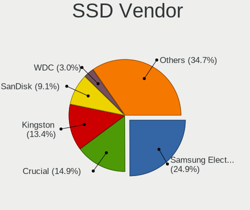
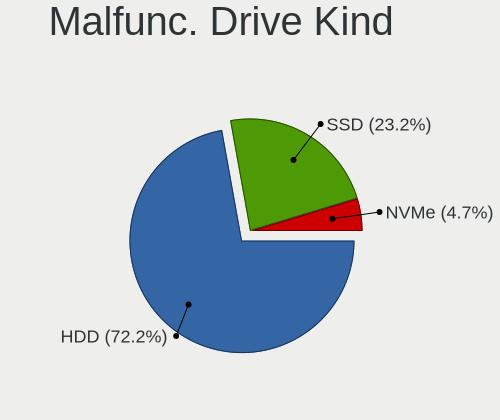
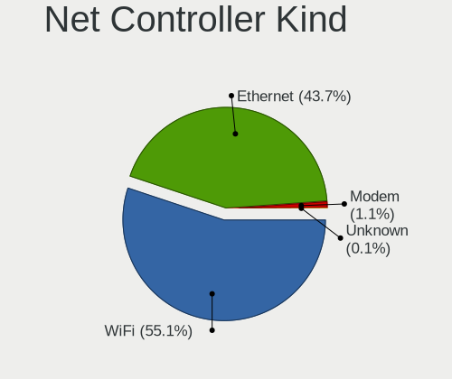
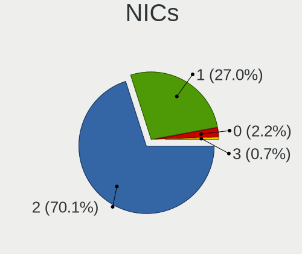
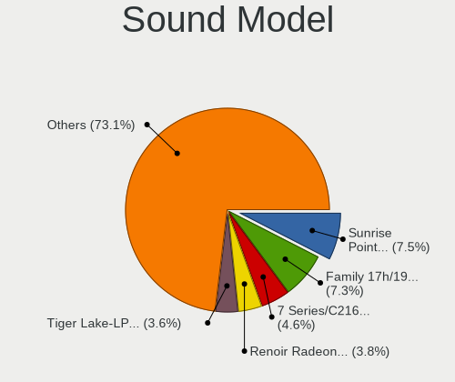
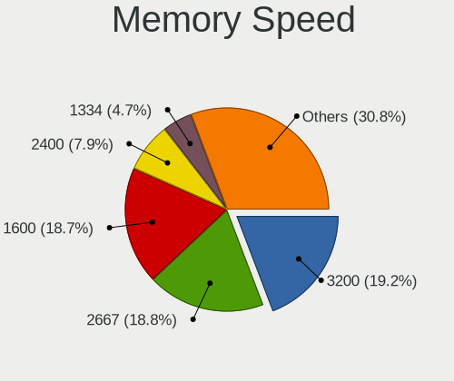

Linux in Italy - Tested Hardware & Statistics (Notebooks)
---------------------------------------------------------

A project to collect tested hardware configurations for Linux in Italy.

Anyone can contribute to this report by the [hw-probe](https://github.com/linuxhw/hw-probe) tool:

    sudo -E hw-probe -all -upload

Please contribute! Especially if your hardware is rare.

Contents
--------

* [ Test Cases ](#test-cases)

* [ System ](#system)
  - [ OS                       ](#os)
  - [ OS Family                ](#os-family)
  - [ Kernel                   ](#kernel)
  - [ Kernel Family            ](#kernel-family)
  - [ Kernel Major Ver.        ](#kernel-major-ver)
  - [ Arch                     ](#arch)
  - [ DE                       ](#de)
  - [ Display Server           ](#display-server)
  - [ Display Manager          ](#display-manager)
  - [ OS Lang                  ](#os-lang)
  - [ Boot Mode                ](#boot-mode)
  - [ Filesystem               ](#filesystem)
  - [ Part. scheme             ](#part-scheme)
  - [ Dual Boot with Linux/BSD ](#dual-boot-with-linuxbsd)
  - [ Dual Boot (Win)          ](#dual-boot-win)

* [ Board ](#board)
  - [ Vendor                   ](#vendor)
  - [ Model                    ](#model)
  - [ Model Family             ](#model-family)
  - [ MFG Year                 ](#mfg-year)
  - [ Form Factor              ](#form-factor)
  - [ Secure Boot              ](#secure-boot)
  - [ Coreboot                 ](#coreboot)
  - [ RAM Size                 ](#ram-size)
  - [ RAM Used                 ](#ram-used)
  - [ Total Drives             ](#total-drives)
  - [ Has CD-ROM               ](#has-cd-rom)
  - [ Has Ethernet             ](#has-ethernet)
  - [ Has WiFi                 ](#has-wifi)
  - [ Has Bluetooth            ](#has-bluetooth)

* [ Location ](#location)
  - [ Country                  ](#country)
  - [ City                     ](#city)

* [ Drives ](#drives)
  - [ Drive Vendor             ](#drive-vendor)
  - [ Drive Model              ](#drive-model)
  - [ HDD Vendor               ](#hdd-vendor)
  - [ SSD Vendor               ](#ssd-vendor)
  - [ Drive Kind               ](#drive-kind)
  - [ Drive Connector          ](#drive-connector)
  - [ Drive Size               ](#drive-size)
  - [ Space Total              ](#space-total)
  - [ Space Used               ](#space-used)
  - [ Malfunc. Drives          ](#malfunc-drives)
  - [ Malfunc. Drive Vendor    ](#malfunc-drive-vendor)
  - [ Malfunc. HDD Vendor      ](#malfunc-hdd-vendor)
  - [ Malfunc. Drive Kind      ](#malfunc-drive-kind)
  - [ Failed Drives            ](#failed-drives)
  - [ Failed Drive Vendor      ](#failed-drive-vendor)
  - [ Drive Status             ](#drive-status)

* [ Storage controller ](#storage-controller)
  - [ Storage Vendor           ](#storage-vendor)
  - [ Storage Model            ](#storage-model)
  - [ Storage Kind             ](#storage-kind)

* [ Processor ](#processor)
  - [ CPU Vendor               ](#cpu-vendor)
  - [ CPU Model                ](#cpu-model)
  - [ CPU Model Family         ](#cpu-model-family)
  - [ CPU Cores                ](#cpu-cores)
  - [ CPU Sockets              ](#cpu-sockets)
  - [ CPU Threads              ](#cpu-threads)
  - [ CPU Op-Modes             ](#cpu-op-modes)
  - [ CPU Microcode            ](#cpu-microcode)
  - [ CPU Microarch            ](#cpu-microarch)

* [ Graphics ](#graphics)
  - [ GPU Vendor               ](#gpu-vendor)
  - [ GPU Model                ](#gpu-model)
  - [ GPU Combo                ](#gpu-combo)
  - [ GPU Driver               ](#gpu-driver)
  - [ GPU Memory               ](#gpu-memory)

* [ Monitor ](#monitor)
  - [ Monitor Vendor           ](#monitor-vendor)
  - [ Monitor Model            ](#monitor-model)
  - [ Monitor Resolution       ](#monitor-resolution)
  - [ Monitor Diagonal         ](#monitor-diagonal)
  - [ Monitor Width            ](#monitor-width)
  - [ Aspect Ratio             ](#aspect-ratio)
  - [ Monitor Area             ](#monitor-area)
  - [ Pixel Density            ](#pixel-density)
  - [ Multiple Monitors        ](#multiple-monitors)

* [ Network ](#network)
  - [ Net Controller Vendor    ](#net-controller-vendor)
  - [ Net Controller Model     ](#net-controller-model)
  - [ Wireless Vendor          ](#wireless-vendor)
  - [ Wireless Model           ](#wireless-model)
  - [ Ethernet Vendor          ](#ethernet-vendor)
  - [ Ethernet Model           ](#ethernet-model)
  - [ Net Controller Kind      ](#net-controller-kind)
  - [ Used Controller          ](#used-controller)
  - [ NICs                     ](#nics)
  - [ IPv6                     ](#ipv6)

* [ Bluetooth ](#bluetooth)
  - [ Bluetooth Vendor         ](#bluetooth-vendor)
  - [ Bluetooth Model          ](#bluetooth-model)

* [ Sound ](#sound)
  - [ Sound Vendor             ](#sound-vendor)
  - [ Sound Model              ](#sound-model)

* [ Memory ](#memory)
  - [ Memory Vendor            ](#memory-vendor)
  - [ Memory Model             ](#memory-model)
  - [ Memory Kind              ](#memory-kind)
  - [ Memory Form Factor       ](#memory-form-factor)
  - [ Memory Size              ](#memory-size)
  - [ Memory Speed             ](#memory-speed)

* [ Printers & scanners ](#printers--scanners)
  - [ Printer Vendor           ](#printer-vendor)
  - [ Printer Model            ](#printer-model)
  - [ Scanner Vendor           ](#scanner-vendor)
  - [ Scanner Model            ](#scanner-model)

* [ Camera ](#camera)
  - [ Camera Vendor            ](#camera-vendor)
  - [ Camera Model             ](#camera-model)

* [ Security ](#security)
  - [ Fingerprint Vendor       ](#fingerprint-vendor)
  - [ Fingerprint Model        ](#fingerprint-model)
  - [ Chipcard Vendor          ](#chipcard-vendor)
  - [ Chipcard Model           ](#chipcard-model)

* [ Unsupported ](#unsupported)
  - [ Unsupported Devices      ](#unsupported-devices)
  - [ Unsupported Device Types ](#unsupported-device-types)

Test Cases
----------

Total: 7526

| Vendor        | Model                       | Probe                                                      | Date         |
|---------------|-----------------------------|------------------------------------------------------------|--------------|
| Lenovo        | ThinkPad E595 20NF0005IX    | [171aaf5d57](https://linux-hardware.org/?probe=171aaf5d57) | Feb 02, 2024 |
| Lenovo        | ThinkPad E595 20NF0005IX    | [c834e4941b](https://linux-hardware.org/?probe=c834e4941b) | Feb 02, 2024 |
| Acer          | Aspire 5738                 | [7137d60986](https://linux-hardware.org/?probe=7137d60986) | Feb 02, 2024 |
| Pegatron      | Spring Peak                 | [b14f110621](https://linux-hardware.org/?probe=b14f110621) | Feb 02, 2024 |
| Pegatron      | Spring Peak                 | [4404cfb5c8](https://linux-hardware.org/?probe=4404cfb5c8) | Feb 01, 2024 |
| Acer          | TravelMate 4220             | [73e17ddd6d](https://linux-hardware.org/?probe=73e17ddd6d) | Feb 01, 2024 |
| Acer          | Swift SF314-43              | [793c3d3b4c](https://linux-hardware.org/?probe=793c3d3b4c) | Jan 31, 2024 |
| Mediacom      | SmartBook 14 FullHD - SB... | [53d7e5ce3c](https://linux-hardware.org/?probe=53d7e5ce3c) | Jan 31, 2024 |
| ASUSTek       | K50IJ                       | [061ca8b8ca](https://linux-hardware.org/?probe=061ca8b8ca) | Jan 31, 2024 |
| ASUSTek       | K50IJ                       | [0eefe2c89f](https://linux-hardware.org/?probe=0eefe2c89f) | Jan 31, 2024 |
| Acer          | Aspire 5735                 | [365fd9fe4d](https://linux-hardware.org/?probe=365fd9fe4d) | Jan 31, 2024 |
| Acer          | Aspire 5735                 | [bed38c72c8](https://linux-hardware.org/?probe=bed38c72c8) | Jan 31, 2024 |
| MSI           | Prestige 14Evo B13M         | [2724b6a0da](https://linux-hardware.org/?probe=2724b6a0da) | Jan 31, 2024 |
| Lenovo        | Yoga 900-13ISK 80MK         | [c5e686c940](https://linux-hardware.org/?probe=c5e686c940) | Jan 30, 2024 |
| Lenovo        | IdeaPad Slim 3 15IAH8 83... | [76cc91cd14](https://linux-hardware.org/?probe=76cc91cd14) | Jan 30, 2024 |
| HUAWEI        | BOM-WXX9                    | [93b76b804d](https://linux-hardware.org/?probe=93b76b804d) | Jan 30, 2024 |
| Dell          | XPS 13 9305                 | [1b2e728298](https://linux-hardware.org/?probe=1b2e728298) | Jan 30, 2024 |
| Acer          | TravelMate 5730             | [f2ecf032d2](https://linux-hardware.org/?probe=f2ecf032d2) | Jan 30, 2024 |
| Dell          | G15 5511                    | [7fc6a18364](https://linux-hardware.org/?probe=7fc6a18364) | Jan 30, 2024 |
| Apple         | MacBookPro14,2              | [c2b9f915d1](https://linux-hardware.org/?probe=c2b9f915d1) | Jan 29, 2024 |
| Lenovo        | ThinkPad X270 W10DG 20K5... | [fbf917dbe4](https://linux-hardware.org/?probe=fbf917dbe4) | Jan 29, 2024 |
| Dell          | Precision M4800             | [54bea54d08](https://linux-hardware.org/?probe=54bea54d08) | Jan 29, 2024 |
| SLIMBOOK      | PROX15-AMD                  | [694185365c](https://linux-hardware.org/?probe=694185365c) | Jan 29, 2024 |
| HUAWEI        | NBLB-WAX9N                  | [dc9267becb](https://linux-hardware.org/?probe=dc9267becb) | Jan 29, 2024 |
| Mediacom      | WinPad 11,6 FullHD- WPU1... | [ea399c19ca](https://linux-hardware.org/?probe=ea399c19ca) | Jan 28, 2024 |
| ASUSTek       | K55VD                       | [099cfb3dcb](https://linux-hardware.org/?probe=099cfb3dcb) | Jan 28, 2024 |
| Lenovo        | ThinkPad T490 20N3S5GP12    | [b0cc2bbbed](https://linux-hardware.org/?probe=b0cc2bbbed) | Jan 28, 2024 |
| Lenovo        | B51-80 80LM                 | [71d2badad4](https://linux-hardware.org/?probe=71d2badad4) | Jan 27, 2024 |
| ASUSTek       | K55VD                       | [d2e2ee4fa9](https://linux-hardware.org/?probe=d2e2ee4fa9) | Jan 27, 2024 |
| Lenovo        | ThinkPad T430 2349IF8       | [bff9fcd796](https://linux-hardware.org/?probe=bff9fcd796) | Jan 27, 2024 |
| Lenovo        | IdeaPad Z500 20202          | [88efa5aca1](https://linux-hardware.org/?probe=88efa5aca1) | Jan 27, 2024 |
| ASUSTek       | K53SJ                       | [e8479e3860](https://linux-hardware.org/?probe=e8479e3860) | Jan 27, 2024 |
| Lenovo        | ThinkPad T470s 20HGS3AX0... | [c777cd17b5](https://linux-hardware.org/?probe=c777cd17b5) | Jan 26, 2024 |
| HP            | 15                          | [4bce029b1f](https://linux-hardware.org/?probe=4bce029b1f) | Jan 26, 2024 |
| HUAWEI        | KLVL-WXX9                   | [4b630c4e1e](https://linux-hardware.org/?probe=4b630c4e1e) | Jan 26, 2024 |
| Acer          | Aspire E5-574G              | [7fb3807471](https://linux-hardware.org/?probe=7fb3807471) | Jan 26, 2024 |
| HUAWEI        | KLVL-WXX9                   | [c639997108](https://linux-hardware.org/?probe=c639997108) | Jan 26, 2024 |
| PC Special... | NH5x_7xDPx                  | [0f28a5d513](https://linux-hardware.org/?probe=0f28a5d513) | Jan 26, 2024 |
| HP            | Victus by Gaming Laptop ... | [313cd1cfba](https://linux-hardware.org/?probe=313cd1cfba) | Jan 26, 2024 |
| Fujitsu Si... | LIFEBOOK S6410              | [e5e3cbdd02](https://linux-hardware.org/?probe=e5e3cbdd02) | Jan 26, 2024 |
| ASUSTek       | VivoBook_ASUSLaptop X515... | [182e75dbe2](https://linux-hardware.org/?probe=182e75dbe2) | Jan 26, 2024 |
| Lenovo        | V15-ADA 82C7                | [a72a3bb0e5](https://linux-hardware.org/?probe=a72a3bb0e5) | Jan 25, 2024 |
| Acer          | Swift SF314-43              | [cdae9f5af3](https://linux-hardware.org/?probe=cdae9f5af3) | Jan 25, 2024 |
| Lenovo        | IdeaPad Gaming 3 16IAH7 ... | [e7a39e7734](https://linux-hardware.org/?probe=e7a39e7734) | Jan 25, 2024 |
| Acer          | Aspire ES1-520              | [633516e35a](https://linux-hardware.org/?probe=633516e35a) | Jan 25, 2024 |
| Dell          | Precision M4800             | [a945621369](https://linux-hardware.org/?probe=a945621369) | Jan 25, 2024 |
| ASUSTek       | N551VW                      | [2a8f1d7cc1](https://linux-hardware.org/?probe=2a8f1d7cc1) | Jan 24, 2024 |
| HP            | Pavilion Laptop 15-eg1xx... | [215df1823f](https://linux-hardware.org/?probe=215df1823f) | Jan 24, 2024 |
| Dell          | Latitude E6410              | [1b7b83010f](https://linux-hardware.org/?probe=1b7b83010f) | Jan 24, 2024 |
| Apple         | MacBookPro14,1              | [01d5416f71](https://linux-hardware.org/?probe=01d5416f71) | Jan 24, 2024 |
| Acer          | TravelMate P414-51          | [b9eb38b308](https://linux-hardware.org/?probe=b9eb38b308) | Jan 24, 2024 |
| Acer          | Nitro AN515-58              | [d195c1f908](https://linux-hardware.org/?probe=d195c1f908) | Jan 23, 2024 |
| ASUSTek       | X541UJ                      | [e5a64b928d](https://linux-hardware.org/?probe=e5a64b928d) | Jan 23, 2024 |
| HP            | Stream Laptop 14-ax0XX      | [16c6b944fb](https://linux-hardware.org/?probe=16c6b944fb) | Jan 23, 2024 |
| HP            | ENVY Laptop 13-ba0xxx       | [b0f7b9a32f](https://linux-hardware.org/?probe=b0f7b9a32f) | Jan 23, 2024 |
| HP            | ENVY Laptop 13-ba0xxx       | [5fadf9e223](https://linux-hardware.org/?probe=5fadf9e223) | Jan 23, 2024 |
| Acer          | Aspire A315-58              | [286a2dcf7a](https://linux-hardware.org/?probe=286a2dcf7a) | Jan 23, 2024 |
| Acer          | TravelMate P414-51          | [c21caad3b4](https://linux-hardware.org/?probe=c21caad3b4) | Jan 23, 2024 |
| ASUSTek       | VivoBook_ASUSLaptop X512... | [73c0dd5770](https://linux-hardware.org/?probe=73c0dd5770) | Jan 23, 2024 |
| Acer          | Aspire A315-58              | [d5c1dc774a](https://linux-hardware.org/?probe=d5c1dc774a) | Jan 22, 2024 |
| Dell          | Latitude 7430               | [668299aad7](https://linux-hardware.org/?probe=668299aad7) | Jan 22, 2024 |
| ASUSTek       | VivoBook_ASUSLaptop X512... | [dc6c66931e](https://linux-hardware.org/?probe=dc6c66931e) | Jan 22, 2024 |
| Toshiba       | Satellite A350              | [bc48f2f41a](https://linux-hardware.org/?probe=bc48f2f41a) | Jan 21, 2024 |
| ASUSTek       | TUF Gaming FX505DT_FX505... | [61f93014cf](https://linux-hardware.org/?probe=61f93014cf) | Jan 21, 2024 |
| Lenovo        | ThinkPad P1 Gen 3 20THCT... | [ef2b018f0e](https://linux-hardware.org/?probe=ef2b018f0e) | Jan 21, 2024 |
| Acer          | Aspire 3050                 | [7231400f5d](https://linux-hardware.org/?probe=7231400f5d) | Jan 20, 2024 |
| Lenovo        | IdeaPad Slim 5 14IRL8 82... | [cf906b4574](https://linux-hardware.org/?probe=cf906b4574) | Jan 20, 2024 |
| Lenovo        | IdeaPad Slim 5 14IRL8 82... | [49a8bb87e1](https://linux-hardware.org/?probe=49a8bb87e1) | Jan 20, 2024 |
| ASUSTek       | VivoBook_ASUSLaptop K660... | [409adbe1e3](https://linux-hardware.org/?probe=409adbe1e3) | Jan 20, 2024 |
| Sony          | SVF1521G6EW                 | [e795184dd6](https://linux-hardware.org/?probe=e795184dd6) | Jan 20, 2024 |
| Lenovo        | G580 2189                   | [a46c26bc93](https://linux-hardware.org/?probe=a46c26bc93) | Jan 20, 2024 |
| ASUSTek       | K55VM                       | [a684c7f5fc](https://linux-hardware.org/?probe=a684c7f5fc) | Jan 19, 2024 |
| Sony          | VGN-NW11S_S                 | [082d37eaf4](https://linux-hardware.org/?probe=082d37eaf4) | Jan 19, 2024 |
| ASUSTek       | ASUS EXPERTBOOK B5402CBA... | [907588dbd2](https://linux-hardware.org/?probe=907588dbd2) | Jan 19, 2024 |
| HP            | OMEN by Laptop 15-dc1xxx    | [74b90ddfac](https://linux-hardware.org/?probe=74b90ddfac) | Jan 19, 2024 |
| HP            | ENVY 15                     | [95ec6d10d0](https://linux-hardware.org/?probe=95ec6d10d0) | Jan 19, 2024 |
| Apple         | MacBookAir7,2               | [8efc1fa078](https://linux-hardware.org/?probe=8efc1fa078) | Jan 19, 2024 |
| Apple         | MacBookAir7,2               | [14a15f0dc3](https://linux-hardware.org/?probe=14a15f0dc3) | Jan 19, 2024 |
| HP            | Pavilion Laptop 15-eg2xx... | [4a2d568004](https://linux-hardware.org/?probe=4a2d568004) | Jan 19, 2024 |
| Lenovo        | ThinkPad X1 Carbon Gen 1... | [d4e6e0ae3e](https://linux-hardware.org/?probe=d4e6e0ae3e) | Jan 19, 2024 |
| ASUSTek       | X541NA                      | [21a49936f0](https://linux-hardware.org/?probe=21a49936f0) | Jan 19, 2024 |
| Acer          | Aspire E1-570G              | [2c6c50ecd4](https://linux-hardware.org/?probe=2c6c50ecd4) | Jan 18, 2024 |
| HP            | Pavilion 15                 | [c84199e8f0](https://linux-hardware.org/?probe=c84199e8f0) | Jan 18, 2024 |
| HP            | EliteBook 840 14 inch G9... | [53df90e606](https://linux-hardware.org/?probe=53df90e606) | Jan 18, 2024 |
| Apple         | MacBookPro8,1               | [84940a5891](https://linux-hardware.org/?probe=84940a5891) | Jan 18, 2024 |
| Lenovo        | G50-45 80E3                 | [7fa6be7205](https://linux-hardware.org/?probe=7fa6be7205) | Jan 18, 2024 |
| ASUSTek       | VivoBook_ASUSLaptop K340... | [d310294e7c](https://linux-hardware.org/?probe=d310294e7c) | Jan 17, 2024 |
| Acer          | Swift SF314-43              | [a60906f053](https://linux-hardware.org/?probe=a60906f053) | Jan 17, 2024 |
| ASUSTek       | VivoBook_ASUSLaptop K340... | [048d450a50](https://linux-hardware.org/?probe=048d450a50) | Jan 17, 2024 |
| Dell          | Latitude 5530               | [df5d5becd7](https://linux-hardware.org/?probe=df5d5becd7) | Jan 17, 2024 |
| AZW           | GT-R                        | [5c0ce30435](https://linux-hardware.org/?probe=5c0ce30435) | Jan 17, 2024 |
| HP            | 250 G8 Notebook PC          | [87e1df2a62](https://linux-hardware.org/?probe=87e1df2a62) | Jan 17, 2024 |
| Valve         | Jupiter                     | [1ebf344a00](https://linux-hardware.org/?probe=1ebf344a00) | Jan 16, 2024 |
| Acer          | TravelMate 5335             | [fcdb840b24](https://linux-hardware.org/?probe=fcdb840b24) | Jan 15, 2024 |
| HP            | Laptop 15-dw0xxx            | [b17351aa59](https://linux-hardware.org/?probe=b17351aa59) | Jan 15, 2024 |
| HP            | 255 G8 Notebook PC          | [e91147def0](https://linux-hardware.org/?probe=e91147def0) | Jan 15, 2024 |
| MSI           | Summit E16Flip A12UCT       | [efb852e7fb](https://linux-hardware.org/?probe=efb852e7fb) | Jan 15, 2024 |
| Onda TLC      | ONDA Oliver 15              | [8717f5a32d](https://linux-hardware.org/?probe=8717f5a32d) | Jan 15, 2024 |
| Lenovo        | ThinkPad E14 Gen 4 21E3C... | [46074255e9](https://linux-hardware.org/?probe=46074255e9) | Jan 14, 2024 |
| HP            | EliteBook 840 G3            | [7a41b077e3](https://linux-hardware.org/?probe=7a41b077e3) | Jan 14, 2024 |
| Lenovo        | ThinkPad X250 20CM004XIX    | [5834e700db](https://linux-hardware.org/?probe=5834e700db) | Jan 14, 2024 |
| Sony          | SVE1713X1EB                 | [43af98d3bc](https://linux-hardware.org/?probe=43af98d3bc) | Jan 14, 2024 |
| Lenovo        | ThinkPad T470 W10DG 20JN... | [6ede7a7cc8](https://linux-hardware.org/?probe=6ede7a7cc8) | Jan 14, 2024 |
| Lenovo        | V130-15IKB 81HN             | [89eb20dae9](https://linux-hardware.org/?probe=89eb20dae9) | Jan 13, 2024 |
| HP            | Dragonfly 13.5 inch G4 N... | [516c8f6f9c](https://linux-hardware.org/?probe=516c8f6f9c) | Jan 13, 2024 |
| Lenovo        | ThinkPad T495 20NJ000XIX    | [700470a7f6](https://linux-hardware.org/?probe=700470a7f6) | Jan 12, 2024 |
| HP            | Laptop 15-bw0xx             | [9a8667ecaa](https://linux-hardware.org/?probe=9a8667ecaa) | Jan 12, 2024 |
| TUXEDO        | Pulse 14 Gen3               | [661a86f920](https://linux-hardware.org/?probe=661a86f920) | Jan 12, 2024 |
| Lenovo        | ThinkPad X1 Carbon 34601... | [bdfab62447](https://linux-hardware.org/?probe=bdfab62447) | Jan 12, 2024 |
| Lenovo        | ThinkPad T14 Gen 1 20S00... | [a485e19625](https://linux-hardware.org/?probe=a485e19625) | Jan 12, 2024 |
| Dell          | Inspiron 3593               | [60b15cb73b](https://linux-hardware.org/?probe=60b15cb73b) | Jan 12, 2024 |
| Samsung       | RC530/RC730                 | [c96ada8967](https://linux-hardware.org/?probe=c96ada8967) | Jan 12, 2024 |
| ASUSTek       | X580VD                      | [25e38b0f43](https://linux-hardware.org/?probe=25e38b0f43) | Jan 12, 2024 |
| Dell          | Precision 3581              | [2bf1e4d7f0](https://linux-hardware.org/?probe=2bf1e4d7f0) | Jan 12, 2024 |
| Acer          | Aspire 3050                 | [ed5a4cc94d](https://linux-hardware.org/?probe=ed5a4cc94d) | Jan 12, 2024 |
| ASUSTek       | X510UNR                     | [6e75ef84ca](https://linux-hardware.org/?probe=6e75ef84ca) | Jan 12, 2024 |
| ASUSTek       | K55VM                       | [99003258ce](https://linux-hardware.org/?probe=99003258ce) | Jan 11, 2024 |
| Alienware     | Area-51m R2                 | [de0b2e0221](https://linux-hardware.org/?probe=de0b2e0221) | Jan 11, 2024 |
| Lenovo        | Yoga 900-13ISK 80MK         | [d1201e3b8f](https://linux-hardware.org/?probe=d1201e3b8f) | Jan 11, 2024 |
| HP            | Pavilion Laptop 15-cs3xx... | [3de6626132](https://linux-hardware.org/?probe=3de6626132) | Jan 11, 2024 |
| HP            | ProBook 455 15.6 inch G9... | [fb7de9b1eb](https://linux-hardware.org/?probe=fb7de9b1eb) | Jan 11, 2024 |
| Dell          | XPS 13 9370                 | [cb0bdcbb78](https://linux-hardware.org/?probe=cb0bdcbb78) | Jan 10, 2024 |
| Lenovo        | ThinkPad T430 2349IF8       | [b06e8d13c5](https://linux-hardware.org/?probe=b06e8d13c5) | Jan 10, 2024 |
| ASUSTek       | Zenbook UX3402ZA_UX3402Z... | [8d07ceed03](https://linux-hardware.org/?probe=8d07ceed03) | Jan 10, 2024 |
| ASUSTek       | Zenbook UX3402ZA_UX3402Z... | [f0ee73bcb6](https://linux-hardware.org/?probe=f0ee73bcb6) | Jan 10, 2024 |
| Unknown       | Unknown                     | [76fb94009e](https://linux-hardware.org/?probe=76fb94009e) | Jan 09, 2024 |
| Medion        | E15413                      | [966254cd0e](https://linux-hardware.org/?probe=966254cd0e) | Jan 09, 2024 |
| HP            | EliteBook 2530p             | [0de99e6532](https://linux-hardware.org/?probe=0de99e6532) | Jan 09, 2024 |
| Dell          | Latitude 5290 2-in-1        | [b6d519e34c](https://linux-hardware.org/?probe=b6d519e34c) | Jan 09, 2024 |
| Packard Be... | EasyNote MH45               | [a5e8efb826](https://linux-hardware.org/?probe=a5e8efb826) | Jan 09, 2024 |
| Lenovo        | ThinkPad T470 W10DG 20JN... | [b85af627bb](https://linux-hardware.org/?probe=b85af627bb) | Jan 09, 2024 |
| HP            | ProBook 640 G8 Notebook ... | [7ee8b412a1](https://linux-hardware.org/?probe=7ee8b412a1) | Jan 09, 2024 |
| HP            | ProBook 640 G8 Notebook ... | [8a05b3a91f](https://linux-hardware.org/?probe=8a05b3a91f) | Jan 09, 2024 |
| Lenovo        | ThinkPad T470 20JNS08H00    | [c3a6a2da37](https://linux-hardware.org/?probe=c3a6a2da37) | Jan 09, 2024 |
| Acer          | eMachine V1.45              | [8438acbcc5](https://linux-hardware.org/?probe=8438acbcc5) | Jan 09, 2024 |
| HP            | ZBook Fury 15 G7 Mobile ... | [63d1f51ef3](https://linux-hardware.org/?probe=63d1f51ef3) | Jan 08, 2024 |
| Lenovo        | V15-ADA 82C7                | [6c2f581250](https://linux-hardware.org/?probe=6c2f581250) | Jan 08, 2024 |
| Dell          | Inspiron 5737               | [1700f72b17](https://linux-hardware.org/?probe=1700f72b17) | Jan 08, 2024 |
| Sony          | SVF1521G6EW                 | [bdf6b3c370](https://linux-hardware.org/?probe=bdf6b3c370) | Jan 08, 2024 |
| Lenovo        | ThinkPad W550s 20E2000PM... | [0a3bac66b1](https://linux-hardware.org/?probe=0a3bac66b1) | Jan 08, 2024 |
| Acer          | TravelMate P645-S           | [9461c8963d](https://linux-hardware.org/?probe=9461c8963d) | Jan 07, 2024 |
| HP            | Pavilion 15                 | [006e73b8e1](https://linux-hardware.org/?probe=006e73b8e1) | Jan 07, 2024 |
| ASUSTek       | VivoBook_ASUSLaptop X571... | [1b0a755b6e](https://linux-hardware.org/?probe=1b0a755b6e) | Jan 07, 2024 |
| Lenovo        | ThinkPad X260 20F5S8FQ00    | [eb70ae9801](https://linux-hardware.org/?probe=eb70ae9801) | Jan 07, 2024 |
| Lenovo        | G50-70 20351                | [5f77e74f4c](https://linux-hardware.org/?probe=5f77e74f4c) | Jan 07, 2024 |
| Acer          | Aspire E5-574G              | [a5243f518e](https://linux-hardware.org/?probe=a5243f518e) | Jan 07, 2024 |
| Lenovo        | Z70-80 80FG                 | [58c14daf7e](https://linux-hardware.org/?probe=58c14daf7e) | Jan 07, 2024 |
| Lenovo        | Legion S7 16ARHA7 82UG      | [d12db9cea9](https://linux-hardware.org/?probe=d12db9cea9) | Jan 07, 2024 |
| HP            | Pavilion 15                 | [4cc606c786](https://linux-hardware.org/?probe=4cc606c786) | Jan 07, 2024 |
| ASUSTek       | K52F                        | [501d643868](https://linux-hardware.org/?probe=501d643868) | Jan 07, 2024 |
| Acer          | Aspire E1-522               | [bc948a749d](https://linux-hardware.org/?probe=bc948a749d) | Jan 06, 2024 |
| Dell          | Inspiron 5567               | [9e7374b8ef](https://linux-hardware.org/?probe=9e7374b8ef) | Jan 06, 2024 |
| Dell          | Latitude E6320              | [66828af936](https://linux-hardware.org/?probe=66828af936) | Jan 06, 2024 |
| Dell          | Inspiron 5767               | [460e0f5fa4](https://linux-hardware.org/?probe=460e0f5fa4) | Jan 05, 2024 |
| Lenovo        | IdeaPad 3 15IGL05 81WQ      | [895e4f7f36](https://linux-hardware.org/?probe=895e4f7f36) | Jan 05, 2024 |
| Lenovo        | ThinkPad T430s 2356LPG      | [2eff1355bb](https://linux-hardware.org/?probe=2eff1355bb) | Jan 05, 2024 |
| Lenovo        | ThinkPad T430s 2356LPG      | [e16f08a541](https://linux-hardware.org/?probe=e16f08a541) | Jan 05, 2024 |
| HP            | ProBook 4530s               | [0fe11a7b3d](https://linux-hardware.org/?probe=0fe11a7b3d) | Jan 05, 2024 |
| HUAWEI        | HN-WX9X                     | [b1acec939c](https://linux-hardware.org/?probe=b1acec939c) | Jan 05, 2024 |
| ASUSTek       | 1025C                       | [07a95965bc](https://linux-hardware.org/?probe=07a95965bc) | Jan 05, 2024 |
| ASUSTek       | 1025C                       | [c373e654f1](https://linux-hardware.org/?probe=c373e654f1) | Jan 05, 2024 |
| ASUSTek       | X540NA                      | [5300a227eb](https://linux-hardware.org/?probe=5300a227eb) | Jan 04, 2024 |
| Apple         | MacBookPro9,2               | [c606f10b1d](https://linux-hardware.org/?probe=c606f10b1d) | Jan 04, 2024 |
| MSI           | Prestige 15 A11SCS          | [c96226d4ac](https://linux-hardware.org/?probe=c96226d4ac) | Jan 04, 2024 |
| HUAWEI        | NBLK-WAX9X                  | [be1a88adce](https://linux-hardware.org/?probe=be1a88adce) | Jan 04, 2024 |
| Lenovo        | ThinkPad P16s Gen 2 21K9... | [6fae764b45](https://linux-hardware.org/?probe=6fae764b45) | Jan 04, 2024 |
| Olidata       | SL1510 MD61444              | [bb1016d11d](https://linux-hardware.org/?probe=bb1016d11d) | Jan 04, 2024 |
| Dell          | XPS 15 9530                 | [fbd8a37b00](https://linux-hardware.org/?probe=fbd8a37b00) | Jan 04, 2024 |
| Sony          | VGN-FW11E                   | [f89dcd01ec](https://linux-hardware.org/?probe=f89dcd01ec) | Jan 03, 2024 |
| HP            | Pavilion g6                 | [f1a54c438d](https://linux-hardware.org/?probe=f1a54c438d) | Jan 03, 2024 |
| Acer          | Aspire ES1-520              | [922ef3d7e1](https://linux-hardware.org/?probe=922ef3d7e1) | Jan 03, 2024 |
| HP            | Pavilion g6                 | [254ad76cac](https://linux-hardware.org/?probe=254ad76cac) | Jan 03, 2024 |
| ASUSTek       | X540SAA                     | [179249edef](https://linux-hardware.org/?probe=179249edef) | Jan 03, 2024 |
| Lenovo        | IdeaPad 330S-15IKB 81F5     | [a04f45ddfb](https://linux-hardware.org/?probe=a04f45ddfb) | Jan 03, 2024 |
| HP            | EliteBook 645 14 inch G1... | [c828174b3c](https://linux-hardware.org/?probe=c828174b3c) | Jan 03, 2024 |
| Lenovo        | IdeaPad 330S-15IKB 81F5     | [a24e1e9937](https://linux-hardware.org/?probe=a24e1e9937) | Jan 03, 2024 |
| Lenovo        | ThinkPad E14 Gen 4 21E3C... | [f490c2378e](https://linux-hardware.org/?probe=f490c2378e) | Jan 03, 2024 |
| ASUSTek       | VivoBook_ASUSLaptop X515... | [473cff2d66](https://linux-hardware.org/?probe=473cff2d66) | Jan 02, 2024 |
| Lenovo        | Legion 5 Pro 16ARH7H 82R... | [7c849a7e11](https://linux-hardware.org/?probe=7c849a7e11) | Jan 02, 2024 |
| HP            | EliteBook 2570p             | [5299a026ab](https://linux-hardware.org/?probe=5299a026ab) | Jan 02, 2024 |
| Mediacom      | SMARTBOOK ONE               | [5ad55a8ac5](https://linux-hardware.org/?probe=5ad55a8ac5) | Jan 02, 2024 |
| HUAWEI        | BOHL-WXX9                   | [bc70b50aec](https://linux-hardware.org/?probe=bc70b50aec) | Jan 02, 2024 |
| Google        | Blooglet                    | [e9a02f38b1](https://linux-hardware.org/?probe=e9a02f38b1) | Jan 02, 2024 |
| Dell          | Latitude 5290 2-in-1        | [30ccf5163b](https://linux-hardware.org/?probe=30ccf5163b) | Jan 02, 2024 |
| Sony          | SVE1713X1EB                 | [6c3167a5a7](https://linux-hardware.org/?probe=6c3167a5a7) | Jan 02, 2024 |
| HP            | Pavilion 15                 | [277c4aa7d6](https://linux-hardware.org/?probe=277c4aa7d6) | Jan 02, 2024 |
| Acer          | Nitro AN515-58              | [b822b77797](https://linux-hardware.org/?probe=b822b77797) | Jan 02, 2024 |
| Sony          | VGN-AR51SU                  | [ad09db7b69](https://linux-hardware.org/?probe=ad09db7b69) | Jan 01, 2024 |
| Sony          | VGN-AR51SU                  | [01e1a67d40](https://linux-hardware.org/?probe=01e1a67d40) | Jan 01, 2024 |
| Acer          | Aspire A517-52G             | [fb86c6f71c](https://linux-hardware.org/?probe=fb86c6f71c) | Jan 01, 2024 |
| Sony          | SVE1713X1EB                 | [f9081b680a](https://linux-hardware.org/?probe=f9081b680a) | Jan 01, 2024 |
| Sony          | VGN-NW11S_S                 | [6d47430c42](https://linux-hardware.org/?probe=6d47430c42) | Jan 01, 2024 |
| Lenovo        | ThinkPad T470 20JNS08H00    | [0120368c3a](https://linux-hardware.org/?probe=0120368c3a) | Jan 01, 2024 |
| Sony          | VGN-NW11S_S                 | [e898dd413e](https://linux-hardware.org/?probe=e898dd413e) | Jan 01, 2024 |
| Apple         | MacBookAir9,1               | [5dde4deb12](https://linux-hardware.org/?probe=5dde4deb12) | Dec 31, 2023 |
| ASUSTek       | ROG STRIX X570-F GAMING     | [ec8f742a7f](https://linux-hardware.org/?probe=ec8f742a7f) | Dec 31, 2023 |
| Dell          | Latitude E4310              | [10397fd191](https://linux-hardware.org/?probe=10397fd191) | Dec 31, 2023 |
| ASUSTek       | ROG Strix G513IC_G513IC     | [1f44330bcf](https://linux-hardware.org/?probe=1f44330bcf) | Dec 31, 2023 |
| HP            | OMEN by Laptop              | [8b1ac4e80c](https://linux-hardware.org/?probe=8b1ac4e80c) | Dec 31, 2023 |
| Lenovo        | ThinkPad X270 W10DG 20K5... | [d975ab384e](https://linux-hardware.org/?probe=d975ab384e) | Dec 31, 2023 |
| ASUSTek       | PRIME B360M-A               | [42b25d8ac5](https://linux-hardware.org/?probe=42b25d8ac5) | Dec 30, 2023 |
| ASUSTek       | PRIME X570-P                | [12b2d456ed](https://linux-hardware.org/?probe=12b2d456ed) | Dec 30, 2023 |
| Lenovo        | IdeaPad S145-15API 81V7     | [7528cb1c24](https://linux-hardware.org/?probe=7528cb1c24) | Dec 30, 2023 |
| HP            | ProBook 440 G6              | [14623af544](https://linux-hardware.org/?probe=14623af544) | Dec 30, 2023 |
| Chuwi         | GemiBook                    | [3e5282eb93](https://linux-hardware.org/?probe=3e5282eb93) | Dec 30, 2023 |
| ASUSTek       | PRIME X570-P                | [596a41673a](https://linux-hardware.org/?probe=596a41673a) | Dec 30, 2023 |
| Samsung       | RC530/RC730                 | [866c256904](https://linux-hardware.org/?probe=866c256904) | Dec 30, 2023 |
| HP            | ProBook 6450b               | [ce6d3d0e7f](https://linux-hardware.org/?probe=ce6d3d0e7f) | Dec 30, 2023 |
| HP            | ProBook 6450b               | [f2128c8e8a](https://linux-hardware.org/?probe=f2128c8e8a) | Dec 30, 2023 |
| HUAWEI        | KLVL-WXX9                   | [f8aeb2c6c3](https://linux-hardware.org/?probe=f8aeb2c6c3) | Dec 30, 2023 |
| HP            | Pavilion Laptop 15-eh1xx... | [96662ed691](https://linux-hardware.org/?probe=96662ed691) | Dec 30, 2023 |
| HP            | Pavilion 15                 | [50b4c1504f](https://linux-hardware.org/?probe=50b4c1504f) | Dec 29, 2023 |
| Lenovo        | IdeaPad S145-15API 81V7     | [f071a372c0](https://linux-hardware.org/?probe=f071a372c0) | Dec 29, 2023 |
| Dell          | Latitude 5580               | [3079edcb81](https://linux-hardware.org/?probe=3079edcb81) | Dec 29, 2023 |
| Lenovo        | ThinkBook 16p Gen 4 21J8    | [afd9883450](https://linux-hardware.org/?probe=afd9883450) | Dec 29, 2023 |
| HUAWEI        | NBLK-WAX9X                  | [55340871af](https://linux-hardware.org/?probe=55340871af) | Dec 29, 2023 |
| Sony          | VGN-CR21S_W                 | [732175d0f6](https://linux-hardware.org/?probe=732175d0f6) | Dec 29, 2023 |
| Sony          | VGN-FW21E                   | [52ff803e03](https://linux-hardware.org/?probe=52ff803e03) | Dec 29, 2023 |
| Acer          | Aspire E5-573G              | [0c4a68d81f](https://linux-hardware.org/?probe=0c4a68d81f) | Dec 29, 2023 |
| Acer          | Aspire E5-573G              | [210403cf9d](https://linux-hardware.org/?probe=210403cf9d) | Dec 29, 2023 |
| Framework     | Laptop 13 (AMD Ryzen 704... | [751429a259](https://linux-hardware.org/?probe=751429a259) | Dec 29, 2023 |
| Dell          | Inspiron 7348               | [a55c6eef41](https://linux-hardware.org/?probe=a55c6eef41) | Dec 29, 2023 |
| HP            | Pavilion Laptop 15-eg0xx... | [8e46844acc](https://linux-hardware.org/?probe=8e46844acc) | Dec 29, 2023 |
| Samsung       | RC530/RC730                 | [db448e5732](https://linux-hardware.org/?probe=db448e5732) | Dec 29, 2023 |
| Notebook      | NS5x_NS7xAU                 | [d520b97118](https://linux-hardware.org/?probe=d520b97118) | Dec 29, 2023 |
| Dell          | XPS 13 9370                 | [f2d5cce82a](https://linux-hardware.org/?probe=f2d5cce82a) | Dec 29, 2023 |
| Lenovo        | V145-15AST 81MT             | [fa95062029](https://linux-hardware.org/?probe=fa95062029) | Dec 28, 2023 |
| HP            | Pavilion 15                 | [da5644171f](https://linux-hardware.org/?probe=da5644171f) | Dec 28, 2023 |
| Unknown       | Unknown                     | [89a77455e5](https://linux-hardware.org/?probe=89a77455e5) | Dec 28, 2023 |
| Chuwi         | GemiBook                    | [15199d7550](https://linux-hardware.org/?probe=15199d7550) | Dec 28, 2023 |
| Lenovo        | IdeaPad Gaming 3 15ARH05... | [5b2dd63a52](https://linux-hardware.org/?probe=5b2dd63a52) | Dec 28, 2023 |
| Fujitsu       | LIFEBOOK E734               | [2265b1d34f](https://linux-hardware.org/?probe=2265b1d34f) | Dec 28, 2023 |
| Unknown       | Unknown                     | [7c86c2f5dc](https://linux-hardware.org/?probe=7c86c2f5dc) | Dec 28, 2023 |
| Acer          | Aspire V5-123               | [4220993372](https://linux-hardware.org/?probe=4220993372) | Dec 28, 2023 |
| HP            | Notebook                    | [5b3e4ada9c](https://linux-hardware.org/?probe=5b3e4ada9c) | Dec 28, 2023 |
| Acer          | Aspire E5-573G              | [323f661113](https://linux-hardware.org/?probe=323f661113) | Dec 27, 2023 |
| Lenovo        | ThinkPad E15 Gen 2 20TD0... | [40c72fd8c2](https://linux-hardware.org/?probe=40c72fd8c2) | Dec 27, 2023 |
| Lenovo        | G50-45 80E3                 | [90e55e787b](https://linux-hardware.org/?probe=90e55e787b) | Dec 27, 2023 |
| HUAWEI        | NBLB-WAX9N                  | [84bc2c3915](https://linux-hardware.org/?probe=84bc2c3915) | Dec 27, 2023 |
| Dell          | Latitude 3520               | [b5802159c7](https://linux-hardware.org/?probe=b5802159c7) | Dec 27, 2023 |
| HP            | 255 G7 Notebook PC          | [8b217c5f35](https://linux-hardware.org/?probe=8b217c5f35) | Dec 27, 2023 |
| MSI           | Modern 15 B7M               | [2c7f48c9ad](https://linux-hardware.org/?probe=2c7f48c9ad) | Dec 27, 2023 |
| MSI           | GS40 6QE Phantom            | [2946f9add8](https://linux-hardware.org/?probe=2946f9add8) | Dec 26, 2023 |
| Acer          | Aspire 5739G                | [6b4237a1ea](https://linux-hardware.org/?probe=6b4237a1ea) | Dec 26, 2023 |
| Acer          | Aspire 5739G                | [408e19e1f2](https://linux-hardware.org/?probe=408e19e1f2) | Dec 26, 2023 |
| HP            | Compaq nx7400 (RH609ES#A... | [6a6b1d3722](https://linux-hardware.org/?probe=6a6b1d3722) | Dec 26, 2023 |
| Chuwi         | GemiBook Pro                | [0fceb23d42](https://linux-hardware.org/?probe=0fceb23d42) | Dec 25, 2023 |
| HP            | 250 G8 Notebook PC          | [df812b1171](https://linux-hardware.org/?probe=df812b1171) | Dec 25, 2023 |
| Lenovo        | V15 G3 IAP 82TT             | [66915e859e](https://linux-hardware.org/?probe=66915e859e) | Dec 25, 2023 |
| HP            | Laptop 14s-fq0xxx           | [00a9997bfc](https://linux-hardware.org/?probe=00a9997bfc) | Dec 25, 2023 |
| TUXEDO        | InfinityBook S 15 Gen6      | [54961dd296](https://linux-hardware.org/?probe=54961dd296) | Dec 25, 2023 |
| HP            | Pavilion dv6                | [e9120b7c4e](https://linux-hardware.org/?probe=e9120b7c4e) | Dec 24, 2023 |
| HP            | Pavilion dv6                | [b3b2c1f621](https://linux-hardware.org/?probe=b3b2c1f621) | Dec 24, 2023 |
| Acer          | Aspire E5-571G              | [5004570f44](https://linux-hardware.org/?probe=5004570f44) | Dec 24, 2023 |
| Acer          | Aspire E5-571G              | [b62ffffcdb](https://linux-hardware.org/?probe=b62ffffcdb) | Dec 24, 2023 |
| TULPAR        | A5 V20.3                    | [c1abfa26d5](https://linux-hardware.org/?probe=c1abfa26d5) | Dec 24, 2023 |
| PC Special... | GK7NP5R                     | [1d97edcad7](https://linux-hardware.org/?probe=1d97edcad7) | Dec 23, 2023 |
| HUAWEI        | BOM-WXX9                    | [40ba77bcb8](https://linux-hardware.org/?probe=40ba77bcb8) | Dec 23, 2023 |
| TULPAR        | A5 V20.3                    | [83c6679958](https://linux-hardware.org/?probe=83c6679958) | Dec 23, 2023 |
| Acer          | TravelMate 5730             | [69571c0b91](https://linux-hardware.org/?probe=69571c0b91) | Dec 23, 2023 |
| Apple         | MacBookAir6,1               | [0275987230](https://linux-hardware.org/?probe=0275987230) | Dec 22, 2023 |
| ASUSTek       | VivoBook_ASUSLaptop K660... | [e1225d2a37](https://linux-hardware.org/?probe=e1225d2a37) | Dec 22, 2023 |
| Lenovo        | IdeaPad 310-15ABR 80ST      | [60690b9d12](https://linux-hardware.org/?probe=60690b9d12) | Dec 22, 2023 |
| ASUSTek       | N551VW                      | [f73a190483](https://linux-hardware.org/?probe=f73a190483) | Dec 22, 2023 |
| ASUSTek       | N551VW                      | [467015083e](https://linux-hardware.org/?probe=467015083e) | Dec 22, 2023 |
| Dell          | Latitude 5501               | [0b6206153c](https://linux-hardware.org/?probe=0b6206153c) | Dec 22, 2023 |
| HP            | Pavilion Laptop 15-eg2xx... | [db6db43604](https://linux-hardware.org/?probe=db6db43604) | Dec 22, 2023 |
| HP            | Notebook                    | [7541fcf0c8](https://linux-hardware.org/?probe=7541fcf0c8) | Dec 22, 2023 |
| Lenovo        | ThinkPad T490 20N3S5GP12    | [093906d110](https://linux-hardware.org/?probe=093906d110) | Dec 21, 2023 |
| Dell          | XPS 15 9520                 | [9fea6c876a](https://linux-hardware.org/?probe=9fea6c876a) | Dec 21, 2023 |
| ASUSTek       | X555LAB                     | [8a8a35c616](https://linux-hardware.org/?probe=8a8a35c616) | Dec 21, 2023 |
| Sony          | SVE1713X1EB                 | [dd67c36ae3](https://linux-hardware.org/?probe=dd67c36ae3) | Dec 21, 2023 |
| MSI           | Modern 15 B7M               | [77760018a7](https://linux-hardware.org/?probe=77760018a7) | Dec 21, 2023 |
| ASUSTek       | X550LD                      | [ebaf3f3e71](https://linux-hardware.org/?probe=ebaf3f3e71) | Dec 21, 2023 |
| Lenovo        | Yoga 2 11 20332             | [16a8e6f875](https://linux-hardware.org/?probe=16a8e6f875) | Dec 21, 2023 |
| Acer          | Swift SF314-59              | [13432c28a6](https://linux-hardware.org/?probe=13432c28a6) | Dec 21, 2023 |
| Acer          | Swift SF314-59              | [0eb55bee7d](https://linux-hardware.org/?probe=0eb55bee7d) | Dec 20, 2023 |
| Lenovo        | Legion 5 Pro 16ARH7H 82R... | [1c3113c9b9](https://linux-hardware.org/?probe=1c3113c9b9) | Dec 20, 2023 |
| ASUSTek       | X580VD                      | [18f5888ad5](https://linux-hardware.org/?probe=18f5888ad5) | Dec 20, 2023 |
| Lenovo        | IdeaPad S540-14IML 81NF     | [942da4e853](https://linux-hardware.org/?probe=942da4e853) | Dec 20, 2023 |
| Lenovo        | IdeaPad 530S-14ARR 81H1     | [2785a8b9c6](https://linux-hardware.org/?probe=2785a8b9c6) | Dec 20, 2023 |
| HP            | Stream Laptop 14-ax0XX      | [398a10f8ce](https://linux-hardware.org/?probe=398a10f8ce) | Dec 20, 2023 |
| MSI           | Prestige 14Evo A12M         | [23e7499358](https://linux-hardware.org/?probe=23e7499358) | Dec 20, 2023 |
| Lenovo        | ThinkBook 15p Gen 2 21B1    | [06984b497c](https://linux-hardware.org/?probe=06984b497c) | Dec 20, 2023 |
| Lenovo        | ThinkPad S430 336457G       | [4acd70fc9f](https://linux-hardware.org/?probe=4acd70fc9f) | Dec 19, 2023 |
| Google        | Treeya                      | [b6541ef594](https://linux-hardware.org/?probe=b6541ef594) | Dec 19, 2023 |
| Dell          | XPS 13 9380                 | [1038e25caf](https://linux-hardware.org/?probe=1038e25caf) | Dec 19, 2023 |
| HP            | 255 G1                      | [42faa8c263](https://linux-hardware.org/?probe=42faa8c263) | Dec 18, 2023 |
| Lenovo        | IdeaPad 110-15ACL 80TJ      | [cb94175bab](https://linux-hardware.org/?probe=cb94175bab) | Dec 17, 2023 |
| ASUSTek       | X550LD                      | [d1dcdfda30](https://linux-hardware.org/?probe=d1dcdfda30) | Dec 17, 2023 |
| Samsung       | 750XDA                      | [bdaba42db8](https://linux-hardware.org/?probe=bdaba42db8) | Dec 17, 2023 |
| HP            | Laptop 15-dw0xxx            | [185314f313](https://linux-hardware.org/?probe=185314f313) | Dec 17, 2023 |
| Acer          | Aspire 5920G                | [40545204ea](https://linux-hardware.org/?probe=40545204ea) | Dec 17, 2023 |
| Acer          | Aspire 5920G                | [4ace5aeebe](https://linux-hardware.org/?probe=4ace5aeebe) | Dec 17, 2023 |
| HP            | Laptop 15-dw0xxx            | [87d3b447bb](https://linux-hardware.org/?probe=87d3b447bb) | Dec 17, 2023 |
| Acer          | Swift SF314-43              | [7ff498fc83](https://linux-hardware.org/?probe=7ff498fc83) | Dec 17, 2023 |
| HP            | Notebook                    | [09981b3a71](https://linux-hardware.org/?probe=09981b3a71) | Dec 17, 2023 |
| ASUSTek       | VivoBook_ASUSLaptop K660... | [78a88bfe8c](https://linux-hardware.org/?probe=78a88bfe8c) | Dec 17, 2023 |
| ASUSTek       | VivoBook_ASUSLaptop K660... | [8833b0a058](https://linux-hardware.org/?probe=8833b0a058) | Dec 17, 2023 |
| Google        | Droid                       | [f08b6f3c68](https://linux-hardware.org/?probe=f08b6f3c68) | Dec 17, 2023 |
| ASUSTek       | X550LD                      | [492e654dfb](https://linux-hardware.org/?probe=492e654dfb) | Dec 17, 2023 |
| ASUSTek       | K61IC                       | [1442626988](https://linux-hardware.org/?probe=1442626988) | Dec 16, 2023 |
| ASUSTek       | VivoBook_ASUSLaptop M160... | [7162b25b98](https://linux-hardware.org/?probe=7162b25b98) | Dec 16, 2023 |
| HP            | 250 G8 Notebook PC          | [6e6dfdc457](https://linux-hardware.org/?probe=6e6dfdc457) | Dec 16, 2023 |
| HP            | Pavilion Laptop 15-cs3xx... | [2c4dba512d](https://linux-hardware.org/?probe=2c4dba512d) | Dec 16, 2023 |
| HP            | Notebook                    | [4973d42380](https://linux-hardware.org/?probe=4973d42380) | Dec 16, 2023 |
| HP            | Compaq CQ58                 | [7567b51bda](https://linux-hardware.org/?probe=7567b51bda) | Dec 16, 2023 |
| HP            | Notebook                    | [a960b17c37](https://linux-hardware.org/?probe=a960b17c37) | Dec 16, 2023 |
| ASUSTek       | X540LJ                      | [281c56510a](https://linux-hardware.org/?probe=281c56510a) | Dec 15, 2023 |
| ASUSTek       | VivoBook_ASUSLaptop X515... | [e5916c58ec](https://linux-hardware.org/?probe=e5916c58ec) | Dec 15, 2023 |
| ASUSTek       | VivoBook_ASUSLaptop X515... | [37495b67c9](https://linux-hardware.org/?probe=37495b67c9) | Dec 15, 2023 |
| Acer          | Swift SFX14-41G             | [49d4000148](https://linux-hardware.org/?probe=49d4000148) | Dec 15, 2023 |
| HP            | Pavilion 15                 | [166f55ae0b](https://linux-hardware.org/?probe=166f55ae0b) | Dec 15, 2023 |
| HP            | ProBook 6450b               | [f63d5aa0f6](https://linux-hardware.org/?probe=f63d5aa0f6) | Dec 14, 2023 |
| HP            | ProBook 6450b               | [1a762fe797](https://linux-hardware.org/?probe=1a762fe797) | Dec 14, 2023 |
| HP            | Victus by Laptop 16-e0xx... | [8dd696472d](https://linux-hardware.org/?probe=8dd696472d) | Dec 14, 2023 |
| ASUSTek       | K52Jc                       | [dfa5dc9cd9](https://linux-hardware.org/?probe=dfa5dc9cd9) | Dec 14, 2023 |
| Medion        | E16401                      | [0c81bbcb2b](https://linux-hardware.org/?probe=0c81bbcb2b) | Dec 14, 2023 |
| HP            | Notebook                    | [ac92e1373d](https://linux-hardware.org/?probe=ac92e1373d) | Dec 14, 2023 |
| HUAWEI        | BOHK-WAX9X                  | [56b77e5a7d](https://linux-hardware.org/?probe=56b77e5a7d) | Dec 14, 2023 |
| HUAWEI        | MACHD-WXX9                  | [35a6370b07](https://linux-hardware.org/?probe=35a6370b07) | Dec 14, 2023 |
| HP            | 15                          | [2343c72691](https://linux-hardware.org/?probe=2343c72691) | Dec 13, 2023 |
| HP            | Laptop 17-by4xxx            | [0c728e7b27](https://linux-hardware.org/?probe=0c728e7b27) | Dec 13, 2023 |
| HUAWEI        | HKD-WXX                     | [c6a0ea6b45](https://linux-hardware.org/?probe=c6a0ea6b45) | Dec 13, 2023 |
| HP            | Laptop 15-bs1xx             | [1785db3e7b](https://linux-hardware.org/?probe=1785db3e7b) | Dec 13, 2023 |
| Acer          | Swift SF314-43              | [6e8b956266](https://linux-hardware.org/?probe=6e8b956266) | Dec 13, 2023 |
| HUAWEI        | HKD-WXX                     | [b0c03a26ce](https://linux-hardware.org/?probe=b0c03a26ce) | Dec 13, 2023 |
| Lenovo        | Legion 5 15ACH6H 82JU       | [6a497408c3](https://linux-hardware.org/?probe=6a497408c3) | Dec 13, 2023 |
| HP            | Victus by Laptop 16-e0xx... | [6407db19a5](https://linux-hardware.org/?probe=6407db19a5) | Dec 13, 2023 |
| Lenovo        | G50-45 80E3                 | [cfa115323d](https://linux-hardware.org/?probe=cfa115323d) | Dec 13, 2023 |
| Valve         | Galileo                     | [d6ea0e047a](https://linux-hardware.org/?probe=d6ea0e047a) | Dec 13, 2023 |
| HP            | 15                          | [9c4fb8f41d](https://linux-hardware.org/?probe=9c4fb8f41d) | Dec 12, 2023 |
| Lenovo        | ThinkPad X270 20HMS0TD00    | [e9df2cf93b](https://linux-hardware.org/?probe=e9df2cf93b) | Dec 12, 2023 |
| ASUSTek       | VivoBook_ASUSLaptop X571... | [4cffef33b7](https://linux-hardware.org/?probe=4cffef33b7) | Dec 12, 2023 |
| HP            | EliteBook 830 G7 Noteboo... | [774925ed25](https://linux-hardware.org/?probe=774925ed25) | Dec 12, 2023 |
| HUAWEI        | NBLK-WAX9X                  | [a128efcd01](https://linux-hardware.org/?probe=a128efcd01) | Dec 12, 2023 |
| HUAWEI        | KLVC-WXX9                   | [3e8d09cc67](https://linux-hardware.org/?probe=3e8d09cc67) | Dec 12, 2023 |
| Acer          | TravelMate 5720             | [27cbfe44c9](https://linux-hardware.org/?probe=27cbfe44c9) | Dec 12, 2023 |
| ASUSTek       | X550LD                      | [1e1b5e9985](https://linux-hardware.org/?probe=1e1b5e9985) | Dec 12, 2023 |
| Lenovo        | ThinkPad T470 20JNS08H00    | [4d416a35fa](https://linux-hardware.org/?probe=4d416a35fa) | Dec 12, 2023 |
| Lenovo        | V15-IIL 82C5                | [a9d7c866c5](https://linux-hardware.org/?probe=a9d7c866c5) | Dec 12, 2023 |
| HUAWEI        | BOD-WXX9                    | [c12ada5b78](https://linux-hardware.org/?probe=c12ada5b78) | Dec 12, 2023 |
| HP            | 250 15.6 inch G9 Noteboo... | [48475b71d7](https://linux-hardware.org/?probe=48475b71d7) | Dec 11, 2023 |
| HP            | 255 G5                      | [9001fa872f](https://linux-hardware.org/?probe=9001fa872f) | Dec 11, 2023 |
| HP            | 255 G5                      | [d7df759d96](https://linux-hardware.org/?probe=d7df759d96) | Dec 11, 2023 |
| Packard Be... | EasyNote MH36               | [9607b32c37](https://linux-hardware.org/?probe=9607b32c37) | Dec 11, 2023 |
| MSI           | Modern 15 B7M               | [d4c74075be](https://linux-hardware.org/?probe=d4c74075be) | Dec 11, 2023 |
| Acer          | Aspire 5750                 | [584a9a153e](https://linux-hardware.org/?probe=584a9a153e) | Dec 11, 2023 |
| Acer          | Aspire E5-571G              | [30c8f1f622](https://linux-hardware.org/?probe=30c8f1f622) | Dec 11, 2023 |
| ASUSTek       | 1005HA                      | [b9760dcf5a](https://linux-hardware.org/?probe=b9760dcf5a) | Dec 10, 2023 |
| Dell          | XPS 13 9370                 | [201fa157d6](https://linux-hardware.org/?probe=201fa157d6) | Dec 10, 2023 |
| ASUSTek       | X505BP                      | [408ad7dd06](https://linux-hardware.org/?probe=408ad7dd06) | Dec 10, 2023 |
| HP            | ZBook Fury 15.6 inch G8 ... | [58ad170a68](https://linux-hardware.org/?probe=58ad170a68) | Dec 10, 2023 |
| Lenovo        | IdeaPad Z500 20202          | [bc8d773d9d](https://linux-hardware.org/?probe=bc8d773d9d) | Dec 10, 2023 |
| Lenovo        | IdeaPad Z500 20202          | [04e25c9660](https://linux-hardware.org/?probe=04e25c9660) | Dec 10, 2023 |
| ASUSTek       | P552LA                      | [cbe77e84b7](https://linux-hardware.org/?probe=cbe77e84b7) | Dec 09, 2023 |
| HP            | Pavilion Laptop 15-cs3xx... | [5e6fc96a08](https://linux-hardware.org/?probe=5e6fc96a08) | Dec 09, 2023 |
| ASUSTek       | S551LN                      | [4684efbcaa](https://linux-hardware.org/?probe=4684efbcaa) | Dec 09, 2023 |
| Acer          | AOD270                      | [b5729a6428](https://linux-hardware.org/?probe=b5729a6428) | Dec 09, 2023 |
| MSI           | Prestige 14 A10SC           | [85d6d037cc](https://linux-hardware.org/?probe=85d6d037cc) | Dec 09, 2023 |
| Dell          | Latitude 7490               | [ad002286ac](https://linux-hardware.org/?probe=ad002286ac) | Dec 09, 2023 |
| Valve         | Jupiter                     | [f61425f9af](https://linux-hardware.org/?probe=f61425f9af) | Dec 09, 2023 |
| ASUSTek       | S551LN                      | [47aafe0845](https://linux-hardware.org/?probe=47aafe0845) | Dec 08, 2023 |
| Valve         | Jupiter                     | [afd88ac5ea](https://linux-hardware.org/?probe=afd88ac5ea) | Dec 08, 2023 |
| HP            | Compaq 610                  | [6104f16206](https://linux-hardware.org/?probe=6104f16206) | Dec 07, 2023 |
| Lenovo        | ThinkBook 14 G6 IRL 21KG    | [f7511ff0d0](https://linux-hardware.org/?probe=f7511ff0d0) | Dec 07, 2023 |
| HP            | 255 G7 Notebook PC          | [a39b24be90](https://linux-hardware.org/?probe=a39b24be90) | Dec 07, 2023 |
| HP            | 255 G7 Notebook PC          | [7da432cd55](https://linux-hardware.org/?probe=7da432cd55) | Dec 07, 2023 |
| Lenovo        | ThinkBook 13s G2 ITL 20V... | [7606deffc4](https://linux-hardware.org/?probe=7606deffc4) | Dec 07, 2023 |
| Lenovo        | ThinkBook 16 G6 IRL 21KH    | [96ab8b0be8](https://linux-hardware.org/?probe=96ab8b0be8) | Dec 07, 2023 |
| Lenovo        | ThinkPad E16 Gen 1 21JT0... | [8ec5586df3](https://linux-hardware.org/?probe=8ec5586df3) | Dec 07, 2023 |
| HP            | ProBook 650 G1              | [52c0a2e6fa](https://linux-hardware.org/?probe=52c0a2e6fa) | Dec 07, 2023 |
| ASUSTek       | Zenbook S 13 UX5304VA_UX... | [b539c714c4](https://linux-hardware.org/?probe=b539c714c4) | Dec 07, 2023 |
| ASUSTek       | P553UA                      | [4c19d8a91e](https://linux-hardware.org/?probe=4c19d8a91e) | Dec 06, 2023 |
| ASUSTek       | GL702VSK                    | [d8547acd71](https://linux-hardware.org/?probe=d8547acd71) | Dec 06, 2023 |
| Lenovo        | IdeaPad 530S-14ARR 81H1     | [a0391f219b](https://linux-hardware.org/?probe=a0391f219b) | Dec 06, 2023 |
| ASUSTek       | K52JB                       | [2edc689735](https://linux-hardware.org/?probe=2edc689735) | Dec 06, 2023 |
| Lenovo        | IdeaPad 5 Pro 14ARH7 82S... | [7376c1f4cf](https://linux-hardware.org/?probe=7376c1f4cf) | Dec 06, 2023 |
| Acer          | Aspire E5-772G              | [1be5bb95d1](https://linux-hardware.org/?probe=1be5bb95d1) | Dec 05, 2023 |
| Acer          | TravelMate P414-51          | [bc31600bfa](https://linux-hardware.org/?probe=bc31600bfa) | Dec 05, 2023 |
| HP            | EliteBook 850 G5            | [aae20908c5](https://linux-hardware.org/?probe=aae20908c5) | Dec 05, 2023 |
| HP            | ZBook Power 15.6 inch G9... | [0d7f21475d](https://linux-hardware.org/?probe=0d7f21475d) | Dec 05, 2023 |
| HP            | ProBook 650 G1              | [06fe795e93](https://linux-hardware.org/?probe=06fe795e93) | Dec 05, 2023 |
| ASUSTek       | GL702VSK                    | [20e6076fd3](https://linux-hardware.org/?probe=20e6076fd3) | Dec 05, 2023 |
| Lenovo        | ThinkPad X280 20KFS0ND00    | [b95db311ed](https://linux-hardware.org/?probe=b95db311ed) | Dec 04, 2023 |
| Acer          | AOD270                      | [868ee5d423](https://linux-hardware.org/?probe=868ee5d423) | Dec 04, 2023 |
| Lenovo        | IdeaPad 5 Pro 14ACN6 82L... | [3965451e6d](https://linux-hardware.org/?probe=3965451e6d) | Dec 04, 2023 |
| Framework     | Laptop 13 (AMD Ryzen 704... | [d91e8dc1a8](https://linux-hardware.org/?probe=d91e8dc1a8) | Dec 04, 2023 |
| Dell          | XPS 15 9550                 | [b24c23dfd1](https://linux-hardware.org/?probe=b24c23dfd1) | Dec 04, 2023 |
| HP            | OMEN by Laptop 16-b1xxx     | [9acc9cef23](https://linux-hardware.org/?probe=9acc9cef23) | Dec 04, 2023 |
| Sony          | SVE1713X1EB                 | [3c8e9b9cc4](https://linux-hardware.org/?probe=3c8e9b9cc4) | Dec 04, 2023 |
| Dell          | XPS 15 9530                 | [e6d446fcd3](https://linux-hardware.org/?probe=e6d446fcd3) | Dec 04, 2023 |
| HP            | Notebook                    | [f347c4437d](https://linux-hardware.org/?probe=f347c4437d) | Dec 04, 2023 |
| ASUSTek       | VivoBook_ASUSLaptop X513... | [b1fdfbc998](https://linux-hardware.org/?probe=b1fdfbc998) | Dec 03, 2023 |
| HUAWEI        | BOHK-WAX9X                  | [0f16293fea](https://linux-hardware.org/?probe=0f16293fea) | Dec 03, 2023 |
| HP            | ProBook 470 G5              | [d12c9b1f20](https://linux-hardware.org/?probe=d12c9b1f20) | Dec 03, 2023 |
| Acer          | Nitro AN515-57              | [1f8c488e82](https://linux-hardware.org/?probe=1f8c488e82) | Dec 03, 2023 |
| HP            | 255 G8 Notebook PC          | [2afc97f78a](https://linux-hardware.org/?probe=2afc97f78a) | Dec 03, 2023 |
| HP            | ZBook 17 G2                 | [e1edd54ac3](https://linux-hardware.org/?probe=e1edd54ac3) | Dec 03, 2023 |
| Jumper        | EZbook                      | [54cf2bf1d4](https://linux-hardware.org/?probe=54cf2bf1d4) | Dec 03, 2023 |
| ASUSTek       | VivoBook_ASUSLaptop X515... | [203357a4dd](https://linux-hardware.org/?probe=203357a4dd) | Dec 03, 2023 |
| HP            | Laptop 15-dw0xxx            | [288b6a2f75](https://linux-hardware.org/?probe=288b6a2f75) | Dec 02, 2023 |
| ASUSTek       | S551LN                      | [1c843db61c](https://linux-hardware.org/?probe=1c843db61c) | Dec 02, 2023 |
| Lenovo        | ThinkPad E15 20RD0019IX     | [5d53fe03da](https://linux-hardware.org/?probe=5d53fe03da) | Dec 02, 2023 |
| HP            | Notebook                    | [399699d1ce](https://linux-hardware.org/?probe=399699d1ce) | Dec 02, 2023 |
| HP            | Notebook                    | [0a554c91b1](https://linux-hardware.org/?probe=0a554c91b1) | Dec 01, 2023 |
| Lenovo        | ThinkPad E15 20RD0011IX     | [bf9f891fe4](https://linux-hardware.org/?probe=bf9f891fe4) | Dec 01, 2023 |
| Acer          | Aspire 5732Z                | [f79a825fcd](https://linux-hardware.org/?probe=f79a825fcd) | Dec 01, 2023 |
| Framework     | Laptop 13 (AMD Ryzen 704... | [22263182fb](https://linux-hardware.org/?probe=22263182fb) | Dec 01, 2023 |
| Lenovo        | V15 G4 AMN 82YU             | [f17a1eb208](https://linux-hardware.org/?probe=f17a1eb208) | Dec 01, 2023 |
| ASUSTek       | Zenbook UX3402ZA_UX3402Z... | [100228341f](https://linux-hardware.org/?probe=100228341f) | Dec 01, 2023 |
| Lenovo        | ThinkPad T470p 20J6CTO1W... | [f98f84669d](https://linux-hardware.org/?probe=f98f84669d) | Dec 01, 2023 |
| Toshiba       | Satellite L755              | [511b79d4dc](https://linux-hardware.org/?probe=511b79d4dc) | Nov 30, 2023 |
| Lenovo        | IdeaPad 5 Pro 16ARH7 82S... | [4ba2fc285f](https://linux-hardware.org/?probe=4ba2fc285f) | Nov 30, 2023 |
| HP            | Laptop 15-dw0xxx            | [e9e1177170](https://linux-hardware.org/?probe=e9e1177170) | Nov 30, 2023 |
| Lenovo        | IdeaPad 5 Pro 16ARH7 82S... | [0f9a06cc9f](https://linux-hardware.org/?probe=0f9a06cc9f) | Nov 30, 2023 |
| Apple         | MacBook4,1                  | [72fc73581b](https://linux-hardware.org/?probe=72fc73581b) | Nov 30, 2023 |
| HP            | ProBook 4540s               | [e1e15771c1](https://linux-hardware.org/?probe=e1e15771c1) | Nov 30, 2023 |
| HP            | Notebook                    | [93464a0904](https://linux-hardware.org/?probe=93464a0904) | Nov 30, 2023 |
| Apple         | MacBookPro5,4               | [bc9394652a](https://linux-hardware.org/?probe=bc9394652a) | Nov 30, 2023 |
| ASUSTek       | VivoBook_ASUSLaptop X530... | [e0e3a6f229](https://linux-hardware.org/?probe=e0e3a6f229) | Nov 30, 2023 |
| HP            | Pavilion dv6000 (RY647EA... | [9940416812](https://linux-hardware.org/?probe=9940416812) | Nov 30, 2023 |
| ASUSTek       | ASUS EXPERTBOOK B5602CBA... | [0c08316018](https://linux-hardware.org/?probe=0c08316018) | Nov 29, 2023 |
| Apple         | MacBook4,1                  | [ea63175ae6](https://linux-hardware.org/?probe=ea63175ae6) | Nov 29, 2023 |
| HP            | 255 G8 Notebook PC          | [be0c718878](https://linux-hardware.org/?probe=be0c718878) | Nov 29, 2023 |
| HUAWEI        | BOM-WXX9                    | [616b02b268](https://linux-hardware.org/?probe=616b02b268) | Nov 29, 2023 |
| Olivetti      | OLIBOOK P35-XXXAEU          | [6b83c6bd43](https://linux-hardware.org/?probe=6b83c6bd43) | Nov 29, 2023 |
| ASUSTek       | ROG Zephyrus G16 GU603ZI... | [f7d5f758c6](https://linux-hardware.org/?probe=f7d5f758c6) | Nov 29, 2023 |
| HP            | Compaq 6730s                | [ff2ae39e03](https://linux-hardware.org/?probe=ff2ae39e03) | Nov 29, 2023 |
| ASUSTek       | X555LD                      | [363701a47c](https://linux-hardware.org/?probe=363701a47c) | Nov 29, 2023 |
| ASUSTek       | ASUS EXPERTBOOK B3302CEA... | [31b8894b55](https://linux-hardware.org/?probe=31b8894b55) | Nov 29, 2023 |
| HP            | Compaq 610                  | [f0022a2c56](https://linux-hardware.org/?probe=f0022a2c56) | Nov 28, 2023 |
| Sony          | VPCEL1E1E                   | [9c88ceb0b0](https://linux-hardware.org/?probe=9c88ceb0b0) | Nov 28, 2023 |
| Lenovo        | IdeaPad 700-15ISK 80RU      | [21451de65a](https://linux-hardware.org/?probe=21451de65a) | Nov 28, 2023 |
| Dell          | Vostro 3420                 | [95a9c16f88](https://linux-hardware.org/?probe=95a9c16f88) | Nov 28, 2023 |
| Lenovo        | IdeaPad 3 15IIL05 81WE      | [1f830eb37e](https://linux-hardware.org/?probe=1f830eb37e) | Nov 27, 2023 |
| HP            | 250 G3                      | [4bb11e9f60](https://linux-hardware.org/?probe=4bb11e9f60) | Nov 27, 2023 |
| ASUSTek       | ROG Zephyrus G16 GU603ZI... | [399bf1aa5b](https://linux-hardware.org/?probe=399bf1aa5b) | Nov 27, 2023 |
| ASUSTek       | F52Q                        | [705aa34dce](https://linux-hardware.org/?probe=705aa34dce) | Nov 27, 2023 |
| ASUSTek       | F52Q                        | [569db41ca1](https://linux-hardware.org/?probe=569db41ca1) | Nov 27, 2023 |
| HP            | 250 G3                      | [275991de58](https://linux-hardware.org/?probe=275991de58) | Nov 27, 2023 |
| HP            | 255 G8 Notebook PC          | [3342bb8661](https://linux-hardware.org/?probe=3342bb8661) | Nov 27, 2023 |
| Lenovo        | IdeaPad 3 15IIL05 81WE      | [8474959120](https://linux-hardware.org/?probe=8474959120) | Nov 26, 2023 |
| Acer          | Aspire ES1-520              | [235bae508c](https://linux-hardware.org/?probe=235bae508c) | Nov 26, 2023 |
| ASUSTek       | K52JB                       | [c314753a7c](https://linux-hardware.org/?probe=c314753a7c) | Nov 26, 2023 |
| HP            | 630                         | [cd7a4c040d](https://linux-hardware.org/?probe=cd7a4c040d) | Nov 26, 2023 |
| Lenovo        | IdeaPad S340-15API 81NC     | [351dde4845](https://linux-hardware.org/?probe=351dde4845) | Nov 26, 2023 |
| HP            | 250 G1                      | [ac68122660](https://linux-hardware.org/?probe=ac68122660) | Nov 26, 2023 |
| HP            | Laptop 15s-fq2xxx           | [f0b4d1d85c](https://linux-hardware.org/?probe=f0b4d1d85c) | Nov 26, 2023 |
| Lenovo        | IdeaPad S340-15API 81NC     | [7ea3637c4f](https://linux-hardware.org/?probe=7ea3637c4f) | Nov 26, 2023 |
| MSI           | PS63 Modern 8RC             | [d647ccba36](https://linux-hardware.org/?probe=d647ccba36) | Nov 26, 2023 |
| Lenovo        | ThinkPad T15p Gen 1 20TM... | [c333f48b93](https://linux-hardware.org/?probe=c333f48b93) | Nov 26, 2023 |
| ASUSTek       | X75VC                       | [be2ff8350a](https://linux-hardware.org/?probe=be2ff8350a) | Nov 26, 2023 |
| HP            | Laptop 14s-fq0xxx           | [3c423ffe17](https://linux-hardware.org/?probe=3c423ffe17) | Nov 26, 2023 |
| HP            | Laptop 14s-fq0xxx           | [439d50f8cc](https://linux-hardware.org/?probe=439d50f8cc) | Nov 26, 2023 |
| HP            | ENVY 15                     | [66a7391daf](https://linux-hardware.org/?probe=66a7391daf) | Nov 25, 2023 |
| ASUSTek       | ASUS TUF Gaming A15 FA50... | [e18bd022e8](https://linux-hardware.org/?probe=e18bd022e8) | Nov 25, 2023 |
| ASUSTek       | Zenbook UX3402ZA_UX3402Z... | [8cba28d4a5](https://linux-hardware.org/?probe=8cba28d4a5) | Nov 25, 2023 |
| Acer          | Swift SF314-59              | [3ffe3ca5b7](https://linux-hardware.org/?probe=3ffe3ca5b7) | Nov 25, 2023 |
| ASUSTek       | ROG Strix G733PZ_G733PZ     | [a80073b9be](https://linux-hardware.org/?probe=a80073b9be) | Nov 25, 2023 |
| Acer          | TravelMate P215-51          | [fd03901ed8](https://linux-hardware.org/?probe=fd03901ed8) | Nov 25, 2023 |
| MSI           | Modern 14 B11MOU            | [a3ff822987](https://linux-hardware.org/?probe=a3ff822987) | Nov 25, 2023 |
| Lenovo        | IdeaPad 3 15ALC6 82KU       | [23914b5dc2](https://linux-hardware.org/?probe=23914b5dc2) | Nov 25, 2023 |
| HP            | Compaq CQ58                 | [51198853ca](https://linux-hardware.org/?probe=51198853ca) | Nov 25, 2023 |
| Acer          | Nitro AN515-54              | [261d00b9c1](https://linux-hardware.org/?probe=261d00b9c1) | Nov 25, 2023 |
| Acer          | Nitro AN515-54              | [fe4e9cf955](https://linux-hardware.org/?probe=fe4e9cf955) | Nov 25, 2023 |
| Dell          | Inspiron 15-7579            | [ece1644afb](https://linux-hardware.org/?probe=ece1644afb) | Nov 25, 2023 |
| Acer          | Aspire A315-24P             | [30586cdeb5](https://linux-hardware.org/?probe=30586cdeb5) | Nov 24, 2023 |
| ASUSTek       | VivoBook_ASUSLaptop X515... | [e39da12205](https://linux-hardware.org/?probe=e39da12205) | Nov 24, 2023 |
| HP            | 255 G8 Notebook PC          | [dfe4473084](https://linux-hardware.org/?probe=dfe4473084) | Nov 24, 2023 |
| Lenovo        | ThinkPad T570 20HAS0K501    | [4fe6d8f889](https://linux-hardware.org/?probe=4fe6d8f889) | Nov 24, 2023 |
| HP            | ProBook 440 14 inch G9 N... | [422a19e5a3](https://linux-hardware.org/?probe=422a19e5a3) | Nov 24, 2023 |
| Acer          | Swift SF314-41              | [23f539995b](https://linux-hardware.org/?probe=23f539995b) | Nov 24, 2023 |
| ASUSTek       | VivoBook_ASUSLaptop M160... | [499c7927dd](https://linux-hardware.org/?probe=499c7927dd) | Nov 23, 2023 |
| Unknown       | M17                         | [d3d7d176b4](https://linux-hardware.org/?probe=d3d7d176b4) | Nov 23, 2023 |
| Lenovo        | V15-ADA 82C7                | [95e7fd0511](https://linux-hardware.org/?probe=95e7fd0511) | Nov 23, 2023 |
| HP            | Pavilion Gaming Laptop 1... | [9102327ebf](https://linux-hardware.org/?probe=9102327ebf) | Nov 23, 2023 |
| HP            | ProBook 430 G5              | [1c9b64b051](https://linux-hardware.org/?probe=1c9b64b051) | Nov 23, 2023 |
| Lenovo        | IdeaPad 5 Pro 14ITL6 82L... | [9d7f74829e](https://linux-hardware.org/?probe=9d7f74829e) | Nov 23, 2023 |
| HP            | EliteBook 840 G5            | [30f2717a78](https://linux-hardware.org/?probe=30f2717a78) | Nov 23, 2023 |
| Chuwi         | X312B                       | [7f13217449](https://linux-hardware.org/?probe=7f13217449) | Nov 23, 2023 |
| ASRock        | X370 Gaming X               | [0c39910834](https://linux-hardware.org/?probe=0c39910834) | Nov 23, 2023 |
| HP            | ProBook 440 14 inch G9 N... | [e01de3faf5](https://linux-hardware.org/?probe=e01de3faf5) | Nov 23, 2023 |
| MSI           | Katana GF66 11UC            | [53ebec827d](https://linux-hardware.org/?probe=53ebec827d) | Nov 22, 2023 |
| Apple         | MacBookPro11,3              | [f918e70d3e](https://linux-hardware.org/?probe=f918e70d3e) | Nov 22, 2023 |
| HP            | EliteBook 850 G5            | [602aeb4101](https://linux-hardware.org/?probe=602aeb4101) | Nov 22, 2023 |
| Acer          | TravelMate P2510-G2-M       | [262eaee181](https://linux-hardware.org/?probe=262eaee181) | Nov 22, 2023 |
| Apple         | MacBook3,1                  | [ceffa3f19e](https://linux-hardware.org/?probe=ceffa3f19e) | Nov 22, 2023 |
| Apple         | MacBook3,1                  | [fa85f5740d](https://linux-hardware.org/?probe=fa85f5740d) | Nov 22, 2023 |
| HP            | 250 G7 Notebook PC          | [e73f1050cc](https://linux-hardware.org/?probe=e73f1050cc) | Nov 22, 2023 |
| Acer          | Aspire A515-56              | [28729f536b](https://linux-hardware.org/?probe=28729f536b) | Nov 22, 2023 |
| Acer          | Aspire A515-56              | [4d128b611f](https://linux-hardware.org/?probe=4d128b611f) | Nov 22, 2023 |
| Acer          | Aspire F5-573G              | [e28d68acd6](https://linux-hardware.org/?probe=e28d68acd6) | Nov 21, 2023 |
| Acer          | Aspire F5-573G              | [d3f91d31f6](https://linux-hardware.org/?probe=d3f91d31f6) | Nov 21, 2023 |
| Sony          | SVE1713X1EB                 | [a6efd4193b](https://linux-hardware.org/?probe=a6efd4193b) | Nov 21, 2023 |
| Mediacom      | FlexBook edge11 - M-FBE1... | [9b0835e62d](https://linux-hardware.org/?probe=9b0835e62d) | Nov 21, 2023 |
| HP            | ProBook 4540s               | [59a7759558](https://linux-hardware.org/?probe=59a7759558) | Nov 21, 2023 |
| Lenovo        | ThinkBook 15 G2 ITL 20VE    | [d91c731a96](https://linux-hardware.org/?probe=d91c731a96) | Nov 21, 2023 |
| HP            | Victus by Gaming Laptop ... | [7fe73d7cf1](https://linux-hardware.org/?probe=7fe73d7cf1) | Nov 21, 2023 |
| Lenovo        | IdeaPad 320-15ABR 80XS      | [4191c265d7](https://linux-hardware.org/?probe=4191c265d7) | Nov 20, 2023 |
| MSI           | Thin GF63 12VF              | [ca1a9ef401](https://linux-hardware.org/?probe=ca1a9ef401) | Nov 20, 2023 |
| Apple         | MacBookPro5,5               | [a2d556bc01](https://linux-hardware.org/?probe=a2d556bc01) | Nov 20, 2023 |
| Dell          | Latitude E6230              | [467d45ff38](https://linux-hardware.org/?probe=467d45ff38) | Nov 20, 2023 |
| ASUSTek       | X555YI                      | [4464a0ee93](https://linux-hardware.org/?probe=4464a0ee93) | Nov 20, 2023 |
| HP            | Pavilion g6                 | [b81902d8d5](https://linux-hardware.org/?probe=b81902d8d5) | Nov 20, 2023 |
| HUAWEI        | BOD-WXX9                    | [13e6e37377](https://linux-hardware.org/?probe=13e6e37377) | Nov 20, 2023 |
| Apple         | MacBookPro5,5               | [cdc6379993](https://linux-hardware.org/?probe=cdc6379993) | Nov 19, 2023 |
| Apple         | MacBookPro5,5               | [840adf8528](https://linux-hardware.org/?probe=840adf8528) | Nov 19, 2023 |
| Mediacom      | WinPad 11,6 FullHD- WPU1... | [6acae93e45](https://linux-hardware.org/?probe=6acae93e45) | Nov 19, 2023 |
| Notebook      | NL5xRU                      | [7b5f6c8151](https://linux-hardware.org/?probe=7b5f6c8151) | Nov 19, 2023 |
| Lenovo        | ThinkPad T440p 20AWS0B70... | [808b3a2a5d](https://linux-hardware.org/?probe=808b3a2a5d) | Nov 19, 2023 |
| HP            | Pavilion g6                 | [5c6de74207](https://linux-hardware.org/?probe=5c6de74207) | Nov 19, 2023 |
| Lenovo        | Ducati 5 82ES               | [04fce2b1b1](https://linux-hardware.org/?probe=04fce2b1b1) | Nov 19, 2023 |
| Lenovo        | IdeaPad U330 Touch 20268    | [63884f09c6](https://linux-hardware.org/?probe=63884f09c6) | Nov 19, 2023 |
| ASUSTek       | K56CB                       | [b20c5c71dd](https://linux-hardware.org/?probe=b20c5c71dd) | Nov 19, 2023 |
| Lenovo        | Ducati 5 82ES               | [70a8dad823](https://linux-hardware.org/?probe=70a8dad823) | Nov 19, 2023 |
| HP            | OMEN by Laptop 16-c0xxx     | [d957a1a8c5](https://linux-hardware.org/?probe=d957a1a8c5) | Nov 19, 2023 |
| ASUSTek       | K501UXM                     | [727b1debe1](https://linux-hardware.org/?probe=727b1debe1) | Nov 18, 2023 |
| HP            | ENVY dv6                    | [136bb5cac4](https://linux-hardware.org/?probe=136bb5cac4) | Nov 18, 2023 |
| MSI           | Modern 14 B11MOL            | [90d21a5044](https://linux-hardware.org/?probe=90d21a5044) | Nov 18, 2023 |
| Lenovo        | ThinkPad T530 23924FJ       | [b7a94da831](https://linux-hardware.org/?probe=b7a94da831) | Nov 17, 2023 |
| ASUSTek       | X550LA                      | [eb8b271929](https://linux-hardware.org/?probe=eb8b271929) | Nov 17, 2023 |
| HP            | Compaq Presario CQ61        | [51f28bbefb](https://linux-hardware.org/?probe=51f28bbefb) | Nov 17, 2023 |
| HP            | ENVY dv6                    | [58263cedeb](https://linux-hardware.org/?probe=58263cedeb) | Nov 17, 2023 |
| SiComputer    | Nauta 01E                   | [1631e065bd](https://linux-hardware.org/?probe=1631e065bd) | Nov 17, 2023 |
| Lenovo        | V15 G2 ITL 82KB             | [cdb7f0682b](https://linux-hardware.org/?probe=cdb7f0682b) | Nov 17, 2023 |
| Acer          | Aspire E5-575G              | [41d4402bf3](https://linux-hardware.org/?probe=41d4402bf3) | Nov 17, 2023 |
| Lenovo        | ThinkPad T480 20L6S55K00    | [ba85d81d10](https://linux-hardware.org/?probe=ba85d81d10) | Nov 16, 2023 |
| Lenovo        | ThinkPad T480 20L6S55K00    | [b2c3886395](https://linux-hardware.org/?probe=b2c3886395) | Nov 16, 2023 |
| HP            | 650                         | [86c4ffd3cc](https://linux-hardware.org/?probe=86c4ffd3cc) | Nov 16, 2023 |
| ASUSTek       | VivoBook_ASUSLaptop X512... | [7813c5e090](https://linux-hardware.org/?probe=7813c5e090) | Nov 16, 2023 |
| HUAWEI        | BOD-WXX9                    | [9096161802](https://linux-hardware.org/?probe=9096161802) | Nov 16, 2023 |
| Acer          | Aspire A515-45              | [d1800f3356](https://linux-hardware.org/?probe=d1800f3356) | Nov 16, 2023 |
| ASUSTek       | VivoBook_ASUSLaptop X415... | [925c8180fc](https://linux-hardware.org/?probe=925c8180fc) | Nov 16, 2023 |
| HP            | 650                         | [262ff4134d](https://linux-hardware.org/?probe=262ff4134d) | Nov 16, 2023 |
| Acer          | Extensa 5220                | [313dfe3829](https://linux-hardware.org/?probe=313dfe3829) | Nov 16, 2023 |
| Lenovo        | ThinkPad T470 20HES04Q00    | [ebb179e02e](https://linux-hardware.org/?probe=ebb179e02e) | Nov 16, 2023 |
| Dell          | Vostro 16 5630              | [5716490407](https://linux-hardware.org/?probe=5716490407) | Nov 16, 2023 |
| Acer          | Aspire A315-42              | [a21066a759](https://linux-hardware.org/?probe=a21066a759) | Nov 15, 2023 |
| Acer          | Extensa 5220                | [6b5e8902be](https://linux-hardware.org/?probe=6b5e8902be) | Nov 15, 2023 |
| Lenovo        | IdeaPad 3 15ITL6 82H8       | [378bb9c07b](https://linux-hardware.org/?probe=378bb9c07b) | Nov 15, 2023 |
| Samsung       | RV411/RV511/E3511/S3511/... | [492ee4603f](https://linux-hardware.org/?probe=492ee4603f) | Nov 15, 2023 |
| HP            | Pavilion dv6                | [a7404738ed](https://linux-hardware.org/?probe=a7404738ed) | Nov 15, 2023 |
| Lenovo        | IdeaPad 3 15ITL6 82H8       | [0fae742aa3](https://linux-hardware.org/?probe=0fae742aa3) | Nov 15, 2023 |
| HP            | Notebook                    | [2048deb542](https://linux-hardware.org/?probe=2048deb542) | Nov 15, 2023 |
| Dell          | Latitude E5540              | [75c5f17cf5](https://linux-hardware.org/?probe=75c5f17cf5) | Nov 14, 2023 |
| MSI           | GF63 Thin 11SC              | [5fbfbad938](https://linux-hardware.org/?probe=5fbfbad938) | Nov 14, 2023 |
| MSI           | GF63 Thin 11SC              | [a6f59c7877](https://linux-hardware.org/?probe=a6f59c7877) | Nov 14, 2023 |
| Acer          | Extensa 2540                | [22e65d0a5b](https://linux-hardware.org/?probe=22e65d0a5b) | Nov 14, 2023 |
| Packard Be... | EasyNote TK81               | [a44fd2dc7a](https://linux-hardware.org/?probe=a44fd2dc7a) | Nov 14, 2023 |
| ASUSTek       | Zephyrus S GX502GV_GX502... | [3567b57191](https://linux-hardware.org/?probe=3567b57191) | Nov 14, 2023 |
| Acer          | Aspire A315-42              | [42d05f19a2](https://linux-hardware.org/?probe=42d05f19a2) | Nov 13, 2023 |
| ASUSTek       | X55U                        | [04a09add31](https://linux-hardware.org/?probe=04a09add31) | Nov 13, 2023 |
| Dell          | Precision M4800             | [9a63057a12](https://linux-hardware.org/?probe=9a63057a12) | Nov 13, 2023 |
| HP            | ENVY 15                     | [b8ee2c11e1](https://linux-hardware.org/?probe=b8ee2c11e1) | Nov 13, 2023 |
| Acer          | TravelMate 5730             | [accf863283](https://linux-hardware.org/?probe=accf863283) | Nov 13, 2023 |
| Lenovo        | IdeaPad 1 15IGL7 82V7       | [ca10e0d0f3](https://linux-hardware.org/?probe=ca10e0d0f3) | Nov 13, 2023 |
| HP            | 650                         | [c1ca175779](https://linux-hardware.org/?probe=c1ca175779) | Nov 12, 2023 |
| Dell          | Latitude 5580               | [4343277d0b](https://linux-hardware.org/?probe=4343277d0b) | Nov 12, 2023 |
| Acer          | Aspire 5735                 | [539da3b61a](https://linux-hardware.org/?probe=539da3b61a) | Nov 12, 2023 |
| HP            | ProBook 450 G2              | [872e6f2ca5](https://linux-hardware.org/?probe=872e6f2ca5) | Nov 12, 2023 |
| Dell          | Inspiron ME051              | [e0114c60de](https://linux-hardware.org/?probe=e0114c60de) | Nov 12, 2023 |
| Jumper        | EZbook                      | [682c154cdb](https://linux-hardware.org/?probe=682c154cdb) | Nov 12, 2023 |
| HP            | Pavilion Gaming Laptop 1... | [b9ad1f18d8](https://linux-hardware.org/?probe=b9ad1f18d8) | Nov 12, 2023 |
| HP            | EliteBook 2530p             | [4a9666ef8a](https://linux-hardware.org/?probe=4a9666ef8a) | Nov 12, 2023 |
| HP            | 15                          | [dbd704fdbb](https://linux-hardware.org/?probe=dbd704fdbb) | Nov 11, 2023 |
| HUAWEI        | BOD-WXX9                    | [0ff417d90e](https://linux-hardware.org/?probe=0ff417d90e) | Nov 11, 2023 |
| Sony          | VPCS13V9E                   | [a833e9377a](https://linux-hardware.org/?probe=a833e9377a) | Nov 11, 2023 |
| Sony          | VPCS13V9E                   | [044d37ef79](https://linux-hardware.org/?probe=044d37ef79) | Nov 11, 2023 |
| Acer          | Predator PT515-52           | [4f5c31bd64](https://linux-hardware.org/?probe=4f5c31bd64) | Nov 11, 2023 |
| Acer          | Predator PT515-52           | [ac3ab44d32](https://linux-hardware.org/?probe=ac3ab44d32) | Nov 11, 2023 |
| ASUSTek       | Zenbook S 13 UX5304VA_UX... | [a634797954](https://linux-hardware.org/?probe=a634797954) | Nov 11, 2023 |
| ASUSTek       | X202E                       | [b78da681e7](https://linux-hardware.org/?probe=b78da681e7) | Nov 11, 2023 |
| Acer          | Swift SF314-59              | [9fde81d361](https://linux-hardware.org/?probe=9fde81d361) | Nov 10, 2023 |
| Lenovo        | ThinkPad X270 W10DG 20K5... | [b88ecdebac](https://linux-hardware.org/?probe=b88ecdebac) | Nov 10, 2023 |
| Sony          | VPCEB1S1E                   | [b0d4e06348](https://linux-hardware.org/?probe=b0d4e06348) | Nov 10, 2023 |
| HP            | Pavilion g6                 | [450bb23de1](https://linux-hardware.org/?probe=450bb23de1) | Nov 10, 2023 |
| Dynabook      | PORTEGE X30L-G              | [64326392ac](https://linux-hardware.org/?probe=64326392ac) | Nov 10, 2023 |
| HP            | ProBook 440 G7              | [fab830af79](https://linux-hardware.org/?probe=fab830af79) | Nov 10, 2023 |
| ASUSTek       | Zenbook S 13 UX5304VA_UX... | [6155a9c2ec](https://linux-hardware.org/?probe=6155a9c2ec) | Nov 10, 2023 |
| Lenovo        | Yoga Pro 9 16IRP8 83BY      | [906f638c34](https://linux-hardware.org/?probe=906f638c34) | Nov 10, 2023 |
| Lenovo        | Yoga Pro 9 16IRP8 83BY      | [cfc1427577](https://linux-hardware.org/?probe=cfc1427577) | Nov 10, 2023 |
| Lenovo        | ThinkPad E15 Gen 3 20YG0... | [644bf9e936](https://linux-hardware.org/?probe=644bf9e936) | Nov 09, 2023 |
| HP            | 250 G1                      | [a06122606d](https://linux-hardware.org/?probe=a06122606d) | Nov 09, 2023 |
| Lenovo        | B50-80 80EW                 | [43c69e6055](https://linux-hardware.org/?probe=43c69e6055) | Nov 09, 2023 |
| Apple         | MacBook2,1                  | [448165ceca](https://linux-hardware.org/?probe=448165ceca) | Nov 09, 2023 |
| Lenovo        | IdeaPad 5 14ARE05 81YM      | [0bb1ba6267](https://linux-hardware.org/?probe=0bb1ba6267) | Nov 09, 2023 |
| HP            | Laptop 15s-eq2xxx           | [e55e321a2e](https://linux-hardware.org/?probe=e55e321a2e) | Nov 09, 2023 |
| Lenovo        | IdeaPad L340-15IRH Gamin... | [b221326a48](https://linux-hardware.org/?probe=b221326a48) | Nov 09, 2023 |
| Lenovo        | V15 G2 ITL 82KB             | [840241bcdd](https://linux-hardware.org/?probe=840241bcdd) | Nov 09, 2023 |
| Acer          | Aspire A515-47              | [50a18dd494](https://linux-hardware.org/?probe=50a18dd494) | Nov 09, 2023 |
| Dell          | Latitude 5420               | [efa8caa859](https://linux-hardware.org/?probe=efa8caa859) | Nov 09, 2023 |
| Acer          | Aspire A315-41              | [30673db04e](https://linux-hardware.org/?probe=30673db04e) | Nov 08, 2023 |
| Acer          | Aspire A315-41              | [6f78d1f11d](https://linux-hardware.org/?probe=6f78d1f11d) | Nov 08, 2023 |
| Dell          | XPS 15 9560                 | [25fd8cabab](https://linux-hardware.org/?probe=25fd8cabab) | Nov 08, 2023 |
| Olivetti      | P55-AEU-323-4G320           | [5d53de5c7d](https://linux-hardware.org/?probe=5d53de5c7d) | Nov 08, 2023 |
| Lenovo        | ThinkPad T495 20NKS1YE00    | [ad892a8aea](https://linux-hardware.org/?probe=ad892a8aea) | Nov 07, 2023 |
| Lenovo        | ThinkBook 14 G3 ACL 21A2    | [5e3d94c299](https://linux-hardware.org/?probe=5e3d94c299) | Nov 07, 2023 |
| Dell          | XPS 13 7390                 | [2259df96c0](https://linux-hardware.org/?probe=2259df96c0) | Nov 07, 2023 |
| Dell          | Vostro 3500                 | [c85bdae7e5](https://linux-hardware.org/?probe=c85bdae7e5) | Nov 07, 2023 |
| Sony          | SVE1513Q1ESI                | [1a8df0d5de](https://linux-hardware.org/?probe=1a8df0d5de) | Nov 07, 2023 |
| HP            | Pavilion Gaming Notebook    | [c2a37daf7d](https://linux-hardware.org/?probe=c2a37daf7d) | Nov 07, 2023 |
| Lenovo        | IdeaPad 320-15ABR 80XS      | [220d14894a](https://linux-hardware.org/?probe=220d14894a) | Nov 07, 2023 |
| Lenovo        | ThinkPad X13 Gen 2a 20XJ... | [5756bdb835](https://linux-hardware.org/?probe=5756bdb835) | Nov 07, 2023 |
| Lenovo        | V15 G2 ITL 82KB             | [e874ddf25c](https://linux-hardware.org/?probe=e874ddf25c) | Nov 07, 2023 |
| Chuwi         | GemiBook Pro                | [9f1e875996](https://linux-hardware.org/?probe=9f1e875996) | Nov 07, 2023 |
| Intel         | Jasper Lake Client Platf... | [75a2534386](https://linux-hardware.org/?probe=75a2534386) | Nov 07, 2023 |
| HP            | Pavilion Laptop 15-eh2xx... | [f93d40f708](https://linux-hardware.org/?probe=f93d40f708) | Nov 07, 2023 |
| Lenovo        | ThinkPad X1 Carbon Gen 9... | [9755c6bf31](https://linux-hardware.org/?probe=9755c6bf31) | Nov 06, 2023 |
| ASUSTek       | X555LAB                     | [2d3d09097d](https://linux-hardware.org/?probe=2d3d09097d) | Nov 06, 2023 |
| ASUSTek       | UX310UQK                    | [98bc0094ec](https://linux-hardware.org/?probe=98bc0094ec) | Nov 06, 2023 |
| ASUSTek       | VivoBook_ASUSLaptop K340... | [3cd8e36ab1](https://linux-hardware.org/?probe=3cd8e36ab1) | Nov 06, 2023 |
| Lenovo        | ThinkPad E15 20RD0011IX     | [88cc97d0be](https://linux-hardware.org/?probe=88cc97d0be) | Nov 06, 2023 |
| Apple         | MacBookPro11,3              | [0009d8a468](https://linux-hardware.org/?probe=0009d8a468) | Nov 06, 2023 |
| ASUSTek       | VivoBook_ASUS Laptop E41... | [62b6928793](https://linux-hardware.org/?probe=62b6928793) | Nov 06, 2023 |
| TUXEDO        | Pulse 15 Gen2               | [10f2785958](https://linux-hardware.org/?probe=10f2785958) | Nov 06, 2023 |
| Acer          | Aspire ES1-521              | [8447756322](https://linux-hardware.org/?probe=8447756322) | Nov 06, 2023 |
| Acer          | Aspire ES1-521              | [af12dd22ba](https://linux-hardware.org/?probe=af12dd22ba) | Nov 06, 2023 |
| HP            | 250 G7 Notebook PC          | [a2ad36d26c](https://linux-hardware.org/?probe=a2ad36d26c) | Nov 06, 2023 |
| HP            | EliteBook 830 G5            | [07ef51bd31](https://linux-hardware.org/?probe=07ef51bd31) | Nov 05, 2023 |
| HP            | ProBook 450 G5              | [6407166dd5](https://linux-hardware.org/?probe=6407166dd5) | Nov 05, 2023 |
| HP            | Laptop 15-db1xxx            | [3a69031984](https://linux-hardware.org/?probe=3a69031984) | Nov 05, 2023 |
| ASUSTek       | VivoBook_ASUSLaptop X515... | [8e3e7668cf](https://linux-hardware.org/?probe=8e3e7668cf) | Nov 05, 2023 |
| Sony          | VGN-N21S_W                  | [6ff4658440](https://linux-hardware.org/?probe=6ff4658440) | Nov 05, 2023 |
| Sony          | VGN-N21S_W                  | [266bedfdc3](https://linux-hardware.org/?probe=266bedfdc3) | Nov 05, 2023 |
| Unknown       | Unknown                     | [2c2d291f54](https://linux-hardware.org/?probe=2c2d291f54) | Nov 05, 2023 |
| HP            | 530                         | [710ba89827](https://linux-hardware.org/?probe=710ba89827) | Nov 05, 2023 |
| HP            | Notebook                    | [8eea1901f7](https://linux-hardware.org/?probe=8eea1901f7) | Nov 05, 2023 |
| Lenovo        | ThinkPad X250 20CM001UUK    | [b0fd9fa3c0](https://linux-hardware.org/?probe=b0fd9fa3c0) | Nov 05, 2023 |
| HP            | Pavilion 15                 | [dd81ed04ea](https://linux-hardware.org/?probe=dd81ed04ea) | Nov 04, 2023 |
| HP            | ProBook 430 G1              | [14dc35a1b9](https://linux-hardware.org/?probe=14dc35a1b9) | Nov 04, 2023 |
| HP            | Notebook                    | [f8cf975d3c](https://linux-hardware.org/?probe=f8cf975d3c) | Nov 04, 2023 |
| ASUSTek       | VivoBook_ASUSLaptop X513... | [34e4bd156f](https://linux-hardware.org/?probe=34e4bd156f) | Nov 04, 2023 |
| HP            | ZBook 17 G3                 | [7d38ea5f87](https://linux-hardware.org/?probe=7d38ea5f87) | Nov 04, 2023 |
| HP            | EliteBook 840 G6            | [d4b22ac16a](https://linux-hardware.org/?probe=d4b22ac16a) | Nov 04, 2023 |
| Lenovo        | IdeaPad Gaming 3 15ARH05... | [3922b02290](https://linux-hardware.org/?probe=3922b02290) | Nov 04, 2023 |
| HP            | 255 G8 Notebook PC          | [2d1116cd1b](https://linux-hardware.org/?probe=2d1116cd1b) | Nov 04, 2023 |
| Lenovo        | V15 G2 ITL 82KB             | [85e528f1bf](https://linux-hardware.org/?probe=85e528f1bf) | Nov 04, 2023 |
| Dell          | Inspiron 15 3511            | [8c23fbf7d1](https://linux-hardware.org/?probe=8c23fbf7d1) | Nov 04, 2023 |
| Lenovo        | IdeaPad Gaming 3 15ARH05... | [bb7622a7ba](https://linux-hardware.org/?probe=bb7622a7ba) | Nov 04, 2023 |
| Dell          | XPS 15 7590                 | [8685e384af](https://linux-hardware.org/?probe=8685e384af) | Nov 04, 2023 |
| HUAWEI        | KLVL-WXX9                   | [61342b31ea](https://linux-hardware.org/?probe=61342b31ea) | Nov 03, 2023 |
| ASUSTek       | X551CA                      | [20bee22e0a](https://linux-hardware.org/?probe=20bee22e0a) | Nov 03, 2023 |
| ASUSTek       | ASUS TUF Gaming A15 FA50... | [ff0d013246](https://linux-hardware.org/?probe=ff0d013246) | Nov 03, 2023 |
| Acer          | Nitro AN515-54              | [ce98faee85](https://linux-hardware.org/?probe=ce98faee85) | Nov 03, 2023 |
| Lenovo        | IdeaPad 3 15IML05 81WB      | [f9bdbf6371](https://linux-hardware.org/?probe=f9bdbf6371) | Nov 03, 2023 |
| ASUSTek       | VivoBook_ASUSLaptop X571... | [b592d36d74](https://linux-hardware.org/?probe=b592d36d74) | Nov 03, 2023 |
| ASUSTek       | VivoBook_ASUSLaptop X571... | [da695062ba](https://linux-hardware.org/?probe=da695062ba) | Nov 03, 2023 |
| Dell          | Inspiron 16 5625            | [157f3bd86a](https://linux-hardware.org/?probe=157f3bd86a) | Nov 03, 2023 |
| Lenovo        | IdeaPad 3 15ALC6 82KU       | [bcea72b22f](https://linux-hardware.org/?probe=bcea72b22f) | Nov 03, 2023 |
| ASUSTek       | X510URR                     | [645fbe9fc3](https://linux-hardware.org/?probe=645fbe9fc3) | Nov 03, 2023 |
| Acer          | Swift SF114-32              | [2314e30b70](https://linux-hardware.org/?probe=2314e30b70) | Nov 03, 2023 |
| Acer          | Swift SF114-32              | [ad12644dff](https://linux-hardware.org/?probe=ad12644dff) | Nov 03, 2023 |
| HP            | 250 G7 Notebook PC          | [1889111d8a](https://linux-hardware.org/?probe=1889111d8a) | Nov 03, 2023 |
| Hampoo        | I2W6_AP135 Reserved         | [cf0c02a17a](https://linux-hardware.org/?probe=cf0c02a17a) | Nov 03, 2023 |
| Hampoo        | I2W6_AP135 Reserved         | [fdb464fed7](https://linux-hardware.org/?probe=fdb464fed7) | Nov 02, 2023 |
| Notebook      | NJ50_70CU                   | [9cabd6fd2c](https://linux-hardware.org/?probe=9cabd6fd2c) | Nov 02, 2023 |
| Notebook      | NJ50_70CU                   | [3414d178f2](https://linux-hardware.org/?probe=3414d178f2) | Nov 02, 2023 |
| HUAWEI        | KPL-W0X                     | [9cdd815382](https://linux-hardware.org/?probe=9cdd815382) | Nov 02, 2023 |
| MSI           | Prestige 14Evo A11M         | [12414485a5](https://linux-hardware.org/?probe=12414485a5) | Nov 02, 2023 |
| HP            | EliteBook 830 G5            | [8ab22982cc](https://linux-hardware.org/?probe=8ab22982cc) | Nov 02, 2023 |
| ASUSTek       | VivoBook_ASUSLaptop X509... | [b0c996ac38](https://linux-hardware.org/?probe=b0c996ac38) | Nov 02, 2023 |
| Lenovo        | ThinkPad T440 20B7A0CYMH    | [4d3101d9f8](https://linux-hardware.org/?probe=4d3101d9f8) | Nov 02, 2023 |
| Samsung       | 750XDA                      | [130a1273e5](https://linux-hardware.org/?probe=130a1273e5) | Nov 02, 2023 |
| Dell          | XPS 13 9300                 | [9690e7a65f](https://linux-hardware.org/?probe=9690e7a65f) | Nov 02, 2023 |
| Lenovo        | ThinkPad T15 Gen 2i 20W4... | [37dc32cd03](https://linux-hardware.org/?probe=37dc32cd03) | Nov 02, 2023 |
| Lenovo        | ThinkPad P53 20QN000FIX     | [40de43c266](https://linux-hardware.org/?probe=40de43c266) | Nov 02, 2023 |
| ASUSTek       | U36SD                       | [e2045d61a5](https://linux-hardware.org/?probe=e2045d61a5) | Nov 02, 2023 |
| Lenovo        | ThinkPad T480 20L60017UK    | [e8b030e97f](https://linux-hardware.org/?probe=e8b030e97f) | Nov 02, 2023 |
| ASUSTek       | X555LAB                     | [b9532c1f86](https://linux-hardware.org/?probe=b9532c1f86) | Nov 02, 2023 |
| Acer          | One S1002                   | [a00e6d78a6](https://linux-hardware.org/?probe=a00e6d78a6) | Nov 02, 2023 |
| ASUSTek       | N550JV                      | [200e3255d9](https://linux-hardware.org/?probe=200e3255d9) | Nov 02, 2023 |
| Chuwi         | CoreBook Pro                | [ac0f4a1ea9](https://linux-hardware.org/?probe=ac0f4a1ea9) | Nov 01, 2023 |
| ASUSTek       | N550JV                      | [43a84b57f0](https://linux-hardware.org/?probe=43a84b57f0) | Nov 01, 2023 |
| Framework     | Laptop (13th Gen Intel C... | [df4f43ca44](https://linux-hardware.org/?probe=df4f43ca44) | Nov 01, 2023 |
| Acer          | Aspire A315-56              | [2de4949247](https://linux-hardware.org/?probe=2de4949247) | Nov 01, 2023 |
| ASUSTek       | UX430UNR                    | [47abbeb9c1](https://linux-hardware.org/?probe=47abbeb9c1) | Nov 01, 2023 |
| Acer          | TravelMate P215-52          | [b9c3643e62](https://linux-hardware.org/?probe=b9c3643e62) | Nov 01, 2023 |
| ASUSTek       | K56CB                       | [9fff1dc94c](https://linux-hardware.org/?probe=9fff1dc94c) | Nov 01, 2023 |
| HP            | 630                         | [634f46006b](https://linux-hardware.org/?probe=634f46006b) | Nov 01, 2023 |
| Acer          | Nitro AN515-52              | [829c16d044](https://linux-hardware.org/?probe=829c16d044) | Nov 01, 2023 |
| Apple         | MacBook7,1                  | [60edf3f76c](https://linux-hardware.org/?probe=60edf3f76c) | Nov 01, 2023 |
| ASUSTek       | ASUS EXPERTBOOK B9450FA_... | [ed95443390](https://linux-hardware.org/?probe=ed95443390) | Nov 01, 2023 |
| Apple         | MacBookPro16,2              | [37b53d54e8](https://linux-hardware.org/?probe=37b53d54e8) | Nov 01, 2023 |
| Acer          | Nitro AN515-56              | [7c88fdcaa3](https://linux-hardware.org/?probe=7c88fdcaa3) | Nov 01, 2023 |
| Lenovo        | ThinkPad T480s 20L8S2SX0... | [d5fee530ee](https://linux-hardware.org/?probe=d5fee530ee) | Nov 01, 2023 |
| Lenovo        | V15-ADA 82C7                | [0c38487bcf](https://linux-hardware.org/?probe=0c38487bcf) | Nov 01, 2023 |
| HP            | Laptop 15-bs1xx             | [1bd48815fe](https://linux-hardware.org/?probe=1bd48815fe) | Nov 01, 2023 |
| Lenovo        | ThinkPad T14 Gen 1 20S00... | [5acc8f68a0](https://linux-hardware.org/?probe=5acc8f68a0) | Nov 01, 2023 |
| Sony          | VPCSA3J1E                   | [99b0d275ec](https://linux-hardware.org/?probe=99b0d275ec) | Nov 01, 2023 |
| HUAWEI        | MACH-WX9                    | [f557533925](https://linux-hardware.org/?probe=f557533925) | Nov 01, 2023 |
| Microtech     | CoreBookLite                | [1833fd5f0c](https://linux-hardware.org/?probe=1833fd5f0c) | Nov 01, 2023 |
| HUAWEI        | MACH-WX9                    | [50880de513](https://linux-hardware.org/?probe=50880de513) | Nov 01, 2023 |
| Lenovo        | Legion Y740-17IRHg 81UJ     | [cd9e941307](https://linux-hardware.org/?probe=cd9e941307) | Nov 01, 2023 |
| Dell          | Inspiron 7520               | [460c9255bd](https://linux-hardware.org/?probe=460c9255bd) | Nov 01, 2023 |
| Lenovo        | ThinkPad T460p 20FXS0FS0... | [0b21a4419d](https://linux-hardware.org/?probe=0b21a4419d) | Nov 01, 2023 |
| Lenovo        | ThinkPad T460p 20FXS0FS0... | [757199e3cf](https://linux-hardware.org/?probe=757199e3cf) | Nov 01, 2023 |
| HUAWEI        | BOHB-WAX9                   | [5da84da52f](https://linux-hardware.org/?probe=5da84da52f) | Oct 31, 2023 |
| HP            | 250 G5 Notebook PC          | [803bc8d1ed](https://linux-hardware.org/?probe=803bc8d1ed) | Oct 31, 2023 |
| HP            | 255 G8 Notebook PC          | [b9d1b13098](https://linux-hardware.org/?probe=b9d1b13098) | Oct 31, 2023 |
| ASUSTek       | ASUS TUF Gaming A15 FA50... | [6c1c4ea069](https://linux-hardware.org/?probe=6c1c4ea069) | Oct 31, 2023 |
| HUAWEI        | CREF-XX                     | [a10aa3c3e5](https://linux-hardware.org/?probe=a10aa3c3e5) | Oct 31, 2023 |
| ASUSTek       | F5N                         | [8da324b4fa](https://linux-hardware.org/?probe=8da324b4fa) | Oct 31, 2023 |
| Dell          | XPS 15 9570                 | [341114c78a](https://linux-hardware.org/?probe=341114c78a) | Oct 31, 2023 |
| Lenovo        | IdeaPad 5 15ARE05 81YQ      | [aef3dccca0](https://linux-hardware.org/?probe=aef3dccca0) | Oct 31, 2023 |
| HP            | Pavilion Laptop 15-cs3xx... | [1107919053](https://linux-hardware.org/?probe=1107919053) | Oct 31, 2023 |
| HP            | ProBook 450 15.6 inch G9... | [ea29ba4b58](https://linux-hardware.org/?probe=ea29ba4b58) | Oct 31, 2023 |
| Lenovo        | ThinkPad T495 20NJCTO1WW    | [8e86103e06](https://linux-hardware.org/?probe=8e86103e06) | Oct 31, 2023 |
| Samsung       | 750XED                      | [9dab50e37e](https://linux-hardware.org/?probe=9dab50e37e) | Oct 31, 2023 |
| Lenovo        | V15 G2 ITL 82KB             | [4f6d9ac7b5](https://linux-hardware.org/?probe=4f6d9ac7b5) | Oct 31, 2023 |
| ASUSTek       | ROG Strix G531GT_G531GT     | [98d01105c7](https://linux-hardware.org/?probe=98d01105c7) | Oct 31, 2023 |
| Dell          | XPS 15 9510                 | [d370c488e4](https://linux-hardware.org/?probe=d370c488e4) | Oct 31, 2023 |
| Samsung       | 930XDB/931XDB/930XDY        | [421368e431](https://linux-hardware.org/?probe=421368e431) | Oct 31, 2023 |
| Dell          | Vostro 3549                 | [259c646ecb](https://linux-hardware.org/?probe=259c646ecb) | Oct 31, 2023 |
| Samsung       | RC420/RC520/RC720           | [1e3f228931](https://linux-hardware.org/?probe=1e3f228931) | Oct 31, 2023 |
| Samsung       | RC420/RC520/RC720           | [10382e8ed6](https://linux-hardware.org/?probe=10382e8ed6) | Oct 31, 2023 |
| AMI           | Intel                       | [98d35ad708](https://linux-hardware.org/?probe=98d35ad708) | Oct 31, 2023 |
| Toshiba       | TECRA S11                   | [e2a669bf1a](https://linux-hardware.org/?probe=e2a669bf1a) | Oct 31, 2023 |
| Lenovo        | ThinkPad L450 20DSS26200    | [ebcacada49](https://linux-hardware.org/?probe=ebcacada49) | Oct 31, 2023 |
| Lenovo        | ThinkBook 15p Gen 2 21B1    | [a0da22e928](https://linux-hardware.org/?probe=a0da22e928) | Oct 31, 2023 |
| ASUSTek       | X550EP                      | [81fdd48960](https://linux-hardware.org/?probe=81fdd48960) | Oct 31, 2023 |
| Lenovo        | ThinkPad L450 20DSS26200    | [d8658ea415](https://linux-hardware.org/?probe=d8658ea415) | Oct 31, 2023 |
| Lenovo        | ThinkPad P14s Gen 2a 21A... | [ed27ef3491](https://linux-hardware.org/?probe=ed27ef3491) | Oct 31, 2023 |
| Alienware     | 13 R3                       | [726415f251](https://linux-hardware.org/?probe=726415f251) | Oct 31, 2023 |
| Dell          | XPS 15 9530                 | [683545565a](https://linux-hardware.org/?probe=683545565a) | Oct 31, 2023 |
| Lenovo        | G500 20236                  | [6779e74408](https://linux-hardware.org/?probe=6779e74408) | Oct 31, 2023 |
| HP            | Pavilion Laptop 15-eh2xx... | [2a589a5505](https://linux-hardware.org/?probe=2a589a5505) | Oct 31, 2023 |
| ASUSTek       | VivoBook_ASUSLaptop X571... | [53cd13281b](https://linux-hardware.org/?probe=53cd13281b) | Oct 31, 2023 |
| HP            | Pavilion Laptop 15-eh2xx... | [daa299c314](https://linux-hardware.org/?probe=daa299c314) | Oct 31, 2023 |
| Dell          | Latitude 5520               | [3803e551f1](https://linux-hardware.org/?probe=3803e551f1) | Oct 31, 2023 |
| Apple         | MacBook7,1                  | [11ada26a4c](https://linux-hardware.org/?probe=11ada26a4c) | Oct 31, 2023 |
| Dell          | Inspiron 7580               | [fc223b91ed](https://linux-hardware.org/?probe=fc223b91ed) | Oct 31, 2023 |
| Lenovo        | ThinkPad E470 20H1006KIX    | [d84959fadc](https://linux-hardware.org/?probe=d84959fadc) | Oct 31, 2023 |
| HP            | 250 G6 Notebook PC          | [c1d956674a](https://linux-hardware.org/?probe=c1d956674a) | Oct 31, 2023 |
| Lenovo        | ThinkPad L14 Gen 3 21C10... | [2f63bfb399](https://linux-hardware.org/?probe=2f63bfb399) | Oct 31, 2023 |
| Dell          | Inspiron 5590               | [7634c564d0](https://linux-hardware.org/?probe=7634c564d0) | Oct 31, 2023 |
| ASUSTek       | ASUS TUF Gaming A15 FA50... | [54a64f0a7e](https://linux-hardware.org/?probe=54a64f0a7e) | Oct 31, 2023 |
| Dell          | Precision M6800             | [72c51649f1](https://linux-hardware.org/?probe=72c51649f1) | Oct 31, 2023 |
| Lenovo        | Yoga 900-13ISK 80MK         | [38b70999b9](https://linux-hardware.org/?probe=38b70999b9) | Oct 31, 2023 |
| ASUSTek       | VivoBook_ASUSLaptop X515... | [2eaf76ce92](https://linux-hardware.org/?probe=2eaf76ce92) | Oct 31, 2023 |
| Dell          | Latitude 5414               | [fd7b086e1b](https://linux-hardware.org/?probe=fd7b086e1b) | Oct 31, 2023 |
| Timi          | RedmiBook Pro 15            | [2cad75b0fc](https://linux-hardware.org/?probe=2cad75b0fc) | Oct 31, 2023 |
| Dell          | Latitude 5420               | [c2f4052fb4](https://linux-hardware.org/?probe=c2f4052fb4) | Oct 31, 2023 |
| Lenovo        | ThinkPad X13 Gen 1 20T3S... | [487222ef3e](https://linux-hardware.org/?probe=487222ef3e) | Oct 31, 2023 |
| Acer          | Swift SF314-41              | [1bdd8f14ad](https://linux-hardware.org/?probe=1bdd8f14ad) | Oct 31, 2023 |
| HP            | Laptop 15-dw0xxx            | [55f41faf27](https://linux-hardware.org/?probe=55f41faf27) | Oct 31, 2023 |
| Lenovo        | Z50-70 20354                | [8d764a9632](https://linux-hardware.org/?probe=8d764a9632) | Oct 31, 2023 |
| Dell          | Inspiron 5590               | [d339ee4dbc](https://linux-hardware.org/?probe=d339ee4dbc) | Oct 30, 2023 |
| Lenovo        | G500 20236                  | [000230db12](https://linux-hardware.org/?probe=000230db12) | Oct 30, 2023 |
| Lenovo        | IdeaPad 5 14ALC05 82LM      | [32d642cc3b](https://linux-hardware.org/?probe=32d642cc3b) | Oct 30, 2023 |
| ASUSTek       | X555LP                      | [1f57f57452](https://linux-hardware.org/?probe=1f57f57452) | Oct 30, 2023 |
| Lenovo        | ThinkPad L540 20AV005GIX    | [ca59c544ef](https://linux-hardware.org/?probe=ca59c544ef) | Oct 30, 2023 |
| HP            | Victus by Laptop 16-e0xx... | [309695dc7e](https://linux-hardware.org/?probe=309695dc7e) | Oct 30, 2023 |
| Lenovo        | IdeaPad Gaming 3 15ACH6 ... | [ab5cef69c3](https://linux-hardware.org/?probe=ab5cef69c3) | Oct 30, 2023 |
| Dell          | XPS 15 9520                 | [0fb7ced892](https://linux-hardware.org/?probe=0fb7ced892) | Oct 30, 2023 |
| Apple         | MacBookPro11,4              | [4d6c2166c8](https://linux-hardware.org/?probe=4d6c2166c8) | Oct 30, 2023 |
| Lenovo        | IdeaPad 5 14ARE05 81YM      | [055e34b095](https://linux-hardware.org/?probe=055e34b095) | Oct 30, 2023 |
| HP            | Pavilion Gaming Notebook    | [17dd2ce988](https://linux-hardware.org/?probe=17dd2ce988) | Oct 30, 2023 |
| Acer          | Aspire A515-45              | [25431e9c91](https://linux-hardware.org/?probe=25431e9c91) | Oct 30, 2023 |
| HP            | ProBook 650 G1              | [508c244637](https://linux-hardware.org/?probe=508c244637) | Oct 30, 2023 |
| Lenovo        | Yoga Slim 7 ProX 14ARH7 ... | [5f8cf197d5](https://linux-hardware.org/?probe=5f8cf197d5) | Oct 30, 2023 |
| Lenovo        | ThinkPad T530 23924FJ       | [c8b87fb249](https://linux-hardware.org/?probe=c8b87fb249) | Oct 30, 2023 |
| ASUSTek       | X555UJ                      | [de6e2775a4](https://linux-hardware.org/?probe=de6e2775a4) | Oct 30, 2023 |
| ASUSTek       | ZenBook UX325EA_UX325EA     | [dd2e706549](https://linux-hardware.org/?probe=dd2e706549) | Oct 30, 2023 |
| Lenovo        | ThinkPad T530 23924FJ       | [b64508402a](https://linux-hardware.org/?probe=b64508402a) | Oct 30, 2023 |
| Dell          | Precision 3541              | [6857b35adc](https://linux-hardware.org/?probe=6857b35adc) | Oct 30, 2023 |
| MSI           | Delta 15 A5EFK              | [185b65ebc1](https://linux-hardware.org/?probe=185b65ebc1) | Oct 30, 2023 |
| HP            | 255 G6 Notebook PC          | [f19f70993f](https://linux-hardware.org/?probe=f19f70993f) | Oct 30, 2023 |
| MSI           | GP66 Leopard 10UG           | [47dbfa475a](https://linux-hardware.org/?probe=47dbfa475a) | Oct 30, 2023 |
| ASUSTek       | ASUS TUF Dash F15 FX517Z... | [d5debf7011](https://linux-hardware.org/?probe=d5debf7011) | Oct 30, 2023 |
| HUAWEI        | BOHK-WAX9X                  | [2b883f993f](https://linux-hardware.org/?probe=2b883f993f) | Oct 30, 2023 |
| Lenovo        | ThinkBook 14 G4 ABA 21DK    | [0b129d4a95](https://linux-hardware.org/?probe=0b129d4a95) | Oct 30, 2023 |
| Dell          | Vostro 3525                 | [ad34d5b54f](https://linux-hardware.org/?probe=ad34d5b54f) | Oct 30, 2023 |
| ASUSTek       | F5N                         | [67f3a19888](https://linux-hardware.org/?probe=67f3a19888) | Oct 30, 2023 |
| Dell          | Inspiron 1545               | [5a1d90c1a7](https://linux-hardware.org/?probe=5a1d90c1a7) | Oct 30, 2023 |
| MSI           | GF75 Thin 10UEK             | [c9cb087088](https://linux-hardware.org/?probe=c9cb087088) | Oct 30, 2023 |
| ASUSTek       | K50IJ                       | [115cf0d371](https://linux-hardware.org/?probe=115cf0d371) | Oct 30, 2023 |
| ASUSTek       | K50IJ                       | [6fbbd2a061](https://linux-hardware.org/?probe=6fbbd2a061) | Oct 30, 2023 |
| Mediacom      | WinPad 11,6 FullHD- WPU1... | [b3e37008cb](https://linux-hardware.org/?probe=b3e37008cb) | Oct 30, 2023 |
| Lenovo        | V15 G2 ALC 82KD             | [81a7cabe4f](https://linux-hardware.org/?probe=81a7cabe4f) | Oct 30, 2023 |
| MSI           | GF75 Thin 10UEK             | [a58fbe3576](https://linux-hardware.org/?probe=a58fbe3576) | Oct 30, 2023 |
| HP            | EliteBook 8560w             | [cd7ef88b8a](https://linux-hardware.org/?probe=cd7ef88b8a) | Oct 30, 2023 |
| HP            | EliteBook 840 G6            | [b113709ec2](https://linux-hardware.org/?probe=b113709ec2) | Oct 29, 2023 |
| Dell          | XPS 13 9300                 | [f8df9730e1](https://linux-hardware.org/?probe=f8df9730e1) | Oct 29, 2023 |
| HP            | Notebook                    | [79843ed7c3](https://linux-hardware.org/?probe=79843ed7c3) | Oct 29, 2023 |
| Acer          | Aspire 4820TG               | [a72ac510df](https://linux-hardware.org/?probe=a72ac510df) | Oct 29, 2023 |
| Dell          | Vostro 15 3515              | [3d2fe89bc1](https://linux-hardware.org/?probe=3d2fe89bc1) | Oct 29, 2023 |
| Lenovo        | ThinkPad T480 20L5000AIX    | [65b2874cbb](https://linux-hardware.org/?probe=65b2874cbb) | Oct 28, 2023 |
| HP            | Notebook                    | [791dfef3cc](https://linux-hardware.org/?probe=791dfef3cc) | Oct 28, 2023 |
| Lenovo        | IdeaPad Gaming 3 15ARH05... | [b65d7d3b4a](https://linux-hardware.org/?probe=b65d7d3b4a) | Oct 28, 2023 |
| HP            | Laptop 15s-fq0xxx           | [e3154e94cf](https://linux-hardware.org/?probe=e3154e94cf) | Oct 28, 2023 |
| Lenovo        | ThinkPad T470 20HES0FW00    | [198bee98eb](https://linux-hardware.org/?probe=198bee98eb) | Oct 27, 2023 |
| Apple         | MacBook7,1                  | [61b133ac1e](https://linux-hardware.org/?probe=61b133ac1e) | Oct 27, 2023 |
| HP            | 15                          | [a9e38be5d5](https://linux-hardware.org/?probe=a9e38be5d5) | Oct 27, 2023 |
| HP            | Victus by Laptop 16-e0xx... | [1971a346bf](https://linux-hardware.org/?probe=1971a346bf) | Oct 27, 2023 |
| Apple         | MacBookPro6,2               | [af9b5b05e9](https://linux-hardware.org/?probe=af9b5b05e9) | Oct 26, 2023 |
| Lenovo        | ThinkPad T540p 20BE00B4I... | [afce107e0d](https://linux-hardware.org/?probe=afce107e0d) | Oct 26, 2023 |
| ASUSTek       | X505BP                      | [884529eef1](https://linux-hardware.org/?probe=884529eef1) | Oct 26, 2023 |
| ASUSTek       | X505BP                      | [f32e8922c8](https://linux-hardware.org/?probe=f32e8922c8) | Oct 26, 2023 |
| Acer          | Nitro AN515-58              | [f956ab0313](https://linux-hardware.org/?probe=f956ab0313) | Oct 26, 2023 |
| Chuwi         | GemiBook Pro                | [e2900eda68](https://linux-hardware.org/?probe=e2900eda68) | Oct 26, 2023 |
| ASUSTek       | X555LAB                     | [a8b1ad0f53](https://linux-hardware.org/?probe=a8b1ad0f53) | Oct 25, 2023 |
| HP            | 15                          | [629c50d53a](https://linux-hardware.org/?probe=629c50d53a) | Oct 25, 2023 |
| Acer          | Aspire 5739G                | [21f871b008](https://linux-hardware.org/?probe=21f871b008) | Oct 25, 2023 |
| ASUSTek       | X550LD                      | [cb2e25f26f](https://linux-hardware.org/?probe=cb2e25f26f) | Oct 25, 2023 |
| Dell          | Vostro 15 3515              | [5713b2f30e](https://linux-hardware.org/?probe=5713b2f30e) | Oct 24, 2023 |
| Packard Be... | EasyNote LE69KB             | [3626d833e9](https://linux-hardware.org/?probe=3626d833e9) | Oct 24, 2023 |
| Acer          | Aspire 5738                 | [0abcd8d89e](https://linux-hardware.org/?probe=0abcd8d89e) | Oct 24, 2023 |
| Acer          | Aspire 5738                 | [fb6910c3c6](https://linux-hardware.org/?probe=fb6910c3c6) | Oct 24, 2023 |
| Acer          | Aspire 5738                 | [039878b1b2](https://linux-hardware.org/?probe=039878b1b2) | Oct 24, 2023 |
| Dell          | Vostro 3420                 | [e51b3ff063](https://linux-hardware.org/?probe=e51b3ff063) | Oct 24, 2023 |
| HP            | EliteBook 8740w             | [3669a01d21](https://linux-hardware.org/?probe=3669a01d21) | Oct 24, 2023 |
| ASUSTek       | K56CM                       | [a5437fcab8](https://linux-hardware.org/?probe=a5437fcab8) | Oct 24, 2023 |
| Acer          | Extensa 5220                | [eda0099ab4](https://linux-hardware.org/?probe=eda0099ab4) | Oct 24, 2023 |
| ASUSTek       | VivoBook_ASUSLaptop X515... | [dc730f5631](https://linux-hardware.org/?probe=dc730f5631) | Oct 23, 2023 |
| Acer          | Nitro AN515-45              | [61791a9250](https://linux-hardware.org/?probe=61791a9250) | Oct 23, 2023 |
| ASUSTek       | X555YI                      | [0028f82c4d](https://linux-hardware.org/?probe=0028f82c4d) | Oct 23, 2023 |
| Dell          | XPS 9315                    | [d04399e8fd](https://linux-hardware.org/?probe=d04399e8fd) | Oct 23, 2023 |
| ASUSTek       | Vivobook Go E1504FA_E150... | [7981b12a61](https://linux-hardware.org/?probe=7981b12a61) | Oct 22, 2023 |
| Dell          | XPS 9315                    | [e3c5d45e2a](https://linux-hardware.org/?probe=e3c5d45e2a) | Oct 22, 2023 |
| Lenovo        | IdeaPad S540-14IWL 81ND     | [c725f222a3](https://linux-hardware.org/?probe=c725f222a3) | Oct 22, 2023 |
| Dell          | Latitude E5450              | [0f5e45f8e4](https://linux-hardware.org/?probe=0f5e45f8e4) | Oct 22, 2023 |
| ASUSTek       | VivoBook_ASUSLaptop X512... | [3431e88cbe](https://linux-hardware.org/?probe=3431e88cbe) | Oct 22, 2023 |
| ASUSTek       | X200MA                      | [41f4b8a93a](https://linux-hardware.org/?probe=41f4b8a93a) | Oct 21, 2023 |
| Lenovo        | IdeaPad 5 Pro 14ARH7 82S... | [943199c6c3](https://linux-hardware.org/?probe=943199c6c3) | Oct 21, 2023 |
| LG Electro... | 17Z90R-G.AP78D              | [8d320eb314](https://linux-hardware.org/?probe=8d320eb314) | Oct 21, 2023 |
| Acer          | Nitro AN515-52              | [081a658255](https://linux-hardware.org/?probe=081a658255) | Oct 21, 2023 |
| Lenovo        | ThinkPad E14 Gen 2 20T60... | [f103762ce5](https://linux-hardware.org/?probe=f103762ce5) | Oct 21, 2023 |
| Acer          | Aspire A315-23              | [147d6ad175](https://linux-hardware.org/?probe=147d6ad175) | Oct 21, 2023 |
| Samsung       | R530/R730/P590              | [6a774fbae7](https://linux-hardware.org/?probe=6a774fbae7) | Oct 21, 2023 |
| Acer          | Swift SF315-41              | [23c9a3dea4](https://linux-hardware.org/?probe=23c9a3dea4) | Oct 20, 2023 |
| Dell          | Latitude 7280               | [ec9e688b4e](https://linux-hardware.org/?probe=ec9e688b4e) | Oct 20, 2023 |
| Acer          | Aspire A114-33              | [34ffce7f83](https://linux-hardware.org/?probe=34ffce7f83) | Oct 20, 2023 |
| Dell          | Latitude 7280               | [3b88974986](https://linux-hardware.org/?probe=3b88974986) | Oct 20, 2023 |
| Lenovo        | ThinkPad T470 20HES4VB00    | [423a16c64a](https://linux-hardware.org/?probe=423a16c64a) | Oct 20, 2023 |
| Acer          | AOD270                      | [20d5a5477c](https://linux-hardware.org/?probe=20d5a5477c) | Oct 19, 2023 |
| HP            | Pavilion dv6                | [d5669e2ea8](https://linux-hardware.org/?probe=d5669e2ea8) | Oct 19, 2023 |
| Samsung       | 700T1C                      | [f5668a0ef6](https://linux-hardware.org/?probe=f5668a0ef6) | Oct 19, 2023 |
| Sony          | SVE1713X1EB                 | [ec015a6c9e](https://linux-hardware.org/?probe=ec015a6c9e) | Oct 19, 2023 |
| Dell          | Latitude E7270              | [673245c691](https://linux-hardware.org/?probe=673245c691) | Oct 19, 2023 |
| HP            | OMEN by Gaming Laptop 16... | [d906262d01](https://linux-hardware.org/?probe=d906262d01) | Oct 18, 2023 |
| Acer          | TravelMate 5720             | [8902ce3049](https://linux-hardware.org/?probe=8902ce3049) | Oct 18, 2023 |
| HP            | ProBook 450 G8 Notebook ... | [7aded01681](https://linux-hardware.org/?probe=7aded01681) | Oct 17, 2023 |
| HUAWEI        | NBLB-WAX9N                  | [42292e1deb](https://linux-hardware.org/?probe=42292e1deb) | Oct 17, 2023 |
| LG Electro... | 17Z90P-G.AA86D              | [afffdd63b5](https://linux-hardware.org/?probe=afffdd63b5) | Oct 17, 2023 |
| ASUSTek       | ROG Strix G614JU_G614JU     | [bb50abd0e6](https://linux-hardware.org/?probe=bb50abd0e6) | Oct 17, 2023 |
| Lenovo        | IdeaPad 100S-14IBR 80R9     | [f3bd5c6632](https://linux-hardware.org/?probe=f3bd5c6632) | Oct 17, 2023 |
| HUAWEI        | NBLK-WAX9X                  | [843098c658](https://linux-hardware.org/?probe=843098c658) | Oct 17, 2023 |
| Dell          | Inspiron 1545               | [87edaec977](https://linux-hardware.org/?probe=87edaec977) | Oct 17, 2023 |
| Dell          | XPS 9315                    | [e629bbd153](https://linux-hardware.org/?probe=e629bbd153) | Oct 16, 2023 |
| Dell          | XPS 9315                    | [a0b5099438](https://linux-hardware.org/?probe=a0b5099438) | Oct 16, 2023 |
| ASUSTek       | ROG Strix G614JU_G614JU     | [ddeaca23b4](https://linux-hardware.org/?probe=ddeaca23b4) | Oct 16, 2023 |
| HP            | 250 G4                      | [a45d8a13df](https://linux-hardware.org/?probe=a45d8a13df) | Oct 16, 2023 |
| Lenovo        | ThinkPad P16s Gen 2 21HK... | [3b0d979b69](https://linux-hardware.org/?probe=3b0d979b69) | Oct 16, 2023 |
| Lenovo        | ThinkPad T450 20BUS1K50X    | [11ccdc870b](https://linux-hardware.org/?probe=11ccdc870b) | Oct 16, 2023 |
| ASUSTek       | X541UV                      | [c5183a57ce](https://linux-hardware.org/?probe=c5183a57ce) | Oct 16, 2023 |
| HP            | 255 G6 Notebook PC          | [5cc901b874](https://linux-hardware.org/?probe=5cc901b874) | Oct 15, 2023 |
| Toshiba       | Satellite L655              | [9bda720e30](https://linux-hardware.org/?probe=9bda720e30) | Oct 15, 2023 |
| LG Electro... | 14Z990-V.AR52D              | [9e7942d027](https://linux-hardware.org/?probe=9e7942d027) | Oct 15, 2023 |
| Lenovo        | ThinkPad T480 20L5000AIX    | [c7b57a58b7](https://linux-hardware.org/?probe=c7b57a58b7) | Oct 15, 2023 |
| HP            | Compaq 610                  | [78e999ba70](https://linux-hardware.org/?probe=78e999ba70) | Oct 15, 2023 |
| HP            | Pavilion Laptop 15-eg2xx... | [88c47cfb66](https://linux-hardware.org/?probe=88c47cfb66) | Oct 15, 2023 |
| HP            | 15                          | [7cde663ae0](https://linux-hardware.org/?probe=7cde663ae0) | Oct 15, 2023 |
| HP            | ENVY Laptop 17-cr0xxx       | [cf68d0c810](https://linux-hardware.org/?probe=cf68d0c810) | Oct 14, 2023 |
| ASUSTek       | X550LA                      | [0d7a699d73](https://linux-hardware.org/?probe=0d7a699d73) | Oct 14, 2023 |
| HUAWEI        | BOHK-WAX9X                  | [d83bb1e709](https://linux-hardware.org/?probe=d83bb1e709) | Oct 14, 2023 |
| HP            | ENVY dv7                    | [0972d8543e](https://linux-hardware.org/?probe=0972d8543e) | Oct 14, 2023 |
| HP            | Laptop 15-dw0xxx            | [b7a193296f](https://linux-hardware.org/?probe=b7a193296f) | Oct 14, 2023 |
| HP            | 15                          | [f5392b4484](https://linux-hardware.org/?probe=f5392b4484) | Oct 14, 2023 |
| Lenovo        | ThinkPad X13 Gen 1 20T3S... | [08a6026b21](https://linux-hardware.org/?probe=08a6026b21) | Oct 13, 2023 |
| ASUSTek       | ROG Zephyrus G14 GA402RJ... | [a4dfa6f17f](https://linux-hardware.org/?probe=a4dfa6f17f) | Oct 13, 2023 |
| Lenovo        | ThinkPad X13 Gen 1 20T3S... | [c97af886ef](https://linux-hardware.org/?probe=c97af886ef) | Oct 12, 2023 |
| ASUSTek       | VivoBook_ASUSLaptop X150... | [abc976eaa0](https://linux-hardware.org/?probe=abc976eaa0) | Oct 12, 2023 |
| MSI           | Modern 15 A11M              | [33272a00fb](https://linux-hardware.org/?probe=33272a00fb) | Oct 12, 2023 |
| Apple         | MacBookPro5,4               | [6d6f3a40a8](https://linux-hardware.org/?probe=6d6f3a40a8) | Oct 12, 2023 |
| Apple         | MacBookAir6,1               | [906af55718](https://linux-hardware.org/?probe=906af55718) | Oct 12, 2023 |
| HP            | ProBook 455 15.6 inch G9... | [8368fe3d29](https://linux-hardware.org/?probe=8368fe3d29) | Oct 12, 2023 |
| HP            | ProBook 455 15.6 inch G9... | [d2e39b2cdd](https://linux-hardware.org/?probe=d2e39b2cdd) | Oct 12, 2023 |
| ASUSTek       | X541UJ                      | [c061e67481](https://linux-hardware.org/?probe=c061e67481) | Oct 12, 2023 |
| HP            | Victus by Laptop 16-e0xx... | [53d9601d40](https://linux-hardware.org/?probe=53d9601d40) | Oct 12, 2023 |
| HP            | Pavilion Laptop 15-eg2xx... | [f48331f12b](https://linux-hardware.org/?probe=f48331f12b) | Oct 12, 2023 |
| Dell          | Latitude E6430              | [802b70a3c0](https://linux-hardware.org/?probe=802b70a3c0) | Oct 11, 2023 |
| ASUSTek       | X541UJ                      | [0cb7dbb73b](https://linux-hardware.org/?probe=0cb7dbb73b) | Oct 11, 2023 |
| Acer          | Predator PH315-54           | [552e952ebe](https://linux-hardware.org/?probe=552e952ebe) | Oct 11, 2023 |
| Acer          | AOD270                      | [b45399c83c](https://linux-hardware.org/?probe=b45399c83c) | Oct 11, 2023 |
| Acer          | TravelMate P258-M           | [eefce4c3ad](https://linux-hardware.org/?probe=eefce4c3ad) | Oct 11, 2023 |
| Dell          | Vostro 5402                 | [f23d8804a7](https://linux-hardware.org/?probe=f23d8804a7) | Oct 11, 2023 |
| HP            | 15                          | [5dc6c32647](https://linux-hardware.org/?probe=5dc6c32647) | Oct 10, 2023 |
| Dell          | Latitude E5440              | [2f6ed33823](https://linux-hardware.org/?probe=2f6ed33823) | Oct 10, 2023 |
| Dell          | Latitude E5440              | [90b9b12b1b](https://linux-hardware.org/?probe=90b9b12b1b) | Oct 10, 2023 |
| Mediacom      | WinPad 11,6 FullHD- WPU1... | [ee4617fa73](https://linux-hardware.org/?probe=ee4617fa73) | Oct 10, 2023 |
| Lenovo        | ThinkPad P50 20EQS4QL11     | [a4d6af03fe](https://linux-hardware.org/?probe=a4d6af03fe) | Oct 10, 2023 |
| Dell          | Latitude 5530               | [95ec4384f9](https://linux-hardware.org/?probe=95ec4384f9) | Oct 10, 2023 |
| Dell          | Latitude 5530               | [4d218edfa4](https://linux-hardware.org/?probe=4d218edfa4) | Oct 10, 2023 |
| ASUSTek       | N751JK                      | [855d2e95a7](https://linux-hardware.org/?probe=855d2e95a7) | Oct 09, 2023 |
| ASUSTek       | ZenBook UX425JA_UX425JA     | [e4158a4175](https://linux-hardware.org/?probe=e4158a4175) | Oct 08, 2023 |
| Insyde        | Braswell                    | [c4261097f5](https://linux-hardware.org/?probe=c4261097f5) | Oct 07, 2023 |
| Dell          | Inspiron 3542               | [90f777d9cc](https://linux-hardware.org/?probe=90f777d9cc) | Oct 07, 2023 |
| HP            | ENVY 15                     | [082502c7d2](https://linux-hardware.org/?probe=082502c7d2) | Oct 07, 2023 |
| ASUSTek       | K50ID                       | [2763bfac4e](https://linux-hardware.org/?probe=2763bfac4e) | Oct 07, 2023 |
| ASUSTek       | T100TAS                     | [f6a5a046b6](https://linux-hardware.org/?probe=f6a5a046b6) | Oct 07, 2023 |
| ASUSTek       | T100TAS                     | [c7e6160070](https://linux-hardware.org/?probe=c7e6160070) | Oct 07, 2023 |
| Acer          | Swift SF313-52G             | [754ae78e39](https://linux-hardware.org/?probe=754ae78e39) | Oct 07, 2023 |
| HUAWEI        | BOHK-WAX9X                  | [797b40c01f](https://linux-hardware.org/?probe=797b40c01f) | Oct 06, 2023 |
| HP            | 255 G4                      | [7097fff4ee](https://linux-hardware.org/?probe=7097fff4ee) | Oct 06, 2023 |
| HP            | EliteBook 840 G6            | [e8ae378997](https://linux-hardware.org/?probe=e8ae378997) | Oct 06, 2023 |
| Lenovo        | ThinkPad 3354DSG            | [4eb8d1761d](https://linux-hardware.org/?probe=4eb8d1761d) | Oct 06, 2023 |
| Acer          | Aspire 7730G                | [d48f861a2e](https://linux-hardware.org/?probe=d48f861a2e) | Oct 05, 2023 |
| Lenovo        | ThinkPad T430 2349IF8       | [0b0a1ecd08](https://linux-hardware.org/?probe=0b0a1ecd08) | Oct 05, 2023 |
| Notebook      | N150ZU                      | [cbaeef6994](https://linux-hardware.org/?probe=cbaeef6994) | Oct 05, 2023 |
| Notebook      | N150ZU                      | [3a555e095f](https://linux-hardware.org/?probe=3a555e095f) | Oct 05, 2023 |
| Lenovo        | ThinkPad E14 Gen 4 21EBC... | [01f88bafa7](https://linux-hardware.org/?probe=01f88bafa7) | Oct 05, 2023 |
| Dell          | Latitude 5520               | [5b2909c7d8](https://linux-hardware.org/?probe=5b2909c7d8) | Oct 05, 2023 |
| Sony          | SVE1513Q1ESI                | [7cb96797da](https://linux-hardware.org/?probe=7cb96797da) | Oct 05, 2023 |
| HUAWEI        | BOM-WXX9                    | [3a3bc85a18](https://linux-hardware.org/?probe=3a3bc85a18) | Oct 05, 2023 |
| Acer          | Swift SF313-52G             | [9ccfff9167](https://linux-hardware.org/?probe=9ccfff9167) | Oct 05, 2023 |
| HP            | Victus by Laptop 16-e0xx... | [480ca730da](https://linux-hardware.org/?probe=480ca730da) | Oct 05, 2023 |
| HUAWEI        | NBLK-WAX9X                  | [e656c80657](https://linux-hardware.org/?probe=e656c80657) | Oct 05, 2023 |
| Lenovo        | IdeaPad 710S-13IKB 80VQ     | [f74e0492f6](https://linux-hardware.org/?probe=f74e0492f6) | Oct 04, 2023 |
| Dell          | Vostro 15 3510              | [82f0da4421](https://linux-hardware.org/?probe=82f0da4421) | Oct 04, 2023 |
| HUAWEI        | BOHK-WAX9X                  | [f8f606f04f](https://linux-hardware.org/?probe=f8f606f04f) | Oct 03, 2023 |
| Notebook      | W65_67SJ                    | [4de813ee21](https://linux-hardware.org/?probe=4de813ee21) | Oct 03, 2023 |
| ASUSTek       | K52JT                       | [30a087cc37](https://linux-hardware.org/?probe=30a087cc37) | Oct 03, 2023 |
| Lenovo        | ThinkPad T14s Gen 3 21CQ... | [98961e6b78](https://linux-hardware.org/?probe=98961e6b78) | Oct 03, 2023 |
| HUAWEI        | KLVD-WXX9                   | [b4dc684d6a](https://linux-hardware.org/?probe=b4dc684d6a) | Oct 03, 2023 |
| ASUSTek       | VivoBook_ASUSLaptop X515... | [8e0792976d](https://linux-hardware.org/?probe=8e0792976d) | Oct 03, 2023 |
| Toshiba       | Satellite P850              | [4074b6cda1](https://linux-hardware.org/?probe=4074b6cda1) | Oct 03, 2023 |
| Lenovo        | ThinkPad T480 20L6S5LF00    | [9637400928](https://linux-hardware.org/?probe=9637400928) | Oct 02, 2023 |
| Sony          | SVE1713X1EB                 | [ca5985274a](https://linux-hardware.org/?probe=ca5985274a) | Oct 02, 2023 |
| Fujitsu       | LIFEBOOK A357               | [6f11536a5f](https://linux-hardware.org/?probe=6f11536a5f) | Oct 02, 2023 |
| Panasonic     | CF-F9KWPZFFE                | [33cf16d622](https://linux-hardware.org/?probe=33cf16d622) | Oct 01, 2023 |
| Lenovo        | ThinkPad T14s Gen 3 21CQ... | [be49d6acd9](https://linux-hardware.org/?probe=be49d6acd9) | Oct 01, 2023 |
| HONOR         | HLYL-WXX9                   | [5a440c873d](https://linux-hardware.org/?probe=5a440c873d) | Oct 01, 2023 |
| HUAWEI        | KLVD-WXX9                   | [a566eb0467](https://linux-hardware.org/?probe=a566eb0467) | Oct 01, 2023 |
| HUAWEI        | VLT-WX0                     | [6778af4012](https://linux-hardware.org/?probe=6778af4012) | Oct 01, 2023 |
| HP            | 250 G4                      | [30947c6039](https://linux-hardware.org/?probe=30947c6039) | Oct 01, 2023 |
| Dell          | Vostro 3560                 | [9acebbf655](https://linux-hardware.org/?probe=9acebbf655) | Oct 01, 2023 |
| HP            | ProBook 440 G4              | [8db3bb5b34](https://linux-hardware.org/?probe=8db3bb5b34) | Oct 01, 2023 |
| ASUSTek       | VivoBook_ASUSLaptop X512... | [ef74c51c65](https://linux-hardware.org/?probe=ef74c51c65) | Oct 01, 2023 |
| HUAWEI        | VLT-WX0                     | [a312a57d16](https://linux-hardware.org/?probe=a312a57d16) | Sep 30, 2023 |
| Lenovo        | IdeaPad 3 15ADA6 82KR       | [58552d0532](https://linux-hardware.org/?probe=58552d0532) | Sep 30, 2023 |
| Toshiba       | Satellite L500              | [9c1b258088](https://linux-hardware.org/?probe=9c1b258088) | Sep 30, 2023 |
| Dell          | Latitude 7390               | [bd6d90d41e](https://linux-hardware.org/?probe=bd6d90d41e) | Sep 30, 2023 |
| Fujitsu Si... | ESPRIMO Mobile V6555        | [703170e428](https://linux-hardware.org/?probe=703170e428) | Sep 30, 2023 |
| eMachines     | eME732Z                     | [ba03824830](https://linux-hardware.org/?probe=ba03824830) | Sep 29, 2023 |
| Dell          | Latitude 7490               | [a22e4e9304](https://linux-hardware.org/?probe=a22e4e9304) | Sep 29, 2023 |
| MSI           | Prestige 15 A12SC           | [d78d241946](https://linux-hardware.org/?probe=d78d241946) | Sep 29, 2023 |
| Lenovo        | ThinkPad T480s 20L8002WM... | [eef8975f1e](https://linux-hardware.org/?probe=eef8975f1e) | Sep 29, 2023 |
| Lenovo        | ThinkPad W541 20EGS24J00    | [99fb3ec5e9](https://linux-hardware.org/?probe=99fb3ec5e9) | Sep 29, 2023 |
| Acer          | Aspire E1-570G              | [17584cef15](https://linux-hardware.org/?probe=17584cef15) | Sep 28, 2023 |
| MSI           | GL73 8RE                    | [670f7351b5](https://linux-hardware.org/?probe=670f7351b5) | Sep 28, 2023 |
| HP            | Laptop 15s-fq0xxx           | [4c1a2e1e21](https://linux-hardware.org/?probe=4c1a2e1e21) | Sep 28, 2023 |
| Lenovo        | ThinkPad E14 Gen 3 20Y70... | [78b1c422c7](https://linux-hardware.org/?probe=78b1c422c7) | Sep 28, 2023 |
| HP            | EliteBook 840 G6            | [5b87382fce](https://linux-hardware.org/?probe=5b87382fce) | Sep 28, 2023 |
| Lenovo        | ThinkBook 15 G2 ITL 20VE    | [6fc52a277a](https://linux-hardware.org/?probe=6fc52a277a) | Sep 28, 2023 |
| AMI           | Cherry Trail CR             | [41b2d006c1](https://linux-hardware.org/?probe=41b2d006c1) | Sep 27, 2023 |
| AMI           | Cherry Trail CR             | [050c423c6b](https://linux-hardware.org/?probe=050c423c6b) | Sep 27, 2023 |
| Lenovo        | ThinkPad W541 20EGS24J00    | [e87c0e3c00](https://linux-hardware.org/?probe=e87c0e3c00) | Sep 27, 2023 |
| HP            | Laptop 15-bw0xx             | [ba7c544fbb](https://linux-hardware.org/?probe=ba7c544fbb) | Sep 26, 2023 |
| Samsung       | R519/R719                   | [15ae7c9603](https://linux-hardware.org/?probe=15ae7c9603) | Sep 26, 2023 |
| HP            | 250 G4                      | [6e475cbb1f](https://linux-hardware.org/?probe=6e475cbb1f) | Sep 25, 2023 |
| HP            | 250 G4                      | [9543354fea](https://linux-hardware.org/?probe=9543354fea) | Sep 25, 2023 |
| Samsung       | 750XDA                      | [dd03d00004](https://linux-hardware.org/?probe=dd03d00004) | Sep 25, 2023 |
| Lenovo        | IdeaPad 720S-13IKB 81BV     | [7ea3152d65](https://linux-hardware.org/?probe=7ea3152d65) | Sep 25, 2023 |
| HP            | 255 G8 Notebook PC          | [38b5be59cc](https://linux-hardware.org/?probe=38b5be59cc) | Sep 25, 2023 |
| HP            | 255 G8 Notebook PC          | [91c3333a18](https://linux-hardware.org/?probe=91c3333a18) | Sep 25, 2023 |
| Dell          | Vostro 1000                 | [38499a1a0f](https://linux-hardware.org/?probe=38499a1a0f) | Sep 25, 2023 |
| Dell          | Vostro 15 3510              | [e8868c236d](https://linux-hardware.org/?probe=e8868c236d) | Sep 25, 2023 |
| Dell          | Vostro 15 3510              | [eaa5061963](https://linux-hardware.org/?probe=eaa5061963) | Sep 25, 2023 |
| TUXEDO        | Unknown                     | [6746de397a](https://linux-hardware.org/?probe=6746de397a) | Sep 25, 2023 |
| ASUSTek       | X553MA                      | [b6b370953d](https://linux-hardware.org/?probe=b6b370953d) | Sep 24, 2023 |
| ASUSTek       | X553MA                      | [78977336f9](https://linux-hardware.org/?probe=78977336f9) | Sep 24, 2023 |
| Acer          | Aspire 5734Z                | [d5219dbfbe](https://linux-hardware.org/?probe=d5219dbfbe) | Sep 24, 2023 |
| HUAWEI        | BOD-WXX9                    | [e688665729](https://linux-hardware.org/?probe=e688665729) | Sep 24, 2023 |
| Lenovo        | ThinkPad T480s 20L8002WM... | [234fc6a6fb](https://linux-hardware.org/?probe=234fc6a6fb) | Sep 24, 2023 |
| HP            | EliteBook 6930p (KK082AV... | [5e61b319b6](https://linux-hardware.org/?probe=5e61b319b6) | Sep 23, 2023 |
| AMI           | Intel                       | [ebb3577023](https://linux-hardware.org/?probe=ebb3577023) | Sep 23, 2023 |
| HP            | Pavilion dv6                | [bd8ae0385b](https://linux-hardware.org/?probe=bd8ae0385b) | Sep 23, 2023 |
| Apple         | MacBookPro11,1              | [e9478deeae](https://linux-hardware.org/?probe=e9478deeae) | Sep 23, 2023 |
| HP            | 255 G8 Notebook PC          | [7fcb0a9529](https://linux-hardware.org/?probe=7fcb0a9529) | Sep 23, 2023 |
| ASUSTek       | X510UQR                     | [364ee59aef](https://linux-hardware.org/?probe=364ee59aef) | Sep 23, 2023 |
| HP            | Compaq Presario CQ60        | [ae8071638f](https://linux-hardware.org/?probe=ae8071638f) | Sep 23, 2023 |
| HP            | Laptop 15-dw1xxx            | [be4a46768b](https://linux-hardware.org/?probe=be4a46768b) | Sep 23, 2023 |
| HUAWEI        | BOM-WXX9                    | [830bf573b1](https://linux-hardware.org/?probe=830bf573b1) | Sep 23, 2023 |
| HP            | EliteBook 845 G8 Noteboo... | [574c2193bb](https://linux-hardware.org/?probe=574c2193bb) | Sep 23, 2023 |
| TUXEDO        | Unknown                     | [07870d9c20](https://linux-hardware.org/?probe=07870d9c20) | Sep 22, 2023 |
| HP            | Pavilion dv6                | [270b0c0878](https://linux-hardware.org/?probe=270b0c0878) | Sep 21, 2023 |
| ASUSTek       | Vivobook Go E1504FA_E150... | [3cd9b7841a](https://linux-hardware.org/?probe=3cd9b7841a) | Sep 21, 2023 |
| HP            | 250 G7 Notebook PC          | [cc25c24fa5](https://linux-hardware.org/?probe=cc25c24fa5) | Sep 21, 2023 |
| HP            | 15                          | [d0ddd6fbc9](https://linux-hardware.org/?probe=d0ddd6fbc9) | Sep 21, 2023 |
| HP            | 255 G8 Notebook PC          | [d92a4fb2af](https://linux-hardware.org/?probe=d92a4fb2af) | Sep 21, 2023 |
| MSI           | Katana GF66 11UC            | [20dfeb32a2](https://linux-hardware.org/?probe=20dfeb32a2) | Sep 21, 2023 |
| MSI           | Summit E13FlipEvo A12MT     | [bd096f1ae3](https://linux-hardware.org/?probe=bd096f1ae3) | Sep 20, 2023 |
| HP            | ProBook 450 15.6 inch G9... | [79111191a0](https://linux-hardware.org/?probe=79111191a0) | Sep 20, 2023 |
| Lenovo        | IdeaPad Gaming 3 15IAH7 ... | [ca0ad87f0b](https://linux-hardware.org/?probe=ca0ad87f0b) | Sep 19, 2023 |
| Dell          | Latitude E5450              | [6f16759400](https://linux-hardware.org/?probe=6f16759400) | Sep 19, 2023 |
| HP            | 255 G8 Notebook PC          | [c2cd300139](https://linux-hardware.org/?probe=c2cd300139) | Sep 19, 2023 |
| HP            | 15                          | [b016d5ee79](https://linux-hardware.org/?probe=b016d5ee79) | Sep 18, 2023 |
| Lenovo        | Z50-75 80EC                 | [e14140ad96](https://linux-hardware.org/?probe=e14140ad96) | Sep 18, 2023 |
| ASUSTek       | X550LD                      | [a466adc807](https://linux-hardware.org/?probe=a466adc807) | Sep 17, 2023 |
| ASUSTek       | S551LN                      | [50ad376e75](https://linux-hardware.org/?probe=50ad376e75) | Sep 17, 2023 |

...

See full list of test cases in the file [Test_Cases.md](</Location/Italy/Notebook/Test_Cases.md>).

System
------

OS
--

Installed operating systems

| Name                         | Notebooks | Percent |
|------------------------------|-----------|---------|
| Ubuntu 20.04                 | 482       | 8.91%   |
| Ubuntu 22.04                 | 383       | 7.08%   |
| Ubuntu 18.04                 | 297       | 5.49%   |
| Arch Rolling                 | 207       | 3.83%   |
| Debian 11                    | 118       | 2.18%   |
| OpenMandriva 4.2             | 108       | 2%      |
| OpenMandriva 4.3             | 105       | 1.94%   |
| Pop!_OS 22.04                | 95        | 1.76%   |
| Fedora 36                    | 94        | 1.74%   |
| Linux Mint 21.1              | 84        | 1.55%   |
| EndeavourOS Rolling          | 82        | 1.52%   |
| Fedora 38                    | 80        | 1.48%   |
| Linux Mint 21.2              | 79        | 1.46%   |
| Zorin 16                     | 77        | 1.42%   |
| Arch                         | 75        | 1.39%   |
| Fedora 37                    | 73        | 1.35%   |
| Ubuntu 22.10                 | 72        | 1.33%   |
| Xubuntu 18.04                | 71        | 1.31%   |
| Ubuntu 19.10                 | 68        | 1.26%   |
| Linux Mint 20.3              | 67        | 1.24%   |
| Debian 12                    | 65        | 1.2%    |
| Xubuntu 20.04                | 62        | 1.15%   |
| Ubuntu 20.10                 | 61        | 1.13%   |
| OpenMandriva 23.03           | 61        | 1.13%   |
| Ubuntu 21.10                 | 58        | 1.07%   |
| Ubuntu 19.04                 | 56        | 1.04%   |
| Fedora 39                    | 56        | 1.04%   |
| Linux Mint 21                | 55        | 1.02%   |
| KDE neon 20.04               | 54        | 1%      |
| Kubuntu 22.04                | 52        | 0.96%   |
| Zorin 15                     | 50        | 0.92%   |
| Ubuntu 23.04                 | 50        | 0.92%   |
| Debian 10                    | 46        | 0.85%   |
| openSUSE Tumbleweed-XXXXXXXX | 45        | 0.83%   |
| Fedora 35                    | 42        | 0.78%   |
| Ubuntu 21.04                 | 40        | 0.74%   |
| Ubuntu 18.10                 | 40        | 0.74%   |
| OpenMandriva 23.01           | 40        | 0.74%   |
| Manjaro                      | 37        | 0.68%   |
| ArcoLinux Rolling            | 37        | 0.68%   |

OS Family
---------

OS without a version

| Name          | Notebooks | Percent |
|---------------|-----------|---------|
| Ubuntu        | 1565      | 30.81%  |
| Linux Mint    | 417       | 8.21%   |
| Fedora        | 414       | 8.15%   |
| OpenMandriva  | 372       | 7.32%   |
| Arch          | 275       | 5.41%   |
| Debian        | 261       | 5.14%   |
| Xubuntu       | 204       | 4.02%   |
| Pop!_OS       | 186       | 3.66%   |
| Manjaro       | 145       | 2.85%   |
| Kubuntu       | 145       | 2.85%   |
| Zorin         | 142       | 2.8%    |
| ROSA          | 96        | 1.89%   |
| EndeavourOS   | 84        | 1.65%   |
| KDE neon      | 79        | 1.56%   |
| Lubuntu       | 72        | 1.42%   |
| openSUSE      | 68        | 1.34%   |
| Elementary    | 47        | 0.93%   |
| Ubuntu MATE   | 43        | 0.85%   |
| LMDE          | 38        | 0.75%   |
| Endless       | 38        | 0.75%   |
| ArcoLinux     | 38        | 0.75%   |
| Kali          | 26        | 0.51%   |
| MX            | 25        | 0.49%   |
| Gentoo        | 24        | 0.47%   |
| Ubuntu Unity  | 23        | 0.45%   |
| BlackPanther  | 20        | 0.39%   |
| SteamOS       | 18        | 0.35%   |
| Clear Linux   | 18        | 0.35%   |
| Ubuntu Budgie | 17        | 0.33%   |
| Garuda Linux  | 17        | 0.33%   |
| Parrot        | 13        | 0.26%   |
| Nobara        | 13        | 0.26%   |
| Peppermint    | 11        | 0.22%   |
| NixOS         | 10        | 0.2%    |
| Xero          | 8         | 0.16%   |
| LinuxFX       | 7         | 0.14%   |
| Void Linux    | 5         | 0.1%    |
| Linux Lite    | 5         | 0.1%    |
| Chrome OS     | 5         | 0.1%    |
| CentOS        | 5         | 0.1%    |

Kernel
------

Version of the Linux kernel

| Version                  | Notebooks | Percent |
|--------------------------|-----------|---------|
| 5.10.14-desktop-1omv4002 | 103       | 1.72%   |
| 5.15.0-52-generic        | 98        | 1.64%   |
| 5.16.7-desktop-1omv4003  | 97        | 1.62%   |
| 5.4.0-42-generic         | 68        | 1.14%   |
| 5.15.0-56-generic        | 63        | 1.05%   |
| 6.2.6-desktop-1omv2390   | 60        | 1%      |
| 5.15.0-58-generic        | 44        | 0.73%   |
| 5.4.0-26-generic         | 43        | 0.72%   |
| 5.15.0-46-generic        | 41        | 0.68%   |
| 5.3.0-46-generic         | 40        | 0.67%   |
| 5.4.0-52-generic         | 36        | 0.6%    |
| 5.4.0-29-generic         | 36        | 0.6%    |
| 5.15.0-47-generic        | 35        | 0.58%   |
| 6.1.1-desktop-1omv2290   | 34        | 0.57%   |
| 5.15.0-43-generic        | 34        | 0.57%   |
| 5.4.0-58-generic         | 33        | 0.55%   |
| 5.3.0-40-generic         | 32        | 0.53%   |
| 5.3.0-42-generic         | 31        | 0.52%   |
| 6.5.0-14-generic         | 30        | 0.5%    |
| 5.4.0-48-generic         | 30        | 0.5%    |
| 5.19.0-32-generic        | 30        | 0.5%    |
| 5.15.0-41-generic        | 30        | 0.5%    |
| 6.0.2-arch1-1            | 28        | 0.47%   |
| 5.15.0-53-generic        | 27        | 0.45%   |
| 5.13.0-28-generic        | 27        | 0.45%   |
| 5.0.0-37-generic         | 27        | 0.45%   |
| 6.2.0-39-generic         | 26        | 0.43%   |
| 6.2.0-26-generic         | 26        | 0.43%   |
| 5.15.0-91-generic        | 25        | 0.42%   |
| 5.15.0-48-generic        | 25        | 0.42%   |
| 6.4.11-desktop-1omv2390  | 24        | 0.4%    |
| 6.2.0-35-generic         | 24        | 0.4%    |
| 6.2.0-20-generic         | 24        | 0.4%    |
| 6.1.0-13-amd64           | 24        | 0.4%    |
| 5.19.0-21-generic        | 24        | 0.4%    |
| 5.15.0-76-generic        | 24        | 0.4%    |
| 5.15.0-60-generic        | 24        | 0.4%    |
| 5.10.0-19-amd64          | 24        | 0.4%    |
| 6.2.0-36-generic         | 23        | 0.38%   |
| 5.3.0-51-generic         | 23        | 0.38%   |

Kernel Family
-------------

Linux kernel without a distro release

| Version | Notebooks | Percent |
|---------|-----------|---------|
| 5.4.0   | 706       | 12.58%  |
| 5.15.0  | 610       | 10.87%  |
| 4.15.0  | 245       | 4.37%   |
| 5.19.0  | 240       | 4.28%   |
| 5.3.0   | 224       | 3.99%   |
| 6.2.0   | 201       | 3.58%   |
| 5.8.0   | 201       | 3.58%   |
| 5.13.0  | 199       | 3.55%   |
| 5.11.0  | 169       | 3.01%   |
| 5.10.0  | 158       | 2.82%   |
| 5.0.0   | 113       | 2.01%   |
| 5.10.14 | 103       | 1.84%   |
| 5.16.7  | 99        | 1.76%   |
| 6.1.0   | 94        | 1.68%   |
| 4.18.0  | 87        | 1.55%   |
| 6.5.0   | 86        | 1.53%   |
| 6.2.6   | 78        | 1.39%   |
| 6.0.2   | 53        | 0.94%   |
| 4.19.0  | 45        | 0.8%    |
| 6.1.1   | 41        | 0.73%   |
| 6.5.9   | 35        | 0.62%   |
| 6.4.11  | 34        | 0.61%   |
| 6.6.2   | 30        | 0.53%   |
| 5.19.16 | 29        | 0.52%   |
| 6.5.5   | 28        | 0.5%    |
| 6.0.0   | 27        | 0.48%   |
| 6.5.6   | 22        | 0.39%   |
| 6.0.12  | 22        | 0.39%   |
| 6.5.8   | 21        | 0.37%   |
| 5.17.5  | 20        | 0.36%   |
| 6.2.9   | 19        | 0.34%   |
| 4.18.16 | 19        | 0.34%   |
| 6.0.7   | 18        | 0.32%   |
| 6.0.6   | 18        | 0.32%   |
| 4.9.60  | 18        | 0.32%   |
| 4.4.0   | 18        | 0.32%   |
| 4.9.20  | 17        | 0.3%    |
| 5.14.0  | 16        | 0.29%   |
| 6.6.8   | 15        | 0.27%   |
| 5.17.1  | 15        | 0.27%   |

Kernel Major Ver.
-----------------

Linux kernel major version

| Version | Notebooks | Percent |
|---------|-----------|---------|
| 5.4     | 754       | 13.64%  |
| 5.15    | 701       | 12.68%  |
| 6.2     | 355       | 6.42%   |
| 5.19    | 345       | 6.24%   |
| 5.10    | 319       | 5.77%   |
| 6.1     | 255       | 4.61%   |
| 5.3     | 249       | 4.5%    |
| 4.15    | 246       | 4.45%   |
| 5.8     | 241       | 4.36%   |
| 6.5     | 230       | 4.16%   |
| 5.13    | 220       | 3.98%   |
| 6.0     | 206       | 3.73%   |
| 5.11    | 206       | 3.73%   |
| 5.16    | 154       | 2.79%   |
| 6.6     | 116       | 2.1%    |
| 5.0     | 116       | 2.1%    |
| 4.18    | 109       | 1.97%   |
| 6.4     | 99        | 1.79%   |
| 5.17    | 67        | 1.21%   |
| 5.14    | 65        | 1.18%   |
| 4.9     | 62        | 1.12%   |
| 4.19    | 58        | 1.05%   |
| 6.3     | 57        | 1.03%   |
| 5.18    | 54        | 0.98%   |
| 5.9     | 46        | 0.83%   |
| 5.12    | 37        | 0.67%   |
| 5.6     | 34        | 0.62%   |
| 5.5     | 34        | 0.62%   |
| 5.7     | 23        | 0.42%   |
| 4.4     | 19        | 0.34%   |
| 6.7     | 10        | 0.18%   |
| 5.2     | 9         | 0.16%   |
| 4.13    | 6         | 0.11%   |
| 4.1     | 6         | 0.11%   |
| 5.1     | 4         | 0.07%   |
| 4.12    | 4         | 0.07%   |
| 4.20    | 3         | 0.05%   |
| 4.17    | 3         | 0.05%   |
| 4.16    | 2         | 0.04%   |
| 3.10    | 2         | 0.04%   |

Arch
----

OS architecture (x86_64, i586, etc.)

| Name   | Notebooks | Percent |
|--------|-----------|---------|
| x86_64 | 4617      | 95.37%  |
| i686   | 223       | 4.61%   |
| armv7l | 1         | 0.02%   |

DE
--

Desktop Environment

| Name              | Notebooks | Percent |
|-------------------|-----------|---------|
| GNOME             | 2240      | 44.04%  |
| KDE5              | 992       | 19.5%   |
| XFCE              | 477       | 9.38%   |
| Unknown           | 418       | 8.22%   |
| X-Cinnamon        | 350       | 6.88%   |
| MATE              | 134       | 2.63%   |
| LXQt              | 94        | 1.85%   |
| KDE               | 69        | 1.36%   |
| KDE4              | 50        | 0.98%   |
| Pantheon          | 47        | 0.92%   |
| Cinnamon          | 32        | 0.63%   |
| LXDE              | 28        | 0.55%   |
| Budgie            | 26        | 0.51%   |
| Unity             | 25        | 0.49%   |
| i3                | 18        | 0.35%   |
| GNOME Flashback   | 17        | 0.33%   |
| sway              | 10        | 0.2%    |
| GNOME Classic     | 9         | 0.18%   |
| Deepin            | 7         | 0.14%   |
| Hyprland          | 6         | 0.12%   |
| bspwm             | 5         | 0.1%    |
| DWM               | 4         | 0.08%   |
| none+i3           | 3         | 0.06%   |
| xubuntu           | 2         | 0.04%   |
| Unicorn:XFCE      | 2         | 0.04%   |
| Trinity           | 2         | 0.04%   |
| qtile             | 2         | 0.04%   |
| openbox           | 2         | 0.04%   |
| lightdm-xsession  | 2         | 0.04%   |
| icewm             | 2         | 0.04%   |
| Enlightenment     | 2         | 0.04%   |
| awesome           | 2         | 0.04%   |
| ubuntu:pika:GNOME | 1         | 0.02%   |
| ubuntu            | 1         | 0.02%   |
| pika:GNOME        | 1         | 0.02%   |
| none+bspwm        | 1         | 0.02%   |
| jwm               | 1         | 0.02%   |
| gamescope         | 1         | 0.02%   |
| Cutefish          | 1         | 0.02%   |

Display Server
--------------

X11 or Wayland

| Name    | Notebooks | Percent |
|---------|-----------|---------|
| X11     | 3603      | 71.54%  |
| Wayland | 1164      | 23.11%  |
| Unknown | 218       | 4.33%   |
| Tty     | 51        | 1.01%   |

Display Manager
---------------

SDDM, LightDM, etc.

| Name    | Notebooks | Percent |
|---------|-----------|---------|
| Unknown | 2012      | 39.64%  |
| SDDM    | 934       | 18.4%   |
| GDM3    | 739       | 14.56%  |
| LightDM | 611       | 12.04%  |
| GDM     | 609       | 12%     |
| TDM     | 96        | 1.89%   |
| KDM     | 51        | 1%      |
| SLiM    | 8         | 0.16%   |
| XDM     | 6         | 0.12%   |
| LXDM    | 3         | 0.06%   |
| SLIMSKI | 2         | 0.04%   |
| WDM     | 1         | 0.02%   |
| MDM     | 1         | 0.02%   |
| Ly      | 1         | 0.02%   |
| GREETD  | 1         | 0.02%   |
| EMPTTY  | 1         | 0.02%   |

OS Lang
-------

Language

| Lang           | Notebooks | Percent |
|----------------|-----------|---------|
| it_IT          | 3097      | 61.98%  |
| en_US          | 1135      | 22.71%  |
| Unknown        | 436       | 8.73%   |
| en_GB          | 120       | 2.4%    |
| C              | 117       | 2.34%   |
| de_DE          | 16        | 0.32%   |
| fr_FR          | 10        | 0.2%    |
| de_IT          | 10        | 0.2%    |
| es_ES          | 9         | 0.18%   |
| POSIX          | 8         | 0.16%   |
| ru_RU          | 5         | 0.1%    |
| en_AG          | 4         | 0.08%   |
| it_IT@euro     | 3         | 0.06%   |
| en_IE          | 3         | 0.06%   |
| en_AU          | 3         | 0.06%   |
| it_CH          | 2         | 0.04%   |
| fur_IT         | 2         | 0.04%   |
| en_US.UTF8     | 2         | 0.04%   |
| ro_RO          | 1         | 0.02%   |
| pt_BR          | 1         | 0.02%   |
| pl_PL          | 1         | 0.02%   |
| it_IT.UTF -8   | 1         | 0.02%   |
| it_IT.iso88591 | 1         | 0.02%   |
| fr_BE          | 1         | 0.02%   |
| es_US          | 1         | 0.02%   |
| en_US@euro     | 1         | 0.02%   |
| en_US.utf-8    | 1         | 0.02%   |
| en_IN          | 1         | 0.02%   |
| en_DK          | 1         | 0.02%   |
| de_CH          | 1         | 0.02%   |
| de_AT          | 1         | 0.02%   |
| C.UTF8         | 1         | 0.02%   |
| bg_BG          | 1         | 0.02%   |

Boot Mode
---------

EFI or BIOS

| Mode | Notebooks | Percent |
|------|-----------|---------|
| EFI  | 2735      | 55.23%  |
| BIOS | 2217      | 44.77%  |

Filesystem
----------

Type of filesystem

| Type     | Notebooks | Percent |
|----------|-----------|---------|
| Ext4     | 3639      | 72.62%  |
| Btrfs    | 520       | 10.38%  |
| Overlay  | 479       | 9.56%   |
| Tmpfs    | 171       | 3.41%   |
| Unknown  | 103       | 2.06%   |
| Xfs      | 42        | 0.84%   |
| Zfs      | 26        | 0.52%   |
| Ext2     | 12        | 0.24%   |
| F2fs     | 8         | 0.16%   |
| Ext3     | 5         | 0.1%    |
| XXX4     | 2         | 0.04%   |
| Aufs     | 2         | 0.04%   |
| Reiserfs | 1         | 0.02%   |
| Jfs      | 1         | 0.02%   |

Part. scheme
------------

Scheme of partitioning

| Type    | Notebooks | Percent |
|---------|-----------|---------|
| GPT     | 2291      | 45.96%  |
| Unknown | 2173      | 43.59%  |
| MBR     | 521       | 10.45%  |

Dual Boot with Linux/BSD
------------------------

Hosting more than one Linux/BSD

| Dual boot | Notebooks | Percent |
|-----------|-----------|---------|
| No        | 4312      | 87.25%  |
| Yes       | 630       | 12.75%  |

Dual Boot (Win)
---------------

Hosting Linux and Windows

| Dual boot | Notebooks | Percent |
|-----------|-----------|---------|
| No        | 3272      | 66.14%  |
| Yes       | 1675      | 33.86%  |

Board
-----

Vendor
------

Motherboard manufacturer

| Name                | Notebooks | Percent |
|---------------------|-----------|---------|
| Hewlett-Packard     | 1089      | 22.51%  |
| Lenovo              | 807       | 16.68%  |
| ASUSTek Computer    | 735       | 15.2%   |
| Acer                | 544       | 11.25%  |
| Dell                | 500       | 10.34%  |
| HUAWEI              | 128       | 2.65%   |
| Apple               | 125       | 2.58%   |
| Toshiba             | 110       | 2.27%   |
| MSI                 | 105       | 2.17%   |
| Sony                | 101       | 2.09%   |
| Samsung Electronics | 82        | 1.7%    |
| Fujitsu             | 42        | 0.87%   |
| Mediacom            | 40        | 0.83%   |
| Unknown             | 40        | 0.83%   |
| Packard Bell        | 35        | 0.72%   |
| Notebook            | 28        | 0.58%   |
| Chuwi               | 28        | 0.58%   |
| Teclast             | 21        | 0.43%   |
| Fujitsu Siemens     | 20        | 0.41%   |
| Timi                | 19        | 0.39%   |
| Microtech           | 19        | 0.39%   |
| TUXEDO              | 16        | 0.33%   |
| PC Specialist       | 16        | 0.33%   |
| Valve               | 15        | 0.31%   |
| Google              | 11        | 0.23%   |
| Jumper              | 10        | 0.21%   |
| SANTECH             | 9         | 0.19%   |
| Olivetti            | 9         | 0.19%   |
| LG Electronics      | 8         | 0.17%   |
| eMachines           | 8         | 0.17%   |
| TrekStor            | 7         | 0.14%   |
| Alienware           | 7         | 0.14%   |
| SiComputer          | 5         | 0.1%    |
| Onda TLC            | 4         | 0.08%   |
| Olidata             | 4         | 0.08%   |
| Medion              | 4         | 0.08%   |
| Intel               | 4         | 0.08%   |
| Framework           | 4         | 0.08%   |
| AMI                 | 4         | 0.08%   |
| YASHI               | 3         | 0.06%   |

Model
-----

Motherboard model

| Name                                  | Notebooks | Percent |
|---------------------------------------|-----------|---------|
| HP Pavilion dv6                       | 59        | 1.22%   |
| Unknown                               | 55        | 1.14%   |
| HP Notebook                           | 48        | 0.99%   |
| HP Pavilion 15                        | 35        | 0.72%   |
| HP 255 G8 Notebook PC                 | 28        | 0.58%   |
| HP Pavilion g6                        | 26        | 0.54%   |
| HUAWEI NBLK-WAX9X                     | 20        | 0.41%   |
| HP 15                                 | 19        | 0.39%   |
| Mediacom SmartBook 14 FullHD - SB14UC | 18        | 0.37%   |
| Dell XPS 15 7590                      | 15        | 0.31%   |
| Valve Jupiter                         | 14        | 0.29%   |
| HP ENVY 15                            | 14        | 0.29%   |
| HP 255 G7 Notebook PC                 | 14        | 0.29%   |
| HUAWEI KLVL-WXX9                      | 13        | 0.27%   |
| HP 255 G6 Notebook PC                 | 13        | 0.27%   |
| Apple MacBook4,1                      | 13        | 0.27%   |
| Lenovo IdeaPad 3 15ADA05 81W1         | 12        | 0.25%   |
| HP Pavilion x2 Detachable             | 12        | 0.25%   |
| HP G62                                | 12        | 0.25%   |
| HP 250 G6 Notebook PC                 | 12        | 0.25%   |
| Dell XPS 15 9570                      | 12        | 0.25%   |
| Lenovo IdeaPad 330S-15IKB 81F5        | 11        | 0.23%   |
| HUAWEI BOD-WXX9                       | 11        | 0.23%   |
| HP Laptop 15s-eq2xxx                  | 11        | 0.23%   |
| HP 250 G3                             | 11        | 0.23%   |
| Acer Aspire 5920G                     | 11        | 0.23%   |
| Acer Aspire 5750G                     | 11        | 0.23%   |
| Jumper EZbook                         | 10        | 0.21%   |
| HP Pavilion dv7                       | 10        | 0.21%   |
| HP Compaq 6730s                       | 10        | 0.21%   |
| HP 250 G7 Notebook PC                 | 10        | 0.21%   |
| Dell XPS 15 9560                      | 10        | 0.21%   |
| Acer Swift SF314-43                   | 10        | 0.21%   |
| Acer Aspire E5-571G                   | 10        | 0.21%   |
| Acer Aspire A515-45                   | 10        | 0.21%   |
| Samsung RC530/RC730                   | 9         | 0.19%   |
| Microtech ebookPro                    | 9         | 0.19%   |
| Mediacom WinPad 11,6 FullHD- WPU11    | 9         | 0.19%   |
| Lenovo V145-15AST 81MT                | 9         | 0.19%   |
| Lenovo ThinkBook 15 G2 ITL 20VE       | 9         | 0.19%   |

Model Family
------------

Motherboard model prefix

| Name                  | Notebooks | Percent |
|-----------------------|-----------|---------|
| Lenovo ThinkPad       | 383       | 7.92%   |
| Acer Aspire           | 347       | 7.17%   |
| HP Pavilion           | 279       | 5.77%   |
| Lenovo IdeaPad        | 207       | 4.28%   |
| Dell Latitude         | 186       | 3.85%   |
| HP EliteBook          | 126       | 2.6%    |
| ASUS VivoBook         | 121       | 2.5%    |
| Dell XPS              | 115       | 2.38%   |
| HP ProBook            | 105       | 2.17%   |
| HP Laptop             | 103       | 2.13%   |
| Toshiba Satellite     | 94        | 1.94%   |
| Dell Inspiron         | 93        | 1.92%   |
| HP Compaq             | 77        | 1.59%   |
| HP 255                | 75        | 1.55%   |
| HP 250                | 67        | 1.39%   |
| Unknown               | 55        | 1.14%   |
| Acer Swift            | 51        | 1.05%   |
| HP Notebook           | 48        | 0.99%   |
| Acer TravelMate       | 46        | 0.95%   |
| Dell Vostro           | 43        | 0.89%   |
| Fujitsu LIFEBOOK      | 40        | 0.83%   |
| Dell Precision        | 39        | 0.81%   |
| Lenovo ThinkBook      | 37        | 0.76%   |
| Acer Extensa          | 36        | 0.74%   |
| HP ENVY               | 29        | 0.6%    |
| Packard Bell EasyNote | 28        | 0.58%   |
| ASUS ROG              | 28        | 0.58%   |
| Mediacom SmartBook    | 23        | 0.48%   |
| Apple MacBookPro11    | 23        | 0.48%   |
| Acer Nitro            | 22        | 0.45%   |
| HUAWEI NBLK-WAX9X     | 20        | 0.41%   |
| MSI Modern            | 19        | 0.39%   |
| HP ZBook              | 19        | 0.39%   |
| HP OMEN               | 19        | 0.39%   |
| HP 15                 | 19        | 0.39%   |
| ASUS ASUS             | 19        | 0.39%   |
| Lenovo Yoga           | 18        | 0.37%   |
| Lenovo Legion         | 18        | 0.37%   |
| ASUS Zenbook          | 18        | 0.37%   |
| MSI Prestige          | 17        | 0.35%   |

MFG Year
--------

Motherboard manufacture year

| Year    | Notebooks | Percent |
|---------|-----------|---------|
| 2020    | 441       | 9.12%   |
| 2021    | 428       | 8.85%   |
| 2019    | 405       | 8.37%   |
| 2018    | 356       | 7.36%   |
| 2013    | 326       | 6.74%   |
| 2017    | 323       | 6.68%   |
| 2016    | 278       | 5.75%   |
| 2012    | 276       | 5.71%   |
| 2008    | 274       | 5.66%   |
| 2015    | 264       | 5.46%   |
| 2010    | 262       | 5.42%   |
| 2014    | 261       | 5.4%    |
| 2011    | 261       | 5.4%    |
| 2009    | 209       | 4.32%   |
| 2022    | 170       | 3.51%   |
| 2007    | 138       | 2.85%   |
| 2006    | 69        | 1.43%   |
| 2023    | 61        | 1.26%   |
| 2005    | 24        | 0.5%    |
| Unknown | 6         | 0.12%   |
| 2004    | 3         | 0.06%   |
| 2003    | 2         | 0.04%   |

Form Factor
-----------

Physical design of the computer

| Name     | Notebooks | Percent |
|----------|-----------|---------|
| Notebook | 4837      | 100%    |

Secure Boot
-----------

Enabled or disabled

| State    | Notebooks | Percent |
|----------|-----------|---------|
| Disabled | 4399      | 89.68%  |
| Enabled  | 506       | 10.32%  |

Coreboot
--------

Have coreboot on board

| Used | Notebooks | Percent |
|------|-----------|---------|
| No   | 4818      | 99.61%  |
| Yes  | 19        | 0.39%   |

RAM Size
--------

Total RAM memory

| Size in GB  | Notebooks | Percent |
|-------------|-----------|---------|
| 4.01-8.0    | 1385      | 28.22%  |
| 3.01-4.0    | 1133      | 23.08%  |
| 16.01-24.0  | 826       | 16.83%  |
| 8.01-16.0   | 798       | 16.26%  |
| 1.01-2.0    | 292       | 5.95%   |
| 32.01-64.0  | 246       | 5.01%   |
| 2.01-3.0    | 104       | 2.12%   |
| 0.51-1.0    | 45        | 0.92%   |
| 24.01-32.0  | 44        | 0.9%    |
| 64.01-256.0 | 31        | 0.63%   |
| 0.01-0.5    | 4         | 0.08%   |

RAM Used
--------

Used RAM memory

| Used GB    | Notebooks | Percent |
|------------|-----------|---------|
| 1.01-2.0   | 1958      | 36.11%  |
| 2.01-3.0   | 1344      | 24.78%  |
| 4.01-8.0   | 748       | 13.79%  |
| 3.01-4.0   | 718       | 13.24%  |
| 0.51-1.0   | 403       | 7.43%   |
| 8.01-16.0  | 188       | 3.47%   |
| 0.01-0.5   | 48        | 0.89%   |
| 16.01-24.0 | 12        | 0.22%   |
| 24.01-32.0 | 2         | 0.04%   |
| 32.01-64.0 | 1         | 0.02%   |
| Unknown    | 1         | 0.02%   |

Total Drives
------------

Number of drives on board

| Drives | Notebooks | Percent |
|--------|-----------|---------|
| 1      | 3706      | 75.08%  |
| 2      | 1058      | 21.43%  |
| 3      | 115       | 2.33%   |
| 0      | 37        | 0.75%   |
| 4      | 14        | 0.28%   |
| 6      | 3         | 0.06%   |
| 5      | 3         | 0.06%   |

Has CD-ROM
----------

Has CD-ROM on board

| Presented | Notebooks | Percent |
|-----------|-----------|---------|
| No        | 2897      | 59.61%  |
| Yes       | 1963      | 40.39%  |

Has Ethernet
------------

Has Ethernet on board

| Presented | Notebooks | Percent |
|-----------|-----------|---------|
| Yes       | 3805      | 78.26%  |
| No        | 1057      | 21.74%  |

Has WiFi
--------

Has WiFi module

| Presented | Notebooks | Percent |
|-----------|-----------|---------|
| Yes       | 4740      | 97.91%  |
| No        | 101       | 2.09%   |

Has Bluetooth
-------------

Has Bluetooth module

| Presented | Notebooks | Percent |
|-----------|-----------|---------|
| Yes       | 3645      | 74.34%  |
| No        | 1258      | 25.66%  |

Location
--------

Country
-------

Geographic location (country)

| Country | Notebooks | Percent |
|---------|-----------|---------|
| Italy   | 4837      | 100%    |

City
----

Geographic location (city)

| City                | Notebooks | Percent |
|---------------------|-----------|---------|
| Milan               | 744       | 13.34%  |
| Rome                | 547       | 9.81%   |
| Turin               | 178       | 3.19%   |
| Milano              | 115       | 2.06%   |
| Florence            | 107       | 1.92%   |
| Bologna             | 103       | 1.85%   |
| Naples              | 100       | 1.79%   |
| Rho                 | 86        | 1.54%   |
| Genoa               | 76        | 1.36%   |
| Palermo             | 68        | 1.22%   |
| Padova              | 66        | 1.18%   |
| Verona              | 57        | 1.02%   |
| Bari                | 56        | 1%      |
| Catania             | 52        | 0.93%   |
| Parma               | 39        | 0.7%    |
| Trieste             | 38        | 0.68%   |
| Brescia             | 37        | 0.66%   |
| Bergamo             | 37        | 0.66%   |
| Venice              | 34        | 0.61%   |
| Pisa                | 29        | 0.52%   |
| Casalecchio di Reno | 27        | 0.48%   |
| Monza               | 25        | 0.45%   |
| Bolzano             | 25        | 0.45%   |
| Perugia             | 24        | 0.43%   |
| Modena              | 24        | 0.43%   |
| Reggio Emilia       | 23        | 0.41%   |
| Trento              | 22        | 0.39%   |
| Cagliari            | 22        | 0.39%   |
| Salerno             | 21        | 0.38%   |
| Vicenza             | 19        | 0.34%   |
| Taranto             | 19        | 0.34%   |
| Sesto San Giovanni  | 19        | 0.34%   |
| Seregno             | 18        | 0.32%   |
| Udine               | 17        | 0.3%    |
| Rimini              | 17        | 0.3%    |
| Reggio Calabria     | 16        | 0.29%   |
| Pescara             | 16        | 0.29%   |
| Mestre              | 16        | 0.29%   |
| Legnano             | 16        | 0.29%   |
| Novara              | 15        | 0.27%   |

Drives
------

Drive Vendor
------------

Hard drive vendors

| Vendor                      | Notebooks | Drives | Percent |
|-----------------------------|-----------|--------|---------|
| Samsung Electronics         | 1076      | 1484   | 18.07%  |
| WDC                         | 560       | 714    | 9.4%    |
| Seagate                     | 527       | 647    | 8.85%   |
| SanDisk                     | 383       | 519    | 6.43%   |
| Toshiba                     | 363       | 485    | 6.09%   |
| Unknown                     | 357       | 492    | 5.99%   |
| Kingston                    | 346       | 423    | 5.81%   |
| Crucial                     | 337       | 398    | 5.66%   |
| Hitachi                     | 246       | 299    | 4.13%   |
| SK hynix                    | 241       | 305    | 4.05%   |
| HGST                        | 201       | 264    | 3.37%   |
| Micron Technology           | 173       | 220    | 2.9%    |
| Intel                       | 165       | 215    | 2.77%   |
| KIOXIA                      | 78        | 97     | 1.31%   |
| China                       | 56        | 65     | 0.94%   |
| Fujitsu                     | 48        | 58     | 0.81%   |
| Apple                       | 46        | 49     | 0.77%   |
| Phison                      | 44        | 52     | 0.74%   |
| SPCC                        | 40        | 48     | 0.67%   |
| Phison Electronics          | 30        | 38     | 0.5%    |
| LITEON                      | 30        | 38     | 0.5%    |
| Transcend                   | 28        | 39     | 0.47%   |
| Intenso                     | 28        | 29     | 0.47%   |
| JMicron Technology          | 27        | 31     | 0.45%   |
| Kingston Technology Company | 26        | 31     | 0.44%   |
| Unknown                     | 25        | 32     | 0.42%   |
| Netac                       | 23        | 25     | 0.39%   |
| A-DATA Technology           | 20        | 24     | 0.34%   |
| Teclast                     | 19        | 24     | 0.32%   |
| Micron/Crucial Technology   | 18        | 25     | 0.3%    |
| KingDian                    | 17        | 23     | 0.29%   |
| Silicon Motion              | 16        | 20     | 0.27%   |
| PNY                         | 16        | 18     | 0.27%   |
| SABRENT                     | 12        | 12     | 0.2%    |
| Drevo                       | 12        | 13     | 0.2%    |
| SSSTC                       | 11        | 14     | 0.18%   |
| Lexar                       | 11        | 11     | 0.18%   |
| Patriot                     | 10        | 14     | 0.17%   |
| MAXIO Technology (Hangzhou) | 10        | 10     | 0.17%   |
| Corsair                     | 10        | 11     | 0.17%   |

Drive Model
-----------

Hard drive models

| Model                                              | Notebooks | Percent |
|----------------------------------------------------|-----------|---------|
| Kingston SA400S37240G 240GB SSD                    | 98        | 1.58%   |
| Crucial CT500MX500SSD1 500GB                       | 84        | 1.36%   |
| Unknown MMC Card  32GB                             | 71        | 1.15%   |
| Samsung SSD 860 EVO 500GB                          | 67        | 1.08%   |
| Toshiba MQ01ABF050 500GB                           | 65        | 1.05%   |
| HGST HTS545050A7E680 500GB                         | 59        | 0.95%   |
| Samsung NVMe SSD Controller SM981/PM981/PM983 1TB  | 58        | 0.94%   |
| Seagate ST1000LM035-1RK172 1TB                     | 56        | 0.9%    |
| Seagate ST500LT012-1DG142 500GB                    | 54        | 0.87%   |
| Samsung SSD 850 EVO 250GB                          | 54        | 0.87%   |
| Seagate ST1000LM024 HN-M101MBB 1TB                 | 53        | 0.86%   |
| HGST HTS721010A9E630 1TB                           | 51        | 0.82%   |
| Samsung SSD 850 EVO 500GB                          | 46        | 0.74%   |
| Unknown MMC Card  64GB                             | 44        | 0.71%   |
| Crucial CT240BX500SSD1 240GB                       | 44        | 0.71%   |
| Samsung NVMe SSD Controller PM9A1/PM9A3/980PRO 2TB | 39        | 0.63%   |
| Kingston SA400S37480G 480GB SSD                    | 39        | 0.63%   |
| Seagate ST9500325AS 500GB                          | 33        | 0.53%   |
| Toshiba MQ01ABD100 1TB                             | 32        | 0.52%   |
| Samsung NVMe SSD Drive 512GB                       | 32        | 0.52%   |
| Toshiba MQ04ABF100 1TB                             | 31        | 0.5%    |
| Crucial CT480BX500SSD1 480GB                       | 31        | 0.5%    |
| Crucial CT1000MX500SSD1 1TB                        | 31        | 0.5%    |
| SanDisk SSD PLUS 240GB                             | 29        | 0.47%   |
| SanDisk NVMe SSD Drive 512GB                       | 29        | 0.47%   |
| Sandisk WD Blue SN550 NVMe SSD 512GB               | 27        | 0.44%   |
| Samsung SSD 860 EVO 250GB                          | 27        | 0.44%   |
| Samsung SSD 860 EVO 1TB                            | 27        | 0.44%   |
| Unknown NCard  32GB                                | 25        | 0.4%    |
| Unknown                                            | 25        | 0.4%    |
| Unknown MMC Card  128GB                            | 24        | 0.39%   |
| Kingston SA400S37120G 120GB SSD                    | 23        | 0.37%   |
| HGST HTS541010A9E680 1TB                           | 23        | 0.37%   |
| WDC WD5000LPVX-22V0TT0 500GB                       | 22        | 0.36%   |
| Samsung PM963 2.5" NVMe PCIe SSD 256GB             | 22        | 0.36%   |
| Seagate M3 Portable 4TB                            | 21        | 0.34%   |
| SanDisk NVMe SSD Drive 256GB                       | 21        | 0.34%   |
| Samsung MZVLQ512HALU-000H1 512GB                   | 21        | 0.34%   |
| Intel SSDPEKNU512GZ 512GB                          | 21        | 0.34%   |
| Hitachi HTS545050B9A300 500GB                      | 21        | 0.34%   |

HDD Vendor
----------

Hard disk drive vendors

| Vendor              | Notebooks | Drives | Percent |
|---------------------|-----------|--------|---------|
| Seagate             | 499       | 609    | 28.69%  |
| WDC                 | 384       | 493    | 22.08%  |
| Toshiba             | 251       | 312    | 14.43%  |
| Hitachi             | 246       | 299    | 14.15%  |
| HGST                | 201       | 264    | 11.56%  |
| Fujitsu             | 48        | 58     | 2.76%   |
| Samsung Electronics | 46        | 58     | 2.65%   |
| Unknown             | 23        | 25     | 1.32%   |
| JMicron Technology  | 13        | 14     | 0.75%   |
| External            | 5         | 6      | 0.29%   |
| TO Exter            | 3         | 3      | 0.17%   |
| SSK                 | 2         | 2      | 0.12%   |
| Intenso             | 2         | 2      | 0.12%   |
| IBM/Hitachi         | 2         | 3      | 0.12%   |
| HGST HTS            | 2         | 2      | 0.12%   |
| ASMT                | 2         | 2      | 0.12%   |
| Apple               | 2         | 2      | 0.12%   |
| Unknown             | 2         | 2      | 0.12%   |
| StoreJet            | 1         | 1      | 0.06%   |
| Inateck             | 1         | 1      | 0.06%   |
| Generic-            | 1         | 1      | 0.06%   |
| FC-1307             | 1         | 1      | 0.06%   |
| DAS                 | 1         | 4      | 0.06%   |
| ASMedia             | 1         | 1      | 0.06%   |

SSD Vendor
----------

Solid state drive vendors

| Vendor              | Notebooks | Drives | Percent |
|---------------------|-----------|--------|---------|
| Samsung Electronics | 516       | 698    | 25.46%  |
| Crucial             | 313       | 373    | 15.44%  |
| Kingston            | 257       | 311    | 12.68%  |
| SanDisk             | 197       | 259    | 9.72%   |
| Micron Technology   | 62        | 83     | 3.06%   |
| WDC                 | 57        | 74     | 2.81%   |
| China               | 55        | 64     | 2.71%   |
| SK hynix            | 54        | 59     | 2.66%   |
| SPCC                | 35        | 42     | 1.73%   |
| Apple               | 35        | 37     | 1.73%   |
| Toshiba             | 29        | 44     | 1.43%   |
| Intel               | 29        | 38     | 1.43%   |
| Transcend           | 27        | 38     | 1.33%   |
| LITEON              | 26        | 29     | 1.28%   |
| Intenso             | 23        | 23     | 1.13%   |
| Netac               | 21        | 23     | 1.04%   |
| Teclast             | 19        | 24     | 0.94%   |
| KingDian            | 17        | 23     | 0.84%   |
| PNY                 | 15        | 16     | 0.74%   |
| A-DATA Technology   | 15        | 17     | 0.74%   |
| SABRENT             | 12        | 12     | 0.59%   |
| Drevo               | 12        | 13     | 0.59%   |
| Unknown             | 11        | 17     | 0.54%   |
| Patriot             | 10        | 14     | 0.49%   |
| Corsair             | 10        | 11     | 0.49%   |
| LITEONIT            | 9         | 20     | 0.44%   |
| Dogfish             | 9         | 10     | 0.44%   |
| Microtech           | 8         | 18     | 0.39%   |
| Lexar               | 8         | 8      | 0.39%   |
| GOODRAM             | 8         | 9      | 0.39%   |
| KingSpec            | 7         | 8      | 0.35%   |
| Fanxiang            | 7         | 7      | 0.35%   |
| Emtec               | 7         | 7      | 0.35%   |
| Verbatim            | 6         | 12     | 0.3%    |
| Team                | 6         | 8      | 0.3%    |
| BAITITON            | 6         | 12     | 0.3%    |
| TCSUNBOW            | 5         | 5      | 0.25%   |
| sobetter            | 5         | 6      | 0.25%   |
| Hewlett-Packard     | 5         | 6      | 0.25%   |
| FORESEE             | 5         | 5      | 0.25%   |

Drive Kind
----------

HDD or SSD

| Kind    | Notebooks | Drives | Percent |
|---------|-----------|--------|---------|
| SSD     | 1903      | 2560   | 33.62%  |
| HDD     | 1678      | 2165   | 29.64%  |
| NVMe    | 1638      | 2323   | 28.93%  |
| MMC     | 350       | 500    | 6.18%   |
| Unknown | 92        | 108    | 1.63%   |

Drive Connector
---------------

SATA, SAS, NVMe, etc.

| Type | Notebooks | Drives | Percent |
|------|-----------|--------|---------|
| SATA | 3213      | 4562   | 59.19%  |
| NVMe | 1637      | 2319   | 30.16%  |
| MMC  | 350       | 500    | 6.45%   |
| SAS  | 228       | 275    | 4.2%    |

Drive Size
----------

Size of hard drive

| Size in TB | Notebooks | Drives | Percent |
|------------|-----------|--------|---------|
| 0.01-0.5   | 2617      | 3536   | 74.37%  |
| 0.51-1.0   | 810       | 1072   | 23.02%  |
| 1.01-2.0   | 76        | 98     | 2.16%   |
| 3.01-4.0   | 7         | 7      | 0.2%    |
| 4.01-10.0  | 7         | 10     | 0.2%    |
| 2.01-3.0   | 2         | 2      | 0.06%   |

Space Total
-----------

Amount of disk space available on the file system

| Size in GB     | Notebooks | Percent |
|----------------|-----------|---------|
| 101-250        | 1486      | 28.79%  |
| 251-500        | 1313      | 25.44%  |
| 501-1000       | 615       | 11.92%  |
| 1-20           | 527       | 10.21%  |
| 51-100         | 403       | 7.81%   |
| 1001-2000      | 262       | 5.08%   |
| 21-50          | 255       | 4.94%   |
| Unknown        | 122       | 2.36%   |
| More than 3000 | 97        | 1.88%   |
| 2001-3000      | 81        | 1.57%   |

Space Used
----------

Amount of used disk space

| Used GB        | Notebooks | Percent |
|----------------|-----------|---------|
| 1-20           | 2245      | 41.87%  |
| 21-50          | 879       | 16.39%  |
| 101-250        | 752       | 14.02%  |
| 51-100         | 656       | 12.23%  |
| 251-500        | 382       | 7.12%   |
| 501-1000       | 198       | 3.69%   |
| Unknown        | 122       | 2.28%   |
| 1001-2000      | 79        | 1.47%   |
| 2001-3000      | 25        | 0.47%   |
| More than 3000 | 24        | 0.45%   |

Malfunc. Drives
---------------

Drive models with a malfunction

| Model                                          | Notebooks | Drives | Percent |
|------------------------------------------------|-----------|--------|---------|
| HGST HTS545050A7E680 500GB                     | 19        | 23     | 5.76%   |
| Seagate ST9500325AS 500GB                      | 8         | 8      | 2.42%   |
| Seagate ST1000LM035-1RK172 1TB                 | 8         | 10     | 2.42%   |
| Toshiba MQ01ABF050 500GB                       | 7         | 8      | 2.12%   |
| Seagate ST500LT012-1DG142 500GB                | 7         | 7      | 2.12%   |
| Hitachi HTS725050A9A364 500GB                  | 6         | 7      | 1.82%   |
| HGST HTS725050A7E630 500GB                     | 6         | 8      | 1.82%   |
| HGST HTS721010A9E630 1TB                       | 6         | 6      | 1.82%   |
| WDC WD3200BEVT-60A23T0 320GB                   | 5         | 5      | 1.52%   |
| Seagate ST1000LM024 HN-M101MBB 1TB             | 5         | 5      | 1.52%   |
| Hitachi HTS545050A7E380 500GB                  | 5         | 5      | 1.52%   |
| HGST HTS541010A9E680 1TB                       | 5         | 5      | 1.52%   |
| SK hynix HFS512G39TND-N210A 512GB SSD          | 4         | 4      | 1.21%   |
| Seagate ST9320325AS 320GB                      | 4         | 4      | 1.21%   |
| Seagate ST500LT012-9WS142 500GB                | 4         | 4      | 1.21%   |
| Seagate ST500LM012 HN-M500MBB 500GB            | 4         | 5      | 1.21%   |
| Seagate ST1000LM014-1EJ164 1TB                 | 4         | 4      | 1.21%   |
| Micron Technology 1100_MTFDDAV512TBN 512GB SSD | 4         | 5      | 1.21%   |
| Hitachi HTS547550A9E384 500GB                  | 4         | 4      | 1.21%   |
| WDC WD5000LPCX-24C6HT0 500GB                   | 3         | 4      | 0.91%   |
| Toshiba MQ01ABD100 1TB                         | 3         | 5      | 0.91%   |
| Toshiba MK5065GSX 500GB                        | 3         | 4      | 0.91%   |
| SK hynix HFS128G39TND-N210A 128GB SSD          | 3         | 3      | 0.91%   |
| Seagate ST500LM021-1KJ152 500GB                | 3         | 3      | 0.91%   |
| Hitachi HTS545032B9A300 320GB                  | 3         | 3      | 0.91%   |
| Hitachi HTS543232A7A384 320GB                  | 3         | 4      | 0.91%   |
| HGST HTS541075A9E680 752GB                     | 3         | 6      | 0.91%   |
| Crucial CT525MX300SSD1 528GB                   | 3         | 3      | 0.91%   |
| WDC WD5000BEVT-22ZAT0 500GB                    | 2         | 2      | 0.61%   |
| WDC WD3200BPVT-22ZEST0 320GB                   | 2         | 2      | 0.61%   |
| WDC WD10JPVX-22JC3T0 1TB                       | 2         | 3      | 0.61%   |
| WDC WD10JPCX-24UE4T0 1TB                       | 2         | 2      | 0.61%   |
| Toshiba MQ04ABF100 1TB                         | 2         | 2      | 0.61%   |
| SK hynix BC711 HFM512GD3JX013N 512GB           | 2         | 4      | 0.61%   |
| Seagate ST9320423AS 320GB                      | 2         | 2      | 0.61%   |
| Seagate ST9250315AS 250GB                      | 2         | 2      | 0.61%   |
| Seagate ST9160310AS 160GB                      | 2         | 3      | 0.61%   |
| Seagate ST750LM022 HN-M750MBB 752GB            | 2         | 2      | 0.61%   |
| Seagate ST500LM000-1EJ162 500GB                | 2         | 2      | 0.61%   |
| Seagate ST320LT020-9YG142 320GB                | 2         | 2      | 0.61%   |

Malfunc. Drive Vendor
---------------------

Vendors of faulty drives

| Vendor                      | Notebooks | Drives | Percent |
|-----------------------------|-----------|--------|---------|
| Seagate                     | 71        | 75     | 21.52%  |
| Hitachi                     | 51        | 53     | 15.45%  |
| HGST                        | 42        | 51     | 12.73%  |
| WDC                         | 39        | 48     | 11.82%  |
| Toshiba                     | 34        | 39     | 10.3%   |
| SK hynix                    | 16        | 18     | 4.85%   |
| Samsung Electronics         | 12        | 12     | 3.64%   |
| Crucial                     | 11        | 11     | 3.33%   |
| SanDisk                     | 8         | 8      | 2.42%   |
| Micron Technology           | 8         | 9      | 2.42%   |
| Intel                       | 7         | 13     | 2.12%   |
| Kingston                    | 5         | 5      | 1.52%   |
| Fujitsu                     | 5         | 7      | 1.52%   |
| Transcend                   | 2         | 3      | 0.61%   |
| Drevo                       | 2         | 2      | 0.61%   |
| Yangtze Memory Technologies | 1         | 1      | 0.3%    |
| WINTEC                      | 1         | 1      | 0.3%    |
| WDC WDS2                    | 1         | 1      | 0.3%    |
| Unknown                     | 1         | 1      | 0.3%    |
| Teclast                     | 1         | 1      | 0.3%    |
| Team                        | 1         | 1      | 0.3%    |
| TCSUNBOW                    | 1         | 1      | 0.3%    |
| SSSTC                       | 1         | 2      | 0.3%    |
| NGFF                        | 1         | 1      | 0.3%    |
| Netac                       | 1         | 1      | 0.3%    |
| LITEON                      | 1         | 1      | 0.3%    |
| KingSpec                    | 1         | 1      | 0.3%    |
| KingDian                    | 1         | 1      | 0.3%    |
| Dogfish                     | 1         | 1      | 0.3%    |
| China                       | 1         | 1      | 0.3%    |
| BAITITON                    | 1         | 3      | 0.3%    |
| A-DATA Technology           | 1         | 1      | 0.3%    |

Malfunc. HDD Vendor
-------------------

Vendors of faulty HDD drives

| Vendor              | Notebooks | Drives | Percent |
|---------------------|-----------|--------|---------|
| Seagate             | 71        | 75     | 29.22%  |
| Hitachi             | 51        | 53     | 20.99%  |
| HGST                | 42        | 51     | 17.28%  |
| WDC                 | 37        | 46     | 15.23%  |
| Toshiba             | 32        | 37     | 13.17%  |
| Fujitsu             | 5         | 7      | 2.06%   |
| Samsung Electronics | 4         | 4      | 1.65%   |
| Unknown             | 1         | 1      | 0.41%   |

Malfunc. Drive Kind
-------------------

Kinds of faulty drives

| Kind | Notebooks | Drives | Percent |
|------|-----------|--------|---------|
| HDD  | 241       | 274    | 73.48%  |
| SSD  | 73        | 82     | 22.26%  |
| NVMe | 14        | 18     | 4.27%   |

Failed Drives
-------------

Failed drive models

| Model                                            | Notebooks | Drives | Percent |
|--------------------------------------------------|-----------|--------|---------|
| WDC WD5000BEVT-26A0RT0 500GB                     | 1         | 1      | 10%     |
| WDC WD5000BEVT-22A0RT0 500GB                     | 1         | 1      | 10%     |
| WDC WD10JPVX-60JC3T0 1TB                         | 1         | 1      | 10%     |
| WDC PC SN520 SDAPNUW-256G-1102 256GB             | 1         | 1      | 10%     |
| Toshiba MK3265GSX 320GB                          | 1         | 1      | 10%     |
| Seagate ST9500420AS 500GB                        | 1         | 3      | 10%     |
| Seagate ST2000LX001-1RG174 2TB                   | 1         | 1      | 10%     |
| Samsung Electronics MZNTY128HDHP-00000 128GB SSD | 1         | 1      | 10%     |
| Hitachi HTS723232A7A364 320GB                    | 1         | 1      | 10%     |
| Hitachi HTS545050A7E380 500GB                    | 1         | 1      | 10%     |

Failed Drive Vendor
-------------------

Failed drive vendors

| Vendor              | Notebooks | Drives | Percent |
|---------------------|-----------|--------|---------|
| WDC                 | 4         | 4      | 40%     |
| Seagate             | 2         | 4      | 20%     |
| Hitachi             | 2         | 2      | 20%     |
| Toshiba             | 1         | 1      | 10%     |
| Samsung Electronics | 1         | 1      | 10%     |

Drive Status
------------

Number of failed and malfunc. drives

| Status   | Notebooks | Drives | Percent |
|----------|-----------|--------|---------|
| Detected | 2719      | 4258   | 52.56%  |
| Works    | 2117      | 3012   | 40.92%  |
| Malfunc  | 327       | 374    | 6.32%   |
| Failed   | 10        | 12     | 0.19%   |

Storage controller
------------------

Storage Vendor
--------------

Storage controller vendors

| Vendor                           | Notebooks | Percent |
|----------------------------------|-----------|---------|
| Intel                            | 3327      | 59.1%   |
| Samsung Electronics              | 571       | 10.14%  |
| AMD                              | 553       | 9.82%   |
| SanDisk                          | 273       | 4.85%   |
| SK hynix                         | 176       | 3.13%   |
| Kingston Technology Company      | 114       | 2.03%   |
| Micron Technology                | 113       | 2.01%   |
| Toshiba America Info Systems     | 83        | 1.47%   |
| KIOXIA                           | 83        | 1.47%   |
| Phison Electronics               | 75        | 1.33%   |
| Nvidia                           | 61        | 1.08%   |
| Micron/Crucial Technology        | 41        | 0.73%   |
| Silicon Integrated Systems [SiS] | 26        | 0.46%   |
| Silicon Motion                   | 21        | 0.37%   |
| Solid State Storage Technology   | 15        | 0.27%   |
| Union Memory (Shenzhen)          | 13        | 0.23%   |
| MAXIO Technology (Hangzhou)      | 12        | 0.21%   |
| Apple                            | 9         | 0.16%   |
| ADATA Technology                 | 9         | 0.16%   |
| Lite-On Technology               | 8         | 0.14%   |
| VIA Technologies                 | 7         | 0.12%   |
| Lenovo                           | 7         | 0.12%   |
| Shenzhen Longsys Electronics     | 5         | 0.09%   |
| Yangtze Memory Technologies      | 4         | 0.07%   |
| Solidigm                         | 3         | 0.05%   |
| Silicon Image                    | 3         | 0.05%   |
| Seagate Technology               | 3         | 0.05%   |
| Realtek Semiconductor            | 3         | 0.05%   |
| Marvell Technology Group         | 3         | 0.05%   |
| ASMedia Technology               | 3         | 0.05%   |
| JMicron Technology               | 2         | 0.04%   |
| O2 Micro                         | 1         | 0.02%   |
| Netac Technology                 | 1         | 0.02%   |
| Unknown                          | 1         | 0.02%   |

Storage Model
-------------

Storage controller models

| Model                                                                            | Notebooks | Percent |
|----------------------------------------------------------------------------------|-----------|---------|
| AMD FCH SATA Controller [AHCI mode]                                              | 464       | 7.62%   |
| Intel Sunrise Point-LP SATA Controller [AHCI mode]                               | 391       | 6.42%   |
| Intel 7 Series Chipset Family 6-port SATA Controller [AHCI mode]                 | 296       | 4.86%   |
| Intel 82801 Mobile SATA Controller [RAID mode]                                   | 271       | 4.45%   |
| Samsung NVMe SSD Controller SM981/PM981/PM983                                    | 246       | 4.04%   |
| Intel 6 Series/C200 Series Chipset Family 6 port Mobile SATA AHCI Controller     | 232       | 3.81%   |
| Intel 82801IBM/IEM (ICH9M/ICH9M-E) 4 port SATA Controller [AHCI mode]            | 227       | 3.73%   |
| Intel 8 Series SATA Controller 1 [AHCI mode]                                     | 188       | 3.09%   |
| Samsung NVMe SSD Controller 980 (DRAM-less)                                      | 168       | 2.76%   |
| Intel Volume Management Device NVMe RAID Controller                              | 165       | 2.71%   |
| Intel 82801HM/HEM (ICH8M/ICH8M-E) IDE Controller                                 | 135       | 2.22%   |
| Intel 5 Series/3400 Series Chipset 4 port SATA AHCI Controller                   | 124       | 2.04%   |
| Intel Wildcat Point-LP SATA Controller [AHCI Mode]                               | 122       | 2%      |
| Intel 8 Series/C220 Series Chipset Family 6-port SATA Controller 1 [AHCI mode]   | 119       | 1.95%   |
| Intel Celeron/Pentium Silver Processor SATA Controller                           | 118       | 1.94%   |
| Intel 82801HM/HEM (ICH8M/ICH8M-E) SATA Controller [AHCI mode]                    | 115       | 1.89%   |
| Intel Cannon Lake Mobile PCH SATA AHCI Controller                                | 98        | 1.61%   |
| Intel HM170/QM170 Chipset SATA Controller [AHCI Mode]                            | 88        | 1.44%   |
| Samsung NVMe SSD Controller PM9A1/PM9A3/980PRO                                   | 83        | 1.36%   |
| Intel Comet Lake SATA AHCI Controller                                            | 77        | 1.26%   |
| SanDisk Ultra 3D / WD Blue SN550 NVMe SSD                                        | 70        | 1.15%   |
| KIOXIA NVMe SSD Controller BG4 (DRAM-less)                                       | 70        | 1.15%   |
| Intel SSD 660P Series                                                            | 64        | 1.05%   |
| SK hynix Gold P31/BC711/PC711 NVMe Solid State Drive                             | 63        | 1.03%   |
| Intel 5 Series/3400 Series Chipset 6 port SATA AHCI Controller                   | 59        | 0.97%   |
| Intel Tiger Lake-LP SATA Controller                                              | 58        | 0.95%   |
| Intel NM10/ICH7 Family SATA Controller [AHCI mode]                               | 53        | 0.87%   |
| AMD SB7x0/SB8x0/SB9x0 SATA Controller [AHCI mode]                                | 50        | 0.82%   |
| SanDisk WD Blue SN500 / PC SN520 x2 M.2 2280 NVMe SSD                            | 49        | 0.8%    |
| SanDisk Extreme Pro / WD Black SN750 / PC SN730 / Red SN700 NVMe SSD             | 49        | 0.8%    |
| Intel 82801G (ICH7 Family) IDE Controller                                        | 49        | 0.8%    |
| Intel Celeron N3350/Pentium N4200/Atom E3900 Series SATA AHCI Controller         | 48        | 0.79%   |
| Intel 82801GBM/GHM (ICH7-M Family) SATA Controller [IDE mode]                    | 47        | 0.77%   |
| Intel 82801GBM/GHM (ICH7-M Family) SATA Controller [AHCI mode]                   | 45        | 0.74%   |
| Intel Atom Processor E3800 Series SATA AHCI Controller                           | 44        | 0.72%   |
| Intel Cannon Point-LP SATA Controller [AHCI Mode]                                | 43        | 0.71%   |
| Intel SSD 670p Series [Keystone Harbor]                                          | 42        | 0.69%   |
| Intel Atom/Celeron/Pentium Processor x5-E8000/J3xxx/N3xxx Series SATA Controller | 40        | 0.66%   |
| Phison E12 NVMe Controller                                                       | 37        | 0.61%   |
| SK hynix BC511 NVMe SSD                                                          | 36        | 0.59%   |

Storage Kind
------------

Kind of storage controller (IDE, SATA, NVMe, SAS, ...)

| Kind | Notebooks | Percent |
|------|-----------|---------|
| SATA | 3328      | 56.81%  |
| NVMe | 1645      | 28.08%  |
| RAID | 453       | 7.73%   |
| IDE  | 432       | 7.37%   |

Processor
---------

CPU Vendor
----------

Processor vendors

| Vendor       | Notebooks | Percent |
|--------------|-----------|---------|
| Intel        | 3955      | 81.77%  |
| AMD          | 878       | 18.15%  |
| CentaurHauls | 2         | 0.04%   |
| ARM          | 1         | 0.02%   |
| Unknown      | 1         | 0.02%   |

CPU Model
---------

Processor models

| Model                                         | Notebooks | Percent |
|-----------------------------------------------|-----------|---------|
| Intel Core i7-8550U CPU @ 1.80GHz             | 96        | 1.98%   |
| Intel 11th Gen Core i7-1165G7 @ 2.80GHz       | 86        | 1.78%   |
| Intel Core i7-8565U CPU @ 1.80GHz             | 74        | 1.53%   |
| Intel 11th Gen Core i5-1135G7 @ 2.40GHz       | 72        | 1.49%   |
| Intel Core i5-8250U CPU @ 1.60GHz             | 69        | 1.43%   |
| AMD Ryzen 5 3500U with Radeon Vega Mobile Gfx | 66        | 1.36%   |
| Intel Core i7-10510U CPU @ 1.80GHz            | 62        | 1.28%   |
| Intel Core i5-6200U CPU @ 2.30GHz             | 59        | 1.22%   |
| Intel Core i5-10210U CPU @ 1.60GHz            | 58        | 1.2%    |
| Intel Core i7-7500U CPU @ 2.70GHz             | 57        | 1.18%   |
| Intel Core i7-7700HQ CPU @ 2.80GHz            | 56        | 1.16%   |
| AMD Ryzen 7 5700U with Radeon Graphics        | 55        | 1.14%   |
| Intel Core i7-8750H CPU @ 2.20GHz             | 51        | 1.05%   |
| Intel Core i5-7200U CPU @ 2.50GHz             | 49        | 1.01%   |
| Intel Core i7-6500U CPU @ 2.50GHz             | 47        | 0.97%   |
| Intel Atom x5-Z8300 CPU @ 1.44GHz             | 45        | 0.93%   |
| Intel Core i7-9750H CPU @ 2.60GHz             | 43        | 0.89%   |
| Intel Core i7-6700HQ CPU @ 2.60GHz            | 42        | 0.87%   |
| Intel Core i5-8265U CPU @ 1.60GHz             | 41        | 0.85%   |
| AMD Ryzen 5 5500U with Radeon Graphics        | 41        | 0.85%   |
| Intel Core i7-2670QM CPU @ 2.20GHz            | 40        | 0.83%   |
| Intel Celeron N4020 CPU @ 1.10GHz             | 39        | 0.81%   |
| Intel Core i5-5200U CPU @ 2.20GHz             | 36        | 0.74%   |
| Intel Core i5-4210U CPU @ 1.70GHz             | 36        | 0.74%   |
| Intel Core i5-3320M CPU @ 2.60GHz             | 34        | 0.7%    |
| Intel Core i5-1035G1 CPU @ 1.00GHz            | 34        | 0.7%    |
| Intel Core i7-10750H CPU @ 2.60GHz            | 33        | 0.68%   |
| Intel Core i7-4510U CPU @ 2.00GHz             | 32        | 0.66%   |
| Intel Core i7-1065G7 CPU @ 1.30GHz            | 32        | 0.66%   |
| Intel 12th Gen Core i7-12700H                 | 32        | 0.66%   |
| Intel Core i5-2520M CPU @ 2.50GHz             | 30        | 0.62%   |
| Intel Core 2 Duo CPU P8600 @ 2.40GHz          | 30        | 0.62%   |
| Intel 11th Gen Core i7-1185G7 @ 3.00GHz       | 30        | 0.62%   |
| AMD Ryzen 7 4800H with Radeon Graphics        | 30        | 0.62%   |
| Intel Core i3-4005U CPU @ 1.70GHz             | 29        | 0.6%    |
| Intel Core i7-5500U CPU @ 2.40GHz             | 28        | 0.58%   |
| Intel Core i5-2410M CPU @ 2.30GHz             | 28        | 0.58%   |
| Intel Core i5-6300U CPU @ 2.40GHz             | 27        | 0.56%   |
| Intel Celeron CPU N2840 @ 2.16GHz             | 27        | 0.56%   |
| Intel Core i7-3632QM CPU @ 2.20GHz            | 26        | 0.54%   |

CPU Model Family
----------------

Processor model prefix

| Model                   | Notebooks | Percent |
|-------------------------|-----------|---------|
| Intel Core i7           | 1144      | 23.64%  |
| Intel Core i5           | 937       | 19.36%  |
| Other                   | 451       | 9.32%   |
| Intel Core 2 Duo        | 324       | 6.69%   |
| Intel Core i3           | 318       | 6.57%   |
| Intel Celeron           | 298       | 6.16%   |
| AMD Ryzen 7             | 202       | 4.17%   |
| AMD Ryzen 5             | 191       | 3.95%   |
| Intel Atom              | 188       | 3.88%   |
| Intel Pentium           | 57        | 1.18%   |
| Intel Pentium Dual-Core | 54        | 1.12%   |
| AMD E1                  | 52        | 1.07%   |
| Intel Pentium Dual      | 38        | 0.79%   |
| Intel Genuine           | 37        | 0.76%   |
| AMD A4                  | 37        | 0.76%   |
| AMD A10                 | 37        | 0.76%   |
| Intel Core 2            | 36        | 0.74%   |
| AMD A6                  | 34        | 0.7%    |
| AMD Ryzen 3             | 33        | 0.68%   |
| AMD A8                  | 33        | 0.68%   |
| AMD Ryzen 9             | 30        | 0.62%   |
| AMD E2                  | 27        | 0.56%   |
| Intel Core i9           | 23        | 0.48%   |
| AMD Ryzen 7 PRO         | 23        | 0.48%   |
| Intel Pentium Silver    | 17        | 0.35%   |
| Intel Pentium M         | 16        | 0.33%   |
| AMD Turion 64 X2 Mobile | 16        | 0.33%   |
| Intel Celeron M         | 15        | 0.31%   |
| Intel Celeron Dual-Core | 13        | 0.27%   |
| AMD Sempron             | 13        | 0.27%   |
| AMD Ryzen 5 PRO         | 13        | 0.27%   |
| AMD E                   | 12        | 0.25%   |
| AMD Mobile Sempron      | 10        | 0.21%   |
| AMD Athlon              | 9         | 0.19%   |
| AMD A12                 | 9         | 0.19%   |
| Intel Core m3           | 8         | 0.17%   |
| AMD Athlon II           | 8         | 0.17%   |
| Intel Core M            | 6         | 0.12%   |
| Intel Pentium 4         | 5         | 0.1%    |
| Intel Core Duo          | 5         | 0.1%    |

CPU Cores
---------

Number of processor cores

| Number  | Notebooks | Percent |
|---------|-----------|---------|
| 2       | 2377      | 49.07%  |
| 4       | 1597      | 32.97%  |
| 8       | 282       | 5.82%   |
| 6       | 271       | 5.59%   |
| 1       | 181       | 3.74%   |
| 14      | 57        | 1.18%   |
| 10      | 48        | 0.99%   |
| 12      | 25        | 0.52%   |
| 24      | 2         | 0.04%   |
| 16      | 2         | 0.04%   |
| 5       | 1         | 0.02%   |
| Unknown | 1         | 0.02%   |

CPU Sockets
-----------

Number of sockets

| Number | Notebooks | Percent |
|--------|-----------|---------|
| 1      | 4837      | 100%    |

CPU Threads
-----------

Threads per core (Hyper-Threading)

| Number  | Notebooks | Percent |
|---------|-----------|---------|
| 2       | 3428      | 70.71%  |
| 1       | 1417      | 29.23%  |
| 4       | 2         | 0.04%   |
| Unknown | 1         | 0.02%   |

CPU Op-Modes
------------

CPU Operation Modes (32-bit, 64-bit)

| Op mode        | Notebooks | Percent |
|----------------|-----------|---------|
| 32-bit, 64-bit | 4706      | 97.19%  |
| 32-bit         | 107       | 2.21%   |
| Unknown        | 29        | 0.6%    |

CPU Microcode
-------------

Microcode number

| Number     | Notebooks | Percent |
|------------|-----------|---------|
| Unknown    | 1479      | 29.14%  |
| 0x306a9    | 222       | 4.37%   |
| 0x206a7    | 220       | 4.33%   |
| 0x40651    | 157       | 3.09%   |
| 0x1067a    | 151       | 2.98%   |
| 0x806ea    | 148       | 2.92%   |
| 0x806c1    | 143       | 2.82%   |
| 0x806ec    | 141       | 2.78%   |
| 0x406e3    | 132       | 2.6%    |
| 0x806e9    | 114       | 2.25%   |
| 0x6fd      | 102       | 2.01%   |
| 0x20655    | 97        | 1.91%   |
| 0x906ea    | 92        | 1.81%   |
| 0x306c3    | 91        | 1.79%   |
| 0x306d4    | 89        | 1.75%   |
| 0x08108109 | 85        | 1.67%   |
| 0x10676    | 74        | 1.46%   |
| 0x08608103 | 63        | 1.24%   |
| 0x406c3    | 61        | 1.2%    |
| 0x706e5    | 60        | 1.18%   |
| 0x0a50000c | 56        | 1.1%    |
| 0x30678    | 51        | 1%      |
| 0x806eb    | 50        | 0.99%   |
| 0x906e9    | 48        | 0.95%   |
| 0x20652    | 48        | 0.95%   |
| 0xa0652    | 47        | 0.93%   |
| 0x06006705 | 46        | 0.91%   |
| 0x706a8    | 44        | 0.87%   |
| 0x406c4    | 40        | 0.79%   |
| 0x106ca    | 40        | 0.79%   |
| 0x706a1    | 39        | 0.77%   |
| 0x506c9    | 36        | 0.71%   |
| 0x906a3    | 35        | 0.69%   |
| 0x506e3    | 34        | 0.67%   |
| 0x08600106 | 34        | 0.67%   |
| 0x07030105 | 34        | 0.67%   |
| 0x08600104 | 32        | 0.63%   |
| 0x0700010f | 31        | 0.61%   |
| 0x08108102 | 30        | 0.59%   |
| 0x6f6      | 27        | 0.53%   |

CPU Microarch
-------------

Microarchitecture

| Name             | Notebooks | Percent |
|------------------|-----------|---------|
| KabyLake         | 833       | 17.2%   |
| Haswell          | 354       | 7.31%   |
| Penryn           | 302       | 6.24%   |
| IvyBridge        | 296       | 6.11%   |
| SandyBridge      | 283       | 5.84%   |
| Skylake          | 240       | 4.96%   |
| TigerLake        | 239       | 4.94%   |
| Unknown          | 212       | 4.38%   |
| Core             | 209       | 4.32%   |
| Silvermont       | 199       | 4.11%   |
| Westmere         | 181       | 3.74%   |
| Broadwell        | 137       | 2.83%   |
| Zen+             | 135       | 2.79%   |
| Goldmont plus    | 123       | 2.54%   |
| Excavator        | 107       | 2.21%   |
| Icelake          | 106       | 2.19%   |
| Alderlake Hybrid | 100       | 2.07%   |
| Zen 3            | 97        | 2%      |
| Zen 2            | 95        | 1.96%   |
| Bonnell          | 88        | 1.82%   |
| CometLake        | 76        | 1.57%   |
| P6               | 62        | 1.28%   |
| Jaguar           | 50        | 1.03%   |
| Puma             | 49        | 1.01%   |
| Goldmont         | 49        | 1.01%   |
| K8 Hammer        | 40        | 0.83%   |
| Bobcat           | 34        | 0.7%    |
| Zen              | 31        | 0.64%   |
| K10              | 22        | 0.45%   |
| Nehalem          | 21        | 0.43%   |
| K8 & K10 hybrid  | 20        | 0.41%   |
| K10 Llano        | 16        | 0.33%   |
| Steamroller      | 14        | 0.29%   |
| Piledriver       | 10        | 0.21%   |
| Tremont          | 7         | 0.14%   |
| NetBurst         | 5         | 0.1%    |

Graphics
--------

GPU Vendor
----------

Vendors of graphics cards

| Vendor                           | Notebooks | Percent |
|----------------------------------|-----------|---------|
| Intel                            | 3499      | 56.79%  |
| Nvidia                           | 1409      | 22.87%  |
| AMD                              | 1231      | 19.98%  |
| Silicon Integrated Systems [SiS] | 16        | 0.26%   |
| VIA Technologies                 | 5         | 0.08%   |
| S3 Graphics                      | 1         | 0.02%   |

GPU Model
---------

Graphics card models

| Model                                                                                    | Notebooks | Percent |
|------------------------------------------------------------------------------------------|-----------|---------|
| Intel 3rd Gen Core processor Graphics Controller                                         | 278       | 4.32%   |
| Intel 2nd Generation Core Processor Family Integrated Graphics Controller                | 249       | 3.87%   |
| Intel TigerLake-LP GT2 [Iris Xe Graphics]                                                | 221       | 3.43%   |
| Intel Haswell-ULT Integrated Graphics Controller                                         | 209       | 3.25%   |
| Intel UHD Graphics 620                                                                   | 200       | 3.11%   |
| Intel Mobile 4 Series Chipset Integrated Graphics Controller                             | 168       | 2.61%   |
| Intel Skylake GT2 [HD Graphics 520]                                                      | 166       | 2.58%   |
| Intel HD Graphics 620                                                                    | 147       | 2.28%   |
| AMD Picasso/Raven 2 [Radeon Vega Series / Radeon Vega Mobile Series]                     | 139       | 2.16%   |
| Intel CometLake-U GT2 [UHD Graphics]                                                     | 135       | 2.1%    |
| Intel WhiskeyLake-U GT2 [UHD Graphics 620]                                               | 133       | 2.07%   |
| Intel Atom/Celeron/Pentium Processor x5-E8000/J3xxx/N3xxx Integrated Graphics Controller | 129       | 2%      |
| Intel CoffeeLake-H GT2 [UHD Graphics 630]                                                | 124       | 1.93%   |
| Intel 4th Gen Core Processor Integrated Graphics Controller                              | 117       | 1.82%   |
| Intel HD Graphics 5500                                                                   | 116       | 1.8%    |
| Intel GeminiLake [UHD Graphics 600]                                                      | 107       | 1.66%   |
| Intel Core Processor Integrated Graphics Controller                                      | 106       | 1.65%   |
| AMD Lucienne                                                                             | 105       | 1.63%   |
| AMD Renoir [Radeon RX Vega 6 (Ryzen 4000/5000 Mobile Series)]                            | 92        | 1.43%   |
| Intel Mobile GM965/GL960 Integrated Graphics Controller (secondary)                      | 81        | 1.26%   |
| Intel Mobile GM965/GL960 Integrated Graphics Controller (primary)                        | 81        | 1.26%   |
| Intel Mobile 945GM/GMS/GME, 943/940GML Express Integrated Graphics Controller            | 76        | 1.18%   |
| Nvidia GF117M [GeForce 610M/710M/810M/820M / GT 620M/625M/630M/720M]                     | 74        | 1.15%   |
| AMD Stoney [Radeon R2/R3/R4/R5 Graphics]                                                 | 72        | 1.12%   |
| Nvidia TU117M [GeForce GTX 1650 Mobile / Max-Q]                                          | 71        | 1.1%    |
| Intel Atom Processor Z36xxx/Z37xxx Series Graphics & Display                             | 70        | 1.09%   |
| AMD Cezanne [Radeon Vega Series / Radeon Vega Mobile Series]                             | 69        | 1.07%   |
| AMD Topaz XT [Radeon R7 M260/M265 / M340/M360 / M440/M445 / 530/535 / 620/625 Mobile]    | 65        | 1.01%   |
| Intel CometLake-H GT2 [UHD Graphics]                                                     | 63        | 0.98%   |
| Nvidia GP107M [GeForce GTX 1050 Mobile]                                                  | 60        | 0.93%   |
| AMD Sun XT [Radeon HD 8670A/8670M/8690M / R5 M330 / M430 / Radeon 520 Mobile]            | 53        | 0.82%   |
| Intel Alder Lake-P GT2 [Iris Xe Graphics]                                                | 52        | 0.81%   |
| AMD Seymour [Radeon HD 6400M/7400M Series]                                               | 52        | 0.81%   |
| Intel Mobile 945GM/GMS, 943/940GML Express Integrated Graphics Controller                | 50        | 0.78%   |
| Intel HD Graphics 630                                                                    | 49        | 0.76%   |
| Intel HD Graphics 530                                                                    | 49        | 0.76%   |
| Nvidia GP108M [GeForce MX150]                                                            | 46        | 0.71%   |
| Intel Iris Plus Graphics G1 (Ice Lake)                                                   | 45        | 0.7%    |
| Nvidia GA106M [GeForce RTX 3060 Mobile / Max-Q]                                          | 42        | 0.65%   |
| Intel HD Graphics 500                                                                    | 41        | 0.64%   |

GPU Combo
---------

Combinations of graphics cards

| Name            | Notebooks | Percent |
|-----------------|-----------|---------|
| 1 x Intel       | 2222      | 45.8%   |
| Intel + Nvidia  | 1038      | 21.39%  |
| 1 x AMD         | 838       | 17.27%  |
| 1 x Nvidia      | 291       | 6%      |
| Intel + AMD     | 204       | 4.2%    |
| 2 x AMD         | 116       | 2.39%   |
| AMD + Nvidia    | 77        | 1.59%   |
| 2 x Intel       | 33        | 0.68%   |
| 1 x SiS         | 16        | 0.33%   |
| Other           | 7         | 0.14%   |
| 1 x VIA         | 5         | 0.1%    |
| 2 x Nvidia      | 4         | 0.08%   |
| 1 x S3 Graphics | 1         | 0.02%   |

GPU Driver
----------

Free vs proprietary

| Driver      | Notebooks | Percent |
|-------------|-----------|---------|
| Free        | 4158      | 84.68%  |
| Proprietary | 640       | 13.03%  |
| Unknown     | 112       | 2.28%   |

GPU Memory
----------

Total video memory

| Size in GB | Notebooks | Percent |
|------------|-----------|---------|
| Unknown    | 3083      | 61.81%  |
| 0.01-0.5   | 678       | 13.59%  |
| 1.01-2.0   | 621       | 12.45%  |
| 0.51-1.0   | 312       | 6.26%   |
| 3.01-4.0   | 195       | 3.91%   |
| 5.01-6.0   | 50        | 1%      |
| 7.01-8.0   | 34        | 0.68%   |
| 2.01-3.0   | 11        | 0.22%   |
| 8.01-16.0  | 4         | 0.08%   |

Monitor
-------

Monitor Vendor
--------------

Monitor vendors

| Vendor                  | Notebooks | Percent |
|-------------------------|-----------|---------|
| AU Optronics            | 1009      | 19.02%  |
| Chimei Innolux          | 780       | 14.71%  |
| BOE                     | 731       | 13.78%  |
| LG Display              | 693       | 13.07%  |
| Samsung Electronics     | 589       | 11.1%   |
| Chi Mei Optoelectronics | 152       | 2.87%   |
| Sharp                   | 130       | 2.45%   |
| Apple                   | 123       | 2.32%   |
| Goldstar                | 103       | 1.94%   |
| Hewlett-Packard         | 87        | 1.64%   |
| Philips                 | 81        | 1.53%   |
| LG Philips              | 71        | 1.34%   |
| PANDA                   | 69        | 1.3%    |
| Lenovo                  | 68        | 1.28%   |
| Dell                    | 63        | 1.19%   |
| Ancor Communications    | 57        | 1.07%   |
| Acer                    | 47        | 0.89%   |
| InfoVision              | 40        | 0.75%   |
| BenQ                    | 38        | 0.72%   |
| HannStar                | 35        | 0.66%   |
| CSO                     | 32        | 0.6%    |
| Sony                    | 30        | 0.57%   |
| AOC                     | 25        | 0.47%   |
| CPT                     | 23        | 0.43%   |
| Quanta Display          | 15        | 0.28%   |
| ASUSTek Computer        | 15        | 0.28%   |
| Toshiba                 | 14        | 0.26%   |
| LGD                     | 14        | 0.26%   |
| Valve                   | 13        | 0.25%   |
| TMX                     | 10        | 0.19%   |
| MSI                     | 9         | 0.17%   |
| Seiko/Epson             | 8         | 0.15%   |
| InnoLux Display         | 8         | 0.15%   |
| Panasonic               | 7         | 0.13%   |
| Eizo                    | 6         | 0.11%   |
| Vestel Elektronik       | 5         | 0.09%   |
| Tianma XM               | 5         | 0.09%   |
| Iiyama                  | 5         | 0.09%   |
| Nvidia                  | 4         | 0.08%   |
| Fujitsu Siemens         | 4         | 0.08%   |

Monitor Model
-------------

Monitor models

| Model                                                                    | Notebooks | Percent |
|--------------------------------------------------------------------------|-----------|---------|
| Chimei Innolux LCD Monitor CMN15DB 1366x768 344x193mm 15.5-inch          | 73        | 1.36%   |
| Chimei Innolux LCD Monitor CMN15F5 1920x1080 344x193mm 15.5-inch         | 42        | 0.78%   |
| Chimei Innolux LCD Monitor CMN14D4 1920x1080 309x173mm 13.9-inch         | 38        | 0.71%   |
| BOE LCD Monitor BOE06A5 1366x768 344x194mm 15.5-inch                     | 38        | 0.71%   |
| LG Display LCD Monitor LGD02DC 1366x768 344x194mm 15.5-inch              | 37        | 0.69%   |
| Chimei Innolux LCD Monitor CMN15C9 1366x768 344x193mm 15.5-inch          | 35        | 0.65%   |
| AU Optronics LCD Monitor AUO71EC 1366x768 344x193mm 15.5-inch            | 35        | 0.65%   |
| AU Optronics LCD Monitor AUO38ED 1920x1080 344x193mm 15.5-inch           | 35        | 0.65%   |
| AU Optronics LCD Monitor AUO21ED 1920x1080 344x193mm 15.5-inch           | 35        | 0.65%   |
| BOE LCD Monitor BOE0872 1920x1080 344x194mm 15.5-inch                    | 33        | 0.62%   |
| AU Optronics LCD Monitor AUO26EC 1366x768 344x193mm 15.5-inch            | 31        | 0.58%   |
| Chi Mei Optoelectronics LCD Monitor CMO15A7 1366x768 344x193mm 15.5-inch | 29        | 0.54%   |
| AU Optronics LCD Monitor AUO22EC 1366x768 344x193mm 15.5-inch            | 28        | 0.52%   |
| Chimei Innolux LCD Monitor CMN15E7 1920x1080 344x193mm 15.5-inch         | 27        | 0.5%    |
| AU Optronics LCD Monitor AUO45EC 1366x768 340x190mm 15.3-inch            | 26        | 0.49%   |
| Chimei Innolux LCD Monitor CMN15E6 1366x768 344x193mm 15.5-inch          | 25        | 0.47%   |
| Samsung Electronics LCD Monitor SEC5441 1366x768 344x194mm 15.5-inch     | 24        | 0.45%   |
| AU Optronics LCD Monitor AUO403D 1920x1080 309x174mm 14.0-inch           | 24        | 0.45%   |
| LG Display LCD Monitor LGD039F 1366x768 345x194mm 15.6-inch              | 23        | 0.43%   |
| AU Optronics LCD Monitor AUO23EC 1366x768 344x193mm 15.5-inch            | 23        | 0.43%   |
| Chimei Innolux LCD Monitor CMN15CA 1366x768 344x193mm 15.5-inch          | 22        | 0.41%   |
| BOE LCD Monitor BOE06A4 1366x768 344x194mm 15.5-inch                     | 21        | 0.39%   |
| LG Display LCD Monitor LGD046F 1920x1080 345x194mm 15.6-inch             | 20        | 0.37%   |
| AU Optronics LCD Monitor AUO46EC 1366x768 344x193mm 15.5-inch            | 20        | 0.37%   |
| AU Optronics LCD Monitor AUO106C 1366x768 276x155mm 12.5-inch            | 19        | 0.35%   |
| BOE LCD Monitor BOE0893 2160x1440 296x197mm 14.0-inch                    | 18        | 0.34%   |
| BOE LCD Monitor BOE0812 1920x1080 344x194mm 15.5-inch                    | 18        | 0.34%   |
| Chimei Innolux LCD Monitor CMN15E8 1920x1080 344x193mm 15.5-inch         | 17        | 0.32%   |
| BOE LCD Monitor BOE0877 1920x1080 309x173mm 13.9-inch                    | 17        | 0.32%   |
| Samsung Electronics LCD Monitor SEC3245 1366x768 344x194mm 15.5-inch     | 16        | 0.3%    |
| LG Display LCD Monitor LGD0563 1920x1080 344x194mm 15.5-inch             | 16        | 0.3%    |
| HannStar LCD Monitor HSD03E9 1024x600 220x129mm 10.0-inch                | 16        | 0.3%    |
| AU Optronics LCD Monitor AUO20EC 1366x768 344x193mm 15.5-inch            | 16        | 0.3%    |
| Samsung Electronics LCD Monitor SEC4251 1366x768 344x194mm 15.5-inch     | 15        | 0.28%   |
| LG Display LCD Monitor LGD045C 1366x768 345x194mm 15.6-inch              | 15        | 0.28%   |
| Chimei Innolux LCD Monitor CMN15AB 1366x768 344x194mm 15.5-inch          | 15        | 0.28%   |
| Chi Mei Optoelectronics LCD Monitor CMO15A2 1366x768 344x193mm 15.5-inch | 15        | 0.28%   |
| AU Optronics LCD Monitor AUO21EC 1366x768 344x193mm 15.5-inch            | 15        | 0.28%   |
| Chimei Innolux LCD Monitor CMN15BF 1366x768 344x193mm 15.5-inch          | 14        | 0.26%   |
| Chimei Innolux LCD Monitor CMN151E 1920x1080 344x193mm 15.5-inch         | 14        | 0.26%   |

Monitor Resolution
------------------

Monitor screen resolution

| Resolution         | Notebooks | Percent |
|--------------------|-----------|---------|
| 1920x1080 (FHD)    | 2073      | 41.28%  |
| 1366x768 (WXGA)    | 1592      | 31.7%   |
| 1280x800 (WXGA)    | 319       | 6.35%   |
| 3840x2160 (4K)     | 164       | 3.27%   |
| 1600x900 (HD+)     | 162       | 3.23%   |
| 1920x1200 (WUXGA)  | 94        | 1.87%   |
| 2560x1440 (QHD)    | 85        | 1.69%   |
| 1440x900 (WXGA+)   | 82        | 1.63%   |
| 1024x600           | 65        | 1.29%   |
| 2560x1600          | 48        | 0.96%   |
| 2160x1440          | 44        | 0.88%   |
| 1680x1050 (WSXGA+) | 40        | 0.8%    |
| 2880x1800          | 36        | 0.72%   |
| 1280x1024 (SXGA)   | 25        | 0.5%    |
| 2560x1080          | 19        | 0.38%   |
| 3840x2400          | 18        | 0.36%   |
| 1360x768           | 15        | 0.3%    |
| 800x1280           | 13        | 0.26%   |
| 3440x1440          | 13        | 0.26%   |
| 3200x1800 (QHD+)   | 10        | 0.2%    |
| 3000x2000          | 10        | 0.2%    |
| 3072x1920          | 8         | 0.16%   |
| 1024x768 (XGA)     | 8         | 0.16%   |
| 2520x1680          | 7         | 0.14%   |
| 1920x1280          | 7         | 0.14%   |
| 3200x2000          | 6         | 0.12%   |
| 2240x1400          | 6         | 0.12%   |
| 3456x2160          | 5         | 0.1%    |
| 2256x1504          | 5         | 0.1%    |
| 1920x540           | 5         | 0.1%    |
| Unknown            | 5         | 0.1%    |
| 3840x1600          | 3         | 0.06%   |
| 3840x1080          | 3         | 0.06%   |
| 1400x1050          | 3         | 0.06%   |
| 1280x720 (HD)      | 3         | 0.06%   |
| 2880x1920          | 2         | 0.04%   |
| 2880x1620          | 2         | 0.04%   |
| 2288x1287          | 2         | 0.04%   |
| 1680x945           | 2         | 0.04%   |
| 1600x1200          | 2         | 0.04%   |

Monitor Diagonal
----------------

Diagonal size in inches

| Inches  | Notebooks | Percent |
|---------|-----------|---------|
| 15      | 2668      | 50.36%  |
| 13      | 646       | 12.19%  |
| 14      | 490       | 9.25%   |
| 17      | 243       | 4.59%   |
| 24      | 163       | 3.08%   |
| 27      | 159       | 3%      |
| 12      | 135       | 2.55%   |
| 23      | 114       | 2.15%   |
| 21      | 101       | 1.91%   |
| 16      | 89        | 1.68%   |
| 11      | 75        | 1.42%   |
| 10      | 73        | 1.38%   |
| Unknown | 64        | 1.21%   |
| 19      | 35        | 0.66%   |
| 18      | 28        | 0.53%   |
| 34      | 24        | 0.45%   |
| 22      | 20        | 0.38%   |
| 40      | 19        | 0.36%   |
| 31      | 19        | 0.36%   |
| 54      | 16        | 0.3%    |
| 20      | 16        | 0.3%    |
| 7       | 13        | 0.25%   |
| 84      | 11        | 0.21%   |
| 32      | 11        | 0.21%   |
| 25      | 7         | 0.13%   |
| 72      | 6         | 0.11%   |
| 8       | 6         | 0.11%   |
| 35      | 5         | 0.09%   |
| 26      | 5         | 0.09%   |
| 52      | 4         | 0.08%   |
| 48      | 4         | 0.08%   |
| 65      | 3         | 0.06%   |
| 58      | 3         | 0.06%   |
| 37      | 3         | 0.06%   |
| 142     | 2         | 0.04%   |
| 86      | 2         | 0.04%   |
| 85      | 2         | 0.04%   |
| 49      | 2         | 0.04%   |
| 46      | 2         | 0.04%   |
| 36      | 2         | 0.04%   |

Monitor Width
-------------

Physical width

| Width in mm    | Notebooks | Percent |
|----------------|-----------|---------|
| 301-350        | 3459      | 65.74%  |
| 201-300        | 644       | 12.24%  |
| 501-600        | 408       | 7.75%   |
| 351-400        | 324       | 6.16%   |
| 401-500        | 180       | 3.42%   |
| Unknown        | 64        | 1.22%   |
| 601-700        | 40        | 0.76%   |
| 701-800        | 37        | 0.7%    |
| 1001-1500      | 35        | 0.67%   |
| 801-900        | 28        | 0.53%   |
| 1501-2000      | 20        | 0.38%   |
| 1-100          | 13        | 0.25%   |
| 101-200        | 7         | 0.13%   |
| More than 2000 | 2         | 0.04%   |
| 901-1000       | 1         | 0.02%   |

Aspect Ratio
------------

Proportional relationship between the width and the height

| Ratio   | Notebooks | Percent |
|---------|-----------|---------|
| 16/9    | 3891      | 81.52%  |
| 16/10   | 646       | 13.53%  |
| 3/2     | 83        | 1.74%   |
| Unknown | 48        | 1.01%   |
| 21/9    | 34        | 0.71%   |
| 5/4     | 27        | 0.57%   |
| 4/3     | 16        | 0.34%   |
| 0.67    | 12        | 0.25%   |
| 6/5     | 5         | 0.1%    |
| 32/9    | 5         | 0.1%    |
| 1.00    | 2         | 0.04%   |
| 0.56    | 2         | 0.04%   |
| 2.21    | 1         | 0.02%   |
| 0.62    | 1         | 0.02%   |

Monitor Area
------------

Area in inch

| Area in inch | Notebooks | Percent |
|----------------|-----------|---------|
| 101-110        | 2674      | 50.59%  |
| 81-90          | 873       | 16.52%  |
| 201-250        | 324       | 6.13%   |
| 71-80          | 258       | 4.88%   |
| 121-130        | 205       | 3.88%   |
| 301-350        | 163       | 3.08%   |
| 61-70          | 129       | 2.44%   |
| 51-60          | 75        | 1.42%   |
| 41-50          | 74        | 1.4%    |
| 151-200        | 73        | 1.38%   |
| 111-120        | 64        | 1.21%   |
| Unknown        | 64        | 1.21%   |
| 351-500        | 60        | 1.14%   |
| 251-300        | 53        | 1%      |
| More than 1000 | 51        | 0.96%   |
| 141-150        | 39        | 0.74%   |
| 131-140        | 33        | 0.62%   |
| 501-1000       | 32        | 0.61%   |
| 91-100         | 23        | 0.44%   |
| 1-40           | 19        | 0.36%   |

Pixel Density
-------------

Pixels per inch

| Density       | Notebooks | Percent |
|---------------|-----------|---------|
| 121-160       | 2004      | 38.49%  |
| 101-120       | 1613      | 30.98%  |
| 51-100        | 971       | 18.65%  |
| 161-240       | 377       | 7.24%   |
| More than 240 | 136       | 2.61%   |
| Unknown       | 64        | 1.23%   |
| 1-50          | 41        | 0.79%   |

Multiple Monitors
-----------------

Total monitors connected

| Total | Notebooks | Percent |
|-------|-----------|---------|
| 1     | 4088      | 82.4%   |
| 2     | 683       | 13.77%  |
| 0     | 128       | 2.58%   |
| 3     | 55        | 1.11%   |
| 4     | 7         | 0.14%   |

Network
-------

Net Controller Vendor
---------------------

Controller vendors

| Vendor                            | Notebooks | Percent |
|-----------------------------------|-----------|---------|
| Realtek Semiconductor             | 2612      | 33.88%  |
| Intel                             | 2302      | 29.86%  |
| Qualcomm Atheros                  | 1133      | 14.7%   |
| Broadcom                          | 551       | 7.15%   |
| Marvell Technology Group          | 138       | 1.79%   |
| MediaTek                          | 128       | 1.66%   |
| Broadcom Limited                  | 124       | 1.61%   |
| Ralink                            | 81        | 1.05%   |
| TP-Link                           | 70        | 0.91%   |
| Ralink Technology                 | 50        | 0.65%   |
| Nvidia                            | 42        | 0.54%   |
| ASIX Electronics                  | 36        | 0.47%   |
| Dell                              | 32        | 0.42%   |
| Huawei Technologies               | 31        | 0.4%    |
| Xiaomi                            | 28        | 0.36%   |
| Samsung Electronics               | 27        | 0.35%   |
| Ericsson Business Mobile Networks | 25        | 0.32%   |
| JMicron Technology                | 23        | 0.3%    |
| Sierra Wireless                   | 22        | 0.29%   |
| Silicon Integrated Systems [SiS]  | 19        | 0.25%   |
| Qualcomm                          | 19        | 0.25%   |
| Attansic Technology               | 18        | 0.23%   |
| Qualcomm Atheros Communications   | 13        | 0.17%   |
| OPPO Electronics                  | 13        | 0.17%   |
| Hewlett-Packard                   | 13        | 0.17%   |
| DisplayLink                       | 13        | 0.17%   |
| Sitecom Europe                    | 9         | 0.12%   |
| Lenovo                            | 9         | 0.12%   |
| NetGear                           | 8         | 0.1%    |
| Fibocom                           | 7         | 0.09%   |
| D-Link System                     | 7         | 0.09%   |
| Apple                             | 7         | 0.09%   |
| ZTE WCDMA Technologies MSM        | 6         | 0.08%   |
| T & A Mobile Phones               | 6         | 0.08%   |
| OnePlus Technology (Shenzhen)     | 6         | 0.08%   |
| D-Link                            | 6         | 0.08%   |
| AMD                               | 6         | 0.08%   |
| ICS Advent                        | 5         | 0.06%   |
| Belkin Components                 | 5         | 0.06%   |
| Motorola PCS                      | 4         | 0.05%   |

Net Controller Model
--------------------

Controller models

| Model                                                                   | Notebooks | Percent |
|-------------------------------------------------------------------------|-----------|---------|
| Realtek RTL8111/8168/8211/8411 PCI Express Gigabit Ethernet Controller  | 1564      | 17.21%  |
| Realtek RTL810xE PCI Express Fast Ethernet controller                   | 465       | 5.12%   |
| Realtek RTL8821CE 802.11ac PCIe Wireless Network Adapter                | 223       | 2.45%   |
| Qualcomm Atheros AR9285 Wireless Network Adapter (PCI-Express)          | 198       | 2.18%   |
| Qualcomm Atheros QCA9565 / AR9565 Wireless Network Adapter              | 194       | 2.13%   |
| Intel Wireless 8265 / 8275                                              | 192       | 2.11%   |
| Realtek RTL8153 Gigabit Ethernet Adapter                                | 188       | 2.07%   |
| Realtek RTL8822CE 802.11ac PCIe Wireless Network Adapter                | 181       | 1.99%   |
| Qualcomm Atheros QCA9377 802.11ac Wireless Network Adapter              | 181       | 1.99%   |
| Intel Wi-Fi 6 AX201                                                     | 167       | 1.84%   |
| Intel Wi-Fi 6 AX200                                                     | 165       | 1.82%   |
| Qualcomm Atheros AR9485 Wireless Network Adapter                        | 148       | 1.63%   |
| Intel Wireless 7265                                                     | 141       | 1.55%   |
| Intel 82579LM Gigabit Network Connection (Lewisville)                   | 128       | 1.41%   |
| Intel Wireless 3165                                                     | 125       | 1.38%   |
| Intel Wireless 7260                                                     | 109       | 1.2%    |
| Intel Comet Lake PCH-LP CNVi WiFi                                       | 108       | 1.19%   |
| Realtek RTL8723BE PCIe Wireless Network Adapter                         | 97        | 1.07%   |
| Broadcom BCM4313 802.11bgn Wireless Network Adapter                     | 89        | 0.98%   |
| Intel PRO/Wireless 3945ABG [Golan] Network Connection                   | 88        | 0.97%   |
| Qualcomm Atheros QCA6174 802.11ac Wireless Network Adapter              | 85        | 0.94%   |
| Intel Wireless 8260                                                     | 84        | 0.92%   |
| Intel Centrino Advanced-N 6205 [Taylor Peak]                            | 83        | 0.91%   |
| Intel WiFi Link 5100                                                    | 81        | 0.89%   |
| Broadcom BCM43142 802.11b/g/n                                           | 77        | 0.85%   |
| MediaTek MT7921 802.11ax PCI Express Wireless Network Adapter           | 76        | 0.84%   |
| Qualcomm Atheros AR242x / AR542x Wireless Network Adapter (PCI-Express) | 75        | 0.83%   |
| Intel Alder Lake-P PCH CNVi WiFi                                        | 73        | 0.8%    |
| Intel Cannon Point-LP CNVi [Wireless-AC]                                | 72        | 0.79%   |
| Intel Cannon Lake PCH CNVi WiFi                                         | 71        | 0.78%   |
| Qualcomm Atheros AR928X Wireless Network Adapter (PCI-Express)          | 62        | 0.68%   |
| Intel Ethernet Connection (4) I219-LM                                   | 58        | 0.64%   |
| Intel Comet Lake PCH CNVi WiFi                                          | 52        | 0.57%   |
| Intel Dual Band Wireless-AC 3168NGW [Stone Peak]                        | 50        | 0.55%   |
| Realtek RTL-8100/8101L/8139 PCI Fast Ethernet Adapter                   | 47        | 0.52%   |
| Realtek RTL8852AE 802.11ax PCIe Wireless Network Adapter                | 44        | 0.48%   |
| Intel Ice Lake-LP PCH CNVi WiFi                                         | 43        | 0.47%   |
| Broadcom BCM4312 802.11b/g LP-PHY                                       | 42        | 0.46%   |
| Broadcom NetLink BCM57785 Gigabit Ethernet PCIe                         | 41        | 0.45%   |
| Intel Ethernet Connection I218-LM                                       | 40        | 0.44%   |

Wireless Vendor
---------------

Wireless vendors

| Vendor                                | Notebooks | Percent |
|---------------------------------------|-----------|---------|
| Intel                                 | 2209      | 44.24%  |
| Qualcomm Atheros                      | 1035      | 20.73%  |
| Realtek Semiconductor                 | 808       | 16.18%  |
| Broadcom                              | 404       | 8.09%   |
| MediaTek                              | 124       | 2.48%   |
| Broadcom Limited                      | 87        | 1.74%   |
| Ralink                                | 81        | 1.62%   |
| TP-Link                               | 58        | 1.16%   |
| Ralink Technology                     | 50        | 1%      |
| Sierra Wireless                       | 22        | 0.44%   |
| Dell                                  | 22        | 0.44%   |
| Qualcomm Atheros Communications       | 13        | 0.26%   |
| Qualcomm                              | 9         | 0.18%   |
| Sitecom Europe                        | 8         | 0.16%   |
| NetGear                               | 8         | 0.16%   |
| Ericsson Business Mobile Networks     | 8         | 0.16%   |
| Fibocom                               | 7         | 0.14%   |
| D-Link System                         | 7         | 0.14%   |
| D-Link                                | 5         | 0.1%    |
| Belkin Components                     | 5         | 0.1%    |
| Microsoft                             | 4         | 0.08%   |
| ASUSTek Computer                      | 4         | 0.08%   |
| ZyDAS                                 | 3         | 0.06%   |
| U.S. Robotics                         | 2         | 0.04%   |
| Qcom                                  | 2         | 0.04%   |
| Hewlett-Packard                       | 2         | 0.04%   |
| Edimax Technology                     | 2         | 0.04%   |
| ZyXEL Communications                  | 1         | 0.02%   |
| Micro Star International              | 1         | 0.02%   |
| AVM                                   | 1         | 0.02%   |
| 802.11g Adapter [Linksys WUSB54GC v3] | 1         | 0.02%   |

Wireless Model
--------------

Wireless models

| Model                                                                   | Notebooks | Percent |
|-------------------------------------------------------------------------|-----------|---------|
| Realtek RTL8821CE 802.11ac PCIe Wireless Network Adapter                | 223       | 4.44%   |
| Qualcomm Atheros AR9285 Wireless Network Adapter (PCI-Express)          | 198       | 3.95%   |
| Qualcomm Atheros QCA9565 / AR9565 Wireless Network Adapter              | 194       | 3.87%   |
| Intel Wireless 8265 / 8275                                              | 192       | 3.83%   |
| Realtek RTL8822CE 802.11ac PCIe Wireless Network Adapter                | 181       | 3.61%   |
| Qualcomm Atheros QCA9377 802.11ac Wireless Network Adapter              | 181       | 3.61%   |
| Intel Wi-Fi 6 AX201                                                     | 167       | 3.33%   |
| Intel Wi-Fi 6 AX200                                                     | 165       | 3.29%   |
| Qualcomm Atheros AR9485 Wireless Network Adapter                        | 148       | 2.95%   |
| Intel Wireless 7265                                                     | 141       | 2.81%   |
| Intel Wireless 3165                                                     | 125       | 2.49%   |
| Intel Wireless 7260                                                     | 109       | 2.17%   |
| Intel Comet Lake PCH-LP CNVi WiFi                                       | 108       | 2.15%   |
| Realtek RTL8723BE PCIe Wireless Network Adapter                         | 97        | 1.93%   |
| Broadcom BCM4313 802.11bgn Wireless Network Adapter                     | 89        | 1.77%   |
| Intel PRO/Wireless 3945ABG [Golan] Network Connection                   | 88        | 1.75%   |
| Qualcomm Atheros QCA6174 802.11ac Wireless Network Adapter              | 85        | 1.69%   |
| Intel Wireless 8260                                                     | 84        | 1.67%   |
| Intel Centrino Advanced-N 6205 [Taylor Peak]                            | 83        | 1.65%   |
| Intel WiFi Link 5100                                                    | 81        | 1.61%   |
| Broadcom BCM43142 802.11b/g/n                                           | 77        | 1.53%   |
| MediaTek MT7921 802.11ax PCI Express Wireless Network Adapter           | 76        | 1.51%   |
| Qualcomm Atheros AR242x / AR542x Wireless Network Adapter (PCI-Express) | 75        | 1.49%   |
| Intel Alder Lake-P PCH CNVi WiFi                                        | 73        | 1.45%   |
| Intel Cannon Point-LP CNVi [Wireless-AC]                                | 72        | 1.43%   |
| Intel Cannon Lake PCH CNVi WiFi                                         | 71        | 1.41%   |
| Qualcomm Atheros AR928X Wireless Network Adapter (PCI-Express)          | 62        | 1.24%   |
| Intel Comet Lake PCH CNVi WiFi                                          | 52        | 1.04%   |
| Intel Dual Band Wireless-AC 3168NGW [Stone Peak]                        | 50        | 1%      |
| Realtek RTL8852AE 802.11ax PCIe Wireless Network Adapter                | 44        | 0.88%   |
| Intel Ice Lake-LP PCH CNVi WiFi                                         | 43        | 0.86%   |
| Broadcom BCM4312 802.11b/g LP-PHY                                       | 42        | 0.84%   |
| Ralink RT3290 Wireless 802.11n 1T/1R PCIe                               | 39        | 0.78%   |
| Intel Centrino Advanced-N 6200                                          | 39        | 0.78%   |
| Intel Wi-Fi 5(802.11ac) Wireless-AC 9x6x [Thunder Peak]                 | 38        | 0.76%   |
| Qualcomm Atheros AR9462 Wireless Network Adapter                        | 36        | 0.72%   |
| Intel PRO/Wireless 5100 AGN [Shiloh] Network Connection                 | 35        | 0.7%    |
| Intel Dual Band Wireless-AC 3165 Plus Bluetooth                         | 35        | 0.7%    |
| Intel Centrino Wireless-N 2230                                          | 35        | 0.7%    |
| Intel Wireless 3160                                                     | 34        | 0.68%   |

Ethernet Vendor
---------------

Ethernet vendors

| Vendor                                 | Notebooks | Percent |
|----------------------------------------|-----------|---------|
| Realtek Semiconductor                  | 2295      | 58.22%  |
| Intel                                  | 701       | 17.78%  |
| Qualcomm Atheros                       | 227       | 5.76%   |
| Broadcom                               | 213       | 5.4%    |
| Marvell Technology Group               | 138       | 3.5%    |
| Nvidia                                 | 41        | 1.04%   |
| Broadcom Limited                       | 38        | 0.96%   |
| ASIX Electronics                       | 36        | 0.91%   |
| Xiaomi                                 | 28        | 0.71%   |
| Samsung Electronics                    | 26        | 0.66%   |
| JMicron Technology                     | 23        | 0.58%   |
| Huawei Technologies                    | 22        | 0.56%   |
| Attansic Technology                    | 18        | 0.46%   |
| Silicon Integrated Systems [SiS]       | 17        | 0.43%   |
| OPPO Electronics                       | 13        | 0.33%   |
| DisplayLink                            | 13        | 0.33%   |
| TP-Link                                | 12        | 0.3%    |
| Qualcomm                               | 10        | 0.25%   |
| Lenovo                                 | 9         | 0.23%   |
| Apple                                  | 7         | 0.18%   |
| ZTE WCDMA Technologies MSM             | 6         | 0.15%   |
| OnePlus Technology (Shenzhen)          | 6         | 0.15%   |
| ICS Advent                             | 5         | 0.13%   |
| T & A Mobile Phones                    | 4         | 0.1%    |
| Motorola PCS                           | 4         | 0.1%    |
| MediaTek                               | 4         | 0.1%    |
| HMD Global                             | 4         | 0.1%    |
| Hewlett-Packard                        | 4         | 0.1%    |
| VIA Technologies                       | 3         | 0.08%   |
| Google                                 | 3         | 0.08%   |
| Spreadtrum Communications              | 2         | 0.05%   |
| LG Electronics                         | 2         | 0.05%   |
| Sony Ericsson Mobile Communications AB | 1         | 0.03%   |
| Sitecom Europe                         | 1         | 0.03%   |
| MosChip Semiconductor                  | 1         | 0.03%   |
| Microchip Technology                   | 1         | 0.03%   |
| D-Link                                 | 1         | 0.03%   |
| Cypress Semiconductor                  | 1         | 0.03%   |
| ADMtek                                 | 1         | 0.03%   |
| Accton Technology                      | 1         | 0.03%   |

Ethernet Model
--------------

Ethernet models

| Model                                                                          | Notebooks | Percent |
|--------------------------------------------------------------------------------|-----------|---------|
| Realtek RTL8111/8168/8211/8411 PCI Express Gigabit Ethernet Controller         | 1564      | 39.25%  |
| Realtek RTL810xE PCI Express Fast Ethernet controller                          | 465       | 11.67%  |
| Realtek RTL8153 Gigabit Ethernet Adapter                                       | 188       | 4.72%   |
| Intel 82579LM Gigabit Network Connection (Lewisville)                          | 128       | 3.21%   |
| Intel Ethernet Connection (4) I219-LM                                          | 58        | 1.46%   |
| Realtek RTL-8100/8101L/8139 PCI Fast Ethernet Adapter                          | 47        | 1.18%   |
| Broadcom NetLink BCM57785 Gigabit Ethernet PCIe                                | 41        | 1.03%   |
| Intel Ethernet Connection I218-LM                                              | 40        | 1%      |
| Intel 82577LM Gigabit Network Connection                                       | 39        | 0.98%   |
| Intel 82567LM Gigabit Network Connection                                       | 38        | 0.95%   |
| Qualcomm Atheros AR8151 v2.0 Gigabit Ethernet                                  | 37        | 0.93%   |
| Broadcom NetLink BCM5787M Gigabit Ethernet PCI Express                         | 37        | 0.93%   |
| Intel Ethernet Connection I219-LM                                              | 35        | 0.88%   |
| Qualcomm Atheros AR8131 Gigabit Ethernet                                       | 33        | 0.83%   |
| ASIX AX88179 Gigabit Ethernet                                                  | 32        | 0.8%    |
| Qualcomm Atheros AR8132 Fast Ethernet                                          | 31        | 0.78%   |
| Intel Ethernet Connection I217-LM                                              | 31        | 0.78%   |
| Intel Ethernet Connection (3) I218-LM                                          | 30        | 0.75%   |
| Qualcomm Atheros QCA8171 Gigabit Ethernet                                      | 26        | 0.65%   |
| Marvell Group 88E8055 PCI-E Gigabit Ethernet Controller                        | 25        | 0.63%   |
| Intel Ethernet Connection I219-V                                               | 25        | 0.63%   |
| Xiaomi Mi/Redmi series (RNDIS)                                                 | 24        | 0.6%    |
| Intel Ethernet Connection (4) I219-V                                           | 24        | 0.6%    |
| Broadcom NetXtreme BCM5764M Gigabit Ethernet PCIe                              | 24        | 0.6%    |
| Marvell Group 88E8040 PCI-E Fast Ethernet Controller                           | 23        | 0.58%   |
| Qualcomm Atheros AR8121/AR8113/AR8114 Gigabit or Fast Ethernet                 | 22        | 0.55%   |
| Nvidia MCP79 Ethernet                                                          | 22        | 0.55%   |
| JMicron JMC250 PCI Express Gigabit Ethernet Controller                         | 22        | 0.55%   |
| Realtek RTL8152 Fast Ethernet Adapter                                          | 20        | 0.5%    |
| Samsung Galaxy series, misc. (tethering mode)                                  | 19        | 0.48%   |
| Intel Ethernet Connection (10) I219-V                                          | 19        | 0.48%   |
| Broadcom NetLink BCM57780 Gigabit Ethernet PCIe                                | 19        | 0.48%   |
| Qualcomm Atheros QCA8172 Fast Ethernet                                         | 18        | 0.45%   |
| Marvell Group Yukon Optima 88E8059 [PCIe Gigabit Ethernet Controller with AVB] | 18        | 0.45%   |
| Marvell Group 88E8058 PCI-E Gigabit Ethernet Controller                        | 18        | 0.45%   |
| Attansic AR8152 v2.0 Fast Ethernet                                             | 18        | 0.45%   |
| Realtek Killer E2600 GbE Controller                                            | 17        | 0.43%   |
| Marvell Group 88E8042 PCI-E Fast Ethernet Controller                           | 17        | 0.43%   |
| Intel Ethernet Connection I217-V                                               | 17        | 0.43%   |
| Intel Ethernet Connection (13) I219-V                                          | 17        | 0.43%   |

Net Controller Kind
-------------------

Ethernet, WiFi or modem

| Kind     | Notebooks | Percent |
|----------|-----------|---------|
| WiFi     | 4741      | 55.02%  |
| Ethernet | 3790      | 43.98%  |
| Modem    | 80        | 0.93%   |
| Unknown  | 6         | 0.07%   |

Used Controller
---------------

Currently used network controller

| Kind     | Notebooks | Percent |
|----------|-----------|---------|
| WiFi     | 4001      | 79.65%  |
| Ethernet | 1019      | 20.29%  |
| Unknown  | 2         | 0.04%   |
| Modem    | 1         | 0.02%   |

NICs
----

Total network controllers on board

| Total | Notebooks | Percent |
|-------|-----------|---------|
| 2     | 3445      | 71.13%  |
| 1     | 1258      | 25.98%  |
| 0     | 109       | 2.25%   |
| 3     | 31        | 0.64%   |

IPv6
----

IPv6 vs IPv4

| Used | Notebooks | Percent |
|------|-----------|---------|
| No   | 4501      | 91.63%  |
| Yes  | 411       | 8.37%   |

Bluetooth
---------

Bluetooth Vendor
----------------

Controller vendors

| Vendor                          | Notebooks | Percent |
|---------------------------------|-----------|---------|
| Intel                           | 1665      | 45.27%  |
| Realtek Semiconductor           | 482       | 13.1%   |
| Qualcomm Atheros Communications | 250       | 6.8%    |
| IMC Networks                    | 224       | 6.09%   |
| Lite-On Technology              | 204       | 5.55%   |
| Broadcom                        | 187       | 5.08%   |
| Foxconn / Hon Hai               | 161       | 4.38%   |
| Apple                           | 110       | 2.99%   |
| Hewlett-Packard                 | 74        | 2.01%   |
| Realtek                         | 68        | 1.85%   |
| Dell                            | 47        | 1.28%   |
| Cambridge Silicon Radio         | 47        | 1.28%   |
| Ralink                          | 39        | 1.06%   |
| Toshiba                         | 37        | 1.01%   |
| ASUSTek Computer                | 19        | 0.52%   |
| Alps Electric                   | 18        | 0.49%   |
| MediaTek                        | 11        | 0.3%    |
| Ralink Technology               | 7         | 0.19%   |
| Foxconn International           | 7         | 0.19%   |
| Chicony Electronics             | 4         | 0.11%   |
| Askey Computer                  | 4         | 0.11%   |
| Taiyo Yuden                     | 3         | 0.08%   |
| USI                             | 2         | 0.05%   |
| Integrated System Solution      | 2         | 0.05%   |
| Unknown                         | 1         | 0.03%   |
| Sitecom Europe                  | 1         | 0.03%   |
| Opticis                         | 1         | 0.03%   |
| Corsair                         | 1         | 0.03%   |
| Conwise Technology              | 1         | 0.03%   |
| Actions                         | 1         | 0.03%   |

Bluetooth Model
---------------

Controller models

| Model                                                                               | Notebooks | Percent |
|-------------------------------------------------------------------------------------|-----------|---------|
| Intel Bluetooth wireless interface                                                  | 673       | 18.29%  |
| Realtek Bluetooth Radio                                                             | 352       | 9.57%   |
| Intel AX201 Bluetooth                                                               | 325       | 8.83%   |
| Intel Bluetooth 9460/9560 Jefferson Peak (JfP)                                      | 246       | 6.69%   |
| Intel AX200 Bluetooth                                                               | 160       | 4.35%   |
| Realtek  Bluetooth 4.2 Adapter                                                      | 110       | 2.99%   |
| Qualcomm Atheros  Bluetooth Device                                                  | 101       | 2.75%   |
| Intel Bluetooth Device                                                              | 91        | 2.47%   |
| IMC Networks Bluetooth Device                                                       | 81        | 2.2%    |
| Realtek Bluetooth Radio                                                             | 68        | 1.85%   |
| Lite-On Qualcomm Atheros QCA9377 Bluetooth                                          | 66        | 1.79%   |
| IMC Networks Bluetooth Radio                                                        | 64        | 1.74%   |
| Apple Bluetooth Host Controller                                                     | 61        | 1.66%   |
| Intel Centrino Bluetooth Wireless Transceiver                                       | 55        | 1.49%   |
| Qualcomm Atheros AR3012 Bluetooth 4.0                                               | 49        | 1.33%   |
| Intel Wireless-AC 3168 Bluetooth                                                    | 49        | 1.33%   |
| Foxconn / Hon Hai Bluetooth Device                                                  | 49        | 1.33%   |
| Qualcomm Atheros QCA61x4 Bluetooth 4.0                                              | 48        | 1.3%    |
| Cambridge Silicon Radio Bluetooth Dongle (HCI mode)                                 | 47        | 1.28%   |
| Lite-On Bluetooth Device                                                            | 46        | 1.25%   |
| Qualcomm Atheros AR3011 Bluetooth                                                   | 45        | 1.22%   |
| Lite-On Atheros AR3012 Bluetooth                                                    | 41        | 1.11%   |
| IMC Networks Wireless_Device                                                        | 41        | 1.11%   |
| Ralink RT3290 Bluetooth                                                             | 39        | 1.06%   |
| Intel Wireless-AC 9260 Bluetooth Adapter                                            | 36        | 0.98%   |
| HP Broadcom 2070 Bluetooth Combo                                                    | 35        | 0.95%   |
| HP Bluetooth 2.0 Interface [Broadcom BCM2045]                                       | 35        | 0.95%   |
| Foxconn / Hon Hai Wireless_Device                                                   | 34        | 0.92%   |
| Intel AX210 Bluetooth                                                               | 30        | 0.82%   |
| Broadcom BCM2045 Bluetooth                                                          | 26        | 0.71%   |
| Foxconn / Hon Hai Foxconn T77H114 BCM2070 [Single-Chip Bluetooth 2.1 + EDR Adapter] | 24        | 0.65%   |
| Apple Bluetooth USB Host Controller                                                 | 23        | 0.63%   |
| Lite-On Wireless_Device                                                             | 22        | 0.6%    |
| Broadcom BCM43142A0 Bluetooth Device                                                | 22        | 0.6%    |
| Apple Bluetooth HCI                                                                 | 21        | 0.57%   |
| IMC Networks Atheros AR3012 Bluetooth 4.0 Adapter                                   | 19        | 0.52%   |
| Lite-On Broadcom BCM43142A0 Bluetooth Device                                        | 18        | 0.49%   |
| Dell BCM20702A0 Bluetooth Module                                                    | 18        | 0.49%   |
| Broadcom BCM43142A0 Bluetooth 4.0                                                   | 17        | 0.46%   |
| Broadcom BCM20702 Bluetooth 4.0 [ThinkPad]                                          | 17        | 0.46%   |

Sound
-----

Sound Vendor
------------

Sound card vendors

| Vendor                                       | Notebooks | Percent |
|----------------------------------------------|-----------|---------|
| Intel                                        | 3788      | 66.63%  |
| AMD                                          | 1017      | 17.89%  |
| Nvidia                                       | 576       | 10.13%  |
| C-Media Electronics                          | 32        | 0.56%   |
| Silicon Integrated Systems [SiS]             | 26        | 0.46%   |
| GN Netcom                                    | 21        | 0.37%   |
| Logitech                                     | 20        | 0.35%   |
| JMTek                                        | 20        | 0.35%   |
| Realtek Semiconductor                        | 15        | 0.26%   |
| Generalplus Technology                       | 14        | 0.25%   |
| CMX Systems                                  | 10        | 0.18%   |
| Texas Instruments                            | 9         | 0.16%   |
| VIA Technologies                             | 7         | 0.12%   |
| Lenovo                                       | 7         | 0.12%   |
| Hewlett-Packard                              | 7         | 0.12%   |
| Apple                                        | 7         | 0.12%   |
| Sony                                         | 5         | 0.09%   |
| Plantronics                                  | 5         | 0.09%   |
| M-Audio                                      | 5         | 0.09%   |
| BEHRINGER International                      | 5         | 0.09%   |
| Huawei Technologies                          | 4         | 0.07%   |
| Fujitsu                                      | 4         | 0.07%   |
| Focusrite-Novation                           | 4         | 0.07%   |
| Creative Technology                          | 4         | 0.07%   |
| ASUSTek Computer                             | 4         | 0.07%   |
| Samson Technologies                          | 3         | 0.05%   |
| Razer USA                                    | 3         | 0.05%   |
| Medeli Electronics                           | 3         | 0.05%   |
| BR23                                         | 3         | 0.05%   |
| Syntek                                       | 2         | 0.04%   |
| SteelSeries ApS                              | 2         | 0.04%   |
| Sennheiser Communications                    | 2         | 0.04%   |
| OnePlus Technology (Shenzhen)                | 2         | 0.04%   |
| Micro Star International                     | 2         | 0.04%   |
| Mark of the Unicorn                          | 2         | 0.04%   |
| DSEA A/S                                     | 2         | 0.04%   |
| Dell                                         | 2         | 0.04%   |
| Corsair                                      | 2         | 0.04%   |
| Cambridge Silicon Radio                      | 2         | 0.04%   |
| Zoran Co. Personal Media Division (Nogatech) | 1         | 0.02%   |

Sound Model
-----------

Sound card models

| Model                                                                                             | Notebooks | Percent |
|---------------------------------------------------------------------------------------------------|-----------|---------|
| Intel Sunrise Point-LP HD Audio                                                                   | 541       | 7.8%    |
| AMD Family 17h/19h HD Audio Controller                                                            | 484       | 6.98%   |
| Intel 7 Series/C216 Chipset Family High Definition Audio Controller                               | 337       | 4.86%   |
| Intel 82801I (ICH9 Family) HD Audio Controller                                                    | 267       | 3.85%   |
| AMD Renoir Radeon High Definition Audio Controller                                                | 264       | 3.81%   |
| Intel 6 Series/C200 Series Chipset Family High Definition Audio Controller                        | 242       | 3.49%   |
| Intel Tiger Lake-LP Smart Sound Technology Audio Controller                                       | 239       | 3.45%   |
| Intel Haswell-ULT HD Audio Controller                                                             | 211       | 3.04%   |
| Intel 8 Series HD Audio Controller                                                                | 211       | 3.04%   |
| Intel 5 Series/3400 Series Chipset High Definition Audio                                          | 202       | 2.91%   |
| AMD Raven/Raven2/Fenghuang HDMI/DP Audio Controller                                               | 157       | 2.26%   |
| Intel NM10/ICH7 Family High Definition Audio Controller                                           | 156       | 2.25%   |
| AMD FCH Azalia Controller                                                                         | 155       | 2.23%   |
| Intel 8 Series/C220 Series Chipset High Definition Audio Controller                               | 144       | 2.08%   |
| Intel Comet Lake PCH-LP cAVS                                                                      | 143       | 2.06%   |
| Intel Cannon Lake PCH cAVS                                                                        | 140       | 2.02%   |
| Intel 82801H (ICH8 Family) HD Audio Controller                                                    | 139       | 2%      |
| Intel Broadwell-U Audio Controller                                                                | 137       | 1.97%   |
| Intel Cannon Point-LP High Definition Audio Controller                                            | 135       | 1.95%   |
| AMD Kabini HDMI/DP Audio                                                                          | 134       | 1.93%   |
| Intel Wildcat Point-LP High Definition Audio Controller                                           | 133       | 1.92%   |
| Intel Celeron/Pentium Silver Processor High Definition Audio                                      | 123       | 1.77%   |
| Intel Xeon E3-1200 v3/4th Gen Core Processor HD Audio Controller                                  | 117       | 1.69%   |
| AMD Family 15h (Models 60h-6fh) Audio Controller                                                  | 106       | 1.53%   |
| Intel Alder Lake PCH-P High Definition Audio Controller                                           | 103       | 1.48%   |
| Intel Ice Lake-LP Smart Sound Technology Audio Controller                                         | 79        | 1.14%   |
| AMD High Definition Audio Controller                                                              | 72        | 1.04%   |
| Nvidia GF108 High Definition Audio Controller                                                     | 71        | 1.02%   |
| Intel Comet Lake PCH cAVS                                                                         | 68        | 0.98%   |
| Intel CM238 HD Audio Controller                                                                   | 63        | 0.91%   |
| AMD SBx00 Azalia (Intel HDA)                                                                      | 63        | 0.91%   |
| Intel Atom/Celeron/Pentium Processor x5-E8000/J3xxx/N3xxx Series High Definition Audio Controller | 56        | 0.81%   |
| Intel 100 Series/C230 Series Chipset Family HD Audio Controller                                   | 55        | 0.79%   |
| Intel Celeron N3350/Pentium N4200/Atom E3900 Series Audio Cluster                                 | 49        | 0.71%   |
| Intel Atom Processor Z36xxx/Z37xxx Series High Definition Audio Controller                        | 49        | 0.71%   |
| AMD Rembrandt Radeon High Definition Audio Controller                                             | 47        | 0.68%   |
| Nvidia TU107 GeForce GTX 1650 High Definition Audio Controller                                    | 41        | 0.59%   |
| AMD Cedar HDMI Audio [Radeon HD 5400/6300/7300 Series]                                            | 40        | 0.58%   |
| Nvidia GA106 High Definition Audio Controller                                                     | 39        | 0.56%   |
| AMD RV710/730 HDMI Audio [Radeon HD 4000 series]                                                  | 38        | 0.55%   |

Memory
------

Memory Vendor
-------------

Memory module vendors

| Vendor                       | Notebooks | Percent |
|------------------------------|-----------|---------|
| Samsung Electronics          | 978       | 29.34%  |
| SK hynix                     | 725       | 21.75%  |
| Micron Technology            | 430       | 12.9%   |
| Unknown                      | 292       | 8.76%   |
| Kingston                     | 281       | 8.43%   |
| Crucial                      | 158       | 4.74%   |
| Ramaxel Technology           | 76        | 2.28%   |
| Elpida                       | 76        | 2.28%   |
| Unknown (ABCD)               | 71        | 2.13%   |
| A-DATA Technology            | 49        | 1.47%   |
| Corsair                      | 46        | 1.38%   |
| Nanya Technology             | 38        | 1.14%   |
| Unknown                      | 19        | 0.57%   |
| Team                         | 13        | 0.39%   |
| Transcend                    | 10        | 0.3%    |
| Timetec                      | 7         | 0.21%   |
| G.Skill                      | 6         | 0.18%   |
| ASint Technology             | 6         | 0.18%   |
| Toshiba                      | 5         | 0.15%   |
| 48spaces                     | 5         | 0.15%   |
| Qimonda                      | 4         | 0.12%   |
| Patriot                      | 4         | 0.12%   |
| Lexar                        | 3         | 0.09%   |
| Silicon Power                | 2         | 0.06%   |
| CSX                          | 2         | 0.06%   |
| ChangXin Memory              | 2         | 0.06%   |
| Apacer                       | 2         | 0.06%   |
| Unknown (8A5D)               | 1         | 0.03%   |
| Unknown (8A02)               | 1         | 0.03%   |
| Unknown (7F7F7F7F7F7F6B00)   | 1         | 0.03%   |
| Unknown (0x5846)             | 1         | 0.03%   |
| Unknown (0x08A4FFFFFFFFFFFF) | 1         | 0.03%   |
| Unigen                       | 1         | 0.03%   |
| Unifosa                      | 1         | 0.03%   |
| Teikon                       | 1         | 0.03%   |
| Smart Brazil                 | 1         | 0.03%   |
| SHARETRONIC                  | 1         | 0.03%   |
| Sesame                       | 1         | 0.03%   |
| pqi                          | 1         | 0.03%   |
| PKI/Kingston                 | 1         | 0.03%   |

Memory Model
------------

Memory module models

| Model                                                               | Notebooks | Percent |
|---------------------------------------------------------------------|-----------|---------|
| Unknown (ABCD) RAM 123456789012345678 2048MB SODIMM LPDDR4 2400MT/s | 65        | 1.84%   |
| Samsung RAM M471A1G44AB0-CWE 8GB SODIMM DDR4 3200MT/s               | 50        | 1.41%   |
| Samsung RAM M471A5244CB0-CTD 4096MB SODIMM DDR4 3266MT/s            | 48        | 1.36%   |
| Samsung RAM M471A1K43CB1-CRC 8GB SODIMM DDR4 2667MT/s               | 42        | 1.19%   |
| SK hynix RAM HMA81GS6AFR8N-UH 8GB SODIMM DDR4 2667MT/s              | 35        | 0.99%   |
| SK hynix RAM HMT451S6BFR8A-PB 4GB SODIMM DDR3 1600MT/s              | 34        | 0.96%   |
| Samsung RAM M471B5273DH0-CH9 4GB SODIMM DDR3 1334MT/s               | 34        | 0.96%   |
| Micron RAM 4ATF51264HZ-2G6E1 4GB SODIMM DDR4 2667MT/s               | 33        | 0.93%   |
| Samsung RAM M471B5173EB0-YK0 4GB SODIMM DDR3 1600MT/s               | 30        | 0.85%   |
| SK hynix RAM HMAA1GS6CJR6N-XN 8GB SODIMM DDR4 3200MT/s              | 28        | 0.79%   |
| Samsung RAM M471A1K43EB1-CWE 8GB SODIMM DDR4 3200MT/s               | 28        | 0.79%   |
| Samsung RAM M471A1K43CB1-CTD 8GB SODIMM DDR4 2667MT/s               | 28        | 0.79%   |
| Unknown RAM Module 2GB SODIMM DDR2 667MT/s                          | 27        | 0.76%   |
| SK hynix RAM HMA81GS6DJR8N-XN 8GB SODIMM DDR4 3200MT/s              | 27        | 0.76%   |
| SK hynix RAM HMT41GS6BFR8A-PB 8GB SODIMM DDR3 1600MT/s              | 26        | 0.74%   |
| Samsung RAM M471B5173QH0-YK0 4096MB SODIMM DDR3 1600MT/s            | 26        | 0.74%   |
| Samsung RAM M471B1G73QH0-YK0 8GB SODIMM DDR3 1600MT/s               | 26        | 0.74%   |
| Samsung RAM M471A5244CB0-CWE 4GB SODIMM DDR4 3200MT/s               | 26        | 0.74%   |
| Samsung RAM M471A1K43DB1-CWE 8GB SODIMM DDR4 3200MT/s               | 26        | 0.74%   |
| Samsung RAM M471B1G73DB0-YK0 8GB SODIMM DDR3 1600MT/s               | 25        | 0.71%   |
| Samsung RAM M471A2K43DB1-CWE 16GB SODIMM DDR4 3200MT/s              | 24        | 0.68%   |
| Samsung RAM M471A1K43BB1-CRC 8GB SODIMM DDR4 2667MT/s               | 24        | 0.68%   |
| Samsung RAM M471A5244CB0-CRC 4GB SODIMM DDR4 2667MT/s               | 23        | 0.65%   |
| Samsung RAM M471A1G44AB0-CWE 8GB Row Of Chips DDR4 3200MT/s         | 23        | 0.65%   |
| SK hynix RAM HMA851S6AFR6N-UH 4GB SODIMM DDR4 2667MT/s              | 21        | 0.59%   |
| Samsung RAM M471B5173DB0-YK0 4GB SODIMM DDR3 1600MT/s               | 21        | 0.59%   |
| Unknown RAM Module 4GB SODIMM DDR3                                  | 20        | 0.57%   |
| SK hynix RAM HMA81GS6JJR8N-VK 8GB SODIMM DDR4 2667MT/s              | 20        | 0.57%   |
| Samsung RAM M471A1K43DB1-CTD 8GB SODIMM DDR4 2667MT/s               | 20        | 0.57%   |
| Micron RAM 4ATF51264HZ-2G3B1 4GB SODIMM DDR4 3200MT/s               | 19        | 0.54%   |
| Unknown                                                             | 19        | 0.54%   |
| SK hynix RAM HMT351S6BFR8C-H9 4GB SODIMM DDR3 1333MT/s              | 18        | 0.51%   |
| SK hynix RAM HMA851S6CJR6N-VK 4GB SODIMM DDR4 2667MT/s              | 18        | 0.51%   |
| Samsung RAM M471A5244CB0-CTD 4GB Row Of Chips DDR4 2667MT/s         | 18        | 0.51%   |
| Samsung RAM M471A2K43CB1-CTD 16GB SODIMM DDR4 8400MT/s              | 17        | 0.48%   |
| Samsung RAM M471A2K43CB1-CRC 16GB SODIMM DDR4 2667MT/s              | 17        | 0.48%   |
| Micron RAM 8KTF51264HZ-1G6E1 4096MB SODIMM DDR3 1600MT/s            | 17        | 0.48%   |
| Unknown RAM Module 2GB SODIMM DDR3 1066MT/s                         | 16        | 0.45%   |
| SK hynix RAM HMT351S6CFR8C-PB 4GB SODIMM DDR3 1600MT/s              | 16        | 0.45%   |
| Samsung RAM M471A5244CB0-CWE 4GB Row Of Chips DDR4 3200MT/s         | 16        | 0.45%   |

Memory Kind
-----------

Memory module kinds

| Kind    | Notebooks | Percent |
|---------|-----------|---------|
| DDR4    | 1352      | 47.06%  |
| DDR3    | 922       | 32.09%  |
| LPDDR4  | 182       | 6.33%   |
| DDR2    | 163       | 5.67%   |
| LPDDR3  | 76        | 2.65%   |
| SDRAM   | 57        | 1.98%   |
| DDR5    | 42        | 1.46%   |
| LPDDR5  | 37        | 1.29%   |
| Unknown | 22        | 0.77%   |
| DRAM    | 12        | 0.42%   |
| DDR     | 8         | 0.28%   |

Memory Form Factor
------------------

Physical design of the memory module

| Name         | Notebooks | Percent |
|--------------|-----------|---------|
| SODIMM       | 2555      | 88.1%   |
| Row Of Chips | 315       | 10.86%  |
| DIMM         | 16        | 0.55%   |
| Chip         | 10        | 0.34%   |
| Unknown      | 4         | 0.14%   |

Memory Size
-----------

Memory module size

| Size  | Notebooks | Percent |
|-------|-----------|---------|
| 8192  | 1220      | 38.72%  |
| 4096  | 929       | 29.48%  |
| 16384 | 430       | 13.65%  |
| 2048  | 400       | 12.69%  |
| 1024  | 85        | 2.7%    |
| 32768 | 69        | 2.19%   |
| 512   | 17        | 0.54%   |
| 256   | 1         | 0.03%   |

Memory Speed
------------

Memory module speed

| Speed   | Notebooks | Percent |
|---------|-----------|---------|
| 2667    | 610       | 19.69%  |
| 1600    | 593       | 19.14%  |
| 3200    | 586       | 18.92%  |
| 2400    | 243       | 7.84%   |
| 1334    | 153       | 4.94%   |
| 2133    | 145       | 4.68%   |
| 1333    | 98        | 3.16%   |
| Unknown | 93        | 3%      |
| 667     | 92        | 2.97%   |
| 4267    | 64        | 2.07%   |
| 3266    | 48        | 1.55%   |
| 1066    | 48        | 1.55%   |
| 800     | 43        | 1.39%   |
| 4800    | 42        | 1.36%   |
| 1067    | 36        | 1.16%   |
| 6400    | 35        | 1.13%   |
| 1867    | 30        | 0.97%   |
| 4199    | 23        | 0.74%   |
| 2048    | 18        | 0.58%   |
| 8400    | 17        | 0.55%   |
| 533     | 16        | 0.52%   |
| 4266    | 13        | 0.42%   |
| 975     | 11        | 0.36%   |
| 2933    | 7         | 0.23%   |
| 3733    | 4         | 0.13%   |
| 333     | 4         | 0.13%   |
| 5600    | 3         | 0.1%    |
| 7500    | 2         | 0.06%   |
| 3600    | 2         | 0.06%   |
| 3000    | 2         | 0.06%   |
| 1866    | 2         | 0.06%   |
| 1639    | 2         | 0.06%   |
| 1200    | 2         | 0.06%   |
| 400     | 2         | 0.06%   |
| 3800    | 1         | 0.03%   |
| 3400    | 1         | 0.03%   |
| 2800    | 1         | 0.03%   |
| 2666    | 1         | 0.03%   |
| 2267    | 1         | 0.03%   |
| 2134    | 1         | 0.03%   |

Printers & scanners
-------------------

Printer Vendor
--------------

Printer device vendors

| Vendor              | Notebooks | Percent |
|---------------------|-----------|---------|
| Hewlett-Packard     | 24        | 32.88%  |
| Samsung Electronics | 18        | 24.66%  |
| Canon               | 12        | 16.44%  |
| Brother Industries  | 7         | 9.59%   |
| Seiko Epson         | 6         | 8.22%   |
| Pantum              | 2         | 2.74%   |
| Xerox               | 1         | 1.37%   |
| Sagem               | 1         | 1.37%   |
| ICS Advent          | 1         | 1.37%   |
| Apple               | 1         | 1.37%   |

Printer Model
-------------

Printer device models

| Model                                | Notebooks | Percent |
|--------------------------------------|-----------|---------|
| Samsung M2070 Series                 | 4         | 5.41%   |
| Samsung ML-216x Series Laser Printer | 3         | 4.05%   |
| Seiko Epson Printer                  | 2         | 2.7%    |
| Samsung M267x 287x Series            | 2         | 2.7%    |
| HP OfficeJet 3830 series             | 2         | 2.7%    |
| HP Officejet 2620 series             | 2         | 2.7%    |
| Xerox B215                           | 1         | 1.35%   |
| Seiko Epson WF-2510 Series           | 1         | 1.35%   |
| Seiko Epson L355 Series              | 1         | 1.35%   |
| Seiko Epson L3250 Series             | 1         | 1.35%   |
| Seiko Epson ET-2850 Series           | 1         | 1.35%   |
| Samsung SCX-483x 5x3x Series         | 1         | 1.35%   |
| Samsung SCX-4623 Series              | 1         | 1.35%   |
| Samsung SCX-4300 Series              | 1         | 1.35%   |
| Samsung ML-331x Series Laser Printer | 1         | 1.35%   |
| Samsung ML-2010P Mono Laser Printer  | 1         | 1.35%   |
| Samsung ML-1865W Series              | 1         | 1.35%   |
| Samsung ML-1640 Series Laser Printer | 1         | 1.35%   |
| Samsung CLP-325 Color Laser Printer  | 1         | 1.35%   |
| Samsung C3060 Series                 | 1         | 1.35%   |
| Sagem Laser Pro LL                   | 1         | 1.35%   |
| Pantum P2500W series                 | 1         | 1.35%   |
| Pantum M6500W series                 | 1         | 1.35%   |
| ICS Advent Parallel Adapter          | 1         | 1.35%   |
| HP Officejet Pro 6230                | 1         | 1.35%   |
| HP OfficeJet 6950                    | 1         | 1.35%   |
| HP OfficeJet 5600 (USBHUB)           | 1         | 1.35%   |
| HP Officejet 4500 G510g-m            | 1         | 1.35%   |
| HP LaserJet P3005                    | 1         | 1.35%   |
| HP LaserJet P2055 series             | 1         | 1.35%   |
| HP LaserJet P1102                    | 1         | 1.35%   |
| HP LaserJet 1200                     | 1         | 1.35%   |
| HP LaserJet 1020                     | 1         | 1.35%   |
| HP LaserJet 1018                     | 1         | 1.35%   |
| HP LaserJet 1015                     | 1         | 1.35%   |
| HP LaserJet 1010                     | 1         | 1.35%   |
| HP ENVY Photo 6200 series            | 1         | 1.35%   |
| HP ENVY 5000 series                  | 1         | 1.35%   |
| HP ENVY 4520 series                  | 1         | 1.35%   |
| HP DeskJet 940c                      | 1         | 1.35%   |

Scanner Vendor
--------------

Scanner device vendors

| Vendor          | Notebooks | Percent |
|-----------------|-----------|---------|
| Canon           | 6         | 46.15%  |
| Seiko Epson     | 5         | 38.46%  |
| Hewlett-Packard | 2         | 15.38%  |

Scanner Model
-------------

Scanner device models

| Model                                                    | Notebooks | Percent |
|----------------------------------------------------------|-----------|---------|
| Seiko Epson GT-7300U [Perfection 1260/1260 PHOTO]        | 2         | 14.29%  |
| Seiko Epson GT-F500/GT-F550 [Perfection 2480/2580 PHOTO] | 1         | 7.14%   |
| Seiko Epson ES-D400 [GT-S80]                             | 1         | 7.14%   |
| Seiko Epson CC-570L [Stylus CX3100/CX3200]               | 1         | 7.14%   |
| HP Scanjet G2710                                         | 1         | 7.14%   |
| HP ScanJet 3570c                                         | 1         | 7.14%   |
| Canon CanoScan LIDE 25                                   | 1         | 7.14%   |
| Canon CanoScan LiDE 220                                  | 1         | 7.14%   |
| Canon CanoScan LiDE 120                                  | 1         | 7.14%   |
| Canon CanoScan LiDE 110                                  | 1         | 7.14%   |
| Canon CanoScan LiDE 100                                  | 1         | 7.14%   |
| Canon CanoScan 4400F                                     | 1         | 7.14%   |
| Canon CanoScan 1220U                                     | 1         | 7.14%   |

Camera
------

Camera Vendor
-------------

Camera device vendors

| Vendor                                 | Notebooks | Percent |
|----------------------------------------|-----------|---------|
| Chicony Electronics                    | 1126      | 25.86%  |
| IMC Networks                           | 530       | 12.17%  |
| Realtek Semiconductor                  | 322       | 7.39%   |
| Microdia                               | 311       | 7.14%   |
| Quanta                                 | 248       | 5.69%   |
| Bison Electronics                      | 233       | 5.35%   |
| Suyin                                  | 200       | 4.59%   |
| Cheng Uei Precision Industry (Foxlink) | 191       | 4.39%   |
| Sunplus Innovation Technology          | 181       | 4.16%   |
| Acer                                   | 124       | 2.85%   |
| Syntek                                 | 113       | 2.59%   |
| Alcor Micro                            | 110       | 2.53%   |
| Lite-On Technology                     | 98        | 2.25%   |
| Apple                                  | 97        | 2.23%   |
| Luxvisions Innotech Limited            | 95        | 2.18%   |
| Ricoh                                  | 54        | 1.24%   |
| Silicon Motion                         | 51        | 1.17%   |
| Logitech                               | 40        | 0.92%   |
| Z-Star Microelectronics                | 21        | 0.48%   |
| Sonix Technology                       | 21        | 0.48%   |
| Samsung Electronics                    | 18        | 0.41%   |
| ALi                                    | 18        | 0.41%   |
| Primax Electronics                     | 15        | 0.34%   |
| USB Camera                             | 14        | 0.32%   |
| Lenovo                                 | 10        | 0.23%   |
| Sunplus Technology                     | 9         | 0.21%   |
| DigiTech                               | 9         | 0.21%   |
| Importek                               | 8         | 0.18%   |
| SunplusIT                              | 6         | 0.14%   |
| GEMBIRD                                | 6         | 0.14%   |
| ARC International                      | 6         | 0.14%   |
| Microsoft                              | 5         | 0.11%   |
| Genesys Logic                          | 5         | 0.11%   |
| ShineTech                              | 4         | 0.09%   |
| Generalplus Technology                 | 4         | 0.09%   |
| kingcome                               | 3         | 0.07%   |
| WaveRider Communications               | 2         | 0.05%   |
| USB Camera CS                          | 2         | 0.05%   |
| Unknown (3730304233333731323245)       | 2         | 0.05%   |
| Tobii Technology AB                    | 2         | 0.05%   |

Camera Model
------------

Camera device models

| Model                                                   | Notebooks | Percent |
|---------------------------------------------------------|-----------|---------|
| Chicony Integrated Camera                               | 180       | 4.12%   |
| Microdia Integrated_Webcam_HD                           | 139       | 3.18%   |
| Chicony HD Webcam                                       | 113       | 2.58%   |
| IMC Networks USB2.0 HD UVC WebCam                       | 105       | 2.4%    |
| IMC Networks Integrated Camera                          | 88        | 2.01%   |
| IMC Networks USB2.0 VGA UVC WebCam                      | 78        | 1.78%   |
| Realtek Integrated_Webcam_HD                            | 77        | 1.76%   |
| Realtek USB Camera                                      | 75        | 1.72%   |
| Syntek Integrated Camera                                | 64        | 1.46%   |
| Bison Integrated Camera                                 | 57        | 1.3%    |
| Alcor Micro USB 2.0 Camera                              | 56        | 1.28%   |
| Luxvisions Innotech Limited HP TrueVision HD Camera     | 53        | 1.21%   |
| Chicony USB2.0 VGA UVC WebCam                           | 52        | 1.19%   |
| Chicony HP TrueVision HD                                | 49        | 1.12%   |
| Chicony USB2.0 HD UVC WebCam                            | 47        | 1.07%   |
| Sunplus Integrated_Webcam_HD                            | 45        | 1.03%   |
| Chicony HP TrueVision HD Camera                         | 44        | 1.01%   |
| Quanta HP TrueVision HD Camera                          | 41        | 0.94%   |
| IMC Networks ov9734_azurewave_camera                    | 37        | 0.85%   |
| Quanta HD User Facing                                   | 36        | 0.82%   |
| IMC Networks HD Camera                                  | 36        | 0.82%   |
| Apple iPhone 5/5C/5S/6/SE/7/8/X/XR                      | 36        | 0.82%   |
| Chicony HP Webcam                                       | 35        | 0.8%    |
| Chicony HP HD Camera                                    | 34        | 0.78%   |
| Sunplus HD WebCam                                       | 33        | 0.75%   |
| Chicony FJ Camera                                       | 32        | 0.73%   |
| Cheng Uei Precision Industry (Foxlink) HP Truevision HD | 31        | 0.71%   |
| Apple Built-in iSight                                   | 31        | 0.71%   |
| Suyin Acer/HP Integrated Webcam [CN0314]                | 30        | 0.69%   |
| Quanta HP Webcam                                        | 29        | 0.66%   |
| Chicony HP Wide Vision HD Camera                        | 29        | 0.66%   |
| Bison Lenovo EasyCamera                                 | 29        | 0.66%   |
| Realtek USB2.0 VGA UVC WebCam                           | 28        | 0.64%   |
| Chicony USB2.0 Camera                                   | 28        | 0.64%   |
| Suyin HP Truevision HD                                  | 27        | 0.62%   |
| Microdia Integrated Webcam                              | 27        | 0.62%   |
| Chicony HD User Facing                                  | 27        | 0.62%   |
| Cheng Uei Precision Industry (Foxlink) Webcam           | 27        | 0.62%   |
| Acer Integrated Camera                                  | 27        | 0.62%   |
| Quanta HP HD Camera                                     | 25        | 0.57%   |

Security
--------

Fingerprint Vendor
------------------

Fingerprint sensor vendors

| Vendor                             | Notebooks | Percent |
|------------------------------------|-----------|---------|
| Validity Sensors                   | 245       | 29.45%  |
| Synaptics                          | 180       | 21.63%  |
| Shenzhen Goodix Technology         | 149       | 17.91%  |
| Elan Microelectronics              | 103       | 12.38%  |
| Upek                               | 46        | 5.53%   |
| LighTuning Technology              | 46        | 5.53%   |
| AuthenTec                          | 45        | 5.41%   |
| Focal-systems.Corp                 | 7         | 0.84%   |
| STMicroelectronics                 | 6         | 0.72%   |
| Realtek USB2.0 Finger Print Bridge | 3         | 0.36%   |
| Microsoft                          | 1         | 0.12%   |
| HOLTEK                             | 1         | 0.12%   |

Fingerprint Model
-----------------

Fingerprint sensor models

| Model                                                                      | Notebooks | Percent |
|----------------------------------------------------------------------------|-----------|---------|
| Shenzhen Goodix  Fingerprint Device                                        | 116       | 13.94%  |
| Elan ELAN:ARM-M4                                                           | 70        | 8.41%   |
| Validity Sensors VFS495 Fingerprint Reader                                 | 53        | 6.37%   |
| Synaptics Prometheus MIS Touch Fingerprint Reader                          | 52        | 6.25%   |
| Upek Biometric Touchchip/Touchstrip Fingerprint Sensor                     | 40        | 4.81%   |
| LighTuning EgisTec Touch Fingerprint Sensor                                | 33        | 3.97%   |
| Elan ELAN:Fingerprint                                                      | 33        | 3.97%   |
| Validity Sensors Swipe Fingerprint Sensor                                  | 26        | 3.13%   |
| Validity Sensors VFS5011 Fingerprint Reader                                | 25        | 3%      |
| Validity Sensors VFS 5011 fingerprint sensor                               | 25        | 3%      |
| Synaptics WBDI Fingerprint Reader USB 086                                  | 25        | 3%      |
| Synaptics Metallica MIS Touch Fingerprint Reader                           | 25        | 3%      |
| Shenzhen Goodix Fingerprint Reader                                         | 19        | 2.28%   |
| Validity Sensors VFS451 Fingerprint Reader                                 | 18        | 2.16%   |
| Validity Sensors Fingerprint scanner                                       | 18        | 2.16%   |
| Validity Sensors VFS471 Fingerprint Reader                                 | 15        | 1.8%    |
| Validity Sensors Synaptics VFS7552 Touch Fingerprint Sensor with PurePrint | 15        | 1.8%    |
| Shenzhen Goodix FingerPrint                                                | 14        | 1.68%   |
| AuthenTec AES2501 Fingerprint Sensor                                       | 14        | 1.68%   |
| Validity Sensors Synaptics WBDI                                            | 12        | 1.44%   |
| Synaptics  FS7604 Touch Fingerprint Sensor with PurePrint                  | 12        | 1.44%   |
| Synaptics FS7604 Touch Fingerprint Sensor with PurePrint                   | 12        | 1.44%   |
| Validity Sensors VFS491                                                    | 11        | 1.32%   |
| Unknown                                                                    | 11        | 1.32%   |
| Synaptics Fingerprint reader [HP G6]                                       | 10        | 1.2%    |
| Synaptics  WBDI                                                            | 9         | 1.08%   |
| Validity Sensors VFS101 Fingerprint Reader                                 | 8         | 0.96%   |
| LighTuning ES603 Swipe Fingerprint Sensor                                  | 8         | 0.96%   |
| AuthenTec Fingerprint Sensor                                               | 8         | 0.96%   |
| AuthenTec AES2810                                                          | 8         | 0.96%   |
| Validity Sensors VFS Fingerprint sensor                                    | 7         | 0.84%   |
| Focal-systems.Corp FT9201Fingerprint.                                  | 7         | 0.84%   |
| AuthenTec AES1600                                                          | 7         | 0.84%   |
| Upek TCS5B Fingerprint sensor                                              | 6         | 0.72%   |
| Synaptics UWP WBDI Device                                                  | 6         | 0.72%   |
| Synaptics TouchPad                                                         | 6         | 0.72%   |
| Synaptics Metallica MOH Touch Fingerprint Reader                           | 6         | 0.72%   |
| STMicroelectronics Fingerprint Reader                                      | 6         | 0.72%   |
| Validity Sensors VFS301 Fingerprint Reader                                 | 5         | 0.6%    |
| LighTuning Fingerprint Reader                                              | 5         | 0.6%    |

Chipcard Vendor
---------------

Chipcard module vendors

| Vendor                   | Notebooks | Percent |
|--------------------------|-----------|---------|
| Broadcom                 | 131       | 40.06%  |
| Alcor Micro              | 113       | 34.56%  |
| O2 Micro                 | 31        | 9.48%   |
| Lenovo                   | 17        | 5.2%    |
| Upek                     | 15        | 4.59%   |
| Advanced Card Systems    | 6         | 1.83%   |
| Gemalto (was Gemplus)    | 4         | 1.22%   |
| Bit4id                   | 4         | 1.22%   |
| Realtek Semiconductor    | 2         | 0.61%   |
| SCM Microsystems         | 1         | 0.31%   |
| Reiner SCT Kartensysteme | 1         | 0.31%   |
| OmniKey                  | 1         | 0.31%   |
| In Focus Systems         | 1         | 0.31%   |

Chipcard Model
--------------

Chipcard module models

| Model                                                                        | Notebooks | Percent |
|------------------------------------------------------------------------------|-----------|---------|
| Alcor Micro AU9540 Smartcard Reader                                          | 110       | 33.64%  |
| Broadcom BCM5880 Secure Applications Processor                               | 39        | 11.93%  |
| Broadcom 58200                                                               | 38        | 11.62%  |
| Broadcom 5880                                                                | 31        | 9.48%   |
| O2 Micro OZ776 CCID Smartcard Reader                                         | 27        | 8.26%   |
| Broadcom BCM5880 Secure Applications Processor with fingerprint swipe sensor | 21        | 6.42%   |
| Lenovo Integrated Smart Card Reader                                          | 17        | 5.2%    |
| Upek TouchChip Fingerprint Coprocessor (WBF advanced mode)                   | 15        | 4.59%   |
| O2 Micro Oz776 SmartCard Reader                                              | 4         | 1.22%   |
| Bit4id miniLector EVO                                                        | 4         | 1.22%   |
| Gemalto (was Gemplus) Compact Smart Card Reader Writer                       | 3         | 0.92%   |
| Alcor Micro Watchdata W 1981                                                 | 3         | 0.92%   |
| Advanced Card Systems ACR38 SmartCard Reader                                 | 3         | 0.92%   |
| Advanced Card Systems ACR122U                                                | 3         | 0.92%   |
| Realtek Semiconductor Smart Card Reader Interface                            | 2         | 0.61%   |
| Broadcom BCM5880 Secure Applications Processor with fingerprint touch sensor | 2         | 0.61%   |
| SCM Microsystems uTrust 3700 F CL Reader                                     | 1         | 0.31%   |
| Reiner SCT Kartensysteme cyberJack RFID basis contactless smartcard reader   | 1         | 0.31%   |
| OmniKey CardMan Smart@Link                                                   | 1         | 0.31%   |
| In Focus Systems EMV Smartcard Reader                                        | 1         | 0.31%   |
| Gemalto (was Gemplus) GemPC Twin SmartCard Reader                            | 1         | 0.31%   |

Unsupported
-----------

Unsupported Devices
-------------------

Total unsupported devices on board

| Total | Notebooks | Percent |
|-------|-----------|---------|
| 0     | 3037      | 60.75%  |
| 1     | 1559      | 31.19%  |
| 2     | 355       | 7.1%    |
| 3     | 34        | 0.68%   |
| 4     | 11        | 0.22%   |
| 5     | 2         | 0.04%   |
| 6     | 1         | 0.02%   |

Unsupported Device Types
------------------------

Types of unsupported devices

| Type                     | Notebooks | Percent |
|--------------------------|-----------|---------|
| Fingerprint reader       | 822       | 35.16%  |
| Graphics card            | 560       | 23.95%  |
| Chipcard                 | 284       | 12.15%  |
| Net/wireless             | 211       | 9.02%   |
| Multimedia controller    | 121       | 5.18%   |
| Camera                   | 91        | 3.89%   |
| Bluetooth                | 69        | 2.95%   |
| Storage                  | 35        | 1.5%    |
| Communication controller | 34        | 1.45%   |
| Sound                    | 22        | 0.94%   |
| Modem                    | 21        | 0.9%    |
| Flash memory             | 19        | 0.81%   |
| Net/ethernet             | 16        | 0.68%   |
| Card reader              | 15        | 0.64%   |
| Network                  | 9         | 0.38%   |
| Dvb card                 | 3         | 0.13%   |
| Storage/ide              | 2         | 0.09%   |
| Wireless                 | 1         | 0.04%   |
| Unassigned class         | 1         | 0.04%   |
| Storage/raid             | 1         | 0.04%   |
| Storage/nvme             | 1         | 0.04%   |

