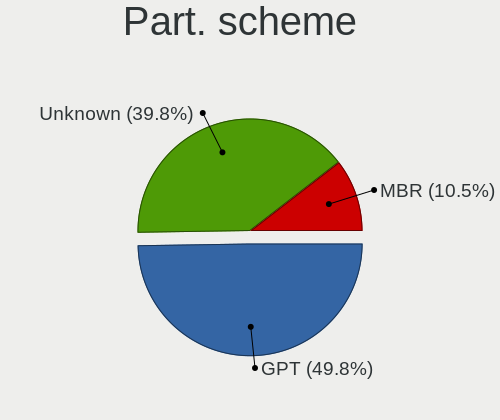
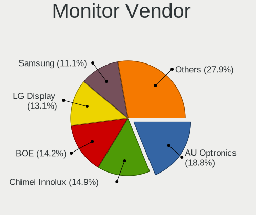
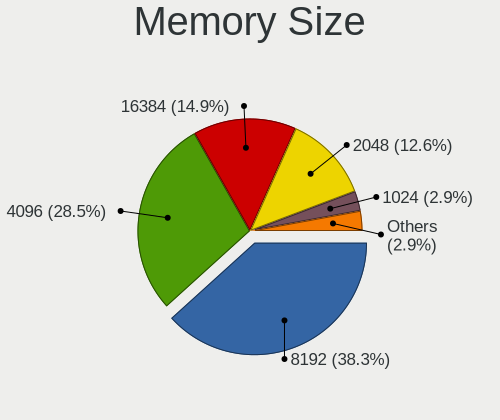
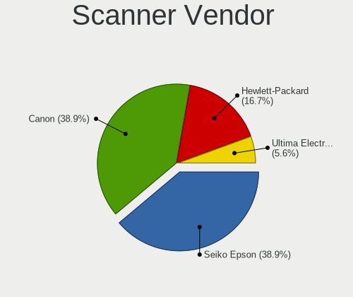
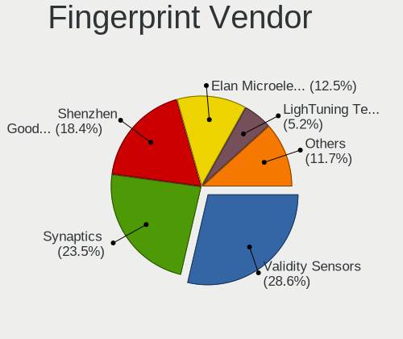

Linux in Italy - Tested Hardware & Statistics (Notebooks)
---------------------------------------------------------

A project to collect tested hardware configurations for Linux in Italy.

Anyone can contribute to this report by the [hw-probe](https://github.com/linuxhw/hw-probe) tool:

    sudo -E hw-probe -all -upload

Please contribute! Especially if your hardware is rare.

Contents
--------

* [ Test Cases ](#test-cases)

* [ System ](#system)
  - [ OS                       ](#os)
  - [ OS Family                ](#os-family)
  - [ Kernel                   ](#kernel)
  - [ Kernel Family            ](#kernel-family)
  - [ Kernel Major Ver.        ](#kernel-major-ver)
  - [ Arch                     ](#arch)
  - [ DE                       ](#de)
  - [ Display Server           ](#display-server)
  - [ Display Manager          ](#display-manager)
  - [ OS Lang                  ](#os-lang)
  - [ Boot Mode                ](#boot-mode)
  - [ Filesystem               ](#filesystem)
  - [ Part. scheme             ](#part-scheme)
  - [ Dual Boot with Linux/BSD ](#dual-boot-with-linuxbsd)
  - [ Dual Boot (Win)          ](#dual-boot-win)

* [ Board ](#board)
  - [ Vendor                   ](#vendor)
  - [ Model                    ](#model)
  - [ Model Family             ](#model-family)
  - [ MFG Year                 ](#mfg-year)
  - [ Form Factor              ](#form-factor)
  - [ Secure Boot              ](#secure-boot)
  - [ Coreboot                 ](#coreboot)
  - [ RAM Size                 ](#ram-size)
  - [ RAM Used                 ](#ram-used)
  - [ Total Drives             ](#total-drives)
  - [ Has CD-ROM               ](#has-cd-rom)
  - [ Has Ethernet             ](#has-ethernet)
  - [ Has WiFi                 ](#has-wifi)
  - [ Has Bluetooth            ](#has-bluetooth)

* [ Location ](#location)
  - [ Country                  ](#country)
  - [ City                     ](#city)

* [ Drives ](#drives)
  - [ Drive Vendor             ](#drive-vendor)
  - [ Drive Model              ](#drive-model)
  - [ HDD Vendor               ](#hdd-vendor)
  - [ SSD Vendor               ](#ssd-vendor)
  - [ Drive Kind               ](#drive-kind)
  - [ Drive Connector          ](#drive-connector)
  - [ Drive Size               ](#drive-size)
  - [ Space Total              ](#space-total)
  - [ Space Used               ](#space-used)
  - [ Malfunc. Drives          ](#malfunc-drives)
  - [ Malfunc. Drive Vendor    ](#malfunc-drive-vendor)
  - [ Malfunc. HDD Vendor      ](#malfunc-hdd-vendor)
  - [ Malfunc. Drive Kind      ](#malfunc-drive-kind)
  - [ Failed Drives            ](#failed-drives)
  - [ Failed Drive Vendor      ](#failed-drive-vendor)
  - [ Drive Status             ](#drive-status)

* [ Storage controller ](#storage-controller)
  - [ Storage Vendor           ](#storage-vendor)
  - [ Storage Model            ](#storage-model)
  - [ Storage Kind             ](#storage-kind)

* [ Processor ](#processor)
  - [ CPU Vendor               ](#cpu-vendor)
  - [ CPU Model                ](#cpu-model)
  - [ CPU Model Family         ](#cpu-model-family)
  - [ CPU Cores                ](#cpu-cores)
  - [ CPU Sockets              ](#cpu-sockets)
  - [ CPU Threads              ](#cpu-threads)
  - [ CPU Op-Modes             ](#cpu-op-modes)
  - [ CPU Microcode            ](#cpu-microcode)
  - [ CPU Microarch            ](#cpu-microarch)

* [ Graphics ](#graphics)
  - [ GPU Vendor               ](#gpu-vendor)
  - [ GPU Model                ](#gpu-model)
  - [ GPU Combo                ](#gpu-combo)
  - [ GPU Driver               ](#gpu-driver)
  - [ GPU Memory               ](#gpu-memory)

* [ Monitor ](#monitor)
  - [ Monitor Vendor           ](#monitor-vendor)
  - [ Monitor Model            ](#monitor-model)
  - [ Monitor Resolution       ](#monitor-resolution)
  - [ Monitor Diagonal         ](#monitor-diagonal)
  - [ Monitor Width            ](#monitor-width)
  - [ Aspect Ratio             ](#aspect-ratio)
  - [ Monitor Area             ](#monitor-area)
  - [ Pixel Density            ](#pixel-density)
  - [ Multiple Monitors        ](#multiple-monitors)

* [ Network ](#network)
  - [ Net Controller Vendor    ](#net-controller-vendor)
  - [ Net Controller Model     ](#net-controller-model)
  - [ Wireless Vendor          ](#wireless-vendor)
  - [ Wireless Model           ](#wireless-model)
  - [ Ethernet Vendor          ](#ethernet-vendor)
  - [ Ethernet Model           ](#ethernet-model)
  - [ Net Controller Kind      ](#net-controller-kind)
  - [ Used Controller          ](#used-controller)
  - [ NICs                     ](#nics)
  - [ IPv6                     ](#ipv6)

* [ Bluetooth ](#bluetooth)
  - [ Bluetooth Vendor         ](#bluetooth-vendor)
  - [ Bluetooth Model          ](#bluetooth-model)

* [ Sound ](#sound)
  - [ Sound Vendor             ](#sound-vendor)
  - [ Sound Model              ](#sound-model)

* [ Memory ](#memory)
  - [ Memory Vendor            ](#memory-vendor)
  - [ Memory Model             ](#memory-model)
  - [ Memory Kind              ](#memory-kind)
  - [ Memory Form Factor       ](#memory-form-factor)
  - [ Memory Size              ](#memory-size)
  - [ Memory Speed             ](#memory-speed)

* [ Printers & scanners ](#printers--scanners)
  - [ Printer Vendor           ](#printer-vendor)
  - [ Printer Model            ](#printer-model)
  - [ Scanner Vendor           ](#scanner-vendor)
  - [ Scanner Model            ](#scanner-model)

* [ Camera ](#camera)
  - [ Camera Vendor            ](#camera-vendor)
  - [ Camera Model             ](#camera-model)

* [ Security ](#security)
  - [ Fingerprint Vendor       ](#fingerprint-vendor)
  - [ Fingerprint Model        ](#fingerprint-model)
  - [ Chipcard Vendor          ](#chipcard-vendor)
  - [ Chipcard Model           ](#chipcard-model)

* [ Unsupported ](#unsupported)
  - [ Unsupported Devices      ](#unsupported-devices)
  - [ Unsupported Device Types ](#unsupported-device-types)

Test Cases
----------

Total: 6106

| Vendor        | Model                       | Probe                                                      | Date         |
|---------------|-----------------------------|------------------------------------------------------------|--------------|
| Valve         | Jupiter                     | [d276b58f38](https://linux-hardware.org/?probe=d276b58f38) | Jun 10, 2023 |
| HP            | Compaq CQ58                 | [98a4edb43d](https://linux-hardware.org/?probe=98a4edb43d) | Jun 10, 2023 |
| Lenovo        | IdeaPad Gaming 3 15ARH05... | [bdca36306b](https://linux-hardware.org/?probe=bdca36306b) | Jun 10, 2023 |
| HUAWEI        | BOD-WXX9                    | [c4063bcf07](https://linux-hardware.org/?probe=c4063bcf07) | Jun 09, 2023 |
| HUAWEI        | BOD-WXX9                    | [9016ad81ae](https://linux-hardware.org/?probe=9016ad81ae) | Jun 09, 2023 |
| Sony          | SVE1713X1EB                 | [f1c10c92b3](https://linux-hardware.org/?probe=f1c10c92b3) | Jun 09, 2023 |
| Acer          | Aspire F5-573G              | [5648ca2620](https://linux-hardware.org/?probe=5648ca2620) | Jun 09, 2023 |
| Acer          | Aspire F5-573G              | [30dbebd931](https://linux-hardware.org/?probe=30dbebd931) | Jun 09, 2023 |
| Onda TLC      | ONDA Oliver                 | [80a06d821b](https://linux-hardware.org/?probe=80a06d821b) | Jun 09, 2023 |
| HP            | EliteBook 8440p             | [b88712538e](https://linux-hardware.org/?probe=b88712538e) | Jun 09, 2023 |
| HP            | EliteBook 8440p             | [51bfdec531](https://linux-hardware.org/?probe=51bfdec531) | Jun 09, 2023 |
| Acer          | Aspire A315-51              | [9bcc99d434](https://linux-hardware.org/?probe=9bcc99d434) | Jun 08, 2023 |
| Acer          | Aspire A315-51              | [3013e9caf2](https://linux-hardware.org/?probe=3013e9caf2) | Jun 08, 2023 |
| HP            | G42                         | [fe8d2be276](https://linux-hardware.org/?probe=fe8d2be276) | Jun 08, 2023 |
| HP            | G42                         | [4f33462d46](https://linux-hardware.org/?probe=4f33462d46) | Jun 08, 2023 |
| Lenovo        | ThinkPad X270 W10DG 20K5... | [8a01610ae4](https://linux-hardware.org/?probe=8a01610ae4) | Jun 08, 2023 |
| HUAWEI        | HKD-WXX                     | [d6a8e02362](https://linux-hardware.org/?probe=d6a8e02362) | Jun 08, 2023 |
| ASUSTek       | X580VN                      | [8c1cf3f164](https://linux-hardware.org/?probe=8c1cf3f164) | Jun 08, 2023 |
| HUAWEI        | HKD-WXX                     | [fdb80f6e89](https://linux-hardware.org/?probe=fdb80f6e89) | Jun 08, 2023 |
| Lenovo        | IdeaPad 3 15ITL6 82H8       | [82d0019a0b](https://linux-hardware.org/?probe=82d0019a0b) | Jun 08, 2023 |
| Acer          | AO722                       | [a57b6cf2ff](https://linux-hardware.org/?probe=a57b6cf2ff) | Jun 08, 2023 |
| HP            | Pavilion dv7                | [75a37cd4c8](https://linux-hardware.org/?probe=75a37cd4c8) | Jun 07, 2023 |
| Onda TLC      | ONDA Oliver                 | [bbfcf4a3be](https://linux-hardware.org/?probe=bbfcf4a3be) | Jun 07, 2023 |
| Dell          | Latitude 5300               | [1eea10cfa3](https://linux-hardware.org/?probe=1eea10cfa3) | Jun 07, 2023 |
| HP            | Pavilion Notebook           | [5254a5fe09](https://linux-hardware.org/?probe=5254a5fe09) | Jun 07, 2023 |
| Acer          | Aspire E1-571               | [f4e4a4b982](https://linux-hardware.org/?probe=f4e4a4b982) | Jun 07, 2023 |
| Acer          | Aspire E1-571               | [7948f267c2](https://linux-hardware.org/?probe=7948f267c2) | Jun 07, 2023 |
| Acer          | AO722                       | [8840b1284b](https://linux-hardware.org/?probe=8840b1284b) | Jun 06, 2023 |
| Acer          | Aspire E1-571               | [1139c69312](https://linux-hardware.org/?probe=1139c69312) | Jun 06, 2023 |
| MSI           | GF63 Thin 9RCX              | [85ec51dbf3](https://linux-hardware.org/?probe=85ec51dbf3) | Jun 05, 2023 |
| Lenovo        | ThinkPad T15 Gen 1 20S60... | [c20dd8572a](https://linux-hardware.org/?probe=c20dd8572a) | Jun 05, 2023 |
| HUAWEI        | KPR-WX9                     | [3eb711e453](https://linux-hardware.org/?probe=3eb711e453) | Jun 05, 2023 |
| Dell          | XPS 13 9305                 | [450d20f29d](https://linux-hardware.org/?probe=450d20f29d) | Jun 05, 2023 |
| Acer          | Aspire F5-573G              | [b4f165f28d](https://linux-hardware.org/?probe=b4f165f28d) | Jun 05, 2023 |
| Acer          | Aspire F5-573G              | [e0ce9df73c](https://linux-hardware.org/?probe=e0ce9df73c) | Jun 05, 2023 |
| MSI           | GL75 Leopard 10SER          | [24111ade43](https://linux-hardware.org/?probe=24111ade43) | Jun 04, 2023 |
| Acer          | Aspire E5-573G              | [3ef3c9ec82](https://linux-hardware.org/?probe=3ef3c9ec82) | Jun 04, 2023 |
| Sony          | SVE1713X1EB                 | [6a50598ca6](https://linux-hardware.org/?probe=6a50598ca6) | Jun 04, 2023 |
| HP            | 255 G7 Notebook PC          | [8b14da5cf8](https://linux-hardware.org/?probe=8b14da5cf8) | Jun 04, 2023 |
| HP            | ZBook 15 G2                 | [19ed8e22e6](https://linux-hardware.org/?probe=19ed8e22e6) | Jun 03, 2023 |
| Lenovo        | Legion 5 Pro 16ACH6H 82J... | [ac6745cffb](https://linux-hardware.org/?probe=ac6745cffb) | Jun 03, 2023 |
| Dell          | Latitude E5430 non-vPro     | [ba2dfac7ae](https://linux-hardware.org/?probe=ba2dfac7ae) | Jun 03, 2023 |
| Sony          | SVE1713X1EB                 | [fc0097b52f](https://linux-hardware.org/?probe=fc0097b52f) | Jun 03, 2023 |
| HONOR         | BBR-WAX9                    | [fe03659a55](https://linux-hardware.org/?probe=fe03659a55) | Jun 02, 2023 |
| ASUSTek       | ASUS TUF Gaming F17 FX70... | [959b76650d](https://linux-hardware.org/?probe=959b76650d) | Jun 02, 2023 |
| Lenovo        | ThinkPad T470 20HES0FW00    | [174ffa62e4](https://linux-hardware.org/?probe=174ffa62e4) | Jun 02, 2023 |
| ASUSTek       | ASUS TUF Dash F15 FX516P... | [49ca1fd34f](https://linux-hardware.org/?probe=49ca1fd34f) | Jun 02, 2023 |
| Lenovo        | G50-45 80E3                 | [3bc50c5ccb](https://linux-hardware.org/?probe=3bc50c5ccb) | Jun 02, 2023 |
| HONOR         | BBR-WAX9                    | [0a536c1198](https://linux-hardware.org/?probe=0a536c1198) | Jun 01, 2023 |
| Samsung       | 300E4C/300E5C/300E7C        | [fcc2d0ed39](https://linux-hardware.org/?probe=fcc2d0ed39) | Jun 01, 2023 |
| MSI           | Prestige 15 A12UC           | [9324563727](https://linux-hardware.org/?probe=9324563727) | Jun 01, 2023 |
| MSI           | Prestige 15 A12UC           | [778e78d2a5](https://linux-hardware.org/?probe=778e78d2a5) | Jun 01, 2023 |
| ASUSTek       | ROG Flow X13 GV301QH_GV3... | [0b0c375bb8](https://linux-hardware.org/?probe=0b0c375bb8) | May 31, 2023 |
| Olidata       | Tehom cw4900                | [f5b147962f](https://linux-hardware.org/?probe=f5b147962f) | May 31, 2023 |
| HONOR         | BBR-WAX9                    | [8630cfad52](https://linux-hardware.org/?probe=8630cfad52) | May 31, 2023 |
| HP            | Laptop 15s-fq5xxx           | [bfcb7f950d](https://linux-hardware.org/?probe=bfcb7f950d) | May 31, 2023 |
| Dell          | Inspiron 15 5510            | [bd2319fd67](https://linux-hardware.org/?probe=bd2319fd67) | May 31, 2023 |
| Jumper        | EZbook                      | [3ccf2e1365](https://linux-hardware.org/?probe=3ccf2e1365) | May 31, 2023 |
| HP            | ENVY 15                     | [ad3cf182fe](https://linux-hardware.org/?probe=ad3cf182fe) | May 30, 2023 |
| HP            | ENVY 15                     | [5acbfb03f4](https://linux-hardware.org/?probe=5acbfb03f4) | May 30, 2023 |
| Lenovo        | IdeaPad 5 14ALC05 82LM      | [bb50e13268](https://linux-hardware.org/?probe=bb50e13268) | May 30, 2023 |
| HP            | Pavilion 15                 | [ca18fafda8](https://linux-hardware.org/?probe=ca18fafda8) | May 29, 2023 |
| Lenovo        | G50-45 80E3                 | [013d065e72](https://linux-hardware.org/?probe=013d065e72) | May 29, 2023 |
| Dell          | Latitude E5470              | [77d85b619e](https://linux-hardware.org/?probe=77d85b619e) | May 29, 2023 |
| Unknown       | Unknown                     | [351ca28b27](https://linux-hardware.org/?probe=351ca28b27) | May 29, 2023 |
| Acer          | Aspire A515-41G             | [644a5d7a16](https://linux-hardware.org/?probe=644a5d7a16) | May 29, 2023 |
| Apple         | MacBookAir7,2               | [2f44574d7c](https://linux-hardware.org/?probe=2f44574d7c) | May 29, 2023 |
| Apple         | MacBookPro7,1               | [81a267d02b](https://linux-hardware.org/?probe=81a267d02b) | May 28, 2023 |
| Apple         | MacBookAir7,2               | [5e146ef326](https://linux-hardware.org/?probe=5e146ef326) | May 28, 2023 |
| HUAWEI        | BOHB-WAX9                   | [c7afdbbd76](https://linux-hardware.org/?probe=c7afdbbd76) | May 28, 2023 |
| Apple         | MacBookPro6,2               | [db9c87ce89](https://linux-hardware.org/?probe=db9c87ce89) | May 28, 2023 |
| Sony          | SVE1713X1EB                 | [2695d0a6c8](https://linux-hardware.org/?probe=2695d0a6c8) | May 28, 2023 |
| Lenovo        | IdeaPad 5 15IIL05 81YK      | [1eecbd5808](https://linux-hardware.org/?probe=1eecbd5808) | May 27, 2023 |
| HP            | G42                         | [7b9612a51a](https://linux-hardware.org/?probe=7b9612a51a) | May 27, 2023 |
| Dell          | XPS 15 9570                 | [e74ee1390f](https://linux-hardware.org/?probe=e74ee1390f) | May 26, 2023 |
| Dell          | XPS 15 9570                 | [ac75726738](https://linux-hardware.org/?probe=ac75726738) | May 26, 2023 |
| HP            | Pavilion x2 Detachable      | [e21476b6d2](https://linux-hardware.org/?probe=e21476b6d2) | May 26, 2023 |
| Acer          | Aspire A515-52G             | [433b367e58](https://linux-hardware.org/?probe=433b367e58) | May 26, 2023 |
| Acer          | Aspire A515-52G             | [ac85063e46](https://linux-hardware.org/?probe=ac85063e46) | May 26, 2023 |
| Acer          | Aspire 7750G                | [1ddb5fe9a0](https://linux-hardware.org/?probe=1ddb5fe9a0) | May 26, 2023 |
| Lenovo        | IdeaPad Z580                | [8d9c3b024d](https://linux-hardware.org/?probe=8d9c3b024d) | May 25, 2023 |
| ASUSTek       | S551LB                      | [86f50d3933](https://linux-hardware.org/?probe=86f50d3933) | May 25, 2023 |
| Mediacom      | SMARTBOOK ONE               | [ad010a6b3e](https://linux-hardware.org/?probe=ad010a6b3e) | May 25, 2023 |
| Lenovo        | ThinkPad W541 20EGS24J00    | [d674d76da5](https://linux-hardware.org/?probe=d674d76da5) | May 24, 2023 |
| Sony          | SVF13N2J2ES                 | [978ae98d6e](https://linux-hardware.org/?probe=978ae98d6e) | May 24, 2023 |
| Lenovo        | ThinkPad W541 20EGS24J00    | [3b74b092c6](https://linux-hardware.org/?probe=3b74b092c6) | May 24, 2023 |
| Sony          | SVE1513Q1ESI                | [422e8954f2](https://linux-hardware.org/?probe=422e8954f2) | May 24, 2023 |
| ASUSTek       | VivoBook_ASUSLaptop X580... | [c5baa41ff7](https://linux-hardware.org/?probe=c5baa41ff7) | May 24, 2023 |
| ASUSTek       | ROG Strix G733PZ_G733PZ     | [e484eaf025](https://linux-hardware.org/?probe=e484eaf025) | May 24, 2023 |
| Dell          | Precision 3571              | [3806fcdb9c](https://linux-hardware.org/?probe=3806fcdb9c) | May 24, 2023 |
| HP            | EliteBook 845 G8 Noteboo... | [1280876877](https://linux-hardware.org/?probe=1280876877) | May 24, 2023 |
| Sony          | SVF13N2J2ES                 | [01e2285654](https://linux-hardware.org/?probe=01e2285654) | May 24, 2023 |
| Acer          | Aspire 7750G                | [4ddad1d733](https://linux-hardware.org/?probe=4ddad1d733) | May 24, 2023 |
| Lenovo        | Yoga Slim 7 14ARE05 82A2    | [0dfd1ede62](https://linux-hardware.org/?probe=0dfd1ede62) | May 23, 2023 |
| Apple         | MacBookPro7,1               | [e1baf451db](https://linux-hardware.org/?probe=e1baf451db) | May 23, 2023 |
| Apple         | MacBookPro7,1               | [61ef8e4e63](https://linux-hardware.org/?probe=61ef8e4e63) | May 23, 2023 |
| Valve         | Jupiter                     | [223ab4f15c](https://linux-hardware.org/?probe=223ab4f15c) | May 23, 2023 |
| HP            | ENVY 15                     | [85a97390d5](https://linux-hardware.org/?probe=85a97390d5) | May 23, 2023 |
| Sony          | SVE1513Q1ESI                | [eef57d6c26](https://linux-hardware.org/?probe=eef57d6c26) | May 23, 2023 |
| HP            | Pavilion x2 Detachable      | [f9f3305d0b](https://linux-hardware.org/?probe=f9f3305d0b) | May 23, 2023 |
| HUAWEI        | NBLB-WAX9N                  | [14b20068ca](https://linux-hardware.org/?probe=14b20068ca) | May 22, 2023 |
| Lenovo        | Legion 5 15ARH05H 82B1      | [5300f7df17](https://linux-hardware.org/?probe=5300f7df17) | May 22, 2023 |
| Dell          | Latitude E6230              | [89c5618eb8](https://linux-hardware.org/?probe=89c5618eb8) | May 22, 2023 |
| HUAWEI        | KLVL-WXX9                   | [5cb11eee20](https://linux-hardware.org/?probe=5cb11eee20) | May 22, 2023 |
| HP            | ENVY 15                     | [21a38278ca](https://linux-hardware.org/?probe=21a38278ca) | May 21, 2023 |
| MSI           | Modern 14 B11MOL            | [7bc8f5e875](https://linux-hardware.org/?probe=7bc8f5e875) | May 21, 2023 |
| Lenovo        | ThinkPad X395 20NLCTO1WW    | [55a289b426](https://linux-hardware.org/?probe=55a289b426) | May 21, 2023 |
| ASUSTek       | ZenBook UX425JA_UX425JA     | [916d381f2f](https://linux-hardware.org/?probe=916d381f2f) | May 21, 2023 |
| ASUSTek       | N53TK                       | [275e480739](https://linux-hardware.org/?probe=275e480739) | May 21, 2023 |
| Acer          | Aspire 7750G                | [61ebf173dc](https://linux-hardware.org/?probe=61ebf173dc) | May 21, 2023 |
| ASUSTek       | VivoBook_ASUSLaptop X580... | [fa899a9a41](https://linux-hardware.org/?probe=fa899a9a41) | May 21, 2023 |
| ASUSTek       | ROG Strix G713PV_G713PV     | [8ec7bb4682](https://linux-hardware.org/?probe=8ec7bb4682) | May 21, 2023 |
| Acer          | Aspire V3-572G              | [8f1be2d961](https://linux-hardware.org/?probe=8f1be2d961) | May 21, 2023 |
| Lenovo        | V15 G2 ALC 82KD             | [74274a1304](https://linux-hardware.org/?probe=74274a1304) | May 21, 2023 |
| Samsung       | RV411/RV511/E3511/S3511/... | [07039bd959](https://linux-hardware.org/?probe=07039bd959) | May 21, 2023 |
| Toshiba       | Satellite Pro S500          | [b08ca84ea8](https://linux-hardware.org/?probe=b08ca84ea8) | May 20, 2023 |
| HP            | Pavilion dv6                | [51e808c93a](https://linux-hardware.org/?probe=51e808c93a) | May 20, 2023 |
| Valve         | Jupiter                     | [6b5b728c7e](https://linux-hardware.org/?probe=6b5b728c7e) | May 20, 2023 |
| Unknown       | Unknown                     | [c7157cc723](https://linux-hardware.org/?probe=c7157cc723) | May 20, 2023 |
| HP            | Pavilion dv3                | [34c6a2c14a](https://linux-hardware.org/?probe=34c6a2c14a) | May 20, 2023 |
| Lenovo        | ThinkPad T470s 20HF0000M... | [3976703e20](https://linux-hardware.org/?probe=3976703e20) | May 20, 2023 |
| ASUSTek       | VivoBook_ASUSLaptop X509... | [1f6220f21a](https://linux-hardware.org/?probe=1f6220f21a) | May 19, 2023 |
| MSI           | Alpha 15 B5EEK              | [b309bee7e9](https://linux-hardware.org/?probe=b309bee7e9) | May 19, 2023 |
| Lenovo        | ThinkPad T14 Gen 1 20S00... | [5e6991f9e3](https://linux-hardware.org/?probe=5e6991f9e3) | May 19, 2023 |
| Unknown       | Unknown                     | [49c702a8c9](https://linux-hardware.org/?probe=49c702a8c9) | May 18, 2023 |
| ASUSTek       | X555LPB                     | [c1082eef21](https://linux-hardware.org/?probe=c1082eef21) | May 18, 2023 |
| Acer          | Aspire 5920G                | [65638219a5](https://linux-hardware.org/?probe=65638219a5) | May 18, 2023 |
| HUAWEI        | BOD-WXX9                    | [62e064b7d0](https://linux-hardware.org/?probe=62e064b7d0) | May 18, 2023 |
| Lenovo        | ThinkPad X260 20F6CTO1WW    | [a35e6c0b2d](https://linux-hardware.org/?probe=a35e6c0b2d) | May 17, 2023 |
| HP            | Pavilion Laptop 15-eg1xx... | [b5aef01bc9](https://linux-hardware.org/?probe=b5aef01bc9) | May 17, 2023 |
| HP            | ENVY 15                     | [4576cea8b0](https://linux-hardware.org/?probe=4576cea8b0) | May 17, 2023 |
| ASUSTek       | UX305FA                     | [36cb231f34](https://linux-hardware.org/?probe=36cb231f34) | May 16, 2023 |
| HP            | Pavilion dv6                | [bc505434f7](https://linux-hardware.org/?probe=bc505434f7) | May 16, 2023 |
| Dell          | Latitude E5530 non-vPro     | [7c05862259](https://linux-hardware.org/?probe=7c05862259) | May 16, 2023 |
| Acer          | Nitro AN515-45              | [62e3c494bd](https://linux-hardware.org/?probe=62e3c494bd) | May 16, 2023 |
| Valve         | Jupiter                     | [6c64da33ef](https://linux-hardware.org/?probe=6c64da33ef) | May 16, 2023 |
| Apple         | MacBook4,1                  | [755f1920f2](https://linux-hardware.org/?probe=755f1920f2) | May 15, 2023 |
| HUAWEI        | KLVD-WXX9                   | [ba609eb1e6](https://linux-hardware.org/?probe=ba609eb1e6) | May 15, 2023 |
| ASUSTek       | VivoBook_ASUSLaptop X580... | [bfd8d8244b](https://linux-hardware.org/?probe=bfd8d8244b) | May 15, 2023 |
| HP            | Pavilion dv6                | [fd5291d10e](https://linux-hardware.org/?probe=fd5291d10e) | May 15, 2023 |
| Dell          | Precision 7520              | [cbfb960bae](https://linux-hardware.org/?probe=cbfb960bae) | May 15, 2023 |
| Dell          | Precision 7520              | [a42d1a8bf5](https://linux-hardware.org/?probe=a42d1a8bf5) | May 15, 2023 |
| Lenovo        | IdeaPad 3 15ITL6 82H8       | [2750a05721](https://linux-hardware.org/?probe=2750a05721) | May 15, 2023 |
| HP            | Pavilion x2 Detachable      | [e9e5b21145](https://linux-hardware.org/?probe=e9e5b21145) | May 15, 2023 |
| HP            | Pavilion x2 Detachable      | [34c6621991](https://linux-hardware.org/?probe=34c6621991) | May 15, 2023 |
| Lenovo        | ThinkPad X100e 0022CTO      | [842b7a3ee2](https://linux-hardware.org/?probe=842b7a3ee2) | May 14, 2023 |
| Lenovo        | ThinkPad T14 Gen 3 21CFC... | [bb119829d0](https://linux-hardware.org/?probe=bb119829d0) | May 14, 2023 |
| HP            | OMEN by Laptop 15-dc1xxx    | [020d4612bd](https://linux-hardware.org/?probe=020d4612bd) | May 14, 2023 |
| Mediacom      | SmartBook 14 FullHD - SB... | [ca65ed1052](https://linux-hardware.org/?probe=ca65ed1052) | May 14, 2023 |
| HP            | Compaq CQ58                 | [0df5818390](https://linux-hardware.org/?probe=0df5818390) | May 14, 2023 |
| Valve         | Jupiter                     | [af70e39629](https://linux-hardware.org/?probe=af70e39629) | May 14, 2023 |
| HP            | OMEN by Laptop 15-dc1xxx    | [2be4ad0e3d](https://linux-hardware.org/?probe=2be4ad0e3d) | May 14, 2023 |
| Mediacom      | SmartBook 14 FullHD - SB... | [1bb0ed422e](https://linux-hardware.org/?probe=1bb0ed422e) | May 14, 2023 |
| Mediacom      | SmartBook 14 FullHD - SB... | [5f3a14748e](https://linux-hardware.org/?probe=5f3a14748e) | May 13, 2023 |
| Mediacom      | SmartBook 14 FullHD - SB... | [24aaf9e627](https://linux-hardware.org/?probe=24aaf9e627) | May 13, 2023 |
| HP            | Pavilion dv6                | [e20ba378ac](https://linux-hardware.org/?probe=e20ba378ac) | May 13, 2023 |
| HP            | ENVY 15                     | [e188fe21b7](https://linux-hardware.org/?probe=e188fe21b7) | May 12, 2023 |
| Lenovo        | ThinkPad Edge 02173BG       | [05f67c346b](https://linux-hardware.org/?probe=05f67c346b) | May 12, 2023 |
| Unknown       | Unknown                     | [8375f52559](https://linux-hardware.org/?probe=8375f52559) | May 12, 2023 |
| HP            | OMEN by Laptop              | [8b187d1291](https://linux-hardware.org/?probe=8b187d1291) | May 11, 2023 |
| Unknown       | Unknown                     | [00f98129ce](https://linux-hardware.org/?probe=00f98129ce) | May 11, 2023 |
| Valve         | Jupiter                     | [ec8ac0aafd](https://linux-hardware.org/?probe=ec8ac0aafd) | May 11, 2023 |
| Dell          | XPS 9315                    | [d53e7f5d92](https://linux-hardware.org/?probe=d53e7f5d92) | May 11, 2023 |
| Samsung       | RV410/RV510/S3510/E3510     | [d6a837c94d](https://linux-hardware.org/?probe=d6a837c94d) | May 11, 2023 |
| Mediacom      | SmartBook 14 FullHD - SB... | [e03da60adf](https://linux-hardware.org/?probe=e03da60adf) | May 11, 2023 |
| Acer          | Aspire 5715Z                | [81c255952d](https://linux-hardware.org/?probe=81c255952d) | May 10, 2023 |
| Lenovo        | V15-ADA 82C7                | [8eae6560cb](https://linux-hardware.org/?probe=8eae6560cb) | May 10, 2023 |
| Lenovo        | ThinkPad E14 Gen 3 20Y70... | [eb6941b1b8](https://linux-hardware.org/?probe=eb6941b1b8) | May 10, 2023 |
| Acer          | Aspire E5-553G              | [922a392eee](https://linux-hardware.org/?probe=922a392eee) | May 09, 2023 |
| Dell          | Latitude 7420               | [4b8927333b](https://linux-hardware.org/?probe=4b8927333b) | May 09, 2023 |
| Dell          | Latitude E6520              | [668b26cd28](https://linux-hardware.org/?probe=668b26cd28) | May 09, 2023 |
| HP            | 255 G5                      | [4ed50eeba3](https://linux-hardware.org/?probe=4ed50eeba3) | May 09, 2023 |
| Lenovo        | IdeaPad Gaming 3 15ARH05... | [4e95a5b88e](https://linux-hardware.org/?probe=4e95a5b88e) | May 08, 2023 |
| Lenovo        | IdeaPad Gaming 3 15ARH05... | [5cbf24306a](https://linux-hardware.org/?probe=5cbf24306a) | May 08, 2023 |
| Acer          | Aspire 5750G                | [6b908b35cc](https://linux-hardware.org/?probe=6b908b35cc) | May 08, 2023 |
| HUAWEI        | NBLK-WAX9X                  | [a4f5dce6d6](https://linux-hardware.org/?probe=a4f5dce6d6) | May 08, 2023 |
| Dell          | XPS 15 9570                 | [100534a570](https://linux-hardware.org/?probe=100534a570) | May 08, 2023 |
| Notebook      | P750ZM                      | [2cbd56abdc](https://linux-hardware.org/?probe=2cbd56abdc) | May 08, 2023 |
| Apple         | MacBookPro3,1               | [561202c004](https://linux-hardware.org/?probe=561202c004) | May 07, 2023 |
| HP            | 255 G3                      | [d95f6211dc](https://linux-hardware.org/?probe=d95f6211dc) | May 07, 2023 |
| HP            | Pavilion dv6                | [978d2165ac](https://linux-hardware.org/?probe=978d2165ac) | May 07, 2023 |
| HP            | 250 G5 Notebook PC          | [c1a5a5b4d9](https://linux-hardware.org/?probe=c1a5a5b4d9) | May 07, 2023 |
| Lenovo        | ThinkPad X260 20F6CTO1WW    | [e81eb02947](https://linux-hardware.org/?probe=e81eb02947) | May 07, 2023 |
| Acer          | Aspire E5-551G              | [ab9ff23d88](https://linux-hardware.org/?probe=ab9ff23d88) | May 07, 2023 |
| Acer          | Aspire E5-551G              | [a21a8395d8](https://linux-hardware.org/?probe=a21a8395d8) | May 07, 2023 |
| Lenovo        | G50-70 20351                | [784570bae3](https://linux-hardware.org/?probe=784570bae3) | May 07, 2023 |
| Dell          | XPS 13 9343                 | [5e91733408](https://linux-hardware.org/?probe=5e91733408) | May 07, 2023 |
| Lenovo        | ThinkPad X260 20F6CTO1WW    | [7998abcdcd](https://linux-hardware.org/?probe=7998abcdcd) | May 07, 2023 |
| HP            | Notebook                    | [cb89261339](https://linux-hardware.org/?probe=cb89261339) | May 06, 2023 |
| HP            | Laptop 15s-fq5xxx           | [8ce0b92713](https://linux-hardware.org/?probe=8ce0b92713) | May 06, 2023 |
| HP            | EliteBook 2530p             | [9963aba3a2](https://linux-hardware.org/?probe=9963aba3a2) | May 06, 2023 |
| Lenovo        | IdeaPad U510 20191          | [23414f0626](https://linux-hardware.org/?probe=23414f0626) | May 06, 2023 |
| HP            | Notebook                    | [74f9f1122e](https://linux-hardware.org/?probe=74f9f1122e) | May 06, 2023 |
| Lenovo        | IdeaPad 3 15ITL6 82H8       | [7aeb31c7f1](https://linux-hardware.org/?probe=7aeb31c7f1) | May 05, 2023 |
| MSI           | Modern 14 B11MOL            | [d6bc185f4e](https://linux-hardware.org/?probe=d6bc185f4e) | May 05, 2023 |
| Lenovo        | IdeaPad Gaming 3 15ARH7 ... | [bd885c202d](https://linux-hardware.org/?probe=bd885c202d) | May 05, 2023 |
| Lenovo        | ThinkPad T495s 20QJCTO1W... | [a27c899176](https://linux-hardware.org/?probe=a27c899176) | May 04, 2023 |
| HP            | 255 G8 Notebook PC          | [af9621c92b](https://linux-hardware.org/?probe=af9621c92b) | May 04, 2023 |
| HP            | Elite x2 1012 G1            | [20dcc3e6b3](https://linux-hardware.org/?probe=20dcc3e6b3) | May 04, 2023 |
| KUU           | Andes II                    | [b15876e521](https://linux-hardware.org/?probe=b15876e521) | May 04, 2023 |
| Dell          | XPS 15 9510                 | [ce70c65f11](https://linux-hardware.org/?probe=ce70c65f11) | May 03, 2023 |
| HP            | Compaq Presario C700        | [8c62d76e28](https://linux-hardware.org/?probe=8c62d76e28) | May 03, 2023 |
| Sony          | SVF1521G1EW                 | [b84b2ed08a](https://linux-hardware.org/?probe=b84b2ed08a) | May 03, 2023 |
| Acer          | Swift SF515-51T             | [80d7446f47](https://linux-hardware.org/?probe=80d7446f47) | May 03, 2023 |
| Olivetti      | OLIBOOK P35-XXXAEU          | [bb924b0c19](https://linux-hardware.org/?probe=bb924b0c19) | May 03, 2023 |
| ASUSTek       | VivoBook_ASUSLaptop X510... | [4280750d03](https://linux-hardware.org/?probe=4280750d03) | May 03, 2023 |
| Samsung       | 750XDA                      | [2e99c882ff](https://linux-hardware.org/?probe=2e99c882ff) | May 03, 2023 |
| HUAWEI        | BOM-WXX9                    | [fd0dee0606](https://linux-hardware.org/?probe=fd0dee0606) | May 03, 2023 |
| TELECOMITA... | M7x0S                       | [d8256a8177](https://linux-hardware.org/?probe=d8256a8177) | May 03, 2023 |
| TELECOMITA... | M7x0S                       | [d4019e13f1](https://linux-hardware.org/?probe=d4019e13f1) | May 03, 2023 |
| Lenovo        | IdeaPad 320-15AST 80XV      | [910824ac40](https://linux-hardware.org/?probe=910824ac40) | May 03, 2023 |
| Lenovo        | ThinkPad X220 4291IR6       | [56d274f769](https://linux-hardware.org/?probe=56d274f769) | May 03, 2023 |
| Lenovo        | V130-15IKB 81HN             | [8c3e5e8d50](https://linux-hardware.org/?probe=8c3e5e8d50) | May 03, 2023 |
| Dell          | Latitude E7270              | [62c1cdc600](https://linux-hardware.org/?probe=62c1cdc600) | May 02, 2023 |
| Sony          | VPCF11C5E                   | [77f08d3d00](https://linux-hardware.org/?probe=77f08d3d00) | May 02, 2023 |
| Dell          | Latitude E7270              | [96e1a00bae](https://linux-hardware.org/?probe=96e1a00bae) | May 02, 2023 |
| HP            | Laptop 15s-eq3xxx           | [5375a4f57c](https://linux-hardware.org/?probe=5375a4f57c) | May 02, 2023 |
| Lenovo        | IdeaPad 330S-15IKB 81F5     | [b56701568d](https://linux-hardware.org/?probe=b56701568d) | May 01, 2023 |
| HP            | 255 G4                      | [b06ddec94b](https://linux-hardware.org/?probe=b06ddec94b) | May 01, 2023 |
| Timi          | RedmiBook 16                | [01706331eb](https://linux-hardware.org/?probe=01706331eb) | May 01, 2023 |
| HP            | Compaq 8510w                | [eea89c8c92](https://linux-hardware.org/?probe=eea89c8c92) | May 01, 2023 |
| HP            | ENVY 15                     | [935dc183e1](https://linux-hardware.org/?probe=935dc183e1) | May 01, 2023 |
| HP            | OMEN by Laptop              | [bfbda66d8b](https://linux-hardware.org/?probe=bfbda66d8b) | May 01, 2023 |
| ASUSTek       | K52Jc                       | [ae414cf185](https://linux-hardware.org/?probe=ae414cf185) | May 01, 2023 |
| Mediacom      | SmartBook 14 FullHD - SB... | [cbc75f825e](https://linux-hardware.org/?probe=cbc75f825e) | May 01, 2023 |
| Lenovo        | Legion S7 15IMH5 82BC       | [a57d01b946](https://linux-hardware.org/?probe=a57d01b946) | May 01, 2023 |
| ASUSTek       | VivoBook_ASUSLaptop X580... | [05251702aa](https://linux-hardware.org/?probe=05251702aa) | Apr 30, 2023 |
| HP            | 255 G8 Notebook PC          | [7262375294](https://linux-hardware.org/?probe=7262375294) | Apr 30, 2023 |
| HP            | Compaq 6720s                | [cc5f5ee72c](https://linux-hardware.org/?probe=cc5f5ee72c) | Apr 30, 2023 |
| Lenovo        | IdeaPad 330S-15IKB 81F5     | [36ccc3c930](https://linux-hardware.org/?probe=36ccc3c930) | Apr 30, 2023 |
| ASUSTek       | VivoBook_ASUSLaptop X580... | [94118ab632](https://linux-hardware.org/?probe=94118ab632) | Apr 30, 2023 |
| MSI           | Modern 14 B11MOU            | [6b3fcf3fcc](https://linux-hardware.org/?probe=6b3fcf3fcc) | Apr 29, 2023 |
| Acer          | Aspire A515-51G             | [bd4c84da60](https://linux-hardware.org/?probe=bd4c84da60) | Apr 29, 2023 |
| Lenovo        | ThinkPad X270 W10DG 20K5... | [59fcc52279](https://linux-hardware.org/?probe=59fcc52279) | Apr 29, 2023 |
| Lenovo        | IdeaPad 5 Pro 14ACN6 82L... | [25d0c90e31](https://linux-hardware.org/?probe=25d0c90e31) | Apr 27, 2023 |
| ASUSTek       | ASUS TUF Gaming A15 FA50... | [b6bd42eb71](https://linux-hardware.org/?probe=b6bd42eb71) | Apr 27, 2023 |
| TUXEDO        | Unknown                     | [5108a05d49](https://linux-hardware.org/?probe=5108a05d49) | Apr 27, 2023 |
| Dell          | Latitude E6400              | [2cb1305ae1](https://linux-hardware.org/?probe=2cb1305ae1) | Apr 27, 2023 |
| Toshiba       | Satellite Pro S500          | [7a2503959a](https://linux-hardware.org/?probe=7a2503959a) | Apr 26, 2023 |
| Acer          | TravelMate 6593             | [58dce8147e](https://linux-hardware.org/?probe=58dce8147e) | Apr 26, 2023 |
| HP            | ENVY 15                     | [1f50420c44](https://linux-hardware.org/?probe=1f50420c44) | Apr 26, 2023 |
| Lenovo        | ThinkPad T480s 20L8002WM... | [82bd4b0d20](https://linux-hardware.org/?probe=82bd4b0d20) | Apr 26, 2023 |
| Acer          | Aspire A515-45              | [496934207f](https://linux-hardware.org/?probe=496934207f) | Apr 25, 2023 |
| Acer          | Aspire A515-45              | [0466417666](https://linux-hardware.org/?probe=0466417666) | Apr 25, 2023 |
| HUAWEI        | NBLB-WAX9N                  | [50930ebe57](https://linux-hardware.org/?probe=50930ebe57) | Apr 25, 2023 |
| Acer          | Aspire 5920G                | [c6387003fc](https://linux-hardware.org/?probe=c6387003fc) | Apr 25, 2023 |
| HP            | Laptop 17-cp0xxx            | [288f3f709c](https://linux-hardware.org/?probe=288f3f709c) | Apr 24, 2023 |
| HP            | 470 17 inch G9 Notebook ... | [6b73c4cb65](https://linux-hardware.org/?probe=6b73c4cb65) | Apr 24, 2023 |
| Onda TLC      | ONDA Oliver                 | [c59dbdea18](https://linux-hardware.org/?probe=c59dbdea18) | Apr 23, 2023 |
| Gigabyte      | G5 KD                       | [d7648edaab](https://linux-hardware.org/?probe=d7648edaab) | Apr 23, 2023 |
| Acer          | Swift SF314-43              | [b18f893905](https://linux-hardware.org/?probe=b18f893905) | Apr 23, 2023 |
| Toshiba       | Satellite Pro S500          | [fcf8a7bdb4](https://linux-hardware.org/?probe=fcf8a7bdb4) | Apr 23, 2023 |
| Dell          | Inspiron MP061              | [2b25a48030](https://linux-hardware.org/?probe=2b25a48030) | Apr 23, 2023 |
| Sony          | SVE1713X1EB                 | [b935ad65e3](https://linux-hardware.org/?probe=b935ad65e3) | Apr 22, 2023 |
| ASUSTek       | 1215B                       | [a7fc39a85b](https://linux-hardware.org/?probe=a7fc39a85b) | Apr 22, 2023 |
| HUAWEI        | BOHB-WAX9                   | [5cceab0ac3](https://linux-hardware.org/?probe=5cceab0ac3) | Apr 22, 2023 |
| Apple         | MacBook6,1                  | [47ea666f74](https://linux-hardware.org/?probe=47ea666f74) | Apr 21, 2023 |
| HP            | Compaq 6735s                | [9a23d08368](https://linux-hardware.org/?probe=9a23d08368) | Apr 21, 2023 |
| HP            | Compaq 6735s                | [6b255d5f07](https://linux-hardware.org/?probe=6b255d5f07) | Apr 21, 2023 |
| HP            | Pavilion Sleekbook 15       | [644ea805a9](https://linux-hardware.org/?probe=644ea805a9) | Apr 21, 2023 |
| Acer          | Swift SF114-32              | [7641434e4d](https://linux-hardware.org/?probe=7641434e4d) | Apr 21, 2023 |
| Apple         | MacBookAir7,2               | [d34d10b1ad](https://linux-hardware.org/?probe=d34d10b1ad) | Apr 20, 2023 |
| HP            | 250 15.6 inch G9 Noteboo... | [aace924665](https://linux-hardware.org/?probe=aace924665) | Apr 20, 2023 |
| Apple         | MacBookAir7,2               | [b54a612e76](https://linux-hardware.org/?probe=b54a612e76) | Apr 20, 2023 |
| Lenovo        | G50-45 80E3                 | [1943314777](https://linux-hardware.org/?probe=1943314777) | Apr 19, 2023 |
| ASUSTek       | 1011PX                      | [6aa9d32dda](https://linux-hardware.org/?probe=6aa9d32dda) | Apr 19, 2023 |
| HP            | 250 15.6 inch G9 Noteboo... | [9df9b0d25d](https://linux-hardware.org/?probe=9df9b0d25d) | Apr 19, 2023 |
| HP            | Pavilion x2 Detachable      | [1c7cd2fe1d](https://linux-hardware.org/?probe=1c7cd2fe1d) | Apr 19, 2023 |
| HP            | 250 15.6 inch G9 Noteboo... | [9db7166b25](https://linux-hardware.org/?probe=9db7166b25) | Apr 19, 2023 |
| Lenovo        | ThinkPad T480s 20L8S6S30... | [9241adf5fb](https://linux-hardware.org/?probe=9241adf5fb) | Apr 19, 2023 |
| PC Special... | PCx0Dx                      | [0f82987a84](https://linux-hardware.org/?probe=0f82987a84) | Apr 18, 2023 |
| ASUSTek       | TUF Gaming FX505GE_FX505... | [cccb2ff44c](https://linux-hardware.org/?probe=cccb2ff44c) | Apr 18, 2023 |
| Toshiba       | Kronos 10CUG                | [228e28e6a8](https://linux-hardware.org/?probe=228e28e6a8) | Apr 18, 2023 |
| HP            | Laptop 15s-fq1xxx           | [9437766194](https://linux-hardware.org/?probe=9437766194) | Apr 18, 2023 |
| Toshiba       | Satellite Pro C850-1J2      | [e5c63957a2](https://linux-hardware.org/?probe=e5c63957a2) | Apr 18, 2023 |
| HP            | Pavilion x2 Detachable      | [5d56d95ea5](https://linux-hardware.org/?probe=5d56d95ea5) | Apr 18, 2023 |
| HP            | Laptop 15-da0xxx            | [c64154e569](https://linux-hardware.org/?probe=c64154e569) | Apr 17, 2023 |
| Apple         | MacBookPro8,1               | [fa475c8ca8](https://linux-hardware.org/?probe=fa475c8ca8) | Apr 17, 2023 |
| HP            | EliteBook 8570w             | [317efe55c2](https://linux-hardware.org/?probe=317efe55c2) | Apr 17, 2023 |
| HP            | ProBook 445 14 inch G9 N... | [877464f534](https://linux-hardware.org/?probe=877464f534) | Apr 17, 2023 |
| HP            | ProBook 445 14 inch G9 N... | [650deb855e](https://linux-hardware.org/?probe=650deb855e) | Apr 17, 2023 |
| Medion        | E16401                      | [e6c20783e7](https://linux-hardware.org/?probe=e6c20783e7) | Apr 17, 2023 |
| Acer          | TravelMate 5730             | [8e99149abe](https://linux-hardware.org/?probe=8e99149abe) | Apr 17, 2023 |
| MSI           | Modern 14 B11MOU            | [d76555e7e6](https://linux-hardware.org/?probe=d76555e7e6) | Apr 16, 2023 |
| Acer          | Swift SF314-41              | [8c42a0aba8](https://linux-hardware.org/?probe=8c42a0aba8) | Apr 16, 2023 |
| Lenovo        | ThinkPad X270 W10DG 20K5... | [40ec2e0cba](https://linux-hardware.org/?probe=40ec2e0cba) | Apr 16, 2023 |
| MAXDATA       | o.max_5xs                   | [cb90c411ca](https://linux-hardware.org/?probe=cb90c411ca) | Apr 16, 2023 |
| Lenovo        | G50-45 80E3                 | [55309d71c2](https://linux-hardware.org/?probe=55309d71c2) | Apr 16, 2023 |
| Chuwi         | HeroBook Air                | [360f364ebf](https://linux-hardware.org/?probe=360f364ebf) | Apr 15, 2023 |
| Google        | Dragonair                   | [be10ee5035](https://linux-hardware.org/?probe=be10ee5035) | Apr 15, 2023 |
| Google        | Dragonair                   | [cb2aa57d07](https://linux-hardware.org/?probe=cb2aa57d07) | Apr 15, 2023 |
| Lenovo        | ThinkPad X250 20CLS0CW00    | [2d25abe83c](https://linux-hardware.org/?probe=2d25abe83c) | Apr 15, 2023 |
| Lenovo        | XiaoXinPro 16ACH 2021 82... | [8ca60a45fe](https://linux-hardware.org/?probe=8ca60a45fe) | Apr 15, 2023 |
| Dell          | Inspiron 5570               | [d582f92277](https://linux-hardware.org/?probe=d582f92277) | Apr 15, 2023 |
| HP            | Pavilion 15                 | [a51b096e12](https://linux-hardware.org/?probe=a51b096e12) | Apr 15, 2023 |
| HP            | Pavilion 15                 | [1f524a54fc](https://linux-hardware.org/?probe=1f524a54fc) | Apr 15, 2023 |
| HP            | Victus by Laptop 16-e0xx... | [b60b4dbb07](https://linux-hardware.org/?probe=b60b4dbb07) | Apr 14, 2023 |
| Dell          | Latitude 9420               | [529aa83bbc](https://linux-hardware.org/?probe=529aa83bbc) | Apr 14, 2023 |
| HP            | EliteBook 8440p             | [6522f4e2dc](https://linux-hardware.org/?probe=6522f4e2dc) | Apr 14, 2023 |
| ASUSTek       | VivoBook_ASUSLaptop M160... | [6af1f492c4](https://linux-hardware.org/?probe=6af1f492c4) | Apr 14, 2023 |
| Chuwi         | LapBook Pro                 | [3c8bbf6ec3](https://linux-hardware.org/?probe=3c8bbf6ec3) | Apr 14, 2023 |
| MAXDATA       | o.max_5xs                   | [81a407c1d5](https://linux-hardware.org/?probe=81a407c1d5) | Apr 13, 2023 |
| Lenovo        | V15-IGL 82C3                | [3b24daf87d](https://linux-hardware.org/?probe=3b24daf87d) | Apr 13, 2023 |
| Lenovo        | Legion 5 15ARH05H 82B1      | [5a86b52121](https://linux-hardware.org/?probe=5a86b52121) | Apr 13, 2023 |
| Toshiba       | Satellite Pro S500          | [44dca3cd92](https://linux-hardware.org/?probe=44dca3cd92) | Apr 13, 2023 |
| Dell          | XPS 9315                    | [20fa2b86b9](https://linux-hardware.org/?probe=20fa2b86b9) | Apr 12, 2023 |
| Acer          | Aspire A715-42G             | [54a72d7d55](https://linux-hardware.org/?probe=54a72d7d55) | Apr 12, 2023 |
| Packard Be... | EasyNote_MX45               | [95935443c0](https://linux-hardware.org/?probe=95935443c0) | Apr 11, 2023 |
| Lenovo        | ThinkPad L530 24783B3       | [9cb172cc6b](https://linux-hardware.org/?probe=9cb172cc6b) | Apr 11, 2023 |
| HP            | ProBook 650 G1              | [1a09ecfcd1](https://linux-hardware.org/?probe=1a09ecfcd1) | Apr 11, 2023 |
| HP            | Pavilion Sleekbook 15       | [dae979ddc0](https://linux-hardware.org/?probe=dae979ddc0) | Apr 11, 2023 |
| BESSTAR Te... | X400                        | [6b1587e21d](https://linux-hardware.org/?probe=6b1587e21d) | Apr 11, 2023 |
| HP            | Pavilion Sleekbook 15       | [e6e26b16f3](https://linux-hardware.org/?probe=e6e26b16f3) | Apr 11, 2023 |
| ASUSTek       | X541UV                      | [07b7bedac7](https://linux-hardware.org/?probe=07b7bedac7) | Apr 10, 2023 |
| ASUSTek       | N552VX                      | [a5bf121256](https://linux-hardware.org/?probe=a5bf121256) | Apr 10, 2023 |
| HP            | Laptop 15s-fq5xxx           | [649a715fba](https://linux-hardware.org/?probe=649a715fba) | Apr 10, 2023 |
| HP            | Laptop 15s-fq5xxx           | [39c6b4afbe](https://linux-hardware.org/?probe=39c6b4afbe) | Apr 10, 2023 |
| Sony          | SVE1713X1EB                 | [ccf16cae6a](https://linux-hardware.org/?probe=ccf16cae6a) | Apr 10, 2023 |
| Apple         | MacBookPro11,5              | [2e428c73dc](https://linux-hardware.org/?probe=2e428c73dc) | Apr 10, 2023 |
| ASUSTek       | K52Jc                       | [0e6d01e44d](https://linux-hardware.org/?probe=0e6d01e44d) | Apr 09, 2023 |
| Lenovo        | V14-ADA 82C6                | [23a244aaf4](https://linux-hardware.org/?probe=23a244aaf4) | Apr 09, 2023 |
| AMI           | Intel                       | [f35d255c12](https://linux-hardware.org/?probe=f35d255c12) | Apr 09, 2023 |
| ASUSTek       | K52Jc                       | [594a8d9a89](https://linux-hardware.org/?probe=594a8d9a89) | Apr 08, 2023 |
| HP            | EliteBook 2560p             | [a4b27a5659](https://linux-hardware.org/?probe=a4b27a5659) | Apr 08, 2023 |
| Sony          | VPCSE1V9E                   | [e6dd1647f3](https://linux-hardware.org/?probe=e6dd1647f3) | Apr 08, 2023 |
| Lenovo        | Z50-75 80EC                 | [1502ff1933](https://linux-hardware.org/?probe=1502ff1933) | Apr 08, 2023 |
| MSI           | Katana GF66 12UC            | [5d0c8cade6](https://linux-hardware.org/?probe=5d0c8cade6) | Apr 08, 2023 |
| Lenovo        | ThinkPad L430 24683NG       | [d5f226c56f](https://linux-hardware.org/?probe=d5f226c56f) | Apr 08, 2023 |
| HP            | Pavilion dv7                | [3a159264b1](https://linux-hardware.org/?probe=3a159264b1) | Apr 07, 2023 |
| HP            | Pavilion dv7                | [3ec1e98abd](https://linux-hardware.org/?probe=3ec1e98abd) | Apr 07, 2023 |
| HP            | Pavilion Laptop 15-cs3xx... | [1e9120783f](https://linux-hardware.org/?probe=1e9120783f) | Apr 07, 2023 |
| HP            | 250 G6 Notebook PC          | [859f83bbfc](https://linux-hardware.org/?probe=859f83bbfc) | Apr 07, 2023 |
| HP            | G61                         | [8eec217a3a](https://linux-hardware.org/?probe=8eec217a3a) | Apr 07, 2023 |
| HP            | G61                         | [d00ad3f0fb](https://linux-hardware.org/?probe=d00ad3f0fb) | Apr 07, 2023 |
| Lenovo        | B51-80 80LM                 | [78e2e080ea](https://linux-hardware.org/?probe=78e2e080ea) | Apr 07, 2023 |
| System76      | Oryx Pro                    | [a221f4f9d4](https://linux-hardware.org/?probe=a221f4f9d4) | Apr 06, 2023 |
| HP            | 250 G4                      | [3e85d0e3ef](https://linux-hardware.org/?probe=3e85d0e3ef) | Apr 06, 2023 |
| Acer          | Aspire 5250                 | [bf0fc7e5d1](https://linux-hardware.org/?probe=bf0fc7e5d1) | Apr 06, 2023 |
| Dell          | XPS 9320                    | [ff14e0074a](https://linux-hardware.org/?probe=ff14e0074a) | Apr 06, 2023 |
| Dell          | XPS 13 9380                 | [58e0aa6707](https://linux-hardware.org/?probe=58e0aa6707) | Apr 06, 2023 |
| Acer          | Aspire 5750G                | [3fa6f0de7a](https://linux-hardware.org/?probe=3fa6f0de7a) | Apr 06, 2023 |
| Lenovo        | ThinkPad X250 20CLS2X60S    | [b5b5fd68e9](https://linux-hardware.org/?probe=b5b5fd68e9) | Apr 05, 2023 |
| Sony          | SVE1713X1EB                 | [c31fccd9d8](https://linux-hardware.org/?probe=c31fccd9d8) | Apr 05, 2023 |
| Lenovo        | ThinkPad X61s 7666WJ5       | [eb755a4a95](https://linux-hardware.org/?probe=eb755a4a95) | Apr 05, 2023 |
| Fujitsu       | LIFEBOOK U759               | [08e8eb7cea](https://linux-hardware.org/?probe=08e8eb7cea) | Apr 05, 2023 |
| Dell          | Latitude 5591               | [aa2f4e4208](https://linux-hardware.org/?probe=aa2f4e4208) | Apr 05, 2023 |
| Samsung       | RC530/RC730                 | [3f886e678f](https://linux-hardware.org/?probe=3f886e678f) | Apr 05, 2023 |
| Samsung       | RC530/RC730                 | [43e4869357](https://linux-hardware.org/?probe=43e4869357) | Apr 05, 2023 |
| Dell          | XPS 13 7390                 | [73056011a2](https://linux-hardware.org/?probe=73056011a2) | Apr 04, 2023 |
| Dell          | XPS 13 7390                 | [906d900083](https://linux-hardware.org/?probe=906d900083) | Apr 04, 2023 |
| ASUSTek       | S551LB                      | [cd1746937a](https://linux-hardware.org/?probe=cd1746937a) | Apr 04, 2023 |
| Lenovo        | ThinkPad L490 20Q6S90C00    | [93fa18f474](https://linux-hardware.org/?probe=93fa18f474) | Apr 03, 2023 |
| Lenovo        | ThinkPad L490 20Q6S90C00    | [915c34d052](https://linux-hardware.org/?probe=915c34d052) | Apr 03, 2023 |
| Mediacom      | WinPad 11,6 FullHD- WPU1... | [cef60ea315](https://linux-hardware.org/?probe=cef60ea315) | Apr 03, 2023 |
| Lenovo        | ThinkPad X200 7459J74       | [d7f98c1ddb](https://linux-hardware.org/?probe=d7f98c1ddb) | Apr 03, 2023 |
| Lenovo        | IdeaPad Gaming 3 15ARH05... | [fc89f163b0](https://linux-hardware.org/?probe=fc89f163b0) | Apr 03, 2023 |
| Lenovo        | B50-30 80ES                 | [11da2097ba](https://linux-hardware.org/?probe=11da2097ba) | Apr 03, 2023 |
| ASUSTek       | VivoBook_ASUSLaptop X510... | [f995b3a81f](https://linux-hardware.org/?probe=f995b3a81f) | Apr 02, 2023 |
| Apple         | MacBook3,1                  | [44f31f3094](https://linux-hardware.org/?probe=44f31f3094) | Apr 02, 2023 |
| Packard Be... | EasyNote TJ65               | [cd6a05149d](https://linux-hardware.org/?probe=cd6a05149d) | Apr 02, 2023 |
| ASUSTek       | X555LAB                     | [95f5025351](https://linux-hardware.org/?probe=95f5025351) | Apr 02, 2023 |
| Lenovo        | B50-30 80ES                 | [a971008720](https://linux-hardware.org/?probe=a971008720) | Apr 02, 2023 |
| PC Special... | Elimina Iv 17               | [0681af5346](https://linux-hardware.org/?probe=0681af5346) | Apr 01, 2023 |
| Acer          | Aspire A515-41G             | [f047e9361c](https://linux-hardware.org/?probe=f047e9361c) | Apr 01, 2023 |
| Lenovo        | V110-15ISK 80TL             | [db058df07b](https://linux-hardware.org/?probe=db058df07b) | Apr 01, 2023 |
| Lenovo        | V110-15ISK 80TL             | [3691be13e8](https://linux-hardware.org/?probe=3691be13e8) | Apr 01, 2023 |
| HP            | Pavilion Gaming Laptop 1... | [70fb59cd4f](https://linux-hardware.org/?probe=70fb59cd4f) | Apr 01, 2023 |
| Unknown       | Unknown                     | [702a241ca6](https://linux-hardware.org/?probe=702a241ca6) | Apr 01, 2023 |
| Lenovo        | G50-45 80E3                 | [f75af97954](https://linux-hardware.org/?probe=f75af97954) | Apr 01, 2023 |
| HP            | Notebook                    | [7cb279c8e0](https://linux-hardware.org/?probe=7cb279c8e0) | Apr 01, 2023 |
| HP            | Pavilion x2 Detachable      | [363d925d25](https://linux-hardware.org/?probe=363d925d25) | Apr 01, 2023 |
| ASUSTek       | X556UAK                     | [24f79c68f6](https://linux-hardware.org/?probe=24f79c68f6) | Mar 31, 2023 |
| Notebook      | W54_55SU1,SUW               | [74313ae73b](https://linux-hardware.org/?probe=74313ae73b) | Mar 31, 2023 |
| Microtech     | ebookPro                    | [ffe1da27cc](https://linux-hardware.org/?probe=ffe1da27cc) | Mar 31, 2023 |
| Acer          | Extensa 215-31              | [b1601e6747](https://linux-hardware.org/?probe=b1601e6747) | Mar 31, 2023 |
| Dell          | Latitude E7440              | [fdd9fda693](https://linux-hardware.org/?probe=fdd9fda693) | Mar 31, 2023 |
| HP            | Pavilion 15                 | [4dc2c9dfc1](https://linux-hardware.org/?probe=4dc2c9dfc1) | Mar 31, 2023 |
| Lenovo        | ThinkPad E14 20RA0016IX     | [685f18f5b3](https://linux-hardware.org/?probe=685f18f5b3) | Mar 31, 2023 |
| Lenovo        | Yoga 3 11 80J8              | [fce7483fa0](https://linux-hardware.org/?probe=fce7483fa0) | Mar 31, 2023 |
| Olivetti      | Spring Peak                 | [9678c685d7](https://linux-hardware.org/?probe=9678c685d7) | Mar 31, 2023 |
| Olivetti      | Spring Peak                 | [7878f53f36](https://linux-hardware.org/?probe=7878f53f36) | Mar 31, 2023 |
| Valve         | Jupiter                     | [34766581f3](https://linux-hardware.org/?probe=34766581f3) | Mar 31, 2023 |
| Toshiba       | Satellite Pro S500          | [b2e60d9170](https://linux-hardware.org/?probe=b2e60d9170) | Mar 31, 2023 |
| ASUSTek       | N552VX                      | [cacf95c277](https://linux-hardware.org/?probe=cacf95c277) | Mar 30, 2023 |
| Acer          | Aspire ES1-523              | [a800dab0ab](https://linux-hardware.org/?probe=a800dab0ab) | Mar 30, 2023 |
| Sony          | SVE1713X1EB                 | [8953aa2e04](https://linux-hardware.org/?probe=8953aa2e04) | Mar 30, 2023 |
| Lenovo        | IdeaPad 3 15ITL6 82H8       | [45f39402f0](https://linux-hardware.org/?probe=45f39402f0) | Mar 30, 2023 |
| Lenovo        | IdeaPad 100-14IBY 80MH      | [976d8a1a13](https://linux-hardware.org/?probe=976d8a1a13) | Mar 30, 2023 |
| Dell          | Precision 3560              | [f6ef5c1a2c](https://linux-hardware.org/?probe=f6ef5c1a2c) | Mar 30, 2023 |
| Lenovo        | G505 20240                  | [25c5c7ee2e](https://linux-hardware.org/?probe=25c5c7ee2e) | Mar 30, 2023 |
| Toshiba       | Satellite L655              | [2e6ea8bf5c](https://linux-hardware.org/?probe=2e6ea8bf5c) | Mar 30, 2023 |
| Dell          | Latitude 5580               | [84157deda8](https://linux-hardware.org/?probe=84157deda8) | Mar 29, 2023 |
| Fujitsu       | LIFEBOOK A555               | [6f28f9e6ec](https://linux-hardware.org/?probe=6f28f9e6ec) | Mar 29, 2023 |
| MSI           | Prestige 14Evo A11M         | [fc06b01f31](https://linux-hardware.org/?probe=fc06b01f31) | Mar 29, 2023 |
| MSI           | Prestige 14Evo A11M         | [5ac693dbd4](https://linux-hardware.org/?probe=5ac693dbd4) | Mar 29, 2023 |
| Lenovo        | ThinkPad T440 20B7A0CYMH    | [428491a9d5](https://linux-hardware.org/?probe=428491a9d5) | Mar 29, 2023 |
| Lenovo        | G50-45 80E3                 | [7bfed0aedd](https://linux-hardware.org/?probe=7bfed0aedd) | Mar 29, 2023 |
| HP            | Laptop 15-dw0xxx            | [53bc341050](https://linux-hardware.org/?probe=53bc341050) | Mar 29, 2023 |
| Valve         | Jupiter                     | [889e4e5eef](https://linux-hardware.org/?probe=889e4e5eef) | Mar 29, 2023 |
| HP            | ProBook 640 G1              | [c9ac2eb353](https://linux-hardware.org/?probe=c9ac2eb353) | Mar 28, 2023 |
| Lenovo        | IdeaPad 3 15IML05 81WB      | [5520b0fc5f](https://linux-hardware.org/?probe=5520b0fc5f) | Mar 28, 2023 |
| HP            | OMEN Laptop 15-ek0xxx       | [f44d26ed76](https://linux-hardware.org/?probe=f44d26ed76) | Mar 28, 2023 |
| Acer          | Swift SF314-511             | [ccef379a7f](https://linux-hardware.org/?probe=ccef379a7f) | Mar 28, 2023 |
| HP            | ProBook 450 G7              | [8b27d78a17](https://linux-hardware.org/?probe=8b27d78a17) | Mar 28, 2023 |
| Dell          | Inspiron 16 5630            | [5838554410](https://linux-hardware.org/?probe=5838554410) | Mar 28, 2023 |
| ASUSTek       | N53SV                       | [77aa77b2a3](https://linux-hardware.org/?probe=77aa77b2a3) | Mar 28, 2023 |
| Unknown       | Unknown                     | [26d819f9fc](https://linux-hardware.org/?probe=26d819f9fc) | Mar 27, 2023 |
| HP            | 250 G1                      | [75cf798dde](https://linux-hardware.org/?probe=75cf798dde) | Mar 27, 2023 |
| Sony          | SVE1713X1EB                 | [fa77641b57](https://linux-hardware.org/?probe=fa77641b57) | Mar 27, 2023 |
| Dell          | XPS 13 9305                 | [2f96abf16a](https://linux-hardware.org/?probe=2f96abf16a) | Mar 27, 2023 |
| Dell          | XPS 13 9305                 | [07caea9176](https://linux-hardware.org/?probe=07caea9176) | Mar 27, 2023 |
| Acer          | Mammoth                     | [d43ab9891b](https://linux-hardware.org/?probe=d43ab9891b) | Mar 27, 2023 |
| Sony          | VPCEH1S1E                   | [081294b14c](https://linux-hardware.org/?probe=081294b14c) | Mar 27, 2023 |
| Lenovo        | G50-45 80E3                 | [279d3659a9](https://linux-hardware.org/?probe=279d3659a9) | Mar 26, 2023 |
| ASUSTek       | X550LD                      | [6ac498fa82](https://linux-hardware.org/?probe=6ac498fa82) | Mar 26, 2023 |
| ASUSTek       | N552VW                      | [322426698a](https://linux-hardware.org/?probe=322426698a) | Mar 26, 2023 |
| Apple         | MacBookPro11,5              | [0c2be4a34c](https://linux-hardware.org/?probe=0c2be4a34c) | Mar 26, 2023 |
| Dell          | XPS 13 9305                 | [5b29fbd6ac](https://linux-hardware.org/?probe=5b29fbd6ac) | Mar 26, 2023 |
| Sony          | SVE1713X1EB                 | [cf11e69c46](https://linux-hardware.org/?probe=cf11e69c46) | Mar 26, 2023 |
| HP            | 250 15.6 inch G9 Noteboo... | [55c29cec29](https://linux-hardware.org/?probe=55c29cec29) | Mar 26, 2023 |
| HP            | Compaq 6730s                | [ca30390612](https://linux-hardware.org/?probe=ca30390612) | Mar 25, 2023 |
| HP            | Laptop 15-dw3xxx            | [3b8cd70b69](https://linux-hardware.org/?probe=3b8cd70b69) | Mar 25, 2023 |
| MSI           | Katana GF66 12UG            | [9e03ac14c0](https://linux-hardware.org/?probe=9e03ac14c0) | Mar 25, 2023 |
| Lenovo        | V130-15IKB 81HN             | [0bfaf1252f](https://linux-hardware.org/?probe=0bfaf1252f) | Mar 25, 2023 |
| Dell          | Latitude E6230              | [1a248bdc33](https://linux-hardware.org/?probe=1a248bdc33) | Mar 25, 2023 |
| Acer          | Aspire A517-52G             | [ce3133a010](https://linux-hardware.org/?probe=ce3133a010) | Mar 25, 2023 |
| ASUSTek       | GL503VS                     | [8e066fcf6e](https://linux-hardware.org/?probe=8e066fcf6e) | Mar 25, 2023 |
| Lenovo        | Z50-75 80EC                 | [d6783c57a6](https://linux-hardware.org/?probe=d6783c57a6) | Mar 24, 2023 |
| Lenovo        | Z50-75 80EC                 | [353666c217](https://linux-hardware.org/?probe=353666c217) | Mar 24, 2023 |
| Dell          | XPS 13 9305                 | [c7e354ffe3](https://linux-hardware.org/?probe=c7e354ffe3) | Mar 24, 2023 |
| Apple         | MacBookPro11,5              | [9fd6508caf](https://linux-hardware.org/?probe=9fd6508caf) | Mar 24, 2023 |
| Dell          | Latitude 5580               | [d4ad4c55a6](https://linux-hardware.org/?probe=d4ad4c55a6) | Mar 24, 2023 |
| ASUSTek       | K53SJ                       | [175f99ccdd](https://linux-hardware.org/?probe=175f99ccdd) | Mar 23, 2023 |
| Acer          | Aspire E3-112               | [721e804a03](https://linux-hardware.org/?probe=721e804a03) | Mar 23, 2023 |
| HUAWEI        | BOD-WXX9                    | [088494906d](https://linux-hardware.org/?probe=088494906d) | Mar 23, 2023 |
| HP            | ProBook 440 G8 Notebook ... | [aba9609828](https://linux-hardware.org/?probe=aba9609828) | Mar 23, 2023 |
| Dell          | Inspiron 1750               | [007a0b3bb7](https://linux-hardware.org/?probe=007a0b3bb7) | Mar 22, 2023 |
| Dell          | XPS 9315                    | [b082aa6edf](https://linux-hardware.org/?probe=b082aa6edf) | Mar 22, 2023 |
| Dell          | XPS 9315                    | [9a14590477](https://linux-hardware.org/?probe=9a14590477) | Mar 22, 2023 |
| TrekStor      | Notebook Slim S130          | [6c3a6e7e53](https://linux-hardware.org/?probe=6c3a6e7e53) | Mar 22, 2023 |
| Toshiba       | Satellite Pro S500          | [2bb2519c2c](https://linux-hardware.org/?probe=2bb2519c2c) | Mar 21, 2023 |
| Toshiba       | Satellite Pro S500          | [a45c7086e5](https://linux-hardware.org/?probe=a45c7086e5) | Mar 21, 2023 |
| Dell          | XPS 15 9570                 | [6fc76628d3](https://linux-hardware.org/?probe=6fc76628d3) | Mar 21, 2023 |
| HP            | 250 15.6 inch G9 Noteboo... | [b4d5442d02](https://linux-hardware.org/?probe=b4d5442d02) | Mar 21, 2023 |
| MSI           | Prestige 14Evo A11M         | [cac8d6b991](https://linux-hardware.org/?probe=cac8d6b991) | Mar 21, 2023 |
| HP            | Pavilion Laptop 15-cs2xx... | [6d96576431](https://linux-hardware.org/?probe=6d96576431) | Mar 21, 2023 |
| Dell          | Inspiron 5570               | [e311e9a53a](https://linux-hardware.org/?probe=e311e9a53a) | Mar 21, 2023 |
| Acer          | Extensa 5235                | [270cd6ed83](https://linux-hardware.org/?probe=270cd6ed83) | Mar 20, 2023 |
| Lenovo        | ThinkPad T480s 20L8002WM... | [762762da77](https://linux-hardware.org/?probe=762762da77) | Mar 20, 2023 |
| Lenovo        | ThinkBook 13s G2 ITL 20V... | [0a71696d3b](https://linux-hardware.org/?probe=0a71696d3b) | Mar 20, 2023 |
| HP            | Laptop 15s-eq3xxx           | [83fbe3a3d6](https://linux-hardware.org/?probe=83fbe3a3d6) | Mar 20, 2023 |
| Notebook      | P15SM                       | [00d7786f9f](https://linux-hardware.org/?probe=00d7786f9f) | Mar 19, 2023 |
| Microtech     | CoreBook                    | [d50c0297a6](https://linux-hardware.org/?probe=d50c0297a6) | Mar 19, 2023 |
| HP            | G62                         | [2cb4092da0](https://linux-hardware.org/?probe=2cb4092da0) | Mar 19, 2023 |
| HP            | G62                         | [76d7e36f21](https://linux-hardware.org/?probe=76d7e36f21) | Mar 19, 2023 |
| ASUSTek       | VivoBook_ASUSLaptop X509... | [cbad8c5f1e](https://linux-hardware.org/?probe=cbad8c5f1e) | Mar 18, 2023 |
| Lenovo        | ThinkPad T460s 20FAS6PN0... | [bb86a34180](https://linux-hardware.org/?probe=bb86a34180) | Mar 18, 2023 |
| Lenovo        | IdeaPad 120S-14IAP 81A5     | [a3339e152a](https://linux-hardware.org/?probe=a3339e152a) | Mar 18, 2023 |
| HP            | Laptop 15-dw1xxx            | [63ecda6230](https://linux-hardware.org/?probe=63ecda6230) | Mar 18, 2023 |
| HP            | ProBook 6570b               | [f5c9cd8419](https://linux-hardware.org/?probe=f5c9cd8419) | Mar 17, 2023 |
| HP            | 255 G3                      | [3e5f860704](https://linux-hardware.org/?probe=3e5f860704) | Mar 17, 2023 |
| Lenovo        | IdeaPad 5 Pro 14ACN6 82L... | [2530e262d2](https://linux-hardware.org/?probe=2530e262d2) | Mar 17, 2023 |
| ASUSTek       | K61IC                       | [045474725b](https://linux-hardware.org/?probe=045474725b) | Mar 17, 2023 |
| Lenovo        | ThinkPad T480s 20L8S88M0... | [2ad89b7995](https://linux-hardware.org/?probe=2ad89b7995) | Mar 16, 2023 |
| HP            | Pavilion Laptop 15-ck0xx    | [6a1e908693](https://linux-hardware.org/?probe=6a1e908693) | Mar 16, 2023 |
| ASUSTek       | VivoBook_ASUSLaptop M340... | [2cb5e6ce4f](https://linux-hardware.org/?probe=2cb5e6ce4f) | Mar 16, 2023 |
| Dell          | Latitude E5470              | [cc4f08349d](https://linux-hardware.org/?probe=cc4f08349d) | Mar 16, 2023 |
| MSI           | Modern 14 B11MOL            | [33bbc272c0](https://linux-hardware.org/?probe=33bbc272c0) | Mar 15, 2023 |
| Lenovo        | ThinkPad P14s Gen 2a 21A... | [c454542aaa](https://linux-hardware.org/?probe=c454542aaa) | Mar 15, 2023 |
| Valve         | Jupiter                     | [fc387a787e](https://linux-hardware.org/?probe=fc387a787e) | Mar 15, 2023 |
| Toshiba       | Satellite Pro S500          | [0065669867](https://linux-hardware.org/?probe=0065669867) | Mar 15, 2023 |
| ASUSTek       | VivoBook_ASUSLaptop X530... | [b0b311216d](https://linux-hardware.org/?probe=b0b311216d) | Mar 14, 2023 |
| Lenovo        | ThinkPad X1 Carbon 6th 2... | [0f6370d7f7](https://linux-hardware.org/?probe=0f6370d7f7) | Mar 14, 2023 |
| ASUSTek       | U36SD                       | [74e2dfbbc6](https://linux-hardware.org/?probe=74e2dfbbc6) | Mar 14, 2023 |
| HP            | Pavilion Laptop 15-ck0xx    | [d9f9e09a41](https://linux-hardware.org/?probe=d9f9e09a41) | Mar 14, 2023 |
| HP            | Pavilion Laptop 15-ck0xx    | [be16fd4aab](https://linux-hardware.org/?probe=be16fd4aab) | Mar 13, 2023 |
| ASUSTek       | GL753VE                     | [8100c63113](https://linux-hardware.org/?probe=8100c63113) | Mar 13, 2023 |
| HP            | Pavilion dv6500             | [03097b6049](https://linux-hardware.org/?probe=03097b6049) | Mar 13, 2023 |
| Dell          | XPS 15 9570                 | [456057e6af](https://linux-hardware.org/?probe=456057e6af) | Mar 13, 2023 |
| Dell          | XPS 15 9570                 | [7ee93079fb](https://linux-hardware.org/?probe=7ee93079fb) | Mar 13, 2023 |
| Lenovo        | ThinkPad T495s 20QJCTO1W... | [ee01825196](https://linux-hardware.org/?probe=ee01825196) | Mar 13, 2023 |
| Lenovo        | IdeaPad Z500 20202          | [a7d30f68b1](https://linux-hardware.org/?probe=a7d30f68b1) | Mar 12, 2023 |
| Acer          | aspire5740                  | [d5e64f31d4](https://linux-hardware.org/?probe=d5e64f31d4) | Mar 12, 2023 |
| HP            | Laptop 15s-fq5xxx           | [5bf763c288](https://linux-hardware.org/?probe=5bf763c288) | Mar 11, 2023 |
| Dell          | Latitude E6440              | [e5ba284442](https://linux-hardware.org/?probe=e5ba284442) | Mar 11, 2023 |
| HP            | G61                         | [2f5e9f6f43](https://linux-hardware.org/?probe=2f5e9f6f43) | Mar 11, 2023 |
| Sony          | SVE1713X1EB                 | [2a7d9091ff](https://linux-hardware.org/?probe=2a7d9091ff) | Mar 11, 2023 |
| ASUSTek       | X556UQK                     | [e5c898a856](https://linux-hardware.org/?probe=e5c898a856) | Mar 11, 2023 |
| Lenovo        | IdeaPad Z500 20202          | [d7ed4aaf2c](https://linux-hardware.org/?probe=d7ed4aaf2c) | Mar 11, 2023 |
| ASUSTek       | ROG Zephyrus G15 GA503QS... | [4664479644](https://linux-hardware.org/?probe=4664479644) | Mar 11, 2023 |
| Lenovo        | IdeaPad Z500 20202          | [6e97141469](https://linux-hardware.org/?probe=6e97141469) | Mar 10, 2023 |
| HP            | EliteBook 840 G1            | [1315898b67](https://linux-hardware.org/?probe=1315898b67) | Mar 10, 2023 |
| ASUSTek       | VivoBook_ASUSLaptop M760... | [ffcc55bb14](https://linux-hardware.org/?probe=ffcc55bb14) | Mar 10, 2023 |
| Lenovo        | ThinkPad T460 20LPS3K002    | [c375b36f4a](https://linux-hardware.org/?probe=c375b36f4a) | Mar 10, 2023 |
| Lenovo        | ThinkPad T495s 20QJCTO1W... | [420b463f4d](https://linux-hardware.org/?probe=420b463f4d) | Mar 10, 2023 |
| ASUSTek       | X540LA                      | [de3c24e686](https://linux-hardware.org/?probe=de3c24e686) | Mar 10, 2023 |
| Lenovo        | IdeaPad 330S-15IKB 81F5     | [041ebfc8c6](https://linux-hardware.org/?probe=041ebfc8c6) | Mar 09, 2023 |
| Lenovo        | ThinkPad T440p 20AWS0XX0... | [780937bb9f](https://linux-hardware.org/?probe=780937bb9f) | Mar 09, 2023 |
| Lenovo        | IdeaPad 320-15AST 80XV      | [ffbffb33ae](https://linux-hardware.org/?probe=ffbffb33ae) | Mar 09, 2023 |
| Fujitsu       | LIFEBOOK U7312              | [74bbf2c865](https://linux-hardware.org/?probe=74bbf2c865) | Mar 09, 2023 |
| Lenovo        | IdeaPad 5 Pro 14ACN6 82L... | [796b1ad7cb](https://linux-hardware.org/?probe=796b1ad7cb) | Mar 09, 2023 |
| HP            | Compaq Presario CQ60        | [4167bec602](https://linux-hardware.org/?probe=4167bec602) | Mar 09, 2023 |
| Lenovo        | ThinkPad T495s 20QJCTO1W... | [8faa1d14ca](https://linux-hardware.org/?probe=8faa1d14ca) | Mar 08, 2023 |
| Lenovo        | ThinkPad E490 20N9S21H00    | [0bb64aee2c](https://linux-hardware.org/?probe=0bb64aee2c) | Mar 08, 2023 |
| HP            | Pavilion x2 Detachable      | [04ef76ee4a](https://linux-hardware.org/?probe=04ef76ee4a) | Mar 07, 2023 |
| Timi          | TM1701                      | [3a94d06b73](https://linux-hardware.org/?probe=3a94d06b73) | Mar 07, 2023 |
| HP            | Pavilion dv6                | [a1631eb10b](https://linux-hardware.org/?probe=a1631eb10b) | Mar 07, 2023 |
| Unknown       | Unknown                     | [fdc4f4d3c6](https://linux-hardware.org/?probe=fdc4f4d3c6) | Mar 07, 2023 |
| Dell          | Latitude 5330               | [c99cbe9970](https://linux-hardware.org/?probe=c99cbe9970) | Mar 07, 2023 |
| HP            | EliteBook 840 G1            | [f56dc75b4e](https://linux-hardware.org/?probe=f56dc75b4e) | Mar 07, 2023 |
| Lenovo        | IdeaPad 3 15ALC6 82KU       | [16c33be9a3](https://linux-hardware.org/?probe=16c33be9a3) | Mar 07, 2023 |
| HUAWEI        | NBLK-WAX9X                  | [be24c7e178](https://linux-hardware.org/?probe=be24c7e178) | Mar 07, 2023 |
| Acer          | Aspire E5-575G              | [fd8c378fda](https://linux-hardware.org/?probe=fd8c378fda) | Mar 07, 2023 |
| ASUSTek       | X556UAK                     | [51f2084195](https://linux-hardware.org/?probe=51f2084195) | Mar 06, 2023 |
| Lenovo        | IdeaPad S540-14IWL 81ND     | [745898b5de](https://linux-hardware.org/?probe=745898b5de) | Mar 06, 2023 |
| Lenovo        | IdeaPad Z500 20202          | [8a70478523](https://linux-hardware.org/?probe=8a70478523) | Mar 06, 2023 |
| Lenovo        | IdeaPad Z500 20202          | [6e08a2dcf9](https://linux-hardware.org/?probe=6e08a2dcf9) | Mar 06, 2023 |
| Lenovo        | IdeaPad Gaming 3 15ACH6 ... | [20fbc926fd](https://linux-hardware.org/?probe=20fbc926fd) | Mar 06, 2023 |
| Lenovo        | G50-45 80E3                 | [02dfdb807e](https://linux-hardware.org/?probe=02dfdb807e) | Mar 06, 2023 |
| HP            | G72                         | [64009d0874](https://linux-hardware.org/?probe=64009d0874) | Mar 06, 2023 |
| HP            | ProBook 430 G5              | [aaebada0ca](https://linux-hardware.org/?probe=aaebada0ca) | Mar 06, 2023 |
| YJKC          | vBOOK Plus RVP7             | [acdf0dca1d](https://linux-hardware.org/?probe=acdf0dca1d) | Mar 06, 2023 |
| Microtech     | ebookPro                    | [cac30f03b1](https://linux-hardware.org/?probe=cac30f03b1) | Mar 06, 2023 |
| Dell          | Inspiron 17-7779            | [24b5bddf1d](https://linux-hardware.org/?probe=24b5bddf1d) | Mar 05, 2023 |
| SANTECH       | NHx0DB,DE                   | [9ebc94ec48](https://linux-hardware.org/?probe=9ebc94ec48) | Mar 04, 2023 |
| Apple         | MacBookPro10,1              | [7b7aa513b8](https://linux-hardware.org/?probe=7b7aa513b8) | Mar 04, 2023 |
| Toshiba       | NB550D                      | [8ba5171640](https://linux-hardware.org/?probe=8ba5171640) | Mar 04, 2023 |
| HP            | G72                         | [a094ef43f1](https://linux-hardware.org/?probe=a094ef43f1) | Mar 04, 2023 |
| Lenovo        | ThinkPad T495s 20QJCTO1W... | [4816618219](https://linux-hardware.org/?probe=4816618219) | Mar 04, 2023 |
| Dell          | Inspiron 16 7610            | [1121d93a65](https://linux-hardware.org/?probe=1121d93a65) | Mar 04, 2023 |
| Lenovo        | IdeaPad Gaming 3 15ARH05... | [71f2f93645](https://linux-hardware.org/?probe=71f2f93645) | Mar 04, 2023 |
| Lenovo        | IdeaPad Gaming 3 15ARH05... | [13fc723c9e](https://linux-hardware.org/?probe=13fc723c9e) | Mar 04, 2023 |
| HP            | ZBook Fury 15.6 inch G8 ... | [1a0011a745](https://linux-hardware.org/?probe=1a0011a745) | Mar 03, 2023 |
| HP            | 255 G8 Notebook PC          | [7dc484b236](https://linux-hardware.org/?probe=7dc484b236) | Mar 03, 2023 |
| HP            | 255 G8 Notebook PC          | [b7e4822b00](https://linux-hardware.org/?probe=b7e4822b00) | Mar 03, 2023 |
| HUAWEI        | CREF-XX                     | [bef62e57b0](https://linux-hardware.org/?probe=bef62e57b0) | Mar 03, 2023 |
| HUAWEI        | CREF-XX                     | [b42f1c3f6b](https://linux-hardware.org/?probe=b42f1c3f6b) | Mar 03, 2023 |
| HP            | ENVY 15                     | [9ceefd9a22](https://linux-hardware.org/?probe=9ceefd9a22) | Mar 03, 2023 |
| Lenovo        | ThinkPad T495s 20QJCTO1W... | [17f1328add](https://linux-hardware.org/?probe=17f1328add) | Mar 03, 2023 |
| HP            | ENVY dv6                    | [357b5b3506](https://linux-hardware.org/?probe=357b5b3506) | Mar 03, 2023 |
| Apple         | MacBookAir6,2               | [f791caa732](https://linux-hardware.org/?probe=f791caa732) | Mar 03, 2023 |
| Acer          | Aspire 5732Z                | [bff68efdba](https://linux-hardware.org/?probe=bff68efdba) | Mar 03, 2023 |
| HP            | EliteBook 830 G5            | [cd6c75d08e](https://linux-hardware.org/?probe=cd6c75d08e) | Mar 03, 2023 |
| Toshiba       | Satellite L50-B             | [8abe852ff0](https://linux-hardware.org/?probe=8abe852ff0) | Mar 03, 2023 |
| Apple         | MacBookAir6,2               | [0b39498d52](https://linux-hardware.org/?probe=0b39498d52) | Mar 03, 2023 |
| GMK           | NucBox2                     | [84af5a7d53](https://linux-hardware.org/?probe=84af5a7d53) | Mar 02, 2023 |
| HP            | OMEN by Laptop 15-dc1xxx    | [c34c6d8786](https://linux-hardware.org/?probe=c34c6d8786) | Mar 02, 2023 |
| HP            | OMEN by Laptop 15-dc1xxx    | [2a1515aaa3](https://linux-hardware.org/?probe=2a1515aaa3) | Mar 02, 2023 |
| Acer          | TravelMate P253             | [aa56b7749c](https://linux-hardware.org/?probe=aa56b7749c) | Mar 02, 2023 |
| MSI           | Creator 15M A9SD            | [b19d8d936c](https://linux-hardware.org/?probe=b19d8d936c) | Mar 02, 2023 |
| Acer          | Aspire 5755G                | [c1594b1f9d](https://linux-hardware.org/?probe=c1594b1f9d) | Mar 02, 2023 |
| PC Special... | 14 Fusion IV                | [e465178d82](https://linux-hardware.org/?probe=e465178d82) | Mar 02, 2023 |
| Lenovo        | ThinkPad T495s 20QJCTO1W... | [98e86d41d1](https://linux-hardware.org/?probe=98e86d41d1) | Mar 01, 2023 |
| Lenovo        | ThinkPad T495s 20QJCTO1W... | [61fe88e268](https://linux-hardware.org/?probe=61fe88e268) | Mar 01, 2023 |
| HP            | Pavilion Laptop 15-eg0xx... | [6a99428156](https://linux-hardware.org/?probe=6a99428156) | Mar 01, 2023 |
| Lenovo        | IdeaPad 5 15ARE05 81YQ      | [52ecc1a9fb](https://linux-hardware.org/?probe=52ecc1a9fb) | Mar 01, 2023 |
| HP            | Pavilion 15                 | [78f570552a](https://linux-hardware.org/?probe=78f570552a) | Mar 01, 2023 |
| ASUSTek       | Zenbook UX535QE_UM535QE     | [456504fe92](https://linux-hardware.org/?probe=456504fe92) | Feb 28, 2023 |
| Lenovo        | IdeaPad 5 15ARE05 81YQ      | [1165717061](https://linux-hardware.org/?probe=1165717061) | Feb 28, 2023 |
| HP            | ENVY Laptop 17-ch1xxx       | [b518eb9925](https://linux-hardware.org/?probe=b518eb9925) | Feb 28, 2023 |
| HUAWEI        | MRC-WX0                     | [e2776f99bf](https://linux-hardware.org/?probe=e2776f99bf) | Feb 28, 2023 |
| Acer          | Aspire 5750G                | [34b5806bcf](https://linux-hardware.org/?probe=34b5806bcf) | Feb 28, 2023 |
| Dell          | Latitude 5530               | [f892221e4c](https://linux-hardware.org/?probe=f892221e4c) | Feb 27, 2023 |
| Acer          | Aspire E1-531               | [a52b94c2d5](https://linux-hardware.org/?probe=a52b94c2d5) | Feb 27, 2023 |
| Getac         | V200-X                      | [f3a5da3eae](https://linux-hardware.org/?probe=f3a5da3eae) | Feb 27, 2023 |
| Acer          | TravelMate B113             | [31691f9681](https://linux-hardware.org/?probe=31691f9681) | Feb 27, 2023 |
| Razer         | Blade 15 Base Model (Ear... | [425567e8f3](https://linux-hardware.org/?probe=425567e8f3) | Feb 27, 2023 |
| HP            | 250 15.6 inch G9 Noteboo... | [2cea6ee649](https://linux-hardware.org/?probe=2cea6ee649) | Feb 26, 2023 |
| ASUSTek       | X540NA                      | [8bca0d4eb5](https://linux-hardware.org/?probe=8bca0d4eb5) | Feb 26, 2023 |
| Timi          | TM1612                      | [eb4a3f330e](https://linux-hardware.org/?probe=eb4a3f330e) | Feb 26, 2023 |
| Lenovo        | IdeaPad 3 15ADA05 81W1      | [67b8b5ad09](https://linux-hardware.org/?probe=67b8b5ad09) | Feb 26, 2023 |
| Lenovo        | Y50-70 20378                | [005749f4ef](https://linux-hardware.org/?probe=005749f4ef) | Feb 26, 2023 |
| ASUSTek       | T100HAN                     | [bde9736ffd](https://linux-hardware.org/?probe=bde9736ffd) | Feb 26, 2023 |
| HP            | 250 15.6 inch G9 Noteboo... | [84750f9d96](https://linux-hardware.org/?probe=84750f9d96) | Feb 25, 2023 |
| Acer          | Aspire A515-51G             | [432235c684](https://linux-hardware.org/?probe=432235c684) | Feb 25, 2023 |
| Acer          | Aspire ES1-521              | [e5f0a23afd](https://linux-hardware.org/?probe=e5f0a23afd) | Feb 25, 2023 |
| ASUSTek       | X551CA                      | [c8ead0e580](https://linux-hardware.org/?probe=c8ead0e580) | Feb 25, 2023 |
| HP            | 250 G3                      | [6a3d2238ba](https://linux-hardware.org/?probe=6a3d2238ba) | Feb 25, 2023 |
| ASUSTek       | T100HAN                     | [fd75fdb59f](https://linux-hardware.org/?probe=fd75fdb59f) | Feb 25, 2023 |
| ASUSTek       | X556URK                     | [fc80e01794](https://linux-hardware.org/?probe=fc80e01794) | Feb 25, 2023 |
| HP            | EliteBook 820 G3            | [75a0fcca48](https://linux-hardware.org/?probe=75a0fcca48) | Feb 25, 2023 |
| BESSTAR Te... | X400                        | [e1c05e0782](https://linux-hardware.org/?probe=e1c05e0782) | Feb 25, 2023 |
| HP            | ENVY 17                     | [08db7a8be2](https://linux-hardware.org/?probe=08db7a8be2) | Feb 25, 2023 |
| HP            | ENVY 17                     | [0ad15a7e01](https://linux-hardware.org/?probe=0ad15a7e01) | Feb 25, 2023 |
| ASUSTek       | ASUS EXPERTBOOK P2451FA_... | [e3578290d2](https://linux-hardware.org/?probe=e3578290d2) | Feb 25, 2023 |
| HONOR         | HYM-WXX                     | [c6f84d1224](https://linux-hardware.org/?probe=c6f84d1224) | Feb 24, 2023 |
| HP            | EliteBook 840 Aero G8 No... | [f24e6a55c4](https://linux-hardware.org/?probe=f24e6a55c4) | Feb 24, 2023 |
| Dell          | Latitude 5530               | [8ad26dd8a0](https://linux-hardware.org/?probe=8ad26dd8a0) | Feb 24, 2023 |
| Fujitsu       | LIFEBOOK U749               | [ba7cdc6018](https://linux-hardware.org/?probe=ba7cdc6018) | Feb 24, 2023 |
| ASUSTek       | X555LA                      | [502020fe52](https://linux-hardware.org/?probe=502020fe52) | Feb 24, 2023 |
| ASUSTek       | X551CA                      | [62b46afbb8](https://linux-hardware.org/?probe=62b46afbb8) | Feb 24, 2023 |
| ASUSTek       | X510UQR                     | [075081e4ad](https://linux-hardware.org/?probe=075081e4ad) | Feb 24, 2023 |
| ASUSTek       | ROG Zephyrus Duo 15 SE G... | [ac2d78d240](https://linux-hardware.org/?probe=ac2d78d240) | Feb 24, 2023 |
| Acer          | Aspire E1-531               | [4526585d29](https://linux-hardware.org/?probe=4526585d29) | Feb 24, 2023 |
| HP            | Pavilion Laptop 15-cs3xx... | [a8fbcbec0e](https://linux-hardware.org/?probe=a8fbcbec0e) | Feb 23, 2023 |
| HP            | 250 15.6 inch G9 Noteboo... | [cddc383ff9](https://linux-hardware.org/?probe=cddc383ff9) | Feb 23, 2023 |
| Acer          | Aspire SW3-013              | [771b90caaa](https://linux-hardware.org/?probe=771b90caaa) | Feb 23, 2023 |
| Dell          | Latitude 5530               | [dbbcb7502c](https://linux-hardware.org/?probe=dbbcb7502c) | Feb 23, 2023 |
| Dell          | Latitude 5530               | [d620cdcce0](https://linux-hardware.org/?probe=d620cdcce0) | Feb 23, 2023 |
| Lenovo        | IdeaPad 330S-15IKB 81F5     | [0f5352f94f](https://linux-hardware.org/?probe=0f5352f94f) | Feb 23, 2023 |
| HP            | Laptop 15s-eq2xxx           | [8a638dd3a7](https://linux-hardware.org/?probe=8a638dd3a7) | Feb 23, 2023 |
| Dell          | Latitude 7300               | [c4bb27e884](https://linux-hardware.org/?probe=c4bb27e884) | Feb 23, 2023 |
| Acer          | TravelMate P253             | [b99414b6de](https://linux-hardware.org/?probe=b99414b6de) | Feb 23, 2023 |
| HP            | Pavilion g6                 | [c76844f9a1](https://linux-hardware.org/?probe=c76844f9a1) | Feb 22, 2023 |
| HP            | ProBook 445 G8 Notebook ... | [7d3442e2a7](https://linux-hardware.org/?probe=7d3442e2a7) | Feb 22, 2023 |
| ASUSTek       | X555DG                      | [5e7abe271f](https://linux-hardware.org/?probe=5e7abe271f) | Feb 22, 2023 |
| Lenovo        | IdeaPad 5 15ABA7 82SG       | [99d4f0df73](https://linux-hardware.org/?probe=99d4f0df73) | Feb 22, 2023 |
| ASUSTek       | X555LA                      | [e62c134a68](https://linux-hardware.org/?probe=e62c134a68) | Feb 22, 2023 |
| Lenovo        | IdeaPad 5 15ABA7 82SG       | [71928c5a75](https://linux-hardware.org/?probe=71928c5a75) | Feb 22, 2023 |
| Lenovo        | IdeaPad 5 15ALC05 82LN      | [57e007d035](https://linux-hardware.org/?probe=57e007d035) | Feb 22, 2023 |
| HP            | ENVY 17                     | [f705060f1e](https://linux-hardware.org/?probe=f705060f1e) | Feb 22, 2023 |
| HP            | ENVY 17                     | [bf86e7904b](https://linux-hardware.org/?probe=bf86e7904b) | Feb 22, 2023 |
| HUAWEI        | BOD-WXX9                    | [05f20bac2d](https://linux-hardware.org/?probe=05f20bac2d) | Feb 21, 2023 |
| HP            | Pavilion dv6                | [526430f218](https://linux-hardware.org/?probe=526430f218) | Feb 21, 2023 |
| Acer          | Aspire SW3-013              | [f0111df214](https://linux-hardware.org/?probe=f0111df214) | Feb 21, 2023 |
| BESSTAR Te... | X400                        | [f7f9004058](https://linux-hardware.org/?probe=f7f9004058) | Feb 21, 2023 |
| Teclast       | F7                          | [3f5fdc3aa9](https://linux-hardware.org/?probe=3f5fdc3aa9) | Feb 21, 2023 |
| Unknown       | Unknown                     | [46d473b3e5](https://linux-hardware.org/?probe=46d473b3e5) | Feb 21, 2023 |
| Lenovo        | ThinkPad S430 336457G       | [3a525ce932](https://linux-hardware.org/?probe=3a525ce932) | Feb 21, 2023 |
| Lenovo        | ThinkPad S430 336457G       | [f845d181ec](https://linux-hardware.org/?probe=f845d181ec) | Feb 20, 2023 |
| ASUSTek       | X555LPB                     | [29eb95639c](https://linux-hardware.org/?probe=29eb95639c) | Feb 20, 2023 |
| Lenovo        | ThinkPad E590 20NB001AMX    | [ec529ac1bd](https://linux-hardware.org/?probe=ec529ac1bd) | Feb 20, 2023 |
| Acer          | Aspire V5-573G              | [376b35f5b6](https://linux-hardware.org/?probe=376b35f5b6) | Feb 20, 2023 |
| Mediacom      | SmartBook 14 FullHD - SB... | [6f9ef751cd](https://linux-hardware.org/?probe=6f9ef751cd) | Feb 20, 2023 |
| Lenovo        | ThinkPad T470s 20HGS0BY0... | [56c81f1044](https://linux-hardware.org/?probe=56c81f1044) | Feb 20, 2023 |
| HP            | EliteBook 8570w             | [a6fd2ffc5b](https://linux-hardware.org/?probe=a6fd2ffc5b) | Feb 20, 2023 |
| HP            | ProBook 650 G1              | [4e6687829e](https://linux-hardware.org/?probe=4e6687829e) | Feb 19, 2023 |
| ASUSTek       | X555LA                      | [51d702d217](https://linux-hardware.org/?probe=51d702d217) | Feb 19, 2023 |
| Dell          | XPS 15 7590                 | [297b06716d](https://linux-hardware.org/?probe=297b06716d) | Feb 19, 2023 |
| Dell          | Inspiron 7520               | [1489b9779a](https://linux-hardware.org/?probe=1489b9779a) | Feb 19, 2023 |
| ASUSTek       | S551LN                      | [ff5df2cf03](https://linux-hardware.org/?probe=ff5df2cf03) | Feb 19, 2023 |
| ASUSTek       | S551LN                      | [84e519800c](https://linux-hardware.org/?probe=84e519800c) | Feb 19, 2023 |
| ASUSTek       | X555LA                      | [2ffc7c4a96](https://linux-hardware.org/?probe=2ffc7c4a96) | Feb 19, 2023 |
| Packard Be... | EasyNote TJ65               | [2c98b99901](https://linux-hardware.org/?probe=2c98b99901) | Feb 19, 2023 |
| Lenovo        | ThinkBook 15 G2 ITL 20VE    | [1104c148d1](https://linux-hardware.org/?probe=1104c148d1) | Feb 19, 2023 |
| Dell          | Latitude 5480               | [e288a18f9d](https://linux-hardware.org/?probe=e288a18f9d) | Feb 18, 2023 |
| Mediacom      | SmartBook 14 FullHD - SB... | [eb9f3822a0](https://linux-hardware.org/?probe=eb9f3822a0) | Feb 18, 2023 |
| HP            | 255 G8 Notebook PC          | [ecf73f400b](https://linux-hardware.org/?probe=ecf73f400b) | Feb 18, 2023 |
| Lenovo        | IdeaPad 5 15ALC05 82LN      | [eb64c99981](https://linux-hardware.org/?probe=eb64c99981) | Feb 18, 2023 |
| HP            | OMEN by Laptop 15-dh0xxx    | [cadd20aaff](https://linux-hardware.org/?probe=cadd20aaff) | Feb 18, 2023 |
| Samsung       | RF511/RF411/RF711           | [355838f8b2](https://linux-hardware.org/?probe=355838f8b2) | Feb 18, 2023 |
| MSI           | Summit E13FlipEvo A11MT     | [df01e5357c](https://linux-hardware.org/?probe=df01e5357c) | Feb 18, 2023 |
| HP            | 240 G6 Notebook PC          | [fc39dde214](https://linux-hardware.org/?probe=fc39dde214) | Feb 18, 2023 |
| Acer          | Aspire A515-45              | [01a17523fa](https://linux-hardware.org/?probe=01a17523fa) | Feb 18, 2023 |
| Acer          | Aspire A515-45              | [6b59c75dec](https://linux-hardware.org/?probe=6b59c75dec) | Feb 18, 2023 |
| Jumper        | EZbook                      | [35f7c6a28a](https://linux-hardware.org/?probe=35f7c6a28a) | Feb 18, 2023 |
| HP            | ENVY 15                     | [bcdc62a706](https://linux-hardware.org/?probe=bcdc62a706) | Feb 18, 2023 |
| Lenovo        | IdeaPad 3 15IGL05 81WQ      | [7360e6e667](https://linux-hardware.org/?probe=7360e6e667) | Feb 17, 2023 |
| Dell          | Latitude E6440              | [96e9e43a2e](https://linux-hardware.org/?probe=96e9e43a2e) | Feb 17, 2023 |
| Getac         | V200-X                      | [754a4bd022](https://linux-hardware.org/?probe=754a4bd022) | Feb 17, 2023 |
| Getac         | V200-X                      | [6794c7246f](https://linux-hardware.org/?probe=6794c7246f) | Feb 17, 2023 |
| Lenovo        | ThinkBook 15 G3 ACL 21A4    | [e4483255db](https://linux-hardware.org/?probe=e4483255db) | Feb 17, 2023 |
| MSI           | Summit E13FlipEvo A11MT     | [b29933336d](https://linux-hardware.org/?probe=b29933336d) | Feb 17, 2023 |
| MSI           | Summit E13FlipEvo A11MT     | [d97ee3d7d1](https://linux-hardware.org/?probe=d97ee3d7d1) | Feb 17, 2023 |
| Acer          | Aspire E5-571G              | [7a47fab9f3](https://linux-hardware.org/?probe=7a47fab9f3) | Feb 17, 2023 |
| ASUSTek       | VivoBook 14_ASUS Laptop ... | [e84edd71e7](https://linux-hardware.org/?probe=e84edd71e7) | Feb 17, 2023 |
| HP            | Pavilion 15                 | [a48098f6fc](https://linux-hardware.org/?probe=a48098f6fc) | Feb 17, 2023 |
| HP            | EliteBook 840 G3            | [f8b182d99b](https://linux-hardware.org/?probe=f8b182d99b) | Feb 17, 2023 |
| Lenovo        | ThinkBook 15 G2 ARE 20VG    | [85fd62f731](https://linux-hardware.org/?probe=85fd62f731) | Feb 17, 2023 |
| Jumper        | EZbook                      | [82ba62c4b0](https://linux-hardware.org/?probe=82ba62c4b0) | Feb 16, 2023 |
| Lenovo        | IdeaPad 5 15ABA7 82SG       | [7d6dcd9cd1](https://linux-hardware.org/?probe=7d6dcd9cd1) | Feb 16, 2023 |
| Lenovo        | ThinkPad T430 2349IF8       | [4b6268364f](https://linux-hardware.org/?probe=4b6268364f) | Feb 16, 2023 |
| Jumper        | EZbook                      | [1009011b57](https://linux-hardware.org/?probe=1009011b57) | Feb 16, 2023 |
| Acer          | Swift SF314-59              | [fcf01071e5](https://linux-hardware.org/?probe=fcf01071e5) | Feb 15, 2023 |
| HP            | Notebook                    | [21442c303e](https://linux-hardware.org/?probe=21442c303e) | Feb 15, 2023 |
| Lenovo        | ThinkPad SL 2746AHG         | [c141867fa3](https://linux-hardware.org/?probe=c141867fa3) | Feb 15, 2023 |
| Google        | Grunt                       | [89c633c2c1](https://linux-hardware.org/?probe=89c633c2c1) | Feb 15, 2023 |
| ASUSTek       | X553MA                      | [56ee76d678](https://linux-hardware.org/?probe=56ee76d678) | Feb 15, 2023 |
| ASUSTek       | X553MA                      | [1f8387dde4](https://linux-hardware.org/?probe=1f8387dde4) | Feb 15, 2023 |
| ASUSTek       | F6A                         | [3660446fe5](https://linux-hardware.org/?probe=3660446fe5) | Feb 15, 2023 |
| Lenovo        | IdeaPad 3 15IGL05 81WQ      | [28ac8fee12](https://linux-hardware.org/?probe=28ac8fee12) | Feb 14, 2023 |
| Samsung       | 300E4C/300E5C/300E7C        | [dddbb2d135](https://linux-hardware.org/?probe=dddbb2d135) | Feb 14, 2023 |
| Acer          | Aspire 7250G                | [5f5cec8261](https://linux-hardware.org/?probe=5f5cec8261) | Feb 14, 2023 |
| Lenovo        | IdeaPad Gaming 3 15ARH05... | [a3eb6fde29](https://linux-hardware.org/?probe=a3eb6fde29) | Feb 14, 2023 |
| HP            | ENVY 17                     | [d07a7a99de](https://linux-hardware.org/?probe=d07a7a99de) | Feb 14, 2023 |
| Dell          | XPS 9320                    | [10eb3017b5](https://linux-hardware.org/?probe=10eb3017b5) | Feb 13, 2023 |
| HP            | Laptop 15s-fq4xxx           | [9d1c8bca14](https://linux-hardware.org/?probe=9d1c8bca14) | Feb 13, 2023 |
| Acer          | Swift SF114-33              | [14cd72be0e](https://linux-hardware.org/?probe=14cd72be0e) | Feb 13, 2023 |
| MSI           | Prestige 14Evo A11M         | [abeebd4312](https://linux-hardware.org/?probe=abeebd4312) | Feb 13, 2023 |
| Unknown       | Unknown                     | [23a611650b](https://linux-hardware.org/?probe=23a611650b) | Feb 13, 2023 |
| MSI           | GF63 Thin 11UC              | [6eb24e6e38](https://linux-hardware.org/?probe=6eb24e6e38) | Feb 13, 2023 |
| Lenovo        | IdeaPad S340-15API 81NC     | [23eec2d2bc](https://linux-hardware.org/?probe=23eec2d2bc) | Feb 13, 2023 |
| HP            | ProBook 455 G8 Notebook ... | [3cccebc1ef](https://linux-hardware.org/?probe=3cccebc1ef) | Feb 12, 2023 |
| HP            | ENVY 15                     | [efc0c8427a](https://linux-hardware.org/?probe=efc0c8427a) | Feb 12, 2023 |
| Lenovo        | ThinkPad L460 20FVS25H01    | [37383d8798](https://linux-hardware.org/?probe=37383d8798) | Feb 12, 2023 |
| MSI           | GF63 Thin 11UC              | [f12982699d](https://linux-hardware.org/?probe=f12982699d) | Feb 12, 2023 |
| HP            | 255 G8 Notebook PC          | [3542104e07](https://linux-hardware.org/?probe=3542104e07) | Feb 12, 2023 |
| HUAWEI        | BOM-WXX9                    | [c798855263](https://linux-hardware.org/?probe=c798855263) | Feb 12, 2023 |
| HP            | Compaq 6720s                | [4b8e0e10e0](https://linux-hardware.org/?probe=4b8e0e10e0) | Feb 12, 2023 |
| HP            | Compaq 6720s                | [a23186bb63](https://linux-hardware.org/?probe=a23186bb63) | Feb 11, 2023 |
| Lenovo        | ThinkPad T440p 20AWS0XX0... | [404cac8b60](https://linux-hardware.org/?probe=404cac8b60) | Feb 11, 2023 |
| Dell          | Vostro 15 3510              | [8291db193a](https://linux-hardware.org/?probe=8291db193a) | Feb 11, 2023 |
| HP            | Notebook                    | [94c42af775](https://linux-hardware.org/?probe=94c42af775) | Feb 11, 2023 |
| HP            | ZBook 17 G3                 | [f0dff8ed53](https://linux-hardware.org/?probe=f0dff8ed53) | Feb 11, 2023 |
| HP            | Notebook                    | [e19e0407ec](https://linux-hardware.org/?probe=e19e0407ec) | Feb 11, 2023 |
| Dell          | XPS 15 9500                 | [11222774d3](https://linux-hardware.org/?probe=11222774d3) | Feb 10, 2023 |
| MSI           | Prestige 15 A11SCX          | [a82372e461](https://linux-hardware.org/?probe=a82372e461) | Feb 10, 2023 |
| HP            | Notebook                    | [4daf49165c](https://linux-hardware.org/?probe=4daf49165c) | Feb 10, 2023 |
| HP            | ZBook 17 G3                 | [bd09c6036f](https://linux-hardware.org/?probe=bd09c6036f) | Feb 10, 2023 |
| Lenovo        | IdeaPad L340-15IRH Gamin... | [fd8d478a5b](https://linux-hardware.org/?probe=fd8d478a5b) | Feb 10, 2023 |
| Lenovo        | Yoga Slim 7 13ITL5 82CU     | [7f4c6d1757](https://linux-hardware.org/?probe=7f4c6d1757) | Feb 10, 2023 |
| Lenovo        | IdeaPad 320-15ABR 80XS      | [9de542dff7](https://linux-hardware.org/?probe=9de542dff7) | Feb 09, 2023 |
| HP            | 255 G4                      | [00870a3da9](https://linux-hardware.org/?probe=00870a3da9) | Feb 09, 2023 |
| Lenovo        | IdeaPad 320-15AST 80XV      | [08f3d3b7d8](https://linux-hardware.org/?probe=08f3d3b7d8) | Feb 09, 2023 |
| Lenovo        | IdeaPad 320-15AST 80XV      | [0cb6963914](https://linux-hardware.org/?probe=0cb6963914) | Feb 09, 2023 |
| Acer          | Extensa 5635ZG              | [dd22b216a9](https://linux-hardware.org/?probe=dd22b216a9) | Feb 08, 2023 |
| Lenovo        | IdeaPad 3 15ADA05 81W1      | [96d63ff41b](https://linux-hardware.org/?probe=96d63ff41b) | Feb 08, 2023 |
| Acer          | Aspire A515-52G             | [e521c55b1a](https://linux-hardware.org/?probe=e521c55b1a) | Feb 08, 2023 |
| Lenovo        | IdeaPad 3 15ITL6 82H8       | [5ce86509b6](https://linux-hardware.org/?probe=5ce86509b6) | Feb 08, 2023 |
| Dell          | XPS 17 9720                 | [3d1b70c4af](https://linux-hardware.org/?probe=3d1b70c4af) | Feb 08, 2023 |
| Google        | Grunt                       | [84ecb8aaf1](https://linux-hardware.org/?probe=84ecb8aaf1) | Feb 08, 2023 |
| Lenovo        | IdeaPad L340-15IRH Gamin... | [3089398556](https://linux-hardware.org/?probe=3089398556) | Feb 08, 2023 |
| Lenovo        | IdeaPad L340-15IRH Gamin... | [07d8f7c1da](https://linux-hardware.org/?probe=07d8f7c1da) | Feb 08, 2023 |
| HP            | ENVY 15                     | [641ce1347d](https://linux-hardware.org/?probe=641ce1347d) | Feb 08, 2023 |
| Acer          | Aspire E5-553               | [5e951ad06d](https://linux-hardware.org/?probe=5e951ad06d) | Feb 07, 2023 |
| ASUSTek       | TUF Gaming FX505DU_FX505... | [0713732442](https://linux-hardware.org/?probe=0713732442) | Feb 07, 2023 |
| Google        | Grunt                       | [1bbc4ae776](https://linux-hardware.org/?probe=1bbc4ae776) | Feb 07, 2023 |
| Lenovo        | ThinkPad T430 2347G7G       | [925017105d](https://linux-hardware.org/?probe=925017105d) | Feb 07, 2023 |
| HUAWEI        | MACH-WX9                    | [263101d492](https://linux-hardware.org/?probe=263101d492) | Feb 07, 2023 |
| HP            | ENVY Laptop 17-cr0xxx       | [b7ab00ddb1](https://linux-hardware.org/?probe=b7ab00ddb1) | Feb 07, 2023 |
| MSI           | U90/U100                    | [f7dc915782](https://linux-hardware.org/?probe=f7dc915782) | Feb 06, 2023 |
| Lenovo        | IdeaPad 5 Pro 16ARH7 82S... | [50af8c9fe6](https://linux-hardware.org/?probe=50af8c9fe6) | Feb 06, 2023 |
| ASUSTek       | X550JF                      | [c8f1b71cfd](https://linux-hardware.org/?probe=c8f1b71cfd) | Feb 06, 2023 |
| Lenovo        | IdeaPad Gaming 3 15ACH6 ... | [0edeee4ba6](https://linux-hardware.org/?probe=0edeee4ba6) | Feb 06, 2023 |
| Lenovo        | IdeaPad 3 15ALC6 82KU       | [66201d26d7](https://linux-hardware.org/?probe=66201d26d7) | Feb 06, 2023 |
| Acer          | Extensa 5635                | [8f8f4d24f9](https://linux-hardware.org/?probe=8f8f4d24f9) | Feb 06, 2023 |
| Lenovo        | IdeaPad Z500 20202          | [762c097b3e](https://linux-hardware.org/?probe=762c097b3e) | Feb 06, 2023 |
| Intel         | Unknown                     | [a1044e362f](https://linux-hardware.org/?probe=a1044e362f) | Feb 06, 2023 |
| Lenovo        | Flex 2-14D 20376            | [16f0d33c85](https://linux-hardware.org/?probe=16f0d33c85) | Feb 06, 2023 |
| Lenovo        | ThinkPad T470 20HES3X300    | [6a77ec4c4f](https://linux-hardware.org/?probe=6a77ec4c4f) | Feb 06, 2023 |
| Valve         | Jupiter                     | [8a1998f130](https://linux-hardware.org/?probe=8a1998f130) | Feb 05, 2023 |
| Dell          | Latitude 7380               | [7b9d4ef8b4](https://linux-hardware.org/?probe=7b9d4ef8b4) | Feb 05, 2023 |
| ASUSTek       | N55SF                       | [5b81cbed5f](https://linux-hardware.org/?probe=5b81cbed5f) | Feb 05, 2023 |
| Acer          | One S1002                   | [2d98ceddca](https://linux-hardware.org/?probe=2d98ceddca) | Feb 05, 2023 |
| Lenovo        | IdeaPad 320-15AST 80XV      | [30676c5e14](https://linux-hardware.org/?probe=30676c5e14) | Feb 05, 2023 |
| Lenovo        | IdeaPad 320-15AST 80XV      | [08bf9ddbcf](https://linux-hardware.org/?probe=08bf9ddbcf) | Feb 05, 2023 |
| ASUSTek       | K52Jc                       | [464b35f82b](https://linux-hardware.org/?probe=464b35f82b) | Feb 05, 2023 |
| Lenovo        | ThinkPad E14 Gen 4 21EBC... | [2ac999e9b0](https://linux-hardware.org/?probe=2ac999e9b0) | Feb 05, 2023 |
| HP            | 255 G3                      | [dfa2e96880](https://linux-hardware.org/?probe=dfa2e96880) | Feb 05, 2023 |
| Acer          | Aspire E5-573G              | [b7760210a8](https://linux-hardware.org/?probe=b7760210a8) | Feb 05, 2023 |
| Notebook      | W25CSW                      | [b63184cd07](https://linux-hardware.org/?probe=b63184cd07) | Feb 05, 2023 |
| Notebook      | W65_67SJ                    | [870af12011](https://linux-hardware.org/?probe=870af12011) | Feb 05, 2023 |
| Lenovo        | G50-45 80E3                 | [229050fbe5](https://linux-hardware.org/?probe=229050fbe5) | Feb 05, 2023 |
| Acer          | TravelMate P253             | [b2cad8970a](https://linux-hardware.org/?probe=b2cad8970a) | Feb 04, 2023 |
| Lenovo        | G50-45 80E3                 | [885ad2ae95](https://linux-hardware.org/?probe=885ad2ae95) | Feb 04, 2023 |
| SiComputer    | Nauta 01C                   | [1579a837f7](https://linux-hardware.org/?probe=1579a837f7) | Feb 04, 2023 |
| Microtech     | CoreBook                    | [2ee0649a6e](https://linux-hardware.org/?probe=2ee0649a6e) | Feb 03, 2023 |
| Toshiba       | Satellite Pro S500          | [9274080d89](https://linux-hardware.org/?probe=9274080d89) | Feb 03, 2023 |
| HP            | ProBook 440 G7              | [f9a4f80656](https://linux-hardware.org/?probe=f9a4f80656) | Feb 03, 2023 |
| Intel         | Unknown                     | [ba5bda9424](https://linux-hardware.org/?probe=ba5bda9424) | Feb 02, 2023 |
| Acer          | Aspire F5-573G              | [ba43497e32](https://linux-hardware.org/?probe=ba43497e32) | Feb 02, 2023 |
| HP            | 250 G6 Notebook PC          | [a0b5d1c73c](https://linux-hardware.org/?probe=a0b5d1c73c) | Feb 02, 2023 |
| ASUSTek       | K54L                        | [8568b17267](https://linux-hardware.org/?probe=8568b17267) | Feb 02, 2023 |
| Dell          | XPS 13 7390                 | [f86eaa6db8](https://linux-hardware.org/?probe=f86eaa6db8) | Feb 02, 2023 |
| Timi          | Mi Laptop Pro 15            | [9deaff7467](https://linux-hardware.org/?probe=9deaff7467) | Feb 02, 2023 |
| Toshiba       | Satellite Pro S500          | [19a2c05804](https://linux-hardware.org/?probe=19a2c05804) | Feb 02, 2023 |
| HP            | Pavilion 15                 | [946fec8f7d](https://linux-hardware.org/?probe=946fec8f7d) | Feb 01, 2023 |
| Acer          | Aspire 5750G                | [a8a3f37ad8](https://linux-hardware.org/?probe=a8a3f37ad8) | Feb 01, 2023 |
| HP            | Laptop 15s-fq5xxx           | [bd22f26ad1](https://linux-hardware.org/?probe=bd22f26ad1) | Jan 31, 2023 |
| HP            | Laptop 15s-fq5xxx           | [28ea3cafe8](https://linux-hardware.org/?probe=28ea3cafe8) | Jan 31, 2023 |
| HP            | ENVY 15                     | [c688eb85bb](https://linux-hardware.org/?probe=c688eb85bb) | Jan 31, 2023 |
| HP            | Notebook                    | [f352309997](https://linux-hardware.org/?probe=f352309997) | Jan 31, 2023 |
| ASUSTek       | VivoBook_ASUSLaptop X530... | [78bd5ea99c](https://linux-hardware.org/?probe=78bd5ea99c) | Jan 31, 2023 |
| Acer          | Swift SF114-32              | [8e8ae85d60](https://linux-hardware.org/?probe=8e8ae85d60) | Jan 31, 2023 |
| Dell          | XPS 15 9570                 | [ee60c1c921](https://linux-hardware.org/?probe=ee60c1c921) | Jan 31, 2023 |
| Lenovo        | ThinkPad X270 W10DG 20K5... | [5e5231a159](https://linux-hardware.org/?probe=5e5231a159) | Jan 31, 2023 |
| Acer          | Aspire ES1-512              | [0d254e85dd](https://linux-hardware.org/?probe=0d254e85dd) | Jan 30, 2023 |
| Acer          | Aspire E1-522               | [88de348bef](https://linux-hardware.org/?probe=88de348bef) | Jan 30, 2023 |
| Dell          | Precision 3560              | [3d5432deef](https://linux-hardware.org/?probe=3d5432deef) | Jan 30, 2023 |
| Dell          | Precision 3560              | [c250c935bd](https://linux-hardware.org/?probe=c250c935bd) | Jan 30, 2023 |
| Dell          | Precision 3571              | [55f371f4ef](https://linux-hardware.org/?probe=55f371f4ef) | Jan 30, 2023 |
| Acer          | Aspire 5552                 | [f1168775a7](https://linux-hardware.org/?probe=f1168775a7) | Jan 30, 2023 |
| HUAWEI        | NBLB-WAX9N                  | [519a211655](https://linux-hardware.org/?probe=519a211655) | Jan 30, 2023 |
| HP            | Laptop 15s-eq1xxx           | [9f093d7cff](https://linux-hardware.org/?probe=9f093d7cff) | Jan 30, 2023 |
| Acer          | Aspire E5-553               | [8200b57a5b](https://linux-hardware.org/?probe=8200b57a5b) | Jan 29, 2023 |
| Acer          | Aspire E5-553               | [3ac195a476](https://linux-hardware.org/?probe=3ac195a476) | Jan 29, 2023 |
| Acer          | Aspire A315-41              | [f8ef554d85](https://linux-hardware.org/?probe=f8ef554d85) | Jan 29, 2023 |
| Lenovo        | ThinkPad X220 42915CG       | [d058eeaad5](https://linux-hardware.org/?probe=d058eeaad5) | Jan 29, 2023 |
| Apple         | MacBookPro7,1               | [615e9f22e4](https://linux-hardware.org/?probe=615e9f22e4) | Jan 29, 2023 |
| Valve         | Jupiter                     | [5ea763da5f](https://linux-hardware.org/?probe=5ea763da5f) | Jan 28, 2023 |
| Dell          | Inspiron 5570               | [17a8246044](https://linux-hardware.org/?probe=17a8246044) | Jan 28, 2023 |
| HUAWEI        | NBLB-WAX9N                  | [edd571ba94](https://linux-hardware.org/?probe=edd571ba94) | Jan 28, 2023 |
| Acer          | Aspire A315-41              | [bbe5b30c42](https://linux-hardware.org/?probe=bbe5b30c42) | Jan 28, 2023 |
| Lenovo        | ThinkPad T14 Gen 3 21AH0... | [844e4e4b2a](https://linux-hardware.org/?probe=844e4e4b2a) | Jan 28, 2023 |
| Acer          | Swift SF314-511             | [eeaf26e835](https://linux-hardware.org/?probe=eeaf26e835) | Jan 28, 2023 |
| Sony          | SVE1711C5E                  | [73977968f5](https://linux-hardware.org/?probe=73977968f5) | Jan 27, 2023 |
| Sony          | SVE1711C5E                  | [d526ae42aa](https://linux-hardware.org/?probe=d526ae42aa) | Jan 27, 2023 |
| HP            | 255 G8 Notebook PC          | [23a84c76b8](https://linux-hardware.org/?probe=23a84c76b8) | Jan 27, 2023 |
| Apple         | MacBook4,1                  | [e00443a9cc](https://linux-hardware.org/?probe=e00443a9cc) | Jan 27, 2023 |
| HUAWEI        | VLT-WX0                     | [270e8da18d](https://linux-hardware.org/?probe=270e8da18d) | Jan 27, 2023 |
| Lenovo        | ThinkPad E590 20NB001AMX    | [4bf7b18ab1](https://linux-hardware.org/?probe=4bf7b18ab1) | Jan 27, 2023 |
| HUAWEI        | KLVC-WXX9                   | [8fa82c8684](https://linux-hardware.org/?probe=8fa82c8684) | Jan 26, 2023 |
| Toshiba       | Satellite Pro C50-A-1FD     | [7f7198cdcb](https://linux-hardware.org/?probe=7f7198cdcb) | Jan 26, 2023 |
| HP            | Pavilion Laptop 15-cs3xx... | [8725d530e5](https://linux-hardware.org/?probe=8725d530e5) | Jan 26, 2023 |
| Dell          | XPS 17 9700                 | [759ae65214](https://linux-hardware.org/?probe=759ae65214) | Jan 26, 2023 |
| Chuwi         | GemiBook Pro                | [bea1d8a9ce](https://linux-hardware.org/?probe=bea1d8a9ce) | Jan 25, 2023 |
| HUAWEI        | KLVL-WXX9                   | [f04915614f](https://linux-hardware.org/?probe=f04915614f) | Jan 25, 2023 |
| Sony          | SVE1513C5E                  | [48ee443aef](https://linux-hardware.org/?probe=48ee443aef) | Jan 25, 2023 |
| ASUSTek       | N551JW                      | [9694a30eff](https://linux-hardware.org/?probe=9694a30eff) | Jan 25, 2023 |
| HP            | EliteBook 820 G2            | [7b93d7477b](https://linux-hardware.org/?probe=7b93d7477b) | Jan 25, 2023 |
| HP            | ProBook 6440b               | [25c4dbbe9c](https://linux-hardware.org/?probe=25c4dbbe9c) | Jan 24, 2023 |
| HP            | Laptop 15s-eq2xxx           | [cb29f724a0](https://linux-hardware.org/?probe=cb29f724a0) | Jan 24, 2023 |
| Lenovo        | IdeaPad 310-15IKB 80TV      | [cfd65f9e9e](https://linux-hardware.org/?probe=cfd65f9e9e) | Jan 24, 2023 |
| TUXEDO        | Aura 15 Gen1                | [51d8d1eb34](https://linux-hardware.org/?probe=51d8d1eb34) | Jan 24, 2023 |
| Lenovo        | IdeaPad S340-15IWL 81N8     | [5df97c3eb1](https://linux-hardware.org/?probe=5df97c3eb1) | Jan 24, 2023 |
| Toshiba       | Satellite Pro S500          | [d529b5d578](https://linux-hardware.org/?probe=d529b5d578) | Jan 24, 2023 |
| Dell          | XPS 9320                    | [e6a308392c](https://linux-hardware.org/?probe=e6a308392c) | Jan 23, 2023 |
| Lenovo        | ThinkPad Edge E540 20C60... | [cbd812094c](https://linux-hardware.org/?probe=cbd812094c) | Jan 23, 2023 |
| Lenovo        | IdeaPad 330S-15IKB 81F5     | [a05bb7e519](https://linux-hardware.org/?probe=a05bb7e519) | Jan 23, 2023 |
| Toshiba       | Satellite Pro S500          | [118cda5e06](https://linux-hardware.org/?probe=118cda5e06) | Jan 23, 2023 |
| ASUSTek       | G75VW                       | [917f63e659](https://linux-hardware.org/?probe=917f63e659) | Jan 23, 2023 |
| Fujitsu       | LIFEBOOK A544               | [972194ff6e](https://linux-hardware.org/?probe=972194ff6e) | Jan 23, 2023 |
| HUAWEI        | KLVL-WXX9                   | [5cd697d63d](https://linux-hardware.org/?probe=5cd697d63d) | Jan 23, 2023 |
| Fujitsu       | LIFEBOOK U9311A             | [6bdcfeae43](https://linux-hardware.org/?probe=6bdcfeae43) | Jan 23, 2023 |
| Sony          | SVE1513C5E                  | [bff960bae2](https://linux-hardware.org/?probe=bff960bae2) | Jan 23, 2023 |
| HP            | Pavilion Laptop 15-eg2xx... | [adcd91409c](https://linux-hardware.org/?probe=adcd91409c) | Jan 23, 2023 |
| HP            | Pavilion Laptop 15-eg2xx... | [e2fd85407d](https://linux-hardware.org/?probe=e2fd85407d) | Jan 23, 2023 |
| HP            | Laptop 15-dw0xxx            | [8460e3552a](https://linux-hardware.org/?probe=8460e3552a) | Jan 22, 2023 |
| HUAWEI        | NBLK-WAX9X                  | [8941c8857e](https://linux-hardware.org/?probe=8941c8857e) | Jan 22, 2023 |
| Lenovo        | IdeaPad 330S-15IKB 81F5     | [89c37ebdfa](https://linux-hardware.org/?probe=89c37ebdfa) | Jan 22, 2023 |
| ASUSTek       | VivoBook_ASUSLaptop X435... | [b1ced07f7b](https://linux-hardware.org/?probe=b1ced07f7b) | Jan 22, 2023 |
| HP            | ProBook 450 G3              | [a3ce3d4a23](https://linux-hardware.org/?probe=a3ce3d4a23) | Jan 22, 2023 |
| Lenovo        | ThinkPad E15 Gen 3 20YGC... | [09650cf189](https://linux-hardware.org/?probe=09650cf189) | Jan 22, 2023 |
| Dell          | Vostro 15 3515              | [51234f64dd](https://linux-hardware.org/?probe=51234f64dd) | Jan 21, 2023 |
| HP            | ProBook 4520s               | [ab9f74eb2c](https://linux-hardware.org/?probe=ab9f74eb2c) | Jan 21, 2023 |
| Acer          | Aspire F5-573G              | [68847eb1e6](https://linux-hardware.org/?probe=68847eb1e6) | Jan 21, 2023 |
| Toshiba       | Satellite Pro C850-10L      | [c1de4d0e2b](https://linux-hardware.org/?probe=c1de4d0e2b) | Jan 21, 2023 |
| Acer          | Aspire E5-575G              | [d020dd93e4](https://linux-hardware.org/?probe=d020dd93e4) | Jan 21, 2023 |
| MSI           | Prestige 15 A12SC           | [b368e80a36](https://linux-hardware.org/?probe=b368e80a36) | Jan 21, 2023 |
| Acer          | Aspire 7745G                | [98d6ab791c](https://linux-hardware.org/?probe=98d6ab791c) | Jan 21, 2023 |
| Acer          | Aspire A315-55G             | [b8660798ec](https://linux-hardware.org/?probe=b8660798ec) | Jan 20, 2023 |
| Toshiba       | Satellite Pro S500          | [f1e995c40b](https://linux-hardware.org/?probe=f1e995c40b) | Jan 20, 2023 |
| Toshiba       | Satellite Pro S500          | [16708a6471](https://linux-hardware.org/?probe=16708a6471) | Jan 20, 2023 |
| Acer          | Aspire E5-573G              | [c87740267f](https://linux-hardware.org/?probe=c87740267f) | Jan 20, 2023 |
| HP            | Pavilion dv7                | [0a4700fc75](https://linux-hardware.org/?probe=0a4700fc75) | Jan 20, 2023 |
| HUAWEI        | BOM-WXX9                    | [77ac7a6fc3](https://linux-hardware.org/?probe=77ac7a6fc3) | Jan 20, 2023 |
| Toshiba       | Satellite Pro S500          | [194f5676bd](https://linux-hardware.org/?probe=194f5676bd) | Jan 20, 2023 |
| ASUSTek       | VivoBook_ASUSLaptop X515... | [76ab21d17b](https://linux-hardware.org/?probe=76ab21d17b) | Jan 20, 2023 |
| Acer          | TravelMate 5735Z            | [712fdb1fa7](https://linux-hardware.org/?probe=712fdb1fa7) | Jan 20, 2023 |
| Acer          | TravelMate 5735Z            | [5b1b812b6e](https://linux-hardware.org/?probe=5b1b812b6e) | Jan 20, 2023 |
| Lenovo        | V15-IIL 82C5                | [8fc05186e7](https://linux-hardware.org/?probe=8fc05186e7) | Jan 20, 2023 |
| Dell          | XPS 13 9305                 | [5175eeeff4](https://linux-hardware.org/?probe=5175eeeff4) | Jan 20, 2023 |
| Lenovo        | Legion 5 15ARH05H 82B1      | [c1169d55de](https://linux-hardware.org/?probe=c1169d55de) | Jan 19, 2023 |
| HP            | Pavilion Laptop 15-eg0xx... | [2f712e8614](https://linux-hardware.org/?probe=2f712e8614) | Jan 19, 2023 |
| HP            | Laptop 15s-eq2xxx           | [bbc2c32eee](https://linux-hardware.org/?probe=bbc2c32eee) | Jan 19, 2023 |
| HP            | Pavilion x2 Detachable      | [8a13d31503](https://linux-hardware.org/?probe=8a13d31503) | Jan 19, 2023 |
| Apple         | MacBookPro11,1              | [67e4dd8f10](https://linux-hardware.org/?probe=67e4dd8f10) | Jan 19, 2023 |
| Insyde        | Braswell                    | [18526fdbe2](https://linux-hardware.org/?probe=18526fdbe2) | Jan 19, 2023 |
| Lenovo        | IdeaPad 3 15ALC6 82KU       | [79ad95dada](https://linux-hardware.org/?probe=79ad95dada) | Jan 18, 2023 |
| HP            | Pavilion g6                 | [d1d3fadd60](https://linux-hardware.org/?probe=d1d3fadd60) | Jan 18, 2023 |
| ASUSTek       | ASUS TUF Gaming F15 FX50... | [5a1bee99ee](https://linux-hardware.org/?probe=5a1bee99ee) | Jan 18, 2023 |
| ASUSTek       | TP301UJ                     | [4ee30e82ab](https://linux-hardware.org/?probe=4ee30e82ab) | Jan 18, 2023 |
| ASUSTek       | E200HA                      | [f17b69afa1](https://linux-hardware.org/?probe=f17b69afa1) | Jan 18, 2023 |
| ASUSTek       | X505BP                      | [ec4d653e2f](https://linux-hardware.org/?probe=ec4d653e2f) | Jan 17, 2023 |
| HP            | Laptop 15s-fq2xxx           | [133972f199](https://linux-hardware.org/?probe=133972f199) | Jan 17, 2023 |
| HP            | Pavilion Laptop 15-eh1xx... | [44bf2e2ced](https://linux-hardware.org/?probe=44bf2e2ced) | Jan 17, 2023 |
| Acer          | Aspire E5-573G              | [9dba648ced](https://linux-hardware.org/?probe=9dba648ced) | Jan 17, 2023 |
| HUAWEI        | BOHB-WAX9                   | [b39c4fc9b7](https://linux-hardware.org/?probe=b39c4fc9b7) | Jan 16, 2023 |
| Lenovo        | IdeaPad 5 Pro 14ARH7 82S... | [1c81e8c322](https://linux-hardware.org/?probe=1c81e8c322) | Jan 16, 2023 |
| Lenovo        | IdeaPad 3 15ADA6 82KR       | [5b56cf615b](https://linux-hardware.org/?probe=5b56cf615b) | Jan 16, 2023 |
| HP            | 15                          | [ae082994e2](https://linux-hardware.org/?probe=ae082994e2) | Jan 16, 2023 |
| Lenovo        | ThinkPad T14 Gen 2i 20W0... | [3891575263](https://linux-hardware.org/?probe=3891575263) | Jan 16, 2023 |
| Sony          | SVT1312M1ES                 | [9244e6ad96](https://linux-hardware.org/?probe=9244e6ad96) | Jan 16, 2023 |
| ASUSTek       | Zenbook UM3402YA_UM3402Y... | [b36eb94e80](https://linux-hardware.org/?probe=b36eb94e80) | Jan 16, 2023 |
| HP            | Pavilion Laptop 15-ck0xx    | [360173820c](https://linux-hardware.org/?probe=360173820c) | Jan 16, 2023 |
| ASUSTek       | VivoBook_ASUSLaptop X515... | [8fb168e741](https://linux-hardware.org/?probe=8fb168e741) | Jan 16, 2023 |
| Acer          | TravelMate P253             | [8f2246679e](https://linux-hardware.org/?probe=8f2246679e) | Jan 15, 2023 |
| HP            | Pavilion x2 Detachable      | [aa28cfacc3](https://linux-hardware.org/?probe=aa28cfacc3) | Jan 15, 2023 |
| HP            | Notebook                    | [be5a441ca6](https://linux-hardware.org/?probe=be5a441ca6) | Jan 15, 2023 |
| HP            | Pavilion x2 Detachable      | [5f9aaa4add](https://linux-hardware.org/?probe=5f9aaa4add) | Jan 15, 2023 |
| HP            | 15                          | [3faa6c9265](https://linux-hardware.org/?probe=3faa6c9265) | Jan 15, 2023 |
| HP            | Pavilion dv7                | [b3cbaccd13](https://linux-hardware.org/?probe=b3cbaccd13) | Jan 15, 2023 |
| HP            | Pavilion dv7                | [08bbff061e](https://linux-hardware.org/?probe=08bbff061e) | Jan 15, 2023 |
| ASUSTek       | Zenbook UM3402YA_UM3402Y... | [57d99b139f](https://linux-hardware.org/?probe=57d99b139f) | Jan 15, 2023 |
| Apple         | MacBook5,1                  | [51581940b0](https://linux-hardware.org/?probe=51581940b0) | Jan 15, 2023 |
| Acer          | TravelMate P253             | [15c26878b5](https://linux-hardware.org/?probe=15c26878b5) | Jan 15, 2023 |
| Dell          | Vostro 15 3515              | [fdf3113afb](https://linux-hardware.org/?probe=fdf3113afb) | Jan 15, 2023 |
| Kiano         | SlimNote 14,2               | [7596dc87b3](https://linux-hardware.org/?probe=7596dc87b3) | Jan 14, 2023 |
| ASUSTek       | N501VW                      | [5f9c2eebd4](https://linux-hardware.org/?probe=5f9c2eebd4) | Jan 14, 2023 |
| Samsung       | RV411/RV511/E3511/S3511/... | [e5c76bef74](https://linux-hardware.org/?probe=e5c76bef74) | Jan 14, 2023 |
| Samsung       | RV411/RV511/E3511/S3511/... | [2a08ec8e9e](https://linux-hardware.org/?probe=2a08ec8e9e) | Jan 14, 2023 |
| Olivetti      | Olibook P55-431W850-8G50... | [fe5c9c2425](https://linux-hardware.org/?probe=fe5c9c2425) | Jan 14, 2023 |
| Olivetti      | Olibook P55-431W850-8G50... | [649546bc61](https://linux-hardware.org/?probe=649546bc61) | Jan 14, 2023 |
| HP            | Notebook                    | [4c9b4e3b67](https://linux-hardware.org/?probe=4c9b4e3b67) | Jan 14, 2023 |
| HP            | Stream Notebook PC 13       | [b31d60976b](https://linux-hardware.org/?probe=b31d60976b) | Jan 14, 2023 |
| Toshiba       | Satellite Pro C850-1HD      | [d9ecac6816](https://linux-hardware.org/?probe=d9ecac6816) | Jan 14, 2023 |
| Lenovo        | IdeaPad 330-15IKB 81DE      | [86fff559f5](https://linux-hardware.org/?probe=86fff559f5) | Jan 14, 2023 |
| MSI           | PS63 Modern 8RC             | [e55e0d9d0a](https://linux-hardware.org/?probe=e55e0d9d0a) | Jan 14, 2023 |
| ASUSTek       | VivoBook_ASUSLaptop K650... | [1b50127412](https://linux-hardware.org/?probe=1b50127412) | Jan 14, 2023 |
| HUAWEI        | KPL-W0X                     | [d1175d8dba](https://linux-hardware.org/?probe=d1175d8dba) | Jan 14, 2023 |
| HP            | 250 G4 Notebook PC          | [dda4a9ae38](https://linux-hardware.org/?probe=dda4a9ae38) | Jan 14, 2023 |
| ASUSTek       | X550LD                      | [60b21ee22f](https://linux-hardware.org/?probe=60b21ee22f) | Jan 14, 2023 |
| Acer          | Swift SF314-511             | [8a4bbb603e](https://linux-hardware.org/?probe=8a4bbb603e) | Jan 14, 2023 |
| Acer          | Aspire E1-572G              | [360a177e77](https://linux-hardware.org/?probe=360a177e77) | Jan 14, 2023 |
| Dell          | XPS 9320                    | [b8de11c93d](https://linux-hardware.org/?probe=b8de11c93d) | Jan 13, 2023 |
| Acer          | Swift SF314-511             | [baa87ed4e0](https://linux-hardware.org/?probe=baa87ed4e0) | Jan 13, 2023 |
| Acer          | Swift SF314-511             | [cb94045e18](https://linux-hardware.org/?probe=cb94045e18) | Jan 13, 2023 |
| HP            | Pavilion Laptop 15-cs2xx... | [e7bab74a13](https://linux-hardware.org/?probe=e7bab74a13) | Jan 13, 2023 |
| Lenovo        | ThinkPad T16 Gen 1 21CHC... | [b3fed0d61d](https://linux-hardware.org/?probe=b3fed0d61d) | Jan 13, 2023 |
| Unknown       | Unknown                     | [d0391da5d8](https://linux-hardware.org/?probe=d0391da5d8) | Jan 13, 2023 |
| Dell          | Precision 3551              | [66d483ea58](https://linux-hardware.org/?probe=66d483ea58) | Jan 13, 2023 |
| Acer          | Swift SF514-52T             | [feb261f5f5](https://linux-hardware.org/?probe=feb261f5f5) | Jan 13, 2023 |
| ASUSTek       | G56JR                       | [3665659d26](https://linux-hardware.org/?probe=3665659d26) | Jan 13, 2023 |
| TUXEDO        | Pulse 15 Gen1               | [033a92981f](https://linux-hardware.org/?probe=033a92981f) | Jan 13, 2023 |
| HP            | EliteBook 840 G6            | [0559975d13](https://linux-hardware.org/?probe=0559975d13) | Jan 13, 2023 |
| ASUSTek       | N501VW                      | [176a3488df](https://linux-hardware.org/?probe=176a3488df) | Jan 12, 2023 |
| Google        | Sasuke                      | [7241244512](https://linux-hardware.org/?probe=7241244512) | Jan 12, 2023 |
| Lenovo        | IdeaPad Slim 9 14ITL5 82... | [a8d6ad51af](https://linux-hardware.org/?probe=a8d6ad51af) | Jan 12, 2023 |
| Lenovo        | IdeaPad Gaming 3 15ARH05... | [fb5857252b](https://linux-hardware.org/?probe=fb5857252b) | Jan 12, 2023 |
| Acer          | Aspire V5-561G              | [1551c2b90c](https://linux-hardware.org/?probe=1551c2b90c) | Jan 12, 2023 |
| HP            | Pavilion dv6                | [43e7923f04](https://linux-hardware.org/?probe=43e7923f04) | Jan 11, 2023 |
| ASUSTek       | E200HA                      | [828a42310a](https://linux-hardware.org/?probe=828a42310a) | Jan 11, 2023 |
| HP            | ProBook 430 G5              | [6403930d67](https://linux-hardware.org/?probe=6403930d67) | Jan 11, 2023 |
| Google        | Sasuke                      | [99ba2827e0](https://linux-hardware.org/?probe=99ba2827e0) | Jan 10, 2023 |
| Lenovo        | ThinkBook 15 G2 ITL 20VE    | [c82f19c656](https://linux-hardware.org/?probe=c82f19c656) | Jan 10, 2023 |
| Toshiba       | Satellite Pro S500          | [2549187c34](https://linux-hardware.org/?probe=2549187c34) | Jan 10, 2023 |
| ASUSTek       | N501VW                      | [07d13b3b0b](https://linux-hardware.org/?probe=07d13b3b0b) | Jan 10, 2023 |
| ASUSTek       | X555YI                      | [4968e51e0b](https://linux-hardware.org/?probe=4968e51e0b) | Jan 10, 2023 |
| MSI           | Modern 15 A11M              | [5b55647c95](https://linux-hardware.org/?probe=5b55647c95) | Jan 10, 2023 |
| HP            | 15                          | [f6b287dae1](https://linux-hardware.org/?probe=f6b287dae1) | Jan 10, 2023 |
| HP            | Pavilion dv6                | [8f65765701](https://linux-hardware.org/?probe=8f65765701) | Jan 09, 2023 |
| Lenovo        | IdeaPad Gaming 3 15ACH6 ... | [d6cac381fd](https://linux-hardware.org/?probe=d6cac381fd) | Jan 09, 2023 |
| ASUSTek       | ASUS TUF Dash F15 FX516P... | [9f1f002f51](https://linux-hardware.org/?probe=9f1f002f51) | Jan 09, 2023 |
| Dell          | Precision 7540              | [77b35e556c](https://linux-hardware.org/?probe=77b35e556c) | Jan 09, 2023 |
| ASUSTek       | K50IJ                       | [9d476dfade](https://linux-hardware.org/?probe=9d476dfade) | Jan 09, 2023 |
| HP            | Pavilion Power Laptop 15... | [4d7677f391](https://linux-hardware.org/?probe=4d7677f391) | Jan 09, 2023 |
| HP            | Pavilion dv7                | [d3177dc8b3](https://linux-hardware.org/?probe=d3177dc8b3) | Jan 09, 2023 |
| HP            | Pavilion dv7                | [77590fdff4](https://linux-hardware.org/?probe=77590fdff4) | Jan 09, 2023 |
| Dell          | XPS 9320                    | [a58b8a72b7](https://linux-hardware.org/?probe=a58b8a72b7) | Jan 09, 2023 |
| HP            | Notebook                    | [c4cc7fb9f6](https://linux-hardware.org/?probe=c4cc7fb9f6) | Jan 09, 2023 |
| Apple         | MacBookPro8,2               | [0a7899316d](https://linux-hardware.org/?probe=0a7899316d) | Jan 08, 2023 |
| Dell          | Latitude E6440              | [faeb2d5372](https://linux-hardware.org/?probe=faeb2d5372) | Jan 08, 2023 |
| Dell          | Latitude 3450               | [e4e8bee1cb](https://linux-hardware.org/?probe=e4e8bee1cb) | Jan 08, 2023 |
| Notebook      | PCX0DX                      | [7e17526b20](https://linux-hardware.org/?probe=7e17526b20) | Jan 08, 2023 |
| Notebook      | PCX0DX                      | [698649c9ae](https://linux-hardware.org/?probe=698649c9ae) | Jan 08, 2023 |
| HP            | Notebook                    | [1174de12fc](https://linux-hardware.org/?probe=1174de12fc) | Jan 08, 2023 |
| Toshiba       | Satellite Pro S500          | [da62202546](https://linux-hardware.org/?probe=da62202546) | Jan 08, 2023 |
| Notebook      | NL40_50CU                   | [953d771250](https://linux-hardware.org/?probe=953d771250) | Jan 08, 2023 |
| ASUSTek       | S500CA                      | [d742870a51](https://linux-hardware.org/?probe=d742870a51) | Jan 07, 2023 |
| Timi          | TM1701                      | [c011ef538e](https://linux-hardware.org/?probe=c011ef538e) | Jan 07, 2023 |
| HP            | Pavilion dv6                | [7e1ac76fc9](https://linux-hardware.org/?probe=7e1ac76fc9) | Jan 07, 2023 |
| HP            | Compaq CQ58                 | [fae1531801](https://linux-hardware.org/?probe=fae1531801) | Jan 07, 2023 |
| Dell          | Latitude E6230              | [7a7cd04af0](https://linux-hardware.org/?probe=7a7cd04af0) | Jan 07, 2023 |
| HP            | Stream Notebook PC 13       | [d39ec5e414](https://linux-hardware.org/?probe=d39ec5e414) | Jan 07, 2023 |
| HP            | 250 G3                      | [227b44bf7c](https://linux-hardware.org/?probe=227b44bf7c) | Jan 06, 2023 |
| Dell          | Latitude 7520               | [f4f253a52b](https://linux-hardware.org/?probe=f4f253a52b) | Jan 06, 2023 |
| Lenovo        | ThinkPad T430 2349KB4       | [4546ecbe85](https://linux-hardware.org/?probe=4546ecbe85) | Jan 06, 2023 |
| Lenovo        | ThinkPad P14s Gen 1 20S4... | [2227400f4c](https://linux-hardware.org/?probe=2227400f4c) | Jan 05, 2023 |
| HP            | 350 G1                      | [09f234d211](https://linux-hardware.org/?probe=09f234d211) | Jan 05, 2023 |
| Valve         | Jupiter                     | [3ce1a1d086](https://linux-hardware.org/?probe=3ce1a1d086) | Jan 05, 2023 |
| ASUSTek       | VivoBook_ASUSLaptop K650... | [4900ec9966](https://linux-hardware.org/?probe=4900ec9966) | Jan 05, 2023 |
| Lenovo        | ThinkPad T14 Gen 2i 20W0... | [e4a7ff414a](https://linux-hardware.org/?probe=e4a7ff414a) | Jan 05, 2023 |
| Timi          | RedmiBook 16                | [dca6d06bf4](https://linux-hardware.org/?probe=dca6d06bf4) | Jan 05, 2023 |
| HUAWEI        | KPL-W0X                     | [591d1b0ea9](https://linux-hardware.org/?probe=591d1b0ea9) | Jan 04, 2023 |
| Dell          | XPS 9320                    | [8684c6d86b](https://linux-hardware.org/?probe=8684c6d86b) | Jan 04, 2023 |
| ASUSTek       | 1005P                       | [7ccbcf9b28](https://linux-hardware.org/?probe=7ccbcf9b28) | Jan 04, 2023 |
| HP            | 15                          | [d0aae7c4b7](https://linux-hardware.org/?probe=d0aae7c4b7) | Jan 04, 2023 |
| MSI           | Prestige 15 A11SCX          | [86850a5925](https://linux-hardware.org/?probe=86850a5925) | Jan 04, 2023 |
| Dell          | XPS 15 9550                 | [72f8edfe5b](https://linux-hardware.org/?probe=72f8edfe5b) | Jan 04, 2023 |
| Acer          | Aspire E5-573               | [bd9e90dca3](https://linux-hardware.org/?probe=bd9e90dca3) | Jan 04, 2023 |
| Notebook      | NP5x_NP6x_NP7xPNK_PNH_PN... | [ace1cd7d4d](https://linux-hardware.org/?probe=ace1cd7d4d) | Jan 04, 2023 |
| Unknown       | Unknown                     | [b363093f89](https://linux-hardware.org/?probe=b363093f89) | Jan 04, 2023 |
| HP            | ProBook 650 G1              | [9aadf12194](https://linux-hardware.org/?probe=9aadf12194) | Jan 04, 2023 |
| Lenovo        | ThinkPad W541 20EFCTO1WW    | [a10abfb25a](https://linux-hardware.org/?probe=a10abfb25a) | Jan 03, 2023 |
| Lenovo        | ThinkPad W541 20EGS24J00    | [fa19ac7348](https://linux-hardware.org/?probe=fa19ac7348) | Jan 03, 2023 |
| HP            | 255 G8 Notebook PC          | [b876c5797a](https://linux-hardware.org/?probe=b876c5797a) | Jan 03, 2023 |
| HP            | 350 G1                      | [0929eec44b](https://linux-hardware.org/?probe=0929eec44b) | Jan 03, 2023 |
| HP            | 250 G8 Notebook PC          | [42e877ed10](https://linux-hardware.org/?probe=42e877ed10) | Jan 02, 2023 |
| Lenovo        | G510 20238                  | [90c0016c38](https://linux-hardware.org/?probe=90c0016c38) | Jan 02, 2023 |
| HP            | Victus by Laptop 16-e0xx... | [287840d797](https://linux-hardware.org/?probe=287840d797) | Jan 02, 2023 |
| Lenovo        | IdeaPad 5 15IIL05 81YK      | [0fb41a5066](https://linux-hardware.org/?probe=0fb41a5066) | Jan 02, 2023 |
| Dell          | Latitude 7410               | [acb8ce902e](https://linux-hardware.org/?probe=acb8ce902e) | Jan 01, 2023 |
| HP            | EliteBook 850 G3            | [64c803c589](https://linux-hardware.org/?probe=64c803c589) | Jan 01, 2023 |
| Acer          | TravelMate P253             | [a90b917fbe](https://linux-hardware.org/?probe=a90b917fbe) | Jan 01, 2023 |
| Acer          | TravelMate 5735Z            | [9fa5978af4](https://linux-hardware.org/?probe=9fa5978af4) | Jan 01, 2023 |
| Dell          | XPS 9320                    | [08626b8d57](https://linux-hardware.org/?probe=08626b8d57) | Jan 01, 2023 |
| Google        | Blooglet                    | [711ca24e79](https://linux-hardware.org/?probe=711ca24e79) | Jan 01, 2023 |
| HP            | Laptop 15s-fq5xxx           | [a8ce1c44a8](https://linux-hardware.org/?probe=a8ce1c44a8) | Jan 01, 2023 |
| Acer          | Aspire E5-573G              | [527a92f562](https://linux-hardware.org/?probe=527a92f562) | Dec 31, 2022 |
| HP            | Notebook                    | [d25df9daf4](https://linux-hardware.org/?probe=d25df9daf4) | Dec 31, 2022 |
| ASUSTek       | ProArt StudioBook H5600Q... | [07ca2ed63d](https://linux-hardware.org/?probe=07ca2ed63d) | Dec 31, 2022 |
| Dell          | XPS 9320                    | [c98fd80f29](https://linux-hardware.org/?probe=c98fd80f29) | Dec 31, 2022 |
| HP            | Victus by Laptop 16-e0xx... | [60989ad0c4](https://linux-hardware.org/?probe=60989ad0c4) | Dec 31, 2022 |
| HP            | Compaq 6710b (KE207ES#AB... | [d7d0be3872](https://linux-hardware.org/?probe=d7d0be3872) | Dec 30, 2022 |
| Chuwi         | HeroBook                    | [1664994b07](https://linux-hardware.org/?probe=1664994b07) | Dec 30, 2022 |
| ASUSTek       | K55VD                       | [e4c90250df](https://linux-hardware.org/?probe=e4c90250df) | Dec 30, 2022 |
| MSI           | GP72MVR 7RFX                | [cefedef93c](https://linux-hardware.org/?probe=cefedef93c) | Dec 30, 2022 |
| Lenovo        | ThinkPad W541 20EF0011IX    | [a2f6a6831a](https://linux-hardware.org/?probe=a2f6a6831a) | Dec 30, 2022 |
| Lenovo        | ThinkPad W541 20EF0011IX    | [3f5a2c6ea1](https://linux-hardware.org/?probe=3f5a2c6ea1) | Dec 30, 2022 |
| ASUSTek       | X556UQK                     | [42a9dc760d](https://linux-hardware.org/?probe=42a9dc760d) | Dec 30, 2022 |
| Dell          | Inspiron 5593               | [bf0f36d69a](https://linux-hardware.org/?probe=bf0f36d69a) | Dec 30, 2022 |
| HP            | 255 G3                      | [89d6bd459c](https://linux-hardware.org/?probe=89d6bd459c) | Dec 30, 2022 |
| Dell          | Latitude E6410              | [0ee655e2cc](https://linux-hardware.org/?probe=0ee655e2cc) | Dec 29, 2022 |
| Lenovo        | IdeaPad 110-15ISK 80UD      | [2d653884d9](https://linux-hardware.org/?probe=2d653884d9) | Dec 29, 2022 |
| HP            | Pavilion Laptop 15-cs2xx... | [587aa5f819](https://linux-hardware.org/?probe=587aa5f819) | Dec 29, 2022 |
| Lenovo        | ThinkPad E580 20KS001RIX    | [4ca01731b4](https://linux-hardware.org/?probe=4ca01731b4) | Dec 29, 2022 |
| HP            | Compaq 6730s                | [9294bf57da](https://linux-hardware.org/?probe=9294bf57da) | Dec 28, 2022 |
| Lenovo        | ThinkPad E480 20KQS13M00    | [fb7e2874d3](https://linux-hardware.org/?probe=fb7e2874d3) | Dec 28, 2022 |
| Apple         | MacBookPro8,1               | [7b03f438db](https://linux-hardware.org/?probe=7b03f438db) | Dec 28, 2022 |
| Fujitsu       | LIFEBOOK A544               | [efdc6bb5cb](https://linux-hardware.org/?probe=efdc6bb5cb) | Dec 28, 2022 |
| Acer          | Aspire A315-55G             | [92155ba882](https://linux-hardware.org/?probe=92155ba882) | Dec 28, 2022 |

...

See full list of test cases in the file [Test_Cases.md](</Location/Italy/Notebook/Test_Cases.md>).

System
------

OS
--

Installed operating systems

| Name                         | Notebooks | Percent |
|------------------------------|-----------|---------|
| Ubuntu 20.04                 | 473       | 10.73%  |
| Ubuntu 18.04                 | 292       | 6.62%   |
| Ubuntu 22.04                 | 261       | 5.92%   |
| Arch Rolling                 | 137       | 3.11%   |
| OpenMandriva 4.2             | 107       | 2.43%   |
| Debian 11                    | 106       | 2.4%    |
| OpenMandriva 4.3             | 101       | 2.29%   |
| Fedora 36                    | 91        | 2.06%   |
| Linux Mint 21.1              | 78        | 1.77%   |
| Arch                         | 75        | 1.7%    |
| Fedora 37                    | 71        | 1.61%   |
| Pop!_OS 22.04                | 70        | 1.59%   |
| Xubuntu 18.04                | 69        | 1.56%   |
| Ubuntu 22.10                 | 69        | 1.56%   |
| Ubuntu 19.10                 | 68        | 1.54%   |
| Xubuntu 20.04                | 61        | 1.38%   |
| Ubuntu 20.10                 | 61        | 1.38%   |
| Zorin 16                     | 60        | 1.36%   |
| Linux Mint 20.3              | 60        | 1.36%   |
| Ubuntu 21.10                 | 58        | 1.32%   |
| Ubuntu 19.04                 | 56        | 1.27%   |
| KDE neon 20.04               | 54        | 1.22%   |
| Linux Mint 21                | 53        | 1.2%    |
| Zorin 15                     | 49        | 1.11%   |
| EndeavourOS Rolling          | 49        | 1.11%   |
| Debian 10                    | 46        | 1.04%   |
| OpenMandriva 23.03           | 45        | 1.02%   |
| Fedora 35                    | 42        | 0.95%   |
| Ubuntu 18.10                 | 40        | 0.91%   |
| Ubuntu 21.04                 | 39        | 0.88%   |
| Kubuntu 22.04                | 39        | 0.88%   |
| OpenMandriva 23.01           | 37        | 0.84%   |
| Linux Mint 20.1              | 36        | 0.82%   |
| Pop!_OS 20.10                | 35        | 0.79%   |
| Linux Mint 20                | 35        | 0.79%   |
| Linux Mint 19.3              | 35        | 0.79%   |
| Kubuntu 20.04                | 35        | 0.79%   |
| Fedora 33                    | 35        | 0.79%   |
| Linux Mint 20.2              | 34        | 0.77%   |
| openSUSE Tumbleweed-XXXXXXXX | 32        | 0.73%   |

OS Family
---------

OS without a version

| Name          | Notebooks | Percent |
|---------------|-----------|---------|
| Ubuntu        | 1377      | 33.05%  |
| Linux Mint    | 329       | 7.9%    |
| Fedora        | 309       | 7.42%   |
| OpenMandriva  | 303       | 7.27%   |
| Arch          | 206       | 4.94%   |
| Debian        | 187       | 4.49%   |
| Xubuntu       | 181       | 4.34%   |
| Pop!_OS       | 162       | 3.89%   |
| Manjaro       | 124       | 2.98%   |
| Kubuntu       | 118       | 2.83%   |
| Zorin         | 115       | 2.76%   |
| ROSA          | 88        | 2.11%   |
| KDE neon      | 74        | 1.78%   |
| Lubuntu       | 61        | 1.46%   |
| EndeavourOS   | 51        | 1.22%   |
| openSUSE      | 50        | 1.2%    |
| Elementary    | 41        | 0.98%   |
| Ubuntu MATE   | 38        | 0.91%   |
| Endless       | 38        | 0.91%   |
| ArcoLinux     | 23        | 0.55%   |
| LMDE          | 22        | 0.53%   |
| Ubuntu Unity  | 21        | 0.5%    |
| MX            | 21        | 0.5%    |
| Gentoo        | 21        | 0.5%    |
| BlackPanther  | 20        | 0.48%   |
| Ubuntu Budgie | 16        | 0.38%   |
| Kali          | 16        | 0.38%   |
| Clear Linux   | 16        | 0.38%   |
| SteamOS       | 14        | 0.34%   |
| Garuda Linux  | 13        | 0.31%   |
| Peppermint    | 11        | 0.26%   |
| Parrot        | 8         | 0.19%   |
| LinuxFX       | 7         | 0.17%   |
| Nobara        | 6         | 0.14%   |
| Chrome OS     | 5         | 0.12%   |
| Xero          | 4         | 0.1%    |
| Slackware     | 4         | 0.1%    |
| NixOS         | 4         | 0.1%    |
| Linux Lite    | 4         | 0.1%    |
| CentOS        | 4         | 0.1%    |

Kernel
------

Version of the Linux kernel

| Version                  | Notebooks | Percent |
|--------------------------|-----------|---------|
| 5.10.14-desktop-1omv4002 | 102       | 2.1%    |
| 5.15.0-52-generic        | 97        | 2%      |
| 5.16.7-desktop-1omv4003  | 96        | 1.98%   |
| 5.4.0-42-generic         | 68        | 1.4%    |
| 5.15.0-56-generic        | 63        | 1.3%    |
| 6.2.6-desktop-1omv2390   | 44        | 0.91%   |
| 5.15.0-58-generic        | 43        | 0.89%   |
| 5.4.0-26-generic         | 41        | 0.84%   |
| 5.15.0-46-generic        | 41        | 0.84%   |
| 5.3.0-46-generic         | 40        | 0.82%   |
| 5.4.0-52-generic         | 36        | 0.74%   |
| 5.4.0-29-generic         | 36        | 0.74%   |
| 5.15.0-47-generic        | 35        | 0.72%   |
| 5.4.0-58-generic         | 33        | 0.68%   |
| 5.15.0-43-generic        | 33        | 0.68%   |
| 5.3.0-40-generic         | 32        | 0.66%   |
| 6.1.1-desktop-1omv2290   | 31        | 0.64%   |
| 5.3.0-42-generic         | 31        | 0.64%   |
| 5.4.0-48-generic         | 30        | 0.62%   |
| 5.15.0-41-generic        | 30        | 0.62%   |
| 6.0.2-arch1-1            | 28        | 0.58%   |
| 5.15.0-53-generic        | 27        | 0.56%   |
| 5.13.0-28-generic        | 27        | 0.56%   |
| 5.0.0-37-generic         | 27        | 0.56%   |
| 5.15.0-48-generic        | 25        | 0.52%   |
| 5.19.0-32-generic        | 24        | 0.49%   |
| 5.10.0-19-amd64          | 24        | 0.49%   |
| 5.3.0-51-generic         | 23        | 0.47%   |
| 5.19.0-23-generic        | 23        | 0.47%   |
| 5.19.0-21-generic        | 23        | 0.47%   |
| 5.15.0-60-generic        | 23        | 0.47%   |
| 5.10.0-21-amd64          | 23        | 0.47%   |
| 5.4.0-54-generic         | 22        | 0.45%   |
| 5.4.0-47-generic         | 22        | 0.45%   |
| 5.4.0-28-generic         | 22        | 0.45%   |
| 5.15.0-50-generic        | 21        | 0.43%   |
| 4.18.0-15-generic        | 21        | 0.43%   |
| 5.4.0-33-generic         | 20        | 0.41%   |
| 5.19.0-76051900-generic  | 20        | 0.41%   |
| 5.4.0-37-generic         | 19        | 0.39%   |

Kernel Family
-------------

Linux kernel without a distro release

| Version | Notebooks | Percent |
|---------|-----------|---------|
| 5.4.0   | 689       | 15.17%  |
| 5.15.0  | 495       | 10.9%   |
| 4.15.0  | 243       | 5.35%   |
| 5.3.0   | 223       | 4.91%   |
| 5.8.0   | 201       | 4.43%   |
| 5.19.0  | 199       | 4.38%   |
| 5.13.0  | 198       | 4.36%   |
| 5.11.0  | 167       | 3.68%   |
| 5.10.0  | 142       | 3.13%   |
| 5.0.0   | 113       | 2.49%   |
| 5.10.14 | 102       | 2.25%   |
| 5.16.7  | 98        | 2.16%   |
| 4.18.0  | 87        | 1.92%   |
| 6.2.6   | 55        | 1.21%   |
| 6.0.2   | 53        | 1.17%   |
| 4.19.0  | 45        | 0.99%   |
| 6.1.1   | 38        | 0.84%   |
| 5.19.16 | 29        | 0.64%   |
| 6.0.0   | 27        | 0.59%   |
| 6.0.12  | 22        | 0.48%   |
| 6.2.0   | 21        | 0.46%   |
| 5.17.5  | 20        | 0.44%   |
| 4.18.16 | 19        | 0.42%   |
| 6.0.7   | 18        | 0.4%    |
| 6.0.6   | 18        | 0.4%    |
| 4.9.60  | 18        | 0.4%    |
| 6.1.0   | 17        | 0.37%   |
| 4.9.20  | 17        | 0.37%   |
| 4.4.0   | 17        | 0.37%   |
| 5.17.1  | 14        | 0.31%   |
| 6.0.5   | 13        | 0.29%   |
| 6.0.9   | 12        | 0.26%   |
| 5.18.0  | 12        | 0.26%   |
| 6.1.8   | 11        | 0.24%   |
| 6.0.10  | 11        | 0.24%   |
| 5.19.12 | 11        | 0.24%   |
| 5.14.0  | 11        | 0.24%   |
| 6.1.12  | 10        | 0.22%   |
| 6.0.11  | 10        | 0.22%   |
| 5.19.6  | 10        | 0.22%   |

Kernel Major Ver.
-----------------

Linux kernel major version

| Version | Notebooks | Percent |
|---------|-----------|---------|
| 5.4     | 735       | 16.38%  |
| 5.15    | 584       | 13.02%  |
| 5.19    | 304       | 6.78%   |
| 5.10    | 301       | 6.71%   |
| 5.3     | 248       | 5.53%   |
| 4.15    | 244       | 5.44%   |
| 5.8     | 241       | 5.37%   |
| 5.13    | 219       | 4.88%   |
| 6.0     | 206       | 4.59%   |
| 5.11    | 204       | 4.55%   |
| 5.16    | 150       | 3.34%   |
| 6.2     | 138       | 3.08%   |
| 6.1     | 137       | 3.05%   |
| 5.0     | 116       | 2.59%   |
| 4.18    | 109       | 2.43%   |
| 5.17    | 65        | 1.45%   |
| 4.9     | 62        | 1.38%   |
| 4.19    | 58        | 1.29%   |
| 5.14    | 56        | 1.25%   |
| 5.18    | 54        | 1.2%    |
| 5.9     | 46        | 1.03%   |
| 5.12    | 37        | 0.82%   |
| 5.6     | 34        | 0.76%   |
| 5.5     | 34        | 0.76%   |
| 6.3     | 23        | 0.51%   |
| 5.7     | 23        | 0.51%   |
| 4.4     | 18        | 0.4%    |
| 5.2     | 9         | 0.2%    |
| 4.13    | 6         | 0.13%   |
| 4.1     | 6         | 0.13%   |
| 5.1     | 4         | 0.09%   |
| 4.12    | 4         | 0.09%   |
| 4.20    | 3         | 0.07%   |
| 4.17    | 3         | 0.07%   |
| 4.16    | 2         | 0.04%   |
| 3.10    | 2         | 0.04%   |
| 4.14    | 1         | 0.02%   |
| 4.10    | 1         | 0.02%   |

Arch
----

OS architecture (x86_64, i586, etc.)

| Name   | Notebooks | Percent |
|--------|-----------|---------|
| x86_64 | 3795      | 94.69%  |
| i686   | 212       | 5.29%   |
| armv7l | 1         | 0.02%   |

DE
--

Desktop Environment

| Name              | Notebooks | Percent |
|-------------------|-----------|---------|
| GNOME             | 1840      | 43.83%  |
| KDE5              | 794       | 18.91%  |
| Unknown           | 403       | 9.6%    |
| XFCE              | 377       | 8.98%   |
| X-Cinnamon        | 263       | 6.26%   |
| MATE              | 110       | 2.62%   |
| KDE               | 69        | 1.64%   |
| LXQt              | 67        | 1.6%    |
| KDE4              | 50        | 1.19%   |
| Pantheon          | 41        | 0.98%   |
| Cinnamon          | 29        | 0.69%   |
| LXDE              | 27        | 0.64%   |
| Budgie            | 23        | 0.55%   |
| Unity             | 22        | 0.52%   |
| i3                | 15        | 0.36%   |
| GNOME Flashback   | 15        | 0.36%   |
| GNOME Classic     | 8         | 0.19%   |
| Sway              | 6         | 0.14%   |
| Deepin            | 6         | 0.14%   |
| bspwm             | 5         | 0.12%   |
| Hyprland          | 4         | 0.1%    |
| DWM               | 4         | 0.1%    |
| xubuntu           | 2         | 0.05%   |
| qtile             | 2         | 0.05%   |
| openbox           | 2         | 0.05%   |
| Enlightenment     | 2         | 0.05%   |
| awesome           | 2         | 0.05%   |
| ubuntu:pika:GNOME | 1         | 0.02%   |
| ubuntu            | 1         | 0.02%   |
| Trinity           | 1         | 0.02%   |
| pika:GNOME        | 1         | 0.02%   |
| none+i3           | 1         | 0.02%   |
| none+bspwm        | 1         | 0.02%   |
| lightdm-xsession  | 1         | 0.02%   |
| icewm             | 1         | 0.02%   |
| gamescope         | 1         | 0.02%   |
| Cutefish          | 1         | 0.02%   |

Display Server
--------------

X11 or Wayland

| Name    | Notebooks | Percent |
|---------|-----------|---------|
| X11     | 3113      | 75.16%  |
| Wayland | 782       | 18.88%  |
| Unknown | 209       | 5.05%   |
| Tty     | 38        | 0.92%   |

Display Manager
---------------

SDDM, LightDM, etc.

| Name    | Notebooks | Percent |
|---------|-----------|---------|
| Unknown | 1806      | 43.21%  |
| SDDM    | 741       | 17.73%  |
| GDM3    | 526       | 12.58%  |
| GDM     | 504       | 12.06%  |
| LightDM | 437       | 10.45%  |
| TDM     | 95        | 2.27%   |
| KDM     | 51        | 1.22%   |
| XDM     | 6         | 0.14%   |
| SLiM    | 6         | 0.14%   |
| LXDM    | 3         | 0.07%   |
| WDM     | 1         | 0.02%   |
| SLIMSKI | 1         | 0.02%   |
| MDM     | 1         | 0.02%   |
| Ly      | 1         | 0.02%   |
| GREETD  | 1         | 0.02%   |

OS Lang
-------

Language

| Lang         | Notebooks | Percent |
|--------------|-----------|---------|
| it_IT        | 2555      | 61.89%  |
| en_US        | 899       | 21.78%  |
| Unknown      | 432       | 10.47%  |
| en_GB        | 92        | 2.23%   |
| C            | 75        | 1.82%   |
| de_DE        | 13        | 0.31%   |
| fr_FR        | 9         | 0.22%   |
| es_ES        | 8         | 0.19%   |
| de_IT        | 8         | 0.19%   |
| ru_RU        | 5         | 0.12%   |
| POSIX        | 4         | 0.1%    |
| en_AG        | 4         | 0.1%    |
| en_AU        | 3         | 0.07%   |
| it_IT@euro   | 2         | 0.05%   |
| en_US.UTF8   | 2         | 0.05%   |
| en_IE        | 2         | 0.05%   |
| ro_RO        | 1         | 0.02%   |
| pt_BR        | 1         | 0.02%   |
| pl_PL        | 1         | 0.02%   |
| it_IT.UTF -8 | 1         | 0.02%   |
| it_CH        | 1         | 0.02%   |
| fur_IT       | 1         | 0.02%   |
| fr_BE        | 1         | 0.02%   |
| es_US        | 1         | 0.02%   |
| en_US@euro   | 1         | 0.02%   |
| en_US.utf-8  | 1         | 0.02%   |
| en_IN        | 1         | 0.02%   |
| de_CH        | 1         | 0.02%   |
| de_AT        | 1         | 0.02%   |
| C.UTF8       | 1         | 0.02%   |
| bg_BG        | 1         | 0.02%   |

Boot Mode
---------

EFI or BIOS

| Mode | Notebooks | Percent |
|------|-----------|---------|
| EFI  | 2170      | 53.1%   |
| BIOS | 1917      | 46.9%   |

Filesystem
----------

Type of filesystem

| Type     | Notebooks | Percent |
|----------|-----------|---------|
| Ext4     | 3125      | 76.03%  |
| Overlay  | 396       | 9.64%   |
| Btrfs    | 367       | 8.93%   |
| Unknown  | 103       | 2.51%   |
| Tmpfs    | 36        | 0.88%   |
| Xfs      | 30        | 0.73%   |
| Zfs      | 25        | 0.61%   |
| Ext2     | 11        | 0.27%   |
| F2fs     | 8         | 0.19%   |
| Ext3     | 5         | 0.12%   |
| XXX4     | 2         | 0.05%   |
| Reiserfs | 1         | 0.02%   |
| Jfs      | 1         | 0.02%   |

Part. scheme
------------

Scheme of partitioning

| Type    | Notebooks | Percent |
|---------|-----------|---------|
| Unknown | 1977      | 48.11%  |
| GPT     | 1706      | 41.52%  |
| MBR     | 426       | 10.37%  |

Dual Boot with Linux/BSD
------------------------

Hosting more than one Linux/BSD

| Dual boot | Notebooks | Percent |
|-----------|-----------|---------|
| No        | 3577      | 87.74%  |
| Yes       | 500       | 12.26%  |

Dual Boot (Win)
---------------

Hosting Linux and Windows

| Dual boot | Notebooks | Percent |
|-----------|-----------|---------|
| No        | 2713      | 66.36%  |
| Yes       | 1375      | 33.64%  |

Board
-----

Vendor
------

Motherboard manufacturer

| Name                | Notebooks | Percent |
|---------------------|-----------|---------|
| Hewlett-Packard     | 910       | 22.73%  |
| Lenovo              | 656       | 16.38%  |
| ASUSTek Computer    | 619       | 15.46%  |
| Acer                | 454       | 11.34%  |
| Dell                | 409       | 10.21%  |
| Toshiba             | 102       | 2.55%   |
| HUAWEI              | 99        | 2.47%   |
| Apple               | 98        | 2.45%   |
| Sony                | 90        | 2.25%   |
| MSI                 | 81        | 2.02%   |
| Samsung Electronics | 71        | 1.77%   |
| Fujitsu             | 40        | 1%      |
| Unknown             | 33        | 0.82%   |
| Mediacom            | 32        | 0.8%    |
| Packard Bell        | 30        | 0.75%   |
| Notebook            | 22        | 0.55%   |
| Chuwi               | 22        | 0.55%   |
| Teclast             | 20        | 0.5%    |
| Timi                | 18        | 0.45%   |
| Fujitsu Siemens     | 18        | 0.45%   |
| Microtech           | 15        | 0.37%   |
| TUXEDO              | 13        | 0.32%   |
| Valve               | 12        | 0.3%    |
| PC Specialist       | 12        | 0.3%    |
| SANTECH             | 8         | 0.2%    |
| Jumper              | 8         | 0.2%    |
| TrekStor            | 7         | 0.17%   |
| Google              | 7         | 0.17%   |
| eMachines           | 7         | 0.17%   |
| Olivetti            | 6         | 0.15%   |
| LG Electronics      | 5         | 0.12%   |
| Alienware           | 5         | 0.12%   |
| YASHI               | 3         | 0.07%   |
| TELECOMITALIA       | 3         | 0.07%   |
| System76            | 3         | 0.07%   |
| SiComputer          | 3         | 0.07%   |
| Razer               | 3         | 0.07%   |
| Onda TLC            | 3         | 0.07%   |
| Intel               | 3         | 0.07%   |
| YJKC                | 2         | 0.05%   |

Model
-----

Motherboard model

| Name                                  | Notebooks | Percent |
|---------------------------------------|-----------|---------|
| HP Pavilion dv6                       | 53        | 1.32%   |
| Unknown                               | 48        | 1.2%    |
| HP Notebook                           | 40        | 1%      |
| HP Pavilion 15                        | 27        | 0.67%   |
| HP Pavilion g6                        | 22        | 0.55%   |
| HP 255 G8 Notebook PC                 | 20        | 0.5%    |
| HUAWEI NBLK-WAX9X                     | 18        | 0.45%   |
| Mediacom SmartBook 14 FullHD - SB14UC | 17        | 0.42%   |
| HP 15                                 | 15        | 0.37%   |
| HP 255 G7 Notebook PC                 | 13        | 0.32%   |
| Dell XPS 15 7590                      | 13        | 0.32%   |
| Valve Jupiter                         | 12        | 0.3%    |
| HUAWEI KLVL-WXX9                      | 12        | 0.3%    |
| HP G62                                | 12        | 0.3%    |
| HP ENVY 15                            | 12        | 0.3%    |
| HP 250 G6 Notebook PC                 | 12        | 0.3%    |
| Apple MacBook4,1                      | 12        | 0.3%    |
| Lenovo IdeaPad 330S-15IKB 81F5        | 11        | 0.27%   |
| Lenovo IdeaPad 3 15ADA05 81W1         | 11        | 0.27%   |
| HP Pavilion x2 Detachable             | 11        | 0.27%   |
| HP 255 G6 Notebook PC                 | 11        | 0.27%   |
| Dell XPS 15 9570                      | 11        | 0.27%   |
| HP Pavilion dv7                       | 10        | 0.25%   |
| Acer Aspire 5750G                     | 10        | 0.25%   |
| HP Laptop 15s-eq2xxx                  | 9         | 0.22%   |
| HP EliteBook 8440p                    | 9         | 0.22%   |
| HP Compaq 6730s                       | 9         | 0.22%   |
| Dell XPS 15 9560                      | 9         | 0.22%   |
| Dell Inspiron 5570                    | 9         | 0.22%   |
| Acer Aspire A515-51G                  | 9         | 0.22%   |
| Acer Aspire A515-45                   | 9         | 0.22%   |
| Acer Aspire 5920G                     | 9         | 0.22%   |
| Lenovo V145-15AST 81MT                | 8         | 0.2%    |
| Lenovo IdeaPad Gaming 3 15ARH05 82EY  | 8         | 0.2%    |
| Jumper EZbook                         | 8         | 0.2%    |
| HUAWEI BOHB-WAX9                      | 8         | 0.2%    |
| HUAWEI BOD-WXX9                       | 8         | 0.2%    |
| HP ProBook 450 G5                     | 8         | 0.2%    |
| HP Pavilion Notebook                  | 8         | 0.2%    |
| HP 250 G3                             | 8         | 0.2%    |

Model Family
------------

Motherboard model prefix

| Name                  | Notebooks | Percent |
|-----------------------|-----------|---------|
| Lenovo ThinkPad       | 314       | 7.84%   |
| Acer Aspire           | 300       | 7.49%   |
| HP Pavilion           | 243       | 6.07%   |
| Lenovo IdeaPad        | 166       | 4.15%   |
| Dell Latitude         | 154       | 3.85%   |
| HP EliteBook          | 105       | 2.62%   |
| Dell XPS              | 95        | 2.37%   |
| ASUS VivoBook         | 94        | 2.35%   |
| Toshiba Satellite     | 88        | 2.2%    |
| HP Laptop             | 87        | 2.17%   |
| HP ProBook            | 83        | 2.07%   |
| Dell Inspiron         | 78        | 1.95%   |
| HP Compaq             | 68        | 1.7%    |
| HP 255                | 60        | 1.5%    |
| HP 250                | 53        | 1.32%   |
| Unknown               | 48        | 1.2%    |
| HP Notebook           | 40        | 1%      |
| Fujitsu LIFEBOOK      | 38        | 0.95%   |
| Acer Swift            | 37        | 0.92%   |
| Acer TravelMate       | 35        | 0.87%   |
| Acer Extensa          | 33        | 0.82%   |
| Dell Precision        | 32        | 0.8%    |
| Dell Vostro           | 30        | 0.75%   |
| Lenovo ThinkBook      | 29        | 0.72%   |
| Packard Bell EasyNote | 23        | 0.57%   |
| HP ENVY               | 23        | 0.57%   |
| Mediacom SmartBook    | 20        | 0.5%    |
| ASUS ROG              | 20        | 0.5%    |
| HUAWEI NBLK-WAX9X     | 18        | 0.45%   |
| Apple MacBookPro11    | 18        | 0.45%   |
| MSI Modern            | 16        | 0.4%    |
| HP ZBook              | 15        | 0.37%   |
| HP 15                 | 15        | 0.37%   |
| HP Presario           | 14        | 0.35%   |
| HP OMEN               | 14        | 0.35%   |
| ASUS Zenbook          | 14        | 0.35%   |
| Lenovo Legion         | 13        | 0.32%   |
| Acer Nitro            | 13        | 0.32%   |
| Valve Jupiter         | 12        | 0.3%    |
| MSI Prestige          | 12        | 0.3%    |

MFG Year
--------

Motherboard manufacture year

| Year    | Notebooks | Percent |
|---------|-----------|---------|
| 2020    | 345       | 8.62%   |
| 2019    | 342       | 8.54%   |
| 2021    | 321       | 8.02%   |
| 2018    | 314       | 7.84%   |
| 2017    | 272       | 6.79%   |
| 2013    | 271       | 6.77%   |
| 2016    | 244       | 6.09%   |
| 2011    | 237       | 5.92%   |
| 2012    | 236       | 5.89%   |
| 2010    | 234       | 5.84%   |
| 2008    | 234       | 5.84%   |
| 2015    | 232       | 5.79%   |
| 2014    | 217       | 5.42%   |
| 2009    | 179       | 4.47%   |
| 2007    | 122       | 3.05%   |
| 2022    | 104       | 2.6%    |
| 2006    | 63        | 1.57%   |
| 2005    | 23        | 0.57%   |
| Unknown | 6         | 0.15%   |
| 2023    | 4         | 0.1%    |
| 2004    | 3         | 0.07%   |
| 2003    | 1         | 0.02%   |

Form Factor
-----------

Physical design of the computer

| Name     | Notebooks | Percent |
|----------|-----------|---------|
| Notebook | 4004      | 100%    |

Secure Boot
-----------

Enabled or disabled

| State    | Notebooks | Percent |
|----------|-----------|---------|
| Disabled | 3643      | 89.93%  |
| Enabled  | 408       | 10.07%  |

Coreboot
--------

Have coreboot on board

| Used | Notebooks | Percent |
|------|-----------|---------|
| No   | 3989      | 99.63%  |
| Yes  | 15        | 0.37%   |

RAM Size
--------

Total RAM memory

| Size in GB  | Notebooks | Percent |
|-------------|-----------|---------|
| 4.01-8.0    | 1143      | 28.18%  |
| 3.01-4.0    | 1002      | 24.7%   |
| 16.01-24.0  | 645       | 15.9%   |
| 8.01-16.0   | 633       | 15.61%  |
| 1.01-2.0    | 265       | 6.53%   |
| 32.01-64.0  | 183       | 4.51%   |
| 2.01-3.0    | 87        | 2.14%   |
| 0.51-1.0    | 45        | 1.11%   |
| 24.01-32.0  | 29        | 0.71%   |
| 64.01-256.0 | 21        | 0.52%   |
| 0.01-0.5    | 3         | 0.07%   |

RAM Used
--------

Used RAM memory

| Used GB    | Notebooks | Percent |
|------------|-----------|---------|
| 1.01-2.0   | 1703      | 38.24%  |
| 2.01-3.0   | 1087      | 24.41%  |
| 4.01-8.0   | 565       | 12.69%  |
| 3.01-4.0   | 538       | 12.08%  |
| 0.51-1.0   | 364       | 8.17%   |
| 8.01-16.0  | 139       | 3.12%   |
| 0.01-0.5   | 46        | 1.03%   |
| 16.01-24.0 | 9         | 0.2%    |
| 24.01-32.0 | 2         | 0.04%   |
| Unknown    | 1         | 0.02%   |

Total Drives
------------

Number of drives on board

| Drives | Notebooks | Percent |
|--------|-----------|---------|
| 1      | 3054      | 74.91%  |
| 2      | 889       | 21.81%  |
| 3      | 89        | 2.18%   |
| 0      | 30        | 0.74%   |
| 4      | 11        | 0.27%   |
| 6      | 2         | 0.05%   |
| 5      | 2         | 0.05%   |

Has CD-ROM
----------

Has CD-ROM on board

| Presented | Notebooks | Percent |
|-----------|-----------|---------|
| No        | 2308      | 57.38%  |
| Yes       | 1714      | 42.62%  |

Has Ethernet
------------

Has Ethernet on board

| Presented | Notebooks | Percent |
|-----------|-----------|---------|
| Yes       | 3191      | 79.34%  |
| No        | 831       | 20.66%  |

Has WiFi
--------

Has WiFi module

| Presented | Notebooks | Percent |
|-----------|-----------|---------|
| Yes       | 3919      | 97.78%  |
| No        | 89        | 2.22%   |

Has Bluetooth
-------------

Has Bluetooth module

| Presented | Notebooks | Percent |
|-----------|-----------|---------|
| Yes       | 2944      | 72.57%  |
| No        | 1113      | 27.43%  |

Location
--------

Country
-------

Geographic location (country)

| Country | Notebooks | Percent |
|---------|-----------|---------|
| Italy   | 4004      | 100%    |

City
----

Geographic location (city)

| City                | Notebooks | Percent |
|---------------------|-----------|---------|
| Milan               | 614       | 13.49%  |
| Rome                | 464       | 10.19%  |
| Turin               | 153       | 3.36%   |
| Florence            | 81        | 1.78%   |
| Naples              | 80        | 1.76%   |
| Bologna             | 80        | 1.76%   |
| Rho                 | 69        | 1.52%   |
| Genoa               | 62        | 1.36%   |
| Padova              | 55        | 1.21%   |
| Palermo             | 50        | 1.1%    |
| Verona              | 47        | 1.03%   |
| Bari                | 44        | 0.97%   |
| Milano              | 43        | 0.94%   |
| Catania             | 41        | 0.9%    |
| Brescia             | 34        | 0.75%   |
| Trieste             | 30        | 0.66%   |
| Parma               | 30        | 0.66%   |
| Bergamo             | 28        | 0.62%   |
| Venice              | 27        | 0.59%   |
| Pisa                | 27        | 0.59%   |
| Modena              | 21        | 0.46%   |
| Casalecchio di Reno | 21        | 0.46%   |
| Bolzano             | 21        | 0.46%   |
| Trento              | 19        | 0.42%   |
| Perugia             | 19        | 0.42%   |
| Monza               | 19        | 0.42%   |
| Cagliari            | 19        | 0.42%   |
| Reggio Emilia       | 18        | 0.4%    |
| Sesto San Giovanni  | 17        | 0.37%   |
| Seregno             | 17        | 0.37%   |
| Udine               | 16        | 0.35%   |
| Taranto             | 15        | 0.33%   |
| Salerno             | 15        | 0.33%   |
| Pescara             | 15        | 0.33%   |
| Vicenza             | 14        | 0.31%   |
| Reggio Calabria     | 14        | 0.31%   |
| Mestre              | 13        | 0.29%   |
| Forl              | 13        | 0.29%   |
| Novara              | 12        | 0.26%   |
| Legnano             | 12        | 0.26%   |

Drives
------

Drive Vendor
------------

Hard drive vendors

| Vendor                      | Notebooks | Drives | Percent |
|-----------------------------|-----------|--------|---------|
| Samsung Electronics         | 877       | 1167   | 17.83%  |
| WDC                         | 478       | 598    | 9.72%   |
| Seagate                     | 456       | 551    | 9.27%   |
| Toshiba                     | 333       | 425    | 6.77%   |
| SanDisk                     | 307       | 409    | 6.24%   |
| Unknown                     | 306       | 417    | 6.22%   |
| Kingston                    | 289       | 337    | 5.88%   |
| Crucial                     | 279       | 326    | 5.67%   |
| Hitachi                     | 223       | 270    | 4.53%   |
| SK hynix                    | 185       | 226    | 3.76%   |
| HGST                        | 177       | 231    | 3.6%    |
| Micron Technology           | 131       | 159    | 2.66%   |
| Intel                       | 117       | 148    | 2.38%   |
| KIOXIA                      | 58        | 70     | 1.18%   |
| Fujitsu                     | 45        | 53     | 0.91%   |
| Phison                      | 41        | 49     | 0.83%   |
| China                       | 39        | 44     | 0.79%   |
| Apple                       | 33        | 36     | 0.67%   |
| LITEON                      | 28        | 35     | 0.57%   |
| SPCC                        | 27        | 33     | 0.55%   |
| Transcend                   | 24        | 31     | 0.49%   |
| Intenso                     | 24        | 25     | 0.49%   |
| JMicron Technology          | 22        | 25     | 0.45%   |
| A-DATA Technology           | 19        | 23     | 0.39%   |
| Phison Electronics          | 18        | 21     | 0.37%   |
| Netac                       | 18        | 19     | 0.37%   |
| Teclast                     | 16        | 21     | 0.33%   |
| Kingston Technology Company | 16        | 18     | 0.33%   |
| Unknown                     | 16        | 22     | 0.33%   |
| KingDian                    | 15        | 20     | 0.3%    |
| SABRENT                     | 12        | 12     | 0.24%   |
| PNY                         | 12        | 14     | 0.24%   |
| Micron/Crucial Technology   | 12        | 17     | 0.24%   |
| Silicon Motion              | 11        | 15     | 0.22%   |
| Drevo                       | 11        | 12     | 0.22%   |
| Patriot                     | 9         | 12     | 0.18%   |
| LITEONIT                    | 9         | 20     | 0.18%   |
| SSSTC                       | 8         | 8      | 0.16%   |
| Lenovo                      | 8         | 8      | 0.16%   |
| Corsair                     | 8         | 9      | 0.16%   |

Drive Model
-----------

Hard drive models

| Model                                               | Notebooks | Percent |
|-----------------------------------------------------|-----------|---------|
| Kingston SA400S37240G 240GB SSD                     | 79        | 1.55%   |
| Crucial CT500MX500SSD1 500GB                        | 68        | 1.33%   |
| Unknown MMC Card  32GB                              | 66        | 1.29%   |
| Toshiba MQ01ABF050 500GB                            | 61        | 1.2%    |
| Samsung SSD 860 EVO 500GB                           | 60        | 1.18%   |
| Seagate ST500LT012-1DG142 500GB                     | 49        | 0.96%   |
| Samsung SSD 850 EVO 250GB                           | 49        | 0.96%   |
| HGST HTS545050A7E680 500GB                          | 49        | 0.96%   |
| Seagate ST1000LM035-1RK172 1TB                      | 46        | 0.9%    |
| Seagate ST1000LM024 HN-M101MBB 1TB                  | 46        | 0.9%    |
| HGST HTS721010A9E630 1TB                            | 46        | 0.9%    |
| Samsung SSD 850 EVO 500GB                           | 41        | 0.8%    |
| Samsung NVMe SSD Controller SM981/PM981/PM983 256GB | 38        | 0.74%   |
| Unknown MMC Card  64GB                              | 37        | 0.72%   |
| Crucial CT240BX500SSD1 240GB                        | 36        | 0.71%   |
| Kingston SA400S37480G 480GB SSD                     | 34        | 0.67%   |
| Samsung NVMe SSD Drive 512GB                        | 32        | 0.63%   |
| Toshiba MQ01ABD100 1TB                              | 30        | 0.59%   |
| SanDisk NVMe SSD Drive 512GB                        | 28        | 0.55%   |
| Toshiba MQ04ABF100 1TB                              | 27        | 0.53%   |
| Seagate ST9500325AS 500GB                           | 27        | 0.53%   |
| Crucial CT480BX500SSD1 480GB                        | 27        | 0.53%   |
| SanDisk SSD PLUS 240GB                              | 25        | 0.49%   |
| Samsung SSD 860 EVO 250GB                           | 25        | 0.49%   |
| Crucial CT1000MX500SSD1 1TB                         | 24        | 0.47%   |
| Samsung SSD 860 EVO 1TB                             | 23        | 0.45%   |
| Samsung NVMe SSD Drive 256GB                        | 22        | 0.43%   |
| SanDisk NVMe SSD Drive 256GB                        | 21        | 0.41%   |
| Kingston SA400S37120G 120GB SSD                     | 21        | 0.41%   |
| Hitachi HTS545050A7E380 500GB                       | 21        | 0.41%   |
| Unknown NCard  32GB                                 | 20        | 0.39%   |
| HGST HTS541010A9E680 1TB                            | 20        | 0.39%   |
| WDC WD5000LPVX-22V0TT0 500GB                        | 19        | 0.37%   |
| Unknown MMC Card  128GB                             | 19        | 0.37%   |
| SK hynix NVMe SSD Drive 512GB                       | 19        | 0.37%   |
| Kingston SV300S37A120G 120GB SSD                    | 19        | 0.37%   |
| Hitachi HTS545050B9A300 500GB                       | 19        | 0.37%   |
| Seagate M3 Portable 4TB                             | 18        | 0.35%   |
| Samsung SSD 840 EVO 250GB                           | 18        | 0.35%   |
| Unknown MMC Card  16GB                              | 17        | 0.33%   |

HDD Vendor
----------

Hard disk drive vendors

| Vendor              | Notebooks | Drives | Percent |
|---------------------|-----------|--------|---------|
| Seagate             | 435       | 520    | 28.47%  |
| WDC                 | 335       | 422    | 21.92%  |
| Toshiba             | 233       | 279    | 15.25%  |
| Hitachi             | 223       | 270    | 14.59%  |
| HGST                | 177       | 231    | 11.58%  |
| Fujitsu             | 45        | 53     | 2.95%   |
| Samsung Electronics | 41        | 52     | 2.68%   |
| Unknown             | 17        | 18     | 1.11%   |
| External            | 5         | 6      | 0.33%   |
| ASMT                | 3         | 3      | 0.2%    |
| SSK                 | 2         | 2      | 0.13%   |
| IBM/Hitachi         | 2         | 3      | 0.13%   |
| HGST HTS            | 2         | 2      | 0.13%   |
| USB3.0              | 1         | 1      | 0.07%   |
| StoreJet            | 1         | 1      | 0.07%   |
| Intenso             | 1         | 1      | 0.07%   |
| Inateck             | 1         | 1      | 0.07%   |
| Generic-            | 1         | 1      | 0.07%   |
| DAS                 | 1         | 4      | 0.07%   |
| ASMedia             | 1         | 1      | 0.07%   |
| Apple               | 1         | 1      | 0.07%   |

SSD Vendor
----------

Solid state drive vendors

| Vendor              | Notebooks | Drives | Percent |
|---------------------|-----------|--------|---------|
| Samsung Electronics | 446       | 581    | 26.04%  |
| Crucial             | 261       | 308    | 15.24%  |
| Kingston            | 219       | 253    | 12.78%  |
| SanDisk             | 172       | 219    | 10.04%  |
| Micron Technology   | 55        | 71     | 3.21%   |
| WDC                 | 48        | 61     | 2.8%    |
| SK hynix            | 46        | 51     | 2.69%   |
| China               | 38        | 43     | 2.22%   |
| Toshiba             | 27        | 42     | 1.58%   |
| Apple               | 25        | 27     | 1.46%   |
| Transcend           | 24        | 31     | 1.4%    |
| LITEON              | 24        | 27     | 1.4%    |
| SPCC                | 23        | 28     | 1.34%   |
| Intel               | 23        | 28     | 1.34%   |
| Intenso             | 20        | 20     | 1.17%   |
| Netac               | 17        | 18     | 0.99%   |
| Teclast             | 16        | 21     | 0.93%   |
| KingDian            | 15        | 20     | 0.88%   |
| A-DATA Technology   | 14        | 16     | 0.82%   |
| SABRENT             | 12        | 12     | 0.7%    |
| PNY                 | 11        | 12     | 0.64%   |
| JMicron Technology  | 11        | 12     | 0.64%   |
| Drevo               | 10        | 11     | 0.58%   |
| Patriot             | 9         | 12     | 0.53%   |
| LITEONIT            | 9         | 20     | 0.53%   |
| Unknown             | 9         | 15     | 0.53%   |
| Corsair             | 8         | 9      | 0.47%   |
| Microtech           | 7         | 17     | 0.41%   |
| GOODRAM             | 7         | 8      | 0.41%   |
| Dogfish             | 7         | 8      | 0.41%   |
| Verbatim            | 5         | 10     | 0.29%   |
| TCSUNBOW            | 5         | 5      | 0.29%   |
| FORESEE             | 5         | 5      | 0.29%   |
| Emtec               | 5         | 5      | 0.29%   |
| BAITITON            | 5         | 7      | 0.29%   |
| Team                | 4         | 4      | 0.23%   |
| OCZ                 | 4         | 4      | 0.23%   |
| Leven               | 4         | 4      | 0.23%   |
| KingSpec            | 4         | 5      | 0.23%   |
| Hewlett-Packard     | 4         | 5      | 0.23%   |

Drive Kind
----------

HDD or SSD

| Kind    | Notebooks | Drives | Percent |
|---------|-----------|--------|---------|
| SSD     | 1607      | 2114   | 34.28%  |
| HDD     | 1481      | 1872   | 31.59%  |
| NVMe    | 1221      | 1678   | 26.05%  |
| MMC     | 304       | 427    | 6.48%   |
| Unknown | 75        | 90     | 1.6%    |

Drive Connector
---------------

SATA, SAS, NVMe, etc.

| Type | Notebooks | Drives | Percent |
|------|-----------|--------|---------|
| SATA | 2790      | 3867   | 62.14%  |
| NVMe | 1220      | 1675   | 27.17%  |
| MMC  | 304       | 427    | 6.77%   |
| SAS  | 176       | 212    | 3.92%   |

Drive Size
----------

Size of hard drive

| Size in TB | Notebooks | Drives | Percent |
|------------|-----------|--------|---------|
| 0.01-0.5   | 2291      | 3039   | 75.54%  |
| 0.51-1.0   | 675       | 869    | 22.26%  |
| 1.01-2.0   | 48        | 59     | 1.58%   |
| 10.01-20.0 | 12        | 12     | 0.4%    |
| 4.01-10.0  | 5         | 5      | 0.16%   |
| 3.01-4.0   | 2         | 2      | 0.07%   |

Space Total
-----------

Amount of disk space available on the file system

| Size in GB     | Notebooks | Percent |
|----------------|-----------|---------|
| 101-250        | 1266      | 29.88%  |
| 251-500        | 1090      | 25.73%  |
| 501-1000       | 468       | 11.05%  |
| 1-20           | 436       | 10.29%  |
| 51-100         | 346       | 8.17%   |
| 21-50          | 221       | 5.22%   |
| 1001-2000      | 198       | 4.67%   |
| Unknown        | 91        | 2.15%   |
| 2001-3000      | 63        | 1.49%   |
| More than 3000 | 58        | 1.37%   |

Space Used
----------

Amount of used disk space

| Used GB        | Notebooks | Percent |
|----------------|-----------|---------|
| 1-20           | 1919      | 43.57%  |
| 21-50          | 711       | 16.14%  |
| 101-250        | 593       | 13.47%  |
| 51-100         | 536       | 12.17%  |
| 251-500        | 317       | 7.2%    |
| 501-1000       | 153       | 3.47%   |
| Unknown        | 91        | 2.07%   |
| 1001-2000      | 50        | 1.14%   |
| More than 3000 | 17        | 0.39%   |
| 2001-3000      | 17        | 0.39%   |

Malfunc. Drives
---------------

Drive models with a malfunction

| Model                                          | Notebooks | Drives | Percent |
|------------------------------------------------|-----------|--------|---------|
| HGST HTS545050A7E680 500GB                     | 14        | 17     | 5.41%   |
| Seagate ST9500325AS 500GB                      | 7         | 7      | 2.7%    |
| Seagate ST1000LM035-1RK172 1TB                 | 7         | 9      | 2.7%    |
| Seagate ST500LT012-1DG142 500GB                | 6         | 6      | 2.32%   |
| Hitachi HTS725050A9A364 500GB                  | 6         | 6      | 2.32%   |
| WDC WD3200BEVT-60A23T0 320GB                   | 5         | 5      | 1.93%   |
| Toshiba MQ01ABF050 500GB                       | 5         | 5      | 1.93%   |
| Seagate ST1000LM024 HN-M101MBB 1TB             | 5         | 5      | 1.93%   |
| Hitachi HTS545050A7E380 500GB                  | 5         | 5      | 1.93%   |
| HGST HTS721010A9E630 1TB                       | 5         | 5      | 1.93%   |
| HGST HTS725050A7E630 500GB                     | 4         | 5      | 1.54%   |
| Toshiba MQ01ABD100 1TB                         | 3         | 4      | 1.16%   |
| Toshiba MK5065GSX 500GB                        | 3         | 3      | 1.16%   |
| SK hynix HFS512G39TND-N210A 512GB SSD          | 3         | 3      | 1.16%   |
| Seagate ST9320325AS 320GB                      | 3         | 3      | 1.16%   |
| Seagate ST500LT012-9WS142 500GB                | 3         | 3      | 1.16%   |
| Seagate ST500LM012 HN-M500MBB 500GB            | 3         | 3      | 1.16%   |
| Micron Technology 1100_MTFDDAV512TBN 512GB SSD | 3         | 3      | 1.16%   |
| Hitachi HTS547550A9E384 500GB                  | 3         | 3      | 1.16%   |
| Hitachi HTS543232A7A384 320GB                  | 3         | 4      | 1.16%   |
| HGST HTS541075A9E680 752GB                     | 3         | 6      | 1.16%   |
| WDC WD5000LPCX-24C6HT0 500GB                   | 2         | 2      | 0.77%   |
| WDC WD5000BEVT-22ZAT0 500GB                    | 2         | 2      | 0.77%   |
| WDC WD10JPVX-22JC3T0 1TB                       | 2         | 3      | 0.77%   |
| WDC WD10JPCX-24UE4T0 1TB                       | 2         | 2      | 0.77%   |
| SK hynix HFS128G39TND-N210A 128GB SSD          | 2         | 2      | 0.77%   |
| Seagate ST9320423AS 320GB                      | 2         | 2      | 0.77%   |
| Seagate ST9250315AS 250GB                      | 2         | 2      | 0.77%   |
| Seagate ST9160310AS 160GB                      | 2         | 3      | 0.77%   |
| Seagate ST500LM021-1KJ152 500GB                | 2         | 2      | 0.77%   |
| Seagate ST320LT020-9YG142 320GB                | 2         | 2      | 0.77%   |
| Seagate ST1000LM014-1EJ164 1TB                 | 2         | 2      | 0.77%   |
| Kingston SA400S37240G 240GB SSD                | 2         | 2      | 0.77%   |
| Hitachi HTS547575A9E384 752GB                  | 2         | 2      | 0.77%   |
| Hitachi HTS545032B9A300 320GB                  | 2         | 2      | 0.77%   |
| Hitachi HTS543225L9A300 250GB                  | 2         | 2      | 0.77%   |
| Hitachi HTS542516K9SA00 160GB                  | 2         | 2      | 0.77%   |
| HGST HTS541010A9E680 1TB                       | 2         | 2      | 0.77%   |
| Crucial CT525MX300SSD1 528GB                   | 2         | 2      | 0.77%   |
| Yangtze Memory Technologies YMTC PC005 256GB   | 1         | 1      | 0.39%   |

Malfunc. Drive Vendor
---------------------

Vendors of faulty drives

| Vendor                      | Notebooks | Drives | Percent |
|-----------------------------|-----------|--------|---------|
| Seagate                     | 57        | 60     | 22.01%  |
| Hitachi                     | 45        | 46     | 17.37%  |
| Toshiba                     | 31        | 32     | 11.97%  |
| WDC                         | 30        | 35     | 11.58%  |
| HGST                        | 30        | 37     | 11.58%  |
| SK hynix                    | 9         | 11     | 3.47%   |
| Samsung Electronics         | 9         | 9      | 3.47%   |
| Crucial                     | 8         | 8      | 3.09%   |
| Micron Technology           | 7         | 7      | 2.7%    |
| Kingston                    | 5         | 5      | 1.93%   |
| Intel                       | 5         | 7      | 1.93%   |
| Fujitsu                     | 4         | 4      | 1.54%   |
| SanDisk                     | 3         | 3      | 1.16%   |
| Drevo                       | 2         | 2      | 0.77%   |
| Yangtze Memory Technologies | 1         | 1      | 0.39%   |
| WINTEC                      | 1         | 1      | 0.39%   |
| WDC WDS2                    | 1         | 1      | 0.39%   |
| Unknown                     | 1         | 1      | 0.39%   |
| Transcend                   | 1         | 2      | 0.39%   |
| Teclast                     | 1         | 1      | 0.39%   |
| TCSUNBOW                    | 1         | 1      | 0.39%   |
| SSSTC                       | 1         | 1      | 0.39%   |
| NGFF                        | 1         | 1      | 0.39%   |
| LITEON                      | 1         | 1      | 0.39%   |
| KingSpec                    | 1         | 1      | 0.39%   |
| KingDian                    | 1         | 1      | 0.39%   |
| BAITITON                    | 1         | 3      | 0.39%   |
| A-DATA Technology           | 1         | 1      | 0.39%   |

Malfunc. HDD Vendor
-------------------

Vendors of faulty HDD drives

| Vendor              | Notebooks | Drives | Percent |
|---------------------|-----------|--------|---------|
| Seagate             | 57        | 60     | 28.79%  |
| Hitachi             | 45        | 46     | 22.73%  |
| HGST                | 30        | 37     | 15.15%  |
| WDC                 | 29        | 34     | 14.65%  |
| Toshiba             | 29        | 30     | 14.65%  |
| Fujitsu             | 4         | 4      | 2.02%   |
| Samsung Electronics | 3         | 3      | 1.52%   |
| Unknown             | 1         | 1      | 0.51%   |

Malfunc. Drive Kind
-------------------

Kinds of faulty drives

| Kind | Notebooks | Drives | Percent |
|------|-----------|--------|---------|
| HDD  | 197       | 215    | 76.36%  |
| SSD  | 55        | 58     | 21.32%  |
| NVMe | 6         | 10     | 2.33%   |

Failed Drives
-------------

Failed drive models

| Model                                            | Notebooks | Drives | Percent |
|--------------------------------------------------|-----------|--------|---------|
| WDC WD5000BEVT-26A0RT0 500GB                     | 1         | 1      | 11.11%  |
| WDC WD5000BEVT-22A0RT0 500GB                     | 1         | 1      | 11.11%  |
| WDC WD10JPVX-60JC3T0 1TB                         | 1         | 1      | 11.11%  |
| WDC PC SN520 SDAPNUW-256G-1102 256GB             | 1         | 1      | 11.11%  |
| Toshiba MK3265GSX 320GB                          | 1         | 1      | 11.11%  |
| Seagate ST9500420AS 500GB                        | 1         | 3      | 11.11%  |
| Seagate ST2000LX001-1RG174 2TB                   | 1         | 1      | 11.11%  |
| Samsung Electronics MZNTY128HDHP-00000 128GB SSD | 1         | 1      | 11.11%  |
| Hitachi HTS545050A7E380 500GB                    | 1         | 1      | 11.11%  |

Failed Drive Vendor
-------------------

Failed drive vendors

| Vendor              | Notebooks | Drives | Percent |
|---------------------|-----------|--------|---------|
| WDC                 | 4         | 4      | 44.44%  |
| Seagate             | 2         | 4      | 22.22%  |
| Toshiba             | 1         | 1      | 11.11%  |
| Samsung Electronics | 1         | 1      | 11.11%  |
| Hitachi             | 1         | 1      | 11.11%  |

Drive Status
------------

Number of failed and malfunc. drives

| Status   | Notebooks | Drives | Percent |
|----------|-----------|--------|---------|
| Detected | 2354      | 3635   | 55.25%  |
| Works    | 1641      | 2252   | 38.51%  |
| Malfunc  | 257       | 283    | 6.03%   |
| Failed   | 9         | 11     | 0.21%   |

Storage controller
------------------

Storage Vendor
--------------

Storage controller vendors

| Vendor                           | Notebooks | Percent |
|----------------------------------|-----------|---------|
| Intel                            | 2821      | 61.27%  |
| AMD                              | 464       | 10.08%  |
| Samsung Electronics              | 432       | 9.38%   |
| SanDisk                          | 203       | 4.41%   |
| SK hynix                         | 130       | 2.82%   |
| Kingston Technology Company      | 85        | 1.85%   |
| Micron Technology                | 78        | 1.69%   |
| Toshiba America Info Systems     | 72        | 1.56%   |
| KIOXIA                           | 64        | 1.39%   |
| Phison Electronics               | 57        | 1.24%   |
| Nvidia                           | 48        | 1.04%   |
| Micron/Crucial Technology        | 28        | 0.61%   |
| Silicon Integrated Systems [SiS] | 25        | 0.54%   |
| Silicon Motion                   | 13        | 0.28%   |
| Solid State Storage Technology   | 12        | 0.26%   |
| Union Memory (Shenzhen)          | 11        | 0.24%   |
| VIA Technologies                 | 7         | 0.15%   |
| Lite-On Technology               | 7         | 0.15%   |
| Lenovo                           | 7         | 0.15%   |
| Apple                            | 7         | 0.15%   |
| ADATA Technology                 | 7         | 0.15%   |
| MAXIO Technology (Hangzhou)      | 4         | 0.09%   |
| Yangtze Memory Technologies      | 3         | 0.07%   |
| Silicon Image                    | 3         | 0.07%   |
| Shenzhen Longsys Electronics     | 3         | 0.07%   |
| Seagate Technology               | 3         | 0.07%   |
| ASMedia Technology               | 3         | 0.07%   |
| Realtek Semiconductor            | 2         | 0.04%   |
| JMicron Technology               | 2         | 0.04%   |
| O2 Micro                         | 1         | 0.02%   |
| Marvell Technology Group         | 1         | 0.02%   |
| Unknown                          | 1         | 0.02%   |

Storage Model
-------------

Storage controller models

| Model                                                                            | Notebooks | Percent |
|----------------------------------------------------------------------------------|-----------|---------|
| AMD FCH SATA Controller [AHCI mode]                                              | 379       | 7.61%   |
| Intel Sunrise Point-LP SATA Controller [AHCI mode]                               | 337       | 6.76%   |
| Intel 7 Series Chipset Family 6-port SATA Controller [AHCI mode]                 | 262       | 5.26%   |
| Intel 82801 Mobile SATA Controller [RAID mode]                                   | 233       | 4.68%   |
| Samsung NVMe SSD Controller SM981/PM981/PM983                                    | 211       | 4.24%   |
| Intel 6 Series/C200 Series Chipset Family 6 port Mobile SATA AHCI Controller     | 211       | 4.24%   |
| Intel 82801IBM/IEM (ICH9M/ICH9M-E) 4 port SATA Controller [AHCI mode]            | 192       | 3.85%   |
| Intel 8 Series SATA Controller 1 [AHCI mode]                                     | 158       | 3.17%   |
| Intel 82801HM/HEM (ICH8M/ICH8M-E) IDE Controller                                 | 126       | 2.53%   |
| Samsung NVMe SSD Controller 980                                                  | 124       | 2.49%   |
| Intel Volume Management Device NVMe RAID Controller                              | 111       | 2.23%   |
| Intel 5 Series/3400 Series Chipset 4 port SATA AHCI Controller                   | 111       | 2.23%   |
| Intel 82801HM/HEM (ICH8M/ICH8M-E) SATA Controller [AHCI mode]                    | 108       | 2.17%   |
| Intel 8 Series/C220 Series Chipset Family 6-port SATA Controller 1 [AHCI mode]   | 106       | 2.13%   |
| Intel Wildcat Point-LP SATA Controller [AHCI Mode]                               | 99        | 1.99%   |
| Intel Celeron/Pentium Silver Processor SATA Controller                           | 89        | 1.79%   |
| Intel Cannon Lake Mobile PCH SATA AHCI Controller                                | 81        | 1.63%   |
| Intel HM170/QM170 Chipset SATA Controller [AHCI Mode]                            | 76        | 1.53%   |
| Micron NVMe Storage Controller                                                   | 75        | 1.51%   |
| Intel Comet Lake SATA AHCI Controller                                            | 62        | 1.24%   |
| KIOXIA NVMe SSD Controller BG4                                                   | 57        | 1.14%   |
| Intel 5 Series/3400 Series Chipset 6 port SATA AHCI Controller                   | 54        | 1.08%   |
| Intel SSD 660P Series                                                            | 53        | 1.06%   |
| SanDisk WD Blue SN550 NVMe SSD                                                   | 50        | 1%      |
| Intel NM10/ICH7 Family SATA Controller [AHCI mode]                               | 48        | 0.96%   |
| AMD SB7x0/SB8x0/SB9x0 SATA Controller [AHCI mode]                                | 47        | 0.94%   |
| SK hynix Gold P31/PC711 NVMe Solid State Drive                                   | 46        | 0.92%   |
| Intel 82801GBM/GHM (ICH7-M Family) SATA Controller [IDE mode]                    | 45        | 0.9%    |
| Samsung NVMe SSD Controller PM9A1/PM9A3/980PRO                                   | 44        | 0.88%   |
| Intel Celeron N3350/Pentium N4200/Atom E3900 Series SATA AHCI Controller         | 42        | 0.84%   |
| Intel 82801G (ICH7 Family) IDE Controller                                        | 41        | 0.82%   |
| SanDisk WD Blue SN500 / PC SN520 NVMe SSD                                        | 40        | 0.8%    |
| SanDisk WD Black SN750 / PC SN730 NVMe SSD                                       | 40        | 0.8%    |
| Intel Atom Processor E3800 Series SATA AHCI Controller                           | 39        | 0.78%   |
| Intel 82801GBM/GHM (ICH7-M Family) SATA Controller [AHCI mode]                   | 39        | 0.78%   |
| Intel Tiger Lake-LP SATA Controller                                              | 35        | 0.7%    |
| Intel Cannon Point-LP SATA Controller [AHCI Mode]                                | 35        | 0.7%    |
| Intel Atom/Celeron/Pentium Processor x5-E8000/J3xxx/N3xxx Series SATA Controller | 35        | 0.7%    |
| Intel Ice Lake-LP SATA Controller [AHCI mode]                                    | 33        | 0.66%   |
| Samsung NVMe SSD Controller SM961/PM961/SM963                                    | 31        | 0.62%   |

Storage Kind
------------

Kind of storage controller (IDE, SATA, NVMe, SAS, ...)

| Kind | Notebooks | Percent |
|------|-----------|---------|
| SATA | 2824      | 58.87%  |
| NVMe | 1228      | 25.6%   |
| IDE  | 393       | 8.19%   |
| RAID | 352       | 7.34%   |

Processor
---------

CPU Vendor
----------

Processor vendors

| Vendor       | Notebooks | Percent |
|--------------|-----------|---------|
| Intel        | 3301      | 82.44%  |
| AMD          | 699       | 17.46%  |
| CentaurHauls | 2         | 0.05%   |
| ARM          | 1         | 0.02%   |
| Unknown      | 1         | 0.02%   |

CPU Model
---------

Processor models

| Model                                         | Notebooks | Percent |
|-----------------------------------------------|-----------|---------|
| Intel Core i7-8550U CPU @ 1.80GHz             | 86        | 2.15%   |
| Intel Core i7-8565U CPU @ 1.80GHz             | 67        | 1.67%   |
| Intel 11th Gen Core i7-1165G7 @ 2.80GHz       | 66        | 1.65%   |
| Intel Core i5-8250U CPU @ 1.60GHz             | 59        | 1.47%   |
| AMD Ryzen 5 3500U with Radeon Vega Mobile Gfx | 54        | 1.35%   |
| Intel Core i7-10510U CPU @ 1.80GHz            | 52        | 1.3%    |
| Intel Core i7-7700HQ CPU @ 2.80GHz            | 49        | 1.22%   |
| Intel Core i5-6200U CPU @ 2.30GHz             | 47        | 1.17%   |
| Intel Core i7-8750H CPU @ 2.20GHz             | 46        | 1.15%   |
| Intel Core i7-7500U CPU @ 2.70GHz             | 46        | 1.15%   |
| Intel 11th Gen Core i5-1135G7 @ 2.40GHz       | 46        | 1.15%   |
| Intel Core i5-10210U CPU @ 1.60GHz            | 45        | 1.12%   |
| Intel Core i7-6500U CPU @ 2.50GHz             | 42        | 1.05%   |
| Intel Core i5-7200U CPU @ 2.50GHz             | 41        | 1.02%   |
| Intel Atom x5-Z8300 CPU @ 1.44GHz             | 39        | 0.97%   |
| Intel Core i7-2670QM CPU @ 2.20GHz            | 37        | 0.92%   |
| AMD Ryzen 7 5700U with Radeon Graphics        | 37        | 0.92%   |
| Intel Core i7-9750H CPU @ 2.60GHz             | 36        | 0.9%    |
| Intel Core i7-6700HQ CPU @ 2.60GHz            | 35        | 0.87%   |
| Intel Core i5-8265U CPU @ 1.60GHz             | 34        | 0.85%   |
| Intel Core i5-3320M CPU @ 2.60GHz             | 30        | 0.75%   |
| AMD Ryzen 5 5500U with Radeon Graphics        | 29        | 0.72%   |
| Intel Core i5-2520M CPU @ 2.50GHz             | 28        | 0.7%    |
| Intel Core i5-1035G1 CPU @ 1.00GHz            | 28        | 0.7%    |
| Intel Core i7-10750H CPU @ 2.60GHz            | 27        | 0.67%   |
| Intel Core i7-1065G7 CPU @ 1.30GHz            | 27        | 0.67%   |
| Intel Core i5-4210U CPU @ 1.70GHz             | 27        | 0.67%   |
| Intel Celeron N4020 CPU @ 1.10GHz             | 26        | 0.65%   |
| Intel Core i7-4510U CPU @ 2.00GHz             | 25        | 0.62%   |
| Intel Core i5-5200U CPU @ 2.20GHz             | 25        | 0.62%   |
| Intel Core i5-2410M CPU @ 2.30GHz             | 25        | 0.62%   |
| Intel Core 2 Duo CPU P8600 @ 2.40GHz          | 25        | 0.62%   |
| Intel Core i7-2630QM CPU @ 2.00GHz            | 24        | 0.6%    |
| Intel Core i5-6300U CPU @ 2.40GHz             | 24        | 0.6%    |
| Intel Core i3-4005U CPU @ 1.70GHz             | 24        | 0.6%    |
| Intel Celeron CPU N2840 @ 2.16GHz             | 24        | 0.6%    |
| Intel 11th Gen Core i7-1185G7 @ 3.00GHz       | 24        | 0.6%    |
| AMD Ryzen 7 4800H with Radeon Graphics        | 24        | 0.6%    |
| Intel Core i7-5500U CPU @ 2.40GHz             | 23        | 0.57%   |
| Intel Core i7-3632QM CPU @ 2.20GHz            | 22        | 0.55%   |

CPU Model Family
----------------

Processor model prefix

| Model                   | Notebooks | Percent |
|-------------------------|-----------|---------|
| Intel Core i7           | 988       | 24.67%  |
| Intel Core i5           | 773       | 19.3%   |
| Other                   | 294       | 7.34%   |
| Intel Core 2 Duo        | 287       | 7.17%   |
| Intel Core i3           | 283       | 7.07%   |
| Intel Celeron           | 243       | 6.07%   |
| Intel Atom              | 169       | 4.22%   |
| AMD Ryzen 7             | 142       | 3.55%   |
| AMD Ryzen 5             | 142       | 3.55%   |
| Intel Pentium           | 51        | 1.27%   |
| AMD E1                  | 46        | 1.15%   |
| Intel Pentium Dual-Core | 42        | 1.05%   |
| Intel Pentium Dual      | 36        | 0.9%    |
| Intel Genuine           | 35        | 0.87%   |
| AMD A4                  | 33        | 0.82%   |
| Intel Core 2            | 32        | 0.8%    |
| AMD A10                 | 31        | 0.77%   |
| AMD A8                  | 30        | 0.75%   |
| AMD A6                  | 30        | 0.75%   |
| AMD Ryzen 3             | 26        | 0.65%   |
| AMD Ryzen 9             | 22        | 0.55%   |
| AMD E2                  | 22        | 0.55%   |
| Intel Core i9           | 20        | 0.5%    |
| Intel Pentium M         | 16        | 0.4%    |
| AMD Ryzen 7 PRO         | 16        | 0.4%    |
| Intel Pentium Silver    | 15        | 0.37%   |
| AMD Turion 64 X2 Mobile | 15        | 0.37%   |
| Intel Celeron M         | 13        | 0.32%   |
| AMD Sempron             | 13        | 0.32%   |
| AMD Ryzen 5 PRO         | 11        | 0.27%   |
| AMD E                   | 10        | 0.25%   |
| Intel Celeron Dual-Core | 9         | 0.22%   |
| AMD Mobile Sempron      | 9         | 0.22%   |
| AMD A12                 | 9         | 0.22%   |
| Intel Core m3           | 8         | 0.2%    |
| AMD Athlon II           | 7         | 0.17%   |
| Intel Core M            | 6         | 0.15%   |
| Intel Core Duo          | 5         | 0.12%   |
| AMD C-60                | 5         | 0.12%   |
| AMD Turion 64 Mobile    | 4         | 0.1%    |

CPU Cores
---------

Number of processor cores

| Number  | Notebooks | Percent |
|---------|-----------|---------|
| 2       | 2041      | 50.92%  |
| 4       | 1321      | 32.96%  |
| 6       | 216       | 5.39%   |
| 8       | 198       | 4.94%   |
| 1       | 167       | 4.17%   |
| 14      | 30        | 0.75%   |
| 10      | 22        | 0.55%   |
| 12      | 10        | 0.25%   |
| 16      | 1         | 0.02%   |
| 5       | 1         | 0.02%   |
| Unknown | 1         | 0.02%   |

CPU Sockets
-----------

Number of sockets

| Number | Notebooks | Percent |
|--------|-----------|---------|
| 1      | 4004      | 100%    |

CPU Threads
-----------

Threads per core (Hyper-Threading)

| Number  | Notebooks | Percent |
|---------|-----------|---------|
| 2       | 2788      | 69.51%  |
| 1       | 1220      | 30.42%  |
| 4       | 2         | 0.05%   |
| Unknown | 1         | 0.02%   |

CPU Op-Modes
------------

CPU Operation Modes (32-bit, 64-bit)

| Op mode        | Notebooks | Percent |
|----------------|-----------|---------|
| 32-bit, 64-bit | 3880      | 96.78%  |
| 32-bit         | 100       | 2.49%   |
| Unknown        | 29        | 0.72%   |

CPU Microcode
-------------

Microcode number

| Number     | Notebooks | Percent |
|------------|-----------|---------|
| Unknown    | 901       | 21.68%  |
| 0x306a9    | 212       | 5.1%    |
| 0x206a7    | 205       | 4.93%   |
| 0x1067a    | 143       | 3.44%   |
| 0x40651    | 142       | 3.42%   |
| 0x806ea    | 140       | 3.37%   |
| 0x806ec    | 132       | 3.18%   |
| 0x806c1    | 125       | 3.01%   |
| 0x406e3    | 124       | 2.98%   |
| 0x806e9    | 104       | 2.5%    |
| 0x6fd      | 95        | 2.29%   |
| 0x20655    | 91        | 2.19%   |
| 0x906ea    | 88        | 2.12%   |
| 0x306c3    | 86        | 2.07%   |
| 0x306d4    | 82        | 1.97%   |
| 0x10676    | 71        | 1.71%   |
| 0x08108109 | 67        | 1.61%   |
| 0x706e5    | 57        | 1.37%   |
| 0x406c3    | 56        | 1.35%   |
| 0x806eb    | 50        | 1.2%    |
| 0x906e9    | 48        | 1.16%   |
| 0x30678    | 47        | 1.13%   |
| 0x20652    | 47        | 1.13%   |
| 0x08608103 | 45        | 1.08%   |
| 0x0a50000c | 44        | 1.06%   |
| 0xa0652    | 43        | 1.03%   |
| 0x06006705 | 43        | 1.03%   |
| 0x106ca    | 40        | 0.96%   |
| 0x706a8    | 39        | 0.94%   |
| 0x406c4    | 39        | 0.94%   |
| 0x706a1    | 36        | 0.87%   |
| 0x506e3    | 32        | 0.77%   |
| 0x506c9    | 32        | 0.77%   |
| 0x07030105 | 30        | 0.72%   |
| 0x08600106 | 29        | 0.7%    |
| 0x08600104 | 28        | 0.67%   |
| 0x906a3    | 27        | 0.65%   |
| 0x08108102 | 27        | 0.65%   |
| 0x106c2    | 26        | 0.63%   |
| 0x0700010f | 24        | 0.58%   |

CPU Microarch
-------------

Microarchitecture

| Name             | Notebooks | Percent |
|------------------|-----------|---------|
| KabyLake         | 704       | 17.57%  |
| Haswell          | 301       | 7.51%   |
| IvyBridge        | 264       | 6.59%   |
| Penryn           | 257       | 6.41%   |
| SandyBridge      | 250       | 6.24%   |
| Skylake          | 203       | 5.07%   |
| Core             | 190       | 4.74%   |
| Silvermont       | 174       | 4.34%   |
| TigerLake        | 172       | 4.29%   |
| Westmere         | 162       | 4.04%   |
| Unknown          | 132       | 3.29%   |
| Zen+             | 109       | 2.72%   |
| Broadwell        | 108       | 2.7%    |
| Excavator        | 95        | 2.37%   |
| Goldmont plus    | 92        | 2.3%    |
| Icelake          | 83        | 2.07%   |
| Bonnell          | 81        | 2.02%   |
| Zen 2            | 79        | 1.97%   |
| Zen 3            | 67        | 1.67%   |
| CometLake        | 62        | 1.55%   |
| P6               | 59        | 1.47%   |
| Alderlake Hybrid | 43        | 1.07%   |
| Puma             | 42        | 1.05%   |
| Goldmont         | 42        | 1.05%   |
| Jaguar           | 41        | 1.02%   |
| K8 Hammer        | 38        | 0.95%   |
| Bobcat           | 31        | 0.77%   |
| Zen              | 24        | 0.6%    |
| K10              | 21        | 0.52%   |
| Nehalem          | 20        | 0.5%    |
| K8 & K10 hybrid  | 17        | 0.42%   |
| K10 Llano        | 15        | 0.37%   |
| Steamroller      | 13        | 0.32%   |
| Piledriver       | 9         | 0.22%   |
| Tremont          | 4         | 0.1%    |
| NetBurst         | 3         | 0.07%   |

Graphics
--------

GPU Vendor
----------

Vendors of graphics cards

| Vendor                           | Notebooks | Percent |
|----------------------------------|-----------|---------|
| Intel                            | 2896      | 56.68%  |
| Nvidia                           | 1179      | 23.08%  |
| AMD                              | 1013      | 19.83%  |
| Silicon Integrated Systems [SiS] | 15        | 0.29%   |
| VIA Technologies                 | 5         | 0.1%    |
| S3 Graphics                      | 1         | 0.02%   |

GPU Model
---------

Graphics card models

| Model                                                                                    | Notebooks | Percent |
|------------------------------------------------------------------------------------------|-----------|---------|
| Intel 3rd Gen Core processor Graphics Controller                                         | 247       | 4.62%   |
| Intel 2nd Generation Core Processor Family Integrated Graphics Controller                | 220       | 4.11%   |
| Intel Haswell-ULT Integrated Graphics Controller                                         | 175       | 3.27%   |
| Intel UHD Graphics 620                                                                   | 171       | 3.2%    |
| Intel TigerLake-LP GT2 [Iris Xe Graphics]                                                | 160       | 2.99%   |
| Intel Skylake GT2 [HD Graphics 520]                                                      | 142       | 2.65%   |
| Intel Mobile 4 Series Chipset Integrated Graphics Controller                             | 141       | 2.63%   |
| Intel HD Graphics 620                                                                    | 120       | 2.24%   |
| Intel WhiskeyLake-U GT2 [UHD Graphics 620]                                               | 116       | 2.17%   |
| Intel Atom/Celeron/Pentium Processor x5-E8000/J3xxx/N3xxx Integrated Graphics Controller | 112       | 2.09%   |
| AMD Picasso/Raven 2 [Radeon Vega Series / Radeon Vega Mobile Series]                     | 112       | 2.09%   |
| Intel CometLake-U GT2 [UHD Graphics]                                                     | 111       | 2.07%   |
| Intel CoffeeLake-H GT2 [UHD Graphics 630]                                                | 105       | 1.96%   |
| Intel 4th Gen Core Processor Integrated Graphics Controller                              | 104       | 1.94%   |
| Intel Core Processor Integrated Graphics Controller                                      | 94        | 1.76%   |
| Intel HD Graphics 5500                                                                   | 91        | 1.7%    |
| Intel GeminiLake [UHD Graphics 600]                                                      | 77        | 1.44%   |
| AMD Renoir                                                                               | 77        | 1.44%   |
| Intel Mobile GM965/GL960 Integrated Graphics Controller (secondary)                      | 75        | 1.4%    |
| Intel Mobile GM965/GL960 Integrated Graphics Controller (primary)                        | 75        | 1.4%    |
| AMD Lucienne                                                                             | 73        | 1.36%   |
| Intel Mobile 945GM/GMS/GME, 943/940GML Express Integrated Graphics Controller            | 67        | 1.25%   |
| AMD Stoney [Radeon R2/R3/R4/R5 Graphics]                                                 | 64        | 1.2%    |
| Nvidia GF117M [GeForce 610M/710M/810M/820M / GT 620M/625M/630M/720M]                     | 63        | 1.18%   |
| Intel Atom Processor Z36xxx/Z37xxx Series Graphics & Display                             | 62        | 1.16%   |
| Nvidia GP107M [GeForce GTX 1050 Mobile]                                                  | 55        | 1.03%   |
| AMD Topaz XT [Radeon R7 M260/M265 / M340/M360 / M440/M445 / 530/535 / 620/625 Mobile]    | 55        | 1.03%   |
| Intel CometLake-H GT2 [UHD Graphics]                                                     | 54        | 1.01%   |
| AMD Cezanne [Radeon Vega Series / Radeon Vega Mobile Series]                             | 54        | 1.01%   |
| AMD Seymour [Radeon HD 6400M/7400M Series]                                               | 48        | 0.9%    |
| Intel Mobile 945GM/GMS, 943/940GML Express Integrated Graphics Controller                | 45        | 0.84%   |
| AMD Sun XT [Radeon HD 8670A/8670M/8690M / R5 M330 / M430 / Radeon 520 Mobile]            | 45        | 0.84%   |
| Nvidia TU117M [GeForce GTX 1650 Mobile / Max-Q]                                          | 43        | 0.8%    |
| Intel HD Graphics 630                                                                    | 43        | 0.8%    |
| Nvidia GP108M [GeForce MX150]                                                            | 42        | 0.78%   |
| Intel HD Graphics 530                                                                    | 40        | 0.75%   |
| Intel Atom Processor D4xx/D5xx/N4xx/N5xx Integrated Graphics Controller                  | 40        | 0.75%   |
| Nvidia GM108M [GeForce MX130]                                                            | 37        | 0.69%   |
| Intel Iris Plus Graphics G1 (Ice Lake)                                                   | 37        | 0.69%   |
| Intel Alder Lake-P Integrated Graphics Controller                                        | 36        | 0.67%   |

GPU Combo
---------

Combinations of graphics cards

| Name            | Notebooks | Percent |
|-----------------|-----------|---------|
| 1 x Intel       | 1837      | 45.76%  |
| Intel + Nvidia  | 870       | 21.67%  |
| 1 x AMD         | 687       | 17.12%  |
| 1 x Nvidia      | 249       | 6.2%    |
| Intel + AMD     | 176       | 4.38%   |
| 2 x AMD         | 96        | 2.39%   |
| AMD + Nvidia    | 58        | 1.44%   |
| 1 x SiS         | 15        | 0.37%   |
| 2 x Intel       | 11        | 0.27%   |
| Other           | 5         | 0.12%   |
| 1 x VIA         | 5         | 0.12%   |
| 2 x Nvidia      | 4         | 0.1%    |
| 1 x S3 Graphics | 1         | 0.02%   |

GPU Driver
----------

Free vs proprietary

| Driver      | Notebooks | Percent |
|-------------|-----------|---------|
| Free        | 3423      | 84.41%  |
| Proprietary | 526       | 12.97%  |
| Unknown     | 106       | 2.61%   |

GPU Memory
----------

Total video memory

| Size in GB | Notebooks | Percent |
|------------|-----------|---------|
| Unknown    | 2483      | 60.4%   |
| 0.01-0.5   | 580       | 14.11%  |
| 1.01-2.0   | 535       | 13.01%  |
| 0.51-1.0   | 277       | 6.74%   |
| 3.01-4.0   | 167       | 4.06%   |
| 5.01-6.0   | 39        | 0.95%   |
| 7.01-8.0   | 20        | 0.49%   |
| 2.01-3.0   | 9         | 0.22%   |
| 8.01-16.0  | 1         | 0.02%   |

Monitor
-------

Monitor Vendor
--------------

Monitor vendors

| Vendor                  | Notebooks | Percent |
|-------------------------|-----------|---------|
| AU Optronics            | 828       | 19.07%  |
| Chimei Innolux          | 637       | 14.67%  |
| LG Display              | 573       | 13.2%   |
| BOE                     | 573       | 13.2%   |
| Samsung Electronics     | 494       | 11.38%  |
| Chi Mei Optoelectronics | 133       | 3.06%   |
| Sharp                   | 109       | 2.51%   |
| Apple                   | 95        | 2.19%   |
| Goldstar                | 78        | 1.8%    |
| Hewlett-Packard         | 68        | 1.57%   |
| Philips                 | 67        | 1.54%   |
| LG Philips              | 64        | 1.47%   |
| PANDA                   | 57        | 1.31%   |
| Lenovo                  | 54        | 1.24%   |
| Ancor Communications    | 49        | 1.13%   |
| Dell                    | 48        | 1.11%   |
| Acer                    | 35        | 0.81%   |
| HannStar                | 34        | 0.78%   |
| InfoVision              | 32        | 0.74%   |
| BenQ                    | 31        | 0.71%   |
| Sony                    | 26        | 0.6%    |
| AOC                     | 23        | 0.53%   |
| CPT                     | 22        | 0.51%   |
| CSO                     | 21        | 0.48%   |
| Toshiba                 | 14        | 0.32%   |
| Quanta Display          | 13        | 0.3%    |
| LGD                     | 13        | 0.3%    |
| ASUSTek Computer        | 10        | 0.23%   |
| Valve                   | 9         | 0.21%   |
| MSI                     | 9         | 0.21%   |
| TMX                     | 8         | 0.18%   |
| Seiko/Epson             | 8         | 0.18%   |
| InnoLux Display         | 6         | 0.14%   |
| Vestel Elektronik       | 5         | 0.12%   |
| Panasonic               | 5         | 0.12%   |
| Iiyama                  | 5         | 0.12%   |
| Eizo                    | 5         | 0.12%   |
| Nvidia                  | 4         | 0.09%   |
| Unknown                 | 3         | 0.07%   |
| Tianma XM               | 3         | 0.07%   |

Monitor Model
-------------

Monitor models

| Model                                                                    | Notebooks | Percent |
|--------------------------------------------------------------------------|-----------|---------|
| Chimei Innolux LCD Monitor CMN15DB 1366x768 344x193mm 15.5-inch          | 66        | 1.51%   |
| BOE LCD Monitor BOE06A5 1366x768 344x194mm 15.5-inch                     | 35        | 0.8%    |
| LG Display LCD Monitor LGD02DC 1366x768 344x194mm 15.5-inch              | 34        | 0.78%   |
| Chimei Innolux LCD Monitor CMN15F5 1920x1080 344x193mm 15.5-inch         | 32        | 0.73%   |
| AU Optronics LCD Monitor AUO71EC 1366x768 344x193mm 15.5-inch            | 32        | 0.73%   |
| AU Optronics LCD Monitor AUO38ED 1920x1080 344x193mm 15.5-inch           | 32        | 0.73%   |
| Chimei Innolux LCD Monitor CMN14D4 1920x1080 309x173mm 13.9-inch         | 31        | 0.71%   |
| Chimei Innolux LCD Monitor CMN15C9 1366x768 344x193mm 15.5-inch          | 28        | 0.64%   |
| AU Optronics LCD Monitor AUO21ED 1920x1080 344x194mm 15.5-inch           | 28        | 0.64%   |
| AU Optronics LCD Monitor AUO26EC 1366x768 344x193mm 15.5-inch            | 26        | 0.59%   |
| AU Optronics LCD Monitor AUO22EC 1366x768 344x193mm 15.5-inch            | 26        | 0.59%   |
| Chi Mei Optoelectronics LCD Monitor CMO15A7 1366x768 344x193mm 15.5-inch | 25        | 0.57%   |
| Chimei Innolux LCD Monitor CMN15E6 1366x768 344x193mm 15.5-inch          | 23        | 0.52%   |
| BOE LCD Monitor BOE0872 1920x1080 344x194mm 15.5-inch                    | 22        | 0.5%    |
| AU Optronics LCD Monitor AUO23EC 1366x768 344x193mm 15.5-inch            | 22        | 0.5%    |
| Samsung Electronics LCD Monitor SEC5441 1280x800 331x207mm 15.4-inch     | 21        | 0.48%   |
| LG Display LCD Monitor LGD039F 1366x768 345x194mm 15.6-inch              | 21        | 0.48%   |
| Chimei Innolux LCD Monitor CMN15E7 1920x1080 344x193mm 15.5-inch         | 21        | 0.48%   |
| AU Optronics LCD Monitor AUO45EC 1366x768 344x193mm 15.5-inch            | 21        | 0.48%   |
| Chimei Innolux LCD Monitor CMN15CA 1366x768 344x193mm 15.5-inch          | 20        | 0.46%   |
| BOE LCD Monitor BOE06A4 1366x768 344x194mm 15.5-inch                     | 18        | 0.41%   |
| LG Display LCD Monitor LGD046F 1920x1080 345x194mm 15.6-inch             | 17        | 0.39%   |
| AU Optronics LCD Monitor AUO46EC 1366x768 344x193mm 15.5-inch            | 17        | 0.39%   |
| AU Optronics LCD Monitor AUO106C 1366x768 276x155mm 12.5-inch            | 17        | 0.39%   |
| AU Optronics LCD Monitor AUO403D 1920x1080 309x173mm 13.9-inch           | 16        | 0.37%   |
| HannStar HSD101PFW2 HSD03E9 1024x600 222x125mm 10.0-inch                 | 15        | 0.34%   |
| Samsung Electronics LCD Monitor SEC3245 1366x768 344x194mm 15.5-inch     | 14        | 0.32%   |
| LG Display LCD Monitor LGD045C 1366x768 345x194mm 15.6-inch              | 14        | 0.32%   |
| Chi Mei Optoelectronics LCD Monitor CMO15A3 1366x768 344x193mm 15.5-inch | 14        | 0.32%   |
| Chimei Innolux LCD Monitor CMN15BF 1366x768 344x194mm 15.5-inch          | 13        | 0.3%    |
| Chimei Innolux LCD Monitor CMN15AB 1366x768 344x193mm 15.5-inch          | 13        | 0.3%    |
| Chi Mei Optoelectronics LCD Monitor CMO15A2 1366x768 344x193mm 15.5-inch | 13        | 0.3%    |
| BOE LCD Monitor BOE0893 2160x1440 296x197mm 14.0-inch                    | 13        | 0.3%    |
| BOE LCD Monitor BOE0812 1920x1080 344x194mm 15.5-inch                    | 13        | 0.3%    |
| AU Optronics LCD Monitor AUO21EC 1366x768 344x193mm 15.5-inch            | 13        | 0.3%    |
| AU Optronics LCD Monitor AUO20EC 1366x768 344x193mm 15.5-inch            | 13        | 0.3%    |
| Samsung Electronics S24F350 SAM0D20 1920x1080 521x293mm 23.5-inch        | 12        | 0.27%   |
| Samsung Electronics LCD Monitor SEC4251 1366x768 344x194mm 15.5-inch     | 12        | 0.27%   |
| LG Display LCD Monitor LGD0563 1920x1080 344x194mm 15.5-inch             | 12        | 0.27%   |
| Chimei Innolux LCD Monitor CMN15E8 1920x1080 344x193mm 15.5-inch         | 12        | 0.27%   |

Monitor Resolution
------------------

Monitor screen resolution

| Resolution         | Notebooks | Percent |
|--------------------|-----------|---------|
| 1920x1080 (FHD)    | 1631      | 39.52%  |
| 1366x768 (WXGA)    | 1381      | 33.46%  |
| 1280x800 (WXGA)    | 288       | 6.98%   |
| 1600x900 (HD+)     | 144       | 3.49%   |
| 3840x2160 (4K)     | 132       | 3.2%    |
| 1440x900 (WXGA+)   | 69        | 1.67%   |
| 2560x1440 (QHD)    | 67        | 1.62%   |
| 1920x1200 (WUXGA)  | 64        | 1.55%   |
| 1024x600           | 60        | 1.45%   |
| 1680x1050 (WSXGA+) | 35        | 0.85%   |
| 2160x1440          | 33        | 0.8%    |
| 2560x1600          | 31        | 0.75%   |
| 1280x1024 (SXGA)   | 24        | 0.58%   |
| 2880x1800          | 23        | 0.56%   |
| 3840x2400          | 15        | 0.36%   |
| 2560x1080          | 14        | 0.34%   |
| 1360x768           | 14        | 0.34%   |
| 800x1280           | 10        | 0.24%   |
| 3440x1440          | 10        | 0.24%   |
| 3200x1800 (QHD+)   | 7         | 0.17%   |
| 3000x2000          | 7         | 0.17%   |
| 1024x768 (XGA)     | 7         | 0.17%   |
| 3072x1920          | 5         | 0.12%   |
| 2520x1680          | 5         | 0.12%   |
| 1920x1280          | 5         | 0.12%   |
| 2240x1400          | 4         | 0.1%    |
| 1920x540           | 4         | 0.1%    |
| Unknown            | 4         | 0.1%    |
| 3840x1080          | 3         | 0.07%   |
| 1400x1050          | 3         | 0.07%   |
| 3840x1600          | 2         | 0.05%   |
| 3456x2160          | 2         | 0.05%   |
| 2880x1920          | 2         | 0.05%   |
| 2880x1620          | 2         | 0.05%   |
| 2288x1287          | 2         | 0.05%   |
| 1680x945           | 2         | 0.05%   |
| 1600x1200          | 2         | 0.05%   |
| 1280x960           | 2         | 0.05%   |
| 1280x720 (HD)      | 2         | 0.05%   |
| 3840x1200          | 1         | 0.02%   |

Monitor Diagonal
----------------

Diagonal size in inches

| Inches  | Notebooks | Percent |
|---------|-----------|---------|
| 15      | 2213      | 51.01%  |
| 13      | 533       | 12.29%  |
| 14      | 382       | 8.81%   |
| 17      | 204       | 4.7%    |
| 24      | 134       | 3.09%   |
| 27      | 118       | 2.72%   |
| 12      | 118       | 2.72%   |
| 23      | 97        | 2.24%   |
| 21      | 78        | 1.8%    |
| 10      | 66        | 1.52%   |
| 11      | 65        | 1.5%    |
| Unknown | 61        | 1.41%   |
| 16      | 47        | 1.08%   |
| 19      | 29        | 0.67%   |
| 18      | 25        | 0.58%   |
| 34      | 17        | 0.39%   |
| 22      | 17        | 0.39%   |
| 31      | 15        | 0.35%   |
| 40      | 14        | 0.32%   |
| 20      | 14        | 0.32%   |
| 84      | 11        | 0.25%   |
| 54      | 10        | 0.23%   |
| 7       | 9         | 0.21%   |
| 32      | 7         | 0.16%   |
| 25      | 7         | 0.16%   |
| 8       | 6         | 0.14%   |
| 72      | 5         | 0.12%   |
| 65      | 4         | 0.09%   |
| 35      | 4         | 0.09%   |
| 58      | 3         | 0.07%   |
| 52      | 3         | 0.07%   |
| 48      | 3         | 0.07%   |
| 26      | 3         | 0.07%   |
| 142     | 2         | 0.05%   |
| 47      | 2         | 0.05%   |
| 46      | 2         | 0.05%   |
| 37      | 2         | 0.05%   |
| 49      | 1         | 0.02%   |
| 42      | 1         | 0.02%   |
| 39      | 1         | 0.02%   |

Monitor Width
-------------

Physical width

| Width in mm    | Notebooks | Percent |
|----------------|-----------|---------|
| 301-350        | 2829      | 65.61%  |
| 201-300        | 541       | 12.55%  |
| 501-600        | 330       | 7.65%   |
| 351-400        | 265       | 6.15%   |
| 401-500        | 147       | 3.41%   |
| Unknown        | 61        | 1.41%   |
| 601-700        | 30        | 0.7%    |
| 1001-1500      | 27        | 0.63%   |
| 701-800        | 25        | 0.58%   |
| 801-900        | 21        | 0.49%   |
| 1501-2000      | 16        | 0.37%   |
| 1-100          | 10        | 0.23%   |
| 101-200        | 7         | 0.16%   |
| More than 2000 | 2         | 0.05%   |
| 901-1000       | 1         | 0.02%   |

Aspect Ratio
------------

Proportional relationship between the width and the height

| Ratio   | Notebooks | Percent |
|---------|-----------|---------|
| 16/9    | 3210      | 81.8%   |
| 16/10   | 521       | 13.28%  |
| 3/2     | 61        | 1.55%   |
| Unknown | 46        | 1.17%   |
| 5/4     | 25        | 0.64%   |
| 21/9    | 25        | 0.64%   |
| 4/3     | 17        | 0.43%   |
| 0.67    | 9         | 0.23%   |
| 32/9    | 4         | 0.1%    |
| 6/5     | 3         | 0.08%   |
| 1.00    | 2         | 0.05%   |
| 2.21    | 1         | 0.03%   |

Monitor Area
------------

Area in inch

| Area in inch | Notebooks | Percent |
|----------------|-----------|---------|
| 101-110        | 2210      | 51.06%  |
| 81-90          | 696       | 16.08%  |
| 201-250        | 273       | 6.31%   |
| 71-80          | 217       | 5.01%   |
| 121-130        | 162       | 3.74%   |
| 301-350        | 121       | 2.8%    |
| 61-70          | 113       | 2.61%   |
| 41-50          | 67        | 1.55%   |
| 51-60          | 65        | 1.5%    |
| Unknown        | 61        | 1.41%   |
| 151-200        | 56        | 1.29%   |
| 351-500        | 43        | 0.99%   |
| 251-300        | 43        | 0.99%   |
| 111-120        | 40        | 0.92%   |
| More than 1000 | 38        | 0.88%   |
| 141-150        | 36        | 0.83%   |
| 131-140        | 30        | 0.69%   |
| 501-1000       | 26        | 0.6%    |
| 1-40           | 16        | 0.37%   |
| 91-100         | 15        | 0.35%   |

Pixel Density
-------------

Pixels per inch

| Density       | Notebooks | Percent |
|---------------|-----------|---------|
| 121-160       | 1581      | 37.1%   |
| 101-120       | 1385      | 32.5%   |
| 51-100        | 829       | 19.45%  |
| 161-240       | 277       | 6.5%    |
| More than 240 | 100       | 2.35%   |
| Unknown       | 61        | 1.43%   |
| 1-50          | 29        | 0.68%   |

Multiple Monitors
-----------------

Total monitors connected

| Total | Notebooks | Percent |
|-------|-----------|---------|
| 1     | 3384      | 82.52%  |
| 2     | 551       | 13.44%  |
| 0     | 117       | 2.85%   |
| 3     | 46        | 1.12%   |
| 4     | 3         | 0.07%   |

Network
-------

Net Controller Vendor
---------------------

Controller vendors

| Vendor                            | Notebooks | Percent |
|-----------------------------------|-----------|---------|
| Realtek Semiconductor             | 2159      | 33.65%  |
| Intel                             | 1887      | 29.41%  |
| Qualcomm Atheros                  | 997       | 15.54%  |
| Broadcom                          | 481       | 7.5%    |
| Marvell Technology Group          | 123       | 1.92%   |
| Broadcom Limited                  | 104       | 1.62%   |
| MediaTek                          | 77        | 1.2%    |
| Ralink                            | 69        | 1.08%   |
| TP-Link                           | 53        | 0.83%   |
| Ralink Technology                 | 46        | 0.72%   |
| Nvidia                            | 32        | 0.5%    |
| ASIX Electronics                  | 32        | 0.5%    |
| Dell                              | 27        | 0.42%   |
| Huawei Technologies               | 24        | 0.37%   |
| Ericsson Business Mobile Networks | 20        | 0.31%   |
| Xiaomi                            | 19        | 0.3%    |
| Silicon Integrated Systems [SiS]  | 18        | 0.28%   |
| Samsung Electronics               | 18        | 0.28%   |
| JMicron Technology                | 17        | 0.26%   |
| Attansic Technology               | 17        | 0.26%   |
| Sierra Wireless                   | 16        | 0.25%   |
| Qualcomm Atheros Communications   | 13        | 0.2%    |
| Qualcomm                          | 13        | 0.2%    |
| Hewlett-Packard                   | 12        | 0.19%   |
| OPPO Electronics                  | 9         | 0.14%   |
| Lenovo                            | 9         | 0.14%   |
| DisplayLink                       | 9         | 0.14%   |
| Sitecom Europe                    | 8         | 0.12%   |
| Apple                             | 7         | 0.11%   |
| ZTE WCDMA Technologies MSM        | 6         | 0.09%   |
| T & A Mobile Phones               | 6         | 0.09%   |
| OnePlus Technology (Shenzhen)     | 6         | 0.09%   |
| D-Link System                     | 6         | 0.09%   |
| AMD                               | 6         | 0.09%   |
| NetGear                           | 5         | 0.08%   |
| ICS Advent                        | 5         | 0.08%   |
| Fibocom                           | 5         | 0.08%   |
| Belkin Components                 | 5         | 0.08%   |
| D-Link                            | 4         | 0.06%   |
| ZyDAS                             | 3         | 0.05%   |

Net Controller Model
--------------------

Controller models

| Model                                                                   | Notebooks | Percent |
|-------------------------------------------------------------------------|-----------|---------|
| Realtek RTL8111/8168/8411 PCI Express Gigabit Ethernet Controller       | 1294      | 17.15%  |
| Realtek RTL810xE PCI Express Fast Ethernet controller                   | 402       | 5.33%   |
| Qualcomm Atheros AR9285 Wireless Network Adapter (PCI-Express)          | 179       | 2.37%   |
| Realtek RTL8821CE 802.11ac PCIe Wireless Network Adapter                | 172       | 2.28%   |
| Qualcomm Atheros QCA9565 / AR9565 Wireless Network Adapter              | 172       | 2.28%   |
| Qualcomm Atheros QCA9377 802.11ac Wireless Network Adapter              | 157       | 2.08%   |
| Intel Wireless 8265 / 8275                                              | 152       | 2.01%   |
| Realtek RTL8153 Gigabit Ethernet Adapter                                | 143       | 1.9%    |
| Realtek RTL8822CE 802.11ac PCIe Wireless Network Adapter                | 138       | 1.83%   |
| Intel Wi-Fi 6 AX200                                                     | 138       | 1.83%   |
| Qualcomm Atheros AR9485 Wireless Network Adapter                        | 130       | 1.72%   |
| Intel Wi-Fi 6 AX201                                                     | 121       | 1.6%    |
| Intel 82579LM Gigabit Network Connection (Lewisville)                   | 117       | 1.55%   |
| Intel Wireless 7265                                                     | 114       | 1.51%   |
| Intel Wireless 3165                                                     | 109       | 1.44%   |
| Intel Wireless 7260                                                     | 93        | 1.23%   |
| Intel Comet Lake PCH-LP CNVi WiFi                                       | 87        | 1.15%   |
| Realtek RTL8723BE PCIe Wireless Network Adapter                         | 83        | 1.1%    |
| Intel PRO/Wireless 3945ABG [Golan] Network Connection                   | 81        | 1.07%   |
| Broadcom BCM4313 802.11bgn Wireless Network Adapter                     | 80        | 1.06%   |
| Intel Centrino Advanced-N 6205 [Taylor Peak]                            | 75        | 0.99%   |
| Qualcomm Atheros QCA6174 802.11ac Wireless Network Adapter              | 69        | 0.91%   |
| Qualcomm Atheros AR242x / AR542x Wireless Network Adapter (PCI-Express) | 69        | 0.91%   |
| Intel Wireless 8260                                                     | 69        | 0.91%   |
| Intel WiFi Link 5100                                                    | 67        | 0.89%   |
| Intel Cannon Point-LP CNVi [Wireless-AC]                                | 66        | 0.87%   |
| Broadcom BCM43142 802.11b/g/n                                           | 62        | 0.82%   |
| Intel Cannon Lake PCH CNVi WiFi                                         | 57        | 0.76%   |
| Qualcomm Atheros AR928X Wireless Network Adapter (PCI-Express)          | 51        | 0.68%   |
| MediaTek MT7921 802.11ax PCI Express Wireless Network Adapter           | 49        | 0.65%   |
| Intel Dual Band Wireless-AC 3168NGW [Stone Peak]                        | 44        | 0.58%   |
| Realtek RTL-8100/8101L/8139 PCI Fast Ethernet Adapter                   | 43        | 0.57%   |
| Intel Comet Lake PCH CNVi WiFi                                          | 43        | 0.57%   |
| Intel Ethernet Connection (4) I219-LM                                   | 40        | 0.53%   |
| Intel Alder Lake-P PCH CNVi WiFi                                        | 40        | 0.53%   |
| Broadcom NetLink BCM57785 Gigabit Ethernet PCIe                         | 38        | 0.5%    |
| Broadcom BCM4312 802.11b/g LP-PHY                                       | 38        | 0.5%    |
| Intel Centrino Advanced-N 6200                                          | 37        | 0.49%   |
| Intel Ice Lake-LP PCH CNVi WiFi                                         | 36        | 0.48%   |
| Intel Ethernet Connection I218-LM                                       | 36        | 0.48%   |

Wireless Vendor
---------------

Wireless vendors

| Vendor                                | Notebooks | Percent |
|---------------------------------------|-----------|---------|
| Intel                                 | 1811      | 43.96%  |
| Qualcomm Atheros                      | 910       | 22.09%  |
| Realtek Semiconductor                 | 648       | 15.73%  |
| Broadcom                              | 347       | 8.42%   |
| MediaTek                              | 75        | 1.82%   |
| Broadcom Limited                      | 72        | 1.75%   |
| Ralink                                | 69        | 1.67%   |
| Ralink Technology                     | 46        | 1.12%   |
| TP-Link                               | 41        | 1%      |
| Sierra Wireless                       | 16        | 0.39%   |
| Dell                                  | 16        | 0.39%   |
| Qualcomm Atheros Communications       | 13        | 0.32%   |
| Sitecom Europe                        | 7         | 0.17%   |
| Qualcomm                              | 6         | 0.15%   |
| D-Link System                         | 6         | 0.15%   |
| NetGear                               | 5         | 0.12%   |
| Fibocom                               | 5         | 0.12%   |
| Belkin Components                     | 5         | 0.12%   |
| ZyDAS                                 | 3         | 0.07%   |
| D-Link                                | 3         | 0.07%   |
| ASUSTek Computer                      | 3         | 0.07%   |
| U.S. Robotics                         | 2         | 0.05%   |
| Qcom                                  | 2         | 0.05%   |
| Microsoft                             | 2         | 0.05%   |
| Hewlett-Packard                       | 2         | 0.05%   |
| ZyXEL Communications                  | 1         | 0.02%   |
| Micro Star International              | 1         | 0.02%   |
| Edimax Technology                     | 1         | 0.02%   |
| AVM                                   | 1         | 0.02%   |
| 802.11g Adapter [Linksys WUSB54GC v3] | 1         | 0.02%   |

Wireless Model
--------------

Wireless models

| Model                                                                   | Notebooks | Percent |
|-------------------------------------------------------------------------|-----------|---------|
| Qualcomm Atheros AR9285 Wireless Network Adapter (PCI-Express)          | 179       | 4.33%   |
| Realtek RTL8821CE 802.11ac PCIe Wireless Network Adapter                | 172       | 4.16%   |
| Qualcomm Atheros QCA9565 / AR9565 Wireless Network Adapter              | 172       | 4.16%   |
| Qualcomm Atheros QCA9377 802.11ac Wireless Network Adapter              | 157       | 3.79%   |
| Intel Wireless 8265 / 8275                                              | 152       | 3.67%   |
| Realtek RTL8822CE 802.11ac PCIe Wireless Network Adapter                | 138       | 3.33%   |
| Intel Wi-Fi 6 AX200                                                     | 138       | 3.33%   |
| Qualcomm Atheros AR9485 Wireless Network Adapter                        | 130       | 3.14%   |
| Intel Wi-Fi 6 AX201                                                     | 121       | 2.92%   |
| Intel Wireless 7265                                                     | 114       | 2.75%   |
| Intel Wireless 3165                                                     | 109       | 2.63%   |
| Intel Wireless 7260                                                     | 93        | 2.25%   |
| Intel Comet Lake PCH-LP CNVi WiFi                                       | 87        | 2.1%    |
| Realtek RTL8723BE PCIe Wireless Network Adapter                         | 83        | 2.01%   |
| Intel PRO/Wireless 3945ABG [Golan] Network Connection                   | 81        | 1.96%   |
| Broadcom BCM4313 802.11bgn Wireless Network Adapter                     | 80        | 1.93%   |
| Intel Centrino Advanced-N 6205 [Taylor Peak]                            | 75        | 1.81%   |
| Qualcomm Atheros QCA6174 802.11ac Wireless Network Adapter              | 69        | 1.67%   |
| Qualcomm Atheros AR242x / AR542x Wireless Network Adapter (PCI-Express) | 69        | 1.67%   |
| Intel Wireless 8260                                                     | 69        | 1.67%   |
| Intel WiFi Link 5100                                                    | 67        | 1.62%   |
| Intel Cannon Point-LP CNVi [Wireless-AC]                                | 66        | 1.59%   |
| Broadcom BCM43142 802.11b/g/n                                           | 62        | 1.5%    |
| Intel Cannon Lake PCH CNVi WiFi                                         | 57        | 1.38%   |
| Qualcomm Atheros AR928X Wireless Network Adapter (PCI-Express)          | 51        | 1.23%   |
| MediaTek MT7921 802.11ax PCI Express Wireless Network Adapter           | 49        | 1.18%   |
| Intel Dual Band Wireless-AC 3168NGW [Stone Peak]                        | 44        | 1.06%   |
| Intel Comet Lake PCH CNVi WiFi                                          | 43        | 1.04%   |
| Intel Alder Lake-P PCH CNVi WiFi                                        | 40        | 0.97%   |
| Broadcom BCM4312 802.11b/g LP-PHY                                       | 38        | 0.92%   |
| Intel Centrino Advanced-N 6200                                          | 37        | 0.89%   |
| Intel Ice Lake-LP PCH CNVi WiFi                                         | 36        | 0.87%   |
| Ralink RT3290 Wireless 802.11n 1T/1R PCIe                               | 34        | 0.82%   |
| Realtek RTL8852AE 802.11ax PCIe Wireless Network Adapter                | 32        | 0.77%   |
| Qualcomm Atheros AR9462 Wireless Network Adapter                        | 32        | 0.77%   |
| Intel Wireless-AC 9260                                                  | 32        | 0.77%   |
| Intel Dual Band Wireless-AC 3165 Plus Bluetooth                         | 31        | 0.75%   |
| Intel Centrino Wireless-N 2230                                          | 31        | 0.75%   |
| Intel Wireless 3160                                                     | 30        | 0.72%   |
| Intel PRO/Wireless 5100 AGN [Shiloh] Network Connection                 | 30        | 0.72%   |

Ethernet Vendor
---------------

Ethernet vendors

| Vendor                           | Notebooks | Percent |
|----------------------------------|-----------|---------|
| Realtek Semiconductor            | 1911      | 57.98%  |
| Intel                            | 574       | 17.42%  |
| Qualcomm Atheros                 | 200       | 6.07%   |
| Broadcom                         | 193       | 5.86%   |
| Marvell Technology Group         | 123       | 3.73%   |
| Broadcom Limited                 | 33        | 1%      |
| ASIX Electronics                 | 32        | 0.97%   |
| Nvidia                           | 31        | 0.94%   |
| Xiaomi                           | 19        | 0.58%   |
| Huawei Technologies              | 19        | 0.58%   |
| JMicron Technology               | 17        | 0.52%   |
| Attansic Technology              | 17        | 0.52%   |
| Silicon Integrated Systems [SiS] | 16        | 0.49%   |
| TP-Link                          | 12        | 0.36%   |
| Samsung Electronics              | 11        | 0.33%   |
| OPPO Electronics                 | 9         | 0.27%   |
| Lenovo                           | 9         | 0.27%   |
| DisplayLink                      | 9         | 0.27%   |
| Qualcomm                         | 7         | 0.21%   |
| Apple                            | 7         | 0.21%   |
| ZTE WCDMA Technologies MSM       | 6         | 0.18%   |
| OnePlus Technology (Shenzhen)    | 6         | 0.18%   |
| ICS Advent                       | 5         | 0.15%   |
| T & A Mobile Phones              | 4         | 0.12%   |
| VIA Technologies                 | 3         | 0.09%   |
| Motorola PCS                     | 3         | 0.09%   |
| HMD Global                       | 3         | 0.09%   |
| Hewlett-Packard                  | 3         | 0.09%   |
| Spreadtrum Communications        | 2         | 0.06%   |
| MediaTek                         | 2         | 0.06%   |
| LG Electronics                   | 2         | 0.06%   |
| Google                           | 2         | 0.06%   |
| Sitecom Europe                   | 1         | 0.03%   |
| MosChip Semiconductor            | 1         | 0.03%   |
| Microchip Technology             | 1         | 0.03%   |
| D-Link                           | 1         | 0.03%   |
| ADMtek                           | 1         | 0.03%   |
| Accton Technology                | 1         | 0.03%   |

Ethernet Model
--------------

Ethernet models

| Model                                                                          | Notebooks | Percent |
|--------------------------------------------------------------------------------|-----------|---------|
| Realtek RTL8111/8168/8411 PCI Express Gigabit Ethernet Controller              | 1294      | 38.95%  |
| Realtek RTL810xE PCI Express Fast Ethernet controller                          | 402       | 12.1%   |
| Realtek RTL8153 Gigabit Ethernet Adapter                                       | 143       | 4.3%    |
| Intel 82579LM Gigabit Network Connection (Lewisville)                          | 117       | 3.52%   |
| Realtek RTL-8100/8101L/8139 PCI Fast Ethernet Adapter                          | 43        | 1.29%   |
| Intel Ethernet Connection (4) I219-LM                                          | 40        | 1.2%    |
| Broadcom NetLink BCM57785 Gigabit Ethernet PCIe                                | 38        | 1.14%   |
| Intel Ethernet Connection I218-LM                                              | 36        | 1.08%   |
| Intel 82577LM Gigabit Network Connection                                       | 35        | 1.05%   |
| Qualcomm Atheros AR8151 v2.0 Gigabit Ethernet                                  | 34        | 1.02%   |
| Intel 82567LM Gigabit Network Connection                                       | 33        | 0.99%   |
| Broadcom NetLink BCM5787M Gigabit Ethernet PCI Express                         | 32        | 0.96%   |
| Intel Ethernet Connection I219-LM                                              | 29        | 0.87%   |
| Qualcomm Atheros AR8132 Fast Ethernet                                          | 28        | 0.84%   |
| Qualcomm Atheros AR8131 Gigabit Ethernet                                       | 28        | 0.84%   |
| ASIX AX88179 Gigabit Ethernet                                                  | 28        | 0.84%   |
| Intel Ethernet Connection I217-LM                                              | 25        | 0.75%   |
| Qualcomm Atheros QCA8171 Gigabit Ethernet                                      | 23        | 0.69%   |
| Intel Ethernet Connection (3) I218-LM                                          | 23        | 0.69%   |
| Marvell Group 88E8040 PCI-E Fast Ethernet Controller                           | 22        | 0.66%   |
| Marvell Group 88E8055 PCI-E Gigabit Ethernet Controller                        | 21        | 0.63%   |
| Intel Ethernet Connection I219-V                                               | 21        | 0.63%   |
| Intel Ethernet Connection (4) I219-V                                           | 20        | 0.6%    |
| Broadcom NetXtreme BCM5764M Gigabit Ethernet PCIe                              | 19        | 0.57%   |
| Qualcomm Atheros AR8121/AR8113/AR8114 Gigabit or Fast Ethernet                 | 18        | 0.54%   |
| Broadcom NetLink BCM57780 Gigabit Ethernet PCIe                                | 18        | 0.54%   |
| Xiaomi Mi/Redmi series (RNDIS)                                                 | 17        | 0.51%   |
| Qualcomm Atheros QCA8172 Fast Ethernet                                         | 17        | 0.51%   |
| Nvidia MCP79 Ethernet                                                          | 17        | 0.51%   |
| Marvell Group Yukon Optima 88E8059 [PCIe Gigabit Ethernet Controller with AVB] | 17        | 0.51%   |
| Marvell Group 88E8058 PCI-E Gigabit Ethernet Controller                        | 17        | 0.51%   |
| JMicron JMC250 PCI Express Gigabit Ethernet Controller                         | 17        | 0.51%   |
| Attansic AR8152 v2.0 Fast Ethernet                                             | 17        | 0.51%   |
| Realtek RTL8152 Fast Ethernet Adapter                                          | 16        | 0.48%   |
| Silicon Integrated Systems [SiS] 191 Gigabit Ethernet Adapter                  | 15        | 0.45%   |
| Intel Ethernet Connection (6) I219-V                                           | 15        | 0.45%   |
| Broadcom NetXtreme BCM57786 Gigabit Ethernet PCIe                              | 15        | 0.45%   |
| Broadcom NetLink BCM5784M Gigabit Ethernet PCIe                                | 15        | 0.45%   |
| Marvell Group 88E8042 PCI-E Fast Ethernet Controller                           | 14        | 0.42%   |
| Intel Ethernet Connection (10) I219-V                                          | 14        | 0.42%   |

Net Controller Kind
-------------------

Ethernet, WiFi or modem

| Kind     | Notebooks | Percent |
|----------|-----------|---------|
| WiFi     | 3919      | 54.54%  |
| Ethernet | 3181      | 44.27%  |
| Modem    | 78        | 1.09%   |
| Unknown  | 7         | 0.1%    |

Used Controller
---------------

Currently used network controller

| Kind     | Notebooks | Percent |
|----------|-----------|---------|
| WiFi     | 3298      | 79.47%  |
| Ethernet | 849       | 20.46%  |
| Unknown  | 2         | 0.05%   |
| Modem    | 1         | 0.02%   |

NICs
----

Total network controllers on board

| Total | Notebooks | Percent |
|-------|-----------|---------|
| 2     | 2904      | 72.42%  |
| 1     | 985       | 24.56%  |
| 0     | 97        | 2.42%   |
| 3     | 24        | 0.6%    |

IPv6
----

IPv6 vs IPv4

| Used | Notebooks | Percent |
|------|-----------|---------|
| No   | 3774      | 93.32%  |
| Yes  | 270       | 6.68%   |

Bluetooth
---------

Bluetooth Vendor
----------------

Controller vendors

| Vendor                          | Notebooks | Percent |
|---------------------------------|-----------|---------|
| Intel                           | 1325      | 44.58%  |
| Realtek Semiconductor           | 368       | 12.38%  |
| Qualcomm Atheros Communications | 215       | 7.23%   |
| IMC Networks                    | 174       | 5.85%   |
| Lite-On Technology              | 172       | 5.79%   |
| Broadcom                        | 162       | 5.45%   |
| Foxconn / Hon Hai               | 133       | 4.48%   |
| Apple                           | 87        | 2.93%   |
| Hewlett-Packard                 | 66        | 2.22%   |
| Realtek                         | 54        | 1.82%   |
| Dell                            | 41        | 1.38%   |
| Cambridge Silicon Radio         | 40        | 1.35%   |
| Ralink                          | 34        | 1.14%   |
| Toshiba                         | 33        | 1.11%   |
| ASUSTek Computer                | 18        | 0.61%   |
| Alps Electric                   | 14        | 0.47%   |
| Ralink Technology               | 7         | 0.24%   |
| MediaTek                        | 5         | 0.17%   |
| Foxconn International           | 5         | 0.17%   |
| Chicony Electronics             | 4         | 0.13%   |
| Askey Computer                  | 4         | 0.13%   |
| Taiyo Yuden                     | 2         | 0.07%   |
| Integrated System Solution      | 2         | 0.07%   |
| USI                             | 1         | 0.03%   |
| Unknown                         | 1         | 0.03%   |
| Sitecom Europe                  | 1         | 0.03%   |
| Opticis                         | 1         | 0.03%   |
| ISSC                            | 1         | 0.03%   |
| Corsair                         | 1         | 0.03%   |
| Conwise Technology              | 1         | 0.03%   |

Bluetooth Model
---------------

Controller models

| Model                                                                               | Notebooks | Percent |
|-------------------------------------------------------------------------------------|-----------|---------|
| Intel Bluetooth wireless interface                                                  | 566       | 19.04%  |
| Realtek Bluetooth Radio                                                             | 246       | 8.28%   |
| Intel AX201 Bluetooth                                                               | 232       | 7.81%   |
| Intel Bluetooth 9460/9560 Jefferson Peak (JfP)                                      | 202       | 6.8%    |
| Intel AX200 Bluetooth                                                               | 133       | 4.48%   |
| Realtek  Bluetooth 4.2 Adapter                                                      | 92        | 3.1%    |
| Qualcomm Atheros  Bluetooth Device                                                  | 85        | 2.86%   |
| IMC Networks Bluetooth Device                                                       | 71        | 2.39%   |
| Lite-On Qualcomm Atheros QCA9377 Bluetooth                                          | 59        | 1.99%   |
| Realtek Bluetooth Radio                                                             | 54        | 1.82%   |
| Intel Bluetooth Device                                                              | 51        | 1.72%   |
| Intel Centrino Bluetooth Wireless Transceiver                                       | 48        | 1.62%   |
| IMC Networks Bluetooth Radio                                                        | 48        | 1.62%   |
| Apple Bluetooth Host Controller                                                     | 47        | 1.58%   |
| Qualcomm Atheros AR3012 Bluetooth 4.0                                               | 45        | 1.51%   |
| Intel Wireless-AC 3168 Bluetooth                                                    | 43        | 1.45%   |
| Foxconn / Hon Hai Bluetooth Device                                                  | 42        | 1.41%   |
| Qualcomm Atheros QCA61x4 Bluetooth 4.0                                              | 41        | 1.38%   |
| Qualcomm Atheros AR3011 Bluetooth                                                   | 40        | 1.35%   |
| Cambridge Silicon Radio Bluetooth Dongle (HCI mode)                                 | 40        | 1.35%   |
| Lite-On Bluetooth Device                                                            | 38        | 1.28%   |
| Lite-On Atheros AR3012 Bluetooth                                                    | 37        | 1.24%   |
| Ralink RT3290 Bluetooth                                                             | 34        | 1.14%   |
| HP Broadcom 2070 Bluetooth Combo                                                    | 32        | 1.08%   |
| Intel Wireless-AC 9260 Bluetooth Adapter                                            | 31        | 1.04%   |
| HP Bluetooth 2.0 Interface [Broadcom BCM2045]                                       | 31        | 1.04%   |
| Broadcom BCM2045 Bluetooth                                                          | 25        | 0.84%   |
| IMC Networks Wireless_Device                                                        | 23        | 0.77%   |
| Foxconn / Hon Hai Foxconn T77H114 BCM2070 [Single-Chip Bluetooth 2.1 + EDR Adapter] | 22        | 0.74%   |
| Apple Bluetooth HCI                                                                 | 20        | 0.67%   |
| Intel AX210 Bluetooth                                                               | 19        | 0.64%   |
| Broadcom BCM43142A0 Bluetooth Device                                                | 17        | 0.57%   |
| Realtek RTL8723B Bluetooth                                                          | 16        | 0.54%   |
| Lite-On Broadcom BCM43142A0 Bluetooth Device                                        | 16        | 0.54%   |
| IMC Networks Atheros AR3012 Bluetooth 4.0 Adapter                                   | 16        | 0.54%   |
| Dell BCM20702A0 Bluetooth Module                                                    | 16        | 0.54%   |
| Apple Bluetooth USB Host Controller                                                 | 16        | 0.54%   |
| Lite-On Wireless_Device                                                             | 15        | 0.5%    |
| Foxconn / Hon Hai Bluetooth USB Host Controller                                     | 15        | 0.5%    |
| Broadcom BCM2045B (BDC-2.1)                                                         | 15        | 0.5%    |

Sound
-----

Sound Vendor
------------

Sound card vendors

| Vendor                                       | Notebooks | Percent |
|----------------------------------------------|-----------|---------|
| Intel                                        | 3154      | 67.35%  |
| AMD                                          | 822       | 17.55%  |
| Nvidia                                       | 461       | 9.84%   |
| C-Media Electronics                          | 28        | 0.6%    |
| Silicon Integrated Systems [SiS]             | 25        | 0.53%   |
| Logitech                                     | 18        | 0.38%   |
| GN Netcom                                    | 18        | 0.38%   |
| JMTek                                        | 15        | 0.32%   |
| Realtek Semiconductor                        | 13        | 0.28%   |
| Generalplus Technology                       | 12        | 0.26%   |
| VIA Technologies                             | 7         | 0.15%   |
| Lenovo                                       | 7         | 0.15%   |
| Texas Instruments                            | 6         | 0.13%   |
| CMX Systems                                  | 6         | 0.13%   |
| Plantronics                                  | 5         | 0.11%   |
| Hewlett-Packard                              | 5         | 0.11%   |
| Apple                                        | 5         | 0.11%   |
| Huawei Technologies                          | 4         | 0.09%   |
| Fujitsu                                      | 4         | 0.09%   |
| Creative Technology                          | 4         | 0.09%   |
| BEHRINGER International                      | 4         | 0.09%   |
| Sony                                         | 3         | 0.06%   |
| Samson Technologies                          | 3         | 0.06%   |
| Razer USA                                    | 3         | 0.06%   |
| M-Audio                                      | 3         | 0.06%   |
| Focusrite-Novation                           | 3         | 0.06%   |
| Syntek                                       | 2         | 0.04%   |
| Medeli Electronics                           | 2         | 0.04%   |
| Dell                                         | 2         | 0.04%   |
| Corsair                                      | 2         | 0.04%   |
| Cambridge Silicon Radio                      | 2         | 0.04%   |
| ASUSTek Computer                             | 2         | 0.04%   |
| Zoran Co. Personal Media Division (Nogatech) | 1         | 0.02%   |
| XMOS                                         | 1         | 0.02%   |
| TEAC                                         | 1         | 0.02%   |
| SmartlinkTechnology                          | 1         | 0.02%   |
| Schiit Audio                                 | 1         | 0.02%   |
| RODE Microphones                             | 1         | 0.02%   |
| OnePlus Technology (Shenzhen)                | 1         | 0.02%   |
| Numark                                       | 1         | 0.02%   |

Sound Model
-----------

Sound card models

| Model                                                                                             | Notebooks | Percent |
|---------------------------------------------------------------------------------------------------|-----------|---------|
| Intel Sunrise Point-LP HD Audio                                                                   | 457       | 8.04%   |
| AMD Family 17h/19h HD Audio Controller                                                            | 354       | 6.23%   |
| Intel 7 Series/C216 Chipset Family High Definition Audio Controller                               | 296       | 5.21%   |
| Intel 82801I (ICH9 Family) HD Audio Controller                                                    | 228       | 4.01%   |
| Intel 6 Series/C200 Series Chipset Family High Definition Audio Controller                        | 218       | 3.84%   |
| AMD Renoir Radeon High Definition Audio Controller                                                | 193       | 3.4%    |
| Intel 5 Series/3400 Series Chipset High Definition Audio                                          | 182       | 3.2%    |
| Intel Haswell-ULT HD Audio Controller                                                             | 177       | 3.11%   |
| Intel 8 Series HD Audio Controller                                                                | 177       | 3.11%   |
| Intel Tiger Lake-LP Smart Sound Technology Audio Controller                                       | 172       | 3.03%   |
| Intel NM10/ICH7 Family High Definition Audio Controller                                           | 141       | 2.48%   |
| AMD FCH Azalia Controller                                                                         | 134       | 2.36%   |
| Intel 82801H (ICH8 Family) HD Audio Controller                                                    | 129       | 2.27%   |
| Intel 8 Series/C220 Series Chipset High Definition Audio Controller                               | 125       | 2.2%    |
| AMD Raven/Raven2/Fenghuang HDMI/DP Audio Controller                                               | 125       | 2.2%    |
| Intel Cannon Point-LP High Definition Audio Controller                                            | 118       | 2.08%   |
| Intel Cannon Lake PCH cAVS                                                                        | 117       | 2.06%   |
| Intel Comet Lake PCH-LP cAVS                                                                      | 116       | 2.04%   |
| AMD Kabini HDMI/DP Audio                                                                          | 114       | 2.01%   |
| Intel Broadwell-U Audio Controller                                                                | 108       | 1.9%    |
| Intel Xeon E3-1200 v3/4th Gen Core Processor HD Audio Controller                                  | 104       | 1.83%   |
| Intel Wildcat Point-LP High Definition Audio Controller                                           | 104       | 1.83%   |
| AMD Family 15h (Models 60h-6fh) Audio Controller                                                  | 94        | 1.65%   |
| Intel Celeron/Pentium Silver Processor High Definition Audio                                      | 91        | 1.6%    |
| Intel Ice Lake-LP Smart Sound Technology Audio Controller                                         | 66        | 1.16%   |
| AMD High Definition Audio Controller                                                              | 64        | 1.13%   |
| Nvidia GF108 High Definition Audio Controller                                                     | 60        | 1.06%   |
| AMD SBx00 Azalia (Intel HDA)                                                                      | 60        | 1.06%   |
| Intel Comet Lake PCH cAVS                                                                         | 57        | 1%      |
| Intel CM238 HD Audio Controller                                                                   | 55        | 0.97%   |
| Intel Alder Lake PCH-P High Definition Audio Controller                                           | 54        | 0.95%   |
| Intel Atom/Celeron/Pentium Processor x5-E8000/J3xxx/N3xxx Series High Definition Audio Controller | 47        | 0.83%   |
| Intel 100 Series/C230 Series Chipset Family HD Audio Controller                                   | 45        | 0.79%   |
| Intel Atom Processor Z36xxx/Z37xxx Series High Definition Audio Controller                        | 44        | 0.77%   |
| Intel Celeron N3350/Pentium N4200/Atom E3900 Series Audio Cluster                                 | 42        | 0.74%   |
| AMD Cedar HDMI Audio [Radeon HD 5400/6300/7300 Series]                                            | 39        | 0.69%   |
| AMD RV710/730 HDMI Audio [Radeon HD 4000 series]                                                  | 34        | 0.6%    |
| Nvidia GT216 HDMI Audio Controller                                                                | 33        | 0.58%   |
| Nvidia TU106 High Definition Audio Controller                                                     | 32        | 0.56%   |
| Nvidia GP107GL High Definition Audio Controller                                                   | 31        | 0.55%   |

Memory
------

Memory Vendor
-------------

Memory module vendors

| Vendor                       | Notebooks | Percent |
|------------------------------|-----------|---------|
| Samsung Electronics          | 774       | 29.47%  |
| SK hynix                     | 578       | 22.01%  |
| Micron Technology            | 338       | 12.87%  |
| Unknown                      | 235       | 8.95%   |
| Kingston                     | 219       | 8.34%   |
| Crucial                      | 116       | 4.42%   |
| Ramaxel Technology           | 66        | 2.51%   |
| Elpida                       | 61        | 2.32%   |
| Unknown (ABCD)               | 54        | 2.06%   |
| A-DATA Technology            | 40        | 1.52%   |
| Nanya Technology             | 34        | 1.29%   |
| Corsair                      | 34        | 1.29%   |
| Unknown                      | 13        | 0.5%    |
| Team                         | 9         | 0.34%   |
| Transcend                    | 8         | 0.3%    |
| ASint Technology             | 6         | 0.23%   |
| Toshiba                      | 5         | 0.19%   |
| G.Skill                      | 5         | 0.19%   |
| Qimonda                      | 4         | 0.15%   |
| 48spaces                     | 4         | 0.15%   |
| Timetec                      | 3         | 0.11%   |
| Patriot                      | 2         | 0.08%   |
| ChangXin Memory              | 2         | 0.08%   |
| Unknown (8A5D)               | 1         | 0.04%   |
| Unknown (8A02)               | 1         | 0.04%   |
| Unknown (7F7F7F7F7F7F6B00)   | 1         | 0.04%   |
| Unknown (0x5846)             | 1         | 0.04%   |
| Unknown (0x08A4FFFFFFFFFFFF) | 1         | 0.04%   |
| Unigen                       | 1         | 0.04%   |
| Unifosa                      | 1         | 0.04%   |
| Smart Brazil                 | 1         | 0.04%   |
| SHARETRONIC                  | 1         | 0.04%   |
| Sesame                       | 1         | 0.04%   |
| Neo Forza                    | 1         | 0.04%   |
| Infineon                     | 1         | 0.04%   |
| Goldkey                      | 1         | 0.04%   |
| Essencore Limited            | 1         | 0.04%   |
| Avant                        | 1         | 0.04%   |
| Apacer                       | 1         | 0.04%   |

Memory Model
------------

Memory module models

| Model                                                            | Notebooks | Percent |
|------------------------------------------------------------------|-----------|---------|
| Unknown (ABCD) RAM 123456789012345678 2GB SODIMM LPDDR4 2400MT/s | 50        | 1.79%   |
| Samsung RAM M471A5244CB0-CTD 4GB SODIMM DDR4 3266MT/s            | 40        | 1.43%   |
| Samsung RAM M471A1K43CB1-CRC 8GB SODIMM DDR4 2667MT/s            | 37        | 1.32%   |
| Samsung RAM M471A1G44AB0-CWE 8GB SODIMM DDR4 3200MT/s            | 36        | 1.29%   |
| SK hynix RAM HMT451S6BFR8A-PB 4GB SODIMM DDR3 1600MT/s           | 31        | 1.11%   |
| Micron RAM 4ATF51264HZ-2G6E1 4GB SODIMM DDR4 2667MT/s            | 30        | 1.07%   |
| SK hynix RAM HMA81GS6AFR8N-UH 8GB SODIMM DDR4 2667MT/s           | 28        | 1%      |
| Samsung RAM M471B5273DH0-CH9 4GB SODIMM DDR3 1334MT/s            | 28        | 1%      |
| Samsung RAM M471B5173QH0-YK0 4GB SODIMM DDR3 1600MT/s            | 25        | 0.89%   |
| Samsung RAM M471B5173EB0-YK0 4GB SODIMM DDR3 1600MT/s            | 25        | 0.89%   |
| Samsung RAM M471B1G73QH0-YK0 8GB SODIMM DDR3 1867MT/s            | 25        | 0.89%   |
| Samsung RAM M471A1K43CB1-CTD 8GB SODIMM DDR4 2667MT/s            | 25        | 0.89%   |
| SK hynix RAM HMA81GS6DJR8N-XN 8GB SODIMM DDR4 3200MT/s           | 23        | 0.82%   |
| SK hynix RAM HMT41GS6BFR8A-PB 8GB SODIMM DDR3 1600MT/s           | 22        | 0.79%   |
| Samsung RAM M471A5244CB0-CWE 4GB SODIMM DDR4 3200MT/s            | 20        | 0.72%   |
| Samsung RAM M471A2K43DB1-CWE 16GB SODIMM DDR4 3200MT/s           | 20        | 0.72%   |
| Samsung RAM M471A1K43DB1-CWE 8GB SODIMM DDR4 3200MT/s            | 20        | 0.72%   |
| SK hynix RAM HMA851S6AFR6N-UH 4GB SODIMM DDR4 2667MT/s           | 19        | 0.68%   |
| Samsung RAM M471B1G73DB0-YK0 8GB SODIMM DDR3 1600MT/s            | 19        | 0.68%   |
| Samsung RAM M471A1K43EB1-CWE 8GB SODIMM DDR4 3200MT/s            | 19        | 0.68%   |
| Samsung RAM M471A1K43BB1-CRC 8GB SODIMM DDR4 2667MT/s            | 18        | 0.64%   |
| Unknown RAM Module 2GB SODIMM DDR2 667MT/s                       | 17        | 0.61%   |
| SK hynix RAM HMA81GS6JJR8N-VK 8GB SODIMM DDR4 2667MT/s           | 17        | 0.61%   |
| Samsung RAM M471B5173DB0-YK0 4GB SODIMM DDR3 1600MT/s            | 17        | 0.61%   |
| Unknown RAM Module 4GB SODIMM DDR3                               | 16        | 0.57%   |
| Samsung RAM M471A5244CB0-CTD 4GB Row Of Chips DDR4 2667MT/s      | 16        | 0.57%   |
| Samsung RAM M471A5244CB0-CRC 4GB SODIMM DDR4 2667MT/s            | 16        | 0.57%   |
| Samsung RAM M471A2K43CB1-CTD 16GB SODIMM DDR4 8400MT/s           | 16        | 0.57%   |
| Samsung RAM M471A1G44AB0-CWE 8GB Row Of Chips DDR4 3200MT/s      | 16        | 0.57%   |
| Micron RAM 4ATF51264HZ-2G3B1 4GB SODIMM DDR4 2400MT/s            | 16        | 0.57%   |
| SK hynix RAM HMT351S6BFR8C-H9 4GB SODIMM DDR3 1333MT/s           | 15        | 0.54%   |
| SK hynix RAM HMA851S6CJR6N-VK 4GB SODIMM DDR4 2667MT/s           | 15        | 0.54%   |
| Samsung RAM M471B5673FH0-CH9 2GB SODIMM DDR3 1334MT/s            | 15        | 0.54%   |
| SK hynix RAM HMT351S6CFR8C-PB 4GB SODIMM DDR3 1600MT/s           | 14        | 0.5%    |
| Samsung RAM M471A2K43CB1-CRC 16GB SODIMM DDR4 2667MT/s           | 14        | 0.5%    |
| Samsung RAM M471A1K43DB1-CTD 8GB SODIMM DDR4 2667MT/s            | 14        | 0.5%    |
| Micron RAM 4ATF1G64HZ-3G2E1 8GB SODIMM DDR4 3200MT/s             | 14        | 0.5%    |
| Unknown RAM Module 8GB SODIMM DDR3 1600MT/s                      | 13        | 0.47%   |
| Samsung RAM M471A5244CB0-CWE 4GB Row Of Chips DDR4 3200MT/s      | 13        | 0.47%   |
| Samsung RAM M471A1K43BB0-CPB 8GB SODIMM DDR4 2133MT/s            | 13        | 0.47%   |

Memory Kind
-----------

Memory module kinds

| Kind    | Notebooks | Percent |
|---------|-----------|---------|
| DDR4    | 1054      | 46.47%  |
| DDR3    | 770       | 33.95%  |
| LPDDR4  | 141       | 6.22%   |
| DDR2    | 129       | 5.69%   |
| LPDDR3  | 62        | 2.73%   |
| SDRAM   | 48        | 2.12%   |
| DDR5    | 18        | 0.79%   |
| Unknown | 17        | 0.75%   |
| LPDDR5  | 11        | 0.49%   |
| DRAM    | 10        | 0.44%   |
| DDR     | 8         | 0.35%   |

Memory Form Factor
------------------

Physical design of the memory module

| Name         | Notebooks | Percent |
|--------------|-----------|---------|
| SODIMM       | 2028      | 88.71%  |
| Row Of Chips | 236       | 10.32%  |
| DIMM         | 10        | 0.44%   |
| Chip         | 10        | 0.44%   |
| Unknown      | 2         | 0.09%   |

Memory Size
-----------

Memory module size

| Size  | Notebooks | Percent |
|-------|-----------|---------|
| 8192  | 915       | 37.21%  |
| 4096  | 790       | 32.13%  |
| 2048  | 334       | 13.58%  |
| 16384 | 302       | 12.28%  |
| 1024  | 71        | 2.89%   |
| 32768 | 31        | 1.26%   |
| 512   | 15        | 0.61%   |
| 256   | 1         | 0.04%   |

Memory Speed
------------

Memory module speed

| Speed   | Notebooks | Percent |
|---------|-----------|---------|
| 2667    | 504       | 20.63%  |
| 1600    | 487       | 19.93%  |
| 3200    | 397       | 16.25%  |
| 2400    | 209       | 8.56%   |
| 1334    | 138       | 5.65%   |
| 2133    | 119       | 4.87%   |
| 1333    | 84        | 3.44%   |
| Unknown | 80        | 3.27%   |
| 667     | 75        | 3.07%   |
| 4267    | 50        | 2.05%   |
| 1066    | 41        | 1.68%   |
| 3266    | 40        | 1.64%   |
| 800     | 32        | 1.31%   |
| 1067    | 25        | 1.02%   |
| 1867    | 24        | 0.98%   |
| 4199    | 20        | 0.82%   |
| 4800    | 19        | 0.78%   |
| 8400    | 16        | 0.65%   |
| 533     | 14        | 0.57%   |
| 2048    | 13        | 0.53%   |
| 6400    | 11        | 0.45%   |
| 975     | 9         | 0.37%   |
| 4266    | 8         | 0.33%   |
| 2933    | 6         | 0.25%   |
| 3733    | 4         | 0.16%   |
| 3400    | 2         | 0.08%   |
| 1866    | 2         | 0.08%   |
| 1639    | 2         | 0.08%   |
| 1200    | 2         | 0.08%   |
| 400     | 2         | 0.08%   |
| 333     | 2         | 0.08%   |
| 2800    | 1         | 0.04%   |
| 2267    | 1         | 0.04%   |
| 2134    | 1         | 0.04%   |
| 2000    | 1         | 0.04%   |
| 1776    | 1         | 0.04%   |
| 933     | 1         | 0.04%   |

Printers & scanners
-------------------

Printer Vendor
--------------

Printer device vendors

| Vendor              | Notebooks | Percent |
|---------------------|-----------|---------|
| Hewlett-Packard     | 21        | 33.33%  |
| Samsung Electronics | 16        | 25.4%   |
| Canon               | 11        | 17.46%  |
| Brother Industries  | 5         | 7.94%   |
| Seiko Epson         | 4         | 6.35%   |
| Pantum              | 2         | 3.17%   |
| Xerox               | 1         | 1.59%   |
| Sagem               | 1         | 1.59%   |
| ICS Advent          | 1         | 1.59%   |
| Apple               | 1         | 1.59%   |

Printer Model
-------------

Printer device models

| Model                                | Notebooks | Percent |
|--------------------------------------|-----------|---------|
| Samsung ML-216x Series Laser Printer | 3         | 4.69%   |
| Samsung M267x 287x Series            | 2         | 3.13%   |
| Samsung M2070 Series                 | 2         | 3.13%   |
| HP OfficeJet 3830 series             | 2         | 3.13%   |
| HP Officejet 2620 series             | 2         | 3.13%   |
| Xerox B215                           | 1         | 1.56%   |
| Seiko Epson WF-2510 Series           | 1         | 1.56%   |
| Seiko Epson Printer                  | 1         | 1.56%   |
| Seiko Epson L355 Series              | 1         | 1.56%   |
| Seiko Epson ET-2810 Series           | 1         | 1.56%   |
| Samsung SCX-483x 5x3x Series         | 1         | 1.56%   |
| Samsung SCX-4623 Series              | 1         | 1.56%   |
| Samsung SCX-4300 Series              | 1         | 1.56%   |
| Samsung ML-331x Series Laser Printer | 1         | 1.56%   |
| Samsung ML-2010P Mono Laser Printer  | 1         | 1.56%   |
| Samsung ML-1865W Series              | 1         | 1.56%   |
| Samsung ML-1640 Series Laser Printer | 1         | 1.56%   |
| Samsung CLP-325 Color Laser Printer  | 1         | 1.56%   |
| Samsung C3060 Series                 | 1         | 1.56%   |
| Sagem Laser Pro LL                   | 1         | 1.56%   |
| Pantum P2500W series                 | 1         | 1.56%   |
| Pantum M6500W series                 | 1         | 1.56%   |
| ICS Advent Parallel Adapter          | 1         | 1.56%   |
| HP Officejet Pro 6230                | 1         | 1.56%   |
| HP OfficeJet 6950                    | 1         | 1.56%   |
| HP OfficeJet 5600 (USBHUB)           | 1         | 1.56%   |
| HP LaserJet P3005                    | 1         | 1.56%   |
| HP LaserJet P2055 series             | 1         | 1.56%   |
| HP LaserJet P1102                    | 1         | 1.56%   |
| HP LaserJet 1200                     | 1         | 1.56%   |
| HP LaserJet 1020                     | 1         | 1.56%   |
| HP LaserJet 1015                     | 1         | 1.56%   |
| HP LaserJet 1010                     | 1         | 1.56%   |
| HP ENVY 5000 series                  | 1         | 1.56%   |
| HP ENVY 4520 series                  | 1         | 1.56%   |
| HP DeskJet 940c                      | 1         | 1.56%   |
| HP DeskJet 840c                      | 1         | 1.56%   |
| HP Deskjet 3520 series               | 1         | 1.56%   |
| HP DeskJet 2700 series               | 1         | 1.56%   |
| HP Deskjet 2050 J510                 | 1         | 1.56%   |

Scanner Vendor
--------------

Scanner device vendors

| Vendor          | Notebooks | Percent |
|-----------------|-----------|---------|
| Canon           | 6         | 46.15%  |
| Seiko Epson     | 5         | 38.46%  |
| Hewlett-Packard | 2         | 15.38%  |

Scanner Model
-------------

Scanner device models

| Model                                                    | Notebooks | Percent |
|----------------------------------------------------------|-----------|---------|
| Seiko Epson GT-7300U [Perfection 1260/1260 PHOTO]        | 2         | 14.29%  |
| Seiko Epson GT-F500/GT-F550 [Perfection 2480/2580 PHOTO] | 1         | 7.14%   |
| Seiko Epson ES-D400 [GT-S80]                             | 1         | 7.14%   |
| Seiko Epson CC-570L [Stylus CX3100/CX3200]               | 1         | 7.14%   |
| HP Scanjet G2710                                         | 1         | 7.14%   |
| HP ScanJet 3570c                                         | 1         | 7.14%   |
| Canon CanoScan LIDE 25                                   | 1         | 7.14%   |
| Canon CanoScan LiDE 220                                  | 1         | 7.14%   |
| Canon CanoScan LiDE 120                                  | 1         | 7.14%   |
| Canon CanoScan LiDE 110                                  | 1         | 7.14%   |
| Canon CanoScan LiDE 100                                  | 1         | 7.14%   |
| Canon CanoScan 4400F                                     | 1         | 7.14%   |
| Canon CanoScan 1220U                                     | 1         | 7.14%   |

Camera
------

Camera Vendor
-------------

Camera device vendors

| Vendor                                 | Notebooks | Percent |
|----------------------------------------|-----------|---------|
| Chicony Electronics                    | 940       | 26.29%  |
| IMC Networks                           | 441       | 12.34%  |
| Realtek Semiconductor                  | 266       | 7.44%   |
| Microdia                               | 249       | 6.97%   |
| Quanta                                 | 190       | 5.31%   |
| Suyin                                  | 177       | 4.95%   |
| Bison Electronics                      | 166       | 4.64%   |
| Cheng Uei Precision Industry (Foxlink) | 152       | 4.25%   |
| Sunplus Innovation Technology          | 151       | 4.22%   |
| Acer                                   | 132       | 3.69%   |
| Alcor Micro                            | 97        | 2.71%   |
| Syntek                                 | 89        | 2.49%   |
| Lite-On Technology                     | 86        | 2.41%   |
| Apple                                  | 77        | 2.15%   |
| Luxvisions Innotech Limited            | 66        | 1.85%   |
| Silicon Motion                         | 45        | 1.26%   |
| Ricoh                                  | 44        | 1.23%   |
| Logitech                               | 27        | 0.76%   |
| Z-Star Microelectronics                | 19        | 0.53%   |
| ALi                                    | 17        | 0.48%   |
| Primax Electronics                     | 15        | 0.42%   |
| Samsung Electronics                    | 14        | 0.39%   |
| icSpring                               | 11        | 0.31%   |
| Lenovo                                 | 9         | 0.25%   |
| Sunplus Technology                     | 8         | 0.22%   |
| Sonix Technology                       | 7         | 0.2%    |
| Importek                               | 7         | 0.2%    |
| DigiTech                               | 6         | 0.17%   |
| ARC International                      | 6         | 0.17%   |
| Genesys Logic                          | 5         | 0.14%   |
| GEMBIRD                                | 5         | 0.14%   |
| SunplusIT                              | 4         | 0.11%   |
| Microsoft                              | 4         | 0.11%   |
| Generalplus Technology                 | 3         | 0.08%   |
| WaveRider Communications               | 2         | 0.06%   |
| USB Camera CS                          | 2         | 0.06%   |
| Pixart Imaging                         | 2         | 0.06%   |
| OmniVision Technologies                | 2         | 0.06%   |
| Nebraska Furniture Mart                | 2         | 0.06%   |
| Mustek Systems                         | 2         | 0.06%   |

Camera Model
------------

Camera device models

| Model                                                   | Notebooks | Percent |
|---------------------------------------------------------|-----------|---------|
| Chicony Integrated Camera                               | 147       | 4.1%    |
| Microdia Integrated_Webcam_HD                           | 104       | 2.9%    |
| Chicony HD WebCam                                       | 91        | 2.54%   |
| IMC Networks USB2.0 HD UVC WebCam                       | 82        | 2.28%   |
| IMC Networks USB2.0 VGA UVC WebCam                      | 71        | 1.98%   |
| IMC Networks Integrated Camera                          | 70        | 1.95%   |
| Realtek Integrated_Webcam_HD                            | 55        | 1.53%   |
| Realtek USB Camera                                      | 52        | 1.45%   |
| Alcor Micro USB 2.0 Camera                              | 49        | 1.37%   |
| Syntek Integrated Camera                                | 46        | 1.28%   |
| Chicony USB2.0 VGA UVC WebCam                           | 43        | 1.2%    |
| Chicony USB2.0 HD UVC WebCam                            | 42        | 1.17%   |
| Luxvisions Innotech Limited HP TrueVision HD Camera     | 41        | 1.14%   |
| Chicony HP Truevision HD                                | 40        | 1.11%   |
| Sunplus Integrated_Webcam_HD                            | 37        | 1.03%   |
| Quanta HP TrueVision HD Camera                          | 36        | 1%      |
| Bison Integrated Camera                                 | 34        | 0.95%   |
| Acer Integrated Camera                                  | 32        | 0.89%   |
| Acer HD Webcam                                          | 32        | 0.89%   |
| Chicony HP Truevision HD camera                         | 31        | 0.86%   |
| Chicony FJ Camera                                       | 30        | 0.84%   |
| IMC Networks ov9734_azurewave_camera                    | 29        | 0.81%   |
| Chicony HP Webcam                                       | 29        | 0.81%   |
| Quanta HP Webcam                                        | 28        | 0.78%   |
| Sunplus HD WebCam                                       | 27        | 0.75%   |
| Chicony HP HD Camera                                    | 27        | 0.75%   |
| Apple iPhone 5/5C/5S/6/SE/7/8/X                         | 27        | 0.75%   |
| IMC Networks HD Camera                                  | 26        | 0.72%   |
| Realtek USB2.0 VGA UVC WebCam                           | 25        | 0.7%    |
| Suyin HP Truevision HD                                  | 24        | 0.67%   |
| Lite-On HP HD Camera                                    | 24        | 0.67%   |
| Chicony USB2.0 Camera                                   | 23        | 0.64%   |
| Chicony HP Wide Vision HD Camera                        | 23        | 0.64%   |
| Cheng Uei Precision Industry (Foxlink) HP TrueVision HD | 23        | 0.64%   |
| Bison SunplusIT Integrated Camera                       | 23        | 0.64%   |
| Apple Built-in iSight                                   | 23        | 0.64%   |
| Alcor Micro Asus Integrated Webcam                      | 23        | 0.64%   |
| Suyin Acer/HP Integrated Webcam [CN0314]                | 22        | 0.61%   |
| Microdia Integrated Webcam                              | 22        | 0.61%   |
| IMC Networks UVC VGA Webcam                             | 22        | 0.61%   |

Security
--------

Fingerprint Vendor
------------------

Fingerprint sensor vendors

| Vendor                             | Notebooks | Percent |
|------------------------------------|-----------|---------|
| Validity Sensors                   | 202       | 29.36%  |
| Synaptics                          | 147       | 21.37%  |
| Shenzhen Goodix Technology         | 121       | 17.59%  |
| Elan Microelectronics              | 82        | 11.92%  |
| Upek                               | 42        | 6.1%    |
| AuthenTec                          | 40        | 5.81%   |
| LighTuning Technology              | 39        | 5.67%   |
| STMicroelectronics                 | 6         | 0.87%   |
| Focal-systems.Corp                 | 5         | 0.73%   |
| Realtek USB2.0 Finger Print Bridge | 2         | 0.29%   |
| Microsoft                          | 1         | 0.15%   |
| HOLTEK                             | 1         | 0.15%   |

Fingerprint Model
-----------------

Fingerprint sensor models

| Model                                                                      | Notebooks | Percent |
|----------------------------------------------------------------------------|-----------|---------|
| Shenzhen Goodix  Fingerprint Device                                        | 95        | 13.81%  |
| Elan ELAN:ARM-M4                                                           | 56        | 8.14%   |
| Synaptics Prometheus MIS Touch Fingerprint Reader                          | 43        | 6.25%   |
| Validity Sensors VFS495 Fingerprint Reader                                 | 40        | 5.81%   |
| Upek Biometric Touchchip/Touchstrip Fingerprint Sensor                     | 37        | 5.38%   |
| LighTuning EgisTec Touch Fingerprint Sensor                                | 27        | 3.92%   |
| Elan ELAN:Fingerprint                                                      | 26        | 3.78%   |
| Validity Sensors Swipe Fingerprint Sensor                                  | 24        | 3.49%   |
| Synaptics Metallica MIS Touch Fingerprint Reader                           | 21        | 3.05%   |
| Validity Sensors VFS5011 Fingerprint Reader                                | 19        | 2.76%   |
| Validity Sensors VFS 5011 fingerprint sensor                               | 19        | 2.76%   |
| Synaptics WBDI Fingerprint Reader USB 086                                  | 19        | 2.76%   |
| Validity Sensors VFS451 Fingerprint Reader                                 | 16        | 2.33%   |
| Validity Sensors Fingerprint scanner                                       | 16        | 2.33%   |
| Shenzhen Goodix Fingerprint Reader                                         | 15        | 2.18%   |
| Validity Sensors VFS471 Fingerprint Reader                                 | 14        | 2.03%   |
| AuthenTec AES2501 Fingerprint Sensor                                       | 14        | 2.03%   |
| Validity Sensors VFS491                                                    | 11        | 1.6%    |
| Validity Sensors Synaptics VFS7552 Touch Fingerprint Sensor with PurePrint | 11        | 1.6%    |
| Synaptics  FS7604 Touch Fingerprint Sensor with PurePrint                  | 11        | 1.6%    |
| Shenzhen Goodix FingerPrint                                                | 11        | 1.6%    |
| Unknown                                                                    | 10        | 1.45%   |
| Synaptics  WBDI                                                            | 9         | 1.31%   |
| Validity Sensors VFS101 Fingerprint Reader                                 | 8         | 1.16%   |
| Synaptics  VFS7552 Touch Fingerprint Sensor with PurePrint                 | 8         | 1.16%   |
| Validity Sensors VFS Fingerprint sensor                                    | 7         | 1.02%   |
| LighTuning ES603 Swipe Fingerprint Sensor                                  | 7         | 1.02%   |
| AuthenTec Fingerprint Sensor                                               | 7         | 1.02%   |
| AuthenTec AES1600                                                          | 7         | 1.02%   |
| Validity Sensors Synaptics WBDI                                            | 6         | 0.87%   |
| Synaptics UWP WBDI                                                         | 6         | 0.87%   |
| Synaptics Metallica MOH Touch Fingerprint Reader                           | 6         | 0.87%   |
| Synaptics FS7604 Touch Fingerprint Sensor with PurePrint                   | 6         | 0.87%   |
| STMicroelectronics Fingerprint Reader                                      | 6         | 0.87%   |
| Validity Sensors VFS301 Fingerprint Reader                                 | 5         | 0.73%   |
| Upek TCS5B Fingerprint sensor                                              | 5         | 0.73%   |
| Synaptics UWP WBDI Device                                                  | 5         | 0.73%   |
| LighTuning Fingerprint Reader                                              | 5         | 0.73%   |
| Focal-systems.Corp FT9201Fingerprint.                                      | 5         | 0.73%   |
| AuthenTec AES2810                                                          | 5         | 0.73%   |

Chipcard Vendor
---------------

Chipcard module vendors

| Vendor                   | Notebooks | Percent |
|--------------------------|-----------|---------|
| Broadcom                 | 108       | 40.15%  |
| Alcor Micro              | 88        | 32.71%  |
| O2 Micro                 | 27        | 10.04%  |
| Lenovo                   | 16        | 5.95%   |
| Upek                     | 11        | 4.09%   |
| Advanced Card Systems    | 5         | 1.86%   |
| Gemalto (was Gemplus)    | 4         | 1.49%   |
| BIT4ID                   | 4         | 1.49%   |
| Realtek Semiconductor    | 2         | 0.74%   |
| SCM Microsystems         | 1         | 0.37%   |
| Reiner SCT Kartensysteme | 1         | 0.37%   |
| OmniKey                  | 1         | 0.37%   |
| In Focus Systems         | 1         | 0.37%   |

Chipcard Model
--------------

Chipcard module models

| Model                                                                        | Notebooks | Percent |
|------------------------------------------------------------------------------|-----------|---------|
| Alcor Micro AU9540 Smartcard Reader                                          | 85        | 31.6%   |
| Broadcom BCM5880 Secure Applications Processor                               | 33        | 12.27%  |
| Broadcom 58200                                                               | 30        | 11.15%  |
| O2 Micro OZ776 CCID Smartcard Reader                                         | 23        | 8.55%   |
| Broadcom 5880                                                                | 23        | 8.55%   |
| Broadcom BCM5880 Secure Applications Processor with fingerprint swipe sensor | 20        | 7.43%   |
| Lenovo Integrated Smart Card Reader                                          | 16        | 5.95%   |
| Upek TouchChip Fingerprint Coprocessor (WBF advanced mode)                   | 11        | 4.09%   |
| O2 Micro Oz776 SmartCard Reader                                              | 4         | 1.49%   |
| BIT4ID miniLector EVO                                                        | 4         | 1.49%   |
| Gemalto (was Gemplus) Compact Smart Card Reader Writer                       | 3         | 1.12%   |
| Alcor Micro Watchdata W 1981                                                 | 3         | 1.12%   |
| Advanced Card Systems ACR38 SmartCard Reader                                 | 3         | 1.12%   |
| Realtek Semiconductor Smart Card Reader Interface                            | 2         | 0.74%   |
| Broadcom BCM5880 Secure Applications Processor with fingerprint touch sensor | 2         | 0.74%   |
| Advanced Card Systems ACR122U                                                | 2         | 0.74%   |
| SCM Microsystems uTrust 3700 F CL Reader                                     | 1         | 0.37%   |
| Reiner SCT Kartensysteme cyberJack RFID basis contactless smartcard reader   | 1         | 0.37%   |
| OmniKey CardMan Smart@Link                                                   | 1         | 0.37%   |
| In Focus Systems EMV Smartcard Reader                                        | 1         | 0.37%   |
| Gemalto (was Gemplus) GemPC Twin SmartCard Reader                            | 1         | 0.37%   |

Unsupported
-----------

Unsupported Devices
-------------------

Total unsupported devices on board

| Total | Notebooks | Percent |
|-------|-----------|---------|
| 0     | 2556      | 62.04%  |
| 1     | 1220      | 29.61%  |
| 2     | 302       | 7.33%   |
| 3     | 29        | 0.7%    |
| 4     | 10        | 0.24%   |
| 5     | 2         | 0.05%   |
| 6     | 1         | 0.02%   |

Unsupported Device Types
------------------------

Types of unsupported devices

| Type                     | Notebooks | Percent |
|--------------------------|-----------|---------|
| Fingerprint reader       | 680       | 35.88%  |
| Graphics card            | 426       | 22.48%  |
| Chipcard                 | 235       | 12.4%   |
| Net/wireless             | 175       | 9.23%   |
| Multimedia controller    | 94        | 4.96%   |
| Camera                   | 71        | 3.75%   |
| Bluetooth                | 59        | 3.11%   |
| Storage                  | 32        | 1.69%   |
| Communication controller | 29        | 1.53%   |
| Sound                    | 19        | 1%      |
| Modem                    | 18        | 0.95%   |
| Flash memory             | 18        | 0.95%   |
| Net/ethernet             | 13        | 0.69%   |
| Card reader              | 13        | 0.69%   |
| Network                  | 6         | 0.32%   |
| Storage/ide              | 2         | 0.11%   |
| Dvb card                 | 2         | 0.11%   |
| Wireless                 | 1         | 0.05%   |
| Storage/raid             | 1         | 0.05%   |
| Storage/nvme             | 1         | 0.05%   |

