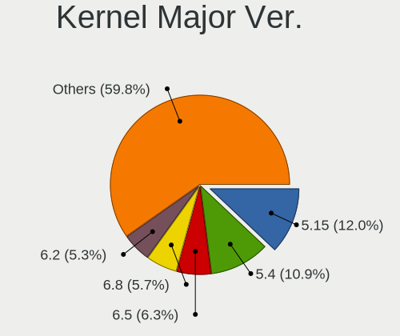
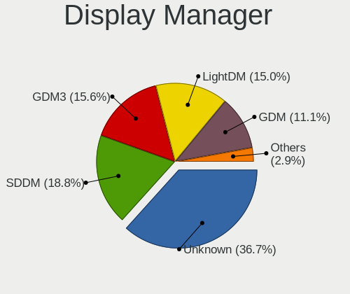
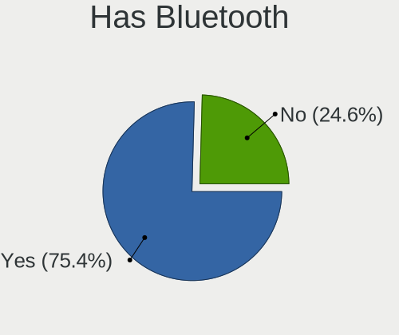
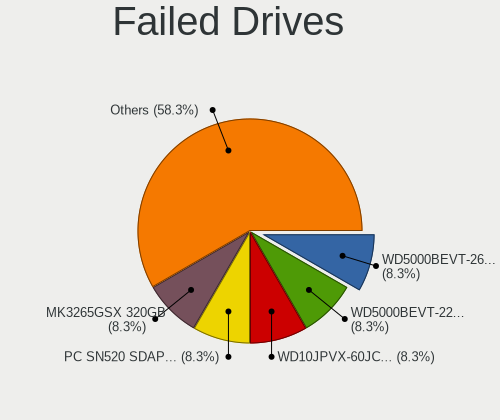
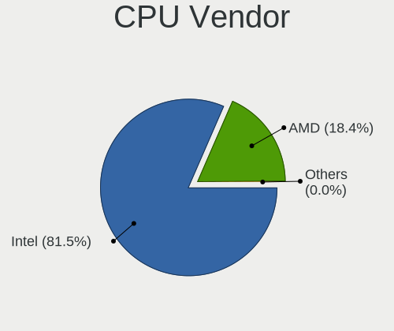
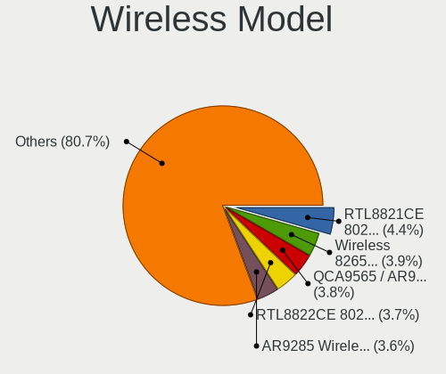
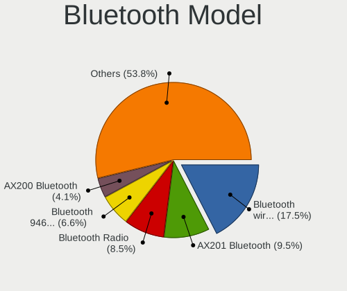
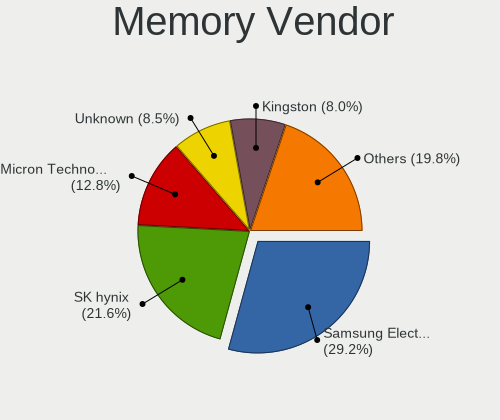

Linux in Italy - Tested Hardware & Statistics (Notebooks)
---------------------------------------------------------

A project to collect tested hardware configurations for Linux in Italy.

Anyone can contribute to this report by the [hw-probe](https://github.com/linuxhw/hw-probe) tool:

    sudo -E hw-probe -all -upload

Please contribute! Especially if your hardware is rare.

Contents
--------

* [ Test Cases ](#test-cases)

* [ System ](#system)
  - [ OS                       ](#os)
  - [ OS Family                ](#os-family)
  - [ Kernel                   ](#kernel)
  - [ Kernel Family            ](#kernel-family)
  - [ Kernel Major Ver.        ](#kernel-major-ver)
  - [ Arch                     ](#arch)
  - [ DE                       ](#de)
  - [ Display Server           ](#display-server)
  - [ Display Manager          ](#display-manager)
  - [ OS Lang                  ](#os-lang)
  - [ Boot Mode                ](#boot-mode)
  - [ Filesystem               ](#filesystem)
  - [ Part. scheme             ](#part-scheme)
  - [ Dual Boot with Linux/BSD ](#dual-boot-with-linuxbsd)
  - [ Dual Boot (Win)          ](#dual-boot-win)

* [ Board ](#board)
  - [ Vendor                   ](#vendor)
  - [ Model                    ](#model)
  - [ Model Family             ](#model-family)
  - [ MFG Year                 ](#mfg-year)
  - [ Form Factor              ](#form-factor)
  - [ Secure Boot              ](#secure-boot)
  - [ Coreboot                 ](#coreboot)
  - [ RAM Size                 ](#ram-size)
  - [ RAM Used                 ](#ram-used)
  - [ Total Drives             ](#total-drives)
  - [ Has CD-ROM               ](#has-cd-rom)
  - [ Has Ethernet             ](#has-ethernet)
  - [ Has WiFi                 ](#has-wifi)
  - [ Has Bluetooth            ](#has-bluetooth)

* [ Location ](#location)
  - [ Country                  ](#country)
  - [ City                     ](#city)

* [ Drives ](#drives)
  - [ Drive Vendor             ](#drive-vendor)
  - [ Drive Model              ](#drive-model)
  - [ HDD Vendor               ](#hdd-vendor)
  - [ SSD Vendor               ](#ssd-vendor)
  - [ Drive Kind               ](#drive-kind)
  - [ Drive Connector          ](#drive-connector)
  - [ Drive Size               ](#drive-size)
  - [ Space Total              ](#space-total)
  - [ Space Used               ](#space-used)
  - [ Malfunc. Drives          ](#malfunc-drives)
  - [ Malfunc. Drive Vendor    ](#malfunc-drive-vendor)
  - [ Malfunc. HDD Vendor      ](#malfunc-hdd-vendor)
  - [ Malfunc. Drive Kind      ](#malfunc-drive-kind)
  - [ Failed Drives            ](#failed-drives)
  - [ Failed Drive Vendor      ](#failed-drive-vendor)
  - [ Drive Status             ](#drive-status)

* [ Storage controller ](#storage-controller)
  - [ Storage Vendor           ](#storage-vendor)
  - [ Storage Model            ](#storage-model)
  - [ Storage Kind             ](#storage-kind)

* [ Processor ](#processor)
  - [ CPU Vendor               ](#cpu-vendor)
  - [ CPU Model                ](#cpu-model)
  - [ CPU Model Family         ](#cpu-model-family)
  - [ CPU Cores                ](#cpu-cores)
  - [ CPU Sockets              ](#cpu-sockets)
  - [ CPU Threads              ](#cpu-threads)
  - [ CPU Op-Modes             ](#cpu-op-modes)
  - [ CPU Microcode            ](#cpu-microcode)
  - [ CPU Microarch            ](#cpu-microarch)

* [ Graphics ](#graphics)
  - [ GPU Vendor               ](#gpu-vendor)
  - [ GPU Model                ](#gpu-model)
  - [ GPU Combo                ](#gpu-combo)
  - [ GPU Driver               ](#gpu-driver)
  - [ GPU Memory               ](#gpu-memory)

* [ Monitor ](#monitor)
  - [ Monitor Vendor           ](#monitor-vendor)
  - [ Monitor Model            ](#monitor-model)
  - [ Monitor Resolution       ](#monitor-resolution)
  - [ Monitor Diagonal         ](#monitor-diagonal)
  - [ Monitor Width            ](#monitor-width)
  - [ Aspect Ratio             ](#aspect-ratio)
  - [ Monitor Area             ](#monitor-area)
  - [ Pixel Density            ](#pixel-density)
  - [ Multiple Monitors        ](#multiple-monitors)

* [ Network ](#network)
  - [ Net Controller Vendor    ](#net-controller-vendor)
  - [ Net Controller Model     ](#net-controller-model)
  - [ Wireless Vendor          ](#wireless-vendor)
  - [ Wireless Model           ](#wireless-model)
  - [ Ethernet Vendor          ](#ethernet-vendor)
  - [ Ethernet Model           ](#ethernet-model)
  - [ Net Controller Kind      ](#net-controller-kind)
  - [ Used Controller          ](#used-controller)
  - [ NICs                     ](#nics)
  - [ IPv6                     ](#ipv6)

* [ Bluetooth ](#bluetooth)
  - [ Bluetooth Vendor         ](#bluetooth-vendor)
  - [ Bluetooth Model          ](#bluetooth-model)

* [ Sound ](#sound)
  - [ Sound Vendor             ](#sound-vendor)
  - [ Sound Model              ](#sound-model)

* [ Memory ](#memory)
  - [ Memory Vendor            ](#memory-vendor)
  - [ Memory Model             ](#memory-model)
  - [ Memory Kind              ](#memory-kind)
  - [ Memory Form Factor       ](#memory-form-factor)
  - [ Memory Size              ](#memory-size)
  - [ Memory Speed             ](#memory-speed)

* [ Printers & scanners ](#printers--scanners)
  - [ Printer Vendor           ](#printer-vendor)
  - [ Printer Model            ](#printer-model)
  - [ Scanner Vendor           ](#scanner-vendor)
  - [ Scanner Model            ](#scanner-model)

* [ Camera ](#camera)
  - [ Camera Vendor            ](#camera-vendor)
  - [ Camera Model             ](#camera-model)

* [ Security ](#security)
  - [ Fingerprint Vendor       ](#fingerprint-vendor)
  - [ Fingerprint Model        ](#fingerprint-model)
  - [ Chipcard Vendor          ](#chipcard-vendor)
  - [ Chipcard Model           ](#chipcard-model)

* [ Unsupported ](#unsupported)
  - [ Unsupported Devices      ](#unsupported-devices)
  - [ Unsupported Device Types ](#unsupported-device-types)

Test Cases
----------

Total: 4290

| Vendor        | Model                       | Probe                                                      | Date         |
|---------------|-----------------------------|------------------------------------------------------------|--------------|
| Lenovo        | ThinkPad L540 20AUA13S00    | [04ffca5382](https://linux-hardware.org/?probe=04ffca5382) | Oct 01, 2022 |
| HP            | 250 G3                      | [753ef53a5a](https://linux-hardware.org/?probe=753ef53a5a) | Oct 01, 2022 |
| Lenovo        | V130-15IKB 81HN             | [44a4ed90e1](https://linux-hardware.org/?probe=44a4ed90e1) | Oct 01, 2022 |
| Fujitsu       | LIFEBOOK S904               | [c9c83f0112](https://linux-hardware.org/?probe=c9c83f0112) | Oct 01, 2022 |
| SANTECH       | NHx0DB,DE                   | [6dc0730b6a](https://linux-hardware.org/?probe=6dc0730b6a) | Oct 01, 2022 |
| HP            | Laptop 15s-eq2xxx           | [5983281c3f](https://linux-hardware.org/?probe=5983281c3f) | Oct 01, 2022 |
| ASUSTek       | ASUS EXPERTBOOK B1500CEA... | [5bfc8f0a7d](https://linux-hardware.org/?probe=5bfc8f0a7d) | Sep 30, 2022 |
| SANTECH       | NHx0EH_EJ_EK                | [01366bbeb7](https://linux-hardware.org/?probe=01366bbeb7) | Sep 30, 2022 |
| HP            | Pavilion Laptop 15-eg0xx... | [76dae4e704](https://linux-hardware.org/?probe=76dae4e704) | Sep 30, 2022 |
| HP            | Laptop 15s-eq3xxx           | [b15bae8e77](https://linux-hardware.org/?probe=b15bae8e77) | Sep 30, 2022 |
| HP            | Laptop 15s-eq3xxx           | [126b8dd3ec](https://linux-hardware.org/?probe=126b8dd3ec) | Sep 30, 2022 |
| Lenovo        | ThinkPad X1 Carbon Gen 1... | [2c6b161d0f](https://linux-hardware.org/?probe=2c6b161d0f) | Sep 29, 2022 |
| ASUSTek       | ROG Strix G713RW_G713RW     | [a783a36e7e](https://linux-hardware.org/?probe=a783a36e7e) | Sep 29, 2022 |
| HP            | ProBook 440 G7              | [99f729e814](https://linux-hardware.org/?probe=99f729e814) | Sep 29, 2022 |
| ASUSTek       | ROG Strix G713RW_G713RW     | [f5ddf4a2b4](https://linux-hardware.org/?probe=f5ddf4a2b4) | Sep 29, 2022 |
| ASUSTek       | VivoBook_ASUSLaptop X515... | [cd08dccca4](https://linux-hardware.org/?probe=cd08dccca4) | Sep 28, 2022 |
| Lenovo        | IdeaPad Z510 20287          | [78badcba3c](https://linux-hardware.org/?probe=78badcba3c) | Sep 28, 2022 |
| HP            | Pavilion Laptop 14-ce2xx... | [6eab6db53b](https://linux-hardware.org/?probe=6eab6db53b) | Sep 27, 2022 |
| ASUSTek       | VivoBook_ASUSLaptop X521... | [47acb38827](https://linux-hardware.org/?probe=47acb38827) | Sep 27, 2022 |
| Acer          | TravelMate 5730             | [88b501ffbe](https://linux-hardware.org/?probe=88b501ffbe) | Sep 27, 2022 |
| Lenovo        | V15-ADA 82C7                | [e53b87c0fd](https://linux-hardware.org/?probe=e53b87c0fd) | Sep 26, 2022 |
| Fujitsu       | LIFEBOOK A544               | [6e4694775c](https://linux-hardware.org/?probe=6e4694775c) | Sep 26, 2022 |
| Lenovo        | ThinkPad T480s 20L7001PI... | [31235a45b5](https://linux-hardware.org/?probe=31235a45b5) | Sep 26, 2022 |
| Acer          | Aspire E1-570G              | [ed657bfbb6](https://linux-hardware.org/?probe=ed657bfbb6) | Sep 26, 2022 |
| Razer         | Blade 15 Base Model (Ear... | [1b4db0c30c](https://linux-hardware.org/?probe=1b4db0c30c) | Sep 26, 2022 |
| Acer          | Aspire A515-51G             | [c45069d56d](https://linux-hardware.org/?probe=c45069d56d) | Sep 26, 2022 |
| Acer          | Aspire A515-51G             | [3441e0cac3](https://linux-hardware.org/?probe=3441e0cac3) | Sep 26, 2022 |
| Razer         | Blade 14 - RZ09-0370        | [a5e00e04bd](https://linux-hardware.org/?probe=a5e00e04bd) | Sep 25, 2022 |
| Unknown       | A116C1_1                    | [470cd9917c](https://linux-hardware.org/?probe=470cd9917c) | Sep 25, 2022 |
| ASUSTek       | VivoBook_ASUSLaptop X340... | [7be473c3c6](https://linux-hardware.org/?probe=7be473c3c6) | Sep 25, 2022 |
| Lenovo        | IdeaPad3-15ADA05 81W1       | [d2192ee6f0](https://linux-hardware.org/?probe=d2192ee6f0) | Sep 25, 2022 |
| Lenovo        | ThinkPad X270 W10DG 20K5... | [d277bf47ec](https://linux-hardware.org/?probe=d277bf47ec) | Sep 25, 2022 |
| Lenovo        | ThinkPad T440p              | [270cf10219](https://linux-hardware.org/?probe=270cf10219) | Sep 25, 2022 |
| Lenovo        | ThinkPad T470 20JNS08H00    | [ff1dd51829](https://linux-hardware.org/?probe=ff1dd51829) | Sep 25, 2022 |
| Apple         | MacBookPro16,1              | [6e7d310781](https://linux-hardware.org/?probe=6e7d310781) | Sep 25, 2022 |
| Lenovo        | ThinkBook 13s G3 ACN 20Y... | [96f4499ec5](https://linux-hardware.org/?probe=96f4499ec5) | Sep 25, 2022 |
| HP            | 255 G5                      | [2a8f595510](https://linux-hardware.org/?probe=2a8f595510) | Sep 24, 2022 |
| Razer         | Blade 15 Base Model (Ear... | [029c059963](https://linux-hardware.org/?probe=029c059963) | Sep 24, 2022 |
| Dell          | Vostro V131                 | [809655978a](https://linux-hardware.org/?probe=809655978a) | Sep 24, 2022 |
| HUAWEI        | BOHB-WAX9                   | [18a4d2bb72](https://linux-hardware.org/?probe=18a4d2bb72) | Sep 23, 2022 |
| HP            | 250 G4                      | [5d4c56fe14](https://linux-hardware.org/?probe=5d4c56fe14) | Sep 23, 2022 |
| Fujitsu       | LIFEBOOK A544               | [648fb5c63e](https://linux-hardware.org/?probe=648fb5c63e) | Sep 22, 2022 |
| Dell          | Latitude 5501               | [f40716377a](https://linux-hardware.org/?probe=f40716377a) | Sep 22, 2022 |
| Lenovo        | G50-45 80E3                 | [41af175db4](https://linux-hardware.org/?probe=41af175db4) | Sep 21, 2022 |
| Unknown       | Unknown                     | [af65739ccc](https://linux-hardware.org/?probe=af65739ccc) | Sep 21, 2022 |
| Dell          | Latitude E5530 non-vPro     | [6352f6fb82](https://linux-hardware.org/?probe=6352f6fb82) | Sep 21, 2022 |
| Lenovo        | ThinkPad P1 Gen 4i 20Y3C... | [8c6fcedcd5](https://linux-hardware.org/?probe=8c6fcedcd5) | Sep 21, 2022 |
| ASUSTek       | GL553VD                     | [e6cb381fd2](https://linux-hardware.org/?probe=e6cb381fd2) | Sep 21, 2022 |
| HP            | Pavilion 15                 | [56a10ce74c](https://linux-hardware.org/?probe=56a10ce74c) | Sep 21, 2022 |
| Timi          | A35S                        | [a57a688f31](https://linux-hardware.org/?probe=a57a688f31) | Sep 21, 2022 |
| Intel         | Kabylake Platform           | [8b1c5eb5bf](https://linux-hardware.org/?probe=8b1c5eb5bf) | Sep 21, 2022 |
| HP            | Folio 13                    | [eafa8204e9](https://linux-hardware.org/?probe=eafa8204e9) | Sep 20, 2022 |
| ASUSTek       | X541UAK                     | [b5a6e3ca5e](https://linux-hardware.org/?probe=b5a6e3ca5e) | Sep 20, 2022 |
| HP            | Pavilion Power Laptop 15... | [360e860fb1](https://linux-hardware.org/?probe=360e860fb1) | Sep 20, 2022 |
| HP            | EliteBook 840 14 inch G9... | [450a86c900](https://linux-hardware.org/?probe=450a86c900) | Sep 20, 2022 |
| Lenovo        | ThinkPad P1 Gen 3 20TJS2... | [32120dfcd4](https://linux-hardware.org/?probe=32120dfcd4) | Sep 20, 2022 |
| HUAWEI        | BOM-WXX9                    | [d30c6c5b9b](https://linux-hardware.org/?probe=d30c6c5b9b) | Sep 20, 2022 |
| HP            | Pavilion Gaming Laptop 1... | [8003baae8c](https://linux-hardware.org/?probe=8003baae8c) | Sep 19, 2022 |
| HUAWEI        | BOM-WXX9                    | [f2906f8b8d](https://linux-hardware.org/?probe=f2906f8b8d) | Sep 19, 2022 |
| Lenovo        | IdeaPad 3 15IML05 81WB      | [9b14ec4438](https://linux-hardware.org/?probe=9b14ec4438) | Sep 19, 2022 |
| MSI           | Prestige 14Evo A11M         | [4b412dd569](https://linux-hardware.org/?probe=4b412dd569) | Sep 19, 2022 |
| HP            | G42                         | [3f584eb1af](https://linux-hardware.org/?probe=3f584eb1af) | Sep 19, 2022 |
| Dell          | Latitude 5420               | [2d9d6512bc](https://linux-hardware.org/?probe=2d9d6512bc) | Sep 19, 2022 |
| Acer          | Aspire A515-51G             | [3f987553d9](https://linux-hardware.org/?probe=3f987553d9) | Sep 18, 2022 |
| Microtech     | CoreBook                    | [6b1a53d2c2](https://linux-hardware.org/?probe=6b1a53d2c2) | Sep 18, 2022 |
| HP            | EliteBook 850 G3            | [6a2f2c9841](https://linux-hardware.org/?probe=6a2f2c9841) | Sep 18, 2022 |
| Lenovo        | ThinkPad T440p              | [bf397424f3](https://linux-hardware.org/?probe=bf397424f3) | Sep 18, 2022 |
| Lenovo        | ThinkBook 14 G2 ITL 20VD    | [f40cc0db8a](https://linux-hardware.org/?probe=f40cc0db8a) | Sep 18, 2022 |
| Lenovo        | IdeaPad 3 15IML05 81WB      | [751df30316](https://linux-hardware.org/?probe=751df30316) | Sep 18, 2022 |
| HP            | ProBook 450 G8 Notebook ... | [87c3b99589](https://linux-hardware.org/?probe=87c3b99589) | Sep 18, 2022 |
| MSI           | Prestige 15 A12UC           | [48437ccf94](https://linux-hardware.org/?probe=48437ccf94) | Sep 17, 2022 |
| NEC Comput... | PC-VY21AEZ75                | [a24d79ffc2](https://linux-hardware.org/?probe=a24d79ffc2) | Sep 17, 2022 |
| MSI           | Prestige 14Evo A11M         | [f474823b5a](https://linux-hardware.org/?probe=f474823b5a) | Sep 17, 2022 |
| Lenovo        | G50-45 80E3                 | [6c5b0c0659](https://linux-hardware.org/?probe=6c5b0c0659) | Sep 17, 2022 |
| HP            | 250 G8 Notebook PC          | [6dd18a5a96](https://linux-hardware.org/?probe=6dd18a5a96) | Sep 17, 2022 |
| MSI           | Delta 15 A5EFK              | [382e0f70a3](https://linux-hardware.org/?probe=382e0f70a3) | Sep 17, 2022 |
| Lenovo        | G50-45 80E3                 | [8c355ea88e](https://linux-hardware.org/?probe=8c355ea88e) | Sep 17, 2022 |
| Dell          | XPS 15 9560                 | [4a903b438f](https://linux-hardware.org/?probe=4a903b438f) | Sep 17, 2022 |
| HP            | Unknown                     | [e87c925eb0](https://linux-hardware.org/?probe=e87c925eb0) | Sep 16, 2022 |
| HP            | Laptop 15s-fq2xxx           | [e7bb3017fb](https://linux-hardware.org/?probe=e7bb3017fb) | Sep 16, 2022 |
| HP            | Laptop 15s-fq2xxx           | [c81727b775](https://linux-hardware.org/?probe=c81727b775) | Sep 16, 2022 |
| Lenovo        | G50-45 80E3                 | [59c06bcd6f](https://linux-hardware.org/?probe=59c06bcd6f) | Sep 16, 2022 |
| Dell          | Inspiron 15-3552            | [583d7c550e](https://linux-hardware.org/?probe=583d7c550e) | Sep 16, 2022 |
| Acer          | Swift SF314-54              | [c3b076c416](https://linux-hardware.org/?probe=c3b076c416) | Sep 15, 2022 |
| Chuwi         | CoreBook X                  | [e59a625390](https://linux-hardware.org/?probe=e59a625390) | Sep 15, 2022 |
| Intel         | Kabylake Platform           | [9889cc50de](https://linux-hardware.org/?probe=9889cc50de) | Sep 14, 2022 |
| Lenovo        | ThinkPad L15 Gen 1 20U4S... | [b7ed5c7f4a](https://linux-hardware.org/?probe=b7ed5c7f4a) | Sep 14, 2022 |
| MSI           | Prestige 14Evo A11M         | [5a69611620](https://linux-hardware.org/?probe=5a69611620) | Sep 13, 2022 |
| MSI           | Prestige 14Evo A11M         | [4c5dc2ec7d](https://linux-hardware.org/?probe=4c5dc2ec7d) | Sep 13, 2022 |
| ASUSTek       | X541UJ                      | [9745e99a08](https://linux-hardware.org/?probe=9745e99a08) | Sep 13, 2022 |
| Dell          | Venue 11 Pro 7140           | [d6fed8866c](https://linux-hardware.org/?probe=d6fed8866c) | Sep 13, 2022 |
| Dell          | XPS 17 9700                 | [24eaecfdd8](https://linux-hardware.org/?probe=24eaecfdd8) | Sep 13, 2022 |
| Apple         | MacBook5,1                  | [8bdaf4361b](https://linux-hardware.org/?probe=8bdaf4361b) | Sep 12, 2022 |
| Toshiba       | PORTEGE Z30-B               | [6b1829aad1](https://linux-hardware.org/?probe=6b1829aad1) | Sep 12, 2022 |
| Toshiba       | PORTEGE Z30-B               | [9ef29f2258](https://linux-hardware.org/?probe=9ef29f2258) | Sep 12, 2022 |
| Apple         | MacBook5,1                  | [be66df4eb9](https://linux-hardware.org/?probe=be66df4eb9) | Sep 12, 2022 |
| Sony          | SVE1512J6EW                 | [69e2400606](https://linux-hardware.org/?probe=69e2400606) | Sep 11, 2022 |
| HP            | ProBook 645 G3              | [0bd9070bee](https://linux-hardware.org/?probe=0bd9070bee) | Sep 11, 2022 |
| Valve         | Jupiter                     | [694e9a60ad](https://linux-hardware.org/?probe=694e9a60ad) | Sep 11, 2022 |
| HP            | G42                         | [092b9e2c38](https://linux-hardware.org/?probe=092b9e2c38) | Sep 11, 2022 |
| HP            | 255 G8 Notebook PC          | [d2c057ed6e](https://linux-hardware.org/?probe=d2c057ed6e) | Sep 11, 2022 |
| HP            | Presario CQ56               | [ccc7d97678](https://linux-hardware.org/?probe=ccc7d97678) | Sep 11, 2022 |
| HP            | 255 G8 Notebook PC          | [cca78f4488](https://linux-hardware.org/?probe=cca78f4488) | Sep 11, 2022 |
| HP            | Pavilion dv6000 (RP986EA... | [f20de20683](https://linux-hardware.org/?probe=f20de20683) | Sep 11, 2022 |
| Apple         | MacBookPro12,1              | [4bb5badf61](https://linux-hardware.org/?probe=4bb5badf61) | Sep 10, 2022 |
| Lenovo        | ThinkPad L380 20M6S48000    | [74102b95cb](https://linux-hardware.org/?probe=74102b95cb) | Sep 10, 2022 |
| ASUSTek       | UX310UQK                    | [dc650f1d77](https://linux-hardware.org/?probe=dc650f1d77) | Sep 10, 2022 |
| Dell          | Venue 11 Pro 7140           | [a4ea248b39](https://linux-hardware.org/?probe=a4ea248b39) | Sep 10, 2022 |
| Dell          | Inspiron 16 5625            | [5ae1f0d923](https://linux-hardware.org/?probe=5ae1f0d923) | Sep 10, 2022 |
| Dell          | Venue 11 Pro 7140           | [08aadcd875](https://linux-hardware.org/?probe=08aadcd875) | Sep 10, 2022 |
| ASUSTek       | ZenBook UX333FN_UX333FN     | [498a2244e4](https://linux-hardware.org/?probe=498a2244e4) | Sep 09, 2022 |
| Apple         | MacBookPro11,2              | [47708e7772](https://linux-hardware.org/?probe=47708e7772) | Sep 09, 2022 |
| Apple         | MacBookPro11,4              | [c5d5b88740](https://linux-hardware.org/?probe=c5d5b88740) | Sep 09, 2022 |
| Dell          | Latitude 7490               | [189b1d9ab2](https://linux-hardware.org/?probe=189b1d9ab2) | Sep 09, 2022 |
| Dell          | Latitude E6230              | [30d4c452fe](https://linux-hardware.org/?probe=30d4c452fe) | Sep 09, 2022 |
| Dell          | System XPS L702X            | [fa770ba044](https://linux-hardware.org/?probe=fa770ba044) | Sep 09, 2022 |
| Lenovo        | ThinkPad X1 Carbon Gen 9... | [cada1ee58d](https://linux-hardware.org/?probe=cada1ee58d) | Sep 09, 2022 |
| Acer          | Aspire 5715Z                | [614ae0addd](https://linux-hardware.org/?probe=614ae0addd) | Sep 09, 2022 |
| Notebook      | W230SS                      | [9ea483f3dd](https://linux-hardware.org/?probe=9ea483f3dd) | Sep 09, 2022 |
| Notebook      | PD5x_7xPNP_PNN_PNT          | [b4e36a92c7](https://linux-hardware.org/?probe=b4e36a92c7) | Sep 08, 2022 |
| Dell          | XPS 15 7590                 | [57cbaefc6e](https://linux-hardware.org/?probe=57cbaefc6e) | Sep 08, 2022 |
| Acer          | Aspire 5736Z                | [820b817bff](https://linux-hardware.org/?probe=820b817bff) | Sep 08, 2022 |
| Dell          | Latitude E5450              | [305ef21301](https://linux-hardware.org/?probe=305ef21301) | Sep 08, 2022 |
| Lenovo        | ThinkPad Edge E540 20C60... | [7cf6479781](https://linux-hardware.org/?probe=7cf6479781) | Sep 08, 2022 |
| LG Electro... | 17Z90P-G.AA86D              | [1f304e9792](https://linux-hardware.org/?probe=1f304e9792) | Sep 07, 2022 |
| Notebook      | PD5x_7xPNP_PNN_PNT          | [ac71ea732f](https://linux-hardware.org/?probe=ac71ea732f) | Sep 07, 2022 |
| HP            | Pavilion dv7                | [4a39ae67d5](https://linux-hardware.org/?probe=4a39ae67d5) | Sep 07, 2022 |
| Dell          | XPS 13 9305                 | [bc21b4b2a8](https://linux-hardware.org/?probe=bc21b4b2a8) | Sep 07, 2022 |
| ASUSTek       | X541UJ                      | [471a57d688](https://linux-hardware.org/?probe=471a57d688) | Sep 07, 2022 |
| ASUSTek       | X541UJ                      | [84b26ca406](https://linux-hardware.org/?probe=84b26ca406) | Sep 07, 2022 |
| Dell          | Inspiron 5584               | [3691775658](https://linux-hardware.org/?probe=3691775658) | Sep 07, 2022 |
| Toshiba       | Satellite C660              | [e7ad5166eb](https://linux-hardware.org/?probe=e7ad5166eb) | Sep 07, 2022 |
| Lenovo        | ThinkBook 15-IIL 20SM       | [72ba31c33a](https://linux-hardware.org/?probe=72ba31c33a) | Sep 07, 2022 |
| Lenovo        | ThinkPad Edge E531 6885D... | [673c26165e](https://linux-hardware.org/?probe=673c26165e) | Sep 07, 2022 |
| MSI           | Modern 14 B11MOL            | [1ce0bfd512](https://linux-hardware.org/?probe=1ce0bfd512) | Sep 06, 2022 |
| HP            | Pavilion Laptop 15-cs3xx... | [ff127ee255](https://linux-hardware.org/?probe=ff127ee255) | Sep 06, 2022 |
| ASUSTek       | P751JF                      | [6f3898fe12](https://linux-hardware.org/?probe=6f3898fe12) | Sep 06, 2022 |
| Lenovo        | ThinkPad Edge E530c 3366... | [d20b550fd6](https://linux-hardware.org/?probe=d20b550fd6) | Sep 06, 2022 |
| HP            | Pavilion Laptop 15-eg0xx... | [76c716061a](https://linux-hardware.org/?probe=76c716061a) | Sep 06, 2022 |
| Lenovo        | ThinkPad T480s 20L8SC160... | [b860019cf4](https://linux-hardware.org/?probe=b860019cf4) | Sep 06, 2022 |
| HP            | 255 G8 Notebook PC          | [5c53e30fe6](https://linux-hardware.org/?probe=5c53e30fe6) | Sep 06, 2022 |
| ASUSTek       | X555LAB                     | [b10937286d](https://linux-hardware.org/?probe=b10937286d) | Sep 06, 2022 |
| Acer          | Aspire 5920G                | [af0e5553e9](https://linux-hardware.org/?probe=af0e5553e9) | Sep 05, 2022 |
| Lenovo        | ThinkPad X1 Carbon 6th 2... | [dd3b771e55](https://linux-hardware.org/?probe=dd3b771e55) | Sep 05, 2022 |
| Gateway       | NS30                        | [2ade42aacf](https://linux-hardware.org/?probe=2ade42aacf) | Sep 05, 2022 |
| ASUSTek       | VivoBook_ASUSLaptop X580... | [ef9be6aaac](https://linux-hardware.org/?probe=ef9be6aaac) | Sep 05, 2022 |
| Dell          | Inspiron 16 5625            | [d38282759b](https://linux-hardware.org/?probe=d38282759b) | Sep 05, 2022 |
| Dell          | Latitude E6520              | [e37ba07a92](https://linux-hardware.org/?probe=e37ba07a92) | Sep 05, 2022 |
| HP            | 250 G8 Notebook PC          | [312e65fd07](https://linux-hardware.org/?probe=312e65fd07) | Sep 05, 2022 |
| Samsung       | 270E5G/270E5U               | [0300dd1a2d](https://linux-hardware.org/?probe=0300dd1a2d) | Sep 05, 2022 |
| HP            | Laptop 15s-eq2xxx           | [92b56566ae](https://linux-hardware.org/?probe=92b56566ae) | Sep 05, 2022 |
| Lenovo        | IdeaPad 3 15ARE05 81W4      | [999dde8580](https://linux-hardware.org/?probe=999dde8580) | Sep 05, 2022 |
| HP            | Laptop 15s-eq2xxx           | [11eddd9f6d](https://linux-hardware.org/?probe=11eddd9f6d) | Sep 05, 2022 |
| Lenovo        | Yoga Slim 7 14ARE05 82A2    | [11bdade1e5](https://linux-hardware.org/?probe=11bdade1e5) | Sep 05, 2022 |
| Lenovo        | ThinkPad T14s Gen 2a 20X... | [7eba2962c6](https://linux-hardware.org/?probe=7eba2962c6) | Sep 05, 2022 |
| Lenovo        | ThinkPad T14s Gen 2a 20X... | [92d04feeca](https://linux-hardware.org/?probe=92d04feeca) | Sep 05, 2022 |
| Toshiba       | Satellite Pro L450          | [8cc36d7338](https://linux-hardware.org/?probe=8cc36d7338) | Sep 05, 2022 |
| HP            | G62                         | [a3f84f3bf8](https://linux-hardware.org/?probe=a3f84f3bf8) | Sep 05, 2022 |
| HP            | 255 G7 Notebook PC          | [dd775ffe8f](https://linux-hardware.org/?probe=dd775ffe8f) | Sep 05, 2022 |
| Acer          | Aspire A515-45              | [89baeb107f](https://linux-hardware.org/?probe=89baeb107f) | Sep 04, 2022 |
| Toshiba       | Satellite L50-B             | [1aedf1fdc1](https://linux-hardware.org/?probe=1aedf1fdc1) | Sep 04, 2022 |
| Samsung       | X420/X520                   | [a8ca7bb005](https://linux-hardware.org/?probe=a8ca7bb005) | Sep 04, 2022 |
| HP            | Pavilion 15                 | [194bb33f3d](https://linux-hardware.org/?probe=194bb33f3d) | Sep 04, 2022 |
| Lenovo        | IdeaPad S540-14IML 81NF     | [57f8a4e96b](https://linux-hardware.org/?probe=57f8a4e96b) | Sep 04, 2022 |
| Lenovo        | IdeaPad Z510 20287          | [f0bcadac2f](https://linux-hardware.org/?probe=f0bcadac2f) | Sep 04, 2022 |
| Acer          | Swift SF314-41              | [aa90cb0d30](https://linux-hardware.org/?probe=aa90cb0d30) | Sep 04, 2022 |
| HUAWEI        | KLVD-WXX9                   | [cc383de755](https://linux-hardware.org/?probe=cc383de755) | Sep 04, 2022 |
| HUAWEI        | NBLB-WAX9N                  | [0e4f12b377](https://linux-hardware.org/?probe=0e4f12b377) | Sep 04, 2022 |
| Dell          | XPS 15 9500                 | [ea5f9662d7](https://linux-hardware.org/?probe=ea5f9662d7) | Sep 04, 2022 |
| Dell          | Latitude 5420               | [b236b791c1](https://linux-hardware.org/?probe=b236b791c1) | Sep 04, 2022 |
| TUXEDO        | Book XP14 Gen12             | [cfb0fb9451](https://linux-hardware.org/?probe=cfb0fb9451) | Sep 04, 2022 |
| Acer          | TravelMate P253             | [828da93c00](https://linux-hardware.org/?probe=828da93c00) | Sep 04, 2022 |
| ASUSTek       | ASUSPRO P3540FA_P3540FA     | [f8f2a6263a](https://linux-hardware.org/?probe=f8f2a6263a) | Sep 04, 2022 |
| Timi          | TM1701                      | [e766bf8915](https://linux-hardware.org/?probe=e766bf8915) | Sep 04, 2022 |
| Lenovo        | ThinkPad E14 Gen 2 20TAC... | [6bfcf13e01](https://linux-hardware.org/?probe=6bfcf13e01) | Sep 04, 2022 |
| Toshiba       | Satellite Pro C660          | [4e2e6fe4ea](https://linux-hardware.org/?probe=4e2e6fe4ea) | Sep 03, 2022 |
| Timi          | TM1701                      | [f23c551375](https://linux-hardware.org/?probe=f23c551375) | Sep 03, 2022 |
| Lenovo        | ThinkPad T460s 20FAS30D0... | [b75636bf8b](https://linux-hardware.org/?probe=b75636bf8b) | Sep 03, 2022 |
| ASUSTek       | K61IC                       | [d85b0c9b4f](https://linux-hardware.org/?probe=d85b0c9b4f) | Sep 03, 2022 |
| Dell          | XPS 15 9520                 | [39e1d43301](https://linux-hardware.org/?probe=39e1d43301) | Sep 03, 2022 |
| ASUSTek       | X551MA                      | [84339ff991](https://linux-hardware.org/?probe=84339ff991) | Sep 03, 2022 |
| Acer          | Swift SF314-52              | [dfcde87ea3](https://linux-hardware.org/?probe=dfcde87ea3) | Sep 03, 2022 |
| Dell          | Vostro 1320                 | [e66853cc37](https://linux-hardware.org/?probe=e66853cc37) | Sep 03, 2022 |
| Dell          | XPS 15 9570                 | [b313706909](https://linux-hardware.org/?probe=b313706909) | Sep 03, 2022 |
| Lenovo        | IdeaPad 5 14ARE05 81YM      | [05221c6c18](https://linux-hardware.org/?probe=05221c6c18) | Sep 03, 2022 |
| ASUSTek       | UX310UQK                    | [ed392e6b79](https://linux-hardware.org/?probe=ed392e6b79) | Sep 03, 2022 |
| HUAWEI        | VLT-WX0                     | [f9881e0b9b](https://linux-hardware.org/?probe=f9881e0b9b) | Sep 03, 2022 |
| PC Special... | 14 Fusion IV                | [dd9ed93b55](https://linux-hardware.org/?probe=dd9ed93b55) | Sep 03, 2022 |
| HP            | Laptop 15-da0xxx            | [5c11f5477e](https://linux-hardware.org/?probe=5c11f5477e) | Sep 03, 2022 |
| Schenker      | XMG NEO (CZN/E21)           | [0b6cccf796](https://linux-hardware.org/?probe=0b6cccf796) | Sep 03, 2022 |
| Apple         | MacBook5,1                  | [0f5aab705f](https://linux-hardware.org/?probe=0f5aab705f) | Sep 03, 2022 |
| ASUSTek       | GL503VM                     | [43cbef1764](https://linux-hardware.org/?probe=43cbef1764) | Sep 03, 2022 |
| Acer          | Aspire 5930                 | [db2b212059](https://linux-hardware.org/?probe=db2b212059) | Sep 03, 2022 |
| Acer          | Aspire V5-561G              | [eddf0455cb](https://linux-hardware.org/?probe=eddf0455cb) | Sep 03, 2022 |
| Acer          | Aspire V5-561G              | [83c69a491a](https://linux-hardware.org/?probe=83c69a491a) | Sep 03, 2022 |
| MSI           | GP72MVR 7RFX                | [f370d7bbc3](https://linux-hardware.org/?probe=f370d7bbc3) | Sep 03, 2022 |
| Google        | Reks                        | [d88eecb32d](https://linux-hardware.org/?probe=d88eecb32d) | Sep 03, 2022 |
| Dell          | XPS 15 9570                 | [b73e153667](https://linux-hardware.org/?probe=b73e153667) | Sep 03, 2022 |
| Timi          | RedmiBook Pro 15S           | [74c07405db](https://linux-hardware.org/?probe=74c07405db) | Sep 03, 2022 |
| HP            | Stream Notebook PC 13       | [d6c9e33a55](https://linux-hardware.org/?probe=d6c9e33a55) | Sep 03, 2022 |
| MSI           | Modern 14 B11MOL            | [92d3e81be7](https://linux-hardware.org/?probe=92d3e81be7) | Sep 03, 2022 |
| Dell          | XPS 15 9510                 | [3e057c7bbb](https://linux-hardware.org/?probe=3e057c7bbb) | Sep 03, 2022 |
| ASUSTek       | ROG Zephyrus G15 GA503QS... | [cec0b91aa9](https://linux-hardware.org/?probe=cec0b91aa9) | Sep 03, 2022 |
| Dell          | XPS 13 9350                 | [eb732461f4](https://linux-hardware.org/?probe=eb732461f4) | Sep 03, 2022 |
| Dell          | Precision M6800             | [67d98f2139](https://linux-hardware.org/?probe=67d98f2139) | Sep 03, 2022 |
| Dell          | XPS 13 9350                 | [72ae2ba843](https://linux-hardware.org/?probe=72ae2ba843) | Sep 03, 2022 |
| HP            | Notebook                    | [a3b180cbb5](https://linux-hardware.org/?probe=a3b180cbb5) | Sep 03, 2022 |
| Dell          | Inspiron 7720               | [0749c352d0](https://linux-hardware.org/?probe=0749c352d0) | Sep 03, 2022 |
| Dell          | Inspiron 5570               | [6ab0a9ea7e](https://linux-hardware.org/?probe=6ab0a9ea7e) | Sep 03, 2022 |
| Lenovo        | ThinkPad E14 20RA001JIX     | [30eb9dcb39](https://linux-hardware.org/?probe=30eb9dcb39) | Sep 03, 2022 |
| ASUSTek       | X550CL                      | [6e45ea1408](https://linux-hardware.org/?probe=6e45ea1408) | Sep 03, 2022 |
| HP            | EliteBook 2570p             | [506f9da93b](https://linux-hardware.org/?probe=506f9da93b) | Sep 03, 2022 |
| Acer          | Aspire E5-573G              | [cfb1abc54b](https://linux-hardware.org/?probe=cfb1abc54b) | Sep 03, 2022 |
| HP            | 15                          | [48493c0282](https://linux-hardware.org/?probe=48493c0282) | Sep 03, 2022 |
| ASUSTek       | X580VN                      | [fe8f1a7e6f](https://linux-hardware.org/?probe=fe8f1a7e6f) | Sep 03, 2022 |
| HP            | ProBook 6460b               | [6dead72b3a](https://linux-hardware.org/?probe=6dead72b3a) | Sep 03, 2022 |
| Acer          | Extensa 2520                | [842de450ec](https://linux-hardware.org/?probe=842de450ec) | Sep 03, 2022 |
| ASUSTek       | X510UNR                     | [ca761f1ee7](https://linux-hardware.org/?probe=ca761f1ee7) | Sep 03, 2022 |
| HP            | Laptop 15s-eq0xxx           | [da3adfc2ce](https://linux-hardware.org/?probe=da3adfc2ce) | Sep 02, 2022 |
| ASUSTek       | N552VX                      | [a54e425409](https://linux-hardware.org/?probe=a54e425409) | Sep 02, 2022 |
| Lenovo        | G50-45 80E3                 | [a8e1884f32](https://linux-hardware.org/?probe=a8e1884f32) | Sep 02, 2022 |
| HP            | Victus by Laptop 16-d0xx... | [5730a9015f](https://linux-hardware.org/?probe=5730a9015f) | Sep 02, 2022 |
| Lenovo        | G50-45 80E3                 | [8e05735fc7](https://linux-hardware.org/?probe=8e05735fc7) | Sep 02, 2022 |
| HP            | Laptop 17-by4xxx            | [b9502cc4a9](https://linux-hardware.org/?probe=b9502cc4a9) | Sep 02, 2022 |
| HP            | ENVY Laptop 15-ep0xxx       | [93ff04a07b](https://linux-hardware.org/?probe=93ff04a07b) | Sep 01, 2022 |
| Unknown       | Unknown                     | [cba954794c](https://linux-hardware.org/?probe=cba954794c) | Aug 31, 2022 |
| Microtech     | CoreBook                    | [08c3ccbce4](https://linux-hardware.org/?probe=08c3ccbce4) | Aug 29, 2022 |
| ASUSTek       | VivoBook_ASUSLaptop X512... | [fc5f863965](https://linux-hardware.org/?probe=fc5f863965) | Aug 29, 2022 |
| Lenovo        | V15-IGL 82C3                | [9efc7bc8ee](https://linux-hardware.org/?probe=9efc7bc8ee) | Aug 28, 2022 |
| Microtech     | CoreBook                    | [7507a104b7](https://linux-hardware.org/?probe=7507a104b7) | Aug 28, 2022 |
| HP            | 620                         | [b16c60f4cf](https://linux-hardware.org/?probe=b16c60f4cf) | Aug 28, 2022 |
| ASUSTek       | N552VX                      | [b464c050cc](https://linux-hardware.org/?probe=b464c050cc) | Aug 28, 2022 |
| Acer          | AO722                       | [377ad8686f](https://linux-hardware.org/?probe=377ad8686f) | Aug 28, 2022 |
| ASUSTek       | VivoBook_ASUSLaptop X515... | [82fa6fbefa](https://linux-hardware.org/?probe=82fa6fbefa) | Aug 27, 2022 |
| Dell          | Latitude 3150               | [09f1514148](https://linux-hardware.org/?probe=09f1514148) | Aug 27, 2022 |
| Apple         | MacBook4,1                  | [fdb7c715b3](https://linux-hardware.org/?probe=fdb7c715b3) | Aug 26, 2022 |
| HP            | ProBook 430 G5              | [6a7db587c7](https://linux-hardware.org/?probe=6a7db587c7) | Aug 25, 2022 |
| HP            | Laptop 15-dw0xxx            | [8bb62c2062](https://linux-hardware.org/?probe=8bb62c2062) | Aug 24, 2022 |
| HP            | 255 G6 Notebook PC          | [a476ba5a83](https://linux-hardware.org/?probe=a476ba5a83) | Aug 24, 2022 |
| Lenovo        | Legion S7 15IMH5 82BC       | [594d5d4209](https://linux-hardware.org/?probe=594d5d4209) | Aug 24, 2022 |
| Lenovo        | Legion S7 15IMH5 82BC       | [f50f2a36d5](https://linux-hardware.org/?probe=f50f2a36d5) | Aug 24, 2022 |
| Lenovo        | IdeaPad 3 15ADA6 82KR       | [f20e68e820](https://linux-hardware.org/?probe=f20e68e820) | Aug 24, 2022 |
| HP            | Laptop 15s-eq0xxx           | [29db41fc1b](https://linux-hardware.org/?probe=29db41fc1b) | Aug 23, 2022 |
| Microtech     | CoreBook                    | [91f9a78c00](https://linux-hardware.org/?probe=91f9a78c00) | Aug 22, 2022 |
| Microtech     | CoreBook                    | [e6924626bb](https://linux-hardware.org/?probe=e6924626bb) | Aug 22, 2022 |
| Acer          | Aspire E1-522               | [f4f0162d9a](https://linux-hardware.org/?probe=f4f0162d9a) | Aug 21, 2022 |
| Toshiba       | Satellite P70-B             | [4e04d56e06](https://linux-hardware.org/?probe=4e04d56e06) | Aug 21, 2022 |
| Toshiba       | Satellite P70-B             | [402017a7ea](https://linux-hardware.org/?probe=402017a7ea) | Aug 21, 2022 |
| HP            | Pavilion dv6                | [5d8ca491cf](https://linux-hardware.org/?probe=5d8ca491cf) | Aug 20, 2022 |
| HP            | EliteBook 850 G3            | [bb313c5b5e](https://linux-hardware.org/?probe=bb313c5b5e) | Aug 19, 2022 |
| HP            | EliteBook 850 G3            | [a81d513d7c](https://linux-hardware.org/?probe=a81d513d7c) | Aug 19, 2022 |
| Framework     | Laptop                      | [a8988f1665](https://linux-hardware.org/?probe=a8988f1665) | Aug 18, 2022 |
| MSI           | Katana GF66 11UG            | [74da710e26](https://linux-hardware.org/?probe=74da710e26) | Aug 18, 2022 |
| Microtech     | ebookPro                    | [b6c6859a02](https://linux-hardware.org/?probe=b6c6859a02) | Aug 18, 2022 |
| Dynabook      | Satellite Pro C50-G-10M     | [92acf22491](https://linux-hardware.org/?probe=92acf22491) | Aug 18, 2022 |
| Dynabook      | Satellite Pro C50-G-10M     | [f1c882f6f9](https://linux-hardware.org/?probe=f1c882f6f9) | Aug 18, 2022 |
| Lenovo        | ThinkPad T450 20BUS0EW1F    | [88ad38d9f7](https://linux-hardware.org/?probe=88ad38d9f7) | Aug 17, 2022 |
| Lenovo        | ThinkPad T450 20BUS0EW1F    | [73b611ea50](https://linux-hardware.org/?probe=73b611ea50) | Aug 17, 2022 |
| MSI           | Modern 14 B11SBL            | [ad56f2a352](https://linux-hardware.org/?probe=ad56f2a352) | Aug 17, 2022 |
| Chuwi         | LarkBook X                  | [b3c5eba91b](https://linux-hardware.org/?probe=b3c5eba91b) | Aug 17, 2022 |
| Dell          | Precision M6600             | [2e1eaedbc4](https://linux-hardware.org/?probe=2e1eaedbc4) | Aug 17, 2022 |
| HP            | Laptop 15-dw0xxx            | [73dbd54bc5](https://linux-hardware.org/?probe=73dbd54bc5) | Aug 16, 2022 |
| HP            | OMEN by Laptop 15-dc1xxx    | [364ebb944a](https://linux-hardware.org/?probe=364ebb944a) | Aug 16, 2022 |
| HP            | 630                         | [5f438aea36](https://linux-hardware.org/?probe=5f438aea36) | Aug 16, 2022 |
| Lenovo        | ThinkPad T14 Gen 1 20UD0... | [d9f8a6ea69](https://linux-hardware.org/?probe=d9f8a6ea69) | Aug 15, 2022 |
| HP            | Notebook                    | [975f3e38e3](https://linux-hardware.org/?probe=975f3e38e3) | Aug 15, 2022 |
| HP            | ProBook 450 G3              | [b359d6e711](https://linux-hardware.org/?probe=b359d6e711) | Aug 15, 2022 |
| ASUSTek       | N551VW                      | [b84ee36534](https://linux-hardware.org/?probe=b84ee36534) | Aug 15, 2022 |
| ASUSTek       | N551VW                      | [b4daacb47f](https://linux-hardware.org/?probe=b4daacb47f) | Aug 15, 2022 |
| HP            | Victus by Laptop 16-e0xx... | [fd64b105a4](https://linux-hardware.org/?probe=fd64b105a4) | Aug 14, 2022 |
| HP            | Victus by Laptop 16-e0xx... | [73f2db9159](https://linux-hardware.org/?probe=73f2db9159) | Aug 14, 2022 |
| Lenovo        | ThinkPad T460s 20FAS0Q90... | [644c7518e9](https://linux-hardware.org/?probe=644c7518e9) | Aug 14, 2022 |
| ASUSTek       | X540LA                      | [15ffff65c0](https://linux-hardware.org/?probe=15ffff65c0) | Aug 14, 2022 |
| Dell          | XPS 15 9550                 | [ad3ad84c75](https://linux-hardware.org/?probe=ad3ad84c75) | Aug 14, 2022 |
| Lenovo        | V130-15IKB 81HN             | [b479c93d90](https://linux-hardware.org/?probe=b479c93d90) | Aug 14, 2022 |
| Acer          | Aspire A114-33              | [471a1ec71e](https://linux-hardware.org/?probe=471a1ec71e) | Aug 12, 2022 |
| HUAWEI        | BOM-WXX9                    | [902894a02b](https://linux-hardware.org/?probe=902894a02b) | Aug 12, 2022 |
| HP            | ProBook 440 G7              | [ee57cf772f](https://linux-hardware.org/?probe=ee57cf772f) | Aug 12, 2022 |
| Fujitsu       | LIFEBOOK S904               | [0e3107a650](https://linux-hardware.org/?probe=0e3107a650) | Aug 12, 2022 |
| ASUSTek       | T100HAN                     | [4159616818](https://linux-hardware.org/?probe=4159616818) | Aug 12, 2022 |
| Valve         | Jupiter                     | [b63f9aedab](https://linux-hardware.org/?probe=b63f9aedab) | Aug 12, 2022 |
| HP            | Pavilion Gaming Notebook    | [673ef8a276](https://linux-hardware.org/?probe=673ef8a276) | Aug 11, 2022 |
| Mediacom      | SmartBook 14 FullHD - SB... | [5bb07e1a28](https://linux-hardware.org/?probe=5bb07e1a28) | Aug 11, 2022 |
| HP            | Laptop 15-dw0xxx            | [75322a996d](https://linux-hardware.org/?probe=75322a996d) | Aug 11, 2022 |
| Dell          | Latitude 5590               | [a00272df56](https://linux-hardware.org/?probe=a00272df56) | Aug 11, 2022 |
| Notebook      | PD5x_7xPNP_PNN_PNT          | [4a34f7697a](https://linux-hardware.org/?probe=4a34f7697a) | Aug 11, 2022 |
| HP            | Pavilion g6                 | [5b3f1dcc95](https://linux-hardware.org/?probe=5b3f1dcc95) | Aug 10, 2022 |
| MSI           | Prestige 15 A10SC           | [9471547f71](https://linux-hardware.org/?probe=9471547f71) | Aug 09, 2022 |
| HUAWEI        | CREM-WXX9                   | [1a95dd7974](https://linux-hardware.org/?probe=1a95dd7974) | Aug 09, 2022 |
| HP            | 630                         | [fc9bc69e9a](https://linux-hardware.org/?probe=fc9bc69e9a) | Aug 09, 2022 |
| Fujitsu       | LIFEBOOK A544               | [e5785106f1](https://linux-hardware.org/?probe=e5785106f1) | Aug 09, 2022 |
| ASUSTek       | X200MA                      | [f5a57fdc48](https://linux-hardware.org/?probe=f5a57fdc48) | Aug 08, 2022 |
| Dell          | XPS 15 9520                 | [50420ea12f](https://linux-hardware.org/?probe=50420ea12f) | Aug 08, 2022 |
| Dell          | Inspiron 5515               | [6f3674f2b9](https://linux-hardware.org/?probe=6f3674f2b9) | Aug 08, 2022 |
| Dell          | Latitude 5420               | [824404ee24](https://linux-hardware.org/?probe=824404ee24) | Aug 08, 2022 |
| HP            | 15                          | [0dc4269577](https://linux-hardware.org/?probe=0dc4269577) | Aug 08, 2022 |
| HP            | ProBook 455 G7              | [b2e805c687](https://linux-hardware.org/?probe=b2e805c687) | Aug 07, 2022 |
| HP            | Pavilion 17                 | [f06bb8d9ab](https://linux-hardware.org/?probe=f06bb8d9ab) | Aug 07, 2022 |
| HP            | Pavilion 17                 | [9c47c2e4f4](https://linux-hardware.org/?probe=9c47c2e4f4) | Aug 07, 2022 |
| ASUSTek       | K53SC                       | [15522c32d7](https://linux-hardware.org/?probe=15522c32d7) | Aug 06, 2022 |
| SANTECH       | NHx0DB,DE                   | [1eba623e90](https://linux-hardware.org/?probe=1eba623e90) | Aug 06, 2022 |
| MSI           | GL63 8SD                    | [2034714c18](https://linux-hardware.org/?probe=2034714c18) | Aug 06, 2022 |
| TrekStor      | Notebook Slim S130          | [ba73d094e7](https://linux-hardware.org/?probe=ba73d094e7) | Aug 06, 2022 |
| TrekStor      | Notebook Slim S130          | [d2c7e85bf4](https://linux-hardware.org/?probe=d2c7e85bf4) | Aug 06, 2022 |
| Acer          | E1-510                      | [05ea3ff386](https://linux-hardware.org/?probe=05ea3ff386) | Aug 05, 2022 |
| Lenovo        | ThinkPad X230 2325U9T       | [0f0e8ec24f](https://linux-hardware.org/?probe=0f0e8ec24f) | Aug 04, 2022 |
| MSI           | Modern 14 A10M              | [f8a0b1d6e6](https://linux-hardware.org/?probe=f8a0b1d6e6) | Aug 04, 2022 |
| Dell          | Latitude 5590               | [52f059849a](https://linux-hardware.org/?probe=52f059849a) | Aug 04, 2022 |
| Dell          | Latitude 5590               | [47292ecf57](https://linux-hardware.org/?probe=47292ecf57) | Aug 04, 2022 |
| HP            | ProBook 440 G7              | [830c827eb0](https://linux-hardware.org/?probe=830c827eb0) | Aug 04, 2022 |
| Teclast       | F15 Plus                    | [c816a74a84](https://linux-hardware.org/?probe=c816a74a84) | Aug 03, 2022 |
| Lenovo        | ThinkBook 15 G2 ITL 20VE    | [900f1d3f01](https://linux-hardware.org/?probe=900f1d3f01) | Aug 03, 2022 |
| HP            | 255 G3                      | [46ad188006](https://linux-hardware.org/?probe=46ad188006) | Aug 02, 2022 |
| Dell          | Latitude E6430              | [15e26c7cc5](https://linux-hardware.org/?probe=15e26c7cc5) | Aug 02, 2022 |
| HUAWEI        | BOD-WXX9                    | [7fdd86e71f](https://linux-hardware.org/?probe=7fdd86e71f) | Aug 01, 2022 |
| Fujitsu       | LIFEBOOK E754               | [7875967525](https://linux-hardware.org/?probe=7875967525) | Jul 31, 2022 |
| Fujitsu       | LIFEBOOK E754               | [14be18819f](https://linux-hardware.org/?probe=14be18819f) | Jul 31, 2022 |
| ASUSTek       | K53E                        | [3ca340212e](https://linux-hardware.org/?probe=3ca340212e) | Jul 30, 2022 |
| ASUSTek       | K53U                        | [7db28a1538](https://linux-hardware.org/?probe=7db28a1538) | Jul 28, 2022 |
| Acer          | Aspire 3100                 | [26c6af2a55](https://linux-hardware.org/?probe=26c6af2a55) | Jul 28, 2022 |
| HP            | 250 G2                      | [5650fd3dd6](https://linux-hardware.org/?probe=5650fd3dd6) | Jul 28, 2022 |
| Dell          | Latitude 5590               | [7fa93449bd](https://linux-hardware.org/?probe=7fa93449bd) | Jul 28, 2022 |
| MSI           | Prestige 15 A10SC           | [0fe8633425](https://linux-hardware.org/?probe=0fe8633425) | Jul 27, 2022 |
| MSI           | Prestige 15 A10SC           | [36001f3112](https://linux-hardware.org/?probe=36001f3112) | Jul 27, 2022 |
| ASUSTek       | VivoBook_ASUSLaptop X509... | [94a6b79798](https://linux-hardware.org/?probe=94a6b79798) | Jul 27, 2022 |
| Dell          | Inspiron 5567               | [059231751f](https://linux-hardware.org/?probe=059231751f) | Jul 27, 2022 |
| Microtech     | ebookPro                    | [12215b6984](https://linux-hardware.org/?probe=12215b6984) | Jul 27, 2022 |
| HP            | 250 G4 Notebook PC          | [fbe3850683](https://linux-hardware.org/?probe=fbe3850683) | Jul 27, 2022 |
| Lenovo        | IdeaPad 5 Pro 14ACN6 82L... | [f062c9d4c7](https://linux-hardware.org/?probe=f062c9d4c7) | Jul 27, 2022 |
| ASUSTek       | P552LA                      | [b47b03db47](https://linux-hardware.org/?probe=b47b03db47) | Jul 27, 2022 |
| Lenovo        | IdeaPad 5 Pro 14ACN6 82L... | [e3fff7dcf4](https://linux-hardware.org/?probe=e3fff7dcf4) | Jul 27, 2022 |
| HUAWEI        | BOM-WXX9                    | [d748013457](https://linux-hardware.org/?probe=d748013457) | Jul 26, 2022 |
| Acer          | Ferrari One 200             | [023ff9a691](https://linux-hardware.org/?probe=023ff9a691) | Jul 25, 2022 |
| Acer          | Ferrari One 200             | [447f8a06ea](https://linux-hardware.org/?probe=447f8a06ea) | Jul 25, 2022 |
| Dell          | Latitude E6430              | [c6f235793c](https://linux-hardware.org/?probe=c6f235793c) | Jul 25, 2022 |
| Lenovo        | G50-45 80E3                 | [e6b9106560](https://linux-hardware.org/?probe=e6b9106560) | Jul 24, 2022 |
| HUAWEI        | BOM-WXX9                    | [0b50c88cc8](https://linux-hardware.org/?probe=0b50c88cc8) | Jul 24, 2022 |
| HUAWEI        | BOM-WXX9                    | [10c3aa036f](https://linux-hardware.org/?probe=10c3aa036f) | Jul 23, 2022 |
| HUAWEI        | BOM-WXX9                    | [2c2ddc37dd](https://linux-hardware.org/?probe=2c2ddc37dd) | Jul 23, 2022 |
| ASUSTek       | BU201LA                     | [0b78bea31f](https://linux-hardware.org/?probe=0b78bea31f) | Jul 22, 2022 |
| Dell          | Latitude E4200              | [6cc0415a8a](https://linux-hardware.org/?probe=6cc0415a8a) | Jul 21, 2022 |
| HP            | Notebook                    | [e859de5718](https://linux-hardware.org/?probe=e859de5718) | Jul 21, 2022 |
| Lenovo        | ThinkPad T490 20N2000FIX    | [a68ebe9c0c](https://linux-hardware.org/?probe=a68ebe9c0c) | Jul 21, 2022 |
| Teclast       | F15 Plus                    | [d77f56c032](https://linux-hardware.org/?probe=d77f56c032) | Jul 20, 2022 |
| ASUSTek       | VivoBook_ASUSLaptop X513... | [75b4088788](https://linux-hardware.org/?probe=75b4088788) | Jul 20, 2022 |
| ASUSTek       | VivoBook_ASUSLaptop X513... | [3c2afd2b5e](https://linux-hardware.org/?probe=3c2afd2b5e) | Jul 20, 2022 |
| Acer          | Aspire E5-573               | [d5f490187d](https://linux-hardware.org/?probe=d5f490187d) | Jul 19, 2022 |
| HP            | Notebook                    | [79c0f60f74](https://linux-hardware.org/?probe=79c0f60f74) | Jul 19, 2022 |
| Apple         | MacBookPro8,1               | [d5b50db42e](https://linux-hardware.org/?probe=d5b50db42e) | Jul 19, 2022 |
| Teclast       | F15 Plus                    | [6201934176](https://linux-hardware.org/?probe=6201934176) | Jul 17, 2022 |
| Apple         | MacBookPro8,1               | [21c49763f5](https://linux-hardware.org/?probe=21c49763f5) | Jul 17, 2022 |
| Acer          | Aspire E1-532               | [13d38a6632](https://linux-hardware.org/?probe=13d38a6632) | Jul 16, 2022 |
| Dell          | Inspiron 5584               | [b6d23c8307](https://linux-hardware.org/?probe=b6d23c8307) | Jul 16, 2022 |
| Dell          | Inspiron 5584               | [d40f956c16](https://linux-hardware.org/?probe=d40f956c16) | Jul 16, 2022 |
| ASUSTek       | G752VY                      | [c6ec6114a4](https://linux-hardware.org/?probe=c6ec6114a4) | Jul 16, 2022 |
| Dell          | Inspiron 15-3552            | [d0bd509f9f](https://linux-hardware.org/?probe=d0bd509f9f) | Jul 15, 2022 |
| Dell          | Inspiron 15-3552            | [8366fa0fe6](https://linux-hardware.org/?probe=8366fa0fe6) | Jul 15, 2022 |
| ASUSTek       | K53SC                       | [dd45175b9d](https://linux-hardware.org/?probe=dd45175b9d) | Jul 15, 2022 |
| HP            | Unknown                     | [e4ccba30f8](https://linux-hardware.org/?probe=e4ccba30f8) | Jul 15, 2022 |
| Dell          | XPS 15 9570                 | [e157e6d524](https://linux-hardware.org/?probe=e157e6d524) | Jul 14, 2022 |
| Schenker      | XMG APEX (Mid 2021)         | [41136553b2](https://linux-hardware.org/?probe=41136553b2) | Jul 13, 2022 |
| HP            | EliteBook 2560p             | [444a7e921c](https://linux-hardware.org/?probe=444a7e921c) | Jul 13, 2022 |
| Lenovo        | IdeaPad 3 15ADA05 81W1      | [896226e566](https://linux-hardware.org/?probe=896226e566) | Jul 13, 2022 |
| ASUSTek       | X555LD                      | [afcccf6436](https://linux-hardware.org/?probe=afcccf6436) | Jul 13, 2022 |
| Toshiba       | TECRA R940                  | [ae9720d59b](https://linux-hardware.org/?probe=ae9720d59b) | Jul 12, 2022 |
| Acer          | Aspire ES1-523              | [109bec9fa8](https://linux-hardware.org/?probe=109bec9fa8) | Jul 12, 2022 |
| HP            | Notebook                    | [afaaed48c7](https://linux-hardware.org/?probe=afaaed48c7) | Jul 10, 2022 |
| Dell          | Latitude E7440              | [f9e4c6639d](https://linux-hardware.org/?probe=f9e4c6639d) | Jul 09, 2022 |
| HUAWEI        | WRTB-WXX9                   | [b7efa7907b](https://linux-hardware.org/?probe=b7efa7907b) | Jul 09, 2022 |
| Samsung       | 750XDA                      | [ea175c3e28](https://linux-hardware.org/?probe=ea175c3e28) | Jul 09, 2022 |
| HP            | Pavilion 15                 | [1fbb699502](https://linux-hardware.org/?probe=1fbb699502) | Jul 09, 2022 |
| HP            | Pavilion 15                 | [c74f3711f3](https://linux-hardware.org/?probe=c74f3711f3) | Jul 09, 2022 |
| Lenovo        | ThinkBook 13s G3 ACN 20Y... | [c3c73948f5](https://linux-hardware.org/?probe=c3c73948f5) | Jul 08, 2022 |
| Timi          | RedmiBook 16                | [f0965eac08](https://linux-hardware.org/?probe=f0965eac08) | Jul 08, 2022 |
| ASUSTek       | U36SG                       | [878e0283d9](https://linux-hardware.org/?probe=878e0283d9) | Jul 08, 2022 |
| MicroByte     | ezbook                      | [0f08faf963](https://linux-hardware.org/?probe=0f08faf963) | Jul 08, 2022 |
| Timi          | RedmiBook 16                | [7e2193bae0](https://linux-hardware.org/?probe=7e2193bae0) | Jul 07, 2022 |
| Toshiba       | Satellite Pro S500          | [cb61224ec8](https://linux-hardware.org/?probe=cb61224ec8) | Jul 06, 2022 |
| ASUSTek       | Zephyrus M GU502GU_GU502... | [1773a0941f](https://linux-hardware.org/?probe=1773a0941f) | Jul 05, 2022 |
| HUAWEI        | NBLK-WAX9X                  | [8999ce3eca](https://linux-hardware.org/?probe=8999ce3eca) | Jul 03, 2022 |
| HUAWEI        | NBLK-WAX9X                  | [6e6839a1d0](https://linux-hardware.org/?probe=6e6839a1d0) | Jul 03, 2022 |
| ASUSTek       | K53SC                       | [ef75149636](https://linux-hardware.org/?probe=ef75149636) | Jul 03, 2022 |
| Lenovo        | B590 37612ZG                | [fd6668e0e7](https://linux-hardware.org/?probe=fd6668e0e7) | Jul 02, 2022 |
| HP            | EliteBook 830 G5            | [01ca4e5726](https://linux-hardware.org/?probe=01ca4e5726) | Jul 02, 2022 |
| Unknown       | Unknown                     | [72833df63f](https://linux-hardware.org/?probe=72833df63f) | Jul 02, 2022 |
| ASUSTek       | X555YI                      | [762b96a2de](https://linux-hardware.org/?probe=762b96a2de) | Jul 02, 2022 |
| Lenovo        | IdeaPad S145-15IGM 81MX     | [de35c60b5f](https://linux-hardware.org/?probe=de35c60b5f) | Jul 01, 2022 |
| HP            | Pavilion 15                 | [82bc7e7316](https://linux-hardware.org/?probe=82bc7e7316) | Jun 30, 2022 |
| MSI           | Stealth GS66 12UGS          | [8c8ad7136d](https://linux-hardware.org/?probe=8c8ad7136d) | Jun 29, 2022 |
| MicroByte     | ezbook                      | [91b1fc169b](https://linux-hardware.org/?probe=91b1fc169b) | Jun 28, 2022 |
| ASUSTek       | P552LA                      | [4e4b2838e7](https://linux-hardware.org/?probe=4e4b2838e7) | Jun 27, 2022 |
| HP            | Pavilion dv6                | [ff3ebff8ff](https://linux-hardware.org/?probe=ff3ebff8ff) | Jun 27, 2022 |
| Toshiba       | Satellite C660D             | [fc25883979](https://linux-hardware.org/?probe=fc25883979) | Jun 25, 2022 |
| Acer          | Aspire V5-551               | [d792c36a43](https://linux-hardware.org/?probe=d792c36a43) | Jun 25, 2022 |
| Acer          | Aspire V5-551               | [b2a4a606b0](https://linux-hardware.org/?probe=b2a4a606b0) | Jun 25, 2022 |
| HP            | OMEN by Laptop 15-dc1xxx    | [6902fe8b8a](https://linux-hardware.org/?probe=6902fe8b8a) | Jun 25, 2022 |
| Lenovo        | ThinkPad Edge 0301GXG       | [19ccbec274](https://linux-hardware.org/?probe=19ccbec274) | Jun 25, 2022 |
| HP            | ProBook 4520s               | [eb9033a7c1](https://linux-hardware.org/?probe=eb9033a7c1) | Jun 24, 2022 |
| HP            | Pavilion 15                 | [cc5c87a20e](https://linux-hardware.org/?probe=cc5c87a20e) | Jun 24, 2022 |
| HUAWEI        | KLVD-WXX9                   | [a8c98b76b4](https://linux-hardware.org/?probe=a8c98b76b4) | Jun 24, 2022 |
| Dell          | XPS 13 9370                 | [b1447080a3](https://linux-hardware.org/?probe=b1447080a3) | Jun 24, 2022 |
| HP            | EliteBook 830 G5            | [91feaf70cc](https://linux-hardware.org/?probe=91feaf70cc) | Jun 23, 2022 |
| Lenovo        | IdeaPad Gaming 3 15ARH05... | [926d4055f7](https://linux-hardware.org/?probe=926d4055f7) | Jun 23, 2022 |
| Dell          | Inspiron 5579               | [139199cbc7](https://linux-hardware.org/?probe=139199cbc7) | Jun 23, 2022 |
| Dell          | Latitude 5590               | [aa45d97e0b](https://linux-hardware.org/?probe=aa45d97e0b) | Jun 23, 2022 |
| Dell          | Latitude 5590               | [3745dfcae3](https://linux-hardware.org/?probe=3745dfcae3) | Jun 23, 2022 |
| Lenovo        | ThinkPad P1 Gen 3 20TJS2... | [f002062377](https://linux-hardware.org/?probe=f002062377) | Jun 22, 2022 |
| Timi          | A35S                        | [22a6903c72](https://linux-hardware.org/?probe=22a6903c72) | Jun 22, 2022 |
| eMachines     | E527                        | [a987a6cac2](https://linux-hardware.org/?probe=a987a6cac2) | Jun 22, 2022 |
| Fujitsu       | LIFEBOOK E744               | [093dfd12e4](https://linux-hardware.org/?probe=093dfd12e4) | Jun 21, 2022 |
| Fujitsu       | LIFEBOOK E744               | [b741aac903](https://linux-hardware.org/?probe=b741aac903) | Jun 21, 2022 |
| PC Special... | Standard                    | [ab0d32b043](https://linux-hardware.org/?probe=ab0d32b043) | Jun 20, 2022 |
| HP            | 255 G8 Notebook PC          | [2b7b8e778a](https://linux-hardware.org/?probe=2b7b8e778a) | Jun 20, 2022 |
| HP            | ProBook 4520s               | [b34f97ddb3](https://linux-hardware.org/?probe=b34f97ddb3) | Jun 19, 2022 |
| ASUSTek       | X550JF                      | [be77e811e2](https://linux-hardware.org/?probe=be77e811e2) | Jun 18, 2022 |
| TUXEDO        | InfinityBook S 15 Gen6      | [1dbf6320bc](https://linux-hardware.org/?probe=1dbf6320bc) | Jun 18, 2022 |
| Dell          | Inspiron 7437               | [2ac68c5d39](https://linux-hardware.org/?probe=2ac68c5d39) | Jun 18, 2022 |
| Apple         | MacBook5,1                  | [e601e834f2](https://linux-hardware.org/?probe=e601e834f2) | Jun 18, 2022 |
| ASUSTek       | N53SV                       | [444af845ca](https://linux-hardware.org/?probe=444af845ca) | Jun 18, 2022 |
| HP            | ProBook 430 G8 Notebook ... | [e9494c5d21](https://linux-hardware.org/?probe=e9494c5d21) | Jun 17, 2022 |
| Acer          | Aspire A515-45              | [5b5ff140df](https://linux-hardware.org/?probe=5b5ff140df) | Jun 17, 2022 |
| Acer          | Aspire A515-45              | [ab9c602be3](https://linux-hardware.org/?probe=ab9c602be3) | Jun 17, 2022 |
| Acer          | Aspire E5-575G              | [aa390f3eaa](https://linux-hardware.org/?probe=aa390f3eaa) | Jun 15, 2022 |
| Lenovo        | IdeaPad 5 14ARE05 81YM      | [322a8b0f1b](https://linux-hardware.org/?probe=322a8b0f1b) | Jun 15, 2022 |
| Dell          | Precision M4700             | [3d10ec3c17](https://linux-hardware.org/?probe=3d10ec3c17) | Jun 15, 2022 |
| HUAWEI        | BOHB-WAX9                   | [850d5001c5](https://linux-hardware.org/?probe=850d5001c5) | Jun 14, 2022 |
| Dell          | Precision 3551              | [3499839fd0](https://linux-hardware.org/?probe=3499839fd0) | Jun 14, 2022 |
| HP            | Notebook                    | [390f55db2e](https://linux-hardware.org/?probe=390f55db2e) | Jun 14, 2022 |
| ASUSTek       | U36SG                       | [d5c67322d4](https://linux-hardware.org/?probe=d5c67322d4) | Jun 14, 2022 |
| Dell          | Latitude E5450              | [b8d806d8a4](https://linux-hardware.org/?probe=b8d806d8a4) | Jun 13, 2022 |
| HP            | EliteBook 2570p             | [8b6f8e8952](https://linux-hardware.org/?probe=8b6f8e8952) | Jun 13, 2022 |
| ASUSTek       | VivoBook_ASUSLaptop X515... | [7ade21daba](https://linux-hardware.org/?probe=7ade21daba) | Jun 12, 2022 |
| HP            | Pavilion dv6                | [0bf35c5293](https://linux-hardware.org/?probe=0bf35c5293) | Jun 11, 2022 |
| Acer          | Aspire A315-55G             | [54d5f67813](https://linux-hardware.org/?probe=54d5f67813) | Jun 11, 2022 |
| Sony          | SVE1711C5E                  | [2123c26290](https://linux-hardware.org/?probe=2123c26290) | Jun 11, 2022 |
| ASUSTek       | K52F                        | [cce08db024](https://linux-hardware.org/?probe=cce08db024) | Jun 11, 2022 |
| ASUSTek       | K52F                        | [c0f08a9b2a](https://linux-hardware.org/?probe=c0f08a9b2a) | Jun 11, 2022 |
| Acer          | Swift SF114-32              | [63f76026b7](https://linux-hardware.org/?probe=63f76026b7) | Jun 10, 2022 |
| ASUSTek       | X556UAK                     | [a6a1a232ac](https://linux-hardware.org/?probe=a6a1a232ac) | Jun 10, 2022 |
| Razer         | Blade                       | [2d8524dc81](https://linux-hardware.org/?probe=2d8524dc81) | Jun 10, 2022 |
| HP            | Victus by Laptop 16-e0xx... | [31ff60ed5a](https://linux-hardware.org/?probe=31ff60ed5a) | Jun 09, 2022 |
| Lenovo        | ThinkBook 15 G2 ITL 20VE    | [dcfb1c33aa](https://linux-hardware.org/?probe=dcfb1c33aa) | Jun 09, 2022 |
| Dell          | Latitude 5590               | [befc14c3db](https://linux-hardware.org/?probe=befc14c3db) | Jun 09, 2022 |
| Dell          | Latitude 5590               | [0c8e1f9f23](https://linux-hardware.org/?probe=0c8e1f9f23) | Jun 09, 2022 |
| Toshiba       | Satellite A200              | [9719a84d3e](https://linux-hardware.org/?probe=9719a84d3e) | Jun 08, 2022 |
| SANTECH       | NHx0DB,DE                   | [17b16800ba](https://linux-hardware.org/?probe=17b16800ba) | Jun 08, 2022 |
| Dell          | Latitude E6530              | [f155f4f9a3](https://linux-hardware.org/?probe=f155f4f9a3) | Jun 08, 2022 |
| Lenovo        | ThinkPad X1 Carbon Gen 9... | [14a3f31e7d](https://linux-hardware.org/?probe=14a3f31e7d) | Jun 07, 2022 |
| HP            | Notebook                    | [f07183fab5](https://linux-hardware.org/?probe=f07183fab5) | Jun 06, 2022 |
| Intel         | Kabylake Platform           | [074fd90c6a](https://linux-hardware.org/?probe=074fd90c6a) | Jun 06, 2022 |
| Dell          | Latitude 5511               | [5d9a12a88d](https://linux-hardware.org/?probe=5d9a12a88d) | Jun 06, 2022 |
| ASUSTek       | X556URK                     | [d6da70c8bd](https://linux-hardware.org/?probe=d6da70c8bd) | Jun 05, 2022 |
| Dell          | Latitude 5590               | [be30c04869](https://linux-hardware.org/?probe=be30c04869) | Jun 05, 2022 |
| Dell          | Latitude 5590               | [cc94c06259](https://linux-hardware.org/?probe=cc94c06259) | Jun 04, 2022 |
| Fujitsu       | LIFEBOOK U937               | [44d3d1edad](https://linux-hardware.org/?probe=44d3d1edad) | Jun 04, 2022 |
| Acer          | Aspire E5-573G              | [31de2e546e](https://linux-hardware.org/?probe=31de2e546e) | Jun 04, 2022 |
| Chuwi         | GemiBook Pro                | [a0fd3260c3](https://linux-hardware.org/?probe=a0fd3260c3) | Jun 03, 2022 |
| ASUSTek       | N53SV                       | [d793b451f6](https://linux-hardware.org/?probe=d793b451f6) | Jun 02, 2022 |
| HP            | 255 G6 Notebook PC          | [6e67a29156](https://linux-hardware.org/?probe=6e67a29156) | Jun 02, 2022 |
| ASUSTek       | ASUS EXPERTBOOK B3302CEA... | [ad66932f23](https://linux-hardware.org/?probe=ad66932f23) | Jun 02, 2022 |
| HUAWEI        | BOHB-WAX9                   | [0a458659f6](https://linux-hardware.org/?probe=0a458659f6) | Jun 01, 2022 |
| Toshiba       | Satellite L50-A-1D6         | [0436371728](https://linux-hardware.org/?probe=0436371728) | Jun 01, 2022 |
| Toshiba       | Satellite L50-A-1D6         | [20d1a7e37b](https://linux-hardware.org/?probe=20d1a7e37b) | Jun 01, 2022 |
| Dynabook      | Satellite Pro C50-G-10G     | [a4d02be05d](https://linux-hardware.org/?probe=a4d02be05d) | Jun 01, 2022 |
| Dell          | Latitude D820               | [8c2336469f](https://linux-hardware.org/?probe=8c2336469f) | Jun 01, 2022 |
| Dell          | Latitude 5511               | [ef262c4020](https://linux-hardware.org/?probe=ef262c4020) | May 31, 2022 |
| Acer          | Aspire A315-55G             | [8fb35bd970](https://linux-hardware.org/?probe=8fb35bd970) | May 31, 2022 |
| SANTECH       | NHx0DB,DE                   | [f3444e62bb](https://linux-hardware.org/?probe=f3444e62bb) | May 30, 2022 |
| SANTECH       | NHx0DB,DE                   | [4fbdcfe44b](https://linux-hardware.org/?probe=4fbdcfe44b) | May 30, 2022 |
| Dell          | Latitude 5511               | [33b796acff](https://linux-hardware.org/?probe=33b796acff) | May 30, 2022 |
| ASUSTek       | VivoBook_ASUSLaptop X580... | [aa1cb34c55](https://linux-hardware.org/?probe=aa1cb34c55) | May 30, 2022 |
| Acer          | Aspire E5-573G              | [bd9b967f9b](https://linux-hardware.org/?probe=bd9b967f9b) | May 29, 2022 |
| Notebook      | W65_67SJ                    | [2f6d77befb](https://linux-hardware.org/?probe=2f6d77befb) | May 29, 2022 |
| HP            | 255 G6 Notebook PC          | [8746b1aa23](https://linux-hardware.org/?probe=8746b1aa23) | May 27, 2022 |
| ASUSTek       | X550CA                      | [6789d8dad5](https://linux-hardware.org/?probe=6789d8dad5) | May 26, 2022 |
| HP            | ProBook 450 G6              | [3f78a19968](https://linux-hardware.org/?probe=3f78a19968) | May 25, 2022 |
| ASUSTek       | K52F                        | [601b1c4857](https://linux-hardware.org/?probe=601b1c4857) | May 25, 2022 |
| HP            | 255 G3                      | [a6e7ea804b](https://linux-hardware.org/?probe=a6e7ea804b) | May 24, 2022 |
| PC Special... | NH5x_NH7x_HHx_HJx_HKx       | [edbc299690](https://linux-hardware.org/?probe=edbc299690) | May 24, 2022 |
| HP            | ProBook 6460b               | [7af90825ff](https://linux-hardware.org/?probe=7af90825ff) | May 23, 2022 |
| HP            | ProBook 6460b               | [e3819153ed](https://linux-hardware.org/?probe=e3819153ed) | May 23, 2022 |
| HP            | Compaq 15                   | [262d99131a](https://linux-hardware.org/?probe=262d99131a) | May 23, 2022 |
| ASUSTek       | X550CL                      | [49ebd9e68d](https://linux-hardware.org/?probe=49ebd9e68d) | May 23, 2022 |
| Mediacom      | WinPad 11,6 FullHD- WPU1... | [0d13155508](https://linux-hardware.org/?probe=0d13155508) | May 23, 2022 |
| Acer          | Swift SF114-32              | [601f82b2dd](https://linux-hardware.org/?probe=601f82b2dd) | May 23, 2022 |
| MSI           | Prestige 14Evo A11M         | [166b6b7ac3](https://linux-hardware.org/?probe=166b6b7ac3) | May 23, 2022 |
| SANTECH       | NHx0EH_EJ_EK                | [72b5c6d06b](https://linux-hardware.org/?probe=72b5c6d06b) | May 23, 2022 |
| ASUSTek       | F50SL                       | [7d588b102d](https://linux-hardware.org/?probe=7d588b102d) | May 23, 2022 |
| HP            | Compaq 6720s                | [b7ea743814](https://linux-hardware.org/?probe=b7ea743814) | May 22, 2022 |
| HP            | Compaq 6720s                | [c0b723e185](https://linux-hardware.org/?probe=c0b723e185) | May 22, 2022 |
| HP            | EliteBook 8470p             | [ba9a4dd332](https://linux-hardware.org/?probe=ba9a4dd332) | May 22, 2022 |
| Sony          | VGN-NS21S_S                 | [0c972ad98b](https://linux-hardware.org/?probe=0c972ad98b) | May 21, 2022 |
| HP            | Pavilion dv6000 (RR374EA... | [926749e311](https://linux-hardware.org/?probe=926749e311) | May 21, 2022 |
| Mediacom      | WinPad 11,6 FullHD- WPU1... | [f52f5b7be2](https://linux-hardware.org/?probe=f52f5b7be2) | May 21, 2022 |
| Lenovo        | ThinkPad E15 Gen 3 20YG0... | [20309ca84a](https://linux-hardware.org/?probe=20309ca84a) | May 20, 2022 |
| Lenovo        | V15-ADA 82C7                | [b42178398a](https://linux-hardware.org/?probe=b42178398a) | May 19, 2022 |
| Apple         | MacBookPro5,5               | [af3a0c021a](https://linux-hardware.org/?probe=af3a0c021a) | May 19, 2022 |
| Dell          | XPS 15 9570                 | [ba19473e18](https://linux-hardware.org/?probe=ba19473e18) | May 19, 2022 |
| Lenovo        | ThinkPad X1 Carbon Gen 8... | [592a32a1af](https://linux-hardware.org/?probe=592a32a1af) | May 18, 2022 |
| HP            | ProBook 430 G1              | [5fee96836d](https://linux-hardware.org/?probe=5fee96836d) | May 17, 2022 |
| HP            | EliteBook 8570p             | [703787dd00](https://linux-hardware.org/?probe=703787dd00) | May 17, 2022 |
| Dell          | Studio 1555                 | [2f84ca8885](https://linux-hardware.org/?probe=2f84ca8885) | May 17, 2022 |
| Lenovo        | ThinkBook 15 G2 ITL 20VE    | [f86ea538c8](https://linux-hardware.org/?probe=f86ea538c8) | May 17, 2022 |
| HUAWEI        | HN-WX9X                     | [f5ade437dc](https://linux-hardware.org/?probe=f5ade437dc) | May 17, 2022 |
| HP            | Laptop 15s-eq3xxx           | [2298d45b84](https://linux-hardware.org/?probe=2298d45b84) | May 16, 2022 |
| HP            | Pavilion g6                 | [a81310b255](https://linux-hardware.org/?probe=a81310b255) | May 16, 2022 |
| Teclast       | F15 Plus                    | [1163da6e09](https://linux-hardware.org/?probe=1163da6e09) | May 16, 2022 |
| MSI           | Summit E13FlipEvo A11MT     | [2b5c24c068](https://linux-hardware.org/?probe=2b5c24c068) | May 16, 2022 |
| Dell          | XPS 13 9350                 | [cf7f597752](https://linux-hardware.org/?probe=cf7f597752) | May 16, 2022 |
| Lenovo        | ThinkPad T440p 20AW000KU... | [66fc91a0d0](https://linux-hardware.org/?probe=66fc91a0d0) | May 16, 2022 |
| Lenovo        | IdeaPad S340-15API 81NC     | [3ecda9477c](https://linux-hardware.org/?probe=3ecda9477c) | May 16, 2022 |
| Dell          | Precision M4400             | [d0d09df553](https://linux-hardware.org/?probe=d0d09df553) | May 15, 2022 |
| ASUSTek       | X550VX                      | [ff41e5356a](https://linux-hardware.org/?probe=ff41e5356a) | May 15, 2022 |
| HP            | 250 G7 Notebook PC          | [4e824e7eac](https://linux-hardware.org/?probe=4e824e7eac) | May 15, 2022 |
| Dell          | Precision M4400             | [96af5a9104](https://linux-hardware.org/?probe=96af5a9104) | May 15, 2022 |
| Lenovo        | G500 20236                  | [5f97d51402](https://linux-hardware.org/?probe=5f97d51402) | May 14, 2022 |
| Lenovo        | ThinkPad E560 20EV000YIX    | [d4bcf0bed9](https://linux-hardware.org/?probe=d4bcf0bed9) | May 14, 2022 |
| Packard Be... | EasyNote MH35               | [f3180b0817](https://linux-hardware.org/?probe=f3180b0817) | May 13, 2022 |
| Lenovo        | ThinkPad T61 7661V72        | [3d40fb11e8](https://linux-hardware.org/?probe=3d40fb11e8) | May 13, 2022 |
| Lenovo        | ThinkPad T14 Gen 1 20S1S... | [8866f1fd7c](https://linux-hardware.org/?probe=8866f1fd7c) | May 13, 2022 |
| Lenovo        | ThinkPad T14 Gen 1 20S1S... | [76a04f4e4e](https://linux-hardware.org/?probe=76a04f4e4e) | May 13, 2022 |
| Dell          | XPS 15 9500                 | [da0e4e32b4](https://linux-hardware.org/?probe=da0e4e32b4) | May 12, 2022 |
| Toshiba       | Satellite P20               | [923779da79](https://linux-hardware.org/?probe=923779da79) | May 11, 2022 |
| HUAWEI        | KLVL-WXX9                   | [62c6121a76](https://linux-hardware.org/?probe=62c6121a76) | May 11, 2022 |
| Chuwi         | HeroBook Air                | [7a535f9f30](https://linux-hardware.org/?probe=7a535f9f30) | May 11, 2022 |
| Lenovo        | ThinkBook 16p Gen 2 20YM    | [a8c09f53de](https://linux-hardware.org/?probe=a8c09f53de) | May 10, 2022 |
| Lenovo        | G500 20236                  | [844405420f](https://linux-hardware.org/?probe=844405420f) | May 10, 2022 |
| HP            | OMEN by Laptop 15-dh1xxx    | [3314cd39d7](https://linux-hardware.org/?probe=3314cd39d7) | May 10, 2022 |
| Lenovo        | G500 20236                  | [84c21454ef](https://linux-hardware.org/?probe=84c21454ef) | May 10, 2022 |
| Lenovo        | IdeaPad S510p 20298         | [3780dc0fe5](https://linux-hardware.org/?probe=3780dc0fe5) | May 10, 2022 |
| Lenovo        | IdeaPad S510p 20298         | [09d0c5a57c](https://linux-hardware.org/?probe=09d0c5a57c) | May 10, 2022 |
| Lenovo        | ThinkPad E555 20DH000WGE    | [75920152df](https://linux-hardware.org/?probe=75920152df) | May 10, 2022 |
| HP            | Laptop 15s-eq0xxx           | [474578814d](https://linux-hardware.org/?probe=474578814d) | May 10, 2022 |
| HP            | 255 G8 Notebook PC          | [d45bb1569a](https://linux-hardware.org/?probe=d45bb1569a) | May 10, 2022 |
| Standard      | Unknown                     | [3d9f8907fd](https://linux-hardware.org/?probe=3d9f8907fd) | May 09, 2022 |
| Lenovo        | ThinkPad T520 4243WS4       | [5b9d7ac2d4](https://linux-hardware.org/?probe=5b9d7ac2d4) | May 09, 2022 |
| HP            | G62                         | [51ef1487fb](https://linux-hardware.org/?probe=51ef1487fb) | May 09, 2022 |
| HP            | G62                         | [e6f78066c8](https://linux-hardware.org/?probe=e6f78066c8) | May 09, 2022 |
| Valve         | Jupiter                     | [79f6db1d69](https://linux-hardware.org/?probe=79f6db1d69) | May 08, 2022 |
| ASUSTek       | ZenBook UX425JA_UX425JA     | [ba03e5bb90](https://linux-hardware.org/?probe=ba03e5bb90) | May 08, 2022 |
| Acer          | Aspire 5755G                | [634471ce19](https://linux-hardware.org/?probe=634471ce19) | May 08, 2022 |
| Lenovo        | ThinkPad T14s Gen 1 20T1... | [d5348dedec](https://linux-hardware.org/?probe=d5348dedec) | May 08, 2022 |
| Lenovo        | ThinkPad T14s Gen 1 20T1... | [ddded0e6c3](https://linux-hardware.org/?probe=ddded0e6c3) | May 08, 2022 |
| HP            | Compaq 6820s                | [1ba74fc299](https://linux-hardware.org/?probe=1ba74fc299) | May 07, 2022 |
| HP            | Compaq 6820s                | [5b027deec0](https://linux-hardware.org/?probe=5b027deec0) | May 07, 2022 |
| Apple         | MacBookPro11,1              | [08cbb5e9f7](https://linux-hardware.org/?probe=08cbb5e9f7) | May 07, 2022 |
| MSI           | Prestige 14Evo A11M         | [5de20a7cb4](https://linux-hardware.org/?probe=5de20a7cb4) | May 06, 2022 |
| Toshiba       | Satellite C70-C-11L         | [32fd52cba1](https://linux-hardware.org/?probe=32fd52cba1) | May 06, 2022 |
| Toshiba       | Satellite C70-C-11L         | [bda878ed3a](https://linux-hardware.org/?probe=bda878ed3a) | May 06, 2022 |
| Lenovo        | B590 37613LG                | [b0226c712c](https://linux-hardware.org/?probe=b0226c712c) | May 06, 2022 |
| ASUSTek       | GL552VW                     | [e1ece84cc1](https://linux-hardware.org/?probe=e1ece84cc1) | May 05, 2022 |
| Lenovo        | IdeaPad Gaming 3 15ARH05... | [a49301cdaf](https://linux-hardware.org/?probe=a49301cdaf) | May 05, 2022 |
| HUAWEI        | BOM-WXX9                    | [6a3b618bb9](https://linux-hardware.org/?probe=6a3b618bb9) | May 05, 2022 |
| Lenovo        | V110-15ISK 80TL             | [d9436bb9f5](https://linux-hardware.org/?probe=d9436bb9f5) | May 05, 2022 |
| Samsung       | 270E5G/270E5U               | [01d1669345](https://linux-hardware.org/?probe=01d1669345) | May 04, 2022 |
| HP            | 635                         | [66305e8923](https://linux-hardware.org/?probe=66305e8923) | May 04, 2022 |
| Sony          | VGN-FW56J                   | [92f7897c3c](https://linux-hardware.org/?probe=92f7897c3c) | May 04, 2022 |
| ASUSTek       | T300FA                      | [af1316bab5](https://linux-hardware.org/?probe=af1316bab5) | May 04, 2022 |
| Lenovo        | ThinkPad P14s Gen 2a 21A... | [155ac0a54c](https://linux-hardware.org/?probe=155ac0a54c) | May 04, 2022 |
| Lenovo        | ThinkPad X230 2325H50       | [5bd84d8490](https://linux-hardware.org/?probe=5bd84d8490) | May 03, 2022 |
| Samsung       | 270E5G/270E5U               | [883bcc5a52](https://linux-hardware.org/?probe=883bcc5a52) | May 03, 2022 |
| HP            | Compaq CQ58                 | [e42824ac37](https://linux-hardware.org/?probe=e42824ac37) | May 03, 2022 |
| HP            | Compaq 15                   | [201778c9ef](https://linux-hardware.org/?probe=201778c9ef) | May 03, 2022 |
| Microtech     | CoreBookLite                | [5e4647a5c4](https://linux-hardware.org/?probe=5e4647a5c4) | May 03, 2022 |
| Lenovo        | IdeaPad 320S-14IKB 81BN     | [5c929eea1c](https://linux-hardware.org/?probe=5c929eea1c) | May 03, 2022 |
| Toshiba       | Satellite Pro L500          | [5b72ea9a47](https://linux-hardware.org/?probe=5b72ea9a47) | May 02, 2022 |
| MSI           | MS-16Y1                     | [7a8ff17e6c](https://linux-hardware.org/?probe=7a8ff17e6c) | May 02, 2022 |
| ASUSTek       | K53SC                       | [1533323fbf](https://linux-hardware.org/?probe=1533323fbf) | May 02, 2022 |
| Toshiba       | Satellite Pro S500          | [09eded1793](https://linux-hardware.org/?probe=09eded1793) | May 02, 2022 |
| HP            | EliteBook 8470p             | [990f36a507](https://linux-hardware.org/?probe=990f36a507) | May 02, 2022 |
| Acer          | Nitro AN517-54              | [de2960b350](https://linux-hardware.org/?probe=de2960b350) | May 01, 2022 |
| YASHI         | MYBOOK 360                  | [c206790d1e](https://linux-hardware.org/?probe=c206790d1e) | May 01, 2022 |
| ASUSTek       | PU551LA                     | [19e1b6041b](https://linux-hardware.org/?probe=19e1b6041b) | May 01, 2022 |
| Dell          | Latitude 9420               | [4ba28afe84](https://linux-hardware.org/?probe=4ba28afe84) | Apr 30, 2022 |
| Lenovo        | ThinkBook 15 G2 ITL 20VE    | [1abef3591b](https://linux-hardware.org/?probe=1abef3591b) | Apr 30, 2022 |
| Acer          | TM4750                      | [b515682692](https://linux-hardware.org/?probe=b515682692) | Apr 30, 2022 |
| ASUSTek       | ZenBook UX450FDX_UX480FD    | [9f7923bcd2](https://linux-hardware.org/?probe=9f7923bcd2) | Apr 29, 2022 |
| Lenovo        | Yoga S740-14IIL 81RS        | [6affdcee0f](https://linux-hardware.org/?probe=6affdcee0f) | Apr 29, 2022 |
| YASHI         | MYBOOK 360                  | [d44c4fd567](https://linux-hardware.org/?probe=d44c4fd567) | Apr 29, 2022 |
| ASUSTek       | K53SC                       | [f2605ba739](https://linux-hardware.org/?probe=f2605ba739) | Apr 29, 2022 |
| Teclast       | F7 Plus                     | [8096cf3295](https://linux-hardware.org/?probe=8096cf3295) | Apr 29, 2022 |
| Unknown       | X133                        | [b90d940d9e](https://linux-hardware.org/?probe=b90d940d9e) | Apr 29, 2022 |
| Sony          | VGN-FW56J                   | [45c6c458bc](https://linux-hardware.org/?probe=45c6c458bc) | Apr 28, 2022 |
| Toshiba       | Satellite Pro S500          | [eb4ae51e74](https://linux-hardware.org/?probe=eb4ae51e74) | Apr 27, 2022 |
| HP            | 255 G8 Notebook PC          | [782eef0bbe](https://linux-hardware.org/?probe=782eef0bbe) | Apr 27, 2022 |
| Acer          | TM4750                      | [8254e2b47d](https://linux-hardware.org/?probe=8254e2b47d) | Apr 27, 2022 |
| Lenovo        | ThinkPad R61 7735WRF        | [81c8577ab7](https://linux-hardware.org/?probe=81c8577ab7) | Apr 27, 2022 |
| SANTECH       | NHx0EH_EJ_EK                | [f10828c0a8](https://linux-hardware.org/?probe=f10828c0a8) | Apr 27, 2022 |
| HP            | 250 G5 Notebook PC          | [e4ecdec958](https://linux-hardware.org/?probe=e4ecdec958) | Apr 27, 2022 |
| Acer          | Aspire 3810TZ               | [cba19ea352](https://linux-hardware.org/?probe=cba19ea352) | Apr 27, 2022 |
| HP            | 255 G8 Notebook PC          | [17ccf19b71](https://linux-hardware.org/?probe=17ccf19b71) | Apr 26, 2022 |
| Lenovo        | ThinkPad X230 2333BF6       | [f5e57e219b](https://linux-hardware.org/?probe=f5e57e219b) | Apr 26, 2022 |
| Dell          | Latitude E6410              | [bc9515e4a7](https://linux-hardware.org/?probe=bc9515e4a7) | Apr 25, 2022 |
| HP            | EliteBook 850 G5            | [f147e21cb9](https://linux-hardware.org/?probe=f147e21cb9) | Apr 25, 2022 |
| HP            | EliteBook 850 G5            | [5ec9af6708](https://linux-hardware.org/?probe=5ec9af6708) | Apr 25, 2022 |
| Toshiba       | Satellite A200              | [f940bea00c](https://linux-hardware.org/?probe=f940bea00c) | Apr 25, 2022 |
| Toshiba       | Satellite A200              | [b1594df62f](https://linux-hardware.org/?probe=b1594df62f) | Apr 25, 2022 |
| HP            | 255 G6 Notebook PC          | [ad390bd7b7](https://linux-hardware.org/?probe=ad390bd7b7) | Apr 24, 2022 |
| SANTECH       | NHx0EH_EJ_EK                | [2e51ffc9e7](https://linux-hardware.org/?probe=2e51ffc9e7) | Apr 24, 2022 |
| Acer          | Aspire V5-571G              | [e76a1e5467](https://linux-hardware.org/?probe=e76a1e5467) | Apr 23, 2022 |
| PC Special... | N8xEJEK                     | [344f872508](https://linux-hardware.org/?probe=344f872508) | Apr 23, 2022 |
| Toshiba       | Satellite L50D-B            | [f283519d44](https://linux-hardware.org/?probe=f283519d44) | Apr 22, 2022 |
| HP            | Pavilion 15                 | [a1b094c360](https://linux-hardware.org/?probe=a1b094c360) | Apr 22, 2022 |
| Apple         | MacBookPro9,2               | [2ceab75e03](https://linux-hardware.org/?probe=2ceab75e03) | Apr 22, 2022 |
| ASUSTek       | ROG Zephyrus M16 GU603HE... | [2c48c81559](https://linux-hardware.org/?probe=2c48c81559) | Apr 22, 2022 |
| Lenovo        | ThinkBook 15-IML 20RW       | [28690580aa](https://linux-hardware.org/?probe=28690580aa) | Apr 22, 2022 |
| HP            | Compaq nx7300 (RU608ES#A... | [8910c29183](https://linux-hardware.org/?probe=8910c29183) | Apr 22, 2022 |
| Lenovo        | IdeaPad 500-15ISK 80NT      | [3b670f415f](https://linux-hardware.org/?probe=3b670f415f) | Apr 21, 2022 |
| Razer         | Blade 14 - RZ09-0370        | [51eac6f63f](https://linux-hardware.org/?probe=51eac6f63f) | Apr 21, 2022 |
| Lenovo        | Legion Y530-15ICH 81FV      | [7f31ce6194](https://linux-hardware.org/?probe=7f31ce6194) | Apr 21, 2022 |
| Lenovo        | G50-70 20351                | [270da8f08a](https://linux-hardware.org/?probe=270da8f08a) | Apr 20, 2022 |
| HP            | OMEN by Laptop 16-c0xxx     | [d277143404](https://linux-hardware.org/?probe=d277143404) | Apr 20, 2022 |
| Microtech     | ebookPro                    | [78932bce82](https://linux-hardware.org/?probe=78932bce82) | Apr 19, 2022 |
| Toshiba       | Satellite Pro S500          | [ab247646c8](https://linux-hardware.org/?probe=ab247646c8) | Apr 19, 2022 |
| Dell          | Latitude E5470              | [da9241c331](https://linux-hardware.org/?probe=da9241c331) | Apr 19, 2022 |
| HP            | Compaq 6720s                | [23c39d626c](https://linux-hardware.org/?probe=23c39d626c) | Apr 19, 2022 |
| ASUSTek       | 1101HA                      | [fc482cbbe1](https://linux-hardware.org/?probe=fc482cbbe1) | Apr 18, 2022 |
| ASUSTek       | UL30VT                      | [faad37ee2e](https://linux-hardware.org/?probe=faad37ee2e) | Apr 18, 2022 |
| ASUSTek       | ROG Zephyrus G14 GA401QH... | [5a58c1f799](https://linux-hardware.org/?probe=5a58c1f799) | Apr 18, 2022 |
| Acer          | Aspire E5-571G              | [f37cea6c6f](https://linux-hardware.org/?probe=f37cea6c6f) | Apr 18, 2022 |
| Acer          | Nitro AN515-55              | [6d20f56bba](https://linux-hardware.org/?probe=6d20f56bba) | Apr 17, 2022 |
| Toshiba       | Satellite Pro S500          | [61158a707c](https://linux-hardware.org/?probe=61158a707c) | Apr 16, 2022 |
| Acer          | Nitro AN517-41              | [e955d40057](https://linux-hardware.org/?probe=e955d40057) | Apr 16, 2022 |
| ASUSTek       | X541UAK                     | [811e032c61](https://linux-hardware.org/?probe=811e032c61) | Apr 16, 2022 |
| Apple         | MacBookPro9,2               | [144971e364](https://linux-hardware.org/?probe=144971e364) | Apr 16, 2022 |
| HP            | Compaq 6730s                | [4902d2bf25](https://linux-hardware.org/?probe=4902d2bf25) | Apr 16, 2022 |
| ASUSTek       | X556UB                      | [7174b543f1](https://linux-hardware.org/?probe=7174b543f1) | Apr 15, 2022 |
| ASUSTek       | ROG Zephyrus G14 GA401QM... | [c1273dfd07](https://linux-hardware.org/?probe=c1273dfd07) | Apr 15, 2022 |
| Acer          | Swift SF314-43              | [ac4a3ad35c](https://linux-hardware.org/?probe=ac4a3ad35c) | Apr 15, 2022 |
| HP            | Compaq 6730s                | [755dcc7629](https://linux-hardware.org/?probe=755dcc7629) | Apr 15, 2022 |
| Lenovo        | ThinkPad T15g Gen 1 20UR... | [c60feffffb](https://linux-hardware.org/?probe=c60feffffb) | Apr 14, 2022 |
| Lenovo        | Legion 5 15IMH05H 81Y6      | [68d7627d20](https://linux-hardware.org/?probe=68d7627d20) | Apr 14, 2022 |
| HP            | OMEN Laptop 15-en0xxx       | [7025b1689c](https://linux-hardware.org/?probe=7025b1689c) | Apr 14, 2022 |
| Sony          | SVE1712S1EB                 | [546692479d](https://linux-hardware.org/?probe=546692479d) | Apr 14, 2022 |
| Apple         | MacBookPro10,1              | [471a8b1d51](https://linux-hardware.org/?probe=471a8b1d51) | Apr 14, 2022 |
| Dell          | Latitude E6500              | [d88c77328a](https://linux-hardware.org/?probe=d88c77328a) | Apr 13, 2022 |
| ASUSTek       | N56VV                       | [8ae8e89c42](https://linux-hardware.org/?probe=8ae8e89c42) | Apr 13, 2022 |
| PC Special... | PCx0Dx                      | [6b0f05bf07](https://linux-hardware.org/?probe=6b0f05bf07) | Apr 13, 2022 |
| Notebook      | NL40_50CU                   | [2220d70361](https://linux-hardware.org/?probe=2220d70361) | Apr 13, 2022 |
| MSI           | Modern 15 A11M              | [c3202f68fc](https://linux-hardware.org/?probe=c3202f68fc) | Apr 13, 2022 |
| Lenovo        | Legion S7 15IMH5 82BC       | [96fc2ced60](https://linux-hardware.org/?probe=96fc2ced60) | Apr 13, 2022 |
| HP            | Pavilion Laptop 15-cs0xx... | [7eb23b5a43](https://linux-hardware.org/?probe=7eb23b5a43) | Apr 13, 2022 |
| Acer          | Extensa 5635Z               | [641be7bf1b](https://linux-hardware.org/?probe=641be7bf1b) | Apr 12, 2022 |
| Lenovo        | IdeaPad 320-15ABR 80XS      | [c1180f07e0](https://linux-hardware.org/?probe=c1180f07e0) | Apr 12, 2022 |
| Lenovo        | IdeaPad 700-15ISK 80RU      | [7c4eb57bca](https://linux-hardware.org/?probe=7c4eb57bca) | Apr 12, 2022 |
| ASUSTek       | S551LN                      | [8795a49142](https://linux-hardware.org/?probe=8795a49142) | Apr 12, 2022 |
| ASUSTek       | S551LN                      | [4999fb1eff](https://linux-hardware.org/?probe=4999fb1eff) | Apr 12, 2022 |
| Lenovo        | ThinkPad W541 20EGS24J00    | [6fbd04d8fd](https://linux-hardware.org/?probe=6fbd04d8fd) | Apr 11, 2022 |
| Lenovo        | ThinkPad E570 20H500B5IX    | [28ab9096ba](https://linux-hardware.org/?probe=28ab9096ba) | Apr 11, 2022 |
| Dell          | Vostro 15 5510              | [62fcced15f](https://linux-hardware.org/?probe=62fcced15f) | Apr 11, 2022 |
| Dell          | Vostro 15 5510              | [2a88d30c9b](https://linux-hardware.org/?probe=2a88d30c9b) | Apr 11, 2022 |
| HP            | Laptop 15s-eq2xxx           | [542c9c6703](https://linux-hardware.org/?probe=542c9c6703) | Apr 11, 2022 |
| HP            | ProBook 440 G7              | [f0aa16927c](https://linux-hardware.org/?probe=f0aa16927c) | Apr 11, 2022 |
| Dell          | Vostro 15 3515              | [848a486145](https://linux-hardware.org/?probe=848a486145) | Apr 10, 2022 |
| HP            | EliteBook Folio 9470m       | [c42f3e3b5b](https://linux-hardware.org/?probe=c42f3e3b5b) | Apr 10, 2022 |
| Microtech     | CoreBook                    | [97f07fc56c](https://linux-hardware.org/?probe=97f07fc56c) | Apr 09, 2022 |
| ASUSTek       | K53SC                       | [8b6bb16303](https://linux-hardware.org/?probe=8b6bb16303) | Apr 08, 2022 |
| Acer          | Aspire 7720G                | [8cdee656da](https://linux-hardware.org/?probe=8cdee656da) | Apr 08, 2022 |
| Lenovo        | ThinkPad T430 2349AK5       | [57e3c5731e](https://linux-hardware.org/?probe=57e3c5731e) | Apr 08, 2022 |
| Dell          | Inspiron 3793               | [f39ad72be3](https://linux-hardware.org/?probe=f39ad72be3) | Apr 07, 2022 |
| Lenovo        | ThinkPad T495 20NJ000XIX    | [f00fb05977](https://linux-hardware.org/?probe=f00fb05977) | Apr 07, 2022 |
| HP            | 15                          | [8f4d0a0db7](https://linux-hardware.org/?probe=8f4d0a0db7) | Apr 07, 2022 |
| ASUSTek       | N75SF                       | [e3f8003fb7](https://linux-hardware.org/?probe=e3f8003fb7) | Apr 07, 2022 |
| MSI           | Prestige 14Evo A11M         | [c711343703](https://linux-hardware.org/?probe=c711343703) | Apr 07, 2022 |
| Toshiba       | Satellite A350D             | [ea021d7947](https://linux-hardware.org/?probe=ea021d7947) | Apr 06, 2022 |
| HP            | Pavilion dv6                | [209dbfbea6](https://linux-hardware.org/?probe=209dbfbea6) | Apr 06, 2022 |
| TrekStor      | Notebook Slim S130          | [febbb5b9a2](https://linux-hardware.org/?probe=febbb5b9a2) | Apr 06, 2022 |
| TrekStor      | Notebook Slim S130          | [e941163105](https://linux-hardware.org/?probe=e941163105) | Apr 06, 2022 |
| Chuwi         | HeroBook Pro                | [8fe1e95f48](https://linux-hardware.org/?probe=8fe1e95f48) | Apr 05, 2022 |
| Chuwi         | HeroBook Pro                | [38c91b1b9d](https://linux-hardware.org/?probe=38c91b1b9d) | Apr 05, 2022 |
| Lenovo        | ThinkPad P1 Gen 3 20TJS2... | [00da75f071](https://linux-hardware.org/?probe=00da75f071) | Apr 05, 2022 |
| Dell          | Latitude E7440              | [4c136cb9b6](https://linux-hardware.org/?probe=4c136cb9b6) | Apr 05, 2022 |
| Acer          | E1-510                      | [bdcc9d59ad](https://linux-hardware.org/?probe=bdcc9d59ad) | Apr 05, 2022 |
| HP            | Pavilion dv6500             | [2f18112668](https://linux-hardware.org/?probe=2f18112668) | Apr 04, 2022 |
| Lenovo        | B50-30 80ES                 | [1f107c9bf8](https://linux-hardware.org/?probe=1f107c9bf8) | Apr 04, 2022 |
| Lenovo        | ThinkPad T495 20NJ000XIX    | [bdd5a36f62](https://linux-hardware.org/?probe=bdd5a36f62) | Apr 04, 2022 |
| Dell          | Inspiron 5770               | [6ce105eda2](https://linux-hardware.org/?probe=6ce105eda2) | Apr 04, 2022 |
| Lenovo        | ThinkPad X1 Carbon 6th 2... | [8c1841d2d0](https://linux-hardware.org/?probe=8c1841d2d0) | Apr 03, 2022 |
| Lenovo        | ThinkPad X100e 0022CTO      | [ad4b7e6509](https://linux-hardware.org/?probe=ad4b7e6509) | Apr 03, 2022 |
| Acer          | Aspire E5-573G              | [8c6db85346](https://linux-hardware.org/?probe=8c6db85346) | Apr 03, 2022 |
| Lenovo        | ThinkBook 13s G3 ACN 20Y... | [ba4863a7bb](https://linux-hardware.org/?probe=ba4863a7bb) | Apr 02, 2022 |
| Fujitsu       | LIFEBOOK P701               | [5789c0842c](https://linux-hardware.org/?probe=5789c0842c) | Apr 02, 2022 |
| Acer          | Aspire E5-575G              | [6915f5f706](https://linux-hardware.org/?probe=6915f5f706) | Apr 02, 2022 |
| HP            | EliteBook 840 G5            | [30573f4db5](https://linux-hardware.org/?probe=30573f4db5) | Apr 02, 2022 |
| HP            | Laptop 15-da0xxx            | [b73099e091](https://linux-hardware.org/?probe=b73099e091) | Apr 01, 2022 |
| Microtech     | ebookPro                    | [8f16156037](https://linux-hardware.org/?probe=8f16156037) | Mar 31, 2022 |
| MSI           | Alpha15 A3DD                | [f65aacae8e](https://linux-hardware.org/?probe=f65aacae8e) | Mar 31, 2022 |
| Lenovo        | ThinkBook 15 G2 ITL 20VE    | [8e7fc0aef9](https://linux-hardware.org/?probe=8e7fc0aef9) | Mar 31, 2022 |
| MSI           | Alpha15 A3DD                | [92d79067a7](https://linux-hardware.org/?probe=92d79067a7) | Mar 31, 2022 |
| HUAWEI        | KLVL-WXX9                   | [9a18c2ac1c](https://linux-hardware.org/?probe=9a18c2ac1c) | Mar 31, 2022 |
| Razer         | Blade 15 Base Model (Ear... | [e983db3f40](https://linux-hardware.org/?probe=e983db3f40) | Mar 31, 2022 |
| HUAWEI        | KLVL-WXX9                   | [ceae86aef1](https://linux-hardware.org/?probe=ceae86aef1) | Mar 30, 2022 |
| Acer          | Aspire A315-55G             | [d5e0c99be3](https://linux-hardware.org/?probe=d5e0c99be3) | Mar 30, 2022 |
| HP            | 255 G5                      | [a90f8842e7](https://linux-hardware.org/?probe=a90f8842e7) | Mar 30, 2022 |
| Toshiba       | TECRA Z50-A                 | [cd333e5720](https://linux-hardware.org/?probe=cd333e5720) | Mar 30, 2022 |
| HP            | ProBook 640 G1              | [0834bd783c](https://linux-hardware.org/?probe=0834bd783c) | Mar 30, 2022 |
| HP            | Laptop 14-dq1xxx            | [9a1238141d](https://linux-hardware.org/?probe=9a1238141d) | Mar 30, 2022 |
| Dell          | Latitude 5285               | [162d3bef44](https://linux-hardware.org/?probe=162d3bef44) | Mar 29, 2022 |
| MSI           | GP76 Leopard 11UG           | [93a6b587c2](https://linux-hardware.org/?probe=93a6b587c2) | Mar 29, 2022 |
| SANTECH       | NHx0EH_EJ_EK                | [58ffa7ef4f](https://linux-hardware.org/?probe=58ffa7ef4f) | Mar 29, 2022 |
| Packard Be... | DOT S                       | [85e7386152](https://linux-hardware.org/?probe=85e7386152) | Mar 28, 2022 |
| Acer          | Aspire ES1-520              | [95df1e3190](https://linux-hardware.org/?probe=95df1e3190) | Mar 28, 2022 |
| Packard Be... | DOT S                       | [edef12b9d5](https://linux-hardware.org/?probe=edef12b9d5) | Mar 28, 2022 |
| Lenovo        | ThinkPad E14 Gen 2 20T60... | [9554184dcd](https://linux-hardware.org/?probe=9554184dcd) | Mar 28, 2022 |
| Dell          | XPS 15 9500                 | [26c61ab42f](https://linux-hardware.org/?probe=26c61ab42f) | Mar 27, 2022 |
| Dell          | Latitude 5285               | [d5a93ff0d5](https://linux-hardware.org/?probe=d5a93ff0d5) | Mar 26, 2022 |
| ASUSTek       | 1101HA                      | [2c4815fb69](https://linux-hardware.org/?probe=2c4815fb69) | Mar 26, 2022 |
| MSI           | Prestige 14Evo A11M         | [5f0a0a6f31](https://linux-hardware.org/?probe=5f0a0a6f31) | Mar 26, 2022 |
| HP            | Pavilion g6                 | [4a6403215e](https://linux-hardware.org/?probe=4a6403215e) | Mar 26, 2022 |
| HP            | 255 G6 Notebook PC          | [2e45272bc9](https://linux-hardware.org/?probe=2e45272bc9) | Mar 26, 2022 |
| Acer          | E1-510                      | [acfbdcfffc](https://linux-hardware.org/?probe=acfbdcfffc) | Mar 25, 2022 |
| Dell          | Inspiron 5379               | [85c7a99f91](https://linux-hardware.org/?probe=85c7a99f91) | Mar 25, 2022 |
| HUAWEI        | BOHK-WAX9X                  | [da358bbf5c](https://linux-hardware.org/?probe=da358bbf5c) | Mar 25, 2022 |
| Sony          | VGN-FW56J                   | [79349dfa9f](https://linux-hardware.org/?probe=79349dfa9f) | Mar 25, 2022 |
| Acer          | Aspire 5755G                | [89fc7544dc](https://linux-hardware.org/?probe=89fc7544dc) | Mar 25, 2022 |
| Acer          | Aspire 5755G                | [5cf1cbb4b2](https://linux-hardware.org/?probe=5cf1cbb4b2) | Mar 25, 2022 |
| HP            | 255 G8 Notebook PC          | [d51166d2be](https://linux-hardware.org/?probe=d51166d2be) | Mar 25, 2022 |
| HP            | 255 G8 Notebook PC          | [496d2fd146](https://linux-hardware.org/?probe=496d2fd146) | Mar 25, 2022 |
| Lenovo        | ThinkPad SL500 274677G      | [1fcd4e44f1](https://linux-hardware.org/?probe=1fcd4e44f1) | Mar 25, 2022 |
| Dell          | XPS 15 9500                 | [911fd95d9f](https://linux-hardware.org/?probe=911fd95d9f) | Mar 25, 2022 |
| Dell          | XPS 17 9710                 | [4f862c8b5e](https://linux-hardware.org/?probe=4f862c8b5e) | Mar 25, 2022 |
| HP            | ProBook 455 G8 Notebook ... | [6796eb3981](https://linux-hardware.org/?probe=6796eb3981) | Mar 24, 2022 |
| Dell          | Latitude 9420               | [bee4bccd5f](https://linux-hardware.org/?probe=bee4bccd5f) | Mar 24, 2022 |
| Lenovo        | V145-15AST 81MT             | [10ea2311cc](https://linux-hardware.org/?probe=10ea2311cc) | Mar 24, 2022 |
| ASUSTek       | VivoBook S15 X510UF         | [10bc700e9b](https://linux-hardware.org/?probe=10bc700e9b) | Mar 23, 2022 |
| HUAWEI        | BOHK-WAX9X                  | [55730a4af8](https://linux-hardware.org/?probe=55730a4af8) | Mar 23, 2022 |
| ASUSTek       | X405UA                      | [1895364071](https://linux-hardware.org/?probe=1895364071) | Mar 22, 2022 |
| HP            | Pavilion x2 Detachable      | [a82a2739a8](https://linux-hardware.org/?probe=a82a2739a8) | Mar 22, 2022 |
| Lenovo        | Legion S7 15IMH5 82BC       | [5a5b9bfbe4](https://linux-hardware.org/?probe=5a5b9bfbe4) | Mar 22, 2022 |
| HP            | 255 G8 Notebook PC          | [5adc6f4d6b](https://linux-hardware.org/?probe=5adc6f4d6b) | Mar 21, 2022 |
| HP            | EliteBook 745 G6            | [a3f94c2957](https://linux-hardware.org/?probe=a3f94c2957) | Mar 20, 2022 |
| Acer          | Nitro AN515-55              | [4354802bd6](https://linux-hardware.org/?probe=4354802bd6) | Mar 20, 2022 |
| Lenovo        | V145-15AST 81MT             | [92126b1954](https://linux-hardware.org/?probe=92126b1954) | Mar 20, 2022 |
| Dell          | Latitude E5530 non-vPro     | [30d244eb42](https://linux-hardware.org/?probe=30d244eb42) | Mar 20, 2022 |
| Lenovo        | Legion S7 15IMH5 82BC       | [afeb6102a1](https://linux-hardware.org/?probe=afeb6102a1) | Mar 20, 2022 |
| Lenovo        | Legion S7 15IMH5 82BC       | [6f0abc624a](https://linux-hardware.org/?probe=6f0abc624a) | Mar 20, 2022 |
| Lenovo        | G50-45 80E3                 | [9ffca5e95b](https://linux-hardware.org/?probe=9ffca5e95b) | Mar 20, 2022 |
| Fujitsu Si... | LIFEBOOK E8410              | [1b9131d30f](https://linux-hardware.org/?probe=1b9131d30f) | Mar 19, 2022 |
| Fujitsu Si... | LIFEBOOK E8410              | [e5e77babce](https://linux-hardware.org/?probe=e5e77babce) | Mar 19, 2022 |
| Sony          | VPCEB1S1E                   | [4b9ad8654e](https://linux-hardware.org/?probe=4b9ad8654e) | Mar 19, 2022 |
| Samsung       | R510/P510                   | [5ec1b197a4](https://linux-hardware.org/?probe=5ec1b197a4) | Mar 19, 2022 |
| HP            | Pavilion Gaming Laptop 1... | [ff8b4a174d](https://linux-hardware.org/?probe=ff8b4a174d) | Mar 19, 2022 |
| Lenovo        | ThinkPad X1 Carbon 3rd 2... | [38a582ce12](https://linux-hardware.org/?probe=38a582ce12) | Mar 19, 2022 |
| Dell          | Vostro 15 3515              | [6806f47a62](https://linux-hardware.org/?probe=6806f47a62) | Mar 19, 2022 |
| Lenovo        | ThinkPad X1 Carbon 3rd 2... | [6f2b0728d0](https://linux-hardware.org/?probe=6f2b0728d0) | Mar 19, 2022 |
| Sony          | VPCEB4E1E                   | [51c7b5aa1a](https://linux-hardware.org/?probe=51c7b5aa1a) | Mar 18, 2022 |
| HP            | Pavilion 15                 | [efb1a65f52](https://linux-hardware.org/?probe=efb1a65f52) | Mar 18, 2022 |
| HP            | Pavilion 15                 | [a2c3aac64f](https://linux-hardware.org/?probe=a2c3aac64f) | Mar 18, 2022 |
| HP            | Pavilion g6                 | [0762474e5f](https://linux-hardware.org/?probe=0762474e5f) | Mar 18, 2022 |
| ASUSTek       | VivoBook_ASUSLaptop X512... | [f3ce1536e5](https://linux-hardware.org/?probe=f3ce1536e5) | Mar 17, 2022 |
| Dell          | Inspiron 16 7610            | [50e24fc89b](https://linux-hardware.org/?probe=50e24fc89b) | Mar 17, 2022 |
| Lenovo        | G50-70 20351                | [16ced37ed8](https://linux-hardware.org/?probe=16ced37ed8) | Mar 17, 2022 |
| Teclast       | F15 Plus                    | [9d3b8151f2](https://linux-hardware.org/?probe=9d3b8151f2) | Mar 16, 2022 |
| Lenovo        | ThinkBook 15-IIL 20SM       | [147ab6c35e](https://linux-hardware.org/?probe=147ab6c35e) | Mar 16, 2022 |
| Lenovo        | IdeaPad 3 15IIL05 81WE      | [c019034627](https://linux-hardware.org/?probe=c019034627) | Mar 16, 2022 |
| Lenovo        | IdeaPad 3 15IIL05 81WE      | [e21f056afe](https://linux-hardware.org/?probe=e21f056afe) | Mar 16, 2022 |
| Acer          | Aspire 5935                 | [69cae65bf4](https://linux-hardware.org/?probe=69cae65bf4) | Mar 16, 2022 |
| Acer          | Aspire 5935                 | [67a1970f50](https://linux-hardware.org/?probe=67a1970f50) | Mar 16, 2022 |
| Dell          | Latitude E6220              | [e2c9477eb3](https://linux-hardware.org/?probe=e2c9477eb3) | Mar 15, 2022 |
| Acer          | Aspire A515-52G             | [13775d028d](https://linux-hardware.org/?probe=13775d028d) | Mar 15, 2022 |
| HP            | Laptop 15s-eq2xxx           | [189e272099](https://linux-hardware.org/?probe=189e272099) | Mar 13, 2022 |
| Samsung       | Q210/P210                   | [9c189ebc8d](https://linux-hardware.org/?probe=9c189ebc8d) | Mar 13, 2022 |
| Acer          | Aspire A315-41              | [704438d05e](https://linux-hardware.org/?probe=704438d05e) | Mar 13, 2022 |
| Acer          | Aspire A315-41              | [571547ee1d](https://linux-hardware.org/?probe=571547ee1d) | Mar 13, 2022 |
| Toshiba       | Satellite Pro S500          | [9976a7321c](https://linux-hardware.org/?probe=9976a7321c) | Mar 13, 2022 |
| Lenovo        | IdeaPad 320S-15IKB 81BQ     | [088d2bf23b](https://linux-hardware.org/?probe=088d2bf23b) | Mar 13, 2022 |
| Toshiba       | Satellite Pro C660          | [2a2400c148](https://linux-hardware.org/?probe=2a2400c148) | Mar 13, 2022 |
| ASUSTek       | X550LA                      | [eb7071ed13](https://linux-hardware.org/?probe=eb7071ed13) | Mar 12, 2022 |
| Lenovo        | ThinkPad R400 7440CL2       | [04ddfc86f6](https://linux-hardware.org/?probe=04ddfc86f6) | Mar 12, 2022 |
| ASUSTek       | VivoBook_ASUS Laptop X50... | [0ec42d934b](https://linux-hardware.org/?probe=0ec42d934b) | Mar 12, 2022 |
| Microtech     | ebookPro                    | [153f9c3d37](https://linux-hardware.org/?probe=153f9c3d37) | Mar 11, 2022 |
| Acer          | TravelMate P253             | [809073b4d7](https://linux-hardware.org/?probe=809073b4d7) | Mar 10, 2022 |
| Samsung       | RC530/RC730                 | [859b5c10cd](https://linux-hardware.org/?probe=859b5c10cd) | Mar 10, 2022 |
| HP            | Stream Laptop 14-ax0XX      | [f4a2cbf25a](https://linux-hardware.org/?probe=f4a2cbf25a) | Mar 10, 2022 |
| HP            | Pavilion dv6                | [5ee398dbbd](https://linux-hardware.org/?probe=5ee398dbbd) | Mar 10, 2022 |
| Acer          | Aspire 5750G                | [066fecf595](https://linux-hardware.org/?probe=066fecf595) | Mar 10, 2022 |
| Lenovo        | IdeaPad 3 15ALC6 82KU       | [8f01a08655](https://linux-hardware.org/?probe=8f01a08655) | Mar 10, 2022 |
| Acer          | Aspire 5750G                | [a308e376c2](https://linux-hardware.org/?probe=a308e376c2) | Mar 09, 2022 |
| HP            | ProBook 6560b               | [42020405ab](https://linux-hardware.org/?probe=42020405ab) | Mar 08, 2022 |
| Razer         | Blade 15 Base Model (Ear... | [35c65c10b0](https://linux-hardware.org/?probe=35c65c10b0) | Mar 08, 2022 |
| ASUSTek       | X555LAB                     | [4f9b339dd5](https://linux-hardware.org/?probe=4f9b339dd5) | Mar 07, 2022 |
| Fujitsu Si... | AMILO Li 2732               | [0bdeea54a6](https://linux-hardware.org/?probe=0bdeea54a6) | Mar 07, 2022 |
| Fujitsu Si... | AMILO Li 2732               | [9f61c70952](https://linux-hardware.org/?probe=9f61c70952) | Mar 07, 2022 |
| Fujitsu       | LIFEBOOK E751               | [c46fa05c07](https://linux-hardware.org/?probe=c46fa05c07) | Mar 07, 2022 |
| ASUSTek       | K52JT                       | [d8a321aae3](https://linux-hardware.org/?probe=d8a321aae3) | Mar 06, 2022 |
| Acer          | Aspire A315-55G             | [2dd27496c9](https://linux-hardware.org/?probe=2dd27496c9) | Mar 06, 2022 |
| ASUSTek       | UX331UN                     | [f1cf640532](https://linux-hardware.org/?probe=f1cf640532) | Mar 06, 2022 |
| Lenovo        | Z50-75 80EC                 | [ff0b74c0b7](https://linux-hardware.org/?probe=ff0b74c0b7) | Mar 06, 2022 |
| HUAWEI        | BOHB-WAX9                   | [915ca09de4](https://linux-hardware.org/?probe=915ca09de4) | Mar 05, 2022 |
| ASUSTek       | X580VN                      | [b942413aa7](https://linux-hardware.org/?probe=b942413aa7) | Mar 05, 2022 |
| Lenovo        | G50-70 20351                | [0f4e501d1f](https://linux-hardware.org/?probe=0f4e501d1f) | Mar 05, 2022 |
| Acer          | Nitro AN517-52              | [4576110ce4](https://linux-hardware.org/?probe=4576110ce4) | Mar 05, 2022 |
| ASUSTek       | X555DG                      | [74e5474a84](https://linux-hardware.org/?probe=74e5474a84) | Mar 05, 2022 |
| ASUSTek       | T100HAN                     | [22e9c0f37c](https://linux-hardware.org/?probe=22e9c0f37c) | Mar 05, 2022 |
| Dell          | Venue 11 Pro 7130 vPro      | [57b302b119](https://linux-hardware.org/?probe=57b302b119) | Mar 05, 2022 |
| Lenovo        | IdeaPadFlex 10 20324        | [9f925455e8](https://linux-hardware.org/?probe=9f925455e8) | Mar 04, 2022 |
| Lenovo        | G500 20236                  | [9a400ff743](https://linux-hardware.org/?probe=9a400ff743) | Mar 04, 2022 |
| ASUSTek       | X102BA                      | [dd03a06a21](https://linux-hardware.org/?probe=dd03a06a21) | Mar 03, 2022 |
| ASUSTek       | UX331UN                     | [463899cdb7](https://linux-hardware.org/?probe=463899cdb7) | Mar 02, 2022 |
| Lenovo        | ThinkPad X1 Carbon 2nd 2... | [27797bf55a](https://linux-hardware.org/?probe=27797bf55a) | Mar 01, 2022 |
| HP            | ProBook 4520s               | [05dc6c2114](https://linux-hardware.org/?probe=05dc6c2114) | Feb 28, 2022 |
| Lenovo        | U310                        | [856a65502e](https://linux-hardware.org/?probe=856a65502e) | Feb 28, 2022 |
| Dell          | Latitude 5591               | [0bc1368ac5](https://linux-hardware.org/?probe=0bc1368ac5) | Feb 28, 2022 |
| ASUSTek       | X202E                       | [a8ceeefa2d](https://linux-hardware.org/?probe=a8ceeefa2d) | Feb 28, 2022 |
| Sony          | VPCEH2E0E                   | [8f42776e23](https://linux-hardware.org/?probe=8f42776e23) | Feb 28, 2022 |
| Lenovo        | Z50-75 80EC                 | [7b706624c6](https://linux-hardware.org/?probe=7b706624c6) | Feb 27, 2022 |
| Lenovo        | Z50-75 80EC                 | [edf65ba872](https://linux-hardware.org/?probe=edf65ba872) | Feb 27, 2022 |
| Dell          | Latitude E4300              | [3efd166e47](https://linux-hardware.org/?probe=3efd166e47) | Feb 27, 2022 |
| ASUSTek       | K50IJ                       | [8f931f7385](https://linux-hardware.org/?probe=8f931f7385) | Feb 25, 2022 |
| HP            | 255 G7 Notebook PC          | [cdcea77db0](https://linux-hardware.org/?probe=cdcea77db0) | Feb 25, 2022 |
| Lenovo        | ThinkPad E15 Gen 3 20YGC... | [279a26d7e5](https://linux-hardware.org/?probe=279a26d7e5) | Feb 25, 2022 |
| Toshiba       | Satellite C55-A-1P6         | [870c0d1042](https://linux-hardware.org/?probe=870c0d1042) | Feb 25, 2022 |
| HP            | Notebook                    | [acdbd7eaaf](https://linux-hardware.org/?probe=acdbd7eaaf) | Feb 24, 2022 |
| Fujitsu       | LIFEBOOK A514               | [59306c1b61](https://linux-hardware.org/?probe=59306c1b61) | Feb 23, 2022 |
| Samsung       | 750XDA                      | [ad6823c08e](https://linux-hardware.org/?probe=ad6823c08e) | Feb 23, 2022 |
| Fujitsu       | LIFEBOOK A514               | [32503c1847](https://linux-hardware.org/?probe=32503c1847) | Feb 23, 2022 |
| Dell          | Latitude 7480               | [fbd2d9b5c7](https://linux-hardware.org/?probe=fbd2d9b5c7) | Feb 23, 2022 |
| Dell          | Latitude E4300              | [ff42bce998](https://linux-hardware.org/?probe=ff42bce998) | Feb 23, 2022 |
| Dell          | Latitude E4300              | [ce00b44454](https://linux-hardware.org/?probe=ce00b44454) | Feb 23, 2022 |
| Alienware     | Area-51m R2                 | [65a1979bb3](https://linux-hardware.org/?probe=65a1979bb3) | Feb 22, 2022 |
| Lenovo        | ThinkPad X1 Carbon 2nd 2... | [4327d37f2d](https://linux-hardware.org/?probe=4327d37f2d) | Feb 22, 2022 |
| Acer          | Swift SF314-52              | [d5d23d1841](https://linux-hardware.org/?probe=d5d23d1841) | Feb 22, 2022 |
| HP            | EliteBook 820 G1            | [f7beb95ac9](https://linux-hardware.org/?probe=f7beb95ac9) | Feb 22, 2022 |
| HP            | Pavilion dv5                | [38d3a28768](https://linux-hardware.org/?probe=38d3a28768) | Feb 22, 2022 |
| Sony          | VPCEH3L1E                   | [4fa6aebb55](https://linux-hardware.org/?probe=4fa6aebb55) | Feb 21, 2022 |
| ASUSTek       | VivoBook 15_ASUS Laptop ... | [41b5d73df1](https://linux-hardware.org/?probe=41b5d73df1) | Feb 21, 2022 |
| ASUSTek       | E402SA                      | [b9796e46de](https://linux-hardware.org/?probe=b9796e46de) | Feb 20, 2022 |
| HP            | 255 G4                      | [631246447d](https://linux-hardware.org/?probe=631246447d) | Feb 20, 2022 |
| HP            | Notebook                    | [6d501d45fd](https://linux-hardware.org/?probe=6d501d45fd) | Feb 20, 2022 |
| Mediacom      | SmartBook 14 FullHD - SB... | [bf747a6763](https://linux-hardware.org/?probe=bf747a6763) | Feb 19, 2022 |
| Acer          | Aspire A515-51G             | [c11057eac9](https://linux-hardware.org/?probe=c11057eac9) | Feb 19, 2022 |
| HP            | Compaq CQ58                 | [fc3b92e02f](https://linux-hardware.org/?probe=fc3b92e02f) | Feb 19, 2022 |
| Acer          | Aspire E5-575G              | [52f178c230](https://linux-hardware.org/?probe=52f178c230) | Feb 19, 2022 |
| HP            | Laptop 15-bw0xx             | [fa638b506a](https://linux-hardware.org/?probe=fa638b506a) | Feb 19, 2022 |
| Acer          | Aspire 5935                 | [db6f479fdd](https://linux-hardware.org/?probe=db6f479fdd) | Feb 18, 2022 |
| HP            | 620                         | [9824e767d3](https://linux-hardware.org/?probe=9824e767d3) | Feb 18, 2022 |
| Lenovo        | ThinkPad W541 20EGS24J00    | [e2ab1c19df](https://linux-hardware.org/?probe=e2ab1c19df) | Feb 18, 2022 |
| HP            | Pavilion Gaming Laptop 1... | [499191c566](https://linux-hardware.org/?probe=499191c566) | Feb 18, 2022 |
| ASUSTek       | X555YI                      | [8bc0136607](https://linux-hardware.org/?probe=8bc0136607) | Feb 18, 2022 |
| HP            | Presario CQ61               | [92054824d8](https://linux-hardware.org/?probe=92054824d8) | Feb 18, 2022 |
| HP            | Presario CQ61               | [bb314dee54](https://linux-hardware.org/?probe=bb314dee54) | Feb 18, 2022 |
| HP            | Notebook                    | [a3d5180134](https://linux-hardware.org/?probe=a3d5180134) | Feb 17, 2022 |
| HP            | Pavilion Laptop 14-ce0xx... | [ffb9eb537e](https://linux-hardware.org/?probe=ffb9eb537e) | Feb 17, 2022 |
| Acer          | TravelMate 7730G            | [14146a65af](https://linux-hardware.org/?probe=14146a65af) | Feb 17, 2022 |
| AZW           | GT-R                        | [d7e250a9b8](https://linux-hardware.org/?probe=d7e250a9b8) | Feb 17, 2022 |
| ASUSTek       | T200TAC                     | [20834c0dba](https://linux-hardware.org/?probe=20834c0dba) | Feb 17, 2022 |
| ASUSTek       | T200TAC                     | [ffd9891203](https://linux-hardware.org/?probe=ffd9891203) | Feb 17, 2022 |
| HP            | Compaq 6730b                | [bd5616251e](https://linux-hardware.org/?probe=bd5616251e) | Feb 17, 2022 |
| Dell          | Latitude 9420               | [80a2f3e508](https://linux-hardware.org/?probe=80a2f3e508) | Feb 17, 2022 |
| ASUSTek       | K53SD                       | [d0ecebab71](https://linux-hardware.org/?probe=d0ecebab71) | Feb 16, 2022 |
| Lenovo        | XiaoXinPro 16ACH 2021 82... | [354434e81d](https://linux-hardware.org/?probe=354434e81d) | Feb 16, 2022 |
| HP            | ProBook 4520s               | [04fd51b48e](https://linux-hardware.org/?probe=04fd51b48e) | Feb 16, 2022 |
| Lenovo        | IdeaPad S206 2638           | [d646606f2b](https://linux-hardware.org/?probe=d646606f2b) | Feb 16, 2022 |
| Lenovo        | B50-30 80ES                 | [d9b49b400b](https://linux-hardware.org/?probe=d9b49b400b) | Feb 16, 2022 |
| Lenovo        | ThinkPad T470 20JNS08H00    | [f97643f94c](https://linux-hardware.org/?probe=f97643f94c) | Feb 16, 2022 |
| HP            | OMEN by Laptop 15-dc1xxx    | [bc0bb93209](https://linux-hardware.org/?probe=bc0bb93209) | Feb 15, 2022 |
| HP            | Pavilion 15                 | [3bd713bd35](https://linux-hardware.org/?probe=3bd713bd35) | Feb 15, 2022 |
| HP            | 250 G7 Notebook PC          | [00251b219f](https://linux-hardware.org/?probe=00251b219f) | Feb 14, 2022 |
| HP            | Pavilion Laptop 15-eg0xx... | [95e3f94065](https://linux-hardware.org/?probe=95e3f94065) | Feb 14, 2022 |
| ASUSTek       | X550WE                      | [beed529fc3](https://linux-hardware.org/?probe=beed529fc3) | Feb 14, 2022 |
| Packard Be... | EasyNote TJ65               | [8a31f29547](https://linux-hardware.org/?probe=8a31f29547) | Feb 14, 2022 |
| Lenovo        | IdeaPad S145-15API 81UT     | [d9b970a3f2](https://linux-hardware.org/?probe=d9b970a3f2) | Feb 14, 2022 |
| ASUSTek       | E402NA                      | [ec217b7bd1](https://linux-hardware.org/?probe=ec217b7bd1) | Feb 13, 2022 |
| Razer         | Blade 14 - RZ09-0370        | [e3fd65aa29](https://linux-hardware.org/?probe=e3fd65aa29) | Feb 13, 2022 |
| Packard Be... | EasyNote TE11HC             | [e7c108139b](https://linux-hardware.org/?probe=e7c108139b) | Feb 12, 2022 |
| Packard Be... | EasyNote TE11HC             | [9bf695f39f](https://linux-hardware.org/?probe=9bf695f39f) | Feb 12, 2022 |
| ASUSTek       | VivoBook_ASUSLaptop X530... | [9110a471ac](https://linux-hardware.org/?probe=9110a471ac) | Feb 12, 2022 |
| Microtech     | CoreBook                    | [a44b1610bc](https://linux-hardware.org/?probe=a44b1610bc) | Feb 12, 2022 |
| Dell          | Vostro 3559                 | [02bc6c4a34](https://linux-hardware.org/?probe=02bc6c4a34) | Feb 12, 2022 |
| Lenovo        | G50-70 20351                | [3ea53e359a](https://linux-hardware.org/?probe=3ea53e359a) | Feb 12, 2022 |
| HP            | 255 G7 Notebook PC          | [3dd53bfe23](https://linux-hardware.org/?probe=3dd53bfe23) | Feb 12, 2022 |
| ASUSTek       | TAICHI31                    | [760fdd8fdd](https://linux-hardware.org/?probe=760fdd8fdd) | Feb 12, 2022 |
| HP            | EliteBook 8570p             | [9db0010267](https://linux-hardware.org/?probe=9db0010267) | Feb 11, 2022 |
| Acer          | TravelMate 7730G            | [bb7eb08ebb](https://linux-hardware.org/?probe=bb7eb08ebb) | Feb 11, 2022 |
| Sony          | VPCZ11X9E                   | [41f76e701c](https://linux-hardware.org/?probe=41f76e701c) | Feb 11, 2022 |
| Lenovo        | ThinkPad T14 Gen 1 20S00... | [39dbce5e49](https://linux-hardware.org/?probe=39dbce5e49) | Feb 11, 2022 |
| Acer          | Aspire 5750G                | [11d24586e8](https://linux-hardware.org/?probe=11d24586e8) | Feb 11, 2022 |
| Acer          | Swift SF314-43              | [2a2573e162](https://linux-hardware.org/?probe=2a2573e162) | Feb 11, 2022 |
| Acer          | TravelMate B117-M           | [148a39d164](https://linux-hardware.org/?probe=148a39d164) | Feb 10, 2022 |
| Acer          | Aspire E5-571               | [c9317e5bc5](https://linux-hardware.org/?probe=c9317e5bc5) | Feb 10, 2022 |
| ASUSTek       | X555LAB                     | [4c0c519cde](https://linux-hardware.org/?probe=4c0c519cde) | Feb 10, 2022 |
| Acer          | Aspire F5-573G              | [de6408497a](https://linux-hardware.org/?probe=de6408497a) | Feb 10, 2022 |
| Dell          | Latitude E6230              | [9a78278ecc](https://linux-hardware.org/?probe=9a78278ecc) | Feb 10, 2022 |
| ASUSTek       | K52N                        | [840d632adf](https://linux-hardware.org/?probe=840d632adf) | Feb 10, 2022 |
| Samsung       | 305V4A/305V5A               | [07233a144c](https://linux-hardware.org/?probe=07233a144c) | Feb 09, 2022 |
| HP            | EliteBook 850 G7 Noteboo... | [9dea900c40](https://linux-hardware.org/?probe=9dea900c40) | Feb 09, 2022 |
| HP            | ProBook 430 G7              | [91a9c529f1](https://linux-hardware.org/?probe=91a9c529f1) | Feb 09, 2022 |
| Lenovo        | ThinkPad X240 20AMA18CIX    | [d1a32f6e9e](https://linux-hardware.org/?probe=d1a32f6e9e) | Feb 09, 2022 |
| HP            | 15                          | [e2d83073ec](https://linux-hardware.org/?probe=e2d83073ec) | Feb 09, 2022 |
| Toshiba       | Satellite Pro S500          | [5b814e0d6e](https://linux-hardware.org/?probe=5b814e0d6e) | Feb 09, 2022 |
| MSI           | GE62 7RE                    | [dba21298d0](https://linux-hardware.org/?probe=dba21298d0) | Feb 09, 2022 |
| AZW           | GT-R                        | [7d67299afc](https://linux-hardware.org/?probe=7d67299afc) | Feb 08, 2022 |
| HP            | ProBook 450 G6              | [a632707345](https://linux-hardware.org/?probe=a632707345) | Feb 08, 2022 |
| Dell          | Precision 5530              | [4bb426e493](https://linux-hardware.org/?probe=4bb426e493) | Feb 08, 2022 |
| HP            | ProBook 430 G7              | [7cc0d251ea](https://linux-hardware.org/?probe=7cc0d251ea) | Feb 08, 2022 |
| ASUSTek       | VivoBook_ASUSLaptop X512... | [6ee082de04](https://linux-hardware.org/?probe=6ee082de04) | Feb 08, 2022 |
| HP            | Pavilion Gaming Laptop 1... | [af4419f6e4](https://linux-hardware.org/?probe=af4419f6e4) | Feb 08, 2022 |
| ASUSTek       | VivoBook_ASUSLaptop X512... | [534c935b15](https://linux-hardware.org/?probe=534c935b15) | Feb 08, 2022 |
| HP            | Pavilion Gaming Laptop 1... | [b14fd9654f](https://linux-hardware.org/?probe=b14fd9654f) | Feb 08, 2022 |
| Lenovo        | Flex 2-15D 20377            | [6825bda258](https://linux-hardware.org/?probe=6825bda258) | Feb 08, 2022 |
| Acer          | Swift SF114-33              | [3a0c2e30ff](https://linux-hardware.org/?probe=3a0c2e30ff) | Feb 08, 2022 |
| Sony          | SVE1513Q1ESI                | [77e599ef9f](https://linux-hardware.org/?probe=77e599ef9f) | Feb 08, 2022 |
| Acer          | Aspire F5-573G              | [e1f58e9713](https://linux-hardware.org/?probe=e1f58e9713) | Feb 08, 2022 |
| HP            | Laptop 15s-fq1xxx           | [d6f9a9112f](https://linux-hardware.org/?probe=d6f9a9112f) | Feb 07, 2022 |
| ASUSTek       | X200MA                      | [535688daec](https://linux-hardware.org/?probe=535688daec) | Feb 07, 2022 |
| HP            | Laptop 15s-fq1xxx           | [24186d3b9e](https://linux-hardware.org/?probe=24186d3b9e) | Feb 07, 2022 |
| Samsung       | N150P/N210P/N220P           | [b654dcd163](https://linux-hardware.org/?probe=b654dcd163) | Feb 07, 2022 |
| HP            | 250 G3                      | [c54f59d942](https://linux-hardware.org/?probe=c54f59d942) | Feb 06, 2022 |
| ASUSTek       | T101HA                      | [3ec67a3424](https://linux-hardware.org/?probe=3ec67a3424) | Feb 06, 2022 |
| Acer          | Aspire 5100                 | [191eb6224a](https://linux-hardware.org/?probe=191eb6224a) | Feb 06, 2022 |
| Lenovo        | Ducati 5 82ES               | [3364f4de6b](https://linux-hardware.org/?probe=3364f4de6b) | Feb 06, 2022 |
| Timi          | TM1701                      | [64527262f8](https://linux-hardware.org/?probe=64527262f8) | Feb 06, 2022 |
| Dell          | XPS 13 9333                 | [cf69920d91](https://linux-hardware.org/?probe=cf69920d91) | Feb 06, 2022 |
| Chuwi         | Hero Book                   | [b5dbc15bbf](https://linux-hardware.org/?probe=b5dbc15bbf) | Feb 06, 2022 |
| HP            | 255 G6 Notebook PC          | [9c5efed237](https://linux-hardware.org/?probe=9c5efed237) | Feb 06, 2022 |
| HP            | OMEN Laptop 15-en0xxx       | [7ac4ed97e7](https://linux-hardware.org/?probe=7ac4ed97e7) | Feb 06, 2022 |
| Lenovo        | 3000 N200 0769ALU           | [695855f143](https://linux-hardware.org/?probe=695855f143) | Feb 05, 2022 |
| Lenovo        | 3000 N200 0769ALU           | [661ffedd80](https://linux-hardware.org/?probe=661ffedd80) | Feb 05, 2022 |
| HP            | 255 G6 Notebook PC          | [4c355aa7c2](https://linux-hardware.org/?probe=4c355aa7c2) | Feb 05, 2022 |
| HP            | 255 G6 Notebook PC          | [61fc6b2cb0](https://linux-hardware.org/?probe=61fc6b2cb0) | Feb 05, 2022 |
| ASUSTek       | K52Dr                       | [fef25611fb](https://linux-hardware.org/?probe=fef25611fb) | Feb 05, 2022 |
| Acer          | Aspire VN7-792G             | [20e910e73b](https://linux-hardware.org/?probe=20e910e73b) | Feb 05, 2022 |
| Dell          | Latitude 9420               | [987feed95d](https://linux-hardware.org/?probe=987feed95d) | Feb 04, 2022 |
| HP            | Pavilion dv6                | [a30b2daa0f](https://linux-hardware.org/?probe=a30b2daa0f) | Feb 03, 2022 |
| Dell          | Latitude 9420               | [8ba5ead5e5](https://linux-hardware.org/?probe=8ba5ead5e5) | Feb 03, 2022 |
| Chuwi         | GemiBook                    | [8a892ea268](https://linux-hardware.org/?probe=8a892ea268) | Feb 03, 2022 |
| Acer          | AOA110                      | [3290f1de93](https://linux-hardware.org/?probe=3290f1de93) | Feb 02, 2022 |
| Acer          | Aspire S3-391               | [87788239d2](https://linux-hardware.org/?probe=87788239d2) | Feb 02, 2022 |
| ASUSTek       | VivoBook_ASUSLaptop X515... | [1a682734eb](https://linux-hardware.org/?probe=1a682734eb) | Feb 02, 2022 |
| ASUSTek       | VivoBook_ASUSLaptop X515... | [e0138c9f63](https://linux-hardware.org/?probe=e0138c9f63) | Feb 02, 2022 |
| Acer          | Aspire 3820                 | [e6091c93a9](https://linux-hardware.org/?probe=e6091c93a9) | Feb 02, 2022 |
| Samsung       | RC530/RC730                 | [d541cf4375](https://linux-hardware.org/?probe=d541cf4375) | Feb 01, 2022 |
| Lenovo        | ThinkPad Edge E530c 3366... | [b69439c244](https://linux-hardware.org/?probe=b69439c244) | Feb 01, 2022 |
| Dell          | XPS 15 9560                 | [2a3b959f49](https://linux-hardware.org/?probe=2a3b959f49) | Feb 01, 2022 |
| Samsung       | RC530/RC730                 | [c4651bdbc6](https://linux-hardware.org/?probe=c4651bdbc6) | Jan 31, 2022 |
| HP            | 255 G8 Notebook PC          | [d6a1e99ba7](https://linux-hardware.org/?probe=d6a1e99ba7) | Jan 31, 2022 |
| HP            | Pavilion Laptop 15-eh0xx... | [dccef6f0ca](https://linux-hardware.org/?probe=dccef6f0ca) | Jan 30, 2022 |
| Toshiba       | TECRA R940                  | [c326f16d07](https://linux-hardware.org/?probe=c326f16d07) | Jan 30, 2022 |
| Lenovo        | ThinkPad T420 4180F65       | [23a97a1da0](https://linux-hardware.org/?probe=23a97a1da0) | Jan 30, 2022 |
| Teclast       | F15S                        | [f3161d72b0](https://linux-hardware.org/?probe=f3161d72b0) | Jan 30, 2022 |
| Dell          | XPS 13 9360                 | [0053294310](https://linux-hardware.org/?probe=0053294310) | Jan 30, 2022 |
| ASUSTek       | E200HA                      | [b3248d656d](https://linux-hardware.org/?probe=b3248d656d) | Jan 29, 2022 |
| ASUSTek       | E200HA                      | [34c256bce3](https://linux-hardware.org/?probe=34c256bce3) | Jan 29, 2022 |
| Lenovo        | IdeaPad S145-15IIL 81W8     | [2efb15ce38](https://linux-hardware.org/?probe=2efb15ce38) | Jan 29, 2022 |
| Unknown       | Unknown                     | [1b3b692899](https://linux-hardware.org/?probe=1b3b692899) | Jan 29, 2022 |
| Unknown       | Unknown                     | [3187a241c0](https://linux-hardware.org/?probe=3187a241c0) | Jan 29, 2022 |
| HP            | 250 G5 Notebook PC          | [b864987207](https://linux-hardware.org/?probe=b864987207) | Jan 29, 2022 |
| Acer          | AOD257                      | [4d8476adb1](https://linux-hardware.org/?probe=4d8476adb1) | Jan 29, 2022 |
| Acer          | Aspire 8942G                | [97a7a92547](https://linux-hardware.org/?probe=97a7a92547) | Jan 28, 2022 |
| Dell          | G5 5500                     | [4917524046](https://linux-hardware.org/?probe=4917524046) | Jan 28, 2022 |
| Samsung       | N150P/N210P/N220P           | [b7b95978f9](https://linux-hardware.org/?probe=b7b95978f9) | Jan 27, 2022 |
| Lenovo        | IdeaPad 320-15AST 80XV      | [a43e7fdfa8](https://linux-hardware.org/?probe=a43e7fdfa8) | Jan 26, 2022 |
| HP            | 255 G6 Notebook PC          | [39624646b6](https://linux-hardware.org/?probe=39624646b6) | Jan 26, 2022 |
| ASUSTek       | VivoBook_ASUSLaptop X509... | [992ccf1855](https://linux-hardware.org/?probe=992ccf1855) | Jan 26, 2022 |
| ASUSTek       | ROG Zephyrus G15 GA503QM... | [a4172550fa](https://linux-hardware.org/?probe=a4172550fa) | Jan 26, 2022 |
| ASUSTek       | VivoBook_ASUSLaptop X509... | [eed0593d0a](https://linux-hardware.org/?probe=eed0593d0a) | Jan 25, 2022 |
| GTZS          | Unknown                     | [a95df49476](https://linux-hardware.org/?probe=a95df49476) | Jan 25, 2022 |
| Dell          | Inspiron 7437               | [eb390d4f76](https://linux-hardware.org/?probe=eb390d4f76) | Jan 25, 2022 |
| Sony          | VPCEH2Q1E                   | [60b1c9da3d](https://linux-hardware.org/?probe=60b1c9da3d) | Jan 25, 2022 |
| Acer          | V5-131                      | [ac6664dce9](https://linux-hardware.org/?probe=ac6664dce9) | Jan 25, 2022 |
| Getac         | V200-G2                     | [6d9b456d5f](https://linux-hardware.org/?probe=6d9b456d5f) | Jan 24, 2022 |
| Lenovo        | ThinkPad E560 20EV002UIX    | [5df655624a](https://linux-hardware.org/?probe=5df655624a) | Jan 24, 2022 |
| HP            | EliteBook 820 G1            | [5eec7ca4eb](https://linux-hardware.org/?probe=5eec7ca4eb) | Jan 23, 2022 |
| Acer          | Aspire 3000                 | [743815e34a](https://linux-hardware.org/?probe=743815e34a) | Jan 23, 2022 |
| Acer          | Aspire 3000                 | [d9989e0ab6](https://linux-hardware.org/?probe=d9989e0ab6) | Jan 23, 2022 |
| Sony          | VPCF11M1E                   | [ef13dd6491](https://linux-hardware.org/?probe=ef13dd6491) | Jan 23, 2022 |
| ASUSTek       | T100TAS                     | [a37b7c51fd](https://linux-hardware.org/?probe=a37b7c51fd) | Jan 22, 2022 |
| Sony          | VPCEH2N1E                   | [17a4bc1847](https://linux-hardware.org/?probe=17a4bc1847) | Jan 22, 2022 |
| Fujitsu Si... | AMILO Li 2732               | [9f638e184f](https://linux-hardware.org/?probe=9f638e184f) | Jan 22, 2022 |
| HP            | EliteBook 820 G1            | [d1b7b2f8ac](https://linux-hardware.org/?probe=d1b7b2f8ac) | Jan 22, 2022 |
| HP            | ENVY Laptop 15-ep0xxx       | [2c0f007811](https://linux-hardware.org/?probe=2c0f007811) | Jan 22, 2022 |
| Lenovo        | ThinkPad T470 20JNS08H00    | [5007cce576](https://linux-hardware.org/?probe=5007cce576) | Jan 21, 2022 |
| Lenovo        | ThinkPad T520 4243K86       | [5ccce1fb71](https://linux-hardware.org/?probe=5ccce1fb71) | Jan 21, 2022 |
| Lenovo        | ThinkPad T520 4243K86       | [91adda5a0e](https://linux-hardware.org/?probe=91adda5a0e) | Jan 21, 2022 |
| HUAWEI        | HKD-WXX                     | [170a3c500e](https://linux-hardware.org/?probe=170a3c500e) | Jan 21, 2022 |
| HUAWEI        | HKD-WXX                     | [a8eefb04f1](https://linux-hardware.org/?probe=a8eefb04f1) | Jan 21, 2022 |
| Microtech     | ebookPro                    | [a89d17d11c](https://linux-hardware.org/?probe=a89d17d11c) | Jan 21, 2022 |
| HP            | EliteBook 8470p             | [e1fc2fd20e](https://linux-hardware.org/?probe=e1fc2fd20e) | Jan 21, 2022 |
| HP            | Pavilion Laptop 14-ce0xx... | [bdf7199e93](https://linux-hardware.org/?probe=bdf7199e93) | Jan 21, 2022 |
| ASUSTek       | UX331UN                     | [86146ae08b](https://linux-hardware.org/?probe=86146ae08b) | Jan 21, 2022 |
| Acer          | Nitro AN515-55              | [822b247272](https://linux-hardware.org/?probe=822b247272) | Jan 20, 2022 |
| ASUSTek       | GL752VW                     | [50310aa439](https://linux-hardware.org/?probe=50310aa439) | Jan 20, 2022 |
| Acer          | Aspire V5-571PG             | [19c732cd05](https://linux-hardware.org/?probe=19c732cd05) | Jan 20, 2022 |
| Acer          | Aspire E5-573G              | [30829ce42e](https://linux-hardware.org/?probe=30829ce42e) | Jan 19, 2022 |
| Acer          | Nitro AN515-55              | [be5ef45fee](https://linux-hardware.org/?probe=be5ef45fee) | Jan 19, 2022 |
| Dell          | Latitude 5521               | [a155d3249c](https://linux-hardware.org/?probe=a155d3249c) | Jan 18, 2022 |
| MSI           | P65 Creator 9SE             | [da7b942050](https://linux-hardware.org/?probe=da7b942050) | Jan 18, 2022 |
| ASUSTek       | T100TAS                     | [86df8cdba1](https://linux-hardware.org/?probe=86df8cdba1) | Jan 18, 2022 |
| HP            | EliteBook 8540w             | [7293c4a8a3](https://linux-hardware.org/?probe=7293c4a8a3) | Jan 17, 2022 |
| MSI           | GP75 Leopard 9SD            | [6935c7fc83](https://linux-hardware.org/?probe=6935c7fc83) | Jan 17, 2022 |
| HUAWEI        | KLVL-WXX9                   | [877ef4a50a](https://linux-hardware.org/?probe=877ef4a50a) | Jan 17, 2022 |
| Dell          | Latitude E5420              | [cc0c3b60d6](https://linux-hardware.org/?probe=cc0c3b60d6) | Jan 17, 2022 |
| Dell          | Vostro 1000                 | [bb0c9696ea](https://linux-hardware.org/?probe=bb0c9696ea) | Jan 17, 2022 |
| Toshiba       | TECRA Z50-A                 | [229902d68f](https://linux-hardware.org/?probe=229902d68f) | Jan 17, 2022 |
| HUAWEI        | BOHK-WAX9X                  | [2d411179d3](https://linux-hardware.org/?probe=2d411179d3) | Jan 17, 2022 |
| ASUSTek       | 1001PX                      | [5343777492](https://linux-hardware.org/?probe=5343777492) | Jan 16, 2022 |
| ASUSTek       | X751LB                      | [c9d01095cd](https://linux-hardware.org/?probe=c9d01095cd) | Jan 16, 2022 |
| HP            | Compaq 6730s                | [0b2b8e165b](https://linux-hardware.org/?probe=0b2b8e165b) | Jan 15, 2022 |
| Lenovo        | Ducati 5 82ES               | [e136a4d332](https://linux-hardware.org/?probe=e136a4d332) | Jan 15, 2022 |
| HP            | Mini 110-1100               | [10271759b0](https://linux-hardware.org/?probe=10271759b0) | Jan 14, 2022 |
| ASUSTek       | 1015CX                      | [e682cee335](https://linux-hardware.org/?probe=e682cee335) | Jan 13, 2022 |

...

See full list of test cases in the file [Test_Cases.md](</Location/Italy/Notebook/Test_Cases.md>).

System
------

OS
--

Installed operating systems

| Name             | Notebooks | Percent |
|------------------|-----------|---------|
| Ubuntu 20.04     | 451       | 14.45%  |
| Ubuntu 18.04     | 286       | 9.16%   |
| OpenMandriva 4.2 | 104       | 3.33%   |
| Ubuntu 22.04     | 84        | 2.69%   |
| OpenMandriva 4.3 | 79        | 2.53%   |
| Arch             | 75        | 2.4%    |
| Ubuntu 19.10     | 68        | 2.18%   |
| Xubuntu 18.04    | 67        | 2.15%   |
| Ubuntu 20.10     | 61        | 1.95%   |
| Ubuntu 21.10     | 58        | 1.86%   |
| Ubuntu 19.04     | 56        | 1.79%   |
| Fedora 36        | 56        | 1.79%   |
| Xubuntu 20.04    | 55        | 1.76%   |
| Debian 11        | 52        | 1.67%   |
| KDE neon 20.04   | 51        | 1.63%   |
| Zorin 15         | 48        | 1.54%   |
| Debian 10        | 45        | 1.44%   |
| Linux Mint 20.3  | 42        | 1.35%   |
| Fedora 35        | 41        | 1.31%   |
| Ubuntu 18.10     | 40        | 1.28%   |
| Ubuntu 21.04     | 39        | 1.25%   |
| Pop!_OS 20.10    | 35        | 1.12%   |
| Linux Mint 20.1  | 35        | 1.12%   |
| Fedora 33        | 35        | 1.12%   |
| Linux Mint 19.3  | 34        | 1.09%   |
| Linux Mint 20    | 31        | 0.99%   |
| Linux Mint 20.2  | 30        | 0.96%   |
| Arch Rolling     | 30        | 0.96%   |
| ROSA R10         | 29        | 0.93%   |
| Kubuntu 20.04    | 28        | 0.9%    |
| Fedora 34        | 27        | 0.86%   |
| Zorin 16         | 26        | 0.83%   |
| Fedora 32        | 26        | 0.83%   |
| Fedora 31        | 25        | 0.8%    |
| Pop!_OS 21.04    | 23        | 0.74%   |
| Manjaro          | 23        | 0.74%   |
| Ubuntu 16.04     | 22        | 0.7%    |
| Pop!_OS 20.04    | 22        | 0.7%    |
| Pop!_OS 22.04    | 21        | 0.67%   |
| Elementary 6.1   | 20        | 0.64%   |

OS Family
---------

OS without a version

| Name          | Notebooks | Percent |
|---------------|-----------|---------|
| Ubuntu        | 1107      | 37.09%  |
| Fedora        | 201       | 6.73%   |
| OpenMandriva  | 198       | 6.63%   |
| Linux Mint    | 191       | 6.4%    |
| Xubuntu       | 159       | 5.33%   |
| Debian        | 117       | 3.92%   |
| Pop!_OS       | 113       | 3.79%   |
| Arch          | 105       | 3.52%   |
| Manjaro       | 93        | 3.12%   |
| ROSA          | 83        | 2.78%   |
| Zorin         | 80        | 2.68%   |
| Kubuntu       | 73        | 2.45%   |
| KDE neon      | 58        | 1.94%   |
| Lubuntu       | 44        | 1.47%   |
| Endless       | 35        | 1.17%   |
| Ubuntu MATE   | 34        | 1.14%   |
| Elementary    | 34        | 1.14%   |
| openSUSE      | 31        | 1.04%   |
| BlackPanther  | 20        | 0.67%   |
| Ubuntu Unity  | 19        | 0.64%   |
| EndeavourOS   | 18        | 0.6%    |
| ArcoLinux     | 17        | 0.57%   |
| Gentoo        | 16        | 0.54%   |
| Clear Linux   | 13        | 0.44%   |
| LMDE          | 12        | 0.4%    |
| Ubuntu Budgie | 11        | 0.37%   |
| Kali          | 11        | 0.37%   |
| MX            | 10        | 0.34%   |
| Garuda Linux  | 10        | 0.34%   |
| Peppermint    | 9         | 0.3%    |
| LinuxFX       | 6         | 0.2%    |
| Chrome OS     | 5         | 0.17%   |
| SteamOS       | 4         | 0.13%   |
| Parrot        | 4         | 0.13%   |
| CentOS        | 4         | 0.13%   |
| Ubuntu Studio | 3         | 0.1%    |
| Mageia        | 3         | 0.1%    |
| Linux Lite    | 3         | 0.1%    |
| Xero          | 2         | 0.07%   |
| Slackware     | 2         | 0.07%   |

Kernel
------

Version of the Linux kernel

| Version                  | Notebooks | Percent |
|--------------------------|-----------|---------|
| 5.10.14-desktop-1omv4002 | 99        | 2.89%   |
| 5.16.7-desktop-1omv4003  | 77        | 2.24%   |
| 5.4.0-42-generic         | 68        | 1.98%   |
| 5.4.0-26-generic         | 40        | 1.17%   |
| 5.3.0-46-generic         | 40        | 1.17%   |
| 5.4.0-52-generic         | 36        | 1.05%   |
| 5.4.0-29-generic         | 36        | 1.05%   |
| 5.15.0-46-generic        | 36        | 1.05%   |
| 5.15.0-47-generic        | 34        | 0.99%   |
| 5.4.0-58-generic         | 33        | 0.96%   |
| 5.3.0-40-generic         | 32        | 0.93%   |
| 5.3.0-42-generic         | 31        | 0.9%    |
| 5.4.0-48-generic         | 30        | 0.87%   |
| 5.13.0-28-generic        | 27        | 0.79%   |
| 5.0.0-37-generic         | 27        | 0.79%   |
| 5.3.0-51-generic         | 23        | 0.67%   |
| 5.4.0-54-generic         | 22        | 0.64%   |
| 5.4.0-47-generic         | 22        | 0.64%   |
| 5.4.0-28-generic         | 22        | 0.64%   |
| 4.18.0-15-generic        | 21        | 0.61%   |
| 5.4.0-33-generic         | 20        | 0.58%   |
| 5.4.0-37-generic         | 19        | 0.55%   |
| 5.11.0-38-generic        | 19        | 0.55%   |
| 5.13.0-30-generic        | 18        | 0.52%   |
| 5.11.0-37-generic        | 18        | 0.52%   |
| 4.18.16-desktop-1bP      | 18        | 0.52%   |
| 5.4.0-53-generic         | 17        | 0.5%    |
| 5.3.0-28-generic         | 17        | 0.5%    |
| 5.13.0-40-generic        | 17        | 0.5%    |
| 5.13.0-39-generic        | 17        | 0.5%    |
| 5.8.0-48-generic         | 16        | 0.47%   |
| 5.8.0-43-generic         | 16        | 0.47%   |
| 5.4.0-91-generic         | 16        | 0.47%   |
| 5.4.0-66-generic         | 16        | 0.47%   |
| 5.4.0-31-generic         | 16        | 0.47%   |
| 5.15.0-43-generic        | 16        | 0.47%   |
| 5.15.0-41-generic        | 16        | 0.47%   |
| 5.13.0-27-generic        | 16        | 0.47%   |
| 5.11.0-43-generic        | 16        | 0.47%   |
| 5.11.0-27-generic        | 16        | 0.47%   |

Kernel Family
-------------

Linux kernel without a distro release

| Version | Notebooks | Percent |
|---------|-----------|---------|
| 5.4.0   | 649       | 20.24%  |
| 4.15.0  | 232       | 7.23%   |
| 5.3.0   | 223       | 6.95%   |
| 5.8.0   | 201       | 6.27%   |
| 5.13.0  | 185       | 5.77%   |
| 5.11.0  | 164       | 5.11%   |
| 5.15.0  | 161       | 5.02%   |
| 5.0.0   | 113       | 3.52%   |
| 5.10.14 | 99        | 3.09%   |
| 4.18.0  | 86        | 2.68%   |
| 5.16.7  | 79        | 2.46%   |
| 5.10.0  | 72        | 2.25%   |
| 4.19.0  | 44        | 1.37%   |
| 5.17.5  | 20        | 0.62%   |
| 4.18.16 | 19        | 0.59%   |
| 4.9.60  | 18        | 0.56%   |
| 5.19.0  | 17        | 0.53%   |
| 4.9.20  | 17        | 0.53%   |
| 4.4.0   | 15        | 0.47%   |
| 5.17.1  | 14        | 0.44%   |
| 5.19.6  | 10        | 0.31%   |
| 5.14.14 | 10        | 0.31%   |
| 5.9.8   | 9         | 0.28%   |
| 5.16.11 | 9         | 0.28%   |
| 5.9.0   | 8         | 0.25%   |
| 5.8.18  | 8         | 0.25%   |
| 5.19.4  | 8         | 0.25%   |
| 5.11.12 | 8         | 0.25%   |
| 4.9.155 | 8         | 0.25%   |
| 5.9.10  | 7         | 0.22%   |
| 5.6.0   | 7         | 0.22%   |
| 5.5.0   | 7         | 0.22%   |
| 5.4.32  | 7         | 0.22%   |
| 5.17.4  | 7         | 0.22%   |
| 5.15.5  | 7         | 0.22%   |
| 5.15.10 | 7         | 0.22%   |
| 5.14.18 | 7         | 0.22%   |
| 5.14.0  | 7         | 0.22%   |
| 5.12.4  | 7         | 0.22%   |
| 5.8.6   | 6         | 0.19%   |

Kernel Major Ver.
-----------------

Linux kernel major version

| Version | Notebooks | Percent |
|---------|-----------|---------|
| 5.4     | 695       | 21.85%  |
| 5.3     | 248       | 7.8%    |
| 5.8     | 241       | 7.58%   |
| 4.15    | 233       | 7.32%   |
| 5.10    | 224       | 7.04%   |
| 5.15    | 220       | 6.92%   |
| 5.13    | 206       | 6.48%   |
| 5.11    | 201       | 6.32%   |
| 5.16    | 123       | 3.87%   |
| 5.0     | 116       | 3.65%   |
| 4.18    | 108       | 3.4%    |
| 5.19    | 63        | 1.98%   |
| 5.17    | 61        | 1.92%   |
| 4.9     | 60        | 1.89%   |
| 4.19    | 57        | 1.79%   |
| 5.14    | 49        | 1.54%   |
| 5.9     | 46        | 1.45%   |
| 5.18    | 44        | 1.38%   |
| 5.12    | 37        | 1.16%   |
| 5.6     | 34        | 1.07%   |
| 5.5     | 34        | 1.07%   |
| 5.7     | 23        | 0.72%   |
| 4.4     | 16        | 0.5%    |
| 5.2     | 9         | 0.28%   |
| 4.13    | 6         | 0.19%   |
| 4.1     | 6         | 0.19%   |
| 5.1     | 4         | 0.13%   |
| 4.12    | 4         | 0.13%   |
| 4.20    | 3         | 0.09%   |
| 4.17    | 3         | 0.09%   |
| 6.0     | 2         | 0.06%   |
| 4.16    | 2         | 0.06%   |
| 3.10    | 2         | 0.06%   |
| 4.14    | 1         | 0.03%   |

Arch
----

OS architecture (x86_64, i586, etc.)

| Name   | Notebooks | Percent |
|--------|-----------|---------|
| x86_64 | 2694      | 93.25%  |
| i686   | 194       | 6.72%   |
| armv7l | 1         | 0.03%   |

DE
--

Desktop Environment

| Name             | Notebooks | Percent |
|------------------|-----------|---------|
| GNOME            | 1314      | 43.52%  |
| KDE5             | 490       | 16.23%  |
| Unknown          | 387       | 12.82%  |
| XFCE             | 274       | 9.08%   |
| X-Cinnamon       | 149       | 4.94%   |
| MATE             | 81        | 2.68%   |
| KDE              | 66        | 2.19%   |
| KDE4             | 50        | 1.66%   |
| LXQt             | 47        | 1.56%   |
| Pantheon         | 33        | 1.09%   |
| Cinnamon         | 22        | 0.73%   |
| LXDE             | 20        | 0.66%   |
| Unity            | 19        | 0.63%   |
| Budgie           | 17        | 0.56%   |
| GNOME Flashback  | 11        | 0.36%   |
| i3               | 10        | 0.33%   |
| GNOME Classic    | 4         | 0.13%   |
| DWM              | 4         | 0.13%   |
| Deepin           | 4         | 0.13%   |
| bspwm            | 3         | 0.1%    |
| xubuntu          | 2         | 0.07%   |
| sway             | 2         | 0.07%   |
| openbox          | 2         | 0.07%   |
| Enlightenment    | 2         | 0.07%   |
| ubuntu           | 1         | 0.03%   |
| Trinity          | 1         | 0.03%   |
| qtile            | 1         | 0.03%   |
| lightdm-xsession | 1         | 0.03%   |
| gamescope        | 1         | 0.03%   |
| Cutefish         | 1         | 0.03%   |

Display Server
--------------

X11 or Wayland

| Name    | Notebooks | Percent |
|---------|-----------|---------|
| X11     | 2373      | 79.63%  |
| Wayland | 389       | 13.05%  |
| Unknown | 195       | 6.54%   |
| Tty     | 23        | 0.77%   |

Display Manager
---------------

SDDM, LightDM, etc.

| Name    | Notebooks | Percent |
|---------|-----------|---------|
| Unknown | 1582      | 52.98%  |
| SDDM    | 464       | 15.54%  |
| GDM     | 356       | 11.92%  |
| GDM3    | 218       | 7.3%    |
| LightDM | 204       | 6.83%   |
| TDM     | 95        | 3.18%   |
| KDM     | 51        | 1.71%   |
| XDM     | 6         | 0.2%    |
| SLiM    | 3         | 0.1%    |
| LXDM    | 3         | 0.1%    |
| WDM     | 1         | 0.03%   |
| MDM     | 1         | 0.03%   |
| Ly      | 1         | 0.03%   |
| GREETD  | 1         | 0.03%   |

OS Lang
-------

Language

| Lang         | Notebooks | Percent |
|--------------|-----------|---------|
| it_IT        | 1828      | 61.49%  |
| en_US        | 577       | 19.41%  |
| Unknown      | 428       | 14.4%   |
| en_GB        | 54        | 1.82%   |
| C            | 32        | 1.08%   |
| de_DE        | 9         | 0.3%    |
| fr_FR        | 8         | 0.27%   |
| es_ES        | 8         | 0.27%   |
| de_IT        | 6         | 0.2%    |
| ru_RU        | 5         | 0.17%   |
| en_US.UTF8   | 2         | 0.07%   |
| ro_RO        | 1         | 0.03%   |
| pt_BR        | 1         | 0.03%   |
| POSIX        | 1         | 0.03%   |
| pl_PL        | 1         | 0.03%   |
| it_IT.UTF -8 | 1         | 0.03%   |
| it_CH        | 1         | 0.03%   |
| fr_BE        | 1         | 0.03%   |
| es_US        | 1         | 0.03%   |
| en_US@euro   | 1         | 0.03%   |
| en_US.utf-8  | 1         | 0.03%   |
| en_IN        | 1         | 0.03%   |
| en_IE        | 1         | 0.03%   |
| en_AU        | 1         | 0.03%   |
| en_AG        | 1         | 0.03%   |
| C.UTF8       | 1         | 0.03%   |
| bg_BG        | 1         | 0.03%   |

Boot Mode
---------

EFI or BIOS

| Mode | Notebooks | Percent |
|------|-----------|---------|
| BIOS | 1494      | 51.06%  |
| EFI  | 1432      | 48.94%  |

Filesystem
----------

Type of filesystem

| Type     | Notebooks | Percent |
|----------|-----------|---------|
| Ext4     | 2320      | 78.91%  |
| Overlay  | 252       | 8.57%   |
| Btrfs    | 203       | 6.9%    |
| Unknown  | 103       | 3.5%    |
| Xfs      | 20        | 0.68%   |
| Zfs      | 13        | 0.44%   |
| Ext2     | 11        | 0.37%   |
| F2fs     | 7         | 0.24%   |
| Ext3     | 5         | 0.17%   |
| Tmpfs    | 3         | 0.1%    |
| XXX4     | 1         | 0.03%   |
| Reiserfs | 1         | 0.03%   |
| Jfs      | 1         | 0.03%   |

Part. scheme
------------

Scheme of partitioning

| Type    | Notebooks | Percent |
|---------|-----------|---------|
| Unknown | 1758      | 59.96%  |
| GPT     | 863       | 29.43%  |
| MBR     | 311       | 10.61%  |

Dual Boot with Linux/BSD
------------------------

Hosting more than one Linux/BSD

| Dual boot | Notebooks | Percent |
|-----------|-----------|---------|
| No        | 2580      | 88.02%  |
| Yes       | 351       | 11.98%  |

Dual Boot (Win)
---------------

Hosting Linux and Windows

| Dual boot | Notebooks | Percent |
|-----------|-----------|---------|
| No        | 1977      | 67.18%  |
| Yes       | 966       | 32.82%  |

Board
-----

Vendor
------

Motherboard manufacturer

| Name                | Notebooks | Percent |
|---------------------|-----------|---------|
| Hewlett-Packard     | 655       | 22.7%   |
| ASUSTek Computer    | 480       | 16.63%  |
| Lenovo              | 433       | 15%     |
| Acer                | 350       | 12.13%  |
| Dell                | 299       | 10.36%  |
| Toshiba             | 89        | 3.08%   |
| Sony                | 74        | 2.56%   |
| Apple               | 69        | 2.39%   |
| Samsung Electronics | 56        | 1.94%   |
| HUAWEI              | 51        | 1.77%   |
| MSI                 | 46        | 1.59%   |
| Fujitsu             | 32        | 1.11%   |
| Packard Bell        | 24        | 0.83%   |
| Mediacom            | 21        | 0.73%   |
| Unknown             | 21        | 0.73%   |
| Fujitsu Siemens     | 17        | 0.59%   |
| Chuwi               | 16        | 0.55%   |
| Teclast             | 15        | 0.52%   |
| Notebook            | 14        | 0.49%   |
| Microtech           | 11        | 0.38%   |
| Timi                | 10        | 0.35%   |
| TUXEDO              | 9         | 0.31%   |
| PC Specialist       | 9         | 0.31%   |
| eMachines           | 7         | 0.24%   |
| TrekStor            | 6         | 0.21%   |
| SANTECH             | 5         | 0.17%   |
| Jumper              | 5         | 0.17%   |
| Alienware           | 5         | 0.17%   |
| YASHI               | 3         | 0.1%    |
| Razer               | 3         | 0.1%    |
| LG Electronics      | 3         | 0.1%    |
| Valve               | 2         | 0.07%   |
| TELECOMITALIA       | 2         | 0.07%   |
| SiComputer          | 2         | 0.07%   |
| Schenker            | 2         | 0.07%   |
| Olivetti            | 2         | 0.07%   |
| MicroByte           | 2         | 0.07%   |
| Intel               | 2         | 0.07%   |
| Hampoo              | 2         | 0.07%   |
| Dynabook            | 2         | 0.07%   |

Model
-----

Motherboard model

| Name                                       | Notebooks | Percent |
|--------------------------------------------|-----------|---------|
| HP Pavilion dv6                            | 44        | 1.52%   |
| Unknown                                    | 33        | 1.14%   |
| HP Notebook                                | 29        | 1%      |
| HP Pavilion 15                             | 20        | 0.69%   |
| HP Pavilion g6                             | 18        | 0.62%   |
| HP 255 G7 Notebook PC                      | 12        | 0.42%   |
| HP G62                                     | 11        | 0.38%   |
| HP 255 G6 Notebook PC                      | 11        | 0.38%   |
| HP 15                                      | 11        | 0.38%   |
| HP 255 G8 Notebook PC                      | 10        | 0.35%   |
| HP 250 G6 Notebook PC                      | 10        | 0.35%   |
| Apple MacBook4,1                           | 10        | 0.35%   |
| Mediacom SmartBook 14 FullHD - SB14UC      | 9         | 0.31%   |
| HUAWEI NBLK-WAX9X                          | 9         | 0.31%   |
| Dell XPS 15 7590                           | 9         | 0.31%   |
| HP Pavilion x2 Detachable                  | 8         | 0.28%   |
| Dell XPS 15 9560                           | 8         | 0.28%   |
| ASUS K53SC                                 | 8         | 0.28%   |
| Microtech ebookPro                         | 7         | 0.24%   |
| Lenovo V145-15AST 81MT                     | 7         | 0.24%   |
| Lenovo G50-45 80E3                         | 7         | 0.24%   |
| HUAWEI KLVL-WXX9                           | 7         | 0.24%   |
| HP ProBook 450 G5                          | 7         | 0.24%   |
| HP EliteBook 2570p                         | 7         | 0.24%   |
| HP 620                                     | 7         | 0.24%   |
| Dell Latitude E7440                        | 7         | 0.24%   |
| ASUS X550CL                                | 7         | 0.24%   |
| ASUS X550CC                                | 7         | 0.24%   |
| ASUS VivoBook_ASUSLaptop X580GD_N580GD     | 7         | 0.24%   |
| ASUS N53SV                                 | 7         | 0.24%   |
| Acer Aspire E1-522                         | 7         | 0.24%   |
| Acer Aspire A515-51G                       | 7         | 0.24%   |
| Acer Aspire 5920G                          | 7         | 0.24%   |
| Acer Aspire 5750G                          | 7         | 0.24%   |
| Samsung RC530/RC730                        | 6         | 0.21%   |
| Samsung 300E4A/300E5A/300E7A/3430EA/3530EA | 6         | 0.21%   |
| Lenovo IdeaPad 3 15ADA05 81W1              | 6         | 0.21%   |
| HP ProBook 450 G6                          | 6         | 0.21%   |
| HP Pavilion Gaming Laptop 15-dk0xxx        | 6         | 0.21%   |
| HP Pavilion dv7                            | 6         | 0.21%   |

Model Family
------------

Motherboard model prefix

| Name                  | Notebooks | Percent |
|-----------------------|-----------|---------|
| Acer Aspire           | 227       | 7.87%   |
| Lenovo ThinkPad       | 207       | 7.17%   |
| HP Pavilion           | 177       | 6.13%   |
| Dell Latitude         | 117       | 4.05%   |
| Lenovo IdeaPad        | 101       | 3.5%    |
| Toshiba Satellite     | 77        | 2.67%   |
| HP EliteBook          | 76        | 2.63%   |
| ASUS VivoBook         | 67        | 2.32%   |
| Dell XPS              | 64        | 2.22%   |
| HP ProBook            | 58        | 2.01%   |
| Dell Inspiron         | 55        | 1.91%   |
| HP Compaq             | 54        | 1.87%   |
| HP Laptop             | 53        | 1.84%   |
| HP 255                | 45        | 1.56%   |
| HP 250                | 36        | 1.25%   |
| Unknown               | 33        | 1.14%   |
| Fujitsu LIFEBOOK      | 30        | 1.04%   |
| HP Notebook           | 29        | 1%      |
| Acer Swift            | 28        | 0.97%   |
| Acer Extensa          | 28        | 0.97%   |
| Dell Vostro           | 26        | 0.9%    |
| Acer TravelMate       | 26        | 0.9%    |
| Dell Precision        | 21        | 0.73%   |
| Lenovo ThinkBook      | 20        | 0.69%   |
| Packard Bell EasyNote | 19        | 0.66%   |
| HP Presario           | 13        | 0.45%   |
| HP ENVY               | 13        | 0.45%   |
| Apple MacBookPro11    | 13        | 0.45%   |
| HP ZBook              | 12        | 0.42%   |
| ASUS ROG              | 12        | 0.42%   |
| Mediacom SmartBook    | 11        | 0.38%   |
| HP G62                | 11        | 0.38%   |
| HP 15                 | 11        | 0.38%   |
| Fujitsu Siemens AMILO | 10        | 0.35%   |
| ASUS ZenBook          | 10        | 0.35%   |
| Apple MacBook4        | 10        | 0.35%   |
| Lenovo G50-45         | 9         | 0.31%   |
| HUAWEI NBLK-WAX9X     | 9         | 0.31%   |
| Acer Nitro            | 9         | 0.31%   |
| MSI Modern            | 8         | 0.28%   |

MFG Year
--------

Motherboard manufacture year

| Year    | Notebooks | Percent |
|---------|-----------|---------|
| 2019    | 238       | 8.25%   |
| 2018    | 235       | 8.14%   |
| 2020    | 223       | 7.73%   |
| 2013    | 206       | 7.14%   |
| 2017    | 203       | 7.03%   |
| 2010    | 194       | 6.72%   |
| 2011    | 193       | 6.69%   |
| 2008    | 192       | 6.65%   |
| 2016    | 180       | 6.24%   |
| 2012    | 178       | 6.17%   |
| 2015    | 166       | 5.75%   |
| 2014    | 159       | 5.51%   |
| 2021    | 155       | 5.37%   |
| 2009    | 149       | 5.16%   |
| 2007    | 110       | 3.81%   |
| 2006    | 58        | 2.01%   |
| 2005    | 22        | 0.76%   |
| 2022    | 16        | 0.55%   |
| Unknown | 5         | 0.17%   |
| 2004    | 3         | 0.1%    |
| 2003    | 1         | 0.03%   |

Form Factor
-----------

Physical design of the computer

| Name     | Notebooks | Percent |
|----------|-----------|---------|
| Notebook | 2886      | 100%    |

Secure Boot
-----------

Enabled or disabled

| State    | Notebooks | Percent |
|----------|-----------|---------|
| Disabled | 2636      | 90.55%  |
| Enabled  | 275       | 9.45%   |

Coreboot
--------

Have coreboot on board

| Used | Notebooks | Percent |
|------|-----------|---------|
| No   | 2881      | 99.83%  |
| Yes  | 5         | 0.17%   |

RAM Size
--------

Total RAM memory

| Size in GB  | Notebooks | Percent |
|-------------|-----------|---------|
| 3.01-4.0    | 819       | 27.99%  |
| 4.01-8.0    | 769       | 26.28%  |
| 8.01-16.0   | 434       | 14.83%  |
| 16.01-24.0  | 417       | 14.25%  |
| 1.01-2.0    | 232       | 7.93%   |
| 32.01-64.0  | 111       | 3.79%   |
| 2.01-3.0    | 74        | 2.53%   |
| 0.51-1.0    | 42        | 1.44%   |
| 24.01-32.0  | 14        | 0.48%   |
| 64.01-256.0 | 11        | 0.38%   |
| 0.01-0.5    | 3         | 0.1%    |

RAM Used
--------

Used RAM memory

| Used GB    | Notebooks | Percent |
|------------|-----------|---------|
| 1.01-2.0   | 1321      | 41.83%  |
| 2.01-3.0   | 735       | 23.27%  |
| 3.01-4.0   | 331       | 10.48%  |
| 4.01-8.0   | 329       | 10.42%  |
| 0.51-1.0   | 322       | 10.2%   |
| 8.01-16.0  | 76        | 2.41%   |
| 0.01-0.5   | 40        | 1.27%   |
| 16.01-24.0 | 3         | 0.09%   |
| Unknown    | 1         | 0.03%   |

Total Drives
------------

Number of drives on board

| Drives | Notebooks | Percent |
|--------|-----------|---------|
| 1      | 2216      | 75.58%  |
| 2      | 614       | 20.94%  |
| 3      | 68        | 2.32%   |
| 0      | 21        | 0.72%   |
| 4      | 9         | 0.31%   |
| 6      | 2         | 0.07%   |
| 5      | 2         | 0.07%   |

Has CD-ROM
----------

Has CD-ROM on board

| Presented | Notebooks | Percent |
|-----------|-----------|---------|
| No        | 1523      | 52.5%   |
| Yes       | 1378      | 47.5%   |

Has Ethernet
------------

Has Ethernet on board

| Presented | Notebooks | Percent |
|-----------|-----------|---------|
| Yes       | 2364      | 81.52%  |
| No        | 536       | 18.48%  |

Has WiFi
--------

Has WiFi module

| Presented | Notebooks | Percent |
|-----------|-----------|---------|
| Yes       | 2824      | 97.72%  |
| No        | 66        | 2.28%   |

Has Bluetooth
-------------

Has Bluetooth module

| Presented | Notebooks | Percent |
|-----------|-----------|---------|
| Yes       | 2028      | 69.29%  |
| No        | 899       | 30.71%  |

Location
--------

Country
-------

Geographic location (country)

| Country | Notebooks | Percent |
|---------|-----------|---------|
| Italy   | 2886      | 100%    |

City
----

Geographic location (city)

| City                | Notebooks | Percent |
|---------------------|-----------|---------|
| Milan               | 411       | 12.78%  |
| Rome                | 352       | 10.95%  |
| Turin               | 117       | 3.64%   |
| Florence            | 62        | 1.93%   |
| Naples              | 61        | 1.9%    |
| Bologna             | 59        | 1.83%   |
| Rho                 | 53        | 1.65%   |
| Genoa               | 48        | 1.49%   |
| Padova              | 39        | 1.21%   |
| Verona              | 36        | 1.12%   |
| Palermo             | 36        | 1.12%   |
| Brescia             | 28        | 0.87%   |
| Bari                | 28        | 0.87%   |
| Trieste             | 22        | 0.68%   |
| Catania             | 21        | 0.65%   |
| Parma               | 19        | 0.59%   |
| Bolzano             | 18        | 0.56%   |
| Pisa                | 16        | 0.5%    |
| Bergamo             | 16        | 0.5%    |
| Trento              | 15        | 0.47%   |
| Seregno             | 14        | 0.44%   |
| Modena              | 14        | 0.44%   |
| Casalecchio di Reno | 14        | 0.44%   |
| Reggio Emilia       | 13        | 0.4%    |
| Perugia             | 13        | 0.4%    |
| Monza               | 13        | 0.4%    |
| Cagliari            | 13        | 0.4%    |
| Udine               | 12        | 0.37%   |
| Sesto San Giovanni  | 12        | 0.37%   |
| Venice              | 11        | 0.34%   |
| Taranto             | 11        | 0.34%   |
| Reggio Calabria     | 11        | 0.34%   |
| Forl              | 11        | 0.34%   |
| Vicenza             | 10        | 0.31%   |
| Spinetoli           | 10        | 0.31%   |
| Mestre              | 10        | 0.31%   |
| Legnano             | 10        | 0.31%   |
| Salerno             | 9         | 0.28%   |
| Novara              | 9         | 0.28%   |
| Cesena              | 9         | 0.28%   |

Drives
------

Drive Vendor
------------

Hard drive vendors

| Vendor              | Notebooks | Drives | Percent |
|---------------------|-----------|--------|---------|
| Samsung Electronics | 600       | 785    | 17.14%  |
| WDC                 | 378       | 456    | 10.8%   |
| Seagate             | 373       | 454    | 10.66%  |
| Toshiba             | 263       | 332    | 7.51%   |
| Unknown             | 213       | 285    | 6.09%   |
| Sandisk             | 207       | 270    | 5.91%   |
| Kingston            | 204       | 242    | 5.83%   |
| Hitachi             | 190       | 221    | 5.43%   |
| Crucial             | 185       | 213    | 5.29%   |
| HGST                | 141       | 177    | 4.03%   |
| SK hynix            | 124       | 151    | 3.54%   |
| Micron Technology   | 75        | 88     | 2.14%   |
| Intel               | 68        | 83     | 1.94%   |
| Fujitsu             | 39        | 46     | 1.11%   |
| KIOXIA              | 32        | 39     | 0.91%   |
| Phison              | 29        | 36     | 0.83%   |
| China               | 23        | 26     | 0.66%   |
| Apple               | 20        | 21     | 0.57%   |
| Transcend           | 18        | 22     | 0.51%   |
| SPCC                | 17        | 21     | 0.49%   |
| JMicron Technology  | 17        | 19     | 0.49%   |
| LITEON              | 14        | 16     | 0.4%    |
| KingDian            | 14        | 18     | 0.4%    |
| Intenso             | 13        | 13     | 0.37%   |
| Netac               | 12        | 13     | 0.34%   |
| A-DATA Technology   | 11        | 13     | 0.31%   |
| Teclast             | 10        | 14     | 0.29%   |
| PNY                 | 10        | 13     | 0.29%   |
| Unknown             | 10        | 13     | 0.29%   |
| SABRENT             | 9         | 9      | 0.26%   |
| Drevo               | 9         | 10     | 0.26%   |
| LITEONIT            | 8         | 16     | 0.23%   |
| Corsair             | 8         | 9      | 0.23%   |
| Silicon Motion      | 7         | 8      | 0.2%    |
| TCSUNBOW            | 6         | 7      | 0.17%   |
| Patriot             | 6         | 8      | 0.17%   |
| Microtech           | 6         | 15     | 0.17%   |
| ASMT                | 6         | 7      | 0.17%   |
| Lenovo              | 5         | 5      | 0.14%   |
| GOODRAM             | 5         | 5      | 0.14%   |

Drive Model
-----------

Hard drive models

| Model                               | Notebooks | Percent |
|-------------------------------------|-----------|---------|
| Unknown MMC Card  32GB              | 52        | 1.44%   |
| Kingston SA400S37240G 240GB SSD     | 51        | 1.41%   |
| Samsung SSD 860 EVO 500GB           | 49        | 1.35%   |
| Crucial CT500MX500SSD1 500GB        | 47        | 1.3%    |
| Toshiba MQ01ABF050 500GB            | 46        | 1.27%   |
| Seagate ST500LT012-1DG142 500GB     | 43        | 1.19%   |
| HGST HTS545050A7E680 500GB          | 42        | 1.16%   |
| Samsung SSD 850 EVO 250GB           | 41        | 1.13%   |
| HGST HTS721010A9E630 1TB            | 37        | 1.02%   |
| Seagate ST1000LM035-1RK172 1TB      | 36        | 1%      |
| Seagate ST1000LM024 HN-M101MBB 1TB  | 35        | 0.97%   |
| Samsung NVMe SSD Drive 512GB        | 32        | 0.88%   |
| Samsung SSD 850 EVO 500GB           | 31        | 0.86%   |
| Kingston SA400S37480G 480GB SSD     | 28        | 0.77%   |
| Toshiba MQ01ABD100 1TB              | 27        | 0.75%   |
| SanDisk NVMe SSD Drive 512GB        | 26        | 0.72%   |
| Seagate ST9500325AS 500GB           | 24        | 0.66%   |
| Crucial CT240BX500SSD1 240GB        | 24        | 0.66%   |
| Unknown MMC Card  64GB              | 23        | 0.64%   |
| Samsung NVMe SSD Drive 256GB        | 22        | 0.61%   |
| Toshiba MQ04ABF100 1TB              | 21        | 0.58%   |
| SanDisk SSD PLUS 240GB              | 21        | 0.58%   |
| SanDisk NVMe SSD Drive 256GB        | 20        | 0.55%   |
| SK hynix NVMe SSD Drive 512GB       | 19        | 0.53%   |
| Samsung SSD 860 EVO 250GB           | 18        | 0.5%    |
| Samsung SSD 860 EVO 1TB             | 18        | 0.5%    |
| Seagate M3 Portable 2TB             | 17        | 0.47%   |
| Hitachi HTS545050A7E380 500GB       | 17        | 0.47%   |
| Crucial CT480BX500SSD1 480GB        | 16        | 0.44%   |
| WDC WD5000LPVX-22V0TT0 500GB        | 15        | 0.41%   |
| Toshiba NVMe SSD Drive 512GB        | 15        | 0.41%   |
| Seagate ST9320325AS 320GB           | 15        | 0.41%   |
| Kingston SV300S37A120G 120GB SSD    | 15        | 0.41%   |
| Intel NVMe SSD Drive 512GB          | 15        | 0.41%   |
| WDC WD1600BEVT-22ZCT0 160GB         | 14        | 0.39%   |
| Samsung SSD 840 EVO 250GB           | 14        | 0.39%   |
| Micron 1100_MTFDDAV256TBN 256GB SSD | 14        | 0.39%   |
| Kingston SA400S37120G 120GB SSD     | 14        | 0.39%   |
| Hitachi HTS545050B9A300 500GB       | 14        | 0.39%   |
| Hitachi HTS545032B9A300 320GB       | 14        | 0.39%   |

HDD Vendor
----------

Hard disk drive vendors

| Vendor              | Notebooks | Drives | Percent |
|---------------------|-----------|--------|---------|
| Seagate             | 356       | 429    | 28.16%  |
| WDC                 | 286       | 341    | 22.63%  |
| Toshiba             | 192       | 225    | 15.19%  |
| Hitachi             | 190       | 221    | 15.03%  |
| HGST                | 141       | 177    | 11.16%  |
| Fujitsu             | 39        | 46     | 3.09%   |
| Samsung Electronics | 37        | 47     | 2.93%   |
| Unknown             | 13        | 14     | 1.03%   |
| IBM/Hitachi         | 2         | 3      | 0.16%   |
| ASMT                | 2         | 2      | 0.16%   |
| USB3.0              | 1         | 1      | 0.08%   |
| StoreJet            | 1         | 1      | 0.08%   |
| Intenso             | 1         | 1      | 0.08%   |
| Generic-            | 1         | 1      | 0.08%   |
| DAS                 | 1         | 4      | 0.08%   |
| Apple               | 1         | 1      | 0.08%   |

SSD Vendor
----------

Solid state drive vendors

| Vendor              | Notebooks | Drives | Percent |
|---------------------|-----------|--------|---------|
| Samsung Electronics | 331       | 425    | 27.75%  |
| Crucial             | 176       | 204    | 14.75%  |
| Kingston            | 158       | 184    | 13.24%  |
| SanDisk             | 128       | 158    | 10.73%  |
| Micron Technology   | 46        | 57     | 3.86%   |
| SK hynix            | 33        | 37     | 2.77%   |
| WDC                 | 31        | 39     | 2.6%    |
| China               | 22        | 25     | 1.84%   |
| Toshiba             | 20        | 33     | 1.68%   |
| Transcend           | 18        | 22     | 1.51%   |
| Intel               | 17        | 21     | 1.42%   |
| KingDian            | 14        | 18     | 1.17%   |
| Apple               | 14        | 14     | 1.17%   |
| SPCC                | 13        | 16     | 1.09%   |
| Netac               | 12        | 13     | 1.01%   |
| LITEON              | 12        | 12     | 1.01%   |
| Teclast             | 10        | 14     | 0.84%   |
| PNY                 | 9         | 10     | 0.75%   |
| Intenso             | 9         | 9      | 0.75%   |
| A-DATA Technology   | 9         | 10     | 0.75%   |
| LITEONIT            | 8         | 16     | 0.67%   |
| Drevo               | 8         | 9      | 0.67%   |
| Corsair             | 8         | 9      | 0.67%   |
| Unknown             | 7         | 10     | 0.59%   |
| Patriot             | 6         | 8      | 0.5%    |
| Microtech           | 6         | 15     | 0.5%    |
| TCSUNBOW            | 5         | 5      | 0.42%   |
| GOODRAM             | 5         | 5      | 0.42%   |
| FORESEE             | 5         | 5      | 0.42%   |
| Verbatim            | 4         | 9      | 0.34%   |
| Dogfish             | 4         | 5      | 0.34%   |
| OCZ                 | 3         | 3      | 0.25%   |
| Hewlett-Packard     | 3         | 4      | 0.25%   |
| BHT                 | 3         | 3      | 0.25%   |
| ASMT                | 3         | 4      | 0.25%   |
| TrekStor            | 2         | 2      | 0.17%   |
| Team                | 2         | 2      | 0.17%   |
| S3+                 | 2         | 2      | 0.17%   |
| Phison              | 2         | 3      | 0.17%   |
| Leven               | 2         | 2      | 0.17%   |

Drive Kind
----------

HDD or SSD

| Kind    | Notebooks | Drives | Percent |
|---------|-----------|--------|---------|
| HDD     | 1224      | 1514   | 36.46%  |
| SSD     | 1132      | 1467   | 33.72%  |
| NVMe    | 731       | 995    | 21.78%  |
| MMC     | 209       | 289    | 6.23%   |
| Unknown | 61        | 72     | 1.82%   |

Drive Connector
---------------

SATA, SAS, NVMe, etc.

| Type | Notebooks | Drives | Percent |
|------|-----------|--------|---------|
| SATA | 2155      | 2925   | 67.18%  |
| NVMe | 716       | 969    | 22.32%  |
| MMC  | 209       | 289    | 6.51%   |
| SAS  | 128       | 154    | 3.99%   |

Drive Size
----------

Size of hard drive

| Size in TB | Notebooks | Drives | Percent |
|------------|-----------|--------|---------|
| 0.01-0.5   | 1794      | 2327   | 77.73%  |
| 0.51-1.0   | 481       | 615    | 20.84%  |
| 1.01-2.0   | 30        | 36     | 1.3%    |
| 3.01-4.0   | 2         | 2      | 0.09%   |
| 4.01-10.0  | 1         | 1      | 0.04%   |

Space Total
-----------

Amount of disk space available on the file system

| Size in GB     | Notebooks | Percent |
|----------------|-----------|---------|
| 101-250        | 937       | 30.95%  |
| 251-500        | 783       | 25.87%  |
| 501-1000       | 310       | 10.24%  |
| 1-20           | 276       | 9.12%   |
| 51-100         | 272       | 8.99%   |
| 21-50          | 174       | 5.75%   |
| 1001-2000      | 125       | 4.13%   |
| Unknown        | 65        | 2.15%   |
| More than 3000 | 43        | 1.42%   |
| 2001-3000      | 42        | 1.39%   |

Space Used
----------

Amount of used disk space

| Used GB        | Notebooks | Percent |
|----------------|-----------|---------|
| 1-20           | 1456      | 46.33%  |
| 21-50          | 485       | 15.43%  |
| 101-250        | 388       | 12.34%  |
| 51-100         | 373       | 11.87%  |
| 251-500        | 218       | 6.94%   |
| 501-1000       | 97        | 3.09%   |
| Unknown        | 65        | 2.07%   |
| 1001-2000      | 34        | 1.08%   |
| 2001-3000      | 14        | 0.45%   |
| More than 3000 | 13        | 0.41%   |

Malfunc. Drives
---------------

Drive models with a malfunction

| Model                                          | Notebooks | Drives | Percent |
|------------------------------------------------|-----------|--------|---------|
| HGST HTS545050A7E680 500GB                     | 10        | 10     | 5.85%   |
| WDC WD3200BEVT-60A23T0 320GB                   | 5         | 5      | 2.92%   |
| Seagate ST9500325AS 500GB                      | 5         | 5      | 2.92%   |
| Seagate ST500LT012-1DG142 500GB                | 5         | 5      | 2.92%   |
| Seagate ST1000LM035-1RK172 1TB                 | 4         | 4      | 2.34%   |
| Hitachi HTS545050A7E380 500GB                  | 4         | 4      | 2.34%   |
| SK hynix HFS512G39TND-N210A 512GB SSD          | 3         | 3      | 1.75%   |
| Seagate ST1000LM024 HN-M101MBB 1TB             | 3         | 3      | 1.75%   |
| Hitachi HTS725050A9A364 500GB                  | 3         | 3      | 1.75%   |
| Hitachi HTS547550A9E384 500GB                  | 3         | 3      | 1.75%   |
| HGST HTS725050A7E630 500GB                     | 3         | 3      | 1.75%   |
| WDC WD5000LPCX-24C6HT0 500GB                   | 2         | 2      | 1.17%   |
| WDC WD5000BEVT-22ZAT0 500GB                    | 2         | 2      | 1.17%   |
| WDC WD10JPVX-22JC3T0 1TB                       | 2         | 2      | 1.17%   |
| Toshiba MQ01ABF050 500GB                       | 2         | 2      | 1.17%   |
| Toshiba MQ01ABD100 1TB                         | 2         | 2      | 1.17%   |
| Toshiba MK5065GSX 500GB                        | 2         | 2      | 1.17%   |
| SK hynix HFS128G39TND-N210A 128GB SSD          | 2         | 2      | 1.17%   |
| Seagate ST9320325AS 320GB                      | 2         | 2      | 1.17%   |
| Seagate ST9250315AS 250GB                      | 2         | 2      | 1.17%   |
| Seagate ST9160310AS 160GB                      | 2         | 3      | 1.17%   |
| Seagate ST500LT012-9WS142 500GB                | 2         | 2      | 1.17%   |
| Seagate ST500LM021-1KJ152 500GB                | 2         | 2      | 1.17%   |
| Seagate ST320LT020-9YG142 320GB                | 2         | 2      | 1.17%   |
| Micron Technology 1100_MTFDDAV512TBN 512GB SSD | 2         | 2      | 1.17%   |
| Hitachi HTS543232A7A384 320GB                  | 2         | 2      | 1.17%   |
| Hitachi HTS542516K9SA00 160GB                  | 2         | 2      | 1.17%   |
| HGST HTS541075A9E680 752GB                     | 2         | 2      | 1.17%   |
| WDC WDS2 40G2G0A-00JH30 240GB SSD              | 1         | 1      | 0.58%   |
| WDC WD7500BPVT-80HXZT3 752GB                   | 1         | 2      | 0.58%   |
| WDC WD7500BPVT-80HXZT1 752GB                   | 1         | 1      | 0.58%   |
| WDC WD5000LPVX-22V0TT0 500GB                   | 1         | 1      | 0.58%   |
| WDC WD5000LPLX-00ZNTT0 500GB                   | 1         | 1      | 0.58%   |
| WDC WD5000BPKT-60PK4T0 500GB                   | 1         | 1      | 0.58%   |
| WDC WD5000BEVT-80A0RT1 500GB                   | 1         | 1      | 0.58%   |
| WDC WD3200BPVT-55ZEST0 320GB                   | 1         | 1      | 0.58%   |
| WDC WD3200BPVT-16JJ5T0 320GB                   | 1         | 2      | 0.58%   |
| WDC WD3200BEVT-60ZCT1 320GB                    | 1         | 1      | 0.58%   |
| WDC WD3200BEVT-60ZCT0 320GB                    | 1         | 1      | 0.58%   |
| WDC WD3200BEKT-60V5T1 320GB                    | 1         | 1      | 0.58%   |

Malfunc. Drive Vendor
---------------------

Vendors of faulty drives

| Vendor              | Notebooks | Drives | Percent |
|---------------------|-----------|--------|---------|
| Seagate             | 38        | 39     | 22.22%  |
| Hitachi             | 32        | 32     | 18.71%  |
| WDC                 | 25        | 28     | 14.62%  |
| Toshiba             | 22        | 22     | 12.87%  |
| HGST                | 17        | 17     | 9.94%   |
| SK hynix            | 6         | 6      | 3.51%   |
| Micron Technology   | 6         | 6      | 3.51%   |
| Samsung Electronics | 5         | 5      | 2.92%   |
| SanDisk             | 3         | 3      | 1.75%   |
| Crucial             | 3         | 3      | 1.75%   |
| Kingston            | 2         | 2      | 1.17%   |
| Intel               | 2         | 2      | 1.17%   |
| Fujitsu             | 2         | 2      | 1.17%   |
| Drevo               | 2         | 2      | 1.17%   |
| WDC WDS2            | 1         | 1      | 0.58%   |
| Unknown             | 1         | 1      | 0.58%   |
| Transcend           | 1         | 2      | 0.58%   |
| TCSUNBOW            | 1         | 1      | 0.58%   |
| KingDian            | 1         | 1      | 0.58%   |
| BAITITON            | 1         | 1      | 0.58%   |

Malfunc. HDD Vendor
-------------------

Vendors of faulty HDD drives

| Vendor              | Notebooks | Drives | Percent |
|---------------------|-----------|--------|---------|
| Seagate             | 38        | 39     | 27.74%  |
| Hitachi             | 32        | 32     | 23.36%  |
| WDC                 | 25        | 28     | 18.25%  |
| Toshiba             | 21        | 21     | 15.33%  |
| HGST                | 17        | 17     | 12.41%  |
| Fujitsu             | 2         | 2      | 1.46%   |
| Unknown             | 1         | 1      | 0.73%   |
| Samsung Electronics | 1         | 1      | 0.73%   |

Malfunc. Drive Kind
-------------------

Kinds of faulty drives

| Kind | Notebooks | Drives | Percent |
|------|-----------|--------|---------|
| HDD  | 136       | 141    | 80%     |
| SSD  | 32        | 33     | 18.82%  |
| NVMe | 2         | 2      | 1.18%   |

Failed Drives
-------------

Failed drive models

| Model                                | Notebooks | Drives | Percent |
|--------------------------------------|-----------|--------|---------|
| WDC WD5000BEVT-26A0RT0 500GB         | 1         | 1      | 16.67%  |
| WDC WD10JPVX-60JC3T0 1TB             | 1         | 1      | 16.67%  |
| WDC PC SN520 SDAPNUW-256G-1102 256GB | 1         | 1      | 16.67%  |
| Toshiba MK3265GSX 320GB              | 1         | 1      | 16.67%  |
| Seagate ST9500420AS 500GB            | 1         | 3      | 16.67%  |
| Hitachi HTS545050A7E380 500GB        | 1         | 1      | 16.67%  |

Failed Drive Vendor
-------------------

Failed drive vendors

| Vendor  | Notebooks | Drives | Percent |
|---------|-----------|--------|---------|
| WDC     | 3         | 3      | 50%     |
| Toshiba | 1         | 1      | 16.67%  |
| Seagate | 1         | 3      | 16.67%  |
| Hitachi | 1         | 1      | 16.67%  |

Drive Status
------------

Number of failed and malfunc. drives

| Status   | Notebooks | Drives | Percent |
|----------|-----------|--------|---------|
| Detected | 1873      | 2822   | 61.57%  |
| Works    | 993       | 1331   | 32.64%  |
| Malfunc  | 170       | 176    | 5.59%   |
| Failed   | 6         | 8      | 0.2%    |

Storage controller
------------------

Storage Vendor
--------------

Storage controller vendors

| Vendor                           | Notebooks | Percent |
|----------------------------------|-----------|---------|
| Intel                            | 2096      | 64.85%  |
| AMD                              | 337       | 10.43%  |
| Samsung Electronics              | 260       | 8.04%   |
| SanDisk                          | 123       | 3.81%   |
| SK hynix                         | 84        | 2.6%    |
| Toshiba America Info Systems     | 51        | 1.58%   |
| Kingston Technology Company      | 46        | 1.42%   |
| Nvidia                           | 39        | 1.21%   |
| KIOXIA                           | 35        | 1.08%   |
| Phison Electronics               | 33        | 1.02%   |
| Micron Technology                | 30        | 0.93%   |
| Silicon Integrated Systems [SiS] | 23        | 0.71%   |
| Micron/Crucial Technology        | 10        | 0.31%   |
| Union Memory (Shenzhen)          | 9         | 0.28%   |
| VIA Technologies                 | 7         | 0.22%   |
| Silicon Motion                   | 7         | 0.22%   |
| Solid State Storage Technology   | 6         | 0.19%   |
| Apple                            | 6         | 0.19%   |
| Lenovo                           | 5         | 0.15%   |
| Lite-On Technology               | 4         | 0.12%   |
| Silicon Image                    | 3         | 0.09%   |
| ASMedia Technology               | 3         | 0.09%   |
| ADATA Technology                 | 3         | 0.09%   |
| Yangtze Memory Technologies      | 2         | 0.06%   |
| Seagate Technology               | 2         | 0.06%   |
| MAXIO Technology (Hangzhou)      | 2         | 0.06%   |
| JMicron Technology               | 2         | 0.06%   |
| Shenzhen Longsys Electronics     | 1         | 0.03%   |
| Realtek Semiconductor            | 1         | 0.03%   |
| O2 Micro                         | 1         | 0.03%   |
| Marvell Technology Group         | 1         | 0.03%   |

Storage Model
-------------

Storage controller models

| Model                                                                            | Notebooks | Percent |
|----------------------------------------------------------------------------------|-----------|---------|
| AMD FCH SATA Controller [AHCI mode]                                              | 265       | 7.51%   |
| Intel Sunrise Point-LP SATA Controller [AHCI mode]                               | 245       | 6.94%   |
| Intel 7 Series Chipset Family 6-port SATA Controller [AHCI mode]                 | 204       | 5.78%   |
| Intel 6 Series/C200 Series Chipset Family 6 port Mobile SATA AHCI Controller     | 183       | 5.19%   |
| Intel 82801 Mobile SATA Controller [RAID mode]                                   | 169       | 4.79%   |
| Intel 82801IBM/IEM (ICH9M/ICH9M-E) 4 port SATA Controller [AHCI mode]            | 153       | 4.34%   |
| Samsung NVMe SSD Controller SM981/PM981/PM983                                    | 144       | 4.08%   |
| Intel 82801HM/HEM (ICH8M/ICH8M-E) IDE Controller                                 | 112       | 3.17%   |
| Intel 8 Series SATA Controller 1 [AHCI mode]                                     | 112       | 3.17%   |
| Intel 82801HM/HEM (ICH8M/ICH8M-E) SATA Controller [AHCI mode]                    | 94        | 2.66%   |
| Intel 5 Series/3400 Series Chipset 4 port SATA AHCI Controller                   | 90        | 2.55%   |
| Samsung NVMe SSD Controller 980                                                  | 69        | 1.96%   |
| Intel 8 Series/C220 Series Chipset Family 6-port SATA Controller 1 [AHCI mode]   | 69        | 1.96%   |
| Intel Wildcat Point-LP SATA Controller [AHCI Mode]                               | 66        | 1.87%   |
| Intel Celeron/Pentium Silver Processor SATA Controller                           | 61        | 1.73%   |
| Intel HM170/QM170 Chipset SATA Controller [AHCI Mode]                            | 58        | 1.64%   |
| Intel Cannon Lake Mobile PCH SATA AHCI Controller                                | 58        | 1.64%   |
| Intel Volume Management Device NVMe RAID Controller                              | 48        | 1.36%   |
| Intel 5 Series/3400 Series Chipset 6 port SATA AHCI Controller                   | 44        | 1.25%   |
| Intel NM10/ICH7 Family SATA Controller [AHCI mode]                               | 43        | 1.22%   |
| Intel 82801GBM/GHM (ICH7-M Family) SATA Controller [IDE mode]                    | 42        | 1.19%   |
| Intel Comet Lake SATA AHCI Controller                                            | 41        | 1.16%   |
| AMD SB7x0/SB8x0/SB9x0 SATA Controller [AHCI mode]                                | 37        | 1.05%   |
| Intel 82801G (ICH7 Family) IDE Controller                                        | 36        | 1.02%   |
| KIOXIA NVMe SSD Controller BG4                                                   | 34        | 0.96%   |
| Intel Celeron N3350/Pentium N4200/Atom E3900 Series SATA AHCI Controller         | 33        | 0.94%   |
| Intel 82801GBM/GHM (ICH7-M Family) SATA Controller [AHCI mode]                   | 33        | 0.94%   |
| Intel SSD 660P Series                                                            | 31        | 0.88%   |
| SanDisk WD Blue SN550 NVMe SSD                                                   | 30        | 0.85%   |
| SanDisk WD Blue SN500 / PC SN520 NVMe SSD                                        | 30        | 0.85%   |
| Micron Non-Volatile memory controller                                            | 30        | 0.85%   |
| Intel Atom Processor E3800 Series SATA AHCI Controller                           | 29        | 0.82%   |
| Intel Atom/Celeron/Pentium Processor x5-E8000/J3xxx/N3xxx Series SATA Controller | 28        | 0.79%   |
| SK hynix Gold P31 SSD                                                            | 26        | 0.74%   |
| Intel Cannon Point-LP SATA Controller [AHCI Mode]                                | 25        | 0.71%   |
| Intel Ice Lake-LP SATA Controller [AHCI mode]                                    | 24        | 0.68%   |
| Silicon Integrated Systems [SiS] 5513 IDE Controller                             | 23        | 0.65%   |
| SanDisk WD Black SN750 / PC SN730 NVMe SSD                                       | 21        | 0.6%    |
| Phison E12 NVMe Controller                                                       | 21        | 0.6%    |
| SanDisk Non-Volatile memory controller                                           | 20        | 0.57%   |

Storage Kind
------------

Kind of storage controller (IDE, SATA, NVMe, SAS, ...)

| Kind | Notebooks | Percent |
|------|-----------|---------|
| SATA | 2097      | 61.77%  |
| NVMe | 722       | 21.27%  |
| IDE  | 352       | 10.37%  |
| RAID | 224       | 6.6%    |

Processor
---------

CPU Vendor
----------

Processor vendors

| Vendor       | Notebooks | Percent |
|--------------|-----------|---------|
| Intel        | 2415      | 83.68%  |
| AMD          | 467       | 16.18%  |
| CentaurHauls | 2         | 0.07%   |
| ARM          | 1         | 0.03%   |
| Unknown      | 1         | 0.03%   |

CPU Model
---------

Processor models

| Model                                         | Notebooks | Percent |
|-----------------------------------------------|-----------|---------|
| Intel Core i7-8550U CPU @ 1.80GHz             | 58        | 2.01%   |
| Intel Core i7-8565U CPU @ 1.80GHz             | 46        | 1.59%   |
| Intel Core i5-8250U CPU @ 1.60GHz             | 42        | 1.45%   |
| Intel Core i7-10510U CPU @ 1.80GHz            | 41        | 1.42%   |
| Intel Core i7-8750H CPU @ 2.20GHz             | 37        | 1.28%   |
| Intel Core i7-7700HQ CPU @ 2.80GHz            | 37        | 1.28%   |
| Intel Core i5-6200U CPU @ 2.30GHz             | 37        | 1.28%   |
| AMD Ryzen 5 3500U with Radeon Vega Mobile Gfx | 37        | 1.28%   |
| Intel Core i7-7500U CPU @ 2.70GHz             | 35        | 1.21%   |
| Intel Core i7-6500U CPU @ 2.50GHz             | 35        | 1.21%   |
| Intel Core i7-2670QM CPU @ 2.20GHz            | 34        | 1.18%   |
| Intel Core i5-7200U CPU @ 2.50GHz             | 34        | 1.18%   |
| Intel 11th Gen Core i7-1165G7 @ 2.80GHz       | 31        | 1.07%   |
| Intel Core i5-10210U CPU @ 1.60GHz            | 28        | 0.97%   |
| Intel Core i7-9750H CPU @ 2.60GHz             | 27        | 0.94%   |
| Intel Core i7-6700HQ CPU @ 2.60GHz            | 27        | 0.94%   |
| Intel Core i5-8265U CPU @ 1.60GHz             | 27        | 0.94%   |
| Intel Atom x5-Z8300 CPU @ 1.44GHz             | 26        | 0.9%    |
| Intel 11th Gen Core i5-1135G7 @ 2.40GHz       | 25        | 0.87%   |
| Intel Core i5-2520M CPU @ 2.50GHz             | 24        | 0.83%   |
| Intel Core i5-3320M CPU @ 2.60GHz             | 22        | 0.76%   |
| Intel Core i5-4210U CPU @ 1.70GHz             | 21        | 0.73%   |
| Intel Core i5-2410M CPU @ 2.30GHz             | 21        | 0.73%   |
| Intel Core i5-3230M CPU @ 2.60GHz             | 20        | 0.69%   |
| Intel Core i5-1035G1 CPU @ 1.00GHz            | 20        | 0.69%   |
| Intel Core i7-2630QM CPU @ 2.00GHz            | 19        | 0.66%   |
| Intel Core i7-10750H CPU @ 2.60GHz            | 19        | 0.66%   |
| Intel Core i3-6006U CPU @ 2.00GHz             | 19        | 0.66%   |
| Intel Core i3-3110M CPU @ 2.40GHz             | 19        | 0.66%   |
| Intel Core 2 Duo CPU P8600 @ 2.40GHz          | 18        | 0.62%   |
| AMD Ryzen 5 5500U with Radeon Graphics        | 18        | 0.62%   |
| AMD A4-9125 RADEON R3, 4 COMPUTE CORES 2C+2G  | 18        | 0.62%   |
| Intel Core i7-1065G7 CPU @ 1.30GHz            | 17        | 0.59%   |
| Intel Core i5-4300U CPU @ 1.90GHz             | 17        | 0.59%   |
| Intel Celeron N4000 CPU @ 1.10GHz             | 17        | 0.59%   |
| Intel Atom x5-Z8350 CPU @ 1.44GHz             | 17        | 0.59%   |
| Intel Core i5-5200U CPU @ 2.20GHz             | 16        | 0.55%   |
| Intel Core i3-5005U CPU @ 2.00GHz             | 16        | 0.55%   |
| Intel Celeron CPU N2840 @ 2.16GHz             | 16        | 0.55%   |
| Intel Atom CPU N270 @ 1.60GHz                 | 16        | 0.55%   |

CPU Model Family
----------------

Processor model prefix

| Model                   | Notebooks | Percent |
|-------------------------|-----------|---------|
| Intel Core i7           | 720       | 24.94%  |
| Intel Core i5           | 563       | 19.5%   |
| Intel Core 2 Duo        | 236       | 8.17%   |
| Intel Core i3           | 226       | 7.83%   |
| Intel Celeron           | 180       | 6.23%   |
| Intel Atom              | 139       | 4.81%   |
| Other                   | 121       | 4.19%   |
| AMD Ryzen 5             | 93        | 3.22%   |
| AMD Ryzen 7             | 63        | 2.18%   |
| Intel Pentium           | 39        | 1.35%   |
| Intel Pentium Dual      | 34        | 1.18%   |
| Intel Genuine           | 33        | 1.14%   |
| AMD E1                  | 33        | 1.14%   |
| Intel Pentium Dual-Core | 31        | 1.07%   |
| Intel Core 2            | 28        | 0.97%   |
| AMD A8                  | 28        | 0.97%   |
| AMD A4                  | 28        | 0.97%   |
| AMD A6                  | 23        | 0.8%    |
| AMD A10                 | 22        | 0.76%   |
| AMD E2                  | 21        | 0.73%   |
| AMD Ryzen 3             | 19        | 0.66%   |
| Intel Pentium M         | 14        | 0.48%   |
| Intel Core i9           | 14        | 0.48%   |
| AMD Turion 64 X2 Mobile | 14        | 0.48%   |
| Intel Pentium Silver    | 13        | 0.45%   |
| Intel Celeron M         | 12        | 0.42%   |
| AMD Ryzen 9             | 12        | 0.42%   |
| AMD Sempron             | 11        | 0.38%   |
| AMD Ryzen 7 PRO         | 9         | 0.31%   |
| AMD Mobile Sempron      | 9         | 0.31%   |
| AMD E                   | 8         | 0.28%   |
| Intel Celeron Dual-Core | 7         | 0.24%   |
| Intel Core m3           | 6         | 0.21%   |
| AMD Ryzen 5 PRO         | 6         | 0.21%   |
| AMD A12                 | 5         | 0.17%   |
| Intel Core M            | 4         | 0.14%   |
| AMD Turion 64 Mobile    | 4         | 0.14%   |
| AMD Athlon X2           | 4         | 0.14%   |
| AMD Athlon II           | 4         | 0.14%   |
| AMD Athlon              | 4         | 0.14%   |

CPU Cores
---------

Number of processor cores

| Number  | Notebooks | Percent |
|---------|-----------|---------|
| 2       | 1576      | 54.55%  |
| 4       | 903       | 31.26%  |
| 1       | 154       | 5.33%   |
| 6       | 143       | 4.95%   |
| 8       | 102       | 3.53%   |
| 14      | 6         | 0.21%   |
| 12      | 2         | 0.07%   |
| 10      | 2         | 0.07%   |
| Unknown | 1         | 0.03%   |

CPU Sockets
-----------

Number of sockets

| Number | Notebooks | Percent |
|--------|-----------|---------|
| 1      | 2886      | 100%    |

CPU Threads
-----------

Threads per core (Hyper-Threading)

| Number  | Notebooks | Percent |
|---------|-----------|---------|
| 2       | 1923      | 66.49%  |
| 1       | 968       | 33.47%  |
| Unknown | 1         | 0.03%   |

CPU Op-Modes
------------

CPU Operation Modes (32-bit, 64-bit)

| Op mode        | Notebooks | Percent |
|----------------|-----------|---------|
| 32-bit, 64-bit | 2772      | 95.88%  |
| 32-bit         | 91        | 3.15%   |
| Unknown        | 28        | 0.97%   |

CPU Microcode
-------------

Microcode number

| Number     | Notebooks | Percent |
|------------|-----------|---------|
| Unknown    | 529       | 17.89%  |
| 0x206a7    | 184       | 6.22%   |
| 0x306a9    | 170       | 5.75%   |
| 0x1067a    | 119       | 4.02%   |
| 0x40651    | 105       | 3.55%   |
| 0x806ea    | 101       | 3.42%   |
| 0x806ec    | 95        | 3.21%   |
| 0x406e3    | 95        | 3.21%   |
| 0x6fd      | 84        | 2.84%   |
| 0x806e9    | 82        | 2.77%   |
| 0x20655    | 82        | 2.77%   |
| 0x906ea    | 67        | 2.27%   |
| 0x806c1    | 66        | 2.23%   |
| 0x10676    | 62        | 2.1%    |
| 0x306c3    | 59        | 2%      |
| 0x306d4    | 58        | 1.96%   |
| 0x406c3    | 42        | 1.42%   |
| 0x706e5    | 39        | 1.32%   |
| 0x08108109 | 39        | 1.32%   |
| 0x30678    | 36        | 1.22%   |
| 0x106ca    | 36        | 1.22%   |
| 0x06006705 | 36        | 1.22%   |
| 0x806eb    | 35        | 1.18%   |
| 0x20652    | 34        | 1.15%   |
| 0x406c4    | 33        | 1.12%   |
| 0x906e9    | 32        | 1.08%   |
| 0x706a1    | 30        | 1.01%   |
| 0xa0652    | 29        | 0.98%   |
| 0x506c9    | 27        | 0.91%   |
| 0x07030105 | 26        | 0.88%   |
| 0x506e3    | 24        | 0.81%   |
| 0x706a8    | 23        | 0.78%   |
| 0x106c2    | 23        | 0.78%   |
| 0x0a50000c | 23        | 0.78%   |
| 0x6e8      | 22        | 0.74%   |
| 0x6f6      | 20        | 0.68%   |
| 0x08108102 | 20        | 0.68%   |
| 0x08608103 | 19        | 0.64%   |
| 0x0700010f | 19        | 0.64%   |
| 0x6fb      | 18        | 0.61%   |

CPU Microarch
-------------

Microarchitecture

| Name             | Notebooks | Percent |
|------------------|-----------|---------|
| KabyLake         | 501       | 17.35%  |
| SandyBridge      | 211       | 7.31%   |
| Penryn           | 210       | 7.27%   |
| Haswell          | 207       | 7.17%   |
| IvyBridge        | 205       | 7.1%    |
| Core             | 165       | 5.71%   |
| Skylake          | 150       | 5.19%   |
| Silvermont       | 132       | 4.57%   |
| Westmere         | 131       | 4.54%   |
| TigerLake        | 81        | 2.8%    |
| Excavator        | 74        | 2.56%   |
| Bonnell          | 73        | 2.53%   |
| Zen+             | 72        | 2.49%   |
| Broadwell        | 72        | 2.49%   |
| Goldmont plus    | 61        | 2.11%   |
| Icelake          | 56        | 1.94%   |
| P6               | 53        | 1.84%   |
| Unknown          | 49        | 1.7%    |
| Zen 2            | 46        | 1.59%   |
| CometLake        | 41        | 1.42%   |
| K8 Hammer        | 37        | 1.28%   |
| Zen 3            | 36        | 1.25%   |
| Puma             | 35        | 1.21%   |
| Goldmont         | 33        | 1.14%   |
| Jaguar           | 30        | 1.04%   |
| Bobcat           | 22        | 0.76%   |
| K10              | 18        | 0.62%   |
| Nehalem          | 17        | 0.59%   |
| Zen              | 16        | 0.55%   |
| K8 & K10 hybrid  | 15        | 0.52%   |
| K10 Llano        | 11        | 0.38%   |
| Steamroller      | 10        | 0.35%   |
| Piledriver       | 9         | 0.31%   |
| Alderlake Hybrid | 5         | 0.17%   |
| NetBurst         | 3         | 0.1%    |
| Tremont          | 1         | 0.03%   |

Graphics
--------

GPU Vendor
----------

Vendors of graphics cards

| Vendor                           | Notebooks | Percent |
|----------------------------------|-----------|---------|
| Intel                            | 2090      | 57.2%   |
| Nvidia                           | 839       | 22.96%  |
| AMD                              | 706       | 19.32%  |
| Silicon Integrated Systems [SiS] | 13        | 0.36%   |
| VIA Technologies                 | 5         | 0.14%   |
| S3 Graphics                      | 1         | 0.03%   |

GPU Model
---------

Graphics card models

| Model                                                                                    | Notebooks | Percent |
|------------------------------------------------------------------------------------------|-----------|---------|
| Intel 3rd Gen Core processor Graphics Controller                                         | 196       | 5.09%   |
| Intel 2nd Generation Core Processor Family Integrated Graphics Controller                | 183       | 4.75%   |
| Intel Haswell-ULT Integrated Graphics Controller                                         | 125       | 3.25%   |
| Intel Mobile 4 Series Chipset Integrated Graphics Controller                             | 118       | 3.06%   |
| Intel UHD Graphics 620                                                                   | 114       | 2.96%   |
| Intel Skylake GT2 [HD Graphics 520]                                                      | 105       | 2.73%   |
| Intel Atom/Celeron/Pentium Processor x5-E8000/J3xxx/N3xxx Integrated Graphics Controller | 85        | 2.21%   |
| Intel HD Graphics 620                                                                    | 83        | 2.15%   |
| Intel WhiskeyLake-U GT2 [UHD Graphics 620]                                               | 81        | 2.1%    |
| Intel Core Processor Integrated Graphics Controller                                      | 79        | 2.05%   |
| Intel CoffeeLake-H GT2 [UHD Graphics 630]                                                | 79        | 2.05%   |
| Intel CometLake-U GT2 [UHD Graphics]                                                     | 78        | 2.02%   |
| Intel TigerLake-LP GT2 [Iris Xe Graphics]                                                | 77        | 2%      |
| AMD Picasso/Raven 2 [Radeon Vega Series / Radeon Vega Mobile Series]                     | 72        | 1.87%   |
| Intel 4th Gen Core Processor Integrated Graphics Controller                              | 68        | 1.77%   |
| Intel Mobile GM965/GL960 Integrated Graphics Controller (secondary)                      | 66        | 1.71%   |
| Intel Mobile GM965/GL960 Integrated Graphics Controller (primary)                        | 66        | 1.71%   |
| Intel HD Graphics 5500                                                                   | 61        | 1.58%   |
| Intel Mobile 945GM/GMS/GME, 943/940GML Express Integrated Graphics Controller            | 59        | 1.53%   |
| AMD Stoney [Radeon R2/R3/R4/R5 Graphics]                                                 | 54        | 1.4%    |
| Nvidia GF117M [GeForce 610M/710M/810M/820M / GT 620M/625M/630M/720M]                     | 48        | 1.25%   |
| Intel GeminiLake [UHD Graphics 600]                                                      | 48        | 1.25%   |
| Intel Atom Processor Z36xxx/Z37xxx Series Graphics & Display                             | 47        | 1.22%   |
| Nvidia GP107M [GeForce GTX 1050 Mobile]                                                  | 46        | 1.19%   |
| AMD Renoir                                                                               | 45        | 1.17%   |
| AMD Seymour [Radeon HD 6400M/7400M Series]                                               | 42        | 1.09%   |
| Intel Mobile 945GM/GMS, 943/940GML Express Integrated Graphics Controller                | 40        | 1.04%   |
| AMD Sun XT [Radeon HD 8670A/8670M/8690M / R5 M330 / M430 / Radeon 520 Mobile]            | 37        | 0.96%   |
| Intel CometLake-H GT2 [UHD Graphics]                                                     | 36        | 0.93%   |
| Intel Atom Processor D4xx/D5xx/N4xx/N5xx Integrated Graphics Controller                  | 36        | 0.93%   |
| Nvidia GP108M [GeForce MX150]                                                            | 35        | 0.91%   |
| Intel HD Graphics 630                                                                    | 33        | 0.86%   |
| AMD Lucienne                                                                             | 33        | 0.86%   |
| AMD Topaz XT [Radeon R7 M260/M265 / M340/M360 / M440/M445 / 530/535 / 620/625 Mobile]    | 32        | 0.83%   |
| AMD Cezanne                                                                              | 31        | 0.8%    |
| Nvidia TU117M [GeForce GTX 1650 Mobile / Max-Q]                                          | 30        | 0.78%   |
| Intel HD Graphics 530                                                                    | 29        | 0.75%   |
| Intel HD Graphics 500                                                                    | 28        | 0.73%   |
| Intel Iris Plus Graphics G1 (Ice Lake)                                                   | 27        | 0.7%    |
| Nvidia GF108M [GeForce GT 540M]                                                          | 25        | 0.65%   |

GPU Combo
---------

Combinations of graphics cards

| Name            | Notebooks | Percent |
|-----------------|-----------|---------|
| 1 x Intel       | 1350      | 46.75%  |
| Intel + Nvidia  | 607       | 21.02%  |
| 1 x AMD         | 476       | 16.48%  |
| 1 x Nvidia      | 200       | 6.93%   |
| Intel + AMD     | 132       | 4.57%   |
| 2 x AMD         | 69        | 2.39%   |
| AMD + Nvidia    | 29        | 1%      |
| 1 x SiS         | 13        | 0.45%   |
| 1 x VIA         | 5         | 0.17%   |
| 2 x Nvidia      | 3         | 0.1%    |
| Other           | 2         | 0.07%   |
| 2 x Intel       | 1         | 0.03%   |
| 1 x S3 Graphics | 1         | 0.03%   |

GPU Driver
----------

Free vs proprietary

| Driver      | Notebooks | Percent |
|-------------|-----------|---------|
| Free        | 2473      | 84.69%  |
| Proprietary | 363       | 12.43%  |
| Unknown     | 84        | 2.88%   |

GPU Memory
----------

Total video memory

| Size in GB | Notebooks | Percent |
|------------|-----------|---------|
| Unknown    | 1708      | 57.9%   |
| 0.01-0.5   | 447       | 15.15%  |
| 1.01-2.0   | 413       | 14%     |
| 0.51-1.0   | 216       | 7.32%   |
| 3.01-4.0   | 122       | 4.14%   |
| 5.01-6.0   | 25        | 0.85%   |
| 7.01-8.0   | 10        | 0.34%   |
| 2.01-3.0   | 8         | 0.27%   |
| 8.01-16.0  | 1         | 0.03%   |

Monitor
-------

Monitor Vendor
--------------

Monitor vendors

| Vendor                  | Notebooks | Percent |
|-------------------------|-----------|---------|
| AU Optronics            | 619       | 19.98%  |
| LG Display              | 430       | 13.88%  |
| Chimei Innolux          | 428       | 13.82%  |
| Samsung Electronics     | 375       | 12.1%   |
| BOE                     | 362       | 11.68%  |
| Chi Mei Optoelectronics | 117       | 3.78%   |
| Sharp                   | 74        | 2.39%   |
| Apple                   | 68        | 2.19%   |
| LG Philips              | 55        | 1.78%   |
| Goldstar                | 54        | 1.74%   |
| Philips                 | 52        | 1.68%   |
| Hewlett-Packard         | 45        | 1.45%   |
| Lenovo                  | 42        | 1.36%   |
| Ancor Communications    | 35        | 1.13%   |
| Dell                    | 31        | 1%      |
| HannStar                | 29        | 0.94%   |
| PANDA                   | 27        | 0.87%   |
| Sony                    | 25        | 0.81%   |
| Acer                    | 21        | 0.68%   |
| BenQ                    | 20        | 0.65%   |
| InfoVision              | 19        | 0.61%   |
| CPT                     | 17        | 0.55%   |
| LGD                     | 13        | 0.42%   |
| AOC                     | 13        | 0.42%   |
| Toshiba                 | 12        | 0.39%   |
| Quanta Display          | 12        | 0.39%   |
| CSO                     | 11        | 0.36%   |
| Seiko/Epson             | 8         | 0.26%   |
| TMX                     | 5         | 0.16%   |
| MSI                     | 5         | 0.16%   |
| ASUSTek Computer        | 5         | 0.16%   |
| Vestel Elektronik       | 4         | 0.13%   |
| InnoLux Display         | 4         | 0.13%   |
| Nvidia                  | 3         | 0.1%    |
| LPL                     | 3         | 0.1%    |
| Iiyama                  | 3         | 0.1%    |
| Unknown                 | 2         | 0.06%   |
| Panasonic               | 2         | 0.06%   |
| JDI                     | 2         | 0.06%   |
| Hitachi                 | 2         | 0.06%   |

Monitor Model
-------------

Monitor models

| Model                                                                    | Notebooks | Percent |
|--------------------------------------------------------------------------|-----------|---------|
| Chimei Innolux LCD Monitor CMN15DB 1366x768 344x193mm 15.5-inch          | 56        | 1.79%   |
| BOE LCD Monitor BOE06A5 1366x768 344x194mm 15.5-inch                     | 31        | 0.99%   |
| LG Display LCD Monitor LGD02DC 1366x768 344x194mm 15.5-inch              | 28        | 0.9%    |
| AU Optronics LCD Monitor AUO61ED 1920x1080 344x194mm 15.5-inch           | 28        | 0.9%    |
| AU Optronics LCD Monitor AUO71EC 1366x768 344x193mm 15.5-inch            | 25        | 0.8%    |
| Chimei Innolux LCD Monitor CMN15C9 1366x768 344x193mm 15.5-inch          | 24        | 0.77%   |
| AU Optronics LCD Monitor AUO38ED 1920x1080 344x193mm 15.5-inch           | 23        | 0.74%   |
| Chi Mei Optoelectronics LCD Monitor CMO15A7 1366x768 344x193mm 15.5-inch | 22        | 0.7%    |
| Chimei Innolux LCD Monitor CMN15F5 1920x1080 344x193mm 15.5-inch         | 21        | 0.67%   |
| Chimei Innolux LCD Monitor CMN14D4 1920x1080 309x173mm 13.9-inch         | 20        | 0.64%   |
| AU Optronics LCD Monitor AUO26EC 1366x768 344x193mm 15.5-inch            | 20        | 0.64%   |
| AU Optronics LCD Monitor AUO21ED 1920x1080 344x193mm 15.5-inch           | 20        | 0.64%   |
| AU Optronics LCD Monitor AUO23EC 1366x768 344x193mm 15.5-inch            | 19        | 0.61%   |
| AU Optronics LCD Monitor AUO22EC 1366x768 344x193mm 15.5-inch            | 19        | 0.61%   |
| Samsung Electronics LCD Monitor SEC5441 1366x768 353x198mm 15.9-inch     | 17        | 0.54%   |
| LG Display LCD Monitor LGD039F 1366x768 345x194mm 15.6-inch              | 17        | 0.54%   |
| AU Optronics LCD Monitor AUO45EC 1366x768 344x193mm 15.5-inch            | 17        | 0.54%   |
| Chimei Innolux LCD Monitor CMN15E6 1366x768 344x193mm 15.5-inch          | 16        | 0.51%   |
| Samsung Electronics LCD Monitor SEC3245 1366x768 344x194mm 15.5-inch     | 13        | 0.42%   |
| Chimei Innolux LCD Monitor CMN15CA 1366x768 344x193mm 15.5-inch          | 13        | 0.42%   |
| Samsung Electronics LCD Monitor SEC4251 1366x768 344x194mm 15.5-inch     | 12        | 0.38%   |
| LG Display LCD Monitor LGD046F 1920x1080 345x194mm 15.6-inch             | 12        | 0.38%   |
| HannStar LCD Monitor HSD03E9 1024x600 220x129mm 10.0-inch                | 12        | 0.38%   |
| Chi Mei Optoelectronics LCD Monitor CMO15A3 1366x768 344x193mm 15.5-inch | 12        | 0.38%   |
| Chi Mei Optoelectronics LCD Monitor CMO15A2 1366x768 344x193mm 15.5-inch | 12        | 0.38%   |
| BOE LCD Monitor BOE0812 1920x1080 344x194mm 15.5-inch                    | 12        | 0.38%   |
| AU Optronics LCD Monitor AUO46EC 1366x768 344x193mm 15.5-inch            | 12        | 0.38%   |
| LG Display LCD Monitor LGD045C 1366x768 345x194mm 15.6-inch              | 11        | 0.35%   |
| BOE LCD Monitor BOE06A4 1366x768 344x194mm 15.5-inch                     | 11        | 0.35%   |
| AU Optronics LCD Monitor AUO403D 1920x1080 309x174mm 14.0-inch           | 11        | 0.35%   |
| AU Optronics LCD Monitor AUO106C 1366x768 277x156mm 12.5-inch            | 11        | 0.35%   |
| Samsung Electronics S24F350 SAM0D20 1920x1080 521x293mm 23.5-inch        | 10        | 0.32%   |
| Samsung Electronics LCD Monitor SEC324A 1366x768 344x194mm 15.5-inch     | 10        | 0.32%   |
| Chimei Innolux LCD Monitor CMN15BF 1366x768 344x194mm 15.5-inch          | 10        | 0.32%   |
| Chimei Innolux LCD Monitor CMN14D5 1920x1080 309x173mm 13.9-inch         | 10        | 0.32%   |
| BOE LCD Monitor BOE0872 1920x1080 344x194mm 15.5-inch                    | 10        | 0.32%   |
| BOE LCD Monitor BOE06DF 1920x1080 309x173mm 13.9-inch                    | 10        | 0.32%   |
| AU Optronics LCD Monitor AUO21EC 1366x768 344x193mm 15.5-inch            | 10        | 0.32%   |
| AU Optronics LCD Monitor AUO20EC 1366x768 344x193mm 15.5-inch            | 10        | 0.32%   |
| Philips PHL 243V5 PHLC0D1 1920x1080 521x293mm 23.5-inch                  | 9         | 0.29%   |

Monitor Resolution
------------------

Monitor screen resolution

| Resolution         | Notebooks | Percent |
|--------------------|-----------|---------|
| 1366x768 (WXGA)    | 1076      | 36.51%  |
| 1920x1080 (FHD)    | 1066      | 36.17%  |
| 1280x800 (WXGA)    | 246       | 8.35%   |
| 1600x900 (HD+)     | 111       | 3.77%   |
| 3840x2160 (4K)     | 85        | 2.88%   |
| 1440x900 (WXGA+)   | 53        | 1.8%    |
| 1024x600           | 50        | 1.7%    |
| 2560x1440 (QHD)    | 41        | 1.39%   |
| 1920x1200 (WUXGA)  | 40        | 1.36%   |
| 1680x1050 (WSXGA+) | 22        | 0.75%   |
| 2160x1440          | 21        | 0.71%   |
| 2560x1600          | 18        | 0.61%   |
| 1280x1024 (SXGA)   | 18        | 0.61%   |
| 2880x1800          | 14        | 0.48%   |
| 1360x768           | 11        | 0.37%   |
| 3840x2400          | 9         | 0.31%   |
| 3440x1440          | 6         | 0.2%    |
| 3200x1800 (QHD+)   | 6         | 0.2%    |
| 2560x1080          | 6         | 0.2%    |
| 1024x768 (XGA)     | 6         | 0.2%    |
| 3000x2000          | 4         | 0.14%   |
| 1920x1280          | 4         | 0.14%   |
| 3072x1920          | 3         | 0.1%    |
| Unknown            | 3         | 0.1%    |
| 800x1280           | 2         | 0.07%   |
| 2520x1680          | 2         | 0.07%   |
| 2240x1400          | 2         | 0.07%   |
| 1920x540           | 2         | 0.07%   |
| 1600x1200          | 2         | 0.07%   |
| 1280x960           | 2         | 0.07%   |
| 1280x720 (HD)      | 2         | 0.07%   |
| 3840x1600          | 1         | 0.03%   |
| 3456x2160          | 1         | 0.03%   |
| 3200x2000          | 1         | 0.03%   |
| 2880x1920          | 1         | 0.03%   |
| 2736x1824          | 1         | 0.03%   |
| 2732x768           | 1         | 0.03%   |
| 2304x1440          | 1         | 0.03%   |
| 2288x1287          | 1         | 0.03%   |
| 2256x1504          | 1         | 0.03%   |

Monitor Diagonal
----------------

Diagonal size in inches

| Inches  | Notebooks | Percent |
|---------|-----------|---------|
| 15      | 1621      | 52.36%  |
| 13      | 374       | 12.08%  |
| 14      | 258       | 8.33%   |
| 17      | 155       | 5.01%   |
| 24      | 86        | 2.78%   |
| 12      | 82        | 2.65%   |
| 27      | 78        | 2.52%   |
| 23      | 72        | 2.33%   |
| 21      | 58        | 1.87%   |
| 10      | 54        | 1.74%   |
| Unknown | 53        | 1.71%   |
| 11      | 48        | 1.55%   |
| 18      | 21        | 0.68%   |
| 19      | 20        | 0.65%   |
| 16      | 20        | 0.65%   |
| 22      | 10        | 0.32%   |
| 20      | 10        | 0.32%   |
| 34      | 8         | 0.26%   |
| 31      | 8         | 0.26%   |
| 84      | 7         | 0.23%   |
| 54      | 6         | 0.19%   |
| 32      | 6         | 0.19%   |
| 25      | 6         | 0.19%   |
| 40      | 5         | 0.16%   |
| 8       | 5         | 0.16%   |
| 72      | 4         | 0.13%   |
| 65      | 3         | 0.1%    |
| 26      | 3         | 0.1%    |
| 52      | 2         | 0.06%   |
| 47      | 2         | 0.06%   |
| 46      | 2         | 0.06%   |
| 35      | 2         | 0.06%   |
| 142     | 1         | 0.03%   |
| 48      | 1         | 0.03%   |
| 42      | 1         | 0.03%   |
| 39      | 1         | 0.03%   |
| 37      | 1         | 0.03%   |
| 28      | 1         | 0.03%   |
| 9       | 1         | 0.03%   |

Monitor Width
-------------

Physical width

| Width in mm    | Notebooks | Percent |
|----------------|-----------|---------|
| 301-350        | 2020      | 65.65%  |
| 201-300        | 397       | 12.9%   |
| 501-600        | 224       | 7.28%   |
| 351-400        | 199       | 6.47%   |
| 401-500        | 109       | 3.54%   |
| Unknown        | 53        | 1.72%   |
| 601-700        | 18        | 0.58%   |
| 1001-1500      | 15        | 0.49%   |
| 701-800        | 14        | 0.45%   |
| 1501-2000      | 11        | 0.36%   |
| 801-900        | 9         | 0.29%   |
| 101-200        | 6         | 0.19%   |
| More than 2000 | 1         | 0.03%   |
| 901-1000       | 1         | 0.03%   |

Aspect Ratio
------------

Proportional relationship between the width and the height

| Ratio   | Notebooks | Percent |
|---------|-----------|---------|
| 16/9    | 2277      | 81.29%  |
| 16/10   | 395       | 14.1%   |
| Unknown | 42        | 1.5%    |
| 3/2     | 38        | 1.36%   |
| 5/4     | 19        | 0.68%   |
| 4/3     | 12        | 0.43%   |
| 21/9    | 12        | 0.43%   |
| 6/5     | 2         | 0.07%   |
| 0.62    | 2         | 0.07%   |
| 2.21    | 1         | 0.04%   |
| 1.00    | 1         | 0.04%   |

Monitor Area
------------

Area in inch

| Area in inch | Notebooks | Percent |
|----------------|-----------|---------|
| 101-110        | 1617      | 52.38%  |
| 81-90          | 469       | 15.19%  |
| 201-250        | 192       | 6.22%   |
| 71-80          | 163       | 5.28%   |
| 121-130        | 121       | 3.92%   |
| 301-350        | 80        | 2.59%   |
| 61-70          | 79        | 2.56%   |
| 41-50          | 55        | 1.78%   |
| Unknown        | 53        | 1.72%   |
| 51-60          | 48        | 1.55%   |
| 151-200        | 39        | 1.26%   |
| 141-150        | 30        | 0.97%   |
| 251-300        | 28        | 0.91%   |
| 351-500        | 24        | 0.78%   |
| More than 1000 | 23        | 0.75%   |
| 131-140        | 23        | 0.75%   |
| 111-120        | 15        | 0.49%   |
| 501-1000       | 12        | 0.39%   |
| 91-100         | 11        | 0.36%   |
| 1-40           | 5         | 0.16%   |

Pixel Density
-------------

Pixels per inch

| Density       | Notebooks | Percent |
|---------------|-----------|---------|
| 101-120       | 1074      | 35.29%  |
| 121-160       | 1023      | 33.62%  |
| 51-100        | 630       | 20.7%   |
| 161-240       | 177       | 5.82%   |
| More than 240 | 65        | 2.14%   |
| Unknown       | 53        | 1.74%   |
| 1-50          | 21        | 0.69%   |

Multiple Monitors
-----------------

Total monitors connected

| Total | Notebooks | Percent |
|-------|-----------|---------|
| 1     | 2452      | 83.09%  |
| 2     | 371       | 12.57%  |
| 0     | 95        | 3.22%   |
| 3     | 31        | 1.05%   |
| 4     | 2         | 0.07%   |

Network
-------

Net Controller Vendor
---------------------

Controller vendors

| Vendor                            | Notebooks | Percent |
|-----------------------------------|-----------|---------|
| Realtek Semiconductor             | 1538      | 32.78%  |
| Intel                             | 1335      | 28.45%  |
| Qualcomm Atheros                  | 783       | 16.69%  |
| Broadcom                          | 386       | 8.23%   |
| Marvell Technology Group          | 105       | 2.24%   |
| Broadcom Limited                  | 77        | 1.64%   |
| Ralink                            | 54        | 1.15%   |
| TP-Link                           | 40        | 0.85%   |
| Ralink Technology                 | 39        | 0.83%   |
| MediaTek                          | 36        | 0.77%   |
| Nvidia                            | 26        | 0.55%   |
| Dell                              | 21        | 0.45%   |
| Huawei Technologies               | 18        | 0.38%   |
| Silicon Integrated Systems [SiS]  | 17        | 0.36%   |
| Ericsson Business Mobile Networks | 16        | 0.34%   |
| JMicron Technology                | 15        | 0.32%   |
| Attansic Technology               | 15        | 0.32%   |
| ASIX Electronics                  | 15        | 0.32%   |
| Sierra Wireless                   | 14        | 0.3%    |
| Samsung Electronics               | 13        | 0.28%   |
| Xiaomi                            | 11        | 0.23%   |
| Qualcomm Atheros Communications   | 11        | 0.23%   |
| Hewlett-Packard                   | 9         | 0.19%   |
| Sitecom Europe                    | 7         | 0.15%   |
| Qualcomm                          | 6         | 0.13%   |
| Apple                             | 6         | 0.13%   |
| AMD                               | 6         | 0.13%   |
| T & A Mobile Phones               | 5         | 0.11%   |
| Lenovo                            | 5         | 0.11%   |
| OnePlus Technology (Shenzhen)     | 4         | 0.09%   |
| Fibocom                           | 4         | 0.09%   |
| ZyDAS                             | 3         | 0.06%   |
| ZTE WCDMA Technologies MSM        | 3         | 0.06%   |
| VIA Technologies                  | 3         | 0.06%   |
| Motorola PCS                      | 3         | 0.06%   |
| ICS Advent                        | 3         | 0.06%   |
| HMD Global                        | 3         | 0.06%   |
| D-Link System                     | 3         | 0.06%   |
| D-Link                            | 3         | 0.06%   |
| Belkin Components                 | 3         | 0.06%   |

Net Controller Model
--------------------

Controller models

| Model                                                                   | Notebooks | Percent |
|-------------------------------------------------------------------------|-----------|---------|
| Realtek RTL8111/8168/8411 PCI Express Gigabit Ethernet Controller       | 918       | 16.71%  |
| Realtek RTL810xE PCI Express Fast Ethernet controller                   | 323       | 5.88%   |
| Qualcomm Atheros AR9285 Wireless Network Adapter (PCI-Express)          | 151       | 2.75%   |
| Qualcomm Atheros QCA9565 / AR9565 Wireless Network Adapter              | 127       | 2.31%   |
| Qualcomm Atheros QCA9377 802.11ac Wireless Network Adapter              | 117       | 2.13%   |
| Realtek RTL8821CE 802.11ac PCIe Wireless Network Adapter                | 115       | 2.09%   |
| Intel Wireless 8265 / 8275                                              | 96        | 1.75%   |
| Intel 82579LM Gigabit Network Connection (Lewisville)                   | 96        | 1.75%   |
| Qualcomm Atheros AR9485 Wireless Network Adapter                        | 93        | 1.69%   |
| Realtek RTL8153 Gigabit Ethernet Adapter                                | 90        | 1.64%   |
| Intel Wi-Fi 6 AX200                                                     | 85        | 1.55%   |
| Intel Wireless 7265                                                     | 81        | 1.47%   |
| Intel Wireless 3165                                                     | 78        | 1.42%   |
| Intel Wireless 7260                                                     | 71        | 1.29%   |
| Intel PRO/Wireless 3945ABG [Golan] Network Connection                   | 71        | 1.29%   |
| Broadcom BCM4313 802.11bgn Wireless Network Adapter                     | 70        | 1.27%   |
| Realtek RTL8822CE 802.11ac PCIe Wireless Network Adapter                | 66        | 1.2%    |
| Qualcomm Atheros AR242x / AR542x Wireless Network Adapter (PCI-Express) | 65        | 1.18%   |
| Intel Centrino Advanced-N 6205 [Taylor Peak]                            | 63        | 1.15%   |
| Realtek RTL8723BE PCIe Wireless Network Adapter                         | 61        | 1.11%   |
| Intel Comet Lake PCH-LP CNVi WiFi                                       | 60        | 1.09%   |
| Intel WiFi Link 5100                                                    | 58        | 1.06%   |
| Intel Wi-Fi 6 AX201                                                     | 56        | 1.02%   |
| Qualcomm Atheros QCA6174 802.11ac Wireless Network Adapter              | 51        | 0.93%   |
| Intel Cannon Point-LP CNVi [Wireless-AC]                                | 51        | 0.93%   |
| Intel Wireless 8260                                                     | 47        | 0.86%   |
| Broadcom BCM43142 802.11b/g/n                                           | 47        | 0.86%   |
| Intel Cannon Lake PCH CNVi WiFi                                         | 43        | 0.78%   |
| Realtek RTL-8100/8101L/8139 PCI Fast Ethernet Adapter                   | 38        | 0.69%   |
| Qualcomm Atheros AR928X Wireless Network Adapter (PCI-Express)          | 38        | 0.69%   |
| Intel Dual Band Wireless-AC 3168NGW [Stone Peak]                        | 38        | 0.69%   |
| Intel Comet Lake PCH CNVi WiFi                                          | 30        | 0.55%   |
| Intel Centrino Advanced-N 6200                                          | 30        | 0.55%   |
| Intel 82567LM Gigabit Network Connection                                | 30        | 0.55%   |
| Intel Ethernet Connection I218-LM                                       | 29        | 0.53%   |
| Broadcom NetLink BCM5787M Gigabit Ethernet PCI Express                  | 29        | 0.53%   |
| Broadcom NetLink BCM57785 Gigabit Ethernet PCIe                         | 29        | 0.53%   |
| Broadcom BCM4312 802.11b/g LP-PHY                                       | 28        | 0.51%   |
| Intel 82577LM Gigabit Network Connection                                | 27        | 0.49%   |
| Qualcomm Atheros AR9462 Wireless Network Adapter                        | 26        | 0.47%   |

Wireless Vendor
---------------

Wireless vendors

| Vendor                                | Notebooks | Percent |
|---------------------------------------|-----------|---------|
| Intel                                 | 1278      | 42.89%  |
| Qualcomm Atheros                      | 711       | 23.86%  |
| Realtek Semiconductor                 | 423       | 14.19%  |
| Broadcom                              | 275       | 9.23%   |
| Ralink                                | 54        | 1.81%   |
| Broadcom Limited                      | 53        | 1.78%   |
| Ralink Technology                     | 39        | 1.31%   |
| TP-Link                               | 34        | 1.14%   |
| MediaTek                              | 34        | 1.14%   |
| Sierra Wireless                       | 14        | 0.47%   |
| Dell                                  | 13        | 0.44%   |
| Qualcomm Atheros Communications       | 11        | 0.37%   |
| Ericsson Business Mobile Networks     | 7         | 0.23%   |
| Sitecom Europe                        | 6         | 0.2%    |
| FIBOCOM                               | 4         | 0.13%   |
| ZyDAS                                 | 3         | 0.1%    |
| D-Link System                         | 3         | 0.1%    |
| Belkin Components                     | 3         | 0.1%    |
| ASUSTek Computer                      | 3         | 0.1%    |
| U.S. Robotics                         | 2         | 0.07%   |
| Qcom                                  | 2         | 0.07%   |
| D-Link                                | 2         | 0.07%   |
| ZyXEL Communications                  | 1         | 0.03%   |
| Qualcomm                              | 1         | 0.03%   |
| NetGear                               | 1         | 0.03%   |
| Microsoft                             | 1         | 0.03%   |
| AVM                                   | 1         | 0.03%   |
| 802.11g Adapter [Linksys WUSB54GC v3] | 1         | 0.03%   |

Wireless Model
--------------

Wireless models

| Model                                                                   | Notebooks | Percent |
|-------------------------------------------------------------------------|-----------|---------|
| Qualcomm Atheros AR9285 Wireless Network Adapter (PCI-Express)          | 151       | 5.05%   |
| Qualcomm Atheros QCA9565 / AR9565 Wireless Network Adapter              | 127       | 4.24%   |
| Qualcomm Atheros QCA9377 802.11ac Wireless Network Adapter              | 117       | 3.91%   |
| Realtek RTL8821CE 802.11ac PCIe Wireless Network Adapter                | 115       | 3.84%   |
| Intel Wireless 8265 / 8275                                              | 96        | 3.21%   |
| Qualcomm Atheros AR9485 Wireless Network Adapter                        | 93        | 3.11%   |
| Intel Wi-Fi 6 AX200                                                     | 85        | 2.84%   |
| Intel Wireless 7265                                                     | 81        | 2.71%   |
| Intel Wireless 3165                                                     | 78        | 2.61%   |
| Intel Wireless 7260                                                     | 71        | 2.37%   |
| Intel PRO/Wireless 3945ABG [Golan] Network Connection                   | 71        | 2.37%   |
| Broadcom BCM4313 802.11bgn Wireless Network Adapter                     | 70        | 2.34%   |
| Realtek RTL8822CE 802.11ac PCIe Wireless Network Adapter                | 66        | 2.21%   |
| Qualcomm Atheros AR242x / AR542x Wireless Network Adapter (PCI-Express) | 65        | 2.17%   |
| Intel Centrino Advanced-N 6205 [Taylor Peak]                            | 63        | 2.1%    |
| Realtek RTL8723BE PCIe Wireless Network Adapter                         | 61        | 2.04%   |
| Intel Comet Lake PCH-LP CNVi WiFi                                       | 60        | 2%      |
| Intel WiFi Link 5100                                                    | 58        | 1.94%   |
| Intel Wi-Fi 6 AX201                                                     | 56        | 1.87%   |
| Qualcomm Atheros QCA6174 802.11ac Wireless Network Adapter              | 51        | 1.7%    |
| Intel Cannon Point-LP CNVi [Wireless-AC]                                | 51        | 1.7%    |
| Intel Wireless 8260                                                     | 47        | 1.57%   |
| Broadcom BCM43142 802.11b/g/n                                           | 47        | 1.57%   |
| Intel Cannon Lake PCH CNVi WiFi                                         | 43        | 1.44%   |
| Qualcomm Atheros AR928X Wireless Network Adapter (PCI-Express)          | 38        | 1.27%   |
| Intel Dual Band Wireless-AC 3168NGW [Stone Peak]                        | 38        | 1.27%   |
| Intel Comet Lake PCH CNVi WiFi                                          | 30        | 1%      |
| Intel Centrino Advanced-N 6200                                          | 30        | 1%      |
| Broadcom BCM4312 802.11b/g LP-PHY                                       | 28        | 0.94%   |
| Qualcomm Atheros AR9462 Wireless Network Adapter                        | 26        | 0.87%   |
| Intel Centrino Wireless-N 2230                                          | 25        | 0.84%   |
| Ralink RT3290 Wireless 802.11n 1T/1R PCIe                               | 24        | 0.8%    |
| Intel Dual Band Wireless-AC 3165 Plus Bluetooth                         | 24        | 0.8%    |
| Broadcom BCM4311 802.11b/g WLAN                                         | 24        | 0.8%    |
| Realtek RTL8822BE 802.11a/b/g/n/ac WiFi adapter                         | 23        | 0.77%   |
| Intel Centrino Wireless-N 100                                           | 23        | 0.77%   |
| Intel Centrino Ultimate-N 6300                                          | 23        | 0.77%   |
| Realtek 802.11ac NIC                                                    | 22        | 0.74%   |
| MediaTek MT7921 802.11ax PCI Express Wireless Network Adapter           | 22        | 0.74%   |
| Intel Wireless 3160                                                     | 22        | 0.74%   |

Ethernet Vendor
---------------

Ethernet vendors

| Vendor                           | Notebooks | Percent |
|----------------------------------|-----------|---------|
| Realtek Semiconductor            | 1391      | 57.31%  |
| Intel                            | 408       | 16.81%  |
| Broadcom                         | 161       | 6.63%   |
| Qualcomm Atheros                 | 155       | 6.39%   |
| Marvell Technology Group         | 105       | 4.33%   |
| Nvidia                           | 25        | 1.03%   |
| Broadcom Limited                 | 25        | 1.03%   |
| Silicon Integrated Systems [SiS] | 15        | 0.62%   |
| JMicron Technology               | 15        | 0.62%   |
| Attansic Technology              | 15        | 0.62%   |
| ASIX Electronics                 | 15        | 0.62%   |
| Huawei Technologies              | 14        | 0.58%   |
| Samsung Electronics              | 12        | 0.49%   |
| Xiaomi                           | 11        | 0.45%   |
| TP-Link                          | 6         | 0.25%   |
| Apple                            | 6         | 0.25%   |
| Qualcomm                         | 5         | 0.21%   |
| Lenovo                           | 5         | 0.21%   |
| T & A Mobile Phones              | 4         | 0.16%   |
| OnePlus Technology (Shenzhen)    | 4         | 0.16%   |
| ZTE WCDMA Technologies MSM       | 3         | 0.12%   |
| VIA Technologies                 | 3         | 0.12%   |
| Motorola PCS                     | 3         | 0.12%   |
| ICS Advent                       | 3         | 0.12%   |
| HMD Global                       | 3         | 0.12%   |
| MediaTek                         | 2         | 0.08%   |
| LG Electronics                   | 2         | 0.08%   |
| Hewlett-Packard                  | 2         | 0.08%   |
| DisplayLink                      | 2         | 0.08%   |
| Spreadtrum Communications        | 1         | 0.04%   |
| Sitecom Europe                   | 1         | 0.04%   |
| OPPO Electronics                 | 1         | 0.04%   |
| MosChip Semiconductor            | 1         | 0.04%   |
| Microchip Technology             | 1         | 0.04%   |
| D-Link                           | 1         | 0.04%   |
| Accton Technology                | 1         | 0.04%   |

Ethernet Model
--------------

Ethernet models

| Model                                                                          | Notebooks | Percent |
|--------------------------------------------------------------------------------|-----------|---------|
| Realtek RTL8111/8168/8411 PCI Express Gigabit Ethernet Controller              | 918       | 37.59%  |
| Realtek RTL810xE PCI Express Fast Ethernet controller                          | 323       | 13.23%  |
| Intel 82579LM Gigabit Network Connection (Lewisville)                          | 96        | 3.93%   |
| Realtek RTL8153 Gigabit Ethernet Adapter                                       | 90        | 3.69%   |
| Realtek RTL-8100/8101L/8139 PCI Fast Ethernet Adapter                          | 38        | 1.56%   |
| Intel 82567LM Gigabit Network Connection                                       | 30        | 1.23%   |
| Intel Ethernet Connection I218-LM                                              | 29        | 1.19%   |
| Broadcom NetLink BCM5787M Gigabit Ethernet PCI Express                         | 29        | 1.19%   |
| Broadcom NetLink BCM57785 Gigabit Ethernet PCIe                                | 29        | 1.19%   |
| Intel 82577LM Gigabit Network Connection                                       | 27        | 1.11%   |
| Qualcomm Atheros AR8151 v2.0 Gigabit Ethernet                                  | 26        | 1.06%   |
| Qualcomm Atheros AR8131 Gigabit Ethernet                                       | 22        | 0.9%    |
| Qualcomm Atheros AR8132 Fast Ethernet                                          | 21        | 0.86%   |
| Intel Ethernet Connection (4) I219-LM                                          | 20        | 0.82%   |
| Qualcomm Atheros QCA8171 Gigabit Ethernet                                      | 19        | 0.78%   |
| Marvell Group 88E8055 PCI-E Gigabit Ethernet Controller                        | 18        | 0.74%   |
| Marvell Group 88E8040 PCI-E Fast Ethernet Controller                           | 18        | 0.74%   |
| Intel Ethernet Connection I217-LM                                              | 18        | 0.74%   |
| Qualcomm Atheros AR8121/AR8113/AR8114 Gigabit or Fast Ethernet                 | 16        | 0.66%   |
| Marvell Group Yukon Optima 88E8059 [PCIe Gigabit Ethernet Controller with AVB] | 16        | 0.66%   |
| Intel Ethernet Connection I219-V                                               | 16        | 0.66%   |
| JMicron JMC250 PCI Express Gigabit Ethernet Controller                         | 15        | 0.61%   |
| Intel Ethernet Connection I219-LM                                              | 15        | 0.61%   |
| Intel Ethernet Connection (3) I218-LM                                          | 15        | 0.61%   |
| Broadcom NetXtreme BCM5764M Gigabit Ethernet PCIe                              | 15        | 0.61%   |
| Attansic AR8152 v2.0 Fast Ethernet                                             | 15        | 0.61%   |
| Silicon Integrated Systems [SiS] 191 Gigabit Ethernet Adapter                  | 14        | 0.57%   |
| Intel Ethernet Connection (6) I219-V                                           | 14        | 0.57%   |
| Nvidia MCP79 Ethernet                                                          | 13        | 0.53%   |
| Marvell Group 88E8058 PCI-E Gigabit Ethernet Controller                        | 13        | 0.53%   |
| Intel Ethernet Connection (4) I219-V                                           | 13        | 0.53%   |
| Broadcom NetLink BCM57780 Gigabit Ethernet PCIe                                | 13        | 0.53%   |
| Broadcom BCM4401-B0 100Base-TX                                                 | 13        | 0.53%   |
| Qualcomm Atheros QCA8172 Fast Ethernet                                         | 12        | 0.49%   |
| Intel 82562GT 10/100 Network Connection                                        | 12        | 0.49%   |
| Broadcom NetLink BCM5784M Gigabit Ethernet PCIe                                | 12        | 0.49%   |
| ASIX AX88179 Gigabit Ethernet                                                  | 12        | 0.49%   |
| Xiaomi Mi/Redmi series (RNDIS)                                                 | 11        | 0.45%   |
| Realtek RTL8152 Fast Ethernet Adapter                                          | 11        | 0.45%   |
| Intel 82573L Gigabit Ethernet Controller                                       | 11        | 0.45%   |

Net Controller Kind
-------------------

Ethernet, WiFi or modem

| Kind     | Notebooks | Percent |
|----------|-----------|---------|
| WiFi     | 2824      | 53.92%  |
| Ethernet | 2355      | 44.97%  |
| Modem    | 52        | 0.99%   |
| Unknown  | 6         | 0.11%   |

Used Controller
---------------

Currently used network controller

| Kind     | Notebooks | Percent |
|----------|-----------|---------|
| WiFi     | 2352      | 79.03%  |
| Ethernet | 621       | 20.87%  |
| Unknown  | 2         | 0.07%   |
| Modem    | 1         | 0.03%   |

NICs
----

Total network controllers on board

| Total | Notebooks | Percent |
|-------|-----------|---------|
| 2     | 2174      | 75.17%  |
| 1     | 630       | 21.78%  |
| 0     | 73        | 2.52%   |
| 3     | 15        | 0.52%   |

IPv6
----

IPv6 vs IPv4

| Used | Notebooks | Percent |
|------|-----------|---------|
| No   | 2769      | 95.35%  |
| Yes  | 135       | 4.65%   |

Bluetooth
---------

Bluetooth Vendor
----------------

Controller vendors

| Vendor                          | Notebooks | Percent |
|---------------------------------|-----------|---------|
| Intel                           | 879       | 42.92%  |
| Realtek Semiconductor           | 230       | 11.23%  |
| Qualcomm Atheros Communications | 157       | 7.67%   |
| Broadcom                        | 126       | 6.15%   |
| Lite-On Technology              | 124       | 6.05%   |
| IMC Networks                    | 116       | 5.66%   |
| Foxconn / Hon Hai               | 97        | 4.74%   |
| Apple                           | 61        | 2.98%   |
| Hewlett-Packard                 | 51        | 2.49%   |
| Dell                            | 36        | 1.76%   |
| Realtek                         | 34        | 1.66%   |
| Cambridge Silicon Radio         | 33        | 1.61%   |
| Toshiba                         | 27        | 1.32%   |
| Ralink                          | 24        | 1.17%   |
| ASUSTek Computer                | 12        | 0.59%   |
| Alps Electric                   | 11        | 0.54%   |
| Ralink Technology               | 7         | 0.34%   |
| MediaTek                        | 4         | 0.2%    |
| Foxconn International           | 4         | 0.2%    |
| Askey Computer                  | 4         | 0.2%    |
| Chicony Electronics             | 3         | 0.15%   |
| Taiyo Yuden                     | 2         | 0.1%    |
| Integrated System Solution      | 2         | 0.1%    |
| Unknown                         | 1         | 0.05%   |
| Sitecom Europe                  | 1         | 0.05%   |
| Opticis                         | 1         | 0.05%   |
| Conwise Technology              | 1         | 0.05%   |

Bluetooth Model
---------------

Controller models

| Model                                                                               | Notebooks | Percent |
|-------------------------------------------------------------------------------------|-----------|---------|
| Intel Bluetooth wireless interface                                                  | 401       | 19.58%  |
| Realtek Bluetooth Radio                                                             | 147       | 7.18%   |
| Intel Bluetooth 9460/9560 Jefferson Peak (JfP)                                      | 137       | 6.69%   |
| Intel AX201 Bluetooth                                                               | 133       | 6.49%   |
| Intel AX200 Bluetooth                                                               | 80        | 3.91%   |
| Realtek  Bluetooth 4.2 Adapter                                                      | 69        | 3.37%   |
| Qualcomm Atheros  Bluetooth Device                                                  | 61        | 2.98%   |
| IMC Networks Bluetooth Device                                                       | 57        | 2.78%   |
| Lite-On Qualcomm Atheros QCA9377 Bluetooth                                          | 43        | 2.1%    |
| Intel Centrino Bluetooth Wireless Transceiver                                       | 40        | 1.95%   |
| Intel Wireless-AC 3168 Bluetooth                                                    | 37        | 1.81%   |
| Realtek Bluetooth Radio                                                             | 34        | 1.66%   |
| Qualcomm Atheros AR3011 Bluetooth                                                   | 33        | 1.61%   |
| Cambridge Silicon Radio Bluetooth Dongle (HCI mode)                                 | 33        | 1.61%   |
| Qualcomm Atheros AR3012 Bluetooth 4.0                                               | 32        | 1.56%   |
| Lite-On Bluetooth Device                                                            | 32        | 1.56%   |
| Foxconn / Hon Hai Bluetooth Device                                                  | 32        | 1.56%   |
| Apple Bluetooth Host Controller                                                     | 31        | 1.51%   |
| Qualcomm Atheros QCA61x4 Bluetooth 4.0                                              | 29        | 1.42%   |
| IMC Networks Bluetooth Radio                                                        | 26        | 1.27%   |
| Lite-On Atheros AR3012 Bluetooth                                                    | 25        | 1.22%   |
| Ralink RT3290 Bluetooth                                                             | 24        | 1.17%   |
| HP Broadcom 2070 Bluetooth Combo                                                    | 24        | 1.17%   |
| HP Bluetooth 2.0 Interface [Broadcom BCM2045]                                       | 24        | 1.17%   |
| Broadcom BCM2045 Bluetooth                                                          | 24        | 1.17%   |
| Foxconn / Hon Hai Foxconn T77H114 BCM2070 [Single-Chip Bluetooth 2.1 + EDR Adapter] | 20        | 0.98%   |
| Intel Wireless-AC 9260 Bluetooth Adapter                                            | 19        | 0.93%   |
| Apple Bluetooth HCI                                                                 | 17        | 0.83%   |
| Intel Centrino Advanced-N 6230 Bluetooth adapter                                    | 15        | 0.73%   |
| IMC Networks Atheros AR3012 Bluetooth 4.0 Adapter                                   | 15        | 0.73%   |
| Dell BCM20702A0 Bluetooth Module                                                    | 13        | 0.63%   |
| Toshiba Integrated Bluetooth HCI                                                    | 12        | 0.59%   |
| Broadcom BCM43142A0 Bluetooth Device                                                | 12        | 0.59%   |
| Broadcom BCM2045B (BDC-2.1)                                                         | 12        | 0.59%   |
| Realtek RTL8723B Bluetooth                                                          | 11        | 0.54%   |
| Lite-On Broadcom BCM43142A0 Bluetooth Device                                        | 11        | 0.54%   |
| Intel AX210 Bluetooth                                                               | 11        | 0.54%   |
| Apple Bluetooth USB Host Controller                                                 | 11        | 0.54%   |
| Foxconn / Hon Hai Bluetooth USB Host Controller                                     | 10        | 0.49%   |
| Dell DW375 Bluetooth Module                                                         | 10        | 0.49%   |

Sound
-----

Sound Vendor
------------

Sound card vendors

| Vendor                                          | Notebooks | Percent |
|-------------------------------------------------|-----------|---------|
| Intel                                           | 2299      | 68.5%   |
| AMD                                             | 559       | 16.66%  |
| Nvidia                                          | 322       | 9.59%   |
| Silicon Integrated Systems [SiS]                | 23        | 0.69%   |
| C-Media Electronics                             | 17        | 0.51%   |
| GN Netcom                                       | 13        | 0.39%   |
| Logitech                                        | 12        | 0.36%   |
| Realtek Semiconductor                           | 10        | 0.3%    |
| JMTek                                           | 9         | 0.27%   |
| Generalplus Technology                          | 8         | 0.24%   |
| VIA Technologies                                | 6         | 0.18%   |
| Texas Instruments                               | 6         | 0.18%   |
| Lenovo                                          | 5         | 0.15%   |
| Plantronics                                     | 4         | 0.12%   |
| Hewlett-Packard                                 | 4         | 0.12%   |
| CMX Systems                                     | 4         | 0.12%   |
| BEHRINGER International                         | 4         | 0.12%   |
| Apple                                           | 4         | 0.12%   |
| Huawei Technologies                             | 3         | 0.09%   |
| Fujitsu                                         | 3         | 0.09%   |
| Sony                                            | 2         | 0.06%   |
| Razer USA                                       | 2         | 0.06%   |
| M-Audio                                         | 2         | 0.06%   |
| Focusrite-Novation                              | 2         | 0.06%   |
| Creative Technology                             | 2         | 0.06%   |
| Cambridge Silicon Radio                         | 2         | 0.06%   |
| XMOS                                            | 1         | 0.03%   |
| TEAC                                            | 1         | 0.03%   |
| Syntek                                          | 1         | 0.03%   |
| SmartlinkTechnology                             | 1         | 0.03%   |
| Schiit Audio                                    | 1         | 0.03%   |
| Samson Technologies                             | 1         | 0.03%   |
| RODE Microphones                                | 1         | 0.03%   |
| Numark                                          | 1         | 0.03%   |
| Microsoft                                       | 1         | 0.03%   |
| Micro Star International                        | 1         | 0.03%   |
| Medeli Electronics                              | 1         | 0.03%   |
| Mark of the Unicorn                             | 1         | 0.03%   |
| Licensed by Sony Computer Entertainment America | 1         | 0.03%   |
| KORG                                            | 1         | 0.03%   |

Sound Model
-----------

Sound card models

| Model                                                                                             | Notebooks | Percent |
|---------------------------------------------------------------------------------------------------|-----------|---------|
| Intel Sunrise Point-LP HD Audio                                                                   | 326       | 8.09%   |
| Intel 7 Series/C216 Chipset Family High Definition Audio Controller                               | 229       | 5.68%   |
| AMD Family 17h/19h HD Audio Controller                                                            | 198       | 4.91%   |
| Intel 6 Series/C200 Series Chipset Family High Definition Audio Controller                        | 187       | 4.64%   |
| Intel 82801I (ICH9 Family) HD Audio Controller                                                    | 185       | 4.59%   |
| Intel 5 Series/3400 Series Chipset High Definition Audio                                          | 148       | 3.67%   |
| Intel NM10/ICH7 Family High Definition Audio Controller                                           | 126       | 3.13%   |
| Intel Haswell-ULT HD Audio Controller                                                             | 126       | 3.13%   |
| Intel 8 Series HD Audio Controller                                                                | 126       | 3.13%   |
| Intel 82801H (ICH8 Family) HD Audio Controller                                                    | 114       | 2.83%   |
| AMD FCH Azalia Controller                                                                         | 106       | 2.63%   |
| AMD Renoir Radeon High Definition Audio Controller                                                | 101       | 2.51%   |
| Intel Cannon Lake PCH cAVS                                                                        | 87        | 2.16%   |
| AMD Raven/Raven2/Fenghuang HDMI/DP Audio Controller                                               | 85        | 2.11%   |
| AMD Kabini HDMI/DP Audio                                                                          | 85        | 2.11%   |
| Intel 8 Series/C220 Series Chipset High Definition Audio Controller                               | 83        | 2.06%   |
| Intel Cannon Point-LP High Definition Audio Controller                                            | 82        | 2.04%   |
| Intel Tiger Lake-LP Smart Sound Technology Audio Controller                                       | 81        | 2.01%   |
| Intel Comet Lake PCH-LP cAVS                                                                      | 80        | 1.99%   |
| AMD Family 15h (Models 60h-6fh) Audio Controller                                                  | 74        | 1.84%   |
| Intel Broadwell-U Audio Controller                                                                | 72        | 1.79%   |
| Intel Xeon E3-1200 v3/4th Gen Core Processor HD Audio Controller                                  | 68        | 1.69%   |
| Intel Wildcat Point-LP High Definition Audio Controller                                           | 68        | 1.69%   |
| Intel Celeron/Pentium Silver Processor High Definition Audio                                      | 60        | 1.49%   |
| AMD High Definition Audio Controller                                                              | 54        | 1.34%   |
| AMD SBx00 Azalia (Intel HDA)                                                                      | 49        | 1.22%   |
| Nvidia GF108 High Definition Audio Controller                                                     | 48        | 1.19%   |
| Intel Ice Lake-LP Smart Sound Technology Audio Controller                                         | 45        | 1.12%   |
| Intel CM238 HD Audio Controller                                                                   | 40        | 0.99%   |
| Intel Comet Lake PCH cAVS                                                                         | 39        | 0.97%   |
| Intel Atom/Celeron/Pentium Processor x5-E8000/J3xxx/N3xxx Series High Definition Audio Controller | 38        | 0.94%   |
| Intel 100 Series/C230 Series Chipset Family HD Audio Controller                                   | 34        | 0.84%   |
| Intel Celeron N3350/Pentium N4200/Atom E3900 Series Audio Cluster                                 | 33        | 0.82%   |
| Intel Atom Processor Z36xxx/Z37xxx Series High Definition Audio Controller                        | 32        | 0.79%   |
| AMD Cedar HDMI Audio [Radeon HD 5400/6300/7300 Series]                                            | 29        | 0.72%   |
| AMD RV710/730 HDMI Audio [Radeon HD 4000 series]                                                  | 27        | 0.67%   |
| Nvidia GT216 HDMI Audio Controller                                                                | 26        | 0.65%   |
| Nvidia GP107GL High Definition Audio Controller                                                   | 24        | 0.6%    |
| Nvidia MCP79 High Definition Audio                                                                | 21        | 0.52%   |
| Silicon Integrated Systems [SiS] Azalia Audio Controller                                          | 20        | 0.5%    |

Memory
------

Memory Vendor
-------------

Memory module vendors

| Vendor                       | Notebooks | Percent |
|------------------------------|-----------|---------|
| Samsung Electronics          | 477       | 28.8%   |
| SK hynix                     | 354       | 21.38%  |
| Micron Technology            | 205       | 12.38%  |
| Unknown                      | 161       | 9.72%   |
| Kingston                     | 149       | 9%      |
| Crucial                      | 66        | 3.99%   |
| Ramaxel Technology           | 44        | 2.66%   |
| Unknown (ABCD)               | 36        | 2.17%   |
| Elpida                       | 35        | 2.11%   |
| A-DATA Technology            | 34        | 2.05%   |
| Corsair                      | 26        | 1.57%   |
| Nanya Technology             | 22        | 1.33%   |
| ASint Technology             | 6         | 0.36%   |
| Transcend                    | 4         | 0.24%   |
| Toshiba                      | 4         | 0.24%   |
| Qimonda                      | 4         | 0.24%   |
| G.Skill                      | 4         | 0.24%   |
| 48spaces                     | 4         | 0.24%   |
| Timetec                      | 3         | 0.18%   |
| Team                         | 3         | 0.18%   |
| Unknown                      | 3         | 0.18%   |
| Patriot                      | 2         | 0.12%   |
| Unknown (8A02)               | 1         | 0.06%   |
| Unknown (7F7F7F7F7F7F6B00)   | 1         | 0.06%   |
| Unknown (0x08A4FFFFFFFFFFFF) | 1         | 0.06%   |
| Unigen                       | 1         | 0.06%   |
| Smart Brazil                 | 1         | 0.06%   |
| Sesame                       | 1         | 0.06%   |
| Infineon                     | 1         | 0.06%   |
| Goldkey                      | 1         | 0.06%   |
| ChangXin Memory              | 1         | 0.06%   |
| Avant                        | 1         | 0.06%   |

Memory Model
------------

Memory module models

| Model                                                            | Notebooks | Percent |
|------------------------------------------------------------------|-----------|---------|
| Unknown (ABCD) RAM 123456789012345678 1GB SODIMM LPDDR4 2400MT/s | 32        | 1.81%   |
| Samsung RAM M471A1K43CB1-CRC 8GB SODIMM DDR4 2667MT/s            | 26        | 1.47%   |
| Samsung RAM M471B5273DH0-CH9 4GB SODIMM DDR3 1334MT/s            | 24        | 1.36%   |
| SK hynix RAM HMA81GS6AFR8N-UH 8192MB SODIMM DDR4 2667MT/s        | 20        | 1.13%   |
| Samsung RAM M471B5173EB0-YK0 4GB SODIMM DDR3 1600MT/s            | 20        | 1.13%   |
| Samsung RAM M471A5244CB0-CTD 4GB SODIMM DDR4 3266MT/s            | 20        | 1.13%   |
| Samsung RAM M471A1G44AB0-CWE 8GB SODIMM DDR4 3200MT/s            | 20        | 1.13%   |
| Micron RAM 4ATF51264HZ-2G6E1 4GB SODIMM DDR4 2667MT/s            | 18        | 1.02%   |
| Samsung RAM M471B5173QH0-YK0 4GB SODIMM DDR3 1600MT/s            | 17        | 0.96%   |
| SK hynix RAM HMA851S6AFR6N-UH 4GB SODIMM DDR4 2667MT/s           | 15        | 0.85%   |
| Samsung RAM M471B1G73QH0-YK0 8192MB SODIMM DDR3 1600MT/s         | 15        | 0.85%   |
| Samsung RAM M471A1K43CB1-CTD 8GB SODIMM DDR4 2667MT/s            | 14        | 0.79%   |
| SK hynix RAM HMT451S6BFR8A-PB 4096MB SODIMM DDR3 1600MT/s        | 13        | 0.74%   |
| SK hynix RAM HMT351S6BFR8C-H9 4GB SODIMM DDR3 1333MT/s           | 13        | 0.74%   |
| Unknown RAM Module 4GB SODIMM DDR3                               | 12        | 0.68%   |
| SK hynix RAM HMT41GS6BFR8A-PB 8GB SODIMM DDR3 1600MT/s           | 12        | 0.68%   |
| SK hynix RAM HMA81GS6JJR8N-VK 8GB SODIMM DDR4 2667MT/s           | 12        | 0.68%   |
| Samsung RAM M471A2K43DB1-CWE 16GB SODIMM DDR4 3200MT/s           | 12        | 0.68%   |
| Samsung RAM M471A2K43CB1-CTD 16384MB SODIMM DDR4 8400MT/s        | 12        | 0.68%   |
| SK hynix RAM HMA851S6CJR6N-VK 4GB SODIMM DDR4 2667MT/s           | 11        | 0.62%   |
| Samsung RAM M471B5173DB0-YK0 4GB SODIMM DDR3 1600MT/s            | 11        | 0.62%   |
| Samsung RAM M471B1G73DB0-YK0 8GB SODIMM DDR3 1600MT/s            | 11        | 0.62%   |
| Samsung RAM M471A2K43CB1-CRC 16GB SODIMM DDR4 2667MT/s           | 11        | 0.62%   |
| Samsung RAM M471A1K43DB1-CWE 8192MB SODIMM DDR4 3200MT/s         | 11        | 0.62%   |
| Unknown RAM Module 4096MB SODIMM DDR3                            | 10        | 0.57%   |
| Samsung RAM M471B5673FH0-CH9 2GB SODIMM DDR3 1334MT/s            | 10        | 0.57%   |
| Unknown RAM Module 2048MB SODIMM DDR2                            | 9         | 0.51%   |
| SK hynix RAM HMAA1GS6CJR6N-XN 8GB SODIMM DDR4 3200MT/s           | 9         | 0.51%   |
| Samsung RAM M471B5773DH0-CH9 2GB SODIMM DDR3 1600MT/s            | 9         | 0.51%   |
| Samsung RAM M471A5244CB0-CWE 4GB SODIMM DDR4 3200MT/s            | 9         | 0.51%   |
| Samsung RAM M471A5244CB0-CRC 4GB SODIMM DDR4 2667MT/s            | 9         | 0.51%   |
| Samsung RAM M471A1G44AB0-CWE 8GB Row Of Chips DDR4 3200MT/s      | 9         | 0.51%   |
| Micron RAM 16KTF51264HZ-1G6M1 4GB SODIMM DDR3 1600MT/s           | 9         | 0.51%   |
| Unknown RAM Module 2GB SODIMM DDR2 667MT/s                       | 8         | 0.45%   |
| SK hynix RAM HMT451S6BFR8A-PB 4GB SODIMM DDR3 1600MT/s           | 8         | 0.45%   |
| SK hynix RAM HMT351S6CFR8C-PB 4GB SODIMM DDR3 1600MT/s           | 8         | 0.45%   |
| SK hynix RAM HMT325S6BFR8C-H9 2GB SODIMM DDR3 1333MT/s           | 8         | 0.45%   |
| SK hynix RAM HMA851S6JJR6N-VK 4GB SODIMM DDR4 2667MT/s           | 8         | 0.45%   |
| SK hynix RAM HMA851S6CJR6N-VK 4GB Row Of Chips DDR4 2667MT/s     | 8         | 0.45%   |
| SK hynix RAM HMA81GS6DJR8N-XN 8GB SODIMM DDR4 3200MT/s           | 8         | 0.45%   |

Memory Kind
-----------

Memory module kinds

| Kind    | Notebooks | Percent |
|---------|-----------|---------|
| DDR4    | 613       | 42.81%  |
| DDR3    | 535       | 37.36%  |
| DDR2    | 92        | 6.42%   |
| LPDDR4  | 82        | 5.73%   |
| LPDDR3  | 43        | 3%      |
| SDRAM   | 35        | 2.44%   |
| Unknown | 11        | 0.77%   |
| DRAM    | 10        | 0.7%    |
| DDR     | 7         | 0.49%   |
| DDR5    | 3         | 0.21%   |
| LPDDR5  | 1         | 0.07%   |

Memory Form Factor
------------------

Physical design of the memory module

| Name         | Notebooks | Percent |
|--------------|-----------|---------|
| SODIMM       | 1295      | 90.24%  |
| Row Of Chips | 126       | 8.78%   |
| DIMM         | 8         | 0.56%   |
| Chip         | 6         | 0.42%   |

Memory Size
-----------

Memory module size

| Size  | Notebooks | Percent |
|-------|-----------|---------|
| 4096  | 568       | 36.69%  |
| 8192  | 501       | 32.36%  |
| 2048  | 233       | 15.05%  |
| 16384 | 165       | 10.66%  |
| 1024  | 50        | 3.23%   |
| 32768 | 16        | 1.03%   |
| 512   | 14        | 0.9%    |
| 256   | 1         | 0.06%   |

Memory Speed
------------

Memory module speed

| Speed   | Notebooks | Percent |
|---------|-----------|---------|
| 1600    | 330       | 21.3%   |
| 2667    | 314       | 20.27%  |
| 3200    | 196       | 12.65%  |
| 2400    | 137       | 8.84%   |
| 1334    | 98        | 6.33%   |
| 2133    | 86        | 5.55%   |
| 1333    | 69        | 4.45%   |
| Unknown | 62        | 4%      |
| 667     | 54        | 3.49%   |
| 1066    | 29        | 1.87%   |
| 4267    | 22        | 1.42%   |
| 800     | 21        | 1.36%   |
| 3266    | 20        | 1.29%   |
| 1867    | 16        | 1.03%   |
| 1067    | 16        | 1.03%   |
| 4199    | 14        | 0.9%    |
| 533     | 13        | 0.84%   |
| 8400    | 12        | 0.77%   |
| 2048    | 10        | 0.65%   |
| 975     | 7         | 0.45%   |
| 4266    | 5         | 0.32%   |
| 4800    | 4         | 0.26%   |
| 3733    | 2         | 0.13%   |
| 2933    | 2         | 0.13%   |
| 333     | 2         | 0.13%   |
| 6400    | 1         | 0.06%   |
| 2267    | 1         | 0.06%   |
| 2000    | 1         | 0.06%   |
| 1866    | 1         | 0.06%   |
| 1776    | 1         | 0.06%   |
| 1639    | 1         | 0.06%   |
| 1200    | 1         | 0.06%   |
| 400     | 1         | 0.06%   |

Printers & scanners
-------------------

Printer Vendor
--------------

Printer device vendors

| Vendor              | Notebooks | Percent |
|---------------------|-----------|---------|
| Hewlett-Packard     | 17        | 34.69%  |
| Samsung Electronics | 12        | 24.49%  |
| Canon               | 9         | 18.37%  |
| Brother Industries  | 4         | 8.16%   |
| Seiko Epson         | 3         | 6.12%   |
| Pantum              | 2         | 4.08%   |
| Sagem               | 1         | 2.04%   |
| Apple               | 1         | 2.04%   |

Printer Model
-------------

Printer device models

| Model                                | Notebooks | Percent |
|--------------------------------------|-----------|---------|
| Samsung ML-216x Series Laser Printer | 2         | 4%      |
| Samsung M2070 Series                 | 2         | 4%      |
| HP OfficeJet 3830 series             | 2         | 4%      |
| Seiko Epson WF-2510 Series           | 1         | 2%      |
| Seiko Epson Printer                  | 1         | 2%      |
| Seiko Epson L355 Series              | 1         | 2%      |
| Samsung SCX-483x 5x3x Series         | 1         | 2%      |
| Samsung SCX-4623 Series              | 1         | 2%      |
| Samsung SCX-4300 Series              | 1         | 2%      |
| Samsung ML-331x Series Laser Printer | 1         | 2%      |
| Samsung ML-1865W Series              | 1         | 2%      |
| Samsung ML-1640 Series Laser Printer | 1         | 2%      |
| Samsung M267x 287x Series            | 1         | 2%      |
| Samsung CLP-325 Color Laser Printer  | 1         | 2%      |
| Sagem Laser Pro LL                   | 1         | 2%      |
| Pantum P2500W series                 | 1         | 2%      |
| Pantum M6500W series                 | 1         | 2%      |
| HP Officejet Pro 6230                | 1         | 2%      |
| HP OfficeJet 5600 (USBHUB)           | 1         | 2%      |
| HP Officejet 2620 series             | 1         | 2%      |
| HP LaserJet P3005                    | 1         | 2%      |
| HP LaserJet P1102                    | 1         | 2%      |
| HP LaserJet 1200                     | 1         | 2%      |
| HP LaserJet 1020                     | 1         | 2%      |
| HP LaserJet 1015                     | 1         | 2%      |
| HP LaserJet 1010                     | 1         | 2%      |
| HP ENVY 5000 series                  | 1         | 2%      |
| HP ENVY 4520 series                  | 1         | 2%      |
| HP DeskJet 940c                      | 1         | 2%      |
| HP DeskJet 840c                      | 1         | 2%      |
| HP Deskjet 3520 series               | 1         | 2%      |
| HP DeskJet 2700 series               | 1         | 2%      |
| HP Deskjet 1510                      | 1         | 2%      |
| Canon TS6100 series                  | 1         | 2%      |
| Canon TR4500 series                  | 1         | 2%      |
| Canon PIXMA MX490 Series             | 1         | 2%      |
| Canon PIXMA MX330                    | 1         | 2%      |
| Canon PIXMA MX320 series             | 1         | 2%      |
| Canon PIXMA MG2500 Series            | 1         | 2%      |
| Canon MP160                          | 1         | 2%      |

Scanner Vendor
--------------

Scanner device vendors

| Vendor          | Notebooks | Percent |
|-----------------|-----------|---------|
| Seiko Epson     | 5         | 45.45%  |
| Canon           | 4         | 36.36%  |
| Hewlett-Packard | 2         | 18.18%  |

Scanner Model
-------------

Scanner device models

| Model                                                    | Notebooks | Percent |
|----------------------------------------------------------|-----------|---------|
| Seiko Epson GT-7300U [Perfection 1260/1260 PHOTO]        | 2         | 16.67%  |
| Seiko Epson GT-F500/GT-F550 [Perfection 2480/2580 PHOTO] | 1         | 8.33%   |
| Seiko Epson ES-D400 [GT-S80]                             | 1         | 8.33%   |
| Seiko Epson CC-570L [Stylus CX3100/CX3200]               | 1         | 8.33%   |
| HP Scanjet G2710                                         | 1         | 8.33%   |
| HP ScanJet 3570c                                         | 1         | 8.33%   |
| Canon CanoScan LiDE 220                                  | 1         | 8.33%   |
| Canon CanoScan LiDE 120                                  | 1         | 8.33%   |
| Canon CanoScan LiDE 100                                  | 1         | 8.33%   |
| Canon CanoScan 4400F                                     | 1         | 8.33%   |
| Canon CanoScan 1220U                                     | 1         | 8.33%   |

Camera
------

Camera Vendor
-------------

Camera device vendors

| Vendor                                 | Notebooks | Percent |
|----------------------------------------|-----------|---------|
| Chicony Electronics                    | 696       | 27.4%   |
| IMC Networks                           | 313       | 12.32%  |
| Realtek Semiconductor                  | 195       | 7.68%   |
| Microdia                               | 184       | 7.24%   |
| Acer                                   | 179       | 7.05%   |
| Suyin                                  | 145       | 5.71%   |
| Quanta                                 | 119       | 4.69%   |
| Sunplus Innovation Technology          | 109       | 4.29%   |
| Cheng Uei Precision Industry (Foxlink) | 106       | 4.17%   |
| Alcor Micro                            | 75        | 2.95%   |
| Lite-On Technology                     | 61        | 2.4%    |
| Apple                                  | 57        | 2.24%   |
| Syntek                                 | 50        | 1.97%   |
| Silicon Motion                         | 37        | 1.46%   |
| Ricoh                                  | 37        | 1.46%   |
| Luxvisions Innotech Limited            | 35        | 1.38%   |
| Z-Star Microelectronics                | 16        | 0.63%   |
| Logitech                               | 16        | 0.63%   |
| ALi                                    | 13        | 0.51%   |
| Primax Electronics                     | 12        | 0.47%   |
| Samsung Electronics                    | 8         | 0.31%   |
| Lenovo                                 | 6         | 0.24%   |
| icSpring                               | 6         | 0.24%   |
| DigiTech                               | 6         | 0.24%   |
| Sunplus Technology                     | 5         | 0.2%    |
| Importek                               | 5         | 0.2%    |
| Genesys Logic                          | 5         | 0.2%    |
| GEMBIRD                                | 4         | 0.16%   |
| ARC International                      | 4         | 0.16%   |
| Generalplus Technology                 | 3         | 0.12%   |
| WaveRider Communications               | 2         | 0.08%   |
| SunplusIT                              | 2         | 0.08%   |
| Mustek Systems                         | 2         | 0.08%   |
| Microsoft                              | 2         | 0.08%   |
| LG Electronics                         | 2         | 0.08%   |
| USB3.0 HD Audio Capture                | 1         | 0.04%   |
| USB Camera CS                          | 1         | 0.04%   |
| Unknown (3730304231393931305153)       | 1         | 0.04%   |
| Toshiba                                | 1         | 0.04%   |
| Tobii Technology AB                    | 1         | 0.04%   |

Camera Model
------------

Camera device models

| Model                                                   | Notebooks | Percent |
|---------------------------------------------------------|-----------|---------|
| Chicony Integrated Camera                               | 96        | 3.77%   |
| Chicony HD WebCam                                       | 72        | 2.83%   |
| Microdia Integrated_Webcam_HD                           | 67        | 2.63%   |
| IMC Networks USB2.0 VGA UVC WebCam                      | 63        | 2.47%   |
| IMC Networks USB2.0 HD UVC WebCam                       | 51        | 2%      |
| IMC Networks Integrated Camera                          | 44        | 1.73%   |
| Realtek Integrated_Webcam_HD                            | 43        | 1.69%   |
| Realtek USB Camera                                      | 39        | 1.53%   |
| Acer Integrated Camera                                  | 36        | 1.41%   |
| Chicony USB2.0 HD UVC WebCam                            | 35        | 1.37%   |
| Alcor Micro SHUNCCM2MP                                  | 35        | 1.37%   |
| Chicony USB2.0 VGA UVC WebCam                           | 34        | 1.33%   |
| Chicony HP Truevision HD                                | 29        | 1.14%   |
| Sunplus Integrated_Webcam_HD                            | 26        | 1.02%   |
| Chicony HP Webcam                                       | 25        | 0.98%   |
| Quanta HP Webcam                                        | 24        | 0.94%   |
| Chicony FJ Camera                                       | 24        | 0.94%   |
| Acer Lenovo EasyCamera                                  | 23        | 0.9%    |
| Apple iPhone5/5C/5S/6                                   | 22        | 0.86%   |
| Syntek Integrated Camera                                | 21        | 0.82%   |
| Chicony HP HD Camera                                    | 21        | 0.82%   |
| Alcor Micro Asus Integrated Webcam                      | 21        | 0.82%   |
| Sunplus HD WebCam                                       | 20        | 0.78%   |
| Realtek USB2.0 VGA UVC WebCam                           | 20        | 0.78%   |
| Quanta HP TrueVision HD Camera                          | 20        | 0.78%   |
| Chicony HP TrueVision HD Camera                         | 19        | 0.75%   |
| Suyin Acer/HP Integrated Webcam [CN0314]                | 18        | 0.71%   |
| IMC Networks UVC VGA Webcam                             | 18        | 0.71%   |
| Chicony USB2.0 Camera                                   | 18        | 0.71%   |
| Cheng Uei Precision Industry (Foxlink) HP Truevision HD | 18        | 0.71%   |
| Suyin HP TrueVision HD                                  | 17        | 0.67%   |
| Suyin Acer CrystalEye Webcam                            | 17        | 0.67%   |
| Luxvisions Innotech Limited HP TrueVision HD Camera     | 17        | 0.67%   |
| IMC Networks Integrated Webcam                          | 16        | 0.63%   |
| Chicony TOSHIBA Web Camera - HD                         | 16        | 0.63%   |
| Chicony EasyCamera                                      | 16        | 0.63%   |
| Cheng Uei Precision Industry (Foxlink) Webcam           | 16        | 0.63%   |
| Quanta HD User Facing                                   | 15        | 0.59%   |
| Microdia Integrated Webcam                              | 15        | 0.59%   |
| IMC Networks USB2.0 UVC HD Webcam                       | 15        | 0.59%   |

Security
--------

Fingerprint Vendor
------------------

Fingerprint sensor vendors

| Vendor                     | Notebooks | Percent |
|----------------------------|-----------|---------|
| Validity Sensors           | 147       | 32.31%  |
| Synaptics                  | 92        | 20.22%  |
| Shenzhen Goodix Technology | 73        | 16.04%  |
| Elan Microelectronics      | 41        | 9.01%   |
| AuthenTec                  | 33        | 7.25%   |
| LighTuning Technology      | 31        | 6.81%   |
| Upek                       | 30        | 6.59%   |
| STMicroelectronics         | 4         | 0.88%   |
| Focal-systems.Corp         | 4         | 0.88%   |

Fingerprint Model
-----------------

Fingerprint sensor models

| Model                                                                      | Notebooks | Percent |
|----------------------------------------------------------------------------|-----------|---------|
| Shenzhen Goodix  Fingerprint Device                                        | 52        | 11.43%  |
| Validity Sensors VFS495 Fingerprint Reader                                 | 31        | 6.81%   |
| Synaptics Prometheus MIS Touch Fingerprint Reader                          | 30        | 6.59%   |
| Upek Biometric Touchchip/Touchstrip Fingerprint Sensor                     | 25        | 5.49%   |
| Elan ELAN:ARM-M4                                                           | 24        | 5.27%   |
| LighTuning EgisTec Touch Fingerprint Sensor                                | 22        | 4.84%   |
| Unknown                                                                    | 22        | 4.84%   |
| Validity Sensors Swipe Fingerprint Sensor                                  | 17        | 3.74%   |
| Elan ELAN:Fingerprint                                                      | 17        | 3.74%   |
| Validity Sensors VFS5011 Fingerprint Reader                                | 15        | 3.3%    |
| Validity Sensors Fingerprint scanner                                       | 13        | 2.86%   |
| Shenzhen Goodix Fingerprint Reader                                         | 13        | 2.86%   |
| Synaptics Metallica MIS Touch Fingerprint Reader                           | 12        | 2.64%   |
| Validity Sensors VFS471 Fingerprint Reader                                 | 11        | 2.42%   |
| AuthenTec AES2501 Fingerprint Sensor                                       | 11        | 2.42%   |
| Validity Sensors VFS451 Fingerprint Reader                                 | 10        | 2.2%    |
| Validity Sensors VFS 5011 fingerprint sensor                               | 9         | 1.98%   |
| Synaptics  WBDI                                                            | 9         | 1.98%   |
| Validity Sensors VFS491                                                    | 8         | 1.76%   |
| Validity Sensors VFS101 Fingerprint Reader                                 | 8         | 1.76%   |
| Validity Sensors Synaptics VFS7552 Touch Fingerprint Sensor with PurePrint | 8         | 1.76%   |
| Shenzhen Goodix FingerPrint                                                | 8         | 1.76%   |
| Synaptics  VFS7552 Touch Fingerprint Sensor with PurePrint                 | 7         | 1.54%   |
| Synaptics  FS7604 Touch Fingerprint Sensor with PurePrint                  | 7         | 1.54%   |
| AuthenTec Fingerprint Sensor                                               | 7         | 1.54%   |
| Validity Sensors VFS Fingerprint sensor                                    | 6         | 1.32%   |
| AuthenTec AES1600                                                          | 6         | 1.32%   |
| Upek TCS5B Fingerprint sensor                                              | 5         | 1.1%    |
| LighTuning Fingerprint Reader                                              | 5         | 1.1%    |
| Synaptics Metallica MOH Touch Fingerprint Reader                           | 4         | 0.88%   |
| STMicroelectronics Fingerprint Reader                                      | 4         | 0.88%   |
| LighTuning ES603 Swipe Fingerprint Sensor                                  | 4         | 0.88%   |
| Focal-systems.Corp FT9201Fingerprint.                                      | 4         | 0.88%   |
| Validity Sensors VFS301 Fingerprint Reader                                 | 3         | 0.66%   |
| Validity Sensors Synaptics WBDI                                            | 3         | 0.66%   |
| AuthenTec AES2810                                                          | 3         | 0.66%   |
| AuthenTec AES2550 Fingerprint Sensor                                       | 3         | 0.66%   |
| Validity Sensors VFS7500 Touch Fingerprint Sensor                          | 2         | 0.44%   |
| Validity Sensors VFS300 Fingerprint Reader                                 | 2         | 0.44%   |
| AuthenTec AES1660 Fingerprint Sensor                                       | 2         | 0.44%   |

Chipcard Vendor
---------------

Chipcard module vendors

| Vendor                   | Notebooks | Percent |
|--------------------------|-----------|---------|
| Broadcom                 | 81        | 41.75%  |
| Alcor Micro              | 53        | 27.32%  |
| O2 Micro                 | 27        | 13.92%  |
| Lenovo                   | 12        | 6.19%   |
| Upek                     | 6         | 3.09%   |
| Gemalto (was Gemplus)    | 4         | 2.06%   |
| Bit4id                   | 3         | 1.55%   |
| Realtek Semiconductor    | 2         | 1.03%   |
| Advanced Card Systems    | 2         | 1.03%   |
| SCM Microsystems         | 1         | 0.52%   |
| Reiner SCT Kartensysteme | 1         | 0.52%   |
| OmniKey                  | 1         | 0.52%   |
| In Focus Systems         | 1         | 0.52%   |

Chipcard Model
--------------

Chipcard module models

| Model                                                                        | Notebooks | Percent |
|------------------------------------------------------------------------------|-----------|---------|
| Alcor Micro AU9540 Smartcard Reader                                          | 51        | 26.29%  |
| Broadcom BCM5880 Secure Applications Processor                               | 30        | 15.46%  |
| O2 Micro OZ776 CCID Smartcard Reader                                         | 23        | 11.86%  |
| Broadcom 58200                                                               | 20        | 10.31%  |
| Broadcom BCM5880 Secure Applications Processor with fingerprint swipe sensor | 18        | 9.28%   |
| Lenovo Integrated Smart Card Reader                                          | 12        | 6.19%   |
| Broadcom 5880                                                                | 11        | 5.67%   |
| Upek TouchChip Fingerprint Coprocessor (WBF advanced mode)                   | 6         | 3.09%   |
| O2 Micro Oz776 SmartCard Reader                                              | 4         | 2.06%   |
| Gemalto (was Gemplus) Compact Smart Card Reader Writer                       | 3         | 1.55%   |
| Bit4id miniLector EVO                                                        | 3         | 1.55%   |
| Realtek Semiconductor Smart Card Reader Interface                            | 2         | 1.03%   |
| Broadcom BCM5880 Secure Applications Processor with fingerprint touch sensor | 2         | 1.03%   |
| Alcor Micro Watchdata W 1981                                                 | 2         | 1.03%   |
| Advanced Card Systems ACR38 SmartCard Reader                                 | 2         | 1.03%   |
| SCM Microsystems uTrust 3700 F CL Reader                                     | 1         | 0.52%   |
| Reiner SCT Kartensysteme cyberJack RFID basis contactless smartcard reader   | 1         | 0.52%   |
| OmniKey CardMan Smart@Link                                                   | 1         | 0.52%   |
| In Focus Systems EMV Smartcard Reader                                        | 1         | 0.52%   |
| Gemalto (was Gemplus) GemPC Twin SmartCard Reader                            | 1         | 0.52%   |

Unsupported
-----------

Unsupported Devices
-------------------

Total unsupported devices on board

| Total | Notebooks | Percent |
|-------|-----------|---------|
| 0     | 1862      | 62.99%  |
| 1     | 864       | 29.23%  |
| 2     | 205       | 6.94%   |
| 3     | 16        | 0.54%   |
| 4     | 7         | 0.24%   |
| 6     | 1         | 0.03%   |
| 5     | 1         | 0.03%   |

Unsupported Device Types
------------------------

Types of unsupported devices

| Type                     | Notebooks | Percent |
|--------------------------|-----------|---------|
| Fingerprint reader       | 453       | 34.71%  |
| Graphics card            | 285       | 21.84%  |
| Chipcard                 | 171       | 13.1%   |
| Net/wireless             | 136       | 10.42%  |
| Multimedia controller    | 55        | 4.21%   |
| Camera                   | 43        | 3.3%    |
| Bluetooth                | 42        | 3.22%   |
| Storage                  | 28        | 2.15%   |
| Communication controller | 22        | 1.69%   |
| Flash memory             | 18        | 1.38%   |
| Modem                    | 14        | 1.07%   |
| Sound                    | 13        | 1%      |
| Net/ethernet             | 10        | 0.77%   |
| Card reader              | 10        | 0.77%   |
| Storage/raid             | 1         | 0.08%   |
| Storage/nvme             | 1         | 0.08%   |
| Storage/ide              | 1         | 0.08%   |
| Network                  | 1         | 0.08%   |
| Dvb card                 | 1         | 0.08%   |

