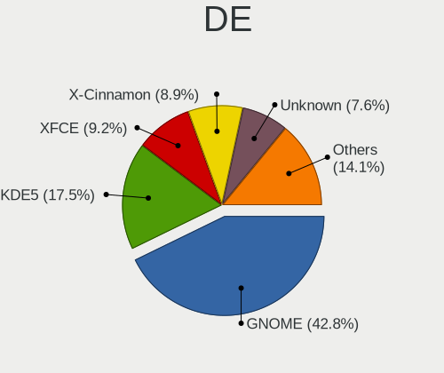
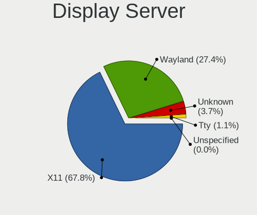
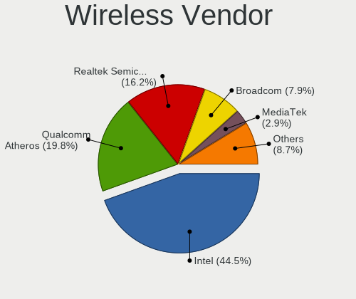

Linux in Italy - Tested Hardware & Statistics (Notebooks)
---------------------------------------------------------

A project to collect tested hardware configurations for Linux in Italy.

Anyone can contribute to this report by the [hw-probe](https://github.com/linuxhw/hw-probe) tool:

    sudo -E hw-probe -all -upload

Please contribute! Especially if your hardware is rare.

Contents
--------

* [ Test Cases ](#test-cases)

* [ System ](#system)
  - [ OS                       ](#os)
  - [ OS Family                ](#os-family)
  - [ Kernel                   ](#kernel)
  - [ Kernel Family            ](#kernel-family)
  - [ Kernel Major Ver.        ](#kernel-major-ver)
  - [ Arch                     ](#arch)
  - [ DE                       ](#de)
  - [ Display Server           ](#display-server)
  - [ Display Manager          ](#display-manager)
  - [ OS Lang                  ](#os-lang)
  - [ Boot Mode                ](#boot-mode)
  - [ Filesystem               ](#filesystem)
  - [ Part. scheme             ](#part-scheme)
  - [ Dual Boot with Linux/BSD ](#dual-boot-with-linuxbsd)
  - [ Dual Boot (Win)          ](#dual-boot-win)

* [ Board ](#board)
  - [ Vendor                   ](#vendor)
  - [ Model                    ](#model)
  - [ Model Family             ](#model-family)
  - [ MFG Year                 ](#mfg-year)
  - [ Form Factor              ](#form-factor)
  - [ Secure Boot              ](#secure-boot)
  - [ Coreboot                 ](#coreboot)
  - [ RAM Size                 ](#ram-size)
  - [ RAM Used                 ](#ram-used)
  - [ Total Drives             ](#total-drives)
  - [ Has CD-ROM               ](#has-cd-rom)
  - [ Has Ethernet             ](#has-ethernet)
  - [ Has WiFi                 ](#has-wifi)
  - [ Has Bluetooth            ](#has-bluetooth)

* [ Location ](#location)
  - [ Country                  ](#country)
  - [ City                     ](#city)

* [ Drives ](#drives)
  - [ Drive Vendor             ](#drive-vendor)
  - [ Drive Model              ](#drive-model)
  - [ HDD Vendor               ](#hdd-vendor)
  - [ SSD Vendor               ](#ssd-vendor)
  - [ Drive Kind               ](#drive-kind)
  - [ Drive Connector          ](#drive-connector)
  - [ Drive Size               ](#drive-size)
  - [ Space Total              ](#space-total)
  - [ Space Used               ](#space-used)
  - [ Malfunc. Drives          ](#malfunc-drives)
  - [ Malfunc. Drive Vendor    ](#malfunc-drive-vendor)
  - [ Malfunc. HDD Vendor      ](#malfunc-hdd-vendor)
  - [ Malfunc. Drive Kind      ](#malfunc-drive-kind)
  - [ Failed Drives            ](#failed-drives)
  - [ Failed Drive Vendor      ](#failed-drive-vendor)
  - [ Drive Status             ](#drive-status)

* [ Storage controller ](#storage-controller)
  - [ Storage Vendor           ](#storage-vendor)
  - [ Storage Model            ](#storage-model)
  - [ Storage Kind             ](#storage-kind)

* [ Processor ](#processor)
  - [ CPU Vendor               ](#cpu-vendor)
  - [ CPU Model                ](#cpu-model)
  - [ CPU Model Family         ](#cpu-model-family)
  - [ CPU Cores                ](#cpu-cores)
  - [ CPU Sockets              ](#cpu-sockets)
  - [ CPU Threads              ](#cpu-threads)
  - [ CPU Op-Modes             ](#cpu-op-modes)
  - [ CPU Microcode            ](#cpu-microcode)
  - [ CPU Microarch            ](#cpu-microarch)

* [ Graphics ](#graphics)
  - [ GPU Vendor               ](#gpu-vendor)
  - [ GPU Model                ](#gpu-model)
  - [ GPU Combo                ](#gpu-combo)
  - [ GPU Driver               ](#gpu-driver)
  - [ GPU Memory               ](#gpu-memory)

* [ Monitor ](#monitor)
  - [ Monitor Vendor           ](#monitor-vendor)
  - [ Monitor Model            ](#monitor-model)
  - [ Monitor Resolution       ](#monitor-resolution)
  - [ Monitor Diagonal         ](#monitor-diagonal)
  - [ Monitor Width            ](#monitor-width)
  - [ Aspect Ratio             ](#aspect-ratio)
  - [ Monitor Area             ](#monitor-area)
  - [ Pixel Density            ](#pixel-density)
  - [ Multiple Monitors        ](#multiple-monitors)

* [ Network ](#network)
  - [ Net Controller Vendor    ](#net-controller-vendor)
  - [ Net Controller Model     ](#net-controller-model)
  - [ Wireless Vendor          ](#wireless-vendor)
  - [ Wireless Model           ](#wireless-model)
  - [ Ethernet Vendor          ](#ethernet-vendor)
  - [ Ethernet Model           ](#ethernet-model)
  - [ Net Controller Kind      ](#net-controller-kind)
  - [ Used Controller          ](#used-controller)
  - [ NICs                     ](#nics)
  - [ IPv6                     ](#ipv6)

* [ Bluetooth ](#bluetooth)
  - [ Bluetooth Vendor         ](#bluetooth-vendor)
  - [ Bluetooth Model          ](#bluetooth-model)

* [ Sound ](#sound)
  - [ Sound Vendor             ](#sound-vendor)
  - [ Sound Model              ](#sound-model)

* [ Memory ](#memory)
  - [ Memory Vendor            ](#memory-vendor)
  - [ Memory Model             ](#memory-model)
  - [ Memory Kind              ](#memory-kind)
  - [ Memory Form Factor       ](#memory-form-factor)
  - [ Memory Size              ](#memory-size)
  - [ Memory Speed             ](#memory-speed)

* [ Printers & scanners ](#printers--scanners)
  - [ Printer Vendor           ](#printer-vendor)
  - [ Printer Model            ](#printer-model)
  - [ Scanner Vendor           ](#scanner-vendor)
  - [ Scanner Model            ](#scanner-model)

* [ Camera ](#camera)
  - [ Camera Vendor            ](#camera-vendor)
  - [ Camera Model             ](#camera-model)

* [ Security ](#security)
  - [ Fingerprint Vendor       ](#fingerprint-vendor)
  - [ Fingerprint Model        ](#fingerprint-model)
  - [ Chipcard Vendor          ](#chipcard-vendor)
  - [ Chipcard Model           ](#chipcard-model)

* [ Unsupported ](#unsupported)
  - [ Unsupported Devices      ](#unsupported-devices)
  - [ Unsupported Device Types ](#unsupported-device-types)

Test Cases
----------

Total: 8145

| Vendor        | Model                       | Probe                                                      | Date         |
|---------------|-----------------------------|------------------------------------------------------------|--------------|
| Toshiba       | Satellite C650D             | [9e66892f4b](https://linux-hardware.org/?probe=9e66892f4b) | May 09, 2024 |
| Toshiba       | PORTEGE Z30-C               | [38ddab3b19](https://linux-hardware.org/?probe=38ddab3b19) | May 08, 2024 |
| ASUSTek       | GL753VE                     | [17bf72a741](https://linux-hardware.org/?probe=17bf72a741) | May 08, 2024 |
| HUAWEI        | KLVL-WXX9                   | [6021a53b71](https://linux-hardware.org/?probe=6021a53b71) | May 08, 2024 |
| Lenovo        | B50-30 80ES                 | [c19f3dfc3a](https://linux-hardware.org/?probe=c19f3dfc3a) | May 07, 2024 |
| Lenovo        | ThinkPad X1 Carbon Gen 8... | [3b821d76a7](https://linux-hardware.org/?probe=3b821d76a7) | May 07, 2024 |
| HP            | Pavilion Sleekbook 15       | [9cd7bfcd0f](https://linux-hardware.org/?probe=9cd7bfcd0f) | May 07, 2024 |
| HP            | Laptop 15-bs1xx             | [f3c9212dca](https://linux-hardware.org/?probe=f3c9212dca) | May 07, 2024 |
| HP            | 250 G3                      | [c34d89360b](https://linux-hardware.org/?probe=c34d89360b) | May 07, 2024 |
| HP            | 250 G3                      | [7ebf68ab6e](https://linux-hardware.org/?probe=7ebf68ab6e) | May 07, 2024 |
| HP            | 250 G3                      | [5f00c46a92](https://linux-hardware.org/?probe=5f00c46a92) | May 07, 2024 |
| Lenovo        | V145-15AST 81MT             | [f683d111b9](https://linux-hardware.org/?probe=f683d111b9) | May 07, 2024 |
| Lenovo        | V145-15AST 81MT             | [1f8035ccf5](https://linux-hardware.org/?probe=1f8035ccf5) | May 07, 2024 |
| HP            | ZBook 15 G6                 | [4a401c8b15](https://linux-hardware.org/?probe=4a401c8b15) | May 06, 2024 |
| Lenovo        | IdeaPad Slim 3 15ABR8 82... | [c082a264d6](https://linux-hardware.org/?probe=c082a264d6) | May 06, 2024 |
| Apple         | MacBookAir7,2               | [c8f7c82599](https://linux-hardware.org/?probe=c8f7c82599) | May 06, 2024 |
| Acer          | Aspire 5310                 | [8e28475b52](https://linux-hardware.org/?probe=8e28475b52) | May 06, 2024 |
| HP            | Pavilion 15                 | [77f8425176](https://linux-hardware.org/?probe=77f8425176) | May 06, 2024 |
| Fujitsu       | LIFEBOOK E754               | [c201d1f500](https://linux-hardware.org/?probe=c201d1f500) | May 06, 2024 |
| Xiaomi        | Pad 5                       | [2ee74fac7d](https://linux-hardware.org/?probe=2ee74fac7d) | May 05, 2024 |
| Lenovo        | IdeaPad 500-15ISK 80NT      | [63486fcdd6](https://linux-hardware.org/?probe=63486fcdd6) | May 05, 2024 |
| Lenovo        | IdeaPad 500-15ISK 80NT      | [61af632661](https://linux-hardware.org/?probe=61af632661) | May 05, 2024 |
| Lenovo        | ThinkPad T470 20HES6VG00    | [f87983a9a9](https://linux-hardware.org/?probe=f87983a9a9) | May 05, 2024 |
| HP            | Compaq 6720s                | [e51bd60d05](https://linux-hardware.org/?probe=e51bd60d05) | May 05, 2024 |
| MSI           | Modern 14 B11MOL            | [c394eac782](https://linux-hardware.org/?probe=c394eac782) | May 05, 2024 |
| Shenzhen B... | XN116B                      | [47dbcecbd7](https://linux-hardware.org/?probe=47dbcecbd7) | May 04, 2024 |
| Apple         | MacBook5,1                  | [021661dd6a](https://linux-hardware.org/?probe=021661dd6a) | May 04, 2024 |
| Apple         | MacBook5,1                  | [cc8e76485b](https://linux-hardware.org/?probe=cc8e76485b) | May 04, 2024 |
| Lenovo        | ThinkPad T480 20L6SADD00    | [ad52d07a71](https://linux-hardware.org/?probe=ad52d07a71) | May 04, 2024 |
| Toshiba       | Satellite L855              | [15101644b0](https://linux-hardware.org/?probe=15101644b0) | May 04, 2024 |
| Toshiba       | Satellite L855              | [359b9f3cd6](https://linux-hardware.org/?probe=359b9f3cd6) | May 04, 2024 |
| Lenovo        | ThinkPad T14 Gen 1 20S00... | [ed456fa085](https://linux-hardware.org/?probe=ed456fa085) | May 04, 2024 |
| HP            | Presario CQ56               | [6df22495ed](https://linux-hardware.org/?probe=6df22495ed) | May 04, 2024 |
| Alienware     | m15 R6                      | [98d55c3264](https://linux-hardware.org/?probe=98d55c3264) | May 04, 2024 |
| Lenovo        | IdeaPad 3 15IML05 81WB      | [9ea4c7559c](https://linux-hardware.org/?probe=9ea4c7559c) | May 04, 2024 |
| Lenovo        | ThinkBook 15 G2 ITL 20VE    | [a308965bd0](https://linux-hardware.org/?probe=a308965bd0) | May 04, 2024 |
| Apple         | MacBookAir4,1               | [f8bc0c50a5](https://linux-hardware.org/?probe=f8bc0c50a5) | May 04, 2024 |
| HP            | G62                         | [3e3af3a851](https://linux-hardware.org/?probe=3e3af3a851) | May 04, 2024 |
| Lenovo        | ThinkBook 15-IIL 20SM       | [7471316f20](https://linux-hardware.org/?probe=7471316f20) | May 04, 2024 |
| ALLDOCUBE     | i1305A                      | [c5c24beb34](https://linux-hardware.org/?probe=c5c24beb34) | May 04, 2024 |
| Acer          | Aspire E1-531               | [27d57e495a](https://linux-hardware.org/?probe=27d57e495a) | May 04, 2024 |
| HP            | Pavilion dv6                | [3c67356b46](https://linux-hardware.org/?probe=3c67356b46) | May 04, 2024 |
| Toshiba       | Satellite A200              | [81e6cf4d6e](https://linux-hardware.org/?probe=81e6cf4d6e) | May 04, 2024 |
| ASUSTek       | X553MA                      | [dc9e8b63f5](https://linux-hardware.org/?probe=dc9e8b63f5) | May 03, 2024 |
| Acer          | Aspire A315-56              | [b7341e861f](https://linux-hardware.org/?probe=b7341e861f) | May 03, 2024 |
| Toshiba       | Satellite Pro L650          | [4e0111f9c9](https://linux-hardware.org/?probe=4e0111f9c9) | May 02, 2024 |
| PC Special... | PCx0Dx                      | [8aa3848116](https://linux-hardware.org/?probe=8aa3848116) | May 02, 2024 |
| HP            | EliteBook 840 G6            | [da166304a5](https://linux-hardware.org/?probe=da166304a5) | May 02, 2024 |
| Lenovo        | ThinkPad T14 Gen 5 21MLC... | [d1732b9421](https://linux-hardware.org/?probe=d1732b9421) | May 02, 2024 |
| Lenovo        | ThinkBook 15-IML 20RW       | [3f312360ff](https://linux-hardware.org/?probe=3f312360ff) | May 02, 2024 |
| Lenovo        | Yoga Pro 7 14IRH8 82Y7      | [2bd6f2ebd6](https://linux-hardware.org/?probe=2bd6f2ebd6) | May 02, 2024 |
| Acer          | TravelMate P2510-G2-M       | [39c2dc876b](https://linux-hardware.org/?probe=39c2dc876b) | May 02, 2024 |
| Acer          | Aspire E1-571               | [0f3b954320](https://linux-hardware.org/?probe=0f3b954320) | May 02, 2024 |
| HP            | Pavilion Laptop 14-ec1xx... | [0983506014](https://linux-hardware.org/?probe=0983506014) | May 01, 2024 |
| HP            | Pavilion g6                 | [6568deae58](https://linux-hardware.org/?probe=6568deae58) | May 01, 2024 |
| HP            | Pavilion g6                 | [57a50655da](https://linux-hardware.org/?probe=57a50655da) | May 01, 2024 |
| ALLDOCUBE     | i1305A                      | [c817ff0b69](https://linux-hardware.org/?probe=c817ff0b69) | May 01, 2024 |
| HP            | Pavilion Sleekbook 15       | [f61e28b31c](https://linux-hardware.org/?probe=f61e28b31c) | May 01, 2024 |
| HP            | Compaq 6730s                | [ab6d479788](https://linux-hardware.org/?probe=ab6d479788) | May 01, 2024 |
| eMachines     | Rhine V1.42                 | [f281ddf1c6](https://linux-hardware.org/?probe=f281ddf1c6) | May 01, 2024 |
| ASUSTek       | K55VD                       | [66566dcc5c](https://linux-hardware.org/?probe=66566dcc5c) | May 01, 2024 |
| HP            | Pavilion Laptop 15-eh2xx... | [2ad4a9fc76](https://linux-hardware.org/?probe=2ad4a9fc76) | Apr 30, 2024 |
| Acer          | Aspire ES1-522              | [90a2ac9af6](https://linux-hardware.org/?probe=90a2ac9af6) | Apr 30, 2024 |
| Sony          | SVE1512Z1EB                 | [18a1eb8f10](https://linux-hardware.org/?probe=18a1eb8f10) | Apr 30, 2024 |
| HP            | Compaq 6720s                | [fc9309f2a1](https://linux-hardware.org/?probe=fc9309f2a1) | Apr 30, 2024 |
| Unknown       | Unknown                     | [a677f40065](https://linux-hardware.org/?probe=a677f40065) | Apr 30, 2024 |
| Dell          | XPS 9315                    | [7a8e7beaea](https://linux-hardware.org/?probe=7a8e7beaea) | Apr 30, 2024 |
| Packard Be... | DOT SE                      | [25e87d67cc](https://linux-hardware.org/?probe=25e87d67cc) | Apr 30, 2024 |
| Packard Be... | DOT SE                      | [e8d7adfcce](https://linux-hardware.org/?probe=e8d7adfcce) | Apr 30, 2024 |
| Acer          | Acadia V1.45                | [7dc83a3832](https://linux-hardware.org/?probe=7dc83a3832) | Apr 30, 2024 |
| HP            | ProBook 4520s               | [cedd016f83](https://linux-hardware.org/?probe=cedd016f83) | Apr 30, 2024 |
| HP            | ProBook 4520s               | [7489071390](https://linux-hardware.org/?probe=7489071390) | Apr 29, 2024 |
| Dell          | Inspiron 5558               | [843f3962e2](https://linux-hardware.org/?probe=843f3962e2) | Apr 29, 2024 |
| HP            | ProBook 450 G1              | [5f5030ef83](https://linux-hardware.org/?probe=5f5030ef83) | Apr 29, 2024 |
| Lenovo        | ThinkPad T430 2349IF8       | [d4d6667b5e](https://linux-hardware.org/?probe=d4d6667b5e) | Apr 29, 2024 |
| Lenovo        | Z50-75 80EC                 | [278dad8d5a](https://linux-hardware.org/?probe=278dad8d5a) | Apr 28, 2024 |
| HUAWEI        | KPL-W0X                     | [26afcd3dda](https://linux-hardware.org/?probe=26afcd3dda) | Apr 28, 2024 |
| Lenovo        | G50-45 80E3                 | [a12bc9b719](https://linux-hardware.org/?probe=a12bc9b719) | Apr 28, 2024 |
| HP            | Stream Laptop 14-ax0XX      | [f9c0aa7676](https://linux-hardware.org/?probe=f9c0aa7676) | Apr 28, 2024 |
| HP            | Stream Laptop 14-ax0XX      | [3a742038ec](https://linux-hardware.org/?probe=3a742038ec) | Apr 28, 2024 |
| HUAWEI        | KPL-W0X                     | [31f15bd85c](https://linux-hardware.org/?probe=31f15bd85c) | Apr 28, 2024 |
| HP            | Laptop 15s-fq2xxx           | [b6fc451f3c](https://linux-hardware.org/?probe=b6fc451f3c) | Apr 27, 2024 |
| Apple         | MacBookPro7,1               | [b83cef7cdd](https://linux-hardware.org/?probe=b83cef7cdd) | Apr 27, 2024 |
| HP            | Mini 210-1000               | [26d3ef8d19](https://linux-hardware.org/?probe=26d3ef8d19) | Apr 27, 2024 |
| Lenovo        | ThinkPad T495 20NKS1YE00    | [8436983b86](https://linux-hardware.org/?probe=8436983b86) | Apr 27, 2024 |
| Dell          | XPS L521X                   | [2f78a9d44b](https://linux-hardware.org/?probe=2f78a9d44b) | Apr 27, 2024 |
| HP            | 15                          | [474c29dc98](https://linux-hardware.org/?probe=474c29dc98) | Apr 27, 2024 |
| Acer          | Aspire 5734Z                | [1b89b729a3](https://linux-hardware.org/?probe=1b89b729a3) | Apr 27, 2024 |
| Microtech     | CoreBook Lite               | [6b831e47a9](https://linux-hardware.org/?probe=6b831e47a9) | Apr 26, 2024 |
| Mediacom      | SmartBook 14 FullHD - SB... | [679f3b5338](https://linux-hardware.org/?probe=679f3b5338) | Apr 26, 2024 |
| HP            | ProBook 450 G1              | [02e056b32e](https://linux-hardware.org/?probe=02e056b32e) | Apr 26, 2024 |
| Lenovo        | IdeaPad 5 14ARE05 81YM      | [ce253ebd01](https://linux-hardware.org/?probe=ce253ebd01) | Apr 26, 2024 |
| Apple         | MacBook5,1                  | [8da3b01d13](https://linux-hardware.org/?probe=8da3b01d13) | Apr 26, 2024 |
| Acer          | Aspire one                  | [aa3dbeb28b](https://linux-hardware.org/?probe=aa3dbeb28b) | Apr 26, 2024 |
| Acer          | Aspire A315-53G             | [2a3e224f63](https://linux-hardware.org/?probe=2a3e224f63) | Apr 26, 2024 |
| Apple         | MacBookPro12,1              | [2480570421](https://linux-hardware.org/?probe=2480570421) | Apr 26, 2024 |
| HP            | Laptop 15-da0xxx            | [3d96ca2745](https://linux-hardware.org/?probe=3d96ca2745) | Apr 25, 2024 |
| HP            | Victus by Gaming Laptop ... | [c56f9e6bd0](https://linux-hardware.org/?probe=c56f9e6bd0) | Apr 25, 2024 |
| ASUSTek       | X553MA                      | [cb731fbd8f](https://linux-hardware.org/?probe=cb731fbd8f) | Apr 25, 2024 |
| ASUSTek       | X541UVK                     | [422fd329a8](https://linux-hardware.org/?probe=422fd329a8) | Apr 25, 2024 |
| ASUSTek       | K52JU                       | [418274ccd0](https://linux-hardware.org/?probe=418274ccd0) | Apr 25, 2024 |
| HP            | EliteBook 840 G5            | [13645366c7](https://linux-hardware.org/?probe=13645366c7) | Apr 24, 2024 |
| HP            | 15                          | [479cea6b16](https://linux-hardware.org/?probe=479cea6b16) | Apr 24, 2024 |
| Acer          | Aspire E5-573G              | [216cd2fc72](https://linux-hardware.org/?probe=216cd2fc72) | Apr 24, 2024 |
| Acer          | Aspire A515-47              | [dc0e4e49bb](https://linux-hardware.org/?probe=dc0e4e49bb) | Apr 24, 2024 |
| Lenovo        | Legion Pro 5 16IRX9 83DF    | [a0287fdd29](https://linux-hardware.org/?probe=a0287fdd29) | Apr 24, 2024 |
| HP            | Pavilion dv6                | [c8d73c3a23](https://linux-hardware.org/?probe=c8d73c3a23) | Apr 24, 2024 |
| HP            | Pavilion dv6                | [08f01fc7ed](https://linux-hardware.org/?probe=08f01fc7ed) | Apr 24, 2024 |
| Acer          | TravelMate 4070             | [99e797eb28](https://linux-hardware.org/?probe=99e797eb28) | Apr 23, 2024 |
| Apple         | MacBookAir7,2               | [674850b624](https://linux-hardware.org/?probe=674850b624) | Apr 23, 2024 |
| HP            | EliteBook 840 G2            | [006661b0c2](https://linux-hardware.org/?probe=006661b0c2) | Apr 23, 2024 |
| ASUSTek       | F9E                         | [18bf0f692e](https://linux-hardware.org/?probe=18bf0f692e) | Apr 23, 2024 |
| HP            | Victus by Laptop 16-e0xx... | [74c8b80974](https://linux-hardware.org/?probe=74c8b80974) | Apr 23, 2024 |
| Acer          | Aspire ES1-523              | [499fa508bd](https://linux-hardware.org/?probe=499fa508bd) | Apr 23, 2024 |
| Samsung       | N150P/N210P/N220P           | [b7a4824162](https://linux-hardware.org/?probe=b7a4824162) | Apr 23, 2024 |
| Acer          | Aspire 4820TG               | [7f3e1cb872](https://linux-hardware.org/?probe=7f3e1cb872) | Apr 23, 2024 |
| Apple         | MacBookAir7,2               | [c7cbc009ef](https://linux-hardware.org/?probe=c7cbc009ef) | Apr 23, 2024 |
| ASUSTek       | X555QG                      | [c905efd379](https://linux-hardware.org/?probe=c905efd379) | Apr 23, 2024 |
| Acer          | Aspire 5750G                | [39ed7553a3](https://linux-hardware.org/?probe=39ed7553a3) | Apr 23, 2024 |
| ASUSTek       | X555QG                      | [26b8da2305](https://linux-hardware.org/?probe=26b8da2305) | Apr 23, 2024 |
| HP            | Pavilion x2 Detachable      | [62dfe52148](https://linux-hardware.org/?probe=62dfe52148) | Apr 22, 2024 |
| HP            | Pavilion x2 Detachable      | [fadfc9adae](https://linux-hardware.org/?probe=fadfc9adae) | Apr 22, 2024 |
| Apple         | MacBookPro9,2               | [da3cb2d356](https://linux-hardware.org/?probe=da3cb2d356) | Apr 22, 2024 |
| ASUSTek       | K56CB                       | [5ab318e135](https://linux-hardware.org/?probe=5ab318e135) | Apr 22, 2024 |
| HP            | Laptop 15-dw0xxx            | [b69baa13a6](https://linux-hardware.org/?probe=b69baa13a6) | Apr 22, 2024 |
| Acer          | Aspire A515-47              | [feba2802f3](https://linux-hardware.org/?probe=feba2802f3) | Apr 22, 2024 |
| HP            | Pavilion dv6500             | [339679d475](https://linux-hardware.org/?probe=339679d475) | Apr 22, 2024 |
| ASUSTek       | VivoBook_ASUSLaptop X740... | [7102c622a5](https://linux-hardware.org/?probe=7102c622a5) | Apr 22, 2024 |
| HP            | Laptop 15s-eq3xxx           | [63efa2e397](https://linux-hardware.org/?probe=63efa2e397) | Apr 21, 2024 |
| HP            | Notebook                    | [65703ccbac](https://linux-hardware.org/?probe=65703ccbac) | Apr 21, 2024 |
| Acer          | Aspire A315-24P             | [51136613de](https://linux-hardware.org/?probe=51136613de) | Apr 21, 2024 |
| Lenovo        | IdeaPad 5 14ALC05 82LM      | [d76ac08a0d](https://linux-hardware.org/?probe=d76ac08a0d) | Apr 21, 2024 |
| Lenovo        | ThinkPad T470 20HES6VG00    | [b122ffbcd4](https://linux-hardware.org/?probe=b122ffbcd4) | Apr 21, 2024 |
| HP            | ProBook 4540s               | [b13d3be380](https://linux-hardware.org/?probe=b13d3be380) | Apr 21, 2024 |
| Acer          | Aspire ES1-523              | [23fbbe90c4](https://linux-hardware.org/?probe=23fbbe90c4) | Apr 20, 2024 |
| Lenovo        | IdeaPad Gaming 3 15ACH6 ... | [67792de52a](https://linux-hardware.org/?probe=67792de52a) | Apr 20, 2024 |
| ASUSTek       | X540SAA                     | [17f2b9c802](https://linux-hardware.org/?probe=17f2b9c802) | Apr 20, 2024 |
| Acer          | Aspire E1-571G              | [cfb1f06070](https://linux-hardware.org/?probe=cfb1f06070) | Apr 20, 2024 |
| HP            | Pavilion Notebook           | [e4e64863d9](https://linux-hardware.org/?probe=e4e64863d9) | Apr 20, 2024 |
| HP            | ENVY 17                     | [2ff3b1ea53](https://linux-hardware.org/?probe=2ff3b1ea53) | Apr 20, 2024 |
| Lenovo        | IdeaPad 300-15ISK 80Q7      | [dda75cf468](https://linux-hardware.org/?probe=dda75cf468) | Apr 20, 2024 |
| ASUSTek       | X751LX                      | [7be3e5016c](https://linux-hardware.org/?probe=7be3e5016c) | Apr 19, 2024 |
| Acer          | Aspire A315-21              | [c05d2f5d20](https://linux-hardware.org/?probe=c05d2f5d20) | Apr 19, 2024 |
| Mediacom      | SmartBook Pro i5            | [fdc40cdd18](https://linux-hardware.org/?probe=fdc40cdd18) | Apr 19, 2024 |
| HP            | Laptop 15s-fq5xxx           | [c55294e976](https://linux-hardware.org/?probe=c55294e976) | Apr 19, 2024 |
| Lenovo        | ThinkPad T450s 20BWS00V0... | [8d933e8d9e](https://linux-hardware.org/?probe=8d933e8d9e) | Apr 19, 2024 |
| ASUSTek       | X751LX                      | [52041d2fb2](https://linux-hardware.org/?probe=52041d2fb2) | Apr 19, 2024 |
| Sony          | SVE1111M1EW                 | [4303a7cc13](https://linux-hardware.org/?probe=4303a7cc13) | Apr 19, 2024 |
| Dell          | Vostro 1540                 | [780a9675dd](https://linux-hardware.org/?probe=780a9675dd) | Apr 18, 2024 |
| ASUSTek       | X55A                        | [92b3966e51](https://linux-hardware.org/?probe=92b3966e51) | Apr 18, 2024 |
| Lenovo        | ThinkPad T14 Gen 3 21CF0... | [011644727b](https://linux-hardware.org/?probe=011644727b) | Apr 18, 2024 |
| Seco          | UDOO x86                    | [858d9abe37](https://linux-hardware.org/?probe=858d9abe37) | Apr 17, 2024 |
| Lenovo        | ThinkPad T450s 20BWS00V0... | [763289fa74](https://linux-hardware.org/?probe=763289fa74) | Apr 16, 2024 |
| Unknown       | Unknown                     | [10d92e98c0](https://linux-hardware.org/?probe=10d92e98c0) | Apr 16, 2024 |
| HP            | Laptop 15-dw0xxx            | [f30fb8d67e](https://linux-hardware.org/?probe=f30fb8d67e) | Apr 16, 2024 |
| Apple         | MacBookAir7,2               | [163f3a262e](https://linux-hardware.org/?probe=163f3a262e) | Apr 15, 2024 |
| HP            | ProBook 450 G6              | [c41b024ad4](https://linux-hardware.org/?probe=c41b024ad4) | Apr 15, 2024 |
| HP            | Pavilion dv6                | [b914c1b7f6](https://linux-hardware.org/?probe=b914c1b7f6) | Apr 15, 2024 |
| Acer          | Nitro AN515-57              | [09b7f317ca](https://linux-hardware.org/?probe=09b7f317ca) | Apr 14, 2024 |
| Lenovo        | ThinkBook 15 G2 ITL 20VE    | [b202e3f78e](https://linux-hardware.org/?probe=b202e3f78e) | Apr 14, 2024 |
| TUXEDO        | Gemini Gen2                 | [89fbde8b2d](https://linux-hardware.org/?probe=89fbde8b2d) | Apr 14, 2024 |
| Samsung       | 300E4A/300E5A/300E7A/343... | [a1161960b8](https://linux-hardware.org/?probe=a1161960b8) | Apr 14, 2024 |
| Lenovo        | IdeaPad 5 14ITL05 82FE      | [351fd4ce06](https://linux-hardware.org/?probe=351fd4ce06) | Apr 13, 2024 |
| Acer          | Aspire 6935                 | [d26ee0494f](https://linux-hardware.org/?probe=d26ee0494f) | Apr 13, 2024 |
| ASUSTek       | E402SA                      | [5266b4e65d](https://linux-hardware.org/?probe=5266b4e65d) | Apr 13, 2024 |
| Acer          | Nitro AN515-58              | [1da17c34a3](https://linux-hardware.org/?probe=1da17c34a3) | Apr 13, 2024 |
| Samsung       | N150P/N210P/N220P           | [d6fca9f7f5](https://linux-hardware.org/?probe=d6fca9f7f5) | Apr 13, 2024 |
| Acer          | E1-510                      | [a3809aca83](https://linux-hardware.org/?probe=a3809aca83) | Apr 13, 2024 |
| Acer          | Nitro AN515-58              | [b08b5165e8](https://linux-hardware.org/?probe=b08b5165e8) | Apr 13, 2024 |
| Acer          | Aspire A715-42G             | [0d589db88d](https://linux-hardware.org/?probe=0d589db88d) | Apr 12, 2024 |
| HP            | Laptop 15s-fq5xxx           | [4c870a99b4](https://linux-hardware.org/?probe=4c870a99b4) | Apr 12, 2024 |
| ASUSTek       | VivoBook_ASUSLaptop K350... | [f239d3dcb1](https://linux-hardware.org/?probe=f239d3dcb1) | Apr 12, 2024 |
| Acer          | Aspire A715-42G             | [ab14bb8fdc](https://linux-hardware.org/?probe=ab14bb8fdc) | Apr 12, 2024 |
| HUAWEI        | BOD-WXX9                    | [922645652d](https://linux-hardware.org/?probe=922645652d) | Apr 12, 2024 |
| ASUSTek       | K52Je                       | [7cfd3a8614](https://linux-hardware.org/?probe=7cfd3a8614) | Apr 12, 2024 |
| HP            | ProBook 650 G1              | [6bdfe181ea](https://linux-hardware.org/?probe=6bdfe181ea) | Apr 12, 2024 |
| HP            | ProBook 650 G1              | [aa6dfe532c](https://linux-hardware.org/?probe=aa6dfe532c) | Apr 12, 2024 |
| Fujitsu       | LIFEBOOK E752               | [57b8f56426](https://linux-hardware.org/?probe=57b8f56426) | Apr 12, 2024 |
| HP            | EliteBook 840 G6            | [c9dc8fedd4](https://linux-hardware.org/?probe=c9dc8fedd4) | Apr 12, 2024 |
| ASUSTek       | K52Je                       | [e825e3871d](https://linux-hardware.org/?probe=e825e3871d) | Apr 12, 2024 |
| Lenovo        | ThinkPad S430 336457G       | [93b1811e42](https://linux-hardware.org/?probe=93b1811e42) | Apr 12, 2024 |
| Lenovo        | ThinkPad S430 336457G       | [118beb78ac](https://linux-hardware.org/?probe=118beb78ac) | Apr 12, 2024 |
| ASUSTek       | G752VY                      | [039e830652](https://linux-hardware.org/?probe=039e830652) | Apr 11, 2024 |
| HP            | Pavilion dv5                | [8709b8e62d](https://linux-hardware.org/?probe=8709b8e62d) | Apr 11, 2024 |
| HP            | Pavilion Laptop 15-eh2xx... | [b7131cef2d](https://linux-hardware.org/?probe=b7131cef2d) | Apr 10, 2024 |
| HP            | Pavilion Laptop 15-eh2xx... | [7fa5b7e16f](https://linux-hardware.org/?probe=7fa5b7e16f) | Apr 10, 2024 |
| Acer          | Aspire 5930                 | [6389c2a9af](https://linux-hardware.org/?probe=6389c2a9af) | Apr 10, 2024 |
| Dell          | Latitude 5500               | [59a70a843f](https://linux-hardware.org/?probe=59a70a843f) | Apr 10, 2024 |
| Lenovo        | Z50-70 20354                | [4469cb6e76](https://linux-hardware.org/?probe=4469cb6e76) | Apr 10, 2024 |
| Acer          | AOD270                      | [6e71521433](https://linux-hardware.org/?probe=6e71521433) | Apr 10, 2024 |
| Dell          | Latitude 7290               | [8c904a8ecf](https://linux-hardware.org/?probe=8c904a8ecf) | Apr 10, 2024 |
| HP            | 250 G8 Notebook PC          | [73ef8a88c7](https://linux-hardware.org/?probe=73ef8a88c7) | Apr 10, 2024 |
| HUAWEI        | BOM-WXX9                    | [67679cf1d8](https://linux-hardware.org/?probe=67679cf1d8) | Apr 10, 2024 |
| HUAWEI        | BOHB-WAX9                   | [672d643881](https://linux-hardware.org/?probe=672d643881) | Apr 09, 2024 |
| HUAWEI        | BOHB-WAX9                   | [7497e16b5c](https://linux-hardware.org/?probe=7497e16b5c) | Apr 09, 2024 |
| HP            | Pavilion Power Laptop 15... | [6e23ce4681](https://linux-hardware.org/?probe=6e23ce4681) | Apr 09, 2024 |
| Valve         | Jupiter                     | [6f2b093298](https://linux-hardware.org/?probe=6f2b093298) | Apr 09, 2024 |
| Chuwi         | X312B                       | [3623330a1c](https://linux-hardware.org/?probe=3623330a1c) | Apr 09, 2024 |
| Apple         | MacBookPro8,1               | [ac137b7cb7](https://linux-hardware.org/?probe=ac137b7cb7) | Apr 09, 2024 |
| Apple         | MacBookPro8,1               | [e964beb301](https://linux-hardware.org/?probe=e964beb301) | Apr 09, 2024 |
| ASUSTek       | K55VD                       | [8cc1b30bd1](https://linux-hardware.org/?probe=8cc1b30bd1) | Apr 09, 2024 |
| ASUSTek       | TUF Gaming FX504GE_FX80G... | [6cb6635cbb](https://linux-hardware.org/?probe=6cb6635cbb) | Apr 09, 2024 |
| Samsung       | 750XED                      | [bfcfd0dab7](https://linux-hardware.org/?probe=bfcfd0dab7) | Apr 08, 2024 |
| Acer          | Aspire 5750ZG               | [b80881ad3d](https://linux-hardware.org/?probe=b80881ad3d) | Apr 08, 2024 |
| Teclast       | F15                         | [fdbca364e4](https://linux-hardware.org/?probe=fdbca364e4) | Apr 08, 2024 |
| Teclast       | F15                         | [a36f18a41b](https://linux-hardware.org/?probe=a36f18a41b) | Apr 08, 2024 |
| Chuwi         | X312B                       | [5aa107f741](https://linux-hardware.org/?probe=5aa107f741) | Apr 08, 2024 |
| Toshiba       | PORTEGE R30-D               | [9d7e83e928](https://linux-hardware.org/?probe=9d7e83e928) | Apr 07, 2024 |
| Apple         | MacBookAir7,2               | [98695d52ec](https://linux-hardware.org/?probe=98695d52ec) | Apr 07, 2024 |
| Microtech     | CoreBook Lite               | [95ee2cd3b2](https://linux-hardware.org/?probe=95ee2cd3b2) | Apr 07, 2024 |
| Dell          | Latitude 5580               | [295ed34ace](https://linux-hardware.org/?probe=295ed34ace) | Apr 07, 2024 |
| Dell          | Latitude 7290               | [d6acda310b](https://linux-hardware.org/?probe=d6acda310b) | Apr 07, 2024 |
| Lenovo        | IdeaPad 300-15ISK 80Q7      | [8b2eeec935](https://linux-hardware.org/?probe=8b2eeec935) | Apr 07, 2024 |
| Lenovo        | ThinkPad T60 1951FDG        | [3baacd7e39](https://linux-hardware.org/?probe=3baacd7e39) | Apr 07, 2024 |
| HP            | 8950                        | [db33441ed7](https://linux-hardware.org/?probe=db33441ed7) | Apr 07, 2024 |
| HP            | 8950                        | [649afa7841](https://linux-hardware.org/?probe=649afa7841) | Apr 07, 2024 |
| Lenovo        | ThinkBook 15 G2 ITL 20VE    | [c7b9f12d30](https://linux-hardware.org/?probe=c7b9f12d30) | Apr 06, 2024 |
| ASUSTek       | N551JX                      | [e7f0a7b86d](https://linux-hardware.org/?probe=e7f0a7b86d) | Apr 06, 2024 |
| HUAWEI        | NBLK-WAX9X                  | [02e385a043](https://linux-hardware.org/?probe=02e385a043) | Apr 06, 2024 |
| Lenovo        | ThinkPad T430 2349IF8       | [fcdfc53b39](https://linux-hardware.org/?probe=fcdfc53b39) | Apr 06, 2024 |
| Dell          | Latitude D630               | [10f9ff035c](https://linux-hardware.org/?probe=10f9ff035c) | Apr 06, 2024 |
| Lenovo        | ThinkBook 15 G2 ITL 20VE    | [9afed2e851](https://linux-hardware.org/?probe=9afed2e851) | Apr 06, 2024 |
| Lenovo        | ThinkPad T60 1951FDG        | [48ffb129cb](https://linux-hardware.org/?probe=48ffb129cb) | Apr 06, 2024 |
| Lenovo        | ThinkPad P52 20MAS1DM00     | [c83b503bb6](https://linux-hardware.org/?probe=c83b503bb6) | Apr 06, 2024 |
| Lenovo        | Unknown                     | [b013ec1e99](https://linux-hardware.org/?probe=b013ec1e99) | Apr 05, 2024 |
| HP            | Stream Laptop 14-ax0XX      | [61b97ed8ce](https://linux-hardware.org/?probe=61b97ed8ce) | Apr 05, 2024 |
| Samsung       | 300E4A/300E5A/300E7A/343... | [c6925e3708](https://linux-hardware.org/?probe=c6925e3708) | Apr 05, 2024 |
| MSI           | Prestige 14Evo A11M         | [62fb7b6781](https://linux-hardware.org/?probe=62fb7b6781) | Apr 05, 2024 |
| Notebook      | NJx0PU                      | [1c5fb42067](https://linux-hardware.org/?probe=1c5fb42067) | Apr 05, 2024 |
| HP            | Laptop 15s-eq2xxx           | [b0435cb369](https://linux-hardware.org/?probe=b0435cb369) | Apr 05, 2024 |
| HP            | Pavilion Laptop 15-eg0xx... | [bd18b70366](https://linux-hardware.org/?probe=bd18b70366) | Apr 05, 2024 |
| Jumper        | EZbook                      | [8061ab16a4](https://linux-hardware.org/?probe=8061ab16a4) | Apr 05, 2024 |
| TUXEDO        | Aura 15 Gen1                | [8f75e91c04](https://linux-hardware.org/?probe=8f75e91c04) | Apr 05, 2024 |
| Timi          | RedmiBook 16                | [cc9c19df85](https://linux-hardware.org/?probe=cc9c19df85) | Apr 05, 2024 |
| Dell          | Latitude 5480               | [995ea90b66](https://linux-hardware.org/?probe=995ea90b66) | Apr 05, 2024 |
| HP            | Pavilion Notebook           | [819d681431](https://linux-hardware.org/?probe=819d681431) | Apr 05, 2024 |
| Lenovo        | ThinkPad T60 1951FDG        | [690d2ee78f](https://linux-hardware.org/?probe=690d2ee78f) | Apr 05, 2024 |
| VALE          | Notebook Classic C151V      | [d09e06015f](https://linux-hardware.org/?probe=d09e06015f) | Apr 05, 2024 |
| HP            | Pavilion Notebook           | [fa3180578d](https://linux-hardware.org/?probe=fa3180578d) | Apr 04, 2024 |
| Chuwi         | UBook XPro                  | [f7f05e8aa2](https://linux-hardware.org/?probe=f7f05e8aa2) | Apr 04, 2024 |
| Dell          | Latitude 7290               | [943479c493](https://linux-hardware.org/?probe=943479c493) | Apr 04, 2024 |
| Dell          | System XPS L502X            | [50a066426a](https://linux-hardware.org/?probe=50a066426a) | Apr 04, 2024 |
| HP            | ProBook 640 G2              | [f5fc4b58c7](https://linux-hardware.org/?probe=f5fc4b58c7) | Apr 04, 2024 |
| ASUSTek       | P553UA                      | [71fe936f4b](https://linux-hardware.org/?probe=71fe936f4b) | Apr 04, 2024 |
| ASUSTek       | P553UA                      | [d14e714f0c](https://linux-hardware.org/?probe=d14e714f0c) | Apr 04, 2024 |
| Acer          | Nitro AN515-58              | [e2d921879b](https://linux-hardware.org/?probe=e2d921879b) | Apr 04, 2024 |
| ASUSTek       | K55VD                       | [6b8d31af6a](https://linux-hardware.org/?probe=6b8d31af6a) | Apr 04, 2024 |
| Apple         | MacBookAir7,2               | [c5ce1039fa](https://linux-hardware.org/?probe=c5ce1039fa) | Apr 04, 2024 |
| Apple         | MacBookAir7,2               | [86c8aec82f](https://linux-hardware.org/?probe=86c8aec82f) | Apr 04, 2024 |
| HP            | Pavilion Laptop 14-ec1xx... | [2e54390ec0](https://linux-hardware.org/?probe=2e54390ec0) | Apr 03, 2024 |
| Samsung       | 300E4C/300E5C/300E7C        | [dfef032d35](https://linux-hardware.org/?probe=dfef032d35) | Apr 03, 2024 |
| ASUSTek       | Strix 17 GL703GE            | [074f6dc47b](https://linux-hardware.org/?probe=074f6dc47b) | Apr 03, 2024 |
| Lenovo        | ThinkPad L380 20M50013IX    | [ce306c9400](https://linux-hardware.org/?probe=ce306c9400) | Apr 03, 2024 |
| Acer          | Aspire A315-56              | [c44e1a4b30](https://linux-hardware.org/?probe=c44e1a4b30) | Apr 02, 2024 |
| Acer          | Swift SF314-54              | [0d4fb9ea31](https://linux-hardware.org/?probe=0d4fb9ea31) | Apr 02, 2024 |
| Acer          | Aspire A315-58              | [42c853e695](https://linux-hardware.org/?probe=42c853e695) | Apr 01, 2024 |
| Dell          | Vostro 3350                 | [382f6d4d58](https://linux-hardware.org/?probe=382f6d4d58) | Apr 01, 2024 |
| Mediacom      | M-SBE130                    | [09f5cada23](https://linux-hardware.org/?probe=09f5cada23) | Apr 01, 2024 |
| HP            | 250 G3                      | [f57828a1b4](https://linux-hardware.org/?probe=f57828a1b4) | Apr 01, 2024 |
| HP            | Pavilion Sleekbook 15       | [20959b9997](https://linux-hardware.org/?probe=20959b9997) | Apr 01, 2024 |
| HP            | Pavilion Sleekbook 15       | [42117baa72](https://linux-hardware.org/?probe=42117baa72) | Apr 01, 2024 |
| Lenovo        | IdeaPad 310-15ISK 80SM      | [b3511ccf47](https://linux-hardware.org/?probe=b3511ccf47) | Apr 01, 2024 |
| Lenovo        | IdeaPad 300-17ISK 80QH      | [ab62e84f70](https://linux-hardware.org/?probe=ab62e84f70) | Mar 31, 2024 |
| Toshiba       | Satellite C50-A-12K         | [ccda000bd9](https://linux-hardware.org/?probe=ccda000bd9) | Mar 31, 2024 |
| Acer          | Aspire 5738                 | [c065f8efda](https://linux-hardware.org/?probe=c065f8efda) | Mar 31, 2024 |
| HMT           | W042-67A                    | [957c1d9647](https://linux-hardware.org/?probe=957c1d9647) | Mar 31, 2024 |
| HP            | 250 G4                      | [fbf0b206e8](https://linux-hardware.org/?probe=fbf0b206e8) | Mar 31, 2024 |
| HMT           | W042-67A                    | [1d219ca2d5](https://linux-hardware.org/?probe=1d219ca2d5) | Mar 31, 2024 |
| Lenovo        | ThinkPad X250 20CM003WMS    | [f9389cc6c5](https://linux-hardware.org/?probe=f9389cc6c5) | Mar 31, 2024 |
| HP            | ProBook 450 G5              | [eaa846245d](https://linux-hardware.org/?probe=eaa846245d) | Mar 31, 2024 |
| Packard Be... | EasyNote MH36               | [db4c360048](https://linux-hardware.org/?probe=db4c360048) | Mar 30, 2024 |
| Valve         | Galileo                     | [f1d07303d3](https://linux-hardware.org/?probe=f1d07303d3) | Mar 30, 2024 |
| Samsung       | 300E4C/300E5C/300E7C        | [c654a65e68](https://linux-hardware.org/?probe=c654a65e68) | Mar 30, 2024 |
| HP            | Pavilion 15                 | [69bc35a5b1](https://linux-hardware.org/?probe=69bc35a5b1) | Mar 30, 2024 |
| HP            | Pavilion 15                 | [69293f7635](https://linux-hardware.org/?probe=69293f7635) | Mar 30, 2024 |
| ASUSTek       | VivoBook_ASUSLaptop X160... | [f2bc58419e](https://linux-hardware.org/?probe=f2bc58419e) | Mar 30, 2024 |
| HP            | 250 G4 Notebook PC          | [82ae07c449](https://linux-hardware.org/?probe=82ae07c449) | Mar 29, 2024 |
| Acer          | Aspire A515-52G             | [b4f1f1be3f](https://linux-hardware.org/?probe=b4f1f1be3f) | Mar 29, 2024 |
| Apple         | MacBookPro5,5               | [cb8f6595e4](https://linux-hardware.org/?probe=cb8f6595e4) | Mar 29, 2024 |
| Apple         | MacBookPro5,5               | [3f9d311cfd](https://linux-hardware.org/?probe=3f9d311cfd) | Mar 29, 2024 |
| Acer          | Aspire 4820TG               | [1eda48cfbf](https://linux-hardware.org/?probe=1eda48cfbf) | Mar 29, 2024 |
| ASUSTek       | ProArt Studiobook H7604J... | [ce5acdd8b0](https://linux-hardware.org/?probe=ce5acdd8b0) | Mar 29, 2024 |
| HP            | EliteBook 8440p             | [54a537a410](https://linux-hardware.org/?probe=54a537a410) | Mar 29, 2024 |
| Acer          | Nitro AN515-58              | [a3032a5b05](https://linux-hardware.org/?probe=a3032a5b05) | Mar 28, 2024 |
| ASUSTek       | K53SJ                       | [7542f194a2](https://linux-hardware.org/?probe=7542f194a2) | Mar 28, 2024 |
| ASUSTek       | K53SJ                       | [34d7c41e80](https://linux-hardware.org/?probe=34d7c41e80) | Mar 28, 2024 |
| HP            | Laptop 15-bs0xx             | [671ce6facf](https://linux-hardware.org/?probe=671ce6facf) | Mar 28, 2024 |
| Timi          | TM1701                      | [7445efccfb](https://linux-hardware.org/?probe=7445efccfb) | Mar 28, 2024 |
| HP            | Laptop 15-dw0xxx            | [aec6aec9c6](https://linux-hardware.org/?probe=aec6aec9c6) | Mar 28, 2024 |
| ASUSTek       | ROG Zephyrus G16 GU603ZI... | [c1a3cee107](https://linux-hardware.org/?probe=c1a3cee107) | Mar 28, 2024 |
| Acer          | Extensa 215-55              | [c8547aeab7](https://linux-hardware.org/?probe=c8547aeab7) | Mar 27, 2024 |
| Lenovo        | ThinkPad P16s Gen 2 21K9... | [a9635e09dc](https://linux-hardware.org/?probe=a9635e09dc) | Mar 27, 2024 |
| HP            | Laptop 15s-eq3xxx           | [f7029cc0e7](https://linux-hardware.org/?probe=f7029cc0e7) | Mar 27, 2024 |
| HP            | Laptop 15-db0xxx            | [04ef2627e2](https://linux-hardware.org/?probe=04ef2627e2) | Mar 27, 2024 |
| Dell          | XPS 15 7590                 | [44a28c885e](https://linux-hardware.org/?probe=44a28c885e) | Mar 27, 2024 |
| ASUSTek       | F52Q                        | [edb335c489](https://linux-hardware.org/?probe=edb335c489) | Mar 27, 2024 |
| Acer          | Aspire 5750G                | [f15d6007f3](https://linux-hardware.org/?probe=f15d6007f3) | Mar 27, 2024 |
| Acer          | Aspire A515-47              | [84310b0211](https://linux-hardware.org/?probe=84310b0211) | Mar 27, 2024 |
| Dell          | Latitude E6430              | [1ba5377a4a](https://linux-hardware.org/?probe=1ba5377a4a) | Mar 26, 2024 |
| ASUSTek       | ASUS TUF Gaming F15 FX50... | [5c24770c7e](https://linux-hardware.org/?probe=5c24770c7e) | Mar 26, 2024 |
| ASUSTek       | VivoBook_ASUSLaptop X340... | [d8ce553b41](https://linux-hardware.org/?probe=d8ce553b41) | Mar 26, 2024 |
| ASUSTek       | X75VC                       | [8c68d57585](https://linux-hardware.org/?probe=8c68d57585) | Mar 26, 2024 |
| ASUSTek       | X200MA                      | [c95a47bfb6](https://linux-hardware.org/?probe=c95a47bfb6) | Mar 26, 2024 |
| HP            | 550                         | [2e06980f11](https://linux-hardware.org/?probe=2e06980f11) | Mar 26, 2024 |
| HP            | Pavilion Power Laptop 15... | [e38040b11f](https://linux-hardware.org/?probe=e38040b11f) | Mar 26, 2024 |
| ASUSTek       | UX31E                       | [24d903a1a4](https://linux-hardware.org/?probe=24d903a1a4) | Mar 25, 2024 |
| ASUSTek       | UX31E                       | [d6f21c86f5](https://linux-hardware.org/?probe=d6f21c86f5) | Mar 25, 2024 |
| Acer          | Extensa 5620                | [194f62cafe](https://linux-hardware.org/?probe=194f62cafe) | Mar 25, 2024 |
| HP            | ProBook 450 G5              | [e256bda48f](https://linux-hardware.org/?probe=e256bda48f) | Mar 25, 2024 |
| Valve         | Jupiter                     | [28b02c08d8](https://linux-hardware.org/?probe=28b02c08d8) | Mar 25, 2024 |
| Sony          | SVE1513Q1ESI                | [9362c14552](https://linux-hardware.org/?probe=9362c14552) | Mar 25, 2024 |
| Dell          | Precision 5530              | [d3267b1e8a](https://linux-hardware.org/?probe=d3267b1e8a) | Mar 25, 2024 |
| Dynabook      | Satellite Pro C50-G-101     | [298381401f](https://linux-hardware.org/?probe=298381401f) | Mar 25, 2024 |
| Apple         | MacBookPro7,1               | [bbfdefb7ef](https://linux-hardware.org/?probe=bbfdefb7ef) | Mar 25, 2024 |
| Sony          | VGN-NS11M_S                 | [b1ef5d1cd7](https://linux-hardware.org/?probe=b1ef5d1cd7) | Mar 24, 2024 |
| Sony          | VGN-NS11M_S                 | [245ea408c3](https://linux-hardware.org/?probe=245ea408c3) | Mar 24, 2024 |
| Jumper        | EZbook                      | [0aab28b972](https://linux-hardware.org/?probe=0aab28b972) | Mar 24, 2024 |
| Mediacom      | SmartBook 14 FullHD - SB... | [75b22c5497](https://linux-hardware.org/?probe=75b22c5497) | Mar 24, 2024 |
| Lenovo        | G50-45 80E3                 | [f3d66b5b1b](https://linux-hardware.org/?probe=f3d66b5b1b) | Mar 24, 2024 |
| HP            | Laptop 15-fc0xxx            | [45f2251b48](https://linux-hardware.org/?probe=45f2251b48) | Mar 23, 2024 |
| Lenovo        | ThinkBook 15-IIL 20SM       | [692db635b4](https://linux-hardware.org/?probe=692db635b4) | Mar 23, 2024 |
| Unknown       | Unknown                     | [fdd96eddca](https://linux-hardware.org/?probe=fdd96eddca) | Mar 23, 2024 |
| HP            | G62                         | [f87ae01466](https://linux-hardware.org/?probe=f87ae01466) | Mar 23, 2024 |
| HP            | G62                         | [aa25d3d398](https://linux-hardware.org/?probe=aa25d3d398) | Mar 23, 2024 |
| Acer          | Aspire 5738                 | [1843c0bf19](https://linux-hardware.org/?probe=1843c0bf19) | Mar 23, 2024 |
| Lenovo        | V130-15IKB 81HN             | [ed5ffee126](https://linux-hardware.org/?probe=ed5ffee126) | Mar 23, 2024 |
| Samsung       | N150P/N210P/N220P           | [153847bfc0](https://linux-hardware.org/?probe=153847bfc0) | Mar 23, 2024 |
| ASUSTek       | X541NA                      | [032929e502](https://linux-hardware.org/?probe=032929e502) | Mar 23, 2024 |
| ASUSTek       | VivoBook_ASUSLaptop X513... | [aaafb945bc](https://linux-hardware.org/?probe=aaafb945bc) | Mar 23, 2024 |
| Acer          | Nitro AN515-52              | [a0de26fdab](https://linux-hardware.org/?probe=a0de26fdab) | Mar 22, 2024 |
| LG Electro... | 17Z90P-G.AP75D              | [81927a6a24](https://linux-hardware.org/?probe=81927a6a24) | Mar 22, 2024 |
| Lenovo        | ThinkPad T480 20L6SCYF0P    | [aea21a32b6](https://linux-hardware.org/?probe=aea21a32b6) | Mar 22, 2024 |
| HP            | Pavilion Laptop 15-eh1xx... | [7f8e1827ff](https://linux-hardware.org/?probe=7f8e1827ff) | Mar 22, 2024 |
| Lenovo        | IdeaPad 330-15AST 81D6      | [ea88da000b](https://linux-hardware.org/?probe=ea88da000b) | Mar 21, 2024 |
| HP            | Pavilion Gaming Laptop 1... | [0cf2295ae4](https://linux-hardware.org/?probe=0cf2295ae4) | Mar 21, 2024 |
| HUAWEI        | NBLB-WAX9N                  | [3ef07aa692](https://linux-hardware.org/?probe=3ef07aa692) | Mar 21, 2024 |
| HP            | Laptop 15-dw0xxx            | [5845560b28](https://linux-hardware.org/?probe=5845560b28) | Mar 21, 2024 |
| HUAWEI        | KLVD-WXX9                   | [f8a39666b9](https://linux-hardware.org/?probe=f8a39666b9) | Mar 19, 2024 |
| HUAWEI        | KLVD-WXX9                   | [74127be2ca](https://linux-hardware.org/?probe=74127be2ca) | Mar 19, 2024 |
| ASUSTek       | X580VD                      | [4171f75e00](https://linux-hardware.org/?probe=4171f75e00) | Mar 19, 2024 |
| HP            | Presario CQ57               | [d3278988e9](https://linux-hardware.org/?probe=d3278988e9) | Mar 19, 2024 |
| HP            | Victus by Gaming Laptop ... | [a0aaebedc0](https://linux-hardware.org/?probe=a0aaebedc0) | Mar 18, 2024 |
| Lenovo        | ThinkPad R400 278225C       | [dd04ea3d6b](https://linux-hardware.org/?probe=dd04ea3d6b) | Mar 18, 2024 |
| Unknown       | Unknown                     | [30e63ff201](https://linux-hardware.org/?probe=30e63ff201) | Mar 18, 2024 |
| Unknown       | Unknown                     | [966cd696a4](https://linux-hardware.org/?probe=966cd696a4) | Mar 18, 2024 |
| Packard Be... | EasyNote TJ65               | [00b7925953](https://linux-hardware.org/?probe=00b7925953) | Mar 18, 2024 |
| Lenovo        | ThinkPad P16v Gen 1 21FE... | [def7c584ff](https://linux-hardware.org/?probe=def7c584ff) | Mar 17, 2024 |
| Lenovo        | ThinkPad P16v Gen 1 21FE... | [3906b06830](https://linux-hardware.org/?probe=3906b06830) | Mar 17, 2024 |
| HP            | Laptop 15s-eq2xxx           | [dbbfda791c](https://linux-hardware.org/?probe=dbbfda791c) | Mar 17, 2024 |
| HP            | Laptop 15-bs1xx             | [fa1b40fdce](https://linux-hardware.org/?probe=fa1b40fdce) | Mar 17, 2024 |
| Lenovo        | V15-ADA 82C7                | [3c3545a34f](https://linux-hardware.org/?probe=3c3545a34f) | Mar 17, 2024 |
| Lenovo        | ThinkPad T495 20NKS1R700    | [a7435c5834](https://linux-hardware.org/?probe=a7435c5834) | Mar 16, 2024 |
| ASUSTek       | VivoBook 15_ASUS Laptop ... | [22d9bc5efb](https://linux-hardware.org/?probe=22d9bc5efb) | Mar 16, 2024 |
| ASUSTek       | U6Sg                        | [6780a94d1c](https://linux-hardware.org/?probe=6780a94d1c) | Mar 16, 2024 |
| HUAWEI        | CREM-WXX9                   | [d1f4d3e711](https://linux-hardware.org/?probe=d1f4d3e711) | Mar 16, 2024 |
| ASUSTek       | VivoBook_ASUSLaptop X515... | [e05236c14d](https://linux-hardware.org/?probe=e05236c14d) | Mar 16, 2024 |
| Packard Be... | EasyNote LJ65               | [e426b215cb](https://linux-hardware.org/?probe=e426b215cb) | Mar 16, 2024 |
| HUAWEI        | MACHC-WAX9                  | [b312700336](https://linux-hardware.org/?probe=b312700336) | Mar 15, 2024 |
| Lenovo        | ThinkPad T495s 20QJCTO1W... | [ba8c04d50e](https://linux-hardware.org/?probe=ba8c04d50e) | Mar 15, 2024 |
| Dell          | Latitude E7270              | [8c9fc2182a](https://linux-hardware.org/?probe=8c9fc2182a) | Mar 15, 2024 |
| Lenovo        | ThinkPad P14s Gen 4 21K5... | [20d2994e24](https://linux-hardware.org/?probe=20d2994e24) | Mar 15, 2024 |
| PC Special... | Lafite Pro III 15           | [41257b8ee3](https://linux-hardware.org/?probe=41257b8ee3) | Mar 15, 2024 |
| HUAWEI        | CREM-WXX9                   | [8dfd30f47d](https://linux-hardware.org/?probe=8dfd30f47d) | Mar 14, 2024 |
| ASUSTek       | UX310UQK                    | [0d077de427](https://linux-hardware.org/?probe=0d077de427) | Mar 14, 2024 |
| Apple         | MacBookPro6,2               | [934138c03b](https://linux-hardware.org/?probe=934138c03b) | Mar 14, 2024 |
| Apple         | MacBook9,1                  | [b8bbc1b9c0](https://linux-hardware.org/?probe=b8bbc1b9c0) | Mar 14, 2024 |
| PC Special... | Initia 15                   | [6aaef8dea6](https://linux-hardware.org/?probe=6aaef8dea6) | Mar 14, 2024 |
| ASUSTek       | ROG Strix G731GW_G731GW     | [046ddded98](https://linux-hardware.org/?probe=046ddded98) | Mar 14, 2024 |
| Lenovo        | ThinkPad S430 336457G       | [4e64dcc89e](https://linux-hardware.org/?probe=4e64dcc89e) | Mar 14, 2024 |
| ASUSTek       | ROG Strix G731GW_G731GW     | [c1d5b681d3](https://linux-hardware.org/?probe=c1d5b681d3) | Mar 14, 2024 |
| Acer          | Swift SF114-34              | [f424b29405](https://linux-hardware.org/?probe=f424b29405) | Mar 14, 2024 |
| PC Special... | Lafite Pro III 15           | [36af2d3967](https://linux-hardware.org/?probe=36af2d3967) | Mar 14, 2024 |
| Lenovo        | IdeaPad 330-15AST 81D6      | [8ff31d6bc3](https://linux-hardware.org/?probe=8ff31d6bc3) | Mar 14, 2024 |
| Lenovo        | Z50-75 80EC                 | [07d7209b29](https://linux-hardware.org/?probe=07d7209b29) | Mar 14, 2024 |
| Lenovo        | ThinkPad T15 Gen 1 20S6S... | [cd29cde5fb](https://linux-hardware.org/?probe=cd29cde5fb) | Mar 13, 2024 |
| ASUSTek       | X555LAB                     | [8b2310099c](https://linux-hardware.org/?probe=8b2310099c) | Mar 13, 2024 |
| ASUSTek       | ASUS TUF Gaming A15 FA50... | [cae8e0e29c](https://linux-hardware.org/?probe=cae8e0e29c) | Mar 12, 2024 |
| Acer          | Aspire F5-573G              | [88c712b08c](https://linux-hardware.org/?probe=88c712b08c) | Mar 12, 2024 |
| HUAWEI        | NDZ-WXX9                    | [b9a534289f](https://linux-hardware.org/?probe=b9a534289f) | Mar 12, 2024 |
| Samsung       | 700Z3C/700Z5C               | [aa8a2f7241](https://linux-hardware.org/?probe=aa8a2f7241) | Mar 12, 2024 |
| Acer          | Aspire V3-111P              | [9bd631ec91](https://linux-hardware.org/?probe=9bd631ec91) | Mar 11, 2024 |
| HP            | 650                         | [96c8acc1a4](https://linux-hardware.org/?probe=96c8acc1a4) | Mar 11, 2024 |
| ASUSTek       | S551LN                      | [e2af762393](https://linux-hardware.org/?probe=e2af762393) | Mar 10, 2024 |
| HP            | Compaq 15                   | [933a624e6f](https://linux-hardware.org/?probe=933a624e6f) | Mar 10, 2024 |
| HUAWEI        | BOD-WXX9                    | [bf7e46090f](https://linux-hardware.org/?probe=bf7e46090f) | Mar 10, 2024 |
| Dell          | Latitude E6410              | [635faac1cf](https://linux-hardware.org/?probe=635faac1cf) | Mar 10, 2024 |
| Acer          | AOD270                      | [87f42bf5b3](https://linux-hardware.org/?probe=87f42bf5b3) | Mar 10, 2024 |
| ASUSTek       | ASUS EXPERTBOOK B1500CEA... | [779fb19ac5](https://linux-hardware.org/?probe=779fb19ac5) | Mar 09, 2024 |
| MSI           | Alpha 15 A4DEK              | [bf844ef78f](https://linux-hardware.org/?probe=bf844ef78f) | Mar 09, 2024 |
| Lenovo        | Yoga Slim 7 Pro 14ARH7 8... | [fe32daee85](https://linux-hardware.org/?probe=fe32daee85) | Mar 09, 2024 |
| HUAWEI        | MACHC-WAX9                  | [9a80e12c77](https://linux-hardware.org/?probe=9a80e12c77) | Mar 09, 2024 |
| Lenovo        | IdeaPad 100-15IBD 80QQ      | [45bd992a0b](https://linux-hardware.org/?probe=45bd992a0b) | Mar 09, 2024 |
| HUAWEI        | BOHB-WAX9                   | [2b04d5a043](https://linux-hardware.org/?probe=2b04d5a043) | Mar 08, 2024 |
| Sony          | VGN-FW21E                   | [618cb0b126](https://linux-hardware.org/?probe=618cb0b126) | Mar 08, 2024 |
| Sony          | VGN-FW21E                   | [8770642321](https://linux-hardware.org/?probe=8770642321) | Mar 08, 2024 |
| Dell          | Inspiron 5593               | [f80a3758f4](https://linux-hardware.org/?probe=f80a3758f4) | Mar 08, 2024 |
| ASUSTek       | X55C                        | [5e08a0f9b3](https://linux-hardware.org/?probe=5e08a0f9b3) | Mar 08, 2024 |
| HUAWEI        | HLYL-WXX9                   | [1268e9c989](https://linux-hardware.org/?probe=1268e9c989) | Mar 08, 2024 |
| HP            | Pavilion Laptop 15-eh3xx... | [96df9c795f](https://linux-hardware.org/?probe=96df9c795f) | Mar 08, 2024 |
| Dell          | XPS 13 9370                 | [6d3e199d12](https://linux-hardware.org/?probe=6d3e199d12) | Mar 07, 2024 |
| Acer          | TravelMate 8571             | [fc248fb6b6](https://linux-hardware.org/?probe=fc248fb6b6) | Mar 07, 2024 |
| Dell          | Precision M4800             | [8c3ccdefdf](https://linux-hardware.org/?probe=8c3ccdefdf) | Mar 07, 2024 |
| Lenovo        | ThinkPad T460s 20FAS5LC0... | [2b04d5c43f](https://linux-hardware.org/?probe=2b04d5c43f) | Mar 07, 2024 |
| Lenovo        | ThinkPad T430 2349IF8       | [142d320b69](https://linux-hardware.org/?probe=142d320b69) | Mar 07, 2024 |
| Dell          | Precision M4800             | [ee670169c3](https://linux-hardware.org/?probe=ee670169c3) | Mar 07, 2024 |
| ASUSTek       | T100TA                      | [d723bb2900](https://linux-hardware.org/?probe=d723bb2900) | Mar 07, 2024 |
| HP            | Pavilion Laptop 14-ce2xx... | [a41d273411](https://linux-hardware.org/?probe=a41d273411) | Mar 07, 2024 |
| HP            | OMEN by Laptop 16-c0xxx     | [bb4c0ce2be](https://linux-hardware.org/?probe=bb4c0ce2be) | Mar 06, 2024 |
| Lenovo        | Z50-75 80EC                 | [e3c7074391](https://linux-hardware.org/?probe=e3c7074391) | Mar 06, 2024 |
| Lenovo        | ThinkPad P52s 20LCS1Q400    | [a09bbded94](https://linux-hardware.org/?probe=a09bbded94) | Mar 06, 2024 |
| HP            | Pavilion g6                 | [cc005e2abb](https://linux-hardware.org/?probe=cc005e2abb) | Mar 06, 2024 |
| HP            | Pavilion g6                 | [e8ab30878a](https://linux-hardware.org/?probe=e8ab30878a) | Mar 06, 2024 |
| Lenovo        | ThinkPad P52s 20LCS1Q400    | [5eeed0066e](https://linux-hardware.org/?probe=5eeed0066e) | Mar 06, 2024 |
| HUAWEI        | BOD-WXX9                    | [1fc0257c17](https://linux-hardware.org/?probe=1fc0257c17) | Mar 05, 2024 |
| MSI           | Modern 14 B11MOU            | [0e93128c3f](https://linux-hardware.org/?probe=0e93128c3f) | Mar 05, 2024 |
| Lenovo        | ThinkPad T14s Gen 4 21F9... | [29c17b9a8d](https://linux-hardware.org/?probe=29c17b9a8d) | Mar 05, 2024 |
| Lenovo        | ThinkPad T14s Gen 4 21F9... | [ef854dbf77](https://linux-hardware.org/?probe=ef854dbf77) | Mar 05, 2024 |
| HP            | 255 G8 Notebook PC          | [d723a88f1b](https://linux-hardware.org/?probe=d723a88f1b) | Mar 05, 2024 |
| ASUSTek       | ASUS Vivobook Pro 15 N65... | [f2ab4be9ab](https://linux-hardware.org/?probe=f2ab4be9ab) | Mar 05, 2024 |
| ASUSTek       | ASUS Vivobook Pro 15 N65... | [28f64d1136](https://linux-hardware.org/?probe=28f64d1136) | Mar 05, 2024 |
| Sony          | VPCEA4S1E                   | [1de57604b4](https://linux-hardware.org/?probe=1de57604b4) | Mar 05, 2024 |
| Sony          | VPCEA4S1E                   | [cf93759e19](https://linux-hardware.org/?probe=cf93759e19) | Mar 05, 2024 |
| HP            | Presario C500 (GF866EA#A... | [07d8a0454b](https://linux-hardware.org/?probe=07d8a0454b) | Mar 05, 2024 |
| Acer          | Aspire 5570Z                | [16e46c8657](https://linux-hardware.org/?probe=16e46c8657) | Mar 05, 2024 |
| Acer          | Aspire 5570Z                | [4471c4987a](https://linux-hardware.org/?probe=4471c4987a) | Mar 05, 2024 |
| Acer          | Extensa 5635ZG              | [736943715c](https://linux-hardware.org/?probe=736943715c) | Mar 04, 2024 |
| Acer          | Extensa 5635ZG              | [e32263435e](https://linux-hardware.org/?probe=e32263435e) | Mar 04, 2024 |
| HP            | Pavilion Gaming Laptop 1... | [25074d4407](https://linux-hardware.org/?probe=25074d4407) | Mar 04, 2024 |
| HP            | Laptop 17-ca0xxx            | [50206aadaf](https://linux-hardware.org/?probe=50206aadaf) | Mar 04, 2024 |
| HP            | Laptop 17-ca0xxx            | [0560489c7e](https://linux-hardware.org/?probe=0560489c7e) | Mar 04, 2024 |
| Samsung       | N150P/N210P/N220P           | [10852897a2](https://linux-hardware.org/?probe=10852897a2) | Mar 04, 2024 |
| MSI           | Katana GF66 11UE            | [95b3dd2821](https://linux-hardware.org/?probe=95b3dd2821) | Mar 03, 2024 |
| Dell          | Precision 7510              | [a6eca5c0c7](https://linux-hardware.org/?probe=a6eca5c0c7) | Mar 03, 2024 |
| ASUSTek       | VivoBook 15_ASUS Laptop ... | [84de25fe23](https://linux-hardware.org/?probe=84de25fe23) | Mar 03, 2024 |
| Apple         | MacBookPro11,3              | [3c890c1811](https://linux-hardware.org/?probe=3c890c1811) | Mar 03, 2024 |
| ASUSTek       | ROG Strix G733QS_G733QS     | [b31b19c629](https://linux-hardware.org/?probe=b31b19c629) | Mar 02, 2024 |
| HP            | EliteBook 840 G8 Noteboo... | [b5fd28d40f](https://linux-hardware.org/?probe=b5fd28d40f) | Mar 02, 2024 |
| Mediacom      | M-SBE150                    | [04eb860353](https://linux-hardware.org/?probe=04eb860353) | Mar 02, 2024 |
| Acer          | Extensa 5620                | [184149092e](https://linux-hardware.org/?probe=184149092e) | Mar 02, 2024 |
| HP            | Notebook                    | [73f90ac3a8](https://linux-hardware.org/?probe=73f90ac3a8) | Mar 02, 2024 |
| HP            | Notebook                    | [19bd840f83](https://linux-hardware.org/?probe=19bd840f83) | Mar 02, 2024 |
| Lenovo        | ThinkPad T450 20BUS0QT03    | [40e1c764cc](https://linux-hardware.org/?probe=40e1c764cc) | Mar 01, 2024 |
| ASUSTek       | VivoBook_ASUSLaptop X435... | [7d69b22273](https://linux-hardware.org/?probe=7d69b22273) | Mar 01, 2024 |
| HP            | EliteBook 2570p             | [ac593be45d](https://linux-hardware.org/?probe=ac593be45d) | Mar 01, 2024 |
| HP            | EliteBook 2570p             | [84f73212aa](https://linux-hardware.org/?probe=84f73212aa) | Mar 01, 2024 |
| HP            | 255 G8 Notebook PC          | [54724e70b6](https://linux-hardware.org/?probe=54724e70b6) | Mar 01, 2024 |
| TULPAR        | A5 V20.3                    | [24d529a8b9](https://linux-hardware.org/?probe=24d529a8b9) | Feb 29, 2024 |
| HP            | Notebook                    | [9b7a8a0478](https://linux-hardware.org/?probe=9b7a8a0478) | Feb 29, 2024 |
| Lenovo        | ThinkPad T420 4236BD5       | [470be089f8](https://linux-hardware.org/?probe=470be089f8) | Feb 29, 2024 |
| Fujitsu       | LIFEBOOK A532               | [fb6f3bbf27](https://linux-hardware.org/?probe=fb6f3bbf27) | Feb 28, 2024 |
| Lenovo        | G50-70 20351                | [7669e0cbb6](https://linux-hardware.org/?probe=7669e0cbb6) | Feb 28, 2024 |
| ASUSTek       | ASUS EXPERTBOOK B1500CEA... | [1f78c91c28](https://linux-hardware.org/?probe=1f78c91c28) | Feb 28, 2024 |
| Lenovo        | ThinkPad T14 Gen 2i 20W0... | [1247f8ba53](https://linux-hardware.org/?probe=1247f8ba53) | Feb 28, 2024 |
| Lenovo        | ThinkPad T14s Gen 2a 20X... | [3bedd47b16](https://linux-hardware.org/?probe=3bedd47b16) | Feb 28, 2024 |
| Dell          | XPS 15 9570                 | [dd352941f6](https://linux-hardware.org/?probe=dd352941f6) | Feb 27, 2024 |
| Dell          | Inspiron 16 7610            | [a1d6be5823](https://linux-hardware.org/?probe=a1d6be5823) | Feb 27, 2024 |
| Dell          | Precision 3530              | [e0f9df42ca](https://linux-hardware.org/?probe=e0f9df42ca) | Feb 27, 2024 |
| Lenovo        | IdeaPad L340-15IRH Gamin... | [df29939277](https://linux-hardware.org/?probe=df29939277) | Feb 27, 2024 |
| Fujitsu       | LIFEBOOK AH512              | [e20168e1e5](https://linux-hardware.org/?probe=e20168e1e5) | Feb 27, 2024 |
| Lenovo        | IdeaPad 330S-14IKB 81F4     | [dc511ffd5f](https://linux-hardware.org/?probe=dc511ffd5f) | Feb 27, 2024 |
| HUAWEI        | KLVL-WXX9                   | [b1c31d32ab](https://linux-hardware.org/?probe=b1c31d32ab) | Feb 27, 2024 |
| ASUSTek       | M50Vn                       | [65d6f947b1](https://linux-hardware.org/?probe=65d6f947b1) | Feb 26, 2024 |
| Lenovo        | IdeaPad 100-15IBD 80QQ      | [b4ca4ecbe7](https://linux-hardware.org/?probe=b4ca4ecbe7) | Feb 26, 2024 |
| ASUSTek       | ROG Strix G513IC_G513IC     | [becf8ecb62](https://linux-hardware.org/?probe=becf8ecb62) | Feb 26, 2024 |
| SiComputer    | Nauta 02C                   | [c3136bfdd3](https://linux-hardware.org/?probe=c3136bfdd3) | Feb 26, 2024 |
| Acer          | Extensa 5620                | [80c455b66f](https://linux-hardware.org/?probe=80c455b66f) | Feb 26, 2024 |
| Acer          | TravelMate P414-51          | [185c057bf7](https://linux-hardware.org/?probe=185c057bf7) | Feb 26, 2024 |
| Lenovo        | IdeaPad 300-15IBR 80M3      | [10a837ee0f](https://linux-hardware.org/?probe=10a837ee0f) | Feb 26, 2024 |
| HP            | Compaq 15                   | [d72d6ed080](https://linux-hardware.org/?probe=d72d6ed080) | Feb 26, 2024 |
| HP            | Pavilion Notebook           | [c9179f0eed](https://linux-hardware.org/?probe=c9179f0eed) | Feb 26, 2024 |
| Dell          | Latitude E5450              | [c37b8a50c7](https://linux-hardware.org/?probe=c37b8a50c7) | Feb 26, 2024 |
| Dell          | Latitude E5450              | [121c48c635](https://linux-hardware.org/?probe=121c48c635) | Feb 26, 2024 |
| Dell          | G5 5587                     | [b3ed40c415](https://linux-hardware.org/?probe=b3ed40c415) | Feb 26, 2024 |
| ASUSTek       | N550JV                      | [cb82c3826b](https://linux-hardware.org/?probe=cb82c3826b) | Feb 25, 2024 |
| Dell          | XPS 13 9350                 | [c4d66ff023](https://linux-hardware.org/?probe=c4d66ff023) | Feb 25, 2024 |
| ASUSTek       | VivoBook_ASUS Laptop E41... | [14a2b4f3ca](https://linux-hardware.org/?probe=14a2b4f3ca) | Feb 25, 2024 |
| Lenovo        | ThinkBook 15 G4 IAP 21DJ    | [2bb54204c2](https://linux-hardware.org/?probe=2bb54204c2) | Feb 25, 2024 |
| Dell          | Inspiron 16 7610            | [dc67ddeecb](https://linux-hardware.org/?probe=dc67ddeecb) | Feb 25, 2024 |
| Samsung       | 300E4A/300E5A/300E7A/343... | [0abb317a3d](https://linux-hardware.org/?probe=0abb317a3d) | Feb 25, 2024 |
| Lenovo        | V15 G3 IAP 82TT             | [6d9fbfffcd](https://linux-hardware.org/?probe=6d9fbfffcd) | Feb 25, 2024 |
| Samsung       | 300E4A/300E5A/300E7A/343... | [d2703786e9](https://linux-hardware.org/?probe=d2703786e9) | Feb 25, 2024 |
| Lenovo        | Yoga Pro 9 16IRP8 83BY      | [e47b7e1355](https://linux-hardware.org/?probe=e47b7e1355) | Feb 24, 2024 |
| Lenovo        | ThinkPad T14s Gen 2i 20W... | [f3ecf83f86](https://linux-hardware.org/?probe=f3ecf83f86) | Feb 24, 2024 |
| ASUSTek       | N551JW                      | [fc16e6cd0f](https://linux-hardware.org/?probe=fc16e6cd0f) | Feb 24, 2024 |
| Lenovo        | ThinkPad E14 Gen 4 21E3C... | [fa50eefbbe](https://linux-hardware.org/?probe=fa50eefbbe) | Feb 24, 2024 |
| Lenovo        | ThinkBook 15 G2 ITL 20VE    | [0e53b24247](https://linux-hardware.org/?probe=0e53b24247) | Feb 24, 2024 |
| Lenovo        | ThinkPad E14 Gen 4 21E3C... | [c9f8e4f038](https://linux-hardware.org/?probe=c9f8e4f038) | Feb 24, 2024 |
| Lenovo        | ThinkPad T490 20N3SC8T00    | [9c2ae2e6d2](https://linux-hardware.org/?probe=9c2ae2e6d2) | Feb 23, 2024 |
| HP            | OMEN by Laptop 15z-en100    | [c2012786d3](https://linux-hardware.org/?probe=c2012786d3) | Feb 23, 2024 |
| HP            | OMEN by Laptop 15z-en100    | [d1ca21ebe3](https://linux-hardware.org/?probe=d1ca21ebe3) | Feb 23, 2024 |
| HP            | 255 G1                      | [ff401d3204](https://linux-hardware.org/?probe=ff401d3204) | Feb 23, 2024 |
| ASUSTek       | K55VD                       | [56c990d7bb](https://linux-hardware.org/?probe=56c990d7bb) | Feb 23, 2024 |
| MSI           | Stealth GS66 12UGS          | [c676983800](https://linux-hardware.org/?probe=c676983800) | Feb 23, 2024 |
| Lenovo        | ThinkPad P16v Gen 1 21FD... | [d7c68dd1d1](https://linux-hardware.org/?probe=d7c68dd1d1) | Feb 23, 2024 |
| Lenovo        | ThinkPad X230 2325ZF9       | [f88c20db11](https://linux-hardware.org/?probe=f88c20db11) | Feb 23, 2024 |
| Lenovo        | G50-45 80MQ                 | [f45c20f5eb](https://linux-hardware.org/?probe=f45c20f5eb) | Feb 23, 2024 |
| Lenovo        | ThinkPad T14s Gen 2a 20X... | [4e5b9229ab](https://linux-hardware.org/?probe=4e5b9229ab) | Feb 23, 2024 |
| HP            | Pavilion 15                 | [b06f828d1d](https://linux-hardware.org/?probe=b06f828d1d) | Feb 22, 2024 |
| Apple         | MacBookPro8,1               | [682708c8fc](https://linux-hardware.org/?probe=682708c8fc) | Feb 22, 2024 |
| Apple         | MacBookPro8,1               | [7b6aebf503](https://linux-hardware.org/?probe=7b6aebf503) | Feb 22, 2024 |
| ASUSTek       | N552VX                      | [61d7175e3f](https://linux-hardware.org/?probe=61d7175e3f) | Feb 22, 2024 |
| Lenovo        | ThinkPad T590 20N4000KIX    | [d2636dcfb3](https://linux-hardware.org/?probe=d2636dcfb3) | Feb 22, 2024 |
| Sony          | VPCEH2N1E                   | [d5772fa494](https://linux-hardware.org/?probe=d5772fa494) | Feb 22, 2024 |
| Sony          | VPCEH2N1E                   | [608b477d0d](https://linux-hardware.org/?probe=608b477d0d) | Feb 22, 2024 |
| HP            | ProBook 450 G1              | [857257c8f8](https://linux-hardware.org/?probe=857257c8f8) | Feb 21, 2024 |
| Lenovo        | ThinkBook 15 G2 ITL 20VE    | [3715975b5b](https://linux-hardware.org/?probe=3715975b5b) | Feb 21, 2024 |
| Lenovo        | ThinkPad P14s Gen 4 21K5... | [a56a359af7](https://linux-hardware.org/?probe=a56a359af7) | Feb 21, 2024 |
| ASUSTek       | X501U                       | [1ebbe09ae2](https://linux-hardware.org/?probe=1ebbe09ae2) | Feb 21, 2024 |
| HP            | ZBook Fury 15.6 inch G8 ... | [b27420dd64](https://linux-hardware.org/?probe=b27420dd64) | Feb 21, 2024 |
| HP            | Stream Notebook PC 13       | [1df20b4ef4](https://linux-hardware.org/?probe=1df20b4ef4) | Feb 21, 2024 |
| Dell          | Vostro 3500                 | [1350ae4e0e](https://linux-hardware.org/?probe=1350ae4e0e) | Feb 20, 2024 |
| HP            | EliteBook 840 G2            | [f147ea99d8](https://linux-hardware.org/?probe=f147ea99d8) | Feb 20, 2024 |
| HP            | EliteBook 8730w             | [f49b3c47c3](https://linux-hardware.org/?probe=f49b3c47c3) | Feb 19, 2024 |
| HP            | 250 15.6 inch G9 Noteboo... | [70cd83d1df](https://linux-hardware.org/?probe=70cd83d1df) | Feb 19, 2024 |
| HP            | Pavilion Laptop 14-ec1xx... | [ab07ffd028](https://linux-hardware.org/?probe=ab07ffd028) | Feb 19, 2024 |
| Lenovo        | IdeaPad Gaming 3 15ARH05... | [ed14256987](https://linux-hardware.org/?probe=ed14256987) | Feb 19, 2024 |
| HP            | Laptop 17-cp0xxx            | [561016aad2](https://linux-hardware.org/?probe=561016aad2) | Feb 19, 2024 |
| Lenovo        | Z50-70 20354                | [6b4aeca7f8](https://linux-hardware.org/?probe=6b4aeca7f8) | Feb 19, 2024 |
| Apple         | MacBookAir8,1               | [91de6d6520](https://linux-hardware.org/?probe=91de6d6520) | Feb 19, 2024 |
| Fujitsu Si... | ESPRIMO Mobile V6555        | [f38cb571f6](https://linux-hardware.org/?probe=f38cb571f6) | Feb 18, 2024 |
| HP            | Pavilion dv7                | [8e0789c207](https://linux-hardware.org/?probe=8e0789c207) | Feb 18, 2024 |
| Samsung       | N150P/N210P/N220P           | [b861f48e1b](https://linux-hardware.org/?probe=b861f48e1b) | Feb 18, 2024 |
| HP            | Pavilion Laptop 14-ce2xx... | [81da9433a4](https://linux-hardware.org/?probe=81da9433a4) | Feb 18, 2024 |
| Unknown       | Apple MacBook Pro (14-in... | [f4e4925aa3](https://linux-hardware.org/?probe=f4e4925aa3) | Feb 18, 2024 |
| Lenovo        | Yoga 500-14IBD 80N4         | [c3bcfe1eee](https://linux-hardware.org/?probe=c3bcfe1eee) | Feb 17, 2024 |
| Acer          | Aspire A315-54              | [c9ea6edeae](https://linux-hardware.org/?probe=c9ea6edeae) | Feb 17, 2024 |
| Lenovo        | ThinkBook 15 G4 IAP 21DJ    | [1d0a24742e](https://linux-hardware.org/?probe=1d0a24742e) | Feb 17, 2024 |
| HP            | Pavilion 15                 | [55af31fd66](https://linux-hardware.org/?probe=55af31fd66) | Feb 17, 2024 |
| ASUSTek       | VivoBook_ASUSLaptop X435... | [5867c86aef](https://linux-hardware.org/?probe=5867c86aef) | Feb 17, 2024 |
| Unknown       | Apple MacBook Pro (14-in... | [5fd8e872af](https://linux-hardware.org/?probe=5fd8e872af) | Feb 17, 2024 |
| Samsung       | 930XDB/931XDB/930XDY        | [223a69e99f](https://linux-hardware.org/?probe=223a69e99f) | Feb 17, 2024 |
| Fujitsu       | LIFEBOOK A512               | [4113f4c4a8](https://linux-hardware.org/?probe=4113f4c4a8) | Feb 17, 2024 |
| Lenovo        | G50-45 80E3                 | [3c6c35f408](https://linux-hardware.org/?probe=3c6c35f408) | Feb 17, 2024 |
| Lenovo        | ThinkPad E590 20NB001AMX    | [5adc73dd2d](https://linux-hardware.org/?probe=5adc73dd2d) | Feb 17, 2024 |
| ASUSTek       | F5SL                        | [6116ec25d6](https://linux-hardware.org/?probe=6116ec25d6) | Feb 17, 2024 |
| HP            | Pavilion 15                 | [7dbe71cc73](https://linux-hardware.org/?probe=7dbe71cc73) | Feb 17, 2024 |
| Lenovo        | ThinkPad X1 Carbon Gen 9... | [67c15ba25a](https://linux-hardware.org/?probe=67c15ba25a) | Feb 17, 2024 |
| Packard Be... | EasyNote TM85               | [df1899a28b](https://linux-hardware.org/?probe=df1899a28b) | Feb 16, 2024 |
| Lenovo        | ThinkPad T14 Gen 1 20UES... | [7bfe2f3a9a](https://linux-hardware.org/?probe=7bfe2f3a9a) | Feb 16, 2024 |
| HP            | Pavilion Laptop 15-eg2xx... | [abad5d722f](https://linux-hardware.org/?probe=abad5d722f) | Feb 15, 2024 |
| Apple         | MacBookPro11,5              | [4216786605](https://linux-hardware.org/?probe=4216786605) | Feb 15, 2024 |
| MSI           | GP72M 7REX                  | [0bba140f23](https://linux-hardware.org/?probe=0bba140f23) | Feb 15, 2024 |
| Lenovo        | IdeaPad 310-15ABR 80ST      | [5f6e7affee](https://linux-hardware.org/?probe=5f6e7affee) | Feb 14, 2024 |
| MSI           | GP72M 7REX                  | [30a3b068c9](https://linux-hardware.org/?probe=30a3b068c9) | Feb 14, 2024 |
| Dell          | XPS 13 9305                 | [cf602689fb](https://linux-hardware.org/?probe=cf602689fb) | Feb 14, 2024 |
| Dell          | XPS 13 9305                 | [531e1ffb52](https://linux-hardware.org/?probe=531e1ffb52) | Feb 14, 2024 |
| ASUSTek       | BU201LA                     | [7d7e9ee7df](https://linux-hardware.org/?probe=7d7e9ee7df) | Feb 14, 2024 |
| ASUSTek       | BU201LA                     | [420cd60b3b](https://linux-hardware.org/?probe=420cd60b3b) | Feb 14, 2024 |
| ASUSTek       | K52JU                       | [d9ff2db026](https://linux-hardware.org/?probe=d9ff2db026) | Feb 13, 2024 |
| ASUSTek       | K52JU                       | [15af146ca8](https://linux-hardware.org/?probe=15af146ca8) | Feb 13, 2024 |
| Dell          | Precision M4800             | [7ed8c14668](https://linux-hardware.org/?probe=7ed8c14668) | Feb 13, 2024 |
| Lenovo        | G50-70 20351                | [f014e18d87](https://linux-hardware.org/?probe=f014e18d87) | Feb 13, 2024 |
| Acer          | Aspire E5-553G              | [404e5c5a40](https://linux-hardware.org/?probe=404e5c5a40) | Feb 13, 2024 |
| HP            | Laptop 15-dw0xxx            | [5b9367efbe](https://linux-hardware.org/?probe=5b9367efbe) | Feb 13, 2024 |
| HP            | Laptop 15-dw0xxx            | [c83de1da34](https://linux-hardware.org/?probe=c83de1da34) | Feb 13, 2024 |
| Lenovo        | ThinkPad P14s Gen 4 21K5... | [cad88bab63](https://linux-hardware.org/?probe=cad88bab63) | Feb 13, 2024 |
| Dell          | Latitude E5420              | [e5f8d8fab7](https://linux-hardware.org/?probe=e5f8d8fab7) | Feb 12, 2024 |
| HUAWEI        | NBLB-WAX9N                  | [4aeb6bfaa9](https://linux-hardware.org/?probe=4aeb6bfaa9) | Feb 12, 2024 |
| HP            | EliteBook 820 G2            | [bd35a80911](https://linux-hardware.org/?probe=bd35a80911) | Feb 12, 2024 |
| ASUSTek       | K55VD                       | [8ca9369c9e](https://linux-hardware.org/?probe=8ca9369c9e) | Feb 12, 2024 |
| Apple         | MacBookPro8,2               | [14db9ac02e](https://linux-hardware.org/?probe=14db9ac02e) | Feb 12, 2024 |
| HP            | OMEN by Laptop 15-ce0xx     | [3296f455d7](https://linux-hardware.org/?probe=3296f455d7) | Feb 12, 2024 |
| Samsung       | N150P/N210P/N220P           | [042003f9b0](https://linux-hardware.org/?probe=042003f9b0) | Feb 12, 2024 |
| Acer          | TravelMate P414-51          | [67ee573d2c](https://linux-hardware.org/?probe=67ee573d2c) | Feb 12, 2024 |
| AZW           | GT-R                        | [0d11177457](https://linux-hardware.org/?probe=0d11177457) | Feb 12, 2024 |
| HP            | Unknown                     | [f4f96bdcb1](https://linux-hardware.org/?probe=f4f96bdcb1) | Feb 12, 2024 |
| Dell          | Inspiron 5391               | [ad72665f0e](https://linux-hardware.org/?probe=ad72665f0e) | Feb 11, 2024 |
| Acer          | Aspire 5742G                | [513a3ecbf9](https://linux-hardware.org/?probe=513a3ecbf9) | Feb 10, 2024 |
| SANTECH       | NHx0DB,DE                   | [64b3cdd595](https://linux-hardware.org/?probe=64b3cdd595) | Feb 10, 2024 |
| Apple         | MacBook9,1                  | [55780ffb72](https://linux-hardware.org/?probe=55780ffb72) | Feb 10, 2024 |
| HP            | Pavilion 15                 | [54a83be865](https://linux-hardware.org/?probe=54a83be865) | Feb 10, 2024 |
| Acer          | Aspire E5-553G              | [4d31edfe6e](https://linux-hardware.org/?probe=4d31edfe6e) | Feb 10, 2024 |
| HP            | Compaq CQ58                 | [be03210645](https://linux-hardware.org/?probe=be03210645) | Feb 09, 2024 |
| ASUSTek       | X541UJ                      | [b65b4354c0](https://linux-hardware.org/?probe=b65b4354c0) | Feb 09, 2024 |
| MSI           | Summit E13FlipEvo A12MT     | [b87e3aded5](https://linux-hardware.org/?probe=b87e3aded5) | Feb 09, 2024 |
| Fujitsu Si... | ESPRIMO Mobile V6555        | [10e4757aa7](https://linux-hardware.org/?probe=10e4757aa7) | Feb 09, 2024 |
| MSI           | Summit E13FlipEvo A12MT     | [0d1cdf2ae8](https://linux-hardware.org/?probe=0d1cdf2ae8) | Feb 09, 2024 |
| HP            | Pavilion dv6                | [f5c18d1395](https://linux-hardware.org/?probe=f5c18d1395) | Feb 09, 2024 |
| ASUSTek       | 1215N                       | [f06b1fd4b9](https://linux-hardware.org/?probe=f06b1fd4b9) | Feb 09, 2024 |
| Dell          | Latitude D630               | [3de4290e6a](https://linux-hardware.org/?probe=3de4290e6a) | Feb 09, 2024 |
| Dell          | Latitude D630               | [bb2c9bba3c](https://linux-hardware.org/?probe=bb2c9bba3c) | Feb 09, 2024 |
| Lenovo        | ThinkPad T430 2349IF8       | [78dead6681](https://linux-hardware.org/?probe=78dead6681) | Feb 09, 2024 |
| Apple         | MacBook9,1                  | [9dd6ebf167](https://linux-hardware.org/?probe=9dd6ebf167) | Feb 09, 2024 |
| ASUSTek       | ROG Strix G713IE_G713IE     | [0b9e7aeb66](https://linux-hardware.org/?probe=0b9e7aeb66) | Feb 08, 2024 |
| Lenovo        | IdeaPad 320-15ABR 80XS      | [d1856c355f](https://linux-hardware.org/?probe=d1856c355f) | Feb 08, 2024 |
| Lenovo        | IdeaPad C340-14API 81N6     | [7123901fe1](https://linux-hardware.org/?probe=7123901fe1) | Feb 07, 2024 |
| ASUSTek       | ZenBook UX434FLC_UX434FL    | [c1b246c447](https://linux-hardware.org/?probe=c1b246c447) | Feb 07, 2024 |
| HP            | EliteBook 840 G3            | [dc3158121c](https://linux-hardware.org/?probe=dc3158121c) | Feb 07, 2024 |
| HP            | ENVY 15                     | [1a0f37a8d2](https://linux-hardware.org/?probe=1a0f37a8d2) | Feb 07, 2024 |
| Fujitsu       | LIFEBOOK U9311A             | [5b643d0e60](https://linux-hardware.org/?probe=5b643d0e60) | Feb 07, 2024 |
| Chuwi         | GemiBook                    | [1ae6ed56c3](https://linux-hardware.org/?probe=1ae6ed56c3) | Feb 07, 2024 |
| MSI           | GE63 Raider RGB 8RF         | [2a4923db68](https://linux-hardware.org/?probe=2a4923db68) | Feb 06, 2024 |
| MSI           | GE63 Raider RGB 8RF         | [1a5b59f918](https://linux-hardware.org/?probe=1a5b59f918) | Feb 06, 2024 |
| Dell          | Latitude 5300               | [40ca76fdaa](https://linux-hardware.org/?probe=40ca76fdaa) | Feb 06, 2024 |
| Teclast       | F7 Plus                     | [5962807608](https://linux-hardware.org/?probe=5962807608) | Feb 06, 2024 |
| SmbiosType... | N20                         | [0188c2ee35](https://linux-hardware.org/?probe=0188c2ee35) | Feb 05, 2024 |
| HP            | 250 G3                      | [3302706a4e](https://linux-hardware.org/?probe=3302706a4e) | Feb 05, 2024 |
| HUAWEI        | KLVL-WXX9                   | [48e028c323](https://linux-hardware.org/?probe=48e028c323) | Feb 05, 2024 |
| HP            | EliteBook 8460p             | [91197e4fa0](https://linux-hardware.org/?probe=91197e4fa0) | Feb 05, 2024 |
| Lenovo        | G50-45 80E3                 | [ce4b2dd824](https://linux-hardware.org/?probe=ce4b2dd824) | Feb 05, 2024 |
| Acer          | Aspire 5951G                | [e583f21b3a](https://linux-hardware.org/?probe=e583f21b3a) | Feb 05, 2024 |
| Acer          | TravelMate 6293             | [5f9a6b4618](https://linux-hardware.org/?probe=5f9a6b4618) | Feb 04, 2024 |
| HP            | ZBook 15v G5                | [ff4eac7486](https://linux-hardware.org/?probe=ff4eac7486) | Feb 04, 2024 |
| HP            | ZBook 15v G5                | [88cb0dd77a](https://linux-hardware.org/?probe=88cb0dd77a) | Feb 04, 2024 |
| HP            | ProBook 430 G4              | [8ba7a7353d](https://linux-hardware.org/?probe=8ba7a7353d) | Feb 04, 2024 |
| Teclast       | F7                          | [04b33deb97](https://linux-hardware.org/?probe=04b33deb97) | Feb 04, 2024 |
| ASUSTek       | UX310UQK                    | [6cbfcaba48](https://linux-hardware.org/?probe=6cbfcaba48) | Feb 04, 2024 |
| HP            | Pavilion 15                 | [ff94c11109](https://linux-hardware.org/?probe=ff94c11109) | Feb 04, 2024 |
| LG Electro... | 14Z990-V.AR52D              | [efe935f6f1](https://linux-hardware.org/?probe=efe935f6f1) | Feb 04, 2024 |
| HP            | Pavilion dv7                | [7cb6cc7333](https://linux-hardware.org/?probe=7cb6cc7333) | Feb 04, 2024 |
| Dell          | Inspiron 15-7579            | [fc730c6f6e](https://linux-hardware.org/?probe=fc730c6f6e) | Feb 04, 2024 |
| Dell          | Inspiron 5593               | [99994880b0](https://linux-hardware.org/?probe=99994880b0) | Feb 03, 2024 |
| Lenovo        | IdeaPad 110-15IBR 80T7      | [ecd2bc3e73](https://linux-hardware.org/?probe=ecd2bc3e73) | Feb 03, 2024 |
| Lenovo        | Unknown                     | [953b24f7e2](https://linux-hardware.org/?probe=953b24f7e2) | Feb 03, 2024 |
| HP            | Laptop 15-fd0xxx            | [374b83631d](https://linux-hardware.org/?probe=374b83631d) | Feb 03, 2024 |
| Dell          | Vostro 5568                 | [ed94508be9](https://linux-hardware.org/?probe=ed94508be9) | Feb 03, 2024 |
| Pegatron      | Spring Peak                 | [7c9b5eb50d](https://linux-hardware.org/?probe=7c9b5eb50d) | Feb 03, 2024 |
| Mediacom      | SmartBook 14 FullHD - SB... | [3041a45403](https://linux-hardware.org/?probe=3041a45403) | Feb 02, 2024 |
| ASUSTek       | K55VD                       | [0457cb859a](https://linux-hardware.org/?probe=0457cb859a) | Feb 02, 2024 |
| Lenovo        | ThinkPad E595 20NF0005IX    | [171aaf5d57](https://linux-hardware.org/?probe=171aaf5d57) | Feb 02, 2024 |
| Lenovo        | ThinkPad E595 20NF0005IX    | [c834e4941b](https://linux-hardware.org/?probe=c834e4941b) | Feb 02, 2024 |
| Acer          | Aspire 5738                 | [7137d60986](https://linux-hardware.org/?probe=7137d60986) | Feb 02, 2024 |
| Pegatron      | Spring Peak                 | [b14f110621](https://linux-hardware.org/?probe=b14f110621) | Feb 02, 2024 |
| Pegatron      | Spring Peak                 | [4404cfb5c8](https://linux-hardware.org/?probe=4404cfb5c8) | Feb 01, 2024 |
| Acer          | TravelMate 4220             | [73e17ddd6d](https://linux-hardware.org/?probe=73e17ddd6d) | Feb 01, 2024 |
| Acer          | Swift SF314-43              | [793c3d3b4c](https://linux-hardware.org/?probe=793c3d3b4c) | Jan 31, 2024 |
| Mediacom      | SmartBook 14 FullHD - SB... | [53d7e5ce3c](https://linux-hardware.org/?probe=53d7e5ce3c) | Jan 31, 2024 |
| ASUSTek       | K50IJ                       | [061ca8b8ca](https://linux-hardware.org/?probe=061ca8b8ca) | Jan 31, 2024 |
| ASUSTek       | K50IJ                       | [0eefe2c89f](https://linux-hardware.org/?probe=0eefe2c89f) | Jan 31, 2024 |
| Acer          | Aspire 5735                 | [365fd9fe4d](https://linux-hardware.org/?probe=365fd9fe4d) | Jan 31, 2024 |
| Acer          | Aspire 5735                 | [bed38c72c8](https://linux-hardware.org/?probe=bed38c72c8) | Jan 31, 2024 |
| MSI           | Prestige 14Evo B13M         | [2724b6a0da](https://linux-hardware.org/?probe=2724b6a0da) | Jan 31, 2024 |
| Lenovo        | Yoga 900-13ISK 80MK         | [c5e686c940](https://linux-hardware.org/?probe=c5e686c940) | Jan 30, 2024 |
| Lenovo        | IdeaPad Slim 3 15IAH8 83... | [76cc91cd14](https://linux-hardware.org/?probe=76cc91cd14) | Jan 30, 2024 |
| HUAWEI        | BOM-WXX9                    | [93b76b804d](https://linux-hardware.org/?probe=93b76b804d) | Jan 30, 2024 |
| Dell          | XPS 13 9305                 | [1b2e728298](https://linux-hardware.org/?probe=1b2e728298) | Jan 30, 2024 |
| Acer          | TravelMate 5730             | [f2ecf032d2](https://linux-hardware.org/?probe=f2ecf032d2) | Jan 30, 2024 |
| Dell          | G15 5511                    | [7fc6a18364](https://linux-hardware.org/?probe=7fc6a18364) | Jan 30, 2024 |
| Apple         | MacBookPro14,2              | [c2b9f915d1](https://linux-hardware.org/?probe=c2b9f915d1) | Jan 29, 2024 |
| Lenovo        | ThinkPad X270 W10DG 20K5... | [fbf917dbe4](https://linux-hardware.org/?probe=fbf917dbe4) | Jan 29, 2024 |
| Dell          | Precision M4800             | [54bea54d08](https://linux-hardware.org/?probe=54bea54d08) | Jan 29, 2024 |
| SLIMBOOK      | PROX15-AMD                  | [694185365c](https://linux-hardware.org/?probe=694185365c) | Jan 29, 2024 |
| HUAWEI        | NBLB-WAX9N                  | [dc9267becb](https://linux-hardware.org/?probe=dc9267becb) | Jan 29, 2024 |
| Mediacom      | WinPad 11,6 FullHD- WPU1... | [ea399c19ca](https://linux-hardware.org/?probe=ea399c19ca) | Jan 28, 2024 |
| ASUSTek       | K55VD                       | [099cfb3dcb](https://linux-hardware.org/?probe=099cfb3dcb) | Jan 28, 2024 |
| Lenovo        | ThinkPad T490 20N3S5GP12    | [b0cc2bbbed](https://linux-hardware.org/?probe=b0cc2bbbed) | Jan 28, 2024 |
| Lenovo        | B51-80 80LM                 | [71d2badad4](https://linux-hardware.org/?probe=71d2badad4) | Jan 27, 2024 |
| ASUSTek       | K55VD                       | [d2e2ee4fa9](https://linux-hardware.org/?probe=d2e2ee4fa9) | Jan 27, 2024 |
| Lenovo        | ThinkPad T430 2349IF8       | [bff9fcd796](https://linux-hardware.org/?probe=bff9fcd796) | Jan 27, 2024 |
| Lenovo        | IdeaPad Z500 20202          | [88efa5aca1](https://linux-hardware.org/?probe=88efa5aca1) | Jan 27, 2024 |
| ASUSTek       | K53SJ                       | [e8479e3860](https://linux-hardware.org/?probe=e8479e3860) | Jan 27, 2024 |
| Lenovo        | ThinkPad T470s 20HGS3AX0... | [c777cd17b5](https://linux-hardware.org/?probe=c777cd17b5) | Jan 26, 2024 |
| HP            | 15                          | [4bce029b1f](https://linux-hardware.org/?probe=4bce029b1f) | Jan 26, 2024 |
| HUAWEI        | KLVL-WXX9                   | [4b630c4e1e](https://linux-hardware.org/?probe=4b630c4e1e) | Jan 26, 2024 |
| Acer          | Aspire E5-574G              | [7fb3807471](https://linux-hardware.org/?probe=7fb3807471) | Jan 26, 2024 |
| HUAWEI        | KLVL-WXX9                   | [c639997108](https://linux-hardware.org/?probe=c639997108) | Jan 26, 2024 |
| PC Special... | NH5x_7xDPx                  | [0f28a5d513](https://linux-hardware.org/?probe=0f28a5d513) | Jan 26, 2024 |
| HP            | Victus by Gaming Laptop ... | [313cd1cfba](https://linux-hardware.org/?probe=313cd1cfba) | Jan 26, 2024 |
| Fujitsu Si... | LIFEBOOK S6410              | [e5e3cbdd02](https://linux-hardware.org/?probe=e5e3cbdd02) | Jan 26, 2024 |
| ASUSTek       | VivoBook_ASUSLaptop X515... | [182e75dbe2](https://linux-hardware.org/?probe=182e75dbe2) | Jan 26, 2024 |
| Lenovo        | V15-ADA 82C7                | [a72a3bb0e5](https://linux-hardware.org/?probe=a72a3bb0e5) | Jan 25, 2024 |
| Acer          | Swift SF314-43              | [cdae9f5af3](https://linux-hardware.org/?probe=cdae9f5af3) | Jan 25, 2024 |
| Lenovo        | IdeaPad Gaming 3 16IAH7 ... | [e7a39e7734](https://linux-hardware.org/?probe=e7a39e7734) | Jan 25, 2024 |
| Acer          | Aspire ES1-520              | [633516e35a](https://linux-hardware.org/?probe=633516e35a) | Jan 25, 2024 |
| Dell          | Precision M4800             | [a945621369](https://linux-hardware.org/?probe=a945621369) | Jan 25, 2024 |
| ASUSTek       | N551VW                      | [2a8f1d7cc1](https://linux-hardware.org/?probe=2a8f1d7cc1) | Jan 24, 2024 |
| HP            | Pavilion Laptop 15-eg1xx... | [215df1823f](https://linux-hardware.org/?probe=215df1823f) | Jan 24, 2024 |
| Dell          | Latitude E6410              | [1b7b83010f](https://linux-hardware.org/?probe=1b7b83010f) | Jan 24, 2024 |
| Apple         | MacBookPro14,1              | [01d5416f71](https://linux-hardware.org/?probe=01d5416f71) | Jan 24, 2024 |
| Acer          | TravelMate P414-51          | [b9eb38b308](https://linux-hardware.org/?probe=b9eb38b308) | Jan 24, 2024 |
| Acer          | Nitro AN515-58              | [d195c1f908](https://linux-hardware.org/?probe=d195c1f908) | Jan 23, 2024 |
| ASUSTek       | X541UJ                      | [e5a64b928d](https://linux-hardware.org/?probe=e5a64b928d) | Jan 23, 2024 |
| HP            | Stream Laptop 14-ax0XX      | [16c6b944fb](https://linux-hardware.org/?probe=16c6b944fb) | Jan 23, 2024 |
| HP            | ENVY Laptop 13-ba0xxx       | [b0f7b9a32f](https://linux-hardware.org/?probe=b0f7b9a32f) | Jan 23, 2024 |
| HP            | ENVY Laptop 13-ba0xxx       | [5fadf9e223](https://linux-hardware.org/?probe=5fadf9e223) | Jan 23, 2024 |
| Acer          | Aspire A315-58              | [286a2dcf7a](https://linux-hardware.org/?probe=286a2dcf7a) | Jan 23, 2024 |
| Acer          | TravelMate P414-51          | [c21caad3b4](https://linux-hardware.org/?probe=c21caad3b4) | Jan 23, 2024 |
| ASUSTek       | VivoBook_ASUSLaptop X512... | [73c0dd5770](https://linux-hardware.org/?probe=73c0dd5770) | Jan 23, 2024 |
| Acer          | Aspire A315-58              | [d5c1dc774a](https://linux-hardware.org/?probe=d5c1dc774a) | Jan 22, 2024 |
| Dell          | Latitude 7430               | [668299aad7](https://linux-hardware.org/?probe=668299aad7) | Jan 22, 2024 |
| ASUSTek       | VivoBook_ASUSLaptop X512... | [dc6c66931e](https://linux-hardware.org/?probe=dc6c66931e) | Jan 22, 2024 |
| Toshiba       | Satellite A350              | [bc48f2f41a](https://linux-hardware.org/?probe=bc48f2f41a) | Jan 21, 2024 |
| ASUSTek       | TUF Gaming FX505DT_FX505... | [61f93014cf](https://linux-hardware.org/?probe=61f93014cf) | Jan 21, 2024 |
| Lenovo        | ThinkPad P1 Gen 3 20THCT... | [ef2b018f0e](https://linux-hardware.org/?probe=ef2b018f0e) | Jan 21, 2024 |
| Acer          | Aspire 3050                 | [7231400f5d](https://linux-hardware.org/?probe=7231400f5d) | Jan 20, 2024 |
| Lenovo        | IdeaPad Slim 5 14IRL8 82... | [cf906b4574](https://linux-hardware.org/?probe=cf906b4574) | Jan 20, 2024 |
| Lenovo        | IdeaPad Slim 5 14IRL8 82... | [49a8bb87e1](https://linux-hardware.org/?probe=49a8bb87e1) | Jan 20, 2024 |
| ASUSTek       | VivoBook_ASUSLaptop K660... | [409adbe1e3](https://linux-hardware.org/?probe=409adbe1e3) | Jan 20, 2024 |
| Sony          | SVF1521G6EW                 | [e795184dd6](https://linux-hardware.org/?probe=e795184dd6) | Jan 20, 2024 |
| Lenovo        | G580 2189                   | [a46c26bc93](https://linux-hardware.org/?probe=a46c26bc93) | Jan 20, 2024 |
| ASUSTek       | K55VM                       | [a684c7f5fc](https://linux-hardware.org/?probe=a684c7f5fc) | Jan 19, 2024 |
| Sony          | VGN-NW11S_S                 | [082d37eaf4](https://linux-hardware.org/?probe=082d37eaf4) | Jan 19, 2024 |
| ASUSTek       | ASUS EXPERTBOOK B5402CBA... | [907588dbd2](https://linux-hardware.org/?probe=907588dbd2) | Jan 19, 2024 |
| HP            | OMEN by Laptop 15-dc1xxx    | [74b90ddfac](https://linux-hardware.org/?probe=74b90ddfac) | Jan 19, 2024 |
| HP            | ENVY 15                     | [95ec6d10d0](https://linux-hardware.org/?probe=95ec6d10d0) | Jan 19, 2024 |
| Apple         | MacBookAir7,2               | [8efc1fa078](https://linux-hardware.org/?probe=8efc1fa078) | Jan 19, 2024 |
| Apple         | MacBookAir7,2               | [14a15f0dc3](https://linux-hardware.org/?probe=14a15f0dc3) | Jan 19, 2024 |
| HP            | Pavilion Laptop 15-eg2xx... | [4a2d568004](https://linux-hardware.org/?probe=4a2d568004) | Jan 19, 2024 |
| Lenovo        | ThinkPad X1 Carbon Gen 1... | [d4e6e0ae3e](https://linux-hardware.org/?probe=d4e6e0ae3e) | Jan 19, 2024 |
| ASUSTek       | X541NA                      | [21a49936f0](https://linux-hardware.org/?probe=21a49936f0) | Jan 19, 2024 |
| Acer          | Aspire E1-570G              | [2c6c50ecd4](https://linux-hardware.org/?probe=2c6c50ecd4) | Jan 18, 2024 |
| HP            | Pavilion 15                 | [c84199e8f0](https://linux-hardware.org/?probe=c84199e8f0) | Jan 18, 2024 |
| HP            | EliteBook 840 14 inch G9... | [53df90e606](https://linux-hardware.org/?probe=53df90e606) | Jan 18, 2024 |
| Apple         | MacBookPro8,1               | [84940a5891](https://linux-hardware.org/?probe=84940a5891) | Jan 18, 2024 |
| Lenovo        | G50-45 80E3                 | [7fa6be7205](https://linux-hardware.org/?probe=7fa6be7205) | Jan 18, 2024 |
| ASUSTek       | VivoBook_ASUSLaptop K340... | [d310294e7c](https://linux-hardware.org/?probe=d310294e7c) | Jan 17, 2024 |
| Acer          | Swift SF314-43              | [a60906f053](https://linux-hardware.org/?probe=a60906f053) | Jan 17, 2024 |
| ASUSTek       | VivoBook_ASUSLaptop K340... | [048d450a50](https://linux-hardware.org/?probe=048d450a50) | Jan 17, 2024 |
| Dell          | Latitude 5530               | [df5d5becd7](https://linux-hardware.org/?probe=df5d5becd7) | Jan 17, 2024 |
| AZW           | GT-R                        | [5c0ce30435](https://linux-hardware.org/?probe=5c0ce30435) | Jan 17, 2024 |
| HP            | 250 G8 Notebook PC          | [87e1df2a62](https://linux-hardware.org/?probe=87e1df2a62) | Jan 17, 2024 |
| Valve         | Jupiter                     | [1ebf344a00](https://linux-hardware.org/?probe=1ebf344a00) | Jan 16, 2024 |
| Acer          | TravelMate 5335             | [fcdb840b24](https://linux-hardware.org/?probe=fcdb840b24) | Jan 15, 2024 |
| HP            | Laptop 15-dw0xxx            | [b17351aa59](https://linux-hardware.org/?probe=b17351aa59) | Jan 15, 2024 |
| HP            | 255 G8 Notebook PC          | [e91147def0](https://linux-hardware.org/?probe=e91147def0) | Jan 15, 2024 |
| MSI           | Summit E16Flip A12UCT       | [efb852e7fb](https://linux-hardware.org/?probe=efb852e7fb) | Jan 15, 2024 |
| Onda TLC      | ONDA Oliver 15              | [8717f5a32d](https://linux-hardware.org/?probe=8717f5a32d) | Jan 15, 2024 |
| Lenovo        | ThinkPad E14 Gen 4 21E3C... | [46074255e9](https://linux-hardware.org/?probe=46074255e9) | Jan 14, 2024 |
| HP            | EliteBook 840 G3            | [7a41b077e3](https://linux-hardware.org/?probe=7a41b077e3) | Jan 14, 2024 |
| Lenovo        | ThinkPad X250 20CM004XIX    | [5834e700db](https://linux-hardware.org/?probe=5834e700db) | Jan 14, 2024 |
| Sony          | SVE1713X1EB                 | [43af98d3bc](https://linux-hardware.org/?probe=43af98d3bc) | Jan 14, 2024 |
| Lenovo        | ThinkPad T470 W10DG 20JN... | [6ede7a7cc8](https://linux-hardware.org/?probe=6ede7a7cc8) | Jan 14, 2024 |
| Lenovo        | V130-15IKB 81HN             | [89eb20dae9](https://linux-hardware.org/?probe=89eb20dae9) | Jan 13, 2024 |
| HP            | Dragonfly 13.5 inch G4 N... | [516c8f6f9c](https://linux-hardware.org/?probe=516c8f6f9c) | Jan 13, 2024 |
| Lenovo        | ThinkPad T495 20NJ000XIX    | [700470a7f6](https://linux-hardware.org/?probe=700470a7f6) | Jan 12, 2024 |
| HP            | Laptop 15-bw0xx             | [9a8667ecaa](https://linux-hardware.org/?probe=9a8667ecaa) | Jan 12, 2024 |
| TUXEDO        | Pulse 14 Gen3               | [661a86f920](https://linux-hardware.org/?probe=661a86f920) | Jan 12, 2024 |
| Lenovo        | ThinkPad X1 Carbon 34601... | [bdfab62447](https://linux-hardware.org/?probe=bdfab62447) | Jan 12, 2024 |
| Lenovo        | ThinkPad T14 Gen 1 20S00... | [a485e19625](https://linux-hardware.org/?probe=a485e19625) | Jan 12, 2024 |
| Dell          | Inspiron 3593               | [60b15cb73b](https://linux-hardware.org/?probe=60b15cb73b) | Jan 12, 2024 |
| Samsung       | RC530/RC730                 | [c96ada8967](https://linux-hardware.org/?probe=c96ada8967) | Jan 12, 2024 |
| ASUSTek       | X580VD                      | [25e38b0f43](https://linux-hardware.org/?probe=25e38b0f43) | Jan 12, 2024 |
| Dell          | Precision 3581              | [2bf1e4d7f0](https://linux-hardware.org/?probe=2bf1e4d7f0) | Jan 12, 2024 |
| Acer          | Aspire 3050                 | [ed5a4cc94d](https://linux-hardware.org/?probe=ed5a4cc94d) | Jan 12, 2024 |
| ASUSTek       | X510UNR                     | [6e75ef84ca](https://linux-hardware.org/?probe=6e75ef84ca) | Jan 12, 2024 |
| ASUSTek       | K55VM                       | [99003258ce](https://linux-hardware.org/?probe=99003258ce) | Jan 11, 2024 |
| Alienware     | Area-51m R2                 | [de0b2e0221](https://linux-hardware.org/?probe=de0b2e0221) | Jan 11, 2024 |
| Lenovo        | Yoga 900-13ISK 80MK         | [d1201e3b8f](https://linux-hardware.org/?probe=d1201e3b8f) | Jan 11, 2024 |
| HP            | Pavilion Laptop 15-cs3xx... | [3de6626132](https://linux-hardware.org/?probe=3de6626132) | Jan 11, 2024 |
| HP            | ProBook 455 15.6 inch G9... | [fb7de9b1eb](https://linux-hardware.org/?probe=fb7de9b1eb) | Jan 11, 2024 |
| Dell          | XPS 13 9370                 | [cb0bdcbb78](https://linux-hardware.org/?probe=cb0bdcbb78) | Jan 10, 2024 |
| Lenovo        | ThinkPad T430 2349IF8       | [b06e8d13c5](https://linux-hardware.org/?probe=b06e8d13c5) | Jan 10, 2024 |
| ASUSTek       | Zenbook UX3402ZA_UX3402Z... | [8d07ceed03](https://linux-hardware.org/?probe=8d07ceed03) | Jan 10, 2024 |
| ASUSTek       | Zenbook UX3402ZA_UX3402Z... | [f0ee73bcb6](https://linux-hardware.org/?probe=f0ee73bcb6) | Jan 10, 2024 |
| Unknown       | Unknown                     | [76fb94009e](https://linux-hardware.org/?probe=76fb94009e) | Jan 09, 2024 |
| Medion        | E15413                      | [966254cd0e](https://linux-hardware.org/?probe=966254cd0e) | Jan 09, 2024 |
| HP            | EliteBook 2530p             | [0de99e6532](https://linux-hardware.org/?probe=0de99e6532) | Jan 09, 2024 |
| Dell          | Latitude 5290 2-in-1        | [b6d519e34c](https://linux-hardware.org/?probe=b6d519e34c) | Jan 09, 2024 |
| Packard Be... | EasyNote MH45               | [a5e8efb826](https://linux-hardware.org/?probe=a5e8efb826) | Jan 09, 2024 |
| Lenovo        | ThinkPad T470 W10DG 20JN... | [b85af627bb](https://linux-hardware.org/?probe=b85af627bb) | Jan 09, 2024 |
| HP            | ProBook 640 G8 Notebook ... | [7ee8b412a1](https://linux-hardware.org/?probe=7ee8b412a1) | Jan 09, 2024 |
| HP            | ProBook 640 G8 Notebook ... | [8a05b3a91f](https://linux-hardware.org/?probe=8a05b3a91f) | Jan 09, 2024 |
| Lenovo        | ThinkPad T470 20JNS08H00    | [c3a6a2da37](https://linux-hardware.org/?probe=c3a6a2da37) | Jan 09, 2024 |
| Acer          | eMachine V1.45              | [8438acbcc5](https://linux-hardware.org/?probe=8438acbcc5) | Jan 09, 2024 |
| HP            | ZBook Fury 15 G7 Mobile ... | [63d1f51ef3](https://linux-hardware.org/?probe=63d1f51ef3) | Jan 08, 2024 |
| Lenovo        | V15-ADA 82C7                | [6c2f581250](https://linux-hardware.org/?probe=6c2f581250) | Jan 08, 2024 |
| Dell          | Inspiron 5737               | [1700f72b17](https://linux-hardware.org/?probe=1700f72b17) | Jan 08, 2024 |
| Sony          | SVF1521G6EW                 | [bdf6b3c370](https://linux-hardware.org/?probe=bdf6b3c370) | Jan 08, 2024 |
| Lenovo        | ThinkPad W550s 20E2000PM... | [0a3bac66b1](https://linux-hardware.org/?probe=0a3bac66b1) | Jan 08, 2024 |
| Acer          | TravelMate P645-S           | [9461c8963d](https://linux-hardware.org/?probe=9461c8963d) | Jan 07, 2024 |
| HP            | Pavilion 15                 | [006e73b8e1](https://linux-hardware.org/?probe=006e73b8e1) | Jan 07, 2024 |
| ASUSTek       | VivoBook_ASUSLaptop X571... | [1b0a755b6e](https://linux-hardware.org/?probe=1b0a755b6e) | Jan 07, 2024 |
| Lenovo        | ThinkPad X260 20F5S8FQ00    | [eb70ae9801](https://linux-hardware.org/?probe=eb70ae9801) | Jan 07, 2024 |
| Lenovo        | G50-70 20351                | [5f77e74f4c](https://linux-hardware.org/?probe=5f77e74f4c) | Jan 07, 2024 |
| Acer          | Aspire E5-574G              | [a5243f518e](https://linux-hardware.org/?probe=a5243f518e) | Jan 07, 2024 |
| Lenovo        | Z70-80 80FG                 | [58c14daf7e](https://linux-hardware.org/?probe=58c14daf7e) | Jan 07, 2024 |
| Lenovo        | Legion S7 16ARHA7 82UG      | [d12db9cea9](https://linux-hardware.org/?probe=d12db9cea9) | Jan 07, 2024 |
| HP            | Pavilion 15                 | [4cc606c786](https://linux-hardware.org/?probe=4cc606c786) | Jan 07, 2024 |
| ASUSTek       | K52F                        | [501d643868](https://linux-hardware.org/?probe=501d643868) | Jan 07, 2024 |
| Acer          | Aspire E1-522               | [bc948a749d](https://linux-hardware.org/?probe=bc948a749d) | Jan 06, 2024 |
| Dell          | Inspiron 5567               | [9e7374b8ef](https://linux-hardware.org/?probe=9e7374b8ef) | Jan 06, 2024 |
| Dell          | Latitude E6320              | [66828af936](https://linux-hardware.org/?probe=66828af936) | Jan 06, 2024 |
| Dell          | Inspiron 5767               | [460e0f5fa4](https://linux-hardware.org/?probe=460e0f5fa4) | Jan 05, 2024 |
| Lenovo        | IdeaPad 3 15IGL05 81WQ      | [895e4f7f36](https://linux-hardware.org/?probe=895e4f7f36) | Jan 05, 2024 |
| Lenovo        | ThinkPad T430s 2356LPG      | [2eff1355bb](https://linux-hardware.org/?probe=2eff1355bb) | Jan 05, 2024 |
| Lenovo        | ThinkPad T430s 2356LPG      | [e16f08a541](https://linux-hardware.org/?probe=e16f08a541) | Jan 05, 2024 |
| HP            | ProBook 4530s               | [0fe11a7b3d](https://linux-hardware.org/?probe=0fe11a7b3d) | Jan 05, 2024 |
| HUAWEI        | HN-WX9X                     | [b1acec939c](https://linux-hardware.org/?probe=b1acec939c) | Jan 05, 2024 |
| ASUSTek       | 1025C                       | [07a95965bc](https://linux-hardware.org/?probe=07a95965bc) | Jan 05, 2024 |
| ASUSTek       | 1025C                       | [c373e654f1](https://linux-hardware.org/?probe=c373e654f1) | Jan 05, 2024 |
| ASUSTek       | X540NA                      | [5300a227eb](https://linux-hardware.org/?probe=5300a227eb) | Jan 04, 2024 |
| Apple         | MacBookPro9,2               | [c606f10b1d](https://linux-hardware.org/?probe=c606f10b1d) | Jan 04, 2024 |
| MSI           | Prestige 15 A11SCS          | [c96226d4ac](https://linux-hardware.org/?probe=c96226d4ac) | Jan 04, 2024 |
| HUAWEI        | NBLK-WAX9X                  | [be1a88adce](https://linux-hardware.org/?probe=be1a88adce) | Jan 04, 2024 |
| Lenovo        | ThinkPad P16s Gen 2 21K9... | [6fae764b45](https://linux-hardware.org/?probe=6fae764b45) | Jan 04, 2024 |
| Olidata       | SL1510 MD61444              | [bb1016d11d](https://linux-hardware.org/?probe=bb1016d11d) | Jan 04, 2024 |
| Dell          | XPS 15 9530                 | [fbd8a37b00](https://linux-hardware.org/?probe=fbd8a37b00) | Jan 04, 2024 |
| Sony          | VGN-FW11E                   | [f89dcd01ec](https://linux-hardware.org/?probe=f89dcd01ec) | Jan 03, 2024 |
| HP            | Pavilion g6                 | [f1a54c438d](https://linux-hardware.org/?probe=f1a54c438d) | Jan 03, 2024 |
| Acer          | Aspire ES1-520              | [922ef3d7e1](https://linux-hardware.org/?probe=922ef3d7e1) | Jan 03, 2024 |
| HP            | Pavilion g6                 | [254ad76cac](https://linux-hardware.org/?probe=254ad76cac) | Jan 03, 2024 |
| ASUSTek       | X540SAA                     | [179249edef](https://linux-hardware.org/?probe=179249edef) | Jan 03, 2024 |
| Lenovo        | IdeaPad 330S-15IKB 81F5     | [a04f45ddfb](https://linux-hardware.org/?probe=a04f45ddfb) | Jan 03, 2024 |
| HP            | EliteBook 645 14 inch G1... | [c828174b3c](https://linux-hardware.org/?probe=c828174b3c) | Jan 03, 2024 |
| Lenovo        | IdeaPad 330S-15IKB 81F5     | [a24e1e9937](https://linux-hardware.org/?probe=a24e1e9937) | Jan 03, 2024 |
| Lenovo        | ThinkPad E14 Gen 4 21E3C... | [f490c2378e](https://linux-hardware.org/?probe=f490c2378e) | Jan 03, 2024 |
| ASUSTek       | VivoBook_ASUSLaptop X515... | [473cff2d66](https://linux-hardware.org/?probe=473cff2d66) | Jan 02, 2024 |
| Lenovo        | Legion 5 Pro 16ARH7H 82R... | [7c849a7e11](https://linux-hardware.org/?probe=7c849a7e11) | Jan 02, 2024 |
| HP            | EliteBook 2570p             | [5299a026ab](https://linux-hardware.org/?probe=5299a026ab) | Jan 02, 2024 |
| Mediacom      | SMARTBOOK ONE               | [5ad55a8ac5](https://linux-hardware.org/?probe=5ad55a8ac5) | Jan 02, 2024 |
| HUAWEI        | BOHL-WXX9                   | [bc70b50aec](https://linux-hardware.org/?probe=bc70b50aec) | Jan 02, 2024 |
| Google        | Blooglet                    | [e9a02f38b1](https://linux-hardware.org/?probe=e9a02f38b1) | Jan 02, 2024 |
| Dell          | Latitude 5290 2-in-1        | [30ccf5163b](https://linux-hardware.org/?probe=30ccf5163b) | Jan 02, 2024 |
| Sony          | SVE1713X1EB                 | [6c3167a5a7](https://linux-hardware.org/?probe=6c3167a5a7) | Jan 02, 2024 |
| HP            | Pavilion 15                 | [277c4aa7d6](https://linux-hardware.org/?probe=277c4aa7d6) | Jan 02, 2024 |
| Acer          | Nitro AN515-58              | [b822b77797](https://linux-hardware.org/?probe=b822b77797) | Jan 02, 2024 |
| Sony          | VGN-AR51SU                  | [ad09db7b69](https://linux-hardware.org/?probe=ad09db7b69) | Jan 01, 2024 |
| Sony          | VGN-AR51SU                  | [01e1a67d40](https://linux-hardware.org/?probe=01e1a67d40) | Jan 01, 2024 |
| Acer          | Aspire A517-52G             | [fb86c6f71c](https://linux-hardware.org/?probe=fb86c6f71c) | Jan 01, 2024 |
| Sony          | SVE1713X1EB                 | [f9081b680a](https://linux-hardware.org/?probe=f9081b680a) | Jan 01, 2024 |
| Sony          | VGN-NW11S_S                 | [6d47430c42](https://linux-hardware.org/?probe=6d47430c42) | Jan 01, 2024 |
| Lenovo        | ThinkPad T470 20JNS08H00    | [0120368c3a](https://linux-hardware.org/?probe=0120368c3a) | Jan 01, 2024 |
| Sony          | VGN-NW11S_S                 | [e898dd413e](https://linux-hardware.org/?probe=e898dd413e) | Jan 01, 2024 |
| Apple         | MacBookAir9,1               | [5dde4deb12](https://linux-hardware.org/?probe=5dde4deb12) | Dec 31, 2023 |
| ASUSTek       | ROG STRIX X570-F GAMING     | [ec8f742a7f](https://linux-hardware.org/?probe=ec8f742a7f) | Dec 31, 2023 |
| Dell          | Latitude E4310              | [10397fd191](https://linux-hardware.org/?probe=10397fd191) | Dec 31, 2023 |
| ASUSTek       | ROG Strix G513IC_G513IC     | [1f44330bcf](https://linux-hardware.org/?probe=1f44330bcf) | Dec 31, 2023 |
| HP            | OMEN by Laptop              | [8b1ac4e80c](https://linux-hardware.org/?probe=8b1ac4e80c) | Dec 31, 2023 |
| Lenovo        | ThinkPad X270 W10DG 20K5... | [d975ab384e](https://linux-hardware.org/?probe=d975ab384e) | Dec 31, 2023 |
| ASUSTek       | PRIME B360M-A               | [42b25d8ac5](https://linux-hardware.org/?probe=42b25d8ac5) | Dec 30, 2023 |
| ASUSTek       | PRIME X570-P                | [12b2d456ed](https://linux-hardware.org/?probe=12b2d456ed) | Dec 30, 2023 |
| Acer          | Nitro AN515-55              | [7528cb1c24](https://linux-hardware.org/?probe=7528cb1c24) | Dec 30, 2023 |
| HP            | ProBook 440 G6              | [14623af544](https://linux-hardware.org/?probe=14623af544) | Dec 30, 2023 |
| Chuwi         | GemiBook                    | [3e5282eb93](https://linux-hardware.org/?probe=3e5282eb93) | Dec 30, 2023 |
| ASUSTek       | PRIME X570-P                | [596a41673a](https://linux-hardware.org/?probe=596a41673a) | Dec 30, 2023 |
| Samsung       | RC530/RC730                 | [866c256904](https://linux-hardware.org/?probe=866c256904) | Dec 30, 2023 |
| HP            | ProBook 6450b               | [ce6d3d0e7f](https://linux-hardware.org/?probe=ce6d3d0e7f) | Dec 30, 2023 |
| HP            | ProBook 6450b               | [f2128c8e8a](https://linux-hardware.org/?probe=f2128c8e8a) | Dec 30, 2023 |
| HUAWEI        | KLVL-WXX9                   | [f8aeb2c6c3](https://linux-hardware.org/?probe=f8aeb2c6c3) | Dec 30, 2023 |
| HP            | Pavilion Laptop 15-eh1xx... | [96662ed691](https://linux-hardware.org/?probe=96662ed691) | Dec 30, 2023 |
| HP            | Pavilion 15                 | [50b4c1504f](https://linux-hardware.org/?probe=50b4c1504f) | Dec 29, 2023 |
| Acer          | Nitro AN515-55              | [f071a372c0](https://linux-hardware.org/?probe=f071a372c0) | Dec 29, 2023 |
| Dell          | Latitude 5580               | [3079edcb81](https://linux-hardware.org/?probe=3079edcb81) | Dec 29, 2023 |
| Lenovo        | ThinkBook 16p Gen 4 21J8    | [afd9883450](https://linux-hardware.org/?probe=afd9883450) | Dec 29, 2023 |
| HUAWEI        | NBLK-WAX9X                  | [55340871af](https://linux-hardware.org/?probe=55340871af) | Dec 29, 2023 |
| Sony          | VGN-CR21S_W                 | [732175d0f6](https://linux-hardware.org/?probe=732175d0f6) | Dec 29, 2023 |
| Sony          | VGN-FW21E                   | [52ff803e03](https://linux-hardware.org/?probe=52ff803e03) | Dec 29, 2023 |
| Acer          | Aspire E5-573G              | [0c4a68d81f](https://linux-hardware.org/?probe=0c4a68d81f) | Dec 29, 2023 |
| Acer          | Aspire E5-573G              | [210403cf9d](https://linux-hardware.org/?probe=210403cf9d) | Dec 29, 2023 |
| Framework     | Laptop 13 (AMD Ryzen 704... | [751429a259](https://linux-hardware.org/?probe=751429a259) | Dec 29, 2023 |
| Dell          | Inspiron 7348               | [a55c6eef41](https://linux-hardware.org/?probe=a55c6eef41) | Dec 29, 2023 |
| HP            | Pavilion Laptop 15-eg0xx... | [8e46844acc](https://linux-hardware.org/?probe=8e46844acc) | Dec 29, 2023 |
| Samsung       | RC530/RC730                 | [db448e5732](https://linux-hardware.org/?probe=db448e5732) | Dec 29, 2023 |
| Notebook      | NS5x_NS7xAU                 | [d520b97118](https://linux-hardware.org/?probe=d520b97118) | Dec 29, 2023 |
| Dell          | XPS 13 9370                 | [f2d5cce82a](https://linux-hardware.org/?probe=f2d5cce82a) | Dec 29, 2023 |
| Lenovo        | V145-15AST 81MT             | [fa95062029](https://linux-hardware.org/?probe=fa95062029) | Dec 28, 2023 |
| HP            | Pavilion 15                 | [da5644171f](https://linux-hardware.org/?probe=da5644171f) | Dec 28, 2023 |
| Unknown       | Unknown                     | [89a77455e5](https://linux-hardware.org/?probe=89a77455e5) | Dec 28, 2023 |
| Chuwi         | GemiBook                    | [15199d7550](https://linux-hardware.org/?probe=15199d7550) | Dec 28, 2023 |
| Lenovo        | IdeaPad Gaming 3 15ARH05... | [5b2dd63a52](https://linux-hardware.org/?probe=5b2dd63a52) | Dec 28, 2023 |
| Fujitsu       | LIFEBOOK E734               | [2265b1d34f](https://linux-hardware.org/?probe=2265b1d34f) | Dec 28, 2023 |
| Unknown       | Unknown                     | [7c86c2f5dc](https://linux-hardware.org/?probe=7c86c2f5dc) | Dec 28, 2023 |
| Acer          | Aspire V5-123               | [4220993372](https://linux-hardware.org/?probe=4220993372) | Dec 28, 2023 |
| HP            | Notebook                    | [5b3e4ada9c](https://linux-hardware.org/?probe=5b3e4ada9c) | Dec 28, 2023 |
| Acer          | Aspire E5-573G              | [323f661113](https://linux-hardware.org/?probe=323f661113) | Dec 27, 2023 |
| Lenovo        | ThinkPad E15 Gen 2 20TD0... | [40c72fd8c2](https://linux-hardware.org/?probe=40c72fd8c2) | Dec 27, 2023 |
| Lenovo        | G50-45 80E3                 | [90e55e787b](https://linux-hardware.org/?probe=90e55e787b) | Dec 27, 2023 |
| HUAWEI        | NBLB-WAX9N                  | [84bc2c3915](https://linux-hardware.org/?probe=84bc2c3915) | Dec 27, 2023 |
| Dell          | Latitude 3520               | [b5802159c7](https://linux-hardware.org/?probe=b5802159c7) | Dec 27, 2023 |
| HP            | 255 G7 Notebook PC          | [8b217c5f35](https://linux-hardware.org/?probe=8b217c5f35) | Dec 27, 2023 |
| MSI           | Modern 15 B7M               | [2c7f48c9ad](https://linux-hardware.org/?probe=2c7f48c9ad) | Dec 27, 2023 |
| MSI           | GS40 6QE Phantom            | [2946f9add8](https://linux-hardware.org/?probe=2946f9add8) | Dec 26, 2023 |
| Acer          | Aspire 5739G                | [6b4237a1ea](https://linux-hardware.org/?probe=6b4237a1ea) | Dec 26, 2023 |
| Acer          | Aspire 5739G                | [408e19e1f2](https://linux-hardware.org/?probe=408e19e1f2) | Dec 26, 2023 |
| HP            | Compaq nx7400 (RH609ES#A... | [6a6b1d3722](https://linux-hardware.org/?probe=6a6b1d3722) | Dec 26, 2023 |
| Chuwi         | GemiBook Pro                | [0fceb23d42](https://linux-hardware.org/?probe=0fceb23d42) | Dec 25, 2023 |
| HP            | 250 G8 Notebook PC          | [df812b1171](https://linux-hardware.org/?probe=df812b1171) | Dec 25, 2023 |
| Lenovo        | V15 G3 IAP 82TT             | [66915e859e](https://linux-hardware.org/?probe=66915e859e) | Dec 25, 2023 |
| HP            | Laptop 14s-fq0xxx           | [00a9997bfc](https://linux-hardware.org/?probe=00a9997bfc) | Dec 25, 2023 |
| TUXEDO        | InfinityBook S 15 Gen6      | [54961dd296](https://linux-hardware.org/?probe=54961dd296) | Dec 25, 2023 |
| HP            | Pavilion dv6                | [e9120b7c4e](https://linux-hardware.org/?probe=e9120b7c4e) | Dec 24, 2023 |
| HP            | Pavilion dv6                | [b3b2c1f621](https://linux-hardware.org/?probe=b3b2c1f621) | Dec 24, 2023 |
| Acer          | Aspire E5-571G              | [5004570f44](https://linux-hardware.org/?probe=5004570f44) | Dec 24, 2023 |
| Acer          | Aspire E5-571G              | [b62ffffcdb](https://linux-hardware.org/?probe=b62ffffcdb) | Dec 24, 2023 |
| TULPAR        | A5 V20.3                    | [c1abfa26d5](https://linux-hardware.org/?probe=c1abfa26d5) | Dec 24, 2023 |
| PC Special... | GK7NP5R                     | [1d97edcad7](https://linux-hardware.org/?probe=1d97edcad7) | Dec 23, 2023 |
| HUAWEI        | BOM-WXX9                    | [40ba77bcb8](https://linux-hardware.org/?probe=40ba77bcb8) | Dec 23, 2023 |
| TULPAR        | A5 V20.3                    | [83c6679958](https://linux-hardware.org/?probe=83c6679958) | Dec 23, 2023 |
| Acer          | TravelMate 5730             | [69571c0b91](https://linux-hardware.org/?probe=69571c0b91) | Dec 23, 2023 |
| Apple         | MacBookAir6,1               | [0275987230](https://linux-hardware.org/?probe=0275987230) | Dec 22, 2023 |
| ASUSTek       | VivoBook_ASUSLaptop K660... | [e1225d2a37](https://linux-hardware.org/?probe=e1225d2a37) | Dec 22, 2023 |
| Lenovo        | IdeaPad 310-15ABR 80ST      | [60690b9d12](https://linux-hardware.org/?probe=60690b9d12) | Dec 22, 2023 |
| ASUSTek       | N551VW                      | [f73a190483](https://linux-hardware.org/?probe=f73a190483) | Dec 22, 2023 |
| ASUSTek       | N551VW                      | [467015083e](https://linux-hardware.org/?probe=467015083e) | Dec 22, 2023 |
| Dell          | Latitude 5501               | [0b6206153c](https://linux-hardware.org/?probe=0b6206153c) | Dec 22, 2023 |
| HP            | Pavilion Laptop 15-eg2xx... | [db6db43604](https://linux-hardware.org/?probe=db6db43604) | Dec 22, 2023 |
| HP            | Notebook                    | [7541fcf0c8](https://linux-hardware.org/?probe=7541fcf0c8) | Dec 22, 2023 |
| Lenovo        | ThinkPad T490 20N3S5GP12    | [093906d110](https://linux-hardware.org/?probe=093906d110) | Dec 21, 2023 |
| Dell          | XPS 15 9520                 | [9fea6c876a](https://linux-hardware.org/?probe=9fea6c876a) | Dec 21, 2023 |
| ASUSTek       | X555LAB                     | [8a8a35c616](https://linux-hardware.org/?probe=8a8a35c616) | Dec 21, 2023 |
| Sony          | SVE1713X1EB                 | [dd67c36ae3](https://linux-hardware.org/?probe=dd67c36ae3) | Dec 21, 2023 |
| MSI           | Modern 15 B7M               | [77760018a7](https://linux-hardware.org/?probe=77760018a7) | Dec 21, 2023 |
| ASUSTek       | X550LD                      | [ebaf3f3e71](https://linux-hardware.org/?probe=ebaf3f3e71) | Dec 21, 2023 |
| Lenovo        | Yoga 2 11 20332             | [16a8e6f875](https://linux-hardware.org/?probe=16a8e6f875) | Dec 21, 2023 |
| Acer          | Swift SF314-59              | [13432c28a6](https://linux-hardware.org/?probe=13432c28a6) | Dec 21, 2023 |
| Acer          | Swift SF314-59              | [0eb55bee7d](https://linux-hardware.org/?probe=0eb55bee7d) | Dec 20, 2023 |
| Lenovo        | Legion 5 Pro 16ARH7H 82R... | [1c3113c9b9](https://linux-hardware.org/?probe=1c3113c9b9) | Dec 20, 2023 |
| ASUSTek       | X580VD                      | [18f5888ad5](https://linux-hardware.org/?probe=18f5888ad5) | Dec 20, 2023 |
| Lenovo        | IdeaPad S540-14IML 81NF     | [942da4e853](https://linux-hardware.org/?probe=942da4e853) | Dec 20, 2023 |
| Lenovo        | IdeaPad 530S-14ARR 81H1     | [2785a8b9c6](https://linux-hardware.org/?probe=2785a8b9c6) | Dec 20, 2023 |
| HP            | Stream Laptop 14-ax0XX      | [398a10f8ce](https://linux-hardware.org/?probe=398a10f8ce) | Dec 20, 2023 |
| MSI           | Prestige 14Evo A12M         | [23e7499358](https://linux-hardware.org/?probe=23e7499358) | Dec 20, 2023 |
| Lenovo        | ThinkBook 15p Gen 2 21B1    | [06984b497c](https://linux-hardware.org/?probe=06984b497c) | Dec 20, 2023 |
| Lenovo        | ThinkPad S430 336457G       | [4acd70fc9f](https://linux-hardware.org/?probe=4acd70fc9f) | Dec 19, 2023 |
| Google        | Treeya                      | [b6541ef594](https://linux-hardware.org/?probe=b6541ef594) | Dec 19, 2023 |
| Dell          | XPS 13 9380                 | [1038e25caf](https://linux-hardware.org/?probe=1038e25caf) | Dec 19, 2023 |
| HP            | 255 G1                      | [42faa8c263](https://linux-hardware.org/?probe=42faa8c263) | Dec 18, 2023 |
| Lenovo        | IdeaPad 110-15ACL 80TJ      | [cb94175bab](https://linux-hardware.org/?probe=cb94175bab) | Dec 17, 2023 |
| ASUSTek       | X550LD                      | [d1dcdfda30](https://linux-hardware.org/?probe=d1dcdfda30) | Dec 17, 2023 |
| Samsung       | 750XDA                      | [bdaba42db8](https://linux-hardware.org/?probe=bdaba42db8) | Dec 17, 2023 |
| HP            | Laptop 15-dw0xxx            | [185314f313](https://linux-hardware.org/?probe=185314f313) | Dec 17, 2023 |
| Acer          | Aspire 5920G                | [40545204ea](https://linux-hardware.org/?probe=40545204ea) | Dec 17, 2023 |
| Acer          | Aspire 5920G                | [4ace5aeebe](https://linux-hardware.org/?probe=4ace5aeebe) | Dec 17, 2023 |
| HP            | Laptop 15-dw0xxx            | [87d3b447bb](https://linux-hardware.org/?probe=87d3b447bb) | Dec 17, 2023 |
| Acer          | Swift SF314-43              | [7ff498fc83](https://linux-hardware.org/?probe=7ff498fc83) | Dec 17, 2023 |
| HP            | Notebook                    | [09981b3a71](https://linux-hardware.org/?probe=09981b3a71) | Dec 17, 2023 |
| ASUSTek       | VivoBook_ASUSLaptop K660... | [78a88bfe8c](https://linux-hardware.org/?probe=78a88bfe8c) | Dec 17, 2023 |
| ASUSTek       | VivoBook_ASUSLaptop K660... | [8833b0a058](https://linux-hardware.org/?probe=8833b0a058) | Dec 17, 2023 |
| Google        | Droid                       | [f08b6f3c68](https://linux-hardware.org/?probe=f08b6f3c68) | Dec 17, 2023 |
| ASUSTek       | X550LD                      | [492e654dfb](https://linux-hardware.org/?probe=492e654dfb) | Dec 17, 2023 |
| ASUSTek       | K61IC                       | [1442626988](https://linux-hardware.org/?probe=1442626988) | Dec 16, 2023 |
| ASUSTek       | VivoBook_ASUSLaptop M160... | [7162b25b98](https://linux-hardware.org/?probe=7162b25b98) | Dec 16, 2023 |
| HP            | 250 G8 Notebook PC          | [6e6dfdc457](https://linux-hardware.org/?probe=6e6dfdc457) | Dec 16, 2023 |
| HP            | Pavilion Laptop 15-cs3xx... | [2c4dba512d](https://linux-hardware.org/?probe=2c4dba512d) | Dec 16, 2023 |
| HP            | Notebook                    | [4973d42380](https://linux-hardware.org/?probe=4973d42380) | Dec 16, 2023 |
| HP            | Compaq CQ58                 | [7567b51bda](https://linux-hardware.org/?probe=7567b51bda) | Dec 16, 2023 |
| HP            | Notebook                    | [a960b17c37](https://linux-hardware.org/?probe=a960b17c37) | Dec 16, 2023 |
| ASUSTek       | X540LJ                      | [281c56510a](https://linux-hardware.org/?probe=281c56510a) | Dec 15, 2023 |
| ASUSTek       | VivoBook_ASUSLaptop X515... | [e5916c58ec](https://linux-hardware.org/?probe=e5916c58ec) | Dec 15, 2023 |
| ASUSTek       | VivoBook_ASUSLaptop X515... | [37495b67c9](https://linux-hardware.org/?probe=37495b67c9) | Dec 15, 2023 |
| Acer          | Swift SFX14-41G             | [49d4000148](https://linux-hardware.org/?probe=49d4000148) | Dec 15, 2023 |
| HP            | Pavilion 15                 | [166f55ae0b](https://linux-hardware.org/?probe=166f55ae0b) | Dec 15, 2023 |
| HP            | ProBook 6450b               | [f63d5aa0f6](https://linux-hardware.org/?probe=f63d5aa0f6) | Dec 14, 2023 |
| HP            | ProBook 6450b               | [1a762fe797](https://linux-hardware.org/?probe=1a762fe797) | Dec 14, 2023 |
| HP            | Victus by Laptop 16-e0xx... | [8dd696472d](https://linux-hardware.org/?probe=8dd696472d) | Dec 14, 2023 |
| ASUSTek       | K52Jc                       | [dfa5dc9cd9](https://linux-hardware.org/?probe=dfa5dc9cd9) | Dec 14, 2023 |
| Medion        | E16401                      | [0c81bbcb2b](https://linux-hardware.org/?probe=0c81bbcb2b) | Dec 14, 2023 |
| HP            | Notebook                    | [ac92e1373d](https://linux-hardware.org/?probe=ac92e1373d) | Dec 14, 2023 |
| HUAWEI        | BOHK-WAX9X                  | [56b77e5a7d](https://linux-hardware.org/?probe=56b77e5a7d) | Dec 14, 2023 |
| HUAWEI        | MACHD-WXX9                  | [35a6370b07](https://linux-hardware.org/?probe=35a6370b07) | Dec 14, 2023 |
| HP            | 15                          | [2343c72691](https://linux-hardware.org/?probe=2343c72691) | Dec 13, 2023 |
| HP            | Laptop 17-by4xxx            | [0c728e7b27](https://linux-hardware.org/?probe=0c728e7b27) | Dec 13, 2023 |
| HUAWEI        | HKD-WXX                     | [c6a0ea6b45](https://linux-hardware.org/?probe=c6a0ea6b45) | Dec 13, 2023 |
| HP            | Laptop 15-bs1xx             | [1785db3e7b](https://linux-hardware.org/?probe=1785db3e7b) | Dec 13, 2023 |
| Acer          | Swift SF314-43              | [6e8b956266](https://linux-hardware.org/?probe=6e8b956266) | Dec 13, 2023 |
| HUAWEI        | HKD-WXX                     | [b0c03a26ce](https://linux-hardware.org/?probe=b0c03a26ce) | Dec 13, 2023 |
| Lenovo        | Legion 5 15ACH6H 82JU       | [6a497408c3](https://linux-hardware.org/?probe=6a497408c3) | Dec 13, 2023 |
| HP            | Victus by Laptop 16-e0xx... | [6407db19a5](https://linux-hardware.org/?probe=6407db19a5) | Dec 13, 2023 |
| Lenovo        | G50-45 80E3                 | [cfa115323d](https://linux-hardware.org/?probe=cfa115323d) | Dec 13, 2023 |
| Valve         | Galileo                     | [d6ea0e047a](https://linux-hardware.org/?probe=d6ea0e047a) | Dec 13, 2023 |
| HP            | 15                          | [9c4fb8f41d](https://linux-hardware.org/?probe=9c4fb8f41d) | Dec 12, 2023 |
| Lenovo        | ThinkPad X270 20HMS0TD00    | [e9df2cf93b](https://linux-hardware.org/?probe=e9df2cf93b) | Dec 12, 2023 |
| ASUSTek       | VivoBook_ASUSLaptop X571... | [4cffef33b7](https://linux-hardware.org/?probe=4cffef33b7) | Dec 12, 2023 |
| HP            | EliteBook 830 G7 Noteboo... | [774925ed25](https://linux-hardware.org/?probe=774925ed25) | Dec 12, 2023 |
| HUAWEI        | NBLK-WAX9X                  | [a128efcd01](https://linux-hardware.org/?probe=a128efcd01) | Dec 12, 2023 |
| HUAWEI        | KLVC-WXX9                   | [3e8d09cc67](https://linux-hardware.org/?probe=3e8d09cc67) | Dec 12, 2023 |
| Acer          | TravelMate 5720             | [27cbfe44c9](https://linux-hardware.org/?probe=27cbfe44c9) | Dec 12, 2023 |
| ASUSTek       | X550LD                      | [1e1b5e9985](https://linux-hardware.org/?probe=1e1b5e9985) | Dec 12, 2023 |
| Lenovo        | ThinkPad T470 20JNS08H00    | [4d416a35fa](https://linux-hardware.org/?probe=4d416a35fa) | Dec 12, 2023 |
| Lenovo        | V15-IIL 82C5                | [a9d7c866c5](https://linux-hardware.org/?probe=a9d7c866c5) | Dec 12, 2023 |
| HUAWEI        | BOD-WXX9                    | [c12ada5b78](https://linux-hardware.org/?probe=c12ada5b78) | Dec 12, 2023 |
| HP            | 250 15.6 inch G9 Noteboo... | [48475b71d7](https://linux-hardware.org/?probe=48475b71d7) | Dec 11, 2023 |
| HP            | 255 G5                      | [9001fa872f](https://linux-hardware.org/?probe=9001fa872f) | Dec 11, 2023 |
| HP            | 255 G5                      | [d7df759d96](https://linux-hardware.org/?probe=d7df759d96) | Dec 11, 2023 |
| Packard Be... | EasyNote MH36               | [9607b32c37](https://linux-hardware.org/?probe=9607b32c37) | Dec 11, 2023 |
| MSI           | Modern 15 B7M               | [d4c74075be](https://linux-hardware.org/?probe=d4c74075be) | Dec 11, 2023 |
| Acer          | Aspire 5750                 | [584a9a153e](https://linux-hardware.org/?probe=584a9a153e) | Dec 11, 2023 |
| Acer          | Aspire E5-571G              | [30c8f1f622](https://linux-hardware.org/?probe=30c8f1f622) | Dec 11, 2023 |
| ASUSTek       | 1005HA                      | [b9760dcf5a](https://linux-hardware.org/?probe=b9760dcf5a) | Dec 10, 2023 |
| Dell          | XPS 13 9370                 | [201fa157d6](https://linux-hardware.org/?probe=201fa157d6) | Dec 10, 2023 |
| ASUSTek       | X505BP                      | [408ad7dd06](https://linux-hardware.org/?probe=408ad7dd06) | Dec 10, 2023 |
| HP            | ZBook Fury 15.6 inch G8 ... | [58ad170a68](https://linux-hardware.org/?probe=58ad170a68) | Dec 10, 2023 |
| Lenovo        | IdeaPad Z500 20202          | [bc8d773d9d](https://linux-hardware.org/?probe=bc8d773d9d) | Dec 10, 2023 |
| Lenovo        | IdeaPad Z500 20202          | [04e25c9660](https://linux-hardware.org/?probe=04e25c9660) | Dec 10, 2023 |
| ASUSTek       | P552LA                      | [cbe77e84b7](https://linux-hardware.org/?probe=cbe77e84b7) | Dec 09, 2023 |
| HP            | Pavilion Laptop 15-cs3xx... | [5e6fc96a08](https://linux-hardware.org/?probe=5e6fc96a08) | Dec 09, 2023 |
| ASUSTek       | S551LN                      | [4684efbcaa](https://linux-hardware.org/?probe=4684efbcaa) | Dec 09, 2023 |
| Acer          | AOD270                      | [b5729a6428](https://linux-hardware.org/?probe=b5729a6428) | Dec 09, 2023 |
| MSI           | Prestige 14 A10SC           | [85d6d037cc](https://linux-hardware.org/?probe=85d6d037cc) | Dec 09, 2023 |
| Dell          | Latitude 7490               | [ad002286ac](https://linux-hardware.org/?probe=ad002286ac) | Dec 09, 2023 |
| Valve         | Jupiter                     | [f61425f9af](https://linux-hardware.org/?probe=f61425f9af) | Dec 09, 2023 |
| ASUSTek       | S551LN                      | [47aafe0845](https://linux-hardware.org/?probe=47aafe0845) | Dec 08, 2023 |
| Valve         | Jupiter                     | [afd88ac5ea](https://linux-hardware.org/?probe=afd88ac5ea) | Dec 08, 2023 |
| HP            | Compaq 610                  | [6104f16206](https://linux-hardware.org/?probe=6104f16206) | Dec 07, 2023 |
| Lenovo        | ThinkBook 14 G6 IRL 21KG    | [f7511ff0d0](https://linux-hardware.org/?probe=f7511ff0d0) | Dec 07, 2023 |
| HP            | 255 G7 Notebook PC          | [a39b24be90](https://linux-hardware.org/?probe=a39b24be90) | Dec 07, 2023 |
| HP            | 255 G7 Notebook PC          | [7da432cd55](https://linux-hardware.org/?probe=7da432cd55) | Dec 07, 2023 |
| Lenovo        | ThinkBook 13s G2 ITL 20V... | [7606deffc4](https://linux-hardware.org/?probe=7606deffc4) | Dec 07, 2023 |
| Lenovo        | ThinkBook 16 G6 IRL 21KH    | [96ab8b0be8](https://linux-hardware.org/?probe=96ab8b0be8) | Dec 07, 2023 |
| Lenovo        | ThinkPad E16 Gen 1 21JT0... | [8ec5586df3](https://linux-hardware.org/?probe=8ec5586df3) | Dec 07, 2023 |
| HP            | ProBook 650 G1              | [52c0a2e6fa](https://linux-hardware.org/?probe=52c0a2e6fa) | Dec 07, 2023 |
| ASUSTek       | Zenbook S 13 UX5304VA_UX... | [b539c714c4](https://linux-hardware.org/?probe=b539c714c4) | Dec 07, 2023 |
| ASUSTek       | P553UA                      | [4c19d8a91e](https://linux-hardware.org/?probe=4c19d8a91e) | Dec 06, 2023 |
| ASUSTek       | GL702VSK                    | [d8547acd71](https://linux-hardware.org/?probe=d8547acd71) | Dec 06, 2023 |
| Lenovo        | IdeaPad 530S-14ARR 81H1     | [a0391f219b](https://linux-hardware.org/?probe=a0391f219b) | Dec 06, 2023 |
| ASUSTek       | K52JB                       | [2edc689735](https://linux-hardware.org/?probe=2edc689735) | Dec 06, 2023 |
| Lenovo        | IdeaPad 5 Pro 14ARH7 82S... | [7376c1f4cf](https://linux-hardware.org/?probe=7376c1f4cf) | Dec 06, 2023 |
| Acer          | Aspire E5-772G              | [1be5bb95d1](https://linux-hardware.org/?probe=1be5bb95d1) | Dec 05, 2023 |
| Acer          | TravelMate P414-51          | [bc31600bfa](https://linux-hardware.org/?probe=bc31600bfa) | Dec 05, 2023 |
| HP            | EliteBook 850 G5            | [aae20908c5](https://linux-hardware.org/?probe=aae20908c5) | Dec 05, 2023 |
| HP            | ZBook Power 15.6 inch G9... | [0d7f21475d](https://linux-hardware.org/?probe=0d7f21475d) | Dec 05, 2023 |

...

See full list of test cases in the file [Test_Cases.md](</Location/Italy/Notebook/Test_Cases.md>).

System
------

OS
--

Installed operating systems

| Name                         | Notebooks | Percent |
|------------------------------|-----------|---------|
| Ubuntu 20.04                 | 487       | 8.33%   |
| Ubuntu 22.04                 | 420       | 7.18%   |
| Ubuntu 18.04                 | 297       | 5.08%   |
| Arch Rolling                 | 229       | 3.92%   |
| Debian 11                    | 121       | 2.07%   |
| OpenMandriva 4.2             | 108       | 1.85%   |
| OpenMandriva 4.3             | 105       | 1.8%    |
| Pop!_OS 22.04                | 100       | 1.71%   |
| Fedora 39                    | 95        | 1.62%   |
| Fedora 36                    | 94        | 1.61%   |
| EndeavourOS Rolling          | 94        | 1.61%   |
| Linux Mint 21.1              | 87        | 1.49%   |
| Linux Mint 21.2              | 86        | 1.47%   |
| Zorin 16                     | 82        | 1.4%    |
| Fedora 38                    | 81        | 1.39%   |
| Debian 12                    | 78        | 1.33%   |
| Arch                         | 75        | 1.28%   |
| Fedora 37                    | 73        | 1.25%   |
| Xubuntu 18.04                | 72        | 1.23%   |
| Ubuntu 22.10                 | 72        | 1.23%   |
| Ubuntu 19.10                 | 68        | 1.16%   |
| Linux Mint 20.3              | 67        | 1.15%   |
| Xubuntu 20.04                | 63        | 1.08%   |
| Linux Mint 21.3              | 62        | 1.06%   |
| Ubuntu 20.10                 | 61        | 1.04%   |
| OpenMandriva 23.03           | 61        | 1.04%   |
| Ubuntu 21.10                 | 58        | 0.99%   |
| Kubuntu 22.04                | 57        | 0.97%   |
| Ubuntu 19.04                 | 56        | 0.96%   |
| Linux Mint 21                | 56        | 0.96%   |
| KDE neon 20.04               | 54        | 0.92%   |
| Ubuntu 23.04                 | 52        | 0.89%   |
| Zorin 15                     | 50        | 0.85%   |
| Ubuntu 23.10                 | 50        | 0.85%   |
| openSUSE Tumbleweed-XXXXXXXX | 50        | 0.85%   |
| Debian 10                    | 46        | 0.79%   |
| Manjaro                      | 43        | 0.74%   |
| Zorin 17                     | 42        | 0.72%   |
| Fedora 35                    | 42        | 0.72%   |
| ArcoLinux Rolling            | 41        | 0.7%    |

OS Family
---------

OS without a version

| Name          | Notebooks | Percent |
|---------------|-----------|---------|
| Ubuntu        | 1629      | 29.68%  |
| Linux Mint    | 486       | 8.86%   |
| Fedora        | 464       | 8.45%   |
| OpenMandriva  | 388       | 7.07%   |
| Arch          | 297       | 5.41%   |
| Debian        | 280       | 5.1%    |
| Xubuntu       | 210       | 3.83%   |
| Pop!_OS       | 191       | 3.48%   |
| Zorin         | 177       | 3.23%   |
| Kubuntu       | 158       | 2.88%   |
| Manjaro       | 156       | 2.84%   |
| ROSA          | 103       | 1.88%   |
| EndeavourOS   | 96        | 1.75%   |
| KDE neon      | 83        | 1.51%   |
| Lubuntu       | 79        | 1.44%   |
| openSUSE      | 76        | 1.38%   |
| Elementary    | 55        | 1%      |
| LMDE          | 51        | 0.93%   |
| Ubuntu MATE   | 45        | 0.82%   |
| ArcoLinux     | 42        | 0.77%   |
| Endless       | 40        | 0.73%   |
| Kali          | 31        | 0.56%   |
| MX            | 29        | 0.53%   |
| Gentoo        | 24        | 0.44%   |
| Ubuntu Unity  | 23        | 0.42%   |
| BlackPanther  | 21        | 0.38%   |
| SteamOS       | 19        | 0.35%   |
| Clear Linux   | 19        | 0.35%   |
| Ubuntu Budgie | 18        | 0.33%   |
| Garuda Linux  | 18        | 0.33%   |
| Parrot        | 14        | 0.26%   |
| Nobara        | 14        | 0.26%   |
| Peppermint    | 12        | 0.22%   |
| NixOS         | 12        | 0.22%   |
| Xero          | 8         | 0.15%   |
| LinuxFX       | 7         | 0.13%   |
| Void Linux    | 5         | 0.09%   |
| TUXEDO OS     | 5         | 0.09%   |
| Linux Lite    | 5         | 0.09%   |
| Chrome OS     | 5         | 0.09%   |

Kernel
------

Version of the Linux kernel

| Version                  | Notebooks | Percent |
|--------------------------|-----------|---------|
| 5.10.14-desktop-1omv4002 | 103       | 1.59%   |
| 5.15.0-52-generic        | 98        | 1.51%   |
| 5.16.7-desktop-1omv4003  | 97        | 1.5%    |
| 5.4.0-42-generic         | 69        | 1.07%   |
| 5.15.0-56-generic        | 61        | 0.94%   |
| 6.2.6-desktop-1omv2390   | 60        | 0.93%   |
| 5.4.0-26-generic         | 43        | 0.66%   |
| 5.15.0-58-generic        | 42        | 0.65%   |
| 5.15.0-46-generic        | 41        | 0.63%   |
| 5.3.0-46-generic         | 40        | 0.62%   |
| 5.4.0-52-generic         | 36        | 0.56%   |
| 5.4.0-29-generic         | 36        | 0.56%   |
| 5.15.0-91-generic        | 35        | 0.54%   |
| 5.15.0-47-generic        | 35        | 0.54%   |
| 6.2.0-39-generic         | 34        | 0.52%   |
| 6.1.1-desktop-1omv2290   | 34        | 0.52%   |
| 5.15.0-43-generic        | 34        | 0.52%   |
| 5.4.0-58-generic         | 33        | 0.51%   |
| 5.3.0-40-generic         | 32        | 0.49%   |
| 6.4.11-desktop-1omv2390  | 31        | 0.48%   |
| 5.3.0-42-generic         | 31        | 0.48%   |
| 5.19.0-32-generic        | 31        | 0.48%   |
| 6.5.0-14-generic         | 30        | 0.46%   |
| 5.4.0-48-generic         | 30        | 0.46%   |
| 5.15.0-41-generic        | 30        | 0.46%   |
| 6.5.0-28-generic         | 28        | 0.43%   |
| 6.0.2-arch1-1            | 28        | 0.43%   |
| 6.6.2-desktop-1omv2390   | 27        | 0.42%   |
| 6.2.0-26-generic         | 27        | 0.42%   |
| 6.1.0-13-amd64           | 27        | 0.42%   |
| 5.15.0-53-generic        | 27        | 0.42%   |
| 5.13.0-28-generic        | 27        | 0.42%   |
| 5.0.0-37-generic         | 27        | 0.42%   |
| 6.2.0-36-generic         | 25        | 0.39%   |
| 5.15.0-60-generic        | 25        | 0.39%   |
| 5.15.0-48-generic        | 25        | 0.39%   |
| 6.2.0-20-generic         | 24        | 0.37%   |
| 5.19.0-21-generic        | 24        | 0.37%   |
| 5.10.0-19-amd64          | 24        | 0.37%   |
| 6.2.0-35-generic         | 23        | 0.36%   |

Kernel Family
-------------

Linux kernel without a distro release

| Version | Notebooks | Percent |
|---------|-----------|---------|
| 5.4.0   | 712       | 11.71%  |
| 5.15.0  | 678       | 11.15%  |
| 4.15.0  | 246       | 4.04%   |
| 5.19.0  | 240       | 3.95%   |
| 5.3.0   | 224       | 3.68%   |
| 6.5.0   | 222       | 3.65%   |
| 6.2.0   | 211       | 3.47%   |
| 5.8.0   | 200       | 3.29%   |
| 5.13.0  | 198       | 3.26%   |
| 5.11.0  | 170       | 2.8%    |
| 5.10.0  | 162       | 2.66%   |
| 6.1.0   | 122       | 2.01%   |
| 5.0.0   | 113       | 1.86%   |
| 5.10.14 | 103       | 1.69%   |
| 5.16.7  | 98        | 1.61%   |
| 4.18.0  | 87        | 1.43%   |
| 6.2.6   | 78        | 1.28%   |
| 6.0.2   | 52        | 0.85%   |
| 4.19.0  | 45        | 0.74%   |
| 6.4.11  | 41        | 0.67%   |
| 6.1.1   | 41        | 0.67%   |
| 6.6.2   | 39        | 0.64%   |
| 6.5.9   | 35        | 0.58%   |
| 5.19.16 | 29        | 0.48%   |
| 6.5.6   | 28        | 0.46%   |
| 6.5.5   | 28        | 0.46%   |
| 6.0.0   | 27        | 0.44%   |
| 6.0.12  | 22        | 0.36%   |
| 6.5.8   | 21        | 0.35%   |
| 5.17.5  | 20        | 0.33%   |
| 4.18.16 | 20        | 0.33%   |
| 6.2.9   | 19        | 0.31%   |
| 6.0.6   | 19        | 0.31%   |
| 6.0.7   | 18        | 0.3%    |
| 4.9.60  | 18        | 0.3%    |
| 4.4.0   | 18        | 0.3%    |
| 5.14.0  | 17        | 0.28%   |
| 4.9.20  | 17        | 0.28%   |
| 6.8.7   | 16        | 0.26%   |
| 6.8.1   | 16        | 0.26%   |

Kernel Major Ver.
-----------------

Linux kernel major version

| Version | Notebooks | Percent |
|---------|-----------|---------|
| 5.15    | 772       | 12.9%   |
| 5.4     | 760       | 12.7%   |
| 6.5     | 372       | 6.21%   |
| 6.2     | 366       | 6.11%   |
| 5.19    | 345       | 5.76%   |
| 5.10    | 323       | 5.4%    |
| 6.1     | 288       | 4.81%   |
| 5.3     | 249       | 4.16%   |
| 4.15    | 247       | 4.13%   |
| 5.8     | 240       | 4.01%   |
| 5.13    | 220       | 3.68%   |
| 5.11    | 207       | 3.46%   |
| 6.0     | 206       | 3.44%   |
| 6.6     | 157       | 2.62%   |
| 5.16    | 154       | 2.57%   |
| 5.0     | 116       | 1.94%   |
| 4.18    | 110       | 1.84%   |
| 6.4     | 107       | 1.79%   |
| 6.8     | 72        | 1.2%    |
| 6.7     | 70        | 1.17%   |
| 5.17    | 68        | 1.14%   |
| 5.14    | 68        | 1.14%   |
| 4.9     | 62        | 1.04%   |
| 6.3     | 58        | 0.97%   |
| 4.19    | 58        | 0.97%   |
| 5.18    | 54        | 0.9%    |
| 5.9     | 46        | 0.77%   |
| 5.12    | 37        | 0.62%   |
| 5.6     | 35        | 0.58%   |
| 5.5     | 34        | 0.57%   |
| 5.7     | 23        | 0.38%   |
| 4.4     | 19        | 0.32%   |
| 5.2     | 9         | 0.15%   |
| 4.13    | 7         | 0.12%   |
| 4.1     | 6         | 0.1%    |
| 5.1     | 4         | 0.07%   |
| 4.12    | 4         | 0.07%   |
| 4.20    | 3         | 0.05%   |
| 4.17    | 3         | 0.05%   |
| 4.16    | 2         | 0.03%   |

Arch
----

OS architecture (x86_64, i586, etc.)

| Name    | Notebooks | Percent |
|---------|-----------|---------|
| x86_64  | 4968      | 95.5%   |
| i686    | 231       | 4.44%   |
| aarch64 | 2         | 0.04%   |
| armv7l  | 1         | 0.02%   |

DE
--

Desktop Environment

| Name              | Notebooks | Percent |
|-------------------|-----------|---------|
| GNOME             | 2398      | 43.69%  |
| KDE5              | 1048      | 19.09%  |
| XFCE              | 512       | 9.33%   |
| Unknown           | 423       | 7.71%   |
| X-Cinnamon        | 420       | 7.65%   |
| MATE              | 140       | 2.55%   |
| LXQt              | 111       | 2.02%   |
| KDE               | 76        | 1.38%   |
| Pantheon          | 55        | 1%      |
| KDE4              | 51        | 0.93%   |
| Cinnamon          | 34        | 0.62%   |
| LXDE              | 28        | 0.51%   |
| i3                | 27        | 0.49%   |
| Budgie            | 27        | 0.49%   |
| Unity             | 25        | 0.46%   |
| KDE6              | 19        | 0.35%   |
| GNOME Flashback   | 19        | 0.35%   |
| sway              | 11        | 0.2%    |
| GNOME Classic     | 10        | 0.18%   |
| Hyprland          | 8         | 0.15%   |
| Deepin            | 7         | 0.13%   |
| bspwm             | 5         | 0.09%   |
| DWM               | 4         | 0.07%   |
| openbox           | 3         | 0.05%   |
| none+i3           | 3         | 0.05%   |
| icewm             | 3         | 0.05%   |
| xubuntu           | 2         | 0.04%   |
| Unicorn:XFCE      | 2         | 0.04%   |
| Trinity           | 2         | 0.04%   |
| qtile             | 2         | 0.04%   |
| lightdm-xsession  | 2         | 0.04%   |
| enlightenment     | 2         | 0.04%   |
| awesome           | 2         | 0.04%   |
| ubuntu:pika:GNOME | 1         | 0.02%   |
| ubuntu            | 1         | 0.02%   |
| pika:GNOME        | 1         | 0.02%   |
| none+bspwm        | 1         | 0.02%   |
| jwm               | 1         | 0.02%   |
| herbstluftwm      | 1         | 0.02%   |
| gamescope         | 1         | 0.02%   |

Display Server
--------------

X11 or Wayland

| Name        | Notebooks | Percent |
|-------------|-----------|---------|
| X11         | 3824      | 70.48%  |
| Wayland     | 1322      | 24.36%  |
| Unknown     | 221       | 4.07%   |
| Tty         | 58        | 1.07%   |
| Unspecified | 1         | 0.02%   |

Display Manager
---------------

SDDM, LightDM, etc.

| Name    | Notebooks | Percent |
|---------|-----------|---------|
| Unknown | 2112      | 38.53%  |
| SDDM    | 1009      | 18.41%  |
| GDM3    | 822       | 15%     |
| LightDM | 724       | 13.21%  |
| GDM     | 641       | 11.69%  |
| TDM     | 95        | 1.73%   |
| KDM     | 52        | 0.95%   |
| SLiM    | 9         | 0.16%   |
| XDM     | 6         | 0.11%   |
| SLIMSKI | 3         | 0.05%   |
| LXDM    | 3         | 0.05%   |
| WDM     | 1         | 0.02%   |
| MDM     | 1         | 0.02%   |
| Ly      | 1         | 0.02%   |
| GREETD  | 1         | 0.02%   |
| EMPTTY  | 1         | 0.02%   |

OS Lang
-------

Language

| Lang           | Notebooks | Percent |
|----------------|-----------|---------|
| it_IT          | 3358      | 62.53%  |
| en_US          | 1218      | 22.68%  |
| Unknown        | 438       | 8.16%   |
| C              | 136       | 2.53%   |
| en_GB          | 124       | 2.31%   |
| de_DE          | 18        | 0.34%   |
| fr_FR          | 10        | 0.19%   |
| de_IT          | 10        | 0.19%   |
| es_ES          | 9         | 0.17%   |
| POSIX          | 7         | 0.13%   |
| ru_RU          | 5         | 0.09%   |
| fur_IT         | 4         | 0.07%   |
| en_AG          | 4         | 0.07%   |
| it_IT@euro     | 3         | 0.06%   |
| en_IE          | 3         | 0.06%   |
| en_AU          | 3         | 0.06%   |
| it_CH          | 2         | 0.04%   |
| en_US.UTF8     | 2         | 0.04%   |
| ro_RO          | 1         | 0.02%   |
| pt_BR          | 1         | 0.02%   |
| pl_PL          | 1         | 0.02%   |
| it_IT.UTF -8   | 1         | 0.02%   |
| it_IT.iso88591 | 1         | 0.02%   |
| it             | 1         | 0.02%   |
| fr_BE          | 1         | 0.02%   |
| es_US          | 1         | 0.02%   |
| en_US@euro     | 1         | 0.02%   |
| en_US.utf-8    | 1         | 0.02%   |
| en_IN          | 1         | 0.02%   |
| en_DK          | 1         | 0.02%   |
| de_CH          | 1         | 0.02%   |
| de_AT          | 1         | 0.02%   |
| C.UTF8         | 1         | 0.02%   |
| bg_BG          | 1         | 0.02%   |

Boot Mode
---------

EFI or BIOS

| Mode | Notebooks | Percent |
|------|-----------|---------|
| EFI  | 2933      | 55.02%  |
| BIOS | 2398      | 44.98%  |

Filesystem
----------

Type of filesystem

| Type     | Notebooks | Percent |
|----------|-----------|---------|
| Ext4     | 3869      | 71.53%  |
| Btrfs    | 590       | 10.91%  |
| Overlay  | 513       | 9.48%   |
| Tmpfs    | 229       | 4.23%   |
| Unknown  | 103       | 1.9%    |
| Xfs      | 44        | 0.81%   |
| Zfs      | 28        | 0.52%   |
| Ext2     | 12        | 0.22%   |
| F2fs     | 8         | 0.15%   |
| Ext3     | 5         | 0.09%   |
| XXX4     | 2         | 0.04%   |
| Bcachefs | 2         | 0.04%   |
| Aufs     | 2         | 0.04%   |
| Reiserfs | 1         | 0.02%   |
| Jfs      | 1         | 0.02%   |

Part. scheme
------------

Scheme of partitioning

| Type    | Notebooks | Percent |
|---------|-----------|---------|
| GPT     | 2532      | 47.14%  |
| Unknown | 2268      | 42.23%  |
| MBR     | 571       | 10.63%  |

Dual Boot with Linux/BSD
------------------------

Hosting more than one Linux/BSD

| Dual boot | Notebooks | Percent |
|-----------|-----------|---------|
| No        | 4647      | 87.3%   |
| Yes       | 676       | 12.7%   |

Dual Boot (Win)
---------------

Hosting Linux and Windows

| Dual boot | Notebooks | Percent |
|-----------|-----------|---------|
| No        | 3535      | 66.36%  |
| Yes       | 1792      | 33.64%  |

Board
-----

Vendor
------

Motherboard manufacturer

| Name                | Notebooks | Percent |
|---------------------|-----------|---------|
| Hewlett-Packard     | 1172      | 22.55%  |
| Lenovo              | 875       | 16.84%  |
| ASUSTek Computer    | 785       | 15.1%   |
| Acer                | 586       | 11.28%  |
| Dell                | 525       | 10.1%   |
| Apple               | 143       | 2.75%   |
| HUAWEI              | 139       | 2.67%   |
| Toshiba             | 115       | 2.21%   |
| MSI                 | 110       | 2.12%   |
| Sony                | 107       | 2.06%   |
| Samsung Electronics | 88        | 1.69%   |
| Mediacom            | 46        | 0.89%   |
| Fujitsu             | 46        | 0.89%   |
| Unknown             | 44        | 0.85%   |
| Packard Bell        | 38        | 0.73%   |
| Notebook            | 29        | 0.56%   |
| Chuwi               | 29        | 0.56%   |
| Teclast             | 23        | 0.44%   |
| Fujitsu Siemens     | 21        | 0.4%    |
| Timi                | 20        | 0.38%   |
| Microtech           | 20        | 0.38%   |
| TUXEDO              | 18        | 0.35%   |
| PC Specialist       | 18        | 0.35%   |
| Valve               | 16        | 0.31%   |
| Google              | 11        | 0.21%   |
| Jumper              | 10        | 0.19%   |
| SANTECH             | 9         | 0.17%   |
| Olivetti            | 9         | 0.17%   |
| LG Electronics      | 9         | 0.17%   |
| eMachines           | 9         | 0.17%   |
| Alienware           | 8         | 0.15%   |
| TrekStor            | 7         | 0.13%   |
| SiComputer          | 6         | 0.12%   |
| Onda TLC            | 4         | 0.08%   |
| Olidata             | 4         | 0.08%   |
| Medion              | 4         | 0.08%   |
| Intel               | 4         | 0.08%   |
| Framework           | 4         | 0.08%   |
| Dynabook            | 4         | 0.08%   |
| AMI                 | 4         | 0.08%   |

Model
-----

Motherboard model

| Name                                  | Notebooks | Percent |
|---------------------------------------|-----------|---------|
| HP Pavilion dv6                       | 62        | 1.19%   |
| Unknown                               | 62        | 1.19%   |
| HP Notebook                           | 50        | 0.96%   |
| HP Pavilion 15                        | 38        | 0.73%   |
| HP Pavilion g6                        | 28        | 0.54%   |
| HP 255 G8 Notebook PC                 | 28        | 0.54%   |
| Mediacom SmartBook 14 FullHD - SB14UC | 21        | 0.4%    |
| HUAWEI NBLK-WAX9X                     | 20        | 0.38%   |
| HP 15                                 | 19        | 0.37%   |
| Dell XPS 15 7590                      | 16        | 0.31%   |
| HUAWEI KLVL-WXX9                      | 15        | 0.29%   |
| Valve Jupiter                         | 14        | 0.27%   |
| HP ENVY 15                            | 14        | 0.27%   |
| HP 255 G7 Notebook PC                 | 14        | 0.27%   |
| HP 250 G3                             | 14        | 0.27%   |
| HP Pavilion x2 Detachable             | 13        | 0.25%   |
| HP G62                                | 13        | 0.25%   |
| HP 255 G6 Notebook PC                 | 13        | 0.25%   |
| Dell XPS 15 9570                      | 13        | 0.25%   |
| Apple MacBook4,1                      | 13        | 0.25%   |
| Acer Aspire 5750G                     | 13        | 0.25%   |
| Lenovo IdeaPad 3 15ADA05 81W1         | 12        | 0.23%   |
| HUAWEI BOD-WXX9                       | 12        | 0.23%   |
| HP Pavilion dv7                       | 12        | 0.23%   |
| HP 250 G6 Notebook PC                 | 12        | 0.23%   |
| Apple MacBookAir7,2                   | 12        | 0.23%   |
| Lenovo ThinkBook 15 G2 ITL 20VE       | 11        | 0.21%   |
| Lenovo IdeaPad 330S-15IKB 81F5        | 11        | 0.21%   |
| HP Laptop 15s-eq2xxx                  | 11        | 0.21%   |
| HP Compaq 6730s                       | 11        | 0.21%   |
| Acer Aspire 5920G                     | 11        | 0.21%   |
| Lenovo V145-15AST 81MT                | 10        | 0.19%   |
| Jumper EZbook                         | 10        | 0.19%   |
| HUAWEI KLVD-WXX9                      | 10        | 0.19%   |
| HUAWEI BOHB-WAX9                      | 10        | 0.19%   |
| HP Pavilion Notebook                  | 10        | 0.19%   |
| HP EliteBook 8440p                    | 10        | 0.19%   |
| HP 250 G7 Notebook PC                 | 10        | 0.19%   |
| Dell XPS 15 9560                      | 10        | 0.19%   |
| Acer Swift SF314-43                   | 10        | 0.19%   |

Model Family
------------

Motherboard model prefix

| Name                  | Notebooks | Percent |
|-----------------------|-----------|---------|
| Lenovo ThinkPad       | 413       | 7.95%   |
| Acer Aspire           | 378       | 7.27%   |
| HP Pavilion           | 305       | 5.87%   |
| Lenovo IdeaPad        | 224       | 4.31%   |
| Dell Latitude         | 194       | 3.73%   |
| HP EliteBook          | 137       | 2.64%   |
| ASUS VivoBook         | 130       | 2.5%    |
| Dell XPS              | 121       | 2.33%   |
| HP Laptop             | 112       | 2.16%   |
| HP ProBook            | 111       | 2.14%   |
| Toshiba Satellite     | 97        | 1.87%   |
| Dell Inspiron         | 97        | 1.87%   |
| HP Compaq             | 81        | 1.56%   |
| HP 255                | 76        | 1.46%   |
| HP 250                | 72        | 1.39%   |
| Unknown               | 62        | 1.19%   |
| Acer Swift            | 53        | 1.02%   |
| HP Notebook           | 50        | 0.96%   |
| Acer TravelMate       | 49        | 0.94%   |
| Dell Vostro           | 46        | 0.89%   |
| Fujitsu LIFEBOOK      | 44        | 0.85%   |
| Lenovo ThinkBook      | 43        | 0.83%   |
| Dell Precision        | 41        | 0.79%   |
| Acer Extensa          | 39        | 0.75%   |
| ASUS ROG              | 31        | 0.6%    |
| Packard Bell EasyNote | 30        | 0.58%   |
| HP ENVY               | 30        | 0.58%   |
| Mediacom SmartBook    | 27        | 0.52%   |
| Apple MacBookPro11    | 25        | 0.48%   |
| ASUS ASUS             | 23        | 0.44%   |
| Acer Nitro            | 23        | 0.44%   |
| HP OMEN               | 22        | 0.42%   |
| Lenovo Yoga           | 21        | 0.4%    |
| HUAWEI NBLK-WAX9X     | 20        | 0.38%   |
| HP ZBook              | 20        | 0.38%   |
| MSI Modern            | 19        | 0.37%   |
| Lenovo Legion         | 19        | 0.37%   |
| HP 15                 | 19        | 0.37%   |
| ASUS Zenbook          | 19        | 0.37%   |
| MSI Prestige          | 18        | 0.35%   |

MFG Year
--------

Motherboard manufacture year

| Year    | Notebooks | Percent |
|---------|-----------|---------|
| 2021    | 468       | 9.01%   |
| 2020    | 464       | 8.93%   |
| 2019    | 434       | 8.35%   |
| 2018    | 379       | 7.29%   |
| 2013    | 341       | 6.56%   |
| 2017    | 339       | 6.52%   |
| 2016    | 300       | 5.77%   |
| 2012    | 300       | 5.77%   |
| 2008    | 294       | 5.66%   |
| 2015    | 285       | 5.48%   |
| 2010    | 283       | 5.45%   |
| 2011    | 278       | 5.35%   |
| 2014    | 275       | 5.29%   |
| 2009    | 221       | 4.25%   |
| 2022    | 187       | 3.6%    |
| 2007    | 153       | 2.94%   |
| 2023    | 81        | 1.56%   |
| 2006    | 72        | 1.39%   |
| 2005    | 24        | 0.46%   |
| 2024    | 7         | 0.13%   |
| Unknown | 7         | 0.13%   |
| 2004    | 3         | 0.06%   |
| 2003    | 2         | 0.04%   |

Form Factor
-----------

Physical design of the computer

| Name     | Notebooks | Percent |
|----------|-----------|---------|
| Notebook | 5197      | 100%    |

Secure Boot
-----------

Enabled or disabled

| State    | Notebooks | Percent |
|----------|-----------|---------|
| Disabled | 4732      | 89.74%  |
| Enabled  | 541       | 10.26%  |

Coreboot
--------

Have coreboot on board

| Used | Notebooks | Percent |
|------|-----------|---------|
| No   | 5178      | 99.63%  |
| Yes  | 19        | 0.37%   |

RAM Size
--------

Total RAM memory

| Size in GB  | Notebooks | Percent |
|-------------|-----------|---------|
| 4.01-8.0    | 1499      | 28.41%  |
| 3.01-4.0    | 1202      | 22.78%  |
| 16.01-24.0  | 893       | 16.92%  |
| 8.01-16.0   | 861       | 16.32%  |
| 1.01-2.0    | 309       | 5.86%   |
| 32.01-64.0  | 270       | 5.12%   |
| 2.01-3.0    | 113       | 2.14%   |
| 24.01-32.0  | 48        | 0.91%   |
| 0.51-1.0    | 45        | 0.85%   |
| 64.01-256.0 | 33        | 0.63%   |
| 0.01-0.5    | 4         | 0.08%   |

RAM Used
--------

Used RAM memory

| Used GB    | Notebooks | Percent |
|------------|-----------|---------|
| 1.01-2.0   | 2080      | 35.58%  |
| 2.01-3.0   | 1471      | 25.16%  |
| 4.01-8.0   | 812       | 13.89%  |
| 3.01-4.0   | 785       | 13.43%  |
| 0.51-1.0   | 421       | 7.2%    |
| 8.01-16.0  | 208       | 3.56%   |
| 0.01-0.5   | 50        | 0.86%   |
| 16.01-24.0 | 13        | 0.22%   |
| 32.01-64.0 | 2         | 0.03%   |
| 24.01-32.0 | 2         | 0.03%   |
| 0          | 1         | 0.02%   |
| Unknown    | 1         | 0.02%   |

Total Drives
------------

Number of drives on board

| Drives | Notebooks | Percent |
|--------|-----------|---------|
| 1      | 3994      | 75.24%  |
| 2      | 1130      | 21.29%  |
| 3      | 123       | 2.32%   |
| 0      | 40        | 0.75%   |
| 4      | 15        | 0.28%   |
| 6      | 3         | 0.06%   |
| 5      | 3         | 0.06%   |

Has CD-ROM
----------

Has CD-ROM on board

| Presented | Notebooks | Percent |
|-----------|-----------|---------|
| No        | 3119      | 59.74%  |
| Yes       | 2102      | 40.26%  |

Has Ethernet
------------

Has Ethernet on board

| Presented | Notebooks | Percent |
|-----------|-----------|---------|
| Yes       | 4094      | 78.37%  |
| No        | 1130      | 21.63%  |

Has WiFi
--------

Has WiFi module

| Presented | Notebooks | Percent |
|-----------|-----------|---------|
| Yes       | 5093      | 97.92%  |
| No        | 108       | 2.08%   |

Has Bluetooth
-------------

Has Bluetooth module

| Presented | Notebooks | Percent |
|-----------|-----------|---------|
| Yes       | 3925      | 74.52%  |
| No        | 1342      | 25.48%  |

Location
--------

Country
-------

Geographic location (country)

| Country | Notebooks | Percent |
|---------|-----------|---------|
| Italy   | 5197      | 100%    |

City
----

Geographic location (city)

| City                | Notebooks | Percent |
|---------------------|-----------|---------|
| Milan               | 797       | 13.24%  |
| Rome                | 580       | 9.63%   |
| Turin               | 199       | 3.31%   |
| Milano              | 131       | 2.18%   |
| Florence            | 116       | 1.93%   |
| Bologna             | 113       | 1.88%   |
| Naples              | 109       | 1.81%   |
| Rho                 | 96        | 1.59%   |
| Genoa               | 79        | 1.31%   |
| Palermo             | 76        | 1.26%   |
| Padova              | 75        | 1.25%   |
| Verona              | 63        | 1.05%   |
| Bari                | 59        | 0.98%   |
| Catania             | 53        | 0.88%   |
| Brescia             | 44        | 0.73%   |
| Trieste             | 42        | 0.7%    |
| Parma               | 40        | 0.66%   |
| Bergamo             | 40        | 0.66%   |
| Venice              | 36        | 0.6%    |
| Casalecchio di Reno | 31        | 0.51%   |
| Pisa                | 29        | 0.48%   |
| Trento              | 28        | 0.47%   |
| Perugia             | 28        | 0.47%   |
| Monza               | 27        | 0.45%   |
| Modena              | 25        | 0.42%   |
| Bolzano             | 25        | 0.42%   |
| Salerno             | 24        | 0.4%    |
| Reggio Emilia       | 24        | 0.4%    |
| Cagliari            | 24        | 0.4%    |
| Taranto             | 22        | 0.37%   |
| Legnano             | 20        | 0.33%   |
| Vicenza             | 19        | 0.32%   |
| Sesto San Giovanni  | 19        | 0.32%   |
| Seregno             | 19        | 0.32%   |
| Rimini              | 19        | 0.32%   |
| Reggio Calabria     | 19        | 0.32%   |
| Udine               | 18        | 0.3%    |
| Pescara             | 18        | 0.3%    |
| Novara              | 17        | 0.28%   |
| Mestre              | 16        | 0.27%   |

Drives
------

Drive Vendor
------------

Hard drive vendors

| Vendor                      | Notebooks | Drives | Percent |
|-----------------------------|-----------|--------|---------|
| Samsung Electronics         | 1159      | 1611   | 18.13%  |
| WDC                         | 590       | 760    | 9.23%   |
| Seagate                     | 562       | 691    | 8.79%   |
| SanDisk                     | 410       | 555    | 6.41%   |
| Toshiba                     | 389       | 518    | 6.08%   |
| Unknown                     | 382       | 522    | 5.98%   |
| Kingston                    | 375       | 471    | 5.87%   |
| Crucial                     | 357       | 424    | 5.58%   |
| SK hynix                    | 260       | 335    | 4.07%   |
| Hitachi                     | 257       | 316    | 4.02%   |
| HGST                        | 207       | 273    | 3.24%   |
| Micron Technology           | 190       | 242    | 2.97%   |
| Intel                       | 176       | 232    | 2.75%   |
| KIOXIA                      | 84        | 105    | 1.31%   |
| China                       | 59        | 70     | 0.92%   |
| Apple                       | 56        | 64     | 0.88%   |
| Fujitsu                     | 53        | 63     | 0.83%   |
| Phison                      | 46        | 54     | 0.72%   |
| SPCC                        | 45        | 54     | 0.7%    |
| Phison Electronics          | 33        | 43     | 0.52%   |
| Transcend                   | 31        | 42     | 0.48%   |
| JMicron Technology          | 31        | 36     | 0.48%   |
| Unknown                     | 31        | 38     | 0.48%   |
| LITEON                      | 30        | 38     | 0.47%   |
| Intenso                     | 30        | 33     | 0.47%   |
| Kingston Technology Company | 29        | 36     | 0.45%   |
| Netac                       | 24        | 26     | 0.38%   |
| Teclast                     | 20        | 26     | 0.31%   |
| A-DATA Technology           | 20        | 25     | 0.31%   |
| Micron/Crucial Technology   | 19        | 26     | 0.3%    |
| PNY                         | 18        | 20     | 0.28%   |
| Silicon Motion              | 17        | 22     | 0.27%   |
| Lexar                       | 17        | 18     | 0.27%   |
| KingDian                    | 17        | 23     | 0.27%   |
| SSSTC                       | 14        | 17     | 0.22%   |
| MAXIO Technology (Hangzhou) | 14        | 14     | 0.22%   |
| SABRENT                     | 13        | 13     | 0.2%    |
| Drevo                       | 12        | 13     | 0.19%   |
| Patriot                     | 11        | 15     | 0.17%   |
| Corsair                     | 10        | 11     | 0.16%   |

Drive Model
-----------

Hard drive models

| Model                                              | Notebooks | Percent |
|----------------------------------------------------|-----------|---------|
| Kingston SA400S37240G 240GB SSD                    | 107       | 1.61%   |
| Crucial CT500MX500SSD1 500GB                       | 87        | 1.31%   |
| Unknown MMC Card  32GB                             | 76        | 1.14%   |
| Samsung SSD 860 EVO 500GB                          | 71        | 1.07%   |
| Toshiba MQ01ABF050 500GB                           | 68        | 1.02%   |
| Samsung NVMe SSD Controller SM981/PM981/PM983 1TB  | 68        | 1.02%   |
| Seagate ST1000LM035-1RK172 1TB                     | 60        | 0.9%    |
| HGST HTS545050A7E680 500GB                         | 59        | 0.89%   |
| Seagate ST500LT012-1DG142 500GB                    | 57        | 0.86%   |
| Samsung SSD 850 EVO 250GB                          | 56        | 0.84%   |
| Seagate ST1000LM024 HN-M101MBB 1TB                 | 54        | 0.81%   |
| HGST HTS721010A9E630 1TB                           | 54        | 0.81%   |
| Unknown MMC Card  64GB                             | 47        | 0.71%   |
| Samsung SSD 850 EVO 500GB                          | 47        | 0.71%   |
| Kingston SA400S37480G 480GB SSD                    | 46        | 0.69%   |
| Crucial CT240BX500SSD1 240GB                       | 46        | 0.69%   |
| Samsung NVMe SSD Controller PM9A1/PM9A3/980PRO 1TB | 44        | 0.66%   |
| Seagate ST9500325AS 500GB                          | 37        | 0.56%   |
| Toshiba MQ01ABD100 1TB                             | 35        | 0.53%   |
| Crucial CT480BX500SSD1 480GB                       | 33        | 0.5%    |
| Sandisk WD Blue SN550 NVMe SSD 2TB                 | 32        | 0.48%   |
| Samsung NVMe SSD Drive 512GB                       | 32        | 0.48%   |
| Crucial CT1000MX500SSD1 1TB                        | 32        | 0.48%   |
| Toshiba MQ04ABF100 1TB                             | 31        | 0.47%   |
| Unknown                                            | 31        | 0.47%   |
| SanDisk SSD PLUS 240GB                             | 29        | 0.44%   |
| SanDisk NVMe SSD Drive 512GB                       | 29        | 0.44%   |
| Samsung SSD 860 EVO 250GB                          | 28        | 0.42%   |
| Samsung SSD 860 EVO 1TB                            | 28        | 0.42%   |
| Unknown NCard  32GB                                | 27        | 0.41%   |
| Kingston SA400S37120G 120GB SSD                    | 27        | 0.41%   |
| Unknown MMC Card  128GB                            | 25        | 0.38%   |
| HGST HTS541010A9E680 1TB                           | 24        | 0.36%   |
| Hitachi HTS545050B9A300 500GB                      | 23        | 0.35%   |
| Hitachi HTS545050A7E380 500GB                      | 23        | 0.35%   |
| WDC WD5000LPVX-22V0TT0 500GB                       | 22        | 0.33%   |
| Samsung PM963 2.5" NVMe PCIe SSD 256GB             | 22        | 0.33%   |
| Intel SSDPEKNU512GZ 512GB                          | 22        | 0.33%   |
| Unknown MMC Card  16GB                             | 21        | 0.32%   |
| Seagate M3 Portable 4TB                            | 21        | 0.32%   |

HDD Vendor
----------

Hard disk drive vendors

| Vendor              | Notebooks | Drives | Percent |
|---------------------|-----------|--------|---------|
| Seagate             | 533       | 652    | 28.94%  |
| WDC                 | 400       | 519    | 21.72%  |
| Toshiba             | 268       | 333    | 14.55%  |
| Hitachi             | 257       | 316    | 13.95%  |
| HGST                | 207       | 273    | 11.24%  |
| Fujitsu             | 53        | 63     | 2.88%   |
| Samsung Electronics | 49        | 61     | 2.66%   |
| Unknown             | 24        | 26     | 1.3%    |
| JMicron Technology  | 16        | 17     | 0.87%   |
| SABRENT             | 13        | 13     | 0.71%   |
| TO Exter            | 3         | 3      | 0.16%   |
| ASMT                | 3         | 3      | 0.16%   |
| Intenso             | 2         | 2      | 0.11%   |
| IBM/Hitachi         | 2         | 3      | 0.11%   |
| HGST HTS            | 2         | 2      | 0.11%   |
| Apple               | 2         | 2      | 0.11%   |
| Unknown             | 2         | 2      | 0.11%   |
| StoreJet            | 1         | 1      | 0.05%   |
| Inateck             | 1         | 1      | 0.05%   |
| Generic-            | 1         | 1      | 0.05%   |
| FC-1307             | 1         | 1      | 0.05%   |
| DAS                 | 1         | 4      | 0.05%   |
| ASMedia             | 1         | 1      | 0.05%   |

SSD Vendor
----------

Solid state drive vendors

| Vendor              | Notebooks | Drives | Percent |
|---------------------|-----------|--------|---------|
| Samsung Electronics | 544       | 744    | 25.12%  |
| Crucial             | 328       | 394    | 15.14%  |
| Kingston            | 284       | 353    | 13.11%  |
| SanDisk             | 205       | 272    | 9.46%   |
| Micron Technology   | 66        | 87     | 3.05%   |
| WDC                 | 63        | 85     | 2.91%   |
| China               | 59        | 70     | 2.72%   |
| SK hynix            | 55        | 63     | 2.54%   |
| Apple               | 42        | 44     | 1.94%   |
| SPCC                | 40        | 48     | 1.85%   |
| Toshiba             | 32        | 47     | 1.48%   |
| Intel               | 31        | 43     | 1.43%   |
| Transcend           | 30        | 41     | 1.39%   |
| LITEON              | 26        | 29     | 1.2%    |
| Intenso             | 25        | 27     | 1.15%   |
| Netac               | 22        | 24     | 1.02%   |
| Teclast             | 20        | 26     | 0.92%   |
| PNY                 | 17        | 18     | 0.78%   |
| KingDian            | 17        | 23     | 0.78%   |
| A-DATA Technology   | 15        | 17     | 0.69%   |
| Lexar               | 14        | 14     | 0.65%   |
| Drevo               | 12        | 13     | 0.55%   |
| Unknown             | 12        | 18     | 0.55%   |
| Patriot             | 11        | 15     | 0.51%   |
| Corsair             | 10        | 11     | 0.46%   |
| LITEONIT            | 9         | 20     | 0.42%   |
| Dogfish             | 9         | 10     | 0.42%   |
| Verbatim            | 8         | 14     | 0.37%   |
| Microtech           | 8         | 18     | 0.37%   |
| KingSpec            | 8         | 9      | 0.37%   |
| GOODRAM             | 8         | 9      | 0.37%   |
| Fanxiang            | 8         | 8      | 0.37%   |
| Team                | 7         | 10     | 0.32%   |
| Emtec               | 7         | 7      | 0.32%   |
| BAITITON            | 7         | 13     | 0.32%   |
| FORESEE             | 6         | 6      | 0.28%   |
| TCSUNBOW            | 5         | 5      | 0.23%   |
| sobetter            | 5         | 6      | 0.23%   |
| OCZ                 | 5         | 5      | 0.23%   |
| Hewlett-Packard     | 5         | 6      | 0.23%   |

Drive Kind
----------

HDD or SSD

| Kind    | Notebooks | Drives | Percent |
|---------|-----------|--------|---------|
| SSD     | 2037      | 2763   | 33.55%  |
| NVMe    | 1789      | 2558   | 29.46%  |
| HDD     | 1777      | 2299   | 29.27%  |
| MMC     | 372       | 532    | 6.13%   |
| Unknown | 97        | 114    | 1.6%    |

Drive Connector
---------------

SATA, SAS, NVMe, etc.

| Type | Notebooks | Drives | Percent |
|------|-----------|--------|---------|
| SATA | 3429      | 4892   | 58.79%  |
| NVMe | 1788      | 2548   | 30.65%  |
| MMC  | 372       | 532    | 6.38%   |
| SAS  | 244       | 294    | 4.18%   |

Drive Size
----------

Size of hard drive

| Size in TB | Notebooks | Drives | Percent |
|------------|-----------|--------|---------|
| 0.01-0.5   | 2785      | 3784   | 74.19%  |
| 0.51-1.0   | 858       | 1136   | 22.86%  |
| 1.01-2.0   | 93        | 121    | 2.48%   |
| 3.01-4.0   | 9         | 9      | 0.24%   |
| 4.01-10.0  | 7         | 10     | 0.19%   |
| 2.01-3.0   | 2         | 2      | 0.05%   |

Space Total
-----------

Amount of disk space available on the file system

| Size in GB     | Notebooks | Percent |
|----------------|-----------|---------|
| 101-250        | 1590      | 28.59%  |
| 251-500        | 1417      | 25.48%  |
| 501-1000       | 672       | 12.08%  |
| 1-20           | 573       | 10.3%   |
| 51-100         | 426       | 7.66%   |
| 1001-2000      | 295       | 5.3%    |
| 21-50          | 268       | 4.82%   |
| Unknown        | 127       | 2.28%   |
| More than 3000 | 106       | 1.91%   |
| 2001-3000      | 88        | 1.58%   |

Space Used
----------

Amount of used disk space

| Used GB        | Notebooks | Percent |
|----------------|-----------|---------|
| 1-20           | 2399      | 41.45%  |
| 21-50          | 980       | 16.93%  |
| 101-250        | 802       | 13.86%  |
| 51-100         | 713       | 12.32%  |
| 251-500        | 418       | 7.22%   |
| 501-1000       | 209       | 3.61%   |
| Unknown        | 127       | 2.19%   |
| 1001-2000      | 87        | 1.5%    |
| More than 3000 | 27        | 0.47%   |
| 2001-3000      | 25        | 0.43%   |

Malfunc. Drives
---------------

Drive models with a malfunction

| Model                                          | Notebooks | Drives | Percent |
|------------------------------------------------|-----------|--------|---------|
| HGST HTS545050A7E680 500GB                     | 19        | 24     | 5.28%   |
| Seagate ST9500325AS 500GB                      | 10        | 11     | 2.78%   |
| Seagate ST1000LM035-1RK172 1TB                 | 10        | 12     | 2.78%   |
| Seagate ST500LT012-1DG142 500GB                | 8         | 8      | 2.22%   |
| Toshiba MQ01ABF050 500GB                       | 7         | 8      | 1.94%   |
| Hitachi HTS545050A7E380 500GB                  | 7         | 7      | 1.94%   |
| HGST HTS721010A9E630 1TB                       | 7         | 7      | 1.94%   |
| Hitachi HTS725050A9A364 500GB                  | 6         | 7      | 1.67%   |
| HGST HTS725050A7E630 500GB                     | 6         | 8      | 1.67%   |
| WDC WD3200BEVT-60A23T0 320GB                   | 5         | 5      | 1.39%   |
| Seagate ST1000LM024 HN-M101MBB 1TB             | 5         | 5      | 1.39%   |
| HGST HTS541010A9E680 1TB                       | 5         | 5      | 1.39%   |
| Toshiba MK5065GSX 500GB                        | 4         | 5      | 1.11%   |
| SK hynix HFS512G39TND-N210A 512GB SSD          | 4         | 4      | 1.11%   |
| Seagate ST9320325AS 320GB                      | 4         | 4      | 1.11%   |
| Seagate ST500LT012-9WS142 500GB                | 4         | 4      | 1.11%   |
| Seagate ST500LM012 HN-M500MBB 500GB            | 4         | 5      | 1.11%   |
| Seagate ST1000LM014-1EJ164 1TB                 | 4         | 4      | 1.11%   |
| Micron Technology 1100_MTFDDAV512TBN 512GB SSD | 4         | 5      | 1.11%   |
| Hitachi HTS547550A9E384 500GB                  | 4         | 4      | 1.11%   |
| WDC WD5000LPCX-24C6HT0 500GB                   | 3         | 4      | 0.83%   |
| Toshiba MQ01ABD100 1TB                         | 3         | 5      | 0.83%   |
| SK hynix HFS128G39TND-N210A 128GB SSD          | 3         | 3      | 0.83%   |
| Seagate ST9500420AS 500GB                      | 3         | 3      | 0.83%   |
| Seagate ST500LM021-1KJ152 500GB                | 3         | 3      | 0.83%   |
| Hitachi HTS545032B9A300 320GB                  | 3         | 3      | 0.83%   |
| Hitachi HTS543232A7A384 320GB                  | 3         | 4      | 0.83%   |
| HGST HTS541075A9E680 752GB                     | 3         | 6      | 0.83%   |
| Crucial CT525MX300SSD1 528GB                   | 3         | 3      | 0.83%   |
| WDC WD5000BEVT-22ZAT0 500GB                    | 2         | 2      | 0.56%   |
| WDC WD3200BPVT-22ZEST0 320GB                   | 2         | 2      | 0.56%   |
| WDC WD10JPVX-22JC3T0 1TB                       | 2         | 3      | 0.56%   |
| WDC WD10JPCX-24UE4T0 1TB                       | 2         | 2      | 0.56%   |
| Toshiba MQ04ABF100 1TB                         | 2         | 2      | 0.56%   |
| SK hynix PC711 HFS001TDE9X073N 1024GB          | 2         | 2      | 0.56%   |
| SK hynix BC711 HFM512GD3JX013N 512GB           | 2         | 5      | 0.56%   |
| Seagate ST9320423AS 320GB                      | 2         | 2      | 0.56%   |
| Seagate ST9250315AS 250GB                      | 2         | 2      | 0.56%   |
| Seagate ST9160310AS 160GB                      | 2         | 3      | 0.56%   |
| Seagate ST750LM022 HN-M750MBB 752GB            | 2         | 2      | 0.56%   |

Malfunc. Drive Vendor
---------------------

Vendors of faulty drives

| Vendor                      | Notebooks | Drives | Percent |
|-----------------------------|-----------|--------|---------|
| Seagate                     | 79        | 85     | 21.94%  |
| Hitachi                     | 54        | 57     | 15%     |
| HGST                        | 43        | 53     | 11.94%  |
| WDC                         | 42        | 52     | 11.67%  |
| Toshiba                     | 36        | 41     | 10%     |
| SK hynix                    | 18        | 21     | 5%      |
| Samsung Electronics         | 14        | 14     | 3.89%   |
| Crucial                     | 13        | 13     | 3.61%   |
| SanDisk                     | 8         | 8      | 2.22%   |
| Micron Technology           | 8         | 9      | 2.22%   |
| Intel                       | 7         | 16     | 1.94%   |
| Kingston                    | 6         | 6      | 1.67%   |
| Fujitsu                     | 6         | 8      | 1.67%   |
| SSSTC                       | 3         | 4      | 0.83%   |
| China                       | 3         | 3      | 0.83%   |
| Transcend                   | 2         | 3      | 0.56%   |
| Drevo                       | 2         | 2      | 0.56%   |
| Yangtze Memory Technologies | 1         | 1      | 0.28%   |
| WINTEC                      | 1         | 1      | 0.28%   |
| WDC WDS2                    | 1         | 1      | 0.28%   |
| Unknown                     | 1         | 1      | 0.28%   |
| Teclast                     | 1         | 1      | 0.28%   |
| Team                        | 1         | 1      | 0.28%   |
| TCSUNBOW                    | 1         | 1      | 0.28%   |
| NGFF                        | 1         | 1      | 0.28%   |
| Netac                       | 1         | 1      | 0.28%   |
| LITEON                      | 1         | 1      | 0.28%   |
| KUU                         | 1         | 1      | 0.28%   |
| KingSpec                    | 1         | 1      | 0.28%   |
| KingDian                    | 1         | 1      | 0.28%   |
| Dogfish                     | 1         | 1      | 0.28%   |
| BAITITON                    | 1         | 3      | 0.28%   |
| A-DATA Technology           | 1         | 1      | 0.28%   |

Malfunc. HDD Vendor
-------------------

Vendors of faulty HDD drives

| Vendor              | Notebooks | Drives | Percent |
|---------------------|-----------|--------|---------|
| Seagate             | 79        | 85     | 30.04%  |
| Hitachi             | 54        | 57     | 20.53%  |
| HGST                | 43        | 53     | 16.35%  |
| WDC                 | 40        | 50     | 15.21%  |
| Toshiba             | 34        | 39     | 12.93%  |
| Samsung Electronics | 6         | 6      | 2.28%   |
| Fujitsu             | 6         | 8      | 2.28%   |
| Unknown             | 1         | 1      | 0.38%   |

Malfunc. Drive Kind
-------------------

Kinds of faulty drives

| Kind | Notebooks | Drives | Percent |
|------|-----------|--------|---------|
| HDD  | 260       | 299    | 72.83%  |
| SSD  | 80        | 92     | 22.41%  |
| NVMe | 17        | 22     | 4.76%   |

Failed Drives
-------------

Failed drive models

| Model                                            | Notebooks | Drives | Percent |
|--------------------------------------------------|-----------|--------|---------|
| WDC WD5000BEVT-26A0RT0 500GB                     | 1         | 1      | 8.33%   |
| WDC WD5000BEVT-22A0RT0 500GB                     | 1         | 1      | 8.33%   |
| WDC WD10JPVX-60JC3T0 1TB                         | 1         | 1      | 8.33%   |
| WDC PC SN520 SDAPNUW-256G-1102 256GB             | 1         | 1      | 8.33%   |
| Toshiba MK3265GSX 320GB                          | 1         | 1      | 8.33%   |
| Seagate ST9500420AS 500GB                        | 1         | 3      | 8.33%   |
| Seagate ST2000LX001-1RG174 2TB                   | 1         | 1      | 8.33%   |
| Samsung Electronics MZNTY128HDHP-00000 128GB SSD | 1         | 1      | 8.33%   |
| JMicron Technology Tech 250GB                    | 1         | 1      | 8.33%   |
| JMicron Technology Generic 320GB                 | 1         | 1      | 8.33%   |
| Hitachi HTS723232A7A364 320GB                    | 1         | 1      | 8.33%   |
| Hitachi HTS545050A7E380 500GB                    | 1         | 1      | 8.33%   |

Failed Drive Vendor
-------------------

Failed drive vendors

| Vendor              | Notebooks | Drives | Percent |
|---------------------|-----------|--------|---------|
| WDC                 | 4         | 4      | 36.36%  |
| Seagate             | 2         | 4      | 18.18%  |
| Hitachi             | 2         | 2      | 18.18%  |
| Toshiba             | 1         | 1      | 9.09%   |
| Samsung Electronics | 1         | 1      | 9.09%   |
| JMicron Technology  | 1         | 2      | 9.09%   |

Drive Status
------------

Number of failed and malfunc. drives

| Status   | Notebooks | Drives | Percent |
|----------|-----------|--------|---------|
| Detected | 2889      | 4530   | 51.9%   |
| Works    | 2311      | 3309   | 41.51%  |
| Malfunc  | 356       | 413    | 6.39%   |
| Failed   | 11        | 14     | 0.2%    |

Storage controller
------------------

Storage Vendor
--------------

Storage controller vendors

| Vendor                           | Notebooks | Percent |
|----------------------------------|-----------|---------|
| Intel                            | 3561      | 58.76%  |
| Samsung Electronics              | 627       | 10.35%  |
| AMD                              | 587       | 9.69%   |
| SanDisk                          | 296       | 4.88%   |
| SK hynix                         | 192       | 3.17%   |
| Micron Technology                | 126       | 2.08%   |
| Kingston Technology Company      | 118       | 1.95%   |
| KIOXIA                           | 91        | 1.5%    |
| Toshiba America Info Systems     | 88        | 1.45%   |
| Phison Electronics               | 81        | 1.34%   |
| Nvidia                           | 66        | 1.09%   |
| Micron/Crucial Technology        | 47        | 0.78%   |
| Silicon Integrated Systems [SiS] | 27        | 0.45%   |
| Silicon Motion                   | 22        | 0.36%   |
| MAXIO Technology (Hangzhou)      | 18        | 0.3%    |
| Solid State Storage Technology   | 17        | 0.28%   |
| Union Memory (Shenzhen)          | 13        | 0.21%   |
| Apple                            | 11        | 0.18%   |
| ADATA Technology                 | 9         | 0.15%   |
| Lite-On Technology               | 8         | 0.13%   |
| VIA Technologies                 | 7         | 0.12%   |
| Lenovo                           | 7         | 0.12%   |
| Solidigm                         | 6         | 0.1%    |
| Shenzhen Longsys Electronics     | 6         | 0.1%    |
| Realtek Semiconductor            | 5         | 0.08%   |
| Yangtze Memory Technologies      | 4         | 0.07%   |
| ASMedia Technology               | 4         | 0.07%   |
| Silicon Image                    | 3         | 0.05%   |
| Seagate Technology               | 3         | 0.05%   |
| Marvell Technology Group         | 3         | 0.05%   |
| JMicron Technology               | 2         | 0.03%   |
| Unknown                          | 2         | 0.03%   |
| O2 Micro                         | 1         | 0.02%   |
| Netac Technology                 | 1         | 0.02%   |
| Beijing Starblaze Technology     | 1         | 0.02%   |

Storage Model
-------------

Storage controller models

| Model                                                                            | Notebooks | Percent |
|----------------------------------------------------------------------------------|-----------|---------|
| AMD FCH SATA Controller [AHCI mode]                                              | 496       | 7.56%   |
| Intel Sunrise Point-LP SATA Controller [AHCI mode]                               | 414       | 6.31%   |
| Intel 7 Series Chipset Family 6-port SATA Controller [AHCI mode]                 | 312       | 4.76%   |
| Intel 82801 Mobile SATA Controller [RAID mode]                                   | 282       | 4.3%    |
| Samsung NVMe SSD Controller SM981/PM981/PM983                                    | 259       | 3.95%   |
| Intel 6 Series/C200 Series Chipset Family 6 port Mobile SATA AHCI Controller     | 249       | 3.8%    |
| Intel 82801IBM/IEM (ICH9M/ICH9M-E) 4 port SATA Controller [AHCI mode]            | 244       | 3.72%   |
| Intel 8 Series SATA Controller 1 [AHCI mode]                                     | 198       | 3.02%   |
| Samsung NVMe SSD Controller 980 (DRAM-less)                                      | 185       | 2.82%   |
| Intel Volume Management Device NVMe RAID Controller                              | 178       | 2.71%   |
| Intel 82801HM/HEM (ICH8M/ICH8M-E) IDE Controller                                 | 147       | 2.24%   |
| Intel 5 Series/3400 Series Chipset 4 port SATA AHCI Controller                   | 135       | 2.06%   |
| Intel Wildcat Point-LP SATA Controller [AHCI Mode]                               | 133       | 2.03%   |
| Intel 82801HM/HEM (ICH8M/ICH8M-E) SATA Controller [AHCI mode]                    | 125       | 1.91%   |
| Intel Celeron/Pentium Silver Processor SATA Controller                           | 124       | 1.89%   |
| Intel 8 Series/C220 Series Chipset Family 6-port SATA Controller 1 [AHCI mode]   | 124       | 1.89%   |
| Intel Cannon Lake Mobile PCH SATA AHCI Controller                                | 107       | 1.63%   |
| Samsung NVMe SSD Controller PM9A1/PM9A3/980PRO                                   | 95        | 1.45%   |
| Intel HM170/QM170 Chipset SATA Controller [AHCI Mode]                            | 93        | 1.42%   |
| Intel Comet Lake SATA AHCI Controller                                            | 85        | 1.3%    |
| KIOXIA NVMe SSD Controller BG4 (DRAM-less)                                       | 75        | 1.14%   |
| SanDisk Ultra 3D / WD Blue SN550 NVMe SSD                                        | 74        | 1.13%   |
| SK hynix Gold P31/BC711/PC711 NVMe Solid State Drive                             | 71        | 1.08%   |
| Intel SSD 660P Series                                                            | 69        | 1.05%   |
| Intel Tiger Lake-LP SATA Controller                                              | 65        | 0.99%   |
| Intel 5 Series/3400 Series Chipset 6 port SATA AHCI Controller                   | 63        | 0.96%   |
| Intel NM10/ICH7 Family SATA Controller [AHCI mode]                               | 57        | 0.87%   |
| SanDisk Extreme Pro / WD Black SN750 / PC SN730 / Red SN700 NVMe SSD             | 56        | 0.85%   |
| Intel Celeron N3350/Pentium N4200/Atom E3900 Series SATA AHCI Controller         | 53        | 0.81%   |
| Intel 82801G (ICH7 Family) IDE Controller                                        | 52        | 0.79%   |
| AMD SB7x0/SB8x0/SB9x0 SATA Controller [AHCI mode]                                | 52        | 0.79%   |
| SanDisk WD Blue SN500 / PC SN520 x2 M.2 2280 NVMe SSD                            | 51        | 0.78%   |
| Intel Atom Processor E3800 Series SATA AHCI Controller                           | 50        | 0.76%   |
| Intel 82801GBM/GHM (ICH7-M Family) SATA Controller [AHCI mode]                   | 49        | 0.75%   |
| Intel 82801GBM/GHM (ICH7-M Family) SATA Controller [IDE mode]                    | 48        | 0.73%   |
| Intel Atom/Celeron/Pentium Processor x5-E8000/J3xxx/N3xxx Series SATA Controller | 46        | 0.7%    |
| Intel SSD 670p Series [Keystone Harbor]                                          | 44        | 0.67%   |
| Intel Cannon Point-LP SATA Controller [AHCI Mode]                                | 44        | 0.67%   |
| Samsung NVMe SSD Controller SM961/PM961/SM963                                    | 41        | 0.63%   |
| Intel Ice Lake-LP SATA Controller [AHCI mode]                                    | 41        | 0.63%   |

Storage Kind
------------

Kind of storage controller (IDE, SATA, NVMe, SAS, ...)

| Kind | Notebooks | Percent |
|------|-----------|---------|
| SATA | 3574      | 56.66%  |
| NVMe | 1796      | 28.47%  |
| RAID | 481       | 7.63%   |
| IDE  | 457       | 7.24%   |

Processor
---------

CPU Vendor
----------

Processor vendors

| Vendor       | Notebooks | Percent |
|--------------|-----------|---------|
| Intel        | 4249      | 81.76%  |
| AMD          | 942       | 18.13%  |
| CentaurHauls | 2         | 0.04%   |
| Unknown      | 2         | 0.04%   |
| Qualcomm     | 1         | 0.02%   |
| ARM          | 1         | 0.02%   |

CPU Model
---------

Processor models

| Model                                         | Notebooks | Percent |
|-----------------------------------------------|-----------|---------|
| Intel Core i7-8550U CPU @ 1.80GHz             | 99        | 1.9%    |
| Intel 11th Gen Core i7-1165G7 @ 2.80GHz       | 95        | 1.83%   |
| Intel 11th Gen Core i5-1135G7 @ 2.40GHz       | 79        | 1.52%   |
| Intel Core i7-8565U CPU @ 1.80GHz             | 76        | 1.46%   |
| Intel Core i5-8250U CPU @ 1.60GHz             | 76        | 1.46%   |
| AMD Ryzen 5 3500U with Radeon Vega Mobile Gfx | 66        | 1.27%   |
| Intel Core i7-10510U CPU @ 1.80GHz            | 64        | 1.23%   |
| Intel Core i5-6200U CPU @ 2.30GHz             | 64        | 1.23%   |
| Intel Core i5-10210U CPU @ 1.60GHz            | 63        | 1.21%   |
| Intel Core i7-7700HQ CPU @ 2.80GHz            | 61        | 1.17%   |
| Intel Core i7-7500U CPU @ 2.70GHz             | 59        | 1.13%   |
| AMD Ryzen 7 5700U with Radeon Graphics        | 57        | 1.1%    |
| Intel Core i7-8750H CPU @ 2.20GHz             | 56        | 1.08%   |
| Intel Core i5-7200U CPU @ 2.50GHz             | 53        | 1.02%   |
| Intel Core i7-6500U CPU @ 2.50GHz             | 50        | 0.96%   |
| Intel Atom x5-Z8300 CPU @ 1.44GHz             | 49        | 0.94%   |
| Intel Core i7-9750H CPU @ 2.60GHz             | 45        | 0.87%   |
| Intel Core i7-6700HQ CPU @ 2.60GHz            | 44        | 0.85%   |
| Intel Core i5-8265U CPU @ 1.60GHz             | 43        | 0.83%   |
| AMD Ryzen 5 5500U with Radeon Graphics        | 42        | 0.81%   |
| Intel Celeron N4020 CPU @ 1.10GHz             | 41        | 0.79%   |
| Intel Core i7-2670QM CPU @ 2.20GHz            | 40        | 0.77%   |
| Intel Core i5-5200U CPU @ 2.20GHz             | 38        | 0.73%   |
| Intel Core i5-4210U CPU @ 1.70GHz             | 37        | 0.71%   |
| Intel Core i7-4510U CPU @ 2.00GHz             | 36        | 0.69%   |
| Intel Core i5-1035G1 CPU @ 1.00GHz            | 36        | 0.69%   |
| Intel Core i5-3320M CPU @ 2.60GHz             | 35        | 0.67%   |
| Intel Core 2 Duo CPU P8600 @ 2.40GHz          | 35        | 0.67%   |
| Intel Core i7-1065G7 CPU @ 1.30GHz            | 34        | 0.65%   |
| AMD Ryzen 7 4800H with Radeon Graphics        | 34        | 0.65%   |
| Intel Core i7-10750H CPU @ 2.60GHz            | 33        | 0.63%   |
| Intel Celeron CPU N2840 @ 2.16GHz             | 32        | 0.62%   |
| Intel 12th Gen Core i7-12700H                 | 32        | 0.62%   |
| Intel 11th Gen Core i7-1185G7 @ 3.00GHz       | 32        | 0.62%   |
| Intel Core i5-2410M CPU @ 2.30GHz             | 31        | 0.6%    |
| Intel Core i3-4005U CPU @ 1.70GHz             | 31        | 0.6%    |
| Intel Core i5-6300U CPU @ 2.40GHz             | 30        | 0.58%   |
| Intel Core i5-2520M CPU @ 2.50GHz             | 30        | 0.58%   |
| Intel Core i7-5500U CPU @ 2.40GHz             | 29        | 0.56%   |
| Intel Core i5-3230M CPU @ 2.60GHz             | 29        | 0.56%   |

CPU Model Family
----------------

Processor model prefix

| Model                   | Notebooks | Percent |
|-------------------------|-----------|---------|
| Intel Core i7           | 1206      | 23.19%  |
| Intel Core i5           | 1005      | 19.33%  |
| Other                   | 504       | 9.69%   |
| Intel Core 2 Duo        | 355       | 6.83%   |
| Intel Core i3           | 346       | 6.65%   |
| Intel Celeron           | 327       | 6.29%   |
| AMD Ryzen 7             | 218       | 4.19%   |
| AMD Ryzen 5             | 206       | 3.96%   |
| Intel Atom              | 199       | 3.83%   |
| Intel Pentium           | 62        | 1.19%   |
| Intel Pentium Dual-Core | 54        | 1.04%   |
| AMD E1                  | 54        | 1.04%   |
| AMD A10                 | 42        | 0.81%   |
| AMD A4                  | 40        | 0.77%   |
| Intel Pentium Dual      | 38        | 0.73%   |
| Intel Genuine           | 38        | 0.73%   |
| Intel Core 2            | 37        | 0.71%   |
| AMD A8                  | 36        | 0.69%   |
| AMD Ryzen 3             | 35        | 0.67%   |
| AMD A6                  | 34        | 0.65%   |
| AMD Ryzen 9             | 32        | 0.62%   |
| AMD E2                  | 28        | 0.54%   |
| AMD Ryzen 7 PRO         | 27        | 0.52%   |
| Intel Core i9           | 25        | 0.48%   |
| Intel Pentium Silver    | 18        | 0.35%   |
| Intel Pentium M         | 17        | 0.33%   |
| Intel Celeron M         | 17        | 0.33%   |
| AMD Turion 64 X2 Mobile | 16        | 0.31%   |
| AMD Ryzen 5 PRO         | 16        | 0.31%   |
| Intel Celeron Dual-Core | 14        | 0.27%   |
| AMD Sempron             | 13        | 0.25%   |
| AMD E                   | 13        | 0.25%   |
| AMD Mobile Sempron      | 10        | 0.19%   |
| AMD A12                 | 10        | 0.19%   |
| AMD Athlon II           | 9         | 0.17%   |
| AMD Athlon              | 9         | 0.17%   |
| Intel Core m3           | 8         | 0.15%   |
| Intel Core M            | 6         | 0.12%   |
| AMD C-60                | 6         | 0.12%   |
| Intel Pentium 4         | 5         | 0.1%    |

CPU Cores
---------

Number of processor cores

| Number  | Notebooks | Percent |
|---------|-----------|---------|
| 2       | 2555      | 49.1%   |
| 4       | 1698      | 32.63%  |
| 8       | 305       | 5.86%   |
| 6       | 295       | 5.67%   |
| 1       | 192       | 3.69%   |
| 14      | 61        | 1.17%   |
| 10      | 58        | 1.11%   |
| 12      | 30        | 0.58%   |
| 24      | 5         | 0.1%    |
| 16      | 3         | 0.06%   |
| 5       | 1         | 0.02%   |
| Unknown | 1         | 0.02%   |

CPU Sockets
-----------

Number of sockets

| Number | Notebooks | Percent |
|--------|-----------|---------|
| 1      | 5197      | 100%    |

CPU Threads
-----------

Threads per core (Hyper-Threading)

| Number  | Notebooks | Percent |
|---------|-----------|---------|
| 2       | 3688      | 70.79%  |
| 1       | 1519      | 29.16%  |
| 4       | 2         | 0.04%   |
| Unknown | 1         | 0.02%   |

CPU Op-Modes
------------

CPU Operation Modes (32-bit, 64-bit)

| Op mode        | Notebooks | Percent |
|----------------|-----------|---------|
| 32-bit, 64-bit | 5060      | 97.27%  |
| 32-bit         | 110       | 2.11%   |
| Unknown        | 30        | 0.58%   |
| 64-bit         | 2         | 0.04%   |

CPU Microcode
-------------

Microcode number

| Number     | Notebooks | Percent |
|------------|-----------|---------|
| Unknown    | 1759      | 32.13%  |
| 0x206a7    | 227       | 4.15%   |
| 0x306a9    | 225       | 4.11%   |
| 0x40651    | 161       | 2.94%   |
| 0x1067a    | 157       | 2.87%   |
| 0x806ea    | 150       | 2.74%   |
| 0x806c1    | 148       | 2.7%    |
| 0x806ec    | 143       | 2.61%   |
| 0x406e3    | 135       | 2.47%   |
| 0x806e9    | 116       | 2.12%   |
| 0x6fd      | 106       | 1.94%   |
| 0x20655    | 100       | 1.83%   |
| 0x906ea    | 95        | 1.74%   |
| 0x306d4    | 94        | 1.72%   |
| 0x306c3    | 93        | 1.7%    |
| 0x08108109 | 85        | 1.55%   |
| 0x10676    | 76        | 1.39%   |
| 0x406c3    | 65        | 1.19%   |
| 0x08608103 | 63        | 1.15%   |
| 0x706e5    | 61        | 1.11%   |
| 0x0a50000c | 60        | 1.1%    |
| 0x30678    | 53        | 0.97%   |
| 0x906e9    | 50        | 0.91%   |
| 0x806eb    | 50        | 0.91%   |
| 0x20652    | 49        | 0.89%   |
| 0x06006705 | 48        | 0.88%   |
| 0xa0652    | 47        | 0.86%   |
| 0x706a8    | 45        | 0.82%   |
| 0x106ca    | 43        | 0.79%   |
| 0x706a1    | 42        | 0.77%   |
| 0x406c4    | 41        | 0.75%   |
| 0x506c9    | 36        | 0.66%   |
| 0x08600106 | 36        | 0.66%   |
| 0x906a3    | 35        | 0.64%   |
| 0x506e3    | 35        | 0.64%   |
| 0x08600104 | 35        | 0.64%   |
| 0x07030105 | 35        | 0.64%   |
| 0x0700010f | 31        | 0.57%   |
| 0x08108102 | 30        | 0.55%   |
| 0x6f6      | 28        | 0.51%   |

CPU Microarch
-------------

Microarchitecture

| Name             | Notebooks | Percent |
|------------------|-----------|---------|
| KabyLake         | 889       | 17.08%  |
| Haswell          | 370       | 7.11%   |
| Penryn           | 323       | 6.21%   |
| IvyBridge        | 308       | 5.92%   |
| SandyBridge      | 306       | 5.88%   |
| TigerLake        | 260       | 5%      |
| Skylake          | 257       | 4.94%   |
| Unknown          | 242       | 4.65%   |
| Core             | 226       | 4.34%   |
| Silvermont       | 219       | 4.21%   |
| Westmere         | 197       | 3.79%   |
| Broadwell        | 155       | 2.98%   |
| Zen+             | 139       | 2.67%   |
| Goldmont plus    | 129       | 2.48%   |
| Excavator        | 115       | 2.21%   |
| IceLake          | 114       | 2.19%   |
| Alderlake Hybrid | 114       | 2.19%   |
| Zen 3            | 111       | 2.13%   |
| Zen 2            | 104       | 2%      |
| Bonnell          | 94        | 1.81%   |
| CometLake        | 76        | 1.46%   |
| P6               | 64        | 1.23%   |
| Goldmont         | 54        | 1.04%   |
| Puma             | 52        | 1%      |
| Jaguar           | 51        | 0.98%   |
| K8 Hammer        | 40        | 0.77%   |
| Bobcat           | 38        | 0.73%   |
| Zen              | 35        | 0.67%   |
| K10              | 23        | 0.44%   |
| Nehalem          | 21        | 0.4%    |
| K8 & K10 hybrid  | 20        | 0.38%   |
| K10 Llano        | 17        | 0.33%   |
| Steamroller      | 15        | 0.29%   |
| Piledriver       | 11        | 0.21%   |
| Tremont          | 9         | 0.17%   |
| NetBurst         | 5         | 0.1%    |
| Gracemont        | 1         | 0.02%   |

Graphics
--------

GPU Vendor
----------

Vendors of graphics cards

| Vendor                           | Notebooks | Percent |
|----------------------------------|-----------|---------|
| Intel                            | 3758      | 56.8%   |
| Nvidia                           | 1508      | 22.79%  |
| AMD                              | 1328      | 20.07%  |
| Silicon Integrated Systems [SiS] | 16        | 0.24%   |
| VIA Technologies                 | 5         | 0.08%   |
| S3 Graphics                      | 1         | 0.02%   |

GPU Model
---------

Graphics card models

| Model                                                                                    | Notebooks | Percent |
|------------------------------------------------------------------------------------------|-----------|---------|
| Intel 3rd Gen Core processor Graphics Controller                                         | 288       | 4.17%   |
| Intel 2nd Generation Core Processor Family Integrated Graphics Controller                | 271       | 3.92%   |
| Intel TigerLake-LP GT2 [Iris Xe Graphics]                                                | 242       | 3.5%    |
| Intel Haswell-ULT Integrated Graphics Controller                                         | 219       | 3.17%   |
| Intel UHD Graphics 620                                                                   | 213       | 3.08%   |
| Intel Skylake GT2 [HD Graphics 520]                                                      | 178       | 2.57%   |
| Intel Mobile 4 Series Chipset Integrated Graphics Controller                             | 175       | 2.53%   |
| Intel HD Graphics 620                                                                    | 154       | 2.23%   |
| Intel CometLake-U GT2 [UHD Graphics]                                                     | 147       | 2.13%   |
| AMD Picasso/Raven 2 [Radeon Vega Series / Radeon Vega Mobile Series]                     | 144       | 2.08%   |
| Intel WhiskeyLake-U GT2 [UHD Graphics 620]                                               | 140       | 2.03%   |
| Intel Atom/Celeron/Pentium Processor x5-E8000/J3xxx/N3xxx Integrated Graphics Controller | 140       | 2.03%   |
| Intel CoffeeLake-H GT2 [UHD Graphics 630]                                                | 134       | 1.94%   |
| Intel HD Graphics 5500                                                                   | 127       | 1.84%   |
| Intel 4th Gen Core Processor Integrated Graphics Controller                              | 122       | 1.76%   |
| Intel GeminiLake [UHD Graphics 600]                                                      | 113       | 1.63%   |
| Intel Core Processor Integrated Graphics Controller                                      | 110       | 1.59%   |
| AMD Lucienne                                                                             | 108       | 1.56%   |
| AMD Renoir [Radeon RX Vega 6 (Ryzen 4000/5000 Mobile Series)]                            | 101       | 1.46%   |
| Intel Mobile GM965/GL960 Integrated Graphics Controller (secondary)                      | 89        | 1.29%   |
| Intel Mobile GM965/GL960 Integrated Graphics Controller (primary)                        | 89        | 1.29%   |
| Intel Mobile 945GM/GMS/GME, 943/940GML Express Integrated Graphics Controller            | 81        | 1.17%   |
| Intel Atom Processor Z36xxx/Z37xxx Series Graphics & Display                             | 79        | 1.14%   |
| AMD Cezanne [Radeon Vega Series / Radeon Vega Mobile Series]                             | 77        | 1.11%   |
| Nvidia TU117M [GeForce GTX 1650 Mobile / Max-Q]                                          | 75        | 1.08%   |
| Nvidia GF117M [GeForce 610M/710M/810M/820M / GT 620M/625M/630M/720M]                     | 75        | 1.08%   |
| AMD Stoney [Radeon R2/R3/R4/R5 Graphics]                                                 | 75        | 1.08%   |
| AMD Topaz XT [Radeon R7 M260/M265 / M340/M360 / M440/M445 / 530/535 / 620/625 Mobile]    | 69        | 1%      |
| Nvidia GP107M [GeForce GTX 1050 Mobile]                                                  | 63        | 0.91%   |
| Intel CometLake-H GT2 [UHD Graphics]                                                     | 63        | 0.91%   |
| AMD Sun XT [Radeon HD 8670A/8670M/8690M / R5 M330 / M430 / Radeon 520 Mobile]            | 60        | 0.87%   |
| AMD Seymour [Radeon HD 6400M/7400M Series]                                               | 55        | 0.8%    |
| Intel Mobile 945GM/GMS, 943/940GML Express Integrated Graphics Controller                | 54        | 0.78%   |
| Intel HD Graphics 630                                                                    | 53        | 0.77%   |
| Intel Alder Lake-P GT2 [Iris Xe Graphics]                                                | 53        | 0.77%   |
| Intel HD Graphics 530                                                                    | 51        | 0.74%   |
| Intel Iris Plus Graphics G1 (Ice Lake)                                                   | 50        | 0.72%   |
| Nvidia GP108M [GeForce MX150]                                                            | 47        | 0.68%   |
| Intel HD Graphics 500                                                                    | 46        | 0.67%   |
| Intel Atom Processor D4xx/D5xx/N4xx/N5xx Integrated Graphics Controller                  | 45        | 0.65%   |

GPU Combo
---------

Combinations of graphics cards

| Name            | Notebooks | Percent |
|-----------------|-----------|---------|
| 1 x Intel       | 2390      | 45.83%  |
| Intel + Nvidia  | 1105      | 21.19%  |
| 1 x AMD         | 903       | 17.32%  |
| 1 x Nvidia      | 312       | 5.98%   |
| Intel + AMD     | 221       | 4.24%   |
| 2 x AMD         | 121       | 2.32%   |
| AMD + Nvidia    | 88        | 1.69%   |
| 2 x Intel       | 40        | 0.77%   |
| 1 x SiS         | 16        | 0.31%   |
| Other           | 9         | 0.17%   |
| 1 x VIA         | 5         | 0.1%    |
| 2 x Nvidia      | 4         | 0.08%   |
| 1 x S3 Graphics | 1         | 0.02%   |

GPU Driver
----------

Free vs proprietary

| Driver      | Notebooks | Percent |
|-------------|-----------|---------|
| Free        | 4470      | 84.64%  |
| Proprietary | 684       | 12.95%  |
| Unknown     | 127       | 2.4%    |

GPU Memory
----------

Total video memory

| Size in GB | Notebooks | Percent |
|------------|-----------|---------|
| Unknown    | 3355      | 62.6%   |
| 0.01-0.5   | 724       | 13.51%  |
| 1.01-2.0   | 641       | 11.96%  |
| 0.51-1.0   | 328       | 6.12%   |
| 3.01-4.0   | 208       | 3.88%   |
| 5.01-6.0   | 52        | 0.97%   |
| 7.01-8.0   | 35        | 0.65%   |
| 2.01-3.0   | 11        | 0.21%   |
| 8.01-16.0  | 5         | 0.09%   |

Monitor
-------

Monitor Vendor
--------------

Monitor vendors

| Vendor                  | Notebooks | Percent |
|-------------------------|-----------|---------|
| AU Optronics            | 1090      | 19.12%  |
| Chimei Innolux          | 835       | 14.65%  |
| BOE                     | 787       | 13.8%   |
| LG Display              | 741       | 13%     |
| Samsung Electronics     | 645       | 11.31%  |
| Chi Mei Optoelectronics | 158       | 2.77%   |
| Apple                   | 142       | 2.49%   |
| Sharp                   | 138       | 2.42%   |
| Goldstar                | 111       | 1.95%   |
| Hewlett-Packard         | 90        | 1.58%   |
| Philips                 | 87        | 1.53%   |
| Lenovo                  | 79        | 1.39%   |
| LG Philips              | 77        | 1.35%   |
| PANDA                   | 73        | 1.28%   |
| Dell                    | 64        | 1.12%   |
| Ancor Communications    | 58        | 1.02%   |
| Acer                    | 48        | 0.84%   |
| InfoVision              | 41        | 0.72%   |
| BenQ                    | 41        | 0.72%   |
| HannStar                | 37        | 0.65%   |
| CSO                     | 33        | 0.58%   |
| Sony                    | 31        | 0.54%   |
| AOC                     | 26        | 0.46%   |
| CPT                     | 25        | 0.44%   |
| ASUSTek Computer        | 19        | 0.33%   |
| Quanta Display          | 16        | 0.28%   |
| Toshiba                 | 15        | 0.26%   |
| Valve                   | 14        | 0.25%   |
| LGD                     | 14        | 0.25%   |
| TMX                     | 10        | 0.18%   |
| MSI                     | 10        | 0.18%   |
| Seiko/Epson             | 9         | 0.16%   |
| Panasonic               | 8         | 0.14%   |
| InnoLux Display         | 8         | 0.14%   |
| Eizo                    | 6         | 0.11%   |
| Vestel Elektronik       | 5         | 0.09%   |
| Tianma XM               | 5         | 0.09%   |
| Iiyama                  | 5         | 0.09%   |
| Nvidia                  | 4         | 0.07%   |
| HUAWEI                  | 4         | 0.07%   |

Monitor Model
-------------

Monitor models

| Model                                                                    | Notebooks | Percent |
|--------------------------------------------------------------------------|-----------|---------|
| Chimei Innolux LCD Monitor CMN15DB 1366x768 344x193mm 15.5-inch          | 78        | 1.36%   |
| Chimei Innolux LCD Monitor CMN15F5 1920x1080 344x193mm 15.5-inch         | 44        | 0.76%   |
| Chimei Innolux LCD Monitor CMN14D4 1920x1080 309x173mm 13.9-inch         | 41        | 0.71%   |
| AU Optronics LCD Monitor AUO38ED 1920x1080 344x193mm 15.5-inch           | 41        | 0.71%   |
| AU Optronics LCD Monitor AUO71EC 1366x768 344x193mm 15.5-inch            | 40        | 0.7%    |
| BOE LCD Monitor BOE06A5 1366x768 344x194mm 15.5-inch                     | 39        | 0.68%   |
| LG Display LCD Monitor LGD02DC 1366x768 344x194mm 15.5-inch              | 37        | 0.64%   |
| AU Optronics LCD Monitor AUO21ED 1920x1080 344x193mm 15.5-inch           | 37        | 0.64%   |
| Chimei Innolux LCD Monitor CMN15C9 1366x768 344x193mm 15.5-inch          | 36        | 0.63%   |
| BOE LCD Monitor BOE0872 1920x1080 344x194mm 15.5-inch                    | 35        | 0.61%   |
| AU Optronics LCD Monitor AUO26EC 1366x768 344x193mm 15.5-inch            | 32        | 0.56%   |
| AU Optronics LCD Monitor AUO22EC 1366x768 344x193mm 15.5-inch            | 30        | 0.52%   |
| Chi Mei Optoelectronics LCD Monitor CMO15A7 1366x768 344x193mm 15.5-inch | 29        | 0.5%    |
| Chimei Innolux LCD Monitor CMN15E7 1920x1080 344x193mm 15.5-inch         | 28        | 0.49%   |
| AU Optronics LCD Monitor AUO45EC 1366x768 344x193mm 15.5-inch            | 28        | 0.49%   |
| Chimei Innolux LCD Monitor CMN15E6 1366x768 344x193mm 15.5-inch          | 27        | 0.47%   |
| Samsung Electronics LCD Monitor SEC5441 1366x768 344x194mm 15.5-inch     | 26        | 0.45%   |
| AU Optronics LCD Monitor AUO403D 1920x1080 309x174mm 14.0-inch           | 26        | 0.45%   |
| LG Display LCD Monitor LGD039F 1366x768 345x194mm 15.6-inch              | 24        | 0.42%   |
| AU Optronics LCD Monitor AUO23EC 1366x768 344x193mm 15.5-inch            | 24        | 0.42%   |
| Chimei Innolux LCD Monitor CMN15CA 1366x768 344x193mm 15.5-inch          | 23        | 0.4%    |
| LG Display LCD Monitor LGD046F 1920x1080 340x190mm 15.3-inch             | 21        | 0.36%   |
| BOE LCD Monitor BOE06A4 1366x768 344x194mm 15.5-inch                     | 21        | 0.36%   |
| AU Optronics LCD Monitor AUO46EC 1366x768 344x193mm 15.5-inch            | 21        | 0.36%   |
| BOE LCD Monitor BOE0893 2160x1440 296x197mm 14.0-inch                    | 20        | 0.35%   |
| BOE LCD Monitor BOE0877 1920x1080 309x173mm 13.9-inch                    | 19        | 0.33%   |
| AU Optronics LCD Monitor AUO106C 1366x768 277x156mm 12.5-inch            | 19        | 0.33%   |
| Chimei Innolux LCD Monitor CMN15E8 1920x1080 344x193mm 15.5-inch         | 18        | 0.31%   |
| BOE LCD Monitor BOE0812 1920x1080 344x194mm 15.5-inch                    | 18        | 0.31%   |
| LG Display LCD Monitor LGD0563 1920x1080 344x194mm 15.5-inch             | 17        | 0.3%    |
| Chimei Innolux LCD Monitor CMN15AB 1366x768 344x193mm 15.5-inch          | 17        | 0.3%    |
| Samsung Electronics LCD Monitor SEC4251 1366x768 344x194mm 15.5-inch     | 16        | 0.28%   |
| Samsung Electronics LCD Monitor SEC3245 1366x768 344x194mm 15.5-inch     | 16        | 0.28%   |
| HannStar LCD Monitor HSD03E9 1024x600 220x129mm 10.0-inch                | 16        | 0.28%   |
| Goldstar FULL HD GSM5B55 1920x1080 480x270mm 21.7-inch                   | 16        | 0.28%   |
| BOE LCD Monitor BOE0675 1366x768 344x194mm 15.5-inch                     | 16        | 0.28%   |
| AU Optronics LCD Monitor AUO21EC 1366x768 344x193mm 15.5-inch            | 16        | 0.28%   |
| AU Optronics LCD Monitor AUO20EC 1366x768 344x193mm 15.5-inch            | 16        | 0.28%   |
| LG Display LCD Monitor LGD045C 1366x768 345x194mm 15.6-inch              | 15        | 0.26%   |
| Chi Mei Optoelectronics LCD Monitor CMO15A3 1366x768 344x193mm 15.5-inch | 15        | 0.26%   |

Monitor Resolution
------------------

Monitor screen resolution

| Resolution         | Notebooks | Percent |
|--------------------|-----------|---------|
| 1920x1080 (FHD)    | 2230      | 41.31%  |
| 1366x768 (WXGA)    | 1689      | 31.29%  |
| 1280x800 (WXGA)    | 347       | 6.43%   |
| 3840x2160 (4K)     | 179       | 3.32%   |
| 1600x900 (HD+)     | 175       | 3.24%   |
| 1920x1200 (WUXGA)  | 102       | 1.89%   |
| 2560x1440 (QHD)    | 95        | 1.76%   |
| 1440x900 (WXGA+)   | 92        | 1.7%    |
| 1024x600           | 69        | 1.28%   |
| 2560x1600          | 54        | 1%      |
| 2160x1440          | 49        | 0.91%   |
| 2880x1800          | 42        | 0.78%   |
| 1680x1050 (WSXGA+) | 42        | 0.78%   |
| 1280x1024 (SXGA)   | 25        | 0.46%   |
| 2560x1080          | 20        | 0.37%   |
| 3840x2400          | 19        | 0.35%   |
| 1360x768           | 16        | 0.3%    |
| 3440x1440          | 15        | 0.28%   |
| 800x1280           | 14        | 0.26%   |
| 3200x1800 (QHD+)   | 11        | 0.2%    |
| 3000x2000          | 10        | 0.19%   |
| 2520x1680          | 9         | 0.17%   |
| 1024x768 (XGA)     | 9         | 0.17%   |
| 3072x1920          | 8         | 0.15%   |
| 3200x2000          | 7         | 0.13%   |
| 1920x1280          | 7         | 0.13%   |
| 2240x1400          | 6         | 0.11%   |
| 3456x2160          | 5         | 0.09%   |
| 2256x1504          | 5         | 0.09%   |
| 1920x540           | 5         | 0.09%   |
| Unknown            | 5         | 0.09%   |
| 3840x1600          | 3         | 0.06%   |
| 3840x1080          | 3         | 0.06%   |
| 2880x1620          | 3         | 0.06%   |
| 2288x1287          | 3         | 0.06%   |
| 1680x945           | 3         | 0.06%   |
| 1400x1050          | 3         | 0.06%   |
| 1280x720 (HD)      | 3         | 0.06%   |
| 2880x1920          | 2         | 0.04%   |
| 2304x1440          | 2         | 0.04%   |

Monitor Diagonal
----------------

Diagonal size in inches

| Inches  | Notebooks | Percent |
|---------|-----------|---------|
| 15      | 2856      | 50.15%  |
| 13      | 700       | 12.29%  |
| 14      | 533       | 9.36%   |
| 17      | 262       | 4.6%    |
| 24      | 172       | 3.02%   |
| 27      | 171       | 3%      |
| 12      | 146       | 2.56%   |
| 23      | 121       | 2.12%   |
| 21      | 109       | 1.91%   |
| 16      | 101       | 1.77%   |
| 11      | 80        | 1.4%    |
| 10      | 78        | 1.37%   |
| Unknown | 66        | 1.16%   |
| 19      | 36        | 0.63%   |
| 18      | 31        | 0.54%   |
| 34      | 27        | 0.47%   |
| 31      | 21        | 0.37%   |
| 40      | 20        | 0.35%   |
| 22      | 20        | 0.35%   |
| 54      | 18        | 0.32%   |
| 20      | 17        | 0.3%    |
| 7       | 14        | 0.25%   |
| 84      | 12        | 0.21%   |
| 32      | 11        | 0.19%   |
| 25      | 7         | 0.12%   |
| 72      | 6         | 0.11%   |
| 26      | 6         | 0.11%   |
| 8       | 6         | 0.11%   |
| 52      | 5         | 0.09%   |
| 35      | 5         | 0.09%   |
| 65      | 4         | 0.07%   |
| 48      | 4         | 0.07%   |
| 86      | 3         | 0.05%   |
| 58      | 3         | 0.05%   |
| 46      | 3         | 0.05%   |
| 37      | 3         | 0.05%   |
| 28      | 3         | 0.05%   |
| 142     | 2         | 0.04%   |
| 85      | 2         | 0.04%   |
| 49      | 2         | 0.04%   |

Monitor Width
-------------

Physical width

| Width in mm    | Notebooks | Percent |
|----------------|-----------|---------|
| 301-350        | 3719      | 65.74%  |
| 201-300        | 695       | 12.29%  |
| 501-600        | 433       | 7.65%   |
| 351-400        | 351       | 6.2%    |
| 401-500        | 192       | 3.39%   |
| Unknown        | 66        | 1.17%   |
| 601-700        | 46        | 0.81%   |
| 1001-1500      | 41        | 0.72%   |
| 701-800        | 40        | 0.71%   |
| 801-900        | 29        | 0.51%   |
| 1501-2000      | 21        | 0.37%   |
| 1-100          | 14        | 0.25%   |
| 101-200        | 7         | 0.12%   |
| More than 2000 | 2         | 0.04%   |
| 901-1000       | 1         | 0.02%   |

Aspect Ratio
------------

Proportional relationship between the width and the height

| Ratio   | Notebooks | Percent |
|---------|-----------|---------|
| 16/9    | 4169      | 81.3%   |
| 16/10   | 708       | 13.81%  |
| 3/2     | 90        | 1.76%   |
| Unknown | 49        | 0.96%   |
| 21/9    | 37        | 0.72%   |
| 5/4     | 28        | 0.55%   |
| 4/3     | 17        | 0.33%   |
| 0.67    | 12        | 0.23%   |
| 6/5     | 5         | 0.1%    |
| 32/9    | 5         | 0.1%    |
| 0.56    | 3         | 0.06%   |
| 1.00    | 2         | 0.04%   |
| 0.62    | 2         | 0.04%   |
| 2.21    | 1         | 0.02%   |

Monitor Area
------------

Area in inch

| Area in inch | Notebooks | Percent |
|----------------|-----------|---------|
| 101-110        | 2865      | 50.42%  |
| 81-90          | 948       | 16.68%  |
| 201-250        | 346       | 6.09%   |
| 71-80          | 279       | 4.91%   |
| 121-130        | 222       | 3.91%   |
| 301-350        | 176       | 3.1%    |
| 61-70          | 139       | 2.45%   |
| 51-60          | 80        | 1.41%   |
| 41-50          | 79        | 1.39%   |
| 151-200        | 75        | 1.32%   |
| 111-120        | 72        | 1.27%   |
| 351-500        | 67        | 1.18%   |
| Unknown        | 66        | 1.16%   |
| More than 1000 | 57        | 1%      |
| 251-300        | 54        | 0.95%   |
| 141-150        | 42        | 0.74%   |
| 131-140        | 35        | 0.62%   |
| 501-1000       | 34        | 0.6%    |
| 91-100         | 26        | 0.46%   |
| 1-40           | 20        | 0.35%   |

Pixel Density
-------------

Pixels per inch

| Density       | Notebooks | Percent |
|---------------|-----------|---------|
| 121-160       | 2169      | 38.75%  |
| 101-120       | 1727      | 30.86%  |
| 51-100        | 1029      | 18.38%  |
| 161-240       | 412       | 7.36%   |
| More than 240 | 147       | 2.63%   |
| Unknown       | 66        | 1.18%   |
| 1-50          | 47        | 0.84%   |

Multiple Monitors
-----------------

Total monitors connected

| Total | Notebooks | Percent |
|-------|-----------|---------|
| 1     | 4404      | 82.53%  |
| 2     | 733       | 13.74%  |
| 0     | 135       | 2.53%   |
| 3     | 57        | 1.07%   |
| 4     | 7         | 0.13%   |

Network
-------

Net Controller Vendor
---------------------

Controller vendors

| Vendor                            | Notebooks | Percent |
|-----------------------------------|-----------|---------|
| Realtek Semiconductor             | 2814      | 33.87%  |
| Intel                             | 2475      | 29.79%  |
| Qualcomm Atheros                  | 1206      | 14.51%  |
| Broadcom                          | 599       | 7.21%   |
| Marvell Technology Group          | 144       | 1.73%   |
| MediaTek                          | 143       | 1.72%   |
| Broadcom Limited                  | 138       | 1.66%   |
| Ralink                            | 90        | 1.08%   |
| TP-Link                           | 79        | 0.95%   |
| Ralink Technology                 | 51        | 0.61%   |
| Nvidia                            | 46        | 0.55%   |
| ASIX Electronics                  | 39        | 0.47%   |
| Dell                              | 33        | 0.4%    |
| Huawei Technologies               | 31        | 0.37%   |
| Xiaomi                            | 30        | 0.36%   |
| Samsung Electronics               | 29        | 0.35%   |
| Ericsson Business Mobile Networks | 26        | 0.31%   |
| Sierra Wireless                   | 25        | 0.3%    |
| Qualcomm                          | 25        | 0.3%    |
| JMicron Technology                | 25        | 0.3%    |
| Silicon Integrated Systems [SiS]  | 20        | 0.24%   |
| Attansic Technology               | 18        | 0.22%   |
| OPPO Electronics                  | 16        | 0.19%   |
| Hewlett-Packard                   | 14        | 0.17%   |
| DisplayLink                       | 14        | 0.17%   |
| Qualcomm Atheros Communications   | 13        | 0.16%   |
| Lenovo                            | 12        | 0.14%   |
| D-Link                            | 11        | 0.13%   |
| Sitecom Europe                    | 9         | 0.11%   |
| NetGear                           | 8         | 0.1%    |
| D-Link System                     | 8         | 0.1%    |
| T & A Mobile Phones               | 7         | 0.08%   |
| OnePlus Technology (Shenzhen)     | 7         | 0.08%   |
| ICS Advent                        | 7         | 0.08%   |
| FIBOCOM                           | 7         | 0.08%   |
| Apple                             | 7         | 0.08%   |
| ZTE WCDMA Technologies MSM        | 6         | 0.07%   |
| Microsoft                         | 6         | 0.07%   |
| AMD                               | 6         | 0.07%   |
| Motorola PCS                      | 5         | 0.06%   |

Net Controller Model
--------------------

Controller models

| Model                                                                   | Notebooks | Percent |
|-------------------------------------------------------------------------|-----------|---------|
| Realtek RTL8111/8168/8211/8411 PCI Express Gigabit Ethernet Controller  | 1692      | 17.29%  |
| Realtek RTL810xE PCI Express Fast Ethernet controller                   | 498       | 5.09%   |
| Realtek RTL8821CE 802.11ac PCIe Wireless Network Adapter                | 236       | 2.41%   |
| Qualcomm Atheros AR9285 Wireless Network Adapter (PCI-Express)          | 207       | 2.12%   |
| Qualcomm Atheros QCA9565 / AR9565 Wireless Network Adapter              | 206       | 2.11%   |
| Intel Wireless 8265 / 8275                                              | 204       | 2.08%   |
| Realtek RTL8153 Gigabit Ethernet Adapter                                | 201       | 2.05%   |
| Qualcomm Atheros QCA9377 802.11ac Wireless Network Adapter              | 196       | 2%      |
| Realtek RTL8822CE 802.11ac PCIe Wireless Network Adapter                | 193       | 1.97%   |
| Intel Wi-Fi 6 AX201                                                     | 184       | 1.88%   |
| Intel Wi-Fi 6 AX200                                                     | 179       | 1.83%   |
| Qualcomm Atheros AR9485 Wireless Network Adapter                        | 164       | 1.68%   |
| Intel Wireless 7265                                                     | 157       | 1.6%    |
| Intel Wireless 3165                                                     | 131       | 1.34%   |
| Intel 82579LM Gigabit Network Connection (Lewisville)                   | 130       | 1.33%   |
| Intel Comet Lake PCH-LP CNVi WiFi                                       | 118       | 1.21%   |
| Intel Wireless 7260                                                     | 110       | 1.12%   |
| Realtek RTL8723BE PCIe Wireless Network Adapter                         | 103       | 1.05%   |
| Broadcom BCM4313 802.11bgn Wireless Network Adapter                     | 95        | 0.97%   |
| Intel PRO/Wireless 3945ABG [Golan] Network Connection                   | 94        | 0.96%   |
| Intel Wireless 8260                                                     | 91        | 0.93%   |
| Intel WiFi Link 5100                                                    | 89        | 0.91%   |
| Qualcomm Atheros QCA6174 802.11ac Wireless Network Adapter              | 88        | 0.9%    |
| MediaTek MT7921 802.11ax PCI Express Wireless Network Adapter           | 88        | 0.9%    |
| Intel Centrino Advanced-N 6205 [Taylor Peak]                            | 86        | 0.88%   |
| Broadcom BCM43142 802.11b/g/n                                           | 82        | 0.84%   |
| Intel Cannon Lake PCH CNVi WiFi                                         | 79        | 0.81%   |
| Intel Alder Lake-P PCH CNVi WiFi                                        | 79        | 0.81%   |
| Qualcomm Atheros AR242x / AR542x Wireless Network Adapter (PCI-Express) | 78        | 0.8%    |
| Intel Cannon Point-LP CNVi [Wireless-AC]                                | 76        | 0.78%   |
| Qualcomm Atheros AR928X Wireless Network Adapter (PCI-Express)          | 64        | 0.65%   |
| Intel Ethernet Connection (4) I219-LM                                   | 62        | 0.63%   |
| Intel Dual Band Wireless-AC 3168NGW [Stone Peak]                        | 53        | 0.54%   |
| Intel Comet Lake PCH CNVi WiFi                                          | 52        | 0.53%   |
| Realtek RTL-8100/8101L/8139 PCI Fast Ethernet Adapter                   | 49        | 0.5%    |
| Intel Ice Lake-LP PCH CNVi WiFi                                         | 47        | 0.48%   |
| Realtek RTL8852AE 802.11ax PCIe Wireless Network Adapter                | 46        | 0.47%   |
| Broadcom NetLink BCM57785 Gigabit Ethernet PCIe                         | 46        | 0.47%   |
| Broadcom BCM4312 802.11b/g LP-PHY                                       | 45        | 0.46%   |
| Ralink RT3290 Wireless 802.11n 1T/1R PCIe                               | 43        | 0.44%   |

Wireless Vendor
---------------

Wireless vendors

| Vendor                                | Notebooks | Percent |
|---------------------------------------|-----------|---------|
| Intel                                 | 2376      | 44.25%  |
| Qualcomm Atheros                      | 1101      | 20.5%   |
| Realtek Semiconductor                 | 863       | 16.07%  |
| Broadcom                              | 438       | 8.16%   |
| MediaTek                              | 139       | 2.59%   |
| Broadcom Limited                      | 98        | 1.82%   |
| Ralink                                | 90        | 1.68%   |
| TP-Link                               | 66        | 1.23%   |
| Ralink Technology                     | 51        | 0.95%   |
| Sierra Wireless                       | 25        | 0.47%   |
| Dell                                  | 23        | 0.43%   |
| Qualcomm                              | 15        | 0.28%   |
| Qualcomm Atheros Communications       | 13        | 0.24%   |
| D-Link                                | 10        | 0.19%   |
| Sitecom Europe                        | 8         | 0.15%   |
| NetGear                               | 8         | 0.15%   |
| D-Link System                         | 8         | 0.15%   |
| FIBOCOM                               | 7         | 0.13%   |
| Microsoft                             | 6         | 0.11%   |
| Belkin Components                     | 5         | 0.09%   |
| ASUSTek Computer                      | 5         | 0.09%   |
| ZyDAS                                 | 3         | 0.06%   |
| U.S. Robotics                         | 2         | 0.04%   |
| Qcom                                  | 2         | 0.04%   |
| Hewlett-Packard                       | 2         | 0.04%   |
| Edimax Technology                     | 2         | 0.04%   |
| ZyXEL Communications                  | 1         | 0.02%   |
| Micro Star International              | 1         | 0.02%   |
| AVM                                   | 1         | 0.02%   |
| 802.11g Adapter [Linksys WUSB54GC v3] | 1         | 0.02%   |

Wireless Model
--------------

Wireless models

| Model                                                                   | Notebooks | Percent |
|-------------------------------------------------------------------------|-----------|---------|
| Realtek RTL8821CE 802.11ac PCIe Wireless Network Adapter                | 236       | 4.37%   |
| Qualcomm Atheros AR9285 Wireless Network Adapter (PCI-Express)          | 207       | 3.84%   |
| Qualcomm Atheros QCA9565 / AR9565 Wireless Network Adapter              | 206       | 3.82%   |
| Intel Wireless 8265 / 8275                                              | 204       | 3.78%   |
| Qualcomm Atheros QCA9377 802.11ac Wireless Network Adapter              | 196       | 3.63%   |
| Realtek RTL8822CE 802.11ac PCIe Wireless Network Adapter                | 193       | 3.58%   |
| Intel Wi-Fi 6 AX201                                                     | 184       | 3.41%   |
| Intel Wi-Fi 6 AX200                                                     | 179       | 3.32%   |
| Qualcomm Atheros AR9485 Wireless Network Adapter                        | 164       | 3.04%   |
| Intel Wireless 7265                                                     | 157       | 2.91%   |
| Intel Wireless 3165                                                     | 131       | 2.43%   |
| Intel Comet Lake PCH-LP CNVi WiFi                                       | 118       | 2.19%   |
| Intel Wireless 7260                                                     | 110       | 2.04%   |
| Realtek RTL8723BE PCIe Wireless Network Adapter                         | 103       | 1.91%   |
| Broadcom BCM4313 802.11bgn Wireless Network Adapter                     | 95        | 1.76%   |
| Intel PRO/Wireless 3945ABG [Golan] Network Connection                   | 94        | 1.74%   |
| Intel Wireless 8260                                                     | 91        | 1.69%   |
| Intel WiFi Link 5100                                                    | 89        | 1.65%   |
| Qualcomm Atheros QCA6174 802.11ac Wireless Network Adapter              | 88        | 1.63%   |
| MediaTek MT7921 802.11ax PCI Express Wireless Network Adapter           | 88        | 1.63%   |
| Intel Centrino Advanced-N 6205 [Taylor Peak]                            | 86        | 1.59%   |
| Broadcom BCM43142 802.11b/g/n                                           | 82        | 1.52%   |
| Intel Cannon Lake PCH CNVi WiFi                                         | 79        | 1.46%   |
| Intel Alder Lake-P PCH CNVi WiFi                                        | 79        | 1.46%   |
| Qualcomm Atheros AR242x / AR542x Wireless Network Adapter (PCI-Express) | 78        | 1.45%   |
| Intel Cannon Point-LP CNVi [Wireless-AC]                                | 76        | 1.41%   |
| Qualcomm Atheros AR928X Wireless Network Adapter (PCI-Express)          | 64        | 1.19%   |
| Intel Dual Band Wireless-AC 3168NGW [Stone Peak]                        | 53        | 0.98%   |
| Intel Comet Lake PCH CNVi WiFi                                          | 52        | 0.96%   |
| Intel Ice Lake-LP PCH CNVi WiFi                                         | 47        | 0.87%   |
| Realtek RTL8852AE 802.11ax PCIe Wireless Network Adapter                | 46        | 0.85%   |
| Broadcom BCM4312 802.11b/g LP-PHY                                       | 45        | 0.83%   |
| Ralink RT3290 Wireless 802.11n 1T/1R PCIe                               | 43        | 0.8%    |
| Intel Centrino Advanced-N 6200                                          | 41        | 0.76%   |
| Intel Wi-Fi 5(802.11ac) Wireless-AC 9x6x [Thunder Peak]                 | 39        | 0.72%   |
| Intel Dual Band Wireless-AC 3165 Plus Bluetooth                         | 39        | 0.72%   |
| Intel Centrino Wireless-N 2230                                          | 38        | 0.7%    |
| Intel Wi-Fi 6E(802.11ax) AX210/AX1675* 2x2 [Typhoon Peak]               | 37        | 0.69%   |
| Intel PRO/Wireless 5100 AGN [Shiloh] Network Connection                 | 37        | 0.69%   |
| Qualcomm Atheros AR9462 Wireless Network Adapter                        | 36        | 0.67%   |

Ethernet Vendor
---------------

Ethernet vendors

| Vendor                                 | Notebooks | Percent |
|----------------------------------------|-----------|---------|
| Realtek Semiconductor                  | 2473      | 58.33%  |
| Intel                                  | 753       | 17.76%  |
| Qualcomm Atheros                       | 239       | 5.64%   |
| Broadcom                               | 232       | 5.47%   |
| Marvell Technology Group               | 144       | 3.4%    |
| Nvidia                                 | 45        | 1.06%   |
| Broadcom Limited                       | 41        | 0.97%   |
| ASIX Electronics                       | 39        | 0.92%   |
| Xiaomi                                 | 30        | 0.71%   |
| Samsung Electronics                    | 28        | 0.66%   |
| JMicron Technology                     | 25        | 0.59%   |
| Huawei Technologies                    | 22        | 0.52%   |
| Silicon Integrated Systems [SiS]       | 18        | 0.42%   |
| Attansic Technology                    | 18        | 0.42%   |
| OPPO Electronics                       | 16        | 0.38%   |
| DisplayLink                            | 14        | 0.33%   |
| TP-Link                                | 13        | 0.31%   |
| Lenovo                                 | 12        | 0.28%   |
| Qualcomm                               | 10        | 0.24%   |
| OnePlus Technology (Shenzhen)          | 7         | 0.17%   |
| ICS Advent                             | 7         | 0.17%   |
| Apple                                  | 7         | 0.17%   |
| ZTE WCDMA Technologies MSM             | 6         | 0.14%   |
| T & A Mobile Phones                    | 5         | 0.12%   |
| Motorola PCS                           | 5         | 0.12%   |
| Hewlett-Packard                        | 5         | 0.12%   |
| MediaTek                               | 4         | 0.09%   |
| HMD Global                             | 4         | 0.09%   |
| VIA Technologies                       | 3         | 0.07%   |
| Google                                 | 3         | 0.07%   |
| Spreadtrum Communications              | 2         | 0.05%   |
| LG Electronics                         | 2         | 0.05%   |
| Sony Ericsson Mobile Communications AB | 1         | 0.02%   |
| Sitecom Europe                         | 1         | 0.02%   |
| MosChip Semiconductor                  | 1         | 0.02%   |
| Microchip Technology                   | 1         | 0.02%   |
| D-Link                                 | 1         | 0.02%   |
| Cypress Semiconductor                  | 1         | 0.02%   |
| ADMtek                                 | 1         | 0.02%   |
| Accton Technology                      | 1         | 0.02%   |

Ethernet Model
--------------

Ethernet models

| Model                                                                          | Notebooks | Percent |
|--------------------------------------------------------------------------------|-----------|---------|
| Realtek RTL8111/8168/8211/8411 PCI Express Gigabit Ethernet Controller         | 1692      | 39.45%  |
| Realtek RTL810xE PCI Express Fast Ethernet controller                          | 498       | 11.61%  |
| Realtek RTL8153 Gigabit Ethernet Adapter                                       | 201       | 4.69%   |
| Intel 82579LM Gigabit Network Connection (Lewisville)                          | 130       | 3.03%   |
| Intel Ethernet Connection (4) I219-LM                                          | 62        | 1.45%   |
| Realtek RTL-8100/8101L/8139 PCI Fast Ethernet Adapter                          | 49        | 1.14%   |
| Broadcom NetLink BCM57785 Gigabit Ethernet PCIe                                | 46        | 1.07%   |
| Intel 82577LM Gigabit Network Connection                                       | 41        | 0.96%   |
| Intel Ethernet Connection I218-LM                                              | 40        | 0.93%   |
| Intel 82567LM Gigabit Network Connection                                       | 39        | 0.91%   |
| Broadcom NetLink BCM5787M Gigabit Ethernet PCI Express                         | 39        | 0.91%   |
| Qualcomm Atheros AR8151 v2.0 Gigabit Ethernet                                  | 37        | 0.86%   |
| Intel Ethernet Connection I219-LM                                              | 37        | 0.86%   |
| Intel Ethernet Connection (3) I218-LM                                          | 37        | 0.86%   |
| ASIX AX88179 Gigabit Ethernet                                                  | 35        | 0.82%   |
| Qualcomm Atheros AR8131 Gigabit Ethernet                                       | 33        | 0.77%   |
| Qualcomm Atheros AR8132 Fast Ethernet                                          | 32        | 0.75%   |
| Intel Ethernet Connection I217-LM                                              | 31        | 0.72%   |
| Marvell Group 88E8055 PCI-E Gigabit Ethernet Controller                        | 27        | 0.63%   |
| Intel Ethernet Connection I219-V                                               | 27        | 0.63%   |
| Intel Ethernet Connection (4) I219-V                                           | 27        | 0.63%   |
| Broadcom NetXtreme BCM5764M Gigabit Ethernet PCIe                              | 27        | 0.63%   |
| Xiaomi Mi/Redmi series (RNDIS)                                                 | 26        | 0.61%   |
| Qualcomm Atheros QCA8171 Gigabit Ethernet                                      | 26        | 0.61%   |
| Nvidia MCP79 Ethernet                                                          | 26        | 0.61%   |
| Marvell Group 88E8040 PCI-E Fast Ethernet Controller                           | 24        | 0.56%   |
| JMicron JMC250 PCI Express Gigabit Ethernet Controller                         | 24        | 0.56%   |
| Qualcomm Atheros AR8121/AR8113/AR8114 Gigabit or Fast Ethernet                 | 23        | 0.54%   |
| Realtek RTL8152 Fast Ethernet Adapter                                          | 22        | 0.51%   |
| Samsung Galaxy series, misc. (tethering mode)                                  | 21        | 0.49%   |
| Intel Ethernet Connection (10) I219-V                                          | 21        | 0.49%   |
| Broadcom NetLink BCM57780 Gigabit Ethernet PCIe                                | 21        | 0.49%   |
| Realtek Killer E2600 GbE Controller                                            | 19        | 0.44%   |
| Marvell Group Yukon Optima 88E8059 [PCIe Gigabit Ethernet Controller with AVB] | 19        | 0.44%   |
| Intel Ethernet Connection (7) I219-LM                                          | 19        | 0.44%   |
| Intel Ethernet Connection (13) I219-V                                          | 19        | 0.44%   |
| Broadcom NetXtreme BCM57765 Gigabit Ethernet PCIe                              | 19        | 0.44%   |
| Qualcomm Atheros QCA8172 Fast Ethernet                                         | 18        | 0.42%   |
| Marvell Group 88E8058 PCI-E Gigabit Ethernet Controller                        | 18        | 0.42%   |
| Intel Ethernet Connection (6) I219-V                                           | 18        | 0.42%   |

Net Controller Kind
-------------------

Ethernet, WiFi or modem

| Kind     | Notebooks | Percent |
|----------|-----------|---------|
| WiFi     | 5097      | 54.97%  |
| Ethernet | 4076      | 43.96%  |
| Modem    | 92        | 0.99%   |
| Unknown  | 7         | 0.08%   |

Used Controller
---------------

Currently used network controller

| Kind     | Notebooks | Percent |
|----------|-----------|---------|
| WiFi     | 4310      | 79.7%   |
| Ethernet | 1095      | 20.25%  |
| Unknown  | 2         | 0.04%   |
| Modem    | 1         | 0.02%   |

NICs
----

Total network controllers on board

| Total | Notebooks | Percent |
|-------|-----------|---------|
| 2     | 3705      | 71.21%  |
| 1     | 1346      | 25.87%  |
| 0     | 117       | 2.25%   |
| 3     | 35        | 0.67%   |

IPv6
----

IPv6 vs IPv4

| Used | Notebooks | Percent |
|------|-----------|---------|
| No   | 4806      | 90.99%  |
| Yes  | 476       | 9.01%   |

Bluetooth
---------

Bluetooth Vendor
----------------

Controller vendors

| Vendor                          | Notebooks | Percent |
|---------------------------------|-----------|---------|
| Intel                           | 1795      | 45.29%  |
| Realtek Semiconductor           | 515       | 13%     |
| Qualcomm Atheros Communications | 266       | 6.71%   |
| IMC Networks                    | 246       | 6.21%   |
| Lite-On Technology              | 217       | 5.48%   |
| Broadcom                        | 197       | 4.97%   |
| Foxconn / Hon Hai               | 171       | 4.31%   |
| Apple                           | 127       | 3.2%    |
| Hewlett-Packard                 | 80        | 2.02%   |
| Realtek                         | 73        | 1.84%   |
| Dell                            | 49        | 1.24%   |
| Cambridge Silicon Radio         | 49        | 1.24%   |
| Ralink                          | 43        | 1.09%   |
| Toshiba                         | 39        | 0.98%   |
| ASUSTek Computer                | 22        | 0.56%   |
| Alps Electric                   | 19        | 0.48%   |
| MediaTek                        | 12        | 0.3%    |
| Ralink Technology               | 8         | 0.2%    |
| Foxconn International           | 7         | 0.18%   |
| USI                             | 5         | 0.13%   |
| Chicony Electronics             | 4         | 0.1%    |
| Askey Computer                  | 4         | 0.1%    |
| Taiyo Yuden                     | 3         | 0.08%   |
| TP-Link                         | 2         | 0.05%   |
| Integrated System Solution      | 2         | 0.05%   |
| Unknown                         | 1         | 0.03%   |
| SiW                             | 1         | 0.03%   |
| Sitecom Europe                  | 1         | 0.03%   |
| Opticis                         | 1         | 0.03%   |
| Corsair                         | 1         | 0.03%   |
| Conwise Technology              | 1         | 0.03%   |
| Actions                         | 1         | 0.03%   |
| Unknown                         | 1         | 0.03%   |

Bluetooth Model
---------------

Controller models

| Model                                                                               | Notebooks | Percent |
|-------------------------------------------------------------------------------------|-----------|---------|
| Intel Bluetooth wireless interface                                                  | 454       | 11.45%  |
| Intel AX201 Bluetooth                                                               | 352       | 8.88%   |
| Realtek Bluetooth Radio                                                             | 321       | 8.1%    |
| Intel Bluetooth 9460/9560 Jefferson Peak (JfP)                                      | 268       | 6.76%   |
| Intel Bluetooth Device                                                              | 264       | 6.66%   |
| Intel AX200 Bluetooth                                                               | 174       | 4.39%   |
| Qualcomm Atheros  Bluetooth Device                                                  | 107       | 2.7%    |
| Realtek  Bluetooth 4.2 Adapter                                                      | 91        | 2.3%    |
| IMC Networks Bluetooth Device                                                       | 81        | 2.04%   |
| Intel AX211 Bluetooth                                                               | 76        | 1.92%   |
| Realtek Bluetooth Radio                                                             | 73        | 1.84%   |
| Lite-On Qualcomm Atheros QCA9377 Bluetooth                                          | 73        | 1.84%   |
| Apple Bluetooth Host Controller                                                     | 71        | 1.79%   |
| IMC Networks Bluetooth Radio                                                        | 68        | 1.72%   |
| Realtek 802.11ac WLAN Adapter                                                       | 67        | 1.69%   |
| Intel Centrino Bluetooth Wireless Transceiver                                       | 59        | 1.49%   |
| Qualcomm Atheros AR3012 Bluetooth 4.0                                               | 53        | 1.34%   |
| Intel Wireless-AC 3168 Bluetooth                                                    | 52        | 1.31%   |
| Foxconn / Hon Hai Bluetooth Device                                                  | 51        | 1.29%   |
| Qualcomm Atheros QCA61x4 Bluetooth 4.0                                              | 50        | 1.26%   |
| IMC Networks Wireless_Device                                                        | 49        | 1.24%   |
| Cambridge Silicon Radio Bluetooth Dongle (HCI mode)                                 | 49        | 1.24%   |
| Qualcomm Atheros AR3011 Bluetooth                                                   | 47        | 1.19%   |
| Lite-On Bluetooth Device                                                            | 47        | 1.19%   |
| Ralink RT3290 Bluetooth                                                             | 43        | 1.08%   |
| Lite-On Atheros AR3012 Bluetooth                                                    | 42        | 1.06%   |
| Intel Wireless-AC 9260 Bluetooth Adapter                                            | 38        | 0.96%   |
| HP Broadcom 2070 Bluetooth Combo                                                    | 38        | 0.96%   |
| HP Bluetooth 2.0 Interface [Broadcom BCM2045]                                       | 38        | 0.96%   |
| Intel AX210 Bluetooth                                                               | 33        | 0.83%   |
| Apple Bluetooth USB Host Controller                                                 | 29        | 0.73%   |
| Broadcom BCM2045 Bluetooth                                                          | 28        | 0.71%   |
| Foxconn / Hon Hai MediaTek Bluetooth Adapter                                        | 26        | 0.66%   |
| Intel Centrino Advanced-N 6230 Bluetooth adapter                                    | 25        | 0.63%   |
| Foxconn / Hon Hai Foxconn T77H114 BCM2070 [Single-Chip Bluetooth 2.1 + EDR Adapter] | 25        | 0.63%   |
| Broadcom BCM43142A0 Bluetooth Device                                                | 25        | 0.63%   |
| Lite-On Wireless_Device                                                             | 23        | 0.58%   |
| IMC Networks Atheros AR3012 Bluetooth 4.0 Adapter                                   | 21        | 0.53%   |
| Apple Bluetooth HCI                                                                 | 21        | 0.53%   |
| Lite-On Broadcom BCM43142A0 Bluetooth Device                                        | 20        | 0.5%    |

Sound
-----

Sound Vendor
------------

Sound card vendors

| Vendor                                       | Notebooks | Percent |
|----------------------------------------------|-----------|---------|
| Intel                                        | 4072      | 66.41%  |
| AMD                                          | 1100      | 17.94%  |
| Nvidia                                       | 627       | 10.23%  |
| C-Media Electronics                          | 37        | 0.6%    |
| Silicon Integrated Systems [SiS]             | 27        | 0.44%   |
| GN Netcom                                    | 25        | 0.41%   |
| Logitech                                     | 22        | 0.36%   |
| JMTek                                        | 20        | 0.33%   |
| Realtek Semiconductor                        | 18        | 0.29%   |
| Generalplus Technology                       | 14        | 0.23%   |
| Texas Instruments                            | 10        | 0.16%   |
| CMX Systems                                  | 10        | 0.16%   |
| Lenovo                                       | 8         | 0.13%   |
| Apple                                        | 8         | 0.13%   |
| VIA Technologies                             | 7         | 0.11%   |
| Hewlett-Packard                              | 7         | 0.11%   |
| Focusrite-Novation                           | 7         | 0.11%   |
| Plantronics                                  | 6         | 0.1%    |
| BEHRINGER International                      | 6         | 0.1%    |
| Sony                                         | 5         | 0.08%   |
| M-Audio                                      | 5         | 0.08%   |
| Creative Technology                          | 5         | 0.08%   |
| Huawei Technologies                          | 4         | 0.07%   |
| Fujitsu                                      | 4         | 0.07%   |
| ASUSTek Computer                             | 4         | 0.07%   |
| Samson Technologies                          | 3         | 0.05%   |
| Razer USA                                    | 3         | 0.05%   |
| Medeli Electronics                           | 3         | 0.05%   |
| BR25                                         | 3         | 0.05%   |
| Zoran Co. Personal Media Division (Nogatech) | 2         | 0.03%   |
| Syntek                                       | 2         | 0.03%   |
| SteelSeries ApS                              | 2         | 0.03%   |
| Sennheiser Communications                    | 2         | 0.03%   |
| OnePlus Technology (Shenzhen)                | 2         | 0.03%   |
| Micro Star International                     | 2         | 0.03%   |
| Mark of the Unicorn                          | 2         | 0.03%   |
| DSEA A/S                                     | 2         | 0.03%   |
| Dell                                         | 2         | 0.03%   |
| Corsair                                      | 2         | 0.03%   |
| Cambridge Silicon Radio                      | 2         | 0.03%   |

Sound Model
-----------

Sound card models

| Model                                                                                             | Notebooks | Percent |
|---------------------------------------------------------------------------------------------------|-----------|---------|
| Intel Sunrise Point-LP HD Audio                                                                   | 577       | 7.72%   |
| AMD Family 17h/19h HD Audio Controller                                                            | 526       | 7.04%   |
| Intel 7 Series/C216 Chipset Family High Definition Audio Controller                               | 354       | 4.74%   |
| AMD Renoir Radeon High Definition Audio Controller                                                | 287       | 3.84%   |
| Intel 82801I (ICH9 Family) HD Audio Controller                                                    | 284       | 3.8%    |
| Intel Tiger Lake-LP Smart Sound Technology Audio Controller                                       | 261       | 3.49%   |
| Intel 6 Series/C200 Series Chipset Family High Definition Audio Controller                        | 260       | 3.48%   |
| Intel Haswell-ULT HD Audio Controller                                                             | 221       | 2.96%   |
| Intel 8 Series HD Audio Controller                                                                | 221       | 2.96%   |
| Intel 5 Series/3400 Series Chipset High Definition Audio                                          | 218       | 2.92%   |
| Intel NM10/ICH7 Family High Definition Audio Controller                                           | 166       | 2.22%   |
| AMD FCH Azalia Controller                                                                         | 165       | 2.21%   |
| AMD Raven/Raven2/Fenghuang HDMI/DP Audio Controller                                               | 164       | 2.19%   |
| Intel Comet Lake PCH-LP cAVS                                                                      | 155       | 2.07%   |
| Intel Broadwell-U Audio Controller                                                                | 155       | 2.07%   |
| Intel Wildcat Point-LP High Definition Audio Controller                                           | 151       | 2.02%   |
| Intel 82801H (ICH8 Family) HD Audio Controller                                                    | 151       | 2.02%   |
| Intel 8 Series/C220 Series Chipset High Definition Audio Controller                               | 151       | 2.02%   |
| Intel Cannon Lake PCH cAVS                                                                        | 150       | 2.01%   |
| AMD Kabini HDMI/DP Audio                                                                          | 143       | 1.91%   |
| Intel Cannon Point-LP High Definition Audio Controller                                            | 142       | 1.9%    |
| Intel Celeron/Pentium Silver Processor High Definition Audio                                      | 129       | 1.73%   |
| Intel Xeon E3-1200 v3/4th Gen Core Processor HD Audio Controller                                  | 122       | 1.63%   |
| AMD Family 15h (Models 60h-6fh) Audio Controller                                                  | 114       | 1.53%   |
| Intel Alder Lake PCH-P High Definition Audio Controller                                           | 113       | 1.51%   |
| Intel Ice Lake-LP Smart Sound Technology Audio Controller                                         | 86        | 1.15%   |
| Nvidia GF108 High Definition Audio Controller                                                     | 75        | 1%      |
| AMD High Definition Audio Controller                                                              | 75        | 1%      |
| Intel Comet Lake PCH cAVS                                                                         | 68        | 0.91%   |
| Intel CM238 HD Audio Controller                                                                   | 68        | 0.91%   |
| AMD SBx00 Azalia (Intel HDA)                                                                      | 65        | 0.87%   |
| Intel Atom/Celeron/Pentium Processor x5-E8000/J3xxx/N3xxx Series High Definition Audio Controller | 63        | 0.84%   |
| Intel 100 Series/C230 Series Chipset Family HD Audio Controller                                   | 58        | 0.78%   |
| Intel Atom Processor Z36xxx/Z37xxx Series High Definition Audio Controller                        | 57        | 0.76%   |
| AMD Rembrandt Radeon High Definition Audio Controller                                             | 57        | 0.76%   |
| Intel Celeron N3350/Pentium N4200/Atom E3900 Series Audio Cluster                                 | 54        | 0.72%   |
| AMD Cedar HDMI Audio [Radeon HD 5400/6300/7300 Series]                                            | 48        | 0.64%   |
| Nvidia Audio device                                                                               | 46        | 0.62%   |
| Nvidia TU107 GeForce GTX 1650 High Definition Audio Controller                                    | 42        | 0.56%   |
| Nvidia GT216 HDMI Audio Controller                                                                | 41        | 0.55%   |

Memory
------

Memory Vendor
-------------

Memory module vendors

| Vendor                       | Notebooks | Percent |
|------------------------------|-----------|---------|
| Samsung Electronics          | 1066      | 29.35%  |
| SK hynix                     | 785       | 21.61%  |
| Micron Technology            | 464       | 12.78%  |
| Unknown                      | 319       | 8.78%   |
| Kingston                     | 304       | 8.37%   |
| Crucial                      | 173       | 4.76%   |
| Elpida                       | 83        | 2.29%   |
| Ramaxel Technology           | 80        | 2.2%    |
| Unknown (ABCD)               | 77        | 2.12%   |
| A-DATA Technology            | 55        | 1.51%   |
| Corsair                      | 52        | 1.43%   |
| Nanya Technology             | 42        | 1.16%   |
| Unknown                      | 22        | 0.61%   |
| Team                         | 15        | 0.41%   |
| Transcend                    | 11        | 0.3%    |
| Timetec                      | 8         | 0.22%   |
| ASint Technology             | 7         | 0.19%   |
| G.Skill                      | 6         | 0.17%   |
| 48spaces                     | 6         | 0.17%   |
| Toshiba                      | 5         | 0.14%   |
| Qimonda                      | 5         | 0.14%   |
| Patriot                      | 5         | 0.14%   |
| Lexar                        | 5         | 0.14%   |
| Silicon Power                | 3         | 0.08%   |
| CSX                          | 2         | 0.06%   |
| ChangXin Memory              | 2         | 0.06%   |
| Apacer                       | 2         | 0.06%   |
| Unknown (8A5D)               | 1         | 0.03%   |
| Unknown (8A02)               | 1         | 0.03%   |
| Unknown (7F7F7F7F7F7F6B00)   | 1         | 0.03%   |
| Unknown (0x5846)             | 1         | 0.03%   |
| Unknown (0x08A4FFFFFFFFFFFF) | 1         | 0.03%   |
| Unigen                       | 1         | 0.03%   |
| Unifosa                      | 1         | 0.03%   |
| Teikon                       | 1         | 0.03%   |
| Teclast                      | 1         | 0.03%   |
| Smart Brazil                 | 1         | 0.03%   |
| SHARETRONIC                  | 1         | 0.03%   |
| Sesame                       | 1         | 0.03%   |
| pqi                          | 1         | 0.03%   |

Memory Model
------------

Memory module models

| Model                                                            | Notebooks | Percent |
|------------------------------------------------------------------|-----------|---------|
| Unknown (ABCD) RAM 123456789012345678 2GB SODIMM LPDDR4 2400MT/s | 71        | 1.85%   |
| Samsung RAM M471A1G44AB0-CWE 8192MB SODIMM DDR4 3200MT/s         | 53        | 1.38%   |
| Samsung RAM M471A5244CB0-CTD 4GB SODIMM DDR4 3266MT/s            | 52        | 1.35%   |
| Samsung RAM M471A1K43CB1-CRC 8GB SODIMM DDR4 2667MT/s            | 45        | 1.17%   |
| SK hynix RAM HMA81GS6AFR8N-UH 8GB SODIMM DDR4 2667MT/s           | 39        | 1.01%   |
| SK hynix RAM HMT451S6BFR8A-PB 4GB SODIMM DDR3 1600MT/s           | 37        | 0.96%   |
| Samsung RAM M471B5273DH0-CH9 4GB SODIMM DDR3 1334MT/s            | 37        | 0.96%   |
| Micron RAM 4ATF51264HZ-2G6E1 4GB SODIMM DDR4 2667MT/s            | 34        | 0.88%   |
| Unknown RAM Module 2GB SODIMM DDR2 667MT/s                       | 33        | 0.86%   |
| Samsung RAM M471A1K43EB1-CWE 8GB SODIMM DDR4 3200MT/s            | 32        | 0.83%   |
| Samsung RAM M471B5173EB0-YK0 4GB SODIMM DDR3 1600MT/s            | 31        | 0.81%   |
| SK hynix RAM HMT41GS6BFR8A-PB 8GB SODIMM DDR3 1600MT/s           | 30        | 0.78%   |
| Samsung RAM M471B5173QH0-YK0 4GB SODIMM DDR3 1600MT/s            | 30        | 0.78%   |
| Samsung RAM M471A5244CB0-CWE 4GB SODIMM DDR4 3200MT/s            | 30        | 0.78%   |
| SK hynix RAM HMAA1GS6CJR6N-XN 8GB SODIMM DDR4 3200MT/s           | 29        | 0.75%   |
| Samsung RAM M471B1G73DB0-YK0 8GB SODIMM DDR3 1600MT/s            | 28        | 0.73%   |
| Samsung RAM M471A1K43CB1-CTD 8GB SODIMM DDR4 2667MT/s            | 28        | 0.73%   |
| Samsung RAM M471A1G44AB0-CWE 8GB Row Of Chips DDR4 3200MT/s      | 28        | 0.73%   |
| Samsung RAM M471A1K43BB1-CRC 8192MB SODIMM DDR4 2667MT/s         | 27        | 0.7%    |
| Samsung RAM M471B1G73QH0-YK0 8GB SODIMM DDR3 1600MT/s            | 26        | 0.68%   |
| Samsung RAM M471A1K43DB1-CWE 8GB SODIMM DDR4 3200MT/s            | 26        | 0.68%   |
| Samsung RAM M471A5244CB0-CRC 4GB SODIMM DDR4 2667MT/s            | 25        | 0.65%   |
| Samsung RAM M471A2K43DB1-CWE 16GB SODIMM DDR4 3200MT/s           | 24        | 0.62%   |
| Samsung RAM M471B5173DB0-YK0 4GB SODIMM DDR3 1600MT/s            | 23        | 0.6%    |
| SK hynix RAM HMA851S6AFR6N-UH 4GB SODIMM DDR4 2667MT/s           | 22        | 0.57%   |
| Unknown                                                          | 22        | 0.57%   |
| Unknown RAM Module 4GB SODIMM DDR3                               | 21        | 0.55%   |
| SK hynix RAM HMA81GS6JJR8N-VK 8GB SODIMM DDR4 2667MT/s           | 20        | 0.52%   |
| Samsung RAM M471A5244CB0-CTD 4GB Row Of Chips DDR4 2667MT/s      | 20        | 0.52%   |
| Samsung RAM M471A1K43DB1-CTD 8GB SODIMM DDR4 2667MT/s            | 20        | 0.52%   |
| Micron RAM 4ATF51264HZ-2G3B1 4GB SODIMM DDR4 3200MT/s            | 20        | 0.52%   |
| SK hynix RAM HMT351S6BFR8C-H9 4GB SODIMM DDR3 1333MT/s           | 19        | 0.49%   |
| SK hynix RAM HMA81GS6DJR8N-XN 8GB SODIMM DDR4 3200MT/s           | 19        | 0.49%   |
| Samsung RAM M471A2K43CB1-CRC 16GB SODIMM DDR4 2667MT/s           | 19        | 0.49%   |
| Unknown RAM Module 2GB SODIMM DDR3 1066MT/s                      | 18        | 0.47%   |
| Samsung RAM M471A2K43CB1-CTD 16GB SODIMM DDR4 8400MT/s           | 18        | 0.47%   |
| Micron RAM 8KTF51264HZ-1G6E1 4GB SODIMM DDR3 1600MT/s            | 18        | 0.47%   |
| SK hynix RAM HMT351S6CFR8C-PB 4GB SODIMM DDR3 1600MT/s           | 17        | 0.44%   |
| Samsung RAM M471A5244CB0-CWE 4GB Row Of Chips DDR4 3200MT/s      | 17        | 0.44%   |
| Samsung RAM M471A1K43BB0-CPB 8GB SODIMM DDR4 2133MT/s            | 17        | 0.44%   |

Memory Kind
-----------

Memory module kinds

| Kind    | Notebooks | Percent |
|---------|-----------|---------|
| DDR4    | 1460      | 46.68%  |
| DDR3    | 1009      | 32.26%  |
| LPDDR4  | 196       | 6.27%   |
| DDR2    | 181       | 5.79%   |
| LPDDR3  | 83        | 2.65%   |
| SDRAM   | 60        | 1.92%   |
| DDR5    | 50        | 1.6%    |
| LPDDR5  | 46        | 1.47%   |
| Unknown | 23        | 0.74%   |
| DRAM    | 12        | 0.38%   |
| DDR     | 8         | 0.26%   |

Memory Form Factor
------------------

Physical design of the memory module

| Name         | Notebooks | Percent |
|--------------|-----------|---------|
| SODIMM       | 2782      | 88.04%  |
| Row Of Chips | 346       | 10.95%  |
| DIMM         | 17        | 0.54%   |
| Chip         | 11        | 0.35%   |
| Unknown      | 4         | 0.13%   |

Memory Size
-----------

Memory module size

| Size  | Notebooks | Percent |
|-------|-----------|---------|
| 8192  | 1324      | 38.53%  |
| 4096  | 1002      | 29.16%  |
| 16384 | 472       | 13.74%  |
| 2048  | 446       | 12.98%  |
| 1024  | 94        | 2.74%   |
| 32768 | 79        | 2.3%    |
| 512   | 18        | 0.52%   |
| 256   | 1         | 0.03%   |

Memory Speed
------------

Memory module speed

| Speed   | Notebooks | Percent |
|---------|-----------|---------|
| 2667    | 649       | 19.24%  |
| 3200    | 646       | 19.15%  |
| 1600    | 645       | 19.12%  |
| 2400    | 258       | 7.65%   |
| 1334    | 166       | 4.92%   |
| 2133    | 159       | 4.71%   |
| 1333    | 108       | 3.2%    |
| 667     | 103       | 3.05%   |
| Unknown | 100       | 2.96%   |
| 4267    | 71        | 2.1%    |
| 3266    | 52        | 1.54%   |
| 1066    | 51        | 1.51%   |
| 1067    | 48        | 1.42%   |
| 800     | 46        | 1.36%   |
| 4800    | 44        | 1.3%    |
| 6400    | 42        | 1.24%   |
| 1867    | 34        | 1.01%   |
| 4199    | 24        | 0.71%   |
| 2048    | 19        | 0.56%   |
| 8400    | 18        | 0.53%   |
| 533     | 18        | 0.53%   |
| 4266    | 13        | 0.39%   |
| 975     | 11        | 0.33%   |
| 5600    | 9         | 0.27%   |
| 2933    | 7         | 0.21%   |
| 7500    | 4         | 0.12%   |
| 3733    | 4         | 0.12%   |
| 333     | 4         | 0.12%   |
| 3600    | 2         | 0.06%   |
| 3000    | 2         | 0.06%   |
| 1866    | 2         | 0.06%   |
| 1639    | 2         | 0.06%   |
| 1200    | 2         | 0.06%   |
| 400     | 2         | 0.06%   |
| 3800    | 1         | 0.03%   |
| 3400    | 1         | 0.03%   |
| 2800    | 1         | 0.03%   |
| 2666    | 1         | 0.03%   |
| 2267    | 1         | 0.03%   |
| 2134    | 1         | 0.03%   |

Printers & scanners
-------------------

Printer Vendor
--------------

Printer device vendors

| Vendor              | Notebooks | Percent |
|---------------------|-----------|---------|
| Hewlett-Packard     | 24        | 30.77%  |
| Samsung Electronics | 20        | 25.64%  |
| Canon               | 13        | 16.67%  |
| Seiko Epson         | 8         | 10.26%  |
| Brother Industries  | 7         | 8.97%   |
| Pantum              | 2         | 2.56%   |
| Xerox               | 1         | 1.28%   |
| Sagem               | 1         | 1.28%   |
| ICS Advent          | 1         | 1.28%   |
| Apple               | 1         | 1.28%   |

Printer Model
-------------

Printer device models

| Model                                | Notebooks | Percent |
|--------------------------------------|-----------|---------|
| Samsung M2070 Series                 | 4         | 5.06%   |
| Samsung ML-216x Series Laser Printer | 3         | 3.8%    |
| Seiko Epson Printer                  | 2         | 2.53%   |
| Samsung M267x 287x Series            | 2         | 2.53%   |
| HP OfficeJet 3830 series             | 2         | 2.53%   |
| HP Officejet 2620 series             | 2         | 2.53%   |
| Xerox B215                           | 1         | 1.27%   |
| Seiko Epson XP-2100 Series           | 1         | 1.27%   |
| Seiko Epson XP-205 207 Series        | 1         | 1.27%   |
| Seiko Epson WF-2510 Series           | 1         | 1.27%   |
| Seiko Epson L355 Series              | 1         | 1.27%   |
| Seiko Epson L3250 Series             | 1         | 1.27%   |
| Seiko Epson ET-2850 Series           | 1         | 1.27%   |
| Samsung SCX-483x 5x3x Series         | 1         | 1.27%   |
| Samsung SCX-4623 Series              | 1         | 1.27%   |
| Samsung SCX-4300 Series              | 1         | 1.27%   |
| Samsung ML-331x Series Laser Printer | 1         | 1.27%   |
| Samsung ML-2010P Mono Laser Printer  | 1         | 1.27%   |
| Samsung ML-1865W Series              | 1         | 1.27%   |
| Samsung ML-1640 Series Laser Printer | 1         | 1.27%   |
| Samsung M2020 Series                 | 1         | 1.27%   |
| Samsung CLP-325 Color Laser Printer  | 1         | 1.27%   |
| Samsung C43x Series                  | 1         | 1.27%   |
| Samsung C3060 Series                 | 1         | 1.27%   |
| Sagem Laser Pro LL                   | 1         | 1.27%   |
| Pantum P2500W series                 | 1         | 1.27%   |
| Pantum M6500W series                 | 1         | 1.27%   |
| ICS Advent Parallel Adapter          | 1         | 1.27%   |
| HP Officejet Pro 6230                | 1         | 1.27%   |
| HP OfficeJet 6950                    | 1         | 1.27%   |
| HP OfficeJet 5600 (USBHUB)           | 1         | 1.27%   |
| HP Officejet 4500 G510g-m            | 1         | 1.27%   |
| HP LaserJet P3005                    | 1         | 1.27%   |
| HP LaserJet P2055 series             | 1         | 1.27%   |
| HP LaserJet P1102                    | 1         | 1.27%   |
| HP LaserJet 1200                     | 1         | 1.27%   |
| HP LaserJet 1020                     | 1         | 1.27%   |
| HP LaserJet 1018                     | 1         | 1.27%   |
| HP LaserJet 1015                     | 1         | 1.27%   |
| HP LaserJet 1010                     | 1         | 1.27%   |

Scanner Vendor
--------------

Scanner device vendors

| Vendor             | Notebooks | Percent |
|--------------------|-----------|---------|
| Canon              | 6         | 42.86%  |
| Seiko Epson        | 5         | 35.71%  |
| Hewlett-Packard    | 2         | 14.29%  |
| Ultima Electronics | 1         | 7.14%   |

Scanner Model
-------------

Scanner device models

| Model                                                    | Notebooks | Percent |
|----------------------------------------------------------|-----------|---------|
| Seiko Epson GT-7300U [Perfection 1260/1260 PHOTO]        | 2         | 13.33%  |
| Ultima Artec E+ 48U                                      | 1         | 6.67%   |
| Seiko Epson GT-F500/GT-F550 [Perfection 2480/2580 PHOTO] | 1         | 6.67%   |
| Seiko Epson ES-D400 [GT-S80]                             | 1         | 6.67%   |
| Seiko Epson CC-570L [Stylus CX3100/CX3200]               | 1         | 6.67%   |
| HP Scanjet G2710                                         | 1         | 6.67%   |
| HP ScanJet 3570c                                         | 1         | 6.67%   |
| Canon CanoScan LIDE 25                                   | 1         | 6.67%   |
| Canon CanoScan LiDE 220                                  | 1         | 6.67%   |
| Canon CanoScan LiDE 120                                  | 1         | 6.67%   |
| Canon CanoScan LiDE 110                                  | 1         | 6.67%   |
| Canon CanoScan LiDE 100                                  | 1         | 6.67%   |
| Canon CanoScan 4400F                                     | 1         | 6.67%   |
| Canon CanoScan 1220U                                     | 1         | 6.67%   |

Camera
------

Camera Vendor
-------------

Camera device vendors

| Vendor                                 | Notebooks | Percent |
|----------------------------------------|-----------|---------|
| Chicony Electronics                    | 1193      | 25.5%   |
| IMC Networks                           | 573       | 12.25%  |
| Realtek Semiconductor                  | 339       | 7.25%   |
| Microdia                               | 328       | 7.01%   |
| Quanta                                 | 270       | 5.77%   |
| Bison Electronics                      | 247       | 5.28%   |
| Suyin                                  | 214       | 4.57%   |
| Cheng Uei Precision Industry (Foxlink) | 208       | 4.45%   |
| Sunplus Innovation Technology          | 192       | 4.1%    |
| Acer                                   | 136       | 2.91%   |
| Syntek                                 | 121       | 2.59%   |
| Alcor Micro                            | 120       | 2.56%   |
| Luxvisions Innotech Limited            | 112       | 2.39%   |
| Apple                                  | 107       | 2.29%   |
| Lite-On Technology                     | 104       | 2.22%   |
| Silicon Motion                         | 58        | 1.24%   |
| Ricoh                                  | 58        | 1.24%   |
| Logitech                               | 45        | 0.96%   |
| Z-Star Microelectronics                | 22        | 0.47%   |
| Sonix Technology                       | 21        | 0.45%   |
| ALi                                    | 20        | 0.43%   |
| Samsung Electronics                    | 19        | 0.41%   |
| Primax Electronics                     | 16        | 0.34%   |
| icSpring                               | 15        | 0.32%   |
| Importek                               | 12        | 0.26%   |
| Lenovo                                 | 11        | 0.24%   |
| Sunplus Technology                     | 10        | 0.21%   |
| DigiTech                               | 9         | 0.19%   |
| ShineTech                              | 8         | 0.17%   |
| SunplusIT                              | 7         | 0.15%   |
| Generalplus Technology                 | 7         | 0.15%   |
| Microsoft                              | 6         | 0.13%   |
| GEMBIRD                                | 6         | 0.13%   |
| ARC International                      | 6         | 0.13%   |
| Genesys Logic                          | 5         | 0.11%   |
| kingcome                               | 3         | 0.06%   |
| WaveRider Communications               | 2         | 0.04%   |
| USB Camera CS                          | 2         | 0.04%   |
| Tobii Technology AB                    | 2         | 0.04%   |
| Sunplus IT                             | 2         | 0.04%   |

Camera Model
------------

Camera device models

| Model                                                   | Notebooks | Percent |
|---------------------------------------------------------|-----------|---------|
| Chicony Integrated Camera                               | 193       | 4.11%   |
| Microdia Integrated_Webcam_HD                           | 146       | 3.11%   |
| IMC Networks USB2.0 HD UVC WebCam                       | 115       | 2.45%   |
| Chicony HD WebCam                                       | 112       | 2.38%   |
| IMC Networks Integrated Camera                          | 96        | 2.04%   |
| IMC Networks USB2.0 VGA UVC WebCam                      | 84        | 1.79%   |
| Realtek Integrated_Webcam_HD                            | 77        | 1.64%   |
| Realtek USB Camera                                      | 76        | 1.62%   |
| Syntek Integrated Camera                                | 66        | 1.4%    |
| Bison Integrated Camera                                 | 63        | 1.34%   |
| Alcor Micro USB 2.0 PC cam                              | 61        | 1.3%    |
| Chicony USB2.0 VGA UVC WebCam                           | 56        | 1.19%   |
| Luxvisions Innotech Limited HP TrueVision HD Camera     | 55        | 1.17%   |
| Chicony HP Truevision HD                                | 53        | 1.13%   |
| Sunplus Integrated_Webcam_HD                            | 48        | 1.02%   |
| IMC Networks HD Camera                                  | 48        | 1.02%   |
| Chicony USB2.0 HD UVC WebCam                            | 48        | 1.02%   |
| Chicony HP TrueVision HD Camera                         | 46        | 0.98%   |
| Quanta HP TrueVision HD Camera                          | 43        | 0.91%   |
| Bison HD Webcam                                         | 43        | 0.91%   |
| Quanta HD User Facing                                   | 42        | 0.89%   |
| Chicony HP Webcam                                       | 38        | 0.81%   |
| Apple iPhone 5/5C/5S/6/SE/7/8/X                         | 38        | 0.81%   |
| Acer Integrated Camera                                  | 38        | 0.81%   |
| Chicony FJ Camera                                       | 36        | 0.77%   |
| Apple Built-in iSight                                   | 36        | 0.77%   |
| Chicony HP HD Camera                                    | 35        | 0.74%   |
| Sunplus HD WebCam                                       | 34        | 0.72%   |
| Cheng Uei Precision Industry (Foxlink) HP Truevision HD | 33        | 0.7%    |
| Chicony USB2.0 Camera                                   | 31        | 0.66%   |
| Suyin Acer/HP Integrated Webcam [CN0314]                | 30        | 0.64%   |
| Realtek USB2.0 VGA UVC WebCam                           | 30        | 0.64%   |
| Quanta HP Webcam                                        | 30        | 0.64%   |
| Chicony HP Wide Vision HD Camera                        | 30        | 0.64%   |
| Lite-On HP HD Camera                                    | 29        | 0.62%   |
| IMC Networks ov9734_azurewave_camera                    | 29        | 0.62%   |
| Chicony HD User Facing                                  | 29        | 0.62%   |
| Suyin HP Truevision HD                                  | 28        | 0.6%    |
| Bison BisonCam,NB Pro                                   | 28        | 0.6%    |
| Microdia Integrated Webcam                              | 27        | 0.57%   |

Security
--------

Fingerprint Vendor
------------------

Fingerprint sensor vendors

| Vendor                             | Notebooks | Percent |
|------------------------------------|-----------|---------|
| Validity Sensors                   | 263       | 29.35%  |
| Synaptics                          | 195       | 21.76%  |
| Shenzhen Goodix Technology         | 162       | 18.08%  |
| Elan Microelectronics              | 112       | 12.5%   |
| LighTuning Technology              | 50        | 5.58%   |
| AuthenTec                          | 49        | 5.47%   |
| Upek                               | 46        | 5.13%   |
| STMicroelectronics                 | 7         | 0.78%   |
| Focal-systems.Corp                 | 7         | 0.78%   |
| Realtek USB2.0 Finger Print Bridge | 3         | 0.33%   |
| Microsoft                          | 1         | 0.11%   |
| HOLTEK                             | 1         | 0.11%   |

Fingerprint Model
-----------------

Fingerprint sensor models

| Model                                                                      | Notebooks | Percent |
|----------------------------------------------------------------------------|-----------|---------|
| Shenzhen Goodix  Fingerprint Device                                        | 127       | 14.17%  |
| Elan ELAN:ARM-M4                                                           | 77        | 8.59%   |
| Validity Sensors VFS495 Fingerprint Reader                                 | 59        | 6.58%   |
| Synaptics Prometheus MIS Touch Fingerprint Reader                          | 58        | 6.47%   |
| Upek Biometric Touchchip/Touchstrip Fingerprint Sensor                     | 40        | 4.46%   |
| Elan ELAN:Fingerprint                                                      | 35        | 3.91%   |
| LighTuning EgisTec Touch Fingerprint Sensor                                | 34        | 3.79%   |
| Validity Sensors VFS5011 Fingerprint Reader                                | 26        | 2.9%    |
| Validity Sensors VFS 5011 fingerprint sensor                               | 26        | 2.9%    |
| Validity Sensors Swipe Fingerprint Sensor                                  | 26        | 2.9%    |
| Synaptics WBDI Fingerprint Reader USB 086                                  | 26        | 2.9%    |
| Synaptics Metallica MIS Touch Fingerprint Reader                           | 26        | 2.9%    |
| Shenzhen Goodix Fingerprint Reader                                         | 21        | 2.34%   |
| Validity Sensors VFS451 Fingerprint Reader                                 | 20        | 2.23%   |
| Validity Sensors Fingerprint scanner                                       | 19        | 2.12%   |
| Validity Sensors Synaptics VFS7552 Touch Fingerprint Sensor with PurePrint | 16        | 1.79%   |
| Validity Sensors VFS471 Fingerprint Reader                                 | 15        | 1.67%   |
| Shenzhen Goodix FingerPrint                                                | 14        | 1.56%   |
| AuthenTec AES2501 Fingerprint Sensor                                       | 14        | 1.56%   |
| Synaptics FS7604 Touch Fingerprint Sensor with PurePrint                   | 13        | 1.45%   |
| Validity Sensors VFS491                                                    | 12        | 1.34%   |
| Validity Sensors Synaptics WBDI                                            | 12        | 1.34%   |
| Synaptics  FS7604 Touch Fingerprint Sensor with PurePrint                  | 12        | 1.34%   |
| Synaptics Fingerprint reader [HP G6]                                       | 12        | 1.34%   |
| Unknown                                                                    | 11        | 1.23%   |
| Validity Sensors VFS101 Fingerprint Reader                                 | 10        | 1.12%   |
| Validity Sensors VFS Fingerprint sensor                                    | 10        | 1.12%   |
| AuthenTec AES1600                                                          | 10        | 1.12%   |
| Synaptics UWP WBDI Device                                                  | 9         | 1%      |
| Synaptics  WBDI                                                            | 9         | 1%      |
| AuthenTec AES2810                                                          | 9         | 1%      |
| LighTuning Fingerprint Reader                                              | 8         | 0.89%   |
| LighTuning ES603 Swipe Fingerprint Sensor                                  | 8         | 0.89%   |
| AuthenTec Fingerprint Sensor                                               | 8         | 0.89%   |
| Synaptics Metallica MOH Touch Fingerprint Reader                           | 7         | 0.78%   |
| STMicroelectronics Fingerprint Reader                                      | 7         | 0.78%   |
| Focal-systems.Corp FT9201Fingerprint.                                      | 7         | 0.78%   |
| Upek TCS5B Fingerprint sensor                                              | 6         | 0.67%   |
| Synaptics TouchPad                                                         | 6         | 0.67%   |
| Validity Sensors VFS301 Fingerprint Reader                                 | 5         | 0.56%   |

Chipcard Vendor
---------------

Chipcard module vendors

| Vendor                   | Notebooks | Percent |
|--------------------------|-----------|---------|
| Broadcom                 | 137       | 39.37%  |
| Alcor Micro              | 122       | 35.06%  |
| O2 Micro                 | 36        | 10.34%  |
| Lenovo                   | 17        | 4.89%   |
| Upek                     | 15        | 4.31%   |
| Advanced Card Systems    | 6         | 1.72%   |
| Gemalto (was Gemplus)    | 4         | 1.15%   |
| Bit4id                   | 4         | 1.15%   |
| Realtek Semiconductor    | 2         | 0.57%   |
| SCM Microsystems         | 1         | 0.29%   |
| Reiner SCT Kartensysteme | 1         | 0.29%   |
| OmniKey                  | 1         | 0.29%   |
| In Focus Systems         | 1         | 0.29%   |
| CHERRY                   | 1         | 0.29%   |

Chipcard Model
--------------

Chipcard module models

| Model                                                                        | Notebooks | Percent |
|------------------------------------------------------------------------------|-----------|---------|
| Alcor Micro AU9540 Smartcard Reader                                          | 119       | 34.2%   |
| Broadcom BCM5880 Secure Applications Processor                               | 40        | 11.49%  |
| Broadcom 58200                                                               | 39        | 11.21%  |
| Broadcom 5880                                                                | 35        | 10.06%  |
| O2 Micro OZ776 CCID Smartcard Reader                                         | 32        | 9.2%    |
| Broadcom BCM5880 Secure Applications Processor with fingerprint swipe sensor | 21        | 6.03%   |
| Lenovo Integrated Smart Card Reader                                          | 17        | 4.89%   |
| Upek TouchChip Fingerprint Coprocessor (WBF advanced mode)                   | 15        | 4.31%   |
| O2 Micro Oz776 SmartCard Reader                                              | 4         | 1.15%   |
| Bit4id miniLector EVO                                                        | 4         | 1.15%   |
| Gemalto (was Gemplus) Compact Smart Card Reader Writer                       | 3         | 0.86%   |
| Alcor Micro Watchdata W 1981                                                 | 3         | 0.86%   |
| Advanced Card Systems ACR38 SmartCard Reader                                 | 3         | 0.86%   |
| Advanced Card Systems ACR122U                                                | 3         | 0.86%   |
| Realtek Semiconductor Smart Card Reader Interface                            | 2         | 0.57%   |
| Broadcom BCM5880 Secure Applications Processor with fingerprint touch sensor | 2         | 0.57%   |
| SCM Microsystems uTrust 3700 F CL Reader                                     | 1         | 0.29%   |
| Reiner SCT Kartensysteme cyberJack RFID basis contactless smartcard reader   | 1         | 0.29%   |
| OmniKey CardMan Smart@Link                                                   | 1         | 0.29%   |
| In Focus Systems EMV Smartcard Reader                                        | 1         | 0.29%   |
| Gemalto (was Gemplus) GemPC Twin SmartCard Reader                            | 1         | 0.29%   |
| CHERRY SmartCard Reader Keyboard KC 1000 SC                                  | 1         | 0.29%   |

Unsupported
-----------

Unsupported Devices
-------------------

Total unsupported devices on board

| Total | Notebooks | Percent |
|-------|-----------|---------|
| 0     | 3282      | 61.04%  |
| 1     | 1663      | 30.93%  |
| 2     | 380       | 7.07%   |
| 3     | 37        | 0.69%   |
| 4     | 12        | 0.22%   |
| 5     | 2         | 0.04%   |
| 6     | 1         | 0.02%   |

Unsupported Device Types
------------------------

Types of unsupported devices

| Type                     | Notebooks | Percent |
|--------------------------|-----------|---------|
| Fingerprint reader       | 885       | 35.46%  |
| Graphics card            | 593       | 23.76%  |
| Chipcard                 | 297       | 11.9%   |
| Net/wireless             | 228       | 9.13%   |
| Multimedia controller    | 132       | 5.29%   |
| Camera                   | 98        | 3.93%   |
| Bluetooth                | 73        | 2.92%   |
| Storage                  | 35        | 1.4%    |
| Communication controller | 35        | 1.4%    |
| Sound                    | 24        | 0.96%   |
| Modem                    | 21        | 0.84%   |
| Flash memory             | 20        | 0.8%    |
| Card reader              | 18        | 0.72%   |
| Net/ethernet             | 17        | 0.68%   |
| Network                  | 11        | 0.44%   |
| Dvb card                 | 3         | 0.12%   |
| Storage/ide              | 2         | 0.08%   |
| Wireless                 | 1         | 0.04%   |
| Unassigned class         | 1         | 0.04%   |
| Storage/raid             | 1         | 0.04%   |
| Storage/nvme             | 1         | 0.04%   |

