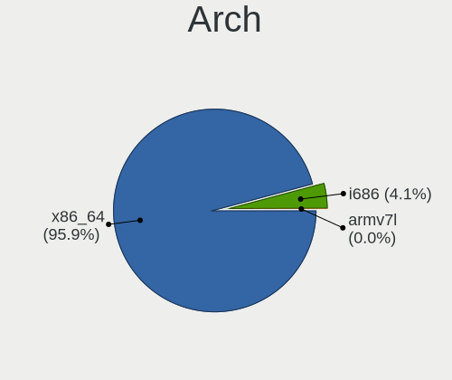
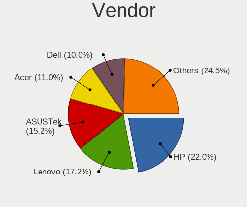
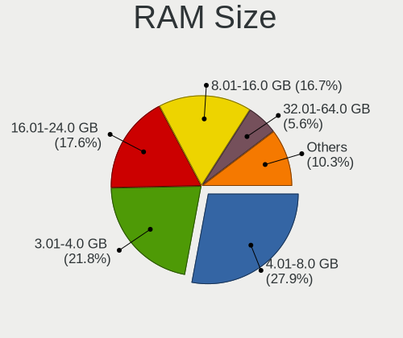
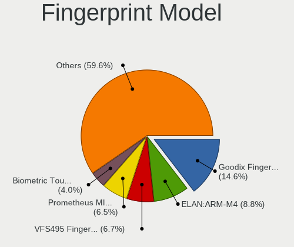

Linux in Italy - Tested Hardware & Statistics (Notebooks)
---------------------------------------------------------

A project to collect tested hardware configurations for Linux in Italy.

Anyone can contribute to this report by the [hw-probe](https://github.com/linuxhw/hw-probe) tool:

    sudo -E hw-probe -all -upload

Please contribute! Especially if your hardware is rare.

Contents
--------

* [ Test Cases ](#test-cases)

* [ System ](#system)
  - [ OS                       ](#os)
  - [ OS Family                ](#os-family)
  - [ Kernel                   ](#kernel)
  - [ Kernel Family            ](#kernel-family)
  - [ Kernel Major Ver.        ](#kernel-major-ver)
  - [ Arch                     ](#arch)
  - [ DE                       ](#de)
  - [ Display Server           ](#display-server)
  - [ Display Manager          ](#display-manager)
  - [ OS Lang                  ](#os-lang)
  - [ Boot Mode                ](#boot-mode)
  - [ Filesystem               ](#filesystem)
  - [ Part. scheme             ](#part-scheme)
  - [ Dual Boot with Linux/BSD ](#dual-boot-with-linuxbsd)
  - [ Dual Boot (Win)          ](#dual-boot-win)

* [ Board ](#board)
  - [ Vendor                   ](#vendor)
  - [ Model                    ](#model)
  - [ Model Family             ](#model-family)
  - [ MFG Year                 ](#mfg-year)
  - [ Form Factor              ](#form-factor)
  - [ Secure Boot              ](#secure-boot)
  - [ Coreboot                 ](#coreboot)
  - [ RAM Size                 ](#ram-size)
  - [ RAM Used                 ](#ram-used)
  - [ Total Drives             ](#total-drives)
  - [ Has CD-ROM               ](#has-cd-rom)
  - [ Has Ethernet             ](#has-ethernet)
  - [ Has WiFi                 ](#has-wifi)
  - [ Has Bluetooth            ](#has-bluetooth)

* [ Location ](#location)
  - [ Country                  ](#country)
  - [ City                     ](#city)

* [ Drives ](#drives)
  - [ Drive Vendor             ](#drive-vendor)
  - [ Drive Model              ](#drive-model)
  - [ HDD Vendor               ](#hdd-vendor)
  - [ SSD Vendor               ](#ssd-vendor)
  - [ Drive Kind               ](#drive-kind)
  - [ Drive Connector          ](#drive-connector)
  - [ Drive Size               ](#drive-size)
  - [ Space Total              ](#space-total)
  - [ Space Used               ](#space-used)
  - [ Malfunc. Drives          ](#malfunc-drives)
  - [ Malfunc. Drive Vendor    ](#malfunc-drive-vendor)
  - [ Malfunc. HDD Vendor      ](#malfunc-hdd-vendor)
  - [ Malfunc. Drive Kind      ](#malfunc-drive-kind)
  - [ Failed Drives            ](#failed-drives)
  - [ Failed Drive Vendor      ](#failed-drive-vendor)
  - [ Drive Status             ](#drive-status)

* [ Storage controller ](#storage-controller)
  - [ Storage Vendor           ](#storage-vendor)
  - [ Storage Model            ](#storage-model)
  - [ Storage Kind             ](#storage-kind)

* [ Processor ](#processor)
  - [ CPU Vendor               ](#cpu-vendor)
  - [ CPU Model                ](#cpu-model)
  - [ CPU Model Family         ](#cpu-model-family)
  - [ CPU Cores                ](#cpu-cores)
  - [ CPU Sockets              ](#cpu-sockets)
  - [ CPU Threads              ](#cpu-threads)
  - [ CPU Op-Modes             ](#cpu-op-modes)
  - [ CPU Microcode            ](#cpu-microcode)
  - [ CPU Microarch            ](#cpu-microarch)

* [ Graphics ](#graphics)
  - [ GPU Vendor               ](#gpu-vendor)
  - [ GPU Model                ](#gpu-model)
  - [ GPU Combo                ](#gpu-combo)
  - [ GPU Driver               ](#gpu-driver)
  - [ GPU Memory               ](#gpu-memory)

* [ Monitor ](#monitor)
  - [ Monitor Vendor           ](#monitor-vendor)
  - [ Monitor Model            ](#monitor-model)
  - [ Monitor Resolution       ](#monitor-resolution)
  - [ Monitor Diagonal         ](#monitor-diagonal)
  - [ Monitor Width            ](#monitor-width)
  - [ Aspect Ratio             ](#aspect-ratio)
  - [ Monitor Area             ](#monitor-area)
  - [ Pixel Density            ](#pixel-density)
  - [ Multiple Monitors        ](#multiple-monitors)

* [ Network ](#network)
  - [ Net Controller Vendor    ](#net-controller-vendor)
  - [ Net Controller Model     ](#net-controller-model)
  - [ Wireless Vendor          ](#wireless-vendor)
  - [ Wireless Model           ](#wireless-model)
  - [ Ethernet Vendor          ](#ethernet-vendor)
  - [ Ethernet Model           ](#ethernet-model)
  - [ Net Controller Kind      ](#net-controller-kind)
  - [ Used Controller          ](#used-controller)
  - [ NICs                     ](#nics)
  - [ IPv6                     ](#ipv6)

* [ Bluetooth ](#bluetooth)
  - [ Bluetooth Vendor         ](#bluetooth-vendor)
  - [ Bluetooth Model          ](#bluetooth-model)

* [ Sound ](#sound)
  - [ Sound Vendor             ](#sound-vendor)
  - [ Sound Model              ](#sound-model)

* [ Memory ](#memory)
  - [ Memory Vendor            ](#memory-vendor)
  - [ Memory Model             ](#memory-model)
  - [ Memory Kind              ](#memory-kind)
  - [ Memory Form Factor       ](#memory-form-factor)
  - [ Memory Size              ](#memory-size)
  - [ Memory Speed             ](#memory-speed)

* [ Printers & scanners ](#printers--scanners)
  - [ Printer Vendor           ](#printer-vendor)
  - [ Printer Model            ](#printer-model)
  - [ Scanner Vendor           ](#scanner-vendor)
  - [ Scanner Model            ](#scanner-model)

* [ Camera ](#camera)
  - [ Camera Vendor            ](#camera-vendor)
  - [ Camera Model             ](#camera-model)

* [ Security ](#security)
  - [ Fingerprint Vendor       ](#fingerprint-vendor)
  - [ Fingerprint Model        ](#fingerprint-model)
  - [ Chipcard Vendor          ](#chipcard-vendor)
  - [ Chipcard Model           ](#chipcard-model)

* [ Unsupported ](#unsupported)
  - [ Unsupported Devices      ](#unsupported-devices)
  - [ Unsupported Device Types ](#unsupported-device-types)

Test Cases
----------

Total: 6914

| Vendor        | Model                       | Probe                                                      | Date         |
|---------------|-----------------------------|------------------------------------------------------------|--------------|
| Lenovo        | ThinkPad E15 20RD0011IX     | [88cc97d0be](https://linux-hardware.org/?probe=88cc97d0be) | Nov 06, 2023 |
| Apple         | MacBookPro11,3              | [0009d8a468](https://linux-hardware.org/?probe=0009d8a468) | Nov 06, 2023 |
| ASUSTek       | VivoBook_ASUS Laptop E41... | [62b6928793](https://linux-hardware.org/?probe=62b6928793) | Nov 06, 2023 |
| TUXEDO        | Pulse 15 Gen2               | [10f2785958](https://linux-hardware.org/?probe=10f2785958) | Nov 06, 2023 |
| Acer          | Aspire ES1-521              | [8447756322](https://linux-hardware.org/?probe=8447756322) | Nov 06, 2023 |
| Acer          | Aspire ES1-521              | [af12dd22ba](https://linux-hardware.org/?probe=af12dd22ba) | Nov 06, 2023 |
| HP            | 250 G7 Notebook PC          | [a2ad36d26c](https://linux-hardware.org/?probe=a2ad36d26c) | Nov 06, 2023 |
| HP            | EliteBook 830 G5            | [07ef51bd31](https://linux-hardware.org/?probe=07ef51bd31) | Nov 05, 2023 |
| HP            | ProBook 450 G5              | [6407166dd5](https://linux-hardware.org/?probe=6407166dd5) | Nov 05, 2023 |
| HP            | Laptop 15-db1xxx            | [3a69031984](https://linux-hardware.org/?probe=3a69031984) | Nov 05, 2023 |
| ASUSTek       | VivoBook_ASUSLaptop X515... | [8e3e7668cf](https://linux-hardware.org/?probe=8e3e7668cf) | Nov 05, 2023 |
| Sony          | VGN-N21S_W                  | [6ff4658440](https://linux-hardware.org/?probe=6ff4658440) | Nov 05, 2023 |
| Sony          | VGN-N21S_W                  | [266bedfdc3](https://linux-hardware.org/?probe=266bedfdc3) | Nov 05, 2023 |
| Unknown       | Unknown                     | [2c2d291f54](https://linux-hardware.org/?probe=2c2d291f54) | Nov 05, 2023 |
| HP            | 530                         | [710ba89827](https://linux-hardware.org/?probe=710ba89827) | Nov 05, 2023 |
| HP            | Notebook                    | [8eea1901f7](https://linux-hardware.org/?probe=8eea1901f7) | Nov 05, 2023 |
| Lenovo        | ThinkPad X250 20CM001UUK    | [b0fd9fa3c0](https://linux-hardware.org/?probe=b0fd9fa3c0) | Nov 05, 2023 |
| HP            | Pavilion 15                 | [dd81ed04ea](https://linux-hardware.org/?probe=dd81ed04ea) | Nov 04, 2023 |
| HP            | ProBook 430 G1              | [14dc35a1b9](https://linux-hardware.org/?probe=14dc35a1b9) | Nov 04, 2023 |
| HP            | Notebook                    | [f8cf975d3c](https://linux-hardware.org/?probe=f8cf975d3c) | Nov 04, 2023 |
| ASUSTek       | VivoBook_ASUSLaptop X513... | [34e4bd156f](https://linux-hardware.org/?probe=34e4bd156f) | Nov 04, 2023 |
| HP            | ZBook 17 G3                 | [7d38ea5f87](https://linux-hardware.org/?probe=7d38ea5f87) | Nov 04, 2023 |
| HP            | EliteBook 840 G6            | [d4b22ac16a](https://linux-hardware.org/?probe=d4b22ac16a) | Nov 04, 2023 |
| Lenovo        | IdeaPad Gaming 3 15ARH05... | [3922b02290](https://linux-hardware.org/?probe=3922b02290) | Nov 04, 2023 |
| HP            | 255 G8 Notebook PC          | [2d1116cd1b](https://linux-hardware.org/?probe=2d1116cd1b) | Nov 04, 2023 |
| Lenovo        | V15 G2 ITL 82KB             | [85e528f1bf](https://linux-hardware.org/?probe=85e528f1bf) | Nov 04, 2023 |
| Dell          | Inspiron 15 3511            | [8c23fbf7d1](https://linux-hardware.org/?probe=8c23fbf7d1) | Nov 04, 2023 |
| Lenovo        | IdeaPad Gaming 3 15ARH05... | [bb7622a7ba](https://linux-hardware.org/?probe=bb7622a7ba) | Nov 04, 2023 |
| Dell          | XPS 15 7590                 | [8685e384af](https://linux-hardware.org/?probe=8685e384af) | Nov 04, 2023 |
| HUAWEI        | KLVL-WXX9                   | [61342b31ea](https://linux-hardware.org/?probe=61342b31ea) | Nov 03, 2023 |
| ASUSTek       | X551CA                      | [20bee22e0a](https://linux-hardware.org/?probe=20bee22e0a) | Nov 03, 2023 |
| ASUSTek       | ASUS TUF Gaming A15 FA50... | [ff0d013246](https://linux-hardware.org/?probe=ff0d013246) | Nov 03, 2023 |
| Acer          | Nitro AN515-54              | [ce98faee85](https://linux-hardware.org/?probe=ce98faee85) | Nov 03, 2023 |
| Lenovo        | IdeaPad 3 15IML05 81WB      | [f9bdbf6371](https://linux-hardware.org/?probe=f9bdbf6371) | Nov 03, 2023 |
| ASUSTek       | VivoBook_ASUSLaptop X571... | [b592d36d74](https://linux-hardware.org/?probe=b592d36d74) | Nov 03, 2023 |
| ASUSTek       | VivoBook_ASUSLaptop X571... | [da695062ba](https://linux-hardware.org/?probe=da695062ba) | Nov 03, 2023 |
| Dell          | Inspiron 16 5625            | [157f3bd86a](https://linux-hardware.org/?probe=157f3bd86a) | Nov 03, 2023 |
| Lenovo        | IdeaPad 3 15ALC6 82KU       | [bcea72b22f](https://linux-hardware.org/?probe=bcea72b22f) | Nov 03, 2023 |
| ASUSTek       | X510URR                     | [645fbe9fc3](https://linux-hardware.org/?probe=645fbe9fc3) | Nov 03, 2023 |
| Acer          | Swift SF114-32              | [2314e30b70](https://linux-hardware.org/?probe=2314e30b70) | Nov 03, 2023 |
| Acer          | Swift SF114-32              | [ad12644dff](https://linux-hardware.org/?probe=ad12644dff) | Nov 03, 2023 |
| HP            | 250 G7 Notebook PC          | [1889111d8a](https://linux-hardware.org/?probe=1889111d8a) | Nov 03, 2023 |
| Hampoo        | I2W6_AP135 Reserved         | [cf0c02a17a](https://linux-hardware.org/?probe=cf0c02a17a) | Nov 03, 2023 |
| Hampoo        | I2W6_AP135 Reserved         | [fdb464fed7](https://linux-hardware.org/?probe=fdb464fed7) | Nov 02, 2023 |
| Notebook      | NJ50_70CU                   | [9cabd6fd2c](https://linux-hardware.org/?probe=9cabd6fd2c) | Nov 02, 2023 |
| Notebook      | NJ50_70CU                   | [3414d178f2](https://linux-hardware.org/?probe=3414d178f2) | Nov 02, 2023 |
| HUAWEI        | KPL-W0X                     | [9cdd815382](https://linux-hardware.org/?probe=9cdd815382) | Nov 02, 2023 |
| MSI           | Prestige 14Evo A11M         | [12414485a5](https://linux-hardware.org/?probe=12414485a5) | Nov 02, 2023 |
| HP            | EliteBook 830 G5            | [8ab22982cc](https://linux-hardware.org/?probe=8ab22982cc) | Nov 02, 2023 |
| ASUSTek       | VivoBook_ASUSLaptop X509... | [b0c996ac38](https://linux-hardware.org/?probe=b0c996ac38) | Nov 02, 2023 |
| Lenovo        | ThinkPad T440 20B7A0CYMH    | [4d3101d9f8](https://linux-hardware.org/?probe=4d3101d9f8) | Nov 02, 2023 |
| Samsung       | 750XDA                      | [130a1273e5](https://linux-hardware.org/?probe=130a1273e5) | Nov 02, 2023 |
| Dell          | XPS 13 9300                 | [9690e7a65f](https://linux-hardware.org/?probe=9690e7a65f) | Nov 02, 2023 |
| Lenovo        | ThinkPad T15 Gen 2i 20W4... | [37dc32cd03](https://linux-hardware.org/?probe=37dc32cd03) | Nov 02, 2023 |
| Lenovo        | ThinkPad P53 20QN000FIX     | [40de43c266](https://linux-hardware.org/?probe=40de43c266) | Nov 02, 2023 |
| ASUSTek       | U36SD                       | [e2045d61a5](https://linux-hardware.org/?probe=e2045d61a5) | Nov 02, 2023 |
| Lenovo        | ThinkPad T480 20L60017UK    | [e8b030e97f](https://linux-hardware.org/?probe=e8b030e97f) | Nov 02, 2023 |
| ASUSTek       | X555LAB                     | [b9532c1f86](https://linux-hardware.org/?probe=b9532c1f86) | Nov 02, 2023 |
| Acer          | One S1002                   | [a00e6d78a6](https://linux-hardware.org/?probe=a00e6d78a6) | Nov 02, 2023 |
| ASUSTek       | N550JV                      | [200e3255d9](https://linux-hardware.org/?probe=200e3255d9) | Nov 02, 2023 |
| Chuwi         | CoreBook Pro                | [ac0f4a1ea9](https://linux-hardware.org/?probe=ac0f4a1ea9) | Nov 01, 2023 |
| ASUSTek       | N550JV                      | [43a84b57f0](https://linux-hardware.org/?probe=43a84b57f0) | Nov 01, 2023 |
| Framework     | Laptop (13th Gen Intel C... | [df4f43ca44](https://linux-hardware.org/?probe=df4f43ca44) | Nov 01, 2023 |
| Acer          | Aspire A315-56              | [2de4949247](https://linux-hardware.org/?probe=2de4949247) | Nov 01, 2023 |
| ASUSTek       | UX430UNR                    | [47abbeb9c1](https://linux-hardware.org/?probe=47abbeb9c1) | Nov 01, 2023 |
| Acer          | TravelMate P215-52          | [b9c3643e62](https://linux-hardware.org/?probe=b9c3643e62) | Nov 01, 2023 |
| ASUSTek       | K56CB                       | [9fff1dc94c](https://linux-hardware.org/?probe=9fff1dc94c) | Nov 01, 2023 |
| HP            | 630                         | [634f46006b](https://linux-hardware.org/?probe=634f46006b) | Nov 01, 2023 |
| Acer          | Nitro AN515-52              | [829c16d044](https://linux-hardware.org/?probe=829c16d044) | Nov 01, 2023 |
| Apple         | MacBook7,1                  | [60edf3f76c](https://linux-hardware.org/?probe=60edf3f76c) | Nov 01, 2023 |
| ASUSTek       | ASUS EXPERTBOOK B9450FA_... | [ed95443390](https://linux-hardware.org/?probe=ed95443390) | Nov 01, 2023 |
| Apple         | MacBookPro16,2              | [37b53d54e8](https://linux-hardware.org/?probe=37b53d54e8) | Nov 01, 2023 |
| Acer          | Nitro AN515-56              | [7c88fdcaa3](https://linux-hardware.org/?probe=7c88fdcaa3) | Nov 01, 2023 |
| Lenovo        | ThinkPad T480s 20L8S2SX0... | [d5fee530ee](https://linux-hardware.org/?probe=d5fee530ee) | Nov 01, 2023 |
| Lenovo        | V15-ADA 82C7                | [0c38487bcf](https://linux-hardware.org/?probe=0c38487bcf) | Nov 01, 2023 |
| HP            | Laptop 15-bs1xx             | [1bd48815fe](https://linux-hardware.org/?probe=1bd48815fe) | Nov 01, 2023 |
| Lenovo        | ThinkPad T14 Gen 1 20S00... | [5acc8f68a0](https://linux-hardware.org/?probe=5acc8f68a0) | Nov 01, 2023 |
| Sony          | VPCSA3J1E                   | [99b0d275ec](https://linux-hardware.org/?probe=99b0d275ec) | Nov 01, 2023 |
| HUAWEI        | MACH-WX9                    | [f557533925](https://linux-hardware.org/?probe=f557533925) | Nov 01, 2023 |
| Microtech     | CoreBookLite                | [1833fd5f0c](https://linux-hardware.org/?probe=1833fd5f0c) | Nov 01, 2023 |
| HUAWEI        | MACH-WX9                    | [50880de513](https://linux-hardware.org/?probe=50880de513) | Nov 01, 2023 |
| Lenovo        | Legion Y740-17IRHg 81UJ     | [cd9e941307](https://linux-hardware.org/?probe=cd9e941307) | Nov 01, 2023 |
| Dell          | Inspiron 7520               | [460c9255bd](https://linux-hardware.org/?probe=460c9255bd) | Nov 01, 2023 |
| Lenovo        | ThinkPad T460p 20FXS0FS0... | [0b21a4419d](https://linux-hardware.org/?probe=0b21a4419d) | Nov 01, 2023 |
| Lenovo        | ThinkPad T460p 20FXS0FS0... | [757199e3cf](https://linux-hardware.org/?probe=757199e3cf) | Nov 01, 2023 |
| HUAWEI        | BOHB-WAX9                   | [5da84da52f](https://linux-hardware.org/?probe=5da84da52f) | Oct 31, 2023 |
| HP            | 250 G5 Notebook PC          | [803bc8d1ed](https://linux-hardware.org/?probe=803bc8d1ed) | Oct 31, 2023 |
| HP            | 255 G8 Notebook PC          | [b9d1b13098](https://linux-hardware.org/?probe=b9d1b13098) | Oct 31, 2023 |
| ASUSTek       | ASUS TUF Gaming A15 FA50... | [6c1c4ea069](https://linux-hardware.org/?probe=6c1c4ea069) | Oct 31, 2023 |
| HUAWEI        | CREF-XX                     | [a10aa3c3e5](https://linux-hardware.org/?probe=a10aa3c3e5) | Oct 31, 2023 |
| ASUSTek       | F5N                         | [8da324b4fa](https://linux-hardware.org/?probe=8da324b4fa) | Oct 31, 2023 |
| Dell          | XPS 15 9570                 | [341114c78a](https://linux-hardware.org/?probe=341114c78a) | Oct 31, 2023 |
| Lenovo        | IdeaPad 5 15ARE05 81YQ      | [aef3dccca0](https://linux-hardware.org/?probe=aef3dccca0) | Oct 31, 2023 |
| HP            | Pavilion Laptop 15-cs3xx... | [1107919053](https://linux-hardware.org/?probe=1107919053) | Oct 31, 2023 |
| HP            | ProBook 450 15.6 inch G9... | [ea29ba4b58](https://linux-hardware.org/?probe=ea29ba4b58) | Oct 31, 2023 |
| Lenovo        | ThinkPad T495 20NJCTO1WW    | [8e86103e06](https://linux-hardware.org/?probe=8e86103e06) | Oct 31, 2023 |
| Samsung       | 750XED                      | [9dab50e37e](https://linux-hardware.org/?probe=9dab50e37e) | Oct 31, 2023 |
| Lenovo        | V15 G2 ITL 82KB             | [4f6d9ac7b5](https://linux-hardware.org/?probe=4f6d9ac7b5) | Oct 31, 2023 |
| ASUSTek       | ROG Strix G531GT_G531GT     | [98d01105c7](https://linux-hardware.org/?probe=98d01105c7) | Oct 31, 2023 |
| Dell          | XPS 15 9510                 | [d370c488e4](https://linux-hardware.org/?probe=d370c488e4) | Oct 31, 2023 |
| Samsung       | 930XDB/931XDB/930XDY        | [421368e431](https://linux-hardware.org/?probe=421368e431) | Oct 31, 2023 |
| Dell          | Vostro 3549                 | [259c646ecb](https://linux-hardware.org/?probe=259c646ecb) | Oct 31, 2023 |
| Samsung       | RC420/RC520/RC720           | [1e3f228931](https://linux-hardware.org/?probe=1e3f228931) | Oct 31, 2023 |
| Samsung       | RC420/RC520/RC720           | [10382e8ed6](https://linux-hardware.org/?probe=10382e8ed6) | Oct 31, 2023 |
| AMI           | Intel                       | [98d35ad708](https://linux-hardware.org/?probe=98d35ad708) | Oct 31, 2023 |
| Toshiba       | TECRA S11                   | [e2a669bf1a](https://linux-hardware.org/?probe=e2a669bf1a) | Oct 31, 2023 |
| Lenovo        | ThinkPad L450 20DSS26200    | [ebcacada49](https://linux-hardware.org/?probe=ebcacada49) | Oct 31, 2023 |
| Lenovo        | ThinkBook 15p Gen 2 21B1    | [a0da22e928](https://linux-hardware.org/?probe=a0da22e928) | Oct 31, 2023 |
| ASUSTek       | X550EP                      | [81fdd48960](https://linux-hardware.org/?probe=81fdd48960) | Oct 31, 2023 |
| Lenovo        | ThinkPad L450 20DSS26200    | [d8658ea415](https://linux-hardware.org/?probe=d8658ea415) | Oct 31, 2023 |
| Lenovo        | ThinkPad P14s Gen 2a 21A... | [ed27ef3491](https://linux-hardware.org/?probe=ed27ef3491) | Oct 31, 2023 |
| Alienware     | 13 R3                       | [726415f251](https://linux-hardware.org/?probe=726415f251) | Oct 31, 2023 |
| Dell          | XPS 15 9530                 | [683545565a](https://linux-hardware.org/?probe=683545565a) | Oct 31, 2023 |
| Lenovo        | G500 20236                  | [6779e74408](https://linux-hardware.org/?probe=6779e74408) | Oct 31, 2023 |
| HP            | Pavilion Laptop 15-eh2xx... | [2a589a5505](https://linux-hardware.org/?probe=2a589a5505) | Oct 31, 2023 |
| ASUSTek       | VivoBook_ASUSLaptop X571... | [53cd13281b](https://linux-hardware.org/?probe=53cd13281b) | Oct 31, 2023 |
| HP            | Pavilion Laptop 15-eh2xx... | [daa299c314](https://linux-hardware.org/?probe=daa299c314) | Oct 31, 2023 |
| Dell          | Latitude 5520               | [3803e551f1](https://linux-hardware.org/?probe=3803e551f1) | Oct 31, 2023 |
| Apple         | MacBook7,1                  | [11ada26a4c](https://linux-hardware.org/?probe=11ada26a4c) | Oct 31, 2023 |
| Dell          | Inspiron 7580               | [fc223b91ed](https://linux-hardware.org/?probe=fc223b91ed) | Oct 31, 2023 |
| Lenovo        | ThinkPad E470 20H1006KIX    | [d84959fadc](https://linux-hardware.org/?probe=d84959fadc) | Oct 31, 2023 |
| HP            | 250 G6 Notebook PC          | [c1d956674a](https://linux-hardware.org/?probe=c1d956674a) | Oct 31, 2023 |
| Lenovo        | ThinkPad L14 Gen 3 21C10... | [2f63bfb399](https://linux-hardware.org/?probe=2f63bfb399) | Oct 31, 2023 |
| Dell          | Inspiron 5590               | [7634c564d0](https://linux-hardware.org/?probe=7634c564d0) | Oct 31, 2023 |
| ASUSTek       | ASUS TUF Gaming A15 FA50... | [54a64f0a7e](https://linux-hardware.org/?probe=54a64f0a7e) | Oct 31, 2023 |
| Dell          | Precision M6800             | [72c51649f1](https://linux-hardware.org/?probe=72c51649f1) | Oct 31, 2023 |
| Lenovo        | Yoga 900-13ISK 80MK         | [38b70999b9](https://linux-hardware.org/?probe=38b70999b9) | Oct 31, 2023 |
| ASUSTek       | VivoBook_ASUSLaptop X515... | [2eaf76ce92](https://linux-hardware.org/?probe=2eaf76ce92) | Oct 31, 2023 |
| Dell          | Latitude 5414               | [fd7b086e1b](https://linux-hardware.org/?probe=fd7b086e1b) | Oct 31, 2023 |
| Timi          | RedmiBook Pro 15            | [2cad75b0fc](https://linux-hardware.org/?probe=2cad75b0fc) | Oct 31, 2023 |
| Dell          | Latitude 5420               | [c2f4052fb4](https://linux-hardware.org/?probe=c2f4052fb4) | Oct 31, 2023 |
| Lenovo        | ThinkPad X13 Gen 1 20T3S... | [487222ef3e](https://linux-hardware.org/?probe=487222ef3e) | Oct 31, 2023 |
| Acer          | Swift SF314-41              | [1bdd8f14ad](https://linux-hardware.org/?probe=1bdd8f14ad) | Oct 31, 2023 |
| HP            | Laptop 15-dw0xxx            | [55f41faf27](https://linux-hardware.org/?probe=55f41faf27) | Oct 31, 2023 |
| Lenovo        | Z50-70 20354                | [8d764a9632](https://linux-hardware.org/?probe=8d764a9632) | Oct 31, 2023 |
| Dell          | Inspiron 5590               | [d339ee4dbc](https://linux-hardware.org/?probe=d339ee4dbc) | Oct 30, 2023 |
| Lenovo        | G500 20236                  | [000230db12](https://linux-hardware.org/?probe=000230db12) | Oct 30, 2023 |
| Lenovo        | IdeaPad 5 14ALC05 82LM      | [32d642cc3b](https://linux-hardware.org/?probe=32d642cc3b) | Oct 30, 2023 |
| ASUSTek       | X555LP                      | [1f57f57452](https://linux-hardware.org/?probe=1f57f57452) | Oct 30, 2023 |
| Lenovo        | ThinkPad L540 20AV005GIX    | [ca59c544ef](https://linux-hardware.org/?probe=ca59c544ef) | Oct 30, 2023 |
| HP            | Victus by Laptop 16-e0xx... | [309695dc7e](https://linux-hardware.org/?probe=309695dc7e) | Oct 30, 2023 |
| Lenovo        | IdeaPad Gaming 3 15ACH6 ... | [ab5cef69c3](https://linux-hardware.org/?probe=ab5cef69c3) | Oct 30, 2023 |
| Dell          | XPS 15 9520                 | [0fb7ced892](https://linux-hardware.org/?probe=0fb7ced892) | Oct 30, 2023 |
| Apple         | MacBookPro11,4              | [4d6c2166c8](https://linux-hardware.org/?probe=4d6c2166c8) | Oct 30, 2023 |
| Lenovo        | IdeaPad 5 14ARE05 81YM      | [055e34b095](https://linux-hardware.org/?probe=055e34b095) | Oct 30, 2023 |
| HP            | Pavilion Gaming Notebook    | [17dd2ce988](https://linux-hardware.org/?probe=17dd2ce988) | Oct 30, 2023 |
| Acer          | Aspire A515-45              | [25431e9c91](https://linux-hardware.org/?probe=25431e9c91) | Oct 30, 2023 |
| HP            | ProBook 650 G1              | [508c244637](https://linux-hardware.org/?probe=508c244637) | Oct 30, 2023 |
| Lenovo        | Yoga Slim 7 ProX 14ARH7 ... | [5f8cf197d5](https://linux-hardware.org/?probe=5f8cf197d5) | Oct 30, 2023 |
| Lenovo        | ThinkPad T530 23924FJ       | [c8b87fb249](https://linux-hardware.org/?probe=c8b87fb249) | Oct 30, 2023 |
| ASUSTek       | X555UJ                      | [de6e2775a4](https://linux-hardware.org/?probe=de6e2775a4) | Oct 30, 2023 |
| ASUSTek       | ZenBook UX325EA_UX325EA     | [dd2e706549](https://linux-hardware.org/?probe=dd2e706549) | Oct 30, 2023 |
| Lenovo        | ThinkPad T530 23924FJ       | [b64508402a](https://linux-hardware.org/?probe=b64508402a) | Oct 30, 2023 |
| Dell          | Precision 3541              | [6857b35adc](https://linux-hardware.org/?probe=6857b35adc) | Oct 30, 2023 |
| MSI           | Delta 15 A5EFK              | [185b65ebc1](https://linux-hardware.org/?probe=185b65ebc1) | Oct 30, 2023 |
| HP            | 255 G6 Notebook PC          | [f19f70993f](https://linux-hardware.org/?probe=f19f70993f) | Oct 30, 2023 |
| MSI           | GP66 Leopard 10UG           | [47dbfa475a](https://linux-hardware.org/?probe=47dbfa475a) | Oct 30, 2023 |
| ASUSTek       | ASUS TUF Dash F15 FX517Z... | [d5debf7011](https://linux-hardware.org/?probe=d5debf7011) | Oct 30, 2023 |
| HUAWEI        | BOHK-WAX9X                  | [2b883f993f](https://linux-hardware.org/?probe=2b883f993f) | Oct 30, 2023 |
| Lenovo        | ThinkBook 14 G4 ABA 21DK    | [0b129d4a95](https://linux-hardware.org/?probe=0b129d4a95) | Oct 30, 2023 |
| Dell          | Vostro 3525                 | [ad34d5b54f](https://linux-hardware.org/?probe=ad34d5b54f) | Oct 30, 2023 |
| ASUSTek       | F5N                         | [67f3a19888](https://linux-hardware.org/?probe=67f3a19888) | Oct 30, 2023 |
| Dell          | Inspiron 1545               | [5a1d90c1a7](https://linux-hardware.org/?probe=5a1d90c1a7) | Oct 30, 2023 |
| MSI           | GF75 Thin 10UEK             | [c9cb087088](https://linux-hardware.org/?probe=c9cb087088) | Oct 30, 2023 |
| ASUSTek       | K50IJ                       | [115cf0d371](https://linux-hardware.org/?probe=115cf0d371) | Oct 30, 2023 |
| ASUSTek       | K50IJ                       | [6fbbd2a061](https://linux-hardware.org/?probe=6fbbd2a061) | Oct 30, 2023 |
| Mediacom      | WinPad 11,6 FullHD- WPU1... | [b3e37008cb](https://linux-hardware.org/?probe=b3e37008cb) | Oct 30, 2023 |
| Lenovo        | V15 G2 ALC 82KD             | [81a7cabe4f](https://linux-hardware.org/?probe=81a7cabe4f) | Oct 30, 2023 |
| MSI           | GF75 Thin 10UEK             | [a58fbe3576](https://linux-hardware.org/?probe=a58fbe3576) | Oct 30, 2023 |
| HP            | EliteBook 8560w             | [cd7ef88b8a](https://linux-hardware.org/?probe=cd7ef88b8a) | Oct 30, 2023 |
| HP            | EliteBook 840 G6            | [b113709ec2](https://linux-hardware.org/?probe=b113709ec2) | Oct 29, 2023 |
| Dell          | XPS 13 9300                 | [f8df9730e1](https://linux-hardware.org/?probe=f8df9730e1) | Oct 29, 2023 |
| HP            | Notebook                    | [79843ed7c3](https://linux-hardware.org/?probe=79843ed7c3) | Oct 29, 2023 |
| Acer          | Aspire 4820TG               | [a72ac510df](https://linux-hardware.org/?probe=a72ac510df) | Oct 29, 2023 |
| Dell          | Vostro 15 3515              | [3d2fe89bc1](https://linux-hardware.org/?probe=3d2fe89bc1) | Oct 29, 2023 |
| Lenovo        | ThinkPad T480 20L5000AIX    | [65b2874cbb](https://linux-hardware.org/?probe=65b2874cbb) | Oct 28, 2023 |
| HP            | Notebook                    | [791dfef3cc](https://linux-hardware.org/?probe=791dfef3cc) | Oct 28, 2023 |
| Lenovo        | IdeaPad Gaming 3 15ARH05... | [b65d7d3b4a](https://linux-hardware.org/?probe=b65d7d3b4a) | Oct 28, 2023 |
| HP            | Laptop 15s-fq0xxx           | [e3154e94cf](https://linux-hardware.org/?probe=e3154e94cf) | Oct 28, 2023 |
| Lenovo        | ThinkPad T470 20HES0FW00    | [198bee98eb](https://linux-hardware.org/?probe=198bee98eb) | Oct 27, 2023 |
| Apple         | MacBook7,1                  | [61b133ac1e](https://linux-hardware.org/?probe=61b133ac1e) | Oct 27, 2023 |
| HP            | 15                          | [a9e38be5d5](https://linux-hardware.org/?probe=a9e38be5d5) | Oct 27, 2023 |
| HP            | Victus by Laptop 16-e0xx... | [1971a346bf](https://linux-hardware.org/?probe=1971a346bf) | Oct 27, 2023 |
| Apple         | MacBookPro6,2               | [af9b5b05e9](https://linux-hardware.org/?probe=af9b5b05e9) | Oct 26, 2023 |
| Lenovo        | ThinkPad T540p 20BE00B4I... | [afce107e0d](https://linux-hardware.org/?probe=afce107e0d) | Oct 26, 2023 |
| ASUSTek       | X505BP                      | [884529eef1](https://linux-hardware.org/?probe=884529eef1) | Oct 26, 2023 |
| ASUSTek       | X505BP                      | [f32e8922c8](https://linux-hardware.org/?probe=f32e8922c8) | Oct 26, 2023 |
| Acer          | Nitro AN515-58              | [f956ab0313](https://linux-hardware.org/?probe=f956ab0313) | Oct 26, 2023 |
| Chuwi         | GemiBook Pro                | [e2900eda68](https://linux-hardware.org/?probe=e2900eda68) | Oct 26, 2023 |
| ASUSTek       | X555LAB                     | [a8b1ad0f53](https://linux-hardware.org/?probe=a8b1ad0f53) | Oct 25, 2023 |
| HP            | 15                          | [629c50d53a](https://linux-hardware.org/?probe=629c50d53a) | Oct 25, 2023 |
| Acer          | Aspire 5739G                | [21f871b008](https://linux-hardware.org/?probe=21f871b008) | Oct 25, 2023 |
| ASUSTek       | X550LD                      | [cb2e25f26f](https://linux-hardware.org/?probe=cb2e25f26f) | Oct 25, 2023 |
| Dell          | Vostro 15 3515              | [5713b2f30e](https://linux-hardware.org/?probe=5713b2f30e) | Oct 24, 2023 |
| Packard Be... | EasyNote LE69KB             | [3626d833e9](https://linux-hardware.org/?probe=3626d833e9) | Oct 24, 2023 |
| Acer          | Aspire 5738                 | [0abcd8d89e](https://linux-hardware.org/?probe=0abcd8d89e) | Oct 24, 2023 |
| Acer          | Aspire 5738                 | [fb6910c3c6](https://linux-hardware.org/?probe=fb6910c3c6) | Oct 24, 2023 |
| Acer          | Aspire 5738                 | [039878b1b2](https://linux-hardware.org/?probe=039878b1b2) | Oct 24, 2023 |
| Dell          | Vostro 3420                 | [e51b3ff063](https://linux-hardware.org/?probe=e51b3ff063) | Oct 24, 2023 |
| HP            | EliteBook 8740w             | [3669a01d21](https://linux-hardware.org/?probe=3669a01d21) | Oct 24, 2023 |
| ASUSTek       | K56CM                       | [a5437fcab8](https://linux-hardware.org/?probe=a5437fcab8) | Oct 24, 2023 |
| Acer          | Extensa 5220                | [eda0099ab4](https://linux-hardware.org/?probe=eda0099ab4) | Oct 24, 2023 |
| ASUSTek       | VivoBook_ASUSLaptop X515... | [dc730f5631](https://linux-hardware.org/?probe=dc730f5631) | Oct 23, 2023 |
| Acer          | Nitro AN515-45              | [61791a9250](https://linux-hardware.org/?probe=61791a9250) | Oct 23, 2023 |
| ASUSTek       | X555YI                      | [0028f82c4d](https://linux-hardware.org/?probe=0028f82c4d) | Oct 23, 2023 |
| Dell          | XPS 9315                    | [d04399e8fd](https://linux-hardware.org/?probe=d04399e8fd) | Oct 23, 2023 |
| ASUSTek       | Vivobook Go E1504FA_E150... | [7981b12a61](https://linux-hardware.org/?probe=7981b12a61) | Oct 22, 2023 |
| Dell          | XPS 9315                    | [e3c5d45e2a](https://linux-hardware.org/?probe=e3c5d45e2a) | Oct 22, 2023 |
| Lenovo        | IdeaPad S540-14IWL 81ND     | [c725f222a3](https://linux-hardware.org/?probe=c725f222a3) | Oct 22, 2023 |
| Dell          | Latitude E5450              | [0f5e45f8e4](https://linux-hardware.org/?probe=0f5e45f8e4) | Oct 22, 2023 |
| ASUSTek       | VivoBook_ASUSLaptop X512... | [3431e88cbe](https://linux-hardware.org/?probe=3431e88cbe) | Oct 22, 2023 |
| ASUSTek       | X200MA                      | [41f4b8a93a](https://linux-hardware.org/?probe=41f4b8a93a) | Oct 21, 2023 |
| Lenovo        | IdeaPad 5 Pro 14ARH7 82S... | [943199c6c3](https://linux-hardware.org/?probe=943199c6c3) | Oct 21, 2023 |
| LG Electro... | 17Z90R-G.AP78D              | [8d320eb314](https://linux-hardware.org/?probe=8d320eb314) | Oct 21, 2023 |
| Acer          | Nitro AN515-52              | [081a658255](https://linux-hardware.org/?probe=081a658255) | Oct 21, 2023 |
| Lenovo        | ThinkPad E14 Gen 2 20T60... | [f103762ce5](https://linux-hardware.org/?probe=f103762ce5) | Oct 21, 2023 |
| Acer          | Aspire A315-23              | [147d6ad175](https://linux-hardware.org/?probe=147d6ad175) | Oct 21, 2023 |
| Samsung       | R530/R730/P590              | [6a774fbae7](https://linux-hardware.org/?probe=6a774fbae7) | Oct 21, 2023 |
| Acer          | Swift SF315-41              | [23c9a3dea4](https://linux-hardware.org/?probe=23c9a3dea4) | Oct 20, 2023 |
| Dell          | Latitude 7280               | [ec9e688b4e](https://linux-hardware.org/?probe=ec9e688b4e) | Oct 20, 2023 |
| Acer          | Aspire A114-33              | [34ffce7f83](https://linux-hardware.org/?probe=34ffce7f83) | Oct 20, 2023 |
| Dell          | Latitude 7280               | [3b88974986](https://linux-hardware.org/?probe=3b88974986) | Oct 20, 2023 |
| Lenovo        | ThinkPad T470 20HES4VB00    | [423a16c64a](https://linux-hardware.org/?probe=423a16c64a) | Oct 20, 2023 |
| Acer          | AOD270                      | [20d5a5477c](https://linux-hardware.org/?probe=20d5a5477c) | Oct 19, 2023 |
| HP            | Pavilion dv6                | [d5669e2ea8](https://linux-hardware.org/?probe=d5669e2ea8) | Oct 19, 2023 |
| Samsung       | 700T1C                      | [f5668a0ef6](https://linux-hardware.org/?probe=f5668a0ef6) | Oct 19, 2023 |
| Sony          | SVE1713X1EB                 | [ec015a6c9e](https://linux-hardware.org/?probe=ec015a6c9e) | Oct 19, 2023 |
| Dell          | Latitude E7270              | [673245c691](https://linux-hardware.org/?probe=673245c691) | Oct 19, 2023 |
| HP            | OMEN by Gaming Laptop 16... | [d906262d01](https://linux-hardware.org/?probe=d906262d01) | Oct 18, 2023 |
| Acer          | TravelMate 5720             | [8902ce3049](https://linux-hardware.org/?probe=8902ce3049) | Oct 18, 2023 |
| HP            | ProBook 450 G8 Notebook ... | [7aded01681](https://linux-hardware.org/?probe=7aded01681) | Oct 17, 2023 |
| HUAWEI        | NBLB-WAX9N                  | [42292e1deb](https://linux-hardware.org/?probe=42292e1deb) | Oct 17, 2023 |
| LG Electro... | 17Z90P-G.AA86D              | [afffdd63b5](https://linux-hardware.org/?probe=afffdd63b5) | Oct 17, 2023 |
| ASUSTek       | ROG Strix G614JU_G614JU     | [bb50abd0e6](https://linux-hardware.org/?probe=bb50abd0e6) | Oct 17, 2023 |
| Lenovo        | IdeaPad 100S-14IBR 80R9     | [f3bd5c6632](https://linux-hardware.org/?probe=f3bd5c6632) | Oct 17, 2023 |
| HUAWEI        | NBLK-WAX9X                  | [843098c658](https://linux-hardware.org/?probe=843098c658) | Oct 17, 2023 |
| Dell          | Inspiron 1545               | [87edaec977](https://linux-hardware.org/?probe=87edaec977) | Oct 17, 2023 |
| Dell          | XPS 9315                    | [e629bbd153](https://linux-hardware.org/?probe=e629bbd153) | Oct 16, 2023 |
| Dell          | XPS 9315                    | [a0b5099438](https://linux-hardware.org/?probe=a0b5099438) | Oct 16, 2023 |
| ASUSTek       | ROG Strix G614JU_G614JU     | [ddeaca23b4](https://linux-hardware.org/?probe=ddeaca23b4) | Oct 16, 2023 |
| HP            | 250 G4                      | [a45d8a13df](https://linux-hardware.org/?probe=a45d8a13df) | Oct 16, 2023 |
| Lenovo        | ThinkPad P16s Gen 2 21HK... | [3b0d979b69](https://linux-hardware.org/?probe=3b0d979b69) | Oct 16, 2023 |
| Lenovo        | ThinkPad T450 20BUS1K50X    | [11ccdc870b](https://linux-hardware.org/?probe=11ccdc870b) | Oct 16, 2023 |
| ASUSTek       | X541UV                      | [c5183a57ce](https://linux-hardware.org/?probe=c5183a57ce) | Oct 16, 2023 |
| HP            | 255 G6 Notebook PC          | [5cc901b874](https://linux-hardware.org/?probe=5cc901b874) | Oct 15, 2023 |
| Toshiba       | Satellite L655              | [9bda720e30](https://linux-hardware.org/?probe=9bda720e30) | Oct 15, 2023 |
| LG Electro... | 14Z990-V.AR52D              | [9e7942d027](https://linux-hardware.org/?probe=9e7942d027) | Oct 15, 2023 |
| Lenovo        | ThinkPad T480 20L5000AIX    | [c7b57a58b7](https://linux-hardware.org/?probe=c7b57a58b7) | Oct 15, 2023 |
| HP            | Compaq 610                  | [78e999ba70](https://linux-hardware.org/?probe=78e999ba70) | Oct 15, 2023 |
| HP            | Pavilion Laptop 15-eg2xx... | [88c47cfb66](https://linux-hardware.org/?probe=88c47cfb66) | Oct 15, 2023 |
| HP            | 15                          | [7cde663ae0](https://linux-hardware.org/?probe=7cde663ae0) | Oct 15, 2023 |
| HP            | ENVY Laptop 17-cr0xxx       | [cf68d0c810](https://linux-hardware.org/?probe=cf68d0c810) | Oct 14, 2023 |
| ASUSTek       | X550LA                      | [0d7a699d73](https://linux-hardware.org/?probe=0d7a699d73) | Oct 14, 2023 |
| HUAWEI        | BOHK-WAX9X                  | [d83bb1e709](https://linux-hardware.org/?probe=d83bb1e709) | Oct 14, 2023 |
| HP            | ENVY dv7                    | [0972d8543e](https://linux-hardware.org/?probe=0972d8543e) | Oct 14, 2023 |
| HP            | Laptop 15-dw0xxx            | [b7a193296f](https://linux-hardware.org/?probe=b7a193296f) | Oct 14, 2023 |
| HP            | 15                          | [f5392b4484](https://linux-hardware.org/?probe=f5392b4484) | Oct 14, 2023 |
| Lenovo        | ThinkPad X13 Gen 1 20T3S... | [08a6026b21](https://linux-hardware.org/?probe=08a6026b21) | Oct 13, 2023 |
| ASUSTek       | ROG Zephyrus G14 GA402RJ... | [a4dfa6f17f](https://linux-hardware.org/?probe=a4dfa6f17f) | Oct 13, 2023 |
| Lenovo        | ThinkPad X13 Gen 1 20T3S... | [c97af886ef](https://linux-hardware.org/?probe=c97af886ef) | Oct 12, 2023 |
| ASUSTek       | VivoBook_ASUSLaptop X150... | [abc976eaa0](https://linux-hardware.org/?probe=abc976eaa0) | Oct 12, 2023 |
| MSI           | Modern 15 A11M              | [33272a00fb](https://linux-hardware.org/?probe=33272a00fb) | Oct 12, 2023 |
| Apple         | MacBookPro5,4               | [6d6f3a40a8](https://linux-hardware.org/?probe=6d6f3a40a8) | Oct 12, 2023 |
| Apple         | MacBookAir6,1               | [906af55718](https://linux-hardware.org/?probe=906af55718) | Oct 12, 2023 |
| HP            | ProBook 455 15.6 inch G9... | [8368fe3d29](https://linux-hardware.org/?probe=8368fe3d29) | Oct 12, 2023 |
| HP            | ProBook 455 15.6 inch G9... | [d2e39b2cdd](https://linux-hardware.org/?probe=d2e39b2cdd) | Oct 12, 2023 |
| ASUSTek       | X541UJ                      | [c061e67481](https://linux-hardware.org/?probe=c061e67481) | Oct 12, 2023 |
| HP            | Victus by Laptop 16-e0xx... | [53d9601d40](https://linux-hardware.org/?probe=53d9601d40) | Oct 12, 2023 |
| HP            | Pavilion Laptop 15-eg2xx... | [f48331f12b](https://linux-hardware.org/?probe=f48331f12b) | Oct 12, 2023 |
| Dell          | Latitude E6430              | [802b70a3c0](https://linux-hardware.org/?probe=802b70a3c0) | Oct 11, 2023 |
| ASUSTek       | X541UJ                      | [0cb7dbb73b](https://linux-hardware.org/?probe=0cb7dbb73b) | Oct 11, 2023 |
| Acer          | Predator PH315-54           | [552e952ebe](https://linux-hardware.org/?probe=552e952ebe) | Oct 11, 2023 |
| Acer          | AOD270                      | [b45399c83c](https://linux-hardware.org/?probe=b45399c83c) | Oct 11, 2023 |
| Acer          | TravelMate P258-M           | [eefce4c3ad](https://linux-hardware.org/?probe=eefce4c3ad) | Oct 11, 2023 |
| Dell          | Vostro 5402                 | [f23d8804a7](https://linux-hardware.org/?probe=f23d8804a7) | Oct 11, 2023 |
| HP            | 15                          | [5dc6c32647](https://linux-hardware.org/?probe=5dc6c32647) | Oct 10, 2023 |
| Dell          | Latitude E5440              | [2f6ed33823](https://linux-hardware.org/?probe=2f6ed33823) | Oct 10, 2023 |
| Dell          | Latitude E5440              | [90b9b12b1b](https://linux-hardware.org/?probe=90b9b12b1b) | Oct 10, 2023 |
| Mediacom      | WinPad 11,6 FullHD- WPU1... | [ee4617fa73](https://linux-hardware.org/?probe=ee4617fa73) | Oct 10, 2023 |
| Lenovo        | ThinkPad P50 20EQS4QL11     | [a4d6af03fe](https://linux-hardware.org/?probe=a4d6af03fe) | Oct 10, 2023 |
| Dell          | Latitude 5530               | [95ec4384f9](https://linux-hardware.org/?probe=95ec4384f9) | Oct 10, 2023 |
| Dell          | Latitude 5530               | [4d218edfa4](https://linux-hardware.org/?probe=4d218edfa4) | Oct 10, 2023 |
| ASUSTek       | N751JK                      | [855d2e95a7](https://linux-hardware.org/?probe=855d2e95a7) | Oct 09, 2023 |
| ASUSTek       | ZenBook UX425JA_UX425JA     | [e4158a4175](https://linux-hardware.org/?probe=e4158a4175) | Oct 08, 2023 |
| Insyde        | Braswell                    | [c4261097f5](https://linux-hardware.org/?probe=c4261097f5) | Oct 07, 2023 |
| Dell          | Inspiron 3542               | [90f777d9cc](https://linux-hardware.org/?probe=90f777d9cc) | Oct 07, 2023 |
| HP            | ENVY 15                     | [082502c7d2](https://linux-hardware.org/?probe=082502c7d2) | Oct 07, 2023 |
| ASUSTek       | K50ID                       | [2763bfac4e](https://linux-hardware.org/?probe=2763bfac4e) | Oct 07, 2023 |
| ASUSTek       | T100TAS                     | [f6a5a046b6](https://linux-hardware.org/?probe=f6a5a046b6) | Oct 07, 2023 |
| ASUSTek       | T100TAS                     | [c7e6160070](https://linux-hardware.org/?probe=c7e6160070) | Oct 07, 2023 |
| Acer          | Swift SF313-52G             | [754ae78e39](https://linux-hardware.org/?probe=754ae78e39) | Oct 07, 2023 |
| HUAWEI        | BOHK-WAX9X                  | [797b40c01f](https://linux-hardware.org/?probe=797b40c01f) | Oct 06, 2023 |
| HP            | 255 G4                      | [7097fff4ee](https://linux-hardware.org/?probe=7097fff4ee) | Oct 06, 2023 |
| HP            | EliteBook 840 G6            | [e8ae378997](https://linux-hardware.org/?probe=e8ae378997) | Oct 06, 2023 |
| Lenovo        | ThinkPad 3354DSG            | [4eb8d1761d](https://linux-hardware.org/?probe=4eb8d1761d) | Oct 06, 2023 |
| Acer          | Aspire 7730G                | [d48f861a2e](https://linux-hardware.org/?probe=d48f861a2e) | Oct 05, 2023 |
| Lenovo        | ThinkPad T430 2349IF8       | [0b0a1ecd08](https://linux-hardware.org/?probe=0b0a1ecd08) | Oct 05, 2023 |
| Notebook      | N150ZU                      | [cbaeef6994](https://linux-hardware.org/?probe=cbaeef6994) | Oct 05, 2023 |
| Notebook      | N150ZU                      | [3a555e095f](https://linux-hardware.org/?probe=3a555e095f) | Oct 05, 2023 |
| Lenovo        | ThinkPad E14 Gen 4 21EBC... | [01f88bafa7](https://linux-hardware.org/?probe=01f88bafa7) | Oct 05, 2023 |
| Dell          | Latitude 5520               | [5b2909c7d8](https://linux-hardware.org/?probe=5b2909c7d8) | Oct 05, 2023 |
| Sony          | SVE1513Q1ESI                | [7cb96797da](https://linux-hardware.org/?probe=7cb96797da) | Oct 05, 2023 |
| HUAWEI        | BOM-WXX9                    | [3a3bc85a18](https://linux-hardware.org/?probe=3a3bc85a18) | Oct 05, 2023 |
| Acer          | Swift SF313-52G             | [9ccfff9167](https://linux-hardware.org/?probe=9ccfff9167) | Oct 05, 2023 |
| HP            | Victus by Laptop 16-e0xx... | [480ca730da](https://linux-hardware.org/?probe=480ca730da) | Oct 05, 2023 |
| HUAWEI        | NBLK-WAX9X                  | [e656c80657](https://linux-hardware.org/?probe=e656c80657) | Oct 05, 2023 |
| Lenovo        | IdeaPad 710S-13IKB 80VQ     | [f74e0492f6](https://linux-hardware.org/?probe=f74e0492f6) | Oct 04, 2023 |
| Dell          | Vostro 15 3510              | [82f0da4421](https://linux-hardware.org/?probe=82f0da4421) | Oct 04, 2023 |
| HUAWEI        | BOHK-WAX9X                  | [f8f606f04f](https://linux-hardware.org/?probe=f8f606f04f) | Oct 03, 2023 |
| Notebook      | W65_67SJ                    | [4de813ee21](https://linux-hardware.org/?probe=4de813ee21) | Oct 03, 2023 |
| ASUSTek       | K52JT                       | [30a087cc37](https://linux-hardware.org/?probe=30a087cc37) | Oct 03, 2023 |
| Lenovo        | ThinkPad T14s Gen 3 21CQ... | [98961e6b78](https://linux-hardware.org/?probe=98961e6b78) | Oct 03, 2023 |
| HUAWEI        | KLVD-WXX9                   | [b4dc684d6a](https://linux-hardware.org/?probe=b4dc684d6a) | Oct 03, 2023 |
| ASUSTek       | VivoBook_ASUSLaptop X515... | [8e0792976d](https://linux-hardware.org/?probe=8e0792976d) | Oct 03, 2023 |
| Toshiba       | Satellite P850              | [4074b6cda1](https://linux-hardware.org/?probe=4074b6cda1) | Oct 03, 2023 |
| Lenovo        | ThinkPad T480 20L6S5LF00    | [9637400928](https://linux-hardware.org/?probe=9637400928) | Oct 02, 2023 |
| Sony          | SVE1713X1EB                 | [ca5985274a](https://linux-hardware.org/?probe=ca5985274a) | Oct 02, 2023 |
| Fujitsu       | LIFEBOOK A357               | [6f11536a5f](https://linux-hardware.org/?probe=6f11536a5f) | Oct 02, 2023 |
| Panasonic     | CF-F9KWPZFFE                | [33cf16d622](https://linux-hardware.org/?probe=33cf16d622) | Oct 01, 2023 |
| Lenovo        | ThinkPad T14s Gen 3 21CQ... | [be49d6acd9](https://linux-hardware.org/?probe=be49d6acd9) | Oct 01, 2023 |
| HONOR         | HLYL-WXX9                   | [5a440c873d](https://linux-hardware.org/?probe=5a440c873d) | Oct 01, 2023 |
| HUAWEI        | KLVD-WXX9                   | [a566eb0467](https://linux-hardware.org/?probe=a566eb0467) | Oct 01, 2023 |
| HUAWEI        | VLT-WX0                     | [6778af4012](https://linux-hardware.org/?probe=6778af4012) | Oct 01, 2023 |
| HP            | 250 G4                      | [30947c6039](https://linux-hardware.org/?probe=30947c6039) | Oct 01, 2023 |
| Dell          | Vostro 3560                 | [9acebbf655](https://linux-hardware.org/?probe=9acebbf655) | Oct 01, 2023 |
| HP            | ProBook 440 G4              | [8db3bb5b34](https://linux-hardware.org/?probe=8db3bb5b34) | Oct 01, 2023 |
| ASUSTek       | VivoBook_ASUSLaptop X512... | [ef74c51c65](https://linux-hardware.org/?probe=ef74c51c65) | Oct 01, 2023 |
| HUAWEI        | VLT-WX0                     | [a312a57d16](https://linux-hardware.org/?probe=a312a57d16) | Sep 30, 2023 |
| Lenovo        | IdeaPad 3 15ADA6 82KR       | [58552d0532](https://linux-hardware.org/?probe=58552d0532) | Sep 30, 2023 |
| Toshiba       | Satellite L500              | [9c1b258088](https://linux-hardware.org/?probe=9c1b258088) | Sep 30, 2023 |
| Dell          | Latitude 7390               | [bd6d90d41e](https://linux-hardware.org/?probe=bd6d90d41e) | Sep 30, 2023 |
| Fujitsu Si... | ESPRIMO Mobile V6555        | [703170e428](https://linux-hardware.org/?probe=703170e428) | Sep 30, 2023 |
| eMachines     | eME732Z                     | [ba03824830](https://linux-hardware.org/?probe=ba03824830) | Sep 29, 2023 |
| Dell          | Latitude 7490               | [a22e4e9304](https://linux-hardware.org/?probe=a22e4e9304) | Sep 29, 2023 |
| MSI           | Prestige 15 A12SC           | [d78d241946](https://linux-hardware.org/?probe=d78d241946) | Sep 29, 2023 |
| Lenovo        | ThinkPad T480s 20L8002WM... | [eef8975f1e](https://linux-hardware.org/?probe=eef8975f1e) | Sep 29, 2023 |
| Lenovo        | ThinkPad W541 20EGS24J00    | [99fb3ec5e9](https://linux-hardware.org/?probe=99fb3ec5e9) | Sep 29, 2023 |
| Acer          | Aspire E1-570G              | [17584cef15](https://linux-hardware.org/?probe=17584cef15) | Sep 28, 2023 |
| MSI           | GL73 8RE                    | [670f7351b5](https://linux-hardware.org/?probe=670f7351b5) | Sep 28, 2023 |
| HP            | Laptop 15s-fq0xxx           | [4c1a2e1e21](https://linux-hardware.org/?probe=4c1a2e1e21) | Sep 28, 2023 |
| Lenovo        | ThinkPad E14 Gen 3 20Y70... | [78b1c422c7](https://linux-hardware.org/?probe=78b1c422c7) | Sep 28, 2023 |
| HP            | EliteBook 840 G6            | [5b87382fce](https://linux-hardware.org/?probe=5b87382fce) | Sep 28, 2023 |
| Lenovo        | ThinkBook 15 G2 ITL 20VE    | [6fc52a277a](https://linux-hardware.org/?probe=6fc52a277a) | Sep 28, 2023 |
| AMI           | Cherry Trail CR             | [41b2d006c1](https://linux-hardware.org/?probe=41b2d006c1) | Sep 27, 2023 |
| AMI           | Cherry Trail CR             | [050c423c6b](https://linux-hardware.org/?probe=050c423c6b) | Sep 27, 2023 |
| Lenovo        | ThinkPad W541 20EGS24J00    | [e87c0e3c00](https://linux-hardware.org/?probe=e87c0e3c00) | Sep 27, 2023 |
| HP            | Laptop 15-bw0xx             | [ba7c544fbb](https://linux-hardware.org/?probe=ba7c544fbb) | Sep 26, 2023 |
| Samsung       | R519/R719                   | [15ae7c9603](https://linux-hardware.org/?probe=15ae7c9603) | Sep 26, 2023 |
| HP            | 250 G4                      | [6e475cbb1f](https://linux-hardware.org/?probe=6e475cbb1f) | Sep 25, 2023 |
| HP            | 250 G4                      | [9543354fea](https://linux-hardware.org/?probe=9543354fea) | Sep 25, 2023 |
| Samsung       | 750XDA                      | [dd03d00004](https://linux-hardware.org/?probe=dd03d00004) | Sep 25, 2023 |
| Lenovo        | IdeaPad 720S-13IKB 81BV     | [7ea3152d65](https://linux-hardware.org/?probe=7ea3152d65) | Sep 25, 2023 |
| HP            | 255 G8 Notebook PC          | [38b5be59cc](https://linux-hardware.org/?probe=38b5be59cc) | Sep 25, 2023 |
| HP            | 255 G8 Notebook PC          | [91c3333a18](https://linux-hardware.org/?probe=91c3333a18) | Sep 25, 2023 |
| Dell          | Vostro 1000                 | [38499a1a0f](https://linux-hardware.org/?probe=38499a1a0f) | Sep 25, 2023 |
| Dell          | Vostro 15 3510              | [e8868c236d](https://linux-hardware.org/?probe=e8868c236d) | Sep 25, 2023 |
| Dell          | Vostro 15 3510              | [eaa5061963](https://linux-hardware.org/?probe=eaa5061963) | Sep 25, 2023 |
| TUXEDO        | Unknown                     | [6746de397a](https://linux-hardware.org/?probe=6746de397a) | Sep 25, 2023 |
| ASUSTek       | X553MA                      | [b6b370953d](https://linux-hardware.org/?probe=b6b370953d) | Sep 24, 2023 |
| ASUSTek       | X553MA                      | [78977336f9](https://linux-hardware.org/?probe=78977336f9) | Sep 24, 2023 |
| Acer          | Aspire 5734Z                | [d5219dbfbe](https://linux-hardware.org/?probe=d5219dbfbe) | Sep 24, 2023 |
| HUAWEI        | BOD-WXX9                    | [e688665729](https://linux-hardware.org/?probe=e688665729) | Sep 24, 2023 |
| Lenovo        | ThinkPad T480s 20L8002WM... | [234fc6a6fb](https://linux-hardware.org/?probe=234fc6a6fb) | Sep 24, 2023 |
| HP            | EliteBook 6930p (KK082AV... | [5e61b319b6](https://linux-hardware.org/?probe=5e61b319b6) | Sep 23, 2023 |
| AMI           | Intel                       | [ebb3577023](https://linux-hardware.org/?probe=ebb3577023) | Sep 23, 2023 |
| HP            | Pavilion dv6                | [bd8ae0385b](https://linux-hardware.org/?probe=bd8ae0385b) | Sep 23, 2023 |
| Apple         | MacBookPro11,1              | [e9478deeae](https://linux-hardware.org/?probe=e9478deeae) | Sep 23, 2023 |
| HP            | 255 G8 Notebook PC          | [7fcb0a9529](https://linux-hardware.org/?probe=7fcb0a9529) | Sep 23, 2023 |
| ASUSTek       | X510UQR                     | [364ee59aef](https://linux-hardware.org/?probe=364ee59aef) | Sep 23, 2023 |
| HP            | Compaq Presario CQ60        | [ae8071638f](https://linux-hardware.org/?probe=ae8071638f) | Sep 23, 2023 |
| HP            | Laptop 15-dw1xxx            | [be4a46768b](https://linux-hardware.org/?probe=be4a46768b) | Sep 23, 2023 |
| HUAWEI        | BOM-WXX9                    | [830bf573b1](https://linux-hardware.org/?probe=830bf573b1) | Sep 23, 2023 |
| HP            | EliteBook 845 G8 Noteboo... | [574c2193bb](https://linux-hardware.org/?probe=574c2193bb) | Sep 23, 2023 |
| TUXEDO        | Unknown                     | [07870d9c20](https://linux-hardware.org/?probe=07870d9c20) | Sep 22, 2023 |
| HP            | Pavilion dv6                | [270b0c0878](https://linux-hardware.org/?probe=270b0c0878) | Sep 21, 2023 |
| ASUSTek       | Vivobook Go E1504FA_E150... | [3cd9b7841a](https://linux-hardware.org/?probe=3cd9b7841a) | Sep 21, 2023 |
| HP            | 250 G7 Notebook PC          | [cc25c24fa5](https://linux-hardware.org/?probe=cc25c24fa5) | Sep 21, 2023 |
| HP            | 15                          | [d0ddd6fbc9](https://linux-hardware.org/?probe=d0ddd6fbc9) | Sep 21, 2023 |
| HP            | 255 G8 Notebook PC          | [d92a4fb2af](https://linux-hardware.org/?probe=d92a4fb2af) | Sep 21, 2023 |
| MSI           | Katana GF66 11UC            | [20dfeb32a2](https://linux-hardware.org/?probe=20dfeb32a2) | Sep 21, 2023 |
| MSI           | Summit E13FlipEvo A12MT     | [bd096f1ae3](https://linux-hardware.org/?probe=bd096f1ae3) | Sep 20, 2023 |
| HP            | ProBook 450 15.6 inch G9... | [79111191a0](https://linux-hardware.org/?probe=79111191a0) | Sep 20, 2023 |
| Lenovo        | IdeaPad Gaming 3 15IAH7 ... | [ca0ad87f0b](https://linux-hardware.org/?probe=ca0ad87f0b) | Sep 19, 2023 |
| Dell          | Latitude E5450              | [6f16759400](https://linux-hardware.org/?probe=6f16759400) | Sep 19, 2023 |
| HP            | 255 G8 Notebook PC          | [c2cd300139](https://linux-hardware.org/?probe=c2cd300139) | Sep 19, 2023 |
| HP            | 15                          | [b016d5ee79](https://linux-hardware.org/?probe=b016d5ee79) | Sep 18, 2023 |
| Lenovo        | Z50-75 80EC                 | [e14140ad96](https://linux-hardware.org/?probe=e14140ad96) | Sep 18, 2023 |
| ASUSTek       | X550LD                      | [a466adc807](https://linux-hardware.org/?probe=a466adc807) | Sep 17, 2023 |
| ASUSTek       | S551LN                      | [50ad376e75](https://linux-hardware.org/?probe=50ad376e75) | Sep 17, 2023 |
| HP            | Pavilion 15                 | [c16424732a](https://linux-hardware.org/?probe=c16424732a) | Sep 17, 2023 |
| HP            | Pavilion 15                 | [47df3b9a6e](https://linux-hardware.org/?probe=47df3b9a6e) | Sep 17, 2023 |
| Toshiba       | Satellite Pro R50-B         | [e3a895eaa7](https://linux-hardware.org/?probe=e3a895eaa7) | Sep 17, 2023 |
| Lenovo        | ThinkPad X220 4290LT8       | [56d2386012](https://linux-hardware.org/?probe=56d2386012) | Sep 17, 2023 |
| HP            | 250 G1                      | [0e052c1de2](https://linux-hardware.org/?probe=0e052c1de2) | Sep 17, 2023 |
| ASUSTek       | X540SA                      | [68bc662ac9](https://linux-hardware.org/?probe=68bc662ac9) | Sep 17, 2023 |
| Lenovo        | IdeaPad Gaming 3 15IAH7 ... | [bf532ab6ec](https://linux-hardware.org/?probe=bf532ab6ec) | Sep 16, 2023 |
| Lenovo        | IdeaPad Z500 5931           | [8de8aa75cc](https://linux-hardware.org/?probe=8de8aa75cc) | Sep 16, 2023 |
| Lenovo        | IdeaPad Z500 5931           | [0986123aac](https://linux-hardware.org/?probe=0986123aac) | Sep 16, 2023 |
| Acer          | Aspire E1-522               | [cbc5e29bf6](https://linux-hardware.org/?probe=cbc5e29bf6) | Sep 16, 2023 |
| HP            | 250 G7 Notebook PC          | [72503b214c](https://linux-hardware.org/?probe=72503b214c) | Sep 16, 2023 |
| Acer          | TravelMate 5335             | [d440c12063](https://linux-hardware.org/?probe=d440c12063) | Sep 16, 2023 |
| HP            | 15                          | [636b9a80a1](https://linux-hardware.org/?probe=636b9a80a1) | Sep 15, 2023 |
| Lenovo        | Yoga Pro 7 14ARP8 83AU      | [98dbf213e7](https://linux-hardware.org/?probe=98dbf213e7) | Sep 15, 2023 |
| Apple         | MacBookAir7,2               | [2b5ed25fd3](https://linux-hardware.org/?probe=2b5ed25fd3) | Sep 15, 2023 |
| Apple         | MacBookAir7,2               | [5bb7230963](https://linux-hardware.org/?probe=5bb7230963) | Sep 15, 2023 |
| Lenovo        | ThinkPad P15 Gen 1 20STC... | [66b29aeb1d](https://linux-hardware.org/?probe=66b29aeb1d) | Sep 15, 2023 |
| Lenovo        | ThinkPad P15 Gen 1 20STC... | [3eb787f2ec](https://linux-hardware.org/?probe=3eb787f2ec) | Sep 15, 2023 |
| ASUSTek       | UX530UX                     | [8651a15c57](https://linux-hardware.org/?probe=8651a15c57) | Sep 14, 2023 |
| Fujitsu       | LIFEBOOK A357               | [a02233b901](https://linux-hardware.org/?probe=a02233b901) | Sep 14, 2023 |
| Lenovo        | Yoga Pro 7 14ARP8 83AU      | [4f6e19f508](https://linux-hardware.org/?probe=4f6e19f508) | Sep 14, 2023 |
| HP            | ENVY Laptop 17-ch0xxx       | [e7463cdeb1](https://linux-hardware.org/?probe=e7463cdeb1) | Sep 14, 2023 |
| ASUSTek       | X556URK                     | [0996de9eac](https://linux-hardware.org/?probe=0996de9eac) | Sep 14, 2023 |
| Acer          | Swift SF113-31              | [f165d66761](https://linux-hardware.org/?probe=f165d66761) | Sep 14, 2023 |
| HP            | x2 210                      | [776f895eec](https://linux-hardware.org/?probe=776f895eec) | Sep 13, 2023 |
| Dell          | Latitude 3420               | [e78cbe0564](https://linux-hardware.org/?probe=e78cbe0564) | Sep 13, 2023 |
| HP            | Pavilion dv6                | [2174e236d6](https://linux-hardware.org/?probe=2174e236d6) | Sep 13, 2023 |
| Lenovo        | IdeaPad 5 Pro 14ARH7 82S... | [52a1dc1e19](https://linux-hardware.org/?probe=52a1dc1e19) | Sep 12, 2023 |
| Sony          | SVE1713X1EB                 | [2284d8a2dd](https://linux-hardware.org/?probe=2284d8a2dd) | Sep 12, 2023 |
| Lenovo        | ThinkPad P1 Gen 3 20TJS2... | [4715a2425e](https://linux-hardware.org/?probe=4715a2425e) | Sep 12, 2023 |
| MSI           | GL73 8RE                    | [dca28b0d09](https://linux-hardware.org/?probe=dca28b0d09) | Sep 12, 2023 |
| MSI           | GL73 8RE                    | [6c6c4a19ec](https://linux-hardware.org/?probe=6c6c4a19ec) | Sep 12, 2023 |
| Lenovo        | V15-IGL 82C3                | [b6c8bbb82f](https://linux-hardware.org/?probe=b6c8bbb82f) | Sep 12, 2023 |
| Dell          | Inspiron 5748               | [afa0844d9f](https://linux-hardware.org/?probe=afa0844d9f) | Sep 11, 2023 |
| HUAWEI        | MACHC-WAX9                  | [3cafef18bf](https://linux-hardware.org/?probe=3cafef18bf) | Sep 11, 2023 |
| HP            | 250 G3                      | [162574954f](https://linux-hardware.org/?probe=162574954f) | Sep 11, 2023 |
| HP            | Pavilion zd8000 (EF038EA... | [f58cbb99ad](https://linux-hardware.org/?probe=f58cbb99ad) | Sep 11, 2023 |
| HP            | Pavilion zd8000 (EF038EA... | [accb107fb0](https://linux-hardware.org/?probe=accb107fb0) | Sep 11, 2023 |
| Dell          | Inspiron 5515               | [a6c468e52d](https://linux-hardware.org/?probe=a6c468e52d) | Sep 10, 2023 |
| ASUSTek       | X550CC                      | [838e1d8f4a](https://linux-hardware.org/?probe=838e1d8f4a) | Sep 10, 2023 |
| MSI           | Modern 14 B11MOU            | [394bdfe7af](https://linux-hardware.org/?probe=394bdfe7af) | Sep 10, 2023 |
| Lenovo        | ThinkPad P16s Gen 2 21HK... | [511507697a](https://linux-hardware.org/?probe=511507697a) | Sep 10, 2023 |
| Lenovo        | V15 G4 AMN 82YU             | [e8f4b3bf42](https://linux-hardware.org/?probe=e8f4b3bf42) | Sep 09, 2023 |
| Google        | Rabbid                      | [c55be85343](https://linux-hardware.org/?probe=c55be85343) | Sep 09, 2023 |
| Acer          | Aspire E1-531               | [91decda3c9](https://linux-hardware.org/?probe=91decda3c9) | Sep 09, 2023 |
| Lenovo        | V15 G4 AMN 82YU             | [69458a43ef](https://linux-hardware.org/?probe=69458a43ef) | Sep 09, 2023 |
| Dell          | System Vostro 3750          | [00a11a78f5](https://linux-hardware.org/?probe=00a11a78f5) | Sep 09, 2023 |
| HP            | ProBook 650 G1              | [d46b2b90ec](https://linux-hardware.org/?probe=d46b2b90ec) | Sep 09, 2023 |
| LG Electro... | 14Z990-V.AR52D              | [9a0f106aa0](https://linux-hardware.org/?probe=9a0f106aa0) | Sep 08, 2023 |
| ASUSTek       | VivoBook_ASUSLaptop X509... | [5fc227a0e8](https://linux-hardware.org/?probe=5fc227a0e8) | Sep 08, 2023 |
| MSI           | Prestige 14Evo A12M         | [42ba1f73b8](https://linux-hardware.org/?probe=42ba1f73b8) | Sep 08, 2023 |
| HP            | 250 G3                      | [51ef1d34d0](https://linux-hardware.org/?probe=51ef1d34d0) | Sep 08, 2023 |
| ASUSTek       | X510UQ                      | [b838a2495b](https://linux-hardware.org/?probe=b838a2495b) | Sep 08, 2023 |
| Acer          | Nitro AN515-45              | [e7d0ece5a1](https://linux-hardware.org/?probe=e7d0ece5a1) | Sep 08, 2023 |
| Apple         | MacBookPro11,2              | [d6cfec3d58](https://linux-hardware.org/?probe=d6cfec3d58) | Sep 08, 2023 |
| Lenovo        | ThinkPad T495s 20QJCTO1W... | [c9d6171716](https://linux-hardware.org/?probe=c9d6171716) | Sep 08, 2023 |
| Apple         | MacBookPro11,2              | [654a62e050](https://linux-hardware.org/?probe=654a62e050) | Sep 07, 2023 |
| Clevo         | M1100M                      | [399b796d9f](https://linux-hardware.org/?probe=399b796d9f) | Sep 06, 2023 |
| Lenovo        | ThinkPad E14 Gen 2 20TA0... | [0468bc91fc](https://linux-hardware.org/?probe=0468bc91fc) | Sep 06, 2023 |
| ASUSTek       | X555QG                      | [8cf63afc0f](https://linux-hardware.org/?probe=8cf63afc0f) | Sep 06, 2023 |
| TUXEDO        | Unknown                     | [1e6c412d84](https://linux-hardware.org/?probe=1e6c412d84) | Sep 06, 2023 |
| HP            | Notebook                    | [ad9bafda30](https://linux-hardware.org/?probe=ad9bafda30) | Sep 06, 2023 |
| HP            | Laptop 15s-eq2xxx           | [03f6b3b62b](https://linux-hardware.org/?probe=03f6b3b62b) | Sep 06, 2023 |
| Sony          | SVE1712C5E                  | [a5c77b2450](https://linux-hardware.org/?probe=a5c77b2450) | Sep 06, 2023 |
| Lenovo        | IdeaPad Gaming 3 15ARH05... | [0fdeca1313](https://linux-hardware.org/?probe=0fdeca1313) | Sep 06, 2023 |
| Sony          | SVE1712C5E                  | [f864c8e44a](https://linux-hardware.org/?probe=f864c8e44a) | Sep 05, 2023 |
| Sony          | SVE1713X1EB                 | [f7c65dc902](https://linux-hardware.org/?probe=f7c65dc902) | Sep 05, 2023 |
| Notebook      | N9x0TC                      | [ea9c38200b](https://linux-hardware.org/?probe=ea9c38200b) | Sep 05, 2023 |
| ASUSTek       | ROG Flow X13 GV301QH_GV3... | [7619d8e5e8](https://linux-hardware.org/?probe=7619d8e5e8) | Sep 05, 2023 |
| Toshiba       | Satellite C850-1DZ          | [cf916c2f33](https://linux-hardware.org/?probe=cf916c2f33) | Sep 05, 2023 |
| ASUSTek       | K52JB                       | [7944dc4ca2](https://linux-hardware.org/?probe=7944dc4ca2) | Sep 04, 2023 |
| HP            | Laptop 15s-eq2xxx           | [522dd175b1](https://linux-hardware.org/?probe=522dd175b1) | Sep 04, 2023 |
| HP            | Notebook                    | [9be8a6b0e7](https://linux-hardware.org/?probe=9be8a6b0e7) | Sep 03, 2023 |
| HP            | Notebook                    | [d038b7106e](https://linux-hardware.org/?probe=d038b7106e) | Sep 03, 2023 |
| HP            | 240 G8 Notebook PC          | [092ae0b34d](https://linux-hardware.org/?probe=092ae0b34d) | Sep 03, 2023 |
| HP            | Laptop 15s-eq3xxx           | [399abaa799](https://linux-hardware.org/?probe=399abaa799) | Sep 02, 2023 |
| Microtech     | ebookPro                    | [ce14e0ffeb](https://linux-hardware.org/?probe=ce14e0ffeb) | Sep 02, 2023 |
| HP            | Compaq Presario CQ61        | [0cd9e98276](https://linux-hardware.org/?probe=0cd9e98276) | Sep 02, 2023 |
| Chuwi         | LapBook Pro                 | [4dd222efaa](https://linux-hardware.org/?probe=4dd222efaa) | Sep 01, 2023 |
| Acer          | Aspire 5715Z                | [1cb91dff9e](https://linux-hardware.org/?probe=1cb91dff9e) | Sep 01, 2023 |
| Acer          | Extensa 5635Z               | [da70c2acd8](https://linux-hardware.org/?probe=da70c2acd8) | Sep 01, 2023 |
| Lenovo        | ThinkPad T430 2349IF8       | [b52faa8776](https://linux-hardware.org/?probe=b52faa8776) | Sep 01, 2023 |
| HP            | EliteBook 6930p             | [f40d8bbc73](https://linux-hardware.org/?probe=f40d8bbc73) | Sep 01, 2023 |
| ASUSTek       | S301LP                      | [d33b635602](https://linux-hardware.org/?probe=d33b635602) | Aug 31, 2023 |
| HP            | Stream Laptop 14-ax0XX      | [a45654cfd8](https://linux-hardware.org/?probe=a45654cfd8) | Aug 31, 2023 |
| Notebook      | N9x0TC                      | [f37b35c8dc](https://linux-hardware.org/?probe=f37b35c8dc) | Aug 31, 2023 |
| HP            | EliteBook 840 14 inch G9... | [ec33c11aa1](https://linux-hardware.org/?probe=ec33c11aa1) | Aug 31, 2023 |
| Lenovo        | ThinkPad T470s 20HGS0PA0... | [89caf6d252](https://linux-hardware.org/?probe=89caf6d252) | Aug 31, 2023 |
| ASUSTek       | GL753VD                     | [649fb869a6](https://linux-hardware.org/?probe=649fb869a6) | Aug 31, 2023 |
| Lenovo        | V15 G4 AMN 82YU             | [23242fe856](https://linux-hardware.org/?probe=23242fe856) | Aug 31, 2023 |
| Acer          | Aspire 1700                 | [a76fb24570](https://linux-hardware.org/?probe=a76fb24570) | Aug 31, 2023 |
| Lenovo        | ThinkPad T470 20HES0ET0R    | [65d003a7a0](https://linux-hardware.org/?probe=65d003a7a0) | Aug 30, 2023 |
| HP            | 255 G8 Notebook PC          | [92552fa038](https://linux-hardware.org/?probe=92552fa038) | Aug 30, 2023 |
| Dell          | Inspiron 7548               | [6b6a2e7632](https://linux-hardware.org/?probe=6b6a2e7632) | Aug 30, 2023 |
| HUAWEI        | NBLK-WAX9X                  | [4ac0615cbb](https://linux-hardware.org/?probe=4ac0615cbb) | Aug 30, 2023 |
| Acer          | Swift SF314-52              | [4f6b648f42](https://linux-hardware.org/?probe=4f6b648f42) | Aug 30, 2023 |
| Dell          | Vostro 2520                 | [73ca89b4fa](https://linux-hardware.org/?probe=73ca89b4fa) | Aug 30, 2023 |
| HUAWEI        | KLVD-WXX9                   | [98262b8471](https://linux-hardware.org/?probe=98262b8471) | Aug 30, 2023 |
| Toshiba       | Satellite P850              | [a129c031fa](https://linux-hardware.org/?probe=a129c031fa) | Aug 29, 2023 |
| Dell          | Venue 11 Pro 5130           | [38c58406bc](https://linux-hardware.org/?probe=38c58406bc) | Aug 29, 2023 |
| Lenovo        | ThinkPad T495s 20QJCTO1W... | [4bdfa8b9ea](https://linux-hardware.org/?probe=4bdfa8b9ea) | Aug 29, 2023 |
| Apple         | MacBookPro7,1               | [f520b2dd72](https://linux-hardware.org/?probe=f520b2dd72) | Aug 28, 2023 |
| Dell          | XPS 15 9510                 | [4b78bfab47](https://linux-hardware.org/?probe=4b78bfab47) | Aug 28, 2023 |
| HP            | Laptop 15s-fq0xxx           | [d0453c59f5](https://linux-hardware.org/?probe=d0453c59f5) | Aug 28, 2023 |
| ASUSTek       | VivoBook_ASUSLaptop X515... | [ded7284a37](https://linux-hardware.org/?probe=ded7284a37) | Aug 27, 2023 |
| ASUSTek       | ASUS TUF Gaming A15 FA50... | [6c54b2881a](https://linux-hardware.org/?probe=6c54b2881a) | Aug 27, 2023 |
| Lenovo        | ThinkPad T430 2349IF8       | [8c616e6421](https://linux-hardware.org/?probe=8c616e6421) | Aug 27, 2023 |
| HP            | 470 G8 Notebook PC          | [b725ab24df](https://linux-hardware.org/?probe=b725ab24df) | Aug 27, 2023 |
| Lenovo        | ThinkPad T495s 20QJCTO1W... | [69a4a078cd](https://linux-hardware.org/?probe=69a4a078cd) | Aug 27, 2023 |
| Sony          | SVE1713X1EB                 | [ab8f75bb84](https://linux-hardware.org/?probe=ab8f75bb84) | Aug 27, 2023 |
| Lenovo        | Legion 5 15ACH6A 82NW       | [2ee2c8dd6c](https://linux-hardware.org/?probe=2ee2c8dd6c) | Aug 26, 2023 |
| ASUSTek       | T100HAN                     | [73c5eff054](https://linux-hardware.org/?probe=73c5eff054) | Aug 26, 2023 |
| Lenovo        | ThinkBook 15 G3 ACL 21A4    | [caf8dd1fc3](https://linux-hardware.org/?probe=caf8dd1fc3) | Aug 26, 2023 |
| Lenovo        | ThinkBook 15 G3 ACL 21A4    | [3cce8305bb](https://linux-hardware.org/?probe=3cce8305bb) | Aug 26, 2023 |
| HP            | Compaq Presario CQ60        | [b407522eb0](https://linux-hardware.org/?probe=b407522eb0) | Aug 25, 2023 |
| ASUSTek       | VivoBook_ASUSLaptop X350... | [3eea0be3b4](https://linux-hardware.org/?probe=3eea0be3b4) | Aug 24, 2023 |
| ASUSTek       | VivoBook_ASUSLaptop X350... | [53ba2f91cd](https://linux-hardware.org/?probe=53ba2f91cd) | Aug 24, 2023 |
| Lenovo        | V15-IIL 82C5                | [fbe986e246](https://linux-hardware.org/?probe=fbe986e246) | Aug 24, 2023 |
| Lenovo        | ThinkPad T470 20JNS08H00    | [5c956051fb](https://linux-hardware.org/?probe=5c956051fb) | Aug 24, 2023 |
| HP            | ENVY 15                     | [6367186102](https://linux-hardware.org/?probe=6367186102) | Aug 24, 2023 |
| Lenovo        | ThinkPad T430 2347DS4       | [cbaaad3882](https://linux-hardware.org/?probe=cbaaad3882) | Aug 24, 2023 |
| Acer          | Aspire 5750G                | [b7ab89701b](https://linux-hardware.org/?probe=b7ab89701b) | Aug 24, 2023 |
| HP            | EliteBook 830 G7 Noteboo... | [e71571b95d](https://linux-hardware.org/?probe=e71571b95d) | Aug 24, 2023 |
| HP            | 250 G4                      | [1eb6dc4c12](https://linux-hardware.org/?probe=1eb6dc4c12) | Aug 23, 2023 |
| HP            | Pavilion x2 Detachable      | [a8fb075a9a](https://linux-hardware.org/?probe=a8fb075a9a) | Aug 23, 2023 |
| Acer          | TravelMate 7730G            | [e286f4c997](https://linux-hardware.org/?probe=e286f4c997) | Aug 23, 2023 |
| Dell          | Vostro 5471                 | [342ccb8530](https://linux-hardware.org/?probe=342ccb8530) | Aug 22, 2023 |
| Lenovo        | ThinkPad E15 Gen 2 20TD0... | [f56ee94116](https://linux-hardware.org/?probe=f56ee94116) | Aug 22, 2023 |
| Acer          | Nitro AN515-56              | [530e70e1ab](https://linux-hardware.org/?probe=530e70e1ab) | Aug 22, 2023 |
| MSI           | Katana GF66 12UC            | [6651fbd434](https://linux-hardware.org/?probe=6651fbd434) | Aug 22, 2023 |
| Lenovo        | ThinkPad T14 Gen 2i 20W0... | [285b51551c](https://linux-hardware.org/?probe=285b51551c) | Aug 22, 2023 |
| HP            | Pavilion dv6                | [10badbd20d](https://linux-hardware.org/?probe=10badbd20d) | Aug 22, 2023 |
| Acer          | Aspire A315-23              | [9b3a3cd47b](https://linux-hardware.org/?probe=9b3a3cd47b) | Aug 22, 2023 |
| HP            | 530                         | [2b631777d9](https://linux-hardware.org/?probe=2b631777d9) | Aug 22, 2023 |
| Sony          | SVE1713X1EB                 | [165cab2421](https://linux-hardware.org/?probe=165cab2421) | Aug 21, 2023 |
| Lenovo        | ThinkPad T14 Gen 2i 20W0... | [0baece8878](https://linux-hardware.org/?probe=0baece8878) | Aug 21, 2023 |
| MSI           | GL73 8RE                    | [6112b46746](https://linux-hardware.org/?probe=6112b46746) | Aug 21, 2023 |
| ASUSTek       | ROG Strix G713IE_G713IE     | [22443858cb](https://linux-hardware.org/?probe=22443858cb) | Aug 21, 2023 |
| Lenovo        | IdeaPad 5 Pro 14ACN6 82L... | [359cd5a655](https://linux-hardware.org/?probe=359cd5a655) | Aug 21, 2023 |
| MSI           | GL73 8RE                    | [b883100fd3](https://linux-hardware.org/?probe=b883100fd3) | Aug 21, 2023 |
| HP            | Stream Laptop 14-ax0XX      | [b6f1a58560](https://linux-hardware.org/?probe=b6f1a58560) | Aug 20, 2023 |
| Lenovo        | ThinkPad X230 2325H50       | [65dd59e7d2](https://linux-hardware.org/?probe=65dd59e7d2) | Aug 20, 2023 |
| Acer          | Nitro AN515-56              | [45264bf6e6](https://linux-hardware.org/?probe=45264bf6e6) | Aug 20, 2023 |
| HP            | EliteBook 850 G8 Noteboo... | [8e91f085b4](https://linux-hardware.org/?probe=8e91f085b4) | Aug 20, 2023 |
| ASUSTek       | X540NA                      | [2f3758945b](https://linux-hardware.org/?probe=2f3758945b) | Aug 20, 2023 |
| HP            | Pavilion 15                 | [63e1b9e62c](https://linux-hardware.org/?probe=63e1b9e62c) | Aug 20, 2023 |
| Lenovo        | ThinkPad T470 20JNS08H00    | [01a44fbb3b](https://linux-hardware.org/?probe=01a44fbb3b) | Aug 20, 2023 |
| PC Special... | Ionico 16                   | [96fb68dc70](https://linux-hardware.org/?probe=96fb68dc70) | Aug 20, 2023 |
| HUAWEI        | NBLK-WAX9X                  | [e33524b456](https://linux-hardware.org/?probe=e33524b456) | Aug 20, 2023 |
| HP            | ProBook 440 G8 Notebook ... | [66c64c5da8](https://linux-hardware.org/?probe=66c64c5da8) | Aug 19, 2023 |
| HP            | Stream Laptop 14-ax0XX      | [c19ed9405c](https://linux-hardware.org/?probe=c19ed9405c) | Aug 19, 2023 |
| Toshiba       | Satellite P850              | [8d00e88e1c](https://linux-hardware.org/?probe=8d00e88e1c) | Aug 19, 2023 |
| HP            | 250 G4 Notebook PC          | [ea6fdc81ab](https://linux-hardware.org/?probe=ea6fdc81ab) | Aug 18, 2023 |
| PC Special... | Ionico 16                   | [da33e8f1c1](https://linux-hardware.org/?probe=da33e8f1c1) | Aug 18, 2023 |
| Notebook      | NS50MU                      | [37abf5de2d](https://linux-hardware.org/?probe=37abf5de2d) | Aug 17, 2023 |
| HUAWEI        | NBLK-WAX9X                  | [0438f450f4](https://linux-hardware.org/?probe=0438f450f4) | Aug 17, 2023 |
| HP            | Laptop 15s-fq5xxx           | [d3926b324c](https://linux-hardware.org/?probe=d3926b324c) | Aug 16, 2023 |
| Dell          | Latitude 5414               | [74b8020613](https://linux-hardware.org/?probe=74b8020613) | Aug 16, 2023 |
| Samsung       | RC530/RC730                 | [f9ce7b0ef5](https://linux-hardware.org/?probe=f9ce7b0ef5) | Aug 15, 2023 |
| Samsung       | RC530/RC730                 | [86f3ddda0c](https://linux-hardware.org/?probe=86f3ddda0c) | Aug 15, 2023 |
| Dell          | Inspiron 7590               | [4438df6adb](https://linux-hardware.org/?probe=4438df6adb) | Aug 15, 2023 |
| HP            | 15                          | [9b9e2459a8](https://linux-hardware.org/?probe=9b9e2459a8) | Aug 15, 2023 |
| HP            | ENVY 15                     | [caa5e1d37a](https://linux-hardware.org/?probe=caa5e1d37a) | Aug 14, 2023 |
| SLIMBOOK      | PROX-AMD5                   | [6c7c115335](https://linux-hardware.org/?probe=6c7c115335) | Aug 14, 2023 |
| ASUSTek       | X553MA                      | [b2ee5cedbe](https://linux-hardware.org/?probe=b2ee5cedbe) | Aug 14, 2023 |
| ASUSTek       | N53SV                       | [8643d609f2](https://linux-hardware.org/?probe=8643d609f2) | Aug 14, 2023 |
| HP            | Victus by Laptop 16-e0xx... | [246c60a344](https://linux-hardware.org/?probe=246c60a344) | Aug 13, 2023 |
| Dell          | Inspiron 5584               | [9fb83333a5](https://linux-hardware.org/?probe=9fb83333a5) | Aug 13, 2023 |
| Lenovo        | V130-15IKB 81HN             | [ca2c61168c](https://linux-hardware.org/?probe=ca2c61168c) | Aug 13, 2023 |
| HP            | 250 G8 Notebook PC          | [64a738d034](https://linux-hardware.org/?probe=64a738d034) | Aug 13, 2023 |
| HP            | OMEN by Laptop 15-dc1xxx    | [bb650e1dd2](https://linux-hardware.org/?probe=bb650e1dd2) | Aug 12, 2023 |
| HP            | OMEN by Laptop 15-dc1xxx    | [fb024a9374](https://linux-hardware.org/?probe=fb024a9374) | Aug 12, 2023 |
| HP            | OMEN by Laptop 15-dc1xxx    | [398f85e94a](https://linux-hardware.org/?probe=398f85e94a) | Aug 12, 2023 |
| HUAWEI        | BOD-WXX9                    | [b21e9793a5](https://linux-hardware.org/?probe=b21e9793a5) | Aug 11, 2023 |
| HP            | ProBook 450 15.6 inch G9... | [8c449cd820](https://linux-hardware.org/?probe=8c449cd820) | Aug 11, 2023 |
| Dell          | Latitude 5300               | [661051063f](https://linux-hardware.org/?probe=661051063f) | Aug 10, 2023 |
| HP            | OMEN by Laptop 15-dc1xxx    | [9627b6d632](https://linux-hardware.org/?probe=9627b6d632) | Aug 10, 2023 |
| HP            | OMEN by Laptop 15-dc1xxx    | [099d1ac0de](https://linux-hardware.org/?probe=099d1ac0de) | Aug 10, 2023 |
| HUAWEI        | NBLK-WAX9X                  | [51fa860c87](https://linux-hardware.org/?probe=51fa860c87) | Aug 09, 2023 |
| ASUSTek       | X510URR                     | [abf7479cb8](https://linux-hardware.org/?probe=abf7479cb8) | Aug 09, 2023 |
| Acer          | Aspire V3-112P              | [e6305472c5](https://linux-hardware.org/?probe=e6305472c5) | Aug 09, 2023 |
| Lenovo        | ThinkPad X240 20AL00C6UK    | [d33c586eab](https://linux-hardware.org/?probe=d33c586eab) | Aug 09, 2023 |
| Unknown       | Unknown                     | [5f186cbc4d](https://linux-hardware.org/?probe=5f186cbc4d) | Aug 09, 2023 |
| HP            | EliteBook 8470p             | [16acf13ed8](https://linux-hardware.org/?probe=16acf13ed8) | Aug 09, 2023 |
| HP            | 255 G5                      | [d4adfe0ead](https://linux-hardware.org/?probe=d4adfe0ead) | Aug 09, 2023 |
| ASUSTek       | X510URR                     | [f3ee04187f](https://linux-hardware.org/?probe=f3ee04187f) | Aug 09, 2023 |
| Dell          | Inspiron 5584               | [33e964d1d6](https://linux-hardware.org/?probe=33e964d1d6) | Aug 09, 2023 |
| Dell          | XPS L521X                   | [5aec7ef034](https://linux-hardware.org/?probe=5aec7ef034) | Aug 08, 2023 |
| Dell          | Latitude 7440               | [0cfa45fbd8](https://linux-hardware.org/?probe=0cfa45fbd8) | Aug 08, 2023 |
| Dell          | Latitude 7440               | [e476a3e532](https://linux-hardware.org/?probe=e476a3e532) | Aug 08, 2023 |
| Lenovo        | IdeaPad 5 15IIL05 81YK      | [3cd08fb125](https://linux-hardware.org/?probe=3cd08fb125) | Aug 08, 2023 |
| Timi          | A7S                         | [34a354df5a](https://linux-hardware.org/?probe=34a354df5a) | Aug 07, 2023 |
| HP            | EliteBook 850 G8 Noteboo... | [ce02da2586](https://linux-hardware.org/?probe=ce02da2586) | Aug 07, 2023 |
| HP            | EliteBook 850 G8 Noteboo... | [aabc0a8aee](https://linux-hardware.org/?probe=aabc0a8aee) | Aug 07, 2023 |
| ASUSTek       | VivoBook_ASUSLaptop X340... | [4dec7b692a](https://linux-hardware.org/?probe=4dec7b692a) | Aug 07, 2023 |
| ASUSTek       | X405UA                      | [97acf73dea](https://linux-hardware.org/?probe=97acf73dea) | Aug 06, 2023 |
| Dell          | Latitude E5540              | [928c427cbc](https://linux-hardware.org/?probe=928c427cbc) | Aug 06, 2023 |
| Dell          | Precision 7730              | [1ed1a60e50](https://linux-hardware.org/?probe=1ed1a60e50) | Aug 06, 2023 |
| Dell          | Inspiron 15 5510            | [88f7813621](https://linux-hardware.org/?probe=88f7813621) | Aug 06, 2023 |
| HP            | 255 G8 Notebook PC          | [5b67a1f9cf](https://linux-hardware.org/?probe=5b67a1f9cf) | Aug 06, 2023 |
| Dell          | Inspiron 5584               | [7a4e005f77](https://linux-hardware.org/?probe=7a4e005f77) | Aug 06, 2023 |
| Dell          | Latitude E6230              | [cc78868322](https://linux-hardware.org/?probe=cc78868322) | Aug 05, 2023 |
| Dell          | Inspiron 15 5510            | [6d78d72399](https://linux-hardware.org/?probe=6d78d72399) | Aug 05, 2023 |
| Mediacom      | SmartBook 130 FullHD - M... | [3aa51361ae](https://linux-hardware.org/?probe=3aa51361ae) | Aug 05, 2023 |
| Apple         | MacBookAir7,2               | [e21469f818](https://linux-hardware.org/?probe=e21469f818) | Aug 04, 2023 |
| Lenovo        | IdeaPad 3 15IGL05 81WQ      | [6fd7ffb05b](https://linux-hardware.org/?probe=6fd7ffb05b) | Aug 04, 2023 |
| SANTECH       | NL5xNU                      | [68d1f62251](https://linux-hardware.org/?probe=68d1f62251) | Aug 04, 2023 |
| HP            | Notebook                    | [9b9a2bd44a](https://linux-hardware.org/?probe=9b9a2bd44a) | Aug 04, 2023 |
| Lenovo        | ThinkPad T480 20L6S5LF00    | [6bc628f4e6](https://linux-hardware.org/?probe=6bc628f4e6) | Aug 03, 2023 |
| Dell          | Latitude 5530               | [dd85033508](https://linux-hardware.org/?probe=dd85033508) | Aug 03, 2023 |
| PC Special... | Lafite Pro III 17           | [702cdf4138](https://linux-hardware.org/?probe=702cdf4138) | Aug 03, 2023 |
| Apple         | MacBookAir7,2               | [89c0c5c135](https://linux-hardware.org/?probe=89c0c5c135) | Aug 03, 2023 |
| Timi          | A7S                         | [7de693ff63](https://linux-hardware.org/?probe=7de693ff63) | Aug 03, 2023 |
| HP            | ENVY 17                     | [ef244ad969](https://linux-hardware.org/?probe=ef244ad969) | Aug 02, 2023 |
| HP            | 255 G8 Notebook PC          | [d0e963d600](https://linux-hardware.org/?probe=d0e963d600) | Aug 02, 2023 |
| Dell          | Precision 3571              | [efa0df50dc](https://linux-hardware.org/?probe=efa0df50dc) | Aug 02, 2023 |
| Lenovo        | ThinkPad T480s 20L8002WM... | [6cfc0b2281](https://linux-hardware.org/?probe=6cfc0b2281) | Aug 01, 2023 |
| Dell          | Latitude E5470              | [3be826cec4](https://linux-hardware.org/?probe=3be826cec4) | Aug 01, 2023 |
| Lenovo        | Yoga Pro 7 14ARP8 83AU      | [37be164783](https://linux-hardware.org/?probe=37be164783) | Aug 01, 2023 |
| MSI           | Alpha 15 B5EEK              | [18924cfab7](https://linux-hardware.org/?probe=18924cfab7) | Jul 31, 2023 |
| MSI           | Katana GF66 12UC            | [d590bcd619](https://linux-hardware.org/?probe=d590bcd619) | Jul 31, 2023 |
| TUXEDO        | InfinityBook Pro Gen7 (M... | [00c9fab30f](https://linux-hardware.org/?probe=00c9fab30f) | Jul 31, 2023 |
| ASUSTek       | P552LA                      | [d84e6d9683](https://linux-hardware.org/?probe=d84e6d9683) | Jul 30, 2023 |
| SiComputer    | NL40_50CU                   | [95afbe5674](https://linux-hardware.org/?probe=95afbe5674) | Jul 30, 2023 |
| Dell          | XPS 13 9350                 | [472c0bf0b0](https://linux-hardware.org/?probe=472c0bf0b0) | Jul 29, 2023 |
| Dell          | XPS 13 9350                 | [2da43364f8](https://linux-hardware.org/?probe=2da43364f8) | Jul 29, 2023 |
| HP            | Pavilion 15                 | [df29d1164c](https://linux-hardware.org/?probe=df29d1164c) | Jul 29, 2023 |
| HP            | Pavilion 15                 | [804d28484b](https://linux-hardware.org/?probe=804d28484b) | Jul 29, 2023 |
| Beelink       | Gemini X                    | [2846d152be](https://linux-hardware.org/?probe=2846d152be) | Jul 29, 2023 |
| Dell          | System XPS L702X            | [5e9f83aa10](https://linux-hardware.org/?probe=5e9f83aa10) | Jul 28, 2023 |
| Lenovo        | V15-IGL 82C3                | [613164e308](https://linux-hardware.org/?probe=613164e308) | Jul 27, 2023 |
| Lenovo        | ThinkBook 15 G2 ITL 20VE    | [6546d49225](https://linux-hardware.org/?probe=6546d49225) | Jul 27, 2023 |
| HP            | Pavilion Laptop 15-cw0xx... | [87d69792fb](https://linux-hardware.org/?probe=87d69792fb) | Jul 26, 2023 |
| HP            | Pavilion Laptop 15-cw0xx... | [83097985a2](https://linux-hardware.org/?probe=83097985a2) | Jul 26, 2023 |
| MSI           | GL73 8RE                    | [7de233f9bd](https://linux-hardware.org/?probe=7de233f9bd) | Jul 26, 2023 |
| ASUSTek       | P50IJ                       | [d8aff1255a](https://linux-hardware.org/?probe=d8aff1255a) | Jul 25, 2023 |
| Fujitsu Si... | LIFEBOOK S6410              | [47d5775197](https://linux-hardware.org/?probe=47d5775197) | Jul 25, 2023 |
| Acer          | TravelMate B113             | [b6fdce48b3](https://linux-hardware.org/?probe=b6fdce48b3) | Jul 25, 2023 |
| Lenovo        | ThinkPad E15 20RD0011IX     | [c7a1caa230](https://linux-hardware.org/?probe=c7a1caa230) | Jul 25, 2023 |
| SANTECH       | NHx0DB,DE                   | [80aa11a7e8](https://linux-hardware.org/?probe=80aa11a7e8) | Jul 25, 2023 |
| HUAWEI        | NBLK-WAX9X                  | [f347019f85](https://linux-hardware.org/?probe=f347019f85) | Jul 24, 2023 |
| Dell          | Latitude 5420               | [c286ff883f](https://linux-hardware.org/?probe=c286ff883f) | Jul 24, 2023 |
| HP            | 250 G3                      | [5580b343bd](https://linux-hardware.org/?probe=5580b343bd) | Jul 24, 2023 |
| SLIMBOOK      | Executive                   | [2def302827](https://linux-hardware.org/?probe=2def302827) | Jul 24, 2023 |
| SLIMBOOK      | Executive                   | [2f0b072622](https://linux-hardware.org/?probe=2f0b072622) | Jul 24, 2023 |
| Dell          | XPS 15 9510                 | [84c7ea08c6](https://linux-hardware.org/?probe=84c7ea08c6) | Jul 24, 2023 |
| MSI           | GL73 8RE                    | [86035a17da](https://linux-hardware.org/?probe=86035a17da) | Jul 24, 2023 |
| Timi          | A7S                         | [d0bcd36416](https://linux-hardware.org/?probe=d0bcd36416) | Jul 24, 2023 |
| HP            | ProBook 635 Aero G8 Note... | [ff5392a180](https://linux-hardware.org/?probe=ff5392a180) | Jul 23, 2023 |
| Microtech     | ebookPro                    | [4427543f1a](https://linux-hardware.org/?probe=4427543f1a) | Jul 23, 2023 |
| HP            | 250 G1                      | [deab96c404](https://linux-hardware.org/?probe=deab96c404) | Jul 23, 2023 |
| Sony          | SVE1713X1EB                 | [f2dfaee237](https://linux-hardware.org/?probe=f2dfaee237) | Jul 23, 2023 |
| Lenovo        | IdeaPad 530S-14ARR 81H1     | [ea078c7fb9](https://linux-hardware.org/?probe=ea078c7fb9) | Jul 22, 2023 |
| MSI           | GL63 8SD                    | [7705e15f5e](https://linux-hardware.org/?probe=7705e15f5e) | Jul 21, 2023 |
| Dell          | XPS 9315                    | [f97422b64b](https://linux-hardware.org/?probe=f97422b64b) | Jul 21, 2023 |
| Lenovo        | IdeaPad 3 15ALC6 82KU       | [38856f8131](https://linux-hardware.org/?probe=38856f8131) | Jul 21, 2023 |
| HP            | Laptop 15s-fq2xxx           | [977443386e](https://linux-hardware.org/?probe=977443386e) | Jul 21, 2023 |
| Lenovo        | IdeaPad S540-14API 81NH     | [32ec9929c9](https://linux-hardware.org/?probe=32ec9929c9) | Jul 21, 2023 |
| Lenovo        | IdeaPad S540-14API 81NH     | [a1f316c8c9](https://linux-hardware.org/?probe=a1f316c8c9) | Jul 20, 2023 |
| HP            | ProBook 450 15.6 inch G9... | [e99bf7a4be](https://linux-hardware.org/?probe=e99bf7a4be) | Jul 20, 2023 |
| Sony          | SVE1713X1EB                 | [89340a2cf7](https://linux-hardware.org/?probe=89340a2cf7) | Jul 19, 2023 |
| Lenovo        | ThinkPad T430 2349IF8       | [56e1ff54a3](https://linux-hardware.org/?probe=56e1ff54a3) | Jul 19, 2023 |
| Lenovo        | ThinkPad E15 20RDS1G700     | [6ad3194fd9](https://linux-hardware.org/?probe=6ad3194fd9) | Jul 18, 2023 |
| Acer          | Aspire 7750G                | [c7d69d227a](https://linux-hardware.org/?probe=c7d69d227a) | Jul 17, 2023 |
| MSI           | Creator 17 A10SE            | [775c65db16](https://linux-hardware.org/?probe=775c65db16) | Jul 17, 2023 |
| HUAWEI        | KLVC-WXX9                   | [0427f16143](https://linux-hardware.org/?probe=0427f16143) | Jul 17, 2023 |
| HP            | ProBook 455 15.6 inch G9... | [7f25599ad8](https://linux-hardware.org/?probe=7f25599ad8) | Jul 17, 2023 |
| Unknown       | Unknown                     | [2bda9f913a](https://linux-hardware.org/?probe=2bda9f913a) | Jul 17, 2023 |
| HP            | ProBook 455 15.6 inch G9... | [8c94595be0](https://linux-hardware.org/?probe=8c94595be0) | Jul 17, 2023 |
| Olivetti      | Olipad Graphos W811         | [d303fe2826](https://linux-hardware.org/?probe=d303fe2826) | Jul 17, 2023 |
| Toshiba       | TECRA A10                   | [0740ca470e](https://linux-hardware.org/?probe=0740ca470e) | Jul 16, 2023 |
| Apple         | MacBookPro5,4               | [91f38d0ab5](https://linux-hardware.org/?probe=91f38d0ab5) | Jul 16, 2023 |
| ASUSTek       | K53SJ                       | [eb5e64c657](https://linux-hardware.org/?probe=eb5e64c657) | Jul 16, 2023 |
| Teclast       | F7 Plus                     | [1c317224d2](https://linux-hardware.org/?probe=1c317224d2) | Jul 16, 2023 |
| HP            | Pavilion Laptop 15-eh1xx... | [52870865a4](https://linux-hardware.org/?probe=52870865a4) | Jul 15, 2023 |
| HP            | 250 G8 Notebook PC          | [60809c13e6](https://linux-hardware.org/?probe=60809c13e6) | Jul 15, 2023 |
| Lenovo        | ThinkPad T450 20BUS0S902    | [34329ab49c](https://linux-hardware.org/?probe=34329ab49c) | Jul 15, 2023 |
| Dell          | Inspiron 16 5625            | [97e2731292](https://linux-hardware.org/?probe=97e2731292) | Jul 15, 2023 |
| Apple         | MacBookPro14,3              | [bd2e85e3ce](https://linux-hardware.org/?probe=bd2e85e3ce) | Jul 15, 2023 |
| Dell          | Inspiron 16 5625            | [fab0c2fb26](https://linux-hardware.org/?probe=fab0c2fb26) | Jul 15, 2023 |
| Notebook      | PCX0DX                      | [4b7f45adc4](https://linux-hardware.org/?probe=4b7f45adc4) | Jul 15, 2023 |
| HUAWEI        | BOM-WXX9                    | [31ae047fcf](https://linux-hardware.org/?probe=31ae047fcf) | Jul 14, 2023 |
| Samsung       | 350V5C/351V5C/3540VC/344... | [0498e27f41](https://linux-hardware.org/?probe=0498e27f41) | Jul 14, 2023 |
| HP            | Laptop 15s-fq2xxx           | [25bd8ff761](https://linux-hardware.org/?probe=25bd8ff761) | Jul 14, 2023 |
| HUAWEI        | HN-WX9X                     | [9868eab45f](https://linux-hardware.org/?probe=9868eab45f) | Jul 14, 2023 |
| HP            | ENVY 15                     | [d69bc2702c](https://linux-hardware.org/?probe=d69bc2702c) | Jul 14, 2023 |
| HP            | Compaq CQ58                 | [78977dd4de](https://linux-hardware.org/?probe=78977dd4de) | Jul 13, 2023 |
| Dell          | Latitude 5501               | [b10b0e72f0](https://linux-hardware.org/?probe=b10b0e72f0) | Jul 13, 2023 |
| HP            | Pavilion Laptop 15-eg1xx... | [be2db3ecfa](https://linux-hardware.org/?probe=be2db3ecfa) | Jul 13, 2023 |
| HP            | Victus by Laptop 16-e0xx... | [d2dd2ac514](https://linux-hardware.org/?probe=d2dd2ac514) | Jul 13, 2023 |
| Lenovo        | IdeaPad Creator 5 15IMH0... | [56093a48aa](https://linux-hardware.org/?probe=56093a48aa) | Jul 13, 2023 |
| Toshiba       | Satellite Pro S500          | [b9b5f89f0c](https://linux-hardware.org/?probe=b9b5f89f0c) | Jul 12, 2023 |
| Acer          | Aspire A515-47              | [10d3da2824](https://linux-hardware.org/?probe=10d3da2824) | Jul 12, 2023 |
| ASUSTek       | X550LD                      | [bc78a01502](https://linux-hardware.org/?probe=bc78a01502) | Jul 12, 2023 |
| ASUSTek       | X550LD                      | [c01febb128](https://linux-hardware.org/?probe=c01febb128) | Jul 12, 2023 |
| Dell          | XPS 13 9305                 | [a4f7584ee4](https://linux-hardware.org/?probe=a4f7584ee4) | Jul 12, 2023 |
| MSI           | Katana GF66 12UC            | [aac3e629d3](https://linux-hardware.org/?probe=aac3e629d3) | Jul 11, 2023 |
| Acer          | Aspire A715-71G             | [cd76343b6e](https://linux-hardware.org/?probe=cd76343b6e) | Jul 11, 2023 |
| HP            | 255 15.6 inch G9 Noteboo... | [59b334f01a](https://linux-hardware.org/?probe=59b334f01a) | Jul 10, 2023 |
| Panasonic     | CF-C1BD06EFG                | [3b5ab4416a](https://linux-hardware.org/?probe=3b5ab4416a) | Jul 10, 2023 |
| HUAWEI        | HLYL-WXX9                   | [480ee8d732](https://linux-hardware.org/?probe=480ee8d732) | Jul 10, 2023 |
| Dell          | Latitude E5430 non-vPro     | [71329b9909](https://linux-hardware.org/?probe=71329b9909) | Jul 10, 2023 |
| Lenovo        | V15-IGL 82C3                | [9f920e8a7e](https://linux-hardware.org/?probe=9f920e8a7e) | Jul 10, 2023 |
| Dell          | Latitude E6440              | [6265e6109a](https://linux-hardware.org/?probe=6265e6109a) | Jul 09, 2023 |
| Lenovo        | IdeaPad Pro 5 16ARP8 83A... | [acdb08441f](https://linux-hardware.org/?probe=acdb08441f) | Jul 09, 2023 |
| HUAWEI        | HN-WX9X                     | [c01a765f59](https://linux-hardware.org/?probe=c01a765f59) | Jul 09, 2023 |
| Acer          | Aspire F5-573G              | [10cf2c3aa5](https://linux-hardware.org/?probe=10cf2c3aa5) | Jul 09, 2023 |
| HP            | Notebook                    | [40226d935a](https://linux-hardware.org/?probe=40226d935a) | Jul 09, 2023 |
| Notebook      | P7xxTM1                     | [81c163ed4a](https://linux-hardware.org/?probe=81c163ed4a) | Jul 09, 2023 |
| Acer          | Aspire V3-371               | [b4f20e8bc3](https://linux-hardware.org/?probe=b4f20e8bc3) | Jul 08, 2023 |
| Acer          | TravelMate 5335             | [7422cf6091](https://linux-hardware.org/?probe=7422cf6091) | Jul 08, 2023 |
| Acer          | Chapala                     | [6ea600326f](https://linux-hardware.org/?probe=6ea600326f) | Jul 08, 2023 |
| MSI           | Alpha 15 B5EEK              | [62fac1de1c](https://linux-hardware.org/?probe=62fac1de1c) | Jul 08, 2023 |
| Sony          | SVE1713X1EB                 | [7fde9afaf1](https://linux-hardware.org/?probe=7fde9afaf1) | Jul 08, 2023 |
| Dell          | Inspiron 7720               | [dde4874147](https://linux-hardware.org/?probe=dde4874147) | Jul 08, 2023 |
| Apple         | MacBookPro14,3              | [6a739102d0](https://linux-hardware.org/?probe=6a739102d0) | Jul 08, 2023 |
| Acer          | Aspire E1-570G              | [f1d3e3070e](https://linux-hardware.org/?probe=f1d3e3070e) | Jul 07, 2023 |
| Olidata       | Stainer 8050                | [beb3c029a6](https://linux-hardware.org/?probe=beb3c029a6) | Jul 07, 2023 |
| Acer          | Aspire A515-47              | [ab21b766b6](https://linux-hardware.org/?probe=ab21b766b6) | Jul 07, 2023 |
| Acer          | Aspire A515-47              | [5bba6eb442](https://linux-hardware.org/?probe=5bba6eb442) | Jul 07, 2023 |
| Timi          | RedmiBook 16                | [dbb5eb75b8](https://linux-hardware.org/?probe=dbb5eb75b8) | Jul 07, 2023 |
| HP            | OMEN by Laptop 16-c0xxx     | [e484073491](https://linux-hardware.org/?probe=e484073491) | Jul 07, 2023 |
| Acer          | Aspire E1-570G              | [276cdeb14d](https://linux-hardware.org/?probe=276cdeb14d) | Jul 07, 2023 |
| ASUSTek       | ROG Flow X13 GV301QH_GV3... | [e134f78b10](https://linux-hardware.org/?probe=e134f78b10) | Jul 07, 2023 |
| Dell          | Precision M6800             | [4b8d02d04a](https://linux-hardware.org/?probe=4b8d02d04a) | Jul 06, 2023 |
| Dell          | Precision M6800             | [239c3ea2b9](https://linux-hardware.org/?probe=239c3ea2b9) | Jul 06, 2023 |
| Apple         | MacBookPro14,3              | [d6153317bf](https://linux-hardware.org/?probe=d6153317bf) | Jul 05, 2023 |
| Toshiba       | Satellite L750              | [037db5066a](https://linux-hardware.org/?probe=037db5066a) | Jul 05, 2023 |
| Dell          | Latitude 7440               | [2efee1eb6c](https://linux-hardware.org/?probe=2efee1eb6c) | Jul 05, 2023 |
| Sony          | VGN-NS21M_W                 | [36b9bc971f](https://linux-hardware.org/?probe=36b9bc971f) | Jul 05, 2023 |
| MSI           | Creator 15M A9SD            | [84c85a8969](https://linux-hardware.org/?probe=84c85a8969) | Jul 04, 2023 |
| HP            | Laptop 15-db0xxx            | [71de589577](https://linux-hardware.org/?probe=71de589577) | Jul 04, 2023 |
| Packard Be... | EasyNote MH36               | [87873c1e0e](https://linux-hardware.org/?probe=87873c1e0e) | Jul 03, 2023 |
| ASUSTek       | K55VD                       | [1a3814f9d9](https://linux-hardware.org/?probe=1a3814f9d9) | Jul 03, 2023 |
| Toshiba       | Satellite C660              | [3e88dd8cd6](https://linux-hardware.org/?probe=3e88dd8cd6) | Jul 03, 2023 |
| Dell          | XPS 15 7590                 | [de620c05a9](https://linux-hardware.org/?probe=de620c05a9) | Jul 03, 2023 |
| MSI           | Katana GF66 12UC            | [b241427d10](https://linux-hardware.org/?probe=b241427d10) | Jul 03, 2023 |
| HUAWEI        | NBLK-WAX9X                  | [9ebec4e811](https://linux-hardware.org/?probe=9ebec4e811) | Jul 03, 2023 |
| Jumper        | EZbook                      | [735e20e770](https://linux-hardware.org/?probe=735e20e770) | Jul 02, 2023 |
| Lenovo        | IdeaPad 3 15ADA05 81W1      | [f341618e19](https://linux-hardware.org/?probe=f341618e19) | Jul 02, 2023 |
| Lenovo        | IdeaPad S340-15API 81NC     | [2ac145f096](https://linux-hardware.org/?probe=2ac145f096) | Jul 02, 2023 |
| HP            | Pavilion dv6                | [0840377177](https://linux-hardware.org/?probe=0840377177) | Jul 02, 2023 |
| Dell          | Latitude E6420              | [aae88e9000](https://linux-hardware.org/?probe=aae88e9000) | Jul 01, 2023 |
| Acer          | Aspire A315-55G             | [caddb7bcf7](https://linux-hardware.org/?probe=caddb7bcf7) | Jul 01, 2023 |
| HP            | Victus by Laptop 16-e0xx... | [cf9a80fbbc](https://linux-hardware.org/?probe=cf9a80fbbc) | Jul 01, 2023 |
| Acer          | Aspire 7750G                | [ec3012e08e](https://linux-hardware.org/?probe=ec3012e08e) | Jul 01, 2023 |
| Apple         | MacBookPro14,3              | [4a51b35cb8](https://linux-hardware.org/?probe=4a51b35cb8) | Jul 01, 2023 |
| Acer          | Aspire V5-123               | [8507833f22](https://linux-hardware.org/?probe=8507833f22) | Jul 01, 2023 |
| Lenovo        | IdeaPad 330S-15IKB 81F5     | [39a8ee4269](https://linux-hardware.org/?probe=39a8ee4269) | Jun 30, 2023 |
| Dell          | Vostro 2520                 | [48d04d8282](https://linux-hardware.org/?probe=48d04d8282) | Jun 30, 2023 |
| Dell          | Latitude 5521               | [3a8f3794aa](https://linux-hardware.org/?probe=3a8f3794aa) | Jun 29, 2023 |
| HP            | Pavilion dv6                | [b6c2bcb025](https://linux-hardware.org/?probe=b6c2bcb025) | Jun 29, 2023 |
| Lenovo        | Legion 5 Pro 16ARH7H 82R... | [b52c0ac96a](https://linux-hardware.org/?probe=b52c0ac96a) | Jun 29, 2023 |
| HP            | Stream Laptop 14-cb1XX      | [1db11a4fa9](https://linux-hardware.org/?probe=1db11a4fa9) | Jun 29, 2023 |
| Acer          | Aspire 5750G                | [3c4acbf380](https://linux-hardware.org/?probe=3c4acbf380) | Jun 28, 2023 |
| Lenovo        | IdeaPad 5 15ALC05 82LN      | [7017964456](https://linux-hardware.org/?probe=7017964456) | Jun 28, 2023 |
| Acer          | Aspire 5738                 | [b4fcb0d0c0](https://linux-hardware.org/?probe=b4fcb0d0c0) | Jun 28, 2023 |
| Acer          | Aspire 5750G                | [8ae62960d8](https://linux-hardware.org/?probe=8ae62960d8) | Jun 28, 2023 |
| Dell          | Latitude 7440               | [24f85667ac](https://linux-hardware.org/?probe=24f85667ac) | Jun 28, 2023 |
| Acer          | Aspire A315-21              | [4bf524cd80](https://linux-hardware.org/?probe=4bf524cd80) | Jun 27, 2023 |
| Lenovo        | ThinkPad SL 2746EDG         | [7f0ae1c657](https://linux-hardware.org/?probe=7f0ae1c657) | Jun 27, 2023 |
| Dell          | XPS 15 9500                 | [8ea6d92813](https://linux-hardware.org/?probe=8ea6d92813) | Jun 27, 2023 |
| Lenovo        | IdeaPad Gaming 3 15ACH6 ... | [24d66c058b](https://linux-hardware.org/?probe=24d66c058b) | Jun 27, 2023 |
| HP            | ENVY 15                     | [0d46d829d2](https://linux-hardware.org/?probe=0d46d829d2) | Jun 27, 2023 |
| HP            | ENVY 15                     | [189cf01c37](https://linux-hardware.org/?probe=189cf01c37) | Jun 27, 2023 |
| Lenovo        | ThinkPad T480 20L6S5LF00    | [5a062be874](https://linux-hardware.org/?probe=5a062be874) | Jun 26, 2023 |
| HP            | Pavilion dv6                | [fe7974bbc9](https://linux-hardware.org/?probe=fe7974bbc9) | Jun 26, 2023 |
| HP            | Pavilion dv6                | [3051c4ac4e](https://linux-hardware.org/?probe=3051c4ac4e) | Jun 26, 2023 |
| Acer          | Aspire V3-772               | [12cc9ac9dc](https://linux-hardware.org/?probe=12cc9ac9dc) | Jun 25, 2023 |
| Acer          | Aspire 5600                 | [82fd23bd36](https://linux-hardware.org/?probe=82fd23bd36) | Jun 25, 2023 |
| Google        | Sasuke                      | [d2b46a08a3](https://linux-hardware.org/?probe=d2b46a08a3) | Jun 25, 2023 |
| Toshiba       | Satellite A300              | [6f1d7a6089](https://linux-hardware.org/?probe=6f1d7a6089) | Jun 25, 2023 |
| Lenovo        | ThinkPad E560 20EV000UIX    | [ac6bd9497a](https://linux-hardware.org/?probe=ac6bd9497a) | Jun 25, 2023 |
| MSI           | GL73 8RE                    | [0b8ee3c470](https://linux-hardware.org/?probe=0b8ee3c470) | Jun 25, 2023 |
| HUAWEI        | BOD-WXX9                    | [aa75d0dace](https://linux-hardware.org/?probe=aa75d0dace) | Jun 25, 2023 |
| Acer          | Aspire 5738                 | [8112b061f0](https://linux-hardware.org/?probe=8112b061f0) | Jun 24, 2023 |
| Microtech     | CoreBook Lite               | [1840bef280](https://linux-hardware.org/?probe=1840bef280) | Jun 24, 2023 |
| Packard Be... | EasyNote TJ65               | [cdc135487b](https://linux-hardware.org/?probe=cdc135487b) | Jun 24, 2023 |
| HP            | Presario CQ56               | [5a8991a97b](https://linux-hardware.org/?probe=5a8991a97b) | Jun 23, 2023 |
| HP            | Laptop 15-da0xxx            | [f8d0ce645a](https://linux-hardware.org/?probe=f8d0ce645a) | Jun 23, 2023 |
| HP            | ENVY 15                     | [3918cca1e5](https://linux-hardware.org/?probe=3918cca1e5) | Jun 23, 2023 |
| HP            | Pavilion g6                 | [fa58c1a1fd](https://linux-hardware.org/?probe=fa58c1a1fd) | Jun 22, 2023 |
| Acer          | Aspire 7720G                | [a8e44a5ab1](https://linux-hardware.org/?probe=a8e44a5ab1) | Jun 22, 2023 |
| HP            | Pavilion g6                 | [a58868d782](https://linux-hardware.org/?probe=a58868d782) | Jun 22, 2023 |
| HUAWEI        | BOD-WXX9                    | [83d89a8751](https://linux-hardware.org/?probe=83d89a8751) | Jun 22, 2023 |
| HP            | Pavilion Laptop 14-ce2xx... | [419687b31f](https://linux-hardware.org/?probe=419687b31f) | Jun 22, 2023 |
| Dell          | Vostro 3700                 | [6e4fe4f0c8](https://linux-hardware.org/?probe=6e4fe4f0c8) | Jun 22, 2023 |
| ASUSTek       | K55VD                       | [223967ea1d](https://linux-hardware.org/?probe=223967ea1d) | Jun 22, 2023 |
| Lenovo        | IdeaPad 3 15IGL05 81WQ      | [44050251e9](https://linux-hardware.org/?probe=44050251e9) | Jun 22, 2023 |
| Sony          | VGN-NS21M_W                 | [6813d6589e](https://linux-hardware.org/?probe=6813d6589e) | Jun 21, 2023 |
| HP            | EliteBook 820 G2            | [d4f506e331](https://linux-hardware.org/?probe=d4f506e331) | Jun 21, 2023 |
| ASUSTek       | K55VD                       | [49f6cc6986](https://linux-hardware.org/?probe=49f6cc6986) | Jun 20, 2023 |
| Lenovo        | ThinkPad SL 2746EDG         | [42ba3d75e5](https://linux-hardware.org/?probe=42ba3d75e5) | Jun 20, 2023 |
| HP            | OMEN by Laptop 15-dh0xxx    | [6e2f7d8295](https://linux-hardware.org/?probe=6e2f7d8295) | Jun 20, 2023 |
| Samsung       | RC420/RC520/RC720           | [406b650f19](https://linux-hardware.org/?probe=406b650f19) | Jun 19, 2023 |
| MSI           | PS63 Modern 8RC             | [f540e88555](https://linux-hardware.org/?probe=f540e88555) | Jun 18, 2023 |
| Dell          | Latitude 5520               | [09da4ee3c4](https://linux-hardware.org/?probe=09da4ee3c4) | Jun 18, 2023 |
| Dell          | Latitude 5520               | [5e70c1929c](https://linux-hardware.org/?probe=5e70c1929c) | Jun 18, 2023 |
| Acer          | Aspire 5600                 | [af924230a1](https://linux-hardware.org/?probe=af924230a1) | Jun 18, 2023 |
| HP            | EliteBook 2530p             | [7d246caf6f](https://linux-hardware.org/?probe=7d246caf6f) | Jun 18, 2023 |
| Lenovo        | IdeaPad 3 15ALC6 82KU       | [46692b99cb](https://linux-hardware.org/?probe=46692b99cb) | Jun 18, 2023 |
| Acer          | Aspire 5738                 | [8247e349fc](https://linux-hardware.org/?probe=8247e349fc) | Jun 17, 2023 |
| Sony          | SVE1713X1EB                 | [8b346f7874](https://linux-hardware.org/?probe=8b346f7874) | Jun 17, 2023 |
| HUAWEI        | MACH-WX9                    | [4a86028eb3](https://linux-hardware.org/?probe=4a86028eb3) | Jun 17, 2023 |
| HP            | ENVY 15                     | [10a4cb8865](https://linux-hardware.org/?probe=10a4cb8865) | Jun 17, 2023 |
| Dell          | Vostro 3700                 | [dae8f5a0b4](https://linux-hardware.org/?probe=dae8f5a0b4) | Jun 15, 2023 |
| HP            | Laptop 15s-fq0xxx           | [bbc15bef9c](https://linux-hardware.org/?probe=bbc15bef9c) | Jun 15, 2023 |
| Acer          | Aspire 1810T                | [1b1d11f461](https://linux-hardware.org/?probe=1b1d11f461) | Jun 14, 2023 |
| Samsung       | N130                        | [3efb763643](https://linux-hardware.org/?probe=3efb763643) | Jun 14, 2023 |
| MSI           | GL73 8RE                    | [e37b06f2b0](https://linux-hardware.org/?probe=e37b06f2b0) | Jun 14, 2023 |
| ASUSTek       | P553UA                      | [2543eb4ce8](https://linux-hardware.org/?probe=2543eb4ce8) | Jun 14, 2023 |
| Dell          | XPS 15 9560                 | [f3b25c0959](https://linux-hardware.org/?probe=f3b25c0959) | Jun 14, 2023 |
| HP            | Pavilion dv7                | [3c113d457b](https://linux-hardware.org/?probe=3c113d457b) | Jun 13, 2023 |
| Dell          | Latitude E5540              | [029d51e57f](https://linux-hardware.org/?probe=029d51e57f) | Jun 13, 2023 |
| HP            | 250 15.6 inch G9 Noteboo... | [d910ebe7bb](https://linux-hardware.org/?probe=d910ebe7bb) | Jun 13, 2023 |
| Dell          | Latitude E7250              | [cc9fc2bace](https://linux-hardware.org/?probe=cc9fc2bace) | Jun 13, 2023 |
| HP            | EliteBook 2530p             | [8e5a09ba99](https://linux-hardware.org/?probe=8e5a09ba99) | Jun 12, 2023 |
| HP            | EliteBook 2530p             | [b843a66531](https://linux-hardware.org/?probe=b843a66531) | Jun 11, 2023 |
| HP            | ZBook 15 G6                 | [180abd0b90](https://linux-hardware.org/?probe=180abd0b90) | Jun 11, 2023 |
| Valve         | Jupiter                     | [d276b58f38](https://linux-hardware.org/?probe=d276b58f38) | Jun 10, 2023 |
| HP            | Compaq CQ58                 | [98a4edb43d](https://linux-hardware.org/?probe=98a4edb43d) | Jun 10, 2023 |
| Lenovo        | IdeaPad Gaming 3 15ARH05... | [bdca36306b](https://linux-hardware.org/?probe=bdca36306b) | Jun 10, 2023 |
| HUAWEI        | BOD-WXX9                    | [c4063bcf07](https://linux-hardware.org/?probe=c4063bcf07) | Jun 09, 2023 |
| HUAWEI        | BOD-WXX9                    | [9016ad81ae](https://linux-hardware.org/?probe=9016ad81ae) | Jun 09, 2023 |
| Sony          | SVE1713X1EB                 | [f1c10c92b3](https://linux-hardware.org/?probe=f1c10c92b3) | Jun 09, 2023 |
| Acer          | Aspire F5-573G              | [5648ca2620](https://linux-hardware.org/?probe=5648ca2620) | Jun 09, 2023 |
| Acer          | Aspire F5-573G              | [30dbebd931](https://linux-hardware.org/?probe=30dbebd931) | Jun 09, 2023 |
| Onda TLC      | ONDA Oliver                 | [80a06d821b](https://linux-hardware.org/?probe=80a06d821b) | Jun 09, 2023 |
| HP            | EliteBook 8440p             | [b88712538e](https://linux-hardware.org/?probe=b88712538e) | Jun 09, 2023 |
| HP            | EliteBook 8440p             | [51bfdec531](https://linux-hardware.org/?probe=51bfdec531) | Jun 09, 2023 |
| Acer          | Aspire A315-51              | [9bcc99d434](https://linux-hardware.org/?probe=9bcc99d434) | Jun 08, 2023 |
| Acer          | Aspire A315-51              | [3013e9caf2](https://linux-hardware.org/?probe=3013e9caf2) | Jun 08, 2023 |
| HP            | G42                         | [fe8d2be276](https://linux-hardware.org/?probe=fe8d2be276) | Jun 08, 2023 |
| HP            | G42                         | [4f33462d46](https://linux-hardware.org/?probe=4f33462d46) | Jun 08, 2023 |
| Lenovo        | ThinkPad X270 W10DG 20K5... | [8a01610ae4](https://linux-hardware.org/?probe=8a01610ae4) | Jun 08, 2023 |
| HUAWEI        | HKD-WXX                     | [d6a8e02362](https://linux-hardware.org/?probe=d6a8e02362) | Jun 08, 2023 |
| ASUSTek       | X580VN                      | [8c1cf3f164](https://linux-hardware.org/?probe=8c1cf3f164) | Jun 08, 2023 |
| HUAWEI        | HKD-WXX                     | [fdb80f6e89](https://linux-hardware.org/?probe=fdb80f6e89) | Jun 08, 2023 |
| Lenovo        | IdeaPad 3 15ITL6 82H8       | [82d0019a0b](https://linux-hardware.org/?probe=82d0019a0b) | Jun 08, 2023 |
| Acer          | AO722                       | [a57b6cf2ff](https://linux-hardware.org/?probe=a57b6cf2ff) | Jun 08, 2023 |
| HP            | Pavilion dv7                | [75a37cd4c8](https://linux-hardware.org/?probe=75a37cd4c8) | Jun 07, 2023 |
| Onda TLC      | ONDA Oliver                 | [bbfcf4a3be](https://linux-hardware.org/?probe=bbfcf4a3be) | Jun 07, 2023 |
| Dell          | Latitude 5300               | [1eea10cfa3](https://linux-hardware.org/?probe=1eea10cfa3) | Jun 07, 2023 |
| HP            | Pavilion Notebook           | [5254a5fe09](https://linux-hardware.org/?probe=5254a5fe09) | Jun 07, 2023 |
| Acer          | Aspire E1-571               | [f4e4a4b982](https://linux-hardware.org/?probe=f4e4a4b982) | Jun 07, 2023 |
| Acer          | Aspire E1-571               | [7948f267c2](https://linux-hardware.org/?probe=7948f267c2) | Jun 07, 2023 |
| Acer          | AO722                       | [8840b1284b](https://linux-hardware.org/?probe=8840b1284b) | Jun 06, 2023 |
| Acer          | Aspire E1-571               | [1139c69312](https://linux-hardware.org/?probe=1139c69312) | Jun 06, 2023 |
| MSI           | GF63 Thin 9RCX              | [85ec51dbf3](https://linux-hardware.org/?probe=85ec51dbf3) | Jun 05, 2023 |
| Lenovo        | ThinkPad T15 Gen 1 20S60... | [c20dd8572a](https://linux-hardware.org/?probe=c20dd8572a) | Jun 05, 2023 |
| HUAWEI        | KPR-WX9                     | [3eb711e453](https://linux-hardware.org/?probe=3eb711e453) | Jun 05, 2023 |
| Dell          | XPS 13 9305                 | [450d20f29d](https://linux-hardware.org/?probe=450d20f29d) | Jun 05, 2023 |
| Acer          | Aspire F5-573G              | [b4f165f28d](https://linux-hardware.org/?probe=b4f165f28d) | Jun 05, 2023 |
| Acer          | Aspire F5-573G              | [e0ce9df73c](https://linux-hardware.org/?probe=e0ce9df73c) | Jun 05, 2023 |
| MSI           | GL75 Leopard 10SER          | [24111ade43](https://linux-hardware.org/?probe=24111ade43) | Jun 04, 2023 |
| Acer          | Aspire E5-573G              | [3ef3c9ec82](https://linux-hardware.org/?probe=3ef3c9ec82) | Jun 04, 2023 |
| Sony          | SVE1713X1EB                 | [6a50598ca6](https://linux-hardware.org/?probe=6a50598ca6) | Jun 04, 2023 |
| HP            | 255 G7 Notebook PC          | [8b14da5cf8](https://linux-hardware.org/?probe=8b14da5cf8) | Jun 04, 2023 |
| HP            | ZBook 15 G2                 | [19ed8e22e6](https://linux-hardware.org/?probe=19ed8e22e6) | Jun 03, 2023 |
| Lenovo        | Legion 5 Pro 16ACH6H 82J... | [ac6745cffb](https://linux-hardware.org/?probe=ac6745cffb) | Jun 03, 2023 |
| Dell          | Latitude E5430 non-vPro     | [ba2dfac7ae](https://linux-hardware.org/?probe=ba2dfac7ae) | Jun 03, 2023 |
| Sony          | SVE1713X1EB                 | [fc0097b52f](https://linux-hardware.org/?probe=fc0097b52f) | Jun 03, 2023 |
| HONOR         | BBR-WAX9                    | [fe03659a55](https://linux-hardware.org/?probe=fe03659a55) | Jun 02, 2023 |
| ASUSTek       | ASUS TUF Gaming F17 FX70... | [959b76650d](https://linux-hardware.org/?probe=959b76650d) | Jun 02, 2023 |
| Lenovo        | ThinkPad T470 20HES0FW00    | [174ffa62e4](https://linux-hardware.org/?probe=174ffa62e4) | Jun 02, 2023 |
| ASUSTek       | ASUS TUF Dash F15 FX516P... | [49ca1fd34f](https://linux-hardware.org/?probe=49ca1fd34f) | Jun 02, 2023 |
| Lenovo        | G50-45 80E3                 | [3bc50c5ccb](https://linux-hardware.org/?probe=3bc50c5ccb) | Jun 02, 2023 |
| HONOR         | BBR-WAX9                    | [0a536c1198](https://linux-hardware.org/?probe=0a536c1198) | Jun 01, 2023 |
| Samsung       | 300E4C/300E5C/300E7C        | [fcc2d0ed39](https://linux-hardware.org/?probe=fcc2d0ed39) | Jun 01, 2023 |
| MSI           | Prestige 15 A12UC           | [9324563727](https://linux-hardware.org/?probe=9324563727) | Jun 01, 2023 |
| MSI           | Prestige 15 A12UC           | [778e78d2a5](https://linux-hardware.org/?probe=778e78d2a5) | Jun 01, 2023 |
| ASUSTek       | ROG Flow X13 GV301QH_GV3... | [0b0c375bb8](https://linux-hardware.org/?probe=0b0c375bb8) | May 31, 2023 |
| Olidata       | Tehom cw4900                | [f5b147962f](https://linux-hardware.org/?probe=f5b147962f) | May 31, 2023 |
| HONOR         | BBR-WAX9                    | [8630cfad52](https://linux-hardware.org/?probe=8630cfad52) | May 31, 2023 |
| HP            | Laptop 15s-fq5xxx           | [bfcb7f950d](https://linux-hardware.org/?probe=bfcb7f950d) | May 31, 2023 |
| Dell          | Inspiron 15 5510            | [bd2319fd67](https://linux-hardware.org/?probe=bd2319fd67) | May 31, 2023 |
| Jumper        | EZbook                      | [3ccf2e1365](https://linux-hardware.org/?probe=3ccf2e1365) | May 31, 2023 |
| HP            | ENVY 15                     | [ad3cf182fe](https://linux-hardware.org/?probe=ad3cf182fe) | May 30, 2023 |
| HP            | ENVY 15                     | [5acbfb03f4](https://linux-hardware.org/?probe=5acbfb03f4) | May 30, 2023 |
| Lenovo        | IdeaPad 5 14ALC05 82LM      | [bb50e13268](https://linux-hardware.org/?probe=bb50e13268) | May 30, 2023 |
| HP            | Pavilion 15                 | [ca18fafda8](https://linux-hardware.org/?probe=ca18fafda8) | May 29, 2023 |
| Lenovo        | G50-45 80E3                 | [013d065e72](https://linux-hardware.org/?probe=013d065e72) | May 29, 2023 |
| Dell          | Latitude E5470              | [77d85b619e](https://linux-hardware.org/?probe=77d85b619e) | May 29, 2023 |
| Unknown       | Unknown                     | [351ca28b27](https://linux-hardware.org/?probe=351ca28b27) | May 29, 2023 |
| Acer          | Aspire A515-41G             | [644a5d7a16](https://linux-hardware.org/?probe=644a5d7a16) | May 29, 2023 |
| Apple         | MacBookAir7,2               | [2f44574d7c](https://linux-hardware.org/?probe=2f44574d7c) | May 29, 2023 |
| Apple         | MacBookPro7,1               | [81a267d02b](https://linux-hardware.org/?probe=81a267d02b) | May 28, 2023 |
| Apple         | MacBookAir7,2               | [5e146ef326](https://linux-hardware.org/?probe=5e146ef326) | May 28, 2023 |
| HUAWEI        | BOHB-WAX9                   | [c7afdbbd76](https://linux-hardware.org/?probe=c7afdbbd76) | May 28, 2023 |
| Apple         | MacBookPro6,2               | [db9c87ce89](https://linux-hardware.org/?probe=db9c87ce89) | May 28, 2023 |
| Sony          | SVE1713X1EB                 | [2695d0a6c8](https://linux-hardware.org/?probe=2695d0a6c8) | May 28, 2023 |
| Lenovo        | IdeaPad 5 15IIL05 81YK      | [1eecbd5808](https://linux-hardware.org/?probe=1eecbd5808) | May 27, 2023 |
| HP            | G42                         | [7b9612a51a](https://linux-hardware.org/?probe=7b9612a51a) | May 27, 2023 |
| Dell          | XPS 15 9570                 | [e74ee1390f](https://linux-hardware.org/?probe=e74ee1390f) | May 26, 2023 |
| Dell          | XPS 15 9570                 | [ac75726738](https://linux-hardware.org/?probe=ac75726738) | May 26, 2023 |
| HP            | Pavilion x2 Detachable      | [e21476b6d2](https://linux-hardware.org/?probe=e21476b6d2) | May 26, 2023 |
| Acer          | Aspire A515-52G             | [433b367e58](https://linux-hardware.org/?probe=433b367e58) | May 26, 2023 |
| Acer          | Aspire A515-52G             | [ac85063e46](https://linux-hardware.org/?probe=ac85063e46) | May 26, 2023 |
| Acer          | Aspire 7750G                | [1ddb5fe9a0](https://linux-hardware.org/?probe=1ddb5fe9a0) | May 26, 2023 |
| Lenovo        | IdeaPad Z580                | [8d9c3b024d](https://linux-hardware.org/?probe=8d9c3b024d) | May 25, 2023 |
| ASUSTek       | S551LB                      | [86f50d3933](https://linux-hardware.org/?probe=86f50d3933) | May 25, 2023 |
| Mediacom      | SMARTBOOK ONE               | [ad010a6b3e](https://linux-hardware.org/?probe=ad010a6b3e) | May 25, 2023 |
| Lenovo        | ThinkPad W541 20EGS24J00    | [d674d76da5](https://linux-hardware.org/?probe=d674d76da5) | May 24, 2023 |
| Sony          | SVF13N2J2ES                 | [978ae98d6e](https://linux-hardware.org/?probe=978ae98d6e) | May 24, 2023 |
| Lenovo        | ThinkPad W541 20EGS24J00    | [3b74b092c6](https://linux-hardware.org/?probe=3b74b092c6) | May 24, 2023 |
| Sony          | SVE1513Q1ESI                | [422e8954f2](https://linux-hardware.org/?probe=422e8954f2) | May 24, 2023 |
| ASUSTek       | VivoBook_ASUSLaptop X580... | [c5baa41ff7](https://linux-hardware.org/?probe=c5baa41ff7) | May 24, 2023 |
| ASUSTek       | ROG Strix G733PZ_G733PZ     | [e484eaf025](https://linux-hardware.org/?probe=e484eaf025) | May 24, 2023 |
| Dell          | Precision 3571              | [3806fcdb9c](https://linux-hardware.org/?probe=3806fcdb9c) | May 24, 2023 |
| HP            | EliteBook 845 G8 Noteboo... | [1280876877](https://linux-hardware.org/?probe=1280876877) | May 24, 2023 |
| Sony          | SVF13N2J2ES                 | [01e2285654](https://linux-hardware.org/?probe=01e2285654) | May 24, 2023 |
| Acer          | Aspire 7750G                | [4ddad1d733](https://linux-hardware.org/?probe=4ddad1d733) | May 24, 2023 |
| Lenovo        | Yoga Slim 7 14ARE05 82A2    | [0dfd1ede62](https://linux-hardware.org/?probe=0dfd1ede62) | May 23, 2023 |
| Apple         | MacBookPro7,1               | [e1baf451db](https://linux-hardware.org/?probe=e1baf451db) | May 23, 2023 |
| Apple         | MacBookPro7,1               | [61ef8e4e63](https://linux-hardware.org/?probe=61ef8e4e63) | May 23, 2023 |
| Valve         | Jupiter                     | [223ab4f15c](https://linux-hardware.org/?probe=223ab4f15c) | May 23, 2023 |
| HP            | ENVY 15                     | [85a97390d5](https://linux-hardware.org/?probe=85a97390d5) | May 23, 2023 |
| Sony          | SVE1513Q1ESI                | [eef57d6c26](https://linux-hardware.org/?probe=eef57d6c26) | May 23, 2023 |
| HP            | Pavilion x2 Detachable      | [f9f3305d0b](https://linux-hardware.org/?probe=f9f3305d0b) | May 23, 2023 |
| HUAWEI        | NBLB-WAX9N                  | [14b20068ca](https://linux-hardware.org/?probe=14b20068ca) | May 22, 2023 |
| Lenovo        | Legion 5 15ARH05H 82B1      | [5300f7df17](https://linux-hardware.org/?probe=5300f7df17) | May 22, 2023 |
| Dell          | Latitude E6230              | [89c5618eb8](https://linux-hardware.org/?probe=89c5618eb8) | May 22, 2023 |
| HUAWEI        | KLVL-WXX9                   | [5cb11eee20](https://linux-hardware.org/?probe=5cb11eee20) | May 22, 2023 |
| HP            | ENVY 15                     | [21a38278ca](https://linux-hardware.org/?probe=21a38278ca) | May 21, 2023 |
| MSI           | Modern 14 B11MOL            | [7bc8f5e875](https://linux-hardware.org/?probe=7bc8f5e875) | May 21, 2023 |
| Lenovo        | ThinkPad X395 20NLCTO1WW    | [55a289b426](https://linux-hardware.org/?probe=55a289b426) | May 21, 2023 |
| ASUSTek       | ZenBook UX425JA_UX425JA     | [916d381f2f](https://linux-hardware.org/?probe=916d381f2f) | May 21, 2023 |
| ASUSTek       | N53TK                       | [275e480739](https://linux-hardware.org/?probe=275e480739) | May 21, 2023 |
| Acer          | Aspire 7750G                | [61ebf173dc](https://linux-hardware.org/?probe=61ebf173dc) | May 21, 2023 |
| ASUSTek       | VivoBook_ASUSLaptop X580... | [fa899a9a41](https://linux-hardware.org/?probe=fa899a9a41) | May 21, 2023 |
| ASUSTek       | ROG Strix G713PV_G713PV     | [8ec7bb4682](https://linux-hardware.org/?probe=8ec7bb4682) | May 21, 2023 |
| Acer          | Aspire V3-572G              | [8f1be2d961](https://linux-hardware.org/?probe=8f1be2d961) | May 21, 2023 |
| Lenovo        | V15 G2 ALC 82KD             | [74274a1304](https://linux-hardware.org/?probe=74274a1304) | May 21, 2023 |
| Samsung       | RV411/RV511/E3511/S3511/... | [07039bd959](https://linux-hardware.org/?probe=07039bd959) | May 21, 2023 |
| Toshiba       | Satellite Pro S500          | [b08ca84ea8](https://linux-hardware.org/?probe=b08ca84ea8) | May 20, 2023 |
| HP            | Pavilion dv6                | [51e808c93a](https://linux-hardware.org/?probe=51e808c93a) | May 20, 2023 |
| Valve         | Jupiter                     | [6b5b728c7e](https://linux-hardware.org/?probe=6b5b728c7e) | May 20, 2023 |
| Unknown       | Unknown                     | [c7157cc723](https://linux-hardware.org/?probe=c7157cc723) | May 20, 2023 |
| HP            | Pavilion dv3                | [34c6a2c14a](https://linux-hardware.org/?probe=34c6a2c14a) | May 20, 2023 |
| Lenovo        | ThinkPad T470s 20HF0000M... | [3976703e20](https://linux-hardware.org/?probe=3976703e20) | May 20, 2023 |
| ASUSTek       | VivoBook_ASUSLaptop X509... | [1f6220f21a](https://linux-hardware.org/?probe=1f6220f21a) | May 19, 2023 |
| MSI           | Alpha 15 B5EEK              | [b309bee7e9](https://linux-hardware.org/?probe=b309bee7e9) | May 19, 2023 |
| Lenovo        | ThinkPad T14 Gen 1 20S00... | [5e6991f9e3](https://linux-hardware.org/?probe=5e6991f9e3) | May 19, 2023 |
| Unknown       | Unknown                     | [49c702a8c9](https://linux-hardware.org/?probe=49c702a8c9) | May 18, 2023 |
| ASUSTek       | X555LPB                     | [c1082eef21](https://linux-hardware.org/?probe=c1082eef21) | May 18, 2023 |
| Acer          | Aspire 5920G                | [65638219a5](https://linux-hardware.org/?probe=65638219a5) | May 18, 2023 |
| HUAWEI        | BOD-WXX9                    | [62e064b7d0](https://linux-hardware.org/?probe=62e064b7d0) | May 18, 2023 |
| Lenovo        | ThinkPad X260 20F6CTO1WW    | [a35e6c0b2d](https://linux-hardware.org/?probe=a35e6c0b2d) | May 17, 2023 |
| HP            | Pavilion Laptop 15-eg1xx... | [b5aef01bc9](https://linux-hardware.org/?probe=b5aef01bc9) | May 17, 2023 |
| HP            | ENVY 15                     | [4576cea8b0](https://linux-hardware.org/?probe=4576cea8b0) | May 17, 2023 |
| ASUSTek       | UX305FA                     | [36cb231f34](https://linux-hardware.org/?probe=36cb231f34) | May 16, 2023 |
| HP            | Pavilion dv6                | [bc505434f7](https://linux-hardware.org/?probe=bc505434f7) | May 16, 2023 |
| Dell          | Latitude E5530 non-vPro     | [7c05862259](https://linux-hardware.org/?probe=7c05862259) | May 16, 2023 |
| Acer          | Nitro AN515-45              | [62e3c494bd](https://linux-hardware.org/?probe=62e3c494bd) | May 16, 2023 |
| Valve         | Jupiter                     | [6c64da33ef](https://linux-hardware.org/?probe=6c64da33ef) | May 16, 2023 |
| Apple         | MacBook4,1                  | [755f1920f2](https://linux-hardware.org/?probe=755f1920f2) | May 15, 2023 |
| HUAWEI        | KLVD-WXX9                   | [ba609eb1e6](https://linux-hardware.org/?probe=ba609eb1e6) | May 15, 2023 |
| ASUSTek       | VivoBook_ASUSLaptop X580... | [bfd8d8244b](https://linux-hardware.org/?probe=bfd8d8244b) | May 15, 2023 |
| HP            | Pavilion dv6                | [fd5291d10e](https://linux-hardware.org/?probe=fd5291d10e) | May 15, 2023 |
| Dell          | Precision 7520              | [cbfb960bae](https://linux-hardware.org/?probe=cbfb960bae) | May 15, 2023 |
| Dell          | Precision 7520              | [a42d1a8bf5](https://linux-hardware.org/?probe=a42d1a8bf5) | May 15, 2023 |
| Lenovo        | IdeaPad 3 15ITL6 82H8       | [2750a05721](https://linux-hardware.org/?probe=2750a05721) | May 15, 2023 |
| HP            | Pavilion x2 Detachable      | [e9e5b21145](https://linux-hardware.org/?probe=e9e5b21145) | May 15, 2023 |
| HP            | Pavilion x2 Detachable      | [34c6621991](https://linux-hardware.org/?probe=34c6621991) | May 15, 2023 |
| Lenovo        | ThinkPad X100e 0022CTO      | [842b7a3ee2](https://linux-hardware.org/?probe=842b7a3ee2) | May 14, 2023 |
| Lenovo        | ThinkPad T14 Gen 3 21CFC... | [bb119829d0](https://linux-hardware.org/?probe=bb119829d0) | May 14, 2023 |
| HP            | OMEN by Laptop 15-dc1xxx    | [020d4612bd](https://linux-hardware.org/?probe=020d4612bd) | May 14, 2023 |
| Mediacom      | SmartBook 14 FullHD - SB... | [ca65ed1052](https://linux-hardware.org/?probe=ca65ed1052) | May 14, 2023 |
| HP            | Compaq CQ58                 | [0df5818390](https://linux-hardware.org/?probe=0df5818390) | May 14, 2023 |
| Valve         | Jupiter                     | [af70e39629](https://linux-hardware.org/?probe=af70e39629) | May 14, 2023 |
| HP            | OMEN by Laptop 15-dc1xxx    | [2be4ad0e3d](https://linux-hardware.org/?probe=2be4ad0e3d) | May 14, 2023 |
| Mediacom      | SmartBook 14 FullHD - SB... | [1bb0ed422e](https://linux-hardware.org/?probe=1bb0ed422e) | May 14, 2023 |
| Mediacom      | SmartBook 14 FullHD - SB... | [5f3a14748e](https://linux-hardware.org/?probe=5f3a14748e) | May 13, 2023 |
| Mediacom      | SmartBook 14 FullHD - SB... | [24aaf9e627](https://linux-hardware.org/?probe=24aaf9e627) | May 13, 2023 |
| HP            | Pavilion dv6                | [e20ba378ac](https://linux-hardware.org/?probe=e20ba378ac) | May 13, 2023 |
| HP            | ENVY 15                     | [e188fe21b7](https://linux-hardware.org/?probe=e188fe21b7) | May 12, 2023 |
| Lenovo        | ThinkPad Edge 02173BG       | [05f67c346b](https://linux-hardware.org/?probe=05f67c346b) | May 12, 2023 |
| Unknown       | Unknown                     | [8375f52559](https://linux-hardware.org/?probe=8375f52559) | May 12, 2023 |
| HP            | OMEN by Laptop              | [8b187d1291](https://linux-hardware.org/?probe=8b187d1291) | May 11, 2023 |
| Unknown       | Unknown                     | [00f98129ce](https://linux-hardware.org/?probe=00f98129ce) | May 11, 2023 |
| Valve         | Jupiter                     | [ec8ac0aafd](https://linux-hardware.org/?probe=ec8ac0aafd) | May 11, 2023 |
| Dell          | XPS 9315                    | [d53e7f5d92](https://linux-hardware.org/?probe=d53e7f5d92) | May 11, 2023 |
| Samsung       | RV410/RV510/S3510/E3510     | [d6a837c94d](https://linux-hardware.org/?probe=d6a837c94d) | May 11, 2023 |
| Mediacom      | SmartBook 14 FullHD - SB... | [e03da60adf](https://linux-hardware.org/?probe=e03da60adf) | May 11, 2023 |
| Acer          | Aspire 5715Z                | [81c255952d](https://linux-hardware.org/?probe=81c255952d) | May 10, 2023 |
| Lenovo        | V15-ADA 82C7                | [8eae6560cb](https://linux-hardware.org/?probe=8eae6560cb) | May 10, 2023 |
| Lenovo        | ThinkPad E14 Gen 3 20Y70... | [eb6941b1b8](https://linux-hardware.org/?probe=eb6941b1b8) | May 10, 2023 |
| Acer          | Aspire E5-553G              | [922a392eee](https://linux-hardware.org/?probe=922a392eee) | May 09, 2023 |
| Dell          | Latitude 7420               | [4b8927333b](https://linux-hardware.org/?probe=4b8927333b) | May 09, 2023 |
| Dell          | Latitude E6520              | [668b26cd28](https://linux-hardware.org/?probe=668b26cd28) | May 09, 2023 |
| HP            | 255 G5                      | [4ed50eeba3](https://linux-hardware.org/?probe=4ed50eeba3) | May 09, 2023 |
| Lenovo        | IdeaPad Gaming 3 15ARH05... | [4e95a5b88e](https://linux-hardware.org/?probe=4e95a5b88e) | May 08, 2023 |
| Lenovo        | IdeaPad Gaming 3 15ARH05... | [5cbf24306a](https://linux-hardware.org/?probe=5cbf24306a) | May 08, 2023 |
| Acer          | Aspire 5750G                | [6b908b35cc](https://linux-hardware.org/?probe=6b908b35cc) | May 08, 2023 |
| HUAWEI        | NBLK-WAX9X                  | [a4f5dce6d6](https://linux-hardware.org/?probe=a4f5dce6d6) | May 08, 2023 |
| Dell          | XPS 15 9570                 | [100534a570](https://linux-hardware.org/?probe=100534a570) | May 08, 2023 |
| Notebook      | P750ZM                      | [2cbd56abdc](https://linux-hardware.org/?probe=2cbd56abdc) | May 08, 2023 |
| Apple         | MacBookPro3,1               | [561202c004](https://linux-hardware.org/?probe=561202c004) | May 07, 2023 |
| HP            | 255 G3                      | [d95f6211dc](https://linux-hardware.org/?probe=d95f6211dc) | May 07, 2023 |
| HP            | Pavilion dv6                | [978d2165ac](https://linux-hardware.org/?probe=978d2165ac) | May 07, 2023 |
| HP            | 250 G5 Notebook PC          | [c1a5a5b4d9](https://linux-hardware.org/?probe=c1a5a5b4d9) | May 07, 2023 |
| Lenovo        | ThinkPad X260 20F6CTO1WW    | [e81eb02947](https://linux-hardware.org/?probe=e81eb02947) | May 07, 2023 |
| Acer          | Aspire E5-551G              | [ab9ff23d88](https://linux-hardware.org/?probe=ab9ff23d88) | May 07, 2023 |
| Acer          | Aspire E5-551G              | [a21a8395d8](https://linux-hardware.org/?probe=a21a8395d8) | May 07, 2023 |
| Lenovo        | G50-70 20351                | [784570bae3](https://linux-hardware.org/?probe=784570bae3) | May 07, 2023 |
| Dell          | XPS 13 9343                 | [5e91733408](https://linux-hardware.org/?probe=5e91733408) | May 07, 2023 |
| Lenovo        | ThinkPad X260 20F6CTO1WW    | [7998abcdcd](https://linux-hardware.org/?probe=7998abcdcd) | May 07, 2023 |
| HP            | Notebook                    | [cb89261339](https://linux-hardware.org/?probe=cb89261339) | May 06, 2023 |
| HP            | Laptop 15s-fq5xxx           | [8ce0b92713](https://linux-hardware.org/?probe=8ce0b92713) | May 06, 2023 |
| HP            | EliteBook 2530p             | [9963aba3a2](https://linux-hardware.org/?probe=9963aba3a2) | May 06, 2023 |
| Lenovo        | IdeaPad U510 20191          | [23414f0626](https://linux-hardware.org/?probe=23414f0626) | May 06, 2023 |
| HP            | Notebook                    | [74f9f1122e](https://linux-hardware.org/?probe=74f9f1122e) | May 06, 2023 |

...

See full list of test cases in the file [Test_Cases.md](</Location/Italy/Notebook/Test_Cases.md>).

System
------

OS
--

Installed operating systems

| Name                         | Notebooks | Percent |
|------------------------------|-----------|---------|
| Ubuntu 20.04                 | 479       | 9.62%   |
| Ubuntu 22.04                 | 334       | 6.71%   |
| Ubuntu 18.04                 | 296       | 5.95%   |
| Arch Rolling                 | 180       | 3.62%   |
| Debian 11                    | 114       | 2.29%   |
| OpenMandriva 4.2             | 108       | 2.17%   |
| OpenMandriva 4.3             | 105       | 2.11%   |
| Fedora 36                    | 94        | 1.89%   |
| Pop!_OS 22.04                | 83        | 1.67%   |
| Linux Mint 21.1              | 83        | 1.67%   |
| Fedora 38                    | 78        | 1.57%   |
| Arch                         | 75        | 1.51%   |
| Fedora 37                    | 73        | 1.47%   |
| Zorin 16                     | 71        | 1.43%   |
| Ubuntu 22.10                 | 71        | 1.43%   |
| EndeavourOS Rolling          | 71        | 1.43%   |
| Xubuntu 18.04                | 69        | 1.39%   |
| Ubuntu 19.10                 | 68        | 1.37%   |
| Linux Mint 20.3              | 65        | 1.31%   |
| Xubuntu 20.04                | 62        | 1.25%   |
| Ubuntu 20.10                 | 61        | 1.23%   |
| OpenMandriva 23.03           | 61        | 1.23%   |
| Ubuntu 21.10                 | 58        | 1.17%   |
| Ubuntu 19.04                 | 56        | 1.13%   |
| Linux Mint 21                | 54        | 1.08%   |
| KDE neon 20.04               | 54        | 1.08%   |
| Zorin 15                     | 49        | 0.98%   |
| Kubuntu 22.04                | 47        | 0.94%   |
| Ubuntu 23.04                 | 46        | 0.92%   |
| Debian 10                    | 46        | 0.92%   |
| Fedora 35                    | 42        | 0.84%   |
| Ubuntu 21.04                 | 40        | 0.8%    |
| Ubuntu 18.10                 | 40        | 0.8%    |
| openSUSE Tumbleweed-XXXXXXXX | 40        | 0.8%    |
| OpenMandriva 23.01           | 39        | 0.78%   |
| Linux Mint 21.2              | 37        | 0.74%   |
| Linux Mint 20.1              | 36        | 0.72%   |
| Pop!_OS 20.10                | 35        | 0.7%    |
| Manjaro                      | 35        | 0.7%    |
| Linux Mint 20.2              | 35        | 0.7%    |

OS Family
---------

OS without a version

| Name          | Notebooks | Percent |
|---------------|-----------|---------|
| Ubuntu        | 1496      | 31.93%  |
| Linux Mint    | 368       | 7.85%   |
| Fedora        | 368       | 7.85%   |
| OpenMandriva  | 350       | 7.47%   |
| Arch          | 248       | 5.29%   |
| Debian        | 221       | 4.72%   |
| Xubuntu       | 193       | 4.12%   |
| Pop!_OS       | 174       | 3.71%   |
| Manjaro       | 137       | 2.92%   |
| Kubuntu       | 135       | 2.88%   |
| Zorin         | 126       | 2.69%   |
| ROSA          | 92        | 1.96%   |
| KDE neon      | 78        | 1.66%   |
| EndeavourOS   | 73        | 1.56%   |
| Lubuntu       | 68        | 1.45%   |
| openSUSE      | 61        | 1.3%    |
| Elementary    | 46        | 0.98%   |
| Ubuntu MATE   | 42        | 0.9%    |
| Endless       | 38        | 0.81%   |
| ArcoLinux     | 33        | 0.7%    |
| LMDE          | 30        | 0.64%   |
| MX            | 23        | 0.49%   |
| Gentoo        | 23        | 0.49%   |
| Ubuntu Unity  | 22        | 0.47%   |
| Kali          | 20        | 0.43%   |
| BlackPanther  | 20        | 0.43%   |
| Ubuntu Budgie | 17        | 0.36%   |
| Clear Linux   | 17        | 0.36%   |
| SteamOS       | 15        | 0.32%   |
| Garuda Linux  | 15        | 0.32%   |
| Parrot        | 12        | 0.26%   |
| Peppermint    | 11        | 0.23%   |
| Nobara        | 10        | 0.21%   |
| NixOS         | 7         | 0.15%   |
| LinuxFX       | 7         | 0.15%   |
| Xero          | 5         | 0.11%   |
| Chrome OS     | 5         | 0.11%   |
| CentOS        | 5         | 0.11%   |
| Slackware     | 4         | 0.09%   |
| Q4OS          | 4         | 0.09%   |

Kernel
------

Version of the Linux kernel

| Version                  | Notebooks | Percent |
|--------------------------|-----------|---------|
| 5.10.14-desktop-1omv4002 | 103       | 1.87%   |
| 5.15.0-52-generic        | 98        | 1.78%   |
| 5.16.7-desktop-1omv4003  | 97        | 1.76%   |
| 5.4.0-42-generic         | 68        | 1.23%   |
| 5.15.0-56-generic        | 63        | 1.14%   |
| 6.2.6-desktop-1omv2390   | 60        | 1.09%   |
| 5.15.0-58-generic        | 44        | 0.8%    |
| 5.4.0-26-generic         | 42        | 0.76%   |
| 5.15.0-46-generic        | 41        | 0.74%   |
| 5.3.0-46-generic         | 40        | 0.73%   |
| 5.4.0-52-generic         | 36        | 0.65%   |
| 5.4.0-29-generic         | 36        | 0.65%   |
| 5.15.0-47-generic        | 35        | 0.64%   |
| 5.15.0-43-generic        | 34        | 0.62%   |
| 6.1.1-desktop-1omv2290   | 33        | 0.6%    |
| 5.4.0-58-generic         | 33        | 0.6%    |
| 5.3.0-40-generic         | 32        | 0.58%   |
| 5.3.0-42-generic         | 31        | 0.56%   |
| 5.4.0-48-generic         | 30        | 0.54%   |
| 5.15.0-41-generic        | 30        | 0.54%   |
| 6.0.2-arch1-1            | 28        | 0.51%   |
| 5.19.0-32-generic        | 28        | 0.51%   |
| 5.15.0-53-generic        | 27        | 0.49%   |
| 5.13.0-28-generic        | 27        | 0.49%   |
| 5.0.0-37-generic         | 27        | 0.49%   |
| 5.15.0-48-generic        | 25        | 0.45%   |
| 6.2.0-35-generic         | 24        | 0.44%   |
| 6.2.0-20-generic         | 24        | 0.44%   |
| 5.15.0-60-generic        | 24        | 0.44%   |
| 5.10.0-19-amd64          | 24        | 0.44%   |
| 5.3.0-51-generic         | 23        | 0.42%   |
| 5.19.0-23-generic        | 23        | 0.42%   |
| 5.19.0-21-generic        | 23        | 0.42%   |
| 5.10.0-21-amd64          | 23        | 0.42%   |
| 5.4.0-54-generic         | 22        | 0.4%    |
| 5.4.0-47-generic         | 22        | 0.4%    |
| 5.4.0-28-generic         | 22        | 0.4%    |
| 5.15.0-50-generic        | 21        | 0.38%   |
| 4.18.0-15-generic        | 21        | 0.38%   |
| 6.5.9-arch2-1            | 20        | 0.36%   |

Kernel Family
-------------

Linux kernel without a distro release

| Version | Notebooks | Percent |
|---------|-----------|---------|
| 5.4.0   | 699       | 13.57%  |
| 5.15.0  | 557       | 10.82%  |
| 4.15.0  | 244       | 4.74%   |
| 5.19.0  | 235       | 4.56%   |
| 5.3.0   | 224       | 4.35%   |
| 5.8.0   | 201       | 3.9%    |
| 5.13.0  | 199       | 3.86%   |
| 5.11.0  | 169       | 3.28%   |
| 5.10.0  | 153       | 2.97%   |
| 6.2.0   | 142       | 2.76%   |
| 5.0.0   | 113       | 2.19%   |
| 5.10.14 | 103       | 2%      |
| 5.16.7  | 99        | 1.92%   |
| 4.18.0  | 87        | 1.69%   |
| 6.2.6   | 77        | 1.5%    |
| 6.1.0   | 54        | 1.05%   |
| 6.0.2   | 53        | 1.03%   |
| 4.19.0  | 45        | 0.87%   |
| 6.1.1   | 40        | 0.78%   |
| 6.5.9   | 29        | 0.56%   |
| 5.19.16 | 29        | 0.56%   |
| 6.0.0   | 27        | 0.52%   |
| 6.4.11  | 25        | 0.49%   |
| 6.5.5   | 23        | 0.45%   |
| 6.0.12  | 22        | 0.43%   |
| 6.5.8   | 21        | 0.41%   |
| 6.2.9   | 20        | 0.39%   |
| 5.17.5  | 20        | 0.39%   |
| 6.5.0   | 19        | 0.37%   |
| 4.18.16 | 19        | 0.37%   |
| 6.0.7   | 18        | 0.35%   |
| 6.0.6   | 18        | 0.35%   |
| 4.9.60  | 18        | 0.35%   |
| 4.9.20  | 17        | 0.33%   |
| 4.4.0   | 17        | 0.33%   |
| 5.17.1  | 15        | 0.29%   |
| 6.0.5   | 13        | 0.25%   |
| 5.14.0  | 13        | 0.25%   |
| 6.1.8   | 12        | 0.23%   |
| 6.0.9   | 12        | 0.23%   |

Kernel Major Ver.
-----------------

Linux kernel major version

| Version | Notebooks | Percent |
|---------|-----------|---------|
| 5.4     | 745       | 14.65%  |
| 5.15    | 647       | 12.72%  |
| 5.19    | 340       | 6.69%   |
| 5.10    | 313       | 6.15%   |
| 6.2     | 297       | 5.84%   |
| 5.3     | 249       | 4.9%    |
| 4.15    | 245       | 4.82%   |
| 5.8     | 241       | 4.74%   |
| 5.13    | 220       | 4.33%   |
| 6.0     | 206       | 4.05%   |
| 5.11    | 206       | 4.05%   |
| 6.1     | 196       | 3.85%   |
| 5.16    | 154       | 3.03%   |
| 6.5     | 122       | 2.4%    |
| 5.0     | 116       | 2.28%   |
| 4.18    | 109       | 2.14%   |
| 6.4     | 90        | 1.77%   |
| 5.17    | 67        | 1.32%   |
| 4.9     | 62        | 1.22%   |
| 5.14    | 60        | 1.18%   |
| 4.19    | 58        | 1.14%   |
| 6.3     | 56        | 1.1%    |
| 5.18    | 54        | 1.06%   |
| 5.9     | 46        | 0.9%    |
| 5.12    | 37        | 0.73%   |
| 5.6     | 34        | 0.67%   |
| 5.5     | 34        | 0.67%   |
| 5.7     | 23        | 0.45%   |
| 4.4     | 18        | 0.35%   |
| 5.2     | 9         | 0.18%   |
| 4.13    | 6         | 0.12%   |
| 4.1     | 6         | 0.12%   |
| 5.1     | 4         | 0.08%   |
| 4.12    | 4         | 0.08%   |
| 4.20    | 3         | 0.06%   |
| 4.17    | 3         | 0.06%   |
| 4.16    | 2         | 0.04%   |
| 3.10    | 2         | 0.04%   |
| 4.14    | 1         | 0.02%   |
| 4.10    | 1         | 0.02%   |

Arch
----

OS architecture (x86_64, i586, etc.)

| Name   | Notebooks | Percent |
|--------|-----------|---------|
| x86_64 | 4265      | 95.16%  |
| i686   | 216       | 4.82%   |
| armv7l | 1         | 0.02%   |

DE
--

Desktop Environment

| Name              | Notebooks | Percent |
|-------------------|-----------|---------|
| GNOME             | 2070      | 44.07%  |
| KDE5              | 918       | 19.54%  |
| XFCE              | 423       | 9.01%   |
| Unknown           | 411       | 8.75%   |
| X-Cinnamon        | 303       | 6.45%   |
| MATE              | 123       | 2.62%   |
| LXQt              | 82        | 1.75%   |
| KDE               | 69        | 1.47%   |
| KDE4              | 50        | 1.06%   |
| Pantheon          | 46        | 0.98%   |
| Cinnamon          | 30        | 0.64%   |
| LXDE              | 28        | 0.6%    |
| Budgie            | 25        | 0.53%   |
| Unity             | 24        | 0.51%   |
| i3                | 17        | 0.36%   |
| GNOME Flashback   | 16        | 0.34%   |
| GNOME Classic     | 9         | 0.19%   |
| sway              | 8         | 0.17%   |
| Hyprland          | 6         | 0.13%   |
| Deepin            | 6         | 0.13%   |
| bspwm             | 5         | 0.11%   |
| DWM               | 4         | 0.09%   |
| none+i3           | 3         | 0.06%   |
| xubuntu           | 2         | 0.04%   |
| Trinity           | 2         | 0.04%   |
| qtile             | 2         | 0.04%   |
| openbox           | 2         | 0.04%   |
| enlightenment     | 2         | 0.04%   |
| awesome           | 2         | 0.04%   |
| Unicorn:XFCE      | 1         | 0.02%   |
| ubuntu:pika:GNOME | 1         | 0.02%   |
| ubuntu            | 1         | 0.02%   |
| pika:GNOME        | 1         | 0.02%   |
| none+bspwm        | 1         | 0.02%   |
| lightdm-xsession  | 1         | 0.02%   |
| icewm             | 1         | 0.02%   |
| gamescope         | 1         | 0.02%   |
| Cutefish          | 1         | 0.02%   |

Display Server
--------------

X11 or Wayland

| Name    | Notebooks | Percent |
|---------|-----------|---------|
| X11     | 3398      | 73.11%  |
| Wayland | 992       | 21.34%  |
| Unknown | 214       | 4.6%    |
| Tty     | 44        | 0.95%   |

Display Manager
---------------

SDDM, LightDM, etc.

| Name    | Notebooks | Percent |
|---------|-----------|---------|
| Unknown | 1921      | 40.99%  |
| SDDM    | 860       | 18.35%  |
| GDM3    | 658       | 14.04%  |
| GDM     | 561       | 11.97%  |
| LightDM | 518       | 11.05%  |
| TDM     | 96        | 2.05%   |
| KDM     | 51        | 1.09%   |
| SLiM    | 7         | 0.15%   |
| XDM     | 6         | 0.13%   |
| LXDM    | 3         | 0.06%   |
| WDM     | 1         | 0.02%   |
| SLIMSKI | 1         | 0.02%   |
| MDM     | 1         | 0.02%   |
| Ly      | 1         | 0.02%   |
| GREETD  | 1         | 0.02%   |

OS Lang
-------

Language

| Lang           | Notebooks | Percent |
|----------------|-----------|---------|
| it_IT          | 2857      | 61.77%  |
| en_US          | 1036      | 22.4%   |
| Unknown        | 434       | 9.38%   |
| en_GB          | 112       | 2.42%   |
| C              | 100       | 2.16%   |
| de_DE          | 16        | 0.35%   |
| fr_FR          | 10        | 0.22%   |
| de_IT          | 9         | 0.19%   |
| es_ES          | 8         | 0.17%   |
| ru_RU          | 5         | 0.11%   |
| POSIX          | 5         | 0.11%   |
| en_AG          | 4         | 0.09%   |
| it_IT@euro     | 3         | 0.06%   |
| en_IE          | 3         | 0.06%   |
| en_AU          | 3         | 0.06%   |
| it_CH          | 2         | 0.04%   |
| en_US.UTF8     | 2         | 0.04%   |
| ro_RO          | 1         | 0.02%   |
| pt_BR          | 1         | 0.02%   |
| pl_PL          | 1         | 0.02%   |
| it_IT.UTF -8   | 1         | 0.02%   |
| it_IT.iso88591 | 1         | 0.02%   |
| fur_IT         | 1         | 0.02%   |
| fr_BE          | 1         | 0.02%   |
| es_US          | 1         | 0.02%   |
| en_US@euro     | 1         | 0.02%   |
| en_US.utf-8    | 1         | 0.02%   |
| en_IN          | 1         | 0.02%   |
| en_DK          | 1         | 0.02%   |
| de_CH          | 1         | 0.02%   |
| de_AT          | 1         | 0.02%   |
| C.UTF8         | 1         | 0.02%   |
| bg_BG          | 1         | 0.02%   |

Boot Mode
---------

EFI or BIOS

| Mode | Notebooks | Percent |
|------|-----------|---------|
| EFI  | 2489      | 54.4%   |
| BIOS | 2086      | 45.6%   |

Filesystem
----------

Type of filesystem

| Type     | Notebooks | Percent |
|----------|-----------|---------|
| Ext4     | 3408      | 73.73%  |
| Btrfs    | 453       | 9.8%    |
| Overlay  | 445       | 9.63%   |
| Tmpfs    | 121       | 2.62%   |
| Unknown  | 103       | 2.23%   |
| Xfs      | 37        | 0.8%    |
| Zfs      | 26        | 0.56%   |
| Ext2     | 12        | 0.26%   |
| F2fs     | 8         | 0.17%   |
| Ext3     | 5         | 0.11%   |
| XXX4     | 2         | 0.04%   |
| Reiserfs | 1         | 0.02%   |
| Jfs      | 1         | 0.02%   |

Part. scheme
------------

Scheme of partitioning

| Type    | Notebooks | Percent |
|---------|-----------|---------|
| Unknown | 2086      | 45.32%  |
| GPT     | 2035      | 44.21%  |
| MBR     | 482       | 10.47%  |

Dual Boot with Linux/BSD
------------------------

Hosting more than one Linux/BSD

| Dual boot | Notebooks | Percent |
|-----------|-----------|---------|
| No        | 3989      | 87.29%  |
| Yes       | 581       | 12.71%  |

Dual Boot (Win)
---------------

Hosting Linux and Windows

| Dual boot | Notebooks | Percent |
|-----------|-----------|---------|
| No        | 3023      | 66.05%  |
| Yes       | 1554      | 33.95%  |

Board
-----

Vendor
------

Motherboard manufacturer

| Name                | Notebooks | Percent |
|---------------------|-----------|---------|
| Hewlett-Packard     | 1012      | 22.6%   |
| Lenovo              | 738       | 16.48%  |
| ASUSTek Computer    | 682       | 15.23%  |
| Acer                | 498       | 11.12%  |
| Dell                | 470       | 10.5%   |
| HUAWEI              | 117       | 2.61%   |
| Apple               | 114       | 2.55%   |
| Toshiba             | 108       | 2.41%   |
| MSI                 | 96        | 2.14%   |
| Sony                | 94        | 2.1%    |
| Samsung Electronics | 81        | 1.81%   |
| Fujitsu             | 41        | 0.92%   |
| Unknown             | 36        | 0.8%    |
| Mediacom            | 35        | 0.78%   |
| Packard Bell        | 32        | 0.71%   |
| Notebook            | 26        | 0.58%   |
| Chuwi               | 25        | 0.56%   |
| Teclast             | 21        | 0.47%   |
| Fujitsu Siemens     | 20        | 0.45%   |
| Timi                | 19        | 0.42%   |
| Microtech           | 19        | 0.42%   |
| TUXEDO              | 15        | 0.33%   |
| PC Specialist       | 14        | 0.31%   |
| Valve               | 12        | 0.27%   |
| SANTECH             | 9         | 0.2%    |
| Jumper              | 9         | 0.2%    |
| Google              | 9         | 0.2%    |
| LG Electronics      | 8         | 0.18%   |
| eMachines           | 8         | 0.18%   |
| TrekStor            | 7         | 0.16%   |
| Olivetti            | 7         | 0.16%   |
| Alienware           | 6         | 0.13%   |
| SiComputer          | 4         | 0.09%   |
| AMI                 | 4         | 0.09%   |
| YASHI               | 3         | 0.07%   |
| TELECOMITALIA       | 3         | 0.07%   |
| System76            | 3         | 0.07%   |
| Razer               | 3         | 0.07%   |
| Panasonic           | 3         | 0.07%   |
| Onda TLC            | 3         | 0.07%   |

Model
-----

Motherboard model

| Name                                  | Notebooks | Percent |
|---------------------------------------|-----------|---------|
| HP Pavilion dv6                       | 57        | 1.27%   |
| Unknown                               | 51        | 1.14%   |
| HP Notebook                           | 44        | 0.98%   |
| HP Pavilion 15                        | 30        | 0.67%   |
| HP 255 G8 Notebook PC                 | 26        | 0.58%   |
| HP Pavilion g6                        | 23        | 0.51%   |
| HUAWEI NBLK-WAX9X                     | 20        | 0.45%   |
| HP 15                                 | 18        | 0.4%    |
| Mediacom SmartBook 14 FullHD - SB14UC | 17        | 0.38%   |
| Dell XPS 15 7590                      | 15        | 0.33%   |
| HUAWEI KLVL-WXX9                      | 13        | 0.29%   |
| HP ENVY 15                            | 13        | 0.29%   |
| HP 255 G7 Notebook PC                 | 13        | 0.29%   |
| HP 255 G6 Notebook PC                 | 13        | 0.29%   |
| Valve Jupiter                         | 12        | 0.27%   |
| Lenovo IdeaPad 3 15ADA05 81W1         | 12        | 0.27%   |
| HP Pavilion x2 Detachable             | 12        | 0.27%   |
| HP G62                                | 12        | 0.27%   |
| HP 250 G6 Notebook PC                 | 12        | 0.27%   |
| Dell XPS 15 9570                      | 12        | 0.27%   |
| Apple MacBook4,1                      | 12        | 0.27%   |
| Lenovo IdeaPad 330S-15IKB 81F5        | 11        | 0.25%   |
| Acer Aspire 5750G                     | 11        | 0.25%   |
| HP Pavilion dv7                       | 10        | 0.22%   |
| HP Laptop 15s-eq2xxx                  | 10        | 0.22%   |
| HP 250 G3                             | 10        | 0.22%   |
| Dell XPS 15 9560                      | 10        | 0.22%   |
| Acer Aspire A515-45                   | 10        | 0.22%   |
| Acer Aspire 5920G                     | 10        | 0.22%   |
| Microtech ebookPro                    | 9         | 0.2%    |
| Lenovo IdeaPad Gaming 3 15ARH05 82EY  | 9         | 0.2%    |
| Jumper EZbook                         | 9         | 0.2%    |
| HUAWEI KLVD-WXX9                      | 9         | 0.2%    |
| HUAWEI BOHB-WAX9                      | 9         | 0.2%    |
| HUAWEI BOD-WXX9                       | 9         | 0.2%    |
| HP ProBook 450 G5                     | 9         | 0.2%    |
| HP EliteBook 8440p                    | 9         | 0.2%    |
| HP Compaq Presario CQ60               | 9         | 0.2%    |
| HP Compaq 6730s                       | 9         | 0.2%    |
| HP 250 G7 Notebook PC                 | 9         | 0.2%    |

Model Family
------------

Motherboard model prefix

| Name                  | Notebooks | Percent |
|-----------------------|-----------|---------|
| Lenovo ThinkPad       | 354       | 7.91%   |
| Acer Aspire           | 324       | 7.24%   |
| HP Pavilion           | 259       | 5.78%   |
| Lenovo IdeaPad        | 189       | 4.22%   |
| Dell Latitude         | 176       | 3.93%   |
| HP EliteBook          | 120       | 2.68%   |
| ASUS VivoBook         | 109       | 2.43%   |
| Dell XPS              | 107       | 2.39%   |
| HP Laptop             | 99        | 2.21%   |
| HP ProBook            | 94        | 2.1%    |
| Toshiba Satellite     | 92        | 2.05%   |
| Dell Inspiron         | 88        | 1.97%   |
| HP Compaq             | 72        | 1.61%   |
| HP 255                | 71        | 1.59%   |
| HP 250                | 63        | 1.41%   |
| Unknown               | 51        | 1.14%   |
| HP Notebook           | 44        | 0.98%   |
| Acer Swift            | 42        | 0.94%   |
| Dell Vostro           | 40        | 0.89%   |
| Acer TravelMate       | 40        | 0.89%   |
| Fujitsu LIFEBOOK      | 39        | 0.87%   |
| Dell Precision        | 36        | 0.8%    |
| Acer Extensa          | 34        | 0.76%   |
| Lenovo ThinkBook      | 32        | 0.71%   |
| HP ENVY               | 26        | 0.58%   |
| Packard Bell EasyNote | 25        | 0.56%   |
| ASUS ROG              | 24        | 0.54%   |
| Apple MacBookPro11    | 22        | 0.49%   |
| Mediacom SmartBook    | 21        | 0.47%   |
| HUAWEI NBLK-WAX9X     | 20        | 0.45%   |
| Acer Nitro            | 19        | 0.42%   |
| HP 15                 | 18        | 0.4%    |
| MSI Modern            | 17        | 0.38%   |
| ASUS ASUS             | 17        | 0.38%   |
| HP OMEN               | 16        | 0.36%   |
| Lenovo Yoga           | 15        | 0.33%   |
| Lenovo Legion         | 15        | 0.33%   |
| HP ZBook              | 15        | 0.33%   |
| HP Presario           | 15        | 0.33%   |
| MSI Prestige          | 14        | 0.31%   |

MFG Year
--------

Motherboard manufacture year

| Year    | Notebooks | Percent |
|---------|-----------|---------|
| 2020    | 403       | 9%      |
| 2021    | 390       | 8.71%   |
| 2019    | 382       | 8.53%   |
| 2018    | 338       | 7.55%   |
| 2013    | 305       | 6.81%   |
| 2017    | 302       | 6.74%   |
| 2012    | 259       | 5.78%   |
| 2016    | 257       | 5.74%   |
| 2010    | 252       | 5.63%   |
| 2011    | 251       | 5.61%   |
| 2015    | 250       | 5.58%   |
| 2008    | 250       | 5.58%   |
| 2014    | 249       | 5.56%   |
| 2009    | 198       | 4.42%   |
| 2022    | 139       | 3.1%    |
| 2007    | 128       | 2.86%   |
| 2006    | 65        | 1.45%   |
| 2023    | 25        | 0.56%   |
| 2005    | 24        | 0.54%   |
| Unknown | 6         | 0.13%   |
| 2004    | 3         | 0.07%   |
| 2003    | 2         | 0.04%   |

Form Factor
-----------

Physical design of the computer

| Name     | Notebooks | Percent |
|----------|-----------|---------|
| Notebook | 4478      | 100%    |

Secure Boot
-----------

Enabled or disabled

| State    | Notebooks | Percent |
|----------|-----------|---------|
| Disabled | 4075      | 89.88%  |
| Enabled  | 459       | 10.12%  |

Coreboot
--------

Have coreboot on board

| Used | Notebooks | Percent |
|------|-----------|---------|
| No   | 4461      | 99.62%  |
| Yes  | 17        | 0.38%   |

RAM Size
--------

Total RAM memory

| Size in GB  | Notebooks | Percent |
|-------------|-----------|---------|
| 4.01-8.0    | 1271      | 27.98%  |
| 3.01-4.0    | 1084      | 23.86%  |
| 16.01-24.0  | 745       | 16.4%   |
| 8.01-16.0   | 730       | 16.07%  |
| 1.01-2.0    | 279       | 6.14%   |
| 32.01-64.0  | 226       | 4.97%   |
| 2.01-3.0    | 97        | 2.14%   |
| 0.51-1.0    | 45        | 0.99%   |
| 24.01-32.0  | 35        | 0.77%   |
| 64.01-256.0 | 27        | 0.59%   |
| 0.01-0.5    | 4         | 0.09%   |

RAM Used
--------

Used RAM memory

| Used GB    | Notebooks | Percent |
|------------|-----------|---------|
| 1.01-2.0   | 1854      | 37.01%  |
| 2.01-3.0   | 1229      | 24.53%  |
| 4.01-8.0   | 674       | 13.45%  |
| 3.01-4.0   | 634       | 12.65%  |
| 0.51-1.0   | 385       | 7.68%   |
| 8.01-16.0  | 171       | 3.41%   |
| 0.01-0.5   | 48        | 0.96%   |
| 16.01-24.0 | 11        | 0.22%   |
| 24.01-32.0 | 2         | 0.04%   |
| 32.01-64.0 | 1         | 0.02%   |
| Unknown    | 1         | 0.02%   |

Total Drives
------------

Number of drives on board

| Drives | Notebooks | Percent |
|--------|-----------|---------|
| 1      | 3417      | 74.85%  |
| 2      | 987       | 21.62%  |
| 3      | 108       | 2.37%   |
| 0      | 36        | 0.79%   |
| 4      | 12        | 0.26%   |
| 5      | 3         | 0.07%   |
| 6      | 2         | 0.04%   |

Has CD-ROM
----------

Has CD-ROM on board

| Presented | Notebooks | Percent |
|-----------|-----------|---------|
| No        | 2656      | 59.04%  |
| Yes       | 1843      | 40.96%  |

Has Ethernet
------------

Has Ethernet on board

| Presented | Notebooks | Percent |
|-----------|-----------|---------|
| Yes       | 3539      | 78.66%  |
| No        | 960       | 21.34%  |

Has WiFi
--------

Has WiFi module

| Presented | Notebooks | Percent |
|-----------|-----------|---------|
| Yes       | 4387      | 97.88%  |
| No        | 95        | 2.12%   |

Has Bluetooth
-------------

Has Bluetooth module

| Presented | Notebooks | Percent |
|-----------|-----------|---------|
| Yes       | 3343      | 73.67%  |
| No        | 1195      | 26.33%  |

Location
--------

Country
-------

Geographic location (country)

| Country | Notebooks | Percent |
|---------|-----------|---------|
| Italy   | 4478      | 100%    |

City
----

Geographic location (city)

| City                | Notebooks | Percent |
|---------------------|-----------|---------|
| Milan               | 689       | 13.42%  |
| Rome                | 513       | 9.99%   |
| Turin               | 172       | 3.35%   |
| Florence            | 96        | 1.87%   |
| Naples              | 90        | 1.75%   |
| Bologna             | 89        | 1.73%   |
| Milano              | 86        | 1.67%   |
| Rho                 | 79        | 1.54%   |
| Genoa               | 72        | 1.4%    |
| Padova              | 63        | 1.23%   |
| Palermo             | 61        | 1.19%   |
| Verona              | 53        | 1.03%   |
| Bari                | 50        | 0.97%   |
| Catania             | 49        | 0.95%   |
| Parma               | 36        | 0.7%    |
| Brescia             | 35        | 0.68%   |
| Trieste             | 34        | 0.66%   |
| Bergamo             | 32        | 0.62%   |
| Venice              | 30        | 0.58%   |
| Pisa                | 28        | 0.55%   |
| Casalecchio di Reno | 25        | 0.49%   |
| Monza               | 24        | 0.47%   |
| Perugia             | 23        | 0.45%   |
| Bolzano             | 23        | 0.45%   |
| Trento              | 22        | 0.43%   |
| Modena              | 22        | 0.43%   |
| Reggio Emilia       | 20        | 0.39%   |
| Cagliari            | 20        | 0.39%   |
| Sesto San Giovanni  | 19        | 0.37%   |
| Salerno             | 19        | 0.37%   |
| Taranto             | 18        | 0.35%   |
| Seregno             | 18        | 0.35%   |
| Vicenza             | 17        | 0.33%   |
| Udine               | 16        | 0.31%   |
| Pescara             | 16        | 0.31%   |
| Legnano             | 16        | 0.31%   |
| Reggio Calabria     | 15        | 0.29%   |
| Mestre              | 15        | 0.29%   |
| Rimini              | 14        | 0.27%   |
| Novara              | 13        | 0.25%   |

Drives
------

Drive Vendor
------------

Hard drive vendors

| Vendor                      | Notebooks | Drives | Percent |
|-----------------------------|-----------|--------|---------|
| Samsung Electronics         | 998       | 1355   | 18.11%  |
| WDC                         | 531       | 671    | 9.63%   |
| Seagate                     | 493       | 598    | 8.94%   |
| SanDisk                     | 352       | 471    | 6.39%   |
| Toshiba                     | 351       | 465    | 6.37%   |
| Unknown                     | 339       | 464    | 6.15%   |
| Kingston                    | 318       | 382    | 5.77%   |
| Crucial                     | 311       | 369    | 5.64%   |
| Hitachi                     | 238       | 289    | 4.32%   |
| SK hynix                    | 220       | 273    | 3.99%   |
| HGST                        | 190       | 251    | 3.45%   |
| Micron Technology           | 152       | 191    | 2.76%   |
| Intel                       | 141       | 185    | 2.56%   |
| KIOXIA                      | 72        | 89     | 1.31%   |
| China                       | 49        | 55     | 0.89%   |
| Fujitsu                     | 47        | 55     | 0.85%   |
| Phison                      | 43        | 51     | 0.78%   |
| Apple                       | 41        | 44     | 0.74%   |
| SPCC                        | 34        | 41     | 0.62%   |
| LITEON                      | 29        | 37     | 0.53%   |
| Intenso                     | 26        | 27     | 0.47%   |
| Transcend                   | 25        | 35     | 0.45%   |
| JMicron Technology          | 25        | 29     | 0.45%   |
| Phison Electronics          | 21        | 28     | 0.38%   |
| Netac                       | 20        | 21     | 0.36%   |
| Kingston Technology Company | 20        | 23     | 0.36%   |
| A-DATA Technology           | 19        | 23     | 0.34%   |
| Unknown                     | 19        | 26     | 0.34%   |
| Teclast                     | 18        | 23     | 0.33%   |
| Micron/Crucial Technology   | 17        | 24     | 0.31%   |
| KingDian                    | 17        | 22     | 0.31%   |
| PNY                         | 15        | 17     | 0.27%   |
| Silicon Motion              | 14        | 18     | 0.25%   |
| SABRENT                     | 12        | 12     | 0.22%   |
| Drevo                       | 11        | 12     | 0.2%    |
| SSSTC                       | 10        | 12     | 0.18%   |
| Patriot                     | 9         | 13     | 0.16%   |
| LITEONIT                    | 9         | 20     | 0.16%   |
| Dogfish                     | 9         | 10     | 0.16%   |
| Corsair                     | 9         | 10     | 0.16%   |

Drive Model
-----------

Hard drive models

| Model                                              | Notebooks | Percent |
|----------------------------------------------------|-----------|---------|
| Kingston SA400S37240G 240GB SSD                    | 87        | 1.52%   |
| Crucial CT500MX500SSD1 500GB                       | 79        | 1.38%   |
| Unknown MMC Card  32GB                             | 70        | 1.22%   |
| Samsung SSD 860 EVO 500GB                          | 66        | 1.15%   |
| Toshiba MQ01ABF050 500GB                           | 62        | 1.08%   |
| HGST HTS545050A7E680 500GB                         | 56        | 0.98%   |
| Seagate ST500LT012-1DG142 500GB                    | 51        | 0.89%   |
| Seagate ST1000LM035-1RK172 1TB                     | 51        | 0.89%   |
| Samsung SSD 850 EVO 250GB                          | 51        | 0.89%   |
| Seagate ST1000LM024 HN-M101MBB 1TB                 | 50        | 0.87%   |
| Samsung NVMe SSD Controller SM981/PM981/PM983 1TB  | 50        | 0.87%   |
| HGST HTS721010A9E630 1TB                           | 47        | 0.82%   |
| Samsung SSD 850 EVO 500GB                          | 44        | 0.77%   |
| Unknown MMC Card  64GB                             | 43        | 0.75%   |
| Crucial CT240BX500SSD1 240GB                       | 40        | 0.7%    |
| Kingston SA400S37480G 480GB SSD                    | 35        | 0.61%   |
| Samsung NVMe SSD Drive 512GB                       | 32        | 0.56%   |
| Toshiba MQ04ABF100 1TB                             | 31        | 0.54%   |
| Seagate ST9500325AS 500GB                          | 31        | 0.54%   |
| Toshiba MQ01ABD100 1TB                             | 30        | 0.52%   |
| Crucial CT480BX500SSD1 480GB                       | 29        | 0.51%   |
| SanDisk SSD PLUS 240GB                             | 28        | 0.49%   |
| SanDisk NVMe SSD Drive 512GB                       | 28        | 0.49%   |
| Samsung NVMe SSD Controller PM9A1/PM9A3/980PRO 1TB | 28        | 0.49%   |
| Crucial CT1000MX500SSD1 1TB                        | 27        | 0.47%   |
| Samsung SSD 860 EVO 250GB                          | 26        | 0.45%   |
| Samsung SSD 860 EVO 1TB                            | 26        | 0.45%   |
| Unknown MMC Card  128GB                            | 23        | 0.4%    |
| Unknown NCard  32GB                                | 22        | 0.38%   |
| Sandisk WD Blue SN550 NVMe SSD 1TB                 | 22        | 0.38%   |
| Samsung PM963 2.5" NVMe PCIe SSD 256GB             | 22        | 0.38%   |
| Kingston SA400S37120G 120GB SSD                    | 22        | 0.38%   |
| SanDisk NVMe SSD Drive 256GB                       | 21        | 0.37%   |
| Hitachi HTS545050A7E380 500GB                      | 21        | 0.37%   |
| HGST HTS541010A9E680 1TB                           | 21        | 0.37%   |
| WDC WD5000LPVX-22V0TT0 500GB                       | 20        | 0.35%   |
| Seagate M3 Portable 1TB                            | 20        | 0.35%   |
| Kingston SV300S37A120G 120GB SSD                   | 20        | 0.35%   |
| Hitachi HTS545050B9A300 500GB                      | 20        | 0.35%   |
| Unknown MMC Card  16GB                             | 19        | 0.33%   |

HDD Vendor
----------

Hard disk drive vendors

| Vendor              | Notebooks | Drives | Percent |
|---------------------|-----------|--------|---------|
| Seagate             | 468       | 563    | 28.57%  |
| WDC                 | 365       | 466    | 22.28%  |
| Toshiba             | 242       | 298    | 14.77%  |
| Hitachi             | 238       | 289    | 14.53%  |
| HGST                | 190       | 251    | 11.6%   |
| Fujitsu             | 47        | 55     | 2.87%   |
| Samsung Electronics | 46        | 57     | 2.81%   |
| Unknown             | 21        | 22     | 1.28%   |
| External            | 5         | 6      | 0.31%   |
| ASMT                | 3         | 3      | 0.18%   |
| SSK                 | 2         | 2      | 0.12%   |
| IBM/Hitachi         | 2         | 3      | 0.12%   |
| HGST HTS            | 2         | 2      | 0.12%   |
| USB3.0              | 1         | 1      | 0.06%   |
| StoreJet            | 1         | 1      | 0.06%   |
| Intenso             | 1         | 1      | 0.06%   |
| Generic-            | 1         | 1      | 0.06%   |
| DAS                 | 1         | 4      | 0.06%   |
| ASMedia             | 1         | 1      | 0.06%   |
| Apple               | 1         | 1      | 0.06%   |

SSD Vendor
----------

Solid state drive vendors

| Vendor              | Notebooks | Drives | Percent |
|---------------------|-----------|--------|---------|
| Samsung Electronics | 488       | 648    | 26.01%  |
| Crucial             | 289       | 346    | 15.41%  |
| Kingston            | 239       | 286    | 12.74%  |
| SanDisk             | 186       | 239    | 9.91%   |
| Micron Technology   | 59        | 78     | 3.14%   |
| WDC                 | 53        | 69     | 2.83%   |
| SK hynix            | 49        | 54     | 2.61%   |
| China               | 48        | 54     | 2.56%   |
| Apple               | 32        | 34     | 1.71%   |
| Toshiba             | 29        | 44     | 1.55%   |
| SPCC                | 29        | 35     | 1.55%   |
| Transcend           | 25        | 35     | 1.33%   |
| LITEON              | 25        | 28     | 1.33%   |
| Intel               | 25        | 33     | 1.33%   |
| Intenso             | 22        | 22     | 1.17%   |
| Teclast             | 18        | 23     | 0.96%   |
| Netac               | 18        | 19     | 0.96%   |
| KingDian            | 17        | 22     | 0.91%   |
| PNY                 | 14        | 15     | 0.75%   |
| A-DATA Technology   | 14        | 16     | 0.75%   |
| SABRENT             | 12        | 12     | 0.64%   |
| Drevo               | 11        | 12     | 0.59%   |
| Unknown             | 10        | 16     | 0.53%   |
| Patriot             | 9         | 13     | 0.48%   |
| LITEONIT            | 9         | 20     | 0.48%   |
| Dogfish             | 9         | 10     | 0.48%   |
| Corsair             | 9         | 10     | 0.48%   |
| Microtech           | 8         | 18     | 0.43%   |
| GOODRAM             | 7         | 8      | 0.37%   |
| KingSpec            | 6         | 7      | 0.32%   |
| Emtec               | 6         | 6      | 0.32%   |
| Verbatim            | 5         | 11     | 0.27%   |
| Team                | 5         | 6      | 0.27%   |
| TCSUNBOW            | 5         | 5      | 0.27%   |
| Hewlett-Packard     | 5         | 6      | 0.27%   |
| FORESEE             | 5         | 5      | 0.27%   |
| BAITITON            | 5         | 10     | 0.27%   |
| OCZ                 | 4         | 4      | 0.21%   |
| Leven               | 4         | 4      | 0.21%   |
| Fanxiang            | 4         | 4      | 0.21%   |

Drive Kind
----------

HDD or SSD

| Kind    | Notebooks | Drives | Percent |
|---------|-----------|--------|---------|
| SSD     | 1761      | 2352   | 33.65%  |
| HDD     | 1584      | 2027   | 30.26%  |
| NVMe    | 1469      | 2071   | 28.07%  |
| MMC     | 332       | 474    | 6.34%   |
| Unknown | 88        | 105    | 1.68%   |

Drive Connector
---------------

SATA, SAS, NVMe, etc.

| Type | Notebooks | Drives | Percent |
|------|-----------|--------|---------|
| SATA | 3022      | 4257   | 60.22%  |
| NVMe | 1459      | 2052   | 29.08%  |
| MMC  | 332       | 474    | 6.62%   |
| SAS  | 205       | 246    | 4.09%   |

Drive Size
----------

Size of hard drive

| Size in TB | Notebooks | Drives | Percent |
|------------|-----------|--------|---------|
| 0.01-0.5   | 2464      | 3307   | 75.01%  |
| 0.51-1.0   | 743       | 974    | 22.62%  |
| 1.01-2.0   | 64        | 81     | 1.95%   |
| 3.01-4.0   | 6         | 6      | 0.18%   |
| 4.01-10.0  | 6         | 9      | 0.18%   |
| 2.01-3.0   | 2         | 2      | 0.06%   |

Space Total
-----------

Amount of disk space available on the file system

| Size in GB     | Notebooks | Percent |
|----------------|-----------|---------|
| 101-250        | 1396      | 29.34%  |
| 251-500        | 1221      | 25.66%  |
| 501-1000       | 547       | 11.5%   |
| 1-20           | 494       | 10.38%  |
| 51-100         | 373       | 7.84%   |
| 21-50          | 235       | 4.94%   |
| 1001-2000      | 235       | 4.94%   |
| Unknown        | 110       | 2.31%   |
| More than 3000 | 77        | 1.62%   |
| 2001-3000      | 70        | 1.47%   |

Space Used
----------

Amount of used disk space

| Used GB        | Notebooks | Percent |
|----------------|-----------|---------|
| 1-20           | 2112      | 42.63%  |
| 21-50          | 802       | 16.19%  |
| 101-250        | 679       | 13.71%  |
| 51-100         | 608       | 12.27%  |
| 251-500        | 356       | 7.19%   |
| 501-1000       | 181       | 3.65%   |
| Unknown        | 110       | 2.22%   |
| 1001-2000      | 65        | 1.31%   |
| More than 3000 | 21        | 0.42%   |
| 2001-3000      | 20        | 0.4%    |

Malfunc. Drives
---------------

Drive models with a malfunction

| Model                                          | Notebooks | Drives | Percent |
|------------------------------------------------|-----------|--------|---------|
| HGST HTS545050A7E680 500GB                     | 17        | 21     | 5.67%   |
| Seagate ST1000LM035-1RK172 1TB                 | 8         | 10     | 2.67%   |
| Seagate ST9500325AS 500GB                      | 7         | 7      | 2.33%   |
| Seagate ST500LT012-1DG142 500GB                | 6         | 6      | 2%      |
| Hitachi HTS725050A9A364 500GB                  | 6         | 7      | 2%      |
| WDC WD3200BEVT-60A23T0 320GB                   | 5         | 5      | 1.67%   |
| Toshiba MQ01ABF050 500GB                       | 5         | 5      | 1.67%   |
| Seagate ST1000LM024 HN-M101MBB 1TB             | 5         | 5      | 1.67%   |
| Hitachi HTS545050A7E380 500GB                  | 5         | 5      | 1.67%   |
| HGST HTS725050A7E630 500GB                     | 5         | 7      | 1.67%   |
| HGST HTS721010A9E630 1TB                       | 5         | 5      | 1.67%   |
| Seagate ST500LM012 HN-M500MBB 500GB            | 4         | 4      | 1.33%   |
| Seagate ST1000LM014-1EJ164 1TB                 | 4         | 4      | 1.33%   |
| Hitachi HTS547550A9E384 500GB                  | 4         | 4      | 1.33%   |
| WDC WD5000LPCX-24C6HT0 500GB                   | 3         | 3      | 1%      |
| Toshiba MQ01ABD100 1TB                         | 3         | 5      | 1%      |
| Toshiba MK5065GSX 500GB                        | 3         | 4      | 1%      |
| SK hynix HFS512G39TND-N210A 512GB SSD          | 3         | 3      | 1%      |
| SK hynix HFS128G39TND-N210A 128GB SSD          | 3         | 3      | 1%      |
| Seagate ST9320325AS 320GB                      | 3         | 3      | 1%      |
| Seagate ST500LT012-9WS142 500GB                | 3         | 3      | 1%      |
| Micron Technology 1100_MTFDDAV512TBN 512GB SSD | 3         | 4      | 1%      |
| Hitachi HTS543232A7A384 320GB                  | 3         | 4      | 1%      |
| HGST HTS541075A9E680 752GB                     | 3         | 6      | 1%      |
| HGST HTS541010A9E680 1TB                       | 3         | 3      | 1%      |
| Crucial CT525MX300SSD1 528GB                   | 3         | 3      | 1%      |
| WDC WD5000BEVT-22ZAT0 500GB                    | 2         | 2      | 0.67%   |
| WDC WD3200BPVT-22ZEST0 320GB                   | 2         | 2      | 0.67%   |
| WDC WD10JPVX-22JC3T0 1TB                       | 2         | 3      | 0.67%   |
| WDC WD10JPCX-24UE4T0 1TB                       | 2         | 2      | 0.67%   |
| Toshiba MQ04ABF100 1TB                         | 2         | 2      | 0.67%   |
| Seagate ST9320423AS 320GB                      | 2         | 2      | 0.67%   |
| Seagate ST9250315AS 250GB                      | 2         | 2      | 0.67%   |
| Seagate ST9160310AS 160GB                      | 2         | 3      | 0.67%   |
| Seagate ST500LM021-1KJ152 500GB                | 2         | 2      | 0.67%   |
| Seagate ST320LT020-9YG142 320GB                | 2         | 2      | 0.67%   |
| SanDisk SSD PLUS 240GB                         | 2         | 2      | 0.67%   |
| SanDisk SDSSDP128G 128GB                       | 2         | 2      | 0.67%   |
| Samsung Electronics HM160HC 160GB              | 2         | 2      | 0.67%   |
| Kingston SA400S37240G 240GB SSD                | 2         | 2      | 0.67%   |

Malfunc. Drive Vendor
---------------------

Vendors of faulty drives

| Vendor                      | Notebooks | Drives | Percent |
|-----------------------------|-----------|--------|---------|
| Seagate                     | 62        | 65     | 20.67%  |
| Hitachi                     | 49        | 51     | 16.33%  |
| WDC                         | 36        | 42     | 12%     |
| HGST                        | 36        | 45     | 12%     |
| Toshiba                     | 32        | 36     | 10.67%  |
| SK hynix                    | 13        | 15     | 4.33%   |
| Samsung Electronics         | 12        | 12     | 4%      |
| Crucial                     | 11        | 11     | 3.67%   |
| SanDisk                     | 7         | 7      | 2.33%   |
| Micron Technology           | 7         | 8      | 2.33%   |
| Intel                       | 7         | 12     | 2.33%   |
| Kingston                    | 5         | 5      | 1.67%   |
| Fujitsu                     | 5         | 5      | 1.67%   |
| Drevo                       | 2         | 2      | 0.67%   |
| Yangtze Memory Technologies | 1         | 1      | 0.33%   |
| WINTEC                      | 1         | 1      | 0.33%   |
| WDC WDS2                    | 1         | 1      | 0.33%   |
| Unknown                     | 1         | 1      | 0.33%   |
| Transcend                   | 1         | 2      | 0.33%   |
| Teclast                     | 1         | 1      | 0.33%   |
| TCSUNBOW                    | 1         | 1      | 0.33%   |
| SSSTC                       | 1         | 2      | 0.33%   |
| NGFF                        | 1         | 1      | 0.33%   |
| LITEON                      | 1         | 1      | 0.33%   |
| KingSpec                    | 1         | 1      | 0.33%   |
| KingDian                    | 1         | 1      | 0.33%   |
| Dogfish                     | 1         | 1      | 0.33%   |
| China                       | 1         | 1      | 0.33%   |
| BAITITON                    | 1         | 3      | 0.33%   |
| A-DATA Technology           | 1         | 1      | 0.33%   |

Malfunc. HDD Vendor
-------------------

Vendors of faulty HDD drives

| Vendor              | Notebooks | Drives | Percent |
|---------------------|-----------|--------|---------|
| Seagate             | 62        | 65     | 27.93%  |
| Hitachi             | 49        | 51     | 22.07%  |
| HGST                | 36        | 45     | 16.22%  |
| WDC                 | 35        | 41     | 15.77%  |
| Toshiba             | 30        | 34     | 13.51%  |
| Fujitsu             | 5         | 5      | 2.25%   |
| Samsung Electronics | 4         | 4      | 1.8%    |
| Unknown             | 1         | 1      | 0.45%   |

Malfunc. Drive Kind
-------------------

Kinds of faulty drives

| Kind | Notebooks | Drives | Percent |
|------|-----------|--------|---------|
| HDD  | 221       | 246    | 73.91%  |
| SSD  | 68        | 76     | 22.74%  |
| NVMe | 10        | 14     | 3.34%   |

Failed Drives
-------------

Failed drive models

| Model                                            | Notebooks | Drives | Percent |
|--------------------------------------------------|-----------|--------|---------|
| WDC WD5000BEVT-26A0RT0 500GB                     | 1         | 1      | 10%     |
| WDC WD5000BEVT-22A0RT0 500GB                     | 1         | 1      | 10%     |
| WDC WD10JPVX-60JC3T0 1TB                         | 1         | 1      | 10%     |
| WDC PC SN520 SDAPNUW-256G-1102 256GB             | 1         | 1      | 10%     |
| Toshiba MK3265GSX 320GB                          | 1         | 1      | 10%     |
| Seagate ST9500420AS 500GB                        | 1         | 3      | 10%     |
| Seagate ST2000LX001-1RG174 2TB                   | 1         | 1      | 10%     |
| Samsung Electronics MZNTY128HDHP-00000 128GB SSD | 1         | 1      | 10%     |
| Hitachi HTS723232A7A364 320GB                    | 1         | 1      | 10%     |
| Hitachi HTS545050A7E380 500GB                    | 1         | 1      | 10%     |

Failed Drive Vendor
-------------------

Failed drive vendors

| Vendor              | Notebooks | Drives | Percent |
|---------------------|-----------|--------|---------|
| WDC                 | 4         | 4      | 40%     |
| Seagate             | 2         | 4      | 20%     |
| Hitachi             | 2         | 2      | 20%     |
| Toshiba             | 1         | 1      | 10%     |
| Samsung Electronics | 1         | 1      | 10%     |

Drive Status
------------

Number of failed and malfunc. drives

| Status   | Notebooks | Drives | Percent |
|----------|-----------|--------|---------|
| Detected | 2566      | 4006   | 53.74%  |
| Works    | 1901      | 2675   | 39.81%  |
| Malfunc  | 298       | 336    | 6.24%   |
| Failed   | 10        | 12     | 0.21%   |

Storage controller
------------------

Storage Vendor
--------------

Storage controller vendors

| Vendor                           | Notebooks | Percent |
|----------------------------------|-----------|---------|
| Intel                            | 3108      | 59.87%  |
| Samsung Electronics              | 513       | 9.88%   |
| AMD                              | 506       | 9.75%   |
| SanDisk                          | 249       | 4.8%    |
| SK hynix                         | 160       | 3.08%   |
| Kingston Technology Company      | 98        | 1.89%   |
| Micron Technology                | 95        | 1.83%   |
| Toshiba America Info Systems     | 80        | 1.54%   |
| KIOXIA                           | 77        | 1.48%   |
| Phison Electronics               | 65        | 1.25%   |
| Nvidia                           | 58        | 1.12%   |
| Micron/Crucial Technology        | 38        | 0.73%   |
| Silicon Integrated Systems [SiS] | 26        | 0.5%    |
| Silicon Motion                   | 17        | 0.33%   |
| Solid State Storage Technology   | 15        | 0.29%   |
| Union Memory (Shenzhen)          | 13        | 0.25%   |
| ADATA Technology                 | 9         | 0.17%   |
| MAXIO Technology (Hangzhou)      | 8         | 0.15%   |
| Apple                            | 8         | 0.15%   |
| VIA Technologies                 | 7         | 0.13%   |
| Lite-On Technology               | 7         | 0.13%   |
| Lenovo                           | 7         | 0.13%   |
| Yangtze Memory Technologies      | 4         | 0.08%   |
| Shenzhen Longsys Electronics     | 4         | 0.08%   |
| Silicon Image                    | 3         | 0.06%   |
| Seagate Technology               | 3         | 0.06%   |
| ASMedia Technology               | 3         | 0.06%   |
| Realtek Semiconductor            | 2         | 0.04%   |
| Marvell Technology Group         | 2         | 0.04%   |
| JMicron Technology               | 2         | 0.04%   |
| Solidigm                         | 1         | 0.02%   |
| O2 Micro                         | 1         | 0.02%   |
| Netac Technology                 | 1         | 0.02%   |
| Unknown                          | 1         | 0.02%   |

Storage Model
-------------

Storage controller models

| Model                                                                            | Notebooks | Percent |
|----------------------------------------------------------------------------------|-----------|---------|
| AMD FCH SATA Controller [AHCI mode]                                              | 420       | 7.48%   |
| Intel Sunrise Point-LP SATA Controller [AHCI mode]                               | 364       | 6.48%   |
| Intel 7 Series Chipset Family 6-port SATA Controller [AHCI mode]                 | 281       | 5%      |
| Intel 82801 Mobile SATA Controller [RAID mode]                                   | 255       | 4.54%   |
| Samsung NVMe SSD Controller SM981/PM981/PM983                                    | 232       | 4.13%   |
| Intel 6 Series/C200 Series Chipset Family 6 port Mobile SATA AHCI Controller     | 225       | 4.01%   |
| Intel 82801IBM/IEM (ICH9M/ICH9M-E) 4 port SATA Controller [AHCI mode]            | 213       | 3.79%   |
| Intel 8 Series SATA Controller 1 [AHCI mode]                                     | 177       | 3.15%   |
| Samsung NVMe SSD Controller 980 (DRAM-less)                                      | 152       | 2.71%   |
| Intel Volume Management Device NVMe RAID Controller                              | 142       | 2.53%   |
| Intel 82801HM/HEM (ICH8M/ICH8M-E) IDE Controller                                 | 130       | 2.32%   |
| Intel 5 Series/3400 Series Chipset 4 port SATA AHCI Controller                   | 118       | 2.1%    |
| Intel 8 Series/C220 Series Chipset Family 6-port SATA Controller 1 [AHCI mode]   | 114       | 2.03%   |
| Intel 82801HM/HEM (ICH8M/ICH8M-E) SATA Controller [AHCI mode]                    | 111       | 1.98%   |
| Intel Wildcat Point-LP SATA Controller [AHCI Mode]                               | 110       | 1.96%   |
| Intel Celeron/Pentium Silver Processor SATA Controller                           | 108       | 1.92%   |
| Intel Cannon Lake Mobile PCH SATA AHCI Controller                                | 93        | 1.66%   |
| Intel HM170/QM170 Chipset SATA Controller [AHCI Mode]                            | 80        | 1.42%   |
| Intel Comet Lake SATA AHCI Controller                                            | 73        | 1.3%    |
| KIOXIA NVMe SSD Controller BG4 (DRAM-less)                                       | 66        | 1.18%   |
| SanDisk Ultra 3D / WD Blue SN550 NVMe SSD                                        | 64        | 1.14%   |
| Samsung NVMe SSD Controller PM9A1/PM9A3/980PRO                                   | 64        | 1.14%   |
| SK hynix Gold P31/BC711/PC711 NVMe Solid State Drive                             | 59        | 1.05%   |
| Intel 5 Series/3400 Series Chipset 6 port SATA AHCI Controller                   | 59        | 1.05%   |
| Intel SSD 660P Series                                                            | 57        | 1.02%   |
| Intel NM10/ICH7 Family SATA Controller [AHCI mode]                               | 50        | 0.89%   |
| SanDisk Extreme Pro / WD Black SN750 / PC SN730 / Red SN700 NVMe SSD             | 49        | 0.87%   |
| Intel Tiger Lake-LP SATA Controller                                              | 49        | 0.87%   |
| AMD SB7x0/SB8x0/SB9x0 SATA Controller [AHCI mode]                                | 48        | 0.85%   |
| Intel 82801GBM/GHM (ICH7-M Family) SATA Controller [IDE mode]                    | 47        | 0.84%   |
| SanDisk WD Blue SN500 / PC SN520 x2 M.2 2280 NVMe SSD                            | 45        | 0.8%    |
| Intel 82801G (ICH7 Family) IDE Controller                                        | 45        | 0.8%    |
| Intel Celeron N3350/Pentium N4200/Atom E3900 Series SATA AHCI Controller         | 44        | 0.78%   |
| Intel Atom Processor E3800 Series SATA AHCI Controller                           | 43        | 0.77%   |
| Intel 82801GBM/GHM (ICH7-M Family) SATA Controller [AHCI mode]                   | 41        | 0.73%   |
| Intel Cannon Point-LP SATA Controller [AHCI Mode]                                | 40        | 0.71%   |
| Intel Atom/Celeron/Pentium Processor x5-E8000/J3xxx/N3xxx Series SATA Controller | 39        | 0.69%   |
| Intel Ice Lake-LP SATA Controller [AHCI mode]                                    | 36        | 0.64%   |
| SK hynix BC511 NVMe SSD                                                          | 33        | 0.59%   |
| Samsung NVMe SSD Controller SM961/PM961/SM963                                    | 33        | 0.59%   |

Storage Kind
------------

Kind of storage controller (IDE, SATA, NVMe, SAS, ...)

| Kind | Notebooks | Percent |
|------|-----------|---------|
| SATA | 3115      | 57.7%   |
| NVMe | 1467      | 27.17%  |
| IDE  | 414       | 7.67%   |
| RAID | 403       | 7.46%   |

Processor
---------

CPU Vendor
----------

Processor vendors

| Vendor       | Notebooks | Percent |
|--------------|-----------|---------|
| Intel        | 3676      | 82.09%  |
| AMD          | 798       | 17.82%  |
| CentaurHauls | 2         | 0.04%   |
| ARM          | 1         | 0.02%   |
| Unknown      | 1         | 0.02%   |

CPU Model
---------

Processor models

| Model                                         | Notebooks | Percent |
|-----------------------------------------------|-----------|---------|
| Intel Core i7-8550U CPU @ 1.80GHz             | 92        | 2.05%   |
| Intel 11th Gen Core i7-1165G7 @ 2.80GHz       | 80        | 1.79%   |
| Intel Core i7-8565U CPU @ 1.80GHz             | 72        | 1.61%   |
| Intel Core i5-8250U CPU @ 1.60GHz             | 65        | 1.45%   |
| AMD Ryzen 5 3500U with Radeon Vega Mobile Gfx | 63        | 1.41%   |
| Intel Core i7-10510U CPU @ 1.80GHz            | 58        | 1.29%   |
| Intel 11th Gen Core i5-1135G7 @ 2.40GHz       | 58        | 1.29%   |
| Intel Core i5-10210U CPU @ 1.60GHz            | 54        | 1.21%   |
| Intel Core i7-7700HQ CPU @ 2.80GHz            | 53        | 1.18%   |
| Intel Core i5-6200U CPU @ 2.30GHz             | 53        | 1.18%   |
| Intel Core i7-7500U CPU @ 2.70GHz             | 51        | 1.14%   |
| Intel Core i7-8750H CPU @ 2.20GHz             | 50        | 1.12%   |
| AMD Ryzen 7 5700U with Radeon Graphics        | 48        | 1.07%   |
| Intel Core i5-7200U CPU @ 2.50GHz             | 45        | 1%      |
| Intel Core i7-6500U CPU @ 2.50GHz             | 43        | 0.96%   |
| Intel Core i7-9750H CPU @ 2.60GHz             | 42        | 0.94%   |
| Intel Atom x5-Z8300 CPU @ 1.44GHz             | 42        | 0.94%   |
| Intel Core i5-8265U CPU @ 1.60GHz             | 39        | 0.87%   |
| Intel Core i7-2670QM CPU @ 2.20GHz            | 38        | 0.85%   |
| AMD Ryzen 5 5500U with Radeon Graphics        | 36        | 0.8%    |
| Intel Core i7-6700HQ CPU @ 2.60GHz            | 35        | 0.78%   |
| Intel Celeron N4020 CPU @ 1.10GHz             | 35        | 0.78%   |
| Intel Core i5-3320M CPU @ 2.60GHz             | 34        | 0.76%   |
| Intel Core i5-4210U CPU @ 1.70GHz             | 33        | 0.74%   |
| Intel Core i7-10750H CPU @ 2.60GHz            | 32        | 0.71%   |
| Intel Core i5-1035G1 CPU @ 1.00GHz            | 31        | 0.69%   |
| Intel Core i7-1065G7 CPU @ 1.30GHz            | 30        | 0.67%   |
| Intel Core i5-5200U CPU @ 2.20GHz             | 30        | 0.67%   |
| Intel Core i5-2520M CPU @ 2.50GHz             | 30        | 0.67%   |
| Intel Core 2 Duo CPU P8600 @ 2.40GHz          | 29        | 0.65%   |
| Intel Core i7-4510U CPU @ 2.00GHz             | 28        | 0.62%   |
| Intel 12th Gen Core i7-12700H                 | 28        | 0.62%   |
| Intel Core i5-2410M CPU @ 2.30GHz             | 27        | 0.6%    |
| Intel Celeron CPU N2840 @ 2.16GHz             | 27        | 0.6%    |
| Intel 11th Gen Core i7-1185G7 @ 3.00GHz       | 27        | 0.6%    |
| AMD Ryzen 7 4800H with Radeon Graphics        | 27        | 0.6%    |
| Intel Core i7-3632QM CPU @ 2.20GHz            | 26        | 0.58%   |
| Intel Core i3-4005U CPU @ 1.70GHz             | 26        | 0.58%   |
| Intel Core i7-5500U CPU @ 2.40GHz             | 25        | 0.56%   |
| Intel Core i5-6300U CPU @ 2.40GHz             | 25        | 0.56%   |

CPU Model Family
----------------

Processor model prefix

| Model                   | Notebooks | Percent |
|-------------------------|-----------|---------|
| Intel Core i7           | 1081      | 24.13%  |
| Intel Core i5           | 869       | 19.4%   |
| Other                   | 374       | 8.35%   |
| Intel Core 2 Duo        | 307       | 6.85%   |
| Intel Core i3           | 301       | 6.72%   |
| Intel Celeron           | 275       | 6.14%   |
| Intel Atom              | 181       | 4.04%   |
| AMD Ryzen 5             | 175       | 3.91%   |
| AMD Ryzen 7             | 174       | 3.88%   |
| Intel Pentium           | 56        | 1.25%   |
| Intel Pentium Dual-Core | 50        | 1.12%   |
| AMD E1                  | 50        | 1.12%   |
| Intel Pentium Dual      | 37        | 0.83%   |
| Intel Genuine           | 35        | 0.78%   |
| Intel Core 2            | 35        | 0.78%   |
| AMD A4                  | 34        | 0.76%   |
| AMD A6                  | 32        | 0.71%   |
| AMD A10                 | 32        | 0.71%   |
| AMD A8                  | 31        | 0.69%   |
| AMD Ryzen 3             | 29        | 0.65%   |
| AMD Ryzen 9             | 28        | 0.63%   |
| AMD E2                  | 25        | 0.56%   |
| Intel Core i9           | 22        | 0.49%   |
| AMD Ryzen 7 PRO         | 20        | 0.45%   |
| Intel Pentium Silver    | 16        | 0.36%   |
| Intel Pentium M         | 16        | 0.36%   |
| AMD Turion 64 X2 Mobile | 16        | 0.36%   |
| Intel Celeron M         | 14        | 0.31%   |
| Intel Celeron Dual-Core | 13        | 0.29%   |
| AMD Sempron             | 13        | 0.29%   |
| AMD Ryzen 5 PRO         | 11        | 0.25%   |
| AMD E                   | 10        | 0.22%   |
| AMD Mobile Sempron      | 9         | 0.2%    |
| AMD Athlon              | 9         | 0.2%    |
| AMD A12                 | 9         | 0.2%    |
| Intel Core m3           | 8         | 0.18%   |
| AMD Athlon II           | 7         | 0.16%   |
| Intel Core M            | 6         | 0.13%   |
| Intel Pentium 4         | 5         | 0.11%   |
| Intel Core Duo          | 5         | 0.11%   |

CPU Cores
---------

Number of processor cores

| Number  | Notebooks | Percent |
|---------|-----------|---------|
| 2       | 2234      | 49.83%  |
| 4       | 1482      | 33.06%  |
| 6       | 250       | 5.58%   |
| 8       | 245       | 5.47%   |
| 1       | 175       | 3.9%    |
| 14      | 43        | 0.96%   |
| 10      | 35        | 0.78%   |
| 12      | 16        | 0.36%   |
| 16      | 1         | 0.02%   |
| 5       | 1         | 0.02%   |
| Unknown | 1         | 0.02%   |

CPU Sockets
-----------

Number of sockets

| Number | Notebooks | Percent |
|--------|-----------|---------|
| 1      | 4478      | 100%    |

CPU Threads
-----------

Threads per core (Hyper-Threading)

| Number  | Notebooks | Percent |
|---------|-----------|---------|
| 2       | 3149      | 70.18%  |
| 1       | 1335      | 29.75%  |
| 4       | 2         | 0.04%   |
| Unknown | 1         | 0.02%   |

CPU Op-Modes
------------

CPU Operation Modes (32-bit, 64-bit)

| Op mode        | Notebooks | Percent |
|----------------|-----------|---------|
| 32-bit, 64-bit | 4352      | 97.08%  |
| 32-bit         | 102       | 2.28%   |
| Unknown        | 29        | 0.65%   |

CPU Microcode
-------------

Microcode number

| Number     | Notebooks | Percent |
|------------|-----------|---------|
| Unknown    | 1233      | 26.34%  |
| 0x306a9    | 217       | 4.64%   |
| 0x206a7    | 217       | 4.64%   |
| 0x40651    | 150       | 3.2%    |
| 0x1067a    | 148       | 3.16%   |
| 0x806ea    | 145       | 3.1%    |
| 0x806c1    | 137       | 2.93%   |
| 0x806ec    | 136       | 2.91%   |
| 0x406e3    | 128       | 2.73%   |
| 0x806e9    | 110       | 2.35%   |
| 0x6fd      | 98        | 2.09%   |
| 0x20655    | 93        | 1.99%   |
| 0x906ea    | 92        | 1.97%   |
| 0x306c3    | 91        | 1.94%   |
| 0x306d4    | 84        | 1.79%   |
| 0x08108109 | 77        | 1.64%   |
| 0x10676    | 72        | 1.54%   |
| 0x706e5    | 60        | 1.28%   |
| 0x406c3    | 59        | 1.26%   |
| 0x08608103 | 55        | 1.17%   |
| 0x0a50000c | 52        | 1.11%   |
| 0x30678    | 51        | 1.09%   |
| 0x806eb    | 50        | 1.07%   |
| 0x906e9    | 48        | 1.03%   |
| 0x20652    | 48        | 1.03%   |
| 0xa0652    | 45        | 0.96%   |
| 0x06006705 | 44        | 0.94%   |
| 0x706a8    | 41        | 0.88%   |
| 0x406c4    | 40        | 0.85%   |
| 0x106ca    | 40        | 0.85%   |
| 0x706a1    | 39        | 0.83%   |
| 0x506c9    | 34        | 0.73%   |
| 0x506e3    | 33        | 0.7%    |
| 0x08600106 | 33        | 0.7%    |
| 0x08600104 | 32        | 0.68%   |
| 0x07030105 | 32        | 0.68%   |
| 0x906a3    | 30        | 0.64%   |
| 0x08108102 | 28        | 0.6%    |
| 0x106c2    | 27        | 0.58%   |
| 0x6f6      | 26        | 0.56%   |

CPU Microarch
-------------

Microarchitecture

| Name             | Notebooks | Percent |
|------------------|-----------|---------|
| KabyLake         | 782       | 17.45%  |
| Haswell          | 334       | 7.45%   |
| Penryn           | 285       | 6.36%   |
| IvyBridge        | 285       | 6.36%   |
| SandyBridge      | 269       | 6%      |
| Skylake          | 220       | 4.91%   |
| TigerLake        | 211       | 4.71%   |
| Core             | 200       | 4.46%   |
| Silvermont       | 192       | 4.28%   |
| Unknown          | 175       | 3.91%   |
| Westmere         | 173       | 3.86%   |
| Zen+             | 127       | 2.83%   |
| Broadwell        | 124       | 2.77%   |
| Goldmont plus    | 112       | 2.5%    |
| Excavator        | 102       | 2.28%   |
| IceLake          | 96        | 2.14%   |
| Zen 2            | 87        | 1.94%   |
| Zen 3            | 85        | 1.9%    |
| Bonnell          | 84        | 1.87%   |
| CometLake        | 69        | 1.54%   |
| Alderlake Hybrid | 67        | 1.5%    |
| P6               | 59        | 1.32%   |
| Jaguar           | 46        | 1.03%   |
| Goldmont         | 45        | 1%      |
| Puma             | 44        | 0.98%   |
| K8 Hammer        | 39        | 0.87%   |
| Bobcat           | 32        | 0.71%   |
| Zen              | 27        | 0.6%    |
| Nehalem          | 21        | 0.47%   |
| K10              | 21        | 0.47%   |
| K8 & K10 hybrid  | 20        | 0.45%   |
| K10 Llano        | 15        | 0.33%   |
| Steamroller      | 13        | 0.29%   |
| Piledriver       | 9         | 0.2%    |
| Tremont          | 6         | 0.13%   |
| NetBurst         | 5         | 0.11%   |

Graphics
--------

GPU Vendor
----------

Vendors of graphics cards

| Vendor                           | Notebooks | Percent |
|----------------------------------|-----------|---------|
| Intel                            | 3240      | 56.8%   |
| Nvidia                           | 1306      | 22.9%   |
| AMD                              | 1136      | 19.92%  |
| Silicon Integrated Systems [SiS] | 16        | 0.28%   |
| VIA Technologies                 | 5         | 0.09%   |
| S3 Graphics                      | 1         | 0.02%   |

GPU Model
---------

Graphics card models

| Model                                                                                    | Notebooks | Percent |
|------------------------------------------------------------------------------------------|-----------|---------|
| Intel 3rd Gen Core processor Graphics Controller                                         | 267       | 4.48%   |
| Intel 2nd Generation Core Processor Family Integrated Graphics Controller                | 236       | 3.96%   |
| Intel Haswell-ULT Integrated Graphics Controller                                         | 197       | 3.3%    |
| Intel TigerLake-LP GT2 [Iris Xe Graphics]                                                | 196       | 3.29%   |
| Intel UHD Graphics 620                                                                   | 188       | 3.15%   |
| Intel Mobile 4 Series Chipset Integrated Graphics Controller                             | 159       | 2.67%   |
| Intel Skylake GT2 [HD Graphics 520]                                                      | 154       | 2.58%   |
| Intel HD Graphics 620                                                                    | 133       | 2.23%   |
| AMD Picasso/Raven 2 [Radeon Vega Series / Radeon Vega Mobile Series]                     | 130       | 2.18%   |
| Intel WhiskeyLake-U GT2 [UHD Graphics 620]                                               | 128       | 2.15%   |
| Intel CometLake-U GT2 [UHD Graphics]                                                     | 127       | 2.13%   |
| Intel Atom/Celeron/Pentium Processor x5-E8000/J3xxx/N3xxx Integrated Graphics Controller | 123       | 2.06%   |
| Intel CoffeeLake-H GT2 [UHD Graphics 630]                                                | 117       | 1.96%   |
| Intel 4th Gen Core Processor Integrated Graphics Controller                              | 112       | 1.88%   |
| Intel HD Graphics 5500                                                                   | 104       | 1.74%   |
| Intel Core Processor Integrated Graphics Controller                                      | 100       | 1.68%   |
| Intel GeminiLake [UHD Graphics 600]                                                      | 96        | 1.61%   |
| AMD Lucienne                                                                             | 91        | 1.53%   |
| AMD Renoir [Radeon RX Vega 6 (Ryzen 4000/5000 Mobile Series)]                            | 85        | 1.43%   |
| Intel Mobile GM965/GL960 Integrated Graphics Controller (secondary)                      | 77        | 1.29%   |
| Intel Mobile GM965/GL960 Integrated Graphics Controller (primary)                        | 77        | 1.29%   |
| Intel Mobile 945GM/GMS/GME, 943/940GML Express Integrated Graphics Controller            | 72        | 1.21%   |
| AMD Stoney [Radeon R2/R3/R4/R5 Graphics]                                                 | 70        | 1.17%   |
| Intel Atom Processor Z36xxx/Z37xxx Series Graphics & Display                             | 69        | 1.16%   |
| Nvidia GF117M [GeForce 610M/710M/810M/820M / GT 620M/625M/630M/720M]                     | 68        | 1.14%   |
| AMD Cezanne [Radeon Vega Series / Radeon Vega Mobile Series]                             | 64        | 1.07%   |
| Nvidia TU117M [GeForce GTX 1650 Mobile / Max-Q]                                          | 63        | 1.06%   |
| Nvidia GP107M [GeForce GTX 1050 Mobile]                                                  | 59        | 0.99%   |
| Intel CometLake-H GT2 [UHD Graphics]                                                     | 59        | 0.99%   |
| AMD Topaz XT [Radeon R7 M260/M265 / M340/M360 / M440/M445 / 530/535 / 620/625 Mobile]    | 58        | 0.97%   |
| AMD Seymour [Radeon HD 6400M/7400M Series]                                               | 50        | 0.84%   |
| AMD Sun XT [Radeon HD 8670A/8670M/8690M / R5 M330 / M430 / Radeon 520 Mobile]            | 48        | 0.8%    |
| Intel Mobile 945GM/GMS, 943/940GML Express Integrated Graphics Controller                | 47        | 0.79%   |
| Intel HD Graphics 630                                                                    | 47        | 0.79%   |
| Nvidia GP108M [GeForce MX150]                                                            | 46        | 0.77%   |
| Intel Iris Plus Graphics G1 (Ice Lake)                                                   | 42        | 0.7%    |
| Intel Alder Lake-P GT2 [Iris Xe Graphics]                                                | 42        | 0.7%    |
| Intel HD Graphics 530                                                                    | 41        | 0.69%   |
| Intel Atom Processor D4xx/D5xx/N4xx/N5xx Integrated Graphics Controller                  | 41        | 0.69%   |
| Nvidia GM108M [GeForce MX130]                                                            | 38        | 0.64%   |

GPU Combo
---------

Combinations of graphics cards

| Name            | Notebooks | Percent |
|-----------------|-----------|---------|
| 1 x Intel       | 2057      | 45.81%  |
| Intel + Nvidia  | 962       | 21.43%  |
| 1 x AMD         | 772       | 17.19%  |
| 1 x Nvidia      | 273       | 6.08%   |
| Intel + AMD     | 194       | 4.32%   |
| 2 x AMD         | 106       | 2.36%   |
| AMD + Nvidia    | 68        | 1.51%   |
| 2 x Intel       | 26        | 0.58%   |
| 1 x SiS         | 16        | 0.36%   |
| Other           | 6         | 0.13%   |
| 1 x VIA         | 5         | 0.11%   |
| 2 x Nvidia      | 4         | 0.09%   |
| 1 x S3 Graphics | 1         | 0.02%   |

GPU Driver
----------

Free vs proprietary

| Driver      | Notebooks | Percent |
|-------------|-----------|---------|
| Free        | 3848      | 84.7%   |
| Proprietary | 584       | 12.85%  |
| Unknown     | 111       | 2.44%   |

GPU Memory
----------

Total video memory

| Size in GB | Notebooks | Percent |
|------------|-----------|---------|
| Unknown    | 2820      | 61.18%  |
| 0.01-0.5   | 637       | 13.82%  |
| 1.01-2.0   | 587       | 12.74%  |
| 0.51-1.0   | 297       | 6.44%   |
| 3.01-4.0   | 182       | 3.95%   |
| 5.01-6.0   | 46        | 1%      |
| 7.01-8.0   | 29        | 0.63%   |
| 2.01-3.0   | 9         | 0.2%    |
| 8.01-16.0  | 2         | 0.04%   |

Monitor
-------

Monitor Vendor
--------------

Monitor vendors

| Vendor                  | Notebooks | Percent |
|-------------------------|-----------|---------|
| AU Optronics            | 936       | 19.15%  |
| Chimei Innolux          | 717       | 14.67%  |
| BOE                     | 667       | 13.64%  |
| LG Display              | 638       | 13.05%  |
| Samsung Electronics     | 550       | 11.25%  |
| Chi Mei Optoelectronics | 145       | 2.97%   |
| Sharp                   | 122       | 2.5%    |
| Apple                   | 111       | 2.27%   |
| Goldstar                | 90        | 1.84%   |
| Hewlett-Packard         | 81        | 1.66%   |
| Philips                 | 76        | 1.55%   |
| LG Philips              | 67        | 1.37%   |
| Lenovo                  | 62        | 1.27%   |
| PANDA                   | 60        | 1.23%   |
| Dell                    | 60        | 1.23%   |
| Ancor Communications    | 50        | 1.02%   |
| Acer                    | 43        | 0.88%   |
| InfoVision              | 37        | 0.76%   |
| BenQ                    | 36        | 0.74%   |
| HannStar                | 34        | 0.7%    |
| Sony                    | 27        | 0.55%   |
| CSO                     | 26        | 0.53%   |
| AOC                     | 25        | 0.51%   |
| CPT                     | 23        | 0.47%   |
| Toshiba                 | 14        | 0.29%   |
| Quanta Display          | 13        | 0.27%   |
| LGD                     | 13        | 0.27%   |
| ASUSTek Computer        | 11        | 0.22%   |
| Valve                   | 9         | 0.18%   |
| TMX                     | 9         | 0.18%   |
| MSI                     | 9         | 0.18%   |
| Seiko/Epson             | 8         | 0.16%   |
| InnoLux Display         | 7         | 0.14%   |
| Panasonic               | 6         | 0.12%   |
| Eizo                    | 6         | 0.12%   |
| Vestel Elektronik       | 5         | 0.1%    |
| Tianma XM               | 5         | 0.1%    |
| Iiyama                  | 5         | 0.1%    |
| Nvidia                  | 4         | 0.08%   |
| Fujitsu Siemens         | 4         | 0.08%   |

Monitor Model
-------------

Monitor models

| Model                                                                    | Notebooks | Percent |
|--------------------------------------------------------------------------|-----------|---------|
| Chimei Innolux LCD Monitor CMN15DB 1366x768 344x193mm 15.5-inch          | 72        | 1.46%   |
| Chimei Innolux LCD Monitor CMN15F5 1920x1080 344x193mm 15.5-inch         | 39        | 0.79%   |
| BOE LCD Monitor BOE06A5 1366x768 344x194mm 15.5-inch                     | 36        | 0.73%   |
| LG Display LCD Monitor LGD02DC 1366x768 344x194mm 15.5-inch              | 34        | 0.69%   |
| AU Optronics LCD Monitor AUO38ED 1920x1080 344x193mm 15.5-inch           | 34        | 0.69%   |
| Chimei Innolux LCD Monitor CMN14D4 1920x1080 309x173mm 13.9-inch         | 33        | 0.67%   |
| AU Optronics LCD Monitor AUO71EC 1366x768 344x193mm 15.5-inch            | 33        | 0.67%   |
| Chimei Innolux LCD Monitor CMN15C9 1366x768 344x193mm 15.5-inch          | 32        | 0.65%   |
| AU Optronics LCD Monitor AUO21ED 1920x1080 344x194mm 15.5-inch           | 32        | 0.65%   |
| Chi Mei Optoelectronics LCD Monitor CMO15A7 1366x768 344x193mm 15.5-inch | 29        | 0.59%   |
| AU Optronics LCD Monitor AUO26EC 1366x768 344x193mm 15.5-inch            | 29        | 0.59%   |
| AU Optronics LCD Monitor AUO22EC 1366x768 344x193mm 15.5-inch            | 28        | 0.57%   |
| BOE LCD Monitor BOE0872 1920x1080 344x194mm 15.5-inch                    | 27        | 0.55%   |
| Chimei Innolux LCD Monitor CMN15E7 1920x1080 344x193mm 15.5-inch         | 25        | 0.51%   |
| AU Optronics LCD Monitor AUO45EC 1366x768 344x193mm 15.5-inch            | 25        | 0.51%   |
| Chimei Innolux LCD Monitor CMN15E6 1366x768 344x193mm 15.5-inch          | 24        | 0.49%   |
| Samsung Electronics LCD Monitor SEC5441 1366x768 309x174mm 14.0-inch     | 23        | 0.47%   |
| LG Display LCD Monitor LGD039F 1366x768 345x194mm 15.6-inch              | 22        | 0.45%   |
| Chimei Innolux LCD Monitor CMN15CA 1366x768 344x193mm 15.5-inch          | 22        | 0.45%   |
| AU Optronics LCD Monitor AUO23EC 1366x768 344x193mm 15.5-inch            | 22        | 0.45%   |
| BOE LCD Monitor BOE06A4 1366x768 344x194mm 15.5-inch                     | 21        | 0.43%   |
| AU Optronics LCD Monitor AUO46EC 1366x768 344x193mm 15.5-inch            | 19        | 0.39%   |
| AU Optronics LCD Monitor AUO403D 1920x1080 309x173mm 13.9-inch           | 19        | 0.39%   |
| AU Optronics LCD Monitor AUO106C 1366x768 276x155mm 12.5-inch            | 18        | 0.36%   |
| LG Display LCD Monitor LGD046F 1920x1080 345x194mm 15.6-inch             | 17        | 0.34%   |
| BOE LCD Monitor BOE0893 2160x1440 296x197mm 14.0-inch                    | 17        | 0.34%   |
| Chimei Innolux LCD Monitor CMN15E8 1920x1080 344x193mm 15.5-inch         | 16        | 0.32%   |
| BOE LCD Monitor BOE0812 1920x1080 344x194mm 15.5-inch                    | 16        | 0.32%   |
| Samsung Electronics LCD Monitor SEC3245 1366x768 344x194mm 15.5-inch     | 15        | 0.3%    |
| LG Display LCD Monitor LGD045C 1366x768 345x194mm 15.6-inch              | 15        | 0.3%    |
| HannStar LCD Monitor HSD03E9 1024x600 220x129mm 10.0-inch                | 15        | 0.3%    |
| AU Optronics LCD Monitor AUO21EC 1366x768 344x193mm 15.5-inch            | 15        | 0.3%    |
| Samsung Electronics LCD Monitor SEC4251 1366x768 344x194mm 15.5-inch     | 14        | 0.28%   |
| LG Display LCD Monitor LGD0563 1920x1080 344x194mm 15.5-inch             | 14        | 0.28%   |
| Chi Mei Optoelectronics LCD Monitor CMO15A3 1366x768 344x193mm 15.5-inch | 14        | 0.28%   |
| BOE LCD Monitor BOE0877 1920x1080 309x173mm 13.9-inch                    | 14        | 0.28%   |
| AU Optronics LCD Monitor AUO20EC 1366x768 344x193mm 15.5-inch            | 14        | 0.28%   |
| Samsung Electronics S24F350 SAM0D20 1920x1080 521x293mm 23.5-inch        | 13        | 0.26%   |
| Samsung Electronics C27F390 SAM0D32 1920x1080 598x336mm 27.0-inch        | 13        | 0.26%   |
| Chimei Innolux LCD Monitor CMN15BF 1366x768 344x193mm 15.5-inch          | 13        | 0.26%   |

Monitor Resolution
------------------

Monitor screen resolution

| Resolution         | Notebooks | Percent |
|--------------------|-----------|---------|
| 1920x1080 (FHD)    | 1883      | 40.7%   |
| 1366x768 (WXGA)    | 1503      | 32.48%  |
| 1280x800 (WXGA)    | 303       | 6.55%   |
| 1600x900 (HD+)     | 154       | 3.33%   |
| 3840x2160 (4K)     | 153       | 3.31%   |
| 1440x900 (WXGA+)   | 79        | 1.71%   |
| 2560x1440 (QHD)    | 76        | 1.64%   |
| 1920x1200 (WUXGA)  | 76        | 1.64%   |
| 1024x600           | 62        | 1.34%   |
| 2560x1600          | 41        | 0.89%   |
| 2160x1440          | 40        | 0.86%   |
| 1680x1050 (WSXGA+) | 37        | 0.8%    |
| 2880x1800          | 29        | 0.63%   |
| 1280x1024 (SXGA)   | 24        | 0.52%   |
| 3840x2400          | 17        | 0.37%   |
| 2560x1080          | 16        | 0.35%   |
| 1360x768           | 14        | 0.3%    |
| 3440x1440          | 13        | 0.28%   |
| 800x1280           | 10        | 0.22%   |
| 3200x1800 (QHD+)   | 9         | 0.19%   |
| 3000x2000          | 9         | 0.19%   |
| 3072x1920          | 8         | 0.17%   |
| 1024x768 (XGA)     | 8         | 0.17%   |
| 2520x1680          | 6         | 0.13%   |
| 2240x1400          | 5         | 0.11%   |
| 1920x1280          | 5         | 0.11%   |
| 1920x540           | 4         | 0.09%   |
| Unknown            | 4         | 0.09%   |
| 3840x1600          | 3         | 0.06%   |
| 3840x1080          | 3         | 0.06%   |
| 3456x2160          | 3         | 0.06%   |
| 2256x1504          | 3         | 0.06%   |
| 1400x1050          | 3         | 0.06%   |
| 3200x2000          | 2         | 0.04%   |
| 2880x1920          | 2         | 0.04%   |
| 2880x1620          | 2         | 0.04%   |
| 2288x1287          | 2         | 0.04%   |
| 1680x945           | 2         | 0.04%   |
| 1600x1200          | 2         | 0.04%   |
| 1280x960           | 2         | 0.04%   |

Monitor Diagonal
----------------

Diagonal size in inches

| Inches  | Notebooks | Percent |
|---------|-----------|---------|
| 15      | 2473      | 50.65%  |
| 13      | 593       | 12.14%  |
| 14      | 441       | 9.03%   |
| 17      | 229       | 4.69%   |
| 24      | 149       | 3.05%   |
| 27      | 141       | 2.89%   |
| 12      | 129       | 2.64%   |
| 23      | 106       | 2.17%   |
| 21      | 93        | 1.9%    |
| 11      | 72        | 1.47%   |
| 10      | 70        | 1.43%   |
| 16      | 69        | 1.41%   |
| Unknown | 61        | 1.25%   |
| 19      | 33        | 0.68%   |
| 18      | 27        | 0.55%   |
| 34      | 21        | 0.43%   |
| 40      | 18        | 0.37%   |
| 31      | 18        | 0.37%   |
| 22      | 18        | 0.37%   |
| 54      | 15        | 0.31%   |
| 20      | 15        | 0.31%   |
| 84      | 11        | 0.23%   |
| 32      | 9         | 0.18%   |
| 7       | 9         | 0.18%   |
| 25      | 7         | 0.14%   |
| 8       | 6         | 0.12%   |
| 72      | 5         | 0.1%    |
| 65      | 5         | 0.1%    |
| 35      | 5         | 0.1%    |
| 26      | 5         | 0.1%    |
| 48      | 4         | 0.08%   |
| 58      | 3         | 0.06%   |
| 52      | 3         | 0.06%   |
| 37      | 3         | 0.06%   |
| 142     | 2         | 0.04%   |
| 86      | 2         | 0.04%   |
| 49      | 2         | 0.04%   |
| 46      | 2         | 0.04%   |
| 36      | 2         | 0.04%   |
| 28      | 2         | 0.04%   |

Monitor Width
-------------

Physical width

| Width in mm    | Notebooks | Percent |
|----------------|-----------|---------|
| 301-350        | 3185      | 65.6%   |
| 201-300        | 599       | 12.34%  |
| 501-600        | 373       | 7.68%   |
| 351-400        | 300       | 6.18%   |
| 401-500        | 169       | 3.48%   |
| Unknown        | 61        | 1.26%   |
| 601-700        | 38        | 0.78%   |
| 1001-1500      | 35        | 0.72%   |
| 701-800        | 32        | 0.66%   |
| 801-900        | 27        | 0.56%   |
| 1501-2000      | 16        | 0.33%   |
| 1-100          | 10        | 0.21%   |
| 101-200        | 7         | 0.14%   |
| More than 2000 | 2         | 0.04%   |
| 901-1000       | 1         | 0.02%   |

Aspect Ratio
------------

Proportional relationship between the width and the height

| Ratio   | Notebooks | Percent |
|---------|-----------|---------|
| 16/9    | 3600      | 81.82%  |
| 16/10   | 585       | 13.3%   |
| 3/2     | 73        | 1.66%   |
| Unknown | 46        | 1.05%   |
| 21/9    | 31        | 0.7%    |
| 5/4     | 26        | 0.59%   |
| 4/3     | 16        | 0.36%   |
| 0.67    | 9         | 0.2%    |
| 32/9    | 5         | 0.11%   |
| 6/5     | 4         | 0.09%   |
| 1.00    | 2         | 0.05%   |
| 0.56    | 2         | 0.05%   |
| 2.21    | 1         | 0.02%   |

Monitor Area
------------

Area in inch

| Area in inch | Notebooks | Percent |
|----------------|-----------|---------|
| 101-110        | 2476      | 50.8%   |
| 81-90          | 788       | 16.17%  |
| 201-250        | 302       | 6.2%    |
| 71-80          | 242       | 4.97%   |
| 121-130        | 191       | 3.92%   |
| 301-350        | 145       | 2.97%   |
| 61-70          | 123       | 2.52%   |
| 51-60          | 72        | 1.48%   |
| 41-50          | 71        | 1.46%   |
| 151-200        | 66        | 1.35%   |
| Unknown        | 61        | 1.25%   |
| 351-500        | 54        | 1.11%   |
| 251-300        | 49        | 1.01%   |
| 111-120        | 48        | 0.98%   |
| More than 1000 | 47        | 0.96%   |
| 141-150        | 38        | 0.78%   |
| 131-140        | 33        | 0.68%   |
| 501-1000       | 31        | 0.64%   |
| 91-100         | 21        | 0.43%   |
| 1-40           | 16        | 0.33%   |

Pixel Density
-------------

Pixels per inch

| Density       | Notebooks | Percent |
|---------------|-----------|---------|
| 121-160       | 1832      | 38.17%  |
| 101-120       | 1513      | 31.53%  |
| 51-100        | 906       | 18.88%  |
| 161-240       | 330       | 6.88%   |
| More than 240 | 120       | 2.5%    |
| Unknown       | 61        | 1.27%   |
| 1-50          | 37        | 0.77%   |

Multiple Monitors
-----------------

Total monitors connected

| Total | Notebooks | Percent |
|-------|-----------|---------|
| 1     | 3779      | 82.33%  |
| 2     | 632       | 13.77%  |
| 0     | 123       | 2.68%   |
| 3     | 52        | 1.13%   |
| 4     | 4         | 0.09%   |

Network
-------

Net Controller Vendor
---------------------

Controller vendors

| Vendor                            | Notebooks | Percent |
|-----------------------------------|-----------|---------|
| Realtek Semiconductor             | 2412      | 33.8%   |
| Intel                             | 2125      | 29.77%  |
| Qualcomm Atheros                  | 1068      | 14.96%  |
| Broadcom                          | 523       | 7.33%   |
| Marvell Technology Group          | 129       | 1.81%   |
| Broadcom Limited                  | 119       | 1.67%   |
| MediaTek                          | 99        | 1.39%   |
| Ralink                            | 74        | 1.04%   |
| TP-Link                           | 61        | 0.85%   |
| Ralink Technology                 | 49        | 0.69%   |
| Nvidia                            | 40        | 0.56%   |
| ASIX Electronics                  | 34        | 0.48%   |
| Dell                              | 31        | 0.43%   |
| Huawei Technologies               | 29        | 0.41%   |
| Samsung Electronics               | 24        | 0.34%   |
| Ericsson Business Mobile Networks | 22        | 0.31%   |
| Xiaomi                            | 21        | 0.29%   |
| JMicron Technology                | 20        | 0.28%   |
| Silicon Integrated Systems [SiS]  | 19        | 0.27%   |
| Sierra Wireless                   | 19        | 0.27%   |
| Attansic Technology               | 17        | 0.24%   |
| Qualcomm                          | 16        | 0.22%   |
| Qualcomm Atheros Communications   | 13        | 0.18%   |
| Hewlett-Packard                   | 13        | 0.18%   |
| OPPO Electronics                  | 11        | 0.15%   |
| DisplayLink                       | 10        | 0.14%   |
| Lenovo                            | 9         | 0.13%   |
| Sitecom Europe                    | 8         | 0.11%   |
| NetGear                           | 8         | 0.11%   |
| D-Link System                     | 7         | 0.1%    |
| Apple                             | 7         | 0.1%    |
| ZTE WCDMA Technologies MSM        | 6         | 0.08%   |
| T & A Mobile Phones               | 6         | 0.08%   |
| OnePlus Technology (Shenzhen)     | 6         | 0.08%   |
| AMD                               | 6         | 0.08%   |
| ICS Advent                        | 5         | 0.07%   |
| Fibocom                           | 5         | 0.07%   |
| D-Link                            | 5         | 0.07%   |
| Belkin Components                 | 5         | 0.07%   |
| HMD Global                        | 4         | 0.06%   |

Net Controller Model
--------------------

Controller models

| Model                                                                   | Notebooks | Percent |
|-------------------------------------------------------------------------|-----------|---------|
| Realtek RTL8111/8168/8411 PCI Express Gigabit Ethernet Controller       | 1448      | 17.2%   |
| Realtek RTL810xE PCI Express Fast Ethernet controller                   | 434       | 5.16%   |
| Realtek RTL8821CE 802.11ac PCIe Wireless Network Adapter                | 204       | 2.42%   |
| Qualcomm Atheros AR9285 Wireless Network Adapter (PCI-Express)          | 187       | 2.22%   |
| Qualcomm Atheros QCA9565 / AR9565 Wireless Network Adapter              | 184       | 2.19%   |
| Intel Wireless 8265 / 8275                                              | 175       | 2.08%   |
| Realtek RTL8153 Gigabit Ethernet Adapter                                | 170       | 2.02%   |
| Realtek RTL8822CE 802.11ac PCIe Wireless Network Adapter                | 167       | 1.98%   |
| Qualcomm Atheros QCA9377 802.11ac Wireless Network Adapter              | 166       | 1.97%   |
| Intel Wi-Fi 6 AX200                                                     | 155       | 1.84%   |
| Intel Wi-Fi 6 AX201                                                     | 147       | 1.75%   |
| Qualcomm Atheros AR9485 Wireless Network Adapter                        | 139       | 1.65%   |
| Intel Wireless 7265                                                     | 130       | 1.54%   |
| Intel 82579LM Gigabit Network Connection (Lewisville)                   | 126       | 1.5%    |
| Intel Wireless 3165                                                     | 118       | 1.4%    |
| Intel Wireless 7260                                                     | 101       | 1.2%    |
| Intel Comet Lake PCH-LP CNVi WiFi                                       | 101       | 1.2%    |
| Realtek RTL8723BE PCIe Wireless Network Adapter                         | 93        | 1.1%    |
| Broadcom BCM4313 802.11bgn Wireless Network Adapter                     | 87        | 1.03%   |
| Intel PRO/Wireless 3945ABG [Golan] Network Connection                   | 83        | 0.99%   |
| Intel Centrino Advanced-N 6205 [Taylor Peak]                            | 81        | 0.96%   |
| Qualcomm Atheros QCA6174 802.11ac Wireless Network Adapter              | 79        | 0.94%   |
| Intel Wireless 8260                                                     | 76        | 0.9%    |
| Qualcomm Atheros AR242x / AR542x Wireless Network Adapter (PCI-Express) | 73        | 0.87%   |
| Intel WiFi Link 5100                                                    | 73        | 0.87%   |
| Intel Cannon Point-LP CNVi [Wireless-AC]                                | 70        | 0.83%   |
| Broadcom BCM43142 802.11b/g/n                                           | 69        | 0.82%   |
| Intel Cannon Lake PCH CNVi WiFi                                         | 66        | 0.78%   |
| Qualcomm Atheros AR928X Wireless Network Adapter (PCI-Express)          | 59        | 0.7%    |
| MediaTek MT7921 802.11ax PCI Express Wireless Network Adapter           | 59        | 0.7%    |
| Intel Alder Lake-P PCH CNVi WiFi                                        | 55        | 0.65%   |
| Intel Ethernet Connection (4) I219-LM                                   | 50        | 0.59%   |
| Intel Dual Band Wireless-AC 3168NGW [Stone Peak]                        | 48        | 0.57%   |
| Intel Comet Lake PCH CNVi WiFi                                          | 48        | 0.57%   |
| Realtek RTL-8100/8101L/8139 PCI Fast Ethernet Adapter                   | 45        | 0.53%   |
| Broadcom BCM4312 802.11b/g LP-PHY                                       | 42        | 0.5%    |
| Intel Ice Lake-LP PCH CNVi WiFi                                         | 41        | 0.49%   |
| Intel Ethernet Connection I218-LM                                       | 40        | 0.48%   |
| Broadcom NetLink BCM57785 Gigabit Ethernet PCIe                         | 40        | 0.48%   |
| Realtek RTL8852AE 802.11ax PCIe Wireless Network Adapter                | 39        | 0.46%   |

Wireless Vendor
---------------

Wireless vendors

| Vendor                                | Notebooks | Percent |
|---------------------------------------|-----------|---------|
| Intel                                 | 2040      | 44.16%  |
| Qualcomm Atheros                      | 976       | 21.13%  |
| Realtek Semiconductor                 | 745       | 16.13%  |
| Broadcom                              | 382       | 8.27%   |
| MediaTek                              | 96        | 2.08%   |
| Broadcom Limited                      | 83        | 1.8%    |
| Ralink                                | 74        | 1.6%    |
| TP-Link                               | 49        | 1.06%   |
| Ralink Technology                     | 49        | 1.06%   |
| Dell                                  | 22        | 0.48%   |
| Sierra Wireless                       | 19        | 0.41%   |
| Qualcomm Atheros Communications       | 13        | 0.28%   |
| NetGear                               | 8         | 0.17%   |
| Sitecom Europe                        | 7         | 0.15%   |
| Qualcomm                              | 7         | 0.15%   |
| Ericsson Business Mobile Networks     | 7         | 0.15%   |
| D-Link System                         | 7         | 0.15%   |
| Fibocom                               | 5         | 0.11%   |
| Belkin Components                     | 5         | 0.11%   |
| D-Link                                | 4         | 0.09%   |
| ASUSTek Computer                      | 4         | 0.09%   |
| ZyDAS                                 | 3         | 0.06%   |
| Microsoft                             | 3         | 0.06%   |
| U.S. Robotics                         | 2         | 0.04%   |
| Qcom                                  | 2         | 0.04%   |
| Hewlett-Packard                       | 2         | 0.04%   |
| Edimax Technology                     | 2         | 0.04%   |
| ZyXEL Communications                  | 1         | 0.02%   |
| Micro Star International              | 1         | 0.02%   |
| AVM                                   | 1         | 0.02%   |
| 802.11g Adapter [Linksys WUSB54GC v3] | 1         | 0.02%   |

Wireless Model
--------------

Wireless models

| Model                                                                   | Notebooks | Percent |
|-------------------------------------------------------------------------|-----------|---------|
| Realtek RTL8821CE 802.11ac PCIe Wireless Network Adapter                | 204       | 4.4%    |
| Qualcomm Atheros AR9285 Wireless Network Adapter (PCI-Express)          | 187       | 4.03%   |
| Qualcomm Atheros QCA9565 / AR9565 Wireless Network Adapter              | 184       | 3.96%   |
| Intel Wireless 8265 / 8275                                              | 175       | 3.77%   |
| Realtek RTL8822CE 802.11ac PCIe Wireless Network Adapter                | 167       | 3.6%    |
| Qualcomm Atheros QCA9377 802.11ac Wireless Network Adapter              | 166       | 3.58%   |
| Intel Wi-Fi 6 AX200                                                     | 155       | 3.34%   |
| Intel Wi-Fi 6 AX201                                                     | 147       | 3.17%   |
| Qualcomm Atheros AR9485 Wireless Network Adapter                        | 139       | 3%      |
| Intel Wireless 7265                                                     | 130       | 2.8%    |
| Intel Wireless 3165                                                     | 118       | 2.54%   |
| Intel Wireless 7260                                                     | 101       | 2.18%   |
| Intel Comet Lake PCH-LP CNVi WiFi                                       | 101       | 2.18%   |
| Realtek RTL8723BE PCIe Wireless Network Adapter                         | 93        | 2%      |
| Broadcom BCM4313 802.11bgn Wireless Network Adapter                     | 87        | 1.87%   |
| Intel PRO/Wireless 3945ABG [Golan] Network Connection                   | 83        | 1.79%   |
| Intel Centrino Advanced-N 6205 [Taylor Peak]                            | 81        | 1.75%   |
| Qualcomm Atheros QCA6174 802.11ac Wireless Network Adapter              | 79        | 1.7%    |
| Intel Wireless 8260                                                     | 76        | 1.64%   |
| Qualcomm Atheros AR242x / AR542x Wireless Network Adapter (PCI-Express) | 73        | 1.57%   |
| Intel WiFi Link 5100                                                    | 73        | 1.57%   |
| Intel Cannon Point-LP CNVi [Wireless-AC]                                | 70        | 1.51%   |
| Broadcom BCM43142 802.11b/g/n                                           | 69        | 1.49%   |
| Intel Cannon Lake PCH CNVi WiFi                                         | 66        | 1.42%   |
| Qualcomm Atheros AR928X Wireless Network Adapter (PCI-Express)          | 59        | 1.27%   |
| MediaTek MT7921 802.11ax PCI Express Wireless Network Adapter           | 59        | 1.27%   |
| Intel Alder Lake-P PCH CNVi WiFi                                        | 55        | 1.19%   |
| Intel Dual Band Wireless-AC 3168NGW [Stone Peak]                        | 48        | 1.03%   |
| Intel Comet Lake PCH CNVi WiFi                                          | 48        | 1.03%   |
| Broadcom BCM4312 802.11b/g LP-PHY                                       | 42        | 0.9%    |
| Intel Ice Lake-LP PCH CNVi WiFi                                         | 41        | 0.88%   |
| Realtek RTL8852AE 802.11ax PCIe Wireless Network Adapter                | 39        | 0.84%   |
| Intel Centrino Advanced-N 6200                                          | 38        | 0.82%   |
| Ralink RT3290 Wireless 802.11n 1T/1R PCIe                               | 36        | 0.78%   |
| Intel Wireless-AC 9260                                                  | 36        | 0.78%   |
| Qualcomm Atheros AR9462 Wireless Network Adapter                        | 35        | 0.75%   |
| Intel PRO/Wireless 5100 AGN [Shiloh] Network Connection                 | 34        | 0.73%   |
| Intel Dual Band Wireless-AC 3165 Plus Bluetooth                         | 34        | 0.73%   |
| Intel Centrino Wireless-N 2230                                          | 34        | 0.73%   |
| Intel Wireless 3160                                                     | 32        | 0.69%   |

Ethernet Vendor
---------------

Ethernet vendors

| Vendor                                 | Notebooks | Percent |
|----------------------------------------|-----------|---------|
| Realtek Semiconductor                  | 2128      | 58.11%  |
| Intel                                  | 650       | 17.75%  |
| Qualcomm Atheros                       | 213       | 5.82%   |
| Broadcom                               | 204       | 5.57%   |
| Marvell Technology Group               | 129       | 3.52%   |
| Nvidia                                 | 39        | 1.06%   |
| Broadcom Limited                       | 37        | 1.01%   |
| ASIX Electronics                       | 34        | 0.93%   |
| Samsung Electronics                    | 23        | 0.63%   |
| Xiaomi                                 | 21        | 0.57%   |
| Huawei Technologies                    | 21        | 0.57%   |
| JMicron Technology                     | 20        | 0.55%   |
| Silicon Integrated Systems [SiS]       | 17        | 0.46%   |
| Attansic Technology                    | 17        | 0.46%   |
| TP-Link                                | 12        | 0.33%   |
| OPPO Electronics                       | 11        | 0.3%    |
| DisplayLink                            | 10        | 0.27%   |
| Qualcomm                               | 9         | 0.25%   |
| Lenovo                                 | 9         | 0.25%   |
| Apple                                  | 7         | 0.19%   |
| ZTE WCDMA Technologies MSM             | 6         | 0.16%   |
| OnePlus Technology (Shenzhen)          | 6         | 0.16%   |
| ICS Advent                             | 5         | 0.14%   |
| T & A Mobile Phones                    | 4         | 0.11%   |
| HMD Global                             | 4         | 0.11%   |
| Hewlett-Packard                        | 4         | 0.11%   |
| VIA Technologies                       | 3         | 0.08%   |
| Motorola PCS                           | 3         | 0.08%   |
| MediaTek                               | 3         | 0.08%   |
| Spreadtrum Communications              | 2         | 0.05%   |
| LG Electronics                         | 2         | 0.05%   |
| Google                                 | 2         | 0.05%   |
| Sony Ericsson Mobile Communications AB | 1         | 0.03%   |
| Sitecom Europe                         | 1         | 0.03%   |
| MosChip Semiconductor                  | 1         | 0.03%   |
| Microchip Technology                   | 1         | 0.03%   |
| D-Link                                 | 1         | 0.03%   |
| ADMtek                                 | 1         | 0.03%   |
| Accton Technology                      | 1         | 0.03%   |

Ethernet Model
--------------

Ethernet models

| Model                                                                          | Notebooks | Percent |
|--------------------------------------------------------------------------------|-----------|---------|
| Realtek RTL8111/8168/8411 PCI Express Gigabit Ethernet Controller              | 1448      | 39.17%  |
| Realtek RTL810xE PCI Express Fast Ethernet controller                          | 434       | 11.74%  |
| Realtek RTL8153 Gigabit Ethernet Adapter                                       | 170       | 4.6%    |
| Intel 82579LM Gigabit Network Connection (Lewisville)                          | 126       | 3.41%   |
| Intel Ethernet Connection (4) I219-LM                                          | 50        | 1.35%   |
| Realtek RTL-8100/8101L/8139 PCI Fast Ethernet Adapter                          | 45        | 1.22%   |
| Intel Ethernet Connection I218-LM                                              | 40        | 1.08%   |
| Broadcom NetLink BCM57785 Gigabit Ethernet PCIe                                | 40        | 1.08%   |
| Intel 82577LM Gigabit Network Connection                                       | 38        | 1.03%   |
| Intel 82567LM Gigabit Network Connection                                       | 38        | 1.03%   |
| Qualcomm Atheros AR8151 v2.0 Gigabit Ethernet                                  | 35        | 0.95%   |
| Broadcom NetLink BCM5787M Gigabit Ethernet PCI Express                         | 34        | 0.92%   |
| Intel Ethernet Connection I219-LM                                              | 32        | 0.87%   |
| Qualcomm Atheros AR8131 Gigabit Ethernet                                       | 31        | 0.84%   |
| ASIX AX88179 Gigabit Ethernet                                                  | 30        | 0.81%   |
| Qualcomm Atheros AR8132 Fast Ethernet                                          | 29        | 0.78%   |
| Intel Ethernet Connection (3) I218-LM                                          | 28        | 0.76%   |
| Intel Ethernet Connection I217-LM                                              | 27        | 0.73%   |
| Qualcomm Atheros QCA8171 Gigabit Ethernet                                      | 25        | 0.68%   |
| Marvell Group 88E8055 PCI-E Gigabit Ethernet Controller                        | 23        | 0.62%   |
| Marvell Group 88E8040 PCI-E Fast Ethernet Controller                           | 23        | 0.62%   |
| Broadcom NetXtreme BCM5764M Gigabit Ethernet PCIe                              | 23        | 0.62%   |
| Intel Ethernet Connection I219-V                                               | 22        | 0.6%    |
| Intel Ethernet Connection (4) I219-V                                           | 22        | 0.6%    |
| Realtek RTL8152 Fast Ethernet Adapter                                          | 20        | 0.54%   |
| Qualcomm Atheros AR8121/AR8113/AR8114 Gigabit or Fast Ethernet                 | 20        | 0.54%   |
| Nvidia MCP79 Ethernet                                                          | 20        | 0.54%   |
| Xiaomi Mi/Redmi series (RNDIS)                                                 | 19        | 0.51%   |
| JMicron JMC250 PCI Express Gigabit Ethernet Controller                         | 19        | 0.51%   |
| Broadcom NetLink BCM57780 Gigabit Ethernet PCIe                                | 19        | 0.51%   |
| Qualcomm Atheros QCA8172 Fast Ethernet                                         | 18        | 0.49%   |
| Marvell Group Yukon Optima 88E8059 [PCIe Gigabit Ethernet Controller with AVB] | 18        | 0.49%   |
| Marvell Group 88E8058 PCI-E Gigabit Ethernet Controller                        | 17        | 0.46%   |
| Intel Ethernet Connection (10) I219-V                                          | 17        | 0.46%   |
| Attansic AR8152 v2.0 Fast Ethernet                                             | 17        | 0.46%   |
| Samsung Galaxy series, misc. (tethering mode)                                  | 16        | 0.43%   |
| Intel Ethernet Connection (6) I219-V                                           | 16        | 0.43%   |
| Intel Ethernet Connection (13) I219-V                                          | 16        | 0.43%   |
| Broadcom NetLink BCM5784M Gigabit Ethernet PCIe                                | 16        | 0.43%   |
| Silicon Integrated Systems [SiS] 191 Gigabit Ethernet Adapter                  | 15        | 0.41%   |

Net Controller Kind
-------------------

Ethernet, WiFi or modem

| Kind     | Notebooks | Percent |
|----------|-----------|---------|
| WiFi     | 4387      | 54.87%  |
| Ethernet | 3527      | 44.12%  |
| Modem    | 76        | 0.95%   |
| Unknown  | 5         | 0.06%   |

Used Controller
---------------

Currently used network controller

| Kind     | Notebooks | Percent |
|----------|-----------|---------|
| WiFi     | 3702      | 79.75%  |
| Ethernet | 937       | 20.19%  |
| Unknown  | 2         | 0.04%   |
| Modem    | 1         | 0.02%   |

NICs
----

Total network controllers on board

| Total | Notebooks | Percent |
|-------|-----------|---------|
| 2     | 3211      | 71.61%  |
| 1     | 1140      | 25.42%  |
| 0     | 105       | 2.34%   |
| 3     | 28        | 0.62%   |

IPv6
----

IPv6 vs IPv4

| Used | Notebooks | Percent |
|------|-----------|---------|
| No   | 4195      | 92.42%  |
| Yes  | 344       | 7.58%   |

Bluetooth
---------

Bluetooth Vendor
----------------

Controller vendors

| Vendor                          | Notebooks | Percent |
|---------------------------------|-----------|---------|
| Intel                           | 1521      | 45.11%  |
| Realtek Semiconductor           | 441       | 13.08%  |
| Qualcomm Atheros Communications | 234       | 6.94%   |
| IMC Networks                    | 200       | 5.93%   |
| Lite-On Technology              | 181       | 5.37%   |
| Broadcom                        | 179       | 5.31%   |
| Foxconn / Hon Hai               | 147       | 4.36%   |
| Apple                           | 101       | 3%      |
| Hewlett-Packard                 | 70        | 2.08%   |
| Realtek                         | 63        | 1.87%   |
| Dell                            | 45        | 1.33%   |
| Cambridge Silicon Radio         | 44        | 1.3%    |
| Toshiba                         | 36        | 1.07%   |
| Ralink                          | 36        | 1.07%   |
| ASUSTek Computer                | 18        | 0.53%   |
| Alps Electric                   | 16        | 0.47%   |
| Ralink Technology               | 7         | 0.21%   |
| MediaTek                        | 7         | 0.21%   |
| Foxconn International           | 5         | 0.15%   |
| Chicony Electronics             | 4         | 0.12%   |
| Askey Computer                  | 4         | 0.12%   |
| Taiyo Yuden                     | 3         | 0.09%   |
| Integrated System Solution      | 2         | 0.06%   |
| USI                             | 1         | 0.03%   |
| Unknown                         | 1         | 0.03%   |
| Sitecom Europe                  | 1         | 0.03%   |
| Opticis                         | 1         | 0.03%   |
| ISSC                            | 1         | 0.03%   |
| Corsair                         | 1         | 0.03%   |
| Conwise Technology              | 1         | 0.03%   |
| Actions                         | 1         | 0.03%   |

Bluetooth Model
---------------

Controller models

| Model                                                                               | Notebooks | Percent |
|-------------------------------------------------------------------------------------|-----------|---------|
| Intel Bluetooth wireless interface                                                  | 626       | 18.56%  |
| Realtek Bluetooth Radio                                                             | 308       | 9.13%   |
| Intel AX201 Bluetooth                                                               | 285       | 8.45%   |
| Intel Bluetooth 9460/9560 Jefferson Peak (JfP)                                      | 230       | 6.82%   |
| Intel AX200 Bluetooth                                                               | 150       | 4.45%   |
| Realtek  Bluetooth 4.2 Adapter                                                      | 104       | 3.08%   |
| Qualcomm Atheros  Bluetooth Device                                                  | 92        | 2.73%   |
| IMC Networks Bluetooth Device                                                       | 76        | 2.25%   |
| Intel Bluetooth Device                                                              | 68        | 2.02%   |
| Realtek Bluetooth Radio                                                             | 63        | 1.87%   |
| Lite-On Qualcomm Atheros QCA9377 Bluetooth                                          | 61        | 1.81%   |
| Apple Bluetooth Host Controller                                                     | 57        | 1.69%   |
| IMC Networks Bluetooth Radio                                                        | 55        | 1.63%   |
| Intel Centrino Bluetooth Wireless Transceiver                                       | 54        | 1.6%    |
| Qualcomm Atheros QCA61x4 Bluetooth 4.0                                              | 47        | 1.39%   |
| Qualcomm Atheros AR3012 Bluetooth 4.0                                               | 47        | 1.39%   |
| Intel Wireless-AC 3168 Bluetooth                                                    | 47        | 1.39%   |
| Foxconn / Hon Hai Bluetooth Device                                                  | 45        | 1.33%   |
| Cambridge Silicon Radio Bluetooth Dongle (HCI mode)                                 | 44        | 1.3%    |
| Lite-On Bluetooth Device                                                            | 43        | 1.28%   |
| Qualcomm Atheros AR3011 Bluetooth                                                   | 42        | 1.25%   |
| Lite-On Atheros AR3012 Bluetooth                                                    | 38        | 1.13%   |
| Ralink RT3290 Bluetooth                                                             | 36        | 1.07%   |
| Intel Wireless-AC 9260 Bluetooth Adapter                                            | 34        | 1.01%   |
| HP Broadcom 2070 Bluetooth Combo                                                    | 33        | 0.98%   |
| HP Bluetooth 2.0 Interface [Broadcom BCM2045]                                       | 33        | 0.98%   |
| IMC Networks Wireless_Device                                                        | 32        | 0.95%   |
| Foxconn / Hon Hai Wireless_Device                                                   | 28        | 0.83%   |
| Intel AX210 Bluetooth                                                               | 27        | 0.8%    |
| Broadcom BCM2045 Bluetooth                                                          | 26        | 0.77%   |
| Foxconn / Hon Hai Foxconn T77H114 BCM2070 [Single-Chip Bluetooth 2.1 + EDR Adapter] | 22        | 0.65%   |
| Apple Bluetooth USB Host Controller                                                 | 20        | 0.59%   |
| Apple Bluetooth HCI                                                                 | 20        | 0.59%   |
| IMC Networks Atheros AR3012 Bluetooth 4.0 Adapter                                   | 19        | 0.56%   |
| Broadcom BCM43142A0 Bluetooth Device                                                | 19        | 0.56%   |
| Dell BCM20702A0 Bluetooth Module                                                    | 18        | 0.53%   |
| Lite-On Broadcom BCM43142A0 Bluetooth Device                                        | 17        | 0.5%    |
| Realtek RTL8723B Bluetooth                                                          | 16        | 0.47%   |
| Foxconn / Hon Hai Bluetooth USB Host Controller                                     | 16        | 0.47%   |
| Broadcom BCM43142A0 Bluetooth 4.0                                                   | 16        | 0.47%   |

Sound
-----

Sound Vendor
------------

Sound card vendors

| Vendor                                       | Notebooks | Percent |
|----------------------------------------------|-----------|---------|
| Intel                                        | 3513      | 66.98%  |
| AMD                                          | 930       | 17.73%  |
| Nvidia                                       | 523       | 9.97%   |
| C-Media Electronics                          | 31        | 0.59%   |
| Silicon Integrated Systems [SiS]             | 26        | 0.5%    |
| Logitech                                     | 20        | 0.38%   |
| GN Netcom                                    | 20        | 0.38%   |
| JMTek                                        | 16        | 0.31%   |
| Realtek Semiconductor                        | 15        | 0.29%   |
| Generalplus Technology                       | 13        | 0.25%   |
| CMX Systems                                  | 10        | 0.19%   |
| Texas Instruments                            | 8         | 0.15%   |
| VIA Technologies                             | 7         | 0.13%   |
| Lenovo                                       | 7         | 0.13%   |
| Apple                                        | 6         | 0.11%   |
| Plantronics                                  | 5         | 0.1%    |
| Hewlett-Packard                              | 5         | 0.1%    |
| M-Audio                                      | 4         | 0.08%   |
| Huawei Technologies                          | 4         | 0.08%   |
| Fujitsu                                      | 4         | 0.08%   |
| Creative Technology                          | 4         | 0.08%   |
| BEHRINGER International                      | 4         | 0.08%   |
| ASUSTek Computer                             | 4         | 0.08%   |
| Sony                                         | 3         | 0.06%   |
| Samson Technologies                          | 3         | 0.06%   |
| Razer USA                                    | 3         | 0.06%   |
| Medeli Electronics                           | 3         | 0.06%   |
| Focusrite-Novation                           | 3         | 0.06%   |
| Syntek                                       | 2         | 0.04%   |
| SteelSeries ApS                              | 2         | 0.04%   |
| Jieli Technology                             | 2         | 0.04%   |
| DSEA A/S                                     | 2         | 0.04%   |
| Dell                                         | 2         | 0.04%   |
| Corsair                                      | 2         | 0.04%   |
| Cambridge Silicon Radio                      | 2         | 0.04%   |
| Zoran Co. Personal Media Division (Nogatech) | 1         | 0.02%   |
| XMOS                                         | 1         | 0.02%   |
| Turtle Beach                                 | 1         | 0.02%   |
| Trust                                        | 1         | 0.02%   |
| Textech International                        | 1         | 0.02%   |

Sound Model
-----------

Sound card models

| Model                                                                                             | Notebooks | Percent |
|---------------------------------------------------------------------------------------------------|-----------|---------|
| Intel Sunrise Point-LP HD Audio                                                                   | 502       | 7.85%   |
| AMD Family 17h/19h HD Audio Controller                                                            | 433       | 6.77%   |
| Intel 7 Series/C216 Chipset Family High Definition Audio Controller                               | 320       | 5%      |
| Intel 82801I (ICH9 Family) HD Audio Controller                                                    | 251       | 3.93%   |
| AMD Renoir Radeon High Definition Audio Controller                                                | 235       | 3.68%   |
| Intel 6 Series/C200 Series Chipset Family High Definition Audio Controller                        | 234       | 3.66%   |
| Intel Tiger Lake-LP Smart Sound Technology Audio Controller                                       | 211       | 3.3%    |
| Intel Haswell-ULT HD Audio Controller                                                             | 199       | 3.11%   |
| Intel 8 Series HD Audio Controller                                                                | 199       | 3.11%   |
| Intel 5 Series/3400 Series Chipset High Definition Audio                                          | 194       | 3.03%   |
| Intel NM10/ICH7 Family High Definition Audio Controller                                           | 148       | 2.31%   |
| AMD Raven/Raven2/Fenghuang HDMI/DP Audio Controller                                               | 146       | 2.28%   |
| AMD FCH Azalia Controller                                                                         | 142       | 2.22%   |
| Intel 8 Series/C220 Series Chipset High Definition Audio Controller                               | 136       | 2.13%   |
| Intel Comet Lake PCH-LP cAVS                                                                      | 133       | 2.08%   |
| Intel 82801H (ICH8 Family) HD Audio Controller                                                    | 133       | 2.08%   |
| Intel Cannon Lake PCH cAVS                                                                        | 132       | 2.06%   |
| Intel Cannon Point-LP High Definition Audio Controller                                            | 130       | 2.03%   |
| Intel Broadwell-U Audio Controller                                                                | 124       | 1.94%   |
| AMD Kabini HDMI/DP Audio                                                                          | 122       | 1.91%   |
| Intel Wildcat Point-LP High Definition Audio Controller                                           | 120       | 1.88%   |
| Intel Xeon E3-1200 v3/4th Gen Core Processor HD Audio Controller                                  | 112       | 1.75%   |
| Intel Celeron/Pentium Silver Processor High Definition Audio                                      | 111       | 1.74%   |
| AMD Family 15h (Models 60h-6fh) Audio Controller                                                  | 101       | 1.58%   |
| Intel Alder Lake PCH-P High Definition Audio Controller                                           | 79        | 1.24%   |
| Intel Ice Lake-LP Smart Sound Technology Audio Controller                                         | 74        | 1.16%   |
| AMD High Definition Audio Controller                                                              | 70        | 1.09%   |
| Nvidia GF108 High Definition Audio Controller                                                     | 66        | 1.03%   |
| Intel Comet Lake PCH cAVS                                                                         | 63        | 0.99%   |
| AMD SBx00 Azalia (Intel HDA)                                                                      | 61        | 0.95%   |
| Intel CM238 HD Audio Controller                                                                   | 59        | 0.92%   |
| Intel Atom/Celeron/Pentium Processor x5-E8000/J3xxx/N3xxx Series High Definition Audio Controller | 53        | 0.83%   |
| Intel Atom Processor Z36xxx/Z37xxx Series High Definition Audio Controller                        | 48        | 0.75%   |
| Intel 100 Series/C230 Series Chipset Family HD Audio Controller                                   | 48        | 0.75%   |
| Intel Celeron N3350/Pentium N4200/Atom E3900 Series Audio Cluster                                 | 45        | 0.7%    |
| AMD Cedar HDMI Audio [Radeon HD 5400/6300/7300 Series]                                            | 40        | 0.63%   |
| Nvidia GT216 HDMI Audio Controller                                                                | 36        | 0.56%   |
| AMD RV710/730 HDMI Audio [Radeon HD 4000 series]                                                  | 36        | 0.56%   |
| AMD Rembrandt Radeon High Definition Audio Controller                                             | 36        | 0.56%   |
| Nvidia TU107 GeForce GTX 1650 High Definition Audio Controller                                    | 35        | 0.55%   |

Memory
------

Memory Vendor
-------------

Memory module vendors

| Vendor                       | Notebooks | Percent |
|------------------------------|-----------|---------|
| Samsung Electronics          | 892       | 29.53%  |
| SK hynix                     | 663       | 21.95%  |
| Micron Technology            | 380       | 12.58%  |
| Unknown                      | 265       | 8.77%   |
| Kingston                     | 251       | 8.31%   |
| Crucial                      | 142       | 4.7%    |
| Ramaxel Technology           | 74        | 2.45%   |
| Elpida                       | 70        | 2.32%   |
| Unknown (ABCD)               | 65        | 2.15%   |
| A-DATA Technology            | 44        | 1.46%   |
| Corsair                      | 43        | 1.42%   |
| Nanya Technology             | 37        | 1.22%   |
| Unknown                      | 16        | 0.53%   |
| Team                         | 12        | 0.4%    |
| Transcend                    | 9         | 0.3%    |
| ASint Technology             | 6         | 0.2%    |
| Toshiba                      | 5         | 0.17%   |
| Timetec                      | 5         | 0.17%   |
| G.Skill                      | 5         | 0.17%   |
| 48spaces                     | 5         | 0.17%   |
| Qimonda                      | 4         | 0.13%   |
| Patriot                      | 3         | 0.1%    |
| ChangXin Memory              | 2         | 0.07%   |
| Apacer                       | 2         | 0.07%   |
| Unknown (8A5D)               | 1         | 0.03%   |
| Unknown (8A02)               | 1         | 0.03%   |
| Unknown (7F7F7F7F7F7F6B00)   | 1         | 0.03%   |
| Unknown (0x5846)             | 1         | 0.03%   |
| Unknown (0x08A4FFFFFFFFFFFF) | 1         | 0.03%   |
| Unigen                       | 1         | 0.03%   |
| Unifosa                      | 1         | 0.03%   |
| Smart Brazil                 | 1         | 0.03%   |
| Silicon Power                | 1         | 0.03%   |
| SHARETRONIC                  | 1         | 0.03%   |
| Sesame                       | 1         | 0.03%   |
| pqi                          | 1         | 0.03%   |
| Neo Forza                    | 1         | 0.03%   |
| Lexar                        | 1         | 0.03%   |
| Infineon                     | 1         | 0.03%   |
| Goldkey                      | 1         | 0.03%   |

Memory Model
------------

Memory module models

| Model                                                            | Notebooks | Percent |
|------------------------------------------------------------------|-----------|---------|
| Unknown (ABCD) RAM 123456789012345678 2GB SODIMM LPDDR4 2400MT/s | 59        | 1.84%   |
| Samsung RAM M471A1G44AB0-CWE 8GB SODIMM DDR4 3200MT/s            | 47        | 1.47%   |
| Samsung RAM M471A5244CB0-CTD 4GB SODIMM DDR4 3266MT/s            | 45        | 1.4%    |
| Samsung RAM M471A1K43CB1-CRC 8GB SODIMM DDR4 2667MT/s            | 40        | 1.25%   |
| SK hynix RAM HMT451S6BFR8A-PB 4GB SODIMM DDR3 1600MT/s           | 33        | 1.03%   |
| SK hynix RAM HMA81GS6AFR8N-UH 8GB SODIMM DDR4 2667MT/s           | 33        | 1.03%   |
| Micron RAM 4ATF51264HZ-2G6E1 4GB SODIMM DDR4 2667MT/s            | 32        | 1%      |
| Samsung RAM M471B5273DH0-CH9 4GB SODIMM DDR3 1334MT/s            | 30        | 0.94%   |
| Samsung RAM M471B5173EB0-YK0 4GB SODIMM DDR3 1600MT/s            | 27        | 0.84%   |
| Samsung RAM M471A1K43CB1-CTD 8GB SODIMM DDR4 2667MT/s            | 27        | 0.84%   |
| Samsung RAM M471B5173QH0-YK0 4GB SODIMM DDR3 1600MT/s            | 26        | 0.81%   |
| Samsung RAM M471B1G73QH0-YK0 8GB SODIMM DDR3 1867MT/s            | 26        | 0.81%   |
| Samsung RAM M471A1K43DB1-CWE 8GB SODIMM DDR4 3200MT/s            | 26        | 0.81%   |
| Samsung RAM M471A1K43EB1-CWE 8GB SODIMM DDR4 3200MT/s            | 25        | 0.78%   |
| Unknown RAM Module 2GB SODIMM DDR2 667MT/s                       | 24        | 0.75%   |
| SK hynix RAM HMA81GS6DJR8N-XN 8GB SODIMM DDR4 3200MT/s           | 24        | 0.75%   |
| Samsung RAM M471B1G73DB0-YK0 8GB SODIMM DDR3 1600MT/s            | 24        | 0.75%   |
| SK hynix RAM HMAA1GS6CJR6N-XN 8GB SODIMM DDR4 3200MT/s           | 23        | 0.72%   |
| Samsung RAM M471A5244CB0-CWE 4GB SODIMM DDR4 3200MT/s            | 23        | 0.72%   |
| Samsung RAM M471A2K43DB1-CWE 16GB SODIMM DDR4 3200MT/s           | 22        | 0.69%   |
| Samsung RAM M471A1G44AB0-CWE 8GB Row Of Chips DDR4 3200MT/s      | 21        | 0.65%   |
| SK hynix RAM HMA851S6AFR6N-UH 4GB SODIMM DDR4 2667MT/s           | 20        | 0.62%   |
| Samsung RAM M471B5173DB0-YK0 4GB SODIMM DDR3 1600MT/s            | 20        | 0.62%   |
| Samsung RAM M471A1K43BB1-CRC 8GB SODIMM DDR4 2667MT/s            | 20        | 0.62%   |
| SK hynix RAM HMT41GS6BFR8A-PB 8192MB SODIMM DDR3 1600MT/s        | 19        | 0.59%   |
| SK hynix RAM HMA81GS6JJR8N-VK 8GB SODIMM DDR4 2667MT/s           | 19        | 0.59%   |
| SK hynix RAM HMT351S6BFR8C-H9 4GB SODIMM DDR3 1333MT/s           | 18        | 0.56%   |
| Samsung RAM M471A5244CB0-CRC 4GB SODIMM DDR4 2667MT/s            | 18        | 0.56%   |
| Unknown RAM Module 4GB SODIMM DDR3                               | 17        | 0.53%   |
| SK hynix RAM HMA851S6CJR6N-VK 4GB SODIMM DDR4 2667MT/s           | 17        | 0.53%   |
| Samsung RAM M471A5244CB0-CTD 4GB Row Of Chips DDR4 2667MT/s      | 17        | 0.53%   |
| Samsung RAM M471A2K43CB1-CTD 16GB SODIMM DDR4 8400MT/s           | 17        | 0.53%   |
| Samsung RAM M471A1K43DB1-CTD 8GB SODIMM DDR4 2667MT/s            | 17        | 0.53%   |
| Micron RAM 4ATF51264HZ-2G3B1 4GB SODIMM DDR4 3200MT/s            | 17        | 0.53%   |
| SK hynix RAM HMT351S6CFR8C-PB 4GB SODIMM DDR3 1600MT/s           | 16        | 0.5%    |
| Micron RAM 4ATF1G64HZ-3G2E1 8GB SODIMM DDR4 3200MT/s             | 16        | 0.5%    |
| Unknown                                                          | 16        | 0.5%    |
| Samsung RAM M471B5673FH0-CH9 2GB SODIMM DDR3 1334MT/s            | 15        | 0.47%   |
| Samsung RAM M471A2K43CB1-CRC 16GB SODIMM DDR4 2667MT/s           | 15        | 0.47%   |
| Micron RAM 8KTF51264HZ-1G6E1 4096MB SODIMM DDR3 1600MT/s         | 15        | 0.47%   |

Memory Kind
-----------

Memory module kinds

| Kind    | Notebooks | Percent |
|---------|-----------|---------|
| DDR4    | 1220      | 46.82%  |
| DDR3    | 862       | 33.08%  |
| LPDDR4  | 164       | 6.29%   |
| DDR2    | 148       | 5.68%   |
| LPDDR3  | 68        | 2.61%   |
| SDRAM   | 53        | 2.03%   |
| DDR5    | 28        | 1.07%   |
| LPDDR5  | 23        | 0.88%   |
| Unknown | 20        | 0.77%   |
| DRAM    | 12        | 0.46%   |
| DDR     | 8         | 0.31%   |

Memory Form Factor
------------------

Physical design of the memory module

| Name         | Notebooks | Percent |
|--------------|-----------|---------|
| SODIMM       | 2325      | 88.37%  |
| Row Of Chips | 281       | 10.68%  |
| DIMM         | 12        | 0.46%   |
| Chip         | 10        | 0.38%   |
| Unknown      | 3         | 0.11%   |

Memory Size
-----------

Memory module size

| Size  | Notebooks | Percent |
|-------|-----------|---------|
| 8192  | 1102      | 38.59%  |
| 4096  | 857       | 30.01%  |
| 2048  | 371       | 12.99%  |
| 16384 | 369       | 12.92%  |
| 1024  | 79        | 2.77%   |
| 32768 | 61        | 2.14%   |
| 512   | 16        | 0.56%   |
| 256   | 1         | 0.04%   |

Memory Speed
------------

Memory module speed

| Speed   | Notebooks | Percent |
|---------|-----------|---------|
| 2667    | 564       | 20.06%  |
| 1600    | 550       | 19.57%  |
| 3200    | 518       | 18.43%  |
| 2400    | 216       | 7.68%   |
| 1334    | 147       | 5.23%   |
| 2133    | 133       | 4.73%   |
| 1333    | 94        | 3.34%   |
| 667     | 85        | 3.02%   |
| Unknown | 85        | 3.02%   |
| 4267    | 60        | 2.13%   |
| 3266    | 45        | 1.6%    |
| 1066    | 44        | 1.57%   |
| 800     | 40        | 1.42%   |
| 4800    | 31        | 1.1%    |
| 1067    | 30        | 1.07%   |
| 1867    | 26        | 0.92%   |
| 6400    | 23        | 0.82%   |
| 4199    | 22        | 0.78%   |
| 8400    | 17        | 0.6%    |
| 2048    | 16        | 0.57%   |
| 533     | 15        | 0.53%   |
| 975     | 10        | 0.36%   |
| 4266    | 8         | 0.28%   |
| 2933    | 7         | 0.25%   |
| 333     | 4         | 0.14%   |
| 3733    | 3         | 0.11%   |
| 3400    | 2         | 0.07%   |
| 1866    | 2         | 0.07%   |
| 1639    | 2         | 0.07%   |
| 1200    | 2         | 0.07%   |
| 400     | 2         | 0.07%   |
| 3000    | 1         | 0.04%   |
| 2800    | 1         | 0.04%   |
| 2666    | 1         | 0.04%   |
| 2267    | 1         | 0.04%   |
| 2134    | 1         | 0.04%   |
| 2000    | 1         | 0.04%   |
| 1776    | 1         | 0.04%   |
| 933     | 1         | 0.04%   |

Printers & scanners
-------------------

Printer Vendor
--------------

Printer device vendors

| Vendor              | Notebooks | Percent |
|---------------------|-----------|---------|
| Hewlett-Packard     | 21        | 30.43%  |
| Samsung Electronics | 18        | 26.09%  |
| Canon               | 12        | 17.39%  |
| Brother Industries  | 7         | 10.14%  |
| Seiko Epson         | 5         | 7.25%   |
| Pantum              | 2         | 2.9%    |
| Xerox               | 1         | 1.45%   |
| Sagem               | 1         | 1.45%   |
| ICS Advent          | 1         | 1.45%   |
| Apple               | 1         | 1.45%   |

Printer Model
-------------

Printer device models

| Model                                | Notebooks | Percent |
|--------------------------------------|-----------|---------|
| Samsung M2070 Series                 | 4         | 5.71%   |
| Samsung ML-216x Series Laser Printer | 3         | 4.29%   |
| Seiko Epson Printer                  | 2         | 2.86%   |
| Samsung M267x 287x Series            | 2         | 2.86%   |
| HP OfficeJet 3830 series             | 2         | 2.86%   |
| HP Officejet 2620 series             | 2         | 2.86%   |
| Xerox B215                           | 1         | 1.43%   |
| Seiko Epson WF-2510 Series           | 1         | 1.43%   |
| Seiko Epson L355 Series              | 1         | 1.43%   |
| Seiko Epson ET-2810 Series           | 1         | 1.43%   |
| Samsung SCX-483x 5x3x Series         | 1         | 1.43%   |
| Samsung SCX-4623 Series              | 1         | 1.43%   |
| Samsung SCX-4300 Series              | 1         | 1.43%   |
| Samsung ML-331x Series Laser Printer | 1         | 1.43%   |
| Samsung ML-2010P Mono Laser Printer  | 1         | 1.43%   |
| Samsung ML-1865W Series              | 1         | 1.43%   |
| Samsung ML-1640 Series Laser Printer | 1         | 1.43%   |
| Samsung CLP-325 Color Laser Printer  | 1         | 1.43%   |
| Samsung C3060 Series                 | 1         | 1.43%   |
| Sagem Laser Pro LL                   | 1         | 1.43%   |
| Pantum P2500W series                 | 1         | 1.43%   |
| Pantum M6500W series                 | 1         | 1.43%   |
| ICS Advent Parallel Adapter          | 1         | 1.43%   |
| HP Officejet Pro 6230                | 1         | 1.43%   |
| HP OfficeJet 6950                    | 1         | 1.43%   |
| HP OfficeJet 5600 (USBHUB)           | 1         | 1.43%   |
| HP LaserJet P3005                    | 1         | 1.43%   |
| HP LaserJet P2055 series             | 1         | 1.43%   |
| HP LaserJet P1102                    | 1         | 1.43%   |
| HP LaserJet 1200                     | 1         | 1.43%   |
| HP LaserJet 1020                     | 1         | 1.43%   |
| HP LaserJet 1015                     | 1         | 1.43%   |
| HP LaserJet 1010                     | 1         | 1.43%   |
| HP ENVY 5000 series                  | 1         | 1.43%   |
| HP ENVY 4520 series                  | 1         | 1.43%   |
| HP DeskJet 940c                      | 1         | 1.43%   |
| HP DeskJet 840c                      | 1         | 1.43%   |
| HP Deskjet 3520 series               | 1         | 1.43%   |
| HP DeskJet 2700 series               | 1         | 1.43%   |
| HP Deskjet 2050 J510                 | 1         | 1.43%   |

Scanner Vendor
--------------

Scanner device vendors

| Vendor          | Notebooks | Percent |
|-----------------|-----------|---------|
| Canon           | 6         | 46.15%  |
| Seiko Epson     | 5         | 38.46%  |
| Hewlett-Packard | 2         | 15.38%  |

Scanner Model
-------------

Scanner device models

| Model                                                    | Notebooks | Percent |
|----------------------------------------------------------|-----------|---------|
| Seiko Epson GT-7300U [Perfection 1260/1260 PHOTO]        | 2         | 14.29%  |
| Seiko Epson GT-F500/GT-F550 [Perfection 2480/2580 PHOTO] | 1         | 7.14%   |
| Seiko Epson ES-D400 [GT-S80]                             | 1         | 7.14%   |
| Seiko Epson CC-570L [Stylus CX3100/CX3200]               | 1         | 7.14%   |
| HP Scanjet G2710                                         | 1         | 7.14%   |
| HP ScanJet 3570c                                         | 1         | 7.14%   |
| Canon CanoScan LIDE 25                                   | 1         | 7.14%   |
| Canon CanoScan LiDE 220                                  | 1         | 7.14%   |
| Canon CanoScan LiDE 120                                  | 1         | 7.14%   |
| Canon CanoScan LiDE 110                                  | 1         | 7.14%   |
| Canon CanoScan LiDE 100                                  | 1         | 7.14%   |
| Canon CanoScan 4400F                                     | 1         | 7.14%   |
| Canon CanoScan 1220U                                     | 1         | 7.14%   |

Camera
------

Camera Vendor
-------------

Camera device vendors

| Vendor                                 | Notebooks | Percent |
|----------------------------------------|-----------|---------|
| Chicony Electronics                    | 1048      | 26.06%  |
| IMC Networks                           | 491       | 12.21%  |
| Realtek Semiconductor                  | 301       | 7.48%   |
| Microdia                               | 283       | 7.04%   |
| Bison Electronics                      | 259       | 6.44%   |
| Quanta                                 | 216       | 5.37%   |
| Suyin                                  | 189       | 4.7%    |
| Cheng Uei Precision Industry (Foxlink) | 174       | 4.33%   |
| Sunplus Innovation Technology          | 172       | 4.28%   |
| Syntek                                 | 106       | 2.64%   |
| Alcor Micro                            | 104       | 2.59%   |
| Lite-On Technology                     | 93        | 2.31%   |
| Apple                                  | 89        | 2.21%   |
| Luxvisions Innotech Limited            | 84        | 2.09%   |
| Acer                                   | 69        | 1.72%   |
| Silicon Motion                         | 49        | 1.22%   |
| Ricoh                                  | 48        | 1.19%   |
| Logitech                               | 35        | 0.87%   |
| Z-Star Microelectronics                | 21        | 0.52%   |
| ALi                                    | 18        | 0.45%   |
| Samsung Electronics                    | 16        | 0.4%    |
| Sonix Technology                       | 15        | 0.37%   |
| Primax Electronics                     | 15        | 0.37%   |
| icSpring                               | 14        | 0.35%   |
| Lenovo                                 | 10        | 0.25%   |
| DigiTech                               | 9         | 0.22%   |
| Sunplus Technology                     | 8         | 0.2%    |
| Importek                               | 8         | 0.2%    |
| SunplusIT                              | 7         | 0.17%   |
| ARC International                      | 6         | 0.15%   |
| Genesys Logic                          | 5         | 0.12%   |
| GEMBIRD                                | 5         | 0.12%   |
| Microsoft                              | 4         | 0.1%    |
| Generalplus Technology                 | 4         | 0.1%    |
| ShineTech                              | 3         | 0.07%   |
| WaveRider Communications               | 2         | 0.05%   |
| USB Camera CS                          | 2         | 0.05%   |
| Unknown (3730304233345731394146)       | 2         | 0.05%   |
| Shenzhen Kingcome Optoelectronic       | 2         | 0.05%   |
| Pixart Imaging                         | 2         | 0.05%   |

Camera Model
------------

Camera device models

| Model                                                   | Notebooks | Percent |
|---------------------------------------------------------|-----------|---------|
| Chicony Integrated Camera                               | 168       | 4.16%   |
| Microdia Integrated_Webcam_HD                           | 125       | 3.09%   |
| IMC Networks USB2.0 HD UVC WebCam                       | 93        | 2.3%    |
| Chicony HD Webcam                                       | 90        | 2.23%   |
| IMC Networks Integrated Camera                          | 80        | 1.98%   |
| IMC Networks USB2.0 VGA UVC WebCam                      | 75        | 1.86%   |
| Realtek Integrated_Webcam_HD                            | 68        | 1.68%   |
| Syntek Integrated Camera                                | 60        | 1.49%   |
| Alcor Micro USB 2.0 Camera                              | 53        | 1.31%   |
| Bison Integrated Camera                                 | 51        | 1.26%   |
| Realtek USB Camera                                      | 50        | 1.24%   |
| Luxvisions Innotech Limited HP TrueVision HD Camera     | 50        | 1.24%   |
| Chicony USB2.0 VGA UVC WebCam                           | 49        | 1.21%   |
| Chicony HP TrueVision HD                                | 45        | 1.11%   |
| Chicony USB2.0 HD UVC WebCam                            | 44        | 1.09%   |
| Sunplus Integrated_Webcam_HD                            | 43        | 1.06%   |
| Chicony HP Truevision HD camera                         | 40        | 0.99%   |
| Quanta HP TrueVision HD Camera                          | 39        | 0.97%   |
| Bison HD Webcam                                         | 39        | 0.97%   |
| IMC Networks ov9734_azurewave_camera                    | 35        | 0.87%   |
| Chicony HP Webcam                                       | 34        | 0.84%   |
| Sunplus HD WebCam                                       | 32        | 0.79%   |
| Chicony HP HD Camera                                    | 32        | 0.79%   |
| Apple iPhone 5/5C/5S/6/SE/7/8/X                         | 32        | 0.79%   |
| IMC Networks HD Camera                                  | 31        | 0.77%   |
| Chicony FJ Camera                                       | 31        | 0.77%   |
| Apple Built-in iSight                                   | 29        | 0.72%   |
| Quanta HP Webcam                                        | 28        | 0.69%   |
| Chicony USB2.0 Camera                                   | 28        | 0.69%   |
| Realtek USB2.0 VGA UVC WebCam                           | 27        | 0.67%   |
| Suyin Acer/HP Integrated Webcam [CN0314]                | 26        | 0.64%   |
| Cheng Uei Precision Industry (Foxlink) HP Truevision HD | 26        | 0.64%   |
| Suyin HP TrueVision HD                                  | 25        | 0.62%   |
| Quanta HD User Facing                                   | 25        | 0.62%   |
| Microdia Integrated Webcam                              | 25        | 0.62%   |
| Chicony HP Wide Vision HD Camera                        | 25        | 0.62%   |
| Acer Integrated Camera                                  | 25        | 0.62%   |
| Lite-On HP HD Camera                                    | 24        | 0.59%   |
| Chicony HD User Facing                                  | 24        | 0.59%   |
| Cheng Uei Precision Industry (Foxlink) Webcam           | 24        | 0.59%   |

Security
--------

Fingerprint Vendor
------------------

Fingerprint sensor vendors

| Vendor                             | Notebooks | Percent |
|------------------------------------|-----------|---------|
| Validity Sensors                   | 226       | 29.01%  |
| Synaptics                          | 168       | 21.57%  |
| Shenzhen Goodix Technology         | 141       | 18.1%   |
| Elan Microelectronics              | 95        | 12.2%   |
| AuthenTec                          | 45        | 5.78%   |
| Upek                               | 44        | 5.65%   |
| LighTuning Technology              | 44        | 5.65%   |
| STMicroelectronics                 | 6         | 0.77%   |
| Focal-systems.Corp                 | 6         | 0.77%   |
| Realtek USB2.0 Finger Print Bridge | 2         | 0.26%   |
| Microsoft                          | 1         | 0.13%   |
| HOLTEK                             | 1         | 0.13%   |

Fingerprint Model
-----------------

Fingerprint sensor models

| Model                                                                      | Notebooks | Percent |
|----------------------------------------------------------------------------|-----------|---------|
| Shenzhen Goodix  Fingerprint Device                                        | 108       | 13.86%  |
| Elan ELAN:ARM-M4                                                           | 65        | 8.34%   |
| Synaptics Prometheus MIS Touch Fingerprint Reader                          | 49        | 6.29%   |
| Validity Sensors VFS495 Fingerprint Reader                                 | 46        | 5.91%   |
| Upek Biometric Touchchip/Touchstrip Fingerprint Sensor                     | 39        | 5.01%   |
| LighTuning EgisTec Touch Fingerprint Sensor                                | 32        | 4.11%   |
| Elan ELAN:Fingerprint                                                      | 30        | 3.85%   |
| Validity Sensors VFS5011 Fingerprint Reader                                | 25        | 3.21%   |
| Validity Sensors Swipe Fingerprint Sensor                                  | 25        | 3.21%   |
| Synaptics Metallica MIS Touch Fingerprint Reader                           | 24        | 3.08%   |
| Synaptics WBDI Fingerprint Reader USB 086                                  | 23        | 2.95%   |
| Validity Sensors VFS 5011 fingerprint sensor                               | 22        | 2.82%   |
| Shenzhen Goodix Fingerprint Reader                                         | 19        | 2.44%   |
| Validity Sensors VFS451 Fingerprint Reader                                 | 17        | 2.18%   |
| Validity Sensors Fingerprint scanner                                       | 17        | 2.18%   |
| Validity Sensors VFS471 Fingerprint Reader                                 | 15        | 1.93%   |
| Shenzhen Goodix FingerPrint                                                | 14        | 1.8%    |
| AuthenTec AES2501 Fingerprint Sensor                                       | 14        | 1.8%    |
| Validity Sensors Synaptics VFS7552 Touch Fingerprint Sensor with PurePrint | 13        | 1.67%   |
| Validity Sensors VFS491                                                    | 11        | 1.41%   |
| Synaptics  FS7604 Touch Fingerprint Sensor with PurePrint                  | 11        | 1.41%   |
| Unknown                                                                    | 11        | 1.41%   |
| Synaptics Fingerprint reader [HP G6]                                       | 10        | 1.28%   |
| Synaptics  WBDI                                                            | 9         | 1.16%   |
| Synaptics FS7604 Touch Fingerprint Sensor with PurePrint                   | 9         | 1.16%   |
| Validity Sensors VFS101 Fingerprint Reader                                 | 8         | 1.03%   |
| Validity Sensors Synaptics WBDI                                            | 8         | 1.03%   |
| AuthenTec Fingerprint Sensor                                               | 8         | 1.03%   |
| AuthenTec AES2810                                                          | 8         | 1.03%   |
| Validity Sensors VFS Fingerprint sensor                                    | 7         | 0.9%    |
| LighTuning ES603 Swipe Fingerprint Sensor                                  | 7         | 0.9%    |
| AuthenTec AES1600                                                          | 7         | 0.9%    |
| Synaptics UWP WBDI Device                                                  | 6         | 0.77%   |
| Synaptics TouchPad                                                         | 6         | 0.77%   |
| Synaptics Metallica MOH Touch Fingerprint Reader                           | 6         | 0.77%   |
| STMicroelectronics Fingerprint Reader                                      | 6         | 0.77%   |
| Focal-systems.Corp FT9201Fingerprint.                                      | 6         | 0.77%   |
| Validity Sensors VFS301 Fingerprint Reader                                 | 5         | 0.64%   |
| Upek TCS5B Fingerprint sensor                                              | 5         | 0.64%   |
| LighTuning Fingerprint Reader                                              | 5         | 0.64%   |

Chipcard Vendor
---------------

Chipcard module vendors

| Vendor                   | Notebooks | Percent |
|--------------------------|-----------|---------|
| Broadcom                 | 123       | 40.73%  |
| Alcor Micro              | 100       | 33.11%  |
| O2 Micro                 | 30        | 9.93%   |
| Lenovo                   | 16        | 5.3%    |
| Upek                     | 13        | 4.3%    |
| Advanced Card Systems    | 6         | 1.99%   |
| Gemalto (was Gemplus)    | 4         | 1.32%   |
| Bit4id                   | 4         | 1.32%   |
| Realtek Semiconductor    | 2         | 0.66%   |
| SCM Microsystems         | 1         | 0.33%   |
| Reiner SCT Kartensysteme | 1         | 0.33%   |
| OmniKey                  | 1         | 0.33%   |
| In Focus Systems         | 1         | 0.33%   |

Chipcard Model
--------------

Chipcard module models

| Model                                                                        | Notebooks | Percent |
|------------------------------------------------------------------------------|-----------|---------|
| Alcor Micro AU9540 Smartcard Reader                                          | 97        | 32.12%  |
| Broadcom BCM5880 Secure Applications Processor                               | 36        | 11.92%  |
| Broadcom 58200                                                               | 36        | 11.92%  |
| Broadcom 5880                                                                | 29        | 9.6%    |
| O2 Micro OZ776 CCID Smartcard Reader                                         | 26        | 8.61%   |
| Broadcom BCM5880 Secure Applications Processor with fingerprint swipe sensor | 20        | 6.62%   |
| Lenovo Integrated Smart Card Reader                                          | 16        | 5.3%    |
| Upek TouchChip Fingerprint Coprocessor (WBF advanced mode)                   | 13        | 4.3%    |
| O2 Micro Oz776 SmartCard Reader                                              | 4         | 1.32%   |
| Bit4id miniLector EVO                                                        | 4         | 1.32%   |
| Gemalto (was Gemplus) Compact Smart Card Reader Writer                       | 3         | 0.99%   |
| Alcor Micro Watchdata W 1981                                                 | 3         | 0.99%   |
| Advanced Card Systems ACR38 SmartCard Reader                                 | 3         | 0.99%   |
| Advanced Card Systems ACR122U                                                | 3         | 0.99%   |
| Realtek Semiconductor Smart Card Reader Interface                            | 2         | 0.66%   |
| Broadcom BCM5880 Secure Applications Processor with fingerprint touch sensor | 2         | 0.66%   |
| SCM Microsystems uTrust 3700 F CL Reader                                     | 1         | 0.33%   |
| Reiner SCT Kartensysteme cyberJack RFID basis contactless smartcard reader   | 1         | 0.33%   |
| OmniKey CardMan Smart@Link                                                   | 1         | 0.33%   |
| In Focus Systems EMV Smartcard Reader                                        | 1         | 0.33%   |
| Gemalto (was Gemplus) GemPC Twin SmartCard Reader                            | 1         | 0.33%   |

Unsupported
-----------

Unsupported Devices
-------------------

Total unsupported devices on board

| Total | Notebooks | Percent |
|-------|-----------|---------|
| 0     | 2815      | 60.89%  |
| 1     | 1430      | 30.93%  |
| 2     | 331       | 7.16%   |
| 3     | 33        | 0.71%   |
| 4     | 10        | 0.22%   |
| 5     | 3         | 0.06%   |
| 6     | 1         | 0.02%   |

Unsupported Device Types
------------------------

Types of unsupported devices

| Type                     | Notebooks | Percent |
|--------------------------|-----------|---------|
| Fingerprint reader       | 770       | 35.58%  |
| Graphics card            | 511       | 23.61%  |
| Chipcard                 | 264       | 12.2%   |
| Net/wireless             | 192       | 8.87%   |
| Multimedia controller    | 112       | 5.18%   |
| Camera                   | 83        | 3.84%   |
| Bluetooth                | 64        | 2.96%   |
| Storage                  | 34        | 1.57%   |
| Communication controller | 32        | 1.48%   |
| Sound                    | 20        | 0.92%   |
| Modem                    | 20        | 0.92%   |
| Flash memory             | 18        | 0.83%   |
| Net/ethernet             | 15        | 0.69%   |
| Card reader              | 13        | 0.6%    |
| Network                  | 8         | 0.37%   |
| Dvb card                 | 3         | 0.14%   |
| Storage/ide              | 2         | 0.09%   |
| Wireless                 | 1         | 0.05%   |
| Storage/raid             | 1         | 0.05%   |
| Storage/nvme             | 1         | 0.05%   |

