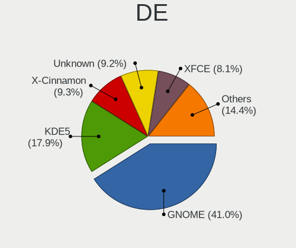
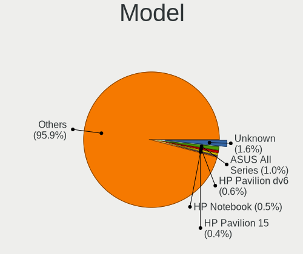
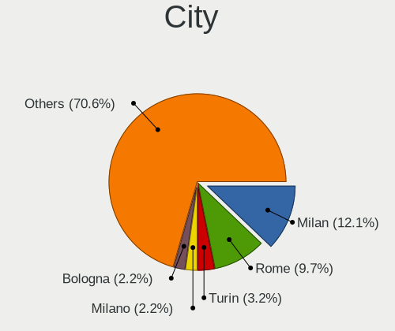
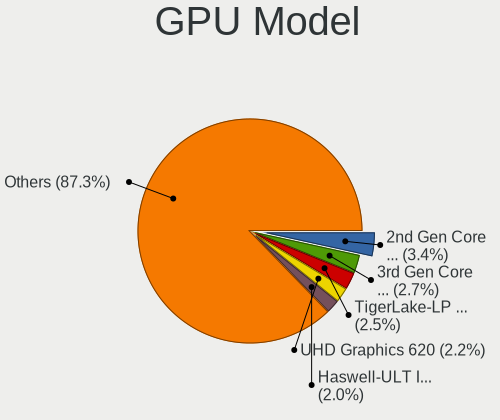
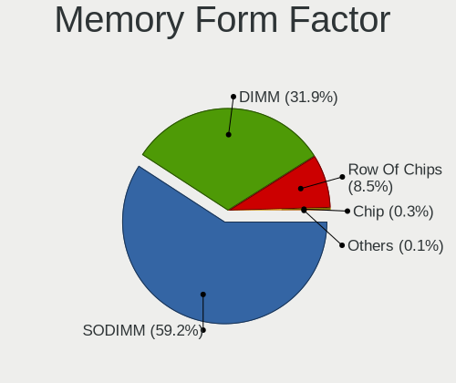
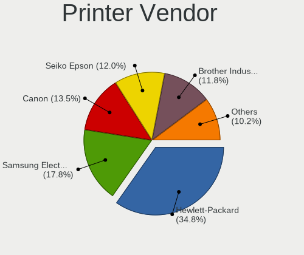
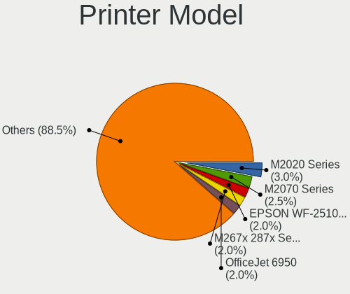
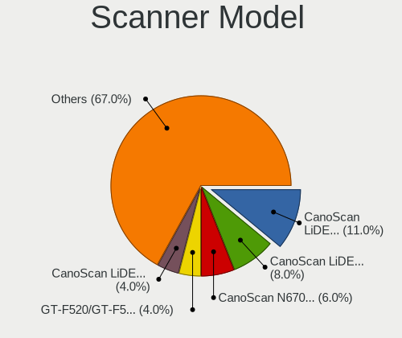

Linux in Italy - Tested Hardware & Statistics
---------------------------------------------

A project to collect tested hardware configurations for Linux in Italy.

Anyone can contribute to this report by the [hw-probe](https://github.com/linuxhw/hw-probe) tool:

    sudo -E hw-probe -all -upload

Please contribute! Especially if your hardware is rare.

This is a report for all computer types. See also reports for [desktops](/Location/Italy/Desktop/README.md) and [notebooks](/Location/Italy/Notebook/README.md).

Contents
--------

* [ Test Cases ](#test-cases)

* [ System ](#system)
  - [ OS                       ](#os)
  - [ OS Family                ](#os-family)
  - [ Kernel                   ](#kernel)
  - [ Kernel Family            ](#kernel-family)
  - [ Kernel Major Ver.        ](#kernel-major-ver)
  - [ Arch                     ](#arch)
  - [ DE                       ](#de)
  - [ Display Server           ](#display-server)
  - [ Display Manager          ](#display-manager)
  - [ OS Lang                  ](#os-lang)
  - [ Boot Mode                ](#boot-mode)
  - [ Filesystem               ](#filesystem)
  - [ Part. scheme             ](#part-scheme)
  - [ Dual Boot with Linux/BSD ](#dual-boot-with-linuxbsd)
  - [ Dual Boot (Win)          ](#dual-boot-win)

* [ Board ](#board)
  - [ Vendor                   ](#vendor)
  - [ Model                    ](#model)
  - [ Model Family             ](#model-family)
  - [ MFG Year                 ](#mfg-year)
  - [ Form Factor              ](#form-factor)
  - [ Secure Boot              ](#secure-boot)
  - [ Coreboot                 ](#coreboot)
  - [ RAM Size                 ](#ram-size)
  - [ RAM Used                 ](#ram-used)
  - [ Total Drives             ](#total-drives)
  - [ Has CD-ROM               ](#has-cd-rom)
  - [ Has Ethernet             ](#has-ethernet)
  - [ Has WiFi                 ](#has-wifi)
  - [ Has Bluetooth            ](#has-bluetooth)

* [ Location ](#location)
  - [ Country                  ](#country)
  - [ City                     ](#city)

* [ Drives ](#drives)
  - [ Drive Vendor             ](#drive-vendor)
  - [ Drive Model              ](#drive-model)
  - [ HDD Vendor               ](#hdd-vendor)
  - [ SSD Vendor               ](#ssd-vendor)
  - [ Drive Kind               ](#drive-kind)
  - [ Drive Connector          ](#drive-connector)
  - [ Drive Size               ](#drive-size)
  - [ Space Total              ](#space-total)
  - [ Space Used               ](#space-used)
  - [ Malfunc. Drives          ](#malfunc-drives)
  - [ Malfunc. Drive Vendor    ](#malfunc-drive-vendor)
  - [ Malfunc. HDD Vendor      ](#malfunc-hdd-vendor)
  - [ Malfunc. Drive Kind      ](#malfunc-drive-kind)
  - [ Failed Drives            ](#failed-drives)
  - [ Failed Drive Vendor      ](#failed-drive-vendor)
  - [ Drive Status             ](#drive-status)

* [ Storage controller ](#storage-controller)
  - [ Storage Vendor           ](#storage-vendor)
  - [ Storage Model            ](#storage-model)
  - [ Storage Kind             ](#storage-kind)

* [ Processor ](#processor)
  - [ CPU Vendor               ](#cpu-vendor)
  - [ CPU Model                ](#cpu-model)
  - [ CPU Model Family         ](#cpu-model-family)
  - [ CPU Cores                ](#cpu-cores)
  - [ CPU Sockets              ](#cpu-sockets)
  - [ CPU Threads              ](#cpu-threads)
  - [ CPU Op-Modes             ](#cpu-op-modes)
  - [ CPU Microcode            ](#cpu-microcode)
  - [ CPU Microarch            ](#cpu-microarch)

* [ Graphics ](#graphics)
  - [ GPU Vendor               ](#gpu-vendor)
  - [ GPU Model                ](#gpu-model)
  - [ GPU Combo                ](#gpu-combo)
  - [ GPU Driver               ](#gpu-driver)
  - [ GPU Memory               ](#gpu-memory)

* [ Monitor ](#monitor)
  - [ Monitor Vendor           ](#monitor-vendor)
  - [ Monitor Model            ](#monitor-model)
  - [ Monitor Resolution       ](#monitor-resolution)
  - [ Monitor Diagonal         ](#monitor-diagonal)
  - [ Monitor Width            ](#monitor-width)
  - [ Aspect Ratio             ](#aspect-ratio)
  - [ Monitor Area             ](#monitor-area)
  - [ Pixel Density            ](#pixel-density)
  - [ Multiple Monitors        ](#multiple-monitors)

* [ Network ](#network)
  - [ Net Controller Vendor    ](#net-controller-vendor)
  - [ Net Controller Model     ](#net-controller-model)
  - [ Wireless Vendor          ](#wireless-vendor)
  - [ Wireless Model           ](#wireless-model)
  - [ Ethernet Vendor          ](#ethernet-vendor)
  - [ Ethernet Model           ](#ethernet-model)
  - [ Net Controller Kind      ](#net-controller-kind)
  - [ Used Controller          ](#used-controller)
  - [ NICs                     ](#nics)
  - [ IPv6                     ](#ipv6)

* [ Bluetooth ](#bluetooth)
  - [ Bluetooth Vendor         ](#bluetooth-vendor)
  - [ Bluetooth Model          ](#bluetooth-model)

* [ Sound ](#sound)
  - [ Sound Vendor             ](#sound-vendor)
  - [ Sound Model              ](#sound-model)

* [ Memory ](#memory)
  - [ Memory Vendor            ](#memory-vendor)
  - [ Memory Model             ](#memory-model)
  - [ Memory Kind              ](#memory-kind)
  - [ Memory Form Factor       ](#memory-form-factor)
  - [ Memory Size              ](#memory-size)
  - [ Memory Speed             ](#memory-speed)

* [ Printers & scanners ](#printers--scanners)
  - [ Printer Vendor           ](#printer-vendor)
  - [ Printer Model            ](#printer-model)
  - [ Scanner Vendor           ](#scanner-vendor)
  - [ Scanner Model            ](#scanner-model)

* [ Camera ](#camera)
  - [ Camera Vendor            ](#camera-vendor)
  - [ Camera Model             ](#camera-model)

* [ Security ](#security)
  - [ Fingerprint Vendor       ](#fingerprint-vendor)
  - [ Fingerprint Model        ](#fingerprint-model)
  - [ Chipcard Vendor          ](#chipcard-vendor)
  - [ Chipcard Model           ](#chipcard-model)

* [ Unsupported ](#unsupported)
  - [ Unsupported Devices      ](#unsupported-devices)
  - [ Unsupported Device Types ](#unsupported-device-types)

Test Cases
----------

Total: 7782

| Vendor        | Model                       | Form-Factor | Probe                                                      | Date         |
|---------------|-----------------------------|-------------|------------------------------------------------------------|--------------|
| Lenovo        | ThinkPad L540 20AUA13S00    | Notebook    | [04ffca5382](https://linux-hardware.org/?probe=04ffca5382) | Oct 01, 2022 |
| HP            | 250 G3                      | Notebook    | [753ef53a5a](https://linux-hardware.org/?probe=753ef53a5a) | Oct 01, 2022 |
| ASRock        | 970 Pro3 R2.0               | Desktop     | [592adc6c9b](https://linux-hardware.org/?probe=592adc6c9b) | Oct 01, 2022 |
| Lenovo        | V130-15IKB 81HN             | Notebook    | [44a4ed90e1](https://linux-hardware.org/?probe=44a4ed90e1) | Oct 01, 2022 |
| Fujitsu       | LIFEBOOK S904               | Notebook    | [c9c83f0112](https://linux-hardware.org/?probe=c9c83f0112) | Oct 01, 2022 |
| SANTECH       | NHx0DB,DE                   | Notebook    | [6dc0730b6a](https://linux-hardware.org/?probe=6dc0730b6a) | Oct 01, 2022 |
| HP            | Laptop 15s-eq2xxx           | Notebook    | [5983281c3f](https://linux-hardware.org/?probe=5983281c3f) | Oct 01, 2022 |
| ASUSTek       | ASUS EXPERTBOOK B1500CEA... | Notebook    | [5bfc8f0a7d](https://linux-hardware.org/?probe=5bfc8f0a7d) | Sep 30, 2022 |
| SANTECH       | NHx0EH_EJ_EK                | Notebook    | [01366bbeb7](https://linux-hardware.org/?probe=01366bbeb7) | Sep 30, 2022 |
| HP            | Pavilion Laptop 15-eg0xx... | Notebook    | [76dae4e704](https://linux-hardware.org/?probe=76dae4e704) | Sep 30, 2022 |
| HP            | Laptop 15s-eq3xxx           | Notebook    | [b15bae8e77](https://linux-hardware.org/?probe=b15bae8e77) | Sep 30, 2022 |
| HP            | Laptop 15s-eq3xxx           | Notebook    | [126b8dd3ec](https://linux-hardware.org/?probe=126b8dd3ec) | Sep 30, 2022 |
| Lenovo        | ThinkPad X1 Carbon Gen 1... | Notebook    | [2c6b161d0f](https://linux-hardware.org/?probe=2c6b161d0f) | Sep 29, 2022 |
| Dell          | 0YXT71 A02                  | Desktop     | [f36bc1d24e](https://linux-hardware.org/?probe=f36bc1d24e) | Sep 29, 2022 |
| ASUSTek       | ROG Strix G713RW_G713RW     | Notebook    | [a783a36e7e](https://linux-hardware.org/?probe=a783a36e7e) | Sep 29, 2022 |
| HP            | ProBook 440 G7              | Notebook    | [99f729e814](https://linux-hardware.org/?probe=99f729e814) | Sep 29, 2022 |
| ASUSTek       | ROG Strix G713RW_G713RW     | Notebook    | [f5ddf4a2b4](https://linux-hardware.org/?probe=f5ddf4a2b4) | Sep 29, 2022 |
| ASRock        | J3160DC-ITX                 | Desktop     | [7e1818288f](https://linux-hardware.org/?probe=7e1818288f) | Sep 29, 2022 |
| ASUSTek       | VivoBook_ASUSLaptop X515... | Notebook    | [cd08dccca4](https://linux-hardware.org/?probe=cd08dccca4) | Sep 28, 2022 |
| Gigabyte      | F2A55M-DS2                  | Desktop     | [c17c689217](https://linux-hardware.org/?probe=c17c689217) | Sep 28, 2022 |
| Lenovo        | IdeaPad Z510 20287          | Notebook    | [78badcba3c](https://linux-hardware.org/?probe=78badcba3c) | Sep 28, 2022 |
| Gigabyte      | Z390 AORUS PRO-CF           | Desktop     | [960c35d712](https://linux-hardware.org/?probe=960c35d712) | Sep 28, 2022 |
| Dell          | 09M8Y8 A01                  | Desktop     | [f129c4da4a](https://linux-hardware.org/?probe=f129c4da4a) | Sep 28, 2022 |
| HP            | Pavilion Laptop 14-ce2xx... | Notebook    | [6eab6db53b](https://linux-hardware.org/?probe=6eab6db53b) | Sep 27, 2022 |
| Packard Be... | IMEDIA L4875 v1.0           | Desktop     | [bb57b80866](https://linux-hardware.org/?probe=bb57b80866) | Sep 27, 2022 |
| ASUSTek       | VivoBook_ASUSLaptop X521... | Notebook    | [47acb38827](https://linux-hardware.org/?probe=47acb38827) | Sep 27, 2022 |
| Acer          | TravelMate 5730             | Notebook    | [88b501ffbe](https://linux-hardware.org/?probe=88b501ffbe) | Sep 27, 2022 |
| HP            | 8433 11                     | Desktop     | [a1d424bced](https://linux-hardware.org/?probe=a1d424bced) | Sep 27, 2022 |
| ASRock        | AB350 Gaming K4             | Desktop     | [184070d232](https://linux-hardware.org/?probe=184070d232) | Sep 26, 2022 |
| Lenovo        | V15-ADA 82C7                | Notebook    | [e53b87c0fd](https://linux-hardware.org/?probe=e53b87c0fd) | Sep 26, 2022 |
| ASRock        | 775Dual-VSTA                | Desktop     | [9509fb65dd](https://linux-hardware.org/?probe=9509fb65dd) | Sep 26, 2022 |
| Fujitsu       | LIFEBOOK A544               | Notebook    | [6e4694775c](https://linux-hardware.org/?probe=6e4694775c) | Sep 26, 2022 |
| ASUSTek       | H81M-K                      | Desktop     | [badc988393](https://linux-hardware.org/?probe=badc988393) | Sep 26, 2022 |
| Lenovo        | ThinkPad T480s 20L7001PI... | Notebook    | [31235a45b5](https://linux-hardware.org/?probe=31235a45b5) | Sep 26, 2022 |
| Acer          | Aspire E1-570G              | Notebook    | [ed657bfbb6](https://linux-hardware.org/?probe=ed657bfbb6) | Sep 26, 2022 |
| Razer         | Blade 15 Base Model (Ear... | Notebook    | [1b4db0c30c](https://linux-hardware.org/?probe=1b4db0c30c) | Sep 26, 2022 |
| Acer          | Aspire A515-51G             | Notebook    | [c45069d56d](https://linux-hardware.org/?probe=c45069d56d) | Sep 26, 2022 |
| Acer          | Aspire A515-51G             | Notebook    | [3441e0cac3](https://linux-hardware.org/?probe=3441e0cac3) | Sep 26, 2022 |
| Razer         | Blade 14 - RZ09-0370        | Notebook    | [a5e00e04bd](https://linux-hardware.org/?probe=a5e00e04bd) | Sep 25, 2022 |
| Unknown       | A116C1_1                    | Notebook    | [470cd9917c](https://linux-hardware.org/?probe=470cd9917c) | Sep 25, 2022 |
| ASUSTek       | VivoBook_ASUSLaptop X340... | Notebook    | [7be473c3c6](https://linux-hardware.org/?probe=7be473c3c6) | Sep 25, 2022 |
| ASUSTek       | UX360CAK                    | Convertible | [015df11bc4](https://linux-hardware.org/?probe=015df11bc4) | Sep 25, 2022 |
| HP            | ENVY x360 Convertible 13... | Convertible | [be1d17baa4](https://linux-hardware.org/?probe=be1d17baa4) | Sep 25, 2022 |
| Lenovo        | IdeaPad3-15ADA05 81W1       | Notebook    | [d2192ee6f0](https://linux-hardware.org/?probe=d2192ee6f0) | Sep 25, 2022 |
| Lenovo        | ThinkPad X270 W10DG 20K5... | Notebook    | [d277bf47ec](https://linux-hardware.org/?probe=d277bf47ec) | Sep 25, 2022 |
| Packard Be... | IMEDIA L4875 v1.0           | Desktop     | [4ed673ff1a](https://linux-hardware.org/?probe=4ed673ff1a) | Sep 25, 2022 |
| Lenovo        | ThinkPad T440p              | Notebook    | [270cf10219](https://linux-hardware.org/?probe=270cf10219) | Sep 25, 2022 |
| Lenovo        | ThinkPad T470 20JNS08H00    | Notebook    | [ff1dd51829](https://linux-hardware.org/?probe=ff1dd51829) | Sep 25, 2022 |
| Apple         | MacBookPro16,1              | Notebook    | [6e7d310781](https://linux-hardware.org/?probe=6e7d310781) | Sep 25, 2022 |
| ASUSTek       | ASUS EXPERTBOOK B7402FEA... | Convertible | [593ef93760](https://linux-hardware.org/?probe=593ef93760) | Sep 25, 2022 |
| Lenovo        | ThinkBook 13s G3 ACN 20Y... | Notebook    | [96f4499ec5](https://linux-hardware.org/?probe=96f4499ec5) | Sep 25, 2022 |
| ASUSTek       | ROG STRIX B550-F GAMING     | Desktop     | [65d54e7273](https://linux-hardware.org/?probe=65d54e7273) | Sep 25, 2022 |
| ASUSTek       | P8H61-M LX                  | Desktop     | [164f5bfea2](https://linux-hardware.org/?probe=164f5bfea2) | Sep 25, 2022 |
| HP            | 8433 11                     | Desktop     | [dffc61c155](https://linux-hardware.org/?probe=dffc61c155) | Sep 24, 2022 |
| HP            | 255 G5                      | Notebook    | [2a8f595510](https://linux-hardware.org/?probe=2a8f595510) | Sep 24, 2022 |
| Lenovo        | HASWELLREFRESHDT 3190005... | All in one  | [d4a7dbd124](https://linux-hardware.org/?probe=d4a7dbd124) | Sep 24, 2022 |
| ASRock        | 4CoreDual-SATA2             | Desktop     | [eb0e992df7](https://linux-hardware.org/?probe=eb0e992df7) | Sep 24, 2022 |
| Razer         | Blade 15 Base Model (Ear... | Notebook    | [029c059963](https://linux-hardware.org/?probe=029c059963) | Sep 24, 2022 |
| HP            | Pavilion x360 Convertibl... | Convertible | [d2327ba5d4](https://linux-hardware.org/?probe=d2327ba5d4) | Sep 24, 2022 |
| Dell          | Vostro V131                 | Notebook    | [809655978a](https://linux-hardware.org/?probe=809655978a) | Sep 24, 2022 |
| ASUSTek       | P8B75-M LE                  | Desktop     | [8975676700](https://linux-hardware.org/?probe=8975676700) | Sep 24, 2022 |
| HP            | ENVY x360 2-in-1 Laptop ... | Convertible | [2b886fd64c](https://linux-hardware.org/?probe=2b886fd64c) | Sep 24, 2022 |
| MSI           | MPG X570 GAMING PLUS        | Desktop     | [fd43d92335](https://linux-hardware.org/?probe=fd43d92335) | Sep 23, 2022 |
| HP            | ENVY x360 Convert13-ay00... | Convertible | [41abb17737](https://linux-hardware.org/?probe=41abb17737) | Sep 23, 2022 |
| HUAWEI        | BOHB-WAX9                   | Notebook    | [18a4d2bb72](https://linux-hardware.org/?probe=18a4d2bb72) | Sep 23, 2022 |
| HP            | 250 G4                      | Notebook    | [5d4c56fe14](https://linux-hardware.org/?probe=5d4c56fe14) | Sep 23, 2022 |
| ASUSTek       | ROG STRIX B450-F GAMING ... | Desktop     | [a4ce7c179e](https://linux-hardware.org/?probe=a4ce7c179e) | Sep 23, 2022 |
| Fujitsu Si... | P5LD2-FM-DH-VP              | Desktop     | [0c6cbcc99d](https://linux-hardware.org/?probe=0c6cbcc99d) | Sep 22, 2022 |
| Fujitsu       | LIFEBOOK A544               | Notebook    | [648fb5c63e](https://linux-hardware.org/?probe=648fb5c63e) | Sep 22, 2022 |
| Dell          | Latitude 5501               | Notebook    | [f40716377a](https://linux-hardware.org/?probe=f40716377a) | Sep 22, 2022 |
| Lenovo        | G50-45 80E3                 | Notebook    | [41af175db4](https://linux-hardware.org/?probe=41af175db4) | Sep 21, 2022 |
| Unknown       | Unknown                     | Notebook    | [af65739ccc](https://linux-hardware.org/?probe=af65739ccc) | Sep 21, 2022 |
| Dell          | Latitude E5530 non-vPro     | Notebook    | [6352f6fb82](https://linux-hardware.org/?probe=6352f6fb82) | Sep 21, 2022 |
| Lenovo        | ThinkPad P1 Gen 4i 20Y3C... | Notebook    | [8c6fcedcd5](https://linux-hardware.org/?probe=8c6fcedcd5) | Sep 21, 2022 |
| ASUSTek       | GL553VD                     | Notebook    | [e6cb381fd2](https://linux-hardware.org/?probe=e6cb381fd2) | Sep 21, 2022 |
| HP            | Pavilion 15                 | Notebook    | [56a10ce74c](https://linux-hardware.org/?probe=56a10ce74c) | Sep 21, 2022 |
| Timi          | A35S                        | Notebook    | [a57a688f31](https://linux-hardware.org/?probe=a57a688f31) | Sep 21, 2022 |
| ASUSTek       | M3N78-VM                    | Desktop     | [edaab96cde](https://linux-hardware.org/?probe=edaab96cde) | Sep 21, 2022 |
| Intel         | Kabylake Platform           | Notebook    | [8b1c5eb5bf](https://linux-hardware.org/?probe=8b1c5eb5bf) | Sep 21, 2022 |
| Dell          | 09M8Y8 A01                  | Desktop     | [07dd388834](https://linux-hardware.org/?probe=07dd388834) | Sep 21, 2022 |
| Dell          | 0GM819                      | Desktop     | [951ce34bb2](https://linux-hardware.org/?probe=951ce34bb2) | Sep 21, 2022 |
| Lenovo        | ThinkCentre M57 6072WMD     | Desktop     | [eb8221088f](https://linux-hardware.org/?probe=eb8221088f) | Sep 21, 2022 |
| Dell          | 09M8Y8 A01                  | Desktop     | [2c7466119d](https://linux-hardware.org/?probe=2c7466119d) | Sep 21, 2022 |
| Intel         | H55                         | Desktop     | [6de435d14c](https://linux-hardware.org/?probe=6de435d14c) | Sep 20, 2022 |
| HP            | Folio 13                    | Notebook    | [eafa8204e9](https://linux-hardware.org/?probe=eafa8204e9) | Sep 20, 2022 |
| ASUSTek       | X541UAK                     | Notebook    | [b5a6e3ca5e](https://linux-hardware.org/?probe=b5a6e3ca5e) | Sep 20, 2022 |
| HP            | Pavilion Power Laptop 15... | Notebook    | [360e860fb1](https://linux-hardware.org/?probe=360e860fb1) | Sep 20, 2022 |
| ASUSTek       | G20CB                       | Desktop     | [34f4d43b97](https://linux-hardware.org/?probe=34f4d43b97) | Sep 20, 2022 |
| HP            | EliteBook 840 14 inch G9... | Notebook    | [450a86c900](https://linux-hardware.org/?probe=450a86c900) | Sep 20, 2022 |
| Lenovo        | ThinkPad P1 Gen 3 20TJS2... | Notebook    | [32120dfcd4](https://linux-hardware.org/?probe=32120dfcd4) | Sep 20, 2022 |
| MSI           | X470 GAMING PLUS MAX        | Desktop     | [9c483616f6](https://linux-hardware.org/?probe=9c483616f6) | Sep 20, 2022 |
| HUAWEI        | BOM-WXX9                    | Notebook    | [d30c6c5b9b](https://linux-hardware.org/?probe=d30c6c5b9b) | Sep 20, 2022 |
| HP            | Pavilion Gaming Laptop 1... | Notebook    | [8003baae8c](https://linux-hardware.org/?probe=8003baae8c) | Sep 19, 2022 |
| HUAWEI        | BOM-WXX9                    | Notebook    | [f2906f8b8d](https://linux-hardware.org/?probe=f2906f8b8d) | Sep 19, 2022 |
| Acer          | Aspire M3970                | Desktop     | [d135989361](https://linux-hardware.org/?probe=d135989361) | Sep 19, 2022 |
| Supermicro    | C7P67                       | Desktop     | [16bff71d62](https://linux-hardware.org/?probe=16bff71d62) | Sep 19, 2022 |
| Lenovo        | IdeaPad 3 15IML05 81WB      | Notebook    | [9b14ec4438](https://linux-hardware.org/?probe=9b14ec4438) | Sep 19, 2022 |
| MSI           | Prestige 14Evo A11M         | Notebook    | [4b412dd569](https://linux-hardware.org/?probe=4b412dd569) | Sep 19, 2022 |
| ASRock        | X570 Phantom Gaming 4       | Desktop     | [75be2db65c](https://linux-hardware.org/?probe=75be2db65c) | Sep 19, 2022 |
| HP            | G42                         | Notebook    | [3f584eb1af](https://linux-hardware.org/?probe=3f584eb1af) | Sep 19, 2022 |
| Dell          | Latitude 9420               | Convertible | [1c6c42624d](https://linux-hardware.org/?probe=1c6c42624d) | Sep 19, 2022 |
| Dell          | Latitude 5420               | Notebook    | [2d9d6512bc](https://linux-hardware.org/?probe=2d9d6512bc) | Sep 19, 2022 |
| Intel         | NUC8i7HNB J68197-502        | Mini pc     | [1573d65d2d](https://linux-hardware.org/?probe=1573d65d2d) | Sep 18, 2022 |
| Acer          | Aspire A515-51G             | Notebook    | [3f987553d9](https://linux-hardware.org/?probe=3f987553d9) | Sep 18, 2022 |
| Microtech     | CoreBook                    | Notebook    | [6b1a53d2c2](https://linux-hardware.org/?probe=6b1a53d2c2) | Sep 18, 2022 |
| HP            | EliteBook 850 G3            | Notebook    | [6a2f2c9841](https://linux-hardware.org/?probe=6a2f2c9841) | Sep 18, 2022 |
| Lenovo        | ThinkPad T440p              | Notebook    | [bf397424f3](https://linux-hardware.org/?probe=bf397424f3) | Sep 18, 2022 |
| HP            | 2B29                        | Desktop     | [391e407d29](https://linux-hardware.org/?probe=391e407d29) | Sep 18, 2022 |
| Lenovo        | ThinkBook 14 G2 ITL 20VD    | Notebook    | [f40cc0db8a](https://linux-hardware.org/?probe=f40cc0db8a) | Sep 18, 2022 |
| Lenovo        | IdeaPad 3 15IML05 81WB      | Notebook    | [751df30316](https://linux-hardware.org/?probe=751df30316) | Sep 18, 2022 |
| ASRock        | 960GC-GS FX                 | Desktop     | [2432fca2f8](https://linux-hardware.org/?probe=2432fca2f8) | Sep 18, 2022 |
| ASRock        | 960GC-GS FX                 | Desktop     | [3e40742ff0](https://linux-hardware.org/?probe=3e40742ff0) | Sep 18, 2022 |
| HP            | ProBook 450 G8 Notebook ... | Notebook    | [87c3b99589](https://linux-hardware.org/?probe=87c3b99589) | Sep 18, 2022 |
| MSI           | Prestige 15 A12UC           | Notebook    | [48437ccf94](https://linux-hardware.org/?probe=48437ccf94) | Sep 17, 2022 |
| NEC Comput... | PC-VY21AEZ75                | Notebook    | [a24d79ffc2](https://linux-hardware.org/?probe=a24d79ffc2) | Sep 17, 2022 |
| MSI           | Prestige 14Evo A11M         | Notebook    | [f474823b5a](https://linux-hardware.org/?probe=f474823b5a) | Sep 17, 2022 |
| Lenovo        | G50-45 80E3                 | Notebook    | [6c5b0c0659](https://linux-hardware.org/?probe=6c5b0c0659) | Sep 17, 2022 |
| HP            | 250 G8 Notebook PC          | Notebook    | [6dd18a5a96](https://linux-hardware.org/?probe=6dd18a5a96) | Sep 17, 2022 |
| HP            | ProBook x360 435 G8 Note... | Convertible | [42f1c1aee1](https://linux-hardware.org/?probe=42f1c1aee1) | Sep 17, 2022 |
| MSI           | Boston                      | Desktop     | [b884bd8c03](https://linux-hardware.org/?probe=b884bd8c03) | Sep 17, 2022 |
| MSI           | Delta 15 A5EFK              | Notebook    | [382e0f70a3](https://linux-hardware.org/?probe=382e0f70a3) | Sep 17, 2022 |
| HP            | EliteBook x360 1030 G2      | Convertible | [4c919169ea](https://linux-hardware.org/?probe=4c919169ea) | Sep 17, 2022 |
| Lenovo        | G50-45 80E3                 | Notebook    | [8c355ea88e](https://linux-hardware.org/?probe=8c355ea88e) | Sep 17, 2022 |
| Dell          | XPS 15 9560                 | Notebook    | [4a903b438f](https://linux-hardware.org/?probe=4a903b438f) | Sep 17, 2022 |
| ASUSTek       | P5K                         | Desktop     | [4cf17a7b6f](https://linux-hardware.org/?probe=4cf17a7b6f) | Sep 17, 2022 |
| ASUSTek       | T101HA                      | Tablet      | [247e54458c](https://linux-hardware.org/?probe=247e54458c) | Sep 17, 2022 |
| ASUSTek       | T101HA                      | Tablet      | [e138435857](https://linux-hardware.org/?probe=e138435857) | Sep 17, 2022 |
| Lenovo        | 3100 SDK0J40700 WIN 3258... | Desktop     | [3ba3a4becf](https://linux-hardware.org/?probe=3ba3a4becf) | Sep 16, 2022 |
| HP            | Unknown                     | Notebook    | [e87c925eb0](https://linux-hardware.org/?probe=e87c925eb0) | Sep 16, 2022 |
| Lenovo        | 3708 SDK0J40700 WIN 3258... | Desktop     | [e6fe8aa148](https://linux-hardware.org/?probe=e6fe8aa148) | Sep 16, 2022 |
| ASUSTek       | ET1612I                     | Desktop     | [0ddd9554cc](https://linux-hardware.org/?probe=0ddd9554cc) | Sep 16, 2022 |
| HP            | Laptop 15s-fq2xxx           | Notebook    | [e7bb3017fb](https://linux-hardware.org/?probe=e7bb3017fb) | Sep 16, 2022 |
| HP            | Laptop 15s-fq2xxx           | Notebook    | [c81727b775](https://linux-hardware.org/?probe=c81727b775) | Sep 16, 2022 |
| Lenovo        | G50-45 80E3                 | Notebook    | [59c06bcd6f](https://linux-hardware.org/?probe=59c06bcd6f) | Sep 16, 2022 |
| Dell          | Inspiron 15-3552            | Notebook    | [583d7c550e](https://linux-hardware.org/?probe=583d7c550e) | Sep 16, 2022 |
| Acer          | Swift SF314-54              | Notebook    | [c3b076c416](https://linux-hardware.org/?probe=c3b076c416) | Sep 15, 2022 |
| ASRock        | X370 Gaming K4              | Desktop     | [0858e80da7](https://linux-hardware.org/?probe=0858e80da7) | Sep 15, 2022 |
| Chuwi         | CoreBook X                  | Notebook    | [e59a625390](https://linux-hardware.org/?probe=e59a625390) | Sep 15, 2022 |
| ASUSTek       | PRIME H410M-E               | Desktop     | [91f1fdc978](https://linux-hardware.org/?probe=91f1fdc978) | Sep 14, 2022 |
| Dell          | 0WR7PY A02                  | Desktop     | [0a587d6fee](https://linux-hardware.org/?probe=0a587d6fee) | Sep 14, 2022 |
| ASRock        | H61M-DGS                    | Desktop     | [aeac7cfb74](https://linux-hardware.org/?probe=aeac7cfb74) | Sep 14, 2022 |
| Intel         | Kabylake Platform           | Notebook    | [9889cc50de](https://linux-hardware.org/?probe=9889cc50de) | Sep 14, 2022 |
| Lenovo        | ThinkPad L15 Gen 1 20U4S... | Notebook    | [b7ed5c7f4a](https://linux-hardware.org/?probe=b7ed5c7f4a) | Sep 14, 2022 |
| ASUSTek       | Z170 PRO GAMING             | Desktop     | [d3f957e34a](https://linux-hardware.org/?probe=d3f957e34a) | Sep 13, 2022 |
| MSI           | Prestige 14Evo A11M         | Notebook    | [5a69611620](https://linux-hardware.org/?probe=5a69611620) | Sep 13, 2022 |
| MSI           | Prestige 14Evo A11M         | Notebook    | [4c5dc2ec7d](https://linux-hardware.org/?probe=4c5dc2ec7d) | Sep 13, 2022 |
| ASUSTek       | X541UJ                      | Notebook    | [9745e99a08](https://linux-hardware.org/?probe=9745e99a08) | Sep 13, 2022 |
| Dell          | Venue 11 Pro 7140           | Notebook    | [d6fed8866c](https://linux-hardware.org/?probe=d6fed8866c) | Sep 13, 2022 |
| Dell          | XPS 17 9700                 | Notebook    | [24eaecfdd8](https://linux-hardware.org/?probe=24eaecfdd8) | Sep 13, 2022 |
| Apple         | MacBook5,1                  | Notebook    | [8bdaf4361b](https://linux-hardware.org/?probe=8bdaf4361b) | Sep 12, 2022 |
| Toshiba       | PORTEGE Z30-B               | Notebook    | [6b1829aad1](https://linux-hardware.org/?probe=6b1829aad1) | Sep 12, 2022 |
| Toshiba       | PORTEGE Z30-B               | Notebook    | [9ef29f2258](https://linux-hardware.org/?probe=9ef29f2258) | Sep 12, 2022 |
| ASUSTek       | G20CB                       | Desktop     | [a52ff97f3b](https://linux-hardware.org/?probe=a52ff97f3b) | Sep 12, 2022 |
| ASUSTek       | G20CB                       | Desktop     | [2d737743f4](https://linux-hardware.org/?probe=2d737743f4) | Sep 12, 2022 |
| ASRock        | B450 Gaming K4              | Desktop     | [2391f4673a](https://linux-hardware.org/?probe=2391f4673a) | Sep 12, 2022 |
| ASRock        | B450 Gaming K4              | Desktop     | [89963f6bf1](https://linux-hardware.org/?probe=89963f6bf1) | Sep 12, 2022 |
| MSI           | X58 Pro                     | Desktop     | [60406c82e8](https://linux-hardware.org/?probe=60406c82e8) | Sep 12, 2022 |
| Neousys Te... | NVS-7000 Rev. A2            | Server      | [d52e0ed118](https://linux-hardware.org/?probe=d52e0ed118) | Sep 12, 2022 |
| Apple         | MacBook5,1                  | Notebook    | [be66df4eb9](https://linux-hardware.org/?probe=be66df4eb9) | Sep 12, 2022 |
| Sony          | SVE1512J6EW                 | Notebook    | [69e2400606](https://linux-hardware.org/?probe=69e2400606) | Sep 11, 2022 |
| Acer          | E415SM                      | Desktop     | [bc9ef15cab](https://linux-hardware.org/?probe=bc9ef15cab) | Sep 11, 2022 |
| Acer          | E415SM                      | Desktop     | [4f8a53c667](https://linux-hardware.org/?probe=4f8a53c667) | Sep 11, 2022 |
| HP            | ProBook 645 G3              | Notebook    | [0bd9070bee](https://linux-hardware.org/?probe=0bd9070bee) | Sep 11, 2022 |
| Valve         | Jupiter                     | Notebook    | [694e9a60ad](https://linux-hardware.org/?probe=694e9a60ad) | Sep 11, 2022 |
| ASUSTek       | PRIME H310M-E R2.0          | Desktop     | [b76fc41706](https://linux-hardware.org/?probe=b76fc41706) | Sep 11, 2022 |
| HP            | G42                         | Notebook    | [092b9e2c38](https://linux-hardware.org/?probe=092b9e2c38) | Sep 11, 2022 |
| HP            | 255 G8 Notebook PC          | Notebook    | [d2c057ed6e](https://linux-hardware.org/?probe=d2c057ed6e) | Sep 11, 2022 |
| HP            | Presario CQ56               | Notebook    | [ccc7d97678](https://linux-hardware.org/?probe=ccc7d97678) | Sep 11, 2022 |
| Fujitsu Si... | P5LD2-FM-DH-VP              | Desktop     | [ad6a16f658](https://linux-hardware.org/?probe=ad6a16f658) | Sep 11, 2022 |
| Gigabyte      | A320M-S2H V2-CF             | Desktop     | [4df5d0194d](https://linux-hardware.org/?probe=4df5d0194d) | Sep 11, 2022 |
| Lenovo        | Yoga 720-15IKB              | Convertible | [078c865d26](https://linux-hardware.org/?probe=078c865d26) | Sep 11, 2022 |
| Gigabyte      | Z77X-UP7                    | Desktop     | [1634db2e78](https://linux-hardware.org/?probe=1634db2e78) | Sep 11, 2022 |
| ASUSTek       | TUF Gaming B550-PLUS        | Desktop     | [ee06685499](https://linux-hardware.org/?probe=ee06685499) | Sep 11, 2022 |
| HP            | 255 G8 Notebook PC          | Notebook    | [cca78f4488](https://linux-hardware.org/?probe=cca78f4488) | Sep 11, 2022 |
| HP            | Pavilion dv6000 (RP986EA... | Notebook    | [f20de20683](https://linux-hardware.org/?probe=f20de20683) | Sep 11, 2022 |
| Dell          | 09M8Y8 A01                  | Desktop     | [c719d7f544](https://linux-hardware.org/?probe=c719d7f544) | Sep 11, 2022 |
| Dell          | 03NVJ6 A01                  | Desktop     | [3f51b6da48](https://linux-hardware.org/?probe=3f51b6da48) | Sep 10, 2022 |
| Apple         | MacBookPro12,1              | Notebook    | [4bb5badf61](https://linux-hardware.org/?probe=4bb5badf61) | Sep 10, 2022 |
| Lenovo        | ThinkPad L380 20M6S48000    | Notebook    | [74102b95cb](https://linux-hardware.org/?probe=74102b95cb) | Sep 10, 2022 |
| ASRock        | J3160DC-ITX                 | Desktop     | [e854b82ab9](https://linux-hardware.org/?probe=e854b82ab9) | Sep 10, 2022 |
| ASUSTek       | UX310UQK                    | Notebook    | [dc650f1d77](https://linux-hardware.org/?probe=dc650f1d77) | Sep 10, 2022 |
| Dell          | Venue 11 Pro 7140           | Notebook    | [a4ea248b39](https://linux-hardware.org/?probe=a4ea248b39) | Sep 10, 2022 |
| Dell          | Inspiron 16 5625            | Notebook    | [5ae1f0d923](https://linux-hardware.org/?probe=5ae1f0d923) | Sep 10, 2022 |
| Dell          | Venue 11 Pro 7140           | Notebook    | [08aadcd875](https://linux-hardware.org/?probe=08aadcd875) | Sep 10, 2022 |
| HP            | ENVY x360 Convertible 13... | Convertible | [6bb6224efd](https://linux-hardware.org/?probe=6bb6224efd) | Sep 10, 2022 |
| Apple         | Mac-4BC72D62AD45599E Mac... | Mini pc     | [1d9611ecf1](https://linux-hardware.org/?probe=1d9611ecf1) | Sep 09, 2022 |
| Apple         | Mac-35C5E08120C7EEAF Mac... | Mini pc     | [d2ad94ce21](https://linux-hardware.org/?probe=d2ad94ce21) | Sep 09, 2022 |
| ASUSTek       | ZenBook UX333FN_UX333FN     | Notebook    | [498a2244e4](https://linux-hardware.org/?probe=498a2244e4) | Sep 09, 2022 |
| Apple         | MacBookPro11,2              | Notebook    | [47708e7772](https://linux-hardware.org/?probe=47708e7772) | Sep 09, 2022 |
| Apple         | MacBookPro11,4              | Notebook    | [c5d5b88740](https://linux-hardware.org/?probe=c5d5b88740) | Sep 09, 2022 |
| Dell          | Latitude 7490               | Notebook    | [189b1d9ab2](https://linux-hardware.org/?probe=189b1d9ab2) | Sep 09, 2022 |
| Dell          | Latitude E6230              | Notebook    | [30d4c452fe](https://linux-hardware.org/?probe=30d4c452fe) | Sep 09, 2022 |
| Dell          | System XPS L702X            | Notebook    | [fa770ba044](https://linux-hardware.org/?probe=fa770ba044) | Sep 09, 2022 |
| Lenovo        | ThinkPad X1 Carbon Gen 9... | Notebook    | [cada1ee58d](https://linux-hardware.org/?probe=cada1ee58d) | Sep 09, 2022 |
| Acer          | Aspire 5715Z                | Notebook    | [614ae0addd](https://linux-hardware.org/?probe=614ae0addd) | Sep 09, 2022 |
| Notebook      | W230SS                      | Notebook    | [9ea483f3dd](https://linux-hardware.org/?probe=9ea483f3dd) | Sep 09, 2022 |
| Notebook      | PD5x_7xPNP_PNN_PNT          | Notebook    | [b4e36a92c7](https://linux-hardware.org/?probe=b4e36a92c7) | Sep 08, 2022 |
| ASUSTek       | TUF Gaming B550-PLUS        | Desktop     | [174c263499](https://linux-hardware.org/?probe=174c263499) | Sep 08, 2022 |
| Gigabyte      | Z97-HD3                     | Desktop     | [aeb2bae778](https://linux-hardware.org/?probe=aeb2bae778) | Sep 08, 2022 |
| Intel         | DH77DF AAG40293-300         | Desktop     | [217971d572](https://linux-hardware.org/?probe=217971d572) | Sep 08, 2022 |
| ASRock        | N3700-ITX                   | Desktop     | [5af515a1f9](https://linux-hardware.org/?probe=5af515a1f9) | Sep 08, 2022 |
| Gigabyte      | Z97-HD3                     | Desktop     | [d5040ffbda](https://linux-hardware.org/?probe=d5040ffbda) | Sep 08, 2022 |
| Dell          | XPS 15 7590                 | Notebook    | [57cbaefc6e](https://linux-hardware.org/?probe=57cbaefc6e) | Sep 08, 2022 |
| Acer          | Aspire 5736Z                | Notebook    | [820b817bff](https://linux-hardware.org/?probe=820b817bff) | Sep 08, 2022 |
| MSI           | H61M-P31                    | Desktop     | [56a8b0b2a7](https://linux-hardware.org/?probe=56a8b0b2a7) | Sep 08, 2022 |
| Dell          | Latitude E5450              | Notebook    | [305ef21301](https://linux-hardware.org/?probe=305ef21301) | Sep 08, 2022 |
| Pegatron      | 2A9Eh                       | Desktop     | [2c7b59f70b](https://linux-hardware.org/?probe=2c7b59f70b) | Sep 08, 2022 |
| Lenovo        | ThinkPad Edge E540 20C60... | Notebook    | [7cf6479781](https://linux-hardware.org/?probe=7cf6479781) | Sep 08, 2022 |
| LG Electro... | 17Z90P-G.AA86D              | Notebook    | [1f304e9792](https://linux-hardware.org/?probe=1f304e9792) | Sep 07, 2022 |
| HP            | 3397                        | Desktop     | [0ebeef29bf](https://linux-hardware.org/?probe=0ebeef29bf) | Sep 07, 2022 |
| Notebook      | PD5x_7xPNP_PNN_PNT          | Notebook    | [ac71ea732f](https://linux-hardware.org/?probe=ac71ea732f) | Sep 07, 2022 |
| HP            | Pavilion dv7                | Notebook    | [4a39ae67d5](https://linux-hardware.org/?probe=4a39ae67d5) | Sep 07, 2022 |
| Dell          | XPS 13 9305                 | Notebook    | [bc21b4b2a8](https://linux-hardware.org/?probe=bc21b4b2a8) | Sep 07, 2022 |
| ASUSTek       | X541UJ                      | Notebook    | [471a57d688](https://linux-hardware.org/?probe=471a57d688) | Sep 07, 2022 |
| ASUSTek       | X541UJ                      | Notebook    | [84b26ca406](https://linux-hardware.org/?probe=84b26ca406) | Sep 07, 2022 |
| Dell          | Inspiron 5406 2n1           | Convertible | [b0412cee20](https://linux-hardware.org/?probe=b0412cee20) | Sep 07, 2022 |
| Lenovo        | MAHOBAY                     | Desktop     | [2619e261d1](https://linux-hardware.org/?probe=2619e261d1) | Sep 07, 2022 |
| Dell          | Inspiron 5584               | Notebook    | [3691775658](https://linux-hardware.org/?probe=3691775658) | Sep 07, 2022 |
| Toshiba       | Satellite C660              | Notebook    | [e7ad5166eb](https://linux-hardware.org/?probe=e7ad5166eb) | Sep 07, 2022 |
| HP            | ENVY x360 Convertible 13... | Convertible | [80a2ececa9](https://linux-hardware.org/?probe=80a2ececa9) | Sep 07, 2022 |
| Pegatron      | Narra6                      | Desktop     | [b2a70f42a0](https://linux-hardware.org/?probe=b2a70f42a0) | Sep 07, 2022 |
| Lenovo        | ThinkBook 15-IIL 20SM       | Notebook    | [72ba31c33a](https://linux-hardware.org/?probe=72ba31c33a) | Sep 07, 2022 |
| Lenovo        | ThinkPad Edge E531 6885D... | Notebook    | [673c26165e](https://linux-hardware.org/?probe=673c26165e) | Sep 07, 2022 |
| MSI           | Modern 14 B11MOL            | Notebook    | [1ce0bfd512](https://linux-hardware.org/?probe=1ce0bfd512) | Sep 06, 2022 |
| ASRock        | Q1900M                      | Desktop     | [05cf506f57](https://linux-hardware.org/?probe=05cf506f57) | Sep 06, 2022 |
| ASUSTek       | STRIKER II EXTREME          | Desktop     | [42e666abe1](https://linux-hardware.org/?probe=42e666abe1) | Sep 06, 2022 |
| HP            | Pavilion Laptop 15-cs3xx... | Notebook    | [ff127ee255](https://linux-hardware.org/?probe=ff127ee255) | Sep 06, 2022 |
| ASUSTek       | P751JF                      | Notebook    | [6f3898fe12](https://linux-hardware.org/?probe=6f3898fe12) | Sep 06, 2022 |
| Lenovo        | ThinkPad Edge E530c 3366... | Notebook    | [d20b550fd6](https://linux-hardware.org/?probe=d20b550fd6) | Sep 06, 2022 |
| HP            | Pavilion Laptop 15-eg0xx... | Notebook    | [76c716061a](https://linux-hardware.org/?probe=76c716061a) | Sep 06, 2022 |
| ASUSTek       | P8H77-V LE                  | Desktop     | [8a1c5532d6](https://linux-hardware.org/?probe=8a1c5532d6) | Sep 06, 2022 |
| ASUSTek       | P8H77-V LE                  | Desktop     | [cc631912bf](https://linux-hardware.org/?probe=cc631912bf) | Sep 06, 2022 |
| Lenovo        | ThinkPad T480s 20L8SC160... | Notebook    | [b860019cf4](https://linux-hardware.org/?probe=b860019cf4) | Sep 06, 2022 |
| ASUSTek       | P9X79 PRO                   | Desktop     | [7e53f87cc4](https://linux-hardware.org/?probe=7e53f87cc4) | Sep 06, 2022 |
| HP            | 255 G8 Notebook PC          | Notebook    | [5c53e30fe6](https://linux-hardware.org/?probe=5c53e30fe6) | Sep 06, 2022 |
| ASUSTek       | X555LAB                     | Notebook    | [b10937286d](https://linux-hardware.org/?probe=b10937286d) | Sep 06, 2022 |
| Acer          | Aspire 5920G                | Notebook    | [af0e5553e9](https://linux-hardware.org/?probe=af0e5553e9) | Sep 05, 2022 |
| ASUSTek       | H81M-PLUS                   | Desktop     | [826b486f77](https://linux-hardware.org/?probe=826b486f77) | Sep 05, 2022 |
| HP            | 0B4Ch D                     | Desktop     | [87c4023810](https://linux-hardware.org/?probe=87c4023810) | Sep 05, 2022 |
| Lenovo        | ThinkPad X1 Carbon 6th 2... | Notebook    | [dd3b771e55](https://linux-hardware.org/?probe=dd3b771e55) | Sep 05, 2022 |
| ASRock        | Q1900M                      | Desktop     | [6b53538e90](https://linux-hardware.org/?probe=6b53538e90) | Sep 05, 2022 |
| ASUSTek       | PRIME X370-PRO              | Desktop     | [312e33b434](https://linux-hardware.org/?probe=312e33b434) | Sep 05, 2022 |
| Dell          | 0MWYPT A01                  | Desktop     | [57b81c35c1](https://linux-hardware.org/?probe=57b81c35c1) | Sep 05, 2022 |
| Gateway       | NS30                        | Notebook    | [2ade42aacf](https://linux-hardware.org/?probe=2ade42aacf) | Sep 05, 2022 |
| MSI           | MPG B550 GAMING EDGE WIF... | Desktop     | [e83fa739c9](https://linux-hardware.org/?probe=e83fa739c9) | Sep 05, 2022 |
| ASUSTek       | STRIKER II EXTREME          | Desktop     | [502995e6f3](https://linux-hardware.org/?probe=502995e6f3) | Sep 05, 2022 |
| MSI           | B550-A PRO                  | Desktop     | [950b2a8eb5](https://linux-hardware.org/?probe=950b2a8eb5) | Sep 05, 2022 |
| ASUSTek       | P9X79 DELUXE                | Desktop     | [2aa7ada396](https://linux-hardware.org/?probe=2aa7ada396) | Sep 05, 2022 |
| ASUSTek       | ROG STRIX X570-E GAMING     | Desktop     | [127c2f5f75](https://linux-hardware.org/?probe=127c2f5f75) | Sep 05, 2022 |
| Gigabyte      | Z390 GAMING X-CF            | Desktop     | [26e63d2357](https://linux-hardware.org/?probe=26e63d2357) | Sep 05, 2022 |
| ASUSTek       | VivoBook_ASUSLaptop X580... | Notebook    | [ef9be6aaac](https://linux-hardware.org/?probe=ef9be6aaac) | Sep 05, 2022 |
| Dell          | Inspiron 16 5625            | Notebook    | [d38282759b](https://linux-hardware.org/?probe=d38282759b) | Sep 05, 2022 |
| Dell          | Latitude E6520              | Notebook    | [e37ba07a92](https://linux-hardware.org/?probe=e37ba07a92) | Sep 05, 2022 |
| HP            | 250 G8 Notebook PC          | Notebook    | [312e65fd07](https://linux-hardware.org/?probe=312e65fd07) | Sep 05, 2022 |
| Dell          | 0HY9JP A02                  | Desktop     | [7cbf141461](https://linux-hardware.org/?probe=7cbf141461) | Sep 05, 2022 |
| Samsung       | 270E5G/270E5U               | Notebook    | [0300dd1a2d](https://linux-hardware.org/?probe=0300dd1a2d) | Sep 05, 2022 |
| HP            | Laptop 15s-eq2xxx           | Notebook    | [92b56566ae](https://linux-hardware.org/?probe=92b56566ae) | Sep 05, 2022 |
| Lenovo        | IdeaPad 3 15ARE05 81W4      | Notebook    | [999dde8580](https://linux-hardware.org/?probe=999dde8580) | Sep 05, 2022 |
| HP            | Laptop 15s-eq2xxx           | Notebook    | [11eddd9f6d](https://linux-hardware.org/?probe=11eddd9f6d) | Sep 05, 2022 |
| Lenovo        | Yoga Slim 7 14ARE05 82A2    | Notebook    | [11bdade1e5](https://linux-hardware.org/?probe=11bdade1e5) | Sep 05, 2022 |
| Lenovo        | 367D 31900003 STD           | Desktop     | [c145bac65a](https://linux-hardware.org/?probe=c145bac65a) | Sep 05, 2022 |
| Lenovo        | ThinkPad T14s Gen 2a 20X... | Notebook    | [7eba2962c6](https://linux-hardware.org/?probe=7eba2962c6) | Sep 05, 2022 |
| Lenovo        | ThinkPad T14s Gen 2a 20X... | Notebook    | [92d04feeca](https://linux-hardware.org/?probe=92d04feeca) | Sep 05, 2022 |
| Toshiba       | Satellite Pro L450          | Notebook    | [8cc36d7338](https://linux-hardware.org/?probe=8cc36d7338) | Sep 05, 2022 |
| HP            | G62                         | Notebook    | [a3f84f3bf8](https://linux-hardware.org/?probe=a3f84f3bf8) | Sep 05, 2022 |
| MSI           | MAG B550 TOMAHAWK           | Desktop     | [7c87d1ad42](https://linux-hardware.org/?probe=7c87d1ad42) | Sep 05, 2022 |
| HP            | 255 G7 Notebook PC          | Notebook    | [dd775ffe8f](https://linux-hardware.org/?probe=dd775ffe8f) | Sep 05, 2022 |
| ASUSTek       | TUF B450M-PLUS GAMING       | Desktop     | [43267285d4](https://linux-hardware.org/?probe=43267285d4) | Sep 04, 2022 |
| Acer          | Aspire A515-45              | Notebook    | [89baeb107f](https://linux-hardware.org/?probe=89baeb107f) | Sep 04, 2022 |
| Toshiba       | Satellite L50-B             | Notebook    | [1aedf1fdc1](https://linux-hardware.org/?probe=1aedf1fdc1) | Sep 04, 2022 |
| Samsung       | X420/X520                   | Notebook    | [a8ca7bb005](https://linux-hardware.org/?probe=a8ca7bb005) | Sep 04, 2022 |
| Gigabyte      | B450M DS3H-CF               | Desktop     | [008133bf59](https://linux-hardware.org/?probe=008133bf59) | Sep 04, 2022 |
| MSI           | B450 GAMING PLUS MAX        | Desktop     | [9cd2bcff37](https://linux-hardware.org/?probe=9cd2bcff37) | Sep 04, 2022 |
| HP            | Pavilion 15                 | Notebook    | [194bb33f3d](https://linux-hardware.org/?probe=194bb33f3d) | Sep 04, 2022 |
| Lenovo        | IdeaPad S540-14IML 81NF     | Notebook    | [57f8a4e96b](https://linux-hardware.org/?probe=57f8a4e96b) | Sep 04, 2022 |
| Gigabyte      | B360 AORUS GAMING 3 WIFI... | Desktop     | [4a27f8b033](https://linux-hardware.org/?probe=4a27f8b033) | Sep 04, 2022 |
| Lenovo        | IdeaPad Z510 20287          | Notebook    | [f0bcadac2f](https://linux-hardware.org/?probe=f0bcadac2f) | Sep 04, 2022 |
| Acer          | Swift SF314-41              | Notebook    | [aa90cb0d30](https://linux-hardware.org/?probe=aa90cb0d30) | Sep 04, 2022 |
| ASRock        | Q1900M                      | Desktop     | [55a86f60b9](https://linux-hardware.org/?probe=55a86f60b9) | Sep 04, 2022 |
| HUAWEI        | KLVD-WXX9                   | Notebook    | [cc383de755](https://linux-hardware.org/?probe=cc383de755) | Sep 04, 2022 |
| ASUSTek       | P5P43TD                     | Desktop     | [cca9e79d90](https://linux-hardware.org/?probe=cca9e79d90) | Sep 04, 2022 |
| HUAWEI        | NBLB-WAX9N                  | Notebook    | [0e4f12b377](https://linux-hardware.org/?probe=0e4f12b377) | Sep 04, 2022 |
| ASUSTek       | TUF Gaming B550-PLUS        | Desktop     | [2cf13f4045](https://linux-hardware.org/?probe=2cf13f4045) | Sep 04, 2022 |
| Lenovo        | SKYBAY SDK0J40709 WIN 32... | Desktop     | [ed16086671](https://linux-hardware.org/?probe=ed16086671) | Sep 04, 2022 |
| Dell          | XPS 15 9500                 | Notebook    | [ea5f9662d7](https://linux-hardware.org/?probe=ea5f9662d7) | Sep 04, 2022 |
| Dell          | Latitude 5420               | Notebook    | [b236b791c1](https://linux-hardware.org/?probe=b236b791c1) | Sep 04, 2022 |
| TUXEDO        | Book XP14 Gen12             | Notebook    | [cfb0fb9451](https://linux-hardware.org/?probe=cfb0fb9451) | Sep 04, 2022 |
| Raspberry ... | Raspberry Pi 3 Model B R... | Soc         | [fe5c97cc44](https://linux-hardware.org/?probe=fe5c97cc44) | Sep 04, 2022 |
| Acer          | TravelMate P253             | Notebook    | [828da93c00](https://linux-hardware.org/?probe=828da93c00) | Sep 04, 2022 |
| ASUSTek       | UN45                        | Desktop     | [87eca02296](https://linux-hardware.org/?probe=87eca02296) | Sep 04, 2022 |
| ASUSTek       | ROG STRIX Z370-E GAMING     | Desktop     | [bf4936f3bc](https://linux-hardware.org/?probe=bf4936f3bc) | Sep 04, 2022 |
| ASUSTek       | ASUSPRO P3540FA_P3540FA     | Notebook    | [f8f2a6263a](https://linux-hardware.org/?probe=f8f2a6263a) | Sep 04, 2022 |
| ASRock        | H370M-ITX/ac                | Desktop     | [1a577be107](https://linux-hardware.org/?probe=1a577be107) | Sep 04, 2022 |
| Timi          | TM1701                      | Notebook    | [e766bf8915](https://linux-hardware.org/?probe=e766bf8915) | Sep 04, 2022 |
| Lenovo        | ThinkPad E14 Gen 2 20TAC... | Notebook    | [6bfcf13e01](https://linux-hardware.org/?probe=6bfcf13e01) | Sep 04, 2022 |
| ASUSTek       | PRIME A320M-K               | Desktop     | [878661705c](https://linux-hardware.org/?probe=878661705c) | Sep 04, 2022 |
| Dell          | 0T1D10 A01                  | Desktop     | [3064d08dc1](https://linux-hardware.org/?probe=3064d08dc1) | Sep 03, 2022 |
| ASUSTek       | PRIME H470-PLUS             | Desktop     | [e80ac4d271](https://linux-hardware.org/?probe=e80ac4d271) | Sep 03, 2022 |
| Gigabyte      | X470 AORUS ULTRA GAMING-... | Desktop     | [312013ef36](https://linux-hardware.org/?probe=312013ef36) | Sep 03, 2022 |
| Toshiba       | Satellite Pro C660          | Notebook    | [4e2e6fe4ea](https://linux-hardware.org/?probe=4e2e6fe4ea) | Sep 03, 2022 |
| Timi          | TM1701                      | Notebook    | [f23c551375](https://linux-hardware.org/?probe=f23c551375) | Sep 03, 2022 |
| Lenovo        | ThinkPad T460s 20FAS30D0... | Notebook    | [b75636bf8b](https://linux-hardware.org/?probe=b75636bf8b) | Sep 03, 2022 |
| Lenovo        | ThinkBook 14s Yoga ITL 2... | Convertible | [36ab40ec82](https://linux-hardware.org/?probe=36ab40ec82) | Sep 03, 2022 |
| ASUSTek       | K61IC                       | Notebook    | [d85b0c9b4f](https://linux-hardware.org/?probe=d85b0c9b4f) | Sep 03, 2022 |
| Dell          | XPS 15 9520                 | Notebook    | [39e1d43301](https://linux-hardware.org/?probe=39e1d43301) | Sep 03, 2022 |
| Dell          | 0HMF7C A01                  | Desktop     | [292123f83b](https://linux-hardware.org/?probe=292123f83b) | Sep 03, 2022 |
| ASUSTek       | X551MA                      | Notebook    | [84339ff991](https://linux-hardware.org/?probe=84339ff991) | Sep 03, 2022 |
| MSI           | MPG B550 GAMING PLUS        | Desktop     | [6de688d21a](https://linux-hardware.org/?probe=6de688d21a) | Sep 03, 2022 |
| MSI           | B450 GAMING PLUS MAX        | Desktop     | [159c1dcd33](https://linux-hardware.org/?probe=159c1dcd33) | Sep 03, 2022 |
| BESSTAR Te... | GB1B                        | Mini pc     | [16c497325e](https://linux-hardware.org/?probe=16c497325e) | Sep 03, 2022 |
| ASUSTek       | P5KC                        | Desktop     | [602e22310b](https://linux-hardware.org/?probe=602e22310b) | Sep 03, 2022 |
| MSI           | B450-A PRO MAX              | Desktop     | [0c89daf254](https://linux-hardware.org/?probe=0c89daf254) | Sep 03, 2022 |
| MSI           | X570-A PRO                  | Desktop     | [e20b509508](https://linux-hardware.org/?probe=e20b509508) | Sep 03, 2022 |
| Acer          | Swift SF314-52              | Notebook    | [dfcde87ea3](https://linux-hardware.org/?probe=dfcde87ea3) | Sep 03, 2022 |
| Dell          | Vostro 1320                 | Notebook    | [e66853cc37](https://linux-hardware.org/?probe=e66853cc37) | Sep 03, 2022 |
| Dell          | XPS 15 9570                 | Notebook    | [b313706909](https://linux-hardware.org/?probe=b313706909) | Sep 03, 2022 |
| ASUSTek       | P7P55D                      | Desktop     | [ad2b0a0a89](https://linux-hardware.org/?probe=ad2b0a0a89) | Sep 03, 2022 |
| ASUSTek       | ROG STRIX Z390-F GAMING     | Desktop     | [b9f43af7d0](https://linux-hardware.org/?probe=b9f43af7d0) | Sep 03, 2022 |
| Lenovo        | IdeaPad 5 14ARE05 81YM      | Notebook    | [05221c6c18](https://linux-hardware.org/?probe=05221c6c18) | Sep 03, 2022 |
| ASUSTek       | UX310UQK                    | Notebook    | [ed392e6b79](https://linux-hardware.org/?probe=ed392e6b79) | Sep 03, 2022 |
| ASRock        | H310CM-HDV                  | Desktop     | [df5d5f2e7f](https://linux-hardware.org/?probe=df5d5f2e7f) | Sep 03, 2022 |
| HUAWEI        | VLT-WX0                     | Notebook    | [f9881e0b9b](https://linux-hardware.org/?probe=f9881e0b9b) | Sep 03, 2022 |
| Gigabyte      | Z97X-UD5H-BK                | Desktop     | [97a21d48e0](https://linux-hardware.org/?probe=97a21d48e0) | Sep 03, 2022 |
| ASUSTek       | TUF Gaming B460M-PLUS       | Desktop     | [5dcc9cd8c8](https://linux-hardware.org/?probe=5dcc9cd8c8) | Sep 03, 2022 |
| ASUSTek       | ROG STRIX Z390-F GAMING     | Desktop     | [9cab157472](https://linux-hardware.org/?probe=9cab157472) | Sep 03, 2022 |
| PC Special... | 14 Fusion IV                | Notebook    | [dd9ed93b55](https://linux-hardware.org/?probe=dd9ed93b55) | Sep 03, 2022 |
| HP            | Laptop 15-da0xxx            | Notebook    | [5c11f5477e](https://linux-hardware.org/?probe=5c11f5477e) | Sep 03, 2022 |
| Schenker      | XMG NEO (CZN/E21)           | Notebook    | [0b6cccf796](https://linux-hardware.org/?probe=0b6cccf796) | Sep 03, 2022 |
| ASUSTek       | Z170-K                      | Desktop     | [d47c5fe35c](https://linux-hardware.org/?probe=d47c5fe35c) | Sep 03, 2022 |
| MSI           | B450 TOMAHAWK MAX           | Desktop     | [9b8eef74b8](https://linux-hardware.org/?probe=9b8eef74b8) | Sep 03, 2022 |
| Apple         | MacBook5,1                  | Notebook    | [0f5aab705f](https://linux-hardware.org/?probe=0f5aab705f) | Sep 03, 2022 |
| ASRock        | A320M-HDV                   | Desktop     | [5a9342d8e9](https://linux-hardware.org/?probe=5a9342d8e9) | Sep 03, 2022 |
| ASUSTek       | GL503VM                     | Notebook    | [43cbef1764](https://linux-hardware.org/?probe=43cbef1764) | Sep 03, 2022 |
| Acer          | Aspire 5930                 | Notebook    | [db2b212059](https://linux-hardware.org/?probe=db2b212059) | Sep 03, 2022 |
| Gigabyte      | B450 AORUS PRO-CF           | Desktop     | [982df83fdf](https://linux-hardware.org/?probe=982df83fdf) | Sep 03, 2022 |
| Dell          | 02YYK5 A00                  | Desktop     | [742579c33d](https://linux-hardware.org/?probe=742579c33d) | Sep 03, 2022 |
| MSI           | MPG B550 GAMING PLUS        | Desktop     | [32d39c8b65](https://linux-hardware.org/?probe=32d39c8b65) | Sep 03, 2022 |
| Gigabyte      | X470 AORUS ULTRA GAMING-... | Desktop     | [709825bde3](https://linux-hardware.org/?probe=709825bde3) | Sep 03, 2022 |
| ASUSTek       | PRIME H270-PRO              | Desktop     | [5c0b32f572](https://linux-hardware.org/?probe=5c0b32f572) | Sep 03, 2022 |
| Acer          | Aspire V5-561G              | Notebook    | [eddf0455cb](https://linux-hardware.org/?probe=eddf0455cb) | Sep 03, 2022 |
| Acer          | Aspire V5-561G              | Notebook    | [83c69a491a](https://linux-hardware.org/?probe=83c69a491a) | Sep 03, 2022 |
| MSI           | GP72MVR 7RFX                | Notebook    | [f370d7bbc3](https://linux-hardware.org/?probe=f370d7bbc3) | Sep 03, 2022 |
| Google        | Reks                        | Notebook    | [d88eecb32d](https://linux-hardware.org/?probe=d88eecb32d) | Sep 03, 2022 |
| Dell          | XPS 15 9570                 | Notebook    | [b73e153667](https://linux-hardware.org/?probe=b73e153667) | Sep 03, 2022 |
| Timi          | RedmiBook Pro 15S           | Notebook    | [74c07405db](https://linux-hardware.org/?probe=74c07405db) | Sep 03, 2022 |
| HP            | Stream Notebook PC 13       | Notebook    | [d6c9e33a55](https://linux-hardware.org/?probe=d6c9e33a55) | Sep 03, 2022 |
| MSI           | H170 GAMING M3              | Desktop     | [b0d669cf4b](https://linux-hardware.org/?probe=b0d669cf4b) | Sep 03, 2022 |
| Lenovo        | 30D2 SDK0J40705 WIN 3425... | Desktop     | [c13f075f83](https://linux-hardware.org/?probe=c13f075f83) | Sep 03, 2022 |
| MSI           | Modern 14 B11MOL            | Notebook    | [92d3e81be7](https://linux-hardware.org/?probe=92d3e81be7) | Sep 03, 2022 |
| ASRock        | 4CoreDual-SATA2             | Desktop     | [c64d84d331](https://linux-hardware.org/?probe=c64d84d331) | Sep 03, 2022 |
| Dell          | XPS 15 9510                 | Notebook    | [3e057c7bbb](https://linux-hardware.org/?probe=3e057c7bbb) | Sep 03, 2022 |
| ASUSTek       | ROG Zephyrus G15 GA503QS... | Notebook    | [cec0b91aa9](https://linux-hardware.org/?probe=cec0b91aa9) | Sep 03, 2022 |
| Dell          | XPS 13 9350                 | Notebook    | [eb732461f4](https://linux-hardware.org/?probe=eb732461f4) | Sep 03, 2022 |
| Dell          | Precision M6800             | Notebook    | [67d98f2139](https://linux-hardware.org/?probe=67d98f2139) | Sep 03, 2022 |
| Dell          | XPS 13 9350                 | Notebook    | [72ae2ba843](https://linux-hardware.org/?probe=72ae2ba843) | Sep 03, 2022 |
| ASRock        | X470 Taichi                 | Desktop     | [0a6ff089f1](https://linux-hardware.org/?probe=0a6ff089f1) | Sep 03, 2022 |
| MSI           | X470 GAMING PRO MAX         | Desktop     | [7f10b8002b](https://linux-hardware.org/?probe=7f10b8002b) | Sep 03, 2022 |
| HP            | Notebook                    | Notebook    | [a3b180cbb5](https://linux-hardware.org/?probe=a3b180cbb5) | Sep 03, 2022 |
| Gigabyte      | B360 AORUS GAMING 3 WIFI... | Desktop     | [65562b09e0](https://linux-hardware.org/?probe=65562b09e0) | Sep 03, 2022 |
| Dell          | Inspiron 7720               | Notebook    | [0749c352d0](https://linux-hardware.org/?probe=0749c352d0) | Sep 03, 2022 |
| Fujitsu       | D3162-A1 S26361-D3162-A1    | Desktop     | [a591a1fecf](https://linux-hardware.org/?probe=a591a1fecf) | Sep 03, 2022 |
| ASRock        | FM2A88X-ITX+                | Desktop     | [9c22b70a4f](https://linux-hardware.org/?probe=9c22b70a4f) | Sep 03, 2022 |
| Dell          | Inspiron 5570               | Notebook    | [6ab0a9ea7e](https://linux-hardware.org/?probe=6ab0a9ea7e) | Sep 03, 2022 |
| Lenovo        | Yoga C640-13IML 81UE        | Convertible | [5d6b0d60df](https://linux-hardware.org/?probe=5d6b0d60df) | Sep 03, 2022 |
| HP            | EliteBook x360 1030 G2      | Convertible | [d9d6af9350](https://linux-hardware.org/?probe=d9d6af9350) | Sep 03, 2022 |
| Lenovo        | ThinkPad E14 20RA001JIX     | Notebook    | [30eb9dcb39](https://linux-hardware.org/?probe=30eb9dcb39) | Sep 03, 2022 |
| MSI           | B550-A PRO                  | Desktop     | [65bfdaa6ea](https://linux-hardware.org/?probe=65bfdaa6ea) | Sep 03, 2022 |
| Gigabyte      | B560M DS3H V2               | Desktop     | [4d9025cf5c](https://linux-hardware.org/?probe=4d9025cf5c) | Sep 03, 2022 |
| ASUSTek       | X550CL                      | Notebook    | [6e45ea1408](https://linux-hardware.org/?probe=6e45ea1408) | Sep 03, 2022 |
| BESSTAR Te... | UM350                       | Desktop     | [02423b61e0](https://linux-hardware.org/?probe=02423b61e0) | Sep 03, 2022 |
| HP            | EliteBook 2570p             | Notebook    | [506f9da93b](https://linux-hardware.org/?probe=506f9da93b) | Sep 03, 2022 |
| Acer          | Aspire E5-573G              | Notebook    | [cfb1abc54b](https://linux-hardware.org/?probe=cfb1abc54b) | Sep 03, 2022 |
| HP            | 15                          | Notebook    | [48493c0282](https://linux-hardware.org/?probe=48493c0282) | Sep 03, 2022 |
| ASUSTek       | X580VN                      | Notebook    | [fe8f1a7e6f](https://linux-hardware.org/?probe=fe8f1a7e6f) | Sep 03, 2022 |
| ASUSTek       | PRIME A320M-K               | Desktop     | [acfa42b951](https://linux-hardware.org/?probe=acfa42b951) | Sep 03, 2022 |
| HP            | ProBook 6460b               | Notebook    | [6dead72b3a](https://linux-hardware.org/?probe=6dead72b3a) | Sep 03, 2022 |
| Dell          | 0F6X5P A00                  | Desktop     | [71ff7749aa](https://linux-hardware.org/?probe=71ff7749aa) | Sep 03, 2022 |
| Acer          | Extensa 2520                | Notebook    | [842de450ec](https://linux-hardware.org/?probe=842de450ec) | Sep 03, 2022 |
| ASUSTek       | X510UNR                     | Notebook    | [ca761f1ee7](https://linux-hardware.org/?probe=ca761f1ee7) | Sep 03, 2022 |
| OEM           | G41 775 ICH7 8712           | Desktop     | [4c9041cf15](https://linux-hardware.org/?probe=4c9041cf15) | Sep 03, 2022 |
| HP            | 3397                        | Desktop     | [5cd2349a9c](https://linux-hardware.org/?probe=5cd2349a9c) | Sep 02, 2022 |
| HP            | Laptop 15s-eq0xxx           | Notebook    | [da3adfc2ce](https://linux-hardware.org/?probe=da3adfc2ce) | Sep 02, 2022 |
| ASRock        | H61M-DGS                    | Desktop     | [8b36704183](https://linux-hardware.org/?probe=8b36704183) | Sep 02, 2022 |
| ASUSTek       | STRIKER II EXTREME          | Desktop     | [97b982b909](https://linux-hardware.org/?probe=97b982b909) | Sep 02, 2022 |
| Gigabyte      | X570 AORUS MASTER           | Desktop     | [7829cfc920](https://linux-hardware.org/?probe=7829cfc920) | Sep 02, 2022 |
| ASUSTek       | N552VX                      | Notebook    | [a54e425409](https://linux-hardware.org/?probe=a54e425409) | Sep 02, 2022 |
| Lenovo        | G50-45 80E3                 | Notebook    | [a8e1884f32](https://linux-hardware.org/?probe=a8e1884f32) | Sep 02, 2022 |
| ASUSTek       | STRIKER II EXTREME          | Desktop     | [5485918ea2](https://linux-hardware.org/?probe=5485918ea2) | Sep 02, 2022 |
| ASUSTek       | P8H77-V LE                  | Desktop     | [f77ecfe3bc](https://linux-hardware.org/?probe=f77ecfe3bc) | Sep 02, 2022 |
| HP            | Victus by Laptop 16-d0xx... | Notebook    | [5730a9015f](https://linux-hardware.org/?probe=5730a9015f) | Sep 02, 2022 |
| Lenovo        | G50-45 80E3                 | Notebook    | [8e05735fc7](https://linux-hardware.org/?probe=8e05735fc7) | Sep 02, 2022 |
| HP            | Laptop 17-by4xxx            | Notebook    | [b9502cc4a9](https://linux-hardware.org/?probe=b9502cc4a9) | Sep 02, 2022 |
| HP            | ENVY Laptop 15-ep0xxx       | Notebook    | [93ff04a07b](https://linux-hardware.org/?probe=93ff04a07b) | Sep 01, 2022 |
| Pegatron      | 2AB6                        | Desktop     | [c4ca3989e0](https://linux-hardware.org/?probe=c4ca3989e0) | Aug 31, 2022 |
| Unknown       | Unknown                     | Notebook    | [cba954794c](https://linux-hardware.org/?probe=cba954794c) | Aug 31, 2022 |
| HP            | 18E9                        | Desktop     | [2dff78f303](https://linux-hardware.org/?probe=2dff78f303) | Aug 31, 2022 |
| Gigabyte      | B550 AORUS ELITE AX V2      | Desktop     | [98e0a08e65](https://linux-hardware.org/?probe=98e0a08e65) | Aug 30, 2022 |
| AMI           | Intel                       | Convertible | [0e6916718e](https://linux-hardware.org/?probe=0e6916718e) | Aug 30, 2022 |
| ASUSTek       | P5QPL-AM                    | Desktop     | [38e6481a65](https://linux-hardware.org/?probe=38e6481a65) | Aug 30, 2022 |
| Microtech     | CoreBook                    | Notebook    | [08c3ccbce4](https://linux-hardware.org/?probe=08c3ccbce4) | Aug 29, 2022 |
| OEM           | G41 775 ICH7 8712           | Desktop     | [4225df6517](https://linux-hardware.org/?probe=4225df6517) | Aug 29, 2022 |
| ASUSTek       | VivoBook_ASUSLaptop X512... | Notebook    | [fc5f863965](https://linux-hardware.org/?probe=fc5f863965) | Aug 29, 2022 |
| HP            | Pavilion x360 Convertibl... | Convertible | [e19d574682](https://linux-hardware.org/?probe=e19d574682) | Aug 29, 2022 |
| ASUSTek       | Z97-C                       | Desktop     | [9bdae9239f](https://linux-hardware.org/?probe=9bdae9239f) | Aug 29, 2022 |
| ASUSTek       | P5KPL-AM SE                 | Desktop     | [7a2c713719](https://linux-hardware.org/?probe=7a2c713719) | Aug 29, 2022 |
| HP            | 8751                        | Desktop     | [62c8c2f25e](https://linux-hardware.org/?probe=62c8c2f25e) | Aug 29, 2022 |
| ASUSTek       | P5KPL-AM SE                 | Desktop     | [17e8c1560b](https://linux-hardware.org/?probe=17e8c1560b) | Aug 28, 2022 |
| Lenovo        | V15-IGL 82C3                | Notebook    | [9efc7bc8ee](https://linux-hardware.org/?probe=9efc7bc8ee) | Aug 28, 2022 |
| ASRock        | H61M-DGS                    | Desktop     | [023204fa1f](https://linux-hardware.org/?probe=023204fa1f) | Aug 28, 2022 |
| Gigabyte      | H97-HD3                     | Desktop     | [25e4d6c064](https://linux-hardware.org/?probe=25e4d6c064) | Aug 28, 2022 |
| Microtech     | CoreBook                    | Notebook    | [7507a104b7](https://linux-hardware.org/?probe=7507a104b7) | Aug 28, 2022 |
| HP            | 620                         | Notebook    | [b16c60f4cf](https://linux-hardware.org/?probe=b16c60f4cf) | Aug 28, 2022 |
| ASUSTek       | N552VX                      | Notebook    | [b464c050cc](https://linux-hardware.org/?probe=b464c050cc) | Aug 28, 2022 |
| Acer          | AO722                       | Notebook    | [377ad8686f](https://linux-hardware.org/?probe=377ad8686f) | Aug 28, 2022 |
| ASUSTek       | VivoBook_ASUSLaptop X515... | Notebook    | [82fa6fbefa](https://linux-hardware.org/?probe=82fa6fbefa) | Aug 27, 2022 |
| Fujitsu       | D3061-A1 S26361-D3061-A1    | Desktop     | [f74dc71ad8](https://linux-hardware.org/?probe=f74dc71ad8) | Aug 27, 2022 |
| Dell          | Latitude 3150               | Notebook    | [09f1514148](https://linux-hardware.org/?probe=09f1514148) | Aug 27, 2022 |
| Apple         | MacBook4,1                  | Notebook    | [fdb7c715b3](https://linux-hardware.org/?probe=fdb7c715b3) | Aug 26, 2022 |
| Gigabyte      | Z490 UD                     | Desktop     | [a872472b1c](https://linux-hardware.org/?probe=a872472b1c) | Aug 26, 2022 |
| Intel         | D2550MUD2 AAG81497-700      | Desktop     | [a181512016](https://linux-hardware.org/?probe=a181512016) | Aug 26, 2022 |
| ASUSTek       | M5A78L LE                   | Desktop     | [e4a6425675](https://linux-hardware.org/?probe=e4a6425675) | Aug 26, 2022 |
| HP            | ProBook 430 G5              | Notebook    | [6a7db587c7](https://linux-hardware.org/?probe=6a7db587c7) | Aug 25, 2022 |
| HP            | Laptop 15-dw0xxx            | Notebook    | [8bb62c2062](https://linux-hardware.org/?probe=8bb62c2062) | Aug 24, 2022 |
| HP            | 255 G6 Notebook PC          | Notebook    | [a476ba5a83](https://linux-hardware.org/?probe=a476ba5a83) | Aug 24, 2022 |
| ASUSTek       | PRIME A320M-K               | Desktop     | [a096217ea3](https://linux-hardware.org/?probe=a096217ea3) | Aug 24, 2022 |
| Lenovo        | Legion S7 15IMH5 82BC       | Notebook    | [594d5d4209](https://linux-hardware.org/?probe=594d5d4209) | Aug 24, 2022 |
| Lenovo        | Legion S7 15IMH5 82BC       | Notebook    | [f50f2a36d5](https://linux-hardware.org/?probe=f50f2a36d5) | Aug 24, 2022 |
| Lenovo        | IdeaPad 3 15ADA6 82KR       | Notebook    | [f20e68e820](https://linux-hardware.org/?probe=f20e68e820) | Aug 24, 2022 |
| HP            | Laptop 15s-eq0xxx           | Notebook    | [29db41fc1b](https://linux-hardware.org/?probe=29db41fc1b) | Aug 23, 2022 |
| ASUSTek       | M4N68T-M-V2                 | Desktop     | [1528da74f6](https://linux-hardware.org/?probe=1528da74f6) | Aug 22, 2022 |
| Microtech     | CoreBook                    | Notebook    | [91f9a78c00](https://linux-hardware.org/?probe=91f9a78c00) | Aug 22, 2022 |
| Microtech     | CoreBook                    | Notebook    | [e6924626bb](https://linux-hardware.org/?probe=e6924626bb) | Aug 22, 2022 |
| ASUSTek       | PRIME Z390-P                | Desktop     | [ca7534d4dc](https://linux-hardware.org/?probe=ca7534d4dc) | Aug 22, 2022 |
| ASUSTek       | H110M-A/M.2                 | Desktop     | [dab0f526b0](https://linux-hardware.org/?probe=dab0f526b0) | Aug 22, 2022 |
| MSI           | MPG X570 GAMING PLUS        | Desktop     | [e064c453da](https://linux-hardware.org/?probe=e064c453da) | Aug 21, 2022 |
| Gigabyte      | P35-DS3L                    | Desktop     | [1ee42449ed](https://linux-hardware.org/?probe=1ee42449ed) | Aug 21, 2022 |
| Acer          | Aspire E1-522               | Notebook    | [f4f0162d9a](https://linux-hardware.org/?probe=f4f0162d9a) | Aug 21, 2022 |
| Toshiba       | Satellite P70-B             | Notebook    | [4e04d56e06](https://linux-hardware.org/?probe=4e04d56e06) | Aug 21, 2022 |
| Toshiba       | Satellite P70-B             | Notebook    | [402017a7ea](https://linux-hardware.org/?probe=402017a7ea) | Aug 21, 2022 |
| OEM           | G41 775 ICH7 8712           | Desktop     | [71bfa72a22](https://linux-hardware.org/?probe=71bfa72a22) | Aug 21, 2022 |
| MSI           | G31M3                       | Desktop     | [3bb7906f56](https://linux-hardware.org/?probe=3bb7906f56) | Aug 20, 2022 |
| AZW           | MII-V                       | Desktop     | [59698f6b33](https://linux-hardware.org/?probe=59698f6b33) | Aug 20, 2022 |
| HP            | Pavilion dv6                | Notebook    | [5d8ca491cf](https://linux-hardware.org/?probe=5d8ca491cf) | Aug 20, 2022 |
| MSI           | B450 TOMAHAWK MAX II        | Desktop     | [57f1970999](https://linux-hardware.org/?probe=57f1970999) | Aug 20, 2022 |
| MSI           | Boston                      | Desktop     | [4a10f122a2](https://linux-hardware.org/?probe=4a10f122a2) | Aug 19, 2022 |
| HP            | EliteBook 850 G3            | Notebook    | [bb313c5b5e](https://linux-hardware.org/?probe=bb313c5b5e) | Aug 19, 2022 |
| HP            | EliteBook 850 G3            | Notebook    | [a81d513d7c](https://linux-hardware.org/?probe=a81d513d7c) | Aug 19, 2022 |
| Intel         | NUC7i7BNB J31145-310        | Mini pc     | [d9f1c174b3](https://linux-hardware.org/?probe=d9f1c174b3) | Aug 18, 2022 |
| Framework     | Laptop                      | Notebook    | [a8988f1665](https://linux-hardware.org/?probe=a8988f1665) | Aug 18, 2022 |
| Gigabyte      | Z370 HD3P-CF                | Desktop     | [410c71e7ef](https://linux-hardware.org/?probe=410c71e7ef) | Aug 18, 2022 |
| MSI           | Katana GF66 11UG            | Notebook    | [74da710e26](https://linux-hardware.org/?probe=74da710e26) | Aug 18, 2022 |
| ASRock        | H61M-DGS                    | Desktop     | [ffb9dcb065](https://linux-hardware.org/?probe=ffb9dcb065) | Aug 18, 2022 |
| Microtech     | ebookPro                    | Notebook    | [b6c6859a02](https://linux-hardware.org/?probe=b6c6859a02) | Aug 18, 2022 |
| Dynabook      | Satellite Pro C50-G-10M     | Notebook    | [92acf22491](https://linux-hardware.org/?probe=92acf22491) | Aug 18, 2022 |
| Dynabook      | Satellite Pro C50-G-10M     | Notebook    | [f1c882f6f9](https://linux-hardware.org/?probe=f1c882f6f9) | Aug 18, 2022 |
| HP            | ENVY x360 Convertible 13... | Convertible | [b5963af4aa](https://linux-hardware.org/?probe=b5963af4aa) | Aug 17, 2022 |
| Acer          | MRS600M                     | Desktop     | [ec4c10d06e](https://linux-hardware.org/?probe=ec4c10d06e) | Aug 17, 2022 |
| Lenovo        | ThinkPad T450 20BUS0EW1F    | Notebook    | [88ad38d9f7](https://linux-hardware.org/?probe=88ad38d9f7) | Aug 17, 2022 |
| Lenovo        | ThinkPad T450 20BUS0EW1F    | Notebook    | [73b611ea50](https://linux-hardware.org/?probe=73b611ea50) | Aug 17, 2022 |
| ASRock        | 775Dual-VSTA                | Desktop     | [89ac2bb6fe](https://linux-hardware.org/?probe=89ac2bb6fe) | Aug 17, 2022 |
| MSI           | Modern 14 B11SBL            | Notebook    | [ad56f2a352](https://linux-hardware.org/?probe=ad56f2a352) | Aug 17, 2022 |
| Chuwi         | LarkBook X                  | Notebook    | [b3c5eba91b](https://linux-hardware.org/?probe=b3c5eba91b) | Aug 17, 2022 |
| Dell          | Precision M6600             | Notebook    | [2e1eaedbc4](https://linux-hardware.org/?probe=2e1eaedbc4) | Aug 17, 2022 |
| HP            | Laptop 15-dw0xxx            | Notebook    | [73dbd54bc5](https://linux-hardware.org/?probe=73dbd54bc5) | Aug 16, 2022 |
| HP            | OMEN by Laptop 15-dc1xxx    | Notebook    | [364ebb944a](https://linux-hardware.org/?probe=364ebb944a) | Aug 16, 2022 |
| Lenovo        | Yoga 720-15IKB              | Convertible | [33bd89a7e0](https://linux-hardware.org/?probe=33bd89a7e0) | Aug 16, 2022 |
| HP            | 630                         | Notebook    | [5f438aea36](https://linux-hardware.org/?probe=5f438aea36) | Aug 16, 2022 |
| HP            | 1495                        | Desktop     | [34b69b08b1](https://linux-hardware.org/?probe=34b69b08b1) | Aug 15, 2022 |
| Lenovo        | ThinkPad T14 Gen 1 20UD0... | Notebook    | [d9f8a6ea69](https://linux-hardware.org/?probe=d9f8a6ea69) | Aug 15, 2022 |
| HP            | Notebook                    | Notebook    | [975f3e38e3](https://linux-hardware.org/?probe=975f3e38e3) | Aug 15, 2022 |
| HP            | 1495                        | Desktop     | [1ace6c9868](https://linux-hardware.org/?probe=1ace6c9868) | Aug 15, 2022 |
| HP            | 1495                        | Desktop     | [af820eee7e](https://linux-hardware.org/?probe=af820eee7e) | Aug 15, 2022 |
| HP            | 1495                        | Desktop     | [6db4307c50](https://linux-hardware.org/?probe=6db4307c50) | Aug 15, 2022 |
| HP            | ProBook 450 G3              | Notebook    | [b359d6e711](https://linux-hardware.org/?probe=b359d6e711) | Aug 15, 2022 |
| HP            | 1495                        | Desktop     | [c122ce06ab](https://linux-hardware.org/?probe=c122ce06ab) | Aug 15, 2022 |
| ASUSTek       | PRIME B450M-A II            | Desktop     | [4ba26713bc](https://linux-hardware.org/?probe=4ba26713bc) | Aug 15, 2022 |
| ASUSTek       | N551VW                      | Notebook    | [b84ee36534](https://linux-hardware.org/?probe=b84ee36534) | Aug 15, 2022 |
| ASUSTek       | N551VW                      | Notebook    | [b4daacb47f](https://linux-hardware.org/?probe=b4daacb47f) | Aug 15, 2022 |
| HP            | Victus by Laptop 16-e0xx... | Notebook    | [fd64b105a4](https://linux-hardware.org/?probe=fd64b105a4) | Aug 14, 2022 |
| HP            | Victus by Laptop 16-e0xx... | Notebook    | [73f2db9159](https://linux-hardware.org/?probe=73f2db9159) | Aug 14, 2022 |
| Lenovo        | ThinkPad T460s 20FAS0Q90... | Notebook    | [644c7518e9](https://linux-hardware.org/?probe=644c7518e9) | Aug 14, 2022 |
| ASUSTek       | X540LA                      | Notebook    | [15ffff65c0](https://linux-hardware.org/?probe=15ffff65c0) | Aug 14, 2022 |
| Dell          | XPS 15 9550                 | Notebook    | [ad3ad84c75](https://linux-hardware.org/?probe=ad3ad84c75) | Aug 14, 2022 |
| Lenovo        | V130-15IKB 81HN             | Notebook    | [b479c93d90](https://linux-hardware.org/?probe=b479c93d90) | Aug 14, 2022 |
| ASUSTek       | ROG CROSSHAIR VIII DARK ... | Desktop     | [fd06db829d](https://linux-hardware.org/?probe=fd06db829d) | Aug 14, 2022 |
| Lenovo        | HASWELLREFRESHDT 3190005... | All in one  | [80f0ca82d9](https://linux-hardware.org/?probe=80f0ca82d9) | Aug 13, 2022 |
| Gigabyte      | Z370 HD3P-CF                | Desktop     | [2162cafc91](https://linux-hardware.org/?probe=2162cafc91) | Aug 13, 2022 |
| ASUSTek       | STRIX Z270E GAMING          | Desktop     | [6a0c6ab778](https://linux-hardware.org/?probe=6a0c6ab778) | Aug 13, 2022 |
| Acer          | Aspire A114-33              | Notebook    | [471a1ec71e](https://linux-hardware.org/?probe=471a1ec71e) | Aug 12, 2022 |
| HUAWEI        | BOM-WXX9                    | Notebook    | [902894a02b](https://linux-hardware.org/?probe=902894a02b) | Aug 12, 2022 |
| HP            | ProBook 440 G7              | Notebook    | [ee57cf772f](https://linux-hardware.org/?probe=ee57cf772f) | Aug 12, 2022 |
| Fujitsu       | LIFEBOOK S904               | Notebook    | [0e3107a650](https://linux-hardware.org/?probe=0e3107a650) | Aug 12, 2022 |
| ASUSTek       | T100HAN                     | Notebook    | [4159616818](https://linux-hardware.org/?probe=4159616818) | Aug 12, 2022 |
| Valve         | Jupiter                     | Notebook    | [b63f9aedab](https://linux-hardware.org/?probe=b63f9aedab) | Aug 12, 2022 |
| AZW           | U59                         | Desktop     | [344d4587f6](https://linux-hardware.org/?probe=344d4587f6) | Aug 12, 2022 |
| Lenovo        | ThinkStation C20 4263BA7    | Desktop     | [e5e5d0d3a3](https://linux-hardware.org/?probe=e5e5d0d3a3) | Aug 11, 2022 |
| Lenovo        | ThinkStation C20 4263BA7    | Desktop     | [93ecf84dcf](https://linux-hardware.org/?probe=93ecf84dcf) | Aug 11, 2022 |
| Lenovo        | Yoga C640-13IML 81UE        | Convertible | [e1a4a04e29](https://linux-hardware.org/?probe=e1a4a04e29) | Aug 11, 2022 |
| HP            | Pavilion Gaming Notebook    | Notebook    | [673ef8a276](https://linux-hardware.org/?probe=673ef8a276) | Aug 11, 2022 |
| Mediacom      | SmartBook 14 FullHD - SB... | Notebook    | [5bb07e1a28](https://linux-hardware.org/?probe=5bb07e1a28) | Aug 11, 2022 |
| HP            | Laptop 15-dw0xxx            | Notebook    | [75322a996d](https://linux-hardware.org/?probe=75322a996d) | Aug 11, 2022 |
| Dell          | Latitude 5590               | Notebook    | [a00272df56](https://linux-hardware.org/?probe=a00272df56) | Aug 11, 2022 |
| Notebook      | PD5x_7xPNP_PNN_PNT          | Notebook    | [4a34f7697a](https://linux-hardware.org/?probe=4a34f7697a) | Aug 11, 2022 |
| ASRock        | G41M-VS3                    | Desktop     | [4185ab0f97](https://linux-hardware.org/?probe=4185ab0f97) | Aug 10, 2022 |
| ASUSTek       | PRIME Z690-P WIFI           | Desktop     | [7792f4471e](https://linux-hardware.org/?probe=7792f4471e) | Aug 10, 2022 |
| HP            | Pavilion g6                 | Notebook    | [5b3f1dcc95](https://linux-hardware.org/?probe=5b3f1dcc95) | Aug 10, 2022 |
| ASUSTek       | V230IC                      | All in one  | [bac1e9869d](https://linux-hardware.org/?probe=bac1e9869d) | Aug 09, 2022 |
| ASRock        | H61M-DGS                    | Desktop     | [7005dd1f5f](https://linux-hardware.org/?probe=7005dd1f5f) | Aug 09, 2022 |
| MSI           | Prestige 15 A10SC           | Notebook    | [9471547f71](https://linux-hardware.org/?probe=9471547f71) | Aug 09, 2022 |
| HUAWEI        | CREM-WXX9                   | Notebook    | [1a95dd7974](https://linux-hardware.org/?probe=1a95dd7974) | Aug 09, 2022 |
| HP            | 630                         | Notebook    | [fc9bc69e9a](https://linux-hardware.org/?probe=fc9bc69e9a) | Aug 09, 2022 |
| Fujitsu       | LIFEBOOK A544               | Notebook    | [e5785106f1](https://linux-hardware.org/?probe=e5785106f1) | Aug 09, 2022 |
| ASUSTek       | X200MA                      | Notebook    | [f5a57fdc48](https://linux-hardware.org/?probe=f5a57fdc48) | Aug 08, 2022 |
| ASRock        | H55M-LE                     | Desktop     | [841c63de14](https://linux-hardware.org/?probe=841c63de14) | Aug 08, 2022 |
| Dell          | XPS 15 9520                 | Notebook    | [50420ea12f](https://linux-hardware.org/?probe=50420ea12f) | Aug 08, 2022 |
| Dell          | Inspiron 5515               | Notebook    | [6f3674f2b9](https://linux-hardware.org/?probe=6f3674f2b9) | Aug 08, 2022 |
| Dell          | Latitude 5420               | Notebook    | [824404ee24](https://linux-hardware.org/?probe=824404ee24) | Aug 08, 2022 |
| HP            | 15                          | Notebook    | [0dc4269577](https://linux-hardware.org/?probe=0dc4269577) | Aug 08, 2022 |
| Gigabyte      | B550 AORUS ELITE AX V2      | Desktop     | [7ca881aae7](https://linux-hardware.org/?probe=7ca881aae7) | Aug 08, 2022 |
| Apple         | Mac-8ED6AF5B48C039E1 Mac... | Mini pc     | [0f4b093f48](https://linux-hardware.org/?probe=0f4b093f48) | Aug 07, 2022 |
| HP            | ProBook 455 G7              | Notebook    | [b2e805c687](https://linux-hardware.org/?probe=b2e805c687) | Aug 07, 2022 |
| HP            | Pavilion 17                 | Notebook    | [f06bb8d9ab](https://linux-hardware.org/?probe=f06bb8d9ab) | Aug 07, 2022 |
| HP            | Pavilion 17                 | Notebook    | [9c47c2e4f4](https://linux-hardware.org/?probe=9c47c2e4f4) | Aug 07, 2022 |
| ASUSTek       | K53SC                       | Notebook    | [15522c32d7](https://linux-hardware.org/?probe=15522c32d7) | Aug 06, 2022 |
| SANTECH       | NHx0DB,DE                   | Notebook    | [1eba623e90](https://linux-hardware.org/?probe=1eba623e90) | Aug 06, 2022 |
| MSI           | GL63 8SD                    | Notebook    | [2034714c18](https://linux-hardware.org/?probe=2034714c18) | Aug 06, 2022 |
| TrekStor      | Notebook Slim S130          | Notebook    | [ba73d094e7](https://linux-hardware.org/?probe=ba73d094e7) | Aug 06, 2022 |
| TrekStor      | Notebook Slim S130          | Notebook    | [d2c7e85bf4](https://linux-hardware.org/?probe=d2c7e85bf4) | Aug 06, 2022 |
| Apple         | Mac-8ED6AF5B48C039E1 Mac... | Mini pc     | [fc8e3b6a3b](https://linux-hardware.org/?probe=fc8e3b6a3b) | Aug 05, 2022 |
| Acer          | E1-510                      | Notebook    | [05ea3ff386](https://linux-hardware.org/?probe=05ea3ff386) | Aug 05, 2022 |
| Lenovo        | ThinkPad X230 2325U9T       | Notebook    | [0f0e8ec24f](https://linux-hardware.org/?probe=0f0e8ec24f) | Aug 04, 2022 |
| MSI           | Modern 14 A10M              | Notebook    | [f8a0b1d6e6](https://linux-hardware.org/?probe=f8a0b1d6e6) | Aug 04, 2022 |
| Dell          | Latitude 5590               | Notebook    | [52f059849a](https://linux-hardware.org/?probe=52f059849a) | Aug 04, 2022 |
| Dell          | Latitude 5590               | Notebook    | [47292ecf57](https://linux-hardware.org/?probe=47292ecf57) | Aug 04, 2022 |
| HP            | ProBook 440 G7              | Notebook    | [830c827eb0](https://linux-hardware.org/?probe=830c827eb0) | Aug 04, 2022 |
| Teclast       | F15 Plus                    | Notebook    | [c816a74a84](https://linux-hardware.org/?probe=c816a74a84) | Aug 03, 2022 |
| Lenovo        | ThinkBook 15 G2 ITL 20VE    | Notebook    | [900f1d3f01](https://linux-hardware.org/?probe=900f1d3f01) | Aug 03, 2022 |
| HP            | 255 G3                      | Notebook    | [46ad188006](https://linux-hardware.org/?probe=46ad188006) | Aug 02, 2022 |
| Acer          | Predator PO3-620            | Desktop     | [ff0507688f](https://linux-hardware.org/?probe=ff0507688f) | Aug 02, 2022 |
| Dell          | Latitude E6430              | Notebook    | [15e26c7cc5](https://linux-hardware.org/?probe=15e26c7cc5) | Aug 02, 2022 |
| Acer          | FIH57                       | Desktop     | [eec3e58c8c](https://linux-hardware.org/?probe=eec3e58c8c) | Aug 02, 2022 |
| HUAWEI        | BOD-WXX9                    | Notebook    | [7fdd86e71f](https://linux-hardware.org/?probe=7fdd86e71f) | Aug 01, 2022 |
| ASUSTek       | VivoBook_ASUSLaptop TP42... | Convertible | [98e8e717df](https://linux-hardware.org/?probe=98e8e717df) | Jul 31, 2022 |
| Fujitsu       | LIFEBOOK E754               | Notebook    | [7875967525](https://linux-hardware.org/?probe=7875967525) | Jul 31, 2022 |
| Fujitsu       | LIFEBOOK E754               | Notebook    | [14be18819f](https://linux-hardware.org/?probe=14be18819f) | Jul 31, 2022 |
| Apple         | Mac-942B5BF58194151B        | All in one  | [a654f941dd](https://linux-hardware.org/?probe=a654f941dd) | Jul 30, 2022 |
| Acer          | FIH57                       | Desktop     | [a6b9d91f36](https://linux-hardware.org/?probe=a6b9d91f36) | Jul 30, 2022 |
| Intel         | NUC6i7KYB H90766-406        | Mini pc     | [22775850ff](https://linux-hardware.org/?probe=22775850ff) | Jul 30, 2022 |
| ASUSTek       | K53E                        | Notebook    | [3ca340212e](https://linux-hardware.org/?probe=3ca340212e) | Jul 30, 2022 |
| MSI           | MPG X570S CARBON MAX WIF... | Desktop     | [bace89cd10](https://linux-hardware.org/?probe=bace89cd10) | Jul 30, 2022 |
| ASUSTek       | P6T DELUXE V2               | Desktop     | [3c18081f88](https://linux-hardware.org/?probe=3c18081f88) | Jul 29, 2022 |
| Lenovo        | Yoga 530-14ARR 81H9         | Convertible | [a6c7b90642](https://linux-hardware.org/?probe=a6c7b90642) | Jul 29, 2022 |
| MSI           | MPG X570S CARBON MAX WIF... | Desktop     | [54d5ee0a3a](https://linux-hardware.org/?probe=54d5ee0a3a) | Jul 28, 2022 |
| MSI           | B250M PRO-VD                | Desktop     | [e58c8fca5a](https://linux-hardware.org/?probe=e58c8fca5a) | Jul 28, 2022 |
| ASUSTek       | K53U                        | Notebook    | [7db28a1538](https://linux-hardware.org/?probe=7db28a1538) | Jul 28, 2022 |
| Lenovo        | Yoga 530-14ARR 81H9         | Convertible | [830913d1ab](https://linux-hardware.org/?probe=830913d1ab) | Jul 28, 2022 |
| Acer          | Aspire 3100                 | Notebook    | [26c6af2a55](https://linux-hardware.org/?probe=26c6af2a55) | Jul 28, 2022 |
| HP            | 250 G2                      | Notebook    | [5650fd3dd6](https://linux-hardware.org/?probe=5650fd3dd6) | Jul 28, 2022 |
| ASUSTek       | Z97-C                       | Desktop     | [e292699b1c](https://linux-hardware.org/?probe=e292699b1c) | Jul 28, 2022 |
| Microsoft     | Surface Pro 4               | Tablet      | [a555c41bb7](https://linux-hardware.org/?probe=a555c41bb7) | Jul 28, 2022 |
| Dell          | Latitude 5590               | Notebook    | [7fa93449bd](https://linux-hardware.org/?probe=7fa93449bd) | Jul 28, 2022 |
| Acer          | EM61SM/EM61PM               | Desktop     | [2de6d95c80](https://linux-hardware.org/?probe=2de6d95c80) | Jul 28, 2022 |
| MSI           | Prestige 15 A10SC           | Notebook    | [0fe8633425](https://linux-hardware.org/?probe=0fe8633425) | Jul 27, 2022 |
| MSI           | Prestige 15 A10SC           | Notebook    | [36001f3112](https://linux-hardware.org/?probe=36001f3112) | Jul 27, 2022 |
| ASUSTek       | VivoBook_ASUSLaptop X509... | Notebook    | [94a6b79798](https://linux-hardware.org/?probe=94a6b79798) | Jul 27, 2022 |
| Dell          | Inspiron 5567               | Notebook    | [059231751f](https://linux-hardware.org/?probe=059231751f) | Jul 27, 2022 |
| Microtech     | ebookPro                    | Notebook    | [12215b6984](https://linux-hardware.org/?probe=12215b6984) | Jul 27, 2022 |
| HP            | 250 G4 Notebook PC          | Notebook    | [fbe3850683](https://linux-hardware.org/?probe=fbe3850683) | Jul 27, 2022 |
| Lenovo        | IdeaPad 5 Pro 14ACN6 82L... | Notebook    | [f062c9d4c7](https://linux-hardware.org/?probe=f062c9d4c7) | Jul 27, 2022 |
| HP            | 1495                        | Desktop     | [61a8f473e2](https://linux-hardware.org/?probe=61a8f473e2) | Jul 27, 2022 |
| ASUSTek       | P552LA                      | Notebook    | [b47b03db47](https://linux-hardware.org/?probe=b47b03db47) | Jul 27, 2022 |
| Lenovo        | IdeaPad 5 Pro 14ACN6 82L... | Notebook    | [e3fff7dcf4](https://linux-hardware.org/?probe=e3fff7dcf4) | Jul 27, 2022 |
| HUAWEI        | BOM-WXX9                    | Notebook    | [d748013457](https://linux-hardware.org/?probe=d748013457) | Jul 26, 2022 |
| Acer          | FIH57                       | Desktop     | [f351802c52](https://linux-hardware.org/?probe=f351802c52) | Jul 26, 2022 |
| Dell          | 0KH290                      | Desktop     | [74934828fa](https://linux-hardware.org/?probe=74934828fa) | Jul 26, 2022 |
| MSI           | Z490-A PRO                  | Desktop     | [fe48f1e5cd](https://linux-hardware.org/?probe=fe48f1e5cd) | Jul 26, 2022 |
| Acer          | FIH57                       | Desktop     | [df3c42e452](https://linux-hardware.org/?probe=df3c42e452) | Jul 25, 2022 |
| Acer          | Ferrari One 200             | Notebook    | [023ff9a691](https://linux-hardware.org/?probe=023ff9a691) | Jul 25, 2022 |
| Acer          | Ferrari One 200             | Notebook    | [447f8a06ea](https://linux-hardware.org/?probe=447f8a06ea) | Jul 25, 2022 |
| Acer          | EM61SM/EM61PM               | Desktop     | [e470dff38f](https://linux-hardware.org/?probe=e470dff38f) | Jul 25, 2022 |
| Dell          | Latitude E6430              | Notebook    | [c6f235793c](https://linux-hardware.org/?probe=c6f235793c) | Jul 25, 2022 |
| AMI           | Cherry Trail CR             | Desktop     | [6463c26211](https://linux-hardware.org/?probe=6463c26211) | Jul 25, 2022 |
| ASRock        | 990FX Extreme3              | Desktop     | [158c8d142b](https://linux-hardware.org/?probe=158c8d142b) | Jul 24, 2022 |
| Lenovo        | G50-45 80E3                 | Notebook    | [e6b9106560](https://linux-hardware.org/?probe=e6b9106560) | Jul 24, 2022 |
| HUAWEI        | BOM-WXX9                    | Notebook    | [0b50c88cc8](https://linux-hardware.org/?probe=0b50c88cc8) | Jul 24, 2022 |
| HUAWEI        | BOM-WXX9                    | Notebook    | [10c3aa036f](https://linux-hardware.org/?probe=10c3aa036f) | Jul 23, 2022 |
| HUAWEI        | BOM-WXX9                    | Notebook    | [2c2ddc37dd](https://linux-hardware.org/?probe=2c2ddc37dd) | Jul 23, 2022 |
| Gigabyte      | P35-DS3L                    | Desktop     | [4ae76fafc9](https://linux-hardware.org/?probe=4ae76fafc9) | Jul 22, 2022 |
| ASUSTek       | BU201LA                     | Notebook    | [0b78bea31f](https://linux-hardware.org/?probe=0b78bea31f) | Jul 22, 2022 |
| Lenovo        | Yoga 720-15IKB              | Convertible | [b9e70cb819](https://linux-hardware.org/?probe=b9e70cb819) | Jul 22, 2022 |
| ASUSTek       | ROG CROSSHAIR VIII DARK ... | Desktop     | [6e4f170da9](https://linux-hardware.org/?probe=6e4f170da9) | Jul 22, 2022 |
| MSI           | B450 TOMAHAWK MAX II        | Desktop     | [dfe6047aa7](https://linux-hardware.org/?probe=dfe6047aa7) | Jul 21, 2022 |
| Dell          | Latitude E4200              | Notebook    | [6cc0415a8a](https://linux-hardware.org/?probe=6cc0415a8a) | Jul 21, 2022 |
| ASUSTek       | H110M-A/M.2                 | Desktop     | [97f5b09dd2](https://linux-hardware.org/?probe=97f5b09dd2) | Jul 21, 2022 |
| HP            | Notebook                    | Notebook    | [e859de5718](https://linux-hardware.org/?probe=e859de5718) | Jul 21, 2022 |
| Lenovo        | ThinkPad T490 20N2000FIX    | Notebook    | [a68ebe9c0c](https://linux-hardware.org/?probe=a68ebe9c0c) | Jul 21, 2022 |
| Teclast       | F15 Plus                    | Notebook    | [d77f56c032](https://linux-hardware.org/?probe=d77f56c032) | Jul 20, 2022 |
| ASUSTek       | ROG CROSSHAIR VIII DARK ... | Desktop     | [6e4fbc6688](https://linux-hardware.org/?probe=6e4fbc6688) | Jul 20, 2022 |
| ASUSTek       | VivoBook_ASUSLaptop X513... | Notebook    | [75b4088788](https://linux-hardware.org/?probe=75b4088788) | Jul 20, 2022 |
| ASUSTek       | VivoBook_ASUSLaptop X513... | Notebook    | [3c2afd2b5e](https://linux-hardware.org/?probe=3c2afd2b5e) | Jul 20, 2022 |
| Gigabyte      | P35-DS3L                    | Desktop     | [cabd591648](https://linux-hardware.org/?probe=cabd591648) | Jul 20, 2022 |
| HP            | ENVY x360 Convertible 13... | Convertible | [f5aba6ba0f](https://linux-hardware.org/?probe=f5aba6ba0f) | Jul 19, 2022 |
| Acer          | Aspire E5-573               | Notebook    | [d5f490187d](https://linux-hardware.org/?probe=d5f490187d) | Jul 19, 2022 |
| Foxconn       | 2ABF                        | Desktop     | [765d75028c](https://linux-hardware.org/?probe=765d75028c) | Jul 19, 2022 |
| HP            | Notebook                    | Notebook    | [79c0f60f74](https://linux-hardware.org/?probe=79c0f60f74) | Jul 19, 2022 |
| Apple         | MacBookPro8,1               | Notebook    | [d5b50db42e](https://linux-hardware.org/?probe=d5b50db42e) | Jul 19, 2022 |
| Teclast       | F15 Plus                    | Notebook    | [6201934176](https://linux-hardware.org/?probe=6201934176) | Jul 17, 2022 |
| Apple         | MacBookPro8,1               | Notebook    | [21c49763f5](https://linux-hardware.org/?probe=21c49763f5) | Jul 17, 2022 |
| Dell          | 0F6X5P A00                  | Desktop     | [528f781464](https://linux-hardware.org/?probe=528f781464) | Jul 16, 2022 |
| Acer          | Aspire E1-532               | Notebook    | [13d38a6632](https://linux-hardware.org/?probe=13d38a6632) | Jul 16, 2022 |
| Dell          | Inspiron 5584               | Notebook    | [b6d23c8307](https://linux-hardware.org/?probe=b6d23c8307) | Jul 16, 2022 |
| Dell          | Inspiron 5584               | Notebook    | [d40f956c16](https://linux-hardware.org/?probe=d40f956c16) | Jul 16, 2022 |
| ASUSTek       | G752VY                      | Notebook    | [c6ec6114a4](https://linux-hardware.org/?probe=c6ec6114a4) | Jul 16, 2022 |
| Dell          | Inspiron 15-3552            | Notebook    | [d0bd509f9f](https://linux-hardware.org/?probe=d0bd509f9f) | Jul 15, 2022 |
| Dell          | Inspiron 15-3552            | Notebook    | [8366fa0fe6](https://linux-hardware.org/?probe=8366fa0fe6) | Jul 15, 2022 |
| Acer          | FIH57                       | Desktop     | [ea25a3cc88](https://linux-hardware.org/?probe=ea25a3cc88) | Jul 15, 2022 |
| ASUSTek       | P5QLD PRO                   | Desktop     | [fbf3a31304](https://linux-hardware.org/?probe=fbf3a31304) | Jul 15, 2022 |
| MSI           | B450 TOMAHAWK MAX II        | Desktop     | [8f2f28b1c3](https://linux-hardware.org/?probe=8f2f28b1c3) | Jul 15, 2022 |
| Intel         | DQ77MK AAG39642-500         | Desktop     | [7b6a43a9f1](https://linux-hardware.org/?probe=7b6a43a9f1) | Jul 15, 2022 |
| ASUSTek       | K53SC                       | Notebook    | [dd45175b9d](https://linux-hardware.org/?probe=dd45175b9d) | Jul 15, 2022 |
| HP            | Unknown                     | Notebook    | [e4ccba30f8](https://linux-hardware.org/?probe=e4ccba30f8) | Jul 15, 2022 |
| Dell          | XPS 15 9570                 | Notebook    | [e157e6d524](https://linux-hardware.org/?probe=e157e6d524) | Jul 14, 2022 |
| Schenker      | XMG APEX (Mid 2021)         | Notebook    | [41136553b2](https://linux-hardware.org/?probe=41136553b2) | Jul 13, 2022 |
| HP            | EliteBook 2560p             | Notebook    | [444a7e921c](https://linux-hardware.org/?probe=444a7e921c) | Jul 13, 2022 |
| HP            | 2B4B                        | Desktop     | [6592fe9157](https://linux-hardware.org/?probe=6592fe9157) | Jul 13, 2022 |
| Lenovo        | IdeaPad 3 15ADA05 81W1      | Notebook    | [896226e566](https://linux-hardware.org/?probe=896226e566) | Jul 13, 2022 |
| ASUSTek       | X555LD                      | Notebook    | [afcccf6436](https://linux-hardware.org/?probe=afcccf6436) | Jul 13, 2022 |
| Toshiba       | TECRA R940                  | Notebook    | [ae9720d59b](https://linux-hardware.org/?probe=ae9720d59b) | Jul 12, 2022 |
| MSI           | Boston                      | Desktop     | [4966d9bfdf](https://linux-hardware.org/?probe=4966d9bfdf) | Jul 12, 2022 |
| Acer          | Aspire ES1-523              | Notebook    | [109bec9fa8](https://linux-hardware.org/?probe=109bec9fa8) | Jul 12, 2022 |
| HP            | Spectre x360 Convertible... | Convertible | [e96661c5ec](https://linux-hardware.org/?probe=e96661c5ec) | Jul 12, 2022 |
| ASUSTek       | Maximus VIII HERO           | Desktop     | [491e37bdfb](https://linux-hardware.org/?probe=491e37bdfb) | Jul 12, 2022 |
| ASUSTek       | T101HA                      | Tablet      | [9711445846](https://linux-hardware.org/?probe=9711445846) | Jul 11, 2022 |
| ASUSTek       | T101HA                      | Tablet      | [4a70930dcf](https://linux-hardware.org/?probe=4a70930dcf) | Jul 11, 2022 |
| Dell          | Latitude 9420               | Convertible | [afe463abbf](https://linux-hardware.org/?probe=afe463abbf) | Jul 11, 2022 |
| Dell          | Latitude 9420               | Convertible | [e1f5e84d11](https://linux-hardware.org/?probe=e1f5e84d11) | Jul 11, 2022 |
| Acer          | FIH57                       | Desktop     | [b052eec1d0](https://linux-hardware.org/?probe=b052eec1d0) | Jul 10, 2022 |
| HP            | Notebook                    | Notebook    | [afaaed48c7](https://linux-hardware.org/?probe=afaaed48c7) | Jul 10, 2022 |
| ASRock        | N68C-S UCC                  | Desktop     | [8c5338cc67](https://linux-hardware.org/?probe=8c5338cc67) | Jul 10, 2022 |
| Gigabyte      | GA-MA78GM-S2H               | Desktop     | [6ed805403a](https://linux-hardware.org/?probe=6ed805403a) | Jul 10, 2022 |
| Dell          | Latitude E7440              | Notebook    | [f9e4c6639d](https://linux-hardware.org/?probe=f9e4c6639d) | Jul 09, 2022 |
| MSI           | Z390-A PRO                  | Desktop     | [f3a1f552c8](https://linux-hardware.org/?probe=f3a1f552c8) | Jul 09, 2022 |
| HUAWEI        | WRTB-WXX9                   | Notebook    | [b7efa7907b](https://linux-hardware.org/?probe=b7efa7907b) | Jul 09, 2022 |
| Sony          | VAIO                        | All in one  | [c06597ffc8](https://linux-hardware.org/?probe=c06597ffc8) | Jul 09, 2022 |
| Unknown       | Unknown                     | Desktop     | [e7dfa60f77](https://linux-hardware.org/?probe=e7dfa60f77) | Jul 09, 2022 |
| MSI           | H110M GAMING                | Desktop     | [92f54d6efd](https://linux-hardware.org/?probe=92f54d6efd) | Jul 09, 2022 |
| HP            | 1495                        | Desktop     | [3e67bd3405](https://linux-hardware.org/?probe=3e67bd3405) | Jul 09, 2022 |
| Samsung       | 750XDA                      | Notebook    | [ea175c3e28](https://linux-hardware.org/?probe=ea175c3e28) | Jul 09, 2022 |
| ASUSTek       | P8H61-M LX R2.0             | Desktop     | [3db9c636d0](https://linux-hardware.org/?probe=3db9c636d0) | Jul 09, 2022 |
| HP            | Pavilion 15                 | Notebook    | [1fbb699502](https://linux-hardware.org/?probe=1fbb699502) | Jul 09, 2022 |
| HP            | Pavilion 15                 | Notebook    | [c74f3711f3](https://linux-hardware.org/?probe=c74f3711f3) | Jul 09, 2022 |
| ASUSTek       | TUF Gaming B560-PLUS WIF... | Desktop     | [d66a60be9a](https://linux-hardware.org/?probe=d66a60be9a) | Jul 08, 2022 |
| Lenovo        | ThinkBook 13s G3 ACN 20Y... | Notebook    | [c3c73948f5](https://linux-hardware.org/?probe=c3c73948f5) | Jul 08, 2022 |
| Timi          | RedmiBook 16                | Notebook    | [f0965eac08](https://linux-hardware.org/?probe=f0965eac08) | Jul 08, 2022 |
| ASUSTek       | U36SG                       | Notebook    | [878e0283d9](https://linux-hardware.org/?probe=878e0283d9) | Jul 08, 2022 |
| MicroByte     | ezbook                      | Notebook    | [0f08faf963](https://linux-hardware.org/?probe=0f08faf963) | Jul 08, 2022 |
| Gigabyte      | B450M DS3H-CF               | Desktop     | [8b1a622249](https://linux-hardware.org/?probe=8b1a622249) | Jul 07, 2022 |
| MSI           | B250M PRO-VH                | Desktop     | [cab2cbb630](https://linux-hardware.org/?probe=cab2cbb630) | Jul 07, 2022 |
| Timi          | RedmiBook 16                | Notebook    | [7e2193bae0](https://linux-hardware.org/?probe=7e2193bae0) | Jul 07, 2022 |
| Acer          | E91M                        | Desktop     | [4e55aacdd7](https://linux-hardware.org/?probe=4e55aacdd7) | Jul 06, 2022 |
| Toshiba       | Satellite Pro S500          | Notebook    | [cb61224ec8](https://linux-hardware.org/?probe=cb61224ec8) | Jul 06, 2022 |
| Acer          | FIH57                       | Desktop     | [75895f96b9](https://linux-hardware.org/?probe=75895f96b9) | Jul 05, 2022 |
| ASUSTek       | Zephyrus M GU502GU_GU502... | Notebook    | [1773a0941f](https://linux-hardware.org/?probe=1773a0941f) | Jul 05, 2022 |
| Biostar       | P4M90-M7A Ver:1.0           | Desktop     | [0567d5e337](https://linux-hardware.org/?probe=0567d5e337) | Jul 05, 2022 |
| Dell          | Inspiron 5406 2n1           | Convertible | [a19593fa3e](https://linux-hardware.org/?probe=a19593fa3e) | Jul 04, 2022 |
| Gigabyte      | B450 AORUS ELITE            | Desktop     | [5c8477b1a3](https://linux-hardware.org/?probe=5c8477b1a3) | Jul 04, 2022 |
| MSI           | MPG B460I GAMING EDGE WI... | Desktop     | [161f8c2665](https://linux-hardware.org/?probe=161f8c2665) | Jul 03, 2022 |
| MSI           | MPG B460I GAMING EDGE WI... | Desktop     | [15118ef9fd](https://linux-hardware.org/?probe=15118ef9fd) | Jul 03, 2022 |
| HUAWEI        | NBLK-WAX9X                  | Notebook    | [8999ce3eca](https://linux-hardware.org/?probe=8999ce3eca) | Jul 03, 2022 |
| HUAWEI        | NBLK-WAX9X                  | Notebook    | [6e6839a1d0](https://linux-hardware.org/?probe=6e6839a1d0) | Jul 03, 2022 |
| ASUSTek       | K53SC                       | Notebook    | [ef75149636](https://linux-hardware.org/?probe=ef75149636) | Jul 03, 2022 |
| ASRock        | J4105M                      | Desktop     | [502c01c109](https://linux-hardware.org/?probe=502c01c109) | Jul 03, 2022 |
| Gigabyte      | G31M-S2L                    | Desktop     | [d555145d9f](https://linux-hardware.org/?probe=d555145d9f) | Jul 03, 2022 |
| Dell          | Latitude 5285               | Tablet      | [cf54a0fd6c](https://linux-hardware.org/?probe=cf54a0fd6c) | Jul 03, 2022 |
| ASUSTek       | P8H77-M PRO                 | Desktop     | [efc2332724](https://linux-hardware.org/?probe=efc2332724) | Jul 02, 2022 |
| Lenovo        | B590 37612ZG                | Notebook    | [fd6668e0e7](https://linux-hardware.org/?probe=fd6668e0e7) | Jul 02, 2022 |
| ASRock        | AM1B-M                      | Desktop     | [e0e4a278c9](https://linux-hardware.org/?probe=e0e4a278c9) | Jul 02, 2022 |
| HP            | EliteBook 830 G5            | Notebook    | [01ca4e5726](https://linux-hardware.org/?probe=01ca4e5726) | Jul 02, 2022 |
| Unknown       | Unknown                     | Notebook    | [72833df63f](https://linux-hardware.org/?probe=72833df63f) | Jul 02, 2022 |
| ASUSTek       | X555YI                      | Notebook    | [762b96a2de](https://linux-hardware.org/?probe=762b96a2de) | Jul 02, 2022 |
| Intel         | D2500CC AAG81477-400        | Desktop     | [c9a6658803](https://linux-hardware.org/?probe=c9a6658803) | Jul 02, 2022 |
| Lenovo        | IdeaPad S145-15IGM 81MX     | Notebook    | [de35c60b5f](https://linux-hardware.org/?probe=de35c60b5f) | Jul 01, 2022 |
| Raspberry ... | Raspberry Pi 4 Model B R... | Soc         | [5a2507857c](https://linux-hardware.org/?probe=5a2507857c) | Jul 01, 2022 |
| ASRock        | 775Dual-VSTA                | Desktop     | [31825f35da](https://linux-hardware.org/?probe=31825f35da) | Jun 30, 2022 |
| HP            | Pavilion 15                 | Notebook    | [82bc7e7316](https://linux-hardware.org/?probe=82bc7e7316) | Jun 30, 2022 |
| Gigabyte      | B450M DS3H-CF               | Desktop     | [6a2f1d22f1](https://linux-hardware.org/?probe=6a2f1d22f1) | Jun 29, 2022 |
| Gigabyte      | B450M DS3H-CF               | Desktop     | [0a976062da](https://linux-hardware.org/?probe=0a976062da) | Jun 29, 2022 |
| MSI           | Stealth GS66 12UGS          | Notebook    | [8c8ad7136d](https://linux-hardware.org/?probe=8c8ad7136d) | Jun 29, 2022 |
| MicroByte     | ezbook                      | Notebook    | [91b1fc169b](https://linux-hardware.org/?probe=91b1fc169b) | Jun 28, 2022 |
| Dell          | 0RF703                      | Desktop     | [7b1a5ddcb6](https://linux-hardware.org/?probe=7b1a5ddcb6) | Jun 27, 2022 |
| ASUSTek       | P552LA                      | Notebook    | [4e4b2838e7](https://linux-hardware.org/?probe=4e4b2838e7) | Jun 27, 2022 |
| HP            | Pavilion dv6                | Notebook    | [ff3ebff8ff](https://linux-hardware.org/?probe=ff3ebff8ff) | Jun 27, 2022 |
| MSI           | B250 GAMING M3              | Desktop     | [b294a7b0b1](https://linux-hardware.org/?probe=b294a7b0b1) | Jun 26, 2022 |
| HP            | ProBook x360 435 G8 Note... | Convertible | [8d5e06f168](https://linux-hardware.org/?probe=8d5e06f168) | Jun 26, 2022 |
| HP            | 3398                        | Desktop     | [4241fd0ba0](https://linux-hardware.org/?probe=4241fd0ba0) | Jun 26, 2022 |
| MSI           | B250 GAMING M3              | Desktop     | [f79c31ad28](https://linux-hardware.org/?probe=f79c31ad28) | Jun 26, 2022 |
| MSI           | MPG B460I GAMING EDGE WI... | Desktop     | [6580b51e30](https://linux-hardware.org/?probe=6580b51e30) | Jun 25, 2022 |
| MSI           | MPG B460I GAMING EDGE WI... | Desktop     | [01fcd4495e](https://linux-hardware.org/?probe=01fcd4495e) | Jun 25, 2022 |
| Toshiba       | Satellite C660D             | Notebook    | [fc25883979](https://linux-hardware.org/?probe=fc25883979) | Jun 25, 2022 |
| Foxconn       | 945 7MC Series              | Desktop     | [16836e63f5](https://linux-hardware.org/?probe=16836e63f5) | Jun 25, 2022 |
| Acer          | Aspire V5-551               | Notebook    | [d792c36a43](https://linux-hardware.org/?probe=d792c36a43) | Jun 25, 2022 |
| Acer          | Aspire V5-551               | Notebook    | [b2a4a606b0](https://linux-hardware.org/?probe=b2a4a606b0) | Jun 25, 2022 |
| MSI           | A78M-E45                    | Desktop     | [ca217e0ccb](https://linux-hardware.org/?probe=ca217e0ccb) | Jun 25, 2022 |
| HP            | OMEN by Laptop 15-dc1xxx    | Notebook    | [6902fe8b8a](https://linux-hardware.org/?probe=6902fe8b8a) | Jun 25, 2022 |
| Lenovo        | ThinkPad Edge 0301GXG       | Notebook    | [19ccbec274](https://linux-hardware.org/?probe=19ccbec274) | Jun 25, 2022 |
| HP            | ProBook 4520s               | Notebook    | [eb9033a7c1](https://linux-hardware.org/?probe=eb9033a7c1) | Jun 24, 2022 |
| HP            | Pavilion 15                 | Notebook    | [cc5c87a20e](https://linux-hardware.org/?probe=cc5c87a20e) | Jun 24, 2022 |
| HUAWEI        | KLVD-WXX9                   | Notebook    | [a8c98b76b4](https://linux-hardware.org/?probe=a8c98b76b4) | Jun 24, 2022 |
| Dell          | XPS 13 9370                 | Notebook    | [b1447080a3](https://linux-hardware.org/?probe=b1447080a3) | Jun 24, 2022 |
| ASRock        | H77 Pro4/MVP                | Desktop     | [f022b1b430](https://linux-hardware.org/?probe=f022b1b430) | Jun 24, 2022 |
| HP            | EliteBook 830 G5            | Notebook    | [91feaf70cc](https://linux-hardware.org/?probe=91feaf70cc) | Jun 23, 2022 |
| HP            | x2 Detachable 10-p0XX       | Tablet      | [dc7570d322](https://linux-hardware.org/?probe=dc7570d322) | Jun 23, 2022 |
| Lenovo        | IdeaPad Gaming 3 15ARH05... | Notebook    | [926d4055f7](https://linux-hardware.org/?probe=926d4055f7) | Jun 23, 2022 |
| Dell          | Inspiron 5579               | Notebook    | [139199cbc7](https://linux-hardware.org/?probe=139199cbc7) | Jun 23, 2022 |
| Dell          | Latitude 5590               | Notebook    | [aa45d97e0b](https://linux-hardware.org/?probe=aa45d97e0b) | Jun 23, 2022 |
| Dell          | Latitude 5590               | Notebook    | [3745dfcae3](https://linux-hardware.org/?probe=3745dfcae3) | Jun 23, 2022 |
| ASRock        | X370 Pro4                   | Desktop     | [df6751dcaa](https://linux-hardware.org/?probe=df6751dcaa) | Jun 22, 2022 |
| Lenovo        | ThinkPad P1 Gen 3 20TJS2... | Notebook    | [f002062377](https://linux-hardware.org/?probe=f002062377) | Jun 22, 2022 |
| Timi          | A35S                        | Notebook    | [22a6903c72](https://linux-hardware.org/?probe=22a6903c72) | Jun 22, 2022 |
| Apple         | Mac-942B59F58194171B iMa... | All in one  | [f140cafa9f](https://linux-hardware.org/?probe=f140cafa9f) | Jun 22, 2022 |
| Intel         | DX58SO AAE29331-703         | Desktop     | [edb0ff1a68](https://linux-hardware.org/?probe=edb0ff1a68) | Jun 22, 2022 |
| MSI           | B450M-A PRO MAX             | Desktop     | [db4763808b](https://linux-hardware.org/?probe=db4763808b) | Jun 22, 2022 |
| Gigabyte      | H97M-D3H                    | Desktop     | [1529cf29a5](https://linux-hardware.org/?probe=1529cf29a5) | Jun 22, 2022 |
| Apple         | Mac-942B59F58194171B iMa... | All in one  | [b60cfda63f](https://linux-hardware.org/?probe=b60cfda63f) | Jun 22, 2022 |
| Gigabyte      | H97M-D3H                    | Desktop     | [4a2493f02c](https://linux-hardware.org/?probe=4a2493f02c) | Jun 22, 2022 |
| eMachines     | E527                        | Notebook    | [a987a6cac2](https://linux-hardware.org/?probe=a987a6cac2) | Jun 22, 2022 |
| ASUSTek       | M4N78-AM                    | Desktop     | [f98db3efe8](https://linux-hardware.org/?probe=f98db3efe8) | Jun 22, 2022 |
| Unknown       | RS780-SB700                 | Desktop     | [a4649c2c4a](https://linux-hardware.org/?probe=a4649c2c4a) | Jun 21, 2022 |
| HP            | 0AA0h                       | Desktop     | [ccc94e1725](https://linux-hardware.org/?probe=ccc94e1725) | Jun 21, 2022 |
| MSI           | B550M-A PRO                 | Desktop     | [1765b91360](https://linux-hardware.org/?probe=1765b91360) | Jun 21, 2022 |
| Fujitsu       | LIFEBOOK E744               | Notebook    | [093dfd12e4](https://linux-hardware.org/?probe=093dfd12e4) | Jun 21, 2022 |
| Fujitsu       | LIFEBOOK E744               | Notebook    | [b741aac903](https://linux-hardware.org/?probe=b741aac903) | Jun 21, 2022 |
| PC Special... | Standard                    | Notebook    | [ab0d32b043](https://linux-hardware.org/?probe=ab0d32b043) | Jun 20, 2022 |
| HP            | 255 G8 Notebook PC          | Notebook    | [2b7b8e778a](https://linux-hardware.org/?probe=2b7b8e778a) | Jun 20, 2022 |
| ASUSTek       | ROG STRIX B560-G GAMING ... | Desktop     | [88a7cd954c](https://linux-hardware.org/?probe=88a7cd954c) | Jun 19, 2022 |
| Dell          | 040DDP A01                  | Desktop     | [a4091a0526](https://linux-hardware.org/?probe=a4091a0526) | Jun 19, 2022 |
| HP            | ProBook 4520s               | Notebook    | [b34f97ddb3](https://linux-hardware.org/?probe=b34f97ddb3) | Jun 19, 2022 |
| ASUSTek       | ROG STRIX B550-E GAMING     | Desktop     | [7912825604](https://linux-hardware.org/?probe=7912825604) | Jun 19, 2022 |
| ASUSTek       | X550JF                      | Notebook    | [be77e811e2](https://linux-hardware.org/?probe=be77e811e2) | Jun 18, 2022 |
| TUXEDO        | InfinityBook S 15 Gen6      | Notebook    | [1dbf6320bc](https://linux-hardware.org/?probe=1dbf6320bc) | Jun 18, 2022 |
| Dell          | Inspiron 7437               | Notebook    | [2ac68c5d39](https://linux-hardware.org/?probe=2ac68c5d39) | Jun 18, 2022 |
| Apple         | MacBook5,1                  | Notebook    | [e601e834f2](https://linux-hardware.org/?probe=e601e834f2) | Jun 18, 2022 |
| ASUSTek       | N53SV                       | Notebook    | [444af845ca](https://linux-hardware.org/?probe=444af845ca) | Jun 18, 2022 |
| HP            | ProBook 430 G8 Notebook ... | Notebook    | [e9494c5d21](https://linux-hardware.org/?probe=e9494c5d21) | Jun 17, 2022 |
| Acer          | Aspire A515-45              | Notebook    | [5b5ff140df](https://linux-hardware.org/?probe=5b5ff140df) | Jun 17, 2022 |
| Acer          | Aspire A515-45              | Notebook    | [ab9c602be3](https://linux-hardware.org/?probe=ab9c602be3) | Jun 17, 2022 |
| ASRock        | B85M DASH/OL R2.0           | Desktop     | [c5763f8865](https://linux-hardware.org/?probe=c5763f8865) | Jun 17, 2022 |
| ASUSTek       | M4N78-AM                    | Desktop     | [8522c93ea3](https://linux-hardware.org/?probe=8522c93ea3) | Jun 16, 2022 |
| ASUSTek       | M4N78-AM                    | Desktop     | [d7dddc4270](https://linux-hardware.org/?probe=d7dddc4270) | Jun 16, 2022 |
| ASUSTek       | P5QC                        | Desktop     | [b9a53514e1](https://linux-hardware.org/?probe=b9a53514e1) | Jun 16, 2022 |
| MSI           | Z270 GAMING M5              | Desktop     | [d5f742022e](https://linux-hardware.org/?probe=d5f742022e) | Jun 16, 2022 |
| MSI           | Z270 GAMING M5              | Desktop     | [6c352cf792](https://linux-hardware.org/?probe=6c352cf792) | Jun 16, 2022 |
| ASUSTek       | M5A78L-M/USB3               | Desktop     | [fb36d0a844](https://linux-hardware.org/?probe=fb36d0a844) | Jun 15, 2022 |
| Acer          | Aspire E5-575G              | Notebook    | [aa390f3eaa](https://linux-hardware.org/?probe=aa390f3eaa) | Jun 15, 2022 |
| Lenovo        | IdeaPad 5 14ARE05 81YM      | Notebook    | [322a8b0f1b](https://linux-hardware.org/?probe=322a8b0f1b) | Jun 15, 2022 |
| Gigabyte      | GA-MA790FXT-UD5P            | Desktop     | [8852623d3d](https://linux-hardware.org/?probe=8852623d3d) | Jun 15, 2022 |
| Dell          | Precision M4700             | Notebook    | [3d10ec3c17](https://linux-hardware.org/?probe=3d10ec3c17) | Jun 15, 2022 |
| ASUSTek       | PRIME A320M-K               | Desktop     | [c8dfb12509](https://linux-hardware.org/?probe=c8dfb12509) | Jun 14, 2022 |
| HUAWEI        | BOHB-WAX9                   | Notebook    | [850d5001c5](https://linux-hardware.org/?probe=850d5001c5) | Jun 14, 2022 |
| Dell          | Precision 3551              | Notebook    | [3499839fd0](https://linux-hardware.org/?probe=3499839fd0) | Jun 14, 2022 |
| HP            | Notebook                    | Notebook    | [390f55db2e](https://linux-hardware.org/?probe=390f55db2e) | Jun 14, 2022 |
| ASUSTek       | U36SG                       | Notebook    | [d5c67322d4](https://linux-hardware.org/?probe=d5c67322d4) | Jun 14, 2022 |
| Dell          | Latitude E5450              | Notebook    | [b8d806d8a4](https://linux-hardware.org/?probe=b8d806d8a4) | Jun 13, 2022 |
| Gigabyte      | Z390 AORUS PRO-CF           | Desktop     | [d827dcbe06](https://linux-hardware.org/?probe=d827dcbe06) | Jun 13, 2022 |
| HP            | EliteBook 2570p             | Notebook    | [8b6f8e8952](https://linux-hardware.org/?probe=8b6f8e8952) | Jun 13, 2022 |
| ASUSTek       | M5A97 R2.0                  | Desktop     | [1c1f01b85f](https://linux-hardware.org/?probe=1c1f01b85f) | Jun 12, 2022 |
| ASUSTek       | VivoBook_ASUSLaptop X515... | Notebook    | [7ade21daba](https://linux-hardware.org/?probe=7ade21daba) | Jun 12, 2022 |
| HP            | Pavilion dv6                | Notebook    | [0bf35c5293](https://linux-hardware.org/?probe=0bf35c5293) | Jun 11, 2022 |
| Foxconn       | Irvine HP P/N               | Desktop     | [551f18d133](https://linux-hardware.org/?probe=551f18d133) | Jun 11, 2022 |
| Acer          | Aspire A315-55G             | Notebook    | [54d5f67813](https://linux-hardware.org/?probe=54d5f67813) | Jun 11, 2022 |
| MSI           | Boston                      | Desktop     | [f44a102ffb](https://linux-hardware.org/?probe=f44a102ffb) | Jun 11, 2022 |
| Sony          | SVE1711C5E                  | Notebook    | [2123c26290](https://linux-hardware.org/?probe=2123c26290) | Jun 11, 2022 |
| IP3 Tech      | VB2                         | Mini pc     | [a8ae899e1e](https://linux-hardware.org/?probe=a8ae899e1e) | Jun 11, 2022 |
| ASUSTek       | K52F                        | Notebook    | [cce08db024](https://linux-hardware.org/?probe=cce08db024) | Jun 11, 2022 |
| ASUSTek       | K52F                        | Notebook    | [c0f08a9b2a](https://linux-hardware.org/?probe=c0f08a9b2a) | Jun 11, 2022 |
| Acer          | Swift SF114-32              | Notebook    | [63f76026b7](https://linux-hardware.org/?probe=63f76026b7) | Jun 10, 2022 |
| ASUSTek       | X556UAK                     | Notebook    | [a6a1a232ac](https://linux-hardware.org/?probe=a6a1a232ac) | Jun 10, 2022 |
| ASUSTek       | PRIME H270M-PLUS            | Desktop     | [2dd49013ff](https://linux-hardware.org/?probe=2dd49013ff) | Jun 10, 2022 |
| Razer         | Blade                       | Notebook    | [2d8524dc81](https://linux-hardware.org/?probe=2d8524dc81) | Jun 10, 2022 |
| Apple         | Mac-031AEE4D24BFF0B1 Mac... | Mini pc     | [6023bfb4cc](https://linux-hardware.org/?probe=6023bfb4cc) | Jun 09, 2022 |
| HP            | Victus by Laptop 16-e0xx... | Notebook    | [31ff60ed5a](https://linux-hardware.org/?probe=31ff60ed5a) | Jun 09, 2022 |
| Lenovo        | ThinkBook 15 G2 ITL 20VE    | Notebook    | [dcfb1c33aa](https://linux-hardware.org/?probe=dcfb1c33aa) | Jun 09, 2022 |
| Dell          | Latitude 5590               | Notebook    | [befc14c3db](https://linux-hardware.org/?probe=befc14c3db) | Jun 09, 2022 |
| Dell          | Latitude 5590               | Notebook    | [0c8e1f9f23](https://linux-hardware.org/?probe=0c8e1f9f23) | Jun 09, 2022 |
| T-bao         | MINI PC V1.0                | Desktop     | [8108463ab7](https://linux-hardware.org/?probe=8108463ab7) | Jun 09, 2022 |
| Toshiba       | Satellite A200              | Notebook    | [9719a84d3e](https://linux-hardware.org/?probe=9719a84d3e) | Jun 08, 2022 |
| Lenovo        | CRESCENTBAY SDK0E50510 W... | All in one  | [5eaef9db5a](https://linux-hardware.org/?probe=5eaef9db5a) | Jun 08, 2022 |
| SANTECH       | NHx0DB,DE                   | Notebook    | [17b16800ba](https://linux-hardware.org/?probe=17b16800ba) | Jun 08, 2022 |
| Dell          | Latitude E6530              | Notebook    | [f155f4f9a3](https://linux-hardware.org/?probe=f155f4f9a3) | Jun 08, 2022 |
| Lenovo        | SHARKBAY 0B98401 PRO        | Desktop     | [59f197c68d](https://linux-hardware.org/?probe=59f197c68d) | Jun 07, 2022 |
| Lenovo        | CRESCENTBAY SDK0E50510 W... | All in one  | [0ce0f27bac](https://linux-hardware.org/?probe=0ce0f27bac) | Jun 07, 2022 |
| Gigabyte      | B450 AORUS ELITE            | Desktop     | [9756188040](https://linux-hardware.org/?probe=9756188040) | Jun 07, 2022 |
| Lenovo        | ThinkPad X1 Carbon Gen 9... | Notebook    | [14a3f31e7d](https://linux-hardware.org/?probe=14a3f31e7d) | Jun 07, 2022 |
| Shenzhen W... | AERO 2 Pro                  | Mini pc     | [e445d85039](https://linux-hardware.org/?probe=e445d85039) | Jun 06, 2022 |
| ASRock        | 775Dual-VSTA                | Desktop     | [5dca8ae4cb](https://linux-hardware.org/?probe=5dca8ae4cb) | Jun 06, 2022 |
| HP            | Notebook                    | Notebook    | [f07183fab5](https://linux-hardware.org/?probe=f07183fab5) | Jun 06, 2022 |
| Intel         | Kabylake Platform           | Notebook    | [074fd90c6a](https://linux-hardware.org/?probe=074fd90c6a) | Jun 06, 2022 |
| ASRock        | 775Dual-VSTA                | Desktop     | [b627c94dff](https://linux-hardware.org/?probe=b627c94dff) | Jun 06, 2022 |
| Dell          | Latitude 5511               | Notebook    | [5d9a12a88d](https://linux-hardware.org/?probe=5d9a12a88d) | Jun 06, 2022 |
| MSI           | B550M PRO-VDH               | Desktop     | [8279a4df3a](https://linux-hardware.org/?probe=8279a4df3a) | Jun 06, 2022 |
| ASUSTek       | X556URK                     | Notebook    | [d6da70c8bd](https://linux-hardware.org/?probe=d6da70c8bd) | Jun 05, 2022 |
| Dell          | Latitude 5590               | Notebook    | [be30c04869](https://linux-hardware.org/?probe=be30c04869) | Jun 05, 2022 |
| HP            | Pavilion x360 Convertibl... | Convertible | [0e817967c8](https://linux-hardware.org/?probe=0e817967c8) | Jun 05, 2022 |
| MSI           | Boston                      | Desktop     | [2497abc0c1](https://linux-hardware.org/?probe=2497abc0c1) | Jun 05, 2022 |
| Dell          | Latitude 5590               | Notebook    | [cc94c06259](https://linux-hardware.org/?probe=cc94c06259) | Jun 04, 2022 |
| Fujitsu       | LIFEBOOK U937               | Notebook    | [44d3d1edad](https://linux-hardware.org/?probe=44d3d1edad) | Jun 04, 2022 |
| MSI           | X570-A PRO                  | Desktop     | [95af0fa349](https://linux-hardware.org/?probe=95af0fa349) | Jun 04, 2022 |
| Acer          | Aspire E5-573G              | Notebook    | [31de2e546e](https://linux-hardware.org/?probe=31de2e546e) | Jun 04, 2022 |
| ASUSTek       | Z170-A                      | Desktop     | [ed86450031](https://linux-hardware.org/?probe=ed86450031) | Jun 03, 2022 |
| Chuwi         | GemiBook Pro                | Notebook    | [a0fd3260c3](https://linux-hardware.org/?probe=a0fd3260c3) | Jun 03, 2022 |
| ASUSTek       | TUF Z390-PLUS GAMING        | Desktop     | [61b90c102c](https://linux-hardware.org/?probe=61b90c102c) | Jun 03, 2022 |
| Raspberry ... | Raspberry Pi 4 Model B R... | Soc         | [c3e0f9969f](https://linux-hardware.org/?probe=c3e0f9969f) | Jun 03, 2022 |
| ASUSTek       | N53SV                       | Notebook    | [d793b451f6](https://linux-hardware.org/?probe=d793b451f6) | Jun 02, 2022 |
| HP            | 255 G6 Notebook PC          | Notebook    | [6e67a29156](https://linux-hardware.org/?probe=6e67a29156) | Jun 02, 2022 |
| ASUSTek       | ASUS EXPERTBOOK B3302CEA... | Notebook    | [ad66932f23](https://linux-hardware.org/?probe=ad66932f23) | Jun 02, 2022 |
| HUAWEI        | BOHB-WAX9                   | Notebook    | [0a458659f6](https://linux-hardware.org/?probe=0a458659f6) | Jun 01, 2022 |
| Toshiba       | Satellite L50-A-1D6         | Notebook    | [0436371728](https://linux-hardware.org/?probe=0436371728) | Jun 01, 2022 |
| Toshiba       | Satellite L50-A-1D6         | Notebook    | [20d1a7e37b](https://linux-hardware.org/?probe=20d1a7e37b) | Jun 01, 2022 |
| Dynabook      | Satellite Pro C50-G-10G     | Notebook    | [a4d02be05d](https://linux-hardware.org/?probe=a4d02be05d) | Jun 01, 2022 |
| Dell          | Latitude D820               | Notebook    | [8c2336469f](https://linux-hardware.org/?probe=8c2336469f) | Jun 01, 2022 |
| ASUSTek       | H110M-A/M.2                 | Desktop     | [990cfd2d12](https://linux-hardware.org/?probe=990cfd2d12) | May 31, 2022 |
| HP            | 3047h                       | Desktop     | [59affe5430](https://linux-hardware.org/?probe=59affe5430) | May 31, 2022 |
| ASUSTek       | VivoBook_ASUSLaptop TP42... | Convertible | [00e41181b1](https://linux-hardware.org/?probe=00e41181b1) | May 31, 2022 |
| Dell          | Latitude 5511               | Notebook    | [ef262c4020](https://linux-hardware.org/?probe=ef262c4020) | May 31, 2022 |
| Acer          | Aspire A315-55G             | Notebook    | [8fb35bd970](https://linux-hardware.org/?probe=8fb35bd970) | May 31, 2022 |
| SANTECH       | NHx0DB,DE                   | Notebook    | [f3444e62bb](https://linux-hardware.org/?probe=f3444e62bb) | May 30, 2022 |
| SANTECH       | NHx0DB,DE                   | Notebook    | [4fbdcfe44b](https://linux-hardware.org/?probe=4fbdcfe44b) | May 30, 2022 |
| Dell          | Latitude 5511               | Notebook    | [33b796acff](https://linux-hardware.org/?probe=33b796acff) | May 30, 2022 |
| ASUSTek       | VivoBook_ASUSLaptop X580... | Notebook    | [aa1cb34c55](https://linux-hardware.org/?probe=aa1cb34c55) | May 30, 2022 |
| Acer          | Aspire E5-573G              | Notebook    | [bd9b967f9b](https://linux-hardware.org/?probe=bd9b967f9b) | May 29, 2022 |
| Notebook      | W65_67SJ                    | Notebook    | [2f6d77befb](https://linux-hardware.org/?probe=2f6d77befb) | May 29, 2022 |
| Pegatron      | 2A73h                       | Desktop     | [c9af41f21f](https://linux-hardware.org/?probe=c9af41f21f) | May 28, 2022 |
| Pegatron      | 2A73h                       | Desktop     | [d09310f985](https://linux-hardware.org/?probe=d09310f985) | May 28, 2022 |
| MSI           | Boston                      | Desktop     | [53510ee8ef](https://linux-hardware.org/?probe=53510ee8ef) | May 28, 2022 |
| Dell          | 04YP6J A02                  | Desktop     | [5c0b3c0e56](https://linux-hardware.org/?probe=5c0b3c0e56) | May 28, 2022 |
| HP            | 255 G6 Notebook PC          | Notebook    | [8746b1aa23](https://linux-hardware.org/?probe=8746b1aa23) | May 27, 2022 |
| ASUSTek       | PRIME B460M-K               | Desktop     | [a6dafabf0c](https://linux-hardware.org/?probe=a6dafabf0c) | May 27, 2022 |
| ASUSTek       | X550CA                      | Notebook    | [6789d8dad5](https://linux-hardware.org/?probe=6789d8dad5) | May 26, 2022 |
| ASRock        | AB350M Pro4                 | Desktop     | [dd39f18241](https://linux-hardware.org/?probe=dd39f18241) | May 25, 2022 |
| Dell          | 0RF703                      | Desktop     | [228efad4f1](https://linux-hardware.org/?probe=228efad4f1) | May 25, 2022 |
| Lenovo        | Yoga 530-14ARR 81H9         | Convertible | [324297291d](https://linux-hardware.org/?probe=324297291d) | May 25, 2022 |
| HP            | ProBook 450 G6              | Notebook    | [3f78a19968](https://linux-hardware.org/?probe=3f78a19968) | May 25, 2022 |
| ASUSTek       | ROG CROSSHAIR VIII DARK ... | Desktop     | [a22a5ebbff](https://linux-hardware.org/?probe=a22a5ebbff) | May 25, 2022 |
| ASUSTek       | K52F                        | Notebook    | [601b1c4857](https://linux-hardware.org/?probe=601b1c4857) | May 25, 2022 |
| T-bao         | MINI PC V1.0                | Desktop     | [1715d72a33](https://linux-hardware.org/?probe=1715d72a33) | May 25, 2022 |
| T-bao         | MINI PC V1.0                | Desktop     | [f964c9691e](https://linux-hardware.org/?probe=f964c9691e) | May 25, 2022 |
| Gigabyte      | P55-UD3L                    | Desktop     | [256b5355c3](https://linux-hardware.org/?probe=256b5355c3) | May 24, 2022 |
| HP            | 255 G3                      | Notebook    | [a6e7ea804b](https://linux-hardware.org/?probe=a6e7ea804b) | May 24, 2022 |
| PC Special... | NH5x_NH7x_HHx_HJx_HKx       | Notebook    | [edbc299690](https://linux-hardware.org/?probe=edbc299690) | May 24, 2022 |
| HP            | ProBook 6460b               | Notebook    | [7af90825ff](https://linux-hardware.org/?probe=7af90825ff) | May 23, 2022 |
| HP            | ProBook 6460b               | Notebook    | [e3819153ed](https://linux-hardware.org/?probe=e3819153ed) | May 23, 2022 |
| HP            | Compaq 15                   | Notebook    | [262d99131a](https://linux-hardware.org/?probe=262d99131a) | May 23, 2022 |
| ASUSTek       | X550CL                      | Notebook    | [49ebd9e68d](https://linux-hardware.org/?probe=49ebd9e68d) | May 23, 2022 |
| Mediacom      | WinPad 11,6 FullHD- WPU1... | Notebook    | [0d13155508](https://linux-hardware.org/?probe=0d13155508) | May 23, 2022 |
| HP            | 1495                        | Desktop     | [68ead7bd6a](https://linux-hardware.org/?probe=68ead7bd6a) | May 23, 2022 |
| Acer          | Swift SF114-32              | Notebook    | [601f82b2dd](https://linux-hardware.org/?probe=601f82b2dd) | May 23, 2022 |
| MSI           | Prestige 14Evo A11M         | Notebook    | [166b6b7ac3](https://linux-hardware.org/?probe=166b6b7ac3) | May 23, 2022 |
| SANTECH       | NHx0EH_EJ_EK                | Notebook    | [72b5c6d06b](https://linux-hardware.org/?probe=72b5c6d06b) | May 23, 2022 |
| ASUSTek       | F50SL                       | Notebook    | [7d588b102d](https://linux-hardware.org/?probe=7d588b102d) | May 23, 2022 |
| HP            | Compaq 6720s                | Notebook    | [b7ea743814](https://linux-hardware.org/?probe=b7ea743814) | May 22, 2022 |
| HP            | Compaq 6720s                | Notebook    | [c0b723e185](https://linux-hardware.org/?probe=c0b723e185) | May 22, 2022 |
| Apple         | Mac-942B5BF58194151B        | All in one  | [ccd1bfb682](https://linux-hardware.org/?probe=ccd1bfb682) | May 22, 2022 |
| HP            | EliteBook 8470p             | Notebook    | [ba9a4dd332](https://linux-hardware.org/?probe=ba9a4dd332) | May 22, 2022 |
| Intel         | NUC8BEB J72693-309          | Mini pc     | [ecc465abb8](https://linux-hardware.org/?probe=ecc465abb8) | May 21, 2022 |
| Sony          | VGN-NS21S_S                 | Notebook    | [0c972ad98b](https://linux-hardware.org/?probe=0c972ad98b) | May 21, 2022 |
| HP            | Pavilion dv6000 (RR374EA... | Notebook    | [926749e311](https://linux-hardware.org/?probe=926749e311) | May 21, 2022 |
| Mediacom      | WinPad 11,6 FullHD- WPU1... | Notebook    | [f52f5b7be2](https://linux-hardware.org/?probe=f52f5b7be2) | May 21, 2022 |
| Lenovo        | ThinkPad E15 Gen 3 20YG0... | Notebook    | [20309ca84a](https://linux-hardware.org/?probe=20309ca84a) | May 20, 2022 |
| HP            | ENVY x360 Convertible 13... | Convertible | [28b26566bf](https://linux-hardware.org/?probe=28b26566bf) | May 19, 2022 |
| Foxconn       | 946 7MA Series              | Desktop     | [9f88edf79e](https://linux-hardware.org/?probe=9f88edf79e) | May 19, 2022 |
| Lenovo        | V15-ADA 82C7                | Notebook    | [b42178398a](https://linux-hardware.org/?probe=b42178398a) | May 19, 2022 |
| Apple         | MacBookPro5,5               | Notebook    | [af3a0c021a](https://linux-hardware.org/?probe=af3a0c021a) | May 19, 2022 |
| Dell          | XPS 15 9570                 | Notebook    | [ba19473e18](https://linux-hardware.org/?probe=ba19473e18) | May 19, 2022 |
| Lenovo        | ThinkPad X1 Carbon Gen 8... | Notebook    | [592a32a1af](https://linux-hardware.org/?probe=592a32a1af) | May 18, 2022 |
| MSI           | Z97-G45 GAMING              | Desktop     | [1b02844b0b](https://linux-hardware.org/?probe=1b02844b0b) | May 18, 2022 |
| HP            | ProBook 430 G1              | Notebook    | [5fee96836d](https://linux-hardware.org/?probe=5fee96836d) | May 17, 2022 |
| HP            | EliteBook 8570p             | Notebook    | [703787dd00](https://linux-hardware.org/?probe=703787dd00) | May 17, 2022 |
| Dell          | Studio 1555                 | Notebook    | [2f84ca8885](https://linux-hardware.org/?probe=2f84ca8885) | May 17, 2022 |
| Lenovo        | ThinkBook 15 G2 ITL 20VE    | Notebook    | [f86ea538c8](https://linux-hardware.org/?probe=f86ea538c8) | May 17, 2022 |
| HUAWEI        | HN-WX9X                     | Notebook    | [f5ade437dc](https://linux-hardware.org/?probe=f5ade437dc) | May 17, 2022 |
| HP            | Laptop 15s-eq3xxx           | Notebook    | [2298d45b84](https://linux-hardware.org/?probe=2298d45b84) | May 16, 2022 |
| HP            | Pavilion g6                 | Notebook    | [a81310b255](https://linux-hardware.org/?probe=a81310b255) | May 16, 2022 |
| Teclast       | F15 Plus                    | Notebook    | [1163da6e09](https://linux-hardware.org/?probe=1163da6e09) | May 16, 2022 |
| MSI           | Boston                      | Desktop     | [b49f5c367f](https://linux-hardware.org/?probe=b49f5c367f) | May 16, 2022 |
| MSI           | Summit E13FlipEvo A11MT     | Notebook    | [2b5c24c068](https://linux-hardware.org/?probe=2b5c24c068) | May 16, 2022 |
| Dell          | XPS 13 9350                 | Notebook    | [cf7f597752](https://linux-hardware.org/?probe=cf7f597752) | May 16, 2022 |
| Lenovo        | ThinkPad T440p 20AW000KU... | Notebook    | [66fc91a0d0](https://linux-hardware.org/?probe=66fc91a0d0) | May 16, 2022 |
| Lenovo        | IdeaPad S340-15API 81NC     | Notebook    | [3ecda9477c](https://linux-hardware.org/?probe=3ecda9477c) | May 16, 2022 |
| ASUSTek       | M3N78 PRO                   | Desktop     | [246f442b9b](https://linux-hardware.org/?probe=246f442b9b) | May 15, 2022 |
| Dell          | Precision M4400             | Notebook    | [d0d09df553](https://linux-hardware.org/?probe=d0d09df553) | May 15, 2022 |
| HP            | ProLiant DL360e Gen8        | Server      | [af20282390](https://linux-hardware.org/?probe=af20282390) | May 15, 2022 |
| ASUSTek       | X550VX                      | Notebook    | [ff41e5356a](https://linux-hardware.org/?probe=ff41e5356a) | May 15, 2022 |
| HP            | 250 G7 Notebook PC          | Notebook    | [4e824e7eac](https://linux-hardware.org/?probe=4e824e7eac) | May 15, 2022 |
| ASUSTek       | ROG STRIX B550-I GAMING     | Desktop     | [0d9d6b919b](https://linux-hardware.org/?probe=0d9d6b919b) | May 15, 2022 |
| ASUSTek       | M3N78 PRO                   | Desktop     | [af5eec886b](https://linux-hardware.org/?probe=af5eec886b) | May 15, 2022 |
| Dell          | Precision M4400             | Notebook    | [96af5a9104](https://linux-hardware.org/?probe=96af5a9104) | May 15, 2022 |
| MSI           | 970A-G43 PLUS               | Desktop     | [399deea7b9](https://linux-hardware.org/?probe=399deea7b9) | May 15, 2022 |
| Lenovo        | G500 20236                  | Notebook    | [5f97d51402](https://linux-hardware.org/?probe=5f97d51402) | May 14, 2022 |
| Lenovo        | ThinkPad E560 20EV000YIX    | Notebook    | [d4bcf0bed9](https://linux-hardware.org/?probe=d4bcf0bed9) | May 14, 2022 |
| Packard Be... | EasyNote MH35               | Notebook    | [f3180b0817](https://linux-hardware.org/?probe=f3180b0817) | May 13, 2022 |
| ASUSTek       | M4A785TD-M EVO              | Desktop     | [c84b325929](https://linux-hardware.org/?probe=c84b325929) | May 13, 2022 |
| Lenovo        | ThinkPad T61 7661V72        | Notebook    | [3d40fb11e8](https://linux-hardware.org/?probe=3d40fb11e8) | May 13, 2022 |
| ASUSTek       | NARRA3                      | Desktop     | [ca524c9e95](https://linux-hardware.org/?probe=ca524c9e95) | May 13, 2022 |
| Lenovo        | ThinkPad T14 Gen 1 20S1S... | Notebook    | [8866f1fd7c](https://linux-hardware.org/?probe=8866f1fd7c) | May 13, 2022 |
| Lenovo        | ThinkPad T14 Gen 1 20S1S... | Notebook    | [76a04f4e4e](https://linux-hardware.org/?probe=76a04f4e4e) | May 13, 2022 |
| ASUSTek       | PRIME H370-PLUS             | Desktop     | [df570dd8e0](https://linux-hardware.org/?probe=df570dd8e0) | May 12, 2022 |
| Dell          | XPS 15 9500                 | Notebook    | [da0e4e32b4](https://linux-hardware.org/?probe=da0e4e32b4) | May 12, 2022 |
| Unknown       | Unknown                     | Desktop     | [7931f8191f](https://linux-hardware.org/?probe=7931f8191f) | May 11, 2022 |
| Unknown       | Unknown                     | Desktop     | [271a8ba23e](https://linux-hardware.org/?probe=271a8ba23e) | May 11, 2022 |
| Toshiba       | Satellite P20               | Notebook    | [923779da79](https://linux-hardware.org/?probe=923779da79) | May 11, 2022 |
| HP            | 2B4B                        | Desktop     | [868bd14401](https://linux-hardware.org/?probe=868bd14401) | May 11, 2022 |
| HUAWEI        | KLVL-WXX9                   | Notebook    | [62c6121a76](https://linux-hardware.org/?probe=62c6121a76) | May 11, 2022 |
| ASUSTek       | H61M-K                      | Desktop     | [64f2ed4df2](https://linux-hardware.org/?probe=64f2ed4df2) | May 11, 2022 |
| Chuwi         | HeroBook Air                | Notebook    | [7a535f9f30](https://linux-hardware.org/?probe=7a535f9f30) | May 11, 2022 |
| HP            | 3395                        | All in one  | [7ba85be5f2](https://linux-hardware.org/?probe=7ba85be5f2) | May 10, 2022 |
| Lenovo        | ThinkBook 16p Gen 2 20YM    | Notebook    | [a8c09f53de](https://linux-hardware.org/?probe=a8c09f53de) | May 10, 2022 |
| Lenovo        | G500 20236                  | Notebook    | [844405420f](https://linux-hardware.org/?probe=844405420f) | May 10, 2022 |
| ASUSTek       | P9X79                       | Desktop     | [694affb24e](https://linux-hardware.org/?probe=694affb24e) | May 10, 2022 |
| HP            | OMEN by Laptop 15-dh1xxx    | Notebook    | [3314cd39d7](https://linux-hardware.org/?probe=3314cd39d7) | May 10, 2022 |
| Lenovo        | G500 20236                  | Notebook    | [84c21454ef](https://linux-hardware.org/?probe=84c21454ef) | May 10, 2022 |
| Lenovo        | IdeaPad S510p 20298         | Notebook    | [3780dc0fe5](https://linux-hardware.org/?probe=3780dc0fe5) | May 10, 2022 |
| Lenovo        | IdeaPad S510p 20298         | Notebook    | [09d0c5a57c](https://linux-hardware.org/?probe=09d0c5a57c) | May 10, 2022 |
| Lenovo        | MIIX 320-10ICR 80XF         | Tablet      | [3d0817538d](https://linux-hardware.org/?probe=3d0817538d) | May 10, 2022 |
| Lenovo        | ThinkPad E555 20DH000WGE    | Notebook    | [75920152df](https://linux-hardware.org/?probe=75920152df) | May 10, 2022 |
| Apple         | Mac-F2268DAE                | All in one  | [def5dc3173](https://linux-hardware.org/?probe=def5dc3173) | May 10, 2022 |
| MSI           | B450M PRO-VDH MAX           | Desktop     | [feafca0464](https://linux-hardware.org/?probe=feafca0464) | May 10, 2022 |
| HP            | Laptop 15s-eq0xxx           | Notebook    | [474578814d](https://linux-hardware.org/?probe=474578814d) | May 10, 2022 |
| HP            | 255 G8 Notebook PC          | Notebook    | [d45bb1569a](https://linux-hardware.org/?probe=d45bb1569a) | May 10, 2022 |
| Standard      | Unknown                     | Notebook    | [3d9f8907fd](https://linux-hardware.org/?probe=3d9f8907fd) | May 09, 2022 |
| Lenovo        | ThinkPad T520 4243WS4       | Notebook    | [5b9d7ac2d4](https://linux-hardware.org/?probe=5b9d7ac2d4) | May 09, 2022 |
| HP            | G62                         | Notebook    | [51ef1487fb](https://linux-hardware.org/?probe=51ef1487fb) | May 09, 2022 |
| HP            | G62                         | Notebook    | [e6f78066c8](https://linux-hardware.org/?probe=e6f78066c8) | May 09, 2022 |
| Unknown       | HX90                        | Desktop     | [3a7e2628b0](https://linux-hardware.org/?probe=3a7e2628b0) | May 09, 2022 |
| Valve         | Jupiter                     | Notebook    | [79f6db1d69](https://linux-hardware.org/?probe=79f6db1d69) | May 08, 2022 |
| ASUSTek       | ZenBook UX425JA_UX425JA     | Notebook    | [ba03e5bb90](https://linux-hardware.org/?probe=ba03e5bb90) | May 08, 2022 |
| Acer          | Aspire 5755G                | Notebook    | [634471ce19](https://linux-hardware.org/?probe=634471ce19) | May 08, 2022 |
| ASRock        | 970 Extreme3 R2.0           | Desktop     | [17e7dcafe2](https://linux-hardware.org/?probe=17e7dcafe2) | May 08, 2022 |
| Lenovo        | ThinkPad T14s Gen 1 20T1... | Notebook    | [d5348dedec](https://linux-hardware.org/?probe=d5348dedec) | May 08, 2022 |
| Lenovo        | ThinkPad T14s Gen 1 20T1... | Notebook    | [ddded0e6c3](https://linux-hardware.org/?probe=ddded0e6c3) | May 08, 2022 |
| BESSTAR Te... | GB1B                        | Mini pc     | [7d0c493e7c](https://linux-hardware.org/?probe=7d0c493e7c) | May 08, 2022 |
| HP            | Compaq 6820s                | Notebook    | [1ba74fc299](https://linux-hardware.org/?probe=1ba74fc299) | May 07, 2022 |
| HP            | Compaq 6820s                | Notebook    | [5b027deec0](https://linux-hardware.org/?probe=5b027deec0) | May 07, 2022 |
| Apple         | MacBookPro11,1              | Notebook    | [08cbb5e9f7](https://linux-hardware.org/?probe=08cbb5e9f7) | May 07, 2022 |
| Lenovo        | Yoga 720-15IKB              | Convertible | [badcc44923](https://linux-hardware.org/?probe=badcc44923) | May 07, 2022 |
| MSI           | MEG Z590 GODLIKE            | Desktop     | [0b88e8e449](https://linux-hardware.org/?probe=0b88e8e449) | May 06, 2022 |
| MSI           | Prestige 14Evo A11M         | Notebook    | [5de20a7cb4](https://linux-hardware.org/?probe=5de20a7cb4) | May 06, 2022 |
| Toshiba       | Satellite C70-C-11L         | Notebook    | [32fd52cba1](https://linux-hardware.org/?probe=32fd52cba1) | May 06, 2022 |
| Toshiba       | Satellite C70-C-11L         | Notebook    | [bda878ed3a](https://linux-hardware.org/?probe=bda878ed3a) | May 06, 2022 |
| Lenovo        | B590 37613LG                | Notebook    | [b0226c712c](https://linux-hardware.org/?probe=b0226c712c) | May 06, 2022 |
| ASUSTek       | 2A73h                       | Desktop     | [458bf998ee](https://linux-hardware.org/?probe=458bf998ee) | May 06, 2022 |
| ASUSTek       | GL552VW                     | Notebook    | [e1ece84cc1](https://linux-hardware.org/?probe=e1ece84cc1) | May 05, 2022 |
| Lenovo        | IdeaPad Gaming 3 15ARH05... | Notebook    | [a49301cdaf](https://linux-hardware.org/?probe=a49301cdaf) | May 05, 2022 |
| AMI           | Aptio CRB                   | Mini pc     | [63540ee2db](https://linux-hardware.org/?probe=63540ee2db) | May 05, 2022 |
| AMI           | Aptio CRB                   | Mini pc     | [e5edebd8c7](https://linux-hardware.org/?probe=e5edebd8c7) | May 05, 2022 |
| MSI           | MEG Z590 GODLIKE            | Desktop     | [ce253bc962](https://linux-hardware.org/?probe=ce253bc962) | May 05, 2022 |
| HUAWEI        | BOM-WXX9                    | Notebook    | [6a3b618bb9](https://linux-hardware.org/?probe=6a3b618bb9) | May 05, 2022 |
| Lenovo        | Yoga 6 13ALC6 82ND          | Convertible | [62648dab2f](https://linux-hardware.org/?probe=62648dab2f) | May 05, 2022 |
| Lenovo        | V110-15ISK 80TL             | Notebook    | [d9436bb9f5](https://linux-hardware.org/?probe=d9436bb9f5) | May 05, 2022 |
| HP            | 18E7                        | Desktop     | [57194bb53c](https://linux-hardware.org/?probe=57194bb53c) | May 04, 2022 |
| Samsung       | 270E5G/270E5U               | Notebook    | [01d1669345](https://linux-hardware.org/?probe=01d1669345) | May 04, 2022 |
| Lenovo        | HASWELLREFRESHDT 3190005... | All in one  | [2b8dd47e10](https://linux-hardware.org/?probe=2b8dd47e10) | May 04, 2022 |
| HP            | 635                         | Notebook    | [66305e8923](https://linux-hardware.org/?probe=66305e8923) | May 04, 2022 |
| Sony          | VGN-FW56J                   | Notebook    | [92f7897c3c](https://linux-hardware.org/?probe=92f7897c3c) | May 04, 2022 |
| ASUSTek       | T300FA                      | Notebook    | [af1316bab5](https://linux-hardware.org/?probe=af1316bab5) | May 04, 2022 |
| ASUSTek       | CM6650                      | Desktop     | [d41d1228db](https://linux-hardware.org/?probe=d41d1228db) | May 04, 2022 |
| Lenovo        | ThinkPad P14s Gen 2a 21A... | Notebook    | [155ac0a54c](https://linux-hardware.org/?probe=155ac0a54c) | May 04, 2022 |
| Lenovo        | ThinkPad X230 2325H50       | Notebook    | [5bd84d8490](https://linux-hardware.org/?probe=5bd84d8490) | May 03, 2022 |
| Samsung       | 270E5G/270E5U               | Notebook    | [883bcc5a52](https://linux-hardware.org/?probe=883bcc5a52) | May 03, 2022 |
| ASUSTek       | PRIME X370-A                | Desktop     | [4d1f9886c2](https://linux-hardware.org/?probe=4d1f9886c2) | May 03, 2022 |
| HP            | Compaq CQ58                 | Notebook    | [e42824ac37](https://linux-hardware.org/?probe=e42824ac37) | May 03, 2022 |
| HP            | Compaq 15                   | Notebook    | [201778c9ef](https://linux-hardware.org/?probe=201778c9ef) | May 03, 2022 |
| Microtech     | CoreBookLite                | Notebook    | [5e4647a5c4](https://linux-hardware.org/?probe=5e4647a5c4) | May 03, 2022 |
| Lenovo        | IdeaPad 320S-14IKB 81BN     | Notebook    | [5c929eea1c](https://linux-hardware.org/?probe=5c929eea1c) | May 03, 2022 |
| Toshiba       | Satellite Pro L500          | Notebook    | [5b72ea9a47](https://linux-hardware.org/?probe=5b72ea9a47) | May 02, 2022 |
| ASRock        | AB350M Pro4                 | Desktop     | [1d4a595342](https://linux-hardware.org/?probe=1d4a595342) | May 02, 2022 |
| MSI           | MS-16Y1                     | Notebook    | [7a8ff17e6c](https://linux-hardware.org/?probe=7a8ff17e6c) | May 02, 2022 |
| ASUSTek       | K53SC                       | Notebook    | [1533323fbf](https://linux-hardware.org/?probe=1533323fbf) | May 02, 2022 |
| Toshiba       | Satellite Pro S500          | Notebook    | [09eded1793](https://linux-hardware.org/?probe=09eded1793) | May 02, 2022 |
| HP            | EliteBook 8470p             | Notebook    | [990f36a507](https://linux-hardware.org/?probe=990f36a507) | May 02, 2022 |
| Lenovo        | 3181 SDK0J40697 WIN 3305... | Mini pc     | [a717bd6ceb](https://linux-hardware.org/?probe=a717bd6ceb) | May 02, 2022 |
| Apple         | Mac-942B5BF58194151B        | All in one  | [80919bcd33](https://linux-hardware.org/?probe=80919bcd33) | May 01, 2022 |
| Lenovo        | HASWELLREFRESHDT 3190005... | All in one  | [fb167ea17d](https://linux-hardware.org/?probe=fb167ea17d) | May 01, 2022 |
| Acer          | Nitro AN517-54              | Notebook    | [de2960b350](https://linux-hardware.org/?probe=de2960b350) | May 01, 2022 |
| Apple         | Mac-F22C86C8                | Mini pc     | [ee04a42912](https://linux-hardware.org/?probe=ee04a42912) | May 01, 2022 |
| YASHI         | MYBOOK 360                  | Notebook    | [c206790d1e](https://linux-hardware.org/?probe=c206790d1e) | May 01, 2022 |
| ASUSTek       | H61M-K                      | Desktop     | [fbbae98a18](https://linux-hardware.org/?probe=fbbae98a18) | May 01, 2022 |
| ASUSTek       | PU551LA                     | Notebook    | [19e1b6041b](https://linux-hardware.org/?probe=19e1b6041b) | May 01, 2022 |
| MSI           | MPG Z490 GAMING PLUS        | Desktop     | [8d3881574d](https://linux-hardware.org/?probe=8d3881574d) | Apr 30, 2022 |
| HP            | 1494                        | Desktop     | [939f3b7987](https://linux-hardware.org/?probe=939f3b7987) | Apr 30, 2022 |
| Dell          | Latitude 9420               | Notebook    | [4ba28afe84](https://linux-hardware.org/?probe=4ba28afe84) | Apr 30, 2022 |
| Lenovo        | ThinkBook 15 G2 ITL 20VE    | Notebook    | [1abef3591b](https://linux-hardware.org/?probe=1abef3591b) | Apr 30, 2022 |
| Acer          | TM4750                      | Notebook    | [b515682692](https://linux-hardware.org/?probe=b515682692) | Apr 30, 2022 |
| ASUSTek       | ZenBook UX450FDX_UX480FD    | Notebook    | [9f7923bcd2](https://linux-hardware.org/?probe=9f7923bcd2) | Apr 29, 2022 |
| Lenovo        | Yoga S740-14IIL 81RS        | Notebook    | [6affdcee0f](https://linux-hardware.org/?probe=6affdcee0f) | Apr 29, 2022 |
| YASHI         | MYBOOK 360                  | Notebook    | [d44c4fd567](https://linux-hardware.org/?probe=d44c4fd567) | Apr 29, 2022 |
| ASUSTek       | K53SC                       | Notebook    | [f2605ba739](https://linux-hardware.org/?probe=f2605ba739) | Apr 29, 2022 |
| Teclast       | F7 Plus                     | Notebook    | [8096cf3295](https://linux-hardware.org/?probe=8096cf3295) | Apr 29, 2022 |
| Unknown       | X133                        | Notebook    | [b90d940d9e](https://linux-hardware.org/?probe=b90d940d9e) | Apr 29, 2022 |
| ASUSTek       | PRIME X470-PRO              | Desktop     | [8c1bf73769](https://linux-hardware.org/?probe=8c1bf73769) | Apr 28, 2022 |
| MSI           | MEG Z590 GODLIKE            | Desktop     | [d0ca0e52ad](https://linux-hardware.org/?probe=d0ca0e52ad) | Apr 28, 2022 |
| Lenovo        | 312D SDK0J40697 WIN 3305... | Mini pc     | [7cd94887fe](https://linux-hardware.org/?probe=7cd94887fe) | Apr 28, 2022 |

...

See full list of test cases in the file [Test_Cases.md](</Location/Italy/All/Test_Cases.md>).

System
------

OS
--

Installed operating systems

| Name             | Computers | Percent |
|------------------|-----------|---------|
| Ubuntu 20.04     | 859       | 15.34%  |
| Ubuntu 18.04     | 552       | 9.86%   |
| OpenMandriva 4.2 | 210       | 3.75%   |
| OpenMandriva 4.3 | 146       | 2.61%   |
| Ubuntu 22.04     | 142       | 2.54%   |
| Ubuntu 20.10     | 129       | 2.3%    |
| Arch             | 123       | 2.2%    |
| Ubuntu 19.10     | 120       | 2.14%   |
| Ubuntu 19.04     | 108       | 1.93%   |
| Xubuntu 18.04    | 103       | 1.84%   |
| Debian 11        | 101       | 1.8%    |
| Ubuntu 21.10     | 96        | 1.71%   |
| KDE neon 20.04   | 96        | 1.71%   |
| Xubuntu 20.04    | 94        | 1.68%   |
| Fedora 36        | 86        | 1.54%   |
| Ubuntu 21.04     | 83        | 1.48%   |
| Debian 10        | 77        | 1.37%   |
| Ubuntu 18.10     | 68        | 1.21%   |
| Zorin 15         | 67        | 1.2%    |
| Linux Mint 20.3  | 65        | 1.16%   |
| Fedora 35        | 65        | 1.16%   |
| Linux Mint 19.3  | 64        | 1.14%   |
| ROSA R10         | 62        | 1.11%   |
| Linux Mint 20.1  | 58        | 1.04%   |
| Pop!_OS 20.10    | 57        | 1.02%   |
| Kubuntu 20.04    | 55        | 0.98%   |
| Arch Rolling     | 55        | 0.98%   |
| Fedora 33        | 54        | 0.96%   |
| Linux Mint 20.2  | 53        | 0.95%   |
| Linux Mint 20    | 53        | 0.95%   |
| Zorin 16         | 52        | 0.93%   |
| Manjaro          | 52        | 0.93%   |
| Fedora 32        | 46        | 0.82%   |
| Fedora 34        | 41        | 0.73%   |
| Ubuntu 16.04     | 39        | 0.7%    |
| ROSA R9          | 39        | 0.7%    |
| ROSA R11         | 37        | 0.66%   |
| Fedora 31        | 37        | 0.66%   |
| Pop!_OS 21.04    | 36        | 0.64%   |
| Pop!_OS 20.04    | 36        | 0.64%   |

OS Family
---------

OS without a version

| Name          | Computers | Percent |
|---------------|-----------|---------|
| Ubuntu        | 2094      | 39.21%  |
| OpenMandriva  | 391       | 7.32%   |
| Linux Mint    | 337       | 6.31%   |
| Fedora        | 314       | 5.88%   |
| Xubuntu       | 263       | 4.93%   |
| Debian        | 223       | 4.18%   |
| Pop!_OS       | 182       | 3.41%   |
| Arch          | 177       | 3.31%   |
| ROSA          | 176       | 3.3%    |
| Manjaro       | 161       | 3.01%   |
| Zorin         | 129       | 2.42%   |
| Kubuntu       | 126       | 2.36%   |
| KDE neon      | 114       | 2.13%   |
| Lubuntu       | 71        | 1.33%   |
| Ubuntu MATE   | 59        | 1.1%    |
| openSUSE      | 46        | 0.86%   |
| Elementary    | 46        | 0.86%   |
| Endless       | 45        | 0.84%   |
| Ubuntu Unity  | 37        | 0.69%   |
| BlackPanther  | 34        | 0.64%   |
| EndeavourOS   | 31        | 0.58%   |
| Clear Linux   | 31        | 0.58%   |
| Gentoo        | 24        | 0.45%   |
| ArcoLinux     | 24        | 0.45%   |
| LMDE          | 21        | 0.39%   |
| Peppermint    | 16        | 0.3%    |
| Ubuntu Budgie | 15        | 0.28%   |
| Kali          | 15        | 0.28%   |
| Garuda Linux  | 15        | 0.28%   |
| MX            | 14        | 0.26%   |
| LinuxFX       | 10        | 0.19%   |
| Ubuntu Studio | 8         | 0.15%   |
| Parrot        | 7         | 0.13%   |
| Chrome OS     | 7         | 0.13%   |
| CentOS        | 7         | 0.13%   |
| Slackware     | 6         | 0.11%   |
| Raspbian      | 6         | 0.11%   |
| SteamOS       | 4         | 0.07%   |
| RHEL          | 4         | 0.07%   |
| Mageia        | 4         | 0.07%   |

Kernel
------

Version of the Linux kernel

| Version                         | Computers | Percent |
|---------------------------------|-----------|---------|
| 5.10.14-desktop-1omv4002        | 203       | 3.27%   |
| 5.16.7-desktop-1omv4003         | 142       | 2.29%   |
| 5.4.0-42-generic                | 125       | 2.01%   |
| 5.4.0-52-generic                | 81        | 1.31%   |
| 5.15.0-47-generic               | 69        | 1.11%   |
| 5.3.0-46-generic                | 66        | 1.06%   |
| 5.4.0-26-generic                | 65        | 1.05%   |
| 5.4.0-58-generic                | 60        | 0.97%   |
| 5.4.0-29-generic                | 59        | 0.95%   |
| 5.3.0-40-generic                | 58        | 0.93%   |
| 5.15.0-46-generic               | 58        | 0.93%   |
| 5.4.0-48-generic                | 56        | 0.9%    |
| 5.3.0-42-generic                | 48        | 0.77%   |
| 5.4.0-54-generic                | 46        | 0.74%   |
| 5.4.0-28-generic                | 40        | 0.64%   |
| 5.0.0-37-generic                | 39        | 0.63%   |
| 5.4.0-56-generic                | 38        | 0.61%   |
| 5.4.0-37-generic                | 38        | 0.61%   |
| 5.4.0-33-generic                | 38        | 0.61%   |
| 5.4.0-47-generic                | 37        | 0.6%    |
| 5.11.0-38-generic               | 37        | 0.6%    |
| 5.4.0-40-generic                | 35        | 0.56%   |
| 5.13.0-28-generic               | 35        | 0.56%   |
| 5.13.0-39-generic               | 33        | 0.53%   |
| 5.4.0-31-generic                | 31        | 0.5%    |
| 4.18.16-desktop-1bP             | 31        | 0.5%    |
| 4.18.0-15-generic               | 31        | 0.5%    |
| 5.8.0-48-generic                | 30        | 0.48%   |
| 5.3.0-51-generic                | 30        | 0.48%   |
| 5.0.0-32-generic                | 30        | 0.48%   |
| 5.3.0-28-generic                | 29        | 0.47%   |
| 5.11.0-27-generic               | 29        | 0.47%   |
| 5.0.0-13-generic                | 29        | 0.47%   |
| 4.9.60-nrj-desktop-1rosa-x86_64 | 29        | 0.47%   |
| 5.11.0-43-generic               | 28        | 0.45%   |
| 5.4.0-53-generic                | 27        | 0.44%   |
| 5.15.0-43-generic               | 27        | 0.44%   |
| 4.9.20-nrj-desktop-1rosa-x86_64 | 27        | 0.44%   |
| 5.8.0-50-generic                | 26        | 0.42%   |
| 5.4.0-65-generic                | 26        | 0.42%   |

Kernel Family
-------------

Linux kernel without a distro release

| Version | Computers | Percent |
|---------|-----------|---------|
| 5.4.0   | 1182      | 20.47%  |
| 4.15.0  | 456       | 7.9%    |
| 5.8.0   | 394       | 6.82%   |
| 5.3.0   | 384       | 6.65%   |
| 5.11.0  | 305       | 5.28%   |
| 5.13.0  | 288       | 4.99%   |
| 5.15.0  | 269       | 4.66%   |
| 5.0.0   | 224       | 3.88%   |
| 5.10.14 | 204       | 3.53%   |
| 4.18.0  | 155       | 2.68%   |
| 5.16.7  | 145       | 2.51%   |
| 5.10.0  | 118       | 2.04%   |
| 4.19.0  | 74        | 1.28%   |
| 4.9.60  | 36        | 0.62%   |
| 4.9.20  | 36        | 0.62%   |
| 4.18.16 | 33        | 0.57%   |
| 5.17.5  | 29        | 0.5%    |
| 5.19.6  | 28        | 0.48%   |
| 4.4.0   | 25        | 0.43%   |
| 5.19.0  | 24        | 0.42%   |
| 5.17.1  | 19        | 0.33%   |
| 5.16.11 | 19        | 0.33%   |
| 5.12.4  | 18        | 0.31%   |
| 5.19.4  | 15        | 0.26%   |
| 5.8.18  | 14        | 0.24%   |
| 5.6.0   | 13        | 0.23%   |
| 5.4.32  | 13        | 0.23%   |
| 4.9.155 | 13        | 0.23%   |
| 5.9.16  | 12        | 0.21%   |
| 5.9.0   | 12        | 0.21%   |
| 5.17.4  | 12        | 0.21%   |
| 5.16.0  | 12        | 0.21%   |
| 5.14.14 | 12        | 0.21%   |
| 5.9.8   | 11        | 0.19%   |
| 5.7.0   | 11        | 0.19%   |
| 5.18.12 | 11        | 0.19%   |
| 5.9.10  | 10        | 0.17%   |
| 5.17.0  | 10        | 0.17%   |
| 5.15.7  | 10        | 0.17%   |
| 5.15.5  | 10        | 0.17%   |

Kernel Major Ver.
-----------------

Linux kernel major version

| Version | Computers | Percent |
|---------|-----------|---------|
| 5.4     | 1261      | 22.07%  |
| 5.8     | 464       | 8.12%   |
| 4.15    | 458       | 8.02%   |
| 5.3     | 414       | 7.25%   |
| 5.10    | 409       | 7.16%   |
| 5.15    | 383       | 6.7%    |
| 5.11    | 367       | 6.42%   |
| 5.13    | 320       | 5.6%    |
| 5.0     | 231       | 4.04%   |
| 5.16    | 225       | 3.94%   |
| 4.18    | 195       | 3.41%   |
| 4.9     | 121       | 2.12%   |
| 5.19    | 116       | 2.03%   |
| 4.19    | 99        | 1.73%   |
| 5.17    | 95        | 1.66%   |
| 5.9     | 82        | 1.44%   |
| 5.18    | 78        | 1.37%   |
| 5.14    | 68        | 1.19%   |
| 5.6     | 64        | 1.12%   |
| 5.12    | 62        | 1.09%   |
| 5.7     | 50        | 0.88%   |
| 5.5     | 47        | 0.82%   |
| 4.4     | 27        | 0.47%   |
| 4.1     | 16        | 0.28%   |
| 5.2     | 13        | 0.23%   |
| 4.13    | 11        | 0.19%   |
| 5.1     | 7         | 0.12%   |
| 4.20    | 5         | 0.09%   |
| 4.17    | 5         | 0.09%   |
| 4.12    | 5         | 0.09%   |
| 4.14    | 4         | 0.07%   |
| 6.0     | 2         | 0.04%   |
| 4.16    | 2         | 0.04%   |
| 3.10    | 2         | 0.04%   |
| 4.8     | 1         | 0.02%   |
| 4.7     | 1         | 0.02%   |
| 4.10    | 1         | 0.02%   |
| 3.4     | 1         | 0.02%   |
| 3.14    | 1         | 0.02%   |
| 2.6.35  | 1         | 0.02%   |

Arch
----

OS architecture (x86_64, i586, etc.)

| Name    | Computers | Percent |
|---------|-----------|---------|
| x86_64  | 4840      | 93.53%  |
| i686    | 297       | 5.74%   |
| aarch64 | 30        | 0.58%   |
| armv7l  | 8         | 0.15%   |

DE
--

Desktop Environment

| Name             | Computers | Percent |
|------------------|-----------|---------|
| GNOME            | 2275      | 42.11%  |
| KDE5             | 881       | 16.31%  |
| Unknown          | 785       | 14.53%  |
| XFCE             | 454       | 8.4%    |
| X-Cinnamon       | 268       | 4.96%   |
| MATE             | 146       | 2.7%    |
| KDE              | 134       | 2.48%   |
| KDE4             | 108       | 2%      |
| LXQt             | 82        | 1.52%   |
| Pantheon         | 44        | 0.81%   |
| Cinnamon         | 40        | 0.74%   |
| LXDE             | 39        | 0.72%   |
| Unity            | 37        | 0.68%   |
| Budgie           | 23        | 0.43%   |
| GNOME Flashback  | 20        | 0.37%   |
| i3               | 15        | 0.28%   |
| GNOME Classic    | 10        | 0.19%   |
| Deepin           | 9         | 0.17%   |
| Openbox          | 6         | 0.11%   |
| lightdm-xsession | 4         | 0.07%   |
| dwm              | 4         | 0.07%   |
| bspwm            | 4         | 0.07%   |
| xubuntu          | 2         | 0.04%   |
| sway             | 2         | 0.04%   |
| enlightenment    | 2         | 0.04%   |
| ubuntu           | 1         | 0.02%   |
| Trinity          | 1         | 0.02%   |
| qtile            | 1         | 0.02%   |
| Lubuntu          | 1         | 0.02%   |
| herbstluftwm     | 1         | 0.02%   |
| gamescope        | 1         | 0.02%   |
| FVWM             | 1         | 0.02%   |
| Cutefish         | 1         | 0.02%   |

Display Server
--------------

X11 or Wayland

| Name    | Computers | Percent |
|---------|-----------|---------|
| X11     | 4251      | 79.82%  |
| Wayland | 611       | 11.47%  |
| Unknown | 402       | 7.55%   |
| Tty     | 62        | 1.16%   |

Display Manager
---------------

SDDM, LightDM, etc.

| Name    | Computers | Percent |
|---------|-----------|---------|
| Unknown | 2949      | 54.96%  |
| SDDM    | 838       | 15.62%  |
| GDM     | 558       | 10.4%   |
| GDM3    | 371       | 6.91%   |
| LightDM | 351       | 6.54%   |
| TDM     | 165       | 3.07%   |
| KDM     | 111       | 2.07%   |
| XDM     | 11        | 0.2%    |
| SLiM    | 3         | 0.06%   |
| LXDM    | 3         | 0.06%   |
| GREETD  | 2         | 0.04%   |
| WDM     | 1         | 0.02%   |
| NODM    | 1         | 0.02%   |
| MDM     | 1         | 0.02%   |
| Ly      | 1         | 0.02%   |

OS Lang
-------

Language

| Lang         | Computers | Percent |
|--------------|-----------|---------|
| it_IT        | 3256      | 61.25%  |
| en_US        | 956       | 17.98%  |
| Unknown      | 847       | 15.93%  |
| en_GB        | 105       | 1.98%   |
| C            | 61        | 1.15%   |
| de_DE        | 17        | 0.32%   |
| fr_FR        | 12        | 0.23%   |
| es_ES        | 11        | 0.21%   |
| ru_RU        | 8         | 0.15%   |
| it_CH        | 8         | 0.15%   |
| de_IT        | 7         | 0.13%   |
| POSIX        | 3         | 0.06%   |
| en_IE        | 3         | 0.06%   |
| de_AT        | 3         | 0.06%   |
| en_US.UTF8   | 2         | 0.04%   |
| ro_RO        | 1         | 0.02%   |
| pt_BR        | 1         | 0.02%   |
| pl_PL        | 1         | 0.02%   |
| it_IT.UTF -8 | 1         | 0.02%   |
| hu_HU        | 1         | 0.02%   |
| fr_BE        | 1         | 0.02%   |
| es_US        | 1         | 0.02%   |
| es_MX        | 1         | 0.02%   |
| en_US@euro   | 1         | 0.02%   |
| en_US.utf-8  | 1         | 0.02%   |
| en_US.ASCII  | 1         | 0.02%   |
| en_IN        | 1         | 0.02%   |
| en_AU        | 1         | 0.02%   |
| en_AG        | 1         | 0.02%   |
| Default      | 1         | 0.02%   |
| C.UTF8       | 1         | 0.02%   |
| bg_BG        | 1         | 0.02%   |

Boot Mode
---------

EFI or BIOS

| Mode | Computers | Percent |
|------|-----------|---------|
| BIOS | 2950      | 56.06%  |
| EFI  | 2312      | 43.94%  |

Filesystem
----------

Type of filesystem

| Type     | Computers | Percent |
|----------|-----------|---------|
| Ext4     | 4142      | 78.55%  |
| Overlay  | 469       | 8.89%   |
| Btrfs    | 314       | 5.95%   |
| Unknown  | 230       | 4.36%   |
| Xfs      | 48        | 0.91%   |
| Zfs      | 20        | 0.38%   |
| Ext2     | 18        | 0.34%   |
| Ext3     | 14        | 0.27%   |
| F2fs     | 7         | 0.13%   |
| Tmpfs    | 6         | 0.11%   |
| Aufs     | 2         | 0.04%   |
| XXX4     | 1         | 0.02%   |
| Reiserfs | 1         | 0.02%   |
| Jfs      | 1         | 0.02%   |

Part. scheme
------------

Scheme of partitioning

| Type    | Computers | Percent |
|---------|-----------|---------|
| Unknown | 3231      | 61.43%  |
| GPT     | 1431      | 27.21%  |
| MBR     | 598       | 11.37%  |

Dual Boot with Linux/BSD
------------------------

Hosting more than one Linux/BSD

| Dual boot | Computers | Percent |
|-----------|-----------|---------|
| No        | 4455      | 84.54%  |
| Yes       | 815       | 15.46%  |

Dual Boot (Win)
---------------

Hosting Linux and Windows

| Dual boot | Computers | Percent |
|-----------|-----------|---------|
| No        | 3392      | 64.24%  |
| Yes       | 1888      | 35.76%  |

Board
-----

Vendor
------

Motherboard manufacturer

| Name                    | Computers | Percent |
|-------------------------|-----------|---------|
| ASUSTek Computer        | 1138      | 22.01%  |
| Hewlett-Packard         | 858       | 16.6%   |
| Lenovo                  | 534       | 10.33%  |
| Acer                    | 442       | 8.55%   |
| Dell                    | 421       | 8.14%   |
| MSI                     | 264       | 5.11%   |
| ASRock                  | 258       | 4.99%   |
| Gigabyte Technology     | 182       | 3.52%   |
| Apple                   | 108       | 2.09%   |
| Toshiba                 | 89        | 1.72%   |
| Intel                   | 84        | 1.62%   |
| Sony                    | 76        | 1.47%   |
| Samsung Electronics     | 58        | 1.12%   |
| Fujitsu                 | 55        | 1.06%   |
| HUAWEI                  | 51        | 0.99%   |
| Unknown                 | 49        | 0.95%   |
| Packard Bell            | 47        | 0.91%   |
| Pegatron                | 31        | 0.6%    |
| Fujitsu Siemens         | 29        | 0.56%   |
| Raspberry Pi Foundation | 28        | 0.54%   |
| Teclast                 | 21        | 0.41%   |
| Mediacom                | 21        | 0.41%   |
| Foxconn                 | 20        | 0.39%   |
| Chuwi                   | 19        | 0.37%   |
| AMI                     | 17        | 0.33%   |
| Notebook                | 14        | 0.27%   |
| BESSTAR Tech            | 12        | 0.23%   |
| Microtech               | 11        | 0.21%   |
| Timi                    | 10        | 0.19%   |
| Supermicro              | 10        | 0.19%   |
| TUXEDO                  | 9         | 0.17%   |
| PC Specialist           | 9         | 0.17%   |
| eMachines               | 9         | 0.17%   |
| Microsoft               | 8         | 0.15%   |
| Biostar                 | 8         | 0.15%   |
| AZW                     | 8         | 0.15%   |
| Alienware               | 8         | 0.15%   |
| TYAN Computer           | 6         | 0.12%   |
| TrekStor                | 6         | 0.12%   |
| Hampoo                  | 6         | 0.12%   |

Model
-----

Motherboard model

| Name                                   | Computers | Percent |
|----------------------------------------|-----------|---------|
| Unknown                                | 63        | 1.22%   |
| ASUS All Series                        | 60        | 1.16%   |
| HP Pavilion dv6                        | 44        | 0.85%   |
| HP Notebook                            | 29        | 0.56%   |
| HP Pavilion 15                         | 20        | 0.39%   |
| HP Pavilion g6                         | 18        | 0.35%   |
| MSI MS-7B86                            | 12        | 0.23%   |
| HP 255 G7 Notebook PC                  | 12        | 0.23%   |
| Dell OptiPlex 7010                     | 12        | 0.23%   |
| ASUS PRIME A320M-K                     | 12        | 0.23%   |
| MSI MS-7C37                            | 11        | 0.21%   |
| HP G62                                 | 11        | 0.21%   |
| HP 255 G6 Notebook PC                  | 11        | 0.21%   |
| HP 15                                  | 11        | 0.21%   |
| RPi Raspberry Pi                       | 10        | 0.19%   |
| HP 255 G8 Notebook PC                  | 10        | 0.19%   |
| HP 250 G6 Notebook PC                  | 10        | 0.19%   |
| Apple MacBook4,1                       | 10        | 0.19%   |
| MSI MS-7C56                            | 9         | 0.17%   |
| Mediacom SmartBook 14 FullHD - SB14UC  | 9         | 0.17%   |
| HUAWEI NBLK-WAX9X                      | 9         | 0.17%   |
| HP Pavilion x2 Detachable              | 9         | 0.17%   |
| Dell XPS 15 7590                       | 9         | 0.17%   |
| Dell XPS 15 9560                       | 8         | 0.15%   |
| ASUS T101HA                            | 8         | 0.15%   |
| ASUS K53SC                             | 8         | 0.15%   |
| Supermicro H8DM8-2                     | 7         | 0.14%   |
| Microtech ebookPro                     | 7         | 0.14%   |
| Lenovo V145-15AST 81MT                 | 7         | 0.14%   |
| Lenovo G50-45 80E3                     | 7         | 0.14%   |
| HUAWEI KLVL-WXX9                       | 7         | 0.14%   |
| HP ProBook 450 G5                      | 7         | 0.14%   |
| HP EliteBook 2570p                     | 7         | 0.14%   |
| HP 620                                 | 7         | 0.14%   |
| Gigabyte B450M DS3H                    | 7         | 0.14%   |
| Dell Latitude E7440                    | 7         | 0.14%   |
| ASUS X550CL                            | 7         | 0.14%   |
| ASUS X550CC                            | 7         | 0.14%   |
| ASUS VivoBook_ASUSLaptop X580GD_N580GD | 7         | 0.14%   |
| ASUS P5KPL-SE                          | 7         | 0.14%   |

Model Family
------------

Motherboard model prefix

| Name                  | Computers | Percent |
|-----------------------|-----------|---------|
| Acer Aspire           | 279       | 5.4%    |
| Lenovo ThinkPad       | 213       | 4.12%   |
| HP Pavilion           | 199       | 3.85%   |
| Dell Latitude         | 124       | 2.4%    |
| HP Compaq             | 123       | 2.38%   |
| Lenovo IdeaPad        | 102       | 1.97%   |
| ASUS PRIME            | 84        | 1.62%   |
| HP EliteBook          | 81        | 1.57%   |
| Toshiba Satellite     | 77        | 1.49%   |
| Dell XPS              | 71        | 1.37%   |
| ASUS VivoBook         | 69        | 1.33%   |
| Dell Inspiron         | 68        | 1.32%   |
| Unknown               | 63        | 1.22%   |
| Dell OptiPlex         | 62        | 1.2%    |
| HP ProBook            | 60        | 1.16%   |
| ASUS All              | 60        | 1.16%   |
| HP Laptop             | 53        | 1.03%   |
| ASUS ROG              | 47        | 0.91%   |
| HP 255                | 45        | 0.87%   |
| Lenovo ThinkCentre    | 38        | 0.74%   |
| Dell Precision        | 37        | 0.72%   |
| HP 250                | 36        | 0.7%    |
| ASUS TUF              | 36        | 0.7%    |
| Dell Vostro           | 32        | 0.62%   |
| Acer Extensa          | 31        | 0.6%    |
| Fujitsu LIFEBOOK      | 30        | 0.58%   |
| HP Notebook           | 29        | 0.56%   |
| RPi Raspberry         | 28        | 0.54%   |
| Acer Swift            | 28        | 0.54%   |
| Acer TravelMate       | 26        | 0.5%    |
| Acer Veriton          | 24        | 0.46%   |
| HP ENVY               | 22        | 0.43%   |
| Lenovo ThinkBook      | 21        | 0.41%   |
| Fujitsu ESPRIMO       | 20        | 0.39%   |
| Packard Bell EasyNote | 19        | 0.37%   |
| Lenovo Yoga           | 18        | 0.35%   |
| ASUS P8H61-M          | 18        | 0.35%   |
| Packard Bell IMEDIA   | 16        | 0.31%   |
| HP Presario           | 14        | 0.27%   |
| Apple MacBookPro11    | 13        | 0.25%   |

MFG Year
--------

Motherboard manufacture year

| Year    | Computers | Percent |
|---------|-----------|---------|
| 2018    | 445       | 8.61%   |
| 2019    | 407       | 7.87%   |
| 2020    | 373       | 7.21%   |
| 2013    | 364       | 7.04%   |
| 2011    | 351       | 6.79%   |
| 2008    | 351       | 6.79%   |
| 2017    | 342       | 6.62%   |
| 2012    | 332       | 6.42%   |
| 2009    | 332       | 6.42%   |
| 2010    | 326       | 6.31%   |
| 2014    | 297       | 5.74%   |
| 2016    | 277       | 5.36%   |
| 2015    | 267       | 5.16%   |
| 2007    | 228       | 4.41%   |
| 2021    | 221       | 4.27%   |
| 2006    | 122       | 2.36%   |
| 2005    | 59        | 1.14%   |
| Unknown | 33        | 0.64%   |
| 2022    | 21        | 0.41%   |
| 2004    | 14        | 0.27%   |
| 2003    | 5         | 0.1%    |
| 2001    | 2         | 0.04%   |
| 2002    | 1         | 0.02%   |

Form Factor
-----------

Physical design of the computer

| Name           | Computers | Percent |
|----------------|-----------|---------|
| Notebook       | 2886      | 55.82%  |
| Desktop        | 1949      | 37.7%   |
| Convertible    | 90        | 1.74%   |
| Mini pc        | 74        | 1.43%   |
| All in one     | 68        | 1.32%   |
| Tablet         | 52        | 1.01%   |
| System on chip | 36        | 0.7%    |
| Server         | 14        | 0.27%   |
| Phone          | 1         | 0.02%   |

Secure Boot
-----------

Enabled or disabled

| State    | Computers | Percent |
|----------|-----------|---------|
| Disabled | 4850      | 93.2%   |
| Enabled  | 354       | 6.8%    |

Coreboot
--------

Have coreboot on board

| Used | Computers | Percent |
|------|-----------|---------|
| No   | 5164      | 99.88%  |
| Yes  | 6         | 0.12%   |

RAM Size
--------

Total RAM memory

| Size in GB      | Computers | Percent |
|-----------------|-----------|---------|
| 3.01-4.0        | 1337      | 25.49%  |
| 4.01-8.0        | 1181      | 22.52%  |
| 8.01-16.0       | 895       | 17.06%  |
| 16.01-24.0      | 850       | 16.21%  |
| 1.01-2.0        | 383       | 7.3%    |
| 32.01-64.0      | 298       | 5.68%   |
| 2.01-3.0        | 112       | 2.14%   |
| 0.51-1.0        | 69        | 1.32%   |
| 64.01-256.0     | 60        | 1.14%   |
| 24.01-32.0      | 49        | 0.93%   |
| 0.01-0.5        | 6         | 0.11%   |
| More than 256.0 | 5         | 0.1%    |

RAM Used
--------

Used RAM memory

| Used GB    | Computers | Percent |
|------------|-----------|---------|
| 1.01-2.0   | 2436      | 42.87%  |
| 2.01-3.0   | 1296      | 22.81%  |
| 0.51-1.0   | 589       | 10.37%  |
| 3.01-4.0   | 565       | 9.94%   |
| 4.01-8.0   | 560       | 9.86%   |
| 8.01-16.0  | 134       | 2.36%   |
| 0.01-0.5   | 81        | 1.43%   |
| 16.01-24.0 | 12        | 0.21%   |
| 24.01-32.0 | 5         | 0.09%   |
| Unknown    | 3         | 0.05%   |
| 32.01-64.0 | 1         | 0.02%   |

Total Drives
------------

Number of drives on board

| Drives  | Computers | Percent |
|---------|-----------|---------|
| 1       | 3235      | 60.91%  |
| 2       | 1331      | 25.06%  |
| 3       | 389       | 7.32%   |
| 4       | 171       | 3.22%   |
| 5       | 74        | 1.39%   |
| 0       | 50        | 0.94%   |
| 6       | 32        | 0.6%    |
| 8       | 9         | 0.17%   |
| 7       | 9         | 0.17%   |
| 10      | 4         | 0.08%   |
| 9       | 3         | 0.06%   |
| Unknown | 2         | 0.04%   |
| 13      | 1         | 0.02%   |
| 12      | 1         | 0.02%   |

Has CD-ROM
----------

Has CD-ROM on board

| Presented | Computers | Percent |
|-----------|-----------|---------|
| Yes       | 2678      | 51.41%  |
| No        | 2531      | 48.59%  |

Has Ethernet
------------

Has Ethernet on board

| Presented | Computers | Percent |
|-----------|-----------|---------|
| Yes       | 4490      | 86.51%  |
| No        | 700       | 13.49%  |

Has WiFi
--------

Has WiFi module

| Presented | Computers | Percent |
|-----------|-----------|---------|
| Yes       | 3898      | 75.02%  |
| No        | 1298      | 24.98%  |

Has Bluetooth
-------------

Has Bluetooth module

| Presented | Computers | Percent |
|-----------|-----------|---------|
| Yes       | 2708      | 51.6%   |
| No        | 2540      | 48.4%   |

Location
--------

Country
-------

Geographic location (country)

| Country | Computers | Percent |
|---------|-----------|---------|
| Italy   | 5170      | 100%    |

City
----

Geographic location (city)

| City                  | Computers | Percent |
|-----------------------|-----------|---------|
| Milan                 | 677       | 11.71%  |
| Rome                  | 630       | 10.89%  |
| Turin                 | 196       | 3.39%   |
| Bologna               | 129       | 2.23%   |
| Florence              | 112       | 1.94%   |
| Naples                | 111       | 1.92%   |
| Genoa                 | 87        | 1.5%    |
| Rho                   | 78        | 1.35%   |
| Padova                | 72        | 1.25%   |
| Palermo               | 62        | 1.07%   |
| Verona                | 59        | 1.02%   |
| Brescia               | 43        | 0.74%   |
| Trieste               | 40        | 0.69%   |
| Bari                  | 38        | 0.66%   |
| Catania               | 37        | 0.64%   |
| Reggio Emilia         | 30        | 0.52%   |
| Parma                 | 29        | 0.5%    |
| Pisa                  | 28        | 0.48%   |
| Cagliari              | 28        | 0.48%   |
| Venice                | 27        | 0.47%   |
| Bergamo               | 27        | 0.47%   |
| Trento                | 26        | 0.45%   |
| Sesto San Giovanni    | 26        | 0.45%   |
| Modena                | 26        | 0.45%   |
| Pescara               | 25        | 0.43%   |
| Bolzano               | 25        | 0.43%   |
| Perugia               | 24        | 0.42%   |
| Monza                 | 24        | 0.42%   |
| Taranto               | 22        | 0.38%   |
| Casalecchio di Reno   | 22        | 0.38%   |
| Seregno               | 20        | 0.35%   |
| Mestre                | 19        | 0.33%   |
| Vicenza               | 18        | 0.31%   |
| Udine                 | 18        | 0.31%   |
| Legnano               | 17        | 0.29%   |
| Reggio Calabria       | 16        | 0.28%   |
| Forl                | 16        | 0.28%   |
| Capriate San Gervasio | 16        | 0.28%   |
| Spinetoli             | 15        | 0.26%   |
| Como                  | 14        | 0.24%   |

Drives
------

Drive Vendor
------------

Hard drive vendors

| Vendor                    | Computers | Drives | Percent |
|---------------------------|-----------|--------|---------|
| Seagate                   | 1135      | 1699   | 15.46%  |
| Samsung Electronics       | 1135      | 1604   | 15.46%  |
| WDC                       | 1079      | 1590   | 14.7%   |
| Kingston                  | 478       | 626    | 6.51%   |
| Toshiba                   | 459       | 630    | 6.25%   |
| Crucial                   | 385       | 473    | 5.24%   |
| SanDisk                   | 355       | 478    | 4.84%   |
| Unknown                   | 351       | 478    | 4.78%   |
| Hitachi                   | 329       | 413    | 4.48%   |
| HGST                      | 163       | 211    | 2.22%   |
| Maxtor                    | 156       | 212    | 2.13%   |
| SK hynix                  | 148       | 181    | 2.02%   |
| Intel                     | 99        | 125    | 1.35%   |
| Micron Technology         | 94        | 116    | 1.28%   |
| Phison                    | 76        | 102    | 1.04%   |
| China                     | 51        | 57     | 0.69%   |
| Fujitsu                   | 48        | 56     | 0.65%   |
| SPCC                      | 42        | 51     | 0.57%   |
| KIOXIA                    | 41        | 54     | 0.56%   |
| Transcend                 | 35        | 45     | 0.48%   |
| Intenso                   | 34        | 42     | 0.46%   |
| Apple                     | 32        | 39     | 0.44%   |
| Corsair                   | 31        | 41     | 0.42%   |
| A-DATA Technology         | 30        | 41     | 0.41%   |
| KingDian                  | 29        | 34     | 0.4%    |
| PNY                       | 26        | 34     | 0.35%   |
| JMicron Technology        | 23        | 25     | 0.31%   |
| Micron/Crucial Technology | 21        | 28     | 0.29%   |
| Drevo                     | 18        | 20     | 0.25%   |
| Silicon Motion            | 17        | 21     | 0.23%   |
| Patriot                   | 17        | 23     | 0.23%   |
| Netac                     | 17        | 18     | 0.23%   |
| Teclast                   | 16        | 20     | 0.22%   |
| OCZ                       | 15        | 17     | 0.2%    |
| LITEON                    | 15        | 18     | 0.2%    |
| TCSUNBOW                  | 14        | 16     | 0.19%   |
| SABRENT                   | 14        | 14     | 0.19%   |
| Goodram                   | 13        | 16     | 0.18%   |
| ASMT                      | 13        | 16     | 0.18%   |
| LITEONIT                  | 12        | 20     | 0.16%   |

Drive Model
-----------

Hard drive models

| Model                              | Computers | Percent |
|------------------------------------|-----------|---------|
| Kingston SA400S37240G 240GB SSD    | 118       | 1.47%   |
| Samsung SSD 860 EVO 500GB          | 108       | 1.35%   |
| Samsung SSD 850 EVO 250GB          | 90        | 1.12%   |
| Crucial CT500MX500SSD1 500GB       | 88        | 1.1%    |
| Seagate ST500DM002-1BD142 500GB    | 82        | 1.02%   |
| Unknown MMC Card  32GB             | 71        | 0.89%   |
| Samsung SSD 850 EVO 500GB          | 70        | 0.87%   |
| Kingston SA400S37480G 480GB SSD    | 70        | 0.87%   |
| Toshiba MQ01ABF050 500GB           | 54        | 0.67%   |
| Seagate ST1000DM010-2EP102 1TB     | 53        | 0.66%   |
| Samsung SSD 860 EVO 250GB          | 52        | 0.65%   |
| Crucial CT240BX500SSD1 240GB       | 52        | 0.65%   |
| Unknown MMC Card  64GB             | 50        | 0.62%   |
| Toshiba DT01ACA100 1TB             | 50        | 0.62%   |
| Seagate ST1000LM024 HN-M101MBB 1TB | 48        | 0.6%    |
| Seagate ST500LT012-1DG142 500GB    | 47        | 0.59%   |
| Samsung NVMe SSD Drive 512GB       | 43        | 0.54%   |
| Kingston SA400S37120G 120GB SSD    | 43        | 0.54%   |
| HGST HTS545050A7E680 500GB         | 43        | 0.54%   |
| HGST HTS721010A9E630 1TB           | 41        | 0.51%   |
| Seagate ST1000LM035-1RK172 1TB     | 40        | 0.5%    |
| Kingston SV300S37A120G 120GB SSD   | 40        | 0.5%    |
| Seagate ST3500418AS 500GB          | 39        | 0.49%   |
| SanDisk SSD PLUS 240GB             | 38        | 0.47%   |
| Seagate ST2000DM008-2FR102 2TB     | 37        | 0.46%   |
| Samsung SSD 840 EVO 250GB          | 36        | 0.45%   |
| Toshiba MQ01ABD100 1TB             | 35        | 0.44%   |
| Crucial CT480BX500SSD1 480GB       | 35        | 0.44%   |
| Seagate ST31000528AS 1TB           | 34        | 0.42%   |
| Seagate M3 Portable 2TB            | 34        | 0.42%   |
| Samsung NVMe SSD Drive 500GB       | 34        | 0.42%   |
| Crucial CT1000MX500SSD1 1TB        | 34        | 0.42%   |
| Seagate ST9500325AS 500GB          | 33        | 0.41%   |
| SanDisk NVMe SSD Drive 512GB       | 32        | 0.4%    |
| Samsung SSD 860 EVO 1TB            | 32        | 0.4%    |
| Samsung NVMe SSD Drive 256GB       | 31        | 0.39%   |
| Seagate ST1000DM003-1CH162 1TB     | 30        | 0.37%   |
| Unknown SD/MMC/MS PRO 2GB          | 28        | 0.35%   |
| Seagate Expansion 1TB              | 28        | 0.35%   |
| WDC WD10EZEX-08WN4A0 1TB           | 27        | 0.34%   |

HDD Vendor
----------

Hard disk drive vendors

| Vendor              | Computers | Drives | Percent |
|---------------------|-----------|--------|---------|
| Seagate             | 1105      | 1646   | 33.64%  |
| WDC                 | 931       | 1365   | 28.34%  |
| Toshiba             | 350       | 471    | 10.65%  |
| Hitachi             | 329       | 413    | 10.02%  |
| HGST                | 162       | 210    | 4.93%   |
| Maxtor              | 156       | 212    | 4.75%   |
| Samsung Electronics | 120       | 152    | 3.65%   |
| Fujitsu             | 48        | 56     | 1.46%   |
| Unknown             | 40        | 49     | 1.22%   |
| Apple               | 9         | 11     | 0.27%   |
| USB3.0              | 5         | 5      | 0.15%   |
| ASMT                | 5         | 5      | 0.15%   |
| IBM/Hitachi         | 3         | 4      | 0.09%   |
| WD MediaMax         | 2         | 2      | 0.06%   |
| Intenso             | 2         | 4      | 0.06%   |
| Inateck             | 2         | 2      | 0.06%   |
| HGST HTS            | 2         | 2      | 0.06%   |
| ASMT109x            | 2         | 2      | 0.06%   |
| USB 3.0             | 1         | 2      | 0.03%   |
| USB                 | 1         | 1      | 0.03%   |
| StoreJet            | 1         | 1      | 0.03%   |
| Promise             | 1         | 1      | 0.03%   |
| PI-041              | 1         | 1      | 0.03%   |
| MARVELL             | 1         | 2      | 0.03%   |
| IBM-207x            | 1         | 4      | 0.03%   |
| Hewlett-Packard     | 1         | 1      | 0.03%   |
| Generic-            | 1         | 1      | 0.03%   |
| FC-1307             | 1         | 2      | 0.03%   |
| DAS                 | 1         | 4      | 0.03%   |
| Config              | 1         | 1      | 0.03%   |

SSD Vendor
----------

Solid state drive vendors

| Vendor              | Computers | Drives | Percent |
|---------------------|-----------|--------|---------|
| Samsung Electronics | 665       | 916    | 27.1%   |
| Kingston            | 414       | 539    | 16.87%  |
| Crucial             | 353       | 439    | 14.38%  |
| SanDisk             | 236       | 316    | 9.62%   |
| WDC                 | 86        | 119    | 3.5%    |
| Micron Technology   | 58        | 70     | 2.36%   |
| China               | 50        | 56     | 2.04%   |
| Toshiba             | 43        | 62     | 1.75%   |
| SK hynix            | 35        | 42     | 1.43%   |
| Transcend           | 33        | 43     | 1.34%   |
| SPCC                | 32        | 39     | 1.3%    |
| Intel               | 30        | 40     | 1.22%   |
| KingDian            | 28        | 33     | 1.14%   |
| Intenso             | 27        | 32     | 1.1%    |
| Corsair             | 27        | 36     | 1.1%    |
| A-DATA Technology   | 25        | 35     | 1.02%   |
| PNY                 | 24        | 30     | 0.98%   |
| Patriot             | 17        | 23     | 0.69%   |
| Teclast             | 16        | 20     | 0.65%   |
| Apple               | 16        | 16     | 0.65%   |
| OCZ                 | 14        | 16     | 0.57%   |
| Netac               | 14        | 15     | 0.57%   |
| TCSUNBOW            | 13        | 14     | 0.53%   |
| LITEON              | 13        | 14     | 0.53%   |
| GOODRAM             | 13        | 16     | 0.53%   |
| Drevo               | 13        | 14     | 0.53%   |
| LITEONIT            | 12        | 20     | 0.49%   |
| Dogfish             | 12        | 16     | 0.49%   |
| FORESEE             | 9         | 11     | 0.37%   |
| Verbatim            | 8         | 13     | 0.33%   |
| Unknown             | 7         | 8      | 0.29%   |
| Team                | 7         | 9      | 0.29%   |
| ASMT                | 7         | 10     | 0.29%   |
| Unknown             | 7         | 10     | 0.29%   |
| Microtech           | 6         | 15     | 0.24%   |
| KingSpec            | 5         | 6      | 0.2%    |
| BAITITON            | 5         | 5      | 0.2%    |
| S3+                 | 4         | 6      | 0.16%   |
| Apacer              | 4         | 4      | 0.16%   |
| TO Exter            | 3         | 3      | 0.12%   |

Drive Kind
----------

HDD or SSD

| Kind    | Computers | Drives | Percent |
|---------|-----------|--------|---------|
| HDD     | 2791      | 4632   | 42.36%  |
| SSD     | 2210      | 3210   | 33.54%  |
| NVMe    | 1147      | 1605   | 17.41%  |
| MMC     | 313       | 443    | 4.75%   |
| Unknown | 128       | 159    | 1.94%   |

Drive Connector
---------------

SATA, SAS, NVMe, etc.

| Type | Computers | Drives | Percent |
|------|-----------|--------|---------|
| SATA | 4146      | 7690   | 70.84%  |
| NVMe | 1124      | 1566   | 19.2%   |
| MMC  | 313       | 443    | 5.35%   |
| SAS  | 270       | 350    | 4.61%   |

Drive Size
----------

Size of hard drive

| Size in TB | Computers | Drives | Percent |
|------------|-----------|--------|---------|
| 0.01-0.5   | 3446      | 5335   | 67.87%  |
| 0.51-1.0   | 1186      | 1729   | 23.36%  |
| 1.01-2.0   | 257       | 431    | 5.06%   |
| 2.01-3.0   | 75        | 131    | 1.48%   |
| 3.01-4.0   | 73        | 129    | 1.44%   |
| 4.01-10.0  | 36        | 79     | 0.71%   |
| 10.01-20.0 | 4         | 8      | 0.08%   |

Space Total
-----------

Amount of disk space available on the file system

| Size in GB     | Computers | Percent |
|----------------|-----------|---------|
| 101-250        | 1545      | 28.22%  |
| 251-500        | 1209      | 22.09%  |
| 501-1000       | 623       | 11.38%  |
| 1-20           | 483       | 8.82%   |
| 51-100         | 482       | 8.81%   |
| 1001-2000      | 350       | 6.39%   |
| 21-50          | 275       | 5.02%   |
| More than 3000 | 203       | 3.71%   |
| Unknown        | 157       | 2.87%   |
| 2001-3000      | 147       | 2.69%   |

Space Used
----------

Amount of used disk space

| Used GB        | Computers | Percent |
|----------------|-----------|---------|
| 1-20           | 2473      | 43.65%  |
| 21-50          | 842       | 14.86%  |
| 101-250        | 631       | 11.14%  |
| 51-100         | 607       | 10.71%  |
| 251-500        | 400       | 7.06%   |
| 501-1000       | 274       | 4.84%   |
| Unknown        | 157       | 2.77%   |
| 1001-2000      | 141       | 2.49%   |
| More than 3000 | 85        | 1.5%    |
| 2001-3000      | 56        | 0.99%   |

Malfunc. Drives
---------------

Drive models with a malfunction

| Model                                 | Computers | Drives | Percent |
|---------------------------------------|-----------|--------|---------|
| Seagate ST500DM002-1BD142 500GB       | 12        | 14     | 2.89%   |
| HGST HTS545050A7E680 500GB            | 11        | 11     | 2.65%   |
| Seagate ST3500418AS 500GB             | 8         | 12     | 1.93%   |
| Seagate ST9500325AS 500GB             | 6         | 6      | 1.45%   |
| WDC WD3200BEVT-60A23T0 320GB          | 5         | 5      | 1.2%    |
| Seagate ST500LT012-1DG142 500GB       | 5         | 5      | 1.2%    |
| Seagate ST1000LM035-1RK172 1TB        | 5         | 5      | 1.2%    |
| Hitachi HTS725050A9A364 500GB         | 5         | 5      | 1.2%    |
| WDC WD5000LPCX-24C6HT0 500GB          | 4         | 4      | 0.96%   |
| Unknown MM0500EANCR 500GB             | 4         | 9      | 0.96%   |
| Seagate ST31500341AS 1TB              | 4         | 4      | 0.96%   |
| Seagate ST31000528AS 1TB              | 4         | 7      | 0.96%   |
| Seagate ST1000LM024 HN-M101MBB 1TB    | 4         | 4      | 0.96%   |
| Maxtor STM3320820AS 320GB             | 4         | 4      | 0.96%   |
| Hitachi HTS545050A7E380 500GB         | 4         | 4      | 0.96%   |
| SK hynix HFS512G39TND-N210A 512GB SSD | 3         | 3      | 0.72%   |
| Samsung Electronics SSD 970 EVO 1TB   | 3         | 3      | 0.72%   |
| Samsung Electronics SSD 860 EVO 500GB | 3         | 4      | 0.72%   |
| Maxtor STM3250310AS 250GB             | 3         | 3      | 0.72%   |
| Maxtor 6Y080L0 81GB                   | 3         | 3      | 0.72%   |
| Kingston SA400S37480G 480GB SSD       | 3         | 3      | 0.72%   |
| Hitachi HTS547550A9E384 500GB         | 3         | 3      | 0.72%   |
| HGST HTS725050A7E630 500GB            | 3         | 3      | 0.72%   |
| WDC WD5000BEVT-22ZAT0 500GB           | 2         | 2      | 0.48%   |
| WDC WD40PURZ-85TTDY0 4TB              | 2         | 2      | 0.48%   |
| WDC WD40EFRX-68N32N0 4TB              | 2         | 3      | 0.48%   |
| WDC WD30EFRX-68EUZN0 3TB              | 2         | 2      | 0.48%   |
| WDC WD20EFRX-68EUZN0 2TB              | 2         | 3      | 0.48%   |
| WDC WD10JPVX-22JC3T0 1TB              | 2         | 2      | 0.48%   |
| WDC WD1002FAEX-00Z3A0 1TB             | 2         | 2      | 0.48%   |
| Toshiba MQ01ABF050 500GB              | 2         | 2      | 0.48%   |
| Toshiba MQ01ABD100 1TB                | 2         | 2      | 0.48%   |
| Toshiba MK5065GSX 500GB               | 2         | 2      | 0.48%   |
| Toshiba DT01ACA100 1TB                | 2         | 2      | 0.48%   |
| Toshiba DT01ACA050 500GB              | 2         | 2      | 0.48%   |
| SK hynix HFS128G39TND-N210A 128GB SSD | 2         | 2      | 0.48%   |
| Seagate ST9500530NS 500GB             | 2         | 3      | 0.48%   |
| Seagate ST9320325AS 320GB             | 2         | 2      | 0.48%   |
| Seagate ST9250315AS 250GB             | 2         | 2      | 0.48%   |
| Seagate ST9160411AS 160GB             | 2         | 2      | 0.48%   |

Malfunc. Drive Vendor
---------------------

Vendors of faulty drives

| Vendor              | Computers | Drives | Percent |
|---------------------|-----------|--------|---------|
| Seagate             | 111       | 149    | 27.41%  |
| WDC                 | 85        | 98     | 20.99%  |
| Hitachi             | 53        | 56     | 13.09%  |
| Toshiba             | 27        | 27     | 6.67%   |
| Maxtor              | 25        | 28     | 6.17%   |
| Samsung Electronics | 24        | 27     | 5.93%   |
| HGST                | 19        | 20     | 4.69%   |
| Kingston            | 12        | 12     | 2.96%   |
| Micron Technology   | 8         | 8      | 1.98%   |
| Crucial             | 7         | 7      | 1.73%   |
| SK hynix            | 6         | 6      | 1.48%   |
| Unknown             | 5         | 10     | 1.23%   |
| SanDisk             | 5         | 5      | 1.23%   |
| Fujitsu             | 3         | 3      | 0.74%   |
| Drevo               | 3         | 3      | 0.74%   |
| TCSUNBOW            | 2         | 2      | 0.49%   |
| Intel               | 2         | 2      | 0.49%   |
| WDC WDS2            | 1         | 1      | 0.25%   |
| WD MediaMax         | 1         | 1      | 0.25%   |
| Transcend           | 1         | 2      | 0.25%   |
| KingDian            | 1         | 1      | 0.25%   |
| Intenso             | 1         | 1      | 0.25%   |
| Corsair             | 1         | 2      | 0.25%   |
| BAITITON            | 1         | 1      | 0.25%   |
| ASMT                | 1         | 1      | 0.25%   |

Malfunc. HDD Vendor
-------------------

Vendors of faulty HDD drives

| Vendor              | Computers | Drives | Percent |
|---------------------|-----------|--------|---------|
| Seagate             | 111       | 149    | 32.55%  |
| WDC                 | 84        | 97     | 24.63%  |
| Hitachi             | 53        | 56     | 15.54%  |
| Toshiba             | 26        | 26     | 7.62%   |
| Maxtor              | 25        | 28     | 7.33%   |
| HGST                | 19        | 20     | 5.57%   |
| Samsung Electronics | 13        | 14     | 3.81%   |
| Unknown             | 5         | 10     | 1.47%   |
| Fujitsu             | 3         | 3      | 0.88%   |
| WD MediaMax         | 1         | 1      | 0.29%   |
| ASMT                | 1         | 1      | 0.29%   |

Malfunc. Drive Kind
-------------------

Kinds of faulty drives

| Kind | Computers | Drives | Percent |
|------|-----------|--------|---------|
| HDD  | 317       | 405    | 83.42%  |
| SSD  | 56        | 61     | 14.74%  |
| NVMe | 7         | 7      | 1.84%   |

Failed Drives
-------------

Failed drive models

| Model                                | Computers | Drives | Percent |
|--------------------------------------|-----------|--------|---------|
| WDC WD5000BEVT-26A0RT0 500GB         | 1         | 1      | 10%     |
| WDC WD10JPVX-60JC3T0 1TB             | 1         | 1      | 10%     |
| WDC PC SN520 SDAPNUW-256G-1102 256GB | 1         | 1      | 10%     |
| Toshiba MK3265GSX 320GB              | 1         | 1      | 10%     |
| Seagate STM3250318AS 250GB           | 1         | 1      | 10%     |
| Seagate ST9500420AS 500GB            | 1         | 3      | 10%     |
| Seagate ST500DM002-1BD142 500GB      | 1         | 1      | 10%     |
| Hitachi HTS725050A7E630 500GB        | 1         | 1      | 10%     |
| Hitachi HTS545050A7E380 500GB        | 1         | 1      | 10%     |
| Hitachi HTS543216L9A300 160GB        | 1         | 1      | 10%     |

Failed Drive Vendor
-------------------

Failed drive vendors

| Vendor  | Computers | Drives | Percent |
|---------|-----------|--------|---------|
| WDC     | 3         | 3      | 30%     |
| Seagate | 3         | 5      | 30%     |
| Hitachi | 3         | 3      | 30%     |
| Toshiba | 1         | 1      | 10%     |

Drive Status
------------

Number of failed and malfunc. drives

| Status   | Computers | Drives | Percent |
|----------|-----------|--------|---------|
| Detected | 3407      | 6568   | 61.6%   |
| Works    | 1742      | 2996   | 31.5%   |
| Malfunc  | 372       | 473    | 6.73%   |
| Failed   | 10        | 12     | 0.18%   |

Storage controller
------------------

Storage Vendor
--------------

Storage controller vendors

| Vendor                           | Computers | Percent |
|----------------------------------|-----------|---------|
| Intel                            | 3552      | 57.64%  |
| AMD                              | 851       | 13.81%  |
| Samsung Electronics              | 431       | 6.99%   |
| SanDisk                          | 166       | 2.69%   |
| Nvidia                           | 161       | 2.61%   |
| JMicron Technology               | 112       | 1.82%   |
| Marvell Technology Group         | 107       | 1.74%   |
| SK hynix                         | 106       | 1.72%   |
| Phison Electronics               | 93        | 1.51%   |
| ASMedia Technology               | 87        | 1.41%   |
| Kingston Technology Company      | 71        | 1.15%   |
| Toshiba America Info Systems     | 70        | 1.14%   |
| VIA Technologies                 | 49        | 0.8%    |
| Micron/Crucial Technology        | 49        | 0.8%    |
| KIOXIA                           | 45        | 0.73%   |
| Micron Technology                | 40        | 0.65%   |
| Silicon Integrated Systems [SiS] | 31        | 0.5%    |
| Silicon Motion                   | 25        | 0.41%   |
| Adaptec                          | 14        | 0.23%   |
| Silicon Image                    | 11        | 0.18%   |
| ADATA Technology                 | 10        | 0.16%   |
| Union Memory (Shenzhen)          | 9         | 0.15%   |
| Broadcom / LSI                   | 8         | 0.13%   |
| Apple                            | 8         | 0.13%   |
| LSI Logic / Symbios Logic        | 7         | 0.11%   |
| Solid State Storage Technology   | 6         | 0.1%    |
| Realtek Semiconductor            | 5         | 0.08%   |
| Lenovo                           | 5         | 0.08%   |
| Lite-On Technology               | 4         | 0.06%   |
| Seagate Technology               | 3         | 0.05%   |
| Promise Technology               | 3         | 0.05%   |
| MAXIO Technology (Hangzhou)      | 3         | 0.05%   |
| Hewlett-Packard                  | 3         | 0.05%   |
| Broadcom                         | 3         | 0.05%   |
| Yangtze Memory Technologies      | 2         | 0.03%   |
| ULi Electronics                  | 2         | 0.03%   |
| Integrated Technology Express    | 2         | 0.03%   |
| HighPoint Technologies           | 2         | 0.03%   |
| Unknown                          | 1         | 0.02%   |
| Shenzhen Longsys Electronics     | 1         | 0.02%   |

Storage Model
-------------

Storage controller models

| Model                                                                          | Computers | Percent |
|--------------------------------------------------------------------------------|-----------|---------|
| AMD FCH SATA Controller [AHCI mode]                                            | 552       | 7.5%    |
| Intel Sunrise Point-LP SATA Controller [AHCI mode]                             | 273       | 3.71%   |
| Samsung NVMe SSD Controller SM981/PM981/PM983                                  | 233       | 3.17%   |
| Intel 7 Series Chipset Family 6-port SATA Controller [AHCI mode]               | 210       | 2.85%   |
| Intel 8 Series/C220 Series Chipset Family 6-port SATA Controller 1 [AHCI mode] | 197       | 2.68%   |
| Intel 6 Series/C200 Series Chipset Family 6 port Mobile SATA AHCI Controller   | 186       | 2.53%   |
| Intel 82801 Mobile SATA Controller [RAID mode]                                 | 178       | 2.42%   |
| Intel 82801IBM/IEM (ICH9M/ICH9M-E) 4 port SATA Controller [AHCI mode]          | 155       | 2.11%   |
| Intel 82801G (ICH7 Family) IDE Controller                                      | 149       | 2.03%   |
| Intel NM10/ICH7 Family SATA Controller [IDE mode]                              | 139       | 1.89%   |
| Intel 8 Series SATA Controller 1 [AHCI mode]                                   | 118       | 1.6%    |
| Intel 82801HM/HEM (ICH8M/ICH8M-E) IDE Controller                               | 117       | 1.59%   |
| AMD SB7x0/SB8x0/SB9x0 SATA Controller [AHCI mode]                              | 109       | 1.48%   |
| AMD SB7x0/SB8x0/SB9x0 IDE Controller                                           | 109       | 1.48%   |
| Intel 6 Series/C200 Series Chipset Family 6 port Desktop SATA AHCI Controller  | 106       | 1.44%   |
| AMD 400 Series Chipset SATA Controller                                         | 103       | 1.4%    |
| Intel Q170/Q150/B150/H170/H110/Z170/CM236 Chipset SATA Controller [AHCI Mode]  | 100       | 1.36%   |
| Intel Celeron/Pentium Silver Processor SATA Controller                         | 98        | 1.33%   |
| Intel 82801HM/HEM (ICH8M/ICH8M-E) SATA Controller [AHCI mode]                  | 98        | 1.33%   |
| Samsung NVMe SSD Controller 980                                                | 96        | 1.3%    |
| Intel 5 Series/3400 Series Chipset 4 port SATA AHCI Controller                 | 90        | 1.22%   |
| Intel SATA Controller [RAID mode]                                              | 87        | 1.18%   |
| ASMedia ASM1062 Serial ATA Controller                                          | 84        | 1.14%   |
| Intel 7 Series/C210 Series Chipset Family 6-port SATA Controller [AHCI mode]   | 78        | 1.06%   |
| Intel 200 Series PCH SATA controller [AHCI mode]                               | 75        | 1.02%   |
| Intel 5 Series/3400 Series Chipset 6 port SATA AHCI Controller                 | 74        | 1.01%   |
| Intel Wildcat Point-LP SATA Controller [AHCI Mode]                             | 73        | 0.99%   |
| AMD SB7x0/SB8x0/SB9x0 SATA Controller [IDE mode]                               | 70        | 0.95%   |
| Intel Comet Lake SATA AHCI Controller                                          | 66        | 0.9%    |
| Intel Volume Management Device NVMe RAID Controller                            | 65        | 0.88%   |
| Phison E12 NVMe Controller                                                     | 62        | 0.84%   |
| JMicron JMB363 SATA/IDE Controller                                             | 60        | 0.82%   |
| Intel HM170/QM170 Chipset SATA Controller [AHCI Mode]                          | 59        | 0.8%    |
| Intel Cannon Lake Mobile PCH SATA AHCI Controller                              | 58        | 0.79%   |
| Intel Cannon Lake PCH SATA AHCI Controller                                     | 57        | 0.77%   |
| Intel NM10/ICH7 Family SATA Controller [AHCI mode]                             | 55        | 0.75%   |
| Intel 82801I (ICH9 Family) 2 port SATA Controller [IDE mode]                   | 54        | 0.73%   |
| Intel Celeron N3350/Pentium N4200/Atom E3900 Series SATA AHCI Controller       | 48        | 0.65%   |
| Intel Atom Processor E3800 Series SATA AHCI Controller                         | 48        | 0.65%   |
| Intel 82801JI (ICH10 Family) 4 port SATA IDE Controller #1                     | 48        | 0.65%   |

Storage Kind
------------

Kind of storage controller (IDE, SATA, NVMe, SAS, ...)

| Kind | Computers | Percent |
|------|-----------|---------|
| SATA | 3576      | 56.99%  |
| IDE  | 1141      | 18.18%  |
| NVMe | 1136      | 18.1%   |
| RAID | 406       | 6.47%   |
| SCSI | 9         | 0.14%   |
| SAS  | 7         | 0.11%   |

Processor
---------

CPU Vendor
----------

Processor vendors

| Vendor       | Computers | Percent |
|--------------|-----------|---------|
| Intel        | 4039      | 78.12%  |
| AMD          | 1089      | 21.06%  |
| ARM          | 38        | 0.74%   |
| CentaurHauls | 3         | 0.06%   |
| Unknown      | 1         | 0.02%   |

CPU Model
---------

Processor models

| Model                                         | Computers | Percent |
|-----------------------------------------------|-----------|---------|
| Intel Core i7-8550U CPU @ 1.80GHz             | 62        | 1.2%    |
| Intel Core i5-8250U CPU @ 1.60GHz             | 52        | 1%      |
| Intel Atom x5-Z8350 CPU @ 1.44GHz             | 52        | 1%      |
| Intel Core i7-8565U CPU @ 1.80GHz             | 50        | 0.97%   |
| Intel Core i7-10510U CPU @ 1.80GHz            | 42        | 0.81%   |
| Intel Core i5-7200U CPU @ 2.50GHz             | 40        | 0.77%   |
| Intel 11th Gen Core i7-1165G7 @ 2.80GHz       | 40        | 0.77%   |
| Intel Core i7-8750H CPU @ 2.20GHz             | 38        | 0.73%   |
| Intel Core i5-6200U CPU @ 2.30GHz             | 38        | 0.73%   |
| Intel Core i7-7700HQ CPU @ 2.80GHz            | 37        | 0.71%   |
| Intel Core i7-6500U CPU @ 2.50GHz             | 37        | 0.71%   |
| AMD Ryzen 5 3500U with Radeon Vega Mobile Gfx | 37        | 0.71%   |
| Intel Core i7-7500U CPU @ 2.70GHz             | 36        | 0.7%    |
| AMD Ryzen 5 3600 6-Core Processor             | 35        | 0.68%   |
| Intel Core i7-2670QM CPU @ 2.20GHz            | 34        | 0.66%   |
| Intel Core i5-10210U CPU @ 1.60GHz            | 33        | 0.64%   |
| Intel Core i5-3470 CPU @ 3.20GHz              | 32        | 0.62%   |
| Intel Core 2 Quad CPU Q6600 @ 2.40GHz         | 31        | 0.6%    |
| Intel Atom x5-Z8300 CPU @ 1.44GHz             | 30        | 0.58%   |
| Intel 11th Gen Core i5-1135G7 @ 2.40GHz       | 30        | 0.58%   |
| Intel Core i5-8265U CPU @ 1.60GHz             | 29        | 0.56%   |
| ARM Processor                                 | 28        | 0.54%   |
| Intel Core i7-9750H CPU @ 2.60GHz             | 27        | 0.52%   |
| Intel Core i7-6700HQ CPU @ 2.60GHz            | 27        | 0.52%   |
| Intel Core i5-2400 CPU @ 3.10GHz              | 27        | 0.52%   |
| AMD Ryzen 7 3700X 8-Core Processor            | 26        | 0.5%    |
| Intel Core i5-2520M CPU @ 2.50GHz             | 25        | 0.48%   |
| Intel Core 2 Duo CPU E8400 @ 3.00GHz          | 24        | 0.46%   |
| Intel Core i5-3320M CPU @ 2.60GHz             | 22        | 0.42%   |
| Intel Celeron N4000 CPU @ 1.10GHz             | 22        | 0.42%   |
| Intel Pentium 4 CPU 3.00GHz                   | 21        | 0.41%   |
| Intel Core i5-4210U CPU @ 1.70GHz             | 21        | 0.41%   |
| Intel Core i5-2410M CPU @ 2.30GHz             | 21        | 0.41%   |
| Intel Core i5-1035G1 CPU @ 1.00GHz            | 21        | 0.41%   |
| AMD Ryzen 5 5500U with Radeon Graphics        | 21        | 0.41%   |
| Intel Core i5-3230M CPU @ 2.60GHz             | 20        | 0.39%   |
| Intel Core i3-6006U CPU @ 2.00GHz             | 20        | 0.39%   |
| Intel Core 2 Duo CPU P8600 @ 2.40GHz          | 20        | 0.39%   |
| Intel Core i7-4790 CPU @ 3.60GHz              | 19        | 0.37%   |
| Intel Core i7-2630QM CPU @ 2.00GHz            | 19        | 0.37%   |

CPU Model Family
----------------

Processor model prefix

| Model                   | Computers | Percent |
|-------------------------|-----------|---------|
| Intel Core i7           | 1002      | 19.35%  |
| Intel Core i5           | 979       | 18.91%  |
| Intel Core i3           | 383       | 7.4%    |
| Intel Core 2 Duo        | 341       | 6.59%   |
| Intel Celeron           | 283       | 5.47%   |
| AMD Ryzen 5             | 212       | 4.1%    |
| Intel Atom              | 204       | 3.94%   |
| Other                   | 185       | 3.57%   |
| AMD Ryzen 7             | 144       | 2.78%   |
| Intel Pentium Dual-Core | 101       | 1.95%   |
| Intel Pentium           | 97        | 1.87%   |
| Intel Core 2 Quad       | 93        | 1.8%    |
| Intel Xeon              | 78        | 1.51%   |
| Intel Core 2            | 64        | 1.24%   |
| Intel Pentium Dual      | 63        | 1.22%   |
| Intel Pentium 4         | 57        | 1.1%    |
| AMD FX                  | 55        | 1.06%   |
| AMD Ryzen 3             | 53        | 1.02%   |
| AMD A8                  | 52        | 1%      |
| AMD Athlon 64 X2        | 47        | 0.91%   |
| AMD Ryzen 9             | 43        | 0.83%   |
| AMD A4                  | 39        | 0.75%   |
| AMD E1                  | 38        | 0.73%   |
| Intel Genuine           | 36        | 0.7%    |
| AMD A10                 | 35        | 0.68%   |
| AMD A6                  | 34        | 0.66%   |
| Intel Core i9           | 31        | 0.6%    |
| AMD Sempron             | 30        | 0.58%   |
| AMD Phenom II X4        | 25        | 0.48%   |
| AMD E2                  | 23        | 0.44%   |
| Intel Pentium D         | 21        | 0.41%   |
| AMD Phenom II X6        | 17        | 0.33%   |
| AMD Athlon II X2        | 17        | 0.33%   |
| Intel Pentium Silver    | 16        | 0.31%   |
| AMD Athlon              | 15        | 0.29%   |
| Intel Pentium M         | 14        | 0.27%   |
| AMD Turion 64 X2 Mobile | 14        | 0.27%   |
| AMD Phenom              | 14        | 0.27%   |
| AMD Athlon II X4        | 14        | 0.27%   |
| Intel Celeron M         | 12        | 0.23%   |

CPU Cores
---------

Number of processor cores

| Number  | Computers | Percent |
|---------|-----------|---------|
| 2       | 2283      | 44.09%  |
| 4       | 1891      | 36.52%  |
| 6       | 374       | 7.22%   |
| 1       | 271       | 5.23%   |
| 8       | 242       | 4.67%   |
| 12      | 40        | 0.77%   |
| 3       | 27        | 0.52%   |
| 16      | 15        | 0.29%   |
| 10      | 15        | 0.29%   |
| 14      | 6         | 0.12%   |
| Unknown | 5         | 0.1%    |
| 24      | 4         | 0.08%   |
| 64      | 1         | 0.02%   |
| 40      | 1         | 0.02%   |
| 28      | 1         | 0.02%   |
| 20      | 1         | 0.02%   |
| 5       | 1         | 0.02%   |

CPU Sockets
-----------

Number of sockets

| Number  | Computers | Percent |
|---------|-----------|---------|
| 1       | 5123      | 99.09%  |
| 2       | 43        | 0.83%   |
| Unknown | 3         | 0.06%   |
| 4       | 1         | 0.02%   |

CPU Threads
-----------

Threads per core (Hyper-Threading)

| Number  | Computers | Percent |
|---------|-----------|---------|
| 2       | 2915      | 56.28%  |
| 1       | 2259      | 43.62%  |
| Unknown | 5         | 0.1%    |

CPU Op-Modes
------------

CPU Operation Modes (32-bit, 64-bit)

| Op mode        | Computers | Percent |
|----------------|-----------|---------|
| 32-bit, 64-bit | 4985      | 96.2%   |
| 32-bit         | 112       | 2.16%   |
| Unknown        | 83        | 1.6%    |
| 64-bit         | 2         | 0.04%   |

CPU Microcode
-------------

Microcode number

| Number     | Computers | Percent |
|------------|-----------|---------|
| Unknown    | 1021      | 19.18%  |
| 0x206a7    | 320       | 6.01%   |
| 0x306a9    | 270       | 5.07%   |
| 0x1067a    | 255       | 4.79%   |
| 0x306c3    | 216       | 4.06%   |
| 0x806ea    | 124       | 2.33%   |
| 0x6fd      | 119       | 2.24%   |
| 0x906ea    | 115       | 2.16%   |
| 0x40651    | 111       | 2.09%   |
| 0x806e9    | 109       | 2.05%   |
| 0x806ec    | 107       | 2.01%   |
| 0x406e3    | 101       | 1.9%    |
| 0x20655    | 100       | 1.88%   |
| 0x506e3    | 92        | 1.73%   |
| 0x906e9    | 90        | 1.69%   |
| 0x10676    | 88        | 1.65%   |
| 0x806c1    | 81        | 1.52%   |
| 0x6fb      | 72        | 1.35%   |
| 0x406c4    | 66        | 1.24%   |
| 0x306d4    | 65        | 1.22%   |
| 0x08701021 | 63        | 1.18%   |
| 0x08108109 | 60        | 1.13%   |
| 0x30678    | 59        | 1.11%   |
| 0x406c3    | 55        | 1.03%   |
| 0x706a1    | 53        | 1%      |
| 0x20652    | 49        | 0.92%   |
| 0x6f6      | 45        | 0.85%   |
| 0x010000c8 | 42        | 0.79%   |
| 0x706e5    | 41        | 0.77%   |
| 0x106e5    | 40        | 0.75%   |
| 0x106ca    | 40        | 0.75%   |
| 0x06006705 | 40        | 0.75%   |
| 0x806eb    | 37        | 0.7%    |
| 0x506c9    | 37        | 0.7%    |
| 0x0a50000c | 35        | 0.66%   |
| 0x0800820d | 33        | 0.62%   |
| 0x706a8    | 32        | 0.6%    |
| 0x906ed    | 31        | 0.58%   |
| 0x07030105 | 31        | 0.58%   |
| 0xa0652    | 29        | 0.54%   |

CPU Microarch
-------------

Microarchitecture

| Name             | Computers | Percent |
|------------------|-----------|---------|
| KabyLake         | 746       | 14.41%  |
| Penryn           | 418       | 8.07%   |
| Haswell          | 405       | 7.82%   |
| SandyBridge      | 384       | 7.42%   |
| IvyBridge        | 326       | 6.3%    |
| Core             | 308       | 5.95%   |
| Skylake          | 246       | 4.75%   |
| Silvermont       | 218       | 4.21%   |
| Westmere         | 184       | 3.55%   |
| Zen 2            | 152       | 2.94%   |
| K10              | 144       | 2.78%   |
| Zen+             | 138       | 2.67%   |
| K8 Hammer        | 107       | 2.07%   |
| TigerLake        | 100       | 1.93%   |
| Goldmont plus    | 98        | 1.89%   |
| Unknown          | 95        | 1.84%   |
| CometLake        | 90        | 1.74%   |
| Excavator        | 89        | 1.72%   |
| Bonnell          | 87        | 1.68%   |
| NetBurst         | 84        | 1.62%   |
| Zen 3            | 81        | 1.56%   |
| Broadwell        | 81        | 1.56%   |
| Zen              | 78        | 1.51%   |
| Piledriver       | 77        | 1.49%   |
| Nehalem          | 77        | 1.49%   |
| IceLake          | 67        | 1.29%   |
| P6               | 54        | 1.04%   |
| Goldmont         | 48        | 0.93%   |
| Puma             | 41        | 0.79%   |
| Jaguar           | 40        | 0.77%   |
| Bobcat           | 28        | 0.54%   |
| K10 Llano        | 27        | 0.52%   |
| Steamroller      | 25        | 0.48%   |
| K8 & K10 hybrid  | 15        | 0.29%   |
| Bulldozer        | 9         | 0.17%   |
| Alderlake Hybrid | 7         | 0.14%   |
| Tremont          | 2         | 0.04%   |
| K6               | 1         | 0.02%   |

Graphics
--------

GPU Vendor
----------

Vendors of graphics cards

| Vendor                                       | Computers | Percent |
|----------------------------------------------|-----------|---------|
| Intel                                        | 2865      | 47.65%  |
| Nvidia                                       | 1729      | 28.76%  |
| AMD                                          | 1362      | 22.65%  |
| Silicon Integrated Systems [SiS]             | 18        | 0.3%    |
| VIA Technologies                             | 15        | 0.25%   |
| Matrox Electronics Systems                   | 14        | 0.23%   |
| ASPEED Technology                            | 5         | 0.08%   |
| XGI Technology (eXtreme Graphics Innovation) | 3         | 0.05%   |
| S3 Graphics                                  | 1         | 0.02%   |

GPU Model
---------

Graphics card models

| Model                                                                                    | Computers | Percent |
|------------------------------------------------------------------------------------------|-----------|---------|
| Intel 2nd Generation Core Processor Family Integrated Graphics Controller                | 263       | 4.2%    |
| Intel 3rd Gen Core processor Graphics Controller                                         | 201       | 3.21%   |
| Intel Atom/Celeron/Pentium Processor x5-E8000/J3xxx/N3xxx Integrated Graphics Controller | 141       | 2.25%   |
| Intel Haswell-ULT Integrated Graphics Controller                                         | 131       | 2.09%   |
| Intel UHD Graphics 620                                                                   | 130       | 2.07%   |
| Intel Mobile 4 Series Chipset Integrated Graphics Controller                             | 121       | 1.93%   |
| Intel Skylake GT2 [HD Graphics 520]                                                      | 113       | 1.8%    |
| Intel HD Graphics 620                                                                    | 104       | 1.66%   |
| Intel TigerLake-LP GT2 [Iris Xe Graphics]                                                | 94        | 1.5%    |
| Intel Core Processor Integrated Graphics Controller                                      | 94        | 1.5%    |
| AMD Picasso/Raven 2 [Radeon Vega Series / Radeon Vega Mobile Series]                     | 94        | 1.5%    |
| Intel WhiskeyLake-U GT2 [UHD Graphics 620]                                               | 89        | 1.42%   |
| Intel CometLake-U GT2 [UHD Graphics]                                                     | 88        | 1.4%    |
| Intel GeminiLake [UHD Graphics 600]                                                      | 82        | 1.31%   |
| Intel CoffeeLake-H GT2 [UHD Graphics 630]                                                | 80        | 1.28%   |
| Intel Atom Processor Z36xxx/Z37xxx Series Graphics & Display                             | 75        | 1.2%    |
| AMD Ellesmere [Radeon RX 470/480/570/570X/580/580X/590]                                  | 74        | 1.18%   |
| Intel Xeon E3-1200 v3/4th Gen Core Processor Integrated Graphics Controller              | 72        | 1.15%   |
| Intel 4th Gen Core Processor Integrated Graphics Controller                              | 68        | 1.09%   |
| Intel Mobile GM965/GL960 Integrated Graphics Controller (secondary)                      | 66        | 1.05%   |
| Intel Mobile GM965/GL960 Integrated Graphics Controller (primary)                        | 66        | 1.05%   |
| Intel HD Graphics 5500                                                                   | 64        | 1.02%   |
| Intel Mobile 945GM/GMS/GME, 943/940GML Express Integrated Graphics Controller            | 61        | 0.97%   |
| Intel HD Graphics 630                                                                    | 59        | 0.94%   |
| AMD Stoney [Radeon R2/R3/R4/R5 Graphics]                                                 | 59        | 0.94%   |
| Nvidia GK208B [GeForce GT 710]                                                           | 56        | 0.89%   |
| AMD Renoir                                                                               | 55        | 0.88%   |
| Intel 4 Series Chipset Integrated Graphics Controller                                    | 53        | 0.85%   |
| Nvidia GT218 [GeForce 210]                                                               | 52        | 0.83%   |
| Intel HD Graphics 530                                                                    | 52        | 0.83%   |
| Nvidia GP107 [GeForce GTX 1050 Ti]                                                       | 50        | 0.8%    |
| Nvidia GF117M [GeForce 610M/710M/810M/820M / GT 620M/625M/630M/720M]                     | 49        | 0.78%   |
| Nvidia GP107M [GeForce GTX 1050 Mobile]                                                  | 47        | 0.75%   |
| AMD Seymour [Radeon HD 6400M/7400M Series]                                               | 45        | 0.72%   |
| AMD Cezanne                                                                              | 45        | 0.72%   |
| Intel Xeon E3-1200 v2/3rd Gen Core processor Graphics Controller                         | 44        | 0.7%    |
| Intel HD Graphics 500                                                                    | 42        | 0.67%   |
| Intel Mobile 945GM/GMS, 943/940GML Express Integrated Graphics Controller                | 41        | 0.65%   |
| AMD Raven Ridge [Radeon Vega Series / Radeon Vega Mobile Series]                         | 41        | 0.65%   |
| Intel Atom Processor D4xx/D5xx/N4xx/N5xx Integrated Graphics Controller                  | 39        | 0.62%   |

GPU Combo
---------

Combinations of graphics cards

| Name                    | Computers | Percent |
|-------------------------|-----------|---------|
| 1 x Intel               | 2047      | 39.47%  |
| 1 x AMD                 | 1069      | 20.61%  |
| 1 x Nvidia              | 1035      | 19.96%  |
| Intel + Nvidia          | 641       | 12.36%  |
| Intel + AMD             | 139       | 2.68%   |
| 2 x AMD                 | 107       | 2.06%   |
| Other                   | 41        | 0.79%   |
| AMD + Nvidia            | 40        | 0.77%   |
| 1 x SiS                 | 18        | 0.35%   |
| 1 x VIA                 | 15        | 0.29%   |
| 1 x Matrox              | 8         | 0.15%   |
| 2 x Nvidia              | 6         | 0.12%   |
| Nvidia + Matrox         | 4         | 0.08%   |
| 1 x XGI                 | 3         | 0.06%   |
| 1 x ASPEED              | 3         | 0.06%   |
| 3 x AMD                 | 1         | 0.02%   |
| 2 x Nvidia + 1 x Matrox | 1         | 0.02%   |
| 2 x Intel               | 1         | 0.02%   |
| 2 x AMD + 1 x Nvidia    | 1         | 0.02%   |
| 1 x S3 Graphics         | 1         | 0.02%   |
| Nvidia + ASPEED         | 1         | 0.02%   |
| Intel + 2 x AMD         | 1         | 0.02%   |
| AMD + 2 x Nvidia        | 1         | 0.02%   |
| AMD + Matrox            | 1         | 0.02%   |
| AMD + ASPEED            | 1         | 0.02%   |

GPU Driver
----------

Free vs proprietary

| Driver      | Computers | Percent |
|-------------|-----------|---------|
| Free        | 4237      | 80.7%   |
| Proprietary | 811       | 15.45%  |
| Unknown     | 202       | 3.85%   |

GPU Memory
----------

Total video memory

| Size in GB | Computers | Percent |
|------------|-----------|---------|
| Unknown    | 2698      | 50.82%  |
| 0.01-0.5   | 805       | 15.16%  |
| 1.01-2.0   | 744       | 14.01%  |
| 0.51-1.0   | 517       | 9.74%   |
| 3.01-4.0   | 284       | 5.35%   |
| 7.01-8.0   | 109       | 2.05%   |
| 5.01-6.0   | 94        | 1.77%   |
| 2.01-3.0   | 37        | 0.7%    |
| 8.01-16.0  | 19        | 0.36%   |
| 4.01-5.0   | 1         | 0.02%   |
| 16.01-24.0 | 1         | 0.02%   |

Monitor
-------

Monitor Vendor
--------------

Monitor vendors

| Vendor                  | Computers | Percent |
|-------------------------|-----------|---------|
| Samsung Electronics     | 821       | 15.38%  |
| AU Optronics            | 644       | 12.06%  |
| Chimei Innolux          | 447       | 8.37%   |
| LG Display              | 445       | 8.33%   |
| BOE                     | 385       | 7.21%   |
| Hewlett-Packard         | 260       | 4.87%   |
| Philips                 | 257       | 4.81%   |
| Goldstar                | 247       | 4.63%   |
| Ancor Communications    | 217       | 4.06%   |
| Acer                    | 174       | 3.26%   |
| Dell                    | 130       | 2.43%   |
| Chi Mei Optoelectronics | 122       | 2.29%   |
| BenQ                    | 115       | 2.15%   |
| AOC                     | 95        | 1.78%   |
| Apple                   | 92        | 1.72%   |
| Sharp                   | 91        | 1.7%    |
| Lenovo                  | 72        | 1.35%   |
| HannStar                | 60        | 1.12%   |
| LG Philips              | 55        | 1.03%   |
| Sony                    | 53        | 0.99%   |
| Unknown                 | 33        | 0.62%   |
| LG Electronics          | 33        | 0.62%   |
| PANDA                   | 31        | 0.58%   |
| InfoVision              | 27        | 0.51%   |
| ASUSTek Computer        | 25        | 0.47%   |
| CPT                     | 18        | 0.34%   |
| Fujitsu Siemens         | 17        | 0.32%   |
| Eizo                    | 17        | 0.32%   |
| Toshiba                 | 14        | 0.26%   |
| LGD                     | 13        | 0.24%   |
| Quanta Display          | 12        | 0.22%   |
| Vestel Elektronik       | 11        | 0.21%   |
| Packard Bell            | 11        | 0.21%   |
| MSI                     | 11        | 0.21%   |
| CSO                     | 11        | 0.21%   |
| Panasonic               | 9         | 0.17%   |
| Iiyama                  | 9         | 0.17%   |
| CVT                     | 9         | 0.17%   |
| Belinea                 | 9         | 0.17%   |
| Seiko/Epson             | 8         | 0.15%   |

Monitor Model
-------------

Monitor models

| Model                                                                    | Computers | Percent |
|--------------------------------------------------------------------------|-----------|---------|
| Chimei Innolux LCD Monitor CMN15DB 1366x768 344x193mm 15.5-inch          | 57        | 1.04%   |
| BOE LCD Monitor BOE06A5 1366x768 344x194mm 15.5-inch                     | 31        | 0.56%   |
| LG Display LCD Monitor LGD02DC 1366x768 344x194mm 15.5-inch              | 28        | 0.51%   |
| AU Optronics LCD Monitor AUO61ED 1920x1080 344x194mm 15.5-inch           | 28        | 0.51%   |
| Chimei Innolux LCD Monitor CMN14D4 1920x1080 309x173mm 13.9-inch         | 26        | 0.47%   |
| AU Optronics LCD Monitor AUO71EC 1366x768 344x193mm 15.5-inch            | 26        | 0.47%   |
| Goldstar FULL HD GSM5B55 1920x1080 480x270mm 21.7-inch                   | 24        | 0.44%   |
| Chimei Innolux LCD Monitor CMN15C9 1366x768 344x193mm 15.5-inch          | 24        | 0.44%   |
| Chi Mei Optoelectronics LCD Monitor CMO15A7 1366x768 344x193mm 15.5-inch | 23        | 0.42%   |
| AU Optronics LCD Monitor AUO38ED 1920x1080 344x193mm 15.5-inch           | 23        | 0.42%   |
| Samsung Electronics C27F390 SAM0D32 1920x1080 600x340mm 27.2-inch        | 22        | 0.4%    |
| Philips PHL 243V5 PHLC0D1 1920x1080 521x293mm 23.5-inch                  | 21        | 0.38%   |
| Chimei Innolux LCD Monitor CMN15F5 1920x1080 344x193mm 15.5-inch         | 21        | 0.38%   |
| AU Optronics LCD Monitor AUO26EC 1366x768 344x193mm 15.5-inch            | 20        | 0.36%   |
| AU Optronics LCD Monitor AUO22EC 1366x768 344x193mm 15.5-inch            | 20        | 0.36%   |
| AU Optronics LCD Monitor AUO21ED 1920x1080 344x193mm 15.5-inch           | 20        | 0.36%   |
| AU Optronics LCD Monitor AUO23EC 1366x768 344x193mm 15.5-inch            | 19        | 0.35%   |
| Samsung Electronics LCD Monitor SEC5441 1366x768 353x198mm 15.9-inch     | 17        | 0.31%   |
| LG Display LCD Monitor LGD039F 1366x768 345x194mm 15.6-inch              | 17        | 0.31%   |
| AU Optronics LCD Monitor AUO45EC 1366x768 344x193mm 15.5-inch            | 17        | 0.31%   |
| Chimei Innolux LCD Monitor CMN15E6 1366x768 344x193mm 15.5-inch          | 16        | 0.29%   |
| Ancor Communications ASUS VS228 ACI22FD 1920x1080 476x268mm 21.5-inch    | 16        | 0.29%   |
| Samsung Electronics S24F350 SAM0D20 1920x1080 521x293mm 23.5-inch        | 15        | 0.27%   |
| Samsung Electronics LCD Monitor SEC3245 1366x768 344x194mm 15.5-inch     | 13        | 0.24%   |
| Philips PHL 223V5 PHLC0CF 1920x1080 477x268mm 21.5-inch                  | 13        | 0.24%   |
| Philips 226V4 PHLC0B1 1920x1080 477x268mm 21.5-inch                      | 13        | 0.24%   |
| Chimei Innolux LCD Monitor CMN15CA 1366x768 344x193mm 15.5-inch          | 13        | 0.24%   |
| AU Optronics LCD Monitor AUO403D 1920x1080 309x174mm 14.0-inch           | 13        | 0.24%   |
| Samsung Electronics S24D330 SAM0D92 1920x1080 531x299mm 24.0-inch        | 12        | 0.22%   |
| Samsung Electronics LCD Monitor SEC4251 1366x768 344x194mm 15.5-inch     | 12        | 0.22%   |
| LG Display LCD Monitor LGD046F 1920x1080 345x194mm 15.6-inch             | 12        | 0.22%   |
| HannStar LCD Monitor HSD03E9 1024x600 220x129mm 10.0-inch                | 12        | 0.22%   |
| Chi Mei Optoelectronics LCD Monitor CMO15A3 1366x768 344x193mm 15.5-inch | 12        | 0.22%   |
| Chi Mei Optoelectronics LCD Monitor CMO15A2 1366x768 344x193mm 15.5-inch | 12        | 0.22%   |
| BOE LCD Monitor BOE0812 1920x1080 344x194mm 15.5-inch                    | 12        | 0.22%   |
| AU Optronics LCD Monitor AUO46EC 1366x768 344x193mm 15.5-inch            | 12        | 0.22%   |
| Vestel Elektronik 24W_LCD_TV VES3700 1920x1080 706x398mm 31.9-inch       | 11        | 0.2%    |
| LG Display LCD Monitor LGD045C 1366x768 345x194mm 15.6-inch              | 11        | 0.2%    |
| BOE LCD Monitor BOE06A4 1366x768 344x194mm 15.5-inch                     | 11        | 0.2%    |
| AU Optronics LCD Monitor AUO106C 1366x768 277x156mm 12.5-inch            | 11        | 0.2%    |

Monitor Resolution
------------------

Monitor screen resolution

| Resolution         | Computers | Percent |
|--------------------|-----------|---------|
| 1920x1080 (FHD)    | 2131      | 41.24%  |
| 1366x768 (WXGA)    | 1140      | 22.06%  |
| 1280x1024 (SXGA)   | 262       | 5.07%   |
| 1280x800 (WXGA)    | 252       | 4.88%   |
| 3840x2160 (4K)     | 241       | 4.66%   |
| 1440x900 (WXGA+)   | 183       | 3.54%   |
| 1680x1050 (WSXGA+) | 160       | 3.1%    |
| 1600x900 (HD+)     | 146       | 2.83%   |
| 2560x1440 (QHD)    | 131       | 2.54%   |
| 1920x1200 (WUXGA)  | 75        | 1.45%   |
| 1360x768           | 56        | 1.08%   |
| 1024x600           | 50        | 0.97%   |
| Unknown            | 50        | 0.97%   |
| 1024x768 (XGA)     | 32        | 0.62%   |
| 2560x1080          | 27        | 0.52%   |
| 2560x1600          | 24        | 0.46%   |
| 3440x1440          | 21        | 0.41%   |
| 2160x1440          | 21        | 0.41%   |
| 3840x1080          | 18        | 0.35%   |
| 2880x1800          | 14        | 0.27%   |
| 1600x1200          | 14        | 0.27%   |
| 3840x2400          | 10        | 0.19%   |
| 1920x540           | 9         | 0.17%   |
| 1280x720 (HD)      | 9         | 0.17%   |
| 3200x1800 (QHD+)   | 7         | 0.14%   |
| 1920x1280          | 6         | 0.12%   |
| 3000x2000          | 5         | 0.1%    |
| 2736x1824          | 5         | 0.1%    |
| 2880x1920          | 4         | 0.08%   |
| 3200x1080          | 3         | 0.06%   |
| 3072x1920          | 3         | 0.06%   |
| 2288x1287          | 3         | 0.06%   |
| 8960x2160          | 2         | 0.04%   |
| 800x1280           | 2         | 0.04%   |
| 5120x1440          | 2         | 0.04%   |
| 4480x1440          | 2         | 0.04%   |
| 2640x1024          | 2         | 0.04%   |
| 2520x1680          | 2         | 0.04%   |
| 2304x1024          | 2         | 0.04%   |
| 2256x1504          | 2         | 0.04%   |

Monitor Diagonal
----------------

Diagonal size in inches

| Inches  | Computers | Percent |
|---------|-----------|---------|
| 15      | 1671      | 31.25%  |
| 13      | 431       | 8.06%   |
| 27      | 353       | 6.6%    |
| 21      | 341       | 6.38%   |
| 24      | 338       | 6.32%   |
| Unknown | 328       | 6.13%   |
| 23      | 289       | 5.4%    |
| 14      | 277       | 5.18%   |
| 17      | 269       | 5.03%   |
| 19      | 228       | 4.26%   |
| 18      | 124       | 2.32%   |
| 12      | 92        | 1.72%   |
| 20      | 87        | 1.63%   |
| 22      | 81        | 1.51%   |
| 10      | 59        | 1.1%    |
| 11      | 52        | 0.97%   |
| 31      | 50        | 0.94%   |
| 34      | 44        | 0.82%   |
| 84      | 31        | 0.58%   |
| 54      | 24        | 0.45%   |
| 16      | 22        | 0.41%   |
| 72      | 19        | 0.36%   |
| 40      | 17        | 0.32%   |
| 25      | 17        | 0.32%   |
| 32      | 16        | 0.3%    |
| 52      | 8         | 0.15%   |
| 47      | 6         | 0.11%   |
| 42      | 6         | 0.11%   |
| 28      | 6         | 0.11%   |
| 26      | 6         | 0.11%   |
| 65      | 5         | 0.09%   |
| 48      | 5         | 0.09%   |
| 46      | 5         | 0.09%   |
| 37      | 5         | 0.09%   |
| 8       | 5         | 0.09%   |
| 60      | 4         | 0.07%   |
| 43      | 4         | 0.07%   |
| 39      | 4         | 0.07%   |
| 142     | 3         | 0.06%   |
| 33      | 3         | 0.06%   |

Monitor Width
-------------

Physical width

| Width in mm    | Computers | Percent |
|----------------|-----------|---------|
| 301-350        | 2207      | 41.75%  |
| 501-600        | 913       | 17.27%  |
| 401-500        | 724       | 13.7%   |
| 201-300        | 459       | 8.68%   |
| 351-400        | 336       | 6.36%   |
| Unknown        | 328       | 6.21%   |
| 601-700        | 98        | 1.85%   |
| 701-800        | 62        | 1.17%   |
| 1001-1500      | 60        | 1.14%   |
| 1501-2000      | 52        | 0.98%   |
| 801-900        | 29        | 0.55%   |
| 901-1000       | 9         | 0.17%   |
| 101-200        | 6         | 0.11%   |
| More than 2000 | 3         | 0.06%   |

Aspect Ratio
------------

Proportional relationship between the width and the height

| Ratio   | Computers | Percent |
|---------|-----------|---------|
| 16/9    | 3546      | 71.56%  |
| 16/10   | 699       | 14.11%  |
| Unknown | 278       | 5.61%   |
| 5/4     | 246       | 4.96%   |
| 4/3     | 60        | 1.21%   |
| 3/2     | 59        | 1.19%   |
| 21/9    | 46        | 0.93%   |
| 6/5     | 12        | 0.24%   |
| 32/9    | 3         | 0.06%   |
| 1.00    | 3         | 0.06%   |
| 0.62    | 2         | 0.04%   |
| 2.21    | 1         | 0.02%   |

Monitor Area
------------

Area in inch

| Area in inch | Computers | Percent |
|----------------|-----------|---------|
| 101-110        | 1662      | 31.31%  |
| 201-250        | 851       | 16.03%  |
| 81-90          | 504       | 9.49%   |
| 151-200        | 444       | 8.36%   |
| 301-350        | 357       | 6.72%   |
| Unknown        | 328       | 6.18%   |
| 71-80          | 205       | 3.86%   |
| 141-150        | 193       | 3.64%   |
| 121-130        | 125       | 2.35%   |
| 351-500        | 116       | 2.18%   |
| 251-300        | 110       | 2.07%   |
| More than 1000 | 102       | 1.92%   |
| 61-70          | 86        | 1.62%   |
| 41-50          | 60        | 1.13%   |
| 51-60          | 52        | 0.98%   |
| 501-1000       | 52        | 0.98%   |
| 131-140        | 27        | 0.51%   |
| 111-120        | 16        | 0.3%    |
| 91-100         | 14        | 0.26%   |
| 1-40           | 5         | 0.09%   |

Pixel Density
-------------

Pixels per inch

| Density       | Computers | Percent |
|---------------|-----------|---------|
| 51-100        | 1900      | 36.44%  |
| 101-120       | 1443      | 27.68%  |
| 121-160       | 1114      | 21.37%  |
| Unknown       | 328       | 6.29%   |
| 161-240       | 256       | 4.91%   |
| 1-50          | 94        | 1.8%    |
| More than 240 | 79        | 1.52%   |

Multiple Monitors
-----------------

Total monitors connected

| Total | Computers | Percent |
|-------|-----------|---------|
| 1     | 4408      | 83.64%  |
| 2     | 589       | 11.18%  |
| 0     | 220       | 4.17%   |
| 3     | 51        | 0.97%   |
| 4     | 2         | 0.04%   |

Network
-------

Net Controller Vendor
---------------------

Controller vendors

| Vendor                            | Computers | Percent |
|-----------------------------------|-----------|---------|
| Realtek Semiconductor             | 2791      | 35.53%  |
| Intel                             | 2156      | 27.45%  |
| Qualcomm Atheros                  | 1020      | 12.99%  |
| Broadcom                          | 507       | 6.45%   |
| Marvell Technology Group          | 174       | 2.22%   |
| Nvidia                            | 123       | 1.57%   |
| Broadcom Limited                  | 113       | 1.44%   |
| Ralink Technology                 | 112       | 1.43%   |
| TP-Link                           | 106       | 1.35%   |
| Ralink                            | 89        | 1.13%   |
| Qualcomm Atheros Communications   | 47        | 0.6%    |
| MediaTek                          | 46        | 0.59%   |
| Huawei Technologies               | 43        | 0.55%   |
| D-Link System                     | 33        | 0.42%   |
| VIA Technologies                  | 29        | 0.37%   |
| Xiaomi                            | 27        | 0.34%   |
| Samsung Electronics               | 27        | 0.34%   |
| D-Link                            | 27        | 0.34%   |
| ASIX Electronics                  | 26        | 0.33%   |
| Sitecom Europe                    | 25        | 0.32%   |
| Silicon Integrated Systems [SiS]  | 23        | 0.29%   |
| Dell                              | 23        | 0.29%   |
| ASUSTek Computer                  | 18        | 0.23%   |
| NetGear                           | 17        | 0.22%   |
| Sierra Wireless                   | 16        | 0.2%    |
| JMicron Technology                | 16        | 0.2%    |
| Ericsson Business Mobile Networks | 16        | 0.2%    |
| Attansic Technology               | 15        | 0.19%   |
| Belkin Components                 | 11        | 0.14%   |
| Qualcomm                          | 9         | 0.11%   |
| Microsoft                         | 9         | 0.11%   |
| Hewlett-Packard                   | 9         | 0.11%   |
| Microchip Technology              | 8         | 0.1%    |
| Gemtek                            | 7         | 0.09%   |
| Aquantia                          | 7         | 0.09%   |
| AMD                               | 7         | 0.09%   |
| ZTE WCDMA Technologies MSM        | 6         | 0.08%   |
| OPPO Electronics                  | 6         | 0.08%   |
| OnePlus Technology (Shenzhen)     | 6         | 0.08%   |
| Linksys                           | 6         | 0.08%   |

Net Controller Model
--------------------

Controller models

| Model                                                                   | Computers | Percent |
|-------------------------------------------------------------------------|-----------|---------|
| Realtek RTL8111/8168/8411 PCI Express Gigabit Ethernet Controller       | 1893      | 20.95%  |
| Realtek RTL810xE PCI Express Fast Ethernet controller                   | 367       | 4.06%   |
| Intel 82579LM Gigabit Network Connection (Lewisville)                   | 173       | 1.91%   |
| Qualcomm Atheros AR9285 Wireless Network Adapter (PCI-Express)          | 162       | 1.79%   |
| Realtek RTL8821CE 802.11ac PCIe Wireless Network Adapter                | 150       | 1.66%   |
| Intel Wi-Fi 6 AX200                                                     | 145       | 1.6%    |
| Qualcomm Atheros QCA9377 802.11ac Wireless Network Adapter              | 139       | 1.54%   |
| Qualcomm Atheros QCA9565 / AR9565 Wireless Network Adapter              | 129       | 1.43%   |
| Intel Wireless 8265 / 8275                                              | 126       | 1.39%   |
| Intel Wireless 7265                                                     | 112       | 1.24%   |
| Intel Wireless 3165                                                     | 112       | 1.24%   |
| Realtek RTL8153 Gigabit Ethernet Adapter                                | 109       | 1.21%   |
| Qualcomm Atheros AR9485 Wireless Network Adapter                        | 106       | 1.17%   |
| Intel Ethernet Connection (2) I219-V                                    | 85        | 0.94%   |
| Intel Wireless 7260                                                     | 81        | 0.9%    |
| Intel I211 Gigabit Network Connection                                   | 81        | 0.9%    |
| Realtek RTL-8100/8101L/8139 PCI Fast Ethernet Adapter                   | 77        | 0.85%   |
| Realtek RTL8822CE 802.11ac PCIe Wireless Network Adapter                | 75        | 0.83%   |
| Intel Wi-Fi 6 AX201                                                     | 73        | 0.81%   |
| Intel Comet Lake PCH-LP CNVi WiFi                                       | 73        | 0.81%   |
| Intel PRO/Wireless 3945ABG [Golan] Network Connection                   | 71        | 0.79%   |
| Broadcom BCM4313 802.11bgn Wireless Network Adapter                     | 71        | 0.79%   |
| Realtek RTL8723BE PCIe Wireless Network Adapter                         | 67        | 0.74%   |
| Qualcomm Atheros AR242x / AR542x Wireless Network Adapter (PCI-Express) | 67        | 0.74%   |
| Intel Cannon Point-LP CNVi [Wireless-AC]                                | 67        | 0.74%   |
| Realtek 802.11ac NIC                                                    | 65        | 0.72%   |
| Intel Centrino Advanced-N 6205 [Taylor Peak]                            | 64        | 0.71%   |
| Qualcomm Atheros QCA6174 802.11ac Wireless Network Adapter              | 61        | 0.68%   |
| Intel WiFi Link 5100                                                    | 58        | 0.64%   |
| Intel Dual Band Wireless-AC 3168NGW [Stone Peak]                        | 58        | 0.64%   |
| Intel 82579V Gigabit Network Connection                                 | 58        | 0.64%   |
| Intel Wireless 8260                                                     | 55        | 0.61%   |
| Intel Cannon Lake PCH CNVi WiFi                                         | 53        | 0.59%   |
| Realtek RTL8125 2.5GbE Controller                                       | 50        | 0.55%   |
| Broadcom BCM43142 802.11b/g/n                                           | 48        | 0.53%   |
| Qualcomm Atheros AR928X Wireless Network Adapter (PCI-Express)          | 46        | 0.51%   |
| Qualcomm Atheros AR8121/AR8113/AR8114 Gigabit or Fast Ethernet          | 46        | 0.51%   |
| Qualcomm Atheros AR9271 802.11n                                         | 45        | 0.5%    |
| Intel Ethernet Connection I217-LM                                       | 45        | 0.5%    |
| Realtek RTL8188EUS 802.11n Wireless Network Adapter                     | 43        | 0.48%   |

Wireless Vendor
---------------

Wireless vendors

| Vendor                                | Computers | Percent |
|---------------------------------------|-----------|---------|
| Intel                                 | 1589      | 38.52%  |
| Qualcomm Atheros                      | 851       | 20.63%  |
| Realtek Semiconductor                 | 700       | 16.97%  |
| Broadcom                              | 328       | 7.95%   |
| Ralink Technology                     | 112       | 2.72%   |
| TP-Link                               | 98        | 2.38%   |
| Ralink                                | 89        | 2.16%   |
| Broadcom Limited                      | 63        | 1.53%   |
| Qualcomm Atheros Communications       | 47        | 1.14%   |
| MediaTek                              | 38        | 0.92%   |
| D-Link                                | 26        | 0.63%   |
| D-Link System                         | 25        | 0.61%   |
| Sitecom Europe                        | 24        | 0.58%   |
| NetGear                               | 17        | 0.41%   |
| ASUSTek Computer                      | 17        | 0.41%   |
| Sierra Wireless                       | 16        | 0.39%   |
| Dell                                  | 15        | 0.36%   |
| Belkin Components                     | 11        | 0.27%   |
| Microsoft                             | 7         | 0.17%   |
| Marvell Technology Group              | 7         | 0.17%   |
| Gemtek                                | 7         | 0.17%   |
| Ericsson Business Mobile Networks     | 7         | 0.17%   |
| Linksys                               | 6         | 0.15%   |
| AVM                                   | 5         | 0.12%   |
| ZyDAS                                 | 4         | 0.1%    |
| FIBOCOM                               | 4         | 0.1%    |
| ZyXEL Communications                  | 2         | 0.05%   |
| U.S. Robotics                         | 2         | 0.05%   |
| Qcom                                  | 2         | 0.05%   |
| Samsung Electronics                   | 1         | 0.02%   |
| Qualcomm                              | 1         | 0.02%   |
| Fiberline                             | 1         | 0.02%   |
| Edimax Technology                     | 1         | 0.02%   |
| AboCom Systems                        | 1         | 0.02%   |
| 802.11g Adapter [Linksys WUSB54GC v3] | 1         | 0.02%   |

Wireless Model
--------------

Wireless models

| Model                                                                   | Computers | Percent |
|-------------------------------------------------------------------------|-----------|---------|
| Qualcomm Atheros AR9285 Wireless Network Adapter (PCI-Express)          | 162       | 3.91%   |
| Realtek RTL8821CE 802.11ac PCIe Wireless Network Adapter                | 150       | 3.62%   |
| Intel Wi-Fi 6 AX200                                                     | 145       | 3.5%    |
| Qualcomm Atheros QCA9377 802.11ac Wireless Network Adapter              | 139       | 3.35%   |
| Qualcomm Atheros QCA9565 / AR9565 Wireless Network Adapter              | 129       | 3.11%   |
| Intel Wireless 8265 / 8275                                              | 126       | 3.04%   |
| Intel Wireless 7265                                                     | 112       | 2.7%    |
| Intel Wireless 3165                                                     | 112       | 2.7%    |
| Qualcomm Atheros AR9485 Wireless Network Adapter                        | 106       | 2.56%   |
| Intel Wireless 7260                                                     | 81        | 1.95%   |
| Realtek RTL8822CE 802.11ac PCIe Wireless Network Adapter                | 75        | 1.81%   |
| Intel Wi-Fi 6 AX201                                                     | 73        | 1.76%   |
| Intel Comet Lake PCH-LP CNVi WiFi                                       | 73        | 1.76%   |
| Intel PRO/Wireless 3945ABG [Golan] Network Connection                   | 71        | 1.71%   |
| Broadcom BCM4313 802.11bgn Wireless Network Adapter                     | 71        | 1.71%   |
| Realtek RTL8723BE PCIe Wireless Network Adapter                         | 67        | 1.62%   |
| Qualcomm Atheros AR242x / AR542x Wireless Network Adapter (PCI-Express) | 67        | 1.62%   |
| Intel Cannon Point-LP CNVi [Wireless-AC]                                | 67        | 1.62%   |
| Realtek 802.11ac NIC                                                    | 65        | 1.57%   |
| Intel Centrino Advanced-N 6205 [Taylor Peak]                            | 64        | 1.54%   |
| Qualcomm Atheros QCA6174 802.11ac Wireless Network Adapter              | 61        | 1.47%   |
| Intel WiFi Link 5100                                                    | 58        | 1.4%    |
| Intel Dual Band Wireless-AC 3168NGW [Stone Peak]                        | 58        | 1.4%    |
| Intel Wireless 8260                                                     | 55        | 1.33%   |
| Intel Cannon Lake PCH CNVi WiFi                                         | 53        | 1.28%   |
| Broadcom BCM43142 802.11b/g/n                                           | 48        | 1.16%   |
| Qualcomm Atheros AR928X Wireless Network Adapter (PCI-Express)          | 46        | 1.11%   |
| Qualcomm Atheros AR9271 802.11n                                         | 45        | 1.08%   |
| Realtek RTL8188EUS 802.11n Wireless Network Adapter                     | 43        | 1.04%   |
| Intel Comet Lake PCH CNVi WiFi                                          | 36        | 0.87%   |
| TP-Link TL-WN823N v2/v3 [Realtek RTL8192EU]                             | 35        | 0.84%   |
| Qualcomm Atheros AR9462 Wireless Network Adapter                        | 35        | 0.84%   |
| Intel Wireless-AC 9260                                                  | 35        | 0.84%   |
| Qualcomm Atheros AR9287 Wireless Network Adapter (PCI-Express)          | 31        | 0.75%   |
| Realtek RTL8822BE 802.11a/b/g/n/ac WiFi adapter                         | 30        | 0.72%   |
| Intel Centrino Advanced-N 6200                                          | 30        | 0.72%   |
| Ralink RT2870/RT3070 Wireless Adapter                                   | 28        | 0.68%   |
| Intel Dual Band Wireless-AC 3165 Plus Bluetooth                         | 28        | 0.68%   |
| Broadcom BCM4312 802.11b/g LP-PHY                                       | 28        | 0.68%   |
| Realtek RTL8188EE Wireless Network Adapter                              | 26        | 0.63%   |

Ethernet Vendor
---------------

Ethernet vendors

| Vendor                            | Computers | Percent |
|-----------------------------------|-----------|---------|
| Realtek Semiconductor             | 2535      | 53.58%  |
| Intel                             | 1034      | 21.86%  |
| Qualcomm Atheros                  | 269       | 5.69%   |
| Broadcom                          | 242       | 5.12%   |
| Marvell Technology Group          | 167       | 3.53%   |
| Nvidia                            | 122       | 2.58%   |
| Broadcom Limited                  | 51        | 1.08%   |
| Huawei Technologies               | 35        | 0.74%   |
| VIA Technologies                  | 28        | 0.59%   |
| Xiaomi                            | 27        | 0.57%   |
| ASIX Electronics                  | 26        | 0.55%   |
| Samsung Electronics               | 25        | 0.53%   |
| Silicon Integrated Systems [SiS]  | 21        | 0.44%   |
| JMicron Technology                | 16        | 0.34%   |
| Attansic Technology               | 15        | 0.32%   |
| TP-Link                           | 8         | 0.17%   |
| Qualcomm                          | 8         | 0.17%   |
| MediaTek                          | 8         | 0.17%   |
| D-Link System                     | 8         | 0.17%   |
| Aquantia                          | 7         | 0.15%   |
| OPPO Electronics                  | 6         | 0.13%   |
| HMD Global                        | 6         | 0.13%   |
| DisplayLink                       | 6         | 0.13%   |
| Apple                             | 6         | 0.13%   |
| ZTE WCDMA Technologies MSM        | 5         | 0.11%   |
| OnePlus Technology (Shenzhen)     | 5         | 0.11%   |
| Microchip Technology              | 5         | 0.11%   |
| Lenovo                            | 5         | 0.11%   |
| 3Com                              | 5         | 0.11%   |
| T & A Mobile Phones               | 4         | 0.08%   |
| Motorola PCS                      | 4         | 0.08%   |
| LG Electronics                    | 3         | 0.06%   |
| ICS Advent                        | 3         | 0.06%   |
| Hewlett-Packard                   | 2         | 0.04%   |
| Foxconn / Hon Hai                 | 2         | 0.04%   |
| ULi Electronics                   | 1         | 0.02%   |
| Sundance Technology Inc / IC Plus | 1         | 0.02%   |
| Standard Microsystems             | 1         | 0.02%   |
| Spreadtrum Communications         | 1         | 0.02%   |
| Sitecom Europe                    | 1         | 0.02%   |

Ethernet Model
--------------

Ethernet models

| Model                                                             | Computers | Percent |
|-------------------------------------------------------------------|-----------|---------|
| Realtek RTL8111/8168/8411 PCI Express Gigabit Ethernet Controller | 1893      | 39.45%  |
| Realtek RTL810xE PCI Express Fast Ethernet controller             | 367       | 7.65%   |
| Intel 82579LM Gigabit Network Connection (Lewisville)             | 173       | 3.61%   |
| Realtek RTL8153 Gigabit Ethernet Adapter                          | 109       | 2.27%   |
| Intel Ethernet Connection (2) I219-V                              | 85        | 1.77%   |
| Intel I211 Gigabit Network Connection                             | 81        | 1.69%   |
| Realtek RTL-8100/8101L/8139 PCI Fast Ethernet Adapter             | 77        | 1.6%    |
| Intel 82579V Gigabit Network Connection                           | 58        | 1.21%   |
| Realtek RTL8125 2.5GbE Controller                                 | 50        | 1.04%   |
| Qualcomm Atheros AR8121/AR8113/AR8114 Gigabit or Fast Ethernet    | 46        | 0.96%   |
| Intel Ethernet Connection I217-LM                                 | 45        | 0.94%   |
| Qualcomm Atheros AR8151 v2.0 Gigabit Ethernet                     | 36        | 0.75%   |
| Nvidia MCP61 Ethernet                                             | 36        | 0.75%   |
| Marvell Group 88E8056 PCI-E Gigabit Ethernet Controller           | 35        | 0.73%   |
| Qualcomm Atheros AR8131 Gigabit Ethernet                          | 32        | 0.67%   |
| Intel 82567LM Gigabit Network Connection                          | 30        | 0.63%   |
| Intel Ethernet Connection I218-LM                                 | 29        | 0.6%    |
| Broadcom NetLink BCM5787M Gigabit Ethernet PCI Express            | 29        | 0.6%    |
| Broadcom NetLink BCM57785 Gigabit Ethernet PCIe                   | 29        | 0.6%    |
| Realtek RTL8169 PCI Gigabit Ethernet Controller                   | 28        | 0.58%   |
| Intel Ethernet Connection I217-V                                  | 28        | 0.58%   |
| Intel 82577LM Gigabit Network Connection                          | 28        | 0.58%   |
| Intel Ethernet Controller I225-V                                  | 27        | 0.56%   |
| VIA VT6102/VT6103 [Rhine-II]                                      | 26        | 0.54%   |
| Intel Ethernet Connection (7) I219-V                              | 26        | 0.54%   |
| Intel 82567LM-3 Gigabit Network Connection                        | 26        | 0.54%   |
| Xiaomi Mi/Redmi series (RNDIS)                                    | 25        | 0.52%   |
| Qualcomm Atheros QCA8171 Gigabit Ethernet                         | 24        | 0.5%    |
| Intel Ethernet Connection (6) I219-V                              | 24        | 0.5%    |
| Broadcom NetXtreme BCM5764M Gigabit Ethernet PCIe                 | 24        | 0.5%    |
| Nvidia MCP79 Ethernet                                             | 23        | 0.48%   |
| Qualcomm Atheros AR8132 Fast Ethernet                             | 21        | 0.44%   |
| Nvidia MCP77 Ethernet                                             | 21        | 0.44%   |
| Intel Ethernet Connection (4) I219-LM                             | 21        | 0.44%   |
| Qualcomm Atheros Attansic L1 Gigabit Ethernet                     | 20        | 0.42%   |
| Huawei YAL-L21                                                    | 20        | 0.42%   |
| Broadcom NetXtreme BCM57765 Gigabit Ethernet PCIe                 | 20        | 0.42%   |
| Marvell Group 88E8055 PCI-E Gigabit Ethernet Controller           | 19        | 0.4%    |
| Intel Ethernet Connection (4) I219-V                              | 19        | 0.4%    |
| Silicon Integrated Systems [SiS] 191 Gigabit Ethernet Adapter     | 18        | 0.38%   |

Net Controller Kind
-------------------

Ethernet, WiFi or modem

| Kind     | Computers | Percent |
|----------|-----------|---------|
| Ethernet | 4477      | 52.91%  |
| WiFi     | 3896      | 46.05%  |
| Modem    | 78        | 0.92%   |
| Unknown  | 10        | 0.12%   |

Used Controller
---------------

Currently used network controller

| Kind     | Computers | Percent |
|----------|-----------|---------|
| WiFi     | 3033      | 57.64%  |
| Ethernet | 2225      | 42.28%  |
| Unknown  | 3         | 0.06%   |
| Modem    | 1         | 0.02%   |

NICs
----

Total network controllers on board

| Total | Computers | Percent |
|-------|-----------|---------|
| 2     | 2820      | 54.37%  |
| 1     | 2134      | 41.14%  |
| 0     | 139       | 2.68%   |
| 3     | 80        | 1.54%   |
| 4     | 10        | 0.19%   |
| 12    | 1         | 0.02%   |
| 7     | 1         | 0.02%   |
| 6     | 1         | 0.02%   |
| 5     | 1         | 0.02%   |

IPv6
----

IPv6 vs IPv4

| Used | Computers | Percent |
|------|-----------|---------|
| No   | 4979      | 95.73%  |
| Yes  | 222       | 4.27%   |

Bluetooth
---------

Bluetooth Vendor
----------------

Controller vendors

| Vendor                          | Computers | Percent |
|---------------------------------|-----------|---------|
| Intel                           | 1164      | 42.51%  |
| Realtek Semiconductor           | 301       | 10.99%  |
| Qualcomm Atheros Communications | 180       | 6.57%   |
| Cambridge Silicon Radio         | 172       | 6.28%   |
| Broadcom                        | 165       | 6.03%   |
| IMC Networks                    | 144       | 5.26%   |
| Lite-On Technology              | 130       | 4.75%   |
| Apple                           | 99        | 3.62%   |
| Foxconn / Hon Hai               | 98        | 3.58%   |
| Hewlett-Packard                 | 52        | 1.9%    |
| ASUSTek Computer                | 42        | 1.53%   |
| Dell                            | 37        | 1.35%   |
| Realtek                         | 34        | 1.24%   |
| Toshiba                         | 27        | 0.99%   |
| Ralink                          | 24        | 0.88%   |
| Alps Electric                   | 12        | 0.44%   |
| Integrated System Solution      | 9         | 0.33%   |
| Ralink Technology               | 7         | 0.26%   |
| Marvell Semiconductor           | 7         | 0.26%   |
| MediaTek                        | 5         | 0.18%   |
| Foxconn International           | 4         | 0.15%   |
| Askey Computer                  | 4         | 0.15%   |
| Sitecom Europe                  | 3         | 0.11%   |
| Chicony Electronics             | 3         | 0.11%   |
| Belkin Components               | 3         | 0.11%   |
| Taiyo Yuden                     | 2         | 0.07%   |
| Conwise Technology              | 2         | 0.07%   |
| Unknown                         | 1         | 0.04%   |
| TP-Link                         | 1         | 0.04%   |
| Qcom                            | 1         | 0.04%   |
| Opticis                         | 1         | 0.04%   |
| Logitech                        | 1         | 0.04%   |
| HTC (High Tech Computer)        | 1         | 0.04%   |
| Fujitsu Siemens Computers       | 1         | 0.04%   |
| D-Link System                   | 1         | 0.04%   |

Bluetooth Model
---------------

Controller models

| Model                                                                               | Computers | Percent |
|-------------------------------------------------------------------------------------|-----------|---------|
| Intel Bluetooth wireless interface                                                  | 512       | 18.69%  |
| Realtek Bluetooth Radio                                                             | 191       | 6.97%   |
| Intel Bluetooth 9460/9560 Jefferson Peak (JfP)                                      | 178       | 6.5%    |
| Intel AX201 Bluetooth                                                               | 172       | 6.28%   |
| Cambridge Silicon Radio Bluetooth Dongle (HCI mode)                                 | 172       | 6.28%   |
| Intel AX200 Bluetooth                                                               | 133       | 4.86%   |
| Realtek  Bluetooth 4.2 Adapter                                                      | 94        | 3.43%   |
| IMC Networks Bluetooth Device                                                       | 77        | 2.81%   |
| Qualcomm Atheros  Bluetooth Device                                                  | 64        | 2.34%   |
| Intel Wireless-AC 3168 Bluetooth                                                    | 57        | 2.08%   |
| Qualcomm Atheros AR3011 Bluetooth                                                   | 46        | 1.68%   |
| Lite-On Qualcomm Atheros QCA9377 Bluetooth                                          | 44        | 1.61%   |
| Intel Centrino Bluetooth Wireless Transceiver                                       | 41        | 1.5%    |
| Apple Bluetooth Host Controller                                                     | 39        | 1.42%   |
| Lite-On Bluetooth Device                                                            | 37        | 1.35%   |
| Qualcomm Atheros AR3012 Bluetooth 4.0                                               | 35        | 1.28%   |
| Broadcom BCM2045 Bluetooth                                                          | 35        | 1.28%   |
| Realtek Bluetooth Radio                                                             | 34        | 1.24%   |
| Qualcomm Atheros QCA61x4 Bluetooth 4.0                                              | 32        | 1.17%   |
| Intel Wireless-AC 9260 Bluetooth Adapter                                            | 32        | 1.17%   |
| Foxconn / Hon Hai Bluetooth Device                                                  | 32        | 1.17%   |
| IMC Networks Bluetooth Radio                                                        | 31        | 1.13%   |
| Lite-On Atheros AR3012 Bluetooth                                                    | 25        | 0.91%   |
| HP Bluetooth 2.0 Interface [Broadcom BCM2045]                                       | 25        | 0.91%   |
| Apple Bluetooth HCI                                                                 | 25        | 0.91%   |
| Ralink RT3290 Bluetooth                                                             | 24        | 0.88%   |
| HP Broadcom 2070 Bluetooth Combo                                                    | 24        | 0.88%   |
| Apple Bluetooth USB Host Controller                                                 | 21        | 0.77%   |
| Foxconn / Hon Hai Foxconn T77H114 BCM2070 [Single-Chip Bluetooth 2.1 + EDR Adapter] | 20        | 0.73%   |
| Broadcom BCM20702A0 Bluetooth 4.0                                                   | 20        | 0.73%   |
| Intel AX210 Bluetooth                                                               | 17        | 0.62%   |
| Intel Centrino Advanced-N 6230 Bluetooth adapter                                    | 16        | 0.58%   |
| IMC Networks Atheros AR3012 Bluetooth 4.0 Adapter                                   | 15        | 0.55%   |
| Dell BCM20702A0 Bluetooth Module                                                    | 14        | 0.51%   |
| Realtek RTL8723B Bluetooth                                                          | 13        | 0.47%   |
| Apple Built-in Bluetooth 2.0+EDR HCI                                                | 13        | 0.47%   |
| Toshiba Integrated Bluetooth HCI                                                    | 12        | 0.44%   |
| Broadcom BCM43142A0 Bluetooth Device                                                | 12        | 0.44%   |
| Broadcom BCM2045B (BDC-2.1)                                                         | 12        | 0.44%   |
| Lite-On Broadcom BCM43142A0 Bluetooth Device                                        | 11        | 0.4%    |

Sound
-----

Sound Vendor
------------

Sound card vendors

| Vendor                               | Computers | Percent |
|--------------------------------------|-----------|---------|
| Intel                                | 3757      | 55.46%  |
| AMD                                  | 1336      | 19.72%  |
| Nvidia                               | 1105      | 16.31%  |
| C-Media Electronics                  | 107       | 1.58%   |
| VIA Technologies                     | 36        | 0.53%   |
| Logitech                             | 36        | 0.53%   |
| Creative Labs                        | 36        | 0.53%   |
| Silicon Integrated Systems [SiS]     | 31        | 0.46%   |
| GN Netcom                            | 19        | 0.28%   |
| JMTek                                | 18        | 0.27%   |
| Texas Instruments                    | 16        | 0.24%   |
| Generalplus Technology               | 15        | 0.22%   |
| Creative Technology                  | 14        | 0.21%   |
| Realtek Semiconductor                | 13        | 0.19%   |
| M-Audio                              | 13        | 0.19%   |
| Razer USA                            | 11        | 0.16%   |
| Focusrite-Novation                   | 10        | 0.15%   |
| BEHRINGER International              | 10        | 0.15%   |
| Tenx Technology                      | 8         | 0.12%   |
| Plantronics                          | 8         | 0.12%   |
| ASUSTek Computer                     | 7         | 0.1%    |
| Microsoft                            | 6         | 0.09%   |
| Kingston Technology                  | 6         | 0.09%   |
| Ensoniq                              | 6         | 0.09%   |
| Dell                                 | 6         | 0.09%   |
| Thesycon Systemsoftware & Consulting | 5         | 0.07%   |
| Samson Technologies                  | 5         | 0.07%   |
| Micro Star International             | 5         | 0.07%   |
| Lenovo                               | 5         | 0.07%   |
| Cambridge Silicon Radio              | 5         | 0.07%   |
| Apple                                | 5         | 0.07%   |
| XMOS                                 | 4         | 0.06%   |
| Trust                                | 4         | 0.06%   |
| SAVITECH                             | 4         | 0.06%   |
| Hewlett-Packard                      | 4         | 0.06%   |
| Corsair                              | 4         | 0.06%   |
| CMX Systems                          | 4         | 0.06%   |
| Sony                                 | 3         | 0.04%   |
| RODE Microphones                     | 3         | 0.04%   |
| Huawei Technologies                  | 3         | 0.04%   |

Sound Model
-----------

Sound card models

| Model                                                                      | Computers | Percent |
|----------------------------------------------------------------------------|-----------|---------|
| Intel Sunrise Point-LP HD Audio                                            | 382       | 4.85%   |
| Intel 6 Series/C200 Series Chipset Family High Definition Audio Controller | 350       | 4.45%   |
| Intel 7 Series/C216 Chipset Family High Definition Audio Controller        | 329       | 4.18%   |
| AMD Family 17h/19h HD Audio Controller                                     | 279       | 3.54%   |
| Intel NM10/ICH7 Family High Definition Audio Controller                    | 271       | 3.44%   |
| Intel 82801I (ICH9 Family) HD Audio Controller                             | 264       | 3.35%   |
| Intel 8 Series/C220 Series Chipset High Definition Audio Controller        | 218       | 2.77%   |
| Intel 5 Series/3400 Series Chipset High Definition Audio                   | 217       | 2.76%   |
| AMD SBx00 Azalia (Intel HDA)                                               | 193       | 2.45%   |
| AMD FCH Azalia Controller                                                  | 177       | 2.25%   |
| Intel Cannon Lake PCH cAVS                                                 | 151       | 1.92%   |
| Intel Xeon E3-1200 v3/4th Gen Core Processor HD Audio Controller           | 145       | 1.84%   |
| Intel 82801H (ICH8 Family) HD Audio Controller                             | 139       | 1.77%   |
| Intel 100 Series/C230 Series Chipset Family HD Audio Controller            | 134       | 1.7%    |
| Intel Haswell-ULT HD Audio Controller                                      | 132       | 1.68%   |
| Intel 8 Series HD Audio Controller                                         | 132       | 1.68%   |
| AMD Raven/Raven2/Fenghuang HDMI/DP Audio Controller                        | 132       | 1.68%   |
| AMD Renoir Radeon High Definition Audio Controller                         | 130       | 1.65%   |
| AMD Starship/Matisse HD Audio Controller                                   | 122       | 1.55%   |
| Nvidia GK208 HDMI/DP Audio Controller                                      | 109       | 1.38%   |
| Intel Tiger Lake-LP Smart Sound Technology Audio Controller                | 100       | 1.27%   |
| Intel Cannon Point-LP High Definition Audio Controller                     | 100       | 1.27%   |
| AMD Kabini HDMI/DP Audio                                                   | 98        | 1.25%   |
| Nvidia GF108 High Definition Audio Controller                              | 97        | 1.23%   |
| Intel Celeron/Pentium Silver Processor High Definition Audio               | 97        | 1.23%   |
| Intel Comet Lake PCH-LP cAVS                                               | 95        | 1.21%   |
| Nvidia High Definition Audio Controller                                    | 93        | 1.18%   |
| Nvidia GP107GL High Definition Audio Controller                            | 88        | 1.12%   |
| AMD Family 15h (Models 60h-6fh) Audio Controller                           | 87        | 1.11%   |
| Intel 82801JI (ICH10 Family) HD Audio Controller                           | 84        | 1.07%   |
| Intel 200 Series PCH HD Audio                                              | 82        | 1.04%   |
| Intel Broadwell-U Audio Controller                                         | 79        | 1%      |
| AMD Ellesmere HDMI Audio [Radeon RX 470/480 / 570/580/590]                 | 76        | 0.97%   |
| Intel Wildcat Point-LP High Definition Audio Controller                    | 74        | 0.94%   |
| AMD Family 17h (Models 00h-0fh) HD Audio Controller                        | 74        | 0.94%   |
| AMD Cedar HDMI Audio [Radeon HD 5400/6300/7300 Series]                     | 65        | 0.83%   |
| Intel Comet Lake PCH cAVS                                                  | 59        | 0.75%   |
| AMD High Definition Audio Controller                                       | 59        | 0.75%   |
| AMD RV710/730 HDMI Audio [Radeon HD 4000 series]                           | 57        | 0.72%   |
| Nvidia GF119 HDMI Audio Controller                                         | 56        | 0.71%   |

Memory
------

Memory Vendor
-------------

Memory module vendors

| Vendor                       | Computers | Percent |
|------------------------------|-----------|---------|
| Samsung Electronics          | 603       | 21.41%  |
| SK hynix                     | 454       | 16.12%  |
| Unknown                      | 377       | 13.39%  |
| Kingston                     | 355       | 12.61%  |
| Micron Technology            | 270       | 9.59%   |
| Crucial                      | 177       | 6.29%   |
| Corsair                      | 168       | 5.97%   |
| G.Skill                      | 58        | 2.06%   |
| Unknown (ABCD)               | 54        | 1.92%   |
| Ramaxel Technology           | 52        | 1.85%   |
| A-DATA Technology            | 49        | 1.74%   |
| Elpida                       | 44        | 1.56%   |
| Nanya Technology             | 34        | 1.21%   |
| Team                         | 21        | 0.75%   |
| Patriot                      | 16        | 0.57%   |
| Transcend                    | 9         | 0.32%   |
| ASint Technology             | 8         | 0.28%   |
| Unknown                      | 8         | 0.28%   |
| Unifosa                      | 6         | 0.21%   |
| Qimonda                      | 6         | 0.21%   |
| Toshiba                      | 5         | 0.18%   |
| 48spaces                     | 4         | 0.14%   |
| Timetec                      | 3         | 0.11%   |
| Hewlett-Packard              | 3         | 0.11%   |
| Silicon Power                | 2         | 0.07%   |
| PLEXHD                       | 2         | 0.07%   |
| GeIL                         | 2         | 0.07%   |
| A Force                      | 2         | 0.07%   |
| V-Color                      | 1         | 0.04%   |
| Unknown (AB)                 | 1         | 0.04%   |
| Unknown (8A02)               | 1         | 0.04%   |
| Unknown (7F7F7F7F7F7F6B00)   | 1         | 0.04%   |
| Unknown (0x8551)             | 1         | 0.04%   |
| Unknown (0x08A4FFFFFFFFFFFF) | 1         | 0.04%   |
| Unigen                       | 1         | 0.04%   |
| TwinMOS                      | 1         | 0.04%   |
| Thermaltake                  | 1         | 0.04%   |
| TakeMS                       | 1         | 0.04%   |
| Smart Brazil                 | 1         | 0.04%   |
| Sesame                       | 1         | 0.04%   |

Memory Model
------------

Memory module models

| Model                                                            | Computers | Percent |
|------------------------------------------------------------------|-----------|---------|
| Unknown (ABCD) RAM 123456789012345678 1GB SODIMM LPDDR4 2400MT/s | 40        | 1.31%   |
| Samsung RAM M471A1K43CB1-CRC 8GB SODIMM DDR4 2667MT/s            | 27        | 0.88%   |
| Samsung RAM M471B5273DH0-CH9 4GB SODIMM DDR3 1334MT/s            | 25        | 0.82%   |
| Samsung RAM M471A5244CB0-CTD 4GB SODIMM DDR4 3266MT/s            | 24        | 0.79%   |
| SK hynix RAM HMA81GS6AFR8N-UH 8192MB SODIMM DDR4 2667MT/s        | 21        | 0.69%   |
| Samsung RAM M471B5173EB0-YK0 4GB SODIMM DDR3 1600MT/s            | 20        | 0.66%   |
| Samsung RAM M471A1G44AB0-CWE 8GB SODIMM DDR4 3200MT/s            | 20        | 0.66%   |
| Micron RAM 4ATF51264HZ-2G6E1 4GB SODIMM DDR4 2667MT/s            | 19        | 0.62%   |
| Samsung RAM M471B5173QH0-YK0 4GB SODIMM DDR3 1600MT/s            | 17        | 0.56%   |
| Corsair RAM CMK16GX4M2B3200C16 8GB DIMM DDR4 3600MT/s            | 17        | 0.56%   |
| SK hynix RAM HMA851S6AFR6N-UH 4GB SODIMM DDR4 2667MT/s           | 16        | 0.52%   |
| SK hynix RAM HMA851S6CJR6N-VK 4GB SODIMM DDR4 2667MT/s           | 15        | 0.49%   |
| Samsung RAM M471B1G73QH0-YK0 8192MB SODIMM DDR3 1600MT/s         | 15        | 0.49%   |
| Samsung RAM M471A1K43CB1-CTD 8GB SODIMM DDR4 2667MT/s            | 15        | 0.49%   |
| Unknown (ABCD) RAM 123456789012345678 2048MB DIMM DDR3 2133MT/s  | 14        | 0.46%   |
| Corsair RAM CMK16GX4M2B3000C15 8GB DIMM DDR4 3200MT/s            | 14        | 0.46%   |
| Unknown RAM Module 4096MB DIMM DDR2 266MT/s                      | 13        | 0.43%   |
| SK hynix RAM HMT451S6BFR8A-PB 4096MB SODIMM DDR3 1600MT/s        | 13        | 0.43%   |
| SK hynix RAM HMT351S6BFR8C-H9 4GB SODIMM DDR3 1333MT/s           | 13        | 0.43%   |
| Samsung RAM M471A1K43DB1-CWE 8192MB SODIMM DDR4 3200MT/s         | 13        | 0.43%   |
| Unknown RAM Module 4GB SODIMM DDR3                               | 12        | 0.39%   |
| SK hynix RAM HMT41GS6BFR8A-PB 8GB SODIMM DDR3 1600MT/s           | 12        | 0.39%   |
| SK hynix RAM HMA81GS6JJR8N-VK 8GB SODIMM DDR4 2667MT/s           | 12        | 0.39%   |
| Samsung RAM M471B1G73DB0-YK0 8GB SODIMM DDR3 1600MT/s            | 12        | 0.39%   |
| Samsung RAM M471A5244CB0-CWE 4GB SODIMM DDR4 3200MT/s            | 12        | 0.39%   |
| Samsung RAM M471A2K43DB1-CWE 16GB SODIMM DDR4 3200MT/s           | 12        | 0.39%   |
| Samsung RAM M471A2K43CB1-CTD 16384MB SODIMM DDR4 8400MT/s        | 12        | 0.39%   |
| Unknown RAM Module 2GB DIMM DDR2 800MT/s                         | 11        | 0.36%   |
| Unknown RAM Module 2048MB DIMM SDRAM                             | 11        | 0.36%   |
| Samsung RAM M471B5173DB0-YK0 4GB SODIMM DDR3 1600MT/s            | 11        | 0.36%   |
| Samsung RAM M471A5244CB0-CRC 4GB SODIMM DDR4 2667MT/s            | 11        | 0.36%   |
| Samsung RAM M471A2K43CB1-CRC 16GB SODIMM DDR4 2667MT/s           | 11        | 0.36%   |
| Unknown RAM Module 4096MB SODIMM DDR3                            | 10        | 0.33%   |
| Unknown RAM Module 2048MB SODIMM DDR2                            | 10        | 0.33%   |
| SK hynix RAM HMAA1GS6CJR6N-XN 8GB SODIMM DDR4 3200MT/s           | 10        | 0.33%   |
| Samsung RAM M471B5673FH0-CH9 2GB SODIMM DDR3 1334MT/s            | 10        | 0.33%   |
| Samsung RAM M471A1K43DB1-CTD 8GB SODIMM DDR4 2667MT/s            | 10        | 0.33%   |
| Samsung RAM M471A1G44AB0-CWE 8GB Row Of Chips DDR4 3200MT/s      | 10        | 0.33%   |
| Kingston RAM KHX3200C16D4/8GX 8GB DIMM DDR4 3600MT/s             | 10        | 0.33%   |
| Unknown RAM Module 8GB SODIMM DDR3 1600MT/s                      | 9         | 0.29%   |

Memory Kind
-----------

Memory module kinds

| Kind    | Computers | Percent |
|---------|-----------|---------|
| DDR4    | 1022      | 41.14%  |
| DDR3    | 885       | 35.63%  |
| DDR2    | 202       | 8.13%   |
| LPDDR4  | 111       | 4.47%   |
| SDRAM   | 100       | 4.03%   |
| Unknown | 63        | 2.54%   |
| LPDDR3  | 62        | 2.5%    |
| DDR     | 24        | 0.97%   |
| DRAM    | 10        | 0.4%    |
| DDR5    | 4         | 0.16%   |
| LPDDR5  | 1         | 0.04%   |

Memory Form Factor
------------------

Physical design of the memory module

| Name         | Computers | Percent |
|--------------|-----------|---------|
| SODIMM       | 1440      | 58.58%  |
| DIMM         | 852       | 34.66%  |
| Row Of Chips | 158       | 6.43%   |
| Chip         | 6         | 0.24%   |
| FB-DIMM      | 2         | 0.08%   |

Memory Size
-----------

Memory module size

| Size  | Computers | Percent |
|-------|-----------|---------|
| 8192  | 872       | 32.45%  |
| 4096  | 872       | 32.45%  |
| 2048  | 459       | 17.08%  |
| 16384 | 281       | 10.46%  |
| 1024  | 126       | 4.69%   |
| 32768 | 37        | 1.38%   |
| 512   | 33        | 1.23%   |
| 256   | 5         | 0.19%   |
| 3072  | 1         | 0.04%   |
| 32    | 1         | 0.04%   |

Memory Speed
------------

Memory module speed

| Speed   | Computers | Percent |
|---------|-----------|---------|
| 1600    | 524       | 19.56%  |
| 2667    | 381       | 14.22%  |
| 3200    | 296       | 11.05%  |
| 2400    | 215       | 8.03%   |
| 1333    | 194       | 7.24%   |
| 2133    | 125       | 4.67%   |
| 1334    | 106       | 3.96%   |
| Unknown | 103       | 3.84%   |
| 667     | 94        | 3.51%   |
| 800     | 81        | 3.02%   |
| 3600    | 73        | 2.72%   |
| 1867    | 59        | 2.2%    |
| 1066    | 45        | 1.68%   |
| 4267    | 31        | 1.16%   |
| 3266    | 25        | 0.93%   |
| 1067    | 25        | 0.93%   |
| 3000    | 21        | 0.78%   |
| 2933    | 21        | 0.78%   |
| 3466    | 19        | 0.71%   |
| 533     | 19        | 0.71%   |
| 1866    | 17        | 0.63%   |
| 266     | 15        | 0.56%   |
| 4199    | 14        | 0.52%   |
| 2048    | 14        | 0.52%   |
| 1800    | 13        | 0.49%   |
| 8400    | 12        | 0.45%   |
| 400     | 12        | 0.45%   |
| 3733    | 11        | 0.41%   |
| 3400    | 9         | 0.34%   |
| 333     | 9         | 0.34%   |
| 2666    | 8         | 0.3%    |
| 975     | 7         | 0.26%   |
| 4800    | 6         | 0.22%   |
| 2000    | 6         | 0.22%   |
| 4266    | 5         | 0.19%   |
| 1639    | 5         | 0.19%   |
| 49926   | 4         | 0.15%   |
| 3333    | 4         | 0.15%   |
| 2800    | 4         | 0.15%   |
| 2472    | 4         | 0.15%   |

Printers & scanners
-------------------

Printer Vendor
--------------

Printer device vendors

| Vendor                | Computers | Percent |
|-----------------------|-----------|---------|
| Hewlett-Packard       | 87        | 37.99%  |
| Samsung Electronics   | 39        | 17.03%  |
| Canon                 | 30        | 13.1%   |
| Brother Industries    | 27        | 11.79%  |
| Seiko Epson           | 24        | 10.48%  |
| Pantum                | 3         | 1.31%   |
| Lexmark International | 3         | 1.31%   |
| Dymo-CoStar           | 3         | 1.31%   |
| Xerox                 | 2         | 0.87%   |
| Prolific Technology   | 2         | 0.87%   |
| Oki Data              | 2         | 0.87%   |
| Toshiba TEC           | 1         | 0.44%   |
| Sato                  | 1         | 0.44%   |
| Sagem                 | 1         | 0.44%   |
| Ricoh                 | 1         | 0.44%   |
| QinHeng Electronics   | 1         | 0.44%   |
| Kyocera               | 1         | 0.44%   |
| Apple                 | 1         | 0.44%   |

Printer Model
-------------

Printer device models

| Model                                                                 | Computers | Percent |
|-----------------------------------------------------------------------|-----------|---------|
| Seiko Epson WF-2510 Series                                            | 7         | 3.04%   |
| Samsung M2020 Series                                                  | 7         | 3.04%   |
| HP OfficeJet 6950                                                     | 7         | 3.04%   |
| Seiko Epson Printer                                                   | 5         | 2.17%   |
| Samsung ML-216x Series Laser Printer                                  | 5         | 2.17%   |
| HP ENVY 4520 series                                                   | 5         | 2.17%   |
| Seiko Epson ME OFFICE 620F Series/Stylus Office BX305F/BX305FW/TX320F | 4         | 1.74%   |
| Samsung M267x 287x Series                                             | 4         | 1.74%   |
| HP LaserJet 1018                                                      | 4         | 1.74%   |
| HP Deskjet 2050 J510                                                  | 4         | 1.74%   |
| Canon PIXMA MG3600 Series                                             | 4         | 1.74%   |
| Samsung ML-1660 Series                                                | 3         | 1.3%    |
| Samsung M2070 Series                                                  | 3         | 1.3%    |
| Samsung Composite Device                                              | 3         | 1.3%    |
| HP Officejet 2620 series                                              | 3         | 1.3%    |
| HP LaserJet Professional P 1102w                                      | 3         | 1.3%    |
| HP LaserJet P1102                                                     | 3         | 1.3%    |
| HP LaserJet P1005                                                     | 3         | 1.3%    |
| HP Deskjet F4500 series                                               | 3         | 1.3%    |
| Dymo-CoStar LabelWriter 450                                           | 3         | 1.3%    |
| Canon LiDE 400                                                        | 3         | 1.3%    |
| Brother DCP-1610W                                                     | 3         | 1.3%    |
| Samsung SCX-4623 Series                                               | 2         | 0.87%   |
| Samsung ML-1640 Series Laser Printer                                  | 2         | 0.87%   |
| Prolific PL2305 Parallel Port                                         | 2         | 0.87%   |
| Oki Data USB Device                                                   | 2         | 0.87%   |
| Lexmark International InkJet Color Printer                            | 2         | 0.87%   |
| HP Officejet Pro 6230                                                 | 2         | 0.87%   |
| HP OfficeJet 5200 series                                              | 2         | 0.87%   |
| HP OfficeJet 4650 series                                              | 2         | 0.87%   |
| HP Officejet 4500 G510n-z                                             | 2         | 0.87%   |
| HP OfficeJet 3830 series                                              | 2         | 0.87%   |
| HP LaserJet 1200                                                      | 2         | 0.87%   |
| HP LaserJet 1010                                                      | 2         | 0.87%   |
| HP ENVY 5000 series                                                   | 2         | 0.87%   |
| HP DeskJet F4200 series                                               | 2         | 0.87%   |
| HP Deskjet 3520 series                                                | 2         | 0.87%   |
| HP Deskjet 3050A                                                      | 2         | 0.87%   |
| HP DeskJet 2130 series                                                | 2         | 0.87%   |
| HP Deskjet 1510                                                       | 2         | 0.87%   |

Scanner Vendor
--------------

Scanner device vendors

| Vendor             | Computers | Percent |
|--------------------|-----------|---------|
| Canon              | 35        | 52.24%  |
| Seiko Epson        | 18        | 26.87%  |
| Hewlett-Packard    | 9         | 13.43%  |
| Mustek Systems     | 3         | 4.48%   |
| Ultima Electronics | 1         | 1.49%   |
| Plustek            | 1         | 1.49%   |

Scanner Model
-------------

Scanner device models

| Model                                                                                 | Computers | Percent |
|---------------------------------------------------------------------------------------|-----------|---------|
| Canon CanoScan LiDE 110                                                               | 8         | 11.76%  |
| Canon CanoScan LiDE 210                                                               | 5         | 7.35%   |
| Canon CanoScan N670U/N676U/LiDE 20                                                    | 4         | 5.88%   |
| Canon CanoScan LiDE 120                                                               | 4         | 5.88%   |
| Seiko Epson GT-F500/GT-F550 [Perfection 2480/2580 PHOTO]                              | 3         | 4.41%   |
| Canon CanoScan LiDE 100                                                               | 3         | 4.41%   |
| Seiko Epson GT-F520/GT-F570 [Perfection 3590 PHOTO]                                   | 2         | 2.94%   |
| Seiko Epson GT-7700U [Perfection 1240U]                                               | 2         | 2.94%   |
| Seiko Epson GT-7300U [Perfection 1260/1260 PHOTO]                                     | 2         | 2.94%   |
| Mustek Systems BearPaw 1200 CU Plus                                                   | 2         | 2.94%   |
| HP Scanjet 200                                                                        | 2         | 2.94%   |
| Canon CanoScan N1240U/LiDE 30                                                         | 2         | 2.94%   |
| Canon CanoScan LiDE 220                                                               | 2         | 2.94%   |
| Ultima Artec Ultima 2000 (GT6801 based)/Lifetec LT9385/ScanMagic 1200 UB Plus Scanner | 1         | 1.47%   |
| Seiko Epson GT-X750 [Perfection 4490 Photo]                                           | 1         | 1.47%   |
| Seiko Epson GT-F730 [GT-S630/Perfection V33/V330 Photo]                               | 1         | 1.47%   |
| Seiko Epson GT-F700 [Perfection V350]                                                 | 1         | 1.47%   |
| Seiko Epson GT-9700F [Perfection 2450 PHOTO]                                          | 1         | 1.47%   |
| Seiko Epson GT-9300UF [Perfection 2400 PHOTO]                                         | 1         | 1.47%   |
| Seiko Epson GT-8400UF [Perfection 1670/1670 PHOTO]                                    | 1         | 1.47%   |
| Seiko Epson GT-6600U [Perfection 610]                                                 | 1         | 1.47%   |
| Seiko Epson ES-D400 [GT-S80]                                                          | 1         | 1.47%   |
| Seiko Epson CC-570L [Stylus CX3100/CX3200]                                            | 1         | 1.47%   |
| Plustek 600DPI USB Scanner                                                            | 1         | 1.47%   |
| Mustek Systems SNAPSCAN e22                                                           | 1         | 1.47%   |
| HP Scanjet G2710                                                                      | 1         | 1.47%   |
| HP ScanJet 3800c                                                                      | 1         | 1.47%   |
| HP ScanJet 3570c                                                                      | 1         | 1.47%   |
| HP ScanJet 3400cse                                                                    | 1         | 1.47%   |
| HP ScanJet 2400c                                                                      | 1         | 1.47%   |
| HP PSC 1200                                                                           | 1         | 1.47%   |
| HP HP4470C                                                                            | 1         | 1.47%   |
| Canon CanoScan LiDE 90                                                                | 1         | 1.47%   |
| Canon CanoScan LiDE 700F                                                              | 1         | 1.47%   |
| Canon CanoScan LiDE 600F                                                              | 1         | 1.47%   |
| Canon CanoScan LiDE 60                                                                | 1         | 1.47%   |
| Canon CanoScan LIDE 25                                                                | 1         | 1.47%   |
| Canon CanoScan 4400F                                                                  | 1         | 1.47%   |
| Canon CanoScan 4200F                                                                  | 1         | 1.47%   |
| Canon CanoScan 1220U                                                                  | 1         | 1.47%   |

Camera
------

Camera Vendor
-------------

Camera device vendors

| Vendor                                 | Computers | Percent |
|----------------------------------------|-----------|---------|
| Chicony Electronics                    | 745       | 24.09%  |
| IMC Networks                           | 328       | 10.6%   |
| Microdia                               | 230       | 7.44%   |
| Realtek Semiconductor                  | 219       | 7.08%   |
| Acer                                   | 192       | 6.21%   |
| Suyin                                  | 153       | 4.95%   |
| Logitech                               | 153       | 4.95%   |
| Sunplus Innovation Technology          | 129       | 4.17%   |
| Quanta                                 | 127       | 4.11%   |
| Cheng Uei Precision Industry (Foxlink) | 113       | 3.65%   |
| Apple                                  | 84        | 2.72%   |
| Alcor Micro                            | 80        | 2.59%   |
| Lite-On Technology                     | 63        | 2.04%   |
| Syntek                                 | 56        | 1.81%   |
| Microsoft                              | 47        | 1.52%   |
| Silicon Motion                         | 39        | 1.26%   |
| Ricoh                                  | 39        | 1.26%   |
| Luxvisions Innotech Limited            | 37        | 1.2%    |
| Z-Star Microelectronics                | 22        | 0.71%   |
| Samsung Electronics                    | 19        | 0.61%   |
| ARC International                      | 16        | 0.52%   |
| Generalplus Technology                 | 13        | 0.42%   |
| ALi                                    | 13        | 0.42%   |
| Trust                                  | 12        | 0.39%   |
| Primax Electronics                     | 12        | 0.39%   |
| GEMBIRD                                | 9         | 0.29%   |
| KYE Systems (Mouse Systems)            | 8         | 0.26%   |
| Genesys Logic                          | 8         | 0.26%   |
| Cubeternet                             | 8         | 0.26%   |
| SunplusIT                              | 7         | 0.23%   |
| Sunplus Technology                     | 7         | 0.23%   |
| Lenovo                                 | 6         | 0.19%   |
| icSpring                               | 6         | 0.19%   |
| Huawei Technologies                    | 6         | 0.19%   |
| DigiTech                               | 6         | 0.19%   |
| 2M UVC CAMERA                          | 6         | 0.19%   |
| WaveRider Communications               | 5         | 0.16%   |
| Sunplus IT                             | 5         | 0.16%   |
| Importek                               | 5         | 0.16%   |
| LG Electronics                         | 4         | 0.13%   |

Camera Model
------------

Camera device models

| Model                                                   | Computers | Percent |
|---------------------------------------------------------|-----------|---------|
| Chicony Integrated Camera                               | 105       | 3.37%   |
| Chicony HD WebCam                                       | 75        | 2.41%   |
| Microdia Integrated_Webcam_HD                           | 72        | 2.31%   |
| IMC Networks USB2.0 VGA UVC WebCam                      | 64        | 2.06%   |
| IMC Networks USB2.0 HD UVC WebCam                       | 56        | 1.8%    |
| Realtek Integrated_Webcam_HD                            | 53        | 1.7%    |
| IMC Networks Integrated Camera                          | 47        | 1.51%   |
| Logitech Webcam C270                                    | 46        | 1.48%   |
| Acer Integrated Camera                                  | 45        | 1.45%   |
| Realtek USB Camera                                      | 40        | 1.29%   |
| Alcor Micro SHUNCCM2MP                                  | 38        | 1.22%   |
| Chicony USB2.0 HD UVC WebCam                            | 37        | 1.19%   |
| Chicony USB2.0 VGA UVC WebCam                           | 34        | 1.09%   |
| Chicony HP Truevision HD                                | 31        | 1%      |
| Apple Built-in iSight                                   | 28        | 0.9%    |
| Sunplus Integrated_Webcam_HD                            | 26        | 0.84%   |
| Chicony HP HD Camera                                    | 26        | 0.84%   |
| Chicony HP Webcam                                       | 25        | 0.8%    |
| Apple iPhone5/5C/5S/6                                   | 25        | 0.8%    |
| Quanta HP Webcam                                        | 24        | 0.77%   |
| Logitech HD Pro Webcam C920                             | 24        | 0.77%   |
| Chicony FJ Camera                                       | 24        | 0.77%   |
| Syntek Integrated Camera                                | 23        | 0.74%   |
| Acer Lenovo EasyCamera                                  | 23        | 0.74%   |
| Microsoft LifeCam HD-3000                               | 22        | 0.71%   |
| Microdia Webcam Vitade AF                               | 22        | 0.71%   |
| Alcor Micro Asus Integrated Webcam                      | 21        | 0.67%   |
| Sunplus HD WebCam                                       | 20        | 0.64%   |
| Realtek USB2.0 VGA UVC WebCam                           | 20        | 0.64%   |
| Quanta HP TrueVision HD Camera                          | 20        | 0.64%   |
| Chicony HP Wide Vision HD Camera                        | 20        | 0.64%   |
| Cheng Uei Precision Industry (Foxlink) HP Truevision HD | 20        | 0.64%   |
| Samsung Galaxy A5 (MTP)                                 | 19        | 0.61%   |
| Microdia Sonix USB 2.0 Camera                           | 19        | 0.61%   |
| IMC Networks UVC VGA Webcam                             | 19        | 0.61%   |
| Chicony HP TrueVision HD Camera                         | 19        | 0.61%   |
| Suyin HP TrueVision HD                                  | 18        | 0.58%   |
| Suyin Acer/HP Integrated Webcam [CN0314]                | 18        | 0.58%   |
| Chicony USB2.0 Camera                                   | 18        | 0.58%   |
| Suyin Acer CrystalEye Webcam                            | 17        | 0.55%   |

Security
--------

Fingerprint Vendor
------------------

Fingerprint sensor vendors

| Vendor                     | Computers | Percent |
|----------------------------|-----------|---------|
| Validity Sensors           | 155       | 31%     |
| Synaptics                  | 117       | 23.4%   |
| Shenzhen Goodix Technology | 80        | 16%     |
| Elan Microelectronics      | 46        | 9.2%    |
| AuthenTec                  | 33        | 6.6%    |
| LighTuning Technology      | 31        | 6.2%    |
| Upek                       | 30        | 6%      |
| STMicroelectronics         | 4         | 0.8%    |
| Focal-systems.Corp         | 4         | 0.8%    |

Fingerprint Model
-----------------

Fingerprint sensor models

| Model                                                                      | Computers | Percent |
|----------------------------------------------------------------------------|-----------|---------|
| Shenzhen Goodix  Fingerprint Device                                        | 52        | 10.4%   |
| Unknown                                                                    | 36        | 7.2%    |
| Validity Sensors VFS495 Fingerprint Reader                                 | 31        | 6.2%    |
| Synaptics Prometheus MIS Touch Fingerprint Reader                          | 31        | 6.2%    |
| Elan ELAN:ARM-M4                                                           | 26        | 5.2%    |
| Upek Biometric Touchchip/Touchstrip Fingerprint Sensor                     | 25        | 5%      |
| LighTuning EgisTec Touch Fingerprint Sensor                                | 22        | 4.4%    |
| Shenzhen Goodix Fingerprint Reader                                         | 20        | 4%      |
| Elan ELAN:Fingerprint                                                      | 20        | 4%      |
| Validity Sensors Swipe Fingerprint Sensor                                  | 17        | 3.4%    |
| Synaptics  WBDI                                                            | 16        | 3.2%    |
| Validity Sensors VFS5011 Fingerprint Reader                                | 15        | 3%      |
| Validity Sensors Fingerprint scanner                                       | 13        | 2.6%    |
| Synaptics Metallica MIS Touch Fingerprint Reader                           | 13        | 2.6%    |
| Validity Sensors VFS471 Fingerprint Reader                                 | 11        | 2.2%    |
| AuthenTec AES2501 Fingerprint Sensor                                       | 11        | 2.2%    |
| Validity Sensors VFS451 Fingerprint Reader                                 | 10        | 2%      |
| Validity Sensors VFS 5011 fingerprint sensor                               | 9         | 1.8%    |
| Validity Sensors Synaptics VFS7552 Touch Fingerprint Sensor with PurePrint | 9         | 1.8%    |
| Validity Sensors VFS491                                                    | 8         | 1.6%    |
| Validity Sensors VFS101 Fingerprint Reader                                 | 8         | 1.6%    |
| Synaptics  FS7604 Touch Fingerprint Sensor with PurePrint                  | 8         | 1.6%    |
| Shenzhen Goodix FingerPrint                                                | 8         | 1.6%    |
| Synaptics  VFS7552 Touch Fingerprint Sensor with PurePrint                 | 7         | 1.4%    |
| AuthenTec Fingerprint Sensor                                               | 7         | 1.4%    |
| Validity Sensors VFS Fingerprint sensor                                    | 6         | 1.2%    |
| AuthenTec AES1600                                                          | 6         | 1.2%    |
| Validity Sensors Synaptics VFS7552 Touch Fingerprint Sensor                | 5         | 1%      |
| Upek TCS5B Fingerprint sensor                                              | 5         | 1%      |
| Synaptics Metallica MOH Touch Fingerprint Reader                           | 5         | 1%      |
| LighTuning Fingerprint Reader                                              | 5         | 1%      |
| Validity Sensors Synaptics WBDI                                            | 4         | 0.8%    |
| STMicroelectronics Fingerprint Reader                                      | 4         | 0.8%    |
| LighTuning ES603 Swipe Fingerprint Sensor                                  | 4         | 0.8%    |
| Focal-systems.Corp FT9201Fingerprint.                                      | 4         | 0.8%    |
| Validity Sensors VFS301 Fingerprint Reader                                 | 3         | 0.6%    |
| AuthenTec AES2810                                                          | 3         | 0.6%    |
| AuthenTec AES2550 Fingerprint Sensor                                       | 3         | 0.6%    |
| Validity Sensors VFS7552 Touch Fingerprint Sensor                          | 2         | 0.4%    |
| Validity Sensors VFS7500 Touch Fingerprint Sensor                          | 2         | 0.4%    |

Chipcard Vendor
---------------

Chipcard module vendors

| Vendor                    | Computers | Percent |
|---------------------------|-----------|---------|
| Broadcom                  | 84        | 35%     |
| Alcor Micro               | 57        | 23.75%  |
| O2 Micro                  | 27        | 11.25%  |
| Advanced Card Systems     | 18        | 7.5%    |
| Lenovo                    | 12        | 5%      |
| Bit4id                    | 8         | 3.33%   |
| Realtek Semiconductor     | 7         | 2.92%   |
| Gemalto (was Gemplus)     | 7         | 2.92%   |
| Upek                      | 6         | 2.5%    |
| SCM Microsystems          | 3         | 1.25%   |
| OmniKey                   | 3         | 1.25%   |
| Clay Logic                | 3         | 1.25%   |
| Reiner SCT Kartensysteme  | 2         | 0.83%   |
| Microchip Technology      | 1         | 0.42%   |
| In Focus Systems          | 1         | 0.42%   |
| Fujitsu Siemens Computers | 1         | 0.42%   |

Chipcard Model
--------------

Chipcard module models

| Model                                                                        | Computers | Percent |
|------------------------------------------------------------------------------|-----------|---------|
| Alcor Micro AU9540 Smartcard Reader                                          | 53        | 21.99%  |
| Broadcom BCM5880 Secure Applications Processor                               | 30        | 12.45%  |
| O2 Micro OZ776 CCID Smartcard Reader                                         | 23        | 9.54%   |
| Broadcom 58200                                                               | 23        | 9.54%   |
| Broadcom BCM5880 Secure Applications Processor with fingerprint swipe sensor | 18        | 7.47%   |
| Advanced Card Systems ACR38 SmartCard Reader                                 | 15        | 6.22%   |
| Lenovo Integrated Smart Card Reader                                          | 12        | 4.98%   |
| Broadcom 5880                                                                | 11        | 4.56%   |
| Bit4id miniLector EVO                                                        | 8         | 3.32%   |
| Realtek Semiconductor Smart Card Reader Interface                            | 7         | 2.9%    |
| Upek TouchChip Fingerprint Coprocessor (WBF advanced mode)                   | 6         | 2.49%   |
| O2 Micro Oz776 SmartCard Reader                                              | 4         | 1.66%   |
| Gemalto (was Gemplus) GemPC Twin SmartCard Reader                            | 4         | 1.66%   |
| Alcor Micro Watchdata W 1981                                                 | 4         | 1.66%   |
| Gemalto (was Gemplus) Compact Smart Card Reader Writer                       | 3         | 1.24%   |
| Clay Logic Nitrokey Pro                                                      | 3         | 1.24%   |
| Advanced Card Systems ACR122U                                                | 3         | 1.24%   |
| Reiner SCT Kartensysteme cyberJack RFID basis contactless smartcard reader   | 2         | 0.83%   |
| Broadcom BCM5880 Secure Applications Processor with fingerprint touch sensor | 2         | 0.83%   |
| SCM Microsystems uTrust 3700 F CL Reader                                     | 1         | 0.41%   |
| SCM Microsystems SCR35xx Smart Card Reader                                   | 1         | 0.41%   |
| SCM Microsystems SCR335 SmartCard Reader                                     | 1         | 0.41%   |
| OmniKey CardMan Smart@Link                                                   | 1         | 0.41%   |
| OmniKey CardMan 3021 / 3121                                                  | 1         | 0.41%   |
| OmniKey 3x21 Smart Card Reader                                               | 1         | 0.41%   |
| Microchip Technology SMSC USX101x Reader                                     | 1         | 0.41%   |
| In Focus Systems EMV Smartcard Reader                                        | 1         | 0.41%   |
| Fujitsu Siemens Computers SmartCard Reader 2A                                | 1         | 0.41%   |
| Advanced Card Systems ACR1281 1S Dual Reader                                 | 1         | 0.41%   |

Unsupported
-----------

Unsupported Devices
-------------------

Total unsupported devices on board

| Total | Computers | Percent |
|-------|-----------|---------|
| 0     | 3825      | 72.43%  |
| 1     | 1170      | 22.15%  |
| 2     | 251       | 4.75%   |
| 3     | 21        | 0.4%    |
| 4     | 8         | 0.15%   |
| 5     | 4         | 0.08%   |
| 6     | 2         | 0.04%   |

Unsupported Device Types
------------------------

Types of unsupported devices

| Type                     | Computers | Percent |
|--------------------------|-----------|---------|
| Fingerprint reader       | 498       | 29.04%  |
| Graphics card            | 395       | 23.03%  |
| Net/wireless             | 227       | 13.24%  |
| Chipcard                 | 200       | 11.66%  |
| Multimedia controller    | 73        | 4.26%   |
| Communication controller | 55        | 3.21%   |
| Camera                   | 53        | 3.09%   |
| Bluetooth                | 45        | 2.62%   |
| Storage                  | 28        | 1.63%   |
| Sound                    | 27        | 1.57%   |
| Unassigned class         | 23        | 1.34%   |
| Modem                    | 20        | 1.17%   |
| Card reader              | 20        | 1.17%   |
| Flash memory             | 18        | 1.05%   |
| Net/ethernet             | 12        | 0.7%    |
| Dvb card                 | 5         | 0.29%   |
| Storage/raid             | 3         | 0.17%   |
| Network                  | 3         | 0.17%   |
| Firewire controller      | 3         | 0.17%   |
| Video                    | 2         | 0.12%   |
| Tv card                  | 2         | 0.12%   |
| Storage/ide              | 2         | 0.12%   |
| Storage/nvme             | 1         | 0.06%   |

