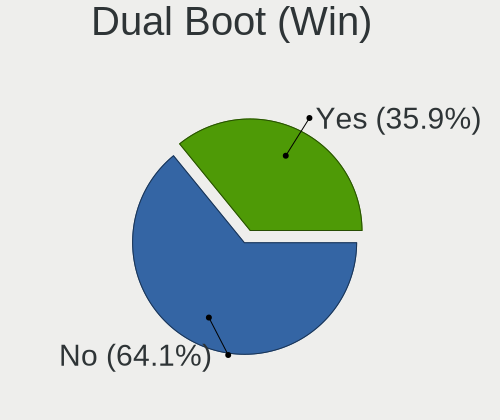
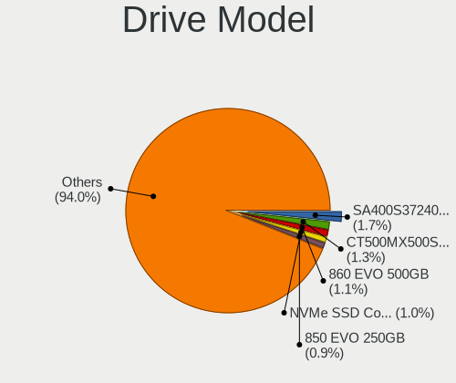
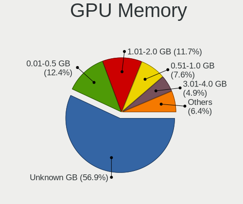
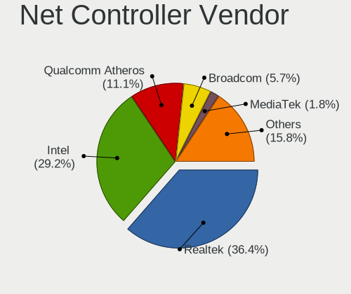

Linux in Italy - Tested Hardware & Statistics
---------------------------------------------

A project to collect tested hardware configurations for Linux in Italy.

Anyone can contribute to this report by the [hw-probe](https://github.com/linuxhw/hw-probe) tool:

    sudo -E hw-probe -all -upload

Please contribute! Especially if your hardware is rare.

This is a report for all computer types. See also reports for [desktops](/Location/Italy/Desktop/README.md) and [notebooks](/Location/Italy/Notebook/README.md).

Contents
--------

* [ Test Cases ](#test-cases)

* [ System ](#system)
  - [ OS                       ](#os)
  - [ OS Family                ](#os-family)
  - [ Kernel                   ](#kernel)
  - [ Kernel Family            ](#kernel-family)
  - [ Kernel Major Ver.        ](#kernel-major-ver)
  - [ Arch                     ](#arch)
  - [ DE                       ](#de)
  - [ Display Server           ](#display-server)
  - [ Display Manager          ](#display-manager)
  - [ OS Lang                  ](#os-lang)
  - [ Boot Mode                ](#boot-mode)
  - [ Filesystem               ](#filesystem)
  - [ Part. scheme             ](#part-scheme)
  - [ Dual Boot with Linux/BSD ](#dual-boot-with-linuxbsd)
  - [ Dual Boot (Win)          ](#dual-boot-win)

* [ Board ](#board)
  - [ Vendor                   ](#vendor)
  - [ Model                    ](#model)
  - [ Model Family             ](#model-family)
  - [ MFG Year                 ](#mfg-year)
  - [ Form Factor              ](#form-factor)
  - [ Secure Boot              ](#secure-boot)
  - [ Coreboot                 ](#coreboot)
  - [ RAM Size                 ](#ram-size)
  - [ RAM Used                 ](#ram-used)
  - [ Total Drives             ](#total-drives)
  - [ Has CD-ROM               ](#has-cd-rom)
  - [ Has Ethernet             ](#has-ethernet)
  - [ Has WiFi                 ](#has-wifi)
  - [ Has Bluetooth            ](#has-bluetooth)

* [ Location ](#location)
  - [ Country                  ](#country)
  - [ City                     ](#city)

* [ Drives ](#drives)
  - [ Drive Vendor             ](#drive-vendor)
  - [ Drive Model              ](#drive-model)
  - [ HDD Vendor               ](#hdd-vendor)
  - [ SSD Vendor               ](#ssd-vendor)
  - [ Drive Kind               ](#drive-kind)
  - [ Drive Connector          ](#drive-connector)
  - [ Drive Size               ](#drive-size)
  - [ Space Total              ](#space-total)
  - [ Space Used               ](#space-used)
  - [ Malfunc. Drives          ](#malfunc-drives)
  - [ Malfunc. Drive Vendor    ](#malfunc-drive-vendor)
  - [ Malfunc. HDD Vendor      ](#malfunc-hdd-vendor)
  - [ Malfunc. Drive Kind      ](#malfunc-drive-kind)
  - [ Failed Drives            ](#failed-drives)
  - [ Failed Drive Vendor      ](#failed-drive-vendor)
  - [ Drive Status             ](#drive-status)

* [ Storage controller ](#storage-controller)
  - [ Storage Vendor           ](#storage-vendor)
  - [ Storage Model            ](#storage-model)
  - [ Storage Kind             ](#storage-kind)

* [ Processor ](#processor)
  - [ CPU Vendor               ](#cpu-vendor)
  - [ CPU Model                ](#cpu-model)
  - [ CPU Model Family         ](#cpu-model-family)
  - [ CPU Cores                ](#cpu-cores)
  - [ CPU Sockets              ](#cpu-sockets)
  - [ CPU Threads              ](#cpu-threads)
  - [ CPU Op-Modes             ](#cpu-op-modes)
  - [ CPU Microcode            ](#cpu-microcode)
  - [ CPU Microarch            ](#cpu-microarch)

* [ Graphics ](#graphics)
  - [ GPU Vendor               ](#gpu-vendor)
  - [ GPU Model                ](#gpu-model)
  - [ GPU Combo                ](#gpu-combo)
  - [ GPU Driver               ](#gpu-driver)
  - [ GPU Memory               ](#gpu-memory)

* [ Monitor ](#monitor)
  - [ Monitor Vendor           ](#monitor-vendor)
  - [ Monitor Model            ](#monitor-model)
  - [ Monitor Resolution       ](#monitor-resolution)
  - [ Monitor Diagonal         ](#monitor-diagonal)
  - [ Monitor Width            ](#monitor-width)
  - [ Aspect Ratio             ](#aspect-ratio)
  - [ Monitor Area             ](#monitor-area)
  - [ Pixel Density            ](#pixel-density)
  - [ Multiple Monitors        ](#multiple-monitors)

* [ Network ](#network)
  - [ Net Controller Vendor    ](#net-controller-vendor)
  - [ Net Controller Model     ](#net-controller-model)
  - [ Wireless Vendor          ](#wireless-vendor)
  - [ Wireless Model           ](#wireless-model)
  - [ Ethernet Vendor          ](#ethernet-vendor)
  - [ Ethernet Model           ](#ethernet-model)
  - [ Net Controller Kind      ](#net-controller-kind)
  - [ Used Controller          ](#used-controller)
  - [ NICs                     ](#nics)
  - [ IPv6                     ](#ipv6)

* [ Bluetooth ](#bluetooth)
  - [ Bluetooth Vendor         ](#bluetooth-vendor)
  - [ Bluetooth Model          ](#bluetooth-model)

* [ Sound ](#sound)
  - [ Sound Vendor             ](#sound-vendor)
  - [ Sound Model              ](#sound-model)

* [ Memory ](#memory)
  - [ Memory Vendor            ](#memory-vendor)
  - [ Memory Model             ](#memory-model)
  - [ Memory Kind              ](#memory-kind)
  - [ Memory Form Factor       ](#memory-form-factor)
  - [ Memory Size              ](#memory-size)
  - [ Memory Speed             ](#memory-speed)

* [ Printers & scanners ](#printers--scanners)
  - [ Printer Vendor           ](#printer-vendor)
  - [ Printer Model            ](#printer-model)
  - [ Scanner Vendor           ](#scanner-vendor)
  - [ Scanner Model            ](#scanner-model)

* [ Camera ](#camera)
  - [ Camera Vendor            ](#camera-vendor)
  - [ Camera Model             ](#camera-model)

* [ Security ](#security)
  - [ Fingerprint Vendor       ](#fingerprint-vendor)
  - [ Fingerprint Model        ](#fingerprint-model)
  - [ Chipcard Vendor          ](#chipcard-vendor)
  - [ Chipcard Model           ](#chipcard-model)

* [ Unsupported ](#unsupported)
  - [ Unsupported Devices      ](#unsupported-devices)
  - [ Unsupported Device Types ](#unsupported-device-types)

Test Cases
----------

Total: 8401

| Vendor        | Model                       | Form-Factor | Probe                                                      | Date         |
|---------------|-----------------------------|-------------|------------------------------------------------------------|--------------|
| ASUSTek       | ASUS TUF Gaming F17 FX70... | Notebook    | [eeb167d869](https://linux-hardware.org/?probe=eeb167d869) | Nov 02, 2022 |
| HP            | Pavilion Gaming Laptop      | Notebook    | [695b3d82a7](https://linux-hardware.org/?probe=695b3d82a7) | Nov 02, 2022 |
| HP            | Pavilion Gaming Laptop      | Notebook    | [9b9e55c471](https://linux-hardware.org/?probe=9b9e55c471) | Nov 02, 2022 |
| ASUSTek       | X540SAA                     | Notebook    | [ccaedd7155](https://linux-hardware.org/?probe=ccaedd7155) | Nov 02, 2022 |
| ASUSTek       | H81T                        | Desktop     | [7598a634e6](https://linux-hardware.org/?probe=7598a634e6) | Nov 02, 2022 |
| Lenovo        | ThinkPad E15 Gen 3 20YHS... | Notebook    | [a3b1926b7e](https://linux-hardware.org/?probe=a3b1926b7e) | Nov 02, 2022 |
| MSI           | MAG X570S TOMAHAWK MAX W... | Desktop     | [c9041d22be](https://linux-hardware.org/?probe=c9041d22be) | Nov 02, 2022 |
| ASUSTek       | B85-PLUS                    | Desktop     | [dd24c26ffa](https://linux-hardware.org/?probe=dd24c26ffa) | Nov 02, 2022 |
| MSI           | Prestige 15 A11SCX          | Notebook    | [973b498b3f](https://linux-hardware.org/?probe=973b498b3f) | Nov 02, 2022 |
| HP            | Laptop                      | Notebook    | [e1cd3de91a](https://linux-hardware.org/?probe=e1cd3de91a) | Nov 02, 2022 |
| Lenovo        | ThinkPad X1 Extreme 20MF... | Notebook    | [9819da96f2](https://linux-hardware.org/?probe=9819da96f2) | Nov 02, 2022 |
| Dell          | 0GWHMW A01                  | Desktop     | [732eaeede7](https://linux-hardware.org/?probe=732eaeede7) | Nov 02, 2022 |
| ASUSTek       | ASUS TUF Gaming F15 FX50... | Notebook    | [2d931f9e99](https://linux-hardware.org/?probe=2d931f9e99) | Nov 02, 2022 |
| Lenovo        | ThinkBook 15 G3 ACL 21A4    | Notebook    | [335af8b89b](https://linux-hardware.org/?probe=335af8b89b) | Nov 02, 2022 |
| HUAWEI        | BOD-WXX9                    | Notebook    | [d4ac3a5f04](https://linux-hardware.org/?probe=d4ac3a5f04) | Nov 02, 2022 |
| HP            | G42                         | Notebook    | [18c487d99d](https://linux-hardware.org/?probe=18c487d99d) | Nov 02, 2022 |
| Jumper        | EZbook                      | Notebook    | [08ec434199](https://linux-hardware.org/?probe=08ec434199) | Nov 02, 2022 |
| Notebook      | P65_P67SE                   | Notebook    | [9b99df1e15](https://linux-hardware.org/?probe=9b99df1e15) | Nov 02, 2022 |
| HUAWEI        | NBLK-WAX9X                  | Notebook    | [d3beec5427](https://linux-hardware.org/?probe=d3beec5427) | Nov 02, 2022 |
| Microsoft     | Surface Go                  | Tablet      | [961f664871](https://linux-hardware.org/?probe=961f664871) | Nov 02, 2022 |
| Apple         | MacBookPro11,5              | Notebook    | [f22ebdf694](https://linux-hardware.org/?probe=f22ebdf694) | Nov 01, 2022 |
| Apple         | MacBookPro11,5              | Notebook    | [a27142d25c](https://linux-hardware.org/?probe=a27142d25c) | Nov 01, 2022 |
| Lenovo        | ThinkPad X201 3680BR4       | Notebook    | [eeeeb33766](https://linux-hardware.org/?probe=eeeeb33766) | Nov 01, 2022 |
| Dell          | Precision 7530              | Notebook    | [b1b5f7678c](https://linux-hardware.org/?probe=b1b5f7678c) | Nov 01, 2022 |
| HP            | ProBook 4530s               | Notebook    | [34682f3bfe](https://linux-hardware.org/?probe=34682f3bfe) | Nov 01, 2022 |
| HP            | EliteBook 830 G5            | Notebook    | [379443a5d6](https://linux-hardware.org/?probe=379443a5d6) | Nov 01, 2022 |
| Lenovo        | ThinkPad T420 4236PG6       | Notebook    | [49d423bc50](https://linux-hardware.org/?probe=49d423bc50) | Nov 01, 2022 |
| MSI           | B75A-IE35                   | Desktop     | [57b74e4ca2](https://linux-hardware.org/?probe=57b74e4ca2) | Nov 01, 2022 |
| MSI           | Z370 GAMING PLUS            | Desktop     | [527c779cfb](https://linux-hardware.org/?probe=527c779cfb) | Nov 01, 2022 |
| HP            | EliteBook 830 G5            | Notebook    | [5e099af04c](https://linux-hardware.org/?probe=5e099af04c) | Nov 01, 2022 |
| Lenovo        | ThinkPad L590 20Q7001KIX    | Notebook    | [c8e545615f](https://linux-hardware.org/?probe=c8e545615f) | Nov 01, 2022 |
| Toshiba       | Satellite L50-B             | Notebook    | [c242c45dbe](https://linux-hardware.org/?probe=c242c45dbe) | Nov 01, 2022 |
| ASUSTek       | BM2AD_D510MT_D310MT         | Desktop     | [8f2b0bc926](https://linux-hardware.org/?probe=8f2b0bc926) | Nov 01, 2022 |
| Acer          | Swift SF314-41              | Notebook    | [921b1a7ebf](https://linux-hardware.org/?probe=921b1a7ebf) | Nov 01, 2022 |
| Lenovo        | ThinkPad X1 Tablet Gen 3... | Tablet      | [fd97cf3ecb](https://linux-hardware.org/?probe=fd97cf3ecb) | Nov 01, 2022 |
| Lenovo        | IdeaPad 3 15ADA05 81W1      | Notebook    | [6db184e152](https://linux-hardware.org/?probe=6db184e152) | Nov 01, 2022 |
| Lenovo        | IdeaPad 3 15ADA05 81W1      | Notebook    | [60cfb7dcc6](https://linux-hardware.org/?probe=60cfb7dcc6) | Nov 01, 2022 |
| SANTECH       | X170KM-G                    | Notebook    | [073f9a1d24](https://linux-hardware.org/?probe=073f9a1d24) | Nov 01, 2022 |
| Intel         | DH61DL AAG14066-205         | Desktop     | [0f62f6f3b1](https://linux-hardware.org/?probe=0f62f6f3b1) | Nov 01, 2022 |
| MSI           | H81M-E33                    | Desktop     | [ee4c33d7b1](https://linux-hardware.org/?probe=ee4c33d7b1) | Nov 01, 2022 |
| ASUSTek       | PRIME A320M-K               | Desktop     | [a14fa00a56](https://linux-hardware.org/?probe=a14fa00a56) | Nov 01, 2022 |
| ASUSTek       | PRIME A320M-K               | Desktop     | [bfa1db2eb1](https://linux-hardware.org/?probe=bfa1db2eb1) | Nov 01, 2022 |
| ASUSTek       | H61M-K                      | Desktop     | [ca5a47c66a](https://linux-hardware.org/?probe=ca5a47c66a) | Nov 01, 2022 |
| ASUSTek       | SABERTOOTH Z87              | Desktop     | [d39c952932](https://linux-hardware.org/?probe=d39c952932) | Nov 01, 2022 |
| Apple         | MacBookAir7,2               | Notebook    | [2532d13f74](https://linux-hardware.org/?probe=2532d13f74) | Nov 01, 2022 |
| Dell          | Precision 3510              | Notebook    | [a87bb1e8dd](https://linux-hardware.org/?probe=a87bb1e8dd) | Nov 01, 2022 |
| Acer          | Aspire one                  | Notebook    | [bfb9f97d74](https://linux-hardware.org/?probe=bfb9f97d74) | Oct 31, 2022 |
| Packard Be... | EasyNote TE11BZ             | Notebook    | [0301f1ddf1](https://linux-hardware.org/?probe=0301f1ddf1) | Oct 31, 2022 |
| Acer          | Aspire V5-561G              | Notebook    | [ea7f8f381b](https://linux-hardware.org/?probe=ea7f8f381b) | Oct 31, 2022 |
| SANTECH       | NL5xRU                      | Notebook    | [63e1b4298d](https://linux-hardware.org/?probe=63e1b4298d) | Oct 31, 2022 |
| MSI           | X570-A PRO                  | Desktop     | [c60d9aa72d](https://linux-hardware.org/?probe=c60d9aa72d) | Oct 31, 2022 |
| ASUSTek       | CG8480                      | Desktop     | [0f7c1dc1cf](https://linux-hardware.org/?probe=0f7c1dc1cf) | Oct 31, 2022 |
| MSI           | H110M PRO-VD PLUS           | Desktop     | [ced3229025](https://linux-hardware.org/?probe=ced3229025) | Oct 31, 2022 |
| ASUSTek       | X510UNR                     | Notebook    | [6a28e2929d](https://linux-hardware.org/?probe=6a28e2929d) | Oct 31, 2022 |
| Microsoft     | Surface 3                   | Tablet      | [71eeeaef9e](https://linux-hardware.org/?probe=71eeeaef9e) | Oct 31, 2022 |
| HP            | 3397                        | Desktop     | [942cfa2a25](https://linux-hardware.org/?probe=942cfa2a25) | Oct 31, 2022 |
| ASUSTek       | VivoBook 15_ASUS Laptop ... | Notebook    | [027cfb43c4](https://linux-hardware.org/?probe=027cfb43c4) | Oct 31, 2022 |
| ASUSTek       | VivoBook 15_ASUS Laptop ... | Notebook    | [113930496e](https://linux-hardware.org/?probe=113930496e) | Oct 31, 2022 |
| Acer          | Aspire one                  | Notebook    | [82b34552f6](https://linux-hardware.org/?probe=82b34552f6) | Oct 31, 2022 |
| Gigabyte      | Z270-HD3P-CF                | Desktop     | [e309413fea](https://linux-hardware.org/?probe=e309413fea) | Oct 31, 2022 |
| HP            | Victus by Laptop 16-d1xx... | Notebook    | [f141a6cddf](https://linux-hardware.org/?probe=f141a6cddf) | Oct 31, 2022 |
| HP            | Victus by Laptop 16-d1xx... | Notebook    | [b9890126af](https://linux-hardware.org/?probe=b9890126af) | Oct 31, 2022 |
| ASUSTek       | ROG Strix G713RW_G713RW     | Notebook    | [5355a5547a](https://linux-hardware.org/?probe=5355a5547a) | Oct 31, 2022 |
| ASUSTek       | VivoBook 15_ASUS Laptop ... | Notebook    | [2934bab108](https://linux-hardware.org/?probe=2934bab108) | Oct 31, 2022 |
| Gigabyte      | B450 AORUS M                | Desktop     | [13741c554f](https://linux-hardware.org/?probe=13741c554f) | Oct 31, 2022 |
| Apple         | Mac-942B5BF58194151B        | All in one  | [32b9b29220](https://linux-hardware.org/?probe=32b9b29220) | Oct 31, 2022 |
| Gigabyte      | B450 AORUS M                | Desktop     | [e6e466cd8f](https://linux-hardware.org/?probe=e6e466cd8f) | Oct 31, 2022 |
| MSI           | 990FXA-GD80                 | Desktop     | [baaa1111ec](https://linux-hardware.org/?probe=baaa1111ec) | Oct 31, 2022 |
| HP            | ProBook 450 G8 Notebook ... | Notebook    | [34727cd696](https://linux-hardware.org/?probe=34727cd696) | Oct 31, 2022 |
| Lenovo        | ThinkPad Edge E530 3259M... | Notebook    | [aa1f78db58](https://linux-hardware.org/?probe=aa1f78db58) | Oct 31, 2022 |
| Lenovo        | ThinkPad Edge E530 3259M... | Notebook    | [26b5f59993](https://linux-hardware.org/?probe=26b5f59993) | Oct 31, 2022 |
| Gigabyte      | X570S AERO G                | Desktop     | [600587e66a](https://linux-hardware.org/?probe=600587e66a) | Oct 31, 2022 |
| Acer          | Nitro AN517-55              | Notebook    | [9653f093e1](https://linux-hardware.org/?probe=9653f093e1) | Oct 31, 2022 |
| ASUSTek       | PRIME X570-PRO              | Desktop     | [3fbcca75d5](https://linux-hardware.org/?probe=3fbcca75d5) | Oct 30, 2022 |
| ASRock        | FM2A88X-ITX+                | Desktop     | [08cf9e2ccd](https://linux-hardware.org/?probe=08cf9e2ccd) | Oct 30, 2022 |
| Lenovo        | V15 G2 ITL 82KB             | Notebook    | [209fa66bb9](https://linux-hardware.org/?probe=209fa66bb9) | Oct 30, 2022 |
| Gigabyte      | G1.Sniper B5-CF             | Desktop     | [c128f85cdc](https://linux-hardware.org/?probe=c128f85cdc) | Oct 30, 2022 |
| Acer          | Aspire 5732Z                | Notebook    | [df73e0ca67](https://linux-hardware.org/?probe=df73e0ca67) | Oct 30, 2022 |
| HP            | x2 210                      | Notebook    | [8ed0a97ee9](https://linux-hardware.org/?probe=8ed0a97ee9) | Oct 30, 2022 |
| HP            | EliteBook 840 G5            | Notebook    | [f8c58b7061](https://linux-hardware.org/?probe=f8c58b7061) | Oct 30, 2022 |
| Sony          | VAIO                        | All in one  | [b295b1cb6f](https://linux-hardware.org/?probe=b295b1cb6f) | Oct 30, 2022 |
| Chuwi         | LarkBox X                   | Mini pc     | [5cd057be2a](https://linux-hardware.org/?probe=5cd057be2a) | Oct 30, 2022 |
| ASUSTek       | A88XM-PLUS                  | Desktop     | [10aa435a0b](https://linux-hardware.org/?probe=10aa435a0b) | Oct 30, 2022 |
| ASRock        | FM2A88X-ITX+                | Desktop     | [e28a25b18a](https://linux-hardware.org/?probe=e28a25b18a) | Oct 30, 2022 |
| MSI           | MPG B550 GAMING PLUS        | Desktop     | [1f7df5159e](https://linux-hardware.org/?probe=1f7df5159e) | Oct 30, 2022 |
| ASUSTek       | N751JK                      | Notebook    | [eea92055f3](https://linux-hardware.org/?probe=eea92055f3) | Oct 30, 2022 |
| ASUSTek       | P6TD DELUXE                 | Desktop     | [faa61ea635](https://linux-hardware.org/?probe=faa61ea635) | Oct 30, 2022 |
| ASUSTek       | X510UNR                     | Notebook    | [41a0a441d3](https://linux-hardware.org/?probe=41a0a441d3) | Oct 30, 2022 |
| MSI           | Z77A-G45 Thunderbolt        | Desktop     | [fa189cf50b](https://linux-hardware.org/?probe=fa189cf50b) | Oct 30, 2022 |
| Lenovo        | V15 G2 ITL 82KB             | Notebook    | [89595b2fa9](https://linux-hardware.org/?probe=89595b2fa9) | Oct 30, 2022 |
| HP            | 1495                        | Desktop     | [b62f9d83b9](https://linux-hardware.org/?probe=b62f9d83b9) | Oct 30, 2022 |
| MSI           | A320M-A PRO MAX             | Desktop     | [80d6d99bcf](https://linux-hardware.org/?probe=80d6d99bcf) | Oct 30, 2022 |
| Intel         | NUC7i7BNB J31145-314        | Mini pc     | [9fd1f28183](https://linux-hardware.org/?probe=9fd1f28183) | Oct 30, 2022 |
| HP            | ProBook 6560b               | Notebook    | [89feda4b09](https://linux-hardware.org/?probe=89feda4b09) | Oct 30, 2022 |
| HUAWEI        | KLVL-WXX9                   | Notebook    | [4e4e0ac802](https://linux-hardware.org/?probe=4e4e0ac802) | Oct 30, 2022 |
| HUAWEI        | KLVL-WXX9                   | Notebook    | [8887bce606](https://linux-hardware.org/?probe=8887bce606) | Oct 30, 2022 |
| Lenovo        | ThinkPad X1 Extreme 20MF... | Notebook    | [423ad57e72](https://linux-hardware.org/?probe=423ad57e72) | Oct 29, 2022 |
| Lenovo        | ThinkPad X1 Extreme 20MF... | Notebook    | [f8b4ce6c3f](https://linux-hardware.org/?probe=f8b4ce6c3f) | Oct 29, 2022 |
| ASUSTek       | ZenBook UX325EA_UX325EA     | Notebook    | [69198e503e](https://linux-hardware.org/?probe=69198e503e) | Oct 29, 2022 |
| HP            | Laptop 15-dw0xxx            | Notebook    | [f6b00cb10f](https://linux-hardware.org/?probe=f6b00cb10f) | Oct 29, 2022 |
| Toshiba       | Satellite L50-A-1D6         | Notebook    | [77f308d89c](https://linux-hardware.org/?probe=77f308d89c) | Oct 29, 2022 |
| HP            | 18E7                        | Desktop     | [d4a4ad62cb](https://linux-hardware.org/?probe=d4a4ad62cb) | Oct 29, 2022 |
| Dell          | Precision 7520              | Notebook    | [f54f6d6354](https://linux-hardware.org/?probe=f54f6d6354) | Oct 29, 2022 |
| SANTECH       | PCx0Dx                      | Notebook    | [24462321e8](https://linux-hardware.org/?probe=24462321e8) | Oct 29, 2022 |
| MSI           | B450M PRO-M2 MAX            | Desktop     | [6549416d9d](https://linux-hardware.org/?probe=6549416d9d) | Oct 29, 2022 |
| Dell          | Precision 3570              | Notebook    | [fb016d8d01](https://linux-hardware.org/?probe=fb016d8d01) | Oct 29, 2022 |
| HUAWEI        | NBLB-WAX9N                  | Notebook    | [1925c8ce1f](https://linux-hardware.org/?probe=1925c8ce1f) | Oct 29, 2022 |
| ASRock        | B450M Pro4                  | Desktop     | [0616272661](https://linux-hardware.org/?probe=0616272661) | Oct 29, 2022 |
| Dell          | Precision 3510              | Notebook    | [bc9324156f](https://linux-hardware.org/?probe=bc9324156f) | Oct 29, 2022 |
| HP            | OMEN by Laptop 15-dc1xxx    | Notebook    | [20d95ce78c](https://linux-hardware.org/?probe=20d95ce78c) | Oct 29, 2022 |
| ASUSTek       | PRIME A320M-K               | Desktop     | [25caeb6d9e](https://linux-hardware.org/?probe=25caeb6d9e) | Oct 29, 2022 |
| HP            | Pavilion dv5                | Notebook    | [8bd42e12c3](https://linux-hardware.org/?probe=8bd42e12c3) | Oct 29, 2022 |
| ASRock        | 890GX Extreme3              | Desktop     | [ff1af2eaf0](https://linux-hardware.org/?probe=ff1af2eaf0) | Oct 29, 2022 |
| Dell          | Inspiron 5570               | Notebook    | [6555e01443](https://linux-hardware.org/?probe=6555e01443) | Oct 29, 2022 |
| ASUSTek       | LEUCITE3                    | Desktop     | [f51161d005](https://linux-hardware.org/?probe=f51161d005) | Oct 29, 2022 |
| ASUSTek       | LEUCITE3                    | Desktop     | [4c4e1b6871](https://linux-hardware.org/?probe=4c4e1b6871) | Oct 29, 2022 |
| Dell          | Inspiron 1525               | Notebook    | [ffb4369f83](https://linux-hardware.org/?probe=ffb4369f83) | Oct 29, 2022 |
| Lenovo        | ThinkBook 15 G2 ITL 20VE    | Notebook    | [be41a03a4d](https://linux-hardware.org/?probe=be41a03a4d) | Oct 29, 2022 |
| Acer          | Predator PH315-53           | Notebook    | [b3dd383a83](https://linux-hardware.org/?probe=b3dd383a83) | Oct 29, 2022 |
| Teclast       | F7 Plus                     | Notebook    | [f416278476](https://linux-hardware.org/?probe=f416278476) | Oct 29, 2022 |
| ASUSTek       | P5KPL-AM SE                 | Desktop     | [95af9b0439](https://linux-hardware.org/?probe=95af9b0439) | Oct 29, 2022 |
| Insyde        | Braswell                    | Notebook    | [d98b2d9661](https://linux-hardware.org/?probe=d98b2d9661) | Oct 29, 2022 |
| HUAWEI        | VLT-WX0                     | Notebook    | [e3662dc3bd](https://linux-hardware.org/?probe=e3662dc3bd) | Oct 29, 2022 |
| HUAWEI        | VLT-WX0                     | Notebook    | [7b414a3c7c](https://linux-hardware.org/?probe=7b414a3c7c) | Oct 29, 2022 |
| HP            | Pavilion dv6                | Notebook    | [6406b8b769](https://linux-hardware.org/?probe=6406b8b769) | Oct 29, 2022 |
| HP            | Pavilion dv6                | Notebook    | [7873dfb4cf](https://linux-hardware.org/?probe=7873dfb4cf) | Oct 29, 2022 |
| Acer          | Aspire E5-571G              | Notebook    | [cc0f34a2fa](https://linux-hardware.org/?probe=cc0f34a2fa) | Oct 29, 2022 |
| HUAWEI        | BOD-WXX9                    | Notebook    | [880d3ba9c9](https://linux-hardware.org/?probe=880d3ba9c9) | Oct 29, 2022 |
| Dell          | Latitude 5531               | Notebook    | [cdea65fd5c](https://linux-hardware.org/?probe=cdea65fd5c) | Oct 29, 2022 |
| Gigabyte      | EX58-UD3R                   | Desktop     | [0d76cc7e31](https://linux-hardware.org/?probe=0d76cc7e31) | Oct 29, 2022 |
| ASUSTek       | K53SV                       | Notebook    | [4ead64f80f](https://linux-hardware.org/?probe=4ead64f80f) | Oct 28, 2022 |
| Apple         | MacBookPro14,3              | Notebook    | [6383143b5b](https://linux-hardware.org/?probe=6383143b5b) | Oct 28, 2022 |
| ASUSTek       | K53SV                       | Notebook    | [d3043c50ae](https://linux-hardware.org/?probe=d3043c50ae) | Oct 28, 2022 |
| Chuwi         | LapBook Pro                 | Notebook    | [d362ed14bf](https://linux-hardware.org/?probe=d362ed14bf) | Oct 28, 2022 |
| ASUSTek       | PRIME A320M-K               | Desktop     | [5876a2f3d6](https://linux-hardware.org/?probe=5876a2f3d6) | Oct 28, 2022 |
| MSI           | Prestige 15 A12UC           | Notebook    | [3d4c4364f1](https://linux-hardware.org/?probe=3d4c4364f1) | Oct 28, 2022 |
| Acer          | MCP7A                       | Desktop     | [c14a31f6ab](https://linux-hardware.org/?probe=c14a31f6ab) | Oct 28, 2022 |
| MSI           | Prestige 14Evo A12M         | Notebook    | [5e32f7b38b](https://linux-hardware.org/?probe=5e32f7b38b) | Oct 28, 2022 |
| Unknown       | 775V88+                     | Desktop     | [f1a685b497](https://linux-hardware.org/?probe=f1a685b497) | Oct 28, 2022 |
| HP            | Laptop 15s-eq2xxx           | Notebook    | [9dcb685f5e](https://linux-hardware.org/?probe=9dcb685f5e) | Oct 28, 2022 |
| Dell          | XPS 13 9310                 | Notebook    | [7205cfe7b4](https://linux-hardware.org/?probe=7205cfe7b4) | Oct 28, 2022 |
| Toshiba       | Satellite C650D             | Notebook    | [0696abd43c](https://linux-hardware.org/?probe=0696abd43c) | Oct 28, 2022 |
| Lenovo        | 317E SDK0J40700 WIN 3258... | Desktop     | [8c85b7ec2e](https://linux-hardware.org/?probe=8c85b7ec2e) | Oct 28, 2022 |
| Lenovo        | ThinkPad X1 Carbon 4th 2... | Notebook    | [cfa027a9e2](https://linux-hardware.org/?probe=cfa027a9e2) | Oct 28, 2022 |
| Lenovo        | ThinkPad T14 Gen 2i 20W0... | Notebook    | [df9ef8c115](https://linux-hardware.org/?probe=df9ef8c115) | Oct 28, 2022 |
| Toshiba       | Satellite C650D             | Notebook    | [d42867d201](https://linux-hardware.org/?probe=d42867d201) | Oct 28, 2022 |
| Dell          | Precision 3510              | Notebook    | [b1f2e24e41](https://linux-hardware.org/?probe=b1f2e24e41) | Oct 28, 2022 |
| Dell          | Precision 3510              | Notebook    | [bb81eb9627](https://linux-hardware.org/?probe=bb81eb9627) | Oct 28, 2022 |
| Gigabyte      | H310M S2H x.x               | Desktop     | [acdf2a172f](https://linux-hardware.org/?probe=acdf2a172f) | Oct 28, 2022 |
| MSI           | H81M-P33                    | Desktop     | [16a78334cd](https://linux-hardware.org/?probe=16a78334cd) | Oct 28, 2022 |
| Lenovo        | ThinkPad P52 20M9S1EM00     | Notebook    | [40de74c5c5](https://linux-hardware.org/?probe=40de74c5c5) | Oct 28, 2022 |
| Microsoft     | Surface Go 2                | Tablet      | [b720c57302](https://linux-hardware.org/?probe=b720c57302) | Oct 28, 2022 |
| MSI           | Z370 KRAIT GAMING           | Desktop     | [cbf597cec1](https://linux-hardware.org/?probe=cbf597cec1) | Oct 28, 2022 |
| HP            | Laptop 15s-fq4xxx           | Notebook    | [e06398e1bc](https://linux-hardware.org/?probe=e06398e1bc) | Oct 28, 2022 |
| Lenovo        | ThinkPad X1 Carbon 4th 2... | Notebook    | [83179a6cea](https://linux-hardware.org/?probe=83179a6cea) | Oct 28, 2022 |
| Dell          | Latitude 5521               | Notebook    | [460057b367](https://linux-hardware.org/?probe=460057b367) | Oct 28, 2022 |
| Lenovo        | IdeaPad Gaming 3 15ARH05... | Notebook    | [7d99f01f0e](https://linux-hardware.org/?probe=7d99f01f0e) | Oct 28, 2022 |
| Lenovo        | ThinkPad W540 20BHS0730D    | Notebook    | [f24dc12e06](https://linux-hardware.org/?probe=f24dc12e06) | Oct 28, 2022 |
| MSI           | Stealth GS66 12UGS          | Notebook    | [98b47019d1](https://linux-hardware.org/?probe=98b47019d1) | Oct 28, 2022 |
| Lenovo        | IdeaPadFlex 5 14ITL05 82... | Convertible | [ac6f0daea9](https://linux-hardware.org/?probe=ac6f0daea9) | Oct 28, 2022 |
| ASUSTek       | P9X79-WS-SYS                | Desktop     | [8b10d380a5](https://linux-hardware.org/?probe=8b10d380a5) | Oct 28, 2022 |
| Samsung       | 950XDB/951XDB/950XDY        | Notebook    | [2fdc53f0f3](https://linux-hardware.org/?probe=2fdc53f0f3) | Oct 28, 2022 |
| MSI           | Modern 14 B10RBSW           | Notebook    | [9c3c17a82e](https://linux-hardware.org/?probe=9c3c17a82e) | Oct 28, 2022 |
| Lenovo        | 3172 NOK                    | Mini pc     | [1ddbbf71eb](https://linux-hardware.org/?probe=1ddbbf71eb) | Oct 28, 2022 |
| ASUSTek       | ROG CROSSHAIR VII HERO      | Desktop     | [1759cbebe1](https://linux-hardware.org/?probe=1759cbebe1) | Oct 28, 2022 |
| Lenovo        | ThinkPad X1 Carbon Gen 1... | Notebook    | [6314ec0dd1](https://linux-hardware.org/?probe=6314ec0dd1) | Oct 28, 2022 |
| Lenovo        | ThinkPad X1 Carbon Gen 1... | Notebook    | [dcd40f9f78](https://linux-hardware.org/?probe=dcd40f9f78) | Oct 28, 2022 |
| Acer          | Aspire E5-573G              | Notebook    | [f575803f23](https://linux-hardware.org/?probe=f575803f23) | Oct 28, 2022 |
| ASUSTek       | ROG CROSSHAIR VII HERO      | Desktop     | [ac3b0eaf36](https://linux-hardware.org/?probe=ac3b0eaf36) | Oct 28, 2022 |
| Apple         | MacBookPro11,5              | Notebook    | [fc35e765fd](https://linux-hardware.org/?probe=fc35e765fd) | Oct 28, 2022 |
| MSI           | Katana GF66 11UC            | Notebook    | [83088617d3](https://linux-hardware.org/?probe=83088617d3) | Oct 28, 2022 |
| SANTECH       | NHx0DB,DE                   | Notebook    | [db8c0489f4](https://linux-hardware.org/?probe=db8c0489f4) | Oct 28, 2022 |
| ASUSTek       | VivoBook_ASUSLaptop X509... | Notebook    | [033cc83715](https://linux-hardware.org/?probe=033cc83715) | Oct 28, 2022 |
| HUAWEI        | KLVL-WXX9                   | Notebook    | [176fa68922](https://linux-hardware.org/?probe=176fa68922) | Oct 28, 2022 |
| Microsoft     | Surface Go 3                | Tablet      | [85019658e9](https://linux-hardware.org/?probe=85019658e9) | Oct 27, 2022 |
| HP            | Pavilion Gaming Laptop 1... | Notebook    | [1d64fb48e7](https://linux-hardware.org/?probe=1d64fb48e7) | Oct 27, 2022 |
| Timi          | TM1701                      | Notebook    | [f246345845](https://linux-hardware.org/?probe=f246345845) | Oct 27, 2022 |
| Intel         | DH61DL AAG14066-205         | Desktop     | [9031f7b82b](https://linux-hardware.org/?probe=9031f7b82b) | Oct 27, 2022 |
| HP            | Victus by Laptop 16-e0xx... | Notebook    | [53832f0517](https://linux-hardware.org/?probe=53832f0517) | Oct 27, 2022 |
| ASUSTek       | S551LN                      | Notebook    | [30d97ad99e](https://linux-hardware.org/?probe=30d97ad99e) | Oct 27, 2022 |
| Unknown       | Unknown                     | Notebook    | [a03935aadd](https://linux-hardware.org/?probe=a03935aadd) | Oct 27, 2022 |
| Samsung       | 950XDB/951XDB/950XDY        | Notebook    | [f27c4e1041](https://linux-hardware.org/?probe=f27c4e1041) | Oct 27, 2022 |
| HP            | 255 G7 Notebook PC          | Notebook    | [8cf00ceef5](https://linux-hardware.org/?probe=8cf00ceef5) | Oct 27, 2022 |
| Lenovo        | 0B98401 PRO                 | Desktop     | [99f9bbd5ad](https://linux-hardware.org/?probe=99f9bbd5ad) | Oct 27, 2022 |
| ASUSTek       | TUF Gaming FX505DT_FX505... | Notebook    | [639503102e](https://linux-hardware.org/?probe=639503102e) | Oct 27, 2022 |
| HP            | 255 G8 Notebook PC          | Notebook    | [ba5aec702a](https://linux-hardware.org/?probe=ba5aec702a) | Oct 27, 2022 |
| MSI           | H110M PRO-VD PLUS           | Desktop     | [d3c4092754](https://linux-hardware.org/?probe=d3c4092754) | Oct 27, 2022 |
| HP            | ProBook 640 G1              | Notebook    | [3a9f97607d](https://linux-hardware.org/?probe=3a9f97607d) | Oct 27, 2022 |
| Gigabyte      | Z77X-UP7                    | Desktop     | [c33d6de923](https://linux-hardware.org/?probe=c33d6de923) | Oct 27, 2022 |
| Packard Be... | IMEDIA S3810                | Desktop     | [f492fb9369](https://linux-hardware.org/?probe=f492fb9369) | Oct 27, 2022 |
| Unknown       | Unknown                     | Notebook    | [069ce9d405](https://linux-hardware.org/?probe=069ce9d405) | Oct 27, 2022 |
| MSI           | PS63 Modern 8RC             | Notebook    | [36b663cec7](https://linux-hardware.org/?probe=36b663cec7) | Oct 27, 2022 |
| MSI           | H81M-E33                    | Desktop     | [f0613bfce8](https://linux-hardware.org/?probe=f0613bfce8) | Oct 27, 2022 |
| MSI           | PS63 Modern 8RC             | Notebook    | [e00fd51503](https://linux-hardware.org/?probe=e00fd51503) | Oct 27, 2022 |
| HP            | ProBook 450 G5              | Notebook    | [664bf1184f](https://linux-hardware.org/?probe=664bf1184f) | Oct 27, 2022 |
| Lenovo        | IdeaPad 330S-15IKB 81F5     | Notebook    | [264d164669](https://linux-hardware.org/?probe=264d164669) | Oct 27, 2022 |
| Dell          | Latitude 9420               | Notebook    | [a601281b46](https://linux-hardware.org/?probe=a601281b46) | Oct 27, 2022 |
| Dell          | Latitude E5530 non-vPro     | Notebook    | [a5c5f0ec1e](https://linux-hardware.org/?probe=a5c5f0ec1e) | Oct 27, 2022 |
| HP            | Pavilion dv6                | Notebook    | [ed392a140d](https://linux-hardware.org/?probe=ed392a140d) | Oct 27, 2022 |
| HP            | Pavilion dv6                | Notebook    | [1e14922876](https://linux-hardware.org/?probe=1e14922876) | Oct 27, 2022 |
| HUAWEI        | BOHK-WAX9X                  | Notebook    | [0c037323d9](https://linux-hardware.org/?probe=0c037323d9) | Oct 27, 2022 |
| Lenovo        | ThinkPad X1 Carbon Gen 9... | Notebook    | [24da197a3a](https://linux-hardware.org/?probe=24da197a3a) | Oct 27, 2022 |
| Dell          | Inspiron 5515               | Notebook    | [74ad4c8c59](https://linux-hardware.org/?probe=74ad4c8c59) | Oct 27, 2022 |
| HP            | ProBook 6560b               | Notebook    | [222a5c2dbe](https://linux-hardware.org/?probe=222a5c2dbe) | Oct 27, 2022 |
| MSI           | X58 Pro                     | Desktop     | [6c449246c8](https://linux-hardware.org/?probe=6c449246c8) | Oct 27, 2022 |
| Lenovo        | IdeaPad 5 14ITL05 82FE      | Notebook    | [670823778e](https://linux-hardware.org/?probe=670823778e) | Oct 27, 2022 |
| HP            | Spectre x360 Convertible... | Convertible | [7be37b6a2d](https://linux-hardware.org/?probe=7be37b6a2d) | Oct 27, 2022 |
| HP            | Pavilion x360 Convertibl... | Convertible | [19859b5baf](https://linux-hardware.org/?probe=19859b5baf) | Oct 27, 2022 |
| MSI           | B450 TOMAHAWK MAX           | Desktop     | [b682a38061](https://linux-hardware.org/?probe=b682a38061) | Oct 27, 2022 |
| Lenovo        | IdeaPad 3 15ADA05 81W1      | Notebook    | [a308f68bce](https://linux-hardware.org/?probe=a308f68bce) | Oct 27, 2022 |
| MSI           | MS-B1061                    | All in one  | [6a736e8849](https://linux-hardware.org/?probe=6a736e8849) | Oct 27, 2022 |
| Lenovo        | Yoga 720-13IKB              | Convertible | [1ca9551d4d](https://linux-hardware.org/?probe=1ca9551d4d) | Oct 27, 2022 |
| Acer          | Aspire 5750G                | Notebook    | [b51a20d480](https://linux-hardware.org/?probe=b51a20d480) | Oct 27, 2022 |
| HP            | Pavilion x360 Convertibl... | Convertible | [810ec3e083](https://linux-hardware.org/?probe=810ec3e083) | Oct 27, 2022 |
| Lenovo        | IdeaPadFlex 5 14ITL05 82... | Convertible | [0d31bc8f88](https://linux-hardware.org/?probe=0d31bc8f88) | Oct 27, 2022 |
| HP            | 1589                        | Desktop     | [4a15b6de0f](https://linux-hardware.org/?probe=4a15b6de0f) | Oct 27, 2022 |
| MSI           | Katana GF66 12UC            | Notebook    | [9b8f917e6b](https://linux-hardware.org/?probe=9b8f917e6b) | Oct 27, 2022 |
| Dell          | Inspiron 5590               | Notebook    | [f1a5637218](https://linux-hardware.org/?probe=f1a5637218) | Oct 27, 2022 |
| HP            | ENVY x360 Convertible 13... | Convertible | [51877edd1e](https://linux-hardware.org/?probe=51877edd1e) | Oct 27, 2022 |
| HP            | ENVY x360 Convertible 13... | Convertible | [aca9e00b3d](https://linux-hardware.org/?probe=aca9e00b3d) | Oct 27, 2022 |
| Lenovo        | ThinkPad X260 20F5S2WX05    | Notebook    | [710f95eab8](https://linux-hardware.org/?probe=710f95eab8) | Oct 27, 2022 |
| Lenovo        | ThinkPad T480s 20L8S5YM0... | Notebook    | [c348de09bf](https://linux-hardware.org/?probe=c348de09bf) | Oct 26, 2022 |
| HP            | Pavilion Laptop 15-eh1xx... | Notebook    | [0d705b0971](https://linux-hardware.org/?probe=0d705b0971) | Oct 26, 2022 |
| HP            | ProBook 450 G3              | Notebook    | [4aa258716b](https://linux-hardware.org/?probe=4aa258716b) | Oct 26, 2022 |
| HP            | ProBook 450 G3              | Notebook    | [26d1b8b2b2](https://linux-hardware.org/?probe=26d1b8b2b2) | Oct 26, 2022 |
| Lenovo        | IdeaPad 3 15IIL05 81WE      | Notebook    | [022cfe6707](https://linux-hardware.org/?probe=022cfe6707) | Oct 26, 2022 |
| ASUSTek       | TUF Gaming B460M-PLUS       | Desktop     | [d2debd1dab](https://linux-hardware.org/?probe=d2debd1dab) | Oct 26, 2022 |
| ASUSTek       | X555LAB                     | Notebook    | [44d47f5024](https://linux-hardware.org/?probe=44d47f5024) | Oct 26, 2022 |
| MSI           | MPG Z390 GAMING PRO CARB... | Desktop     | [97d2bacb5d](https://linux-hardware.org/?probe=97d2bacb5d) | Oct 26, 2022 |
| ASUSTek       | VivoBook S15 X510UF         | Notebook    | [85b4bc70fa](https://linux-hardware.org/?probe=85b4bc70fa) | Oct 26, 2022 |
| HP            | 240 G8 Notebook PC          | Notebook    | [25765f4a76](https://linux-hardware.org/?probe=25765f4a76) | Oct 26, 2022 |
| HP            | Pavilion Laptop 14-ce0xx... | Notebook    | [7e1a95e569](https://linux-hardware.org/?probe=7e1a95e569) | Oct 26, 2022 |
| Gigabyte      | X570 AORUS ELITE            | Desktop     | [82fcc1ecc7](https://linux-hardware.org/?probe=82fcc1ecc7) | Oct 26, 2022 |
| Lenovo        | ThinkPad T480 20L50000IX    | Notebook    | [bcb1b11c50](https://linux-hardware.org/?probe=bcb1b11c50) | Oct 26, 2022 |
| Apple         | Mac-942B5BF58194151B        | All in one  | [03fc94fc36](https://linux-hardware.org/?probe=03fc94fc36) | Oct 26, 2022 |
| Intel         | H55                         | Desktop     | [f634aefb9a](https://linux-hardware.org/?probe=f634aefb9a) | Oct 26, 2022 |
| MSI           | ZH77A-G43                   | Desktop     | [ff43c876e9](https://linux-hardware.org/?probe=ff43c876e9) | Oct 26, 2022 |
| ASUSTek       | TUF B450M-PLUS GAMING       | Desktop     | [469345600b](https://linux-hardware.org/?probe=469345600b) | Oct 26, 2022 |
| HP            | 250 G8 Notebook PC          | Notebook    | [d4ebaa71a2](https://linux-hardware.org/?probe=d4ebaa71a2) | Oct 26, 2022 |
| Acer          | Extensa 2540                | Notebook    | [367660309f](https://linux-hardware.org/?probe=367660309f) | Oct 26, 2022 |
| Fujitsu       | D3161-A1 S26361-D3161-A1    | Desktop     | [06f33f301b](https://linux-hardware.org/?probe=06f33f301b) | Oct 26, 2022 |
| Gigabyte      | X570 AORUS ELITE            | Desktop     | [8a718e0ade](https://linux-hardware.org/?probe=8a718e0ade) | Oct 26, 2022 |
| Lenovo        | ThinkPad E470 20H1006JIX    | Notebook    | [8bc8778497](https://linux-hardware.org/?probe=8bc8778497) | Oct 26, 2022 |
| ASRock        | H77 Pro4/MVP                | Desktop     | [94d8bc13bb](https://linux-hardware.org/?probe=94d8bc13bb) | Oct 26, 2022 |
| Timi          | A7S                         | Notebook    | [004df6b9a1](https://linux-hardware.org/?probe=004df6b9a1) | Oct 26, 2022 |
| HP            | Laptop 17-cp0xxx            | Notebook    | [60d57edbfb](https://linux-hardware.org/?probe=60d57edbfb) | Oct 26, 2022 |
| Dell          | XPS 15 9520                 | Notebook    | [1ede815931](https://linux-hardware.org/?probe=1ede815931) | Oct 26, 2022 |
| Lenovo        | ThinkPad T450 20BUS0S902    | Notebook    | [1115da2433](https://linux-hardware.org/?probe=1115da2433) | Oct 26, 2022 |
| MSI           | Stealth GS66 12UH           | Notebook    | [3c985bb814](https://linux-hardware.org/?probe=3c985bb814) | Oct 26, 2022 |
| MSI           | Stealth GS66 12UH           | Notebook    | [336132b016](https://linux-hardware.org/?probe=336132b016) | Oct 26, 2022 |
| Lenovo        | 1048 SDK0Q40104 WIN 3915... | Desktop     | [2bed8fe9b1](https://linux-hardware.org/?probe=2bed8fe9b1) | Oct 26, 2022 |
| ASUSTek       | 1005HA                      | Notebook    | [118fed891f](https://linux-hardware.org/?probe=118fed891f) | Oct 26, 2022 |
| HP            | 1494                        | Desktop     | [fa63090109](https://linux-hardware.org/?probe=fa63090109) | Oct 26, 2022 |
| Lenovo        | ThinkPad L380 Yoga 20M7C... | Convertible | [1d55c9b411](https://linux-hardware.org/?probe=1d55c9b411) | Oct 26, 2022 |
| Lenovo        | IdeaPadFlex 5 14ITL05 82... | Convertible | [b05308c0f0](https://linux-hardware.org/?probe=b05308c0f0) | Oct 26, 2022 |
| Dell          | Latitude E5570              | Notebook    | [2d59f069b4](https://linux-hardware.org/?probe=2d59f069b4) | Oct 26, 2022 |
| HP            | 8509                        | Desktop     | [81bfb5a782](https://linux-hardware.org/?probe=81bfb5a782) | Oct 26, 2022 |
| HP            | Pavilion x360 Convertibl... | Convertible | [40447b0a52](https://linux-hardware.org/?probe=40447b0a52) | Oct 26, 2022 |
| HP            | Pavilion x360 Convertibl... | Convertible | [040b99188b](https://linux-hardware.org/?probe=040b99188b) | Oct 26, 2022 |
| Dell          | XPS 15 7590                 | Notebook    | [5265f4d89f](https://linux-hardware.org/?probe=5265f4d89f) | Oct 26, 2022 |
| ASUSTek       | P8H67-M PRO                 | Desktop     | [b50585b578](https://linux-hardware.org/?probe=b50585b578) | Oct 26, 2022 |
| HP            | EliteBook 840 G5            | Notebook    | [4b28c73302](https://linux-hardware.org/?probe=4b28c73302) | Oct 26, 2022 |
| HP            | Pavilion x360 Convertibl... | Convertible | [7b20f93496](https://linux-hardware.org/?probe=7b20f93496) | Oct 26, 2022 |
| HUAWEI        | HN-WX9X                     | Notebook    | [042ffc026d](https://linux-hardware.org/?probe=042ffc026d) | Oct 26, 2022 |
| MSI           | Modern 15 A11M              | Notebook    | [0a658be9fc](https://linux-hardware.org/?probe=0a658be9fc) | Oct 26, 2022 |
| Timi          | A7S                         | Notebook    | [77a87009dd](https://linux-hardware.org/?probe=77a87009dd) | Oct 26, 2022 |
| HP            | Spectre Laptop 13-af0xx     | Notebook    | [1ded224c69](https://linux-hardware.org/?probe=1ded224c69) | Oct 26, 2022 |
| Google        | Apel                        | Notebook    | [f3bf9850dd](https://linux-hardware.org/?probe=f3bf9850dd) | Oct 26, 2022 |
| Gigabyte      | B450 AORUS M                | Desktop     | [1603f6064b](https://linux-hardware.org/?probe=1603f6064b) | Oct 26, 2022 |
| Lenovo        | ThinkPad X1 Carbon 3rd 2... | Notebook    | [53e6b23ebf](https://linux-hardware.org/?probe=53e6b23ebf) | Oct 26, 2022 |
| Dell          | Inspiron 7586               | Convertible | [1cc713f6d8](https://linux-hardware.org/?probe=1cc713f6d8) | Oct 25, 2022 |
| ASUSTek       | ROG STRIX B550-F GAMING     | Desktop     | [705e51d33e](https://linux-hardware.org/?probe=705e51d33e) | Oct 25, 2022 |
| Acer          | Aspire E5-571               | Notebook    | [2920658e38](https://linux-hardware.org/?probe=2920658e38) | Oct 25, 2022 |
| MSI           | MPG B550 GAMING EDGE WIF... | Desktop     | [50c68d9bb4](https://linux-hardware.org/?probe=50c68d9bb4) | Oct 25, 2022 |
| ASUSTek       | Z87-PRO                     | Desktop     | [a48316f550](https://linux-hardware.org/?probe=a48316f550) | Oct 25, 2022 |
| ASUSTek       | ROG STRIX B550-F GAMING     | Desktop     | [824eb583d8](https://linux-hardware.org/?probe=824eb583d8) | Oct 25, 2022 |
| Samsung       | 767XCL                      | Notebook    | [17bd1b4506](https://linux-hardware.org/?probe=17bd1b4506) | Oct 25, 2022 |
| Dell          | Latitude E6430              | Notebook    | [f196a9762f](https://linux-hardware.org/?probe=f196a9762f) | Oct 25, 2022 |
| ASUSTek       | SABERTOOTH 990FX R2.0       | Desktop     | [6ffc032b64](https://linux-hardware.org/?probe=6ffc032b64) | Oct 25, 2022 |
| Dell          | Latitude E6430              | Notebook    | [8062ec17fd](https://linux-hardware.org/?probe=8062ec17fd) | Oct 25, 2022 |
| Lenovo        | IdeaPad 3 15ADA05 81W1      | Notebook    | [2d7fa062e3](https://linux-hardware.org/?probe=2d7fa062e3) | Oct 25, 2022 |
| ASUSTek       | ROG STRIX B550-F GAMING     | Desktop     | [2227bb9824](https://linux-hardware.org/?probe=2227bb9824) | Oct 25, 2022 |
| Lenovo        | 102F SDK0J40705 WIN 3425... | Desktop     | [958c0a2ae7](https://linux-hardware.org/?probe=958c0a2ae7) | Oct 25, 2022 |
| ASUSTek       | N751JK                      | Notebook    | [f6f0ff5048](https://linux-hardware.org/?probe=f6f0ff5048) | Oct 25, 2022 |
| ASUSTek       | VivoBook_ASUSLaptop X571... | Notebook    | [7bf16d5a25](https://linux-hardware.org/?probe=7bf16d5a25) | Oct 25, 2022 |
| Lenovo        | ThinkBook 14-IIL 20SL       | Notebook    | [94fa6196b8](https://linux-hardware.org/?probe=94fa6196b8) | Oct 25, 2022 |
| Gigabyte      | H370 AORUS GAMING 3 WIFI... | Desktop     | [1f3561258a](https://linux-hardware.org/?probe=1f3561258a) | Oct 25, 2022 |
| HP            | Pavilion dv6                | Notebook    | [03e2594419](https://linux-hardware.org/?probe=03e2594419) | Oct 25, 2022 |
| Gigabyte      | H97M-D3H                    | Desktop     | [72532e08fe](https://linux-hardware.org/?probe=72532e08fe) | Oct 25, 2022 |
| Apple         | MacBook5,1                  | Notebook    | [da04330684](https://linux-hardware.org/?probe=da04330684) | Oct 25, 2022 |
| Dell          | XPS 15 9570                 | Notebook    | [5f9de95e9c](https://linux-hardware.org/?probe=5f9de95e9c) | Oct 25, 2022 |
| Lenovo        | V15-IGL 82C3                | Notebook    | [264fcfd9f1](https://linux-hardware.org/?probe=264fcfd9f1) | Oct 25, 2022 |
| Dell          | Precision M6800             | Notebook    | [6c15780d7a](https://linux-hardware.org/?probe=6c15780d7a) | Oct 25, 2022 |
| Microsoft     | Surface Laptop 3            | Tablet      | [b35333d9c0](https://linux-hardware.org/?probe=b35333d9c0) | Oct 25, 2022 |
| HP            | ENVY 15                     | Notebook    | [faf3ff2256](https://linux-hardware.org/?probe=faf3ff2256) | Oct 25, 2022 |
| Lenovo        | ThinkPad T14s Gen 1 20UH... | Notebook    | [cca91f3fe8](https://linux-hardware.org/?probe=cca91f3fe8) | Oct 25, 2022 |
| Dell          | Latitude E7270              | Notebook    | [7f2c8b9e9c](https://linux-hardware.org/?probe=7f2c8b9e9c) | Oct 25, 2022 |
| Dell          | 040DDP A01                  | Desktop     | [cc0b502ddf](https://linux-hardware.org/?probe=cc0b502ddf) | Oct 25, 2022 |
| ASUSTek       | H110M-K                     | Desktop     | [06c00dc8d5](https://linux-hardware.org/?probe=06c00dc8d5) | Oct 25, 2022 |
| Lenovo        | ThinkPad T14s Gen 1 20UH... | Notebook    | [8f34a9c24c](https://linux-hardware.org/?probe=8f34a9c24c) | Oct 25, 2022 |
| Lenovo        | SHARKBAY 31900058 STD       | Desktop     | [bd3a8063b3](https://linux-hardware.org/?probe=bd3a8063b3) | Oct 25, 2022 |
| Lenovo        | ThinkPad E15 Gen 3 20YG0... | Notebook    | [a8c29545e6](https://linux-hardware.org/?probe=a8c29545e6) | Oct 25, 2022 |
| ASRock        | AB350 Pro4                  | Desktop     | [82ee095168](https://linux-hardware.org/?probe=82ee095168) | Oct 25, 2022 |
| ASRock        | G41C-GS                     | Desktop     | [a38f9baa55](https://linux-hardware.org/?probe=a38f9baa55) | Oct 25, 2022 |
| Dell          | Inspiron 3501               | Notebook    | [6764a6860f](https://linux-hardware.org/?probe=6764a6860f) | Oct 25, 2022 |
| MSI           | Z170A GAMING M5             | Desktop     | [b5dcdb6844](https://linux-hardware.org/?probe=b5dcdb6844) | Oct 25, 2022 |
| HP            | Pavilion x360 Convertibl... | Convertible | [be4e6c1903](https://linux-hardware.org/?probe=be4e6c1903) | Oct 25, 2022 |
| Sony          | VAIO                        | All in one  | [27e76b1c76](https://linux-hardware.org/?probe=27e76b1c76) | Oct 25, 2022 |
| ASRock        | 4Core1600-GLAN/M            | Desktop     | [33bf20761f](https://linux-hardware.org/?probe=33bf20761f) | Oct 25, 2022 |
| Unknown       | 1.0                         | Desktop     | [cf3a9de207](https://linux-hardware.org/?probe=cf3a9de207) | Oct 25, 2022 |
| ASUSTek       | PRIME Z490-P                | Desktop     | [0eb9c3ebff](https://linux-hardware.org/?probe=0eb9c3ebff) | Oct 25, 2022 |
| Pegatron      | Benicia                     | Desktop     | [3735dca311](https://linux-hardware.org/?probe=3735dca311) | Oct 25, 2022 |
| Lenovo        | ThinkPad T470 20HES0FW00    | Notebook    | [1f939e0414](https://linux-hardware.org/?probe=1f939e0414) | Oct 25, 2022 |
| IBM           | 81Y7045                     | Server      | [27bd1ebecd](https://linux-hardware.org/?probe=27bd1ebecd) | Oct 25, 2022 |
| Dell          | Latitude 5500               | Notebook    | [6e1b321740](https://linux-hardware.org/?probe=6e1b321740) | Oct 25, 2022 |
| HP            | Laptop 15s-fq1xxx           | Notebook    | [badb0d5aee](https://linux-hardware.org/?probe=badb0d5aee) | Oct 25, 2022 |
| HP            | Laptop 15s-fq1xxx           | Notebook    | [f4174b55a2](https://linux-hardware.org/?probe=f4174b55a2) | Oct 25, 2022 |
| HP            | 805F                        | Desktop     | [eaa3994f86](https://linux-hardware.org/?probe=eaa3994f86) | Oct 25, 2022 |
| Lenovo        | Z50-70 20354                | Notebook    | [08b673e57b](https://linux-hardware.org/?probe=08b673e57b) | Oct 25, 2022 |
| Lenovo        | IdeaPadFlex 5 14ARE05 81... | Convertible | [485025af1a](https://linux-hardware.org/?probe=485025af1a) | Oct 25, 2022 |
| ASUSTek       | TUF Gaming B450M-PRO II     | Desktop     | [ab5d5a6170](https://linux-hardware.org/?probe=ab5d5a6170) | Oct 25, 2022 |
| LG Electro... | 17Z90N-V.AA55D              | Notebook    | [bf40de3f5a](https://linux-hardware.org/?probe=bf40de3f5a) | Oct 25, 2022 |
| MSI           | X470 GAMING PLUS MAX        | Desktop     | [040714e135](https://linux-hardware.org/?probe=040714e135) | Oct 25, 2022 |
| Dell          | Inspiron 7791 2n1           | Convertible | [a78a644cc1](https://linux-hardware.org/?probe=a78a644cc1) | Oct 25, 2022 |
| ASUSTek       | M5A78L-M/USB3               | Desktop     | [6a9d81591f](https://linux-hardware.org/?probe=6a9d81591f) | Oct 25, 2022 |
| Lenovo        | 318E NOK                    | Desktop     | [6b190bfb4f](https://linux-hardware.org/?probe=6b190bfb4f) | Oct 25, 2022 |
| Acer          | Aspire A715-42G             | Notebook    | [72b73a6552](https://linux-hardware.org/?probe=72b73a6552) | Oct 25, 2022 |
| ASUSTek       | VivoBook_ASUSLaptop X512... | Notebook    | [b2bb88f27f](https://linux-hardware.org/?probe=b2bb88f27f) | Oct 25, 2022 |
| Lenovo        | ThinkPad T14s Gen 2a 20X... | Notebook    | [26415e4b74](https://linux-hardware.org/?probe=26415e4b74) | Oct 25, 2022 |
| Apple         | MacBookAir6,1               | Notebook    | [4785b7f6f6](https://linux-hardware.org/?probe=4785b7f6f6) | Oct 25, 2022 |
| HP            | 650                         | Notebook    | [d7b73bebc7](https://linux-hardware.org/?probe=d7b73bebc7) | Oct 25, 2022 |
| Lenovo        | ThinkPad T460 20FMS08H00    | Notebook    | [13422369f7](https://linux-hardware.org/?probe=13422369f7) | Oct 25, 2022 |
| ASUSTek       | PRIME H370-PLUS             | Desktop     | [ef9fdf5dcd](https://linux-hardware.org/?probe=ef9fdf5dcd) | Oct 25, 2022 |
| Dell          | Inspiron 7559               | Notebook    | [2a1b8eb060](https://linux-hardware.org/?probe=2a1b8eb060) | Oct 25, 2022 |
| ASUSTek       | PRIME B450-PLUS             | Desktop     | [0c63b974e1](https://linux-hardware.org/?probe=0c63b974e1) | Oct 25, 2022 |
| Lenovo        | IdeaPadFlex 5 14ARE05 81... | Convertible | [ca207e0798](https://linux-hardware.org/?probe=ca207e0798) | Oct 25, 2022 |
| Dell          | Vostro 15 5501              | Notebook    | [3338297022](https://linux-hardware.org/?probe=3338297022) | Oct 25, 2022 |
| Dell          | Precision 3530              | Notebook    | [8d806f9e53](https://linux-hardware.org/?probe=8d806f9e53) | Oct 25, 2022 |
| Lenovo        | IdeaPad S340-15API 81NC     | Notebook    | [f8aa3a7277](https://linux-hardware.org/?probe=f8aa3a7277) | Oct 25, 2022 |
| HP            | 255 G8 Notebook PC          | Notebook    | [30c305f07c](https://linux-hardware.org/?probe=30c305f07c) | Oct 25, 2022 |
| HP            | Laptop 15s-eq2xxx           | Notebook    | [3146a3d644](https://linux-hardware.org/?probe=3146a3d644) | Oct 25, 2022 |
| ASUSTek       | GL502VMK                    | Notebook    | [9a18ff1b13](https://linux-hardware.org/?probe=9a18ff1b13) | Oct 25, 2022 |
| ASUSTek       | M3N78-VM                    | Desktop     | [1c68e176b6](https://linux-hardware.org/?probe=1c68e176b6) | Oct 25, 2022 |
| MSI           | H97 PC Mate                 | Desktop     | [1916f5c048](https://linux-hardware.org/?probe=1916f5c048) | Oct 25, 2022 |
| Lenovo        | Yoga 900S-12ISK 80ML        | Notebook    | [0c13fbf129](https://linux-hardware.org/?probe=0c13fbf129) | Oct 25, 2022 |
| Gigabyte      | F2A78M-HD2                  | Desktop     | [6cffc39cfc](https://linux-hardware.org/?probe=6cffc39cfc) | Oct 25, 2022 |
| PC Special... | N13xWU                      | Notebook    | [4d728f13c9](https://linux-hardware.org/?probe=4d728f13c9) | Oct 25, 2022 |
| Supermicro    | A2SDi-4C-HLN4F              | Server      | [c3008c5d9a](https://linux-hardware.org/?probe=c3008c5d9a) | Oct 25, 2022 |
| Dell          | XPS 15 7590                 | Notebook    | [7f9028d036](https://linux-hardware.org/?probe=7f9028d036) | Oct 25, 2022 |
| PC Special... | N13xWU                      | Notebook    | [58b775c64c](https://linux-hardware.org/?probe=58b775c64c) | Oct 25, 2022 |
| Lenovo        | IdeaPad S340-15API 81NC     | Notebook    | [86b8ce83b2](https://linux-hardware.org/?probe=86b8ce83b2) | Oct 25, 2022 |
| Lenovo        | FLEX5 81X2                  | Convertible | [fcaaf240af](https://linux-hardware.org/?probe=fcaaf240af) | Oct 25, 2022 |
| Lenovo        | FLEX5 81X2                  | Convertible | [6416af743e](https://linux-hardware.org/?probe=6416af743e) | Oct 25, 2022 |
| Toshiba       | Satellite Pro S500          | Notebook    | [a26efdcfb5](https://linux-hardware.org/?probe=a26efdcfb5) | Oct 25, 2022 |
| Dell          | XPS 15 7590                 | Notebook    | [811985183a](https://linux-hardware.org/?probe=811985183a) | Oct 25, 2022 |
| HP            | Laptop 15-dw0xxx            | Notebook    | [4e87fd9438](https://linux-hardware.org/?probe=4e87fd9438) | Oct 25, 2022 |
| HP            | ProBook 640 G1              | Notebook    | [cfb2e32cea](https://linux-hardware.org/?probe=cfb2e32cea) | Oct 25, 2022 |
| Gigabyte      | Z690 UD DDR4                | Desktop     | [c838769296](https://linux-hardware.org/?probe=c838769296) | Oct 25, 2022 |
| ASUSTek       | X555YI                      | Notebook    | [5d6562117a](https://linux-hardware.org/?probe=5d6562117a) | Oct 25, 2022 |
| HP            | EliteBook 820 G2            | Notebook    | [b31fec75e1](https://linux-hardware.org/?probe=b31fec75e1) | Oct 25, 2022 |
| Timi          | Mi Laptop Pro 15            | Notebook    | [4474edfd79](https://linux-hardware.org/?probe=4474edfd79) | Oct 25, 2022 |
| MSI           | B450 TOMAHAWK MAX           | Desktop     | [7b59865f68](https://linux-hardware.org/?probe=7b59865f68) | Oct 25, 2022 |
| Dell          | G15 5511                    | Notebook    | [0f47c64bab](https://linux-hardware.org/?probe=0f47c64bab) | Oct 25, 2022 |
| ASUSTek       | K30AD_M31AD_M51AD_M32AD     | Desktop     | [7027921568](https://linux-hardware.org/?probe=7027921568) | Oct 25, 2022 |
| ASUSTek       | GL553VD                     | Notebook    | [20278229cd](https://linux-hardware.org/?probe=20278229cd) | Oct 25, 2022 |
| HUAWEI        | BOHB-WAX9                   | Notebook    | [fe222419ec](https://linux-hardware.org/?probe=fe222419ec) | Oct 25, 2022 |
| MSI           | H61M-P31/W8                 | Desktop     | [7ba2ecf5f0](https://linux-hardware.org/?probe=7ba2ecf5f0) | Oct 25, 2022 |
| Microsoft     | Surface Laptop 4            | Tablet      | [4bff3b131d](https://linux-hardware.org/?probe=4bff3b131d) | Oct 25, 2022 |
| Acer          | Veriton M2631 V:1.0         | Desktop     | [1d5e3aa9f0](https://linux-hardware.org/?probe=1d5e3aa9f0) | Oct 25, 2022 |
| MSI           | Z97-G55 SLI                 | Desktop     | [25ddd5274f](https://linux-hardware.org/?probe=25ddd5274f) | Oct 25, 2022 |
| Acer          | Aspire A515-45              | Notebook    | [4584821ae6](https://linux-hardware.org/?probe=4584821ae6) | Oct 25, 2022 |
| ASUSTek       | TUF Gaming B550-PLUS        | Desktop     | [74ca211759](https://linux-hardware.org/?probe=74ca211759) | Oct 25, 2022 |
| MSI           | MAG Z490 TOMAHAWK           | Desktop     | [aa4a86445a](https://linux-hardware.org/?probe=aa4a86445a) | Oct 25, 2022 |
| HP            | Spectre x360 Convertible... | Convertible | [65060e7656](https://linux-hardware.org/?probe=65060e7656) | Oct 25, 2022 |
| ASRock        | B450 Gaming K4              | Desktop     | [122a54b0c2](https://linux-hardware.org/?probe=122a54b0c2) | Oct 25, 2022 |
| HP            | 340S G7 Notebook PC         | Notebook    | [95707c7cd5](https://linux-hardware.org/?probe=95707c7cd5) | Oct 25, 2022 |
| Lenovo        | ThinkPad T495 20NJ000XIX    | Notebook    | [169601c723](https://linux-hardware.org/?probe=169601c723) | Oct 25, 2022 |
| Lenovo        | ThinkPad T495 20NJ000XIX    | Notebook    | [efb9c3d448](https://linux-hardware.org/?probe=efb9c3d448) | Oct 25, 2022 |
| ASUSTek       | PRIME B550M-A               | Desktop     | [a55a6ef774](https://linux-hardware.org/?probe=a55a6ef774) | Oct 25, 2022 |
| ASUSTek       | Pro WS X570-ACE             | Desktop     | [52a4b91a1e](https://linux-hardware.org/?probe=52a4b91a1e) | Oct 25, 2022 |
| Lenovo        | B51-80 80LM                 | Notebook    | [aaed1997fd](https://linux-hardware.org/?probe=aaed1997fd) | Oct 25, 2022 |
| HP            | Spectre Laptop 13-af0xx     | Notebook    | [7e6d814d87](https://linux-hardware.org/?probe=7e6d814d87) | Oct 25, 2022 |
| Dell          | XPS 15 9500                 | Notebook    | [f827f47265](https://linux-hardware.org/?probe=f827f47265) | Oct 25, 2022 |
| MSI           | MAG X570S TORPEDO MAX       | Desktop     | [c77d3dfeba](https://linux-hardware.org/?probe=c77d3dfeba) | Oct 25, 2022 |
| Lenovo        | IdeaPad 3 15ITL6 82H8       | Notebook    | [42647c28ba](https://linux-hardware.org/?probe=42647c28ba) | Oct 25, 2022 |
| Lenovo        | IdeaPad 5 15IIL05 81YK      | Notebook    | [18931ec5f6](https://linux-hardware.org/?probe=18931ec5f6) | Oct 25, 2022 |
| Gigabyte      | Z87-HD3                     | Desktop     | [da7fe35832](https://linux-hardware.org/?probe=da7fe35832) | Oct 25, 2022 |
| Fujitsu       | LIFEBOOK A532               | Notebook    | [e176b2ac7c](https://linux-hardware.org/?probe=e176b2ac7c) | Oct 25, 2022 |
| MSI           | Z170A GAMING M7             | Desktop     | [3326f67ecf](https://linux-hardware.org/?probe=3326f67ecf) | Oct 25, 2022 |
| ASUSTek       | X555LI                      | Notebook    | [fe6b4aa2a6](https://linux-hardware.org/?probe=fe6b4aa2a6) | Oct 25, 2022 |
| HP            | Pavilion Notebook           | Notebook    | [35cf015c33](https://linux-hardware.org/?probe=35cf015c33) | Oct 25, 2022 |
| Dell          | Inspiron 13-7359            | Notebook    | [5a6d4ce6e7](https://linux-hardware.org/?probe=5a6d4ce6e7) | Oct 25, 2022 |
| ASUSTek       | VivoBook_ASUSLaptop X515... | Notebook    | [dc70e52da3](https://linux-hardware.org/?probe=dc70e52da3) | Oct 25, 2022 |
| Intel         | DH61AG AAG23736-507         | Desktop     | [7fa3b3bc6a](https://linux-hardware.org/?probe=7fa3b3bc6a) | Oct 25, 2022 |
| MSI           | Prestige 14Evo A11M         | Notebook    | [7c4edd1a6d](https://linux-hardware.org/?probe=7c4edd1a6d) | Oct 24, 2022 |
| ASUSTek       | PRIME B350-PLUS             | Desktop     | [65c39a9702](https://linux-hardware.org/?probe=65c39a9702) | Oct 24, 2022 |
| Sony          | SVE1712Z1EB                 | Notebook    | [23b6ac5cde](https://linux-hardware.org/?probe=23b6ac5cde) | Oct 24, 2022 |
| HP            | 470 G8 Notebook PC          | Notebook    | [1cae6fb5ac](https://linux-hardware.org/?probe=1cae6fb5ac) | Oct 24, 2022 |
| Dell          | Latitude E6430              | Notebook    | [3fbd9c277d](https://linux-hardware.org/?probe=3fbd9c277d) | Oct 24, 2022 |
| Gigabyte      | GA-MA78GM-S2H               | Desktop     | [a0e0f661af](https://linux-hardware.org/?probe=a0e0f661af) | Oct 24, 2022 |
| HP            | Spectre x360 Convertible... | Convertible | [6560f717c9](https://linux-hardware.org/?probe=6560f717c9) | Oct 24, 2022 |
| ASRock        | H370M-ITX/ac                | Desktop     | [fa925dcefb](https://linux-hardware.org/?probe=fa925dcefb) | Oct 24, 2022 |
| HUAWEI        | KLVD-WXX9                   | Notebook    | [1bbbcd4843](https://linux-hardware.org/?probe=1bbbcd4843) | Oct 24, 2022 |
| Lenovo        | ThinkPad L380 Yoga 20M7C... | Convertible | [c9577d0d5a](https://linux-hardware.org/?probe=c9577d0d5a) | Oct 24, 2022 |
| Dell          | Inspiron 16 7610            | Notebook    | [96ae3c2941](https://linux-hardware.org/?probe=96ae3c2941) | Oct 24, 2022 |
| MSI           | H510M-A PRO                 | Desktop     | [02e8dbe21d](https://linux-hardware.org/?probe=02e8dbe21d) | Oct 24, 2022 |
| HP            | Pavilion Gaming Laptop 1... | Notebook    | [15ced71b20](https://linux-hardware.org/?probe=15ced71b20) | Oct 24, 2022 |
| Lenovo        | ThinkPad P14s Gen 1 20Y1... | Notebook    | [c6134bcca2](https://linux-hardware.org/?probe=c6134bcca2) | Oct 24, 2022 |
| HP            | 470 G8 Notebook PC          | Notebook    | [4c3e8196af](https://linux-hardware.org/?probe=4c3e8196af) | Oct 24, 2022 |
| ASUSTek       | GL553VD                     | Notebook    | [a9235eda91](https://linux-hardware.org/?probe=a9235eda91) | Oct 24, 2022 |
| ASUSTek       | PRIME Z390-P                | Desktop     | [261e670072](https://linux-hardware.org/?probe=261e670072) | Oct 24, 2022 |
| Acer          | Aspire A515-52G             | Notebook    | [f569841512](https://linux-hardware.org/?probe=f569841512) | Oct 24, 2022 |
| HUAWEI        | KLVL-WXX9                   | Notebook    | [8994af98ff](https://linux-hardware.org/?probe=8994af98ff) | Oct 24, 2022 |
| Microsoft     | Surface Laptop 3            | Tablet      | [ad6b09bddc](https://linux-hardware.org/?probe=ad6b09bddc) | Oct 24, 2022 |
| Acer          | Aspire ES1-520              | Notebook    | [44375f0b06](https://linux-hardware.org/?probe=44375f0b06) | Oct 24, 2022 |
| Microsoft     | Surface Laptop 4            | Tablet      | [bdb6b876db](https://linux-hardware.org/?probe=bdb6b876db) | Oct 24, 2022 |
| Lenovo        | Yoga Slim 7 14ITL05 82A3    | Notebook    | [4948eb3b16](https://linux-hardware.org/?probe=4948eb3b16) | Oct 24, 2022 |
| ASRock        | Z170 Gaming K4              | Desktop     | [184139e7bc](https://linux-hardware.org/?probe=184139e7bc) | Oct 24, 2022 |
| Acer          | Nitro AN517-51              | Notebook    | [7fed0ea2a9](https://linux-hardware.org/?probe=7fed0ea2a9) | Oct 24, 2022 |
| ASUSTek       | H81M-C                      | Desktop     | [1deed99314](https://linux-hardware.org/?probe=1deed99314) | Oct 24, 2022 |
| ASUSTek       | M4A78T-E                    | Desktop     | [ee86cdac2a](https://linux-hardware.org/?probe=ee86cdac2a) | Oct 24, 2022 |
| Dell          | Inspiron 5570               | Notebook    | [aeae483e35](https://linux-hardware.org/?probe=aeae483e35) | Oct 24, 2022 |
| Lenovo        | 3708 SDK0J40700 WIN 3258... | Desktop     | [df05c11ff4](https://linux-hardware.org/?probe=df05c11ff4) | Oct 24, 2022 |
| Lenovo        | ThinkPad X230 Tablet 343... | Notebook    | [eae727e6a0](https://linux-hardware.org/?probe=eae727e6a0) | Oct 24, 2022 |
| Notebook      | PCX0DX                      | Notebook    | [e29790dc3c](https://linux-hardware.org/?probe=e29790dc3c) | Oct 24, 2022 |
| HUAWEI        | KLVL-WXX9                   | Notebook    | [fc7326f81b](https://linux-hardware.org/?probe=fc7326f81b) | Oct 24, 2022 |
| Gigabyte      | X570 AORUS ELITE            | Desktop     | [581fb21345](https://linux-hardware.org/?probe=581fb21345) | Oct 24, 2022 |
| Fujitsu       | D3162-A1 S26361-D3162-A1    | Desktop     | [aa82a1f3c9](https://linux-hardware.org/?probe=aa82a1f3c9) | Oct 24, 2022 |
| HP            | Laptop 15s-fq0xxx           | Notebook    | [2510215a0b](https://linux-hardware.org/?probe=2510215a0b) | Oct 24, 2022 |
| MSI           | GE62 7RE                    | Notebook    | [bd5b8943f4](https://linux-hardware.org/?probe=bd5b8943f4) | Oct 24, 2022 |
| Dell          | XPS 15 9560                 | Notebook    | [37fc32cacd](https://linux-hardware.org/?probe=37fc32cacd) | Oct 24, 2022 |
| ASRock        | B450 Gaming-ITX/ac          | Desktop     | [c76c6f0a0e](https://linux-hardware.org/?probe=c76c6f0a0e) | Oct 24, 2022 |
| Gigabyte      | B365M D2V                   | Desktop     | [c852b8f3f7](https://linux-hardware.org/?probe=c852b8f3f7) | Oct 24, 2022 |
| ASUSTek       | VivoBook_ASUSLaptop X513... | Notebook    | [95ad909dc8](https://linux-hardware.org/?probe=95ad909dc8) | Oct 24, 2022 |
| ASUSTek       | ROG STRIX Z390-E GAMING     | Desktop     | [f42213926f](https://linux-hardware.org/?probe=f42213926f) | Oct 24, 2022 |
| Dell          | 0M5WNK A00                  | Desktop     | [fad0f2f50e](https://linux-hardware.org/?probe=fad0f2f50e) | Oct 24, 2022 |
| ASUSTek       | VivoBook_ASUS Laptop E21... | Notebook    | [9b7ac9b23e](https://linux-hardware.org/?probe=9b7ac9b23e) | Oct 24, 2022 |
| ASUSTek       | Maximus VI EXTREME          | Desktop     | [e5264df501](https://linux-hardware.org/?probe=e5264df501) | Oct 24, 2022 |
| ASUSTek       | TUF Gaming B560M-PLUS       | Desktop     | [91bf754e64](https://linux-hardware.org/?probe=91bf754e64) | Oct 24, 2022 |
| MSI           | MPG B550 GAMING PLUS        | Desktop     | [b63ff47508](https://linux-hardware.org/?probe=b63ff47508) | Oct 24, 2022 |
| ASUSTek       | H97-PLUS                    | Desktop     | [aaf3b72437](https://linux-hardware.org/?probe=aaf3b72437) | Oct 24, 2022 |
| HP            | Pavilion Notebook           | Notebook    | [d953ededc3](https://linux-hardware.org/?probe=d953ededc3) | Oct 24, 2022 |
| Olivetti      | Olibook P75B                | Notebook    | [a1b4023949](https://linux-hardware.org/?probe=a1b4023949) | Oct 24, 2022 |
| HP            | 340S G7 Notebook PC         | Notebook    | [dc8eab937b](https://linux-hardware.org/?probe=dc8eab937b) | Oct 24, 2022 |
| Lenovo        | ThinkPad T480 20L5000AIX    | Notebook    | [43650773c9](https://linux-hardware.org/?probe=43650773c9) | Oct 24, 2022 |
| ASUSTek       | H170 PRO GAMING             | Desktop     | [905f41afd6](https://linux-hardware.org/?probe=905f41afd6) | Oct 24, 2022 |
| Acer          | Aspire MC605 v1.0           | Desktop     | [9544ff7787](https://linux-hardware.org/?probe=9544ff7787) | Oct 24, 2022 |
| HP            | 3048h                       | Desktop     | [3c3f7eda5e](https://linux-hardware.org/?probe=3c3f7eda5e) | Oct 24, 2022 |
| HUAWEI        | KPL-W0X                     | Notebook    | [aea737fcab](https://linux-hardware.org/?probe=aea737fcab) | Oct 24, 2022 |
| ASRock        | X370 Gaming K4              | Desktop     | [5658dbff1b](https://linux-hardware.org/?probe=5658dbff1b) | Oct 24, 2022 |
| ASUSTek       | TUF B450-PLUS GAMING        | Desktop     | [1dea808353](https://linux-hardware.org/?probe=1dea808353) | Oct 24, 2022 |
| Dell          | Latitude E5500              | Notebook    | [10cb5545fd](https://linux-hardware.org/?probe=10cb5545fd) | Oct 24, 2022 |
| Gigabyte      | B85M-D3H                    | Desktop     | [f4182ec2e9](https://linux-hardware.org/?probe=f4182ec2e9) | Oct 24, 2022 |
| Gigabyte      | H310M H                     | Desktop     | [3a8627fb53](https://linux-hardware.org/?probe=3a8627fb53) | Oct 24, 2022 |
| ASUSTek       | VivoBook_ASUSLaptop X571... | Notebook    | [e198c305e4](https://linux-hardware.org/?probe=e198c305e4) | Oct 24, 2022 |
| Lenovo        | ThinkBook 13s G3 ACN 20Y... | Notebook    | [d663683611](https://linux-hardware.org/?probe=d663683611) | Oct 24, 2022 |
| ASUSTek       | X555LAB                     | Notebook    | [506468af47](https://linux-hardware.org/?probe=506468af47) | Oct 24, 2022 |
| Lenovo        | ThinkPad T14 Gen 1 20S00... | Notebook    | [417beae8e5](https://linux-hardware.org/?probe=417beae8e5) | Oct 24, 2022 |
| MSI           | B350M PRO-VD PLUS           | Desktop     | [93068b4cf8](https://linux-hardware.org/?probe=93068b4cf8) | Oct 24, 2022 |
| Packard Be... | DOT S                       | Notebook    | [f280a6ccbc](https://linux-hardware.org/?probe=f280a6ccbc) | Oct 24, 2022 |
| ASUSTek       | PRIME B360M-A               | Desktop     | [19ccd70ee8](https://linux-hardware.org/?probe=19ccd70ee8) | Oct 24, 2022 |
| MSI           | MPG Z490 GAMING EDGE WIF... | Desktop     | [01c09a61ae](https://linux-hardware.org/?probe=01c09a61ae) | Oct 24, 2022 |
| ASUSTek       | VivoBook_ASUSLaptop TP42... | Convertible | [0ca2dff493](https://linux-hardware.org/?probe=0ca2dff493) | Oct 24, 2022 |
| ASUSTek       | ROG STRIX B550-I GAMING     | Desktop     | [638c72b105](https://linux-hardware.org/?probe=638c72b105) | Oct 24, 2022 |
| ASUSTek       | PRIME B450M-A               | Desktop     | [fb3feaef06](https://linux-hardware.org/?probe=fb3feaef06) | Oct 24, 2022 |
| ASUSTek       | X555LAB                     | Notebook    | [a1e654c422](https://linux-hardware.org/?probe=a1e654c422) | Oct 24, 2022 |
| HP            | EliteBook 8440p             | Notebook    | [0ffbef18a5](https://linux-hardware.org/?probe=0ffbef18a5) | Oct 24, 2022 |
| Lenovo        | ThinkPad X230 232465G       | Notebook    | [4cfe90552b](https://linux-hardware.org/?probe=4cfe90552b) | Oct 24, 2022 |
| MSI           | MAG X570S TORPEDO MAX       | Desktop     | [a8ab16a5c5](https://linux-hardware.org/?probe=a8ab16a5c5) | Oct 24, 2022 |
| ASUSTek       | P8Z77-V LE PLUS             | Desktop     | [164b8dd0d8](https://linux-hardware.org/?probe=164b8dd0d8) | Oct 24, 2022 |
| MSI           | Stealth 15M B12UE           | Notebook    | [a6190e6271](https://linux-hardware.org/?probe=a6190e6271) | Oct 24, 2022 |
| ASUSTek       | ZenBook UX363EA_UX363EA     | Convertible | [8ae3d6c328](https://linux-hardware.org/?probe=8ae3d6c328) | Oct 24, 2022 |
| Lenovo        | ThinkPad T470 20HES4VB00    | Notebook    | [f7b39d371a](https://linux-hardware.org/?probe=f7b39d371a) | Oct 24, 2022 |
| Acer          | Aspire A315-42              | Notebook    | [20dcade848](https://linux-hardware.org/?probe=20dcade848) | Oct 24, 2022 |
| HUAWEI        | NBLK-WAX9X                  | Notebook    | [22a138a507](https://linux-hardware.org/?probe=22a138a507) | Oct 24, 2022 |
| HUAWEI        | MateBook D                  | Notebook    | [b219f88756](https://linux-hardware.org/?probe=b219f88756) | Oct 24, 2022 |
| Dell          | Latitude 7490               | Notebook    | [96759bdb49](https://linux-hardware.org/?probe=96759bdb49) | Oct 24, 2022 |
| Dell          | 042P49 A02                  | Desktop     | [d9590e8d45](https://linux-hardware.org/?probe=d9590e8d45) | Oct 24, 2022 |
| Dell          | Inspiron 5590               | Notebook    | [802e0f0c61](https://linux-hardware.org/?probe=802e0f0c61) | Oct 24, 2022 |
| MSI           | MPG X570 GAMING PLUS        | Desktop     | [5010a8ef47](https://linux-hardware.org/?probe=5010a8ef47) | Oct 24, 2022 |
| Dell          | 0RW199                      | Desktop     | [dc99b64e62](https://linux-hardware.org/?probe=dc99b64e62) | Oct 24, 2022 |
| MSI           | B450M MORTAR TITANIUM       | Desktop     | [37a0403fc9](https://linux-hardware.org/?probe=37a0403fc9) | Oct 24, 2022 |
| ASUSTek       | UX310UQ                     | Notebook    | [5a928ace3b](https://linux-hardware.org/?probe=5a928ace3b) | Oct 24, 2022 |
| Dell          | Latitude E7240              | Notebook    | [33c37015df](https://linux-hardware.org/?probe=33c37015df) | Oct 24, 2022 |
| HUAWEI        | MACHD-WXX9                  | Notebook    | [9e56111afe](https://linux-hardware.org/?probe=9e56111afe) | Oct 24, 2022 |
| Lenovo        | 3190 SDK0J40697 WIN 3305... | Mini pc     | [7c960c6ce8](https://linux-hardware.org/?probe=7c960c6ce8) | Oct 24, 2022 |
| Acer          | Aspire A515-45              | Notebook    | [b39d63f4f2](https://linux-hardware.org/?probe=b39d63f4f2) | Oct 24, 2022 |
| Lenovo        | G50-45 80MQ                 | Notebook    | [2628815c23](https://linux-hardware.org/?probe=2628815c23) | Oct 24, 2022 |
| MSI           | Z390-A PRO                  | Desktop     | [40f916420e](https://linux-hardware.org/?probe=40f916420e) | Oct 23, 2022 |
| Chuwi         | HeroBook Air                | Notebook    | [055a6c2be8](https://linux-hardware.org/?probe=055a6c2be8) | Oct 23, 2022 |
| Chuwi         | HeroBook Air                | Notebook    | [cb299f8f1b](https://linux-hardware.org/?probe=cb299f8f1b) | Oct 23, 2022 |
| Chuwi         | HeroBook Air                | Notebook    | [753874362e](https://linux-hardware.org/?probe=753874362e) | Oct 23, 2022 |
| HP            | 3397                        | Desktop     | [6f58590d3d](https://linux-hardware.org/?probe=6f58590d3d) | Oct 23, 2022 |
| ASUSTek       | K53SJ                       | Notebook    | [8c85e545f2](https://linux-hardware.org/?probe=8c85e545f2) | Oct 23, 2022 |
| ASUSTek       | TUF Gaming B550-PLUS        | Desktop     | [22ea226b97](https://linux-hardware.org/?probe=22ea226b97) | Oct 23, 2022 |
| HP            | 340S G7 Notebook PC         | Notebook    | [406538a0de](https://linux-hardware.org/?probe=406538a0de) | Oct 23, 2022 |
| Dell          | XPS 13 9305                 | Notebook    | [8fec9e2536](https://linux-hardware.org/?probe=8fec9e2536) | Oct 22, 2022 |
| Acer          | Aspire V3-772G              | Notebook    | [7361aed7f9](https://linux-hardware.org/?probe=7361aed7f9) | Oct 22, 2022 |
| Acer          | Aspire 5733                 | Notebook    | [ef561df926](https://linux-hardware.org/?probe=ef561df926) | Oct 22, 2022 |
| Dell          | Latitude E6440              | Notebook    | [030896045a](https://linux-hardware.org/?probe=030896045a) | Oct 22, 2022 |
| HUAWEI        | MACHD-WXX9                  | Notebook    | [74c290e909](https://linux-hardware.org/?probe=74c290e909) | Oct 22, 2022 |
| Dell          | 0WR7PY A02                  | Desktop     | [07fb028e18](https://linux-hardware.org/?probe=07fb028e18) | Oct 22, 2022 |
| Lenovo        | ThinkPad L470 W10DG 20JV... | Notebook    | [f460f8dc4e](https://linux-hardware.org/?probe=f460f8dc4e) | Oct 22, 2022 |
| HP            | Laptop 17-cp0xxx            | Notebook    | [d0a1d2c4f5](https://linux-hardware.org/?probe=d0a1d2c4f5) | Oct 22, 2022 |
| MSI           | X58 Pro                     | Desktop     | [96db21189e](https://linux-hardware.org/?probe=96db21189e) | Oct 22, 2022 |
| MSI           | PRO Z690-A                  | Desktop     | [9ea661d3b9](https://linux-hardware.org/?probe=9ea661d3b9) | Oct 22, 2022 |
| MSI           | MAG B460M BAZOOKA           | Desktop     | [9cfe9f3c51](https://linux-hardware.org/?probe=9cfe9f3c51) | Oct 22, 2022 |
| ASUSTek       | VivoBook_ASUSLaptop X571... | Notebook    | [66418dda52](https://linux-hardware.org/?probe=66418dda52) | Oct 22, 2022 |
| Dell          | Latitude E5530 non-vPro     | Notebook    | [20f991643f](https://linux-hardware.org/?probe=20f991643f) | Oct 21, 2022 |
| ASUSTek       | H110M-A                     | Desktop     | [7bd1ee25b3](https://linux-hardware.org/?probe=7bd1ee25b3) | Oct 21, 2022 |
| MSI           | Prestige 14Evo A11M         | Notebook    | [c63a7ccdeb](https://linux-hardware.org/?probe=c63a7ccdeb) | Oct 21, 2022 |
| HP            | 87D6 SMVB                   | Desktop     | [86740d9460](https://linux-hardware.org/?probe=86740d9460) | Oct 21, 2022 |
| LG Electro... | 16Z90P-G.AP75D              | Notebook    | [1e1526e9d8](https://linux-hardware.org/?probe=1e1526e9d8) | Oct 21, 2022 |
| Lenovo        | ThinkPad E550 20DFCTO1WW    | Notebook    | [0249022aca](https://linux-hardware.org/?probe=0249022aca) | Oct 20, 2022 |
| ASUSTek       | P7P55-M                     | Desktop     | [3ff254b938](https://linux-hardware.org/?probe=3ff254b938) | Oct 20, 2022 |
| Acer          | One S1003                   | Tablet      | [304c23119d](https://linux-hardware.org/?probe=304c23119d) | Oct 20, 2022 |
| Lenovo        | V110-15IAP 80TG             | Notebook    | [68a04f2544](https://linux-hardware.org/?probe=68a04f2544) | Oct 20, 2022 |
| HP            | Laptop 15s-eq2xxx           | Notebook    | [f966d5d584](https://linux-hardware.org/?probe=f966d5d584) | Oct 20, 2022 |
| Lenovo        | IdeaPad 700-15ISK 80RU      | Notebook    | [d042d922e5](https://linux-hardware.org/?probe=d042d922e5) | Oct 20, 2022 |
| ASUSTek       | T200TAC                     | Notebook    | [0aad9d8ecd](https://linux-hardware.org/?probe=0aad9d8ecd) | Oct 20, 2022 |
| ASUSTek       | Leonite2                    | Desktop     | [7640c7a49f](https://linux-hardware.org/?probe=7640c7a49f) | Oct 20, 2022 |
| Gigabyte      | X570 I AORUS PRO WIFI       | Desktop     | [e455bef105](https://linux-hardware.org/?probe=e455bef105) | Oct 20, 2022 |
| ASUSTek       | X540SAA                     | Notebook    | [e3fef524ee](https://linux-hardware.org/?probe=e3fef524ee) | Oct 20, 2022 |
| ASUSTek       | T101HA                      | Tablet      | [f31749db41](https://linux-hardware.org/?probe=f31749db41) | Oct 20, 2022 |
| ASUSTek       | T101HA                      | Tablet      | [8ae5de2c7d](https://linux-hardware.org/?probe=8ae5de2c7d) | Oct 20, 2022 |
| Sony          | SVE1513B1EW                 | Notebook    | [77ef0b542b](https://linux-hardware.org/?probe=77ef0b542b) | Oct 20, 2022 |
| Dell          | 0HY175 A03                  | Desktop     | [86950688ac](https://linux-hardware.org/?probe=86950688ac) | Oct 20, 2022 |
| Intel         | NUC6CAYB J23203-403         | Mini pc     | [87e23bcbe6](https://linux-hardware.org/?probe=87e23bcbe6) | Oct 19, 2022 |
| Dell          | 0HY175 A03                  | Desktop     | [ede27fb1d0](https://linux-hardware.org/?probe=ede27fb1d0) | Oct 19, 2022 |
| Microtech     | CoreBook                    | Notebook    | [0592b30e41](https://linux-hardware.org/?probe=0592b30e41) | Oct 19, 2022 |
| Microtech     | CoreBook                    | Notebook    | [536451ed8a](https://linux-hardware.org/?probe=536451ed8a) | Oct 19, 2022 |
| Dell          | Inspiron 7590               | Notebook    | [43ec5b2df8](https://linux-hardware.org/?probe=43ec5b2df8) | Oct 19, 2022 |
| Acer          | Aspire ES1-331              | Notebook    | [f5ace96d5d](https://linux-hardware.org/?probe=f5ace96d5d) | Oct 19, 2022 |
| HP            | 805D                        | Desktop     | [a70ef30fce](https://linux-hardware.org/?probe=a70ef30fce) | Oct 19, 2022 |
| ASUSTek       | PRIME B660M-A WIFI D4       | Desktop     | [116fff483b](https://linux-hardware.org/?probe=116fff483b) | Oct 19, 2022 |
| ASUSTek       | T200TAC                     | Notebook    | [c33c750766](https://linux-hardware.org/?probe=c33c750766) | Oct 18, 2022 |
| Fujitsu       | LIFEBOOK E753               | Notebook    | [1fbb05ae6b](https://linux-hardware.org/?probe=1fbb05ae6b) | Oct 18, 2022 |
| Dell          | 0C522T A03                  | Desktop     | [20703ba8b3](https://linux-hardware.org/?probe=20703ba8b3) | Oct 18, 2022 |
| HP            | ProBook 450 G8 Notebook ... | Notebook    | [08327d561d](https://linux-hardware.org/?probe=08327d561d) | Oct 18, 2022 |
| AZW           | SER V01                     | Mini pc     | [b106ebaef6](https://linux-hardware.org/?probe=b106ebaef6) | Oct 18, 2022 |
| HP            | Pavilion Laptop 15-eg0xx... | Notebook    | [2c47736da1](https://linux-hardware.org/?probe=2c47736da1) | Oct 18, 2022 |
| MSI           | Summit E16Flip A11UCT       | Notebook    | [f1ec40e34d](https://linux-hardware.org/?probe=f1ec40e34d) | Oct 17, 2022 |
| HP            | 3048h                       | Desktop     | [624ad8a33c](https://linux-hardware.org/?probe=624ad8a33c) | Oct 17, 2022 |
| HP            | 3048h                       | Desktop     | [1b3d31f720](https://linux-hardware.org/?probe=1b3d31f720) | Oct 17, 2022 |
| Lenovo        | G50-70 20351                | Notebook    | [a1e9be5323](https://linux-hardware.org/?probe=a1e9be5323) | Oct 17, 2022 |
| Lenovo        | ThinkPad T60 1952CTO        | Notebook    | [f84f14587b](https://linux-hardware.org/?probe=f84f14587b) | Oct 17, 2022 |
| Samsung       | R509                        | Notebook    | [ce3166845f](https://linux-hardware.org/?probe=ce3166845f) | Oct 17, 2022 |
| HP            | 255 G3                      | Notebook    | [a6ef9f4649](https://linux-hardware.org/?probe=a6ef9f4649) | Oct 17, 2022 |
| Dell          | Latitude 3380               | Notebook    | [76a82ca1e6](https://linux-hardware.org/?probe=76a82ca1e6) | Oct 17, 2022 |
| HUAWEI        | BOM-WXX9                    | Notebook    | [594b141136](https://linux-hardware.org/?probe=594b141136) | Oct 17, 2022 |
| HP            | Laptop 15s-eq2xxx           | Notebook    | [57436f7d31](https://linux-hardware.org/?probe=57436f7d31) | Oct 17, 2022 |
| Notebook      | W230SS                      | Notebook    | [abb5e7fda8](https://linux-hardware.org/?probe=abb5e7fda8) | Oct 16, 2022 |
| Lenovo        | Legion S7 16ARHA7 82UG      | Notebook    | [5c38639fff](https://linux-hardware.org/?probe=5c38639fff) | Oct 16, 2022 |
| ASUSTek       | VivoBook_ASUSLaptop X509... | Notebook    | [0cceedcb07](https://linux-hardware.org/?probe=0cceedcb07) | Oct 16, 2022 |
| Lenovo        | Legion S7 16ARHA7 82UG      | Notebook    | [eae5ab7d9c](https://linux-hardware.org/?probe=eae5ab7d9c) | Oct 16, 2022 |
| MSI           | MS-B1711                    | Desktop     | [231d1c3373](https://linux-hardware.org/?probe=231d1c3373) | Oct 16, 2022 |
| Acer          | Aspire E5-575G              | Notebook    | [4aff854065](https://linux-hardware.org/?probe=4aff854065) | Oct 16, 2022 |
| MSI           | MS-B1711                    | Desktop     | [964bad6988](https://linux-hardware.org/?probe=964bad6988) | Oct 16, 2022 |
| ASUSTek       | PRIME H270-PRO              | Desktop     | [3c2eef945d](https://linux-hardware.org/?probe=3c2eef945d) | Oct 16, 2022 |
| MSI           | MS-7309                     | Desktop     | [9d4f0daf60](https://linux-hardware.org/?probe=9d4f0daf60) | Oct 16, 2022 |
| Packard Be... | IMEDIA S3712                | Desktop     | [d9aa81c4c3](https://linux-hardware.org/?probe=d9aa81c4c3) | Oct 15, 2022 |
| ASUSTek       | H87M-PRO                    | Desktop     | [4f1304fbdd](https://linux-hardware.org/?probe=4f1304fbdd) | Oct 15, 2022 |
| HP            | 198E                        | Desktop     | [47439edd0e](https://linux-hardware.org/?probe=47439edd0e) | Oct 15, 2022 |
| ASUSTek       | P5KPL-CM                    | Desktop     | [d00f5feebf](https://linux-hardware.org/?probe=d00f5feebf) | Oct 15, 2022 |
| Acer          | Aspire A515-45              | Notebook    | [7a8b3b953d](https://linux-hardware.org/?probe=7a8b3b953d) | Oct 15, 2022 |
| Gigabyte      | X570 I AORUS PRO WIFI       | Desktop     | [b1eab51bd7](https://linux-hardware.org/?probe=b1eab51bd7) | Oct 15, 2022 |
| Gigabyte      | X570 I AORUS PRO WIFI       | Desktop     | [8557c8b501](https://linux-hardware.org/?probe=8557c8b501) | Oct 15, 2022 |
| Gigabyte      | G33M-DS2R                   | Desktop     | [a14ced18eb](https://linux-hardware.org/?probe=a14ced18eb) | Oct 15, 2022 |
| ASUSTek       | X555UA                      | Notebook    | [f0adae0aba](https://linux-hardware.org/?probe=f0adae0aba) | Oct 14, 2022 |
| ASUSTek       | P8H77-V                     | Desktop     | [d6af5204e6](https://linux-hardware.org/?probe=d6af5204e6) | Oct 14, 2022 |
| HP            | Pavilion g6                 | Notebook    | [4fbce46637](https://linux-hardware.org/?probe=4fbce46637) | Oct 14, 2022 |
| Lenovo        | IdeaPadFlex 5 14ARE05 81... | Convertible | [afe4e30588](https://linux-hardware.org/?probe=afe4e30588) | Oct 14, 2022 |
| Intel         | NUC8BEB J72693-305          | Mini pc     | [39fee1c62f](https://linux-hardware.org/?probe=39fee1c62f) | Oct 14, 2022 |
| Lenovo        | IdeaPadFlex 5 14ARE05 81... | Convertible | [ea66320118](https://linux-hardware.org/?probe=ea66320118) | Oct 14, 2022 |
| Intel         | STK2MV64CC H89290-502       | Desktop     | [85670dc1fe](https://linux-hardware.org/?probe=85670dc1fe) | Oct 14, 2022 |
| Chuwi         | HeroBook Pro                | Notebook    | [4fe76d84fd](https://linux-hardware.org/?probe=4fe76d84fd) | Oct 13, 2022 |
| Dell          | Studio 1555                 | Notebook    | [52104abe69](https://linux-hardware.org/?probe=52104abe69) | Oct 13, 2022 |
| HP            | EliteBook x360 1020 G2      | Convertible | [02dbb4bfa3](https://linux-hardware.org/?probe=02dbb4bfa3) | Oct 13, 2022 |
| ASUSTek       | ROG Zephyrus G14 GA401IV... | Notebook    | [e2db064195](https://linux-hardware.org/?probe=e2db064195) | Oct 13, 2022 |
| Dell          | Vostro 3558                 | Notebook    | [855e0d050c](https://linux-hardware.org/?probe=855e0d050c) | Oct 13, 2022 |
| HP            | 340S G7 Notebook PC         | Notebook    | [1927ae6949](https://linux-hardware.org/?probe=1927ae6949) | Oct 12, 2022 |
| Acer          | Aspire 5740                 | Notebook    | [273721cef2](https://linux-hardware.org/?probe=273721cef2) | Oct 12, 2022 |
| ASUSTek       | N550JK                      | Notebook    | [457bef52a9](https://linux-hardware.org/?probe=457bef52a9) | Oct 12, 2022 |
| Supermicro    | C7P67                       | Desktop     | [70613229ac](https://linux-hardware.org/?probe=70613229ac) | Oct 12, 2022 |
| ASUSTek       | ROG STRIX B550-F GAMING     | Desktop     | [d0d2949fd3](https://linux-hardware.org/?probe=d0d2949fd3) | Oct 12, 2022 |
| Dell          | Inspiron 7520               | Notebook    | [df55c5c266](https://linux-hardware.org/?probe=df55c5c266) | Oct 12, 2022 |
| Lenovo        | ThinkBook 15 G2 ITL 20VE    | Notebook    | [00d174fcf4](https://linux-hardware.org/?probe=00d174fcf4) | Oct 12, 2022 |
| ASUSTek       | M5A97 R2.0                  | Desktop     | [71970edbae](https://linux-hardware.org/?probe=71970edbae) | Oct 11, 2022 |
| ASUSTek       | E402MA                      | Notebook    | [807cf84523](https://linux-hardware.org/?probe=807cf84523) | Oct 11, 2022 |
| Lenovo        | ThinkPad T470 20JNS08H00    | Notebook    | [8926251d64](https://linux-hardware.org/?probe=8926251d64) | Oct 11, 2022 |
| ASUSTek       | PRIME B660M-A WIFI D4       | Desktop     | [0e8d79a9a9](https://linux-hardware.org/?probe=0e8d79a9a9) | Oct 11, 2022 |
| Lenovo        | ThinkPad X1 Carbon Gen 8... | Notebook    | [e060b11754](https://linux-hardware.org/?probe=e060b11754) | Oct 11, 2022 |
| HP            | Presario CQ57               | Notebook    | [b67f538b81](https://linux-hardware.org/?probe=b67f538b81) | Oct 10, 2022 |
| Dell          | Inspiron 7520               | Notebook    | [aa8415aa98](https://linux-hardware.org/?probe=aa8415aa98) | Oct 10, 2022 |
| Lenovo        | IdeaPad S510p 20298         | Notebook    | [f3a23a25c6](https://linux-hardware.org/?probe=f3a23a25c6) | Oct 10, 2022 |
| ASUSTek       | Maximus VIII HERO ALPHA     | Desktop     | [c8ee640a4d](https://linux-hardware.org/?probe=c8ee640a4d) | Oct 09, 2022 |
| Unknown       | Unknown                     | Notebook    | [d00832c27c](https://linux-hardware.org/?probe=d00832c27c) | Oct 09, 2022 |
| ASUSTek       | P552LA                      | Notebook    | [6985e4f01e](https://linux-hardware.org/?probe=6985e4f01e) | Oct 09, 2022 |
| HUAWEI        | KLVL-WXX9                   | Notebook    | [fda26adf83](https://linux-hardware.org/?probe=fda26adf83) | Oct 09, 2022 |
| HUAWEI        | KLVL-WXX9                   | Notebook    | [a5511bd426](https://linux-hardware.org/?probe=a5511bd426) | Oct 09, 2022 |
| Fujitsu Si... | AMILO Pa 1538               | Notebook    | [11d843f241](https://linux-hardware.org/?probe=11d843f241) | Oct 08, 2022 |
| ASUSTek       | PRIME Z270-A                | Desktop     | [0f4a711f6a](https://linux-hardware.org/?probe=0f4a711f6a) | Oct 08, 2022 |
| HP            | 255 G1                      | Notebook    | [fc9f63bfb6](https://linux-hardware.org/?probe=fc9f63bfb6) | Oct 08, 2022 |
| ASUSTek       | K50ID                       | Notebook    | [05e82f0dd5](https://linux-hardware.org/?probe=05e82f0dd5) | Oct 08, 2022 |
| Acer          | Aspire 5739G                | Notebook    | [9a380f66ea](https://linux-hardware.org/?probe=9a380f66ea) | Oct 08, 2022 |
| Dell          | Latitude 5580               | Notebook    | [77173e171f](https://linux-hardware.org/?probe=77173e171f) | Oct 08, 2022 |
| Lenovo        | IdeaPad Z500 5931           | Notebook    | [76791672ad](https://linux-hardware.org/?probe=76791672ad) | Oct 08, 2022 |
| HP            | Laptop 15-dw0xxx            | Notebook    | [3427421197](https://linux-hardware.org/?probe=3427421197) | Oct 08, 2022 |
| ASRock        | H77M                        | Desktop     | [4ce05e4d0a](https://linux-hardware.org/?probe=4ce05e4d0a) | Oct 07, 2022 |
| AZW           | GT-R                        | Notebook    | [d6abb5cc99](https://linux-hardware.org/?probe=d6abb5cc99) | Oct 07, 2022 |
| MSI           | Prestige 14Evo A11M         | Notebook    | [68137e0e8d](https://linux-hardware.org/?probe=68137e0e8d) | Oct 07, 2022 |
| HP            | Pavilion Laptop 15-eg0xx... | Notebook    | [9e3105f47c](https://linux-hardware.org/?probe=9e3105f47c) | Oct 07, 2022 |
| HP            | Pavilion Laptop 15-cw0xx... | Notebook    | [2105a7b1c9](https://linux-hardware.org/?probe=2105a7b1c9) | Oct 07, 2022 |
| Packard Be... | EasyNote TJ65               | Notebook    | [bb815f037b](https://linux-hardware.org/?probe=bb815f037b) | Oct 06, 2022 |
| ASUSTek       | X580VD                      | Notebook    | [16d2a296c8](https://linux-hardware.org/?probe=16d2a296c8) | Oct 06, 2022 |
| Packard Be... | IMEDIA S3712                | Desktop     | [a528de7c22](https://linux-hardware.org/?probe=a528de7c22) | Oct 06, 2022 |
| Lenovo        | LEGIONC7 82EH               | Notebook    | [880c4773fd](https://linux-hardware.org/?probe=880c4773fd) | Oct 06, 2022 |
| ASUSTek       | PRIME H270-PRO              | Desktop     | [bbf95bf34d](https://linux-hardware.org/?probe=bbf95bf34d) | Oct 06, 2022 |
| ASUSTek       | ET1612I                     | Desktop     | [91fea00cbf](https://linux-hardware.org/?probe=91fea00cbf) | Oct 06, 2022 |
| Lenovo        | G510 20238                  | Notebook    | [18a7e32e6d](https://linux-hardware.org/?probe=18a7e32e6d) | Oct 06, 2022 |
| HP            | Pavilion Laptop 15-cw0xx... | Notebook    | [eaafe4ad36](https://linux-hardware.org/?probe=eaafe4ad36) | Oct 05, 2022 |
| HP            | 250 G5 Notebook PC          | Notebook    | [614d8b9df8](https://linux-hardware.org/?probe=614d8b9df8) | Oct 05, 2022 |
| HP            | EliteBook 8470p             | Notebook    | [4ba28bc3a8](https://linux-hardware.org/?probe=4ba28bc3a8) | Oct 05, 2022 |
| HP            | 3398                        | Desktop     | [7dd62dded1](https://linux-hardware.org/?probe=7dd62dded1) | Oct 05, 2022 |
| HP            | Pavilion Gaming Laptop 1... | Notebook    | [72a5f6b03c](https://linux-hardware.org/?probe=72a5f6b03c) | Oct 05, 2022 |
| HP            | Pavilion Gaming Laptop 1... | Notebook    | [a51c98849b](https://linux-hardware.org/?probe=a51c98849b) | Oct 05, 2022 |
| Dell          | XPS 15 9570                 | Notebook    | [0edf82b5be](https://linux-hardware.org/?probe=0edf82b5be) | Oct 05, 2022 |
| Microtech     | EBL14                       | Notebook    | [8420051a94](https://linux-hardware.org/?probe=8420051a94) | Oct 05, 2022 |
| HP            | Laptop 15s-eq3xxx           | Notebook    | [2bd986670e](https://linux-hardware.org/?probe=2bd986670e) | Oct 04, 2022 |
| AZW           | GT-R                        | Notebook    | [781d42cdb2](https://linux-hardware.org/?probe=781d42cdb2) | Oct 04, 2022 |
| Lenovo        | IdeaPadFlex 5 14IIL05 81... | Convertible | [dc80de33ee](https://linux-hardware.org/?probe=dc80de33ee) | Oct 04, 2022 |
| Dell          | Latitude 5420               | Notebook    | [e4d629b41b](https://linux-hardware.org/?probe=e4d629b41b) | Oct 04, 2022 |
| ASUSTek       | ROG Strix G713RW_G713RW     | Notebook    | [ca89628082](https://linux-hardware.org/?probe=ca89628082) | Oct 03, 2022 |
| HP            | 1906                        | Desktop     | [a6f705f119](https://linux-hardware.org/?probe=a6f705f119) | Oct 03, 2022 |
| Lenovo        | 3098 SDK0E50510 WIN         | Desktop     | [f6a6361e08](https://linux-hardware.org/?probe=f6a6361e08) | Oct 03, 2022 |
| Dell          | Latitude E5540              | Notebook    | [9804fbe4c4](https://linux-hardware.org/?probe=9804fbe4c4) | Oct 03, 2022 |
| HP            | 250 G4                      | Notebook    | [7c892fab7a](https://linux-hardware.org/?probe=7c892fab7a) | Oct 03, 2022 |
| ASUSTek       | ROG Strix G713RW_G713RW     | Notebook    | [9c3f9bb60e](https://linux-hardware.org/?probe=9c3f9bb60e) | Oct 03, 2022 |
| ASUSTek       | ROG CROSSHAIR VIII DARK ... | Desktop     | [10e3123558](https://linux-hardware.org/?probe=10e3123558) | Oct 03, 2022 |
| HP            | 255 G8 Notebook PC          | Notebook    | [1a2e047ca1](https://linux-hardware.org/?probe=1a2e047ca1) | Oct 03, 2022 |
| ASUSTek       | P8Z68-V LX                  | Desktop     | [42b887e821](https://linux-hardware.org/?probe=42b887e821) | Oct 03, 2022 |
| Pegatron      | 2AC3                        | Desktop     | [0ea51f0746](https://linux-hardware.org/?probe=0ea51f0746) | Oct 03, 2022 |
| AZW           | Gemini X45                  | Desktop     | [721b4545a2](https://linux-hardware.org/?probe=721b4545a2) | Oct 02, 2022 |
| Lenovo        | Yoga 6 13ARE05 82FN         | Convertible | [1c50c72b71](https://linux-hardware.org/?probe=1c50c72b71) | Oct 02, 2022 |
| Apple         | MacBook7,1                  | Notebook    | [49595ef8f4](https://linux-hardware.org/?probe=49595ef8f4) | Oct 02, 2022 |
| ASUSTek       | VivoBook_ASUSLaptop X421... | Notebook    | [cd9376ae2c](https://linux-hardware.org/?probe=cd9376ae2c) | Oct 02, 2022 |
| Packard Be... | IMEDIA S3712                | Desktop     | [1fd820d1d0](https://linux-hardware.org/?probe=1fd820d1d0) | Oct 01, 2022 |
| Lenovo        | ThinkPad L540 20AUA13S00    | Notebook    | [04ffca5382](https://linux-hardware.org/?probe=04ffca5382) | Oct 01, 2022 |
| HP            | 250 G3                      | Notebook    | [753ef53a5a](https://linux-hardware.org/?probe=753ef53a5a) | Oct 01, 2022 |
| ASRock        | 970 Pro3 R2.0               | Desktop     | [592adc6c9b](https://linux-hardware.org/?probe=592adc6c9b) | Oct 01, 2022 |
| Lenovo        | V130-15IKB 81HN             | Notebook    | [44a4ed90e1](https://linux-hardware.org/?probe=44a4ed90e1) | Oct 01, 2022 |
| Fujitsu       | LIFEBOOK S904               | Notebook    | [c9c83f0112](https://linux-hardware.org/?probe=c9c83f0112) | Oct 01, 2022 |
| ASUSTek       | ASUS EXPERTBOOK B1500CEA... | Notebook    | [5bfc8f0a7d](https://linux-hardware.org/?probe=5bfc8f0a7d) | Sep 30, 2022 |
| SANTECH       | NHx0EH_EJ_EK                | Notebook    | [01366bbeb7](https://linux-hardware.org/?probe=01366bbeb7) | Sep 30, 2022 |
| HP            | Laptop 15s-eq3xxx           | Notebook    | [b15bae8e77](https://linux-hardware.org/?probe=b15bae8e77) | Sep 30, 2022 |
| HP            | Laptop 15s-eq3xxx           | Notebook    | [126b8dd3ec](https://linux-hardware.org/?probe=126b8dd3ec) | Sep 30, 2022 |
| Lenovo        | ThinkPad X1 Carbon Gen 1... | Notebook    | [2c6b161d0f](https://linux-hardware.org/?probe=2c6b161d0f) | Sep 29, 2022 |
| Dell          | 0YXT71 A02                  | Desktop     | [f36bc1d24e](https://linux-hardware.org/?probe=f36bc1d24e) | Sep 29, 2022 |
| HP            | ProBook 440 G7              | Notebook    | [99f729e814](https://linux-hardware.org/?probe=99f729e814) | Sep 29, 2022 |
| ASUSTek       | ROG Strix G713RW_G713RW     | Notebook    | [f5ddf4a2b4](https://linux-hardware.org/?probe=f5ddf4a2b4) | Sep 29, 2022 |
| ASRock        | J3160DC-ITX                 | Desktop     | [7e1818288f](https://linux-hardware.org/?probe=7e1818288f) | Sep 29, 2022 |
| ASUSTek       | VivoBook_ASUSLaptop X515... | Notebook    | [cd08dccca4](https://linux-hardware.org/?probe=cd08dccca4) | Sep 28, 2022 |
| Gigabyte      | F2A55M-DS2                  | Desktop     | [c17c689217](https://linux-hardware.org/?probe=c17c689217) | Sep 28, 2022 |
| Lenovo        | IdeaPad Z510 20287          | Notebook    | [78badcba3c](https://linux-hardware.org/?probe=78badcba3c) | Sep 28, 2022 |
| Gigabyte      | Z390 AORUS PRO-CF           | Desktop     | [960c35d712](https://linux-hardware.org/?probe=960c35d712) | Sep 28, 2022 |
| Dell          | 09M8Y8 A01                  | Desktop     | [f129c4da4a](https://linux-hardware.org/?probe=f129c4da4a) | Sep 28, 2022 |
| HP            | Pavilion Laptop 14-ce2xx... | Notebook    | [6eab6db53b](https://linux-hardware.org/?probe=6eab6db53b) | Sep 27, 2022 |
| Packard Be... | IMEDIA L4875 v1.0           | Desktop     | [bb57b80866](https://linux-hardware.org/?probe=bb57b80866) | Sep 27, 2022 |
| ASUSTek       | VivoBook_ASUSLaptop X521... | Notebook    | [47acb38827](https://linux-hardware.org/?probe=47acb38827) | Sep 27, 2022 |
| Acer          | TravelMate 5730             | Notebook    | [88b501ffbe](https://linux-hardware.org/?probe=88b501ffbe) | Sep 27, 2022 |
| HP            | 8433 11                     | Desktop     | [a1d424bced](https://linux-hardware.org/?probe=a1d424bced) | Sep 27, 2022 |
| ASRock        | AB350 Gaming K4             | Desktop     | [184070d232](https://linux-hardware.org/?probe=184070d232) | Sep 26, 2022 |
| Lenovo        | V15-ADA 82C7                | Notebook    | [e53b87c0fd](https://linux-hardware.org/?probe=e53b87c0fd) | Sep 26, 2022 |
| ASRock        | 775Dual-VSTA                | Desktop     | [9509fb65dd](https://linux-hardware.org/?probe=9509fb65dd) | Sep 26, 2022 |
| Fujitsu       | LIFEBOOK A544               | Notebook    | [6e4694775c](https://linux-hardware.org/?probe=6e4694775c) | Sep 26, 2022 |
| ASUSTek       | H81M-K                      | Desktop     | [badc988393](https://linux-hardware.org/?probe=badc988393) | Sep 26, 2022 |
| Lenovo        | ThinkPad T480s 20L7001PI... | Notebook    | [31235a45b5](https://linux-hardware.org/?probe=31235a45b5) | Sep 26, 2022 |
| Acer          | Aspire E1-570G              | Notebook    | [ed657bfbb6](https://linux-hardware.org/?probe=ed657bfbb6) | Sep 26, 2022 |
| Razer         | Blade 15 Base Model (Ear... | Notebook    | [1b4db0c30c](https://linux-hardware.org/?probe=1b4db0c30c) | Sep 26, 2022 |
| Acer          | Aspire A515-51G             | Notebook    | [c45069d56d](https://linux-hardware.org/?probe=c45069d56d) | Sep 26, 2022 |
| Acer          | Aspire A515-51G             | Notebook    | [3441e0cac3](https://linux-hardware.org/?probe=3441e0cac3) | Sep 26, 2022 |
| Razer         | Blade 14 - RZ09-0370        | Notebook    | [a5e00e04bd](https://linux-hardware.org/?probe=a5e00e04bd) | Sep 25, 2022 |
| Unknown       | A116C1_1                    | Notebook    | [470cd9917c](https://linux-hardware.org/?probe=470cd9917c) | Sep 25, 2022 |
| ASUSTek       | VivoBook_ASUSLaptop X340... | Notebook    | [7be473c3c6](https://linux-hardware.org/?probe=7be473c3c6) | Sep 25, 2022 |
| ASUSTek       | UX360CAK                    | Convertible | [015df11bc4](https://linux-hardware.org/?probe=015df11bc4) | Sep 25, 2022 |
| HP            | ENVY x360 Convertible 13... | Convertible | [be1d17baa4](https://linux-hardware.org/?probe=be1d17baa4) | Sep 25, 2022 |
| Lenovo        | IdeaPad3-15ADA05 81W1       | Notebook    | [d2192ee6f0](https://linux-hardware.org/?probe=d2192ee6f0) | Sep 25, 2022 |
| Lenovo        | ThinkPad X270 W10DG 20K5... | Notebook    | [d277bf47ec](https://linux-hardware.org/?probe=d277bf47ec) | Sep 25, 2022 |
| Packard Be... | IMEDIA L4875 v1.0           | Desktop     | [4ed673ff1a](https://linux-hardware.org/?probe=4ed673ff1a) | Sep 25, 2022 |
| Lenovo        | ThinkPad T440p              | Notebook    | [270cf10219](https://linux-hardware.org/?probe=270cf10219) | Sep 25, 2022 |
| Apple         | MacBookPro16,1              | Notebook    | [6e7d310781](https://linux-hardware.org/?probe=6e7d310781) | Sep 25, 2022 |
| ASUSTek       | ASUS EXPERTBOOK B7402FEA... | Convertible | [593ef93760](https://linux-hardware.org/?probe=593ef93760) | Sep 25, 2022 |
| Lenovo        | ThinkBook 13s G3 ACN 20Y... | Notebook    | [96f4499ec5](https://linux-hardware.org/?probe=96f4499ec5) | Sep 25, 2022 |
| ASUSTek       | ROG STRIX B550-F GAMING     | Desktop     | [65d54e7273](https://linux-hardware.org/?probe=65d54e7273) | Sep 25, 2022 |
| ASUSTek       | P8H61-M LX                  | Desktop     | [164f5bfea2](https://linux-hardware.org/?probe=164f5bfea2) | Sep 25, 2022 |
| HP            | 8433 11                     | Desktop     | [dffc61c155](https://linux-hardware.org/?probe=dffc61c155) | Sep 24, 2022 |
| HP            | 255 G5                      | Notebook    | [2a8f595510](https://linux-hardware.org/?probe=2a8f595510) | Sep 24, 2022 |
| Lenovo        | HASWELLREFRESHDT 3190005... | All in one  | [d4a7dbd124](https://linux-hardware.org/?probe=d4a7dbd124) | Sep 24, 2022 |
| ASRock        | 4CoreDual-SATA2             | Desktop     | [eb0e992df7](https://linux-hardware.org/?probe=eb0e992df7) | Sep 24, 2022 |
| Razer         | Blade 15 Base Model (Ear... | Notebook    | [029c059963](https://linux-hardware.org/?probe=029c059963) | Sep 24, 2022 |
| HP            | Pavilion x360 Convertibl... | Convertible | [d2327ba5d4](https://linux-hardware.org/?probe=d2327ba5d4) | Sep 24, 2022 |
| Dell          | Vostro V131                 | Notebook    | [809655978a](https://linux-hardware.org/?probe=809655978a) | Sep 24, 2022 |
| ASUSTek       | P8B75-M LE                  | Desktop     | [8975676700](https://linux-hardware.org/?probe=8975676700) | Sep 24, 2022 |
| HP            | ENVY x360 2-in-1 Laptop ... | Convertible | [2b886fd64c](https://linux-hardware.org/?probe=2b886fd64c) | Sep 24, 2022 |
| MSI           | MPG X570 GAMING PLUS        | Desktop     | [fd43d92335](https://linux-hardware.org/?probe=fd43d92335) | Sep 23, 2022 |
| HP            | ENVY x360 Convert13-ay00... | Convertible | [41abb17737](https://linux-hardware.org/?probe=41abb17737) | Sep 23, 2022 |
| HUAWEI        | BOHB-WAX9                   | Notebook    | [18a4d2bb72](https://linux-hardware.org/?probe=18a4d2bb72) | Sep 23, 2022 |
| HP            | 250 G4                      | Notebook    | [5d4c56fe14](https://linux-hardware.org/?probe=5d4c56fe14) | Sep 23, 2022 |
| ASUSTek       | ROG STRIX B450-F GAMING ... | Desktop     | [a4ce7c179e](https://linux-hardware.org/?probe=a4ce7c179e) | Sep 23, 2022 |
| Fujitsu Si... | P5LD2-FM-DH-VP              | Desktop     | [0c6cbcc99d](https://linux-hardware.org/?probe=0c6cbcc99d) | Sep 22, 2022 |
| Fujitsu       | LIFEBOOK A544               | Notebook    | [648fb5c63e](https://linux-hardware.org/?probe=648fb5c63e) | Sep 22, 2022 |
| Dell          | Latitude 5501               | Notebook    | [f40716377a](https://linux-hardware.org/?probe=f40716377a) | Sep 22, 2022 |
| Lenovo        | G50-45 80E3                 | Notebook    | [41af175db4](https://linux-hardware.org/?probe=41af175db4) | Sep 21, 2022 |
| Unknown       | Unknown                     | Notebook    | [af65739ccc](https://linux-hardware.org/?probe=af65739ccc) | Sep 21, 2022 |
| Dell          | Latitude E5530 non-vPro     | Notebook    | [6352f6fb82](https://linux-hardware.org/?probe=6352f6fb82) | Sep 21, 2022 |
| Lenovo        | ThinkPad P1 Gen 4i 20Y3C... | Notebook    | [8c6fcedcd5](https://linux-hardware.org/?probe=8c6fcedcd5) | Sep 21, 2022 |
| ASUSTek       | GL553VD                     | Notebook    | [e6cb381fd2](https://linux-hardware.org/?probe=e6cb381fd2) | Sep 21, 2022 |
| HP            | Pavilion 15                 | Notebook    | [56a10ce74c](https://linux-hardware.org/?probe=56a10ce74c) | Sep 21, 2022 |
| Timi          | A35S                        | Notebook    | [a57a688f31](https://linux-hardware.org/?probe=a57a688f31) | Sep 21, 2022 |
| ASUSTek       | M3N78-VM                    | Desktop     | [edaab96cde](https://linux-hardware.org/?probe=edaab96cde) | Sep 21, 2022 |
| Intel         | Kabylake Platform           | Notebook    | [8b1c5eb5bf](https://linux-hardware.org/?probe=8b1c5eb5bf) | Sep 21, 2022 |
| Dell          | 09M8Y8 A01                  | Desktop     | [07dd388834](https://linux-hardware.org/?probe=07dd388834) | Sep 21, 2022 |
| Dell          | 0GM819                      | Desktop     | [951ce34bb2](https://linux-hardware.org/?probe=951ce34bb2) | Sep 21, 2022 |
| Lenovo        | ThinkCentre M57 6072WMD     | Desktop     | [eb8221088f](https://linux-hardware.org/?probe=eb8221088f) | Sep 21, 2022 |
| Dell          | 09M8Y8 A01                  | Desktop     | [2c7466119d](https://linux-hardware.org/?probe=2c7466119d) | Sep 21, 2022 |
| Intel         | H55                         | Desktop     | [6de435d14c](https://linux-hardware.org/?probe=6de435d14c) | Sep 20, 2022 |
| HP            | Folio 13                    | Notebook    | [eafa8204e9](https://linux-hardware.org/?probe=eafa8204e9) | Sep 20, 2022 |
| ASUSTek       | X541UAK                     | Notebook    | [b5a6e3ca5e](https://linux-hardware.org/?probe=b5a6e3ca5e) | Sep 20, 2022 |
| HP            | Pavilion Power Laptop 15... | Notebook    | [360e860fb1](https://linux-hardware.org/?probe=360e860fb1) | Sep 20, 2022 |
| ASUSTek       | G20CB                       | Desktop     | [34f4d43b97](https://linux-hardware.org/?probe=34f4d43b97) | Sep 20, 2022 |
| HP            | EliteBook 840 14 inch G9... | Notebook    | [450a86c900](https://linux-hardware.org/?probe=450a86c900) | Sep 20, 2022 |
| Lenovo        | ThinkPad P1 Gen 3 20TJS2... | Notebook    | [32120dfcd4](https://linux-hardware.org/?probe=32120dfcd4) | Sep 20, 2022 |
| MSI           | X470 GAMING PLUS MAX        | Desktop     | [9c483616f6](https://linux-hardware.org/?probe=9c483616f6) | Sep 20, 2022 |
| HP            | Pavilion Gaming Laptop 1... | Notebook    | [8003baae8c](https://linux-hardware.org/?probe=8003baae8c) | Sep 19, 2022 |
| HUAWEI        | BOM-WXX9                    | Notebook    | [f2906f8b8d](https://linux-hardware.org/?probe=f2906f8b8d) | Sep 19, 2022 |
| Acer          | Aspire M3970                | Desktop     | [d135989361](https://linux-hardware.org/?probe=d135989361) | Sep 19, 2022 |
| Supermicro    | C7P67                       | Desktop     | [16bff71d62](https://linux-hardware.org/?probe=16bff71d62) | Sep 19, 2022 |
| Lenovo        | IdeaPad 3 15IML05 81WB      | Notebook    | [9b14ec4438](https://linux-hardware.org/?probe=9b14ec4438) | Sep 19, 2022 |
| MSI           | Prestige 14Evo A11M         | Notebook    | [4b412dd569](https://linux-hardware.org/?probe=4b412dd569) | Sep 19, 2022 |
| ASRock        | X570 Phantom Gaming 4       | Desktop     | [75be2db65c](https://linux-hardware.org/?probe=75be2db65c) | Sep 19, 2022 |
| HP            | G42                         | Notebook    | [3f584eb1af](https://linux-hardware.org/?probe=3f584eb1af) | Sep 19, 2022 |
| Dell          | Latitude 9420               | Convertible | [1c6c42624d](https://linux-hardware.org/?probe=1c6c42624d) | Sep 19, 2022 |
| Dell          | Latitude 5420               | Notebook    | [2d9d6512bc](https://linux-hardware.org/?probe=2d9d6512bc) | Sep 19, 2022 |
| Intel         | NUC8i7HNB J68197-502        | Mini pc     | [1573d65d2d](https://linux-hardware.org/?probe=1573d65d2d) | Sep 18, 2022 |
| Acer          | Aspire A515-51G             | Notebook    | [3f987553d9](https://linux-hardware.org/?probe=3f987553d9) | Sep 18, 2022 |
| Microtech     | CoreBook                    | Notebook    | [6b1a53d2c2](https://linux-hardware.org/?probe=6b1a53d2c2) | Sep 18, 2022 |
| HP            | EliteBook 850 G3            | Notebook    | [6a2f2c9841](https://linux-hardware.org/?probe=6a2f2c9841) | Sep 18, 2022 |
| Lenovo        | ThinkPad T440p              | Notebook    | [bf397424f3](https://linux-hardware.org/?probe=bf397424f3) | Sep 18, 2022 |
| HP            | 2B29                        | Desktop     | [391e407d29](https://linux-hardware.org/?probe=391e407d29) | Sep 18, 2022 |
| Lenovo        | ThinkBook 14 G2 ITL 20VD    | Notebook    | [f40cc0db8a](https://linux-hardware.org/?probe=f40cc0db8a) | Sep 18, 2022 |
| Lenovo        | IdeaPad 3 15IML05 81WB      | Notebook    | [751df30316](https://linux-hardware.org/?probe=751df30316) | Sep 18, 2022 |
| ASRock        | 960GC-GS FX                 | Desktop     | [2432fca2f8](https://linux-hardware.org/?probe=2432fca2f8) | Sep 18, 2022 |
| ASRock        | 960GC-GS FX                 | Desktop     | [3e40742ff0](https://linux-hardware.org/?probe=3e40742ff0) | Sep 18, 2022 |
| HP            | ProBook 450 G8 Notebook ... | Notebook    | [87c3b99589](https://linux-hardware.org/?probe=87c3b99589) | Sep 18, 2022 |
| MSI           | Prestige 15 A12UC           | Notebook    | [48437ccf94](https://linux-hardware.org/?probe=48437ccf94) | Sep 17, 2022 |
| NEC Comput... | PC-VY21AEZ75                | Notebook    | [a24d79ffc2](https://linux-hardware.org/?probe=a24d79ffc2) | Sep 17, 2022 |
| MSI           | Prestige 14Evo A11M         | Notebook    | [f474823b5a](https://linux-hardware.org/?probe=f474823b5a) | Sep 17, 2022 |
| Lenovo        | G50-45 80E3                 | Notebook    | [6c5b0c0659](https://linux-hardware.org/?probe=6c5b0c0659) | Sep 17, 2022 |
| HP            | 250 G8 Notebook PC          | Notebook    | [6dd18a5a96](https://linux-hardware.org/?probe=6dd18a5a96) | Sep 17, 2022 |
| HP            | ProBook x360 435 G8 Note... | Convertible | [42f1c1aee1](https://linux-hardware.org/?probe=42f1c1aee1) | Sep 17, 2022 |
| MSI           | Boston                      | Desktop     | [b884bd8c03](https://linux-hardware.org/?probe=b884bd8c03) | Sep 17, 2022 |
| MSI           | Delta 15 A5EFK              | Notebook    | [382e0f70a3](https://linux-hardware.org/?probe=382e0f70a3) | Sep 17, 2022 |
| HP            | EliteBook x360 1030 G2      | Convertible | [4c919169ea](https://linux-hardware.org/?probe=4c919169ea) | Sep 17, 2022 |
| Lenovo        | G50-45 80E3                 | Notebook    | [8c355ea88e](https://linux-hardware.org/?probe=8c355ea88e) | Sep 17, 2022 |
| Dell          | XPS 15 9560                 | Notebook    | [4a903b438f](https://linux-hardware.org/?probe=4a903b438f) | Sep 17, 2022 |
| ASUSTek       | P5K                         | Desktop     | [4cf17a7b6f](https://linux-hardware.org/?probe=4cf17a7b6f) | Sep 17, 2022 |
| ASUSTek       | T101HA                      | Tablet      | [247e54458c](https://linux-hardware.org/?probe=247e54458c) | Sep 17, 2022 |
| ASUSTek       | T101HA                      | Tablet      | [e138435857](https://linux-hardware.org/?probe=e138435857) | Sep 17, 2022 |
| Lenovo        | 3100 SDK0J40700 WIN 3258... | Desktop     | [3ba3a4becf](https://linux-hardware.org/?probe=3ba3a4becf) | Sep 16, 2022 |
| HP            | Unknown                     | Notebook    | [e87c925eb0](https://linux-hardware.org/?probe=e87c925eb0) | Sep 16, 2022 |
| Lenovo        | 3708 SDK0J40700 WIN 3258... | Desktop     | [e6fe8aa148](https://linux-hardware.org/?probe=e6fe8aa148) | Sep 16, 2022 |
| ASUSTek       | ET1612I                     | Desktop     | [0ddd9554cc](https://linux-hardware.org/?probe=0ddd9554cc) | Sep 16, 2022 |
| HP            | Laptop 15s-fq2xxx           | Notebook    | [e7bb3017fb](https://linux-hardware.org/?probe=e7bb3017fb) | Sep 16, 2022 |
| HP            | Laptop 15s-fq2xxx           | Notebook    | [c81727b775](https://linux-hardware.org/?probe=c81727b775) | Sep 16, 2022 |
| Lenovo        | G50-45 80E3                 | Notebook    | [59c06bcd6f](https://linux-hardware.org/?probe=59c06bcd6f) | Sep 16, 2022 |
| Dell          | Inspiron 15-3552            | Notebook    | [583d7c550e](https://linux-hardware.org/?probe=583d7c550e) | Sep 16, 2022 |
| Acer          | Swift SF314-54              | Notebook    | [c3b076c416](https://linux-hardware.org/?probe=c3b076c416) | Sep 15, 2022 |
| ASRock        | X370 Gaming K4              | Desktop     | [0858e80da7](https://linux-hardware.org/?probe=0858e80da7) | Sep 15, 2022 |
| Chuwi         | CoreBook X                  | Notebook    | [e59a625390](https://linux-hardware.org/?probe=e59a625390) | Sep 15, 2022 |
| ASUSTek       | PRIME H410M-E               | Desktop     | [91f1fdc978](https://linux-hardware.org/?probe=91f1fdc978) | Sep 14, 2022 |
| Dell          | 0WR7PY A02                  | Desktop     | [0a587d6fee](https://linux-hardware.org/?probe=0a587d6fee) | Sep 14, 2022 |
| ASRock        | H61M-DGS                    | Desktop     | [aeac7cfb74](https://linux-hardware.org/?probe=aeac7cfb74) | Sep 14, 2022 |
| Lenovo        | ThinkPad L15 Gen 1 20U4S... | Notebook    | [b7ed5c7f4a](https://linux-hardware.org/?probe=b7ed5c7f4a) | Sep 14, 2022 |
| ASUSTek       | Z170 PRO GAMING             | Desktop     | [d3f957e34a](https://linux-hardware.org/?probe=d3f957e34a) | Sep 13, 2022 |
| MSI           | Prestige 14Evo A11M         | Notebook    | [5a69611620](https://linux-hardware.org/?probe=5a69611620) | Sep 13, 2022 |
| MSI           | Prestige 14Evo A11M         | Notebook    | [4c5dc2ec7d](https://linux-hardware.org/?probe=4c5dc2ec7d) | Sep 13, 2022 |
| ASUSTek       | X541UJ                      | Notebook    | [9745e99a08](https://linux-hardware.org/?probe=9745e99a08) | Sep 13, 2022 |
| Dell          | Venue 11 Pro 7140           | Notebook    | [d6fed8866c](https://linux-hardware.org/?probe=d6fed8866c) | Sep 13, 2022 |
| Dell          | XPS 17 9700                 | Notebook    | [24eaecfdd8](https://linux-hardware.org/?probe=24eaecfdd8) | Sep 13, 2022 |
| Apple         | MacBook5,1                  | Notebook    | [8bdaf4361b](https://linux-hardware.org/?probe=8bdaf4361b) | Sep 12, 2022 |
| Toshiba       | PORTEGE Z30-B               | Notebook    | [6b1829aad1](https://linux-hardware.org/?probe=6b1829aad1) | Sep 12, 2022 |
| Toshiba       | PORTEGE Z30-B               | Notebook    | [9ef29f2258](https://linux-hardware.org/?probe=9ef29f2258) | Sep 12, 2022 |
| ASUSTek       | G20CB                       | Desktop     | [a52ff97f3b](https://linux-hardware.org/?probe=a52ff97f3b) | Sep 12, 2022 |
| ASUSTek       | G20CB                       | Desktop     | [2d737743f4](https://linux-hardware.org/?probe=2d737743f4) | Sep 12, 2022 |
| ASRock        | B450 Gaming K4              | Desktop     | [2391f4673a](https://linux-hardware.org/?probe=2391f4673a) | Sep 12, 2022 |
| ASRock        | B450 Gaming K4              | Desktop     | [89963f6bf1](https://linux-hardware.org/?probe=89963f6bf1) | Sep 12, 2022 |
| MSI           | X58 Pro                     | Desktop     | [60406c82e8](https://linux-hardware.org/?probe=60406c82e8) | Sep 12, 2022 |
| Neousys Te... | NVS-7000 Rev. A2            | Server      | [d52e0ed118](https://linux-hardware.org/?probe=d52e0ed118) | Sep 12, 2022 |
| Apple         | MacBook5,1                  | Notebook    | [be66df4eb9](https://linux-hardware.org/?probe=be66df4eb9) | Sep 12, 2022 |
| Sony          | SVE1512J6EW                 | Notebook    | [69e2400606](https://linux-hardware.org/?probe=69e2400606) | Sep 11, 2022 |
| Acer          | E415SM                      | Desktop     | [bc9ef15cab](https://linux-hardware.org/?probe=bc9ef15cab) | Sep 11, 2022 |
| Acer          | E415SM                      | Desktop     | [4f8a53c667](https://linux-hardware.org/?probe=4f8a53c667) | Sep 11, 2022 |
| HP            | ProBook 645 G3              | Notebook    | [0bd9070bee](https://linux-hardware.org/?probe=0bd9070bee) | Sep 11, 2022 |
| Valve         | Jupiter                     | Notebook    | [694e9a60ad](https://linux-hardware.org/?probe=694e9a60ad) | Sep 11, 2022 |
| ASUSTek       | PRIME H310M-E R2.0          | Desktop     | [b76fc41706](https://linux-hardware.org/?probe=b76fc41706) | Sep 11, 2022 |
| HP            | G42                         | Notebook    | [092b9e2c38](https://linux-hardware.org/?probe=092b9e2c38) | Sep 11, 2022 |
| HP            | 255 G8 Notebook PC          | Notebook    | [d2c057ed6e](https://linux-hardware.org/?probe=d2c057ed6e) | Sep 11, 2022 |
| HP            | Presario CQ56               | Notebook    | [ccc7d97678](https://linux-hardware.org/?probe=ccc7d97678) | Sep 11, 2022 |
| Fujitsu Si... | P5LD2-FM-DH-VP              | Desktop     | [ad6a16f658](https://linux-hardware.org/?probe=ad6a16f658) | Sep 11, 2022 |
| Gigabyte      | A320M-S2H V2-CF             | Desktop     | [4df5d0194d](https://linux-hardware.org/?probe=4df5d0194d) | Sep 11, 2022 |
| Lenovo        | Yoga 720-15IKB              | Convertible | [078c865d26](https://linux-hardware.org/?probe=078c865d26) | Sep 11, 2022 |
| Gigabyte      | Z77X-UP7                    | Desktop     | [1634db2e78](https://linux-hardware.org/?probe=1634db2e78) | Sep 11, 2022 |
| ASUSTek       | TUF Gaming B550-PLUS        | Desktop     | [ee06685499](https://linux-hardware.org/?probe=ee06685499) | Sep 11, 2022 |
| HP            | 255 G8 Notebook PC          | Notebook    | [cca78f4488](https://linux-hardware.org/?probe=cca78f4488) | Sep 11, 2022 |
| HP            | Pavilion dv6000 (RP986EA... | Notebook    | [f20de20683](https://linux-hardware.org/?probe=f20de20683) | Sep 11, 2022 |
| Dell          | 09M8Y8 A01                  | Desktop     | [c719d7f544](https://linux-hardware.org/?probe=c719d7f544) | Sep 11, 2022 |
| Dell          | 03NVJ6 A01                  | Desktop     | [3f51b6da48](https://linux-hardware.org/?probe=3f51b6da48) | Sep 10, 2022 |
| Apple         | MacBookPro12,1              | Notebook    | [4bb5badf61](https://linux-hardware.org/?probe=4bb5badf61) | Sep 10, 2022 |
| Lenovo        | ThinkPad L380 20M6S48000    | Notebook    | [74102b95cb](https://linux-hardware.org/?probe=74102b95cb) | Sep 10, 2022 |
| ASRock        | J3160DC-ITX                 | Desktop     | [e854b82ab9](https://linux-hardware.org/?probe=e854b82ab9) | Sep 10, 2022 |
| ASUSTek       | UX310UQK                    | Notebook    | [dc650f1d77](https://linux-hardware.org/?probe=dc650f1d77) | Sep 10, 2022 |
| Dell          | Inspiron 16 5625            | Notebook    | [5ae1f0d923](https://linux-hardware.org/?probe=5ae1f0d923) | Sep 10, 2022 |
| Dell          | Venue 11 Pro 7140           | Notebook    | [08aadcd875](https://linux-hardware.org/?probe=08aadcd875) | Sep 10, 2022 |
| HP            | ENVY x360 Convertible 13... | Convertible | [6bb6224efd](https://linux-hardware.org/?probe=6bb6224efd) | Sep 10, 2022 |
| Apple         | Mac-4BC72D62AD45599E Mac... | Mini pc     | [1d9611ecf1](https://linux-hardware.org/?probe=1d9611ecf1) | Sep 09, 2022 |
| Apple         | Mac-35C5E08120C7EEAF Mac... | Mini pc     | [d2ad94ce21](https://linux-hardware.org/?probe=d2ad94ce21) | Sep 09, 2022 |
| ASUSTek       | ZenBook UX333FN_UX333FN     | Notebook    | [498a2244e4](https://linux-hardware.org/?probe=498a2244e4) | Sep 09, 2022 |
| Apple         | MacBookPro11,2              | Notebook    | [47708e7772](https://linux-hardware.org/?probe=47708e7772) | Sep 09, 2022 |
| Apple         | MacBookPro11,4              | Notebook    | [c5d5b88740](https://linux-hardware.org/?probe=c5d5b88740) | Sep 09, 2022 |
| Dell          | Latitude 7490               | Notebook    | [189b1d9ab2](https://linux-hardware.org/?probe=189b1d9ab2) | Sep 09, 2022 |
| Dell          | Latitude E6230              | Notebook    | [30d4c452fe](https://linux-hardware.org/?probe=30d4c452fe) | Sep 09, 2022 |
| Dell          | System XPS L702X            | Notebook    | [fa770ba044](https://linux-hardware.org/?probe=fa770ba044) | Sep 09, 2022 |
| Lenovo        | ThinkPad X1 Carbon Gen 9... | Notebook    | [cada1ee58d](https://linux-hardware.org/?probe=cada1ee58d) | Sep 09, 2022 |
| Acer          | Aspire 5715Z                | Notebook    | [614ae0addd](https://linux-hardware.org/?probe=614ae0addd) | Sep 09, 2022 |
| Notebook      | W230SS                      | Notebook    | [9ea483f3dd](https://linux-hardware.org/?probe=9ea483f3dd) | Sep 09, 2022 |
| Notebook      | PD5x_7xPNP_PNN_PNT          | Notebook    | [b4e36a92c7](https://linux-hardware.org/?probe=b4e36a92c7) | Sep 08, 2022 |
| ASUSTek       | TUF Gaming B550-PLUS        | Desktop     | [174c263499](https://linux-hardware.org/?probe=174c263499) | Sep 08, 2022 |
| Gigabyte      | Z97-HD3                     | Desktop     | [aeb2bae778](https://linux-hardware.org/?probe=aeb2bae778) | Sep 08, 2022 |
| Intel         | DH77DF AAG40293-300         | Desktop     | [217971d572](https://linux-hardware.org/?probe=217971d572) | Sep 08, 2022 |
| ASRock        | N3700-ITX                   | Desktop     | [5af515a1f9](https://linux-hardware.org/?probe=5af515a1f9) | Sep 08, 2022 |
| Gigabyte      | Z97-HD3                     | Desktop     | [d5040ffbda](https://linux-hardware.org/?probe=d5040ffbda) | Sep 08, 2022 |
| Dell          | XPS 15 7590                 | Notebook    | [57cbaefc6e](https://linux-hardware.org/?probe=57cbaefc6e) | Sep 08, 2022 |
| Acer          | Aspire 5736Z                | Notebook    | [820b817bff](https://linux-hardware.org/?probe=820b817bff) | Sep 08, 2022 |
| MSI           | H61M-P31                    | Desktop     | [56a8b0b2a7](https://linux-hardware.org/?probe=56a8b0b2a7) | Sep 08, 2022 |
| Dell          | Latitude E5450              | Notebook    | [305ef21301](https://linux-hardware.org/?probe=305ef21301) | Sep 08, 2022 |
| Pegatron      | 2A9Eh                       | Desktop     | [2c7b59f70b](https://linux-hardware.org/?probe=2c7b59f70b) | Sep 08, 2022 |
| Lenovo        | ThinkPad Edge E540 20C60... | Notebook    | [7cf6479781](https://linux-hardware.org/?probe=7cf6479781) | Sep 08, 2022 |
| LG Electro... | 17Z90P-G.AA86D              | Notebook    | [1f304e9792](https://linux-hardware.org/?probe=1f304e9792) | Sep 07, 2022 |
| HP            | 3397                        | Desktop     | [0ebeef29bf](https://linux-hardware.org/?probe=0ebeef29bf) | Sep 07, 2022 |
| Notebook      | PD5x_7xPNP_PNN_PNT          | Notebook    | [ac71ea732f](https://linux-hardware.org/?probe=ac71ea732f) | Sep 07, 2022 |
| HP            | Pavilion dv7                | Notebook    | [4a39ae67d5](https://linux-hardware.org/?probe=4a39ae67d5) | Sep 07, 2022 |
| Dell          | XPS 13 9305                 | Notebook    | [bc21b4b2a8](https://linux-hardware.org/?probe=bc21b4b2a8) | Sep 07, 2022 |
| ASUSTek       | X541UJ                      | Notebook    | [84b26ca406](https://linux-hardware.org/?probe=84b26ca406) | Sep 07, 2022 |
| Dell          | Inspiron 5406 2n1           | Convertible | [b0412cee20](https://linux-hardware.org/?probe=b0412cee20) | Sep 07, 2022 |
| Lenovo        | MAHOBAY                     | Desktop     | [2619e261d1](https://linux-hardware.org/?probe=2619e261d1) | Sep 07, 2022 |
| Dell          | Inspiron 5584               | Notebook    | [3691775658](https://linux-hardware.org/?probe=3691775658) | Sep 07, 2022 |
| Toshiba       | Satellite C660              | Notebook    | [e7ad5166eb](https://linux-hardware.org/?probe=e7ad5166eb) | Sep 07, 2022 |
| HP            | ENVY x360 Convertible 13... | Convertible | [80a2ececa9](https://linux-hardware.org/?probe=80a2ececa9) | Sep 07, 2022 |
| Pegatron      | Narra6                      | Desktop     | [b2a70f42a0](https://linux-hardware.org/?probe=b2a70f42a0) | Sep 07, 2022 |
| Lenovo        | ThinkBook 15-IIL 20SM       | Notebook    | [72ba31c33a](https://linux-hardware.org/?probe=72ba31c33a) | Sep 07, 2022 |
| Lenovo        | ThinkPad Edge E531 6885D... | Notebook    | [673c26165e](https://linux-hardware.org/?probe=673c26165e) | Sep 07, 2022 |
| MSI           | Modern 14 B11MOL            | Notebook    | [1ce0bfd512](https://linux-hardware.org/?probe=1ce0bfd512) | Sep 06, 2022 |
| ASRock        | Q1900M                      | Desktop     | [05cf506f57](https://linux-hardware.org/?probe=05cf506f57) | Sep 06, 2022 |
| ASUSTek       | STRIKER II EXTREME          | Desktop     | [42e666abe1](https://linux-hardware.org/?probe=42e666abe1) | Sep 06, 2022 |
| HP            | Pavilion Laptop 15-cs3xx... | Notebook    | [ff127ee255](https://linux-hardware.org/?probe=ff127ee255) | Sep 06, 2022 |
| ASUSTek       | P751JF                      | Notebook    | [6f3898fe12](https://linux-hardware.org/?probe=6f3898fe12) | Sep 06, 2022 |
| Lenovo        | ThinkPad Edge E530c 3366... | Notebook    | [d20b550fd6](https://linux-hardware.org/?probe=d20b550fd6) | Sep 06, 2022 |
| HP            | Pavilion Laptop 15-eg0xx... | Notebook    | [76c716061a](https://linux-hardware.org/?probe=76c716061a) | Sep 06, 2022 |
| ASUSTek       | P8H77-V LE                  | Desktop     | [8a1c5532d6](https://linux-hardware.org/?probe=8a1c5532d6) | Sep 06, 2022 |
| ASUSTek       | P8H77-V LE                  | Desktop     | [cc631912bf](https://linux-hardware.org/?probe=cc631912bf) | Sep 06, 2022 |
| Lenovo        | ThinkPad T480s 20L8SC160... | Notebook    | [b860019cf4](https://linux-hardware.org/?probe=b860019cf4) | Sep 06, 2022 |
| ASUSTek       | P9X79 PRO                   | Desktop     | [7e53f87cc4](https://linux-hardware.org/?probe=7e53f87cc4) | Sep 06, 2022 |
| HP            | 255 G8 Notebook PC          | Notebook    | [5c53e30fe6](https://linux-hardware.org/?probe=5c53e30fe6) | Sep 06, 2022 |
| ASUSTek       | X555LAB                     | Notebook    | [b10937286d](https://linux-hardware.org/?probe=b10937286d) | Sep 06, 2022 |
| Acer          | Aspire 5920G                | Notebook    | [af0e5553e9](https://linux-hardware.org/?probe=af0e5553e9) | Sep 05, 2022 |
| ASUSTek       | H81M-PLUS                   | Desktop     | [826b486f77](https://linux-hardware.org/?probe=826b486f77) | Sep 05, 2022 |
| HP            | 0B4Ch D                     | Desktop     | [87c4023810](https://linux-hardware.org/?probe=87c4023810) | Sep 05, 2022 |
| Lenovo        | ThinkPad X1 Carbon 6th 2... | Notebook    | [dd3b771e55](https://linux-hardware.org/?probe=dd3b771e55) | Sep 05, 2022 |
| ASRock        | Q1900M                      | Desktop     | [6b53538e90](https://linux-hardware.org/?probe=6b53538e90) | Sep 05, 2022 |
| ASUSTek       | PRIME X370-PRO              | Desktop     | [312e33b434](https://linux-hardware.org/?probe=312e33b434) | Sep 05, 2022 |
| Dell          | 0MWYPT A01                  | Desktop     | [57b81c35c1](https://linux-hardware.org/?probe=57b81c35c1) | Sep 05, 2022 |
| Gateway       | NS30                        | Notebook    | [2ade42aacf](https://linux-hardware.org/?probe=2ade42aacf) | Sep 05, 2022 |
| MSI           | MPG B550 GAMING EDGE WIF... | Desktop     | [e83fa739c9](https://linux-hardware.org/?probe=e83fa739c9) | Sep 05, 2022 |
| ASUSTek       | STRIKER II EXTREME          | Desktop     | [502995e6f3](https://linux-hardware.org/?probe=502995e6f3) | Sep 05, 2022 |
| MSI           | B550-A PRO                  | Desktop     | [950b2a8eb5](https://linux-hardware.org/?probe=950b2a8eb5) | Sep 05, 2022 |
| ASUSTek       | P9X79 DELUXE                | Desktop     | [2aa7ada396](https://linux-hardware.org/?probe=2aa7ada396) | Sep 05, 2022 |
| ASUSTek       | ROG STRIX X570-E GAMING     | Desktop     | [127c2f5f75](https://linux-hardware.org/?probe=127c2f5f75) | Sep 05, 2022 |
| Gigabyte      | Z390 GAMING X-CF            | Desktop     | [26e63d2357](https://linux-hardware.org/?probe=26e63d2357) | Sep 05, 2022 |
| ASUSTek       | VivoBook_ASUSLaptop X580... | Notebook    | [ef9be6aaac](https://linux-hardware.org/?probe=ef9be6aaac) | Sep 05, 2022 |
| Dell          | Inspiron 16 5625            | Notebook    | [d38282759b](https://linux-hardware.org/?probe=d38282759b) | Sep 05, 2022 |
| Dell          | Latitude E6520              | Notebook    | [e37ba07a92](https://linux-hardware.org/?probe=e37ba07a92) | Sep 05, 2022 |
| HP            | 250 G8 Notebook PC          | Notebook    | [312e65fd07](https://linux-hardware.org/?probe=312e65fd07) | Sep 05, 2022 |
| Dell          | 0HY9JP A02                  | Desktop     | [7cbf141461](https://linux-hardware.org/?probe=7cbf141461) | Sep 05, 2022 |
| Samsung       | 270E5G/270E5U               | Notebook    | [0300dd1a2d](https://linux-hardware.org/?probe=0300dd1a2d) | Sep 05, 2022 |
| HP            | Laptop 15s-eq2xxx           | Notebook    | [92b56566ae](https://linux-hardware.org/?probe=92b56566ae) | Sep 05, 2022 |
| Lenovo        | IdeaPad 3 15ARE05 81W4      | Notebook    | [999dde8580](https://linux-hardware.org/?probe=999dde8580) | Sep 05, 2022 |
| HP            | Laptop 15s-eq2xxx           | Notebook    | [11eddd9f6d](https://linux-hardware.org/?probe=11eddd9f6d) | Sep 05, 2022 |
| Lenovo        | Yoga Slim 7 14ARE05 82A2    | Notebook    | [11bdade1e5](https://linux-hardware.org/?probe=11bdade1e5) | Sep 05, 2022 |
| Lenovo        | 367D 31900003 STD           | Desktop     | [c145bac65a](https://linux-hardware.org/?probe=c145bac65a) | Sep 05, 2022 |
| Lenovo        | ThinkPad T14s Gen 2a 20X... | Notebook    | [92d04feeca](https://linux-hardware.org/?probe=92d04feeca) | Sep 05, 2022 |
| Toshiba       | Satellite Pro L450          | Notebook    | [8cc36d7338](https://linux-hardware.org/?probe=8cc36d7338) | Sep 05, 2022 |
| HP            | G62                         | Notebook    | [a3f84f3bf8](https://linux-hardware.org/?probe=a3f84f3bf8) | Sep 05, 2022 |
| MSI           | MAG B550 TOMAHAWK           | Desktop     | [7c87d1ad42](https://linux-hardware.org/?probe=7c87d1ad42) | Sep 05, 2022 |
| HP            | 255 G7 Notebook PC          | Notebook    | [dd775ffe8f](https://linux-hardware.org/?probe=dd775ffe8f) | Sep 05, 2022 |
| ASUSTek       | TUF B450M-PLUS GAMING       | Desktop     | [43267285d4](https://linux-hardware.org/?probe=43267285d4) | Sep 04, 2022 |
| Acer          | Aspire A515-45              | Notebook    | [89baeb107f](https://linux-hardware.org/?probe=89baeb107f) | Sep 04, 2022 |
| Toshiba       | Satellite L50-B             | Notebook    | [1aedf1fdc1](https://linux-hardware.org/?probe=1aedf1fdc1) | Sep 04, 2022 |
| Samsung       | X420/X520                   | Notebook    | [a8ca7bb005](https://linux-hardware.org/?probe=a8ca7bb005) | Sep 04, 2022 |
| Gigabyte      | B450M DS3H-CF               | Desktop     | [008133bf59](https://linux-hardware.org/?probe=008133bf59) | Sep 04, 2022 |
| MSI           | B450 GAMING PLUS MAX        | Desktop     | [9cd2bcff37](https://linux-hardware.org/?probe=9cd2bcff37) | Sep 04, 2022 |
| HP            | Pavilion 15                 | Notebook    | [194bb33f3d](https://linux-hardware.org/?probe=194bb33f3d) | Sep 04, 2022 |
| Lenovo        | IdeaPad S540-14IML 81NF     | Notebook    | [57f8a4e96b](https://linux-hardware.org/?probe=57f8a4e96b) | Sep 04, 2022 |
| Gigabyte      | B360 AORUS GAMING 3 WIFI... | Desktop     | [4a27f8b033](https://linux-hardware.org/?probe=4a27f8b033) | Sep 04, 2022 |
| Lenovo        | IdeaPad Z510 20287          | Notebook    | [f0bcadac2f](https://linux-hardware.org/?probe=f0bcadac2f) | Sep 04, 2022 |
| Acer          | Swift SF314-41              | Notebook    | [aa90cb0d30](https://linux-hardware.org/?probe=aa90cb0d30) | Sep 04, 2022 |
| ASRock        | Q1900M                      | Desktop     | [55a86f60b9](https://linux-hardware.org/?probe=55a86f60b9) | Sep 04, 2022 |
| HUAWEI        | KLVD-WXX9                   | Notebook    | [cc383de755](https://linux-hardware.org/?probe=cc383de755) | Sep 04, 2022 |
| ASUSTek       | P5P43TD                     | Desktop     | [cca9e79d90](https://linux-hardware.org/?probe=cca9e79d90) | Sep 04, 2022 |
| HUAWEI        | NBLB-WAX9N                  | Notebook    | [0e4f12b377](https://linux-hardware.org/?probe=0e4f12b377) | Sep 04, 2022 |
| ASUSTek       | TUF Gaming B550-PLUS        | Desktop     | [2cf13f4045](https://linux-hardware.org/?probe=2cf13f4045) | Sep 04, 2022 |
| Lenovo        | SKYBAY SDK0J40709 WIN 32... | Desktop     | [ed16086671](https://linux-hardware.org/?probe=ed16086671) | Sep 04, 2022 |
| Dell          | XPS 15 9500                 | Notebook    | [ea5f9662d7](https://linux-hardware.org/?probe=ea5f9662d7) | Sep 04, 2022 |
| Dell          | Latitude 5420               | Notebook    | [b236b791c1](https://linux-hardware.org/?probe=b236b791c1) | Sep 04, 2022 |
| TUXEDO        | Book XP14 Gen12             | Notebook    | [cfb0fb9451](https://linux-hardware.org/?probe=cfb0fb9451) | Sep 04, 2022 |
| Raspberry ... | Raspberry Pi 3 Model B R... | Soc         | [fe5c97cc44](https://linux-hardware.org/?probe=fe5c97cc44) | Sep 04, 2022 |
| Acer          | TravelMate P253             | Notebook    | [828da93c00](https://linux-hardware.org/?probe=828da93c00) | Sep 04, 2022 |
| ASUSTek       | UN45                        | Desktop     | [87eca02296](https://linux-hardware.org/?probe=87eca02296) | Sep 04, 2022 |
| ASUSTek       | ROG STRIX Z370-E GAMING     | Desktop     | [bf4936f3bc](https://linux-hardware.org/?probe=bf4936f3bc) | Sep 04, 2022 |
| ASUSTek       | ASUSPRO P3540FA_P3540FA     | Notebook    | [f8f2a6263a](https://linux-hardware.org/?probe=f8f2a6263a) | Sep 04, 2022 |
| ASRock        | H370M-ITX/ac                | Desktop     | [1a577be107](https://linux-hardware.org/?probe=1a577be107) | Sep 04, 2022 |
| Timi          | TM1701                      | Notebook    | [e766bf8915](https://linux-hardware.org/?probe=e766bf8915) | Sep 04, 2022 |
| Lenovo        | ThinkPad E14 Gen 2 20TAC... | Notebook    | [6bfcf13e01](https://linux-hardware.org/?probe=6bfcf13e01) | Sep 04, 2022 |
| ASUSTek       | PRIME A320M-K               | Desktop     | [878661705c](https://linux-hardware.org/?probe=878661705c) | Sep 04, 2022 |
| Dell          | 0T1D10 A01                  | Desktop     | [3064d08dc1](https://linux-hardware.org/?probe=3064d08dc1) | Sep 03, 2022 |
| ASUSTek       | PRIME H470-PLUS             | Desktop     | [e80ac4d271](https://linux-hardware.org/?probe=e80ac4d271) | Sep 03, 2022 |
| Gigabyte      | X470 AORUS ULTRA GAMING-... | Desktop     | [312013ef36](https://linux-hardware.org/?probe=312013ef36) | Sep 03, 2022 |
| Toshiba       | Satellite Pro C660          | Notebook    | [4e2e6fe4ea](https://linux-hardware.org/?probe=4e2e6fe4ea) | Sep 03, 2022 |
| Timi          | TM1701                      | Notebook    | [f23c551375](https://linux-hardware.org/?probe=f23c551375) | Sep 03, 2022 |
| Lenovo        | ThinkPad T460s 20FAS30D0... | Notebook    | [b75636bf8b](https://linux-hardware.org/?probe=b75636bf8b) | Sep 03, 2022 |
| Lenovo        | ThinkBook 14s Yoga ITL 2... | Convertible | [36ab40ec82](https://linux-hardware.org/?probe=36ab40ec82) | Sep 03, 2022 |
| ASUSTek       | K61IC                       | Notebook    | [d85b0c9b4f](https://linux-hardware.org/?probe=d85b0c9b4f) | Sep 03, 2022 |
| Dell          | XPS 15 9520                 | Notebook    | [39e1d43301](https://linux-hardware.org/?probe=39e1d43301) | Sep 03, 2022 |
| Dell          | 0HMF7C A01                  | Desktop     | [292123f83b](https://linux-hardware.org/?probe=292123f83b) | Sep 03, 2022 |
| ASUSTek       | X551MA                      | Notebook    | [84339ff991](https://linux-hardware.org/?probe=84339ff991) | Sep 03, 2022 |
| MSI           | MPG B550 GAMING PLUS        | Desktop     | [6de688d21a](https://linux-hardware.org/?probe=6de688d21a) | Sep 03, 2022 |
| MSI           | B450 GAMING PLUS MAX        | Desktop     | [159c1dcd33](https://linux-hardware.org/?probe=159c1dcd33) | Sep 03, 2022 |
| BESSTAR Te... | GB1B                        | Mini pc     | [16c497325e](https://linux-hardware.org/?probe=16c497325e) | Sep 03, 2022 |
| ASUSTek       | P5KC                        | Desktop     | [602e22310b](https://linux-hardware.org/?probe=602e22310b) | Sep 03, 2022 |
| MSI           | B450-A PRO MAX              | Desktop     | [0c89daf254](https://linux-hardware.org/?probe=0c89daf254) | Sep 03, 2022 |
| MSI           | X570-A PRO                  | Desktop     | [e20b509508](https://linux-hardware.org/?probe=e20b509508) | Sep 03, 2022 |
| Acer          | Swift SF314-52              | Notebook    | [dfcde87ea3](https://linux-hardware.org/?probe=dfcde87ea3) | Sep 03, 2022 |
| Dell          | Vostro 1320                 | Notebook    | [e66853cc37](https://linux-hardware.org/?probe=e66853cc37) | Sep 03, 2022 |
| Dell          | XPS 15 9570                 | Notebook    | [b313706909](https://linux-hardware.org/?probe=b313706909) | Sep 03, 2022 |
| ASUSTek       | P7P55D                      | Desktop     | [ad2b0a0a89](https://linux-hardware.org/?probe=ad2b0a0a89) | Sep 03, 2022 |
| ASUSTek       | ROG STRIX Z390-F GAMING     | Desktop     | [b9f43af7d0](https://linux-hardware.org/?probe=b9f43af7d0) | Sep 03, 2022 |
| Lenovo        | IdeaPad 5 14ARE05 81YM      | Notebook    | [05221c6c18](https://linux-hardware.org/?probe=05221c6c18) | Sep 03, 2022 |
| ASUSTek       | UX310UQK                    | Notebook    | [ed392e6b79](https://linux-hardware.org/?probe=ed392e6b79) | Sep 03, 2022 |
| ASRock        | H310CM-HDV                  | Desktop     | [df5d5f2e7f](https://linux-hardware.org/?probe=df5d5f2e7f) | Sep 03, 2022 |
| HUAWEI        | VLT-WX0                     | Notebook    | [f9881e0b9b](https://linux-hardware.org/?probe=f9881e0b9b) | Sep 03, 2022 |
| Gigabyte      | Z97X-UD5H-BK                | Desktop     | [97a21d48e0](https://linux-hardware.org/?probe=97a21d48e0) | Sep 03, 2022 |
| ASUSTek       | TUF Gaming B460M-PLUS       | Desktop     | [5dcc9cd8c8](https://linux-hardware.org/?probe=5dcc9cd8c8) | Sep 03, 2022 |
| ASUSTek       | ROG STRIX Z390-F GAMING     | Desktop     | [9cab157472](https://linux-hardware.org/?probe=9cab157472) | Sep 03, 2022 |
| PC Special... | 14 Fusion IV                | Notebook    | [dd9ed93b55](https://linux-hardware.org/?probe=dd9ed93b55) | Sep 03, 2022 |
| HP            | Laptop 15-da0xxx            | Notebook    | [5c11f5477e](https://linux-hardware.org/?probe=5c11f5477e) | Sep 03, 2022 |
| Schenker      | XMG NEO (CZN/E21)           | Notebook    | [0b6cccf796](https://linux-hardware.org/?probe=0b6cccf796) | Sep 03, 2022 |
| ASUSTek       | Z170-K                      | Desktop     | [d47c5fe35c](https://linux-hardware.org/?probe=d47c5fe35c) | Sep 03, 2022 |
| MSI           | B450 TOMAHAWK MAX           | Desktop     | [9b8eef74b8](https://linux-hardware.org/?probe=9b8eef74b8) | Sep 03, 2022 |
| Apple         | MacBook5,1                  | Notebook    | [0f5aab705f](https://linux-hardware.org/?probe=0f5aab705f) | Sep 03, 2022 |
| ASRock        | A320M-HDV                   | Desktop     | [5a9342d8e9](https://linux-hardware.org/?probe=5a9342d8e9) | Sep 03, 2022 |
| ASUSTek       | GL503VM                     | Notebook    | [43cbef1764](https://linux-hardware.org/?probe=43cbef1764) | Sep 03, 2022 |
| Acer          | Aspire 5930                 | Notebook    | [db2b212059](https://linux-hardware.org/?probe=db2b212059) | Sep 03, 2022 |
| Gigabyte      | B450 AORUS PRO-CF           | Desktop     | [982df83fdf](https://linux-hardware.org/?probe=982df83fdf) | Sep 03, 2022 |
| Dell          | 02YYK5 A00                  | Desktop     | [742579c33d](https://linux-hardware.org/?probe=742579c33d) | Sep 03, 2022 |
| MSI           | MPG B550 GAMING PLUS        | Desktop     | [32d39c8b65](https://linux-hardware.org/?probe=32d39c8b65) | Sep 03, 2022 |
| Gigabyte      | X470 AORUS ULTRA GAMING-... | Desktop     | [709825bde3](https://linux-hardware.org/?probe=709825bde3) | Sep 03, 2022 |
| ASUSTek       | PRIME H270-PRO              | Desktop     | [5c0b32f572](https://linux-hardware.org/?probe=5c0b32f572) | Sep 03, 2022 |
| Acer          | Aspire V5-561G              | Notebook    | [eddf0455cb](https://linux-hardware.org/?probe=eddf0455cb) | Sep 03, 2022 |
| Acer          | Aspire V5-561G              | Notebook    | [83c69a491a](https://linux-hardware.org/?probe=83c69a491a) | Sep 03, 2022 |
| MSI           | GP72MVR 7RFX                | Notebook    | [f370d7bbc3](https://linux-hardware.org/?probe=f370d7bbc3) | Sep 03, 2022 |
| Google        | Reks                        | Notebook    | [d88eecb32d](https://linux-hardware.org/?probe=d88eecb32d) | Sep 03, 2022 |
| Dell          | XPS 15 9570                 | Notebook    | [b73e153667](https://linux-hardware.org/?probe=b73e153667) | Sep 03, 2022 |
| Timi          | RedmiBook Pro 15S           | Notebook    | [74c07405db](https://linux-hardware.org/?probe=74c07405db) | Sep 03, 2022 |
| HP            | Stream Notebook PC 13       | Notebook    | [d6c9e33a55](https://linux-hardware.org/?probe=d6c9e33a55) | Sep 03, 2022 |
| MSI           | H170 GAMING M3              | Desktop     | [b0d669cf4b](https://linux-hardware.org/?probe=b0d669cf4b) | Sep 03, 2022 |
| Lenovo        | 30D2 SDK0J40705 WIN 3425... | Desktop     | [c13f075f83](https://linux-hardware.org/?probe=c13f075f83) | Sep 03, 2022 |
| MSI           | Modern 14 B11MOL            | Notebook    | [92d3e81be7](https://linux-hardware.org/?probe=92d3e81be7) | Sep 03, 2022 |
| ASRock        | 4CoreDual-SATA2             | Desktop     | [c64d84d331](https://linux-hardware.org/?probe=c64d84d331) | Sep 03, 2022 |
| Dell          | XPS 15 9510                 | Notebook    | [3e057c7bbb](https://linux-hardware.org/?probe=3e057c7bbb) | Sep 03, 2022 |
| ASUSTek       | ROG Zephyrus G15 GA503QS... | Notebook    | [cec0b91aa9](https://linux-hardware.org/?probe=cec0b91aa9) | Sep 03, 2022 |
| Dell          | XPS 13 9350                 | Notebook    | [eb732461f4](https://linux-hardware.org/?probe=eb732461f4) | Sep 03, 2022 |
| Dell          | Precision M6800             | Notebook    | [67d98f2139](https://linux-hardware.org/?probe=67d98f2139) | Sep 03, 2022 |
| Dell          | XPS 13 9350                 | Notebook    | [72ae2ba843](https://linux-hardware.org/?probe=72ae2ba843) | Sep 03, 2022 |
| ASRock        | X470 Taichi                 | Desktop     | [0a6ff089f1](https://linux-hardware.org/?probe=0a6ff089f1) | Sep 03, 2022 |
| MSI           | X470 GAMING PRO MAX         | Desktop     | [7f10b8002b](https://linux-hardware.org/?probe=7f10b8002b) | Sep 03, 2022 |
| HP            | Notebook                    | Notebook    | [a3b180cbb5](https://linux-hardware.org/?probe=a3b180cbb5) | Sep 03, 2022 |
| Gigabyte      | B360 AORUS GAMING 3 WIFI... | Desktop     | [65562b09e0](https://linux-hardware.org/?probe=65562b09e0) | Sep 03, 2022 |
| Dell          | Inspiron 7720               | Notebook    | [0749c352d0](https://linux-hardware.org/?probe=0749c352d0) | Sep 03, 2022 |
| Fujitsu       | D3162-A1 S26361-D3162-A1    | Desktop     | [a591a1fecf](https://linux-hardware.org/?probe=a591a1fecf) | Sep 03, 2022 |
| ASRock        | FM2A88X-ITX+                | Desktop     | [9c22b70a4f](https://linux-hardware.org/?probe=9c22b70a4f) | Sep 03, 2022 |
| Dell          | Inspiron 5570               | Notebook    | [6ab0a9ea7e](https://linux-hardware.org/?probe=6ab0a9ea7e) | Sep 03, 2022 |
| Lenovo        | Yoga C640-13IML 81UE        | Convertible | [5d6b0d60df](https://linux-hardware.org/?probe=5d6b0d60df) | Sep 03, 2022 |

...

See full list of test cases in the file [Test_Cases.md](</Location/Italy/All/Test_Cases.md>).

System
------

OS
--

Installed operating systems

| Name                | Computers | Percent |
|---------------------|-----------|---------|
| Ubuntu 20.04        | 870       | 14.21%  |
| Ubuntu 18.04        | 553       | 9.03%   |
| Ubuntu 22.04        | 232       | 3.79%   |
| OpenMandriva 4.2    | 211       | 3.45%   |
| OpenMandriva 4.3    | 153       | 2.5%    |
| Fedora 36           | 136       | 2.22%   |
| Ubuntu 20.10        | 129       | 2.11%   |
| Debian 11           | 125       | 2.04%   |
| Arch                | 123       | 2.01%   |
| Ubuntu 19.10        | 120       | 1.96%   |
| Arch Rolling        | 113       | 1.85%   |
| Ubuntu 19.04        | 108       | 1.76%   |
| Xubuntu 18.04       | 104       | 1.7%    |
| KDE neon 20.04      | 101       | 1.65%   |
| Xubuntu 20.04       | 99        | 1.62%   |
| Ubuntu 21.10        | 96        | 1.57%   |
| Ubuntu 21.04        | 83        | 1.36%   |
| Linux Mint 20.3     | 81        | 1.32%   |
| Debian 10           | 78        | 1.27%   |
| Ubuntu 18.10        | 68        | 1.11%   |
| Zorin 15            | 67        | 1.09%   |
| Fedora 35           | 67        | 1.09%   |
| Linux Mint 19.3     | 64        | 1.05%   |
| Kubuntu 20.04       | 63        | 1.03%   |
| ROSA R10            | 62        | 1.01%   |
| Pop!_OS 22.04       | 62        | 1.01%   |
| Zorin 16            | 61        | 1%      |
| Linux Mint 20.1     | 60        | 0.98%   |
| Linux Mint 20.2     | 58        | 0.95%   |
| Pop!_OS 20.10       | 57        | 0.93%   |
| Manjaro             | 55        | 0.9%    |
| Fedora 33           | 54        | 0.88%   |
| Linux Mint 20       | 53        | 0.87%   |
| Linux Mint 21       | 48        | 0.78%   |
| Fedora 32           | 46        | 0.75%   |
| Fedora 34           | 41        | 0.67%   |
| Ubuntu 16.04        | 39        | 0.64%   |
| ROSA R9             | 39        | 0.64%   |
| EndeavourOS Rolling | 39        | 0.64%   |
| ROSA R11            | 37        | 0.6%    |

OS Family
---------

OS without a version

| Name          | Computers | Percent |
|---------------|-----------|---------|
| Ubuntu        | 2215      | 37.95%  |
| OpenMandriva  | 404       | 6.92%   |
| Linux Mint    | 383       | 6.56%   |
| Fedora        | 370       | 6.34%   |
| Xubuntu       | 277       | 4.75%   |
| Debian        | 257       | 4.4%    |
| Arch          | 232       | 3.97%   |
| Pop!_OS       | 213       | 3.65%   |
| Manjaro       | 179       | 3.07%   |
| ROSA          | 177       | 3.03%   |
| Kubuntu       | 153       | 2.62%   |
| Zorin         | 138       | 2.36%   |
| KDE neon      | 122       | 2.09%   |
| Lubuntu       | 74        | 1.27%   |
| Ubuntu MATE   | 64        | 1.1%    |
| openSUSE      | 50        | 0.86%   |
| Elementary    | 46        | 0.79%   |
| Endless       | 45        | 0.77%   |
| EndeavourOS   | 45        | 0.77%   |
| Ubuntu Unity  | 37        | 0.63%   |
| BlackPanther  | 34        | 0.58%   |
| Clear Linux   | 33        | 0.57%   |
| ArcoLinux     | 26        | 0.45%   |
| Gentoo        | 25        | 0.43%   |
| LMDE          | 22        | 0.38%   |
| Peppermint    | 20        | 0.34%   |
| MX            | 19        | 0.33%   |
| Kali          | 18        | 0.31%   |
| Ubuntu Budgie | 16        | 0.27%   |
| Garuda Linux  | 16        | 0.27%   |
| LinuxFX       | 11        | 0.19%   |
| Parrot        | 10        | 0.17%   |
| Ubuntu Studio | 9         | 0.15%   |
| CentOS        | 8         | 0.14%   |
| Chrome OS     | 7         | 0.12%   |
| Slackware     | 6         | 0.1%    |
| Raspbian      | 6         | 0.1%    |
| Xero          | 4         | 0.07%   |
| SteamOS       | 4         | 0.07%   |
| RHEL          | 4         | 0.07%   |

Kernel
------

Version of the Linux kernel

| Version                  | Computers | Percent |
|--------------------------|-----------|---------|
| 5.10.14-desktop-1omv4002 | 204       | 3.02%   |
| 5.16.7-desktop-1omv4003  | 149       | 2.21%   |
| 5.4.0-42-generic         | 125       | 1.85%   |
| 5.15.0-52-generic        | 115       | 1.7%    |
| 5.4.0-52-generic         | 81        | 1.2%    |
| 5.15.0-47-generic        | 70        | 1.04%   |
| 5.3.0-46-generic         | 66        | 0.98%   |
| 5.4.0-26-generic         | 65        | 0.96%   |
| 5.15.0-46-generic        | 62        | 0.92%   |
| 5.4.0-58-generic         | 60        | 0.89%   |
| 5.4.0-29-generic         | 59        | 0.87%   |
| 5.3.0-40-generic         | 58        | 0.86%   |
| 5.4.0-48-generic         | 56        | 0.83%   |
| 5.3.0-42-generic         | 48        | 0.71%   |
| 5.4.0-54-generic         | 46        | 0.68%   |
| 5.4.0-28-generic         | 40        | 0.59%   |
| 6.0.2-arch1-1            | 39        | 0.58%   |
| 5.0.0-37-generic         | 39        | 0.58%   |
| 5.4.0-56-generic         | 38        | 0.56%   |
| 5.4.0-37-generic         | 38        | 0.56%   |
| 5.4.0-33-generic         | 38        | 0.56%   |
| 5.4.0-47-generic         | 37        | 0.55%   |
| 5.15.0-48-generic        | 37        | 0.55%   |
| 5.11.0-38-generic        | 37        | 0.55%   |
| 5.4.0-40-generic         | 35        | 0.52%   |
| 5.13.0-28-generic        | 35        | 0.52%   |
| 5.15.0-43-generic        | 34        | 0.5%    |
| 5.15.0-50-generic        | 33        | 0.49%   |
| 5.13.0-39-generic        | 33        | 0.49%   |
| 5.4.0-31-generic         | 31        | 0.46%   |
| 5.19.16-200.fc36.x86_64  | 31        | 0.46%   |
| 4.18.16-desktop-1bP      | 31        | 0.46%   |
| 4.18.0-15-generic        | 31        | 0.46%   |
| 5.8.0-48-generic         | 30        | 0.44%   |
| 5.3.0-51-generic         | 30        | 0.44%   |
| 5.0.0-32-generic         | 30        | 0.44%   |
| 5.3.0-28-generic         | 29        | 0.43%   |
| 5.11.0-43-generic        | 29        | 0.43%   |
| 5.11.0-27-generic        | 29        | 0.43%   |
| 5.0.0-13-generic         | 29        | 0.43%   |

Kernel Family
-------------

Linux kernel without a distro release

| Version | Computers | Percent |
|---------|-----------|---------|
| 5.4.0   | 1206      | 19.12%  |
| 4.15.0  | 459       | 7.28%   |
| 5.15.0  | 441       | 6.99%   |
| 5.8.0   | 394       | 6.25%   |
| 5.3.0   | 384       | 6.09%   |
| 5.11.0  | 306       | 4.85%   |
| 5.13.0  | 289       | 4.58%   |
| 5.0.0   | 224       | 3.55%   |
| 5.10.14 | 205       | 3.25%   |
| 4.18.0  | 156       | 2.47%   |
| 5.16.7  | 152       | 2.41%   |
| 5.10.0  | 146       | 2.31%   |
| 5.19.0  | 78        | 1.24%   |
| 6.0.2   | 76        | 1.21%   |
| 4.19.0  | 75        | 1.19%   |
| 5.19.16 | 45        | 0.71%   |
| 4.9.60  | 36        | 0.57%   |
| 4.9.20  | 36        | 0.57%   |
| 4.18.16 | 33        | 0.52%   |
| 5.17.5  | 30        | 0.48%   |
| 5.19.6  | 28        | 0.44%   |
| 4.4.0   | 25        | 0.4%    |
| 5.16.11 | 20        | 0.32%   |
| 5.17.1  | 19        | 0.3%    |
| 5.12.4  | 18        | 0.29%   |
| 5.19.4  | 16        | 0.25%   |
| 5.16.0  | 15        | 0.24%   |
| 6.0.5   | 14        | 0.22%   |
| 5.8.18  | 14        | 0.22%   |
| 5.18.0  | 14        | 0.22%   |
| 6.0.0   | 13        | 0.21%   |
| 5.6.0   | 13        | 0.21%   |
| 5.4.32  | 13        | 0.21%   |
| 4.9.155 | 13        | 0.21%   |
| 5.9.16  | 12        | 0.19%   |
| 5.9.0   | 12        | 0.19%   |
| 5.17.4  | 12        | 0.19%   |
| 5.17.0  | 12        | 0.19%   |
| 5.14.14 | 12        | 0.19%   |
| 5.14.0  | 12        | 0.19%   |

Kernel Major Ver.
-----------------

Linux kernel major version

| Version | Computers | Percent |
|---------|-----------|---------|
| 5.4     | 1285      | 20.59%  |
| 5.15    | 575       | 9.21%   |
| 5.8     | 464       | 7.43%   |
| 4.15    | 461       | 7.39%   |
| 5.10    | 439       | 7.03%   |
| 5.3     | 414       | 6.63%   |
| 5.11    | 368       | 5.9%    |
| 5.13    | 321       | 5.14%   |
| 5.19    | 244       | 3.91%   |
| 5.16    | 238       | 3.81%   |
| 5.0     | 231       | 3.7%    |
| 4.18    | 196       | 3.14%   |
| 4.9     | 121       | 1.94%   |
| 6.0     | 115       | 1.84%   |
| 4.19    | 100       | 1.6%    |
| 5.17    | 99        | 1.59%   |
| 5.18    | 89        | 1.43%   |
| 5.9     | 82        | 1.31%   |
| 5.14    | 71        | 1.14%   |
| 5.6     | 64        | 1.03%   |
| 5.12    | 62        | 0.99%   |
| 5.7     | 50        | 0.8%    |
| 5.5     | 47        | 0.75%   |
| 4.4     | 27        | 0.43%   |
| 4.1     | 16        | 0.26%   |
| 5.2     | 13        | 0.21%   |
| 4.13    | 11        | 0.18%   |
| 5.1     | 7         | 0.11%   |
| 4.20    | 5         | 0.08%   |
| 4.17    | 5         | 0.08%   |
| 4.12    | 5         | 0.08%   |
| 4.14    | 4         | 0.06%   |
| 3.10    | 3         | 0.05%   |
| 4.16    | 2         | 0.03%   |
| 6.1     | 1         | 0.02%   |
| 4.8     | 1         | 0.02%   |
| 4.7     | 1         | 0.02%   |
| 4.10    | 1         | 0.02%   |
| 3.4     | 1         | 0.02%   |
| 3.14    | 1         | 0.02%   |

Arch
----

OS architecture (x86_64, i586, etc.)

| Name    | Computers | Percent |
|---------|-----------|---------|
| x86_64  | 5324      | 94%     |
| i686    | 302       | 5.33%   |
| aarch64 | 30        | 0.53%   |
| armv7l  | 8         | 0.14%   |

DE
--

Desktop Environment

| Name             | Computers | Percent |
|------------------|-----------|---------|
| GNOME            | 2518      | 42.66%  |
| KDE5             | 1000      | 16.94%  |
| Unknown          | 792       | 13.42%  |
| XFCE             | 498       | 8.44%   |
| X-Cinnamon       | 305       | 5.17%   |
| MATE             | 165       | 2.8%    |
| KDE              | 134       | 2.27%   |
| KDE4             | 108       | 1.83%   |
| LXQt             | 86        | 1.46%   |
| Pantheon         | 44        | 0.75%   |
| LXDE             | 42        | 0.71%   |
| Cinnamon         | 42        | 0.71%   |
| Unity            | 38        | 0.64%   |
| Budgie           | 25        | 0.42%   |
| GNOME Flashback  | 24        | 0.41%   |
| i3               | 18        | 0.3%    |
| GNOME Classic    | 10        | 0.17%   |
| Deepin           | 10        | 0.17%   |
| Openbox          | 8         | 0.14%   |
| Hyprland         | 5         | 0.08%   |
| sway             | 4         | 0.07%   |
| lightdm-xsession | 4         | 0.07%   |
| DWM              | 4         | 0.07%   |
| bspwm            | 4         | 0.07%   |
| xubuntu          | 2         | 0.03%   |
| qtile            | 2         | 0.03%   |
| enlightenment    | 2         | 0.03%   |
| ubuntu           | 1         | 0.02%   |
| Trinity          | 1         | 0.02%   |
| none+i3          | 1         | 0.02%   |
| Lubuntu          | 1         | 0.02%   |
| herbstluftwm     | 1         | 0.02%   |
| gamescope        | 1         | 0.02%   |
| FVWM             | 1         | 0.02%   |
| Cutefish         | 1         | 0.02%   |
| awesome          | 1         | 0.02%   |

Display Server
--------------

X11 or Wayland

| Name    | Computers | Percent |
|---------|-----------|---------|
| X11     | 4571      | 78.49%  |
| Wayland | 779       | 13.38%  |
| Unknown | 403       | 6.92%   |
| Tty     | 71        | 1.22%   |

Display Manager
---------------

SDDM, LightDM, etc.

| Name    | Computers | Percent |
|---------|-----------|---------|
| Unknown | 3011      | 51.27%  |
| SDDM    | 949       | 16.16%  |
| GDM     | 636       | 10.83%  |
| GDM3    | 519       | 8.84%   |
| LightDM | 457       | 7.78%   |
| TDM     | 165       | 2.81%   |
| KDM     | 111       | 1.89%   |
| XDM     | 11        | 0.19%   |
| LXDM    | 4         | 0.07%   |
| SLiM    | 3         | 0.05%   |
| Ly      | 2         | 0.03%   |
| GREETD  | 2         | 0.03%   |
| WDM     | 1         | 0.02%   |
| NODM    | 1         | 0.02%   |
| MDM     | 1         | 0.02%   |

OS Lang
-------

Language

| Lang         | Computers | Percent |
|--------------|-----------|---------|
| it_IT        | 3577      | 61.6%   |
| en_US        | 1086      | 18.7%   |
| Unknown      | 848       | 14.6%   |
| en_GB        | 120       | 2.07%   |
| C            | 76        | 1.31%   |
| de_DE        | 18        | 0.31%   |
| fr_FR        | 12        | 0.21%   |
| es_ES        | 11        | 0.19%   |
| ru_RU        | 8         | 0.14%   |
| it_CH        | 8         | 0.14%   |
| de_IT        | 7         | 0.12%   |
| POSIX        | 5         | 0.09%   |
| en_IE        | 4         | 0.07%   |
| de_AT        | 4         | 0.07%   |
| en_AU        | 3         | 0.05%   |
| en_US.UTF8   | 2         | 0.03%   |
| en_AG        | 2         | 0.03%   |
| ro_RO        | 1         | 0.02%   |
| pt_BR        | 1         | 0.02%   |
| pl_PL        | 1         | 0.02%   |
| it_IT@euro   | 1         | 0.02%   |
| it_IT.UTF -8 | 1         | 0.02%   |
| hu_HU        | 1         | 0.02%   |
| fr_BE        | 1         | 0.02%   |
| es_US        | 1         | 0.02%   |
| es_MX        | 1         | 0.02%   |
| en_US@euro   | 1         | 0.02%   |
| en_US.utf-8  | 1         | 0.02%   |
| en_US.ASCII  | 1         | 0.02%   |
| en_IN        | 1         | 0.02%   |
| Default      | 1         | 0.02%   |
| C.UTF8       | 1         | 0.02%   |
| bg_BG        | 1         | 0.02%   |

Boot Mode
---------

EFI or BIOS

| Mode | Computers | Percent |
|------|-----------|---------|
| BIOS | 3111      | 53.98%  |
| EFI  | 2652      | 46.02%  |

Filesystem
----------

Type of filesystem

| Type     | Computers | Percent |
|----------|-----------|---------|
| Ext4     | 4504      | 78.11%  |
| Overlay  | 506       | 8.78%   |
| Btrfs    | 394       | 6.83%   |
| Unknown  | 230       | 3.99%   |
| Xfs      | 56        | 0.97%   |
| Zfs      | 23        | 0.4%    |
| Ext2     | 18        | 0.31%   |
| Ext3     | 14        | 0.24%   |
| F2fs     | 8         | 0.14%   |
| Tmpfs    | 6         | 0.1%    |
| XXX4     | 2         | 0.03%   |
| Aufs     | 2         | 0.03%   |
| XXXX     | 1         | 0.02%   |
| Reiserfs | 1         | 0.02%   |
| Jfs      | 1         | 0.02%   |

Part. scheme
------------

Scheme of partitioning

| Type    | Computers | Percent |
|---------|-----------|---------|
| Unknown | 3286      | 56.94%  |
| GPT     | 1819      | 31.52%  |
| MBR     | 666       | 11.54%  |

Dual Boot with Linux/BSD
------------------------

Hosting more than one Linux/BSD

| Dual boot | Computers | Percent |
|-----------|-----------|---------|
| No        | 4876      | 84.58%  |
| Yes       | 889       | 15.42%  |

Dual Boot (Win)
---------------

Hosting Linux and Windows

| Dual boot | Computers | Percent |
|-----------|-----------|---------|
| No        | 3661      | 63.42%  |
| Yes       | 2112      | 36.58%  |

Board
-----

Vendor
------

Motherboard manufacturer

| Name                    | Computers | Percent |
|-------------------------|-----------|---------|
| ASUSTek Computer        | 1239      | 21.89%  |
| Hewlett-Packard         | 934       | 16.5%   |
| Lenovo                  | 614       | 10.85%  |
| Dell                    | 468       | 8.27%   |
| Acer                    | 468       | 8.27%   |
| MSI                     | 312       | 5.51%   |
| ASRock                  | 268       | 4.74%   |
| Gigabyte Technology     | 199       | 3.52%   |
| Apple                   | 116       | 2.05%   |
| Toshiba                 | 92        | 1.63%   |
| Intel                   | 90        | 1.59%   |
| Sony                    | 80        | 1.41%   |
| HUAWEI                  | 66        | 1.17%   |
| Samsung Electronics     | 61        | 1.08%   |
| Fujitsu                 | 58        | 1.02%   |
| Unknown                 | 53        | 0.94%   |
| Packard Bell            | 51        | 0.9%    |
| Pegatron                | 33        | 0.58%   |
| Fujitsu Siemens         | 30        | 0.53%   |
| Raspberry Pi Foundation | 28        | 0.49%   |
| Chuwi                   | 23        | 0.41%   |
| Teclast                 | 22        | 0.39%   |
| Mediacom                | 21        | 0.37%   |
| Foxconn                 | 20        | 0.35%   |
| AMI                     | 17        | 0.3%    |
| Notebook                | 16        | 0.28%   |
| Microsoft               | 14        | 0.25%   |
| Timi                    | 13        | 0.23%   |
| Microtech               | 12        | 0.21%   |
| BESSTAR Tech            | 12        | 0.21%   |
| Supermicro              | 11        | 0.19%   |
| PC Specialist           | 10        | 0.18%   |
| AZW                     | 10        | 0.18%   |
| TUXEDO                  | 9         | 0.16%   |
| eMachines               | 9         | 0.16%   |
| SANTECH                 | 8         | 0.14%   |
| Biostar                 | 8         | 0.14%   |
| Alienware               | 8         | 0.14%   |
| TYAN Computer           | 6         | 0.11%   |
| TrekStor                | 6         | 0.11%   |

Model
-----

Motherboard model

| Name                                  | Computers | Percent |
|---------------------------------------|-----------|---------|
| ASUS All Series                       | 67        | 1.18%   |
| Unknown                               | 67        | 1.18%   |
| HP Pavilion dv6                       | 48        | 0.85%   |
| HP Notebook                           | 29        | 0.51%   |
| HP Pavilion 15                        | 20        | 0.35%   |
| HP Pavilion g6                        | 19        | 0.34%   |
| ASUS PRIME A320M-K                    | 14        | 0.25%   |
| MSI MS-7C37                           | 13        | 0.23%   |
| HP 255 G8 Notebook PC                 | 13        | 0.23%   |
| MSI MS-7B86                           | 12        | 0.21%   |
| HP 255 G7 Notebook PC                 | 12        | 0.21%   |
| Dell XPS 15 7590                      | 12        | 0.21%   |
| Dell OptiPlex 7010                    | 12        | 0.21%   |
| HUAWEI NBLK-WAX9X                     | 11        | 0.19%   |
| HP G62                                | 11        | 0.19%   |
| HP 255 G6 Notebook PC                 | 11        | 0.19%   |
| HP 15                                 | 11        | 0.19%   |
| RPi Raspberry Pi                      | 10        | 0.18%   |
| MSI MS-7C56                           | 10        | 0.18%   |
| HP 250 G6 Notebook PC                 | 10        | 0.18%   |
| Apple MacBook4,1                      | 10        | 0.18%   |
| Mediacom SmartBook 14 FullHD - SB14UC | 9         | 0.16%   |
| HUAWEI KLVL-WXX9                      | 9         | 0.16%   |
| HP Pavilion x2 Detachable             | 9         | 0.16%   |
| ASUS T101HA                           | 9         | 0.16%   |
| Lenovo IdeaPad 3 15ADA05 81W1         | 8         | 0.14%   |
| HP ProBook 450 G5                     | 8         | 0.14%   |
| Dell XPS 15 9560                      | 8         | 0.14%   |
| ASUS K53SC                            | 8         | 0.14%   |
| Supermicro H8DM8-2                    | 7         | 0.12%   |
| Microtech ebookPro                    | 7         | 0.12%   |
| Lenovo V145-15AST 81MT                | 7         | 0.12%   |
| Lenovo G50-45 80E3                    | 7         | 0.12%   |
| HP Laptop 15s-fq1xxx                  | 7         | 0.12%   |
| HP Laptop 15s-eq2xxx                  | 7         | 0.12%   |
| HP ENVY 15                            | 7         | 0.12%   |
| HP EliteBook 2570p                    | 7         | 0.12%   |
| HP Compaq Elite 8300 SFF              | 7         | 0.12%   |
| HP Compaq 8200 Elite SFF PC           | 7         | 0.12%   |
| HP 620                                | 7         | 0.12%   |

Model Family
------------

Motherboard model prefix

| Name                  | Computers | Percent |
|-----------------------|-----------|---------|
| Acer Aspire           | 299       | 5.28%   |
| Lenovo ThinkPad       | 248       | 4.38%   |
| HP Pavilion           | 216       | 3.82%   |
| Dell Latitude         | 136       | 2.4%    |
| HP Compaq             | 129       | 2.28%   |
| Lenovo IdeaPad        | 112       | 1.98%   |
| ASUS PRIME            | 97        | 1.71%   |
| HP EliteBook          | 88        | 1.56%   |
| ASUS VivoBook         | 82        | 1.45%   |
| Toshiba Satellite     | 80        | 1.41%   |
| Dell Inspiron         | 80        | 1.41%   |
| Dell XPS              | 79        | 1.4%    |
| HP ProBook            | 69        | 1.22%   |
| ASUS All              | 67        | 1.18%   |
| Unknown               | 67        | 1.18%   |
| Dell OptiPlex         | 65        | 1.15%   |
| HP Laptop             | 62        | 1.1%    |
| ASUS ROG              | 54        | 0.95%   |
| HP 255                | 50        | 0.88%   |
| Dell Precision        | 44        | 0.78%   |
| ASUS TUF              | 43        | 0.76%   |
| Lenovo ThinkCentre    | 41        | 0.72%   |
| HP 250                | 38        | 0.67%   |
| Dell Vostro           | 34        | 0.6%    |
| Fujitsu LIFEBOOK      | 32        | 0.57%   |
| Acer Extensa          | 32        | 0.57%   |
| HP Notebook           | 29        | 0.51%   |
| Acer Swift            | 29        | 0.51%   |
| RPi Raspberry         | 28        | 0.49%   |
| Lenovo ThinkBook      | 26        | 0.46%   |
| Acer TravelMate       | 26        | 0.46%   |
| HP ENVY               | 24        | 0.42%   |
| Acer Veriton          | 24        | 0.42%   |
| Lenovo Yoga           | 22        | 0.39%   |
| Packard Bell EasyNote | 21        | 0.37%   |
| Fujitsu ESPRIMO       | 21        | 0.37%   |
| ASUS P8H61-M          | 18        | 0.32%   |
| Packard Bell IMEDIA   | 17        | 0.3%    |
| HP ProDesk            | 15        | 0.27%   |
| Gigabyte X570         | 15        | 0.27%   |

MFG Year
--------

Motherboard manufacture year

| Year    | Computers | Percent |
|---------|-----------|---------|
| 2018    | 491       | 8.68%   |
| 2019    | 454       | 8.02%   |
| 2020    | 448       | 7.92%   |
| 2013    | 391       | 6.91%   |
| 2011    | 367       | 6.49%   |
| 2008    | 366       | 6.47%   |
| 2017    | 362       | 6.4%    |
| 2012    | 360       | 6.36%   |
| 2009    | 351       | 6.2%    |
| 2010    | 336       | 5.94%   |
| 2014    | 328       | 5.8%    |
| 2016    | 307       | 5.42%   |
| 2015    | 298       | 5.27%   |
| 2021    | 285       | 5.04%   |
| 2007    | 232       | 4.1%    |
| 2006    | 126       | 2.23%   |
| 2005    | 59        | 1.04%   |
| 2022    | 43        | 0.76%   |
| Unknown | 33        | 0.58%   |
| 2004    | 14        | 0.25%   |
| 2003    | 5         | 0.09%   |
| 2001    | 2         | 0.04%   |
| 2002    | 1         | 0.02%   |

Form Factor
-----------

Physical design of the computer

| Name           | Computers | Percent |
|----------------|-----------|---------|
| Notebook       | 3173      | 56.07%  |
| Desktop        | 2108      | 37.25%  |
| Convertible    | 111       | 1.96%   |
| Mini pc        | 81        | 1.43%   |
| All in one     | 72        | 1.27%   |
| Tablet         | 61        | 1.08%   |
| System on chip | 36        | 0.64%   |
| Server         | 16        | 0.28%   |
| Phone          | 1         | 0.02%   |

Secure Boot
-----------

Enabled or disabled

| State    | Computers | Percent |
|----------|-----------|---------|
| Disabled | 5295      | 93.01%  |
| Enabled  | 398       | 6.99%   |

Coreboot
--------

Have coreboot on board

| Used | Computers | Percent |
|------|-----------|---------|
| No   | 5651      | 99.86%  |
| Yes  | 8         | 0.14%   |

RAM Size
--------

Total RAM memory

| Size in GB      | Computers | Percent |
|-----------------|-----------|---------|
| 3.01-4.0        | 1398      | 24.38%  |
| 4.01-8.0        | 1300      | 22.67%  |
| 8.01-16.0       | 991       | 17.28%  |
| 16.01-24.0      | 983       | 17.14%  |
| 1.01-2.0        | 387       | 6.75%   |
| 32.01-64.0      | 350       | 6.1%    |
| 2.01-3.0        | 115       | 2.01%   |
| 0.51-1.0        | 71        | 1.24%   |
| 64.01-256.0     | 70        | 1.22%   |
| 24.01-32.0      | 59        | 1.03%   |
| 0.01-0.5        | 6         | 0.1%    |
| More than 256.0 | 5         | 0.09%   |

RAM Used
--------

Used RAM memory

| Used GB    | Computers | Percent |
|------------|-----------|---------|
| 1.01-2.0   | 2550      | 41.1%   |
| 2.01-3.0   | 1430      | 23.05%  |
| 4.01-8.0   | 678       | 10.93%  |
| 3.01-4.0   | 671       | 10.81%  |
| 0.51-1.0   | 600       | 9.67%   |
| 8.01-16.0  | 168       | 2.71%   |
| 0.01-0.5   | 82        | 1.32%   |
| 16.01-24.0 | 16        | 0.26%   |
| 24.01-32.0 | 6         | 0.1%    |
| Unknown    | 3         | 0.05%   |
| 32.01-64.0 | 1         | 0.02%   |

Total Drives
------------

Number of drives on board

| Drives  | Computers | Percent |
|---------|-----------|---------|
| 1       | 3521      | 60.67%  |
| 2       | 1463      | 25.21%  |
| 3       | 429       | 7.39%   |
| 4       | 185       | 3.19%   |
| 5       | 84        | 1.45%   |
| 0       | 51        | 0.88%   |
| 6       | 37        | 0.64%   |
| 7       | 13        | 0.22%   |
| 8       | 10        | 0.17%   |
| 10      | 4         | 0.07%   |
| 9       | 3         | 0.05%   |
| Unknown | 2         | 0.03%   |
| 13      | 1         | 0.02%   |
| 12      | 1         | 0.02%   |

Has CD-ROM
----------

Has CD-ROM on board

| Presented | Computers | Percent |
|-----------|-----------|---------|
| No        | 2853      | 50.04%  |
| Yes       | 2848      | 49.96%  |

Has Ethernet
------------

Has Ethernet on board

| Presented | Computers | Percent |
|-----------|-----------|---------|
| Yes       | 4875      | 85.84%  |
| No        | 804       | 14.16%  |

Has WiFi
--------

Has WiFi module

| Presented | Computers | Percent |
|-----------|-----------|---------|
| Yes       | 4291      | 75.48%  |
| No        | 1394      | 24.52%  |

Has Bluetooth
-------------

Has Bluetooth module

| Presented | Computers | Percent |
|-----------|-----------|---------|
| Yes       | 3059      | 53.28%  |
| No        | 2682      | 46.72%  |

Location
--------

Country
-------

Geographic location (country)

| Country | Computers | Percent |
|---------|-----------|---------|
| Italy   | 5659      | 100%    |

City
----

Geographic location (city)

| City                | Computers | Percent |
|---------------------|-----------|---------|
| Milan               | 765       | 12.14%  |
| Rome                | 667       | 10.58%  |
| Turin               | 218       | 3.46%   |
| Bologna             | 137       | 2.17%   |
| Naples              | 121       | 1.92%   |
| Florence            | 116       | 1.84%   |
| Genoa               | 98        | 1.56%   |
| Rho                 | 82        | 1.3%    |
| Padova              | 82        | 1.3%    |
| Palermo             | 69        | 1.09%   |
| Verona              | 61        | 0.97%   |
| Brescia             | 47        | 0.75%   |
| Trieste             | 45        | 0.71%   |
| Catania             | 45        | 0.71%   |
| Bari                | 43        | 0.68%   |
| Parma               | 36        | 0.57%   |
| Reggio Emilia       | 33        | 0.52%   |
| Bergamo             | 32        | 0.51%   |
| Venice              | 31        | 0.49%   |
| Pisa                | 30        | 0.48%   |
| Cagliari            | 30        | 0.48%   |
| Trento              | 28        | 0.44%   |
| Modena              | 28        | 0.44%   |
| Casalecchio di Reno | 27        | 0.43%   |
| Bolzano             | 27        | 0.43%   |
| Sesto San Giovanni  | 26        | 0.41%   |
| Pescara             | 26        | 0.41%   |
| Monza               | 25        | 0.4%    |
| Taranto             | 24        | 0.38%   |
| Perugia             | 24        | 0.38%   |
| Seregno             | 20        | 0.32%   |
| Mestre              | 20        | 0.32%   |
| Udine               | 19        | 0.3%    |
| Vicenza             | 18        | 0.29%   |
| Legnano             | 17        | 0.27%   |
| Forl              | 17        | 0.27%   |
| Cesena              | 17        | 0.27%   |
| Salerno             | 16        | 0.25%   |
| Reggio Calabria     | 16        | 0.25%   |
| Como                | 16        | 0.25%   |

Drives
------

Drive Vendor
------------

Hard drive vendors

| Vendor                    | Computers | Drives | Percent |
|---------------------------|-----------|--------|---------|
| Samsung Electronics       | 1296      | 1813   | 16.01%  |
| Seagate                   | 1210      | 1814   | 14.95%  |
| WDC                       | 1169      | 1713   | 14.44%  |
| Kingston                  | 520       | 679    | 6.42%   |
| Toshiba                   | 496       | 674    | 6.13%   |
| Crucial                   | 446       | 543    | 5.51%   |
| SanDisk                   | 399       | 532    | 4.93%   |
| Unknown                   | 378       | 510    | 4.67%   |
| Hitachi                   | 339       | 425    | 4.19%   |
| HGST                      | 178       | 231    | 2.2%    |
| SK hynix                  | 171       | 204    | 2.11%   |
| Maxtor                    | 163       | 220    | 2.01%   |
| Micron Technology         | 117       | 142    | 1.45%   |
| Intel                     | 115       | 142    | 1.42%   |
| Phison                    | 87        | 116    | 1.07%   |
| China                     | 57        | 63     | 0.7%    |
| Fujitsu                   | 49        | 57     | 0.61%   |
| KIOXIA                    | 48        | 62     | 0.59%   |
| SPCC                      | 46        | 55     | 0.57%   |
| Intenso                   | 40        | 48     | 0.49%   |
| Transcend                 | 37        | 47     | 0.46%   |
| Apple                     | 37        | 44     | 0.46%   |
| Corsair                   | 34        | 47     | 0.42%   |
| A-DATA Technology         | 34        | 45     | 0.42%   |
| KingDian                  | 29        | 35     | 0.36%   |
| Micron/Crucial Technology | 27        | 34     | 0.33%   |
| PNY                       | 26        | 33     | 0.32%   |
| JMicron Technology        | 26        | 28     | 0.32%   |
| LITEON                    | 22        | 26     | 0.27%   |
| Netac                     | 20        | 22     | 0.25%   |
| Patriot                   | 19        | 25     | 0.23%   |
| Drevo                     | 19        | 21     | 0.23%   |
| Silicon Motion            | 18        | 23     | 0.22%   |
| OCZ                       | 18        | 20     | 0.22%   |
| Teclast                   | 16        | 20     | 0.2%    |
| GOODRAM                   | 15        | 18     | 0.19%   |
| TCSUNBOW                  | 14        | 16     | 0.17%   |
| SABRENT                   | 14        | 14     | 0.17%   |
| ASMT                      | 14        | 17     | 0.17%   |
| Unknown                   | 14        | 18     | 0.17%   |

Drive Model
-----------

Hard drive models

| Model                                  | Computers | Percent |
|----------------------------------------|-----------|---------|
| Kingston SA400S37240G 240GB SSD        | 128       | 1.45%   |
| Samsung SSD 860 EVO 500GB              | 121       | 1.37%   |
| Crucial CT500MX500SSD1 500GB           | 106       | 1.2%    |
| Samsung SSD 850 EVO 250GB              | 101       | 1.14%   |
| Seagate ST500DM002-1BD142 500GB        | 86        | 0.97%   |
| Samsung SSD 850 EVO 500GB              | 80        | 0.9%    |
| Kingston SA400S37480G 480GB SSD        | 78        | 0.88%   |
| Unknown MMC Card  32GB                 | 75        | 0.85%   |
| Toshiba MQ01ABF050 500GB               | 60        | 0.68%   |
| Samsung SSD 860 EVO 250GB              | 60        | 0.68%   |
| Seagate ST1000DM010-2EP102 1TB         | 58        | 0.66%   |
| Crucial CT240BX500SSD1 240GB           | 57        | 0.64%   |
| Unknown MMC Card  64GB                 | 56        | 0.63%   |
| Toshiba DT01ACA100 1TB                 | 51        | 0.58%   |
| Seagate ST1000LM024 HN-M101MBB 1TB     | 49        | 0.55%   |
| Seagate ST500LT012-1DG142 500GB        | 47        | 0.53%   |
| Kingston SA400S37120G 120GB SSD        | 47        | 0.53%   |
| HGST HTS721010A9E630 1TB               | 46        | 0.52%   |
| HGST HTS545050A7E680 500GB             | 46        | 0.52%   |
| Kingston SV300S37A120G 120GB SSD       | 44        | 0.5%    |
| Samsung NVMe SSD Drive 512GB           | 43        | 0.49%   |
| Seagate ST3500418AS 500GB              | 42        | 0.47%   |
| Seagate ST1000LM035-1RK172 1TB         | 42        | 0.47%   |
| Seagate ST2000DM008-2FR102 2TB         | 41        | 0.46%   |
| Crucial CT480BX500SSD1 480GB           | 41        | 0.46%   |
| Crucial CT1000MX500SSD1 1TB            | 41        | 0.46%   |
| SanDisk SSD PLUS 240GB                 | 39        | 0.44%   |
| Seagate ST31000528AS 1TB               | 38        | 0.43%   |
| Seagate M3 Portable 2TB                | 38        | 0.43%   |
| Seagate ST9500325AS 500GB              | 37        | 0.42%   |
| Samsung SSD 840 EVO 250GB              | 37        | 0.42%   |
| Toshiba MQ01ABD100 1TB                 | 36        | 0.41%   |
| Samsung SSD 860 EVO 1TB                | 36        | 0.41%   |
| Seagate ST1000DM003-1CH162 1TB         | 35        | 0.4%    |
| Samsung NVMe SSD Drive 500GB           | 34        | 0.38%   |
| SanDisk NVMe SSD Drive 512GB           | 32        | 0.36%   |
| WDC WD10EZEX-08WN4A0 1TB               | 31        | 0.35%   |
| Samsung SM963 2.5" NVMe PCIe SSD 256GB | 31        | 0.35%   |
| Seagate Expansion 2TB                  | 30        | 0.34%   |
| Phison Sabrent 512GB                   | 30        | 0.34%   |

HDD Vendor
----------

Hard disk drive vendors

| Vendor              | Computers | Drives | Percent |
|---------------------|-----------|--------|---------|
| Seagate             | 1177      | 1754   | 33.64%  |
| WDC                 | 995       | 1456   | 28.44%  |
| Toshiba             | 371       | 496    | 10.6%   |
| Hitachi             | 339       | 425    | 9.69%   |
| HGST                | 177       | 230    | 5.06%   |
| Maxtor              | 163       | 220    | 4.66%   |
| Samsung Electronics | 126       | 159    | 3.6%    |
| Fujitsu             | 49        | 57     | 1.4%    |
| Unknown             | 41        | 50     | 1.17%   |
| SABRENT             | 14        | 14     | 0.4%    |
| Apple               | 9         | 11     | 0.26%   |
| USB3.0              | 5         | 5      | 0.14%   |
| IBM/Hitachi         | 4         | 5      | 0.11%   |
| HGST HTS            | 4         | 4      | 0.11%   |
| ASMT                | 3         | 3      | 0.09%   |
| WD MediaMax         | 2         | 2      | 0.06%   |
| Intenso             | 2         | 4      | 0.06%   |
| Inateck             | 2         | 2      | 0.06%   |
| ASMT109x            | 2         | 2      | 0.06%   |
| USB 3.0             | 1         | 2      | 0.03%   |
| USB                 | 1         | 1      | 0.03%   |
| StoreJet            | 1         | 1      | 0.03%   |
| Promise             | 1         | 1      | 0.03%   |
| PI-041              | 1         | 1      | 0.03%   |
| MARVELL             | 1         | 2      | 0.03%   |
| Initio              | 1         | 1      | 0.03%   |
| IBM-ESXS            | 1         | 2      | 0.03%   |
| IBM-207x            | 1         | 4      | 0.03%   |
| Hewlett-Packard     | 1         | 1      | 0.03%   |
| Generic-            | 1         | 1      | 0.03%   |
| FC-1307             | 1         | 2      | 0.03%   |
| DAS                 | 1         | 4      | 0.03%   |
| Config              | 1         | 1      | 0.03%   |

SSD Vendor
----------

Solid state drive vendors

| Vendor              | Computers | Drives | Percent |
|---------------------|-----------|--------|---------|
| Samsung Electronics | 746       | 1017   | 27.33%  |
| Kingston            | 449       | 584    | 16.45%  |
| Crucial             | 409       | 502    | 14.98%  |
| SanDisk             | 253       | 337    | 9.27%   |
| WDC                 | 94        | 128    | 3.44%   |
| Micron Technology   | 62        | 75     | 2.27%   |
| China               | 56        | 62     | 2.05%   |
| Toshiba             | 44        | 63     | 1.61%   |
| SK hynix            | 39        | 46     | 1.43%   |
| SPCC                | 36        | 43     | 1.32%   |
| Transcend           | 35        | 45     | 1.28%   |
| Intenso             | 33        | 38     | 1.21%   |
| Intel               | 31        | 41     | 1.14%   |
| KingDian            | 28        | 34     | 1.03%   |
| Corsair             | 28        | 40     | 1.03%   |
| A-DATA Technology   | 28        | 38     | 1.03%   |
| PNY                 | 24        | 30     | 0.88%   |
| LITEON              | 20        | 22     | 0.73%   |
| Apple               | 20        | 20     | 0.73%   |
| Patriot             | 19        | 25     | 0.7%    |
| OCZ                 | 17        | 19     | 0.62%   |
| Netac               | 17        | 18     | 0.62%   |
| Teclast             | 16        | 20     | 0.59%   |
| GOODRAM             | 15        | 18     | 0.55%   |
| Drevo               | 14        | 15     | 0.51%   |
| TCSUNBOW            | 13        | 14     | 0.48%   |
| LITEONIT            | 13        | 21     | 0.48%   |
| Dogfish             | 12        | 16     | 0.44%   |
| ASMT                | 10        | 13     | 0.37%   |
| Verbatim            | 9         | 14     | 0.33%   |
| Unknown             | 9         | 10     | 0.33%   |
| Team                | 9         | 12     | 0.33%   |
| FORESEE             | 9         | 11     | 0.33%   |
| Unknown             | 8         | 12     | 0.29%   |
| KingSpec            | 7         | 9      | 0.26%   |
| BAITITON            | 7         | 7      | 0.26%   |
| Microtech           | 6         | 15     | 0.22%   |
| TO Exter            | 4         | 4      | 0.15%   |
| S3+                 | 4         | 6      | 0.15%   |
| Lexar               | 4         | 4      | 0.15%   |

Drive Kind
----------

HDD or SSD

| Kind    | Computers | Drives | Percent |
|---------|-----------|--------|---------|
| HDD     | 2966      | 4923   | 40.84%  |
| SSD     | 2443      | 3538   | 33.64%  |
| NVMe    | 1378      | 1888   | 18.98%  |
| MMC     | 338       | 472    | 4.65%   |
| Unknown | 137       | 172    | 1.89%   |

Drive Connector
---------------

SATA, SAS, NVMe, etc.

| Type | Computers | Drives | Percent |
|------|-----------|--------|---------|
| SATA | 4458      | 8275   | 69.07%  |
| NVMe | 1362      | 1862   | 21.1%   |
| MMC  | 338       | 472    | 5.24%   |
| SAS  | 296       | 384    | 4.59%   |

Drive Size
----------

Size of hard drive

| Size in TB | Computers | Drives | Percent |
|------------|-----------|--------|---------|
| 0.01-0.5   | 3675      | 5679   | 66.9%   |
| 0.51-1.0   | 1298      | 1891   | 23.63%  |
| 1.01-2.0   | 310       | 508    | 5.64%   |
| 3.01-4.0   | 87        | 150    | 1.58%   |
| 2.01-3.0   | 82        | 142    | 1.49%   |
| 4.01-10.0  | 36        | 82     | 0.66%   |
| 10.01-20.0 | 5         | 9      | 0.09%   |

Space Total
-----------

Amount of disk space available on the file system

| Size in GB     | Computers | Percent |
|----------------|-----------|---------|
| 101-250        | 1660      | 27.76%  |
| 251-500        | 1335      | 22.33%  |
| 501-1000       | 707       | 11.82%  |
| 1-20           | 524       | 8.76%   |
| 51-100         | 504       | 8.43%   |
| 1001-2000      | 399       | 6.67%   |
| 21-50          | 291       | 4.87%   |
| More than 3000 | 228       | 3.81%   |
| 2001-3000      | 166       | 2.78%   |
| Unknown        | 165       | 2.76%   |

Space Used
----------

Amount of used disk space

| Used GB        | Computers | Percent |
|----------------|-----------|---------|
| 1-20           | 2594      | 41.97%  |
| 21-50          | 915       | 14.8%   |
| 101-250        | 732       | 11.84%  |
| 51-100         | 687       | 11.11%  |
| 251-500        | 455       | 7.36%   |
| 501-1000       | 318       | 5.14%   |
| Unknown        | 165       | 2.67%   |
| 1001-2000      | 155       | 2.51%   |
| More than 3000 | 93        | 1.5%    |
| 2001-3000      | 67        | 1.08%   |

Malfunc. Drives
---------------

Drive models with a malfunction

| Model                                 | Computers | Drives | Percent |
|---------------------------------------|-----------|--------|---------|
| Seagate ST500DM002-1BD142 500GB       | 14        | 16     | 2.95%   |
| HGST HTS545050A7E680 500GB            | 12        | 13     | 2.53%   |
| Seagate ST9500325AS 500GB             | 8         | 8      | 1.69%   |
| Seagate ST3500418AS 500GB             | 8         | 12     | 1.69%   |
| Seagate ST1000LM035-1RK172 1TB        | 6         | 6      | 1.27%   |
| Hitachi HTS725050A9A364 500GB         | 6         | 6      | 1.27%   |
| WDC WD3200BEVT-60A23T0 320GB          | 5         | 5      | 1.05%   |
| Seagate ST500LT012-1DG142 500GB       | 5         | 5      | 1.05%   |
| WDC WD5000LPCX-24C6HT0 500GB          | 4         | 4      | 0.84%   |
| Unknown MM0500EANCR 500GB             | 4         | 9      | 0.84%   |
| Toshiba MQ01ABF050 500GB              | 4         | 4      | 0.84%   |
| Seagate ST31500341AS 1TB              | 4         | 4      | 0.84%   |
| Seagate ST31000528AS 1TB              | 4         | 7      | 0.84%   |
| Seagate ST1000LM024 HN-M101MBB 1TB    | 4         | 4      | 0.84%   |
| Maxtor STM3320820AS 320GB             | 4         | 4      | 0.84%   |
| Maxtor STM3250310AS 250GB             | 4         | 4      | 0.84%   |
| Hitachi HTS545050A7E380 500GB         | 4         | 4      | 0.84%   |
| HGST HTS725050A7E630 500GB            | 4         | 4      | 0.84%   |
| WDC WD40EFRX-68N32N0 4TB              | 3         | 4      | 0.63%   |
| WDC WD20EFRX-68EUZN0 2TB              | 3         | 4      | 0.63%   |
| SK hynix HFS512G39TND-N210A 512GB SSD | 3         | 3      | 0.63%   |
| Seagate ST3500320AS 500GB             | 3         | 3      | 0.63%   |
| SanDisk SSD PLUS 480GB                | 3         | 3      | 0.63%   |
| Samsung Electronics SSD 970 EVO 1TB   | 3         | 3      | 0.63%   |
| Samsung Electronics SSD 860 EVO 500GB | 3         | 4      | 0.63%   |
| Samsung Electronics HD103UJ 1TB       | 3         | 3      | 0.63%   |
| Maxtor 6Y080L0 81GB                   | 3         | 3      | 0.63%   |
| Kingston SA400S37480G 480GB SSD       | 3         | 3      | 0.63%   |
| Kingston SA400S37240G 240GB SSD       | 3         | 3      | 0.63%   |
| Hitachi HTS547550A9E384 500GB         | 3         | 3      | 0.63%   |
| Hitachi HTS543225L9A300 250GB         | 3         | 3      | 0.63%   |
| HGST HTS721010A9E630 1TB              | 3         | 3      | 0.63%   |
| Crucial CT525MX300SSD1 528GB          | 3         | 3      | 0.63%   |
| WDC WDS240G2G0B-00EPW0 240GB SSD      | 2         | 2      | 0.42%   |
| WDC WD5000BEVT-22ZAT0 500GB           | 2         | 2      | 0.42%   |
| WDC WD40PURZ-85TTDY0 4TB              | 2         | 2      | 0.42%   |
| WDC WD30EFRX-68EUZN0 3TB              | 2         | 2      | 0.42%   |
| WDC WD10JPVX-22JC3T0 1TB              | 2         | 3      | 0.42%   |
| WDC WD10EZEX-60WN4A0 1TB              | 2         | 2      | 0.42%   |
| WDC WD10EADS-00M2B0 1TB               | 2         | 2      | 0.42%   |

Malfunc. Drive Vendor
---------------------

Vendors of faulty drives

| Vendor              | Computers | Drives | Percent |
|---------------------|-----------|--------|---------|
| Seagate             | 128       | 167    | 27.65%  |
| WDC                 | 94        | 110    | 20.3%   |
| Hitachi             | 57        | 61     | 12.31%  |
| Toshiba             | 30        | 30     | 6.48%   |
| Maxtor              | 29        | 32     | 6.26%   |
| Samsung Electronics | 26        | 29     | 5.62%   |
| HGST                | 24        | 26     | 5.18%   |
| Kingston            | 13        | 13     | 2.81%   |
| Crucial             | 12        | 12     | 2.59%   |
| Micron Technology   | 8         | 8      | 1.73%   |
| SK hynix            | 7         | 7      | 1.51%   |
| SanDisk             | 6         | 6      | 1.3%    |
| Unknown             | 5         | 10     | 1.08%   |
| Fujitsu             | 4         | 4      | 0.86%   |
| Intel               | 3         | 4      | 0.65%   |
| Drevo               | 3         | 3      | 0.65%   |
| TCSUNBOW            | 2         | 2      | 0.43%   |
| Intenso             | 2         | 2      | 0.43%   |
| BAITITON            | 2         | 2      | 0.43%   |
| WDC WDS2            | 1         | 1      | 0.22%   |
| WD MediaMax         | 1         | 1      | 0.22%   |
| Transcend           | 1         | 2      | 0.22%   |
| OCZ                 | 1         | 1      | 0.22%   |
| KingSpec            | 1         | 1      | 0.22%   |
| KingDian            | 1         | 1      | 0.22%   |
| Corsair             | 1         | 2      | 0.22%   |
| ASMT                | 1         | 1      | 0.22%   |

Malfunc. HDD Vendor
-------------------

Vendors of faulty HDD drives

| Vendor              | Computers | Drives | Percent |
|---------------------|-----------|--------|---------|
| Seagate             | 128       | 167    | 33.25%  |
| WDC                 | 92        | 108    | 23.9%   |
| Hitachi             | 57        | 61     | 14.81%  |
| Toshiba             | 29        | 29     | 7.53%   |
| Maxtor              | 29        | 32     | 7.53%   |
| HGST                | 24        | 26     | 6.23%   |
| Samsung Electronics | 15        | 16     | 3.9%    |
| Unknown             | 5         | 10     | 1.3%    |
| Fujitsu             | 4         | 4      | 1.04%   |
| WD MediaMax         | 1         | 1      | 0.26%   |
| ASMT                | 1         | 1      | 0.26%   |

Malfunc. Drive Kind
-------------------

Kinds of faulty drives

| Kind | Computers | Drives | Percent |
|------|-----------|--------|---------|
| HDD  | 360       | 455    | 82.38%  |
| SSD  | 68        | 73     | 15.56%  |
| NVMe | 9         | 10     | 2.06%   |

Failed Drives
-------------

Failed drive models

| Model                                | Computers | Drives | Percent |
|--------------------------------------|-----------|--------|---------|
| Seagate ST9500420AS 500GB            | 2         | 4      | 15.38%  |
| Seagate ST500DM002-1BD142 500GB      | 2         | 2      | 15.38%  |
| WDC WD5000BEVT-26A0RT0 500GB         | 1         | 1      | 7.69%   |
| WDC WD10JPVX-60JC3T0 1TB             | 1         | 1      | 7.69%   |
| WDC PC SN520 SDAPNUW-256G-1102 256GB | 1         | 1      | 7.69%   |
| Toshiba MK3265GSX 320GB              | 1         | 1      | 7.69%   |
| Seagate STM3250318AS 250GB           | 1         | 1      | 7.69%   |
| Seagate ST2000LX001-1RG174 2TB       | 1         | 1      | 7.69%   |
| Hitachi HTS725050A7E630 500GB        | 1         | 1      | 7.69%   |
| Hitachi HTS545050A7E380 500GB        | 1         | 1      | 7.69%   |
| Hitachi HTS543216L9A300 160GB        | 1         | 1      | 7.69%   |

Failed Drive Vendor
-------------------

Failed drive vendors

| Vendor  | Computers | Drives | Percent |
|---------|-----------|--------|---------|
| Seagate | 6         | 8      | 46.15%  |
| WDC     | 3         | 3      | 23.08%  |
| Hitachi | 3         | 3      | 23.08%  |
| Toshiba | 1         | 1      | 7.69%   |

Drive Status
------------

Number of failed and malfunc. drives

| Status   | Computers | Drives | Percent |
|----------|-----------|--------|---------|
| Detected | 3569      | 6862   | 58.55%  |
| Works    | 2085      | 3578   | 34.2%   |
| Malfunc  | 429       | 538    | 7.04%   |
| Failed   | 13        | 15     | 0.21%   |

Storage controller
------------------

Storage Vendor
--------------

Storage controller vendors

| Vendor                           | Computers | Percent |
|----------------------------------|-----------|---------|
| Intel                            | 3862      | 56.53%  |
| AMD                              | 935       | 13.69%  |
| Samsung Electronics              | 519       | 7.6%    |
| SanDisk                          | 212       | 3.1%    |
| Nvidia                           | 169       | 2.47%   |
| SK hynix                         | 124       | 1.81%   |
| JMicron Technology               | 115       | 1.68%   |
| Phison Electronics               | 113       | 1.65%   |
| Marvell Technology Group         | 108       | 1.58%   |
| ASMedia Technology               | 99        | 1.45%   |
| Toshiba America Info Systems     | 85        | 1.24%   |
| Kingston Technology Company      | 80        | 1.17%   |
| Micron/Crucial Technology        | 62        | 0.91%   |
| Micron Technology                | 59        | 0.86%   |
| KIOXIA                           | 54        | 0.79%   |
| VIA Technologies                 | 53        | 0.78%   |
| Silicon Integrated Systems [SiS] | 31        | 0.45%   |
| Silicon Motion                   | 26        | 0.38%   |
| Adaptec                          | 14        | 0.2%    |
| ADATA Technology                 | 13        | 0.19%   |
| Union Memory (Shenzhen)          | 11        | 0.16%   |
| Silicon Image                    | 11        | 0.16%   |
| Broadcom / LSI                   | 9         | 0.13%   |
| Solid State Storage Technology   | 8         | 0.12%   |
| Apple                            | 8         | 0.12%   |
| LSI Logic / Symbios Logic        | 7         | 0.1%    |
| Realtek Semiconductor            | 5         | 0.07%   |
| Lenovo                           | 5         | 0.07%   |
| Lite-On Technology               | 4         | 0.06%   |
| Seagate Technology               | 3         | 0.04%   |
| Promise Technology               | 3         | 0.04%   |
| MAXIO Technology (Hangzhou)      | 3         | 0.04%   |
| Hewlett-Packard                  | 3         | 0.04%   |
| Broadcom                         | 3         | 0.04%   |
| Yangtze Memory Technologies      | 2         | 0.03%   |
| Unknown                          | 2         | 0.03%   |
| ULi Electronics                  | 2         | 0.03%   |
| Shenzhen Longsys Electronics     | 2         | 0.03%   |
| Integrated Technology Express    | 2         | 0.03%   |
| HighPoint Technologies           | 2         | 0.03%   |

Storage Model
-------------

Storage controller models

| Model                                                                          | Computers | Percent |
|--------------------------------------------------------------------------------|-----------|---------|
| AMD FCH SATA Controller [AHCI mode]                                            | 611       | 7.55%   |
| Intel Sunrise Point-LP SATA Controller [AHCI mode]                             | 301       | 3.72%   |
| Samsung NVMe SSD Controller SM981/PM981/PM983                                  | 277       | 3.42%   |
| Intel 8 Series/C220 Series Chipset Family 6-port SATA Controller 1 [AHCI mode] | 224       | 2.77%   |
| Intel 7 Series Chipset Family 6-port SATA Controller [AHCI mode]               | 221       | 2.73%   |
| Intel 82801 Mobile SATA Controller [RAID mode]                                 | 196       | 2.42%   |
| Intel 6 Series/C200 Series Chipset Family 6 port Mobile SATA AHCI Controller   | 193       | 2.38%   |
| Intel 82801IBM/IEM (ICH9M/ICH9M-E) 4 port SATA Controller [AHCI mode]          | 160       | 1.98%   |
| Intel 82801G (ICH7 Family) IDE Controller                                      | 155       | 1.91%   |
| Intel NM10/ICH7 Family SATA Controller [IDE mode]                              | 143       | 1.77%   |
| Intel 8 Series SATA Controller 1 [AHCI mode]                                   | 129       | 1.59%   |
| Samsung NVMe SSD Controller 980                                                | 122       | 1.51%   |
| Intel 82801HM/HEM (ICH8M/ICH8M-E) IDE Controller                               | 118       | 1.46%   |
| AMD 400 Series Chipset SATA Controller                                         | 118       | 1.46%   |
| Intel 6 Series/C200 Series Chipset Family 6 port Desktop SATA AHCI Controller  | 116       | 1.43%   |
| AMD SB7x0/SB8x0/SB9x0 SATA Controller [AHCI mode]                              | 113       | 1.4%    |
| AMD SB7x0/SB8x0/SB9x0 IDE Controller                                           | 112       | 1.38%   |
| Intel Q170/Q150/B150/H170/H110/Z170/CM236 Chipset SATA Controller [AHCI Mode]  | 111       | 1.37%   |
| Intel Celeron/Pentium Silver Processor SATA Controller                         | 110       | 1.36%   |
| Intel 82801HM/HEM (ICH8M/ICH8M-E) SATA Controller [AHCI mode]                  | 99        | 1.22%   |
| Intel 5 Series/3400 Series Chipset 4 port SATA AHCI Controller                 | 95        | 1.17%   |
| ASMedia ASM1062 Serial ATA Controller                                          | 95        | 1.17%   |
| Intel SATA Controller [RAID mode]                                              | 92        | 1.14%   |
| Intel Volume Management Device NVMe RAID Controller                            | 87        | 1.07%   |
| Intel 7 Series/C210 Series Chipset Family 6-port SATA Controller [AHCI mode]   | 86        | 1.06%   |
| Intel Wildcat Point-LP SATA Controller [AHCI Mode]                             | 82        | 1.01%   |
| Intel 200 Series PCH SATA controller [AHCI mode]                               | 82        | 1.01%   |
| Intel 5 Series/3400 Series Chipset 6 port SATA AHCI Controller                 | 77        | 0.95%   |
| Phison E12 NVMe Controller                                                     | 76        | 0.94%   |
| Intel Comet Lake SATA AHCI Controller                                          | 74        | 0.91%   |
| AMD SB7x0/SB8x0/SB9x0 SATA Controller [IDE mode]                               | 72        | 0.89%   |
| Intel Cannon Lake Mobile PCH SATA AHCI Controller                              | 69        | 0.85%   |
| Intel HM170/QM170 Chipset SATA Controller [AHCI Mode]                          | 65        | 0.8%    |
| Intel Cannon Lake PCH SATA AHCI Controller                                     | 64        | 0.79%   |
| JMicron JMB363 SATA/IDE Controller                                             | 62        | 0.77%   |
| Micron Non-Volatile memory controller                                          | 59        | 0.73%   |
| Intel NM10/ICH7 Family SATA Controller [AHCI mode]                             | 56        | 0.69%   |
| Intel 82801I (ICH9 Family) 2 port SATA Controller [IDE mode]                   | 55        | 0.68%   |
| KIOXIA NVMe SSD Controller BG4                                                 | 53        | 0.65%   |
| Intel SSD 660P Series                                                          | 51        | 0.63%   |

Storage Kind
------------

Kind of storage controller (IDE, SATA, NVMe, SAS, ...)

| Kind | Computers | Percent |
|------|-----------|---------|
| SATA | 3914      | 56.3%   |
| NVMe | 1374      | 19.76%  |
| IDE  | 1181      | 16.99%  |
| RAID | 466       | 6.7%    |
| SCSI | 9         | 0.13%   |
| SAS  | 8         | 0.12%   |

Processor
---------

CPU Vendor
----------

Processor vendors

| Vendor       | Computers | Percent |
|--------------|-----------|---------|
| Intel        | 4415      | 78.02%  |
| AMD          | 1202      | 21.24%  |
| ARM          | 38        | 0.67%   |
| CentaurHauls | 3         | 0.05%   |
| Unknown      | 1         | 0.02%   |

CPU Model
---------

Processor models

| Model                                         | Computers | Percent |
|-----------------------------------------------|-----------|---------|
| Intel Core i7-8550U CPU @ 1.80GHz             | 71        | 1.25%   |
| Intel Core i5-8250U CPU @ 1.60GHz             | 61        | 1.08%   |
| Intel Core i7-8565U CPU @ 1.80GHz             | 56        | 0.99%   |
| Intel 11th Gen Core i7-1165G7 @ 2.80GHz       | 55        | 0.97%   |
| Intel Atom x5-Z8350 CPU @ 1.44GHz             | 54        | 0.95%   |
| Intel Core i7-10510U CPU @ 1.80GHz            | 45        | 0.79%   |
| Intel Core i5-6200U CPU @ 2.30GHz             | 44        | 0.78%   |
| AMD Ryzen 5 3500U with Radeon Vega Mobile Gfx | 43        | 0.76%   |
| Intel Core i7-8750H CPU @ 2.20GHz             | 42        | 0.74%   |
| Intel Core i7-7700HQ CPU @ 2.80GHz            | 42        | 0.74%   |
| Intel Core i5-7200U CPU @ 2.50GHz             | 41        | 0.72%   |
| Intel Core i7-6500U CPU @ 2.50GHz             | 39        | 0.69%   |
| Intel Core i7-7500U CPU @ 2.70GHz             | 38        | 0.67%   |
| Intel 11th Gen Core i5-1135G7 @ 2.40GHz       | 38        | 0.67%   |
| AMD Ryzen 5 3600 6-Core Processor             | 37        | 0.65%   |
| Intel Core i5-10210U CPU @ 1.60GHz            | 36        | 0.64%   |
| Intel Core i7-2670QM CPU @ 2.20GHz            | 34        | 0.6%    |
| Intel Core i5-3470 CPU @ 3.20GHz              | 33        | 0.58%   |
| Intel Core 2 Quad CPU Q6600 @ 2.40GHz         | 33        | 0.58%   |
| Intel Core i5-8265U CPU @ 1.60GHz             | 32        | 0.56%   |
| Intel Core i7-9750H CPU @ 2.60GHz             | 31        | 0.55%   |
| Intel Atom x5-Z8300 CPU @ 1.44GHz             | 31        | 0.55%   |
| Intel Core i7-6700HQ CPU @ 2.60GHz            | 29        | 0.51%   |
| ARM Processor                                 | 28        | 0.49%   |
| AMD Ryzen 7 3700X 8-Core Processor            | 28        | 0.49%   |
| Intel Core i5-2520M CPU @ 2.50GHz             | 27        | 0.48%   |
| Intel Core i5-2400 CPU @ 3.10GHz              | 27        | 0.48%   |
| Intel Core i5-1035G1 CPU @ 1.00GHz            | 26        | 0.46%   |
| Intel Core 2 Duo CPU E8400 @ 3.00GHz          | 26        | 0.46%   |
| AMD Ryzen 5 5500U with Radeon Graphics        | 25        | 0.44%   |
| Intel Core i7-1065G7 CPU @ 1.30GHz            | 24        | 0.42%   |
| Intel Core i5-3320M CPU @ 2.60GHz             | 24        | 0.42%   |
| Intel Core i7-10750H CPU @ 2.60GHz            | 23        | 0.41%   |
| Intel Core i5-4210U CPU @ 1.70GHz             | 23        | 0.41%   |
| Intel Celeron N4000 CPU @ 1.10GHz             | 23        | 0.41%   |
| Intel Core i7-4790 CPU @ 3.60GHz              | 22        | 0.39%   |
| Intel Core 2 Duo CPU P8600 @ 2.40GHz          | 22        | 0.39%   |
| AMD Ryzen 7 5700U with Radeon Graphics        | 22        | 0.39%   |
| Intel Pentium 4 CPU 3.00GHz                   | 21        | 0.37%   |
| Intel Core i7-3770 CPU @ 3.40GHz              | 21        | 0.37%   |

CPU Model Family
----------------

Processor model prefix

| Model                   | Computers | Percent |
|-------------------------|-----------|---------|
| Intel Core i7           | 1124      | 19.84%  |
| Intel Core i5           | 1073      | 18.94%  |
| Intel Core i3           | 408       | 7.2%    |
| Intel Core 2 Duo        | 355       | 6.27%   |
| Intel Celeron           | 303       | 5.35%   |
| AMD Ryzen 5             | 252       | 4.45%   |
| Other                   | 241       | 4.25%   |
| Intel Atom              | 214       | 3.78%   |
| AMD Ryzen 7             | 182       | 3.21%   |
| Intel Pentium           | 105       | 1.85%   |
| Intel Pentium Dual-Core | 104       | 1.84%   |
| Intel Core 2 Quad       | 97        | 1.71%   |
| Intel Xeon              | 86        | 1.52%   |
| Intel Pentium Dual      | 64        | 1.13%   |
| Intel Core 2            | 64        | 1.13%   |
| Intel Pentium 4         | 58        | 1.02%   |
| AMD Ryzen 3             | 58        | 1.02%   |
| AMD FX                  | 58        | 1.02%   |
| AMD A8                  | 53        | 0.94%   |
| AMD Ryzen 9             | 50        | 0.88%   |
| AMD Athlon 64 X2        | 48        | 0.85%   |
| AMD E1                  | 42        | 0.74%   |
| AMD A4                  | 39        | 0.69%   |
| Intel Genuine           | 37        | 0.65%   |
| AMD A10                 | 36        | 0.64%   |
| Intel Core i9           | 35        | 0.62%   |
| AMD A6                  | 35        | 0.62%   |
| AMD Sempron             | 30        | 0.53%   |
| AMD Phenom II X4        | 26        | 0.46%   |
| AMD E2                  | 23        | 0.41%   |
| Intel Pentium D         | 22        | 0.39%   |
| AMD Phenom II X6        | 19        | 0.34%   |
| Intel Pentium Silver    | 18        | 0.32%   |
| AMD Athlon II X2        | 17        | 0.3%    |
| AMD Turion 64 X2 Mobile | 15        | 0.26%   |
| AMD Athlon              | 15        | 0.26%   |
| Intel Pentium M         | 14        | 0.25%   |
| AMD Phenom              | 14        | 0.25%   |
| AMD Athlon II X4        | 14        | 0.25%   |
| Intel Celeron M         | 12        | 0.21%   |

CPU Cores
---------

Number of processor cores

| Number  | Computers | Percent |
|---------|-----------|---------|
| 2       | 2414      | 42.6%   |
| 4       | 2111      | 37.25%  |
| 6       | 434       | 7.66%   |
| 8       | 293       | 5.17%   |
| 1       | 277       | 4.89%   |
| 12      | 45        | 0.79%   |
| 3       | 27        | 0.48%   |
| 16      | 19        | 0.34%   |
| 10      | 17        | 0.3%    |
| 14      | 15        | 0.26%   |
| Unknown | 5         | 0.09%   |
| 24      | 4         | 0.07%   |
| 5       | 2         | 0.04%   |
| 64      | 1         | 0.02%   |
| 40      | 1         | 0.02%   |
| 28      | 1         | 0.02%   |
| 20      | 1         | 0.02%   |

CPU Sockets
-----------

Number of sockets

| Number  | Computers | Percent |
|---------|-----------|---------|
| 1       | 5611      | 99.15%  |
| 2       | 44        | 0.78%   |
| Unknown | 3         | 0.05%   |
| 4       | 1         | 0.02%   |

CPU Threads
-----------

Threads per core (Hyper-Threading)

| Number  | Computers | Percent |
|---------|-----------|---------|
| 2       | 3279      | 57.85%  |
| 1       | 2384      | 42.06%  |
| Unknown | 5         | 0.09%   |

CPU Op-Modes
------------

CPU Operation Modes (32-bit, 64-bit)

| Op mode        | Computers | Percent |
|----------------|-----------|---------|
| 32-bit, 64-bit | 5471      | 96.47%  |
| 32-bit         | 115       | 2.03%   |
| Unknown        | 83        | 1.46%   |
| 64-bit         | 2         | 0.04%   |

CPU Microcode
-------------

Microcode number

| Number     | Computers | Percent |
|------------|-----------|---------|
| Unknown    | 1107      | 18.99%  |
| 0x206a7    | 334       | 5.73%   |
| 0x306a9    | 288       | 4.94%   |
| 0x1067a    | 264       | 4.53%   |
| 0x306c3    | 241       | 4.14%   |
| 0x806ea    | 141       | 2.42%   |
| 0x906ea    | 127       | 2.18%   |
| 0x6fd      | 122       | 2.09%   |
| 0x40651    | 122       | 2.09%   |
| 0x806e9    | 118       | 2.02%   |
| 0x806ec    | 116       | 1.99%   |
| 0x406e3    | 115       | 1.97%   |
| 0x806c1    | 109       | 1.87%   |
| 0x506e3    | 107       | 1.84%   |
| 0x20655    | 104       | 1.78%   |
| 0x906e9    | 100       | 1.72%   |
| 0x10676    | 91        | 1.56%   |
| 0x6fb      | 75        | 1.29%   |
| 0x08701021 | 75        | 1.29%   |
| 0x306d4    | 74        | 1.27%   |
| 0x08108109 | 74        | 1.27%   |
| 0x406c4    | 70        | 1.2%    |
| 0x30678    | 61        | 1.05%   |
| 0x706a1    | 58        | 1%      |
| 0x406c3    | 57        | 0.98%   |
| 0x706e5    | 54        | 0.93%   |
| 0x20652    | 50        | 0.86%   |
| 0x6f6      | 45        | 0.77%   |
| 0x806eb    | 42        | 0.72%   |
| 0x106e5    | 42        | 0.72%   |
| 0x0a50000c | 42        | 0.72%   |
| 0x010000c8 | 42        | 0.72%   |
| 0x106ca    | 40        | 0.69%   |
| 0x06006705 | 40        | 0.69%   |
| 0x706a8    | 39        | 0.67%   |
| 0x506c9    | 38        | 0.65%   |
| 0xa0652    | 36        | 0.62%   |
| 0x0800820d | 36        | 0.62%   |
| 0x906ed    | 35        | 0.6%    |
| 0x08608103 | 35        | 0.6%    |

CPU Microarch
-------------

Microarchitecture

| Name             | Computers | Percent |
|------------------|-----------|---------|
| KabyLake         | 827       | 14.6%   |
| Haswell          | 455       | 8.03%   |
| Penryn           | 434       | 7.66%   |
| SandyBridge      | 403       | 7.11%   |
| IvyBridge        | 352       | 6.21%   |
| Core             | 315       | 5.56%   |
| Skylake          | 278       | 4.91%   |
| Silvermont       | 228       | 4.02%   |
| Westmere         | 193       | 3.41%   |
| Zen 2            | 180       | 3.18%   |
| Zen+             | 159       | 2.81%   |
| K10              | 148       | 2.61%   |
| TigerLake        | 133       | 2.35%   |
| Unknown          | 119       | 2.1%    |
| Goldmont plus    | 111       | 1.96%   |
| K8 Hammer        | 110       | 1.94%   |
| CometLake        | 107       | 1.89%   |
| Zen 3            | 100       | 1.76%   |
| Broadwell        | 91        | 1.61%   |
| Bonnell          | 91        | 1.61%   |
| Excavator        | 89        | 1.57%   |
| Zen              | 88        | 1.55%   |
| NetBurst         | 86        | 1.52%   |
| IceLake          | 86        | 1.52%   |
| Nehalem          | 82        | 1.45%   |
| Piledriver       | 81        | 1.43%   |
| P6               | 55        | 0.97%   |
| Goldmont         | 52        | 0.92%   |
| Jaguar           | 43        | 0.76%   |
| Puma             | 42        | 0.74%   |
| Bobcat           | 30        | 0.53%   |
| K10 Llano        | 27        | 0.48%   |
| Steamroller      | 26        | 0.46%   |
| Alderlake Hybrid | 18        | 0.32%   |
| K8 & K10 hybrid  | 15        | 0.26%   |
| Bulldozer        | 9         | 0.16%   |
| Tremont          | 2         | 0.04%   |
| K6               | 1         | 0.02%   |

Graphics
--------

GPU Vendor
----------

Vendors of graphics cards

| Vendor                                       | Computers | Percent |
|----------------------------------------------|-----------|---------|
| Intel                                        | 3150      | 47.7%   |
| Nvidia                                       | 1902      | 28.8%   |
| AMD                                          | 1494      | 22.62%  |
| Silicon Integrated Systems [SiS]             | 18        | 0.27%   |
| VIA Technologies                             | 15        | 0.23%   |
| Matrox Electronics Systems                   | 15        | 0.23%   |
| ASPEED Technology                            | 6         | 0.09%   |
| XGI Technology (eXtreme Graphics Innovation) | 3         | 0.05%   |
| S3 Graphics                                  | 1         | 0.02%   |

GPU Model
---------

Graphics card models

| Model                                                                                    | Computers | Percent |
|------------------------------------------------------------------------------------------|-----------|---------|
| Intel 2nd Generation Core Processor Family Integrated Graphics Controller                | 277       | 4.03%   |
| Intel 3rd Gen Core processor Graphics Controller                                         | 212       | 3.09%   |
| Intel UHD Graphics 620                                                                   | 151       | 2.2%    |
| Intel Atom/Celeron/Pentium Processor x5-E8000/J3xxx/N3xxx Integrated Graphics Controller | 149       | 2.17%   |
| Intel Haswell-ULT Integrated Graphics Controller                                         | 144       | 2.1%    |
| Intel Skylake GT2 [HD Graphics 520]                                                      | 128       | 1.86%   |
| Intel TigerLake-LP GT2 [Iris Xe Graphics]                                                | 124       | 1.81%   |
| Intel Mobile 4 Series Chipset Integrated Graphics Controller                             | 124       | 1.81%   |
| AMD Picasso/Raven 2 [Radeon Vega Series / Radeon Vega Mobile Series]                     | 112       | 1.63%   |
| Intel HD Graphics 620                                                                    | 110       | 1.6%    |
| Intel WhiskeyLake-U GT2 [UHD Graphics 620]                                               | 99        | 1.44%   |
| Intel Core Processor Integrated Graphics Controller                                      | 99        | 1.44%   |
| Intel CometLake-U GT2 [UHD Graphics]                                                     | 94        | 1.37%   |
| Intel GeminiLake [UHD Graphics 600]                                                      | 93        | 1.35%   |
| Intel CoffeeLake-H GT2 [UHD Graphics 630]                                                | 91        | 1.33%   |
| Intel Xeon E3-1200 v3/4th Gen Core Processor Integrated Graphics Controller              | 81        | 1.18%   |
| Intel 4th Gen Core Processor Integrated Graphics Controller                              | 81        | 1.18%   |
| AMD Ellesmere [Radeon RX 470/480/570/570X/580/580X/590]                                  | 80        | 1.17%   |
| Intel Atom Processor Z36xxx/Z37xxx Series Graphics & Display                             | 77        | 1.12%   |
| Intel HD Graphics 5500                                                                   | 73        | 1.06%   |
| AMD Renoir                                                                               | 71        | 1.03%   |
| Intel Mobile GM965/GL960 Integrated Graphics Controller (secondary)                      | 67        | 0.98%   |
| Intel Mobile GM965/GL960 Integrated Graphics Controller (primary)                        | 67        | 0.98%   |
| Intel Mobile 945GM/GMS/GME, 943/940GML Express Integrated Graphics Controller            | 64        | 0.93%   |
| Intel HD Graphics 630                                                                    | 64        | 0.93%   |
| Nvidia GK208B [GeForce GT 710]                                                           | 59        | 0.86%   |
| AMD Stoney [Radeon R2/R3/R4/R5 Graphics]                                                 | 59        | 0.86%   |
| Intel HD Graphics 530                                                                    | 58        | 0.84%   |
| Nvidia GP107 [GeForce GTX 1050 Ti]                                                       | 56        | 0.82%   |
| Intel 4 Series Chipset Integrated Graphics Controller                                    | 55        | 0.8%    |
| Nvidia GT218 [GeForce 210]                                                               | 54        | 0.79%   |
| Nvidia GP107M [GeForce GTX 1050 Mobile]                                                  | 52        | 0.76%   |
| AMD Lucienne                                                                             | 52        | 0.76%   |
| AMD Cezanne                                                                              | 51        | 0.74%   |
| Nvidia GF117M [GeForce 610M/710M/810M/820M / GT 620M/625M/630M/720M]                     | 50        | 0.73%   |
| AMD Seymour [Radeon HD 6400M/7400M Series]                                               | 47        | 0.68%   |
| Intel Xeon E3-1200 v2/3rd Gen Core processor Graphics Controller                         | 46        | 0.67%   |
| AMD Raven Ridge [Radeon Vega Series / Radeon Vega Mobile Series]                         | 46        | 0.67%   |
| Intel HD Graphics 500                                                                    | 45        | 0.66%   |
| Intel CometLake-H GT2 [UHD Graphics]                                                     | 43        | 0.63%   |

GPU Combo
---------

Combinations of graphics cards

| Name                    | Computers | Percent |
|-------------------------|-----------|---------|
| 1 x Intel               | 2235      | 39.37%  |
| 1 x AMD                 | 1175      | 20.7%   |
| 1 x Nvidia              | 1126      | 19.83%  |
| Intel + Nvidia          | 717       | 12.63%  |
| Intel + AMD             | 154       | 2.71%   |
| 2 x AMD                 | 112       | 1.97%   |
| AMD + Nvidia            | 46        | 0.81%   |
| Other                   | 42        | 0.74%   |
| 1 x SiS                 | 18        | 0.32%   |
| 1 x VIA                 | 15        | 0.26%   |
| 1 x Matrox              | 9         | 0.16%   |
| 2 x Nvidia              | 6         | 0.11%   |
| Nvidia + Matrox         | 4         | 0.07%   |
| 1 x XGI                 | 3         | 0.05%   |
| 1 x ASPEED              | 3         | 0.05%   |
| 2 x Intel               | 2         | 0.04%   |
| Nvidia + ASPEED         | 2         | 0.04%   |
| 3 x AMD                 | 1         | 0.02%   |
| 2 x Nvidia + 1 x Matrox | 1         | 0.02%   |
| 2 x AMD + 1 x Nvidia    | 1         | 0.02%   |
| 1 x S3 Graphics         | 1         | 0.02%   |
| Intel + 2 x AMD         | 1         | 0.02%   |
| AMD + 2 x Nvidia        | 1         | 0.02%   |
| AMD + Matrox            | 1         | 0.02%   |
| AMD + ASPEED            | 1         | 0.02%   |

GPU Driver
----------

Free vs proprietary

| Driver      | Computers | Percent |
|-------------|-----------|---------|
| Free        | 4616      | 80.4%   |
| Proprietary | 917       | 15.97%  |
| Unknown     | 208       | 3.62%   |

GPU Memory
----------

Total video memory

| Size in GB | Computers | Percent |
|------------|-----------|---------|
| Unknown    | 2991      | 51.51%  |
| 0.01-0.5   | 855       | 14.72%  |
| 1.01-2.0   | 802       | 13.81%  |
| 0.51-1.0   | 544       | 9.37%   |
| 3.01-4.0   | 308       | 5.3%    |
| 7.01-8.0   | 134       | 2.31%   |
| 5.01-6.0   | 106       | 1.83%   |
| 2.01-3.0   | 40        | 0.69%   |
| 8.01-16.0  | 25        | 0.43%   |
| 4.01-5.0   | 1         | 0.02%   |
| 16.01-24.0 | 1         | 0.02%   |

Monitor
-------

Monitor Vendor
--------------

Monitor vendors

| Vendor                  | Computers | Percent |
|-------------------------|-----------|---------|
| Samsung Electronics     | 896       | 15.14%  |
| AU Optronics            | 710       | 12%     |
| Chimei Innolux          | 503       | 8.5%    |
| LG Display              | 498       | 8.42%   |
| BOE                     | 450       | 7.61%   |
| Hewlett-Packard         | 282       | 4.77%   |
| Philips                 | 279       | 4.72%   |
| Goldstar                | 279       | 4.72%   |
| Ancor Communications    | 240       | 4.06%   |
| Acer                    | 187       | 3.16%   |
| Dell                    | 145       | 2.45%   |
| BenQ                    | 135       | 2.28%   |
| Chi Mei Optoelectronics | 124       | 2.1%    |
| Sharp                   | 104       | 1.76%   |
| AOC                     | 102       | 1.72%   |
| Apple                   | 99        | 1.67%   |
| Lenovo                  | 84        | 1.42%   |
| HannStar                | 64        | 1.08%   |
| LG Philips              | 57        | 0.96%   |
| Sony                    | 56        | 0.95%   |
| PANDA                   | 44        | 0.74%   |
| Unknown                 | 35        | 0.59%   |
| LG Electronics          | 34        | 0.57%   |
| InfoVision              | 30        | 0.51%   |
| ASUSTek Computer        | 29        | 0.49%   |
| Eizo                    | 19        | 0.32%   |
| CPT                     | 19        | 0.32%   |
| Fujitsu Siemens         | 17        | 0.29%   |
| MSI                     | 16        | 0.27%   |
| Toshiba                 | 14        | 0.24%   |
| CSO                     | 14        | 0.24%   |
| Vestel Elektronik       | 13        | 0.22%   |
| Quanta Display          | 13        | 0.22%   |
| LGD                     | 13        | 0.22%   |
| Packard Bell            | 11        | 0.19%   |
| Iiyama                  | 10        | 0.17%   |
| Panasonic               | 9         | 0.15%   |
| NEC Computers           | 9         | 0.15%   |
| HPN                     | 9         | 0.15%   |
| CVT                     | 9         | 0.15%   |

Monitor Model
-------------

Monitor models

| Model                                                                    | Computers | Percent |
|--------------------------------------------------------------------------|-----------|---------|
| Chimei Innolux LCD Monitor CMN15DB 1366x768 344x193mm 15.5-inch          | 58        | 0.95%   |
| AU Optronics LCD Monitor AUO61ED 1920x1080 344x194mm 15.5-inch           | 33        | 0.54%   |
| BOE LCD Monitor BOE06A5 1366x768 344x194mm 15.5-inch                     | 31        | 0.51%   |
| LG Display LCD Monitor LGD02DC 1366x768 344x194mm 15.5-inch              | 30        | 0.49%   |
| Goldstar FULL HD GSM5B55 1920x1080 480x270mm 21.7-inch                   | 28        | 0.46%   |
| Chimei Innolux LCD Monitor CMN14D4 1920x1080 309x173mm 13.9-inch         | 28        | 0.46%   |
| AU Optronics LCD Monitor AUO71EC 1366x768 344x193mm 15.5-inch            | 27        | 0.44%   |
| Samsung Electronics C27F390 SAM0D32 1920x1080 598x336mm 27.0-inch        | 26        | 0.43%   |
| Chimei Innolux LCD Monitor CMN15C9 1366x768 344x193mm 15.5-inch          | 26        | 0.43%   |
| Chi Mei Optoelectronics LCD Monitor CMO15A7 1366x768 344x193mm 15.5-inch | 24        | 0.39%   |
| Philips PHL 243V5 PHLC0D1 1920x1080 520x290mm 23.4-inch                  | 23        | 0.38%   |
| Chimei Innolux LCD Monitor CMN15F5 1920x1080 344x193mm 15.5-inch         | 23        | 0.38%   |
| AU Optronics LCD Monitor AUO38ED 1920x1080 344x193mm 15.5-inch           | 23        | 0.38%   |
| AU Optronics LCD Monitor AUO26EC 1366x768 344x193mm 15.5-inch            | 22        | 0.36%   |
| AU Optronics LCD Monitor AUO22EC 1366x768 344x193mm 15.5-inch            | 21        | 0.34%   |
| AU Optronics LCD Monitor AUO21ED 1920x1080 344x193mm 15.5-inch           | 21        | 0.34%   |
| AU Optronics LCD Monitor AUO23EC 1366x768 344x193mm 15.5-inch            | 20        | 0.33%   |
| Samsung Electronics S24F350 SAM0D20 1920x1080 521x293mm 23.5-inch        | 18        | 0.3%    |
| Samsung Electronics LCD Monitor SEC5441 1366x768 344x194mm 15.5-inch     | 18        | 0.3%    |
| LG Display LCD Monitor LGD039F 1366x768 345x194mm 15.6-inch              | 18        | 0.3%    |
| Chimei Innolux LCD Monitor CMN15E6 1366x768 344x193mm 15.5-inch          | 18        | 0.3%    |
| AU Optronics LCD Monitor AUO45EC 1366x768 344x193mm 15.5-inch            | 18        | 0.3%    |
| Ancor Communications ASUS VS228 ACI22FD 1920x1080 476x268mm 21.5-inch    | 17        | 0.28%   |
| Philips PHL 223V5 PHLC0CF 1920x1080 477x268mm 21.5-inch                  | 16        | 0.26%   |
| LG Display LCD Monitor LGD046F 1920x1080 345x194mm 15.6-inch             | 15        | 0.25%   |
| Chimei Innolux LCD Monitor CMN15CA 1366x768 344x193mm 15.5-inch          | 15        | 0.25%   |
| Samsung Electronics S24D330 SAM0D92 1920x1080 531x299mm 24.0-inch        | 14        | 0.23%   |
| Philips 226V4 PHLC0B1 1920x1080 477x268mm 21.5-inch                      | 14        | 0.23%   |
| AU Optronics LCD Monitor AUO46EC 1366x768 344x193mm 15.5-inch            | 14        | 0.23%   |
| AU Optronics LCD Monitor AUO403D 1920x1080 309x173mm 13.9-inch           | 14        | 0.23%   |
| Vestel Elektronik 50UHD_LCD_TV VES3700 3840x2160 1872x1053mm 84.6-inch   | 13        | 0.21%   |
| Samsung Electronics LCD Monitor SEC3245 1366x768 344x194mm 15.5-inch     | 13        | 0.21%   |
| LG Display LCD Monitor LGD045C 1366x768 345x194mm 15.6-inch              | 13        | 0.21%   |
| HannStar LCD Monitor HSD03E9 1024x600 220x129mm 10.0-inch                | 13        | 0.21%   |
| Goldstar LG HDR 4K GSM7707 3840x2160 600x340mm 27.2-inch                 | 13        | 0.21%   |
| Chi Mei Optoelectronics LCD Monitor CMO15A2 1366x768 344x193mm 15.5-inch | 13        | 0.21%   |
| BOE LCD Monitor BOE0872 1920x1080 344x194mm 15.5-inch                    | 13        | 0.21%   |
| AU Optronics LCD Monitor AUO106C 1366x768 276x155mm 12.5-inch            | 13        | 0.21%   |
| Samsung Electronics LCD Monitor SEC4251 1366x768 344x194mm 15.5-inch     | 12        | 0.2%    |
| Chi Mei Optoelectronics LCD Monitor CMO15A3 1366x768 344x193mm 15.5-inch | 12        | 0.2%    |

Monitor Resolution
------------------

Monitor screen resolution

| Resolution         | Computers | Percent |
|--------------------|-----------|---------|
| 1920x1080 (FHD)    | 2421      | 42.45%  |
| 1366x768 (WXGA)    | 1214      | 21.29%  |
| 3840x2160 (4K)     | 275       | 4.82%   |
| 1280x1024 (SXGA)   | 271       | 4.75%   |
| 1280x800 (WXGA)    | 259       | 4.54%   |
| 1440x900 (WXGA+)   | 193       | 3.38%   |
| 1680x1050 (WSXGA+) | 172       | 3.02%   |
| 2560x1440 (QHD)    | 157       | 2.75%   |
| 1600x900 (HD+)     | 154       | 2.7%    |
| 1920x1200 (WUXGA)  | 86        | 1.51%   |
| 1360x768           | 58        | 1.02%   |
| 1024x600           | 53        | 0.93%   |
| Unknown            | 53        | 0.93%   |
| 1024x768 (XGA)     | 35        | 0.61%   |
| 2560x1080          | 32        | 0.56%   |
| 2560x1600          | 29        | 0.51%   |
| 2160x1440          | 25        | 0.44%   |
| 3440x1440          | 24        | 0.42%   |
| 3840x1080          | 23        | 0.4%    |
| 2880x1800          | 18        | 0.32%   |
| 1600x1200          | 14        | 0.25%   |
| 3840x2400          | 11        | 0.19%   |
| 1920x540           | 10        | 0.18%   |
| 1280x720 (HD)      | 10        | 0.18%   |
| 3200x1800 (QHD+)   | 8         | 0.14%   |
| 1920x1280          | 8         | 0.14%   |
| 3000x2000          | 7         | 0.12%   |
| 2736x1824          | 5         | 0.09%   |
| 3072x1920          | 4         | 0.07%   |
| 2880x1920          | 4         | 0.07%   |
| 2288x1287          | 4         | 0.07%   |
| 2256x1504          | 4         | 0.07%   |
| 3840x1600          | 3         | 0.05%   |
| 3200x1080          | 3         | 0.05%   |
| 1400x1050          | 3         | 0.05%   |
| 8960x2160          | 2         | 0.04%   |
| 800x1280           | 2         | 0.04%   |
| 5120x1440          | 2         | 0.04%   |
| 4480x1440          | 2         | 0.04%   |
| 3456x2160          | 2         | 0.04%   |

Monitor Diagonal
----------------

Diagonal size in inches

| Inches  | Computers | Percent |
|---------|-----------|---------|
| 15      | 1845      | 31.14%  |
| 13      | 486       | 8.2%    |
| 27      | 409       | 6.9%    |
| 24      | 396       | 6.68%   |
| 21      | 371       | 6.26%   |
| Unknown | 340       | 5.74%   |
| 23      | 320       | 5.4%    |
| 14      | 316       | 5.33%   |
| 17      | 289       | 4.88%   |
| 19      | 238       | 4.02%   |
| 18      | 128       | 2.16%   |
| 12      | 102       | 1.72%   |
| 20      | 93        | 1.57%   |
| 22      | 91        | 1.54%   |
| 10      | 66        | 1.11%   |
| 31      | 61        | 1.03%   |
| 11      | 57        | 0.96%   |
| 34      | 51        | 0.86%   |
| 84      | 35        | 0.59%   |
| 16      | 28        | 0.47%   |
| 54      | 27        | 0.46%   |
| 72      | 21        | 0.35%   |
| 25      | 19        | 0.32%   |
| 40      | 17        | 0.29%   |
| 32      | 16        | 0.27%   |
| 52      | 8         | 0.14%   |
| 48      | 7         | 0.12%   |
| 42      | 7         | 0.12%   |
| 37      | 7         | 0.12%   |
| 28      | 7         | 0.12%   |
| 26      | 7         | 0.12%   |
| 47      | 6         | 0.1%    |
| 46      | 6         | 0.1%    |
| 65      | 5         | 0.08%   |
| 39      | 5         | 0.08%   |
| 8       | 5         | 0.08%   |
| 142     | 4         | 0.07%   |
| 60      | 4         | 0.07%   |
| 43      | 4         | 0.07%   |
| 50      | 3         | 0.05%   |

Monitor Width
-------------

Physical width

| Width in mm    | Computers | Percent |
|----------------|-----------|---------|
| 301-350        | 2455      | 41.97%  |
| 501-600        | 1047      | 17.9%   |
| 401-500        | 777       | 13.28%  |
| 201-300        | 511       | 8.74%   |
| 351-400        | 356       | 6.09%   |
| Unknown        | 340       | 5.81%   |
| 601-700        | 114       | 1.95%   |
| 701-800        | 70        | 1.2%    |
| 1001-1500      | 68        | 1.16%   |
| 1501-2000      | 58        | 0.99%   |
| 801-900        | 32        | 0.55%   |
| 901-1000       | 10        | 0.17%   |
| 101-200        | 7         | 0.12%   |
| More than 2000 | 4         | 0.07%   |

Aspect Ratio
------------

Proportional relationship between the width and the height

| Ratio   | Computers | Percent |
|---------|-----------|---------|
| 16/9    | 3950      | 72.32%  |
| 16/10   | 754       | 13.8%   |
| Unknown | 284       | 5.2%    |
| 5/4     | 256       | 4.69%   |
| 3/2     | 71        | 1.3%    |
| 4/3     | 66        | 1.21%   |
| 21/9    | 56        | 1.03%   |
| 6/5     | 12        | 0.22%   |
| 32/9    | 6         | 0.11%   |
| 1.00    | 4         | 0.07%   |
| 0.62    | 2         | 0.04%   |
| 2.21    | 1         | 0.02%   |

Monitor Area
------------

Area in inch

| Area in inch | Computers | Percent |
|----------------|-----------|---------|
| 101-110        | 1838      | 31.31%  |
| 201-250        | 946       | 16.11%  |
| 81-90          | 575       | 9.79%   |
| 151-200        | 466       | 7.94%   |
| 301-350        | 416       | 7.09%   |
| Unknown        | 340       | 5.79%   |
| 71-80          | 228       | 3.88%   |
| 141-150        | 203       | 3.46%   |
| 121-130        | 138       | 2.35%   |
| 351-500        | 133       | 2.27%   |
| 251-300        | 128       | 2.18%   |
| More than 1000 | 113       | 1.92%   |
| 61-70          | 95        | 1.62%   |
| 41-50          | 65        | 1.11%   |
| 501-1000       | 60        | 1.02%   |
| 51-60          | 59        | 1%      |
| 131-140        | 27        | 0.46%   |
| 111-120        | 20        | 0.34%   |
| 91-100         | 15        | 0.26%   |
| 1-40           | 6         | 0.1%    |

Pixel Density
-------------

Pixels per inch

| Density       | Computers | Percent |
|---------------|-----------|---------|
| 51-100        | 2075      | 35.96%  |
| 101-120       | 1553      | 26.91%  |
| 121-160       | 1305      | 22.61%  |
| Unknown       | 340       | 5.89%   |
| 161-240       | 304       | 5.27%   |
| 1-50          | 102       | 1.77%   |
| More than 240 | 92        | 1.59%   |

Multiple Monitors
-----------------

Total monitors connected

| Total | Computers | Percent |
|-------|-----------|---------|
| 1     | 4785      | 83.03%  |
| 2     | 692       | 12.01%  |
| 0     | 227       | 3.94%   |
| 3     | 57        | 0.99%   |
| 4     | 2         | 0.03%   |

Network
-------

Net Controller Vendor
---------------------

Controller vendors

| Vendor                            | Computers | Percent |
|-----------------------------------|-----------|---------|
| Realtek Semiconductor             | 3058      | 35.65%  |
| Intel                             | 2427      | 28.3%   |
| Qualcomm Atheros                  | 1087      | 12.67%  |
| Broadcom                          | 531       | 6.19%   |
| Marvell Technology Group          | 178       | 2.08%   |
| Nvidia                            | 129       | 1.5%    |
| Broadcom Limited                  | 121       | 1.41%   |
| Ralink Technology                 | 115       | 1.34%   |
| TP-Link                           | 111       | 1.29%   |
| Ralink                            | 94        | 1.1%    |
| MediaTek                          | 58        | 0.68%   |
| Qualcomm Atheros Communications   | 48        | 0.56%   |
| Huawei Technologies               | 45        | 0.52%   |
| D-Link System                     | 38        | 0.44%   |
| ASIX Electronics                  | 33        | 0.38%   |
| Samsung Electronics               | 32        | 0.37%   |
| VIA Technologies                  | 30        | 0.35%   |
| Xiaomi                            | 27        | 0.31%   |
| Sitecom Europe                    | 27        | 0.31%   |
| D-Link                            | 27        | 0.31%   |
| Dell                              | 25        | 0.29%   |
| Silicon Integrated Systems [SiS]  | 23        | 0.27%   |
| NetGear                           | 19        | 0.22%   |
| ASUSTek Computer                  | 19        | 0.22%   |
| Sierra Wireless                   | 17        | 0.2%    |
| JMicron Technology                | 16        | 0.19%   |
| Ericsson Business Mobile Networks | 16        | 0.19%   |
| Attansic Technology               | 15        | 0.17%   |
| Microsoft                         | 14        | 0.16%   |
| Belkin Components                 | 11        | 0.13%   |
| Qualcomm                          | 10        | 0.12%   |
| Microchip Technology              | 9         | 0.1%    |
| Hewlett-Packard                   | 9         | 0.1%    |
| DisplayLink                       | 9         | 0.1%    |
| Gemtek                            | 8         | 0.09%   |
| OPPO Electronics                  | 7         | 0.08%   |
| Lenovo                            | 7         | 0.08%   |
| Aquantia                          | 7         | 0.08%   |
| Apple                             | 7         | 0.08%   |
| AMD                               | 7         | 0.08%   |

Net Controller Model
--------------------

Controller models

| Model                                                                   | Computers | Percent |
|-------------------------------------------------------------------------|-----------|---------|
| Realtek RTL8111/8168/8411 PCI Express Gigabit Ethernet Controller       | 2085      | 21.11%  |
| Realtek RTL810xE PCI Express Fast Ethernet controller                   | 379       | 3.84%   |
| Intel 82579LM Gigabit Network Connection (Lewisville)                   | 184       | 1.86%   |
| Intel Wi-Fi 6 AX200                                                     | 182       | 1.84%   |
| Qualcomm Atheros AR9285 Wireless Network Adapter (PCI-Express)          | 173       | 1.75%   |
| Realtek RTL8821CE 802.11ac PCIe Wireless Network Adapter                | 168       | 1.7%    |
| Intel Wireless 8265 / 8275                                              | 152       | 1.54%   |
| Qualcomm Atheros QCA9377 802.11ac Wireless Network Adapter              | 147       | 1.49%   |
| Qualcomm Atheros QCA9565 / AR9565 Wireless Network Adapter              | 141       | 1.43%   |
| Realtek RTL8153 Gigabit Ethernet Adapter                                | 128       | 1.3%    |
| Intel Wireless 7265                                                     | 127       | 1.29%   |
| Intel Wireless 3165                                                     | 123       | 1.25%   |
| Qualcomm Atheros AR9485 Wireless Network Adapter                        | 112       | 1.13%   |
| Intel Wi-Fi 6 AX201                                                     | 97        | 0.98%   |
| Realtek RTL8822CE 802.11ac PCIe Wireless Network Adapter                | 93        | 0.94%   |
| Intel Ethernet Connection (2) I219-V                                    | 92        | 0.93%   |
| Intel I211 Gigabit Network Connection                                   | 90        | 0.91%   |
| Intel Wireless 7260                                                     | 85        | 0.86%   |
| Intel Comet Lake PCH-LP CNVi WiFi                                       | 80        | 0.81%   |
| Realtek RTL-8100/8101L/8139 PCI Fast Ethernet Adapter                   | 78        | 0.79%   |
| Intel Cannon Point-LP CNVi [Wireless-AC]                                | 75        | 0.76%   |
| Broadcom BCM4313 802.11bgn Wireless Network Adapter                     | 73        | 0.74%   |
| Realtek RTL8723BE PCIe Wireless Network Adapter                         | 71        | 0.72%   |
| Intel PRO/Wireless 3945ABG [Golan] Network Connection                   | 71        | 0.72%   |
| Qualcomm Atheros AR242x / AR542x Wireless Network Adapter (PCI-Express) | 70        | 0.71%   |
| Qualcomm Atheros QCA6174 802.11ac Wireless Network Adapter              | 67        | 0.68%   |
| Intel Centrino Advanced-N 6205 [Taylor Peak]                            | 66        | 0.67%   |
| Intel Wireless 8260                                                     | 64        | 0.65%   |
| Intel 82579V Gigabit Network Connection                                 | 64        | 0.65%   |
| Intel Dual Band Wireless-AC 3168NGW [Stone Peak]                        | 63        | 0.64%   |
| Intel WiFi Link 5100                                                    | 61        | 0.62%   |
| Realtek RTL8125 2.5GbE Controller                                       | 59        | 0.6%    |
| Intel Cannon Lake PCH CNVi WiFi                                         | 59        | 0.6%    |
| Qualcomm Atheros AR928X Wireless Network Adapter (PCI-Express)          | 50        | 0.51%   |
| Intel Ethernet Connection I217-LM                                       | 50        | 0.51%   |
| Broadcom BCM43142 802.11b/g/n                                           | 50        | 0.51%   |
| Qualcomm Atheros AR8121/AR8113/AR8114 Gigabit or Fast Ethernet          | 48        | 0.49%   |
| Qualcomm Atheros AR9271 802.11n                                         | 45        | 0.46%   |
| Realtek RTL8188EUS 802.11n Wireless Network Adapter                     | 44        | 0.45%   |
| Intel Comet Lake PCH CNVi WiFi                                          | 43        | 0.44%   |

Wireless Vendor
---------------

Wireless vendors

| Vendor                                | Computers | Percent |
|---------------------------------------|-----------|---------|
| Intel                                 | 1806      | 39.87%  |
| Qualcomm Atheros                      | 911       | 20.11%  |
| Realtek Semiconductor                 | 768       | 16.95%  |
| Broadcom                              | 345       | 7.62%   |
| Ralink Technology                     | 115       | 2.54%   |
| TP-Link                               | 102       | 2.25%   |
| Ralink                                | 94        | 2.08%   |
| Broadcom Limited                      | 68        | 1.5%    |
| MediaTek                              | 49        | 1.08%   |
| Qualcomm Atheros Communications       | 48        | 1.06%   |
| D-Link System                         | 30        | 0.66%   |
| Sitecom Europe                        | 26        | 0.57%   |
| D-Link                                | 26        | 0.57%   |
| NetGear                               | 19        | 0.42%   |
| ASUSTek Computer                      | 18        | 0.4%    |
| Sierra Wireless                       | 17        | 0.38%   |
| Dell                                  | 16        | 0.35%   |
| Microsoft                             | 11        | 0.24%   |
| Belkin Components                     | 11        | 0.24%   |
| Marvell Technology Group              | 8         | 0.18%   |
| Gemtek                                | 8         | 0.18%   |
| Linksys                               | 6         | 0.13%   |
| FIBOCOM                               | 5         | 0.11%   |
| AVM                                   | 5         | 0.11%   |
| ZyDAS                                 | 4         | 0.09%   |
| ZyXEL Communications                  | 2         | 0.04%   |
| U.S. Robotics                         | 2         | 0.04%   |
| Qualcomm                              | 2         | 0.04%   |
| Qcom                                  | 2         | 0.04%   |
| Wacom                                 | 1         | 0.02%   |
| Samsung Electronics                   | 1         | 0.02%   |
| Fiberline                             | 1         | 0.02%   |
| Edimax Technology                     | 1         | 0.02%   |
| AboCom Systems                        | 1         | 0.02%   |
| 802.11g Adapter [Linksys WUSB54GC v3] | 1         | 0.02%   |

Wireless Model
--------------

Wireless models

| Model                                                                   | Computers | Percent |
|-------------------------------------------------------------------------|-----------|---------|
| Intel Wi-Fi 6 AX200                                                     | 182       | 3.99%   |
| Qualcomm Atheros AR9285 Wireless Network Adapter (PCI-Express)          | 173       | 3.8%    |
| Realtek RTL8821CE 802.11ac PCIe Wireless Network Adapter                | 168       | 3.69%   |
| Intel Wireless 8265 / 8275                                              | 152       | 3.34%   |
| Qualcomm Atheros QCA9377 802.11ac Wireless Network Adapter              | 147       | 3.23%   |
| Qualcomm Atheros QCA9565 / AR9565 Wireless Network Adapter              | 141       | 3.09%   |
| Intel Wireless 7265                                                     | 127       | 2.79%   |
| Intel Wireless 3165                                                     | 123       | 2.7%    |
| Qualcomm Atheros AR9485 Wireless Network Adapter                        | 112       | 2.46%   |
| Intel Wi-Fi 6 AX201                                                     | 97        | 2.13%   |
| Realtek RTL8822CE 802.11ac PCIe Wireless Network Adapter                | 93        | 2.04%   |
| Intel Wireless 7260                                                     | 85        | 1.87%   |
| Intel Comet Lake PCH-LP CNVi WiFi                                       | 80        | 1.76%   |
| Intel Cannon Point-LP CNVi [Wireless-AC]                                | 75        | 1.65%   |
| Broadcom BCM4313 802.11bgn Wireless Network Adapter                     | 73        | 1.6%    |
| Realtek RTL8723BE PCIe Wireless Network Adapter                         | 71        | 1.56%   |
| Intel PRO/Wireless 3945ABG [Golan] Network Connection                   | 71        | 1.56%   |
| Qualcomm Atheros AR242x / AR542x Wireless Network Adapter (PCI-Express) | 70        | 1.54%   |
| Qualcomm Atheros QCA6174 802.11ac Wireless Network Adapter              | 67        | 1.47%   |
| Intel Centrino Advanced-N 6205 [Taylor Peak]                            | 66        | 1.45%   |
| Intel Wireless 8260                                                     | 64        | 1.4%    |
| Intel Dual Band Wireless-AC 3168NGW [Stone Peak]                        | 63        | 1.38%   |
| Intel WiFi Link 5100                                                    | 61        | 1.34%   |
| Intel Cannon Lake PCH CNVi WiFi                                         | 59        | 1.29%   |
| Qualcomm Atheros AR928X Wireless Network Adapter (PCI-Express)          | 50        | 1.1%    |
| Broadcom BCM43142 802.11b/g/n                                           | 50        | 1.1%    |
| Qualcomm Atheros AR9271 802.11n                                         | 45        | 0.99%   |
| Realtek RTL8188EUS 802.11n Wireless Network Adapter                     | 44        | 0.97%   |
| Intel Comet Lake PCH CNVi WiFi                                          | 43        | 0.94%   |
| Realtek RTL88x2bu [AC1200 Techkey]                                      | 40        | 0.88%   |
| Intel Wireless-AC 9260                                                  | 39        | 0.86%   |
| Qualcomm Atheros AR9462 Wireless Network Adapter                        | 38        | 0.83%   |
| TP-Link TL-WN823N v2/v3 [Realtek RTL8192EU]                             | 36        | 0.79%   |
| Intel Ice Lake-LP PCH CNVi WiFi                                         | 36        | 0.79%   |
| Realtek RTL8822BE 802.11a/b/g/n/ac WiFi adapter                         | 34        | 0.75%   |
| Realtek 802.11ac NIC                                                    | 33        | 0.72%   |
| Qualcomm Atheros AR9287 Wireless Network Adapter (PCI-Express)          | 33        | 0.72%   |
| Intel Centrino Advanced-N 6200                                          | 32        | 0.7%    |
| Broadcom BCM4312 802.11b/g LP-PHY                                       | 30        | 0.66%   |
| MediaTek MT7921 802.11ax PCI Express Wireless Network Adapter           | 29        | 0.64%   |

Ethernet Vendor
---------------

Ethernet vendors

| Vendor                            | Computers | Percent |
|-----------------------------------|-----------|---------|
| Realtek Semiconductor             | 2773      | 53.88%  |
| Intel                             | 1150      | 22.34%  |
| Qualcomm Atheros                  | 286       | 5.56%   |
| Broadcom                          | 249       | 4.84%   |
| Marvell Technology Group          | 170       | 3.3%    |
| Nvidia                            | 128       | 2.49%   |
| Broadcom Limited                  | 54        | 1.05%   |
| Huawei Technologies               | 37        | 0.72%   |
| ASIX Electronics                  | 33        | 0.64%   |
| Samsung Electronics               | 30        | 0.58%   |
| VIA Technologies                  | 29        | 0.56%   |
| Xiaomi                            | 27        | 0.52%   |
| Silicon Integrated Systems [SiS]  | 21        | 0.41%   |
| JMicron Technology                | 16        | 0.31%   |
| Attansic Technology               | 15        | 0.29%   |
| TP-Link                           | 9         | 0.17%   |
| MediaTek                          | 9         | 0.17%   |
| DisplayLink                       | 9         | 0.17%   |
| Qualcomm                          | 8         | 0.16%   |
| D-Link System                     | 8         | 0.16%   |
| OPPO Electronics                  | 7         | 0.14%   |
| Lenovo                            | 7         | 0.14%   |
| Aquantia                          | 7         | 0.14%   |
| Apple                             | 7         | 0.14%   |
| HMD Global                        | 6         | 0.12%   |
| ZTE WCDMA Technologies MSM        | 5         | 0.1%    |
| OnePlus                           | 5         | 0.1%    |
| Microchip Technology              | 5         | 0.1%    |
| 3Com                              | 5         | 0.1%    |
| T & A Mobile Phones               | 4         | 0.08%   |
| Motorola PCS                      | 4         | 0.08%   |
| LG Electronics                    | 3         | 0.06%   |
| ICS Advent                        | 3         | 0.06%   |
| Hewlett-Packard                   | 2         | 0.04%   |
| Foxconn / Hon Hai                 | 2         | 0.04%   |
| ULi Electronics                   | 1         | 0.02%   |
| Sundance Technology Inc / IC Plus | 1         | 0.02%   |
| Standard Microsystems             | 1         | 0.02%   |
| Spreadtrum Communications         | 1         | 0.02%   |
| Sitecom Europe                    | 1         | 0.02%   |

Ethernet Model
--------------

Ethernet models

| Model                                                             | Computers | Percent |
|-------------------------------------------------------------------|-----------|---------|
| Realtek RTL8111/8168/8411 PCI Express Gigabit Ethernet Controller | 2085      | 39.93%  |
| Realtek RTL810xE PCI Express Fast Ethernet controller             | 379       | 7.26%   |
| Intel 82579LM Gigabit Network Connection (Lewisville)             | 184       | 3.52%   |
| Realtek RTL8153 Gigabit Ethernet Adapter                          | 128       | 2.45%   |
| Intel Ethernet Connection (2) I219-V                              | 92        | 1.76%   |
| Intel I211 Gigabit Network Connection                             | 90        | 1.72%   |
| Realtek RTL-8100/8101L/8139 PCI Fast Ethernet Adapter             | 78        | 1.49%   |
| Intel 82579V Gigabit Network Connection                           | 64        | 1.23%   |
| Realtek RTL8125 2.5GbE Controller                                 | 59        | 1.13%   |
| Intel Ethernet Connection I217-LM                                 | 50        | 0.96%   |
| Qualcomm Atheros AR8121/AR8113/AR8114 Gigabit or Fast Ethernet    | 48        | 0.92%   |
| Qualcomm Atheros AR8151 v2.0 Gigabit Ethernet                     | 37        | 0.71%   |
| Nvidia MCP61 Ethernet                                             | 37        | 0.71%   |
| Marvell Group 88E8056 PCI-E Gigabit Ethernet Controller           | 36        | 0.69%   |
| Intel Ethernet Connection I217-V                                  | 35        | 0.67%   |
| Intel Ethernet Controller I225-V                                  | 34        | 0.65%   |
| Qualcomm Atheros AR8131 Gigabit Ethernet                          | 33        | 0.63%   |
| Intel Ethernet Connection I218-LM                                 | 31        | 0.59%   |
| Intel Ethernet Connection (7) I219-V                              | 31        | 0.59%   |
| Realtek RTL8169 PCI Gigabit Ethernet Controller                   | 30        | 0.57%   |
| Intel 82577LM Gigabit Network Connection                          | 30        | 0.57%   |
| Intel 82567LM Gigabit Network Connection                          | 30        | 0.57%   |
| Broadcom NetLink BCM5787M Gigabit Ethernet PCI Express            | 29        | 0.56%   |
| Broadcom NetLink BCM57785 Gigabit Ethernet PCIe                   | 29        | 0.56%   |
| Intel 82567LM-3 Gigabit Network Connection                        | 28        | 0.54%   |
| VIA VT6102/VT6103 [Rhine-II]                                      | 27        | 0.52%   |
| Intel Ethernet Connection (4) I219-LM                             | 27        | 0.52%   |
| Intel Ethernet Connection (6) I219-V                              | 26        | 0.5%    |
| Xiaomi Mi/Redmi series (RNDIS)                                    | 25        | 0.48%   |
| Qualcomm Atheros QCA8171 Gigabit Ethernet                         | 25        | 0.48%   |
| Nvidia MCP79 Ethernet                                             | 25        | 0.48%   |
| Intel Ethernet Connection (4) I219-V                              | 25        | 0.48%   |
| Qualcomm Atheros AR8132 Fast Ethernet                             | 24        | 0.46%   |
| Broadcom NetXtreme BCM5764M Gigabit Ethernet PCIe                 | 24        | 0.46%   |
| Samsung Galaxy series, misc. (tethering mode)                     | 22        | 0.42%   |
| Nvidia MCP77 Ethernet                                             | 22        | 0.42%   |
| Huawei LYA-L09                                                    | 21        | 0.4%    |
| Broadcom NetXtreme BCM57765 Gigabit Ethernet PCIe                 | 21        | 0.4%    |
| Qualcomm Atheros Killer E2400 Gigabit Ethernet Controller         | 20        | 0.38%   |
| Qualcomm Atheros Attansic L1 Gigabit Ethernet                     | 20        | 0.38%   |

Net Controller Kind
-------------------

Ethernet, WiFi or modem

| Kind     | Computers | Percent |
|----------|-----------|---------|
| Ethernet | 4862      | 52.56%  |
| WiFi     | 4289      | 46.36%  |
| Modem    | 89        | 0.96%   |
| Unknown  | 11        | 0.12%   |

Used Controller
---------------

Currently used network controller

| Kind     | Computers | Percent |
|----------|-----------|---------|
| WiFi     | 3358      | 58.15%  |
| Ethernet | 2413      | 41.78%  |
| Unknown  | 3         | 0.05%   |
| Modem    | 1         | 0.02%   |

NICs
----

Total network controllers on board

| Total | Computers | Percent |
|-------|-----------|---------|
| 2     | 3078      | 54.22%  |
| 1     | 2355      | 41.48%  |
| 0     | 143       | 2.52%   |
| 3     | 86        | 1.51%   |
| 4     | 11        | 0.19%   |
| 12    | 1         | 0.02%   |
| 7     | 1         | 0.02%   |
| 6     | 1         | 0.02%   |
| 5     | 1         | 0.02%   |

IPv6
----

IPv6 vs IPv4

| Used | Computers | Percent |
|------|-----------|---------|
| No   | 5414      | 95.07%  |
| Yes  | 281       | 4.93%   |

Bluetooth
---------

Bluetooth Vendor
----------------

Controller vendors

| Vendor                          | Computers | Percent |
|---------------------------------|-----------|---------|
| Intel                           | 1357      | 43.84%  |
| Realtek Semiconductor           | 346       | 11.18%  |
| Cambridge Silicon Radio         | 202       | 6.53%   |
| Qualcomm Atheros Communications | 193       | 6.24%   |
| Broadcom                        | 174       | 5.62%   |
| IMC Networks                    | 156       | 5.04%   |
| Lite-On Technology              | 141       | 4.56%   |
| Apple                           | 107       | 3.46%   |
| Foxconn / Hon Hai               | 106       | 3.42%   |
| Hewlett-Packard                 | 55        | 1.78%   |
| ASUSTek Computer                | 47        | 1.52%   |
| Realtek                         | 41        | 1.32%   |
| Dell                            | 39        | 1.26%   |
| Toshiba                         | 28        | 0.9%    |
| Ralink                          | 26        | 0.84%   |
| Alps Electric                   | 12        | 0.39%   |
| Integrated System Solution      | 9         | 0.29%   |
| Marvell Semiconductor           | 8         | 0.26%   |
| Ralink Technology               | 7         | 0.23%   |
| MediaTek                        | 7         | 0.23%   |
| Foxconn International           | 4         | 0.13%   |
| Askey Computer                  | 4         | 0.13%   |
| Sitecom Europe                  | 3         | 0.1%    |
| Chicony Electronics             | 3         | 0.1%    |
| Belkin Components               | 3         | 0.1%    |
| Unknown                         | 2         | 0.06%   |
| TP-Link                         | 2         | 0.06%   |
| Taiyo Yuden                     | 2         | 0.06%   |
| D-Link System                   | 2         | 0.06%   |
| Conwise Technology              | 2         | 0.06%   |
| Qcom                            | 1         | 0.03%   |
| Opticis                         | 1         | 0.03%   |
| Logitech                        | 1         | 0.03%   |
| HTC (High Tech Computer)        | 1         | 0.03%   |
| Fujitsu Siemens Computers       | 1         | 0.03%   |
| Fujitsu                         | 1         | 0.03%   |
| Edimax Technology               | 1         | 0.03%   |

Bluetooth Model
---------------

Controller models

| Model                                                                               | Computers | Percent |
|-------------------------------------------------------------------------------------|-----------|---------|
| Intel Bluetooth wireless interface                                                  | 576       | 18.6%   |
| Realtek Bluetooth Radio                                                             | 217       | 7.01%   |
| Intel AX201 Bluetooth                                                               | 212       | 6.85%   |
| Intel Bluetooth 9460/9560 Jefferson Peak (JfP)                                      | 206       | 6.65%   |
| Cambridge Silicon Radio Bluetooth Dongle (HCI mode)                                 | 202       | 6.52%   |
| Intel AX200 Bluetooth                                                               | 167       | 5.39%   |
| Realtek  Bluetooth 4.2 Adapter                                                      | 103       | 3.33%   |
| IMC Networks Bluetooth Device                                                       | 83        | 2.68%   |
| Qualcomm Atheros  Bluetooth Device                                                  | 70        | 2.26%   |
| Intel Wireless-AC 3168 Bluetooth                                                    | 62        | 2%      |
| Qualcomm Atheros AR3011 Bluetooth                                                   | 47        | 1.52%   |
| Lite-On Qualcomm Atheros QCA9377 Bluetooth                                          | 47        | 1.52%   |
| Intel Centrino Bluetooth Wireless Transceiver                                       | 45        | 1.45%   |
| Apple Bluetooth Host Controller                                                     | 43        | 1.39%   |
| Realtek Bluetooth Radio                                                             | 41        | 1.32%   |
| Qualcomm Atheros AR3012 Bluetooth 4.0                                               | 39        | 1.26%   |
| Lite-On Bluetooth Device                                                            | 38        | 1.23%   |
| Intel Wireless-AC 9260 Bluetooth Adapter                                            | 36        | 1.16%   |
| Broadcom BCM2045 Bluetooth                                                          | 36        | 1.16%   |
| IMC Networks Bluetooth Radio                                                        | 35        | 1.13%   |
| Qualcomm Atheros QCA61x4 Bluetooth 4.0                                              | 34        | 1.1%    |
| Foxconn / Hon Hai Bluetooth Device                                                  | 33        | 1.07%   |
| Lite-On Atheros AR3012 Bluetooth                                                    | 27        | 0.87%   |
| HP Broadcom 2070 Bluetooth Combo                                                    | 27        | 0.87%   |
| Ralink RT3290 Bluetooth                                                             | 26        | 0.84%   |
| HP Bluetooth 2.0 Interface [Broadcom BCM2045]                                       | 25        | 0.81%   |
| Apple Bluetooth HCI                                                                 | 25        | 0.81%   |
| Intel AX210 Bluetooth                                                               | 24        | 0.78%   |
| Apple Bluetooth USB Host Controller                                                 | 24        | 0.78%   |
| Broadcom BCM20702A0 Bluetooth 4.0                                                   | 22        | 0.71%   |
| Foxconn / Hon Hai Foxconn T77H114 BCM2070 [Single-Chip Bluetooth 2.1 + EDR Adapter] | 21        | 0.68%   |
| Intel Centrino Advanced-N 6230 Bluetooth adapter                                    | 16        | 0.52%   |
| Realtek RTL8723B Bluetooth                                                          | 15        | 0.48%   |
| IMC Networks Atheros AR3012 Bluetooth 4.0 Adapter                                   | 15        | 0.48%   |
| Dell BCM20702A0 Bluetooth Module                                                    | 15        | 0.48%   |
| Intel Bluetooth Device                                                              | 14        | 0.45%   |
| Apple Built-in Bluetooth 2.0+EDR HCI                                                | 14        | 0.45%   |
| Lite-On Broadcom BCM43142A0 Bluetooth Device                                        | 13        | 0.42%   |
| Broadcom BCM43142A0 Bluetooth Device                                                | 13        | 0.42%   |
| Broadcom BCM2045B (BDC-2.1)                                                         | 13        | 0.42%   |

Sound
-----

Sound Vendor
------------

Sound card vendors

| Vendor                               | Computers | Percent |
|--------------------------------------|-----------|---------|
| Intel                                | 4120      | 55.21%  |
| AMD                                  | 1471      | 19.71%  |
| Nvidia                               | 1221      | 16.36%  |
| C-Media Electronics                  | 120       | 1.61%   |
| Logitech                             | 43        | 0.58%   |
| Creative Labs                        | 39        | 0.52%   |
| VIA Technologies                     | 38        | 0.51%   |
| Silicon Integrated Systems [SiS]     | 31        | 0.42%   |
| JMTek                                | 23        | 0.31%   |
| GN Netcom                            | 21        | 0.28%   |
| Texas Instruments                    | 19        | 0.25%   |
| Creative Technology                  | 16        | 0.21%   |
| Realtek Semiconductor                | 15        | 0.2%    |
| Generalplus Technology               | 15        | 0.2%    |
| Razer USA                            | 14        | 0.19%   |
| M-Audio                              | 14        | 0.19%   |
| Focusrite-Novation                   | 14        | 0.19%   |
| BEHRINGER International              | 10        | 0.13%   |
| Kingston Technology                  | 9         | 0.12%   |
| Tenx Technology                      | 8         | 0.11%   |
| Plantronics                          | 8         | 0.11%   |
| Trust                                | 7         | 0.09%   |
| Micro Star International             | 7         | 0.09%   |
| Lenovo                               | 7         | 0.09%   |
| Dell                                 | 7         | 0.09%   |
| ASUSTek Computer                     | 7         | 0.09%   |
| Samson Technologies                  | 6         | 0.08%   |
| Microsoft                            | 6         | 0.08%   |
| Ensoniq                              | 6         | 0.08%   |
| CMX Systems                          | 6         | 0.08%   |
| Thesycon Systemsoftware & Consulting | 5         | 0.07%   |
| Cambridge Silicon Radio              | 5         | 0.07%   |
| Apple                                | 5         | 0.07%   |
| Yamaha                               | 4         | 0.05%   |
| XMOS                                 | 4         | 0.05%   |
| SAVITECH                             | 4         | 0.05%   |
| Huawei Technologies                  | 4         | 0.05%   |
| Hewlett-Packard                      | 4         | 0.05%   |
| Corsair                              | 4         | 0.05%   |
| Sony                                 | 3         | 0.04%   |

Sound Model
-----------

Sound card models

| Model                                                                      | Computers | Percent |
|----------------------------------------------------------------------------|-----------|---------|
| Intel Sunrise Point-LP HD Audio                                            | 430       | 4.95%   |
| Intel 6 Series/C200 Series Chipset Family High Definition Audio Controller | 369       | 4.25%   |
| Intel 7 Series/C216 Chipset Family High Definition Audio Controller        | 352       | 4.05%   |
| AMD Family 17h/19h HD Audio Controller                                     | 341       | 3.92%   |
| Intel NM10/ICH7 Family High Definition Audio Controller                    | 281       | 3.23%   |
| Intel 82801I (ICH9 Family) HD Audio Controller                             | 273       | 3.14%   |
| Intel 8 Series/C220 Series Chipset High Definition Audio Controller        | 250       | 2.88%   |
| Intel 5 Series/3400 Series Chipset High Definition Audio                   | 228       | 2.62%   |
| AMD SBx00 Azalia (Intel HDA)                                               | 199       | 2.29%   |
| AMD FCH Azalia Controller                                                  | 185       | 2.13%   |
| Intel Cannon Lake PCH cAVS                                                 | 171       | 1.97%   |
| AMD Renoir Radeon High Definition Audio Controller                         | 167       | 1.92%   |
| Intel Xeon E3-1200 v3/4th Gen Core Processor HD Audio Controller           | 165       | 1.9%    |
| AMD Raven/Raven2/Fenghuang HDMI/DP Audio Controller                        | 153       | 1.76%   |
| Intel 100 Series/C230 Series Chipset Family HD Audio Controller            | 149       | 1.71%   |
| AMD Starship/Matisse HD Audio Controller                                   | 146       | 1.68%   |
| Intel Haswell-ULT HD Audio Controller                                      | 145       | 1.67%   |
| Intel 8 Series HD Audio Controller                                         | 145       | 1.67%   |
| Intel 82801H (ICH8 Family) HD Audio Controller                             | 140       | 1.61%   |
| Intel Tiger Lake-LP Smart Sound Technology Audio Controller                | 133       | 1.53%   |
| Nvidia GK208 HDMI/DP Audio Controller                                      | 114       | 1.31%   |
| Intel Cannon Point-LP High Definition Audio Controller                     | 111       | 1.28%   |
| Intel Celeron/Pentium Silver Processor High Definition Audio               | 110       | 1.27%   |
| Intel Comet Lake PCH-LP cAVS                                               | 102       | 1.17%   |
| AMD Kabini HDMI/DP Audio                                                   | 102       | 1.17%   |
| Nvidia GP107GL High Definition Audio Controller                            | 101       | 1.16%   |
| Nvidia GF108 High Definition Audio Controller                              | 101       | 1.16%   |
| Nvidia High Definition Audio Controller                                    | 98        | 1.13%   |
| Intel Broadwell-U Audio Controller                                         | 89        | 1.02%   |
| Intel 82801JI (ICH10 Family) HD Audio Controller                           | 89        | 1.02%   |
| Intel 200 Series PCH HD Audio                                              | 89        | 1.02%   |
| AMD Family 15h (Models 60h-6fh) Audio Controller                           | 87        | 1%      |
| Intel Wildcat Point-LP High Definition Audio Controller                    | 84        | 0.97%   |
| AMD Family 17h (Models 00h-0fh) HD Audio Controller                        | 82        | 0.94%   |
| AMD Ellesmere HDMI Audio [Radeon RX 470/480 / 570/580/590]                 | 82        | 0.94%   |
| Intel Comet Lake PCH cAVS                                                  | 71        | 0.82%   |
| AMD Cedar HDMI Audio [Radeon HD 5400/6300/7300 Series]                     | 70        | 0.81%   |
| Intel Ice Lake-LP Smart Sound Technology Audio Controller                  | 63        | 0.72%   |
| Nvidia GF119 HDMI Audio Controller                                         | 61        | 0.7%    |
| Nvidia GM107 High Definition Audio Controller [GeForce 940MX]              | 60        | 0.69%   |

Memory
------

Memory Vendor
-------------

Memory module vendors

| Vendor                       | Computers | Percent |
|------------------------------|-----------|---------|
| Samsung Electronics          | 728       | 22.03%  |
| SK hynix                     | 539       | 16.31%  |
| Unknown                      | 415       | 12.56%  |
| Kingston                     | 412       | 12.47%  |
| Micron Technology            | 317       | 9.59%   |
| Crucial                      | 221       | 6.69%   |
| Corsair                      | 197       | 5.96%   |
| G.Skill                      | 69        | 2.09%   |
| Ramaxel Technology           | 63        | 1.91%   |
| Unknown (ABCD)               | 61        | 1.85%   |
| Elpida                       | 53        | 1.6%    |
| A-DATA Technology            | 51        | 1.54%   |
| Nanya Technology             | 38        | 1.15%   |
| Team                         | 27        | 0.82%   |
| Patriot                      | 20        | 0.61%   |
| Unknown                      | 11        | 0.33%   |
| Transcend                    | 10        | 0.3%    |
| ASint Technology             | 10        | 0.3%    |
| Unifosa                      | 7         | 0.21%   |
| Qimonda                      | 6         | 0.18%   |
| Toshiba                      | 5         | 0.15%   |
| 48spaces                     | 4         | 0.12%   |
| Timetec                      | 3         | 0.09%   |
| Hewlett-Packard              | 3         | 0.09%   |
| Unknown (AB)                 | 2         | 0.06%   |
| Silicon Power                | 2         | 0.06%   |
| PLEXHD                       | 2         | 0.06%   |
| Goldkey                      | 2         | 0.06%   |
| GeIL                         | 2         | 0.06%   |
| A Force                      | 2         | 0.06%   |
| V-Color                      | 1         | 0.03%   |
| Unknown (8A02)               | 1         | 0.03%   |
| Unknown (7F7F7F7F7F7F6B00)   | 1         | 0.03%   |
| Unknown (0x8551)             | 1         | 0.03%   |
| Unknown (0x08A4FFFFFFFFFFFF) | 1         | 0.03%   |
| Unigen                       | 1         | 0.03%   |
| TwinMOS                      | 1         | 0.03%   |
| Thermaltake                  | 1         | 0.03%   |
| TakeMS                       | 1         | 0.03%   |
| Smart Brazil                 | 1         | 0.03%   |

Memory Model
------------

Memory module models

| Model                                                            | Computers | Percent |
|------------------------------------------------------------------|-----------|---------|
| Unknown (ABCD) RAM 123456789012345678 2GB SODIMM LPDDR4 2400MT/s | 45        | 1.27%   |
| Samsung RAM M471A1K43CB1-CRC 8GB SODIMM DDR4 2667MT/s            | 32        | 0.9%    |
| Samsung RAM M471A5244CB0-CTD 4GB SODIMM DDR4 3266MT/s            | 31        | 0.87%   |
| SK hynix RAM HMA81GS6AFR8N-UH 8GB SODIMM DDR4 2667MT/s           | 25        | 0.7%    |
| Samsung RAM M471B5273DH0-CH9 4GB SODIMM DDR3 1334MT/s            | 25        | 0.7%    |
| Samsung RAM M471A1G44AB0-CWE 8GB SODIMM DDR4 3200MT/s            | 24        | 0.67%   |
| Samsung RAM M471A1K43CB1-CTD 8GB SODIMM DDR4 2667MT/s            | 22        | 0.62%   |
| Samsung RAM M471B5173EB0-YK0 4GB SODIMM DDR3 1600MT/s            | 21        | 0.59%   |
| Corsair RAM CMK16GX4M2B3200C16 8192MB DIMM DDR4 3600MT/s         | 21        | 0.59%   |
| Samsung RAM M471B5173QH0-YK0 4GB SODIMM DDR3 1600MT/s            | 19        | 0.53%   |
| Samsung RAM M471B1G73QH0-YK0 8GB SODIMM DDR3 1600MT/s            | 19        | 0.53%   |
| Samsung RAM M471A5244CB0-CWE 4GB SODIMM DDR4 3200MT/s            | 19        | 0.53%   |
| Micron RAM 4ATF51264HZ-2G6E1 4GB SODIMM DDR4 2667MT/s            | 19        | 0.53%   |
| SK hynix RAM HMA851S6AFR6N-UH 4GB SODIMM DDR4 2667MT/s           | 18        | 0.51%   |
| Samsung RAM M471A1K43DB1-CWE 8GB SODIMM DDR4 3200MT/s            | 18        | 0.51%   |
| SK hynix RAM HMT451S6BFR8A-PB 4GB SODIMM DDR3 1600MT/s           | 17        | 0.48%   |
| SK hynix RAM HMT41GS6BFR8A-PB 8GB SODIMM DDR3 1600MT/s           | 17        | 0.48%   |
| Samsung RAM M471B1G73DB0-YK0 8GB SODIMM DDR3 1600MT/s            | 17        | 0.48%   |
| Corsair RAM CMK16GX4M2B3000C15 8GB DIMM DDR4 3200MT/s            | 17        | 0.48%   |
| Unknown (ABCD) RAM 123456789012345678 8GB DIMM DDR4 2400MT/s     | 16        | 0.45%   |
| SK hynix RAM HMA851S6CJR6N-VK 4GB SODIMM DDR4 2667MT/s           | 16        | 0.45%   |
| SK hynix RAM HMA81GS6JJR8N-VK 8GB SODIMM DDR4 2667MT/s           | 16        | 0.45%   |
| Samsung RAM M471A1G44AB0-CWE 8GB Row Of Chips DDR4 3200MT/s      | 16        | 0.45%   |
| Samsung RAM M471A5244CB0-CRC 4GB SODIMM DDR4 2667MT/s            | 15        | 0.42%   |
| Samsung RAM M471A2K43DB1-CWE 16GB SODIMM DDR4 3200MT/s           | 15        | 0.42%   |
| Samsung RAM M471A2K43CB1-CTD 16GB SODIMM DDR4 8400MT/s           | 15        | 0.42%   |
| SK hynix RAM HMT351S6BFR8C-H9 4GB SODIMM DDR3 1333MT/s           | 14        | 0.39%   |
| SK hynix RAM HMA81GS6DJR8N-XN 8GB SODIMM DDR4 3200MT/s           | 14        | 0.39%   |
| Unknown RAM Module 4GB SODIMM DDR3                               | 13        | 0.37%   |
| Unknown RAM Module 4096MB DIMM DDR2 266MT/s                      | 13        | 0.37%   |
| Unknown RAM Module 2GB DIMM DDR2 800MT/s                         | 13        | 0.37%   |
| Unknown RAM Module 2048MB DIMM SDRAM                             | 13        | 0.37%   |
| Samsung RAM M471B5173DB0-YK0 4GB SODIMM DDR3 1600MT/s            | 13        | 0.37%   |
| Samsung RAM M471B5673FH0-CH9 2GB SODIMM DDR3 1334MT/s            | 12        | 0.34%   |
| Samsung RAM M471A5244CB0-CTD 4GB Row Of Chips DDR4 2667MT/s      | 12        | 0.34%   |
| Samsung RAM M471A2K43CB1-CRC 16GB SODIMM DDR4 2667MT/s           | 12        | 0.34%   |
| Samsung RAM M471A1K43EB1-CWE 8GB SODIMM DDR4 3200MT/s            | 12        | 0.34%   |
| Samsung RAM M471A1K43DB1-CTD 8GB SODIMM DDR4 2667MT/s            | 12        | 0.34%   |
| Kingston RAM KHX3200C16D4/8GX 8GB DIMM DDR4 3600MT/s             | 12        | 0.34%   |
| Samsung RAM M471A5244CB0-CWE 4GB Row Of Chips DDR4 3200MT/s      | 11        | 0.31%   |

Memory Kind
-----------

Memory module kinds

| Kind    | Computers | Percent |
|---------|-----------|---------|
| DDR4    | 1256      | 43.27%  |
| DDR3    | 991       | 34.14%  |
| DDR2    | 218       | 7.51%   |
| LPDDR4  | 136       | 4.68%   |
| SDRAM   | 108       | 3.72%   |
| LPDDR3  | 75        | 2.58%   |
| Unknown | 70        | 2.41%   |
| DDR     | 27        | 0.93%   |
| DRAM    | 10        | 0.34%   |
| DDR5    | 10        | 0.34%   |
| LPDDR5  | 2         | 0.07%   |

Memory Form Factor
------------------

Physical design of the memory module

| Name         | Computers | Percent |
|--------------|-----------|---------|
| SODIMM       | 1676      | 58.21%  |
| DIMM         | 988       | 34.32%  |
| Row Of Chips | 203       | 7.05%   |
| Chip         | 8         | 0.28%   |
| FB-DIMM      | 3         | 0.1%    |
| Unknown      | 1         | 0.03%   |

Memory Size
-----------

Memory module size

| Size  | Computers | Percent |
|-------|-----------|---------|
| 8192  | 1071      | 34.18%  |
| 4096  | 995       | 31.76%  |
| 2048  | 498       | 15.9%   |
| 16384 | 350       | 11.17%  |
| 1024  | 134       | 4.28%   |
| 32768 | 44        | 1.4%    |
| 512   | 33        | 1.05%   |
| 256   | 5         | 0.16%   |
| 3072  | 2         | 0.06%   |
| 32    | 1         | 0.03%   |

Memory Speed
------------

Memory module speed

| Speed   | Computers | Percent |
|---------|-----------|---------|
| 1600    | 595       | 19.03%  |
| 2667    | 450       | 14.4%   |
| 3200    | 384       | 12.28%  |
| 2400    | 258       | 8.25%   |
| 1333    | 216       | 6.91%   |
| 2133    | 142       | 4.54%   |
| 1334    | 116       | 3.71%   |
| Unknown | 110       | 3.52%   |
| 667     | 99        | 3.17%   |
| 3600    | 93        | 2.98%   |
| 800     | 91        | 2.91%   |
| 1867    | 68        | 2.18%   |
| 1066    | 47        | 1.5%    |
| 4267    | 44        | 1.41%   |
| 3266    | 32        | 1.02%   |
| 1067    | 27        | 0.86%   |
| 3466    | 21        | 0.67%   |
| 3000    | 21        | 0.67%   |
| 2933    | 21        | 0.67%   |
| 533     | 21        | 0.67%   |
| 1866    | 18        | 0.58%   |
| 3733    | 17        | 0.54%   |
| 3400    | 17        | 0.54%   |
| 2048    | 16        | 0.51%   |
| 8400    | 15        | 0.48%   |
| 4199    | 15        | 0.48%   |
| 266     | 15        | 0.48%   |
| 1800    | 14        | 0.45%   |
| 4800    | 12        | 0.38%   |
| 400     | 12        | 0.38%   |
| 2666    | 10        | 0.32%   |
| 3800    | 9         | 0.29%   |
| 975     | 9         | 0.29%   |
| 333     | 9         | 0.29%   |
| 2000    | 7         | 0.22%   |
| 4266    | 6         | 0.19%   |
| 2800    | 5         | 0.16%   |
| 1639    | 5         | 0.16%   |
| 49926   | 4         | 0.13%   |
| 2472    | 4         | 0.13%   |

Printers & scanners
-------------------

Printer Vendor
--------------

Printer device vendors

| Vendor                | Computers | Percent |
|-----------------------|-----------|---------|
| Hewlett-Packard       | 93        | 38.27%  |
| Samsung Electronics   | 40        | 16.46%  |
| Canon                 | 31        | 12.76%  |
| Brother Industries    | 30        | 12.35%  |
| Seiko Epson           | 25        | 10.29%  |
| Dymo-CoStar           | 4         | 1.65%   |
| Pantum                | 3         | 1.23%   |
| Lexmark International | 3         | 1.23%   |
| Xerox                 | 2         | 0.82%   |
| Prolific Technology   | 2         | 0.82%   |
| Oki Data              | 2         | 0.82%   |
| Toshiba TEC           | 1         | 0.41%   |
| Sato                  | 1         | 0.41%   |
| Sagem                 | 1         | 0.41%   |
| Ricoh                 | 1         | 0.41%   |
| QinHeng Electronics   | 1         | 0.41%   |
| Kyocera               | 1         | 0.41%   |
| ICS Advent            | 1         | 0.41%   |
| Apple                 | 1         | 0.41%   |

Printer Model
-------------

Printer device models

| Model                                                                 | Computers | Percent |
|-----------------------------------------------------------------------|-----------|---------|
| Seiko Epson WF-2510 Series                                            | 8         | 3.28%   |
| Samsung M2020 Series                                                  | 7         | 2.87%   |
| HP OfficeJet 6950                                                     | 7         | 2.87%   |
| Seiko Epson Printer                                                   | 5         | 2.05%   |
| Samsung ML-216x Series Laser Printer                                  | 5         | 2.05%   |
| HP ENVY 4520 series                                                   | 5         | 2.05%   |
| HP Deskjet 2050 J510                                                  | 5         | 2.05%   |
| Seiko Epson ME OFFICE 620F Series/Stylus Office BX305F/BX305FW/TX320F | 4         | 1.64%   |
| Samsung M267x 287x Series                                             | 4         | 1.64%   |
| HP LaserJet 1018                                                      | 4         | 1.64%   |
| Canon PIXMA MG3600 Series                                             | 4         | 1.64%   |
| Samsung ML-1660 Series                                                | 3         | 1.23%   |
| Samsung M2070 Series                                                  | 3         | 1.23%   |
| Samsung Composite Device                                              | 3         | 1.23%   |
| HP Officejet 2620 series                                              | 3         | 1.23%   |
| HP LaserJet Professional P 1102w                                      | 3         | 1.23%   |
| HP LaserJet P1102                                                     | 3         | 1.23%   |
| HP LaserJet P1005                                                     | 3         | 1.23%   |
| HP LaserJet 1200                                                      | 3         | 1.23%   |
| HP ENVY 5000 series                                                   | 3         | 1.23%   |
| HP Deskjet F4500 series                                               | 3         | 1.23%   |
| Dymo-CoStar LabelWriter 450                                           | 3         | 1.23%   |
| Canon LiDE 400                                                        | 3         | 1.23%   |
| Brother MFC-L2700DW                                                   | 3         | 1.23%   |
| Brother HL-3140CW series                                              | 3         | 1.23%   |
| Brother DCP-1610W                                                     | 3         | 1.23%   |
| Samsung SCX-4623 Series                                               | 2         | 0.82%   |
| Samsung ML-1640 Series Laser Printer                                  | 2         | 0.82%   |
| Prolific PL2305 Parallel Port                                         | 2         | 0.82%   |
| Oki Data USB Device                                                   | 2         | 0.82%   |
| Lexmark International InkJet Color Printer                            | 2         | 0.82%   |
| HP Officejet Pro 6230                                                 | 2         | 0.82%   |
| HP OfficeJet 5200 series                                              | 2         | 0.82%   |
| HP OfficeJet 4650 series                                              | 2         | 0.82%   |
| HP Officejet 4500 G510n-z                                             | 2         | 0.82%   |
| HP OfficeJet 3830 series                                              | 2         | 0.82%   |
| HP LaserJet P2055 series                                              | 2         | 0.82%   |
| HP LaserJet 1010                                                      | 2         | 0.82%   |
| HP DeskJet F4200 series                                               | 2         | 0.82%   |
| HP Deskjet 3520 series                                                | 2         | 0.82%   |

Scanner Vendor
--------------

Scanner device vendors

| Vendor             | Computers | Percent |
|--------------------|-----------|---------|
| Canon              | 35        | 51.47%  |
| Seiko Epson        | 18        | 26.47%  |
| Hewlett-Packard    | 9         | 13.24%  |
| Mustek Systems     | 4         | 5.88%   |
| Ultima Electronics | 1         | 1.47%   |
| Plustek            | 1         | 1.47%   |

Scanner Model
-------------

Scanner device models

| Model                                                                                 | Computers | Percent |
|---------------------------------------------------------------------------------------|-----------|---------|
| Canon CanoScan LiDE 110                                                               | 8         | 11.59%  |
| Canon CanoScan LiDE 210                                                               | 5         | 7.25%   |
| Canon CanoScan N670U/N676U/LiDE 20                                                    | 4         | 5.8%    |
| Canon CanoScan LiDE 120                                                               | 4         | 5.8%    |
| Seiko Epson GT-F500/GT-F550 [Perfection 2480/2580 PHOTO]                              | 3         | 4.35%   |
| Canon CanoScan LiDE 100                                                               | 3         | 4.35%   |
| Seiko Epson GT-F520/GT-F570 [Perfection 3590 PHOTO]                                   | 2         | 2.9%    |
| Seiko Epson GT-7700U [Perfection 1240U]                                               | 2         | 2.9%    |
| Seiko Epson GT-7300U [Perfection 1260/1260 PHOTO]                                     | 2         | 2.9%    |
| Mustek Systems BearPaw 1200 CU Plus                                                   | 2         | 2.9%    |
| HP Scanjet 200                                                                        | 2         | 2.9%    |
| Canon CanoScan N1240U/LiDE 30                                                         | 2         | 2.9%    |
| Canon CanoScan LiDE 220                                                               | 2         | 2.9%    |
| Ultima Artec Ultima 2000 (GT6801 based)/Lifetec LT9385/ScanMagic 1200 UB Plus Scanner | 1         | 1.45%   |
| Seiko Epson GT-X750 [Perfection 4490 Photo]                                           | 1         | 1.45%   |
| Seiko Epson GT-F730 [GT-S630/Perfection V33/V330 Photo]                               | 1         | 1.45%   |
| Seiko Epson GT-F700 [Perfection V350]                                                 | 1         | 1.45%   |
| Seiko Epson GT-9700F [Perfection 2450 PHOTO]                                          | 1         | 1.45%   |
| Seiko Epson GT-9300UF [Perfection 2400 PHOTO]                                         | 1         | 1.45%   |
| Seiko Epson GT-8400UF [Perfection 1670/1670 PHOTO]                                    | 1         | 1.45%   |
| Seiko Epson GT-6600U [Perfection 610]                                                 | 1         | 1.45%   |
| Seiko Epson ES-D400 [GT-S80]                                                          | 1         | 1.45%   |
| Seiko Epson CC-570L [Stylus CX3100/CX3200]                                            | 1         | 1.45%   |
| Plustek 600DPI USB Scanner                                                            | 1         | 1.45%   |
| Mustek Systems SNAPSCAN e22                                                           | 1         | 1.45%   |
| Mustek Systems ScanExpress A3 USB 1200 PRO                                            | 1         | 1.45%   |
| HP Scanjet G2710                                                                      | 1         | 1.45%   |
| HP ScanJet 3800c                                                                      | 1         | 1.45%   |
| HP ScanJet 3570c                                                                      | 1         | 1.45%   |
| HP ScanJet 3400cse                                                                    | 1         | 1.45%   |
| HP ScanJet 2400c                                                                      | 1         | 1.45%   |
| HP PSC 1200                                                                           | 1         | 1.45%   |
| HP HP4470C                                                                            | 1         | 1.45%   |
| Canon CanoScan LiDE 90                                                                | 1         | 1.45%   |
| Canon CanoScan LiDE 700F                                                              | 1         | 1.45%   |
| Canon CanoScan LiDE 600F                                                              | 1         | 1.45%   |
| Canon CanoScan LiDE 60                                                                | 1         | 1.45%   |
| Canon CanoScan LIDE 25                                                                | 1         | 1.45%   |
| Canon CanoScan 4400F                                                                  | 1         | 1.45%   |
| Canon CanoScan 4200F                                                                  | 1         | 1.45%   |

Camera
------

Camera Vendor
-------------

Camera device vendors

| Vendor                                 | Computers | Percent |
|----------------------------------------|-----------|---------|
| Chicony Electronics                    | 799       | 23.27%  |
| IMC Networks                           | 369       | 10.75%  |
| Microdia                               | 253       | 7.37%   |
| Realtek Semiconductor                  | 246       | 7.17%   |
| Acer                                   | 228       | 6.64%   |
| Logitech                               | 172       | 5.01%   |
| Suyin                                  | 162       | 4.72%   |
| Quanta                                 | 153       | 4.46%   |
| Sunplus Innovation Technology          | 147       | 4.28%   |
| Cheng Uei Precision Industry (Foxlink) | 125       | 3.64%   |
| Apple                                  | 90        | 2.62%   |
| Alcor Micro                            | 82        | 2.39%   |
| Syntek                                 | 72        | 2.1%    |
| Lite-On Technology                     | 71        | 2.07%   |
| Microsoft                              | 53        | 1.54%   |
| Luxvisions Innotech Limited            | 46        | 1.34%   |
| Ricoh                                  | 41        | 1.19%   |
| Silicon Motion                         | 39        | 1.14%   |
| Z-Star Microelectronics                | 23        | 0.67%   |
| Samsung Electronics                    | 20        | 0.58%   |
| ARC International                      | 17        | 0.5%    |
| ALi                                    | 14        | 0.41%   |
| Primax Electronics                     | 13        | 0.38%   |
| Generalplus Technology                 | 13        | 0.38%   |
| Trust                                  | 12        | 0.35%   |
| KYE Systems (Mouse Systems)            | 10        | 0.29%   |
| GEMBIRD                                | 10        | 0.29%   |
| Cubeternet                             | 9         | 0.26%   |
| icSpring                               | 8         | 0.23%   |
| Genesys Logic                          | 8         | 0.23%   |
| SunplusIT                              | 7         | 0.2%    |
| Sunplus Technology                     | 7         | 0.2%    |
| Lenovo                                 | 7         | 0.2%    |
| WaveRider Communications               | 6         | 0.17%   |
| Sunplus IT                             | 6         | 0.17%   |
| Importek                               | 6         | 0.17%   |
| Huawei Technologies                    | 6         | 0.17%   |
| DigiTech                               | 6         | 0.17%   |
| 2M UVC CAMERA                          | 6         | 0.17%   |
| LG Electronics                         | 4         | 0.12%   |

Camera Model
------------

Camera device models

| Model                                                   | Computers | Percent |
|---------------------------------------------------------|-----------|---------|
| Chicony Integrated Camera                               | 118       | 3.42%   |
| Microdia Integrated_Webcam_HD                           | 84        | 2.43%   |
| Chicony HD WebCam                                       | 78        | 2.26%   |
| IMC Networks USB2.0 VGA UVC WebCam                      | 68        | 1.97%   |
| IMC Networks USB2.0 HD UVC WebCam                       | 68        | 1.97%   |
| Realtek Integrated_Webcam_HD                            | 62        | 1.8%    |
| IMC Networks Integrated Camera                          | 56        | 1.62%   |
| Logitech Webcam C270                                    | 52        | 1.51%   |
| Acer Integrated Camera                                  | 52        | 1.51%   |
| Chicony USB2.0 HD UVC WebCam                            | 39        | 1.13%   |
| Alcor Micro USB 2.0 WebCamera                           | 39        | 1.13%   |
| Syntek Integrated Camera                                | 37        | 1.07%   |
| Realtek USB Camera                                      | 37        | 1.07%   |
| Chicony USB2.0 VGA UVC WebCam                           | 37        | 1.07%   |
| Sunplus Integrated_Webcam_HD                            | 32        | 0.93%   |
| Chicony HP Truevision HD                                | 32        | 0.93%   |
| Apple Built-in iSight                                   | 30        | 0.87%   |
| Quanta HP TrueVision HD Camera                          | 28        | 0.81%   |
| Chicony HP Webcam                                       | 27        | 0.78%   |
| Chicony HP HD Camera                                    | 27        | 0.78%   |
| Apple iPhone 5/5C/5S/6/SE                               | 27        | 0.78%   |
| Acer Lenovo EasyCamera                                  | 27        | 0.78%   |
| Quanta HP Webcam                                        | 25        | 0.72%   |
| Microsoft LifeCam HD-3000                               | 25        | 0.72%   |
| Chicony FJ Camera                                       | 25        | 0.72%   |
| Luxvisions Innotech Limited HP TrueVision HD Camera     | 24        | 0.7%    |
| Logitech HD Pro Webcam C920                             | 24        | 0.7%    |
| Microdia Webcam Vitade AF                               | 23        | 0.67%   |
| Sunplus HD WebCam                                       | 22        | 0.64%   |
| IMC Networks HD Camera                                  | 22        | 0.64%   |
| Chicony HP Wide Vision HD Camera                        | 22        | 0.64%   |
| Realtek USB2.0 VGA UVC WebCam                           | 21        | 0.61%   |
| Logitech Webcam C170                                    | 21        | 0.61%   |
| Chicony HP TrueVision HD Camera                         | 21        | 0.61%   |
| Cheng Uei Precision Industry (Foxlink) HP Truevision HD | 21        | 0.61%   |
| Alcor Micro Asus Integrated Webcam                      | 21        | 0.61%   |
| Samsung Galaxy series, misc. (MTP mode)                 | 20        | 0.58%   |
| Microdia Sonix USB 2.0 Camera                           | 20        | 0.58%   |
| IMC Networks UVC VGA Webcam                             | 20        | 0.58%   |
| Acer HD Webcam                                          | 20        | 0.58%   |

Security
--------

Fingerprint Vendor
------------------

Fingerprint sensor vendors

| Vendor                     | Computers | Percent |
|----------------------------|-----------|---------|
| Validity Sensors           | 174       | 29.95%  |
| Synaptics                  | 145       | 24.96%  |
| Shenzhen Goodix Technology | 97        | 16.7%   |
| Elan Microelectronics      | 60        | 10.33%  |
| AuthenTec                  | 33        | 5.68%   |
| Upek                       | 32        | 5.51%   |
| LighTuning Technology      | 32        | 5.51%   |
| STMicroelectronics         | 4         | 0.69%   |
| Focal-systems.Corp         | 4         | 0.69%   |

Fingerprint Model
-----------------

Fingerprint sensor models

| Model                                                                      | Computers | Percent |
|----------------------------------------------------------------------------|-----------|---------|
| Shenzhen Goodix  Fingerprint Device                                        | 62        | 10.67%  |
| Unknown                                                                    | 52        | 8.95%   |
| Elan ELAN:ARM-M4                                                           | 37        | 6.37%   |
| Synaptics Prometheus MIS Touch Fingerprint Reader                          | 36        | 6.2%    |
| Validity Sensors VFS495 Fingerprint Reader                                 | 33        | 5.68%   |
| Upek Biometric Touchchip/Touchstrip Fingerprint Sensor                     | 27        | 4.65%   |
| Shenzhen Goodix Fingerprint Reader                                         | 25        | 4.3%    |
| Elan ELAN:Fingerprint                                                      | 23        | 3.96%   |
| LighTuning EgisTec Touch Fingerprint Sensor                                | 22        | 3.79%   |
| Validity Sensors Swipe Fingerprint Sensor                                  | 18        | 3.1%    |
| Validity Sensors VFS5011 Fingerprint Reader                                | 17        | 2.93%   |
| Synaptics  WBDI                                                            | 17        | 2.93%   |
| Synaptics Metallica MIS Touch Fingerprint Reader                           | 17        | 2.93%   |
| Validity Sensors VFS471 Fingerprint Reader                                 | 13        | 2.24%   |
| Validity Sensors VFS 5011 fingerprint sensor                               | 13        | 2.24%   |
| Validity Sensors Fingerprint scanner                                       | 13        | 2.24%   |
| Validity Sensors VFS451 Fingerprint Reader                                 | 11        | 1.89%   |
| Validity Sensors Synaptics VFS7552 Touch Fingerprint Sensor with PurePrint | 11        | 1.89%   |
| AuthenTec AES2501 Fingerprint Sensor                                       | 11        | 1.89%   |
| Shenzhen Goodix FingerPrint                                                | 10        | 1.72%   |
| Validity Sensors VFS491                                                    | 9         | 1.55%   |
| Validity Sensors VFS101 Fingerprint Reader                                 | 8         | 1.38%   |
| Synaptics  FS7604 Touch Fingerprint Sensor with PurePrint                  | 8         | 1.38%   |
| Validity Sensors VFS Fingerprint sensor                                    | 7         | 1.2%    |
| Synaptics  VFS7552 Touch Fingerprint Sensor with PurePrint                 | 7         | 1.2%    |
| Synaptics Metallica MOH Touch Fingerprint Reader                           | 7         | 1.2%    |
| AuthenTec Fingerprint Sensor                                               | 7         | 1.2%    |
| Validity Sensors Synaptics VFS7552 Touch Fingerprint Sensor                | 6         | 1.03%   |
| AuthenTec AES1600                                                          | 6         | 1.03%   |
| Upek TCS5B Fingerprint sensor                                              | 5         | 0.86%   |
| LighTuning Fingerprint Reader                                              | 5         | 0.86%   |
| LighTuning EgisTec_ES603                                                   | 5         | 0.86%   |
| Validity Sensors VFS301 Fingerprint Reader                                 | 4         | 0.69%   |
| Validity Sensors Synaptics WBDI                                            | 4         | 0.69%   |
| STMicroelectronics Fingerprint Reader                                      | 4         | 0.69%   |
| Focal-systems.Corp FT9201Fingerprint.                                      | 4         | 0.69%   |
| Validity Sensors VFS7500 Touch Fingerprint Sensor                          | 3         | 0.52%   |
| AuthenTec AES2810                                                          | 3         | 0.52%   |
| AuthenTec AES2550 Fingerprint Sensor                                       | 3         | 0.52%   |
| Validity Sensors VFS7552 Touch Fingerprint Sensor                          | 2         | 0.34%   |

Chipcard Vendor
---------------

Chipcard module vendors

| Vendor                    | Computers | Percent |
|---------------------------|-----------|---------|
| Broadcom                  | 92        | 35.25%  |
| Alcor Micro               | 65        | 24.9%   |
| O2 Micro                  | 27        | 10.34%  |
| Advanced Card Systems     | 18        | 6.9%    |
| Lenovo                    | 13        | 4.98%   |
| BIT4ID                    | 9         | 3.45%   |
| Upek                      | 8         | 3.07%   |
| Gemalto (was Gemplus)     | 8         | 3.07%   |
| Realtek Semiconductor     | 7         | 2.68%   |
| SCM Microsystems          | 3         | 1.15%   |
| OmniKey                   | 3         | 1.15%   |
| Clay Logic                | 3         | 1.15%   |
| Reiner SCT Kartensysteme  | 2         | 0.77%   |
| Microchip Technology      | 1         | 0.38%   |
| In Focus Systems          | 1         | 0.38%   |
| Fujitsu Siemens Computers | 1         | 0.38%   |

Chipcard Model
--------------

Chipcard module models

| Model                                                                        | Computers | Percent |
|------------------------------------------------------------------------------|-----------|---------|
| Alcor Micro AU9540 Smartcard Reader                                          | 61        | 23.28%  |
| Broadcom BCM5880 Secure Applications Processor                               | 30        | 11.45%  |
| Broadcom 58200                                                               | 26        | 9.92%   |
| O2 Micro OZ776 CCID Smartcard Reader                                         | 23        | 8.78%   |
| Broadcom BCM5880 Secure Applications Processor with fingerprint swipe sensor | 18        | 6.87%   |
| Broadcom 5880                                                                | 16        | 6.11%   |
| Advanced Card Systems ACR38 SmartCard Reader                                 | 15        | 5.73%   |
| Lenovo Integrated Smart Card Reader                                          | 13        | 4.96%   |
| BIT4ID miniLector EVO                                                        | 9         | 3.44%   |
| Upek TouchChip Fingerprint Coprocessor (WBF advanced mode)                   | 8         | 3.05%   |
| Realtek Semiconductor Smart Card Reader Interface                            | 7         | 2.67%   |
| Gemalto (was Gemplus) GemPC Twin SmartCard Reader                            | 5         | 1.91%   |
| O2 Micro Oz776 SmartCard Reader                                              | 4         | 1.53%   |
| Alcor Micro Watchdata W 1981                                                 | 4         | 1.53%   |
| Gemalto (was Gemplus) Compact Smart Card Reader Writer                       | 3         | 1.15%   |
| Clay Logic Nitrokey Pro                                                      | 3         | 1.15%   |
| Advanced Card Systems ACR122U                                                | 3         | 1.15%   |
| Reiner SCT Kartensysteme cyberJack RFID basis contactless smartcard reader   | 2         | 0.76%   |
| Broadcom BCM5880 Secure Applications Processor with fingerprint touch sensor | 2         | 0.76%   |
| SCM Microsystems uTrust 3700 F CL Reader                                     | 1         | 0.38%   |
| SCM Microsystems SCR35xx Smart Card Reader                                   | 1         | 0.38%   |
| SCM Microsystems SCR335 SmartCard Reader                                     | 1         | 0.38%   |
| OmniKey CardMan Smart@Link                                                   | 1         | 0.38%   |
| OmniKey CardMan 3021 / 3121                                                  | 1         | 0.38%   |
| OmniKey 3x21 Smart Card Reader                                               | 1         | 0.38%   |
| Microchip Technology SMSC USX101x Reader                                     | 1         | 0.38%   |
| In Focus Systems EMV Smartcard Reader                                        | 1         | 0.38%   |
| Fujitsu Siemens Computers SmartCard Reader 2A                                | 1         | 0.38%   |
| Advanced Card Systems ACR1281 1S Dual Reader                                 | 1         | 0.38%   |

Unsupported
-----------

Unsupported Devices
-------------------

Total unsupported devices on board

| Total | Computers | Percent |
|-------|-----------|---------|
| 0     | 4164      | 72.1%   |
| 1     | 1298      | 22.48%  |
| 2     | 272       | 4.71%   |
| 3     | 24        | 0.42%   |
| 4     | 11        | 0.19%   |
| 5     | 4         | 0.07%   |
| 6     | 2         | 0.03%   |

Unsupported Device Types
------------------------

Types of unsupported devices

| Type                     | Computers | Percent |
|--------------------------|-----------|---------|
| Fingerprint reader       | 577       | 30.32%  |
| Graphics card            | 428       | 22.49%  |
| Net/wireless             | 239       | 12.56%  |
| Chipcard                 | 218       | 11.46%  |
| Multimedia controller    | 84        | 4.41%   |
| Camera                   | 64        | 3.36%   |
| Communication controller | 62        | 3.26%   |
| Bluetooth                | 51        | 2.68%   |
| Storage                  | 28        | 1.47%   |
| Sound                    | 28        | 1.47%   |
| Unassigned class         | 27        | 1.42%   |
| Modem                    | 21        | 1.1%    |
| Card reader              | 20        | 1.05%   |
| Flash memory             | 18        | 0.95%   |
| Net/ethernet             | 12        | 0.63%   |
| Storage/raid             | 5         | 0.26%   |
| Network                  | 5         | 0.26%   |
| Dvb card                 | 5         | 0.26%   |
| Firewire controller      | 4         | 0.21%   |
| Video                    | 2         | 0.11%   |
| Tv card                  | 2         | 0.11%   |
| Storage/ide              | 2         | 0.11%   |
| Storage/nvme             | 1         | 0.05%   |

