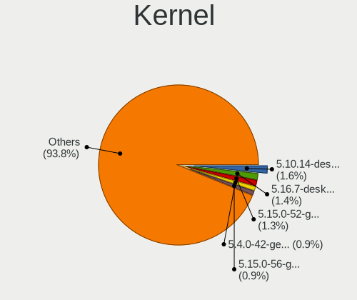
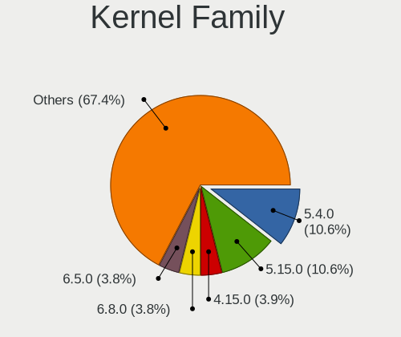
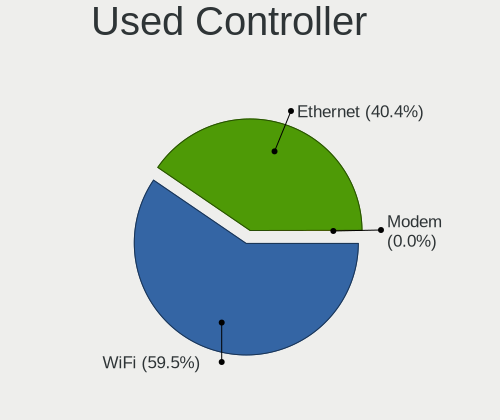

Linux in Italy - Tested Hardware & Statistics
---------------------------------------------

A project to collect tested hardware configurations for Linux in Italy.

Anyone can contribute to this report by the [hw-probe](https://github.com/linuxhw/hw-probe) tool:

    sudo -E hw-probe -all -upload

Please contribute! Especially if your hardware is rare.

This is a report for all computer types. See also reports for [desktops](/Location/Italy/Desktop/README.md) and [notebooks](/Location/Italy/Notebook/README.md).

Contents
--------

* [ Test Cases ](#test-cases)

* [ System ](#system)
  - [ OS                       ](#os)
  - [ OS Family                ](#os-family)
  - [ Kernel                   ](#kernel)
  - [ Kernel Family            ](#kernel-family)
  - [ Kernel Major Ver.        ](#kernel-major-ver)
  - [ Arch                     ](#arch)
  - [ DE                       ](#de)
  - [ Display Server           ](#display-server)
  - [ Display Manager          ](#display-manager)
  - [ OS Lang                  ](#os-lang)
  - [ Boot Mode                ](#boot-mode)
  - [ Filesystem               ](#filesystem)
  - [ Part. scheme             ](#part-scheme)
  - [ Dual Boot with Linux/BSD ](#dual-boot-with-linuxbsd)
  - [ Dual Boot (Win)          ](#dual-boot-win)

* [ Board ](#board)
  - [ Vendor                   ](#vendor)
  - [ Model                    ](#model)
  - [ Model Family             ](#model-family)
  - [ MFG Year                 ](#mfg-year)
  - [ Form Factor              ](#form-factor)
  - [ Secure Boot              ](#secure-boot)
  - [ Coreboot                 ](#coreboot)
  - [ RAM Size                 ](#ram-size)
  - [ RAM Used                 ](#ram-used)
  - [ Total Drives             ](#total-drives)
  - [ Has CD-ROM               ](#has-cd-rom)
  - [ Has Ethernet             ](#has-ethernet)
  - [ Has WiFi                 ](#has-wifi)
  - [ Has Bluetooth            ](#has-bluetooth)

* [ Location ](#location)
  - [ Country                  ](#country)
  - [ City                     ](#city)

* [ Drives ](#drives)
  - [ Drive Vendor             ](#drive-vendor)
  - [ Drive Model              ](#drive-model)
  - [ HDD Vendor               ](#hdd-vendor)
  - [ SSD Vendor               ](#ssd-vendor)
  - [ Drive Kind               ](#drive-kind)
  - [ Drive Connector          ](#drive-connector)
  - [ Drive Size               ](#drive-size)
  - [ Space Total              ](#space-total)
  - [ Space Used               ](#space-used)
  - [ Malfunc. Drives          ](#malfunc-drives)
  - [ Malfunc. Drive Vendor    ](#malfunc-drive-vendor)
  - [ Malfunc. HDD Vendor      ](#malfunc-hdd-vendor)
  - [ Malfunc. Drive Kind      ](#malfunc-drive-kind)
  - [ Failed Drives            ](#failed-drives)
  - [ Failed Drive Vendor      ](#failed-drive-vendor)
  - [ Drive Status             ](#drive-status)

* [ Storage controller ](#storage-controller)
  - [ Storage Vendor           ](#storage-vendor)
  - [ Storage Model            ](#storage-model)
  - [ Storage Kind             ](#storage-kind)

* [ Processor ](#processor)
  - [ CPU Vendor               ](#cpu-vendor)
  - [ CPU Model                ](#cpu-model)
  - [ CPU Model Family         ](#cpu-model-family)
  - [ CPU Cores                ](#cpu-cores)
  - [ CPU Sockets              ](#cpu-sockets)
  - [ CPU Threads              ](#cpu-threads)
  - [ CPU Op-Modes             ](#cpu-op-modes)
  - [ CPU Microcode            ](#cpu-microcode)
  - [ CPU Microarch            ](#cpu-microarch)

* [ Graphics ](#graphics)
  - [ GPU Vendor               ](#gpu-vendor)
  - [ GPU Model                ](#gpu-model)
  - [ GPU Combo                ](#gpu-combo)
  - [ GPU Driver               ](#gpu-driver)
  - [ GPU Memory               ](#gpu-memory)

* [ Monitor ](#monitor)
  - [ Monitor Vendor           ](#monitor-vendor)
  - [ Monitor Model            ](#monitor-model)
  - [ Monitor Resolution       ](#monitor-resolution)
  - [ Monitor Diagonal         ](#monitor-diagonal)
  - [ Monitor Width            ](#monitor-width)
  - [ Aspect Ratio             ](#aspect-ratio)
  - [ Monitor Area             ](#monitor-area)
  - [ Pixel Density            ](#pixel-density)
  - [ Multiple Monitors        ](#multiple-monitors)

* [ Network ](#network)
  - [ Net Controller Vendor    ](#net-controller-vendor)
  - [ Net Controller Model     ](#net-controller-model)
  - [ Wireless Vendor          ](#wireless-vendor)
  - [ Wireless Model           ](#wireless-model)
  - [ Ethernet Vendor          ](#ethernet-vendor)
  - [ Ethernet Model           ](#ethernet-model)
  - [ Net Controller Kind      ](#net-controller-kind)
  - [ Used Controller          ](#used-controller)
  - [ NICs                     ](#nics)
  - [ IPv6                     ](#ipv6)

* [ Bluetooth ](#bluetooth)
  - [ Bluetooth Vendor         ](#bluetooth-vendor)
  - [ Bluetooth Model          ](#bluetooth-model)

* [ Sound ](#sound)
  - [ Sound Vendor             ](#sound-vendor)
  - [ Sound Model              ](#sound-model)

* [ Memory ](#memory)
  - [ Memory Vendor            ](#memory-vendor)
  - [ Memory Model             ](#memory-model)
  - [ Memory Kind              ](#memory-kind)
  - [ Memory Form Factor       ](#memory-form-factor)
  - [ Memory Size              ](#memory-size)
  - [ Memory Speed             ](#memory-speed)

* [ Printers & scanners ](#printers--scanners)
  - [ Printer Vendor           ](#printer-vendor)
  - [ Printer Model            ](#printer-model)
  - [ Scanner Vendor           ](#scanner-vendor)
  - [ Scanner Model            ](#scanner-model)

* [ Camera ](#camera)
  - [ Camera Vendor            ](#camera-vendor)
  - [ Camera Model             ](#camera-model)

* [ Security ](#security)
  - [ Fingerprint Vendor       ](#fingerprint-vendor)
  - [ Fingerprint Model        ](#fingerprint-model)
  - [ Chipcard Vendor          ](#chipcard-vendor)
  - [ Chipcard Model           ](#chipcard-model)

* [ Unsupported ](#unsupported)
  - [ Unsupported Devices      ](#unsupported-devices)
  - [ Unsupported Device Types ](#unsupported-device-types)

Test Cases
----------

Total: 12235

| Vendor        | Model                       | Form-Factor | Probe                                                      | Date         |
|---------------|-----------------------------|-------------|------------------------------------------------------------|--------------|
| Lenovo        | ThinkPad E15 20RD0011IX     | Notebook    | [88cc97d0be](https://linux-hardware.org/?probe=88cc97d0be) | Nov 06, 2023 |
| ASUSTek       | TUF Gaming B550M-PLUS       | Desktop     | [df52b675c8](https://linux-hardware.org/?probe=df52b675c8) | Nov 06, 2023 |
| Lenovo        | 1038 NO DPK                 | Server      | [fe01dc6819](https://linux-hardware.org/?probe=fe01dc6819) | Nov 06, 2023 |
| Apple         | MacBookPro11,3              | Notebook    | [0009d8a468](https://linux-hardware.org/?probe=0009d8a468) | Nov 06, 2023 |
| ASRock        | H110M-ITX                   | Desktop     | [c384352141](https://linux-hardware.org/?probe=c384352141) | Nov 06, 2023 |
| ASUSTek       | VivoBook_ASUS Laptop E41... | Notebook    | [62b6928793](https://linux-hardware.org/?probe=62b6928793) | Nov 06, 2023 |
| TUXEDO        | Pulse 15 Gen2               | Notebook    | [10f2785958](https://linux-hardware.org/?probe=10f2785958) | Nov 06, 2023 |
| Acer          | Aspire ES1-521              | Notebook    | [8447756322](https://linux-hardware.org/?probe=8447756322) | Nov 06, 2023 |
| Acer          | Aspire ES1-521              | Notebook    | [af12dd22ba](https://linux-hardware.org/?probe=af12dd22ba) | Nov 06, 2023 |
| HP            | 250 G7 Notebook PC          | Notebook    | [a2ad36d26c](https://linux-hardware.org/?probe=a2ad36d26c) | Nov 06, 2023 |
| HP            | EliteBook 830 G5            | Notebook    | [07ef51bd31](https://linux-hardware.org/?probe=07ef51bd31) | Nov 05, 2023 |
| Dell          | 08WKV3 A00                  | Desktop     | [e16dbbaf8b](https://linux-hardware.org/?probe=e16dbbaf8b) | Nov 05, 2023 |
| Lenovo        | 1038 NO DPK                 | Server      | [a8c249eafd](https://linux-hardware.org/?probe=a8c249eafd) | Nov 05, 2023 |
| HP            | ProBook 450 G5              | Notebook    | [6407166dd5](https://linux-hardware.org/?probe=6407166dd5) | Nov 05, 2023 |
| HP            | Laptop 15-db1xxx            | Notebook    | [3a69031984](https://linux-hardware.org/?probe=3a69031984) | Nov 05, 2023 |
| ASUSTek       | VivoBook_ASUSLaptop X515... | Notebook    | [8e3e7668cf](https://linux-hardware.org/?probe=8e3e7668cf) | Nov 05, 2023 |
| Sony          | VGN-N21S_W                  | Notebook    | [6ff4658440](https://linux-hardware.org/?probe=6ff4658440) | Nov 05, 2023 |
| Sony          | VGN-N21S_W                  | Notebook    | [266bedfdc3](https://linux-hardware.org/?probe=266bedfdc3) | Nov 05, 2023 |
| Unknown       | Unknown                     | Notebook    | [2c2d291f54](https://linux-hardware.org/?probe=2c2d291f54) | Nov 05, 2023 |
| ASUSTek       | P5Q-PRO                     | Desktop     | [a1500e2e9c](https://linux-hardware.org/?probe=a1500e2e9c) | Nov 05, 2023 |
| HP            | 530                         | Notebook    | [710ba89827](https://linux-hardware.org/?probe=710ba89827) | Nov 05, 2023 |
| ASUSTek       | PRIME B460M-A               | Desktop     | [034b113ac8](https://linux-hardware.org/?probe=034b113ac8) | Nov 05, 2023 |
| HP            | Notebook                    | Notebook    | [8eea1901f7](https://linux-hardware.org/?probe=8eea1901f7) | Nov 05, 2023 |
| HP            | ENVY x360 Convertible 15... | Convertible | [a42da62572](https://linux-hardware.org/?probe=a42da62572) | Nov 05, 2023 |
| Lenovo        | ThinkPad X250 20CM001UUK    | Notebook    | [b0fd9fa3c0](https://linux-hardware.org/?probe=b0fd9fa3c0) | Nov 05, 2023 |
| HP            | 1998                        | Desktop     | [d454314b77](https://linux-hardware.org/?probe=d454314b77) | Nov 05, 2023 |
| ASRockRack    | EPC602D8A                   | Desktop     | [c1b6c06dc5](https://linux-hardware.org/?probe=c1b6c06dc5) | Nov 05, 2023 |
| ASUSTek       | UX370UAR                    | Convertible | [754b927267](https://linux-hardware.org/?probe=754b927267) | Nov 05, 2023 |
| Gigabyte      | M5NM1AI-GB                  | Desktop     | [99e2275a93](https://linux-hardware.org/?probe=99e2275a93) | Nov 05, 2023 |
| Gigabyte      | H410M S2H V2                | Desktop     | [8bbce8a378](https://linux-hardware.org/?probe=8bbce8a378) | Nov 04, 2023 |
| Gigabyte      | B450 AORUS M                | Desktop     | [62798aa8cf](https://linux-hardware.org/?probe=62798aa8cf) | Nov 04, 2023 |
| HP            | Pavilion 15                 | Notebook    | [dd81ed04ea](https://linux-hardware.org/?probe=dd81ed04ea) | Nov 04, 2023 |
| Acer          | Aspire M1920                | Desktop     | [f6ffcb0c41](https://linux-hardware.org/?probe=f6ffcb0c41) | Nov 04, 2023 |
| HP            | ProBook 430 G1              | Notebook    | [14dc35a1b9](https://linux-hardware.org/?probe=14dc35a1b9) | Nov 04, 2023 |
| ASRock        | FM2A68M-HD+                 | Desktop     | [2b5c984cd8](https://linux-hardware.org/?probe=2b5c984cd8) | Nov 04, 2023 |
| HP            | Notebook                    | Notebook    | [f8cf975d3c](https://linux-hardware.org/?probe=f8cf975d3c) | Nov 04, 2023 |
| Lenovo        | 103D SDK0Q40112 WIN 3305... | Desktop     | [76acaae6cc](https://linux-hardware.org/?probe=76acaae6cc) | Nov 04, 2023 |
| ASUSTek       | VivoBook_ASUSLaptop X513... | Notebook    | [34e4bd156f](https://linux-hardware.org/?probe=34e4bd156f) | Nov 04, 2023 |
| HP            | ZBook 17 G3                 | Notebook    | [7d38ea5f87](https://linux-hardware.org/?probe=7d38ea5f87) | Nov 04, 2023 |
| HP            | EliteBook 840 G6            | Notebook    | [d4b22ac16a](https://linux-hardware.org/?probe=d4b22ac16a) | Nov 04, 2023 |
| Lenovo        | IdeaPad Gaming 3 15ARH05... | Notebook    | [3922b02290](https://linux-hardware.org/?probe=3922b02290) | Nov 04, 2023 |
| MSI           | B650 GAMING PLUS WIFI       | Desktop     | [8edaffcccb](https://linux-hardware.org/?probe=8edaffcccb) | Nov 04, 2023 |
| HP            | 255 G8 Notebook PC          | Notebook    | [2d1116cd1b](https://linux-hardware.org/?probe=2d1116cd1b) | Nov 04, 2023 |
| Lenovo        | V15 G2 ITL 82KB             | Notebook    | [85e528f1bf](https://linux-hardware.org/?probe=85e528f1bf) | Nov 04, 2023 |
| Dell          | Inspiron 15 3511            | Notebook    | [8c23fbf7d1](https://linux-hardware.org/?probe=8c23fbf7d1) | Nov 04, 2023 |
| ASUSTek       | M5A97 R2.0                  | Desktop     | [798cba826c](https://linux-hardware.org/?probe=798cba826c) | Nov 04, 2023 |
| ASUSTek       | M5A97 R2.0                  | Desktop     | [2c601304f7](https://linux-hardware.org/?probe=2c601304f7) | Nov 04, 2023 |
| Lenovo        | IdeaPad Gaming 3 15ARH05... | Notebook    | [bb7622a7ba](https://linux-hardware.org/?probe=bb7622a7ba) | Nov 04, 2023 |
| Dell          | XPS 15 7590                 | Notebook    | [8685e384af](https://linux-hardware.org/?probe=8685e384af) | Nov 04, 2023 |
| HUAWEI        | KLVL-WXX9                   | Notebook    | [61342b31ea](https://linux-hardware.org/?probe=61342b31ea) | Nov 03, 2023 |
| ASUSTek       | X551CA                      | Notebook    | [20bee22e0a](https://linux-hardware.org/?probe=20bee22e0a) | Nov 03, 2023 |
| ASUSTek       | TUF Gaming Z490-PLUS        | Desktop     | [c9e7b12e63](https://linux-hardware.org/?probe=c9e7b12e63) | Nov 03, 2023 |
| ASUSTek       | ASUS TUF Gaming A15 FA50... | Notebook    | [ff0d013246](https://linux-hardware.org/?probe=ff0d013246) | Nov 03, 2023 |
| Apple         | Mac-F2238BAE iMac11,3       | All in one  | [547a248361](https://linux-hardware.org/?probe=547a248361) | Nov 03, 2023 |
| HP            | 0B54h D                     | Desktop     | [574e5fd946](https://linux-hardware.org/?probe=574e5fd946) | Nov 03, 2023 |
| Dell          | 09WH54 A01                  | Desktop     | [4eae8e67db](https://linux-hardware.org/?probe=4eae8e67db) | Nov 03, 2023 |
| ASRock        | A320M-HDV R4.0              | Desktop     | [44890192a1](https://linux-hardware.org/?probe=44890192a1) | Nov 03, 2023 |
| Acer          | Nitro AN515-54              | Notebook    | [ce98faee85](https://linux-hardware.org/?probe=ce98faee85) | Nov 03, 2023 |
| Lenovo        | IdeaPad 3 15IML05 81WB      | Notebook    | [f9bdbf6371](https://linux-hardware.org/?probe=f9bdbf6371) | Nov 03, 2023 |
| Lenovo        | Yoga 530-14IKB 81EK         | Convertible | [5339cc53ed](https://linux-hardware.org/?probe=5339cc53ed) | Nov 03, 2023 |
| ASUSTek       | VivoBook_ASUSLaptop X571... | Notebook    | [b592d36d74](https://linux-hardware.org/?probe=b592d36d74) | Nov 03, 2023 |
| ASUSTek       | VivoBook_ASUSLaptop X571... | Notebook    | [da695062ba](https://linux-hardware.org/?probe=da695062ba) | Nov 03, 2023 |
| Dell          | Inspiron 16 5625            | Notebook    | [157f3bd86a](https://linux-hardware.org/?probe=157f3bd86a) | Nov 03, 2023 |
| Lenovo        | IdeaPad 3 15ALC6 82KU       | Notebook    | [bcea72b22f](https://linux-hardware.org/?probe=bcea72b22f) | Nov 03, 2023 |
| ASUSTek       | X510URR                     | Notebook    | [645fbe9fc3](https://linux-hardware.org/?probe=645fbe9fc3) | Nov 03, 2023 |
| MSI           | B350 PC MATE                | Desktop     | [9c089ed10c](https://linux-hardware.org/?probe=9c089ed10c) | Nov 03, 2023 |
| ASUSTek       | P7P55D-E                    | Desktop     | [f16aeca403](https://linux-hardware.org/?probe=f16aeca403) | Nov 03, 2023 |
| Gigabyte      | P35-DS3L                    | Desktop     | [c2df6f267b](https://linux-hardware.org/?probe=c2df6f267b) | Nov 03, 2023 |
| Acer          | Swift SF114-32              | Notebook    | [2314e30b70](https://linux-hardware.org/?probe=2314e30b70) | Nov 03, 2023 |
| Acer          | Swift SF114-32              | Notebook    | [ad12644dff](https://linux-hardware.org/?probe=ad12644dff) | Nov 03, 2023 |
| HP            | 250 G7 Notebook PC          | Notebook    | [1889111d8a](https://linux-hardware.org/?probe=1889111d8a) | Nov 03, 2023 |
| Hampoo        | I2W6_AP135 Reserved         | Notebook    | [cf0c02a17a](https://linux-hardware.org/?probe=cf0c02a17a) | Nov 03, 2023 |
| Gigabyte      | Z390 AORUS ELITE-CF         | Desktop     | [7aa3982cb4](https://linux-hardware.org/?probe=7aa3982cb4) | Nov 03, 2023 |
| Hampoo        | I2W6_AP135 Reserved         | Notebook    | [fdb464fed7](https://linux-hardware.org/?probe=fdb464fed7) | Nov 02, 2023 |
| HP            | Pavilion x360 Convertibl... | Convertible | [62579a601d](https://linux-hardware.org/?probe=62579a601d) | Nov 02, 2023 |
| Notebook      | NJ50_70CU                   | Notebook    | [9cabd6fd2c](https://linux-hardware.org/?probe=9cabd6fd2c) | Nov 02, 2023 |
| Notebook      | NJ50_70CU                   | Notebook    | [3414d178f2](https://linux-hardware.org/?probe=3414d178f2) | Nov 02, 2023 |
| ASUSTek       | P5KPL-AM SE                 | Desktop     | [ea92d94742](https://linux-hardware.org/?probe=ea92d94742) | Nov 02, 2023 |
| HUAWEI        | KPL-W0X                     | Notebook    | [9cdd815382](https://linux-hardware.org/?probe=9cdd815382) | Nov 02, 2023 |
| MSI           | Prestige 14Evo A11M         | Notebook    | [12414485a5](https://linux-hardware.org/?probe=12414485a5) | Nov 02, 2023 |
| HP            | EliteBook 830 G5            | Notebook    | [8ab22982cc](https://linux-hardware.org/?probe=8ab22982cc) | Nov 02, 2023 |
| ASUSTek       | VivoBook_ASUSLaptop X509... | Notebook    | [b0c996ac38](https://linux-hardware.org/?probe=b0c996ac38) | Nov 02, 2023 |
| Lenovo        | ThinkPad T440 20B7A0CYMH    | Notebook    | [4d3101d9f8](https://linux-hardware.org/?probe=4d3101d9f8) | Nov 02, 2023 |
| Samsung       | 750XDA                      | Notebook    | [130a1273e5](https://linux-hardware.org/?probe=130a1273e5) | Nov 02, 2023 |
| Gigabyte      | X570 AORUS ELITE            | Desktop     | [0631c3ec84](https://linux-hardware.org/?probe=0631c3ec84) | Nov 02, 2023 |
| MSI           | MAG B550 TOMAHAWK           | Desktop     | [bbe345cd5d](https://linux-hardware.org/?probe=bbe345cd5d) | Nov 02, 2023 |
| ASRock        | P67 Professional            | Desktop     | [c998340fa9](https://linux-hardware.org/?probe=c998340fa9) | Nov 02, 2023 |
| Fujitsu       | LIFEBOOK T937               | Convertible | [530a390355](https://linux-hardware.org/?probe=530a390355) | Nov 02, 2023 |
| Dell          | XPS 13 9300                 | Notebook    | [9690e7a65f](https://linux-hardware.org/?probe=9690e7a65f) | Nov 02, 2023 |
| Lenovo        | ThinkPad T15 Gen 2i 20W4... | Notebook    | [37dc32cd03](https://linux-hardware.org/?probe=37dc32cd03) | Nov 02, 2023 |
| ASRock        | Z77 WS                      | Desktop     | [73b9354a1a](https://linux-hardware.org/?probe=73b9354a1a) | Nov 02, 2023 |
| Lenovo        | ThinkPad P53 20QN000FIX     | Notebook    | [40de43c266](https://linux-hardware.org/?probe=40de43c266) | Nov 02, 2023 |
| ASUSTek       | U36SD                       | Notebook    | [e2045d61a5](https://linux-hardware.org/?probe=e2045d61a5) | Nov 02, 2023 |
| Dell          | 0VC7DK A01                  | Server      | [5339dd25e2](https://linux-hardware.org/?probe=5339dd25e2) | Nov 02, 2023 |
| Lenovo        | ThinkPad T480 20L60017UK    | Notebook    | [e8b030e97f](https://linux-hardware.org/?probe=e8b030e97f) | Nov 02, 2023 |
| ASUSTek       | X555LAB                     | Notebook    | [b9532c1f86](https://linux-hardware.org/?probe=b9532c1f86) | Nov 02, 2023 |
| ASUSTek       | ROG STRIX B360-F GAMING     | Desktop     | [72a5b8f06a](https://linux-hardware.org/?probe=72a5b8f06a) | Nov 02, 2023 |
| ASUSTek       | B150M-A/M.2                 | Desktop     | [dad897d3c4](https://linux-hardware.org/?probe=dad897d3c4) | Nov 02, 2023 |
| ASRock        | 990FX Extreme3              | Desktop     | [ad8e4a9dae](https://linux-hardware.org/?probe=ad8e4a9dae) | Nov 02, 2023 |
| Acer          | One S1002                   | Notebook    | [a00e6d78a6](https://linux-hardware.org/?probe=a00e6d78a6) | Nov 02, 2023 |
| ASUSTek       | N550JV                      | Notebook    | [200e3255d9](https://linux-hardware.org/?probe=200e3255d9) | Nov 02, 2023 |
| Chuwi         | CoreBook Pro                | Notebook    | [ac0f4a1ea9](https://linux-hardware.org/?probe=ac0f4a1ea9) | Nov 01, 2023 |
| Unknown       | 1.0                         | Desktop     | [6265787d93](https://linux-hardware.org/?probe=6265787d93) | Nov 01, 2023 |
| ASUSTek       | N550JV                      | Notebook    | [43a84b57f0](https://linux-hardware.org/?probe=43a84b57f0) | Nov 01, 2023 |
| MSI           | A320M-A PRO MAX             | Desktop     | [f1e35faa1a](https://linux-hardware.org/?probe=f1e35faa1a) | Nov 01, 2023 |
| Framework     | Laptop (13th Gen Intel C... | Notebook    | [df4f43ca44](https://linux-hardware.org/?probe=df4f43ca44) | Nov 01, 2023 |
| Acer          | Aspire A315-56              | Notebook    | [2de4949247](https://linux-hardware.org/?probe=2de4949247) | Nov 01, 2023 |
| HP            | 822A                        | Desktop     | [59c055e360](https://linux-hardware.org/?probe=59c055e360) | Nov 01, 2023 |
| ASUSTek       | UX430UNR                    | Notebook    | [47abbeb9c1](https://linux-hardware.org/?probe=47abbeb9c1) | Nov 01, 2023 |
| Acer          | TravelMate P215-52          | Notebook    | [b9c3643e62](https://linux-hardware.org/?probe=b9c3643e62) | Nov 01, 2023 |
| ASUSTek       | K56CB                       | Notebook    | [9fff1dc94c](https://linux-hardware.org/?probe=9fff1dc94c) | Nov 01, 2023 |
| ASUSTek       | CM6870                      | Desktop     | [ae34108b69](https://linux-hardware.org/?probe=ae34108b69) | Nov 01, 2023 |
| HP            | 630                         | Notebook    | [634f46006b](https://linux-hardware.org/?probe=634f46006b) | Nov 01, 2023 |
| ASUSTek       | CROSSHAIR VI HERO           | Desktop     | [4fc590fe55](https://linux-hardware.org/?probe=4fc590fe55) | Nov 01, 2023 |
| Acer          | Nitro AN515-52              | Notebook    | [829c16d044](https://linux-hardware.org/?probe=829c16d044) | Nov 01, 2023 |
| Apple         | MacBook7,1                  | Notebook    | [60edf3f76c](https://linux-hardware.org/?probe=60edf3f76c) | Nov 01, 2023 |
| ASUSTek       | ASUS EXPERTBOOK B9450FA_... | Notebook    | [ed95443390](https://linux-hardware.org/?probe=ed95443390) | Nov 01, 2023 |
| Apple         | MacBookPro16,2              | Notebook    | [37b53d54e8](https://linux-hardware.org/?probe=37b53d54e8) | Nov 01, 2023 |
| Pegatron      | Benicia                     | Desktop     | [b253f40dc7](https://linux-hardware.org/?probe=b253f40dc7) | Nov 01, 2023 |
| Pegatron      | Benicia                     | Desktop     | [a3378fce47](https://linux-hardware.org/?probe=a3378fce47) | Nov 01, 2023 |
| Gigabyte      | Z370N WIFI-CF               | Desktop     | [1ab426a7ed](https://linux-hardware.org/?probe=1ab426a7ed) | Nov 01, 2023 |
| Acer          | Nitro AN515-56              | Notebook    | [7c88fdcaa3](https://linux-hardware.org/?probe=7c88fdcaa3) | Nov 01, 2023 |
| HP            | Pavilion x360 Convertibl... | Convertible | [d1965aca64](https://linux-hardware.org/?probe=d1965aca64) | Nov 01, 2023 |
| HP            | 1497                        | Desktop     | [0fd6a908fe](https://linux-hardware.org/?probe=0fd6a908fe) | Nov 01, 2023 |
| Lenovo        | ThinkPad T480s 20L8S2SX0... | Notebook    | [d5fee530ee](https://linux-hardware.org/?probe=d5fee530ee) | Nov 01, 2023 |
| Lenovo        | V15-ADA 82C7                | Notebook    | [0c38487bcf](https://linux-hardware.org/?probe=0c38487bcf) | Nov 01, 2023 |
| ASRock        | B85M Pro4                   | Desktop     | [0ea7f00b4e](https://linux-hardware.org/?probe=0ea7f00b4e) | Nov 01, 2023 |
| ASUSTek       | Z170-A                      | Desktop     | [50a30d4ebd](https://linux-hardware.org/?probe=50a30d4ebd) | Nov 01, 2023 |
| HP            | Laptop 15-bs1xx             | Notebook    | [1bd48815fe](https://linux-hardware.org/?probe=1bd48815fe) | Nov 01, 2023 |
| Sapphire      | PE-AM2RS690V2               | Desktop     | [2b2de28f02](https://linux-hardware.org/?probe=2b2de28f02) | Nov 01, 2023 |
| Lenovo        | ThinkPad T14 Gen 1 20S00... | Notebook    | [5acc8f68a0](https://linux-hardware.org/?probe=5acc8f68a0) | Nov 01, 2023 |
| Fujitsu       | D3233-A1 S26361-D3233-A1    | Desktop     | [0026b681e2](https://linux-hardware.org/?probe=0026b681e2) | Nov 01, 2023 |
| Sony          | VPCSA3J1E                   | Notebook    | [99b0d275ec](https://linux-hardware.org/?probe=99b0d275ec) | Nov 01, 2023 |
| MSI           | MPG B550 GAMING PLUS        | Desktop     | [301a117426](https://linux-hardware.org/?probe=301a117426) | Nov 01, 2023 |
| HUAWEI        | MACH-WX9                    | Notebook    | [f557533925](https://linux-hardware.org/?probe=f557533925) | Nov 01, 2023 |
| Microtech     | CoreBookLite                | Notebook    | [1833fd5f0c](https://linux-hardware.org/?probe=1833fd5f0c) | Nov 01, 2023 |
| HUAWEI        | MACH-WX9                    | Notebook    | [50880de513](https://linux-hardware.org/?probe=50880de513) | Nov 01, 2023 |
| ASRock        | B250M Pro4                  | Desktop     | [399fe59760](https://linux-hardware.org/?probe=399fe59760) | Nov 01, 2023 |
| Lenovo        | Legion Y740-17IRHg 81UJ     | Notebook    | [cd9e941307](https://linux-hardware.org/?probe=cd9e941307) | Nov 01, 2023 |
| Dell          | Inspiron 7520               | Notebook    | [460c9255bd](https://linux-hardware.org/?probe=460c9255bd) | Nov 01, 2023 |
| Lenovo        | ThinkPad T460p 20FXS0FS0... | Notebook    | [0b21a4419d](https://linux-hardware.org/?probe=0b21a4419d) | Nov 01, 2023 |
| Lenovo        | ThinkPad T460p 20FXS0FS0... | Notebook    | [757199e3cf](https://linux-hardware.org/?probe=757199e3cf) | Nov 01, 2023 |
| HUAWEI        | BOHB-WAX9                   | Notebook    | [5da84da52f](https://linux-hardware.org/?probe=5da84da52f) | Oct 31, 2023 |
| Gigabyte      | MJ11-EC1-OT 01000100        | Server      | [9a7be2dcbd](https://linux-hardware.org/?probe=9a7be2dcbd) | Oct 31, 2023 |
| HP            | 250 G5 Notebook PC          | Notebook    | [803bc8d1ed](https://linux-hardware.org/?probe=803bc8d1ed) | Oct 31, 2023 |
| HP            | 255 G8 Notebook PC          | Notebook    | [b9d1b13098](https://linux-hardware.org/?probe=b9d1b13098) | Oct 31, 2023 |
| ASRock        | H310CM-HDV                  | Desktop     | [b24b974555](https://linux-hardware.org/?probe=b24b974555) | Oct 31, 2023 |
| ASUSTek       | ASUS TUF Gaming A15 FA50... | Notebook    | [6c1c4ea069](https://linux-hardware.org/?probe=6c1c4ea069) | Oct 31, 2023 |
| HUAWEI        | CREF-XX                     | Notebook    | [a10aa3c3e5](https://linux-hardware.org/?probe=a10aa3c3e5) | Oct 31, 2023 |
| ASUSTek       | F5N                         | Notebook    | [8da324b4fa](https://linux-hardware.org/?probe=8da324b4fa) | Oct 31, 2023 |
| Gigabyte      | B450M S2H                   | Desktop     | [d099ae69e8](https://linux-hardware.org/?probe=d099ae69e8) | Oct 31, 2023 |
| MSI           | MPG B550 GAMING EDGE WIF... | Desktop     | [3b79851103](https://linux-hardware.org/?probe=3b79851103) | Oct 31, 2023 |
| Unknown       | Unknown                     | Desktop     | [4aa5e757eb](https://linux-hardware.org/?probe=4aa5e757eb) | Oct 31, 2023 |
| Dell          | XPS 15 9570                 | Notebook    | [341114c78a](https://linux-hardware.org/?probe=341114c78a) | Oct 31, 2023 |
| Lenovo        | IdeaPad 5 15ARE05 81YQ      | Notebook    | [aef3dccca0](https://linux-hardware.org/?probe=aef3dccca0) | Oct 31, 2023 |
| Fujitsu       | D3313-B1 S26361-D3313-B1    | Desktop     | [2d90a96dfb](https://linux-hardware.org/?probe=2d90a96dfb) | Oct 31, 2023 |
| Gigabyte      | Z370 AORUS Gaming 3         | Desktop     | [d2072a9949](https://linux-hardware.org/?probe=d2072a9949) | Oct 31, 2023 |
| ASUSTek       | PRIME B350-PLUS             | Desktop     | [7b71031ba1](https://linux-hardware.org/?probe=7b71031ba1) | Oct 31, 2023 |
| ASUSTek       | PRIME B350-PLUS             | Desktop     | [3ab77e3324](https://linux-hardware.org/?probe=3ab77e3324) | Oct 31, 2023 |
| HP            | Pavilion Laptop 15-cs3xx... | Notebook    | [1107919053](https://linux-hardware.org/?probe=1107919053) | Oct 31, 2023 |
| ASUSTek       | H170M-PLUS                  | Desktop     | [90b5515582](https://linux-hardware.org/?probe=90b5515582) | Oct 31, 2023 |
| HP            | ProBook 450 15.6 inch G9... | Notebook    | [ea29ba4b58](https://linux-hardware.org/?probe=ea29ba4b58) | Oct 31, 2023 |
| Lenovo        | ThinkPad T495 20NJCTO1WW    | Notebook    | [8e86103e06](https://linux-hardware.org/?probe=8e86103e06) | Oct 31, 2023 |
| Samsung       | 750XED                      | Notebook    | [9dab50e37e](https://linux-hardware.org/?probe=9dab50e37e) | Oct 31, 2023 |
| Lenovo        | V15 G2 ITL 82KB             | Notebook    | [4f6d9ac7b5](https://linux-hardware.org/?probe=4f6d9ac7b5) | Oct 31, 2023 |
| Intel         | NUC12WSBi5 M46425-303       | Mini pc     | [0c6a7cb928](https://linux-hardware.org/?probe=0c6a7cb928) | Oct 31, 2023 |
| ASUSTek       | PRIME Z590-A                | Desktop     | [40f30de33b](https://linux-hardware.org/?probe=40f30de33b) | Oct 31, 2023 |
| ASUSTek       | ROG Strix G531GT_G531GT     | Notebook    | [98d01105c7](https://linux-hardware.org/?probe=98d01105c7) | Oct 31, 2023 |
| Dell          | XPS 15 9510                 | Notebook    | [d370c488e4](https://linux-hardware.org/?probe=d370c488e4) | Oct 31, 2023 |
| ASRock        | Z370 Pro4                   | Desktop     | [55f20f6750](https://linux-hardware.org/?probe=55f20f6750) | Oct 31, 2023 |
| Samsung       | 930XDB/931XDB/930XDY        | Notebook    | [421368e431](https://linux-hardware.org/?probe=421368e431) | Oct 31, 2023 |
| ASUSTek       | BT1AD                       | Desktop     | [133784e5ee](https://linux-hardware.org/?probe=133784e5ee) | Oct 31, 2023 |
| HP            | 18EB                        | Desktop     | [83596ab9d9](https://linux-hardware.org/?probe=83596ab9d9) | Oct 31, 2023 |
| Gigabyte      | 970-GAMING                  | Desktop     | [2b4315885f](https://linux-hardware.org/?probe=2b4315885f) | Oct 31, 2023 |
| Gigabyte      | X570 AORUS ELITE            | Desktop     | [90172d9cef](https://linux-hardware.org/?probe=90172d9cef) | Oct 31, 2023 |
| ASRock        | X670E Steel Legend          | Desktop     | [d802042506](https://linux-hardware.org/?probe=d802042506) | Oct 31, 2023 |
| Dell          | Vostro 3549                 | Notebook    | [259c646ecb](https://linux-hardware.org/?probe=259c646ecb) | Oct 31, 2023 |
| Samsung       | RC420/RC520/RC720           | Notebook    | [1e3f228931](https://linux-hardware.org/?probe=1e3f228931) | Oct 31, 2023 |
| Gigabyte      | Z97-D3H-CF                  | Desktop     | [56e4a560bc](https://linux-hardware.org/?probe=56e4a560bc) | Oct 31, 2023 |
| Samsung       | RC420/RC520/RC720           | Notebook    | [10382e8ed6](https://linux-hardware.org/?probe=10382e8ed6) | Oct 31, 2023 |
| AMI           | Intel                       | Notebook    | [98d35ad708](https://linux-hardware.org/?probe=98d35ad708) | Oct 31, 2023 |
| MSI           | Z270 GAMING M5              | Desktop     | [fb56165b30](https://linux-hardware.org/?probe=fb56165b30) | Oct 31, 2023 |
| MSI           | Z270-A PRO                  | Desktop     | [b4e85014cc](https://linux-hardware.org/?probe=b4e85014cc) | Oct 31, 2023 |
| ASRock        | A320M-HDV R4.0              | Desktop     | [7941dfd8cf](https://linux-hardware.org/?probe=7941dfd8cf) | Oct 31, 2023 |
| Toshiba       | TECRA S11                   | Notebook    | [e2a669bf1a](https://linux-hardware.org/?probe=e2a669bf1a) | Oct 31, 2023 |
| ASUSTek       | P8H61-M LE                  | Desktop     | [86dd25c85a](https://linux-hardware.org/?probe=86dd25c85a) | Oct 31, 2023 |
| Lenovo        | ThinkPad L450 20DSS26200    | Notebook    | [ebcacada49](https://linux-hardware.org/?probe=ebcacada49) | Oct 31, 2023 |
| Dell          | 0P01GV A03                  | Desktop     | [c77bed1e18](https://linux-hardware.org/?probe=c77bed1e18) | Oct 31, 2023 |
| Lenovo        | ThinkBook 15p Gen 2 21B1    | Notebook    | [a0da22e928](https://linux-hardware.org/?probe=a0da22e928) | Oct 31, 2023 |
| ASUSTek       | X550EP                      | Notebook    | [81fdd48960](https://linux-hardware.org/?probe=81fdd48960) | Oct 31, 2023 |
| Lenovo        | ThinkPad L450 20DSS26200    | Notebook    | [d8658ea415](https://linux-hardware.org/?probe=d8658ea415) | Oct 31, 2023 |
| Lenovo        | ThinkPad P14s Gen 2a 21A... | Notebook    | [ed27ef3491](https://linux-hardware.org/?probe=ed27ef3491) | Oct 31, 2023 |
| Alienware     | 13 R3                       | Notebook    | [726415f251](https://linux-hardware.org/?probe=726415f251) | Oct 31, 2023 |
| Dell          | XPS 15 9530                 | Notebook    | [683545565a](https://linux-hardware.org/?probe=683545565a) | Oct 31, 2023 |
| ASUSTek       | ROG STRIX X670E-E GAMING... | Desktop     | [d1e473a77b](https://linux-hardware.org/?probe=d1e473a77b) | Oct 31, 2023 |
| ASUSTek       | P7P55D LE                   | Desktop     | [26533c338a](https://linux-hardware.org/?probe=26533c338a) | Oct 31, 2023 |
| Lenovo        | G500 20236                  | Notebook    | [6779e74408](https://linux-hardware.org/?probe=6779e74408) | Oct 31, 2023 |
| HP            | Pavilion Laptop 15-eh2xx... | Notebook    | [2a589a5505](https://linux-hardware.org/?probe=2a589a5505) | Oct 31, 2023 |
| ASUSTek       | VivoBook_ASUSLaptop X571... | Notebook    | [53cd13281b](https://linux-hardware.org/?probe=53cd13281b) | Oct 31, 2023 |
| HP            | Pavilion Laptop 15-eh2xx... | Notebook    | [daa299c314](https://linux-hardware.org/?probe=daa299c314) | Oct 31, 2023 |
| Dell          | Latitude 5520               | Notebook    | [3803e551f1](https://linux-hardware.org/?probe=3803e551f1) | Oct 31, 2023 |
| Apple         | MacBook7,1                  | Notebook    | [11ada26a4c](https://linux-hardware.org/?probe=11ada26a4c) | Oct 31, 2023 |
| ASUSTek       | B150M-A/M.2                 | Desktop     | [e150519e40](https://linux-hardware.org/?probe=e150519e40) | Oct 31, 2023 |
| Gigabyte      | X570 GAMING X               | Desktop     | [85cb35fdc6](https://linux-hardware.org/?probe=85cb35fdc6) | Oct 31, 2023 |
| Gigabyte      | X570 AORUS ELITE            | Desktop     | [f6e8c279ef](https://linux-hardware.org/?probe=f6e8c279ef) | Oct 31, 2023 |
| Dell          | Inspiron 7580               | Notebook    | [fc223b91ed](https://linux-hardware.org/?probe=fc223b91ed) | Oct 31, 2023 |
| Gigabyte      | B550M DS3H                  | Desktop     | [6ee7bce3de](https://linux-hardware.org/?probe=6ee7bce3de) | Oct 31, 2023 |
| HP            | 86F1 10100                  | All in one  | [d3079638ae](https://linux-hardware.org/?probe=d3079638ae) | Oct 31, 2023 |
| Lenovo        | ThinkPad E470 20H1006KIX    | Notebook    | [d84959fadc](https://linux-hardware.org/?probe=d84959fadc) | Oct 31, 2023 |
| HP            | 250 G6 Notebook PC          | Notebook    | [c1d956674a](https://linux-hardware.org/?probe=c1d956674a) | Oct 31, 2023 |
| Lenovo        | ThinkPad L14 Gen 3 21C10... | Notebook    | [2f63bfb399](https://linux-hardware.org/?probe=2f63bfb399) | Oct 31, 2023 |
| Dell          | Inspiron 5590               | Notebook    | [7634c564d0](https://linux-hardware.org/?probe=7634c564d0) | Oct 31, 2023 |
| ASUSTek       | ASUS TUF Gaming A15 FA50... | Notebook    | [54a64f0a7e](https://linux-hardware.org/?probe=54a64f0a7e) | Oct 31, 2023 |
| Dell          | Precision M6800             | Notebook    | [72c51649f1](https://linux-hardware.org/?probe=72c51649f1) | Oct 31, 2023 |
| Lenovo        | Yoga 900-13ISK 80MK         | Notebook    | [38b70999b9](https://linux-hardware.org/?probe=38b70999b9) | Oct 31, 2023 |
| ASUSTek       | VivoBook_ASUSLaptop X515... | Notebook    | [2eaf76ce92](https://linux-hardware.org/?probe=2eaf76ce92) | Oct 31, 2023 |
| Dell          | Latitude 5414               | Notebook    | [fd7b086e1b](https://linux-hardware.org/?probe=fd7b086e1b) | Oct 31, 2023 |
| ASUSTek       | STRIX Z270I GAMING          | Desktop     | [62adc05f6a](https://linux-hardware.org/?probe=62adc05f6a) | Oct 31, 2023 |
| Timi          | RedmiBook Pro 15            | Notebook    | [2cad75b0fc](https://linux-hardware.org/?probe=2cad75b0fc) | Oct 31, 2023 |
| ASUSTek       | ROG STRIX B760-F GAMING ... | Desktop     | [e0971c3b56](https://linux-hardware.org/?probe=e0971c3b56) | Oct 31, 2023 |
| Dell          | Latitude 5420               | Notebook    | [c2f4052fb4](https://linux-hardware.org/?probe=c2f4052fb4) | Oct 31, 2023 |
| ASUSTek       | PRIME B360M-A               | Desktop     | [ef307df799](https://linux-hardware.org/?probe=ef307df799) | Oct 31, 2023 |
| Lenovo        | ThinkPad X13 Gen 1 20T3S... | Notebook    | [487222ef3e](https://linux-hardware.org/?probe=487222ef3e) | Oct 31, 2023 |
| Acer          | Swift SF314-41              | Notebook    | [1bdd8f14ad](https://linux-hardware.org/?probe=1bdd8f14ad) | Oct 31, 2023 |
| HP            | Laptop 15-dw0xxx            | Notebook    | [55f41faf27](https://linux-hardware.org/?probe=55f41faf27) | Oct 31, 2023 |
| Microsoft     | Surface Laptop Go           | Tablet      | [64292785b9](https://linux-hardware.org/?probe=64292785b9) | Oct 31, 2023 |
| Lenovo        | Z50-70 20354                | Notebook    | [8d764a9632](https://linux-hardware.org/?probe=8d764a9632) | Oct 31, 2023 |
| Gigabyte      | X570S AORUS ELITE AX        | Desktop     | [01ce498c44](https://linux-hardware.org/?probe=01ce498c44) | Oct 30, 2023 |
| ASUSTek       | PRIME X570-PRO              | Desktop     | [0251ada092](https://linux-hardware.org/?probe=0251ada092) | Oct 30, 2023 |
| Dell          | Inspiron 5590               | Notebook    | [d339ee4dbc](https://linux-hardware.org/?probe=d339ee4dbc) | Oct 30, 2023 |
| MSI           | PRO B550M-P GEN3            | Desktop     | [413254deb3](https://linux-hardware.org/?probe=413254deb3) | Oct 30, 2023 |
| Fujitsu       | D3430-U1 S26361-D3430-U1    | Desktop     | [0b62ec2df6](https://linux-hardware.org/?probe=0b62ec2df6) | Oct 30, 2023 |
| Lenovo        | G500 20236                  | Notebook    | [000230db12](https://linux-hardware.org/?probe=000230db12) | Oct 30, 2023 |
| Lenovo        | IdeaPad 5 14ALC05 82LM      | Notebook    | [32d642cc3b](https://linux-hardware.org/?probe=32d642cc3b) | Oct 30, 2023 |
| Unknown       | Unknown                     | Desktop     | [4bd69e46d1](https://linux-hardware.org/?probe=4bd69e46d1) | Oct 30, 2023 |
| ASUSTek       | X555LP                      | Notebook    | [1f57f57452](https://linux-hardware.org/?probe=1f57f57452) | Oct 30, 2023 |
| Lenovo        | ThinkPad L540 20AV005GIX    | Notebook    | [ca59c544ef](https://linux-hardware.org/?probe=ca59c544ef) | Oct 30, 2023 |
| Dell          | 0WR7PY A02                  | Desktop     | [d63ccd5259](https://linux-hardware.org/?probe=d63ccd5259) | Oct 30, 2023 |
| Cincoze       | DX-1000.01.001              | Desktop     | [fb33e90b93](https://linux-hardware.org/?probe=fb33e90b93) | Oct 30, 2023 |
| ASUSTek       | ROG STRIX B560-G GAMING ... | Desktop     | [4e5ba58b35](https://linux-hardware.org/?probe=4e5ba58b35) | Oct 30, 2023 |
| HP            | Victus by Laptop 16-e0xx... | Notebook    | [309695dc7e](https://linux-hardware.org/?probe=309695dc7e) | Oct 30, 2023 |
| Lenovo        | IdeaPad Gaming 3 15ACH6 ... | Notebook    | [ab5cef69c3](https://linux-hardware.org/?probe=ab5cef69c3) | Oct 30, 2023 |
| HP            | Spectre x360 2-in-1 Lapt... | Convertible | [a9a2e2ab03](https://linux-hardware.org/?probe=a9a2e2ab03) | Oct 30, 2023 |
| MSI           | B560M PRO-VDH WIFI          | Desktop     | [a2faa2b06a](https://linux-hardware.org/?probe=a2faa2b06a) | Oct 30, 2023 |
| Dell          | XPS 15 9520                 | Notebook    | [0fb7ced892](https://linux-hardware.org/?probe=0fb7ced892) | Oct 30, 2023 |
| ASUSTek       | TUF Gaming B550M-PLUS       | Desktop     | [28ddca3b76](https://linux-hardware.org/?probe=28ddca3b76) | Oct 30, 2023 |
| MSI           | Z87-G45 GAMING              | Desktop     | [731cb3b152](https://linux-hardware.org/?probe=731cb3b152) | Oct 30, 2023 |
| Apple         | MacBookPro11,4              | Notebook    | [4d6c2166c8](https://linux-hardware.org/?probe=4d6c2166c8) | Oct 30, 2023 |
| Lenovo        | IdeaPad 5 14ARE05 81YM      | Notebook    | [055e34b095](https://linux-hardware.org/?probe=055e34b095) | Oct 30, 2023 |
| HP            | Pavilion Gaming Notebook    | Notebook    | [17dd2ce988](https://linux-hardware.org/?probe=17dd2ce988) | Oct 30, 2023 |
| Acer          | Aspire A515-45              | Notebook    | [25431e9c91](https://linux-hardware.org/?probe=25431e9c91) | Oct 30, 2023 |
| HP            | ProBook 650 G1              | Notebook    | [508c244637](https://linux-hardware.org/?probe=508c244637) | Oct 30, 2023 |
| Lenovo        | Yoga Slim 7 ProX 14ARH7 ... | Notebook    | [5f8cf197d5](https://linux-hardware.org/?probe=5f8cf197d5) | Oct 30, 2023 |
| Lenovo        | ThinkPad T530 23924FJ       | Notebook    | [c8b87fb249](https://linux-hardware.org/?probe=c8b87fb249) | Oct 30, 2023 |
| ASUSTek       | X555UJ                      | Notebook    | [de6e2775a4](https://linux-hardware.org/?probe=de6e2775a4) | Oct 30, 2023 |
| ASRock        | H77 Pro4-M                  | Desktop     | [83aeda3c64](https://linux-hardware.org/?probe=83aeda3c64) | Oct 30, 2023 |
| MSI           | H97 GAMING 3                | Desktop     | [f59457f708](https://linux-hardware.org/?probe=f59457f708) | Oct 30, 2023 |
| Intel         | X99                         | Desktop     | [8f60418655](https://linux-hardware.org/?probe=8f60418655) | Oct 30, 2023 |
| ASUSTek       | ZenBook UX325EA_UX325EA     | Notebook    | [dd2e706549](https://linux-hardware.org/?probe=dd2e706549) | Oct 30, 2023 |
| Lenovo        | ThinkPad T530 23924FJ       | Notebook    | [b64508402a](https://linux-hardware.org/?probe=b64508402a) | Oct 30, 2023 |
| MSI           | X570-A PRO                  | Desktop     | [a198e0f9c2](https://linux-hardware.org/?probe=a198e0f9c2) | Oct 30, 2023 |
| ASUSTek       | PRIME H310M-K R2.0          | Desktop     | [fe3816864f](https://linux-hardware.org/?probe=fe3816864f) | Oct 30, 2023 |
| Dell          | Precision 3541              | Notebook    | [6857b35adc](https://linux-hardware.org/?probe=6857b35adc) | Oct 30, 2023 |
| MSI           | Delta 15 A5EFK              | Notebook    | [185b65ebc1](https://linux-hardware.org/?probe=185b65ebc1) | Oct 30, 2023 |
| HP            | 21F5 0A                     | Desktop     | [097ce56daf](https://linux-hardware.org/?probe=097ce56daf) | Oct 30, 2023 |
| HP            | 255 G6 Notebook PC          | Notebook    | [f19f70993f](https://linux-hardware.org/?probe=f19f70993f) | Oct 30, 2023 |
| ASUSTek       | PRIME A320M-K               | Desktop     | [64bc9621da](https://linux-hardware.org/?probe=64bc9621da) | Oct 30, 2023 |
| MSI           | GP66 Leopard 10UG           | Notebook    | [47dbfa475a](https://linux-hardware.org/?probe=47dbfa475a) | Oct 30, 2023 |
| ASUSTek       | ASUS TUF Dash F15 FX517Z... | Notebook    | [d5debf7011](https://linux-hardware.org/?probe=d5debf7011) | Oct 30, 2023 |
| HUAWEI        | BOHK-WAX9X                  | Notebook    | [2b883f993f](https://linux-hardware.org/?probe=2b883f993f) | Oct 30, 2023 |
| ASUSTek       | TUF Gaming B550M-PLUS       | Desktop     | [daffd3cd06](https://linux-hardware.org/?probe=daffd3cd06) | Oct 30, 2023 |
| Lenovo        | ThinkBook 14 G4 ABA 21DK    | Notebook    | [0b129d4a95](https://linux-hardware.org/?probe=0b129d4a95) | Oct 30, 2023 |
| Dell          | Vostro 3525                 | Notebook    | [ad34d5b54f](https://linux-hardware.org/?probe=ad34d5b54f) | Oct 30, 2023 |
| Gigabyte      | X570 AORUS MASTER           | Desktop     | [3f0259e17b](https://linux-hardware.org/?probe=3f0259e17b) | Oct 30, 2023 |
| ASUSTek       | F5N                         | Notebook    | [67f3a19888](https://linux-hardware.org/?probe=67f3a19888) | Oct 30, 2023 |
| Pegatron      | 2AB6                        | Desktop     | [7bcf41bb9f](https://linux-hardware.org/?probe=7bcf41bb9f) | Oct 30, 2023 |
| Dell          | Inspiron 1545               | Notebook    | [5a1d90c1a7](https://linux-hardware.org/?probe=5a1d90c1a7) | Oct 30, 2023 |
| ASUSTek       | ROG CROSSHAIR VIII DARK ... | Desktop     | [e06f6c5888](https://linux-hardware.org/?probe=e06f6c5888) | Oct 30, 2023 |
| MSI           | GF75 Thin 10UEK             | Notebook    | [c9cb087088](https://linux-hardware.org/?probe=c9cb087088) | Oct 30, 2023 |
| ASUSTek       | K50IJ                       | Notebook    | [115cf0d371](https://linux-hardware.org/?probe=115cf0d371) | Oct 30, 2023 |
| ASUSTek       | K50IJ                       | Notebook    | [6fbbd2a061](https://linux-hardware.org/?probe=6fbbd2a061) | Oct 30, 2023 |
| Mediacom      | WinPad 11,6 FullHD- WPU1... | Notebook    | [b3e37008cb](https://linux-hardware.org/?probe=b3e37008cb) | Oct 30, 2023 |
| Lenovo        | V15 G2 ALC 82KD             | Notebook    | [81a7cabe4f](https://linux-hardware.org/?probe=81a7cabe4f) | Oct 30, 2023 |
| MSI           | GF75 Thin 10UEK             | Notebook    | [a58fbe3576](https://linux-hardware.org/?probe=a58fbe3576) | Oct 30, 2023 |
| HP            | EliteBook 8560w             | Notebook    | [cd7ef88b8a](https://linux-hardware.org/?probe=cd7ef88b8a) | Oct 30, 2023 |
| ASUSTek       | M4A89GTD-PRO                | Desktop     | [b160015184](https://linux-hardware.org/?probe=b160015184) | Oct 29, 2023 |
| ASUSTek       | PRIME B550-PLUS             | Desktop     | [59f0a72f7b](https://linux-hardware.org/?probe=59f0a72f7b) | Oct 29, 2023 |
| HP            | EliteBook 840 G6            | Notebook    | [b113709ec2](https://linux-hardware.org/?probe=b113709ec2) | Oct 29, 2023 |
| Dell          | XPS 13 9300                 | Notebook    | [f8df9730e1](https://linux-hardware.org/?probe=f8df9730e1) | Oct 29, 2023 |
| HP            | ProBook x360 440 G1         | Convertible | [0c4a5a4137](https://linux-hardware.org/?probe=0c4a5a4137) | Oct 29, 2023 |
| HP            | 829A                        | Mini pc     | [b079de79bf](https://linux-hardware.org/?probe=b079de79bf) | Oct 29, 2023 |
| HP            | Notebook                    | Notebook    | [79843ed7c3](https://linux-hardware.org/?probe=79843ed7c3) | Oct 29, 2023 |
| Acer          | Aspire 4820TG               | Notebook    | [a72ac510df](https://linux-hardware.org/?probe=a72ac510df) | Oct 29, 2023 |
| HP            | 802E                        | Desktop     | [a57f8d5afa](https://linux-hardware.org/?probe=a57f8d5afa) | Oct 29, 2023 |
| Acer          | Nitro N50-610               | Desktop     | [b83310ffb8](https://linux-hardware.org/?probe=b83310ffb8) | Oct 29, 2023 |
| Dell          | Vostro 15 3515              | Notebook    | [3d2fe89bc1](https://linux-hardware.org/?probe=3d2fe89bc1) | Oct 29, 2023 |
| Apple         | Mac-7BA5B2DFE22DDD8C Mac... | Mini pc     | [0ff396f5c2](https://linux-hardware.org/?probe=0ff396f5c2) | Oct 29, 2023 |
| HP            | Spectre x360 Convertible... | Convertible | [0f69bc7ea0](https://linux-hardware.org/?probe=0f69bc7ea0) | Oct 28, 2023 |
| Lenovo        | ThinkPad T480 20L5000AIX    | Notebook    | [65b2874cbb](https://linux-hardware.org/?probe=65b2874cbb) | Oct 28, 2023 |
| HP            | Notebook                    | Notebook    | [791dfef3cc](https://linux-hardware.org/?probe=791dfef3cc) | Oct 28, 2023 |
| Lenovo        | IdeaPad Gaming 3 15ARH05... | Notebook    | [b65d7d3b4a](https://linux-hardware.org/?probe=b65d7d3b4a) | Oct 28, 2023 |
| HP            | Laptop 15s-fq0xxx           | Notebook    | [e3154e94cf](https://linux-hardware.org/?probe=e3154e94cf) | Oct 28, 2023 |
| Lenovo        | HASWELLREFRESHDT 3190005... | All in one  | [fbaa37f3ad](https://linux-hardware.org/?probe=fbaa37f3ad) | Oct 27, 2023 |
| Lenovo        | ThinkPad T470 20HES0FW00    | Notebook    | [198bee98eb](https://linux-hardware.org/?probe=198bee98eb) | Oct 27, 2023 |
| ASUSTek       | M5A97 PLUS                  | Desktop     | [484d866dc6](https://linux-hardware.org/?probe=484d866dc6) | Oct 27, 2023 |
| ASUSTek       | M5A97 PLUS                  | Desktop     | [a619c8a955](https://linux-hardware.org/?probe=a619c8a955) | Oct 27, 2023 |
| Apple         | MacBook7,1                  | Notebook    | [61b133ac1e](https://linux-hardware.org/?probe=61b133ac1e) | Oct 27, 2023 |
| Foxconn       | 17A0                        | Desktop     | [ce8f3561ee](https://linux-hardware.org/?probe=ce8f3561ee) | Oct 27, 2023 |
| Dell          | 0TY177 A05                  | Server      | [f59dfc5d01](https://linux-hardware.org/?probe=f59dfc5d01) | Oct 27, 2023 |
| HP            | 15                          | Notebook    | [a9e38be5d5](https://linux-hardware.org/?probe=a9e38be5d5) | Oct 27, 2023 |
| Dell          | 0VD5HY A07                  | Desktop     | [3db7e99c4a](https://linux-hardware.org/?probe=3db7e99c4a) | Oct 27, 2023 |
| Dell          | 0GTK4K A02                  | Desktop     | [df85a996c9](https://linux-hardware.org/?probe=df85a996c9) | Oct 27, 2023 |
| Dell          | 0PM2CW A02                  | Server      | [e1bb5de371](https://linux-hardware.org/?probe=e1bb5de371) | Oct 27, 2023 |
| Lenovo        | 376D SDK0T76465 WIN 3422... | Desktop     | [2a97bb6c00](https://linux-hardware.org/?probe=2a97bb6c00) | Oct 27, 2023 |
| HP            | Victus by Laptop 16-e0xx... | Notebook    | [1971a346bf](https://linux-hardware.org/?probe=1971a346bf) | Oct 27, 2023 |
| Apple         | MacBookPro6,2               | Notebook    | [af9b5b05e9](https://linux-hardware.org/?probe=af9b5b05e9) | Oct 26, 2023 |
| ASUSTek       | ROG STRIX X370-F GAMING     | Desktop     | [50b77f9f9e](https://linux-hardware.org/?probe=50b77f9f9e) | Oct 26, 2023 |
| ASUSTek       | TUF Gaming B760M-PLUS       | Desktop     | [a576bfd0b1](https://linux-hardware.org/?probe=a576bfd0b1) | Oct 26, 2023 |
| Unknown       | P4M800CE-8237               | Desktop     | [bf22b887f8](https://linux-hardware.org/?probe=bf22b887f8) | Oct 26, 2023 |
| OrangePi      | Zero3                       | Soc         | [0a9fbc0ea2](https://linux-hardware.org/?probe=0a9fbc0ea2) | Oct 26, 2023 |
| Lenovo        | ThinkPad T540p 20BE00B4I... | Notebook    | [afce107e0d](https://linux-hardware.org/?probe=afce107e0d) | Oct 26, 2023 |
| ASUSTek       | X505BP                      | Notebook    | [884529eef1](https://linux-hardware.org/?probe=884529eef1) | Oct 26, 2023 |
| ASUSTek       | X505BP                      | Notebook    | [f32e8922c8](https://linux-hardware.org/?probe=f32e8922c8) | Oct 26, 2023 |
| HP            | 8653 A                      | Desktop     | [07aae59bf1](https://linux-hardware.org/?probe=07aae59bf1) | Oct 26, 2023 |
| Acer          | Nitro AN515-58              | Notebook    | [f956ab0313](https://linux-hardware.org/?probe=f956ab0313) | Oct 26, 2023 |
| Chuwi         | GemiBook Pro                | Notebook    | [e2900eda68](https://linux-hardware.org/?probe=e2900eda68) | Oct 26, 2023 |
| ASUSTek       | X555LAB                     | Notebook    | [a8b1ad0f53](https://linux-hardware.org/?probe=a8b1ad0f53) | Oct 25, 2023 |
| HP            | 15                          | Notebook    | [629c50d53a](https://linux-hardware.org/?probe=629c50d53a) | Oct 25, 2023 |
| Acer          | Aspire 5739G                | Notebook    | [21f871b008](https://linux-hardware.org/?probe=21f871b008) | Oct 25, 2023 |
| ASUSTek       | X550LD                      | Notebook    | [cb2e25f26f](https://linux-hardware.org/?probe=cb2e25f26f) | Oct 25, 2023 |
| Dell          | 0C27VV A02                  | Desktop     | [7a88945a88](https://linux-hardware.org/?probe=7a88945a88) | Oct 25, 2023 |
| Lenovo        | SHARKBAY 0B98401 WIN        | Desktop     | [b38766677c](https://linux-hardware.org/?probe=b38766677c) | Oct 25, 2023 |
| Dell          | 0PM2CW A02                  | Server      | [556c0f6d91](https://linux-hardware.org/?probe=556c0f6d91) | Oct 25, 2023 |
| Dell          | 0VD5HY A04                  | Desktop     | [36249c99ec](https://linux-hardware.org/?probe=36249c99ec) | Oct 25, 2023 |
| Dell          | Vostro 15 3515              | Notebook    | [5713b2f30e](https://linux-hardware.org/?probe=5713b2f30e) | Oct 24, 2023 |
| Packard Be... | EasyNote LE69KB             | Notebook    | [3626d833e9](https://linux-hardware.org/?probe=3626d833e9) | Oct 24, 2023 |
| Acer          | Aspire 5738                 | Notebook    | [0abcd8d89e](https://linux-hardware.org/?probe=0abcd8d89e) | Oct 24, 2023 |
| Acer          | Aspire 5738                 | Notebook    | [fb6910c3c6](https://linux-hardware.org/?probe=fb6910c3c6) | Oct 24, 2023 |
| Acer          | Aspire 5738                 | Notebook    | [039878b1b2](https://linux-hardware.org/?probe=039878b1b2) | Oct 24, 2023 |
| ASUSTek       | H81M-PLUS                   | Desktop     | [f1ee66826b](https://linux-hardware.org/?probe=f1ee66826b) | Oct 24, 2023 |
| ASUSTek       | H81M-PLUS                   | Desktop     | [0f58ce148b](https://linux-hardware.org/?probe=0f58ce148b) | Oct 24, 2023 |
| Dell          | Vostro 3420                 | Notebook    | [e51b3ff063](https://linux-hardware.org/?probe=e51b3ff063) | Oct 24, 2023 |
| HP            | EliteBook 8740w             | Notebook    | [3669a01d21](https://linux-hardware.org/?probe=3669a01d21) | Oct 24, 2023 |
| ASUSTek       | K56CM                       | Notebook    | [a5437fcab8](https://linux-hardware.org/?probe=a5437fcab8) | Oct 24, 2023 |
| ASUSTek       | PRIME A320M-K               | Desktop     | [36f77e9a81](https://linux-hardware.org/?probe=36f77e9a81) | Oct 24, 2023 |
| ASUSTek       | P5Q3                        | Desktop     | [660547e520](https://linux-hardware.org/?probe=660547e520) | Oct 24, 2023 |
| Acer          | Extensa 5220                | Notebook    | [eda0099ab4](https://linux-hardware.org/?probe=eda0099ab4) | Oct 24, 2023 |
| ASRock        | 880GMH/USB3                 | Desktop     | [4d3fcc56ec](https://linux-hardware.org/?probe=4d3fcc56ec) | Oct 24, 2023 |
| ASUSTek       | VivoBook_ASUSLaptop X515... | Notebook    | [dc730f5631](https://linux-hardware.org/?probe=dc730f5631) | Oct 23, 2023 |
| Acer          | Nitro AN515-45              | Notebook    | [61791a9250](https://linux-hardware.org/?probe=61791a9250) | Oct 23, 2023 |
| ASUSTek       | PRIME H510M-A               | Desktop     | [1be0a39692](https://linux-hardware.org/?probe=1be0a39692) | Oct 23, 2023 |
| HP            | 3397                        | Desktop     | [1344d9d38b](https://linux-hardware.org/?probe=1344d9d38b) | Oct 23, 2023 |
| ASUSTek       | X555YI                      | Notebook    | [0028f82c4d](https://linux-hardware.org/?probe=0028f82c4d) | Oct 23, 2023 |
| ASRock        | H81M-DG4                    | Desktop     | [3c73dc5daa](https://linux-hardware.org/?probe=3c73dc5daa) | Oct 23, 2023 |
| Apple         | Mac-942B5BF58194151B        | All in one  | [7041a7ac55](https://linux-hardware.org/?probe=7041a7ac55) | Oct 23, 2023 |
| Dell          | XPS 9315                    | Notebook    | [d04399e8fd](https://linux-hardware.org/?probe=d04399e8fd) | Oct 23, 2023 |
| ASUSTek       | Vivobook Go E1504FA_E150... | Notebook    | [7981b12a61](https://linux-hardware.org/?probe=7981b12a61) | Oct 22, 2023 |
| Dell          | XPS 9315                    | Notebook    | [e3c5d45e2a](https://linux-hardware.org/?probe=e3c5d45e2a) | Oct 22, 2023 |
| Lenovo        | IdeaPad S540-14IWL 81ND     | Notebook    | [c725f222a3](https://linux-hardware.org/?probe=c725f222a3) | Oct 22, 2023 |
| Dell          | Latitude E5450              | Notebook    | [0f5e45f8e4](https://linux-hardware.org/?probe=0f5e45f8e4) | Oct 22, 2023 |
| Dell          | 0WMJ54 A01                  | Desktop     | [6adb6574e7](https://linux-hardware.org/?probe=6adb6574e7) | Oct 22, 2023 |
| Acer          | Veriton S2680G              | Desktop     | [da6ff1f2f3](https://linux-hardware.org/?probe=da6ff1f2f3) | Oct 22, 2023 |
| ASUSTek       | VivoBook_ASUSLaptop X512... | Notebook    | [3431e88cbe](https://linux-hardware.org/?probe=3431e88cbe) | Oct 22, 2023 |
| Gigabyte      | B450M DS3H-CF               | Desktop     | [428cf5b8dc](https://linux-hardware.org/?probe=428cf5b8dc) | Oct 21, 2023 |
| MSI           | X570-A PRO                  | Desktop     | [78df342ad3](https://linux-hardware.org/?probe=78df342ad3) | Oct 21, 2023 |
| ASUSTek       | X200MA                      | Notebook    | [41f4b8a93a](https://linux-hardware.org/?probe=41f4b8a93a) | Oct 21, 2023 |
| ASRock        | H61M-HVS                    | Desktop     | [cd365d2e35](https://linux-hardware.org/?probe=cd365d2e35) | Oct 21, 2023 |
| ASUSTek       | PRIME H270-PRO              | Desktop     | [3b1d62c873](https://linux-hardware.org/?probe=3b1d62c873) | Oct 21, 2023 |
| Lenovo        | IdeaPad 5 Pro 14ARH7 82S... | Notebook    | [943199c6c3](https://linux-hardware.org/?probe=943199c6c3) | Oct 21, 2023 |
| LG Electro... | 17Z90R-G.AP78D              | Notebook    | [8d320eb314](https://linux-hardware.org/?probe=8d320eb314) | Oct 21, 2023 |
| Acer          | Nitro AN515-52              | Notebook    | [081a658255](https://linux-hardware.org/?probe=081a658255) | Oct 21, 2023 |
| Lenovo        | ThinkPad E14 Gen 2 20T60... | Notebook    | [f103762ce5](https://linux-hardware.org/?probe=f103762ce5) | Oct 21, 2023 |
| Acer          | Aspire A315-23              | Notebook    | [147d6ad175](https://linux-hardware.org/?probe=147d6ad175) | Oct 21, 2023 |
| ASRock        | 870 Extreme3 R2.0           | Desktop     | [a625868a25](https://linux-hardware.org/?probe=a625868a25) | Oct 21, 2023 |
| ASUSTek       | SABERTOOTH P67              | Desktop     | [5536078e9f](https://linux-hardware.org/?probe=5536078e9f) | Oct 21, 2023 |
| ASRock        | FM2A68M-HD+                 | Desktop     | [aed5514f95](https://linux-hardware.org/?probe=aed5514f95) | Oct 21, 2023 |
| ASRock        | FM2A68M-HD+                 | Desktop     | [4aa0e3a887](https://linux-hardware.org/?probe=4aa0e3a887) | Oct 21, 2023 |
| Samsung       | R530/R730/P590              | Notebook    | [6a774fbae7](https://linux-hardware.org/?probe=6a774fbae7) | Oct 21, 2023 |
| Acer          | Swift SF315-41              | Notebook    | [23c9a3dea4](https://linux-hardware.org/?probe=23c9a3dea4) | Oct 20, 2023 |
| Dell          | Latitude 7280               | Notebook    | [ec9e688b4e](https://linux-hardware.org/?probe=ec9e688b4e) | Oct 20, 2023 |
| Acer          | Aspire A114-33              | Notebook    | [34ffce7f83](https://linux-hardware.org/?probe=34ffce7f83) | Oct 20, 2023 |
| Dell          | Latitude 7280               | Notebook    | [3b88974986](https://linux-hardware.org/?probe=3b88974986) | Oct 20, 2023 |
| Lenovo        | ThinkPad T470 20HES4VB00    | Notebook    | [423a16c64a](https://linux-hardware.org/?probe=423a16c64a) | Oct 20, 2023 |
| Lenovo        | Yoga 14cACN 2021 82N7       | Convertible | [68b2560530](https://linux-hardware.org/?probe=68b2560530) | Oct 19, 2023 |
| Acer          | AOD270                      | Notebook    | [20d5a5477c](https://linux-hardware.org/?probe=20d5a5477c) | Oct 19, 2023 |
| MSI           | X470 GAMING PLUS MAX        | Desktop     | [aad7482915](https://linux-hardware.org/?probe=aad7482915) | Oct 19, 2023 |
| HP            | Pavilion dv6                | Notebook    | [d5669e2ea8](https://linux-hardware.org/?probe=d5669e2ea8) | Oct 19, 2023 |
| Samsung       | 700T1C                      | Notebook    | [f5668a0ef6](https://linux-hardware.org/?probe=f5668a0ef6) | Oct 19, 2023 |
| Sony          | SVE1713X1EB                 | Notebook    | [ec015a6c9e](https://linux-hardware.org/?probe=ec015a6c9e) | Oct 19, 2023 |
| Dell          | Latitude E7270              | Notebook    | [673245c691](https://linux-hardware.org/?probe=673245c691) | Oct 19, 2023 |
| Gigabyte      | B450M DS3H-CF               | Desktop     | [b73212b85e](https://linux-hardware.org/?probe=b73212b85e) | Oct 18, 2023 |
| Gigabyte      | Z370N WIFI-CF               | Desktop     | [df8d309418](https://linux-hardware.org/?probe=df8d309418) | Oct 18, 2023 |
| MSI           | MAG B650 TOMAHAWK WIFI      | Desktop     | [1748fce718](https://linux-hardware.org/?probe=1748fce718) | Oct 18, 2023 |
| Dell          | 0MNPJ9 A03                  | Desktop     | [36e7a1e261](https://linux-hardware.org/?probe=36e7a1e261) | Oct 18, 2023 |
| HP            | OMEN by Gaming Laptop 16... | Notebook    | [d906262d01](https://linux-hardware.org/?probe=d906262d01) | Oct 18, 2023 |
| HP            | 18E7                        | Desktop     | [3beee97f8b](https://linux-hardware.org/?probe=3beee97f8b) | Oct 18, 2023 |
| ASRock        | 970 Pro3 R2.0               | Desktop     | [dbb30ccac0](https://linux-hardware.org/?probe=dbb30ccac0) | Oct 18, 2023 |
| Acer          | TravelMate 5720             | Notebook    | [8902ce3049](https://linux-hardware.org/?probe=8902ce3049) | Oct 18, 2023 |
| HP            | ProBook 450 G8 Notebook ... | Notebook    | [7aded01681](https://linux-hardware.org/?probe=7aded01681) | Oct 17, 2023 |
| HUAWEI        | NBLB-WAX9N                  | Notebook    | [42292e1deb](https://linux-hardware.org/?probe=42292e1deb) | Oct 17, 2023 |
| LG Electro... | 17Z90P-G.AA86D              | Notebook    | [afffdd63b5](https://linux-hardware.org/?probe=afffdd63b5) | Oct 17, 2023 |
| ASUSTek       | ROG Strix G614JU_G614JU     | Notebook    | [bb50abd0e6](https://linux-hardware.org/?probe=bb50abd0e6) | Oct 17, 2023 |
| Lenovo        | IdeaPad 100S-14IBR 80R9     | Notebook    | [f3bd5c6632](https://linux-hardware.org/?probe=f3bd5c6632) | Oct 17, 2023 |
| Samsung       | 930QCG                      | Convertible | [26595d7bc0](https://linux-hardware.org/?probe=26595d7bc0) | Oct 17, 2023 |
| Microsoft     | Surface Pro 6               | Tablet      | [85e4efe1d3](https://linux-hardware.org/?probe=85e4efe1d3) | Oct 17, 2023 |
| HUAWEI        | NBLK-WAX9X                  | Notebook    | [843098c658](https://linux-hardware.org/?probe=843098c658) | Oct 17, 2023 |
| Dell          | Inspiron 1545               | Notebook    | [87edaec977](https://linux-hardware.org/?probe=87edaec977) | Oct 17, 2023 |
| Microsoft     | Surface Pro 7               | Tablet      | [e28562a4d2](https://linux-hardware.org/?probe=e28562a4d2) | Oct 17, 2023 |
| Dell          | XPS 9315                    | Notebook    | [e629bbd153](https://linux-hardware.org/?probe=e629bbd153) | Oct 16, 2023 |
| Dell          | XPS 9315                    | Notebook    | [a0b5099438](https://linux-hardware.org/?probe=a0b5099438) | Oct 16, 2023 |
| ASUSTek       | ROG Strix G614JU_G614JU     | Notebook    | [ddeaca23b4](https://linux-hardware.org/?probe=ddeaca23b4) | Oct 16, 2023 |
| HP            | 250 G4                      | Notebook    | [a45d8a13df](https://linux-hardware.org/?probe=a45d8a13df) | Oct 16, 2023 |
| Lenovo        | ThinkPad P16s Gen 2 21HK... | Notebook    | [3b0d979b69](https://linux-hardware.org/?probe=3b0d979b69) | Oct 16, 2023 |
| Lenovo        | ThinkPad T450 20BUS1K50X    | Notebook    | [11ccdc870b](https://linux-hardware.org/?probe=11ccdc870b) | Oct 16, 2023 |
| ASUSTek       | X541UV                      | Notebook    | [c5183a57ce](https://linux-hardware.org/?probe=c5183a57ce) | Oct 16, 2023 |
| Lenovo        | SHARKBAY NOK                | Desktop     | [084e18e78d](https://linux-hardware.org/?probe=084e18e78d) | Oct 15, 2023 |
| HP            | 255 G6 Notebook PC          | Notebook    | [5cc901b874](https://linux-hardware.org/?probe=5cc901b874) | Oct 15, 2023 |
| Lenovo        | MAHOBAY Win8 Pro DPK TPG    | Desktop     | [6b4ccf6ef7](https://linux-hardware.org/?probe=6b4ccf6ef7) | Oct 15, 2023 |
| MSI           | A320M-A PRO MAX             | Desktop     | [3c6ab62b00](https://linux-hardware.org/?probe=3c6ab62b00) | Oct 15, 2023 |
| Toshiba       | Satellite L655              | Notebook    | [9bda720e30](https://linux-hardware.org/?probe=9bda720e30) | Oct 15, 2023 |
| LG Electro... | 14Z990-V.AR52D              | Notebook    | [9e7942d027](https://linux-hardware.org/?probe=9e7942d027) | Oct 15, 2023 |
| Lenovo        | ThinkPad T480 20L5000AIX    | Notebook    | [c7b57a58b7](https://linux-hardware.org/?probe=c7b57a58b7) | Oct 15, 2023 |
| MSI           | B450 GAMING PLUS MAX        | Desktop     | [bc33324b0d](https://linux-hardware.org/?probe=bc33324b0d) | Oct 15, 2023 |
| HP            | Compaq 610                  | Notebook    | [78e999ba70](https://linux-hardware.org/?probe=78e999ba70) | Oct 15, 2023 |
| HP            | Pavilion Laptop 15-eg2xx... | Notebook    | [88c47cfb66](https://linux-hardware.org/?probe=88c47cfb66) | Oct 15, 2023 |
| Trigkey       | S5 V2.0                     | Mini pc     | [5639ebab82](https://linux-hardware.org/?probe=5639ebab82) | Oct 15, 2023 |
| HP            | 15                          | Notebook    | [7cde663ae0](https://linux-hardware.org/?probe=7cde663ae0) | Oct 15, 2023 |
| HP            | ENVY Laptop 17-cr0xxx       | Notebook    | [cf68d0c810](https://linux-hardware.org/?probe=cf68d0c810) | Oct 14, 2023 |
| ASUSTek       | X550LA                      | Notebook    | [0d7a699d73](https://linux-hardware.org/?probe=0d7a699d73) | Oct 14, 2023 |
| HUAWEI        | BOHK-WAX9X                  | Notebook    | [d83bb1e709](https://linux-hardware.org/?probe=d83bb1e709) | Oct 14, 2023 |
| HP            | ENVY dv7                    | Notebook    | [0972d8543e](https://linux-hardware.org/?probe=0972d8543e) | Oct 14, 2023 |
| MSI           | B560M PRO                   | Desktop     | [1dba250310](https://linux-hardware.org/?probe=1dba250310) | Oct 14, 2023 |
| ASRock        | H310M-STX                   | Desktop     | [b0bc91de7a](https://linux-hardware.org/?probe=b0bc91de7a) | Oct 14, 2023 |
| HP            | Laptop 15-dw0xxx            | Notebook    | [b7a193296f](https://linux-hardware.org/?probe=b7a193296f) | Oct 14, 2023 |
| HP            | 15                          | Notebook    | [f5392b4484](https://linux-hardware.org/?probe=f5392b4484) | Oct 14, 2023 |
| ASUSTek       | P8Z77-V LX                  | Desktop     | [09a90189ec](https://linux-hardware.org/?probe=09a90189ec) | Oct 14, 2023 |
| ASRockRack    | EPC602D8A                   | Desktop     | [a47c7098c0](https://linux-hardware.org/?probe=a47c7098c0) | Oct 13, 2023 |
| Lenovo        | ThinkPad X13 Gen 1 20T3S... | Notebook    | [08a6026b21](https://linux-hardware.org/?probe=08a6026b21) | Oct 13, 2023 |
| ASUSTek       | ROG Zephyrus G14 GA402RJ... | Notebook    | [a4dfa6f17f](https://linux-hardware.org/?probe=a4dfa6f17f) | Oct 13, 2023 |
| Microsoft     | Surface Pro 6               | Tablet      | [a93d337261](https://linux-hardware.org/?probe=a93d337261) | Oct 13, 2023 |
| HP            | Pavilion x360 Convertibl... | Convertible | [f6dd5e142c](https://linux-hardware.org/?probe=f6dd5e142c) | Oct 13, 2023 |
| MSI           | B350 GAMING PRO CARBON      | Desktop     | [f164204da9](https://linux-hardware.org/?probe=f164204da9) | Oct 12, 2023 |
| Lenovo        | ThinkPad X13 Gen 1 20T3S... | Notebook    | [c97af886ef](https://linux-hardware.org/?probe=c97af886ef) | Oct 12, 2023 |
| ASUSTek       | VivoBook_ASUSLaptop X150... | Notebook    | [abc976eaa0](https://linux-hardware.org/?probe=abc976eaa0) | Oct 12, 2023 |
| Apple         | Mac-00BE6ED71E35EB86 iMa... | All in one  | [2598a9d29b](https://linux-hardware.org/?probe=2598a9d29b) | Oct 12, 2023 |
| MSI           | MAG Z690 TOMAHAWK WIFI D... | Desktop     | [8845aff9cd](https://linux-hardware.org/?probe=8845aff9cd) | Oct 12, 2023 |
| MSI           | Modern 15 A11M              | Notebook    | [33272a00fb](https://linux-hardware.org/?probe=33272a00fb) | Oct 12, 2023 |
| Apple         | MacBookPro5,4               | Notebook    | [6d6f3a40a8](https://linux-hardware.org/?probe=6d6f3a40a8) | Oct 12, 2023 |
| Apple         | MacBookAir6,1               | Notebook    | [906af55718](https://linux-hardware.org/?probe=906af55718) | Oct 12, 2023 |
| HP            | ProBook 455 15.6 inch G9... | Notebook    | [8368fe3d29](https://linux-hardware.org/?probe=8368fe3d29) | Oct 12, 2023 |
| MSI           | MAG Z690 TOMAHAWK WIFI D... | Desktop     | [ee17b03d04](https://linux-hardware.org/?probe=ee17b03d04) | Oct 12, 2023 |
| HP            | ProBook 455 15.6 inch G9... | Notebook    | [d2e39b2cdd](https://linux-hardware.org/?probe=d2e39b2cdd) | Oct 12, 2023 |
| ASUSTek       | X541UJ                      | Notebook    | [c061e67481](https://linux-hardware.org/?probe=c061e67481) | Oct 12, 2023 |
| HP            | Victus by Laptop 16-e0xx... | Notebook    | [53d9601d40](https://linux-hardware.org/?probe=53d9601d40) | Oct 12, 2023 |
| HP            | Pavilion Laptop 15-eg2xx... | Notebook    | [f48331f12b](https://linux-hardware.org/?probe=f48331f12b) | Oct 12, 2023 |
| HP            | 3048h                       | Desktop     | [79350e657a](https://linux-hardware.org/?probe=79350e657a) | Oct 12, 2023 |
| Dell          | Latitude E6430              | Notebook    | [802b70a3c0](https://linux-hardware.org/?probe=802b70a3c0) | Oct 11, 2023 |
| ASUSTek       | X541UJ                      | Notebook    | [0cb7dbb73b](https://linux-hardware.org/?probe=0cb7dbb73b) | Oct 11, 2023 |
| Acer          | Predator PH315-54           | Notebook    | [552e952ebe](https://linux-hardware.org/?probe=552e952ebe) | Oct 11, 2023 |
| Acer          | AOD270                      | Notebook    | [b45399c83c](https://linux-hardware.org/?probe=b45399c83c) | Oct 11, 2023 |
| Acer          | TravelMate P258-M           | Notebook    | [eefce4c3ad](https://linux-hardware.org/?probe=eefce4c3ad) | Oct 11, 2023 |
| Dell          | Vostro 5402                 | Notebook    | [f23d8804a7](https://linux-hardware.org/?probe=f23d8804a7) | Oct 11, 2023 |
| HP            | 15                          | Notebook    | [5dc6c32647](https://linux-hardware.org/?probe=5dc6c32647) | Oct 10, 2023 |
| Dell          | Latitude E5440              | Notebook    | [2f6ed33823](https://linux-hardware.org/?probe=2f6ed33823) | Oct 10, 2023 |
| Dell          | Latitude E5440              | Notebook    | [90b9b12b1b](https://linux-hardware.org/?probe=90b9b12b1b) | Oct 10, 2023 |
| Mediacom      | WinPad 11,6 FullHD- WPU1... | Notebook    | [ee4617fa73](https://linux-hardware.org/?probe=ee4617fa73) | Oct 10, 2023 |
| Lenovo        | ThinkPad P50 20EQS4QL11     | Notebook    | [a4d6af03fe](https://linux-hardware.org/?probe=a4d6af03fe) | Oct 10, 2023 |
| Dell          | Latitude 5530               | Notebook    | [95ec4384f9](https://linux-hardware.org/?probe=95ec4384f9) | Oct 10, 2023 |
| Dell          | Latitude 5530               | Notebook    | [4d218edfa4](https://linux-hardware.org/?probe=4d218edfa4) | Oct 10, 2023 |
| ASUSTek       | N751JK                      | Notebook    | [855d2e95a7](https://linux-hardware.org/?probe=855d2e95a7) | Oct 09, 2023 |
| Apple         | Mac-F65AE981FFA204ED Mac... | Mini pc     | [21b6e798ba](https://linux-hardware.org/?probe=21b6e798ba) | Oct 09, 2023 |
| MSI           | Boston                      | Desktop     | [9558e2f4d6](https://linux-hardware.org/?probe=9558e2f4d6) | Oct 09, 2023 |
| ASUSTek       | PRIME B450M-K II            | Desktop     | [a3401cc125](https://linux-hardware.org/?probe=a3401cc125) | Oct 09, 2023 |
| ASUSTek       | ZenBook UX425JA_UX425JA     | Notebook    | [e4158a4175](https://linux-hardware.org/?probe=e4158a4175) | Oct 08, 2023 |
| ASUSTek       | TUF Gaming B550-PLUS WIF... | Desktop     | [49d0e884bb](https://linux-hardware.org/?probe=49d0e884bb) | Oct 08, 2023 |
| HP            | 18E7                        | Desktop     | [ec69c74dde](https://linux-hardware.org/?probe=ec69c74dde) | Oct 08, 2023 |
| Lenovo        | IdeaPadFlex 5 14ARE05 81... | Convertible | [3f311dc891](https://linux-hardware.org/?probe=3f311dc891) | Oct 07, 2023 |
| ASUSTek       | P5Q3 DELUXE                 | Desktop     | [7dbdce995b](https://linux-hardware.org/?probe=7dbdce995b) | Oct 07, 2023 |
| HP            | ENVY x360 Convertible 13... | Convertible | [bf5a7962a8](https://linux-hardware.org/?probe=bf5a7962a8) | Oct 07, 2023 |
| HP            | ENVY x360 Convertible 13... | Convertible | [da40fe16d9](https://linux-hardware.org/?probe=da40fe16d9) | Oct 07, 2023 |
| Insyde        | Braswell                    | Notebook    | [c4261097f5](https://linux-hardware.org/?probe=c4261097f5) | Oct 07, 2023 |
| Dell          | Inspiron 3542               | Notebook    | [90f777d9cc](https://linux-hardware.org/?probe=90f777d9cc) | Oct 07, 2023 |
| HP            | ENVY 15                     | Notebook    | [082502c7d2](https://linux-hardware.org/?probe=082502c7d2) | Oct 07, 2023 |
| ASUSTek       | K50ID                       | Notebook    | [2763bfac4e](https://linux-hardware.org/?probe=2763bfac4e) | Oct 07, 2023 |
| ASUSTek       | T100TAS                     | Notebook    | [f6a5a046b6](https://linux-hardware.org/?probe=f6a5a046b6) | Oct 07, 2023 |
| ASUSTek       | T100TAS                     | Notebook    | [c7e6160070](https://linux-hardware.org/?probe=c7e6160070) | Oct 07, 2023 |
| Acer          | Swift SF313-52G             | Notebook    | [754ae78e39](https://linux-hardware.org/?probe=754ae78e39) | Oct 07, 2023 |
| MSI           | X470 GAMING PLUS MAX        | Desktop     | [f347154767](https://linux-hardware.org/?probe=f347154767) | Oct 07, 2023 |
| HUAWEI        | BOHK-WAX9X                  | Notebook    | [797b40c01f](https://linux-hardware.org/?probe=797b40c01f) | Oct 06, 2023 |
| HP            | 255 G4                      | Notebook    | [7097fff4ee](https://linux-hardware.org/?probe=7097fff4ee) | Oct 06, 2023 |
| HP            | EliteBook 840 G6            | Notebook    | [e8ae378997](https://linux-hardware.org/?probe=e8ae378997) | Oct 06, 2023 |
| Lenovo        | IdeaPadFlex 5 14ALC05 82... | Convertible | [25612e7681](https://linux-hardware.org/?probe=25612e7681) | Oct 06, 2023 |
| Lenovo        | ThinkPad 3354DSG            | Notebook    | [4eb8d1761d](https://linux-hardware.org/?probe=4eb8d1761d) | Oct 06, 2023 |
| Unknown       | 1.0                         | Desktop     | [f0cef2eaac](https://linux-hardware.org/?probe=f0cef2eaac) | Oct 06, 2023 |
| Acer          | Aspire 7730G                | Notebook    | [d48f861a2e](https://linux-hardware.org/?probe=d48f861a2e) | Oct 05, 2023 |
| Lenovo        | ThinkPad T430 2349IF8       | Notebook    | [0b0a1ecd08](https://linux-hardware.org/?probe=0b0a1ecd08) | Oct 05, 2023 |
| Notebook      | N150ZU                      | Notebook    | [cbaeef6994](https://linux-hardware.org/?probe=cbaeef6994) | Oct 05, 2023 |
| Intel         | NUC5i5RYB H40999-503        | Mini pc     | [be37e5ac47](https://linux-hardware.org/?probe=be37e5ac47) | Oct 05, 2023 |
| Notebook      | N150ZU                      | Notebook    | [3a555e095f](https://linux-hardware.org/?probe=3a555e095f) | Oct 05, 2023 |
| ASUSTek       | ROG STRIX B550-F GAMING     | Desktop     | [c35ab8ae2e](https://linux-hardware.org/?probe=c35ab8ae2e) | Oct 05, 2023 |
| Lenovo        | ThinkPad E14 Gen 4 21EBC... | Notebook    | [01f88bafa7](https://linux-hardware.org/?probe=01f88bafa7) | Oct 05, 2023 |
| Dell          | Latitude 5520               | Notebook    | [5b2909c7d8](https://linux-hardware.org/?probe=5b2909c7d8) | Oct 05, 2023 |
| HP            | 18E7                        | Desktop     | [4b6af4b657](https://linux-hardware.org/?probe=4b6af4b657) | Oct 05, 2023 |
| Sony          | SVE1513Q1ESI                | Notebook    | [7cb96797da](https://linux-hardware.org/?probe=7cb96797da) | Oct 05, 2023 |
| HUAWEI        | BOM-WXX9                    | Notebook    | [3a3bc85a18](https://linux-hardware.org/?probe=3a3bc85a18) | Oct 05, 2023 |
| Acer          | Swift SF313-52G             | Notebook    | [9ccfff9167](https://linux-hardware.org/?probe=9ccfff9167) | Oct 05, 2023 |
| ASUSTek       | ROG STRIX B550-E GAMING     | Desktop     | [947c66cb1f](https://linux-hardware.org/?probe=947c66cb1f) | Oct 05, 2023 |
| Gigabyte      | A520 AORUS ELITE            | Desktop     | [60c7927b3f](https://linux-hardware.org/?probe=60c7927b3f) | Oct 05, 2023 |
| HP            | Victus by Laptop 16-e0xx... | Notebook    | [480ca730da](https://linux-hardware.org/?probe=480ca730da) | Oct 05, 2023 |
| HUAWEI        | NBLK-WAX9X                  | Notebook    | [e656c80657](https://linux-hardware.org/?probe=e656c80657) | Oct 05, 2023 |
| ASUSTek       | T102HA                      | Tablet      | [845aa3b48f](https://linux-hardware.org/?probe=845aa3b48f) | Oct 04, 2023 |
| Lenovo        | IdeaPad 710S-13IKB 80VQ     | Notebook    | [f74e0492f6](https://linux-hardware.org/?probe=f74e0492f6) | Oct 04, 2023 |
| AZW           | SEi                         | Desktop     | [84632f00e7](https://linux-hardware.org/?probe=84632f00e7) | Oct 04, 2023 |
| Dell          | Vostro 15 3510              | Notebook    | [82f0da4421](https://linux-hardware.org/?probe=82f0da4421) | Oct 04, 2023 |
| ASUSTek       | PRIME H610M-R D4            | Desktop     | [9272efa028](https://linux-hardware.org/?probe=9272efa028) | Oct 04, 2023 |
| HP            | 18E7                        | Desktop     | [13028106c6](https://linux-hardware.org/?probe=13028106c6) | Oct 04, 2023 |
| MSI           | B450M MORTAR MAX            | Desktop     | [a3f55874e2](https://linux-hardware.org/?probe=a3f55874e2) | Oct 03, 2023 |
| ASUSTek       | PRIME B550-PLUS             | Desktop     | [9e62c6ffa3](https://linux-hardware.org/?probe=9e62c6ffa3) | Oct 03, 2023 |
| HUAWEI        | BOHK-WAX9X                  | Notebook    | [f8f606f04f](https://linux-hardware.org/?probe=f8f606f04f) | Oct 03, 2023 |
| Notebook      | W65_67SJ                    | Notebook    | [4de813ee21](https://linux-hardware.org/?probe=4de813ee21) | Oct 03, 2023 |
| ASUSTek       | K52JT                       | Notebook    | [30a087cc37](https://linux-hardware.org/?probe=30a087cc37) | Oct 03, 2023 |
| Lenovo        | ThinkPad T14s Gen 3 21CQ... | Notebook    | [98961e6b78](https://linux-hardware.org/?probe=98961e6b78) | Oct 03, 2023 |
| HUAWEI        | KLVD-WXX9                   | Notebook    | [b4dc684d6a](https://linux-hardware.org/?probe=b4dc684d6a) | Oct 03, 2023 |
| Dell          | 088DT1 A00                  | Desktop     | [4e85b8e145](https://linux-hardware.org/?probe=4e85b8e145) | Oct 03, 2023 |
| Samsung       | DP500A2D-A02UK SEC_SW_RE... | All in one  | [60bf4a7baf](https://linux-hardware.org/?probe=60bf4a7baf) | Oct 03, 2023 |
| ASUSTek       | VivoBook_ASUSLaptop X515... | Notebook    | [8e0792976d](https://linux-hardware.org/?probe=8e0792976d) | Oct 03, 2023 |
| Toshiba       | Satellite P850              | Notebook    | [4074b6cda1](https://linux-hardware.org/?probe=4074b6cda1) | Oct 03, 2023 |
| Lenovo        | ThinkPad T480 20L6S5LF00    | Notebook    | [9637400928](https://linux-hardware.org/?probe=9637400928) | Oct 02, 2023 |
| MSI           | Boston                      | Desktop     | [bcd0c19145](https://linux-hardware.org/?probe=bcd0c19145) | Oct 02, 2023 |
| Sony          | SVE1713X1EB                 | Notebook    | [ca5985274a](https://linux-hardware.org/?probe=ca5985274a) | Oct 02, 2023 |
| ASUSTek       | VM40B                       | Desktop     | [461b7d03fb](https://linux-hardware.org/?probe=461b7d03fb) | Oct 02, 2023 |
| HP            | 09F8h                       | Desktop     | [996f1179ba](https://linux-hardware.org/?probe=996f1179ba) | Oct 02, 2023 |
| Fujitsu       | LIFEBOOK A357               | Notebook    | [6f11536a5f](https://linux-hardware.org/?probe=6f11536a5f) | Oct 02, 2023 |
| Intel         | H110                        | Desktop     | [eaf6f0f81c](https://linux-hardware.org/?probe=eaf6f0f81c) | Oct 02, 2023 |
| Panasonic     | CF-F9KWPZFFE                | Notebook    | [33cf16d622](https://linux-hardware.org/?probe=33cf16d622) | Oct 01, 2023 |
| Lenovo        | ThinkPad T14s Gen 3 21CQ... | Notebook    | [be49d6acd9](https://linux-hardware.org/?probe=be49d6acd9) | Oct 01, 2023 |
| HONOR         | HLYL-WXX9                   | Notebook    | [5a440c873d](https://linux-hardware.org/?probe=5a440c873d) | Oct 01, 2023 |
| HUAWEI        | KLVD-WXX9                   | Notebook    | [a566eb0467](https://linux-hardware.org/?probe=a566eb0467) | Oct 01, 2023 |
| Intel         | X79M-S                      | Desktop     | [dfa1322112](https://linux-hardware.org/?probe=dfa1322112) | Oct 01, 2023 |
| HUAWEI        | VLT-WX0                     | Notebook    | [6778af4012](https://linux-hardware.org/?probe=6778af4012) | Oct 01, 2023 |
| ASUSTek       | PRIME H610M-E D4            | Desktop     | [fc7c58ab80](https://linux-hardware.org/?probe=fc7c58ab80) | Oct 01, 2023 |
| HP            | 250 G4                      | Notebook    | [30947c6039](https://linux-hardware.org/?probe=30947c6039) | Oct 01, 2023 |
| ASUSTek       | PRIME H610M-E D4            | Desktop     | [cfbd11fee1](https://linux-hardware.org/?probe=cfbd11fee1) | Oct 01, 2023 |
| Dell          | Vostro 3560                 | Notebook    | [9acebbf655](https://linux-hardware.org/?probe=9acebbf655) | Oct 01, 2023 |
| HP            | ProBook 440 G4              | Notebook    | [8db3bb5b34](https://linux-hardware.org/?probe=8db3bb5b34) | Oct 01, 2023 |
| ASUSTek       | PRIME H610M-E D4            | Desktop     | [8985b86479](https://linux-hardware.org/?probe=8985b86479) | Oct 01, 2023 |
| ASUSTek       | VivoBook_ASUSLaptop X512... | Notebook    | [ef74c51c65](https://linux-hardware.org/?probe=ef74c51c65) | Oct 01, 2023 |
| HUAWEI        | VLT-WX0                     | Notebook    | [a312a57d16](https://linux-hardware.org/?probe=a312a57d16) | Sep 30, 2023 |
| MSI           | B450-A PRO MAX              | Desktop     | [6ee0910511](https://linux-hardware.org/?probe=6ee0910511) | Sep 30, 2023 |
| Lenovo        | 3106 SDK0J40697 WIN 3305... | Desktop     | [c93af00811](https://linux-hardware.org/?probe=c93af00811) | Sep 30, 2023 |
| Lenovo        | IdeaPad 3 15ADA6 82KR       | Notebook    | [58552d0532](https://linux-hardware.org/?probe=58552d0532) | Sep 30, 2023 |
| ASUSTek       | CG8480                      | Desktop     | [dc174e8f73](https://linux-hardware.org/?probe=dc174e8f73) | Sep 30, 2023 |
| Toshiba       | Satellite L500              | Notebook    | [9c1b258088](https://linux-hardware.org/?probe=9c1b258088) | Sep 30, 2023 |
| Dell          | Latitude 7390               | Notebook    | [bd6d90d41e](https://linux-hardware.org/?probe=bd6d90d41e) | Sep 30, 2023 |
| MSI           | P67A-C43                    | Desktop     | [22492f6d47](https://linux-hardware.org/?probe=22492f6d47) | Sep 30, 2023 |
| Fujitsu Si... | ESPRIMO Mobile V6555        | Notebook    | [703170e428](https://linux-hardware.org/?probe=703170e428) | Sep 30, 2023 |
| ASRock        | 4Core1600-GLAN              | Desktop     | [aefbc14017](https://linux-hardware.org/?probe=aefbc14017) | Sep 30, 2023 |
| ASUSTek       | A5401WRP                    | All in one  | [354c1dc0ba](https://linux-hardware.org/?probe=354c1dc0ba) | Sep 29, 2023 |
| Acer          | Nitro N50-610               | Desktop     | [a91f602e4a](https://linux-hardware.org/?probe=a91f602e4a) | Sep 29, 2023 |
| eMachines     | eME732Z                     | Notebook    | [ba03824830](https://linux-hardware.org/?probe=ba03824830) | Sep 29, 2023 |
| Dell          | Latitude 7490               | Notebook    | [a22e4e9304](https://linux-hardware.org/?probe=a22e4e9304) | Sep 29, 2023 |
| GEEKOM        | Mini IT 8                   | Desktop     | [fc5d6092da](https://linux-hardware.org/?probe=fc5d6092da) | Sep 29, 2023 |
| MSI           | Prestige 15 A12SC           | Notebook    | [d78d241946](https://linux-hardware.org/?probe=d78d241946) | Sep 29, 2023 |
| Lenovo        | ThinkPad T480s 20L8002WM... | Notebook    | [eef8975f1e](https://linux-hardware.org/?probe=eef8975f1e) | Sep 29, 2023 |
| MSI           | A320M-A PRO MAX             | Desktop     | [4aa521a31f](https://linux-hardware.org/?probe=4aa521a31f) | Sep 29, 2023 |
| Lenovo        | ThinkPad W541 20EGS24J00    | Notebook    | [99fb3ec5e9](https://linux-hardware.org/?probe=99fb3ec5e9) | Sep 29, 2023 |
| ASUSTek       | H81M-E                      | Desktop     | [0137140cae](https://linux-hardware.org/?probe=0137140cae) | Sep 28, 2023 |
| ASUSTek       | PRIME B450M-A               | Desktop     | [6bce0e41d9](https://linux-hardware.org/?probe=6bce0e41d9) | Sep 28, 2023 |
| MSI           | MPG B550 GAMING PLUS        | Desktop     | [8f35ffb248](https://linux-hardware.org/?probe=8f35ffb248) | Sep 28, 2023 |
| MSI           | H310M PRO-VD                | Desktop     | [67e14c1b2d](https://linux-hardware.org/?probe=67e14c1b2d) | Sep 28, 2023 |
| HP            | 0AA8h                       | Desktop     | [7c8c8fbb40](https://linux-hardware.org/?probe=7c8c8fbb40) | Sep 28, 2023 |
| Acer          | Aspire E1-570G              | Notebook    | [17584cef15](https://linux-hardware.org/?probe=17584cef15) | Sep 28, 2023 |
| MSI           | GL73 8RE                    | Notebook    | [670f7351b5](https://linux-hardware.org/?probe=670f7351b5) | Sep 28, 2023 |
| HP            | 843C                        | Desktop     | [4af4a9e798](https://linux-hardware.org/?probe=4af4a9e798) | Sep 28, 2023 |
| HP            | Laptop 15s-fq0xxx           | Notebook    | [4c1a2e1e21](https://linux-hardware.org/?probe=4c1a2e1e21) | Sep 28, 2023 |
| Lenovo        | ThinkPad E14 Gen 3 20Y70... | Notebook    | [78b1c422c7](https://linux-hardware.org/?probe=78b1c422c7) | Sep 28, 2023 |
| Intel         | H61                         | Desktop     | [f41171114f](https://linux-hardware.org/?probe=f41171114f) | Sep 28, 2023 |
| HP            | EliteBook 840 G6            | Notebook    | [5b87382fce](https://linux-hardware.org/?probe=5b87382fce) | Sep 28, 2023 |
| Lenovo        | ThinkBook 15 G2 ITL 20VE    | Notebook    | [6fc52a277a](https://linux-hardware.org/?probe=6fc52a277a) | Sep 28, 2023 |
| Medion        | E3221                       | Convertible | [eaa3a2c9ee](https://linux-hardware.org/?probe=eaa3a2c9ee) | Sep 27, 2023 |
| MSI           | MPG Z490M GAMING EDGE WI... | Desktop     | [23150c5bd3](https://linux-hardware.org/?probe=23150c5bd3) | Sep 27, 2023 |
| AMI           | Cherry Trail CR             | Notebook    | [41b2d006c1](https://linux-hardware.org/?probe=41b2d006c1) | Sep 27, 2023 |
| AMI           | Cherry Trail CR             | Notebook    | [050c423c6b](https://linux-hardware.org/?probe=050c423c6b) | Sep 27, 2023 |
| Unknown       | Unknown                     | Desktop     | [2bf5f64c14](https://linux-hardware.org/?probe=2bf5f64c14) | Sep 27, 2023 |
| Lenovo        | ThinkPad W541 20EGS24J00    | Notebook    | [e87c0e3c00](https://linux-hardware.org/?probe=e87c0e3c00) | Sep 27, 2023 |
| MSI           | A320M-A PRO MAX             | Desktop     | [f6c6bfc3fe](https://linux-hardware.org/?probe=f6c6bfc3fe) | Sep 27, 2023 |
| Gigabyte      | B450M DS3H-CF               | Desktop     | [812b06784e](https://linux-hardware.org/?probe=812b06784e) | Sep 27, 2023 |
| YANYU         | H17SL                       | Desktop     | [5966ae64d0](https://linux-hardware.org/?probe=5966ae64d0) | Sep 26, 2023 |
| HP            | Laptop 15-bw0xx             | Notebook    | [ba7c544fbb](https://linux-hardware.org/?probe=ba7c544fbb) | Sep 26, 2023 |
| ASUSTek       | Z97-PRO GAMER               | Desktop     | [0a5cc18946](https://linux-hardware.org/?probe=0a5cc18946) | Sep 26, 2023 |
| ASUSTek       | E1600WKA                    | All in one  | [43c8a9b758](https://linux-hardware.org/?probe=43c8a9b758) | Sep 26, 2023 |
| ASUSTek       | M5A97 R2.0                  | Desktop     | [275018a17e](https://linux-hardware.org/?probe=275018a17e) | Sep 26, 2023 |
| Samsung       | R519/R719                   | Notebook    | [15ae7c9603](https://linux-hardware.org/?probe=15ae7c9603) | Sep 26, 2023 |
| Foxconn       | 2ABF                        | Desktop     | [2be1547618](https://linux-hardware.org/?probe=2be1547618) | Sep 26, 2023 |
| ASUSTek       | P9D WS                      | Desktop     | [fd2133400d](https://linux-hardware.org/?probe=fd2133400d) | Sep 25, 2023 |
| MSI           | MPG Z490M GAMING EDGE WI... | Desktop     | [a6ef2b5028](https://linux-hardware.org/?probe=a6ef2b5028) | Sep 25, 2023 |
| HP            | 250 G4                      | Notebook    | [6e475cbb1f](https://linux-hardware.org/?probe=6e475cbb1f) | Sep 25, 2023 |
| HP            | 250 G4                      | Notebook    | [9543354fea](https://linux-hardware.org/?probe=9543354fea) | Sep 25, 2023 |
| Dell          | 0200DY A02                  | Desktop     | [0ecd2d60b4](https://linux-hardware.org/?probe=0ecd2d60b4) | Sep 25, 2023 |
| Samsung       | 750XDA                      | Notebook    | [dd03d00004](https://linux-hardware.org/?probe=dd03d00004) | Sep 25, 2023 |
| Lenovo        | IdeaPad 720S-13IKB 81BV     | Notebook    | [7ea3152d65](https://linux-hardware.org/?probe=7ea3152d65) | Sep 25, 2023 |
| HP            | 255 G8 Notebook PC          | Notebook    | [38b5be59cc](https://linux-hardware.org/?probe=38b5be59cc) | Sep 25, 2023 |
| HP            | 255 G8 Notebook PC          | Notebook    | [91c3333a18](https://linux-hardware.org/?probe=91c3333a18) | Sep 25, 2023 |
| Dell          | Vostro 1000                 | Notebook    | [38499a1a0f](https://linux-hardware.org/?probe=38499a1a0f) | Sep 25, 2023 |
| Dell          | 0773VG A02                  | Desktop     | [83390c3986](https://linux-hardware.org/?probe=83390c3986) | Sep 25, 2023 |
| Dell          | Vostro 15 3510              | Notebook    | [e8868c236d](https://linux-hardware.org/?probe=e8868c236d) | Sep 25, 2023 |
| Dell          | Vostro 15 3510              | Notebook    | [eaa5061963](https://linux-hardware.org/?probe=eaa5061963) | Sep 25, 2023 |
| TUXEDO        | Unknown                     | Notebook    | [6746de397a](https://linux-hardware.org/?probe=6746de397a) | Sep 25, 2023 |
| Raspberry ... | Raspberry Pi 3 Model B P... | Soc         | [42473f0360](https://linux-hardware.org/?probe=42473f0360) | Sep 25, 2023 |
| ASUSTek       | X553MA                      | Notebook    | [b6b370953d](https://linux-hardware.org/?probe=b6b370953d) | Sep 24, 2023 |
| ASUSTek       | X553MA                      | Notebook    | [78977336f9](https://linux-hardware.org/?probe=78977336f9) | Sep 24, 2023 |
| Acer          | H11H4-AI V:1.0              | Desktop     | [971f03180e](https://linux-hardware.org/?probe=971f03180e) | Sep 24, 2023 |
| ASUSTek       | H81M-E                      | Desktop     | [6d3f4579cd](https://linux-hardware.org/?probe=6d3f4579cd) | Sep 24, 2023 |
| Gigabyte      | GA-78LMT-USB3 R2 sex        | Desktop     | [c80ba0c0f7](https://linux-hardware.org/?probe=c80ba0c0f7) | Sep 24, 2023 |
| Foxconn       | H67MP-S/-V/H67MP            | Desktop     | [67b0050938](https://linux-hardware.org/?probe=67b0050938) | Sep 24, 2023 |
| Acer          | Aspire 5734Z                | Notebook    | [d5219dbfbe](https://linux-hardware.org/?probe=d5219dbfbe) | Sep 24, 2023 |
| HP            | 18E7                        | Desktop     | [6257920a37](https://linux-hardware.org/?probe=6257920a37) | Sep 24, 2023 |
| HUAWEI        | BOD-WXX9                    | Notebook    | [e688665729](https://linux-hardware.org/?probe=e688665729) | Sep 24, 2023 |
| Lenovo        | ThinkPad T480s 20L8002WM... | Notebook    | [234fc6a6fb](https://linux-hardware.org/?probe=234fc6a6fb) | Sep 24, 2023 |
| HP            | EliteBook 6930p (KK082AV... | Notebook    | [5e61b319b6](https://linux-hardware.org/?probe=5e61b319b6) | Sep 23, 2023 |
| AMI           | Intel                       | Notebook    | [ebb3577023](https://linux-hardware.org/?probe=ebb3577023) | Sep 23, 2023 |
| HP            | Pavilion dv6                | Notebook    | [bd8ae0385b](https://linux-hardware.org/?probe=bd8ae0385b) | Sep 23, 2023 |
| Apple         | MacBookPro11,1              | Notebook    | [e9478deeae](https://linux-hardware.org/?probe=e9478deeae) | Sep 23, 2023 |
| HP            | 255 G8 Notebook PC          | Notebook    | [7fcb0a9529](https://linux-hardware.org/?probe=7fcb0a9529) | Sep 23, 2023 |
| ASUSTek       | X510UQR                     | Notebook    | [364ee59aef](https://linux-hardware.org/?probe=364ee59aef) | Sep 23, 2023 |
| HP            | Compaq Presario CQ60        | Notebook    | [ae8071638f](https://linux-hardware.org/?probe=ae8071638f) | Sep 23, 2023 |
| HP            | Laptop 15-dw1xxx            | Notebook    | [be4a46768b](https://linux-hardware.org/?probe=be4a46768b) | Sep 23, 2023 |
| Dell          | 0WR7PY A01                  | Desktop     | [64e4102978](https://linux-hardware.org/?probe=64e4102978) | Sep 23, 2023 |
| Shuttle       | XS36V                       | Desktop     | [dbcb5658e4](https://linux-hardware.org/?probe=dbcb5658e4) | Sep 23, 2023 |
| HUAWEI        | BOM-WXX9                    | Notebook    | [830bf573b1](https://linux-hardware.org/?probe=830bf573b1) | Sep 23, 2023 |
| HP            | EliteBook 845 G8 Noteboo... | Notebook    | [574c2193bb](https://linux-hardware.org/?probe=574c2193bb) | Sep 23, 2023 |
| TUXEDO        | Unknown                     | Notebook    | [07870d9c20](https://linux-hardware.org/?probe=07870d9c20) | Sep 22, 2023 |
| ASUSTek       | PRIME Z370-P                | Desktop     | [fb3ade25c0](https://linux-hardware.org/?probe=fb3ade25c0) | Sep 22, 2023 |
| HP            | Pavilion dv6                | Notebook    | [270b0c0878](https://linux-hardware.org/?probe=270b0c0878) | Sep 21, 2023 |
| ASUSTek       | Vivobook Go E1504FA_E150... | Notebook    | [3cd9b7841a](https://linux-hardware.org/?probe=3cd9b7841a) | Sep 21, 2023 |
| MSI           | Boston                      | Desktop     | [a9fe9241ec](https://linux-hardware.org/?probe=a9fe9241ec) | Sep 21, 2023 |
| MSI           | A88XM-E45                   | Desktop     | [99b5c7c976](https://linux-hardware.org/?probe=99b5c7c976) | Sep 21, 2023 |
| HP            | 250 G7 Notebook PC          | Notebook    | [cc25c24fa5](https://linux-hardware.org/?probe=cc25c24fa5) | Sep 21, 2023 |
| HP            | 15                          | Notebook    | [d0ddd6fbc9](https://linux-hardware.org/?probe=d0ddd6fbc9) | Sep 21, 2023 |
| HP            | 255 G8 Notebook PC          | Notebook    | [d92a4fb2af](https://linux-hardware.org/?probe=d92a4fb2af) | Sep 21, 2023 |
| ASRock        | H310M-HDV                   | Desktop     | [0ac59e2ff6](https://linux-hardware.org/?probe=0ac59e2ff6) | Sep 21, 2023 |
| HP            | 2ADC                        | Desktop     | [b4794f247b](https://linux-hardware.org/?probe=b4794f247b) | Sep 21, 2023 |
| HP            | 2ADC                        | Desktop     | [7e9eb06b31](https://linux-hardware.org/?probe=7e9eb06b31) | Sep 21, 2023 |
| MSI           | Katana GF66 11UC            | Notebook    | [20dfeb32a2](https://linux-hardware.org/?probe=20dfeb32a2) | Sep 21, 2023 |
| MSI           | Summit E13FlipEvo A12MT     | Notebook    | [bd096f1ae3](https://linux-hardware.org/?probe=bd096f1ae3) | Sep 20, 2023 |
| HP            | ProBook 450 15.6 inch G9... | Notebook    | [79111191a0](https://linux-hardware.org/?probe=79111191a0) | Sep 20, 2023 |
| Gigabyte      | B450M DS3H-CF               | Desktop     | [f65b051dc9](https://linux-hardware.org/?probe=f65b051dc9) | Sep 20, 2023 |
| Acer          | EG43M                       | Desktop     | [77e78183b9](https://linux-hardware.org/?probe=77e78183b9) | Sep 20, 2023 |
| Huanan        | X99-F8 V2.0                 | Desktop     | [f832424d90](https://linux-hardware.org/?probe=f832424d90) | Sep 19, 2023 |
| Lenovo        | IdeaPad Gaming 3 15IAH7 ... | Notebook    | [ca0ad87f0b](https://linux-hardware.org/?probe=ca0ad87f0b) | Sep 19, 2023 |
| Dell          | Latitude E5450              | Notebook    | [6f16759400](https://linux-hardware.org/?probe=6f16759400) | Sep 19, 2023 |
| ASUSTek       | P5KPL-AM SE                 | Desktop     | [7273c8eb2e](https://linux-hardware.org/?probe=7273c8eb2e) | Sep 19, 2023 |
| HP            | 255 G8 Notebook PC          | Notebook    | [c2cd300139](https://linux-hardware.org/?probe=c2cd300139) | Sep 19, 2023 |
| ASRock        | B450 Steel Legend           | Desktop     | [b294855348](https://linux-hardware.org/?probe=b294855348) | Sep 19, 2023 |
| HP            | 15                          | Notebook    | [b016d5ee79](https://linux-hardware.org/?probe=b016d5ee79) | Sep 18, 2023 |
| ASUSTek       | PRIME B365M-A               | Desktop     | [8922ced8ec](https://linux-hardware.org/?probe=8922ced8ec) | Sep 18, 2023 |
| ASUSTek       | P5KPL-AM SE                 | Desktop     | [9a7a68b69f](https://linux-hardware.org/?probe=9a7a68b69f) | Sep 18, 2023 |
| Lenovo        | Z50-75 80EC                 | Notebook    | [e14140ad96](https://linux-hardware.org/?probe=e14140ad96) | Sep 18, 2023 |
| Dell          | 0PTTT9 A01                  | Desktop     | [35248efbaf](https://linux-hardware.org/?probe=35248efbaf) | Sep 18, 2023 |
| Unknown       | Unknown                     | Desktop     | [faa59f7ab3](https://linux-hardware.org/?probe=faa59f7ab3) | Sep 18, 2023 |
| MSI           | MPG Z590 GAMING FORCE       | Desktop     | [0ac4289831](https://linux-hardware.org/?probe=0ac4289831) | Sep 18, 2023 |
| ASUSTek       | X550LD                      | Notebook    | [a466adc807](https://linux-hardware.org/?probe=a466adc807) | Sep 17, 2023 |
| ASUSTek       | S551LN                      | Notebook    | [50ad376e75](https://linux-hardware.org/?probe=50ad376e75) | Sep 17, 2023 |
| HP            | Pavilion 15                 | Notebook    | [c16424732a](https://linux-hardware.org/?probe=c16424732a) | Sep 17, 2023 |
| HP            | Pavilion 15                 | Notebook    | [47df3b9a6e](https://linux-hardware.org/?probe=47df3b9a6e) | Sep 17, 2023 |
| Toshiba       | Satellite Pro R50-B         | Notebook    | [e3a895eaa7](https://linux-hardware.org/?probe=e3a895eaa7) | Sep 17, 2023 |
| HC Technol... | HCAR5000-MI                 | Desktop     | [eb9e6551ac](https://linux-hardware.org/?probe=eb9e6551ac) | Sep 17, 2023 |
| HC Technol... | HCAR5000-MI                 | Desktop     | [f3a4ce70fb](https://linux-hardware.org/?probe=f3a4ce70fb) | Sep 17, 2023 |
| Lenovo        | ThinkPad X220 4290LT8       | Notebook    | [56d2386012](https://linux-hardware.org/?probe=56d2386012) | Sep 17, 2023 |
| HP            | 250 G1                      | Notebook    | [0e052c1de2](https://linux-hardware.org/?probe=0e052c1de2) | Sep 17, 2023 |
| ASUSTek       | X540SA                      | Notebook    | [68bc662ac9](https://linux-hardware.org/?probe=68bc662ac9) | Sep 17, 2023 |
| Lenovo        | IdeaPad Gaming 3 15IAH7 ... | Notebook    | [bf532ab6ec](https://linux-hardware.org/?probe=bf532ab6ec) | Sep 16, 2023 |
| Lenovo        | IdeaPad Z500 5931           | Notebook    | [8de8aa75cc](https://linux-hardware.org/?probe=8de8aa75cc) | Sep 16, 2023 |
| AZW           | S5 V2.0                     | Mini pc     | [c10acf583a](https://linux-hardware.org/?probe=c10acf583a) | Sep 16, 2023 |
| Lenovo        | IdeaPad Z500 5931           | Notebook    | [0986123aac](https://linux-hardware.org/?probe=0986123aac) | Sep 16, 2023 |
| Acer          | Aspire E1-522               | Notebook    | [cbc5e29bf6](https://linux-hardware.org/?probe=cbc5e29bf6) | Sep 16, 2023 |
| HP            | 250 G7 Notebook PC          | Notebook    | [72503b214c](https://linux-hardware.org/?probe=72503b214c) | Sep 16, 2023 |
| Apple         | Mac-031B6874CF7F642A iMa... | All in one  | [5615ee8a0b](https://linux-hardware.org/?probe=5615ee8a0b) | Sep 16, 2023 |
| Acer          | TravelMate 5335             | Notebook    | [d440c12063](https://linux-hardware.org/?probe=d440c12063) | Sep 16, 2023 |
| ASUSTek       | CM1740                      | Desktop     | [96b9168216](https://linux-hardware.org/?probe=96b9168216) | Sep 16, 2023 |
| ASUSTek       | ROG Maximus Z790 APEX       | Desktop     | [76d354fede](https://linux-hardware.org/?probe=76d354fede) | Sep 16, 2023 |
| ASUSTek       | ROG Maximus Z790 APEX       | Desktop     | [ae35c7426c](https://linux-hardware.org/?probe=ae35c7426c) | Sep 16, 2023 |
| HP            | 15                          | Notebook    | [636b9a80a1](https://linux-hardware.org/?probe=636b9a80a1) | Sep 15, 2023 |
| Lenovo        | Yoga Pro 7 14ARP8 83AU      | Notebook    | [98dbf213e7](https://linux-hardware.org/?probe=98dbf213e7) | Sep 15, 2023 |
| Apple         | MacBookAir7,2               | Notebook    | [2b5ed25fd3](https://linux-hardware.org/?probe=2b5ed25fd3) | Sep 15, 2023 |
| Apple         | MacBookAir7,2               | Notebook    | [5bb7230963](https://linux-hardware.org/?probe=5bb7230963) | Sep 15, 2023 |
| Raspberry ... | Raspberry Pi 4 Model B R... | Soc         | [e8b7d9645c](https://linux-hardware.org/?probe=e8b7d9645c) | Sep 15, 2023 |
| Lenovo        | ThinkPad P15 Gen 1 20STC... | Notebook    | [66b29aeb1d](https://linux-hardware.org/?probe=66b29aeb1d) | Sep 15, 2023 |
| Lenovo        | ThinkPad P15 Gen 1 20STC... | Notebook    | [3eb787f2ec](https://linux-hardware.org/?probe=3eb787f2ec) | Sep 15, 2023 |
| Gigabyte      | B450M DS3H-CF               | Desktop     | [27d7589428](https://linux-hardware.org/?probe=27d7589428) | Sep 15, 2023 |
| ASUSTek       | UX530UX                     | Notebook    | [8651a15c57](https://linux-hardware.org/?probe=8651a15c57) | Sep 14, 2023 |
| Fujitsu       | LIFEBOOK A357               | Notebook    | [a02233b901](https://linux-hardware.org/?probe=a02233b901) | Sep 14, 2023 |
| Lenovo        | Yoga Pro 7 14ARP8 83AU      | Notebook    | [4f6e19f508](https://linux-hardware.org/?probe=4f6e19f508) | Sep 14, 2023 |
| HP            | ENVY Laptop 17-ch0xxx       | Notebook    | [e7463cdeb1](https://linux-hardware.org/?probe=e7463cdeb1) | Sep 14, 2023 |
| ASUSTek       | X556URK                     | Notebook    | [0996de9eac](https://linux-hardware.org/?probe=0996de9eac) | Sep 14, 2023 |
| Acer          | Swift SF113-31              | Notebook    | [f165d66761](https://linux-hardware.org/?probe=f165d66761) | Sep 14, 2023 |
| Foxconn       | H67MP-S/-V/H67MP            | Desktop     | [9df835f343](https://linux-hardware.org/?probe=9df835f343) | Sep 14, 2023 |
| ASUSTek       | P8Z77-V LX                  | Desktop     | [103e7031fe](https://linux-hardware.org/?probe=103e7031fe) | Sep 14, 2023 |
| Intel         | DH67CL AAG10212-210         | Desktop     | [21932b1004](https://linux-hardware.org/?probe=21932b1004) | Sep 14, 2023 |
| ASUSTek       | P8P67-M PRO                 | Desktop     | [799a135aca](https://linux-hardware.org/?probe=799a135aca) | Sep 14, 2023 |
| Unknown       | Unknown                     | Desktop     | [be3cf24114](https://linux-hardware.org/?probe=be3cf24114) | Sep 13, 2023 |
| ASUSTek       | P8Z77-V LX                  | Desktop     | [7cea54ec70](https://linux-hardware.org/?probe=7cea54ec70) | Sep 13, 2023 |
| HP            | x2 210                      | Notebook    | [776f895eec](https://linux-hardware.org/?probe=776f895eec) | Sep 13, 2023 |
| Dell          | Latitude 3420               | Notebook    | [e78cbe0564](https://linux-hardware.org/?probe=e78cbe0564) | Sep 13, 2023 |
| Intel         | X79                         | Desktop     | [e9a4f4dc51](https://linux-hardware.org/?probe=e9a4f4dc51) | Sep 13, 2023 |
| HP            | Pavilion dv6                | Notebook    | [2174e236d6](https://linux-hardware.org/?probe=2174e236d6) | Sep 13, 2023 |
| ASRock        | H97 Anniversary             | Desktop     | [37014ea895](https://linux-hardware.org/?probe=37014ea895) | Sep 13, 2023 |
| Gigabyte      | AB350M-Gaming 3-CF          | Desktop     | [4dcd4e8234](https://linux-hardware.org/?probe=4dcd4e8234) | Sep 13, 2023 |
| Gigabyte      | AB350M-Gaming 3-CF          | Desktop     | [cbfa4c2641](https://linux-hardware.org/?probe=cbfa4c2641) | Sep 13, 2023 |
| ASUSTek       | P8H61-M LX2 R2.0            | Desktop     | [8b55f7f82a](https://linux-hardware.org/?probe=8b55f7f82a) | Sep 13, 2023 |
| ASRock        | H410M-HVS                   | Desktop     | [483bbfcc92](https://linux-hardware.org/?probe=483bbfcc92) | Sep 13, 2023 |
| Lenovo        | IdeaPad 5 Pro 14ARH7 82S... | Notebook    | [52a1dc1e19](https://linux-hardware.org/?probe=52a1dc1e19) | Sep 12, 2023 |
| Sony          | SVE1713X1EB                 | Notebook    | [2284d8a2dd](https://linux-hardware.org/?probe=2284d8a2dd) | Sep 12, 2023 |
| HP            | EliteBook x360 1030 G2      | Convertible | [1d143a22f1](https://linux-hardware.org/?probe=1d143a22f1) | Sep 12, 2023 |
| Lenovo        | ThinkPad P1 Gen 3 20TJS2... | Notebook    | [4715a2425e](https://linux-hardware.org/?probe=4715a2425e) | Sep 12, 2023 |
| ASUSTek       | ZenBook UX363EA_UX363EA     | Convertible | [b26d76e8b1](https://linux-hardware.org/?probe=b26d76e8b1) | Sep 12, 2023 |
| AZW           | MINI S 10                   | Desktop     | [5cd0efea8b](https://linux-hardware.org/?probe=5cd0efea8b) | Sep 12, 2023 |
| MSI           | GL73 8RE                    | Notebook    | [dca28b0d09](https://linux-hardware.org/?probe=dca28b0d09) | Sep 12, 2023 |
| MSI           | GL73 8RE                    | Notebook    | [6c6c4a19ec](https://linux-hardware.org/?probe=6c6c4a19ec) | Sep 12, 2023 |
| Dell          | 0G254H A00                  | Desktop     | [b41d69b7e2](https://linux-hardware.org/?probe=b41d69b7e2) | Sep 12, 2023 |
| Apple         | Mac-942B5BF58194151B        | All in one  | [79d77d78be](https://linux-hardware.org/?probe=79d77d78be) | Sep 12, 2023 |
| Lenovo        | V15-IGL 82C3                | Notebook    | [b6c8bbb82f](https://linux-hardware.org/?probe=b6c8bbb82f) | Sep 12, 2023 |
| HP            | 18E7                        | Desktop     | [a553a173be](https://linux-hardware.org/?probe=a553a173be) | Sep 11, 2023 |
| Cincoze       | DX-1000.01.001              | Desktop     | [561f581c95](https://linux-hardware.org/?probe=561f581c95) | Sep 11, 2023 |
| Dell          | Inspiron 5748               | Notebook    | [afa0844d9f](https://linux-hardware.org/?probe=afa0844d9f) | Sep 11, 2023 |
| HUAWEI        | MACHC-WAX9                  | Notebook    | [3cafef18bf](https://linux-hardware.org/?probe=3cafef18bf) | Sep 11, 2023 |
| HP            | 250 G3                      | Notebook    | [162574954f](https://linux-hardware.org/?probe=162574954f) | Sep 11, 2023 |
| HP            | Pavilion zd8000 (EF038EA... | Notebook    | [f58cbb99ad](https://linux-hardware.org/?probe=f58cbb99ad) | Sep 11, 2023 |
| HP            | Pavilion zd8000 (EF038EA... | Notebook    | [accb107fb0](https://linux-hardware.org/?probe=accb107fb0) | Sep 11, 2023 |
| ASUSTek       | H110M-A/M.2                 | Desktop     | [e186172ee4](https://linux-hardware.org/?probe=e186172ee4) | Sep 10, 2023 |
| Dell          | Inspiron 5515               | Notebook    | [a6c468e52d](https://linux-hardware.org/?probe=a6c468e52d) | Sep 10, 2023 |
| Acer          | Veriton M2631 V:1.0         | Desktop     | [ec947814d1](https://linux-hardware.org/?probe=ec947814d1) | Sep 10, 2023 |
| ASUSTek       | X550CC                      | Notebook    | [838e1d8f4a](https://linux-hardware.org/?probe=838e1d8f4a) | Sep 10, 2023 |
| MSI           | Modern 14 B11MOU            | Notebook    | [394bdfe7af](https://linux-hardware.org/?probe=394bdfe7af) | Sep 10, 2023 |
| Lenovo        | ThinkPad P16s Gen 2 21HK... | Notebook    | [511507697a](https://linux-hardware.org/?probe=511507697a) | Sep 10, 2023 |
| Lenovo        | V15 G4 AMN 82YU             | Notebook    | [e8f4b3bf42](https://linux-hardware.org/?probe=e8f4b3bf42) | Sep 09, 2023 |
| Google        | Rabbid                      | Notebook    | [c55be85343](https://linux-hardware.org/?probe=c55be85343) | Sep 09, 2023 |
| Acer          | Aspire E1-531               | Notebook    | [91decda3c9](https://linux-hardware.org/?probe=91decda3c9) | Sep 09, 2023 |
| Lenovo        | V15 G4 AMN 82YU             | Notebook    | [69458a43ef](https://linux-hardware.org/?probe=69458a43ef) | Sep 09, 2023 |
| Dell          | System Vostro 3750          | Notebook    | [00a11a78f5](https://linux-hardware.org/?probe=00a11a78f5) | Sep 09, 2023 |
| MSI           | B450M GAMING PLUS           | Desktop     | [5bf280924d](https://linux-hardware.org/?probe=5bf280924d) | Sep 09, 2023 |
| HP            | ProBook 650 G1              | Notebook    | [d46b2b90ec](https://linux-hardware.org/?probe=d46b2b90ec) | Sep 09, 2023 |
| ASUSTek       | P8B75-M                     | Desktop     | [d64063efa5](https://linux-hardware.org/?probe=d64063efa5) | Sep 09, 2023 |
| LG Electro... | 14Z990-V.AR52D              | Notebook    | [9a0f106aa0](https://linux-hardware.org/?probe=9a0f106aa0) | Sep 08, 2023 |
| ASUSTek       | VivoBook_ASUSLaptop X509... | Notebook    | [5fc227a0e8](https://linux-hardware.org/?probe=5fc227a0e8) | Sep 08, 2023 |
| MSI           | Boston                      | Desktop     | [865959d898](https://linux-hardware.org/?probe=865959d898) | Sep 08, 2023 |
| ASUSTek       | P8P67-M PRO                 | Desktop     | [6ec67cd2f1](https://linux-hardware.org/?probe=6ec67cd2f1) | Sep 08, 2023 |
| Lenovo        | IdeaPadFlex 5 14ABR8 82X... | Convertible | [fe6b08c772](https://linux-hardware.org/?probe=fe6b08c772) | Sep 08, 2023 |
| Lenovo        | IdeaPadFlex 5 14ABR8 82X... | Convertible | [c0422be924](https://linux-hardware.org/?probe=c0422be924) | Sep 08, 2023 |
| MSI           | Prestige 14Evo A12M         | Notebook    | [42ba1f73b8](https://linux-hardware.org/?probe=42ba1f73b8) | Sep 08, 2023 |
| Acer          | Veriton M2632G V:1.0        | Desktop     | [a0363f72e3](https://linux-hardware.org/?probe=a0363f72e3) | Sep 08, 2023 |
| HP            | 250 G3                      | Notebook    | [51ef1d34d0](https://linux-hardware.org/?probe=51ef1d34d0) | Sep 08, 2023 |
| ASUSTek       | X510UQ                      | Notebook    | [b838a2495b](https://linux-hardware.org/?probe=b838a2495b) | Sep 08, 2023 |
| Acer          | Nitro AN515-45              | Notebook    | [e7d0ece5a1](https://linux-hardware.org/?probe=e7d0ece5a1) | Sep 08, 2023 |
| Apple         | MacBookPro11,2              | Notebook    | [d6cfec3d58](https://linux-hardware.org/?probe=d6cfec3d58) | Sep 08, 2023 |
| Lenovo        | ThinkPad T495s 20QJCTO1W... | Notebook    | [c9d6171716](https://linux-hardware.org/?probe=c9d6171716) | Sep 08, 2023 |
| Gigabyte      | X570 I AORUS PRO WIFI       | Desktop     | [c06ee9858a](https://linux-hardware.org/?probe=c06ee9858a) | Sep 08, 2023 |
| Apple         | MacBookPro11,2              | Notebook    | [654a62e050](https://linux-hardware.org/?probe=654a62e050) | Sep 07, 2023 |
| ASUSTek       | P5K-VM                      | Desktop     | [9b8cb6e3f6](https://linux-hardware.org/?probe=9b8cb6e3f6) | Sep 07, 2023 |
| MSI           | B450 TOMAHAWK MAX           | Desktop     | [36a4c33de8](https://linux-hardware.org/?probe=36a4c33de8) | Sep 07, 2023 |
| Unknown       | Unknown                     | Desktop     | [b0fccd6eb5](https://linux-hardware.org/?probe=b0fccd6eb5) | Sep 07, 2023 |
| ASRock        | 775Dual-VSTA                | Desktop     | [05af667eb0](https://linux-hardware.org/?probe=05af667eb0) | Sep 07, 2023 |
| Apple         | Mac-8ED6AF5B48C039E1 Mac... | Mini pc     | [adc9ee1464](https://linux-hardware.org/?probe=adc9ee1464) | Sep 07, 2023 |
| ASUSTek       | SABERTOOTH P67              | Desktop     | [002bdcd34d](https://linux-hardware.org/?probe=002bdcd34d) | Sep 07, 2023 |
| Clevo         | M1100M                      | Notebook    | [399b796d9f](https://linux-hardware.org/?probe=399b796d9f) | Sep 06, 2023 |
| Dell          | 00P8G1 A00                  | All in one  | [3ce904c03e](https://linux-hardware.org/?probe=3ce904c03e) | Sep 06, 2023 |
| Lenovo        | ThinkPad E14 Gen 2 20TA0... | Notebook    | [0468bc91fc](https://linux-hardware.org/?probe=0468bc91fc) | Sep 06, 2023 |
| ASRock        | Z97M OC Formula             | Desktop     | [1f2c20e8cf](https://linux-hardware.org/?probe=1f2c20e8cf) | Sep 06, 2023 |
| ASUSTek       | X555QG                      | Notebook    | [8cf63afc0f](https://linux-hardware.org/?probe=8cf63afc0f) | Sep 06, 2023 |
| Unknown       | Unknown                     | Desktop     | [7fd153d869](https://linux-hardware.org/?probe=7fd153d869) | Sep 06, 2023 |
| Unknown       | Unknown                     | Desktop     | [6508e8eeb8](https://linux-hardware.org/?probe=6508e8eeb8) | Sep 06, 2023 |
| TUXEDO        | Unknown                     | Notebook    | [1e6c412d84](https://linux-hardware.org/?probe=1e6c412d84) | Sep 06, 2023 |
| HP            | Notebook                    | Notebook    | [ad9bafda30](https://linux-hardware.org/?probe=ad9bafda30) | Sep 06, 2023 |
| HP            | Laptop 15s-eq2xxx           | Notebook    | [03f6b3b62b](https://linux-hardware.org/?probe=03f6b3b62b) | Sep 06, 2023 |
| Sony          | SVE1712C5E                  | Notebook    | [a5c77b2450](https://linux-hardware.org/?probe=a5c77b2450) | Sep 06, 2023 |
| Lenovo        | IdeaPad Gaming 3 15ARH05... | Notebook    | [0fdeca1313](https://linux-hardware.org/?probe=0fdeca1313) | Sep 06, 2023 |
| Sony          | SVE1712C5E                  | Notebook    | [f864c8e44a](https://linux-hardware.org/?probe=f864c8e44a) | Sep 05, 2023 |
| Sony          | SVE1713X1EB                 | Notebook    | [f7c65dc902](https://linux-hardware.org/?probe=f7c65dc902) | Sep 05, 2023 |
| ASUSTek       | ROG CROSSHAIR VIII DARK ... | Desktop     | [c404211007](https://linux-hardware.org/?probe=c404211007) | Sep 05, 2023 |
| Notebook      | N9x0TC                      | Notebook    | [ea9c38200b](https://linux-hardware.org/?probe=ea9c38200b) | Sep 05, 2023 |
| ASUSTek       | ROG Flow X13 GV301QH_GV3... | Notebook    | [7619d8e5e8](https://linux-hardware.org/?probe=7619d8e5e8) | Sep 05, 2023 |
| Dell          | 0PTTT9 A01                  | Desktop     | [2c7accd18e](https://linux-hardware.org/?probe=2c7accd18e) | Sep 05, 2023 |
| ASRock        | 970 Extreme4                | Desktop     | [4196acbe15](https://linux-hardware.org/?probe=4196acbe15) | Sep 05, 2023 |
| Toshiba       | Satellite C850-1DZ          | Notebook    | [cf916c2f33](https://linux-hardware.org/?probe=cf916c2f33) | Sep 05, 2023 |
| MSI           | Boston                      | Desktop     | [5e1b8aa70b](https://linux-hardware.org/?probe=5e1b8aa70b) | Sep 04, 2023 |
| Gigabyte      | Z390 AORUS PRO-CF           | Desktop     | [a9321ea88e](https://linux-hardware.org/?probe=a9321ea88e) | Sep 04, 2023 |
| MSI           | Boston                      | Desktop     | [5ad763345c](https://linux-hardware.org/?probe=5ad763345c) | Sep 04, 2023 |
| ASUSTek       | K52JB                       | Notebook    | [7944dc4ca2](https://linux-hardware.org/?probe=7944dc4ca2) | Sep 04, 2023 |
| HP            | Laptop 15s-eq2xxx           | Notebook    | [522dd175b1](https://linux-hardware.org/?probe=522dd175b1) | Sep 04, 2023 |
| HUAWEI        | MateBook HZ-W09             | Tablet      | [1e12adec6b](https://linux-hardware.org/?probe=1e12adec6b) | Sep 04, 2023 |
| Intel         | DG41RQ AAE54511-203         | Desktop     | [46aeab1365](https://linux-hardware.org/?probe=46aeab1365) | Sep 04, 2023 |
| Dell          | 0773VG A00                  | Desktop     | [426a2f4142](https://linux-hardware.org/?probe=426a2f4142) | Sep 04, 2023 |
| AZW           | MINI S 10                   | Desktop     | [54967a6b36](https://linux-hardware.org/?probe=54967a6b36) | Sep 04, 2023 |
| Raspberry ... | Raspberry Pi                | Soc         | [34410efd6c](https://linux-hardware.org/?probe=34410efd6c) | Sep 04, 2023 |
| ASRock        | Z790 Taichi Carrara         | Desktop     | [80f9f3915b](https://linux-hardware.org/?probe=80f9f3915b) | Sep 04, 2023 |
| HP            | Notebook                    | Notebook    | [9be8a6b0e7](https://linux-hardware.org/?probe=9be8a6b0e7) | Sep 03, 2023 |
| HP            | Notebook                    | Notebook    | [d038b7106e](https://linux-hardware.org/?probe=d038b7106e) | Sep 03, 2023 |
| HP            | 1825                        | Desktop     | [ea5da3d446](https://linux-hardware.org/?probe=ea5da3d446) | Sep 03, 2023 |
| HP            | 240 G8 Notebook PC          | Notebook    | [092ae0b34d](https://linux-hardware.org/?probe=092ae0b34d) | Sep 03, 2023 |
| HP            | Laptop 15s-eq3xxx           | Notebook    | [399abaa799](https://linux-hardware.org/?probe=399abaa799) | Sep 02, 2023 |
| Microtech     | ebookPro                    | Notebook    | [ce14e0ffeb](https://linux-hardware.org/?probe=ce14e0ffeb) | Sep 02, 2023 |
| Apple         | Mac-942B5BF58194151B        | All in one  | [e7b6359ed9](https://linux-hardware.org/?probe=e7b6359ed9) | Sep 02, 2023 |
| ASUSTek       | PRIME B450-PLUS             | Desktop     | [5590e2e8d6](https://linux-hardware.org/?probe=5590e2e8d6) | Sep 02, 2023 |
| HP            | Compaq Presario CQ61        | Notebook    | [0cd9e98276](https://linux-hardware.org/?probe=0cd9e98276) | Sep 02, 2023 |
| Chuwi         | LapBook Pro                 | Notebook    | [4dd222efaa](https://linux-hardware.org/?probe=4dd222efaa) | Sep 01, 2023 |
| Lenovo        | YB1-X91L                    | Convertible | [af7d9b26da](https://linux-hardware.org/?probe=af7d9b26da) | Sep 01, 2023 |
| Shenzhen M... | F6BFC                       | Desktop     | [4b8aead223](https://linux-hardware.org/?probe=4b8aead223) | Sep 01, 2023 |
| Intel         | DP67DE AAG10217-300         | Desktop     | [4d0db0b964](https://linux-hardware.org/?probe=4d0db0b964) | Sep 01, 2023 |
| HP            | 89B5 A                      | Desktop     | [3b6a46c308](https://linux-hardware.org/?probe=3b6a46c308) | Sep 01, 2023 |
| Gigabyte      | B450M DS3H-CF               | Desktop     | [7940f23184](https://linux-hardware.org/?probe=7940f23184) | Sep 01, 2023 |
| Acer          | Aspire 5715Z                | Notebook    | [1cb91dff9e](https://linux-hardware.org/?probe=1cb91dff9e) | Sep 01, 2023 |
| HP            | 1632                        | Desktop     | [a36b07aeda](https://linux-hardware.org/?probe=a36b07aeda) | Sep 01, 2023 |
| ASUSTek       | P5Q SE                      | Desktop     | [288078e39e](https://linux-hardware.org/?probe=288078e39e) | Sep 01, 2023 |
| Intel         | X79M-S                      | Desktop     | [a6952c68e4](https://linux-hardware.org/?probe=a6952c68e4) | Sep 01, 2023 |
| Acer          | Extensa 5635Z               | Notebook    | [da70c2acd8](https://linux-hardware.org/?probe=da70c2acd8) | Sep 01, 2023 |
| Lenovo        | ThinkPad T430 2349IF8       | Notebook    | [b52faa8776](https://linux-hardware.org/?probe=b52faa8776) | Sep 01, 2023 |
| Gigabyte      | M5NM1AI-GB                  | Desktop     | [2b2efe00dd](https://linux-hardware.org/?probe=2b2efe00dd) | Sep 01, 2023 |
| HP            | EliteBook 6930p             | Notebook    | [f40d8bbc73](https://linux-hardware.org/?probe=f40d8bbc73) | Sep 01, 2023 |
| HP            | 1632                        | Desktop     | [13de11f1ff](https://linux-hardware.org/?probe=13de11f1ff) | Sep 01, 2023 |
| ASUSTek       | S301LP                      | Notebook    | [d33b635602](https://linux-hardware.org/?probe=d33b635602) | Aug 31, 2023 |
| Apple         | Mac-F2238AC8                | All in one  | [b5cdfbd338](https://linux-hardware.org/?probe=b5cdfbd338) | Aug 31, 2023 |
| HP            | Stream Laptop 14-ax0XX      | Notebook    | [a45654cfd8](https://linux-hardware.org/?probe=a45654cfd8) | Aug 31, 2023 |
| ASUSTek       | M4A87TD EVO                 | Desktop     | [32a123fc5d](https://linux-hardware.org/?probe=32a123fc5d) | Aug 31, 2023 |
| Notebook      | N9x0TC                      | Notebook    | [f37b35c8dc](https://linux-hardware.org/?probe=f37b35c8dc) | Aug 31, 2023 |
| ASUSTek       | M4A88TD-V EVO/USB3          | Desktop     | [578f5e581e](https://linux-hardware.org/?probe=578f5e581e) | Aug 31, 2023 |
| HP            | EliteBook 840 14 inch G9... | Notebook    | [ec33c11aa1](https://linux-hardware.org/?probe=ec33c11aa1) | Aug 31, 2023 |
| MSI           | A88X-G41 PC Mate            | Desktop     | [13724b9cc2](https://linux-hardware.org/?probe=13724b9cc2) | Aug 31, 2023 |
| MSI           | A320M PRO-E                 | Desktop     | [92c4032614](https://linux-hardware.org/?probe=92c4032614) | Aug 31, 2023 |
| Lenovo        | ThinkPad T470s 20HGS0PA0... | Notebook    | [89caf6d252](https://linux-hardware.org/?probe=89caf6d252) | Aug 31, 2023 |
| ASUSTek       | GL753VD                     | Notebook    | [649fb869a6](https://linux-hardware.org/?probe=649fb869a6) | Aug 31, 2023 |
| ASRock        | Q1900B-ITX                  | Desktop     | [875427cd72](https://linux-hardware.org/?probe=875427cd72) | Aug 31, 2023 |
| Lenovo        | V15 G4 AMN 82YU             | Notebook    | [23242fe856](https://linux-hardware.org/?probe=23242fe856) | Aug 31, 2023 |
| ASUSTek       | P8B75-M                     | Desktop     | [4f8c86072b](https://linux-hardware.org/?probe=4f8c86072b) | Aug 31, 2023 |
| Acer          | Aspire 1700                 | Notebook    | [a76fb24570](https://linux-hardware.org/?probe=a76fb24570) | Aug 31, 2023 |
| Gigabyte      | X570S AERO G                | Desktop     | [f367356391](https://linux-hardware.org/?probe=f367356391) | Aug 30, 2023 |
| Lenovo        | ThinkPad T470 20HES0ET0R    | Notebook    | [65d003a7a0](https://linux-hardware.org/?probe=65d003a7a0) | Aug 30, 2023 |
| HP            | 255 G8 Notebook PC          | Notebook    | [92552fa038](https://linux-hardware.org/?probe=92552fa038) | Aug 30, 2023 |
| HP            | 82B4                        | Desktop     | [28155e6336](https://linux-hardware.org/?probe=28155e6336) | Aug 30, 2023 |
| ASUSTek       | A8N32-SLI-Deluxe            | Desktop     | [26c288c533](https://linux-hardware.org/?probe=26c288c533) | Aug 30, 2023 |
| Dell          | Inspiron 7548               | Notebook    | [6b6a2e7632](https://linux-hardware.org/?probe=6b6a2e7632) | Aug 30, 2023 |
| HUAWEI        | NBLK-WAX9X                  | Notebook    | [4ac0615cbb](https://linux-hardware.org/?probe=4ac0615cbb) | Aug 30, 2023 |
| Acer          | Swift SF314-52              | Notebook    | [4f6b648f42](https://linux-hardware.org/?probe=4f6b648f42) | Aug 30, 2023 |
| Lenovo        | SHARKBAY SDK0E50510 WIN     | Desktop     | [f040a85f2f](https://linux-hardware.org/?probe=f040a85f2f) | Aug 30, 2023 |
| Dell          | Vostro 2520                 | Notebook    | [73ca89b4fa](https://linux-hardware.org/?probe=73ca89b4fa) | Aug 30, 2023 |
| HUAWEI        | KLVD-WXX9                   | Notebook    | [98262b8471](https://linux-hardware.org/?probe=98262b8471) | Aug 30, 2023 |
| Toshiba       | Satellite P850              | Notebook    | [a129c031fa](https://linux-hardware.org/?probe=a129c031fa) | Aug 29, 2023 |
| Dell          | Venue 11 Pro 5130           | Notebook    | [38c58406bc](https://linux-hardware.org/?probe=38c58406bc) | Aug 29, 2023 |
| Lenovo        | ThinkPad T495s 20QJCTO1W... | Notebook    | [4bdfa8b9ea](https://linux-hardware.org/?probe=4bdfa8b9ea) | Aug 29, 2023 |
| Gigabyte      | AB350-Gaming 3-CF           | Desktop     | [1fd98a124f](https://linux-hardware.org/?probe=1fd98a124f) | Aug 29, 2023 |
| ASRock        | X570 Phantom Gaming 4       | Desktop     | [7674d12aa5](https://linux-hardware.org/?probe=7674d12aa5) | Aug 28, 2023 |
| Apple         | MacBookPro7,1               | Notebook    | [f520b2dd72](https://linux-hardware.org/?probe=f520b2dd72) | Aug 28, 2023 |
| Intel         | NUC6CAYB J23203-409         | Mini pc     | [2e7cb45969](https://linux-hardware.org/?probe=2e7cb45969) | Aug 28, 2023 |
| HP            | 21D0                        | Desktop     | [8978dfd3bf](https://linux-hardware.org/?probe=8978dfd3bf) | Aug 28, 2023 |
| Dell          | XPS 15 9510                 | Notebook    | [4b78bfab47](https://linux-hardware.org/?probe=4b78bfab47) | Aug 28, 2023 |
| HP            | Laptop 15s-fq0xxx           | Notebook    | [d0453c59f5](https://linux-hardware.org/?probe=d0453c59f5) | Aug 28, 2023 |
| ASUSTek       | ROG STRIX Z390-F GAMING     | Desktop     | [17136ed242](https://linux-hardware.org/?probe=17136ed242) | Aug 28, 2023 |
| Gigabyte      | H410M S2H V3                | Desktop     | [c772f3df30](https://linux-hardware.org/?probe=c772f3df30) | Aug 28, 2023 |
| HP            | Spectre x360 Convertible    | Convertible | [b483fa27b9](https://linux-hardware.org/?probe=b483fa27b9) | Aug 28, 2023 |
| ASUSTek       | PRIME B450M-A               | Desktop     | [b4411a9169](https://linux-hardware.org/?probe=b4411a9169) | Aug 27, 2023 |
| ASRock        | Z490M-ITX/ac                | Desktop     | [d3a4f92f62](https://linux-hardware.org/?probe=d3a4f92f62) | Aug 27, 2023 |
| ASUSTek       | VivoBook_ASUSLaptop X515... | Notebook    | [ded7284a37](https://linux-hardware.org/?probe=ded7284a37) | Aug 27, 2023 |
| Gigabyte      | B650 AORUS ELITE AX         | Desktop     | [b7020427e0](https://linux-hardware.org/?probe=b7020427e0) | Aug 27, 2023 |
| ASUSTek       | PRIME X370-PRO              | Desktop     | [95d23ba555](https://linux-hardware.org/?probe=95d23ba555) | Aug 27, 2023 |
| MSI           | H310M PRO-VD PLUS           | Desktop     | [2a25ad0be2](https://linux-hardware.org/?probe=2a25ad0be2) | Aug 27, 2023 |
| ASUSTek       | ASUS TUF Gaming A15 FA50... | Notebook    | [6c54b2881a](https://linux-hardware.org/?probe=6c54b2881a) | Aug 27, 2023 |
| Lenovo        | ThinkPad T430 2349IF8       | Notebook    | [8c616e6421](https://linux-hardware.org/?probe=8c616e6421) | Aug 27, 2023 |
| HP            | 470 G8 Notebook PC          | Notebook    | [b725ab24df](https://linux-hardware.org/?probe=b725ab24df) | Aug 27, 2023 |
| Lenovo        | ThinkPad T495s 20QJCTO1W... | Notebook    | [69a4a078cd](https://linux-hardware.org/?probe=69a4a078cd) | Aug 27, 2023 |
| Sony          | SVE1713X1EB                 | Notebook    | [ab8f75bb84](https://linux-hardware.org/?probe=ab8f75bb84) | Aug 27, 2023 |
| Lenovo        | Legion 5 15ACH6A 82NW       | Notebook    | [2ee2c8dd6c](https://linux-hardware.org/?probe=2ee2c8dd6c) | Aug 26, 2023 |
| ASUSTek       | T100HAN                     | Notebook    | [73c5eff054](https://linux-hardware.org/?probe=73c5eff054) | Aug 26, 2023 |
| Lenovo        | ThinkBook 15 G3 ACL 21A4    | Notebook    | [caf8dd1fc3](https://linux-hardware.org/?probe=caf8dd1fc3) | Aug 26, 2023 |
| Lenovo        | ThinkBook 15 G3 ACL 21A4    | Notebook    | [3cce8305bb](https://linux-hardware.org/?probe=3cce8305bb) | Aug 26, 2023 |
| ASUSTek       | H110M-K                     | Desktop     | [9cf3912874](https://linux-hardware.org/?probe=9cf3912874) | Aug 26, 2023 |
| ASRock        | 775Dual-VSTA                | Desktop     | [8d36dd0fbb](https://linux-hardware.org/?probe=8d36dd0fbb) | Aug 25, 2023 |
| HP            | Compaq Presario CQ60        | Notebook    | [b407522eb0](https://linux-hardware.org/?probe=b407522eb0) | Aug 25, 2023 |
| HP            | 21F5 0A                     | Desktop     | [812718f3e7](https://linux-hardware.org/?probe=812718f3e7) | Aug 25, 2023 |
| ASUSTek       | VivoBook_ASUSLaptop X350... | Notebook    | [3eea0be3b4](https://linux-hardware.org/?probe=3eea0be3b4) | Aug 24, 2023 |
| ASUSTek       | VivoBook_ASUSLaptop X350... | Notebook    | [53ba2f91cd](https://linux-hardware.org/?probe=53ba2f91cd) | Aug 24, 2023 |
| Lenovo        | V15-IIL 82C5                | Notebook    | [fbe986e246](https://linux-hardware.org/?probe=fbe986e246) | Aug 24, 2023 |
| Pegatron      | EVANS                       | Desktop     | [1b32c5d271](https://linux-hardware.org/?probe=1b32c5d271) | Aug 24, 2023 |
| Lenovo        | 3141 SDK0J40697 WIN 3305... | Desktop     | [088ba21947](https://linux-hardware.org/?probe=088ba21947) | Aug 24, 2023 |
| Lenovo        | ThinkPad T470 20JNS08H00    | Notebook    | [5c956051fb](https://linux-hardware.org/?probe=5c956051fb) | Aug 24, 2023 |
| HP            | ENVY 15                     | Notebook    | [6367186102](https://linux-hardware.org/?probe=6367186102) | Aug 24, 2023 |
| Lenovo        | ThinkPad T430 2347DS4       | Notebook    | [cbaaad3882](https://linux-hardware.org/?probe=cbaaad3882) | Aug 24, 2023 |
| Acer          | Aspire 5750G                | Notebook    | [b7ab89701b](https://linux-hardware.org/?probe=b7ab89701b) | Aug 24, 2023 |
| HP            | EliteBook 830 G7 Noteboo... | Notebook    | [e71571b95d](https://linux-hardware.org/?probe=e71571b95d) | Aug 24, 2023 |
| MSI           | MAG Z390M MORTAR            | Desktop     | [91de6baf4d](https://linux-hardware.org/?probe=91de6baf4d) | Aug 24, 2023 |
| Pegatron      | 2AD5                        | Desktop     | [fcb0ac31fe](https://linux-hardware.org/?probe=fcb0ac31fe) | Aug 23, 2023 |
| Apple         | Mac-35C5E08120C7EEAF Mac... | Mini pc     | [0eb0410780](https://linux-hardware.org/?probe=0eb0410780) | Aug 23, 2023 |
| Apple         | Mac-031B6874CF7F642A iMa... | All in one  | [94195a7c07](https://linux-hardware.org/?probe=94195a7c07) | Aug 23, 2023 |
| HP            | 250 G4                      | Notebook    | [1eb6dc4c12](https://linux-hardware.org/?probe=1eb6dc4c12) | Aug 23, 2023 |
| HP            | Pavilion x2 Detachable      | Notebook    | [a8fb075a9a](https://linux-hardware.org/?probe=a8fb075a9a) | Aug 23, 2023 |
| Acer          | TravelMate 7730G            | Notebook    | [e286f4c997](https://linux-hardware.org/?probe=e286f4c997) | Aug 23, 2023 |
| Acer          | Predator G3610              | Desktop     | [04153b05c7](https://linux-hardware.org/?probe=04153b05c7) | Aug 22, 2023 |
| Dell          | Vostro 5471                 | Notebook    | [342ccb8530](https://linux-hardware.org/?probe=342ccb8530) | Aug 22, 2023 |
| ASUSTek       | PRIME B550M-A               | Desktop     | [df5037fab5](https://linux-hardware.org/?probe=df5037fab5) | Aug 22, 2023 |
| Lenovo        | ThinkPad E15 Gen 2 20TD0... | Notebook    | [f56ee94116](https://linux-hardware.org/?probe=f56ee94116) | Aug 22, 2023 |
| Acer          | Nitro AN515-56              | Notebook    | [530e70e1ab](https://linux-hardware.org/?probe=530e70e1ab) | Aug 22, 2023 |
| MSI           | Katana GF66 12UC            | Notebook    | [6651fbd434](https://linux-hardware.org/?probe=6651fbd434) | Aug 22, 2023 |
| Acer          | Predator PO3-630            | Desktop     | [b7c9c3e0c4](https://linux-hardware.org/?probe=b7c9c3e0c4) | Aug 22, 2023 |
| Lenovo        | ThinkPad T14 Gen 2i 20W0... | Notebook    | [285b51551c](https://linux-hardware.org/?probe=285b51551c) | Aug 22, 2023 |
| HP            | Pavilion dv6                | Notebook    | [10badbd20d](https://linux-hardware.org/?probe=10badbd20d) | Aug 22, 2023 |
| Acer          | Aspire A315-23              | Notebook    | [9b3a3cd47b](https://linux-hardware.org/?probe=9b3a3cd47b) | Aug 22, 2023 |
| HP            | 530                         | Notebook    | [2b631777d9](https://linux-hardware.org/?probe=2b631777d9) | Aug 22, 2023 |
| Lenovo        | ThinkPad X380 Yoga 20LJS... | Convertible | [33442fefbf](https://linux-hardware.org/?probe=33442fefbf) | Aug 21, 2023 |
| Sony          | SVE1713X1EB                 | Notebook    | [165cab2421](https://linux-hardware.org/?probe=165cab2421) | Aug 21, 2023 |
| Lenovo        | ThinkPad T14 Gen 2i 20W0... | Notebook    | [0baece8878](https://linux-hardware.org/?probe=0baece8878) | Aug 21, 2023 |
| MSI           | GL73 8RE                    | Notebook    | [6112b46746](https://linux-hardware.org/?probe=6112b46746) | Aug 21, 2023 |
| HP            | 3048h                       | Desktop     | [959637abde](https://linux-hardware.org/?probe=959637abde) | Aug 21, 2023 |
| ASUSTek       | ROG Strix G713IE_G713IE     | Notebook    | [22443858cb](https://linux-hardware.org/?probe=22443858cb) | Aug 21, 2023 |
| HP            | Pavilion x360 Convertibl... | Convertible | [6cee16ebd6](https://linux-hardware.org/?probe=6cee16ebd6) | Aug 21, 2023 |
| Lenovo        | IdeaPad 5 Pro 14ACN6 82L... | Notebook    | [359cd5a655](https://linux-hardware.org/?probe=359cd5a655) | Aug 21, 2023 |
| MSI           | GL73 8RE                    | Notebook    | [b883100fd3](https://linux-hardware.org/?probe=b883100fd3) | Aug 21, 2023 |
| HP            | Stream Laptop 14-ax0XX      | Notebook    | [b6f1a58560](https://linux-hardware.org/?probe=b6f1a58560) | Aug 20, 2023 |
| Lenovo        | ThinkPad X230 2325H50       | Notebook    | [65dd59e7d2](https://linux-hardware.org/?probe=65dd59e7d2) | Aug 20, 2023 |
| ASUSTek       | P8H61-M LE/USB3             | Desktop     | [49289df595](https://linux-hardware.org/?probe=49289df595) | Aug 20, 2023 |
| HP            | 2B52                        | Desktop     | [ed7526d18f](https://linux-hardware.org/?probe=ed7526d18f) | Aug 20, 2023 |
| ASUSTek       | ROG STRIX B550-I GAMING     | Desktop     | [04efd4ddec](https://linux-hardware.org/?probe=04efd4ddec) | Aug 20, 2023 |
| Acer          | Nitro AN515-56              | Notebook    | [45264bf6e6](https://linux-hardware.org/?probe=45264bf6e6) | Aug 20, 2023 |
| ASRock        | 970 Extreme4                | Desktop     | [4cec633c85](https://linux-hardware.org/?probe=4cec633c85) | Aug 20, 2023 |
| ASUSTek       | CM6870                      | Desktop     | [05507d2151](https://linux-hardware.org/?probe=05507d2151) | Aug 20, 2023 |
| ASUSTek       | CM6870                      | Desktop     | [b91ffcb2be](https://linux-hardware.org/?probe=b91ffcb2be) | Aug 20, 2023 |
| HP            | EliteBook 850 G8 Noteboo... | Notebook    | [8e91f085b4](https://linux-hardware.org/?probe=8e91f085b4) | Aug 20, 2023 |
| ASUSTek       | X540NA                      | Notebook    | [2f3758945b](https://linux-hardware.org/?probe=2f3758945b) | Aug 20, 2023 |
| HP            | Pavilion 15                 | Notebook    | [63e1b9e62c](https://linux-hardware.org/?probe=63e1b9e62c) | Aug 20, 2023 |
| Gigabyte      | B75M-D2V                    | Desktop     | [8c805fa379](https://linux-hardware.org/?probe=8c805fa379) | Aug 20, 2023 |
| Lenovo        | ThinkPad T470 20JNS08H00    | Notebook    | [01a44fbb3b](https://linux-hardware.org/?probe=01a44fbb3b) | Aug 20, 2023 |
| PC Special... | Ionico 16                   | Notebook    | [96fb68dc70](https://linux-hardware.org/?probe=96fb68dc70) | Aug 20, 2023 |
| HUAWEI        | NBLK-WAX9X                  | Notebook    | [e33524b456](https://linux-hardware.org/?probe=e33524b456) | Aug 20, 2023 |
| HP            | ProBook x360 435 G7         | Convertible | [c10d5b11d1](https://linux-hardware.org/?probe=c10d5b11d1) | Aug 19, 2023 |
| HP            | ProBook 440 G8 Notebook ... | Notebook    | [66c64c5da8](https://linux-hardware.org/?probe=66c64c5da8) | Aug 19, 2023 |
| ASUSTek       | ROG STRIX B550-I GAMING     | Desktop     | [825225e1c4](https://linux-hardware.org/?probe=825225e1c4) | Aug 19, 2023 |
| HP            | Stream Laptop 14-ax0XX      | Notebook    | [c19ed9405c](https://linux-hardware.org/?probe=c19ed9405c) | Aug 19, 2023 |
| Toshiba       | Satellite P850              | Notebook    | [8d00e88e1c](https://linux-hardware.org/?probe=8d00e88e1c) | Aug 19, 2023 |
| Dell          | 0P03DX A04                  | Desktop     | [be211c5305](https://linux-hardware.org/?probe=be211c5305) | Aug 18, 2023 |
| HP            | 8245 001                    | All in one  | [f95bcca474](https://linux-hardware.org/?probe=f95bcca474) | Aug 18, 2023 |
| Intel         | NUC11TNBv7 K87766-404       | Mini pc     | [a991f1ebf3](https://linux-hardware.org/?probe=a991f1ebf3) | Aug 18, 2023 |
| HP            | 250 G4 Notebook PC          | Notebook    | [ea6fdc81ab](https://linux-hardware.org/?probe=ea6fdc81ab) | Aug 18, 2023 |
| PC Special... | Ionico 16                   | Notebook    | [da33e8f1c1](https://linux-hardware.org/?probe=da33e8f1c1) | Aug 18, 2023 |
| Lenovo        | IdeaPadFlex 5 14IIL05 81... | Convertible | [f1441ed73a](https://linux-hardware.org/?probe=f1441ed73a) | Aug 18, 2023 |
| Notebook      | NS50MU                      | Notebook    | [37abf5de2d](https://linux-hardware.org/?probe=37abf5de2d) | Aug 17, 2023 |
| Intel         | X79M-S                      | Desktop     | [d79895d82c](https://linux-hardware.org/?probe=d79895d82c) | Aug 17, 2023 |
| HUAWEI        | NBLK-WAX9X                  | Notebook    | [0438f450f4](https://linux-hardware.org/?probe=0438f450f4) | Aug 17, 2023 |
| MSI           | Z87 MPOWER MAX              | Desktop     | [6bda9908df](https://linux-hardware.org/?probe=6bda9908df) | Aug 16, 2023 |
| HP            | Laptop 15s-fq5xxx           | Notebook    | [d3926b324c](https://linux-hardware.org/?probe=d3926b324c) | Aug 16, 2023 |
| Dell          | Latitude 5414               | Notebook    | [74b8020613](https://linux-hardware.org/?probe=74b8020613) | Aug 16, 2023 |
| Samsung       | RC530/RC730                 | Notebook    | [f9ce7b0ef5](https://linux-hardware.org/?probe=f9ce7b0ef5) | Aug 15, 2023 |
| Samsung       | RC530/RC730                 | Notebook    | [86f3ddda0c](https://linux-hardware.org/?probe=86f3ddda0c) | Aug 15, 2023 |
| MSI           | Z170A GAMING M9 ACK         | Desktop     | [1ff9bff198](https://linux-hardware.org/?probe=1ff9bff198) | Aug 15, 2023 |
| Dell          | Inspiron 7590               | Notebook    | [4438df6adb](https://linux-hardware.org/?probe=4438df6adb) | Aug 15, 2023 |
| Pegatron      | Benicia                     | Desktop     | [0ab394fa9e](https://linux-hardware.org/?probe=0ab394fa9e) | Aug 15, 2023 |
| HP            | 15                          | Notebook    | [9b9e2459a8](https://linux-hardware.org/?probe=9b9e2459a8) | Aug 15, 2023 |
| ASUSTek       | TUF Gaming Z790-PLUS WIF... | Desktop     | [780b9a9e3a](https://linux-hardware.org/?probe=780b9a9e3a) | Aug 15, 2023 |
| HP            | ENVY 15                     | Notebook    | [caa5e1d37a](https://linux-hardware.org/?probe=caa5e1d37a) | Aug 14, 2023 |
| ASUSTek       | CROSSHAIR VI HERO           | Desktop     | [bf753b0310](https://linux-hardware.org/?probe=bf753b0310) | Aug 14, 2023 |
| SLIMBOOK      | PROX-AMD5                   | Notebook    | [6c7c115335](https://linux-hardware.org/?probe=6c7c115335) | Aug 14, 2023 |
| ASUSTek       | CROSSHAIR VI HERO           | Desktop     | [0be611b499](https://linux-hardware.org/?probe=0be611b499) | Aug 14, 2023 |
| ASUSTek       | X553MA                      | Notebook    | [b2ee5cedbe](https://linux-hardware.org/?probe=b2ee5cedbe) | Aug 14, 2023 |
| Unknown       | V00                         | Mini pc     | [a043004a53](https://linux-hardware.org/?probe=a043004a53) | Aug 14, 2023 |
| ASUSTek       | N53SV                       | Notebook    | [8643d609f2](https://linux-hardware.org/?probe=8643d609f2) | Aug 14, 2023 |
| ASUSTek       | PRO B460M-C                 | Desktop     | [a4a49de960](https://linux-hardware.org/?probe=a4a49de960) | Aug 13, 2023 |
| HP            | 8055                        | Desktop     | [a4c4208546](https://linux-hardware.org/?probe=a4c4208546) | Aug 13, 2023 |
| HP            | 3031h                       | Desktop     | [2f9084013a](https://linux-hardware.org/?probe=2f9084013a) | Aug 13, 2023 |
| HP            | Victus by Laptop 16-e0xx... | Notebook    | [246c60a344](https://linux-hardware.org/?probe=246c60a344) | Aug 13, 2023 |
| Dell          | Inspiron 5584               | Notebook    | [9fb83333a5](https://linux-hardware.org/?probe=9fb83333a5) | Aug 13, 2023 |
| Gigabyte      | B450M DS3H-CF               | Desktop     | [b232e62577](https://linux-hardware.org/?probe=b232e62577) | Aug 13, 2023 |
| Lenovo        | V130-15IKB 81HN             | Notebook    | [ca2c61168c](https://linux-hardware.org/?probe=ca2c61168c) | Aug 13, 2023 |
| HP            | 250 G8 Notebook PC          | Notebook    | [64a738d034](https://linux-hardware.org/?probe=64a738d034) | Aug 13, 2023 |
| HP            | OMEN by Laptop 15-dc1xxx    | Notebook    | [bb650e1dd2](https://linux-hardware.org/?probe=bb650e1dd2) | Aug 12, 2023 |
| HP            | OMEN by Laptop 15-dc1xxx    | Notebook    | [fb024a9374](https://linux-hardware.org/?probe=fb024a9374) | Aug 12, 2023 |
| HP            | OMEN by Laptop 15-dc1xxx    | Notebook    | [398f85e94a](https://linux-hardware.org/?probe=398f85e94a) | Aug 12, 2023 |
| ASUSTek       | PRIME A520M-E               | Desktop     | [92f4e14369](https://linux-hardware.org/?probe=92f4e14369) | Aug 11, 2023 |
| MSI           | Boston                      | Desktop     | [62ad275a7d](https://linux-hardware.org/?probe=62ad275a7d) | Aug 11, 2023 |
| MSI           | Boston                      | Desktop     | [a34a89c083](https://linux-hardware.org/?probe=a34a89c083) | Aug 11, 2023 |
| MSI           | MAG B650M MORTAR WIFI       | Desktop     | [d4b93affe2](https://linux-hardware.org/?probe=d4b93affe2) | Aug 11, 2023 |
| MSI           | MAG B650M MORTAR WIFI       | Desktop     | [7a8e32eb89](https://linux-hardware.org/?probe=7a8e32eb89) | Aug 11, 2023 |
| Gigabyte      | B250-HD3P-CF                | Desktop     | [b347883be2](https://linux-hardware.org/?probe=b347883be2) | Aug 11, 2023 |
| HUAWEI        | BOD-WXX9                    | Notebook    | [b21e9793a5](https://linux-hardware.org/?probe=b21e9793a5) | Aug 11, 2023 |
| HP            | ProBook 450 15.6 inch G9... | Notebook    | [8c449cd820](https://linux-hardware.org/?probe=8c449cd820) | Aug 11, 2023 |
| Fujitsu Si... | G31T-M2 V3.02               | Desktop     | [1c32da7aed](https://linux-hardware.org/?probe=1c32da7aed) | Aug 10, 2023 |
| Dell          | XPS 15 9575                 | Convertible | [48f1354795](https://linux-hardware.org/?probe=48f1354795) | Aug 10, 2023 |
| Dell          | Latitude 5300               | Notebook    | [661051063f](https://linux-hardware.org/?probe=661051063f) | Aug 10, 2023 |
| HP            | OMEN by Laptop 15-dc1xxx    | Notebook    | [9627b6d632](https://linux-hardware.org/?probe=9627b6d632) | Aug 10, 2023 |
| HP            | OMEN by Laptop 15-dc1xxx    | Notebook    | [099d1ac0de](https://linux-hardware.org/?probe=099d1ac0de) | Aug 10, 2023 |
| Dell          | 0JP3NX A01                  | Desktop     | [a9c4812d66](https://linux-hardware.org/?probe=a9c4812d66) | Aug 09, 2023 |
| HUAWEI        | NBLK-WAX9X                  | Notebook    | [51fa860c87](https://linux-hardware.org/?probe=51fa860c87) | Aug 09, 2023 |
| ASUSTek       | X510URR                     | Notebook    | [abf7479cb8](https://linux-hardware.org/?probe=abf7479cb8) | Aug 09, 2023 |
| Acer          | Aspire V3-112P              | Notebook    | [e6305472c5](https://linux-hardware.org/?probe=e6305472c5) | Aug 09, 2023 |
| Lenovo        | ThinkPad X240 20AL00C6UK    | Notebook    | [d33c586eab](https://linux-hardware.org/?probe=d33c586eab) | Aug 09, 2023 |
| Unknown       | Unknown                     | Notebook    | [5f186cbc4d](https://linux-hardware.org/?probe=5f186cbc4d) | Aug 09, 2023 |
| ASUSTek       | M5A97 PLUS                  | Desktop     | [0c755e3349](https://linux-hardware.org/?probe=0c755e3349) | Aug 09, 2023 |
| HP            | EliteBook 8470p             | Notebook    | [16acf13ed8](https://linux-hardware.org/?probe=16acf13ed8) | Aug 09, 2023 |
| HP            | 255 G5                      | Notebook    | [d4adfe0ead](https://linux-hardware.org/?probe=d4adfe0ead) | Aug 09, 2023 |
| ASUSTek       | X510URR                     | Notebook    | [f3ee04187f](https://linux-hardware.org/?probe=f3ee04187f) | Aug 09, 2023 |
| Dell          | Inspiron 5584               | Notebook    | [33e964d1d6](https://linux-hardware.org/?probe=33e964d1d6) | Aug 09, 2023 |
| ASUSTek       | ET2011A 0405                | All in one  | [a236196a29](https://linux-hardware.org/?probe=a236196a29) | Aug 08, 2023 |
| ASUSTek       | ROG STRIX B550-F GAMING     | Desktop     | [6abad99081](https://linux-hardware.org/?probe=6abad99081) | Aug 08, 2023 |
| Dell          | XPS L521X                   | Notebook    | [5aec7ef034](https://linux-hardware.org/?probe=5aec7ef034) | Aug 08, 2023 |
| Intel         | X79M-S                      | Desktop     | [8250cad3d6](https://linux-hardware.org/?probe=8250cad3d6) | Aug 08, 2023 |
| Gigabyte      | Z370P D3-CF                 | Desktop     | [ed5ccc8efb](https://linux-hardware.org/?probe=ed5ccc8efb) | Aug 08, 2023 |

...

See full list of test cases in the file [Test_Cases.md](</Location/Italy/All/Test_Cases.md>).

System
------

OS
--

Installed operating systems

| Name                         | Computers | Percent |
|------------------------------|-----------|---------|
| Ubuntu 20.04                 | 913       | 10.36%  |
| Ubuntu 18.04                 | 566       | 6.42%   |
| Ubuntu 22.04                 | 549       | 6.23%   |
| Arch Rolling                 | 292       | 3.31%   |
| OpenMandriva 4.2             | 221       | 2.51%   |
| Debian 11                    | 212       | 2.41%   |
| OpenMandriva 4.3             | 197       | 2.24%   |
| Fedora 36                    | 152       | 1.73%   |
| Linux Mint 21.1              | 151       | 1.71%   |
| Ubuntu 22.10                 | 132       | 1.5%    |
| Ubuntu 20.10                 | 131       | 1.49%   |
| Zorin 16                     | 127       | 1.44%   |
| Pop!_OS 22.04                | 127       | 1.44%   |
| Fedora 38                    | 127       | 1.44%   |
| Arch                         | 123       | 1.4%    |
| Ubuntu 19.10                 | 120       | 1.36%   |
| Linux Mint 20.3              | 113       | 1.28%   |
| Xubuntu 18.04                | 108       | 1.23%   |
| Ubuntu 19.04                 | 108       | 1.23%   |
| EndeavourOS Rolling          | 108       | 1.23%   |
| Xubuntu 20.04                | 104       | 1.18%   |
| OpenMandriva 23.03           | 103       | 1.17%   |
| Fedora 37                    | 103       | 1.17%   |
| KDE neon 20.04               | 102       | 1.16%   |
| Ubuntu 21.10                 | 96        | 1.09%   |
| Linux Mint 21                | 95        | 1.08%   |
| OpenMandriva 23.01           | 92        | 1.04%   |
| Ubuntu 21.04                 | 84        | 0.95%   |
| Debian 10                    | 83        | 0.94%   |
| Kubuntu 22.04                | 79        | 0.9%    |
| Manjaro                      | 78        | 0.89%   |
| Zorin 15                     | 71        | 0.81%   |
| openSUSE Tumbleweed-XXXXXXXX | 71        | 0.81%   |
| Ubuntu 23.04                 | 69        | 0.78%   |
| Ubuntu 18.10                 | 68        | 0.77%   |
| Fedora 35                    | 68        | 0.77%   |
| Linux Mint 19.3              | 66        | 0.75%   |
| Kubuntu 20.04                | 66        | 0.75%   |
| ROSA R10                     | 62        | 0.7%    |
| Linux Mint 21.2              | 61        | 0.69%   |

OS Family
---------

OS without a version

| Name          | Computers | Percent |
|---------------|-----------|---------|
| Ubuntu        | 2734      | 33.03%  |
| OpenMandriva  | 702       | 8.48%   |
| Linux Mint    | 653       | 7.89%   |
| Fedora        | 573       | 6.92%   |
| Debian        | 415       | 5.01%   |
| Arch          | 405       | 4.89%   |
| Xubuntu       | 314       | 3.79%   |
| Pop!_OS       | 275       | 3.32%   |
| Manjaro       | 243       | 2.94%   |
| Kubuntu       | 238       | 2.88%   |
| Zorin         | 208       | 2.51%   |
| ROSA          | 188       | 2.27%   |
| KDE neon      | 154       | 1.86%   |
| EndeavourOS   | 114       | 1.38%   |
| Lubuntu       | 104       | 1.26%   |
| openSUSE      | 99        | 1.2%    |
| Ubuntu MATE   | 87        | 1.05%   |
| Elementary    | 68        | 0.82%   |
| ArcoLinux     | 51        | 0.62%   |
| Endless       | 48        | 0.58%   |
| LMDE          | 47        | 0.57%   |
| Ubuntu Unity  | 45        | 0.54%   |
| Clear Linux   | 39        | 0.47%   |
| MX            | 38        | 0.46%   |
| Gentoo        | 38        | 0.46%   |
| BlackPanther  | 36        | 0.43%   |
| Kali          | 30        | 0.36%   |
| Garuda Linux  | 30        | 0.36%   |
| Ubuntu Budgie | 24        | 0.29%   |
| Peppermint    | 21        | 0.25%   |
| Parrot        | 17        | 0.21%   |
| Nobara        | 17        | 0.21%   |
| SteamOS       | 16        | 0.19%   |
| NixOS         | 13        | 0.16%   |
| Xero          | 12        | 0.14%   |
| Raspbian      | 12        | 0.14%   |
| LinuxFX       | 12        | 0.14%   |
| Ubuntu Studio | 11        | 0.13%   |
| Slackware     | 10        | 0.12%   |
| CentOS        | 10        | 0.12%   |

Kernel
------

Version of the Linux kernel

| Version                  | Computers | Percent |
|--------------------------|-----------|---------|
| 5.10.14-desktop-1omv4002 | 214       | 2.18%   |
| 5.16.7-desktop-1omv4003  | 185       | 1.89%   |
| 5.15.0-52-generic        | 169       | 1.72%   |
| 5.4.0-42-generic         | 125       | 1.28%   |
| 5.15.0-56-generic        | 123       | 1.25%   |
| 6.2.6-desktop-1omv2390   | 102       | 1.04%   |
| 5.4.0-52-generic         | 81        | 0.83%   |
| 6.1.1-desktop-1omv2290   | 77        | 0.79%   |
| 5.15.0-58-generic        | 76        | 0.78%   |
| 5.15.0-47-generic        | 71        | 0.72%   |
| 5.4.0-26-generic         | 67        | 0.68%   |
| 5.3.0-46-generic         | 66        | 0.67%   |
| 5.15.0-46-generic        | 65        | 0.66%   |
| 5.4.0-58-generic         | 61        | 0.62%   |
| 5.4.0-29-generic         | 59        | 0.6%    |
| 5.3.0-40-generic         | 58        | 0.59%   |
| 5.4.0-48-generic         | 56        | 0.57%   |
| 5.15.0-43-generic        | 55        | 0.56%   |
| 5.3.0-42-generic         | 48        | 0.49%   |
| 5.4.0-54-generic         | 46        | 0.47%   |
| 5.10.0-19-amd64          | 43        | 0.44%   |
| 5.19.0-23-generic        | 41        | 0.42%   |
| 5.15.0-60-generic        | 41        | 0.42%   |
| 5.15.0-53-generic        | 41        | 0.42%   |
| 5.15.0-41-generic        | 41        | 0.42%   |
| 6.0.2-arch1-1            | 40        | 0.41%   |
| 5.4.0-28-generic         | 40        | 0.41%   |
| 5.19.0-35-generic        | 40        | 0.41%   |
| 6.4.11-desktop-1omv2390  | 39        | 0.4%    |
| 5.19.0-32-generic        | 39        | 0.4%    |
| 5.0.0-37-generic         | 39        | 0.4%    |
| 5.4.0-56-generic         | 38        | 0.39%   |
| 5.4.0-37-generic         | 38        | 0.39%   |
| 5.4.0-33-generic         | 38        | 0.39%   |
| 5.15.0-48-generic        | 38        | 0.39%   |
| 6.5.9-arch2-1            | 37        | 0.38%   |
| 5.4.0-47-generic         | 37        | 0.38%   |
| 5.11.0-38-generic        | 37        | 0.38%   |
| 6.2.0-26-generic         | 36        | 0.37%   |
| 5.4.0-40-generic         | 35        | 0.36%   |

Kernel Family
-------------

Linux kernel without a distro release

| Version | Computers | Percent |
|---------|-----------|---------|
| 5.4.0   | 1281      | 14.03%  |
| 5.15.0  | 975       | 10.68%  |
| 4.15.0  | 474       | 5.19%   |
| 5.8.0   | 396       | 4.34%   |
| 5.19.0  | 386       | 4.23%   |
| 5.3.0   | 385       | 4.22%   |
| 5.11.0  | 310       | 3.4%    |
| 5.13.0  | 303       | 3.32%   |
| 5.10.0  | 251       | 2.75%   |
| 5.0.0   | 224       | 2.45%   |
| 6.2.0   | 222       | 2.43%   |
| 5.10.14 | 215       | 2.35%   |
| 5.16.7  | 188       | 2.06%   |
| 4.18.0  | 159       | 1.74%   |
| 6.2.6   | 129       | 1.41%   |
| 6.1.0   | 91        | 1%      |
| 6.1.1   | 90        | 0.99%   |
| 6.0.2   | 83        | 0.91%   |
| 4.19.0  | 81        | 0.89%   |
| 6.4.11  | 55        | 0.6%    |
| 6.5.9   | 54        | 0.59%   |
| 5.19.16 | 47        | 0.51%   |
| 6.0.0   | 38        | 0.42%   |
| 6.5.5   | 36        | 0.39%   |
| 4.9.60  | 36        | 0.39%   |
| 4.9.20  | 36        | 0.39%   |
| 6.0.6   | 35        | 0.38%   |
| 4.18.16 | 35        | 0.38%   |
| 6.5.0   | 34        | 0.37%   |
| 6.0.12  | 34        | 0.37%   |
| 5.17.5  | 32        | 0.35%   |
| 6.2.9   | 31        | 0.34%   |
| 4.4.0   | 29        | 0.32%   |
| 5.19.6  | 28        | 0.31%   |
| 6.5.8   | 26        | 0.28%   |
| 6.0.7   | 26        | 0.28%   |
| 6.0.10  | 24        | 0.26%   |
| 6.0.5   | 21        | 0.23%   |
| 5.17.1  | 20        | 0.22%   |
| 5.16.11 | 20        | 0.22%   |

Kernel Major Ver.
-----------------

Linux kernel major version

| Version | Computers | Percent |
|---------|-----------|---------|
| 5.4     | 1361      | 15.1%   |
| 5.15    | 1148      | 12.74%  |
| 5.19    | 573       | 6.36%   |
| 5.10    | 564       | 6.26%   |
| 6.2     | 479       | 5.32%   |
| 4.15    | 476       | 5.28%   |
| 5.8     | 466       | 5.17%   |
| 5.3     | 415       | 4.6%    |
| 5.11    | 372       | 4.13%   |
| 6.1     | 358       | 3.97%   |
| 5.13    | 336       | 3.73%   |
| 6.0     | 328       | 3.64%   |
| 5.16    | 285       | 3.16%   |
| 5.0     | 232       | 2.57%   |
| 6.5     | 208       | 2.31%   |
| 4.18    | 201       | 2.23%   |
| 6.4     | 172       | 1.91%   |
| 4.9     | 124       | 1.38%   |
| 5.17    | 108       | 1.2%    |
| 4.19    | 106       | 1.18%   |
| 5.18    | 99        | 1.1%    |
| 6.3     | 96        | 1.07%   |
| 5.14    | 85        | 0.94%   |
| 5.9     | 82        | 0.91%   |
| 5.6     | 64        | 0.71%   |
| 5.12    | 62        | 0.69%   |
| 5.7     | 50        | 0.55%   |
| 5.5     | 47        | 0.52%   |
| 4.4     | 31        | 0.34%   |
| 4.1     | 16        | 0.18%   |
| 5.2     | 13        | 0.14%   |
| 4.13    | 12        | 0.13%   |
| 5.1     | 7         | 0.08%   |
| 4.20    | 5         | 0.06%   |
| 4.17    | 5         | 0.06%   |
| 4.12    | 5         | 0.06%   |
| 6.6     | 4         | 0.04%   |
| 4.14    | 4         | 0.04%   |
| 3.10    | 3         | 0.03%   |
| 4.16    | 2         | 0.02%   |

Arch
----

OS architecture (x86_64, i586, etc.)

| Name    | Computers | Percent |
|---------|-----------|---------|
| x86_64  | 7551      | 95.17%  |
| i686    | 328       | 4.13%   |
| aarch64 | 37        | 0.47%   |
| armv7l  | 17        | 0.21%   |
| ppc64le | 1         | 0.01%   |

DE
--

Desktop Environment

| Name              | Computers | Percent |
|-------------------|-----------|---------|
| GNOME             | 3514      | 42.3%   |
| KDE5              | 1649      | 19.85%  |
| Unknown           | 865       | 10.41%  |
| XFCE              | 683       | 8.22%   |
| X-Cinnamon        | 548       | 6.6%    |
| MATE              | 242       | 2.91%   |
| KDE               | 141       | 1.7%    |
| LXQt              | 136       | 1.64%   |
| KDE4              | 108       | 1.3%    |
| Pantheon          | 67        | 0.81%   |
| Cinnamon          | 56        | 0.67%   |
| LXDE              | 53        | 0.64%   |
| Unity             | 46        | 0.55%   |
| Budgie            | 36        | 0.43%   |
| GNOME Flashback   | 30        | 0.36%   |
| i3                | 24        | 0.29%   |
| GNOME Classic     | 17        | 0.2%    |
| Hyprland          | 14        | 0.17%   |
| sway              | 13        | 0.16%   |
| Deepin            | 11        | 0.13%   |
| Openbox           | 9         | 0.11%   |
| Trinity           | 6         | 0.07%   |
| bspwm             | 6         | 0.07%   |
| lightdm-xsession  | 5         | 0.06%   |
| dwm               | 4         | 0.05%   |
| none+i3           | 3         | 0.04%   |
| xubuntu           | 2         | 0.02%   |
| qtile             | 2         | 0.02%   |
| icewm             | 2         | 0.02%   |
| Enlightenment     | 2         | 0.02%   |
| awesome           | 2         | 0.02%   |
| Unicorn:XFCE      | 1         | 0.01%   |
| ubuntu:pika:GNOME | 1         | 0.01%   |
| ubuntu            | 1         | 0.01%   |
| pika:GNOME        | 1         | 0.01%   |
| onyx:GNOME        | 1         | 0.01%   |
| none+bspwm        | 1         | 0.01%   |
| Lubuntu           | 1         | 0.01%   |
| herbstluftwm      | 1         | 0.01%   |
| gamescope         | 1         | 0.01%   |

Display Server
--------------

X11 or Wayland

| Name    | Computers | Percent |
|---------|-----------|---------|
| X11     | 6088      | 73.99%  |
| Wayland | 1571      | 19.09%  |
| Unknown | 434       | 5.27%   |
| Tty     | 135       | 1.64%   |

Display Manager
---------------

SDDM, LightDM, etc.

| Name    | Computers | Percent |
|---------|-----------|---------|
| Unknown | 3584      | 43.13%  |
| SDDM    | 1553      | 18.69%  |
| GDM3    | 1079      | 12.99%  |
| GDM     | 888       | 10.69%  |
| LightDM | 885       | 10.65%  |
| TDM     | 170       | 2.05%   |
| KDM     | 111       | 1.34%   |
| XDM     | 15        | 0.18%   |
| SLiM    | 8         | 0.1%    |
| LXDM    | 6         | 0.07%   |
| GREETD  | 4         | 0.05%   |
| Ly      | 2         | 0.02%   |
| WDM     | 1         | 0.01%   |
| SLIMSKI | 1         | 0.01%   |
| NODM    | 1         | 0.01%   |
| MDM     | 1         | 0.01%   |

OS Lang
-------

Language

| Lang              | Computers | Percent |
|-------------------|-----------|---------|
| it_IT             | 5106      | 62.42%  |
| en_US             | 1707      | 20.87%  |
| Unknown           | 868       | 10.61%  |
| en_GB             | 184       | 2.25%   |
| C                 | 170       | 2.08%   |
| de_DE             | 27        | 0.33%   |
| fr_FR             | 17        | 0.21%   |
| es_ES             | 12        | 0.15%   |
| de_IT             | 12        | 0.15%   |
| POSIX             | 9         | 0.11%   |
| it_CH             | 9         | 0.11%   |
| ru_RU             | 8         | 0.1%    |
| en_IE             | 8         | 0.1%    |
| it_IT@euro        | 5         | 0.06%   |
| en_AG             | 5         | 0.06%   |
| de_AT             | 4         | 0.05%   |
| en_AU             | 3         | 0.04%   |
| en_US.UTF8        | 2         | 0.02%   |
| sc_IT             | 1         | 0.01%   |
| ro_RO             | 1         | 0.01%   |
| pt_BR             | 1         | 0.01%   |
| pl_PL             | 1         | 0.01%   |
| it_ITutf8         | 1         | 0.01%   |
| it_IT.UTF -8      | 1         | 0.01%   |
| it_IT.iso88591    | 1         | 0.01%   |
| it                | 1         | 0.01%   |
| hu_HU             | 1         | 0.01%   |
| fur_IT            | 1         | 0.01%   |
| fr_CH             | 1         | 0.01%   |
| fr_BE             | 1         | 0.01%   |
| es_US             | 1         | 0.01%   |
| es_MX             | 1         | 0.01%   |
| en_US@euro        | 1         | 0.01%   |
| en_US.utf-8       | 1         | 0.01%   |
| en_US.ISO-8859-15 | 1         | 0.01%   |
| en_US.ASCII       | 1         | 0.01%   |
| en_IN             | 1         | 0.01%   |
| en_DK             | 1         | 0.01%   |
| de_CH             | 1         | 0.01%   |
| Default           | 1         | 0.01%   |

Boot Mode
---------

EFI or BIOS

| Mode | Computers | Percent |
|------|-----------|---------|
| BIOS | 4074      | 50.17%  |
| EFI  | 4047      | 49.83%  |

Filesystem
----------

Type of filesystem

| Type     | Computers | Percent |
|----------|-----------|---------|
| Ext4     | 6030      | 73.54%  |
| Overlay  | 822       | 10.02%  |
| Btrfs    | 722       | 8.8%    |
| Unknown  | 230       | 2.8%    |
| Tmpfs    | 210       | 2.56%   |
| Xfs      | 89        | 1.09%   |
| Zfs      | 39        | 0.48%   |
| Ext2     | 19        | 0.23%   |
| Ext3     | 17        | 0.21%   |
| F2fs     | 14        | 0.17%   |
| Aufs     | 3         | 0.04%   |
| XXX4     | 2         | 0.02%   |
| XXXX     | 1         | 0.01%   |
| Reiserfs | 1         | 0.01%   |
| Jfs      | 1         | 0.01%   |

Part. scheme
------------

Scheme of partitioning

| Type    | Computers | Percent |
|---------|-----------|---------|
| Unknown | 3807      | 46.57%  |
| GPT     | 3410      | 41.71%  |
| MBR     | 958       | 11.72%  |

Dual Boot with Linux/BSD
------------------------

Hosting more than one Linux/BSD

| Dual boot | Computers | Percent |
|-----------|-----------|---------|
| No        | 6817      | 83.86%  |
| Yes       | 1312      | 16.14%  |

Dual Boot (Win)
---------------

Hosting Linux and Windows

| Dual boot | Computers | Percent |
|-----------|-----------|---------|
| No        | 5145      | 63.35%  |
| Yes       | 2977      | 36.65%  |

Board
-----

Vendor
------

Motherboard manufacturer

| Name                    | Computers | Percent |
|-------------------------|-----------|---------|
| ASUSTek Computer        | 1631      | 20.58%  |
| Hewlett-Packard         | 1334      | 16.83%  |
| Lenovo                  | 919       | 11.59%  |
| Dell                    | 650       | 8.2%    |
| Acer                    | 629       | 7.93%   |
| MSI                     | 461       | 5.82%   |
| ASRock                  | 351       | 4.43%   |
| Gigabyte Technology     | 282       | 3.56%   |
| Apple                   | 183       | 2.31%   |
| HUAWEI                  | 118       | 1.49%   |
| Intel                   | 114       | 1.44%   |
| Toshiba                 | 108       | 1.36%   |
| Sony                    | 98        | 1.24%   |
| Unknown                 | 88        | 1.11%   |
| Samsung Electronics     | 87        | 1.1%    |
| Fujitsu                 | 85        | 1.07%   |
| Packard Bell            | 58        | 0.73%   |
| Pegatron                | 47        | 0.59%   |
| Raspberry Pi Foundation | 39        | 0.49%   |
| Mediacom                | 36        | 0.45%   |
| Chuwi                   | 35        | 0.44%   |
| Fujitsu Siemens         | 34        | 0.43%   |
| AMI                     | 28        | 0.35%   |
| Teclast                 | 27        | 0.34%   |
| Notebook                | 26        | 0.33%   |
| Microsoft               | 26        | 0.33%   |
| Foxconn                 | 25        | 0.32%   |
| Microtech               | 21        | 0.26%   |
| BESSTAR Tech            | 20        | 0.25%   |
| Timi                    | 19        | 0.24%   |
| AZW                     | 18        | 0.23%   |
| TUXEDO                  | 15        | 0.19%   |
| PC Specialist           | 14        | 0.18%   |
| Supermicro              | 13        | 0.16%   |
| Valve                   | 12        | 0.15%   |
| Google                  | 10        | 0.13%   |
| eMachines               | 10        | 0.13%   |
| TrekStor                | 9         | 0.11%   |
| SANTECH                 | 9         | 0.11%   |
| LG Electronics          | 9         | 0.11%   |

Model
-----

Motherboard model

| Name                                  | Computers | Percent |
|---------------------------------------|-----------|---------|
| Unknown                               | 105       | 1.32%   |
| ASUS All Series                       | 82        | 1.03%   |
| HP Pavilion dv6                       | 57        | 0.72%   |
| HP Notebook                           | 44        | 0.56%   |
| HP Pavilion 15                        | 30        | 0.38%   |
| HP 255 G8 Notebook PC                 | 26        | 0.33%   |
| HP Pavilion g6                        | 23        | 0.29%   |
| HUAWEI NBLK-WAX9X                     | 20        | 0.25%   |
| HP 15                                 | 18        | 0.23%   |
| ASUS PRIME A320M-K                    | 18        | 0.23%   |
| MSI MS-7C37                           | 17        | 0.21%   |
| Mediacom SmartBook 14 FullHD - SB14UC | 17        | 0.21%   |
| Dell OptiPlex 7010                    | 17        | 0.21%   |
| MSI MS-7C56                           | 15        | 0.19%   |
| MSI MS-7B86                           | 15        | 0.19%   |
| Dell XPS 15 7590                      | 15        | 0.19%   |
| HP Pavilion x2 Detachable             | 14        | 0.18%   |
| HUAWEI KLVL-WXX9                      | 13        | 0.16%   |
| HP ENVY 15                            | 13        | 0.16%   |
| HP 255 G7 Notebook PC                 | 13        | 0.16%   |
| HP 255 G6 Notebook PC                 | 13        | 0.16%   |
| AMI Intel                             | 13        | 0.16%   |
| Valve Jupiter                         | 12        | 0.15%   |
| MSI MS-7B79                           | 12        | 0.15%   |
| Lenovo IdeaPad 3 15ADA05 81W1         | 12        | 0.15%   |
| HP G62                                | 12        | 0.15%   |
| HP 250 G6 Notebook PC                 | 12        | 0.15%   |
| Dell XPS 15 9570                      | 12        | 0.15%   |
| ASUS T101HA                           | 12        | 0.15%   |
| Apple MacBook4,1                      | 12        | 0.15%   |
| RPi Raspberry Pi                      | 11        | 0.14%   |
| Lenovo IdeaPad 330S-15IKB 81F5        | 11        | 0.14%   |
| HP Compaq Elite 8300 SFF              | 11        | 0.14%   |
| Gigabyte B450M DS3H                   | 11        | 0.14%   |
| Acer Aspire 5750G                     | 11        | 0.14%   |
| HP Pavilion dv7                       | 10        | 0.13%   |
| HP Laptop 15s-eq2xxx                  | 10        | 0.13%   |
| HP 250 G3                             | 10        | 0.13%   |
| Gigabyte X570 AORUS ELITE             | 10        | 0.13%   |
| Dell XPS 15 9560                      | 10        | 0.13%   |

Model Family
------------

Motherboard model prefix

| Name                  | Computers | Percent |
|-----------------------|-----------|---------|
| Acer Aspire           | 391       | 4.93%   |
| Lenovo ThinkPad       | 371       | 4.68%   |
| HP Pavilion           | 294       | 3.71%   |
| Lenovo IdeaPad        | 190       | 2.4%    |
| Dell Latitude         | 186       | 2.35%   |
| HP Compaq             | 163       | 2.06%   |
| ASUS PRIME            | 140       | 1.77%   |
| HP EliteBook          | 128       | 1.61%   |
| Dell XPS              | 117       | 1.48%   |
| ASUS VivoBook         | 114       | 1.44%   |
| Dell Inspiron         | 106       | 1.34%   |
| Unknown               | 105       | 1.32%   |
| HP Laptop             | 99        | 1.25%   |
| HP ProBook            | 97        | 1.22%   |
| Toshiba Satellite     | 92        | 1.16%   |
| ASUS ROG              | 91        | 1.15%   |
| Dell OptiPlex         | 87        | 1.1%    |
| ASUS All              | 82        | 1.03%   |
| HP 255                | 71        | 0.9%    |
| ASUS TUF              | 64        | 0.81%   |
| HP 250                | 63        | 0.79%   |
| Dell Precision        | 60        | 0.76%   |
| Lenovo ThinkCentre    | 58        | 0.73%   |
| Dell Vostro           | 48        | 0.61%   |
| HP Notebook           | 44        | 0.56%   |
| Acer Swift            | 42        | 0.53%   |
| Acer TravelMate       | 41        | 0.52%   |
| HP ENVY               | 40        | 0.5%    |
| Fujitsu LIFEBOOK      | 40        | 0.5%    |
| RPi Raspberry         | 39        | 0.49%   |
| Lenovo Yoga           | 38        | 0.48%   |
| Fujitsu ESPRIMO       | 38        | 0.48%   |
| Acer Veriton          | 38        | 0.48%   |
| Acer Extensa          | 37        | 0.47%   |
| Lenovo ThinkBook      | 33        | 0.42%   |
| HP ProDesk            | 29        | 0.37%   |
| Microsoft Surface     | 26        | 0.33%   |
| Packard Bell EasyNote | 25        | 0.32%   |
| ASUS P8H61-M          | 25        | 0.32%   |
| Gigabyte X570         | 24        | 0.3%    |

MFG Year
--------

Motherboard manufacture year

| Year    | Computers | Percent |
|---------|-----------|---------|
| 2020    | 665       | 8.39%   |
| 2018    | 661       | 8.34%   |
| 2019    | 644       | 8.12%   |
| 2021    | 555       | 7%      |
| 2013    | 544       | 6.86%   |
| 2017    | 517       | 6.52%   |
| 2012    | 502       | 6.33%   |
| 2011    | 463       | 5.84%   |
| 2014    | 458       | 5.78%   |
| 2008    | 445       | 5.61%   |
| 2009    | 420       | 5.3%    |
| 2016    | 417       | 5.26%   |
| 2010    | 417       | 5.26%   |
| 2015    | 413       | 5.21%   |
| 2007    | 259       | 3.27%   |
| 2022    | 217       | 2.74%   |
| 2006    | 140       | 1.77%   |
| 2005    | 69        | 0.87%   |
| Unknown | 51        | 0.64%   |
| 2023    | 47        | 0.59%   |
| 2004    | 14        | 0.18%   |
| 2003    | 6         | 0.08%   |
| 2001    | 2         | 0.03%   |
| 2002    | 1         | 0.01%   |

Form Factor
-----------

Physical design of the computer

| Name           | Computers | Percent |
|----------------|-----------|---------|
| Notebook       | 4478      | 56.49%  |
| Desktop        | 2877      | 36.29%  |
| Convertible    | 173       | 2.18%   |
| Mini pc        | 116       | 1.46%   |
| All in one     | 111       | 1.4%    |
| Tablet         | 93        | 1.17%   |
| System on chip | 52        | 0.66%   |
| Server         | 26        | 0.33%   |
| Phone          | 1         | 0.01%   |

Secure Boot
-----------

Enabled or disabled

| State    | Computers | Percent |
|----------|-----------|---------|
| Disabled | 7400      | 92.5%   |
| Enabled  | 600       | 7.5%    |

Coreboot
--------

Have coreboot on board

| Used | Computers | Percent |
|------|-----------|---------|
| No   | 7909      | 99.77%  |
| Yes  | 18        | 0.23%   |

RAM Size
--------

Total RAM memory

| Size in GB      | Computers | Percent |
|-----------------|-----------|---------|
| 4.01-8.0        | 1918      | 23.81%  |
| 3.01-4.0        | 1757      | 21.82%  |
| 16.01-24.0      | 1490      | 18.5%   |
| 8.01-16.0       | 1417      | 17.59%  |
| 32.01-64.0      | 564       | 7%      |
| 1.01-2.0        | 448       | 5.56%   |
| 2.01-3.0        | 142       | 1.76%   |
| 64.01-256.0     | 118       | 1.47%   |
| 24.01-32.0      | 103       | 1.28%   |
| 0.51-1.0        | 83        | 1.03%   |
| 0.01-0.5        | 8         | 0.1%    |
| More than 256.0 | 6         | 0.07%   |

RAM Used
--------

Used RAM memory

| Used GB    | Computers | Percent |
|------------|-----------|---------|
| 1.01-2.0   | 3343      | 37.73%  |
| 2.01-3.0   | 2169      | 24.48%  |
| 4.01-8.0   | 1145      | 12.92%  |
| 3.01-4.0   | 1080      | 12.19%  |
| 0.51-1.0   | 698       | 7.88%   |
| 8.01-16.0  | 277       | 3.13%   |
| 0.01-0.5   | 109       | 1.23%   |
| 16.01-24.0 | 26        | 0.29%   |
| 24.01-32.0 | 8         | 0.09%   |
| Unknown    | 3         | 0.03%   |
| 32.01-64.0 | 2         | 0.02%   |

Total Drives
------------

Number of drives on board

| Drives  | Computers | Percent |
|---------|-----------|---------|
| 1       | 4961      | 60.71%  |
| 2       | 2012      | 24.62%  |
| 3       | 630       | 7.71%   |
| 4       | 264       | 3.23%   |
| 5       | 120       | 1.47%   |
| 0       | 73        | 0.89%   |
| 6       | 61        | 0.75%   |
| 7       | 21        | 0.26%   |
| 8       | 13        | 0.16%   |
| 9       | 6         | 0.07%   |
| 10      | 4         | 0.05%   |
| 12      | 3         | 0.04%   |
| Unknown | 2         | 0.02%   |
| 14      | 1         | 0.01%   |
| 13      | 1         | 0.01%   |

Has CD-ROM
----------

Has CD-ROM on board

| Presented | Computers | Percent |
|-----------|-----------|---------|
| No        | 4361      | 54.62%  |
| Yes       | 3623      | 45.38%  |

Has Ethernet
------------

Has Ethernet on board

| Presented | Computers | Percent |
|-----------|-----------|---------|
| Yes       | 6722      | 84.5%   |
| No        | 1233      | 15.5%   |

Has WiFi
--------

Has WiFi module

| Presented | Computers | Percent |
|-----------|-----------|---------|
| Yes       | 6131      | 76.86%  |
| No        | 1846      | 23.14%  |

Has Bluetooth
-------------

Has Bluetooth module

| Presented | Computers | Percent |
|-----------|-----------|---------|
| Yes       | 4603      | 57.17%  |
| No        | 3448      | 42.83%  |

Location
--------

Country
-------

Geographic location (country)

| Country | Computers | Percent |
|---------|-----------|---------|
| Italy   | 7927      | 100%    |

City
----

Geographic location (city)

| City                | Computers | Percent |
|---------------------|-----------|---------|
| Milan               | 1107      | 12.16%  |
| Rome                | 909       | 9.98%   |
| Turin               | 295       | 3.24%   |
| Bologna             | 190       | 2.09%   |
| Florence            | 174       | 1.91%   |
| Naples              | 163       | 1.79%   |
| Genoa               | 132       | 1.45%   |
| Milano              | 128       | 1.41%   |
| Rho                 | 123       | 1.35%   |
| Padova              | 110       | 1.21%   |
| Palermo             | 102       | 1.12%   |
| Verona              | 87        | 0.96%   |
| Catania             | 77        | 0.85%   |
| Bari                | 74        | 0.81%   |
| Brescia             | 62        | 0.68%   |
| Trieste             | 61        | 0.67%   |
| Parma               | 59        | 0.65%   |
| Venice              | 56        | 0.62%   |
| Bergamo             | 50        | 0.55%   |
| Pisa                | 48        | 0.53%   |
| Monza               | 42        | 0.46%   |
| Reggio Emilia       | 41        | 0.45%   |
| Pescara             | 41        | 0.45%   |
| Modena              | 40        | 0.44%   |
| Casalecchio di Reno | 40        | 0.44%   |
| Cagliari            | 40        | 0.44%   |
| Trento              | 37        | 0.41%   |
| Perugia             | 37        | 0.41%   |
| Sesto San Giovanni  | 35        | 0.38%   |
| Taranto             | 32        | 0.35%   |
| Bolzano             | 32        | 0.35%   |
| Vicenza             | 31        | 0.34%   |
| Udine               | 27        | 0.3%    |
| Salerno             | 27        | 0.3%    |
| Mestre              | 26        | 0.29%   |
| Seregno             | 25        | 0.27%   |
| Reggio Calabria     | 25        | 0.27%   |
| Como                | 25        | 0.27%   |
| Legnano             | 24        | 0.26%   |
| Forl              | 23        | 0.25%   |

Drives
------

Drive Vendor
------------

Hard drive vendors

| Vendor                      | Computers | Drives | Percent |
|-----------------------------|-----------|--------|---------|
| Samsung Electronics         | 1876      | 2755   | 16.29%  |
| Seagate                     | 1581      | 2444   | 13.73%  |
| WDC                         | 1526      | 2365   | 13.25%  |
| Kingston                    | 751       | 1001   | 6.52%   |
| Crucial                     | 681       | 869    | 5.91%   |
| Toshiba                     | 647       | 924    | 5.62%   |
| SanDisk                     | 598       | 816    | 5.19%   |
| Unknown                     | 547       | 749    | 4.75%   |
| Hitachi                     | 425       | 541    | 3.69%   |
| SK hynix                    | 268       | 329    | 2.33%   |
| HGST                        | 235       | 319    | 2.04%   |
| Maxtor                      | 194       | 265    | 1.68%   |
| Micron Technology           | 193       | 243    | 1.68%   |
| Intel                       | 185       | 252    | 1.61%   |
| Phison                      | 112       | 160    | 0.97%   |
| China                       | 102       | 117    | 0.89%   |
| KIOXIA                      | 89        | 119    | 0.77%   |
| SPCC                        | 80        | 99     | 0.69%   |
| Apple                       | 69        | 84     | 0.6%    |
| Micron/Crucial Technology   | 67        | 91     | 0.58%   |
| Intenso                     | 58        | 74     | 0.5%    |
| Fujitsu                     | 56        | 66     | 0.49%   |
| Phison Electronics          | 54        | 70     | 0.47%   |
| Transcend                   | 51        | 68     | 0.44%   |
| A-DATA Technology           | 47        | 63     | 0.41%   |
| JMicron Technology          | 41        | 46     | 0.36%   |
| PNY                         | 40        | 51     | 0.35%   |
| Corsair                     | 39        | 57     | 0.34%   |
| Kingston Technology Company | 38        | 48     | 0.33%   |
| KingDian                    | 38        | 44     | 0.33%   |
| LITEON                      | 35        | 44     | 0.3%    |
| Unknown                     | 35        | 47     | 0.3%    |
| Silicon Motion              | 33        | 48     | 0.29%   |
| Netac                       | 28        | 30     | 0.24%   |
| OCZ                         | 27        | 32     | 0.23%   |
| Patriot                     | 26        | 36     | 0.23%   |
| Drevo                       | 25        | 27     | 0.22%   |
| Teclast                     | 24        | 30     | 0.21%   |
| SABRENT                     | 24        | 25     | 0.21%   |
| Lexar                       | 21        | 25     | 0.18%   |

Drive Model
-----------

Hard drive models

| Model                                              | Computers | Percent |
|----------------------------------------------------|-----------|---------|
| Kingston SA400S37240G 240GB SSD                    | 202       | 1.6%    |
| Crucial CT500MX500SSD1 500GB                       | 163       | 1.29%   |
| Samsung SSD 860 EVO 500GB                          | 156       | 1.24%   |
| Samsung SSD 850 EVO 250GB                          | 133       | 1.05%   |
| Seagate ST500DM002-1BD142 500GB                    | 119       | 0.94%   |
| Kingston SA400S37480G 480GB SSD                    | 100       | 0.79%   |
| Unknown MMC Card  32GB                             | 98        | 0.78%   |
| Samsung SSD 850 EVO 500GB                          | 97        | 0.77%   |
| Samsung NVMe SSD Controller SM981/PM981/PM983 1TB  | 91        | 0.72%   |
| Seagate ST1000DM010-2EP102 1TB                     | 82        | 0.65%   |
| Crucial CT240BX500SSD1 240GB                       | 81        | 0.64%   |
| Unknown MMC Card  64GB                             | 80        | 0.63%   |
| Toshiba MQ01ABF050 500GB                           | 72        | 0.57%   |
| Samsung SSD 860 EVO 250GB                          | 72        | 0.57%   |
| Crucial CT1000MX500SSD1 1TB                        | 70        | 0.55%   |
| Toshiba DT01ACA100 1TB                             | 69        | 0.55%   |
| Kingston SA400S37120G 120GB SSD                    | 69        | 0.55%   |
| Seagate ST1000LM024 HN-M101MBB 1TB                 | 66        | 0.52%   |
| Crucial CT480BX500SSD1 480GB                       | 64        | 0.51%   |
| HGST HTS545050A7E680 500GB                         | 62        | 0.49%   |
| Seagate ST2000DM008-2FR102 2TB                     | 61        | 0.48%   |
| Seagate ST1000LM035-1RK172 1TB                     | 57        | 0.45%   |
| Seagate ST500LT012-1DG142 500GB                    | 56        | 0.44%   |
| Seagate ST3500418AS 500GB                          | 54        | 0.43%   |
| Kingston SV300S37A120G 120GB SSD                   | 54        | 0.43%   |
| HGST HTS721010A9E630 1TB                           | 54        | 0.43%   |
| Samsung NVMe SSD Controller PM9A1/PM9A3/980PRO 1TB | 52        | 0.41%   |
| Unknown SD/MMC/MS PRO 16GB                         | 51        | 0.4%    |
| SanDisk SSD PLUS 240GB                             | 51        | 0.4%    |
| Seagate M3 Portable 1TB                            | 49        | 0.39%   |
| WDC WD10EZEX-08WN4A0 1TB                           | 46        | 0.36%   |
| Unknown MMC Card  128GB                            | 45        | 0.36%   |
| Seagate ST9500325AS 500GB                          | 45        | 0.36%   |
| Samsung SSD 860 EVO 1TB                            | 45        | 0.36%   |
| Seagate ST31000528AS 1TB                           | 43        | 0.34%   |
| Seagate Expansion 1TB                              | 43        | 0.34%   |
| Samsung SSD 840 EVO 250GB                          | 43        | 0.34%   |
| Samsung NVMe SSD Drive 512GB                       | 43        | 0.34%   |
| Seagate ST1000DM003-1ER162 1TB                     | 42        | 0.33%   |
| Phison Sabrent 256GB                               | 42        | 0.33%   |

HDD Vendor
----------

Hard disk drive vendors

| Vendor              | Computers | Drives | Percent |
|---------------------|-----------|--------|---------|
| Seagate             | 1530      | 2354   | 34.11%  |
| WDC                 | 1265      | 1984   | 28.2%   |
| Toshiba             | 475       | 665    | 10.59%  |
| Hitachi             | 425       | 541    | 9.47%   |
| HGST                | 234       | 318    | 5.22%   |
| Maxtor              | 192       | 263    | 4.28%   |
| Samsung Electronics | 152       | 192    | 3.39%   |
| Unknown             | 64        | 75     | 1.43%   |
| Fujitsu             | 56        | 66     | 1.25%   |
| Apple               | 24        | 27     | 0.53%   |
| External            | 12        | 13     | 0.27%   |
| ASMT                | 8         | 8      | 0.18%   |
| USB3.0              | 5         | 6      | 0.11%   |
| IBM/Hitachi         | 5         | 6      | 0.11%   |
| HGST HTS            | 5         | 5      | 0.11%   |
| SSK                 | 3         | 3      | 0.07%   |
| Hewlett-Packard     | 3         | 4      | 0.07%   |
| WD MediaMax         | 2         | 2      | 0.04%   |
| LaCie               | 2         | 3      | 0.04%   |
| Intenso             | 2         | 4      | 0.04%   |
| Initio              | 2         | 2      | 0.04%   |
| ASMT109x            | 2         | 2      | 0.04%   |
| USB 3.0             | 1         | 2      | 0.02%   |
| USB                 | 1         | 1      | 0.02%   |
| TDAS                | 1         | 1      | 0.02%   |
| StoreJet            | 1         | 1      | 0.02%   |
| QUANTUM             | 1         | 1      | 0.02%   |
| Promise             | 1         | 1      | 0.02%   |
| PI-041              | 1         | 1      | 0.02%   |
| MARVELL             | 1         | 2      | 0.02%   |
| Inateck             | 1         | 1      | 0.02%   |
| IBM-ESXS            | 1         | 2      | 0.02%   |
| IBM-207x            | 1         | 4      | 0.02%   |
| HPE                 | 1         | 1      | 0.02%   |
| Generic-            | 1         | 1      | 0.02%   |
| FC-1307             | 1         | 2      | 0.02%   |
| DAS                 | 1         | 4      | 0.02%   |
| Config              | 1         | 1      | 0.02%   |
| China               | 1         | 1      | 0.02%   |
| ASMedia             | 1         | 1      | 0.02%   |

SSD Vendor
----------

Solid state drive vendors

| Vendor              | Computers | Drives | Percent |
|---------------------|-----------|--------|---------|
| Samsung Electronics | 1018      | 1450   | 25.98%  |
| Kingston            | 628       | 845    | 16.02%  |
| Crucial             | 614       | 783    | 15.67%  |
| SanDisk             | 343       | 479    | 8.75%   |
| WDC                 | 130       | 179    | 3.32%   |
| China               | 100       | 115    | 2.55%   |
| Micron Technology   | 77        | 97     | 1.96%   |
| SPCC                | 67        | 83     | 1.71%   |
| Toshiba             | 60        | 86     | 1.53%   |
| SK hynix            | 55        | 63     | 1.4%    |
| Intenso             | 51        | 62     | 1.3%    |
| Transcend           | 48        | 65     | 1.22%   |
| Intel               | 40        | 56     | 1.02%   |
| Apple               | 38        | 41     | 0.97%   |
| PNY                 | 37        | 47     | 0.94%   |
| KingDian            | 37        | 43     | 0.94%   |
| A-DATA Technology   | 37        | 51     | 0.94%   |
| Corsair             | 33        | 49     | 0.84%   |
| LITEON              | 31        | 35     | 0.79%   |
| Patriot             | 26        | 36     | 0.66%   |
| OCZ                 | 26        | 31     | 0.66%   |
| Teclast             | 24        | 30     | 0.61%   |
| SABRENT             | 24        | 25     | 0.61%   |
| Netac               | 23        | 24     | 0.59%   |
| Drevo               | 23        | 24     | 0.59%   |
| GOODRAM             | 18        | 26     | 0.46%   |
| Dogfish             | 18        | 22     | 0.46%   |
| LITEONIT            | 16        | 27     | 0.41%   |
| Unknown             | 16        | 22     | 0.41%   |
| Team                | 13        | 27     | 0.33%   |
| TCSUNBOW            | 13        | 14     | 0.33%   |
| Lexar               | 12        | 15     | 0.31%   |
| Verbatim            | 11        | 17     | 0.28%   |
| FORESEE             | 11        | 13     | 0.28%   |
| ASMT                | 11        | 14     | 0.28%   |
| Unknown             | 10        | 11     | 0.26%   |
| KingSpec            | 10        | 12     | 0.26%   |
| Emtec               | 10        | 10     | 0.26%   |
| BAITITON            | 10        | 16     | 0.26%   |
| TO Exter            | 9         | 9      | 0.23%   |

Drive Kind
----------

HDD or SSD

| Kind    | Computers | Drives | Percent |
|---------|-----------|--------|---------|
| HDD     | 3779      | 6571   | 36.83%  |
| SSD     | 3468      | 5244   | 33.79%  |
| NVMe    | 2324      | 3406   | 22.65%  |
| MMC     | 495       | 703    | 4.82%   |
| Unknown | 196       | 253    | 1.91%   |

Drive Connector
---------------

SATA, SAS, NVMe, etc.

| Type | Computers | Drives | Percent |
|------|-----------|--------|---------|
| SATA | 5919      | 11498  | 64.52%  |
| NVMe | 2305      | 3364   | 25.13%  |
| MMC  | 495       | 703    | 5.4%    |
| SAS  | 455       | 612    | 4.96%   |

Drive Size
----------

Size of hard drive

| Size in TB      | Computers | Drives | Percent |
|-----------------|-----------|--------|---------|
| 0.01-0.5        | 4809      | 7707   | 65.01%  |
| 0.51-1.0        | 1845      | 2810   | 24.94%  |
| 1.01-2.0        | 430       | 716    | 5.81%   |
| 3.01-4.0        | 124       | 221    | 1.68%   |
| 2.01-3.0        | 115       | 194    | 1.55%   |
| 4.01-10.0       | 64        | 149    | 0.87%   |
| 10.01-20.0      | 9         | 17     | 0.12%   |
| More than 100.0 | 1         | 1      | 0.01%   |

Space Total
-----------

Amount of disk space available on the file system

| Size in GB     | Computers | Percent |
|----------------|-----------|---------|
| 101-250        | 2272      | 26.7%   |
| 251-500        | 1854      | 21.79%  |
| 501-1000       | 1043      | 12.26%  |
| 1-20           | 842       | 9.9%    |
| 51-100         | 656       | 7.71%   |
| 1001-2000      | 619       | 7.27%   |
| 21-50          | 396       | 4.65%   |
| More than 3000 | 345       | 4.05%   |
| 2001-3000      | 249       | 2.93%   |
| Unknown        | 232       | 2.73%   |
| 0              | 1         | 0.01%   |

Space Used
----------

Amount of used disk space

| Used GB        | Computers | Percent |
|----------------|-----------|---------|
| 1-20           | 3551      | 40.27%  |
| 21-50          | 1349      | 15.3%   |
| 101-250        | 1089      | 12.35%  |
| 51-100         | 994       | 11.27%  |
| 251-500        | 663       | 7.52%   |
| 501-1000       | 470       | 5.33%   |
| 1001-2000      | 248       | 2.81%   |
| Unknown        | 232       | 2.63%   |
| More than 3000 | 128       | 1.45%   |
| 2001-3000      | 94        | 1.07%   |
| 0              | 1         | 0.01%   |

Malfunc. Drives
---------------

Drive models with a malfunction

| Model                                 | Computers | Drives | Percent |
|---------------------------------------|-----------|--------|---------|
| Seagate ST500DM002-1BD142 500GB       | 22        | 25     | 2.88%   |
| HGST HTS545050A7E680 500GB            | 20        | 24     | 2.62%   |
| Seagate ST3500418AS 500GB             | 13        | 17     | 1.7%    |
| Seagate ST9500325AS 500GB             | 10        | 10     | 1.31%   |
| Seagate ST1000LM035-1RK172 1TB        | 9         | 11     | 1.18%   |
| Seagate ST1000LM024 HN-M101MBB 1TB    | 8         | 10     | 1.05%   |
| Maxtor STM3250310AS 250GB             | 8         | 9      | 1.05%   |
| Hitachi HTS725050A9A364 500GB         | 8         | 9      | 1.05%   |
| SanDisk SSD PLUS 480GB                | 7         | 8      | 0.92%   |
| Toshiba MQ01ABF050 500GB              | 6         | 6      | 0.79%   |
| Seagate ST500LT012-1DG142 500GB       | 6         | 6      | 0.79%   |
| Maxtor STM3320820AS 320GB             | 6         | 6      | 0.79%   |
| HGST HTS725050A7E630 500GB            | 6         | 8      | 0.79%   |
| WDC WD5000LPCX-24C6HT0 500GB          | 5         | 5      | 0.66%   |
| WDC WD40EFRX-68N32N0 4TB              | 5         | 6      | 0.66%   |
| WDC WD3200BEVT-60A23T0 320GB          | 5         | 5      | 0.66%   |
| Seagate ST500LM012 HN-M500MBB 500GB   | 5         | 7      | 0.66%   |
| Seagate ST1000LM014-1EJ164 1TB        | 5         | 5      | 0.66%   |
| Kingston SA400S37240G 240GB SSD       | 5         | 6      | 0.66%   |
| Hitachi HTS545050A7E380 500GB         | 5         | 5      | 0.66%   |
| HGST HTS721010A9E630 1TB              | 5         | 5      | 0.66%   |
| HGST HTS541010A9E680 1TB              | 5         | 6      | 0.66%   |
| Crucial CT525MX300SSD1 528GB          | 5         | 5      | 0.66%   |
| WDC WD30EFRX-68EUZN0 3TB              | 4         | 4      | 0.52%   |
| Unknown MM0500EANCR 500GB             | 4         | 9      | 0.52%   |
| Toshiba MK5065GSX 500GB               | 4         | 5      | 0.52%   |
| Toshiba DT01ACA100 1TB                | 4         | 4      | 0.52%   |
| Seagate ST9320325AS 320GB             | 4         | 4      | 0.52%   |
| Seagate ST31500341AS 1TB              | 4         | 4      | 0.52%   |
| Seagate ST31000528AS 1TB              | 4         | 7      | 0.52%   |
| Samsung Electronics SSD 860 EVO 500GB | 4         | 5      | 0.52%   |
| Samsung Electronics HD103UJ 1TB       | 4         | 4      | 0.52%   |
| Hitachi HTS547550A9E384 500GB         | 4         | 4      | 0.52%   |
| Hitachi HTS543232A7A384 320GB         | 4         | 5      | 0.52%   |
| HGST HTS541075A9E680 752GB            | 4         | 7      | 0.52%   |
| WDC WD20EFRX-68EUZN0 2TB              | 3         | 4      | 0.39%   |
| WDC WD10EZEX-60WN4A0 1TB              | 3         | 4      | 0.39%   |
| WDC WD10EZEX-60M2NA0 1TB              | 3         | 3      | 0.39%   |
| Toshiba MQ01ABD100 1TB                | 3         | 5      | 0.39%   |
| Toshiba DT01ACA050 500GB              | 3         | 3      | 0.39%   |

Malfunc. Drive Vendor
---------------------

Vendors of faulty drives

| Vendor                      | Computers | Drives | Percent |
|-----------------------------|-----------|--------|---------|
| Seagate                     | 191       | 247    | 25.74%  |
| WDC                         | 145       | 177    | 19.54%  |
| Hitachi                     | 82        | 88     | 11.05%  |
| Samsung Electronics         | 49        | 53     | 6.6%    |
| Toshiba                     | 48        | 52     | 6.47%   |
| HGST                        | 44        | 54     | 5.93%   |
| Maxtor                      | 40        | 49     | 5.39%   |
| Crucial                     | 23        | 23     | 3.1%    |
| Kingston                    | 17        | 19     | 2.29%   |
| SanDisk                     | 15        | 16     | 2.02%   |
| SK hynix                    | 14        | 16     | 1.89%   |
| Micron Technology           | 10        | 11     | 1.35%   |
| Intel                       | 8         | 14     | 1.08%   |
| Fujitsu                     | 6         | 7      | 0.81%   |
| Unknown                     | 5         | 10     | 0.67%   |
| OCZ                         | 3         | 3      | 0.4%    |
| Drevo                       | 3         | 3      | 0.4%    |
| Corsair                     | 3         | 4      | 0.4%    |
| ASMT                        | 3         | 3      | 0.4%    |
| TCSUNBOW                    | 2         | 2      | 0.27%   |
| Intenso                     | 2         | 3      | 0.27%   |
| China                       | 2         | 2      | 0.27%   |
| BAITITON                    | 2         | 4      | 0.27%   |
| Apple                       | 2         | 2      | 0.27%   |
| A-DATA Technology           | 2         | 2      | 0.27%   |
| Yangtze Memory Technologies | 1         | 1      | 0.13%   |
| WINTEC                      | 1         | 1      | 0.13%   |
| WDC WDS2                    | 1         | 1      | 0.13%   |
| WD MediaMax                 | 1         | 1      | 0.13%   |
| USB3.0                      | 1         | 1      | 0.13%   |
| Transcend                   | 1         | 2      | 0.13%   |
| Teclast                     | 1         | 1      | 0.13%   |
| SSSTC                       | 1         | 2      | 0.13%   |
| Realtek Semiconductor       | 1         | 1      | 0.13%   |
| QUANTUM                     | 1         | 1      | 0.13%   |
| NGFF                        | 1         | 1      | 0.13%   |
| LITEONIT                    | 1         | 1      | 0.13%   |
| LITEON                      | 1         | 1      | 0.13%   |
| KingSpec                    | 1         | 1      | 0.13%   |
| KingDian                    | 1         | 1      | 0.13%   |

Malfunc. HDD Vendor
-------------------

Vendors of faulty HDD drives

| Vendor              | Computers | Drives | Percent |
|---------------------|-----------|--------|---------|
| Seagate             | 191       | 247    | 32.65%  |
| WDC                 | 140       | 169    | 23.93%  |
| Hitachi             | 82        | 88     | 14.02%  |
| Toshiba             | 46        | 50     | 7.86%   |
| HGST                | 44        | 54     | 7.52%   |
| Maxtor              | 40        | 49     | 6.84%   |
| Samsung Electronics | 23        | 25     | 3.93%   |
| Fujitsu             | 6         | 7      | 1.03%   |
| Unknown             | 5         | 10     | 0.85%   |
| ASMT                | 2         | 2      | 0.34%   |
| Apple               | 2         | 2      | 0.34%   |
| WD MediaMax         | 1         | 1      | 0.17%   |
| USB3.0              | 1         | 1      | 0.17%   |
| QUANTUM             | 1         | 1      | 0.17%   |
| IBM/Hitachi         | 1         | 1      | 0.17%   |

Malfunc. Drive Kind
-------------------

Kinds of faulty drives

| Kind | Computers | Drives | Percent |
|------|-----------|--------|---------|
| HDD  | 549       | 707    | 77.65%  |
| SSD  | 138       | 156    | 19.52%  |
| NVMe | 20        | 25     | 2.83%   |

Failed Drives
-------------

Failed drive models

| Model                                            | Computers | Drives | Percent |
|--------------------------------------------------|-----------|--------|---------|
| Seagate ST9500420AS 500GB                        | 2         | 4      | 11.76%  |
| Seagate ST500DM002-1BD142 500GB                  | 2         | 3      | 11.76%  |
| WDC WD5000BEVT-26A0RT0 500GB                     | 1         | 1      | 5.88%   |
| WDC WD5000BEVT-22A0RT0 500GB                     | 1         | 1      | 5.88%   |
| WDC WD10JPVX-60JC3T0 1TB                         | 1         | 1      | 5.88%   |
| WDC PC SN520 SDAPNUW-256G-1102 256GB             | 1         | 1      | 5.88%   |
| Toshiba MK3265GSX 320GB                          | 1         | 1      | 5.88%   |
| SK hynix BC501 HFM256GDJTNG-8310A 256GB          | 1         | 1      | 5.88%   |
| Seagate STM3250318AS 250GB                       | 1         | 1      | 5.88%   |
| Seagate ST2000LX001-1RG174 2TB                   | 1         | 1      | 5.88%   |
| Samsung Electronics MZNTY128HDHP-00000 128GB SSD | 1         | 1      | 5.88%   |
| Hitachi HTS725050A7E630 500GB                    | 1         | 1      | 5.88%   |
| Hitachi HTS723232A7A364 320GB                    | 1         | 1      | 5.88%   |
| Hitachi HTS545050A7E380 500GB                    | 1         | 1      | 5.88%   |
| Hitachi HTS543216L9A300 160GB                    | 1         | 1      | 5.88%   |

Failed Drive Vendor
-------------------

Failed drive vendors

| Vendor              | Computers | Drives | Percent |
|---------------------|-----------|--------|---------|
| Seagate             | 6         | 9      | 35.29%  |
| WDC                 | 4         | 4      | 23.53%  |
| Hitachi             | 4         | 4      | 23.53%  |
| Toshiba             | 1         | 1      | 5.88%   |
| SK hynix            | 1         | 1      | 5.88%   |
| Samsung Electronics | 1         | 1      | 5.88%   |

Drive Status
------------

Number of failed and malfunc. drives

| Status   | Computers | Drives | Percent |
|----------|-----------|--------|---------|
| Detected | 4625      | 9210   | 53.34%  |
| Works    | 3344      | 6059   | 38.57%  |
| Malfunc  | 685       | 888    | 7.9%    |
| Failed   | 17        | 20     | 0.2%    |

Storage controller
------------------

Storage Vendor
--------------

Storage controller vendors

| Vendor                           | Computers | Percent |
|----------------------------------|-----------|---------|
| Intel                            | 5284      | 53.85%  |
| AMD                              | 1331      | 13.57%  |
| Samsung Electronics              | 839       | 8.55%   |
| SanDisk                          | 360       | 3.67%   |
| SK hynix                         | 200       | 2.04%   |
| Nvidia                           | 194       | 1.98%   |
| Phison Electronics               | 177       | 1.8%    |
| Kingston Technology Company      | 164       | 1.67%   |
| ASMedia Technology               | 153       | 1.56%   |
| JMicron Technology               | 141       | 1.44%   |
| Marvell Technology Group         | 136       | 1.39%   |
| Micron/Crucial Technology        | 134       | 1.37%   |
| Micron Technology                | 121       | 1.23%   |
| Toshiba America Info Systems     | 119       | 1.21%   |
| KIOXIA                           | 96        | 0.98%   |
| VIA Technologies                 | 60        | 0.61%   |
| Silicon Motion                   | 46        | 0.47%   |
| Silicon Integrated Systems [SiS] | 35        | 0.36%   |
| ADATA Technology                 | 23        | 0.23%   |
| MAXIO Technology (Hangzhou)      | 22        | 0.22%   |
| Union Memory (Shenzhen)          | 18        | 0.18%   |
| Solid State Storage Technology   | 17        | 0.17%   |
| Adaptec                          | 17        | 0.17%   |
| Silicon Image                    | 14        | 0.14%   |
| LSI Logic / Symbios Logic        | 13        | 0.13%   |
| Shenzhen Longsys Electronics     | 12        | 0.12%   |
| Apple                            | 11        | 0.11%   |
| Realtek Semiconductor            | 10        | 0.1%    |
| Broadcom / LSI                   | 10        | 0.1%    |
| Lite-On Technology               | 7         | 0.07%   |
| Lenovo                           | 7         | 0.07%   |
| Seagate Technology               | 6         | 0.06%   |
| Yangtze Memory Technologies      | 4         | 0.04%   |
| Hewlett-Packard                  | 4         | 0.04%   |
| Promise Technology               | 3         | 0.03%   |
| Integrated Technology Express    | 3         | 0.03%   |
| INNOGRIT                         | 3         | 0.03%   |
| HighPoint Technologies           | 3         | 0.03%   |
| Broadcom                         | 3         | 0.03%   |
| ULi Electronics                  | 2         | 0.02%   |

Storage Model
-------------

Storage controller models

| Model                                                                          | Computers | Percent |
|--------------------------------------------------------------------------------|-----------|---------|
| AMD FCH SATA Controller [AHCI mode]                                            | 891       | 7.8%    |
| Intel Sunrise Point-LP SATA Controller [AHCI mode]                             | 411       | 3.6%    |
| Samsung NVMe SSD Controller SM981/PM981/PM983                                  | 396       | 3.46%   |
| Intel 8 Series/C220 Series Chipset Family 6-port SATA Controller 1 [AHCI mode] | 327       | 2.86%   |
| Intel 7 Series Chipset Family 6-port SATA Controller [AHCI mode]               | 292       | 2.55%   |
| Intel 82801 Mobile SATA Controller [RAID mode]                                 | 268       | 2.34%   |
| Intel 6 Series/C200 Series Chipset Family 6 port Mobile SATA AHCI Controller   | 229       | 2%      |
| Intel 82801IBM/IEM (ICH9M/ICH9M-E) 4 port SATA Controller [AHCI mode]          | 215       | 1.88%   |
| Samsung NVMe SSD Controller 980 (DRAM-less)                                    | 211       | 1.85%   |
| Intel 8 Series SATA Controller 1 [AHCI mode]                                   | 185       | 1.62%   |
| Intel 82801G (ICH7 Family) IDE Controller                                      | 180       | 1.57%   |
| Intel Volume Management Device NVMe RAID Controller                            | 176       | 1.54%   |
| Intel Q170/Q150/B150/H170/H110/Z170/CM236 Chipset SATA Controller [AHCI Mode]  | 170       | 1.49%   |
| AMD 400 Series Chipset SATA Controller                                         | 167       | 1.46%   |
| Intel NM10/ICH7 Family SATA Controller [IDE mode]                              | 162       | 1.42%   |
| Intel Celeron/Pentium Silver Processor SATA Controller                         | 161       | 1.41%   |
| Intel 6 Series/C200 Series Chipset Family 6 port Desktop SATA AHCI Controller  | 152       | 1.33%   |
| AMD SB7x0/SB8x0/SB9x0 SATA Controller [AHCI mode]                              | 148       | 1.29%   |
| ASMedia ASM1062 Serial ATA Controller                                          | 142       | 1.24%   |
| AMD SB7x0/SB8x0/SB9x0 IDE Controller                                           | 140       | 1.22%   |
| Intel 82801HM/HEM (ICH8M/ICH8M-E) IDE Controller                               | 136       | 1.19%   |
| Intel SATA Controller [RAID mode]                                              | 127       | 1.11%   |
| Intel 7 Series/C210 Series Chipset Family 6-port SATA Controller [AHCI mode]   | 125       | 1.09%   |
| Intel 200 Series PCH SATA controller [AHCI mode]                               | 122       | 1.07%   |
| Intel Wildcat Point-LP SATA Controller [AHCI Mode]                             | 121       | 1.06%   |
| Intel Comet Lake SATA AHCI Controller                                          | 118       | 1.03%   |
| Intel 5 Series/3400 Series Chipset 4 port SATA AHCI Controller                 | 118       | 1.03%   |
| Samsung NVMe SSD Controller PM9A1/PM9A3/980PRO                                 | 116       | 1.01%   |
| Intel 82801HM/HEM (ICH8M/ICH8M-E) SATA Controller [AHCI mode]                  | 116       | 1.01%   |
| Phison E12 NVMe Controller                                                     | 108       | 0.94%   |
| Intel 5 Series/3400 Series Chipset 6 port SATA AHCI Controller                 | 100       | 0.87%   |
| Intel Cannon Lake PCH SATA AHCI Controller                                     | 98        | 0.86%   |
| Intel Cannon Lake Mobile PCH SATA AHCI Controller                              | 94        | 0.82%   |
| SanDisk Ultra 3D / WD Blue SN550 NVMe SSD                                      | 91        | 0.8%    |
| AMD SB7x0/SB8x0/SB9x0 SATA Controller [IDE mode]                               | 86        | 0.75%   |
| AMD 500 Series Chipset SATA Controller                                         | 86        | 0.75%   |
| Micron/Crucial P2 [Nick P2] / P3 / P3 Plus NVMe PCIe SSD (DRAM-less)           | 81        | 0.71%   |
| KIOXIA NVMe SSD Controller BG4 (DRAM-less)                                     | 81        | 0.71%   |
| Intel HM170/QM170 Chipset SATA Controller [AHCI Mode]                          | 81        | 0.71%   |
| JMicron JMB363 SATA/IDE Controller                                             | 74        | 0.65%   |

Storage Kind
------------

Kind of storage controller (IDE, SATA, NVMe, SAS, ...)

| Kind | Computers | Percent |
|------|-----------|---------|
| SATA | 5482      | 55.37%  |
| NVMe | 2319      | 23.42%  |
| IDE  | 1383      | 13.97%  |
| RAID | 693       | 7%      |
| SCSI | 13        | 0.13%   |
| SAS  | 11        | 0.11%   |

Processor
---------

CPU Vendor
----------

Processor vendors

| Vendor                   | Computers | Percent |
|--------------------------|-----------|---------|
| Intel                    | 6106      | 77.03%  |
| AMD                      | 1761      | 22.22%  |
| ARM                      | 54        | 0.68%   |
| CentaurHauls             | 4         | 0.05%   |
| PowerNV C1P9S01 REV 1.01 | 1         | 0.01%   |
| Unknown                  | 1         | 0.01%   |

CPU Model
---------

Processor models

| Model                                         | Computers | Percent |
|-----------------------------------------------|-----------|---------|
| Intel Core i7-8550U CPU @ 1.80GHz             | 102       | 1.28%   |
| Intel 11th Gen Core i7-1165G7 @ 2.80GHz       | 93        | 1.17%   |
| Intel Core i5-8250U CPU @ 1.60GHz             | 83        | 1.04%   |
| Intel Core i7-8565U CPU @ 1.80GHz             | 80        | 1.01%   |
| Intel Atom x5-Z8350 CPU @ 1.44GHz             | 75        | 0.94%   |
| Intel 11th Gen Core i5-1135G7 @ 2.40GHz       | 65        | 0.82%   |
| AMD Ryzen 5 3500U with Radeon Vega Mobile Gfx | 64        | 0.81%   |
| Intel Core i7-10510U CPU @ 1.80GHz            | 61        | 0.77%   |
| Intel Core i5-10210U CPU @ 1.60GHz            | 61        | 0.77%   |
| Intel Core i5-6200U CPU @ 2.30GHz             | 58        | 0.73%   |
| Intel Core i5-7200U CPU @ 2.50GHz             | 54        | 0.68%   |
| Intel Core i7-7700HQ CPU @ 2.80GHz            | 53        | 0.67%   |
| AMD Ryzen 5 3600 6-Core Processor             | 53        | 0.67%   |
| Intel Core i7-7500U CPU @ 2.70GHz             | 52        | 0.65%   |
| Intel Core i7-8750H CPU @ 2.20GHz             | 51        | 0.64%   |
| AMD Ryzen 7 5700U with Radeon Graphics        | 48        | 0.6%    |
| Intel Core i5-3470 CPU @ 3.20GHz              | 47        | 0.59%   |
| Intel Atom x5-Z8300 CPU @ 1.44GHz             | 47        | 0.59%   |
| Intel Core i7-6500U CPU @ 2.50GHz             | 46        | 0.58%   |
| AMD Ryzen 7 3700X 8-Core Processor            | 46        | 0.58%   |
| Intel Core i5-8265U CPU @ 1.60GHz             | 43        | 0.54%   |
| AMD Ryzen 5 5500U with Radeon Graphics        | 43        | 0.54%   |
| Intel Core i7-9750H CPU @ 2.60GHz             | 42        | 0.53%   |
| Intel Celeron N4020 CPU @ 1.10GHz             | 40        | 0.5%    |
| Intel Core i7-2670QM CPU @ 2.20GHz            | 38        | 0.48%   |
| Intel Core 2 Quad CPU Q6600 @ 2.40GHz         | 37        | 0.47%   |
| Intel Core i7-6700HQ CPU @ 2.60GHz            | 35        | 0.44%   |
| Intel Core i7-1065G7 CPU @ 1.30GHz            | 35        | 0.44%   |
| Intel Core i5-1035G1 CPU @ 1.00GHz            | 35        | 0.44%   |
| ARM Processor                                 | 35        | 0.44%   |
| Intel Core i5-3320M CPU @ 2.60GHz             | 34        | 0.43%   |
| Intel Core i5-4210U CPU @ 1.70GHz             | 33        | 0.42%   |
| Intel Core i5-2400 CPU @ 3.10GHz              | 33        | 0.42%   |
| Intel Core i7-3770 CPU @ 3.40GHz              | 32        | 0.4%    |
| Intel Core i7-10750H CPU @ 2.60GHz            | 32        | 0.4%    |
| Intel Core 2 Duo CPU E8400 @ 3.00GHz          | 32        | 0.4%    |
| Intel Core i5-5200U CPU @ 2.20GHz             | 31        | 0.39%   |
| Intel Core i5-2520M CPU @ 2.50GHz             | 31        | 0.39%   |
| Intel Core 2 Duo CPU P8600 @ 2.40GHz          | 31        | 0.39%   |
| Intel Core i7-2600 CPU @ 3.40GHz              | 30        | 0.38%   |

CPU Model Family
----------------

Processor model prefix

| Model                   | Computers | Percent |
|-------------------------|-----------|---------|
| Intel Core i7           | 1550      | 19.52%  |
| Intel Core i5           | 1513      | 19.05%  |
| Intel Core i3           | 532       | 6.7%    |
| Other                   | 516       | 6.5%    |
| Intel Core 2 Duo        | 440       | 5.54%   |
| Intel Celeron           | 422       | 5.31%   |
| AMD Ryzen 5             | 414       | 5.21%   |
| AMD Ryzen 7             | 331       | 4.17%   |
| Intel Atom              | 277       | 3.49%   |
| Intel Pentium           | 148       | 1.86%   |
| Intel Pentium Dual-Core | 129       | 1.62%   |
| Intel Xeon              | 118       | 1.49%   |
| Intel Core 2 Quad       | 112       | 1.41%   |
| AMD Ryzen 9             | 90        | 1.13%   |
| AMD Ryzen 3             | 85        | 1.07%   |
| AMD FX                  | 80        | 1.01%   |
| Intel Core 2            | 77        | 0.97%   |
| Intel Pentium Dual      | 73        | 0.92%   |
| Intel Pentium 4         | 67        | 0.84%   |
| AMD A8                  | 59        | 0.74%   |
| AMD E1                  | 55        | 0.69%   |
| AMD A10                 | 53        | 0.67%   |
| Intel Core i9           | 51        | 0.64%   |
| AMD Athlon 64 X2        | 50        | 0.63%   |
| AMD A4                  | 49        | 0.62%   |
| AMD A6                  | 48        | 0.6%    |
| Intel Genuine           | 40        | 0.5%    |
| AMD Phenom II X4        | 34        | 0.43%   |
| AMD Sempron             | 33        | 0.42%   |
| AMD E2                  | 28        | 0.35%   |
| Intel Pentium D         | 24        | 0.3%    |
| AMD Ryzen 7 PRO         | 23        | 0.29%   |
| Intel Pentium Silver    | 22        | 0.28%   |
| AMD Phenom II X6        | 22        | 0.28%   |
| AMD Athlon              | 22        | 0.28%   |
| AMD Ryzen 5 PRO         | 19        | 0.24%   |
| AMD Athlon II X2        | 19        | 0.24%   |
| Intel Pentium M         | 16        | 0.2%    |
| AMD Turion 64 X2 Mobile | 16        | 0.2%    |
| AMD Phenom              | 16        | 0.2%    |

CPU Cores
---------

Number of processor cores

| Number  | Computers | Percent |
|---------|-----------|---------|
| 2       | 3180      | 40.04%  |
| 4       | 2988      | 37.62%  |
| 6       | 658       | 8.28%   |
| 8       | 514       | 6.47%   |
| 1       | 314       | 3.95%   |
| 12      | 90        | 1.13%   |
| 10      | 58        | 0.73%   |
| 14      | 47        | 0.59%   |
| 3       | 37        | 0.47%   |
| 16      | 29        | 0.37%   |
| 24      | 10        | 0.13%   |
| Unknown | 8         | 0.1%    |
| 5       | 3         | 0.04%   |
| 40      | 2         | 0.03%   |
| 28      | 2         | 0.03%   |
| 20      | 2         | 0.03%   |
| 64      | 1         | 0.01%   |

CPU Sockets
-----------

Number of sockets

| Number  | Computers | Percent |
|---------|-----------|---------|
| 1       | 7864      | 99.21%  |
| 2       | 53        | 0.67%   |
| Unknown | 6         | 0.08%   |
| 4       | 3         | 0.04%   |
| 3       | 1         | 0.01%   |

CPU Threads
-----------

Threads per core (Hyper-Threading)

| Number  | Computers | Percent |
|---------|-----------|---------|
| 2       | 4838      | 60.92%  |
| 1       | 3089      | 38.89%  |
| Unknown | 8         | 0.1%    |
| 4       | 5         | 0.06%   |
| 12      | 1         | 0.01%   |
| 8       | 1         | 0.01%   |

CPU Op-Modes
------------

CPU Operation Modes (32-bit, 64-bit)

| Op mode        | Computers | Percent |
|----------------|-----------|---------|
| 32-bit, 64-bit | 7717      | 97.2%   |
| 32-bit         | 126       | 1.59%   |
| Unknown        | 94        | 1.18%   |
| 64-bit         | 2         | 0.03%   |

CPU Microcode
-------------

Microcode number

| Number     | Computers | Percent |
|------------|-----------|---------|
| Unknown    | 2204      | 26.51%  |
| 0x206a7    | 382       | 4.59%   |
| 0x306a9    | 369       | 4.44%   |
| 0x1067a    | 308       | 3.7%    |
| 0x306c3    | 307       | 3.69%   |
| 0x806ea    | 182       | 2.19%   |
| 0x806c1    | 160       | 1.92%   |
| 0x906ea    | 156       | 1.88%   |
| 0x40651    | 156       | 1.88%   |
| 0x806ec    | 155       | 1.86%   |
| 0x806e9    | 154       | 1.85%   |
| 0x506e3    | 142       | 1.71%   |
| 0x406e3    | 139       | 1.67%   |
| 0x6fd      | 137       | 1.65%   |
| 0x906e9    | 130       | 1.56%   |
| 0x20655    | 117       | 1.41%   |
| 0x08108109 | 115       | 1.38%   |
| 0x10676    | 105       | 1.26%   |
| 0x08701021 | 100       | 1.2%    |
| 0x306d4    | 92        | 1.11%   |
| 0x406c4    | 85        | 1.02%   |
| 0x0a50000c | 79        | 0.95%   |
| 0x6fb      | 77        | 0.93%   |
| 0x406c3    | 76        | 0.91%   |
| 0x30678    | 76        | 0.91%   |
| 0x706e5    | 67        | 0.81%   |
| 0x20652    | 67        | 0.81%   |
| 0x706a1    | 65        | 0.78%   |
| 0x08608103 | 64        | 0.77%   |
| 0x706a8    | 56        | 0.67%   |
| 0x806eb    | 54        | 0.65%   |
| 0x6f6      | 54        | 0.65%   |
| 0x010000c8 | 52        | 0.63%   |
| 0x506c9    | 51        | 0.61%   |
| 0x08600106 | 50        | 0.6%    |
| 0x06006705 | 50        | 0.6%    |
| 0x106e5    | 48        | 0.58%   |
| 0x906ed    | 47        | 0.57%   |
| 0xa0652    | 45        | 0.54%   |
| 0x106ca    | 44        | 0.53%   |

CPU Microarch
-------------

Microarchitecture

| Name             | Computers | Percent |
|------------------|-----------|---------|
| KabyLake         | 1185      | 14.92%  |
| Haswell          | 648       | 8.16%   |
| Penryn           | 543       | 6.83%   |
| SandyBridge      | 502       | 6.32%   |
| IvyBridge        | 490       | 6.17%   |
| Skylake          | 391       | 4.92%   |
| Core             | 365       | 4.59%   |
| Silvermont       | 309       | 3.89%   |
| Unknown          | 281       | 3.54%   |
| Zen 2            | 273       | 3.44%   |
| Westmere         | 243       | 3.06%   |
| TigerLake        | 240       | 3.02%   |
| Zen+             | 229       | 2.88%   |
| Zen 3            | 213       | 2.68%   |
| K10              | 173       | 2.18%   |
| Goldmont plus    | 165       | 2.08%   |
| CometLake        | 158       | 1.99%   |
| Broadwell        | 138       | 1.74%   |
| Icelake          | 129       | 1.62%   |
| Zen              | 128       | 1.61%   |
| Excavator        | 124       | 1.56%   |
| K8 Hammer        | 114       | 1.43%   |
| Piledriver       | 105       | 1.32%   |
| Bonnell          | 103       | 1.3%    |
| NetBurst         | 100       | 1.26%   |
| Alderlake Hybrid | 98        | 1.23%   |
| Nehalem          | 97        | 1.22%   |
| Goldmont         | 74        | 0.93%   |
| P6               | 60        | 0.76%   |
| Jaguar           | 58        | 0.73%   |
| Puma             | 52        | 0.65%   |
| Bobcat           | 39        | 0.49%   |
| K10 Llano        | 36        | 0.45%   |
| Steamroller      | 33        | 0.42%   |
| K8 & K10 hybrid  | 20        | 0.25%   |
| Tremont          | 13        | 0.16%   |
| Bulldozer        | 13        | 0.16%   |
| Gracemont        | 2         | 0.03%   |
| K6               | 1         | 0.01%   |

Graphics
--------

GPU Vendor
----------

Vendors of graphics cards

| Vendor                                       | Computers | Percent |
|----------------------------------------------|-----------|---------|
| Intel                                        | 4465      | 48.06%  |
| Nvidia                                       | 2600      | 27.99%  |
| AMD                                          | 2152      | 23.16%  |
| Silicon Integrated Systems [SiS]             | 22        | 0.24%   |
| Matrox Electronics Systems                   | 19        | 0.2%    |
| VIA Technologies                             | 16        | 0.17%   |
| ASPEED Technology                            | 9         | 0.1%    |
| XGI Technology (eXtreme Graphics Innovation) | 3         | 0.03%   |
| S3 Graphics                                  | 2         | 0.02%   |
| ATI Technologies                             | 2         | 0.02%   |

GPU Model
---------

Graphics card models

| Model                                                                                    | Computers | Percent |
|------------------------------------------------------------------------------------------|-----------|---------|
| Intel 2nd Generation Core Processor Family Integrated Graphics Controller                | 348       | 3.6%    |
| Intel 3rd Gen Core processor Graphics Controller                                         | 278       | 2.88%   |
| Intel UHD Graphics 620                                                                   | 221       | 2.29%   |
| Intel TigerLake-LP GT2 [Iris Xe Graphics]                                                | 221       | 2.29%   |
| Intel Haswell-ULT Integrated Graphics Controller                                         | 205       | 2.12%   |
| Intel Atom/Celeron/Pentium Processor x5-E8000/J3xxx/N3xxx Integrated Graphics Controller | 203       | 2.1%    |
| AMD Picasso/Raven 2 [Radeon Vega Series / Radeon Vega Mobile Series]                     | 170       | 1.76%   |
| Intel Skylake GT2 [HD Graphics 520]                                                      | 169       | 1.75%   |
| Intel HD Graphics 620                                                                    | 164       | 1.7%    |
| Intel Mobile 4 Series Chipset Integrated Graphics Controller                             | 162       | 1.68%   |
| Intel GeminiLake [UHD Graphics 600]                                                      | 143       | 1.48%   |
| Intel CometLake-U GT2 [UHD Graphics]                                                     | 143       | 1.48%   |
| Intel WhiskeyLake-U GT2 [UHD Graphics 620]                                               | 142       | 1.47%   |
| Intel CoffeeLake-H GT2 [UHD Graphics 630]                                                | 122       | 1.26%   |
| Intel Core Processor Integrated Graphics Controller                                      | 120       | 1.24%   |
| Intel Xeon E3-1200 v3/4th Gen Core Processor Integrated Graphics Controller              | 119       | 1.23%   |
| AMD Renoir [Radeon RX Vega 6 (Ryzen 4000/5000 Mobile Series)]                            | 116       | 1.2%    |
| Intel 4th Gen Core Processor Integrated Graphics Controller                              | 113       | 1.17%   |
| AMD Cezanne [Radeon Vega Series / Radeon Vega Mobile Series]                             | 110       | 1.14%   |
| Intel HD Graphics 5500                                                                   | 109       | 1.13%   |
| AMD Ellesmere [Radeon RX 470/480/570/570X/580/580X/590]                                  | 107       | 1.11%   |
| Intel Atom Processor Z36xxx/Z37xxx Series Graphics & Display                             | 104       | 1.08%   |
| AMD Lucienne                                                                             | 100       | 1.04%   |
| Intel HD Graphics 630                                                                    | 93        | 0.96%   |
| Intel HD Graphics 530                                                                    | 92        | 0.95%   |
| Nvidia GK208B [GeForce GT 710]                                                           | 82        | 0.85%   |
| AMD Stoney [Radeon R2/R3/R4/R5 Graphics]                                                 | 78        | 0.81%   |
| Intel Mobile GM965/GL960 Integrated Graphics Controller (secondary)                      | 77        | 0.8%    |
| Intel Mobile GM965/GL960 Integrated Graphics Controller (primary)                        | 77        | 0.8%    |
| Intel Mobile 945GM/GMS/GME, 943/940GML Express Integrated Graphics Controller            | 75        | 0.78%   |
| Nvidia GP107 [GeForce GTX 1050 Ti]                                                       | 74        | 0.77%   |
| Nvidia GF117M [GeForce 610M/710M/810M/820M / GT 620M/625M/630M/720M]                     | 70        | 0.72%   |
| Intel Xeon E3-1200 v2/3rd Gen Core processor Graphics Controller                         | 68        | 0.7%    |
| Nvidia TU117M [GeForce GTX 1650 Mobile / Max-Q]                                          | 63        | 0.65%   |
| Nvidia GT218 [GeForce 210]                                                               | 63        | 0.65%   |
| Intel HD Graphics 500                                                                    | 62        | 0.64%   |
| AMD Topaz XT [Radeon R7 M260/M265 / M340/M360 / M440/M445 / 530/535 / 620/625 Mobile]    | 62        | 0.64%   |
| Intel 4 Series Chipset Integrated Graphics Controller                                    | 61        | 0.63%   |
| Nvidia GP107M [GeForce GTX 1050 Mobile]                                                  | 60        | 0.62%   |
| Intel CometLake-H GT2 [UHD Graphics]                                                     | 60        | 0.62%   |

GPU Combo
---------

Combinations of graphics cards

| Name                    | Computers | Percent |
|-------------------------|-----------|---------|
| 1 x Intel               | 3156      | 39.62%  |
| 1 x AMD                 | 1674      | 21.02%  |
| 1 x Nvidia              | 1468      | 18.43%  |
| Intel + Nvidia          | 1015      | 12.74%  |
| Intel + AMD             | 211       | 2.65%   |
| 2 x AMD                 | 168       | 2.11%   |
| AMD + Nvidia            | 97        | 1.22%   |
| Other                   | 62        | 0.78%   |
| 2 x Intel               | 28        | 0.35%   |
| 1 x SiS                 | 22        | 0.28%   |
| 1 x VIA                 | 16        | 0.2%    |
| 2 x Nvidia              | 11        | 0.14%   |
| 1 x Matrox              | 11        | 0.14%   |
| 1 x ASPEED              | 5         | 0.06%   |
| Nvidia + Matrox         | 4         | 0.05%   |
| 1 x XGI                 | 3         | 0.04%   |
| Nvidia + ASPEED         | 3         | 0.04%   |
| AMD + Matrox            | 3         | 0.04%   |
| 1 x S3 Graphics         | 2         | 0.03%   |
| 3 x AMD                 | 1         | 0.01%   |
| 2 x Nvidia + 1 x Matrox | 1         | 0.01%   |
| 2 x AMD + 1 x Nvidia    | 1         | 0.01%   |
| Intel + 2 x AMD         | 1         | 0.01%   |
| AMD + 2 x Nvidia        | 1         | 0.01%   |
| AMD + ASPEED            | 1         | 0.01%   |

GPU Driver
----------

Free vs proprietary

| Driver      | Computers | Percent |
|-------------|-----------|---------|
| Free        | 6522      | 80.81%  |
| Proprietary | 1268      | 15.71%  |
| Unknown     | 281       | 3.48%   |

GPU Memory
----------

Total video memory

| Size in GB | Computers | Percent |
|------------|-----------|---------|
| Unknown    | 4423      | 53.97%  |
| 0.01-0.5   | 1107      | 13.51%  |
| 1.01-2.0   | 1067      | 13.02%  |
| 0.51-1.0   | 686       | 8.37%   |
| 3.01-4.0   | 430       | 5.25%   |
| 7.01-8.0   | 218       | 2.66%   |
| 5.01-6.0   | 158       | 1.93%   |
| 8.01-16.0  | 55        | 0.67%   |
| 2.01-3.0   | 48        | 0.59%   |
| 16.01-24.0 | 2         | 0.02%   |
| 4.01-5.0   | 1         | 0.01%   |

Monitor
-------

Monitor Vendor
--------------

Monitor vendors

| Vendor                  | Computers | Percent |
|-------------------------|-----------|---------|
| Samsung Electronics     | 1214      | 14.53%  |
| AU Optronics            | 981       | 11.74%  |
| Chimei Innolux          | 759       | 9.08%   |
| BOE                     | 706       | 8.45%   |
| LG Display              | 673       | 8.05%   |
| Hewlett-Packard         | 426       | 5.1%    |
| Goldstar                | 382       | 4.57%   |
| Philips                 | 375       | 4.49%   |
| Ancor Communications    | 310       | 3.71%   |
| Acer                    | 269       | 3.22%   |
| Dell                    | 212       | 2.54%   |
| BenQ                    | 184       | 2.2%    |
| Apple                   | 158       | 1.89%   |
| Sharp                   | 152       | 1.82%   |
| Chi Mei Optoelectronics | 150       | 1.79%   |
| AOC                     | 140       | 1.68%   |
| Lenovo                  | 120       | 1.44%   |
| Sony                    | 78        | 0.93%   |
| HannStar                | 74        | 0.89%   |
| LG Philips              | 67        | 0.8%    |
| PANDA                   | 66        | 0.79%   |
| ASUSTek Computer        | 53        | 0.63%   |
| InfoVision              | 49        | 0.59%   |
| Unknown                 | 43        | 0.51%   |
| LG Electronics          | 40        | 0.48%   |
| MSI                     | 35        | 0.42%   |
| Eizo                    | 26        | 0.31%   |
| CSO                     | 26        | 0.31%   |
| CPT                     | 25        | 0.3%    |
| Fujitsu Siemens         | 24        | 0.29%   |
| Toshiba                 | 18        | 0.22%   |
| Panasonic               | 18        | 0.22%   |
| Iiyama                  | 17        | 0.2%    |
| Vestel Elektronik       | 15        | 0.18%   |
| Packard Bell            | 15        | 0.18%   |
| NEC Computers           | 15        | 0.18%   |
| Mi                      | 14        | 0.17%   |
| RTK                     | 13        | 0.16%   |
| Quanta Display          | 13        | 0.16%   |
| LGD                     | 13        | 0.16%   |

Monitor Model
-------------

Monitor models

| Model                                                                    | Computers | Percent |
|--------------------------------------------------------------------------|-----------|---------|
| Chimei Innolux LCD Monitor CMN15DB 1366x768 344x193mm 15.5-inch          | 73        | 0.85%   |
| Goldstar FULL HD GSM5B55 1920x1080 480x270mm 21.7-inch                   | 47        | 0.55%   |
| Chimei Innolux LCD Monitor CMN14D4 1920x1080 309x173mm 13.9-inch         | 43        | 0.5%    |
| Chimei Innolux LCD Monitor CMN15F5 1920x1080 344x193mm 15.5-inch         | 39        | 0.45%   |
| Samsung Electronics C27F390 SAM0D32 1920x1080 598x336mm 27.0-inch        | 38        | 0.44%   |
| BOE LCD Monitor BOE06A5 1366x768 344x194mm 15.5-inch                     | 36        | 0.42%   |
| LG Display LCD Monitor LGD02DC 1366x768 344x194mm 15.5-inch              | 34        | 0.4%    |
| AU Optronics LCD Monitor AUO71EC 1366x768 344x193mm 15.5-inch            | 34        | 0.4%    |
| AU Optronics LCD Monitor AUO38ED 1920x1080 344x193mm 15.5-inch           | 34        | 0.4%    |
| Chimei Innolux LCD Monitor CMN15C9 1366x768 344x193mm 15.5-inch          | 32        | 0.37%   |
| AU Optronics LCD Monitor AUO21ED 1920x1080 344x194mm 15.5-inch           | 32        | 0.37%   |
| Chi Mei Optoelectronics LCD Monitor CMO15A7 1366x768 344x193mm 15.5-inch | 30        | 0.35%   |
| AU Optronics LCD Monitor AUO26EC 1366x768 344x193mm 15.5-inch            | 29        | 0.34%   |
| AU Optronics LCD Monitor AUO22EC 1366x768 344x193mm 15.5-inch            | 29        | 0.34%   |
| Chimei Innolux LCD Monitor CMN15E7 1920x1080 344x193mm 15.5-inch         | 27        | 0.31%   |
| BOE LCD Monitor BOE0872 1920x1080 344x194mm 15.5-inch                    | 27        | 0.31%   |
| Philips PHL 243V5 PHLC0D1 1920x1080 521x293mm 23.5-inch                  | 26        | 0.3%    |
| Samsung Electronics S24F350 SAM0D20 1920x1080 521x293mm 23.5-inch        | 25        | 0.29%   |
| Chimei Innolux LCD Monitor CMN15E6 1366x768 344x193mm 15.5-inch          | 25        | 0.29%   |
| AU Optronics LCD Monitor AUO45EC 1366x768 344x193mm 15.5-inch            | 25        | 0.29%   |
| Ancor Communications ASUS VS228 ACI22FD 1920x1080 476x268mm 21.5-inch    | 25        | 0.29%   |
| Samsung Electronics S24D330 SAM0D92 1920x1080 530x300mm 24.0-inch        | 23        | 0.27%   |
| Samsung Electronics LCD Monitor SEC5441 1366x768 309x174mm 14.0-inch     | 23        | 0.27%   |
| AU Optronics LCD Monitor AUO403D 1920x1080 309x173mm 13.9-inch           | 23        | 0.27%   |
| LG Display LCD Monitor LGD039F 1366x768 345x194mm 15.6-inch              | 22        | 0.26%   |
| Chimei Innolux LCD Monitor CMN15CA 1366x768 344x193mm 15.5-inch          | 22        | 0.26%   |
| AU Optronics LCD Monitor AUO23EC 1366x768 344x193mm 15.5-inch            | 22        | 0.26%   |
| BOE LCD Monitor BOE06A4 1366x768 344x194mm 15.5-inch                     | 21        | 0.24%   |
| Hewlett-Packard 24f HPN3545 1920x1080 527x296mm 23.8-inch                | 20        | 0.23%   |
| Philips PHL 223V5 PHLC0CF 1920x1080 477x268mm 21.5-inch                  | 19        | 0.22%   |
| AU Optronics LCD Monitor AUO46EC 1366x768 344x193mm 15.5-inch            | 19        | 0.22%   |
| Samsung Electronics C24F390 SAM0D2C 1920x1080 521x293mm 23.5-inch        | 18        | 0.21%   |
| AU Optronics LCD Monitor AUO106C 1366x768 276x155mm 12.5-inch            | 18        | 0.21%   |
| Philips 226V4 PHLC0B1 1920x1080 477x268mm 21.5-inch                      | 17        | 0.2%    |
| LG Display LCD Monitor LGD046F 1920x1080 345x194mm 15.6-inch             | 17        | 0.2%    |
| BOE LCD Monitor BOE0893 2160x1440 296x197mm 14.0-inch                    | 17        | 0.2%    |
| Chimei Innolux LCD Monitor CMN15E8 1920x1080 344x193mm 15.5-inch         | 16        | 0.19%   |
| BOE LCD Monitor BOE0812 1920x1080 344x194mm 15.5-inch                    | 16        | 0.19%   |
| AU Optronics LCD Monitor AUO18D4 1280x800 216x135mm 10.0-inch            | 16        | 0.19%   |
| Vestel Elektronik 42 FHD_LCD-TV VES3700 1920x540                         | 15        | 0.17%   |

Monitor Resolution
------------------

Monitor screen resolution

| Resolution         | Computers | Percent |
|--------------------|-----------|---------|
| 1920x1080 (FHD)    | 3554      | 44.26%  |
| 1366x768 (WXGA)    | 1591      | 19.82%  |
| 3840x2160 (4K)     | 412       | 5.13%   |
| 1280x1024 (SXGA)   | 340       | 4.23%   |
| 1280x800 (WXGA)    | 311       | 3.87%   |
| 2560x1440 (QHD)    | 259       | 3.23%   |
| 1440x900 (WXGA+)   | 252       | 3.14%   |
| 1680x1050 (WSXGA+) | 232       | 2.89%   |
| 1600x900 (HD+)     | 206       | 2.57%   |
| 1920x1200 (WUXGA)  | 143       | 1.78%   |
| 1360x768           | 76        | 0.95%   |
| 1024x600           | 62        | 0.77%   |
| Unknown            | 62        | 0.77%   |
| 2560x1080          | 54        | 0.67%   |
| 2560x1600          | 47        | 0.59%   |
| 3440x1440          | 46        | 0.57%   |
| 2160x1440          | 41        | 0.51%   |
| 1024x768 (XGA)     | 41        | 0.51%   |
| 3840x1080          | 33        | 0.41%   |
| 2880x1800          | 29        | 0.36%   |
| 3840x2400          | 19        | 0.24%   |
| 1920x540           | 17        | 0.21%   |
| 1600x1200          | 15        | 0.19%   |
| 1920x1280          | 13        | 0.16%   |
| 1280x720 (HD)      | 13        | 0.16%   |
| 3000x2000          | 11        | 0.14%   |
| 2736x1824          | 11        | 0.14%   |
| 800x1280           | 10        | 0.12%   |
| 3200x1800 (QHD+)   | 10        | 0.12%   |
| 3072x1920          | 8         | 0.1%    |
| 3840x1600          | 7         | 0.09%   |
| 2880x1920          | 6         | 0.07%   |
| 2520x1680          | 6         | 0.07%   |
| 2256x1504          | 6         | 0.07%   |
| 1280x768           | 6         | 0.07%   |
| 4480x1440          | 5         | 0.06%   |
| 2288x1287          | 5         | 0.06%   |
| 2240x1400          | 5         | 0.06%   |
| 1800x1200          | 5         | 0.06%   |
| 1400x1050          | 4         | 0.05%   |

Monitor Diagonal
----------------

Diagonal size in inches

| Inches  | Computers | Percent |
|---------|-----------|---------|
| 15      | 2547      | 30.41%  |
| 13      | 705       | 8.42%   |
| 24      | 583       | 6.96%   |
| 27      | 567       | 6.77%   |
| 21      | 532       | 6.35%   |
| 14      | 478       | 5.71%   |
| 23      | 449       | 5.36%   |
| Unknown | 403       | 4.81%   |
| 17      | 380       | 4.54%   |
| 19      | 306       | 3.65%   |
| 18      | 159       | 1.9%    |
| 12      | 153       | 1.83%   |
| 20      | 130       | 1.55%   |
| 22      | 120       | 1.43%   |
| 31      | 103       | 1.23%   |
| 34      | 91        | 1.09%   |
| 10      | 85        | 1.01%   |
| 11      | 78        | 0.93%   |
| 16      | 72        | 0.86%   |
| 40      | 61        | 0.73%   |
| 54      | 47        | 0.56%   |
| 84      | 44        | 0.53%   |
| 72      | 38        | 0.45%   |
| 25      | 26        | 0.31%   |
| 32      | 25        | 0.3%    |
| 26      | 17        | 0.2%    |
| 28      | 16        | 0.19%   |
| 46      | 15        | 0.18%   |
| 52      | 13        | 0.16%   |
| 48      | 13        | 0.16%   |
| 65      | 10        | 0.12%   |
| 42      | 10        | 0.12%   |
| 37      | 10        | 0.12%   |
| 7       | 9         | 0.11%   |
| 36      | 8         | 0.1%    |
| 39      | 7         | 0.08%   |
| 29      | 6         | 0.07%   |
| 8       | 6         | 0.07%   |
| 142     | 5         | 0.06%   |
| 43      | 5         | 0.06%   |

Monitor Width
-------------

Physical width

| Width in mm    | Computers | Percent |
|----------------|-----------|---------|
| 301-350        | 3466      | 41.88%  |
| 501-600        | 1502      | 18.15%  |
| 401-500        | 1062      | 12.83%  |
| 201-300        | 727       | 8.78%   |
| 351-400        | 477       | 5.76%   |
| Unknown        | 403       | 4.87%   |
| 601-700        | 181       | 2.19%   |
| 701-800        | 128       | 1.55%   |
| 1001-1500      | 120       | 1.45%   |
| 1501-2000      | 87        | 1.05%   |
| 801-900        | 85        | 1.03%   |
| 901-1000       | 15        | 0.18%   |
| 1-100          | 10        | 0.12%   |
| 101-200        | 8         | 0.1%    |
| More than 2000 | 5         | 0.06%   |

Aspect Ratio
------------

Proportional relationship between the width and the height

| Ratio   | Computers | Percent |
|---------|-----------|---------|
| 16/9    | 5662      | 73.59%  |
| 16/10   | 1023      | 13.3%   |
| Unknown | 333       | 4.33%   |
| 5/4     | 327       | 4.25%   |
| 3/2     | 115       | 1.49%   |
| 21/9    | 103       | 1.34%   |
| 4/3     | 85        | 1.1%    |
| 6/5     | 15        | 0.19%   |
| 32/9    | 13        | 0.17%   |
| 0.67    | 9         | 0.12%   |
| 1.00    | 5         | 0.06%   |
| 0.56    | 2         | 0.03%   |
| 2.65    | 1         | 0.01%   |
| 2.21    | 1         | 0.01%   |

Monitor Area
------------

Area in inch

| Area in inch | Computers | Percent |
|----------------|-----------|---------|
| 101-110        | 2545      | 30.63%  |
| 201-250        | 1367      | 16.45%  |
| 81-90          | 860       | 10.35%  |
| 151-200        | 610       | 7.34%   |
| 301-350        | 583       | 7.02%   |
| Unknown        | 403       | 4.85%   |
| 71-80          | 328       | 3.95%   |
| 141-150        | 256       | 3.08%   |
| 351-500        | 236       | 2.84%   |
| 121-130        | 197       | 2.37%   |
| More than 1000 | 183       | 2.2%    |
| 251-300        | 179       | 2.15%   |
| 61-70          | 135       | 1.62%   |
| 501-1000       | 134       | 1.61%   |
| 41-50          | 84        | 1.01%   |
| 51-60          | 80        | 0.96%   |
| 111-120        | 49        | 0.59%   |
| 131-140        | 37        | 0.45%   |
| 91-100         | 25        | 0.3%    |
| 1-40           | 17        | 0.2%    |

Pixel Density
-------------

Pixels per inch

| Density       | Computers | Percent |
|---------------|-----------|---------|
| 51-100        | 2836      | 34.87%  |
| 101-120       | 2109      | 25.93%  |
| 121-160       | 2008      | 24.69%  |
| 161-240       | 470       | 5.78%   |
| Unknown       | 403       | 4.96%   |
| 1-50          | 164       | 2.02%   |
| More than 240 | 143       | 1.76%   |

Multiple Monitors
-----------------

Total monitors connected

| Total | Computers | Percent |
|-------|-----------|---------|
| 1     | 6669      | 82.34%  |
| 2     | 1031      | 12.73%  |
| 0     | 303       | 3.74%   |
| 3     | 92        | 1.14%   |
| 4     | 4         | 0.05%   |

Network
-------

Net Controller Vendor
---------------------

Controller vendors

| Vendor                            | Computers | Percent |
|-----------------------------------|-----------|---------|
| Realtek Semiconductor             | 4340      | 36.28%  |
| Intel                             | 3461      | 28.93%  |
| Qualcomm Atheros                  | 1407      | 11.76%  |
| Broadcom                          | 704       | 5.88%   |
| Marvell Technology Group          | 219       | 1.83%   |
| TP-Link                           | 169       | 1.41%   |
| Broadcom Limited                  | 167       | 1.4%    |
| Nvidia                            | 149       | 1.25%   |
| Ralink Technology                 | 142       | 1.19%   |
| MediaTek                          | 138       | 1.15%   |
| Ralink                            | 121       | 1.01%   |
| Huawei Technologies               | 61        | 0.51%   |
| Qualcomm Atheros Communications   | 58        | 0.48%   |
| ASIX Electronics                  | 55        | 0.46%   |
| Samsung Electronics               | 50        | 0.42%   |
| Xiaomi                            | 46        | 0.38%   |
| D-Link System                     | 46        | 0.38%   |
| D-Link                            | 40        | 0.33%   |
| Dell                              | 34        | 0.28%   |
| VIA Technologies                  | 33        | 0.28%   |
| Sitecom Europe                    | 33        | 0.28%   |
| NetGear                           | 31        | 0.26%   |
| Silicon Integrated Systems [SiS]  | 26        | 0.22%   |
| ASUSTek Computer                  | 26        | 0.22%   |
| Microsoft                         | 24        | 0.2%    |
| Sierra Wireless                   | 23        | 0.19%   |
| OPPO Electronics                  | 22        | 0.18%   |
| JMicron Technology                | 22        | 0.18%   |
| Ericsson Business Mobile Networks | 22        | 0.18%   |
| Qualcomm                          | 19        | 0.16%   |
| Attansic Technology               | 17        | 0.14%   |
| DisplayLink                       | 16        | 0.13%   |
| Microchip Technology              | 14        | 0.12%   |
| Hewlett-Packard                   | 14        | 0.12%   |
| Belkin Components                 | 14        | 0.12%   |
| ZTE WCDMA Technologies MSM        | 11        | 0.09%   |
| OnePlus Technology (Shenzhen)     | 9         | 0.08%   |
| Lenovo                            | 9         | 0.08%   |
| Gemtek                            | 9         | 0.08%   |
| T & A Mobile Phones               | 8         | 0.07%   |

Net Controller Model
--------------------

Controller models

| Model                                                                   | Computers | Percent |
|-------------------------------------------------------------------------|-----------|---------|
| Realtek RTL8111/8168/8411 PCI Express Gigabit Ethernet Controller       | 2942      | 21.2%   |
| Realtek RTL810xE PCI Express Fast Ethernet controller                   | 494       | 3.56%   |
| Intel Wi-Fi 6 AX200                                                     | 278       | 2%      |
| Realtek RTL8821CE 802.11ac PCIe Wireless Network Adapter                | 264       | 1.9%    |
| Intel 82579LM Gigabit Network Connection (Lewisville)                   | 233       | 1.68%   |
| Intel Wireless 8265 / 8275                                              | 225       | 1.62%   |
| Realtek RTL8153 Gigabit Ethernet Adapter                                | 204       | 1.47%   |
| Qualcomm Atheros QCA9377 802.11ac Wireless Network Adapter              | 204       | 1.47%   |
| Qualcomm Atheros AR9285 Wireless Network Adapter (PCI-Express)          | 200       | 1.44%   |
| Realtek RTL8822CE 802.11ac PCIe Wireless Network Adapter                | 193       | 1.39%   |
| Qualcomm Atheros QCA9565 / AR9565 Wireless Network Adapter              | 189       | 1.36%   |
| Intel Wireless 7265                                                     | 189       | 1.36%   |
| Intel Wi-Fi 6 AX201                                                     | 171       | 1.23%   |
| Intel Wireless 3165                                                     | 164       | 1.18%   |
| Qualcomm Atheros AR9485 Wireless Network Adapter                        | 157       | 1.13%   |
| Intel I211 Gigabit Network Connection                                   | 123       | 0.89%   |
| Intel Ethernet Connection (2) I219-V                                    | 123       | 0.89%   |
| Intel Comet Lake PCH-LP CNVi WiFi                                       | 121       | 0.87%   |
| Intel Wireless 7260                                                     | 115       | 0.83%   |
| Realtek RTL8125 2.5GbE Controller                                       | 109       | 0.79%   |
| Qualcomm Atheros QCA6174 802.11ac Wireless Network Adapter              | 103       | 0.74%   |
| Realtek RTL8723BE PCIe Wireless Network Adapter                         | 100       | 0.72%   |
| Intel Cannon Point-LP CNVi [Wireless-AC]                                | 91        | 0.66%   |
| Realtek RTL-8100/8101L/8139 PCI Fast Ethernet Adapter                   | 90        | 0.65%   |
| Intel Wireless 8260                                                     | 89        | 0.64%   |
| Broadcom BCM4313 802.11bgn Wireless Network Adapter                     | 88        | 0.63%   |
| Intel PRO/Wireless 3945ABG [Golan] Network Connection                   | 83        | 0.6%    |
| Intel Dual Band Wireless-AC 3168NGW [Stone Peak]                        | 83        | 0.6%    |
| Intel Centrino Advanced-N 6205 [Taylor Peak]                            | 83        | 0.6%    |
| Intel Cannon Lake PCH CNVi WiFi                                         | 83        | 0.6%    |
| Intel Ethernet Connection I217-LM                                       | 81        | 0.58%   |
| Intel 82579V Gigabit Network Connection                                 | 81        | 0.58%   |
| Qualcomm Atheros AR242x / AR542x Wireless Network Adapter (PCI-Express) | 76        | 0.55%   |
| Qualcomm Atheros AR928X Wireless Network Adapter (PCI-Express)          | 74        | 0.53%   |
| Intel WiFi Link 5100                                                    | 73        | 0.53%   |
| Broadcom BCM43142 802.11b/g/n                                           | 70        | 0.5%    |
| MediaTek MT7921 802.11ax PCI Express Wireless Network Adapter           | 67        | 0.48%   |
| Intel Ethernet Controller I225-V                                        | 66        | 0.48%   |
| Intel Comet Lake PCH CNVi WiFi                                          | 65        | 0.47%   |
| Intel Alder Lake-P PCH CNVi WiFi                                        | 63        | 0.45%   |

Wireless Vendor
---------------

Wireless vendors

| Vendor                                | Computers | Percent |
|---------------------------------------|-----------|---------|
| Intel                                 | 2618      | 40.38%  |
| Qualcomm Atheros                      | 1186      | 18.29%  |
| Realtek Semiconductor                 | 1182      | 18.23%  |
| Broadcom                              | 465       | 7.17%   |
| TP-Link                               | 152       | 2.34%   |
| Ralink Technology                     | 142       | 2.19%   |
| MediaTek                              | 128       | 1.97%   |
| Ralink                                | 121       | 1.87%   |
| Broadcom Limited                      | 100       | 1.54%   |
| Qualcomm Atheros Communications       | 58        | 0.89%   |
| D-Link                                | 39        | 0.6%    |
| D-Link System                         | 38        | 0.59%   |
| Sitecom Europe                        | 32        | 0.49%   |
| NetGear                               | 30        | 0.46%   |
| ASUSTek Computer                      | 25        | 0.39%   |
| Dell                                  | 24        | 0.37%   |
| Sierra Wireless                       | 23        | 0.35%   |
| Microsoft                             | 21        | 0.32%   |
| Marvell Technology Group              | 14        | 0.22%   |
| Belkin Components                     | 14        | 0.22%   |
| Gemtek                                | 9         | 0.14%   |
| Qualcomm                              | 7         | 0.11%   |
| Ericsson Business Mobile Networks     | 7         | 0.11%   |
| AVM                                   | 7         | 0.11%   |
| Linksys                               | 6         | 0.09%   |
| Fibocom                               | 6         | 0.09%   |
| ZyDAS                                 | 5         | 0.08%   |
| Edimax Technology                     | 5         | 0.08%   |
| 802.11g Adapter [Linksys WUSB54GC v3] | 4         | 0.06%   |
| ZyXEL Communications                  | 2         | 0.03%   |
| U.S. Robotics                         | 2         | 0.03%   |
| Qcom                                  | 2         | 0.03%   |
| Hewlett-Packard                       | 2         | 0.03%   |
| Wilocity                              | 1         | 0.02%   |
| Wacom                                 | 1         | 0.02%   |
| Samsung Electronics                   | 1         | 0.02%   |
| Micro Star International              | 1         | 0.02%   |
| Fiberline                             | 1         | 0.02%   |
| Accton Technology                     | 1         | 0.02%   |
| AboCom Systems                        | 1         | 0.02%   |

Wireless Model
--------------

Wireless models

| Model                                                                   | Computers | Percent |
|-------------------------------------------------------------------------|-----------|---------|
| Intel Wi-Fi 6 AX200                                                     | 278       | 4.26%   |
| Realtek RTL8821CE 802.11ac PCIe Wireless Network Adapter                | 264       | 4.05%   |
| Intel Wireless 8265 / 8275                                              | 225       | 3.45%   |
| Qualcomm Atheros QCA9377 802.11ac Wireless Network Adapter              | 204       | 3.13%   |
| Qualcomm Atheros AR9285 Wireless Network Adapter (PCI-Express)          | 200       | 3.07%   |
| Realtek RTL8822CE 802.11ac PCIe Wireless Network Adapter                | 193       | 2.96%   |
| Qualcomm Atheros QCA9565 / AR9565 Wireless Network Adapter              | 189       | 2.9%    |
| Intel Wireless 7265                                                     | 189       | 2.9%    |
| Intel Wi-Fi 6 AX201                                                     | 171       | 2.62%   |
| Intel Wireless 3165                                                     | 164       | 2.51%   |
| Qualcomm Atheros AR9485 Wireless Network Adapter                        | 157       | 2.41%   |
| Intel Comet Lake PCH-LP CNVi WiFi                                       | 121       | 1.85%   |
| Intel Wireless 7260                                                     | 115       | 1.76%   |
| Qualcomm Atheros QCA6174 802.11ac Wireless Network Adapter              | 103       | 1.58%   |
| Realtek RTL8723BE PCIe Wireless Network Adapter                         | 100       | 1.53%   |
| Intel Cannon Point-LP CNVi [Wireless-AC]                                | 91        | 1.4%    |
| Intel Wireless 8260                                                     | 89        | 1.36%   |
| Broadcom BCM4313 802.11bgn Wireless Network Adapter                     | 88        | 1.35%   |
| Intel PRO/Wireless 3945ABG [Golan] Network Connection                   | 83        | 1.27%   |
| Intel Dual Band Wireless-AC 3168NGW [Stone Peak]                        | 83        | 1.27%   |
| Intel Centrino Advanced-N 6205 [Taylor Peak]                            | 83        | 1.27%   |
| Intel Cannon Lake PCH CNVi WiFi                                         | 83        | 1.27%   |
| Qualcomm Atheros AR242x / AR542x Wireless Network Adapter (PCI-Express) | 76        | 1.17%   |
| Qualcomm Atheros AR928X Wireless Network Adapter (PCI-Express)          | 74        | 1.13%   |
| Intel WiFi Link 5100                                                    | 73        | 1.12%   |
| Broadcom BCM43142 802.11b/g/n                                           | 70        | 1.07%   |
| MediaTek MT7921 802.11ax PCI Express Wireless Network Adapter           | 67        | 1.03%   |
| Intel Comet Lake PCH CNVi WiFi                                          | 65        | 1%      |
| Intel Alder Lake-P PCH CNVi WiFi                                        | 63        | 0.97%   |
| Intel Wireless-AC 9260                                                  | 62        | 0.95%   |
| Realtek 802.11ac NIC                                                    | 60        | 0.92%   |
| Realtek RTL8188EUS 802.11n Wireless Network Adapter                     | 57        | 0.87%   |
| Intel Wi-Fi 6 AX210/AX211/AX411 160MHz                                  | 57        | 0.87%   |
| Realtek RTL88x2bu [AC1200 Techkey]                                      | 56        | 0.86%   |
| Qualcomm Atheros AR9271 802.11n                                         | 53        | 0.81%   |
| Intel Ice Lake-LP PCH CNVi WiFi                                         | 53        | 0.81%   |
| TP-Link TL-WN823N v2/v3 [Realtek RTL8192EU]                             | 50        | 0.77%   |
| Qualcomm Atheros AR9462 Wireless Network Adapter                        | 49        | 0.75%   |
| Realtek RTL8852AE 802.11ax PCIe Wireless Network Adapter                | 43        | 0.66%   |
| Qualcomm Atheros AR9287 Wireless Network Adapter (PCI-Express)          | 42        | 0.64%   |

Ethernet Vendor
---------------

Ethernet vendors

| Vendor                           | Computers | Percent |
|----------------------------------|-----------|---------|
| Realtek Semiconductor            | 3885      | 54.56%  |
| Intel                            | 1627      | 22.85%  |
| Qualcomm Atheros                 | 364       | 5.11%   |
| Broadcom                         | 329       | 4.62%   |
| Marvell Technology Group         | 205       | 2.88%   |
| Nvidia                           | 148       | 2.08%   |
| Broadcom Limited                 | 68        | 0.96%   |
| ASIX Electronics                 | 55        | 0.77%   |
| Huawei Technologies              | 49        | 0.69%   |
| Samsung Electronics              | 48        | 0.67%   |
| Xiaomi                           | 46        | 0.65%   |
| VIA Technologies                 | 31        | 0.44%   |
| Silicon Integrated Systems [SiS] | 24        | 0.34%   |
| OPPO Electronics                 | 22        | 0.31%   |
| JMicron Technology               | 22        | 0.31%   |
| TP-Link                          | 17        | 0.24%   |
| Attansic Technology              | 17        | 0.24%   |
| DisplayLink                      | 16        | 0.22%   |
| Qualcomm                         | 12        | 0.17%   |
| ZTE WCDMA Technologies MSM       | 10        | 0.14%   |
| Microchip Technology             | 10        | 0.14%   |
| MediaTek                         | 10        | 0.14%   |
| Lenovo                           | 9         | 0.13%   |
| OnePlus Technology (Shenzhen)    | 8         | 0.11%   |
| D-Link System                    | 8         | 0.11%   |
| Aquantia                         | 8         | 0.11%   |
| HMD Global                       | 7         | 0.1%    |
| Apple                            | 7         | 0.1%    |
| 3Com                             | 6         | 0.08%   |
| Motorola PCS                     | 5         | 0.07%   |
| ICS Advent                       | 5         | 0.07%   |
| Hewlett-Packard                  | 5         | 0.07%   |
| Google                           | 5         | 0.07%   |
| T & A Mobile Phones              | 4         | 0.06%   |
| LG Electronics                   | 3         | 0.04%   |
| Standard Microsystems            | 2         | 0.03%   |
| Spreadtrum Communications        | 2         | 0.03%   |
| NetXen Incorporated              | 2         | 0.03%   |
| Foxconn / Hon Hai                | 2         | 0.03%   |
| ULi Electronics                  | 1         | 0.01%   |

Ethernet Model
--------------

Ethernet models

| Model                                                             | Computers | Percent |
|-------------------------------------------------------------------|-----------|---------|
| Realtek RTL8111/8168/8411 PCI Express Gigabit Ethernet Controller | 2942      | 40.67%  |
| Realtek RTL810xE PCI Express Fast Ethernet controller             | 494       | 6.83%   |
| Intel 82579LM Gigabit Network Connection (Lewisville)             | 233       | 3.22%   |
| Realtek RTL8153 Gigabit Ethernet Adapter                          | 204       | 2.82%   |
| Intel I211 Gigabit Network Connection                             | 123       | 1.7%    |
| Intel Ethernet Connection (2) I219-V                              | 123       | 1.7%    |
| Realtek RTL8125 2.5GbE Controller                                 | 109       | 1.51%   |
| Realtek RTL-8100/8101L/8139 PCI Fast Ethernet Adapter             | 90        | 1.24%   |
| Intel Ethernet Connection I217-LM                                 | 81        | 1.12%   |
| Intel 82579V Gigabit Network Connection                           | 81        | 1.12%   |
| Intel Ethernet Controller I225-V                                  | 66        | 0.91%   |
| Qualcomm Atheros AR8121/AR8113/AR8114 Gigabit or Fast Ethernet    | 58        | 0.8%    |
| Intel Ethernet Connection (4) I219-LM                             | 55        | 0.76%   |
| Qualcomm Atheros AR8151 v2.0 Gigabit Ethernet                     | 50        | 0.69%   |
| Intel Ethernet Connection I217-V                                  | 50        | 0.69%   |
| Intel Ethernet Connection (7) I219-V                              | 48        | 0.66%   |
| Marvell Group 88E8056 PCI-E Gigabit Ethernet Controller           | 44        | 0.61%   |
| Qualcomm Atheros AR8131 Gigabit Ethernet                          | 42        | 0.58%   |
| Intel Ethernet Connection I218-LM                                 | 40        | 0.55%   |
| Broadcom NetLink BCM57785 Gigabit Ethernet PCIe                   | 40        | 0.55%   |
| Xiaomi Mi/Redmi series (RNDIS)                                    | 39        | 0.54%   |
| Nvidia MCP61 Ethernet                                             | 39        | 0.54%   |
| Intel 82577LM Gigabit Network Connection                          | 39        | 0.54%   |
| ASIX AX88179 Gigabit Ethernet                                     | 39        | 0.54%   |
| Intel 82567LM Gigabit Network Connection                          | 38        | 0.53%   |
| Samsung Galaxy series, misc. (tethering mode)                     | 37        | 0.51%   |
| Broadcom NetXtreme BCM5764M Gigabit Ethernet PCIe                 | 37        | 0.51%   |
| Nvidia MCP79 Ethernet                                             | 35        | 0.48%   |
| Intel Ethernet Connection I219-LM                                 | 34        | 0.47%   |
| Broadcom NetLink BCM5787M Gigabit Ethernet PCI Express            | 34        | 0.47%   |
| Intel 82567LM-3 Gigabit Network Connection                        | 33        | 0.46%   |
| Realtek RTL8169 PCI Gigabit Ethernet Controller                   | 32        | 0.44%   |
| Intel Ethernet Connection (4) I219-V                              | 32        | 0.44%   |
| Huawei ALP-AL00                                                   | 32        | 0.44%   |
| Qualcomm Atheros QCA8171 Gigabit Ethernet                         | 31        | 0.43%   |
| Intel Ethernet Connection (6) I219-V                              | 31        | 0.43%   |
| Intel Ethernet Connection (2) I219-LM                             | 31        | 0.43%   |
| VIA VT6102/VT6103 [Rhine-II]                                      | 29        | 0.4%    |
| Qualcomm Atheros AR8132 Fast Ethernet                             | 29        | 0.4%    |
| Intel Ethernet Connection (3) I218-LM                             | 28        | 0.39%   |

Net Controller Kind
-------------------

Ethernet, WiFi or modem

| Kind     | Computers | Percent |
|----------|-----------|---------|
| Ethernet | 6705      | 51.76%  |
| WiFi     | 6127      | 47.29%  |
| Modem    | 112       | 0.86%   |
| Unknown  | 11        | 0.08%   |

Used Controller
---------------

Currently used network controller

| Kind     | Computers | Percent |
|----------|-----------|---------|
| WiFi     | 4770      | 58.97%  |
| Ethernet | 3315      | 40.98%  |
| Unknown  | 3         | 0.04%   |
| Modem    | 1         | 0.01%   |

NICs
----

Total network controllers on board

| Total | Computers | Percent |
|-------|-----------|---------|
| 2     | 4263      | 53.6%   |
| 1     | 3332      | 41.89%  |
| 0     | 198       | 2.49%   |
| 3     | 136       | 1.71%   |
| 4     | 16        | 0.2%    |
| 5     | 4         | 0.05%   |
| 12    | 2         | 0.03%   |
| 6     | 2         | 0.03%   |
| 7     | 1         | 0.01%   |

IPv6
----

IPv6 vs IPv4

| Used | Computers | Percent |
|------|-----------|---------|
| No   | 7458      | 92.95%  |
| Yes  | 566       | 7.05%   |

Bluetooth
---------

Bluetooth Vendor
----------------

Controller vendors

| Vendor                          | Computers | Percent |
|---------------------------------|-----------|---------|
| Intel                           | 2061      | 44.28%  |
| Realtek Semiconductor           | 589       | 12.66%  |
| Qualcomm Atheros Communications | 276       | 5.93%   |
| Cambridge Silicon Radio         | 268       | 5.76%   |
| IMC Networks                    | 246       | 5.29%   |
| Broadcom                        | 233       | 5.01%   |
| Lite-On Technology              | 193       | 4.15%   |
| Apple                           | 174       | 3.74%   |
| Foxconn / Hon Hai               | 154       | 3.31%   |
| Hewlett-Packard                 | 71        | 1.53%   |
| ASUSTek Computer                | 69        | 1.48%   |
| Realtek                         | 66        | 1.42%   |
| Dell                            | 46        | 0.99%   |
| Toshiba                         | 36        | 0.77%   |
| Ralink                          | 36        | 0.77%   |
| MediaTek                        | 27        | 0.58%   |
| Alps Electric                   | 17        | 0.37%   |
| Marvell Semiconductor           | 13        | 0.28%   |
| TP-Link                         | 12        | 0.26%   |
| Integrated System Solution      | 10        | 0.21%   |
| Ralink Technology               | 7         | 0.15%   |
| Foxconn International           | 5         | 0.11%   |
| Belkin Components               | 5         | 0.11%   |
| Sitecom Europe                  | 4         | 0.09%   |
| Chicony Electronics             | 4         | 0.09%   |
| Askey Computer                  | 4         | 0.09%   |
| Taiyo Yuden                     | 3         | 0.06%   |
| Conwise Technology              | 3         | 0.06%   |
| SINO WEALTH                     | 2         | 0.04%   |
| ISSC                            | 2         | 0.04%   |
| Edimax Technology               | 2         | 0.04%   |
| D-Link System                   | 2         | 0.04%   |
| Accel Semiconductor             | 2         | 0.04%   |
| USI                             | 1         | 0.02%   |
| Unknown                         | 1         | 0.02%   |
| Qcom                            | 1         | 0.02%   |
| Opticis                         | 1         | 0.02%   |
| Logitech                        | 1         | 0.02%   |
| HTC (High Tech Computer)        | 1         | 0.02%   |
| Fujitsu Siemens Computers       | 1         | 0.02%   |

Bluetooth Model
---------------

Controller models

| Model                                                                               | Computers | Percent |
|-------------------------------------------------------------------------------------|-----------|---------|
| Intel Bluetooth wireless interface                                                  | 804       | 17.27%  |
| Realtek Bluetooth Radio                                                             | 415       | 8.91%   |
| Intel AX201 Bluetooth                                                               | 370       | 7.95%   |
| Intel Bluetooth 9460/9560 Jefferson Peak (JfP)                                      | 294       | 6.31%   |
| Cambridge Silicon Radio Bluetooth Dongle (HCI mode)                                 | 268       | 5.76%   |
| Intel AX200 Bluetooth                                                               | 261       | 5.61%   |
| Realtek  Bluetooth 4.2 Adapter                                                      | 140       | 3.01%   |
| Qualcomm Atheros  Bluetooth Device                                                  | 107       | 2.3%    |
| IMC Networks Bluetooth Device                                                       | 106       | 2.28%   |
| Apple Bluetooth Host Controller                                                     | 86        | 1.85%   |
| Intel Wireless-AC 3168 Bluetooth                                                    | 83        | 1.78%   |
| Intel Bluetooth Device                                                              | 83        | 1.78%   |
| Realtek Bluetooth Radio                                                             | 66        | 1.42%   |
| Lite-On Qualcomm Atheros QCA9377 Bluetooth                                          | 65        | 1.4%    |
| IMC Networks Bluetooth Radio                                                        | 64        | 1.37%   |
| Intel Wireless-AC 9260 Bluetooth Adapter                                            | 58        | 1.25%   |
| Qualcomm Atheros AR3011 Bluetooth                                                   | 57        | 1.22%   |
| Intel Centrino Bluetooth Wireless Transceiver                                       | 57        | 1.22%   |
| Intel AX210 Bluetooth                                                               | 53        | 1.14%   |
| Qualcomm Atheros QCA61x4 Bluetooth 4.0                                              | 52        | 1.12%   |
| Qualcomm Atheros AR3012 Bluetooth 4.0                                               | 51        | 1.1%    |
| Lite-On Bluetooth Device                                                            | 50        | 1.07%   |
| Foxconn / Hon Hai Bluetooth Device                                                  | 46        | 0.99%   |
| Broadcom BCM2045 Bluetooth                                                          | 42        | 0.9%    |
| Lite-On Atheros AR3012 Bluetooth                                                    | 38        | 0.82%   |
| IMC Networks Wireless_Device                                                        | 38        | 0.82%   |
| Ralink RT3290 Bluetooth                                                             | 36        | 0.77%   |
| HP Bluetooth 2.0 Interface [Broadcom BCM2045]                                       | 34        | 0.73%   |
| HP Broadcom 2070 Bluetooth Combo                                                    | 33        | 0.71%   |
| Foxconn / Hon Hai Wireless_Device                                                   | 32        | 0.69%   |
| Apple Bluetooth USB Host Controller                                                 | 32        | 0.69%   |
| Apple Bluetooth HCI                                                                 | 29        | 0.62%   |
| Broadcom BCM20702A0 Bluetooth 4.0                                                   | 25        | 0.54%   |
| Apple Built-in Bluetooth 2.0+EDR HCI                                                | 24        | 0.52%   |
| Foxconn / Hon Hai Foxconn T77H114 BCM2070 [Single-Chip Bluetooth 2.1 + EDR Adapter] | 23        | 0.49%   |
| MediaTek Wireless_Device                                                            | 22        | 0.47%   |
| IMC Networks Atheros AR3012 Bluetooth 4.0 Adapter                                   | 19        | 0.41%   |
| Dell BCM20702A0 Bluetooth Module                                                    | 19        | 0.41%   |
| Broadcom BCM43142A0 Bluetooth Device                                                | 19        | 0.41%   |
| ASUS Broadcom BCM20702A0 Bluetooth                                                  | 19        | 0.41%   |

Sound
-----

Sound Vendor
------------

Sound card vendors

| Vendor                                       | Computers | Percent |
|----------------------------------------------|-----------|---------|
| Intel                                        | 5719      | 54.37%  |
| AMD                                          | 2145      | 20.39%  |
| Nvidia                                       | 1676      | 15.93%  |
| C-Media Electronics                          | 184       | 1.75%   |
| Logitech                                     | 64        | 0.61%   |
| Creative Labs                                | 61        | 0.58%   |
| VIA Technologies                             | 44        | 0.42%   |
| Silicon Integrated Systems [SiS]             | 35        | 0.33%   |
| JMTek                                        | 33        | 0.31%   |
| GN Netcom                                    | 30        | 0.29%   |
| Generalplus Technology                       | 29        | 0.28%   |
| Texas Instruments                            | 25        | 0.24%   |
| Realtek Semiconductor                        | 24        | 0.23%   |
| Razer USA                                    | 24        | 0.23%   |
| Creative Technology                          | 24        | 0.23%   |
| Focusrite-Novation                           | 22        | 0.21%   |
| ASUSTek Computer                             | 19        | 0.18%   |
| M-Audio                                      | 17        | 0.16%   |
| Micro Star International                     | 16        | 0.15%   |
| Kingston Technology                          | 14        | 0.13%   |
| BEHRINGER International                      | 13        | 0.12%   |
| Samson Technologies                          | 12        | 0.11%   |
| Plantronics                                  | 11        | 0.1%    |
| Corsair                                      | 11        | 0.1%    |
| Tenx Technology                              | 10        | 0.1%    |
| Hewlett-Packard                              | 10        | 0.1%    |
| Dell                                         | 10        | 0.1%    |
| CMX Systems                                  | 10        | 0.1%    |
| Trust                                        | 8         | 0.08%   |
| Thesycon Systemsoftware & Consulting         | 8         | 0.08%   |
| Lenovo                                       | 8         | 0.08%   |
| Apple                                        | 8         | 0.08%   |
| Sony                                         | 7         | 0.07%   |
| Microsoft                                    | 7         | 0.07%   |
| Jieli Technology                             | 7         | 0.07%   |
| Ensoniq                                      | 7         | 0.07%   |
| Cambridge Silicon Radio                      | 6         | 0.06%   |
| Zoran Co. Personal Media Division (Nogatech) | 5         | 0.05%   |
| SteelSeries ApS                              | 5         | 0.05%   |
| SAVITECH                                     | 5         | 0.05%   |

Sound Model
-----------

Sound card models

| Model                                                                      | Computers | Percent |
|----------------------------------------------------------------------------|-----------|---------|
| AMD Family 17h/19h HD Audio Controller                                     | 629       | 5.07%   |
| Intel Sunrise Point-LP HD Audio                                            | 605       | 4.88%   |
| Intel 7 Series/C216 Chipset Family High Definition Audio Controller        | 481       | 3.88%   |
| Intel 6 Series/C200 Series Chipset Family High Definition Audio Controller | 464       | 3.74%   |
| Intel 8 Series/C220 Series Chipset High Definition Audio Controller        | 361       | 2.91%   |
| Intel 82801I (ICH9 Family) HD Audio Controller                             | 344       | 2.77%   |
| AMD Renoir Radeon High Definition Audio Controller                         | 331       | 2.67%   |
| Intel NM10/ICH7 Family High Definition Audio Controller                    | 322       | 2.6%    |
| Intel 5 Series/3400 Series Chipset High Definition Audio                   | 287       | 2.31%   |
| AMD SBx00 Azalia (Intel HDA)                                               | 247       | 1.99%   |
| Intel Tiger Lake-LP Smart Sound Technology Audio Controller                | 240       | 1.93%   |
| Intel Xeon E3-1200 v3/4th Gen Core Processor HD Audio Controller           | 239       | 1.93%   |
| Intel Cannon Lake PCH cAVS                                                 | 239       | 1.93%   |
| AMD FCH Azalia Controller                                                  | 234       | 1.89%   |
| AMD Raven/Raven2/Fenghuang HDMI/DP Audio Controller                        | 223       | 1.8%    |
| AMD Starship/Matisse HD Audio Controller                                   | 221       | 1.78%   |
| Intel 100 Series/C230 Series Chipset Family HD Audio Controller            | 215       | 1.73%   |
| Intel Haswell-ULT HD Audio Controller                                      | 207       | 1.67%   |
| Intel 8 Series HD Audio Controller                                         | 207       | 1.67%   |
| Intel Celeron/Pentium Silver Processor High Definition Audio               | 164       | 1.32%   |
| Intel 82801H (ICH8 Family) HD Audio Controller                             | 161       | 1.3%    |
| Intel Cannon Point-LP High Definition Audio Controller                     | 157       | 1.27%   |
| Nvidia GK208 HDMI/DP Audio Controller                                      | 155       | 1.25%   |
| Intel Comet Lake PCH-LP cAVS                                               | 155       | 1.25%   |
| AMD Kabini HDMI/DP Audio                                                   | 142       | 1.14%   |
| Intel Broadwell-U Audio Controller                                         | 135       | 1.09%   |
| Intel 200 Series PCH HD Audio                                              | 134       | 1.08%   |
| Nvidia GP107GL High Definition Audio Controller                            | 133       | 1.07%   |
| Intel Wildcat Point-LP High Definition Audio Controller                    | 130       | 1.05%   |
| Nvidia GF108 High Definition Audio Controller                              | 126       | 1.02%   |
| AMD Family 15h (Models 60h-6fh) Audio Controller                           | 121       | 0.98%   |
| Nvidia High Definition Audio Controller                                    | 120       | 0.97%   |
| AMD Family 17h (Models 00h-0fh) HD Audio Controller                        | 115       | 0.93%   |
| AMD Ellesmere HDMI Audio [Radeon RX 470/480 / 570/580/590]                 | 111       | 0.89%   |
| Intel 82801JI (ICH10 Family) HD Audio Controller                           | 107       | 0.86%   |
| Intel Comet Lake PCH cAVS                                                  | 105       | 0.85%   |
| AMD Cedar HDMI Audio [Radeon HD 5400/6300/7300 Series]                     | 92        | 0.74%   |
| Intel Alder Lake PCH-P High Definition Audio Controller                    | 89        | 0.72%   |
| Intel Ice Lake-LP Smart Sound Technology Audio Controller                  | 88        | 0.71%   |
| Nvidia GM107 High Definition Audio Controller [GeForce 940MX]              | 84        | 0.68%   |

Memory
------

Memory Vendor
-------------

Memory module vendors

| Vendor                       | Computers | Percent |
|------------------------------|-----------|---------|
| Samsung Electronics          | 1146      | 22.25%  |
| SK hynix                     | 867       | 16.83%  |
| Kingston                     | 619       | 12.02%  |
| Unknown                      | 569       | 11.05%  |
| Micron Technology            | 509       | 9.88%   |
| Crucial                      | 358       | 6.95%   |
| Corsair                      | 319       | 6.19%   |
| G.Skill                      | 99        | 1.92%   |
| Unknown (ABCD)               | 98        | 1.9%    |
| Ramaxel Technology           | 93        | 1.81%   |
| Elpida                       | 86        | 1.67%   |
| A-DATA Technology            | 74        | 1.44%   |
| Nanya Technology             | 56        | 1.09%   |
| Team                         | 43        | 0.83%   |
| Unknown                      | 35        | 0.68%   |
| Patriot                      | 31        | 0.6%    |
| Transcend                    | 20        | 0.39%   |
| ASint Technology             | 14        | 0.27%   |
| Unifosa                      | 8         | 0.16%   |
| Toshiba                      | 6         | 0.12%   |
| Timetec                      | 6         | 0.12%   |
| Qimonda                      | 6         | 0.12%   |
| 48spaces                     | 6         | 0.12%   |
| Silicon Power                | 5         | 0.1%    |
| Patriot Memory (PDP Systems) | 4         | 0.08%   |
| Hewlett-Packard              | 4         | 0.08%   |
| GOODRAM                      | 4         | 0.08%   |
| GeIL                         | 4         | 0.08%   |
| Unknown (AB)                 | 3         | 0.06%   |
| CSX                          | 3         | 0.06%   |
| A Force                      | 3         | 0.06%   |
| PUSKILL                      | 2         | 0.04%   |
| PLEXHD                       | 2         | 0.04%   |
| Netac                        | 2         | 0.04%   |
| Lexar                        | 2         | 0.04%   |
| Hikvision                    | 2         | 0.04%   |
| Goldkey                      | 2         | 0.04%   |
| ChangXin Memory              | 2         | 0.04%   |
| Apacer                       | 2         | 0.04%   |
| Wodposit                     | 1         | 0.02%   |

Memory Model
------------

Memory module models

| Model                                                            | Computers | Percent |
|------------------------------------------------------------------|-----------|---------|
| Unknown (ABCD) RAM 123456789012345678 2GB SODIMM LPDDR4 2400MT/s | 68        | 1.23%   |
| Samsung RAM M471A5244CB0-CTD 4GB SODIMM DDR4 3266MT/s            | 50        | 0.9%    |
| Samsung RAM M471A1G44AB0-CWE 8GB SODIMM DDR4 3200MT/s            | 48        | 0.87%   |
| Samsung RAM M471A1K43CB1-CRC 8GB SODIMM DDR4 2667MT/s            | 41        | 0.74%   |
| Corsair RAM CMK16GX4M2B3200C16 8GB DIMM DDR4 3600MT/s            | 40        | 0.72%   |
| SK hynix RAM HMA81GS6AFR8N-UH 8GB SODIMM DDR4 2667MT/s           | 37        | 0.67%   |
| Micron RAM 4ATF51264HZ-2G6E1 4GB SODIMM DDR4 2667MT/s            | 37        | 0.67%   |
| Unknown                                                          | 35        | 0.63%   |
| SK hynix RAM HMT451S6BFR8A-PB 4GB SODIMM DDR3 1600MT/s           | 34        | 0.61%   |
| Samsung RAM M471B5273DH0-CH9 4GB SODIMM DDR3 1334MT/s            | 31        | 0.56%   |
| Samsung RAM M471B5173QH0-YK0 4GB SODIMM DDR3 1600MT/s            | 31        | 0.56%   |
| Unknown (ABCD) RAM 123456789012345678 2GB DIMM LPDDR4 2400MT/s   | 30        | 0.54%   |
| Samsung RAM M471A5244CB0-CWE 4GB SODIMM DDR4 3200MT/s            | 30        | 0.54%   |
| Samsung RAM M471A1K43CB1-CTD 8GB SODIMM DDR4 2667MT/s            | 29        | 0.52%   |
| Samsung RAM M471B5173EB0-YK0 4GB SODIMM DDR3 1600MT/s            | 28        | 0.5%    |
| Samsung RAM M471A1K43DB1-CWE 8GB SODIMM DDR4 3200MT/s            | 28        | 0.5%    |
| SK hynix RAM HMA81GS6DJR8N-XN 8GB SODIMM DDR4 3200MT/s           | 26        | 0.47%   |
| Samsung RAM M471B1G73QH0-YK0 8GB SODIMM DDR3 1867MT/s            | 26        | 0.47%   |
| Samsung RAM M471A1K43EB1-CWE 8GB SODIMM DDR4 3200MT/s            | 26        | 0.47%   |
| Samsung RAM M471B1G73DB0-YK0 8GB SODIMM DDR3 1600MT/s            | 25        | 0.45%   |
| Unknown RAM Module 2GB SODIMM DDR2 667MT/s                       | 24        | 0.43%   |
| SK hynix RAM HMAA1GS6CJR6N-XN 8GB SODIMM DDR4 3200MT/s           | 24        | 0.43%   |
| Corsair RAM CMK16GX4M2B3000C15 8GB DIMM DDR4 3533MT/s            | 24        | 0.43%   |
| Samsung RAM M471B5173DB0-YK0 4GB SODIMM DDR3 1600MT/s            | 23        | 0.41%   |
| Samsung RAM M471A5244CB0-CRC 4GB SODIMM DDR4 2667MT/s            | 23        | 0.41%   |
| Samsung RAM M471A1G44AB0-CWE 8GB Row Of Chips DDR4 3200MT/s      | 23        | 0.41%   |
| Samsung RAM M471A2K43DB1-CWE 16GB SODIMM DDR4 3200MT/s           | 22        | 0.4%    |
| SK hynix RAM HMA851S6CJR6N-VK 4GB SODIMM DDR4 2667MT/s           | 21        | 0.38%   |
| SK hynix RAM HMA851S6AFR6N-UH 4GB SODIMM DDR4 2667MT/s           | 21        | 0.38%   |
| Samsung RAM M471A1K43BB1-CRC 8GB SODIMM DDR4 2667MT/s            | 21        | 0.38%   |
| Unknown RAM Module 2GB DIMM DDR2 800MT/s                         | 20        | 0.36%   |
| Samsung RAM M471A5244CB0-CWE 4GB Row Of Chips DDR4 3200MT/s      | 20        | 0.36%   |
| SK hynix RAM HMT41GS6BFR8A-PB 8192MB SODIMM DDR3 1600MT/s        | 19        | 0.34%   |
| SK hynix RAM HMA81GS6JJR8N-VK 8GB SODIMM DDR4 2667MT/s           | 19        | 0.34%   |
| Samsung RAM M471A1K43DB1-CTD 8GB SODIMM DDR4 2667MT/s            | 19        | 0.34%   |
| Micron RAM 4ATF51264HZ-2G3B1 4GB SODIMM DDR4 3200MT/s            | 19        | 0.34%   |
| SK hynix RAM HMT351S6BFR8C-H9 4GB SODIMM DDR3 1333MT/s           | 18        | 0.32%   |
| Samsung RAM M471A2K43CB1-CTD 16GB SODIMM DDR4 8400MT/s           | 18        | 0.32%   |
| Unknown RAM Module 4GB SODIMM DDR3                               | 17        | 0.31%   |
| Samsung RAM M471A5244CB0-CTD 4GB Row Of Chips DDR4 2667MT/s      | 17        | 0.31%   |

Memory Kind
-----------

Memory module kinds

| Kind    | Computers | Percent |
|---------|-----------|---------|
| DDR4    | 2060      | 45.65%  |
| DDR3    | 1456      | 32.26%  |
| DDR2    | 291       | 6.45%   |
| LPDDR4  | 222       | 4.92%   |
| SDRAM   | 151       | 3.35%   |
| LPDDR3  | 113       | 2.5%    |
| Unknown | 90        | 1.99%   |
| DDR5    | 51        | 1.13%   |
| DDR     | 38        | 0.84%   |
| LPDDR5  | 27        | 0.6%    |
| DRAM    | 14        | 0.31%   |

Memory Form Factor
------------------

Physical design of the memory module

| Name         | Computers | Percent |
|--------------|-----------|---------|
| SODIMM       | 2621      | 58.43%  |
| DIMM         | 1483      | 33.06%  |
| Row Of Chips | 363       | 8.09%   |
| Chip         | 12        | 0.27%   |
| FB-DIMM      | 4         | 0.09%   |
| Unknown      | 3         | 0.07%   |

Memory Size
-----------

Memory module size

| Size  | Computers | Percent |
|-------|-----------|---------|
| 8192  | 1848      | 37.56%  |
| 4096  | 1397      | 28.39%  |
| 2048  | 700       | 14.23%  |
| 16384 | 634       | 12.89%  |
| 1024  | 176       | 3.58%   |
| 32768 | 120       | 2.44%   |
| 512   | 37        | 0.75%   |
| 256   | 5         | 0.1%    |
| 3072  | 2         | 0.04%   |
| 32    | 1         | 0.02%   |

Memory Speed
------------

Memory module speed

| Speed   | Computers | Percent |
|---------|-----------|---------|
| 1600    | 892       | 18.25%  |
| 3200    | 714       | 14.61%  |
| 2667    | 690       | 14.12%  |
| 2400    | 357       | 7.31%   |
| 1333    | 300       | 6.14%   |
| 2133    | 209       | 4.28%   |
| 1334    | 160       | 3.27%   |
| Unknown | 138       | 2.82%   |
| 667     | 132       | 2.7%    |
| 3600    | 127       | 2.6%    |
| 800     | 124       | 2.54%   |
| 1867    | 109       | 2.23%   |
| 4267    | 79        | 1.62%   |
| 1066    | 67        | 1.37%   |
| 3266    | 61        | 1.25%   |
| 3733    | 45        | 0.92%   |
| 4800    | 41        | 0.84%   |
| 1067    | 41        | 0.84%   |
| 3400    | 40        | 0.82%   |
| 2933    | 39        | 0.8%    |
| 3000    | 36        | 0.74%   |
| 1800    | 33        | 0.68%   |
| 2666    | 30        | 0.61%   |
| 6400    | 28        | 0.57%   |
| 1866    | 27        | 0.55%   |
| 533     | 26        | 0.53%   |
| 3533    | 25        | 0.51%   |
| 4199    | 22        | 0.45%   |
| 3666    | 22        | 0.45%   |
| 2048    | 22        | 0.45%   |
| 8400    | 18        | 0.37%   |
| 3800    | 17        | 0.35%   |
| 400     | 17        | 0.35%   |
| 266     | 15        | 0.31%   |
| 2800    | 11        | 0.23%   |
| 333     | 11        | 0.23%   |
| 4266    | 10        | 0.2%    |
| 975     | 10        | 0.2%    |
| 2000    | 9         | 0.18%   |
| 3500    | 7         | 0.14%   |

Printers & scanners
-------------------

Printer Vendor
--------------

Printer device vendors

| Vendor                | Computers | Percent |
|-----------------------|-----------|---------|
| Hewlett-Packard       | 116       | 36.25%  |
| Samsung Electronics   | 56        | 17.5%   |
| Canon                 | 44        | 13.75%  |
| Brother Industries    | 37        | 11.56%  |
| Seiko Epson           | 36        | 11.25%  |
| Dymo-CoStar           | 5         | 1.56%   |
| Xerox                 | 4         | 1.25%   |
| Lexmark International | 4         | 1.25%   |
| Pantum                | 3         | 0.94%   |
| Prolific Technology   | 2         | 0.63%   |
| Oki Data              | 2         | 0.63%   |
| Kyocera               | 2         | 0.63%   |
| Apple                 | 2         | 0.63%   |
| Toshiba TEC           | 1         | 0.31%   |
| STMicroelectronics    | 1         | 0.31%   |
| Sato                  | 1         | 0.31%   |
| Sagem                 | 1         | 0.31%   |
| Ricoh                 | 1         | 0.31%   |
| QinHeng Electronics   | 1         | 0.31%   |
| ICS Advent            | 1         | 0.31%   |

Printer Model
-------------

Printer device models

| Model                                                                 | Computers | Percent |
|-----------------------------------------------------------------------|-----------|---------|
| Samsung M2020 Series                                                  | 9         | 2.8%    |
| Seiko Epson WF-2510 Series                                            | 8         | 2.49%   |
| Samsung M267x 287x Series                                             | 8         | 2.49%   |
| HP OfficeJet 6950                                                     | 8         | 2.49%   |
| Seiko Epson Printer                                                   | 7         | 2.18%   |
| Samsung ML-216x Series Laser Printer                                  | 7         | 2.18%   |
| Samsung M2070 Series                                                  | 7         | 2.18%   |
| HP Deskjet 2050 J510                                                  | 7         | 2.18%   |
| HP LaserJet 1018                                                      | 5         | 1.56%   |
| HP ENVY 4520 series                                                   | 5         | 1.56%   |
| Canon LiDE 400                                                        | 5         | 1.56%   |
| Seiko Epson ME OFFICE 620F Series/Stylus Office BX305F/BX305FW/TX320F | 4         | 1.25%   |
| HP Officejet 2620 series                                              | 4         | 1.25%   |
| HP LaserJet P1102                                                     | 4         | 1.25%   |
| HP ENVY 5000 series                                                   | 4         | 1.25%   |
| Canon PIXMA MG3600 Series                                             | 4         | 1.25%   |
| Samsung ML-1660 Series                                                | 3         | 0.93%   |
| Samsung ML-1640 Series Laser Printer                                  | 3         | 0.93%   |
| Samsung Composite Device                                              | 3         | 0.93%   |
| HP LaserJet Professional P 1102w                                      | 3         | 0.93%   |
| HP LaserJet P1005                                                     | 3         | 0.93%   |
| HP LaserJet 1200                                                      | 3         | 0.93%   |
| HP Deskjet F4500 series                                               | 3         | 0.93%   |
| HP Deskjet 3520 series                                                | 3         | 0.93%   |
| HP Deskjet 3050A                                                      | 3         | 0.93%   |
| Dymo-CoStar LabelWriter 450                                           | 3         | 0.93%   |
| Canon PIXMA MG2500 Series                                             | 3         | 0.93%   |
| Brother MFC-L2710DW series                                            | 3         | 0.93%   |
| Brother MFC-L2700DW                                                   | 3         | 0.93%   |
| Brother HL-3140CW series                                              | 3         | 0.93%   |
| Brother DCP-1610W                                                     | 3         | 0.93%   |
| Seiko Epson WF-2870 Series                                            | 2         | 0.62%   |
| Seiko Epson ET-2820 Series                                            | 2         | 0.62%   |
| Samsung SCX-4623 Series                                               | 2         | 0.62%   |
| Samsung SCX-4300 Series                                               | 2         | 0.62%   |
| Prolific PL2305 Parallel Port                                         | 2         | 0.62%   |
| Oki Data USB Device                                                   | 2         | 0.62%   |
| Lexmark International InkJet Color Printer                            | 2         | 0.62%   |
| HP Officejet Pro 6230                                                 | 2         | 0.62%   |
| HP OfficeJet 5200 series                                              | 2         | 0.62%   |

Scanner Vendor
--------------

Scanner device vendors

| Vendor             | Computers | Percent |
|--------------------|-----------|---------|
| Canon              | 47        | 56.63%  |
| Seiko Epson        | 21        | 25.3%   |
| Hewlett-Packard    | 9         | 10.84%  |
| Mustek Systems     | 4         | 4.82%   |
| Ultima Electronics | 1         | 1.2%    |
| Plustek            | 1         | 1.2%    |

Scanner Model
-------------

Scanner device models

| Model                                                                                 | Computers | Percent |
|---------------------------------------------------------------------------------------|-----------|---------|
| Canon CanoScan LiDE 110                                                               | 10        | 11.9%   |
| Canon CanoScan LiDE 210                                                               | 7         | 8.33%   |
| Canon CanoScan N670U/N676U/LiDE 20                                                    | 5         | 5.95%   |
| Canon CanoScan LiDE 120                                                               | 4         | 4.76%   |
| Canon CanoScan LiDE 100                                                               | 4         | 4.76%   |
| Seiko Epson GT-F520/GT-F570 [Perfection 3590 PHOTO]                                   | 3         | 3.57%   |
| Seiko Epson GT-F500/GT-F550 [Perfection 2480/2580 PHOTO]                              | 3         | 3.57%   |
| Canon CanoScan LiDE 60                                                                | 3         | 3.57%   |
| Canon CanoScan LiDE 220                                                               | 3         | 3.57%   |
| Seiko Epson GT-7700U [Perfection 1240U]                                               | 2         | 2.38%   |
| Seiko Epson GT-7300U [Perfection 1260/1260 PHOTO]                                     | 2         | 2.38%   |
| Mustek Systems BearPaw 1200 CU Plus                                                   | 2         | 2.38%   |
| HP Scanjet 200                                                                        | 2         | 2.38%   |
| Canon CanoScan N1240U/LiDE 30                                                         | 2         | 2.38%   |
| Canon CanoScan LiDE 700F                                                              | 2         | 2.38%   |
| Canon CanoScan LIDE 25                                                                | 2         | 2.38%   |
| Ultima Artec Ultima 2000 (GT6801 based)/Lifetec LT9385/ScanMagic 1200 UB Plus Scanner | 1         | 1.19%   |
| Seiko Epson GT-X800 [Perfection 4990 PHOTO]                                           | 1         | 1.19%   |
| Seiko Epson GT-X750 [Perfection 4490 Photo]                                           | 1         | 1.19%   |
| Seiko Epson GT-F730 [GT-S630/Perfection V33/V330 Photo]                               | 1         | 1.19%   |
| Seiko Epson GT-F700 [Perfection V350]                                                 | 1         | 1.19%   |
| Seiko Epson GT-9700F [Perfection 2450 PHOTO]                                          | 1         | 1.19%   |
| Seiko Epson GT-9300UF [Perfection 2400 PHOTO]                                         | 1         | 1.19%   |
| Seiko Epson GT-8400UF [Perfection 1670/1670 PHOTO]                                    | 1         | 1.19%   |
| Seiko Epson GT-7600UF [Perfection 1200U/1200U Photo]                                  | 1         | 1.19%   |
| Seiko Epson GT-6600U [Perfection 610]                                                 | 1         | 1.19%   |
| Seiko Epson ES-D400 [GT-S80]                                                          | 1         | 1.19%   |
| Seiko Epson CC-570L [Stylus CX3100/CX3200]                                            | 1         | 1.19%   |
| Plustek 600DPI USB Scanner                                                            | 1         | 1.19%   |
| Mustek Systems SNAPSCAN e22                                                           | 1         | 1.19%   |
| Mustek Systems ScanExpress A3 USB 1200 PRO                                            | 1         | 1.19%   |
| HP Scanjet G2710                                                                      | 1         | 1.19%   |
| HP ScanJet 3800c                                                                      | 1         | 1.19%   |
| HP ScanJet 3570c                                                                      | 1         | 1.19%   |
| HP ScanJet 3400cse                                                                    | 1         | 1.19%   |
| HP ScanJet 2400c                                                                      | 1         | 1.19%   |
| HP PSC 1200                                                                           | 1         | 1.19%   |
| HP HP4470C                                                                            | 1         | 1.19%   |
| Canon CanoScan LiDE 90                                                                | 1         | 1.19%   |
| Canon CanoScan LiDE 600F                                                              | 1         | 1.19%   |

Camera
------

Camera Vendor
-------------

Camera device vendors

| Vendor                                 | Computers | Percent |
|----------------------------------------|-----------|---------|
| Chicony Electronics                    | 1119      | 22.68%  |
| IMC Networks                           | 517       | 10.48%  |
| Microdia                               | 364       | 7.38%   |
| Realtek Semiconductor                  | 345       | 6.99%   |
| Bison Electronics                      | 272       | 5.51%   |
| Logitech                               | 249       | 5.05%   |
| Quanta                                 | 230       | 4.66%   |
| Sunplus Innovation Technology          | 213       | 4.32%   |
| Suyin                                  | 197       | 3.99%   |
| Cheng Uei Precision Industry (Foxlink) | 190       | 3.85%   |
| Apple                                  | 147       | 2.98%   |
| Syntek                                 | 121       | 2.45%   |
| Alcor Micro                            | 111       | 2.25%   |
| Lite-On Technology                     | 98        | 1.99%   |
| Luxvisions Innotech Limited            | 90        | 1.82%   |
| Acer                                   | 80        | 1.62%   |
| Microsoft                              | 74        | 1.5%    |
| Silicon Motion                         | 55        | 1.11%   |
| Ricoh                                  | 53        | 1.07%   |
| Samsung Electronics                    | 30        | 0.61%   |
| Z-Star Microelectronics                | 29        | 0.59%   |
| ARC International                      | 26        | 0.53%   |
| Trust                                  | 24        | 0.49%   |
| Sonix Technology                       | 18        | 0.36%   |
| Generalplus Technology                 | 18        | 0.36%   |
| ALi                                    | 18        | 0.36%   |
| Primax Electronics                     | 15        | 0.3%    |
| icSpring                               | 14        | 0.28%   |
| SunplusIT                              | 13        | 0.26%   |
| KYE Systems (Mouse Systems)            | 13        | 0.26%   |
| GEMBIRD                                | 12        | 0.24%   |
| Sunplus Technology                     | 10        | 0.2%    |
| Lenovo                                 | 10        | 0.2%    |
| DigiTech                               | 9         | 0.18%   |
| Cubeternet                             | 9         | 0.18%   |
| WaveRider Communications               | 8         | 0.16%   |
| Importek                               | 8         | 0.16%   |
| Genesys Logic                          | 8         | 0.16%   |
| Sunplus IT                             | 7         | 0.14%   |
| HD 2MP WEBCAM                          | 7         | 0.14%   |

Camera Model
------------

Camera device models

| Model                                                   | Computers | Percent |
|---------------------------------------------------------|-----------|---------|
| Chicony Integrated Camera                               | 181       | 3.64%   |
| Microdia Integrated_Webcam_HD                           | 130       | 2.61%   |
| IMC Networks USB2.0 HD UVC WebCam                       | 104       | 2.09%   |
| Chicony HD Webcam                                       | 91        | 1.83%   |
| IMC Networks Integrated Camera                          | 86        | 1.73%   |
| Realtek Integrated_Webcam_HD                            | 85        | 1.71%   |
| IMC Networks USB2.0 VGA UVC WebCam                      | 77        | 1.55%   |
| Syntek Integrated Camera                                | 71        | 1.43%   |
| Logitech Webcam C270                                    | 70        | 1.41%   |
| Bison Integrated Camera                                 | 62        | 1.25%   |
| Alcor Micro USB 2.0 Camera                              | 57        | 1.15%   |
| Realtek USB Camera                                      | 53        | 1.07%   |
| Luxvisions Innotech Limited HP TrueVision HD Camera     | 51        | 1.03%   |
| Chicony USB2.0 VGA UVC WebCam                           | 50        | 1.01%   |
| Apple Built-in iSight                                   | 49        | 0.99%   |
| Chicony HP TrueVision HD                                | 48        | 0.97%   |
| Chicony USB2.0 HD UVC WebCam                            | 47        | 0.95%   |
| Apple iPhone 5/5C/5S/6/SE/7/8/X                         | 44        | 0.88%   |
| Sunplus Integrated_Webcam_HD                            | 43        | 0.86%   |
| Chicony HP Truevision HD camera                         | 40        | 0.8%    |
| Bison HD Webcam                                         | 40        | 0.8%    |
| Quanta HP TrueVision HD Camera                          | 39        | 0.78%   |
| Microdia Webcam Vitade AF                               | 37        | 0.74%   |
| Chicony HP HD Camera                                    | 37        | 0.74%   |
| IMC Networks ov9734_azurewave_camera                    | 35        | 0.7%    |
| Chicony HP Wide Vision HD Camera                        | 34        | 0.68%   |
| Chicony HP Webcam                                       | 34        | 0.68%   |
| Acer Integrated Camera                                  | 33        | 0.66%   |
| Sunplus HD WebCam                                       | 32        | 0.64%   |
| Microsoft LifeCam HD-3000                               | 32        | 0.64%   |
| Logitech HD Pro Webcam C920                             | 32        | 0.64%   |
| Chicony FJ Camera                                       | 32        | 0.64%   |
| IMC Networks HD Camera                                  | 31        | 0.62%   |
| Samsung Galaxy series, misc. (MTP mode)                 | 30        | 0.6%    |
| Cheng Uei Precision Industry (Foxlink) HP Truevision HD | 30        | 0.6%    |
| Apple FaceTime HD Camera (Built-in)                     | 29        | 0.58%   |
| Quanta HP Webcam                                        | 28        | 0.56%   |
| Chicony USB2.0 Camera                                   | 28        | 0.56%   |
| Realtek USB2.0 VGA UVC WebCam                           | 27        | 0.54%   |
| Logitech Webcam C170                                    | 27        | 0.54%   |

Security
--------

Fingerprint Vendor
------------------

Fingerprint sensor vendors

| Vendor                             | Computers | Percent |
|------------------------------------|-----------|---------|
| Validity Sensors                   | 245       | 28.13%  |
| Synaptics                          | 215       | 24.68%  |
| Shenzhen Goodix Technology         | 155       | 17.8%   |
| Elan Microelectronics              | 104       | 11.94%  |
| AuthenTec                          | 46        | 5.28%   |
| Upek                               | 44        | 5.05%   |
| LighTuning Technology              | 44        | 5.05%   |
| STMicroelectronics                 | 6         | 0.69%   |
| Focal-systems.Corp                 | 6         | 0.69%   |
| Realtek USB2.0 Finger Print Bridge | 2         | 0.23%   |
| Samsung Electronics                | 1         | 0.11%   |
| Microsoft                          | 1         | 0.11%   |
| HOLTEK                             | 1         | 0.11%   |
| Dell                               | 1         | 0.11%   |

Fingerprint Model
-----------------

Fingerprint sensor models

| Model                                                                      | Computers | Percent |
|----------------------------------------------------------------------------|-----------|---------|
| Shenzhen Goodix  Fingerprint Device                                        | 108       | 12.4%   |
| Elan ELAN:ARM-M4                                                           | 69        | 7.92%   |
| Synaptics Prometheus MIS Touch Fingerprint Reader                          | 51        | 5.86%   |
| Validity Sensors VFS495 Fingerprint Reader                                 | 47        | 5.4%    |
| Upek Biometric Touchchip/Touchstrip Fingerprint Sensor                     | 39        | 4.48%   |
| Elan ELAN:Fingerprint                                                      | 35        | 4.02%   |
| Shenzhen Goodix Fingerprint Reader                                         | 33        | 3.79%   |
| LighTuning EgisTec Touch Fingerprint Sensor                                | 32        | 3.67%   |
| Validity Sensors VFS5011 Fingerprint Reader                                | 25        | 2.87%   |
| Validity Sensors Swipe Fingerprint Sensor                                  | 25        | 2.87%   |
| Synaptics Metallica MIS Touch Fingerprint Reader                           | 25        | 2.87%   |
| Validity Sensors VFS 5011 fingerprint sensor                               | 23        | 2.64%   |
| Synaptics WBDI Fingerprint Reader USB 086                                  | 23        | 2.64%   |
| Synaptics  WBDI                                                            | 19        | 2.18%   |
| Validity Sensors VFS451 Fingerprint Reader                                 | 17        | 1.95%   |
| Validity Sensors Fingerprint scanner                                       | 17        | 1.95%   |
| Validity Sensors VFS471 Fingerprint Reader                                 | 15        | 1.72%   |
| Validity Sensors Synaptics VFS7552 Touch Fingerprint Sensor with PurePrint | 14        | 1.61%   |
| Synaptics WBDI                                                             | 14        | 1.61%   |
| Shenzhen Goodix FingerPrint                                                | 14        | 1.61%   |
| AuthenTec AES2501 Fingerprint Sensor                                       | 14        | 1.61%   |
| Validity Sensors Synaptics WBDI                                            | 13        | 1.49%   |
| Synaptics  FS7604 Touch Fingerprint Sensor with PurePrint                  | 12        | 1.38%   |
| Validity Sensors VFS491                                                    | 11        | 1.26%   |
| Synaptics UWP WBDI                                                         | 11        | 1.26%   |
| Synaptics Fingerprint reader [HP G6]                                       | 11        | 1.26%   |
| Unknown                                                                    | 11        | 1.26%   |
| Synaptics FS7604 Touch Fingerprint Sensor with PurePrint                   | 10        | 1.15%   |
| Synaptics Metallica MOH Touch Fingerprint Reader                           | 9         | 1.03%   |
| AuthenTec Fingerprint Sensor                                               | 9         | 1.03%   |
| Validity Sensors VFS101 Fingerprint Reader                                 | 8         | 0.92%   |
| Validity Sensors Synaptics VFS7552 Touch Fingerprint Sensor                | 8         | 0.92%   |
| AuthenTec AES2810                                                          | 8         | 0.92%   |
| Validity Sensors VFS Fingerprint sensor                                    | 7         | 0.8%    |
| LighTuning ES603 Swipe Fingerprint Sensor                                  | 7         | 0.8%    |
| AuthenTec AES1600                                                          | 7         | 0.8%    |
| Synaptics UWP WBDI Device                                                  | 6         | 0.69%   |
| Synaptics TouchPad                                                         | 6         | 0.69%   |
| STMicroelectronics Fingerprint Reader                                      | 6         | 0.69%   |
| Focal-systems.Corp FT9201Fingerprint.                                      | 6         | 0.69%   |

Chipcard Vendor
---------------

Chipcard module vendors

| Vendor                    | Computers | Percent |
|---------------------------|-----------|---------|
| Broadcom                  | 128       | 35.26%  |
| Alcor Micro               | 106       | 29.2%   |
| O2 Micro                  | 30        | 8.26%   |
| Advanced Card Systems     | 25        | 6.89%   |
| Lenovo                    | 16        | 4.41%   |
| Upek                      | 13        | 3.58%   |
| Bit4id                    | 13        | 3.58%   |
| Realtek Semiconductor     | 8         | 2.2%    |
| Gemalto (was Gemplus)     | 8         | 2.2%    |
| SCM Microsystems          | 5         | 1.38%   |
| OmniKey                   | 3         | 0.83%   |
| Clay Logic                | 3         | 0.83%   |
| Reiner SCT Kartensysteme  | 2         | 0.55%   |
| Microchip Technology      | 1         | 0.28%   |
| In Focus Systems          | 1         | 0.28%   |
| Fujitsu Siemens Computers | 1         | 0.28%   |

Chipcard Model
--------------

Chipcard module models

| Model                                                                        | Computers | Percent |
|------------------------------------------------------------------------------|-----------|---------|
| Alcor Micro AU9540 Smartcard Reader                                          | 101       | 27.75%  |
| Broadcom 58200                                                               | 40        | 10.99%  |
| Broadcom BCM5880 Secure Applications Processor                               | 36        | 9.89%   |
| Broadcom 5880                                                                | 30        | 8.24%   |
| O2 Micro OZ776 CCID Smartcard Reader                                         | 26        | 7.14%   |
| Broadcom BCM5880 Secure Applications Processor with fingerprint swipe sensor | 20        | 5.49%   |
| Advanced Card Systems ACR38 SmartCard Reader                                 | 18        | 4.95%   |
| Lenovo Integrated Smart Card Reader                                          | 16        | 4.4%    |
| Upek TouchChip Fingerprint Coprocessor (WBF advanced mode)                   | 13        | 3.57%   |
| Bit4id miniLector EVO                                                        | 11        | 3.02%   |
| Realtek Semiconductor Smart Card Reader Interface                            | 8         | 2.2%    |
| Advanced Card Systems ACR122U                                                | 7         | 1.92%   |
| Gemalto (was Gemplus) GemPC Twin SmartCard Reader                            | 5         | 1.37%   |
| Alcor Micro Watchdata W 1981                                                 | 5         | 1.37%   |
| O2 Micro Oz776 SmartCard Reader                                              | 4         | 1.1%    |
| Gemalto (was Gemplus) Compact Smart Card Reader Writer                       | 3         | 0.82%   |
| Clay Logic Nitrokey Pro                                                      | 3         | 0.82%   |
| SCM Microsystems uTrust 3700 F CL Reader                                     | 2         | 0.55%   |
| Reiner SCT Kartensysteme cyberJack RFID basis contactless smartcard reader   | 2         | 0.55%   |
| Broadcom BCM5880 Secure Applications Processor with fingerprint touch sensor | 2         | 0.55%   |
| SCM Microsystems SCR35xx Smart Card Reader                                   | 1         | 0.27%   |
| SCM Microsystems SCR335 SmartCard Reader                                     | 1         | 0.27%   |
| SCM Microsystems Identiv SmartOS Reader                                      | 1         | 0.27%   |
| OmniKey CardMan Smart@Link                                                   | 1         | 0.27%   |
| OmniKey CardMan 3021 / 3121                                                  | 1         | 0.27%   |
| OmniKey 3x21 Smart Card Reader                                               | 1         | 0.27%   |
| Microchip Technology SMSC USX101x Reader                                     | 1         | 0.27%   |
| In Focus Systems EMV Smartcard Reader                                        | 1         | 0.27%   |
| Fujitsu Siemens Computers SmartCard Reader 2A                                | 1         | 0.27%   |
| Bit4id miniLector-s                                                          | 1         | 0.27%   |
| BIT4ID miniLector AIR NFC v3                                                 | 1         | 0.27%   |
| Advanced Card Systems ACR1281 1S Dual Reader                                 | 1         | 0.27%   |

Unsupported
-----------

Unsupported Devices
-------------------

Total unsupported devices on board

| Total | Computers | Percent |
|-------|-----------|---------|
| 0     | 5736      | 70.36%  |
| 1     | 1955      | 23.98%  |
| 2     | 395       | 4.85%   |
| 3     | 46        | 0.56%   |
| 4     | 12        | 0.15%   |
| 5     | 6         | 0.07%   |
| 6     | 2         | 0.02%   |

Unsupported Device Types
------------------------

Types of unsupported devices

| Type                     | Computers | Percent |
|--------------------------|-----------|---------|
| Fingerprint reader       | 861       | 30.28%  |
| Graphics card            | 691       | 24.31%  |
| Net/wireless             | 336       | 11.82%  |
| Chipcard                 | 306       | 10.76%  |
| Multimedia controller    | 143       | 5.03%   |
| Camera                   | 101       | 3.55%   |
| Communication controller | 91        | 3.2%    |
| Bluetooth                | 68        | 2.39%   |
| Sound                    | 38        | 1.34%   |
| Unassigned class         | 37        | 1.3%    |
| Storage                  | 34        | 1.2%    |
| Modem                    | 26        | 0.91%   |
| Card reader              | 24        | 0.84%   |
| Net/ethernet             | 22        | 0.77%   |
| Flash memory             | 18        | 0.63%   |
| Network                  | 14        | 0.49%   |
| Storage/raid             | 9         | 0.32%   |
| Dvb card                 | 7         | 0.25%   |
| Storage/ide              | 5         | 0.18%   |
| Firewire controller      | 5         | 0.18%   |
| Wireless                 | 2         | 0.07%   |
| Video                    | 2         | 0.07%   |
| Tv card                  | 2         | 0.07%   |
| Storage/nvme             | 1         | 0.04%   |

