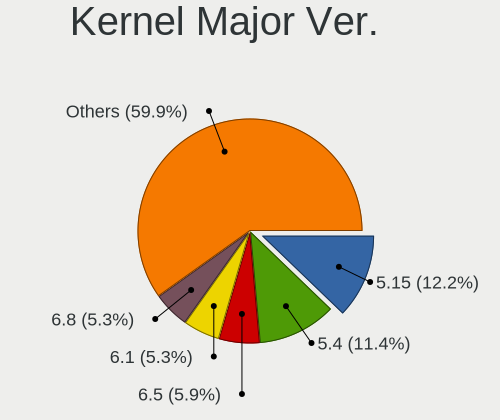
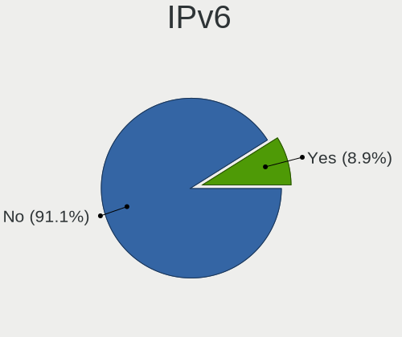
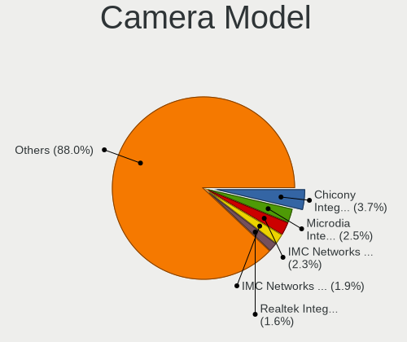

Linux in Italy - Tested Hardware & Statistics
---------------------------------------------

A project to collect tested hardware configurations for Linux in Italy.

Anyone can contribute to this report by the [hw-probe](https://github.com/linuxhw/hw-probe) tool:

    sudo -E hw-probe -all -upload

Please contribute! Especially if your hardware is rare.

This is a report for all computer types. See also reports for [desktops](/Location/Italy/Desktop/README.md) and [notebooks](/Location/Italy/Notebook/README.md).

Contents
--------

* [ Test Cases ](#test-cases)

* [ System ](#system)
  - [ OS                       ](#os)
  - [ OS Family                ](#os-family)
  - [ Kernel                   ](#kernel)
  - [ Kernel Family            ](#kernel-family)
  - [ Kernel Major Ver.        ](#kernel-major-ver)
  - [ Arch                     ](#arch)
  - [ DE                       ](#de)
  - [ Display Server           ](#display-server)
  - [ Display Manager          ](#display-manager)
  - [ OS Lang                  ](#os-lang)
  - [ Boot Mode                ](#boot-mode)
  - [ Filesystem               ](#filesystem)
  - [ Part. scheme             ](#part-scheme)
  - [ Dual Boot with Linux/BSD ](#dual-boot-with-linuxbsd)
  - [ Dual Boot (Win)          ](#dual-boot-win)

* [ Board ](#board)
  - [ Vendor                   ](#vendor)
  - [ Model                    ](#model)
  - [ Model Family             ](#model-family)
  - [ MFG Year                 ](#mfg-year)
  - [ Form Factor              ](#form-factor)
  - [ Secure Boot              ](#secure-boot)
  - [ Coreboot                 ](#coreboot)
  - [ RAM Size                 ](#ram-size)
  - [ RAM Used                 ](#ram-used)
  - [ Total Drives             ](#total-drives)
  - [ Has CD-ROM               ](#has-cd-rom)
  - [ Has Ethernet             ](#has-ethernet)
  - [ Has WiFi                 ](#has-wifi)
  - [ Has Bluetooth            ](#has-bluetooth)

* [ Location ](#location)
  - [ Country                  ](#country)
  - [ City                     ](#city)

* [ Drives ](#drives)
  - [ Drive Vendor             ](#drive-vendor)
  - [ Drive Model              ](#drive-model)
  - [ HDD Vendor               ](#hdd-vendor)
  - [ SSD Vendor               ](#ssd-vendor)
  - [ Drive Kind               ](#drive-kind)
  - [ Drive Connector          ](#drive-connector)
  - [ Drive Size               ](#drive-size)
  - [ Space Total              ](#space-total)
  - [ Space Used               ](#space-used)
  - [ Malfunc. Drives          ](#malfunc-drives)
  - [ Malfunc. Drive Vendor    ](#malfunc-drive-vendor)
  - [ Malfunc. HDD Vendor      ](#malfunc-hdd-vendor)
  - [ Malfunc. Drive Kind      ](#malfunc-drive-kind)
  - [ Failed Drives            ](#failed-drives)
  - [ Failed Drive Vendor      ](#failed-drive-vendor)
  - [ Drive Status             ](#drive-status)

* [ Storage controller ](#storage-controller)
  - [ Storage Vendor           ](#storage-vendor)
  - [ Storage Model            ](#storage-model)
  - [ Storage Kind             ](#storage-kind)

* [ Processor ](#processor)
  - [ CPU Vendor               ](#cpu-vendor)
  - [ CPU Model                ](#cpu-model)
  - [ CPU Model Family         ](#cpu-model-family)
  - [ CPU Cores                ](#cpu-cores)
  - [ CPU Sockets              ](#cpu-sockets)
  - [ CPU Threads              ](#cpu-threads)
  - [ CPU Op-Modes             ](#cpu-op-modes)
  - [ CPU Microcode            ](#cpu-microcode)
  - [ CPU Microarch            ](#cpu-microarch)

* [ Graphics ](#graphics)
  - [ GPU Vendor               ](#gpu-vendor)
  - [ GPU Model                ](#gpu-model)
  - [ GPU Combo                ](#gpu-combo)
  - [ GPU Driver               ](#gpu-driver)
  - [ GPU Memory               ](#gpu-memory)

* [ Monitor ](#monitor)
  - [ Monitor Vendor           ](#monitor-vendor)
  - [ Monitor Model            ](#monitor-model)
  - [ Monitor Resolution       ](#monitor-resolution)
  - [ Monitor Diagonal         ](#monitor-diagonal)
  - [ Monitor Width            ](#monitor-width)
  - [ Aspect Ratio             ](#aspect-ratio)
  - [ Monitor Area             ](#monitor-area)
  - [ Pixel Density            ](#pixel-density)
  - [ Multiple Monitors        ](#multiple-monitors)

* [ Network ](#network)
  - [ Net Controller Vendor    ](#net-controller-vendor)
  - [ Net Controller Model     ](#net-controller-model)
  - [ Wireless Vendor          ](#wireless-vendor)
  - [ Wireless Model           ](#wireless-model)
  - [ Ethernet Vendor          ](#ethernet-vendor)
  - [ Ethernet Model           ](#ethernet-model)
  - [ Net Controller Kind      ](#net-controller-kind)
  - [ Used Controller          ](#used-controller)
  - [ NICs                     ](#nics)
  - [ IPv6                     ](#ipv6)

* [ Bluetooth ](#bluetooth)
  - [ Bluetooth Vendor         ](#bluetooth-vendor)
  - [ Bluetooth Model          ](#bluetooth-model)

* [ Sound ](#sound)
  - [ Sound Vendor             ](#sound-vendor)
  - [ Sound Model              ](#sound-model)

* [ Memory ](#memory)
  - [ Memory Vendor            ](#memory-vendor)
  - [ Memory Model             ](#memory-model)
  - [ Memory Kind              ](#memory-kind)
  - [ Memory Form Factor       ](#memory-form-factor)
  - [ Memory Size              ](#memory-size)
  - [ Memory Speed             ](#memory-speed)

* [ Printers & scanners ](#printers--scanners)
  - [ Printer Vendor           ](#printer-vendor)
  - [ Printer Model            ](#printer-model)
  - [ Scanner Vendor           ](#scanner-vendor)
  - [ Scanner Model            ](#scanner-model)

* [ Camera ](#camera)
  - [ Camera Vendor            ](#camera-vendor)
  - [ Camera Model             ](#camera-model)

* [ Security ](#security)
  - [ Fingerprint Vendor       ](#fingerprint-vendor)
  - [ Fingerprint Model        ](#fingerprint-model)
  - [ Chipcard Vendor          ](#chipcard-vendor)
  - [ Chipcard Model           ](#chipcard-model)

* [ Unsupported ](#unsupported)
  - [ Unsupported Devices      ](#unsupported-devices)
  - [ Unsupported Device Types ](#unsupported-device-types)

Test Cases
----------

Total: 13240

| Vendor        | Model                       | Form-Factor | Probe                                                      | Date         |
|---------------|-----------------------------|-------------|------------------------------------------------------------|--------------|
| XDO.AI        | Pantera Pico PC             | Desktop     | [f5069feac3](https://linux-hardware.org/?probe=f5069feac3) | Feb 02, 2024 |
| Lenovo        | ThinkPad E595 20NF0005IX    | Notebook    | [171aaf5d57](https://linux-hardware.org/?probe=171aaf5d57) | Feb 02, 2024 |
| Lenovo        | ThinkPad E595 20NF0005IX    | Notebook    | [c834e4941b](https://linux-hardware.org/?probe=c834e4941b) | Feb 02, 2024 |
| ASUSTek       | Z170 PRO GAMING             | Desktop     | [b43380d687](https://linux-hardware.org/?probe=b43380d687) | Feb 02, 2024 |
| Acer          | Aspire 5738                 | Notebook    | [7137d60986](https://linux-hardware.org/?probe=7137d60986) | Feb 02, 2024 |
| ASUSTek       | F2A85-M LE                  | Desktop     | [680ba020e2](https://linux-hardware.org/?probe=680ba020e2) | Feb 02, 2024 |
| Pegatron      | Spring Peak                 | Notebook    | [b14f110621](https://linux-hardware.org/?probe=b14f110621) | Feb 02, 2024 |
| Pegatron      | Spring Peak                 | Notebook    | [4404cfb5c8](https://linux-hardware.org/?probe=4404cfb5c8) | Feb 01, 2024 |
| Acer          | TravelMate 4220             | Notebook    | [73e17ddd6d](https://linux-hardware.org/?probe=73e17ddd6d) | Feb 01, 2024 |
| ASUSTek       | PRIME B760-PLUS D4          | Desktop     | [d9355c6146](https://linux-hardware.org/?probe=d9355c6146) | Feb 01, 2024 |
| Unknown       | OnePlus 6T                  | Soc         | [5f2084c452](https://linux-hardware.org/?probe=5f2084c452) | Jan 31, 2024 |
| Acer          | Swift SF314-43              | Notebook    | [793c3d3b4c](https://linux-hardware.org/?probe=793c3d3b4c) | Jan 31, 2024 |
| Mediacom      | SmartBook 14 FullHD - SB... | Notebook    | [53d7e5ce3c](https://linux-hardware.org/?probe=53d7e5ce3c) | Jan 31, 2024 |
| Dell          | 0YJPT1 A00                  | Desktop     | [014e8534ab](https://linux-hardware.org/?probe=014e8534ab) | Jan 31, 2024 |
| ASUSTek       | K50IJ                       | Notebook    | [061ca8b8ca](https://linux-hardware.org/?probe=061ca8b8ca) | Jan 31, 2024 |
| ASUSTek       | K50IJ                       | Notebook    | [0eefe2c89f](https://linux-hardware.org/?probe=0eefe2c89f) | Jan 31, 2024 |
| Acer          | Aspire 5735                 | Notebook    | [365fd9fe4d](https://linux-hardware.org/?probe=365fd9fe4d) | Jan 31, 2024 |
| Acer          | Aspire 5735                 | Notebook    | [bed38c72c8](https://linux-hardware.org/?probe=bed38c72c8) | Jan 31, 2024 |
| Intel         | DG41AN AAE92991-401         | Desktop     | [5e520c92ca](https://linux-hardware.org/?probe=5e520c92ca) | Jan 31, 2024 |
| MSI           | Prestige 14Evo B13M         | Notebook    | [2724b6a0da](https://linux-hardware.org/?probe=2724b6a0da) | Jan 31, 2024 |
| Fujitsu       | D3233-A1 S26361-D3233-A1    | Desktop     | [2a526e4632](https://linux-hardware.org/?probe=2a526e4632) | Jan 30, 2024 |
| AZW           | GTR V21                     | Mini pc     | [f0a278c92d](https://linux-hardware.org/?probe=f0a278c92d) | Jan 30, 2024 |
| Lenovo        | Yoga 900-13ISK 80MK         | Notebook    | [c5e686c940](https://linux-hardware.org/?probe=c5e686c940) | Jan 30, 2024 |
| Lenovo        | IdeaPad Slim 3 15IAH8 83... | Notebook    | [76cc91cd14](https://linux-hardware.org/?probe=76cc91cd14) | Jan 30, 2024 |
| MSI           | Z97 GAMING 7                | Desktop     | [4d77613083](https://linux-hardware.org/?probe=4d77613083) | Jan 30, 2024 |
| HUAWEI        | BOM-WXX9                    | Notebook    | [93b76b804d](https://linux-hardware.org/?probe=93b76b804d) | Jan 30, 2024 |
| Dell          | XPS 13 9305                 | Notebook    | [1b2e728298](https://linux-hardware.org/?probe=1b2e728298) | Jan 30, 2024 |
| Acer          | TravelMate 5730             | Notebook    | [f2ecf032d2](https://linux-hardware.org/?probe=f2ecf032d2) | Jan 30, 2024 |
| Dell          | G15 5511                    | Notebook    | [7fc6a18364](https://linux-hardware.org/?probe=7fc6a18364) | Jan 30, 2024 |
| HP            | 2AA7 H                      | Desktop     | [4dbc7b0fe9](https://linux-hardware.org/?probe=4dbc7b0fe9) | Jan 30, 2024 |
| Apple         | MacBookPro14,2              | Notebook    | [c2b9f915d1](https://linux-hardware.org/?probe=c2b9f915d1) | Jan 29, 2024 |
| HP            | 1495                        | Desktop     | [06ca3d46b1](https://linux-hardware.org/?probe=06ca3d46b1) | Jan 29, 2024 |
| ASUSTek       | ROG Maximus XI HERO         | Desktop     | [5af523a874](https://linux-hardware.org/?probe=5af523a874) | Jan 29, 2024 |
| ASUSTek       | TUF Gaming X570-PLUS        | Desktop     | [c9d5d0fa7b](https://linux-hardware.org/?probe=c9d5d0fa7b) | Jan 29, 2024 |
| Lenovo        | ThinkPad X270 W10DG 20K5... | Notebook    | [fbf917dbe4](https://linux-hardware.org/?probe=fbf917dbe4) | Jan 29, 2024 |
| Dell          | Precision M4800             | Notebook    | [54bea54d08](https://linux-hardware.org/?probe=54bea54d08) | Jan 29, 2024 |
| SLIMBOOK      | PROX15-AMD                  | Notebook    | [694185365c](https://linux-hardware.org/?probe=694185365c) | Jan 29, 2024 |
| HUAWEI        | NBLB-WAX9N                  | Notebook    | [dc9267becb](https://linux-hardware.org/?probe=dc9267becb) | Jan 29, 2024 |
| MSI           | Z790 GAMING PRO WIFI        | Desktop     | [3e946efe3c](https://linux-hardware.org/?probe=3e946efe3c) | Jan 29, 2024 |
| MSI           | MPG B560I GAMING EDGE WI... | Desktop     | [d4492753b4](https://linux-hardware.org/?probe=d4492753b4) | Jan 28, 2024 |
| Mediacom      | WinPad 11,6 FullHD- WPU1... | Notebook    | [ea399c19ca](https://linux-hardware.org/?probe=ea399c19ca) | Jan 28, 2024 |
| ASUSTek       | K55VD                       | Notebook    | [099cfb3dcb](https://linux-hardware.org/?probe=099cfb3dcb) | Jan 28, 2024 |
| Apple         | Mac-F42386C8 PVT            | All in one  | [dbbc24a0ed](https://linux-hardware.org/?probe=dbbc24a0ed) | Jan 28, 2024 |
| Apple         | Mac-F42386C8 PVT            | All in one  | [4a48eb8f58](https://linux-hardware.org/?probe=4a48eb8f58) | Jan 28, 2024 |
| ASUSTek       | PRIME A320M-K               | Desktop     | [c5777be509](https://linux-hardware.org/?probe=c5777be509) | Jan 28, 2024 |
| ASUSTek       | PRIME A320M-K               | Desktop     | [4fa63d205f](https://linux-hardware.org/?probe=4fa63d205f) | Jan 28, 2024 |
| ZOTAC         | ZBOX-ECM73070C/53060C       | Mini pc     | [28556ee188](https://linux-hardware.org/?probe=28556ee188) | Jan 28, 2024 |
| Lenovo        | ThinkPad T490 20N3S5GP12    | Notebook    | [b0cc2bbbed](https://linux-hardware.org/?probe=b0cc2bbbed) | Jan 28, 2024 |
| Lenovo        | B51-80 80LM                 | Notebook    | [71d2badad4](https://linux-hardware.org/?probe=71d2badad4) | Jan 27, 2024 |
| ASUSTek       | K55VD                       | Notebook    | [d2e2ee4fa9](https://linux-hardware.org/?probe=d2e2ee4fa9) | Jan 27, 2024 |
| ASUSTek       | VivoBook_ASUSLaptop TP40... | Convertible | [b66fe97c5f](https://linux-hardware.org/?probe=b66fe97c5f) | Jan 27, 2024 |
| Lenovo        | ThinkPad T430 2349IF8       | Notebook    | [bff9fcd796](https://linux-hardware.org/?probe=bff9fcd796) | Jan 27, 2024 |
| Lenovo        | IdeaPad Z500 20202          | Notebook    | [88efa5aca1](https://linux-hardware.org/?probe=88efa5aca1) | Jan 27, 2024 |
| ASUSTek       | M5A97 PLUS                  | Desktop     | [f06a700136](https://linux-hardware.org/?probe=f06a700136) | Jan 27, 2024 |
| Gigabyte      | B450M DS3H-CF               | Desktop     | [2d860764f7](https://linux-hardware.org/?probe=2d860764f7) | Jan 27, 2024 |
| ASRock        | AB350M Pro4                 | Desktop     | [ab39d263d5](https://linux-hardware.org/?probe=ab39d263d5) | Jan 27, 2024 |
| ASUSTek       | PN53-G                      | Mini pc     | [79b22a6e7b](https://linux-hardware.org/?probe=79b22a6e7b) | Jan 27, 2024 |
| ASUSTek       | K53SJ                       | Notebook    | [e8479e3860](https://linux-hardware.org/?probe=e8479e3860) | Jan 27, 2024 |
| Lenovo        | ThinkPad T470s 20HGS3AX0... | Notebook    | [c777cd17b5](https://linux-hardware.org/?probe=c777cd17b5) | Jan 26, 2024 |
| Quanta        | XV1                         | All in one  | [b39049cedd](https://linux-hardware.org/?probe=b39049cedd) | Jan 26, 2024 |
| HP            | 15                          | Notebook    | [4bce029b1f](https://linux-hardware.org/?probe=4bce029b1f) | Jan 26, 2024 |
| ASUSTek       | CM6870                      | Desktop     | [1abc8128a3](https://linux-hardware.org/?probe=1abc8128a3) | Jan 26, 2024 |
| HUAWEI        | KLVL-WXX9                   | Notebook    | [4b630c4e1e](https://linux-hardware.org/?probe=4b630c4e1e) | Jan 26, 2024 |
| Acer          | Aspire E5-574G              | Notebook    | [7fb3807471](https://linux-hardware.org/?probe=7fb3807471) | Jan 26, 2024 |
| HUAWEI        | KLVL-WXX9                   | Notebook    | [c639997108](https://linux-hardware.org/?probe=c639997108) | Jan 26, 2024 |
| AZW           | GTR V21                     | Mini pc     | [6c644d4df7](https://linux-hardware.org/?probe=6c644d4df7) | Jan 26, 2024 |
| PC Special... | NH5x_7xDPx                  | Notebook    | [0f28a5d513](https://linux-hardware.org/?probe=0f28a5d513) | Jan 26, 2024 |
| Unknown       | Unknown                     | Desktop     | [ca9dd04b16](https://linux-hardware.org/?probe=ca9dd04b16) | Jan 26, 2024 |
| HP            | Victus by Gaming Laptop ... | Notebook    | [313cd1cfba](https://linux-hardware.org/?probe=313cd1cfba) | Jan 26, 2024 |
| Fujitsu Si... | LIFEBOOK S6410              | Notebook    | [e5e3cbdd02](https://linux-hardware.org/?probe=e5e3cbdd02) | Jan 26, 2024 |
| ASUSTek       | VivoBook_ASUSLaptop X515... | Notebook    | [182e75dbe2](https://linux-hardware.org/?probe=182e75dbe2) | Jan 26, 2024 |
| GEEKOM        | A5                          | Desktop     | [2408e3a6dc](https://linux-hardware.org/?probe=2408e3a6dc) | Jan 26, 2024 |
| Dell          | 04Y8V0 A02                  | Desktop     | [34289f06cd](https://linux-hardware.org/?probe=34289f06cd) | Jan 26, 2024 |
| GEEKOM        | A5                          | Desktop     | [4818316c00](https://linux-hardware.org/?probe=4818316c00) | Jan 26, 2024 |
| Lenovo        | V15-ADA 82C7                | Notebook    | [a72a3bb0e5](https://linux-hardware.org/?probe=a72a3bb0e5) | Jan 25, 2024 |
| Acer          | Swift SF314-43              | Notebook    | [cdae9f5af3](https://linux-hardware.org/?probe=cdae9f5af3) | Jan 25, 2024 |
| Lenovo        | IdeaPad Gaming 3 16IAH7 ... | Notebook    | [e7a39e7734](https://linux-hardware.org/?probe=e7a39e7734) | Jan 25, 2024 |
| ASRock        | 775Dual-VSTA                | Desktop     | [76da6861f1](https://linux-hardware.org/?probe=76da6861f1) | Jan 25, 2024 |
| Acer          | Aspire ES1-520              | Notebook    | [633516e35a](https://linux-hardware.org/?probe=633516e35a) | Jan 25, 2024 |
| Dell          | Precision M4800             | Notebook    | [a945621369](https://linux-hardware.org/?probe=a945621369) | Jan 25, 2024 |
| ASUSTek       | N551VW                      | Notebook    | [2a8f1d7cc1](https://linux-hardware.org/?probe=2a8f1d7cc1) | Jan 24, 2024 |
| Intel         | JSL MRD                     | Desktop     | [17cea243b5](https://linux-hardware.org/?probe=17cea243b5) | Jan 24, 2024 |
| HP            | Pavilion Laptop 15-eg1xx... | Notebook    | [215df1823f](https://linux-hardware.org/?probe=215df1823f) | Jan 24, 2024 |
| Dell          | Latitude E6410              | Notebook    | [1b7b83010f](https://linux-hardware.org/?probe=1b7b83010f) | Jan 24, 2024 |
| Apple         | MacBookPro14,1              | Notebook    | [01d5416f71](https://linux-hardware.org/?probe=01d5416f71) | Jan 24, 2024 |
| ASRock        | Z370 Extreme4               | Desktop     | [1f8f4bbd8a](https://linux-hardware.org/?probe=1f8f4bbd8a) | Jan 24, 2024 |
| Acer          | TravelMate P414-51          | Notebook    | [b9eb38b308](https://linux-hardware.org/?probe=b9eb38b308) | Jan 24, 2024 |
| Acer          | Nitro AN515-58              | Notebook    | [d195c1f908](https://linux-hardware.org/?probe=d195c1f908) | Jan 23, 2024 |
| Gigabyte      | H110M-S2H-CF                | Desktop     | [81f34fc65a](https://linux-hardware.org/?probe=81f34fc65a) | Jan 23, 2024 |
| ASUSTek       | X541UJ                      | Notebook    | [e5a64b928d](https://linux-hardware.org/?probe=e5a64b928d) | Jan 23, 2024 |
| HP            | Stream Laptop 14-ax0XX      | Notebook    | [16c6b944fb](https://linux-hardware.org/?probe=16c6b944fb) | Jan 23, 2024 |
| HP            | ENVY Laptop 13-ba0xxx       | Notebook    | [b0f7b9a32f](https://linux-hardware.org/?probe=b0f7b9a32f) | Jan 23, 2024 |
| HP            | ENVY Laptop 13-ba0xxx       | Notebook    | [5fadf9e223](https://linux-hardware.org/?probe=5fadf9e223) | Jan 23, 2024 |
| Acer          | Aspire A315-58              | Notebook    | [286a2dcf7a](https://linux-hardware.org/?probe=286a2dcf7a) | Jan 23, 2024 |
| Acer          | TravelMate P414-51          | Notebook    | [c21caad3b4](https://linux-hardware.org/?probe=c21caad3b4) | Jan 23, 2024 |
| ASUSTek       | VivoBook_ASUSLaptop X512... | Notebook    | [73c0dd5770](https://linux-hardware.org/?probe=73c0dd5770) | Jan 23, 2024 |
| Acer          | Aspire A315-58              | Notebook    | [d5c1dc774a](https://linux-hardware.org/?probe=d5c1dc774a) | Jan 22, 2024 |
| Dell          | Latitude 7430               | Notebook    | [668299aad7](https://linux-hardware.org/?probe=668299aad7) | Jan 22, 2024 |
| AOpen         | D2644 S26361-D2644          | Desktop     | [f45673bd59](https://linux-hardware.org/?probe=f45673bd59) | Jan 22, 2024 |
| ASUSTek       | P5Q PRO TURBO               | Desktop     | [93762ed6a5](https://linux-hardware.org/?probe=93762ed6a5) | Jan 22, 2024 |
| ASUSTek       | TUF Gaming X570-PLUS        | Desktop     | [369e56d5f6](https://linux-hardware.org/?probe=369e56d5f6) | Jan 22, 2024 |
| ASUSTek       | VivoBook_ASUSLaptop X512... | Notebook    | [dc6c66931e](https://linux-hardware.org/?probe=dc6c66931e) | Jan 22, 2024 |
| ASUSTek       | M5A97 R2.0                  | Desktop     | [de6fb94ac8](https://linux-hardware.org/?probe=de6fb94ac8) | Jan 21, 2024 |
| Toshiba       | Satellite A350              | Notebook    | [bc48f2f41a](https://linux-hardware.org/?probe=bc48f2f41a) | Jan 21, 2024 |
| ASUSTek       | TUF Gaming FX505DT_FX505... | Notebook    | [61f93014cf](https://linux-hardware.org/?probe=61f93014cf) | Jan 21, 2024 |
| Lenovo        | ThinkPad P1 Gen 3 20THCT... | Notebook    | [ef2b018f0e](https://linux-hardware.org/?probe=ef2b018f0e) | Jan 21, 2024 |
| MSI           | Z790 GAMING PRO WIFI        | Desktop     | [bdcd287661](https://linux-hardware.org/?probe=bdcd287661) | Jan 20, 2024 |
| Acer          | Aspire 3050                 | Notebook    | [7231400f5d](https://linux-hardware.org/?probe=7231400f5d) | Jan 20, 2024 |
| Gigabyte      | H110M-S2H-CF                | Desktop     | [d57cdb4371](https://linux-hardware.org/?probe=d57cdb4371) | Jan 20, 2024 |
| Lenovo        | IdeaPad Slim 5 14IRL8 82... | Notebook    | [cf906b4574](https://linux-hardware.org/?probe=cf906b4574) | Jan 20, 2024 |
| Lenovo        | IdeaPad Slim 5 14IRL8 82... | Notebook    | [49a8bb87e1](https://linux-hardware.org/?probe=49a8bb87e1) | Jan 20, 2024 |
| ASUSTek       | VivoBook_ASUSLaptop K660... | Notebook    | [409adbe1e3](https://linux-hardware.org/?probe=409adbe1e3) | Jan 20, 2024 |
| Sony          | SVF1521G6EW                 | Notebook    | [e795184dd6](https://linux-hardware.org/?probe=e795184dd6) | Jan 20, 2024 |
| Lenovo        | G580 2189                   | Notebook    | [a46c26bc93](https://linux-hardware.org/?probe=a46c26bc93) | Jan 20, 2024 |
| Gigabyte      | B450M DS3H-CF               | Desktop     | [30d4375ab2](https://linux-hardware.org/?probe=30d4375ab2) | Jan 20, 2024 |
| Unknown       | Unknown                     | Desktop     | [bcded7aa47](https://linux-hardware.org/?probe=bcded7aa47) | Jan 20, 2024 |
| ASUSTek       | K55VM                       | Notebook    | [a684c7f5fc](https://linux-hardware.org/?probe=a684c7f5fc) | Jan 19, 2024 |
| Sony          | VGN-NW11S_S                 | Notebook    | [082d37eaf4](https://linux-hardware.org/?probe=082d37eaf4) | Jan 19, 2024 |
| Acer          | Aspire Z5610                | All in one  | [da346295d6](https://linux-hardware.org/?probe=da346295d6) | Jan 19, 2024 |
| ASUSTek       | ASUS EXPERTBOOK B5402CBA... | Notebook    | [907588dbd2](https://linux-hardware.org/?probe=907588dbd2) | Jan 19, 2024 |
| HP            | OMEN by Laptop 15-dc1xxx    | Notebook    | [74b90ddfac](https://linux-hardware.org/?probe=74b90ddfac) | Jan 19, 2024 |
| HP            | ENVY 15                     | Notebook    | [95ec6d10d0](https://linux-hardware.org/?probe=95ec6d10d0) | Jan 19, 2024 |
| Apple         | MacBookAir7,2               | Notebook    | [8efc1fa078](https://linux-hardware.org/?probe=8efc1fa078) | Jan 19, 2024 |
| Apple         | MacBookAir7,2               | Notebook    | [14a15f0dc3](https://linux-hardware.org/?probe=14a15f0dc3) | Jan 19, 2024 |
| HP            | Pavilion Laptop 15-eg2xx... | Notebook    | [4a2d568004](https://linux-hardware.org/?probe=4a2d568004) | Jan 19, 2024 |
| Lenovo        | ThinkPad X1 Carbon Gen 1... | Notebook    | [d4e6e0ae3e](https://linux-hardware.org/?probe=d4e6e0ae3e) | Jan 19, 2024 |
| AZW           | GTR V21                     | Mini pc     | [5ae635d23e](https://linux-hardware.org/?probe=5ae635d23e) | Jan 19, 2024 |
| ASUSTek       | X541NA                      | Notebook    | [21a49936f0](https://linux-hardware.org/?probe=21a49936f0) | Jan 19, 2024 |
| Acer          | Aspire E1-570G              | Notebook    | [2c6c50ecd4](https://linux-hardware.org/?probe=2c6c50ecd4) | Jan 18, 2024 |
| HP            | Pavilion 15                 | Notebook    | [c84199e8f0](https://linux-hardware.org/?probe=c84199e8f0) | Jan 18, 2024 |
| HP            | EliteBook 840 14 inch G9... | Notebook    | [53df90e606](https://linux-hardware.org/?probe=53df90e606) | Jan 18, 2024 |
| Apple         | MacBookPro8,1               | Notebook    | [84940a5891](https://linux-hardware.org/?probe=84940a5891) | Jan 18, 2024 |
| Lenovo        | G50-45 80E3                 | Notebook    | [7fa6be7205](https://linux-hardware.org/?probe=7fa6be7205) | Jan 18, 2024 |
| Dell          | Latitude 9420               | Convertible | [66e5db6523](https://linux-hardware.org/?probe=66e5db6523) | Jan 18, 2024 |
| ASUSTek       | VivoBook_ASUSLaptop K340... | Notebook    | [d310294e7c](https://linux-hardware.org/?probe=d310294e7c) | Jan 17, 2024 |
| Acer          | Swift SF314-43              | Notebook    | [a60906f053](https://linux-hardware.org/?probe=a60906f053) | Jan 17, 2024 |
| ASUSTek       | VivoBook_ASUSLaptop K340... | Notebook    | [048d450a50](https://linux-hardware.org/?probe=048d450a50) | Jan 17, 2024 |
| Dell          | Latitude 5530               | Notebook    | [df5d5becd7](https://linux-hardware.org/?probe=df5d5becd7) | Jan 17, 2024 |
| AZW           | GT-R                        | Notebook    | [5c0ce30435](https://linux-hardware.org/?probe=5c0ce30435) | Jan 17, 2024 |
| MSI           | MAG B550 TOMAHAWK           | Desktop     | [5ecdfd3d3c](https://linux-hardware.org/?probe=5ecdfd3d3c) | Jan 17, 2024 |
| HP            | 250 G8 Notebook PC          | Notebook    | [87e1df2a62](https://linux-hardware.org/?probe=87e1df2a62) | Jan 17, 2024 |
| Dell          | Latitude 9420               | Convertible | [cb8166fe94](https://linux-hardware.org/?probe=cb8166fe94) | Jan 17, 2024 |
| Lenovo        | Yoga 520-14IKB 80X8         | Convertible | [74029ad1ec](https://linux-hardware.org/?probe=74029ad1ec) | Jan 16, 2024 |
| Sapphire      | PE-AM2RS690V2               | Desktop     | [c01394270c](https://linux-hardware.org/?probe=c01394270c) | Jan 16, 2024 |
| Valve         | Jupiter                     | Notebook    | [1ebf344a00](https://linux-hardware.org/?probe=1ebf344a00) | Jan 16, 2024 |
| ASUSTek       | H81M-K                      | Desktop     | [c1f78ee398](https://linux-hardware.org/?probe=c1f78ee398) | Jan 16, 2024 |
| MSI           | Z170A GAMING M7             | Desktop     | [eeb7e9a203](https://linux-hardware.org/?probe=eeb7e9a203) | Jan 16, 2024 |
| ASUSTek       | Z87-PLUS                    | Desktop     | [8636e544df](https://linux-hardware.org/?probe=8636e544df) | Jan 15, 2024 |
| Acer          | TravelMate 5335             | Notebook    | [fcdb840b24](https://linux-hardware.org/?probe=fcdb840b24) | Jan 15, 2024 |
| HP            | Pavilion x360 Convertibl... | Convertible | [ad1ac91848](https://linux-hardware.org/?probe=ad1ac91848) | Jan 15, 2024 |
| HP            | Laptop 15-dw0xxx            | Notebook    | [b17351aa59](https://linux-hardware.org/?probe=b17351aa59) | Jan 15, 2024 |
| HPE           | ProLiant MicroServer Gen... | Server      | [1fd689ece1](https://linux-hardware.org/?probe=1fd689ece1) | Jan 15, 2024 |
| ASRock        | FM2A68M-HD+                 | Desktop     | [cad806dfff](https://linux-hardware.org/?probe=cad806dfff) | Jan 15, 2024 |
| ASRock        | FM2A68M-HD+                 | Desktop     | [66adaa98ac](https://linux-hardware.org/?probe=66adaa98ac) | Jan 15, 2024 |
| HP            | 255 G8 Notebook PC          | Notebook    | [e91147def0](https://linux-hardware.org/?probe=e91147def0) | Jan 15, 2024 |
| MSI           | Summit E16Flip A12UCT       | Notebook    | [efb852e7fb](https://linux-hardware.org/?probe=efb852e7fb) | Jan 15, 2024 |
| Onda TLC      | ONDA Oliver 15              | Notebook    | [8717f5a32d](https://linux-hardware.org/?probe=8717f5a32d) | Jan 15, 2024 |
| Lenovo        | ThinkPad E14 Gen 4 21E3C... | Notebook    | [46074255e9](https://linux-hardware.org/?probe=46074255e9) | Jan 14, 2024 |
| HP            | EliteBook 840 G3            | Notebook    | [7a41b077e3](https://linux-hardware.org/?probe=7a41b077e3) | Jan 14, 2024 |
| Unknown       | Unknown                     | Desktop     | [b9a545ad1c](https://linux-hardware.org/?probe=b9a545ad1c) | Jan 14, 2024 |
| Lenovo        | ThinkPad X250 20CM004XIX    | Notebook    | [5834e700db](https://linux-hardware.org/?probe=5834e700db) | Jan 14, 2024 |
| Sony          | SVE1713X1EB                 | Notebook    | [43af98d3bc](https://linux-hardware.org/?probe=43af98d3bc) | Jan 14, 2024 |
| Huanan        | X99-F8 V2.0                 | Desktop     | [a8b182fa35](https://linux-hardware.org/?probe=a8b182fa35) | Jan 14, 2024 |
| Gigabyte      | B550 AORUS ELITE AX V2      | Desktop     | [a2ec3f504c](https://linux-hardware.org/?probe=a2ec3f504c) | Jan 14, 2024 |
| Gigabyte      | B550 AORUS ELITE AX V2      | Desktop     | [167fddc449](https://linux-hardware.org/?probe=167fddc449) | Jan 14, 2024 |
| Gigabyte      | H410M S2H V3                | Desktop     | [d8f3909453](https://linux-hardware.org/?probe=d8f3909453) | Jan 14, 2024 |
| Lenovo        | ThinkPad T470 W10DG 20JN... | Notebook    | [6ede7a7cc8](https://linux-hardware.org/?probe=6ede7a7cc8) | Jan 14, 2024 |
| AMI           | Intel                       | Desktop     | [8cea24270b](https://linux-hardware.org/?probe=8cea24270b) | Jan 14, 2024 |
| Quanta        | XV1                         | All in one  | [112581cd19](https://linux-hardware.org/?probe=112581cd19) | Jan 13, 2024 |
| Lenovo        | V130-15IKB 81HN             | Notebook    | [89eb20dae9](https://linux-hardware.org/?probe=89eb20dae9) | Jan 13, 2024 |
| HP            | Dragonfly 13.5 inch G4 N... | Notebook    | [516c8f6f9c](https://linux-hardware.org/?probe=516c8f6f9c) | Jan 13, 2024 |
| ASUSTek       | H81M-K                      | Desktop     | [f28965133b](https://linux-hardware.org/?probe=f28965133b) | Jan 13, 2024 |
| BESSTAR Te... | GB7                         | Mini pc     | [d3025ca4be](https://linux-hardware.org/?probe=d3025ca4be) | Jan 13, 2024 |
| Lenovo        | ThinkPad T495 20NJ000XIX    | Notebook    | [700470a7f6](https://linux-hardware.org/?probe=700470a7f6) | Jan 12, 2024 |
| HP            | Laptop 15-bw0xx             | Notebook    | [9a8667ecaa](https://linux-hardware.org/?probe=9a8667ecaa) | Jan 12, 2024 |
| ASRock        | H110M-HDV                   | Desktop     | [5f7f485a15](https://linux-hardware.org/?probe=5f7f485a15) | Jan 12, 2024 |
| TUXEDO        | Pulse 14 Gen3               | Notebook    | [661a86f920](https://linux-hardware.org/?probe=661a86f920) | Jan 12, 2024 |
| Lenovo        | ThinkPad X1 Carbon 34601... | Notebook    | [bdfab62447](https://linux-hardware.org/?probe=bdfab62447) | Jan 12, 2024 |
| Lenovo        | ThinkPad T14 Gen 1 20S00... | Notebook    | [a485e19625](https://linux-hardware.org/?probe=a485e19625) | Jan 12, 2024 |
| Dell          | Inspiron 3593               | Notebook    | [60b15cb73b](https://linux-hardware.org/?probe=60b15cb73b) | Jan 12, 2024 |
| HP            | 339A                        | Desktop     | [75faedbb21](https://linux-hardware.org/?probe=75faedbb21) | Jan 12, 2024 |
| Dell          | 0F6X5P A00                  | Desktop     | [bf6a022632](https://linux-hardware.org/?probe=bf6a022632) | Jan 12, 2024 |
| Dell          | 0F6X5P A00                  | Desktop     | [8d2b313d2a](https://linux-hardware.org/?probe=8d2b313d2a) | Jan 12, 2024 |
| Dell          | 0F6X5P A00                  | Desktop     | [6f7cf4ae8d](https://linux-hardware.org/?probe=6f7cf4ae8d) | Jan 12, 2024 |
| Samsung       | RC530/RC730                 | Notebook    | [c96ada8967](https://linux-hardware.org/?probe=c96ada8967) | Jan 12, 2024 |
| Apple         | Mac-F4228EC8 DVT            | All in one  | [854720405d](https://linux-hardware.org/?probe=854720405d) | Jan 12, 2024 |
| ASUSTek       | PRIME B350M-A               | Desktop     | [7eabdfe5d0](https://linux-hardware.org/?probe=7eabdfe5d0) | Jan 12, 2024 |
| HP            | 0B4Ch D                     | Desktop     | [d04339c0dc](https://linux-hardware.org/?probe=d04339c0dc) | Jan 12, 2024 |
| ASUSTek       | X580VD                      | Notebook    | [25e38b0f43](https://linux-hardware.org/?probe=25e38b0f43) | Jan 12, 2024 |
| Dell          | Precision 3581              | Notebook    | [2bf1e4d7f0](https://linux-hardware.org/?probe=2bf1e4d7f0) | Jan 12, 2024 |
| Acer          | Aspire 3050                 | Notebook    | [ed5a4cc94d](https://linux-hardware.org/?probe=ed5a4cc94d) | Jan 12, 2024 |
| Raspberry ... | Raspberry Pi 400 Rev 1.0    | Soc         | [a54906a2ea](https://linux-hardware.org/?probe=a54906a2ea) | Jan 12, 2024 |
| ASUSTek       | X510UNR                     | Notebook    | [6e75ef84ca](https://linux-hardware.org/?probe=6e75ef84ca) | Jan 12, 2024 |
| MSI           | B450M-A PRO MAX             | Desktop     | [15d413beb6](https://linux-hardware.org/?probe=15d413beb6) | Jan 12, 2024 |
| ASUSTek       | K55VM                       | Notebook    | [99003258ce](https://linux-hardware.org/?probe=99003258ce) | Jan 11, 2024 |
| MSI           | B450M-A PRO MAX             | Desktop     | [50ca06fa28](https://linux-hardware.org/?probe=50ca06fa28) | Jan 11, 2024 |
| Alienware     | Area-51m R2                 | Notebook    | [de0b2e0221](https://linux-hardware.org/?probe=de0b2e0221) | Jan 11, 2024 |
| Lenovo        | Yoga 900-13ISK 80MK         | Notebook    | [d1201e3b8f](https://linux-hardware.org/?probe=d1201e3b8f) | Jan 11, 2024 |
| Lenovo        | 32E4 NOK                    | Mini pc     | [3efb9c70eb](https://linux-hardware.org/?probe=3efb9c70eb) | Jan 11, 2024 |
| HP            | Pavilion Laptop 15-cs3xx... | Notebook    | [3de6626132](https://linux-hardware.org/?probe=3de6626132) | Jan 11, 2024 |
| Dell          | 0K1D6X A00                  | Desktop     | [a47ccd2cfe](https://linux-hardware.org/?probe=a47ccd2cfe) | Jan 11, 2024 |
| Dell          | 0K1D6X A00                  | Desktop     | [5fc28b03c2](https://linux-hardware.org/?probe=5fc28b03c2) | Jan 11, 2024 |
| HP            | ProBook 455 15.6 inch G9... | Notebook    | [fb7de9b1eb](https://linux-hardware.org/?probe=fb7de9b1eb) | Jan 11, 2024 |
| Pegatron      | 2ACF                        | Desktop     | [eadd385333](https://linux-hardware.org/?probe=eadd385333) | Jan 11, 2024 |
| HP            | Pavilion x360 Convertibl... | Convertible | [4b10cf0b95](https://linux-hardware.org/?probe=4b10cf0b95) | Jan 10, 2024 |
| Apple         | Mac-F4228EC8 DVT            | All in one  | [e4bcfdfed2](https://linux-hardware.org/?probe=e4bcfdfed2) | Jan 10, 2024 |
| Dell          | XPS 13 9370                 | Notebook    | [cb0bdcbb78](https://linux-hardware.org/?probe=cb0bdcbb78) | Jan 10, 2024 |
| ASUSTek       | M5A78L-M LX3                | Desktop     | [6b0c1cd101](https://linux-hardware.org/?probe=6b0c1cd101) | Jan 10, 2024 |
| Lenovo        | ThinkPad T430 2349IF8       | Notebook    | [b06e8d13c5](https://linux-hardware.org/?probe=b06e8d13c5) | Jan 10, 2024 |
| ASUSTek       | Zenbook UX3402ZA_UX3402Z... | Notebook    | [8d07ceed03](https://linux-hardware.org/?probe=8d07ceed03) | Jan 10, 2024 |
| ASUSTek       | Zenbook UX3402ZA_UX3402Z... | Notebook    | [f0ee73bcb6](https://linux-hardware.org/?probe=f0ee73bcb6) | Jan 10, 2024 |
| Shenzhen M... | F7BFD                       | Desktop     | [870cb76e60](https://linux-hardware.org/?probe=870cb76e60) | Jan 09, 2024 |
| Unknown       | Unknown                     | Notebook    | [76fb94009e](https://linux-hardware.org/?probe=76fb94009e) | Jan 09, 2024 |
| Medion        | E15413                      | Notebook    | [966254cd0e](https://linux-hardware.org/?probe=966254cd0e) | Jan 09, 2024 |
| MSI           | Z170A GAMING M7             | Desktop     | [5b17acbc6b](https://linux-hardware.org/?probe=5b17acbc6b) | Jan 09, 2024 |
| Unknown       | Unknown                     | Desktop     | [11b9f14d03](https://linux-hardware.org/?probe=11b9f14d03) | Jan 09, 2024 |
| HP            | EliteBook 2530p             | Notebook    | [0de99e6532](https://linux-hardware.org/?probe=0de99e6532) | Jan 09, 2024 |
| Dell          | Latitude 5290 2-in-1        | Notebook    | [b6d519e34c](https://linux-hardware.org/?probe=b6d519e34c) | Jan 09, 2024 |
| Packard Be... | EasyNote MH45               | Notebook    | [a5e8efb826](https://linux-hardware.org/?probe=a5e8efb826) | Jan 09, 2024 |
| MSI           | MPG X570 GAMING PRO CARB... | Desktop     | [a97d9690ff](https://linux-hardware.org/?probe=a97d9690ff) | Jan 09, 2024 |
| Lenovo        | ThinkPad T470 W10DG 20JN... | Notebook    | [b85af627bb](https://linux-hardware.org/?probe=b85af627bb) | Jan 09, 2024 |
| HP            | ProBook 640 G8 Notebook ... | Notebook    | [7ee8b412a1](https://linux-hardware.org/?probe=7ee8b412a1) | Jan 09, 2024 |
| HP            | ProBook 640 G8 Notebook ... | Notebook    | [8a05b3a91f](https://linux-hardware.org/?probe=8a05b3a91f) | Jan 09, 2024 |
| Unknown       | V00                         | Mini pc     | [9f59e7926f](https://linux-hardware.org/?probe=9f59e7926f) | Jan 09, 2024 |
| ASUSTek       | P8P67 EVO                   | Desktop     | [d54cf27190](https://linux-hardware.org/?probe=d54cf27190) | Jan 09, 2024 |
| Lenovo        | ThinkPad T470 20JNS08H00    | Notebook    | [c3a6a2da37](https://linux-hardware.org/?probe=c3a6a2da37) | Jan 09, 2024 |
| ASRock        | B150M-HDV                   | Desktop     | [01698aac7f](https://linux-hardware.org/?probe=01698aac7f) | Jan 09, 2024 |
| Acer          | eMachine V1.45              | Notebook    | [8438acbcc5](https://linux-hardware.org/?probe=8438acbcc5) | Jan 09, 2024 |
| ASUSTek       | M5A97 PLUS                  | Desktop     | [d22d465f0f](https://linux-hardware.org/?probe=d22d465f0f) | Jan 09, 2024 |
| ASUSTek       | Z87-PRO                     | Desktop     | [35ec3dca89](https://linux-hardware.org/?probe=35ec3dca89) | Jan 09, 2024 |
| HP            | ZBook Fury 15 G7 Mobile ... | Notebook    | [63d1f51ef3](https://linux-hardware.org/?probe=63d1f51ef3) | Jan 08, 2024 |
| ASUSTek       | ROG CROSSHAIR VIII DARK ... | Desktop     | [e72b2cebd3](https://linux-hardware.org/?probe=e72b2cebd3) | Jan 08, 2024 |
| Lenovo        | V15-ADA 82C7                | Notebook    | [6c2f581250](https://linux-hardware.org/?probe=6c2f581250) | Jan 08, 2024 |
| Lenovo        | ThinkCentre M72e 0896A2G    | Desktop     | [b77ad754ae](https://linux-hardware.org/?probe=b77ad754ae) | Jan 08, 2024 |
| Dell          | Inspiron 5737               | Notebook    | [1700f72b17](https://linux-hardware.org/?probe=1700f72b17) | Jan 08, 2024 |
| Gigabyte      | Z87N-WIFI                   | Desktop     | [bc0c6ef206](https://linux-hardware.org/?probe=bc0c6ef206) | Jan 08, 2024 |
| Dell          | 0F96C8 A00                  | All in one  | [f7d20028f6](https://linux-hardware.org/?probe=f7d20028f6) | Jan 08, 2024 |
| Sony          | SVF1521G6EW                 | Notebook    | [bdf6b3c370](https://linux-hardware.org/?probe=bdf6b3c370) | Jan 08, 2024 |
| Lenovo        | ThinkPad W550s 20E2000PM... | Notebook    | [0a3bac66b1](https://linux-hardware.org/?probe=0a3bac66b1) | Jan 08, 2024 |
| ASRock        | Z170 Pro4S                  | Desktop     | [1c355ea1f8](https://linux-hardware.org/?probe=1c355ea1f8) | Jan 08, 2024 |
| ASRock        | Z170 Pro4S                  | Desktop     | [535f68cf7b](https://linux-hardware.org/?probe=535f68cf7b) | Jan 08, 2024 |
| Acer          | TravelMate P645-S           | Notebook    | [9461c8963d](https://linux-hardware.org/?probe=9461c8963d) | Jan 07, 2024 |
| MSI           | X470 GAMING PLUS MAX        | Desktop     | [ac3aa9697a](https://linux-hardware.org/?probe=ac3aa9697a) | Jan 07, 2024 |
| HP            | Pavilion 15                 | Notebook    | [006e73b8e1](https://linux-hardware.org/?probe=006e73b8e1) | Jan 07, 2024 |
| Lenovo        | ThinkCentre M81 5049RA9     | Desktop     | [a443bef1bf](https://linux-hardware.org/?probe=a443bef1bf) | Jan 07, 2024 |
| ASUSTek       | VivoBook_ASUSLaptop X571... | Notebook    | [1b0a755b6e](https://linux-hardware.org/?probe=1b0a755b6e) | Jan 07, 2024 |
| Lenovo        | ThinkPad X260 20F5S8FQ00    | Notebook    | [eb70ae9801](https://linux-hardware.org/?probe=eb70ae9801) | Jan 07, 2024 |
| Lenovo        | G50-70 20351                | Notebook    | [5f77e74f4c](https://linux-hardware.org/?probe=5f77e74f4c) | Jan 07, 2024 |
| Acer          | Aspire E5-574G              | Notebook    | [a5243f518e](https://linux-hardware.org/?probe=a5243f518e) | Jan 07, 2024 |
| Lenovo        | Z70-80 80FG                 | Notebook    | [58c14daf7e](https://linux-hardware.org/?probe=58c14daf7e) | Jan 07, 2024 |
| Lenovo        | Legion S7 16ARHA7 82UG      | Notebook    | [d12db9cea9](https://linux-hardware.org/?probe=d12db9cea9) | Jan 07, 2024 |
| HP            | Pavilion 15                 | Notebook    | [4cc606c786](https://linux-hardware.org/?probe=4cc606c786) | Jan 07, 2024 |
| ASUSTek       | K52F                        | Notebook    | [501d643868](https://linux-hardware.org/?probe=501d643868) | Jan 07, 2024 |
| AMD           | A88                         | Desktop     | [f614fcb81f](https://linux-hardware.org/?probe=f614fcb81f) | Jan 06, 2024 |
| Apple         | Mac-77EB7D7DAF985301 iMa... | All in one  | [608144447c](https://linux-hardware.org/?probe=608144447c) | Jan 06, 2024 |
| ASUSTek       | H81M-K                      | Desktop     | [e73865e1e0](https://linux-hardware.org/?probe=e73865e1e0) | Jan 06, 2024 |
| Acer          | Aspire E1-522               | Notebook    | [bc948a749d](https://linux-hardware.org/?probe=bc948a749d) | Jan 06, 2024 |
| AMD           | A88                         | Desktop     | [04e378da84](https://linux-hardware.org/?probe=04e378da84) | Jan 06, 2024 |
| Dell          | Inspiron 5567               | Notebook    | [9e7374b8ef](https://linux-hardware.org/?probe=9e7374b8ef) | Jan 06, 2024 |
| Dell          | Latitude E6320              | Notebook    | [66828af936](https://linux-hardware.org/?probe=66828af936) | Jan 06, 2024 |
| HP            | 2B35                        | Desktop     | [440fa90f6f](https://linux-hardware.org/?probe=440fa90f6f) | Jan 05, 2024 |
| Dell          | Inspiron 5767               | Notebook    | [460e0f5fa4](https://linux-hardware.org/?probe=460e0f5fa4) | Jan 05, 2024 |
| Lenovo        | IdeaPad 3 15IGL05 81WQ      | Notebook    | [895e4f7f36](https://linux-hardware.org/?probe=895e4f7f36) | Jan 05, 2024 |
| HP            | 2B35                        | Desktop     | [e6337403f7](https://linux-hardware.org/?probe=e6337403f7) | Jan 05, 2024 |
| Gigabyte      | H410M S2H V3                | Desktop     | [85b99222c1](https://linux-hardware.org/?probe=85b99222c1) | Jan 05, 2024 |
| Lenovo        | ThinkPad T430s 2356LPG      | Notebook    | [2eff1355bb](https://linux-hardware.org/?probe=2eff1355bb) | Jan 05, 2024 |
| Lenovo        | ThinkPad T430s 2356LPG      | Notebook    | [e16f08a541](https://linux-hardware.org/?probe=e16f08a541) | Jan 05, 2024 |
| HP            | ProBook 4530s               | Notebook    | [0fe11a7b3d](https://linux-hardware.org/?probe=0fe11a7b3d) | Jan 05, 2024 |
| Shenzhen M... | F7BFC                       | Desktop     | [59d6a69f30](https://linux-hardware.org/?probe=59d6a69f30) | Jan 05, 2024 |
| HUAWEI        | HN-WX9X                     | Notebook    | [b1acec939c](https://linux-hardware.org/?probe=b1acec939c) | Jan 05, 2024 |
| ASRock        | Z370 Extreme4               | Desktop     | [0726856482](https://linux-hardware.org/?probe=0726856482) | Jan 05, 2024 |
| Shenzhen M... | F7BFC                       | Desktop     | [d8ed7241cb](https://linux-hardware.org/?probe=d8ed7241cb) | Jan 05, 2024 |
| Raspberry ... | Raspberry Pi 400 Rev 1.0    | Soc         | [5c7a9c03df](https://linux-hardware.org/?probe=5c7a9c03df) | Jan 05, 2024 |
| ASUSTek       | 1025C                       | Notebook    | [07a95965bc](https://linux-hardware.org/?probe=07a95965bc) | Jan 05, 2024 |
| ASUSTek       | 1025C                       | Notebook    | [c373e654f1](https://linux-hardware.org/?probe=c373e654f1) | Jan 05, 2024 |
| ASUSTek       | X540NA                      | Notebook    | [5300a227eb](https://linux-hardware.org/?probe=5300a227eb) | Jan 04, 2024 |
| ASUSTek       | M5A97 LE R2.0               | Desktop     | [f8471bbcf4](https://linux-hardware.org/?probe=f8471bbcf4) | Jan 04, 2024 |
| ASUSTek       | M5A97 LE R2.0               | Desktop     | [3290e9841e](https://linux-hardware.org/?probe=3290e9841e) | Jan 04, 2024 |
| HP            | 339A                        | Desktop     | [3c4dcb2e52](https://linux-hardware.org/?probe=3c4dcb2e52) | Jan 04, 2024 |
| Apple         | MacBookPro9,2               | Notebook    | [c606f10b1d](https://linux-hardware.org/?probe=c606f10b1d) | Jan 04, 2024 |
| MSI           | Prestige 15 A11SCS          | Notebook    | [c96226d4ac](https://linux-hardware.org/?probe=c96226d4ac) | Jan 04, 2024 |
| Acer          | Nitro N50-610               | Desktop     | [612f4f165a](https://linux-hardware.org/?probe=612f4f165a) | Jan 04, 2024 |
| HUAWEI        | NBLK-WAX9X                  | Notebook    | [be1a88adce](https://linux-hardware.org/?probe=be1a88adce) | Jan 04, 2024 |
| Lenovo        | MAHOBAY NO DPK              | Desktop     | [9a18a450f2](https://linux-hardware.org/?probe=9a18a450f2) | Jan 04, 2024 |
| HP            | 339A                        | Desktop     | [1b50e2401a](https://linux-hardware.org/?probe=1b50e2401a) | Jan 04, 2024 |
| HP            | 339A                        | Desktop     | [b86795707e](https://linux-hardware.org/?probe=b86795707e) | Jan 04, 2024 |
| Lenovo        | ThinkPad P16s Gen 2 21K9... | Notebook    | [6fae764b45](https://linux-hardware.org/?probe=6fae764b45) | Jan 04, 2024 |
| ASRock        | B650E PG Riptide WiFi       | Desktop     | [71bf3eba70](https://linux-hardware.org/?probe=71bf3eba70) | Jan 04, 2024 |
| Olidata       | SL1510 MD61444              | Notebook    | [bb1016d11d](https://linux-hardware.org/?probe=bb1016d11d) | Jan 04, 2024 |
| HP            | 339A                        | Desktop     | [a1901b8bcf](https://linux-hardware.org/?probe=a1901b8bcf) | Jan 04, 2024 |
| Dell          | XPS 15 9530                 | Notebook    | [fbd8a37b00](https://linux-hardware.org/?probe=fbd8a37b00) | Jan 04, 2024 |
| Sony          | VGN-FW11E                   | Notebook    | [f89dcd01ec](https://linux-hardware.org/?probe=f89dcd01ec) | Jan 03, 2024 |
| Gigabyte      | GA-K8NF9 Ultra              | Desktop     | [bbc0256984](https://linux-hardware.org/?probe=bbc0256984) | Jan 03, 2024 |
| HP            | Pavilion g6                 | Notebook    | [f1a54c438d](https://linux-hardware.org/?probe=f1a54c438d) | Jan 03, 2024 |
| MSI           | X99A GAMING 7               | Desktop     | [1d4efc3026](https://linux-hardware.org/?probe=1d4efc3026) | Jan 03, 2024 |
| Acer          | Aspire ES1-520              | Notebook    | [922ef3d7e1](https://linux-hardware.org/?probe=922ef3d7e1) | Jan 03, 2024 |
| HP            | Pavilion g6                 | Notebook    | [254ad76cac](https://linux-hardware.org/?probe=254ad76cac) | Jan 03, 2024 |
| Koloe         | X58                         | Desktop     | [2a3e4788ed](https://linux-hardware.org/?probe=2a3e4788ed) | Jan 03, 2024 |
| ASUSTek       | X540SAA                     | Notebook    | [179249edef](https://linux-hardware.org/?probe=179249edef) | Jan 03, 2024 |
| Lenovo        | IdeaPad 330S-15IKB 81F5     | Notebook    | [a04f45ddfb](https://linux-hardware.org/?probe=a04f45ddfb) | Jan 03, 2024 |
| HP            | EliteBook 645 14 inch G1... | Notebook    | [c828174b3c](https://linux-hardware.org/?probe=c828174b3c) | Jan 03, 2024 |
| Lenovo        | IdeaPad 330S-15IKB 81F5     | Notebook    | [a24e1e9937](https://linux-hardware.org/?probe=a24e1e9937) | Jan 03, 2024 |
| ASRock        | Z77 Performance             | Desktop     | [7f44640341](https://linux-hardware.org/?probe=7f44640341) | Jan 03, 2024 |
| Lenovo        | ThinkPad E14 Gen 4 21E3C... | Notebook    | [f490c2378e](https://linux-hardware.org/?probe=f490c2378e) | Jan 03, 2024 |
| ASUSTek       | VivoBook_ASUSLaptop X515... | Notebook    | [473cff2d66](https://linux-hardware.org/?probe=473cff2d66) | Jan 02, 2024 |
| Lenovo        | Legion 5 Pro 16ARH7H 82R... | Notebook    | [7c849a7e11](https://linux-hardware.org/?probe=7c849a7e11) | Jan 02, 2024 |
| HP            | EliteBook 2570p             | Notebook    | [5299a026ab](https://linux-hardware.org/?probe=5299a026ab) | Jan 02, 2024 |
| Mediacom      | SMARTBOOK ONE               | Notebook    | [5ad55a8ac5](https://linux-hardware.org/?probe=5ad55a8ac5) | Jan 02, 2024 |
| HUAWEI        | BOHL-WXX9                   | Notebook    | [bc70b50aec](https://linux-hardware.org/?probe=bc70b50aec) | Jan 02, 2024 |
| Biostar       | A320MH                      | Desktop     | [fde80defce](https://linux-hardware.org/?probe=fde80defce) | Jan 02, 2024 |
| Google        | Blooglet                    | Notebook    | [e9a02f38b1](https://linux-hardware.org/?probe=e9a02f38b1) | Jan 02, 2024 |
| Dell          | Latitude 5290 2-in-1        | Notebook    | [30ccf5163b](https://linux-hardware.org/?probe=30ccf5163b) | Jan 02, 2024 |
| Sony          | SVE1713X1EB                 | Notebook    | [6c3167a5a7](https://linux-hardware.org/?probe=6c3167a5a7) | Jan 02, 2024 |
| ASUSTek       | ROG STRIX B650E-E GAMING... | Desktop     | [57a12c9041](https://linux-hardware.org/?probe=57a12c9041) | Jan 02, 2024 |
| HP            | Pavilion 15                 | Notebook    | [277c4aa7d6](https://linux-hardware.org/?probe=277c4aa7d6) | Jan 02, 2024 |
| Acer          | Nitro AN515-58              | Notebook    | [b822b77797](https://linux-hardware.org/?probe=b822b77797) | Jan 02, 2024 |
| MSI           | MS-B9181                    | Desktop     | [56b0ad4a01](https://linux-hardware.org/?probe=56b0ad4a01) | Jan 02, 2024 |
| Sony          | VGN-AR51SU                  | Notebook    | [ad09db7b69](https://linux-hardware.org/?probe=ad09db7b69) | Jan 01, 2024 |
| Sony          | VGN-AR51SU                  | Notebook    | [01e1a67d40](https://linux-hardware.org/?probe=01e1a67d40) | Jan 01, 2024 |
| Unknown       | Unknown                     | Desktop     | [b101d94fff](https://linux-hardware.org/?probe=b101d94fff) | Jan 01, 2024 |
| Acer          | Aspire A517-52G             | Notebook    | [fb86c6f71c](https://linux-hardware.org/?probe=fb86c6f71c) | Jan 01, 2024 |
| Dell          | 0F6X5P A00                  | Desktop     | [750a1d90dd](https://linux-hardware.org/?probe=750a1d90dd) | Jan 01, 2024 |
| Dell          | 0F6X5P A00                  | Desktop     | [b4f1a69ca3](https://linux-hardware.org/?probe=b4f1a69ca3) | Jan 01, 2024 |
| Dell          | 0F6X5P A00                  | Desktop     | [b5efb44fe4](https://linux-hardware.org/?probe=b5efb44fe4) | Jan 01, 2024 |
| Sony          | SVE1713X1EB                 | Notebook    | [f9081b680a](https://linux-hardware.org/?probe=f9081b680a) | Jan 01, 2024 |
| HP            | 18E7                        | Desktop     | [cf9a9bbe99](https://linux-hardware.org/?probe=cf9a9bbe99) | Jan 01, 2024 |
| Sony          | VGN-NW11S_S                 | Notebook    | [6d47430c42](https://linux-hardware.org/?probe=6d47430c42) | Jan 01, 2024 |
| Lenovo        | ThinkPad T470 20JNS08H00    | Notebook    | [0120368c3a](https://linux-hardware.org/?probe=0120368c3a) | Jan 01, 2024 |
| Sony          | VGN-NW11S_S                 | Notebook    | [e898dd413e](https://linux-hardware.org/?probe=e898dd413e) | Jan 01, 2024 |
| Shenzhen M... | F7BFD                       | Desktop     | [a55f5157bc](https://linux-hardware.org/?probe=a55f5157bc) | Dec 31, 2023 |
| Apple         | MacBookAir9,1               | Notebook    | [5dde4deb12](https://linux-hardware.org/?probe=5dde4deb12) | Dec 31, 2023 |
| ASUSTek       | ROG STRIX X570-F GAMING     | Notebook    | [ec8f742a7f](https://linux-hardware.org/?probe=ec8f742a7f) | Dec 31, 2023 |
| ASUSTek       | H110M-A/M.2                 | Desktop     | [9e622b4006](https://linux-hardware.org/?probe=9e622b4006) | Dec 31, 2023 |
| ASUSTek       | M5A97 LE R2.0               | Desktop     | [210fa8e369](https://linux-hardware.org/?probe=210fa8e369) | Dec 31, 2023 |
| Dell          | Latitude E4310              | Notebook    | [10397fd191](https://linux-hardware.org/?probe=10397fd191) | Dec 31, 2023 |
| ASUSTek       | ROG Strix G513IC_G513IC     | Notebook    | [1f44330bcf](https://linux-hardware.org/?probe=1f44330bcf) | Dec 31, 2023 |
| HP            | 18E9                        | Desktop     | [298cd92eb1](https://linux-hardware.org/?probe=298cd92eb1) | Dec 31, 2023 |
| ASUSTek       | CM6870                      | Desktop     | [bdc19328ef](https://linux-hardware.org/?probe=bdc19328ef) | Dec 31, 2023 |
| HP            | OMEN by Laptop              | Notebook    | [8b1ac4e80c](https://linux-hardware.org/?probe=8b1ac4e80c) | Dec 31, 2023 |
| Lenovo        | ThinkPad X270 W10DG 20K5... | Notebook    | [d975ab384e](https://linux-hardware.org/?probe=d975ab384e) | Dec 31, 2023 |
| ASUSTek       | PRIME B660M-A WIFI D4       | Desktop     | [7caa5da564](https://linux-hardware.org/?probe=7caa5da564) | Dec 31, 2023 |
| ASUSTek       | PRIME B360M-A               | Notebook    | [42b25d8ac5](https://linux-hardware.org/?probe=42b25d8ac5) | Dec 30, 2023 |
| Apple         | Mac-7BA5B2DFE22DDD8C Mac... | Mini pc     | [7fa25fe746](https://linux-hardware.org/?probe=7fa25fe746) | Dec 30, 2023 |
| ASUSTek       | PRIME X570-P                | Notebook    | [12b2d456ed](https://linux-hardware.org/?probe=12b2d456ed) | Dec 30, 2023 |
| Dell          | 0C4Y3R A00                  | Server      | [c49d0c3239](https://linux-hardware.org/?probe=c49d0c3239) | Dec 30, 2023 |
| ASUSTek       | M5A97 R2.0                  | Desktop     | [674f54c42c](https://linux-hardware.org/?probe=674f54c42c) | Dec 30, 2023 |
| MSI           | MS-ACB31 100                | All in one  | [ffe63dc278](https://linux-hardware.org/?probe=ffe63dc278) | Dec 30, 2023 |
| Lenovo        | IdeaPad S145-15API 81V7     | Notebook    | [7528cb1c24](https://linux-hardware.org/?probe=7528cb1c24) | Dec 30, 2023 |
| HP            | ProBook 440 G6              | Notebook    | [14623af544](https://linux-hardware.org/?probe=14623af544) | Dec 30, 2023 |
| Chuwi         | GemiBook                    | Notebook    | [3e5282eb93](https://linux-hardware.org/?probe=3e5282eb93) | Dec 30, 2023 |
| ASUSTek       | PRIME X570-P                | Notebook    | [596a41673a](https://linux-hardware.org/?probe=596a41673a) | Dec 30, 2023 |
| HP            | 8053                        | Desktop     | [26cb660757](https://linux-hardware.org/?probe=26cb660757) | Dec 30, 2023 |
| Samsung       | RC530/RC730                 | Notebook    | [866c256904](https://linux-hardware.org/?probe=866c256904) | Dec 30, 2023 |
| HP            | ProBook 6450b               | Notebook    | [ce6d3d0e7f](https://linux-hardware.org/?probe=ce6d3d0e7f) | Dec 30, 2023 |
| HP            | ProBook 6450b               | Notebook    | [f2128c8e8a](https://linux-hardware.org/?probe=f2128c8e8a) | Dec 30, 2023 |
| HUAWEI        | KLVL-WXX9                   | Notebook    | [f8aeb2c6c3](https://linux-hardware.org/?probe=f8aeb2c6c3) | Dec 30, 2023 |
| ASUSTek       | H81M-C                      | Desktop     | [a9a91f6c49](https://linux-hardware.org/?probe=a9a91f6c49) | Dec 30, 2023 |
| HP            | Pavilion Laptop 15-eh1xx... | Notebook    | [96662ed691](https://linux-hardware.org/?probe=96662ed691) | Dec 30, 2023 |
| HP            | Pavilion 15                 | Notebook    | [50b4c1504f](https://linux-hardware.org/?probe=50b4c1504f) | Dec 29, 2023 |
| Lenovo        | IdeaPad S145-15API 81V7     | Notebook    | [f071a372c0](https://linux-hardware.org/?probe=f071a372c0) | Dec 29, 2023 |
| Dell          | Latitude 5580               | Notebook    | [3079edcb81](https://linux-hardware.org/?probe=3079edcb81) | Dec 29, 2023 |
| Lenovo        | ThinkBook 16p Gen 4 21J8    | Notebook    | [afd9883450](https://linux-hardware.org/?probe=afd9883450) | Dec 29, 2023 |
| HUAWEI        | NBLK-WAX9X                  | Notebook    | [55340871af](https://linux-hardware.org/?probe=55340871af) | Dec 29, 2023 |
| ASRock        | H310CM-HDV                  | Desktop     | [df518ecaf1](https://linux-hardware.org/?probe=df518ecaf1) | Dec 29, 2023 |
| Foxconn       | Irvine HP P/N               | Desktop     | [cd125aca3c](https://linux-hardware.org/?probe=cd125aca3c) | Dec 29, 2023 |
| Sony          | VGN-CR21S_W                 | Notebook    | [732175d0f6](https://linux-hardware.org/?probe=732175d0f6) | Dec 29, 2023 |
| Sony          | VGN-FW21E                   | Notebook    | [52ff803e03](https://linux-hardware.org/?probe=52ff803e03) | Dec 29, 2023 |
| MSI           | H310M PRO-VD PLUS           | Desktop     | [d7083ded0a](https://linux-hardware.org/?probe=d7083ded0a) | Dec 29, 2023 |
| Acer          | Aspire E5-573G              | Notebook    | [0c4a68d81f](https://linux-hardware.org/?probe=0c4a68d81f) | Dec 29, 2023 |
| ASUSTek       | P5QL-E                      | Desktop     | [fb478f78b1](https://linux-hardware.org/?probe=fb478f78b1) | Dec 29, 2023 |
| Acer          | Aspire E5-573G              | Notebook    | [210403cf9d](https://linux-hardware.org/?probe=210403cf9d) | Dec 29, 2023 |
| Apple         | Mac-F42786A9 DVT            | All in one  | [c2a3ce3927](https://linux-hardware.org/?probe=c2a3ce3927) | Dec 29, 2023 |
| Apple         | Mac-77EB7D7DAF985301 iMa... | All in one  | [d1657d2b79](https://linux-hardware.org/?probe=d1657d2b79) | Dec 29, 2023 |
| ASRock        | Z370 Extreme4               | Desktop     | [97e413d4b8](https://linux-hardware.org/?probe=97e413d4b8) | Dec 29, 2023 |
| Framework     | Laptop 13 (AMD Ryzen 704... | Notebook    | [751429a259](https://linux-hardware.org/?probe=751429a259) | Dec 29, 2023 |
| Dell          | Inspiron 7348               | Notebook    | [a55c6eef41](https://linux-hardware.org/?probe=a55c6eef41) | Dec 29, 2023 |
| HP            | Pavilion Laptop 15-eg0xx... | Notebook    | [8e46844acc](https://linux-hardware.org/?probe=8e46844acc) | Dec 29, 2023 |
| T-bao         | MINI PC                     | Desktop     | [ad89280fd6](https://linux-hardware.org/?probe=ad89280fd6) | Dec 29, 2023 |
| Unknown       | Alviso                      | Desktop     | [fe4096f520](https://linux-hardware.org/?probe=fe4096f520) | Dec 29, 2023 |
| Samsung       | RC530/RC730                 | Notebook    | [db448e5732](https://linux-hardware.org/?probe=db448e5732) | Dec 29, 2023 |
| Notebook      | NS5x_NS7xAU                 | Notebook    | [d520b97118](https://linux-hardware.org/?probe=d520b97118) | Dec 29, 2023 |
| Dell          | XPS 13 9370                 | Notebook    | [f2d5cce82a](https://linux-hardware.org/?probe=f2d5cce82a) | Dec 29, 2023 |
| Lenovo        | V145-15AST 81MT             | Notebook    | [fa95062029](https://linux-hardware.org/?probe=fa95062029) | Dec 28, 2023 |
| Foxconn       | H67MP-S/-V/H67MP            | Desktop     | [17473d28e3](https://linux-hardware.org/?probe=17473d28e3) | Dec 28, 2023 |
| HP            | Pavilion 15                 | Notebook    | [da5644171f](https://linux-hardware.org/?probe=da5644171f) | Dec 28, 2023 |
| HP            | 830C                        | Desktop     | [2f602f34b2](https://linux-hardware.org/?probe=2f602f34b2) | Dec 28, 2023 |
| ASRock        | H61M-S                      | Desktop     | [2321baa69b](https://linux-hardware.org/?probe=2321baa69b) | Dec 28, 2023 |
| Unknown       | Unknown                     | Notebook    | [89a77455e5](https://linux-hardware.org/?probe=89a77455e5) | Dec 28, 2023 |
| ASRock        | H61M-S                      | Desktop     | [466863e657](https://linux-hardware.org/?probe=466863e657) | Dec 28, 2023 |
| HP            | 830C                        | Desktop     | [2256355ca5](https://linux-hardware.org/?probe=2256355ca5) | Dec 28, 2023 |
| Chuwi         | GemiBook                    | Notebook    | [15199d7550](https://linux-hardware.org/?probe=15199d7550) | Dec 28, 2023 |
| MSI           | Z77 MPower                  | Desktop     | [54a4a451c1](https://linux-hardware.org/?probe=54a4a451c1) | Dec 28, 2023 |
| Lenovo        | IdeaPad Gaming 3 15ARH05... | Notebook    | [5b2dd63a52](https://linux-hardware.org/?probe=5b2dd63a52) | Dec 28, 2023 |
| Fujitsu       | LIFEBOOK E734               | Notebook    | [2265b1d34f](https://linux-hardware.org/?probe=2265b1d34f) | Dec 28, 2023 |
| Unknown       | Unknown                     | Notebook    | [7c86c2f5dc](https://linux-hardware.org/?probe=7c86c2f5dc) | Dec 28, 2023 |
| ASRock        | G41M-VS3                    | Desktop     | [96266413d3](https://linux-hardware.org/?probe=96266413d3) | Dec 28, 2023 |
| Acer          | Aspire V5-123               | Notebook    | [4220993372](https://linux-hardware.org/?probe=4220993372) | Dec 28, 2023 |
| Apple         | Mac-7BA5B2DFE22DDD8C Mac... | Mini pc     | [67b966b660](https://linux-hardware.org/?probe=67b966b660) | Dec 28, 2023 |
| HP            | Notebook                    | Notebook    | [5b3e4ada9c](https://linux-hardware.org/?probe=5b3e4ada9c) | Dec 28, 2023 |
| Acer          | Aspire E5-573G              | Notebook    | [323f661113](https://linux-hardware.org/?probe=323f661113) | Dec 27, 2023 |
| HP            | 876C SMVB                   | Desktop     | [7082e52b57](https://linux-hardware.org/?probe=7082e52b57) | Dec 27, 2023 |
| Lenovo        | ThinkPad E15 Gen 2 20TD0... | Notebook    | [40c72fd8c2](https://linux-hardware.org/?probe=40c72fd8c2) | Dec 27, 2023 |
| Dell          | 03GCPM A01                  | Server      | [7c11f33356](https://linux-hardware.org/?probe=7c11f33356) | Dec 27, 2023 |
| Lenovo        | G50-45 80E3                 | Notebook    | [90e55e787b](https://linux-hardware.org/?probe=90e55e787b) | Dec 27, 2023 |
| HUAWEI        | NBLB-WAX9N                  | Notebook    | [84bc2c3915](https://linux-hardware.org/?probe=84bc2c3915) | Dec 27, 2023 |
| Dell          | Latitude 3520               | Notebook    | [b5802159c7](https://linux-hardware.org/?probe=b5802159c7) | Dec 27, 2023 |
| HP            | 3397                        | Desktop     | [de93e38762](https://linux-hardware.org/?probe=de93e38762) | Dec 27, 2023 |
| HP            | 255 G7 Notebook PC          | Notebook    | [8b217c5f35](https://linux-hardware.org/?probe=8b217c5f35) | Dec 27, 2023 |
| MSI           | Modern 15 B7M               | Notebook    | [2c7f48c9ad](https://linux-hardware.org/?probe=2c7f48c9ad) | Dec 27, 2023 |
| Apple         | Mac-031AEE4D24BFF0B1 Mac... | Mini pc     | [cecd63878b](https://linux-hardware.org/?probe=cecd63878b) | Dec 27, 2023 |
| MSI           | GS40 6QE Phantom            | Notebook    | [2946f9add8](https://linux-hardware.org/?probe=2946f9add8) | Dec 26, 2023 |
| Acer          | Aspire 5739G                | Notebook    | [6b4237a1ea](https://linux-hardware.org/?probe=6b4237a1ea) | Dec 26, 2023 |
| Acer          | Aspire 5739G                | Notebook    | [408e19e1f2](https://linux-hardware.org/?probe=408e19e1f2) | Dec 26, 2023 |
| Apple         | Mac-FC02E91DDD3FA6A4 iMa... | All in one  | [2abc54d852](https://linux-hardware.org/?probe=2abc54d852) | Dec 26, 2023 |
| ASUSTek       | PRIME X570-PRO              | Desktop     | [4e5179b4d1](https://linux-hardware.org/?probe=4e5179b4d1) | Dec 26, 2023 |
| HP            | Compaq nx7400 (RH609ES#A... | Notebook    | [6a6b1d3722](https://linux-hardware.org/?probe=6a6b1d3722) | Dec 26, 2023 |
| ASUSTek       | PRIME B450M-A               | Desktop     | [b93ec9563c](https://linux-hardware.org/?probe=b93ec9563c) | Dec 26, 2023 |
| ASUSTek       | M5A78L-M LE/USB3            | Desktop     | [fd68915b97](https://linux-hardware.org/?probe=fd68915b97) | Dec 26, 2023 |
| Chuwi         | GemiBook Pro                | Notebook    | [0fceb23d42](https://linux-hardware.org/?probe=0fceb23d42) | Dec 25, 2023 |
| ASUSTek       | ROG STRIX Z790-H GAMING ... | Desktop     | [a5a641b111](https://linux-hardware.org/?probe=a5a641b111) | Dec 25, 2023 |
| HP            | 250 G8 Notebook PC          | Notebook    | [df812b1171](https://linux-hardware.org/?probe=df812b1171) | Dec 25, 2023 |
| Lenovo        | V15 G3 IAP 82TT             | Notebook    | [66915e859e](https://linux-hardware.org/?probe=66915e859e) | Dec 25, 2023 |
| HP            | Laptop 14s-fq0xxx           | Notebook    | [00a9997bfc](https://linux-hardware.org/?probe=00a9997bfc) | Dec 25, 2023 |
| TUXEDO        | InfinityBook S 15 Gen6      | Notebook    | [54961dd296](https://linux-hardware.org/?probe=54961dd296) | Dec 25, 2023 |
| Apple         | Mac-031AEE4D24BFF0B1 Mac... | Mini pc     | [08d0e2e3a0](https://linux-hardware.org/?probe=08d0e2e3a0) | Dec 24, 2023 |
| HP            | Pavilion dv6                | Notebook    | [e9120b7c4e](https://linux-hardware.org/?probe=e9120b7c4e) | Dec 24, 2023 |
| HP            | Pavilion dv6                | Notebook    | [b3b2c1f621](https://linux-hardware.org/?probe=b3b2c1f621) | Dec 24, 2023 |
| Acer          | Aspire E5-571G              | Notebook    | [5004570f44](https://linux-hardware.org/?probe=5004570f44) | Dec 24, 2023 |
| Acer          | Aspire E5-571G              | Notebook    | [b62ffffcdb](https://linux-hardware.org/?probe=b62ffffcdb) | Dec 24, 2023 |
| Dell          | 0F6X5P A00                  | Desktop     | [8b6cbdd646](https://linux-hardware.org/?probe=8b6cbdd646) | Dec 24, 2023 |
| TULPAR        | A5 V20.3                    | Notebook    | [c1abfa26d5](https://linux-hardware.org/?probe=c1abfa26d5) | Dec 24, 2023 |
| Lenovo        | 317E SDK0J40700 WIN 3258... | Desktop     | [2bf8854e33](https://linux-hardware.org/?probe=2bf8854e33) | Dec 24, 2023 |
| Apple         | Mac-7BA5B2DFE22DDD8C Mac... | Mini pc     | [33ab4000ee](https://linux-hardware.org/?probe=33ab4000ee) | Dec 24, 2023 |
| Apple         | Mac-7BA5B2DFE22DDD8C Mac... | Mini pc     | [aef21854a2](https://linux-hardware.org/?probe=aef21854a2) | Dec 23, 2023 |
| PC Special... | GK7NP5R                     | Notebook    | [1d97edcad7](https://linux-hardware.org/?probe=1d97edcad7) | Dec 23, 2023 |
| HUAWEI        | BOM-WXX9                    | Notebook    | [40ba77bcb8](https://linux-hardware.org/?probe=40ba77bcb8) | Dec 23, 2023 |
| TULPAR        | A5 V20.3                    | Notebook    | [83c6679958](https://linux-hardware.org/?probe=83c6679958) | Dec 23, 2023 |
| Foxconn       | 2ADA                        | Desktop     | [f30aec24c2](https://linux-hardware.org/?probe=f30aec24c2) | Dec 23, 2023 |
| Lenovo        | SHARKBAY SDK0E50510 WIN     | Desktop     | [ab3cc8a89c](https://linux-hardware.org/?probe=ab3cc8a89c) | Dec 23, 2023 |
| Acer          | TravelMate 5730             | Notebook    | [69571c0b91](https://linux-hardware.org/?probe=69571c0b91) | Dec 23, 2023 |
| Apple         | MacBookAir6,1               | Notebook    | [0275987230](https://linux-hardware.org/?probe=0275987230) | Dec 22, 2023 |
| AZW           | MINI S 10                   | Desktop     | [59d6fa667d](https://linux-hardware.org/?probe=59d6fa667d) | Dec 22, 2023 |
| ASUSTek       | VivoBook_ASUSLaptop K660... | Notebook    | [e1225d2a37](https://linux-hardware.org/?probe=e1225d2a37) | Dec 22, 2023 |
| ASRock        | FM2A68M-HD+                 | Desktop     | [83fd663b68](https://linux-hardware.org/?probe=83fd663b68) | Dec 22, 2023 |
| Lenovo        | IdeaPad 310-15ABR 80ST      | Notebook    | [60690b9d12](https://linux-hardware.org/?probe=60690b9d12) | Dec 22, 2023 |
| ASUSTek       | N551VW                      | Notebook    | [f73a190483](https://linux-hardware.org/?probe=f73a190483) | Dec 22, 2023 |
| ASUSTek       | N551VW                      | Notebook    | [467015083e](https://linux-hardware.org/?probe=467015083e) | Dec 22, 2023 |
| Dell          | Latitude 5501               | Notebook    | [0b6206153c](https://linux-hardware.org/?probe=0b6206153c) | Dec 22, 2023 |
| HP            | Pavilion Laptop 15-eg2xx... | Notebook    | [db6db43604](https://linux-hardware.org/?probe=db6db43604) | Dec 22, 2023 |
| HP            | Notebook                    | Notebook    | [7541fcf0c8](https://linux-hardware.org/?probe=7541fcf0c8) | Dec 22, 2023 |
| Lenovo        | ThinkPad T490 20N3S5GP12    | Notebook    | [093906d110](https://linux-hardware.org/?probe=093906d110) | Dec 21, 2023 |
| Dell          | XPS 15 9520                 | Notebook    | [9fea6c876a](https://linux-hardware.org/?probe=9fea6c876a) | Dec 21, 2023 |
| ASUSTek       | X555LAB                     | Notebook    | [8a8a35c616](https://linux-hardware.org/?probe=8a8a35c616) | Dec 21, 2023 |
| Sony          | SVE1713X1EB                 | Notebook    | [dd67c36ae3](https://linux-hardware.org/?probe=dd67c36ae3) | Dec 21, 2023 |
| MSI           | Modern 15 B7M               | Notebook    | [77760018a7](https://linux-hardware.org/?probe=77760018a7) | Dec 21, 2023 |
| HP            | 876C SMVB                   | Desktop     | [c13f4eb91b](https://linux-hardware.org/?probe=c13f4eb91b) | Dec 21, 2023 |
| ASUSTek       | X550LD                      | Notebook    | [ebaf3f3e71](https://linux-hardware.org/?probe=ebaf3f3e71) | Dec 21, 2023 |
| Dell          | 0F6X5P A00                  | Desktop     | [fb2877e727](https://linux-hardware.org/?probe=fb2877e727) | Dec 21, 2023 |
| HP            | 18E7                        | Desktop     | [ad6cf02d18](https://linux-hardware.org/?probe=ad6cf02d18) | Dec 21, 2023 |
| ASUSTek       | PRIME H610M-R D4            | Desktop     | [5e7428fc75](https://linux-hardware.org/?probe=5e7428fc75) | Dec 21, 2023 |
| HP            | 18E7                        | Desktop     | [fdb8b2d229](https://linux-hardware.org/?probe=fdb8b2d229) | Dec 21, 2023 |
| Lenovo        | Yoga 2 11 20332             | Notebook    | [16a8e6f875](https://linux-hardware.org/?probe=16a8e6f875) | Dec 21, 2023 |
| Acer          | Swift SF314-59              | Notebook    | [13432c28a6](https://linux-hardware.org/?probe=13432c28a6) | Dec 21, 2023 |
| Acer          | Swift SF314-59              | Notebook    | [0eb55bee7d](https://linux-hardware.org/?probe=0eb55bee7d) | Dec 20, 2023 |
| Lenovo        | Legion 5 Pro 16ARH7H 82R... | Notebook    | [1c3113c9b9](https://linux-hardware.org/?probe=1c3113c9b9) | Dec 20, 2023 |
| ASUSTek       | X580VD                      | Notebook    | [18f5888ad5](https://linux-hardware.org/?probe=18f5888ad5) | Dec 20, 2023 |
| Lenovo        | IdeaPad S540-14IML 81NF     | Notebook    | [942da4e853](https://linux-hardware.org/?probe=942da4e853) | Dec 20, 2023 |
| Lenovo        | IdeaPad 530S-14ARR 81H1     | Notebook    | [2785a8b9c6](https://linux-hardware.org/?probe=2785a8b9c6) | Dec 20, 2023 |
| Lenovo        | 317C NOK                    | Desktop     | [87064e6d98](https://linux-hardware.org/?probe=87064e6d98) | Dec 20, 2023 |
| HP            | Stream Laptop 14-ax0XX      | Notebook    | [398a10f8ce](https://linux-hardware.org/?probe=398a10f8ce) | Dec 20, 2023 |
| MSI           | PRO Z690-A WIFI             | Desktop     | [d6a5b20ac6](https://linux-hardware.org/?probe=d6a5b20ac6) | Dec 20, 2023 |
| MSI           | Prestige 14Evo A12M         | Notebook    | [23e7499358](https://linux-hardware.org/?probe=23e7499358) | Dec 20, 2023 |
| Lenovo        | ThinkBook 15p Gen 2 21B1    | Notebook    | [06984b497c](https://linux-hardware.org/?probe=06984b497c) | Dec 20, 2023 |
| Lenovo        | ThinkPad S430 336457G       | Notebook    | [4acd70fc9f](https://linux-hardware.org/?probe=4acd70fc9f) | Dec 19, 2023 |
| Google        | Treeya                      | Notebook    | [b6541ef594](https://linux-hardware.org/?probe=b6541ef594) | Dec 19, 2023 |
| Dell          | XPS 13 9380                 | Notebook    | [1038e25caf](https://linux-hardware.org/?probe=1038e25caf) | Dec 19, 2023 |
| Gigabyte      | X570 AORUS MASTER           | Desktop     | [8dac564efb](https://linux-hardware.org/?probe=8dac564efb) | Dec 19, 2023 |
| Gigabyte      | X570 AORUS MASTER           | Desktop     | [6184376b69](https://linux-hardware.org/?probe=6184376b69) | Dec 19, 2023 |
| ASUSTek       | ROG STRIX X470-F GAMING     | Desktop     | [2501635862](https://linux-hardware.org/?probe=2501635862) | Dec 18, 2023 |
| HP            | 255 G1                      | Notebook    | [42faa8c263](https://linux-hardware.org/?probe=42faa8c263) | Dec 18, 2023 |
| HP            | 18E7                        | Desktop     | [20a3bd6bee](https://linux-hardware.org/?probe=20a3bd6bee) | Dec 17, 2023 |
| Lenovo        | IdeaPad 110-15ACL 80TJ      | Notebook    | [cb94175bab](https://linux-hardware.org/?probe=cb94175bab) | Dec 17, 2023 |
| ASUSTek       | X550LD                      | Notebook    | [d1dcdfda30](https://linux-hardware.org/?probe=d1dcdfda30) | Dec 17, 2023 |
| Samsung       | 750XDA                      | Notebook    | [bdaba42db8](https://linux-hardware.org/?probe=bdaba42db8) | Dec 17, 2023 |
| ASUSTek       | PRIME B350-PLUS             | Desktop     | [448a2dec7d](https://linux-hardware.org/?probe=448a2dec7d) | Dec 17, 2023 |
| ASUSTek       | PRIME B350-PLUS             | Desktop     | [ebfec06632](https://linux-hardware.org/?probe=ebfec06632) | Dec 17, 2023 |
| HP            | Laptop 15-dw0xxx            | Notebook    | [185314f313](https://linux-hardware.org/?probe=185314f313) | Dec 17, 2023 |
| Acer          | Aspire 5920G                | Notebook    | [40545204ea](https://linux-hardware.org/?probe=40545204ea) | Dec 17, 2023 |
| Acer          | Aspire 5920G                | Notebook    | [4ace5aeebe](https://linux-hardware.org/?probe=4ace5aeebe) | Dec 17, 2023 |
| HP            | Laptop 15-dw0xxx            | Notebook    | [87d3b447bb](https://linux-hardware.org/?probe=87d3b447bb) | Dec 17, 2023 |
| Acer          | Swift SF314-43              | Notebook    | [7ff498fc83](https://linux-hardware.org/?probe=7ff498fc83) | Dec 17, 2023 |
| HP            | Notebook                    | Notebook    | [09981b3a71](https://linux-hardware.org/?probe=09981b3a71) | Dec 17, 2023 |
| ASUSTek       | CROSSHAIR VI HERO           | Desktop     | [b595a47be1](https://linux-hardware.org/?probe=b595a47be1) | Dec 17, 2023 |
| ASUSTek       | VivoBook_ASUSLaptop K660... | Notebook    | [78a88bfe8c](https://linux-hardware.org/?probe=78a88bfe8c) | Dec 17, 2023 |
| ASUSTek       | VivoBook_ASUSLaptop K660... | Notebook    | [8833b0a058](https://linux-hardware.org/?probe=8833b0a058) | Dec 17, 2023 |
| ASUSTek       | PRIME H510M-A WIFI          | Desktop     | [2335d46852](https://linux-hardware.org/?probe=2335d46852) | Dec 17, 2023 |
| HP            | 1790                        | Desktop     | [2d8c859110](https://linux-hardware.org/?probe=2d8c859110) | Dec 17, 2023 |
| Google        | Droid                       | Notebook    | [f08b6f3c68](https://linux-hardware.org/?probe=f08b6f3c68) | Dec 17, 2023 |
| ASUSTek       | M4A89GTD-PRO/USB3           | Desktop     | [8adfc82dc5](https://linux-hardware.org/?probe=8adfc82dc5) | Dec 17, 2023 |
| ASUSTek       | X550LD                      | Notebook    | [492e654dfb](https://linux-hardware.org/?probe=492e654dfb) | Dec 17, 2023 |
| ASUSTek       | K61IC                       | Notebook    | [1442626988](https://linux-hardware.org/?probe=1442626988) | Dec 16, 2023 |
| Acer          | FIH57                       | Desktop     | [0edb232edf](https://linux-hardware.org/?probe=0edb232edf) | Dec 16, 2023 |
| Dell          | 0GXM1W A00                  | Desktop     | [476c368866](https://linux-hardware.org/?probe=476c368866) | Dec 16, 2023 |
| ASUSTek       | VivoBook_ASUSLaptop M160... | Notebook    | [7162b25b98](https://linux-hardware.org/?probe=7162b25b98) | Dec 16, 2023 |
| MSI           | MPG X570 GAMING PLUS        | Desktop     | [57a64ca85e](https://linux-hardware.org/?probe=57a64ca85e) | Dec 16, 2023 |
| HP            | 250 G8 Notebook PC          | Notebook    | [6e6dfdc457](https://linux-hardware.org/?probe=6e6dfdc457) | Dec 16, 2023 |
| HP            | Pavilion Laptop 15-cs3xx... | Notebook    | [2c4dba512d](https://linux-hardware.org/?probe=2c4dba512d) | Dec 16, 2023 |
| ASUSTek       | PRIME H510M-A WIFI          | Desktop     | [e97f16f34e](https://linux-hardware.org/?probe=e97f16f34e) | Dec 16, 2023 |
| HP            | 1790                        | Desktop     | [9bb2d6fcb4](https://linux-hardware.org/?probe=9bb2d6fcb4) | Dec 16, 2023 |
| HP            | 8653 A                      | Desktop     | [186fc771e8](https://linux-hardware.org/?probe=186fc771e8) | Dec 16, 2023 |
| HP            | Notebook                    | Notebook    | [4973d42380](https://linux-hardware.org/?probe=4973d42380) | Dec 16, 2023 |
| HP            | Compaq CQ58                 | Notebook    | [7567b51bda](https://linux-hardware.org/?probe=7567b51bda) | Dec 16, 2023 |
| Unknown       | Unknown                     | Desktop     | [678b41c4e7](https://linux-hardware.org/?probe=678b41c4e7) | Dec 16, 2023 |
| Gigabyte      | B550M DS3H                  | Desktop     | [50ad2630fb](https://linux-hardware.org/?probe=50ad2630fb) | Dec 16, 2023 |
| HP            | Notebook                    | Notebook    | [a960b17c37](https://linux-hardware.org/?probe=a960b17c37) | Dec 16, 2023 |
| ASUSTek       | X540LJ                      | Notebook    | [281c56510a](https://linux-hardware.org/?probe=281c56510a) | Dec 15, 2023 |
| Dell          | 0M5WNK A02                  | Desktop     | [f47a8fcf1f](https://linux-hardware.org/?probe=f47a8fcf1f) | Dec 15, 2023 |
| ASUSTek       | VivoBook_ASUSLaptop X515... | Notebook    | [e5916c58ec](https://linux-hardware.org/?probe=e5916c58ec) | Dec 15, 2023 |
| Dell          | 0C27VV A02                  | Desktop     | [94560c4ce8](https://linux-hardware.org/?probe=94560c4ce8) | Dec 15, 2023 |
| ASUSTek       | VivoBook_ASUSLaptop X515... | Notebook    | [37495b67c9](https://linux-hardware.org/?probe=37495b67c9) | Dec 15, 2023 |
| ASRock        | H310CM-HDV/M.2              | Desktop     | [c3604a3f0d](https://linux-hardware.org/?probe=c3604a3f0d) | Dec 15, 2023 |
| HP            | 18E7                        | Desktop     | [5923f47c4b](https://linux-hardware.org/?probe=5923f47c4b) | Dec 15, 2023 |
| Acer          | Swift SFX14-41G             | Notebook    | [49d4000148](https://linux-hardware.org/?probe=49d4000148) | Dec 15, 2023 |
| HP            | Pavilion 15                 | Notebook    | [166f55ae0b](https://linux-hardware.org/?probe=166f55ae0b) | Dec 15, 2023 |
| Gigabyte      | B250M-D2V-CF                | Desktop     | [e0e94706d7](https://linux-hardware.org/?probe=e0e94706d7) | Dec 15, 2023 |
| Acer          | MCP7A                       | Desktop     | [12708a342e](https://linux-hardware.org/?probe=12708a342e) | Dec 14, 2023 |
| HP            | ProBook 6450b               | Notebook    | [f63d5aa0f6](https://linux-hardware.org/?probe=f63d5aa0f6) | Dec 14, 2023 |
| Gigabyte      | H410M H V3                  | Desktop     | [048f7ace00](https://linux-hardware.org/?probe=048f7ace00) | Dec 14, 2023 |
| HP            | ProBook 6450b               | Notebook    | [1a762fe797](https://linux-hardware.org/?probe=1a762fe797) | Dec 14, 2023 |
| HP            | Victus by Laptop 16-e0xx... | Notebook    | [8dd696472d](https://linux-hardware.org/?probe=8dd696472d) | Dec 14, 2023 |
| ASUSTek       | K52Jc                       | Notebook    | [dfa5dc9cd9](https://linux-hardware.org/?probe=dfa5dc9cd9) | Dec 14, 2023 |
| Medion        | E16401                      | Notebook    | [0c81bbcb2b](https://linux-hardware.org/?probe=0c81bbcb2b) | Dec 14, 2023 |
| HP            | Notebook                    | Notebook    | [ac92e1373d](https://linux-hardware.org/?probe=ac92e1373d) | Dec 14, 2023 |
| ASUSTek       | P8H61                       | Desktop     | [00f636bb09](https://linux-hardware.org/?probe=00f636bb09) | Dec 14, 2023 |
| HUAWEI        | BOHK-WAX9X                  | Notebook    | [56b77e5a7d](https://linux-hardware.org/?probe=56b77e5a7d) | Dec 14, 2023 |
| HUAWEI        | MACHD-WXX9                  | Notebook    | [35a6370b07](https://linux-hardware.org/?probe=35a6370b07) | Dec 14, 2023 |
| HP            | 15                          | Notebook    | [2343c72691](https://linux-hardware.org/?probe=2343c72691) | Dec 13, 2023 |
| HP            | Laptop 17-by4xxx            | Notebook    | [0c728e7b27](https://linux-hardware.org/?probe=0c728e7b27) | Dec 13, 2023 |
| ASUSTek       | TUF Gaming B650-PLUS WIF... | Desktop     | [efe4c56706](https://linux-hardware.org/?probe=efe4c56706) | Dec 13, 2023 |
| HUAWEI        | HKD-WXX                     | Notebook    | [c6a0ea6b45](https://linux-hardware.org/?probe=c6a0ea6b45) | Dec 13, 2023 |
| HP            | Laptop 15-bs1xx             | Notebook    | [1785db3e7b](https://linux-hardware.org/?probe=1785db3e7b) | Dec 13, 2023 |
| Acer          | Swift SF314-43              | Notebook    | [6e8b956266](https://linux-hardware.org/?probe=6e8b956266) | Dec 13, 2023 |
| HUAWEI        | HKD-WXX                     | Notebook    | [b0c03a26ce](https://linux-hardware.org/?probe=b0c03a26ce) | Dec 13, 2023 |
| Apple         | Mac-F60DEB81FF30ACF6 Mac... | Desktop     | [5435277f12](https://linux-hardware.org/?probe=5435277f12) | Dec 13, 2023 |
| Lenovo        | Legion 5 15ACH6H 82JU       | Notebook    | [6a497408c3](https://linux-hardware.org/?probe=6a497408c3) | Dec 13, 2023 |
| HP            | 2AA7 H                      | Desktop     | [5e9703dff5](https://linux-hardware.org/?probe=5e9703dff5) | Dec 13, 2023 |
| HP            | 8169                        | Desktop     | [4f4439a6fb](https://linux-hardware.org/?probe=4f4439a6fb) | Dec 13, 2023 |
| HP            | Victus by Laptop 16-e0xx... | Notebook    | [6407db19a5](https://linux-hardware.org/?probe=6407db19a5) | Dec 13, 2023 |
| Lenovo        | G50-45 80E3                 | Notebook    | [cfa115323d](https://linux-hardware.org/?probe=cfa115323d) | Dec 13, 2023 |
| Valve         | Galileo                     | Notebook    | [d6ea0e047a](https://linux-hardware.org/?probe=d6ea0e047a) | Dec 13, 2023 |
| HP            | 15                          | Notebook    | [9c4fb8f41d](https://linux-hardware.org/?probe=9c4fb8f41d) | Dec 12, 2023 |
| Lenovo        | ThinkPad X270 20HMS0TD00    | Notebook    | [e9df2cf93b](https://linux-hardware.org/?probe=e9df2cf93b) | Dec 12, 2023 |
| HP            | 829A                        | Mini pc     | [ba2b33f645](https://linux-hardware.org/?probe=ba2b33f645) | Dec 12, 2023 |
| ASUSTek       | VivoBook_ASUSLaptop X571... | Notebook    | [4cffef33b7](https://linux-hardware.org/?probe=4cffef33b7) | Dec 12, 2023 |
| HP            | EliteBook 830 G7 Noteboo... | Notebook    | [774925ed25](https://linux-hardware.org/?probe=774925ed25) | Dec 12, 2023 |
| HUAWEI        | NBLK-WAX9X                  | Notebook    | [a128efcd01](https://linux-hardware.org/?probe=a128efcd01) | Dec 12, 2023 |
| ASRock        | G41M-VS3                    | Desktop     | [894c4cf9fb](https://linux-hardware.org/?probe=894c4cf9fb) | Dec 12, 2023 |
| Gigabyte      | H510M H                     | Desktop     | [5d637d06a3](https://linux-hardware.org/?probe=5d637d06a3) | Dec 12, 2023 |
| HUAWEI        | KLVC-WXX9                   | Notebook    | [3e8d09cc67](https://linux-hardware.org/?probe=3e8d09cc67) | Dec 12, 2023 |
| Acer          | TravelMate 5720             | Notebook    | [27cbfe44c9](https://linux-hardware.org/?probe=27cbfe44c9) | Dec 12, 2023 |
| ASUSTek       | X550LD                      | Notebook    | [1e1b5e9985](https://linux-hardware.org/?probe=1e1b5e9985) | Dec 12, 2023 |
| Gigabyte      | Z390 GAMING X-CF            | Desktop     | [34c5aec887](https://linux-hardware.org/?probe=34c5aec887) | Dec 12, 2023 |
| Lenovo        | ThinkPad T470 20JNS08H00    | Notebook    | [4d416a35fa](https://linux-hardware.org/?probe=4d416a35fa) | Dec 12, 2023 |
| Lenovo        | V15-IIL 82C5                | Notebook    | [a9d7c866c5](https://linux-hardware.org/?probe=a9d7c866c5) | Dec 12, 2023 |
| HUAWEI        | BOD-WXX9                    | Notebook    | [c12ada5b78](https://linux-hardware.org/?probe=c12ada5b78) | Dec 12, 2023 |
| ASUSTek       | PRIME B450-PLUS             | Desktop     | [7e201ea559](https://linux-hardware.org/?probe=7e201ea559) | Dec 11, 2023 |
| Dell          | 0GXM1W A00                  | Desktop     | [1b4243a8d7](https://linux-hardware.org/?probe=1b4243a8d7) | Dec 11, 2023 |
| HP            | 250 15.6 inch G9 Noteboo... | Notebook    | [48475b71d7](https://linux-hardware.org/?probe=48475b71d7) | Dec 11, 2023 |
| HP            | 255 G5                      | Notebook    | [9001fa872f](https://linux-hardware.org/?probe=9001fa872f) | Dec 11, 2023 |
| HP            | 255 G5                      | Notebook    | [d7df759d96](https://linux-hardware.org/?probe=d7df759d96) | Dec 11, 2023 |
| Packard Be... | EasyNote MH36               | Notebook    | [9607b32c37](https://linux-hardware.org/?probe=9607b32c37) | Dec 11, 2023 |
| MSI           | Modern 15 B7M               | Notebook    | [d4c74075be](https://linux-hardware.org/?probe=d4c74075be) | Dec 11, 2023 |
| Acer          | Aspire 5750                 | Notebook    | [584a9a153e](https://linux-hardware.org/?probe=584a9a153e) | Dec 11, 2023 |
| Acer          | Aspire E5-571G              | Notebook    | [30c8f1f622](https://linux-hardware.org/?probe=30c8f1f622) | Dec 11, 2023 |
| Unknown       | Unknown                     | Desktop     | [2c6a120dd2](https://linux-hardware.org/?probe=2c6a120dd2) | Dec 10, 2023 |
| HP            | 3032h                       | Desktop     | [ca8902be00](https://linux-hardware.org/?probe=ca8902be00) | Dec 10, 2023 |
| ASRock        | H310M-STX                   | Desktop     | [205a5c1696](https://linux-hardware.org/?probe=205a5c1696) | Dec 10, 2023 |
| MSI           | MAG B550 TOMAHAWK           | Desktop     | [dc0acbdb23](https://linux-hardware.org/?probe=dc0acbdb23) | Dec 10, 2023 |
| ASUSTek       | 1005HA                      | Notebook    | [b9760dcf5a](https://linux-hardware.org/?probe=b9760dcf5a) | Dec 10, 2023 |
| MSI           | 970A-G46                    | Desktop     | [86bd084c44](https://linux-hardware.org/?probe=86bd084c44) | Dec 10, 2023 |
| Dell          | XPS 13 9370                 | Notebook    | [201fa157d6](https://linux-hardware.org/?probe=201fa157d6) | Dec 10, 2023 |
| ASRock        | H81M-HDS                    | Desktop     | [6e718e8473](https://linux-hardware.org/?probe=6e718e8473) | Dec 10, 2023 |
| ASUSTek       | TUF Gaming X570-PLUS        | Desktop     | [241c795a70](https://linux-hardware.org/?probe=241c795a70) | Dec 10, 2023 |
| ASUSTek       | X505BP                      | Notebook    | [408ad7dd06](https://linux-hardware.org/?probe=408ad7dd06) | Dec 10, 2023 |
| HP            | ZBook Fury 15.6 inch G8 ... | Notebook    | [58ad170a68](https://linux-hardware.org/?probe=58ad170a68) | Dec 10, 2023 |
| Lenovo        | IdeaPad Z500 20202          | Notebook    | [bc8d773d9d](https://linux-hardware.org/?probe=bc8d773d9d) | Dec 10, 2023 |
| Lenovo        | IdeaPad Z500 20202          | Notebook    | [04e25c9660](https://linux-hardware.org/?probe=04e25c9660) | Dec 10, 2023 |
| ASUSTek       | ROG CROSSHAIR VIII DARK ... | Desktop     | [31821d09d8](https://linux-hardware.org/?probe=31821d09d8) | Dec 09, 2023 |
| Gigabyte      | Z170XP-SLI-CF               | Desktop     | [a51f4ce5e5](https://linux-hardware.org/?probe=a51f4ce5e5) | Dec 09, 2023 |
| ASUSTek       | P552LA                      | Notebook    | [cbe77e84b7](https://linux-hardware.org/?probe=cbe77e84b7) | Dec 09, 2023 |
| ASUSTek       | ROG STRIX B450-F GAMING     | Desktop     | [7a0919a7fc](https://linux-hardware.org/?probe=7a0919a7fc) | Dec 09, 2023 |
| HP            | Pavilion Laptop 15-cs3xx... | Notebook    | [5e6fc96a08](https://linux-hardware.org/?probe=5e6fc96a08) | Dec 09, 2023 |
| ASUSTek       | F1A55-M LE R2.0             | Desktop     | [83885aa02c](https://linux-hardware.org/?probe=83885aa02c) | Dec 09, 2023 |
| ASUSTek       | S551LN                      | Notebook    | [4684efbcaa](https://linux-hardware.org/?probe=4684efbcaa) | Dec 09, 2023 |
| Acer          | AOD270                      | Notebook    | [b5729a6428](https://linux-hardware.org/?probe=b5729a6428) | Dec 09, 2023 |
| MSI           | Prestige 14 A10SC           | Notebook    | [85d6d037cc](https://linux-hardware.org/?probe=85d6d037cc) | Dec 09, 2023 |
| ASUSTek       | PRIME Z270M-PLUS            | Desktop     | [5c1ffcfbe3](https://linux-hardware.org/?probe=5c1ffcfbe3) | Dec 09, 2023 |
| Dell          | Latitude 7490               | Notebook    | [ad002286ac](https://linux-hardware.org/?probe=ad002286ac) | Dec 09, 2023 |
| Dell          | 0F373D A00                  | Desktop     | [cf693d5429](https://linux-hardware.org/?probe=cf693d5429) | Dec 09, 2023 |
| Valve         | Jupiter                     | Notebook    | [f61425f9af](https://linux-hardware.org/?probe=f61425f9af) | Dec 09, 2023 |
| ASUSTek       | S551LN                      | Notebook    | [47aafe0845](https://linux-hardware.org/?probe=47aafe0845) | Dec 08, 2023 |
| ASUSTek       | PRIME H510M-A               | Desktop     | [40fae6bc6c](https://linux-hardware.org/?probe=40fae6bc6c) | Dec 08, 2023 |
| Valve         | Jupiter                     | Notebook    | [afd88ac5ea](https://linux-hardware.org/?probe=afd88ac5ea) | Dec 08, 2023 |
| Lenovo        | 32E9 SDK0T76465 WIN 3422... | Desktop     | [a4eb4e410e](https://linux-hardware.org/?probe=a4eb4e410e) | Dec 08, 2023 |
| HP            | ProLiant MicroServer        | Desktop     | [5451582602](https://linux-hardware.org/?probe=5451582602) | Dec 08, 2023 |
| Dell          | 04YP6J A01                  | Desktop     | [186bb25f07](https://linux-hardware.org/?probe=186bb25f07) | Dec 08, 2023 |
| HP            | Compaq 610                  | Notebook    | [6104f16206](https://linux-hardware.org/?probe=6104f16206) | Dec 07, 2023 |
| Shenzhen M... | F7BFD                       | Desktop     | [9a042578ee](https://linux-hardware.org/?probe=9a042578ee) | Dec 07, 2023 |
| Lenovo        | ThinkBook 14 G6 IRL 21KG    | Notebook    | [f7511ff0d0](https://linux-hardware.org/?probe=f7511ff0d0) | Dec 07, 2023 |
| HP            | 255 G7 Notebook PC          | Notebook    | [a39b24be90](https://linux-hardware.org/?probe=a39b24be90) | Dec 07, 2023 |
| Unknown       | Unknown                     | Desktop     | [7144bda606](https://linux-hardware.org/?probe=7144bda606) | Dec 07, 2023 |
| HP            | 255 G7 Notebook PC          | Notebook    | [7da432cd55](https://linux-hardware.org/?probe=7da432cd55) | Dec 07, 2023 |
| Apple         | Mac-FC02E91DDD3FA6A4 iMa... | All in one  | [572afff34b](https://linux-hardware.org/?probe=572afff34b) | Dec 07, 2023 |
| Apple         | Mac-FC02E91DDD3FA6A4 iMa... | All in one  | [2fc70886c6](https://linux-hardware.org/?probe=2fc70886c6) | Dec 07, 2023 |
| Lenovo        | ThinkBook 13s G2 ITL 20V... | Notebook    | [7606deffc4](https://linux-hardware.org/?probe=7606deffc4) | Dec 07, 2023 |
| Lenovo        | ThinkBook 16 G6 IRL 21KH    | Notebook    | [96ab8b0be8](https://linux-hardware.org/?probe=96ab8b0be8) | Dec 07, 2023 |
| Lenovo        | ThinkPad E16 Gen 1 21JT0... | Notebook    | [8ec5586df3](https://linux-hardware.org/?probe=8ec5586df3) | Dec 07, 2023 |
| HP            | ProBook 650 G1              | Notebook    | [52c0a2e6fa](https://linux-hardware.org/?probe=52c0a2e6fa) | Dec 07, 2023 |
| ASUSTek       | Zenbook S 13 UX5304VA_UX... | Notebook    | [b539c714c4](https://linux-hardware.org/?probe=b539c714c4) | Dec 07, 2023 |
| ASUSTek       | P553UA                      | Notebook    | [4c19d8a91e](https://linux-hardware.org/?probe=4c19d8a91e) | Dec 06, 2023 |
| MSI           | B450 GAMING PLUS MAX        | Desktop     | [bd9d40cd17](https://linux-hardware.org/?probe=bd9d40cd17) | Dec 06, 2023 |
| ASUSTek       | GL702VSK                    | Notebook    | [d8547acd71](https://linux-hardware.org/?probe=d8547acd71) | Dec 06, 2023 |
| Lenovo        | IdeaPad 530S-14ARR 81H1     | Notebook    | [a0391f219b](https://linux-hardware.org/?probe=a0391f219b) | Dec 06, 2023 |
| MSI           | B450 GAMING PLUS MAX        | Desktop     | [6aaaa355d3](https://linux-hardware.org/?probe=6aaaa355d3) | Dec 06, 2023 |
| HP            | 802E                        | Desktop     | [0f4d573a9b](https://linux-hardware.org/?probe=0f4d573a9b) | Dec 06, 2023 |
| ASUSTek       | K52JB                       | Notebook    | [2edc689735](https://linux-hardware.org/?probe=2edc689735) | Dec 06, 2023 |
| Lenovo        | IdeaPad 5 Pro 14ARH7 82S... | Notebook    | [7376c1f4cf](https://linux-hardware.org/?probe=7376c1f4cf) | Dec 06, 2023 |
| ASUSTek       | P8H61-M LE/USB3             | Desktop     | [26ab67528e](https://linux-hardware.org/?probe=26ab67528e) | Dec 06, 2023 |
| AMI           | Intel                       | Desktop     | [8649d088c6](https://linux-hardware.org/?probe=8649d088c6) | Dec 06, 2023 |
| HP            | 802E                        | Desktop     | [9b58aa9c3a](https://linux-hardware.org/?probe=9b58aa9c3a) | Dec 05, 2023 |
| ASUSTek       | TUF Gaming X670E-PLUS WI... | Desktop     | [f42e951aa3](https://linux-hardware.org/?probe=f42e951aa3) | Dec 05, 2023 |
| Acer          | Aspire E5-772G              | Notebook    | [1be5bb95d1](https://linux-hardware.org/?probe=1be5bb95d1) | Dec 05, 2023 |
| Intel         | Unknown                     | Desktop     | [3ae9554945](https://linux-hardware.org/?probe=3ae9554945) | Dec 05, 2023 |
| Acer          | TravelMate P414-51          | Notebook    | [bc31600bfa](https://linux-hardware.org/?probe=bc31600bfa) | Dec 05, 2023 |
| HP            | EliteBook 850 G5            | Notebook    | [aae20908c5](https://linux-hardware.org/?probe=aae20908c5) | Dec 05, 2023 |
| HP            | ZBook Power 15.6 inch G9... | Notebook    | [0d7f21475d](https://linux-hardware.org/?probe=0d7f21475d) | Dec 05, 2023 |
| HP            | ProBook 650 G1              | Notebook    | [06fe795e93](https://linux-hardware.org/?probe=06fe795e93) | Dec 05, 2023 |
| MSI           | B450 TOMAHAWK MAX           | Desktop     | [044e8ae8d6](https://linux-hardware.org/?probe=044e8ae8d6) | Dec 05, 2023 |
| ASUSTek       | GL702VSK                    | Notebook    | [20e6076fd3](https://linux-hardware.org/?probe=20e6076fd3) | Dec 05, 2023 |
| Unknown       | Unknown                     | Desktop     | [56dab5d412](https://linux-hardware.org/?probe=56dab5d412) | Dec 04, 2023 |
| Lenovo        | ThinkPad X280 20KFS0ND00    | Notebook    | [b95db311ed](https://linux-hardware.org/?probe=b95db311ed) | Dec 04, 2023 |
| Acer          | AOD270                      | Notebook    | [868ee5d423](https://linux-hardware.org/?probe=868ee5d423) | Dec 04, 2023 |
| Lenovo        | IdeaPad 5 Pro 14ACN6 82L... | Notebook    | [3965451e6d](https://linux-hardware.org/?probe=3965451e6d) | Dec 04, 2023 |
| Framework     | Laptop 13 (AMD Ryzen 704... | Notebook    | [d91e8dc1a8](https://linux-hardware.org/?probe=d91e8dc1a8) | Dec 04, 2023 |
| ASUSTek       | H81M-K                      | Desktop     | [8fd5e3b166](https://linux-hardware.org/?probe=8fd5e3b166) | Dec 04, 2023 |
| Dell          | XPS 15 9550                 | Notebook    | [b24c23dfd1](https://linux-hardware.org/?probe=b24c23dfd1) | Dec 04, 2023 |
| HP            | OMEN by Laptop 16-b1xxx     | Notebook    | [9acc9cef23](https://linux-hardware.org/?probe=9acc9cef23) | Dec 04, 2023 |
| Sony          | SVE1713X1EB                 | Notebook    | [3c8e9b9cc4](https://linux-hardware.org/?probe=3c8e9b9cc4) | Dec 04, 2023 |
| MSI           | B450 TOMAHAWK               | Desktop     | [001185a53f](https://linux-hardware.org/?probe=001185a53f) | Dec 04, 2023 |
| Dell          | XPS 15 9530                 | Notebook    | [e6d446fcd3](https://linux-hardware.org/?probe=e6d446fcd3) | Dec 04, 2023 |
| HP            | Notebook                    | Notebook    | [f347c4437d](https://linux-hardware.org/?probe=f347c4437d) | Dec 04, 2023 |
| ASUSTek       | VivoBook_ASUSLaptop X513... | Notebook    | [b1fdfbc998](https://linux-hardware.org/?probe=b1fdfbc998) | Dec 03, 2023 |
| HUAWEI        | BOHK-WAX9X                  | Notebook    | [0f16293fea](https://linux-hardware.org/?probe=0f16293fea) | Dec 03, 2023 |
| HP            | ProBook 470 G5              | Notebook    | [d12c9b1f20](https://linux-hardware.org/?probe=d12c9b1f20) | Dec 03, 2023 |
| Fujitsu       | D3233-A1 S26361-D3233-A1    | Desktop     | [ace4fe2fd9](https://linux-hardware.org/?probe=ace4fe2fd9) | Dec 03, 2023 |
| Acer          | Nitro AN515-57              | Notebook    | [1f8c488e82](https://linux-hardware.org/?probe=1f8c488e82) | Dec 03, 2023 |
| HP            | ProLiant MicroServer Gen... | Desktop     | [47222bf19c](https://linux-hardware.org/?probe=47222bf19c) | Dec 03, 2023 |
| HP            | ProLiant MicroServer Gen... | Desktop     | [5a5296e72f](https://linux-hardware.org/?probe=5a5296e72f) | Dec 03, 2023 |
| HP            | 255 G8 Notebook PC          | Notebook    | [2afc97f78a](https://linux-hardware.org/?probe=2afc97f78a) | Dec 03, 2023 |
| HP            | ZBook 17 G2                 | Notebook    | [e1edd54ac3](https://linux-hardware.org/?probe=e1edd54ac3) | Dec 03, 2023 |
| Jumper        | EZbook                      | Notebook    | [54cf2bf1d4](https://linux-hardware.org/?probe=54cf2bf1d4) | Dec 03, 2023 |
| MSI           | MAG Z790 TOMAHAWK WIFI      | Desktop     | [a28372598e](https://linux-hardware.org/?probe=a28372598e) | Dec 03, 2023 |
| ASUSTek       | VivoBook_ASUSLaptop X515... | Notebook    | [203357a4dd](https://linux-hardware.org/?probe=203357a4dd) | Dec 03, 2023 |
| HP            | Laptop 15-dw0xxx            | Notebook    | [288b6a2f75](https://linux-hardware.org/?probe=288b6a2f75) | Dec 02, 2023 |
| ASUSTek       | M4A77T/USB3                 | Desktop     | [706e9636ca](https://linux-hardware.org/?probe=706e9636ca) | Dec 02, 2023 |
| ASUSTek       | P8H67-M PRO                 | Desktop     | [5923988290](https://linux-hardware.org/?probe=5923988290) | Dec 02, 2023 |
| ASUSTek       | S551LN                      | Notebook    | [1c843db61c](https://linux-hardware.org/?probe=1c843db61c) | Dec 02, 2023 |
| Intel         | NUC12WSBi5 M46425-303       | Mini pc     | [c7563ee3bd](https://linux-hardware.org/?probe=c7563ee3bd) | Dec 02, 2023 |
| Lenovo        | ThinkPad E15 20RD0019IX     | Notebook    | [5d53fe03da](https://linux-hardware.org/?probe=5d53fe03da) | Dec 02, 2023 |
| Intel         | NUC12WSBi5 M46425-303       | Mini pc     | [9516f4d644](https://linux-hardware.org/?probe=9516f4d644) | Dec 02, 2023 |
| HP            | Notebook                    | Notebook    | [399699d1ce](https://linux-hardware.org/?probe=399699d1ce) | Dec 02, 2023 |
| ASUSTek       | H97M-E                      | Desktop     | [9e60faee5f](https://linux-hardware.org/?probe=9e60faee5f) | Dec 01, 2023 |
| HP            | ENVY x360 2-in-1 Laptop ... | Convertible | [2f6585635f](https://linux-hardware.org/?probe=2f6585635f) | Dec 01, 2023 |
| HP            | Notebook                    | Notebook    | [0a554c91b1](https://linux-hardware.org/?probe=0a554c91b1) | Dec 01, 2023 |
| Dell          | 0VRWRC A00                  | Desktop     | [13e072ec20](https://linux-hardware.org/?probe=13e072ec20) | Dec 01, 2023 |
| Dell          | 0NW73C A00                  | Desktop     | [380639dd58](https://linux-hardware.org/?probe=380639dd58) | Dec 01, 2023 |
| Lenovo        | ThinkPad E15 20RD0011IX     | Notebook    | [bf9f891fe4](https://linux-hardware.org/?probe=bf9f891fe4) | Dec 01, 2023 |
| Supermicro    | X10SLM-F                    | Server      | [7e32def223](https://linux-hardware.org/?probe=7e32def223) | Dec 01, 2023 |
| Acer          | Aspire 5732Z                | Notebook    | [f79a825fcd](https://linux-hardware.org/?probe=f79a825fcd) | Dec 01, 2023 |
| Framework     | Laptop 13 (AMD Ryzen 704... | Notebook    | [22263182fb](https://linux-hardware.org/?probe=22263182fb) | Dec 01, 2023 |
| Lenovo        | V15 G4 AMN 82YU             | Notebook    | [f17a1eb208](https://linux-hardware.org/?probe=f17a1eb208) | Dec 01, 2023 |
| ASUSTek       | Zenbook UX3402ZA_UX3402Z... | Notebook    | [100228341f](https://linux-hardware.org/?probe=100228341f) | Dec 01, 2023 |
| Lenovo        | ThinkPad T470p 20J6CTO1W... | Notebook    | [f98f84669d](https://linux-hardware.org/?probe=f98f84669d) | Dec 01, 2023 |
| Toshiba       | Satellite L755              | Notebook    | [511b79d4dc](https://linux-hardware.org/?probe=511b79d4dc) | Nov 30, 2023 |
| Lenovo        | IdeaPad 5 Pro 16ARH7 82S... | Notebook    | [4ba2fc285f](https://linux-hardware.org/?probe=4ba2fc285f) | Nov 30, 2023 |
| HP            | Laptop 15-dw0xxx            | Notebook    | [e9e1177170](https://linux-hardware.org/?probe=e9e1177170) | Nov 30, 2023 |
| Lenovo        | IdeaPad 5 Pro 16ARH7 82S... | Notebook    | [0f9a06cc9f](https://linux-hardware.org/?probe=0f9a06cc9f) | Nov 30, 2023 |
| Gigabyte      | B550 AORUS ELITE V2         | Desktop     | [cba20469ce](https://linux-hardware.org/?probe=cba20469ce) | Nov 30, 2023 |
| Apple         | MacBook4,1                  | Notebook    | [72fc73581b](https://linux-hardware.org/?probe=72fc73581b) | Nov 30, 2023 |
| HP            | ProBook 4540s               | Notebook    | [e1e15771c1](https://linux-hardware.org/?probe=e1e15771c1) | Nov 30, 2023 |
| HP            | Notebook                    | Notebook    | [93464a0904](https://linux-hardware.org/?probe=93464a0904) | Nov 30, 2023 |
| Acer          | Nitro N50-610               | Desktop     | [78a6b232e3](https://linux-hardware.org/?probe=78a6b232e3) | Nov 30, 2023 |
| ASUSTek       | PRIME B450M-A               | Desktop     | [9fee8c35c3](https://linux-hardware.org/?probe=9fee8c35c3) | Nov 30, 2023 |
| Apple         | MacBookPro5,4               | Notebook    | [bc9394652a](https://linux-hardware.org/?probe=bc9394652a) | Nov 30, 2023 |
| HP            | 2AF7                        | Desktop     | [78514a9009](https://linux-hardware.org/?probe=78514a9009) | Nov 30, 2023 |
| ASUSTek       | VivoBook_ASUSLaptop X530... | Notebook    | [e0e3a6f229](https://linux-hardware.org/?probe=e0e3a6f229) | Nov 30, 2023 |
| HP            | Pavilion dv6000 (RY647EA... | Notebook    | [9940416812](https://linux-hardware.org/?probe=9940416812) | Nov 30, 2023 |
| AZW           | U59                         | Desktop     | [eccee157da](https://linux-hardware.org/?probe=eccee157da) | Nov 30, 2023 |
| Apple         | Mac-7BA5B2DFE22DDD8C Mac... | Mini pc     | [659a528e4a](https://linux-hardware.org/?probe=659a528e4a) | Nov 30, 2023 |
| Raspberry ... | Raspberry Pi 400 Rev 1.0    | Soc         | [2b0642c446](https://linux-hardware.org/?probe=2b0642c446) | Nov 30, 2023 |
| ASUSTek       | PRIME B450M-A               | Desktop     | [a27577cb3a](https://linux-hardware.org/?probe=a27577cb3a) | Nov 30, 2023 |
| MSI           | B250M PRO-VD                | Desktop     | [e0dead14ab](https://linux-hardware.org/?probe=e0dead14ab) | Nov 29, 2023 |
| ASUSTek       | ASUS EXPERTBOOK B5602CBA... | Notebook    | [0c08316018](https://linux-hardware.org/?probe=0c08316018) | Nov 29, 2023 |
| Apple         | MacBook4,1                  | Notebook    | [ea63175ae6](https://linux-hardware.org/?probe=ea63175ae6) | Nov 29, 2023 |
| HP            | 1905                        | Desktop     | [8d1dfc94c1](https://linux-hardware.org/?probe=8d1dfc94c1) | Nov 29, 2023 |
| HP            | 255 G8 Notebook PC          | Notebook    | [be0c718878](https://linux-hardware.org/?probe=be0c718878) | Nov 29, 2023 |
| HUAWEI        | BOM-WXX9                    | Notebook    | [616b02b268](https://linux-hardware.org/?probe=616b02b268) | Nov 29, 2023 |
| Olivetti      | OLIBOOK P35-XXXAEU          | Notebook    | [6b83c6bd43](https://linux-hardware.org/?probe=6b83c6bd43) | Nov 29, 2023 |
| HC Technol... | HCAR5000-MI                 | Desktop     | [7ff2232073](https://linux-hardware.org/?probe=7ff2232073) | Nov 29, 2023 |
| ASUSTek       | ROG Zephyrus G16 GU603ZI... | Notebook    | [f7d5f758c6](https://linux-hardware.org/?probe=f7d5f758c6) | Nov 29, 2023 |
| HP            | Compaq 6730s                | Notebook    | [ff2ae39e03](https://linux-hardware.org/?probe=ff2ae39e03) | Nov 29, 2023 |
| ASUSTek       | X555LD                      | Notebook    | [363701a47c](https://linux-hardware.org/?probe=363701a47c) | Nov 29, 2023 |
| ASUSTek       | TUF Gaming B550M-PLUS       | Desktop     | [a326b802a3](https://linux-hardware.org/?probe=a326b802a3) | Nov 29, 2023 |
| ASUSTek       | ASUS EXPERTBOOK B3302CEA... | Notebook    | [31b8894b55](https://linux-hardware.org/?probe=31b8894b55) | Nov 29, 2023 |
| HP            | Compaq 610                  | Notebook    | [f0022a2c56](https://linux-hardware.org/?probe=f0022a2c56) | Nov 28, 2023 |
| Fujitsu       | D2924-A1 S26361-D2924-A1    | Desktop     | [a06c08c462](https://linux-hardware.org/?probe=a06c08c462) | Nov 28, 2023 |
| Sony          | VPCEL1E1E                   | Notebook    | [9c88ceb0b0](https://linux-hardware.org/?probe=9c88ceb0b0) | Nov 28, 2023 |
| Lenovo        | IdeaPad 700-15ISK 80RU      | Notebook    | [21451de65a](https://linux-hardware.org/?probe=21451de65a) | Nov 28, 2023 |
| Gigabyte      | Z790 AERO G                 | Desktop     | [f0bd1c9fa9](https://linux-hardware.org/?probe=f0bd1c9fa9) | Nov 28, 2023 |
| Fujitsu       | D3227-A1 S26361-D3227-A1    | Desktop     | [9e6c582721](https://linux-hardware.org/?probe=9e6c582721) | Nov 28, 2023 |
| Dell          | 0WCJNT A04                  | Server      | [3adc9b76ee](https://linux-hardware.org/?probe=3adc9b76ee) | Nov 28, 2023 |
| ASUSTek       | PRIME B650M-A WIFI II       | Desktop     | [f502294656](https://linux-hardware.org/?probe=f502294656) | Nov 28, 2023 |
| Dell          | Vostro 3420                 | Notebook    | [95a9c16f88](https://linux-hardware.org/?probe=95a9c16f88) | Nov 28, 2023 |
| ASRock        | H310CM-HDV/M.2              | Desktop     | [72f7a18db5](https://linux-hardware.org/?probe=72f7a18db5) | Nov 28, 2023 |
| Lenovo        | ThinkPad X1 Yoga 3rd 20L... | Convertible | [175562cf7d](https://linux-hardware.org/?probe=175562cf7d) | Nov 28, 2023 |
| Lenovo        | IdeaPad 3 15IIL05 81WE      | Notebook    | [1f830eb37e](https://linux-hardware.org/?probe=1f830eb37e) | Nov 27, 2023 |
| HP            | 250 G3                      | Notebook    | [4bb11e9f60](https://linux-hardware.org/?probe=4bb11e9f60) | Nov 27, 2023 |
| ASUSTek       | ROG Zephyrus G16 GU603ZI... | Notebook    | [399bf1aa5b](https://linux-hardware.org/?probe=399bf1aa5b) | Nov 27, 2023 |
| ASUSTek       | F52Q                        | Notebook    | [705aa34dce](https://linux-hardware.org/?probe=705aa34dce) | Nov 27, 2023 |
| ASUSTek       | P8Z68-V PRO GEN3            | Desktop     | [b2deb81c19](https://linux-hardware.org/?probe=b2deb81c19) | Nov 27, 2023 |
| ASUSTek       | F52Q                        | Notebook    | [569db41ca1](https://linux-hardware.org/?probe=569db41ca1) | Nov 27, 2023 |
| Lenovo        | Yoga 730-13IWL 81JR         | Convertible | [38dd158d3e](https://linux-hardware.org/?probe=38dd158d3e) | Nov 27, 2023 |
| Lenovo        | ThinkPad X1 Yoga 3rd 20L... | Convertible | [856690d3f5](https://linux-hardware.org/?probe=856690d3f5) | Nov 27, 2023 |
| HP            | 250 G3                      | Notebook    | [275991de58](https://linux-hardware.org/?probe=275991de58) | Nov 27, 2023 |
| Gigabyte      | Z690M AORUS ELITE AX DDR... | Desktop     | [532f8ccb97](https://linux-hardware.org/?probe=532f8ccb97) | Nov 27, 2023 |
| Dell          | 0F3KHR A00                  | Desktop     | [c744967be3](https://linux-hardware.org/?probe=c744967be3) | Nov 27, 2023 |
| HP            | 255 G8 Notebook PC          | Notebook    | [3342bb8661](https://linux-hardware.org/?probe=3342bb8661) | Nov 27, 2023 |
| ASUSTek       | X79-DELUXE                  | Desktop     | [b89bce359a](https://linux-hardware.org/?probe=b89bce359a) | Nov 27, 2023 |
| Lenovo        | IdeaPad 3 15IIL05 81WE      | Notebook    | [8474959120](https://linux-hardware.org/?probe=8474959120) | Nov 26, 2023 |
| Acer          | Aspire ES1-520              | Notebook    | [235bae508c](https://linux-hardware.org/?probe=235bae508c) | Nov 26, 2023 |
| ASUSTek       | K52JB                       | Notebook    | [c314753a7c](https://linux-hardware.org/?probe=c314753a7c) | Nov 26, 2023 |
| Lenovo        | IdeaPadFlex 5 14ALC05 82... | Convertible | [5f41ceb8ee](https://linux-hardware.org/?probe=5f41ceb8ee) | Nov 26, 2023 |
| HP            | Pavilion x360 Convertibl... | Convertible | [af468259f2](https://linux-hardware.org/?probe=af468259f2) | Nov 26, 2023 |
| HP            | 630                         | Notebook    | [cd7a4c040d](https://linux-hardware.org/?probe=cd7a4c040d) | Nov 26, 2023 |
| Lenovo        | IdeaPad S340-15API 81NC     | Notebook    | [351dde4845](https://linux-hardware.org/?probe=351dde4845) | Nov 26, 2023 |
| ASUSTek       | PRIME Z490-P                | Desktop     | [b25d830579](https://linux-hardware.org/?probe=b25d830579) | Nov 26, 2023 |
| HP            | 250 G1                      | Notebook    | [ac68122660](https://linux-hardware.org/?probe=ac68122660) | Nov 26, 2023 |
| HP            | Laptop 15s-fq2xxx           | Notebook    | [f0b4d1d85c](https://linux-hardware.org/?probe=f0b4d1d85c) | Nov 26, 2023 |
| Lenovo        | IdeaPad S340-15API 81NC     | Notebook    | [7ea3637c4f](https://linux-hardware.org/?probe=7ea3637c4f) | Nov 26, 2023 |
| MSI           | PS63 Modern 8RC             | Notebook    | [d647ccba36](https://linux-hardware.org/?probe=d647ccba36) | Nov 26, 2023 |
| Lenovo        | ThinkPad T15p Gen 1 20TM... | Notebook    | [c333f48b93](https://linux-hardware.org/?probe=c333f48b93) | Nov 26, 2023 |
| ASUSTek       | X75VC                       | Notebook    | [be2ff8350a](https://linux-hardware.org/?probe=be2ff8350a) | Nov 26, 2023 |
| HP            | Laptop 14s-fq0xxx           | Notebook    | [3c423ffe17](https://linux-hardware.org/?probe=3c423ffe17) | Nov 26, 2023 |
| HP            | Laptop 14s-fq0xxx           | Notebook    | [439d50f8cc](https://linux-hardware.org/?probe=439d50f8cc) | Nov 26, 2023 |
| HP            | ENVY 15                     | Notebook    | [66a7391daf](https://linux-hardware.org/?probe=66a7391daf) | Nov 25, 2023 |
| ASUSTek       | ASUS TUF Gaming A15 FA50... | Notebook    | [e18bd022e8](https://linux-hardware.org/?probe=e18bd022e8) | Nov 25, 2023 |
| Chuwi         | Hi10 plus tablet            | Tablet      | [d5306a60da](https://linux-hardware.org/?probe=d5306a60da) | Nov 25, 2023 |
| ASUSTek       | Zenbook UX3402ZA_UX3402Z... | Notebook    | [8cba28d4a5](https://linux-hardware.org/?probe=8cba28d4a5) | Nov 25, 2023 |
| Acer          | Swift SF314-59              | Notebook    | [3ffe3ca5b7](https://linux-hardware.org/?probe=3ffe3ca5b7) | Nov 25, 2023 |
| ASUSTek       | ROG Strix G733PZ_G733PZ     | Notebook    | [a80073b9be](https://linux-hardware.org/?probe=a80073b9be) | Nov 25, 2023 |
| Acer          | TravelMate P215-51          | Notebook    | [fd03901ed8](https://linux-hardware.org/?probe=fd03901ed8) | Nov 25, 2023 |
| MSI           | Modern 14 B11MOU            | Notebook    | [a3ff822987](https://linux-hardware.org/?probe=a3ff822987) | Nov 25, 2023 |
| Lenovo        | IdeaPad 3 15ALC6 82KU       | Notebook    | [23914b5dc2](https://linux-hardware.org/?probe=23914b5dc2) | Nov 25, 2023 |
| ASUSTek       | ROG Maximus XI HERO         | Desktop     | [e7d72eaf1d](https://linux-hardware.org/?probe=e7d72eaf1d) | Nov 25, 2023 |
| ASUSTek       | TUF B450M-PLUS GAMING       | Desktop     | [ab26a80bc5](https://linux-hardware.org/?probe=ab26a80bc5) | Nov 25, 2023 |
| ASUSTek       | M32CD_A_F_K20CD_K31CD       | Desktop     | [a76eab064b](https://linux-hardware.org/?probe=a76eab064b) | Nov 25, 2023 |
| HP            | Compaq CQ58                 | Notebook    | [51198853ca](https://linux-hardware.org/?probe=51198853ca) | Nov 25, 2023 |
| Acer          | Nitro AN515-54              | Notebook    | [261d00b9c1](https://linux-hardware.org/?probe=261d00b9c1) | Nov 25, 2023 |
| Acer          | Nitro AN515-54              | Notebook    | [fe4e9cf955](https://linux-hardware.org/?probe=fe4e9cf955) | Nov 25, 2023 |
| Dell          | Inspiron 15-7579            | Notebook    | [ece1644afb](https://linux-hardware.org/?probe=ece1644afb) | Nov 25, 2023 |
| DERE          | Unknown                     | Tablet      | [0b81551c86](https://linux-hardware.org/?probe=0b81551c86) | Nov 24, 2023 |
| Acer          | Aspire A315-24P             | Notebook    | [30586cdeb5](https://linux-hardware.org/?probe=30586cdeb5) | Nov 24, 2023 |
| ASUSTek       | VivoBook_ASUSLaptop X515... | Notebook    | [e39da12205](https://linux-hardware.org/?probe=e39da12205) | Nov 24, 2023 |
| ASUSTek       | TUF B450M-PLUS GAMING       | Desktop     | [3730101bfb](https://linux-hardware.org/?probe=3730101bfb) | Nov 24, 2023 |
| HP            | 255 G8 Notebook PC          | Notebook    | [dfe4473084](https://linux-hardware.org/?probe=dfe4473084) | Nov 24, 2023 |
| Lenovo        | ThinkPad T570 20HAS0K501    | Notebook    | [4fe6d8f889](https://linux-hardware.org/?probe=4fe6d8f889) | Nov 24, 2023 |
| MSI           | B550M PRO                   | Desktop     | [e834bc66b9](https://linux-hardware.org/?probe=e834bc66b9) | Nov 24, 2023 |
| HP            | ProBook 440 14 inch G9 N... | Notebook    | [422a19e5a3](https://linux-hardware.org/?probe=422a19e5a3) | Nov 24, 2023 |
| Acer          | Swift SF314-41              | Notebook    | [23f539995b](https://linux-hardware.org/?probe=23f539995b) | Nov 24, 2023 |
| ASUSTek       | VivoBook_ASUSLaptop M160... | Notebook    | [499c7927dd](https://linux-hardware.org/?probe=499c7927dd) | Nov 23, 2023 |
| ASRock        | 970 Extreme3 R2.0           | Desktop     | [502e296060](https://linux-hardware.org/?probe=502e296060) | Nov 23, 2023 |
| Unknown       | M17                         | Notebook    | [d3d7d176b4](https://linux-hardware.org/?probe=d3d7d176b4) | Nov 23, 2023 |
| Lenovo        | V15-ADA 82C7                | Notebook    | [95e7fd0511](https://linux-hardware.org/?probe=95e7fd0511) | Nov 23, 2023 |
| HP            | Pavilion Gaming Laptop 1... | Notebook    | [9102327ebf](https://linux-hardware.org/?probe=9102327ebf) | Nov 23, 2023 |
| HP            | ProBook 430 G5              | Notebook    | [1c9b64b051](https://linux-hardware.org/?probe=1c9b64b051) | Nov 23, 2023 |
| Lenovo        | IdeaPad 5 Pro 14ITL6 82L... | Notebook    | [9d7f74829e](https://linux-hardware.org/?probe=9d7f74829e) | Nov 23, 2023 |
| HP            | EliteBook 840 G5            | Notebook    | [30f2717a78](https://linux-hardware.org/?probe=30f2717a78) | Nov 23, 2023 |
| Chuwi         | X312B                       | Notebook    | [7f13217449](https://linux-hardware.org/?probe=7f13217449) | Nov 23, 2023 |
| ASRock        | X370 Gaming X               | Notebook    | [0c39910834](https://linux-hardware.org/?probe=0c39910834) | Nov 23, 2023 |
| Acer          | Veriton K8-680G V:1.0       | Desktop     | [415b88184f](https://linux-hardware.org/?probe=415b88184f) | Nov 23, 2023 |
| HP            | ProBook 440 14 inch G9 N... | Notebook    | [e01de3faf5](https://linux-hardware.org/?probe=e01de3faf5) | Nov 23, 2023 |
| HP            | 2B2C                        | Desktop     | [406c00d62a](https://linux-hardware.org/?probe=406c00d62a) | Nov 23, 2023 |
| Acer          | Aspire Z5610                | All in one  | [1390f1811a](https://linux-hardware.org/?probe=1390f1811a) | Nov 23, 2023 |
| Gigabyte      | Z370 AORUS Gaming 3         | Desktop     | [1097230d3f](https://linux-hardware.org/?probe=1097230d3f) | Nov 23, 2023 |
| MSI           | Katana GF66 11UC            | Notebook    | [53ebec827d](https://linux-hardware.org/?probe=53ebec827d) | Nov 22, 2023 |
| Apple         | MacBookPro11,3              | Notebook    | [f918e70d3e](https://linux-hardware.org/?probe=f918e70d3e) | Nov 22, 2023 |
| HP            | EliteBook 850 G5            | Notebook    | [602aeb4101](https://linux-hardware.org/?probe=602aeb4101) | Nov 22, 2023 |
| ASUSTek       | P5KPL-AM EPU                | Desktop     | [1a8702d13b](https://linux-hardware.org/?probe=1a8702d13b) | Nov 22, 2023 |
| BESSTAR Te... | TH50                        | Desktop     | [39c4acf035](https://linux-hardware.org/?probe=39c4acf035) | Nov 22, 2023 |
| ASUSTek       | BM2AD_D510MT_D310MT         | Desktop     | [03140aee39](https://linux-hardware.org/?probe=03140aee39) | Nov 22, 2023 |
| Acer          | TravelMate P2510-G2-M       | Notebook    | [262eaee181](https://linux-hardware.org/?probe=262eaee181) | Nov 22, 2023 |
| Apple         | MacBook3,1                  | Notebook    | [ceffa3f19e](https://linux-hardware.org/?probe=ceffa3f19e) | Nov 22, 2023 |
| Apple         | MacBook3,1                  | Notebook    | [fa85f5740d](https://linux-hardware.org/?probe=fa85f5740d) | Nov 22, 2023 |
| HP            | 250 G7 Notebook PC          | Notebook    | [e73f1050cc](https://linux-hardware.org/?probe=e73f1050cc) | Nov 22, 2023 |
| Acer          | Aspire A515-56              | Notebook    | [28729f536b](https://linux-hardware.org/?probe=28729f536b) | Nov 22, 2023 |
| Acer          | Aspire A515-56              | Notebook    | [4d128b611f](https://linux-hardware.org/?probe=4d128b611f) | Nov 22, 2023 |
| Gigabyte      | Z690M AORUS ELITE AX DDR... | Desktop     | [887bb8aabe](https://linux-hardware.org/?probe=887bb8aabe) | Nov 21, 2023 |
| Acer          | Aspire F5-573G              | Notebook    | [e28d68acd6](https://linux-hardware.org/?probe=e28d68acd6) | Nov 21, 2023 |
| HP            | 18E7                        | Desktop     | [594059fee8](https://linux-hardware.org/?probe=594059fee8) | Nov 21, 2023 |
| Acer          | Aspire F5-573G              | Notebook    | [d3f91d31f6](https://linux-hardware.org/?probe=d3f91d31f6) | Nov 21, 2023 |
| ASRock        | G41C-GS                     | Desktop     | [de97cb0d6f](https://linux-hardware.org/?probe=de97cb0d6f) | Nov 21, 2023 |
| HP            | 2AA7 H                      | Desktop     | [c98041f477](https://linux-hardware.org/?probe=c98041f477) | Nov 21, 2023 |
| Sony          | SVE1713X1EB                 | Notebook    | [a6efd4193b](https://linux-hardware.org/?probe=a6efd4193b) | Nov 21, 2023 |
| Mediacom      | FlexBook edge11 - M-FBE1... | Notebook    | [9b0835e62d](https://linux-hardware.org/?probe=9b0835e62d) | Nov 21, 2023 |
| HP            | ProBook 4540s               | Notebook    | [59a7759558](https://linux-hardware.org/?probe=59a7759558) | Nov 21, 2023 |
| Lenovo        | ThinkBook 15 G2 ITL 20VE    | Notebook    | [d91c731a96](https://linux-hardware.org/?probe=d91c731a96) | Nov 21, 2023 |
| HP            | Victus by Gaming Laptop ... | Notebook    | [7fe73d7cf1](https://linux-hardware.org/?probe=7fe73d7cf1) | Nov 21, 2023 |
| MSI           | MAG X670E TOMAHAWK WIFI     | Desktop     | [84df454a40](https://linux-hardware.org/?probe=84df454a40) | Nov 21, 2023 |
| Lenovo        | IdeaPad 320-15ABR 80XS      | Notebook    | [4191c265d7](https://linux-hardware.org/?probe=4191c265d7) | Nov 20, 2023 |
| MSI           | Thin GF63 12VF              | Notebook    | [ca1a9ef401](https://linux-hardware.org/?probe=ca1a9ef401) | Nov 20, 2023 |
| Apple         | MacBookPro5,5               | Notebook    | [a2d556bc01](https://linux-hardware.org/?probe=a2d556bc01) | Nov 20, 2023 |
| Dell          | Latitude E6230              | Notebook    | [467d45ff38](https://linux-hardware.org/?probe=467d45ff38) | Nov 20, 2023 |
| HP            | 1905                        | Desktop     | [7f22b93c4b](https://linux-hardware.org/?probe=7f22b93c4b) | Nov 20, 2023 |
| ASUSTek       | X555YI                      | Notebook    | [4464a0ee93](https://linux-hardware.org/?probe=4464a0ee93) | Nov 20, 2023 |
| HP            | Pavilion g6                 | Notebook    | [b81902d8d5](https://linux-hardware.org/?probe=b81902d8d5) | Nov 20, 2023 |
| HUAWEI        | BOD-WXX9                    | Notebook    | [13e6e37377](https://linux-hardware.org/?probe=13e6e37377) | Nov 20, 2023 |
| Apple         | MacBookPro5,5               | Notebook    | [cdc6379993](https://linux-hardware.org/?probe=cdc6379993) | Nov 19, 2023 |
| Apple         | MacBookPro5,5               | Notebook    | [840adf8528](https://linux-hardware.org/?probe=840adf8528) | Nov 19, 2023 |
| Mediacom      | WinPad 11,6 FullHD- WPU1... | Notebook    | [6acae93e45](https://linux-hardware.org/?probe=6acae93e45) | Nov 19, 2023 |
| Notebook      | NL5xRU                      | Notebook    | [7b5f6c8151](https://linux-hardware.org/?probe=7b5f6c8151) | Nov 19, 2023 |
| Lenovo        | ThinkPad T440p 20AWS0B70... | Notebook    | [808b3a2a5d](https://linux-hardware.org/?probe=808b3a2a5d) | Nov 19, 2023 |
| Gigabyte      | Z690M AORUS ELITE AX DDR... | Desktop     | [e723e12a01](https://linux-hardware.org/?probe=e723e12a01) | Nov 19, 2023 |
| HP            | Pavilion g6                 | Notebook    | [5c6de74207](https://linux-hardware.org/?probe=5c6de74207) | Nov 19, 2023 |
| Lenovo        | Ducati 5 82ES               | Notebook    | [04fce2b1b1](https://linux-hardware.org/?probe=04fce2b1b1) | Nov 19, 2023 |
| Apple         | Mac-942B59F58194171B iMa... | All in one  | [c75a0b3c07](https://linux-hardware.org/?probe=c75a0b3c07) | Nov 19, 2023 |
| Lenovo        | IdeaPad U330 Touch 20268    | Notebook    | [63884f09c6](https://linux-hardware.org/?probe=63884f09c6) | Nov 19, 2023 |
| Gigabyte      | B450 AORUS PRO-CF           | Desktop     | [8f389f95a6](https://linux-hardware.org/?probe=8f389f95a6) | Nov 19, 2023 |
| Gigabyte      | B450 AORUS PRO-CF           | Desktop     | [8f99d241f8](https://linux-hardware.org/?probe=8f99d241f8) | Nov 19, 2023 |
| ASUSTek       | K56CB                       | Notebook    | [b20c5c71dd](https://linux-hardware.org/?probe=b20c5c71dd) | Nov 19, 2023 |
| Lenovo        | Ducati 5 82ES               | Notebook    | [70a8dad823](https://linux-hardware.org/?probe=70a8dad823) | Nov 19, 2023 |
| HP            | OMEN by Laptop 16-c0xxx     | Notebook    | [d957a1a8c5](https://linux-hardware.org/?probe=d957a1a8c5) | Nov 19, 2023 |
| HP            | 1905                        | Desktop     | [19cc0187db](https://linux-hardware.org/?probe=19cc0187db) | Nov 19, 2023 |
| ASUSTek       | P7H55                       | Desktop     | [cd5e7b0924](https://linux-hardware.org/?probe=cd5e7b0924) | Nov 18, 2023 |
| ASUSTek       | K501UXM                     | Notebook    | [727b1debe1](https://linux-hardware.org/?probe=727b1debe1) | Nov 18, 2023 |
| ASUSTek       | H110M-K                     | Desktop     | [850a7f4e8e](https://linux-hardware.org/?probe=850a7f4e8e) | Nov 18, 2023 |
| MSI           | B75MA-E33                   | Desktop     | [87132187f5](https://linux-hardware.org/?probe=87132187f5) | Nov 18, 2023 |
| MSI           | B75MA-E33                   | Desktop     | [ed47d2c01d](https://linux-hardware.org/?probe=ed47d2c01d) | Nov 18, 2023 |
| HP            | ENVY dv6                    | Notebook    | [136bb5cac4](https://linux-hardware.org/?probe=136bb5cac4) | Nov 18, 2023 |
| MSI           | Modern 14 B11MOL            | Notebook    | [90d21a5044](https://linux-hardware.org/?probe=90d21a5044) | Nov 18, 2023 |
| ASUSTek       | M32CD_A_F_K20CD_K31CD       | Desktop     | [76c00a164a](https://linux-hardware.org/?probe=76c00a164a) | Nov 18, 2023 |
| ASRock        | 970 Performance             | Desktop     | [7b106f5305](https://linux-hardware.org/?probe=7b106f5305) | Nov 18, 2023 |
| Lenovo        | ThinkPad T530 23924FJ       | Notebook    | [b7a94da831](https://linux-hardware.org/?probe=b7a94da831) | Nov 17, 2023 |
| ASUSTek       | X550LA                      | Notebook    | [eb8b271929](https://linux-hardware.org/?probe=eb8b271929) | Nov 17, 2023 |
| HP            | Compaq Presario CQ61        | Notebook    | [51f28bbefb](https://linux-hardware.org/?probe=51f28bbefb) | Nov 17, 2023 |
| HP            | ENVY dv6                    | Notebook    | [58263cedeb](https://linux-hardware.org/?probe=58263cedeb) | Nov 17, 2023 |
| SiComputer    | Nauta 01E                   | Notebook    | [1631e065bd](https://linux-hardware.org/?probe=1631e065bd) | Nov 17, 2023 |
| ASUSTek       | ROG CROSSHAIR VII HERO      | Desktop     | [756a8e0f19](https://linux-hardware.org/?probe=756a8e0f19) | Nov 17, 2023 |
| Fujitsu       | D3400-A1 S26361-D3400-A1    | Desktop     | [e52328d89f](https://linux-hardware.org/?probe=e52328d89f) | Nov 17, 2023 |
| Lenovo        | V15 G2 ITL 82KB             | Notebook    | [cdb7f0682b](https://linux-hardware.org/?probe=cdb7f0682b) | Nov 17, 2023 |
| Dell          | 0KWVT8 A03                  | Desktop     | [0619c3b255](https://linux-hardware.org/?probe=0619c3b255) | Nov 17, 2023 |
| ASUSTek       | TUF Gaming X570-PLUS        | Desktop     | [ff84b6e035](https://linux-hardware.org/?probe=ff84b6e035) | Nov 17, 2023 |
| Acer          | Aspire E5-575G              | Notebook    | [41d4402bf3](https://linux-hardware.org/?probe=41d4402bf3) | Nov 17, 2023 |
| ASUSTek       | P8H67-M                     | Desktop     | [5a6066ab8c](https://linux-hardware.org/?probe=5a6066ab8c) | Nov 17, 2023 |
| ASUSTek       | TUF Gaming X570-PLUS        | Desktop     | [3204f2ad9f](https://linux-hardware.org/?probe=3204f2ad9f) | Nov 17, 2023 |
| ASUSTek       | H170 PRO GAMING             | Desktop     | [8274f1048a](https://linux-hardware.org/?probe=8274f1048a) | Nov 16, 2023 |
| ASUSTek       | P8H67-M                     | Desktop     | [663c18d823](https://linux-hardware.org/?probe=663c18d823) | Nov 16, 2023 |
| Lenovo        | ThinkPad T480 20L6S55K00    | Notebook    | [ba85d81d10](https://linux-hardware.org/?probe=ba85d81d10) | Nov 16, 2023 |
| Lenovo        | ThinkPad T480 20L6S55K00    | Notebook    | [b2c3886395](https://linux-hardware.org/?probe=b2c3886395) | Nov 16, 2023 |
| HP            | 650                         | Notebook    | [86c4ffd3cc](https://linux-hardware.org/?probe=86c4ffd3cc) | Nov 16, 2023 |
| Dell          | 08WKV3 A00                  | Desktop     | [ded5bb92bd](https://linux-hardware.org/?probe=ded5bb92bd) | Nov 16, 2023 |
| ASUSTek       | VivoBook_ASUSLaptop X512... | Notebook    | [7813c5e090](https://linux-hardware.org/?probe=7813c5e090) | Nov 16, 2023 |
| HUAWEI        | BOD-WXX9                    | Notebook    | [9096161802](https://linux-hardware.org/?probe=9096161802) | Nov 16, 2023 |
| Acer          | Aspire A515-45              | Notebook    | [d1800f3356](https://linux-hardware.org/?probe=d1800f3356) | Nov 16, 2023 |
| ASUSTek       | VivoBook_ASUSLaptop X415... | Notebook    | [925c8180fc](https://linux-hardware.org/?probe=925c8180fc) | Nov 16, 2023 |
| HP            | 650                         | Notebook    | [262ff4134d](https://linux-hardware.org/?probe=262ff4134d) | Nov 16, 2023 |
| Apple         | Mac-63001698E7A34814 iMa... | All in one  | [9443883eaf](https://linux-hardware.org/?probe=9443883eaf) | Nov 16, 2023 |
| Acer          | Extensa 5220                | Notebook    | [313dfe3829](https://linux-hardware.org/?probe=313dfe3829) | Nov 16, 2023 |
| Lenovo        | ThinkPad T470 20HES04Q00    | Notebook    | [ebb179e02e](https://linux-hardware.org/?probe=ebb179e02e) | Nov 16, 2023 |
| HC Technol... | HCAR5000-MI                 | Desktop     | [e4ac0f919f](https://linux-hardware.org/?probe=e4ac0f919f) | Nov 16, 2023 |
| Dell          | Vostro 16 5630              | Notebook    | [5716490407](https://linux-hardware.org/?probe=5716490407) | Nov 16, 2023 |
| MSI           | H110M PRO-VD PLUS           | Desktop     | [07a1bedd9b](https://linux-hardware.org/?probe=07a1bedd9b) | Nov 15, 2023 |
| ASUSTek       | P5KPL-AM SE                 | Desktop     | [90b6757607](https://linux-hardware.org/?probe=90b6757607) | Nov 15, 2023 |
| Acer          | Aspire A315-42              | Notebook    | [a21066a759](https://linux-hardware.org/?probe=a21066a759) | Nov 15, 2023 |
| Acer          | Extensa 5220                | Notebook    | [6b5e8902be](https://linux-hardware.org/?probe=6b5e8902be) | Nov 15, 2023 |
| HP            | 3031h                       | Desktop     | [41814a3ce4](https://linux-hardware.org/?probe=41814a3ce4) | Nov 15, 2023 |
| Lenovo        | IdeaPad 3 15ITL6 82H8       | Notebook    | [378bb9c07b](https://linux-hardware.org/?probe=378bb9c07b) | Nov 15, 2023 |
| Samsung       | RV411/RV511/E3511/S3511/... | Notebook    | [492ee4603f](https://linux-hardware.org/?probe=492ee4603f) | Nov 15, 2023 |
| HP            | Pavilion dv6                | Notebook    | [a7404738ed](https://linux-hardware.org/?probe=a7404738ed) | Nov 15, 2023 |
| Gigabyte      | 990FXA-UD3                  | Desktop     | [e6e07a90bf](https://linux-hardware.org/?probe=e6e07a90bf) | Nov 15, 2023 |
| Lenovo        | IdeaPad 3 15ITL6 82H8       | Notebook    | [0fae742aa3](https://linux-hardware.org/?probe=0fae742aa3) | Nov 15, 2023 |
| Dell          | 0HX555                      | Desktop     | [ca73b21791](https://linux-hardware.org/?probe=ca73b21791) | Nov 15, 2023 |
| HP            | Notebook                    | Notebook    | [2048deb542](https://linux-hardware.org/?probe=2048deb542) | Nov 15, 2023 |
| Dell          | Latitude E5540              | Notebook    | [75c5f17cf5](https://linux-hardware.org/?probe=75c5f17cf5) | Nov 14, 2023 |
| Gigabyte      | X570 UD                     | Desktop     | [4d7c838629](https://linux-hardware.org/?probe=4d7c838629) | Nov 14, 2023 |
| ASUSTek       | TUF Gaming X570-PLUS        | Desktop     | [ec3e7b63cb](https://linux-hardware.org/?probe=ec3e7b63cb) | Nov 14, 2023 |
| MSI           | GF63 Thin 11SC              | Notebook    | [5fbfbad938](https://linux-hardware.org/?probe=5fbfbad938) | Nov 14, 2023 |
| MSI           | GF63 Thin 11SC              | Notebook    | [a6f59c7877](https://linux-hardware.org/?probe=a6f59c7877) | Nov 14, 2023 |
| ASUSTek       | ROG Flow X13 GV301RC_GV3... | Convertible | [41e315a3e5](https://linux-hardware.org/?probe=41e315a3e5) | Nov 14, 2023 |
| ASUSTek       | P8P67-M PRO                 | Desktop     | [9d1c329ebb](https://linux-hardware.org/?probe=9d1c329ebb) | Nov 14, 2023 |
| Acer          | Extensa 2540                | Notebook    | [22e65d0a5b](https://linux-hardware.org/?probe=22e65d0a5b) | Nov 14, 2023 |
| ASRock        | A320M-HDV R4.0              | Desktop     | [a09eca53d5](https://linux-hardware.org/?probe=a09eca53d5) | Nov 14, 2023 |
| Packard Be... | EasyNote TK81               | Notebook    | [a44fd2dc7a](https://linux-hardware.org/?probe=a44fd2dc7a) | Nov 14, 2023 |
| ASUSTek       | Zephyrus S GX502GV_GX502... | Notebook    | [3567b57191](https://linux-hardware.org/?probe=3567b57191) | Nov 14, 2023 |
| Fujitsu       | D3400-A1 S26361-D3400-A1    | Desktop     | [c4b486ecb1](https://linux-hardware.org/?probe=c4b486ecb1) | Nov 13, 2023 |
| Acer          | Aspire A315-42              | Notebook    | [42d05f19a2](https://linux-hardware.org/?probe=42d05f19a2) | Nov 13, 2023 |
| AZW           | Speed S                     | Desktop     | [d855e4476a](https://linux-hardware.org/?probe=d855e4476a) | Nov 13, 2023 |
| ASUSTek       | X55U                        | Notebook    | [04a09add31](https://linux-hardware.org/?probe=04a09add31) | Nov 13, 2023 |
| Dell          | Precision M4800             | Notebook    | [9a63057a12](https://linux-hardware.org/?probe=9a63057a12) | Nov 13, 2023 |
| HP            | ENVY 15                     | Notebook    | [b8ee2c11e1](https://linux-hardware.org/?probe=b8ee2c11e1) | Nov 13, 2023 |
| Acer          | TravelMate 5730             | Notebook    | [accf863283](https://linux-hardware.org/?probe=accf863283) | Nov 13, 2023 |
| AMI           | Intel                       | Desktop     | [7c96434a18](https://linux-hardware.org/?probe=7c96434a18) | Nov 13, 2023 |
| HP            | 198E                        | Desktop     | [ea1760ddb6](https://linux-hardware.org/?probe=ea1760ddb6) | Nov 13, 2023 |
| Lenovo        | IdeaPad 1 15IGL7 82V7       | Notebook    | [ca10e0d0f3](https://linux-hardware.org/?probe=ca10e0d0f3) | Nov 13, 2023 |
| HP            | 650                         | Notebook    | [c1ca175779](https://linux-hardware.org/?probe=c1ca175779) | Nov 12, 2023 |
| Gigabyte      | H610M S2H DDR4              | Desktop     | [ec1ca3afc1](https://linux-hardware.org/?probe=ec1ca3afc1) | Nov 12, 2023 |
| Dell          | Latitude 5580               | Notebook    | [4343277d0b](https://linux-hardware.org/?probe=4343277d0b) | Nov 12, 2023 |
| Acer          | Aspire 5735                 | Notebook    | [539da3b61a](https://linux-hardware.org/?probe=539da3b61a) | Nov 12, 2023 |
| HP            | ProBook 450 G2              | Notebook    | [872e6f2ca5](https://linux-hardware.org/?probe=872e6f2ca5) | Nov 12, 2023 |
| Gigabyte      | X570 UD                     | Desktop     | [7c3fc962ca](https://linux-hardware.org/?probe=7c3fc962ca) | Nov 12, 2023 |
| Dell          | Inspiron ME051              | Notebook    | [e0114c60de](https://linux-hardware.org/?probe=e0114c60de) | Nov 12, 2023 |
| Jumper        | EZbook                      | Notebook    | [682c154cdb](https://linux-hardware.org/?probe=682c154cdb) | Nov 12, 2023 |
| HP            | Pavilion Gaming Laptop 1... | Notebook    | [b9ad1f18d8](https://linux-hardware.org/?probe=b9ad1f18d8) | Nov 12, 2023 |
| HP            | Pavilion x360 Convertibl... | Convertible | [2fa8b97688](https://linux-hardware.org/?probe=2fa8b97688) | Nov 12, 2023 |
| HP            | EliteBook 2530p             | Notebook    | [4a9666ef8a](https://linux-hardware.org/?probe=4a9666ef8a) | Nov 12, 2023 |
| Acer          | Aspire Z5610                | All in one  | [509a290097](https://linux-hardware.org/?probe=509a290097) | Nov 12, 2023 |
| HP            | 15                          | Notebook    | [dbd704fdbb](https://linux-hardware.org/?probe=dbd704fdbb) | Nov 11, 2023 |
| HUAWEI        | BOD-WXX9                    | Notebook    | [0ff417d90e](https://linux-hardware.org/?probe=0ff417d90e) | Nov 11, 2023 |
| Sony          | VPCS13V9E                   | Notebook    | [a833e9377a](https://linux-hardware.org/?probe=a833e9377a) | Nov 11, 2023 |
| Sony          | VPCS13V9E                   | Notebook    | [044d37ef79](https://linux-hardware.org/?probe=044d37ef79) | Nov 11, 2023 |
| Apple         | Mac-F2268CC8                | All in one  | [3ab7186c9c](https://linux-hardware.org/?probe=3ab7186c9c) | Nov 11, 2023 |
| Acer          | Predator PT515-52           | Notebook    | [4f5c31bd64](https://linux-hardware.org/?probe=4f5c31bd64) | Nov 11, 2023 |
| Acer          | Predator PT515-52           | Notebook    | [ac3ab44d32](https://linux-hardware.org/?probe=ac3ab44d32) | Nov 11, 2023 |
| ASUSTek       | Zenbook S 13 UX5304VA_UX... | Notebook    | [a634797954](https://linux-hardware.org/?probe=a634797954) | Nov 11, 2023 |
| ASUSTek       | ROG STRIX X670E-E GAMING... | Desktop     | [b0bf1f1ac1](https://linux-hardware.org/?probe=b0bf1f1ac1) | Nov 11, 2023 |
| Gigabyte      | H97M-D3H                    | Desktop     | [9c77400bbf](https://linux-hardware.org/?probe=9c77400bbf) | Nov 11, 2023 |
| ASUSTek       | X202E                       | Notebook    | [b78da681e7](https://linux-hardware.org/?probe=b78da681e7) | Nov 11, 2023 |
| Acer          | Swift SF314-59              | Notebook    | [9fde81d361](https://linux-hardware.org/?probe=9fde81d361) | Nov 10, 2023 |
| Lenovo        | ThinkPad X270 W10DG 20K5... | Notebook    | [b88ecdebac](https://linux-hardware.org/?probe=b88ecdebac) | Nov 10, 2023 |
| Unknown       | Unknown                     | Desktop     | [e4a09ae9d2](https://linux-hardware.org/?probe=e4a09ae9d2) | Nov 10, 2023 |
| Sony          | VPCEB1S1E                   | Notebook    | [b0d4e06348](https://linux-hardware.org/?probe=b0d4e06348) | Nov 10, 2023 |
| HP            | 1998                        | Desktop     | [3843c1d8d9](https://linux-hardware.org/?probe=3843c1d8d9) | Nov 10, 2023 |
| HP            | Pavilion g6                 | Notebook    | [450bb23de1](https://linux-hardware.org/?probe=450bb23de1) | Nov 10, 2023 |
| Acer          | Veriton X2611G V1.0         | Desktop     | [dd73474667](https://linux-hardware.org/?probe=dd73474667) | Nov 10, 2023 |
| Dynabook      | PORTEGE X30L-G              | Notebook    | [64326392ac](https://linux-hardware.org/?probe=64326392ac) | Nov 10, 2023 |
| HP            | ProBook 440 G7              | Notebook    | [fab830af79](https://linux-hardware.org/?probe=fab830af79) | Nov 10, 2023 |
| ASUSTek       | PRIME H310M-E R2.0          | Desktop     | [2788382d20](https://linux-hardware.org/?probe=2788382d20) | Nov 10, 2023 |
| Gigabyte      | 990FXA-UD3                  | Desktop     | [89b0efe7ed](https://linux-hardware.org/?probe=89b0efe7ed) | Nov 10, 2023 |
| Acer          | Veriton X2611G V1.0         | Desktop     | [aaca941b62](https://linux-hardware.org/?probe=aaca941b62) | Nov 10, 2023 |
| ASUSTek       | Zenbook S 13 UX5304VA_UX... | Notebook    | [6155a9c2ec](https://linux-hardware.org/?probe=6155a9c2ec) | Nov 10, 2023 |
| Lenovo        | Yoga Pro 9 16IRP8 83BY      | Notebook    | [906f638c34](https://linux-hardware.org/?probe=906f638c34) | Nov 10, 2023 |
| Lenovo        | Yoga Pro 9 16IRP8 83BY      | Notebook    | [cfc1427577](https://linux-hardware.org/?probe=cfc1427577) | Nov 10, 2023 |
| HP            | 3397                        | Desktop     | [83e88e81bf](https://linux-hardware.org/?probe=83e88e81bf) | Nov 10, 2023 |
| Lenovo        | ThinkPad E15 Gen 3 20YG0... | Notebook    | [644bf9e936](https://linux-hardware.org/?probe=644bf9e936) | Nov 09, 2023 |
| HP            | 250 G1                      | Notebook    | [a06122606d](https://linux-hardware.org/?probe=a06122606d) | Nov 09, 2023 |
| Lenovo        | HASWELLREFRESHDT 3190005... | All in one  | [5a58d53135](https://linux-hardware.org/?probe=5a58d53135) | Nov 09, 2023 |
| Lenovo        | B50-80 80EW                 | Notebook    | [43c69e6055](https://linux-hardware.org/?probe=43c69e6055) | Nov 09, 2023 |
| Apple         | MacBook2,1                  | Notebook    | [448165ceca](https://linux-hardware.org/?probe=448165ceca) | Nov 09, 2023 |
| ASUSTek       | M5A97 R2.0                  | Desktop     | [2c6f89c817](https://linux-hardware.org/?probe=2c6f89c817) | Nov 09, 2023 |
| ASUSTek       | ROG CROSSHAIR VII HERO      | Desktop     | [5c243dae6b](https://linux-hardware.org/?probe=5c243dae6b) | Nov 09, 2023 |
| Lenovo        | IdeaPad 5 14ARE05 81YM      | Notebook    | [0bb1ba6267](https://linux-hardware.org/?probe=0bb1ba6267) | Nov 09, 2023 |
| HP            | Laptop 15s-eq2xxx           | Notebook    | [e55e321a2e](https://linux-hardware.org/?probe=e55e321a2e) | Nov 09, 2023 |
| Apple         | Mac-63001698E7A34814 iMa... | All in one  | [46261b27de](https://linux-hardware.org/?probe=46261b27de) | Nov 09, 2023 |
| Lenovo        | IdeaPad L340-15IRH Gamin... | Notebook    | [b221326a48](https://linux-hardware.org/?probe=b221326a48) | Nov 09, 2023 |
| Lenovo        | V15 G2 ITL 82KB             | Notebook    | [840241bcdd](https://linux-hardware.org/?probe=840241bcdd) | Nov 09, 2023 |
| ASUSTek       | Z170 PRO GAMING             | Desktop     | [27571092d5](https://linux-hardware.org/?probe=27571092d5) | Nov 09, 2023 |
| Acer          | Aspire A515-47              | Notebook    | [50a18dd494](https://linux-hardware.org/?probe=50a18dd494) | Nov 09, 2023 |
| Lenovo        | IdeaPadFlex 5 14ALC7 82R... | Convertible | [f5a16ecf27](https://linux-hardware.org/?probe=f5a16ecf27) | Nov 09, 2023 |
| Dell          | Latitude 5420               | Notebook    | [efa8caa859](https://linux-hardware.org/?probe=efa8caa859) | Nov 09, 2023 |
| Acer          | Aspire A315-41              | Notebook    | [30673db04e](https://linux-hardware.org/?probe=30673db04e) | Nov 08, 2023 |
| Acer          | Aspire A315-41              | Notebook    | [6f78d1f11d](https://linux-hardware.org/?probe=6f78d1f11d) | Nov 08, 2023 |
| Gigabyte      | H610M S2H DDR4              | Desktop     | [3f45bd8f8d](https://linux-hardware.org/?probe=3f45bd8f8d) | Nov 08, 2023 |
| ASUSTek       | PRIME B365M-K               | Desktop     | [a26aceca7f](https://linux-hardware.org/?probe=a26aceca7f) | Nov 08, 2023 |
| ASUSTek       | Z170-K                      | Desktop     | [e83f07f0c3](https://linux-hardware.org/?probe=e83f07f0c3) | Nov 08, 2023 |
| ASUSTek       | Z170 PRO GAMING             | Desktop     | [47bd2b5230](https://linux-hardware.org/?probe=47bd2b5230) | Nov 08, 2023 |
| ASUSTek       | VivoBook_ASUSLaptop TP42... | Convertible | [96c0d6f52c](https://linux-hardware.org/?probe=96c0d6f52c) | Nov 08, 2023 |
| ASRock        | A320M-HDV R4.0              | Desktop     | [8ba89e650a](https://linux-hardware.org/?probe=8ba89e650a) | Nov 08, 2023 |
| ZOTAC         | ZBOX                        | Mini pc     | [c2064210a3](https://linux-hardware.org/?probe=c2064210a3) | Nov 08, 2023 |
| Dell          | XPS 15 9560                 | Notebook    | [25fd8cabab](https://linux-hardware.org/?probe=25fd8cabab) | Nov 08, 2023 |
| Olivetti      | P55-AEU-323-4G320           | Notebook    | [5d53de5c7d](https://linux-hardware.org/?probe=5d53de5c7d) | Nov 08, 2023 |
| MSI           | Z790 GAMING PRO WIFI        | Desktop     | [44fcbf488b](https://linux-hardware.org/?probe=44fcbf488b) | Nov 08, 2023 |
| Lenovo        | ThinkPad T495 20NKS1YE00    | Notebook    | [ad892a8aea](https://linux-hardware.org/?probe=ad892a8aea) | Nov 07, 2023 |
| Lenovo        | ThinkBook 14 G3 ACL 21A2    | Notebook    | [5e3d94c299](https://linux-hardware.org/?probe=5e3d94c299) | Nov 07, 2023 |
| Dell          | XPS 13 7390                 | Notebook    | [2259df96c0](https://linux-hardware.org/?probe=2259df96c0) | Nov 07, 2023 |
| Intel         | NUC6i5SYB H81131-505        | Mini pc     | [aa6ebeeff2](https://linux-hardware.org/?probe=aa6ebeeff2) | Nov 07, 2023 |
| ASUSTek       | Z170-K                      | Desktop     | [4f31a7817f](https://linux-hardware.org/?probe=4f31a7817f) | Nov 07, 2023 |
| ASUSTek       | PRIME X570-PRO              | Desktop     | [a599d9b486](https://linux-hardware.org/?probe=a599d9b486) | Nov 07, 2023 |
| Dell          | Vostro 3500                 | Notebook    | [c85bdae7e5](https://linux-hardware.org/?probe=c85bdae7e5) | Nov 07, 2023 |
| HP            | 8437                        | Desktop     | [818f52c6f0](https://linux-hardware.org/?probe=818f52c6f0) | Nov 07, 2023 |
| Sony          | SVE1513Q1ESI                | Notebook    | [1a8df0d5de](https://linux-hardware.org/?probe=1a8df0d5de) | Nov 07, 2023 |
| HP            | Pavilion Gaming Notebook    | Notebook    | [c2a37daf7d](https://linux-hardware.org/?probe=c2a37daf7d) | Nov 07, 2023 |
| Lenovo        | IdeaPad 320-15ABR 80XS      | Notebook    | [220d14894a](https://linux-hardware.org/?probe=220d14894a) | Nov 07, 2023 |
| Lenovo        | ThinkPad X13 Gen 2a 20XJ... | Notebook    | [5756bdb835](https://linux-hardware.org/?probe=5756bdb835) | Nov 07, 2023 |
| Lenovo        | V15 G2 ITL 82KB             | Notebook    | [e874ddf25c](https://linux-hardware.org/?probe=e874ddf25c) | Nov 07, 2023 |
| Chuwi         | GemiBook Pro                | Notebook    | [9f1e875996](https://linux-hardware.org/?probe=9f1e875996) | Nov 07, 2023 |
| Intel         | Jasper Lake Client Platf... | Notebook    | [75a2534386](https://linux-hardware.org/?probe=75a2534386) | Nov 07, 2023 |
| HP            | Pavilion Laptop 15-eh2xx... | Notebook    | [f93d40f708](https://linux-hardware.org/?probe=f93d40f708) | Nov 07, 2023 |
| Lenovo        | ThinkPad X1 Carbon Gen 9... | Notebook    | [9755c6bf31](https://linux-hardware.org/?probe=9755c6bf31) | Nov 06, 2023 |
| ASRock        | B450 Gaming K4              | Desktop     | [166a9aee87](https://linux-hardware.org/?probe=166a9aee87) | Nov 06, 2023 |
| ASUSTek       | X555LAB                     | Notebook    | [2d3d09097d](https://linux-hardware.org/?probe=2d3d09097d) | Nov 06, 2023 |
| HP            | 1495                        | Desktop     | [9bc696067b](https://linux-hardware.org/?probe=9bc696067b) | Nov 06, 2023 |
| NZXT          | N7 B550                     | Desktop     | [082ee28ba2](https://linux-hardware.org/?probe=082ee28ba2) | Nov 06, 2023 |

...

See full list of test cases in the file [Test_Cases.md](</Location/Italy/All/Test_Cases.md>).

System
------

OS
--

Installed operating systems

| Name                         | Computers | Percent |
|------------------------------|-----------|---------|
| Ubuntu 20.04                 | 922       | 9.68%   |
| Ubuntu 22.04                 | 627       | 6.58%   |
| Ubuntu 18.04                 | 571       | 5.99%   |
| Arch Rolling                 | 327       | 3.43%   |
| Debian 11                    | 223       | 2.34%   |
| OpenMandriva 4.2             | 221       | 2.32%   |
| OpenMandriva 4.3             | 198       | 2.08%   |
| Linux Mint 21.1              | 156       | 1.64%   |
| Fedora 36                    | 152       | 1.6%    |
| Pop!_OS 22.04                | 145       | 1.52%   |
| Zorin 16                     | 136       | 1.43%   |
| Linux Mint 21.2              | 135       | 1.42%   |
| Ubuntu 22.10                 | 134       | 1.41%   |
| Ubuntu 20.10                 | 131       | 1.38%   |
| Fedora 38                    | 131       | 1.38%   |
| EndeavourOS Rolling          | 126       | 1.32%   |
| Arch                         | 123       | 1.29%   |
| Ubuntu 19.10                 | 120       | 1.26%   |
| Linux Mint 20.3              | 119       | 1.25%   |
| Xubuntu 18.04                | 110       | 1.15%   |
| Ubuntu 19.04                 | 108       | 1.13%   |
| Debian 12                    | 105       | 1.1%    |
| Xubuntu 20.04                | 104       | 1.09%   |
| OpenMandriva 23.03           | 104       | 1.09%   |
| Fedora 37                    | 104       | 1.09%   |
| KDE neon 20.04               | 102       | 1.07%   |
| Linux Mint 21                | 98        | 1.03%   |
| Ubuntu 21.10                 | 96        | 1.01%   |
| OpenMandriva 23.01           | 94        | 0.99%   |
| Kubuntu 22.04                | 88        | 0.92%   |
| Ubuntu 21.04                 | 84        | 0.88%   |
| Debian 10                    | 84        | 0.88%   |
| Manjaro                      | 83        | 0.87%   |
| Fedora 39                    | 79        | 0.83%   |
| Ubuntu 23.04                 | 78        | 0.82%   |
| openSUSE Tumbleweed-XXXXXXXX | 76        | 0.8%    |
| Zorin 15                     | 72        | 0.76%   |
| OpenMandriva 23.08           | 69        | 0.72%   |
| Ubuntu 18.10                 | 68        | 0.71%   |
| Fedora 35                    | 68        | 0.71%   |

OS Family
---------

OS without a version

| Name          | Computers | Percent |
|---------------|-----------|---------|
| Ubuntu        | 2856      | 32.01%  |
| OpenMandriva  | 754       | 8.45%   |
| Linux Mint    | 751       | 8.42%   |
| Fedora        | 642       | 7.19%   |
| Debian        | 479       | 5.37%   |
| Arch          | 440       | 4.93%   |
| Xubuntu       | 328       | 3.68%   |
| Pop!_OS       | 292       | 3.27%   |
| Kubuntu       | 258       | 2.89%   |
| Manjaro       | 255       | 2.86%   |
| Zorin         | 228       | 2.56%   |
| ROSA          | 193       | 2.16%   |
| KDE neon      | 155       | 1.74%   |
| EndeavourOS   | 132       | 1.48%   |
| Lubuntu       | 110       | 1.23%   |
| openSUSE      | 107       | 1.2%    |
| Ubuntu MATE   | 90        | 1.01%   |
| Elementary    | 69        | 0.77%   |
| LMDE          | 60        | 0.67%   |
| ArcoLinux     | 59        | 0.66%   |
| Endless       | 48        | 0.54%   |
| Ubuntu Unity  | 46        | 0.52%   |
| MX            | 41        | 0.46%   |
| Clear Linux   | 40        | 0.45%   |
| Gentoo        | 39        | 0.44%   |
| Kali          | 36        | 0.4%    |
| BlackPanther  | 36        | 0.4%    |
| Garuda Linux  | 33        | 0.37%   |
| Ubuntu Budgie | 24        | 0.27%   |
| SteamOS       | 21        | 0.24%   |
| Peppermint    | 21        | 0.24%   |
| Nobara        | 21        | 0.24%   |
| Parrot        | 18        | 0.2%    |
| Xero          | 16        | 0.18%   |
| NixOS         | 16        | 0.18%   |
| Ubuntu Studio | 12        | 0.13%   |
| Raspbian      | 12        | 0.13%   |
| LinuxFX       | 12        | 0.13%   |
| Slackware     | 10        | 0.11%   |
| CentOS        | 10        | 0.11%   |

Kernel
------

Version of the Linux kernel

| Version                  | Computers | Percent |
|--------------------------|-----------|---------|
| 5.10.14-desktop-1omv4002 | 214       | 2.02%   |
| 5.16.7-desktop-1omv4003  | 186       | 1.75%   |
| 5.15.0-52-generic        | 169       | 1.59%   |
| 5.4.0-42-generic         | 125       | 1.18%   |
| 5.15.0-56-generic        | 123       | 1.16%   |
| 6.2.6-desktop-1omv2390   | 103       | 0.97%   |
| 5.4.0-52-generic         | 81        | 0.76%   |
| 6.1.1-desktop-1omv2290   | 79        | 0.75%   |
| 5.15.0-58-generic        | 76        | 0.72%   |
| 5.15.0-47-generic        | 71        | 0.67%   |
| 5.4.0-26-generic         | 68        | 0.64%   |
| 5.3.0-46-generic         | 66        | 0.62%   |
| 5.15.0-46-generic        | 65        | 0.61%   |
| 5.4.0-58-generic         | 61        | 0.58%   |
| 6.4.11-desktop-1omv2390  | 60        | 0.57%   |
| 5.4.0-29-generic         | 59        | 0.56%   |
| 5.3.0-40-generic         | 58        | 0.55%   |
| 5.4.0-48-generic         | 56        | 0.53%   |
| 5.15.0-43-generic        | 55        | 0.52%   |
| 5.15.0-91-generic        | 50        | 0.47%   |
| 6.2.0-26-generic         | 48        | 0.45%   |
| 5.3.0-42-generic         | 48        | 0.45%   |
| 5.4.0-54-generic         | 46        | 0.43%   |
| 5.15.0-76-generic        | 45        | 0.42%   |
| 6.5.0-14-generic         | 44        | 0.42%   |
| 6.2.0-39-generic         | 44        | 0.42%   |
| 6.2.0-36-generic         | 44        | 0.42%   |
| 5.10.0-19-amd64          | 43        | 0.41%   |
| 6.1.0-13-amd64           | 42        | 0.4%    |
| 5.19.0-35-generic        | 41        | 0.39%   |
| 5.19.0-32-generic        | 41        | 0.39%   |
| 5.19.0-23-generic        | 41        | 0.39%   |
| 5.15.0-60-generic        | 41        | 0.39%   |
| 5.15.0-53-generic        | 41        | 0.39%   |
| 5.15.0-41-generic        | 41        | 0.39%   |
| 6.0.2-arch1-1            | 40        | 0.38%   |
| 5.4.0-28-generic         | 40        | 0.38%   |
| 5.15.0-88-generic        | 40        | 0.38%   |
| 6.5.9-arch2-1            | 39        | 0.37%   |
| 5.0.0-37-generic         | 39        | 0.37%   |

Kernel Family
-------------

Linux kernel without a distro release

| Version | Computers | Percent |
|---------|-----------|---------|
| 5.4.0   | 1296      | 13.1%   |
| 5.15.0  | 1079      | 10.91%  |
| 4.15.0  | 476       | 4.81%   |
| 5.8.0   | 396       | 4%      |
| 5.19.0  | 392       | 3.96%   |
| 5.3.0   | 386       | 3.9%    |
| 6.2.0   | 322       | 3.25%   |
| 5.11.0  | 310       | 3.13%   |
| 5.13.0  | 303       | 3.06%   |
| 5.10.0  | 264       | 2.67%   |
| 5.0.0   | 224       | 2.26%   |
| 5.10.14 | 215       | 2.17%   |
| 5.16.7  | 189       | 1.91%   |
| 4.18.0  | 159       | 1.61%   |
| 6.1.0   | 150       | 1.52%   |
| 6.5.0   | 144       | 1.46%   |
| 6.2.6   | 131       | 1.32%   |
| 6.1.1   | 92        | 0.93%   |
| 6.0.2   | 83        | 0.84%   |
| 4.19.0  | 81        | 0.82%   |
| 6.4.11  | 77        | 0.78%   |
| 6.5.9   | 62        | 0.63%   |
| 6.6.2   | 52        | 0.53%   |
| 5.19.16 | 47        | 0.48%   |
| 6.5.5   | 42        | 0.42%   |
| 6.5.6   | 39        | 0.39%   |
| 6.0.0   | 38        | 0.38%   |
| 4.9.60  | 36        | 0.36%   |
| 4.9.20  | 36        | 0.36%   |
| 6.0.6   | 35        | 0.35%   |
| 4.18.16 | 35        | 0.35%   |
| 6.0.12  | 34        | 0.34%   |
| 5.17.5  | 32        | 0.32%   |
| 6.2.9   | 30        | 0.3%    |
| 4.4.0   | 30        | 0.3%    |
| 5.19.6  | 28        | 0.28%   |
| 6.5.8   | 27        | 0.27%   |
| 6.6.8   | 26        | 0.26%   |
| 6.0.7   | 26        | 0.26%   |
| 6.0.10  | 24        | 0.24%   |

Kernel Major Ver.
-----------------

Linux kernel major version

| Version | Computers | Percent |
|---------|-----------|---------|
| 5.4     | 1378      | 14.14%  |
| 5.15    | 1254      | 12.86%  |
| 6.2     | 580       | 5.95%   |
| 5.19    | 579       | 5.94%   |
| 5.10    | 579       | 5.94%   |
| 4.15    | 478       | 4.9%    |
| 5.8     | 466       | 4.78%   |
| 6.1     | 439       | 4.5%    |
| 5.3     | 416       | 4.27%   |
| 6.5     | 383       | 3.93%   |
| 5.11    | 372       | 3.82%   |
| 5.13    | 336       | 3.45%   |
| 6.0     | 328       | 3.36%   |
| 5.16    | 286       | 2.93%   |
| 5.0     | 232       | 2.38%   |
| 4.18    | 201       | 2.06%   |
| 6.4     | 199       | 2.04%   |
| 6.6     | 182       | 1.87%   |
| 4.9     | 124       | 1.27%   |
| 5.17    | 108       | 1.11%   |
| 4.19    | 106       | 1.09%   |
| 6.3     | 99        | 1.02%   |
| 5.18    | 99        | 1.02%   |
| 5.14    | 90        | 0.92%   |
| 5.9     | 82        | 0.84%   |
| 5.6     | 64        | 0.66%   |
| 5.12    | 62        | 0.64%   |
| 5.7     | 50        | 0.51%   |
| 5.5     | 47        | 0.48%   |
| 4.4     | 32        | 0.33%   |
| 6.7     | 16        | 0.16%   |
| 4.1     | 16        | 0.16%   |
| 5.2     | 13        | 0.13%   |
| 4.13    | 12        | 0.12%   |
| 5.1     | 7         | 0.07%   |
| 4.20    | 5         | 0.05%   |
| 4.17    | 5         | 0.05%   |
| 4.12    | 5         | 0.05%   |
| 4.14    | 4         | 0.04%   |
| 3.10    | 3         | 0.03%   |

Arch
----

OS architecture (x86_64, i586, etc.)

| Name    | Computers | Percent |
|---------|-----------|---------|
| x86_64  | 8137      | 95.38%  |
| i686    | 337       | 3.95%   |
| aarch64 | 39        | 0.46%   |
| armv7l  | 17        | 0.2%    |
| ppc64le | 1         | 0.01%   |

DE
--

Desktop Environment

| Name              | Computers | Percent |
|-------------------|-----------|---------|
| GNOME             | 3779      | 42.22%  |
| KDE5              | 1787      | 19.96%  |
| Unknown           | 880       | 9.83%   |
| XFCE              | 752       | 8.4%    |
| X-Cinnamon        | 638       | 7.13%   |
| MATE              | 262       | 2.93%   |
| LXQt              | 153       | 1.71%   |
| KDE               | 142       | 1.59%   |
| KDE4              | 108       | 1.21%   |
| Pantheon          | 68        | 0.76%   |
| Cinnamon          | 61        | 0.68%   |
| LXDE              | 56        | 0.63%   |
| Unity             | 47        | 0.53%   |
| Budgie            | 38        | 0.42%   |
| GNOME Flashback   | 32        | 0.36%   |
| i3                | 26        | 0.29%   |
| GNOME Classic     | 18        | 0.2%    |
| sway              | 16        | 0.18%   |
| Hyprland          | 15        | 0.17%   |
| Deepin            | 12        | 0.13%   |
| Openbox           | 9         | 0.1%    |
| Trinity           | 6         | 0.07%   |
| lightdm-xsession  | 6         | 0.07%   |
| bspwm             | 6         | 0.07%   |
| icewm             | 4         | 0.04%   |
| dwm               | 4         | 0.04%   |
| none+i3           | 3         | 0.03%   |
| xubuntu           | 2         | 0.02%   |
| Unicorn:XFCE      | 2         | 0.02%   |
| qtile             | 2         | 0.02%   |
| enlightenment     | 2         | 0.02%   |
| awesome           | 2         | 0.02%   |
| ubuntu:pika:GNOME | 1         | 0.01%   |
| ubuntu            | 1         | 0.01%   |
| pika:GNOME        | 1         | 0.01%   |
| onyx:GNOME        | 1         | 0.01%   |
| none+bspwm        | 1         | 0.01%   |
| LXDE-pi-wayfire   | 1         | 0.01%   |
| Lubuntu           | 1         | 0.01%   |
| KDE6              | 1         | 0.01%   |

Display Server
--------------

X11 or Wayland

| Name    | Computers | Percent |
|---------|-----------|---------|
| X11     | 6443      | 72.63%  |
| Wayland | 1838      | 20.72%  |
| Unknown | 443       | 4.99%   |
| Tty     | 147       | 1.66%   |

Display Manager
---------------

SDDM, LightDM, etc.

| Name    | Computers | Percent |
|---------|-----------|---------|
| Unknown | 3747      | 41.85%  |
| SDDM    | 1679      | 18.75%  |
| GDM3    | 1219      | 13.61%  |
| LightDM | 1029      | 11.49%  |
| GDM     | 955       | 10.67%  |
| TDM     | 170       | 1.9%    |
| KDM     | 112       | 1.25%   |
| XDM     | 15        | 0.17%   |
| SLiM    | 9         | 0.1%    |
| LXDM    | 6         | 0.07%   |
| GREETD  | 4         | 0.04%   |
| SLIMSKI | 3         | 0.03%   |
| Ly      | 2         | 0.02%   |
| WDM     | 1         | 0.01%   |
| NODM    | 1         | 0.01%   |
| MDM     | 1         | 0.01%   |
| EMPTTY  | 1         | 0.01%   |

OS Lang
-------

Language

| Lang              | Computers | Percent |
|-------------------|-----------|---------|
| it_IT             | 5512      | 62.64%  |
| en_US             | 1869      | 21.24%  |
| Unknown           | 874       | 9.93%   |
| C                 | 197       | 2.24%   |
| en_GB             | 195       | 2.22%   |
| de_DE             | 27        | 0.31%   |
| fr_FR             | 17        | 0.19%   |
| es_ES             | 13        | 0.15%   |
| de_IT             | 13        | 0.15%   |
| POSIX             | 12        | 0.14%   |
| it_CH             | 10        | 0.11%   |
| ru_RU             | 8         | 0.09%   |
| en_IE             | 8         | 0.09%   |
| it_IT@euro        | 5         | 0.06%   |
| en_AG             | 5         | 0.06%   |
| de_AT             | 4         | 0.05%   |
| en_AU             | 3         | 0.03%   |
| fur_IT            | 2         | 0.02%   |
| en_US.UTF8        | 2         | 0.02%   |
| sc_IT             | 1         | 0.01%   |
| ro_RO             | 1         | 0.01%   |
| pt_BR             | 1         | 0.01%   |
| pl_PL             | 1         | 0.01%   |
| it_ITutf8         | 1         | 0.01%   |
| it_IT.UTF -8      | 1         | 0.01%   |
| it_IT.iso88591    | 1         | 0.01%   |
| it                | 1         | 0.01%   |
| hu_HU             | 1         | 0.01%   |
| fr_CH             | 1         | 0.01%   |
| fr_BE             | 1         | 0.01%   |
| es_US             | 1         | 0.01%   |
| es_MX             | 1         | 0.01%   |
| en_US@euro        | 1         | 0.01%   |
| en_US.utf-8       | 1         | 0.01%   |
| en_US.ISO-8859-15 | 1         | 0.01%   |
| en_US.ASCII       | 1         | 0.01%   |
| en_IN             | 1         | 0.01%   |
| en_DK             | 1         | 0.01%   |
| de_CH             | 1         | 0.01%   |
| Default           | 1         | 0.01%   |

Boot Mode
---------

EFI or BIOS

| Mode | Computers | Percent |
|------|-----------|---------|
| EFI  | 4430      | 50.65%  |
| BIOS | 4317      | 49.35%  |

Filesystem
----------

Type of filesystem

| Type     | Computers | Percent |
|----------|-----------|---------|
| Ext4     | 6423      | 72.62%  |
| Overlay  | 879       | 9.94%   |
| Btrfs    | 820       | 9.27%   |
| Tmpfs    | 298       | 3.37%   |
| Unknown  | 230       | 2.6%    |
| Xfs      | 95        | 1.07%   |
| Zfs      | 39        | 0.44%   |
| Ext2     | 19        | 0.21%   |
| Ext3     | 18        | 0.2%    |
| F2fs     | 14        | 0.16%   |
| Aufs     | 5         | 0.06%   |
| XXX4     | 2         | 0.02%   |
| XXXX     | 1         | 0.01%   |
| Reiserfs | 1         | 0.01%   |
| Jfs      | 1         | 0.01%   |

Part. scheme
------------

Scheme of partitioning

| Type    | Computers | Percent |
|---------|-----------|---------|
| Unknown | 3956      | 44.91%  |
| GPT     | 3822      | 43.39%  |
| MBR     | 1031      | 11.7%   |

Dual Boot with Linux/BSD
------------------------

Hosting more than one Linux/BSD

| Dual boot | Computers | Percent |
|-----------|-----------|---------|
| No        | 7341      | 83.94%  |
| Yes       | 1405      | 16.06%  |

Dual Boot (Win)
---------------

Hosting Linux and Windows

| Dual boot | Computers | Percent |
|-----------|-----------|---------|
| No        | 5542      | 63.43%  |
| Yes       | 3195      | 36.57%  |

Board
-----

Vendor
------

Motherboard manufacturer

| Name                    | Computers | Percent |
|-------------------------|-----------|---------|
| ASUSTek Computer        | 1743      | 20.45%  |
| Hewlett-Packard         | 1439      | 16.88%  |
| Lenovo                  | 999       | 11.72%  |
| Dell                    | 698       | 8.19%   |
| Acer                    | 679       | 7.97%   |
| MSI                     | 492       | 5.77%   |
| ASRock                  | 364       | 4.27%   |
| Gigabyte Technology     | 299       | 3.51%   |
| Apple                   | 206       | 2.42%   |
| HUAWEI                  | 129       | 1.51%   |
| Intel                   | 120       | 1.41%   |
| Toshiba                 | 110       | 1.29%   |
| Sony                    | 105       | 1.23%   |
| Unknown                 | 103       | 1.21%   |
| Fujitsu                 | 92        | 1.08%   |
| Samsung Electronics     | 88        | 1.03%   |
| Packard Bell            | 61        | 0.72%   |
| Pegatron                | 49        | 0.57%   |
| Mediacom                | 41        | 0.48%   |
| Raspberry Pi Foundation | 40        | 0.47%   |
| Chuwi                   | 39        | 0.46%   |
| Fujitsu Siemens         | 34        | 0.4%    |
| AMI                     | 30        | 0.35%   |
| Notebook                | 28        | 0.33%   |
| Foxconn                 | 28        | 0.33%   |
| Teclast                 | 27        | 0.32%   |
| Microsoft               | 26        | 0.31%   |
| BESSTAR Tech            | 22        | 0.26%   |
| AZW                     | 22        | 0.26%   |
| Microtech               | 21        | 0.25%   |
| Timi                    | 19        | 0.22%   |
| TUXEDO                  | 16        | 0.19%   |
| PC Specialist           | 16        | 0.19%   |
| Valve                   | 15        | 0.18%   |
| Supermicro              | 14        | 0.16%   |
| Google                  | 12        | 0.14%   |
| Jumper                  | 10        | 0.12%   |
| eMachines               | 10        | 0.12%   |
| Alienware               | 10        | 0.12%   |
| TrekStor                | 9         | 0.11%   |

Model
-----

Motherboard model

| Name                                  | Computers | Percent |
|---------------------------------------|-----------|---------|
| Unknown                               | 122       | 1.43%   |
| ASUS All Series                       | 87        | 1.02%   |
| HP Pavilion dv6                       | 59        | 0.69%   |
| HP Notebook                           | 48        | 0.56%   |
| HP Pavilion 15                        | 35        | 0.41%   |
| HP 255 G8 Notebook PC                 | 28        | 0.33%   |
| HP Pavilion g6                        | 26        | 0.31%   |
| HUAWEI NBLK-WAX9X                     | 20        | 0.23%   |
| HP 15                                 | 19        | 0.22%   |
| Dell OptiPlex 7010                    | 19        | 0.22%   |
| MSI MS-7C37                           | 18        | 0.21%   |
| Mediacom SmartBook 14 FullHD - SB14UC | 18        | 0.21%   |
| ASUS PRIME A320M-K                    | 18        | 0.21%   |
| MSI MS-7B86                           | 16        | 0.19%   |
| MSI MS-7C56                           | 15        | 0.18%   |
| Dell XPS 15 7590                      | 15        | 0.18%   |
| AMI Intel                             | 15        | 0.18%   |
| Valve Jupiter                         | 14        | 0.16%   |
| HP Pavilion x2 Detachable             | 14        | 0.16%   |
| HP ENVY 15                            | 14        | 0.16%   |
| HP 255 G7 Notebook PC                 | 14        | 0.16%   |
| HUAWEI KLVL-WXX9                      | 13        | 0.15%   |
| HP Compaq Elite 8300 SFF              | 13        | 0.15%   |
| HP 255 G6 Notebook PC                 | 13        | 0.15%   |
| ASUS TUF Gaming X570-PLUS             | 13        | 0.15%   |
| Apple MacBook4,1                      | 13        | 0.15%   |
| MSI MS-7B79                           | 12        | 0.14%   |
| Lenovo IdeaPad 3 15ADA05 81W1         | 12        | 0.14%   |
| HP G62                                | 12        | 0.14%   |
| HP 250 G6 Notebook PC                 | 12        | 0.14%   |
| Dell XPS 15 9570                      | 12        | 0.14%   |
| ASUS T101HA                           | 12        | 0.14%   |
| RPi Raspberry Pi                      | 11        | 0.13%   |
| Lenovo IdeaPad 330S-15IKB 81F5        | 11        | 0.13%   |
| HUAWEI BOD-WXX9                       | 11        | 0.13%   |
| HP Laptop 15s-eq2xxx                  | 11        | 0.13%   |
| HP 250 G3                             | 11        | 0.13%   |
| Gigabyte B450M DS3H                   | 11        | 0.13%   |
| Acer Aspire 5920G                     | 11        | 0.13%   |
| Acer Aspire 5750G                     | 11        | 0.13%   |

Model Family
------------

Motherboard model prefix

| Name                  | Computers | Percent |
|-----------------------|-----------|---------|
| Acer Aspire           | 416       | 4.88%   |
| Lenovo ThinkPad       | 401       | 4.7%    |
| HP Pavilion           | 317       | 3.72%   |
| Lenovo IdeaPad        | 208       | 2.44%   |
| Dell Latitude         | 196       | 2.3%    |
| HP Compaq             | 177       | 2.08%   |
| ASUS PRIME            | 155       | 1.82%   |
| HP EliteBook          | 134       | 1.57%   |
| ASUS VivoBook         | 127       | 1.49%   |
| Dell XPS              | 126       | 1.48%   |
| Unknown               | 122       | 1.43%   |
| Dell Inspiron         | 111       | 1.3%    |
| HP ProBook            | 108       | 1.27%   |
| HP Laptop             | 103       | 1.21%   |
| ASUS ROG              | 101       | 1.18%   |
| Dell OptiPlex         | 99        | 1.16%   |
| Toshiba Satellite     | 94        | 1.1%    |
| ASUS All              | 87        | 1.02%   |
| HP 255                | 75        | 0.88%   |
| ASUS TUF              | 73        | 0.86%   |
| HP 250                | 67        | 0.79%   |
| Dell Precision        | 63        | 0.74%   |
| Lenovo ThinkCentre    | 62        | 0.73%   |
| Dell Vostro           | 53        | 0.62%   |
| Acer Swift            | 51        | 0.6%    |
| HP Notebook           | 48        | 0.56%   |
| Acer TravelMate       | 47        | 0.55%   |
| HP ENVY               | 44        | 0.52%   |
| Lenovo Yoga           | 43        | 0.5%    |
| Fujitsu ESPRIMO       | 43        | 0.5%    |
| Fujitsu LIFEBOOK      | 41        | 0.48%   |
| RPi Raspberry         | 40        | 0.47%   |
| Acer Veriton          | 40        | 0.47%   |
| Acer Extensa          | 39        | 0.46%   |
| Lenovo ThinkBook      | 38        | 0.45%   |
| HP ProDesk            | 32        | 0.38%   |
| Packard Bell EasyNote | 28        | 0.33%   |
| Microsoft Surface     | 26        | 0.31%   |
| Gigabyte X570         | 25        | 0.29%   |
| ASUS P8H61-M          | 25        | 0.29%   |

MFG Year
--------

Motherboard manufacture year

| Year    | Computers | Percent |
|---------|-----------|---------|
| 2020    | 713       | 8.36%   |
| 2018    | 692       | 8.12%   |
| 2019    | 686       | 8.05%   |
| 2021    | 614       | 7.2%    |
| 2013    | 578       | 6.78%   |
| 2017    | 549       | 6.44%   |
| 2012    | 547       | 6.42%   |
| 2014    | 483       | 5.67%   |
| 2011    | 482       | 5.65%   |
| 2008    | 477       | 5.6%    |
| 2016    | 451       | 5.29%   |
| 2009    | 441       | 5.17%   |
| 2015    | 439       | 5.15%   |
| 2010    | 436       | 5.11%   |
| 2007    | 272       | 3.19%   |
| 2022    | 270       | 3.17%   |
| 2006    | 144       | 1.69%   |
| 2023    | 105       | 1.23%   |
| 2005    | 69        | 0.81%   |
| Unknown | 53        | 0.62%   |
| 2004    | 14        | 0.16%   |
| 2003    | 6         | 0.07%   |
| 2001    | 2         | 0.02%   |
| 2002    | 1         | 0.01%   |

Form Factor
-----------

Physical design of the computer

| Name           | Computers | Percent |
|----------------|-----------|---------|
| Notebook       | 4837      | 56.75%  |
| Desktop        | 3070      | 36.02%  |
| Convertible    | 184       | 2.16%   |
| Mini pc        | 129       | 1.51%   |
| All in one     | 123       | 1.44%   |
| Tablet         | 95        | 1.11%   |
| System on chip | 54        | 0.63%   |
| Server         | 31        | 0.36%   |
| Phone          | 1         | 0.01%   |

Secure Boot
-----------

Enabled or disabled

| State    | Computers | Percent |
|----------|-----------|---------|
| Disabled | 7953      | 92.36%  |
| Enabled  | 658       | 7.64%   |

Coreboot
--------

Have coreboot on board

| Used | Computers | Percent |
|------|-----------|---------|
| No   | 8504      | 99.77%  |
| Yes  | 20        | 0.23%   |

RAM Size
--------

Total RAM memory

| Size in GB      | Computers | Percent |
|-----------------|-----------|---------|
| 4.01-8.0        | 2085      | 24.05%  |
| 3.01-4.0        | 1831      | 21.12%  |
| 16.01-24.0      | 1629      | 18.79%  |
| 8.01-16.0       | 1531      | 17.66%  |
| 32.01-64.0      | 624       | 7.2%    |
| 1.01-2.0        | 462       | 5.33%   |
| 2.01-3.0        | 151       | 1.74%   |
| 64.01-256.0     | 130       | 1.5%    |
| 24.01-32.0      | 126       | 1.45%   |
| 0.51-1.0        | 84        | 0.97%   |
| More than 256.0 | 8         | 0.09%   |
| 0.01-0.5        | 8         | 0.09%   |

RAM Used
--------

Used RAM memory

| Used GB     | Computers | Percent |
|-------------|-----------|---------|
| 1.01-2.0    | 3528      | 36.93%  |
| 2.01-3.0    | 2354      | 24.64%  |
| 4.01-8.0    | 1263      | 13.22%  |
| 3.01-4.0    | 1215      | 12.72%  |
| 0.51-1.0    | 727       | 7.61%   |
| 8.01-16.0   | 311       | 3.26%   |
| 0.01-0.5    | 111       | 1.16%   |
| 16.01-24.0  | 29        | 0.3%    |
| 24.01-32.0  | 8         | 0.08%   |
| 32.01-64.0  | 3         | 0.03%   |
| Unknown     | 3         | 0.03%   |
| 64.01-256.0 | 1         | 0.01%   |

Total Drives
------------

Number of drives on board

| Drives  | Computers | Percent |
|---------|-----------|---------|
| 1       | 5348      | 60.8%   |
| 2       | 2156      | 24.51%  |
| 3       | 683       | 7.76%   |
| 4       | 285       | 3.24%   |
| 5       | 128       | 1.46%   |
| 0       | 78        | 0.89%   |
| 6       | 64        | 0.73%   |
| 7       | 24        | 0.27%   |
| 8       | 12        | 0.14%   |
| 9       | 7         | 0.08%   |
| 10      | 4         | 0.05%   |
| 12      | 3         | 0.03%   |
| Unknown | 2         | 0.02%   |
| 14      | 1         | 0.01%   |
| 13      | 1         | 0.01%   |

Has CD-ROM
----------

Has CD-ROM on board

| Presented | Computers | Percent |
|-----------|-----------|---------|
| No        | 4733      | 55.07%  |
| Yes       | 3862      | 44.93%  |

Has Ethernet
------------

Has Ethernet on board

| Presented | Computers | Percent |
|-----------|-----------|---------|
| Yes       | 7211      | 84.28%  |
| No        | 1345      | 15.72%  |

Has WiFi
--------

Has WiFi module

| Presented | Computers | Percent |
|-----------|-----------|---------|
| Yes       | 6636      | 77.34%  |
| No        | 1944      | 22.66%  |

Has Bluetooth
-------------

Has Bluetooth module

| Presented | Computers | Percent |
|-----------|-----------|---------|
| Yes       | 5035      | 58.15%  |
| No        | 3624      | 41.85%  |

Location
--------

Country
-------

Geographic location (country)

| Country | Computers | Percent |
|---------|-----------|---------|
| Italy   | 8524      | 100%    |

City
----

Geographic location (city)

| City                | Computers | Percent |
|---------------------|-----------|---------|
| Milan               | 1192      | 12.11%  |
| Rome                | 981       | 9.97%   |
| Turin               | 317       | 3.22%   |
| Bologna             | 211       | 2.14%   |
| Florence            | 191       | 1.94%   |
| Naples              | 180       | 1.83%   |
| Milano              | 170       | 1.73%   |
| Genoa               | 145       | 1.47%   |
| Rho                 | 135       | 1.37%   |
| Padova              | 116       | 1.18%   |
| Palermo             | 110       | 1.12%   |
| Verona              | 93        | 0.94%   |
| Catania             | 81        | 0.82%   |
| Bari                | 80        | 0.81%   |
| Trieste             | 67        | 0.68%   |
| Brescia             | 65        | 0.66%   |
| Venice              | 64        | 0.65%   |
| Parma               | 63        | 0.64%   |
| Bergamo             | 56        | 0.57%   |
| Pisa                | 51        | 0.52%   |
| Reggio Emilia       | 47        | 0.48%   |
| Monza               | 45        | 0.46%   |
| Modena              | 44        | 0.45%   |
| Casalecchio di Reno | 44        | 0.45%   |
| Cagliari            | 43        | 0.44%   |
| Pescara             | 42        | 0.43%   |
| Perugia             | 39        | 0.4%    |
| Trento              | 38        | 0.39%   |
| Taranto             | 36        | 0.37%   |
| Vicenza             | 35        | 0.36%   |
| Sesto San Giovanni  | 35        | 0.36%   |
| Bolzano             | 35        | 0.36%   |
| Udine               | 29        | 0.29%   |
| Salerno             | 28        | 0.28%   |
| Mestre              | 28        | 0.28%   |
| Reggio Calabria     | 26        | 0.26%   |
| Como                | 26        | 0.26%   |
| Seregno             | 25        | 0.25%   |
| Legnano             | 25        | 0.25%   |
| Forl              | 24        | 0.24%   |

Drives
------

Drive Vendor
------------

Hard drive vendors

| Vendor                      | Computers | Drives | Percent |
|-----------------------------|-----------|--------|---------|
| Samsung Electronics         | 2027      | 3023   | 16.33%  |
| Seagate                     | 1678      | 2597   | 13.52%  |
| WDC                         | 1607      | 2504   | 12.94%  |
| Kingston                    | 811       | 1090   | 6.53%   |
| Crucial                     | 749       | 954    | 6.03%   |
| Toshiba                     | 683       | 973    | 5.5%    |
| SanDisk                     | 639       | 880    | 5.15%   |
| Unknown                     | 572       | 798    | 4.61%   |
| Hitachi                     | 441       | 562    | 3.55%   |
| SK hynix                    | 292       | 364    | 2.35%   |
| HGST                        | 250       | 337    | 2.01%   |
| Micron Technology           | 221       | 283    | 1.78%   |
| Intel                       | 211       | 287    | 1.7%    |
| Maxtor                      | 198       | 269    | 1.59%   |
| China                       | 119       | 140    | 0.96%   |
| Phison                      | 116       | 171    | 0.93%   |
| KIOXIA                      | 95        | 127    | 0.77%   |
| SPCC                        | 89        | 110    | 0.72%   |
| Micron/Crucial Technology   | 80        | 106    | 0.64%   |
| Apple                       | 79        | 96     | 0.64%   |
| Phison Electronics          | 70        | 88     | 0.56%   |
| Intenso                     | 67        | 83     | 0.54%   |
| Fujitsu                     | 58        | 70     | 0.47%   |
| Transcend                   | 55        | 74     | 0.44%   |
| A-DATA Technology           | 50        | 66     | 0.4%    |
| Kingston Technology Company | 49        | 63     | 0.39%   |
| JMicron Technology          | 47        | 52     | 0.38%   |
| Unknown                     | 43        | 56     | 0.35%   |
| PNY                         | 42        | 53     | 0.34%   |
| Corsair                     | 41        | 59     | 0.33%   |
| Silicon Motion              | 38        | 53     | 0.31%   |
| KingDian                    | 38        | 46     | 0.31%   |
| LITEON                      | 36        | 45     | 0.29%   |
| Netac                       | 32        | 35     | 0.26%   |
| Lexar                       | 32        | 36     | 0.26%   |
| Patriot                     | 29        | 40     | 0.23%   |
| OCZ                         | 28        | 33     | 0.23%   |
| Fanxiang                    | 26        | 30     | 0.21%   |
| Drevo                       | 26        | 28     | 0.21%   |
| Teclast                     | 25        | 31     | 0.2%    |

Drive Model
-----------

Hard drive models

| Model                                              | Computers | Percent |
|----------------------------------------------------|-----------|---------|
| Kingston SA400S37240G 240GB SSD                    | 223       | 1.64%   |
| Crucial CT500MX500SSD1 500GB                       | 175       | 1.29%   |
| Samsung SSD 860 EVO 500GB                          | 164       | 1.2%    |
| Samsung SSD 850 EVO 250GB                          | 140       | 1.03%   |
| Seagate ST500DM002-1BD142 500GB                    | 127       | 0.93%   |
| Kingston SA400S37480G 480GB SSD                    | 108       | 0.79%   |
| Samsung SSD 850 EVO 500GB                          | 106       | 0.78%   |
| Samsung NVMe SSD Controller SM981/PM981/PM983 1TB  | 105       | 0.77%   |
| Unknown MMC Card  32GB                             | 99        | 0.73%   |
| Crucial CT240BX500SSD1 240GB                       | 92        | 0.68%   |
| Seagate ST1000DM010-2EP102 1TB                     | 88        | 0.65%   |
| Unknown MMC Card  64GB                             | 82        | 0.6%    |
| Crucial CT1000MX500SSD1 1TB                        | 81        | 0.59%   |
| Samsung SSD 860 EVO 250GB                          | 80        | 0.59%   |
| Toshiba DT01ACA100 1TB                             | 78        | 0.57%   |
| Toshiba MQ01ABF050 500GB                           | 75        | 0.55%   |
| Crucial CT480BX500SSD1 480GB                       | 75        | 0.55%   |
| Kingston SA400S37120G 120GB SSD                    | 72        | 0.53%   |
| Seagate ST1000LM024 HN-M101MBB 1TB                 | 71        | 0.52%   |
| Samsung NVMe SSD Controller PM9A1/PM9A3/980PRO 2TB | 68        | 0.5%    |
| HGST HTS545050A7E680 500GB                         | 66        | 0.48%   |
| Seagate ST2000DM008-2FR102 2TB                     | 65        | 0.48%   |
| Seagate ST1000LM035-1RK172 1TB                     | 62        | 0.46%   |
| Seagate ST500LT012-1DG142 500GB                    | 59        | 0.43%   |
| HGST HTS721010A9E630 1TB                           | 58        | 0.43%   |
| Seagate ST3500418AS 500GB                          | 57        | 0.42%   |
| Unknown SD/MMC/MS PRO 256GB                        | 56        | 0.41%   |
| Kingston SV300S37A120G 120GB SSD                   | 55        | 0.4%    |
| SanDisk SSD PLUS 240GB                             | 53        | 0.39%   |
| Seagate M3 Portable 4TB                            | 50        | 0.37%   |
| Samsung SSD 860 EVO 1TB                            | 49        | 0.36%   |
| WDC WD10EZEX-08WN4A0 1TB                           | 48        | 0.35%   |
| Unknown MMC Card  128GB                            | 47        | 0.35%   |
| Seagate ST9500325AS 500GB                          | 47        | 0.35%   |
| Seagate Expansion 1TB                              | 46        | 0.34%   |
| Seagate ST31000528AS 1TB                           | 45        | 0.33%   |
| Seagate ST1000DM003-1ER162 1TB                     | 44        | 0.32%   |
| Samsung SSD 840 EVO 250GB                          | 44        | 0.32%   |
| Samsung SSD 870 QVO 1TB                            | 43        | 0.32%   |
| Samsung NVMe SSD Drive 512GB                       | 43        | 0.32%   |

HDD Vendor
----------

Hard disk drive vendors

| Vendor              | Computers | Drives | Percent |
|---------------------|-----------|--------|---------|
| Seagate             | 1624      | 2503   | 34.12%  |
| WDC                 | 1332      | 2101   | 27.99%  |
| Toshiba             | 502       | 702    | 10.55%  |
| Hitachi             | 441       | 562    | 9.27%   |
| HGST                | 249       | 336    | 5.23%   |
| Maxtor              | 196       | 267    | 4.12%   |
| Samsung Electronics | 156       | 200    | 3.28%   |
| Unknown             | 69        | 81     | 1.45%   |
| Fujitsu             | 58        | 70     | 1.22%   |
| Apple               | 28        | 31     | 0.59%   |
| JMicron Technology  | 22        | 24     | 0.46%   |
| External            | 13        | 14     | 0.27%   |
| TO Exter            | 9         | 9      | 0.19%   |
| IBM/Hitachi         | 5         | 6      | 0.11%   |
| HGST HTS            | 5         | 5      | 0.11%   |
| ASMT                | 5         | 5      | 0.11%   |
| SSK                 | 4         | 4      | 0.08%   |
| Inateck             | 4         | 4      | 0.08%   |
| Intenso             | 3         | 5      | 0.06%   |
| Hewlett-Packard     | 3         | 6      | 0.06%   |
| WD MediaMax         | 2         | 2      | 0.04%   |
| StoreJet            | 2         | 2      | 0.04%   |
| LaCie               | 2         | 3      | 0.04%   |
| Initio              | 2         | 2      | 0.04%   |
| FC-1307             | 2         | 3      | 0.04%   |
| ASMT109x            | 2         | 2      | 0.04%   |
| Unknown             | 2         | 2      | 0.04%   |
| USB3.0              | 1         | 1      | 0.02%   |
| USB 3.0             | 1         | 2      | 0.02%   |
| USB                 | 1         | 1      | 0.02%   |
| TDAS                | 1         | 1      | 0.02%   |
| SABRENT             | 1         | 1      | 0.02%   |
| QUANTUM             | 1         | 1      | 0.02%   |
| Promise             | 1         | 1      | 0.02%   |
| PI-041              | 1         | 1      | 0.02%   |
| MARVELL             | 1         | 2      | 0.02%   |
| IBM-ESXS            | 1         | 2      | 0.02%   |
| IBM-207x            | 1         | 4      | 0.02%   |
| HPE                 | 1         | 1      | 0.02%   |
| Generic-            | 1         | 1      | 0.02%   |

SSD Vendor
----------

Solid state drive vendors

| Vendor              | Computers | Drives | Percent |
|---------------------|-----------|--------|---------|
| Samsung Electronics | 1100      | 1591   | 25.84%  |
| Crucial             | 678       | 862    | 15.93%  |
| Kingston            | 669       | 907    | 15.72%  |
| SanDisk             | 359       | 508    | 8.43%   |
| WDC                 | 139       | 189    | 3.27%   |
| China               | 117       | 137    | 2.75%   |
| Micron Technology   | 83        | 107    | 1.95%   |
| SPCC                | 76        | 94     | 1.79%   |
| Toshiba             | 61        | 87     | 1.43%   |
| SK hynix            | 60        | 68     | 1.41%   |
| Intenso             | 59        | 70     | 1.39%   |
| Transcend           | 51        | 70     | 1.2%    |
| Intel               | 44        | 63     | 1.03%   |
| Apple               | 42        | 45     | 0.99%   |
| PNY                 | 39        | 49     | 0.92%   |
| A-DATA Technology   | 39        | 53     | 0.92%   |
| KingDian            | 37        | 45     | 0.87%   |
| Corsair             | 35        | 51     | 0.82%   |
| LITEON              | 32        | 36     | 0.75%   |
| Patriot             | 28        | 39     | 0.66%   |
| OCZ                 | 27        | 32     | 0.63%   |
| Netac               | 27        | 29     | 0.63%   |
| Teclast             | 25        | 31     | 0.59%   |
| SABRENT             | 24        | 26     | 0.56%   |
| Drevo               | 24        | 25     | 0.56%   |
| GOODRAM             | 21        | 29     | 0.49%   |
| Dogfish             | 20        | 24     | 0.47%   |
| Unknown             | 19        | 25     | 0.45%   |
| Lexar               | 17        | 20     | 0.4%    |
| LITEONIT            | 16        | 28     | 0.38%   |
| Fanxiang            | 16        | 18     | 0.38%   |
| ASMT                | 16        | 19     | 0.38%   |
| Team                | 15        | 32     | 0.35%   |
| TCSUNBOW            | 14        | 15     | 0.33%   |
| Verbatim            | 12        | 18     | 0.28%   |
| Emtec               | 12        | 12     | 0.28%   |
| KingSpec            | 11        | 13     | 0.26%   |
| FORESEE             | 11        | 13     | 0.26%   |
| BAITITON            | 11        | 19     | 0.26%   |
| Unknown             | 10        | 11     | 0.23%   |

Drive Kind
----------

HDD or SSD

| Kind    | Computers | Drives | Percent |
|---------|-----------|--------|---------|
| HDD     | 3999      | 6977   | 36.15%  |
| SSD     | 3761      | 5724   | 34%     |
| NVMe    | 2579      | 3796   | 23.32%  |
| MMC     | 515       | 733    | 4.66%   |
| Unknown | 207       | 277    | 1.87%   |

Drive Connector
---------------

SATA, SAS, NVMe, etc.

| Type | Computers | Drives | Percent |
|------|-----------|--------|---------|
| SATA | 6305      | 12299  | 63.65%  |
| NVMe | 2576      | 3779   | 26.01%  |
| MMC  | 515       | 733    | 5.2%    |
| SAS  | 509       | 696    | 5.14%   |

Drive Size
----------

Size of hard drive

| Size in TB      | Computers | Drives | Percent |
|-----------------|-----------|--------|---------|
| 0.01-0.5        | 5119      | 8235   | 64.61%  |
| 0.51-1.0        | 2001      | 3045   | 25.26%  |
| 1.01-2.0        | 477       | 802    | 6.02%   |
| 3.01-4.0        | 133       | 241    | 1.68%   |
| 2.01-3.0        | 116       | 203    | 1.46%   |
| 4.01-10.0       | 67        | 155    | 0.85%   |
| 10.01-20.0      | 9         | 19     | 0.11%   |
| More than 100.0 | 1         | 1      | 0.01%   |

Space Total
-----------

Amount of disk space available on the file system

| Size in GB     | Computers | Percent |
|----------------|-----------|---------|
| 101-250        | 2413      | 26.29%  |
| 251-500        | 1993      | 21.71%  |
| 501-1000       | 1147      | 12.5%   |
| 1-20           | 899       | 9.79%   |
| 51-100         | 705       | 7.68%   |
| 1001-2000      | 676       | 7.36%   |
| 21-50          | 428       | 4.66%   |
| More than 3000 | 388       | 4.23%   |
| 2001-3000      | 279       | 3.04%   |
| Unknown        | 250       | 2.72%   |
| 0              | 1         | 0.01%   |

Space Used
----------

Amount of used disk space

| Used GB        | Computers | Percent |
|----------------|-----------|---------|
| 1-20           | 3771      | 39.68%  |
| 21-50          | 1471      | 15.48%  |
| 101-250        | 1199      | 12.62%  |
| 51-100         | 1068      | 11.24%  |
| 251-500        | 706       | 7.43%   |
| 501-1000       | 517       | 5.44%   |
| 1001-2000      | 277       | 2.91%   |
| Unknown        | 250       | 2.63%   |
| More than 3000 | 139       | 1.46%   |
| 2001-3000      | 104       | 1.09%   |
| 0              | 1         | 0.01%   |

Malfunc. Drives
---------------

Drive models with a malfunction

| Model                                          | Computers | Drives | Percent |
|------------------------------------------------|-----------|--------|---------|
| Seagate ST500DM002-1BD142 500GB                | 26        | 29     | 3.09%   |
| HGST HTS545050A7E680 500GB                     | 23        | 27     | 2.73%   |
| Seagate ST3500418AS 500GB                      | 14        | 19     | 1.66%   |
| Seagate ST9500325AS 500GB                      | 11        | 11     | 1.31%   |
| Seagate ST1000LM035-1RK172 1TB                 | 9         | 11     | 1.07%   |
| SanDisk SSD PLUS 480GB                         | 9         | 12     | 1.07%   |
| Toshiba MQ01ABF050 500GB                       | 8         | 9      | 0.95%   |
| Seagate ST1000LM024 HN-M101MBB 1TB             | 8         | 10     | 0.95%   |
| Maxtor STM3250310AS 250GB                      | 8         | 9      | 0.95%   |
| Hitachi HTS725050A9A364 500GB                  | 8         | 9      | 0.95%   |
| Seagate ST500LT012-1DG142 500GB                | 7         | 7      | 0.83%   |
| HGST HTS725050A7E630 500GB                     | 7         | 9      | 0.83%   |
| HGST HTS541010A9E680 1TB                       | 7         | 8      | 0.83%   |
| WDC WD40EFRX-68N32N0 4TB                       | 6         | 7      | 0.71%   |
| Maxtor STM3320820AS 320GB                      | 6         | 6      | 0.71%   |
| HGST HTS721010A9E630 1TB                       | 6         | 6      | 0.71%   |
| WDC WD5000LPCX-24C6HT0 500GB                   | 5         | 6      | 0.59%   |
| WDC WD3200BEVT-60A23T0 320GB                   | 5         | 5      | 0.59%   |
| WDC WD30EFRX-68EUZN0 3TB                       | 5         | 6      | 0.59%   |
| Toshiba DT01ACA100 1TB                         | 5         | 5      | 0.59%   |
| Seagate ST9320325AS 320GB                      | 5         | 5      | 0.59%   |
| Seagate ST500LM012 HN-M500MBB 500GB            | 5         | 8      | 0.59%   |
| Seagate ST1000LM014-1EJ164 1TB                 | 5         | 5      | 0.59%   |
| Samsung Electronics SSD 860 EVO 500GB          | 5         | 6      | 0.59%   |
| Kingston SA400S37240G 240GB SSD                | 5         | 6      | 0.59%   |
| Hitachi HTS545050A7E380 500GB                  | 5         | 5      | 0.59%   |
| Hitachi HTS543232A7A384 320GB                  | 5         | 6      | 0.59%   |
| Crucial CT525MX300SSD1 528GB                   | 5         | 5      | 0.59%   |
| WDC WD20EFRX-68EUZN0 2TB                       | 4         | 7      | 0.48%   |
| Unknown MM0500EANCR 500GB                      | 4         | 9      | 0.48%   |
| Toshiba MK5065GSX 500GB                        | 4         | 5      | 0.48%   |
| SK hynix HFS512G39TND-N210A 512GB SSD          | 4         | 4      | 0.48%   |
| Seagate ST500LT012-9WS142 500GB                | 4         | 4      | 0.48%   |
| Seagate ST31500341AS 1TB                       | 4         | 4      | 0.48%   |
| Seagate ST31000528AS 1TB                       | 4         | 7      | 0.48%   |
| Samsung Electronics HD103UJ 1TB                | 4         | 4      | 0.48%   |
| Micron Technology 1100_MTFDDAV512TBN 512GB SSD | 4         | 5      | 0.48%   |
| Kingston SA400S37480G 480GB SSD                | 4         | 4      | 0.48%   |
| Hitachi HTS547550A9E384 500GB                  | 4         | 4      | 0.48%   |
| Hitachi HTS545032B9A300 320GB                  | 4         | 4      | 0.48%   |

Malfunc. Drive Vendor
---------------------

Vendors of faulty drives

| Vendor                      | Computers | Drives | Percent |
|-----------------------------|-----------|--------|---------|
| Seagate                     | 211       | 272    | 25.83%  |
| WDC                         | 159       | 199    | 19.46%  |
| Hitachi                     | 87        | 95     | 10.65%  |
| Samsung Electronics         | 53        | 60     | 6.49%   |
| Toshiba                     | 51        | 56     | 6.24%   |
| HGST                        | 51        | 61     | 6.24%   |
| Maxtor                      | 42        | 51     | 5.14%   |
| Crucial                     | 26        | 28     | 3.18%   |
| Kingston                    | 19        | 22     | 2.33%   |
| SK hynix                    | 17        | 19     | 2.08%   |
| SanDisk                     | 17        | 20     | 2.08%   |
| Micron Technology           | 11        | 12     | 1.35%   |
| Intel                       | 8         | 16     | 0.98%   |
| Fujitsu                     | 6         | 9      | 0.73%   |
| Unknown                     | 5         | 10     | 0.61%   |
| OCZ                         | 4         | 4      | 0.49%   |
| China                       | 4         | 4      | 0.49%   |
| Intenso                     | 3         | 4      | 0.37%   |
| Drevo                       | 3         | 3      | 0.37%   |
| Corsair                     | 3         | 4      | 0.37%   |
| ASMT                        | 3         | 3      | 0.37%   |
| Apple                       | 3         | 3      | 0.37%   |
| Transcend                   | 2         | 3      | 0.24%   |
| TCSUNBOW                    | 2         | 2      | 0.24%   |
| BAITITON                    | 2         | 4      | 0.24%   |
| A-DATA Technology           | 2         | 2      | 0.24%   |
| Yangtze Memory Technologies | 1         | 1      | 0.12%   |
| WINTEC                      | 1         | 1      | 0.12%   |
| WDC WDS2                    | 1         | 1      | 0.12%   |
| WD MediaMax                 | 1         | 1      | 0.12%   |
| USB3.0                      | 1         | 1      | 0.12%   |
| Teclast                     | 1         | 1      | 0.12%   |
| Team                        | 1         | 1      | 0.12%   |
| SSSTC                       | 1         | 2      | 0.12%   |
| Realtek Semiconductor       | 1         | 1      | 0.12%   |
| QUANTUM                     | 1         | 1      | 0.12%   |
| NGFF                        | 1         | 1      | 0.12%   |
| Netac                       | 1         | 1      | 0.12%   |
| Micron/Crucial Technology   | 1         | 1      | 0.12%   |
| LITEONIT                    | 1         | 1      | 0.12%   |

Malfunc. HDD Vendor
-------------------

Vendors of faulty HDD drives

| Vendor              | Computers | Drives | Percent |
|---------------------|-----------|--------|---------|
| Seagate             | 211       | 272    | 33.18%  |
| WDC                 | 153       | 190    | 24.06%  |
| Hitachi             | 87        | 95     | 13.68%  |
| HGST                | 51        | 61     | 8.02%   |
| Toshiba             | 49        | 54     | 7.7%    |
| Maxtor              | 42        | 51     | 6.6%    |
| Samsung Electronics | 24        | 27     | 3.77%   |
| Fujitsu             | 6         | 9      | 0.94%   |
| Unknown             | 5         | 10     | 0.79%   |
| Apple               | 3         | 3      | 0.47%   |
| ASMT                | 2         | 2      | 0.31%   |
| WD MediaMax         | 1         | 1      | 0.16%   |
| QUANTUM             | 1         | 1      | 0.16%   |
| IBM/Hitachi         | 1         | 1      | 0.16%   |

Malfunc. Drive Kind
-------------------

Kinds of faulty drives

| Kind | Computers | Drives | Percent |
|------|-----------|--------|---------|
| HDD  | 596       | 777    | 76.61%  |
| SSD  | 155       | 181    | 19.92%  |
| NVMe | 27        | 33     | 3.47%   |

Failed Drives
-------------

Failed drive models

| Model                                            | Computers | Drives | Percent |
|--------------------------------------------------|-----------|--------|---------|
| Seagate ST9500420AS 500GB                        | 2         | 4      | 11.11%  |
| Seagate ST500DM002-1BD142 500GB                  | 2         | 3      | 11.11%  |
| WDC WD5000BEVT-26A0RT0 500GB                     | 1         | 1      | 5.56%   |
| WDC WD5000BEVT-22A0RT0 500GB                     | 1         | 1      | 5.56%   |
| WDC WD10JPVX-60JC3T0 1TB                         | 1         | 1      | 5.56%   |
| WDC PC SN520 SDAPNUW-256G-1102 256GB             | 1         | 1      | 5.56%   |
| Toshiba MK3265GSX 320GB                          | 1         | 1      | 5.56%   |
| SK hynix BC501 HFM256GDJTNG-8310A 256GB          | 1         | 1      | 5.56%   |
| Seagate STM3250318AS 250GB                       | 1         | 1      | 5.56%   |
| Seagate ST3500418AS 500GB                        | 1         | 1      | 5.56%   |
| Seagate ST2000LX001-1RG174 2TB                   | 1         | 1      | 5.56%   |
| Samsung Electronics MZNTY128HDHP-00000 128GB SSD | 1         | 1      | 5.56%   |
| Hitachi HTS725050A7E630 500GB                    | 1         | 1      | 5.56%   |
| Hitachi HTS723232A7A364 320GB                    | 1         | 1      | 5.56%   |
| Hitachi HTS545050A7E380 500GB                    | 1         | 1      | 5.56%   |
| Hitachi HTS543216L9A300 160GB                    | 1         | 1      | 5.56%   |

Failed Drive Vendor
-------------------

Failed drive vendors

| Vendor              | Computers | Drives | Percent |
|---------------------|-----------|--------|---------|
| Seagate             | 7         | 10     | 38.89%  |
| WDC                 | 4         | 4      | 22.22%  |
| Hitachi             | 4         | 4      | 22.22%  |
| Toshiba             | 1         | 1      | 5.56%   |
| SK hynix            | 1         | 1      | 5.56%   |
| Samsung Electronics | 1         | 1      | 5.56%   |

Drive Status
------------

Number of failed and malfunc. drives

| Status   | Computers | Drives | Percent |
|----------|-----------|--------|---------|
| Detected | 4889      | 9776   | 52.27%  |
| Works    | 3695      | 6719   | 39.5%   |
| Malfunc  | 752       | 991    | 8.04%   |
| Failed   | 18        | 21     | 0.19%   |

Storage controller
------------------

Storage Vendor
--------------

Storage controller vendors

| Vendor                           | Computers | Percent |
|----------------------------------|-----------|---------|
| Intel                            | 5668      | 53.45%  |
| AMD                              | 1431      | 13.49%  |
| Samsung Electronics              | 926       | 8.73%   |
| SanDisk                          | 390       | 3.68%   |
| SK hynix                         | 219       | 2.07%   |
| Nvidia                           | 200       | 1.89%   |
| Phison Electronics               | 196       | 1.85%   |
| Kingston Technology Company      | 194       | 1.83%   |
| ASMedia Technology               | 163       | 1.54%   |
| Micron/Crucial Technology        | 151       | 1.42%   |
| JMicron Technology               | 146       | 1.38%   |
| Marvell Technology Group         | 144       | 1.36%   |
| Micron Technology                | 143       | 1.35%   |
| Toshiba America Info Systems     | 127       | 1.2%    |
| KIOXIA                           | 102       | 0.96%   |
| VIA Technologies                 | 64        | 0.6%    |
| Silicon Motion                   | 53        | 0.5%    |
| Silicon Integrated Systems [SiS] | 35        | 0.33%   |
| MAXIO Technology (Hangzhou)      | 33        | 0.31%   |
| ADATA Technology                 | 24        | 0.23%   |
| Union Memory (Shenzhen)          | 18        | 0.17%   |
| Solid State Storage Technology   | 17        | 0.16%   |
| Adaptec                          | 17        | 0.16%   |
| Shenzhen Longsys Electronics     | 15        | 0.14%   |
| Silicon Image                    | 14        | 0.13%   |
| LSI Logic / Symbios Logic        | 13        | 0.12%   |
| Broadcom / LSI                   | 13        | 0.12%   |
| Apple                            | 13        | 0.12%   |
| Realtek Semiconductor            | 12        | 0.11%   |
| Lite-On Technology               | 8         | 0.08%   |
| Lenovo                           | 8         | 0.08%   |
| Seagate Technology               | 6         | 0.06%   |
| INNOGRIT                         | 6         | 0.06%   |
| Yangtze Memory Technologies      | 4         | 0.04%   |
| Hewlett-Packard                  | 4         | 0.04%   |
| Solidigm                         | 3         | 0.03%   |
| Promise Technology               | 3         | 0.03%   |
| Integrated Technology Express    | 3         | 0.03%   |
| HighPoint Technologies           | 3         | 0.03%   |
| Broadcom                         | 3         | 0.03%   |

Storage Model
-------------

Storage controller models

| Model                                                                          | Computers | Percent |
|--------------------------------------------------------------------------------|-----------|---------|
| AMD FCH SATA Controller [AHCI mode]                                            | 950       | 7.72%   |
| Intel Sunrise Point-LP SATA Controller [AHCI mode]                             | 440       | 3.57%   |
| Samsung NVMe SSD Controller SM981/PM981/PM983                                  | 421       | 3.42%   |
| Intel 8 Series/C220 Series Chipset Family 6-port SATA Controller 1 [AHCI mode] | 353       | 2.87%   |
| Intel 7 Series Chipset Family 6-port SATA Controller [AHCI mode]               | 308       | 2.5%    |
| Intel 82801 Mobile SATA Controller [RAID mode]                                 | 286       | 2.32%   |
| Samsung NVMe SSD Controller 980 (DRAM-less)                                    | 236       | 1.92%   |
| Intel 6 Series/C200 Series Chipset Family 6 port Mobile SATA AHCI Controller   | 236       | 1.92%   |
| Intel 82801IBM/IEM (ICH9M/ICH9M-E) 4 port SATA Controller [AHCI mode]          | 229       | 1.86%   |
| Intel Volume Management Device NVMe RAID Controller                            | 203       | 1.65%   |
| Intel 8 Series SATA Controller 1 [AHCI mode]                                   | 196       | 1.59%   |
| Intel 82801G (ICH7 Family) IDE Controller                                      | 191       | 1.55%   |
| Intel Q170/Q150/B150/H170/H110/Z170/CM236 Chipset SATA Controller [AHCI Mode]  | 189       | 1.54%   |
| AMD 400 Series Chipset SATA Controller                                         | 177       | 1.44%   |
| Intel Celeron/Pentium Silver Processor SATA Controller                         | 176       | 1.43%   |
| Intel NM10/ICH7 Family SATA Controller [IDE mode]                              | 167       | 1.36%   |
| Intel 6 Series/C200 Series Chipset Family 6 port Desktop SATA AHCI Controller  | 161       | 1.31%   |
| AMD SB7x0/SB8x0/SB9x0 SATA Controller [AHCI mode]                              | 154       | 1.25%   |
| ASMedia ASM1061/ASM1062 Serial ATA Controller                                  | 152       | 1.23%   |
| AMD SB7x0/SB8x0/SB9x0 IDE Controller                                           | 145       | 1.18%   |
| Intel SATA Controller [RAID mode]                                              | 143       | 1.16%   |
| Intel 82801HM/HEM (ICH8M/ICH8M-E) IDE Controller                               | 143       | 1.16%   |
| Intel 7 Series/C210 Series Chipset Family 6-port SATA Controller [AHCI mode]   | 141       | 1.15%   |
| Samsung NVMe SSD Controller PM9A1/PM9A3/980PRO                                 | 140       | 1.14%   |
| Intel Wildcat Point-LP SATA Controller [AHCI Mode]                             | 134       | 1.09%   |
| Intel 200 Series PCH SATA controller [AHCI mode]                               | 131       | 1.06%   |
| Intel Comet Lake SATA AHCI Controller                                          | 124       | 1.01%   |
| Intel 5 Series/3400 Series Chipset 4 port SATA AHCI Controller                 | 124       | 1.01%   |
| Intel 82801HM/HEM (ICH8M/ICH8M-E) SATA Controller [AHCI mode]                  | 122       | 0.99%   |
| Phison E12 NVMe Controller                                                     | 119       | 0.97%   |
| Intel 5 Series/3400 Series Chipset 6 port SATA AHCI Controller                 | 103       | 0.84%   |
| Intel Cannon Lake PCH SATA AHCI Controller                                     | 100       | 0.81%   |
| Intel Cannon Lake Mobile PCH SATA AHCI Controller                              | 99        | 0.8%    |
| SanDisk Ultra 3D / WD Blue SN550 NVMe SSD                                      | 98        | 0.8%    |
| AMD 500 Series Chipset SATA Controller                                         | 93        | 0.76%   |
| Micron/Crucial P2 [Nick P2] / P3 / P3 Plus NVMe PCIe SSD (DRAM-less)           | 91        | 0.74%   |
| AMD SB7x0/SB8x0/SB9x0 SATA Controller [IDE mode]                               | 90        | 0.73%   |
| Intel HM170/QM170 Chipset SATA Controller [AHCI Mode]                          | 89        | 0.72%   |
| KIOXIA NVMe SSD Controller BG4 (DRAM-less)                                     | 85        | 0.69%   |
| Intel SSD 660P Series                                                          | 79        | 0.64%   |

Storage Kind
------------

Kind of storage controller (IDE, SATA, NVMe, SAS, ...)

| Kind | Computers | Percent |
|------|-----------|---------|
| SATA | 5897      | 55.1%   |
| NVMe | 2590      | 24.2%   |
| IDE  | 1430      | 13.36%  |
| RAID | 759       | 7.09%   |
| SAS  | 13        | 0.12%   |
| SCSI | 13        | 0.12%   |

Processor
---------

CPU Vendor
----------

Processor vendors

| Vendor                   | Computers | Percent |
|--------------------------|-----------|---------|
| Intel                    | 6558      | 76.94%  |
| AMD                      | 1904      | 22.34%  |
| ARM                      | 55        | 0.65%   |
| CentaurHauls             | 4         | 0.05%   |
| Qualcomm                 | 1         | 0.01%   |
| PowerNV C1P9S01 REV 1.01 | 1         | 0.01%   |
| Unknown                  | 1         | 0.01%   |

CPU Model
---------

Processor models

| Model                                         | Computers | Percent |
|-----------------------------------------------|-----------|---------|
| Intel Core i7-8550U CPU @ 1.80GHz             | 106       | 1.24%   |
| Intel 11th Gen Core i7-1165G7 @ 2.80GHz       | 99        | 1.16%   |
| Intel Core i5-8250U CPU @ 1.60GHz             | 87        | 1.02%   |
| Intel Core i7-8565U CPU @ 1.80GHz             | 83        | 0.97%   |
| Intel 11th Gen Core i5-1135G7 @ 2.40GHz       | 79        | 0.92%   |
| Intel Atom x5-Z8350 CPU @ 1.44GHz             | 76        | 0.89%   |
| AMD Ryzen 5 3500U with Radeon Vega Mobile Gfx | 67        | 0.78%   |
| Intel Core i7-10510U CPU @ 1.80GHz            | 65        | 0.76%   |
| Intel Core i5-10210U CPU @ 1.60GHz            | 65        | 0.76%   |
| Intel Core i5-6200U CPU @ 2.30GHz             | 64        | 0.75%   |
| Intel Core i7-7500U CPU @ 2.70GHz             | 58        | 0.68%   |
| Intel Core i5-7200U CPU @ 2.50GHz             | 58        | 0.68%   |
| AMD Ryzen 7 5700U with Radeon Graphics        | 57        | 0.67%   |
| Intel Core i7-7700HQ CPU @ 2.80GHz            | 56        | 0.66%   |
| AMD Ryzen 5 3600 6-Core Processor             | 54        | 0.63%   |
| Intel Core i7-8750H CPU @ 2.20GHz             | 52        | 0.61%   |
| Intel Core i5-3470 CPU @ 3.20GHz              | 52        | 0.61%   |
| AMD Ryzen 5 5500U with Radeon Graphics        | 51        | 0.6%    |
| Intel Core i7-6500U CPU @ 2.50GHz             | 50        | 0.59%   |
| Intel Atom x5-Z8300 CPU @ 1.44GHz             | 50        | 0.59%   |
| AMD Ryzen 7 3700X 8-Core Processor            | 50        | 0.59%   |
| Intel Core i5-8265U CPU @ 1.60GHz             | 45        | 0.53%   |
| Intel Celeron N4020 CPU @ 1.10GHz             | 44        | 0.51%   |
| Intel Core i7-9750H CPU @ 2.60GHz             | 43        | 0.5%    |
| Intel Core i7-6700HQ CPU @ 2.60GHz            | 42        | 0.49%   |
| Intel Core i7-3770 CPU @ 3.40GHz              | 40        | 0.47%   |
| Intel Core i7-2670QM CPU @ 2.20GHz            | 40        | 0.47%   |
| Intel Core i5-5200U CPU @ 2.20GHz             | 38        | 0.44%   |
| Intel Core i5-1035G1 CPU @ 1.00GHz            | 38        | 0.44%   |
| Intel Core 2 Quad CPU Q6600 @ 2.40GHz         | 38        | 0.44%   |
| Intel Core i7-1065G7 CPU @ 1.30GHz            | 37        | 0.43%   |
| Intel Core i5-4210U CPU @ 1.70GHz             | 36        | 0.42%   |
| ARM Processor                                 | 36        | 0.42%   |
| Intel Core i5-2400 CPU @ 3.10GHz              | 35        | 0.41%   |
| Intel Core 2 Duo CPU E8400 @ 3.00GHz          | 35        | 0.41%   |
| Intel Core i5-3320M CPU @ 2.60GHz             | 34        | 0.4%    |
| Intel Core i7-10750H CPU @ 2.60GHz            | 33        | 0.39%   |
| Intel 11th Gen Core i7-1185G7 @ 3.00GHz       | 33        | 0.39%   |
| Intel Core i7-4510U CPU @ 2.00GHz             | 32        | 0.37%   |
| Intel Core 2 Duo CPU P8600 @ 2.40GHz          | 32        | 0.37%   |

CPU Model Family
----------------

Processor model prefix

| Model                   | Computers | Percent |
|-------------------------|-----------|---------|
| Intel Core i7           | 1646      | 19.28%  |
| Intel Core i5           | 1628      | 19.07%  |
| Other                   | 619       | 7.25%   |
| Intel Core i3           | 575       | 6.73%   |
| Intel Core 2 Duo        | 465       | 5.45%   |
| Intel Celeron           | 454       | 5.32%   |
| AMD Ryzen 5             | 443       | 5.19%   |
| AMD Ryzen 7             | 382       | 4.47%   |
| Intel Atom              | 285       | 3.34%   |
| Intel Pentium           | 152       | 1.78%   |
| Intel Pentium Dual-Core | 135       | 1.58%   |
| Intel Xeon              | 126       | 1.48%   |
| Intel Core 2 Quad       | 117       | 1.37%   |
| AMD Ryzen 9             | 103       | 1.21%   |
| AMD Ryzen 3             | 89        | 1.04%   |
| AMD FX                  | 85        | 1%      |
| Intel Core 2            | 80        | 0.94%   |
| Intel Pentium Dual      | 74        | 0.87%   |
| Intel Pentium 4         | 67        | 0.78%   |
| AMD A8                  | 61        | 0.71%   |
| AMD A10                 | 60        | 0.7%    |
| AMD E1                  | 57        | 0.67%   |
| Intel Core i9           | 54        | 0.63%   |
| AMD A4                  | 52        | 0.61%   |
| AMD A6                  | 51        | 0.6%    |
| AMD Athlon 64 X2        | 50        | 0.59%   |
| Intel Genuine           | 42        | 0.49%   |
| AMD Phenom II X4        | 35        | 0.41%   |
| AMD Sempron             | 33        | 0.39%   |
| AMD E2                  | 30        | 0.35%   |
| AMD Ryzen 7 PRO         | 26        | 0.3%    |
| AMD Athlon              | 25        | 0.29%   |
| Intel Pentium Silver    | 24        | 0.28%   |
| Intel Pentium D         | 24        | 0.28%   |
| AMD Phenom II X6        | 22        | 0.26%   |
| AMD Ryzen 5 PRO         | 21        | 0.25%   |
| AMD Athlon II X2        | 20        | 0.23%   |
| Intel Pentium M         | 17        | 0.2%    |
| AMD E                   | 17        | 0.2%    |
| AMD Turion 64 X2 Mobile | 16        | 0.19%   |

CPU Cores
---------

Number of processor cores

| Number  | Computers | Percent |
|---------|-----------|---------|
| 2       | 3380      | 39.57%  |
| 4       | 3197      | 37.43%  |
| 6       | 708       | 8.29%   |
| 8       | 584       | 6.84%   |
| 1       | 323       | 3.78%   |
| 12      | 110       | 1.29%   |
| 10      | 71        | 0.83%   |
| 14      | 62        | 0.73%   |
| 3       | 38        | 0.44%   |
| 16      | 35        | 0.41%   |
| 24      | 14        | 0.16%   |
| Unknown | 9         | 0.11%   |
| 40      | 3         | 0.04%   |
| 5       | 3         | 0.04%   |
| 28      | 2         | 0.02%   |
| 20      | 2         | 0.02%   |
| 64      | 1         | 0.01%   |

CPU Sockets
-----------

Number of sockets

| Number  | Computers | Percent |
|---------|-----------|---------|
| 1       | 8458      | 99.23%  |
| 2       | 55        | 0.65%   |
| Unknown | 7         | 0.08%   |
| 4       | 3         | 0.04%   |
| 3       | 1         | 0.01%   |

CPU Threads
-----------

Threads per core (Hyper-Threading)

| Number  | Computers | Percent |
|---------|-----------|---------|
| 2       | 5266      | 61.65%  |
| 1       | 3260      | 38.16%  |
| Unknown | 9         | 0.11%   |
| 4       | 5         | 0.06%   |
| 12      | 1         | 0.01%   |
| 8       | 1         | 0.01%   |

CPU Op-Modes
------------

CPU Operation Modes (32-bit, 64-bit)

| Op mode        | Computers | Percent |
|----------------|-----------|---------|
| 32-bit, 64-bit | 8307      | 97.32%  |
| 32-bit         | 132       | 1.55%   |
| Unknown        | 94        | 1.1%    |
| 64-bit         | 3         | 0.04%   |

CPU Microcode
-------------

Microcode number

| Number     | Computers | Percent |
|------------|-----------|---------|
| Unknown    | 2597      | 28.94%  |
| 0x206a7    | 390       | 4.35%   |
| 0x306a9    | 383       | 4.27%   |
| 0x306c3    | 320       | 3.57%   |
| 0x1067a    | 314       | 3.5%    |
| 0x806ea    | 186       | 2.07%   |
| 0x806c1    | 166       | 1.85%   |
| 0x40651    | 163       | 1.82%   |
| 0x806ec    | 160       | 1.78%   |
| 0x906ea    | 158       | 1.76%   |
| 0x806e9    | 158       | 1.76%   |
| 0x506e3    | 152       | 1.69%   |
| 0x406e3    | 143       | 1.59%   |
| 0x6fd      | 141       | 1.57%   |
| 0x906e9    | 132       | 1.47%   |
| 0x08108109 | 126       | 1.4%    |
| 0x20655    | 121       | 1.35%   |
| 0x10676    | 107       | 1.19%   |
| 0x08701021 | 104       | 1.16%   |
| 0x306d4    | 97        | 1.08%   |
| 0x406c4    | 85        | 0.95%   |
| 0x0a50000c | 84        | 0.94%   |
| 0x406c3    | 78        | 0.87%   |
| 0x6fb      | 77        | 0.86%   |
| 0x30678    | 76        | 0.85%   |
| 0x08608103 | 75        | 0.84%   |
| 0x20652    | 69        | 0.77%   |
| 0x706e5    | 67        | 0.75%   |
| 0x706a1    | 66        | 0.74%   |
| 0x706a8    | 59        | 0.66%   |
| 0x6f6      | 57        | 0.64%   |
| 0x806eb    | 55        | 0.61%   |
| 0x506c9    | 53        | 0.59%   |
| 0x010000c8 | 53        | 0.59%   |
| 0x06006705 | 52        | 0.58%   |
| 0x08600106 | 51        | 0.57%   |
| 0x0a50000d | 50        | 0.56%   |
| 0x906ed    | 48        | 0.53%   |
| 0x106e5    | 48        | 0.53%   |
| 0xa0652    | 47        | 0.52%   |

CPU Microarch
-------------

Microarchitecture

| Name             | Computers | Percent |
|------------------|-----------|---------|
| KabyLake         | 1260      | 14.74%  |
| Haswell          | 693       | 8.11%   |
| Penryn           | 574       | 6.72%   |
| SandyBridge      | 528       | 6.18%   |
| IvyBridge        | 525       | 6.14%   |
| Skylake          | 429       | 5.02%   |
| Core             | 379       | 4.43%   |
| Unknown          | 342       | 4%      |
| Silvermont       | 317       | 3.71%   |
| Zen 2            | 289       | 3.38%   |
| TigerLake        | 271       | 3.17%   |
| Westmere         | 256       | 3%      |
| Zen+             | 245       | 2.87%   |
| Zen 3            | 238       | 2.78%   |
| Goldmont plus    | 181       | 2.12%   |
| K10              | 177       | 2.07%   |
| CometLake        | 172       | 2.01%   |
| Broadwell        | 154       | 1.8%    |
| Icelake          | 143       | 1.67%   |
| Alderlake Hybrid | 142       | 1.66%   |
| Zen              | 134       | 1.57%   |
| Excavator        | 130       | 1.52%   |
| K8 Hammer        | 116       | 1.36%   |
| Piledriver       | 113       | 1.32%   |
| Bonnell          | 107       | 1.25%   |
| NetBurst         | 100       | 1.17%   |
| Nehalem          | 99        | 1.16%   |
| Goldmont         | 79        | 0.92%   |
| P6               | 64        | 0.75%   |
| Jaguar           | 62        | 0.73%   |
| Puma             | 57        | 0.67%   |
| Bobcat           | 41        | 0.48%   |
| K10 Llano        | 38        | 0.44%   |
| Steamroller      | 34        | 0.4%    |
| K8 & K10 hybrid  | 20        | 0.23%   |
| Tremont          | 17        | 0.2%    |
| Bulldozer        | 13        | 0.15%   |
| Gracemont        | 6         | 0.07%   |
| K6               | 1         | 0.01%   |

Graphics
--------

GPU Vendor
----------

Vendors of graphics cards

| Vendor                                       | Computers | Percent |
|----------------------------------------------|-----------|---------|
| Intel                                        | 4822      | 48.17%  |
| Nvidia                                       | 2793      | 27.9%   |
| AMD                                          | 2318      | 23.16%  |
| Silicon Integrated Systems [SiS]             | 22        | 0.22%   |
| Matrox Electronics Systems                   | 22        | 0.22%   |
| VIA Technologies                             | 16        | 0.16%   |
| ASPEED Technology                            | 10        | 0.1%    |
| XGI Technology (eXtreme Graphics Innovation) | 3         | 0.03%   |
| S3 Graphics                                  | 2         | 0.02%   |
| ATI Technologies                             | 2         | 0.02%   |

GPU Model
---------

Graphics card models

| Model                                                                                    | Computers | Percent |
|------------------------------------------------------------------------------------------|-----------|---------|
| Intel 2nd Generation Core Processor Family Integrated Graphics Controller                | 368       | 3.53%   |
| Intel 3rd Gen Core processor Graphics Controller                                         | 290       | 2.78%   |
| Intel TigerLake-LP GT2 [Iris Xe Graphics]                                                | 247       | 2.37%   |
| Intel UHD Graphics 620                                                                   | 234       | 2.25%   |
| Intel Haswell-ULT Integrated Graphics Controller                                         | 217       | 2.08%   |
| Intel Atom/Celeron/Pentium Processor x5-E8000/J3xxx/N3xxx Integrated Graphics Controller | 210       | 2.02%   |
| AMD Picasso/Raven 2 [Radeon Vega Series / Radeon Vega Mobile Series]                     | 182       | 1.75%   |
| Intel Skylake GT2 [HD Graphics 520]                                                      | 181       | 1.74%   |
| Intel HD Graphics 620                                                                    | 179       | 1.72%   |
| Intel Mobile 4 Series Chipset Integrated Graphics Controller                             | 171       | 1.64%   |
| Intel GeminiLake [UHD Graphics 600]                                                      | 158       | 1.52%   |
| Intel CometLake-U GT2 [UHD Graphics]                                                     | 151       | 1.45%   |
| Intel WhiskeyLake-U GT2 [UHD Graphics 620]                                               | 150       | 1.44%   |
| Intel CoffeeLake-H GT2 [UHD Graphics 630]                                                | 130       | 1.25%   |
| Intel Core Processor Integrated Graphics Controller                                      | 128       | 1.23%   |
| Intel Xeon E3-1200 v3/4th Gen Core Processor Integrated Graphics Controller              | 126       | 1.21%   |
| AMD Renoir [Radeon RX Vega 6 (Ryzen 4000/5000 Mobile Series)]                            | 123       | 1.18%   |
| Intel HD Graphics 5500                                                                   | 121       | 1.16%   |
| Intel 4th Gen Core Processor Integrated Graphics Controller                              | 119       | 1.14%   |
| AMD Lucienne                                                                             | 119       | 1.14%   |
| AMD Cezanne [Radeon Vega Series / Radeon Vega Mobile Series]                             | 119       | 1.14%   |
| AMD Ellesmere [Radeon RX 470/480/570/570X/580/580X/590]                                  | 111       | 1.07%   |
| Intel HD Graphics 530                                                                    | 105       | 1.01%   |
| Intel Atom Processor Z36xxx/Z37xxx Series Graphics & Display                             | 105       | 1.01%   |
| Intel HD Graphics 630                                                                    | 97        | 0.93%   |
| Nvidia GK208B [GeForce GT 710]                                                           | 92        | 0.88%   |
| Intel Mobile GM965/GL960 Integrated Graphics Controller (secondary)                      | 82        | 0.79%   |
| Intel Mobile GM965/GL960 Integrated Graphics Controller (primary)                        | 82        | 0.79%   |
| AMD Stoney [Radeon R2/R3/R4/R5 Graphics]                                                 | 80        | 0.77%   |
| Intel Mobile 945GM/GMS/GME, 943/940GML Express Integrated Graphics Controller            | 79        | 0.76%   |
| Nvidia GP107 [GeForce GTX 1050 Ti]                                                       | 76        | 0.73%   |
| Nvidia GF117M [GeForce 610M/710M/810M/820M / GT 620M/625M/630M/720M]                     | 76        | 0.73%   |
| Intel Xeon E3-1200 v2/3rd Gen Core processor Graphics Controller                         | 72        | 0.69%   |
| Nvidia TU117M [GeForce GTX 1650 Mobile / Max-Q]                                          | 71        | 0.68%   |
| AMD Topaz XT [Radeon R7 M260/M265 / M340/M360 / M440/M445 / 530/535 / 620/625 Mobile]    | 69        | 0.66%   |
| Intel 4 Series Chipset Integrated Graphics Controller                                    | 68        | 0.65%   |
| Intel HD Graphics 500                                                                    | 67        | 0.64%   |
| Nvidia GT218 [GeForce 210]                                                               | 66        | 0.63%   |
| Intel CometLake-H GT2 [UHD Graphics]                                                     | 64        | 0.61%   |
| AMD Raven Ridge [Radeon Vega Series / Radeon Vega Mobile Series]                         | 63        | 0.6%    |

GPU Combo
---------

Combinations of graphics cards

| Name                    | Computers | Percent |
|-------------------------|-----------|---------|
| 1 x Intel               | 3397      | 39.63%  |
| 1 x AMD                 | 1796      | 20.95%  |
| 1 x Nvidia              | 1565      | 18.26%  |
| Intel + Nvidia          | 1099      | 12.82%  |
| Intel + AMD             | 224       | 2.61%   |
| 2 x AMD                 | 187       | 2.18%   |
| AMD + Nvidia            | 109       | 1.27%   |
| Other                   | 65        | 0.76%   |
| 2 x Intel               | 38        | 0.44%   |
| 1 x SiS                 | 22        | 0.26%   |
| 1 x VIA                 | 16        | 0.19%   |
| 1 x Matrox              | 13        | 0.15%   |
| 2 x Nvidia              | 12        | 0.14%   |
| 1 x ASPEED              | 6         | 0.07%   |
| Nvidia + Matrox         | 5         | 0.06%   |
| 1 x XGI                 | 3         | 0.04%   |
| Nvidia + ASPEED         | 3         | 0.04%   |
| AMD + Matrox            | 3         | 0.04%   |
| 1 x S3 Graphics         | 2         | 0.02%   |
| 3 x AMD                 | 1         | 0.01%   |
| 2 x Nvidia + 1 x Matrox | 1         | 0.01%   |
| 2 x AMD + 1 x Nvidia    | 1         | 0.01%   |
| Intel + 2 x AMD         | 1         | 0.01%   |
| AMD + 2 x Nvidia        | 1         | 0.01%   |
| AMD + ASPEED            | 1         | 0.01%   |

GPU Driver
----------

Free vs proprietary

| Driver      | Computers | Percent |
|-------------|-----------|---------|
| Free        | 7005      | 80.68%  |
| Proprietary | 1386      | 15.96%  |
| Unknown     | 291       | 3.35%   |

GPU Memory
----------

Total video memory

| Size in GB | Computers | Percent |
|------------|-----------|---------|
| Unknown    | 4806      | 54.48%  |
| 0.01-0.5   | 1165      | 13.21%  |
| 1.01-2.0   | 1128      | 12.79%  |
| 0.51-1.0   | 723       | 8.2%    |
| 3.01-4.0   | 459       | 5.2%    |
| 7.01-8.0   | 242       | 2.74%   |
| 5.01-6.0   | 169       | 1.92%   |
| 8.01-16.0  | 67        | 0.76%   |
| 2.01-3.0   | 56        | 0.63%   |
| 16.01-24.0 | 6         | 0.07%   |
| 4.01-5.0   | 1         | 0.01%   |

Monitor
-------

Monitor Vendor
--------------

Monitor vendors

| Vendor                  | Computers | Percent |
|-------------------------|-----------|---------|
| Samsung Electronics     | 1307      | 14.47%  |
| AU Optronics            | 1055      | 11.68%  |
| Chimei Innolux          | 825       | 9.14%   |
| BOE                     | 775       | 8.58%   |
| LG Display              | 729       | 8.07%   |
| Hewlett-Packard         | 450       | 4.98%   |
| Goldstar                | 421       | 4.66%   |
| Philips                 | 407       | 4.51%   |
| Ancor Communications    | 333       | 3.69%   |
| Acer                    | 286       | 3.17%   |
| Dell                    | 226       | 2.5%    |
| BenQ                    | 196       | 2.17%   |
| Apple                   | 175       | 1.94%   |
| Sharp                   | 161       | 1.78%   |
| Chi Mei Optoelectronics | 157       | 1.74%   |
| AOC                     | 149       | 1.65%   |
| Lenovo                  | 128       | 1.42%   |
| Sony                    | 84        | 0.93%   |
| HannStar                | 78        | 0.86%   |
| PANDA                   | 75        | 0.83%   |
| LG Philips              | 71        | 0.79%   |
| ASUSTek Computer        | 59        | 0.65%   |
| InfoVision              | 52        | 0.58%   |
| Unknown                 | 46        | 0.51%   |
| MSI                     | 41        | 0.45%   |
| LG Electronics          | 40        | 0.44%   |
| CSO                     | 32        | 0.35%   |
| Eizo                    | 29        | 0.32%   |
| Fujitsu Siemens         | 25        | 0.28%   |
| CPT                     | 25        | 0.28%   |
| Panasonic               | 19        | 0.21%   |
| Iiyama                  | 19        | 0.21%   |
| Toshiba                 | 18        | 0.2%    |
| RTK                     | 16        | 0.18%   |
| NEC Computers           | 16        | 0.18%   |
| Vestel Elektronik       | 15        | 0.17%   |
| Quanta Display          | 15        | 0.17%   |
| Packard Bell            | 15        | 0.17%   |
| Mi                      | 14        | 0.16%   |
| LGD                     | 14        | 0.16%   |

Monitor Model
-------------

Monitor models

| Model                                                                    | Computers | Percent |
|--------------------------------------------------------------------------|-----------|---------|
| Chimei Innolux LCD Monitor CMN15DB 1366x768 344x193mm 15.5-inch          | 74        | 0.8%    |
| Goldstar FULL HD GSM5B55 1920x1080 480x270mm 21.7-inch                   | 50        | 0.54%   |
| Chimei Innolux LCD Monitor CMN14D4 1920x1080 309x173mm 13.9-inch         | 48        | 0.52%   |
| Chimei Innolux LCD Monitor CMN15F5 1920x1080 344x193mm 15.5-inch         | 42        | 0.45%   |
| Samsung Electronics C27F390 SAM0D32 1920x1080 598x336mm 27.0-inch        | 40        | 0.43%   |
| BOE LCD Monitor BOE06A5 1366x768 344x194mm 15.5-inch                     | 38        | 0.41%   |
| LG Display LCD Monitor LGD02DC 1366x768 344x194mm 15.5-inch              | 37        | 0.4%    |
| AU Optronics LCD Monitor AUO71EC 1366x768 344x193mm 15.5-inch            | 36        | 0.39%   |
| Chimei Innolux LCD Monitor CMN15C9 1366x768 344x193mm 15.5-inch          | 35        | 0.38%   |
| AU Optronics LCD Monitor AUO38ED 1920x1080 344x193mm 15.5-inch           | 35        | 0.38%   |
| AU Optronics LCD Monitor AUO21ED 1920x1080 344x193mm 15.5-inch           | 35        | 0.38%   |
| BOE LCD Monitor BOE0872 1920x1080 344x194mm 15.5-inch                    | 33        | 0.36%   |
| AU Optronics LCD Monitor AUO26EC 1366x768 344x193mm 15.5-inch            | 31        | 0.33%   |
| Chi Mei Optoelectronics LCD Monitor CMO15A7 1366x768 344x193mm 15.5-inch | 30        | 0.32%   |
| Samsung Electronics S24F350 SAM0D20 1920x1080 521x293mm 23.5-inch        | 29        | 0.31%   |
| Chimei Innolux LCD Monitor CMN15E7 1920x1080 344x193mm 15.5-inch         | 29        | 0.31%   |
| AU Optronics LCD Monitor AUO22EC 1366x768 344x193mm 15.5-inch            | 29        | 0.31%   |
| AU Optronics LCD Monitor AUO403D 1920x1080 309x174mm 14.0-inch           | 28        | 0.3%    |
| Ancor Communications ASUS VS228 ACI22FD 1920x1080 476x268mm 21.5-inch    | 27        | 0.29%   |
| Philips PHL 243V5 PHLC0D1 1920x1080 521x293mm 23.5-inch                  | 26        | 0.28%   |
| Chimei Innolux LCD Monitor CMN15E6 1366x768 344x193mm 15.5-inch          | 26        | 0.28%   |
| AU Optronics LCD Monitor AUO45EC 1366x768 340x190mm 15.3-inch            | 26        | 0.28%   |
| Samsung Electronics LCD Monitor SEC5441 1366x768 344x194mm 15.5-inch     | 24        | 0.26%   |
| Samsung Electronics S24D330 SAM0D92 1920x1080 531x299mm 24.0-inch        | 23        | 0.25%   |
| LG Display LCD Monitor LGD039F 1366x768 345x194mm 15.6-inch              | 23        | 0.25%   |
| AU Optronics LCD Monitor AUO23EC 1366x768 344x193mm 15.5-inch            | 23        | 0.25%   |
| Chimei Innolux LCD Monitor CMN15CA 1366x768 344x193mm 15.5-inch          | 22        | 0.24%   |
| Hewlett-Packard 24fw HPN3545 1920x1080 527x296mm 23.8-inch               | 21        | 0.23%   |
| BOE LCD Monitor BOE06A4 1366x768 344x194mm 15.5-inch                     | 21        | 0.23%   |
| Philips PHL 223V5 PHLC0CF 1920x1080 477x268mm 21.5-inch                  | 20        | 0.22%   |
| LG Display LCD Monitor LGD046F 1920x1080 345x194mm 15.6-inch             | 20        | 0.22%   |
| AU Optronics LCD Monitor AUO46EC 1366x768 344x193mm 15.5-inch            | 20        | 0.22%   |
| Samsung Electronics C24F390 SAM0D2C 1920x1080 521x293mm 23.5-inch        | 19        | 0.2%    |
| AU Optronics LCD Monitor AUO106C 1366x768 276x155mm 12.5-inch            | 19        | 0.2%    |
| BOE LCD Monitor BOE0893 2160x1440 296x197mm 14.0-inch                    | 18        | 0.19%   |
| BOE LCD Monitor BOE0812 1920x1080 344x194mm 15.5-inch                    | 18        | 0.19%   |
| Philips 226V4 PHLC0B1 1920x1080 477x268mm 21.5-inch                      | 17        | 0.18%   |
| Chimei Innolux LCD Monitor CMN15E8 1920x1080 344x193mm 15.5-inch         | 17        | 0.18%   |
| BOE LCD Monitor BOE0877 1920x1080 309x173mm 13.9-inch                    | 17        | 0.18%   |
| Samsung Electronics LCD Monitor SEC3245 1366x768 344x194mm 15.5-inch     | 16        | 0.17%   |

Monitor Resolution
------------------

Monitor screen resolution

| Resolution         | Computers | Percent |
|--------------------|-----------|---------|
| 1920x1080 (FHD)    | 3876      | 44.71%  |
| 1366x768 (WXGA)    | 1687      | 19.46%  |
| 3840x2160 (4K)     | 446       | 5.14%   |
| 1280x1024 (SXGA)   | 354       | 4.08%   |
| 1280x800 (WXGA)    | 327       | 3.77%   |
| 2560x1440 (QHD)    | 286       | 3.3%    |
| 1440x900 (WXGA+)   | 268       | 3.09%   |
| 1680x1050 (WSXGA+) | 243       | 2.8%    |
| 1600x900 (HD+)     | 219       | 2.53%   |
| 1920x1200 (WUXGA)  | 165       | 1.9%    |
| 1360x768           | 80        | 0.92%   |
| 1024x600           | 65        | 0.75%   |
| Unknown            | 64        | 0.74%   |
| 2560x1080          | 61        | 0.7%    |
| 2560x1600          | 55        | 0.63%   |
| 3440x1440          | 51        | 0.59%   |
| 2160x1440          | 46        | 0.53%   |
| 1024x768 (XGA)     | 42        | 0.48%   |
| 2880x1800          | 36        | 0.42%   |
| 3840x1080          | 34        | 0.39%   |
| 3840x2400          | 20        | 0.23%   |
| 1920x540           | 18        | 0.21%   |
| 1920x1280          | 15        | 0.17%   |
| 1600x1200          | 15        | 0.17%   |
| 1280x720 (HD)      | 14        | 0.16%   |
| 800x1280           | 13        | 0.15%   |
| 3000x2000          | 12        | 0.14%   |
| 3200x1800 (QHD+)   | 11        | 0.13%   |
| 2736x1824          | 11        | 0.13%   |
| 3072x1920          | 8         | 0.09%   |
| 2256x1504          | 8         | 0.09%   |
| 3840x1600          | 7         | 0.08%   |
| 2520x1680          | 7         | 0.08%   |
| 2288x1287          | 7         | 0.08%   |
| 3200x2000          | 6         | 0.07%   |
| 2880x1920          | 6         | 0.07%   |
| 2240x1400          | 6         | 0.07%   |
| 1280x768           | 6         | 0.07%   |
| 4480x1440          | 5         | 0.06%   |
| 3456x2160          | 5         | 0.06%   |

Monitor Diagonal
----------------

Diagonal size in inches

| Inches  | Computers | Percent |
|---------|-----------|---------|
| 15      | 2747      | 30.35%  |
| 13      | 765       | 8.45%   |
| 24      | 633       | 6.99%   |
| 27      | 626       | 6.92%   |
| 21      | 574       | 6.34%   |
| 14      | 531       | 5.87%   |
| 23      | 481       | 5.31%   |
| Unknown | 422       | 4.66%   |
| 17      | 405       | 4.47%   |
| 19      | 318       | 3.51%   |
| 18      | 172       | 1.9%    |
| 12      | 159       | 1.76%   |
| 20      | 137       | 1.51%   |
| 22      | 126       | 1.39%   |
| 31      | 121       | 1.34%   |
| 34      | 102       | 1.13%   |
| 16      | 93        | 1.03%   |
| 10      | 88        | 0.97%   |
| 11      | 81        | 0.89%   |
| 40      | 65        | 0.72%   |
| 54      | 48        | 0.53%   |
| 84      | 44        | 0.49%   |
| 72      | 43        | 0.48%   |
| 25      | 28        | 0.31%   |
| 32      | 27        | 0.3%    |
| 28      | 19        | 0.21%   |
| 26      | 19        | 0.21%   |
| 46      | 15        | 0.17%   |
| 52      | 14        | 0.15%   |
| 48      | 14        | 0.15%   |
| 7       | 13        | 0.14%   |
| 65      | 12        | 0.13%   |
| 42      | 11        | 0.12%   |
| 37      | 10        | 0.11%   |
| 36      | 9         | 0.1%    |
| 142     | 7         | 0.08%   |
| 39      | 7         | 0.08%   |
| 29      | 7         | 0.08%   |
| 8       | 6         | 0.07%   |
| 85      | 5         | 0.06%   |

Monitor Width
-------------

Physical width

| Width in mm    | Computers | Percent |
|----------------|-----------|---------|
| 301-350        | 3761      | 42.1%   |
| 501-600        | 1630      | 18.25%  |
| 401-500        | 1131      | 12.66%  |
| 201-300        | 776       | 8.69%   |
| 351-400        | 510       | 5.71%   |
| Unknown        | 422       | 4.72%   |
| 601-700        | 207       | 2.32%   |
| 701-800        | 142       | 1.59%   |
| 1001-1500      | 126       | 1.41%   |
| 1501-2000      | 95        | 1.06%   |
| 801-900        | 89        | 1%      |
| 901-1000       | 16        | 0.18%   |
| 1-100          | 13        | 0.15%   |
| 101-200        | 8         | 0.09%   |
| More than 2000 | 7         | 0.08%   |

Aspect Ratio
------------

Proportional relationship between the width and the height

| Ratio   | Computers | Percent |
|---------|-----------|---------|
| 16/9    | 6116      | 73.67%  |
| 16/10   | 1110      | 13.37%  |
| Unknown | 346       | 4.17%   |
| 5/4     | 341       | 4.11%   |
| 3/2     | 128       | 1.54%   |
| 21/9    | 115       | 1.39%   |
| 4/3     | 90        | 1.08%   |
| 6/5     | 18        | 0.22%   |
| 32/9    | 14        | 0.17%   |
| 0.67    | 12        | 0.14%   |
| 1.00    | 7         | 0.08%   |
| 0.56    | 2         | 0.02%   |
| 2.65    | 1         | 0.01%   |
| 2.21    | 1         | 0.01%   |
| 0.62    | 1         | 0.01%   |

Monitor Area
------------

Area in inch

| Area in inch | Computers | Percent |
|----------------|-----------|---------|
| 101-110        | 2750      | 30.63%  |
| 201-250        | 1473      | 16.4%   |
| 81-90          | 952       | 10.6%   |
| 301-350        | 644       | 7.17%   |
| 151-200        | 643       | 7.16%   |
| Unknown        | 422       | 4.7%    |
| 71-80          | 347       | 3.86%   |
| 141-150        | 271       | 3.02%   |
| 351-500        | 270       | 3.01%   |
| 121-130        | 212       | 2.36%   |
| More than 1000 | 198       | 2.21%   |
| 251-300        | 196       | 2.18%   |
| 61-70          | 141       | 1.57%   |
| 501-1000       | 141       | 1.57%   |
| 41-50          | 87        | 0.97%   |
| 51-60          | 83        | 0.92%   |
| 111-120        | 65        | 0.72%   |
| 131-140        | 37        | 0.41%   |
| 91-100         | 27        | 0.3%    |
| 1-40           | 20        | 0.22%   |

Pixel Density
-------------

Pixels per inch

| Density       | Computers | Percent |
|---------------|-----------|---------|
| 51-100        | 3040      | 34.6%   |
| 101-120       | 2258      | 25.7%   |
| 121-160       | 2205      | 25.1%   |
| 161-240       | 525       | 5.98%   |
| Unknown       | 422       | 4.8%    |
| 1-50          | 177       | 2.01%   |
| More than 240 | 159       | 1.81%   |

Multiple Monitors
-----------------

Total monitors connected

| Total | Computers | Percent |
|-------|-----------|---------|
| 1     | 7168      | 82.25%  |
| 2     | 1115      | 12.79%  |
| 0     | 324       | 3.72%   |
| 3     | 101       | 1.16%   |
| 4     | 7         | 0.08%   |

Network
-------

Net Controller Vendor
---------------------

Controller vendors

| Vendor                            | Computers | Percent |
|-----------------------------------|-----------|---------|
| Realtek Semiconductor             | 4683      | 36.35%  |
| Intel                             | 3743      | 29.05%  |
| Qualcomm Atheros                  | 1495      | 11.6%   |
| Broadcom                          | 747       | 5.8%    |
| Marvell Technology Group          | 231       | 1.79%   |
| TP-Link                           | 186       | 1.44%   |
| MediaTek                          | 180       | 1.4%    |
| Broadcom Limited                  | 176       | 1.37%   |
| Nvidia                            | 153       | 1.19%   |
| Ralink Technology                 | 146       | 1.13%   |
| Ralink                            | 129       | 1%      |
| Huawei Technologies               | 63        | 0.49%   |
| Qualcomm Atheros Communications   | 60        | 0.47%   |
| ASIX Electronics                  | 59        | 0.46%   |
| Samsung Electronics               | 55        | 0.43%   |
| Xiaomi                            | 53        | 0.41%   |
| D-Link System                     | 51        | 0.4%    |
| D-Link                            | 45        | 0.35%   |
| Dell                              | 36        | 0.28%   |
| Sitecom Europe                    | 35        | 0.27%   |
| VIA Technologies                  | 33        | 0.26%   |
| NetGear                           | 31        | 0.24%   |
| Microsoft                         | 29        | 0.23%   |
| Silicon Integrated Systems [SiS]  | 26        | 0.2%    |
| Sierra Wireless                   | 26        | 0.2%    |
| ASUSTek Computer                  | 26        | 0.2%    |
| JMicron Technology                | 25        | 0.19%   |
| Ericsson Business Mobile Networks | 25        | 0.19%   |
| OPPO Electronics                  | 24        | 0.19%   |
| Qualcomm                          | 23        | 0.18%   |
| DisplayLink                       | 19        | 0.15%   |
| Attansic Technology               | 18        | 0.14%   |
| Microchip Technology              | 14        | 0.11%   |
| Hewlett-Packard                   | 14        | 0.11%   |
| Belkin Components                 | 14        | 0.11%   |
| ZTE WCDMA Technologies MSM        | 12        | 0.09%   |
| Gemtek                            | 10        | 0.08%   |
| OnePlus Technology (Shenzhen)     | 9         | 0.07%   |
| Lenovo                            | 9         | 0.07%   |
| Aquantia                          | 9         | 0.07%   |

Net Controller Model
--------------------

Controller models

| Model                                                                   | Computers | Percent |
|-------------------------------------------------------------------------|-----------|---------|
| Realtek RTL8111/8168/8211/8411 PCI Express Gigabit Ethernet Controller  | 3163      | 21.13%  |
| Realtek RTL810xE PCI Express Fast Ethernet controller                   | 527       | 3.52%   |
| Realtek RTL8821CE 802.11ac PCIe Wireless Network Adapter                | 297       | 1.98%   |
| Intel Wi-Fi 6 AX200                                                     | 297       | 1.98%   |
| Intel 82579LM Gigabit Network Connection (Lewisville)                   | 247       | 1.65%   |
| Intel Wireless 8265 / 8275                                              | 243       | 1.62%   |
| Realtek RTL8153 Gigabit Ethernet Adapter                                | 226       | 1.51%   |
| Qualcomm Atheros QCA9377 802.11ac Wireless Network Adapter              | 221       | 1.48%   |
| Qualcomm Atheros AR9285 Wireless Network Adapter (PCI-Express)          | 211       | 1.41%   |
| Realtek RTL8822CE 802.11ac PCIe Wireless Network Adapter                | 207       | 1.38%   |
| Intel Wireless 7265                                                     | 205       | 1.37%   |
| Qualcomm Atheros QCA9565 / AR9565 Wireless Network Adapter              | 199       | 1.33%   |
| Intel Wi-Fi 6 AX201                                                     | 192       | 1.28%   |
| Intel Wireless 3165                                                     | 173       | 1.16%   |
| Qualcomm Atheros AR9485 Wireless Network Adapter                        | 172       | 1.15%   |
| Intel Ethernet Connection (2) I219-V                                    | 132       | 0.88%   |
| Realtek RTL8125 2.5GbE Controller                                       | 130       | 0.87%   |
| Intel I211 Gigabit Network Connection                                   | 129       | 0.86%   |
| Intel Comet Lake PCH-LP CNVi WiFi                                       | 128       | 0.85%   |
| Intel Wireless 7260                                                     | 124       | 0.83%   |
| Qualcomm Atheros QCA6174 802.11ac Wireless Network Adapter              | 109       | 0.73%   |
| Realtek RTL8723BE PCIe Wireless Network Adapter                         | 104       | 0.69%   |
| Intel Wireless 8260                                                     | 98        | 0.65%   |
| Intel Cannon Point-LP CNVi [Wireless-AC]                                | 93        | 0.62%   |
| Realtek RTL-8100/8101L/8139 PCI Fast Ethernet Adapter                   | 92        | 0.61%   |
| Intel Ethernet Connection I217-LM                                       | 92        | 0.61%   |
| Broadcom BCM4313 802.11bgn Wireless Network Adapter                     | 90        | 0.6%    |
| Intel PRO/Wireless 3945ABG [Golan] Network Connection                   | 88        | 0.59%   |
| Intel Cannon Lake PCH CNVi WiFi                                         | 88        | 0.59%   |
| Intel Dual Band Wireless-AC 3168NGW [Stone Peak]                        | 87        | 0.58%   |
| MediaTek MT7921 802.11ax PCI Express Wireless Network Adapter           | 85        | 0.57%   |
| Intel Centrino Advanced-N 6205 [Taylor Peak]                            | 85        | 0.57%   |
| Intel 82579V Gigabit Network Connection                                 | 84        | 0.56%   |
| Intel Alder Lake-P PCH CNVi WiFi                                        | 83        | 0.55%   |
| Intel WiFi Link 5100                                                    | 81        | 0.54%   |
| Qualcomm Atheros AR242x / AR542x Wireless Network Adapter (PCI-Express) | 79        | 0.53%   |
| Intel Ethernet Controller I225-V                                        | 79        | 0.53%   |
| Qualcomm Atheros AR928X Wireless Network Adapter (PCI-Express)          | 78        | 0.52%   |
| Broadcom BCM43142 802.11b/g/n                                           | 78        | 0.52%   |
| Intel Comet Lake PCH CNVi WiFi                                          | 69        | 0.46%   |

Wireless Vendor
---------------

Wireless vendors

| Vendor                                | Computers | Percent |
|---------------------------------------|-----------|---------|
| Intel                                 | 2835      | 40.42%  |
| Realtek Semiconductor                 | 1291      | 18.41%  |
| Qualcomm Atheros                      | 1258      | 17.94%  |
| Broadcom                              | 494       | 7.04%   |
| TP-Link                               | 169       | 2.41%   |
| MediaTek                              | 169       | 2.41%   |
| Ralink Technology                     | 146       | 2.08%   |
| Ralink                                | 129       | 1.84%   |
| Broadcom Limited                      | 108       | 1.54%   |
| Qualcomm Atheros Communications       | 60        | 0.86%   |
| D-Link                                | 44        | 0.63%   |
| D-Link System                         | 41        | 0.58%   |
| Sitecom Europe                        | 34        | 0.48%   |
| NetGear                               | 30        | 0.43%   |
| Sierra Wireless                       | 26        | 0.37%   |
| Microsoft                             | 26        | 0.37%   |
| ASUSTek Computer                      | 25        | 0.36%   |
| Dell                                  | 24        | 0.34%   |
| Marvell Technology Group              | 14        | 0.2%    |
| Belkin Components                     | 14        | 0.2%    |
| Gemtek                                | 10        | 0.14%   |
| Qualcomm                              | 9         | 0.13%   |
| Fibocom                               | 8         | 0.11%   |
| Ericsson Business Mobile Networks     | 8         | 0.11%   |
| AVM                                   | 7         | 0.1%    |
| Linksys                               | 6         | 0.09%   |
| ZyDAS                                 | 5         | 0.07%   |
| Edimax Technology                     | 5         | 0.07%   |
| 802.11g Adapter [Linksys WUSB54GC v3] | 4         | 0.06%   |
| ZyXEL Communications                  | 2         | 0.03%   |
| U.S. Robotics                         | 2         | 0.03%   |
| Qcom                                  | 2         | 0.03%   |
| Hewlett-Packard                       | 2         | 0.03%   |
| Wilocity                              | 1         | 0.01%   |
| Wacom                                 | 1         | 0.01%   |
| Samsung Electronics                   | 1         | 0.01%   |
| Micro Star International              | 1         | 0.01%   |
| Fiberline                             | 1         | 0.01%   |
| Accton Technology                     | 1         | 0.01%   |
| AboCom Systems                        | 1         | 0.01%   |

Wireless Model
--------------

Wireless models

| Model                                                                   | Computers | Percent |
|-------------------------------------------------------------------------|-----------|---------|
| Realtek RTL8821CE 802.11ac PCIe Wireless Network Adapter                | 297       | 4.21%   |
| Intel Wi-Fi 6 AX200                                                     | 297       | 4.21%   |
| Intel Wireless 8265 / 8275                                              | 243       | 3.44%   |
| Qualcomm Atheros QCA9377 802.11ac Wireless Network Adapter              | 221       | 3.13%   |
| Qualcomm Atheros AR9285 Wireless Network Adapter (PCI-Express)          | 211       | 2.99%   |
| Realtek RTL8822CE 802.11ac PCIe Wireless Network Adapter                | 207       | 2.93%   |
| Intel Wireless 7265                                                     | 205       | 2.9%    |
| Qualcomm Atheros QCA9565 / AR9565 Wireless Network Adapter              | 199       | 2.82%   |
| Intel Wi-Fi 6 AX201                                                     | 192       | 2.72%   |
| Intel Wireless 3165                                                     | 173       | 2.45%   |
| Qualcomm Atheros AR9485 Wireless Network Adapter                        | 172       | 2.44%   |
| Intel Comet Lake PCH-LP CNVi WiFi                                       | 128       | 1.81%   |
| Intel Wireless 7260                                                     | 124       | 1.76%   |
| Qualcomm Atheros QCA6174 802.11ac Wireless Network Adapter              | 109       | 1.54%   |
| Realtek RTL8723BE PCIe Wireless Network Adapter                         | 104       | 1.47%   |
| Intel Wireless 8260                                                     | 98        | 1.39%   |
| Intel Cannon Point-LP CNVi [Wireless-AC]                                | 93        | 1.32%   |
| Broadcom BCM4313 802.11bgn Wireless Network Adapter                     | 90        | 1.27%   |
| Intel PRO/Wireless 3945ABG [Golan] Network Connection                   | 88        | 1.25%   |
| Intel Cannon Lake PCH CNVi WiFi                                         | 88        | 1.25%   |
| Intel Dual Band Wireless-AC 3168NGW [Stone Peak]                        | 87        | 1.23%   |
| MediaTek MT7921 802.11ax PCI Express Wireless Network Adapter           | 85        | 1.2%    |
| Intel Centrino Advanced-N 6205 [Taylor Peak]                            | 85        | 1.2%    |
| Intel Alder Lake-P PCH CNVi WiFi                                        | 83        | 1.18%   |
| Intel WiFi Link 5100                                                    | 81        | 1.15%   |
| Qualcomm Atheros AR242x / AR542x Wireless Network Adapter (PCI-Express) | 79        | 1.12%   |
| Qualcomm Atheros AR928X Wireless Network Adapter (PCI-Express)          | 78        | 1.1%    |
| Broadcom BCM43142 802.11b/g/n                                           | 78        | 1.1%    |
| Intel Comet Lake PCH CNVi WiFi                                          | 69        | 0.98%   |
| Intel Wi-Fi 5(802.11ac) Wireless-AC 9x6x [Thunder Peak]                 | 68        | 0.96%   |
| Realtek RTL88x2bu [AC1200 Techkey]                                      | 67        | 0.95%   |
| Realtek 802.11ac NIC                                                    | 67        | 0.95%   |
| Intel Wi-Fi 6E(802.11ax) AX210/AX1675* 2x2 [Typhoon Peak]               | 65        | 0.92%   |
| Realtek RTL8188EUS 802.11n Wireless Network Adapter                     | 60        | 0.85%   |
| TP-Link TL-WN823N v2/v3 [Realtek RTL8192EU]                             | 58        | 0.82%   |
| Qualcomm Atheros AR9271 802.11n                                         | 55        | 0.78%   |
| Intel Ice Lake-LP PCH CNVi WiFi                                         | 55        | 0.78%   |
| Qualcomm Atheros AR9462 Wireless Network Adapter                        | 50        | 0.71%   |
| Realtek RTL8852AE 802.11ax PCIe Wireless Network Adapter                | 49        | 0.69%   |
| Realtek RTL8822BE 802.11a/b/g/n/ac WiFi adapter                         | 45        | 0.64%   |

Ethernet Vendor
---------------

Ethernet vendors

| Vendor                           | Computers | Percent |
|----------------------------------|-----------|---------|
| Realtek Semiconductor            | 4180      | 54.72%  |
| Intel                            | 1750      | 22.91%  |
| Qualcomm Atheros                 | 388       | 5.08%   |
| Broadcom                         | 351       | 4.59%   |
| Marvell Technology Group         | 217       | 2.84%   |
| Nvidia                           | 152       | 1.99%   |
| Broadcom Limited                 | 69        | 0.9%    |
| ASIX Electronics                 | 59        | 0.77%   |
| Xiaomi                           | 53        | 0.69%   |
| Samsung Electronics              | 53        | 0.69%   |
| Huawei Technologies              | 50        | 0.65%   |
| VIA Technologies                 | 31        | 0.41%   |
| JMicron Technology               | 25        | 0.33%   |
| Silicon Integrated Systems [SiS] | 24        | 0.31%   |
| OPPO Electronics                 | 24        | 0.31%   |
| DisplayLink                      | 19        | 0.25%   |
| Attansic Technology              | 18        | 0.24%   |
| TP-Link                          | 17        | 0.22%   |
| Qualcomm                         | 14        | 0.18%   |
| ZTE WCDMA Technologies MSM       | 11        | 0.14%   |
| MediaTek                         | 11        | 0.14%   |
| Microchip Technology             | 10        | 0.13%   |
| D-Link System                    | 10        | 0.13%   |
| Lenovo                           | 9         | 0.12%   |
| Aquantia                         | 9         | 0.12%   |
| OnePlus Technology (Shenzhen)    | 8         | 0.1%    |
| HMD Global                       | 7         | 0.09%   |
| Apple                            | 7         | 0.09%   |
| 3Com                             | 7         | 0.09%   |
| Motorola PCS                     | 6         | 0.08%   |
| Google                           | 6         | 0.08%   |
| ICS Advent                       | 5         | 0.07%   |
| Hewlett-Packard                  | 5         | 0.07%   |
| T & A Mobile Phones              | 4         | 0.05%   |
| LG Electronics                   | 3         | 0.04%   |
| Standard Microsystems            | 2         | 0.03%   |
| Spreadtrum Communications        | 2         | 0.03%   |
| NetXen Incorporated              | 2         | 0.03%   |
| Foxconn / Hon Hai                | 2         | 0.03%   |
| Dell                             | 2         | 0.03%   |

Ethernet Model
--------------

Ethernet models

| Model                                                                  | Computers | Percent |
|------------------------------------------------------------------------|-----------|---------|
| Realtek RTL8111/8168/8211/8411 PCI Express Gigabit Ethernet Controller | 3163      | 40.65%  |
| Realtek RTL810xE PCI Express Fast Ethernet controller                  | 527       | 6.77%   |
| Intel 82579LM Gigabit Network Connection (Lewisville)                  | 247       | 3.17%   |
| Realtek RTL8153 Gigabit Ethernet Adapter                               | 226       | 2.9%    |
| Intel Ethernet Connection (2) I219-V                                   | 132       | 1.7%    |
| Realtek RTL8125 2.5GbE Controller                                      | 130       | 1.67%   |
| Intel I211 Gigabit Network Connection                                  | 129       | 1.66%   |
| Realtek RTL-8100/8101L/8139 PCI Fast Ethernet Adapter                  | 92        | 1.18%   |
| Intel Ethernet Connection I217-LM                                      | 92        | 1.18%   |
| Intel 82579V Gigabit Network Connection                                | 84        | 1.08%   |
| Intel Ethernet Controller I225-V                                       | 79        | 1.02%   |
| Intel Ethernet Connection (4) I219-LM                                  | 64        | 0.82%   |
| Qualcomm Atheros AR8121/AR8113/AR8114 Gigabit or Fast Ethernet         | 63        | 0.81%   |
| Intel Ethernet Connection I217-V                                       | 54        | 0.69%   |
| Qualcomm Atheros AR8151 v2.0 Gigabit Ethernet                          | 52        | 0.67%   |
| Intel Ethernet Connection (7) I219-V                                   | 50        | 0.64%   |
| Xiaomi Mi/Redmi series (RNDIS)                                         | 44        | 0.57%   |
| Qualcomm Atheros AR8131 Gigabit Ethernet                               | 44        | 0.57%   |
| Marvell Group 88E8056 PCI-E Gigabit Ethernet Controller                | 44        | 0.57%   |
| ASIX AX88179 Gigabit Ethernet                                          | 43        | 0.55%   |
| Samsung Galaxy series, misc. (tethering mode)                          | 42        | 0.54%   |
| Broadcom NetLink BCM57785 Gigabit Ethernet PCIe                        | 41        | 0.53%   |
| Intel Ethernet Connection I218-LM                                      | 40        | 0.51%   |
| Intel 82577LM Gigabit Network Connection                               | 40        | 0.51%   |
| Nvidia MCP61 Ethernet                                                  | 39        | 0.5%    |
| Broadcom NetXtreme BCM5764M Gigabit Ethernet PCIe                      | 39        | 0.5%    |
| Nvidia MCP79 Ethernet                                                  | 38        | 0.49%   |
| Intel 82567LM Gigabit Network Connection                               | 38        | 0.49%   |
| Intel Ethernet Connection I219-LM                                      | 37        | 0.48%   |
| Intel 82567LM-3 Gigabit Network Connection                             | 37        | 0.48%   |
| Broadcom NetLink BCM5787M Gigabit Ethernet PCI Express                 | 37        | 0.48%   |
| Realtek RTL8169 PCI Gigabit Ethernet Controller                        | 34        | 0.44%   |
| Intel Ethernet Connection (4) I219-V                                   | 34        | 0.44%   |
| Qualcomm Atheros QCA8171 Gigabit Ethernet                              | 33        | 0.42%   |
| Intel Ethernet Connection (2) I219-LM                                  | 33        | 0.42%   |
| Huawei STG-LX1                                                         | 33        | 0.42%   |
| Broadcom NetXtreme BCM57766 Gigabit Ethernet PCIe                      | 32        | 0.41%   |
| Qualcomm Atheros AR8132 Fast Ethernet                                  | 31        | 0.4%    |
| Intel Ethernet Connection (6) I219-V                                   | 31        | 0.4%    |
| Broadcom NetXtreme BCM57765 Gigabit Ethernet PCIe                      | 31        | 0.4%    |

Net Controller Kind
-------------------

Ethernet, WiFi or modem

| Kind     | Computers | Percent |
|----------|-----------|---------|
| Ethernet | 7191      | 51.54%  |
| WiFi     | 6633      | 47.54%  |
| Modem    | 116       | 0.83%   |
| Unknown  | 12        | 0.09%   |

Used Controller
---------------

Currently used network controller

| Kind     | Computers | Percent |
|----------|-----------|---------|
| WiFi     | 5160      | 59.2%   |
| Ethernet | 3552      | 40.75%  |
| Unknown  | 3         | 0.03%   |
| Modem    | 1         | 0.01%   |

NICs
----

Total network controllers on board

| Total | Computers | Percent |
|-------|-----------|---------|
| 2     | 4591      | 53.67%  |
| 1     | 3573      | 41.77%  |
| 0     | 206       | 2.41%   |
| 3     | 154       | 1.8%    |
| 4     | 20        | 0.23%   |
| 5     | 4         | 0.05%   |
| 12    | 2         | 0.02%   |
| 6     | 2         | 0.02%   |
| 8     | 1         | 0.01%   |
| 7     | 1         | 0.01%   |

IPv6
----

IPv6 vs IPv4

| Used | Computers | Percent |
|------|-----------|---------|
| No   | 7979      | 92.3%   |
| Yes  | 666       | 7.7%    |

Bluetooth
---------

Bluetooth Vendor
----------------

Controller vendors

| Vendor                          | Computers | Percent |
|---------------------------------|-----------|---------|
| Intel                           | 2247      | 44.11%  |
| Realtek Semiconductor           | 657       | 12.9%   |
| Qualcomm Atheros Communications | 296       | 5.81%   |
| Cambridge Silicon Radio         | 286       | 5.61%   |
| IMC Networks                    | 277       | 5.44%   |
| Broadcom                        | 245       | 4.81%   |
| Lite-On Technology              | 216       | 4.24%   |
| Apple                           | 194       | 3.81%   |
| Foxconn / Hon Hai               | 172       | 3.38%   |
| ASUSTek Computer                | 76        | 1.49%   |
| Hewlett-Packard                 | 75        | 1.47%   |
| Realtek                         | 71        | 1.39%   |
| Dell                            | 48        | 0.94%   |
| Ralink                          | 39        | 0.77%   |
| MediaTek                        | 38        | 0.75%   |
| Toshiba                         | 37        | 0.73%   |
| Alps Electric                   | 19        | 0.37%   |
| TP-Link                         | 14        | 0.27%   |
| Marvell Semiconductor           | 13        | 0.26%   |
| Integrated System Solution      | 11        | 0.22%   |
| Ralink Technology               | 7         | 0.14%   |
| Foxconn International           | 7         | 0.14%   |
| Belkin Components               | 7         | 0.14%   |
| Sitecom Europe                  | 4         | 0.08%   |
| Chicony Electronics             | 4         | 0.08%   |
| Askey Computer                  | 4         | 0.08%   |
| Taiyo Yuden                     | 3         | 0.06%   |
| Conwise Technology              | 3         | 0.06%   |
| USI                             | 2         | 0.04%   |
| SINO WEALTH                     | 2         | 0.04%   |
| Qcom                            | 2         | 0.04%   |
| HTC (High Tech Computer)        | 2         | 0.04%   |
| Edimax Technology               | 2         | 0.04%   |
| D-Link System                   | 2         | 0.04%   |
| Accel Semiconductor             | 2         | 0.04%   |
| Unknown                         | 1         | 0.02%   |
| Opticis                         | 1         | 0.02%   |
| Logitech                        | 1         | 0.02%   |
| Fujitsu Siemens Computers       | 1         | 0.02%   |
| Fujitsu                         | 1         | 0.02%   |

Bluetooth Model
---------------

Controller models

| Model                                                                               | Computers | Percent |
|-------------------------------------------------------------------------------------|-----------|---------|
| Intel Bluetooth wireless interface                                                  | 861       | 16.89%  |
| Realtek Bluetooth Radio                                                             | 486       | 9.54%   |
| Intel AX201 Bluetooth                                                               | 415       | 8.14%   |
| Intel Bluetooth 9460/9560 Jefferson Peak (JfP)                                      | 313       | 6.14%   |
| Cambridge Silicon Radio Bluetooth Dongle (HCI mode)                                 | 286       | 5.61%   |
| Intel AX200 Bluetooth                                                               | 279       | 5.47%   |
| Realtek  Bluetooth 4.2 Adapter                                                      | 149       | 2.92%   |
| Qualcomm Atheros  Bluetooth Device                                                  | 116       | 2.28%   |
| Intel Bluetooth Device                                                              | 113       | 2.22%   |
| IMC Networks Bluetooth Device                                                       | 113       | 2.22%   |
| Apple Bluetooth Host Controller                                                     | 93        | 1.82%   |
| Intel Wireless-AC 3168 Bluetooth                                                    | 87        | 1.71%   |
| IMC Networks Bluetooth Radio                                                        | 78        | 1.53%   |
| Realtek Bluetooth Radio                                                             | 71        | 1.39%   |
| Lite-On Qualcomm Atheros QCA9377 Bluetooth                                          | 70        | 1.37%   |
| Intel Wireless-AC 9260 Bluetooth Adapter                                            | 64        | 1.26%   |
| Qualcomm Atheros AR3011 Bluetooth                                                   | 62        | 1.22%   |
| Intel AX210 Bluetooth                                                               | 59        | 1.16%   |
| Intel Centrino Bluetooth Wireless Transceiver                                       | 58        | 1.14%   |
| Qualcomm Atheros QCA61x4 Bluetooth 4.0                                              | 53        | 1.04%   |
| Qualcomm Atheros AR3012 Bluetooth 4.0                                               | 53        | 1.04%   |
| Lite-On Bluetooth Device                                                            | 53        | 1.04%   |
| Foxconn / Hon Hai Bluetooth Device                                                  | 50        | 0.98%   |
| IMC Networks Wireless_Device                                                        | 47        | 0.92%   |
| Broadcom BCM2045 Bluetooth                                                          | 44        | 0.86%   |
| Foxconn / Hon Hai Wireless_Device                                                   | 42        | 0.82%   |
| Lite-On Atheros AR3012 Bluetooth                                                    | 41        | 0.8%    |
| Ralink RT3290 Bluetooth                                                             | 39        | 0.77%   |
| Apple Bluetooth USB Host Controller                                                 | 38        | 0.75%   |
| HP Bluetooth 2.0 Interface [Broadcom BCM2045]                                       | 36        | 0.71%   |
| HP Broadcom 2070 Bluetooth Combo                                                    | 35        | 0.69%   |
| MediaTek Wireless_Device                                                            | 33        | 0.65%   |
| Apple Bluetooth HCI                                                                 | 33        | 0.65%   |
| Broadcom BCM20702A0 Bluetooth 4.0                                                   | 26        | 0.51%   |
| Apple Built-in Bluetooth 2.0+EDR HCI                                                | 26        | 0.51%   |
| Foxconn / Hon Hai Foxconn T77H114 BCM2070 [Single-Chip Bluetooth 2.1 + EDR Adapter] | 25        | 0.49%   |
| ASUS Broadcom BCM20702A0 Bluetooth                                                  | 24        | 0.47%   |
| Lite-On Wireless_Device                                                             | 22        | 0.43%   |
| Broadcom BCM43142A0 Bluetooth Device                                                | 22        | 0.43%   |
| IMC Networks Atheros AR3012 Bluetooth 4.0 Adapter                                   | 19        | 0.37%   |

Sound
-----

Sound Vendor
------------

Sound card vendors

| Vendor                                       | Computers | Percent |
|----------------------------------------------|-----------|---------|
| Intel                                        | 6157      | 54.25%  |
| AMD                                          | 2318      | 20.42%  |
| Nvidia                                       | 1814      | 15.98%  |
| C-Media Electronics                          | 197       | 1.74%   |
| Logitech                                     | 70        | 0.62%   |
| Creative Labs                                | 62        | 0.55%   |
| VIA Technologies                             | 44        | 0.39%   |
| JMTek                                        | 39        | 0.34%   |
| Silicon Integrated Systems [SiS]             | 35        | 0.31%   |
| GN Netcom                                    | 31        | 0.27%   |
| Generalplus Technology                       | 31        | 0.27%   |
| Texas Instruments                            | 30        | 0.26%   |
| Realtek Semiconductor                        | 26        | 0.23%   |
| Razer USA                                    | 25        | 0.22%   |
| Creative Technology                          | 25        | 0.22%   |
| Focusrite-Novation                           | 24        | 0.21%   |
| ASUSTek Computer                             | 20        | 0.18%   |
| Micro Star International                     | 18        | 0.16%   |
| M-Audio                                      | 18        | 0.16%   |
| Kingston Technology                          | 14        | 0.12%   |
| Hewlett-Packard                              | 14        | 0.12%   |
| BEHRINGER International                      | 14        | 0.12%   |
| Samson Technologies                          | 13        | 0.11%   |
| Corsair                                      | 12        | 0.11%   |
| Thesycon Systemsoftware & Consulting         | 11        | 0.1%    |
| Plantronics                                  | 11        | 0.1%    |
| Tenx Technology                              | 10        | 0.09%   |
| Dell                                         | 10        | 0.09%   |
| CMX Systems                                  | 10        | 0.09%   |
| Apple                                        | 10        | 0.09%   |
| Zoran Co. Personal Media Division (Nogatech) | 9         | 0.08%   |
| Sony                                         | 9         | 0.08%   |
| BR23                                         | 9         | 0.08%   |
| Trust                                        | 8         | 0.07%   |
| Lenovo                                       | 8         | 0.07%   |
| Microsoft                                    | 7         | 0.06%   |
| Ensoniq                                      | 7         | 0.06%   |
| SteelSeries ApS                              | 6         | 0.05%   |
| Sennheiser Communications                    | 6         | 0.05%   |
| KTMicro                                      | 6         | 0.05%   |

Sound Model
-----------

Sound card models

| Model                                                                      | Computers | Percent |
|----------------------------------------------------------------------------|-----------|---------|
| AMD Family 17h/19h HD Audio Controller                                     | 708       | 5.28%   |
| Intel Sunrise Point-LP HD Audio                                            | 647       | 4.82%   |
| Intel 7 Series/C216 Chipset Family High Definition Audio Controller        | 516       | 3.85%   |
| Intel 6 Series/C200 Series Chipset Family High Definition Audio Controller | 487       | 3.63%   |
| Intel 8 Series/C220 Series Chipset High Definition Audio Controller        | 390       | 2.91%   |
| AMD Renoir Radeon High Definition Audio Controller                         | 371       | 2.77%   |
| Intel 82801I (ICH9 Family) HD Audio Controller                             | 361       | 2.69%   |
| Intel NM10/ICH7 Family High Definition Audio Controller                    | 336       | 2.51%   |
| Intel 5 Series/3400 Series Chipset High Definition Audio                   | 300       | 2.24%   |
| Intel Tiger Lake-LP Smart Sound Technology Audio Controller                | 271       | 2.02%   |
| Intel Xeon E3-1200 v3/4th Gen Core Processor HD Audio Controller           | 257       | 1.92%   |
| AMD SBx00 Azalia (Intel HDA)                                               | 256       | 1.91%   |
| Intel Cannon Lake PCH cAVS                                                 | 252       | 1.88%   |
| AMD FCH Azalia Controller                                                  | 250       | 1.86%   |
| Intel 100 Series/C230 Series Chipset Family HD Audio Controller            | 240       | 1.79%   |
| AMD Starship/Matisse HD Audio Controller                                   | 238       | 1.77%   |
| AMD Raven/Raven2/Fenghuang HDMI/DP Audio Controller                        | 237       | 1.77%   |
| Intel Haswell-ULT HD Audio Controller                                      | 219       | 1.63%   |
| Intel 8 Series HD Audio Controller                                         | 219       | 1.63%   |
| Intel Celeron/Pentium Silver Processor High Definition Audio               | 181       | 1.35%   |
| Nvidia GK208 HDMI/DP Audio Controller                                      | 174       | 1.3%    |
| Intel 82801H (ICH8 Family) HD Audio Controller                             | 169       | 1.26%   |
| Intel Comet Lake PCH-LP cAVS                                               | 166       | 1.24%   |
| Intel Cannon Point-LP High Definition Audio Controller                     | 166       | 1.24%   |
| AMD Kabini HDMI/DP Audio                                                   | 155       | 1.16%   |
| Intel Broadwell-U Audio Controller                                         | 148       | 1.1%    |
| Intel Wildcat Point-LP High Definition Audio Controller                    | 144       | 1.07%   |
| Intel 200 Series PCH HD Audio                                              | 144       | 1.07%   |
| Nvidia GP107GL High Definition Audio Controller                            | 138       | 1.03%   |
| Nvidia GF108 High Definition Audio Controller                              | 134       | 1%      |
| Nvidia High Definition Audio Controller                                    | 127       | 0.95%   |
| AMD Family 15h (Models 60h-6fh) Audio Controller                           | 126       | 0.94%   |
| AMD Family 17h (Models 00h-0fh) HD Audio Controller                        | 121       | 0.9%    |
| AMD Ellesmere HDMI Audio [Radeon RX 470/480 / 570/580/590]                 | 116       | 0.86%   |
| Intel Alder Lake PCH-P High Definition Audio Controller                    | 115       | 0.86%   |
| Intel 82801JI (ICH10 Family) HD Audio Controller                           | 112       | 0.84%   |
| Intel Comet Lake PCH cAVS                                                  | 111       | 0.83%   |
| AMD Cedar HDMI Audio [Radeon HD 5400/6300/7300 Series]                     | 95        | 0.71%   |
| Intel Ice Lake-LP Smart Sound Technology Audio Controller                  | 93        | 0.69%   |
| Nvidia GM107 High Definition Audio Controller [GeForce 940MX]              | 91        | 0.68%   |

Memory
------

Memory Vendor
-------------

Memory module vendors

| Vendor                       | Computers | Percent |
|------------------------------|-----------|---------|
| Samsung Electronics          | 1254      | 22.21%  |
| SK hynix                     | 949       | 16.81%  |
| Kingston                     | 684       | 12.11%  |
| Unknown                      | 614       | 10.87%  |
| Micron Technology            | 567       | 10.04%  |
| Crucial                      | 392       | 6.94%   |
| Corsair                      | 347       | 6.15%   |
| Unknown (ABCD)               | 108       | 1.91%   |
| G.Skill                      | 108       | 1.91%   |
| Ramaxel Technology           | 97        | 1.72%   |
| Elpida                       | 94        | 1.66%   |
| A-DATA Technology            | 83        | 1.47%   |
| Nanya Technology             | 57        | 1.01%   |
| Team                         | 45        | 0.8%    |
| Unknown                      | 45        | 0.8%    |
| Patriot                      | 32        | 0.57%   |
| Transcend                    | 23        | 0.41%   |
| ASint Technology             | 14        | 0.25%   |
| Unifosa                      | 9         | 0.16%   |
| Timetec                      | 9         | 0.16%   |
| Toshiba                      | 6         | 0.11%   |
| Silicon Power                | 6         | 0.11%   |
| Qimonda                      | 6         | 0.11%   |
| 48spaces                     | 6         | 0.11%   |
| Lexar                        | 5         | 0.09%   |
| Patriot Memory (PDP Systems) | 4         | 0.07%   |
| Hewlett-Packard              | 4         | 0.07%   |
| GOODRAM                      | 4         | 0.07%   |
| GeIL                         | 4         | 0.07%   |
| CSX                          | 4         | 0.07%   |
| Unknown (AB)                 | 3         | 0.05%   |
| A Force                      | 3         | 0.05%   |
| Wodposit                     | 2         | 0.04%   |
| Unknown (0x0E9D)             | 2         | 0.04%   |
| PUSKILL                      | 2         | 0.04%   |
| PLEXHD                       | 2         | 0.04%   |
| Netac                        | 2         | 0.04%   |
| Hikvision                    | 2         | 0.04%   |
| Goldkey                      | 2         | 0.04%   |
| ChangXin Memory              | 2         | 0.04%   |

Memory Model
------------

Memory module models

| Model                                                               | Computers | Percent |
|---------------------------------------------------------------------|-----------|---------|
| Unknown (ABCD) RAM 123456789012345678 2048MB SODIMM LPDDR4 2400MT/s | 74        | 1.22%   |
| Samsung RAM M471A5244CB0-CTD 4096MB SODIMM DDR4 3266MT/s            | 53        | 0.87%   |
| Samsung RAM M471A1G44AB0-CWE 8GB SODIMM DDR4 3200MT/s               | 51        | 0.84%   |
| Unknown                                                             | 45        | 0.74%   |
| Samsung RAM M471A1K43CB1-CRC 8GB SODIMM DDR4 2667MT/s               | 43        | 0.71%   |
| Corsair RAM CMK16GX4M2B3200C16 8GB DIMM DDR4 3600MT/s               | 42        | 0.69%   |
| SK hynix RAM HMA81GS6AFR8N-UH 8GB SODIMM DDR4 2667MT/s              | 39        | 0.64%   |
| Micron RAM 4ATF51264HZ-2G6E1 4GB SODIMM DDR4 2667MT/s               | 38        | 0.63%   |
| SK hynix RAM HMT451S6BFR8A-PB 4GB SODIMM DDR3 1600MT/s              | 36        | 0.59%   |
| Samsung RAM M471B5273DH0-CH9 4GB SODIMM DDR3 1334MT/s               | 35        | 0.58%   |
| Unknown (ABCD) RAM 123456789012345678 2GB DIMM LPDDR4 2400MT/s      | 34        | 0.56%   |
| Samsung RAM M471B5173EB0-YK0 4GB SODIMM DDR3 1600MT/s               | 33        | 0.54%   |
| Samsung RAM M471A5244CB0-CWE 4GB SODIMM DDR4 3200MT/s               | 33        | 0.54%   |
| Samsung RAM M471B5173QH0-YK0 4096MB SODIMM DDR3 1600MT/s            | 31        | 0.51%   |
| SK hynix RAM HMA81GS6DJR8N-XN 8GB SODIMM DDR4 3200MT/s              | 30        | 0.49%   |
| Samsung RAM M471A1K43EB1-CWE 8GB SODIMM DDR4 3200MT/s               | 30        | 0.49%   |
| Samsung RAM M471A1K43CB1-CTD 8GB SODIMM DDR4 2667MT/s               | 30        | 0.49%   |
| SK hynix RAM HMAA1GS6CJR6N-XN 8GB SODIMM DDR4 3200MT/s              | 29        | 0.48%   |
| Samsung RAM M471A5244CB0-CRC 4GB SODIMM DDR4 2667MT/s               | 28        | 0.46%   |
| Samsung RAM M471A1K43DB1-CWE 8GB SODIMM DDR4 3200MT/s               | 28        | 0.46%   |
| Unknown RAM Module 2GB SODIMM DDR2 667MT/s                          | 27        | 0.44%   |
| SK hynix RAM HMT41GS6BFR8A-PB 8GB SODIMM DDR3 1600MT/s              | 27        | 0.44%   |
| Samsung RAM M471B1G73QH0-YK0 8GB SODIMM DDR3 1600MT/s               | 26        | 0.43%   |
| Samsung RAM M471B1G73DB0-YK0 8GB SODIMM DDR3 1600MT/s               | 26        | 0.43%   |
| Corsair RAM CMK16GX4M2B3000C15 8GB DIMM DDR4 3533MT/s               | 26        | 0.43%   |
| Samsung RAM M471A1K43BB1-CRC 8GB SODIMM DDR4 2667MT/s               | 25        | 0.41%   |
| Samsung RAM M471A1G44AB0-CWE 8GB Row Of Chips DDR4 3200MT/s         | 25        | 0.41%   |
| Samsung RAM M471B5173DB0-YK0 4GB SODIMM DDR3 1600MT/s               | 24        | 0.39%   |
| Samsung RAM M471A2K43DB1-CWE 16GB SODIMM DDR4 3200MT/s              | 24        | 0.39%   |
| Samsung RAM M471A5244CB0-CWE 4GB Row Of Chips DDR4 3200MT/s         | 23        | 0.38%   |
| Unknown RAM Module 2GB DIMM DDR2 800MT/s                            | 22        | 0.36%   |
| SK hynix RAM HMA851S6CJR6N-VK 4GB SODIMM DDR4 2667MT/s              | 22        | 0.36%   |
| SK hynix RAM HMA851S6AFR6N-UH 4GB SODIMM DDR4 2667MT/s              | 22        | 0.36%   |
| Samsung RAM M471A1K43DB1-CTD 8GB SODIMM DDR4 2667MT/s               | 22        | 0.36%   |
| Micron RAM 4ATF51264HZ-2G3B1 4GB SODIMM DDR4 3200MT/s               | 21        | 0.35%   |
| Unknown RAM Module 4GB SODIMM DDR3                                  | 20        | 0.33%   |
| SK hynix RAM HMA81GS6JJR8N-VK 8GB SODIMM DDR4 2667MT/s              | 20        | 0.33%   |
| Micron RAM 8KTF51264HZ-1G6E1 4096MB SODIMM DDR3 1600MT/s            | 19        | 0.31%   |
| SK hynix RAM HMT351S6BFR8C-H9 4GB SODIMM DDR3 1333MT/s              | 18        | 0.3%    |
| Samsung RAM M471A5244CB0-CTD 4GB Row Of Chips DDR4 2667MT/s         | 18        | 0.3%    |

Memory Kind
-----------

Memory module kinds

| Kind    | Computers | Percent |
|---------|-----------|---------|
| DDR4    | 2253      | 45.59%  |
| DDR3    | 1572      | 31.81%  |
| DDR2    | 313       | 6.33%   |
| LPDDR4  | 249       | 5.04%   |
| SDRAM   | 165       | 3.34%   |
| LPDDR3  | 121       | 2.45%   |
| Unknown | 97        | 1.96%   |
| DDR5    | 77        | 1.56%   |
| LPDDR5  | 43        | 0.87%   |
| DDR     | 38        | 0.77%   |
| DRAM    | 14        | 0.28%   |

Memory Form Factor
------------------

Physical design of the memory module

| Name         | Computers | Percent |
|--------------|-----------|---------|
| SODIMM       | 2883      | 58.68%  |
| DIMM         | 1608      | 32.73%  |
| Row Of Chips | 402       | 8.18%   |
| Chip         | 12        | 0.24%   |
| FB-DIMM      | 4         | 0.08%   |
| Unknown      | 4         | 0.08%   |

Memory Size
-----------

Memory module size

| Size  | Computers | Percent |
|-------|-----------|---------|
| 8192  | 2021      | 37.48%  |
| 4096  | 1515      | 28.1%   |
| 2048  | 747       | 13.85%  |
| 16384 | 736       | 13.65%  |
| 1024  | 188       | 3.49%   |
| 32768 | 137       | 2.54%   |
| 512   | 39        | 0.72%   |
| 256   | 5         | 0.09%   |
| 3072  | 2         | 0.04%   |
| 6144  | 1         | 0.02%   |
| 32    | 1         | 0.02%   |

Memory Speed
------------

Memory module speed

| Speed   | Computers | Percent |
|---------|-----------|---------|
| 1600    | 976       | 18.21%  |
| 3200    | 805       | 15.02%  |
| 2667    | 747       | 13.94%  |
| 2400    | 397       | 7.41%   |
| 1333    | 321       | 5.99%   |
| 2133    | 230       | 4.29%   |
| 1334    | 166       | 3.1%    |
| Unknown | 151       | 2.82%   |
| 667     | 141       | 2.63%   |
| 3600    | 138       | 2.58%   |
| 800     | 132       | 2.46%   |
| 1867    | 117       | 2.18%   |
| 4267    | 85        | 1.59%   |
| 1066    | 71        | 1.32%   |
| 4800    | 61        | 1.14%   |
| 3266    | 57        | 1.06%   |
| 3733    | 52        | 0.97%   |
| 1067    | 47        | 0.88%   |
| 6400    | 42        | 0.78%   |
| 3000    | 37        | 0.69%   |
| 2933    | 37        | 0.69%   |
| 1800    | 35        | 0.65%   |
| 3400    | 34        | 0.63%   |
| 2666    | 33        | 0.62%   |
| 3800    | 30        | 0.56%   |
| 1866    | 30        | 0.56%   |
| 3533    | 27        | 0.5%    |
| 533     | 27        | 0.5%    |
| 3666    | 24        | 0.45%   |
| 2048    | 24        | 0.45%   |
| 4199    | 23        | 0.43%   |
| 8400    | 18        | 0.34%   |
| 400     | 17        | 0.32%   |
| 4266    | 15        | 0.28%   |
| 266     | 15        | 0.28%   |
| 2800    | 11        | 0.21%   |
| 975     | 11        | 0.21%   |
| 333     | 11        | 0.21%   |
| 2000    | 10        | 0.19%   |
| 49926   | 7         | 0.13%   |

Printers & scanners
-------------------

Printer Vendor
--------------

Printer device vendors

| Vendor                | Computers | Percent |
|-----------------------|-----------|---------|
| Hewlett-Packard       | 124       | 37.01%  |
| Samsung Electronics   | 59        | 17.61%  |
| Canon                 | 46        | 13.73%  |
| Seiko Epson           | 37        | 11.04%  |
| Brother Industries    | 37        | 11.04%  |
| Dymo-CoStar           | 6         | 1.79%   |
| Xerox                 | 4         | 1.19%   |
| Lexmark International | 4         | 1.19%   |
| Pantum                | 3         | 0.9%    |
| Prolific Technology   | 2         | 0.6%    |
| Oki Data              | 2         | 0.6%    |
| Kyocera               | 2         | 0.6%    |
| Apple                 | 2         | 0.6%    |
| Toshiba TEC           | 1         | 0.3%    |
| STMicroelectronics    | 1         | 0.3%    |
| Sato                  | 1         | 0.3%    |
| Sagem                 | 1         | 0.3%    |
| Ricoh                 | 1         | 0.3%    |
| QinHeng Electronics   | 1         | 0.3%    |
| ICS Advent            | 1         | 0.3%    |

Printer Model
-------------

Printer device models

| Model                                                                 | Computers | Percent |
|-----------------------------------------------------------------------|-----------|---------|
| Samsung M2020 Series                                                  | 10        | 2.98%   |
| Seiko Epson WF-2510 Series                                            | 8         | 2.38%   |
| Samsung M267x 287x Series                                             | 8         | 2.38%   |
| HP OfficeJet 6950                                                     | 8         | 2.38%   |
| Seiko Epson Printer                                                   | 7         | 2.08%   |
| Samsung ML-216x Series Laser Printer                                  | 7         | 2.08%   |
| Samsung M2070 Series                                                  | 7         | 2.08%   |
| HP Deskjet 2050 J510                                                  | 7         | 2.08%   |
| HP LaserJet 1018                                                      | 6         | 1.79%   |
| HP ENVY 5000 series                                                   | 5         | 1.49%   |
| HP ENVY 4520 series                                                   | 5         | 1.49%   |
| Canon LiDE 400                                                        | 5         | 1.49%   |
| Seiko Epson ME OFFICE 620F Series/Stylus Office BX305F/BX305FW/TX320F | 4         | 1.19%   |
| HP Officejet 2620 series                                              | 4         | 1.19%   |
| HP LaserJet P1102                                                     | 4         | 1.19%   |
| Canon PIXMA MG3600 Series                                             | 4         | 1.19%   |
| Samsung ML-1660 Series                                                | 3         | 0.89%   |
| Samsung ML-1640 Series Laser Printer                                  | 3         | 0.89%   |
| Samsung Composite Device                                              | 3         | 0.89%   |
| HP LaserJet Professional P 1102w                                      | 3         | 0.89%   |
| HP LaserJet P1005                                                     | 3         | 0.89%   |
| HP LaserJet 1200                                                      | 3         | 0.89%   |
| HP Deskjet F4500 series                                               | 3         | 0.89%   |
| HP Deskjet 3520 series                                                | 3         | 0.89%   |
| HP Deskjet 3050A                                                      | 3         | 0.89%   |
| Dymo-CoStar LabelWriter 450                                           | 3         | 0.89%   |
| Canon PIXMA MG2500 Series                                             | 3         | 0.89%   |
| Brother MFC-L2710DW series                                            | 3         | 0.89%   |
| Brother MFC-L2700DW                                                   | 3         | 0.89%   |
| Brother HL-3140CW series                                              | 3         | 0.89%   |
| Brother DCP-1610W                                                     | 3         | 0.89%   |
| Seiko Epson WF-2870 Series                                            | 2         | 0.6%    |
| Seiko Epson ET-2820 Series                                            | 2         | 0.6%    |
| Samsung SCX-4623 Series                                               | 2         | 0.6%    |
| Samsung SCX-4300 Series                                               | 2         | 0.6%    |
| Samsung ML-331x Series Laser Printer                                  | 2         | 0.6%    |
| Samsung CLP-325 Color Laser Printer                                   | 2         | 0.6%    |
| Prolific PL2305 Parallel Port                                         | 2         | 0.6%    |
| Lexmark International InkJet Color Printer                            | 2         | 0.6%    |
| HP Officejet Pro 6230                                                 | 2         | 0.6%    |

Scanner Vendor
--------------

Scanner device vendors

| Vendor             | Computers | Percent |
|--------------------|-----------|---------|
| Canon              | 48        | 56.47%  |
| Seiko Epson        | 21        | 24.71%  |
| Hewlett-Packard    | 10        | 11.76%  |
| Mustek Systems     | 4         | 4.71%   |
| Ultima Electronics | 1         | 1.18%   |
| Plustek            | 1         | 1.18%   |

Scanner Model
-------------

Scanner device models

| Model                                                                                 | Computers | Percent |
|---------------------------------------------------------------------------------------|-----------|---------|
| Canon CanoScan LiDE 110                                                               | 10        | 11.63%  |
| Canon CanoScan LiDE 210                                                               | 7         | 8.14%   |
| Canon CanoScan N670U/N676U/LiDE 20                                                    | 6         | 6.98%   |
| Canon CanoScan LiDE 120                                                               | 4         | 4.65%   |
| Canon CanoScan LiDE 100                                                               | 4         | 4.65%   |
| Seiko Epson GT-F520/GT-F570 [Perfection 3590 PHOTO]                                   | 3         | 3.49%   |
| Seiko Epson GT-F500/GT-F550 [Perfection 2480/2580 PHOTO]                              | 3         | 3.49%   |
| Canon CanoScan LiDE 60                                                                | 3         | 3.49%   |
| Canon CanoScan LiDE 220                                                               | 3         | 3.49%   |
| Seiko Epson GT-7700U [Perfection 1240U]                                               | 2         | 2.33%   |
| Seiko Epson GT-7300U [Perfection 1260/1260 PHOTO]                                     | 2         | 2.33%   |
| Mustek Systems BearPaw 1200 CU Plus                                                   | 2         | 2.33%   |
| HP Scanjet 200                                                                        | 2         | 2.33%   |
| Canon CanoScan N1240U/LiDE 30                                                         | 2         | 2.33%   |
| Canon CanoScan LiDE 700F                                                              | 2         | 2.33%   |
| Canon CanoScan LIDE 25                                                                | 2         | 2.33%   |
| Ultima Artec Ultima 2000 (GT6801 based)/Lifetec LT9385/ScanMagic 1200 UB Plus Scanner | 1         | 1.16%   |
| Seiko Epson GT-X800 [Perfection 4990 PHOTO]                                           | 1         | 1.16%   |
| Seiko Epson GT-X750 [Perfection 4490 Photo]                                           | 1         | 1.16%   |
| Seiko Epson GT-F730 [GT-S630/Perfection V33/V330 Photo]                               | 1         | 1.16%   |
| Seiko Epson GT-F700 [Perfection V350]                                                 | 1         | 1.16%   |
| Seiko Epson GT-9700F [Perfection 2450 PHOTO]                                          | 1         | 1.16%   |
| Seiko Epson GT-9300UF [Perfection 2400 PHOTO]                                         | 1         | 1.16%   |
| Seiko Epson GT-8400UF [Perfection 1670/1670 PHOTO]                                    | 1         | 1.16%   |
| Seiko Epson GT-7600UF [Perfection 1200U/1200U Photo]                                  | 1         | 1.16%   |
| Seiko Epson GT-6600U [Perfection 610]                                                 | 1         | 1.16%   |
| Seiko Epson ES-D400 [GT-S80]                                                          | 1         | 1.16%   |
| Seiko Epson CC-570L [Stylus CX3100/CX3200]                                            | 1         | 1.16%   |
| Plustek 600DPI USB Scanner                                                            | 1         | 1.16%   |
| Mustek Systems SNAPSCAN e22                                                           | 1         | 1.16%   |
| Mustek Systems ScanExpress A3 USB 1200 PRO                                            | 1         | 1.16%   |
| HP Scanjet G2710                                                                      | 1         | 1.16%   |
| HP ScanJet 3800c                                                                      | 1         | 1.16%   |
| HP ScanJet 3570c                                                                      | 1         | 1.16%   |
| HP ScanJet 3400cse                                                                    | 1         | 1.16%   |
| HP Scanjet 300                                                                        | 1         | 1.16%   |
| HP ScanJet 2400c                                                                      | 1         | 1.16%   |
| HP PSC 1200                                                                           | 1         | 1.16%   |
| HP HP4470C                                                                            | 1         | 1.16%   |
| Canon CanoScan LiDE 90                                                                | 1         | 1.16%   |

Camera
------

Camera Vendor
-------------

Camera device vendors

| Vendor                                 | Computers | Percent |
|----------------------------------------|-----------|---------|
| Chicony Electronics                    | 1204      | 22.57%  |
| IMC Networks                           | 557       | 10.44%  |
| Microdia                               | 399       | 7.48%   |
| Realtek Semiconductor                  | 366       | 6.86%   |
| Logitech                               | 264       | 4.95%   |
| Quanta                                 | 263       | 4.93%   |
| Bison Electronics                      | 255       | 4.78%   |
| Sunplus Innovation Technology          | 229       | 4.29%   |
| Suyin                                  | 208       | 3.9%    |
| Cheng Uei Precision Industry (Foxlink) | 208       | 3.9%    |
| Apple                                  | 164       | 3.07%   |
| Syntek                                 | 130       | 2.44%   |
| Acer                                   | 128       | 2.4%    |
| Alcor Micro                            | 117       | 2.19%   |
| Lite-On Technology                     | 103       | 1.93%   |
| Luxvisions Innotech Limited            | 102       | 1.91%   |
| Microsoft                              | 79        | 1.48%   |
| Ricoh                                  | 59        | 1.11%   |
| Silicon Motion                         | 57        | 1.07%   |
| Samsung Electronics                    | 32        | 0.6%    |
| Z-Star Microelectronics                | 29        | 0.54%   |
| ARC International                      | 28        | 0.52%   |
| Trust                                  | 26        | 0.49%   |
| Sonix Technology                       | 25        | 0.47%   |
| Generalplus Technology                 | 18        | 0.34%   |
| ALi                                    | 18        | 0.34%   |
| Primax Electronics                     | 15        | 0.28%   |
| USB Camera                             | 14        | 0.26%   |
| KYE Systems (Mouse Systems)            | 13        | 0.24%   |
| GEMBIRD                                | 13        | 0.24%   |
| SunplusIT                              | 11        | 0.21%   |
| Sunplus Technology                     | 11        | 0.21%   |
| Lenovo                                 | 10        | 0.19%   |
| Genesys Logic                          | 10        | 0.19%   |
| Cubeternet                             | 10        | 0.19%   |
| webcamvendor                           | 9         | 0.17%   |
| DigiTech                               | 9         | 0.17%   |
| WaveRider Communications               | 8         | 0.15%   |
| Importek                               | 8         | 0.15%   |
| Sunplus IT                             | 7         | 0.13%   |

Camera Model
------------

Camera device models

| Model                                                   | Computers | Percent |
|---------------------------------------------------------|-----------|---------|
| Chicony Integrated Camera                               | 195       | 3.63%   |
| Microdia Integrated_Webcam_HD                           | 144       | 2.68%   |
| IMC Networks USB2.0 HD UVC WebCam                       | 117       | 2.18%   |
| Chicony HD Webcam                                       | 117       | 2.18%   |
| Realtek Integrated_Webcam_HD                            | 94        | 1.75%   |
| IMC Networks Integrated Camera                          | 94        | 1.75%   |
| IMC Networks USB2.0 VGA UVC WebCam                      | 80        | 1.49%   |
| Realtek USB Camera                                      | 79        | 1.47%   |
| Syntek Integrated Camera                                | 77        | 1.43%   |
| Logitech Webcam C270                                    | 77        | 1.43%   |
| Bison Integrated Camera                                 | 75        | 1.4%    |
| Alcor Micro USB 2.0 Camera                              | 60        | 1.12%   |
| Luxvisions Innotech Limited HP TrueVision HD Camera     | 54        | 1%      |
| Chicony USB2.0 VGA UVC WebCam                           | 54        | 1%      |
| Apple Built-in iSight                                   | 53        | 0.99%   |
| Chicony HP TrueVision HD                                | 52        | 0.97%   |
| Chicony USB2.0 HD UVC WebCam                            | 50        | 0.93%   |
| Apple iPhone 5/5C/5S/6/SE/7/8/X/XR                      | 49        | 0.91%   |
| Sunplus Integrated_Webcam_HD                            | 46        | 0.86%   |
| Chicony HP TrueVision HD Camera                         | 44        | 0.82%   |
| Quanta HP TrueVision HD Camera                          | 41        | 0.76%   |
| Microdia Webcam Vitade AF                               | 40        | 0.74%   |
| Chicony HP HD Camera                                    | 39        | 0.73%   |
| Chicony HP Wide Vision HD Camera                        | 38        | 0.71%   |
| Quanta HD User Facing                                   | 37        | 0.69%   |
| IMC Networks ov9734_azurewave_camera                    | 37        | 0.69%   |
| IMC Networks HD Camera                                  | 36        | 0.67%   |
| Microsoft LifeCam HD-3000                               | 35        | 0.65%   |
| Chicony HP Webcam                                       | 35        | 0.65%   |
| Cheng Uei Precision Industry (Foxlink) HP Truevision HD | 35        | 0.65%   |
| Logitech HD Pro Webcam C920                             | 34        | 0.63%   |
| Apple FaceTime HD Camera (Built-in)                     | 34        | 0.63%   |
| Sunplus HD WebCam                                       | 33        | 0.61%   |
| Chicony FJ Camera                                       | 33        | 0.61%   |
| Samsung Galaxy series, misc. (MTP mode)                 | 32        | 0.6%    |
| Suyin Acer/HP Integrated Webcam [CN0314]                | 30        | 0.56%   |
| Quanta HP Webcam                                        | 29        | 0.54%   |
| Bison Lenovo EasyCamera                                 | 29        | 0.54%   |
| Suyin HP Truevision HD                                  | 28        | 0.52%   |
| Realtek USB2.0 VGA UVC WebCam                           | 28        | 0.52%   |

Security
--------

Fingerprint Vendor
------------------

Fingerprint sensor vendors

| Vendor                             | Computers | Percent |
|------------------------------------|-----------|---------|
| Validity Sensors                   | 264       | 28.33%  |
| Synaptics                          | 230       | 24.68%  |
| Shenzhen Goodix Technology         | 165       | 17.7%   |
| Elan Microelectronics              | 114       | 12.23%  |
| LighTuning Technology              | 47        | 5.04%   |
| Upek                               | 46        | 4.94%   |
| AuthenTec                          | 46        | 4.94%   |
| Focal-systems.Corp                 | 7         | 0.75%   |
| STMicroelectronics                 | 6         | 0.64%   |
| Realtek USB2.0 Finger Print Bridge | 3         | 0.32%   |
| Samsung Electronics                | 1         | 0.11%   |
| Microsoft                          | 1         | 0.11%   |
| HOLTEK                             | 1         | 0.11%   |
| Dell                               | 1         | 0.11%   |

Fingerprint Model
-----------------

Fingerprint sensor models

| Model                                                                      | Computers | Percent |
|----------------------------------------------------------------------------|-----------|---------|
| Shenzhen Goodix  Fingerprint Device                                        | 116       | 12.45%  |
| Elan ELAN:ARM-M4                                                           | 76        | 8.15%   |
| Validity Sensors VFS495 Fingerprint Reader                                 | 54        | 5.79%   |
| Synaptics Prometheus MIS Touch Fingerprint Reader                          | 54        | 5.79%   |
| Upek Biometric Touchchip/Touchstrip Fingerprint Sensor                     | 40        | 4.29%   |
| Elan ELAN:Fingerprint                                                      | 38        | 4.08%   |
| Shenzhen Goodix Fingerprint Reader                                         | 35        | 3.76%   |
| LighTuning EgisTec Touch Fingerprint Sensor                                | 33        | 3.54%   |
| Synaptics Metallica MIS Touch Fingerprint Reader                           | 27        | 2.9%    |
| Validity Sensors VFS 5011 fingerprint sensor                               | 26        | 2.79%   |
| Validity Sensors Swipe Fingerprint Sensor                                  | 26        | 2.79%   |
| Validity Sensors VFS5011 Fingerprint Reader                                | 25        | 2.68%   |
| Synaptics WBDI Fingerprint Reader USB 086                                  | 25        | 2.68%   |
| Synaptics  WBDI                                                            | 20        | 2.15%   |
| Validity Sensors VFS451 Fingerprint Reader                                 | 18        | 1.93%   |
| Validity Sensors Fingerprint scanner                                       | 18        | 1.93%   |
| Validity Sensors Synaptics WBDI                                            | 17        | 1.82%   |
| Validity Sensors Synaptics VFS7552 Touch Fingerprint Sensor with PurePrint | 16        | 1.72%   |
| Validity Sensors VFS471 Fingerprint Reader                                 | 15        | 1.61%   |
| Synaptics WBDI                                                             | 15        | 1.61%   |
| Shenzhen Goodix FingerPrint                                                | 14        | 1.5%    |
| AuthenTec AES2501 Fingerprint Sensor                                       | 14        | 1.5%    |
| Synaptics  FS7604 Touch Fingerprint Sensor with PurePrint                  | 13        | 1.39%   |
| Synaptics FS7604 Touch Fingerprint Sensor with PurePrint                   | 13        | 1.39%   |
| Synaptics UWP WBDI                                                         | 12        | 1.29%   |
| Validity Sensors VFS491                                                    | 11        | 1.18%   |
| Synaptics Fingerprint reader [HP G6]                                       | 11        | 1.18%   |
| Unknown                                                                    | 11        | 1.18%   |
| Synaptics Metallica MOH Touch Fingerprint Reader                           | 9         | 0.97%   |
| AuthenTec Fingerprint Sensor                                               | 9         | 0.97%   |
| Validity Sensors VFS101 Fingerprint Reader                                 | 8         | 0.86%   |
| Validity Sensors Synaptics VFS7552 Touch Fingerprint Sensor                | 8         | 0.86%   |
| LighTuning ES603 Swipe Fingerprint Sensor                                  | 8         | 0.86%   |
| AuthenTec AES2810                                                          | 8         | 0.86%   |
| Validity Sensors VFS Fingerprint sensor                                    | 7         | 0.75%   |
| Focal-systems.Corp FT9201Fingerprint.                                  | 7         | 0.75%   |
| AuthenTec AES1600                                                          | 7         | 0.75%   |
| Upek TCS5B Fingerprint sensor                                              | 6         | 0.64%   |
| Synaptics UWP WBDI Device                                                  | 6         | 0.64%   |
| Synaptics TouchPad                                                         | 6         | 0.64%   |

Chipcard Vendor
---------------

Chipcard module vendors

| Vendor                    | Computers | Percent |
|---------------------------|-----------|---------|
| Broadcom                  | 136       | 34.87%  |
| Alcor Micro               | 119       | 30.51%  |
| O2 Micro                  | 31        | 7.95%   |
| Advanced Card Systems     | 26        | 6.67%   |
| Lenovo                    | 17        | 4.36%   |
| Upek                      | 15        | 3.85%   |
| Bit4id                    | 13        | 3.33%   |
| Realtek Semiconductor     | 8         | 2.05%   |
| Gemalto (was Gemplus)     | 8         | 2.05%   |
| SCM Microsystems          | 6         | 1.54%   |
| OmniKey                   | 3         | 0.77%   |
| Clay Logic                | 3         | 0.77%   |
| Reiner SCT Kartensysteme  | 2         | 0.51%   |
| Microchip Technology      | 1         | 0.26%   |
| In Focus Systems          | 1         | 0.26%   |
| Fujitsu Siemens Computers | 1         | 0.26%   |

Chipcard Model
--------------

Chipcard module models

| Model                                                                        | Computers | Percent |
|------------------------------------------------------------------------------|-----------|---------|
| Alcor Micro AU9540 Smartcard Reader                                          | 114       | 29.16%  |
| Broadcom 58200                                                               | 42        | 10.74%  |
| Broadcom BCM5880 Secure Applications Processor                               | 39        | 9.97%   |
| Broadcom 5880                                                                | 32        | 8.18%   |
| O2 Micro OZ776 CCID Smartcard Reader                                         | 27        | 6.91%   |
| Broadcom BCM5880 Secure Applications Processor with fingerprint swipe sensor | 21        | 5.37%   |
| Advanced Card Systems ACR38 SmartCard Reader                                 | 19        | 4.86%   |
| Lenovo Integrated Smart Card Reader                                          | 17        | 4.35%   |
| Upek TouchChip Fingerprint Coprocessor (WBF advanced mode)                   | 15        | 3.84%   |
| Bit4id miniLector EVO                                                        | 11        | 2.81%   |
| Realtek Semiconductor Smart Card Reader Interface                            | 8         | 2.05%   |
| Advanced Card Systems ACR122U                                                | 7         | 1.79%   |
| Gemalto (was Gemplus) GemPC Twin SmartCard Reader                            | 5         | 1.28%   |
| Alcor Micro Watchdata W 1981                                                 | 5         | 1.28%   |
| O2 Micro Oz776 SmartCard Reader                                              | 4         | 1.02%   |
| Gemalto (was Gemplus) Compact Smart Card Reader Writer                       | 3         | 0.77%   |
| Clay Logic Nitrokey Pro                                                      | 3         | 0.77%   |
| SCM Microsystems uTrust 3700 F CL Reader                                     | 2         | 0.51%   |
| SCM Microsystems Identiv SmartOS Reader                                      | 2         | 0.51%   |
| Reiner SCT Kartensysteme cyberJack RFID basis contactless smartcard reader   | 2         | 0.51%   |
| Broadcom BCM5880 Secure Applications Processor with fingerprint touch sensor | 2         | 0.51%   |
| SCM Microsystems SCR35xx Smart Card Reader                                   | 1         | 0.26%   |
| SCM Microsystems SCR335 SmartCard Reader                                     | 1         | 0.26%   |
| OmniKey CardMan Smart@Link                                                   | 1         | 0.26%   |
| OmniKey CardMan 3021 / 3121                                                  | 1         | 0.26%   |
| OmniKey 3x21 Smart Card Reader                                               | 1         | 0.26%   |
| Microchip Technology SMSC USX101x Reader                                     | 1         | 0.26%   |
| In Focus Systems EMV Smartcard Reader                                        | 1         | 0.26%   |
| Fujitsu Siemens Computers SmartCard Reader 2A                                | 1         | 0.26%   |
| Bit4id miniLector-s                                                          | 1         | 0.26%   |
| BIT4ID miniLector AIR NFC v3                                                 | 1         | 0.26%   |
| Advanced Card Systems ACR1281 1S Dual Reader                                 | 1         | 0.26%   |

Unsupported
-----------

Unsupported Devices
-------------------

Total unsupported devices on board

| Total | Computers | Percent |
|-------|-----------|---------|
| 0     | 6158      | 70.22%  |
| 1     | 2120      | 24.18%  |
| 2     | 423       | 4.82%   |
| 3     | 47        | 0.54%   |
| 4     | 14        | 0.16%   |
| 5     | 5         | 0.06%   |
| 6     | 2         | 0.02%   |

Unsupported Device Types
------------------------

Types of unsupported devices

| Type                     | Computers | Percent |
|--------------------------|-----------|---------|
| Fingerprint reader       | 921       | 30.07%  |
| Graphics card            | 753       | 24.58%  |
| Net/wireless             | 364       | 11.88%  |
| Chipcard                 | 328       | 10.71%  |
| Multimedia controller    | 153       | 5%      |
| Camera                   | 109       | 3.56%   |
| Communication controller | 99        | 3.23%   |
| Bluetooth                | 73        | 2.38%   |
| Unassigned class         | 41        | 1.34%   |
| Sound                    | 41        | 1.34%   |
| Storage                  | 35        | 1.14%   |
| Modem                    | 27        | 0.88%   |
| Card reader              | 26        | 0.85%   |
| Net/ethernet             | 24        | 0.78%   |
| Flash memory             | 19        | 0.62%   |
| Network                  | 16        | 0.52%   |
| Storage/raid             | 9         | 0.29%   |
| Dvb card                 | 8         | 0.26%   |
| Storage/ide              | 5         | 0.16%   |
| Firewire controller      | 5         | 0.16%   |
| Wireless                 | 2         | 0.07%   |
| Video                    | 2         | 0.07%   |
| Tv card                  | 2         | 0.07%   |
| Storage/nvme             | 1         | 0.03%   |

